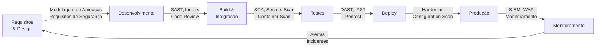
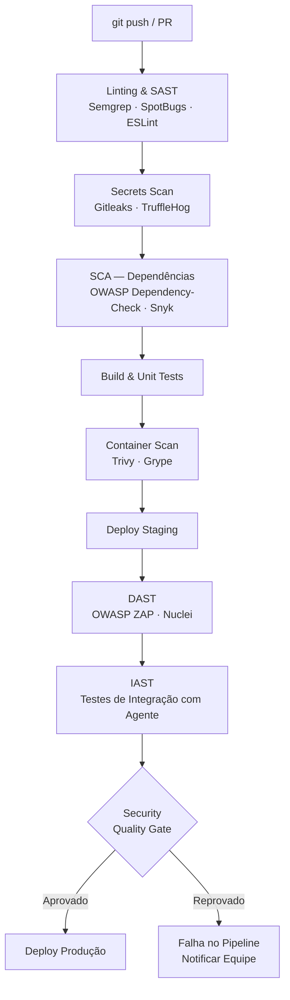

# Análise de Segurança de Software — Guia Abrangente

> **Objetivo:** Detectar e corrigir falhas de segurança em todas as fases do ciclo de vida de desenvolvimento (SDLC) e em todas as camadas da aplicação — frontend, backend e banco de dados.

---

## Sumário

1. [DevSecOps e Shift Left Security](#1-devsecops-e-shift-left-security)
2. [Modelagem de Ameaças](#2-modelagem-de-ameaças)
3. [OWASP Top 10 — Referência de Vulnerabilidades](#3-owasp-top-10--referência-de-vulnerabilidades)
4. [Análise Estática de Código (SAST)](#4-análise-estática-de-código-sast)
5. [Análise de Composição de Software (SCA)](#5-análise-de-composição-de-software-sca)
6. [Gestão de Secrets e Credenciais](#6-gestão-de-secrets-e-credenciais)
7. [Segurança no Frontend](#7-segurança-no-frontend)
8. [Segurança no Backend (Java/Spring)](#8-segurança-no-backend-javaspring)
9. [Segurança no Banco de Dados](#9-segurança-no-banco-de-dados)
10. [Análise Dinâmica (DAST)](#10-análise-dinâmica-dast)
11. [Testes de Penetração (Pentest)](#11-testes-de-penetração-pentest)
12. [Pipeline de CI/CD Seguro (DevSecOps Pipeline)](#12-pipeline-de-cicd-seguro-devsecops-pipeline)
13. [Segurança em Containers e Infraestrutura](#13-segurança-em-containers-e-infraestrutura)
14. [Monitoramento e Resposta a Incidentes em Produção](#14-monitoramento-e-resposta-a-incidentes-em-produção)
15. [Checklist de Segurança por Fase](#15-checklist-de-segurança-por-fase)

---

## 1. DevSecOps e Shift Left Security

### 1.1 Conceito

**DevSecOps** integra segurança diretamente nas práticas de desenvolvimento e operações, tornando-a responsabilidade de toda a equipe — não apenas do time de segurança. O princípio central é o **Shift Left**: antecipar as verificações de segurança para as fases mais iniciais do ciclo de vida, onde o custo de correção é drasticamente menor.

```
Custo de correção de falhas de segurança

ALTO  |                                        ●  Produção
      |                                  ●  Homologação
      |                          ●  Testes de Integração
      |                  ●  Desenvolvimento
BAIXO |          ●  Design / Requisitos
      +--------------------------------------------------→ Fase
                 ←─────── Shift Left ──────────
```

### 1.2 Ciclo de Vida com Segurança Integrada (Secure SDLC)



### 1.3 Responsabilidades por Papel

| Papel | Responsabilidades de Segurança |
|-------|-------------------------------|
| **Desenvolvedor** | Código seguro, correção de SAST/SCA, não commitar secrets |
| **Arquiteto** | Modelagem de ameaças, definição de padrões de segurança |
| **QA / Tester** | Testes de segurança funcionais, validação de DAST |
| **DevOps / SRE** | Pipeline seguro, hardening de infra, monitoramento |
| **Security Engineer** | Definição de políticas, pentests, revisão de arquitetura |
| **Gestor / PO** | Priorização de vulnerabilidades, conformidade regulatória |

---

## 2. Modelagem de Ameaças

A modelagem de ameaças é realizada na fase de design e deve ser revisada a cada mudança arquitetural significativa. O objetivo é identificar, priorizar e mitigar ameaças antes de escrever código.

### 2.1 Metodologia STRIDE

O STRIDE categoriza ameaças em seis tipos:

| Letra | Ameaça | Exemplo | Controle |
|-------|--------|---------|----------|
| **S** | Spoofing (Falsificação de Identidade) | Login com credenciais roubadas | Autenticação forte (MFA) |
| **T** | Tampering (Adulteração) | Modificação de dados em trânsito | Integridade (HTTPS, assinaturas) |
| **R** | Repudiation (Repúdio) | Negar ter feito uma operação | Logs de auditoria imutáveis |
| **I** | Information Disclosure (Vazamento) | Mensagens de erro com stack trace | Tratamento de erros, criptografia |
| **D** | Denial of Service (Negação de Serviço) | Sobrecarga de endpoints públicos | Rate limiting, WAF |
| **E** | Elevation of Privilege (Escalada) | Usuário comum acessando área admin | Autorização, princípio do menor privilégio |

### 2.2 Processo de Modelagem (4 Perguntas)

```
1. O que estamos construindo?
   → Diagrama de fluxo de dados (DFD): atores, processos, armazenamentos, fluxos

2. O que pode dar errado?
   → Aplicar STRIDE em cada elemento do DFD

3. O que faremos a respeito?
   → Definir controles e mitigações para cada ameaça

4. Fizemos um bom trabalho?
   → Revisar com a equipe e atualizar conforme o sistema evolui
```

### 2.3 Ferramenta: Microsoft Threat Modeling Tool

- Cria diagramas DFD automaticamente
- Gera lista de ameaças STRIDE por elemento
- Exporta relatório para rastreamento de mitigações
- Disponível gratuitamente para Windows

### 2.4 Calculando Risco com DREAD

| Critério | Descrição | Pontuação (1-10) |
|----------|-----------|-----------------|
| **D**amage | Impacto se explorado | — |
| **R**eproducibility | Facilidade de reprodução | — |
| **E**xploitability | Facilidade de exploração | — |
| **A**ffected Users | Percentual de usuários impactados | — |
| **D**iscoverability | Facilidade de descoberta | — |

`Risco = (D + R + E + A + D) / 5` → Prioriza o backlog de segurança.

---

## 3. OWASP Top 10 — Referência de Vulnerabilidades

O OWASP Top 10 (2021) lista as vulnerabilidades mais críticas em aplicações web. Serve como base mínima de checagem.

### 3.1 Lista e Controles

| # | Categoria | Descrição | Controles Principais |
|---|-----------|-----------|---------------------|
| A01 | **Broken Access Control** | Usuários acessam recursos além de suas permissões | RBAC/ABAC, testes de autorização, deny by default |
| A02 | **Cryptographic Failures** | Dados sensíveis expostos por criptografia fraca ou ausente | TLS 1.3, AES-256, bcrypt/Argon2 para senhas |
| A03 | **Injection** | SQL, LDAP, OS Command, NoSQL Injection | Prepared statements, ORMs, validação de entrada |
| A04 | **Insecure Design** | Falhas arquiteturais que não podem ser corrigidas apenas com código | Modelagem de ameaças, design patterns seguros |
| A05 | **Security Misconfiguration** | Configurações padrão inseguras, portas abertas, mensagens de erro detalhadas | Hardening, IaC com verificação de conformidade |
| A06 | **Vulnerable & Outdated Components** | Dependências com CVEs conhecidos | SCA (Dependabot, Snyk), política de atualização |
| A07 | **Identification & Authentication Failures** | Senhas fracas, falta de MFA, sessões mal gerenciadas | MFA, senhas fortes, expiração de sessão |
| A08 | **Software & Data Integrity Failures** | CI/CD não verificado, desserialização insegura | Assinatura de artefatos, SBOM, verificação de integridade |
| A09 | **Security Logging & Monitoring Failures** | Falta de logs de auditoria, monitoramento ineficaz | Logs estruturados, SIEM, alertas de anomalia |
| A10 | **Server-Side Request Forgery (SSRF)** | Servidor faz requisições a recursos internos por entrada do usuário | Validação de URLs, allowlist de destinos |

### 3.2 OWASP para APIs (API Security Top 10 — 2023)

| # | Categoria |
|---|-----------|
| API1 | Broken Object Level Authorization (BOLA/IDOR) |
| API2 | Broken Authentication |
| API3 | Broken Object Property Level Authorization |
| API4 | Unrestricted Resource Consumption |
| API5 | Broken Function Level Authorization |
| API6 | Unrestricted Access to Sensitive Business Flows |
| API7 | Server Side Request Forgery |
| API8 | Security Misconfiguration |
| API9 | Improper Inventory Management |
| API10 | Unsafe Consumption of APIs |

---

## 4. Análise Estática de Código (SAST)

SAST (**Static Application Security Testing**) analisa o código-fonte sem executar a aplicação. Detecta vulnerabilidades como SQL injection, XSS, uso de funções inseguras, vazamento de credenciais etc.

### 4.1 Ferramentas para Java/Spring

#### SonarQube / SonarCloud

Plataforma mais completa para análise de qualidade e segurança. Detecta Security Hotspots e vulnerabilidades com base em CWE e OWASP.

**Integração com Maven:**
```xml
<!-- pom.xml -->
<plugin>
    <groupId>org.sonarsource.scanner.maven</groupId>
    <artifactId>sonar-maven-plugin</artifactId>
    <version>4.0.0.4121</version>
</plugin>
```

**Executar análise:**
```bash
mvn verify sonar:sonar \
  -Dsonar.projectKey=meu-projeto \
  -Dsonar.host.url=http://localhost:9000 \
  -Dsonar.token=$SONAR_TOKEN
```

**Quality Gate de segurança mínimo recomendado:**
```properties
# sonar-project.properties
sonar.qualitygate.wait=true
# Falhar o build se houver vulnerabilidades ou Security Hotspots não revisados
```

#### SpotBugs + Find Security Bugs

Plugin do SpotBugs focado em bugs de segurança em Java.

```xml
<!-- pom.xml -->
<plugin>
    <groupId>com.github.spotbugs</groupId>
    <artifactId>spotbugs-maven-plugin</artifactId>
    <version>4.8.6.4</version>
    <dependencies>
        <dependency>
            <groupId>com.h3xstream.findsecbugs</groupId>
            <artifactId>findsecbugs-plugin</artifactId>
            <version>1.13.0</version>
        </dependency>
    </dependencies>
    <configuration>
        <effort>Max</effort>
        <threshold>Low</threshold>
        <failOnError>true</failOnError>
        <!-- Falhar o build se encontrar bugs de alta gravidade -->
        <maxRank>14</maxRank>
    </configuration>
    <executions>
        <execution>
            <goals>
                <goal>check</goal>
            </goals>
        </execution>
    </executions>
</plugin>
```

```bash
mvn spotbugs:check
mvn spotbugs:gui   # Interface gráfica para inspecionar resultados
```

#### Semgrep

Analisador de código multi-linguagem baseado em padrões (regras). Extremamente flexível e com regras prontas para OWASP Top 10.

```bash
# Instalar
pip install semgrep

# Analisar com regras de segurança para Java
semgrep --config "p/java" --config "p/spring" --config "p/owasp-top-ten" src/

# Regra customizada (exemplo: detectar uso de MD5)
# .semgrep/no-md5.yaml
```

```yaml
# .semgrep/no-md5.yaml
rules:
  - id: uso-de-md5
    patterns:
      - pattern: MessageDigest.getInstance("MD5")
    message: "MD5 é criptograficamente inseguro. Use SHA-256 ou superior."
    languages: [java]
    severity: ERROR
    metadata:
      cwe: "CWE-327: Use of a Broken or Risky Cryptographic Algorithm"
```

#### PMD

Detecta antipadrões de código que frequentemente levam a vulnerabilidades.

```xml
<!-- pom.xml -->
<plugin>
    <groupId>org.apache.maven.plugins</groupId>
    <artifactId>maven-pmd-plugin</artifactId>
    <version>3.24.0</version>
    <configuration>
        <rulesets>
            <ruleset>/rulesets/java/security.xml</ruleset>
        </rulesets>
        <failOnViolation>true</failOnViolation>
    </configuration>
    <executions>
        <execution>
            <goals><goal>check</goal></goals>
        </execution>
    </executions>
</plugin>
```

### 4.2 Ferramentas para JavaScript/TypeScript

#### ESLint com plugins de segurança

```bash
npm install --save-dev eslint eslint-plugin-security eslint-plugin-no-unsanitized
```

```json
// .eslintrc.json
{
  "plugins": ["security", "no-unsanitized"],
  "extends": [
    "plugin:security/recommended",
    "plugin:no-unsanitized/DOM"
  ],
  "rules": {
    "security/detect-eval-with-expression": "error",
    "security/detect-non-literal-regexp": "warn",
    "security/detect-possible-timing-attacks": "warn",
    "security/detect-unsafe-regex": "error",
    "no-unsanitized/method": "error",
    "no-unsanitized/property": "error"
  }
}
```

#### Semgrep (JavaScript/TypeScript)

```bash
semgrep --config "p/javascript" --config "p/typescript" --config "p/react" src/
```

### 4.3 Comparativo de Ferramentas SAST

| Ferramenta | Linguagens | Integração CI | Pontos Fortes |
|------------|-----------|--------------|---------------|
| **SonarQube** | Java, JS, TS, Python, C# e mais | GitHub, GitLab, Jenkins | Dashboard completo, Quality Gates |
| **SpotBugs + FSB** | Java | Maven, Gradle | Especializado em Java, Find Security Bugs |
| **Semgrep** | 30+ linguagens | GitHub Actions, GitLab CI | Regras customizáveis, gratuito |
| **Checkmarx SAST** | 30+ linguagens | Todos os principais | Enterprise, baixo false-positive |
| **Veracode** | 30+ linguagens | Todos | SaaS enterprise, relatórios de conformidade |
| **PMD** | Java, JS e outros | Maven, Gradle | Antipadrões de código |
| **ESLint Security** | JS/TS | npm scripts, CI | Nativo ao ecossistema JS |

---

## 5. Análise de Composição de Software (SCA)

SCA (**Software Composition Analysis**) identifica vulnerabilidades conhecidas (CVEs) em dependências de terceiros — bibliotecas, frameworks e pacotes transitivos.

### 5.1 OWASP Dependency-Check

Ferramenta gratuita e open-source. Consulta o banco de dados NVD (National Vulnerability Database).

```xml
<!-- pom.xml -->
<plugin>
    <groupId>org.owasp</groupId>
    <artifactId>dependency-check-maven</artifactId>
    <version>10.0.4</version>
    <configuration>
        <!-- Falhar o build se CVSS >= 7.0 (HIGH ou CRITICAL) -->
        <failBuildOnCVSS>7</failBuildOnCVSS>
        <formats>
            <format>HTML</format>
            <format>JSON</format>
        </formats>
        <!-- Suprimir falsos positivos documentados -->
        <suppressionFile>dependency-check-suppressions.xml</suppressionFile>
    </configuration>
    <executions>
        <execution>
            <goals><goal>check</goal></goals>
        </execution>
    </executions>
</plugin>
```

```bash
mvn dependency-check:check
# Relatório gerado em: target/dependency-check-report.html
```

**Arquivo de supressão de falsos positivos:**
```xml
<!-- dependency-check-suppressions.xml -->
<?xml version="1.0" encoding="UTF-8"?>
<suppressions xmlns="https://jeremylong.github.io/DependencyCheck/dependency-suppression.1.3.xsd">
    <suppress>
        <notes>Falso positivo: CVE não se aplica ao nosso uso de spring-core</notes>
        <packageUrl regex="true">^pkg:maven/org\.springframework/spring-core@.*$</packageUrl>
        <cve>CVE-2024-XXXXX</cve>
    </suppress>
</suppressions>
```

### 5.2 Snyk

Plataforma SaaS com integração nativa ao GitHub/GitLab. Detecta CVEs, sugere versões corrigidas e cria PRs automáticos.

```bash
# Instalar CLI
npm install -g snyk

# Autenticar
snyk auth

# Verificar projeto Java/Maven
snyk test --all-projects

# Monitorar continuamente (registra no dashboard Snyk)
snyk monitor
```

**Integração GitHub Actions:**
```yaml
- name: Snyk Security Scan
  uses: snyk/actions/maven@master
  env:
    SNYK_TOKEN: ${{ secrets.SNYK_TOKEN }}
  with:
    args: --severity-threshold=high
```

### 5.3 Dependabot (GitHub)

Automatiza a criação de PRs para atualizar dependências vulneráveis diretamente no GitHub.

```yaml
# .github/dependabot.yml
version: 2
updates:
  - package-ecosystem: "maven"
    directory: "/"
    schedule:
      interval: "weekly"
    open-pull-requests-limit: 10
    # Agrupar atualizações de segurança em um único PR
    groups:
      security-patches:
        applies-to: security-updates
        patterns: ["*"]

  - package-ecosystem: "npm"
    directory: "/frontend"
    schedule:
      interval: "weekly"
    open-pull-requests-limit: 10
```

### 5.4 npm audit (JavaScript)

```bash
# Verificar vulnerabilidades
npm audit

# Corrigir automaticamente (apenas patches seguros)
npm audit fix

# Forçar correções (pode quebrar compatibilidade — revisar mudanças)
npm audit fix --force

# Formato JSON para integração CI
npm audit --json | jq '.metadata.vulnerabilities'

# Falhar o build se houver vulnerabilidades de alta gravidade
npm audit --audit-level=high
```

### 5.5 SBOM — Software Bill of Materials

O SBOM é um inventário completo de todos os componentes de software. Obrigatório em alguns setores regulados e essencial para resposta rápida a CVEs (ex: Log4Shell).

```bash
# Gerar SBOM com CycloneDX (Maven)
mvn org.cyclonedx:cyclonedx-maven-plugin:makeAggregateBom

# Saída: target/bom.json (formato CycloneDX)

# Analisar SBOM com Grype
grype sbom:target/bom.json
```

```xml
<!-- pom.xml -->
<plugin>
    <groupId>org.cyclonedx</groupId>
    <artifactId>cyclonedx-maven-plugin</artifactId>
    <version>2.8.2</version>
    <executions>
        <execution>
            <phase>package</phase>
            <goals><goal>makeAggregateBom</goal></goals>
        </execution>
    </executions>
</plugin>
```

---

## 6. Gestão de Secrets e Credenciais

Vazamento de secrets (senhas, API keys, tokens JWT, certificados) em repositórios é uma das vulnerabilidades mais críticas e frequentes.

### 6.1 Detecção de Secrets em Código (Pre-commit)

#### Gitleaks

```bash
# Instalar (Linux/Mac/Windows)
# https://github.com/gitleaks/gitleaks

# Verificar repositório completo
gitleaks detect --source . --report-format json --report-path gitleaks-report.json

# Verificar apenas commits não enviados
gitleaks protect --staged
```

**Configuração customizada:**
```toml
# .gitleaks.toml
[extend]
useDefault = true

[[rules]]
id = "chave-api-interna"
description = "Chave de API interna da empresa"
regex = '''EMPRESA_API_[A-Z0-9]{32}'''
tags = ["api", "interno"]

[allowlist]
# Ignorar arquivos de teste e documentação
paths = [
    '''tests/fixtures/''',
    '''docs/'''
]
# Ignorar commits específicos (ex: commit de remoção de secret)
commits = ["abc123def456"]
```

#### TruffleHog

```bash
# Verificar repositório Git (inclui todo o histórico)
trufflehog git file://. --only-verified

# Verificar repositório remoto
trufflehog github --repo https://github.com/org/repo --only-verified
```

#### Pre-commit Hook (automatizar localmente)

```yaml
# .pre-commit-config.yaml
repos:
  - repo: https://github.com/gitleaks/gitleaks
    rev: v8.18.4
    hooks:
      - id: gitleaks

  - repo: https://github.com/Yelp/detect-secrets
    rev: v1.5.0
    hooks:
      - id: detect-secrets
        args: ['--baseline', '.secrets.baseline']
```

```bash
# Instalar e ativar hooks
pip install pre-commit
pre-commit install
```

### 6.2 Gerenciamento Seguro de Secrets em Runtime

#### Spring Boot — Externalizar configurações sensíveis

**Nunca** colocar credenciais em `application.properties` ou `application.yml` commitados no repositório.

```yaml
# application.yml — usar variáveis de ambiente
spring:
  datasource:
    url: ${DB_URL}
    username: ${DB_USERNAME}
    password: ${DB_PASSWORD}
  security:
    oauth2:
      client:
        registration:
          google:
            client-secret: ${GOOGLE_CLIENT_SECRET}
```

```bash
# .env.example (commitado — sem valores reais)
DB_URL=jdbc:postgresql://localhost:5432/mydb
DB_USERNAME=
DB_PASSWORD=
GOOGLE_CLIENT_SECRET=

# .env (NÃO commitado — valores reais)
# Adicionar .env ao .gitignore
```

#### HashiCorp Vault

Solução enterprise para gerenciamento centralizado de secrets com rotação automática.

```xml
<!-- pom.xml -->
<dependency>
    <groupId>org.springframework.cloud</groupId>
    <artifactId>spring-cloud-starter-vault-config</artifactId>
</dependency>
```

```yaml
# bootstrap.yml
spring:
  cloud:
    vault:
      host: vault.empresa.internal
      port: 8200
      scheme: https
      authentication: APPROLE
      app-role:
        role-id: ${VAULT_ROLE_ID}
        secret-id: ${VAULT_SECRET_ID}
      kv:
        enabled: true
        backend: secret
        default-context: minha-aplicacao
```

#### AWS Secrets Manager / Azure Key Vault / GCP Secret Manager

Para aplicações em nuvem, usar o serviço nativo de gerenciamento de secrets do provedor.

```java
// Exemplo: AWS Secrets Manager com SDK
@Component
public class SecretProvider {

    private final SecretsManagerClient secretsClient;

    public String getSecret(String secretName) {
        GetSecretValueRequest request = GetSecretValueRequest.builder()
            .secretId(secretName)
            .build();
        return secretsClient.getSecretValue(request).secretString();
    }
}
```

### 6.3 .gitignore Essencial de Segurança

```gitignore
# Credenciais e secrets
.env
.env.*
!.env.example
*.pem
*.key
*.p12
*.jks
*.pfx
secrets/
credentials/

# IDEs (podem conter configurações com senhas)
.idea/
*.iws

# Logs (podem conter dados sensíveis)
*.log
logs/

# Diretórios de build
target/
build/
dist/
node_modules/
```

---

## 7. Segurança no Frontend

### 7.1 Cross-Site Scripting (XSS)

XSS ocorre quando dados do usuário são inseridos em HTML sem sanitização adequada, permitindo execução de JavaScript malicioso.

**Tipos:**
- **Reflected XSS:** payload na URL, executado imediatamente
- **Stored XSS:** payload salvo no banco e exibido a outros usuários
- **DOM-based XSS:** manipulação insegura do DOM via JavaScript

**Prevenção:**

```typescript
// ❌ Perigoso — nunca usar innerHTML com dados do usuário
element.innerHTML = userData;

// ✅ Seguro — usar textContent
element.textContent = userData;

// ✅ Sanitizar HTML quando necessário (ex: editor rich text)
import DOMPurify from 'dompurify';
element.innerHTML = DOMPurify.sanitize(userData, {
    ALLOWED_TAGS: ['b', 'i', 'em', 'strong', 'a'],
    ALLOWED_ATTR: ['href']
});

// ✅ React escapa automaticamente
// JSX: <div>{userData}</div> → seguro
// dangerouslySetInnerHTML → evitar, usar apenas com sanitização
```

### 7.2 Content Security Policy (CSP)

O CSP é um header HTTP que instrui o browser sobre quais recursos podem ser carregados, mitigando XSS e ataques de injeção.

```http
# Header mais restritivo possível — ajustar conforme necessidade
Content-Security-Policy:
  default-src 'self';
  script-src 'self' 'nonce-{RANDOM_NONCE}';
  style-src 'self' 'unsafe-inline' https://fonts.googleapis.com;
  font-src 'self' https://fonts.gstatic.com;
  img-src 'self' data: https:;
  connect-src 'self' https://api.empresa.com;
  frame-src 'none';
  object-src 'none';
  base-uri 'self';
  form-action 'self';
  upgrade-insecure-requests;
```

**Spring Boot — configurar CSP:**
```java
@Bean
public SecurityFilterChain securityFilterChain(HttpSecurity http) throws Exception {
    http.headers(headers -> headers
        .contentSecurityPolicy(csp -> csp
            .policyDirectives("default-src 'self'; " +
                "script-src 'self'; " +
                "style-src 'self'; " +
                "img-src 'self' data:; " +
                "frame-ancestors 'none';")
        )
        .frameOptions(frame -> frame.deny())
        .xssProtection(xss -> xss.disable()) // Deprecado no Chrome; usar CSP
        .contentTypeOptions(Customizer.withDefaults())
        .referrerPolicy(ref -> ref
            .policy(ReferrerPolicyHeaderWriter.ReferrerPolicy.STRICT_ORIGIN_WHEN_CROSS_ORIGIN))
        .permissionsPolicy(permissions -> permissions
            .policy("geolocation=(), microphone=(), camera=()"))
    );
    return http.build();
}
```

### 7.3 CSRF — Cross-Site Request Forgery

CSRF força um usuário autenticado a executar ações indesejadas em outra aba ou site malicioso.

```java
// Spring Security — CSRF habilitado por padrão para SSR (Thymeleaf)
// Para SPA com JWT stateless, pode ser desabilitado:
http.csrf(csrf -> csrf.disable()); // apenas se usando JWT Bearer token

// Para apps SSR com sessão:
http.csrf(csrf -> csrf
    .csrfTokenRepository(CookieCsrfTokenRepository.withHttpOnlyFalse())
    .csrfTokenRequestHandler(new XorCsrfTokenRequestAttributeHandler())
);
```

```html
<!-- Thymeleaf — token CSRF automático em formulários -->
<form th:action="@{/transferencia}" method="post">
    <input type="hidden" th:name="${_csrf.parameterName}" th:value="${_csrf.token}"/>
    <!-- campos do formulário -->
</form>
```

### 7.4 Headers de Segurança HTTP

```java
// Spring Security — Headers completos
@Bean
public SecurityFilterChain securityFilterChain(HttpSecurity http) throws Exception {
    http.headers(headers -> headers
        // Previne clickjacking
        .frameOptions(frame -> frame.deny())
        // Força HTTPS por 1 ano (incluindo subdomínios)
        .httpStrictTransportSecurity(hsts -> hsts
            .includeSubDomains(true)
            .maxAgeInSeconds(31536000)
            .preload(true))
        // Previne MIME sniffing
        .contentTypeOptions(Customizer.withDefaults())
        // Referrer Policy
        .referrerPolicy(ref -> ref
            .policy(ReferrerPolicyHeaderWriter.ReferrerPolicy.STRICT_ORIGIN_WHEN_CROSS_ORIGIN))
        // Permissions Policy
        .permissionsPolicy(perm -> perm
            .policy("accelerometer=(), camera=(), geolocation=(), " +
                    "gyroscope=(), magnetometer=(), microphone=(), " +
                    "payment=(), usb=()"))
    );
    return http.build();
}
```

**Verificar headers em produção:**
- [securityheaders.com](https://securityheaders.com) — analisa headers de qualquer URL
- [observatory.mozilla.org](https://observatory.mozilla.org) — análise completa de segurança

### 7.5 Subresource Integrity (SRI)

Verifica a integridade de recursos externos (CDN) antes de executá-los.

```html
<!-- Hash SHA-384 garante que o arquivo não foi adulterado -->
<script
  src="https://cdn.jsdelivr.net/npm/bootstrap@5.3.3/dist/js/bootstrap.bundle.min.js"
  integrity="sha384-YvpcrYf0tY3lHB60NNkmXc4s9bIOgUxi8T/jzmLXBFRmCKmxnfUQhkRnlHMHBjY"
  crossorigin="anonymous">
</script>
```

### 7.6 HTTPS e Cookies Seguros

```javascript
// Configurar cookies seguros (Node.js/Express)
app.use(session({
    secret: process.env.SESSION_SECRET,
    cookie: {
        httpOnly: true,    // Inacessível via JavaScript
        secure: true,      // Apenas via HTTPS
        sameSite: 'strict', // Previne CSRF
        maxAge: 3600000    // 1 hora
    }
}));
```

```java
// Spring Boot — cookies seguros
server:
  servlet:
    session:
      cookie:
        http-only: true
        secure: true
        same-site: strict
```

### 7.7 Ferramentas de Segurança Frontend

| Ferramenta | Propósito |
|------------|-----------|
| **ESLint Security Plugin** | SAST para JavaScript/TypeScript |
| **npm audit** | SCA para pacotes npm |
| **Snyk** | SCA com PRs automáticos |
| **DOMPurify** | Sanitização de HTML em runtime |
| **helmet.js** | Headers de segurança para Express/Node.js |
| **retire.js** | Detecta bibliotecas JavaScript vulneráveis |
| **OWASP ZAP** | DAST para aplicações web |

---

## 8. Segurança no Backend (Java/Spring)

### 8.1 Prevenção de SQL Injection

SQL Injection é a vulnerabilidade A03 do OWASP. Ocorre quando entrada do usuário é concatenada diretamente em queries SQL.

```java
// ❌ NUNCA FAZER — concatenação direta de input
String query = "SELECT * FROM usuarios WHERE login = '" + login + "'";
// Payload malicioso: admin' OR '1'='1  → acessa qualquer conta

// ✅ SEMPRE usar PreparedStatement
String query = "SELECT * FROM usuarios WHERE login = ?";
PreparedStatement stmt = conn.prepareStatement(query);
stmt.setString(1, login);

// ✅ JPA/Hibernate com parâmetros nomeados
@Query("SELECT u FROM Usuario u WHERE u.login = :login")
Optional<Usuario> findByLogin(@Param("login") String login);

// ✅ Spring Data JPA — derivação automática (sempre segura)
Optional<Usuario> findByLoginAndAtivo(String login, boolean ativo);

// ✅ Criteria API
CriteriaQuery<Usuario> cq = cb.createQuery(Usuario.class);
Root<Usuario> root = cq.from(Usuario.class);
cq.where(cb.equal(root.get("login"), login)); // parâmetro seguro
```

**Nunca usar:**
```java
// ❌ Concatenação em JPQL
entityManager.createQuery("FROM Usuario WHERE login = '" + login + "'");

// ❌ nativeQuery com concatenação
@Query(value = "SELECT * FROM usuarios WHERE login = '" + login + "'", nativeQuery = true)
```

### 8.2 Validação e Sanitização de Entrada

```java
// Bean Validation (Jakarta Validation)
public record CriarUsuarioRequest(
    @NotBlank
    @Size(min = 3, max = 50)
    @Pattern(regexp = "^[a-zA-Z0-9_\\.]+$", message = "Login inválido")
    String login,

    @NotBlank
    @Email
    String email,

    @NotBlank
    @Size(min = 8, max = 100)
    String senha,

    @NotNull
    @Min(0) @Max(150)
    Integer idade
) {}

// Controller
@PostMapping("/usuarios")
public ResponseEntity<UsuarioResponse> criar(
        @Valid @RequestBody CriarUsuarioRequest request) {
    // request já foi validado — rejeita se inválido
    return ResponseEntity.ok(usuarioService.criar(request));
}

// Tratamento de erro de validação
@ExceptionHandler(MethodArgumentNotValidException.class)
public ResponseEntity<Map<String, String>> handleValidationErrors(
        MethodArgumentNotValidException ex) {
    // ❌ Não retornar mensagens de erro detalhadas em produção
    Map<String, String> errors = ex.getBindingResult()
        .getFieldErrors().stream()
        .collect(toMap(FieldError::getField, FieldError::getDefaultMessage));
    return ResponseEntity.badRequest().body(errors);
}
```

### 8.3 Autenticação e Autorização Seguras

```java
// PasswordEncoder — usar BCrypt ou Argon2 (NUNCA MD5/SHA-1)
@Bean
public PasswordEncoder passwordEncoder() {
    // BCrypt com fator de custo 12 (padrão é 10)
    return new BCryptPasswordEncoder(12);
}

// Argon2 — recomendado pelo OWASP para novas implementações
@Bean
public PasswordEncoder passwordEncoder() {
    return new Argon2PasswordEncoder(
        16,    // saltLength
        32,    // hashLength
        1,     // parallelism
        65536, // memory (64 KB)
        3      // iterations
    );
}

// Autorização — verificação de posse (previne IDOR/BOLA)
@PreAuthorize("@pedidoSecurity.isPropietario(#id, authentication)")
@GetMapping("/pedidos/{id}")
public ResponseEntity<PedidoResponse> buscar(@PathVariable Long id) {
    return ResponseEntity.ok(pedidoService.buscar(id));
}

// Componente de verificação de propriedade
@Component("pedidoSecurity")
public class PedidoSecurity {
    private final PedidoRepository pedidoRepo;

    public boolean isPropietario(Long pedidoId, Authentication auth) {
        String login = auth.getName();
        return pedidoRepo.existsByIdAndUsuarioLogin(pedidoId, login);
    }
}
```

### 8.4 Tratamento Seguro de Erros

```java
// ✅ Handler global — nunca expor stack traces em produção
@RestControllerAdvice
public class GlobalExceptionHandler {

    private static final Logger log = LoggerFactory.getLogger(GlobalExceptionHandler.class);

    // Erros esperados — informações controladas ao cliente
    @ExceptionHandler(RecursoNaoEncontradoException.class)
    public ResponseEntity<ProblemDetail> handleNotFound(RecursoNaoEncontradoException ex) {
        ProblemDetail problem = ProblemDetail.forStatusAndDetail(
            HttpStatus.NOT_FOUND, ex.getMessage());
        problem.setTitle("Recurso não encontrado");
        return ResponseEntity.status(HttpStatus.NOT_FOUND).body(problem);
    }

    // Erros inesperados — logar internamente, retornar mensagem genérica
    @ExceptionHandler(Exception.class)
    public ResponseEntity<ProblemDetail> handleGeneric(Exception ex, HttpServletRequest req) {
        // Log completo internamente com correlation ID
        String correlationId = UUID.randomUUID().toString();
        log.error("Erro não tratado [correlationId={}] em {}: {}",
            correlationId, req.getRequestURI(), ex.getMessage(), ex);

        // ❌ NÃO retornar: ex.getMessage(), stack trace, nomes de classes internas
        ProblemDetail problem = ProblemDetail.forStatus(HttpStatus.INTERNAL_SERVER_ERROR);
        problem.setTitle("Erro interno");
        problem.setDetail("Erro inesperado. Referência: " + correlationId);
        return ResponseEntity.status(500).body(problem);
    }
}
```

### 8.5 Proteção contra SSRF (Server-Side Request Forgery)

```java
// Validar e restringir URLs recebidas do usuário
@Component
public class UrlValidator {

    private static final Set<String> ALLOWED_HOSTS = Set.of(
        "api.parceiro.com", "cdn.empresa.com"
    );

    public void validar(String url) {
        try {
            URI uri = new URI(url);

            // Bloquear esquemas não-HTTP
            if (!Set.of("http", "https").contains(uri.getScheme())) {
                throw new IllegalArgumentException("Esquema não permitido: " + uri.getScheme());
            }

            // Allowlist de hosts
            if (!ALLOWED_HOSTS.contains(uri.getHost())) {
                throw new IllegalArgumentException("Host não permitido: " + uri.getHost());
            }

            // Bloquear IPs privados/internos
            InetAddress address = InetAddress.getByName(uri.getHost());
            if (address.isSiteLocalAddress() || address.isLoopbackAddress()
                    || address.isLinkLocalAddress()) {
                throw new IllegalArgumentException("Acesso a endereço interno não permitido");
            }
        } catch (URISyntaxException | UnknownHostException e) {
            throw new IllegalArgumentException("URL inválida");
        }
    }
}
```

### 8.6 Rate Limiting e Proteção contra Força Bruta

```java
// Bucket4j — rate limiting baseado em token bucket
@Bean
public FilterRegistrationBean<RateLimitFilter> rateLimitFilter() {
    FilterRegistrationBean<RateLimitFilter> filter = new FilterRegistrationBean<>();
    filter.setFilter(new RateLimitFilter());
    filter.addUrlPatterns("/api/auth/*"); // Proteger endpoints de autenticação
    filter.setOrder(1);
    return filter;
}

// Implementação com Bucket4j + Redis
@Component
public class AuthRateLimiter {

    private final BucketProxyManager<String> bucketManager;

    public boolean isAllowed(String clienteIp) {
        Bucket bucket = bucketManager.builder()
            .addLimit(Bandwidth.classic(5, Refill.intervally(5, Duration.ofMinutes(1))))
            .build(clienteIp);

        return bucket.tryConsume(1);
    }
}

// Bloqueio progressivo após tentativas falhas (Account Lockout)
@Service
public class LoginAttemptService {
    private static final int MAX_TENTATIVAS = 5;
    private final Cache<String, Integer> tentativasCache;

    public void registrarFalha(String login) {
        int tentativas = tentativasCache.getOrDefault(login, 0) + 1;
        tentativasCache.put(login, tentativas);
        if (tentativas >= MAX_TENTATIVAS) {
            log.warn("Conta bloqueada por múltiplas tentativas falhas: {}", login);
        }
    }

    public boolean estaBloqueado(String login) {
        return tentativasCache.getOrDefault(login, 0) >= MAX_TENTATIVAS;
    }
}
```

### 8.7 Deserialização Segura

```java
// ❌ Deserialização insegura de objetos Java
ObjectInputStream ois = new ObjectInputStream(inputStream);
Object obj = ois.readObject(); // Vulnerável a RCE

// ✅ Usar formatos seguros (JSON) com validação de schema
ObjectMapper mapper = new ObjectMapper();
// Desabilitar polimorfismo automático (vulnerabilidade crítica)
mapper.deactivateDefaultTyping();
// Usar apenas tipos conhecidos
MeuDTO dto = mapper.readValue(json, MeuDTO.class);

// ✅ Se necessário deserializar Java, usar lista de permitidos
ObjectInputStream ois = new ValidatingObjectInputStream(inputStream);
((ValidatingObjectInputStream) ois).accept(MeuDTO.class, OutroDTO.class);
// Rejeita qualquer outra classe
```

---

## 9. Segurança no Banco de Dados

### 9.1 Princípio do Menor Privilégio

Cada serviço deve ter apenas as permissões necessárias para operar. Nunca usar o usuário `root`/`sa`/`postgres` em aplicações.

```sql
-- PostgreSQL — criação de usuário com permissões mínimas

-- Usuário da aplicação (apenas DML)
CREATE USER app_usuario WITH PASSWORD 'senha_forte_aqui';
GRANT CONNECT ON DATABASE meu_banco TO app_usuario;
GRANT USAGE ON SCHEMA public TO app_usuario;
GRANT SELECT, INSERT, UPDATE, DELETE ON ALL TABLES IN SCHEMA public TO app_usuario;
GRANT USAGE, SELECT ON ALL SEQUENCES IN SCHEMA public TO app_usuario;
-- Garantir que permissões se aplicam a tabelas futuras
ALTER DEFAULT PRIVILEGES IN SCHEMA public
    GRANT SELECT, INSERT, UPDATE, DELETE ON TABLES TO app_usuario;

-- Usuário de leitura para relatórios/BI
CREATE USER app_relatorios WITH PASSWORD 'senha_forte_relatorios';
GRANT CONNECT ON DATABASE meu_banco TO app_relatorios;
GRANT USAGE ON SCHEMA public TO app_relatorios;
GRANT SELECT ON ALL TABLES IN SCHEMA public TO app_relatorios;

-- Usuário de migração (apenas para Flyway/Liquibase — não usar em runtime)
CREATE USER app_migracao WITH PASSWORD 'senha_forte_migracao';
GRANT ALL PRIVILEGES ON DATABASE meu_banco TO app_migracao;
```

```yaml
# application.yml — separar datasources por privilégio
spring:
  datasource:
    primary:
      url: ${DB_URL}
      username: ${DB_APP_USERNAME}   # Apenas DML
      password: ${DB_APP_PASSWORD}
  flyway:
    url: ${DB_URL}
    user: ${DB_MIGRATION_USERNAME}   # DDL para migrações
    password: ${DB_MIGRATION_PASSWORD}
```

### 9.2 Criptografia de Dados em Repouso

```sql
-- PostgreSQL — pgcrypto para criptografia em nível de coluna
CREATE EXTENSION IF NOT EXISTS pgcrypto;

-- Criptografar CPF (dado sensível)
INSERT INTO pessoas (nome, cpf_cifrado)
VALUES ('João', pgp_sym_encrypt('123.456.789-00', current_setting('app.encryption_key')));

-- Descriptografar
SELECT nome, pgp_sym_decrypt(cpf_cifrado::bytea, current_setting('app.encryption_key'))
FROM pessoas;

-- Hash de dados para pesquisa (sem necessidade de descriptografar)
-- Ex: buscar por CPF sem armazená-lo em claro
INSERT INTO pessoas (nome, cpf_hash)
VALUES ('João', encode(digest('12345678900', 'sha256'), 'hex'));
```

**Transparent Data Encryption (TDE):** Criptografia em nível de disco, suportada por PostgreSQL Enterprise, MySQL Enterprise, SQL Server e Oracle.

### 9.3 Auditoria de Banco de Dados

```sql
-- PostgreSQL — habilitar auditoria com pgaudit
ALTER SYSTEM SET shared_preload_libraries = 'pgaudit';
ALTER SYSTEM SET pgaudit.log = 'ddl, write, role';
ALTER SYSTEM SET pgaudit.log_relation = 'on';
SELECT pg_reload_conf();

-- Log de todas as queries na tabela de pagamentos
ALTER TABLE pagamentos ENABLE ROW LEVEL SECURITY;
```

```java
// JPA Auditing com Spring Data
@Entity
@EntityListeners(AuditingEntityListener.class)
public class Pedido {

    @CreatedBy
    @Column(updatable = false)
    private String criadoPor;

    @LastModifiedBy
    private String alteradoPor;

    @CreatedDate
    @Column(updatable = false)
    private LocalDateTime criadoEm;

    @LastModifiedDate
    private LocalDateTime alteradoEm;
}

// Configuração de Auditing
@Configuration
@EnableJpaAuditing(auditorAwareRef = "auditorProvider")
public class JpaConfig {
    @Bean
    public AuditorAware<String> auditorProvider() {
        return () -> Optional.ofNullable(SecurityContextHolder.getContext().getAuthentication())
            .map(Authentication::getName);
    }
}
```

### 9.4 Migrações de Banco Seguras

```java
// Flyway — controle de versão de schema
// Arquivo: src/main/resources/db/migration/V1__criar_tabelas.sql
// Nunca armazenar dados sensíveis em scripts de migração commitados

// Flyway Vault Secrets (para dados de migração sensíveis)
// Usar variáveis de ambiente nos scripts:
// INSERT INTO config VALUES ('api_key', '${API_KEY_INICIAL}');
```

### 9.5 Prevenção de Injeção em NoSQL (MongoDB)

```java
// ❌ Query insegura — susceptível a NoSQL Injection
Query query = new Query(
    Criteria.where("login").is(req.getParameter("login"))
             .and("senha").is(req.getParameter("senha"))
);
// Payload malicioso: login={$ne: null}&senha={$ne: null} → acessa qualquer conta

// ✅ Usar tipos fortemente tipados e @Valid no DTO
@Valid @RequestBody LoginRequest request  // LoginRequest com @NotBlank nos campos

// ✅ Spring Data MongoDB — derivação de queries (sempre segura)
Optional<Usuario> findByLoginAndSenhaHash(String login, String senhaHash);
```

### 9.6 Backups e Recuperação Seguros

```bash
# PostgreSQL — backup criptografado
pg_dump -U postgres meu_banco | \
    gpg --symmetric --cipher-algo AES256 \
    --output backup_$(date +%Y%m%d).sql.gpg

# Verificar integridade do backup
sha256sum backup_*.sql.gpg > checksums.txt

# Restaurar
gpg --decrypt backup_20240101.sql.gpg | psql -U postgres meu_banco
```

---

## 10. Análise Dinâmica (DAST)

DAST (**Dynamic Application Security Testing**) testa a aplicação em execução, simulando ataques reais contra a interface HTTP. Encontra vulnerabilidades que SAST não detecta (problemas de runtime, configuração, lógica de negócio).

### 10.1 OWASP ZAP (Zed Attack Proxy)

Ferramenta open-source mais usada para DAST. Funciona como proxy interceptador e tem modo automatizado para CI/CD.

**Modo automatizado (Docker):**
```bash
# Full Scan — mais completo, pode demorar
docker run --rm \
    -v $(pwd)/zap-reports:/zap/wrk/:rw \
    ghcr.io/zaproxy/zaproxy:stable zap-full-scan.py \
    -t https://minha-app-staging.empresa.com \
    -r relatorio-zap.html \
    -J relatorio-zap.json \
    -x relatorio-zap.xml \
    -I  # Não falhar o build (usar apenas no início; depois remover -I)

# API Scan — para APIs REST (usa especificação OpenAPI)
docker run --rm \
    -v $(pwd)/zap-reports:/zap/wrk/:rw \
    ghcr.io/zaproxy/zaproxy:stable zap-api-scan.py \
    -t https://minha-app-staging.empresa.com/v3/api-docs \
    -f openapi \
    -r relatorio-api-zap.html

# Baseline Scan — mais rápido, para feedback rápido em PRs
docker run --rm \
    ghcr.io/zaproxy/zaproxy:stable zap-baseline.py \
    -t https://minha-app-staging.empresa.com
```

**Integração com GitHub Actions:**
```yaml
- name: OWASP ZAP API Scan
  uses: zaproxy/action-api-scan@v0.8.0
  with:
    target: 'https://staging.empresa.com/v3/api-docs'
    format: openapi
    fail_action: true
    rules_file_name: '.zap/rules.tsv'

- name: Upload ZAP Report
  uses: actions/upload-artifact@v4
  with:
    name: zap-report
    path: report_html.html
```

**Arquivo de regras customizadas (`.zap/rules.tsv`):**
```tsv
# ID	ACTION	PARAMETER	DESCRIPTION
10202	IGNORE	(null)	Ausência de Anti-CSRF tokens (aceito pois usamos JWT)
10011	WARN	(null)	Cookie Without Secure Flag
```

### 10.2 Burp Suite

Ferramenta profissional para pentest e DAST interativo. A versão Community é gratuita; a Professional tem scanner automatizado.

**Funcionalidades principais:**
- **Proxy:** intercepta e modifica requisições/respostas
- **Intruder:** fuzzing e ataques de força bruta
- **Repeater:** repetição e modificação manual de requisições
- **Scanner (Pro):** varredura automatizada de vulnerabilidades
- **Collaborator:** detecta SSRF, XXE e injeções out-of-band

### 10.3 Nuclei

Scanner de vulnerabilidades baseado em templates YAML. Muito rápido e extensível.

```bash
# Instalar
go install -v github.com/projectdiscovery/nuclei/v3/cmd/nuclei@latest

# Verificar aplicação com todos os templates
nuclei -u https://staging.empresa.com -severity critical,high,medium

# Verificar apenas tecnologias específicas
nuclei -u https://staging.empresa.com -tags spring,java,jwt

# Verificar com template customizado
nuclei -u https://staging.empresa.com -t meus-templates/
```

### 10.4 IAST — Interactive Application Security Testing

IAST usa agentes instrumentados dentro da aplicação (em staging/teste) para detectar vulnerabilidades em tempo de execução com muito menor taxa de falsos positivos que DAST.

**Ferramentas:**
- **Contrast Security** — agente Java que monitora fluxos de dados em runtime
- **Seeker (Synopsys)** — instrumentação passiva de testes existentes
- **HCL AppScan** — suite completa com SAST, DAST e IAST

```xml
<!-- Contrast Security — adicionar agente Java como agente JVM -->
<!-- Configuração na inicialização da aplicação: -->
<!-- java -javaagent:/path/to/contrast.jar -jar minha-app.jar -->
```

---

## 11. Testes de Penetração (Pentest)

### 11.1 Fases de um Pentest

```
1. Reconhecimento (Reconnaissance)
   ├── Passivo: OSINT, Shodan, análise de DNS, SSL certs
   └── Ativo: varredura de portas (Nmap), fingerprinting

2. Enumeração (Scanning/Enumeration)
   ├── Mapeamento de endpoints, parâmetros, formulários
   └── Identificação de tecnologias (Wappalyzer, whatweb)

3. Análise de Vulnerabilidades
   ├── DAST automatizado (ZAP, Burp Scanner)
   └── Verificação manual de lógica de negócio

4. Exploração (Exploitation)
   ├── Explorar vulnerabilidades identificadas
   └── Provar impacto real (não apenas detectar)

5. Pós-Exploração
   ├── Escalada de privilégio
   └── Movimentação lateral (se em escopo de rede)

6. Relatório
   ├── Evidências de cada vulnerabilidade
   ├── CVSS Score e classificação de risco
   └── Recomendações de correção priorizadas
```

### 11.2 Ferramentas de Pentest

| Categoria | Ferramenta | Uso |
|-----------|-----------|-----|
| **Framework** | Metasploit | Exploração de vulnerabilidades conhecidas |
| **Proxy / DAST** | Burp Suite Pro | Interceptação, scanning, fuzzing |
| **Reconhecimento** | Nmap | Varredura de portas e serviços |
| **Reconhecimento Web** | Nikto | Varredura de vulnerabilidades web |
| **Fuzzing de endpoints** | ffuf, gobuster | Descoberta de caminhos ocultos |
| **SQL Injection** | sqlmap | Exploração automatizada de SQLi |
| **JWT** | jwt_tool | Análise e ataque a tokens JWT |
| **Senhas** | Hydra, John the Ripper | Ataques de força bruta |
| **SSRF/XXE** | Interactsh | Detecção de vulnerabilidades out-of-band |
| **Subdomain Enum** | Amass, subfinder | Enumeração de subdomínios |

### 11.3 Testes de Segurança Automatizados (Unidade e Integração)

```java
// Testes de segurança com Spring Security Test
@SpringBootTest
@AutoConfigureMockMvc
class SegurancaTest {

    @Autowired
    MockMvc mockMvc;

    // Verificar que endpoints protegidos exigem autenticação
    @Test
    void endpointProtegidoDeveRetornar401SemAutenticacao() throws Exception {
        mockMvc.perform(get("/api/admin/usuarios"))
            .andExpect(status().isUnauthorized());
    }

    // Verificar que usuário comum não acessa área admin
    @Test
    @WithMockUser(roles = "USER")
    void usuarioComumNaoDeveAcessarAdmin() throws Exception {
        mockMvc.perform(get("/api/admin/usuarios"))
            .andExpect(status().isForbidden());
    }

    // Verificar proteção CSRF
    @Test
    void postSemCsrfDeveRetornar403() throws Exception {
        mockMvc.perform(post("/formulario")
                .contentType(MediaType.APPLICATION_FORM_URLENCODED)
                .param("campo", "valor"))
            .andExpect(status().isForbidden());
    }

    // Verificar headers de segurança
    @Test
    @WithMockUser
    void deveTerHeadersDeSeguranca() throws Exception {
        mockMvc.perform(get("/"))
            .andExpect(header().exists("X-Content-Type-Options"))
            .andExpect(header().string("X-Frame-Options", "DENY"))
            .andExpect(header().exists("Content-Security-Policy"))
            .andExpect(header().exists("Strict-Transport-Security"));
    }

    // Verificar prevenção de IDOR (acesso a recurso de outro usuário)
    @Test
    @WithMockUser(username = "usuario1")
    void usuarioNaoDeveAcessarPedidoDeOutroUsuario() throws Exception {
        // pedido 999 pertence a usuario2
        mockMvc.perform(get("/api/pedidos/999"))
            .andExpect(status().isForbidden());
    }
}
```

---

## 12. Pipeline de CI/CD Seguro (DevSecOps Pipeline)

### 12.1 Arquitetura do Pipeline de Segurança



### 12.2 GitHub Actions — Pipeline Completo

```yaml
# .github/workflows/security.yml
name: Security Pipeline

on:
  push:
    branches: [main, develop]
  pull_request:
    branches: [main]

jobs:
  # ── 1. Análise de Secrets ──────────────────────────────────────────────────
  secrets-scan:
    name: Secrets Scan (Gitleaks)
    runs-on: ubuntu-latest
    steps:
      - uses: actions/checkout@v4
        with:
          fetch-depth: 0  # histórico completo

      - uses: gitleaks/gitleaks-action@v2
        env:
          GITHUB_TOKEN: ${{ secrets.GITHUB_TOKEN }}
          GITLEAKS_LICENSE: ${{ secrets.GITLEAKS_LICENSE }}  # para repos privados

  # ── 2. SAST ───────────────────────────────────────────────────────────────
  sast:
    name: SAST (Semgrep + SpotBugs)
    runs-on: ubuntu-latest
    steps:
      - uses: actions/checkout@v4

      - name: Semgrep Scan
        uses: semgrep/semgrep-action@v1
        with:
          config: >-
            p/java
            p/spring
            p/owasp-top-ten
            p/security-audit
        env:
          SEMGREP_APP_TOKEN: ${{ secrets.SEMGREP_APP_TOKEN }}

      - name: Set up JDK 21
        uses: actions/setup-java@v4
        with:
          java-version: '21'
          distribution: 'temurin'

      - name: SpotBugs via Maven
        run: mvn spotbugs:check -B

  # ── 3. SCA — Análise de Dependências ──────────────────────────────────────
  sca:
    name: SCA (OWASP Dependency-Check + npm audit)
    runs-on: ubuntu-latest
    steps:
      - uses: actions/checkout@v4

      - name: Set up JDK 21
        uses: actions/setup-java@v4
        with:
          java-version: '21'
          distribution: 'temurin'

      - name: OWASP Dependency-Check (Java)
        run: mvn dependency-check:check -B
        env:
          NVD_API_KEY: ${{ secrets.NVD_API_KEY }}  # Evita rate limiting da NVD

      - name: Upload Dependency-Check Report
        uses: actions/upload-artifact@v4
        if: always()
        with:
          name: dependency-check-report
          path: target/dependency-check-report.html

      - name: npm audit (Frontend)
        run: |
          cd frontend
          npm ci
          npm audit --audit-level=high

  # ── 4. Build e Testes ─────────────────────────────────────────────────────
  build-and-test:
    name: Build, Unit Tests & Security Tests
    runs-on: ubuntu-latest
    needs: [sast, sca]
    steps:
      - uses: actions/checkout@v4

      - name: Set up JDK 21
        uses: actions/setup-java@v4
        with:
          java-version: '21'
          distribution: 'temurin'

      - name: Build and Test
        run: mvn verify -B

      - name: SonarCloud Analysis
        uses: SonarSource/sonarcloud-github-action@master
        env:
          GITHUB_TOKEN: ${{ secrets.GITHUB_TOKEN }}
          SONAR_TOKEN: ${{ secrets.SONAR_TOKEN }}
        with:
          args: >
            -Dsonar.qualitygate.wait=true

  # ── 5. Container Scan ─────────────────────────────────────────────────────
  container-scan:
    name: Container Scan (Trivy)
    runs-on: ubuntu-latest
    needs: build-and-test
    steps:
      - uses: actions/checkout@v4

      - name: Build Docker image
        run: docker build -t minha-app:${{ github.sha }} .

      - name: Run Trivy vulnerability scanner
        uses: aquasecurity/trivy-action@master
        with:
          image-ref: 'minha-app:${{ github.sha }}'
          format: 'sarif'
          output: 'trivy-results.sarif'
          severity: 'CRITICAL,HIGH'
          exit-code: '1'

      - name: Upload Trivy scan results to GitHub Security
        uses: github/codeql-action/upload-sarif@v3
        if: always()
        with:
          sarif_file: 'trivy-results.sarif'

  # ── 6. DAST (apenas em staging) ───────────────────────────────────────────
  dast:
    name: DAST (OWASP ZAP)
    runs-on: ubuntu-latest
    needs: container-scan
    if: github.ref == 'refs/heads/main'  # apenas na main
    steps:
      - name: OWASP ZAP API Scan
        uses: zaproxy/action-api-scan@v0.8.0
        with:
          target: ${{ secrets.STAGING_URL }}/v3/api-docs
          format: openapi
          fail_action: true
          cmd_options: '-a'  # aceitar certificado auto-assinado em staging

      - name: Upload ZAP Report
        uses: actions/upload-artifact@v4
        if: always()
        with:
          name: zap-report
          path: report_html.html
```

### 12.3 GitLab CI — Pipeline de Segurança

```yaml
# .gitlab-ci.yml
stages:
  - security-scan
  - build
  - container-scan
  - dast

variables:
  DOCKER_IMAGE: $CI_REGISTRY_IMAGE:$CI_COMMIT_SHA

# Templates SAST e DAST nativos do GitLab
include:
  - template: Security/SAST.gitlab-ci.yml
  - template: Security/Dependency-Scanning.gitlab-ci.yml
  - template: Security/Secret-Detection.gitlab-ci.yml
  - template: Security/Container-Scanning.gitlab-ci.yml
  - template: Security/DAST.gitlab-ci.yml

# Customizações
spotbugs-sast:
  variables:
    SAST_JAVA_VERSION: 21
    FAIL_NEVER: "false"

dependency_scanning:
  variables:
    DS_JAVA_VERSION: 21

dast:
  variables:
    DAST_WEBSITE: $STAGING_URL
    DAST_FULL_SCAN_ENABLED: "true"
  only:
    - main
```

### 12.4 Assinatura e Verificação de Artefatos (Supply Chain Security)

```bash
# Assinar imagem Docker com cosign (Sigstore)
cosign sign --key cosign.key minha-app:latest

# Verificar assinatura antes do deploy
cosign verify --key cosign.pub minha-app:latest

# Gerar SBOM e assiná-lo
syft minha-app:latest -o cyclonedx-json > sbom.json
cosign attest --predicate sbom.json --type cyclonedx --key cosign.key minha-app:latest
```

---

## 13. Segurança em Containers e Infraestrutura

### 13.1 Dockerfile Seguro

```dockerfile
# ✅ Usar imagem base mínima (distroless ou alpine)
FROM eclipse-temurin:21-jre-alpine AS runtime

# ✅ Não rodar como root
RUN addgroup -S appgroup && adduser -S appuser -G appgroup
USER appuser

# ✅ Copiar apenas o artefato necessário
WORKDIR /app
COPY --chown=appuser:appgroup target/minha-app.jar app.jar

# ✅ Definir variáveis de ambiente sem secrets
ENV JAVA_OPTS="-XX:+UseContainerSupport -XX:MaxRAMPercentage=75.0"
ENV SPRING_PROFILES_ACTIVE=prod

# ✅ Expor apenas a porta necessária
EXPOSE 8080

# ✅ Usar ENTRYPOINT com array (evita vulnerabilidade de shell injection)
ENTRYPOINT ["java", "-jar", "app.jar"]

# ❌ Evitar:
# FROM ubuntu:latest          → imagem muito grande, muitas CVEs
# USER root                   → processo com privilégios máximos
# RUN apt-get install vim     → ferramentas desnecessárias
# ADD secrets.env .           → secrets na imagem
# ENV DB_PASSWORD=minhaSenha  → secret em variável de ambiente estática
```

### 13.2 Trivy — Scanner de Containers e IaC

```bash
# Instalar
brew install trivy  # macOS
# Linux: curl -sfL https://raw.githubusercontent.com/aquasecurity/trivy/main/contrib/install.sh | sh

# Escanear imagem Docker
trivy image --severity HIGH,CRITICAL minha-app:latest

# Escanear sistema de arquivos (código-fonte e dependências)
trivy fs --security-checks vuln,config,secret .

# Escanear configurações de IaC (Terraform, Kubernetes YAML)
trivy config ./infra/

# Formato SARIF para GitHub Security
trivy image --format sarif --output trivy.sarif minha-app:latest

# Escanear com SBOM
trivy sbom sbom.json
```

### 13.3 Kubernetes — Hardening de Segurança

```yaml
# Pod Security Context — princípio do menor privilégio
apiVersion: apps/v1
kind: Deployment
metadata:
  name: minha-app
spec:
  template:
    spec:
      # Não montar token de service account automaticamente
      automountServiceAccountToken: false
      securityContext:
        runAsNonRoot: true
        runAsUser: 1000
        runAsGroup: 1000
        fsGroup: 1000
        seccompProfile:
          type: RuntimeDefault
      containers:
        - name: app
          image: minha-app:latest
          securityContext:
            allowPrivilegeEscalation: false
            readOnlyRootFilesystem: true
            capabilities:
              drop: ["ALL"]
          resources:
            # Limitar recursos previne DoS
            requests:
              memory: "256Mi"
              cpu: "250m"
            limits:
              memory: "512Mi"
              cpu: "500m"
          # Variáveis sensíveis via Secrets (não ConfigMap)
          env:
            - name: DB_PASSWORD
              valueFrom:
                secretKeyRef:
                  name: db-credentials
                  key: password
          # Volume temporário para dados mutáveis
          volumeMounts:
            - name: tmp
              mountPath: /tmp
      volumes:
        - name: tmp
          emptyDir: {}
```

```yaml
# NetworkPolicy — isolamento de rede
apiVersion: networking.k8s.io/v1
kind: NetworkPolicy
metadata:
  name: minha-app-netpol
spec:
  podSelector:
    matchLabels:
      app: minha-app
  policyTypes:
    - Ingress
    - Egress
  ingress:
    - from:
        - podSelector:
            matchLabels:
              app: nginx-ingress
      ports:
        - port: 8080
  egress:
    - to:
        - podSelector:
            matchLabels:
              app: postgresql
      ports:
        - port: 5432
    - to:  # DNS
        - namespaceSelector: {}
      ports:
        - port: 53
          protocol: UDP
```

### 13.4 Checkov — IaC Security Scanner

```bash
# Instalar
pip install checkov

# Verificar Dockerfile
checkov -d . --check CKV_DOCKER_*

# Verificar Terraform
checkov -d infra/terraform/

# Verificar Kubernetes YAML
checkov -d k8s/

# Verificar GitHub Actions workflows
checkov -d .github/workflows/

# Relatório JUnit para CI
checkov -d . --output junitxml > checkov-results.xml
```

---

## 14. Monitoramento e Resposta a Incidentes em Produção

### 14.1 Logs de Auditoria de Segurança

```java
// Logar eventos de segurança com contexto
@Slf4j
@Service
public class AuditoriaService {

    // Usar MDC para correlação de eventos
    public void registrarLoginSucesso(String login, String ip) {
        MDC.put("evento", "LOGIN_SUCESSO");
        MDC.put("usuario", login);
        MDC.put("ip", ip);
        log.info("Autenticação bem-sucedida");
        MDC.clear();
    }

    public void registrarLoginFalha(String login, String ip, String motivo) {
        MDC.put("evento", "LOGIN_FALHA");
        MDC.put("usuario_tentativa", login);
        MDC.put("ip", ip);
        MDC.put("motivo", motivo);
        log.warn("Tentativa de autenticação falhou");
        MDC.clear();
    }

    public void registrarAcessoNegado(String login, String recurso, String ip) {
        MDC.put("evento", "ACESSO_NEGADO");
        MDC.put("usuario", login);
        MDC.put("recurso", recurso);
        MDC.put("ip", ip);
        log.warn("Acesso negado a recurso protegido");
        MDC.clear();
    }

    public void registrarOperacaoCritica(String login, String operacao, String detalhes) {
        MDC.put("evento", "OPERACAO_CRITICA");
        MDC.put("usuario", login);
        MDC.put("operacao", operacao);
        MDC.put("detalhes", detalhes);
        log.info("Operação crítica realizada");
        MDC.clear();
    }
}
```

### 14.2 Spring Boot Actuator — Monitoramento Seguro

```yaml
# application.yml — expor apenas endpoints necessários
management:
  endpoints:
    web:
      exposure:
        include: health, info, metrics, prometheus
        # Nunca expor em produção: env, beans, mappings, httptrace
  endpoint:
    health:
      show-details: when-authorized
      show-components: when-authorized
  metrics:
    tags:
      application: ${spring.application.name}
```

```java
// Proteger Actuator com autenticação
@Bean
public SecurityFilterChain actuatorSecurity(HttpSecurity http) throws Exception {
    http
        .securityMatcher("/actuator/**")
        .authorizeHttpRequests(auth -> auth
            .requestMatchers("/actuator/health").permitAll()
            .requestMatchers("/actuator/**").hasRole("MONITORING")
        )
        .httpBasic(Customizer.withDefaults());
    return http.build();
}
```

### 14.3 WAF — Web Application Firewall

O WAF inspeciona e filtra tráfego HTTP antes de chegar à aplicação. Opera como última linha de defesa e proteção em produção.

**Regras principais:**
- Bloquear payloads de SQL Injection conhecidos
- Bloquear payloads de XSS
- Rate limiting por IP e por endpoint
- Geo-blocking (se aplicável)
- Bloquear user-agents maliciosos e scanners
- Proteção contra DDoS

**Opções:**
| Solução | Tipo | Pontos Fortes |
|---------|------|---------------|
| **AWS WAF** | Cloud | Integração nativa AWS, regras gerenciadas |
| **Cloudflare WAF** | Cloud/Edge | DDoS, baixa latência |
| **ModSecurity + OWASP CRS** | Open-source | Gratuito, customizável, integra com Nginx/Apache |
| **Azure Front Door WAF** | Cloud | Integração Azure |
| **Google Cloud Armor** | Cloud | Integração GCP |

### 14.4 Alertas de Segurança

```yaml
# Prometheus + Alertmanager — alertas de segurança
# alerts/security.yml
groups:
  - name: security
    rules:
      - alert: MultiplasTentativasLogin
        expr: |
          increase(http_server_requests_seconds_count{
            uri="/api/auth/login",
            status="401"
          }[5m]) > 20
        for: 1m
        labels:
          severity: warning
          category: security
        annotations:
          summary: "Múltiplas tentativas de login falhadas"
          description: "{{ $value }} tentativas falhas em 5 minutos para /api/auth/login"

      - alert: AcessoRecursoAdmin
        expr: |
          increase(http_server_requests_seconds_count{
            uri=~"/api/admin/.*",
            status="403"
          }[10m]) > 5
        labels:
          severity: critical
          category: security
        annotations:
          summary: "Tentativas de acesso não autorizado à área admin"

      - alert: TaxaErros5xxAlta
        expr: |
          rate(http_server_requests_seconds_count{status=~"5.."}[5m]) /
          rate(http_server_requests_seconds_count[5m]) > 0.05
        for: 5m
        labels:
          severity: warning
        annotations:
          summary: "Taxa de erros 5xx acima de 5%"
```

### 14.5 Resposta a Incidentes

```
Processo de Resposta a Incidentes de Segurança (PRIS)

1. DETECÇÃO
   ├── Alerta automático (SIEM, WAF, Prometheus)
   ├── Reporte manual (usuário, equipe)
   └── Descoberta em pentest / bug bounty

2. TRIAGEM E CLASSIFICAÇÃO
   ├── Severidade: CRÍTICO / ALTO / MÉDIO / BAIXO
   ├── Escopo: sistemas afetados, dados comprometidos
   └── Acionamento: quem notificar (equipe, gestão, DPO, ANPD)

3. CONTENÇÃO
   ├── Imediata: isolar sistemas, revogar tokens, bloquear IPs
   └── Curto prazo: correção de emergência (hotfix)

4. INVESTIGAÇÃO (Forense)
   ├── Analisar logs de auditoria
   ├── Identificar vetor de ataque e timeline
   └── Determinar dados comprometidos (LGPD: reportar em 72h)

5. ERRADICAÇÃO
   ├── Remover backdoors e artefatos maliciosos
   ├── Corrigir vulnerabilidade raiz
   └── Atualizar senhas/tokens comprometidos

6. RECUPERAÇÃO
   ├── Restaurar serviços com monitoramento intensivo
   └── Validar que vulnerabilidade foi corrigida

7. PÓS-INCIDENTE (Lições Aprendidas)
   ├── Relatório de incidente (RCA — Root Cause Analysis)
   ├── Atualizar runbooks e alertas
   └── Treinamento da equipe se necessário
```

---

## 15. Checklist de Segurança por Fase

### 15.1 Fase de Planejamento e Design

- [ ] Modelagem de ameaças realizada (STRIDE) e documentada
- [ ] Requisitos de segurança definidos (autenticação, autorização, criptografia)
- [ ] Dados sensíveis identificados e classificados (PII, financeiro, saúde)
- [ ] Obrigações regulatórias mapeadas (LGPD, PCI DSS, HIPAA etc.)
- [ ] Diagrama de fluxo de dados (DFD) atualizado
- [ ] Revisão de arquitetura com perspectiva de segurança

### 15.2 Fase de Desenvolvimento

**Código:**
- [ ] SAST configurado e sem falhas abertas (SonarQube, SpotBugs, Semgrep)
- [ ] Sem secrets no código (Gitleaks no pre-commit)
- [ ] Validação de entrada em todos os endpoints (`@Valid`)
- [ ] Queries parametrizadas (sem concatenação de SQL)
- [ ] Tratamento de erros sem exposição de detalhes internos
- [ ] Autenticação e autorização implementadas corretamente
- [ ] Senhas com hash seguro (BCrypt/Argon2)
- [ ] Logs de auditoria para operações sensíveis

**Frontend:**
- [ ] CSP configurado e testado
- [ ] Headers de segurança configurados (HSTS, X-Frame-Options, etc.)
- [ ] Sem uso de `innerHTML` com dados do usuário
- [ ] Cookies com `HttpOnly`, `Secure` e `SameSite`
- [ ] SRI para recursos externos

**Banco de Dados:**
- [ ] Usuário de aplicação sem privilégios DDL
- [ ] Dados sensíveis criptografados
- [ ] Backups criptografados e testados
- [ ] Auditoria de banco habilitada

### 15.3 Fase de Build e CI

- [ ] SCA sem dependências com CVSS >= 7.0 (OWASP Dependency-Check, Snyk)
- [ ] npm audit sem vulnerabilidades HIGH/CRITICAL
- [ ] SBOM gerado e assinado
- [ ] Secrets scan no histórico do repositório (Gitleaks)
- [ ] Quality Gate do SonarQube aprovado
- [ ] Container scan sem CVEs CRITICAL/HIGH (Trivy)
- [ ] Dockerfile seguro (non-root, minimal image)
- [ ] IaC verificado (Checkov)

### 15.4 Fase de Testes

- [ ] Testes de segurança automatizados (Spring Security Test)
- [ ] DAST executado em ambiente de staging (OWASP ZAP)
- [ ] Testes de controle de acesso (IDOR, privilege escalation)
- [ ] Testes de limite de taxa (rate limiting)
- [ ] Validação de headers de segurança
- [ ] Pentest realizado (pelo menos anualmente ou a cada release major)

### 15.5 Fase de Deploy e Produção

- [ ] Variáveis de ambiente com secrets (sem hardcode)
- [ ] Secrets gerenciados por Vault/Secrets Manager
- [ ] TLS 1.2+ com certificado válido
- [ ] WAF configurado e ativo
- [ ] Monitoramento e alertas de segurança ativos
- [ ] Logs de auditoria em sistema centralizado (ELK, Splunk)
- [ ] Backup e plano de recuperação testados
- [ ] Plano de resposta a incidentes documentado
- [ ] Política de divulgação responsável (bug bounty ou canal de reporte)

---

## Referências

- [OWASP Top 10 (2021)](https://owasp.org/www-project-top-ten/)
- [OWASP API Security Top 10 (2023)](https://owasp.org/www-project-api-security/)
- [OWASP Testing Guide v4.2](https://owasp.org/www-project-web-security-testing-guide/)
- [OWASP ASVS — Application Security Verification Standard](https://owasp.org/www-project-application-security-verification-standard/)
- [NIST SP 800-115 — Technical Guide to Information Security Testing](https://csrc.nist.gov/publications/detail/sp/800-115/final)
- [CWE/SANS Top 25 Most Dangerous Software Weaknesses](https://cwe.mitre.org/top25/)
- [Spring Security Reference](https://docs.spring.io/spring-security/reference/)
- [OWASP Cheat Sheet Series](https://cheatsheetseries.owasp.org/)
- [LGPD — Lei Geral de Proteção de Dados (Lei nº 13.709/2018)](https://www.planalto.gov.br/ccivil_03/_ato2015-2018/2018/lei/l13709.htm)
- [DevSecOps — OWASP DevSecOps Guideline](https://owasp.org/www-project-devsecops-guideline/)
