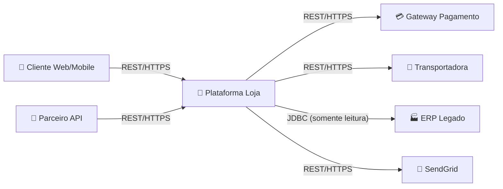

# Boas Práticas e Arquitetura de Software

Este documento reúne conceitos fundamentais de engenharia de software com exemplos práticos em Java e Spring Boot:

- **12 Factor App**: metodologia para construir aplicações modernas, escaláveis e portáteis;
- **SOLID**: cinco princípios de design orientado a objetos para código mantível e extensível;
- **Clean Code**: práticas de escrita de código legível, expressivo e fácil de manter;
- **Design Patterns (GoF)**: padrões clássicos de projeto com aplicações práticas em Spring Boot;
- **DDD (Domain-Driven Design)**: modelagem centrada no domínio com Aggregates, Value Objects e Domain Events;
- **Refactoring**: técnicas para melhorar o código existente sem alterar seu comportamento;
- **Arquitetura Onion/Hexagonal**: separação de responsabilidades que isola o domínio de detalhes de infraestrutura;
- **Práticas de Design de API**: Richardson Maturity Model, convenções REST, versionamento, idempotência, HATEOAS, OpenAPI e Contract Testing;
- **TDD (Test-Driven Development)**: prática de escrever testes antes do código de produção;
- **Requirement Driven Development (RDD) com IA**: técnica de escrita de requisitos estruturados para orientar agentes de IA na geração de código.

Os exemplos seguem Spring Boot 3.x e Jakarta EE.

---

## 1. 12 Factor App

A metodologia [12 Factor App](https://12factor.net/) define doze práticas para construir software como serviço (SaaS) que seja portável, resiliente e fácil de escalar. Cada fator é descrito abaixo com sua aplicação em Spring Boot.

### Fator I — Codebase (Base de Código)

> Uma base de código rastreada em controle de versão; múltiplos deploys.

Cada aplicação Spring Boot deve ter seu próprio repositório Git. Ambientes (dev, staging, prod) são deploys distintos da mesma base.

```
minha-api/
├── src/
├── pom.xml
└── .git/          ← único repositorio, multiplos ambientes via variaveis
```

### Fator II — Dependencies (Dependências)

> Declare e isole dependências explicitamente.

O Maven (`pom.xml`) declara todas as dependências. Nunca dependa de bibliotecas instaladas globalmente no servidor.

```xml
<!-- pom.xml -->
<dependencies>
    <dependency>
        <groupId>org.springframework.boot</groupId>
        <artifactId>spring-boot-starter-web</artifactId>
    </dependency>
    <dependency>
        <groupId>org.springframework.boot</groupId>
        <artifactId>spring-boot-starter-data-jpa</artifactId>
    </dependency>
    <dependency>
        <groupId>org.postgresql</groupId>
        <artifactId>postgresql</artifactId>
        <scope>runtime</scope>
    </dependency>
</dependencies>
```

### Fator III — Config (Configuração)

> Armazene configurações no ambiente, não no código.

Nunca hardcode URLs, senhas ou chaves. Use variáveis de ambiente ou `application.yml` com placeholders.

```yaml
# application.yml
spring:
  datasource:
    url: ${DATABASE_URL}
    username: ${DATABASE_USER}
    password: ${DATABASE_PASSWORD}

app:
  jwt:
    secret: ${JWT_SECRET}
    expiration-ms: ${JWT_EXPIRATION_MS:3600000}
```

```java
@ConfigurationProperties(prefix = "app.jwt")
@Validated
public class JwtProperties {

    @NotBlank
    private String secret;

    @Positive
    private long expirationMs;

    // getters e setters
}
```

### Fator IV — Backing Services (Serviços de Apoio)

> Trate serviços externos (banco, fila, cache) como recursos anexados.

Troque o banco ou o broker apenas alterando a configuração, sem mudar o código.

```yaml
# dev: banco local
spring.datasource.url: jdbc:postgresql://localhost:5432/mydb

# prod: banco gerenciado via variavel de ambiente
spring.datasource.url: ${DATABASE_URL}
```

```java
// O repositorio não sabe qual banco esta sendo usado
public interface PedidoRepository extends JpaRepository<Pedido, Long> {
    List<Pedido> findByClienteId(Long clienteId);
}
```

### Fator V — Build, Release, Run (Construir, Lançar, Executar)

> Separe rigorosamente as etapas de build, release e execução.

Com Maven e Docker:

```dockerfile
# Dockerfile multistage
FROM eclipse-temurin:21-jdk AS build
WORKDIR /app
COPY pom.xml .
COPY src ./src
RUN ./mvnw package -DskipTests

FROM eclipse-temurin:21-jre
WORKDIR /app
COPY --from=build /app/target/*.jar app.jar
ENTRYPOINT ["java", "-jar", "app.jar"]
```

Pipeline CI/CD (exemplo conceitual):
```
git push → build (mvn package) → release (tag + imagem Docker) → run (deploy no Kubernetes)
```

### Fator VI — Processes (Processos)

> Execute a aplicação como um ou mais processos sem estado.

Não armazene estado em memória entre requisições. Use banco de dados ou cache distribuído (Redis) para estado compartilhado.

```java
// ERRADO: estado em campo de instancia do controller
@RestController
public class CarrinhoController {
    private List<Item> itens = new ArrayList<>(); // não faca isso!
}

// CORRETO: estado no banco ou cache
@RestController
@RequiredArgsConstructor
public class CarrinhoController {

    private final CarrinhoService carrinhoService;

    @GetMapping("/carrinho/{usuarioId}")
    public CarrinhoDto obter(@PathVariable Long usuarioId) {
        return carrinhoService.obterCarrinho(usuarioId); // dados vem do Redis/DB
    }
}
```

### Fator VII — Port Binding (Ligação de Porta)

> Exporte serviços via ligação de porta.

O Spring Boot é autocontido — sobe seu próprio servidor Tomcat/Netty sem precisar de servidor externo.

```yaml
server:
  port: ${PORT:8080}
```

### Fator VIII — Concurrency (Concorrência)

> Escale horizontalmente por meio do modelo de processos.

Projete para escalar adicionando mais instâncias (scale out), não aumentando recursos de uma única instância (scale up).

```yaml
# Kubernetes: escala horizontal automatica
apiVersion: autoscaling/v2
kind: HorizontalPodAutoscaler
spec:
  minReplicas: 2
  maxReplicas: 10
  metrics:
    - type: Resource
      resource:
        name: cpu
        target:
          averageUtilization: 70
```

```java
// Processos assincronos com @Async para não bloquear threads HTTP
@Service
public class NotificacaoService {

    @Async
    public CompletableFuture<Void> enviarEmailAsync(String destinatario) {
        // executa em thread separada do pool
        return CompletableFuture.completedFuture(null);
    }
}
```

### Fator IX — Disposability (Descartabilidade)

> Maximize robustez com inicialização rápida e desligamento gracioso.

```java
@SpringBootApplication
public class Application {

    public static void main(String[] args) {
        SpringApplication.run(Application.class, args);
    }
}
```

```yaml
# application.yml
server:
  shutdown: graceful          # aguarda requests em andamento

spring:
  lifecycle:
    timeout-per-shutdown-phase: 30s
```

### Fator X — Dev/Prod Parity (Paridade Dev/Prod)

> Mantenha dev, staging e prod o mais similares possível.

Use Testcontainers em testes para ter o mesmo banco/broker dos ambientes superiores.

```xml
<dependency>
    <groupId>org.springframework.boot</groupId>
    <artifactId>spring-boot-testcontainers</artifactId>
    <scope>test</scope>
</dependency>
<dependency>
    <groupId>org.testcontainers</groupId>
    <artifactId>postgresql</artifactId>
    <scope>test</scope>
</dependency>
```

```java
@SpringBootTest
@Testcontainers
class PedidoRepositoryTest {

    @Container
    static PostgreSQLContainer<?> postgres =
        new PostgreSQLContainer<>("postgres:16");

    @DynamicPropertySource
    static void configura(DynamicPropertyRegistry registry) {
        registry.add("spring.datasource.url", postgres::getJdbcUrl);
        registry.add("spring.datasource.username", postgres::getUsername);
        registry.add("spring.datasource.password", postgres::getPassword);
    }

    @Autowired
    private PedidoRepository repository;

    @Test
    void deveSalvarERecuperarPedido() {
        var pedido = new Pedido();
        pedido.setDescricao("Pedido teste");
        var salvo = repository.save(pedido);
        assertThat(repository.findById(salvo.getId())).isPresent();
    }
}
```

### Fator XI — Logs

> Trate logs como fluxos de eventos.

Escreva logs na saída padrão (stdout). Não gerencie arquivos de log dentro da aplicação.

```xml
<!-- pom.xml: usar Logback (padrao Spring Boot) sem configurar arquivo de saida -->
<dependency>
    <groupId>org.springframework.boot</groupId>
    <artifactId>spring-boot-starter-logging</artifactId>
</dependency>
```

```java
@Slf4j
@Service
public class PedidoService {

    public Pedido criar(CriarPedidoRequest request) {
        log.info("Criando pedido para cliente={}", request.getClienteId());
        // ...
        log.info("Pedido criado com sucesso id={}", pedido.getId());
        return pedido;
    }
}
```

```yaml
# application.yml: formato JSON para ingestao por Loki/ELK
logging:
  structured:
    format:
      console: ecs   # Elastic Common Schema (Spring Boot 3.4+)
```

### Fator XII — Admin Processes (Processos Administrativos)

> Execute tarefas administrativas como processos pontuais.

Use Spring Boot `CommandLineRunner` ou Spring Batch para tarefas administrativas isoladas.

```java
@Component
@Profile("migration")
public class MigracaoDadosRunner implements CommandLineRunner {

    private final MigracaoService migracaoService;

    @Override
    public void run(String... args) {
        log.info("Iniciando migracao de dados legados");
        migracaoService.executar();
        log.info("Migracao concluida");
    }
}
```

```bash
# Executa somente a tarefa de migracao, sem subir o servidor HTTP
java -jar app.jar --spring.profiles.active=migration
```

---

## 2. SOLID

SOLID é um acrônimo para cinco princípios de design orientado a objetos que tornam o código mais legível, extensível e fácil de testar.

### 2.1. S — Single Responsibility Principle (SRP)

> Uma classe deve ter apenas um motivo para mudar.

```java
// VIOLACAO: PedidoService faz tudo
@Service
public class PedidoService {

    public Pedido criar(CriarPedidoRequest request) {
        validarEstoque(request);          // lógica de estoque
        calcularDesconto(request);        // lógica de preco
        enviarEmailConfirmacao(request);  // lógica de notificacao
        salvarNoBanco(request);           // lógica de persistência
        return pedido;
    }
}

// CORRETO: responsabilidades separadas
@Service
@RequiredArgsConstructor
public class PedidoService {

    private final EstoqueService estoqueService;
    private final DescontoService descontoService;
    private final NotificacaoService notificacaoService;
    private final PedidoRepository repository;

    public Pedido criar(CriarPedidoRequest request) {
        estoqueService.validar(request.getItens());
        var desconto = descontoService.calcular(request);
        var pedido = repository.save(Pedido.de(request, desconto));
        notificacaoService.enviarConfirmacao(pedido);
        return pedido;
    }
}
```

### 2.2. O — Open/Closed Principle (OCP)

> Entidades devem ser abertas para extensão, mas fechadas para modificação.

```java
// Interface define o contrato
public interface CalculadoraFrete {
    BigDecimal calcular(Pedido pedido);
}

// Implementacoes estendem sem modificar o codigo existente
@Component("frete_correios")
public class FreteCorreios implements CalculadoraFrete {

    @Override
    public BigDecimal calcular(Pedido pedido) {
        // lógica dos Correios
        return BigDecimal.valueOf(15.00);
    }
}

@Component("frete_transportadora_xyz")
public class FreteTransportadoraXyz implements CalculadoraFrete {

    @Override
    public BigDecimal calcular(Pedido pedido) {
        // lógica da transportadora
        return pedido.getPeso().multiply(BigDecimal.valueOf(2.5));
    }
}

// Servico usa a abstração — não precisa mudar ao adicionar nova transportadora
@Service
@RequiredArgsConstructor
public class FreteService {

    private final Map<String, CalculadoraFrete> calculadoras;

    public BigDecimal calcular(Pedido pedido, String transportadora) {
        return calculadoras.getOrDefault(transportadora, calculadoras.get("frete_correios"))
                           .calcular(pedido);
    }
}
```

### 2.3. L — Liskov Substitution Principle (LSP)

> Subtipos devem poder substituir seus tipos base sem alterar a corretude do programa.

```java
// Contrato base
public abstract class Notificacao {
    public abstract void enviar(String destinatario, String mensagem);
}

// Cada subtipo honra o contrato sem surpresas
@Component
public class NotificacaoEmail extends Notificacao {

    private final JavaMailSender mailSender;

    @Override
    public void enviar(String destinatario, String mensagem) {
        var mail = new SimpleMailMessage();
        mail.setTo(destinatario);
        mail.setText(mensagem);
        mailSender.send(mail);
    }
}

@Component
public class NotificacaoSms extends Notificacao {

    private final SmsGateway smsGateway;

    @Override
    public void enviar(String destinatario, String mensagem) {
        smsGateway.enviar(destinatario, mensagem);
    }
}

// O cliente usa Notificacao — pode ser qualquer subtipo
@Service
@RequiredArgsConstructor
public class AlertaService {

    private final List<Notificacao> canais;

    public void alertarTodos(String mensagem) {
        canais.forEach(canal -> canal.enviar("admin@empresa.com", mensagem));
    }
}
```

### 2.4. I — Interface Segregation Principle (ISP)

> Clientes não devem ser forçados a depender de interfaces que não usam.

```java
// VIOLACAO: interface gorda
public interface RepositorioCompleto {
    Pedido salvar(Pedido pedido);
    Optional<Pedido> buscarPorId(Long id);
    List<Pedido> listarTodos();
    void deletar(Long id);
    List<Pedido> buscarRelatorio(LocalDate inicio, LocalDate fim); // relatorio
    BigDecimal somarTotalPorPeriodo(LocalDate inicio, LocalDate fim); // analitico
}

// CORRETO: interfaces segregadas por responsabilidade
public interface PedidoRepository extends JpaRepository<Pedido, Long> {
    List<Pedido> findByClienteId(Long clienteId);
}

public interface PedidoRelatorioRepository {
    List<Pedido> buscarPorPeriodo(LocalDate inicio, LocalDate fim);
    BigDecimal somarTotalPorPeriodo(LocalDate inicio, LocalDate fim);
}

// Servico de pedidos depende apenas do que usa
@Service
@RequiredArgsConstructor
public class PedidoService {
    private final PedidoRepository repository; // não conhece relatorio
}

// Servico de relatorio depende apenas do que usa
@Service
@RequiredArgsConstructor
public class RelatorioService {
    private final PedidoRelatorioRepository repository; // não conhece CRUD
}
```

### 2.5. D — Dependency Inversion Principle (DIP)

> Módulos de alto nível não devem depender de módulos de baixo nível. Ambos devem depender de abstrações.

```java
// VIOLACAO: alto nivel depende de implementação concreta
@Service
public class PedidoService {
    private final PedidoJpaRepository repository = new PedidoJpaRepository(); // acoplado!
}

// CORRETO: depende da abstração; Spring injeta a implementação
public interface PedidoRepository {
    Pedido salvar(Pedido pedido);
    Optional<Pedido> buscarPorId(Long id);
}

// Implementacao de baixo nivel
@Repository
public class PedidoJpaRepository implements PedidoRepository {

    @PersistenceContext
    private EntityManager em;

    @Override
    public Pedido salvar(Pedido pedido) {
        em.persist(pedido);
        return pedido;
    }

    @Override
    public Optional<Pedido> buscarPorId(Long id) {
        return Optional.ofNullable(em.find(Pedido.class, id));
    }
}

// Modulo de alto nivel: não sabe qual implementação sera injetada
@Service
@RequiredArgsConstructor
public class PedidoService {
    private final PedidoRepository repository; // Spring injeta PedidoJpaRepository
}
```

---

## 3. Clean Code

Clean Code, popularizado por Robert C. Martin no livro de mesmo nome, reúne práticas para escrever código que seja **fácil de ler, entender e modificar**. O princípio central é que código é lido muito mais vezes do que escrito — por isso clareza supera esperteza.

### 3.1. Nomes Significativos

Nomes devem revelar intenção. Evite abreviações crípticas, números soltos e nomes genéricos.

```java
// RUIM
public List<int[]> getThem() {
    List<int[]> list1 = new ArrayList<>();
    for (int[] x : theList)
        if (x[0] == 4) list1.add(x);
    return list1;
}

// BOM: nomes revelam o dominio
public List<Celula> obterCelulasAssinaladas() {
    return tabuleiro.stream()
        .filter(Celula::estaAssinalada)
        .toList();
}
```

Em Spring Boot, nomes de beans e classes devem refletir papel e domínio:

```java
// RUIM
@Service
public class Manager { ... }

@Repository
public class Dao { ... }

// BOM
@Service
public class PedidoService { ... }

@Repository
public class PedidoJpaRepository { ... }
```

### 3.2. Funções Pequenas e com Único Propósito

Funções devem fazer **uma coisa**, fazê-la bem e fazer apenas ela. Parâmetros em excesso indicam que a função está acumulando responsabilidades.

```java
// RUIM: metodo longo, varios niveis de abstração misturados
public void processarPedido(Long pedidoId) {
    var pedido = repository.findById(pedidoId)
        .orElseThrow(() -> new RuntimeException("nao encontrado"));
    if (pedido.getItens().isEmpty()) throw new RuntimeException("sem itens");
    for (var item : pedido.getItens()) {
        var estoque = estoqueRepo.findById(item.getProdutoId()).orElseThrow();
        if (estoque.getQuantidade() < item.getQuantidade())
            throw new RuntimeException("sem estoque");
        estoque.setQuantidade(estoque.getQuantidade() - item.getQuantidade());
        estoqueRepo.save(estoque);
    }
    pedido.setStatus("CONFIRMADO");
    repository.save(pedido);
    mailSender.send(criarEmail(pedido));
}

// BOM: cada metodo faz uma coisa, nomes são autodocumentados
public void processarPedido(Long pedidoId) {
    var pedido = buscarPedidoOuLancarExcecao(pedidoId);
    validarItensDoPedido(pedido);
    reservarEstoque(pedido.getItens());
    confirmarPedido(pedido);
    notificarCliente(pedido);
}

private Pedido buscarPedidoOuLancarExcecao(Long id) {
    return repository.findById(id)
        .orElseThrow(() -> new PedidoNaoEncontradoException(id));
}

private void validarItensDoPedido(Pedido pedido) {
    if (pedido.getItens().isEmpty())
        throw new DomainException("Pedido não pode ser confirmado sem itens");
}
```

**Regra prática:** se você precisa de um comentário para explicar o que um bloco de código faz, extraia-o para um método com um nome expressivo.

### 3.3. Comentários

**Comentários mentem quando o código muda e o comentário não.** Prefira código autoexplicativo. Use comentários apenas para:

- Explicar **por que** (não o que) — intenção ou decisão de design não óbvias;
- Documentar APIs públicas com Javadoc;
- Marcar TODOs temporários.

```java
// RUIM: comentario que repete o codigo
// verifica se o usuario e maior de idade
if (usuario.getIdade() >= 18) { ... }

// RUIM: comentario desatualizado e enganoso
// retorna lista de pedidos ativos
public List<Pedido> findAll() { // agora retorna todos, não so ativos
    return repository.findAll();
}

// BOM: comentario explica decisao não obvia
// Usamos PESSIMISTIC_WRITE aqui porque ha concorrencia alta neste recurso
// e o custo de conflito e maior que o de bloqueio. Ver issue #312.
@Lock(LockModeType.PESSIMISTIC_WRITE)
Optional<Conta> findById(Long id);

// BOM: Javadoc em API publica
/**
 * Calcula o frete para o pedido considerando peso, dimensoes e CEP destino.
 *
 * @param pedido  pedido com itens preenchidos
 * @param cepDestino CEP no formato 00000-000
 * @return valor do frete em reais, nunca negativo
 * @throws FreteNaoDisponivelException se a regiao não e atendida
 */
BigDecimal calcularFrete(Pedido pedido, String cepDestino);
```

### 3.4. Formatação e Estrutura

Código bem formatado comunica estrutura. Em Java/Spring Boot, siga:

```java
// Ordem padrao de membros em uma classe Spring
@Service
@RequiredArgsConstructor
public class PedidoService {

    // 1. constantes
    private static final int LIMITE_ITENS = 50;

    // 2. dependencias injetadas (final, via construtor pelo Lombok)
    private final PedidoRepository repository;
    private final EstoqueService estoqueService;
    private final NotificacaoService notificacaoService;

    // 3. metodos publicos (API da classe)
    public Pedido criar(CriarPedidoCommand command) {
        validar(command);
        var pedido = Pedido.criar(command.clienteId(), command.itens());
        estoqueService.reservar(pedido.getItens());
        pedido.confirmar();
        var salvo = repository.save(pedido);
        notificacaoService.notificarCriacao(salvo);
        return salvo;
    }

    public Pedido buscar(Long id) {
        return repository.findById(id)
            .orElseThrow(() -> new PedidoNaoEncontradoException(id));
    }

    // 4. metodos privados (detalhes de implementação)
    private void validar(CriarPedidoCommand command) {
        if (command.itens().size() > LIMITE_ITENS)
            throw new DomainException("Pedido excede o limite de %d itens".formatted(LIMITE_ITENS));
    }
}
```

**Lei do Jornal:** organize o arquivo como um artigo — o mais importante no topo, detalhes embaixo. Métodos públicos antes, privados depois.

### 3.5. Tratamento de Erros

Não use códigos de retorno nem verificações `null` em cadeia. Use exceções tipadas e expressivas.

```java
// RUIM: verificacoes null em cadeia, sem contexto de erro
public BigDecimal calcularDesconto(Long clienteId) {
    Cliente cliente = clienteRepo.findById(clienteId);
    if (cliente == null) return BigDecimal.ZERO;
    Fidelidade fidelidade = cliente.getFidelidade();
    if (fidelidade == null) return BigDecimal.ZERO;
    return fidelidade.getPercentualDesconto();
}

// BOM: excecao tipada + Optional onde faz sentido semantico
public BigDecimal calcularDesconto(Long clienteId) {
    var cliente = clienteRepo.findById(clienteId)
        .orElseThrow(() -> new ClienteNaoEncontradoException(clienteId));
    return cliente.getFidelidade()
        .map(Fidelidade::getPercentualDesconto)
        .orElse(BigDecimal.ZERO);
}
```

Em Spring Boot, centralize o tratamento de erros em um `@RestControllerAdvice`:

```java
@RestControllerAdvice
@Slf4j
public class GlobalExceptionHandler {

    @ExceptionHandler(PedidoNaoEncontradoException.class)
    @ResponseStatus(HttpStatus.NOT_FOUND)
    public ProblemDetail handleNaoEncontrado(PedidoNaoEncontradoException ex) {
        log.warn("Pedido não encontrado: {}", ex.getMessage());
        return ProblemDetail.forStatusAndDetail(HttpStatus.NOT_FOUND, ex.getMessage());
    }

    @ExceptionHandler(DomainException.class)
    @ResponseStatus(HttpStatus.UNPROCESSABLE_ENTITY)
    public ProblemDetail handleDomainException(DomainException ex) {
        return ProblemDetail.forStatusAndDetail(HttpStatus.UNPROCESSABLE_ENTITY, ex.getMessage());
    }

    @ExceptionHandler(MethodArgumentNotValidException.class)
    @ResponseStatus(HttpStatus.BAD_REQUEST)
    public ProblemDetail handleValidacao(MethodArgumentNotValidException ex) {
        var detalhe = ProblemDetail.forStatus(HttpStatus.BAD_REQUEST);
        detalhe.setTitle("Dados invalidos");
        var erros = ex.getBindingResult().getFieldErrors().stream()
            .map(e -> e.getField() + ": " + e.getDefaultMessage())
            .toList();
        detalhe.setProperty("erros", erros);
        return detalhe;
    }
}
```

### 3.6. Objetos vs. Estruturas de Dados

Clean Code distingue **objetos** (escondem dados, expõem comportamento) de **estruturas de dados** (expõem dados, sem comportamento relevante). Cada um tem seu lugar.

```java
// ESTRUTURA DE DADOS (DTO): expoe campos, sem lógica de negocio
// Ideal para transferencia entre camadas (controller ↔ service, API ↔ cliente)
public record CriarPedidoRequest(
    @NotNull Long clienteId,
    @NotEmpty @Size(max = 50) List<ItemPedidoRequest> itens
) {}

// OBJETO DE DOMINIO: esconde estado, expoe comportamento
// Nunca exponha diretamente — sempre atraves de metodos com intencao clara
public class Pedido {

    private StatusPedido status;     // privado — não ha setter publico
    private List<ItemPedido> itens;  // privado — não ha setter publico

    public void confirmar() {        // comportamento, não simples setter
        if (itens.isEmpty()) throw new DomainException("Sem itens");
        this.status = StatusPedido.CONFIRMADO;
    }

    public boolean estaConfirmado() {
        return status == StatusPedido.CONFIRMADO;
    }

    // NAO expor: public void setStatus(StatusPedido s) { this.status = s; }
    // Isso viola o encapsulamento e permite transicoes invalidas
}
```

### 3.7. Resumo das Principais Práticas

| Prática | Regra |
|---|---|
| **Nomes** | Revelam intenção; evite abreviações, genéricos e números mágicos |
| **Funções** | Fazem uma coisa; caber em uma tela; parâmetros: idealmente 0-2 |
| **Comentários** | Explique o **por que**, não o **o que**; prefira código autoexplicativo |
| **Formatação** | Mais importante no topo; consistência no time acima de preferência pessoal |
| **Erros** | Exceções tipadas; nunca retorne null quando Optional ou exceção faz sentido |
| **Objetos** | Escondem estado, expõem comportamento; evite getters/setters sem necessidade |
| **Testes limpos** | Mesmas regras valem para testes: nomes descritivos, um assert por cenário |

---

## 4. Design Patterns (GoF)

Padrões de Projeto (Design Patterns) são soluções recorrentes para problemas comuns de design de software, catalogadas por Gamma, Helm, Johnson e Vlissides (Gang of Four). Em Spring Boot, vários padrões são usados nativamente pelo framework ou emergem naturalmente da arquitetura.

Os padrões são agrupados em três categorias: **criacionais** (como os objetos são criados), **estruturais** (como os objetos se compõem) e **comportamentais** (como os objetos se comunicam).

### 4.1. Strategy (Comportamental)

Define uma família de algoritmos intercambiáveis. O cliente depende da abstração, não da implementação concreta.

```java
// Abstracao da estratégia
public interface CalculadoraDesconto {
    BigDecimal calcular(Pedido pedido);
}

// Estrategias concretas
@Component("desconto_cliente_vip")
public class DescontoClienteVip implements CalculadoraDesconto {
    @Override
    public BigDecimal calcular(Pedido pedido) {
        return pedido.getTotal().multiply(new BigDecimal("0.15")); // 15%
    }
}

@Component("desconto_primeira_compra")
public class DescontoPrimeiraCompra implements CalculadoraDesconto {
    @Override
    public BigDecimal calcular(Pedido pedido) {
        return pedido.getTotal().multiply(new BigDecimal("0.10")); // 10%
    }
}

@Component("desconto_padrao")
public class DescontoPadrao implements CalculadoraDesconto {
    @Override
    public BigDecimal calcular(Pedido pedido) {
        return BigDecimal.ZERO;
    }
}

// Contexto: escolhe a estratégia em tempo de execucao
@Service
@RequiredArgsConstructor
public class PedidoService {

    private final Map<String, CalculadoraDesconto> calculadoras;

    public BigDecimal calcularDesconto(Pedido pedido, TipoCliente tipoCliente) {
        var chave = "desconto_" + tipoCliente.name().toLowerCase();
        return calculadoras.getOrDefault(chave, calculadoras.get("desconto_padrao"))
                           .calcular(pedido);
    }
}
```

### 4.2. Observer / Event (Comportamental)

Define dependência um-para-muitos: quando um objeto muda de estado, todos os dependentes são notificados. Spring implementa isso nativamente com `ApplicationEvent`.

```java
// Evento de dominio
public record PedidoConfirmadoEvent(Pedido pedido) {}

// Publicador
@Service
@RequiredArgsConstructor
public class PedidoService {

    private final ApplicationEventPublisher eventPublisher;

    public Pedido confirmar(Long pedidoId) {
        var pedido = buscar(pedidoId);
        pedido.confirmar();
        var salvo = repository.save(pedido);
        eventPublisher.publishEvent(new PedidoConfirmadoEvent(salvo)); // notifica observers
        return salvo;
    }
}

// Observers (podem existir varios, desacoplados entre si)
@Component
@Slf4j
public class NotificacaoEmailListener {

    @EventListener
    public void aoConfirmarPedido(PedidoConfirmadoEvent event) {
        log.info("Enviando e-mail para pedido {}", event.pedido().getId());
        // envia e-mail de confirmacao
    }
}

@Component
public class EstoqueListener {

    @EventListener
    @Async // executa em thread separada
    public void aoConfirmarPedido(PedidoConfirmadoEvent event) {
        // atualiza relatorio de estoque de forma assincrona
    }
}

@Component
public class PontosFidelidadeListener {

    @EventListener
    @TransactionalEventListener(phase = TransactionPhase.AFTER_COMMIT) // so executa se TX comitou
    public void aoConfirmarPedido(PedidoConfirmadoEvent event) {
        // credita pontos de fidelidade
    }
}
```

### 4.3. Template Method (Comportamental)

Define o esqueleto de um algoritmo na classe base, delegando passos específicos para subclasses. Evita duplicação quando o fluxo é comum mas etapas variam.

```java
// Classe base: define o fluxo
public abstract class ImportadorDados<T> {

    // Template Method: fluxo fixo
    public final void importar(InputStream fonte) {
        var linhas = lerLinhas(fonte);
        var registros = parsearLinhas(linhas);
        validar(registros);
        persistir(registros);
        log.info("Importacao concluida: {} registros", registros.size());
    }

    // Passos que variam por implementação
    protected abstract List<String> lerLinhas(InputStream fonte);
    protected abstract List<T> parsearLinhas(List<String> linhas);
    protected abstract void persistir(List<T> registros);

    // Passo com comportamento padrao (pode ser sobrescrito)
    protected void validar(List<T> registros) {
        if (registros.isEmpty()) throw new ImportacaoException("Nenhum registro encontrado");
    }
}

// Implementacoes concretizam apenas os passos variaveis
@Service
public class ImportadorProdutoCsv extends ImportadorDados<Produto> {

    private final ProdutoRepository repository;

    @Override
    protected List<String> lerLinhas(InputStream fonte) {
        return new BufferedReader(new InputStreamReader(fonte)).lines().toList();
    }

    @Override
    protected List<Produto> parsearLinhas(List<String> linhas) {
        return linhas.stream().skip(1) // pula cabecalho
            .map(this::parsearLinha)
            .toList();
    }

    @Override
    protected void persistir(List<Produto> produtos) {
        repository.saveAll(produtos);
    }
}
```

### 4.4. Decorator (Estrutural)

Adiciona responsabilidades a um objeto dinamicamente, sem alterar sua classe. Spring usa este padrão em `@Transactional`, `@Cacheable` e `@Async` via AOP (proxies).

```java
// Interface base
public interface PedidoRepository {
    Pedido salvar(Pedido pedido);
    Optional<Pedido> buscarPorId(Long id);
}

// Implementacao base
@Repository
public class PedidoJpaRepository implements PedidoRepository { ... }

// Decorator: adiciona cache sem modificar o repositorio original
@Repository
@Primary // Spring injeta este quando PedidoRepository e solicitado
@RequiredArgsConstructor
public class PedidoRepositoryComCache implements PedidoRepository {

    private final PedidoJpaRepository delegate;
    private final Cache<Long, Pedido> cache;

    @Override
    public Pedido salvar(Pedido pedido) {
        var salvo = delegate.salvar(pedido);
        cache.put(salvo.getId(), salvo);
        return salvo;
    }

    @Override
    public Optional<Pedido> buscarPorId(Long id) {
        var cached = cache.getIfPresent(id);
        if (cached != null) return Optional.of(cached);
        return delegate.buscarPorId(id);
    }
}
```

Na prática, o Spring fornece o Decorator via anotações:

```java
@Service
public class ProdutoService {

    @Cacheable(value = "produtos", key = "#id")   // Decorator de cache (Spring AOP)
    public Produto buscar(Long id) { ... }

    @Transactional                                  // Decorator de transacao (Spring AOP)
    public Produto atualizar(Long id, AtualizarProdutoRequest req) { ... }
}
```

### 4.5. Factory Method / Factory (Criacional)

Encapsula a lógica de criação de objetos. No Spring, o próprio container é uma fábrica de beans.

```java
// Factory Method na entidade de dominio
public class Pedido {

    private Pedido() {}

    // Factory method com nome expressivo — mais claro que construtor publico
    public static Pedido criar(Long clienteId, List<ItemPedido> itens) {
        var p = new Pedido();
        p.clienteId = clienteId;
        p.itens = new ArrayList<>(itens);
        p.status = StatusPedido.RASCUNHO;
        p.criadoEm = Instant.now();
        return p;
    }

    public static Pedido reconstituir(Long id, Long clienteId, List<ItemPedido> itens,
                                      StatusPedido status, Instant criadoEm) {
        var p = new Pedido();
        p.id = id;
        p.clienteId = clienteId;
        p.itens = new ArrayList<>(itens);
        p.status = status;
        p.criadoEm = criadoEm;
        return p;
    }
}

// Factory como @Bean do Spring (Abstract Factory)
@Configuration
public class NotificacaoConfig {

    @Bean
    @ConditionalOnProperty(name = "notificacao.canal", havingValue = "email")
    public NotificacaoService notificacaoEmail(JavaMailSender sender) {
        return new NotificacaoEmailService(sender);
    }

    @Bean
    @ConditionalOnProperty(name = "notificacao.canal", havingValue = "sms")
    public NotificacaoService notificacaoSms(SmsGateway gateway) {
        return new NotificacaoSmsService(gateway);
    }
}
```

### 4.6. Builder (Criacional)

Constrói objetos complexos passo a passo. Útil quando um objeto tem muitos parâmetros opcionais.

```java
// Builder manual para objetos de dominio imutaveis
public class Relatorio {

    private final LocalDate inicio;
    private final LocalDate fim;
    private final List<Long> clienteIds;
    private final boolean incluirCancelados;
    private final Formato formato;

    private Relatorio(Builder builder) {
        this.inicio = Objects.requireNonNull(builder.inicio, "inicio obrigatorio");
        this.fim = Objects.requireNonNull(builder.fim, "fim obrigatorio");
        this.clienteIds = List.copyOf(builder.clienteIds);
        this.incluirCancelados = builder.incluirCancelados;
        this.formato = builder.formato;
    }

    public static Builder builder(LocalDate inicio, LocalDate fim) {
        return new Builder(inicio, fim);
    }

    public static class Builder {
        private final LocalDate inicio;
        private final LocalDate fim;
        private List<Long> clienteIds = List.of();
        private boolean incluirCancelados = false;
        private Formato formato = Formato.PDF;

        private Builder(LocalDate inicio, LocalDate fim) {
            this.inicio = inicio;
            this.fim = fim;
        }

        public Builder clienteIds(List<Long> ids) { this.clienteIds = ids; return this; }
        public Builder incluirCancelados() { this.incluirCancelados = true; return this; }
        public Builder formato(Formato f) { this.formato = f; return this; }
        public Relatorio build() { return new Relatorio(this); }
    }
}

// Uso — legivel mesmo com muitos parametros opcionais
var relatorio = Relatorio.builder(LocalDate.of(2025, 1, 1), LocalDate.of(2025, 3, 31))
    .clienteIds(List.of(1L, 2L, 3L))
    .incluirCancelados()
    .formato(Formato.EXCEL)
    .build();
```

Com Lombok, o Builder é gerado automaticamente:

```java
@Value           // imutavel
@Builder         // gera o builder
public class FiltroRelatorio {
    @NonNull LocalDate inicio;
    @NonNull LocalDate fim;
    @Builder.Default List<Long> clienteIds = List.of();
    @Builder.Default boolean incluirCancelados = false;
    @Builder.Default Formato formato = Formato.PDF;
}
```

### 4.7. Facade (Estrutural)

Fornece uma interface simplificada para um subsistema complexo. A camada de serviço do Spring frequentemente age como Facade.

```java
// Facade: esconde a complexidade da orquestracao de varios subsistemas
@Service
@RequiredArgsConstructor
public class CheckoutService {

    private final CarrinhoService carrinhoService;
    private final EstoqueService estoqueService;
    private final PagamentoService pagamentoService;
    private final PedidoService pedidoService;
    private final NotificacaoService notificacaoService;

    // O cliente (controller) chama apenas este metodo
    @Transactional
    public PedidoConfirmado finalizar(Long clienteId, DadosPagamento pagamento) {
        var carrinho = carrinhoService.obter(clienteId);
        estoqueService.reservar(carrinho.getItens());
        var cobranca = pagamentoService.cobrar(pagamento, carrinho.getTotal());
        var pedido = pedidoService.criar(clienteId, carrinho.getItens(), cobranca);
        carrinhoService.limpar(clienteId);
        notificacaoService.confirmarPedido(pedido);
        return PedidoConfirmado.de(pedido);
    }
}
```

### 4.8. Chain of Responsibility (Comportamental)

Passa uma requisição por uma cadeia de handlers, cada um podendo processar ou repassar adiante. Spring Security usa este padrão na filter chain.

```java
// Interface do handler
public interface ValidadorPedido {
    void validar(Pedido pedido);
}

// Handlers encadeados via lista ordenada
@Component
@Order(1)
public class ValidadorItensMinimos implements ValidadorPedido {
    @Override
    public void validar(Pedido pedido) {
        if (pedido.getItens().isEmpty())
            throw new DomainException("Pedido deve ter ao menos um item");
    }
}

@Component
@Order(2)
public class ValidadorLimiteItens implements ValidadorPedido {
    @Override
    public void validar(Pedido pedido) {
        if (pedido.getItens().size() > 50)
            throw new DomainException("Pedido não pode ter mais de 50 itens");
    }
}

@Component
@Order(3)
public class ValidadorValorMinimo implements ValidadorPedido {
    @Override
    public void validar(Pedido pedido) {
        if (pedido.getTotal().compareTo(new BigDecimal("10.00")) < 0)
            throw new DomainException("Valor minimo do pedido e R$ 10,00");
    }
}

// Orquestrador executa a cadeia
@Service
@RequiredArgsConstructor
public class PedidoValidacaoService {

    private final List<ValidadorPedido> validadores; // Spring injeta todos na ordem @Order

    public void validar(Pedido pedido) {
        validadores.forEach(v -> v.validar(pedido));
    }
}
```

### 4.9. Resumo dos Padrões

| Padrão | Categoria | Uso típico em Spring Boot |
|---|---|---|
| **Strategy** | Comportamental | Algoritmos intercambiáveis injetados como beans por nome |
| **Observer** | Comportamental | `ApplicationEvent` + `@EventListener` para desacoplar reações |
| **Template Method** | Comportamental | Importadores, exportadores, jobs com fluxo fixo e passos variáveis |
| **Decorator** | Estrutural | `@Transactional`, `@Cacheable`, `@Async` via AOP; wrappers manuais |
| **Factory Method** | Criacional | Métodos estáticos de fábrica em entidades de domínio |
| **Builder** | Criacional | Objetos com muitos parâmetros opcionais; `@Builder` do Lombok |
| **Facade** | Estrutural | Camada de serviço que orquestra múltiplos subsistemas |
| **Chain of Responsibility** | Comportamental | Listas de validadores/handlers ordenados com `@Order` |

---

## 5. DDD — Domain-Driven Design

DDD, proposto por Eric Evans no livro *Domain-Driven Design* (2003), é uma abordagem de desenvolvimento centrada no **domínio de negócio**. A premissa central é que a complexidade do software está no domínio, e não na tecnologia — portanto o modelo de domínio deve refletir com precisão a linguagem e as regras do negócio.

### 5.1. Linguagem Ubíqua (Ubiquitous Language)

O time de desenvolvimento e os especialistas de domínio compartilham **um único vocabulário** — sem traduções entre "o que o negócio diz" e "o que o código faz".

```java
// RUIM: vocabulario tecnico sem relacao com o negocio
public class DataTransferObject {
    private int clientCode;
    private List<ProductItem> productList;
    private String stateCode;
}

// BOM: vocabulario do dominio refletido diretamente no codigo
public class Pedido {
    private Cliente cliente;
    private List<ItemPedido> itens;
    private StatusPedido status;   // RASCUNHO, CONFIRMADO, ENTREGUE, CANCELADO

    public void confirmar() { ... }
    public void cancelar(MotivoCancelamento motivo) { ... }
    public void registrarEntrega(Instant entregueEm) { ... }
}
```

### 5.2. Blocos de Construção Táticos

#### Entity (Entidade)

Objeto com **identidade única** que persiste ao longo do tempo. Dois objetos com o mesmo estado mas IDs diferentes são entidades distintas.

```java
@Entity
@Table(name = "pedidos")
public class Pedido {

    @Id
    @GeneratedValue(strategy = GenerationType.IDENTITY)
    private Long id;  // identidade

    private Long clienteId;

    @OneToMany(cascade = CascadeType.ALL, orphanRemoval = true)
    private List<ItemPedido> itens = new ArrayList<>();

    @Enumerated(EnumType.STRING)
    private StatusPedido status;

    // Dois pedidos são iguais se tiverem o mesmo id
    @Override
    public boolean equals(Object o) {
        if (this == o) return true;
        if (!(o instanceof Pedido p)) return false;
        return id != null && id.equals(p.id);
    }

    @Override
    public int hashCode() { return getClass().hashCode(); }
}
```

#### Value Object (Objeto de Valor)

Objeto **sem identidade própria** — dois VOs com o mesmo valor são idênticos. Deve ser imutável.

```java
// Value Object: não tem ID, e imutavel, compara por valor
public record Dinheiro(BigDecimal valor, String moeda) {

    public Dinheiro {
        Objects.requireNonNull(valor, "valor obrigatorio");
        Objects.requireNonNull(moeda, "moeda obrigatoria");
        if (valor.compareTo(BigDecimal.ZERO) < 0)
            throw new DomainException("Valor não pode ser negativo");
    }

    public Dinheiro somar(Dinheiro outro) {
        if (!this.moeda.equals(outro.moeda))
            throw new DomainException("Moedas incompativeis");
        return new Dinheiro(this.valor.add(outro.valor), this.moeda);
    }

    public Dinheiro aplicarDesconto(BigDecimal percentual) {
        var fator = BigDecimal.ONE.subtract(percentual.divide(BigDecimal.valueOf(100)));
        return new Dinheiro(this.valor.multiply(fator).setScale(2, RoundingMode.HALF_UP), this.moeda);
    }

    public static Dinheiro reais(BigDecimal valor) {
        return new Dinheiro(valor, "BRL");
    }
}

// Uso em entidade JPA via @Embeddable
@Embeddable
public record Endereco(
    @Column(nullable = false) String logradouro,
    @Column(nullable = false) String numero,
    String complemento,
    @Column(nullable = false) String cep,
    @Column(nullable = false) String cidade,
    @Column(nullable = false) String uf
) {}

@Entity
public class Cliente {
    @Embedded
    private Endereco enderecoEntrega;
}
```

#### Aggregate e Aggregate Root

Um **Aggregate** é um agrupamento de entidades e VOs tratados como uma unidade de consistência. O **Aggregate Root** é o único ponto de entrada — toda interação externa passa por ele.

```java
// Pedido e o Aggregate Root; ItemPedido e parte do aggregate
@Entity
public class Pedido {  // Aggregate Root

    @Id @GeneratedValue
    private Long id;

    @OneToMany(cascade = CascadeType.ALL, orphanRemoval = true, fetch = FetchType.EAGER)
    @JoinColumn(name = "pedido_id")
    private List<ItemPedido> itens = new ArrayList<>();

    private StatusPedido status = StatusPedido.RASCUNHO;

    // Toda mutacao passa pelo Aggregate Root
    public void adicionarItem(Long produtoId, String descricao, Dinheiro preco, int qtd) {
        if (status != StatusPedido.RASCUNHO)
            throw new DomainException("Nao e possivel alterar pedido não rascunho");
        itens.add(new ItemPedido(produtoId, descricao, preco, qtd));
    }

    public void removerItem(Long produtoId) {
        itens.removeIf(i -> i.getProdutoId().equals(produtoId));
    }

    public Dinheiro calcularTotal() {
        return itens.stream()
            .map(ItemPedido::subtotal)
            .reduce(Dinheiro.reais(BigDecimal.ZERO), Dinheiro::somar);
    }

    // NUNCA expor a lista mutavel externamente
    public List<ItemPedido> getItens() {
        return Collections.unmodifiableList(itens);
    }
}
```

#### Repository (Repositório)

Abstrai a persistência de um Aggregate Root. Cada Aggregate Root tem seu próprio repositório.

```java
// Interface no dominio — sem dependencia de JPA
public interface PedidoRepository {
    Pedido salvar(Pedido pedido);
    Optional<Pedido> buscarPorId(Long id);
    List<Pedido> buscarPorCliente(Long clienteId);
    void remover(Long id);
}

// Implementacao na infraestrutura
@Repository
@RequiredArgsConstructor
public class PedidoJpaRepository implements PedidoRepository {

    private final PedidoSpringDataRepository springData;

    @Override
    public Pedido salvar(Pedido pedido) {
        return springData.save(pedido);
    }

    @Override
    public Optional<Pedido> buscarPorId(Long id) {
        return springData.findById(id);
    }
}

// Spring Data como detalhe de implementação
interface PedidoSpringDataRepository extends JpaRepository<Pedido, Long> {
    List<Pedido> findByClienteId(Long clienteId);
}
```

#### Domain Service (Serviço de Domínio)

Quando uma operação de negócio envolve **múltiplos Aggregates** ou não pertence naturalmente a nenhum deles, ela vai para um Domain Service.

```java
// Servico de dominio: transferencia envolve duas Contas
public class TransferenciaService {

    // Sem dependencias de infraestrutura — lógica pura de dominio
    public void transferir(Conta origem, Conta destino, Dinheiro valor) {
        if (!origem.temSaldo(valor))
            throw new SaldoInsuficienteException(origem.getId(), valor);
        origem.debitar(valor);
        destino.creditar(valor);
    }
}

// Caso de uso (aplicacao) orquestra: busca os aggregates, chama o domain service, persiste
@Service
@RequiredArgsConstructor
@Transactional
public class TransferirDinheiroUseCase {

    private final ContaRepository contaRepository;
    private final TransferenciaService transferenciaService; // domain service

    public void executar(Long origemId, Long destinoId, Dinheiro valor) {
        var origem = contaRepository.buscarPorId(origemId).orElseThrow();
        var destino = contaRepository.buscarPorId(destinoId).orElseThrow();
        transferenciaService.transferir(origem, destino, valor);
        contaRepository.salvar(origem);
        contaRepository.salvar(destino);
    }
}
```

#### Domain Events (Eventos de Dominio)

Representam algo relevante que **aconteceu** no domínio. Permitem reações desacopladas dentro e entre bounded contexts.

```java
// Evento imutavel — fatos do passado, nomeados no passado
public record PedidoConfirmadoEvent(
    Long pedidoId,
    Long clienteId,
    Dinheiro total,
    Instant ocorridoEm
) {}

// Aggregate Root registra o evento internamente
@Entity
public class Pedido {

    @Transient
    private final List<Object> eventos = new ArrayList<>();

    public void confirmar() {
        if (itens.isEmpty()) throw new DomainException("Sem itens");
        this.status = StatusPedido.CONFIRMADO;
        eventos.add(new PedidoConfirmadoEvent(id, clienteId, calcularTotal(), Instant.now()));
    }

    public List<Object> pullEventos() {
        var copia = List.copyOf(eventos);
        eventos.clear();
        return copia;
    }
}

// Caso de uso publica os eventos apos persistir
@Service
@RequiredArgsConstructor
@Transactional
public class ConfirmarPedidoUseCase {

    private final PedidoRepository repository;
    private final ApplicationEventPublisher publisher;

    public void executar(Long pedidoId) {
        var pedido = repository.buscarPorId(pedidoId).orElseThrow();
        pedido.confirmar();
        repository.salvar(pedido);
        pedido.pullEventos().forEach(publisher::publishEvent); // publica apos salvar
    }
}
```

### 5.3. Bounded Context (Contexto Delimitado)

Um Bounded Context define os **limites de um modelo**. Dentro do contexto, os termos têm um significado preciso. Entre contextos diferentes, o mesmo termo pode ter representações distintas.

```
┌──────────────────────────┐    ┌──────────────────────────┐
│   Contexto: Vendas       │    │   Contexto: Estoque       │
│                          │    │                           │
│  Cliente (nome, email,   │    │  Produto (sku, qtd,       │
│  historico de pedidos)   │    │  localizacao no deposito) │
│                          │    │                           │
│  Pedido (itens, total,   │    │  MovimentacaoEstoque      │
│  status pagamento)       │    │  (entrada, saida, motivo) │
└──────────┬───────────────┘    └────────────┬──────────────┘
           │ PedidoConfirmadoEvent            │
           └────────────────────────────────→┘
             (integracao via evento)
```

Em Spring Boot, cada Bounded Context pode ser um módulo Maven ou um microsserviço independente:

```
loja-app/
├── vendas/                    ← Bounded Context: Vendas
│   ├── dominio/
│   ├── aplicacao/
│   └── infraestrutura/
├── estoque/                   ← Bounded Context: Estoque
│   ├── dominio/
│   ├── aplicacao/
│   └── infraestrutura/
└── shared/                    ← Shared Kernel (tipos compartilhados minimos)
    └── events/
```

### 5.4. Resumo dos Blocos Táticos

| Bloco | Identidade | Mutável | Responsabilidade |
|---|---|---|---|
| **Entity** | Sim (ID) | Sim | Objeto com ciclo de vida e estado que evolui |
| **Value Object** | Não | Não (imutável) | Descreve característica; compara por valor |
| **Aggregate Root** | Sim (ID) | Sim | Fronteira de consistência; único ponto de entrada |
| **Repository** | — | — | Abstrai persistência de um Aggregate Root |
| **Domain Service** | — | — | Lógica de domínio que envolve múltiplos Aggregates |
| **Domain Event** | — | Não | Fato relevante ocorrido no domínio; nome no passado |
| **Bounded Context** | — | — | Limite de um modelo coeso com linguagem própria |

---

## 6. Refactoring

Refactoring (Refatoração) é o processo de **melhorar a estrutura interna do código sem alterar seu comportamento externo**, como definido por Martin Fowler no livro *Refactoring: Improving the Design of Existing Code*.

O objetivo é eliminar *code smells* — sinais de que o código pode se tornar difícil de manter — antes que acumulem e tornem mudanças futuras arriscadas.

**Regra fundamental:** refatore apenas código coberto por testes. Sem testes, não há como garantir que o comportamento externo foi preservado.

### 6.1. Quando Refatorar

| Gatilho | Descrição |
|---|---|
| **Regra dos Três** | Na primeira vez, implemente. Na segunda, tolere a duplicação. Na terceira, refatore. |
| **Antes de adicionar funcionalidade** | Deixe o código no estado ideal para receber a mudança. |
| **Durante code review** | Ao revisar, identifique e corrija smells antes do merge. |
| **Ao corrigir um bug** | Entender o bug muitas vezes revela oportunidade de refatoração. |

### 6.2. Code Smells e Técnicas

#### Long Method (Método Longo)

**Smell:** método com muitas linhas, vários níveis de abstração e múltiplas responsabilidades.

**Técnica: Extract Method**

```java
// ANTES: metodo longo com niveis de abstração misturados
@Transactional
public RelatorioVendas gerarRelatorio(LocalDate inicio, LocalDate fim) {
    // bloco 1: validação
    if (inicio == null || fim == null) throw new IllegalArgumentException("Datas obrigatorias");
    if (inicio.isAfter(fim)) throw new IllegalArgumentException("Inicio não pode ser apos fim");

    // bloco 2: busca de dados
    var pedidos = pedidoRepository.findByPeriodo(inicio, fim);
    var cancelados = pedidos.stream().filter(p -> p.getStatus() == StatusPedido.CANCELADO).toList();
    var confirmados = pedidos.stream().filter(p -> p.getStatus() == StatusPedido.CONFIRMADO).toList();

    // bloco 3: calculo de métricas
    var totalBruto = confirmados.stream().map(Pedido::getTotal).reduce(BigDecimal.ZERO, BigDecimal::add);
    var totalDesconto = confirmados.stream().map(Pedido::getDesconto).reduce(BigDecimal.ZERO, BigDecimal::add);
    var taxaCancelamento = cancelados.size() / (double) pedidos.size() * 100;

    return new RelatorioVendas(totalBruto, totalDesconto, taxaCancelamento);
}

// DEPOIS: Extract Method — cada metodo faz uma coisa
@Transactional
public RelatorioVendas gerarRelatorio(LocalDate inicio, LocalDate fim) {
    validarPeriodo(inicio, fim);
    var pedidos = buscarPedidosDoPeriodo(inicio, fim);
    return calcularMetricas(pedidos);
}

private void validarPeriodo(LocalDate inicio, LocalDate fim) {
    Objects.requireNonNull(inicio, "inicio obrigatorio");
    Objects.requireNonNull(fim, "fim obrigatorio");
    if (inicio.isAfter(fim)) throw new IllegalArgumentException("Inicio não pode ser apos fim");
}

private List<Pedido> buscarPedidosDoPeriodo(LocalDate inicio, LocalDate fim) {
    return pedidoRepository.findByPeriodo(inicio, fim);
}

private RelatorioVendas calcularMetricas(List<Pedido> pedidos) {
    var confirmados = filtrarPorStatus(pedidos, StatusPedido.CONFIRMADO);
    var cancelados  = filtrarPorStatus(pedidos, StatusPedido.CANCELADO);
    var totalBruto  = somarTotais(confirmados);
    var totalDesconto = somarDescontos(confirmados);
    var taxaCancelamento = calcularTaxaCancelamento(cancelados, pedidos);
    return new RelatorioVendas(totalBruto, totalDesconto, taxaCancelamento);
}
```

#### Large Class (Classe Grande)

**Smell:** classe com muitas responsabilidades, campos e métodos.

**Técnica: Extract Class**

```java
// ANTES: PedidoService faz tudo
@Service
public class PedidoService {
    // campos de dependencias de 6 servicos diferentes...

    public Pedido criar(...) { ... }
    public void cancelar(...) { ... }
    public RelatorioVendas gerarRelatorio(...) { ... }  // relatorio não e responsabilidade de pedido
    public void enviarLembrete(...) { ... }              // notificacao não e responsabilidade de pedido
    public Page<Pedido> listarPorCliente(...) { ... }
}

// DEPOIS: Extract Class
@Service
public class PedidoService {
    public Pedido criar(...) { ... }
    public void cancelar(...) { ... }
    public Page<Pedido> listarPorCliente(...) { ... }
}

@Service
public class RelatorioVendasService {         // extraida
    public RelatorioVendas gerar(...) { ... }
}

@Service
public class LembretesPedidoService {         // extraida
    public void enviarLembrete(...) { ... }
}
```

#### Primitive Obsession

**Smell:** uso excessivo de tipos primitivos para representar conceitos de domínio.

**Técnica: Replace Primitive with Value Object**

```java
// ANTES: primitivos sem semântica
public class Pedido {
    private String status;         // qualquer string
    private double total;          // sem moeda
    private String cepEntrega;     // sem validação
}

public void atualizarStatus(Long id, String novoStatus) { ... } // aceita "qualquer coisa"

// DEPOIS: Value Objects com validação e semantica
public class Pedido {
    private StatusPedido status;   // enum tipado
    private Dinheiro total;        // valor + moeda
    private Cep cepEntrega;        // validado

    public void confirmar() { this.status = StatusPedido.CONFIRMADO; }
}

public record Cep(String valor) {
    public Cep {
        if (!valor.matches("\\d{5}-?\\d{3}"))
            throw new DomainException("CEP invalido: " + valor);
        valor = valor.replaceAll("-", ""); // normaliza
    }
}
```

#### Feature Envy (Inveja de Funcionalidades)

**Smell:** método usa mais dados de outro objeto do que os próprios.

**Técnica: Move Method**

```java
// ANTES: PedidoService inveja os dados de ItemPedido
@Service
public class PedidoService {

    public BigDecimal calcularTotal(Pedido pedido) {
        return pedido.getItens().stream()
            .map(item -> item.getPreco()              // acessa dados de ItemPedido
                            .multiply(BigDecimal.valueOf(item.getQuantidade()))
                            .multiply(BigDecimal.ONE.subtract(item.getDesconto())))
            .reduce(BigDecimal.ZERO, BigDecimal::add);
    }
}

// DEPOIS: Move Method — lógica vai para onde estao os dados
public class ItemPedido {

    public BigDecimal subtotal() {  // metodo movido para ItemPedido
        return preco
            .multiply(BigDecimal.valueOf(quantidade))
            .multiply(BigDecimal.ONE.subtract(desconto));
    }
}

public class Pedido {
    public BigDecimal calcularTotal() {  // Pedido calcula seu proprio total
        return itens.stream()
            .map(ItemPedido::subtotal)
            .reduce(BigDecimal.ZERO, BigDecimal::add);
    }
}
```

#### Switch Statements / Conditional Complexity

**Smell:** `switch` ou cadeia de `if-else` sobre tipo ou status que se repete em vários lugares.

**Técnica: Replace Conditional with Polymorphism**

```java
// ANTES: switch repetido em varios pontos do codigo
public BigDecimal calcularDesconto(Pedido pedido) {
    return switch (pedido.getTipoCliente()) {
        case VIP      -> pedido.getTotal().multiply(new BigDecimal("0.15"));
        case FIDELIDADE -> pedido.getTotal().multiply(new BigDecimal("0.08"));
        case PADRAO   -> BigDecimal.ZERO;
    };
}

public String mensagemBemVindo(TipoCliente tipo) {
    return switch (tipo) {
        case VIP      -> "Bem-vindo, cliente exclusivo!";
        case FIDELIDADE -> "Bem-vindo de volta!";
        case PADRAO   -> "Bem-vindo!";
    };
}

// DEPOIS: polimorfismo elimina o switch
public interface PerfilCliente {
    BigDecimal calcularDesconto(BigDecimal total);
    String mensagemBemVindo();
}

public enum TipoCliente implements PerfilCliente {
    VIP {
        @Override public BigDecimal calcularDesconto(BigDecimal total) { return total.multiply(new BigDecimal("0.15")); }
        @Override public String mensagemBemVindo() { return "Bem-vindo, cliente exclusivo!"; }
    },
    FIDELIDADE {
        @Override public BigDecimal calcularDesconto(BigDecimal total) { return total.multiply(new BigDecimal("0.08")); }
        @Override public String mensagemBemVindo() { return "Bem-vindo de volta!"; }
    },
    PADRAO {
        @Override public BigDecimal calcularDesconto(BigDecimal total) { return BigDecimal.ZERO; }
        @Override public String mensagemBemVindo() { return "Bem-vindo!"; }
    };
}

// Uso: sem switch em lugar algum
public BigDecimal calcularDesconto(Pedido pedido) {
    return pedido.getTipoCliente().calcularDesconto(pedido.getTotal());
}
```

#### Data Clumps (Grupos de Dados)

**Smell:** os mesmos três ou quatro campos aparecem juntos em vários lugares.

**Técnica: Introduce Parameter Object**

```java
// ANTES: tres parametros de data aparecem juntos em varios metodos
public List<Pedido> buscarPorPeriodo(LocalDate inicio, LocalDate fim, StatusPedido status) { ... }
public RelatorioVendas gerarRelatorio(LocalDate inicio, LocalDate fim, StatusPedido status) { ... }
public long contarPorPeriodo(LocalDate inicio, LocalDate fim, StatusPedido status) { ... }

// DEPOIS: Parameter Object agrupa os dados relacionados
public record FiltroPedido(
    @NotNull LocalDate inicio,
    @NotNull LocalDate fim,
    StatusPedido status  // opcional
) {
    public FiltroPedido {
        if (inicio.isAfter(fim)) throw new IllegalArgumentException("Periodo invalido");
    }
}

public List<Pedido> buscarPorPeriodo(FiltroPedido filtro) { ... }
public RelatorioVendas gerarRelatorio(FiltroPedido filtro) { ... }
public long contarPorPeriodo(FiltroPedido filtro) { ... }
```

### 6.3. Refactoring Seguro com Testes

O ciclo correto de refatoração:

```
1. Certifique-se de que ha testes cobrindo o codigo
      ↓
2. Execute os testes — todos devem estar verdes (Green)
      ↓
3. Aplique UMA tecnica de refatoracao por vez
      ↓
4. Execute os testes novamente — devem continuar verdes
      ↓
5. Repita para a proxima refatoracao
```

```java
// ANTES do refactoring: teste garante o comportamento atual
@Test
void deveCalcularTotalComDesconto() {
    var itens = List.of(
        new ItemPedido(1L, "Produto", new BigDecimal("100.00"), 2, new BigDecimal("0.10"))
    );
    var pedido = Pedido.criar(1L, itens);

    assertThat(pedido.calcularTotal())
        .isEqualByComparingTo(new BigDecimal("180.00")); // 100 * 2 * (1 - 0.10)
}

// APOS mover calcularTotal() para dentro de Pedido: mesmo teste, mesmo resultado
// O teste prova que o comportamento foi preservado
```

### 6.4. Catálogo de Técnicas — Referência Rápida

| Smell | Técnica | Descrição |
|---|---|---|
| Método longo | **Extract Method** | Extrai bloco em método com nome expressivo |
| Classe grande | **Extract Class** | Move responsabilidade para nova classe |
| Primitivos soltos | **Replace Primitive with Value Object** | Cria tipo rico com validação e comportamento |
| Feature Envy | **Move Method** | Move método para a classe cujos dados ele usa |
| Switch repetido | **Replace Conditional with Polymorphism** | Substitui condicional por hierarquia ou enum com comportamento |
| Grupos de dados | **Introduce Parameter Object** | Agrupa parâmetros relacionados em objeto |
| Código duplicado | **Extract Method** + **Pull Up Method** | Elimina duplicação extraindo e compartilhando |
| Número mágico | **Replace Magic Number with Constant** | Nomeia constantes com significado |
| Temp desnecessária | **Replace Temp with Query** | Substitui variável temporária por método |
| Comentário explicativo | **Extract Method** | Transforma o comentário no nome do método |

---

## 7. Arquitetura Onion / Hexagonal

A Arquitetura Hexagonal (Ports & Adapters, de Alistair Cockburn) e a Arquitetura Onion (de Jeffrey Palermo) compartilham o mesmo objetivo: **isolar o domínio de negócio de qualquer detalhe de infraestrutura** (banco de dados, HTTP, mensageria, etc.).

### 3.1. Conceitos

| Conceito | Descrição |
|---|---|
| **Domínio** | Entidades, objetos de valor e regras de negócio puras. Sem dependências externas. |
| **Casos de uso / Aplicação** | Orquestram o domínio para atender a um caso de uso específico. |
| **Portas (Ports)** | Interfaces que o domínio expõe (portas primárias/driving) ou consome (portas secundárias/driven). |
| **Adaptadores (Adapters)** | Implementações concretas das portas: controllers REST, repositórios JPA, clientes HTTP, etc. |

```
┌─────────────────────────────────────────────────────┐
│                  INFRAESTRUTURA                      │
│  (Controllers, Repositories JPA, Clientes HTTP)      │
│  ┌───────────────────────────────────────────────┐  │
│  │            APLICACAO (Casos de Uso)           │  │
│  │  ┌─────────────────────────────────────────┐  │  │
│  │  │           DOMINIO                       │  │  │
│  │  │  (Entidades, Regras, Value Objects)     │  │  │
│  │  └─────────────────────────────────────────┘  │  │
│  └───────────────────────────────────────────────┘  │
└─────────────────────────────────────────────────────┘
```

### 3.2. Estrutura de Pacotes

```
br.com.exemplo.loja/
├── dominio/
│   ├── Pedido.java               ← entidade rica com regras de negocio
│   ├── ItemPedido.java
│   ├── StatusPedido.java
│   └── ports/
│       ├── in/
│       │   └── CriarPedidoUseCase.java   ← porta primaria (driving)
│       └── out/
│           ├── PedidoPort.java           ← porta secundaria (driven)
│           └── EstoquePort.java
├── aplicacao/
│   └── CriarPedidoUseCaseImpl.java   ← orquestra o dominio
└── infraestrutura/
    ├── web/
    │   └── PedidoController.java     ← adaptador primario (HTTP → caso de uso)
    ├── persistência/
    │   └── PedidoJpaAdapter.java     ← adaptador secundario (caso de uso → JPA)
    └── integracao/
        └── EstoqueApiAdapter.java    ← adaptador secundario (caso de uso → HTTP externo)
```

### 3.3. Camada de Domínio

```java
// dominio/Pedido.java — entidade rica, sem anotacoes de framework
public class Pedido {

    private Long id;
    private Long clienteId;
    private List<ItemPedido> itens;
    private StatusPedido status;
    private BigDecimal total;

    public static Pedido criar(Long clienteId, List<ItemPedido> itens) {
        var pedido = new Pedido();
        pedido.clienteId = clienteId;
        pedido.itens = List.copyOf(itens);
        pedido.status = StatusPedido.RASCUNHO;
        pedido.total = pedido.calcularTotal();
        return pedido;
    }

    public void confirmar() {
        if (itens.isEmpty()) {
            throw new DomainException("Pedido não pode ser confirmado sem itens");
        }
        this.status = StatusPedido.CONFIRMADO;
    }

    private BigDecimal calcularTotal() {
        return itens.stream()
            .map(item -> item.getPreco().multiply(BigDecimal.valueOf(item.getQuantidade())))
            .reduce(BigDecimal.ZERO, BigDecimal::add);
    }
}
```

### 3.4. Portas (Interfaces)

```java
// dominio/ports/in/CriarPedidoUseCase.java — porta primaria
public interface CriarPedidoUseCase {
    Pedido executar(CriarPedidoCommand command);
}

// dominio/ports/out/PedidoPort.java — porta secundaria
public interface PedidoPort {
    Pedido salvar(Pedido pedido);
    Optional<Pedido> buscarPorId(Long id);
}

// dominio/ports/out/EstoquePort.java — porta secundaria
public interface EstoquePort {
    void reservar(List<ItemPedido> itens);
}
```

### 3.5. Caso de Uso (Aplicação)

```java
// aplicacao/CriarPedidoUseCaseImpl.java
@Service
@RequiredArgsConstructor
@Transactional
public class CriarPedidoUseCaseImpl implements CriarPedidoUseCase {

    private final PedidoPort pedidoPort;
    private final EstoquePort estoquePort;

    @Override
    public Pedido executar(CriarPedidoCommand command) {
        var pedido = Pedido.criar(command.clienteId(), command.itens());
        estoquePort.reservar(pedido.getItens());   // porta secundaria
        pedido.confirmar();
        return pedidoPort.salvar(pedido);           // porta secundaria
    }
}
```

### 3.6. Adaptadores

```java
// infraestrutura/web/PedidoController.java — adaptador primario (HTTP)
@RestController
@RequestMapping("/api/pedidos")
@RequiredArgsConstructor
public class PedidoController {

    private final CriarPedidoUseCase criarPedidoUseCase; // usa a porta, não a impl

    @PostMapping
    @ResponseStatus(HttpStatus.CREATED)
    public PedidoResponse criar(@RequestBody @Valid CriarPedidoRequest request) {
        var command = new CriarPedidoCommand(request.clienteId(), request.itens());
        var pedido = criarPedidoUseCase.executar(command);
        return PedidoResponse.de(pedido);
    }
}

// infraestrutura/persistência/PedidoJpaAdapter.java — adaptador secundario (JPA)
@Repository
@RequiredArgsConstructor
public class PedidoJpaAdapter implements PedidoPort {

    private final PedidoJpaRepository jpaRepository;
    private final PedidoMapper mapper;

    @Override
    public Pedido salvar(Pedido pedido) {
        var entity = mapper.toEntity(pedido);
        return mapper.toDomain(jpaRepository.save(entity));
    }

    @Override
    public Optional<Pedido> buscarPorId(Long id) {
        return jpaRepository.findById(id).map(mapper::toDomain);
    }
}

// infraestrutura/integracao/EstoqueApiAdapter.java — adaptador secundario (REST externo)
@Component
@RequiredArgsConstructor
public class EstoqueApiAdapter implements EstoquePort {

    private final RestClient restClient;

    @Override
    public void reservar(List<ItemPedido> itens) {
        restClient.post()
            .uri("/estoque/reservar")
            .body(itens)
            .retrieve()
            .toBodilessEntity();
    }
}
```

---

## 8. Práticas de Design de API

Uma API bem projetada é previsível, consistente e evoluível sem quebrar clientes existentes. Esta seção cobre o modelo de maturidade REST, convenções de nomenclatura, versionamento, idempotência, HATEOAS, documentação com OpenAPI e testes de contrato.

### 8.1. Modelo de Maturidade Richardson

O modelo de Richardson define quatro níveis de maturidade para APIs REST:

| Nível | Nome | Descrição |
|---|---|---|
| 0 | POX (Plain Old XML/JSON) | Um único endpoint, todas as operações pelo mesmo URI |
| 1 | Resources | URIs distintos por recurso, mas métodos HTTP ignorados |
| 2 | HTTP Verbs | Uso correto de GET, POST, PUT, PATCH, DELETE e status codes |
| 3 | Hypermedia (HATEOAS) | Respostas incluem links para as próximas ações possíveis |

```java
// Nivel 0 — antipadrao: tudo via POST em /api
POST /api?acao=buscarPedido&id=1
POST /api?acao=criarPedido
POST /api?acao=cancelarPedido&id=1

// Nivel 1 — recursos separados, mas metodo sempre POST
POST /pedidos/buscar
POST /pedidos/criar
POST /pedidos/1/cancelar

// Nivel 2 — verbos HTTP corretos (minimo aceitavel)
GET    /api/pedidos/1        → busca
POST   /api/pedidos          → cria
PATCH  /api/pedidos/1/status → atualiza parcialmente
DELETE /api/pedidos/1        → remove

// Nivel 3 — HATEOAS: resposta indica o que o cliente pode fazer a seguir
GET /api/pedidos/1
{
  "id": 1, "status": "CONFIRMADO", "total": 150.00,
  "_links": {
    "self":     { "href": "/api/pedidos/1" },
    "entregar": { "href": "/api/pedidos/1/status", "method": "PATCH" },
    "cancelar": { "href": "/api/pedidos/1/status", "method": "PATCH" },
    "itens":    { "href": "/api/pedidos/1/itens" }
  }
}
```

### 8.2. Convenções de Nomenclatura de Recursos

```
Recurso           URI correta                  URI errada
─────────────────────────────────────────────────────────
Colecao           GET  /api/pedidos             /api/getPedidos
Elemento          GET  /api/pedidos/42          /api/pedido?id=42
Sub-recurso       GET  /api/pedidos/42/itens    /api/itens?pedidoId=42
Acao de estado    PATCH /api/pedidos/42/status  /api/cancelarPedido/42
Busca com filtro  GET  /api/pedidos?status=CONFIRMADO&clienteId=1
Paginacao         GET  /api/pedidos?page=0&size=20&sort=criadoEm,desc
```

Regras práticas:
- Use **substantivos no plural** para coleções (`/pedidos`, `/clientes`).
- Use **hierarquia** apenas quando o sub-recurso não fizer sentido sozinho (`/pedidos/42/itens`).
- Ações que não cabem em CRUD usam um **sub-recurso de estado** (`PATCH /pedidos/42/status`).
- Nunca coloque verbos na URI (`/criarPedido`, `/deletarCliente`).
- Use **hífen para separar substantivos compostos** — nunca underscore ou camelCase (`/dados-pessoais`, `/itens-pedido`, `/notas-fiscais`, nunca `/dados_pessoais` ou `/dadosPessoais`).

### 8.3. HTTP Status Codes Corretos

```java
@RestController
@RequestMapping("/api/pedidos")
@RequiredArgsConstructor
public class PedidoController {

    private final CriarPedidoUseCase criarPedido;
    private final BuscarPedidoUseCase buscarPedido;
    private final AtualizarStatusPedidoUseCase atualizarStatus;
    private final RemoverPedidoUseCase removerPedido;

    @PostMapping
    @ResponseStatus(HttpStatus.CREATED)              // 201: recurso criado
    public PedidoResponse criar(@RequestBody @Valid CriarPedidoRequest req) {
        return PedidoResponse.de(criarPedido.executar(req.toCommand()));
    }

    @GetMapping("/{id}")
    public PedidoResponse buscar(@PathVariable Long id) { // 200 implicito
        return PedidoResponse.de(buscarPedido.executar(id));
        // PedidoNaoEncontradoException → 404 via @RestControllerAdvice
    }

    @PatchMapping("/{id}/status")
    public PedidoResponse atualizarStatus(@PathVariable Long id,
                                          @RequestBody @Valid AtualizarStatusRequest req) {
        return PedidoResponse.de(atualizarStatus.executar(id, req.status()));
        // TransicaoInvalidaException → 422 via @RestControllerAdvice
    }

    @DeleteMapping("/{id}")
    @ResponseStatus(HttpStatus.NO_CONTENT)           // 204: sucesso sem corpo
    public void remover(@PathVariable Long id) {
        removerPedido.executar(id);
    }
}
```

Referência rápida de status codes:

| Faixa | Significado | Exemplos comuns |
|---|---|---|
| 2xx | Sucesso | 200 OK, 201 Created, 204 No Content |
| 3xx | Redirecionamento | 301 Moved Permanently |
| 4xx | Erro do cliente | 400 Bad Request, 401 Unauthorized, 403 Forbidden, 404 Not Found, 409 Conflict, 422 Unprocessable Entity |
| 5xx | Erro do servidor | 500 Internal Server Error, 503 Service Unavailable |

### 8.4. Versionamento de API

Escolha uma estratégia e mantenha-a em toda a API. As três mais comuns:

```java
// Estrategia 1: Versionamento por URI (mais simples, mais visivel)
@RequestMapping("/api/v1/pedidos")
@RequestMapping("/api/v2/pedidos")

// Estrategia 2: Versionamento por header customizado
@GetMapping(value = "/api/pedidos", headers = "X-API-Version=1")
@GetMapping(value = "/api/pedidos", headers = "X-API-Version=2")

// Estrategia 3: Versionamento por media type (mais expressivo, mais verboso)
@GetMapping(value = "/api/pedidos",
            produces = "application/vnd.loja.pedido.v1+json")
@GetMapping(value = "/api/pedidos",
            produces = "application/vnd.loja.pedido.v2+json")
```

Boas práticas:
- Nunca quebre clientes existentes ao lançar uma nova versão; mantenha a versão antiga por um período de depreciação.
- Documente claramente quais versões estão ativas, depreciadas e removidas.
- Use `Deprecation` e `Sunset` headers para sinalizar fim de vida:

```java
@GetMapping("/api/v1/pedidos/{id}")
public ResponseEntity<PedidoV1Response> buscarV1(@PathVariable Long id) {
    var pedido = buscarPedido.executar(id);
    return ResponseEntity.ok()
        .header("Deprecation", "true")
        .header("Sunset", "Sat, 31 Dec 2025 23:59:59 GMT")
        .header("Link", "</api/v2/pedidos/" + id + ">; rel=\"successor-version\"")
        .body(PedidoV1Response.de(pedido));
}
```

### 8.5. Idempotência

Uma operação é **idempotente** quando executar a mesma requisição múltiplas vezes produz o mesmo efeito que executar uma vez. Essencial para resiliência em redes não confiáveis.

| Método | Idempotente | Seguro (sem efeito colateral) |
|---|---|---|
| GET | Sim | Sim |
| PUT | Sim | Não |
| DELETE | Sim | Não |
| POST | **Não** | Não |
| PATCH | Não (geralmente) | Não |

Para tornar POST idempotente, use uma chave de idempotência:

```java
// Cliente envia chave unica no header
// POST /api/pedidos
// Idempotency-Key: 550e8400-e29b-41d4-a716-446655440000

@PostMapping
@ResponseStatus(HttpStatus.CREATED)
public PedidoResponse criar(
        @RequestHeader("Idempotency-Key") UUID idempotencyKey,
        @RequestBody @Valid CriarPedidoRequest req) {
    return pedidoService.criarIdempotente(idempotencyKey, req);
}

@Service
@RequiredArgsConstructor
public class PedidoService {

    private final PedidoRepository repository;
    private final IdempotencyStore idempotencyStore; // Redis ou tabela de banco

    @Transactional
    public PedidoResponse criarIdempotente(UUID chave, CriarPedidoRequest req) {
        // Se ja processou esta chave, retorna o resultado cacheado
        return idempotencyStore.getOrCompute(chave, () -> {
            var pedido = criarPedido(req);
            return PedidoResponse.de(pedido);
        });
    }
}
```

### 8.6. HATEOAS com Spring HATEOAS

```xml
<dependency>
    <groupId>org.springframework.boot</groupId>
    <artifactId>spring-boot-starter-hateoas</artifactId>
</dependency>
```

```java
// DTO estende RepresentationModel para suportar links
public class PedidoResponse extends RepresentationModel<PedidoResponse> {
    private Long id;
    private StatusPedido status;
    private BigDecimal total;
    // getters/setters ou record com wither
}

// Montador centraliza a lógica de links
@Component
public class PedidoAssembler implements RepresentationModelAssembler<Pedido, PedidoResponse> {

    @Override
    public PedidoResponse toModel(Pedido pedido) {
        var response = new PedidoResponse(pedido.getId(), pedido.getStatus(), pedido.getTotal());

        // link "self" sempre presente
        response.add(linkTo(methodOn(PedidoController.class).buscar(pedido.getId())).withSelfRel());

        // links condicionais baseados no estado atual
        if (pedido.getStatus() == StatusPedido.CONFIRMADO) {
            response.add(linkTo(methodOn(PedidoController.class)
                .atualizarStatus(pedido.getId(), null)).withRel("entregar"));
            response.add(linkTo(methodOn(PedidoController.class)
                .atualizarStatus(pedido.getId(), null)).withRel("cancelar"));
        }

        response.add(linkTo(methodOn(PedidoController.class)
            .listarItens(pedido.getId())).withRel("itens"));

        return response;
    }
}

// Controller usa o assembler
@GetMapping("/{id}")
public PedidoResponse buscar(@PathVariable Long id) {
    return assembler.toModel(buscarPedido.executar(id));
}

@GetMapping
public CollectionModel<PedidoResponse> listar(@RequestParam(defaultValue = "0") int page,
                                               @RequestParam(defaultValue = "20") int size) {
    var pedidos = listarPedidos.executar(page, size);
    return assembler.toCollectionModel(pedidos)
        .add(linkTo(methodOn(PedidoController.class).listar(page, size)).withSelfRel());
}
```

### 8.7. OpenAPI com Springdoc

```xml
<dependency>
    <groupId>org.springdoc</groupId>
    <artifactId>springdoc-openapi-starter-webmvc-ui</artifactId>
    <version>2.6.0</version>
</dependency>
```

```yaml
# application.yml
springdoc:
  api-docs:
    path: /api-docs
  swagger-ui:
    path: /swagger-ui.html
    operations-sorter: method
  default-produces-media-type: application/json
```

```java
// Configuracao global da spec
@Configuration
public class OpenApiConfig {

    @Bean
    public OpenAPI openAPI() {
        return new OpenAPI()
            .info(new Info()
                .title("Loja API")
                .description("API REST da plataforma de e-commerce")
                .version("v1.0")
                .contact(new Contact().name("Time de Engenharia").email("eng@loja.com.br")))
            .addSecurityItem(new SecurityRequirement().addList("bearerAuth"))
            .components(new Components()
                .addSecuritySchemes("bearerAuth",
                    new SecurityScheme()
                        .type(SecurityScheme.Type.HTTP)
                        .scheme("bearer")
                        .bearerFormat("JWT")));
    }
}
```

```java
// Anotacoes nos controllers
@Tag(name = "Pedidos", description = "Gerenciamento de pedidos")
@RestController
@RequestMapping("/api/pedidos")
public class PedidoController {

    @Operation(
        summary = "Criar pedido",
        description = "Cria um novo pedido para o cliente autenticado"
    )
    @ApiResponses({
        @ApiResponse(responseCode = "201", description = "Pedido criado",
            content = @Content(schema = @Schema(implementation = PedidoResponse.class))),
        @ApiResponse(responseCode = "400", description = "Dados invalidos",
            content = @Content(schema = @Schema(implementation = ProblemDetail.class))),
        @ApiResponse(responseCode = "422", description = "Estoque insuficiente",
            content = @Content(schema = @Schema(implementation = ProblemDetail.class)))
    })
    @PostMapping
    @ResponseStatus(HttpStatus.CREATED)
    public PedidoResponse criar(@RequestBody @Valid CriarPedidoRequest req) { ... }

    @Operation(summary = "Buscar pedido por ID")
    @Parameter(name = "id", description = "ID do pedido", example = "42")
    @GetMapping("/{id}")
    public PedidoResponse buscar(@PathVariable Long id) { ... }
}
```

```java
// Anotacoes nos DTOs
public record CriarPedidoRequest(
    @Schema(description = "Lista de itens do pedido", minItems = 1, maxItems = 50)
    @NotEmpty @Size(max = 50)
    List<ItemPedidoRequest> itens
) {}

public record ItemPedidoRequest(
    @Schema(description = "ID do produto", example = "101")
    @NotNull @Positive Long produtoId,

    @Schema(description = "Quantidade desejada", example = "2", minimum = "1")
    @Min(1) int quantidade
) {}
```

### 8.8. Contract Testing com Spring Cloud Contract

Contract Testing garante que produtor e consumidor de uma API concordam com o contrato, sem precisar subir os dois serviços ao mesmo tempo.

```xml
<!-- Produtor: plugin que gera testes a partir dos contratos -->
<plugin>
    <groupId>org.springframework.cloud</groupId>
    <artifactId>spring-cloud-contract-maven-plugin</artifactId>
    <version>4.1.4</version>
    <extensions>true</extensions>
    <configuration>
        <testFramework>JUNIT5</testFramework>
        <baseClassForTests>br.com.loja.contrato.PedidoContractBase</baseClassForTests>
    </configuration>
</plugin>

<!-- Consumidor: stub runner para usar os stubs do produtor -->
<dependency>
    <groupId>org.springframework.cloud</groupId>
    <artifactId>spring-cloud-starter-contract-stub-runner</artifactId>
    <scope>test</scope>
</dependency>
```

```groovy
// src/test/resources/contracts/pedidos/deve_criar_pedido.groovy
Contract.make {
    description "deve criar pedido e retornar 201"
    request {
        method POST()
        url "/api/pedidos"
        headers { contentType(applicationJson()) }
        body([
            itens: [[produtoId: 1, quantidade: 2]]
        ])
    }
    response {
        status CREATED()
        headers { contentType(applicationJson()) }
        body([
            id:     $(anyPositiveInt()),
            status: "CONFIRMADO",
            total:  $(anyDouble())
        ])
    }
}
```

```java
// Produtor: classe base para os testes gerados automaticamente pelo plugin
@SpringBootTest(webEnvironment = SpringBootTest.WebEnvironment.MOCK)
@AutoConfigureMockMvc
public abstract class PedidoContractBase {

    @Autowired MockMvc mockMvc;

    @MockBean EstoquePort estoquePort;
    @MockBean PedidoRepository pedidoRepository;

    @BeforeEach
    void setup() {
        RestAssuredMockMvc.mockMvc(mockMvc);
        when(pedidoRepository.salvar(any())).thenAnswer(i -> {
            var p = (Pedido) i.getArgument(0);
            p.setId(1L);
            return p;
        });
    }
}
```

```java
// Consumidor: usa os stubs publicados pelo produtor para testar sua integracao
@SpringBootTest
@AutoConfigureStubRunner(
    ids = "br.com.loja:pedido-api:+:stubs:8090",
    stubsMode = StubRunnerProperties.StubsMode.LOCAL
)
class PedidoClientTest {

    @Autowired PedidoClient pedidoClient; // RestClient ou Feign

    @Test
    void deveCriarPedidoComSucesso() {
        var response = pedidoClient.criar(List.of(new ItemPedidoRequest(1L, 2)));
        assertThat(response.status()).isEqualTo("CONFIRMADO");
        assertThat(response.id()).isPositive();
    }
}
```

O fluxo completo do Contract Testing:

```
PRODUTOR                                 CONSUMIDOR
────────                                 ──────────
1. Escreve contratos (.groovy/.yml)
2. Plugin gera testes automaticamente
3. Testes verificam que o produtor       
   honra o contrato
4. Publica stubs no repositorio Maven
                                         5. Usa stubs para testar integracao
                                            sem subir o produtor real
```

---

## 9. TDD — Test-Driven Development

TDD é a prática de escrever um teste que falha **antes** de escrever o código de produção. O ciclo é:

```
Red → Green → Refactor

1. Red:     escreve o teste (falha, pois o codigo ainda não existe)
2. Green:   escreve o minimo de codigo para o teste passar
3. Refactor: melhora o codigo sem quebrar o teste
```

### 9.1. Dependências

```xml
<dependencies>
    <dependency>
        <groupId>org.springframework.boot</groupId>
        <artifactId>spring-boot-starter-test</artifactId>
        <scope>test</scope>
        <!-- inclui JUnit 5, Mockito, AssertJ, Hamcrest -->
    </dependency>
</dependencies>
```

### 9.2. Exemplo: TDD no Dominio

**Passo 1 — Red: escreva o teste**

```java
// src/test/java/.../dominio/PedidoTest.java
class PedidoTest {

    @Test
    void deveCalcularTotalCorretamente() {
        var itens = List.of(
            new ItemPedido(1L, "Produto A", new BigDecimal("10.00"), 2),
            new ItemPedido(2L, "Produto B", new BigDecimal("5.00"),  3)
        );

        var pedido = Pedido.criar(1L, itens);

        assertThat(pedido.getTotal())
            .isEqualByComparingTo(new BigDecimal("35.00")); // 10*2 + 5*3
    }

    @Test
    void naoDevePermitirConfirmarPedidoSemItens() {
        var pedido = Pedido.criar(1L, List.of());

        assertThatThrownBy(pedido::confirmar)
            .isInstanceOf(DomainException.class)
            .hasMessageContaining("sem itens");
    }
}
```

**Passo 2 — Green: implemente o minimo**

```java
public class Pedido {

    private Long clienteId;
    private List<ItemPedido> itens;
    private StatusPedido status;
    private BigDecimal total;

    public static Pedido criar(Long clienteId, List<ItemPedido> itens) {
        var p = new Pedido();
        p.clienteId = clienteId;
        p.itens = new ArrayList<>(itens);
        p.total = p.calcularTotal();
        p.status = StatusPedido.RASCUNHO;
        return p;
    }

    public void confirmar() {
        if (itens.isEmpty()) throw new DomainException("Pedido não pode ser confirmado sem itens");
        this.status = StatusPedido.CONFIRMADO;
    }

    private BigDecimal calcularTotal() {
        return itens.stream()
            .map(i -> i.getPreco().multiply(BigDecimal.valueOf(i.getQuantidade())))
            .reduce(BigDecimal.ZERO, BigDecimal::add);
    }
}
```

**Passo 3 — Refactor: melhore sem quebrar**

```java
// Mova calcularTotal para metodo privado com nome expressivo,
// extraia a multiplicacao para o proprio ItemPedido
public class ItemPedido {

    // ...campos...

    public BigDecimal subtotal() {
        return preco.multiply(BigDecimal.valueOf(quantidade));
    }
}

// Pedido.calcularTotal() fica mais legivel:
private BigDecimal calcularTotal() {
    return itens.stream()
        .map(ItemPedido::subtotal)
        .reduce(BigDecimal.ZERO, BigDecimal::add);
}
```

### 4.3. Exemplo: TDD na Camada de Aplicacao com Mockito

```java
@ExtendWith(MockitoExtension.class)
class CriarPedidoUseCaseTest {

    @Mock
    private PedidoPort pedidoPort;

    @Mock
    private EstoquePort estoquePort;

    @InjectMocks
    private CriarPedidoUseCaseImpl useCase;

    @Test
    void deveCriarPedidoEReservarEstoque() {
        var itens = List.of(new ItemPedido(1L, "Produto A", new BigDecimal("10.00"), 1));
        var command = new CriarPedidoCommand(1L, itens);
        var pedidoSalvo = Pedido.criar(1L, itens);
        pedidoSalvo.confirmar();

        when(pedidoPort.salvar(any())).thenReturn(pedidoSalvo);

        var resultado = useCase.executar(command);

        verify(estoquePort).reservar(itens);
        verify(pedidoPort).salvar(any(Pedido.class));
        assertThat(resultado.getStatus()).isEqualTo(StatusPedido.CONFIRMADO);
    }

    @Test
    void devePropagrarExcecaoQuandoEstoqueInsuficiente() {
        var command = new CriarPedidoCommand(1L, List.of(
            new ItemPedido(1L, "X", new BigDecimal("5.00"), 100)
        ));

        doThrow(new EstoqueInsuficienteException("Produto X"))
            .when(estoquePort).reservar(any());

        assertThatThrownBy(() -> useCase.executar(command))
            .isInstanceOf(EstoqueInsuficienteException.class);
    }
}
```

### 4.4. Exemplo: Teste de Integracao com Spring Boot Test

```java
@SpringBootTest(webEnvironment = SpringBootTest.WebEnvironment.RANDOM_PORT)
@Testcontainers
class PedidoControllerIT {

    @Container
    static PostgreSQLContainer<?> postgres =
        new PostgreSQLContainer<>("postgres:16");

    @DynamicPropertySource
    static void configurarBanco(DynamicPropertyRegistry registry) {
        registry.add("spring.datasource.url", postgres::getJdbcUrl);
        registry.add("spring.datasource.username", postgres::getUsername);
        registry.add("spring.datasource.password", postgres::getPassword);
    }

    @Autowired
    private TestRestTemplate restTemplate;

    @Test
    void deveCriarPedidoViaApi() {
        var request = new CriarPedidoRequest(1L, List.of(
            new ItemPedidoRequest(1L, "Notebook", new BigDecimal("3000.00"), 1)
        ));

        var response = restTemplate.postForEntity("/api/pedidos", request, PedidoResponse.class);

        assertThat(response.getStatusCode()).isEqualTo(HttpStatus.CREATED);
        assertThat(response.getBody()).isNotNull();
        assertThat(response.getBody().status()).isEqualTo("CONFIRMADO");
    }
}
```

### 4.5. Boas Práticas de TDD com Spring Boot

| Prática | Descrição |
|---|---|
| **Teste unitário no domínio** | Sem Spring — rápido e isolado. |
| **Teste unitário na aplicação** | Com `@ExtendWith(MockitoExtension.class)`, sem Spring. |
| **Slice tests** | `@WebMvcTest` (só controller), `@DataJpaTest` (só JPA), mais rápido que `@SpringBootTest`. |
| **Integração com Testcontainers** | Banco real, sem H2 em memória — paridade com produção (Fator X). |
| **Nomenclatura** | `deve<comportamento>Quando<condicao>` facilita leitura do relatório de testes. |

---

## 10. Requirement Driven Development (RDD) com IA

RDD orientado a IA é a prática de especificar requisitos de forma estruturada e precisa para que agentes de IA (como Claude Code ou GitHub Copilot) gerem código correto, testável e alinhado com a arquitetura do projeto.

A qualidade do código gerado é diretamente proporcional à qualidade do requisito fornecido.

### 5.1. Anatomia de um Requisito para IA

Um requisito eficaz para geração de código deve conter:

```
[CONTEXTO]    O que ja existe, tecnologias usadas, restricoes.
[OBJETIVO]    O que precisa ser feito (caso de uso, funcionalidade).
[REGRAS]      Regras de negocio, validacoes, exceções.
[CONTRATO]    Entradas e saidas esperadas (tipos, campos, HTTP status).
[TESTES]      Cenarios de teste esperados (happy path + edge cases).
[RESTRICOES]  O que NAO deve ser feito (sem alterar X, sem usar Y).
```

### 5.2. Exemplo Básico: Requisito Mal Escrito vs. Bem Escrito

**Requisito mal escrito (resultado impreciso):**
```
Criar endpoint para pedidos.
```

**Requisito bem escrito:**
```
[CONTEXTO]
Projeto Spring Boot 3.x com arquitetura hexagonal.
Pacote base: br.com.loja.
Dominio ja possui: Pedido.java, ItemPedido.java, StatusPedido.java.
PedidoPort e EstoquePort ja existem como interfaces no pacote dominio/ports/out.

[OBJETIVO]
Implementar o caso de uso CriarPedido no pacote aplicacao/.

[REGRAS]
- Pedido deve ter ao menos 1 item.
- Antes de confirmar, reservar estoque via EstoquePort.
- Se EstoqueInsuficienteException for lancada, propagar sem tratar.
- Salvar o pedido confirmado via PedidoPort.

[CONTRATO]
Input:  CriarPedidoCommand(clienteId: Long, itens: List<ItemPedido>)
Output: Pedido confirmado com status = CONFIRMADO

[TESTES]
- deve criar pedido e reservar estoque (happy path)
- deve propagar EstoqueInsuficienteException quando estoque insuficiente
- deve lancar DomainException quando lista de itens estiver vazia

[RESTRICOES]
- NAO adicionar dependencias de Spring no pacote dominio/.
- NAO criar novos arquivos fora dos pacotes aplicacao/ e dominio/.
```

### 5.3. Exemplo Completo: RDD para Endpoint REST

```markdown
## Requisito: POST /api/pedidos

### Contexto
- Spring Boot 3.x, Jakarta EE, Maven
- Arquitetura hexagonal, pacotes: dominio, aplicacao, infraestrutura
- Autenticacao JWT ja configurada via Spring Security
- Classe PedidoResponse ja existe em infraestrutura/web/dto/

### Objetivo
Criar o controller REST para criação de pedidos.

### Regras de negocio
1. Apenas usuarios autenticados com role ROLE_CLIENTE podem criar pedidos.
2. O clienteId deve ser extraido do token JWT, não aceito no body.
3. A lista de itens deve ter entre 1 e 50 elementos.
4. Cada item deve ter: produtoId (positivo), quantidade (minimo 1).

### Contrato HTTP
- Metodo:  POST
- Path:    /api/pedidos
- Headers: Authorization: Bearer {token}

Request body:
{
  "itens": [
    { "produtoId": 1, "quantidade": 2 },
    { "produtoId": 5, "quantidade": 1 }
  ]
}

Responses:
- 201 Created: { "id": 42, "total": 35.00, "status": "CONFIRMADO", "criadoEm": "..." }
- 400 Bad Request: lista de itens invalida
- 401 Unauthorized: sem token
- 422 Unprocessable Entity: estoque insuficiente

### Testes esperados
- POST com token valido e itens validos → 201 com pedido confirmado
- POST sem token → 401
- POST com lista de itens vazia → 400
- POST com estoque insuficiente → 422

### Restricoes
- NAO expor clienteId no body da request
- NAO usar @Autowired em campo (usar injecao por construtor)
- NAO retornar a entidade JPA diretamente, usar PedidoResponse
```

### 5.4. Templates de Requisito para Casos Comuns

#### Template: Endpoint CRUD

```markdown
## [METODO] [PATH]

### Contexto
- Entidade: [NomeDaEntidade] (campos: ...)
- Repository: [NomeRepository] extends JpaRepository
- DTO de entrada: [RequestDto] | DTO de saida: [ResponseDto]

### Objetivo
[Descreva o que o endpoint faz]

### Validacoes
- [Campo]: [regra de validação]

### Contrato
Request: [esquema JSON]
Response: [esquema JSON + HTTP status]
Erros: [status + condicao]

### Testes
- [cenario happy path]
- [cenario de erro 1]
- [cenario de erro 2]
```

#### Template: Job Batch / Tarefa Agendada

```markdown
## Job: [NomeDoJob]

### Contexto
- Spring Batch / @Scheduled
- Fonte de dados: [tabela/arquivo/API]
- Destino: [tabela/arquivo/notificacao]

### Objetivo
[O que o job processa e produz]

### Regras
- Frequencia: [cron expression ou intervalo]
- Em caso de falha: [retry / skip / notificar]
- Idempotencia: [como garantir que não processa duplicado]

### Metricas esperadas
- Itens processados por execucao: ~[numero]
- Tempo maximo aceitavel: [segundos]
```

#### Template: Migracao de Banco com Flyway

```markdown
## Migracao: V[versao]__[descricao].sql

### Contexto
- Banco: PostgreSQL 16
- Schema atual: [descricao]
- Entidade afetada: [Entidade.java]

### Objetivo
[O que a migracao faz: criar tabela, adicionar coluna, etc.]

### Requisitos de seguranca
- [Se a coluna pode ser null ou nao]
- [Se ha indice necessario]
- [Se ha FK necessaria]

### Rollback
[Como desfazer esta migracao se necessario]
```

### 5.5. Práticas Recomendadas de RDD com IA

| Prática | Descrição |
|---|---|
| **Seja específico sobre o contexto** | Informe a versão do Spring Boot, pacotes existentes, classes já criadas. |
| **Defina o contrato de entrada e saída** | Tipos, campos obrigatórios, formatos de data, HTTP status. |
| **Liste cenários de teste** | A IA usa os cenários para gerar os métodos de teste corretos. |
| **Use restrições negativas** | "NÃO faça X" evita que a IA tome decisões indesejadas. |
| **Divida requisitos grandes** | Um requisito por caso de uso. Requisitos gigantes geram código monolítico. |
| **Referencie convenções existentes** | "Siga o padrão do ProdutoController.java já existente." |
| **Itere com feedback** | Revise o código gerado e refine o requisito para a próxima iteração. |

### 5.6. Exemplo: Prompt Completo para Claude Code / GitHub Copilot

```markdown
Implemente o caso de uso `AtualizarStatusPedido` seguindo a arquitetura hexagonal
ja existente no projeto.

**Contexto:**
- Spring Boot 3.3, pacote base `br.com.loja`
- Dominio: `Pedido.java` com metodos `confirmar()`, `cancelar()`, `entregar()`
- Porta de saida: `PedidoPort` com `salvar(Pedido)` e `buscarPorId(Long)`
- Porta de entrada: ainda não existe, criar `AtualizarStatusPedidoUseCase`
- Adapter REST existente: `PedidoController` em `infraestrutura/web/`

**Objetivo:**
PATCH /api/pedidos/{id}/status recebe `{ "status": "CANCELADO" }` e atualiza.

**Regras:**
- Status aceitos: CONFIRMADO, CANCELADO, ENTREGUE
- Transicoes validas: RASCUNHO→CONFIRMADO, CONFIRMADO→ENTREGUE, CONFIRMADO→CANCELADO
- Transicoes invalidas lancam `TransicaoStatusInvalidaException` → HTTP 422
- Pedido não encontrado → HTTP 404

**Testes necessarios (JUnit 5 + Mockito):**
1. Transicao valida → pedido salvo com novo status
2. Transicao invalida → TransicaoStatusInvalidaException
3. Pedido não encontrado → PedidoNaoEncontradoException

**Restricoes:**
- NAO usar @Autowired em campo
- NAO retornar entidade JPA diretamente
- Seguir exatamente a estrutura de pacotes existente
```

---

## Integração dos Conceitos

Os dez conceitos se complementam em uma aplicação Spring Boot bem estruturada:

```
12 Factors          → como a aplicacao e configurada, implantada e operada
SOLID               → como as classes são projetadas internamente
Clean Code          → como o codigo e escrito para ser legivel e manutenivel
Design Patterns     → solucoes reutilizáveis para problemas recorrentes de design
DDD                 → como o dominio e modelado com linguagem e conceitos do negocio
Refactoring         → como o codigo existente e melhorado de forma segura
Hex/Onion           → como os pacotes e dependencias são organizados
Design de API       → como os contratos HTTP são projetados, documentados e validados
TDD                 → como o codigo e validado e evolui com seguranca
RDD com IA          → como os requisitos são escritos para orientar o desenvolvimento
```

```
Requisito (RDD)
    ↓
Contrato da API definido (Design de API - OpenAPI + Contract Testing)
    ↓
Teste que falha (TDD - Red)
    ↓
Value Object + Entity + Aggregate Root (DDD)
    ↓
Dominio puro + Porta (Hexagonal + SOLID + DIP)
    ↓
Caso de Uso / Aplicacao (Hexagonal + SRP + Clean Code)
    ↓
Adaptador REST com Patterns (Hexagonal + Strategy/Facade + OCP + Design de API)
    ↓
Configuracao via ENV (12 Factors - Fator III)
    ↓
Teste passa (TDD - Green)
    ↓
Refactor seguro (Refactoring + SOLID + Clean Code)
    ↓
Deploy como processo sem estado (12 Factors - VI, VIII, IX)
```

Ao adotar esses princípios em conjunto, o resultado é uma aplicação:
- **portável e operável em qualquer ambiente** (12 Factors),
- **extensível sem quebrar o que já funciona** (SOLID),
- **com código legível e mantível no longo prazo** (Clean Code),
- **com padrões de design que resolvem problemas recorrentes de forma conhecida** (Design Patterns),
- **com domínio rico que reflete a linguagem do negócio** (DDD),
- **com estrutura interna melhorada continuamente de forma segura** (Refactoring),
- **com domínio protegido de mudanças de infraestrutura** (Hexagonal),
- **com contratos HTTP previsíveis, documentados e validados** (Design de API),
- **com cobertura de testes que documenta o comportamento** (TDD),
- **com requisitos que orientam tanto desenvolvedores quanto agentes de IA** (RDD).

---

## TODO — Tópicos Pendentes

Os tópicos abaixo foram identificados como complementos relevantes para este documento e serão incluídos em versões futuras:

### Práticas de Engenharia de Processo

- **ADR (Architecture Decision Records)** — como documentar decisões arquiteturais de forma leve e rastreável; formato MADR; exemplos de decisões comuns em projetos Spring Boot
- **Code Review** — o que revisar em um PR (corretude, segurança, performance, testes, naming); checklists; automação com Checkstyle, PMD e SpotBugs; como dar e receber feedback construtivo
- **Métricas de Código** — complexidade ciclomática, acoplamento aferente/eferente, coesão (LCOM), cobertura de testes; como interpretar e agir; ferramentas: JaCoCo, SonarQube
- **Gestão de Dívida Técnica** — como identificar (code smells, TODOs, alertas de análise estática), classificar (intencional vs. inadvertida) e priorizar dívidas sem paralisar o time

### Práticas de Qualidade Avançada

- **Defensive Programming** — pré-condições, pós-condições e invariantes; uso de `Objects.requireNonNull`, `assert`, `@NonNull`/`@NonNullApi`; Design by Contract
- **Feature Flags** — trunk-based development; liberação incremental sem branches de vida longa; ferramentas (Togglz, Unleash, LaunchDarkly) integradas com Spring Boot

---

## Apêndice — Certificações Java e Spring

As certificações Oracle para Java e VMware para Spring são referências amplamente reconhecidas pelo mercado para validar o domínio técnico de desenvolvedores e arquitetos. Esta seção descreve cada certificação, os conhecimentos exigidos e a relação com os tópicos deste documento.

### A.1. Trilha de Certificações Oracle Java

A Oracle mantém a trilha oficial de certificações Java, organizada em três níveis: Associate, Professional e a especialização em Arquitetura Enterprise.

```
Nivel 1 (entrada)           Nivel 2 (profissional)       Nivel 3 (enterprise)
─────────────────────────   ──────────────────────────   ──────────────────────────
Oracle Certified            Oracle Certified             Oracle Certified
Associate (OCA)         →   Professional (OCP)       →   Master / Expert (OCM/OCE)
Java SE Foundations         Java SE Developer            Java EE Architect
```

---

### A.2. OCA — Oracle Certified Associate (Java SE Foundations)

**Exame:** 1Z0-811 (Java Foundations) ou 1Z0-808 (Java SE 8 Programmer I, legado)

**Perfil:** desenvolvedor iniciante ou estudante que demonstra domínio dos fundamentos da linguagem Java.

#### Conhecimentos exigidos

| Tópico | Descrição |
|---|---|
| **Tipos de dados e variáveis** | Primitivos, wrappers, inferência com `var`, escopo de variáveis |
| **Operadores e controle de fluxo** | Operadores aritméticos/lógicos, `if/else`, `switch`, `for`, `while`, `do-while` |
| **Arrays e coleções básicas** | Arrays unidimensionais, `ArrayList`, iteração |
| **Orientação a objetos básica** | Classes, objetos, construtores, herança, polimorfismo, encapsulamento |
| **Modificadores de acesso** | `public`, `protected`, `private`, package-private |
| **Interfaces e classes abstratas** | Definição, implementação, diferenças práticas |
| **Tratamento de exceções** | `try/catch/finally`, checked vs. unchecked, hierarquia de exceções |
| **Strings** | Imutabilidade, métodos principais, `StringBuilder` |
| **Java básico na prática** | Compilação, execução, estrutura de projeto |

#### Relação com este documento

- Fundamento para compreender os exemplos de **SOLID** (seção 2) e **Clean Code** (seção 3).
- Base para entender entidades e Value Objects em **DDD** (seção 5).
- Pré-requisito para todos os demais tópicos do documento.

---

### A.3. OCP — Oracle Certified Professional (Java SE Developer)

**Exames ativos:**
- 1Z0-829 — Java SE 17 Developer
- 1Z0-830 — Java SE 21 Developer (versão mais recente)

**Perfil:** desenvolvedor experiente com domínio profundo da plataforma Java moderna, capaz de projetar e implementar aplicações robustas.

#### Conhecimentos exigidos

| Área | Tópicos |
|---|---|
| **Java moderno** | Records, sealed classes, pattern matching (`instanceof`, `switch`), text blocks, `var` |
| **API de Collections** | `List`, `Set`, `Map`, `Deque`; `Collections`; imutabilidade com `List.of()`, `Map.copyOf()` |
| **Streams e lambdas** | `Stream`, `Optional`, operações intermediárias e terminais, collectors, `flatMap` |
| **API de datas** | `LocalDate`, `LocalDateTime`, `ZonedDateTime`, `Duration`, `Period`, `DateTimeFormatter` |
| **Concorrência** | `ExecutorService`, `Future`, `CompletableFuture`, `synchronized`, `volatile`, `ReentrantLock` |
| **Módulos (JPMS)** | `module-info.java`, `requires`, `exports`, encapsulamento de módulos |
| **I/O e NIO.2** | `Path`, `Files`, `BufferedReader/Writer`, serialization |
| **Exceções avançadas** | Multi-catch, try-with-resources, exceções customizadas |
| **Generics** | Wildcards (`? extends`, `? super`), tipos parametrizados, type erasure |
| **Orientação a objetos avançada** | Interfaces com `default`/`static`, enums com comportamento, classes anônimas, inner classes |
| **Segurança básica** | Imutabilidade, defensive copying, validação de entradas |

#### Conhecimentos relevantes para Spring Boot

```java
// Records (Java 16+): usados em DTOs e Value Objects
public record CriarPedidoRequest(
    @NotNull Long clienteId,
    @NotEmpty List<ItemPedidoRequest> itens
) {}

// Sealed classes (Java 17+): modelagem de estados de dominio
public sealed interface ResultadoPagamento
    permits PagamentoAprovado, PagamentoRecusado, PagamentoPendente {}

public record PagamentoAprovado(String codigoAutorizacao, Instant processadoEm)
    implements ResultadoPagamento {}

public record PagamentoRecusado(String motivo)
    implements ResultadoPagamento {}

// Pattern matching com switch (Java 21):
public String descricaoResultado(ResultadoPagamento resultado) {
    return switch (resultado) {
        case PagamentoAprovado a  -> "Aprovado: " + a.codigoAutorizacao();
        case PagamentoRecusado r  -> "Recusado: " + r.motivo();
        case PagamentoPendente p  -> "Aguardando confirmacao";
    };
}

// Streams e Optional: amplamente usados em servicos e repositorios
public Optional<PedidoResponse> buscarConfirmado(Long id) {
    return repository.findById(id)
        .filter(Pedido::estaConfirmado)
        .map(PedidoResponse::de);
}

// CompletableFuture: processamento assincrono
public CompletableFuture<Void> processarLoteAsync(List<Long> ids) {
    return CompletableFuture.allOf(
        ids.stream()
           .map(id -> CompletableFuture.runAsync(() -> processar(id)))
           .toArray(CompletableFuture[]::new)
    );
}
```

#### Relação com este documento

| Tópico OCP | Seção relacionada |
|---|---|
| Records e imutabilidade | DDD — Value Objects (5.2); Clean Code — Objetos vs. Estruturas (3.6) |
| Sealed classes + pattern matching | DDD — modelagem de estados; Refactoring — Replace Conditional with Polymorphism (6.2) |
| Streams e lambdas | Clean Code — funções expressivas; Refactoring — Extract Method |
| Generics e wildcards | Design Patterns — Strategy, Template Method (4.1, 4.3) |
| Concorrência | 12 Factors — Fator VIII Concorrência; Design Patterns — Observer assíncrono (4.2) |
| Exceções tipadas | Clean Code — Tratamento de Erros (3.5); Design de API — Status Codes (8.3) |

---

### A.4. OCMEJA — Oracle Certified Master, Java EE Enterprise Architect

A OCMEJA (Oracle Certified Master Java EE Enterprise Architect) é a certificação de mais alto nível da trilha Oracle Java, destinada a arquitetos de software com experiência comprovada em sistemas enterprise de grande porte. Diferente das demais, ela não é obtida por um único exame — exige a aprovação em **três etapas** e é reconhecida mundialmente como indicativo de expertise em arquitetura de software.

#### Etapas da certificação

```
Etapa 1: Exame teorico       Etapa 2: Assignment pratico      Etapa 3: Defesa oral (essay)
─────────────────────────    ──────────────────────────────   ──────────────────────────────
1Z0-819 (Java SE 11 OCP)     Projeto de arquitetura           Justificativa das decisoes
  ou OCP equivalente         entregue em arquivo ZIP          arquiteturais tomadas no
  como prerequisito          com diagramas e decisoes         assignment (exame escrito)
        ↓                            ↓                                  ↓
1Z0-815/816 ou 1Z0-900       Avaliado pela Oracle             Exame 1Z0-866
(Java EE App Developer)      (nao ha prazo fixo)              (Essay Exam)
```

**Pré-requisito obrigatório:** possuir a certificação OCP (Java SE) antes de iniciar as etapas da OCMEJA.

#### Etapa 1 — Exame Teórico

**Exame:** 1Z0-900 (Java EE 7 Application Developer) ou equivalente aprovado pela Oracle.

Avalia domínio teórico das tecnologias Java EE / Jakarta EE:

| Tópico | Descrição |
|---|---|
| **CDI (Contexts and Dependency Injection)** | Ciclo de vida de beans, qualifiers, producers, interceptors, decorators, eventos CDI |
| **EJB (Enterprise JavaBeans)** | Stateless, Stateful, Singleton; gerenciamento de transações (CMT/BMT); agendamento com `@Schedule` |
| **JPA avançado** | Relacionamentos complexos, herança de entidades, cache de segundo nível (L2), queries nativas, EntityGraph |
| **JAX-RS (Jakarta REST)** | Resources, filtros, interceptores, negociação de conteúdo, SSE (Server-Sent Events) |
| **Servlets e Filters** | Ciclo de vida, filtros de requisição, listeners, assincronismo |
| **JMS (Java Message Service)** | Message-Driven Beans, filas, tópicos, garantia de entrega |
| **Bean Validation** | Constraints customizadas, validação em cascata, grupos de validação |
| **Segurança Java EE** | JAAS, roles, `@RolesAllowed`, `@PermitAll`, `@DenyAll`, mecanismos de autenticação |
| **WebSockets** | `@ServerEndpoint`, ciclo de vida, comunicação full-duplex |
| **JSON-P e JSON-B** | Processamento e binding de JSON sem frameworks externos |

#### Etapa 2 — Assignment Prático (Projeto de Arquitetura)

Esta é a etapa mais exigente e diferenciadora da certificação. O candidato recebe um **enunciado de requisitos de negócio** e deve entregar um projeto de arquitetura completo, normalmente incluindo:

- **Diagrama de Componentes** — identificação dos módulos, suas responsabilidades e dependências;
- **Diagrama de Classes** — modelagem das principais entidades, Value Objects e serviços do domínio;
- **Diagrama de Sequência** — fluxo das principais operações e integrações entre componentes;
- **Diagrama de Implantação** — distribuição física: servidores, containers, bancos de dados, filas;
- **Decisões Arquiteturais (ADRs)** — justificativa para cada escolha técnica relevante (padrão de arquitetura, tecnologia de persistência, estratégia de segurança, etc.);
- **Plano de Segurança** — autenticação, autorização, proteção de dados em trânsito e em repouso;
- **Estratégia de Escalabilidade** — como o sistema escala horizontal e verticalmente.

Critérios de avaliação típicos do assignment:

| Critério | O que é avaliado |
|---|---|
| **Corretude arquitetural** | A solução atende aos requisitos funcionais e não-funcionais do enunciado |
| **Aplicação de padrões** | Uso adequado de padrões de projeto e arquitetura reconhecidos |
| **Separação de responsabilidades** | Clareza na divisão de camadas e módulos |
| **Justificativa das decisões** | Cada escolha arquitetural é justificada com trade-offs explicitados |
| **Tratamento de requisitos não-funcionais** | Segurança, performance, disponibilidade, manutenibilidade |
| **Viabilidade de implementação** | A arquitetura proposta é implementável com as tecnologias declaradas |

Exemplo de estrutura de entrega do assignment:

```
assignment/
├── README.txt                  ← instrucoes de leitura e indice
├── diagramas/
│   ├── componentes.png         ← visao de alto nivel dos módulos
│   ├── classes-dominio.png     ← entidades e value objects principais
│   ├── sequencia-checkout.png  ← fluxo do caso de uso principal
│   └── implantação.png         ← infraestrutura e deploy
└── decisoes/
    ├── ADR-001-arquitetura-hexagonal.md
    ├── ADR-002-estratégia-persistência.md
    ├── ADR-003-autenticacao-jwt-oauth2.md
    └── ADR-004-estratégia-cache.md
```

Exemplo de ADR no formato esperado pela Oracle:

```markdown
## ADR-001: Adocao de Arquitetura Hexagonal

**Status:** Aceito

**Contexto:**
O sistema possui multiplos canais de entrada (REST API, mensageria, jobs batch)
e precisa ser testavel de forma independente da infraestrutura.

**Decisao:**
Adotar Arquitetura Hexagonal (Ports & Adapters) com separacao em tres camadas:
dominio, aplicacao e infraestrutura.

**Consequencias positivas:**
- Dominio de negocio isolado de frameworks e banco de dados
- Casos de uso testáveis com mocks simples das portas
- Troca de tecnologias de infraestrutura sem impacto no dominio

**Consequencias negativas:**
- Mais interfaces e classes do que em arquitetura em camadas simples
- Curva de aprendizado inicial para desenvolvedores menos experientes

**Alternativas consideradas:**
- Arquitetura em camadas (MVC): descartada por acoplar dominio ao Spring MVC
- Arquitetura orientada a eventos pura: prematura para o escopo atual
```

#### Etapa 3 — Essay Exam (Defesa das Decisões Arquiteturais)

**Exame:** 1Z0-866 (Oracle Certified Master Java EE Enterprise Architect Essay Exam)

O candidato responde a perguntas dissertativas sobre o assignment entregue na etapa 2, justificando e aprofundando suas decisões arquiteturais. Não há respostas certas únicas — a Oracle avalia a **coerência, profundidade e maturidade** do raciocínio arquitetural.

Tipos de questões típicas:

- *"Por que você escolheu [padrão X] em vez de [padrão Y] para resolver [requisito Z]?"*
- *"Como sua arquitetura suporta o requisito não-funcional de disponibilidade de 99,9%?"*
- *"Quais os riscos da sua decisão de [escolha X] e como você os mitigaria?"*
- *"Como sua solução evoluiria se o volume de transações crescesse 10x?"*

#### Conhecimentos esperados de um Arquiteto OCMEJA

Além do domínio técnico, o arquiteto certificado OCMEJA deve demonstrar:

| Competência | Descrição |
|---|---|
| **Visão sistêmica** | Capacidade de projetar um sistema considerando todos os seus componentes, integrações e restrições |
| **Análise de trade-offs** | Reconhecer que toda decisão arquitetural tem custos e benefícios, e escolher conscientemente |
| **Padrões de arquitetura** | Dominar padrões como Hexagonal, Onion, Layered, CQRS, Event Sourcing, Microservices, Saga |
| **Requisitos não-funcionais** | Modelar para escalabilidade, disponibilidade, segurança, manutenibilidade e performance |
| **Comunicação técnica** | Expressar decisões arquiteturais em diagramas e documentos claros para times e stakeholders |
| **Governança técnica** | Definir e enforçar padrões de qualidade, revisões de arquitetura e decisões de longo prazo |
| **Conhecimento de plataforma** | Jakarta EE, Spring, mensageria (JMS/Kafka), cache distribuído, segurança enterprise |

#### Aplicação dos conhecimentos OCMEJA em Spring Boot

```java
// Arquiteto OCMEJA projeta o sistema inteiro antes de qualquer linha de codigo.
// Em Spring Boot, as decisoes arquiteturais se refletem na estrutura de pacotes:

br.com.loja/
├── dominio/                     // camada protegida — zero dependencias de framework
│   ├── pedido/
│   │   ├── Pedido.java          // Aggregate Root
│   │   ├── ItemPedido.java      // Entity dentro do aggregate
│   │   ├── StatusPedido.java    // enum com comportamento (sealed alternative)
│   │   └── ports/
│   │       ├── in/CriarPedidoUseCase.java    // porta primaria
│   │       └── out/PedidoPort.java           // porta secundaria
│   └── shared/
│       └── Dinheiro.java        // Value Object compartilhado entre aggregates
├── aplicacao/                   // orquestra o dominio
│   └── pedido/
│       └── CriarPedidoUseCaseImpl.java
├── infraestrutura/              // detalhes de implementação
│   ├── web/                     // adaptadores primarios (HTTP)
│   ├── persistência/            // adaptadores secundarios (JPA)
│   ├── mensageria/              // adaptadores secundarios (JMS/Kafka)
│   └── seguranca/               // Spring Security
└── config/                      // beans de configuracao e @ConfigurationProperties

// ADR-002: persistência com Spring Data JPA + repositorio proprio no dominio
// O dominio define a interface; a infra implementa com Spring Data
public interface PedidoPort {   // dominio — sem @Repository, sem JPA
    Pedido salvar(Pedido pedido);
    Optional<Pedido> buscarPorId(Long id);
}

@Repository                     // infraestrutura — adaptador que implementa a porta
public class PedidoJpaAdapter implements PedidoPort {
    private final PedidoSpringDataRepo repo;
    // ...
}

// ADR-003: seguranca com Spring Security + JWT
// Arquiteto define o modelo de autorizacao antes de implementar:
// - Autenticacao: stateless via JWT (sem sessao — Fator VI)
// - Autorizacao: RBAC com @PreAuthorize nos casos de uso, não nos controllers
@Service
public class CriarPedidoUseCaseImpl implements CriarPedidoUseCase {

    @PreAuthorize("hasRole('CLIENTE')")  // regra de negocio, não detalhe HTTP
    @Override
    public Pedido executar(CriarPedidoCommand command) { ... }
}
```

#### Relação com este documento

A OCMEJA é a certificação que mais abrange os tópicos deste documento de forma integrada e aprofundada:

| Etapa / Competência OCMEJA | Seção(ões) relacionada(s) |
|---|---|
| Exame teórico — Jakarta EE e padrões enterprise | Design Patterns (4); Arquitetura Hexagonal (7) |
| Exame teórico — JPA avançado e transações | DDD — Repository e Aggregates (5.2) |
| Exame teórico — segurança e autorização | 12 Factor App — Fator III (1.3); Design de API (8.3, 8.7) |
| Assignment — diagramas de arquitetura | Arquitetura Hexagonal (7.1, 7.2); DDD — Bounded Context (5.3) |
| Assignment — ADRs e decisões técnicas | TODO — ADR (pendente) |
| Assignment — requisitos não-funcionais | 12 Factor App (1); Design de API — Idempotência (8.5) |
| Essay — justificativa de trade-offs | SOLID — todos os princípios (2); Refactoring (6.1) |
| Competência geral — visão sistêmica | Integração dos Conceitos (seção final) |

---

### A.5. Spring Certified Professional — VMware/Broadcom

**Exame:** 2V0-72.22 (Spring Professional 2023)

**Perfil:** desenvolvedor ou arquiteto que demonstra domínio do ecossistema Spring Framework e Spring Boot para construção de aplicações enterprise modernas.

#### Conhecimentos exigidos

| Módulo | Tópicos |
|---|---|
| **Spring Core — IoC e DI** | Container, `ApplicationContext`, ciclo de vida de beans, `@Component`, `@Service`, `@Repository`, `@Bean`, `@Configuration`, escopo de beans, perfis (`@Profile`) |
| **Spring Core — AOP** | Conceitos de AOP, pointcuts, advices (`@Before`, `@After`, `@Around`), uso com `@Transactional` e `@Cacheable` |
| **Spring Boot** | Auto-configuração, `spring-boot-starter`, `application.yml`/`.properties`, `@ConfigurationProperties`, profiles, Actuator, testes com `@SpringBootTest` |
| **Spring Data** | `JpaRepository`, JPQL, `@Query`, paginação (`Pageable`), projeções, transações com `@Transactional` |
| **Spring MVC / REST** | `@RestController`, `@RequestMapping`, `@PathVariable`, `@RequestBody`, `@Valid`, `ResponseEntity`, `@ExceptionHandler`, `@RestControllerAdvice` |
| **Spring Security** | Autenticação, autorização, `SecurityFilterChain`, JWT, OAuth 2.0, `@PreAuthorize`, CSRF |
| **Spring Testing** | `@SpringBootTest`, `@WebMvcTest`, `@DataJpaTest`, `MockMvc`, `@MockBean`, Testcontainers |
| **Spring Messaging** | Spring Events, `@EventListener`, `@TransactionalEventListener`, JMS, mensageria assíncrona |
| **Spring Boot Avançado** | Resiliência (Resilience4j), cache (Redis), jobs agendados (`@Scheduled`, Spring Batch), upload de arquivos |

#### Exemplo: tópicos do exame aplicados em Spring Boot

```java
// IoC/DI: beans gerenciados pelo container
@Configuration
public class AppConfig {

    // Bean condicional — auto-configuracao condicional (avaliada no exame)
    @Bean
    @ConditionalOnMissingBean
    public CalculadoraFrete calculadoraFreteDefault() {
        return new FreteCorreios();
    }
}

// Escopo de bean: prototype cria nova instancia por injecao
@Component
@Scope("prototype")
public class RelatorioBuilder { ... }

// AOP: advice ao redor de metodos transacionais
@Aspect
@Component
public class LoggingAspect {

    @Around("@annotation(org.springframework.transaction.annotation.Transactional)")
    public Object logTransacao(ProceedingJoinPoint pjp) throws Throwable {
        log.info("Iniciando transacao: {}", pjp.getSignature());
        var resultado = pjp.proceed();
        log.info("Transacao concluida: {}", pjp.getSignature());
        return resultado;
    }
}

// ConfigurationProperties: mapeamento tipado de configuracoes (Fator III + OCP)
@ConfigurationProperties(prefix = "app.pedido")
@Validated
public record PedidoProperties(
    @Positive int limiteItensPorPedido,
    @NotBlank String moedaPadrao,
    @DurationUnit(ChronoUnit.SECONDS) Duration timeoutPagamento
) {}

// Testing: slice test foca apenas na camada relevante
@WebMvcTest(PedidoController.class)
class PedidoControllerTest {

    @Autowired MockMvc mockMvc;
    @MockBean CriarPedidoUseCase criarPedidoUseCase;

    @Test
    void deveCriarPedidoERetornar201() throws Exception {
        when(criarPedidoUseCase.executar(any()))
            .thenReturn(pedidoConfirmado());

        mockMvc.perform(post("/api/pedidos")
                .contentType(MediaType.APPLICATION_JSON)
                .content("""
                    { "itens": [{ "produtoId": 1, "quantidade": 2 }] }
                """))
            .andExpect(status().isCreated())
            .andExpect(jsonPath("$.status").value("CONFIRMADO"));
    }
}
```

#### Relacao com este documento

| Modulo do exame | Secao(oes) relacionada(s) |
|---|---|
| IoC, DI e AOP | SOLID — DIP (2.5); Design Patterns — Decorator (4.4), Factory (4.5) |
| Spring Boot e configuracao | 12 Factor App — Fatores II, III, VII (1.2, 1.3, 1.7) |
| Spring Data e transações | DDD — Repository (5.2); Arquitetura Hexagonal — Adaptadores (7.6) |
| Spring MVC / REST | Design de API — seção 8 inteira |
| Spring Security | 12 Factor App — Fator III; Design de API — OpenAPI com JWT (8.7) |
| Spring Testing | TDD — secoes 9.3 e 9.4 |
| Spring Events e mensageria | Design Patterns — Observer (4.2); DDD — Domain Events (5.2) |
| Spring Boot Avancado | 12 Factor App — Fatores VIII e IX |

---

### A.6. Mapa de Conhecimentos por Nível

A tabela abaixo relaciona os tópicos deste documento com o nível de certificação em que são avaliados com maior profundidade:

| Tópico deste documento | OCA | OCP | OCM/OCE | Spring Prof. |
|---|:---:|:---:|:---:|:---:|
| Fundamentos Java (tipos, OO, exceções) | X | X | | |
| Java moderno (records, sealed, streams) | | X | | |
| Concorrência e CompletableFuture | | X | X | |
| SOLID | | X | X | X |
| Clean Code | | X | X | X |
| Design Patterns (GoF) | | X | X | X |
| DDD (Aggregates, Value Objects, Events) | | | X | |
| Refactoring | | X | X | |
| Arquitetura Hexagonal/Onion | | | X | X |
| 12 Factor App | | | X | X |
| Spring Core (IoC, DI, AOP) | | | | X |
| Spring Boot (auto-config, properties) | | | | X |
| Spring Data e JPA avançado | | | X | X |
| Spring Security | | | X | X |
| Design de API REST e HATEOAS | | | X | X |
| Contract Testing e OpenAPI | | | X | X |
| TDD com Spring Testing | | X | X | X |
| Microsserviços e sistemas distribuídos | | | X | |

---

### A.7. Certificações Equivalentes ao OCMEJA para Arquitetos Spring Boot

Não existe uma certificação de arquiteto Spring Boot com formato equivalente ao OCMEJA (múltiplas etapas, assignment prático e defesa oral). A VMware/Broadcom oferece apenas o **Spring Certified Professional**, que é de nível desenvolvedor. A própria Broadcom não publicou planos para criar um nível "Arquiteto Spring".

#### Alternativas mais próximas ao nível de arquiteto

| Certificação | Emissor | Foco | Proximidade com OCMEJA |
|---|---|---|---|
| **iSAQB CPSA-A** (Advanced) | iSAQB | Arquitetura de software agnóstica de tecnologia; assignment + defesa | Alta — formato semelhante |
| **iSAQB CPSA-F** (Foundation) | iSAQB | Fundamentos de arquitetura; pré-requisito para o CPSA-A | Média |
| **AWS Solutions Architect Professional** | Amazon | Arquitetura de sistemas distribuídos em nuvem, frequentemente com Java/Spring | Média |
| **Google Cloud Professional Cloud Architect** | Google | Idem, ecossistema GCP | Média |
| **Azure Solutions Architect Expert** | Microsoft | Idem, ecossistema Azure | Média |
| **TOGAF 10** | The Open Group | Arquitetura enterprise, governança, frameworks de decisão | Baixa — mais corporativo/processual |

#### iSAQB CPSA-A — o equivalente mais próximo

O **iSAQB CPSA-A** (Certified Professional for Software Architecture — Advanced Level) é o que mais se assemelha ao OCMEJA em termos de exigência e formato:

- **Pré-requisito:** possuir o CPSA-F (Foundation Level)
- **Módulos avançados obrigatórios:** o candidato escolhe entre especializações como arc42 (documentação de arquitetura), IMPROVE (evolução e análise de arquiteturas), DOCA (design orientado a domínio), REQ4ARC (requisitos para arquitetos) e outros
- **Assignment prático:** entrega de documentação de arquitetura avaliada por banca de especialistas
- **Agnóstico de tecnologia:** válido para arquitetos Java/Spring, .NET, Python, etc.
- **Reconhecimento europeu** forte; crescente adoção no Brasil e América Latina

O módulo **arc42**, muito usado no CPSA-A, define um template de documentação de arquitetura com 12 seções que cobre contexto do sistema, restrições, visão de solução, decomposição de blocos, decisões arquiteturais (ADRs) e riscos — competências diretamente alinhadas ao assignment da OCMEJA.

#### Combinacao recomendada para arquitetos Spring Boot

Na prática, a maioria dos arquitetos Spring Boot de referência no mercado combina:

```
Nivel 1 — Dominio Java
    OCP Java SE 21 (1Z0-830)
    → Java moderno, concorrencia, generics, streams

Nivel 2 — Dominio Spring
    Spring Certified Professional (2V0-72.22)
    → IoC/DI/AOP, Boot, Data, MVC, Security, Testing

Nivel 3 — Arquitetura Enterprise Java
    OCMEJA (1Z0-900 + Assignment + 1Z0-866)
    → Padroes enterprise, DDD, seguranca, assignment pratico

Nivel 4 — Arquitetura de Software (agnóstico)    ← equivalente ao OCMEJA para Spring
    iSAQB CPSA-F → CPSA-A
    → Documentacao, trade-offs, evolucao de arquiteturas, arc42

Nivel 5 — Arquitetura em Nuvem (opcional, conforme stack)
    AWS Solutions Architect Professional
    ou Google Cloud Professional Architect
    ou Azure Solutions Architect Expert
    → Sistemas distribuidos modernos, cloud-native, infraestrutura
```

Essa combinação é mais completa do que qualquer certificação isolada para o perfil de arquiteto Spring Boot em produção, pois cobre domínio da linguagem, do framework, dos padrões enterprise e da infraestrutura em nuvem.

---

### A.8. arc42 — Template de Documentação de Arquitetura

arc42 é um template open source para documentação de arquitetura de software, criado por Gernot Starke e Peter Hruschka. O nome vem de "Architecture Documentation" com o número 42 (referência ao *Guia do Mochileiro das Galáxias* — a resposta para tudo). É amplamente adotado na Europa, reconhecido pelo iSAQB e alinhado com o módulo CPSA-A.

O princípio central do arc42 é **documentar apenas o que agrega valor** — não burocracia, mas decisões e contextos que alguém precisará entender no futuro. O template é agnóstico de tecnologia, linguagem e metodologia (funciona com Scrum, SAFe, waterfall ou qualquer outro processo).

#### Estrutura do arc42 — 12 Seções

```
1.  Introducao e Objetivos
2.  Restricoes
3.  Contexto e Escopo
4.  Estrategia de Solucao
5.  Visao de Blocos de Construcao (Building Block View)
6.  Visao de Runtime
7.  Visao de Implantacao
8.  Conceitos Transversais
9.  Decisoes Arquiteturais (ADRs)
10. Requisitos de Qualidade
11. Riscos e Dividas Tecnicas
12. Glossario
```

---

#### Seção 1 — Introdução e Objetivos

Descreve o **propósito do sistema**, os principais stakeholders e os requisitos de qualidade mais críticos (os top-3 a top-5 que realmente dirigem as decisões arquiteturais).

```markdown
## 1. Introducao e Objetivos

### 1.1. Proposito
Plataforma de e-commerce B2C para venda de produtos eletronicos, com
suporte a multiplos canais (web, mobile, parceiros via API).

### 1.2. Stakeholders

| Papel | Nome / Time | Interesse / Expectativa |
|---|---|---|
| Product Owner | Ana Costa | Entregas rapidas, baixo custo operacional |
| Time de Desenvolvimento | Time Loja | Codigo manutenivel, ambiente local simples |
| Operacoes / SRE | Time Infra | Alta disponibilidade, observabilidade |
| Auditoria / Compliance | Juridico | Rastreabilidade de transações, LGPD |

### 1.3. Objetivos de Qualidade (top-5)

| Prioridade | Atributo | Cenario de qualidade |
|---|---|---|
| 1 | Disponibilidade | Sistema disponivel >= 99,5% ao mes, exceto janelas programadas |
| 2 | Performance | Checkout concluido em < 2s (p95) com 500 usuarios simultaneos |
| 3 | Seguranca | Dados de pagamento nunca armazenados em texto claro |
| 4 | Manutenibilidade | Novo desenvolvedor produtivo em < 1 semana |
| 5 | Portabilidade | Deploy em qualquer cloud provider sem reescrita |
```

---

#### Seção 2 — Restrições

Lista as **restrições que o arquiteto não pode negociar** — tecnologias impostas, leis, contratos, prazos ou decisões já tomadas por outras áreas.

```markdown
## 2. Restricoes

### 2.1. Restricoes Tecnicas

| Restricao | Motivo |
|---|---|
| Java 21 + Spring Boot 3.x | Padrao da empresa para novos projetos |
| PostgreSQL 16 | Licenca enterprise ja contratada |
| Deploy em containers Docker no Kubernetes | Infraestrutura ja provisionada pelo time de Infra |
| Sem dependencias de bibliotecas GPL | Restricao juridica para distribuicao |

### 2.2. Restricoes de Negocio

| Restricao | Motivo |
|---|---|
| Conformidade com PCI-DSS | Processamento de cartoes de credito |
| Conformidade com LGPD | Dados pessoais de clientes brasileiros |
| MVP em producao em 4 meses | Compromisso com diretoria |

### 2.3. Convencoes

| Convencao | Descricao |
|---|---|
| Arquitetura Hexagonal | Padrao adotado para todos os novos servicos |
| Lingua portuguesa no dominio | Classes, metodos e pacotes em pt-BR |
| Commits convencionais | feat:, fix:, docs:, refactor: |
```

---

#### Seção 3 — Contexto e Escopo

Define **o que está dentro e fora do sistema**, e como ele se comunica com o mundo externo. Apresentado em dois níveis: contexto de negócio e contexto técnico.

```markdown
## 3. Contexto e Escopo

### 3.1. Contexto de Negocio

Atores e sistemas externos que interagem com a plataforma:

[Cliente Web/Mobile] ---> [Plataforma Loja] ---> [Gateway de Pagamento]
[Parceiro API]       ---> [Plataforma Loja] ---> [Transportadora / Correios]
                                             ---> [Servico de E-mail / SMS]
                                             ---> [ERP Legado (leitura de estoque)]

| Sistema Externo | Comunicacao | Direcao |
|---|---|---|
| Gateway de Pagamento (Stripe) | REST / HTTPS | Saida |
| Transportadora XYZ | REST / HTTPS | Saida |
| Correios | SOAP / HTTPS | Saida |
| ERP Legado | JDBC direto (somente leitura) | Saida |
| Servico de E-mail (SendGrid) | REST / HTTPS | Saida |

### 3.2. Contexto Tecnico

Protocolos e formatos usados em cada integracao:

| Canal | Protocolo | Formato | SLA externo |
|---|---|---|---|
| API REST publica | HTTPS/REST | JSON | — |
| Gateway de Pagamento | HTTPS/REST | JSON + Webhook | 99,95% |
| Transportadora | HTTPS/REST | JSON | 99,0% |
| ERP Legado | JDBC | SQL | Sem SLA |
```

---

#### Seção 4 — Estratégia de Solução

Resume as **decisões arquiteturais fundamentais** — o "por que esta arquitetura" em vez de outra. Não é uma especificação detalhada, mas uma visão executiva das escolhas.

```markdown
## 4. Estrategia de Solucao

| Requisito de qualidade | Decisao arquitetural |
|---|---|
| Manutenibilidade | Arquitetura Hexagonal — dominio isolado de infra |
| Portabilidade | 12 Factor App — config por ENV, deploy stateless |
| Performance | Cache Redis para produtos e sessoes; async para notificacoes |
| Seguranca | JWT stateless; dados de pagamento nunca persistidos localmente |
| Disponibilidade | Deploy multi-replica no Kubernetes; circuit breaker para integrações |
| Testabilidade | TDD + Testcontainers; portas mockáveis nos testes de unidade |
```

---

#### Seção 5 — Visão de Blocos de Construção (Building Block View)

Apresenta a **decomposição do sistema em módulos**, do nível mais alto (nível 1 — caixa preta) até os detalhes internos (nível 2+).

```markdown
## 5. Visao de Blocos de Construcao

### Nivel 1 — Visao Geral (caixa branca do sistema)

+----------------------------------------------------------+
|                    Plataforma Loja                        |
|                                                          |
|  +------------+  +------------+  +-------------------+  |
|  |  Catalogo  |  |  Pedidos   |  |    Pagamentos     |  |
|  |  Bounded   |  |  Bounded   |  |    Bounded        |  |
|  |  Context   |  |  Context   |  |    Context        |  |
|  +------------+  +------------+  +-------------------+  |
|                                                          |
|  +------------+  +-----------------------------------+   |
|  | Identidade |  |       Notificacoes                |   |
|  | (Auth/IAM) |  |  (E-mail, SMS, Push)              |   |
|  +------------+  +-----------------------------------+   |
+----------------------------------------------------------+

### Nivel 2 — Bounded Context Pedidos (caixa branca)

Responsabilidade: gerenciar o ciclo de vida completo de um pedido.

Modulos internos:
- dominio/pedido         — Aggregate Root Pedido, ItemPedido, StatusPedido
- aplicacao/pedido       — CriarPedidoUseCase, ConfirmarPedidoUseCase, etc.
- infraestrutura/web     — PedidoController (adaptador REST)
- infraestrutura/jpa     — PedidoJpaAdapter (adaptador de persistência)
- infraestrutura/eventos — PedidoEventPublisher (adaptador de mensageria)

Interfaces fornecidas:  POST /api/pedidos, GET /api/pedidos/{id}, PATCH /api/pedidos/{id}/status
Interfaces consumidas:  EstoquePort, PagamentoPort, NotificacaoPort
```

---

#### Seção 6 — Visão de Runtime

Mostra **como o sistema se comporta em tempo de execução** para os principais cenários — fluxos de interação entre componentes durante casos de uso críticos.

```markdown
## 6. Visao de Runtime

### Cenario: Checkout (caminho feliz)

Cliente → [REST] → PedidoController
                       → CriarPedidoUseCase
                           → EstoquePort.reservar()
                               → [REST] → EstoqueApiAdapter → Servico de Estoque
                           → PedidoPort.salvar()
                               → PedidoJpaAdapter → PostgreSQL
                           → publishEvent(PedidoConfirmadoEvent)
                               → [async] → NotificacaoListener → SendGrid
                       ← PedidoResponse (201 Created)

### Cenario: Falha no Estoque (caminho de erro)

Cliente → [REST] → PedidoController
                       → CriarPedidoUseCase
                           → EstoquePort.reservar()
                               → EstoqueInsuficienteException
                           ← DomainException propagada
                       ← ProblemDetail (422 Unprocessable Entity)
```

---

#### Seção 7 — Visão de Implantação

Descreve a **infraestrutura física e lógica** onde o sistema roda — servidores, containers, zonas de disponibilidade, bancos de dados e filas.

```markdown
## 7. Visao de Implantacao

### Ambiente de Producao

Internet
    |
[CDN / WAF]
    |
[Load Balancer]
    |          \
[Pod Loja 1]  [Pod Loja 2]    ← Kubernetes, 2-10 replicas (HPA)
    |
[PostgreSQL 16 - Primary]  ←→  [PostgreSQL - Replica leitura]
    |
[Redis 7 Cluster]              ← cache de sessao e produtos
    |
[RabbitMQ 3.x]                 ← mensageria assincrona (notificacoes, eventos)

Configuracoes de infraestrutura relevantes:
- Imagem Docker: eclipse-temurin:21-jre (JRE apenas, não JDK)
- Recursos por pod: 512m CPU request, 1 CPU limit; 512Mi RAM request, 1Gi limit
- Health checks: /actuator/health (liveness + readiness)
- Secrets: injetados via Kubernetes Secrets (nunca em imagem ou repositorio)
```

---

#### Seção 8 — Conceitos Transversais

Documenta **decisões que afetam múltiplas partes do sistema** — segurança, logging, tratamento de erros, convenções de código, internacionalização.

```markdown
## 8. Conceitos Transversais

### Seguranca
- Autenticacao: JWT stateless, expirado em 1h, renovado por refresh token (24h)
- Autorizacao: RBAC com @PreAuthorize nos casos de uso
- Dados sensiveis: senhas com BCrypt (strength 12); PII mascarado nos logs
- HTTPS obrigatorio em todos os endpoints; HSTS habilitado

### Logging e Observabilidade
- Formato: JSON estruturado (ECS) em stdout — coletado pelo Loki
- Correlation ID: propagado via MDC em todos os logs de uma requisicao
- Metricas: Micrometer + Prometheus; dashboards no Grafana
- Tracing: OpenTelemetry com exportacao para Tempo

### Tratamento de Erros
- Excecoes de dominio → HTTP 422 via @RestControllerAdvice
- Recursos não encontrados → HTTP 404
- Formato de erro: RFC 9457 (Problem Details for HTTP APIs) — ProblemDetail do Spring 6

### Convencoes de Codigo
- Arquitetura Hexagonal em todos os bounded contexts
- Injecao por construtor (nunca @Autowired em campo)
- Records para DTOs e Value Objects imutaveis
- Testes: nomenclatura deve<comportamento>Quando<condicao>
```

---

#### Seção 9 — Decisões Arquiteturais (ADRs)

Lista as **decisões arquiteturais significativas** com contexto, opções avaliadas e consequências. Cada ADR é um arquivo separado referenciado aqui.

```markdown
## 9. Decisoes Arquiteturais

| ID | Titulo | Status | Data |
|---|---|---|---|
| ADR-001 | Adocao de Arquitetura Hexagonal | Aceito | 2025-01-10 |
| ADR-002 | PostgreSQL como banco principal | Aceito | 2025-01-10 |
| ADR-003 | JWT stateless para autenticacao | Aceito | 2025-01-15 |
| ADR-004 | Redis para cache e sessao distribuida | Aceito | 2025-02-03 |
| ADR-005 | RabbitMQ para mensageria assincrona | Aceito | 2025-02-10 |
| ADR-006 | Rejeitar uso de EJB — apenas Spring | Aceito | 2025-01-10 |
| ADR-007 | Versionamento de API por URI (/v1/, /v2/) | Em revisao | 2025-03-01 |
```

Formato de cada ADR (ver seção A.4 deste documento para template completo).

---

#### Seção 10 — Requisitos de Qualidade

Expande os objetivos de qualidade da seção 1 em **cenários concretos e mensuráveis** (Quality Scenarios), usados para validar se a arquitetura os atende.

```markdown
## 10. Requisitos de Qualidade

### Arvore de Qualidade

Qualidade
├── Performance
│   ├── Checkout < 2s (p95) com 500 usuarios simultaneos
│   └── Listagem de produtos < 500ms com cache Redis ativo
├── Disponibilidade
│   ├── Uptime >= 99,5% ao mes
│   └── Recuperacao automatica de pods com falha em < 30s (Kubernetes)
├── Seguranca
│   ├── Nenhum dado de cartao armazenado localmente (PCI-DSS)
│   └── Todas as requisicoes autenticadas com JWT valido
├── Manutenibilidade
│   ├── Cobertura de testes >= 80% nas camadas dominio e aplicacao
│   └── Novo desenvolvedor produtivo em < 1 semana
└── Portabilidade
    └── Deploy em AWS, GCP ou Azure sem alteracao de codigo

### Cenarios de Qualidade (formato stimulus/response)

| ID | Atributo | Estimulo | Resposta esperada |
|---|---|---|---|
| QS-01 | Performance | 500 usuarios fazem checkout simultaneamente | p95 < 2s; sem erros 5xx |
| QS-02 | Disponibilidade | Pod da aplicacao falha em producao | Kubernetes reinicia em < 30s; requisicoes em andamento completadas (graceful shutdown) |
| QS-03 | Seguranca | Requisicao sem token JWT valido | HTTP 401; nenhum dado exposto |
| QS-04 | Manutenibilidade | Novo desenvolvedor clona o repositorio | Ambiente local rodando em < 15min com docker compose up |
```

---

#### Seção 11 — Riscos e Dívidas Técnicas

Registra **o que pode dar errado** e **o que foi deixado para depois conscientemente**.

```markdown
## 11. Riscos e Dividas Tecnicas

### Riscos

| ID | Risco | Probabilidade | Impacto | Mitigacao |
|---|---|---|---|---|
| R-01 | SLA do Gateway de Pagamento não atendido | Media | Alto | Circuit breaker + fallback para gateway alternativo |
| R-02 | Volume de pedidos 10x maior que o estimado | Baixa | Alto | HPA configurado; load test mensal |
| R-03 | Quebra de contrato com ERP Legado por JDBC direto | Alta | Medio | Plano de migracao para API REST (ADR-008, pendente) |

### Dividas Tecnicas

| ID | Descricao | Tipo | Prioridade |
|---|---|---|---|
| DT-01 | ERP acessado via JDBC direto; deveria ser via API | Deliberada | Alta |
| DT-02 | Sem testes de contrato (Contract Testing) no modulo Pagamentos | Inadvertida | Media |
| DT-03 | Modulo Catalogo sem separacao de bounded context completa | Deliberada | Baixa |
```

---

#### Seção 12 — Glossário

Define os **termos do domínio e técnicos** usados no documento para garantir linguagem ubíqua (alinhamento com DDD).

```markdown
## 12. Glossario

| Termo | Definicao |
|---|---|
| **Pedido** | Intencao de compra de um cliente, com um ou mais itens, que passa pelos status: RASCUNHO → CONFIRMADO → ENTREGUE ou CANCELADO |
| **Checkout** | Processo de confirmacao do carrinho, reserva de estoque e inicio do pagamento |
| **Aggregate Root** | Entidade que representa a fronteira de consistencia de um conjunto de objetos de dominio |
| **Bounded Context** | Limite explicito dentro do qual um modelo de dominio e consistente e sua linguagem tem significado preciso |
| **Port** | Interface que define como o dominio se comunica com o mundo externo (primaria: recebe; secundaria: chama) |
| **Adapter** | Implementacao concreta de uma porta — conecta o dominio a um tecnologia especifica (REST, JPA, JMS) |
| **ADR** | Architecture Decision Record — registro de uma decisao arquitetural significativa com contexto e consequencias |
```

---

#### arc42 em Spring Boot — Como Usar na Prática

O arc42 pode ser mantido como arquivos Markdown no próprio repositório do projeto, evoluindo junto com o código:

```
minha-api/
├── src/
├── pom.xml
└── docs/
    └── arc42/
        ├── 01-introducao-objetivos.md
        ├── 02-restricoes.md
        ├── 03-contexto-escopo.md
        ├── 04-estratégia-solucao.md
        ├── 05-visao-blocos.md
        ├── 06-visao-runtime.md
        ├── 07-visao-implantação.md
        ├── 08-conceitos-transversais.md
        ├── 09-decisoes-arquiteturais/
        │   ├── ADR-001-arquitetura-hexagonal.md
        │   ├── ADR-002-banco-postgresql.md
        │   └── ADR-003-autenticacao-jwt.md
        ├── 10-requisitos-qualidade.md
        ├── 11-riscos-dívidas.md
        └── 12-glossario.md
```

**Dicas de uso:**

| Prática | Descrição |
|---|---|
| **Documente decisões, não o óbvio** | Não descreva o que o código já diz; documente o *por que* das escolhas |
| **Atualize junto com o código** | ADR desatualizado é pior que nenhum ADR — inclua docs no definition of done |
| **Comece pelo mínimo** | Seções 1, 3, 4 e 9 (ADRs) já entregam alto valor; as demais são adicionadas conforme necessidade |
| **Use diagramas leves** | PlantUML ou Mermaid no próprio Markdown evitam ferramentas externas e ficam versionados no Git |
| **Não force todas as 12 seções** | arc42 é um template, não uma burocracia — use o que agrega valor para o seu contexto |

Exemplo de diagrama de contexto com Mermaid (seção 3):

````markdown

````

#### Relação com este documento

| Seção arc42 | Tópicos relacionados neste documento |
|---|---|
| 1 — Introdução e Objetivos | RDD com IA — contexto e objetivo (10.1) |
| 2 — Restrições | 12 Factor App — Fatores II e III (1.2, 1.3) |
| 3 — Contexto e Escopo | Arquitetura Hexagonal — portas e adaptadores (7.4, 7.6) |
| 4 — Estratégia de Solução | SOLID, DDD, Hexagonal — decisões de design |
| 5 — Visão de Blocos | Arquitetura Hexagonal — estrutura de pacotes (7.2); DDD — Bounded Context (5.3) |
| 6 — Visão de Runtime | Design Patterns — Observer/Events (4.2); DDD — Domain Events (5.2) |
| 7 — Visão de Implantação | 12 Factor App — Fatores V, VII, VIII (1.5, 1.7, 1.8) |
| 8 — Conceitos Transversais | Clean Code (3); Design de API (8.3, 8.7) |
| 9 — ADRs | Refactoring — quando refatorar (6.1); OCMEJA — assignment (A.4) |
| 10 — Requisitos de Qualidade | TDD — testes de integração (9.4) |
| 11 — Riscos e Dívidas | Refactoring — gestão de smells (6.2) |
| 12 — Glossário | DDD — Linguagem Ubíqua (5.1) |

---

### A.9. Recomendação de Trilha de Estudos

Para um desenvolvedor Java que usa Spring Boot e quer progredir em certificações alinhadas com os tópicos deste documento:

```
Iniciante
    OCA / Java Foundations (1Z0-811)
    → Fundamentos de OO, exceções, colecoes
    ↓
Intermediario
    OCP Java SE 21 Developer (1Z0-830)
    → Java moderno, streams, concorrencia, generics
    ↓
    (em paralelo ou a seguir)
    Spring Certified Professional (2V0-72.22)
    → IoC/DI/AOP, Spring Boot, Data, MVC, Security, Testing
    ↓
Avancado / Arquiteto
    OCM Java EE Enterprise Architect
    → Padroes enterprise, DDD, microservicos, seguranca, governança
```

Recursos oficiais:
- Guia de estudo Oracle Java: [education.oracle.com](https://education.oracle.com)
- Guia de estudo Spring Professional: [broadcom.com/vmware-training](https://www.broadcom.com/vmware-training)
- Simulados gratuitos: Enthuware (Java), mock exams da comunidade Spring no GitHub
