# Guia Avançado de JPA/Hibernate com Spring Boot

> Compilação de boas práticas, padrões e recursos avançados de JPA/Hibernate para aplicações Spring Boot com PostgreSQL.

---

## Sumário

1. [Consulta Eficiente de IDs em Batch](#1-consulta-eficiente-de-ids-em-batch)
2. [Herança JPA — Estratégias de Mapeamento](#2-herança-jpa--estratégias-de-mapeamento)
3. [Abordagem Mista com @SecondaryTable](#3-abordagem-mista-com-secondarytable)
4. [Resolução Polimórfica de Tipos](#4-resolução-polimórfica-de-tipos)
5. [Agrupamento por Tipo com Streams](#5-agrupamento-por-tipo-com-streams)
6. [Enum como Discriminator](#6-enum-como-discriminator)
7. [Discriminator Acessível via Getter](#7-discriminator-acessível-via-getter)
8. [ManyToMany e OneToMany na Mesma Tabela Intermediária](#8-manytomany-e-onetomany-na-mesma-tabela-intermediária)
9. [Cascade vs OrphanRemoval](#9-cascade-vs-orphanremoval)
10. [Cascade ALL Bidirecional — Problemas](#10-cascade-all-bidirecional--problemas)
11. [Recursos Pouco Conhecidos do JPA/Hibernate](#11-recursos-pouco-conhecidos-do-jpahibernate)
12. [Soft Delete Nativo (@SoftDelete)](#12-soft-delete-nativo-softdelete)
13. [Ordenação de Coleções (@OrderBy, @OrderColumn, @SortNatural)](#13-ordenação-de-coleções-orderby-ordercolumn-sortnatural)
14. [@ElementCollection vs @OneToMany](#14-elementcollection-vs-onetomany)
15. [@EmbeddedId vs @IdClass — PKs Compostas](#15-embeddedid-vs-idclass--pks-compostas)
16. [Recursos Adicionais do JPA/Hibernate](#16-recursos-adicionais-do-jpahibernate)
17. [OffsetDateTime e Conversão de Timezone](#17-offsetdatetime-e-conversão-de-timezone)
18. [Metamodel Estático do JPA](#18-metamodel-estático-do-jpa)
19. [Segurança de Queries JPQL com Campos Renomeados](#19-segurança-de-queries-jpql-com-campos-renomeados)
20. [@NamedQuery — Vantagens e Limitações](#20-namedquery--vantagens-e-limitações)
21. [@Modifying — flushAutomatically e clearAutomatically](#21-modifying--flushautomatically-e-clearautomatically)
22. [Remoção Eficiente de Itens em @OneToMany](#22-remoção-eficiente-de-itens-em-onetomany)
23. [Dígitos Verificadores com Value Objects e AttributeConverter](#23-dígitos-verificadores-com-value-objects-e-attributeconverter)
24. [Libs para Validação de Documentos Brasileiros](#24-libs-para-validação-de-documentos-brasileiros)
25. [@Column com AttributeConverter de Objetos Complexos](#25-column-com-attributeconverter-de-objetos-complexos)
26. [Records como @Embeddable](#26-records-como-embeddable)
27. [equals/hashCode em Entidades JPA](#27-equalshashcode-em-entidades-jpa)
28. [equals/hashCode em Hierarquias (@MappedSuperclass)](#28-equalshashcode-em-hierarquias-mappedsuperclass)
29. [getReferenceById — Proxy sem SELECT](#29-getreferencebyid--proxy-sem-select)
30. [Unique Constraints Compostas](#30-unique-constraints-compostas)
31. [Nomeação de Foreign Keys com @ForeignKey](#31-nomeação-de-foreign-keys-com-foreignkey)
32. [Functions, Stored Procedures, Views e Materialized Views](#32-functions-stored-procedures-views-e-materialized-views)
33. [Coleções com Map vs Set em Relacionamentos JPA](#33-coleções-com-map-vs-set-em-relacionamentos-jpa)
34. [OffsetDateTime vs ZonedDateTime na Modelagem de Entidades](#34-offsetdatetime-vs-zoneddatetime-na-modelagem-de-entidades)
35. [Migração de java.util.Date para java.time em Entidades JPA](#35-migração-de-javautildate-para-javatime-em-entidades-jpa)

---

## 1. Consulta Eficiente de IDs em Batch

### Validação pura — COUNT e comparação

```java
@Query("SELECT COUNT(e.id) FROM Entity e WHERE e.id IN :ids")
long countByIdIn(@Param("ids") Collection<Long> ids);
```

```java
if (repository.countByIdIn(ids) != ids.size()) {
    throw new EntityNotFoundException("Um ou mais IDs não encontrados");
}
```

### Identificar quais IDs faltam — projeção de IDs

```java
@Query("SELECT e.id FROM Entity e WHERE e.id IN :ids")
Set<Long> findExistingIds(@Param("ids") Collection<Long> ids);
```

```java
Set<Long> existing = repository.findExistingIds(ids);
Set<Long> missing = new HashSet<>(ids);
missing.removeAll(existing);
if (!missing.isEmpty()) {
    throw new EntityNotFoundException("IDs não encontrados: " + missing);
}
```

### PostgreSQL — `= ANY` para listas grandes

```java
@Query(value = "SELECT id FROM entity WHERE id = ANY(:ids)", nativeQuery = true)
Set<Long> findExistingIds(@Param("ids") Long[] ids);
```

O Hibernate 6.x já otimiza com `hibernate.query.in_list_padding` e suporte a arrays nativos do PostgreSQL.

### Antipattern: N+1 em loop

```java
// NUNCA faça isso
ids.forEach(id -> repository.findById(id)
    .orElseThrow(() -> new EntityNotFoundException(id)));
```

---

## 2. Herança JPA — Estratégias de Mapeamento

### Hierarquia de classes

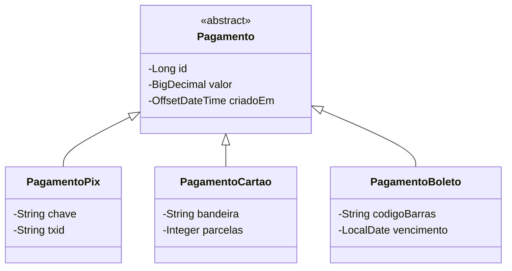
```mermaid
classDiagram
    class Pagamento {
        <<abstract>>
        -Long id
        -BigDecimal valor
        -OffsetDateTime criadoEm
    }
    class PagamentoPix {
        -String chave
        -String txid
    }
    class PagamentoCartao {
        -String bandeira
        -Integer parcelas
    }
    class PagamentoBoleto {
        -String codigoBarras
        -LocalDate vencimento
    }

    Pagamento <|-- PagamentoPix
    Pagamento <|-- PagamentoCartao
    Pagamento <|-- PagamentoBoleto
```

### Mapeamento no banco por estratégia

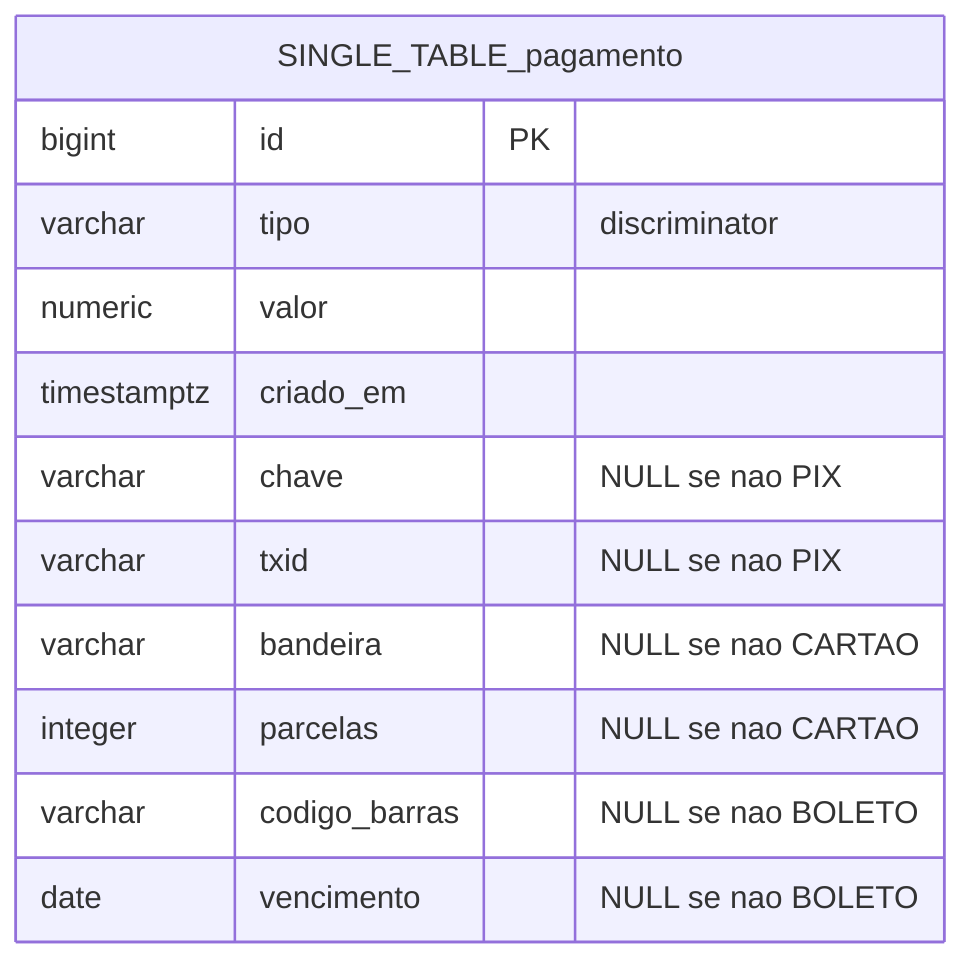
```mermaid
erDiagram
    SINGLE_TABLE_pagamento {
        bigint id PK
        varchar tipo "discriminator"
        numeric valor
        timestamptz criado_em
        varchar chave "NULL se nao PIX"
        varchar txid "NULL se nao PIX"
        varchar bandeira "NULL se nao CARTAO"
        integer parcelas "NULL se nao CARTAO"
        varchar codigo_barras "NULL se nao BOLETO"
        date vencimento "NULL se nao BOLETO"
    }
```

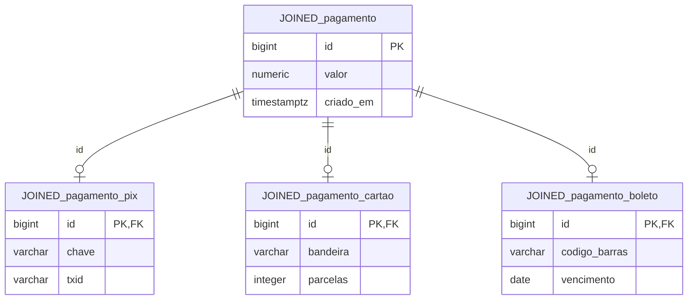
```mermaid
erDiagram
    JOINED_pagamento {
        bigint id PK
        numeric valor
        timestamptz criado_em
    }
    JOINED_pagamento_pix {
        bigint id PK,FK
        varchar chave
        varchar txid
    }
    JOINED_pagamento_cartao {
        bigint id PK,FK
        varchar bandeira
        integer parcelas
    }
    JOINED_pagamento_boleto {
        bigint id PK,FK
        varchar codigo_barras
        date vencimento
    }

    JOINED_pagamento ||--o| JOINED_pagamento_pix : "id"
    JOINED_pagamento ||--o| JOINED_pagamento_cartao : "id"
    JOINED_pagamento ||--o| JOINED_pagamento_boleto : "id"
```

### SINGLE_TABLE (default)

Uma tabela com coluna discriminadora. Sem JOINs para queries polimórficas.

```java
@Entity
@Inheritance(strategy = InheritanceType.SINGLE_TABLE)
@DiscriminatorColumn(name = "tipo", discriminatorType = DiscriminatorType.STRING)
public abstract class Pagamento {
    @Id @GeneratedValue(strategy = GenerationType.IDENTITY)
    private Long id;
    private BigDecimal valor;
    private LocalDateTime criadoEm;
}

@Entity
@DiscriminatorValue("PIX")
public class PagamentoPix extends Pagamento {
    private String chave;
    private String txid;
}
```

**Prós:** query polimórfica sem JOIN, melhor performance para leitura. **Contras:** colunas dos subtipos ficam `NULL` — compensar com Bean Validation e check constraints condicionais.

```sql
ALTER TABLE pagamento
    ADD CONSTRAINT chk_pix_chave CHECK (tipo <> 'PIX' OR chave IS NOT NULL);
```

### JOINED

Uma tabela-base + uma tabela por subtipo. Queries polimórficas fazem `LEFT JOIN` em todas as subtabelas.

**Prós:** schema normalizado, `NOT NULL` real nos subtipos. **Contras:** N JOINs em queries polimórficas.

### TABLE_PER_CLASS

Uma tabela independente por classe concreta. Queries polimórficas viram `UNION ALL`.

**Prós:** tabelas autossuficientes. **Contras:** `UNION ALL` lento, não pode usar `IDENTITY`, FKs polimórficas impossíveis.

### @MappedSuperclass

Para reuso de campos sem relação polimórfica (campos de auditoria, por exemplo).

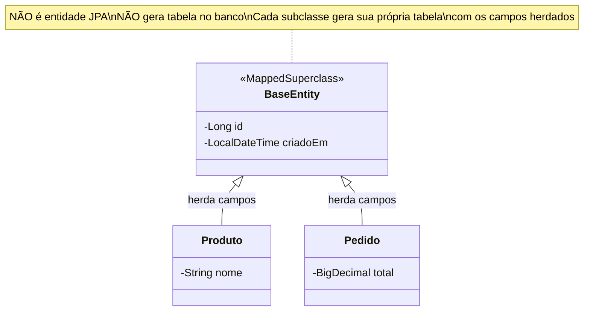
```mermaid
classDiagram
    class BaseEntity {
        <<MappedSuperclass>>
        -Long id
        -LocalDateTime criadoEm
    }
    class Produto {
        -String nome
    }
    class Pedido {
        -BigDecimal total
    }

    BaseEntity <|-- Produto : herda campos
    BaseEntity <|-- Pedido : herda campos

    note for BaseEntity "NÃO é entidade JPA\nNÃO gera tabela no banco\nCada subclasse gera sua própria tabela\ncom os campos herdados"
```

```java
@MappedSuperclass
public abstract class BaseEntity {
    @Id @GeneratedValue(strategy = GenerationType.IDENTITY)
    private Long id;
    private LocalDateTime criadoEm;
}
```

### Comparação

| Critério | SINGLE_TABLE | JOINED | TABLE_PER_CLASS |
|---|---|---|---|
| Query polimórfica | Sem JOIN | N JOINs | UNION ALL |
| Query por subtipo | `WHERE tipo = ?` | JOIN simples | Direto na tabela |
| `NOT NULL` nos subtipos | Não | Sim | Sim |
| FK para a hierarquia | Simples | Simples | Impossível |
| Inserção | 1 INSERT | 2 INSERTs | 1 INSERT |

**Recomendação:** `SINGLE_TABLE` para a maioria dos casos. `JOINED` quando subtipos têm muitas colunas e integridade no DDL é requisito forte.

---

## 3. Abordagem Mista com @SecondaryTable

A spec JPA não permite misturar estratégias, mas `@SecondaryTable` atinge o mesmo efeito. Mantém `SINGLE_TABLE` e move subtipos complexos para tabela separada.

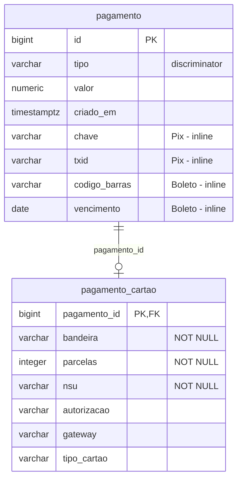
```mermaid
erDiagram
    pagamento {
        bigint id PK
        varchar tipo "discriminator"
        numeric valor
        timestamptz criado_em
        varchar chave "Pix - inline"
        varchar txid "Pix - inline"
        varchar codigo_barras "Boleto - inline"
        date vencimento "Boleto - inline"
    }
    pagamento_cartao {
        bigint pagamento_id PK,FK
        varchar bandeira "NOT NULL"
        integer parcelas "NOT NULL"
        varchar nsu "NOT NULL"
        varchar autorizacao
        varchar gateway
        varchar tipo_cartao
    }

    pagamento ||--o| pagamento_cartao : "pagamento_id"
```

```java
@Entity
@DiscriminatorValue("CARTAO")
@SecondaryTable(
    name = "pagamento_cartao",
    pkJoinColumns = @PrimaryKeyJoinColumn(name = "pagamento_id")
)
public class PagamentoCartao extends Pagamento {

    @Column(table = "pagamento_cartao", nullable = false)
    private String bandeira;

    @Column(table = "pagamento_cartao", nullable = false)
    private Integer parcelas;
}
```

**Regra prática:** subtipos com 2–3 campos ficam inline. Subtipos com 5+ campos vão para `@SecondaryTable`. Queries polimórficas geram apenas 1 `LEFT JOIN` (para o subtipo separado), não N como `JOINED`.

| Cenário | JOINED (5 subtipos) | SINGLE_TABLE + @SecondaryTable (1) |
|---|---|---|
| Query polimórfica | 5 LEFT JOINs | 1 LEFT JOIN |
| Buscar Pix por ID | 1 JOIN | 0 JOINs |
| Buscar Cartão por ID | 1 JOIN | 1 JOIN |
| INSERT de Pix | 2 INSERTs | 1 INSERT |

---

## 4. Resolução Polimórfica de Tipos

O Hibernate lê a coluna discriminadora e instancia a classe concreta automaticamente.

### Fluxo de resolução

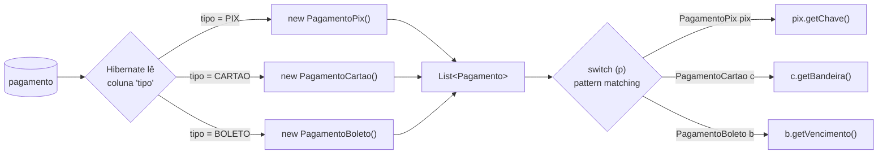
```mermaid
flowchart LR
    DB[(pagamento)] --> H{Hibernate lê\ncoluna 'tipo'}
    H -->|tipo = PIX| P1["new PagamentoPix()"]
    H -->|tipo = CARTAO| P2["new PagamentoCartao()"]
    H -->|tipo = BOLETO| P3["new PagamentoBoleto()"]

    P1 --> L["List&lt;Pagamento&gt;"]
    P2 --> L
    P3 --> L

    L --> SW{"switch (p)\npattern matching"}
    SW -->|"PagamentoPix pix"| A1["pix.getChave()"]
    SW -->|"PagamentoCartao c"| A2["c.getBandeira()"]
    SW -->|"PagamentoBoleto b"| A3["b.getVencimento()"]
```

```java
List<Pagamento> pagamentos = pagamentoRepository.findAll();
pagamentos.get(0).getClass(); // PagamentoPix.class
pagamentos.get(1).getClass(); // PagamentoCartao.class
```

Pattern matching funciona normalmente:

```java
for (Pagamento p : pagamentos) {
    String descricao = switch (p) {
        case PagamentoPix pix       -> "Pix para " + pix.getChave();
        case PagamentoCartao cartao -> cartao.getBandeira() + " em " + cartao.getParcelas() + "x";
        case PagamentoBoleto boleto -> "Boleto venc. " + boleto.getVencimento();
        default                     -> "Pagamento #" + p.getId();
    };
}
```

Repositories específicos por subtipo também funcionam:

```java
public interface PagamentoPixRepository extends JpaRepository<PagamentoPix, Long> {
    List<PagamentoPix> findByChave(String chave);
    // Hibernate gera: WHERE tipo = 'PIX' AND chave = ?
}
```

---

## 5. Agrupamento por Tipo com Streams

### Com `groupingBy` na classe

```java
Map<Class<? extends Pagamento>, List<Pagamento>> porTipo = pagamentoRepository.findAll()
    .stream()
    .collect(Collectors.groupingBy(Pagamento::getClass));
```

### Com enum discriminador (recomendado)

```java
Map<TipoPagamento, List<Pagamento>> porTipo = pagamentoRepository.findAll()
    .stream()
    .collect(Collectors.groupingBy(Pagamento::getTipo));
```

### Com record para tipagem completa e pattern matching

```java
public record PagamentosAgrupados(
    List<PagamentoPix> pix,
    List<PagamentoCartao> cartao,
    List<PagamentoBoleto> boleto
) {
    public static PagamentosAgrupados of(List<Pagamento> pagamentos) {
        var pix = new ArrayList<PagamentoPix>();
        var cartao = new ArrayList<PagamentoCartao>();
        var boleto = new ArrayList<PagamentoBoleto>();

        for (Pagamento p : pagamentos) {
            switch (p) {
                case PagamentoPix px    -> pix.add(px);
                case PagamentoCartao c  -> cartao.add(c);
                case PagamentoBoleto b  -> boleto.add(b);
                default -> { }
            }
        }

        return new PagamentosAgrupados(
            Collections.unmodifiableList(pix),
            Collections.unmodifiableList(cartao),
            Collections.unmodifiableList(boleto)
        );
    }
}
```

---

## 6. Enum como Discriminator

O JPA só aceita `STRING`, `INTEGER` e `CHAR` como `DiscriminatorType`. Use constantes compartilhadas para manter consistência:

### Relação entre Enum, Constantes e @DiscriminatorValue

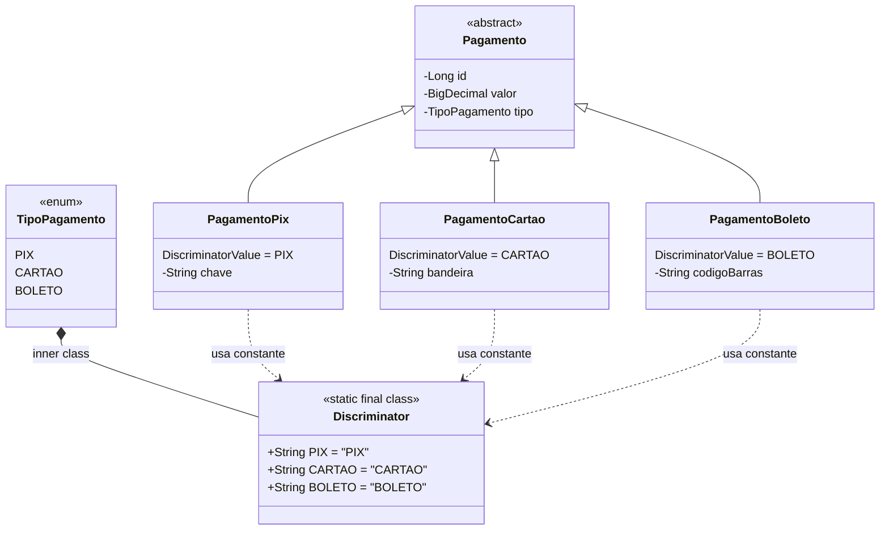
```mermaid
classDiagram
    class TipoPagamento {
        <<enum>>
        PIX
        CARTAO
        BOLETO
    }
    class Discriminator {
        <<static final class>>
        +String PIX = "PIX"
        +String CARTAO = "CARTAO"
        +String BOLETO = "BOLETO"
    }
    class Pagamento {
        <<abstract>>
        -Long id
        -BigDecimal valor
        -TipoPagamento tipo
    }
    class PagamentoPix {
        DiscriminatorValue = PIX
        -String chave
    }
    class PagamentoCartao {
        DiscriminatorValue = CARTAO
        -String bandeira
    }
    class PagamentoBoleto {
        DiscriminatorValue = BOLETO
        -String codigoBarras
    }

    TipoPagamento *-- Discriminator : inner class
    Pagamento <|-- PagamentoPix
    Pagamento <|-- PagamentoCartao
    Pagamento <|-- PagamentoBoleto
    PagamentoPix ..> Discriminator : usa constante
    PagamentoCartao ..> Discriminator : usa constante
    PagamentoBoleto ..> Discriminator : usa constante
```

```java
public enum TipoPagamento {

    PIX(Discriminator.PIX),
    CARTAO(Discriminator.CARTAO),
    BOLETO(Discriminator.BOLETO);

    private final String discriminator;

    TipoPagamento(String discriminator) {
        this.discriminator = discriminator;
    }

    public static final class Discriminator {
        public static final String PIX = "PIX";
        public static final String CARTAO = "CARTAO";
        public static final String BOLETO = "BOLETO";
        private Discriminator() {}
    }
}
```

```java
@Entity
@DiscriminatorValue(TipoPagamento.Discriminator.PIX)
public class PagamentoPix extends Pagamento { }
```

### Teste de consistência

```java
@Test
void discriminatorDeveCorresponderAoEnum() {
    var mapeamentos = Map.of(
        PagamentoPix.class,    TipoPagamento.PIX,
        PagamentoCartao.class, TipoPagamento.CARTAO,
        PagamentoBoleto.class, TipoPagamento.BOLETO
    );

    mapeamentos.forEach((classe, tipo) -> {
        String discriminator = classe.getAnnotation(DiscriminatorValue.class).value();
        assertThat(discriminator).isEqualTo(tipo.name());
    });
}
```

---

## 7. Discriminator Acessível via Getter

Mapeie a coluna discriminadora como campo read-only:

```java
@Entity
@Inheritance(strategy = InheritanceType.SINGLE_TABLE)
@DiscriminatorColumn(name = "tipo", discriminatorType = DiscriminatorType.STRING)
public abstract class Pagamento {

    @Id @GeneratedValue(strategy = GenerationType.IDENTITY)
    private Long id;

    @Column(name = "tipo", insertable = false, updatable = false)
    @Enumerated(EnumType.STRING)
    private TipoPagamento tipo;

    public TipoPagamento getTipo() {
        return tipo;
    }
}
```

O `insertable = false, updatable = false` evita conflito com o mecanismo de discriminação do Hibernate. Subclasses herdam o getter sem precisar de override.

---

## 8. ManyToMany e OneToMany na Mesma Tabela Intermediária

### Modelo de relacionamento

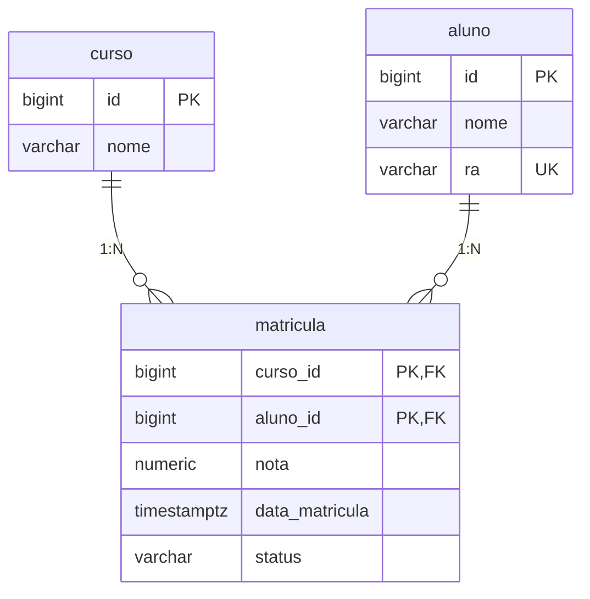
```mermaid
erDiagram
    curso {
        bigint id PK
        varchar nome
    }
    aluno {
        bigint id PK
        varchar nome
        varchar ra UK
    }
    matricula {
        bigint curso_id PK,FK
        bigint aluno_id PK,FK
        numeric nota
        timestamptz data_matricula
        varchar status
    }

    curso ||--o{ matricula : "1:N"
    aluno ||--o{ matricula : "1:N"
```

### Diagrama de classes

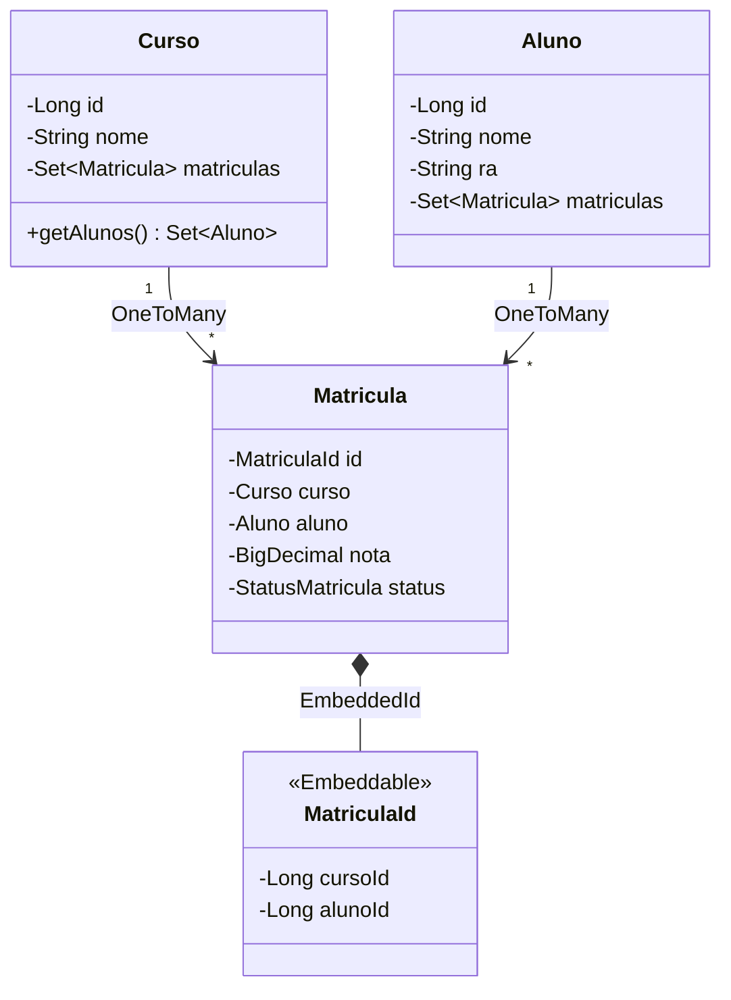
```mermaid
classDiagram
    class Curso {
        -Long id
        -String nome
        -Set~Matricula~ matriculas
        +getAlunos() Set~Aluno~
    }
    class Aluno {
        -Long id
        -String nome
        -String ra
        -Set~Matricula~ matriculas
    }
    class Matricula {
        -MatriculaId id
        -Curso curso
        -Aluno aluno
        -BigDecimal nota
        -StatusMatricula status
    }
    class MatriculaId {
        <<Embeddable>>
        -Long cursoId
        -Long alunoId
    }

    Curso "1" --> "*" Matricula : OneToMany
    Aluno "1" --> "*" Matricula : OneToMany
    Matricula *-- MatriculaId : EmbeddedId
```

Quando a tabela intermediária precisa de atributos próprios, promova-a a entidade:

```java
@Entity
public class Matricula {

    @EmbeddedId
    private MatriculaId id;

    @ManyToOne(fetch = FetchType.LAZY)
    @MapsId("cursoId")
    private Curso curso;

    @ManyToOne(fetch = FetchType.LAZY)
    @MapsId("alunoId")
    private Aluno aluno;

    private BigDecimal nota;
    private OffsetDateTime dataMatricula;

    @Enumerated(EnumType.STRING)
    private StatusMatricula status;
}
```

**Na prática, prefira só `@OneToMany`** e adicione método de conveniência:

```java
@Entity
public class Curso {

    @OneToMany(mappedBy = "curso", cascade = CascadeType.ALL, orphanRemoval = true)
    private Set<Matricula> matriculas = new HashSet<>();

    public Set<Aluno> getAlunos() {
        return matriculas.stream()
            .map(Matricula::getAluno)
            .collect(Collectors.toUnmodifiableSet());
    }
}
```

---

## 9. Cascade vs OrphanRemoval

`Cascade` propaga operações do `EntityManager`. `OrphanRemoval` reage à desassociação de um filho do pai.

### Cascade — propaga operações do EntityManager

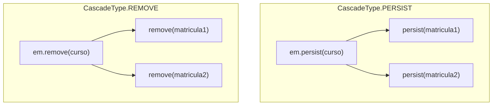
```mermaid
flowchart TD
    subgraph "CascadeType.PERSIST"
        P1["em.persist(curso)"] --> P2["persist(matricula1)"]
        P1 --> P3["persist(matricula2)"]
    end

    subgraph "CascadeType.REMOVE"
        R1["em.remove(curso)"] --> R2["remove(matricula1)"]
        R1 --> R3["remove(matricula2)"]
    end
```

### OrphanRemoval — reage à desassociação

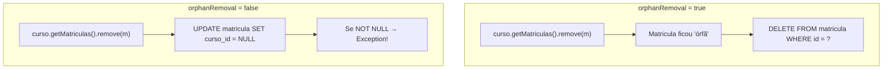
```mermaid
flowchart TD
    subgraph "orphanRemoval = true"
        O1["curso.getMatriculas().remove(m)"] --> O2["Matricula ficou 'órfã'"]
        O2 --> O3["DELETE FROM matricula WHERE id = ?"]
    end

    subgraph "orphanRemoval = false"
        F1["curso.getMatriculas().remove(m)"] --> F2["UPDATE matricula SET curso_id = NULL"]
        F2 --> F3["Se NOT NULL → Exception!"]
    end
```

| Ação | `cascade = ALL` | `orphanRemoval = true` |
|---|---|---|
| `em.persist(curso)` | Persiste matrículas | — |
| `em.merge(curso)` | Atualiza matrículas | — |
| `em.remove(curso)` | Remove matrículas | Remove matrículas |
| `curso.getMatriculas().remove(m)` | Nada (ou seta NULL) | **Deleta `m` do banco** |
| `curso.getMatriculas().clear()` | Nada (ou seta NULL) | **Deleta todas do banco** |

Para composições fortes (filho sem sentido sem o pai), use ambos:

```java
@OneToMany(mappedBy = "curso", cascade = CascadeType.ALL, orphanRemoval = true)
private Set<Matricula> matriculas = new HashSet<>();
```

---

## 10. Cascade ALL Bidirecional — Problemas

### Direção correta do cascade

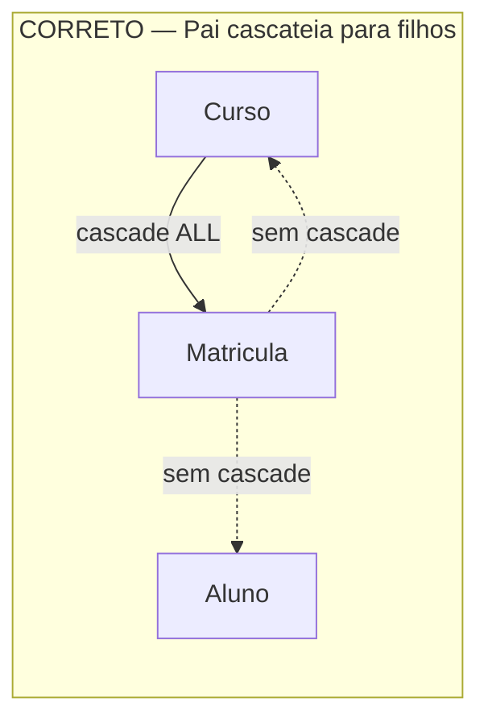
```mermaid
graph LR
    subgraph "CORRETO — Pai cascateia para filhos"
        C1[Curso] -->|cascade ALL| M1[Matricula]
        M1 -.->|sem cascade| C1
        M1 -.->|sem cascade| A1[Aluno]
    end
```

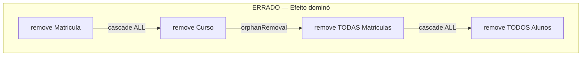
```mermaid
graph LR
    subgraph "ERRADO — Efeito dominó"
        direction LR
        M2[remove Matricula] -->|cascade ALL| C2[remove Curso]
        C2 -->|orphanRemoval| M3[remove TODAS Matriculas]
        M3 -->|cascade ALL| A2[remove TODOS Alunos]
    end
```

`cascade = ALL` no lado `@ManyToOne` é quase sempre um bug:

- **REMOVE em cascata:** ao remover uma matrícula, propaga `REMOVE` para o curso, que deleta todas as matrículas, que propagam para todos os alunos — efeito dominó.
- **MERGE inesperado:** propaga `MERGE` para o pai, podendo sobrescrever dados com versões desatualizadas.

**Regra:** cascade segue a direção de dependência. Pai cascateia para filhos, nunca o contrário.

```java
@Entity
public class Matricula {
    @ManyToOne(fetch = FetchType.LAZY) // SEM cascade
    @JoinColumn(name = "curso_id", nullable = false)
    private Curso curso;
}
```

### Atributo `targetEntity` — especificar o tipo da entidade relacionada

As annotations `@OneToMany`, `@ManyToOne`, `@OneToOne` e `@ManyToMany` possuem o atributo `targetEntity` que permite especificar explicitamente a classe da entidade no outro lado do relacionamento. Na maioria dos casos ele é **desnecessário**, porque o Hibernate infere o tipo pelos generics da coleção ou pelo tipo do campo:

```java
// Hibernate infere Matricula.class pelo generic Set<Matricula>
@OneToMany(mappedBy = "curso")
private Set<Matricula> matriculas = new HashSet<>();

// Hibernate infere Curso.class pelo tipo do campo
@ManyToOne(fetch = FetchType.LAZY)
private Curso curso;
```

#### Quando `targetEntity` é necessário

**Coleção sem generic (raw type)** — código legado ou integração com frameworks antigos:

```java
// Sem generic — Hibernate não sabe o tipo da entidade
// targetEntity resolve a ambiguidade
@OneToMany(mappedBy = "curso", targetEntity = Matricula.class)
private Set matriculas = new HashSet(); // raw type (sem <>)

// Com generic — targetEntity desnecessário
@OneToMany(mappedBy = "curso")
private Set<Matricula> matriculas = new HashSet<>(); // Hibernate infere
```

**Interface ou classe abstrata como tipo do campo:**

```java
// Interface como tipo — Hibernate não sabe qual entidade persistir
public interface Avaliavel {
    BigDecimal getNota();
}

@Entity
public class Curso extends BaseEntity {

    // targetEntity diz ao Hibernate: "nesta coleção, a entidade é Matricula"
    @OneToMany(mappedBy = "curso", targetEntity = Matricula.class)
    private Set<Avaliavel> avaliaveis = new HashSet<>();
}
```

**Herança com tipo genérico no pai:**

```java
@MappedSuperclass
public abstract class BaseComFilhos<T> {

    // T é apagado em runtime (type erasure) — Hibernate não infere
    @OneToMany(targetEntity = Matricula.class)
    private Set<T> filhos = new HashSet<>();
}

@Entity
public class Curso extends BaseComFilhos<Matricula> {
    // targetEntity no pai resolve o type erasure
}
```

#### targetEntity em cada annotation de relacionamento

```java
// @OneToMany
@OneToMany(mappedBy = "curso", targetEntity = Matricula.class)
private Set matriculas;

// @ManyToOne
@ManyToOne(fetch = FetchType.LAZY, targetEntity = Curso.class)
private Object curso; // tipo genérico Object — raro mas possível em código legado

// @OneToOne
@OneToOne(mappedBy = "aluno", targetEntity = AlunoPerfil.class)
private Object perfil;

// @ManyToMany
@ManyToMany(targetEntity = Professor.class)
private Set professores;
```

#### Quando NÃO usar targetEntity

Em código moderno com generics, **nunca use `targetEntity`** — ele adiciona redundância e um ponto de manutenção extra:

```java
// RUIM — redundante, targetEntity repete o que o generic já diz
@OneToMany(mappedBy = "curso", targetEntity = Matricula.class)
private Set<Matricula> matriculas = new HashSet<>();

// BOM — generic é suficiente
@OneToMany(mappedBy = "curso")
private Set<Matricula> matriculas = new HashSet<>();
```

| Cenário | `targetEntity` necessário? |
|---|---|
| Coleção com generic (`Set<Matricula>`) | Não — Hibernate infere |
| Campo tipado (`Curso curso`) | Não — Hibernate infere |
| Raw type sem generic (`Set matriculas`) | Sim |
| Interface/classe abstrata como tipo | Sim |
| Type erasure em `@MappedSuperclass` genérico | Sim |
| Código moderno com generics | Nunca — é redundância |

---

## 11. Recursos Pouco Conhecidos do JPA/Hibernate

### @Formula — campo calculado sem coluna

```java
@Formula("preco - desconto")
private BigDecimal precoFinal;

@Formula("(SELECT COUNT(*) FROM avaliacao a WHERE a.produto_id = id)")
private Long totalAvaliacoes;
```

### @SQLRestriction — filtro automático (substitui @Where deprecado no Hibernate 6.3+)

```java
@Entity
@SQLRestriction("deletado_em IS NULL")
public class Produto {
    private OffsetDateTime deletadoEm;
}
```

### @Filter — filtro dinâmico para multi-tenancy

```java
@Entity
@FilterDef(name = "tenantFilter", parameters = @ParamDef(name = "tenantId", type = Long.class))
@Filter(name = "tenantFilter", condition = "tenant_id = :tenantId")
public class Documento { }
```

### @NaturalId — cache e lookup por chave natural

```java
@NaturalId
@Column(nullable = false, unique = true)
private String ra;
```

### @DynamicUpdate — UPDATE só dos campos alterados

```java
@Entity
@DynamicUpdate
public class Pedido { }
```

### AttributeConverter — tipo custom transparente

```java
@Converter(autoApply = true)
public class CpfConverter implements AttributeConverter<Cpf, String> {
    @Override
    public String convertToDatabaseColumn(Cpf cpf) {
        return cpf == null ? null : cpf.valor();
    }
    @Override
    public Cpf convertToEntityAttribute(String valor) {
        return valor == null ? null : new Cpf(valor);
    }
}
```

### @CreationTimestamp e @UpdateTimestamp

Annotations do Hibernate que preenchem automaticamente timestamps de auditoria:

```java
@MappedSuperclass
public abstract class BaseEntity {
    @CreationTimestamp
    @Column(updatable = false)
    private OffsetDateTime criadoEm;

    @UpdateTimestamp
    private OffsetDateTime atualizadoEm;
}
```

O Hibernate preenche `criadoEm` no `persist()` e `atualizadoEm` em todo `persist()` e `merge()`. Mais simples que `@PrePersist` / `@PreUpdate` manual.

#### Spring Data JPA Auditing — @CreatedDate, @LastModifiedDate, @CreatedBy, @LastModifiedBy

O Spring Data oferece uma alternativa que **também rastreia quem** fez a operação (além de quando):

```java
@MappedSuperclass
@EntityListeners(AuditingEntityListener.class)
public abstract class AuditableEntity {

    @Id
    @GeneratedValue(strategy = GenerationType.IDENTITY)
    private Long id;

    @CreatedDate
    @Column(nullable = false, updatable = false, columnDefinition = "TIMESTAMPTZ")
    private OffsetDateTime criadoEm;

    @LastModifiedDate
    @Column(nullable = false, columnDefinition = "TIMESTAMPTZ")
    private OffsetDateTime atualizadoEm;

    @CreatedBy
    @Column(updatable = false, length = 100)
    private String criadoPor;

    @LastModifiedBy
    @Column(length = 100)
    private String atualizadoPor;
}
```

Requer configuração:

```java
@Configuration
@EnableJpaAuditing
public class JpaAuditingConfig {

    @Bean
    public AuditorAware<String> auditorAware() {
        return () -> Optional.ofNullable(SecurityContextHolder.getContext())
            .map(SecurityContext::getAuthentication)
            .filter(Authentication::isAuthenticated)
            .map(Authentication::getName);
    }
}
```

O `AuditingEntityListener` é um `@EntityListeners` que o Spring Data registra automaticamente com `@EnableJpaAuditing`. O `AuditorAware` fornece o nome do usuário corrente — no exemplo, via Spring Security.

#### Comparação

| Aspecto | `@CreationTimestamp` / `@UpdateTimestamp` | `@CreatedDate` / `@LastModifiedDate` |
|---|---|---|
| Provedor | Hibernate | Spring Data JPA |
| Rastreia "quando" | Sim | Sim |
| Rastreia "quem" | Não | Sim (`@CreatedBy` / `@LastModifiedBy`) |
| Requer `@EntityListeners` | Não | Sim (`AuditingEntityListener`) |
| Requer `@EnableJpaAuditing` | Não | Sim |
| Funciona sem Spring | Sim | Não |
| Tipo suportado | `OffsetDateTime`, `Instant`, `Date`, `Calendar` | `OffsetDateTime`, `Instant`, `LocalDateTime`, `Date`, `Long` |

Use `@CreationTimestamp` / `@UpdateTimestamp` quando precisa **apenas** de timestamps e quer menos configuração. Use Spring Data Auditing quando precisa de `@CreatedBy` / `@LastModifiedBy` ou já tem `@EnableJpaAuditing` configurado.

### @BatchSize — controle de N+1 sem JOIN FETCH

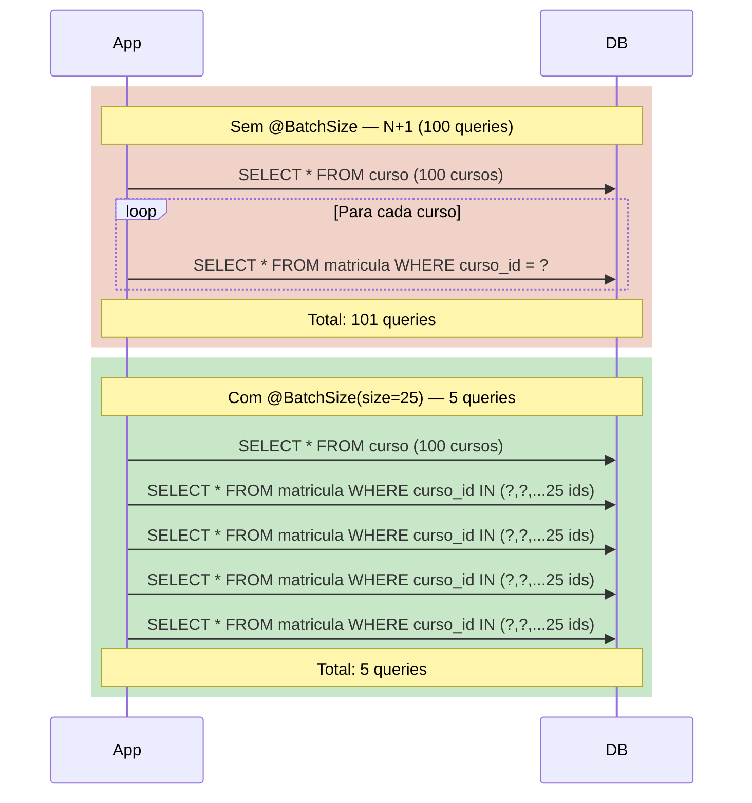
```mermaid
sequenceDiagram
    participant App
    participant DB

    rect rgb(240, 210, 200)
        Note over App,DB: Sem @BatchSize — N+1 (100 queries)
        App->>DB: SELECT * FROM curso (100 cursos)
        loop Para cada curso
            App->>DB: SELECT * FROM matricula WHERE curso_id = ?
        end
        Note over App,DB: Total: 101 queries
    end

    rect rgb(200, 230, 200)
        Note over App,DB: Com @BatchSize(size=25) — 5 queries
        App->>DB: SELECT * FROM curso (100 cursos)
        App->>DB: SELECT * FROM matricula WHERE curso_id IN (?,?,...25 ids)
        App->>DB: SELECT * FROM matricula WHERE curso_id IN (?,?,...25 ids)
        App->>DB: SELECT * FROM matricula WHERE curso_id IN (?,?,...25 ids)
        App->>DB: SELECT * FROM matricula WHERE curso_id IN (?,?,...25 ids)
        Note over App,DB: Total: 5 queries
    end
```

```java
@OneToMany(mappedBy = "curso")
@BatchSize(size = 25)
private Set<Matricula> matriculas;
```

### Projeções com interface

```java
public interface CursoResumo {
    Long getId();
    String getNome();
    long getTotalMatriculas();
}
```

### @Immutable — entidade read-only (sem dirty checking)

```java
@Entity
@Immutable
public class VwRelatorioMatriculas { }
```

### @Transient — campos não persistidos

Campos marcados com `@Transient` (JPA) ou `transient` (Java) são ignorados pelo Hibernate — não geram coluna no banco e não participam de INSERT/UPDATE/SELECT:

```java
@Entity
public class Aluno extends BaseEntity {

    @Column(nullable = false)
    private String nome;

    @Column(nullable = false, unique = true)
    private String ra;

    private BigDecimal nota;

    // ── Campo calculado em memória — não existe no banco ──
    @Transient
    private String nomeCompleto;

    // ── Flag de controle — não persistido ──
    @Transient
    private boolean editado;

    // ── Dados temporários de integração ──
    @Transient
    private Map<String, Object> metadados;

    // Inicialização via @PostLoad
    @PostLoad
    private void calcularCamposTransient() {
        this.nomeCompleto = nome + " (" + ra + ")";
    }
}
```

#### @Transient vs transient (keyword Java)

```java
// @Transient (JPA) — ignorado pelo Hibernate, MAS serializado pelo Jackson
@Transient
private String campoCalculado; // aparece no JSON

// transient (keyword Java) — ignorado pelo Hibernate E pelo Jackson
transient private String cacheInterno; // NÃO aparece no JSON
```

| Modificador | Hibernate ignora | Jackson serializa | Uso típico |
|---|---|---|---|
| `@Transient` (JPA) | Sim | Sim | Campos calculados expostos na API |
| `transient` (Java) | Sim | Não | Cache interno, flags temporários |
| `@Transient` + `@JsonIgnore` | Sim | Não | Campo auxiliar invisível na API |

#### Usos comuns de @Transient

```java
@Entity
public class Pedido extends BaseEntity {

    @Column(nullable = false, precision = 19, scale = 2)
    private BigDecimal subtotal;

    @Column(nullable = false, precision = 5, scale = 2)
    private BigDecimal taxaDesconto;

    // Campo calculado — não existe coluna no banco
    @Transient
    private BigDecimal totalComDesconto;

    @PostLoad
    @PostPersist
    @PostUpdate
    private void calcularTotal() {
        this.totalComDesconto = subtotal.multiply(
            BigDecimal.ONE.subtract(taxaDesconto.divide(new BigDecimal("100")))
        );
    }

    // Para Persistable — flag de controle de isNew()
    @Transient
    private boolean isNew = true;

    @PostPersist
    @PostLoad
    private void markNotNew() {
        this.isNew = false;
    }
}
```

**Regra prática:** se o campo é derivável de outros campos persistidos ou é estado temporário em memória, use `@Transient`. Se o valor precisa sobreviver entre sessões, deve ser persistido.

---

## 12. Soft Delete Nativo (@SoftDelete)

Introduzido no Hibernate 6.4 (Spring Boot 3.3+).

### Comportamento do @SoftDelete

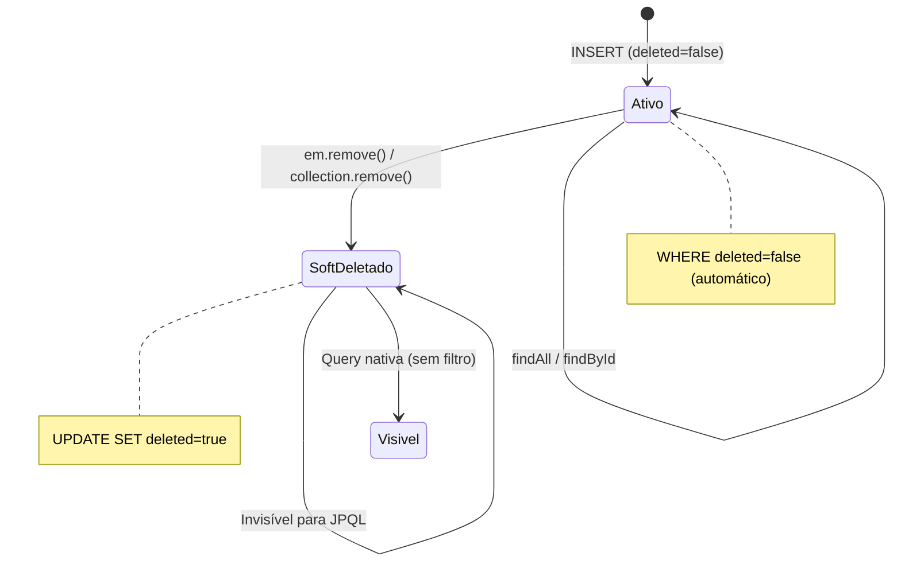
```mermaid
stateDiagram-v2
    [*] --> Ativo : INSERT (deleted=false)
    Ativo --> SoftDeletado : em.remove() / collection.remove()
    note right of SoftDeletado : UPDATE SET deleted=true
    Ativo --> Ativo : findAll / findById
    note right of Ativo : WHERE deleted=false (automático)
    SoftDeletado --> SoftDeletado : Invisível para JPQL
    SoftDeletado --> Visivel : Query nativa (sem filtro)
```

```java
@Entity
@SoftDelete
public class Aluno { }
```

- `em.remove()` gera `UPDATE SET deleted = true` em vez de `DELETE`.
- Todas as queries adicionam `WHERE deleted = false` automaticamente.
- Funciona com `orphanRemoval` e `@ManyToMany`.

### Com timestamp

```java
@Entity
@SoftDelete(columnName = "deletado_em", converter = DeletedAtConverter.class)
public class Aluno { }
```

```java
public class DeletedAtConverter implements AttributeConverter<Boolean, OffsetDateTime> {
    @Override
    public OffsetDateTime convertToDatabaseColumn(Boolean deleted) {
        return deleted ? OffsetDateTime.now() : null;
    }
    @Override
    public Boolean convertToEntityAttribute(OffsetDateTime deletedAt) {
        return deletedAt != null;
    }
}
```

### Unique constraints com soft delete — partial index

```sql
CREATE UNIQUE INDEX uq_aluno_ra_ativo ON aluno (ra) WHERE deleted = false;
```

### Consultar deletados — query nativa

```java
@Query(value = "SELECT * FROM aluno WHERE deleted = true", nativeQuery = true)
List<Aluno> findAllDeletados();
```

---

## 13. Ordenação de Coleções (@OrderBy, @OrderColumn, @SortNatural)

### @OrderBy (JPA) — ORDER BY no SQL

```java
@OneToMany(mappedBy = "curso")
@OrderBy("criadoEm DESC")
private List<Matricula> matriculas = new ArrayList<>();
```

### @OrderColumn (JPA) — posição persistida no banco

```java
@OneToMany(mappedBy = "prova", cascade = CascadeType.ALL, orphanRemoval = true)
@OrderColumn(name = "posicao")
private List<Questao> questoes = new ArrayList<>();
```

### @SortNatural / @SortComparator (Hibernate) — ordenação em memória

```java
@OneToMany(mappedBy = "curso")
@SortNatural
private SortedSet<Matricula> matriculas = new TreeSet<>();
```

| Aspecto | @OrderBy | @OrderColumn | @SortNatural |
|---|---|---|---|
| Onde ordena | SQL | SQL (coluna posição) | Java (memória) |
| Persiste posição | Não | Sim | Não |
| Tipo de coleção | List, Set | List apenas | SortedSet, SortedMap |
| Custo | Baixo (índice) | Alto em reordenação | Proporcional ao tamanho |

---

## 14. @ElementCollection vs @OneToMany

### Comparação de estrutura no banco

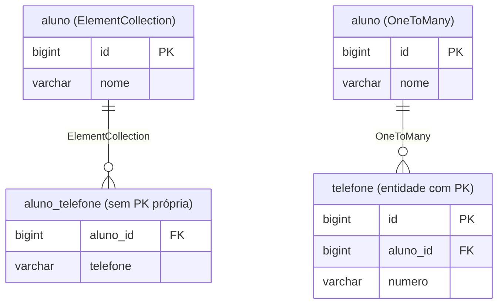
```mermaid
erDiagram
    aluno_EC["aluno (ElementCollection)"] {
        bigint id PK
        varchar nome
    }
    aluno_telefone_EC["aluno_telefone (sem PK própria)"] {
        bigint aluno_id FK
        varchar telefone
    }
    aluno_EC ||--o{ aluno_telefone_EC : "ElementCollection"

    aluno_OTM["aluno (OneToMany)"] {
        bigint id PK
        varchar nome
    }
    telefone_OTM["telefone (entidade com PK)"] {
        bigint id PK
        bigint aluno_id FK
        varchar numero
    }
    aluno_OTM ||--o{ telefone_OTM : "OneToMany"
```

### @ElementCollection — sem identidade própria

#### Com tipos simples

```java
@ElementCollection
@CollectionTable(name = "aluno_telefone", joinColumns = @JoinColumn(name = "aluno_id"))
@Column(name = "telefone")
private Set<String> telefones = new HashSet<>();
```

#### Com objeto complexo (@Embeddable)

Quando o elemento da coleção tem múltiplos campos, use `@Embeddable`:

```java
@Embeddable
public record Certificado(
    @Column(name = "titulo", nullable = false, length = 200)
    String titulo,

    @Column(name = "instituicao", nullable = false, length = 200)
    String instituicao,

    @Column(name = "carga_horaria", nullable = false)
    Integer cargaHoraria,

    @Column(name = "data_conclusao", nullable = false)
    LocalDate dataConclusao,

    @Column(name = "url_verificacao", length = 500)
    String urlVerificacao
) {}
```

```java
@Entity
public class Aluno {

    @Id
    @GeneratedValue(strategy = GenerationType.IDENTITY)
    private Long id;

    private String nome;

    @ElementCollection
    @CollectionTable(
        name = "aluno_certificado",
        joinColumns = @JoinColumn(
            name = "aluno_id",
            foreignKey = @ForeignKey(name = "fk_aluno_certificado_aluno")
        )
    )
    private List<Certificado> certificados = new ArrayList<>();
}
```

DDL gerado:

```sql
CREATE TABLE aluno_certificado (
    aluno_id        BIGINT NOT NULL,
    titulo          VARCHAR(200) NOT NULL,
    instituicao     VARCHAR(200) NOT NULL,
    carga_horaria   INTEGER NOT NULL,
    data_conclusao  DATE NOT NULL,
    url_verificacao VARCHAR(500),
    CONSTRAINT fk_aluno_certificado_aluno FOREIGN KEY (aluno_id) REFERENCES aluno(id)
);
```

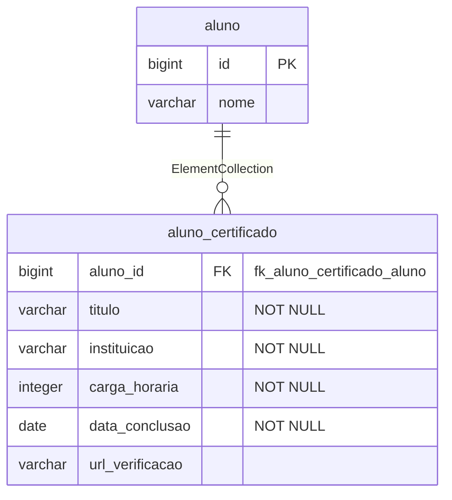
```mermaid
erDiagram
    aluno {
        bigint id PK
        varchar nome
    }
    aluno_certificado {
        bigint aluno_id FK "fk_aluno_certificado_aluno"
        varchar titulo "NOT NULL"
        varchar instituicao "NOT NULL"
        integer carga_horaria "NOT NULL"
        date data_conclusao "NOT NULL"
        varchar url_verificacao
    }

    aluno ||--o{ aluno_certificado : "ElementCollection"
```

A coleção de `Certificado` não tem `@Id` nem tabela independente — é totalmente gerenciada pelo ciclo de vida do `Aluno`. O record garante imutabilidade e `equals/hashCode` automático por todos os campos, o que melhora o comportamento do Hibernate ao detectar mudanças na coleção.

#### Uso no código

```java
var certificado = new Certificado(
    "Spring Boot Avançado",
    "Alura",
    40,
    LocalDate.of(2025, 6, 15),
    "https://cursos.alura.com.br/cert/abc123"
);

aluno.getCertificados().add(certificado);
```

### Problema de performance

Ao modificar qualquer elemento, o Hibernate faz **delete-all + reinsert** (sem `@OrderColumn`), pois não há ID para fazer UPDATE pontual.

### Quando usar

- `@ElementCollection`: Value Objects pequenos e raramente modificados.
- `@OneToMany`: precisa de identidade, Repository, queries JPQL diretas, ou performance de UPDATE.

---

## 15. @EmbeddedId vs @IdClass — PKs Compostas

### Comparação estrutural

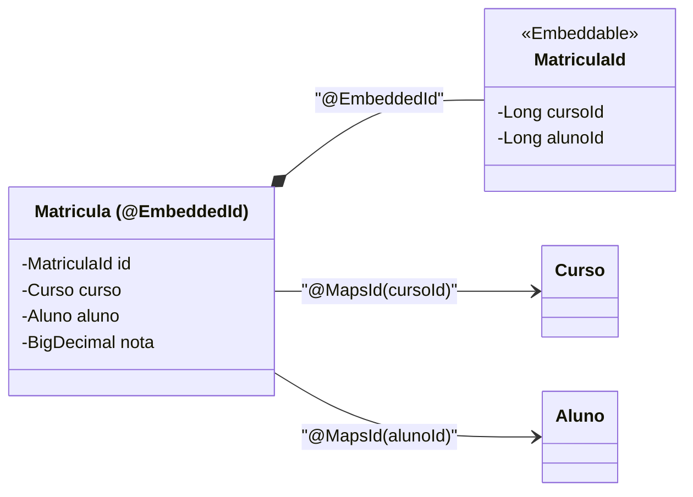
```mermaid
classDiagram
    direction LR

    class Matricula_EmbeddedId["Matricula (@EmbeddedId)"] {
        -MatriculaId id
        -Curso curso
        -Aluno aluno
        -BigDecimal nota
    }
    class MatriculaId_EI["MatriculaId"] {
        <<Embeddable>>
        -Long cursoId
        -Long alunoId
    }
    Matricula_EmbeddedId *-- MatriculaId_EI : "@EmbeddedId"
    Matricula_EmbeddedId --> Curso : "@MapsId(cursoId)"
    Matricula_EmbeddedId --> Aluno : "@MapsId(alunoId)"
```

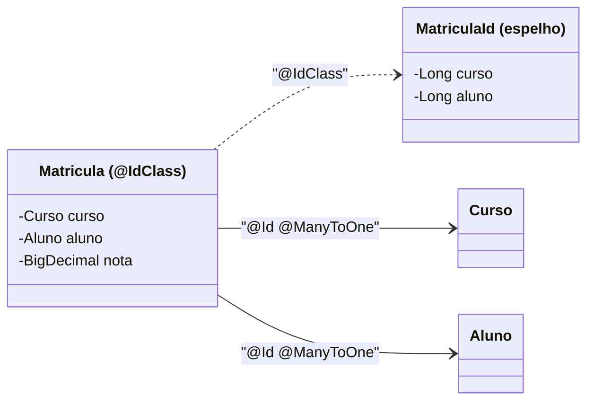
```mermaid
classDiagram
    direction LR

    class Matricula_IdClass["Matricula (@IdClass)"] {
        -Curso curso
        -Aluno aluno
        -BigDecimal nota
    }
    class MatriculaId_IC["MatriculaId (espelho)"] {
        -Long curso
        -Long aluno
    }
    Matricula_IdClass ..> MatriculaId_IC : "@IdClass"
    Matricula_IdClass --> Curso : "@Id @ManyToOne"
    Matricula_IdClass --> Aluno : "@Id @ManyToOne"
```

### @EmbeddedId — PK como Value Object

```java
@Embeddable
public record MatriculaId(Long cursoId, Long alunoId) implements Serializable {}

@Entity
public class Matricula {
    @EmbeddedId
    private MatriculaId id;

    @ManyToOne(fetch = FetchType.LAZY)
    @MapsId("cursoId")
    private Curso curso;
}
```

JPQL: `m.id.cursoId`. Spring Data: `findByIdCursoId()`.

### @IdClass — campos @Id separados

```java
@Entity
@IdClass(MatriculaId.class)
public class Matricula {
    @Id @ManyToOne(fetch = FetchType.LAZY)
    private Curso curso;

    @Id @ManyToOne(fetch = FetchType.LAZY)
    private Aluno aluno;
}
```

JPQL: `m.curso.id`. Spring Data: `findByCursoId()`.

**Recomendação:** `@EmbeddedId` quando a PK é um conceito de domínio. `@IdClass` quando a PK é consequência técnica do relacionamento.

### @MapsId em @OneToOne — PK compartilhada entre entidades

Quando duas entidades compartilham a mesma PK (a filha usa a PK do pai como sua própria PK), use `@MapsId` para mapear o relacionamento `@OneToOne` diretamente no `@Id`:

#### O cenário: Aluno tem um Perfil com o mesmo ID

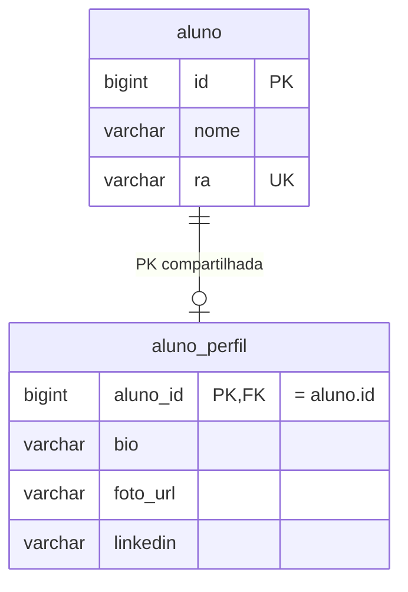
```mermaid
erDiagram
    aluno {
        bigint id PK
        varchar nome
        varchar ra UK
    }
    aluno_perfil {
        bigint aluno_id PK,FK "= aluno.id"
        varchar bio
        varchar foto_url
        varchar linkedin
    }

    aluno ||--o| aluno_perfil : "PK compartilhada"
```

#### Implementação com @MapsId + @JoinColumn

```java
@Entity
@Table(name = "aluno_perfil")
public class AlunoPerfil {

    @Id // a PK é o próprio aluno_id
    @Column(name = "aluno_id")
    private Long id;

    @OneToOne(fetch = FetchType.LAZY)
    @MapsId // mapeia o @Id para a FK do relacionamento
    @JoinColumn(
        name = "aluno_id",
        foreignKey = @ForeignKey(name = "fk_aluno_perfil_aluno")
    )
    private Aluno aluno;

    @Column(length = 1000)
    private String bio;

    @Column(length = 500)
    private String fotoUrl;

    @Column(length = 255)
    private String linkedin;
}
```

```java
@Entity
public class Aluno extends BaseEntity {

    private String nome;
    private String ra;

    @OneToOne(mappedBy = "aluno", cascade = CascadeType.ALL, orphanRemoval = true, fetch = FetchType.LAZY)
    private AlunoPerfil perfil;
}
```

DDL gerado:

```sql
CREATE TABLE aluno_perfil (
    aluno_id   BIGINT PRIMARY KEY,
    bio        VARCHAR(1000),
    foto_url   VARCHAR(500),
    linkedin   VARCHAR(255),
    CONSTRAINT fk_aluno_perfil_aluno FOREIGN KEY (aluno_id) REFERENCES aluno(id)
);
```

A coluna `aluno_id` é **simultaneamente** PK e FK — não existe uma coluna `id` separada. Isso garante que existe no máximo um perfil por aluno em nível de banco.

#### Uso no código

```java
@Transactional
public AlunoPerfil criarPerfil(Long alunoId, CriarPerfilRequest request) {
    Aluno aluno = alunoRepository.getReferenceById(alunoId); // 0 SELECTs

    var perfil = new AlunoPerfil();
    perfil.setAluno(aluno); // @MapsId preenche o id automaticamente
    perfil.setBio(request.bio());
    perfil.setLinkedin(request.linkedin());

    return perfilRepository.save(perfil);
    // INSERT INTO aluno_perfil (aluno_id, bio, linkedin, ...) VALUES (?, ?, ?)
    // perfil.getId() == alunoId
}
```

Ao setar o `aluno` via `setAluno()`, o `@MapsId` copia o `aluno.id` para o campo `id` da entidade. Não precisa chamar `setId()` manualmente.

#### Busca por ID — funciona direto

```java
// A PK do perfil É a PK do aluno
Optional<AlunoPerfil> perfil = perfilRepository.findById(alunoId);

// Derived query no repository
public interface AlunoPerfilRepository extends JpaRepository<AlunoPerfil, Long> {

    Optional<AlunoPerfil> findByAlunoRa(String ra);
}
```

#### Diagrama de classes

```mermaid
classDiagram
    class Aluno {
        -Long id
        -String nome
        -String ra
        -AlunoPerfil perfil
    }
    class AlunoPerfil {
        -Long id
        -Aluno aluno
        -String bio
        -String fotoUrl
    }

    Aluno "1" --> "0..1" AlunoPerfil : "@OneToOne mappedBy"
    AlunoPerfil "1" --> "1" Aluno : "@MapsId"

    note for AlunoPerfil "id = aluno.id (PK compartilhada)\n@MapsId copia o ID do relacionamento"
```

#### @PrimaryKeyJoinColumn — alternativa sem @MapsId

Antes do JPA 2.0, o padrão para PK compartilhada era `@PrimaryKeyJoinColumn`. Ainda funciona, mas `@MapsId` é mais explícito:

```java
@Entity
@Table(name = "aluno_perfil")
public class AlunoPerfil {

    @Id
    @Column(name = "aluno_id")
    private Long id;

    @OneToOne(fetch = FetchType.LAZY)
    @PrimaryKeyJoinColumn(
        name = "aluno_id",
        foreignKey = @ForeignKey(name = "fk_aluno_perfil_aluno")
    )
    private Aluno aluno;

    // ... campos
}
```

A diferença: com `@PrimaryKeyJoinColumn`, o `id` precisa ser setado manualmente:

```java
var perfil = new AlunoPerfil();
perfil.setId(alunoId);    // precisa setar explicitamente
perfil.setAluno(aluno);
```

Com `@MapsId`, o id é preenchido automaticamente a partir do relacionamento:

```java
var perfil = new AlunoPerfil();
perfil.setAluno(aluno);   // @MapsId copia aluno.id para perfil.id
// perfil.getId() == aluno.getId()
```

#### @MapsId em @OneToOne bidirecional com @JoinColumn nomeado

Para controlar o nome da coluna FK e da constraint:

```java
@Entity
@Table(name = "curso_detalhe")
public class CursoDetalhe {

    @Id
    @Column(name = "curso_id")
    private Long id;

    @OneToOne(fetch = FetchType.LAZY)
    @MapsId
    @JoinColumn(
        name = "curso_id",
        nullable = false,
        foreignKey = @ForeignKey(name = "fk_curso_detalhe_curso")
    )
    private Curso curso;

    @Column(columnDefinition = "TEXT")
    private String ementa;

    @Column(columnDefinition = "TEXT")
    private String bibliografia;

    private Integer vagasMaximas;
}
```

```java
@Entity
public class Curso extends BaseEntity {

    // ... campos existentes

    @OneToOne(mappedBy = "curso", cascade = CascadeType.ALL, orphanRemoval = true, fetch = FetchType.LAZY)
    private CursoDetalhe detalhe;

    // Método de conveniência
    public void setDetalhe(CursoDetalhe detalhe) {
        this.detalhe = detalhe;
        if (detalhe != null) {
            detalhe.setCurso(this);
        }
    }
}
```

#### Comparação: @MapsId vs @PrimaryKeyJoinColumn vs FK separada

| Aspecto | `@MapsId` | `@PrimaryKeyJoinColumn` | FK separada (`@JoinColumn`) |
|---|---|---|---|
| Coluna no banco | 1 coluna (PK = FK) | 1 coluna (PK = FK) | 2 colunas (PK + FK) |
| ID auto-preenchido | Sim (pelo relacionamento) | Não (manual) | N/A (usa `@GeneratedValue`) |
| Garantia 1:1 no DDL | Sim (PK é a FK) | Sim (PK é a FK) | Via `UNIQUE` na FK |
| Uso de memória | Menor (sem coluna extra) | Menor | Maior (coluna id + coluna FK) |
| JPA version | 2.0+ | 1.0+ | 1.0+ |
| Recomendação | Padrão para PK compartilhada | Legado — preferir `@MapsId` | Quando a filha precisa de id próprio |

```mermaid
flowchart TD
    A{"@OneToOne:\nFilha compartilha\nPK com o pai?"} -->|Sim| B{JPA version?}
    A -->|"Não — id próprio\n(mais flexível)"| C["@JoinColumn + @GeneratedValue\nFK separada com UNIQUE"]

    B -->|"2.0+"| D["@MapsId + @JoinColumn\n(recomendado)"]
    B -->|"1.0 legado"| E["@PrimaryKeyJoinColumn"]

    D --> F["1 coluna: PK = FK\nid auto-preenchido\nmáxima economia"]

    style D fill:#9f9,stroke:#333
    style C fill:#9cf,stroke:#333
    style E fill:#fc9,stroke:#333
```

---

## 16. Recursos Adicionais do JPA/Hibernate

### @Version — Optimistic Locking

```java
@Version
private Integer versao;
```

### @EntityGraph — controle de fetch por query

```java
@EntityGraph(attributePaths = {"matriculas", "professor"})
List<Curso> findByNomeContaining(String nome);
```

### @Fetch(FetchMode.SUBSELECT)

Resolve N+1 em uma única subselect, independente do tamanho.

### @ColumnTransformer — transformação no SQL

Útil para criptografia ou conversões transparentes no banco:

```java
@Entity
public class Aluno {

    @Column(name = "cpf_enc")
    @ColumnTransformer(
        read = "pgp_sym_decrypt(cpf_enc, current_setting('app.encryption_key'))",
        write = "pgp_sym_encrypt(?, current_setting('app.encryption_key'))"
    )
    private String cpf;
}
```

A aplicação Java trabalha com texto limpo. O PostgreSQL armazena cifrado via extensão `pgcrypto`:

```sql
CREATE EXTENSION IF NOT EXISTS pgcrypto;
```

O `current_setting('app.encryption_key')` lê uma variável de sessão customizada do PostgreSQL (GUC). O PostgreSQL aceita variáveis com prefixo customizado sem configuração prévia (desde a versão 9.2+). A chave precisa ser **injetada na sessão JDBC** por uma das abordagens abaixo.

#### Opção 1: HikariCP `connection-init-sql` (mais simples)

```yaml
app:
  encryption-key: ${ENCRYPTION_KEY}  # variável de ambiente

spring:
  datasource:
    hikari:
      connection-init-sql: >-
        SET app.encryption_key = '${app.encryption-key}'
```

Toda conexão criada pelo HikariCP executa o `SET` antes de ser entregue à aplicação. A variável persiste por toda a vida da conexão no pool.

**Tradeoff:** a chave fica visível em logs do PostgreSQL (`log_statement = 'all'`).

#### Opção 2: DataSource wrapper com `SET LOCAL` (mais seguro)

A variável vale **só para a transação corrente** e é descartada no commit/rollback:

```java
public class EncryptionKeyDataSource extends DelegatingDataSource {

    private final String encryptionKey;

    public EncryptionKeyDataSource(DataSource delegate, String encryptionKey) {
        super(delegate);
        this.encryptionKey = encryptionKey;
    }

    @Override
    public Connection getConnection() throws SQLException {
        Connection conn = super.getConnection();
        try (var stmt = conn.prepareStatement("SET LOCAL app.encryption_key = ?")) {
            stmt.setString(1, encryptionKey);
            stmt.execute();
        }
        return conn;
    }

    @Override
    public Connection getConnection(String username, String password) throws SQLException {
        Connection conn = super.getConnection(username, password);
        try (var stmt = conn.prepareStatement("SET LOCAL app.encryption_key = ?")) {
            stmt.setString(1, encryptionKey);
            stmt.execute();
        }
        return conn;
    }
}
```

```java
@Configuration
public class DataSourceConfig {

    @Value("${app.encryption-key}")
    private String encryptionKey;

    @Bean
    public DataSource dataSource(DataSource originalDataSource) {
        return new EncryptionKeyDataSource(originalDataSource, encryptionKey);
    }
}
```

**Vantagem:** `SET LOCAL` isola a chave por transação — se a conexão voltar ao pool, a variável já foi descartada.

#### Opção 3: Aspecto que injeta no início de cada transação

```java
@Aspect
@Component
public class EncryptionKeyAspect {

    @Value("${app.encryption-key}")
    private String encryptionKey;

    private final EntityManager entityManager;

    public EncryptionKeyAspect(EntityManager entityManager) {
        this.entityManager = entityManager;
    }

    @Before("@annotation(org.springframework.transaction.annotation.Transactional)")
    public void setEncryptionKey() {
        entityManager.createNativeQuery("SET LOCAL app.encryption_key = :key")
            .setParameter("key", encryptionKey)
            .executeUpdate();
    }
}
```

#### Onde armazenar a chave

A chave **nunca** deve ficar hardcoded. Em produção, use um secret manager:

```yaml
# application.yml — referencia variável de ambiente
app:
  encryption-key: ${ENCRYPTION_KEY}
```

```bash
# Docker / K8s — injetar via variável de ambiente
export ENCRYPTION_KEY="chave-vinda-do-vault"
```

#### Fluxo completo

```mermaid
sequenceDiagram
    participant Vault as Secret Manager
    participant App as Spring Boot
    participant Pool as HikariCP
    participant PG as PostgreSQL

    Vault->>App: ENCRYPTION_KEY (variável de ambiente)
    App->>Pool: Configura connection-init-sql<br/>ou DataSource wrapper

    App->>Pool: getConnection()
    Pool->>PG: SET [LOCAL] app.encryption_key = '***'
    Note over PG: Variável de sessão configurada

    App->>PG: INSERT pgp_sym_encrypt(cpf, current_setting('app.encryption_key'))
    Note over PG: Armazena CPF cifrado

    App->>PG: SELECT pgp_sym_decrypt(cpf_enc, current_setting('app.encryption_key'))
    PG->>App: CPF em texto limpo
    Note over App: Entidade recebe String cpf descriptografado
```

#### Comparação das abordagens

| Abordagem | Escopo da variável | Complexidade | Segurança |
|---|---|---|---|
| `connection-init-sql` | Por conexão (permanente no pool) | Baixa | Chave visível em logs do PG |
| `DataSource` wrapper + `SET LOCAL` | Por transação | Média | Isolada por transação |
| Aspecto + `SET LOCAL` | Por transação | Média | Isolada por transação |

### @Subselect — mapear query como entidade read-only

```java
@Entity
@Immutable
@Subselect("SELECT c.id, c.nome, COUNT(m.aluno_id) AS total FROM curso c LEFT JOIN matricula m ...")
@Synchronize({"curso", "matricula"})
public class CursoEstatistica { }
```

### Hibernate Envers — auditoria com histórico

O Envers mantém um histórico completo de todas as alterações em entidades auditadas, armazenando cada versão (revisão) em tabelas de auditoria separadas.

#### Dependência

```xml
<dependency>
    <groupId>org.hibernate.orm</groupId>
    <artifactId>hibernate-envers</artifactId>
</dependency>
```

O Spring Boot gerencia a versão automaticamente via BOM.

#### Configuração básica — `@Audited` na entidade

```java
@Entity
@Audited
public class Matricula extends BaseEntity {

    @ManyToOne(fetch = FetchType.LAZY)
    @JoinColumn(name = "curso_id", nullable = false)
    private Curso curso;

    @ManyToOne(fetch = FetchType.LAZY)
    @JoinColumn(name = "aluno_id", nullable = false)
    private Aluno aluno;

    @Column(precision = 4, scale = 2)
    private BigDecimal nota;

    @Enumerated(EnumType.STRING)
    @Column(nullable = false)
    private StatusMatricula status;
}
```

O Envers cria automaticamente a tabela `matricula_aud` e a tabela de revisões `revinfo`:

```sql
-- Tabela de revisões (gerada pelo Envers)
CREATE TABLE revinfo (
    rev        INTEGER GENERATED ALWAYS AS IDENTITY PRIMARY KEY,
    revtstmp   BIGINT  -- timestamp da revisão em milissegundos
);

-- Tabela de auditoria (uma por entidade @Audited)
CREATE TABLE matricula_aud (
    id         BIGINT NOT NULL,
    rev        INTEGER NOT NULL REFERENCES revinfo(rev),
    revtype    SMALLINT,  -- 0=INSERT, 1=UPDATE, 2=DELETE
    curso_id   BIGINT,
    aluno_id   BIGINT,
    nota       NUMERIC(4,2),
    status     VARCHAR(31),
    PRIMARY KEY (id, rev)
);
```

O `revtype` indica o tipo de operação: `0` = INSERT (ADD), `1` = UPDATE (MOD), `2` = DELETE (DEL).

#### Propriedades de configuração

```yaml
spring:
  jpa:
    properties:
      # Prefixo/sufixo da tabela de auditoria
      org.hibernate.envers:
        audit_table_suffix: _aud                    # default: _AUD
        revision_field_name: rev                     # default: REV
        revision_type_field_name: revtype             # default: REVTYPE
        # Armazenar dados da entidade no DELETE (por default só id + rev)
        store_data_at_delete: true
        # Auditoria de coleções em tabela separada
        audit_strategy: org.hibernate.envers.strategy.ValidityAuditStrategy
        # Coluna de validade (para ValidityAuditStrategy)
        audit_strategy_validity_end_rev_field_name: rev_end
        audit_strategy_validity_store_revend_timestamp: true
        audit_strategy_validity_revend_timestamp_field_name: rev_end_tstmp
```

#### Estratégias de auditoria

| Estratégia | Tabela `_aud` | Query de histórico | Uso |
|---|---|---|---|
| `DefaultAuditStrategy` (default) | Só `rev` e `revtype` | Subquery para encontrar revisão válida | Simples, menos colunas |
| `ValidityAuditStrategy` | Adiciona `rev_end` e `rev_end_tstmp` | Range query direto (`rev <= ? AND rev_end > ?`) | Queries mais rápidas em tabelas grandes |

A `ValidityAuditStrategy` é recomendada para produção — as queries de "estado na revisão X" são significativamente mais rápidas porque não precisam de subquery.

#### Customizando a tabela de revisões — `@RevisionEntity`

A tabela `revinfo` padrão só guarda `rev` (id) e `revtstmp` (timestamp). Para adicionar campos como usuário, IP e motivo da alteração:

```java
@Entity
@Table(name = "revision_info")
@RevisionEntity(CustomRevisionListener.class)
public class CustomRevisionEntity extends DefaultRevisionEntity {

    @Column(length = 100)
    private String usuario;

    @Column(length = 45)
    private String enderecoIp;

    @Column(length = 500)
    private String motivo;

    @Column(length = 100)
    private String userAgent;

    // Getters e setters
    public String getUsuario() { return usuario; }
    public void setUsuario(String usuario) { this.usuario = usuario; }

    public String getEnderecoIp() { return enderecoIp; }
    public void setEnderecoIp(String enderecoIp) { this.enderecoIp = enderecoIp; }

    public String getMotivo() { return motivo; }
    public void setMotivo(String motivo) { this.motivo = motivo; }

    public String getUserAgent() { return userAgent; }
    public void setUserAgent(String userAgent) { this.userAgent = userAgent; }
}
```

O `RevisionListener` preenche os campos customizados a cada revisão:

```java
public class CustomRevisionListener implements RevisionListener {

    @Override
    public void newRevision(Object revisionEntity) {
        CustomRevisionEntity rev = (CustomRevisionEntity) revisionEntity;

        // Usuário via Spring Security
        Authentication auth = SecurityContextHolder.getContext().getAuthentication();
        if (auth != null && auth.isAuthenticated()) {
            rev.setUsuario(auth.getName());
        } else {
            rev.setUsuario("SISTEMA");
        }

        // IP e User-Agent via RequestContextHolder
        ServletRequestAttributes attrs =
            (ServletRequestAttributes) RequestContextHolder.getRequestAttributes();
        if (attrs != null) {
            HttpServletRequest request = attrs.getRequest();
            rev.setEnderecoIp(request.getRemoteAddr());
            rev.setUserAgent(request.getHeader("User-Agent"));
        }

        // Motivo via ThreadLocal (setado no service antes da operação)
        rev.setMotivo(AuditContext.getMotivo());
    }
}
```

Contexto de auditoria para passar o motivo da alteração:

```java
public class AuditContext {

    private static final ThreadLocal<String> motivo = new ThreadLocal<>();

    public static void setMotivo(String valor) { motivo.set(valor); }
    public static String getMotivo() { return motivo.get(); }
    public static void clear() { motivo.remove(); }
}
```

Uso no service:

```java
@Transactional
public void atualizarNota(Long matriculaId, BigDecimal novaNota, String justificativa) {
    try {
        AuditContext.setMotivo(justificativa);

        Matricula m = repository.findById(matriculaId).orElseThrow();
        m.setNota(novaNota);
        // Envers registra a revisão com o motivo no commit
    } finally {
        AuditContext.clear();
    }
}
```

DDL gerado para a tabela customizada:

```sql
CREATE TABLE revision_info (
    id            INTEGER GENERATED ALWAYS AS IDENTITY PRIMARY KEY,
    timestamp     BIGINT NOT NULL,
    usuario       VARCHAR(100),
    endereco_ip   VARCHAR(45),
    motivo        VARCHAR(500),
    user_agent    VARCHAR(100)
);
```

#### Diagrama do fluxo de auditoria

```mermaid
sequenceDiagram
    participant S as Service
    participant H as Hibernate
    participant E as Envers
    participant DB as Banco

    S->>H: matricula.setNota(8.5)
    Note over H: Dirty checking detecta mudança

    H->>DB: UPDATE matricula SET nota=8.5 WHERE id=1
    H->>E: Notifica alteração em @Audited entity

    E->>DB: INSERT INTO revision_info (timestamp, usuario, motivo, ...)
    Note over DB: rev = 42

    E->>DB: INSERT INTO matricula_aud (id, rev, revtype, nota, status, ...)
    Note over DB: id=1, rev=42, revtype=1 (UPDATE)
```

#### Annotations do Envers

**`@Audited`** — habilita auditoria na entidade ou campo:

```java
@Entity
@Audited // audita todos os campos
public class Matricula extends BaseEntity { }
```

**`@NotAudited`** — exclui campos específicos da auditoria:

```java
@Entity
@Audited
public class Aluno extends BaseEntity {

    private String nome;  // auditado
    private String ra;    // auditado

    @NotAudited
    private String fotoUrl;  // NÃO auditado (muda frequentemente, não é relevante)

    @NotAudited
    @OneToMany(mappedBy = "aluno")
    private Set<Matricula> matriculas;  // coleção não auditada neste lado
}
```

**`@AuditTable`** — customizar o nome da tabela de auditoria:

```java
@Entity
@Audited
@AuditTable("hist_matricula") // em vez de matricula_aud
public class Matricula extends BaseEntity { }
```

**`@AuditOverride`** — controlar auditoria de campos herdados:

```java
@Entity
@Audited
@AuditOverride(forClass = BaseEntity.class, isAudited = false) // não audita campos de BaseEntity
public class LogEvento extends BaseEntity {
    private String mensagem;  // auditado
    // criadoEm, atualizadoEm (de BaseEntity) NÃO são auditados
}
```

**`@Audited(targetAuditMode = RelationTargetAuditMode.NOT_AUDITED)`** — relacionamento com entidade não auditada:

```java
@Entity
@Audited
public class Matricula extends BaseEntity {

    // Curso É auditado — referência normal
    @ManyToOne(fetch = FetchType.LAZY)
    private Curso curso;

    // Professor NÃO é auditado — precisa de NOT_AUDITED para não dar erro
    @ManyToOne(fetch = FetchType.LAZY)
    @Audited(targetAuditMode = RelationTargetAuditMode.NOT_AUDITED)
    private Professor professor;
}
```

Sem `NOT_AUDITED`, o Envers exige que toda entidade referenciada também tenha `@Audited`. Com `NOT_AUDITED`, ele armazena apenas o ID da referência.

**`@AuditJoinTable`** — customizar a tabela de auditoria de `@ManyToMany`:

```java
@Entity
@Audited
public class Curso extends BaseEntity {

    @ManyToMany
    @AuditJoinTable(name = "hist_curso_professor")
    private Set<Professor> professores = new HashSet<>();
}
```

#### Consultando o histórico — `AuditReader`

```java
@Service
public class AuditService {

    private final EntityManager entityManager;

    public AuditService(EntityManager entityManager) {
        this.entityManager = entityManager;
    }

    // Todas as revisões de uma entidade
    public List<Number> getRevisoes(Long matriculaId) {
        AuditReader reader = AuditReaderFactory.get(entityManager);
        return reader.getRevisions(Matricula.class, matriculaId);
    }

    // Estado da entidade em uma revisão específica
    public Matricula getEstadoNaRevisao(Long matriculaId, int revisao) {
        AuditReader reader = AuditReaderFactory.get(entityManager);
        return reader.find(Matricula.class, matriculaId, revisao);
    }

    // Histórico completo com metadados de revisão
    public List<Object[]> getHistoricoCompleto(Long matriculaId) {
        AuditReader reader = AuditReaderFactory.get(entityManager);
        // Retorna [Matricula, CustomRevisionEntity, RevisionType] por revisão
        return reader.createQuery()
            .forRevisionsOfEntity(Matricula.class, false, true)
            .add(AuditEntity.id().eq(matriculaId))
            .addOrder(AuditEntity.revisionNumber().desc())
            .getResultList();
    }

    // Entidades alteradas em um período
    public List<Matricula> getAlteradasNoPeriodo(Date inicio, Date fim) {
        AuditReader reader = AuditReaderFactory.get(entityManager);

        Number revInicio = reader.getRevisionNumberForDate(inicio);
        Number revFim = reader.getRevisionNumberForDate(fim);

        return reader.createQuery()
            .forRevisionsOfEntity(Matricula.class, true, false)
            .add(AuditEntity.revisionNumber().between(revInicio, revFim))
            .getResultList();
    }

    // Entidades em um estado específico no passado
    public List<Matricula> getAtivasNaRevisao(int revisao) {
        AuditReader reader = AuditReaderFactory.get(entityManager);
        return reader.createQuery()
            .forEntitiesAtRevision(Matricula.class, revisao)
            .add(AuditEntity.property("status").eq(StatusMatricula.ATIVA))
            .getResultList();
    }

    // Comparar duas revisões (diff)
    public Map<String, Object[]> compararRevisoes(Long matriculaId, int rev1, int rev2) {
        AuditReader reader = AuditReaderFactory.get(entityManager);
        Matricula estado1 = reader.find(Matricula.class, matriculaId, rev1);
        Matricula estado2 = reader.find(Matricula.class, matriculaId, rev2);

        Map<String, Object[]> diff = new LinkedHashMap<>();

        if (!Objects.equals(estado1.getNota(), estado2.getNota())) {
            diff.put("nota", new Object[]{estado1.getNota(), estado2.getNota()});
        }
        if (!Objects.equals(estado1.getStatus(), estado2.getStatus())) {
            diff.put("status", new Object[]{estado1.getStatus(), estado2.getStatus()});
        }

        return diff; // {"nota": [7.5, 8.5], "status": [PENDENTE, ATIVA]}
    }
}
```

#### Endpoint REST para consulta de auditoria

```java
@RestController
@RequestMapping("/api/matriculas/{id}/auditoria")
public class MatriculaAuditController {

    private final AuditService auditService;

    @GetMapping("/revisoes")
    public List<Number> listarRevisoes(@PathVariable Long id) {
        return auditService.getRevisoes(id);
    }

    @GetMapping("/revisoes/{rev}")
    public Matricula verRevisao(@PathVariable Long id, @PathVariable int rev) {
        return auditService.getEstadoNaRevisao(id, rev);
    }

    @GetMapping("/historico")
    public List<AuditRecord> historico(@PathVariable Long id) {
        return auditService.getHistoricoCompleto(id).stream()
            .map(arr -> new AuditRecord(
                (Matricula) arr[0],
                (CustomRevisionEntity) arr[1],
                (RevisionType) arr[2]
            ))
            .toList();
    }
}

public record AuditRecord(
    Matricula entidade,
    CustomRevisionEntity revisao,
    RevisionType tipo
) {}
```

#### Diagrama ER das tabelas de auditoria

```mermaid
erDiagram
    revision_info {
        integer id PK
        bigint timestamp
        varchar usuario
        varchar endereco_ip
        varchar motivo
        varchar user_agent
    }
    matricula_aud {
        bigint id PK
        integer rev PK,FK
        smallint revtype "0=ADD 1=MOD 2=DEL"
        bigint curso_id
        bigint aluno_id
        numeric nota
        varchar status
    }
    aluno_aud {
        bigint id PK
        integer rev PK,FK
        smallint revtype
        varchar nome
        varchar ra
        varchar email
        boolean ativo
    }

    revision_info ||--o{ matricula_aud : "rev"
    revision_info ||--o{ aluno_aud : "rev"
```

#### Resumo de annotations do Envers

| Annotation | Escopo | Efeito |
|---|---|---|
| `@Audited` | Entidade ou campo | Habilita auditoria |
| `@NotAudited` | Campo | Exclui da auditoria |
| `@AuditTable("nome")` | Entidade | Customiza nome da tabela `_aud` |
| `@AuditOverride` | Entidade | Controla auditoria de campos herdados |
| `@Audited(targetAuditMode = NOT_AUDITED)` | Relacionamento | Referência a entidade não auditada |
| `@AuditJoinTable` | `@ManyToMany` | Customiza tabela de join auditada |
| `@RevisionEntity` | Entidade de revisão | Customiza `revinfo` com campos extras |

### @Generated — campos populados pelo banco

```java
@Generated
@Column(name = "numero", insertable = false, updatable = false)
private String numero;
```

### Spring Data Specifications — queries dinâmicas tipadas

```java
public static Specification<Pedido> comStatus(StatusPedido status) {
    return (root, query, cb) -> cb.equal(root.get("status"), status);
}
```

### @DynamicInsert — INSERT sem campos nulos (respeita DEFAULTs)

```java
@Entity
@DynamicInsert
public class Configuracao { }
```

Sem `@DynamicInsert`, o Hibernate inclui **todas** as colunas no INSERT — mesmo as nulas — e sobrescreve o `DEFAULT` definido no DDL:

```sql
-- Sem @DynamicInsert: campo nulo sobrescreve o DEFAULT do banco
INSERT INTO configuracao (tema, idioma, timeout) VALUES (NULL, NULL, NULL);
-- DEFAULT ignorado!

-- Com @DynamicInsert: campos nulos omitidos, banco aplica DEFAULT
INSERT INTO configuracao () VALUES ();
-- DEFAULT aplicado!
```

### @ColumnDefault — declarar o DEFAULT na geração do DDL

O `@ColumnDefault` do Hibernate define a cláusula `DEFAULT` da coluna no DDL gerado. É complementar ao `@DynamicInsert`:

```java
@Entity
@DynamicInsert // necessário para que o DEFAULT seja respeitado no INSERT
public class Configuracao extends BaseEntity {

    @ColumnDefault("'escuro'")
    @Column(nullable = false, length = 50)
    private String tema;

    @ColumnDefault("'pt-BR'")
    @Column(nullable = false, length = 10)
    private String idioma;

    @ColumnDefault("30")
    @Column(nullable = false)
    private Integer timeoutMinutos;

    @ColumnDefault("true")
    @Column(nullable = false)
    private boolean ativo;
}
```

DDL gerado pelo Hibernate:

```sql
CREATE TABLE configuracao (
    id               BIGINT GENERATED ALWAYS AS IDENTITY PRIMARY KEY,
    tema             VARCHAR(50) NOT NULL DEFAULT 'escuro',
    idioma           VARCHAR(10) NOT NULL DEFAULT 'pt-BR',
    timeout_minutos  INTEGER NOT NULL DEFAULT 30,
    ativo            BOOLEAN NOT NULL DEFAULT true,
    criado_em        TIMESTAMPTZ NOT NULL,
    atualizado_em    TIMESTAMPTZ NOT NULL
);
```

Uso — os campos não setados recebem o DEFAULT do banco:

```java
var config = new Configuracao();
// Não seta tema, idioma, timeout, ativo
repository.save(config);

// Com @DynamicInsert, o INSERT omite os campos nulos:
// INSERT INTO configuracao (criado_em, atualizado_em) VALUES (?, ?)
// Banco aplica: tema='escuro', idioma='pt-BR', timeout_minutos=30, ativo=true

Configuracao salva = repository.findById(config.getId()).orElseThrow();
salva.getTema();           // "escuro" (DEFAULT do banco)
salva.getIdioma();         // "pt-BR"
salva.getTimeoutMinutos(); // 30
salva.isAtivo();           // true
```

#### @ColumnDefault com expressões SQL

O valor do `@ColumnDefault` é uma **expressão SQL literal** — strings precisam de aspas simples internas:

```java
// String literal — aspas simples dentro da anotação
@ColumnDefault("'pendente'")
private String status;

// Expressão SQL — função do banco
@ColumnDefault("NOW()")
@Column(columnDefinition = "TIMESTAMPTZ")
private OffsetDateTime criadoEm;

// Expressão SQL — cálculo
@ColumnDefault("0.00")
@Column(precision = 19, scale = 2)
private BigDecimal saldo;

// UUID gerado pelo banco
@ColumnDefault("GEN_RANDOM_UUID()")
@Column(columnDefinition = "UUID")
private UUID codigoPublico;

// Sequência específica
@ColumnDefault("NEXTVAL('numero_protocolo_seq')")
private Long numeroProtocolo;
```

#### @ColumnDefault vs columnDefinition com DEFAULT

Ambos definem DEFAULT, mas `@ColumnDefault` é mais limpo:

```java
// @ColumnDefault — só o DEFAULT, Hibernate cuida do tipo
@ColumnDefault("'ativo'")
@Column(nullable = false, length = 30)
private String status;

// columnDefinition — precisa repetir o tipo inteiro
@Column(nullable = false, columnDefinition = "VARCHAR(30) DEFAULT 'ativo'")
private String status;
```

O `@ColumnDefault` é preferível porque não acopla a definição de tipo com o default. O `columnDefinition` sobrescreve toda a definição da coluna, o que pode causar problemas em migrações.

#### Quando @ColumnDefault é útil vs desnecessário

| Cenário | @ColumnDefault + @DynamicInsert | Setar no Java |
|---|---|---|
| Default simples e fixo | Sim — banco é a fonte de verdade | Também funciona |
| Default com lógica SQL (`NOW()`, `GEN_RANDOM_UUID()`) | Sim — só o banco executa | Não é possível |
| Default que pode mudar sem deploy | Sim — altera no banco via Flyway | Precisa de deploy |
| Campos que a aplicação sempre seta | Desnecessário | Setar no construtor/setter |
| Compatibilidade com outros clientes SQL | Sim — qualquer INSERT usa o DEFAULT | Não — só via aplicação |

**Regra prática:** use `@ColumnDefault` quando o valor default é relevante para o banco (outros clientes SQL, migrações de dados, consistência). Use inicialização em Java quando o default é puramente lógica da aplicação.

---

## 17. OffsetDateTime e Conversão de Timezone

O PostgreSQL `timestamptz` converte tudo para UTC internamente e retorna no timezone da sessão.

### Configuração recomendada — forçar UTC

```yaml
spring:
  datasource:
    hikari:
      connection-init-sql: SET timezone = 'UTC'
  jpa:
    properties:
      hibernate:
        jdbc:
          time_zone: UTC
```

### Mapeamento correto

```java
@Column(nullable = false, updatable = false, columnDefinition = "TIMESTAMPTZ DEFAULT NOW()")
@CreationTimestamp
private OffsetDateTime criadoEm;
```

**Regra de ouro:** persista em UTC, converta na camada de apresentação.

### Fluxo completo

```mermaid
sequenceDiagram
    participant Java as Java (OffsetDateTime)
    participant Hibernate as Hibernate (jdbc.time_zone=UTC)
    participant JDBC as JDBC Driver
    participant PG as PostgreSQL (TIMESTAMPTZ)

    Note over Java: 2026-03-13T14:30:00-03:00

    Java->>Hibernate: persist(entity)
    Hibernate->>JDBC: setObject() convertido UTC
    Note over JDBC: 2026-03-13T17:30:00+00:00
    JDBC->>PG: INSERT
    Note over PG: Armazena 17:30:00 UTC<br/>(offset descartado)

    Java->>Hibernate: find(id)
    Hibernate->>JDBC: executeQuery()
    PG->>JDBC: 17:30:00+00 (timezone sessão)
    JDBC->>Hibernate: ResultSet
    Hibernate->>Java: OffsetDateTime
    Note over Java: 2026-03-13T17:30:00Z<br/>(converte para usuário na apresentação)
```

---

## 18. Metamodel Estático do JPA

### Configuração

```xml
<dependency>
    <groupId>org.hibernate.orm</groupId>
    <artifactId>hibernate-jpamodelgen</artifactId>
    <scope>provided</scope>
</dependency>
```

### Uso em Specifications (type-safe)

```java
public static Specification<Matricula> comStatus(StatusMatricula status) {
    return (root, query, cb) -> cb.equal(root.get(Matricula_.status), status);
}

public static Specification<Matricula> doCurso(Long cursoId) {
    return (root, query, cb) -> cb.equal(
        root.get(Matricula_.curso).get(Curso_.id), cursoId
    );
}
```

### SpecBuilder fluente com metamodel

```java
public class SpecBuilder<T> {
    private final List<Specification<T>> specs = new ArrayList<>();

    public <V> SpecBuilder<T> equalIfPresent(SingularAttribute<T, V> attr, V value) {
        if (value != null) {
            specs.add((root, query, cb) -> cb.equal(root.get(attr), value));
        }
        return this;
    }

    public Specification<T> build() {
        return specs.stream().reduce(Specification.where(null), Specification::and);
    }
}
```

---

## 19. Segurança de Queries JPQL com Campos Renomeados

| Tipo | Validação | Quando detecta |
|---|---|---|
| Derived query (`findByNota`) | Automática | Startup |
| `@Query` JPQL | Automática | Startup |
| `@NamedQuery` | Automática | Startup |
| Criteria com metamodel | Compilação | Build |
| Criteria com string | Manual | Runtime |
| `@Query` nativa | Manual | Runtime (teste) |

### Teste que valida o startup completo

```java
@SpringBootTest
class ApplicationContextTest {
    @Test
    void contextDevSubirSemErros() {
        // Se qualquer JPQL referencia campo inexistente, o contexto não sobe
    }
}
```

---

## 20. @NamedQuery — Vantagens e Limitações

### Vantagens

- Pré-compilação no startup.
- Validação antecipada de campos.
- Reutilização entre services via `entityManager.createNamedQuery()`.

### Na prática com Spring Data

O `@Query` no repository faz a mesma validação e fica mais próximo do uso. `@NamedQuery` é útil quando a mesma JPQL é compartilhada entre componentes que não passam pelo repository.

### Prioridade de resolução do Spring Data

1. `@Query` no método (maior prioridade)
2. `@NamedQuery` com nome matching (`Entidade.nomeDoMetodo`)
3. Derived query pelo nome do método

---

## 21. @Modifying — flushAutomatically e clearAutomatically

### flushAutomatically = true

Chama `entityManager.flush()` **antes** do bulk update — persiste mudanças pendentes.

### clearAutomatically = true

Chama `entityManager.clear()` **depois** do bulk update — esvazia o persistence context.

### Padrão seguro

```java
@Modifying(flushAutomatically = true, clearAutomatically = true)
@Query("UPDATE Matricula m SET m.status = 'CANCELADA' WHERE m.criadoEm < :limite")
int cancelarVencidas(@Param("limite") OffsetDateTime limite);
```

**Fluxo:** flush → execute → clear → próximas leituras buscam do banco.

```mermaid
sequenceDiagram
    participant Service
    participant PC as Persistence Context
    participant DB as Banco de Dados

    Service->>PC: curso.setNome("Novo") [dirty]
    Service->>PC: cancelarVencidas(limite)

    rect rgb(200, 230, 200)
        Note over PC,DB: flushAutomatically = true
        PC->>DB: UPDATE curso SET nome='Novo'
    end

    rect rgb(200, 200, 240)
        Note over PC,DB: execute bulk
        PC->>DB: UPDATE matricula SET status='CANCELADA'
    end

    rect rgb(240, 210, 200)
        Note over PC,DB: clearAutomatically = true
        PC->>PC: entityManager.clear()
        Note over PC: contexto vazio
    end

    Service->>DB: findById(1L)
    DB->>PC: dados frescos do banco
```

**Cuidado:** `clear()` descarta **todas** as entidades gerenciadas, não apenas as afetadas.

---

## 22. Remoção Eficiente de Itens em @OneToMany

### Comparação de abordagens

```mermaid
flowchart TD
    subgraph VIA_COLECAO["Via coleção (orphanRemoval)"]
        VC1["findById(cursoId)"] --> VC2["SELECT * FROM curso"]
        VC2 --> VC3["getMatriculas()"]
        VC3 --> VC4["SELECT * FROM matricula\nWHERE curso_id = ?\n⚠️ carrega TUDO"]
        VC4 --> VC5["removeIf(id == X)"]
        VC5 --> VC6["DELETE FROM matricula\nWHERE id = X"]
    end

    subgraph DIRETO["Via repository.delete (recomendado)"]
        D1["findById(matriculaId)"] --> D2["SELECT * FROM matricula\nWHERE id = ?\n✅ 1 registro"]
        D2 --> D3["delete(matricula)"]
        D3 --> D4["DELETE FROM matricula\nWHERE id = ?"]
    end

    subgraph BULK["Via bulk JPQL (performance máxima)"]
        B1["deleteByCursoAndId(...)"] --> B2["DELETE FROM matricula\nWHERE id = ? AND curso_id = ?\n✅ 0 SELECTs"]
    end
```

| Abordagem | Queries | Carrega coleção | Cascade/Lifecycle |
|---|---|---|---|
| `collection.remove()` | SELECT all + DELETE | Sim (tudo) | Sim |
| Bulk JPQL `DELETE` | 1 DELETE | Não | Não |
| `repository.delete(entity)` | 1 SELECT + 1 DELETE | Não | Sim |
| `getReference` + `remove` | 1 DELETE | Não | Sim |

### Recomendação

`repository.delete(entity)` — carrega só o filho, respeita lifecycle, não carrega a coleção inteira. Para performance máxima sem cascatas, bulk JPQL.

### Antipattern

Carregar o pai e acessar a coleção inteira só para remover um filho — evitar em coleções que podem crescer.

---

## 23. Dígitos Verificadores com Value Objects e AttributeConverter

### Value Object com validação no construtor

```java
public record Cpf(String valor) {
    private static final int[] PESOS_PRIMEIRO = {10, 9, 8, 7, 6, 5, 4, 3, 2};
    private static final int[] PESOS_SEGUNDO  = {11, 10, 9, 8, 7, 6, 5, 4, 3, 2};

    public Cpf {
        Objects.requireNonNull(valor, "CPF não pode ser nulo");
        String digitos = valor.replaceAll("\\D", "");
        if (digitos.length() != 11) throw new IllegalArgumentException("CPF deve ter 11 dígitos");
        if (digitos.chars().distinct().count() == 1) throw new IllegalArgumentException("CPF repetidos");
        if (!validarDigitos(digitos)) throw new IllegalArgumentException("CPF inválido: " + valor);
        valor = digitos;
    }

    private static boolean validarDigitos(String digitos) {
        int primeiro = Modulo11.calcularDigito(digitos, PESOS_PRIMEIRO);
        int segundo = Modulo11.calcularDigito(digitos, PESOS_SEGUNDO);
        return digitos.charAt(9) - '0' == primeiro && digitos.charAt(10) - '0' == segundo;
    }
}
```

### Módulo 11 genérico

```java
public final class Modulo11 {
    private Modulo11() {}

    public static int calcularDigito(String digitos, int[] pesos) {
        int soma = 0;
        for (int i = 0; i < pesos.length; i++) {
            soma += (digitos.charAt(i) - '0') * pesos[i];
        }
        int resto = soma % 11;
        return resto < 2 ? 0 : 11 - resto;
    }
}
```

### Bean Validation customizado

```java
@Target({ElementType.FIELD, ElementType.PARAMETER})
@Retention(RetentionPolicy.RUNTIME)
@Constraint(validatedBy = CpfValidator.class)
public @interface CpfValido {
    String message() default "CPF inválido";
    Class<?>[] groups() default {};
    Class<? extends Payload>[] payload() default {};
}
```

### Arquitetura

```mermaid
flowchart LR
    A[Request\nString] --> B["DTO\n@CpfValido"]
    B --> C["new Cpf(valor)\nValue Object validado"]
    C --> D["Entity\ncampo Cpf"]
    D --> E["CpfConverter\nCpf ↔ String"]
    E --> F[("PostgreSQL\nVARCHAR")]

    style A fill:#f9f,stroke:#333
    style C fill:#bfb,stroke:#333
    style F fill:#bbf,stroke:#333
```

---

## 24. Libs para Validação de Documentos Brasileiros

### Apache Commons Validator

Possui `ModulusCheckDigit` abstrata com `MODULUS_11`, mas implementações são para ISBN, ISSN, EC Number — não para documentos brasileiros.

### Caelum Stella (recomendado para produção)

```xml
<dependency>
    <groupId>br.com.caelum.stella</groupId>
    <artifactId>caelum-stella-core</artifactId>
    <version>2.2.0</version>
</dependency>
```

- Validadores prontos: `CPFValidator`, `CNPJValidator`, NIT, RENAVAM, Título Eleitoral.
- `DigitoPara`: fluent interface genérica para Módulo 11.
- Bean Validation: `@CPF`, `@CNPJ` (módulo `caelum-stella-bean-validation`).
- Geração de valores válidos para testes: `generateRandomValid()`.

---

## 25. @Column com AttributeConverter de Objetos Complexos

As propriedades do `@Column` referem-se ao **tipo convertido** (String, Long no banco), não ao objeto Java.

### Fluxo do AttributeConverter

```mermaid
flowchart LR
    subgraph Java
        VO["Value Object\nCnpj, Cpf, Email,\nDinheiro, CorHex"]
    end
    subgraph Converter["AttributeConverter"]
        direction TB
        W["convertToDatabaseColumn()\nCnpj → String"]
        R["convertToEntityAttribute()\nString → Cnpj"]
    end
    subgraph Banco["PostgreSQL"]
        COL["Coluna simples\nCHAR, VARCHAR,\nBIGINT, NUMERIC"]
    end

    VO -->|"escrita"| W --> COL
    COL -->|"leitura"| R --> VO
```

### @Column descreve a coluna, não o objeto

```mermaid
classDiagram
    class Empresa {
        -Long id
        -String razaoSocial
        -Cnpj cnpj
        -Cpf cpfResponsavel
        -Email email
        -Dinheiro saldo
    }

    note for Empresa "@Column(length=14, columnDefinition='CHAR(14)') → cnpj\n@Column(length=11) → cpfResponsavel\n@Column(length=255) → email\n@Column(columnDefinition='BIGINT') → saldo (centavos)"
```

```java
@Column(nullable = false, unique = true, length = 14, columnDefinition = "CHAR(14)")
private Cnpj cnpj; // persiste como CHAR(14) via CnpjConverter

@Column(nullable = false, precision = 19, scale = 2)
private Dinheiro valor; // converter para BigDecimal
```

### CHAR vs VARCHAR

- **Tamanho fixo** (CPF, CNPJ): `columnDefinition = "CHAR(n)"`.
- **Tamanho variável** (Email): `length = n` (VARCHAR padrão).

### Múltiplas colunas → @Embeddable

`AttributeConverter` é sempre 1 objeto → 1 coluna. Para múltiplas colunas, use `@Embeddable` com `@AttributeOverrides`.

### Atributos avançados da annotation @Column

Além dos atributos comuns (`name`, `nullable`, `unique`, `length`, `columnDefinition`), o `@Column` tem atributos menos utilizados mas poderosos:

#### `precision` e `scale` — controle de casas decimais

Aplicável a tipos numéricos (`BigDecimal`, `Double`). Mapeiam para `NUMERIC(precision, scale)` no PostgreSQL:

```java
@Entity
public class Produto extends BaseEntity {

    // NUMERIC(19,2) — até 19 dígitos total, 2 decimais → R$ 99.999.999.999.999.999,99
    @Column(nullable = false, precision = 19, scale = 2)
    private BigDecimal preco;

    // NUMERIC(5,4) — até 5 dígitos, 4 decimais → 0.0000 a 9.9999 (taxa percentual)
    @Column(nullable = false, precision = 5, scale = 4)
    private BigDecimal taxaJuros;

    // NUMERIC(10,6) — coordenadas geográficas
    @Column(precision = 10, scale = 6)
    private BigDecimal latitude;

    @Column(precision = 10, scale = 6)
    private BigDecimal longitude;
}
```

DDL gerado:

```sql
CREATE TABLE produto (
    id         BIGINT GENERATED ALWAYS AS IDENTITY PRIMARY KEY,
    preco      NUMERIC(19,2) NOT NULL,
    taxa_juros NUMERIC(5,4) NOT NULL,
    latitude   NUMERIC(10,6),
    longitude  NUMERIC(10,6)
);
```

Convenções comuns para `precision` e `scale`:

| Caso de uso | `precision` | `scale` | Tipo no PostgreSQL |
|---|---|---|---|
| Dinheiro (BRL) | 19 | 2 | `NUMERIC(19,2)` |
| Dinheiro (crypto) | 19 | 8 | `NUMERIC(19,8)` |
| Percentual (0-100%) | 5 | 2 | `NUMERIC(5,2)` |
| Taxa/fator (0.0000-9.9999) | 5 | 4 | `NUMERIC(5,4)` |
| Coordenada geográfica | 10 | 6 | `NUMERIC(10,6)` |
| Peso/medida | 10 | 3 | `NUMERIC(10,3)` |

#### `check` — constraint CHECK inline (JPA 3.2 / Hibernate 6.5+)

Gera uma constraint `CHECK` diretamente na coluna, sem necessidade de Flyway:

```java
@Entity
public class Matricula extends BaseEntity {

    @Column(precision = 4, scale = 2, check = @Check(constraints = "nota >= 0 AND nota <= 10"))
    private BigDecimal nota;

    @Enumerated(EnumType.STRING)
    @Column(nullable = false, length = 31, check = @Check(constraints = "status IN ('ATIVA','PENDENTE','CANCELADA','TRANSFERIDA')"))
    private StatusMatricula status;
}
```

DDL gerado:

```sql
CREATE TABLE matricula (
    nota   NUMERIC(4,2) CHECK (nota >= 0 AND nota <= 10),
    status VARCHAR(31) NOT NULL CHECK (status IN ('ATIVA','PENDENTE','CANCELADA','TRANSFERIDA'))
);
```

O `@Check` também pode ser aplicado no nível da entidade para constraints compostas:

```java
@Entity
@Check(constraints = "data_fim > data_inicio")
public class Reserva extends BaseEntity {

    @Column(nullable = false)
    private LocalDate dataInicio;

    @Column(nullable = false)
    private LocalDate dataFim;
}
```

#### `options` — cláusula extra no DDL (Hibernate 6.5+)

Adiciona texto literal após a definição da coluna no DDL gerado. Útil para opções específicas do banco:

```java
@Entity
public class LogEvento extends BaseEntity {

    // COMPRESSION lz4 no PostgreSQL (requer TOAST)
    @Column(columnDefinition = "TEXT", options = "COMPRESSION lz4")
    private String payload;

    // COLLATE específico
    @Column(length = 200, options = "COLLATE \"pt_BR.utf8\"")
    private String descricao;

    // STORAGE para controle de TOAST
    @Column(columnDefinition = "TEXT", options = "STORAGE EXTERNAL")
    private String dadosBrutos;
}
```

DDL gerado:

```sql
CREATE TABLE log_evento (
    payload      TEXT COMPRESSION lz4,
    descricao    VARCHAR(200) COLLATE "pt_BR.utf8",
    dados_brutos TEXT STORAGE EXTERNAL
);
```

O `options` é concatenado diretamente após a definição da coluna — aceita qualquer texto válido para o dialeto do banco.

#### `table` — coluna em @SecondaryTable

Para mapear um campo em uma tabela secundária:

```java
@Entity
@SecondaryTable(name = "aluno_detalhe")
public class Aluno extends BaseEntity {

    @Column(nullable = false)
    private String nome;

    // Campos na tabela secundária
    @Column(table = "aluno_detalhe", length = 1000)
    private String bio;

    @Column(table = "aluno_detalhe", length = 500)
    private String fotoUrl;
}
```

#### `insertable` e `updatable` — campos read-only parciais

```java
@Entity
public class Pagamento extends BaseEntity {

    // Coluna discriminadora — gerenciada pelo Hibernate, read-only para a aplicação
    @Column(name = "tipo", insertable = false, updatable = false)
    @Enumerated(EnumType.STRING)
    private TipoPagamento tipo;

    // Campo setado apenas no INSERT, nunca alterado
    @Column(nullable = false, updatable = false)
    private BigDecimal valorOriginal;

    // Campo setado apenas em UPDATE (via trigger ou procedure externa)
    @Column(insertable = false)
    private OffsetDateTime processadoEm;
}
```

| Combinação | INSERT inclui | UPDATE inclui | Uso típico |
|---|---|---|---|
| `insertable=true, updatable=true` (default) | Sim | Sim | Campo normal |
| `insertable=false, updatable=false` | Não | Não | Read-only (discriminador, campo calculado) |
| `insertable=true, updatable=false` | Sim | Não | Valor imutável (data de criação, valor original) |
| `insertable=false, updatable=true` | Não | Sim | Campo preenchido pelo banco, editável depois |

#### Referência completa dos atributos de @Column

| Atributo | Tipo | Default | Efeito |
|---|---|---|---|
| `name` | `String` | Nome do campo (snake_case) | Nome da coluna no DDL |
| `nullable` | `boolean` | `true` | `NOT NULL` no DDL |
| `unique` | `boolean` | `false` | `UNIQUE` constraint |
| `length` | `int` | `255` | Tamanho do `VARCHAR` |
| `precision` | `int` | `0` | Dígitos totais do `NUMERIC` |
| `scale` | `int` | `0` | Dígitos decimais do `NUMERIC` |
| `columnDefinition` | `String` | `""` | Sobrescreve **toda** a definição DDL |
| `table` | `String` | `""` | Tabela da coluna (para `@SecondaryTable`) |
| `insertable` | `boolean` | `true` | Inclui no `INSERT` |
| `updatable` | `boolean` | `true` | Inclui no `UPDATE` |
| `check` | `@Check` | — | Constraint `CHECK` inline (JPA 3.2+) |
| `options` | `String` | `""` | Texto extra no DDL após a coluna (Hibernate 6.5+) |

---

## 26. Records como @Embeddable

Hibernate 6+ suporta nativamente. Usa o construtor canônico do record.

### Composição de Value Objects com records

```mermaid
classDiagram
    class Empresa {
        -Long id
        -String razaoSocial
        -Cnpj cnpj
        -Endereco endereco
    }
    class Endereco {
        <<Embeddable / record>>
        -String logradouro
        -String cidade
        -String uf
        -Cep cep
    }
    class Cep {
        <<Embeddable / record>>
        -String valor
        +formatado() String
    }
    class Cnpj {
        <<Value Object / record>>
        -String valor
        +formatado() String
    }

    Empresa *-- Endereco : "@Embedded"
    Empresa *-- Cnpj : "@Convert (autoApply)"
    Endereco *-- Cep : "aninhado"
```

```mermaid
erDiagram
    empresa {
        bigint id PK
        varchar razao_social
        char_14 cnpj UK "via CnpjConverter"
        varchar logradouro "Endereco.logradouro"
        varchar cidade "Endereco.cidade"
        char_2 uf "Endereco.uf"
        char_8 cep "Endereco > Cep.valor"
    }
```

### Uso direto

```java
@Embeddable
public record Endereco(
    @Column(nullable = false, length = 200) String logradouro,
    @Column(nullable = false, length = 100) String cidade,
    @Column(nullable = false, length = 2, columnDefinition = "CHAR(2)") String uf,
    @Column(nullable = false, length = 8, columnDefinition = "CHAR(8)") String cep
) {}
```

### Composição de records aninhados

```java
@Embeddable
public record Endereco(
    String logradouro,
    @AttributeOverride(name = "valor", column = @Column(name = "cep", columnDefinition = "CHAR(8)"))
    Cep cep
) {}
```

### @AttributeOverride — renomear e customizar colunas de @Embeddable

Quando a mesma classe `@Embeddable` é usada em mais de um campo da entidade, o JPA precisa de `@AttributeOverride` para desambiguar os nomes de coluna. Sem isso, haveria conflito — duas colunas com o mesmo nome.

#### O problema: dois endereços na mesma entidade

```java
@Embeddable
public record Endereco(
    @Column(nullable = false, length = 200) String logradouro,
    @Column(nullable = false, length = 100) String cidade,
    @Column(nullable = false, length = 2, columnDefinition = "CHAR(2)") String uf,
    @Column(nullable = false, length = 8, columnDefinition = "CHAR(8)") String cep
) {}
```

```java
@Entity
public class Empresa {

    @Id
    @GeneratedValue(strategy = GenerationType.IDENTITY)
    private Long id;

    private String razaoSocial;

    // Sem @AttributeOverride → colisão de nomes de coluna!
    @Embedded
    private Endereco enderecoSede;

    @Embedded
    private Endereco enderecoCorrespondencia;
}
```

O Hibernate lançaria erro: colunas `logradouro`, `cidade`, `uf`, `cep` duplicadas.

#### A solução: @AttributeOverrides por campo

```java
@Entity
public class Empresa {

    @Id
    @GeneratedValue(strategy = GenerationType.IDENTITY)
    private Long id;

    private String razaoSocial;

    @Embedded
    @AttributeOverrides({
        @AttributeOverride(name = "logradouro", column = @Column(name = "sede_logradouro", nullable = false, length = 200)),
        @AttributeOverride(name = "cidade",     column = @Column(name = "sede_cidade", nullable = false, length = 100)),
        @AttributeOverride(name = "uf",         column = @Column(name = "sede_uf", nullable = false, columnDefinition = "CHAR(2)")),
        @AttributeOverride(name = "cep",        column = @Column(name = "sede_cep", nullable = false, columnDefinition = "CHAR(8)"))
    })
    private Endereco enderecoSede;

    @Embedded
    @AttributeOverrides({
        @AttributeOverride(name = "logradouro", column = @Column(name = "corresp_logradouro", length = 200)),
        @AttributeOverride(name = "cidade",     column = @Column(name = "corresp_cidade", length = 100)),
        @AttributeOverride(name = "uf",         column = @Column(name = "corresp_uf", columnDefinition = "CHAR(2)")),
        @AttributeOverride(name = "cep",        column = @Column(name = "corresp_cep", columnDefinition = "CHAR(8)"))
    })
    private Endereco enderecoCorrespondencia;
}
```

DDL gerado:

```sql
CREATE TABLE empresa (
    id                   BIGINT GENERATED ALWAYS AS IDENTITY PRIMARY KEY,
    razao_social         VARCHAR(255),
    -- Endereço sede
    sede_logradouro      VARCHAR(200) NOT NULL,
    sede_cidade          VARCHAR(100) NOT NULL,
    sede_uf              CHAR(2) NOT NULL,
    sede_cep             CHAR(8) NOT NULL,
    -- Endereço correspondência (nullable — pode não ter)
    corresp_logradouro   VARCHAR(200),
    corresp_cidade       VARCHAR(100),
    corresp_uf           CHAR(2),
    corresp_cep          CHAR(8)
);
```

```mermaid
erDiagram
    empresa {
        bigint id PK
        varchar razao_social
        varchar sede_logradouro "Endereco sede"
        varchar sede_cidade "Endereco sede"
        char_2 sede_uf "Endereco sede"
        char_8 sede_cep "Endereco sede"
        varchar corresp_logradouro "Endereco corresp"
        varchar corresp_cidade "Endereco corresp"
        char_2 corresp_uf "Endereco corresp"
        char_8 corresp_cep "Endereco corresp"
    }
```

#### Override em @Embeddable aninhado (notação com ponto)

Quando o embeddable contém outro embeddable, use notação com ponto para navegar:

```java
@Embeddable
public record Periodo(
    @Column(nullable = false) LocalDate inicio,
    @Column(nullable = false) LocalDate fim
) {}

@Embeddable
public record DadosContrato(
    @Column(nullable = false, length = 50) String numero,
    @Column(nullable = false, precision = 19, scale = 2) BigDecimal valorMensal,
    Periodo vigencia
) {}
```

```java
@Entity
public class Contrato {

    @Id
    @GeneratedValue(strategy = GenerationType.IDENTITY)
    private Long id;

    @Embedded
    @AttributeOverrides({
        @AttributeOverride(name = "numero",             column = @Column(name = "contrato_numero")),
        @AttributeOverride(name = "valorMensal",        column = @Column(name = "contrato_valor_mensal")),
        @AttributeOverride(name = "vigencia.inicio",    column = @Column(name = "contrato_inicio")),
        @AttributeOverride(name = "vigencia.fim",       column = @Column(name = "contrato_fim"))
    })
    private DadosContrato dados;
}
```

A notação `vigencia.inicio` navega de `DadosContrato.vigencia` (tipo `Periodo`) até `Periodo.inicio`.

#### Override em @ElementCollection com @Embeddable

O `@AttributeOverride` também funciona em coleções de embeddables:

```java
@Entity
public class Funcionario {

    @Id
    @GeneratedValue(strategy = GenerationType.IDENTITY)
    private Long id;

    private String nome;

    @ElementCollection
    @CollectionTable(name = "funcionario_dependente", joinColumns = @JoinColumn(name = "funcionario_id"))
    @AttributeOverrides({
        @AttributeOverride(name = "logradouro", column = @Column(name = "dep_logradouro", length = 200)),
        @AttributeOverride(name = "cidade",     column = @Column(name = "dep_cidade", length = 100)),
        @AttributeOverride(name = "uf",         column = @Column(name = "dep_uf", columnDefinition = "CHAR(2)")),
        @AttributeOverride(name = "cep",        column = @Column(name = "dep_cep", columnDefinition = "CHAR(8)"))
    })
    private List<Endereco> enderecosDependentes = new ArrayList<>();
}
```

#### Resumo de uso do @AttributeOverride

| Cenário | Sintaxe do `name` | Exemplo |
|---|---|---|
| Campo direto do embeddable | `"campo"` | `@AttributeOverride(name = "logradouro", ...)` |
| Embeddable aninhado | `"embeddable.campo"` | `@AttributeOverride(name = "vigencia.inicio", ...)` |
| Aninhamento profundo | `"a.b.campo"` | `@AttributeOverride(name = "endereco.cep.valor", ...)` |
| Em `@ElementCollection` | Mesmo padrão | `@AttributeOverride(name = "logradouro", ...)` na coleção |

### Vantagens sobre classes

- Imutabilidade garantida.
- `equals/hashCode` automático por todos os campos.
- Construtor canônico com compact constructor para validação.

### Limitação

Se todas as colunas do embeddable forem `NULL` no banco, o Hibernate retorna `null` (não um record com valores nulos).

---

## 27. equals/hashCode em Entidades JPA

### Ciclo de vida da entidade e impacto no equals/hashCode

```mermaid
stateDiagram-v2
    [*] --> Transient : new Entity()
    note right of Transient : id = null\nhashCode deve ser ESTÁVEL

    Transient --> Managed : persist()
    note right of Managed : id = 42\nhashCode NÃO pode mudar!

    Managed --> Detached : detach() / close session
    Detached --> Managed : merge()
    Managed --> Removed : remove()
    Removed --> [*]

    Detached --> Detached : equals deve funcionar\nentre sessões
```

### Abordagem recomendada: equals por id + hashCode fixo

```java
@Override
public boolean equals(Object o) {
    if (this == o) return true;
    if (!(o instanceof Matricula that)) return false;
    return id != null && id.equals(that.id);
}

@Override
public int hashCode() {
    return getClass().hashCode();
}
```

- Duas entidades transient (id = null) nunca são iguais.
- `hashCode` fixo garante consistência em `HashSet` antes e depois do `persist`.
- Usar `instanceof` (não `getClass()`) para funcionar com proxies Hibernate.

### Abordagem alternativa: natural key

Quando existe chave natural imutável (atribuída antes do persist):

```java
@Override
public boolean equals(Object o) {
    if (this == o) return true;
    if (!(o instanceof Aluno that)) return false;
    return ra != null && ra.equals(that.ra);
}

@Override
public int hashCode() {
    return Objects.hash(ra);
}
```

### O que NÃO fazer

- `Objects.hash(id)` — muda após persist, quebra HashSet.
- `getClass() != o.getClass()` — quebra com proxies Hibernate.
- Usar todos os campos — quebra ao alterar qualquer atributo.

---

## 28. equals/hashCode em Hierarquias (@MappedSuperclass)

### Hierarquia com equals/hashCode centralizado

```mermaid
classDiagram
    class BaseEntity {
        <<MappedSuperclass>>
        #Long id
        #OffsetDateTime criadoEm
        #OffsetDateTime atualizadoEm
        +equals(Object) boolean*
        +hashCode() int*
    }
    class Aluno {
        -String nome
        -String ra
    }
    class Curso {
        -String nome
        -Integer cargaHoraria
    }
    class Pagamento {
        <<abstract>>
        -BigDecimal valor
        -TipoPagamento tipo
    }
    class PagamentoPix {
        -String chave
    }
    class PagamentoCartao {
        -String bandeira
        -Integer parcelas
    }

    BaseEntity <|-- Aluno : herda equals/hashCode
    BaseEntity <|-- Curso : herda equals/hashCode
    BaseEntity <|-- Pagamento : herda equals/hashCode
    Pagamento <|-- PagamentoPix
    Pagamento <|-- PagamentoCartao

    note for BaseEntity "equals: Hibernate.getClass() + getId()\nhashCode: return 31 (fixo)"
```

Centralizar na classe-base com `Hibernate.getClass()` para segurança com proxies:

```java
@MappedSuperclass
public abstract class BaseEntity implements Serializable {

    @Id @GeneratedValue(strategy = GenerationType.IDENTITY)
    private Long id;

    @Override
    public boolean equals(Object o) {
        if (this == o) return true;
        if (!(o instanceof BaseEntity that)) return false;

        Class<?> thisType = Hibernate.getClass(this);
        Class<?> thatType = Hibernate.getClass(that);
        if (thisType != thatType) return false;

        return getId() != null && getId().equals(that.getId());
    }

    @Override
    public int hashCode() {
        return 31; // constante fixa para TODA a hierarquia
    }
}
```

- `Hibernate.getClass()` resolve o tipo real mesmo com proxy.
- Subclasses **não** sobrescrevem — herdam de `BaseEntity`.
- Exceção: subclasse com natural key pode sobrescrever quando performance de Set importa.

---

## 29. getReferenceById — Proxy sem SELECT

Retorna um proxy não inicializado. SELECT só acontece ao acessar campo que não seja id.

### Comparação: findById vs getReferenceById

```mermaid
sequenceDiagram
    participant S as Service
    participant R as Repository
    participant DB as Banco

    rect rgb(240, 210, 200)
        Note over S,DB: findById — SELECT imediato
        S->>R: findById(1L)
        R->>DB: SELECT * FROM curso WHERE id = 1
        DB->>R: {id:1, nome:"JPA", carga:40}
        R->>S: Optional Curso (completo)
    end

    rect rgb(200, 230, 200)
        Note over S,DB: getReferenceById — proxy sem SELECT
        S->>R: getReferenceById(1L)
        Note over R: Cria proxy {id:1, initialized:false}
        R->>S: Proxy Curso (apenas id)
        Note over S: Usa proxy como FK no INSERT
        S->>DB: INSERT INTO matricula (curso_id, ...) VALUES (1, ...)
        Note over S,DB: 0 SELECTs para o Curso!
    end
```

### Uso principal: setar FK sem carregar

```java
@Transactional
public Matricula criar(CriarMatriculaRequest request) {
    var matricula = new Matricula();
    matricula.setCurso(cursoRepository.getReferenceById(request.cursoId()));
    matricula.setAluno(alunoRepository.getReferenceById(request.alunoId()));
    return repository.save(matricula);
    // 1 INSERT, 0 SELECTs
}
```

### Deletar sem carregar

```java
cursoRepository.delete(cursoRepository.getReferenceById(id));
// 1 DELETE, 0 SELECTs
```

### Quando evitar

- Precisa validar existência ou acessar dados → use `findById`.
- Fora de `@Transactional` → `LazyInitializationException` ao acessar campos.

| Aspecto | findById | getReferenceById |
|---|---|---|
| Retorno | `Optional<T>` | `T` (proxy) |
| SELECT imediato | Sim | Não |
| Entidade não existe | `Optional.empty()` | Exception (no acesso) |

---

## 30. Unique Constraints Compostas

### Exemplo de constraints no modelo

```mermaid
erDiagram
    aluno {
        bigint id PK
        varchar ra UK "uk_aluno_ra"
        varchar email UK "uk_aluno_email"
        varchar nome "uk_aluno_nome_turma (composto)"
        bigint turma_id FK "uk_aluno_nome_turma (composto)"
    }
    matricula {
        bigint id PK
        bigint curso_id FK "uk_matricula_curso_aluno (composto)"
        bigint aluno_id FK "uk_matricula_curso_aluno (composto)"
        numeric nota
        varchar status
    }
    turma {
        bigint id PK
        varchar nome
    }
    curso {
        bigint id PK
        varchar nome
    }

    turma ||--o{ aluno : "turma_id"
    curso ||--o{ matricula : "curso_id"
    aluno ||--o{ matricula : "aluno_id"
```

### Fluxo de validação de unicidade

```mermaid
flowchart TD
    A[Request criar matrícula] --> B{existsByCursoIdAndAlunoId?}
    B -->|Sim| C[MatriculaDuplicadaException\nfeedback amigável]
    B -->|Não| D[repository.save]
    D --> E{Constraint violation?\nrace condition}
    E -->|Sim| F[DataIntegrityViolationException\nException Handler identifica por nome]
    E -->|Não| G[Matrícula criada com sucesso]

    style C fill:#f99,stroke:#333
    style F fill:#fc9,stroke:#333
    style G fill:#9f9,stroke:#333
```

### @UniqueConstraint — sempre com nome legível

```java
@Table(
    name = "matricula",
    uniqueConstraints = @UniqueConstraint(
        name = "uk_matricula_curso_aluno",
        columnNames = {"curso_id", "aluno_id"}
    )
)
public class Matricula { }
```

### Tratamento de violação por nome

```java
@ExceptionHandler(DataIntegrityViolationException.class)
public ProblemDetail handleDuplicado(DataIntegrityViolationException ex) {
    if (ex.getMostSpecificCause().getMessage().contains("uk_matricula_curso_aluno")) {
        return ProblemDetail.forStatusAndDetail(HttpStatus.CONFLICT, "Aluno já matriculado");
    }
    return ProblemDetail.forStatusAndDetail(HttpStatus.CONFLICT, "Registro duplicado");
}
```

### Com soft delete — partial index via Flyway

```sql
CREATE UNIQUE INDEX uk_matricula_curso_aluno_ativo
    ON matricula (curso_id, aluno_id) WHERE deleted = false;
```

### Case-insensitive — functional index via Flyway

```sql
CREATE UNIQUE INDEX uk_aluno_email_lower ON aluno (LOWER(email));
```

### Validação preventiva + constraint como defesa

```java
if (repository.existsByCursoIdAndAlunoId(cursoId, alunoId)) {
    throw new MatriculaDuplicadaException(cursoId, alunoId);
}
```

Verificação otimista — constraint é indispensável como última defesa contra race conditions.

---

## 31. Nomeação de Foreign Keys com @ForeignKey

Por padrão, o Hibernate gera nomes de FK como `FKa3b7c9d2e1` — hashes ilegíveis que dificultam debug, migrações e análise de erros de constraint violation. A annotation `@ForeignKey` resolve isso.

### O problema: nomes gerados ilegíveis

Sem `@ForeignKey`, o DDL gerado pelo Hibernate:

```sql
ALTER TABLE matricula
    ADD CONSTRAINT FKa3b7c9d2e1 FOREIGN KEY (curso_id) REFERENCES curso(id);

ALTER TABLE matricula
    ADD CONSTRAINT FK7f8e2a1b9c FOREIGN KEY (aluno_id) REFERENCES aluno(id);
```

Quando uma violação ocorre, a mensagem de erro é:

```
ERROR: insert or update on table "matricula" violates foreign key constraint "FKa3b7c9d2e1"
```

Impossível saber de imediato qual relacionamento falhou.

### A solução: @ForeignKey em @JoinColumn

```java
@Entity
public class Matricula {

    @Id
    @GeneratedValue(strategy = GenerationType.IDENTITY)
    private Long id;

    @ManyToOne(fetch = FetchType.LAZY)
    @JoinColumn(
        name = "curso_id",
        nullable = false,
        foreignKey = @ForeignKey(name = "fk_matricula_curso")
    )
    private Curso curso;

    @ManyToOne(fetch = FetchType.LAZY)
    @JoinColumn(
        name = "aluno_id",
        nullable = false,
        foreignKey = @ForeignKey(name = "fk_matricula_aluno")
    )
    private Aluno aluno;

    private BigDecimal nota;
}
```

DDL gerado:

```sql
ALTER TABLE matricula
    ADD CONSTRAINT fk_matricula_curso FOREIGN KEY (curso_id) REFERENCES curso(id);

ALTER TABLE matricula
    ADD CONSTRAINT fk_matricula_aluno FOREIGN KEY (aluno_id) REFERENCES aluno(id);
```

Agora a mensagem de erro é clara:

```
ERROR: insert or update on table "matricula" violates foreign key constraint "fk_matricula_curso"
Detail: Key (curso_id)=(999) is not present in table "curso".
```

### Convenção de nomeação

O padrão recomendado é `fk_{tabela_origem}_{tabela_destino}` ou `fk_{tabela_origem}_{coluna}`:

| Relacionamento | Nome da FK |
|---|---|
| `matricula.curso_id → curso.id` | `fk_matricula_curso` |
| `matricula.aluno_id → aluno.id` | `fk_matricula_aluno` |
| `pedido.cliente_id → cliente.id` | `fk_pedido_cliente` |
| `item_pedido.pedido_id → pedido.id` | `fk_item_pedido_pedido` |
| `item_pedido.produto_id → produto.id` | `fk_item_pedido_produto` |

Se houver mais de uma FK para a mesma tabela destino, use o nome da coluna para desambiguar:

```java
@Entity
public class Transferencia {

    @ManyToOne(fetch = FetchType.LAZY)
    @JoinColumn(
        name = "conta_origem_id",
        nullable = false,
        foreignKey = @ForeignKey(name = "fk_transferencia_conta_origem")
    )
    private Conta contaOrigem;

    @ManyToOne(fetch = FetchType.LAZY)
    @JoinColumn(
        name = "conta_destino_id",
        nullable = false,
        foreignKey = @ForeignKey(name = "fk_transferencia_conta_destino")
    )
    private Conta contaDestino;
}
```

### @ForeignKey em @JoinTable (ManyToMany)

```java
@Entity
public class Curso {

    @ManyToMany
    @JoinTable(
        name = "curso_professor",
        joinColumns = @JoinColumn(
            name = "curso_id",
            foreignKey = @ForeignKey(name = "fk_curso_professor_curso")
        ),
        inverseJoinColumns = @JoinColumn(
            name = "professor_id",
            foreignKey = @ForeignKey(name = "fk_curso_professor_professor")
        )
    )
    private Set<Professor> professores = new HashSet<>();
}
```

### @ForeignKey em @SecondaryTable

```java
@Entity
@DiscriminatorValue("CARTAO")
@SecondaryTable(
    name = "pagamento_cartao",
    pkJoinColumns = @PrimaryKeyJoinColumn(
        name = "pagamento_id",
        foreignKey = @ForeignKey(name = "fk_pagamento_cartao_pagamento")
    )
)
public class PagamentoCartao extends Pagamento { }
```

### @ForeignKey em @CollectionTable (ElementCollection)

```java
@Entity
public class Aluno {

    @ElementCollection
    @CollectionTable(
        name = "aluno_telefone",
        joinColumns = @JoinColumn(
            name = "aluno_id",
            foreignKey = @ForeignKey(name = "fk_aluno_telefone_aluno")
        )
    )
    @Column(name = "telefone")
    private Set<String> telefones = new HashSet<>();
}
```

### @ForeignKey em herança JOINED

```java
@Entity
@Inheritance(strategy = InheritanceType.JOINED)
public abstract class Pagamento {

    @Id
    @GeneratedValue(strategy = GenerationType.IDENTITY)
    private Long id;
}

@Entity
@PrimaryKeyJoinColumn(
    name = "id",
    foreignKey = @ForeignKey(name = "fk_pagamento_pix_pagamento")
)
public class PagamentoPix extends Pagamento {
    private String chave;
}
```

### Desabilitando FK (casos raros)

Em cenários como tabelas de auditoria ou cross-database, pode ser necessário não gerar a FK:

```java
@ManyToOne(fetch = FetchType.LAZY)
@JoinColumn(
    name = "entidade_externa_id",
    foreignKey = @ForeignKey(name = "none", value = ConstraintMode.NO_CONSTRAINT)
)
private EntidadeExterna entidade;
```

O Hibernate não gera a constraint `FOREIGN KEY` no DDL. Use com cautela — sem FK o banco não garante integridade referencial.

### Estratégia global com ImplicitNamingStrategy

Para não repetir `@ForeignKey` em toda entidade, crie uma naming strategy customizada:

```java
public class CustomNamingStrategy extends CamelCaseToUnderscoresNamingStrategy {

    @Override
    public Identifier determineForeignKeyName(ImplicitForeignKeyNameSource source) {
        String tableName = source.getTableName().getText();
        String referencedTable = source.getReferencedTableName().getText();
        String columnName = source.getColumnNames().get(0).getText();

        String name = "fk_" + tableName + "_" + referencedTable;

        // Desambigua se há mais de uma FK para a mesma tabela
        if (!columnName.equals(referencedTable + "_id")) {
            name = "fk_" + tableName + "_" + columnName.replace("_id", "");
        }

        return Identifier.toIdentifier(name);
    }
}
```

Registre no `application.yml`:

```yaml
spring:
  jpa:
    hibernate:
      naming:
        implicit-strategy: com.exemplo.config.CustomNamingStrategy
```

Com isso, **todas** as FKs seguem a convenção automaticamente, sem precisar de `@ForeignKey` em cada `@JoinColumn`.

### Tratamento de violação de FK no Exception Handler

Assim como em unique constraints, o nome legível da FK facilita o tratamento:

```java
@ExceptionHandler(DataIntegrityViolationException.class)
public ProblemDetail handleIntegridade(DataIntegrityViolationException ex) {
    String message = ex.getMostSpecificCause().getMessage();

    if (message.contains("fk_matricula_curso")) {
        return ProblemDetail.forStatusAndDetail(
            HttpStatus.UNPROCESSABLE_ENTITY,
            "Curso informado não existe"
        );
    }
    if (message.contains("fk_matricula_aluno")) {
        return ProblemDetail.forStatusAndDetail(
            HttpStatus.UNPROCESSABLE_ENTITY,
            "Aluno informado não existe"
        );
    }

    return ProblemDetail.forStatusAndDetail(
        HttpStatus.CONFLICT,
        "Violação de integridade referencial"
    );
}
```

### Modelo completo com todas as constraints nomeadas

```mermaid
erDiagram
    curso {
        bigint id PK
        varchar nome
    }
    aluno {
        bigint id PK
        varchar nome
        varchar ra UK "uk_aluno_ra"
    }
    matricula {
        bigint id PK
        bigint curso_id FK "fk_matricula_curso"
        bigint aluno_id FK "fk_matricula_aluno"
        numeric nota
        varchar status
    }
    professor {
        bigint id PK
        varchar nome
    }
    curso_professor {
        bigint curso_id FK "fk_curso_professor_curso"
        bigint professor_id FK "fk_curso_professor_professor"
    }
    aluno_telefone {
        bigint aluno_id FK "fk_aluno_telefone_aluno"
        varchar telefone
    }

    curso ||--o{ matricula : "fk_matricula_curso"
    aluno ||--o{ matricula : "fk_matricula_aluno"
    curso ||--o{ curso_professor : "fk_curso_professor_curso"
    professor ||--o{ curso_professor : "fk_curso_professor_professor"
    aluno ||--o{ aluno_telefone : "fk_aluno_telefone_aluno"
```

### Resumo: onde usar @ForeignKey

| Contexto | Annotation | Propriedade |
|---|---|---|
| `@ManyToOne` / `@OneToOne` | `@JoinColumn` | `foreignKey = @ForeignKey(name = "...")` |
| `@ManyToMany` | `@JoinTable` → `joinColumns` / `inverseJoinColumns` | `foreignKey = @ForeignKey(name = "...")` |
| `@ElementCollection` | `@CollectionTable` → `joinColumns` | `foreignKey = @ForeignKey(name = "...")` |
| `@SecondaryTable` | `pkJoinColumns` → `@PrimaryKeyJoinColumn` | `foreignKey = @ForeignKey(name = "...")` |
| Herança `JOINED` | `@PrimaryKeyJoinColumn` | `foreignKey = @ForeignKey(name = "...")` |
| Desabilitar FK | `@JoinColumn` | `foreignKey = @ForeignKey(value = ConstraintMode.NO_CONSTRAINT)` |
| Global (todas as FKs) | `ImplicitNamingStrategy` | Override `determineForeignKeyName()` |

A regra é a mesma de unique constraints: **sempre nomeie**. O custo é uma linha extra por relacionamento. O benefício é legibilidade imediata em logs, migrações, monitoramento e exception handlers.

---

## 32. Functions, Stored Procedures, Views e Materialized Views

### Mapeamento JPA para recursos do PostgreSQL

```mermaid
flowchart TD
    subgraph PostgreSQL
        T1[(curso)] --> V1[/vw_curso_estatistica\nVIEW/]
        T1 --> MV1[/mv_ranking_alunos\nMATERIALIZED VIEW/]
        T2[(matricula)] --> V1
        T2 --> MV1
        T3[(aluno)] --> MV1
        T2 --> F1[("calcular_media_ponderada()\nFUNCTION")]
        SP1[("fechar_matriculas_vencidas()\nSTORED PROCEDURE")] --> T2
    end

    subgraph JPA / Hibernate
        E1["@Entity @Immutable\nCursoEstatistica"] -.-> V1
        E2["@Entity @Immutable\nRankingAluno"] -.-> MV1
        E3["@Formula\n@Query nativa"] -.-> F1
        E4["@Procedure\nEntityManager"] -.-> SP1
    end

    style V1 fill:#e8f4fd,stroke:#333
    style MV1 fill:#e8f4fd,stroke:#333
    style F1 fill:#fde8e8,stroke:#333
    style SP1 fill:#fde8e8,stroke:#333
```

### Ciclo de vida da Materialized View

```mermaid
sequenceDiagram
    participant App as Spring Boot
    participant Repo as Repository
    participant PG as PostgreSQL

    Note over PG: CREATE MATERIALIZED VIEW<br/>mv_ranking_alunos AS SELECT ...

    App->>Repo: findTop10ByOrderByPosicaoAsc()
    Repo->>PG: SELECT * FROM mv_ranking_alunos<br/>ORDER BY posicao LIMIT 10
    PG->>Repo: dados (snapshot estático)

    Note over App: Dados mudam no banco...<br/>view fica desatualizada

    App->>Repo: @Scheduled refresh()
    Repo->>PG: REFRESH MATERIALIZED VIEW<br/>CONCURRENTLY mv_ranking_alunos
    Note over PG: Recalcula com dados atuais<br/>(CONCURRENTLY permite leitura durante refresh)

    App->>Repo: findTop10ByOrderByPosicaoAsc()
    PG->>Repo: dados atualizados
```

### Tabelas base (DDL de referência)

As views, materialized views, functions e stored procedures abaixo operam sobre este schema:

```sql
-- V1__create_schema.sql (Flyway)
CREATE TABLE curso (
    id             BIGINT GENERATED ALWAYS AS IDENTITY PRIMARY KEY,
    nome           VARCHAR(200) NOT NULL,
    carga_horaria  INTEGER NOT NULL DEFAULT 40,
    criado_em      TIMESTAMPTZ NOT NULL DEFAULT NOW(),
    atualizado_em  TIMESTAMPTZ NOT NULL DEFAULT NOW()
);

CREATE TABLE aluno (
    id             BIGINT GENERATED ALWAYS AS IDENTITY PRIMARY KEY,
    nome           VARCHAR(200) NOT NULL,
    ra             VARCHAR(20) NOT NULL UNIQUE,
    criado_em      TIMESTAMPTZ NOT NULL DEFAULT NOW(),
    atualizado_em  TIMESTAMPTZ NOT NULL DEFAULT NOW()
);

CREATE TABLE matricula (
    id             BIGINT GENERATED ALWAYS AS IDENTITY PRIMARY KEY,
    curso_id       BIGINT NOT NULL REFERENCES curso(id),
    aluno_id       BIGINT NOT NULL REFERENCES aluno(id),
    nota           NUMERIC(4,2),
    status         VARCHAR(31) NOT NULL DEFAULT 'ATIVA',
    criado_em      TIMESTAMPTZ NOT NULL DEFAULT NOW(),
    atualizado_em  TIMESTAMPTZ NOT NULL DEFAULT NOW(),
    CONSTRAINT uk_matricula_curso_aluno UNIQUE (curso_id, aluno_id)
);

CREATE INDEX idx_matricula_aluno ON matricula (aluno_id);
CREATE INDEX idx_matricula_status ON matricula (status);
```

### Views — @Entity + @Immutable

#### SQL da View no PostgreSQL

```sql
CREATE OR REPLACE VIEW vw_curso_estatistica AS
SELECT c.id,
       c.nome,
       COUNT(m.aluno_id)        AS total_alunos,
       COALESCE(AVG(m.nota), 0) AS media_notas
FROM curso c
LEFT JOIN matricula m ON m.curso_id = c.id
GROUP BY c.id, c.nome;
```

#### Mapeamento JPA

```java
@Entity
@Immutable
@Table(name = "vw_curso_estatistica")
public class CursoEstatistica {
    @Id private Long id;
    private String nome;
    private Long totalAlunos;
    private BigDecimal mediaNotas;
}
```

```java
public interface CursoEstatisticaRepository extends JpaRepository<CursoEstatistica, Long> {

    List<CursoEstatistica> findByTotalAlunosGreaterThan(Long minimo);

    @Query("SELECT c FROM CursoEstatistica c WHERE c.mediaNotas >= :media ORDER BY c.mediaNotas DESC")
    List<CursoEstatistica> findComMediaAcimaDe(@Param("media") BigDecimal media);
}
```

### Materialized Views — mesmo + refresh

#### SQL da Materialized View no PostgreSQL

```sql
CREATE MATERIALIZED VIEW mv_ranking_alunos AS
SELECT a.id,
       a.nome,
       a.ra,
       COUNT(m.curso_id)                                         AS total_cursos,
       COALESCE(AVG(m.nota), 0)                                  AS media_geral,
       RANK() OVER (ORDER BY AVG(m.nota) DESC NULLS LAST)        AS posicao
FROM aluno a
LEFT JOIN matricula m ON m.aluno_id = a.id
GROUP BY a.id, a.nome, a.ra
WITH DATA;

-- Unique index obrigatório para REFRESH CONCURRENTLY
CREATE UNIQUE INDEX idx_mv_ranking_alunos_id ON mv_ranking_alunos (id);
```

#### Mapeamento JPA

```java
@Entity
@Immutable
@Table(name = "mv_ranking_alunos")
public class RankingAluno {

    @Id
    private Long id;

    private String nome;
    private String ra;
    private Long totalCursos;
    private BigDecimal mediaGeral;
    private Long posicao;
}
```

#### Repository com refresh

```java
@Repository
public interface RankingAlunoRepository extends JpaRepository<RankingAluno, Long> {

    List<RankingAluno> findTop10ByOrderByPosicaoAsc();

    @Modifying
    @Query(value = "REFRESH MATERIALIZED VIEW CONCURRENTLY mv_ranking_alunos", nativeQuery = true)
    void refresh();
}
```

#### Scheduler para refresh automático

```java
@Component
public class MaterializedViewScheduler {

    private final RankingAlunoRepository repository;

    public MaterializedViewScheduler(RankingAlunoRepository repository) {
        this.repository = repository;
    }

    @Scheduled(fixedRate = 30, timeUnit = TimeUnit.MINUTES)
    @Transactional
    public void refreshRanking() {
        repository.refresh();
    }
}
```

### Functions — query nativa, @Formula, ou registro no JPQL

#### Function escalar no PostgreSQL

```sql
CREATE OR REPLACE FUNCTION calcular_media_ponderada(p_aluno_id BIGINT)
RETURNS NUMERIC AS $$
    SELECT COALESCE(
        SUM(m.nota * c.carga_horaria) / NULLIF(SUM(c.carga_horaria), 0),
        0
    )
    FROM matricula m
    JOIN curso c ON c.id = m.curso_id
    WHERE m.aluno_id = p_aluno_id
      AND m.nota IS NOT NULL
$$ LANGUAGE sql STABLE;
```

#### Function que retorna tabela no PostgreSQL

```sql
CREATE OR REPLACE FUNCTION buscar_alunos_por_curso(p_curso_id BIGINT)
RETURNS TABLE (
    aluno_id   BIGINT,
    nome       VARCHAR,
    ra         VARCHAR,
    nota       NUMERIC
) AS $$
    SELECT a.id, a.nome, a.ra, m.nota
    FROM aluno a
    JOIN matricula m ON m.aluno_id = a.id
    WHERE m.curso_id = p_curso_id
    ORDER BY m.nota DESC
$$ LANGUAGE sql STABLE;
```

#### Integração via @Formula (campo calculado na entidade)

```java
@Entity
public class Aluno {

    @Id
    @GeneratedValue(strategy = GenerationType.IDENTITY)
    private Long id;

    private String nome;

    @Formula("calcular_media_ponderada(id)")
    private BigDecimal mediaPonderada;
}
```

#### Integração via query nativa (escalar)

```java
public interface AlunoRepository extends JpaRepository<Aluno, Long> {

    @Query(value = "SELECT calcular_media_ponderada(:alunoId)", nativeQuery = true)
    BigDecimal calcularMediaPonderada(@Param("alunoId") Long alunoId);
}
```

#### Integração via query nativa (function que retorna tabela)

```java
public interface AlunoCursoProjection {
    Long getAlunoId();
    String getNome();
    String getRa();
    BigDecimal getNota();
}
```

```java
public interface AlunoRepository extends JpaRepository<Aluno, Long> {

    @Query(value = "SELECT * FROM buscar_alunos_por_curso(:cursoId)", nativeQuery = true)
    List<AlunoCursoProjection> findByCursoViaFunction(@Param("cursoId") Long cursoId);
}
```

#### Registrando a function no JPQL (Hibernate 6+)

```java
public class PostgresFunctionContributor implements FunctionContributor {

    @Override
    public void contributeFunctions(FunctionContributions functionContributions) {
        functionContributions.getFunctionRegistry().registerPattern(
            "media_ponderada",
            "calcular_media_ponderada(?1)",
            functionContributions.getTypeConfiguration()
                .getBasicTypeForJavaType(BigDecimal.class)
        );
    }
}
```

Registrar em `META-INF/services/org.hibernate.boot.model.FunctionContributor`:

```
com.exemplo.config.PostgresFunctionContributor
```

Uso direto em JPQL:

```java
@Query("SELECT a FROM Aluno a WHERE media_ponderada(a.id) >= :minima")
List<Aluno> findComMediaPonderadaAcimaDe(@Param("minima") BigDecimal minima);
```

### Stored Procedures — @Procedure ou EntityManager

#### Stored Procedure no PostgreSQL

```sql
CREATE OR REPLACE PROCEDURE fechar_matriculas_vencidas(
    p_data_limite TIMESTAMPTZ,
    INOUT p_total_afetados BIGINT DEFAULT 0
) LANGUAGE plpgsql AS $$
BEGIN
    UPDATE matricula
    SET status = 'CANCELADA'
    WHERE status = 'PENDENTE'
      AND criado_em < p_data_limite;

    GET DIAGNOSTICS p_total_afetados = ROW_COUNT;
END;
$$;
```

#### Integração via @Procedure do Spring Data

```java
public interface MatriculaRepository extends JpaRepository<Matricula, Long> {

    @Procedure(procedureName = "fechar_matriculas_vencidas")
    Long fecharMatriculasVencidas(@Param("p_data_limite") OffsetDateTime dataLimite);
}
```

#### Integração via EntityManager (mais controle)

```java
@Service
public class MatriculaService {

    private final EntityManager entityManager;

    public MatriculaService(EntityManager entityManager) {
        this.entityManager = entityManager;
    }

    @Transactional
    public long fecharVencidas(OffsetDateTime dataLimite) {
        StoredProcedureQuery query = entityManager
            .createStoredProcedureQuery("fechar_matriculas_vencidas")
            .registerStoredProcedureParameter("p_data_limite", OffsetDateTime.class, ParameterMode.IN)
            .registerStoredProcedureParameter("p_total_afetados", Long.class, ParameterMode.INOUT)
            .setParameter("p_data_limite", dataLimite)
            .setParameter("p_total_afetados", 0L);

        query.execute();

        return (Long) query.getOutputParameterValue("p_total_afetados");
    }
}
```

#### Integração via @NamedStoredProcedureQuery

```java
@Entity
@NamedStoredProcedureQuery(
    name = "Matricula.fecharVencidas",
    procedureName = "fechar_matriculas_vencidas",
    parameters = {
        @StoredProcedureParameter(name = "p_data_limite", mode = ParameterMode.IN, type = OffsetDateTime.class),
        @StoredProcedureParameter(name = "p_total_afetados", mode = ParameterMode.INOUT, type = Long.class)
    }
)
public class Matricula { }
```

#### Exemplo de procedure mais complexa — transferência com log de auditoria

```sql
CREATE OR REPLACE PROCEDURE transferir_aluno_de_curso(
    p_aluno_id    BIGINT,
    p_curso_origem BIGINT,
    p_curso_destino BIGINT,
    INOUT p_sucesso BOOLEAN DEFAULT FALSE
) LANGUAGE plpgsql AS $$
DECLARE
    v_nota NUMERIC;
BEGIN
    -- Busca nota do curso de origem
    SELECT nota INTO v_nota
    FROM matricula
    WHERE aluno_id = p_aluno_id
      AND curso_id = p_curso_origem
      AND status = 'ATIVA';

    IF NOT FOUND THEN
        RAISE EXCEPTION 'Matrícula ativa não encontrada para aluno % no curso %',
            p_aluno_id, p_curso_origem;
    END IF;

    -- Cancela matrícula de origem
    UPDATE matricula
    SET status = 'TRANSFERIDA'
    WHERE aluno_id = p_aluno_id
      AND curso_id = p_curso_origem
      AND status = 'ATIVA';

    -- Cria matrícula no curso destino mantendo a nota
    INSERT INTO matricula (curso_id, aluno_id, nota, status, criado_em)
    VALUES (p_curso_destino, p_aluno_id, v_nota, 'ATIVA', NOW());

    p_sucesso := TRUE;
END;
$$;
```

### Organização em migrações Flyway

```
src/main/resources/db/migration/
├── V1__create_schema.sql                    -- tabelas base
├── V2__create_views.sql                     -- views e materialized views
├── V3__create_functions.sql                 -- functions
├── V4__create_procedures.sql                -- stored procedures
└── V5__create_indexes.sql                   -- índices adicionais
```

Para views e functions que precisam ser atualizadas com frequência, use migrações `R__` (repeatable) do Flyway:

```
src/main/resources/db/migration/
├── V1__create_schema.sql
├── R__vw_curso_estatistica.sql              -- recriada a cada mudança
├── R__mv_ranking_alunos.sql                 -- recriada a cada mudança
├── R__fn_calcular_media_ponderada.sql       -- recriada a cada mudança
└── R__sp_fechar_matriculas_vencidas.sql     -- recriada a cada mudança
```

Migrações repeatable usam checksum — o Flyway reexecuta automaticamente quando o conteúdo do arquivo muda.

### Configuração de variáveis de sessão PostgreSQL (para @ColumnTransformer)

Para uso de `current_setting()` em `@ColumnTransformer` com criptografia, a chave precisa ser injetada na sessão JDBC. Veja a [Seção 16 — @ColumnTransformer](#16-recursos-adicionais-do-jpahibernate) para as 3 abordagens completas (`connection-init-sql`, `DataSource` wrapper com `SET LOCAL`, e aspecto transacional) com diagrama de fluxo e comparação de segurança.

| Recurso | Mapeamento JPA | Escrita | Refresh |
|---|---|---|---|
| View | @Entity + @Immutable | Não | Automático |
| Materialized View | @Entity + @Immutable | Não | Manual |
| Function (escalar) | @Formula, query nativa | Não | — |
| Stored Procedure | @Procedure, EntityManager | Sim | — |

---

## 33. Coleções com Map vs Set em Relacionamentos JPA

`Set` é a escolha padrão para coleções JPA. `Map` resolve um problema diferente: **acesso direto por chave** em vez de iteração. O `Map` não é melhor nem pior — ele se justifica quando a semântica chave-valor é natural no domínio.

### Quando Map faz sentido

#### @MapKey — chave é um campo da entidade filha

```java
@Entity
public class Curso {

    @OneToMany(mappedBy = "curso", cascade = CascadeType.ALL, orphanRemoval = true)
    @MapKey(name = "ra") // campo do Aluno via Matricula
    private Map<String, Matricula> matriculasPorRa = new HashMap<>();
}
```

```java
// Com Map — O(1)
Matricula m = curso.getMatriculasPorRa().get("2024001234");

// Com Set — O(n), precisa iterar
Matricula m = curso.getMatriculas().stream()
    .filter(mat -> mat.getAluno().getRa().equals("2024001234"))
    .findFirst()
    .orElse(null);
```

#### @MapKeyColumn — chave é uma coluna da tabela (chave-valor puro)

```java
@Entity
public class Aluno {

    @ElementCollection
    @CollectionTable(
        name = "aluno_configuracao",
        joinColumns = @JoinColumn(
            name = "aluno_id",
            foreignKey = @ForeignKey(name = "fk_aluno_configuracao_aluno")
        )
    )
    @MapKeyColumn(name = "chave")
    @Column(name = "valor")
    private Map<String, String> configuracoes = new HashMap<>();
}
```

```mermaid
erDiagram
    aluno {
        bigint id PK
        varchar nome
    }
    aluno_configuracao {
        bigint aluno_id PK,FK "fk_aluno_configuracao_aluno"
        varchar chave PK
        varchar valor
    }

    aluno ||--o{ aluno_configuracao : "ElementCollection Map"
```

DDL gerado:

```sql
CREATE TABLE aluno_configuracao (
    aluno_id  BIGINT NOT NULL REFERENCES aluno(id),
    chave     VARCHAR(255) NOT NULL,
    valor     VARCHAR(255),
    PRIMARY KEY (aluno_id, chave)
);
```

```java
aluno.getConfiguracoes().put("tema", "escuro");
aluno.getConfiguracoes().put("idioma", "pt-BR");

String tema = aluno.getConfiguracoes().get("tema"); // "escuro"
```

#### @MapKeyEnumerated — enum como chave

```java
public enum TipoContato {
    EMAIL, TELEFONE, CELULAR, LINKEDIN
}
```

```java
@Entity
public class Aluno {

    @ElementCollection
    @CollectionTable(
        name = "aluno_contato",
        joinColumns = @JoinColumn(
            name = "aluno_id",
            foreignKey = @ForeignKey(name = "fk_aluno_contato_aluno")
        )
    )
    @MapKeyEnumerated(EnumType.STRING)
    @MapKeyColumn(name = "tipo")
    @Column(name = "valor", nullable = false)
    private Map<TipoContato, String> contatos = new EnumMap<>(TipoContato.class);
}
```

```mermaid
erDiagram
    aluno {
        bigint id PK
        varchar nome
    }
    aluno_contato {
        bigint aluno_id PK,FK "fk_aluno_contato_aluno"
        varchar tipo PK "EMAIL, TELEFONE, CELULAR, LINKEDIN"
        varchar valor "NOT NULL"
    }

    aluno ||--o{ aluno_contato : "Map por enum"
```

A semântica do `Map` garante no máximo **um valor por tipo** — unicidade na chave é automática:

```java
aluno.getContatos().put(TipoContato.EMAIL, "aluno@email.com");
aluno.getContatos().put(TipoContato.CELULAR, "+5511999999999");

String email = aluno.getContatos().get(TipoContato.EMAIL);
```

#### @MapKeyJoinColumn — outra entidade como chave

```java
@Entity
public class Aluno {

    @OneToMany(mappedBy = "aluno", cascade = CascadeType.ALL, orphanRemoval = true)
    @MapKeyJoinColumn(name = "curso_id")
    private Map<Curso, Matricula> matriculasPorCurso = new HashMap<>();
}
```

```java
Matricula m = aluno.getMatriculasPorCurso().get(curso);
BigDecimal nota = m.getNota();
```

#### @MapKeyColumn com @Embeddable — Map de Value Objects

```java
@Embeddable
public record Avaliacao(
    @Column(nullable = false) BigDecimal nota,
    @Column(length = 500) String comentario,
    @Column(nullable = false) LocalDate data
) {}
```

```java
@Entity
public class Aluno {

    @ElementCollection
    @CollectionTable(
        name = "aluno_avaliacao",
        joinColumns = @JoinColumn(name = "aluno_id")
    )
    @MapKeyJoinColumn(name = "curso_id")
    private Map<Curso, Avaliacao> avaliacoesPorCurso = new HashMap<>();
}
```

```mermaid
erDiagram
    aluno {
        bigint id PK
        varchar nome
    }
    aluno_avaliacao {
        bigint aluno_id FK
        bigint curso_id FK "chave do Map"
        numeric nota "NOT NULL"
        varchar comentario
        date data "NOT NULL"
    }
    curso {
        bigint id PK
        varchar nome
    }

    aluno ||--o{ aluno_avaliacao : "Map ElementCollection"
    curso ||--o{ aluno_avaliacao : "MapKey"
```

### Quando Set é melhor (maioria dos casos)

```java
@OneToMany(mappedBy = "curso", cascade = CascadeType.ALL, orphanRemoval = true)
private Set<Matricula> matriculas = new HashSet<>();
```

Se o acesso por chave é eventual, um método de conveniência resolve sem a complexidade do `Map`:

```java
@Entity
public class Curso {

    @OneToMany(mappedBy = "curso", cascade = CascadeType.ALL, orphanRemoval = true)
    private Set<Matricula> matriculas = new HashSet<>();

    public Optional<Matricula> findMatriculaPorRa(String ra) {
        return matriculas.stream()
            .filter(m -> m.getAluno().getRa().equals(ra))
            .findFirst();
    }
}
```

Se a coleção não está carregada, uma query direta é mais eficiente que carregar todo o `Map`:

```java
@Query("SELECT m FROM Matricula m WHERE m.curso.id = :cursoId AND m.aluno.ra = :ra")
Optional<Matricula> findByCursoAndRa(@Param("cursoId") Long cursoId, @Param("ra") String ra);
```

### Problemas do Map na prática

**Lazy loading não é granular.** `map.get("chave")` inicializa **toda** a coleção, não só o elemento.

**Chave desatualizada.** Se o campo usado como chave mudar, o mapa fica inconsistente:

```java
Matricula m = matriculasPorRa.get("2024001234");
m.getAluno().setRa("2024005678"); // mudou o RA

matriculasPorRa.get("2024005678"); // null — Map não reindexou!
matriculasPorRa.get("2024001234"); // encontra, mas com RA errado
```

Por isso, chaves de `Map` devem ser **imutáveis** (`@NaturalId`, enums, ou campos `updatable = false`).

**Serialização JSON.** O Jackson serializa `Map` como objeto, não array:

```json
// Set → array (padrão esperado em APIs REST)
{ "matriculas": [ { "nota": 8.5 }, { "nota": 7.0 } ] }

// Map → objeto indexado (pode surpreender o frontend)
{ "matriculasPorRa": { "2024001234": { "nota": 8.5 }, "2024005678": { "nota": 7.0 } } }
```

### Comparação direta

| Aspecto | `Set` | `Map` |
|---|---|---|
| Acesso por chave | O(n) via stream | O(1) via `get()` |
| Complexidade de mapeamento | Baixa | Média (precisa de `@MapKey*`) |
| Semântica | Coleção de filhos | Filhos indexados por chave |
| Unicidade | Por `equals/hashCode` | Pela chave do Map |
| Lazy loading | Carrega tudo | Carrega tudo (mesma coisa) |
| Serialização JSON | Array `[]` | Objeto `{}` |
| Dirty checking | Simples | Mais complexo |
| Chave mutável | Não se aplica | Bug silencioso |

### Annotations de mapeamento por tipo de chave

| Tipo da chave | Annotation | Exemplo |
|---|---|---|
| Campo da entidade filha | `@MapKey(name = "campo")` | `Map<String, Matricula>` por RA |
| Coluna simples (String) | `@MapKeyColumn(name = "col")` | `Map<String, String>` configurações |
| Enum | `@MapKeyEnumerated` + `@MapKeyColumn` | `Map<TipoContato, String>` |
| Outra entidade | `@MapKeyJoinColumn(name = "col_id")` | `Map<Curso, Matricula>` |
| Tipo temporal | `@MapKeyTemporal` + `@MapKeyColumn` | `Map<LocalDate, Avaliacao>` |

### Recomendação prática

Use `Set` como padrão para `@OneToMany` e `@ManyToMany`. Reserve `Map` para cenários onde a semântica chave-valor é natural no domínio: configurações (`Map<String, String>`), contatos por tipo (`Map<TipoContato, String>`), avaliações por curso (`Map<Curso, Avaliacao>`), ou quando o acesso indexado por chave imutável é recorrente no código.

---

## 34. OffsetDateTime vs ZonedDateTime na Modelagem de Entidades

Ambos representam um instante no tempo com informação de fuso, mas com granularidades diferentes. A escolha impacta o mapeamento JPA e a portabilidade dos dados.

### A diferença fundamental

`OffsetDateTime` carrega um **deslocamento fixo** em relação ao UTC. `ZonedDateTime` carrega uma **região/timezone** que inclui regras de horário de verão.

```java
// OffsetDateTime — offset fixo, sem regras de DST
OffsetDateTime odt = OffsetDateTime.of(2025, 1, 15, 14, 30, 0, 0, ZoneOffset.ofHours(-3));
// 2025-01-15T14:30:00-03:00

// ZonedDateTime — timezone com regras de DST
ZonedDateTime zdt = ZonedDateTime.of(2025, 1, 15, 14, 30, 0, 0, ZoneId.of("America/Sao_Paulo"));
// 2025-01-15T14:30:00-03:00[America/Sao_Paulo]
```

No exemplo acima, ambos resolvem para o mesmo instante. A diferença aparece quando o horário de verão entra em jogo — o `ZonedDateTime` ajusta automaticamente, o `OffsetDateTime` não sabe que existe DST.

```mermaid
classDiagram
    class OffsetDateTime {
        -LocalDateTime dateTime
        -ZoneOffset offset
        +toInstant() Instant
        +atZoneSameInstant(ZoneId) ZonedDateTime
    }
    class ZonedDateTime {
        -LocalDateTime dateTime
        -ZoneOffset offset
        -ZoneId zone
        +toInstant() Instant
        +toOffsetDateTime() OffsetDateTime
    }
    class ZoneOffset {
        -int totalSeconds
        +ofHours(int) ZoneOffset
        +UTC ZoneOffset
    }
    class ZoneId {
        -String id
        +of(String) ZoneId
        +getRules() ZoneRules
    }
    class ZoneRules {
        +isDaylightSavings(Instant) boolean
        +getOffset(Instant) ZoneOffset
    }

    OffsetDateTime *-- ZoneOffset : "offset fixo"
    ZonedDateTime *-- ZoneOffset : "offset atual"
    ZonedDateTime *-- ZoneId : "regras de timezone"
    ZoneId --> ZoneRules : "consulta regras DST"

    note for OffsetDateTime "Sabe o deslocamento\nNÃO sabe regras de DST"
    note for ZonedDateTime "Sabe o timezone completo\nAjusta DST automaticamente"
```

### O que o PostgreSQL armazena

O `TIMESTAMPTZ` armazena **apenas o instante UTC**. Não guarda nem o offset nem o timezone:

```sql
-- Ambos resultam no mesmo valor armazenado
INSERT INTO evento (criado_em) VALUES ('2025-01-15T14:30:00-03:00');
INSERT INTO evento (criado_em) VALUES ('2025-01-15T17:30:00+00:00');

-- PostgreSQL armazena internamente: 2025-01-15 17:30:00 UTC (nos dois casos)
```

### O problema do ZonedDateTime com JPA

O Hibernate mapeia `ZonedDateTime` para `TIMESTAMPTZ`, mas a informação do timezone é **perdida** no roundtrip:

```mermaid
sequenceDiagram
    participant Java as Java (ZonedDateTime)
    participant Hib as Hibernate
    participant PG as PostgreSQL

    Note over Java: 14:30:00-03:00<br/>[America/Sao_Paulo]

    Java->>Hib: persist(evento)
    Hib->>PG: INSERT 17:30:00 UTC
    Note over PG: Armazena instante UTC<br/>timezone DESCARTADO

    Java->>Hib: find(id)
    PG->>Hib: 17:30:00+00
    Hib->>Java: ZonedDateTime
    Note over Java: 17:30:00Z[UTC]<br/>⚠️ NÃO é mais<br/>America/Sao_Paulo!
```

```java
// Gravação
ZonedDateTime original = ZonedDateTime.now(ZoneId.of("America/Sao_Paulo"));
// 2025-01-15T14:30:00-03:00[America/Sao_Paulo]
evento.setCriadoEm(original);
repository.save(evento);

// Leitura
Evento lido = repository.findById(id).orElseThrow();
lido.getCriadoEm();
// 2025-01-15T17:30:00Z[UTC]  ← timezone original PERDIDO!
```

O instante é o mesmo, mas `getCriadoEm().getZone()` retorna `UTC`, não `America/Sao_Paulo`. Qualquer lógica que dependa do timezone original vai quebrar.

### OffsetDateTime — roundtrip previsível

```mermaid
sequenceDiagram
    participant Java as Java (OffsetDateTime)
    participant Hib as Hibernate
    participant PG as PostgreSQL

    Note over Java: 14:30:00-03:00

    Java->>Hib: persist(evento)
    Hib->>PG: INSERT 17:30:00 UTC
    Note over PG: Armazena instante UTC

    Java->>Hib: find(id)
    PG->>Hib: 17:30:00+00
    Hib->>Java: OffsetDateTime
    Note over Java: 17:30:00+00:00<br/>✅ Comportamento esperado<br/>Converte para local na apresentação
```

### Quando a diferença importa: agendamentos futuros

```java
// Agendar reunião para "15h horário de São Paulo" em outubro
// Se o Brasil reintroduzir horário de verão:

// OffsetDateTime: 15:00-03:00 → sempre 15:00-03:00 (offset fixo)
// Se DST mudar o fuso para -02:00, o horário LOCAL será 16:00
// O instante no tempo não muda, mas o relógio local muda.

// ZonedDateTime: 15:00 America/Sao_Paulo → ajusta com DST
// Sempre 15:00 no relógio de São Paulo, independente de DST
// O instante UTC muda conforme as regras do timezone.
```

### Mapeamento recomendado: OffsetDateTime para persistência

```java
@MappedSuperclass
public abstract class BaseEntity {

    @Id
    @GeneratedValue(strategy = GenerationType.IDENTITY)
    private Long id;

    @CreationTimestamp
    @Column(nullable = false, updatable = false, columnDefinition = "TIMESTAMPTZ")
    private OffsetDateTime criadoEm;

    @UpdateTimestamp
    @Column(nullable = false, columnDefinition = "TIMESTAMPTZ")
    private OffsetDateTime atualizadoEm;
}
```

### Quando precisa do timezone: persista separadamente

Para agendamentos futuros que devem respeitar DST, persista o instante e o timezone como duas colunas:

```java
@Entity
public class Agendamento extends BaseEntity {

    @Column(nullable = false, columnDefinition = "TIMESTAMPTZ")
    private OffsetDateTime dataHoraUtc;

    @Column(nullable = false, length = 50)
    private String timezone; // "America/Sao_Paulo"

    private String descricao;

    // Reconstrói ZonedDateTime quando necessário (em memória)
    public ZonedDateTime getDataHoraLocal() {
        return dataHoraUtc.atZoneSameInstant(ZoneId.of(timezone));
    }

    // Factory method a partir de ZonedDateTime
    public static Agendamento of(ZonedDateTime dataHoraLocal, String descricao) {
        var agendamento = new Agendamento();
        agendamento.dataHoraUtc = dataHoraLocal.toOffsetDateTime();
        agendamento.timezone = dataHoraLocal.getZone().getId();
        agendamento.descricao = descricao;
        return agendamento;
    }
}
```

```mermaid
erDiagram
    agendamento {
        bigint id PK
        timestamptz data_hora_utc "instante em UTC"
        varchar timezone "America/Sao_Paulo"
        varchar descricao
        timestamptz criado_em
        timestamptz atualizado_em
    }
```

Uso:

```java
// Criar agendamento para 15h em São Paulo
ZonedDateTime reuniao = ZonedDateTime.of(
    2025, 10, 20, 15, 0, 0, 0,
    ZoneId.of("America/Sao_Paulo")
);
Agendamento ag = Agendamento.of(reuniao, "Review Sprint 42");
repository.save(ag);

// Leitura — reconstrói o ZonedDateTime
Agendamento lido = repository.findById(id).orElseThrow();
ZonedDateTime local = lido.getDataHoraLocal();
// 2025-10-20T15:00:00-03:00[America/Sao_Paulo]  ✅ timezone preservado
```

O instante fica no `TIMESTAMPTZ` (otimizado para comparações, índices e ordenação) e o timezone como `VARCHAR` é preservado integralmente.

### Conversão na apresentação (API REST)

Para endpoints que retornam datas no timezone do usuário:

```java
public record AgendamentoResponse(
    Long id,
    String descricao,
    OffsetDateTime dataHoraUtc,
    String timezone,
    String dataHoraLocal // formatado no fuso do agendamento
) {

    public static AgendamentoResponse of(Agendamento ag) {
        ZonedDateTime local = ag.getDataHoraLocal();
        return new AgendamentoResponse(
            ag.getId(),
            ag.getDescricao(),
            ag.getDataHoraUtc(),
            ag.getTimezone(),
            local.format(DateTimeFormatter.ofPattern("dd/MM/yyyy HH:mm (z)"))
        );
    }
}
```

JSON resultante:

```json
{
    "id": 1,
    "descricao": "Review Sprint 42",
    "dataHoraUtc": "2025-10-20T18:00:00Z",
    "timezone": "America/Sao_Paulo",
    "dataHoraLocal": "20/10/2025 15:00 (BRT)"
}
```

### Comparação direta

| Aspecto | `OffsetDateTime` | `ZonedDateTime` |
|---|---|---|
| Informação | Offset fixo (`-03:00`) | Timezone + regras DST |
| Mapeamento JDBC/Hibernate | Direto para `TIMESTAMPTZ` | Direto para `TIMESTAMPTZ` |
| Roundtrip banco → Java | Offset preservado (da sessão) | **Timezone perdido** |
| ISO 8601 / APIs REST | Formato nativo | Precisa converter |
| Regras de DST | Não conhece | Ajusta automaticamente |
| Uso em JPA | Recomendado | Evitar como campo persistido |
| Comparação/ordenação | Direto no SQL | Direto no SQL (mesmo instante) |

### Resumo de decisão

```mermaid
flowchart TD
    A[Preciso persistir data/hora] --> B{Qual o caso de uso?}

    B -->|"Auditoria / transações\n(quando aconteceu)"| C[OffsetDateTime]
    B -->|"Agendamento futuro\n(respeitar DST)"| D["OffsetDateTime\n+ String timezone\n(duas colunas)"]
    B -->|"Timezone do usuário\nna apresentação"| E["OffsetDateTime no banco\nConverte no DTO/Response"]

    C --> F["@Column TIMESTAMPTZ\n+ hibernate.jdbc.time_zone=UTC"]
    D --> G["TIMESTAMPTZ + VARCHAR(50)\nReconstrói ZonedDateTime em memória"]
    E --> H["getDataHoraUtc()\n.atZoneSameInstant(fusoUsuario)"]

    style C fill:#9f9,stroke:#333
    style D fill:#9f9,stroke:#333
    style E fill:#9f9,stroke:#333
```

A regra é: `OffsetDateTime` para persistência, `ZonedDateTime` para lógica de apresentação e agendamento em memória. O banco de dados não é o lugar para guardar regras de timezone — essas regras mudam com legislação e o banco não as acompanha.

---

## 35. Migração de java.util.Date para java.time em Entidades JPA

A migração é direta porque o PostgreSQL já armazena os dados no formato correto — a mudança é apenas no tipo Java, sem alterar colunas no banco na maioria dos casos.

### Entidade legada com java.util.Date

```java
@Entity
public class Pedido {

    @Id
    @GeneratedValue(strategy = GenerationType.IDENTITY)
    private Long id;

    private BigDecimal total;

    @Temporal(TemporalType.TIMESTAMP)
    @Column(name = "criado_em")
    private Date criadoEm;

    @Temporal(TemporalType.TIMESTAMP)
    @Column(name = "atualizado_em")
    private Date atualizadoEm;

    @Temporal(TemporalType.DATE)
    @Column(name = "data_entrega")
    private Date dataEntrega;

    @Temporal(TemporalType.TIME)
    @Column(name = "hora_limite")
    private Date horaLimite;
}
```

### Mapeamento direto: @Temporal → java.time

```mermaid
flowchart LR
    subgraph "java.util (legado)"
        D1["@Temporal(TIMESTAMP)\nDate"]
        D2["@Temporal(DATE)\nDate"]
        D3["@Temporal(TIME)\nDate"]
    end

    subgraph "Coluna PostgreSQL"
        C1["TIMESTAMPTZ"]
        C2["TIMESTAMP"]
        C3["DATE"]
        C4["TIME"]
    end

    subgraph "java.time (moderno)"
        T1["OffsetDateTime"]
        T2["LocalDateTime"]
        T3["LocalDate"]
        T4["LocalTime"]
    end

    D1 --> C1
    D1 --> C2
    D2 --> C3
    D3 --> C4

    C1 --> T1
    C2 --> T2
    C3 --> T3
    C4 --> T4

    style D1 fill:#f99,stroke:#333
    style D2 fill:#f99,stroke:#333
    style D3 fill:#f99,stroke:#333
    style T1 fill:#9f9,stroke:#333
    style T2 fill:#9f9,stroke:#333
    style T3 fill:#9f9,stroke:#333
    style T4 fill:#9f9,stroke:#333
```

| `@Temporal` | Tipo no banco | Substituto `java.time` |
|---|---|---|
| `TemporalType.TIMESTAMP` | `TIMESTAMPTZ` | `OffsetDateTime` |
| `TemporalType.TIMESTAMP` | `TIMESTAMP` | `LocalDateTime` |
| `TemporalType.DATE` | `DATE` | `LocalDate` |
| `TemporalType.TIME` | `TIME` | `LocalTime` |

### Passo 1: Identificar o tipo real da coluna

```sql
SELECT column_name, data_type
FROM information_schema.columns
WHERE table_name = 'pedido'
  AND column_name IN ('criado_em', 'atualizado_em', 'data_entrega', 'hora_limite');
```

```
| column_name   | data_type                  | Tipo java.time     |
|---------------|----------------------------|--------------------|
| criado_em     | timestamp with time zone   | OffsetDateTime     |
| atualizado_em | timestamp with time zone   | OffsetDateTime     |
| data_entrega  | date                       | LocalDate          |
| hora_limite   | time without time zone     | LocalTime          |
```

### Passo 2: Substituir os tipos (zero impacto no DDL)

```java
@Entity
public class Pedido {

    @Id
    @GeneratedValue(strategy = GenerationType.IDENTITY)
    private Long id;

    private BigDecimal total;

    // ANTES: @Temporal(TemporalType.TIMESTAMP) Date criadoEm
    @Column(name = "criado_em", nullable = false, updatable = false)
    @CreationTimestamp
    private OffsetDateTime criadoEm;

    // ANTES: @Temporal(TemporalType.TIMESTAMP) Date atualizadoEm
    @Column(name = "atualizado_em", nullable = false)
    @UpdateTimestamp
    private OffsetDateTime atualizadoEm;

    // ANTES: @Temporal(TemporalType.DATE) Date dataEntrega
    @Column(name = "data_entrega")
    private LocalDate dataEntrega;

    // ANTES: @Temporal(TemporalType.TIME) Date horaLimite
    @Column(name = "hora_limite")
    private LocalTime horaLimite;
}
```

O `@Temporal` é **removido** — o Hibernate 6 infere o tipo SQL a partir do tipo Java. Nenhuma migration Flyway necessária se o tipo da coluna no banco já corresponde.

### Passo 3: Atualizar o código que consome a entidade

#### Comparações

```java
// ANTES (java.util.Date)
if (pedido.getCriadoEm().before(new Date())) { }
if (pedido.getCriadoEm().after(limiteDate)) { }

// DEPOIS (java.time)
if (pedido.getCriadoEm().isBefore(OffsetDateTime.now())) { }
if (pedido.getCriadoEm().isAfter(limite)) { }
```

#### Formatação

```java
// ANTES — não thread-safe!
SimpleDateFormat sdf = new SimpleDateFormat("dd/MM/yyyy HH:mm");
String formatted = sdf.format(pedido.getCriadoEm());

// DEPOIS — imutável, thread-safe
DateTimeFormatter fmt = DateTimeFormatter.ofPattern("dd/MM/yyyy HH:mm");
String formatted = pedido.getCriadoEm().format(fmt);
```

#### Manipulação

```java
// ANTES
Calendar cal = Calendar.getInstance();
cal.setTime(pedido.getDataEntrega());
cal.add(Calendar.DAY_OF_MONTH, 30);
Date novaData = cal.getTime();

// DEPOIS
LocalDate novaData = pedido.getDataEntrega().plusDays(30);
```

#### Criação de instâncias

```java
// ANTES
Date agora = new Date();
Date dataEspecifica = new SimpleDateFormat("yyyy-MM-dd").parse("2025-06-15");

// DEPOIS
OffsetDateTime agora = OffsetDateTime.now();
LocalDate dataEspecifica = LocalDate.of(2025, 6, 15);
```

### Caso especial: TIMESTAMP (sem tz) → OffsetDateTime

Se a coluna é `timestamp without time zone` mas você quer migrar para `OffsetDateTime`, precisa de migration:

```sql
-- V10__migrate_timestamp_to_timestamptz.sql
ALTER TABLE pedido
    ALTER COLUMN criado_em TYPE TIMESTAMPTZ
    USING criado_em AT TIME ZONE 'America/Sao_Paulo';

ALTER TABLE pedido
    ALTER COLUMN atualizado_em TYPE TIMESTAMPTZ
    USING atualizado_em AT TIME ZONE 'America/Sao_Paulo';
```

O `AT TIME ZONE 'America/Sao_Paulo'` diz ao PostgreSQL que os valores existentes estavam nesse fuso, e ele converte para UTC internamente. Sem o `USING`, o PostgreSQL assume UTC — o que pode estar errado se a aplicação gravava no horário local.

```mermaid
sequenceDiagram
    participant App as Aplicação
    participant FW as Flyway
    participant PG as PostgreSQL

    Note over App: Entidade ainda com Date

    FW->>PG: ALTER COLUMN criado_em TYPE TIMESTAMPTZ<br/>USING criado_em AT TIME ZONE 'America/Sao_Paulo'
    Note over PG: Converte valores existentes<br/>2025-01-15 14:30:00<br/>→ 2025-01-15 17:30:00 UTC

    Note over App: Deploy com OffsetDateTime
    App->>PG: SELECT criado_em FROM pedido
    PG->>App: 2025-01-15 17:30:00+00
    Note over App: OffsetDateTime.parse(...)
```

### Caso especial: java.sql.Date e java.sql.Timestamp

```java
// ANTES (java.sql)
private java.sql.Date dataEntrega;
private java.sql.Timestamp criadoEm;

// DEPOIS (java.time) — mesma substituição
private LocalDate dataEntrega;
private OffsetDateTime criadoEm;
```

### Convivência temporária: getter legado @Deprecated

Se a migração precisa ser gradual (entidade consumida por muitos services):

```java
@Entity
public class Pedido {

    @Column(name = "criado_em")
    private OffsetDateTime criadoEm;

    // Getter principal — código novo usa este
    public OffsetDateTime getCriadoEm() {
        return criadoEm;
    }

    // Getter para código legado que ainda espera Date
    @Deprecated(forRemoval = true)
    public Date getCriadoEmAsDate() {
        return criadoEm == null ? null : Date.from(criadoEm.toInstant());
    }
}
```

O `@Deprecated(forRemoval = true)` sinaliza para a equipe que o getter legado será removido, e a IDE marca como strikethrough.

### Tabela de conversão entre tipos (referência rápida)

```java
// ── Date → java.time ──────────────────────────────────────

// Date → OffsetDateTime
OffsetDateTime odt = date.toInstant().atOffset(ZoneOffset.UTC);

// Date → LocalDateTime (assume fuso da JVM — cuidado!)
LocalDateTime ldt = date.toInstant().atZone(ZoneId.systemDefault()).toLocalDateTime();

// Date → LocalDate
LocalDate ld = date.toInstant().atZone(ZoneId.systemDefault()).toLocalDate();

// ── java.time → Date ──────────────────────────────────────

// OffsetDateTime → Date
Date date = Date.from(odt.toInstant());

// LocalDateTime → Date (assume fuso da JVM)
Date date = Date.from(ldt.atZone(ZoneId.systemDefault()).toInstant());

// LocalDate → Date (meia-noite no fuso da JVM)
Date date = Date.from(ld.atStartOfDay(ZoneId.systemDefault()).toInstant());
```

### Checklist de migração

```mermaid
flowchart TD
    A["1. Verificar tipo real das colunas\n(information_schema)"] --> B{Tipo da coluna?}

    B -->|TIMESTAMPTZ| C["Trocar para OffsetDateTime\n✅ zero impacto no banco"]
    B -->|TIMESTAMP| D{Quer timezone?}
    B -->|DATE| E["Trocar para LocalDate\n✅ zero impacto no banco"]
    B -->|TIME| F["Trocar para LocalTime\n✅ zero impacto no banco"]

    D -->|Sim| G["Migration Flyway:\nALTER TYPE TIMESTAMPTZ\nUSING AT TIME ZONE 'fuso'\nDepois: OffsetDateTime"]
    D -->|Não| H["Trocar para LocalDateTime\n✅ zero impacto no banco"]

    C --> I["Remover @Temporal"]
    E --> I
    F --> I
    G --> I
    H --> I

    I --> J["Atualizar comparações,\nformatações e DTOs"]
    J --> K["Deprecar getters legados\ncom @Deprecated forRemoval"]

    style C fill:#9f9,stroke:#333
    style E fill:#9f9,stroke:#333
    style F fill:#9f9,stroke:#333
    style H fill:#9f9,stroke:#333
    style G fill:#fc9,stroke:#333
```

| Etapa | Ação | Impacto no banco |
|---|---|---|
| 1 | Verificar tipo real das colunas (`information_schema`) | Nenhum |
| 2 | `TIMESTAMPTZ` → `OffsetDateTime` | Nenhum |
| 3 | `TIMESTAMP` → `LocalDateTime` | Nenhum |
| 4 | `DATE` → `LocalDate` | Nenhum |
| 5 | `TIME` → `LocalTime` | Nenhum |
| 6 | `TIMESTAMP` → `OffsetDateTime` (upgrade de coluna) | Migration: `ALTER TYPE TIMESTAMPTZ` |
| 7 | Remover `@Temporal` | Nenhum |
| 8 | Atualizar comparações, formatações, DTOs | Nenhum |
| 9 | Deprecar getters legados com `Date` | Nenhum |

Na grande maioria dos casos (etapas 1–5 e 7–9), a migração é puramente Java — nenhuma alteração no banco. A única situação que exige Flyway migration é quando se quer **promover** uma coluna `TIMESTAMP` para `TIMESTAMPTZ`.

---

## Referências

- [Hibernate ORM 6 User Guide](https://docs.jboss.org/hibernate/orm/6.6/userguide/html_single/Hibernate_User_Guide.html)
- [Spring Data JPA Reference](https://docs.spring.io/spring-data/jpa/reference/)
- [Vlad Mihalcea — High-Performance Java Persistence](https://vladmihalcea.com/)
- [Thorben Janssen — Thoughts on Java / JPA & Hibernate](https://thorben-janssen.com/)
- [Jakarta Persistence Specification](https://jakarta.ee/specifications/persistence/)
- [Caelum Stella](https://github.com/caelum/caelum-stella)
- [Apache Commons Validator](https://commons.apache.org/proper/commons-validator/)
