# Guia de Consultas JPA e Spring Data JPA

> Estratégias, padrões e boas práticas para consultas em aplicações Spring Boot com PostgreSQL.

---

## Sumário

- [Modelo de Domínio — Entidades Usadas nos Exemplos](#modelo-de-domínio--entidades-usadas-nos-exemplos)

1. [Derived Queries — Convenção por Nome de Método](#1-derived-queries--convenção-por-nome-de-método)
2. [JPQL com @Query](#2-jpql-com-query)
3. [Queries Nativas](#3-queries-nativas)
4. [Projeções — Retornando Apenas o Necessário](#4-projeções--retornando-apenas-o-necessário)
5. [Specifications — Filtros Dinâmicos Tipados](#5-specifications--filtros-dinâmicos-tipados)
6. [Criteria API com Metamodel Estático](#6-criteria-api-com-metamodel-estático)
7. [Paginação e Ordenação](#7-paginação-e-ordenação)
8. [Query by Example (QBE)](#8-query-by-example-qbe)
9. [Consultas em Lote — Verificação de IDs](#9-consultas-em-lote--verificação-de-ids)
10. [Bulk Operations — UPDATE e DELETE em Massa](#10-bulk-operations--update-e-delete-em-massa)
11. [Fetch Strategies — Controle de N+1](#11-fetch-strategies--controle-de-n1)
12. [@Formula e @Subselect — Campos e Entidades Calculadas](#12-formula-e-subselect--campos-e-entidades-calculadas)
13. [Chamada de Functions e Stored Procedures](#13-chamada-de-functions-e-stored-procedures)
14. [Full-Text Search no PostgreSQL](#14-full-text-search-no-postgresql)
15. [Queries com Herança e Polimorfismo](#15-queries-com-herança-e-polimorfismo)
16. [Validação e Segurança de Queries](#16-validação-e-segurança-de-queries)
17. [Performance — Dicas Práticas](#17-performance--dicas-práticas)
18. [Query Hints — Controle Fino de Comportamento](#18-query-hints--controle-fino-de-comportamento)
19. [Persistência — Boas Práticas de INSERT](#19-persistência--boas-práticas-de-insert)
20. [Atualização — Boas Práticas de UPDATE](#20-atualização--boas-práticas-de-update)
21. [Exclusão — Boas Práticas de DELETE](#21-exclusão--boas-práticas-de-delete)
22. [Entity Listeners — Callbacks de Ciclo de Vida](#22-entity-listeners--callbacks-de-ciclo-de-vida)

---

## Modelo de Domínio — Entidades Usadas nos Exemplos

Todas as queries deste guia operam sobre o domínio acadêmico simplificado abaixo. As entidades são apresentadas sem getters/setters explícitos (assumindo Lombok `@Getter @Setter` ou acesso direto para brevidade).

### Diagrama de classes

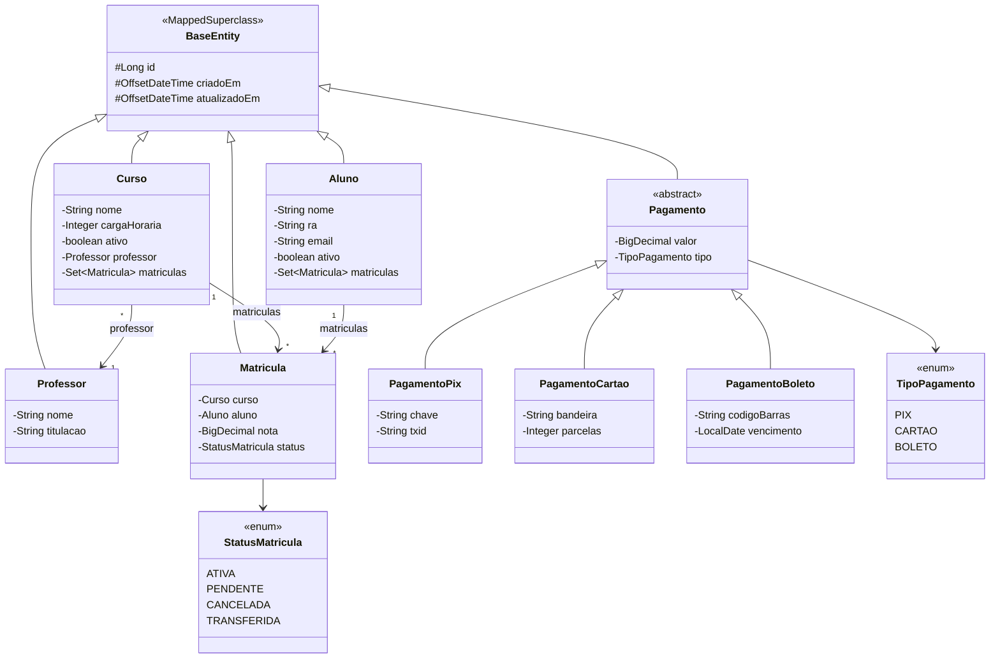
```mermaid
classDiagram
    class BaseEntity {
        <<MappedSuperclass>>
        #Long id
        #OffsetDateTime criadoEm
        #OffsetDateTime atualizadoEm
    }

    class Aluno {
        -String nome
        -String ra
        -String email
        -boolean ativo
        -Set~Matricula~ matriculas
    }

    class Professor {
        -String nome
        -String titulacao
    }

    class Curso {
        -String nome
        -Integer cargaHoraria
        -boolean ativo
        -Professor professor
        -Set~Matricula~ matriculas
    }

    class Matricula {
        -Curso curso
        -Aluno aluno
        -BigDecimal nota
        -StatusMatricula status
    }

    class StatusMatricula {
        <<enum>>
        ATIVA
        PENDENTE
        CANCELADA
        TRANSFERIDA
    }

    class Pagamento {
        <<abstract>>
        -BigDecimal valor
        -TipoPagamento tipo
    }

    class PagamentoPix {
        -String chave
        -String txid
    }

    class PagamentoCartao {
        -String bandeira
        -Integer parcelas
    }

    class PagamentoBoleto {
        -String codigoBarras
        -LocalDate vencimento
    }

    class TipoPagamento {
        <<enum>>
        PIX
        CARTAO
        BOLETO
    }

    BaseEntity <|-- Aluno
    BaseEntity <|-- Professor
    BaseEntity <|-- Curso
    BaseEntity <|-- Matricula
    BaseEntity <|-- Pagamento

    Pagamento <|-- PagamentoPix
    Pagamento <|-- PagamentoCartao
    Pagamento <|-- PagamentoBoleto

    Curso "1" --> "*" Matricula : matriculas
    Aluno "1" --> "*" Matricula : matriculas
    Curso "*" --> "1" Professor : professor
    Matricula --> StatusMatricula
    Pagamento --> TipoPagamento
```

### Diagrama ER

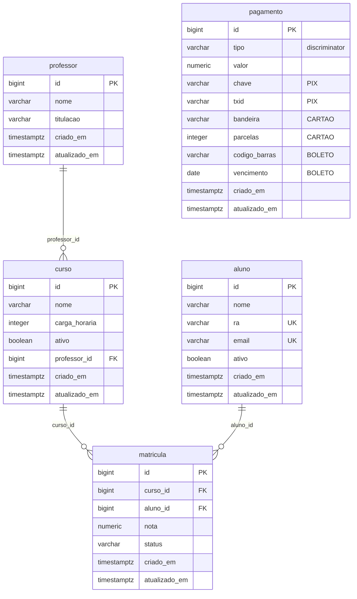
```mermaid
erDiagram
    professor {
        bigint id PK
        varchar nome
        varchar titulacao
        timestamptz criado_em
        timestamptz atualizado_em
    }
    curso {
        bigint id PK
        varchar nome
        integer carga_horaria
        boolean ativo
        bigint professor_id FK
        timestamptz criado_em
        timestamptz atualizado_em
    }
    aluno {
        bigint id PK
        varchar nome
        varchar ra UK
        varchar email UK
        boolean ativo
        timestamptz criado_em
        timestamptz atualizado_em
    }
    matricula {
        bigint id PK
        bigint curso_id FK
        bigint aluno_id FK
        numeric nota
        varchar status
        timestamptz criado_em
        timestamptz atualizado_em
    }
    pagamento {
        bigint id PK
        varchar tipo "discriminator"
        numeric valor
        varchar chave "PIX"
        varchar txid "PIX"
        varchar bandeira "CARTAO"
        integer parcelas "CARTAO"
        varchar codigo_barras "BOLETO"
        date vencimento "BOLETO"
        timestamptz criado_em
        timestamptz atualizado_em
    }

    professor ||--o{ curso : "professor_id"
    curso ||--o{ matricula : "curso_id"
    aluno ||--o{ matricula : "aluno_id"
```

### Código das entidades

```java
@MappedSuperclass
public abstract class BaseEntity implements Serializable {

    @Id
    @GeneratedValue(strategy = GenerationType.IDENTITY)
    private Long id;

    @CreationTimestamp
    @Column(nullable = false, updatable = false, columnDefinition = "TIMESTAMPTZ")
    private OffsetDateTime criadoEm;

    @UpdateTimestamp
    @Column(nullable = false, columnDefinition = "TIMESTAMPTZ")
    private OffsetDateTime atualizadoEm;

    @Override
    public boolean equals(Object o) {
        if (this == o) return true;
        if (!(o instanceof BaseEntity that)) return false;
        Class<?> thisType = Hibernate.getClass(this);
        Class<?> thatType = Hibernate.getClass(that);
        if (thisType != thatType) return false;
        return getId() != null && getId().equals(that.getId());
    }

    @Override
    public int hashCode() {
        return 31;
    }
}
```

```java
@Entity
@Table(
    name = "aluno",
    uniqueConstraints = {
        @UniqueConstraint(name = "uk_aluno_ra", columnNames = "ra"),
        @UniqueConstraint(name = "uk_aluno_email", columnNames = "email")
    }
)
public class Aluno extends BaseEntity {

    @Column(nullable = false, length = 200)
    private String nome;

    @NaturalId
    @Column(nullable = false, length = 20)
    private String ra;

    @Column(length = 255)
    private String email;

    @Column(nullable = false)
    private boolean ativo = true;

    @OneToMany(mappedBy = "aluno")
    private Set<Matricula> matriculas = new HashSet<>();
}
```

```java
@Entity
@Table(name = "professor")
public class Professor extends BaseEntity {

    @Column(nullable = false, length = 200)
    private String nome;

    @Column(length = 100)
    private String titulacao;
}
```

```java
@Entity
@Table(name = "curso")
@NamedEntityGraphs({
    @NamedEntityGraph(
        name = "Curso.resumo",
        attributeNodes = @NamedAttributeNode("professor")
    ),
    @NamedEntityGraph(
        name = "Curso.completo",
        attributeNodes = {
            @NamedAttributeNode("professor"),
            @NamedAttributeNode(value = "matriculas", subgraph = "matriculas-aluno")
        },
        subgraphs = @NamedSubgraph(
            name = "matriculas-aluno",
            attributeNodes = @NamedAttributeNode("aluno")
        )
    )
})
public class Curso extends BaseEntity {

    @Column(nullable = false, length = 200)
    private String nome;

    @Column(nullable = false)
    private Integer cargaHoraria;

    @Column(nullable = false)
    private boolean ativo = true;

    @ManyToOne(fetch = FetchType.LAZY)
    @JoinColumn(
        name = "professor_id",
        foreignKey = @ForeignKey(name = "fk_curso_professor")
    )
    private Professor professor;

    @OneToMany(mappedBy = "curso", cascade = CascadeType.ALL, orphanRemoval = true)
    @BatchSize(size = 25)
    private Set<Matricula> matriculas = new HashSet<>();
}
```

```java
public enum StatusMatricula {
    ATIVA, PENDENTE, CANCELADA, TRANSFERIDA
}
```

```java
@Entity
@Table(
    name = "matricula",
    uniqueConstraints = @UniqueConstraint(
        name = "uk_matricula_curso_aluno",
        columnNames = {"curso_id", "aluno_id"}
    )
)
public class Matricula extends BaseEntity {

    @ManyToOne(fetch = FetchType.LAZY)
    @JoinColumn(
        name = "curso_id",
        nullable = false,
        foreignKey = @ForeignKey(name = "fk_matricula_curso")
    )
    private Curso curso;

    @ManyToOne(fetch = FetchType.LAZY)
    @JoinColumn(
        name = "aluno_id",
        nullable = false,
        foreignKey = @ForeignKey(name = "fk_matricula_aluno")
    )
    private Aluno aluno;

    @Column(precision = 4, scale = 2)
    private BigDecimal nota;

    @Enumerated(EnumType.STRING)
    @Column(nullable = false, length = 31)
    private StatusMatricula status = StatusMatricula.PENDENTE;
}
```

```java
public enum TipoPagamento {
    PIX, CARTAO, BOLETO
}
```

```java
@Entity
@Table(name = "pagamento")
@Inheritance(strategy = InheritanceType.SINGLE_TABLE)
@DiscriminatorColumn(name = "tipo", discriminatorType = DiscriminatorType.STRING)
public abstract class Pagamento extends BaseEntity {

    @Column(nullable = false, precision = 19, scale = 2)
    private BigDecimal valor;

    @Column(name = "tipo", insertable = false, updatable = false)
    @Enumerated(EnumType.STRING)
    private TipoPagamento tipo;
}
```

```java
@Entity
@DiscriminatorValue("PIX")
public class PagamentoPix extends Pagamento {

    @Column(length = 255)
    private String chave;

    @Column(length = 255)
    private String txid;
}
```

```java
@Entity
@DiscriminatorValue("CARTAO")
public class PagamentoCartao extends Pagamento {

    @Column(length = 50)
    private String bandeira;

    private Integer parcelas;
}
```

```java
@Entity
@DiscriminatorValue("BOLETO")
public class PagamentoBoleto extends Pagamento {

    @Column(length = 255)
    private String codigoBarras;

    private LocalDate vencimento;
}
```

---

## 1. Derived Queries — Convenção por Nome de Método

O Spring Data gera a query a partir do nome do método. Validação no startup — campo renomeado quebra a inicialização.

### Operadores básicos

```java
public interface AlunoRepository extends JpaRepository<Aluno, Long> {

    // WHERE nome = ?
    Optional<Aluno> findByNome(String nome);

    // WHERE ra = ?
    Optional<Aluno> findByRa(String ra);

    // WHERE nome LIKE '%valor%'
    List<Aluno> findByNomeContaining(String termo);

    // WHERE nome LIKE '%valor%' (case-insensitive)
    List<Aluno> findByNomeContainingIgnoreCase(String termo);

    // WHERE nome LIKE 'valor%'
    List<Aluno> findByNomeStartingWith(String prefixo);

    // WHERE email IS NOT NULL
    List<Aluno> findByEmailIsNotNull();

    // WHERE ativo = true
    List<Aluno> findByAtivoTrue();
}
```

### Operadores de comparação

```java
public interface MatriculaRepository extends JpaRepository<Matricula, Long> {

    // WHERE nota >= ?
    List<Matricula> findByNotaGreaterThanEqual(BigDecimal minima);

    // WHERE nota BETWEEN ? AND ?
    List<Matricula> findByNotaBetween(BigDecimal min, BigDecimal max);

    // WHERE status IN (?, ?, ...)
    List<Matricula> findByStatusIn(Collection<StatusMatricula> statuses);

    // WHERE criado_em > ?
    List<Matricula> findByCriadoEmAfter(OffsetDateTime data);

    // WHERE criado_em BETWEEN ? AND ?
    List<Matricula> findByCriadoEmBetween(OffsetDateTime inicio, OffsetDateTime fim);
}
```

### Navegação em relacionamentos

```java
public interface MatriculaRepository extends JpaRepository<Matricula, Long> {

    // JOIN aluno WHERE aluno.nome = ?
    List<Matricula> findByAlunoNome(String nomeAluno);

    // JOIN curso WHERE curso.id = ?
    List<Matricula> findByCursoId(Long cursoId);

    // JOIN aluno WHERE aluno.ra = ?
    Optional<Matricula> findByCursoIdAndAlunoRa(Long cursoId, String ra);
}
```

### Contagem, existência e deleção

```java
public interface MatriculaRepository extends JpaRepository<Matricula, Long> {

    // SELECT COUNT(*) WHERE curso_id = ?
    long countByCursoId(Long cursoId);

    // SELECT EXISTS WHERE curso_id = ? AND aluno_id = ?
    boolean existsByCursoIdAndAlunoId(Long cursoId, Long alunoId);

    // DELETE WHERE status = ?
    @Transactional
    long deleteByStatus(StatusMatricula status);
}
```

### Limitação de resultados e ordenação

```java
public interface AlunoRepository extends JpaRepository<Aluno, Long> {

    // LIMIT 10 ORDER BY nome ASC
    List<Aluno> findTop10ByOrderByNomeAsc();

    // LIMIT 1 ORDER BY criado_em DESC
    Optional<Aluno> findFirstByOrderByCriadoEmDesc();

    // WHERE ativo = true ORDER BY nome ASC
    List<Aluno> findByAtivoTrueOrderByNomeAsc();
}
```

### Referência rápida de keywords

| Keyword | SQL gerado | Exemplo |
|---|---|---|
| `Is`, `Equals` | `= ?` | `findByNome(String)` |
| `Not` | `<> ?` | `findByStatusNot(Status)` |
| `In` | `IN (?)` | `findByStatusIn(Collection)` |
| `NotIn` | `NOT IN (?)` | `findByStatusNotIn(Collection)` |
| `Like` | `LIKE ?` | `findByNomeLike(String)` |
| `Containing` | `LIKE %?%` | `findByNomeContaining(String)` |
| `StartingWith` | `LIKE ?%` | `findByNomeStartingWith(String)` |
| `EndingWith` | `LIKE %?` | `findByNomeEndingWith(String)` |
| `IgnoreCase` | `UPPER(x) = UPPER(?)` | `findByNomeIgnoreCase(String)` |
| `Between` | `BETWEEN ? AND ?` | `findByNotaBetween(min, max)` |
| `LessThan` | `< ?` | `findByNotaLessThan(BigDecimal)` |
| `LessThanEqual` | `<= ?` | `findByNotaLessThanEqual(BigDecimal)` |
| `GreaterThan` | `> ?` | `findByNotaGreaterThan(BigDecimal)` |
| `GreaterThanEqual` | `>= ?` | `findByNotaGreaterThanEqual(BigDecimal)` |
| `After` | `> ?` (datas) | `findByCriadoEmAfter(OffsetDateTime)` |
| `Before` | `< ?` (datas) | `findByCriadoEmBefore(OffsetDateTime)` |
| `IsNull` | `IS NULL` | `findByEmailIsNull()` |
| `IsNotNull` | `IS NOT NULL` | `findByEmailIsNotNull()` |
| `True` / `False` | `= true` / `= false` | `findByAtivoTrue()` |
| `OrderBy` | `ORDER BY` | `findByAtivoTrueOrderByNomeAsc()` |
| `Top` / `First` | `LIMIT` | `findTop10By...()` / `findFirstBy...()` |
| `Distinct` | `SELECT DISTINCT` | `findDistinctByNome(String)` |

---

## 2. JPQL com @Query

Para consultas que vão além do que derived queries expressam. Validação automática no startup.

### Consultas básicas

```java
public interface MatriculaRepository extends JpaRepository<Matricula, Long> {

    @Query("SELECT m FROM Matricula m WHERE m.nota >= :minima ORDER BY m.nota DESC")
    List<Matricula> findComNotaAcimaDe(@Param("minima") BigDecimal minima);

    @Query("SELECT m FROM Matricula m WHERE m.curso.id = :cursoId AND m.status = :status")
    List<Matricula> findByCursoAndStatus(
        @Param("cursoId") Long cursoId,
        @Param("status") StatusMatricula status
    );
}
```

### JOIN FETCH para evitar N+1

```java
@Query("""
    SELECT m FROM Matricula m
    JOIN FETCH m.aluno
    JOIN FETCH m.curso
    WHERE m.curso.id = :cursoId
    """)
List<Matricula> findByCursoComRelacionamentos(@Param("cursoId") Long cursoId);
```

### Subconsultas

```java
@Query("""
    SELECT a FROM Aluno a
    WHERE a.id NOT IN (
        SELECT m.aluno.id FROM Matricula m WHERE m.curso.id = :cursoId
    )
    """)
List<Aluno> findAlunosNaoMatriculadosNoCurso(@Param("cursoId") Long cursoId);
```

### Agregações

```java
@Query("""
    SELECT c.nome, COUNT(m), AVG(m.nota)
    FROM Curso c
    LEFT JOIN c.matriculas m
    GROUP BY c.nome
    HAVING COUNT(m) > :minAlunos
    ORDER BY AVG(m.nota) DESC
    """)
List<Object[]> findEstatisticasCursos(@Param("minAlunos") long minAlunos);
```

### CASE WHEN em JPQL

```java
@Query("""
    SELECT a.nome,
           CASE
               WHEN AVG(m.nota) >= 9.0 THEN 'EXCELENTE'
               WHEN AVG(m.nota) >= 7.0 THEN 'BOM'
               WHEN AVG(m.nota) >= 5.0 THEN 'REGULAR'
               ELSE 'INSUFICIENTE'
           END
    FROM Aluno a
    LEFT JOIN a.matriculas m
    GROUP BY a.id, a.nome
    """)
List<Object[]> findAlunosComConceito();
```

### JPQL com tipos temporais

```java
@Query("""
    SELECT m FROM Matricula m
    WHERE m.criadoEm >= :inicio
      AND m.criadoEm < :fim
      AND m.status = :status
    ORDER BY m.criadoEm DESC
    """)
List<Matricula> findPorPeriodoEStatus(
    @Param("inicio") OffsetDateTime inicio,
    @Param("fim") OffsetDateTime fim,
    @Param("status") StatusMatricula status
);
```

### COALESCE e funções JPQL

```java
@Query("""
    SELECT m FROM Matricula m
    WHERE COALESCE(m.nota, 0) >= :minima
    """)
List<Matricula> findComNotaOuZero(@Param("minima") BigDecimal minima);

@Query("SELECT LOWER(a.nome) FROM Aluno a WHERE LOWER(a.nome) LIKE LOWER(CONCAT('%', :termo, '%'))")
List<String> findNomesLike(@Param("termo") String termo);

@Query("SELECT SIZE(c.matriculas) FROM Curso c WHERE c.id = :cursoId")
int countMatriculasDoCurso(@Param("cursoId") Long cursoId);
```

---

## 3. Queries Nativas

Para SQL que o JPQL não expressa: CTEs, window functions, operadores específicos do PostgreSQL.

### Query nativa básica

```java
@Query(value = "SELECT * FROM aluno WHERE ra ~ :regex", nativeQuery = true)
List<Aluno> findByRaRegex(@Param("regex") String regex);
```

### Window functions

```java
@Query(value = """
    SELECT a.id, a.nome, a.ra, m.nota,
           RANK() OVER (PARTITION BY m.curso_id ORDER BY m.nota DESC) AS posicao
    FROM aluno a
    JOIN matricula m ON m.aluno_id = a.id
    WHERE m.curso_id = :cursoId
    """, nativeQuery = true)
List<Object[]> findRankingDoCurso(@Param("cursoId") Long cursoId);
```

### CTE (Common Table Expression)

```java
@Query(value = """
    WITH media_por_aluno AS (
        SELECT m.aluno_id, AVG(m.nota) AS media
        FROM matricula m
        WHERE m.status = 'ATIVA'
        GROUP BY m.aluno_id
    )
    SELECT a.id, a.nome, a.ra, mpa.media
    FROM aluno a
    JOIN media_por_aluno mpa ON mpa.aluno_id = a.id
    WHERE mpa.media >= :mediaMinima
    ORDER BY mpa.media DESC
    """, nativeQuery = true)
List<Object[]> findAlunosComMediaAcimaDe(@Param("mediaMinima") BigDecimal mediaMinima);
```

### Operadores PostgreSQL específicos

```java
// Array contains
@Query(value = "SELECT * FROM aluno WHERE tags @> ARRAY[:tag]::varchar[]", nativeQuery = true)
List<Aluno> findByTag(@Param("tag") String tag);

// JSONB
@Query(value = "SELECT * FROM config WHERE dados ->> 'tema' = :tema", nativeQuery = true)
List<Config> findByTema(@Param("tema") String tema);

// = ANY (performance melhor que IN para listas grandes)
@Query(value = "SELECT * FROM aluno WHERE id = ANY(:ids)", nativeQuery = true)
List<Aluno> findByIds(@Param("ids") Long[] ids);
```

### Query nativa com paginação

```java
@Query(
    value = "SELECT * FROM aluno WHERE nome ILIKE '%' || :termo || '%'",
    countQuery = "SELECT COUNT(*) FROM aluno WHERE nome ILIKE '%' || :termo || '%'",
    nativeQuery = true
)
Page<Aluno> searchByNome(@Param("termo") String termo, Pageable pageable);
```

O `countQuery` é obrigatório para paginação com queries nativas — o Spring Data não consegue derivar o count automaticamente.

### Mapeamento de resultado nativo com @SqlResultSetMapping

```java
@Entity
@SqlResultSetMapping(
    name = "RankingAlunoMapping",
    classes = @ConstructorResult(
        targetClass = RankingAlunoDTO.class,
        columns = {
            @ColumnResult(name = "id", type = Long.class),
            @ColumnResult(name = "nome", type = String.class),
            @ColumnResult(name = "media", type = BigDecimal.class),
            @ColumnResult(name = "posicao", type = Long.class)
        }
    )
)
public class Aluno { }
```

```java
public record RankingAlunoDTO(Long id, String nome, BigDecimal media, Long posicao) {}
```

---

## 4. Projeções — Retornando Apenas o Necessário

Evitam carregar a entidade inteira quando só precisa de alguns campos. Sem dirty checking, sem overhead de gerenciamento.

### Interface projection (recomendada para queries simples)

```java
public interface CursoResumo {
    Long getId();
    String getNome();
    long getTotalMatriculas();
}
```

```java
public interface CursoRepository extends JpaRepository<Curso, Long> {

    @Query("""
        SELECT c.id AS id, c.nome AS nome, COUNT(m) AS totalMatriculas
        FROM Curso c
        LEFT JOIN c.matriculas m
        GROUP BY c.id, c.nome
        """)
    List<CursoResumo> findAllResumos();

    // Derived query com projeção
    List<CursoResumo> findByNomeContaining(String termo);
}
```

O Hibernate cria proxies da interface — sem instanciar a entidade.

### Record projection (Java 17+, tipagem forte)

```java
public record MatriculaResumo(
    String nomeAluno,
    String nomeCurso,
    BigDecimal nota,
    StatusMatricula status
) {}
```

```java
@Query("""
    SELECT new com.exemplo.dto.MatriculaResumo(
        a.nome, c.nome, m.nota, m.status
    )
    FROM Matricula m
    JOIN m.aluno a
    JOIN m.curso c
    WHERE m.status = :status
    ORDER BY a.nome
    """)
List<MatriculaResumo> findResumosPorStatus(@Param("status") StatusMatricula status);
```

O construtor `new` no JPQL exige o caminho completo da classe (fully qualified name).

### Interface projection com SpEL (campo calculado)

```java
public interface AlunoComMedia {
    Long getId();
    String getNome();
    String getRa();
    BigDecimal getMediaNotas();

    // Campo calculado via SpEL
    @Value("#{target.mediaNotas >= 7.0 ? 'APROVADO' : 'REPROVADO'}")
    String getSituacao();
}
```

### Interface projection com projeção aninhada

```java
public interface MatriculaDetalhe {
    BigDecimal getNota();
    StatusMatricula getStatus();
    AlunoResumo getAluno();
    CursoResumo getCurso();

    interface AlunoResumo {
        String getNome();
        String getRa();
    }

    interface CursoResumo {
        String getNome();
        Integer getCargaHoraria();
    }
}
```

```java
List<MatriculaDetalhe> findByCursoId(Long cursoId);
```

O Hibernate carrega só os campos projetados das entidades relacionadas.

### Projeção nativa com interface

```java
public interface AlunoRanking {
    Long getId();
    String getNome();
    BigDecimal getMedia();
    Long getPosicao();
}

@Query(value = """
    SELECT a.id, a.nome,
           AVG(m.nota) AS media,
           RANK() OVER (ORDER BY AVG(m.nota) DESC) AS posicao
    FROM aluno a
    JOIN matricula m ON m.aluno_id = a.id
    GROUP BY a.id, a.nome
    """, nativeQuery = true)
List<AlunoRanking> findRanking();
```

### Comparação de projeções

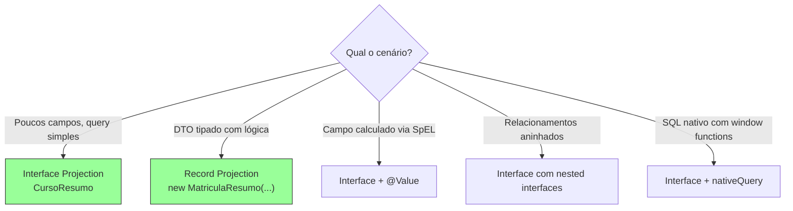
```mermaid
flowchart TD
    A{Qual o cenário?} -->|"Poucos campos, query simples"| B["Interface Projection\nCursoResumo"]
    A -->|"DTO tipado com lógica"| C["Record Projection\nnew MatriculaResumo(...)"]
    A -->|"Campo calculado via SpEL"| D["Interface + @Value"]
    A -->|"Relacionamentos aninhados"| E["Interface com nested interfaces"]
    A -->|"SQL nativo com window functions"| F["Interface + nativeQuery"]

    style B fill:#9f9,stroke:#333
    style C fill:#9f9,stroke:#333
```

| Tipo | Dirty checking | JOIN FETCH | SpEL | Native SQL |
|---|---|---|---|---|
| Entidade completa | Sim | Sim | Não | Sim |
| Interface projection | Não | Não necessário | Sim | Sim |
| Record / DTO projection | Não | Não necessário | Não | Não (usar `@SqlResultSetMapping`) |
| `Object[]` | Não | Não necessário | Não | Sim |

---

## 5. Specifications — Filtros Dinâmicos Tipados

Para consultas com filtros opcionais construídos em runtime. Combina com Metamodel para type-safety.

### Setup

```java
public interface MatriculaRepository extends
        JpaRepository<Matricula, Long>,
        JpaSpecificationExecutor<Matricula> {
}
```

### Specifications individuais

```java
public class MatriculaSpecs {

    public static Specification<Matricula> comStatus(StatusMatricula status) {
        return (root, query, cb) -> cb.equal(root.get(Matricula_.status), status);
    }

    public static Specification<Matricula> notaAcimaDe(BigDecimal minima) {
        return (root, query, cb) -> cb.greaterThanOrEqualTo(root.get(Matricula_.nota), minima);
    }

    public static Specification<Matricula> doCurso(Long cursoId) {
        return (root, query, cb) -> cb.equal(
            root.get(Matricula_.curso).get(Curso_.id), cursoId
        );
    }

    public static Specification<Matricula> doAlunoPorNome(String nome) {
        return (root, query, cb) -> {
            Join<Matricula, Aluno> aluno = root.join(Matricula_.aluno);
            return cb.like(cb.lower(aluno.get(Aluno_.nome)), "%" + nome.toLowerCase() + "%");
        };
    }

    public static Specification<Matricula> criadaEntre(OffsetDateTime inicio, OffsetDateTime fim) {
        return (root, query, cb) -> cb.between(root.get(Matricula_.criadoEm), inicio, fim);
    }
}
```

### Composição dinâmica a partir de filtros

```java
public record MatriculaFiltro(
    StatusMatricula status,
    BigDecimal notaMinima,
    Long cursoId,
    String nomeAluno,
    OffsetDateTime inicio,
    OffsetDateTime fim
) {}
```

```java
@Service
public class MatriculaService {

    private final MatriculaRepository repository;

    public Page<Matricula> buscar(MatriculaFiltro filtro, Pageable pageable) {
        Specification<Matricula> spec = Specification.where(null);

        if (filtro.status() != null)
            spec = spec.and(MatriculaSpecs.comStatus(filtro.status()));

        if (filtro.notaMinima() != null)
            spec = spec.and(MatriculaSpecs.notaAcimaDe(filtro.notaMinima()));

        if (filtro.cursoId() != null)
            spec = spec.and(MatriculaSpecs.doCurso(filtro.cursoId()));

        if (filtro.nomeAluno() != null && !filtro.nomeAluno().isBlank())
            spec = spec.and(MatriculaSpecs.doAlunoPorNome(filtro.nomeAluno()));

        if (filtro.inicio() != null && filtro.fim() != null)
            spec = spec.and(MatriculaSpecs.criadaEntre(filtro.inicio(), filtro.fim()));

        return repository.findAll(spec, pageable);
    }
}
```

### SpecBuilder genérico (reduz boilerplate)

```java
public class SpecBuilder<T> {

    private final List<Specification<T>> specs = new ArrayList<>();

    public <V> SpecBuilder<T> equalIfPresent(SingularAttribute<T, V> attr, V value) {
        if (value != null) {
            specs.add((root, query, cb) -> cb.equal(root.get(attr), value));
        }
        return this;
    }

    public <V extends Comparable<? super V>> SpecBuilder<T> greaterThanIfPresent(
            SingularAttribute<T, V> attr, V value) {
        if (value != null) {
            specs.add((root, query, cb) -> cb.greaterThanOrEqualTo(root.get(attr), value));
        }
        return this;
    }

    public <V extends Comparable<? super V>> SpecBuilder<T> betweenIfPresent(
            SingularAttribute<T, V> attr, V inicio, V fim) {
        if (inicio != null && fim != null) {
            specs.add((root, query, cb) -> cb.between(root.get(attr), inicio, fim));
        }
        return this;
    }

    public SpecBuilder<T> likeIfPresent(SingularAttribute<T, String> attr, String value) {
        if (value != null && !value.isBlank()) {
            specs.add((root, query, cb) ->
                cb.like(cb.lower(root.get(attr)), "%" + value.toLowerCase() + "%"));
        }
        return this;
    }

    public SpecBuilder<T> and(Specification<T> spec) {
        specs.add(spec);
        return this;
    }

    public Specification<T> build() {
        return specs.stream()
            .reduce(Specification.where(null), Specification::and);
    }
}
```

Uso:

```java
Specification<Matricula> spec = new SpecBuilder<Matricula>()
    .equalIfPresent(Matricula_.status, filtro.status())
    .greaterThanIfPresent(Matricula_.nota, filtro.notaMinima())
    .betweenIfPresent(Matricula_.criadoEm, filtro.inicio(), filtro.fim())
    .build();

Page<Matricula> resultado = repository.findAll(spec, pageable);
```

---

## 6. Criteria API com Metamodel Estático

Para queries complexas construídas programaticamente com total type-safety.

### Configuração do Metamodel

```xml
<dependency>
    <groupId>org.hibernate.orm</groupId>
    <artifactId>hibernate-jpamodelgen</artifactId>
    <scope>provided</scope>
</dependency>
```

### Consulta com Criteria

```java
@Repository
public class MatriculaQueryRepository {

    private final EntityManager entityManager;

    public MatriculaQueryRepository(EntityManager entityManager) {
        this.entityManager = entityManager;
    }

    public List<Matricula> buscar(StatusMatricula status, BigDecimal notaMinima) {
        CriteriaBuilder cb = entityManager.getCriteriaBuilder();
        CriteriaQuery<Matricula> cq = cb.createQuery(Matricula.class);
        Root<Matricula> root = cq.from(Matricula.class);

        List<Predicate> predicates = new ArrayList<>();

        if (status != null) {
            predicates.add(cb.equal(root.get(Matricula_.status), status));
        }
        if (notaMinima != null) {
            predicates.add(cb.greaterThanOrEqualTo(root.get(Matricula_.nota), notaMinima));
        }

        cq.where(predicates.toArray(Predicate[]::new));
        cq.orderBy(cb.desc(root.get(Matricula_.nota)));

        return entityManager.createQuery(cq).getResultList();
    }
}
```

### Criteria com JOIN e projeção em DTO

```java
public List<MatriculaResumo> listarResumo(Long cursoId) {
    CriteriaBuilder cb = entityManager.getCriteriaBuilder();
    CriteriaQuery<MatriculaResumo> cq = cb.createQuery(MatriculaResumo.class);
    Root<Matricula> root = cq.from(Matricula.class);
    Join<Matricula, Aluno> aluno = root.join(Matricula_.aluno);
    Join<Matricula, Curso> curso = root.join(Matricula_.curso);

    cq.select(cb.construct(
        MatriculaResumo.class,
        aluno.get(Aluno_.nome),
        curso.get(Curso_.nome),
        root.get(Matricula_.nota),
        root.get(Matricula_.status)
    ));

    cq.where(cb.equal(root.get(Matricula_.curso).get(Curso_.id), cursoId));
    cq.orderBy(cb.desc(root.get(Matricula_.nota)));

    return entityManager.createQuery(cq).getResultList();
}
```

### Criteria com agregação

```java
public List<Object[]> estatisticasPorCurso() {
    CriteriaBuilder cb = entityManager.getCriteriaBuilder();
    CriteriaQuery<Object[]> cq = cb.createQuery(Object[].class);
    Root<Matricula> root = cq.from(Matricula.class);
    Join<Matricula, Curso> curso = root.join(Matricula_.curso);

    cq.multiselect(
        curso.get(Curso_.nome),
        cb.count(root),
        cb.avg(root.get(Matricula_.nota)),
        cb.min(root.get(Matricula_.nota)),
        cb.max(root.get(Matricula_.nota))
    );

    cq.groupBy(curso.get(Curso_.nome));
    cq.having(cb.gt(cb.count(root), 5));
    cq.orderBy(cb.desc(cb.avg(root.get(Matricula_.nota))));

    return entityManager.createQuery(cq).getResultList();
}
```

### Quando usar Criteria vs JPQL vs Specification

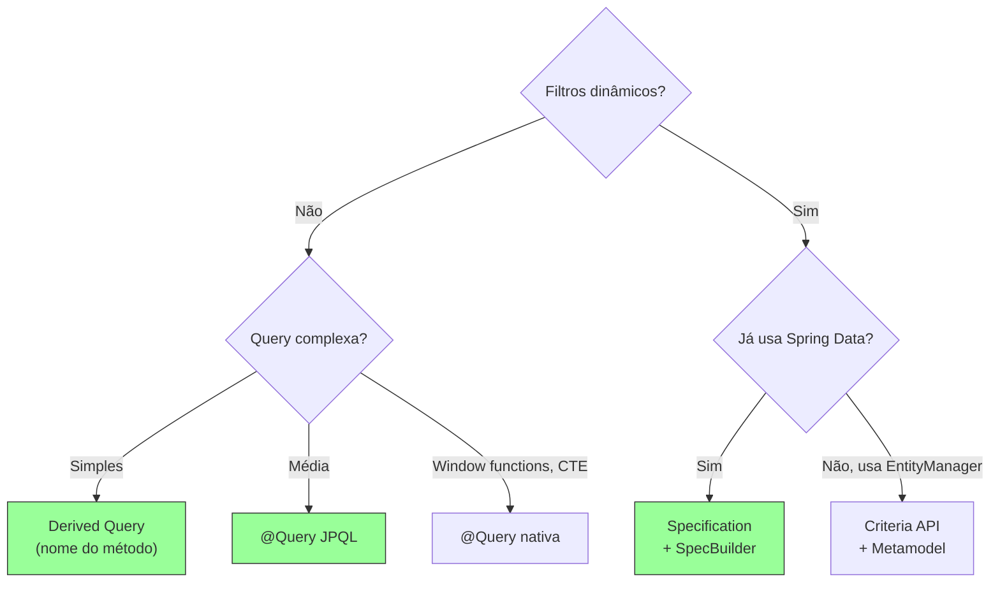
```mermaid
flowchart TD
    A{Filtros dinâmicos?} -->|Não| B{Query complexa?}
    A -->|Sim| C{Já usa Spring Data?}

    B -->|Simples| D["Derived Query\n(nome do método)"]
    B -->|Média| E["@Query JPQL"]
    B -->|Window functions, CTE| F["@Query nativa"]

    C -->|Sim| G["Specification\n+ SpecBuilder"]
    C -->|Não, usa EntityManager| H["Criteria API\n+ Metamodel"]

    style D fill:#9f9,stroke:#333
    style E fill:#9f9,stroke:#333
    style G fill:#9f9,stroke:#333
```

---

## 7. Paginação e Ordenação

### Paginação básica

```java
public interface AlunoRepository extends JpaRepository<Aluno, Long> {

    Page<Aluno> findByNomeContaining(String nome, Pageable pageable);
}
```

```java
// Página 0 (primeira), 20 itens, ordenado por nome
Pageable pageable = PageRequest.of(0, 20, Sort.by("nome").ascending());
Page<Aluno> pagina = repository.findByNomeContaining("Silva", pageable);

pagina.getContent();        // List<Aluno> da página
pagina.getTotalElements();  // total de registros
pagina.getTotalPages();     // total de páginas
pagina.getNumber();         // página atual (0-based)
pagina.hasNext();           // tem próxima?
```

### Ordenação múltipla

```java
Sort sort = Sort.by(
    Sort.Order.desc("nota"),
    Sort.Order.asc("aluno.nome")
);
Pageable pageable = PageRequest.of(0, 20, sort);
```

### Slice vs Page (sem COUNT)

`Page` executa uma query extra de `COUNT` para calcular o total. Se não precisa do total (scroll infinito):

```java
Slice<Aluno> slice = repository.findByAtivoTrue(PageRequest.of(0, 20));

slice.getContent();   // List<Aluno>
slice.hasNext();      // tem mais? (busca N+1 registros para saber)
// NÃO tem getTotalElements() nem getTotalPages()
```

### Paginação com @Query JPQL

```java
@Query("""
    SELECT m FROM Matricula m
    JOIN FETCH m.aluno
    WHERE m.curso.id = :cursoId
    """)
Page<Matricula> findByCursoComAluno(
    @Param("cursoId") Long cursoId,
    Pageable pageable
);
```

**Cuidado:** `JOIN FETCH` com coleções (`OneToMany`) + paginação causa `HHH90003004: firstResult/maxResults specified with collection fetch; applying in memory!` — o Hibernate carrega tudo e pagina em memória. Use `@EntityGraph` ou `@BatchSize` nesses casos.

### Paginação com Specification

```java
Page<Matricula> resultado = repository.findAll(spec, PageRequest.of(0, 20, Sort.by("nota").descending()));
```

### Paginação keyset (cursor-based) — melhor performance em tabelas grandes

Em vez de `OFFSET` (que fica lento em páginas altas), use cursor baseado na última chave:

```java
@Query("""
    SELECT m FROM Matricula m
    WHERE m.criadoEm < :cursor
    ORDER BY m.criadoEm DESC
    """)
List<Matricula> findProximaPagina(
    @Param("cursor") OffsetDateTime cursor,
    Pageable pageable
);
```

```java
// Primeira página
List<Matricula> primeira = repository.findProximaPagina(
    OffsetDateTime.now(), PageRequest.ofSize(20)
);

// Próxima página — usa o último criadoEm como cursor
OffsetDateTime ultimoTimestamp = primeira.getLast().getCriadoEm();
List<Matricula> segunda = repository.findProximaPagina(
    ultimoTimestamp, PageRequest.ofSize(20)
);
```

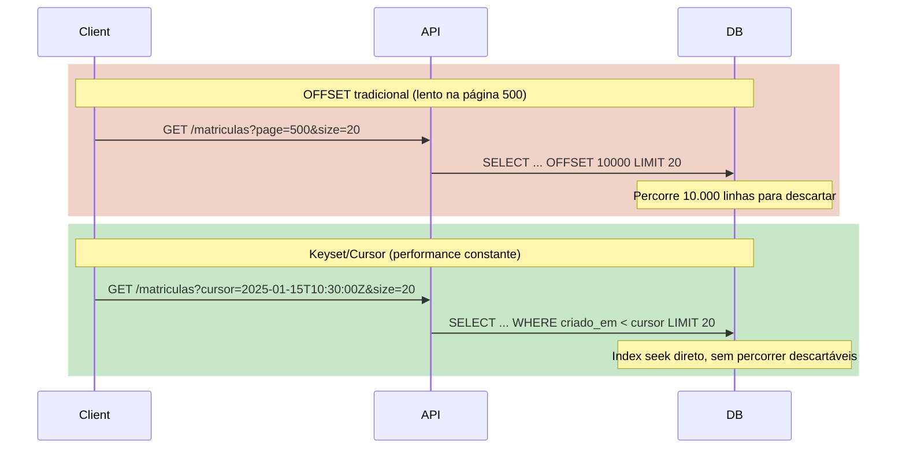
```mermaid
sequenceDiagram
    participant Client
    participant API
    participant DB

    rect rgb(240, 210, 200)
        Note over Client,DB: OFFSET tradicional (lento na página 500)
        Client->>API: GET /matriculas?page=500&size=20
        API->>DB: SELECT ... OFFSET 10000 LIMIT 20
        Note over DB: Percorre 10.000 linhas para descartar
    end

    rect rgb(200, 230, 200)
        Note over Client,DB: Keyset/Cursor (performance constante)
        Client->>API: GET /matriculas?cursor=2025-01-15T10:30:00Z&size=20
        API->>DB: SELECT ... WHERE criado_em < cursor LIMIT 20
        Note over DB: Index seek direto, sem percorrer descartáveis
    end
```

---

## 8. Query by Example (QBE)

Abordagem simples para filtros baseados numa instância-exemplo da entidade. Útil para formulários de busca com muitos campos opcionais.

### Setup

```java
public interface AlunoRepository extends
        JpaRepository<Aluno, Long>,
        QueryByExampleExecutor<Aluno> {
}
```

### Uso básico

```java
Aluno exemplo = new Aluno();
exemplo.setNome("Silva");
exemplo.setAtivo(true);

ExampleMatcher matcher = ExampleMatcher.matching()
    .withMatcher("nome", match -> match.contains().ignoreCase())
    .withIgnorePaths("id", "criadoEm", "atualizadoEm");

Example<Aluno> example = Example.of(exemplo, matcher);

List<Aluno> resultado = repository.findAll(example);
// WHERE LOWER(nome) LIKE '%silva%' AND ativo = true
```

### QBE com paginação

```java
Page<Aluno> pagina = repository.findAll(example, PageRequest.of(0, 20, Sort.by("nome")));
```

### Limitações do QBE

- Não suporta operadores de comparação (`>=`, `<`, `BETWEEN`).
- Não suporta `OR` (só `AND`).
- Não navega relacionamentos.
- Campos nulos são ignorados (não dá para buscar "onde campo IS NULL").

Para filtros mais complexos, use Specifications.

---

## 9. Consultas em Lote — Verificação de IDs

### Validação pura — COUNT e comparação

```java
@Query("SELECT COUNT(e.id) FROM Entity e WHERE e.id IN :ids")
long countByIdIn(@Param("ids") Collection<Long> ids);
```

```java
if (repository.countByIdIn(ids) != ids.size()) {
    throw new EntityNotFoundException("Um ou mais IDs não encontrados");
}
```

### Identificar quais faltam — projeção de IDs

```java
@Query("SELECT e.id FROM Entity e WHERE e.id IN :ids")
Set<Long> findExistingIds(@Param("ids") Collection<Long> ids);
```

```java
Set<Long> existing = repository.findExistingIds(ids);
Set<Long> missing = new HashSet<>(ids);
missing.removeAll(existing);
if (!missing.isEmpty()) {
    throw new EntityNotFoundException("IDs não encontrados: " + missing);
}
```

### PostgreSQL — = ANY para listas grandes (centenas+)

```java
@Query(value = "SELECT id FROM entity WHERE id = ANY(:ids)", nativeQuery = true)
Set<Long> findExistingIds(@Param("ids") Long[] ids);
```

### Antipattern: N+1 em loop

```java
// NUNCA — N roundtrips ao banco
ids.forEach(id -> repository.findById(id)
    .orElseThrow(() -> new EntityNotFoundException(id)));

// CORRETO — 1 roundtrip
Set<Long> existentes = repository.findExistingIds(ids);
```

---

## 10. Bulk Operations — UPDATE e DELETE em Massa

### @Modifying com flushAutomatically e clearAutomatically

```java
@Modifying(flushAutomatically = true, clearAutomatically = true)
@Query("UPDATE Matricula m SET m.status = :novoStatus WHERE m.status = :statusAtual AND m.criadoEm < :limite")
int atualizarStatus(
    @Param("statusAtual") StatusMatricula statusAtual,
    @Param("novoStatus") StatusMatricula novoStatus,
    @Param("limite") OffsetDateTime limite
);
```

```java
@Modifying(flushAutomatically = true, clearAutomatically = true)
@Query("DELETE FROM Matricula m WHERE m.status = 'CANCELADA' AND m.criadoEm < :limite")
int limparCanceladas(@Param("limite") OffsetDateTime limite);
```

### Bulk nativo para operações complexas

```java
@Modifying
@Query(value = """
    UPDATE matricula m
    SET nota = sub.nova_nota
    FROM (
        SELECT aluno_id, curso_id, nota + :bonus AS nova_nota
        FROM matricula
        WHERE status = 'ATIVA' AND nota IS NOT NULL
    ) sub
    WHERE m.aluno_id = sub.aluno_id AND m.curso_id = sub.curso_id
    """, nativeQuery = true)
int aplicarBonus(@Param("bonus") BigDecimal bonus);
```

### Fluxo do @Modifying

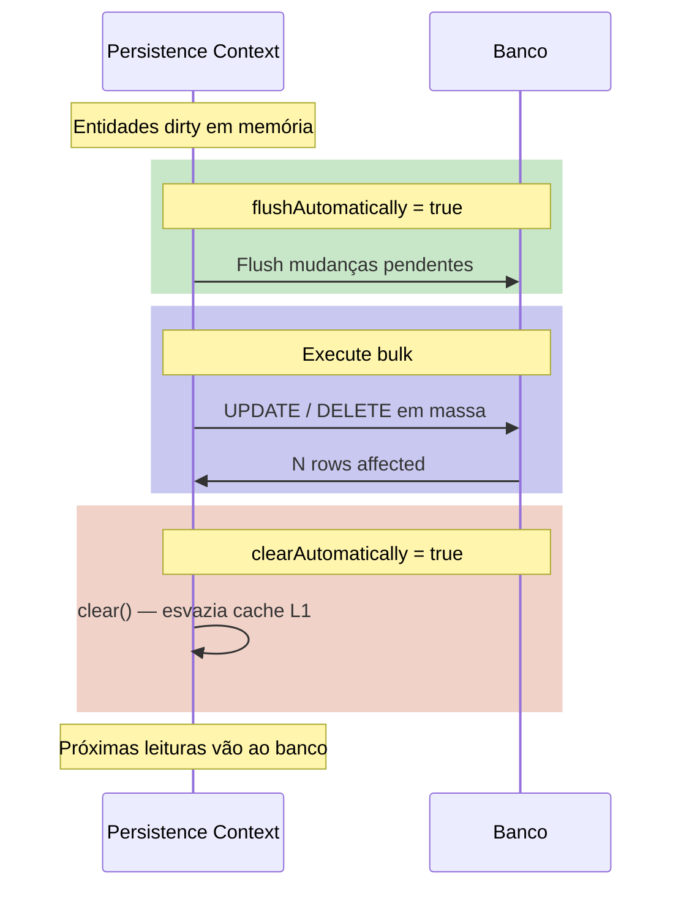
```mermaid
sequenceDiagram
    participant PC as Persistence Context
    participant DB as Banco

    Note over PC: Entidades dirty em memória

    rect rgb(200, 230, 200)
        Note over PC,DB: flushAutomatically = true
        PC->>DB: Flush mudanças pendentes
    end

    rect rgb(200, 200, 240)
        Note over PC,DB: Execute bulk
        PC->>DB: UPDATE / DELETE em massa
        DB->>PC: N rows affected
    end

    rect rgb(240, 210, 200)
        Note over PC,DB: clearAutomatically = true
        PC->>PC: clear() — esvazia cache L1
    end

    Note over PC: Próximas leituras vão ao banco
```

---

## 11. Fetch Strategies — Controle de N+1

### O problema N+1

```java
List<Curso> cursos = cursoRepository.findAll(); // 1 query
for (Curso c : cursos) {
    c.getMatriculas().size(); // 1 query POR CURSO → N queries extras
}
```

### Solução 1: JOIN FETCH no JPQL

```java
@Query("SELECT c FROM Curso c JOIN FETCH c.matriculas WHERE c.id = :id")
Optional<Curso> findByIdComMatriculas(@Param("id") Long id);
```

Uma query com `JOIN`. Não usar com paginação em coleções.

### Solução 2: @EntityGraph

#### No Spring Data — inline por `attributePaths`

```java
@EntityGraph(attributePaths = {"matriculas", "matriculas.aluno"})
@Query("SELECT c FROM Curso c WHERE c.id = :id")
Optional<Curso> findCompletoById(@Param("id") Long id);
```

#### No Spring Data — referenciando @NamedEntityGraph

Defina o grafo na entidade:

```java
@Entity
@NamedEntityGraphs({
    @NamedEntityGraph(
        name = "Curso.resumo",
        attributeNodes = @NamedAttributeNode("professor")
    ),
    @NamedEntityGraph(
        name = "Curso.completo",
        attributeNodes = {
            @NamedAttributeNode("professor"),
            @NamedAttributeNode(value = "matriculas", subgraph = "matriculas-aluno")
        },
        subgraphs = @NamedSubgraph(
            name = "matriculas-aluno",
            attributeNodes = @NamedAttributeNode("aluno")
        )
    )
})
public class Curso {

    @Id
    @GeneratedValue(strategy = GenerationType.IDENTITY)
    private Long id;

    private String nome;

    @ManyToOne(fetch = FetchType.LAZY)
    private Professor professor;

    @OneToMany(mappedBy = "curso")
    private Set<Matricula> matriculas;
}
```

Referência no repository:

```java
public interface CursoRepository extends JpaRepository<Curso, Long> {

    @EntityGraph("Curso.resumo")
    Optional<Curso> findComProfessorById(Long id);

    @EntityGraph("Curso.completo")
    @Query("SELECT c FROM Curso c WHERE c.id = :id")
    Optional<Curso> findCompletoById(@Param("id") Long id);

    @EntityGraph("Curso.completo")
    List<Curso> findByNomeContaining(String nome);
}
```

#### FETCH vs LOAD — tipo do EntityGraph

```java
// FETCH graph — atributos listados: EAGER, todos os demais: LAZY
@EntityGraph(value = "Curso.completo", type = EntityGraph.EntityGraphType.FETCH)
Optional<Curso> findCompletoById(Long id);

// LOAD graph — atributos listados: EAGER, demais: mantém o FetchType da entidade
@EntityGraph(value = "Curso.completo", type = EntityGraph.EntityGraphType.LOAD)
Optional<Curso> findCompletoById(Long id);
```

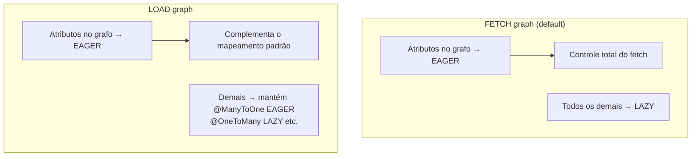
```mermaid
flowchart TD
    subgraph "FETCH graph (default)"
        F1["Atributos no grafo → EAGER"]
        F2["Todos os demais → LAZY"]
        F1 --> F3["Controle total do fetch"]
    end

    subgraph "LOAD graph"
        L1["Atributos no grafo → EAGER"]
        L2["Demais → mantém @ManyToOne EAGER\n@OneToMany LAZY etc."]
        L1 --> L3["Complementa o mapeamento padrão"]
    end
```

| Tipo | Atributos no grafo | Demais atributos |
|---|---|---|
| `FETCH` (default) | EAGER | Forçados LAZY |
| `LOAD` | EAGER | Mantém o FetchType original da entidade |

Na maioria dos casos, `FETCH` é o mais previsível — você define exatamente o que será carregado.

#### JPA puro — EntityGraph dinâmico via EntityManager

Quando o grafo de fetch precisa variar em runtime sem criar múltiplos `@NamedEntityGraph`:

```java
@Repository
public class CursoQueryRepository {

    private final EntityManager entityManager;

    public CursoQueryRepository(EntityManager entityManager) {
        this.entityManager = entityManager;
    }

    public Optional<Curso> findById(Long id, String... fetchAttributes) {
        EntityGraph<Curso> graph = entityManager.createEntityGraph(Curso.class);
        for (String attr : fetchAttributes) {
            graph.addAttributeNodes(attr);
        }

        Map<String, Object> hints = Map.of("jakarta.persistence.fetchgraph", graph);

        Curso curso = entityManager.find(Curso.class, id, hints);
        return Optional.ofNullable(curso);
    }
}
```

Uso:

```java
// Só professor
Optional<Curso> c1 = repository.findById(1L, "professor");

// Professor + matrículas
Optional<Curso> c2 = repository.findById(1L, "professor", "matriculas");

// Só matrículas
Optional<Curso> c3 = repository.findById(1L, "matriculas");
```

#### JPA puro — EntityGraph dinâmico com subgraph (relacionamentos profundos)

Para carregar `Curso → matriculas → aluno` dinamicamente:

```java
public Optional<Curso> findByIdComMatriculasEAlunos(Long id) {
    EntityGraph<Curso> graph = entityManager.createEntityGraph(Curso.class);
    graph.addAttributeNodes("professor");

    Subgraph<Matricula> matriculasSubgraph = graph.addSubgraph("matriculas");
    matriculasSubgraph.addAttributeNodes("aluno");

    Map<String, Object> hints = Map.of("jakarta.persistence.fetchgraph", graph);

    return Optional.ofNullable(entityManager.find(Curso.class, id, hints));
}
```

SQL gerado:

```sql
SELECT c.*, p.*, m.*, a.*
FROM curso c
LEFT JOIN professor p ON p.id = c.professor_id
LEFT JOIN matricula m ON m.curso_id = c.id
LEFT JOIN aluno a ON a.id = m.aluno_id
WHERE c.id = ?
```

#### JPA puro — EntityGraph dinâmico em JPQL

```java
public List<Curso> findAtivosComRelacionamentos(boolean incluirMatriculas) {
    EntityGraph<Curso> graph = entityManager.createEntityGraph(Curso.class);
    graph.addAttributeNodes("professor");

    if (incluirMatriculas) {
        Subgraph<Matricula> sub = graph.addSubgraph("matriculas");
        sub.addAttributeNodes("aluno");
    }

    return entityManager.createQuery("SELECT c FROM Curso c WHERE c.ativo = true", Curso.class)
        .setHint("jakarta.persistence.fetchgraph", graph)
        .getResultList();
}
```

#### JPA puro — reutilizando @NamedEntityGraph por nome

```java
public Optional<Curso> findByIdComGrafoNomeado(Long id, String nomeGrafo) {
    EntityGraph<?> graph = entityManager.getEntityGraph(nomeGrafo);

    Map<String, Object> hints = Map.of("jakarta.persistence.fetchgraph", graph);

    return Optional.ofNullable(entityManager.find(Curso.class, id, hints));
}
```

```java
// Usa o @NamedEntityGraph definido na entidade
Optional<Curso> resumo = repository.findByIdComGrafoNomeado(1L, "Curso.resumo");
Optional<Curso> completo = repository.findByIdComGrafoNomeado(1L, "Curso.completo");
```

#### Diagrama: EntityGraph estático vs dinâmico

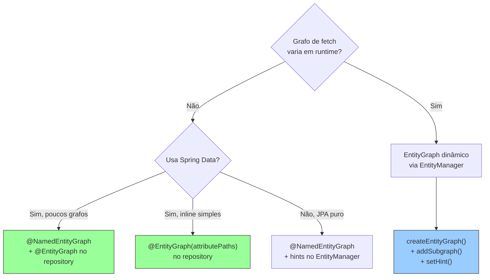
```mermaid
flowchart TD
    A{Grafo de fetch\nvaria em runtime?} -->|Não| B{Usa Spring Data?}
    A -->|Sim| C["EntityGraph dinâmico\nvia EntityManager"]

    B -->|Sim, poucos grafos| D["@NamedEntityGraph\n+ @EntityGraph no repository"]
    B -->|Sim, inline simples| E["@EntityGraph(attributePaths)\nno repository"]
    B -->|Não, JPA puro| F["@NamedEntityGraph\n+ hints no EntityManager"]

    C --> G["createEntityGraph()\n+ addSubgraph()\n+ setHint()"]

    style D fill:#9f9,stroke:#333
    style E fill:#9f9,stroke:#333
    style G fill:#9cf,stroke:#333
```

### Solução 3: @BatchSize (pragmática para paginação)

```java
@Entity
public class Curso {

    @OneToMany(mappedBy = "curso")
    @BatchSize(size = 25)
    private Set<Matricula> matriculas;
}
```

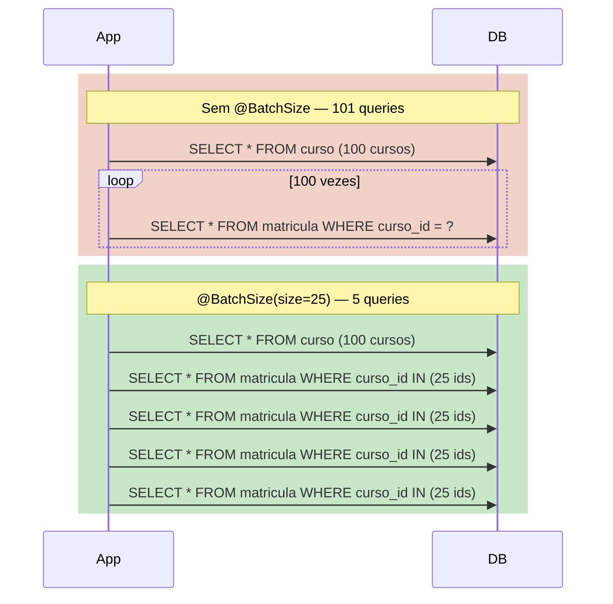
```mermaid
sequenceDiagram
    participant App
    participant DB

    rect rgb(240, 210, 200)
        Note over App,DB: Sem @BatchSize — 101 queries
        App->>DB: SELECT * FROM curso (100 cursos)
        loop 100 vezes
            App->>DB: SELECT * FROM matricula WHERE curso_id = ?
        end
    end

    rect rgb(200, 230, 200)
        Note over App,DB: @BatchSize(size=25) — 5 queries
        App->>DB: SELECT * FROM curso (100 cursos)
        App->>DB: SELECT * FROM matricula WHERE curso_id IN (25 ids)
        App->>DB: SELECT * FROM matricula WHERE curso_id IN (25 ids)
        App->>DB: SELECT * FROM matricula WHERE curso_id IN (25 ids)
        App->>DB: SELECT * FROM matricula WHERE curso_id IN (25 ids)
    end
```

### Solução 4: @Fetch(FetchMode.SUBSELECT)

```java
@OneToMany(mappedBy = "curso")
@Fetch(FetchMode.SUBSELECT)
private Set<Matricula> matriculas;
```

Uma subselect única, independente do número de entidades pai:

```sql
SELECT * FROM matricula WHERE curso_id IN (SELECT id FROM curso WHERE /* query original */)
```

### Comparação de estratégias

| Estratégia | Queries | Compatível com Page | Complexidade |
|---|---|---|---|
| N+1 (default LAZY) | 1 + N | Sim | Nenhuma |
| `JOIN FETCH` | 1 | Não com coleções | Baixa |
| `@EntityGraph` | 1 | Não com coleções | Baixa |
| `@BatchSize` | 1 + ceil(N/batch) | Sim | Nenhuma (config) |
| `FetchMode.SUBSELECT` | 2 | Sim | Nenhuma (config) |

---

## 12. @Formula e @Subselect — Campos e Entidades Calculadas

### @Formula — campo calculado sem coluna

```java
@Entity
public class Curso {

    @Id
    @GeneratedValue(strategy = GenerationType.IDENTITY)
    private Long id;

    private String nome;

    @Formula("(SELECT COUNT(*) FROM matricula m WHERE m.curso_id = id AND m.status = 'ATIVA')")
    private Long totalMatriculasAtivas;

    @Formula("(SELECT COALESCE(AVG(m.nota), 0) FROM matricula m WHERE m.curso_id = id)")
    private BigDecimal mediaNotas;
}
```

O Hibernate injeta a expressão no `SELECT` — sem coluna física, executada a cada carregamento.

### @Subselect — query inteira como entidade read-only

```java
@Entity
@Immutable
@Subselect("""
    SELECT c.id, c.nome,
           COUNT(m.aluno_id) AS total_alunos,
           COALESCE(AVG(m.nota), 0) AS media_notas
    FROM curso c
    LEFT JOIN matricula m ON m.curso_id = c.id
    GROUP BY c.id, c.nome
    """)
@Synchronize({"curso", "matricula"})
public class CursoEstatistica {

    @Id
    private Long id;
    private String nome;
    private Long totalAlunos;
    private BigDecimal mediaNotas;
}
```

O `@Synchronize` garante que o Hibernate faz flush nas tabelas `curso` e `matricula` antes de consultar a "entidade virtual".

Repository funciona normalmente:

```java
public interface CursoEstatisticaRepository extends JpaRepository<CursoEstatistica, Long> {
    List<CursoEstatistica> findByTotalAlunosGreaterThan(Long minimo);
    List<CursoEstatistica> findByMediaNotasGreaterThanEqual(BigDecimal media);
}
```

---

## 13. Chamada de Functions e Stored Procedures

### Function escalar via query nativa

```java
@Query(value = "SELECT calcular_media_ponderada(:alunoId)", nativeQuery = true)
BigDecimal calcularMediaPonderada(@Param("alunoId") Long alunoId);
```

### Function escalar via @Formula

```java
@Formula("calcular_media_ponderada(id)")
private BigDecimal mediaPonderada;
```

### Function tabular via projeção

```java
public interface AlunoCursoProjection {
    Long getAlunoId();
    String getNome();
    BigDecimal getNota();
}

@Query(value = "SELECT * FROM buscar_alunos_por_curso(:cursoId)", nativeQuery = true)
List<AlunoCursoProjection> findAlunosPorCursoViaFunction(@Param("cursoId") Long cursoId);
```

### Registrar function para uso em JPQL (Hibernate 6+)

```java
public class PostgresFunctionContributor implements FunctionContributor {

    @Override
    public void contributeFunctions(FunctionContributions fc) {
        fc.getFunctionRegistry().registerPattern(
            "media_ponderada",
            "calcular_media_ponderada(?1)",
            fc.getTypeConfiguration().getBasicTypeForJavaType(BigDecimal.class)
        );
    }
}
```

Registrar em `META-INF/services/org.hibernate.boot.model.FunctionContributor`. Depois:

```java
@Query("SELECT a FROM Aluno a WHERE media_ponderada(a.id) >= :minima")
List<Aluno> findComMediaPonderadaAcimaDe(@Param("minima") BigDecimal minima);
```

### Stored Procedure via @Procedure

```java
@Procedure(procedureName = "fechar_matriculas_vencidas")
Long fecharMatriculasVencidas(@Param("p_data_limite") OffsetDateTime dataLimite);
```

### Stored Procedure via EntityManager

```java
@Transactional
public long fecharVencidas(OffsetDateTime dataLimite) {
    return (Long) entityManager
        .createStoredProcedureQuery("fechar_matriculas_vencidas")
        .registerStoredProcedureParameter("p_data_limite", OffsetDateTime.class, ParameterMode.IN)
        .registerStoredProcedureParameter("p_total_afetados", Long.class, ParameterMode.INOUT)
        .setParameter("p_data_limite", dataLimite)
        .setParameter("p_total_afetados", 0L)
        .execute() ? 0L : 0L; // get output below

    // query.getOutputParameterValue("p_total_afetados");
}
```

---

## 14. Full-Text Search no PostgreSQL

### Busca simples com ILIKE (sem índice FTS)

```java
@Query(value = "SELECT * FROM aluno WHERE nome ILIKE '%' || :termo || '%'", nativeQuery = true)
List<Aluno> searchByNome(@Param("termo") String termo);
```

### Full-Text Search com `tsvector` e `tsquery`

#### Setup no banco (Flyway)

```sql
-- Adicionar coluna tsvector
ALTER TABLE aluno ADD COLUMN search_vector tsvector;

-- Popular a coluna
UPDATE aluno SET search_vector = to_tsvector('portuguese', COALESCE(nome, '') || ' ' || COALESCE(ra, ''));

-- Índice GIN para performance
CREATE INDEX idx_aluno_search ON aluno USING GIN (search_vector);

-- Trigger para manter atualizado
CREATE OR REPLACE FUNCTION aluno_search_trigger() RETURNS trigger AS $$
BEGIN
    NEW.search_vector := to_tsvector('portuguese', COALESCE(NEW.nome, '') || ' ' || COALESCE(NEW.ra, ''));
    RETURN NEW;
END;
$$ LANGUAGE plpgsql;

CREATE TRIGGER trg_aluno_search
    BEFORE INSERT OR UPDATE ON aluno
    FOR EACH ROW EXECUTE FUNCTION aluno_search_trigger();
```

#### Query no repository

```java
@Query(value = """
    SELECT a.*, ts_rank(a.search_vector, plainto_tsquery('portuguese', :termo)) AS rank
    FROM aluno a
    WHERE a.search_vector @@ plainto_tsquery('portuguese', :termo)
    ORDER BY rank DESC
    """, nativeQuery = true)
List<Aluno> fullTextSearch(@Param("termo") String termo);
```

#### Com paginação

```java
@Query(
    value = """
        SELECT * FROM aluno
        WHERE search_vector @@ plainto_tsquery('portuguese', :termo)
        ORDER BY ts_rank(search_vector, plainto_tsquery('portuguese', :termo)) DESC
        """,
    countQuery = """
        SELECT COUNT(*) FROM aluno
        WHERE search_vector @@ plainto_tsquery('portuguese', :termo)
        """,
    nativeQuery = true
)
Page<Aluno> fullTextSearch(@Param("termo") String termo, Pageable pageable);
```

#### Busca em múltiplas entidades (sem tsvector persistida)

```java
@Query(value = """
    SELECT * FROM aluno
    WHERE to_tsvector('portuguese', nome || ' ' || ra) @@ plainto_tsquery('portuguese', :termo)
    """, nativeQuery = true)
List<Aluno> searchSemColunaTsvector(@Param("termo") String termo);
```

Funcional mas sem índice GIN — performance degrada em tabelas grandes.

---

## 15. Queries com Herança e Polimorfismo

### Repository polimórfico completo

O `PagamentoRepository` opera na classe-base — todas as queries retornam instâncias concretas resolvidas pelo discriminador:

```java
public interface PagamentoRepository extends JpaRepository<Pagamento, Long> {

    // ── Queries polimórficas (retornam PagamentoPix, PagamentoCartao, PagamentoBoleto) ──

    // findAll() herdado do JpaRepository já é polimórfico
    // SELECT * FROM pagamento → Hibernate instancia a classe correta por linha

    // Filtro na classe base — aplica em todos os subtipos
    List<Pagamento> findByValorGreaterThan(BigDecimal minimo);

    // Filtro por status/período — polimórfico
    List<Pagamento> findByCriadoEmBetween(OffsetDateTime inicio, OffsetDateTime fim);

    // Ordenação polimórfica
    List<Pagamento> findByValorGreaterThanOrderByValorDesc(BigDecimal minimo);

    // Paginação polimórfica
    Page<Pagamento> findByValorBetween(BigDecimal min, BigDecimal max, Pageable pageable);

    // Contagem polimórfica
    long countByValorGreaterThan(BigDecimal minimo);

    // ── Filtro por tipo via coluna discriminadora ──

    // Usa o campo read-only 'tipo' mapeado na classe base
    List<Pagamento> findByTipo(TipoPagamento tipo);

    // Múltiplos tipos
    List<Pagamento> findByTipoIn(Collection<TipoPagamento> tipos);

    // Tipo + filtro de valor
    List<Pagamento> findByTipoAndValorGreaterThanEqual(TipoPagamento tipo, BigDecimal minimo);

    // ── JPQL com TYPE() — filtro por classe Java ──

    @Query("SELECT p FROM Pagamento p WHERE TYPE(p) = :tipo AND p.valor > :minimo")
    List<Pagamento> findByTipoEValor(
        @Param("tipo") Class<? extends Pagamento> tipo,
        @Param("minimo") BigDecimal minimo
    );

    // ── TREAT — acessar campos do subtipo em JPQL ──

    @Query("""
        SELECT p FROM Pagamento p
        WHERE TYPE(p) = PagamentoCartao
          AND TREAT(p AS PagamentoCartao).parcelas > :minParcelas
        """)
    List<Pagamento> findCartaoComMuitasParcelas(@Param("minParcelas") int minParcelas);

    @Query("""
        SELECT p FROM Pagamento p
        WHERE TYPE(p) = PagamentoPix
          AND TREAT(p AS PagamentoPix).chave LIKE :prefixo
        """)
    List<Pagamento> findPixPorPrefixoChave(@Param("prefixo") String prefixo);

    // ── Agregações polimórficas ──

    @Query("""
        SELECT p.tipo, COUNT(p), SUM(p.valor), AVG(p.valor)
        FROM Pagamento p
        WHERE p.criadoEm BETWEEN :inicio AND :fim
        GROUP BY p.tipo
        ORDER BY SUM(p.valor) DESC
        """)
    List<Object[]> findEstatisticasPorTipo(
        @Param("inicio") OffsetDateTime inicio,
        @Param("fim") OffsetDateTime fim
    );

    // ── Projeção polimórfica ──

    @Query("""
        SELECT p.tipo AS tipo, p.valor AS valor, p.criadoEm AS criadoEm
        FROM Pagamento p
        WHERE p.valor >= :minimo
        ORDER BY p.criadoEm DESC
        """)
    List<PagamentoResumo> findResumosPorValorMinimo(@Param("minimo") BigDecimal minimo);

    // ── Bulk operations polimórficas ──

    @Modifying(flushAutomatically = true, clearAutomatically = true)
    @Query("DELETE FROM Pagamento p WHERE p.tipo = :tipo AND p.criadoEm < :limite")
    int deletarPorTipoAntesDe(
        @Param("tipo") TipoPagamento tipo,
        @Param("limite") OffsetDateTime limite
    );
}
```

### Projeção para o repository polimórfico

```java
public interface PagamentoResumo {
    TipoPagamento getTipo();
    BigDecimal getValor();
    OffsetDateTime getCriadoEm();
}
```

### Repositories por subtipo específico

Cada subtipo pode ter seu próprio repository. O Hibernate adiciona `WHERE tipo = 'X'` automaticamente:

```java
public interface PagamentoPixRepository extends JpaRepository<PagamentoPix, Long> {

    List<PagamentoPix> findByChaveContaining(String chave);

    Optional<PagamentoPix> findByTxid(String txid);

    List<PagamentoPix> findByChaveAndValorGreaterThan(String chave, BigDecimal minimo);

    @Query("SELECT p FROM PagamentoPix p WHERE p.chave LIKE %:dominio")
    List<PagamentoPix> findByDominioEmail(@Param("dominio") String dominio);
}
```

```java
public interface PagamentoCartaoRepository extends JpaRepository<PagamentoCartao, Long> {

    List<PagamentoCartao> findByBandeira(String bandeira);

    List<PagamentoCartao> findByParcelasGreaterThan(int minParcelas);

    @Query("SELECT p FROM PagamentoCartao p WHERE p.bandeira = :bandeira AND p.parcelas <= :maxParcelas")
    List<PagamentoCartao> findByBandeiraComLimiteParcelas(
        @Param("bandeira") String bandeira,
        @Param("maxParcelas") int maxParcelas
    );

    @Query("""
        SELECT p.bandeira, COUNT(p), SUM(p.valor)
        FROM PagamentoCartao p
        GROUP BY p.bandeira
        ORDER BY SUM(p.valor) DESC
        """)
    List<Object[]> findEstatisticasPorBandeira();
}
```

```java
public interface PagamentoBoletoRepository extends JpaRepository<PagamentoBoleto, Long> {

    List<PagamentoBoleto> findByVencimentoBefore(LocalDate data);

    List<PagamentoBoleto> findByVencimentoBetween(LocalDate inicio, LocalDate fim);

    @Query("SELECT p FROM PagamentoBoleto p WHERE p.vencimento < CURRENT_DATE AND p.valor > :minimo")
    List<PagamentoBoleto> findVencidosComValorAcimaDe(@Param("minimo") BigDecimal minimo);
}
```

### Uso no service

```java
@Service
public class PagamentoService {

    private final PagamentoRepository pagamentoRepository;
    private final PagamentoPixRepository pixRepository;
    private final PagamentoCartaoRepository cartaoRepository;

    // ── Consulta polimórfica com pattern matching ──

    public String descricao(Long id) {
        Pagamento p = pagamentoRepository.findById(id)
            .orElseThrow(() -> new EntityNotFoundException("Pagamento não encontrado"));

        return switch (p) {
            case PagamentoPix pix       -> "Pix para %s (txid: %s)".formatted(pix.getChave(), pix.getTxid());
            case PagamentoCartao cartao -> "%s em %dx".formatted(cartao.getBandeira(), cartao.getParcelas());
            case PagamentoBoleto boleto -> "Boleto venc. %s".formatted(boleto.getVencimento());
            default                     -> "Pagamento #%d".formatted(p.getId());
        };
    }

    // ── Consulta via TYPE() passando a classe como parâmetro ──

    public List<Pagamento> buscarPorTipo(Class<? extends Pagamento> tipo, BigDecimal minimo) {
        return pagamentoRepository.findByTipoEValor(tipo, minimo);
    }

    // ── Consulta direta no subtipo ──

    public List<PagamentoPix> buscarPixPorChave(String chave) {
        return pixRepository.findByChaveContaining(chave);
    }

    // ── Agrupamento por tipo com Streams ──

    public Map<TipoPagamento, List<Pagamento>> agruparPorTipo() {
        return pagamentoRepository.findAll()
            .stream()
            .collect(Collectors.groupingBy(Pagamento::getTipo));
    }
}
```

### Diagrama: quando usar cada abordagem

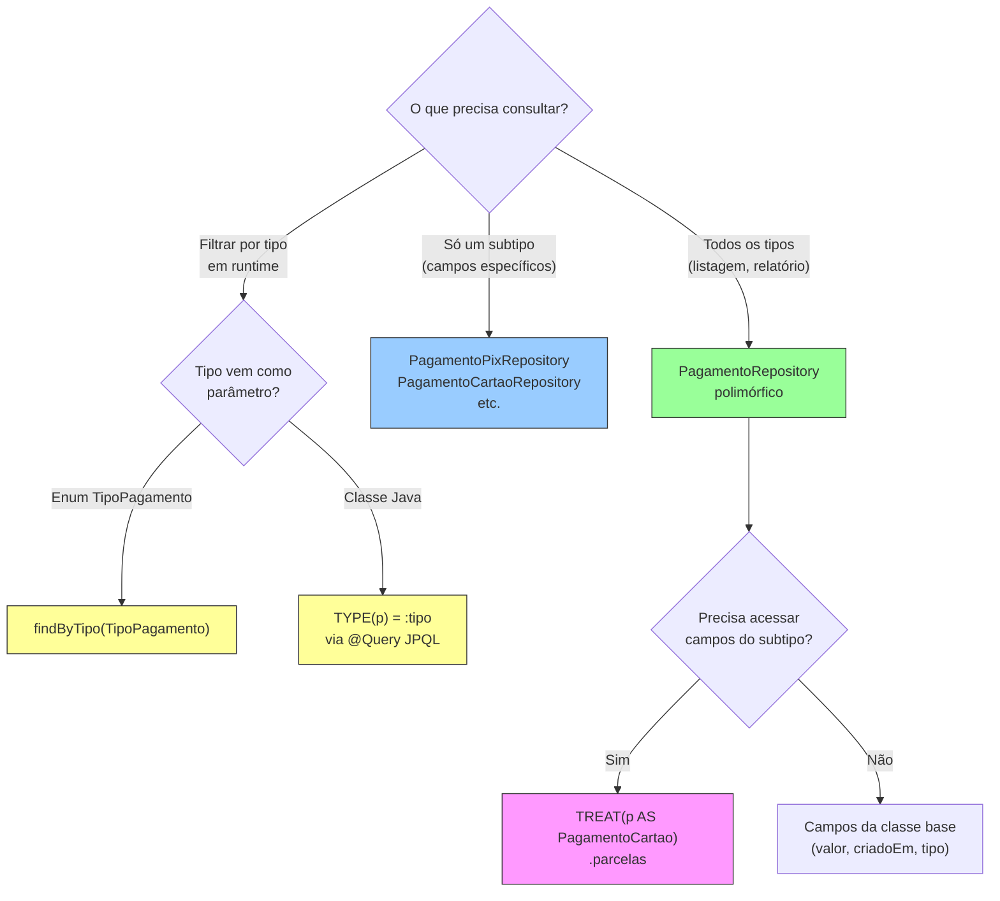
```mermaid
flowchart TD
    A{O que precisa consultar?} -->|"Todos os tipos\n(listagem, relatório)"| B["PagamentoRepository\npolimórfico"]
    A -->|"Só um subtipo\n(campos específicos)"| C["PagamentoPixRepository\nPagamentoCartaoRepository\netc."]
    A -->|"Filtrar por tipo\nem runtime"| D{"Tipo vem como\nparâmetro?"}

    D -->|"Enum TipoPagamento"| E["findByTipo(TipoPagamento)"]
    D -->|"Classe Java"| F["TYPE(p) = :tipo\nvia @Query JPQL"]

    B --> G{Precisa acessar\ncampos do subtipo?}
    G -->|Sim| H["TREAT(p AS PagamentoCartao)\n.parcelas"]
    G -->|Não| I["Campos da classe base\n(valor, criadoEm, tipo)"]

    style B fill:#9f9,stroke:#333
    style C fill:#9cf,stroke:#333
    style E fill:#ff9,stroke:#333
    style F fill:#ff9,stroke:#333
    style H fill:#f9f,stroke:#333
```

---

## 16. Validação e Segurança de Queries

### Validação automática no startup

| Tipo de query | Validação | Quando detecta erro |
|---|---|---|
| Derived query | Automática | Startup |
| `@Query` JPQL | Automática | Startup |
| `@NamedQuery` | Automática | Startup |
| Criteria + Metamodel | Compilação | Build |
| Criteria + String | Nenhuma | Runtime |
| `@Query` nativa | Nenhuma | Runtime |

### Teste que valida todas as queries de uma vez

```java
@SpringBootTest
class ApplicationContextTest {

    @Test
    void contextDevSubirSemErros() {
        // Se qualquer JPQL ou derived query referencia campo inexistente,
        // o contexto não sobe e este teste falha
    }
}
```

### Teste para queries nativas

```java
@DataJpaTest
class MatriculaRepositoryTest {

    @Autowired
    private MatriculaRepository repository;

    @Test
    void queryNativaDeveExecutar() {
        assertThatNoException()
            .isThrownBy(() -> repository.findRankingDoCurso(1L));
    }
}
```

### Prevenção de SQL Injection

Queries parametrizadas são seguras — nunca concatene input do usuário:

```java
// SEGURO — parâmetro bind
@Query("SELECT a FROM Aluno a WHERE a.nome = :nome")
List<Aluno> findByNome(@Param("nome") String nome);

// INSEGURO — concatenação (SQL Injection!)
@Query("SELECT a FROM Aluno a WHERE a.nome = '" + nome + "'")  // NUNCA FAÇA ISSO
```

### Prioridade de resolução do Spring Data

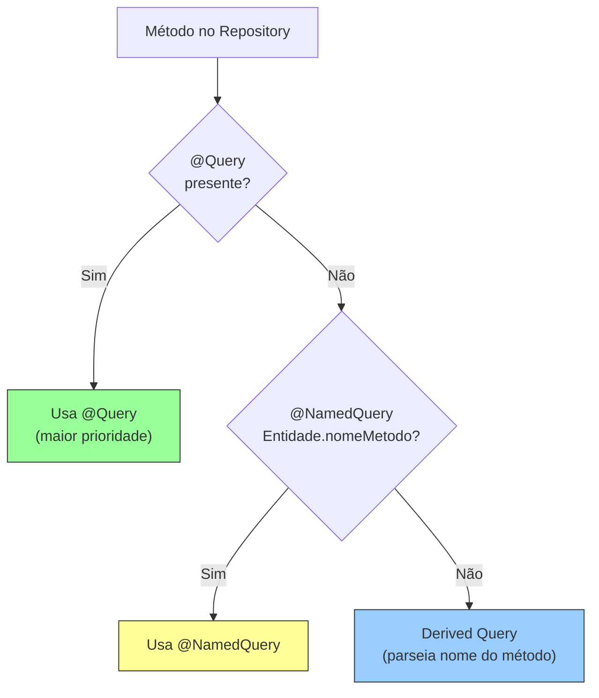
```mermaid
flowchart TD
    M[Método no Repository] --> Q{"@Query\npresente?"}
    Q -->|Sim| R["Usa @Query\n(maior prioridade)"]
    Q -->|Não| N{"@NamedQuery\nEntidade.nomeMetodo?"}
    N -->|Sim| S["Usa @NamedQuery"]
    N -->|Não| D["Derived Query\n(parseia nome do método)"]

    style R fill:#9f9,stroke:#333
    style S fill:#ff9,stroke:#333
    style D fill:#9cf,stroke:#333
```

---

## 17. Performance — Dicas Práticas

### Regras gerais

- **Projete apenas o necessário.** Use projeções em endpoints de listagem — evite carregar entidades inteiras para serializar 3 campos.
- **Evite N+1.** Use `@BatchSize`, `@EntityGraph` ou `JOIN FETCH` conforme o cenário.
- **Prefira `existsBy` a `findBy` para validação.** `EXISTS` para no primeiro match; `SELECT` carrega tudo.
- **Use `countBy` em vez de `findAll().size()`.** O COUNT é resolvido no banco.
- **Paginação keyset para tabelas grandes.** `OFFSET` degrada linearmente; cursor é O(1).

### SELECT vs EXISTS para validação

```java
// RUIM — carrega a entidade inteira para verificar existência
Optional<Aluno> aluno = repository.findByRa(ra);
if (aluno.isEmpty()) throw new NotFoundException();

// BOM — só verifica existência
if (!repository.existsByRa(ra)) throw new NotFoundException();
```

### Projeção de ID em vez de entidade para verificações em batch

```java
// RUIM — carrega N entidades inteiras
List<Aluno> alunos = repository.findAllById(ids); // hidrata tudo

// BOM — carrega só os IDs
@Query("SELECT a.id FROM Aluno a WHERE a.id IN :ids")
Set<Long> findExistingIds(@Param("ids") Collection<Long> ids);
```

### @DynamicUpdate para tabelas largas

```java
@Entity
@DynamicUpdate // UPDATE só dos campos alterados
public class Pedido { /* 20+ campos */ }
```

### Read-only queries com @Transactional(readOnly = true)

```java
@Service
public class RelatorioService {

    @Transactional(readOnly = true)
    public List<CursoResumo> gerarRelatorio() {
        // Hibernate desabilita dirty checking
        // PostgreSQL pode otimizar para read-only snapshot
        return cursoRepository.findAllResumos();
    }
}
```

### Logging de queries para debug

```yaml
# application.yml — apenas em dev
spring:
  jpa:
    show-sql: false  # prefira o logging abaixo (formatado)
    properties:
      hibernate:
        format_sql: true

logging:
  level:
    org.hibernate.SQL: DEBUG                    # mostra queries
    org.hibernate.orm.jdbc.bind: TRACE          # mostra valores dos parâmetros
```

### Identificar queries lentas com pg_stat_statements

```sql
-- Habilitar no PostgreSQL
CREATE EXTENSION IF NOT EXISTS pg_stat_statements;

-- Top 10 queries mais lentas
SELECT query, calls, mean_exec_time, total_exec_time
FROM pg_stat_statements
ORDER BY mean_exec_time DESC
LIMIT 10;
```

### Árvore de decisão completa

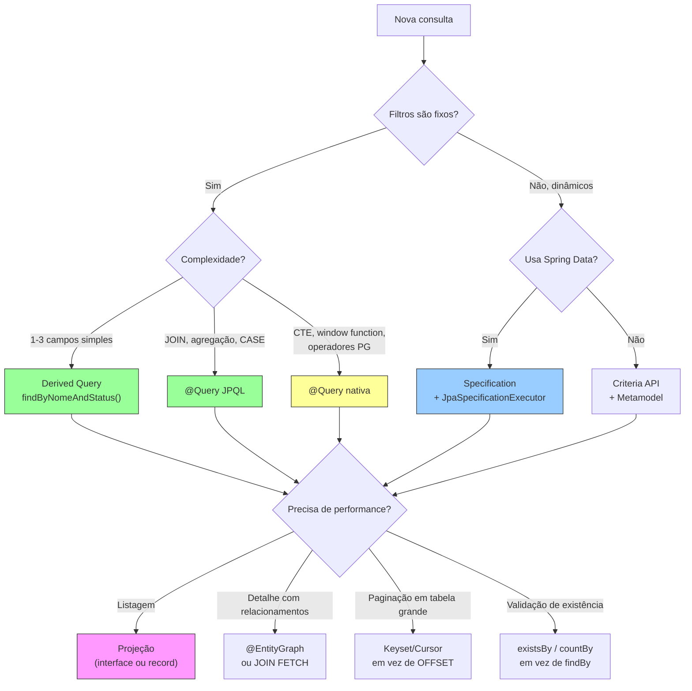
```mermaid
flowchart TD
    START[Nova consulta] --> A{Filtros são fixos?}

    A -->|Sim| B{Complexidade?}
    A -->|Não, dinâmicos| C{Usa Spring Data?}

    B -->|"1-3 campos simples"| D["Derived Query\nfindByNomeAndStatus()"]
    B -->|"JOIN, agregação, CASE"| E["@Query JPQL"]
    B -->|"CTE, window function,\noperadores PG"| F["@Query nativa"]

    C -->|Sim| G["Specification\n+ JpaSpecificationExecutor"]
    C -->|Não| H["Criteria API\n+ Metamodel"]

    D --> I{Precisa de performance?}
    E --> I
    F --> I
    G --> I
    H --> I

    I -->|Listagem| J["Projeção\n(interface ou record)"]
    I -->|Detalhe com relacionamentos| K["@EntityGraph\nou JOIN FETCH"]
    I -->|Paginação em tabela grande| L["Keyset/Cursor\nem vez de OFFSET"]
    I -->|Validação de existência| M["existsBy / countBy\nem vez de findBy"]

    style D fill:#9f9,stroke:#333
    style E fill:#9f9,stroke:#333
    style F fill:#ff9,stroke:#333
    style G fill:#9cf,stroke:#333
    style J fill:#f9f,stroke:#333
```

---

## 18. Query Hints — Controle Fino de Comportamento

Query hints permitem ajustar o comportamento do Hibernate e do PostgreSQL por query individual, sem alterar a configuração global. São divididos em hints JPA (padrão `jakarta.persistence.*`) e hints Hibernate (padrão `org.hibernate.*`).

### Hints JPA padrão

#### Read-only hint — desabilita dirty checking por query

```java
public interface CursoRepository extends JpaRepository<Curso, Long> {

    @QueryHints(@QueryHint(name = "org.hibernate.readOnly", value = "true"))
    @Query("SELECT c FROM Curso c WHERE c.ativo = true")
    List<Curso> findAtivosReadOnly();
}
```

O Hibernate não rastreia mudanças nas entidades retornadas. Economia de memória e CPU em queries de relatório.

#### Fetch graph e load graph como hint

Os EntityGraphs podem ser aplicados como hints — é o que o Spring Data faz internamente com `@EntityGraph`:

```java
// JPA puro — via hint
entityManager.createQuery("SELECT c FROM Curso c WHERE c.id = :id", Curso.class)
    .setParameter("id", id)
    .setHint("jakarta.persistence.fetchgraph", graph)
    .getSingleResult();

// JPA puro — load graph (complementa o mapeamento)
entityManager.createQuery("SELECT c FROM Curso c", Curso.class)
    .setHint("jakarta.persistence.loadgraph", graph)
    .getResultList();
```

| Hint | Efeito |
|---|---|
| `jakarta.persistence.fetchgraph` | Atributos no grafo: EAGER. Demais: LAZY. |
| `jakarta.persistence.loadgraph` | Atributos no grafo: EAGER. Demais: mantém FetchType original. |

#### Cache mode hint

```java
// Desabilitar cache L2 para esta query específica
entityManager.createQuery("SELECT c FROM Curso c", Curso.class)
    .setHint("jakarta.persistence.cache.storeMode", CacheStoreMode.BYPASS)
    .setHint("jakarta.persistence.cache.retrieveMode", CacheRetrieveMode.BYPASS)
    .getResultList();
```

### Hints Hibernate

#### Timeout de query

```java
// Spring Data
@QueryHints(@QueryHint(name = "jakarta.persistence.query.timeout", value = "5000")) // 5 segundos em ms
@Query("SELECT m FROM Matricula m WHERE m.status = :status")
List<Matricula> findPorStatusComTimeout(@Param("status") StatusMatricula status);
```

```java
// JPA puro
entityManager.createQuery("SELECT m FROM Matricula m WHERE m.status = :status", Matricula.class)
    .setParameter("status", StatusMatricula.ATIVA)
    .setHint("jakarta.persistence.query.timeout", 5000)
    .getResultList();
```

O Hibernate traduz para `SET LOCAL statement_timeout = '5000ms'` no PostgreSQL. Se a query exceder o tempo, o banco cancela e o Hibernate lança `QueryTimeoutException`.

#### Read-only

```java
@QueryHints(@QueryHint(name = "org.hibernate.readOnly", value = "true"))
List<Curso> findByAtivoTrue();
```

```java
// JPA puro
entityManager.createQuery("SELECT c FROM Curso c WHERE c.ativo = true", Curso.class)
    .setHint("org.hibernate.readOnly", true)
    .getResultList();
```

Entidades retornadas ficam em modo read-only — o Hibernate não mantém snapshot para dirty checking. Ideal para queries de listagem e relatórios.

#### Fetch size — controle de batch do ResultSet JDBC

```java
@QueryHints(@QueryHint(name = "org.hibernate.fetchSize", value = "50"))
@Query("SELECT m FROM Matricula m WHERE m.curso.id = :cursoId")
List<Matricula> findByCursoComFetchSize(@Param("cursoId") Long cursoId);
```

```java
// JPA puro
entityManager.createQuery("SELECT m FROM Matricula m", Matricula.class)
    .setHint("org.hibernate.fetchSize", 50)
    .getResultList();
```

Controla quantas linhas o driver JDBC busca do PostgreSQL por vez. O default do PostgreSQL JDBC driver é buscar **todas** as linhas de uma vez. Para queries que retornam milhares de registros, um fetch size menor reduz consumo de memória.

#### Comment — adicionar comentário SQL para debug

```java
@QueryHints(@QueryHint(name = "org.hibernate.comment", value = "Relatório mensal de matrículas"))
@Query("SELECT m FROM Matricula m WHERE m.criadoEm BETWEEN :inicio AND :fim")
List<Matricula> findParaRelatorio(
    @Param("inicio") OffsetDateTime inicio,
    @Param("fim") OffsetDateTime fim
);
```

O SQL gerado inclui o comentário:

```sql
/* Relatório mensal de matrículas */ SELECT m.* FROM matricula m WHERE m.criado_em BETWEEN ? AND ?
```

Visível em `pg_stat_activity`, `pg_stat_statements` e logs do PostgreSQL — facilita identificar queries lentas em produção.

Requer habilitação no `application.yml`:

```yaml
spring:
  jpa:
    properties:
      hibernate:
        use_sql_comments: true
```

#### Flush mode — controlar quando o Hibernate faz flush antes da query

```java
// Não faz flush antes desta query (mais rápido, mas pode retornar dados stale)
entityManager.createQuery("SELECT c FROM Curso c WHERE c.ativo = true", Curso.class)
    .setHint("org.hibernate.flushMode", FlushModeType.COMMIT)
    .getResultList();
```

| FlushMode | Comportamento |
|---|---|
| `AUTO` (default) | Flush automático se há mudanças pendentes que afetam a query |
| `COMMIT` | Só faz flush no commit — query pode retornar dados stale |
| `ALWAYS` | Flush antes de toda query (mais seguro, mais lento) |

`COMMIT` é útil em queries de relatório read-only onde você sabe que não há mudanças pendentes nas entidades consultadas.

#### Cacheable — habilitar cache de query (L2 query cache)

```java
@QueryHints({
    @QueryHint(name = "org.hibernate.cacheable", value = "true"),
    @QueryHint(name = "org.hibernate.cacheRegion", value = "cursos-ativos")
})
@Query("SELECT c FROM Curso c WHERE c.ativo = true")
List<Curso> findAtivos();
```

Requer configuração de cache L2 (EhCache, Caffeine, etc.):

```yaml
spring:
  jpa:
    properties:
      hibernate:
        cache:
          use_second_level_cache: true
          use_query_cache: true
          region:
            factory_class: org.hibernate.cache.jcache.JCacheRegionFactory
```

O cache de query armazena os **IDs** retornados pela query. Na próxima execução com os mesmos parâmetros, o Hibernate busca as entidades pelo ID no cache L2 em vez de ir ao banco.

### Múltiplos hints no Spring Data

```java
@QueryHints({
    @QueryHint(name = "org.hibernate.readOnly", value = "true"),
    @QueryHint(name = "org.hibernate.fetchSize", value = "100"),
    @QueryHint(name = "org.hibernate.comment", value = "Dashboard: cursos ativos"),
    @QueryHint(name = "jakarta.persistence.query.timeout", value = "3000")
})
@Query("SELECT c FROM Curso c WHERE c.ativo = true ORDER BY c.nome")
List<Curso> findAtivosParaDashboard();
```

### Hints via EntityManager (JPA puro) — encadeamento fluente

```java
public List<Matricula> buscarParaRelatorio(Long cursoId) {
    return entityManager
        .createQuery("""
            SELECT m FROM Matricula m
            JOIN FETCH m.aluno
            WHERE m.curso.id = :cursoId
            ORDER BY m.aluno.nome
            """, Matricula.class)
        .setParameter("cursoId", cursoId)
        .setHint("org.hibernate.readOnly", true)
        .setHint("org.hibernate.fetchSize", 50)
        .setHint("org.hibernate.comment", "Relatório boletim por curso")
        .setHint("jakarta.persistence.query.timeout", 10000)
        .getResultList();
}
```

### Hints em Criteria API

```java
public List<Curso> findAtivosComHints() {
    CriteriaBuilder cb = entityManager.getCriteriaBuilder();
    CriteriaQuery<Curso> cq = cb.createQuery(Curso.class);
    Root<Curso> root = cq.from(Curso.class);

    cq.where(cb.isTrue(root.get(Curso_.ativo)));

    return entityManager.createQuery(cq)
        .setHint("org.hibernate.readOnly", true)
        .setHint("org.hibernate.comment", "Criteria: cursos ativos")
        .getResultList();
}
```

### Hints em @NamedQuery

```java
@Entity
@NamedQuery(
    name = "Curso.ativos",
    query = "SELECT c FROM Curso c WHERE c.ativo = true",
    hints = {
        @QueryHint(name = "org.hibernate.readOnly", value = "true"),
        @QueryHint(name = "org.hibernate.comment", value = "Named: cursos ativos"),
        @QueryHint(name = "org.hibernate.fetchSize", value = "100")
    }
)
public class Curso { }
```

### PostgreSQL-specific hints via query nativa

Para hints que o JPA não cobre, use diretivas SQL diretas do PostgreSQL:

```java
@Query(value = """
    SELECT /*+ SeqScan(matricula) */ m.*
    FROM matricula m
    WHERE m.status = :status
    """, nativeQuery = true)
List<Matricula> findComSeqScanHint(@Param("status") String status);
```

Ou via `SET LOCAL` para configurações de sessão por query:

```java
public List<Matricula> findComWorkMem(Long cursoId) {
    entityManager.createNativeQuery("SET LOCAL work_mem = '256MB'").executeUpdate();

    return entityManager.createQuery("""
        SELECT m FROM Matricula m
        WHERE m.curso.id = :cursoId
        ORDER BY m.nota DESC
        """, Matricula.class)
        .setParameter("cursoId", cursoId)
        .getResultList();
}
```

`SET LOCAL` vale apenas para a transação corrente — não afeta outras queries no pool.

### Referência completa de hints

| Hint | Tipo | Efeito |
|---|---|---|
| `jakarta.persistence.fetchgraph` | JPA | Define EntityGraph como fetch graph |
| `jakarta.persistence.loadgraph` | JPA | Define EntityGraph como load graph |
| `jakarta.persistence.query.timeout` | JPA | Timeout em milissegundos |
| `jakarta.persistence.cache.storeMode` | JPA | Controle de escrita no cache L2 |
| `jakarta.persistence.cache.retrieveMode` | JPA | Controle de leitura do cache L2 |
| `org.hibernate.readOnly` | Hibernate | Desabilita dirty checking |
| `org.hibernate.fetchSize` | Hibernate | Batch size do ResultSet JDBC |
| `org.hibernate.comment` | Hibernate | Comentário SQL (visível em logs/pg_stat) |
| `org.hibernate.flushMode` | Hibernate | Controle de flush antes da query |
| `org.hibernate.cacheable` | Hibernate | Habilita query cache (L2) |
| `org.hibernate.cacheRegion` | Hibernate | Nome da região de cache |
| `org.hibernate.cacheMode` | Hibernate | Modo de cache (GET, PUT, NORMAL, REFRESH) |

### Quando usar cada hint

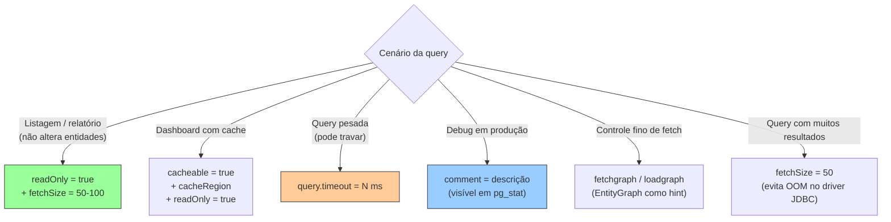
```mermaid
flowchart TD
    A{Cenário da query} -->|"Listagem / relatório\n(não altera entidades)"| B["readOnly = true\n+ fetchSize = 50-100"]
    A -->|"Dashboard com cache"| C["cacheable = true\n+ cacheRegion\n+ readOnly = true"]
    A -->|"Query pesada\n(pode travar)"| D["query.timeout = N ms"]
    A -->|"Debug em produção"| E["comment = descrição\n(visível em pg_stat)"]
    A -->|"Controle fino de fetch"| F["fetchgraph / loadgraph\n(EntityGraph como hint)"]
    A -->|"Query com muitos resultados"| G["fetchSize = 50\n(evita OOM no driver JDBC)"]

    style B fill:#9f9,stroke:#333
    style D fill:#fc9,stroke:#333
    style E fill:#9cf,stroke:#333
```

---

## 19. Persistência — Boas Práticas de INSERT

### Ciclo de vida: transient → managed

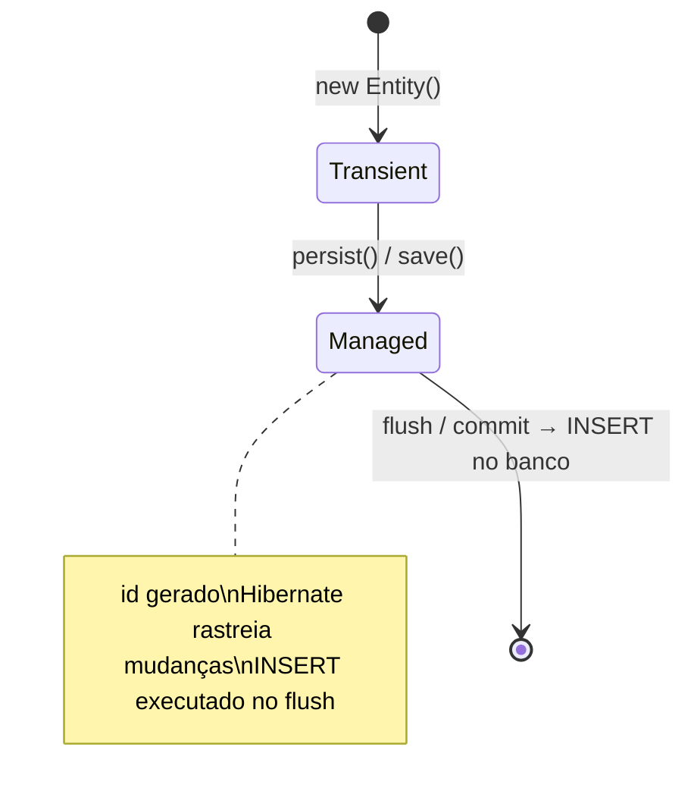
```mermaid
stateDiagram-v2
    [*] --> Transient : new Entity()
    Transient --> Managed : persist() / save()
    note right of Managed : id gerado\nHibernate rastreia mudanças\nINSERT executado no flush
    Managed --> [*] : flush / commit → INSERT no banco
```

### Spring Data — `save()` para entidades novas

```java
@Service
public class AlunoService {

    private final AlunoRepository repository;

    @Transactional
    public Aluno criar(CriarAlunoRequest request) {
        var aluno = new Aluno();
        aluno.setNome(request.nome());
        aluno.setRa(request.ra());
        aluno.setEmail(request.email());

        return repository.save(aluno);
        // Hibernate detecta id = null → executa INSERT
    }
}
```

O `save()` do Spring Data chama `entityManager.persist()` quando a entidade é nova (id = null) e `entityManager.merge()` quando já tem id. Para entidades com `@GeneratedValue`, o id nulo é o indicador de novidade.

### JPA puro — `persist()`

```java
@Transactional
public Aluno criar(CriarAlunoRequest request) {
    var aluno = new Aluno();
    aluno.setNome(request.nome());
    aluno.setRa(request.ra());
    aluno.setEmail(request.email());

    entityManager.persist(aluno);
    // aluno.getId() já tem valor após persist() com IDENTITY
    return aluno;
}
```

`persist()` torna a entidade managed. Com `GenerationType.IDENTITY`, o INSERT é executado imediatamente para obter o id. Com `SEQUENCE`, o Hibernate busca o próximo valor da sequence mas pode postergar o INSERT até o flush.

### Persistência com relacionamentos — cascade

```java
@Transactional
public Curso criarCursoComMatriculas(CriarCursoRequest request) {
    var curso = new Curso();
    curso.setNome(request.nome());
    curso.setCargaHoraria(request.cargaHoraria());

    // Professor já existente — usa getReferenceById (0 SELECTs)
    curso.setProfessor(professorRepository.getReferenceById(request.professorId()));

    // Matrículas são criadas junto via cascade
    for (Long alunoId : request.alunoIds()) {
        var matricula = new Matricula();
        matricula.setCurso(curso);
        matricula.setAluno(alunoRepository.getReferenceById(alunoId));
        matricula.setStatus(StatusMatricula.ATIVA);
        curso.getMatriculas().add(matricula);
    }

    return cursoRepository.save(curso);
    // 1 INSERT curso + N INSERTs matricula (via cascade)
}
```

### getReferenceById para FKs — evitar SELECTs desnecessários

```java
// RUIM — 2 SELECTs para obter entidades que só servem como FK
Curso curso = cursoRepository.findById(request.cursoId()).orElseThrow();
Aluno aluno = alunoRepository.findById(request.alunoId()).orElseThrow();

// BOM — 0 SELECTs, proxy contém apenas o id (suficiente para o INSERT)
Curso curso = cursoRepository.getReferenceById(request.cursoId());
Aluno aluno = alunoRepository.getReferenceById(request.alunoId());
```

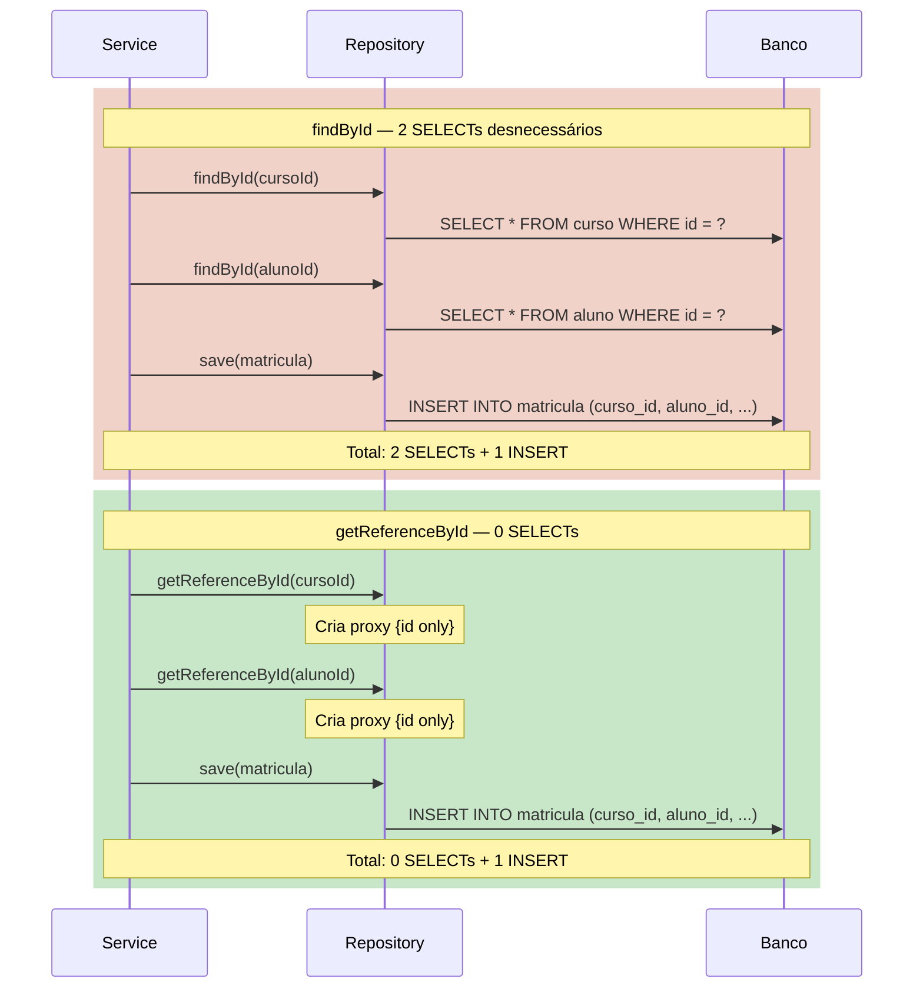
```mermaid
sequenceDiagram
    participant S as Service
    participant R as Repository
    participant DB as Banco

    rect rgb(240, 210, 200)
        Note over S,DB: findById — 2 SELECTs desnecessários
        S->>R: findById(cursoId)
        R->>DB: SELECT * FROM curso WHERE id = ?
        S->>R: findById(alunoId)
        R->>DB: SELECT * FROM aluno WHERE id = ?
        S->>R: save(matricula)
        R->>DB: INSERT INTO matricula (curso_id, aluno_id, ...)
        Note over S,DB: Total: 2 SELECTs + 1 INSERT
    end

    rect rgb(200, 230, 200)
        Note over S,DB: getReferenceById — 0 SELECTs
        S->>R: getReferenceById(cursoId)
        Note over R: Cria proxy {id only}
        S->>R: getReferenceById(alunoId)
        Note over R: Cria proxy {id only}
        S->>R: save(matricula)
        R->>DB: INSERT INTO matricula (curso_id, aluno_id, ...)
        Note over S,DB: Total: 0 SELECTs + 1 INSERT
    end
```

### Persistência em batch — `saveAll()` com tuning

```java
@Transactional
public List<Aluno> criarEmLote(List<CriarAlunoRequest> requests) {
    List<Aluno> alunos = requests.stream()
        .map(req -> {
            var aluno = new Aluno();
            aluno.setNome(req.nome());
            aluno.setRa(req.ra());
            aluno.setEmail(req.email());
            return aluno;
        })
        .toList();

    return repository.saveAll(alunos);
}
```

Para batch INSERT performático, configure o Hibernate para agrupar INSERTs:

```yaml
spring:
  jpa:
    properties:
      hibernate:
        jdbc:
          batch_size: 50
        order_inserts: true
        order_updates: true
```

Com `IDENTITY` como `GenerationType`, o batch INSERT do JDBC **não funciona** — o Hibernate precisa executar cada INSERT individualmente para obter o id. Para batch real, use `SEQUENCE` com `allocationSize`:

```java
@Id
@GeneratedValue(strategy = GenerationType.SEQUENCE, generator = "aluno_seq")
@SequenceGenerator(name = "aluno_seq", sequenceName = "aluno_id_seq", allocationSize = 50)
private Long id;
```

### JPA puro — batch com flush/clear periódico

Para milhares de registros, limpe o persistence context periodicamente para evitar `OutOfMemoryError`:

```java
@Transactional
public int importarAlunos(List<CriarAlunoRequest> requests) {
    int batchSize = 50;

    for (int i = 0; i < requests.size(); i++) {
        var aluno = new Aluno();
        aluno.setNome(requests.get(i).nome());
        aluno.setRa(requests.get(i).ra());
        entityManager.persist(aluno);

        if (i > 0 && i % batchSize == 0) {
            entityManager.flush();
            entityManager.clear();
        }
    }

    entityManager.flush();
    entityManager.clear();

    return requests.size();
}
```

### Tratamento de constraint violation no INSERT

```java
@Transactional
public Aluno criar(CriarAlunoRequest request) {
    // Validação prévia (feedback amigável)
    if (repository.existsByRa(request.ra())) {
        throw new AlunoJaExisteException("RA já cadastrado: " + request.ra());
    }

    var aluno = new Aluno();
    aluno.setNome(request.nome());
    aluno.setRa(request.ra());

    return repository.save(aluno);
    // Constraint uk_aluno_ra é última defesa contra race condition
}
```

### persist() vs merge() — quando cada um é chamado

```mermaid
flowchart TD
    A["repository.save(entity)"] --> B{entity.getId() == null?}
    B -->|Sim| C["entityManager.persist(entity)\nEntidade nova → INSERT"]
    B -->|Não| D{Entidade está\nno persistence context?}

    D -->|Sim, managed| E["Dirty checking no flush\n→ UPDATE automático"]
    D -->|Não, detached| F["entityManager.merge(entity)\n→ SELECT + UPDATE"]

    C --> G["Entidade retornada É a mesma instância"]
    F --> H["Entidade retornada é uma CÓPIA managed\n(original continua detached)"]

    style C fill:#9f9,stroke:#333
    style E fill:#9cf,stroke:#333
    style F fill:#fc9,stroke:#333
```

### Interface Persistable — controle explícito de isNew()

O `save()` do Spring Data decide entre `persist()` e `merge()` verificando se a entidade é nova. Por padrão, a detecção é baseada no id: `id == null` → nova. Mas isso falha quando o id é atribuído manualmente (UUID, natural key, ou id vindo de sistema externo):

```java
// Problema: id atribuído manualmente
var aluno = new Aluno();
aluno.setId(UUID.randomUUID()); // id NÃO é null

repository.save(aluno);
// Spring Data vê id != null → chama merge() em vez de persist()
// merge() faz SELECT antes do INSERT → SELECT desnecessário
```

A interface `Persistable<ID>` permite que a entidade controle explicitamente se é nova:

```java
@Entity
@Table(name = "aluno")
public class Aluno extends BaseEntity implements Persistable<Long> {

    private String nome;
    private String ra;

    @Transient // não persiste no banco
    private boolean isNew = true;

    @Override
    public boolean isNew() {
        return isNew;
    }

    @PostPersist
    @PostLoad
    private void markNotNew() {
        this.isNew = false;
    }
}
```

O `@PostPersist` marca como "não novo" após o INSERT. O `@PostLoad` marca como "não novo" quando carregada do banco. Assim o `save()` sempre chama `persist()` na primeira vez e `merge()` quando a entidade já foi carregada.

#### Cenários onde Persistable é necessário

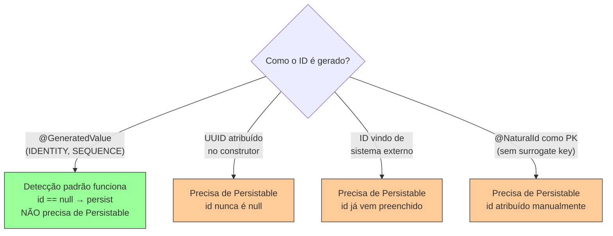
```mermaid
flowchart TD
    A{Como o ID é gerado?} -->|"@GeneratedValue\n(IDENTITY, SEQUENCE)"| B["Detecção padrão funciona\nid == null → persist\nNÃO precisa de Persistable"]
    A -->|"UUID atribuído\nno construtor"| C["Precisa de Persistable\nid nunca é null"]
    A -->|"ID vindo de\nsistema externo"| D["Precisa de Persistable\nid já vem preenchido"]
    A -->|"@NaturalId como PK\n(sem surrogate key)"| E["Precisa de Persistable\nid atribuído manualmente"]

    style B fill:#9f9,stroke:#333
    style C fill:#fc9,stroke:#333
    style D fill:#fc9,stroke:#333
    style E fill:#fc9,stroke:#333
```

#### Exemplo completo com UUID

```java
@Entity
@Table(name = "documento")
public class Documento implements Persistable<UUID> {

    @Id
    @Column(columnDefinition = "UUID")
    private UUID id;

    @Column(nullable = false)
    private String titulo;

    private String conteudo;

    @CreationTimestamp
    @Column(nullable = false, updatable = false, columnDefinition = "TIMESTAMPTZ")
    private OffsetDateTime criadoEm;

    @Transient
    private boolean isNew = true;

    protected Documento() {} // JPA

    public Documento(String titulo, String conteudo) {
        this.id = UUID.randomUUID();
        this.titulo = titulo;
        this.conteudo = conteudo;
    }

    @Override
    public UUID getId() {
        return id;
    }

    @Override
    public boolean isNew() {
        return isNew;
    }

    @PostPersist
    @PostLoad
    private void markNotNew() {
        this.isNew = false;
    }
}
```

```java
// Agora save() chama persist() corretamente
var doc = new Documento("Relatório Q3", "Conteúdo...");
// doc.isNew() == true → persist() → INSERT direto, sem SELECT prévio
repository.save(doc);
```

#### Persistable na BaseEntity (para uso em toda hierarquia)

Se múltiplas entidades usam id manual, centralize na classe-base:

```java
@MappedSuperclass
public abstract class BaseEntityWithManualId<ID extends Serializable>
        implements Persistable<ID>, Serializable {

    @Transient
    private boolean isNew = true;

    @Override
    public boolean isNew() {
        return isNew;
    }

    @PostPersist
    @PostLoad
    private void markNotNew() {
        this.isNew = false;
    }
}
```

```java
@Entity
public class Documento extends BaseEntityWithManualId<UUID> {

    @Id
    @Column(columnDefinition = "UUID")
    private UUID id;

    // ... campos

    @Override
    public UUID getId() {
        return id;
    }
}
```

#### Fluxo com e sem Persistable

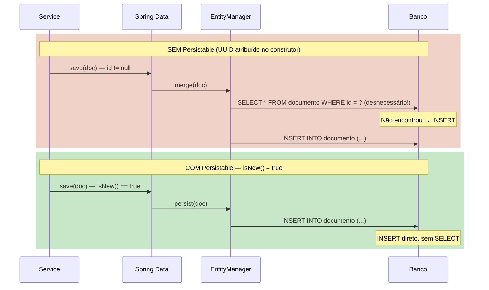
```mermaid
sequenceDiagram
    participant S as Service
    participant SD as Spring Data
    participant EM as EntityManager
    participant DB as Banco

    rect rgb(240, 210, 200)
        Note over S,DB: SEM Persistable (UUID atribuído no construtor)
        S->>SD: save(doc) — id != null
        SD->>EM: merge(doc)
        EM->>DB: SELECT * FROM documento WHERE id = ? (desnecessário!)
        Note over DB: Não encontrou → INSERT
        EM->>DB: INSERT INTO documento (...)
    end

    rect rgb(200, 230, 200)
        Note over S,DB: COM Persistable — isNew() = true
        S->>SD: save(doc) — isNew() == true
        SD->>EM: persist(doc)
        EM->>DB: INSERT INTO documento (...)
        Note over DB: INSERT direto, sem SELECT
    end
```

### Antipatterns de INSERT

```java
// ERRADO — save() dentro de loop gera N flushes individuais
for (AlunoRequest req : requests) {
    repository.save(toEntity(req)); // flush individual a cada save
}

// CORRETO — saveAll() agrupa em batch
repository.saveAll(requests.stream().map(this::toEntity).toList());

// ERRADO — merge() em entidade nova (SELECT desnecessário antes do INSERT)
var aluno = new Aluno();
aluno.setId(null);
entityManager.merge(aluno); // faz SELECT antes, depois INSERT

// CORRETO — persist() em entidade nova
entityManager.persist(aluno); // INSERT direto

// ERRADO — carregar entidade só para usar como FK
Curso curso = cursoRepository.findById(cursoId).orElseThrow();
matricula.setCurso(curso);

// CORRETO — proxy para FK
matricula.setCurso(cursoRepository.getReferenceById(cursoId));
```

---

## 20. Atualização — Boas Práticas de UPDATE

### Spring Data — dirty checking automático (recomendado)

A forma mais idiomática: carregue a entidade, altere os campos, e o Hibernate gera o UPDATE no flush:

```java
@Service
public class AlunoService {

    private final AlunoRepository repository;

    @Transactional
    public AlunoResponse atualizar(Long id, AtualizarAlunoRequest request) {
        Aluno aluno = repository.findById(id)
            .orElseThrow(() -> new AlunoNotFoundException(id));

        aluno.setNome(request.nome());
        aluno.setEmail(request.email());

        // NÃO precisa chamar save() — dirty checking gera UPDATE no flush
        return AlunoResponse.of(aluno);
    }
}
```

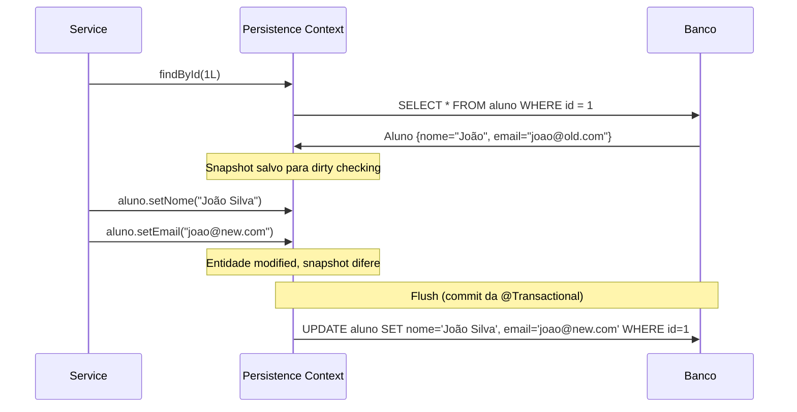
```mermaid
sequenceDiagram
    participant S as Service
    participant PC as Persistence Context
    participant DB as Banco

    S->>PC: findById(1L)
    PC->>DB: SELECT * FROM aluno WHERE id = 1
    DB->>PC: Aluno {nome="João", email="joao@old.com"}
    Note over PC: Snapshot salvo para dirty checking

    S->>PC: aluno.setNome("João Silva")
    S->>PC: aluno.setEmail("joao@new.com")
    Note over PC: Entidade modified, snapshot difere

    Note over PC,DB: Flush (commit da @Transactional)
    PC->>DB: UPDATE aluno SET nome='João Silva', email='joao@new.com' WHERE id=1
```

**Não chame `save()` em entidades managed.** É redundante — o dirty checking já resolve. O `save()` em entidade com id chama `merge()`, que faz um SELECT extra para verificar se existe.

### JPA puro — dirty checking idêntico

```java
@Transactional
public void atualizar(Long id, AtualizarAlunoRequest request) {
    Aluno aluno = entityManager.find(Aluno.class, id);
    if (aluno == null) throw new AlunoNotFoundException(id);

    aluno.setNome(request.nome());
    aluno.setEmail(request.email());

    // Sem chamada explícita — flush no commit detecta as mudanças
}
```

### Atualização parcial — só os campos informados

```java
@Transactional
public Aluno atualizarParcial(Long id, Map<String, Object> campos) {
    Aluno aluno = repository.findById(id)
        .orElseThrow(() -> new AlunoNotFoundException(id));

    campos.forEach((campo, valor) -> {
        switch (campo) {
            case "nome"  -> aluno.setNome((String) valor);
            case "email" -> aluno.setEmail((String) valor);
            case "ativo" -> aluno.setAtivo((Boolean) valor);
            default -> throw new IllegalArgumentException("Campo desconhecido: " + campo);
        }
    });

    return aluno; // dirty checking gera UPDATE só dos campos alterados com @DynamicUpdate
}
```

Com `@DynamicUpdate`, o SQL gerado inclui **apenas** os campos que mudaram:

```java
@Entity
@DynamicUpdate
public class Aluno extends BaseEntity { }
```

```sql
-- Sem @DynamicUpdate: UPDATE aluno SET nome=?, ra=?, email=?, ativo=? WHERE id=?
-- Com @DynamicUpdate: UPDATE aluno SET email=? WHERE id=?  (só o que mudou)
```

### Atualização de relacionamentos

```java
@Transactional
public void transferirDeCurso(Long matriculaId, Long novoCursoId) {
    Matricula matricula = matriculaRepository.findById(matriculaId)
        .orElseThrow(() -> new MatriculaNotFoundException(matriculaId));

    // getReferenceById evita SELECT no curso novo
    matricula.setCurso(cursoRepository.getReferenceById(novoCursoId));

    // Dirty checking gera: UPDATE matricula SET curso_id = ? WHERE id = ?
}
```

### Bulk UPDATE com @Modifying (sem carregar entidades)

Para atualizações em massa sem precisar carregar cada entidade:

```java
public interface MatriculaRepository extends JpaRepository<Matricula, Long> {

    @Modifying(flushAutomatically = true, clearAutomatically = true)
    @Query("UPDATE Matricula m SET m.status = :novoStatus WHERE m.status = :statusAtual")
    int atualizarStatus(
        @Param("statusAtual") StatusMatricula statusAtual,
        @Param("novoStatus") StatusMatricula novoStatus
    );

    @Modifying(flushAutomatically = true, clearAutomatically = true)
    @Query("UPDATE Matricula m SET m.nota = m.nota + :bonus WHERE m.curso.id = :cursoId AND m.nota IS NOT NULL")
    int aplicarBonus(@Param("cursoId") Long cursoId, @Param("bonus") BigDecimal bonus);
}
```

### JPA puro — bulk UPDATE via JPQL

```java
@Transactional
public int desativarAlunosSemMatricula() {
    return entityManager.createQuery("""
        UPDATE Aluno a SET a.ativo = false
        WHERE a.id NOT IN (SELECT DISTINCT m.aluno.id FROM Matricula m WHERE m.status = 'ATIVA')
        """)
        .executeUpdate();
}
```

### Bulk UPDATE nativo para operações complexas

```java
@Modifying
@Query(value = """
    UPDATE matricula m
    SET nota = sub.nota_curva
    FROM (
        SELECT id,
               nota + (10.0 - MAX(nota) OVER (PARTITION BY curso_id)) * 0.1 AS nota_curva
        FROM matricula
        WHERE nota IS NOT NULL
    ) sub
    WHERE m.id = sub.id
    """, nativeQuery = true)
int aplicarCurva();
```

### Optimistic Locking — proteção contra lost updates

```java
@Entity
public class Matricula extends BaseEntity {

    @Version
    private Integer versao;

    // ...
}
```

```java
@Transactional
public void atualizarNota(Long matriculaId, BigDecimal novaNota) {
    Matricula m = repository.findById(matriculaId)
        .orElseThrow(() -> new MatriculaNotFoundException(matriculaId));

    m.setNota(novaNota);

    // No flush, o Hibernate gera:
    // UPDATE matricula SET nota=?, versao=2 WHERE id=? AND versao=1
    // Se outro usuário já atualizou (versao != 1) → OptimisticLockException
}
```

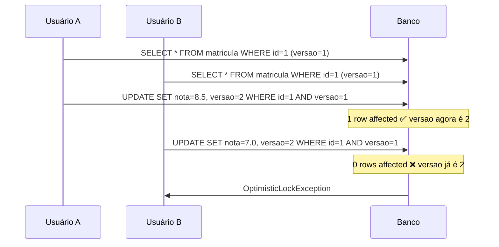
```mermaid
sequenceDiagram
    participant U1 as Usuário A
    participant U2 as Usuário B
    participant DB as Banco

    U1->>DB: SELECT * FROM matricula WHERE id=1 (versao=1)
    U2->>DB: SELECT * FROM matricula WHERE id=1 (versao=1)

    U1->>DB: UPDATE SET nota=8.5, versao=2 WHERE id=1 AND versao=1
    Note over DB: 1 row affected ✅ versao agora é 2

    U2->>DB: UPDATE SET nota=7.0, versao=2 WHERE id=1 AND versao=1
    Note over DB: 0 rows affected ❌ versao já é 2
    DB->>U2: OptimisticLockException
```

### Quando usar cada abordagem de UPDATE

```mermaid
flowchart TD
    A{Quantas entidades\nserão atualizadas?} -->|"1 entidade\n(por ID)"| B{Precisa de lógica\nde negócio?}
    A -->|"N entidades\n(em massa)"| C["Bulk @Modifying\n+ flushAutomatically\n+ clearAutomatically"]

    B -->|Sim| D["findById + dirty checking\n(recomendado)"]
    B -->|"Não, só setar campo"| E{Performance\ncrítica?}

    E -->|Não| D
    E -->|Sim| F["Bulk @Modifying\nmesmo para 1 registro"]

    D --> G["@Version para\noptimistic locking"]

    style D fill:#9f9,stroke:#333
    style C fill:#9cf,stroke:#333
```

### Antipatterns de UPDATE

```java
// ERRADO — save() em entidade managed (redundante, merge() desnecessário)
Aluno aluno = repository.findById(id).orElseThrow();
aluno.setNome("Novo Nome");
repository.save(aluno); // DESNECESSÁRIO — dirty checking já faz o UPDATE

// CORRETO
Aluno aluno = repository.findById(id).orElseThrow();
aluno.setNome("Novo Nome");
// fim — @Transactional garante o flush com UPDATE

// ERRADO — carregar entidade só para setar um campo em massa
List<Matricula> todas = repository.findByStatus(StatusMatricula.PENDENTE);
todas.forEach(m -> m.setStatus(StatusMatricula.CANCELADA)); // N updates

// CORRETO — bulk update
repository.atualizarStatus(StatusMatricula.PENDENTE, StatusMatricula.CANCELADA); // 1 UPDATE

// ERRADO — merge() de entidade detached sem @Version (possível lost update)
Matricula detached = /* veio de um request DTO */;
entityManager.merge(detached); // sobrescreve silenciosamente

// CORRETO — find + set + @Version
Matricula managed = repository.findById(detached.getId()).orElseThrow();
managed.setNota(detached.getNota());
// @Version protege contra lost update
```

---

## 21. Exclusão — Boas Práticas de DELETE

### Spring Data — `deleteById()` e `delete(entity)`

```java
@Service
public class MatriculaService {

    private final MatriculaRepository repository;

    @Transactional
    public void remover(Long id) {
        // Opção 1: deleteById — faz SELECT + DELETE
        repository.deleteById(id);
        // Se não existe, lança EmptyResultDataAccessException

        // Opção 2: verificação explícita com mensagem customizada
        Matricula matricula = repository.findById(id)
            .orElseThrow(() -> new MatriculaNotFoundException(id));
        repository.delete(matricula);
    }
}
```

### JPA puro — `remove()`

```java
@Transactional
public void remover(Long id) {
    Matricula matricula = entityManager.find(Matricula.class, id);
    if (matricula == null) throw new MatriculaNotFoundException(id);

    entityManager.remove(matricula);
    // DELETE executado no flush
}
```

### getReference + remove — DELETE sem SELECT prévio

```java
@Transactional
public void remover(Long id) {
    // Cria proxy sem SELECT — DELETE direto no flush
    Matricula ref = entityManager.getReference(Matricula.class, id);
    entityManager.remove(ref);
    // Se o id não existe, lança EntityNotFoundException no flush
}
```

```java
// Equivalente no Spring Data
@Transactional
public void remover(Long id) {
    repository.delete(repository.getReferenceById(id));
    // 0 SELECTs + 1 DELETE
}
```

### Remoção via coleção com orphanRemoval

```java
@Transactional
public void removerMatriculaDoCurso(Long cursoId, Long matriculaId) {
    Curso curso = cursoRepository.findById(cursoId)
        .orElseThrow(() -> new CursoNotFoundException(cursoId));

    // orphanRemoval = true → Hibernate gera DELETE
    curso.getMatriculas().removeIf(m -> m.getId().equals(matriculaId));
}
```

**Cuidado:** `getMatriculas()` carrega **toda** a coleção. Para coleções grandes, prefira remoção direta.

### Remoção direta sem carregar a coleção do pai

```java
@Transactional
public void removerMatricula(Long cursoId, Long matriculaId) {
    Matricula matricula = matriculaRepository.findById(matriculaId)
        .filter(m -> m.getCurso().getId().equals(cursoId))
        .orElseThrow(() -> new MatriculaNotFoundException(matriculaId));

    matriculaRepository.delete(matricula);
    // 1 SELECT + 1 DELETE, sem carregar a coleção do curso
}
```

### Bulk DELETE com @Modifying

```java
public interface MatriculaRepository extends JpaRepository<Matricula, Long> {

    @Modifying(flushAutomatically = true, clearAutomatically = true)
    @Query("DELETE FROM Matricula m WHERE m.status = 'CANCELADA' AND m.criadoEm < :limite")
    int limparCanceladas(@Param("limite") OffsetDateTime limite);

    @Modifying(flushAutomatically = true, clearAutomatically = true)
    @Query("DELETE FROM Matricula m WHERE m.curso.id = :cursoId AND m.aluno.id = :alunoId")
    int deleteByCursoAndAluno(@Param("cursoId") Long cursoId, @Param("alunoId") Long alunoId);
}
```

Bulk DELETE não dispara `@PreRemove`, cascade nem `orphanRemoval`.

### JPA puro — bulk DELETE via JPQL

```java
@Transactional
public int limparDadosAntigos(OffsetDateTime limite) {
    // Ordem importa: filhos primeiro, depois pais
    int matriculas = entityManager.createQuery(
            "DELETE FROM Matricula m WHERE m.criadoEm < :limite")
        .setParameter("limite", limite)
        .executeUpdate();

    int cursosSemMatricula = entityManager.createQuery("""
            DELETE FROM Curso c WHERE c.id NOT IN (
                SELECT DISTINCT m.curso.id FROM Matricula m
            )
            """)
        .executeUpdate();

    return matriculas + cursosSemMatricula;
}
```

### Soft Delete — @SoftDelete do Hibernate 6.4+

Com `@SoftDelete`, toda operação de remoção gera UPDATE em vez de DELETE:

```java
@Entity
@SoftDelete
public class Aluno extends BaseEntity { }
```

```java
// Todas essas operações geram UPDATE SET deleted = true:
repository.deleteById(id);
repository.delete(aluno);
entityManager.remove(aluno);
curso.getMatriculas().remove(matricula); // com orphanRemoval
```

Para consultar registros deletados:

```java
@Query(value = "SELECT * FROM aluno WHERE deleted = true", nativeQuery = true)
List<Aluno> findDeletados();
```

### Tratamento de violação de FK na exclusão

Se a entidade é referenciada por outra tabela, o DELETE falha com constraint violation:

```java
@ExceptionHandler(DataIntegrityViolationException.class)
public ProblemDetail handleFkViolation(DataIntegrityViolationException ex) {
    String message = ex.getMostSpecificCause().getMessage();

    if (message.contains("fk_matricula_curso")) {
        return ProblemDetail.forStatusAndDetail(
            HttpStatus.CONFLICT,
            "Curso não pode ser removido: existem matrículas vinculadas"
        );
    }

    return ProblemDetail.forStatusAndDetail(
        HttpStatus.CONFLICT,
        "Registro não pode ser removido: existem dependências"
    );
}
```

### Cascade DELETE — quando usar

```java
@Entity
public class Curso extends BaseEntity {

    // CASCADE REMOVE: ao deletar o curso, deleta TODAS as matrículas
    @OneToMany(mappedBy = "curso", cascade = CascadeType.ALL, orphanRemoval = true)
    private Set<Matricula> matriculas = new HashSet<>();
}
```

```java
@Transactional
public void removerCursoComMatriculas(Long cursoId) {
    Curso curso = cursoRepository.findById(cursoId)
        .orElseThrow(() -> new CursoNotFoundException(cursoId));

    cursoRepository.delete(curso);
    // Hibernate gera: DELETE matricula WHERE curso_id = ?
    //                 DELETE curso WHERE id = ?
}
```

**Cuidado:** cascade DELETE carrega **todas** as entidades filhas para o persistence context antes de deletar. Para coleções muito grandes, bulk DELETE é mais eficiente.

### Comparação de abordagens de DELETE

```mermaid
flowchart TD
    A{O que deletar?} -->|"1 entidade por ID"| B{Precisa de\nlifecycle callbacks?}
    A -->|"N entidades\n(limpeza, batch)"| C["Bulk @Modifying\n1 DELETE, 0 SELECTs"]
    A -->|"Filho de uma\ncoleção do pai"| D{Coleção é\ngrande?}
    A -->|"Soft delete\n(manter histórico)"| E["@SoftDelete\nUPDATE SET deleted = true"]

    B -->|"Sim (@PreRemove,\ncascade)"| F["findById + delete()\n1 SELECT + 1 DELETE"]
    B -->|Não| G["getReferenceById + delete()\n0 SELECTs + 1 DELETE"]

    D -->|"Pequena (<100)"| H["orphanRemoval\ncollection.remove()"]
    D -->|"Grande (100+)"| I["Remoção direta\nmatriculaRepository.delete()"]

    style F fill:#9f9,stroke:#333
    style G fill:#9cf,stroke:#333
    style C fill:#ff9,stroke:#333
    style E fill:#f9f,stroke:#333
```

| Abordagem | Queries | Lifecycle | Cascade | Uso ideal |
|---|---|---|---|---|
| `deleteById()` | SELECT + DELETE | Sim | Sim | Remoção simples com validação |
| `getReferenceById` + `delete()` | DELETE | Sim | Sim | Performance (sem SELECT) |
| `orphanRemoval` | SELECT coleção + DELETE | Sim | Sim | Coleções pequenas |
| Remoção direta do filho | SELECT filho + DELETE | Sim | Sim | Coleções grandes |
| Bulk `@Modifying` | DELETE | Não | Não | Limpeza em massa |
| `@SoftDelete` | UPDATE | Sim | Sim | Auditoria / histórico |

### Antipatterns de DELETE

```java
// ERRADO — carregar coleção inteira do pai para deletar 1 filho
Curso curso = cursoRepository.findById(cursoId).orElseThrow();
curso.getMatriculas().removeIf(m -> m.getId().equals(matriculaId)); // carrega tudo!

// CORRETO — deletar o filho diretamente
matriculaRepository.deleteById(matriculaId);

// ERRADO — findAll + forEach + delete (N+1 DELETEs)
repository.findByStatus(StatusMatricula.CANCELADA)
    .forEach(repository::delete); // N SELECTs + N DELETEs

// CORRETO — bulk delete
repository.limparCanceladas(limite); // 1 DELETE

// ERRADO — cascade DELETE em entidades compartilhadas
@ManyToOne(cascade = CascadeType.REMOVE) // deletar matrícula deleta o CURSO!
private Curso curso;

// CORRETO — cascade somente do pai para filhos compostos
// Nunca cascade REMOVE no lado @ManyToOne
```

---

## 22. Entity Listeners — Callbacks de Ciclo de Vida

O JPA define callbacks que são invocados automaticamente em momentos específicos do ciclo de vida da entidade. Permitem executar lógica transversal (auditoria, validação, notificação) sem poluir o service.

### Callbacks disponíveis

```mermaid
stateDiagram-v2
    [*] --> Transient : new Entity()

    Transient --> Managed : persist()
    note right of Managed : @PrePersist → INSERT → @PostPersist

    Managed --> Managed : flush (dirty)
    note right of Managed : @PreUpdate → UPDATE → @PostUpdate

    Managed --> Removed : remove()
    note right of Removed : @PreRemove → DELETE → @PostRemove

    state "Leitura" as Load
    [*] --> Load : find() / query
    Load --> Managed : @PostLoad
```

| Callback | Momento | Uso típico |
|---|---|---|
| `@PrePersist` | Antes do INSERT | Setar valores default, validação |
| `@PostPersist` | Depois do INSERT | Auditoria, disparo de evento |
| `@PreUpdate` | Antes do UPDATE | Validação, atualizar timestamp |
| `@PostUpdate` | Depois do UPDATE | Auditoria, notificação |
| `@PreRemove` | Antes do DELETE | Validação de regras de exclusão |
| `@PostRemove` | Depois do DELETE | Auditoria, limpeza de cache |
| `@PostLoad` | Depois do SELECT | Cálculos derivados, estado transient |

### Callbacks inline na entidade

Para lógica simples, diretamente na entidade:

```java
@Entity
public class Aluno extends BaseEntity {

    private String nome;
    private String ra;
    private String email;
    private boolean ativo = true;

    @Column(length = 200)
    private String nomeNormalizado;

    @PrePersist
    private void prePersist() {
        this.nomeNormalizado = nome != null ? nome.toUpperCase().trim() : null;
        if (this.ra == null || this.ra.isBlank()) {
            throw new IllegalStateException("RA é obrigatório");
        }
    }

    @PreUpdate
    private void preUpdate() {
        this.nomeNormalizado = nome != null ? nome.toUpperCase().trim() : null;
    }
}
```

### @EntityListeners — listener externo (recomendado)

Para lógica reutilizável em múltiplas entidades, extraia para uma classe listener separada:

```java
@Entity
@EntityListeners(AuditListener.class)
public class Matricula extends BaseEntity { }
```

```java
public class AuditListener {

    @PrePersist
    public void prePersist(Object entity) {
        log.info("[AUDIT] Criando {}: {}", entity.getClass().getSimpleName(), entity);
    }

    @PostPersist
    public void postPersist(Object entity) {
        log.info("[AUDIT] Criado {}: {}", entity.getClass().getSimpleName(), entity);
    }

    @PreUpdate
    public void preUpdate(Object entity) {
        log.info("[AUDIT] Atualizando {}: {}", entity.getClass().getSimpleName(), entity);
    }

    @PostUpdate
    public void postUpdate(Object entity) {
        log.info("[AUDIT] Atualizado {}: {}", entity.getClass().getSimpleName(), entity);
    }

    @PreRemove
    public void preRemove(Object entity) {
        log.info("[AUDIT] Removendo {}: {}", entity.getClass().getSimpleName(), entity);
    }

    @PostRemove
    public void postRemove(Object entity) {
        log.info("[AUDIT] Removido {}: {}", entity.getClass().getSimpleName(), entity);
    }
}
```

O listener recebe a entidade como parâmetro (`Object` para ser genérico). Cada método pode ter qualquer nome — é a annotation que define o callback.

### Listener com injeção de dependência (Spring)

Listeners JPA padrão não são beans Spring — o `@Autowired` não funciona. Para injetar dependências, use o `SpringBeanAutowiringSupport` ou registre como bean:

#### Abordagem 1: @Configurable (AspectJ)

```java
@Configurable
public class NotificacaoListener {

    @Autowired
    private EventPublisher eventPublisher;

    @PostPersist
    public void postPersist(Object entity) {
        eventPublisher.publish(new EntityCreatedEvent(entity));
    }
}
```

Requer AspectJ weaving — complexo de configurar.

#### Abordagem 2: BeanFactory lookup (pragmática)

```java
public class NotificacaoListener {

    @PostPersist
    public void postPersist(Object entity) {
        EventPublisher publisher = SpringContext.getBean(EventPublisher.class);
        publisher.publish(new EntityCreatedEvent(entity));
    }
}
```

```java
@Component
public class SpringContext implements ApplicationContextAware {

    private static ApplicationContext context;

    @Override
    public void setApplicationContext(ApplicationContext ctx) {
        context = ctx;
    }

    public static <T> T getBean(Class<T> beanClass) {
        return context.getBean(beanClass);
    }
}
```

#### Abordagem 3: Spring Events no service (recomendada)

Em vez de usar EntityListener para notificações, use `ApplicationEventPublisher` diretamente no service:

```java
@Service
public class MatriculaService {

    private final MatriculaRepository repository;
    private final ApplicationEventPublisher eventPublisher;

    @Transactional
    public Matricula criar(CriarMatriculaRequest request) {
        var matricula = new Matricula();
        // ... setar campos
        Matricula salva = repository.save(matricula);

        eventPublisher.publishEvent(new MatriculaCriadaEvent(salva));
        return salva;
    }
}
```

```java
public record MatriculaCriadaEvent(Matricula matricula) {}
```

```java
@Component
@TransactionalEventListener(phase = TransactionPhase.AFTER_COMMIT)
public class MatriculaEventHandler {

    public void handle(MatriculaCriadaEvent event) {
        log.info("Matrícula criada: {}", event.matricula().getId());
        // enviar email, notificação push, etc.
    }
}
```

O `@TransactionalEventListener` com `AFTER_COMMIT` garante que o handler só executa se a transação for bem-sucedida — evita enviar email de confirmação para uma matrícula que deu rollback.

### Listener global via @MappedSuperclass

Para aplicar callbacks em toda a hierarquia, defina na superclasse:

```java
@MappedSuperclass
@EntityListeners(AuditListener.class)
public abstract class BaseEntity implements Serializable {

    @Id
    @GeneratedValue(strategy = GenerationType.IDENTITY)
    private Long id;

    @CreationTimestamp
    @Column(nullable = false, updatable = false, columnDefinition = "TIMESTAMPTZ")
    private OffsetDateTime criadoEm;

    @UpdateTimestamp
    @Column(nullable = false, columnDefinition = "TIMESTAMPTZ")
    private OffsetDateTime atualizadoEm;
}
```

Todas as entidades que estendem `BaseEntity` herdam o `AuditListener` automaticamente.

### Listener global via orm.xml (sem annotation)

Para aplicar um listener a **todas** as entidades sem modificar nenhuma classe:

```xml
<!-- src/main/resources/META-INF/orm.xml -->
<?xml version="1.0" encoding="UTF-8"?>
<entity-mappings xmlns="https://jakarta.ee/xml/ns/persistence/orm"
                 version="3.2">

    <persistence-unit-metadata>
        <persistence-unit-defaults>
            <entity-listeners>
                <entity-listener class="com.exemplo.listener.AuditListener"/>
                <entity-listener class="com.exemplo.listener.SoftDeleteListener"/>
            </entity-listeners>
        </persistence-unit-defaults>
    </persistence-unit-metadata>

</entity-mappings>
```

Qualquer entidade do persistence unit recebe os callbacks — sem `@EntityListeners` em nenhuma classe.

### Spring Data JPA Auditing — alternativa integrada

O Spring Data oferece auditoria declarativa com `@CreatedBy`, `@LastModifiedBy`, `@CreatedDate`, `@LastModifiedDate`:

```java
@MappedSuperclass
@EntityListeners(AuditingEntityListener.class)
public abstract class AuditableEntity {

    @Id
    @GeneratedValue(strategy = GenerationType.IDENTITY)
    private Long id;

    @CreatedDate
    @Column(nullable = false, updatable = false)
    private OffsetDateTime criadoEm;

    @LastModifiedDate
    @Column(nullable = false)
    private OffsetDateTime atualizadoEm;

    @CreatedBy
    @Column(updatable = false, length = 100)
    private String criadoPor;

    @LastModifiedBy
    @Column(length = 100)
    private String atualizadoPor;
}
```

Requer configuração:

```java
@Configuration
@EnableJpaAuditing
public class JpaConfig {

    @Bean
    public AuditorAware<String> auditorAware() {
        return () -> Optional.ofNullable(SecurityContextHolder.getContext())
            .map(SecurityContext::getAuthentication)
            .filter(Authentication::isAuthenticated)
            .map(Authentication::getName);
    }
}
```

O `AuditingEntityListener` é um `@EntityListeners` do Spring que preenche automaticamente os campos de auditoria.

### Callbacks em entidades com @SoftDelete

Com `@SoftDelete`, o `@PreRemove` e `@PostRemove` são invocados mesmo que a operação real seja um UPDATE:

```java
@Entity
@SoftDelete
@EntityListeners(ExclusaoListener.class)
public class Aluno extends BaseEntity { }
```

```java
public class ExclusaoListener {

    @PreRemove
    public void preRemove(Object entity) {
        // Chamado antes do UPDATE SET deleted = true
        log.info("Soft-deletando: {}", entity);
    }

    @PostRemove
    public void postRemove(Object entity) {
        // Chamado depois do UPDATE SET deleted = true
        log.info("Soft-deletado: {}", entity);
    }
}
```

### Ordem de execução

Quando há múltiplos listeners e callbacks inline, a ordem é:

```mermaid
flowchart TD
    A["1. Listeners globais (orm.xml)\nem ordem de declaração"] --> B["2. @EntityListeners da classe\nem ordem de declaração"]
    B --> C["3. @EntityListeners herdados\n(superclasse → subclasse)"]
    C --> D["4. Callbacks inline da entidade\n(@PrePersist no método)"]

    style A fill:#f9f,stroke:#333
    style B fill:#9cf,stroke:#333
    style C fill:#ff9,stroke:#333
    style D fill:#9f9,stroke:#333
```

Para desabilitar listeners herdados em uma subclasse específica:

```java
@Entity
@ExcludeDefaultListeners     // desabilita listeners de orm.xml
@ExcludeSuperclassListeners  // desabilita listeners da superclasse
public class EntidadeSemAuditoria extends BaseEntity { }
```

### Restrições dos callbacks

- **Não inicie transações** — callbacks executam dentro da transação corrente.
- **Não chame `EntityManager`** — alterações no persistence context dentro de callbacks podem causar comportamento imprevisível.
- **Não lance checked exceptions** — apenas unchecked exceptions são permitidas.
- **@PostPersist e @PostUpdate** — o id já está disponível, mas o registro pode não estar commitado no banco.
- **Operações pesadas** (email, HTTP) — use `@TransactionalEventListener(AFTER_COMMIT)` no service em vez de EntityListener.

### Comparação de abordagens

| Abordagem | Escopo | Injeção Spring | Complexidade | Uso ideal |
|---|---|---|---|---|
| Callback inline (`@PrePersist`) | Uma entidade | Não | Baixa | Normalização, validação simples |
| `@EntityListeners` na entidade | Entidades anotadas | Workaround | Média | Auditoria por entidade |
| `@EntityListeners` na `@MappedSuperclass` | Toda hierarquia | Workaround | Média | Auditoria global |
| `orm.xml` global | Todas as entidades | Workaround | Média | Auditoria/segurança cross-cutting |
| Spring Data `AuditingEntityListener` | Entidades anotadas | Sim (nativo) | Baixa | `createdBy`, `modifiedBy` |
| `@TransactionalEventListener` no service | Por operação | Sim (nativo) | Baixa | Notificações, efeitos colaterais |

---

## Referências

- [Spring Data JPA Reference — Query Methods](https://docs.spring.io/spring-data/jpa/reference/jpa/query-methods.html)
- [Hibernate ORM 6 — HQL/JPQL Guide](https://docs.jboss.org/hibernate/orm/6.6/userguide/html_single/Hibernate_User_Guide.html#query-language)
- [Vlad Mihalcea — High-Performance Java Persistence](https://vladmihalcea.com/)
- [Thorben Janssen — Thoughts on Java / JPA & Hibernate](https://thorben-janssen.com/)
- [PostgreSQL Full-Text Search Documentation](https://www.postgresql.org/docs/current/textsearch.html)
- [Jakarta Persistence Specification — Query Language](https://jakarta.ee/specifications/persistence/)
