# Spring Data JPA - Criação de queries e ações no banco de dados

> Estratégias, padrões e boas práticas para consultas em aplicações Spring Boot com PostgreSQL.

---

## Sumário

- [@NoRepositoryBean — Hierarquia de Repositórios](#norepositorybean--hierarquia-de-repositórios)

**Parte 1 — Formas de Consulta**

1. [Derived Queries — Convenção por Nome de Método](#1-derived-queries-convenção-por-nome-de-método)
2. [JPQL com @Query](#2-jpql-com-query)
3. [JPQL Avançado — Funções, Subconsultas e Recursos Pouco Explorados](#3-jpql-avançado-funções-subconsultas-e-recursos-pouco-explorados)
4. [Queries Nativas](#4-queries-nativas)
5. [Criteria API com Metamodel Estático](#5-criteria-api-com-metamodel-estático)
6. [Specifications — Filtros Dinâmicos Tipados](#6-specifications-filtros-dinâmicos-tipados)
7. [Query by Example (QBE)](#7-query-by-example-qbe)

**Parte 2 — Retorno e Filtragem de Dados**

8. [Projeções — Retornando Apenas o Necessário](#8-projeções-retornando-apenas-o-necessário)
9. [Paginação e Ordenação](#9-paginação-e-ordenação)
10. [Consultas em Lote — Verificação de IDs](#10-consultas-em-lote-verificação-de-ids)

**Parte 3 — Relacionamentos, Fetch e Consultas Especiais**

11. [Fetch Strategies — Controle de N+1](#11-fetch-strategies-controle-de-n1)
12. [Queries com Herança e Polimorfismo](#12-queries-com-herança-e-polimorfismo)
13. [@Formula e @Subselect — Campos e Entidades Calculadas](#13-formula-e-subselect-campos-e-entidades-calculadas)
14. [Chamada de Functions e Stored Procedures](#14-chamada-de-functions-e-stored-procedures)
15. [Full-Text Search no PostgreSQL](#15-full-text-search-no-postgresql)

**Parte 4 — Transações e Operações de Escrita**

16. [Transações — Jakarta EE e Spring Data JPA](#16-transações-jakarta-ee-e-spring-data-jpa)
17. [Persistência — Boas Práticas de INSERT](#17-persistência-boas-práticas-de-insert)
18. [Atualização — Boas Práticas de UPDATE](#18-atualização-boas-práticas-de-update)
19. [Exclusão — Boas Práticas de DELETE](#19-exclusão-boas-práticas-de-delete)
20. [Bulk Operations — UPDATE e DELETE em Massa](#20-bulk-operations-update-e-delete-em-massa)
21. [Entity Listeners — Callbacks de Ciclo de Vida](#21-entity-listeners-callbacks-de-ciclo-de-vida)
21.1. [Hibernate Event Listeners — org.hibernate.event.spi](#211-hibernate-event-listeners--orghibernateventspi)

**Parte 5 — Qualidade, Performance e Segurança**

22. [Validação e Segurança de Queries](#22-validação-e-segurança-de-queries)
23. [Performance — Dicas Práticas](#23-performance-dicas-práticas)
24. [Query Hints — Controle Fino de Comportamento](#24-query-hints-controle-fino-de-comportamento)
25. [Integração Spring Data com Spring Security](#25-integração-spring-data-com-spring-security)

**Parte 6 — Configuração e Infraestrutura**

26. [Configuração do Spring Boot para Banco de Dados](#26-configuração-do-spring-boot-para-banco-de-dados)
27. [Configuração do PostgreSQL — Performance e Segurança](#27-configuração-do-postgresql-performance-e-segurança)
28. [Testes de Repositório com @DataJpaTest](#28-testes-de-repositório-com-datajpatest)

**Parte 7 — Tipos Avançados do PostgreSQL**

29. [Queries em Dados JSON/JSONB](#29-queries-em-dados-jsonjsonb)
30. [Consultas Geográficas com PostGIS](#30-consultas-geográficas-com-postgis)

**Parte 8 — Replicação e Roteamento**

31. [PostgreSQL Streaming Replication + Roteamento Read/Write no Spring Boot](#31-postgresql-streaming-replication--roteamento-readwrite-no-spring-boot)

---

## Modelo de Domínio — Entidades Usadas nos Exemplos

Todas as queries deste guia operam sobre o domínio acadêmico simplificado abaixo. As entidades são apresentadas sem getters/setters explícitos (assumindo Lombok `@Getter @Setter` ou acesso direto para brevidade).

### Diagrama de classes

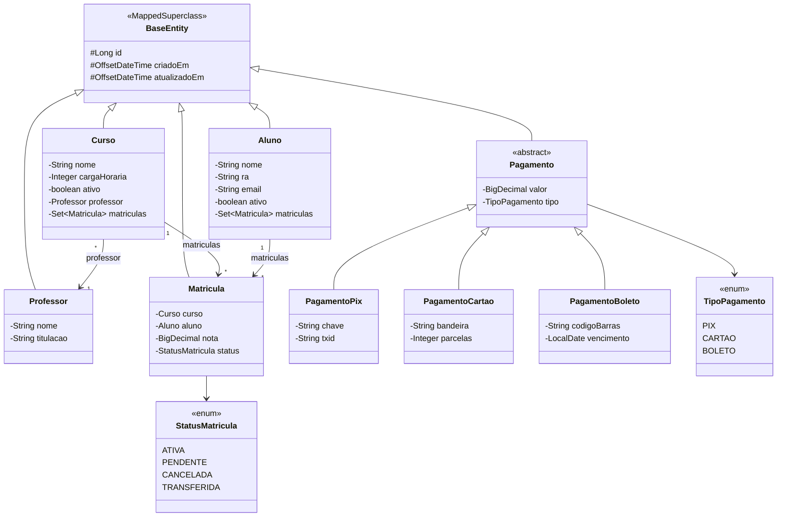
```mermaid
classDiagram
    class BaseEntity {
        <<MappedSuperclass>>
        #Long id
        #OffsetDateTime criadoEm
        #OffsetDateTime atualizadoEm
    }

    class Aluno {
        -String nome
        -String ra
        -String email
        -boolean ativo
        -Set~Matricula~ matriculas
    }

    class Professor {
        -String nome
        -String titulacao
    }

    class Curso {
        -String nome
        -Integer cargaHoraria
        -boolean ativo
        -Professor professor
        -Set~Matricula~ matriculas
    }

    class Matricula {
        -Curso curso
        -Aluno aluno
        -BigDecimal nota
        -StatusMatricula status
    }

    class StatusMatricula {
        <<enum>>
        ATIVA
        PENDENTE
        CANCELADA
        TRANSFERIDA
    }

    class Pagamento {
        <<abstract>>
        -BigDecimal valor
        -TipoPagamento tipo
    }

    class PagamentoPix {
        -String chave
        -String txid
    }

    class PagamentoCartao {
        -String bandeira
        -Integer parcelas
    }

    class PagamentoBoleto {
        -String codigoBarras
        -LocalDate vencimento
    }

    class TipoPagamento {
        <<enum>>
        PIX
        CARTAO
        BOLETO
    }

    BaseEntity <|-- Aluno
    BaseEntity <|-- Professor
    BaseEntity <|-- Curso
    BaseEntity <|-- Matricula
    BaseEntity <|-- Pagamento

    Pagamento <|-- PagamentoPix
    Pagamento <|-- PagamentoCartao
    Pagamento <|-- PagamentoBoleto

    Curso "1" --> "*" Matricula : matriculas
    Aluno "1" --> "*" Matricula : matriculas
    Curso "*" --> "1" Professor : professor
    Matricula --> StatusMatricula
    Pagamento --> TipoPagamento
```

### Diagrama ER

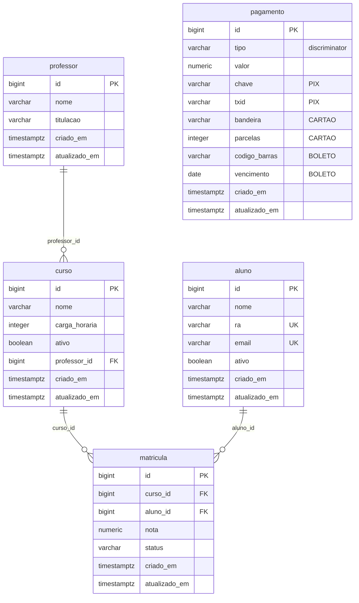
```mermaid
erDiagram
    professor {
        bigint id PK
        varchar nome
        varchar titulacao
        timestamptz criado_em
        timestamptz atualizado_em
    }
    curso {
        bigint id PK
        varchar nome
        integer carga_horaria
        boolean ativo
        bigint professor_id FK
        timestamptz criado_em
        timestamptz atualizado_em
    }
    aluno {
        bigint id PK
        varchar nome
        varchar ra UK
        varchar email UK
        boolean ativo
        timestamptz criado_em
        timestamptz atualizado_em
    }
    matricula {
        bigint id PK
        bigint curso_id FK
        bigint aluno_id FK
        numeric nota
        varchar status
        timestamptz criado_em
        timestamptz atualizado_em
    }
    pagamento {
        bigint id PK
        varchar tipo "discriminator"
        numeric valor
        varchar chave "PIX"
        varchar txid "PIX"
        varchar bandeira "CARTAO"
        integer parcelas "CARTAO"
        varchar codigo_barras "BOLETO"
        date vencimento "BOLETO"
        timestamptz criado_em
        timestamptz atualizado_em
    }

    professor ||--o{ curso : "professor_id"
    curso ||--o{ matricula : "curso_id"
    aluno ||--o{ matricula : "aluno_id"
```

### Código das entidades

```java
@MappedSuperclass
public abstract class BaseEntity implements Serializable {

    @Id
    @GeneratedValue(strategy = GenerationType.IDENTITY)
    private Long id;

    @CreationTimestamp
    @Column(nullable = false, updatable = false, columnDefinition = "TIMESTAMPTZ")
    private OffsetDateTime criadoEm;

    @UpdateTimestamp
    @Column(nullable = false, columnDefinition = "TIMESTAMPTZ")
    private OffsetDateTime atualizadoEm;

    @Override
    public boolean equals(Object o) {
        if (this == o) return true;
        if (!(o instanceof BaseEntity that)) return false;
        Class<?> thisType = Hibernate.getClass(this);
        Class<?> thatType = Hibernate.getClass(that);
        if (thisType != thatType) return false;
        return getId() != null && getId().equals(that.getId());
    }

    @Override
    public int hashCode() {
        return 31;
    }
}
```

```java
@Entity
@Table(
    name = "aluno",
    uniqueConstraints = {
        @UniqueConstraint(name = "uk_aluno_ra", columnNames = "ra"),
        @UniqueConstraint(name = "uk_aluno_email", columnNames = "email")
    }
)
public class Aluno extends BaseEntity {

    @Column(nullable = false, length = 200)
    private String nome;

    @NaturalId
    @Column(nullable = false, length = 20)
    private String ra;

    @Column(length = 255)
    private String email;

    @Column(nullable = false)
    private boolean ativo = true;

    @OneToMany(mappedBy = "aluno")
    private Set<Matricula> matriculas = new HashSet<>();
}
```

```java
@Entity
@Table(name = "professor")
public class Professor extends BaseEntity {

    @Column(nullable = false, length = 200)
    private String nome;

    @Column(length = 100)
    private String titulacao;
}
```

```java
@Entity
@Table(name = "curso")
@NamedEntityGraphs({
    @NamedEntityGraph(
        name = "Curso.resumo",
        attributeNodes = @NamedAttributeNode("professor")
    ),
    @NamedEntityGraph(
        name = "Curso.completo",
        attributeNodes = {
            @NamedAttributeNode("professor"),
            @NamedAttributeNode(value = "matriculas", subgraph = "matriculas-aluno")
        },
        subgraphs = @NamedSubgraph(
            name = "matriculas-aluno",
            attributeNodes = @NamedAttributeNode("aluno")
        )
    )
})
public class Curso extends BaseEntity {

    @Column(nullable = false, length = 200)
    private String nome;

    @Column(nullable = false)
    private Integer cargaHoraria;

    @Column(nullable = false)
    private boolean ativo = true;

    @ManyToOne(fetch = FetchType.LAZY)
    @JoinColumn(
        name = "professor_id",
        foreignKey = @ForeignKey(name = "fk_curso_professor")
    )
    private Professor professor;

    @OneToMany(mappedBy = "curso", cascade = CascadeType.ALL, orphanRemoval = true)
    @BatchSize(size = 25)
    private Set<Matricula> matriculas = new HashSet<>();
}
```

```java
public enum StatusMatricula {
    ATIVA, PENDENTE, CANCELADA, TRANSFERIDA
}
```

```java
@Entity
@Table(
    name = "matricula",
    uniqueConstraints = @UniqueConstraint(
        name = "uk_matricula_curso_aluno",
        columnNames = {"curso_id", "aluno_id"}
    )
)
public class Matricula extends BaseEntity {

    @ManyToOne(fetch = FetchType.LAZY)
    @JoinColumn(
        name = "curso_id",
        nullable = false,
        foreignKey = @ForeignKey(name = "fk_matricula_curso")
    )
    private Curso curso;

    @ManyToOne(fetch = FetchType.LAZY)
    @JoinColumn(
        name = "aluno_id",
        nullable = false,
        foreignKey = @ForeignKey(name = "fk_matricula_aluno")
    )
    private Aluno aluno;

    @Column(precision = 4, scale = 2)
    private BigDecimal nota;

    @Enumerated(EnumType.STRING)
    @Column(nullable = false, length = 31)
    private StatusMatricula status = StatusMatricula.PENDENTE;
}
```

```java
public enum TipoPagamento {
    PIX, CARTAO, BOLETO
}
```

```java
@Entity
@Table(name = "pagamento")
@Inheritance(strategy = InheritanceType.SINGLE_TABLE)
@DiscriminatorColumn(name = "tipo", discriminatorType = DiscriminatorType.STRING)
public abstract class Pagamento extends BaseEntity {

    @Column(nullable = false, precision = 19, scale = 2)
    private BigDecimal valor;

    @Column(name = "tipo", insertable = false, updatable = false)
    @Enumerated(EnumType.STRING)
    private TipoPagamento tipo;
}
```

```java
@Entity
@DiscriminatorValue("PIX")
public class PagamentoPix extends Pagamento {

    @Column(length = 255)
    private String chave;

    @Column(length = 255)
    private String txid;
}
```

```java
@Entity
@DiscriminatorValue("CARTAO")
public class PagamentoCartao extends Pagamento {

    @Column(length = 50)
    private String bandeira;

    private Integer parcelas;
}
```

```java
@Entity
@DiscriminatorValue("BOLETO")
public class PagamentoBoleto extends Pagamento {

    @Column(length = 255)
    private String codigoBarras;

    private LocalDate vencimento;
}
```

---

## @NoRepositoryBean — Hierarquia de Repositórios

`@NoRepositoryBean` instrui o Spring Data a **não instanciar** a interface anotada como um bean gerenciado. Use-a em interfaces intermediárias — bases ou fragmentos — que outras interfaces de repositório irão estender.

Sem a anotação, o Spring Data tentaria criar um bean para a interface e falharia no startup (não consegue determinar a entidade gerenciada).

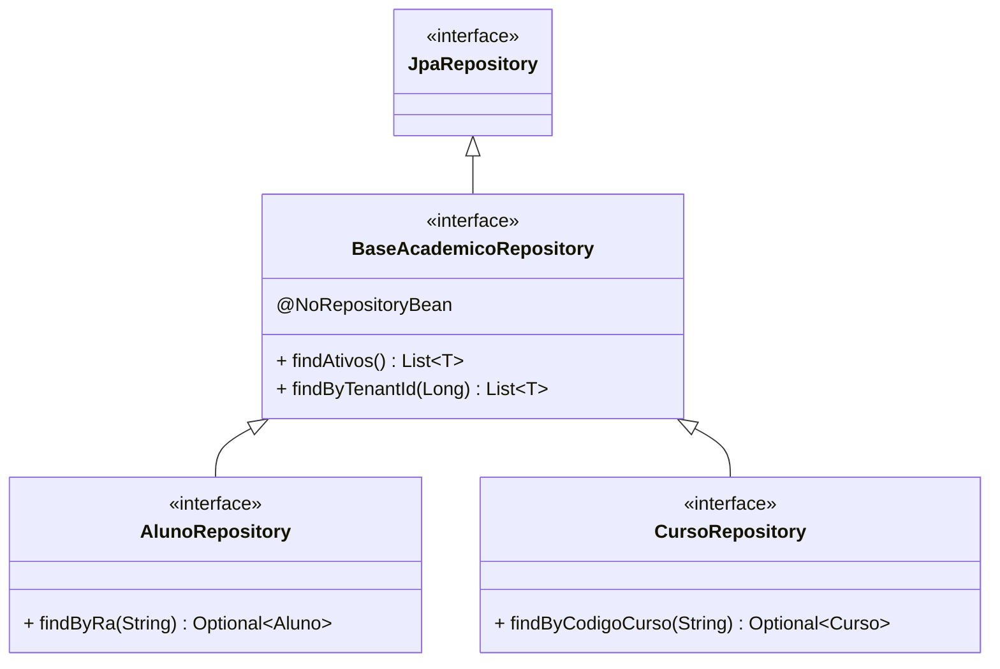
```mermaid
classDiagram
    direction TB
    class JpaRepository {
        <<interface>>
    }
    class BaseAcademicoRepository {
        <<interface>>
        @NoRepositoryBean
        + findAtivos() List~T~
        + findByTenantId(Long) List~T~
    }
    class AlunoRepository {
        <<interface>>
        + findByRa(String) Optional~Aluno~
    }
    class CursoRepository {
        <<interface>>
        + findByCodigoCurso(String) Optional~Curso~
    }
    JpaRepository <|-- BaseAcademicoRepository
    BaseAcademicoRepository <|-- AlunoRepository
    BaseAcademicoRepository <|-- CursoRepository
```

### Situação 1 — Base com Métodos Comuns a Todos os Repositórios

Quando vários repositórios compartilham métodos de negócio (ex: `findAtivos`, filtro por tenant), centralize na base.

```java
@NoRepositoryBean
public interface BaseAcademicoRepository<T, ID> extends JpaRepository<T, ID> {

    @Query("SELECT e FROM #{#entityName} e WHERE e.ativo = true")
    List<T> findAtivos();

    @Query("SELECT e FROM #{#entityName} e WHERE e.ativo = true AND e.tenantId = :tenantId")
    List<T> findAtivosByTenant(@Param("tenantId") Long tenantId);
}
```

> `#{#entityName}` é um SpEL resolvido para o nome da entidade gerenciada pelo repositório concreto. Funciona apenas em JPQL dentro de `@Query` em interfaces que estendem a base.

Os repositórios concretos herdam os métodos sem repetição:

```java
public interface AlunoRepository extends BaseAcademicoRepository<Aluno, Long> {
    Optional<Aluno> findByRa(String ra);
}

public interface CursoRepository extends BaseAcademicoRepository<Curso, Long> {
    Optional<Curso> findByCodigoCurso(String codigo);
}
```

```java
// Uso no service
List<Aluno> ativos   = alunoRepository.findAtivos();
List<Curso>  cursos  = cursoRepository.findAtivosByTenant(tenantId);
```

---

### Situação 2 — Repositório Somente Leitura

Remova operações de escrita para entidades que nunca devem ser modificadas via repositório (ex: tabelas de audit log, dados legados, views).

```java
@NoRepositoryBean
public interface ReadOnlyRepository<T, ID> extends Repository<T, ID> {

    Optional<T> findById(ID id);
    List<T> findAll();
    Page<T> findAll(Pageable pageable);
    boolean existsById(ID id);
    long count();
}
```

```java
// Nenhum save(), delete() ou deleteAll() disponível
public interface LogAcessoRepository extends ReadOnlyRepository<LogAcesso, Long> {

    List<LogAcesso> findByUsuarioIdOrderByOcorridoEmDesc(Long usuarioId);

    @Query("SELECT l FROM LogAcesso l WHERE l.ocorridoEm BETWEEN :inicio AND :fim")
    List<LogAcesso> findByPeriodo(
        @Param("inicio") OffsetDateTime inicio,
        @Param("fim")    OffsetDateTime fim
    );
}
```

> Estender `Repository<T, ID>` (e não `JpaRepository`) é o ponto de partida: é a interface raiz sem nenhum método, o que permite expor exatamente o que a base define.

---

### Situação 3 — Repositório Base com Implementação Customizada

Quando o comportamento padrão do Spring Data não é suficiente (ex: `save()` deve disparar um evento de domínio, ou `delete()` deve ser soft delete), crie uma implementação base.

**1. Interface base anotada:**

```java
@NoRepositoryBean
public interface SoftDeleteRepository<T, ID> extends JpaRepository<T, ID> {

    // Sobrescreve o delete para fazer soft delete
    @Override
    void deleteById(ID id);

    @Override
    void delete(T entity);

    @Query("SELECT e FROM #{#entityName} e WHERE e.deletadoEm IS NULL")
    List<T> findAllAtivos();
}
```

**2. Implementação genérica:**

```java
public class SoftDeleteRepositoryImpl<T extends EntidadeBase, ID>
        extends SimpleJpaRepository<T, ID>
        implements SoftDeleteRepository<T, ID> {

    private final EntityManager em;

    public SoftDeleteRepositoryImpl(JpaEntityInformation<T, ?> info, EntityManager em) {
        super(info, em);
        this.em = em;
    }

    @Override
    @Transactional
    public void deleteById(ID id) {
        findById(id).ifPresent(this::delete);
    }

    @Override
    @Transactional
    public void delete(T entity) {
        entity.setDeletadoEm(OffsetDateTime.now());
        em.merge(entity);
    }

    @Override
    public List<T> findAllAtivos() {
        // Query via criteria para evitar @Query com #{#entityName} na impl
        var cb = em.getCriteriaBuilder();
        var cq = cb.createQuery(getDomainClass());
        var root = cq.from(getDomainClass());
        cq.where(cb.isNull(root.get("deletadoEm")));
        return em.createQuery(cq).getResultList();
    }
}
```

**3. Registro da implementação base no `@EnableJpaRepositories`:**

```java
@Configuration
@EnableJpaRepositories(
    repositoryBaseClass = SoftDeleteRepositoryImpl.class
)
public class JpaConfig { }
```

**4. Repositórios concretos herdam soft delete automaticamente:**

```java
public interface MatriculaRepository extends SoftDeleteRepository<Matricula, Long> {
    List<Matricula> findByAlunoId(Long alunoId);
}

public interface PagamentoRepository extends SoftDeleteRepository<Pagamento, Long> {
    List<Pagamento> findByStatus(StatusPagamento status);
}
```

```java
// delete() agora faz soft delete sem nenhum código extra nos services
matriculaRepository.deleteById(id);        // seta deletadoEm, não remove a linha
matriculaRepository.findAllAtivos();       // retorna só registros não deletados
```

---

### Situação 4 — Restringindo Operações por Perfil de Uso

Diferentes contextos de acesso precisam de contratos diferentes sobre a mesma entidade. Em vez de um repositório monolítico, crie bases específicas.

```java
// Acesso completo — usado pelo admin/service interno
@NoRepositoryBean
public interface FullAccessRepository<T, ID> extends JpaRepository<T, ID> { }

// Acesso restrito — usado em endpoints públicos ou contextos externos
@NoRepositoryBean
public interface RestrictedRepository<T, ID> extends Repository<T, ID> {
    Optional<T> findById(ID id);
    Page<T> findAll(Pageable pageable);
}
```

```java
// Service administrativo usa o contrato completo
public interface CursoAdminRepository extends FullAccessRepository<Curso, Long> {
    List<Curso> findByAtivoFalse();
}

// Controller público usa o contrato restrito — imposssível chamar save() ou delete() por engano
public interface CursoPublicoRepository extends RestrictedRepository<Curso, Long> {
    List<Curso> findByAtivoTrue();
}
```

---

### Resumo de Decisão

| Cenário | Abordagem |
|---|---|
| Métodos compartilhados entre repositórios | Base com `@NoRepositoryBean` + `#{#entityName}` |
| Entidade somente leitura | Estender `Repository` (não `JpaRepository`) na base |
| Comportamento customizado em `save`/`delete` | Base + implementação via `SimpleJpaRepository` + `repositoryBaseClass` |
| Contratos diferentes por contexto de uso | Bases separadas por perfil (`FullAccess`, `Restricted`) |

---


## Parte 1 — Formas de Consulta

## 1. Derived Queries — Convenção por Nome de Método

O Spring Data gera a query a partir do nome do método. Validação no startup — campo renomeado quebra a inicialização.

### Operadores básicos

```java
public interface AlunoRepository extends JpaRepository<Aluno, Long> {

    // WHERE nome = ?
    Optional<Aluno> findByNome(String nome);

    // WHERE ra = ?
    Optional<Aluno> findByRa(String ra);

    // WHERE nome LIKE '%valor%'
    List<Aluno> findByNomeContaining(String termo);

    // WHERE nome LIKE '%valor%' (case-insensitive)
    List<Aluno> findByNomeContainingIgnoreCase(String termo);

    // WHERE nome LIKE 'valor%'
    List<Aluno> findByNomeStartingWith(String prefixo);

    // WHERE email IS NOT NULL
    List<Aluno> findByEmailIsNotNull();

    // WHERE ativo = true
    List<Aluno> findByAtivoTrue();
}
```

### Operadores de comparação

```java
public interface MatriculaRepository extends JpaRepository<Matricula, Long> {

    // WHERE nota >= ?
    List<Matricula> findByNotaGreaterThanEqual(BigDecimal minima);

    // WHERE nota BETWEEN ? AND ?
    List<Matricula> findByNotaBetween(BigDecimal min, BigDecimal max);

    // WHERE status IN (?, ?, ...)
    List<Matricula> findByStatusIn(Collection<StatusMatricula> statuses);

    // WHERE criado_em > ?
    List<Matricula> findByCriadoEmAfter(OffsetDateTime data);

    // WHERE criado_em BETWEEN ? AND ?
    List<Matricula> findByCriadoEmBetween(OffsetDateTime inicio, OffsetDateTime fim);
}
```

### Navegação em relacionamentos

```java
public interface MatriculaRepository extends JpaRepository<Matricula, Long> {

    // JOIN aluno WHERE aluno.nome = ?
    List<Matricula> findByAlunoNome(String nomeAluno);

    // JOIN curso WHERE curso.id = ?
    List<Matricula> findByCursoId(Long cursoId);

    // JOIN aluno WHERE aluno.ra = ?
    Optional<Matricula> findByCursoIdAndAlunoRa(Long cursoId, String ra);
}
```

#### Usando `_` para forçar a separação entre entidade e campo

O Spring Data infere a navegação percorrendo o nome do método da esquerda para a direita e tentando casar partes do nome com campos da entidade. Isso cria ambiguidade quando um campo da entidade principal tem nome composto que coincide com a concatenação de uma associação + campo:

```java
// Entidade Matricula tem:
//   - campo direto:  alunoNome  (String)
//   - associação:    aluno      (Aluno), com campo nome (String)

// Ambíguo: alunoNome pode ser o campo direto OU aluno.nome
List<Matricula> findByAlunoNome(String nome);
```

O `_` força o ponto de separação, eliminando a ambiguidade:

```java
public interface MatriculaRepository extends JpaRepository<Matricula, Long> {

    // Explícito: aluno → nome  (JOIN em Aluno)
    List<Matricula> findByAluno_Nome(String nome);

    // Explícito: aluno → endereco → cidade  (dois níveis de navegação)
    List<Matricula> findByAluno_Endereco_Cidade(String cidade);

    // Explícito: curso → professor → nome
    List<Matricula> findByCurso_Professor_Nome(String nomeProfessor);
}
```

> **Quando usar:** prefira `_` sempre que o nome da associação for um prefixo válido de campo na mesma entidade, ou quando a navegação tiver dois ou mais níveis. Em casos sem ambiguidade, o `_` é opcional mas melhora a legibilidade.

### Contagem, existência e deleção

```java
public interface MatriculaRepository extends JpaRepository<Matricula, Long> {

    // SELECT COUNT(*) WHERE curso_id = ?
    long countByCursoId(Long cursoId);

    // SELECT EXISTS WHERE curso_id = ? AND aluno_id = ?
    boolean existsByCursoIdAndAlunoId(Long cursoId, Long alunoId);

    // DELETE WHERE status = ?
    @Transactional
    long deleteByStatus(StatusMatricula status);
}
```

### Limitação de resultados e ordenação

```java
public interface AlunoRepository extends JpaRepository<Aluno, Long> {

    // LIMIT 10 ORDER BY nome ASC
    List<Aluno> findTop10ByOrderByNomeAsc();

    // LIMIT 1 ORDER BY criado_em DESC
    Optional<Aluno> findFirstByOrderByCriadoEmDesc();

    // WHERE ativo = true ORDER BY nome ASC
    List<Aluno> findByAtivoTrueOrderByNomeAsc();
}
```

### Referência rápida de keywords

| Keyword | SQL gerado | Exemplo |
|---|---|---|
| `Is`, `Equals` | `= ?` | `findByNome(String)` |
| `Not` | `<> ?` | `findByStatusNot(Status)` |
| `In` | `IN (?)` | `findByStatusIn(Collection)` |
| `NotIn` | `NOT IN (?)` | `findByStatusNotIn(Collection)` |
| `Like` | `LIKE ?` | `findByNomeLike(String)` |
| `Containing` | `LIKE %?%` | `findByNomeContaining(String)` |
| `StartingWith` | `LIKE ?%` | `findByNomeStartingWith(String)` |
| `EndingWith` | `LIKE %?` | `findByNomeEndingWith(String)` |
| `IgnoreCase` | `UPPER(x) = UPPER(?)` | `findByNomeIgnoreCase(String)` |
| `Between` | `BETWEEN ? AND ?` | `findByNotaBetween(min, max)` |
| `LessThan` | `< ?` | `findByNotaLessThan(BigDecimal)` |
| `LessThanEqual` | `<= ?` | `findByNotaLessThanEqual(BigDecimal)` |
| `GreaterThan` | `> ?` | `findByNotaGreaterThan(BigDecimal)` |
| `GreaterThanEqual` | `>= ?` | `findByNotaGreaterThanEqual(BigDecimal)` |
| `After` | `> ?` (datas) | `findByCriadoEmAfter(OffsetDateTime)` |
| `Before` | `< ?` (datas) | `findByCriadoEmBefore(OffsetDateTime)` |
| `IsNull` | `IS NULL` | `findByEmailIsNull()` |
| `IsNotNull` | `IS NOT NULL` | `findByEmailIsNotNull()` |
| `True` / `False` | `= true` / `= false` | `findByAtivoTrue()` |
| `OrderBy` | `ORDER BY` | `findByAtivoTrueOrderByNomeAsc()` |
| `Top` / `First` | `LIMIT` | `findTop10By...()` / `findFirstBy...()` |
| `Distinct` | `SELECT DISTINCT` | `findDistinctByNome(String)` |

### Métodos `default` na interface do repository

Métodos `default` permitem adicionar lógica reutilizável diretamente na interface, sem precisar de uma classe de implementação separada. A lógica é construída sobre os métodos abstratos do próprio repository, que o Spring Data já implementa.

**Casos de uso típicos:** combinar múltiplas queries, aplicar regras de negócio simples, encapsular buscas com fallback, orquestrar operações compostas.

```java
public interface MatriculaRepository extends JpaRepository<Matricula, Long> {

    // ── Métodos abstratos usados pelos defaults ──────────────────────────────

    List<Matricula> findByCursoId(Long cursoId);

    List<Matricula> findByAlunoId(Long alunoId);

    List<Matricula> findByAlunoIdAndStatus(Long alunoId, StatusMatricula status);

    Optional<Matricula> findByCursoIdAndAlunoId(Long cursoId, Long alunoId);

    // ── Métodos default — lógica construída sobre os abstratos acima ─────────

    /**
     * Verifica se um aluno já está matriculado em um curso específico.
     * Encapsula a lógica de verificação de duplicidade antes de nova matrícula.
     */
    default boolean alunoJaMatriculado(Long cursoId, Long alunoId) {
        return findByCursoIdAndAlunoId(cursoId, alunoId).isPresent();
    }

    /**
     * Retorna matrículas ativas de um aluno.
     * Delega para a derived query, que traduz o filtro de status em SQL —
     * nunca carregue todas as matrículas para filtrar em memória.
     */
    default List<Matricula> findAtivasByAluno(Long alunoId) {
        return findByAlunoIdAndStatus(alunoId, StatusMatricula.ATIVA);
    }

    /**
     * Busca a matrícula de um aluno em um curso, lançando exceção de negócio
     * se não encontrada. Centraliza o tratamento de "não encontrado" em um
     * único lugar, evitando repetição nos services.
     */
    default Matricula findOrThrow(Long cursoId, Long alunoId) {
        return findByCursoIdAndAlunoId(cursoId, alunoId)
                .orElseThrow(() -> new MatriculaNaoEncontradaException(cursoId, alunoId));
    }
}
```

> **Quando usar:** prefira métodos `default` para lógica que combina chamadas ao próprio repository (filtragem em memória, fallbacks, exceções de negócio). Para lógica que precisa de `EntityManager`, queries dinâmicas ou injeção de outros beans, use repository fragments (seção abaixo).

### Repository Fragments — Implementações Customizadas Compostas

Quando a lógica exige `EntityManager`, `JdbcTemplate`, `CriteriaBuilder` ou injeção de outros beans, métodos `default` não são suficientes. O Spring Data permite compor implementações customizadas via **fragments**: pares interface + classe que são mesclados automaticamente no repository final.

```java
// 1. Interface do fragmento — define o contrato da parte customizada
public interface MatriculaRepositoryCustom {

    List<Matricula> buscarComFiltrosDinamicos(FiltroMatricula filtro);

    Map<StatusMatricula, Long> contarPorStatus(Long cursoId);
}
```

```java
// 2. Implementação — nome obrigatório: <NomeDoFragmento>Impl
@RequiredArgsConstructor
public class MatriculaRepositoryCustomImpl implements MatriculaRepositoryCustom {

    private final EntityManager em;

    @Override
    public List<Matricula> buscarComFiltrosDinamicos(FiltroMatricula filtro) {
        var cb  = em.getCriteriaBuilder();
        var cq  = cb.createQuery(Matricula.class);
        var root = cq.from(Matricula.class);

        var predicates = new ArrayList<Predicate>();

        if (filtro.status() != null) {
            predicates.add(cb.equal(root.get("status"), filtro.status()));
        }
        if (filtro.cursoId() != null) {
            predicates.add(cb.equal(root.get("curso").get("id"), filtro.cursoId()));
        }
        if (filtro.notaMinima() != null) {
            predicates.add(cb.greaterThanOrEqualTo(root.get("nota"), filtro.notaMinima()));
        }

        cq.where(predicates.toArray(Predicate[]::new));
        return em.createQuery(cq).getResultList();
    }

    @Override
    public Map<StatusMatricula, Long> contarPorStatus(Long cursoId) {
        return em.createQuery("""
                    SELECT m.status, COUNT(m)
                    FROM Matricula m
                    WHERE m.curso.id = :cursoId
                    GROUP BY m.status
                    """, Object[].class)
                .setParameter("cursoId", cursoId)
                .getResultList()
                .stream()
                .collect(Collectors.toMap(
                        row -> (StatusMatricula) row[0],
                        row -> (Long) row[1]
                ));
    }
}
```

```java
// 3. Repository final — estende JpaRepository e o fragmento
//    O Spring Data compõe os dois automaticamente no startup
public interface MatriculaRepository
        extends JpaRepository<Matricula, Long>, MatriculaRepositoryCustom {

    // Derived queries e métodos default convivem normalmente
    List<Matricula> findByAlunoIdAndStatus(Long alunoId, StatusMatricula status);

    Optional<Matricula> findByCursoIdAndAlunoId(Long cursoId, Long alunoId);

    default boolean alunoJaMatriculado(Long cursoId, Long alunoId) {
        return findByCursoIdAndAlunoId(cursoId, alunoId).isPresent();
    }
}
```

Uso no service — sem nenhuma diferença sintática em relação aos métodos gerados pelo Spring Data:

```java
@Service
@RequiredArgsConstructor
public class MatriculaService {

    private final MatriculaRepository matriculaRepository;

    public List<Matricula> buscar(FiltroMatricula filtro) {
        // chama o método do fragmento transparentemente
        return matriculaRepository.buscarComFiltrosDinamicos(filtro);
    }
}
```

**Convenção de nomes obrigatória:** a classe de implementação deve terminar com `Impl` (sufixo configurável via `@EnableJpaRepositories(repositoryImplementationPostfix = "...")`, padrão `Impl`). O Spring Data localiza a implementação por convenção — sem anotação explícita.

| | `default` na interface | Repository Fragment |
|---|---|---|
| Acessa `EntityManager` / `JdbcTemplate` | Não | Sim |
| Injeta outros beans Spring | Não | Sim |
| Query dinâmica com `CriteriaBuilder` | Não | Sim |
| Lógica sobre métodos do próprio repository | Sim | Desnecessário |
| Arquivo de implementação separado | Não | Sim (`...Impl`) |

---


## 2. JPQL com @Query

Para consultas que vão além do que derived queries expressam. Validação automática no startup.

### Consultas básicas

```java
public interface MatriculaRepository extends JpaRepository<Matricula, Long> {

    @Query("SELECT m FROM Matricula m WHERE m.nota >= :minima ORDER BY m.nota DESC")
    List<Matricula> findComNotaAcimaDe(@Param("minima") BigDecimal minima);

    @Query("SELECT m FROM Matricula m WHERE m.curso.id = :cursoId AND m.status = :status")
    List<Matricula> findByCursoAndStatus(
        @Param("cursoId") Long cursoId,
        @Param("status") StatusMatricula status
    );
}
```

### JOIN FETCH para evitar N+1

```java
@Query("""
    SELECT m FROM Matricula m
    JOIN FETCH m.aluno
    JOIN FETCH m.curso
    WHERE m.curso.id = :cursoId
    """)
List<Matricula> findByCursoComRelacionamentos(@Param("cursoId") Long cursoId);
```

### Subconsultas

```java
@Query("""
    SELECT a FROM Aluno a
    WHERE a.id NOT IN (
        SELECT m.aluno.id FROM Matricula m WHERE m.curso.id = :cursoId
    )
    """)
List<Aluno> findAlunosNaoMatriculadosNoCurso(@Param("cursoId") Long cursoId);
```

### Agregações

```java
@Query("""
    SELECT c.nome, COUNT(m), AVG(m.nota)
    FROM Curso c
    LEFT JOIN c.matriculas m
    GROUP BY c.nome
    HAVING COUNT(m) > :minAlunos
    ORDER BY AVG(m.nota) DESC
    """)
List<Object[]> findEstatisticasCursos(@Param("minAlunos") long minAlunos);
```

### CASE WHEN em JPQL

```java
@Query("""
    SELECT a.nome,
           CASE
               WHEN AVG(m.nota) >= 9.0 THEN 'EXCELENTE'
               WHEN AVG(m.nota) >= 7.0 THEN 'BOM'
               WHEN AVG(m.nota) >= 5.0 THEN 'REGULAR'
               ELSE 'INSUFICIENTE'
           END
    FROM Aluno a
    LEFT JOIN a.matriculas m
    GROUP BY a.id, a.nome
    """)
List<Object[]> findAlunosComConceito();
```

### JPQL com tipos temporais

```java
@Query("""
    SELECT m FROM Matricula m
    WHERE m.criadoEm >= :inicio
      AND m.criadoEm < :fim
      AND m.status = :status
    ORDER BY m.criadoEm DESC
    """)
List<Matricula> findPorPeriodoEStatus(
    @Param("inicio") OffsetDateTime inicio,
    @Param("fim") OffsetDateTime fim,
    @Param("status") StatusMatricula status
);
```

### COALESCE e funções JPQL

```java
@Query("""
    SELECT m FROM Matricula m
    WHERE COALESCE(m.nota, 0) >= :minima
    """)
List<Matricula> findComNotaOuZero(@Param("minima") BigDecimal minima);

@Query("SELECT LOWER(a.nome) FROM Aluno a WHERE LOWER(a.nome) LIKE LOWER(CONCAT('%', :termo, '%'))")
List<String> findNomesLike(@Param("termo") String termo);

@Query("SELECT SIZE(c.matriculas) FROM Curso c WHERE c.id = :cursoId")
int countMatriculasDoCurso(@Param("cursoId") Long cursoId);
```

Para exemplos avançados de `COALESCE`, `NULLIF`, tratamento de nulos com `CASE WHEN` e funções nativas do PostgreSQL via `FUNCTION()`, veja a [Seção 3 — JPQL Avançado](#3-jpql-avançado--funções-subconsultas-e-recursos-pouco-explorados).

---


## 3. JPQL Avançado — Funções, Subconsultas e Recursos Pouco Explorados

### Funções de String do JPQL

O JPQL define funções built-in que funcionam em qualquer banco:

```java
// CONCAT — concatenação (alternativa ao operador ||)
@Query("SELECT CONCAT(a.nome, ' (', a.ra, ')') FROM Aluno a WHERE a.ativo = true")
List<String> findNomesComRa();

// SUBSTRING — extrair parte da string (1-indexed)
@Query("SELECT SUBSTRING(a.ra, 1, 4) FROM Aluno a")
List<String> findAnoIngresso(); // ex: "2024" dos primeiros 4 chars do RA

// TRIM — remover espaços (LEADING, TRAILING, BOTH)
@Query("SELECT a FROM Aluno a WHERE TRIM(BOTH ' ' FROM a.nome) = :nome")
Optional<Aluno> findByNomeTrimmed(@Param("nome") String nome);

// LENGTH — tamanho da string
@Query("SELECT a FROM Aluno a WHERE LENGTH(a.email) > :max")
List<Aluno> findComEmailLongo(@Param("max") int max);

// LOCATE — posição de substring (0 se não encontrar)
@Query("SELECT a FROM Aluno a WHERE LOCATE('@', a.email) > 0")
List<Aluno> findComEmailValido();

// UPPER / LOWER
@Query("SELECT a FROM Aluno a WHERE UPPER(a.nome) = UPPER(:nome)")
Optional<Aluno> findByNomeCaseInsensitive(@Param("nome") String nome);

// REPLACE (Hibernate 6+ / JPA 3.2)
@Query("SELECT REPLACE(a.nome, 'Dr. ', '') FROM Aluno a")
List<String> findNomesSemTitulo();

// LEFT / RIGHT (Hibernate 6+)
@Query("SELECT LEFT(a.ra, 4) FROM Aluno a")
List<String> findPrefixosRa();
```

### Funções numéricas do JPQL

```java
// ABS — valor absoluto
@Query("SELECT m FROM Matricula m WHERE ABS(m.nota - :referencia) <= :tolerancia")
List<Matricula> findComNotaProximaDe(
    @Param("referencia") BigDecimal referencia,
    @Param("tolerancia") BigDecimal tolerancia
);

// MOD — resto da divisão
@Query("SELECT a FROM Aluno a WHERE MOD(a.id, :divisor) = 0")
List<Aluno> findPorModuloId(@Param("divisor") long divisor);

// SQRT — raiz quadrada
@Query("SELECT SQRT(AVG(m.nota * m.nota)) FROM Matricula m WHERE m.curso.id = :cursoId")
Double findRmsNotasDoCurso(@Param("cursoId") Long cursoId);

// ROUND / FLOOR / CEILING (Hibernate 6+ / JPA 3.2)
@Query("SELECT a.nome, ROUND(AVG(m.nota), 2) FROM Aluno a JOIN a.matriculas m GROUP BY a.id, a.nome")
List<Object[]> findMediasArredondadas();

@Query("SELECT FLOOR(m.nota) FROM Matricula m WHERE m.curso.id = :cursoId")
List<Long> findNotasTruncadas(@Param("cursoId") Long cursoId);

// SIGN — retorna -1, 0 ou 1 (Hibernate 6+)
@Query("SELECT m FROM Matricula m WHERE SIGN(m.nota - 7.0) >= 0")
List<Matricula> findAprovados();

// POWER / LN / EXP (Hibernate 6+)
@Query("SELECT POWER(m.nota, 2) FROM Matricula m WHERE m.curso.id = :cursoId")
List<Double> findNotasAoQuadrado(@Param("cursoId") Long cursoId);
```

### Funções de data/hora do JPQL

```java
// CURRENT_DATE, CURRENT_TIME, CURRENT_TIMESTAMP
@Query("SELECT m FROM Matricula m WHERE m.criadoEm < CURRENT_TIMESTAMP")
List<Matricula> findAntesDeMomentoAtual();

// LOCAL DATE / LOCAL TIME / LOCAL DATETIME (JPA 3.1+)
@Query("SELECT p FROM PagamentoBoleto p WHERE p.vencimento < LOCAL DATE")
List<PagamentoBoleto> findBoletosVencidos();

// EXTRACT — extrair componentes de data (Hibernate 6+ / JPA 3.2)
@Query("""
    SELECT EXTRACT(YEAR FROM m.criadoEm) AS ano,
           EXTRACT(MONTH FROM m.criadoEm) AS mes,
           COUNT(m)
    FROM Matricula m
    GROUP BY EXTRACT(YEAR FROM m.criadoEm), EXTRACT(MONTH FROM m.criadoEm)
    ORDER BY ano DESC, mes DESC
    """)
List<Object[]> findMatriculasPorMes();

// YEAR / MONTH / DAY / HOUR / MINUTE / SECOND (Hibernate 6+, atalhos para EXTRACT)
@Query("SELECT m FROM Matricula m WHERE YEAR(m.criadoEm) = :ano AND MONTH(m.criadoEm) = :mes")
List<Matricula> findPorAnoMes(@Param("ano") int ano, @Param("mes") int mes);

// Diferença de datas via função nativa inline (PostgreSQL)
@Query("""
    SELECT a.nome, a.ra,
           FUNCTION('AGE', CURRENT_TIMESTAMP, a.criadoEm) AS tempoCadastro
    FROM Aluno a
    WHERE a.ativo = true
    """)
List<Object[]> findComTempoDeCadastro();
```

### COALESCE, NULLIF e tratamento de nulos no JPQL

Funções essenciais para lidar com `NULL` em consultas — evitam `NullPointerException` no Java e produzem resultados mais previsíveis.

#### COALESCE — primeiro valor não-nulo da lista

Retorna o primeiro argumento não-nulo. Aceita 2 ou mais argumentos:

```java
// Básico — valor default para nota nula
@Query("SELECT a.nome, COALESCE(m.nota, 0) FROM Matricula m JOIN m.aluno a WHERE m.curso.id = :cursoId")
List<Object[]> findNotasComDefault(@Param("cursoId") Long cursoId);

// Múltiplos fallbacks — tenta email, depois gera um, depois literal
@Query("""
    SELECT a.nome, COALESCE(a.email, CONCAT(a.ra, '@instituicao.edu.br'), 'sem-email')
    FROM Aluno a
    """)
List<Object[]> findNomesComEmailOuDefault();

// Em agregações — evita NULL quando não há dados
@Query("""
    SELECT c.nome,
           COALESCE(AVG(m.nota), 0) AS media,
           COALESCE(MIN(m.nota), 0) AS menor,
           COALESCE(MAX(m.nota), 0) AS maior,
           COALESCE(SUM(m.nota), 0) AS soma
    FROM Curso c
    LEFT JOIN c.matriculas m
    GROUP BY c.id, c.nome
    """)
List<Object[]> findEstatisticasSemNulls();

// Em WHERE — tratar campo nulo como valor específico para comparação
@Query("SELECT m FROM Matricula m WHERE COALESCE(m.nota, 0) >= :minima")
List<Matricula> findComNotaOuZeroAcimaDe(@Param("minima") BigDecimal minima);

// Em ORDER BY — nulos tratados como zero para ordenação
@Query("""
    SELECT m FROM Matricula m
    WHERE m.curso.id = :cursoId
    ORDER BY COALESCE(m.nota, 0) DESC
    """)
List<Matricula> findOrdenadoNuloComoZero(@Param("cursoId") Long cursoId);

// COALESCE com subconsulta — nota do aluno ou média do curso como fallback
@Query("""
    SELECT a.nome,
           COALESCE(
               m.nota,
               (SELECT AVG(m2.nota) FROM Matricula m2 WHERE m2.curso = m.curso AND m2.nota IS NOT NULL)
           ) AS notaOuMedia
    FROM Matricula m
    JOIN m.aluno a
    WHERE m.curso.id = :cursoId
    """)
List<Object[]> findNotaComFallbackMedia(@Param("cursoId") Long cursoId);
```

#### NULLIF — retorna NULL se os dois valores forem iguais

Útil para evitar divisão por zero e tratar valores sentinela:

```java
// Evitar divisão por zero — NULLIF retorna NULL se COUNT = 0
@Query("""
    SELECT c.nome,
           COALESCE(
               SUM(m.nota) / NULLIF(COUNT(m.nota), 0),
               0
           ) AS mediaSafe
    FROM Curso c
    LEFT JOIN c.matriculas m
    GROUP BY c.id, c.nome
    """)
List<Object[]> findMediaSemDivisaoPorZero();

// Tratar valor sentinela como NULL — ex: nota -1 significa "não avaliado"
@Query("SELECT a.nome, NULLIF(m.nota, -1) FROM Matricula m JOIN m.aluno a WHERE m.curso.id = :cursoId")
List<Object[]> findNotasIgnorandoSentinela(@Param("cursoId") Long cursoId);

// NULLIF em string — tratar string vazia como NULL
@Query("SELECT a FROM Aluno a WHERE NULLIF(TRIM(a.email), '') IS NULL")
List<Aluno> findSemEmailReal();

// Combinando COALESCE + NULLIF — fallback quando campo é vazio ou nulo
@Query("""
    SELECT a.nome, COALESCE(NULLIF(TRIM(a.email), ''), CONCAT(a.ra, '@default.edu.br'))
    FROM Aluno a
    """)
List<Object[]> findEmailTratandoVazios();
```

#### CASE WHEN como alternativa expressiva ao COALESCE

Para lógica condicional mais complexa que `COALESCE` e `NULLIF` não cobrem:

```java
// Classificação de completude do cadastro
@Query("""
    SELECT a.nome,
           CASE
               WHEN a.email IS NOT NULL AND a.ra IS NOT NULL THEN 'COMPLETO'
               WHEN a.email IS NULL AND a.ra IS NOT NULL THEN 'FALTA_EMAIL'
               WHEN a.email IS NOT NULL AND a.ra IS NULL THEN 'FALTA_RA'
               ELSE 'INCOMPLETO'
           END
    FROM Aluno a
    """)
List<Object[]> findComStatusCadastro();

// Contagem condicional de nulos
@Query("""
    SELECT c.nome,
           COUNT(m) AS total,
           SUM(CASE WHEN m.nota IS NOT NULL THEN 1L ELSE 0L END) AS comNota,
           SUM(CASE WHEN m.nota IS NULL THEN 1L ELSE 0L END) AS semNota,
           COALESCE(AVG(m.nota), 0) AS media
    FROM Curso c
    LEFT JOIN c.matriculas m
    GROUP BY c.id, c.nome
    """)
List<Object[]> findRelatorioCadastroNotas();
```

#### Comparação de funções null-handling

| Função | Sintaxe | Retorno | Uso típico |
|---|---|---|---|
| `COALESCE` | `COALESCE(a, b, c, ...)` | Primeiro não-nulo | Valor default para campos nulos |
| `NULLIF` | `NULLIF(a, b)` | `NULL` se `a = b`, senão `a` | Divisão por zero, sentinela → null |
| `IS NULL` | `x IS NULL` | Boolean | Filtro de nulos no `WHERE` |
| `IS NOT NULL` | `x IS NOT NULL` | Boolean | Filtro de não-nulos |
| `CASE WHEN` | `CASE WHEN x IS NULL THEN ...` | Valor calculado | Lógica condicional complexa |

### Funções de coleção do JPQL

```java
// SIZE — tamanho de coleção @OneToMany
@Query("SELECT c FROM Curso c WHERE SIZE(c.matriculas) > :min")
List<Curso> findCursosComMinimoAlunos(@Param("min") int min);

@Query("SELECT c FROM Curso c WHERE SIZE(c.matriculas) = 0")
List<Curso> findCursosSemAlunos();

// IS EMPTY / IS NOT EMPTY
@Query("SELECT c FROM Curso c WHERE c.matriculas IS EMPTY")
List<Curso> findCursosVazios();

@Query("SELECT a FROM Aluno a WHERE a.matriculas IS NOT EMPTY AND a.ativo = true")
List<Aluno> findAlunosAtivosComMatriculas();

// MEMBER OF — verifica pertinência
@Query("SELECT c FROM Curso c WHERE :aluno MEMBER OF c.alunos")
List<Curso> findCursosDoAluno(@Param("aluno") Aluno aluno);
```

### FUNCTION() — chamada de funções nativas do banco dentro do JPQL

A função `FUNCTION()` (ou `function()`) permite chamar qualquer função do PostgreSQL sem sair do JPQL:

```java
// DATE_TRUNC do PostgreSQL
@Query("""
    SELECT FUNCTION('DATE_TRUNC', 'month', m.criadoEm) AS mes,
           COUNT(m),
           SUM(p.valor)
    FROM Matricula m
    JOIN Pagamento p ON p.id = m.id
    GROUP BY FUNCTION('DATE_TRUNC', 'month', m.criadoEm)
    ORDER BY mes DESC
    """)
List<Object[]> findResumoMensal();

// TO_CHAR do PostgreSQL — formatação de data
@Query("""
    SELECT FUNCTION('TO_CHAR', m.criadoEm, 'DD/MM/YYYY HH24:MI'),
           a.nome,
           m.nota
    FROM Matricula m
    JOIN m.aluno a
    WHERE m.curso.id = :cursoId
    ORDER BY m.criadoEm DESC
    """)
List<Object[]> findMatriculasFormatadas(@Param("cursoId") Long cursoId);

// GENERATE_SERIES do PostgreSQL (via subquery nativa)
// Para isso, query nativa é mais adequada

// GREATEST / LEAST — maior/menor entre valores
@Query("SELECT m FROM Matricula m WHERE m.nota >= FUNCTION('GREATEST', :nota1, :nota2)")
List<Matricula> findComNotaAcimaDaMaior(
    @Param("nota1") BigDecimal nota1,
    @Param("nota2") BigDecimal nota2
);

// REGEXP_LIKE do PostgreSQL (via ~ operator não funciona no JPQL — usar FUNCTION)
@Query("SELECT a FROM Aluno a WHERE FUNCTION('REGEXP_LIKE', a.email, :pattern) = true")
List<Aluno> findByEmailRegex(@Param("pattern") String pattern);

// MD5 — hash para verificação
@Query("SELECT FUNCTION('MD5', a.ra) FROM Aluno a WHERE a.id = :id")
String findRaHash(@Param("id") Long id);
```

### Registrando funções para JPQL via FunctionContributor (Hibernate 6+)

Para usar funções nativas **sem** o wrapper `FUNCTION()`, registre-as no Hibernate:

```java
public class PostgresFunctions implements FunctionContributor {

    @Override
    public void contributeFunctions(FunctionContributions fc) {
        var registry = fc.getFunctionRegistry();
        var types = fc.getTypeConfiguration();

        // DATE_TRUNC(unit, timestamp) → timestamp
        registry.registerPattern(
            "date_trunc",
            "DATE_TRUNC(?1, ?2)",
            types.getBasicTypeForJavaType(OffsetDateTime.class)
        );

        // AGE(timestamp, timestamp) → interval (retorna como String)
        registry.registerPattern(
            "pg_age",
            "AGE(?1, ?2)",
            types.getBasicTypeForJavaType(String.class)
        );

        // TO_CHAR(timestamp, format) → varchar
        registry.registerPattern(
            "to_char",
            "TO_CHAR(?1, ?2)",
            types.getBasicTypeForJavaType(String.class)
        );

        // SIMILARITY(text, text) → real (pg_trgm extension)
        registry.registerPattern(
            "similarity",
            "SIMILARITY(?1, ?2)",
            types.getBasicTypeForJavaType(Double.class)
        );

        // STRING_AGG(expression, delimiter) → text
        registry.registerPattern(
            "string_agg",
            "STRING_AGG(?1, ?2)",
            types.getBasicTypeForJavaType(String.class)
        );
    }
}
```

Registrar em `META-INF/services/org.hibernate.boot.model.FunctionContributor`:

```
com.exemplo.config.PostgresFunctions
```

Agora as funções ficam naturais no JPQL, sem `FUNCTION()`:

```java
// DATE_TRUNC como função registrada — limpo
@Query("""
    SELECT date_trunc('month', m.criadoEm) AS mes, COUNT(m)
    FROM Matricula m
    GROUP BY date_trunc('month', m.criadoEm)
    ORDER BY mes DESC
    """)
List<Object[]> findMatriculasPorMesNativo();

// SIMILARITY para busca fuzzy (requer pg_trgm)
@Query("SELECT a FROM Aluno a WHERE similarity(a.nome, :termo) > 0.3 ORDER BY similarity(a.nome, :termo) DESC")
List<Aluno> findPorSimilaridade(@Param("termo") String termo);

// STRING_AGG para agregação de strings
@Query("""
    SELECT c.nome, string_agg(a.nome, ', ')
    FROM Curso c
    JOIN c.matriculas m
    JOIN m.aluno a
    GROUP BY c.id, c.nome
    """)
List<Object[]> findCursosComListaAlunos();

// TO_CHAR registrado
@Query("SELECT to_char(m.criadoEm, 'DD/MM/YYYY') FROM Matricula m WHERE m.id = :id")
String findDataFormatada(@Param("id") Long id);
```

### EXISTS e NOT EXISTS — mais eficiente que IN/NOT IN

```java
// NOT IN — carrega todos os IDs na subquery
@Query("""
    SELECT a FROM Aluno a
    WHERE a.id NOT IN (SELECT m.aluno.id FROM Matricula m WHERE m.curso.id = :cursoId)
    """)
List<Aluno> findNaoMatriculadosComIn(@Param("cursoId") Long cursoId);

// NOT EXISTS — para no primeiro match, melhor performance em tabelas grandes
@Query("""
    SELECT a FROM Aluno a
    WHERE NOT EXISTS (
        SELECT 1 FROM Matricula m WHERE m.aluno = a AND m.curso.id = :cursoId
    )
    """)
List<Aluno> findNaoMatriculadosComExists(@Param("cursoId") Long cursoId);

// EXISTS com correlação múltipla
@Query("""
    SELECT c FROM Curso c
    WHERE EXISTS (
        SELECT 1 FROM Matricula m
        WHERE m.curso = c AND m.status = 'ATIVA' AND m.nota >= 9.0
    )
    """)
List<Curso> findCursosComAlunoExcelente();

// EXISTS para verificação de duplicatas
@Query("""
    SELECT a FROM Aluno a
    WHERE EXISTS (
        SELECT 1 FROM Aluno a2
        WHERE a2.email = a.email AND a2.id <> a.id
    )
    """)
List<Aluno> findComEmailDuplicado();
```

### ALL, ANY, SOME — comparação com subquery

```java
// ALL — nota maior que TODAS as notas do outro curso
@Query("""
    SELECT m FROM Matricula m
    WHERE m.curso.id = :cursoId
      AND m.nota > ALL (
          SELECT m2.nota FROM Matricula m2 WHERE m2.curso.id = :outroCursoId AND m2.nota IS NOT NULL
      )
    """)
List<Matricula> findComNotaMaiorQueTodosDoOutroCurso(
    @Param("cursoId") Long cursoId,
    @Param("outroCursoId") Long outroCursoId
);

// ANY (= SOME) — nota maior que ALGUMA nota do outro curso
@Query("""
    SELECT m FROM Matricula m
    WHERE m.curso.id = :cursoId
      AND m.nota > ANY (
          SELECT m2.nota FROM Matricula m2 WHERE m2.curso.id = :outroCursoId AND m2.nota IS NOT NULL
      )
    """)
List<Matricula> findComNotaMaiorQueAlgumDoOutroCurso(
    @Param("cursoId") Long cursoId,
    @Param("outroCursoId") Long outroCursoId
);
```

### Subconsultas no SELECT (scalar subquery)

```java
@Query("""
    SELECT a.nome,
           a.ra,
           (SELECT COUNT(m) FROM Matricula m WHERE m.aluno = a AND m.status = 'ATIVA') AS cursosAtivos,
           (SELECT AVG(m.nota) FROM Matricula m WHERE m.aluno = a AND m.nota IS NOT NULL) AS media
    FROM Aluno a
    WHERE a.ativo = true
    ORDER BY a.nome
    """)
List<Object[]> findAlunosComEstatisticasInline();

// Subconsulta correlacionada com MAX
@Query("""
    SELECT m FROM Matricula m
    WHERE m.nota = (
        SELECT MAX(m2.nota) FROM Matricula m2 WHERE m2.curso = m.curso
    )
    """)
List<Matricula> findMelhorNotaPorCurso();
```

### NULLS FIRST / NULLS LAST — controle de ordenação de nulos

```java
// Notas nulas por último (padrão no PostgreSQL para ASC)
@Query("SELECT m FROM Matricula m WHERE m.curso.id = :cursoId ORDER BY m.nota DESC NULLS LAST")
List<Matricula> findPorCursoOrdenadoNullsLast(@Param("cursoId") Long cursoId);

// Notas nulas primeiro (útil para "pendentes de avaliação" no topo)
@Query("SELECT m FROM Matricula m WHERE m.curso.id = :cursoId ORDER BY m.nota ASC NULLS FIRST")
List<Matricula> findPorCursoNullsFirst(@Param("cursoId") Long cursoId);

// Ordenação mista: primeiro por status, nulos de nota primeiro dentro de cada status
@Query("""
    SELECT m FROM Matricula m
    WHERE m.curso.id = :cursoId
    ORDER BY m.status ASC, m.nota ASC NULLS FIRST
    """)
List<Matricula> findOrdenadoComNulls(@Param("cursoId") Long cursoId);
```

### Expressão CASE avançada — CASE simples e CASE buscado

```java
// CASE simples (switch-like)
@Query("""
    SELECT a.nome,
           CASE a.ativo
               WHEN true THEN 'Ativo'
               WHEN false THEN 'Inativo'
           END
    FROM Aluno a
    """)
List<Object[]> findComStatusDescritivo();

// CASE buscado (condições arbitrárias) — usado em ORDER BY
@Query("""
    SELECT m FROM Matricula m
    WHERE m.curso.id = :cursoId
    ORDER BY CASE m.status
        WHEN 'ATIVA' THEN 1
        WHEN 'PENDENTE' THEN 2
        WHEN 'TRANSFERIDA' THEN 3
        WHEN 'CANCELADA' THEN 4
        ELSE 5
    END, m.nota DESC NULLS LAST
    """)
List<Matricula> findOrdenadoPorPrioridadeStatus(@Param("cursoId") Long cursoId);

// CASE no SELECT para faixas
@Query("""
    SELECT CASE
               WHEN m.nota >= 9.0 THEN 'A'
               WHEN m.nota >= 7.0 THEN 'B'
               WHEN m.nota >= 5.0 THEN 'C'
               WHEN m.nota IS NOT NULL THEN 'D'
               ELSE 'SEM NOTA'
           END AS conceito,
           COUNT(m)
    FROM Matricula m
    WHERE m.curso.id = :cursoId
    GROUP BY CASE
               WHEN m.nota >= 9.0 THEN 'A'
               WHEN m.nota >= 7.0 THEN 'B'
               WHEN m.nota >= 5.0 THEN 'C'
               WHEN m.nota IS NOT NULL THEN 'D'
               ELSE 'SEM NOTA'
           END
    ORDER BY conceito
    """)
List<Object[]> findDistribuicaoConceitos(@Param("cursoId") Long cursoId);
```

### DISTINCT em cenários não triviais

```java
// DISTINCT em JOIN — evitar duplicatas quando JOIN multiplica linhas
@Query("SELECT DISTINCT c FROM Curso c JOIN c.matriculas m WHERE m.status = 'ATIVA'")
List<Curso> findCursosComMatriculasAtivas();

// DISTINCT com ORDER BY — cuidado: campo no ORDER BY deve estar no SELECT com DISTINCT
@Query("SELECT DISTINCT a.nome FROM Aluno a ORDER BY a.nome")
List<String> findNomesDistintos();

// COUNT DISTINCT
@Query("SELECT COUNT(DISTINCT m.aluno) FROM Matricula m WHERE m.curso.id = :cursoId")
long countAlunosDistintosDoCurso(@Param("cursoId") Long cursoId);
```

### KEY, VALUE, ENTRY — operações em Map collections

Para entidades que usam `@MapKey` ou `@MapKeyColumn` (ver Seção 33 do Guia de Modelagem):

```java
// KEY — acessar a chave do Map
@Query("SELECT KEY(c) FROM Aluno a JOIN a.configuracoes c WHERE a.id = :alunoId")
List<String> findChavesConfiguracoes(@Param("alunoId") Long alunoId);

// VALUE — acessar o valor do Map
@Query("SELECT VALUE(c) FROM Aluno a JOIN a.configuracoes c WHERE KEY(c) = :chave")
List<String> findValoresConfiguracao(@Param("chave") String chave);

// ENTRY — acessar par chave-valor
@Query("SELECT ENTRY(c) FROM Aluno a JOIN a.configuracoes c WHERE a.id = :alunoId")
List<Map.Entry<String, String>> findConfiguracoesDoAluno(@Param("alunoId") Long alunoId);
```

### NEW — construtor no JPQL para DTOs tipados

```java
// Record como DTO
public record DashboardCurso(
    String nomeCurso,
    String nomeProfessor,
    long totalAlunos,
    double mediaNotas,
    long alunosExcelentes
) {}

@Query("""
    SELECT new com.exemplo.dto.DashboardCurso(
        c.nome,
        p.nome,
        COUNT(m),
        COALESCE(AVG(m.nota), 0),
        SUM(CASE WHEN m.nota >= 9.0 THEN 1L ELSE 0L END)
    )
    FROM Curso c
    LEFT JOIN c.professor p
    LEFT JOIN c.matriculas m
    WHERE c.ativo = true
    GROUP BY c.id, c.nome, p.nome
    ORDER BY AVG(m.nota) DESC NULLS LAST
    """)
List<DashboardCurso> findDashboardCursos();
```

O fully qualified name (`com.exemplo.dto.DashboardCurso`) é obrigatório no JPQL. O construtor do record/classe deve ter os parâmetros na mesma ordem e tipos compatíveis.

### Múltiplas agregações com GROUP BY composto

```java
@Query("""
    SELECT EXTRACT(YEAR FROM m.criadoEm) AS ano,
           m.status,
           COUNT(m) AS total,
           COALESCE(AVG(m.nota), 0) AS media,
           COALESCE(MIN(m.nota), 0) AS menor,
           COALESCE(MAX(m.nota), 0) AS maior,
           SUM(CASE WHEN m.nota >= 7.0 THEN 1L ELSE 0L END) AS aprovados,
           SUM(CASE WHEN m.nota < 7.0 AND m.nota IS NOT NULL THEN 1L ELSE 0L END) AS reprovados,
           SUM(CASE WHEN m.nota IS NULL THEN 1L ELSE 0L END) AS semNota
    FROM Matricula m
    WHERE m.curso.id = :cursoId
    GROUP BY EXTRACT(YEAR FROM m.criadoEm), m.status
    ORDER BY ano DESC, m.status
    """)
List<Object[]> findEstatisticasCompletasPorAnoEStatus(@Param("cursoId") Long cursoId);
```

### Subconsultas correlacionadas avançadas

```java
// Alunos cuja nota em um curso está acima da média daquele curso
@Query("""
    SELECT m FROM Matricula m
    WHERE m.nota > (
        SELECT AVG(m2.nota) FROM Matricula m2
        WHERE m2.curso = m.curso AND m2.nota IS NOT NULL
    )
    ORDER BY m.curso.nome, m.nota DESC
    """)
List<Matricula> findAlunosAcimaDaMediaDoCurso();

// Aluno com mais matrículas ativas
@Query("""
    SELECT a FROM Aluno a
    WHERE (SELECT COUNT(m) FROM Matricula m WHERE m.aluno = a AND m.status = 'ATIVA')
        = (SELECT MAX(sub.total) FROM (
              SELECT COUNT(m2) AS total FROM Matricula m2
              WHERE m2.status = 'ATIVA' GROUP BY m2.aluno
           ) sub)
    """)
List<Aluno> findAlunosComMaisMatriculas();

// Cursos onde TODOS os alunos foram aprovados
@Query("""
    SELECT c FROM Curso c
    WHERE c.matriculas IS NOT EMPTY
      AND NOT EXISTS (
          SELECT 1 FROM Matricula m
          WHERE m.curso = c
            AND m.status = 'ATIVA'
            AND (m.nota IS NULL OR m.nota < 7.0)
      )
    """)
List<Curso> findCursosComTodosAprovados();
```

### TREAT para polimorfismo em JPQL

```java
// Acessar campos de subtipos em query polimórfica
@Query("""
    SELECT CASE TYPE(p)
               WHEN PagamentoPix THEN CONCAT('Pix: ', TREAT(p AS PagamentoPix).chave)
               WHEN PagamentoCartao THEN CONCAT(TREAT(p AS PagamentoCartao).bandeira,
                    ' ', CAST(TREAT(p AS PagamentoCartao).parcelas AS string), 'x')
               WHEN PagamentoBoleto THEN CONCAT('Boleto venc. ',
                    CAST(TREAT(p AS PagamentoBoleto).vencimento AS string))
               ELSE 'Desconhecido'
           END,
           p.valor
    FROM Pagamento p
    ORDER BY p.criadoEm DESC
    """)
List<Object[]> findDescricoesPagamentos();

// JOIN com TREAT — buscar dados de subtipo específico sem filtrar os demais
@Query("""
    SELECT p.valor,
           TREAT(p AS PagamentoCartao).bandeira,
           TREAT(p AS PagamentoCartao).parcelas
    FROM Pagamento p
    WHERE TYPE(p) = PagamentoCartao AND p.valor > :minimo
    ORDER BY p.valor DESC
    """)
List<Object[]> findCartoesPorValor(@Param("minimo") BigDecimal minimo);
```

### Referência rápida de funções JPQL

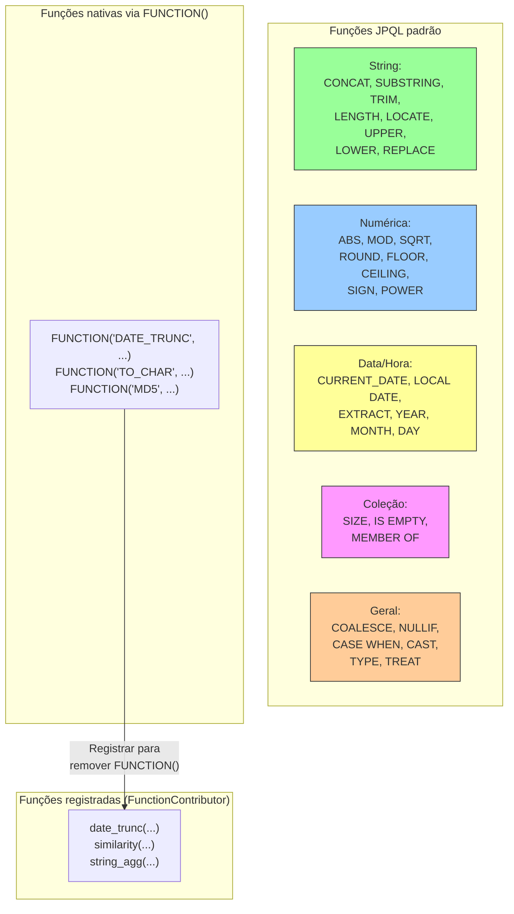
```mermaid
flowchart TD
    subgraph "Funções JPQL padrão"
        S["String:<br>CONCAT, SUBSTRING, TRIM,<br>LENGTH, LOCATE, UPPER,<br>LOWER, REPLACE"]
        N["Numérica:<br>ABS, MOD, SQRT,<br>ROUND, FLOOR, CEILING,<br>SIGN, POWER"]
        D["Data/Hora:<br>CURRENT_DATE, LOCAL DATE,<br>EXTRACT, YEAR, MONTH, DAY"]
        C["Coleção:<br>SIZE, IS EMPTY,<br>MEMBER OF"]
        G["Geral:<br>COALESCE, NULLIF,<br>CASE WHEN, CAST,<br>TYPE, TREAT"]
    end

    subgraph "Funções nativas via FUNCTION()"
        F1["FUNCTION('DATE_TRUNC', ...)<br>FUNCTION('TO_CHAR', ...)<br>FUNCTION('MD5', ...)"]
    end

    subgraph "Funções registradas (FunctionContributor)"
        F2["date_trunc(...)<br>similarity(...)<br>string_agg(...)"]
    end

    F1 -->|"Registrar para<br>remover FUNCTION()"| F2

    style S fill:#9f9,stroke:#333
    style N fill:#9cf,stroke:#333
    style D fill:#ff9,stroke:#333
    style C fill:#f9f,stroke:#333
    style G fill:#fc9,stroke:#333
```

| Recurso | JPQL padrão | Hibernate 6+ | Via FUNCTION() | Via FunctionContributor |
|---|---|---|---|---|
| `CONCAT`, `SUBSTRING`, `TRIM` | Sim | Sim | — | — |
| `REPLACE`, `LEFT`, `RIGHT` | JPA 3.2 | Sim | — | — |
| `ROUND`, `FLOOR`, `CEILING` | JPA 3.2 | Sim | — | — |
| `EXTRACT(YEAR FROM ...)` | JPA 3.1 | Sim | — | — |
| `YEAR()`, `MONTH()`, `DAY()` | Não | Sim | — | — |
| `DATE_TRUNC` | Não | Não | Sim | Sim (registrar) |
| `TO_CHAR` | Não | Não | Sim | Sim (registrar) |
| `SIMILARITY` (pg_trgm) | Não | Não | Sim | Sim (registrar) |
| `STRING_AGG` | Não | Não | Sim | Sim (registrar) |
| `NULLS FIRST/LAST` | Sim | Sim | — | — |
| `EXISTS`, `ALL`, `ANY` | Sim | Sim | — | — |
| `KEY`, `VALUE`, `ENTRY` (Maps) | Sim | Sim | — | — |

---


## 4. Queries Nativas

Para SQL que o JPQL não expressa: CTEs, window functions, operadores específicos do PostgreSQL.

### Query nativa básica

```java
@Query(value = "SELECT * FROM aluno WHERE ra ~ :regex", nativeQuery = true)
List<Aluno> findByRaRegex(@Param("regex") String regex);
```

### Window functions

```java
@Query(value = """
    SELECT a.id, a.nome, a.ra, m.nota,
           RANK() OVER (PARTITION BY m.curso_id ORDER BY m.nota DESC) AS posicao
    FROM aluno a
    JOIN matricula m ON m.aluno_id = a.id
    WHERE m.curso_id = :cursoId
    """, nativeQuery = true)
List<Object[]> findRankingDoCurso(@Param("cursoId") Long cursoId);
```

### CTE (Common Table Expression)

```java
@Query(value = """
    WITH media_por_aluno AS (
        SELECT m.aluno_id, AVG(m.nota) AS media
        FROM matricula m
        WHERE m.status = 'ATIVA'
        GROUP BY m.aluno_id
    )
    SELECT a.id, a.nome, a.ra, mpa.media
    FROM aluno a
    JOIN media_por_aluno mpa ON mpa.aluno_id = a.id
    WHERE mpa.media >= :mediaMinima
    ORDER BY mpa.media DESC
    """, nativeQuery = true)
List<Object[]> findAlunosComMediaAcimaDe(@Param("mediaMinima") BigDecimal mediaMinima);
```

### Operadores PostgreSQL específicos

```java
// Array contains
@Query(value = "SELECT * FROM aluno WHERE tags @> ARRAY[:tag]::varchar[]", nativeQuery = true)
List<Aluno> findByTag(@Param("tag") String tag);

// JSONB
@Query(value = "SELECT * FROM config WHERE dados ->> 'tema' = :tema", nativeQuery = true)
List<Config> findByTema(@Param("tema") String tema);

// = ANY (performance melhor que IN para listas grandes)
@Query(value = "SELECT * FROM aluno WHERE id = ANY(:ids)", nativeQuery = true)
List<Aluno> findByIds(@Param("ids") Long[] ids);
```

### Query nativa com paginação

```java
@Query(
    value = "SELECT * FROM aluno WHERE nome ILIKE '%' || :termo || '%'",
    countQuery = "SELECT COUNT(*) FROM aluno WHERE nome ILIKE '%' || :termo || '%'",
    nativeQuery = true
)
Page<Aluno> searchByNome(@Param("termo") String termo, Pageable pageable);
```

O `countQuery` é obrigatório para paginação com queries nativas — o Spring Data não consegue derivar o count automaticamente.

### Mapeamento de resultado nativo com @SqlResultSetMapping

```java
@Entity
@SqlResultSetMapping(
    name = "RankingAlunoMapping",
    classes = @ConstructorResult(
        targetClass = RankingAlunoDTO.class,
        columns = {
            @ColumnResult(name = "id", type = Long.class),
            @ColumnResult(name = "nome", type = String.class),
            @ColumnResult(name = "media", type = BigDecimal.class),
            @ColumnResult(name = "posicao", type = Long.class)
        }
    )
)
public class Aluno { }
```

```java
public record RankingAlunoDTO(Long id, String nome, BigDecimal media, Long posicao) {}
```

---


## 5. Criteria API com Metamodel Estático

Para queries complexas construídas programaticamente com total type-safety.

### Configuração do Metamodel

```xml
<dependency>
    <groupId>org.hibernate.orm</groupId>
    <artifactId>hibernate-jpamodelgen</artifactId>
    <scope>provided</scope>
</dependency>
```

### Consulta com Criteria

```java
@Repository
public class MatriculaQueryRepository {

    private final EntityManager entityManager;

    public MatriculaQueryRepository(EntityManager entityManager) {
        this.entityManager = entityManager;
    }

    public List<Matricula> buscar(StatusMatricula status, BigDecimal notaMinima) {
        CriteriaBuilder cb = entityManager.getCriteriaBuilder();
        CriteriaQuery<Matricula> cq = cb.createQuery(Matricula.class);
        Root<Matricula> root = cq.from(Matricula.class);

        List<Predicate> predicates = new ArrayList<>();

        if (status != null) {
            predicates.add(cb.equal(root.get(Matricula_.status), status));
        }
        if (notaMinima != null) {
            predicates.add(cb.greaterThanOrEqualTo(root.get(Matricula_.nota), notaMinima));
        }

        cq.where(predicates.toArray(Predicate[]::new));
        cq.orderBy(cb.desc(root.get(Matricula_.nota)));

        return entityManager.createQuery(cq).getResultList();
    }
}
```

### Criteria com JOIN e projeção em DTO

```java
public List<MatriculaResumo> listarResumo(Long cursoId) {
    CriteriaBuilder cb = entityManager.getCriteriaBuilder();
    CriteriaQuery<MatriculaResumo> cq = cb.createQuery(MatriculaResumo.class);
    Root<Matricula> root = cq.from(Matricula.class);
    Join<Matricula, Aluno> aluno = root.join(Matricula_.aluno);
    Join<Matricula, Curso> curso = root.join(Matricula_.curso);

    cq.select(cb.construct(
        MatriculaResumo.class,
        aluno.get(Aluno_.nome),
        curso.get(Curso_.nome),
        root.get(Matricula_.nota),
        root.get(Matricula_.status)
    ));

    cq.where(cb.equal(root.get(Matricula_.curso).get(Curso_.id), cursoId));
    cq.orderBy(cb.desc(root.get(Matricula_.nota)));

    return entityManager.createQuery(cq).getResultList();
}
```

### Criteria com agregação

```java
public List<Object[]> estatisticasPorCurso() {
    CriteriaBuilder cb = entityManager.getCriteriaBuilder();
    CriteriaQuery<Object[]> cq = cb.createQuery(Object[].class);
    Root<Matricula> root = cq.from(Matricula.class);
    Join<Matricula, Curso> curso = root.join(Matricula_.curso);

    cq.multiselect(
        curso.get(Curso_.nome),
        cb.count(root),
        cb.avg(root.get(Matricula_.nota)),
        cb.min(root.get(Matricula_.nota)),
        cb.max(root.get(Matricula_.nota))
    );

    cq.groupBy(curso.get(Curso_.nome));
    cq.having(cb.gt(cb.count(root), 5));
    cq.orderBy(cb.desc(cb.avg(root.get(Matricula_.nota))));

    return entityManager.createQuery(cq).getResultList();
}
```

### Quando usar Criteria vs JPQL vs Specification

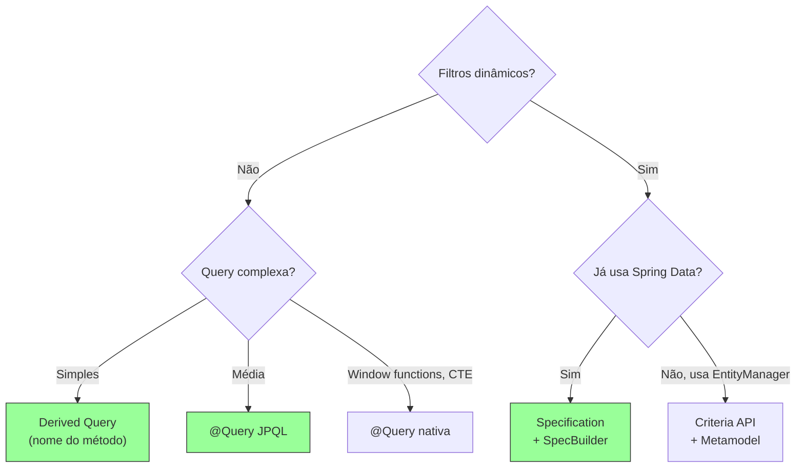
```mermaid
flowchart TD
    A{Filtros dinâmicos?} -->|Não| B{Query complexa?}
    A -->|Sim| C{Já usa Spring Data?}

    B -->|Simples| D["Derived Query<br>(nome do método)"]
    B -->|Média| E["@Query JPQL"]
    B -->|Window functions, CTE| F["@Query nativa"]

    C -->|Sim| G["Specification<br>+ SpecBuilder"]
    C -->|Não, usa EntityManager| H["Criteria API<br>+ Metamodel"]

    style D fill:#9f9,stroke:#333
    style E fill:#9f9,stroke:#333
    style G fill:#9f9,stroke:#333
```

---


## 6. Specifications — Filtros Dinâmicos Tipados

Para consultas com filtros opcionais construídos em runtime. Combina com Metamodel para type-safety.

### A interface `Specification<T>`

`Specification` é uma interface funcional do Spring Data que encapsula um único predicado JPA. Sua implementação produz um `Predicate` que será composto na cláusula `WHERE` da query.

```java
// Definição original — Spring Data JPA (org.springframework.data.jpa.domain)
@FunctionalInterface
public interface Specification<T> {

    // Método principal: retorna o Predicate que representa o filtro.
    //   root  — ponto de partida da query (equivale ao FROM); acesso aos campos da entidade
    //   query — objeto CriteriaQuery; permite subqueries e controle de SELECT/ORDER BY
    //   cb    — CriteriaBuilder; fábrica de predicados (equal, like, between, and, or...)
    @Nullable
    Predicate toPredicate(Root<T> root, CriteriaQuery<?> query, CriteriaBuilder cb);

    // Métodos default para composição declarativa
    default Specification<T> and(Specification<T> other) { ... }
    default Specification<T> or(Specification<T> other)  { ... }

    // Métodos estáticos utilitários
    static <T> Specification<T> not(Specification<T> spec)   { ... }
    static <T> Specification<T> where(Specification<T> spec) { ... }
    static <T> Specification<T> allOf(Iterable<Specification<T>> specs) { ... }
    static <T> Specification<T> anyOf(Iterable<Specification<T>> specs) { ... }
}
```

Por ser `@FunctionalInterface`, uma `Specification` pode ser criada como lambda — o parâmetro único é o método `toPredicate`:

```java
// Lambda equivalente a implementar toPredicate
Specification<Matricula> ativa = (root, query, cb) ->
        cb.equal(root.get("status"), StatusMatricula.ATIVA);
```

### Setup

```java
public interface MatriculaRepository extends
        JpaRepository<Matricula, Long>,
        JpaSpecificationExecutor<Matricula> {
}
```

### Specifications individuais

```java
public class MatriculaSpecs {

    public static Specification<Matricula> comStatus(StatusMatricula status) {
        return (root, query, cb) -> cb.equal(root.get(Matricula_.status), status);
    }

    public static Specification<Matricula> notaAcimaDe(BigDecimal minima) {
        return (root, query, cb) -> cb.greaterThanOrEqualTo(root.get(Matricula_.nota), minima);
    }

    public static Specification<Matricula> doCurso(Long cursoId) {
        return (root, query, cb) -> cb.equal(
            root.get(Matricula_.curso).get(Curso_.id), cursoId
        );
    }

    public static Specification<Matricula> doAlunoPorNome(String nome) {
        return (root, query, cb) -> {
            Join<Matricula, Aluno> aluno = root.join(Matricula_.aluno);
            return cb.like(cb.lower(aluno.get(Aluno_.nome)), "%" + nome.toLowerCase() + "%");
        };
    }

    public static Specification<Matricula> criadaEntre(OffsetDateTime inicio, OffsetDateTime fim) {
        return (root, query, cb) -> cb.between(root.get(Matricula_.criadoEm), inicio, fim);
    }
}
```

### Composição dinâmica a partir de filtros

```java
public record MatriculaFiltro(
    StatusMatricula status,
    BigDecimal notaMinima,
    Long cursoId,
    String nomeAluno,
    OffsetDateTime inicio,
    OffsetDateTime fim
) {}
```

```java
@Service
public class MatriculaService {

    private final MatriculaRepository repository;

    public Page<Matricula> buscar(MatriculaFiltro filtro, Pageable pageable) {
        Specification<Matricula> spec = Specification.where(null);

        if (filtro.status() != null)
            spec = spec.and(MatriculaSpecs.comStatus(filtro.status()));

        if (filtro.notaMinima() != null)
            spec = spec.and(MatriculaSpecs.notaAcimaDe(filtro.notaMinima()));

        if (filtro.cursoId() != null)
            spec = spec.and(MatriculaSpecs.doCurso(filtro.cursoId()));

        if (filtro.nomeAluno() != null && !filtro.nomeAluno().isBlank())
            spec = spec.and(MatriculaSpecs.doAlunoPorNome(filtro.nomeAluno()));

        if (filtro.inicio() != null && filtro.fim() != null)
            spec = spec.and(MatriculaSpecs.criadaEntre(filtro.inicio(), filtro.fim()));

        return repository.findAll(spec, pageable);
    }
}
```

### SpecBuilder genérico (reduz boilerplate)

```java
public class SpecBuilder<T> {

    private final List<Specification<T>> specs = new ArrayList<>();

    public <V> SpecBuilder<T> equalIfPresent(SingularAttribute<T, V> attr, V value) {
        if (value != null) {
            specs.add((root, query, cb) -> cb.equal(root.get(attr), value));
        }
        return this;
    }

    public <V extends Comparable<? super V>> SpecBuilder<T> greaterThanIfPresent(
            SingularAttribute<T, V> attr, V value) {
        if (value != null) {
            specs.add((root, query, cb) -> cb.greaterThanOrEqualTo(root.get(attr), value));
        }
        return this;
    }

    public <V extends Comparable<? super V>> SpecBuilder<T> betweenIfPresent(
            SingularAttribute<T, V> attr, V inicio, V fim) {
        if (inicio != null && fim != null) {
            specs.add((root, query, cb) -> cb.between(root.get(attr), inicio, fim));
        }
        return this;
    }

    public SpecBuilder<T> likeIfPresent(SingularAttribute<T, String> attr, String value) {
        if (value != null && !value.isBlank()) {
            specs.add((root, query, cb) ->
                cb.like(cb.lower(root.get(attr)), "%" + value.toLowerCase() + "%"));
        }
        return this;
    }

    public SpecBuilder<T> and(Specification<T> spec) {
        specs.add(spec);
        return this;
    }

    public Specification<T> build() {
        return specs.stream()
            .reduce(Specification.where(null), Specification::and);
    }
}
```

Uso:

```java
Specification<Matricula> spec = new SpecBuilder<Matricula>()
    .equalIfPresent(Matricula_.status, filtro.status())
    .greaterThanIfPresent(Matricula_.nota, filtro.notaMinima())
    .betweenIfPresent(Matricula_.criadoEm, filtro.inicio(), filtro.fim())
    .build();

Page<Matricula> resultado = repository.findAll(spec, pageable);
```

---


## 7. Query by Example (QBE)

Abordagem simples para filtros baseados numa instância-exemplo da entidade. Útil para formulários de busca com muitos campos opcionais.

### Setup

```java
public interface AlunoRepository extends
        JpaRepository<Aluno, Long>,
        QueryByExampleExecutor<Aluno> {
}
```

### Uso básico

```java
Aluno exemplo = new Aluno();
exemplo.setNome("Silva");
exemplo.setAtivo(true);

ExampleMatcher matcher = ExampleMatcher.matching()
    .withMatcher("nome", match -> match.contains().ignoreCase())
    .withIgnorePaths("id", "criadoEm", "atualizadoEm");

Example<Aluno> example = Example.of(exemplo, matcher);

List<Aluno> resultado = repository.findAll(example);
// WHERE LOWER(nome) LIKE '%silva%' AND ativo = true
```

### QBE com paginação

```java
Page<Aluno> pagina = repository.findAll(example, PageRequest.of(0, 20, Sort.by("nome")));
```

### Limitações do QBE

- Não suporta operadores de comparação (`>=`, `<`, `BETWEEN`).
- Não suporta `OR` (só `AND`).
- Não navega relacionamentos.
- Campos nulos são ignorados (não dá para buscar "onde campo IS NULL").

Para filtros mais complexos, use Specifications.

---


## Parte 2 — Retorno e Filtragem de Dados

## 8. Projeções — Retornando Apenas o Necessário

Evitam carregar a entidade inteira quando só precisa de alguns campos. Sem dirty checking, sem overhead de gerenciamento.

### Interface projection (recomendada para queries simples)

```java
public interface CursoResumo {
    Long getId();
    String getNome();
    long getTotalMatriculas();
}
```

```java
public interface CursoRepository extends JpaRepository<Curso, Long> {

    @Query("""
        SELECT c.id AS id, c.nome AS nome, COUNT(m) AS totalMatriculas
        FROM Curso c
        LEFT JOIN c.matriculas m
        GROUP BY c.id, c.nome
        """)
    List<CursoResumo> findAllResumos();

    // Derived query com projeção
    List<CursoResumo> findByNomeContaining(String termo);
}
```

O Hibernate cria proxies da interface — sem instanciar a entidade.

### Record projection (Java 17+, tipagem forte)

```java
public record MatriculaResumo(
    String nomeAluno,
    String nomeCurso,
    BigDecimal nota,
    StatusMatricula status
) {}
```

```java
@Query("""
    SELECT new com.exemplo.dto.MatriculaResumo(
        a.nome, c.nome, m.nota, m.status
    )
    FROM Matricula m
    JOIN m.aluno a
    JOIN m.curso c
    WHERE m.status = :status
    ORDER BY a.nome
    """)
List<MatriculaResumo> findResumosPorStatus(@Param("status") StatusMatricula status);
```

O construtor `new` no JPQL exige o caminho completo da classe (fully qualified name).

### Interface projection com SpEL (campo calculado)

```java
public interface AlunoComMedia {
    Long getId();
    String getNome();
    String getRa();
    BigDecimal getMediaNotas();

    // Campo calculado via SpEL
    @Value("#{target.mediaNotas >= 7.0 ? 'APROVADO' : 'REPROVADO'}")
    String getSituacao();
}
```

### Interface projection com projeção aninhada

```java
public interface MatriculaDetalhe {
    BigDecimal getNota();
    StatusMatricula getStatus();
    AlunoResumo getAluno();
    CursoResumo getCurso();

    interface AlunoResumo {
        String getNome();
        String getRa();
    }

    interface CursoResumo {
        String getNome();
        Integer getCargaHoraria();
    }
}
```

```java
List<MatriculaDetalhe> findByCursoId(Long cursoId);
```

O Hibernate carrega só os campos projetados das entidades relacionadas.

### Projeção nativa com interface

```java
public interface AlunoRanking {
    Long getId();
    String getNome();
    BigDecimal getMedia();
    Long getPosicao();
}

@Query(value = """
    SELECT a.id, a.nome,
           AVG(m.nota) AS media,
           RANK() OVER (ORDER BY AVG(m.nota) DESC) AS posicao
    FROM aluno a
    JOIN matricula m ON m.aluno_id = a.id
    GROUP BY a.id, a.nome
    """, nativeQuery = true)
List<AlunoRanking> findRanking();
```

### Comparação de projeções

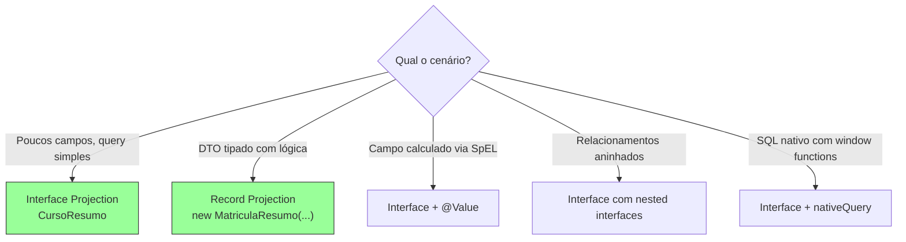
```mermaid
flowchart TD
    A{Qual o cenário?} -->|"Poucos campos, query simples"| B["Interface Projection<br>CursoResumo"]
    A -->|"DTO tipado com lógica"| C["Record Projection<br>new MatriculaResumo(...)"]
    A -->|"Campo calculado via SpEL"| D["Interface + @Value"]
    A -->|"Relacionamentos aninhados"| E["Interface com nested interfaces"]
    A -->|"SQL nativo com window functions"| F["Interface + nativeQuery"]

    style B fill:#9f9,stroke:#333
    style C fill:#9f9,stroke:#333
```

| Tipo | Dirty checking | JOIN FETCH | SpEL | Native SQL |
|---|---|---|---|---|
| Entidade completa | Sim | Sim | Não | Sim |
| Interface projection | Não | Não necessário | Sim | Sim |
| Record / DTO projection | Não | Não necessário | Não | Não (usar `@SqlResultSetMapping`) |
| `Object[]` | Não | Não necessário | Não | Sim |

---


## 9. Paginação e Ordenação

### Paginação básica

```java
public interface AlunoRepository extends JpaRepository<Aluno, Long> {

    Page<Aluno> findByNomeContaining(String nome, Pageable pageable);
}
```

```java
// Página 0 (primeira), 20 itens, ordenado por nome
Pageable pageable = PageRequest.of(0, 20, Sort.by("nome").ascending());
Page<Aluno> pagina = repository.findByNomeContaining("Silva", pageable);

pagina.getContent();        // List<Aluno> da página
pagina.getTotalElements();  // total de registros
pagina.getTotalPages();     // total de páginas
pagina.getNumber();         // página atual (0-based)
pagina.hasNext();           // tem próxima?
```

### Ordenação múltipla

```java
Sort sort = Sort.by(
    Sort.Order.desc("nota"),
    Sort.Order.asc("aluno.nome")
);
Pageable pageable = PageRequest.of(0, 20, sort);
```

### Slice vs Page (sem COUNT)

`Page` executa uma query extra de `COUNT` para calcular o total. Se não precisa do total (scroll infinito):

```java
Slice<Aluno> slice = repository.findByAtivoTrue(PageRequest.of(0, 20));

slice.getContent();   // List<Aluno>
slice.hasNext();      // tem mais? (busca N+1 registros para saber)
// NÃO tem getTotalElements() nem getTotalPages()
```

### Paginação com @Query JPQL

```java
@Query("""
    SELECT m FROM Matricula m
    JOIN FETCH m.aluno
    WHERE m.curso.id = :cursoId
    """)
Page<Matricula> findByCursoComAluno(
    @Param("cursoId") Long cursoId,
    Pageable pageable
);
```

**Cuidado:** `JOIN FETCH` com coleções (`OneToMany`) + paginação causa `HHH90003004: firstResult/maxResults specified with collection fetch; applying in memory!` — o Hibernate carrega tudo e pagina em memória. Use `@EntityGraph` ou `@BatchSize` nesses casos.

### Paginação com Specification

```java
Page<Matricula> resultado = repository.findAll(spec, PageRequest.of(0, 20, Sort.by("nota").descending()));
```

### Paginação keyset (cursor-based) — melhor performance em tabelas grandes

Em vez de `OFFSET` (que fica lento em páginas altas), use cursor baseado na última chave:

```java
@Query("""
    SELECT m FROM Matricula m
    WHERE m.criadoEm < :cursor
    ORDER BY m.criadoEm DESC
    """)
List<Matricula> findProximaPagina(
    @Param("cursor") OffsetDateTime cursor,
    Pageable pageable
);
```

```java
// Primeira página
List<Matricula> primeira = repository.findProximaPagina(
    OffsetDateTime.now(), PageRequest.ofSize(20)
);

// Próxima página — usa o último criadoEm como cursor
OffsetDateTime ultimoTimestamp = primeira.getLast().getCriadoEm();
List<Matricula> segunda = repository.findProximaPagina(
    ultimoTimestamp, PageRequest.ofSize(20)
);
```

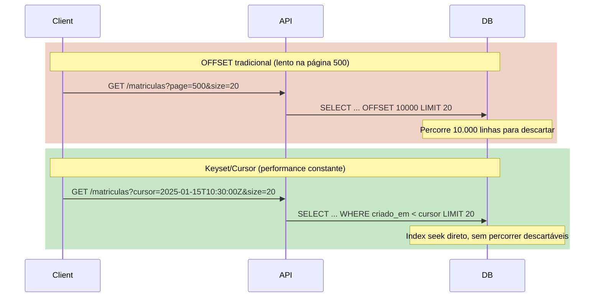
```mermaid
sequenceDiagram
    participant Client
    participant API
    participant DB

    rect rgb(240, 210, 200)
        Note over Client,DB: OFFSET tradicional (lento na página 500)
        Client->>API: GET /matriculas?page=500&size=20
        API->>DB: SELECT ... OFFSET 10000 LIMIT 20
        Note over DB: Percorre 10.000 linhas para descartar
    end

    rect rgb(200, 230, 200)
        Note over Client,DB: Keyset/Cursor (performance constante)
        Client->>API: GET /matriculas?cursor=2025-01-15T10:30:00Z&size=20
        API->>DB: SELECT ... WHERE criado_em < cursor LIMIT 20
        Note over DB: Index seek direto, sem percorrer descartáveis
    end
```

---


## 10. Consultas em Lote — Verificação de IDs

### Validação pura — COUNT e comparação

```java
@Query("SELECT COUNT(e.id) FROM Entity e WHERE e.id IN :ids")
long countByIdIn(@Param("ids") Collection<Long> ids);
```

```java
if (repository.countByIdIn(ids) != ids.size()) {
    throw new EntityNotFoundException("Um ou mais IDs não encontrados");
}
```

### Identificar quais faltam — projeção de IDs

```java
@Query("SELECT e.id FROM Entity e WHERE e.id IN :ids")
Set<Long> findExistingIds(@Param("ids") Collection<Long> ids);
```

```java
Set<Long> existing = repository.findExistingIds(ids);
Set<Long> missing = new HashSet<>(ids);
missing.removeAll(existing);
if (!missing.isEmpty()) {
    throw new EntityNotFoundException("IDs não encontrados: " + missing);
}
```

### PostgreSQL — = ANY para listas grandes (centenas+)

```java
@Query(value = "SELECT id FROM entity WHERE id = ANY(:ids)", nativeQuery = true)
Set<Long> findExistingIds(@Param("ids") Long[] ids);
```

### Antipattern: N+1 em loop

```java
// NUNCA — N roundtrips ao banco
ids.forEach(id -> repository.findById(id)
    .orElseThrow(() -> new EntityNotFoundException(id)));

// CORRETO — 1 roundtrip
Set<Long> existentes = repository.findExistingIds(ids);
```

---


## Parte 3 — Relacionamentos, Fetch e Consultas Especiais

## 11. Fetch Strategies — Controle de N+1

### O problema N+1

```java
List<Curso> cursos = cursoRepository.findAll(); // 1 query
for (Curso c : cursos) {
    c.getMatriculas().size(); // 1 query POR CURSO → N queries extras
}
```

### Solução 1: JOIN FETCH no JPQL

```java
@Query("SELECT c FROM Curso c JOIN FETCH c.matriculas WHERE c.id = :id")
Optional<Curso> findByIdComMatriculas(@Param("id") Long id);
```

Uma query com `JOIN`. Não usar com paginação em coleções.

### Solução 2: @EntityGraph

#### No Spring Data — inline por `attributePaths`

```java
@EntityGraph(attributePaths = {"matriculas", "matriculas.aluno"})
@Query("SELECT c FROM Curso c WHERE c.id = :id")
Optional<Curso> findCompletoById(@Param("id") Long id);
```

#### No Spring Data — referenciando @NamedEntityGraph

Defina o grafo na entidade:

```java
@Entity
@NamedEntityGraphs({
    @NamedEntityGraph(
        name = "Curso.resumo",
        attributeNodes = @NamedAttributeNode("professor")
    ),
    @NamedEntityGraph(
        name = "Curso.completo",
        attributeNodes = {
            @NamedAttributeNode("professor"),
            @NamedAttributeNode(value = "matriculas", subgraph = "matriculas-aluno")
        },
        subgraphs = @NamedSubgraph(
            name = "matriculas-aluno",
            attributeNodes = @NamedAttributeNode("aluno")
        )
    )
})
public class Curso {

    @Id
    @GeneratedValue(strategy = GenerationType.IDENTITY)
    private Long id;

    private String nome;

    @ManyToOne(fetch = FetchType.LAZY)
    private Professor professor;

    @OneToMany(mappedBy = "curso")
    private Set<Matricula> matriculas;
}
```

Referência no repository:

```java
public interface CursoRepository extends JpaRepository<Curso, Long> {

    @EntityGraph("Curso.resumo")
    Optional<Curso> findComProfessorById(Long id);

    @EntityGraph("Curso.completo")
    @Query("SELECT c FROM Curso c WHERE c.id = :id")
    Optional<Curso> findCompletoById(@Param("id") Long id);

    @EntityGraph("Curso.completo")
    List<Curso> findByNomeContaining(String nome);
}
```

#### FETCH vs LOAD — tipo do EntityGraph

```java
// FETCH graph — atributos listados: EAGER, todos os demais: LAZY
@EntityGraph(value = "Curso.completo", type = EntityGraph.EntityGraphType.FETCH)
Optional<Curso> findCompletoById(Long id);

// LOAD graph — atributos listados: EAGER, demais: mantém o FetchType da entidade
@EntityGraph(value = "Curso.completo", type = EntityGraph.EntityGraphType.LOAD)
Optional<Curso> findCompletoById(Long id);
```

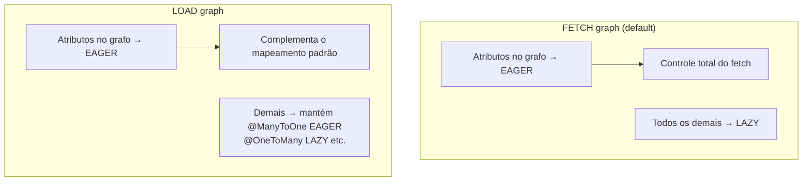
```mermaid
flowchart TD
    subgraph "FETCH graph (default)"
        F1["Atributos no grafo → EAGER"]
        F2["Todos os demais → LAZY"]
        F1 --> F3["Controle total do fetch"]
    end

    subgraph "LOAD graph"
        L1["Atributos no grafo → EAGER"]
        L2["Demais → mantém @ManyToOne EAGER<br>@OneToMany LAZY etc."]
        L1 --> L3["Complementa o mapeamento padrão"]
    end
```

| Tipo | Atributos no grafo | Demais atributos |
|---|---|---|
| `FETCH` (default) | EAGER | Forçados LAZY |
| `LOAD` | EAGER | Mantém o FetchType original da entidade |

Na maioria dos casos, `FETCH` é o mais previsível — você define exatamente o que será carregado.

#### JPA puro — EntityGraph dinâmico via EntityManager

Quando o grafo de fetch precisa variar em runtime sem criar múltiplos `@NamedEntityGraph`:

```java
@Repository
public class CursoQueryRepository {

    private final EntityManager entityManager;

    public CursoQueryRepository(EntityManager entityManager) {
        this.entityManager = entityManager;
    }

    public Optional<Curso> findById(Long id, String... fetchAttributes) {
        EntityGraph<Curso> graph = entityManager.createEntityGraph(Curso.class);
        for (String attr : fetchAttributes) {
            graph.addAttributeNodes(attr);
        }

        Map<String, Object> hints = Map.of("jakarta.persistence.fetchgraph", graph);

        Curso curso = entityManager.find(Curso.class, id, hints);
        return Optional.ofNullable(curso);
    }
}
```

Uso:

```java
// Só professor
Optional<Curso> c1 = repository.findById(1L, "professor");

// Professor + matrículas
Optional<Curso> c2 = repository.findById(1L, "professor", "matriculas");

// Só matrículas
Optional<Curso> c3 = repository.findById(1L, "matriculas");
```

#### JPA puro — EntityGraph dinâmico com subgraph (relacionamentos profundos)

Para carregar `Curso → matriculas → aluno` dinamicamente:

```java
public Optional<Curso> findByIdComMatriculasEAlunos(Long id) {
    EntityGraph<Curso> graph = entityManager.createEntityGraph(Curso.class);
    graph.addAttributeNodes("professor");

    Subgraph<Matricula> matriculasSubgraph = graph.addSubgraph("matriculas");
    matriculasSubgraph.addAttributeNodes("aluno");

    Map<String, Object> hints = Map.of("jakarta.persistence.fetchgraph", graph);

    return Optional.ofNullable(entityManager.find(Curso.class, id, hints));
}
```

SQL gerado:

```sql
SELECT c.*, p.*, m.*, a.*
FROM curso c
LEFT JOIN professor p ON p.id = c.professor_id
LEFT JOIN matricula m ON m.curso_id = c.id
LEFT JOIN aluno a ON a.id = m.aluno_id
WHERE c.id = ?
```

#### JPA puro — EntityGraph dinâmico em JPQL

```java
public List<Curso> findAtivosComRelacionamentos(boolean incluirMatriculas) {
    EntityGraph<Curso> graph = entityManager.createEntityGraph(Curso.class);
    graph.addAttributeNodes("professor");

    if (incluirMatriculas) {
        Subgraph<Matricula> sub = graph.addSubgraph("matriculas");
        sub.addAttributeNodes("aluno");
    }

    return entityManager.createQuery("SELECT c FROM Curso c WHERE c.ativo = true", Curso.class)
        .setHint("jakarta.persistence.fetchgraph", graph)
        .getResultList();
}
```

#### JPA puro — reutilizando @NamedEntityGraph por nome

```java
public Optional<Curso> findByIdComGrafoNomeado(Long id, String nomeGrafo) {
    EntityGraph<?> graph = entityManager.getEntityGraph(nomeGrafo);

    Map<String, Object> hints = Map.of("jakarta.persistence.fetchgraph", graph);

    return Optional.ofNullable(entityManager.find(Curso.class, id, hints));
}
```

```java
// Usa o @NamedEntityGraph definido na entidade
Optional<Curso> resumo = repository.findByIdComGrafoNomeado(1L, "Curso.resumo");
Optional<Curso> completo = repository.findByIdComGrafoNomeado(1L, "Curso.completo");
```

#### Diagrama: EntityGraph estático vs dinâmico

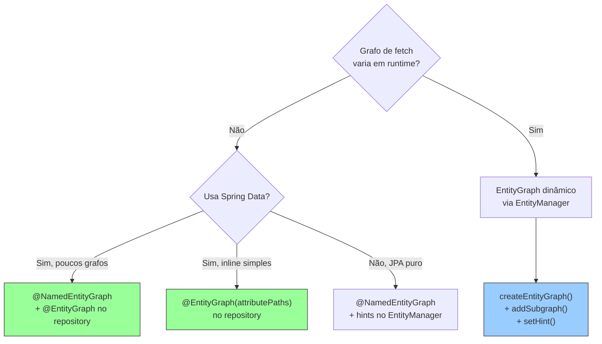
```mermaid
flowchart TD
    A{Grafo de fetch<br>varia em runtime?} -->|Não| B{Usa Spring Data?}
    A -->|Sim| C["EntityGraph dinâmico<br>via EntityManager"]

    B -->|Sim, poucos grafos| D["@NamedEntityGraph<br>+ @EntityGraph no repository"]
    B -->|Sim, inline simples| E["@EntityGraph(attributePaths)<br>no repository"]
    B -->|Não, JPA puro| F["@NamedEntityGraph<br>+ hints no EntityManager"]

    C --> G["createEntityGraph()<br>+ addSubgraph()<br>+ setHint()"]

    style D fill:#9f9,stroke:#333
    style E fill:#9f9,stroke:#333
    style G fill:#9cf,stroke:#333
```

### Solução 3: @BatchSize (pragmática para paginação)

```java
@Entity
public class Curso {

    @OneToMany(mappedBy = "curso")
    @BatchSize(size = 25)
    private Set<Matricula> matriculas;
}
```

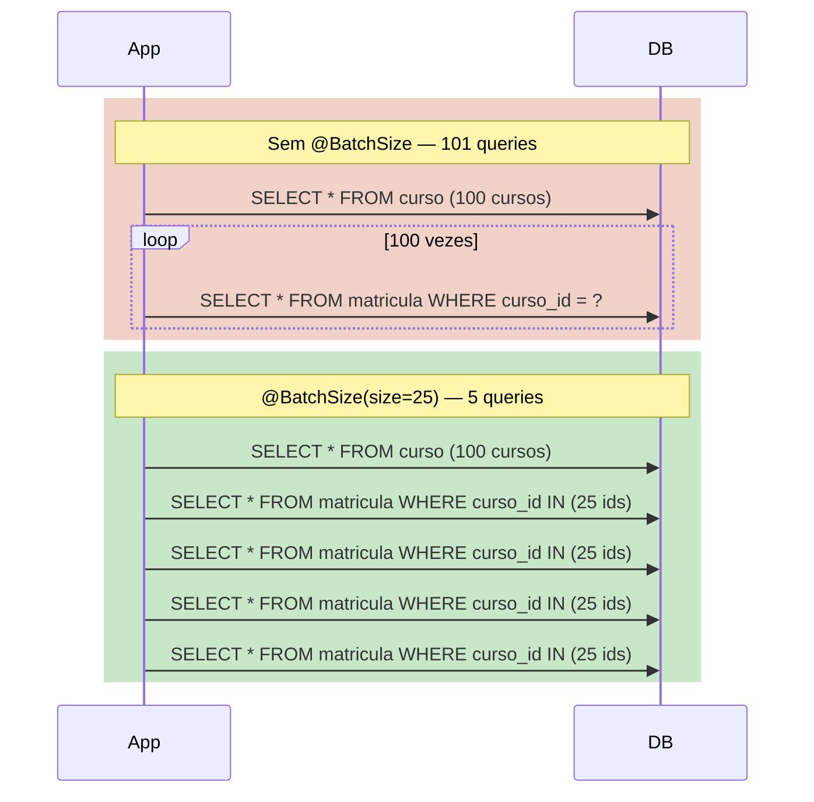
```mermaid
sequenceDiagram
    participant App
    participant DB

    rect rgb(240, 210, 200)
        Note over App,DB: Sem @BatchSize — 101 queries
        App->>DB: SELECT * FROM curso (100 cursos)
        loop 100 vezes
            App->>DB: SELECT * FROM matricula WHERE curso_id = ?
        end
    end

    rect rgb(200, 230, 200)
        Note over App,DB: @BatchSize(size=25) — 5 queries
        App->>DB: SELECT * FROM curso (100 cursos)
        App->>DB: SELECT * FROM matricula WHERE curso_id IN (25 ids)
        App->>DB: SELECT * FROM matricula WHERE curso_id IN (25 ids)
        App->>DB: SELECT * FROM matricula WHERE curso_id IN (25 ids)
        App->>DB: SELECT * FROM matricula WHERE curso_id IN (25 ids)
    end
```

### Solução 4: @Fetch(FetchMode.SUBSELECT)

```java
@OneToMany(mappedBy = "curso")
@Fetch(FetchMode.SUBSELECT)
private Set<Matricula> matriculas;
```

Uma subselect única, independente do número de entidades pai:

```sql
SELECT * FROM matricula WHERE curso_id IN (SELECT id FROM curso WHERE /* query original */)
```

### Comparação de estratégias

| Estratégia | Queries | Compatível com Page | Complexidade |
|---|---|---|---|
| N+1 (default LAZY) | 1 + N | Sim | Nenhuma |
| `JOIN FETCH` | 1 | Não com coleções | Baixa |
| `@EntityGraph` | 1 | Não com coleções | Baixa |
| `@BatchSize` | 1 + ceil(N/batch) | Sim | Nenhuma (config) |
| `FetchMode.SUBSELECT` | 2 | Sim | Nenhuma (config) |

---


## 12. Queries com Herança e Polimorfismo

### Repository polimórfico completo

O `PagamentoRepository` opera na classe-base — todas as queries retornam instâncias concretas resolvidas pelo discriminador:

```java
public interface PagamentoRepository extends JpaRepository<Pagamento, Long> {

    // ── Queries polimórficas (retornam PagamentoPix, PagamentoCartao, PagamentoBoleto) ──

    // findAll() herdado do JpaRepository já é polimórfico
    // SELECT * FROM pagamento → Hibernate instancia a classe correta por linha

    // Filtro na classe base — aplica em todos os subtipos
    List<Pagamento> findByValorGreaterThan(BigDecimal minimo);

    // Filtro por status/período — polimórfico
    List<Pagamento> findByCriadoEmBetween(OffsetDateTime inicio, OffsetDateTime fim);

    // Ordenação polimórfica
    List<Pagamento> findByValorGreaterThanOrderByValorDesc(BigDecimal minimo);

    // Paginação polimórfica
    Page<Pagamento> findByValorBetween(BigDecimal min, BigDecimal max, Pageable pageable);

    // Contagem polimórfica
    long countByValorGreaterThan(BigDecimal minimo);

    // ── Filtro por tipo via coluna discriminadora ──

    // Usa o campo read-only 'tipo' mapeado na classe base
    List<Pagamento> findByTipo(TipoPagamento tipo);

    // Múltiplos tipos
    List<Pagamento> findByTipoIn(Collection<TipoPagamento> tipos);

    // Tipo + filtro de valor
    List<Pagamento> findByTipoAndValorGreaterThanEqual(TipoPagamento tipo, BigDecimal minimo);

    // ── JPQL com TYPE() — filtro por classe Java ──

    @Query("SELECT p FROM Pagamento p WHERE TYPE(p) = :tipo AND p.valor > :minimo")
    List<Pagamento> findByTipoEValor(
        @Param("tipo") Class<? extends Pagamento> tipo,
        @Param("minimo") BigDecimal minimo
    );

    // ── TREAT — acessar campos do subtipo em JPQL ──

    @Query("""
        SELECT p FROM Pagamento p
        WHERE TYPE(p) = PagamentoCartao
          AND TREAT(p AS PagamentoCartao).parcelas > :minParcelas
        """)
    List<Pagamento> findCartaoComMuitasParcelas(@Param("minParcelas") int minParcelas);

    @Query("""
        SELECT p FROM Pagamento p
        WHERE TYPE(p) = PagamentoPix
          AND TREAT(p AS PagamentoPix).chave LIKE :prefixo
        """)
    List<Pagamento> findPixPorPrefixoChave(@Param("prefixo") String prefixo);

    // ── Agregações polimórficas ──

    @Query("""
        SELECT p.tipo, COUNT(p), SUM(p.valor), AVG(p.valor)
        FROM Pagamento p
        WHERE p.criadoEm BETWEEN :inicio AND :fim
        GROUP BY p.tipo
        ORDER BY SUM(p.valor) DESC
        """)
    List<Object[]> findEstatisticasPorTipo(
        @Param("inicio") OffsetDateTime inicio,
        @Param("fim") OffsetDateTime fim
    );

    // ── Projeção polimórfica ──

    @Query("""
        SELECT p.tipo AS tipo, p.valor AS valor, p.criadoEm AS criadoEm
        FROM Pagamento p
        WHERE p.valor >= :minimo
        ORDER BY p.criadoEm DESC
        """)
    List<PagamentoResumo> findResumosPorValorMinimo(@Param("minimo") BigDecimal minimo);

    // ── Bulk operations polimórficas ──

    @Modifying(flushAutomatically = true, clearAutomatically = true)
    @Query("DELETE FROM Pagamento p WHERE p.tipo = :tipo AND p.criadoEm < :limite")
    int deletarPorTipoAntesDe(
        @Param("tipo") TipoPagamento tipo,
        @Param("limite") OffsetDateTime limite
    );
}
```

### Projeção para o repository polimórfico

```java
public interface PagamentoResumo {
    TipoPagamento getTipo();
    BigDecimal getValor();
    OffsetDateTime getCriadoEm();
}
```

### Repositories por subtipo específico

Cada subtipo pode ter seu próprio repository. O Hibernate adiciona `WHERE tipo = 'X'` automaticamente:

```java
public interface PagamentoPixRepository extends JpaRepository<PagamentoPix, Long> {

    List<PagamentoPix> findByChaveContaining(String chave);

    Optional<PagamentoPix> findByTxid(String txid);

    List<PagamentoPix> findByChaveAndValorGreaterThan(String chave, BigDecimal minimo);

    @Query("SELECT p FROM PagamentoPix p WHERE p.chave LIKE %:dominio")
    List<PagamentoPix> findByDominioEmail(@Param("dominio") String dominio);
}
```

```java
public interface PagamentoCartaoRepository extends JpaRepository<PagamentoCartao, Long> {

    List<PagamentoCartao> findByBandeira(String bandeira);

    List<PagamentoCartao> findByParcelasGreaterThan(int minParcelas);

    @Query("SELECT p FROM PagamentoCartao p WHERE p.bandeira = :bandeira AND p.parcelas <= :maxParcelas")
    List<PagamentoCartao> findByBandeiraComLimiteParcelas(
        @Param("bandeira") String bandeira,
        @Param("maxParcelas") int maxParcelas
    );

    @Query("""
        SELECT p.bandeira, COUNT(p), SUM(p.valor)
        FROM PagamentoCartao p
        GROUP BY p.bandeira
        ORDER BY SUM(p.valor) DESC
        """)
    List<Object[]> findEstatisticasPorBandeira();
}
```

```java
public interface PagamentoBoletoRepository extends JpaRepository<PagamentoBoleto, Long> {

    List<PagamentoBoleto> findByVencimentoBefore(LocalDate data);

    List<PagamentoBoleto> findByVencimentoBetween(LocalDate inicio, LocalDate fim);

    @Query("SELECT p FROM PagamentoBoleto p WHERE p.vencimento < CURRENT_DATE AND p.valor > :minimo")
    List<PagamentoBoleto> findVencidosComValorAcimaDe(@Param("minimo") BigDecimal minimo);
}
```

### Uso no service

```java
@Service
public class PagamentoService {

    private final PagamentoRepository pagamentoRepository;
    private final PagamentoPixRepository pixRepository;
    private final PagamentoCartaoRepository cartaoRepository;

    // ── Consulta polimórfica com pattern matching ──

    public String descricao(Long id) {
        Pagamento p = pagamentoRepository.findById(id)
            .orElseThrow(() -> new EntityNotFoundException("Pagamento não encontrado"));

        return switch (p) {
            case PagamentoPix pix       -> "Pix para %s (txid: %s)".formatted(pix.getChave(), pix.getTxid());
            case PagamentoCartao cartao -> "%s em %dx".formatted(cartao.getBandeira(), cartao.getParcelas());
            case PagamentoBoleto boleto -> "Boleto venc. %s".formatted(boleto.getVencimento());
            default                     -> "Pagamento #%d".formatted(p.getId());
        };
    }

    // ── Consulta via TYPE() passando a classe como parâmetro ──

    public List<Pagamento> buscarPorTipo(Class<? extends Pagamento> tipo, BigDecimal minimo) {
        return pagamentoRepository.findByTipoEValor(tipo, minimo);
    }

    // ── Consulta direta no subtipo ──

    public List<PagamentoPix> buscarPixPorChave(String chave) {
        return pixRepository.findByChaveContaining(chave);
    }

    // ── Agrupamento por tipo com Streams ──

    public Map<TipoPagamento, List<Pagamento>> agruparPorTipo() {
        return pagamentoRepository.findAll()
            .stream()
            .collect(Collectors.groupingBy(Pagamento::getTipo));
    }
}
```

### Diagrama: quando usar cada abordagem

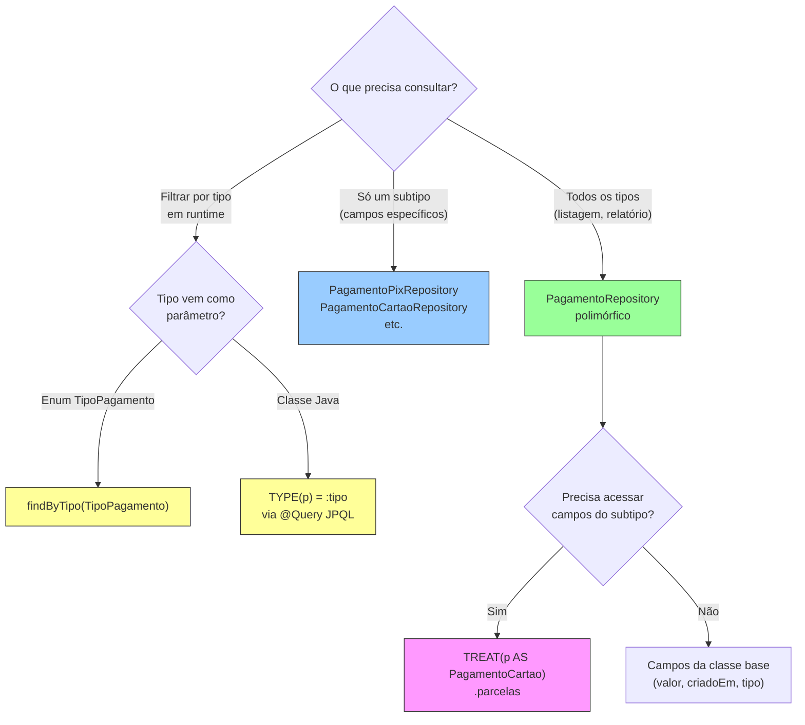
```mermaid
flowchart TD
    A{O que precisa consultar?} -->|"Todos os tipos<br>(listagem, relatório)"| B["PagamentoRepository<br>polimórfico"]
    A -->|"Só um subtipo<br>(campos específicos)"| C["PagamentoPixRepository<br>PagamentoCartaoRepository<br>etc."]
    A -->|"Filtrar por tipo<br>em runtime"| D{"Tipo vem como<br>parâmetro?"}

    D -->|"Enum TipoPagamento"| E["findByTipo(TipoPagamento)"]
    D -->|"Classe Java"| F["TYPE(p) = :tipo<br>via @Query JPQL"]

    B --> G{Precisa acessar<br>campos do subtipo?}
    G -->|Sim| H["TREAT(p AS PagamentoCartao)<br>.parcelas"]
    G -->|Não| I["Campos da classe base<br>(valor, criadoEm, tipo)"]

    style B fill:#9f9,stroke:#333
    style C fill:#9cf,stroke:#333
    style E fill:#ff9,stroke:#333
    style F fill:#ff9,stroke:#333
    style H fill:#f9f,stroke:#333
```

---


## 13. @Formula e @Subselect — Campos e Entidades Calculadas

### @Formula — campo calculado sem coluna

```java
@Entity
public class Curso {

    @Id
    @GeneratedValue(strategy = GenerationType.IDENTITY)
    private Long id;

    private String nome;

    @Formula("(SELECT COUNT(*) FROM matricula m WHERE m.curso_id = id AND m.status = 'ATIVA')")
    private Long totalMatriculasAtivas;

    @Formula("(SELECT COALESCE(AVG(m.nota), 0) FROM matricula m WHERE m.curso_id = id)")
    private BigDecimal mediaNotas;
}
```

O Hibernate injeta a expressão no `SELECT` — sem coluna física, executada a cada carregamento.

### @Subselect — query inteira como entidade read-only

```java
@Entity
@Immutable
@Subselect("""
    SELECT c.id, c.nome,
           COUNT(m.aluno_id) AS total_alunos,
           COALESCE(AVG(m.nota), 0) AS media_notas
    FROM curso c
    LEFT JOIN matricula m ON m.curso_id = c.id
    GROUP BY c.id, c.nome
    """)
@Synchronize({"curso", "matricula"})
public class CursoEstatistica {

    @Id
    private Long id;
    private String nome;
    private Long totalAlunos;
    private BigDecimal mediaNotas;
}
```

O `@Synchronize` garante que o Hibernate faz flush nas tabelas `curso` e `matricula` antes de consultar a "entidade virtual".

Repository funciona normalmente:

```java
public interface CursoEstatisticaRepository extends JpaRepository<CursoEstatistica, Long> {
    List<CursoEstatistica> findByTotalAlunosGreaterThan(Long minimo);
    List<CursoEstatistica> findByMediaNotasGreaterThanEqual(BigDecimal media);
}
```

---


## 14. Chamada de Functions e Stored Procedures

### Function escalar via query nativa

```java
@Query(value = "SELECT calcular_media_ponderada(:alunoId)", nativeQuery = true)
BigDecimal calcularMediaPonderada(@Param("alunoId") Long alunoId);
```

### Function escalar via @Formula

```java
@Formula("calcular_media_ponderada(id)")
private BigDecimal mediaPonderada;
```

### Function tabular via projeção

```java
public interface AlunoCursoProjection {
    Long getAlunoId();
    String getNome();
    BigDecimal getNota();
}

@Query(value = "SELECT * FROM buscar_alunos_por_curso(:cursoId)", nativeQuery = true)
List<AlunoCursoProjection> findAlunosPorCursoViaFunction(@Param("cursoId") Long cursoId);
```

### Registrar function para uso em JPQL (Hibernate 6+)

```java
public class PostgresFunctionContributor implements FunctionContributor {

    @Override
    public void contributeFunctions(FunctionContributions fc) {
        fc.getFunctionRegistry().registerPattern(
            "media_ponderada",
            "calcular_media_ponderada(?1)",
            fc.getTypeConfiguration().getBasicTypeForJavaType(BigDecimal.class)
        );
    }
}
```

Registrar em `META-INF/services/org.hibernate.boot.model.FunctionContributor`. Depois:

```java
@Query("SELECT a FROM Aluno a WHERE media_ponderada(a.id) >= :minima")
List<Aluno> findComMediaPonderadaAcimaDe(@Param("minima") BigDecimal minima);
```

### Stored Procedure via @Procedure

```java
@Procedure(procedureName = "fechar_matriculas_vencidas")
Long fecharMatriculasVencidas(@Param("p_data_limite") OffsetDateTime dataLimite);
```

### Stored Procedure via EntityManager

```java
@Transactional
public long fecharVencidas(OffsetDateTime dataLimite) {
    return (Long) entityManager
        .createStoredProcedureQuery("fechar_matriculas_vencidas")
        .registerStoredProcedureParameter("p_data_limite", OffsetDateTime.class, ParameterMode.IN)
        .registerStoredProcedureParameter("p_total_afetados", Long.class, ParameterMode.INOUT)
        .setParameter("p_data_limite", dataLimite)
        .setParameter("p_total_afetados", 0L)
        .execute() ? 0L : 0L; // get output below

    // query.getOutputParameterValue("p_total_afetados");
}
```

---


## 15. Full-Text Search no PostgreSQL

### Busca simples com ILIKE (sem índice FTS)

```java
@Query(value = "SELECT * FROM aluno WHERE nome ILIKE '%' || :termo || '%'", nativeQuery = true)
List<Aluno> searchByNome(@Param("termo") String termo);
```

### Full-Text Search com `tsvector` e `tsquery`

#### Setup no banco (Flyway)

```sql
-- Adicionar coluna tsvector
ALTER TABLE aluno ADD COLUMN search_vector tsvector;

-- Popular a coluna
UPDATE aluno SET search_vector = to_tsvector('portuguese', COALESCE(nome, '') || ' ' || COALESCE(ra, ''));

-- Índice GIN para performance
CREATE INDEX idx_aluno_search ON aluno USING GIN (search_vector);

-- Trigger para manter atualizado
CREATE OR REPLACE FUNCTION aluno_search_trigger() RETURNS trigger AS $$
BEGIN
    NEW.search_vector := to_tsvector('portuguese', COALESCE(NEW.nome, '') || ' ' || COALESCE(NEW.ra, ''));
    RETURN NEW;
END;
$$ LANGUAGE plpgsql;

CREATE TRIGGER trg_aluno_search
    BEFORE INSERT OR UPDATE ON aluno
    FOR EACH ROW EXECUTE FUNCTION aluno_search_trigger();
```

#### Query no repository

```java
@Query(value = """
    SELECT a.*, ts_rank(a.search_vector, plainto_tsquery('portuguese', :termo)) AS rank
    FROM aluno a
    WHERE a.search_vector @@ plainto_tsquery('portuguese', :termo)
    ORDER BY rank DESC
    """, nativeQuery = true)
List<Aluno> fullTextSearch(@Param("termo") String termo);
```

#### Com paginação

```java
@Query(
    value = """
        SELECT * FROM aluno
        WHERE search_vector @@ plainto_tsquery('portuguese', :termo)
        ORDER BY ts_rank(search_vector, plainto_tsquery('portuguese', :termo)) DESC
        """,
    countQuery = """
        SELECT COUNT(*) FROM aluno
        WHERE search_vector @@ plainto_tsquery('portuguese', :termo)
        """,
    nativeQuery = true
)
Page<Aluno> fullTextSearch(@Param("termo") String termo, Pageable pageable);
```

#### Busca em múltiplas entidades (sem tsvector persistida)

```java
@Query(value = """
    SELECT * FROM aluno
    WHERE to_tsvector('portuguese', nome || ' ' || ra) @@ plainto_tsquery('portuguese', :termo)
    """, nativeQuery = true)
List<Aluno> searchSemColunaTsvector(@Param("termo") String termo);
```

Funcional mas sem índice GIN — performance degrada em tabelas grandes.

### Full-Text Search com `websearch_to_tsquery`

`websearch_to_tsquery` aceita a sintaxe familiar de buscadores: termos separados por espaço viram AND implícito, aspas definem frases exatas, `-` exclui termos e `OR` une alternativas.

```java
@Query(value = """
    SELECT * FROM aluno
    WHERE search_vector @@ websearch_to_tsquery('portuguese', :busca)
    ORDER BY ts_rank(search_vector, websearch_to_tsquery('portuguese', :busca)) DESC
    """, nativeQuery = true)
List<Aluno> buscaWeb(@Param("busca") String busca);
```

```
"joão silva"   → frase exata
java -spring   → java excluindo spring
java OR python → java ou python
```

### Highlighting com `ts_headline`

Retorna o trecho do texto com os termos encontrados destacados, sem precisar fazer uma segunda query:

```java
@Query(value = """
    SELECT a.id, a.nome,
           ts_headline('portuguese', a.nome,
               plainto_tsquery('portuguese', :termo),
               'StartSel=<mark>, StopSel=</mark>, MaxWords=10, MinWords=5') AS trecho
    FROM aluno a
    WHERE a.search_vector @@ plainto_tsquery('portuguese', :termo)
    """, nativeQuery = true)
List<Object[]> searchComHighlight(@Param("termo") String termo);
```

### Busca Facetada

Busca facetada retorna, junto com os resultados paginados, contagens agrupadas por categorias relevantes — o equivalente aos "filtros da lateral" de um e-commerce. O banco computa os totais sobre o mesmo conjunto filtrado pela busca, garantindo consistência entre resultados e facetas.

#### DTOs de resposta

```java
public record FacetaItem(String valor, long contagem) {}

public record BuscaComFacetas<T>(
    Page<T>                          resultados,
    Map<String, List<FacetaItem>>    facetas
) {}
```

#### Abordagem 1 — múltiplas queries (simples e legível)

Uma query para os resultados paginados e queries leves para cada faceta, todas compartilhando o mesmo predicado FTS:

```java
// AlunoRepository

@Query(
    value = """
        SELECT * FROM aluno
        WHERE search_vector @@ plainto_tsquery('portuguese', :termo)
        ORDER BY ts_rank(search_vector, plainto_tsquery('portuguese', :termo)) DESC
        """,
    countQuery = "SELECT COUNT(*) FROM aluno WHERE search_vector @@ plainto_tsquery('portuguese', :termo)",
    nativeQuery = true
)
Page<Aluno> fullTextSearch(@Param("termo") String termo, Pageable pageable);

// Faceta: distribuição por status (ativo/inativo)
@Query(value = """
    SELECT CASE WHEN ativo THEN 'Ativo' ELSE 'Inativo' END AS valor,
           COUNT(*) AS contagem
    FROM aluno
    WHERE search_vector @@ plainto_tsquery('portuguese', :termo)
    GROUP BY ativo
    ORDER BY contagem DESC
    """, nativeQuery = true)
List<Object[]> facetaPorStatus(@Param("termo") String termo);

// Faceta: top cursos nos quais os alunos encontrados estão matriculados
@Query(value = """
    SELECT c.nome AS valor, COUNT(DISTINCT a.id) AS contagem
    FROM aluno a
    JOIN matricula m ON m.aluno_id = a.id
    JOIN curso    c  ON c.id       = m.curso_id
    WHERE a.search_vector @@ plainto_tsquery('portuguese', :termo)
    GROUP BY c.nome
    ORDER BY contagem DESC
    LIMIT 10
    """, nativeQuery = true)
List<Object[]> facetaPorCurso(@Param("termo") String termo);
```

Service que combina os resultados:

```java
@Service
@RequiredArgsConstructor
public class BuscaAlunoService {

    private final AlunoRepository repository;

    public BuscaComFacetas<Aluno> buscar(String termo, Pageable pageable) {
        Page<Aluno> resultados = repository.fullTextSearch(termo, pageable);

        Map<String, List<FacetaItem>> facetas = new LinkedHashMap<>();
        facetas.put("status", toFaceta(repository.facetaPorStatus(termo)));
        facetas.put("curso",  toFaceta(repository.facetaPorCurso(termo)));

        return new BuscaComFacetas<>(resultados, facetas);
    }

    private List<FacetaItem> toFaceta(List<Object[]> rows) {
        return rows.stream()
            .map(r -> new FacetaItem((String) r[0], ((Number) r[1]).longValue()))
            .toList();
    }
}
```

#### Abordagem 2 — CTE única (uma ida ao banco)

Para evitar múltiplos round-trips, uma única query com CTEs computa resultados e facetas simultaneamente e devolve tudo serializado como JSON:

```java
@Query(value = """
    WITH base AS (
        SELECT a.id, a.nome, a.ra, a.ativo,
               ts_rank(a.search_vector, plainto_tsquery('portuguese', :termo)) AS rank
        FROM aluno a
        WHERE a.search_vector @@ plainto_tsquery('portuguese', :termo)
    ),
    pagina AS (
        SELECT * FROM base ORDER BY rank DESC LIMIT :limite OFFSET :offset
    ),
    faceta_status AS (
        SELECT jsonb_agg(
            jsonb_build_object('valor', valor, 'contagem', contagem)
            ORDER BY contagem DESC
        ) AS items
        FROM (
            SELECT CASE WHEN ativo THEN 'Ativo' ELSE 'Inativo' END AS valor,
                   COUNT(*) AS contagem
            FROM base GROUP BY ativo
        ) t
    ),
    faceta_curso AS (
        SELECT jsonb_agg(
            jsonb_build_object('valor', valor, 'contagem', contagem)
            ORDER BY contagem DESC
        ) AS items
        FROM (
            SELECT c.nome AS valor, COUNT(DISTINCT b.id) AS contagem
            FROM base b
            JOIN matricula m ON m.aluno_id = b.id
            JOIN curso    c  ON c.id       = m.curso_id
            GROUP BY c.nome
            LIMIT 10
        ) t
    )
    SELECT
        (SELECT COUNT(*) FROM base)                           AS total,
        (SELECT jsonb_agg(row_to_json(p)) FROM pagina p)      AS itens,
        jsonb_build_object(
            'status', (SELECT items FROM faceta_status),
            'curso',  (SELECT items FROM faceta_curso)
        )                                                     AS facetas
    """, nativeQuery = true)
Object[] buscarComFacetasCte(
    @Param("termo")  String termo,
    @Param("limite") int limite,
    @Param("offset") int offset
);
```

Deserialização no serviço com Jackson:

```java
@Service
@RequiredArgsConstructor
public class BuscaAlunoService {

    private final AlunoRepository  repository;
    private final ObjectMapper      mapper;

    public BuscaComFacetas<Map<String, Object>> buscarCte(
            String termo, int pagina, int tamanhoPagina) throws Exception {

        int offset = pagina * tamanhoPagina;
        Object[] row = repository.buscarComFacetasCte(termo, tamanhoPagina, offset);

        long total = ((Number) row[0]).longValue();

        // row[1] e row[2] chegam como String (JSON serializado pelo PostgreSQL)
        List<Map<String, Object>> itens = mapper.readValue(
            (String) row[1], new TypeReference<>() {});

        Map<String, List<FacetaItem>> facetas = new LinkedHashMap<>();
        Map<String, Object> facetasJson = mapper.readValue(
            (String) row[2], new TypeReference<>() {});

        facetasJson.forEach((dim, items) -> {
            List<Map<String, Object>> lista = (List<Map<String, Object>>) items;
            facetas.put(dim, lista.stream()
                .map(i -> new FacetaItem(
                    (String) i.get("valor"),
                    ((Number) i.get("contagem")).longValue()))
                .toList());
        });

        Page<Map<String, Object>> page =
            new PageImpl<>(itens, PageRequest.of(pagina, tamanhoPagina), total);

        return new BuscaComFacetas<>(page, facetas);
    }
}
```

#### Quando usar cada abordagem

| Critério | Múltiplas queries | CTE única |
|---|---|---|
| Legibilidade | Alta — queries independentes e simples | Média — SQL mais complexo |
| Round-trips | Uma por faceta + uma para resultados | Um único |
| Flexibilidade | Fácil adicionar/remover facetas | Requer reescrever o SQL |
| Facetas condicionais | Simples — chame só as necessárias | Requer CTEs condicionais ou CASE |
| Volume de dados | Adequado para a maioria dos casos | Preferível quando latência é crítica |

> Para facetas sobre o conjunto **completo** (sem filtro FTS), substitua o `WHERE search_vector @@` por `WHERE TRUE` nas queries de faceta — útil para mostrar contagens globais nas opções de filtro antes de o usuário digitar.

### FTS com Specification (filtro dinâmico)

Combinar Full-Text Search com outros filtros dinâmicos via Criteria API:

```java
public static Specification<Aluno> ftsContendo(String termo) {
    return (root, query, cb) -> {
        if (termo == null || termo.isBlank()) return cb.conjunction();
        // jsonb_extract_path_text como função genérica — mesma abordagem funciona para ts_rank
        return cb.greaterThan(
            cb.function("ts_rank", Double.class,
                root.get("searchVector"),
                cb.function("plainto_tsquery", Object.class,
                    cb.literal("portuguese"),
                    cb.literal(termo))
            ),
            0.0
        );
    };
}
```

Composição com outros filtros:

```java
Specification<Aluno> spec = ftsContendo("engenharia")
    .and(AlunoSpecs.comStatus(StatusAluno.ATIVO));

Page<Aluno> resultado = repository.findAll(spec, PageRequest.of(0, 20));
```

> Na prática, FTS dinâmico é mais legível com query nativa diretamente no repository. Reserve Specification para combinar FTS com filtros simples sobre colunas mapeadas.

---


## Parte 4 — Transações e Operações de Escrita

## 16. Transações — Jakarta EE e Spring Data JPA

### O que é uma transação no contexto JPA

Uma transação garante que um conjunto de operações no banco seja atômico: ou todas completam com sucesso (commit) ou nenhuma é aplicada (rollback). No JPA, a transação também delimita o ciclo de vida do persistence context — entidades managed existem dentro de uma transação.

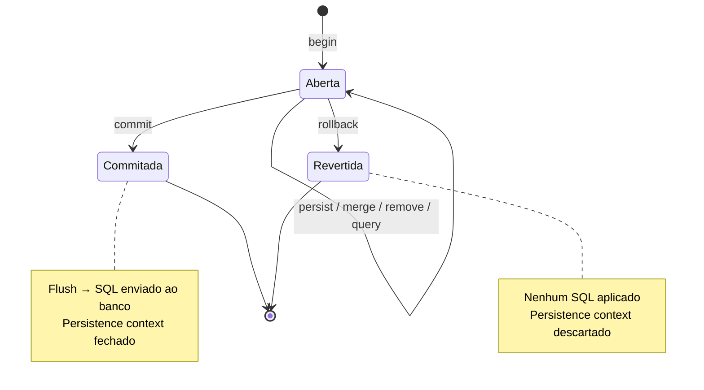
```mermaid
stateDiagram-v2
    [*] --> Aberta : begin
    Aberta --> Aberta : persist / merge / remove / query
    Aberta --> Commitada : commit
    note right of Commitada : Flush → SQL enviado ao banco<br>Persistence context fechado
    Aberta --> Revertida : rollback
    note right of Revertida : Nenhum SQL aplicado<br>Persistence context descartado
    Commitada --> [*]
    Revertida --> [*]
```

### Jakarta EE (JPA puro) — `EntityTransaction`

Para aplicações sem Spring, a transação é gerenciada manualmente via `EntityTransaction`:

```java
EntityManagerFactory emf = Persistence.createEntityManagerFactory("meuPU");
EntityManager em = emf.createEntityManager();
EntityTransaction tx = em.getTransaction();

try {
    tx.begin();

    var aluno = new Aluno();
    aluno.setNome("João Silva");
    aluno.setRa("2024001234");
    em.persist(aluno);

    var matricula = new Matricula();
    matricula.setAluno(aluno);
    matricula.setCurso(em.getReference(Curso.class, 1L));
    matricula.setStatus(StatusMatricula.ATIVA);
    em.persist(matricula);

    tx.commit(); // flush + commit
} catch (Exception e) {
    if (tx.isActive()) {
        tx.rollback();
    }
    throw e;
} finally {
    em.close();
}
```

O padrão `begin → operações → commit` com `try/catch/finally` é verboso e propenso a erro.

### Spring — `@Transactional` (declarativo)

O Spring substitui o gerenciamento manual por uma annotation:

```java
@Service
public class MatriculaService {

    private final MatriculaRepository repository;
    private final CursoRepository cursoRepository;
    private final AlunoRepository alunoRepository;

    @Transactional
    public Matricula criar(CriarMatriculaRequest request) {
        var matricula = new Matricula();
        matricula.setCurso(cursoRepository.getReferenceById(request.cursoId()));
        matricula.setAluno(alunoRepository.getReferenceById(request.alunoId()));
        matricula.setStatus(StatusMatricula.ATIVA);

        return repository.save(matricula);
        // commit automático ao sair do método sem exceção
        // rollback automático se lançar RuntimeException
    }
}
```

O Spring cria um proxy AOP que intercepta a chamada ao método, abre a transação antes e faz commit/rollback depois.

### `@Transactional` do Spring vs Jakarta

Existem **duas** annotations `@Transactional` — não confunda:

```java
// Spring Framework (RECOMENDADO no Spring Boot)
import org.springframework.transaction.annotation.Transactional;

// Jakarta EE / JTA (para containers Jakarta EE puros)
import jakarta.transaction.Transactional;
```

| Aspecto | `org.springframework.transaction.annotation.Transactional` | `jakarta.transaction.Transactional` |
|---|---|---|
| Provedor | Spring Framework | Jakarta EE / JTA |
| Atributo `readOnly` | Sim | Não |
| Atributo `timeout` | Sim (em segundos) | Não |
| Atributo `rollbackFor` | Sim (classe de exceção) | Sim (`rollbackOn`) |
| Atributo `propagation` | Sim (7 opções) | Sim (`TxType`, 6 opções) |
| Atributo `isolation` | Sim (5 opções) | Não (depende do container) |
| Suporte a `@Transactional` em classe | Sim | Sim |
| Funciona fora de container EE | Sim | Não |

**Em projetos Spring Boot, sempre use `org.springframework.transaction.annotation.Transactional`** — mais atributos, mais controle.

### Atributos do `@Transactional` do Spring

#### `readOnly` — otimização para leituras

```java
@Service
public class RelatorioService {

    @Transactional(readOnly = true)
    public List<CursoResumo> gerarRelatorio() {
        return cursoRepository.findAllResumos();
        // Hibernate desabilita dirty checking (economia de CPU/memória)
        // PostgreSQL pode usar snapshot read-only (otimização do banco)
    }

    @Transactional(readOnly = true)
    public Page<Aluno> listar(Pageable pageable) {
        return alunoRepository.findByAtivoTrue(pageable);
    }
}
```

Com `readOnly = true`, o Hibernate **não mantém snapshot** para dirty checking — as entidades retornadas são efetivamente read-only. Se tentar modificar e fazer flush, as mudanças são silenciosamente ignoradas.

#### `timeout` — limite de tempo

```java
@Transactional(timeout = 30) // 30 segundos
public List<Matricula> relatorioCompleto() {
    // Se a transação exceder 30s, lança TransactionTimedOutException
    return matriculaRepository.findRelatorioCompleto();
}
```

O Spring seta `SET LOCAL statement_timeout` no PostgreSQL (ou equivalente no dialeto do banco).

#### `rollbackFor` e `noRollbackFor` — controle de rollback

Por padrão, o Spring faz rollback apenas para **unchecked exceptions** (`RuntimeException` e subclasses). Checked exceptions fazem **commit**:

```java
// Default: rollback só para RuntimeException
@Transactional
public void processar() {
    // RuntimeException → ROLLBACK ✓
    // IOException (checked) → COMMIT (!!!)
}

// Rollback para checked exceptions específicas
@Transactional(rollbackFor = {IOException.class, BusinessException.class})
public void processarComChecked() throws IOException {
    // IOException → ROLLBACK ✓
    // BusinessException → ROLLBACK ✓
}

// Rollback para TODA exceção
@Transactional(rollbackFor = Exception.class)
public void processarTudo() throws Exception {
    // Qualquer exceção → ROLLBACK ✓
}

// Não fazer rollback para exceção específica
@Transactional(noRollbackFor = EmailNaoEnviadoException.class)
public void criarComNotificacao() {
    repository.save(matricula); // persiste
    emailService.enviar(matricula); // se falhar, NÃO faz rollback
}
```

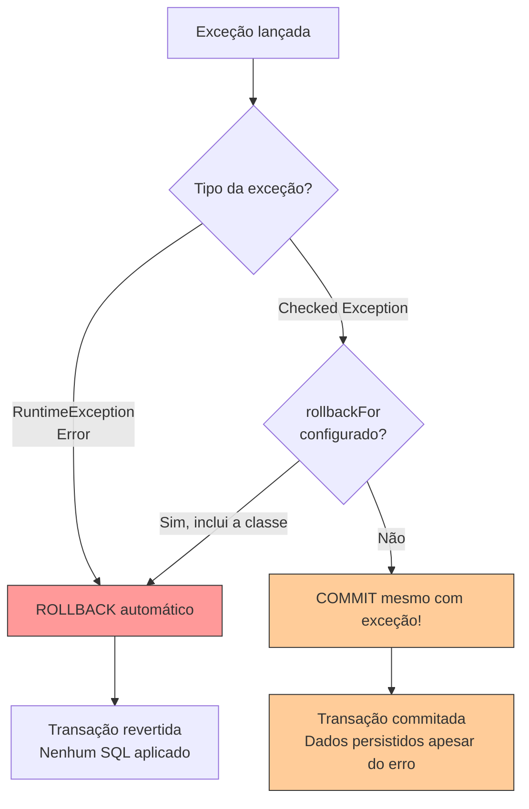
```mermaid
flowchart TD
    A[Exceção lançada] --> B{Tipo da exceção?}
    B -->|RuntimeException<br>Error| C[ROLLBACK automático]
    B -->|Checked Exception| D{rollbackFor<br>configurado?}

    D -->|"Sim, inclui a classe"| C
    D -->|Não| E[COMMIT mesmo com exceção!]

    C --> F["Transação revertida<br>Nenhum SQL aplicado"]
    E --> G["Transação commitada<br>Dados persistidos apesar do erro"]

    style C fill:#f99,stroke:#333
    style E fill:#fc9,stroke:#333
    style G fill:#fc9,stroke:#333
```

#### `propagation` — comportamento com transações aninhadas

```java
// REQUIRED (default) — usa transação existente ou cria nova
@Transactional(propagation = Propagation.REQUIRED)
public void metodoA() {
    // Se já existe transação: participa
    // Se não existe: cria nova
}

// REQUIRES_NEW — sempre cria nova transação (suspende a existente)
@Transactional(propagation = Propagation.REQUIRES_NEW)
public void auditoria() {
    // Cria transação independente
    // Se a transação do chamador fizer rollback, esta JÁ commitou
}

// MANDATORY — exige transação existente (lança exceção se não houver)
@Transactional(propagation = Propagation.MANDATORY)
public void operacaoInterna() {
    // Deve ser chamado dentro de outro @Transactional
    // Senão: IllegalTransactionStateException
}

// SUPPORTS — participa se existir, executa sem transação se não existir
@Transactional(propagation = Propagation.SUPPORTS)
public List<Aluno> listar() {
    // Com ou sem transação — flexível
}

// NOT_SUPPORTED — suspende transação existente, executa sem transação
@Transactional(propagation = Propagation.NOT_SUPPORTED)
public void operacaoSemTx() {
    // Executa fora de transação (cada SQL é auto-commit)
}

// NEVER — lança exceção se existir transação
@Transactional(propagation = Propagation.NEVER)
public void somenteForaDeTx() {
    // Garante que não está em transação
}

// NESTED — savepoint dentro da transação existente
@Transactional(propagation = Propagation.NESTED)
public void operacaoComSavepoint() {
    // Rollback volta ao savepoint, não desfaz a transação pai
    // Requer suporte do banco (PostgreSQL suporta)
}
```

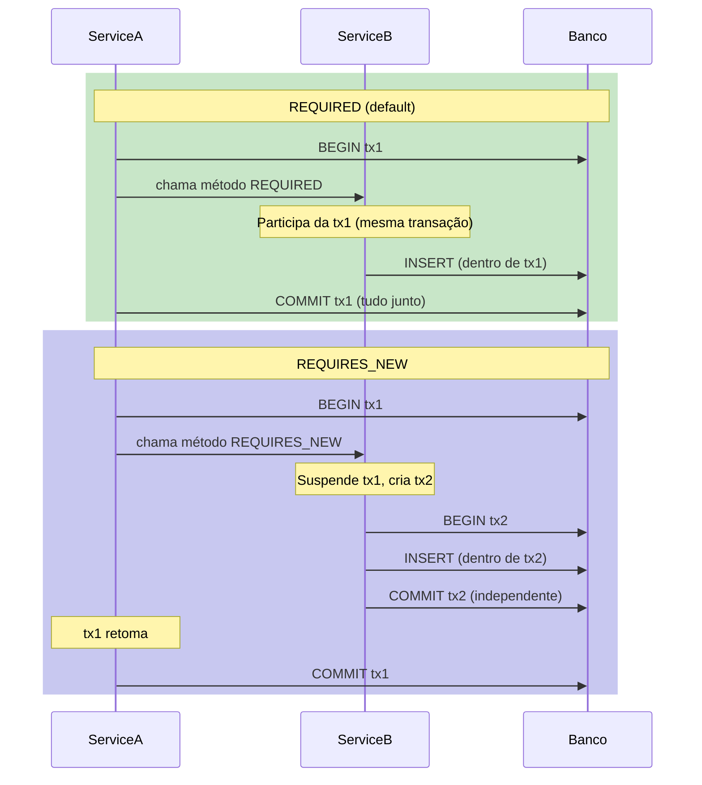
```mermaid
sequenceDiagram
    participant S1 as ServiceA
    participant S2 as ServiceB
    participant DB as Banco

    rect rgb(200, 230, 200)
        Note over S1,DB: REQUIRED (default)
        S1->>DB: BEGIN tx1
        S1->>S2: chama método REQUIRED
        Note over S2: Participa da tx1 (mesma transação)
        S2->>DB: INSERT (dentro de tx1)
        S1->>DB: COMMIT tx1 (tudo junto)
    end

    rect rgb(200, 200, 240)
        Note over S1,DB: REQUIRES_NEW
        S1->>DB: BEGIN tx1
        S1->>S2: chama método REQUIRES_NEW
        Note over S2: Suspende tx1, cria tx2
        S2->>DB: BEGIN tx2
        S2->>DB: INSERT (dentro de tx2)
        S2->>DB: COMMIT tx2 (independente)
        Note over S1: tx1 retoma
        S1->>DB: COMMIT tx1
    end
```

#### `isolation` — nível de isolamento

```java
// READ_COMMITTED (default do PostgreSQL e recomendado)
@Transactional(isolation = Isolation.READ_COMMITTED)
public void operacaoPadrao() { }

// REPEATABLE_READ — leituras consistentes dentro da transação
@Transactional(isolation = Isolation.REPEATABLE_READ)
public void relatorioConsistente() {
    // Leituras dentro desta transação veem o mesmo snapshot
    // Útil para relatórios que fazem múltiplas queries
}

// SERIALIZABLE — mais restritivo, previne phantom reads
@Transactional(isolation = Isolation.SERIALIZABLE)
public void operacaoCritica() {
    // Transações executam como se fossem sequenciais
    // Maior chance de deadlock — usar com cautela
}
```

| Isolamento | Dirty Read | Non-Repeatable Read | Phantom Read | Performance |
|---|---|---|---|---|
| `READ_UNCOMMITTED` | Possível | Possível | Possível | Melhor |
| `READ_COMMITTED` (default PG) | Não | Possível | Possível | Bom |
| `REPEATABLE_READ` | Não | Não | Possível | Médio |
| `SERIALIZABLE` | Não | Não | Não | Pior |

Na prática, `READ_COMMITTED` é suficiente para 95% dos casos. Use `REPEATABLE_READ` para relatórios consistentes e `SERIALIZABLE` apenas quando a integridade exige execução serial.

### Padrões práticos de uso

#### Service com múltiplas operações transacionais

```java
@Service
public class MatriculaService {

    private final MatriculaRepository matriculaRepository;
    private final CursoRepository cursoRepository;
    private final AlunoRepository alunoRepository;
    private final AuditService auditService;

    // Operação de escrita — @Transactional padrão
    @Transactional
    public Matricula criar(CriarMatriculaRequest request) {
        // Validações de negócio
        if (matriculaRepository.existsByCursoIdAndAlunoId(request.cursoId(), request.alunoId())) {
            throw new MatriculaDuplicadaException(request.cursoId(), request.alunoId());
        }

        var matricula = new Matricula();
        matricula.setCurso(cursoRepository.getReferenceById(request.cursoId()));
        matricula.setAluno(alunoRepository.getReferenceById(request.alunoId()));
        matricula.setStatus(StatusMatricula.ATIVA);

        return matriculaRepository.save(matricula);
    }

    // Operação de leitura — readOnly
    @Transactional(readOnly = true)
    public Page<Matricula> listar(Long cursoId, Pageable pageable) {
        return matriculaRepository.findByCursoId(cursoId, pageable);
    }

    // Operação com timeout para queries pesadas
    @Transactional(readOnly = true, timeout = 60)
    public List<Object[]> gerarRelatorio(Long cursoId) {
        return matriculaRepository.findEstatisticasCompletasPorAnoEStatus(cursoId);
    }

    // Operação que deve persistir auditoria mesmo com rollback da operação principal
    @Transactional
    public void cancelar(Long matriculaId, String motivo) {
        Matricula matricula = matriculaRepository.findById(matriculaId)
            .orElseThrow(() -> new MatriculaNotFoundException(matriculaId));

        matricula.setStatus(StatusMatricula.CANCELADA);

        // auditoria em transação separada — persiste mesmo se o método falhar depois
        auditService.registrar(matriculaId, "CANCELAMENTO", motivo);
    }
}
```

```java
@Service
public class AuditService {

    private final AuditLogRepository auditLogRepository;

    // REQUIRES_NEW — transação independente que commita separadamente
    @Transactional(propagation = Propagation.REQUIRES_NEW)
    public void registrar(Long entidadeId, String operacao, String motivo) {
        var log = new AuditLog();
        log.setEntidadeId(entidadeId);
        log.setOperacao(operacao);
        log.setMotivo(motivo);
        log.setUsuario(SecurityUtils.getUsuarioLogado());
        log.setTimestamp(OffsetDateTime.now());

        auditLogRepository.save(log);
        // Commita imediatamente, independente da transação do chamador
    }
}
```

#### @Transactional no nível da classe

```java
@Service
@Transactional(readOnly = true) // todos os métodos são readOnly por padrão
public class CursoQueryService {

    private final CursoRepository repository;

    // Herda readOnly = true da classe
    public List<CursoResumo> listarAtivos() {
        return repository.findAllResumos();
    }

    // Herda readOnly = true da classe
    public Optional<Curso> buscarPorId(Long id) {
        return repository.findById(id);
    }

    // Sobrescreve — este método faz escrita
    @Transactional // readOnly = false (default)
    public Curso atualizar(Long id, AtualizarCursoRequest request) {
        Curso curso = repository.findById(id).orElseThrow();
        curso.setNome(request.nome());
        return curso;
    }
}
```

#### Transação programática — `TransactionTemplate`

Quando o `@Transactional` declarativo não é flexível o suficiente (transação dentro de loop, granularidade fina):

```java
@Service
public class ImportacaoService {

    private final TransactionTemplate txTemplate;
    private final AlunoRepository repository;

    public ImportacaoService(PlatformTransactionManager txManager, AlunoRepository repository) {
        this.txTemplate = new TransactionTemplate(txManager);
        this.repository = repository;
    }

    // Cada lote em sua própria transação — falha de um lote não afeta os demais
    public ImportacaoResultado importar(List<CriarAlunoRequest> requests) {
        List<List<CriarAlunoRequest>> lotes = particionar(requests, 100);
        int sucesso = 0;
        int falha = 0;

        for (List<CriarAlunoRequest> lote : lotes) {
            try {
                txTemplate.executeWithoutResult(status -> {
                    List<Aluno> alunos = lote.stream().map(this::toEntity).toList();
                    repository.saveAll(alunos);
                });
                sucesso += lote.size();
            } catch (Exception e) {
                log.error("Falha no lote: {}", e.getMessage());
                falha += lote.size();
            }
        }

        return new ImportacaoResultado(sucesso, falha);
    }

    // Transação programática com retorno
    public Aluno criarComRetorno(CriarAlunoRequest request) {
        return txTemplate.execute(status -> {
            var aluno = toEntity(request);
            return repository.save(aluno);
        });
    }

    // Transação read-only programática
    public List<Aluno> listarProgramatico() {
        TransactionTemplate readOnlyTx = new TransactionTemplate(txTemplate.getTransactionManager());
        readOnlyTx.setReadOnly(true);

        return readOnlyTx.execute(status -> repository.findByAtivoTrue());
    }
}
```

#### JPA puro — `EntityTransaction` com padrão try-with-resources

```java
@Repository
public class MatriculaJpaRepository {

    @PersistenceUnit
    private EntityManagerFactory emf;

    public Matricula criar(Matricula matricula) {
        EntityManager em = emf.createEntityManager();
        EntityTransaction tx = em.getTransaction();

        try {
            tx.begin();
            em.persist(matricula);
            tx.commit();
            return matricula;
        } catch (Exception e) {
            if (tx.isActive()) tx.rollback();
            throw e;
        } finally {
            em.close();
        }
    }

    // Múltiplas operações na mesma transação
    public void transferir(Long matriculaId, Long novoCursoId) {
        EntityManager em = emf.createEntityManager();
        EntityTransaction tx = em.getTransaction();

        try {
            tx.begin();

            Matricula m = em.find(Matricula.class, matriculaId);
            if (m == null) throw new EntityNotFoundException("Matrícula não encontrada");

            Curso novoCurso = em.getReference(Curso.class, novoCursoId);
            m.setCurso(novoCurso);

            var log = new AuditLog();
            log.setOperacao("TRANSFERENCIA");
            log.setEntidadeId(matriculaId);
            em.persist(log);

            tx.commit(); // ambas as operações atomicamente
        } catch (Exception e) {
            if (tx.isActive()) tx.rollback();
            throw e;
        } finally {
            em.close();
        }
    }
}
```

### Armadilhas comuns

#### 1. `@Transactional` em método privado — NÃO funciona

O proxy AOP do Spring só intercepta chamadas **externas** (via proxy). Chamadas internas (de dentro da mesma classe) ignoram o proxy:

```java
@Service
public class AlunoService {

    // Chamada externa — proxy intercepta, @Transactional funciona ✓
    @Transactional
    public void metodoPublico() {
        // transação aberta pelo proxy
        metodoPrivado(); // chamada INTERNA — @Transactional ignorado!
    }

    // @Transactional aqui NÃO funciona (chamada interna, sem proxy)
    @Transactional(propagation = Propagation.REQUIRES_NEW)
    private void metodoPrivado() {
        // NÃO cria transação nova — roda dentro da transação de metodoPublico
    }
}
```

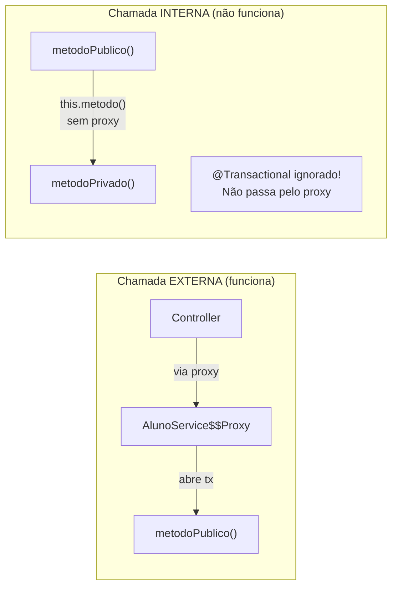
```mermaid
flowchart LR
    subgraph "Chamada EXTERNA (funciona)"
        C1[Controller] -->|"via proxy"| P1["AlunoService$$Proxy"]
        P1 -->|"abre tx"| S1["metodoPublico()"]
    end

    subgraph "Chamada INTERNA (não funciona)"
        S2["metodoPublico()"] -->|"this.metodo()<br>sem proxy"| S3["metodoPrivado()"]
        note1["@Transactional ignorado!<br>Não passa pelo proxy"]
    end
```

**Solução:** extrair para outro bean ou usar `self-injection`:

```java
@Service
public class AlunoService {

    private final AuditService auditService; // outro bean

    @Transactional
    public void metodoPublico() {
        // ...
        auditService.registrar(...); // chamada EXTERNA — proxy intercepta ✓
    }
}
```

#### 2. Exceção capturada dentro do `@Transactional` — commit acontece

```java
@Transactional
public void processar() {
    repository.save(matricula);

    try {
        servicoExterno.notificar(); // lança RuntimeException
    } catch (Exception e) {
        log.error("Falha na notificação", e);
        // Exceção CAPTURADA — Spring não vê a exceção
        // Resultado: COMMIT (matricula salva, notificação falhou)
    }
}
```

Se o rollback é desejável, **não capture** ou relance:

```java
@Transactional
public void processar() {
    repository.save(matricula);

    try {
        servicoExterno.notificar();
    } catch (Exception e) {
        log.error("Falha na notificação", e);
        throw e; // relança → Spring faz ROLLBACK
    }
}
```

Ou use `noRollbackFor` se quer commit apesar da falha na notificação:

```java
@Transactional(noRollbackFor = NotificacaoException.class)
public void processar() {
    repository.save(matricula);
    servicoExterno.notificar(); // se falhar com NotificacaoException → COMMIT mesmo assim
}
```

#### 3. `@Transactional` sem `@Service` / sem proxy — silenciosamente ignorado

```java
// SEM @Service ou @Component — Spring não cria proxy
public class AlunoService {

    @Transactional // ignorado — não é um bean Spring
    public void criar() { }
}
```

A classe precisa ser um bean gerenciado (`@Service`, `@Component`, `@Repository`) para o proxy AOP funcionar.

#### 4. Lazy loading fora da transação

```java
@Transactional
public Curso buscar(Long id) {
    return cursoRepository.findById(id).orElseThrow();
    // Transação fecha ao sair do método
}

// No controller:
Curso curso = cursoService.buscar(1L);
curso.getMatriculas().size(); // LazyInitializationException!
// Transação já fechou — sessão Hibernate não existe mais
```

**Solução:** carregar os dados necessários dentro da transação:

```java
@Transactional(readOnly = true)
public CursoComMatriculas buscar(Long id) {
    Curso curso = cursoRepository.findCompletoById(id) // JOIN FETCH ou @EntityGraph
        .orElseThrow();

    return new CursoComMatriculas(
        curso.getId(),
        curso.getNome(),
        curso.getMatriculas().stream().map(MatriculaResumo::of).toList()
    );
    // Tudo carregado dentro da transação — DTO seguro para serializar
}
```

#### 5. Transação longa demais — connection starvation

```java
// RUIM — transação aberta durante chamada HTTP externa
@Transactional
public void processar(Long id) {
    Matricula m = repository.findById(id).orElseThrow();
    m.setStatus(StatusMatricula.ATIVA);

    emailService.enviarConfirmacao(m); // chamada HTTP → 2-5 segundos
    // Conexão JDBC presa por todo esse tempo!
}

// BOM — separar operação de banco da chamada externa
@Transactional
public Matricula ativar(Long id) {
    Matricula m = repository.findById(id).orElseThrow();
    m.setStatus(StatusMatricula.ATIVA);
    return m;
    // Transação fecha rapidamente
}

public void processarComNotificacao(Long id) {
    Matricula m = ativar(id); // transação curta
    emailService.enviarConfirmacao(m); // fora da transação
}
```

### @TransactionalEventListener — eventos após commit

Para efeitos colaterais que só devem executar se a transação for bem-sucedida:

```java
@Service
public class MatriculaService {

    private final MatriculaRepository repository;
    private final ApplicationEventPublisher eventPublisher;

    @Transactional
    public Matricula criar(CriarMatriculaRequest request) {
        var matricula = new Matricula();
        // ... setar campos
        Matricula salva = repository.save(matricula);

        // Evento publicado, mas handler só executa APÓS COMMIT
        eventPublisher.publishEvent(new MatriculaCriadaEvent(salva.getId()));

        return salva;
    }
}
```

```java
@Component
public class MatriculaEventHandler {

    @TransactionalEventListener(phase = TransactionPhase.AFTER_COMMIT)
    public void onMatriculaCriada(MatriculaCriadaEvent event) {
        // Executa APENAS se o commit foi bem-sucedido
        emailService.enviarConfirmacao(event.matriculaId());
        // Se este handler falhar, a matrícula JÁ está commitada
    }

    @TransactionalEventListener(phase = TransactionPhase.AFTER_ROLLBACK)
    public void onMatriculaFalhou(MatriculaCriadaEvent event) {
        // Executa APENAS se houve rollback
        log.warn("Matrícula {} não foi criada", event.matriculaId());
    }
}

public record MatriculaCriadaEvent(Long matriculaId) {}
```

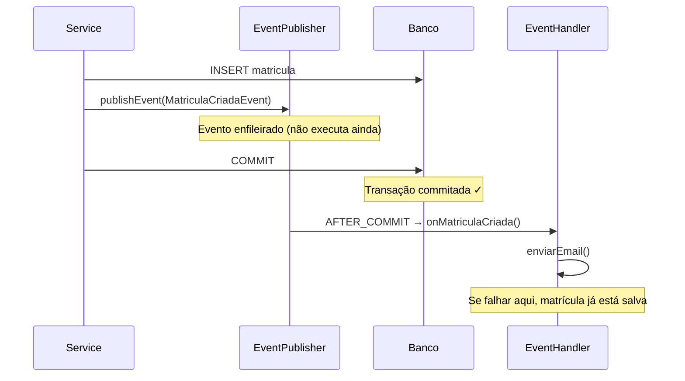
```mermaid
sequenceDiagram
    participant S as Service
    participant E as EventPublisher
    participant DB as Banco
    participant H as EventHandler

    S->>DB: INSERT matricula
    S->>E: publishEvent(MatriculaCriadaEvent)
    Note over E: Evento enfileirado (não executa ainda)

    S->>DB: COMMIT
    Note over DB: Transação commitada ✓

    E->>H: AFTER_COMMIT → onMatriculaCriada()
    H->>H: enviarEmail()
    Note over H: Se falhar aqui, matrícula já está salva
```

### Diagrama de decisão

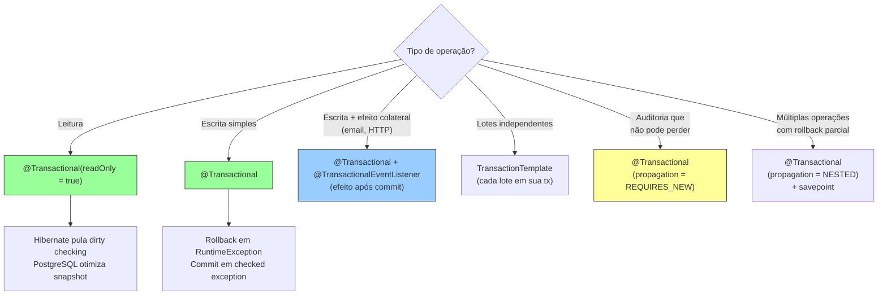
```mermaid
flowchart TD
    A{Tipo de operação?} -->|Leitura| B["@Transactional(readOnly = true)"]
    A -->|Escrita simples| C["@Transactional"]
    A -->|"Escrita + efeito colateral<br>(email, HTTP)"| D["@Transactional + @TransactionalEventListener<br>(efeito após commit)"]
    A -->|"Lotes independentes"| E["TransactionTemplate<br>(cada lote em sua tx)"]
    A -->|"Auditoria que<br>não pode perder"| F["@Transactional<br>(propagation = REQUIRES_NEW)"]
    A -->|"Múltiplas operações<br>com rollback parcial"| G["@Transactional<br>(propagation = NESTED)<br>+ savepoint"]

    B --> H["Hibernate pula dirty checking<br>PostgreSQL otimiza snapshot"]
    C --> I["Rollback em RuntimeException<br>Commit em checked exception"]

    style B fill:#9f9,stroke:#333
    style C fill:#9f9,stroke:#333
    style D fill:#9cf,stroke:#333
    style F fill:#ff9,stroke:#333
```

### Referência rápida

| Cenário | Configuração |
|---|---|
| Leitura simples | `@Transactional(readOnly = true)` |
| Escrita padrão | `@Transactional` |
| Query pesada com limite | `@Transactional(readOnly = true, timeout = 60)` |
| Rollback em checked exception | `@Transactional(rollbackFor = Exception.class)` |
| Auditoria independente | `@Transactional(propagation = Propagation.REQUIRES_NEW)` |
| Método obrigatoriamente dentro de tx | `@Transactional(propagation = Propagation.MANDATORY)` |
| Classe inteira read-only + método de escrita | Classe: `@Transactional(readOnly = true)` + Método: `@Transactional` |
| Relatório consistente (sem phantom reads) | `@Transactional(isolation = Isolation.REPEATABLE_READ, readOnly = true)` |
| Lote com transação por item | `TransactionTemplate` em loop |
| Efeito colateral após commit | `@TransactionalEventListener(phase = AFTER_COMMIT)` |

---


## 17. Persistência — Boas Práticas de INSERT

### Ciclo de vida: transient → managed

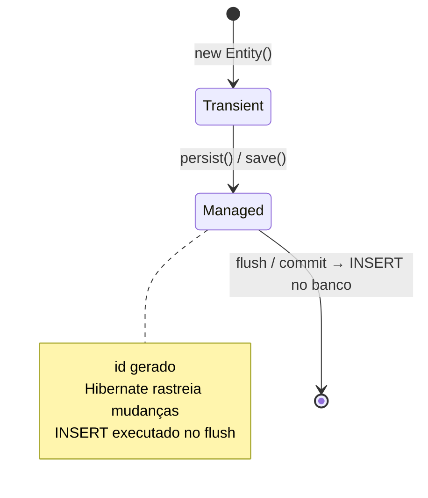
```mermaid
stateDiagram-v2
    [*] --> Transient : new Entity()
    Transient --> Managed : persist() / save()
    note right of Managed : id gerado<br>Hibernate rastreia mudanças<br>INSERT executado no flush
    Managed --> [*] : flush / commit → INSERT no banco
```

### Spring Data — `save()` para entidades novas

```java
@Service
public class AlunoService {

    private final AlunoRepository repository;

    @Transactional
    public Aluno criar(CriarAlunoRequest request) {
        var aluno = new Aluno();
        aluno.setNome(request.nome());
        aluno.setRa(request.ra());
        aluno.setEmail(request.email());

        return repository.save(aluno);
        // Hibernate detecta id = null → executa INSERT
    }
}
```

O `save()` do Spring Data chama `entityManager.persist()` quando a entidade é nova (id = null) e `entityManager.merge()` quando já tem id. Para entidades com `@GeneratedValue`, o id nulo é o indicador de novidade.

### JPA puro — `persist()`

```java
@Transactional
public Aluno criar(CriarAlunoRequest request) {
    var aluno = new Aluno();
    aluno.setNome(request.nome());
    aluno.setRa(request.ra());
    aluno.setEmail(request.email());

    entityManager.persist(aluno);
    // aluno.getId() já tem valor após persist() com IDENTITY
    return aluno;
}
```

`persist()` torna a entidade managed. Com `GenerationType.IDENTITY`, o INSERT é executado imediatamente para obter o id. Com `SEQUENCE`, o Hibernate busca o próximo valor da sequence mas pode postergar o INSERT até o flush.

### Persistência com relacionamentos — cascade

```java
@Transactional
public Curso criarCursoComMatriculas(CriarCursoRequest request) {
    var curso = new Curso();
    curso.setNome(request.nome());
    curso.setCargaHoraria(request.cargaHoraria());

    // Professor já existente — usa getReferenceById (0 SELECTs)
    curso.setProfessor(professorRepository.getReferenceById(request.professorId()));

    // Matrículas são criadas junto via cascade
    for (Long alunoId : request.alunoIds()) {
        var matricula = new Matricula();
        matricula.setCurso(curso);
        matricula.setAluno(alunoRepository.getReferenceById(alunoId));
        matricula.setStatus(StatusMatricula.ATIVA);
        curso.getMatriculas().add(matricula);
    }

    return cursoRepository.save(curso);
    // 1 INSERT curso + N INSERTs matricula (via cascade)
}
```

### getReferenceById para FKs — evitar SELECTs desnecessários

```java
// RUIM — 2 SELECTs para obter entidades que só servem como FK
Curso curso = cursoRepository.findById(request.cursoId()).orElseThrow();
Aluno aluno = alunoRepository.findById(request.alunoId()).orElseThrow();

// BOM — 0 SELECTs, proxy contém apenas o id (suficiente para o INSERT)
Curso curso = cursoRepository.getReferenceById(request.cursoId());
Aluno aluno = alunoRepository.getReferenceById(request.alunoId());
```

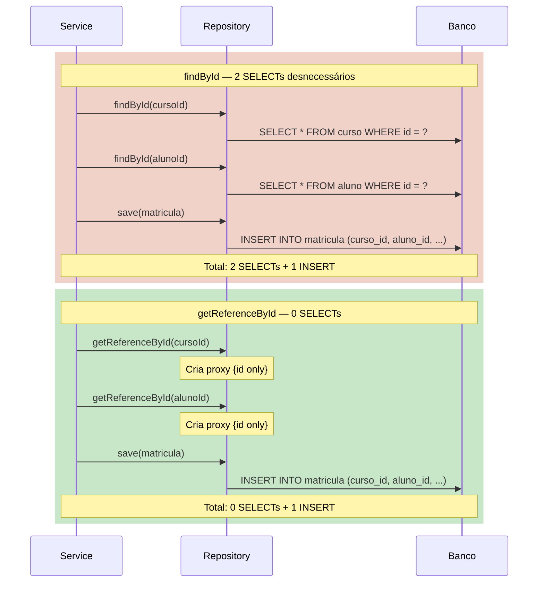
```mermaid
sequenceDiagram
    participant S as Service
    participant R as Repository
    participant DB as Banco

    rect rgb(240, 210, 200)
        Note over S,DB: findById — 2 SELECTs desnecessários
        S->>R: findById(cursoId)
        R->>DB: SELECT * FROM curso WHERE id = ?
        S->>R: findById(alunoId)
        R->>DB: SELECT * FROM aluno WHERE id = ?
        S->>R: save(matricula)
        R->>DB: INSERT INTO matricula (curso_id, aluno_id, ...)
        Note over S,DB: Total: 2 SELECTs + 1 INSERT
    end

    rect rgb(200, 230, 200)
        Note over S,DB: getReferenceById — 0 SELECTs
        S->>R: getReferenceById(cursoId)
        Note over R: Cria proxy {id only}
        S->>R: getReferenceById(alunoId)
        Note over R: Cria proxy {id only}
        S->>R: save(matricula)
        R->>DB: INSERT INTO matricula (curso_id, aluno_id, ...)
        Note over S,DB: Total: 0 SELECTs + 1 INSERT
    end
```

### Persistência em batch — `saveAll()` com tuning

```java
@Transactional
public List<Aluno> criarEmLote(List<CriarAlunoRequest> requests) {
    List<Aluno> alunos = requests.stream()
        .map(req -> {
            var aluno = new Aluno();
            aluno.setNome(req.nome());
            aluno.setRa(req.ra());
            aluno.setEmail(req.email());
            return aluno;
        })
        .toList();

    return repository.saveAll(alunos);
}
```

Para batch INSERT performático, configure o Hibernate para agrupar INSERTs:

```yaml
spring:
  jpa:
    properties:
      hibernate:
        jdbc:
          batch_size: 50
        order_inserts: true
        order_updates: true
```

Com `IDENTITY` como `GenerationType`, o batch INSERT do JDBC **não funciona** — o Hibernate precisa executar cada INSERT individualmente para obter o id. Para batch real, use `SEQUENCE` com `allocationSize`:

```java
@Id
@GeneratedValue(strategy = GenerationType.SEQUENCE, generator = "aluno_seq")
@SequenceGenerator(name = "aluno_seq", sequenceName = "aluno_id_seq", allocationSize = 50)
private Long id;
```

### JPA puro — batch com flush/clear periódico

Para milhares de registros, limpe o persistence context periodicamente para evitar `OutOfMemoryError`:

```java
@Transactional
public int importarAlunos(List<CriarAlunoRequest> requests) {
    int batchSize = 50;

    for (int i = 0; i < requests.size(); i++) {
        var aluno = new Aluno();
        aluno.setNome(requests.get(i).nome());
        aluno.setRa(requests.get(i).ra());
        entityManager.persist(aluno);

        if (i > 0 && i % batchSize == 0) {
            entityManager.flush();
            entityManager.clear();
        }
    }

    entityManager.flush();
    entityManager.clear();

    return requests.size();
}
```

### Tratamento de constraint violation no INSERT

```java
@Transactional
public Aluno criar(CriarAlunoRequest request) {
    // Validação prévia (feedback amigável)
    if (repository.existsByRa(request.ra())) {
        throw new AlunoJaExisteException("RA já cadastrado: " + request.ra());
    }

    var aluno = new Aluno();
    aluno.setNome(request.nome());
    aluno.setRa(request.ra());

    return repository.save(aluno);
    // Constraint uk_aluno_ra é última defesa contra race condition
}
```

### persist() vs merge() — quando cada um é chamado

```mermaid
flowchart TD
    A["repository.save(entity)"] --> B{entity.getId() == null?}
    B -->|Sim| C["entityManager.persist(entity)<br>Entidade nova → INSERT"]
    B -->|Não| D{Entidade está<br>no persistence context?}

    D -->|Sim, managed| E["Dirty checking no flush<br>→ UPDATE automático"]
    D -->|Não, detached| F["entityManager.merge(entity)<br>→ SELECT + UPDATE"]

    C --> G["Entidade retornada É a mesma instância"]
    F --> H["Entidade retornada é uma CÓPIA managed<br>(original continua detached)"]

    style C fill:#9f9,stroke:#333
    style E fill:#9cf,stroke:#333
    style F fill:#fc9,stroke:#333
```

### Interface Persistable — controle explícito de isNew()

O `save()` do Spring Data decide entre `persist()` e `merge()` verificando se a entidade é nova. Por padrão, a detecção é baseada no id: `id == null` → nova. Mas isso falha quando o id é atribuído manualmente (UUID, natural key, ou id vindo de sistema externo):

```java
// Problema: id atribuído manualmente
var aluno = new Aluno();
aluno.setId(UUID.randomUUID()); // id NÃO é null

repository.save(aluno);
// Spring Data vê id != null → chama merge() em vez de persist()
// merge() faz SELECT antes do INSERT → SELECT desnecessário
```

A interface `Persistable<ID>` permite que a entidade controle explicitamente se é nova:

```java
@Entity
@Table(name = "aluno")
public class Aluno extends BaseEntity implements Persistable<Long> {

    private String nome;
    private String ra;

    @Transient // não persiste no banco
    private boolean isNew = true;

    @Override
    public boolean isNew() {
        return isNew;
    }

    @PostPersist
    @PostLoad
    private void markNotNew() {
        this.isNew = false;
    }
}
```

O `@PostPersist` marca como "não novo" após o INSERT. O `@PostLoad` marca como "não novo" quando carregada do banco. Assim o `save()` sempre chama `persist()` na primeira vez e `merge()` quando a entidade já foi carregada.

#### Cenários onde Persistable é necessário

```mermaid
flowchart TD
    A{Como o ID é gerado?} -->|"@GeneratedValue<br>(IDENTITY, SEQUENCE)"| B["Detecção padrão funciona<br>id == null → persist<br>NÃO precisa de Persistable"]
    A -->|"UUID atribuído<br>no construtor"| C["Precisa de Persistable<br>id nunca é null"]
    A -->|"ID vindo de<br>sistema externo"| D["Precisa de Persistable<br>id já vem preenchido"]
    A -->|"@NaturalId como PK<br>(sem surrogate key)"| E["Precisa de Persistable<br>id atribuído manualmente"]

    style B fill:#9f9,stroke:#333
    style C fill:#fc9,stroke:#333
    style D fill:#fc9,stroke:#333
    style E fill:#fc9,stroke:#333
```

#### Exemplo completo com UUID

```java
@Entity
@Table(name = "documento")
public class Documento implements Persistable<UUID> {

    @Id
    @Column(columnDefinition = "UUID")
    private UUID id;

    @Column(nullable = false)
    private String titulo;

    private String conteudo;

    @CreationTimestamp
    @Column(nullable = false, updatable = false, columnDefinition = "TIMESTAMPTZ")
    private OffsetDateTime criadoEm;

    @Transient
    private boolean isNew = true;

    protected Documento() {} // JPA

    public Documento(String titulo, String conteudo) {
        this.id = UUID.randomUUID();
        this.titulo = titulo;
        this.conteudo = conteudo;
    }

    @Override
    public UUID getId() {
        return id;
    }

    @Override
    public boolean isNew() {
        return isNew;
    }

    @PostPersist
    @PostLoad
    private void markNotNew() {
        this.isNew = false;
    }
}
```

```java
// Agora save() chama persist() corretamente
var doc = new Documento("Relatório Q3", "Conteúdo...");
// doc.isNew() == true → persist() → INSERT direto, sem SELECT prévio
repository.save(doc);
```

#### Persistable na BaseEntity (para uso em toda hierarquia)

Se múltiplas entidades usam id manual, centralize na classe-base:

```java
@MappedSuperclass
public abstract class BaseEntityWithManualId<ID extends Serializable>
        implements Persistable<ID>, Serializable {

    @Transient
    private boolean isNew = true;

    @Override
    public boolean isNew() {
        return isNew;
    }

    @PostPersist
    @PostLoad
    private void markNotNew() {
        this.isNew = false;
    }
}
```

```java
@Entity
public class Documento extends BaseEntityWithManualId<UUID> {

    @Id
    @Column(columnDefinition = "UUID")
    private UUID id;

    // ... campos

    @Override
    public UUID getId() {
        return id;
    }
}
```

#### Fluxo com e sem Persistable

```mermaid
sequenceDiagram
    participant S as Service
    participant SD as Spring Data
    participant EM as EntityManager
    participant DB as Banco

    rect rgb(240, 210, 200)
        Note over S,DB: SEM Persistable (UUID atribuído no construtor)
        S->>SD: save(doc) — id != null
        SD->>EM: merge(doc)
        EM->>DB: SELECT * FROM documento WHERE id = ? (desnecessário!)
        Note over DB: Não encontrou → INSERT
        EM->>DB: INSERT INTO documento (...)
    end

    rect rgb(200, 230, 200)
        Note over S,DB: COM Persistable — isNew() = true
        S->>SD: save(doc) — isNew() == true
        SD->>EM: persist(doc)
        EM->>DB: INSERT INTO documento (...)
        Note over DB: INSERT direto, sem SELECT
    end
```

### Antipatterns de INSERT

```java
// ERRADO — save() dentro de loop gera N flushes individuais
for (AlunoRequest req : requests) {
    repository.save(toEntity(req)); // flush individual a cada save
}

// CORRETO — saveAll() agrupa em batch
repository.saveAll(requests.stream().map(this::toEntity).toList());

// ERRADO — merge() em entidade nova (SELECT desnecessário antes do INSERT)
var aluno = new Aluno();
aluno.setId(null);
entityManager.merge(aluno); // faz SELECT antes, depois INSERT

// CORRETO — persist() em entidade nova
entityManager.persist(aluno); // INSERT direto

// ERRADO — carregar entidade só para usar como FK
Curso curso = cursoRepository.findById(cursoId).orElseThrow();
matricula.setCurso(curso);

// CORRETO — proxy para FK
matricula.setCurso(cursoRepository.getReferenceById(cursoId));
```

---


## 18. Atualização — Boas Práticas de UPDATE

### Spring Data — dirty checking automático (recomendado)

A forma mais idiomática: carregue a entidade, altere os campos, e o Hibernate gera o UPDATE no flush:

```java
@Service
public class AlunoService {

    private final AlunoRepository repository;

    @Transactional
    public AlunoResponse atualizar(Long id, AtualizarAlunoRequest request) {
        Aluno aluno = repository.findById(id)
            .orElseThrow(() -> new AlunoNotFoundException(id));

        aluno.setNome(request.nome());
        aluno.setEmail(request.email());

        // NÃO precisa chamar save() — dirty checking gera UPDATE no flush
        return AlunoResponse.of(aluno);
    }
}
```

```mermaid
sequenceDiagram
    participant S as Service
    participant PC as Persistence Context
    participant DB as Banco

    S->>PC: findById(1L)
    PC->>DB: SELECT * FROM aluno WHERE id = 1
    DB->>PC: Aluno {nome="João", email="joao@old.com"}
    Note over PC: Snapshot salvo para dirty checking

    S->>PC: aluno.setNome("João Silva")
    S->>PC: aluno.setEmail("joao@new.com")
    Note over PC: Entidade modified, snapshot difere

    Note over PC,DB: Flush (commit da @Transactional)
    PC->>DB: UPDATE aluno SET nome='João Silva', email='joao@new.com' WHERE id=1
```

**Não chame `save()` em entidades managed.** É redundante — o dirty checking já resolve. O `save()` em entidade com id chama `merge()`, que faz um SELECT extra para verificar se existe.

### JPA puro — dirty checking idêntico

```java
@Transactional
public void atualizar(Long id, AtualizarAlunoRequest request) {
    Aluno aluno = entityManager.find(Aluno.class, id);
    if (aluno == null) throw new AlunoNotFoundException(id);

    aluno.setNome(request.nome());
    aluno.setEmail(request.email());

    // Sem chamada explícita — flush no commit detecta as mudanças
}
```

### Atualização parcial — só os campos informados

```java
@Transactional
public Aluno atualizarParcial(Long id, Map<String, Object> campos) {
    Aluno aluno = repository.findById(id)
        .orElseThrow(() -> new AlunoNotFoundException(id));

    campos.forEach((campo, valor) -> {
        switch (campo) {
            case "nome"  -> aluno.setNome((String) valor);
            case "email" -> aluno.setEmail((String) valor);
            case "ativo" -> aluno.setAtivo((Boolean) valor);
            default -> throw new IllegalArgumentException("Campo desconhecido: " + campo);
        }
    });

    return aluno; // dirty checking gera UPDATE só dos campos alterados com @DynamicUpdate
}
```

Com `@DynamicUpdate`, o SQL gerado inclui **apenas** os campos que mudaram:

```java
@Entity
@DynamicUpdate
public class Aluno extends BaseEntity { }
```

```sql
-- Sem @DynamicUpdate: UPDATE aluno SET nome=?, ra=?, email=?, ativo=? WHERE id=?
-- Com @DynamicUpdate: UPDATE aluno SET email=? WHERE id=?  (só o que mudou)
```

### Atualização de relacionamentos

```java
@Transactional
public void transferirDeCurso(Long matriculaId, Long novoCursoId) {
    Matricula matricula = matriculaRepository.findById(matriculaId)
        .orElseThrow(() -> new MatriculaNotFoundException(matriculaId));

    // getReferenceById evita SELECT no curso novo
    matricula.setCurso(cursoRepository.getReferenceById(novoCursoId));

    // Dirty checking gera: UPDATE matricula SET curso_id = ? WHERE id = ?
}
```

### Bulk UPDATE com @Modifying (sem carregar entidades)

Para atualizações em massa sem precisar carregar cada entidade:

```java
public interface MatriculaRepository extends JpaRepository<Matricula, Long> {

    @Modifying(flushAutomatically = true, clearAutomatically = true)
    @Query("UPDATE Matricula m SET m.status = :novoStatus WHERE m.status = :statusAtual")
    int atualizarStatus(
        @Param("statusAtual") StatusMatricula statusAtual,
        @Param("novoStatus") StatusMatricula novoStatus
    );

    @Modifying(flushAutomatically = true, clearAutomatically = true)
    @Query("UPDATE Matricula m SET m.nota = m.nota + :bonus WHERE m.curso.id = :cursoId AND m.nota IS NOT NULL")
    int aplicarBonus(@Param("cursoId") Long cursoId, @Param("bonus") BigDecimal bonus);
}
```

### JPA puro — bulk UPDATE via JPQL

```java
@Transactional
public int desativarAlunosSemMatricula() {
    return entityManager.createQuery("""
        UPDATE Aluno a SET a.ativo = false
        WHERE a.id NOT IN (SELECT DISTINCT m.aluno.id FROM Matricula m WHERE m.status = 'ATIVA')
        """)
        .executeUpdate();
}
```

### Bulk UPDATE nativo para operações complexas

```java
@Modifying
@Query(value = """
    UPDATE matricula m
    SET nota = sub.nota_curva
    FROM (
        SELECT id,
               nota + (10.0 - MAX(nota) OVER (PARTITION BY curso_id)) * 0.1 AS nota_curva
        FROM matricula
        WHERE nota IS NOT NULL
    ) sub
    WHERE m.id = sub.id
    """, nativeQuery = true)
int aplicarCurva();
```

### Optimistic Locking — proteção contra lost updates

```java
@Entity
public class Matricula extends BaseEntity {

    @Version
    private Integer versao;

    // ...
}
```

```java
@Transactional
public void atualizarNota(Long matriculaId, BigDecimal novaNota) {
    Matricula m = repository.findById(matriculaId)
        .orElseThrow(() -> new MatriculaNotFoundException(matriculaId));

    m.setNota(novaNota);

    // No flush, o Hibernate gera:
    // UPDATE matricula SET nota=?, versao=2 WHERE id=? AND versao=1
    // Se outro usuário já atualizou (versao != 1) → OptimisticLockException
}
```

```mermaid
sequenceDiagram
    participant U1 as Usuário A
    participant U2 as Usuário B
    participant DB as Banco

    U1->>DB: SELECT * FROM matricula WHERE id=1 (versao=1)
    U2->>DB: SELECT * FROM matricula WHERE id=1 (versao=1)

    U1->>DB: UPDATE SET nota=8.5, versao=2 WHERE id=1 AND versao=1
    Note over DB: 1 row affected ✅ versao agora é 2

    U2->>DB: UPDATE SET nota=7.0, versao=2 WHERE id=1 AND versao=1
    Note over DB: 0 rows affected ❌ versao já é 2
    DB->>U2: OptimisticLockException
```

### Quando usar cada abordagem de UPDATE

```mermaid
flowchart TD
    A{Quantas entidades<br>serão atualizadas?} -->|"1 entidade<br>(por ID)"| B{Precisa de lógica<br>de negócio?}
    A -->|"N entidades<br>(em massa)"| C["Bulk @Modifying<br>+ flushAutomatically<br>+ clearAutomatically"]

    B -->|Sim| D["findById + dirty checking<br>(recomendado)"]
    B -->|"Não, só setar campo"| E{Performance<br>crítica?}

    E -->|Não| D
    E -->|Sim| F["Bulk @Modifying<br>mesmo para 1 registro"]

    D --> G["@Version para<br>optimistic locking"]

    style D fill:#9f9,stroke:#333
    style C fill:#9cf,stroke:#333
```

### Antipatterns de UPDATE

```java
// ERRADO — save() em entidade managed (redundante, merge() desnecessário)
Aluno aluno = repository.findById(id).orElseThrow();
aluno.setNome("Novo Nome");
repository.save(aluno); // DESNECESSÁRIO — dirty checking já faz o UPDATE

// CORRETO
Aluno aluno = repository.findById(id).orElseThrow();
aluno.setNome("Novo Nome");
// fim — @Transactional garante o flush com UPDATE

// ERRADO — carregar entidade só para setar um campo em massa
List<Matricula> todas = repository.findByStatus(StatusMatricula.PENDENTE);
todas.forEach(m -> m.setStatus(StatusMatricula.CANCELADA)); // N updates

// CORRETO — bulk update
repository.atualizarStatus(StatusMatricula.PENDENTE, StatusMatricula.CANCELADA); // 1 UPDATE

// ERRADO — merge() de entidade detached sem @Version (possível lost update)
Matricula detached = /* veio de um request DTO */;
entityManager.merge(detached); // sobrescreve silenciosamente

// CORRETO — find + set + @Version
Matricula managed = repository.findById(detached.getId()).orElseThrow();
managed.setNota(detached.getNota());
// @Version protege contra lost update
```

---


## 19. Exclusão — Boas Práticas de DELETE

### Spring Data — `deleteById()` e `delete(entity)`

```java
@Service
public class MatriculaService {

    private final MatriculaRepository repository;

    @Transactional
    public void remover(Long id) {
        // Opção 1: deleteById — faz SELECT + DELETE
        repository.deleteById(id);
        // Se não existe, lança EmptyResultDataAccessException

        // Opção 2: verificação explícita com mensagem customizada
        Matricula matricula = repository.findById(id)
            .orElseThrow(() -> new MatriculaNotFoundException(id));
        repository.delete(matricula);
    }
}
```

### JPA puro — `remove()`

```java
@Transactional
public void remover(Long id) {
    Matricula matricula = entityManager.find(Matricula.class, id);
    if (matricula == null) throw new MatriculaNotFoundException(id);

    entityManager.remove(matricula);
    // DELETE executado no flush
}
```

### getReference + remove — DELETE sem SELECT prévio

```java
@Transactional
public void remover(Long id) {
    // Cria proxy sem SELECT — DELETE direto no flush
    Matricula ref = entityManager.getReference(Matricula.class, id);
    entityManager.remove(ref);
    // Se o id não existe, lança EntityNotFoundException no flush
}
```

```java
// Equivalente no Spring Data
@Transactional
public void remover(Long id) {
    repository.delete(repository.getReferenceById(id));
    // 0 SELECTs + 1 DELETE
}
```

### Remoção via coleção com orphanRemoval

```java
@Transactional
public void removerMatriculaDoCurso(Long cursoId, Long matriculaId) {
    Curso curso = cursoRepository.findById(cursoId)
        .orElseThrow(() -> new CursoNotFoundException(cursoId));

    // orphanRemoval = true → Hibernate gera DELETE
    curso.getMatriculas().removeIf(m -> m.getId().equals(matriculaId));
}
```

**Cuidado:** `getMatriculas()` carrega **toda** a coleção. Para coleções grandes, prefira remoção direta.

### Remoção direta sem carregar a coleção do pai

```java
@Transactional
public void removerMatricula(Long cursoId, Long matriculaId) {
    Matricula matricula = matriculaRepository.findById(matriculaId)
        .filter(m -> m.getCurso().getId().equals(cursoId))
        .orElseThrow(() -> new MatriculaNotFoundException(matriculaId));

    matriculaRepository.delete(matricula);
    // 1 SELECT + 1 DELETE, sem carregar a coleção do curso
}
```

### Bulk DELETE com @Modifying

```java
public interface MatriculaRepository extends JpaRepository<Matricula, Long> {

    @Modifying(flushAutomatically = true, clearAutomatically = true)
    @Query("DELETE FROM Matricula m WHERE m.status = 'CANCELADA' AND m.criadoEm < :limite")
    int limparCanceladas(@Param("limite") OffsetDateTime limite);

    @Modifying(flushAutomatically = true, clearAutomatically = true)
    @Query("DELETE FROM Matricula m WHERE m.curso.id = :cursoId AND m.aluno.id = :alunoId")
    int deleteByCursoAndAluno(@Param("cursoId") Long cursoId, @Param("alunoId") Long alunoId);
}
```

Bulk DELETE não dispara `@PreRemove`, cascade nem `orphanRemoval`.

### JPA puro — bulk DELETE via JPQL

```java
@Transactional
public int limparDadosAntigos(OffsetDateTime limite) {
    // Ordem importa: filhos primeiro, depois pais
    int matriculas = entityManager.createQuery(
            "DELETE FROM Matricula m WHERE m.criadoEm < :limite")
        .setParameter("limite", limite)
        .executeUpdate();

    int cursosSemMatricula = entityManager.createQuery("""
            DELETE FROM Curso c WHERE c.id NOT IN (
                SELECT DISTINCT m.curso.id FROM Matricula m
            )
            """)
        .executeUpdate();

    return matriculas + cursosSemMatricula;
}
```

### Soft Delete — @SoftDelete do Hibernate 6.4+

Com `@SoftDelete`, toda operação de remoção gera UPDATE em vez de DELETE:

```java
@Entity
@SoftDelete
public class Aluno extends BaseEntity { }
```

```java
// Todas essas operações geram UPDATE SET deleted = true:
repository.deleteById(id);
repository.delete(aluno);
entityManager.remove(aluno);
curso.getMatriculas().remove(matricula); // com orphanRemoval
```

Para consultar registros deletados:

```java
@Query(value = "SELECT * FROM aluno WHERE deleted = true", nativeQuery = true)
List<Aluno> findDeletados();
```

### Tratamento de violação de FK na exclusão

Se a entidade é referenciada por outra tabela, o DELETE falha com constraint violation:

```java
@ExceptionHandler(DataIntegrityViolationException.class)
public ProblemDetail handleFkViolation(DataIntegrityViolationException ex) {
    String message = ex.getMostSpecificCause().getMessage();

    if (message.contains("fk_matricula_curso")) {
        return ProblemDetail.forStatusAndDetail(
            HttpStatus.CONFLICT,
            "Curso não pode ser removido: existem matrículas vinculadas"
        );
    }

    return ProblemDetail.forStatusAndDetail(
        HttpStatus.CONFLICT,
        "Registro não pode ser removido: existem dependências"
    );
}
```

### Cascade DELETE — quando usar

```java
@Entity
public class Curso extends BaseEntity {

    // CASCADE REMOVE: ao deletar o curso, deleta TODAS as matrículas
    @OneToMany(mappedBy = "curso", cascade = CascadeType.ALL, orphanRemoval = true)
    private Set<Matricula> matriculas = new HashSet<>();
}
```

```java
@Transactional
public void removerCursoComMatriculas(Long cursoId) {
    Curso curso = cursoRepository.findById(cursoId)
        .orElseThrow(() -> new CursoNotFoundException(cursoId));

    cursoRepository.delete(curso);
    // Hibernate gera: DELETE matricula WHERE curso_id = ?
    //                 DELETE curso WHERE id = ?
}
```

**Cuidado:** cascade DELETE carrega **todas** as entidades filhas para o persistence context antes de deletar. Para coleções muito grandes, bulk DELETE é mais eficiente.

### Comparação de abordagens de DELETE

```mermaid
flowchart TD
    A{O que deletar?} -->|"1 entidade por ID"| B{Precisa de<br>lifecycle callbacks?}
    A -->|"N entidades<br>(limpeza, batch)"| C["Bulk @Modifying<br>1 DELETE, 0 SELECTs"]
    A -->|"Filho de uma<br>coleção do pai"| D{Coleção é<br>grande?}
    A -->|"Soft delete<br>(manter histórico)"| E["@SoftDelete<br>UPDATE SET deleted = true"]

    B -->|"Sim (@PreRemove,<br>cascade)"| F["findById + delete()<br>1 SELECT + 1 DELETE"]
    B -->|Não| G["getReferenceById + delete()<br>0 SELECTs + 1 DELETE"]

    D -->|"Pequena (<100)"| H["orphanRemoval<br>collection.remove()"]
    D -->|"Grande (100+)"| I["Remoção direta<br>matriculaRepository.delete()"]

    style F fill:#9f9,stroke:#333
    style G fill:#9cf,stroke:#333
    style C fill:#ff9,stroke:#333
    style E fill:#f9f,stroke:#333
```

| Abordagem | Queries | Lifecycle | Cascade | Uso ideal |
|---|---|---|---|---|
| `deleteById()` | SELECT + DELETE | Sim | Sim | Remoção simples com validação |
| `getReferenceById` + `delete()` | DELETE | Sim | Sim | Performance (sem SELECT) |
| `orphanRemoval` | SELECT coleção + DELETE | Sim | Sim | Coleções pequenas |
| Remoção direta do filho | SELECT filho + DELETE | Sim | Sim | Coleções grandes |
| Bulk `@Modifying` | DELETE | Não | Não | Limpeza em massa |
| `@SoftDelete` | UPDATE | Sim | Sim | Auditoria / histórico |

### Antipatterns de DELETE

```java
// ERRADO — carregar coleção inteira do pai para deletar 1 filho
Curso curso = cursoRepository.findById(cursoId).orElseThrow();
curso.getMatriculas().removeIf(m -> m.getId().equals(matriculaId)); // carrega tudo!

// CORRETO — deletar o filho diretamente
matriculaRepository.deleteById(matriculaId);

// ERRADO — findAll + forEach + delete (N+1 DELETEs)
repository.findByStatus(StatusMatricula.CANCELADA)
    .forEach(repository::delete); // N SELECTs + N DELETEs

// CORRETO — bulk delete
repository.limparCanceladas(limite); // 1 DELETE

// ERRADO — cascade DELETE em entidades compartilhadas
@ManyToOne(cascade = CascadeType.REMOVE) // deletar matrícula deleta o CURSO!
private Curso curso;

// CORRETO — cascade somente do pai para filhos compostos
// Nunca cascade REMOVE no lado @ManyToOne
```

---


## 20. Bulk Operations — UPDATE e DELETE em Massa

### @Modifying com flushAutomatically e clearAutomatically

```java
@Modifying(flushAutomatically = true, clearAutomatically = true)
@Query("UPDATE Matricula m SET m.status = :novoStatus WHERE m.status = :statusAtual AND m.criadoEm < :limite")
int atualizarStatus(
    @Param("statusAtual") StatusMatricula statusAtual,
    @Param("novoStatus") StatusMatricula novoStatus,
    @Param("limite") OffsetDateTime limite
);
```

```java
@Modifying(flushAutomatically = true, clearAutomatically = true)
@Query("DELETE FROM Matricula m WHERE m.status = 'CANCELADA' AND m.criadoEm < :limite")
int limparCanceladas(@Param("limite") OffsetDateTime limite);
```

### Por que esses atributos existem

Bulk operations (`UPDATE`/`DELETE` via JPQL ou SQL nativo) **bypassam o persistence context**: elas vão direto ao banco sem passar pelo ciclo de vida das entidades gerenciadas. Isso cria dois riscos:

1. **Dados sujos na memória não chegam ao banco antes do bulk** → `flushAutomatically`
2. **Cache L1 fica desatualizado depois do bulk** → `clearAutomatically`

### flushAutomatically

Controla se o persistence context deve ser **flushed antes** de executar a operação bulk.

| Valor | Comportamento |
|---|---|
| `false` (padrão) | Não faz flush. Mudanças pendentes em memória ainda não foram enviadas ao banco. |
| `true` | Faz flush antes do bulk. Garante que alterações feitas na transação atual cheguem ao banco primeiro. |

**Quando usar `true`:** sempre que você modificar entidades gerenciadas *antes* de chamar o bulk na mesma transação. Sem o flush, o banco pode estar num estado diferente do que o persistence context "acha" — e o bulk pode sobrescrever ou ignorar essas mudanças.

```java
// Cenário problemático sem flushAutomatically = true:
matricula.setStatus(StatusMatricula.ATIVA);   // dirty no PC, não foi ao banco ainda
// O bulk UPDATE roda no banco SEM ver essa alteração
repository.atualizarStatus(ATIVA, EXPIRADA, limite); // risco de inconsistência
```

**Quando pode ficar `false`:** quando o bulk é a *primeira* operação da transação, ou quando você tem certeza de que não há entidades sujas no persistence context.

### clearAutomatically

Controla se o persistence context deve ser **limpo (clear) depois** de executar a operação bulk.

| Valor | Comportamento |
|---|---|
| `false` (padrão) | Cache L1 permanece intacto. Entidades já carregadas continuam com os valores antigos. |
| `true` | Executa `em.clear()` após o bulk. Próximas leituras vão ao banco e retornam dados atualizados. |

**Quando usar `true`:** sempre que você precisar ler as entidades afetadas *depois* do bulk na mesma transação. O cache L1 não sabe que o banco foi alterado em massa — sem o clear, você recebe dados obsoletos.

```java
// Cenário problemático sem clearAutomatically = true:
repository.atualizarStatus(ATIVA, EXPIRADA, limite); // banco atualizado
Matricula m = repository.findById(id).get();         // lê do cache L1 → status ainda ATIVA (stale!)
```

**Quando pode ficar `false`:** quando o bulk é a *última* operação da transação e você não vai ler as entidades afetadas depois.

### Regra prática

```
flushAutomatically = true  → você modificou entidades ANTES do bulk
clearAutomatically = true  → você vai ler entidades DEPOIS do bulk
```

Na dúvida, ative ambos. O custo de um flush + clear extra é menor do que depurar inconsistências silenciosas.

### Bulk nativo para operações complexas

```java
@Modifying
@Query(value = """
    UPDATE matricula m
    SET nota = sub.nova_nota
    FROM (
        SELECT aluno_id, curso_id, nota + :bonus AS nova_nota
        FROM matricula
        WHERE status = 'ATIVA' AND nota IS NOT NULL
    ) sub
    WHERE m.aluno_id = sub.aluno_id AND m.curso_id = sub.curso_id
    """, nativeQuery = true)
int aplicarBonus(@Param("bonus") BigDecimal bonus);
```

### Fluxo do @Modifying

```mermaid
sequenceDiagram
    participant PC as Persistence Context
    participant DB as Banco

    Note over PC: Entidades dirty em memória

    rect rgb(200, 230, 200)
        Note over PC,DB: flushAutomatically = true
        PC->>DB: Flush mudanças pendentes
    end

    rect rgb(200, 200, 240)
        Note over PC,DB: Execute bulk
        PC->>DB: UPDATE / DELETE em massa
        DB->>PC: N rows affected
    end

    rect rgb(240, 210, 200)
        Note over PC,DB: clearAutomatically = true
        PC->>PC: clear() — esvazia cache L1
    end

    Note over PC: Próximas leituras vão ao banco
```

---


## 21. Entity Listeners — Callbacks de Ciclo de Vida

O JPA define callbacks que são invocados automaticamente em momentos específicos do ciclo de vida da entidade. Permitem executar lógica transversal (auditoria, validação, notificação) sem poluir o service.

### Callbacks disponíveis

```mermaid
stateDiagram-v2
    [*] --> Transient : new Entity()

    Transient --> Managed : persist()
    note right of Managed : @PrePersist → INSERT → @PostPersist

    Managed --> Managed : flush (dirty)
    note right of Managed : @PreUpdate → UPDATE → @PostUpdate

    Managed --> Removed : remove()
    note right of Removed : @PreRemove → DELETE → @PostRemove

    state "Leitura" as Load
    [*] --> Load : find() / query
    Load --> Managed : @PostLoad
```

| Callback | Momento | Uso típico |
|---|---|---|
| `@PrePersist` | Antes do INSERT | Setar valores default, validação |
| `@PostPersist` | Depois do INSERT | Auditoria, disparo de evento |
| `@PreUpdate` | Antes do UPDATE | Validação, atualizar timestamp |
| `@PostUpdate` | Depois do UPDATE | Auditoria, notificação |
| `@PreRemove` | Antes do DELETE | Validação de regras de exclusão |
| `@PostRemove` | Depois do DELETE | Auditoria, limpeza de cache |
| `@PostLoad` | Depois do SELECT | Cálculos derivados, estado transient |

### Callbacks inline na entidade

Para lógica simples, diretamente na entidade:

```java
@Entity
public class Aluno extends BaseEntity {

    private String nome;
    private String ra;
    private String email;
    private boolean ativo = true;

    @Column(length = 200)
    private String nomeNormalizado;

    @PrePersist
    private void prePersist() {
        this.nomeNormalizado = nome != null ? nome.toUpperCase().trim() : null;
        if (this.ra == null || this.ra.isBlank()) {
            throw new IllegalStateException("RA é obrigatório");
        }
    }

    @PreUpdate
    private void preUpdate() {
        this.nomeNormalizado = nome != null ? nome.toUpperCase().trim() : null;
    }
}
```

### @EntityListeners — listener externo (recomendado)

Para lógica reutilizável em múltiplas entidades, extraia para uma classe listener separada:

```java
@Entity
@EntityListeners(AuditListener.class)
public class Matricula extends BaseEntity { }
```

```java
public class AuditListener {

    @PrePersist
    public void prePersist(Object entity) {
        log.info("[AUDIT] Criando {}: {}", entity.getClass().getSimpleName(), entity);
    }

    @PostPersist
    public void postPersist(Object entity) {
        log.info("[AUDIT] Criado {}: {}", entity.getClass().getSimpleName(), entity);
    }

    @PreUpdate
    public void preUpdate(Object entity) {
        log.info("[AUDIT] Atualizando {}: {}", entity.getClass().getSimpleName(), entity);
    }

    @PostUpdate
    public void postUpdate(Object entity) {
        log.info("[AUDIT] Atualizado {}: {}", entity.getClass().getSimpleName(), entity);
    }

    @PreRemove
    public void preRemove(Object entity) {
        log.info("[AUDIT] Removendo {}: {}", entity.getClass().getSimpleName(), entity);
    }

    @PostRemove
    public void postRemove(Object entity) {
        log.info("[AUDIT] Removido {}: {}", entity.getClass().getSimpleName(), entity);
    }
}
```

O listener recebe a entidade como parâmetro (`Object` para ser genérico). Cada método pode ter qualquer nome — é a annotation que define o callback.

### Listener com injeção de dependência (Spring)

Listeners JPA padrão não são beans Spring — o `@Autowired` não funciona. Para injetar dependências, use o `SpringBeanAutowiringSupport` ou registre como bean:

#### Abordagem 1: @Configurable (AspectJ)

```java
@Configurable
public class NotificacaoListener {

    @Autowired
    private EventPublisher eventPublisher;

    @PostPersist
    public void postPersist(Object entity) {
        eventPublisher.publish(new EntityCreatedEvent(entity));
    }
}
```

Requer AspectJ weaving — complexo de configurar.

#### Abordagem 2: BeanFactory lookup (pragmática)

```java
public class NotificacaoListener {

    @PostPersist
    public void postPersist(Object entity) {
        EventPublisher publisher = SpringContext.getBean(EventPublisher.class);
        publisher.publish(new EntityCreatedEvent(entity));
    }
}
```

```java
@Component
public class SpringContext implements ApplicationContextAware {

    private static ApplicationContext context;

    @Override
    public void setApplicationContext(ApplicationContext ctx) {
        context = ctx;
    }

    public static <T> T getBean(Class<T> beanClass) {
        return context.getBean(beanClass);
    }
}
```

#### Abordagem 3: Spring Events no service + @TransactionalEventListener (*** RECOMENDADA ***)

Em vez de usar EntityListener para notificações, use `ApplicationEventPublisher` diretamente no service:

```java
@Service
public class MatriculaService {

    private final MatriculaRepository repository;
    private final ApplicationEventPublisher eventPublisher;

    @Transactional
    public Matricula criar(CriarMatriculaRequest request) {
        var matricula = new Matricula();
        // ... setar campos
        Matricula salva = repository.save(matricula);

        eventPublisher.publishEvent(new MatriculaCriadaEvent(salva));
        return salva;
    }
}
```

```java
public record MatriculaCriadaEvent(Matricula matricula) {}
```

```java
@Component
@TransactionalEventListener(phase = TransactionPhase.AFTER_COMMIT)
public class MatriculaEventHandler {

    public void handle(MatriculaCriadaEvent event) {
        log.info("Matrícula criada: {}", event.matricula().getId());
        // enviar email, notificação push, etc.
    }
}
```

O `@TransactionalEventListener` com `AFTER_COMMIT` garante que o handler só executa se a transação for bem-sucedida — evita enviar email de confirmação para uma matrícula que deu rollback.

### Listener global via @MappedSuperclass

Para aplicar callbacks em toda a hierarquia, defina na superclasse:

```java
@MappedSuperclass
@EntityListeners(AuditListener.class)
public abstract class BaseEntity implements Serializable {

    @Id
    @GeneratedValue(strategy = GenerationType.IDENTITY)
    private Long id;

    @CreationTimestamp
    @Column(nullable = false, updatable = false, columnDefinition = "TIMESTAMPTZ")
    private OffsetDateTime criadoEm;

    @UpdateTimestamp
    @Column(nullable = false, columnDefinition = "TIMESTAMPTZ")
    private OffsetDateTime atualizadoEm;
}
```

Todas as entidades que estendem `BaseEntity` herdam o `AuditListener` automaticamente.

### Listener global via orm.xml (sem annotation)

Para aplicar um listener a **todas** as entidades sem modificar nenhuma classe:

```xml
<!-- src/main/resources/META-INF/orm.xml -->
<?xml version="1.0" encoding="UTF-8"?>
<entity-mappings xmlns="https://jakarta.ee/xml/ns/persistence/orm"
                 version="3.2">

    <persistence-unit-metadata>
        <persistence-unit-defaults>
            <entity-listeners>
                <entity-listener class="com.exemplo.listener.AuditListener"/>
                <entity-listener class="com.exemplo.listener.SoftDeleteListener"/>
            </entity-listeners>
        </persistence-unit-defaults>
    </persistence-unit-metadata>

</entity-mappings>
```

Qualquer entidade do persistence unit recebe os callbacks — sem `@EntityListeners` em nenhuma classe.

### Spring Data JPA Auditing — alternativa integrada

O Spring Data oferece auditoria declarativa com `@CreatedBy`, `@LastModifiedBy`, `@CreatedDate`, `@LastModifiedDate`:

```java
@MappedSuperclass
@EntityListeners(AuditingEntityListener.class)
public abstract class AuditableEntity {

    @Id
    @GeneratedValue(strategy = GenerationType.IDENTITY)
    private Long id;

    @CreatedDate
    @Column(nullable = false, updatable = false)
    private OffsetDateTime criadoEm;

    @LastModifiedDate
    @Column(nullable = false)
    private OffsetDateTime atualizadoEm;

    @CreatedBy
    @Column(updatable = false, length = 100)
    private String criadoPor;

    @LastModifiedBy
    @Column(length = 100)
    private String atualizadoPor;
}
```

Requer configuração:

```java
@Configuration
@EnableJpaAuditing
public class JpaConfig {

    @Bean
    public AuditorAware<String> auditorAware() {
        return () -> Optional.ofNullable(SecurityContextHolder.getContext())
            .map(SecurityContext::getAuthentication)
            .filter(Authentication::isAuthenticated)
            .map(Authentication::getName);
    }
}
```

O `AuditingEntityListener` é um `@EntityListeners` do Spring que preenche automaticamente os campos de auditoria.

### Callbacks em entidades com @SoftDelete

Com `@SoftDelete`, o `@PreRemove` e `@PostRemove` são invocados mesmo que a operação real seja um UPDATE:

```java
@Entity
@SoftDelete
@EntityListeners(ExclusaoListener.class)
public class Aluno extends BaseEntity { }
```

```java
public class ExclusaoListener {

    @PreRemove
    public void preRemove(Object entity) {
        // Chamado antes do UPDATE SET deleted = true
        log.info("Soft-deletando: {}", entity);
    }

    @PostRemove
    public void postRemove(Object entity) {
        // Chamado depois do UPDATE SET deleted = true
        log.info("Soft-deletado: {}", entity);
    }
}
```

### Ordem de execução

Quando há múltiplos listeners e callbacks inline, a ordem é:

```mermaid
flowchart TD
    A["1. Listeners globais (orm.xml)<br>em ordem de declaração"] --> B["2. @EntityListeners da classe<br>em ordem de declaração"]
    B --> C["3. @EntityListeners herdados<br>(superclasse → subclasse)"]
    C --> D["4. Callbacks inline da entidade<br>(@PrePersist no método)"]

    style A fill:#f9f,stroke:#333
    style B fill:#9cf,stroke:#333
    style C fill:#ff9,stroke:#333
    style D fill:#9f9,stroke:#333
```

Para desabilitar listeners herdados em uma subclasse específica:

```java
@Entity
@ExcludeDefaultListeners     // desabilita listeners de orm.xml
@ExcludeSuperclassListeners  // desabilita listeners da superclasse
public class EntidadeSemAuditoria extends BaseEntity { }
```

### Restrições dos callbacks

- **Não inicie transações** — callbacks executam dentro da transação corrente.
- **Não chame `EntityManager`** — alterações no persistence context dentro de callbacks podem causar comportamento imprevisível.
- **Não lance checked exceptions** — apenas unchecked exceptions são permitidas.
- **@PostPersist e @PostUpdate** — o id já está disponível, mas o registro pode não estar commitado no banco.
- **Operações pesadas** (email, HTTP) — use `@TransactionalEventListener(AFTER_COMMIT)` no service em vez de EntityListener.

### Comparação de abordagens

| Abordagem | Escopo | Injeção Spring | Complexidade | Uso ideal |
|---|---|---|---|---|
| Callback inline (`@PrePersist`) | Uma entidade | Não | Baixa | Normalização, validação simples |
| `@EntityListeners` na entidade | Entidades anotadas | Workaround | Média | Auditoria por entidade |
| `@EntityListeners` na `@MappedSuperclass` | Toda hierarquia | Workaround | Média | Auditoria global |
| `orm.xml` global | Todas as entidades | Workaround | Média | Auditoria/segurança cross-cutting |
| Spring Data `AuditingEntityListener` | Entidades anotadas | Sim (nativo) | Baixa | `createdBy`, `modifiedBy` |
| `@TransactionalEventListener` no service | Por operação | Sim (nativo) | Baixa | Notificações, efeitos colaterais |

---


## 21.1. Hibernate Event Listeners — `org.hibernate.event.spi`

Enquanto os `@EntityListeners` do JPA interceptam callbacks de ciclo de vida da entidade, os **Hibernate Event Listeners** operam em uma camada mais baixa: interceptam as operações internas da `Session` do Hibernate antes e depois de serem executadas. Ficam nos pacotes `org.hibernate.event.spi` (interfaces) e `org.hibernate.event.internal` (implementações padrão), e permitem acessar o contexto completo da sessão — incluindo o estado anterior dos campos e o grafo de entidades no persistence context.

### Posição na pilha de execução

```mermaid
flowchart TD
    A["service.salvar(entity)"] --> B["EntityManager.merge()"]
    B --> C["Hibernate Session<br>MergeEvent"]
    C --> D["MergeEventListener\norg.hibernate.event.spi"]
    D --> E["@PrePersist / @PreUpdate\n(JPA callback)"]
    E --> F["SQL UPDATE / INSERT"]
    F --> G["@PostPersist / @PostUpdate\n(JPA callback)"]
    G --> H["PostUpdateEventListener\norg.hibernate.event.spi"]

    style D fill:#f9a,stroke:#333
    style H fill:#f9a,stroke:#333
    style E fill:#9f9,stroke:#333
    style G fill:#9f9,stroke:#333
```

### Comparação com @EntityListeners

| Critério | `@EntityListeners` (JPA) | Hibernate Event Listeners |
|---|---|---|
| Padrão | JPA (portável) | Hibernate-specific |
| Nível de abstração | Entidade | Sessão / persistence context |
| Acesso à `Session` | Não | Sim (via `EventSource`) |
| Estado anterior dos campos | Não | Sim (`PostUpdateEvent.getOldState()`) |
| Acesso ao grafo de cópia (merge) | Não | Sim (`MergeContext`) |
| Registrado via | `@EntityListeners` na entidade | `EventListenerRegistry` |
| Injeção Spring nativa | Não | Não |
| Complexidade de uso | Baixa | Alta |

### Interfaces disponíveis no pacote `org.hibernate.event.spi`

| Interface | `EventType` | Operação interceptada |
|---|---|---|
| `PersistEventListener` | `EventType.PERSIST` | `session.persist()` |
| `MergeEventListener` | `EventType.MERGE` | `session.merge()` |
| `DeleteEventListener` | `EventType.DELETE` | `session.remove()` |
| `LoadEventListener` | `EventType.LOAD` | `session.find()`, lazy load |
| `SaveOrUpdateEventListener` | `EventType.SAVE_UPDATE` | `session.saveOrUpdate()` |
| `FlushEventListener` | `EventType.FLUSH` | `session.flush()` |
| `FlushEntityEventListener` | `EventType.FLUSH_ENTITY` | Flush de entidade suja |
| `PostInsertEventListener` | `EventType.POST_INSERT` | Após INSERT no banco |
| `PostUpdateEventListener` | `EventType.POST_UPDATE` | Após UPDATE no banco |
| `PostDeleteEventListener` | `EventType.POST_DELETE` | Após DELETE no banco |
| `PostLoadEventListener` | `EventType.POST_LOAD` | Após carregamento de entidade |
| `EvictEventListener` | `EventType.EVICT` | `session.evict()` (remoção do cache L1) |

As implementações padrão do Hibernate ficam no pacote `org.hibernate.event.internal` — por exemplo, `DefaultMergeEventListener`, `DefaultDeleteEventListener`, `DefaultPersistEventListener`. Estender essas classes é a forma recomendada de customizar sem perder o comportamento padrão.

### Registrando listeners no Spring Boot

A instância dos listeners é criada manualmente e injetada no `EventListenerRegistry` após a inicialização do `EntityManagerFactory`:

```java
import jakarta.annotation.PostConstruct;
import jakarta.persistence.EntityManagerFactory;
import org.hibernate.engine.spi.SessionFactoryImplementor;
import org.hibernate.event.service.spi.EventListenerRegistry;
import org.hibernate.event.spi.EventType;
import org.springframework.stereotype.Component;

@Component
public class HibernateEventListenerConfigurer {

    private final EntityManagerFactory entityManagerFactory;
    private final AuditService auditService;

    public HibernateEventListenerConfigurer(
            EntityManagerFactory entityManagerFactory,
            AuditService auditService) {
        this.entityManagerFactory = entityManagerFactory;
        this.auditService = auditService;
    }

    @PostConstruct
    public void configure() {
        SessionFactoryImplementor sf =
            entityManagerFactory.unwrap(SessionFactoryImplementor.class);

        EventListenerRegistry registry = sf.getServiceRegistry()
            .getService(EventListenerRegistry.class);

        // appendListeners — adiciona APÓS os listeners padrão do Hibernate
        registry.appendListeners(EventType.MERGE,
            new AuditMergeListener(auditService));

        // prependListeners — adiciona ANTES dos listeners padrão
        registry.prependListeners(EventType.DELETE,
            new SoftDeleteListener());

        registry.appendListeners(EventType.POST_INSERT,
            new LogPostInsertListener());

        registry.appendListeners(EventType.POST_UPDATE,
            new LogPostUpdateListener());
    }
}
```

### MergeEventListener — auditoria avançada no merge

O `MergeEventListener` é ativado a cada `entityManager.merge()`. Estender `DefaultMergeEventListener` permite interceptar o merge sem perder o comportamento padrão do Hibernate:

```java
import org.hibernate.HibernateException;
import org.hibernate.event.internal.DefaultMergeEventListener;
import org.hibernate.event.spi.MergeContext;
import org.hibernate.event.spi.MergeEvent;

public class AuditMergeListener extends DefaultMergeEventListener {

    private static final Logger log = LoggerFactory.getLogger(AuditMergeListener.class);

    private final AuditService auditService;

    public AuditMergeListener(AuditService auditService) {
        this.auditService = auditService;
    }

    // Chamado para o objeto raiz do merge
    @Override
    public void onMerge(MergeEvent event) throws HibernateException {
        log.debug("[MERGE] Iniciando merge de: {}", event.getEntityName());
        super.onMerge(event); // comportamento padrão — propaga o merge em cascata
        log.debug("[MERGE] Merge concluído, resultado: {}", event.getResult());
        auditService.registrar(event.getEntityName(), "MERGE");
    }

    // Chamado recursivamente para cada entidade do grafo de cascata
    @Override
    public void onMerge(MergeEvent event, MergeContext copiedAlready)
            throws HibernateException {
        log.debug("[MERGE] Processando grafo: {} (já copiados: {})",
            event.getEntityName(), copiedAlready.size());
        super.onMerge(event, copiedAlready);
    }
}
```

O `MergeEvent` expõe:

| Método | Retorno |
|---|---|
| `event.getOriginal()` | Objeto passado para `merge()` (detached) |
| `event.getResult()` | Entidade gerenciada resultante (disponível após `super.onMerge()`) |
| `event.getEntityName()` | Nome da entidade no Hibernate |
| `event.getId()` | Identificador da entidade |
| `event.getSession()` | `EventSource` — extensão da `Session` com acesso interno |

### DeleteEventListener — soft delete sem `@SoftDelete`

```java
import org.hibernate.HibernateException;
import org.hibernate.event.internal.DefaultDeleteEventListener;
import org.hibernate.event.spi.DeleteContext;
import org.hibernate.event.spi.DeleteEvent;

public class SoftDeleteListener extends DefaultDeleteEventListener {

    private static final Logger log = LoggerFactory.getLogger(SoftDeleteListener.class);

    @Override
    public void onDelete(DeleteEvent event) throws HibernateException {
        Object entity = event.getObject();
        if (entity instanceof SoftDeletable sd) {
            // Marca como excluído logicamente — NÃO chama super (cancela o DELETE físico)
            sd.setDeletedAt(OffsetDateTime.now());
            log.info("[SOFT-DELETE] {} marcado como excluído",
                entity.getClass().getSimpleName());
        } else {
            super.onDelete(event); // DELETE físico para entidades não soft-deletáveis
        }
    }

    @Override
    public void onDelete(DeleteEvent event, DeleteContext transientEntities)
            throws HibernateException {
        Object entity = event.getObject();
        if (entity instanceof SoftDeletable sd) {
            sd.setDeletedAt(OffsetDateTime.now());
        } else {
            super.onDelete(event, transientEntities);
        }
    }
}
```

```java
// Interface marcadora para entidades com exclusão lógica
public interface SoftDeletable {
    void setDeletedAt(OffsetDateTime deletedAt);
    OffsetDateTime getDeletedAt();
}
```

### PersistEventListener — validação de invariantes antes do persist

```java
import org.hibernate.HibernateException;
import org.hibernate.event.internal.DefaultPersistEventListener;
import org.hibernate.event.spi.PersistContext;
import org.hibernate.event.spi.PersistEvent;

public class ValidationPersistListener extends DefaultPersistEventListener {

    @Override
    public void onPersist(PersistEvent event) throws HibernateException {
        validar(event.getObject());
        super.onPersist(event);
    }

    @Override
    public void onPersist(PersistEvent event, PersistContext createdAlready)
            throws HibernateException {
        validar(event.getObject());
        super.onPersist(event, createdAlready);
    }

    private void validar(Object entity) {
        if (entity instanceof Aluno aluno && (aluno.getRa() == null || aluno.getRa().isBlank())) {
            throw new HibernateException("RA do Aluno é obrigatório para persistência");
        }
        if (entity instanceof Matricula m && m.getCurso() == null) {
            throw new HibernateException("Matrícula deve ter Curso associado");
        }
    }
}
```

### PostUpdateEventListener — detectar quais campos mudaram

Este é o listener mais poderoso para auditoria detalhada — o `PostUpdateEvent` expõe o estado **anterior** e o **novo** de todos os campos, algo que os `@EntityListeners` do JPA não oferecem:

```java
import org.hibernate.event.spi.PostUpdateEvent;
import org.hibernate.event.spi.PostUpdateEventListener;
import org.hibernate.persister.entity.EntityPersister;

public class LogPostUpdateListener implements PostUpdateEventListener {

    private static final Logger log = LoggerFactory.getLogger(LogPostUpdateListener.class);

    private final AuditService auditService;

    public LogPostUpdateListener(AuditService auditService) {
        this.auditService = auditService;
    }

    @Override
    public void onPostUpdate(PostUpdateEvent event) {
        String[] nomesCampos = event.getPersister().getPropertyNames();
        Object[] estadoAntigo = event.getOldState(); // valores ANTES do update
        Object[] estadoNovo   = event.getState();    // valores DEPOIS do update

        List<String> camposAlterados = new ArrayList<>();
        for (int i = 0; i < nomesCampos.length; i++) {
            Object anterior = estadoAntigo != null ? estadoAntigo[i] : null;
            Object atual    = estadoNovo[i];
            if (!Objects.equals(anterior, atual)) {
                camposAlterados.add(nomesCampos[i] + ": " + anterior + " → " + atual);
                log.info("[UPDATE] {}.{}: {} → {}",
                    event.getEntityName(), nomesCampos[i], anterior, atual);
            }
        }

        if (!camposAlterados.isEmpty()) {
            auditService.registrarAlteracoes(
                event.getEntityName(), event.getId(), camposAlterados);
        }
    }

    @Override
    public boolean requiresPostCommitHandling(EntityPersister persister) {
        // true — executa após commit da transação (mais seguro para efeitos colaterais)
        // false — executa quando o SQL é emitido (antes do commit)
        return false;
    }
}
```

### PostInsertEventListener — log pós-INSERT

```java
import org.hibernate.event.spi.PostInsertEvent;
import org.hibernate.event.spi.PostInsertEventListener;
import org.hibernate.persister.entity.EntityPersister;

public class LogPostInsertListener implements PostInsertEventListener {

    private static final Logger log = LoggerFactory.getLogger(LogPostInsertListener.class);

    @Override
    public void onPostInsert(PostInsertEvent event) {
        log.info("[INSERT] {} id={} campos={}",
            event.getEntityName(),
            event.getId(),
            Arrays.toString(event.getState())
        );
    }

    @Override
    public boolean requiresPostCommitHandling(EntityPersister persister) {
        return false;
    }
}
```

### LoadEventListener — interceptar carregamentos lazy e por ID

```java
import org.hibernate.HibernateException;
import org.hibernate.event.internal.DefaultLoadEventListener;
import org.hibernate.event.spi.LoadEvent;
import org.hibernate.event.spi.LoadEventListener;

public class CacheAwareLoadListener extends DefaultLoadEventListener {

    private static final Logger log = LoggerFactory.getLogger(CacheAwareLoadListener.class);

    @Override
    public void onLoad(LoadEvent event, LoadType loadType) throws HibernateException {
        log.debug("[LOAD] Iniciando carga de {} id={}",
            event.getEntityClassName(), event.getEntityId());

        super.onLoad(event, loadType);

        if (event.getResult() != null) {
            log.debug("[LOAD] Entidade carregada via: {}",
                event.isAssociationFetch() ? "lazy fetch" : "find/get direto");
        } else {
            log.warn("[LOAD] {} id={} não encontrado",
                event.getEntityClassName(), event.getEntityId());
        }
    }
}
```

### FlushEntityEventListener — inspecionar entidades sujas no flush

```java
import org.hibernate.HibernateException;
import org.hibernate.event.spi.FlushEntityEvent;
import org.hibernate.event.spi.FlushEntityEventListener;

public class DirtyEntityAuditListener implements FlushEntityEventListener {

    private static final Logger log = LoggerFactory.getLogger(DirtyEntityAuditListener.class);

    @Override
    public void onFlushEntity(FlushEntityEvent event) throws HibernateException {
        int[] dirtyProperties = event.getDirtyProperties();
        if (dirtyProperties == null || dirtyProperties.length == 0) {
            return; // entidade limpa — sem alterações
        }

        String entityName  = event.getEntityEntry().getEntityName();
        String[] propNames = event.getEntityEntry().getPersister().getPropertyNames();

        for (int idx : dirtyProperties) {
            log.debug("[FLUSH] Campo sujo: {}.{}", entityName, propNames[idx]);
        }

        if (event.hasDirtyCollection()) {
            log.debug("[FLUSH] Coleção suja em: {}", entityName);
        }
    }
}
```

### Quando usar cada abordagem

```mermaid
flowchart TD
    A{Qual a necessidade?} --> B{Portabilidade JPA?}

    B -->|Sim| C{Acesso ao estado anterior?}
    B -->|Não, Hibernate only| D{Operação específica?}

    C -->|Não| E["@EntityListeners\n@PreUpdate / @PostUpdate"]
    C -->|Sim| F["PostUpdateEventListener\n(getOldState vs getState)"]

    D -->|Merge com cascata| G["MergeEventListener\nextend DefaultMergeEventListener"]
    D -->|Soft delete sem anotação| H["DeleteEventListener\nextend DefaultDeleteEventListener"]
    D -->|Interceptar lazy load| I["LoadEventListener\nextend DefaultLoadEventListener"]
    D -->|Detectar campos sujos| J["FlushEntityEventListener"]
    D -->|Notificação pós-commit| K["PostInsertEventListener\nrequiresPostCommitHandling = true"]

    style E fill:#9f9,stroke:#333
    style F fill:#f9a,stroke:#333
    style G fill:#f9a,stroke:#333
    style H fill:#f9a,stroke:#333
```

| Necessidade | Abordagem recomendada |
|---|---|
| Setar defaults, normalizar campos | `@PrePersist` / `@PreUpdate` inline |
| Auditoria de criação/modificação (`createdBy`) | Spring Data `AuditingEntityListener` |
| Notificação após commit bem-sucedido | `@TransactionalEventListener(AFTER_COMMIT)` |
| Detectar **quais campos** mudaram (old vs new) | `PostUpdateEventListener` |
| Soft delete sem `@SoftDelete` do Hibernate | `DeleteEventListener` |
| Controle do grafo de cascata no merge | `MergeEventListener` |
| Interceptar carregamentos lazy | `LoadEventListener` |
| Inspecionar entidades sujas antes do flush | `FlushEntityEventListener` |
| Validação de invariantes de domínio global | `PersistEventListener` |

### Restrições

- **Não são beans Spring** — injeção de dependência via construtor no configurer (ver registro acima).
- **Executam dentro da transação** — operações pesadas (HTTP, email) devem ser feitas em `@TransactionalEventListener(AFTER_COMMIT)` no service.
- **Ao não chamar `super`** nos listeners que estendem as classes `Default*`, você assume total responsabilidade pelo comportamento — isso pode quebrar o cascade, o dirty checking e o flush.
- **`requiresPostCommitHandling`** nos `PostXxxEventListener`: retorne `true` se o listener precisar executar após o commit (ex: enviar evento para outro sistema); retorne `false` para execução no momento em que o SQL é emitido.

---


## Parte 5 — Qualidade, Performance e Segurança

## 22. Validação e Segurança de Queries

### Validação automática no startup

| Tipo de query | Validação | Quando detecta erro |
|---|---|---|
| Derived query | Automática | Startup |
| `@Query` JPQL | Automática | Startup |
| `@NamedQuery` | Automática | Startup |
| Criteria + Metamodel | Compilação | Build |
| Criteria + String | Nenhuma | Runtime |
| `@Query` nativa | Nenhuma | Runtime |

### Teste que valida todas as queries de uma vez

```java
@SpringBootTest
class ApplicationContextTest {

    @Test
    void contextDevSubirSemErros() {
        // Se qualquer JPQL ou derived query referencia campo inexistente,
        // o contexto não sobe e este teste falha
    }
}
```

### Teste para queries nativas

```java
@DataJpaTest
class MatriculaRepositoryTest {

    @Autowired
    private MatriculaRepository repository;

    @Test
    void queryNativaDeveExecutar() {
        assertThatNoException()
            .isThrownBy(() -> repository.findRankingDoCurso(1L));
    }
}
```

### Prevenção de SQL Injection

Queries parametrizadas são seguras — nunca concatene input do usuário:

```java
// SEGURO — parâmetro bind
@Query("SELECT a FROM Aluno a WHERE a.nome = :nome")
List<Aluno> findByNome(@Param("nome") String nome);

// INSEGURO — concatenação (SQL Injection!)
@Query("SELECT a FROM Aluno a WHERE a.nome = '" + nome + "'")  // NUNCA FAÇA ISSO
```

### @NamedQuery — Vantagens e Limitações

`@NamedQuery` define queries JPQL reutilizáveis diretamente na entidade:

```java
@Entity
@NamedQuery(
    name = "Aluno.findByStatus",
    query = "SELECT a FROM Aluno a WHERE a.status = :status"
)
public class Aluno { /* ... */ }
```

**Vantagens:**

- **Pré-compilação no startup** — a query é parseada e validada quando o contexto sobe, junto com as demais queries JPQL
- **Validação antecipada** — erros de sintaxe aparecem antes do primeiro request, não em produção
- **Reutilização entre camadas** — pode ser invocada de múltiplos services via `entityManager.createNamedQuery("Aluno.findByStatus", Aluno.class)`, sem duplicar a string da query

**Na prática com Spring Data:** `@Query` no repository oferece as mesmas garantias de validação no startup e é a abordagem preferida — mantém a query próxima ao método que a usa, sem acoplamento na entidade.

**Limitações:**

- Acopla lógica de consulta à entidade (viola separação de responsabilidades)
- Não suporta construção dinâmica de queries

### Prioridade de resolução do Spring Data

```mermaid
flowchart TD
    M[Método no Repository] --> Q{"@Query<br>presente?"}
    Q -->|Sim| R["Usa @Query<br>(maior prioridade)"]
    Q -->|Não| N{"@NamedQuery<br>Entidade.nomeMetodo?"}
    N -->|Sim| S["Usa @NamedQuery"]
    N -->|Não| D["Derived Query<br>(parseia nome do método)"]

    style R fill:#9f9,stroke:#333
    style S fill:#ff9,stroke:#333
    style D fill:#9cf,stroke:#333
```

---


## 23. Performance — Dicas Práticas

### Regras gerais

- **Projete apenas o necessário.** Use projeções em endpoints de listagem — evite carregar entidades inteiras para serializar 3 campos.
- **Evite N+1.** Use `@BatchSize`, `@EntityGraph` ou `JOIN FETCH` conforme o cenário.
- **Prefira `existsBy` a `findBy` para validação.** `EXISTS` para no primeiro match; `SELECT` carrega tudo.
- **Use `countBy` em vez de `findAll().size()`.** O COUNT é resolvido no banco.
- **Paginação keyset para tabelas grandes.** `OFFSET` degrada linearmente; cursor é O(1).

### SELECT vs EXISTS para validação

```java
// RUIM — carrega a entidade inteira para verificar existência
Optional<Aluno> aluno = repository.findByRa(ra);
if (aluno.isEmpty()) throw new NotFoundException();

// BOM — só verifica existência
if (!repository.existsByRa(ra)) throw new NotFoundException();
```

### Projeção de ID em vez de entidade para verificações em batch

```java
// RUIM — carrega N entidades inteiras
List<Aluno> alunos = repository.findAllById(ids); // hidrata tudo

// BOM — carrega só os IDs
@Query("SELECT a.id FROM Aluno a WHERE a.id IN :ids")
Set<Long> findExistingIds(@Param("ids") Collection<Long> ids);
```

### @DynamicUpdate para tabelas largas

```java
@Entity
@DynamicUpdate // UPDATE só dos campos alterados
public class Pedido { /* 20+ campos */ }
```

### Read-only queries com @Transactional(readOnly = true)

```java
@Service
public class RelatorioService {

    @Transactional(readOnly = true)
    public List<CursoResumo> gerarRelatorio() {
        // Hibernate desabilita dirty checking
        // PostgreSQL pode otimizar para read-only snapshot
        return cursoRepository.findAllResumos();
    }
}
```

### Logging de queries para debug

```yaml
# application.yml — apenas em dev
spring:
  jpa:
    show-sql: false  # prefira o logging abaixo (formatado)
    properties:
      hibernate:
        format_sql: true

logging:
  level:
    org.hibernate.SQL: DEBUG                    # mostra queries
    org.hibernate.orm.jdbc.bind: TRACE          # mostra valores dos parâmetros
```

### Identificar queries lentas com pg_stat_statements

```sql
-- Habilitar no PostgreSQL
CREATE EXTENSION IF NOT EXISTS pg_stat_statements;

-- Top 10 queries mais lentas
SELECT query, calls, mean_exec_time, total_exec_time
FROM pg_stat_statements
ORDER BY mean_exec_time DESC
LIMIT 10;
```

### Árvore de decisão completa

```mermaid
flowchart TD
    START[Nova consulta] --> A{Filtros são fixos?}

    A -->|Sim| B{Complexidade?}
    A -->|Não, dinâmicos| C{Usa Spring Data?}

    B -->|"1-3 campos simples"| D["Derived Query<br>findByNomeAndStatus()"]
    B -->|"JOIN, agregação, CASE"| E["@Query JPQL"]
    B -->|"CTE, window function,<br>operadores PG"| F["@Query nativa"]

    C -->|Sim| G["Specification<br>+ JpaSpecificationExecutor"]
    C -->|Não| H["Criteria API<br>+ Metamodel"]

    D --> I{Precisa de performance?}
    E --> I
    F --> I
    G --> I
    H --> I

    I -->|Listagem| J["Projeção<br>(interface ou record)"]
    I -->|Detalhe com relacionamentos| K["@EntityGraph<br>ou JOIN FETCH"]
    I -->|Paginação em tabela grande| L["Keyset/Cursor<br>em vez de OFFSET"]
    I -->|Validação de existência| M["existsBy / countBy<br>em vez de findBy"]

    style D fill:#9f9,stroke:#333
    style E fill:#9f9,stroke:#333
    style F fill:#ff9,stroke:#333
    style G fill:#9cf,stroke:#333
    style J fill:#f9f,stroke:#333
```

---


## 24. Query Hints — Controle Fino de Comportamento

Query hints permitem ajustar o comportamento do Hibernate e do PostgreSQL por query individual, sem alterar a configuração global. São divididos em hints JPA (padrão `jakarta.persistence.*`) e hints Hibernate (padrão `org.hibernate.*`).

### Hints JPA padrão

#### Read-only hint — desabilita dirty checking por query

```java
public interface CursoRepository extends JpaRepository<Curso, Long> {

    @QueryHints(@QueryHint(name = "org.hibernate.readOnly", value = "true"))
    @Query("SELECT c FROM Curso c WHERE c.ativo = true")
    List<Curso> findAtivosReadOnly();
}
```

O Hibernate não rastreia mudanças nas entidades retornadas. Economia de memória e CPU em queries de relatório.

#### Fetch graph e load graph como hint

Os EntityGraphs podem ser aplicados como hints — é o que o Spring Data faz internamente com `@EntityGraph`.

Os exemplos a seguir assumem que a entidade possui um `@NamedEntityGraph` declarado:

```java
@NamedEntityGraph(
    name = "Curso.comModulos",
    attributeNodes = @NamedAttributeNode("modulos")
)
@Entity
public class Curso {

    @Id
    @GeneratedValue(strategy = GenerationType.IDENTITY)
    private Long id;

    private String nome;

    @OneToMany(mappedBy = "curso", fetch = FetchType.LAZY)
    private List<Modulo> modulos;
}
```

`@NamedAttributeNode("modulos")` não exige nenhuma configuração na classe `Modulo` — apenas instrui o JPA a carregar eagerly a coleção. Para carregar atributos **dentro** de `Modulo` (ex: `modulos.professor`), define-se um `@NamedSubgraph` ainda na entidade raiz, sem tocar em `Modulo`:

```java
@NamedEntityGraph(
    name = "Curso.comModulosEProfessor",
    attributeNodes = @NamedAttributeNode(value = "modulos", subgraph = "modulos-professor"),
    subgraphs = @NamedSubgraph(
        name = "modulos-professor",
        attributeNodes = @NamedAttributeNode("professor")
    )
)
@Entity
public class Curso { ... }
```

`@NamedSubgraph` é o equivalente do `addSubgraph("modulos").addAttributeNodes("professor")` do JPA puro — e ainda reside em `Curso`, não em `Modulo`.

O `graph` passado como valor do hint é um objeto `EntityGraph<T>` obtido via `EntityManager`. Pode ser criado dinamicamente ou carregado a partir de um `@NamedEntityGraph` declarado na entidade:

```java
// Criando o grafo dinamicamente
EntityGraph<Curso> graph = entityManager.createEntityGraph(Curso.class);
graph.addAttributeNodes("modulos", "professor");

// Ou carregando um @NamedEntityGraph já declarado na entidade
EntityGraph<?> graph = entityManager.getEntityGraph("Curso.comModulos");
```

```java
// JPA puro — via hint
entityManager.createQuery("SELECT c FROM Curso c WHERE c.id = :id", Curso.class)
    .setParameter("id", id)
    .setHint("jakarta.persistence.fetchgraph", graph)
    .getSingleResult();

// JPA puro — load graph (complementa o mapeamento)
entityManager.createQuery("SELECT c FROM Curso c", Curso.class)
    .setHint("jakarta.persistence.loadgraph", graph)
    .getResultList();
```

| Hint | Efeito |
|---|---|
| `jakarta.persistence.fetchgraph` | Atributos no grafo: EAGER. Demais: LAZY. |
| `jakarta.persistence.loadgraph` | Atributos no grafo: EAGER. Demais: mantém FetchType original. |

No Spring Data JPA, os mesmos hints podem ser aplicados via `@QueryHints` em métodos do Repository — sem precisar do `EntityManager` diretamente:

```java
public interface CursoRepository extends JpaRepository<Curso, Long> {

    // fetchgraph: carrega só os atributos do grafo; os demais ficam LAZY
    @QueryHints(@QueryHint(
        name = "jakarta.persistence.fetchgraph",
        value = "Curso.comModulos"
    ))
    @Query("SELECT c FROM Curso c WHERE c.id = :id")
    Optional<Curso> findByIdComModulos(@Param("id") Long id);

    // loadgraph: carrega os atributos do grafo; os demais mantêm o FetchType do mapeamento
    @QueryHints(@QueryHint(
        name = "jakarta.persistence.loadgraph",
        value = "Curso.comModulos"
    ))
    @Query("SELECT c FROM Curso c WHERE c.ativo = true")
    List<Curso> findAtivosComModulos();
}
```

Com `attributePaths` é possível dispensar o `@NamedEntityGraph` e definir os atributos diretamente no Repository, incluindo caminhos aninhados — equivalente ao grafo dinâmico criado via `EntityManager` no JPA puro:

```java
// JPA puro equivalente:
// EntityGraph<Curso> graph = entityManager.createEntityGraph(Curso.class);
// Subgraph<Modulo> modulos = graph.addSubgraph("modulos");
// modulos.addAttributeNodes("professor");

@EntityGraph(attributePaths = {"modulos", "modulos.professor"}) // padrão: FETCH
@Query("SELECT c FROM Curso c WHERE c.id = :id")
Optional<Curso> findByIdComModulosEProfessor(@Param("id") Long id);
```

O tipo do hint (`fetchgraph` ou `loadgraph`) é controlado pelo parâmetro `type` da anotação:

```java
// fetchgraph (padrão): demais atributos ficam LAZY
@EntityGraph(attributePaths = {"modulos", "modulos.professor"}, type = EntityGraph.EntityGraphType.FETCH)
Optional<Curso> findById(Long id);

// loadgraph: demais atributos mantêm o FetchType original
@EntityGraph(attributePaths = {"modulos", "modulos.professor"}, type = EntityGraph.EntityGraphType.LOAD)
Optional<Curso> findById(Long id);
```

A diferença prática: use **fetchgraph** quando quiser controle total sobre o que é carregado (os demais atributos EAGER do mapeamento são ignorados). Use **loadgraph** quando quiser apenas acrescentar carregamento eager a atributos que normalmente seriam LAZY, sem alterar o comportamento dos que já são EAGER.

#### Cache mode hint

```java
// Desabilitar cache L2 para esta query específica
entityManager.createQuery("SELECT c FROM Curso c", Curso.class)
    .setHint("jakarta.persistence.cache.storeMode", CacheStoreMode.BYPASS)
    .setHint("jakarta.persistence.cache.retrieveMode", CacheRetrieveMode.BYPASS)
    .getResultList();
```

**`CacheRetrieveMode`** — controla a **leitura** do cache L2:

| Valor | Comportamento |
|---|---|
| `USE` (padrão) | Lê do cache L2 se a entidade estiver disponível; só vai ao banco se não encontrar. |
| `BYPASS` | Ignora o cache L2 e sempre lê do banco. |

**`CacheStoreMode`** — controla a **escrita** no cache L2:

| Valor | Comportamento |
|---|---|
| `USE` (padrão) | Armazena no cache L2 após ler ou persistir. Não substitui entradas já existentes. |
| `BYPASS` | Não armazena no cache L2. |
| `REFRESH` | Armazena no cache L2 e **substitui** a entrada existente, forçando atualização. |

No Spring Data JPA, os hints são passados como strings via `@QueryHint`. Os valores dos enums devem ser informados como string no nome completo da constante:

```java
@QueryHint(name = "jakarta.persistence.cache.retrieveMode", value = "BYPASS")
@QueryHint(name = "jakarta.persistence.cache.storeMode", value = "BYPASS")
@Query("SELECT c FROM Curso c WHERE c.ativo = true")
List<Curso> findAtivosIgnorandoCache();
```

```java
// REFRESH: útil após operações que alteram dados fora do contexto JPA (ex: batch SQL nativo)
@QueryHint(name = "jakarta.persistence.cache.storeMode", value = "REFRESH")
@Query("SELECT c FROM Curso c WHERE c.id = :id")
Optional<Curso> findByIdAtualizandoCache(@Param("id") Long id);
```

### Hints Hibernate

#### Timeout de query

```java
// Spring Data
@QueryHints(@QueryHint(name = "jakarta.persistence.query.timeout", value = "5000")) // 5 segundos em ms
@Query("SELECT m FROM Matricula m WHERE m.status = :status")
List<Matricula> findPorStatusComTimeout(@Param("status") StatusMatricula status);
```

```java
// JPA puro
entityManager.createQuery("SELECT m FROM Matricula m WHERE m.status = :status", Matricula.class)
    .setParameter("status", StatusMatricula.ATIVA)
    .setHint("jakarta.persistence.query.timeout", 5000)
    .getResultList();
```

O Hibernate traduz para `SET LOCAL statement_timeout = '5000ms'` no PostgreSQL. Se a query exceder o tempo, o banco cancela e o Hibernate lança `QueryTimeoutException`.

#### Read-only

```java
@QueryHints(@QueryHint(name = "org.hibernate.readOnly", value = "true"))
List<Curso> findByAtivoTrue();
```

```java
// JPA puro
entityManager.createQuery("SELECT c FROM Curso c WHERE c.ativo = true", Curso.class)
    .setHint("org.hibernate.readOnly", true)
    .getResultList();
```

Entidades retornadas ficam em modo read-only — o Hibernate não mantém snapshot para dirty checking. Ideal para queries de listagem e relatórios.

#### Fetch size — controle de batch do ResultSet JDBC

```java
@QueryHints(@QueryHint(name = "org.hibernate.fetchSize", value = "50"))
@Query("SELECT m FROM Matricula m WHERE m.curso.id = :cursoId")
List<Matricula> findByCursoComFetchSize(@Param("cursoId") Long cursoId);
```

```java
// JPA puro
entityManager.createQuery("SELECT m FROM Matricula m", Matricula.class)
    .setHint("org.hibernate.fetchSize", 50)
    .getResultList();
```

Controla quantas linhas o driver JDBC busca do PostgreSQL por vez. O default do PostgreSQL JDBC driver é buscar **todas** as linhas de uma vez. Para queries que retornam milhares de registros, um fetch size menor reduz consumo de memória.

#### Comment — adicionar comentário SQL para debug

```java
@QueryHints(@QueryHint(name = "org.hibernate.comment", value = "Relatório mensal de matrículas"))
@Query("SELECT m FROM Matricula m WHERE m.criadoEm BETWEEN :inicio AND :fim")
List<Matricula> findParaRelatorio(
    @Param("inicio") OffsetDateTime inicio,
    @Param("fim") OffsetDateTime fim
);
```

O SQL gerado inclui o comentário:

```sql
/* Relatório mensal de matrículas */ SELECT m.* FROM matricula m WHERE m.criado_em BETWEEN ? AND ?
```

Visível em `pg_stat_activity`, `pg_stat_statements` e logs do PostgreSQL — facilita identificar queries lentas em produção.

Requer habilitação no `application.yml`:

```yaml
spring:
  jpa:
    properties:
      hibernate:
        use_sql_comments: true
```

#### Flush mode — controlar quando o Hibernate faz flush antes da query

```java
// Não faz flush antes desta query (mais rápido, mas pode retornar dados stale)
entityManager.createQuery("SELECT c FROM Curso c WHERE c.ativo = true", Curso.class)
    .setHint("org.hibernate.flushMode", FlushModeType.COMMIT)
    .getResultList();
```

| FlushMode | Comportamento |
|---|---|
| `AUTO` (default) | Flush automático se há mudanças pendentes que afetam a query |
| `COMMIT` | Só faz flush no commit — query pode retornar dados stale |
| `ALWAYS` | Flush antes de toda query (mais seguro, mais lento) |

`COMMIT` é útil em queries de relatório read-only onde você sabe que não há mudanças pendentes nas entidades consultadas.

#### Cacheable — habilitar cache de query (L2 query cache)

```java
@QueryHints({
    @QueryHint(name = "org.hibernate.cacheable", value = "true"),
    @QueryHint(name = "org.hibernate.cacheRegion", value = "cursos-ativos")
})
@Query("SELECT c FROM Curso c WHERE c.ativo = true")
List<Curso> findAtivos();
```

Requer configuração de cache L2 (EhCache, Caffeine, etc.):

```yaml
spring:
  jpa:
    properties:
      hibernate:
        cache:
          use_second_level_cache: true
          use_query_cache: true
          region:
            factory_class: org.hibernate.cache.jcache.JCacheRegionFactory
```

O cache de query armazena os **IDs** retornados pela query. Na próxima execução com os mesmos parâmetros, o Hibernate busca as entidades pelo ID no cache L2 em vez de ir ao banco.

### Múltiplos hints no Spring Data

```java
@QueryHints({
    @QueryHint(name = "org.hibernate.readOnly", value = "true"),
    @QueryHint(name = "org.hibernate.fetchSize", value = "100"),
    @QueryHint(name = "org.hibernate.comment", value = "Dashboard: cursos ativos"),
    @QueryHint(name = "jakarta.persistence.query.timeout", value = "3000")
})
@Query("SELECT c FROM Curso c WHERE c.ativo = true ORDER BY c.nome")
List<Curso> findAtivosParaDashboard();
```

### Hints via EntityManager (JPA puro) — encadeamento fluente

```java
public List<Matricula> buscarParaRelatorio(Long cursoId) {
    return entityManager
        .createQuery("""
            SELECT m FROM Matricula m
            JOIN FETCH m.aluno
            WHERE m.curso.id = :cursoId
            ORDER BY m.aluno.nome
            """, Matricula.class)
        .setParameter("cursoId", cursoId)
        .setHint("org.hibernate.readOnly", true)
        .setHint("org.hibernate.fetchSize", 50)
        .setHint("org.hibernate.comment", "Relatório boletim por curso")
        .setHint("jakarta.persistence.query.timeout", 10000)
        .getResultList();
}
```

### Hints em Criteria API

```java
public List<Curso> findAtivosComHints() {
    CriteriaBuilder cb = entityManager.getCriteriaBuilder();
    CriteriaQuery<Curso> cq = cb.createQuery(Curso.class);
    Root<Curso> root = cq.from(Curso.class);

    cq.where(cb.isTrue(root.get(Curso_.ativo)));

    return entityManager.createQuery(cq)
        .setHint("org.hibernate.readOnly", true)
        .setHint("org.hibernate.comment", "Criteria: cursos ativos")
        .getResultList();
}
```

### Hints em @NamedQuery

```java
@Entity
@NamedQuery(
    name = "Curso.ativos",
    query = "SELECT c FROM Curso c WHERE c.ativo = true",
    hints = {
        @QueryHint(name = "org.hibernate.readOnly", value = "true"),
        @QueryHint(name = "org.hibernate.comment", value = "Named: cursos ativos"),
        @QueryHint(name = "org.hibernate.fetchSize", value = "100")
    }
)
public class Curso { }
```

### PostgreSQL-specific hints via query nativa

Para hints que o JPA não cobre, use diretivas SQL diretas do PostgreSQL:

```java
@Query(value = """
    SELECT /*+ SeqScan(matricula) */ m.*
    FROM matricula m
    WHERE m.status = :status
    """, nativeQuery = true)
List<Matricula> findComSeqScanHint(@Param("status") String status);
```

Ou via `SET LOCAL` para configurações de sessão por query:

```java
public List<Matricula> findComWorkMem(Long cursoId) {
    entityManager.createNativeQuery("SET LOCAL work_mem = '256MB'").executeUpdate();

    return entityManager.createQuery("""
        SELECT m FROM Matricula m
        WHERE m.curso.id = :cursoId
        ORDER BY m.nota DESC
        """, Matricula.class)
        .setParameter("cursoId", cursoId)
        .getResultList();
}
```

`SET LOCAL` vale apenas para a transação corrente — não afeta outras queries no pool.

### Referência completa de hints

| Hint | Tipo | Efeito |
|---|---|---|
| `jakarta.persistence.fetchgraph` | JPA | Define EntityGraph como fetch graph |
| `jakarta.persistence.loadgraph` | JPA | Define EntityGraph como load graph |
| `jakarta.persistence.query.timeout` | JPA | Timeout em milissegundos |
| `jakarta.persistence.cache.storeMode` | JPA | Controle de escrita no cache L2 |
| `jakarta.persistence.cache.retrieveMode` | JPA | Controle de leitura do cache L2 |
| `org.hibernate.readOnly` | Hibernate | Desabilita dirty checking |
| `org.hibernate.fetchSize` | Hibernate | Batch size do ResultSet JDBC |
| `org.hibernate.comment` | Hibernate | Comentário SQL (visível em logs/pg_stat) |
| `org.hibernate.flushMode` | Hibernate | Controle de flush antes da query |
| `org.hibernate.cacheable` | Hibernate | Habilita query cache (L2) |
| `org.hibernate.cacheRegion` | Hibernate | Nome da região de cache |
| `org.hibernate.cacheMode` | Hibernate | Modo de cache (GET, PUT, NORMAL, REFRESH) |

### Quando usar cada hint

```mermaid
flowchart TD
    A{Cenário da query} -->|"Listagem / relatório<br>(não altera entidades)"| B["readOnly = true<br>+ fetchSize = 50-100"]
    A -->|"Dashboard com cache"| C["cacheable = true<br>+ cacheRegion<br>+ readOnly = true"]
    A -->|"Query pesada<br>(pode travar)"| D["query.timeout = N ms"]
    A -->|"Debug em produção"| E["comment = descrição<br>(visível em pg_stat)"]
    A -->|"Controle fino de fetch"| F["fetchgraph / loadgraph<br>(EntityGraph como hint)"]
    A -->|"Query com muitos resultados"| G["fetchSize = 50<br>(evita OOM no driver JDBC)"]

    style B fill:#9f9,stroke:#333
    style D fill:#fc9,stroke:#333
    style E fill:#9cf,stroke:#333
```

---


## 25. Integração Spring Data com Spring Security

O Spring Data oferece integração nativa com Spring Security, permitindo referenciar o usuário autenticado diretamente dentro de queries `@Query` via SpEL. Isso é particularmente útil para multi-tenancy, filtragem por proprietário e auditoria.

### Configuração

Adicione o bean `SecurityEvaluationContextExtension` para habilitar expressões Spring Security dentro de queries:

```java
@Configuration
@EnableJpaRepositories
public class JpaSecurityConfig {

    @Bean
    public SecurityEvaluationContextExtension securityEvaluationContextExtension() {
        return new SecurityEvaluationContextExtension();
    }
}
```

Esse bean registra o `SecurityContext` como extensão do SpEL evaluation context, tornando `principal`, `authentication` e funções como `hasRole()` disponíveis em `@Query`.

### SpEL com `principal` — acessar o usuário logado nas queries

#### Filtrar por usuário autenticado

```java
public interface DocumentoRepository extends JpaRepository<Documento, Long> {

    // Busca documentos do usuário logado pelo username
    @Query("SELECT d FROM Documento d WHERE d.proprietario.username = ?#{principal.username}")
    List<Documento> findDoUsuarioLogado();

    // Busca documentos do usuário logado pelo email
    @Query("SELECT d FROM Documento d WHERE d.proprietario.email = ?#{principal.email}")
    List<Documento> findDoUsuarioLogadoPorEmail();

    // Com paginação
    @Query("SELECT d FROM Documento d WHERE d.proprietario.username = ?#{principal.username}")
    Page<Documento> findDoUsuarioLogado(Pageable pageable);
}
```

O `?#{principal.username}` é uma expressão SpEL que o Spring Data resolve em runtime, extraindo o `username` do `Principal` autenticado no `SecurityContext`.

#### Entidade de exemplo

```java
@Entity
public class Documento extends BaseEntity {

    @Column(nullable = false)
    private String titulo;

    @Column(columnDefinition = "TEXT")
    private String conteudo;

    @ManyToOne(fetch = FetchType.LAZY)
    @JoinColumn(name = "proprietario_id", nullable = false,
        foreignKey = @ForeignKey(name = "fk_documento_usuario"))
    private Usuario proprietario;

    @Column(nullable = false)
    private boolean publico = false;
}
```

```java
@Entity
@Table(name = "usuario")
public class Usuario extends BaseEntity implements UserDetails {

    @Column(nullable = false, unique = true, length = 100)
    private String username;

    @Column(nullable = false, length = 255)
    private String email;

    @Column(nullable = false)
    private String senha;

    @ElementCollection(fetch = FetchType.EAGER)
    @CollectionTable(name = "usuario_role", joinColumns = @JoinColumn(name = "usuario_id"))
    @Column(name = "role")
    @Enumerated(EnumType.STRING)
    private Set<Role> roles = new HashSet<>();

    @Override
    public Collection<? extends GrantedAuthority> getAuthorities() {
        return roles.stream()
            .map(role -> new SimpleGrantedAuthority("ROLE_" + role.name()))
            .toList();
    }

    @Override
    public String getPassword() { return senha; }

    @Override
    public String getUsername() { return username; }
}

public enum Role {
    ADMIN, PROFESSOR, ALUNO
}
```

### SpEL com `hasRole()` — queries condicionais por perfil

Admins veem tudo, usuários normais veem apenas seus próprios registros:

```java
public interface DocumentoRepository extends JpaRepository<Documento, Long> {

    // Admin vê tudo; outros veem só seus documentos
    @Query("""
        SELECT d FROM Documento d
        WHERE d.proprietario.username = ?#{hasRole('ROLE_ADMIN') ? '%' : principal.username}
        """)
    List<Documento> findAcessiveis();

    // Admin vê tudo; professor vê públicos + seus; aluno vê só públicos + seus
    @Query("""
        SELECT d FROM Documento d
        WHERE ?#{hasRole('ROLE_ADMIN')} = true
           OR d.proprietario.username = ?#{principal.username}
           OR d.publico = true
        """)
    List<Documento> findVisiveis();
}
```

```mermaid
flowchart TD
    A["@Query com SpEL"] --> B{"hasRole('ADMIN')?"}
    B -->|Sim| C["WHERE proprietario LIKE '%'<br>(retorna TODOS)"]
    B -->|Não| D["WHERE proprietario = principal.username<br>(retorna só do usuário)"]

    style C fill:#fc9,stroke:#333
    style D fill:#9f9,stroke:#333
```

### SpEL com `authentication` — acessar dados completos da autenticação

```java
public interface DocumentoRepository extends JpaRepository<Documento, Long> {

    // Acessar propriedades do Authentication
    @Query("""
        SELECT d FROM Documento d
        WHERE d.proprietario.username = ?#{authentication.name}
        """)
    List<Documento> findPorAuthenticationName();

    // Verificar se está autenticado (não anônimo)
    @Query("""
        SELECT d FROM Documento d
        WHERE d.publico = true
           OR (?#{authentication.authenticated} = true
               AND d.proprietario.username = ?#{authentication.name})
        """)
    List<Documento> findPublicosOuProprios();
}
```

### Propriedades disponíveis no SpEL

| Expressão | Retorno | Descrição |
|---|---|---|
| `principal` | `UserDetails` (ou o principal configurado) | Objeto principal da autenticação |
| `principal.username` | `String` | Username do usuário autenticado |
| `principal.email` | `String` | Email (se o `UserDetails` tiver) |
| `authentication` | `Authentication` | Objeto de autenticação completo |
| `authentication.name` | `String` | Nome do principal (`getName()`) |
| `authentication.authenticated` | `boolean` | Se está autenticado |
| `authentication.authorities` | `Collection<GrantedAuthority>` | Roles/authorities do usuário |
| `hasRole('ROLE_X')` | `boolean` | Verifica se tem a role |
| `hasAuthority('X')` | `boolean` | Verifica se tem a authority |
| `hasAnyRole('A','B')` | `boolean` | Verifica se tem alguma das roles |
| `isAuthenticated()` | `boolean` | Se não é anônimo |
| `isAnonymous()` | `boolean` | Se é anônimo |
| `permitAll` | `boolean` | Sempre `true` |

### @PreAuthorize e @PostAuthorize — segurança no nível do método

Complementar às queries com SpEL, o Spring Security Method Security permite proteger métodos do service/repository:

```java
@Service
@Transactional(readOnly = true)
public class DocumentoService {

    private final DocumentoRepository repository;

    // Só ADMIN e PROFESSOR podem listar todos
    @PreAuthorize("hasAnyRole('ADMIN', 'PROFESSOR')")
    public Page<Documento> listarTodos(Pageable pageable) {
        return repository.findAll(pageable);
    }

    // Qualquer autenticado pode buscar por ID, mas só o proprietário ou ADMIN pode ver
    @PostAuthorize("returnObject.proprietario.username == authentication.name or hasRole('ADMIN')")
    public Documento buscarPorId(Long id) {
        return repository.findById(id)
            .orElseThrow(() -> new DocumentoNotFoundException(id));
    }

    // Validação do parâmetro — só pode criar documento em nome do próprio usuário
    @PreAuthorize("#request.proprietarioUsername == authentication.name or hasRole('ADMIN')")
    @Transactional
    public Documento criar(CriarDocumentoRequest request) {
        var doc = new Documento();
        doc.setTitulo(request.titulo());
        doc.setConteudo(request.conteudo());
        doc.setProprietario(usuarioRepository.findByUsername(request.proprietarioUsername()).orElseThrow());
        return repository.save(doc);
    }

    // Só o proprietário pode atualizar (ou ADMIN)
    @PreAuthorize("@documentoSecurity.isProprietario(#id, authentication.name) or hasRole('ADMIN')")
    @Transactional
    public Documento atualizar(Long id, AtualizarDocumentoRequest request) {
        Documento doc = repository.findById(id).orElseThrow();
        doc.setTitulo(request.titulo());
        doc.setConteudo(request.conteudo());
        return doc;
    }

    // Só ADMIN pode deletar
    @PreAuthorize("hasRole('ADMIN')")
    @Transactional
    public void deletar(Long id) {
        repository.deleteById(id);
    }
}
```

#### Bean de segurança customizado referenciado via SpEL

```java
@Component("documentoSecurity")
public class DocumentoSecurityEvaluator {

    private final DocumentoRepository repository;

    public DocumentoSecurityEvaluator(DocumentoRepository repository) {
        this.repository = repository;
    }

    public boolean isProprietario(Long documentoId, String username) {
        return repository.findById(documentoId)
            .map(doc -> doc.getProprietario().getUsername().equals(username))
            .orElse(false);
    }

    public boolean podeEditar(Long documentoId, String username) {
        return repository.findById(documentoId)
            .map(doc -> doc.getProprietario().getUsername().equals(username) || !doc.isPublico())
            .orElse(false);
    }
}
```

A expressão `@documentoSecurity.isProprietario(#id, authentication.name)` no `@PreAuthorize` chama o bean Spring via `@` + nome do bean.

Requer habilitação do method security:

```java
@Configuration
@EnableMethodSecurity // habilita @PreAuthorize, @PostAuthorize, @Secured
public class SecurityConfig { }
```

### @PreAuthorize no Repository — proteger queries diretamente

```java
public interface DocumentoRepository extends JpaRepository<Documento, Long> {

    // Só ADMIN pode executar esta query
    @PreAuthorize("hasRole('ADMIN')")
    @Query("SELECT d FROM Documento d WHERE d.proprietario.id = :userId")
    List<Documento> findByProprietarioId(@Param("userId") Long userId);

    // Qualquer autenticado pode buscar seus próprios documentos
    @PreAuthorize("isAuthenticated()")
    @Query("SELECT d FROM Documento d WHERE d.proprietario.username = ?#{principal.username}")
    List<Documento> findMeusDocumentos();

    // Só PROFESSOR e ADMIN podem buscar por aluno
    @PreAuthorize("hasAnyRole('ADMIN', 'PROFESSOR')")
    List<Documento> findByProprietarioUsername(String username);
}
```

### @PostFilter — filtrar resultados após a query

```java
@Service
public class CursoSecurityService {

    private final CursoRepository repository;

    // Retorna todos os cursos, mas filtra mantendo só os do professor logado (ou todos para ADMIN)
    @PostFilter("hasRole('ADMIN') or filterObject.professor.username == authentication.name")
    @Transactional(readOnly = true)
    public List<Curso> listarCursos() {
        return repository.findAll();
    }
}
```

**Cuidado:** `@PostFilter` carrega **todos** os registros e filtra em memória. Para tabelas grandes, prefira filtrar na query com SpEL (`?#{principal.username}`).

### Multi-tenancy via Spring Security + Spring Data

Multi-tenancy é o padrão onde uma única instância da aplicação serve múltiplos clientes (tenants), mantendo os dados de cada um isolados. Há três estratégias principais de isolamento, com trade-offs diferentes de custo, complexidade e segurança.

---

#### Integração com Spring Security — como o tenant chega ao SecurityContext

Todas as abordagens de multi-tenancy dependem de um ponto central: o tenant do usuário autenticado precisa estar disponível no `SecurityContext` para que o roteamento de banco, de schema ou os filtros de linha funcionem. Essa integração acontece em duas camadas:

1. **`TenantUserDetails`** — extensão de `UserDetails` que carrega os dados do tenant junto ao usuário
2. **Fonte do tenant** — de onde o identificador de tenant vem (JWT, header HTTP ou subdomínio)

##### A interface `TenantUserDetails`

Estende `UserDetails` para transportar `tenantId` e `tenantSlug` junto ao principal do Spring Security:

```java
public interface TenantUserDetails extends UserDetails {
    Long getTenantId();
    String getTenantSlug(); // ex: "acme", usado como nome de schema
}
```

```java
@Getter
@RequiredArgsConstructor
public class TenantAwarePrincipal implements TenantUserDetails {

    private final Long tenantId;
    private final String tenantSlug;
    private final String username;
    private final Collection<? extends GrantedAuthority> authorities;

    // UserDetails — conta sempre ativa/desbloqueada neste exemplo
    @Override public boolean isAccountNonExpired()  { return true; }
    @Override public boolean isAccountNonLocked()   { return true; }
    @Override public boolean isCredentialsNonExpired() { return true; }
    @Override public boolean isEnabled()            { return true; }
    @Override public String getPassword()           { return null; } // stateless JWT
}
```

##### Fonte 1 — JWT com claim de tenant (Keycloak, Auth0, OIDC)

O provedor de identidade emite um JWT com claims customizadas. Um `JwtAuthenticationConverter` lê esses claims e constrói o `TenantAwarePrincipal` antes de o token ser aceito:

```java
@Configuration
@EnableWebSecurity
public class SecurityConfig {

    @Bean
    public SecurityFilterChain securityFilterChain(HttpSecurity http) throws Exception {
        return http
            .csrf(AbstractHttpConfigurer::disable)
            .sessionManagement(s -> s.sessionCreationPolicy(SessionCreationPolicy.STATELESS))
            .oauth2ResourceServer(oauth2 -> oauth2
                .jwt(jwt -> jwt.jwtAuthenticationConverter(jwtTenantConverter())))
            .authorizeHttpRequests(auth -> auth
                .requestMatchers("/public/**").permitAll()
                .anyRequest().authenticated())
            .build();
    }

    @Bean
    public JwtAuthenticationConverter jwtTenantConverter() {
        JwtAuthenticationConverter converter = new JwtAuthenticationConverter() {
            @Override
            protected AbstractAuthenticationToken convert(Jwt jwt) {
                // Lê claims customizadas emitidas pelo Keycloak/Auth0
                Long tenantId   = ((Number) jwt.getClaim("tenant_id")).longValue();
                String tenantSlug = jwt.getClaim("tenant_slug");  // ex: "acme"
                String username   = jwt.getSubject();

                Collection<GrantedAuthority> authorities =
                    new JwtGrantedAuthoritiesConverter().convert(jwt);

                TenantAwarePrincipal principal =
                    new TenantAwarePrincipal(tenantId, tenantSlug, username, authorities);

                // O principal é o TenantAwarePrincipal — disponível via
                // SecurityContextHolder.getContext().getAuthentication().getPrincipal()
                return new UsernamePasswordAuthenticationToken(
                    principal, jwt, authorities);
            }
        };
        return converter;
    }
}
```

Exemplo de payload JWT com as claims esperadas:

```json
{
  "sub": "joao.silva",
  "tenant_id": 42,
  "tenant_slug": "acme",
  "roles": ["ROLE_USER"],
  "exp": 1750000000
}
```

##### Fonte 2 — Header HTTP `X-Tenant-ID`

Útil em APIs internas ou microsserviços onde o tenant é passado como cabeçalho pelo API Gateway. Um `OncePerRequestFilter` lê o header e enriquece o `Authentication` já existente no `SecurityContext`:

```java
@Component
@Order(Ordered.HIGHEST_PRECEDENCE + 10) // roda logo após autenticação JWT
public class TenantHeaderFilter extends OncePerRequestFilter {

    private final TenantRepository tenantRepository;

    public TenantHeaderFilter(TenantRepository tenantRepository) {
        this.tenantRepository = tenantRepository;
    }

    @Override
    protected void doFilterInternal(HttpServletRequest request,
            HttpServletResponse response, FilterChain chain)
            throws ServletException, IOException {

        String tenantSlug = request.getHeader("X-Tenant-ID");

        if (tenantSlug != null && !tenantSlug.isBlank()) {
            Authentication existing = SecurityContextHolder.getContext().getAuthentication();

            if (existing != null && existing.isAuthenticated()
                    && !(existing instanceof AnonymousAuthenticationToken)) {

                Tenant tenant = tenantRepository.findBySlug(tenantSlug)
                    .orElseThrow(() -> new ResponseStatusException(
                        HttpStatus.FORBIDDEN, "Tenant desconhecido: " + tenantSlug));

                TenantAwarePrincipal principal = new TenantAwarePrincipal(
                    tenant.getId(), tenant.getSlug(),
                    existing.getName(), existing.getAuthorities());

                SecurityContextHolder.getContext().setAuthentication(
                    new UsernamePasswordAuthenticationToken(
                        principal, existing.getCredentials(), existing.getAuthorities()));
            }
        }

        chain.doFilter(request, response);
    }
}
```

Registrando o filtro na cadeia do Spring Security:

```java
@Bean
public SecurityFilterChain securityFilterChain(HttpSecurity http,
        TenantHeaderFilter tenantFilter) throws Exception {
    return http
        // ... configuração base ...
        .addFilterAfter(tenantFilter, BearerTokenAuthenticationFilter.class)
        .build();
}
```

##### Fonte 3 — Subdomínio (`acme.myapp.com`)

Cada tenant acessa a API por um subdomínio próprio. O filter extrai o slug do `Host` da requisição:

```java
@Component
@Order(Ordered.HIGHEST_PRECEDENCE + 10)
public class SubdomainTenantFilter extends OncePerRequestFilter {

    private final TenantRepository tenantRepository;

    public SubdomainTenantFilter(TenantRepository tenantRepository) {
        this.tenantRepository = tenantRepository;
    }

    @Override
    protected void doFilterInternal(HttpServletRequest request,
            HttpServletResponse response, FilterChain chain)
            throws ServletException, IOException {

        String host = request.getServerName(); // "acme.myapp.com"
        String[] parts = host.split("\\.");

        // Só processa se parecer subdomínio (mínimo 3 partes: sub.dominio.tld)
        if (parts.length >= 3) {
            String tenantSlug = parts[0]; // "acme"

            Authentication existing = SecurityContextHolder.getContext().getAuthentication();
            if (existing != null && existing.isAuthenticated()
                    && !(existing instanceof AnonymousAuthenticationToken)) {

                Tenant tenant = tenantRepository.findBySlug(tenantSlug)
                    .orElseThrow(() -> new ResponseStatusException(
                        HttpStatus.FORBIDDEN, "Tenant desconhecido: " + tenantSlug));

                TenantAwarePrincipal principal = new TenantAwarePrincipal(
                    tenant.getId(), tenantSlug,
                    existing.getName(), existing.getAuthorities());

                SecurityContextHolder.getContext().setAuthentication(
                    new UsernamePasswordAuthenticationToken(
                        principal, existing.getCredentials(), existing.getAuthorities()));
            }
        }

        chain.doFilter(request, response);
    }
}
```

##### Comparativo das fontes de tenant

| Fonte | Quando usar | Ponto de atenção |
|-------|-------------|------------------|
| JWT claim | SSO/OIDC com Keycloak ou Auth0 | O provedor de identidade precisa emitir as claims |
| Header `X-Tenant-ID` | API Gateway ou microsserviços internos | Nunca expor ao cliente final sem validação |
| Subdomínio | SaaS com domínio por tenant | Requer wildcard DNS e certificado TLS wildcard |

##### Testes — anotação customizada `@WithTenantUser`

`@WithMockUser` não suporta `TenantUserDetails`. Crie uma anotação própria que popula o `SecurityContext` com o principal correto:

```java
@Retention(RetentionPolicy.RUNTIME)
@WithSecurityContext(factory = WithTenantUserFactory.class)
public @interface WithTenantUser {
    String username()   default "usuario";
    long   tenantId()   default 1L;
    String tenantSlug() default "acme";
    String[] roles()    default {"ROLE_USER"};
}
```

```java
public class WithTenantUserFactory
        implements WithSecurityContextFactory<WithTenantUser> {

    @Override
    public SecurityContext createSecurityContext(WithTenantUser annotation) {
        List<GrantedAuthority> authorities = Arrays.stream(annotation.roles())
            .map(SimpleGrantedAuthority::new)
            .collect(toList());

        TenantAwarePrincipal principal = new TenantAwarePrincipal(
            annotation.tenantId(),
            annotation.tenantSlug(),
            annotation.username(),
            authorities);

        Authentication auth = new UsernamePasswordAuthenticationToken(
            principal, null, authorities);

        SecurityContext ctx = SecurityContextHolder.createEmptyContext();
        ctx.setAuthentication(auth);
        return ctx;
    }
}
```

```java
@SpringBootTest
class DocumentoServiceTest {

    @Autowired DocumentoService documentoService;

    @Test
    @WithTenantUser(username = "joao", tenantId = 42L, tenantSlug = "acme")
    void deveBuscarApenasDocumentosDoTenant() {
        List<Documento> docs = documentoService.findAll();
        assertThat(docs).allMatch(d -> d.getTenantId().equals(42L));
    }

    @Test
    @WithTenantUser(username = "maria", tenantId = 99L, tenantSlug = "globo",
                    roles = {"ROLE_ADMIN"})
    void adminDeveVerTodosOsDocumentosDoSeuTenant() {
        List<Documento> docs = documentoService.findAll();
        assertThat(docs).allMatch(d -> d.getTenantId().equals(99L));
    }
}
```

---

#### Comparativo das três abordagens

| Critério | Database per Tenant | Schema per Tenant | Column Discriminator |
|----------|---------------------|-------------------|----------------------|
| Isolamento | Máximo | Alto | Médio |
| Custo de infra | Alto (1 DB por tenant) | Médio (1 schema por tenant) | Baixo (tabelas compartilhadas) |
| Risco de vazamento | Mínimo | Baixo | Maior (filtro pode ser esquecido) |
| Migrations | 1 Flyway por banco | 1 Flyway por schema | 1 Flyway para todos |
| Escala de tenants | Dezenas | Centenas | Milhares |
| Compliance (LGPD/GDPR) | Facilita | Adequado | Requer cuidado extra |
| Complexidade Spring | Alta | Média | Baixa |

---

#### Abordagem 1 — Database per Tenant

Cada tenant tem seu próprio banco de dados. O Spring roteia a conexão com base no tenant do usuário autenticado via `AbstractRoutingDataSource`.

```java
// Resolves qual DataSource usar a partir do SecurityContext
public class TenantRoutingDataSource extends AbstractRoutingDataSource {

    @Override
    protected Object determineCurrentLookupKey() {
        Authentication auth = SecurityContextHolder.getContext().getAuthentication();
        if (auth != null && auth.getPrincipal() instanceof TenantUserDetails user) {
            return user.getTenantId(); // chave do mapa de DataSources
        }
        return "default";
    }
}
```

```java
@Configuration
public class MultiDatabaseConfig {

    @Bean
    public DataSource dataSource() {
        Map<Object, Object> dataSources = new HashMap<>();
        dataSources.put("tenant-1", buildDataSource("jdbc:postgresql://host/db_tenant1"));
        dataSources.put("tenant-2", buildDataSource("jdbc:postgresql://host/db_tenant2"));

        TenantRoutingDataSource routing = new TenantRoutingDataSource();
        routing.setTargetDataSources(dataSources);
        routing.setDefaultTargetDataSource(dataSources.get("tenant-1"));
        return routing;
    }

    private DataSource buildDataSource(String url) {
        return DataSourceBuilder.create()
                .url(url).username("app_user").password("secret").build();
    }
}
```

**Quando usar:** poucos tenants grandes (ex: clientes corporativos), exigência de backup ou restore independente por cliente, ou requisito de localização geográfica de dados distinta.

---

#### Abordagem 2 — Schema per Tenant

Banco único, um schema PostgreSQL por tenant. O Hibernate troca de schema via `MultiTenantConnectionProvider` e `CurrentTenantIdentifierResolver`.

```java
// Informa ao Hibernate qual tenant está ativo
@Component
public class TenantIdentifierResolver implements CurrentTenantIdentifierResolver<String> {

    @Override
    public String resolveCurrentTenantIdentifier() {
        Authentication auth = SecurityContextHolder.getContext().getAuthentication();
        if (auth != null && auth.getPrincipal() instanceof TenantUserDetails user) {
            return user.getTenantSlug(); // ex: "acme", "globo"
        }
        return "public"; // schema padrão (fallback)
    }

    @Override
    public boolean validateExistingCurrentSessions() {
        return true;
    }
}
```

```java
// Troca o search_path do PostgreSQL para o schema do tenant
@Component
public class SchemaBasedConnectionProvider
        implements MultiTenantConnectionProvider<String> {

    private final DataSource dataSource;

    public SchemaBasedConnectionProvider(DataSource dataSource) {
        this.dataSource = dataSource;
    }

    @Override
    public Connection getConnection(String tenantIdentifier) throws SQLException {
        Connection conn = dataSource.getConnection();
        conn.createStatement()
            .execute("SET search_path TO " + tenantIdentifier + ", public");
        return conn;
    }

    @Override
    public void releaseConnection(String tenantIdentifier, Connection conn)
            throws SQLException {
        conn.createStatement().execute("SET search_path TO public");
        conn.close();
    }

    @Override
    public Connection getAnyConnection() throws SQLException {
        return dataSource.getConnection();
    }

    @Override
    public void releaseAnyConnection(Connection conn) throws SQLException {
        conn.close();
    }
}
```

```java
@Configuration
public class HibernateMultiTenantConfig {

    @Bean
    public HibernatePropertiesCustomizer hibernateMultiTenancy(
            SchemaBasedConnectionProvider provider,
            TenantIdentifierResolver resolver) {
        return props -> {
            props.put(AvailableSettings.MULTI_TENANT_CONNECTION_PROVIDER, provider);
            props.put(AvailableSettings.MULTI_TENANT_IDENTIFIER_RESOLVER, resolver);
        };
    }
}
```

**Quando usar:** dezenas a algumas centenas de tenants, migrations gerenciáveis por schema (Flyway com `schemas` configurado), e necessidade de isolamento físico sem múltiplos bancos.

---

#### Abordagem 3 — Column Discriminator (tabelas compartilhadas)

Todas as entidades compartilham as mesmas tabelas; cada linha tem uma coluna `tenant_id`. O isolamento é garantido filtrando sempre por esse campo — via `@Filter` do Hibernate, SpEL em `@Query` ou RLS no banco.

Esta é a abordagem mais simples de implementar e a de menor custo operacional, mas exige disciplina: **esquecer o filtro** expõe dados de todos os tenants.

---

#### Hibernate `@Filter` — como funciona internamente

`@FilterDef` declara um template de filtro com nome e parâmetros. `@Filter` aplica esse template como uma cláusula `AND` adicional no SQL gerado para aquela entidade.

```java
@Entity
// Declara o filtro com seu nome e o tipo do parâmetro que ele espera
@FilterDef(name = "tenantFilter", parameters = @ParamDef(name = "tenantId", type = Long.class))
// Aplica o filtro: Hibernate injetará "AND tenant_id = :tenantId" nas queries desta entidade
@Filter(name = "tenantFilter", condition = "tenant_id = :tenantId")
public class Documento extends BaseEntity {

    @Column(nullable = false)
    private Long tenantId;

    // ... demais campos
}
```

**O que acontece internamente no Hibernate:**

Quando o filtro está habilitado na `Session`, toda query JPQL que envolva `Documento` recebe automaticamente a condição adicional no SQL gerado:

```sql
-- Query JPQL: FROM Documento d WHERE d.status = 'ATIVO'
-- SQL gerado pelo Hibernate com filtro ativo:
SELECT d.* FROM documento d
WHERE d.status = 'ATIVO'
  AND d.tenant_id = ?   -- ← injetado pelo @Filter
```

O filtro é **desabilitado por padrão** em cada `Session`. Deve ser ativado explicitamente chamando `session.enableFilter(name)`. Isso evita surpresas — você sabe exatamente quando ele está ativo.

**Limitações do `@Filter`:**
- Não se aplica a queries nativas (`@Query(nativeQuery = true)`) — nessas, o `WHERE` deve ser escrito manualmente
- Não protege acesso direto ao banco (psql, ferramentas de BI) — para isso, use RLS
- O filtro dura o ciclo de vida da `Session`; com Open Session in View (OSIV), a Session abrange toda a requisição HTTP, então ativado uma vez no aspecto vale para todo o request

---

#### Como o `TenantFilterAspect` funciona — passo a passo

```java
@Component
public class TenantFilterAspect {

    private final EntityManager entityManager;

    public TenantFilterAspect(EntityManager entityManager) {
        this.entityManager = entityManager;
    }

    // 1. Intercepta TODA chamada a qualquer método de qualquer repository
    @Before("execution(* com.exemplo.repository.*.*(..))")
    public void ativarFiltroTenant() {

        // 2. Lê o usuário autenticado do SecurityContext (thread-local do Spring Security)
        Authentication auth = SecurityContextHolder.getContext().getAuthentication();

        // 3. Verifica se é um TenantUserDetails (pattern matching de instanceof do Java 16+)
        if (auth != null && auth.getPrincipal() instanceof TenantUserDetails user) {

            // 4. Obtém a Session do Hibernate a partir do EntityManager JPA
            //    EntityManager é a abstração JPA; Session é a implementação Hibernate
            //    com recursos adicionais como filtros dinâmicos
            entityManager.unwrap(Session.class)
                // 5. Habilita o filtro pelo nome declarado em @FilterDef
                //    Retorna um objeto Filter para encadeamento de parâmetros
                .enableFilter("tenantFilter")
                // 6. Vincula o valor do parâmetro :tenantId ao tenant do usuário logado
                //    A partir daqui, todas as queries na Session incluem AND tenant_id = ?
                .setParameter("tenantId", user.getTenantId());
        }
        // Se não houver usuário autenticado (ex: endpoints públicos),
        // o filtro não é ativado e as queries retornam normalmente (sem restrição de tenant)
    }
}
```

**Fluxo por requisição com OSIV ativo (padrão Spring Boot):**

```
HTTP Request
  └─ Spring Security verifica JWT → popula SecurityContext com TenantUserDetails
       └─ Controller chama Service
            └─ Service chama Repository.findAll()  ← @Before dispara
                 ├─ TenantFilterAspect.ativarFiltroTenant()
                 │    └─ session.enableFilter("tenantFilter").setParameter("tenantId", 42L)
                 └─ Hibernate gera: SELECT * FROM documento WHERE tenant_id = 42
```

**Cuidado com múltiplas chamadas ao repository no mesmo request:** o filtro já estará ativo na segunda chamada (mesma Session com OSIV), então o aspecto chamará `enableFilter` novamente — isso é seguro, o Hibernate simplesmente atualiza o parâmetro.

**Cuidado com repositórios de entidades sem `@Filter`:** o aspecto tenta ativar `"tenantFilter"` em toda chamada; se a entidade não tiver a anotação, o Hibernate lança `HibernateException`. Proteja com verificação:

```java
@Before("execution(* com.exemplo.repository.*.*(..))")
public void ativarFiltroTenant() {
    Authentication auth = SecurityContextHolder.getContext().getAuthentication();
    if (!(auth != null && auth.getPrincipal() instanceof TenantUserDetails user)) {
        return;
    }

    Session session = entityManager.unwrap(Session.class);
    // Só ativa se a entidade alvo tiver o filtro declarado
    org.hibernate.Filter filtro = session.getEnabledFilter("tenantFilter");
    if (filtro == null) {
        session.enableFilter("tenantFilter")
               .setParameter("tenantId", user.getTenantId());
    } else {
        filtro.setParameter("tenantId", user.getTenantId());
    }
}
```

---

#### SpEL com tenant ID na query

Alternativa ao `@Filter` quando se quer filtro explícito no JPQL, útil para queries que já têm cláusulas complexas ou para entidades que não usam `@FilterDef`.

```java
public interface DocumentoRepository extends JpaRepository<Documento, Long> {

    @Query("""
        SELECT d FROM Documento d
        WHERE d.tenantId = ?#{principal.tenantId}
        ORDER BY d.criadoEm DESC
        """)
    List<Documento> findDoTenantAtual();

    @Query("""
        SELECT d FROM Documento d
        WHERE d.tenantId = ?#{principal.tenantId}
          AND d.proprietario.username = ?#{principal.username}
        """)
    List<Documento> findMeusNoTenantAtual();
}
```

### Row-Level Security (RLS) no banco de dados

Row-Level Security (RLS) é um recurso nativo do PostgreSQL (e outros SGBDs) que restringe quais linhas cada usuário pode ver ou modificar **diretamente no banco**, independentemente da aplicação. Ao contrário de filtros na camada ORM (como `@Filter` do Hibernate), a restrição ocorre no nível do SGBD, garantindo isolamento mesmo em acesso direto ao banco — via psql, ferramentas de BI ou outros serviços.

#### Como o RLS funciona

1. Ativa-se RLS na tabela com `ALTER TABLE ... ENABLE ROW LEVEL SECURITY`
2. Criam-se políticas (`POLICY`) que definem quais linhas são acessíveis, com base em variáveis de sessão ou funções do banco
3. A aplicação define a variável de sessão com o contexto do usuário atual antes de executar queries

#### Configuração no PostgreSQL

```sql
-- Ativa RLS na tabela
ALTER TABLE documento ENABLE ROW LEVEL SECURITY;

-- Política de leitura: cada usuário vê apenas linhas do seu tenant
CREATE POLICY tenant_isolation_select ON documento
    FOR SELECT
    USING (tenant_id = current_setting('app.tenant_id')::bigint);

-- Política de escrita: só pode inserir/atualizar no próprio tenant
CREATE POLICY tenant_isolation_write ON documento
    FOR ALL
    USING (tenant_id = current_setting('app.tenant_id')::bigint)
    WITH CHECK (tenant_id = current_setting('app.tenant_id')::bigint);

-- O usuário da aplicação NÃO é superuser (superusers bypassam RLS por padrão)
-- Confirmar que app_user está sujeito às políticas:
ALTER TABLE documento FORCE ROW LEVEL SECURITY;
```

#### Migration Flyway — DDL completo com GRANTs

Na prática, as migrations Flyway criam a tabela, os GRANTs e as policies em um único script. O usuário de migração deve ser superuser ou ter `BYPASSRLS`; o usuário de runtime (`app_user`) não deve ter esse privilégio.

```sql
-- V1__create_documents_with_rls.sql

CREATE TABLE documents (
    id       BIGSERIAL PRIMARY KEY,
    owner_id TEXT        NOT NULL,
    title    TEXT        NOT NULL,
    content  TEXT
);

-- Role da aplicação não deve ser superuser
GRANT SELECT, INSERT, UPDATE, DELETE ON documents       TO app_user;
GRANT USAGE, SELECT ON SEQUENCE documents_id_seq        TO app_user;

ALTER TABLE documents ENABLE ROW LEVEL SECURITY;
ALTER TABLE documents FORCE ROW LEVEL SECURITY; -- força mesmo para o dono da tabela

CREATE POLICY document_user_isolation ON documents
    USING      (owner_id = current_setting('app.current_user_id', true))
    WITH CHECK (owner_id = current_setting('app.current_user_id', true));
```

Configuração das credenciais separadas no `application.yml`:

```yaml
spring:
  flyway:
    url: jdbc:postgresql://localhost:5432/mydb
    user: migration_user     # superuser ou BYPASSRLS — só usado nas migrations
    password: ${FLYWAY_PASSWORD}
  datasource:
    url: jdbc:postgresql://localhost:5432/mydb
    username: app_user       # sem privilégio especial; sujeito ao RLS
    password: ${APP_PASSWORD}
```

#### Entidade e Repository — sem filtros explícitos

A maior vantagem do RLS é que **a entidade e o repositório ficam limpos** — o `WHERE owner_id = ?` deixa de existir no código Java. O banco filtra silenciosamente.

```java
@Entity
@Table(name = "documents")
public class Document {

    @Id @GeneratedValue(strategy = GenerationType.IDENTITY)
    private Long id;

    @Column(name = "owner_id", nullable = false)
    private String ownerId;

    @Column(nullable = false)
    private String title;

    private String content;
}
```

```java
public interface DocumentRepository extends JpaRepository<Document, Long> {
    // Sem @Query com "WHERE owner_id = ?" — o RLS faz isso no banco.
}
```

#### Integração com Spring — via AOP antes das operações do repositório

O aspecto executa `set_config` **dentro** de cada transação ativa usando `Session.doWork()` (JDBC puro, sem overhead do parser do Hibernate). O pointcut aponta para métodos ou classes anotados com `@Transactional`, garantindo que a variável de sessão seja sempre definida antes das queries.

```java
@Aspect
@Component
@Order(1) // deve rodar DEPOIS que @EnableTransactionManagement abre a TX (ver config abaixo)
public class RlsDatabaseAspect {

    @PersistenceContext
    private EntityManager em;

    @Before("""
        @annotation(org.springframework.transaction.annotation.Transactional)
        || @within(org.springframework.transaction.annotation.Transactional)
        """)
    public void applyRlsContext() {
        Authentication auth = SecurityContextHolder.getContext().getAuthentication();
        if (auth == null || !auth.isAuthenticated()
                || auth instanceof AnonymousAuthenticationToken) {
            return; // sem usuário logado: RLS bloqueará tudo via NULL
        }

        String userId = auth.getName(); // subject do JWT (Keycloak, Auth0, etc.)

        em.unwrap(Session.class).doWork(conn -> {
            try (PreparedStatement ps = conn.prepareStatement(
                    "SELECT set_config('app.current_user_id', ?, true)")) {
                ps.setString(1, userId);
                ps.execute(); // true = LOCAL → resetado ao fim da transação
            }
        });
    }
}
```

#### Ordem das transações — garantindo que o aspecto execute dentro da TX

Para que o aspecto RLS rode **dentro** da transação (e não antes dela abrir), o `TransactionInterceptor` precisa ter prioridade mais alta que o aspecto RLS — número `order` menor significa mais externo:

```java
@Configuration
@EnableTransactionManagement(order = 0) // abre a transação primeiro (mais externo)
public class TransactionConfig {
    // sem beans adicionais necessários
}
```

A cadeia de chamada resultante:

```
[TransactionInterceptor order=0]  → abre TX
  [RlsDatabaseAspect order=1]     → set_config LOCAL (dentro da TX)
    [ServiceMethod]               → JPA queries com RLS ativo
  [RlsDatabaseAspect]             ← (nada no after)
[TransactionInterceptor]          ← commit / rollback → parâmetro resetado automaticamente
```

> **Importante:** `set_config(key, value, true)` com o terceiro argumento `true` equivale a `SET LOCAL`: o valor é descartado quando a transação encerra. Nunca use `false` aqui — o parâmetro vazaria para a próxima requisição no pool de conexões.

#### Integração com Spring — via DataSource customizado

Para garantir a configuração sem depender de AOP, é possível envolver o `DataSource` em um proxy que injeta o `SET LOCAL` automaticamente ao obter uma conexão:

```java
@Configuration
public class RlsDataSourceConfig {

    @Bean
    @Primary
    public DataSource rlsDataSource(DataSourceProperties props) {
        DataSource base = props.initializeDataSourceBuilder().build();

        return new DelegatingDataSource(base) {
            @Override
            public Connection getConnection() throws SQLException {
                Connection conn = super.getConnection();
                aplicarTenant(conn);
                return conn;
            }

            private void aplicarTenant(Connection conn) throws SQLException {
                Authentication auth = SecurityContextHolder.getContext().getAuthentication();
                if (auth != null && auth.getPrincipal() instanceof TenantUserDetails user) {
                    try (PreparedStatement stmt = conn.prepareStatement(
                            "SET LOCAL app.tenant_id = ?")) {
                        stmt.setLong(1, user.getTenantId());
                        stmt.execute();
                    }
                }
            }
        };
    }
}
```

#### Serviço de exemplo — sem filtros no código

```java
@Service
@Transactional   // @Before do aspecto dispara; RLS filtra tudo abaixo
@RequiredArgsConstructor
public class DocumentService {

    private final DocumentRepository repository;

    public List<Document> findAll() {
        // O banco retorna APENAS as linhas cujo owner_id == usuário atual.
        // Nenhum filtro explícito no código Java.
        return repository.findAll();
    }

    public Document create(String title, String content) {
        String userId = SecurityContextHolder.getContext()
                .getAuthentication().getName();

        Document doc = new Document();
        doc.setOwnerId(userId);   // necessário para o WITH CHECK da policy
        doc.setTitle(title);
        doc.setContent(content);
        return repository.save(doc);
    }

    public Optional<Document> findById(Long id) {
        // Se o id pertencer a outro usuário, o RLS filtra → retorna empty()
        return repository.findById(id);
    }
}
```

#### Políticas diferenciadas por papel — admin vs. usuário normal

O PostgreSQL avalia políticas `AS PERMISSIVE` com **OR lógico**: se qualquer política liberar a linha, ela é retornada. Isso permite criar uma política para admin (que vê tudo) e outra para usuário normal (restrita ao tenant), sem condicional no lado Java.

**Variáveis de sessão utilizadas:**

| Variável | Tipo | Quem preenche |
|----------|------|---------------|
| `app.tenant_id` | `bigint` | Aspecto/DataSource da aplicação |
| `app.user_role` | `text` | Aspecto/DataSource da aplicação |

**Configuração no PostgreSQL:**

```sql
ALTER TABLE documento ENABLE ROW LEVEL SECURITY;
ALTER TABLE documento FORCE ROW LEVEL SECURITY;

-- Admin: acesso irrestrito a todas as linhas
CREATE POLICY admin_full_access ON documento
    AS PERMISSIVE
    FOR ALL
    USING (current_setting('app.user_role', true) = 'ADMIN');

-- Usuário normal: apenas linhas do próprio tenant
CREATE POLICY user_tenant_isolation ON documento
    AS PERMISSIVE
    FOR SELECT
    USING (
        current_setting('app.user_role', true) <> 'ADMIN'
        AND tenant_id = current_setting('app.tenant_id', true)::bigint
    );

-- Usuário normal: só grava no próprio tenant
CREATE POLICY user_tenant_write ON documento
    AS PERMISSIVE
    FOR ALL
    USING (
        current_setting('app.user_role', true) <> 'ADMIN'
        AND tenant_id = current_setting('app.tenant_id', true)::bigint
    )
    WITH CHECK (
        tenant_id = current_setting('app.tenant_id', true)::bigint
    );
```

> O segundo argumento `true` em `current_setting('var', true)` faz a função retornar `NULL` em vez de lançar erro quando a variável ainda não foi definida na sessão — útil para conexões de sistema ou ferramentas de migração.

**Três níveis de acesso — exemplo com proprietário, admin do tenant e superadmin:**

```sql
-- Superadmin: vê absolutamente tudo
CREATE POLICY superadmin_all ON documento
    AS PERMISSIVE
    USING (current_setting('app.user_role', true) = 'SUPERADMIN');

-- Admin do tenant: vê todas as linhas do próprio tenant
CREATE POLICY tenant_admin_access ON documento
    AS PERMISSIVE
    USING (
        current_setting('app.user_role', true) = 'ADMIN'
        AND tenant_id = current_setting('app.tenant_id', true)::bigint
    );

-- Usuário normal: vê apenas suas próprias linhas dentro do tenant
CREATE POLICY user_own_rows ON documento
    AS PERMISSIVE
    USING (
        current_setting('app.user_role', true) = 'USER'
        AND tenant_id = current_setting('app.tenant_id', true)::bigint
        AND proprietario_id = current_setting('app.user_id', true)::bigint
    );
```

**Interface `TenantUserDetails` para transportar os dados de sessão:**

```java
public interface TenantUserDetails extends UserDetails {
    Long getTenantId();
    Long getUserId();
    String getRolePrincipal(); // "SUPERADMIN", "ADMIN" ou "USER"
}
```

**Aspecto atualizado — propaga tenant, role e user_id:**

```java
@Aspect
@Component
public class RlsContextAspect {

    private final EntityManager entityManager;

    public RlsContextAspect(EntityManager entityManager) {
        this.entityManager = entityManager;
    }

    @Before("execution(* com.exemplo.repository.*.*(..))")
    @Transactional(propagation = Propagation.MANDATORY)
    public void configurarContextoRls() {
        Authentication auth = SecurityContextHolder.getContext().getAuthentication();
        if (auth == null || !(auth.getPrincipal() instanceof TenantUserDetails user)) {
            throw new IllegalStateException("SecurityContext sem TenantUserDetails");
        }

        entityManager.unwrap(Session.class).doWork(conn -> {
            try (PreparedStatement stmt = conn.prepareStatement("""
                    SELECT set_config('app.tenant_id', ?, true),
                           set_config('app.user_id',   ?, true),
                           set_config('app.user_role',  ?, true)
                    """)) {
                stmt.setString(1, String.valueOf(user.getTenantId()));
                stmt.setString(2, String.valueOf(user.getUserId()));
                stmt.setString(3, user.getRolePrincipal());
                stmt.execute();
            }
        });
    }
}
```

> `set_config(key, value, is_local)` com `is_local = true` tem o mesmo efeito que `SET LOCAL`: a variável é revertida ao fim da transação. Usar um único `SELECT` com múltiplos `set_config` é mais eficiente que três statements separados.

**Verificação no psql — como confirmar que as políticas estão ativas:**

```sql
-- Lista as políticas definidas na tabela
SELECT polname, polcmd, polpermissive, pg_get_expr(polqual, polrelid) AS using_expr
FROM pg_policy
WHERE polrelid = 'documento'::regclass;

-- Simula a sessão de um usuário normal para testar
SET LOCAL app.tenant_id = '42';
SET LOCAL app.user_id   = '7';
SET LOCAL app.user_role = 'USER';
SELECT * FROM documento;  -- deve retornar apenas linhas de tenant_id=42 e proprietario_id=7

-- Simula admin do tenant
SET LOCAL app.user_role = 'ADMIN';
SELECT * FROM documento;  -- deve retornar todas as linhas de tenant_id=42
```

#### Cuidados essenciais

**`FORCE ROW LEVEL SECURITY`** — obrigatório se o `app_user` for o dono da tabela; sem ele, o dono bypassa todas as policies e vê tudo.

**Credenciais separadas para Flyway e runtime** — as migrations precisam de um usuário com `BYPASSRLS` (ou superuser) para criar policies. O usuário de runtime não deve ter esse privilégio. Nunca use o mesmo role para os dois.

**`set_config(name, value, true)` é obrigatório com `true`** — o terceiro argumento torna o valor local à transação. Com `false`, o parâmetro persiste na conexão e contamina a próxima requisição do pool.

**Virtual Threads (Java 21+)** — `SecurityContextHolder` usa `ThreadLocal` por padrão. Com virtual threads (Project Loom), o contexto pode não ser herdado corretamente. Ative o modo herdável:

```java
// Em algum @Configuration ou no main:
SecurityContextHolder.setStrategyName(SecurityContextHolder.MODE_INHERITABLETHREADLOCAL);
```

**Testes de integração** — em testes sem Spring Security configurado, `auth` será `null` e o aspecto faz `return` antecipado (o RLS bloqueará via `NULL`). Para testar com usuário específico, use `@WithMockUser` ou popule o `SecurityContext` manualmente:

```java
@Test
@WithMockUser(username = "user-42")
void deveBuscarApenasDocumentosDoUsuario() {
    // aspecto injeta set_config com "user-42"; RLS filtra no banco
    List<Document> docs = documentService.findAll();
    assertThat(docs).allMatch(d -> d.getOwnerId().equals("user-42"));
}
```

**Verificar as policies ativas no psql:**

```sql
SELECT polname, polcmd, pg_get_expr(polqual, polrelid) AS using_expr
FROM pg_policy
WHERE polrelid = 'documents'::regclass;
```

#### Comparativo: RLS vs. filtros na camada de aplicação

| Critério | RLS (banco) | `@Filter` Hibernate | SpEL em `@Query` |
|----------|-------------|---------------------|------------------|
| Onde filtra | SGBD | ORM (JPQL) | SQL gerado |
| Protege acesso direto ao banco | Sim | Não | Não |
| Visível no schema do banco | Sim (`POLICY`) | Não | Não |
| Overhead de configuração | Alto | Médio | Baixo |
| Risco de esquecer o filtro | Muito baixo | Médio | Alto |
| Melhor para | Compliance estrito, múltiplos clientes | Multi-tenancy na aplicação | Filtragem simples por usuário |

> **Quando usar RLS:** exigências regulatórias (LGPD, GDPR, SOC 2) que requerem isolamento de dados garantido pelo banco, ou cenários onde múltiplos serviços acessam o mesmo banco sem passar pela API Spring.

### Auditoria com Spring Security — quem criou e quem alterou

Integração com Spring Data Auditing (ver Seção 11 do Guia de Modelagem):

```java
@MappedSuperclass
@EntityListeners(AuditingEntityListener.class)
public abstract class AuditableEntity {

    @Id
    @GeneratedValue(strategy = GenerationType.IDENTITY)
    private Long id;

    @CreatedDate
    @Column(nullable = false, updatable = false)
    private OffsetDateTime criadoEm;

    @LastModifiedDate
    @Column(nullable = false)
    private OffsetDateTime atualizadoEm;

    @CreatedBy
    @Column(updatable = false, length = 100)
    private String criadoPor;

    @LastModifiedBy
    @Column(length = 100)
    private String atualizadoPor;
}
```

```java
@Configuration
@EnableJpaAuditing
public class AuditConfig {

    @Bean
    public AuditorAware<String> auditorAware() {
        return () -> Optional.ofNullable(SecurityContextHolder.getContext())
            .map(SecurityContext::getAuthentication)
            .filter(Authentication::isAuthenticated)
            .filter(auth -> !(auth instanceof AnonymousAuthenticationToken))
            .map(Authentication::getName);
    }
}
```

Agora toda entidade que estende `AuditableEntity` registra automaticamente quem criou e quem alterou, sem código explícito no service.

### Consultar por campos de auditoria

```java
public interface DocumentoRepository extends JpaRepository<Documento, Long> {

    // Documentos criados pelo usuário logado
    @Query("SELECT d FROM Documento d WHERE d.criadoPor = ?#{principal.username}")
    List<Documento> findCriadosPorMim();

    // Documentos alterados pelo usuário logado
    @Query("SELECT d FROM Documento d WHERE d.atualizadoPor = ?#{principal.username} AND d.criadoPor <> ?#{principal.username}")
    List<Documento> findAlteradosPorMimMasNaoCriados();

    // Atividade recente do usuário logado
    @Query("""
        SELECT d FROM Documento d
        WHERE (d.criadoPor = ?#{principal.username} OR d.atualizadoPor = ?#{principal.username})
          AND d.atualizadoEm >= :desde
        ORDER BY d.atualizadoEm DESC
        """)
    List<Documento> findAtividadeRecente(@Param("desde") OffsetDateTime desde);
}
```

### Diagrama: onde cada mecanismo atua

```mermaid
flowchart TD
    subgraph "Request HTTP"
        R[Controller recebe request]
    end

    subgraph "Camada de Segurança"
        R --> A["@PreAuthorize<br>(antes do método)"]
        A --> S[Service / Repository]
        S --> B["@PostAuthorize<br>(após o método, antes do retorno)"]
        B --> F["@PostFilter<br>(filtra coleção retornada)"]
    end

    subgraph "Camada de Dados"
        S --> Q["@Query + SpEL<br>?#{principal.username}<br>(filtro no SQL)"]
        Q --> DB[(PostgreSQL)]
    end

    subgraph "Auditoria"
        S --> AU["AuditingEntityListener<br>@CreatedBy = authentication.name<br>@LastModifiedBy = authentication.name"]
        AU --> DB
    end

    style A fill:#f99,stroke:#333
    style B fill:#fc9,stroke:#333
    style F fill:#ff9,stroke:#333
    style Q fill:#9f9,stroke:#333
    style AU fill:#9cf,stroke:#333
```

### Comparação de abordagens

| Mecanismo | Onde filtra | Performance | Uso ideal |
|---|---|---|---|
| SpEL em `@Query` | No SQL (banco) | Ótima (filtro no banco) | Filtro por proprietário/tenant |
| `@PreAuthorize` | Antes do método | Boa (impede execução) | Controle de acesso por role |
| `@PostAuthorize` | Após o método | Média (executa e depois verifica) | Verificação sobre o objeto retornado |
| `@PostFilter` | Em memória | Ruim em coleções grandes | Filtros complexos em listas pequenas |
| `@Filter` (Hibernate) | No SQL (banco) | Ótima | Multi-tenancy global |
| `AuditorAware` | No INSERT/UPDATE | Mínimo | Rastrear quem criou/alterou |

### Referência rápida — SpEL em @Query

```java
// Usuário logado
?#{principal.username}
?#{principal.email}
?#{authentication.name}

// Verificação de role
?#{hasRole('ROLE_ADMIN')}
?#{hasAnyRole('ROLE_ADMIN', 'ROLE_PROFESSOR')}
?#{hasAuthority('DOCUMENTO_WRITE')}

// Condicional — admin vê tudo, outros filtram
?#{hasRole('ROLE_ADMIN') ? '%' : principal.username}

// Verificação de autenticação
?#{authentication.authenticated}
?#{isAuthenticated()}
?#{isAnonymous()}

// Propriedade customizada do UserDetails
?#{principal.tenantId}
?#{principal.departamentoId}
```

---


## Parte 6 — Configuração e Infraestrutura

## 26. Configuração do Spring Boot para Banco de Dados

Configurações divididas por profile: desenvolvimento (feedback rápido, debug) e produção (performance, segurança, resiliência). Todas as propriedades são para `application.yml` com PostgreSQL.

### Configuração completa para desenvolvimento

```yaml
# application-dev.yml
spring:
  datasource:
    url: jdbc:postgresql://localhost:5432/meubanco_dev
    username: ${DB_USERNAME:dev_user}
    password: ${DB_PASSWORD:dev_pass}
    driver-class-name: org.postgresql.Driver

    hikari:
      # Pool pequeno em dev — facilita identificar connection leaks
      minimum-idle: 2
      maximum-pool-size: 5
      # Timeout curto para falhar rápido em dev
      connection-timeout: 5000          # 5s para obter conexão do pool
      idle-timeout: 300000              # 5min — conexão ociosa é removida
      max-lifetime: 600000              # 10min — recicla conexões
      leak-detection-threshold: 30000   # 30s — loga warning se conexão não for devolvida
      # Timezone UTC em toda conexão
      connection-init-sql: SET timezone = 'UTC'
      # Nome do pool (visível em logs e métricas)
      pool-name: HikariPool-Dev

  jpa:
    # DDL automático em dev (NUNCA em produção)
    hibernate:
      ddl-auto: validate  # validate é seguro; update para prototipagem rápida
      naming:
        # snake_case automático: nomeCompleto → nome_completo
        physical-strategy: org.hibernate.boot.model.naming.CamelCaseToUnderscoresNamingStrategy
    # Mostrar SQL em dev
    show-sql: false  # prefira o logging abaixo (formatado e com parâmetros)
    open-in-view: false  # DESABILITAR — evita queries acidentais na view

    properties:
      hibernate:
        # ── Timezone ──
        jdbc:
          time_zone: UTC

        # ── SQL formatado e comentado ──
        format_sql: true
        use_sql_comments: true

        # ── Batch ──
        jdbc:
          batch_size: 25
        order_inserts: true
        order_updates: true

        # ── Estatísticas em dev ──
        generate_statistics: true

        # ── Validação de queries no startup ──
        query:
          fail_on_pagination_over_collection_fetch: true  # erro se JOIN FETCH + paginação

  # Flyway em dev
  flyway:
    enabled: true
    locations: classpath:db/migration
    baseline-on-migrate: true
    validate-on-migrate: true

# ── Logging para debug de queries ──
logging:
  level:
    # SQL gerado pelo Hibernate
    org.hibernate.SQL: DEBUG
    # Valores dos parâmetros bind
    org.hibernate.orm.jdbc.bind: TRACE
    # Transações
    org.springframework.transaction: DEBUG
    # Connection pool
    com.zaxxer.hikari: DEBUG
    # Queries lentas (Hibernate 6+)
    org.hibernate.stat: DEBUG
```

### Configuração completa para produção

```yaml
# application-prod.yml
spring:
  datasource:
    url: jdbc:postgresql://${DB_HOST}:${DB_PORT:5432}/${DB_NAME}
    username: ${DB_USERNAME}
    password: ${DB_PASSWORD}
    driver-class-name: org.postgresql.Driver

    hikari:
      # ── Pool sizing ──
      # Regra: connections = (core_count * 2) + disco_spindles
      # Para SSD com 4 cores: (4 * 2) + 1 = 9 ~ 10
      minimum-idle: 5
      maximum-pool-size: 20
      # ── Timeouts ──
      connection-timeout: 10000          # 10s — falha rápida se pool cheio
      idle-timeout: 600000               # 10min
      max-lifetime: 1800000              # 30min — recicla antes do timeout do PG
      validation-timeout: 3000           # 3s para validar conexão
      leak-detection-threshold: 60000    # 1min
      # ── Validação de conexão ──
      connection-test-query: SELECT 1    # validação leve
      # ── Timezone ──
      connection-init-sql: SET timezone = 'UTC'
      # ── Pool name para métricas ──
      pool-name: HikariPool-Prod

    # ── Propriedades do driver PostgreSQL ──
    properties:
      # Prepared statements cacheados no driver
      preparedStatementCacheQueries: 256
      preparedStatementCacheSizeMiB: 5
      # Timeout de socket
      socketTimeout: 30
      # Timeout de login
      loginTimeout: 10

  jpa:
    hibernate:
      ddl-auto: none  # NUNCA auto-gerar DDL em produção — Flyway gerencia
      naming:
        physical-strategy: org.hibernate.boot.model.naming.CamelCaseToUnderscoresNamingStrategy
    show-sql: false
    open-in-view: false  # SEMPRE desabilitado

    properties:
      hibernate:
        # ── Timezone ──
        jdbc:
          time_zone: UTC

        # ── Batch — crítico para performance de escrita ──
        jdbc:
          batch_size: 50
        order_inserts: true
        order_updates: true
        # Batch versioned entities (necessário com @Version)
        jdbc:
          batch_versioned_data: true

        # ── Connection handling ──
        connection:
          handling_mode: DELAYED_ACQUISITION_AND_RELEASE_AFTER_TRANSACTION

        # ── Cache L2 (se habilitado) ──
        cache:
          use_second_level_cache: false  # habilitar se usar EhCache/Caffeine
          use_query_cache: false

        # ── SQL comments para pg_stat_statements ──
        use_sql_comments: true

        # ── Desabilitar estatísticas em produção ──
        generate_statistics: false

        # ── Fail-fast em problemas de paginação ──
        query:
          fail_on_pagination_over_collection_fetch: true
          # Plano de query — in_clause_parameter_padding reduz planos no PG
          in_list_padding: true

  # Flyway em produção
  flyway:
    enabled: true
    locations: classpath:db/migration
    baseline-on-migrate: false
    validate-on-migrate: true
    # Lock para deploys em cluster
    lock-retry-count: 10

# ── Logging em produção — mínimo ──
logging:
  level:
    org.hibernate.SQL: WARN
    org.hibernate.orm.jdbc.bind: OFF
    com.zaxxer.hikari: INFO
    org.springframework.transaction: WARN
```

### Explicação das propriedades críticas

#### open-in-view: false (SEMPRE)

```yaml
spring:
  jpa:
    open-in-view: false
```

O `open-in-view` (OSIV) mantém a sessão Hibernate aberta durante toda a request HTTP, incluindo a serialização da response. Quando `true` (default do Spring Boot), permite lazy loading acidental na camada de apresentação:

```mermaid
flowchart LR
    subgraph "open-in-view: true (PERIGOSO)"
        direction LR
        C1[Controller] --> S1[Service]
        S1 --> R1[Repository]
        R1 --> DB1[(DB)]
        C1 -.->|"lazy load<br>acidental"| DB1
        note1["Sessão aberta<br>durante TODA a request"]
    end
```

```mermaid
flowchart LR
    subgraph "open-in-view: false (CORRETO)"
        direction LR
        C2[Controller] --> S2[Service @Transactional]
        S2 --> R2[Repository]
        R2 --> DB2[(DB)]
        C2 -.->|"LazyInitException<br>(falha explícita)"| X2[X]
        note2["Sessão fechada<br>ao sair do @Transactional"]
    end
```

Com OSIV desabilitado, qualquer lazy loading fora do `@Transactional` lança `LazyInitializationException` — forçando o desenvolvedor a resolver o N+1 no service com `JOIN FETCH`, `@EntityGraph` ou projeções.

#### ddl-auto: validate vs none

```yaml
spring:
  jpa:
    hibernate:
      ddl-auto: validate  # dev
      # ddl-auto: none    # prod
```

| Valor | Comportamento | Quando usar |
|---|---|---|
| `none` | Não faz nada | Produção (Flyway gerencia) |
| `validate` | Valida schema vs entidades no startup | Dev e staging (detecta drift) |
| `update` | Altera schema para corresponder às entidades | Prototipagem rápida (nunca prod) |
| `create` | Dropa e recria tudo | Testes com banco em memória |
| `create-drop` | Cria no startup, dropa no shutdown | Testes unitários |

`validate` é o melhor para dev porque detecta divergência entre entidades e Flyway sem modificar o banco.

#### HikariCP — sizing do pool

A fórmula recomendada pelo HikariCP:

```
maximum-pool-size = (core_count * 2) + effective_spindle_count
```

Para um servidor com 4 cores e SSD: `(4 * 2) + 1 = 9`. Arredonde para 10. Um pool grande demais **degrada** performance — cada conexão consome memória no PostgreSQL e aumenta contenção de locks.

```mermaid
flowchart TD
    A["Servidor: 4 cores, SSD"] --> B["(4 × 2) + 1 = 9"]
    B --> C["maximum-pool-size: 10"]
    C --> D["minimum-idle: 5<br>(metade do max)"]

    E["Servidor: 8 cores, SSD"] --> F["(8 × 2) + 1 = 17"]
    F --> G["maximum-pool-size: 20"]
    G --> H["minimum-idle: 10"]
```

#### leak-detection-threshold

```yaml
hikari:
  leak-detection-threshold: 30000  # 30s dev / 60s prod
```

Se uma conexão não é devolvida ao pool dentro do tempo configurado, o HikariCP loga um warning com stack trace completo de onde a conexão foi obtida. Essencial para detectar `@Transactional` faltando ou transações que nunca fecham.

```
WARN  HikariPool-Dev - Connection leak detection triggered for connection com.zaxxer.hikari.pool.ProxyConnection@abc123,
stack trace follows
java.lang.Exception: Apparent connection leak detected
    at com.exemplo.service.AlunoService.metodoSemTransactional(AlunoService.java:42)
```

#### Batch sizing e ordering

```yaml
hibernate:
  jdbc:
    batch_size: 50
  order_inserts: true
  order_updates: true
```

`batch_size` agrupa INSERTs/UPDATEs em lotes JDBC. `order_inserts` e `order_updates` reordenam as operações por tabela para maximizar o batch — sem ordering, alternância entre tabelas quebra o batch:

```sql
-- SEM order_inserts (batch quebrado a cada troca de tabela)
INSERT INTO curso ...     -- batch 1
INSERT INTO matricula ... -- batch 2 (quebrou)
INSERT INTO curso ...     -- batch 3 (quebrou de novo)
INSERT INTO matricula ... -- batch 4

-- COM order_inserts (agrupado por tabela)
INSERT INTO curso ...     -- batch 1 (todos os cursos)
INSERT INTO curso ...     -- batch 1 (continua)
INSERT INTO matricula ... -- batch 2 (todas as matrículas)
INSERT INTO matricula ... -- batch 2 (continua)
```

**Lembrete:** batch INSERT não funciona com `GenerationType.IDENTITY`. Use `SEQUENCE` com `allocationSize` para batch real.

#### in_list_padding

```yaml
hibernate:
  query:
    in_list_padding: true
```

Sem padding, cada query com `IN` de tamanho diferente gera um plano de execução separado no PostgreSQL:

```sql
-- Sem padding: 3 planos diferentes no pg_stat_statements
SELECT * FROM aluno WHERE id IN (?, ?)           -- 2 params
SELECT * FROM aluno WHERE id IN (?, ?, ?)        -- 3 params
SELECT * FROM aluno WHERE id IN (?, ?, ?, ?)     -- 4 params

-- Com padding: padded para potências de 2 — reutiliza planos
SELECT * FROM aluno WHERE id IN (?, ?)           -- 2 params
SELECT * FROM aluno WHERE id IN (?, ?, ?, ?)     -- 3→4 (padded)
SELECT * FROM aluno WHERE id IN (?, ?, ?, ?)     -- 4 params (mesmo plano)
```

Reduz o número de prepared statements cacheados no PostgreSQL e melhora hit rate de plano.

#### fail_on_pagination_over_collection_fetch

```yaml
hibernate:
  query:
    fail_on_pagination_over_collection_fetch: true
```

Quando `true`, o Hibernate lança exceção em vez de paginação silenciosa em memória ao usar `JOIN FETCH` com coleções + `LIMIT/OFFSET`. Sem isso, o Hibernate carrega **todos** os registros e pagina em memória — disaster performance:

```java
// Com fail_on_pagination_over_collection_fetch = true → EXCEÇÃO (bom, falha explícita)
// Com fail_on_pagination_over_collection_fetch = false → paginação em memória (silenciosamente lento)
@Query("SELECT c FROM Curso c JOIN FETCH c.matriculas")
Page<Curso> findAll(Pageable pageable); // PERIGO com coleção no JOIN FETCH
```

### Propriedades do driver PostgreSQL JDBC

Configurações no nível do driver JDBC para tuning fino:

```yaml
spring:
  datasource:
    url: >-
      jdbc:postgresql://localhost:5432/meubanco
      ?prepareThreshold=5
      &preparedStatementCacheQueries=256
      &preparedStatementCacheSizeMiB=5
      &reWriteBatchedInserts=true
      &ApplicationName=minha-app
```

| Propriedade | Valor | Efeito |
|---|---|---|
| `prepareThreshold` | `5` | Após 5 execuções, promove para server-side prepared statement |
| `preparedStatementCacheQueries` | `256` | Cache de prepared statements no driver |
| `preparedStatementCacheSizeMiB` | `5` | Limite de memória para cache de statements |
| `reWriteBatchedInserts` | `true` | Reescreve batch como multi-value INSERT (`INSERT INTO ... VALUES (...), (...), (...)`) |
| `ApplicationName` | `minha-app` | Visível em `pg_stat_activity` — identifica a aplicação |

O `reWriteBatchedInserts=true` é particularmente impactante — transforma N INSERTs individuais em um único multi-value INSERT, reduzindo roundtrips:

```sql
-- Sem reWriteBatchedInserts (N roundtrips)
INSERT INTO aluno (nome, ra) VALUES ('João', '001');
INSERT INTO aluno (nome, ra) VALUES ('Maria', '002');
INSERT INTO aluno (nome, ra) VALUES ('Pedro', '003');

-- Com reWriteBatchedInserts (1 roundtrip)
INSERT INTO aluno (nome, ra) VALUES ('João', '001'), ('Maria', '002'), ('Pedro', '003');
```

### Configuração de logging por cenário

#### Debug de queries (dev)

```yaml
logging:
  level:
    org.hibernate.SQL: DEBUG                    # SQL gerado
    org.hibernate.orm.jdbc.bind: TRACE          # valores dos parâmetros
```

Saída:

```
DEBUG org.hibernate.SQL -
    select a.id, a.nome, a.ra
    from aluno a
    where a.ra = ?

TRACE org.hibernate.orm.jdbc.bind - binding parameter (1:VARCHAR) <- [2024001234]
```

#### Debug de transações

```yaml
logging:
  level:
    org.springframework.transaction: DEBUG
    org.springframework.transaction.interceptor: TRACE
```

#### Debug de connection pool

```yaml
logging:
  level:
    com.zaxxer.hikari: DEBUG
    com.zaxxer.hikari.pool.HikariPool: DEBUG
```

#### Queries lentas — Hibernate statistics

```yaml
spring:
  jpa:
    properties:
      hibernate:
        generate_statistics: true
        session:
          events:
            log:
              LOG_QUERIES_SLOWER_THAN_MS: 500  # loga queries > 500ms
```

Saída:

```
WARN  SlowQuery - Query took 1234ms: SELECT * FROM matricula WHERE ...
```

#### Queries lentas — PostgreSQL (complementar)

```sql
-- No PostgreSQL (via Flyway ou manual)
ALTER SYSTEM SET log_min_duration_statement = 500;  -- loga queries > 500ms
ALTER SYSTEM SET log_statement = 'none';            -- não loga todas (performance)
SELECT pg_reload_conf();
```

### Configuração para testes de integração

```yaml
# application-test.yml
spring:
  datasource:
    # Testcontainers — PostgreSQL real em container descartável
    url: jdbc:tc:postgresql:18:///test_db
    driver-class-name: org.testcontainers.jdbc.ContainerDatabaseDriver

  jpa:
    hibernate:
      ddl-auto: create-drop  # recria a cada suíte de teste
    show-sql: false
    open-in-view: false

    properties:
      hibernate:
        jdbc:
          time_zone: UTC
          batch_size: 10
        format_sql: true
        generate_statistics: false

  flyway:
    enabled: true  # ou false se usar ddl-auto: create-drop
```

### Resumo por profile

```mermaid
flowchart TD
    subgraph DEV["Profile: dev"]
        D1["ddl-auto: validate"]
        D2["pool: 2-5 conexões"]
        D3["leak-detection: 30s"]
        D4["logging: SQL + bind + stats"]
        D5["show-sql: false<br>(usar logging formatado)"]
        D6["open-in-view: false"]
    end

    subgraph PROD["Profile: prod"]
        P1["ddl-auto: none"]
        P2["pool: 10-20 conexões<br>(fórmula por cores)"]
        P3["leak-detection: 60s"]
        P4["logging: WARN only"]
        P5["batch: 50 + ordering"]
        P6["in_list_padding: true"]
        P7["reWriteBatchedInserts: true"]
        P8["open-in-view: false"]
    end

    subgraph TEST["Profile: test"]
        T1["ddl-auto: create-drop"]
        T2["pool: 2 conexões"]
        T3["Testcontainers<br>PostgreSQL real"]
        T4["logging: off"]
    end
```

| Propriedade | Dev | Prod | Test |
|---|---|---|---|
| `ddl-auto` | `validate` | `none` | `create-drop` |
| `open-in-view` | `false` | `false` | `false` |
| `show-sql` | `false` | `false` | `false` |
| `format_sql` | `true` | `false` | `true` |
| `use_sql_comments` | `true` | `true` | `false` |
| `generate_statistics` | `true` | `false` | `false` |
| `batch_size` | `25` | `50` | `10` |
| `order_inserts/updates` | `true` | `true` | `true` |
| `in_list_padding` | `false` | `true` | `false` |
| `fail_on_pagination_over_collection_fetch` | `true` | `true` | `true` |
| `leak-detection-threshold` | `30s` | `60s` | — |
| `maximum-pool-size` | `5` | `10–20` | `2` |
| Logging SQL | `DEBUG` | `WARN` | `OFF` |
| Logging bind params | `TRACE` | `OFF` | `OFF` |
| `reWriteBatchedInserts` | `false` | `true` | `false` |

---

## 27. Configuração do PostgreSQL — Performance e Segurança

Parâmetros do `postgresql.conf` e `pg_hba.conf` para uma instância única em produção. Os valores de referência assumem um servidor dedicado com **8 GB de RAM** — ajuste proporcionalmente para outras capacidades. Edite com `ALTER SYSTEM SET parametro = valor;` (sem reiniciar) ou diretamente no arquivo e recarregue com `SELECT pg_reload_conf();`. Parâmetros marcados com ⚠️ exigem reinício do serviço.

### Memória

```sql
-- postgresql.conf

-- Cache compartilhado de dados e índices (25% da RAM total)
shared_buffers = '2GB'                  -- ⚠️ requer reinício

-- Estimativa do cache disponível no SO (75% da RAM) — usado pelo planner
effective_cache_size = '6GB'

-- Memória por operação de sort/hash (cuidado: multiplica por conexões ativas)
-- Fórmula conservadora: RAM / (max_connections * 2)
work_mem = '16MB'

-- Memória para VACUUM, CREATE INDEX e ALTER TABLE (pode ser alto, é pontual)
maintenance_work_mem = '512MB'

-- Buffer de WAL — 16MB é suficiente para a maioria dos casos
wal_buffers = '16MB'                    -- ⚠️ requer reinício
```

> **Atenção com `work_mem`:** se a aplicação tiver 20 conexões simultâneas com queries de ordenação complexa, o consumo pode chegar a `20 × 16MB = 320MB`. Aumente com cautela.

### I/O e Checkpoint

```sql
-- Distribuir escritas de checkpoint ao longo do intervalo (evita picos de I/O)
checkpoint_completion_target = 0.9

-- Para SSDs: custo de página aleatória quase igual à sequencial
random_page_cost = 1.1                  -- padrão 4.0 (HDD); 1.1–1.5 para SSD

-- Para SSDs: operações de I/O paralelas no planner
effective_io_concurrency = 200          -- padrão 1 (HDD); 200 para SSD NVMe

-- Intervalo entre checkpoints (maior = menos frequência, mais dados em risco)
checkpoint_timeout = '10min'

-- Memória máxima para WAL antes de forçar checkpoint
max_wal_size = '2GB'
min_wal_size = '512MB'
```

### Planner e Estatísticas

```sql
-- Número de "buckets" de histograma por coluna (padrão 100, aumentar para colunas com alta cardinalidade)
default_statistics_target = 200

-- Habilitar paralelismo em queries pesadas
max_parallel_workers_per_gather = 2     -- não exceder metade dos cores disponíveis
max_parallel_workers = 4               -- ⚠️ requer reinício
max_worker_processes = 8               -- ⚠️ requer reinício

-- Forçar estatísticas em colunas específicas (exemplos)
-- ANALYZE alunos;
-- ALTER TABLE alunos ALTER COLUMN status SET STATISTICS 500;
```

### Conexões

```sql
-- Número máximo de conexões (use sempre um connection pooler em produção)
-- HikariCP conecta diretamente ao PostgreSQL — dimensionar pelo pool
max_connections = 100                   -- ⚠️ requer reinício

-- Reservar conexões para superusuário (manutenção de emergência)
superuser_reserved_connections = 3      -- ⚠️ requer reinício
```

> **Recomendação:** com Spring Boot + HikariCP (pool de 10–20 conexões por instância da aplicação), `max_connections = 100` é suficiente para até 5 réplicas da aplicação. Para mais instâncias, considere **PgBouncer** em modo transaction pooling antes de aumentar `max_connections` (aumentar tem custo de memória: ~5–10 MB por conexão).

### Autovacuum

```sql
-- Autovacuum agressivo evita table bloat e melhora performance de leituras
autovacuum_vacuum_cost_delay = '2ms'         -- padrão 2ms; reduzir para I/O rápido
autovacuum_vacuum_scale_factor = 0.05        -- dispara VACUUM após 5% de dead tuples (padrão 0.2)
autovacuum_analyze_scale_factor = 0.02       -- dispara ANALYZE após 2% de mudanças (padrão 0.1)
autovacuum_max_workers = 3                   -- ⚠️ requer reinício
```

> Tabelas com alto volume de UPDATE/DELETE (como logs ou filas) podem precisar de autovacuum customizado por tabela:
> ```sql
> ALTER TABLE eventos SET (
>   autovacuum_vacuum_scale_factor = 0.01,
>   autovacuum_analyze_scale_factor = 0.005
> );
> ```

### Logging para Operação

```sql
-- Registrar queries lentas (ms); 0 = todas; -1 = desabilita
log_min_duration_statement = 500        -- loga queries acima de 500ms

-- Logar comandos DDL (CREATE, ALTER, DROP) — essencial para auditoria
log_statement = 'ddl'

-- Logar plano de execução de queries lentas (PostgreSQL 14+)
auto_explain.log_min_duration = '1s'
auto_explain.log_analyze = on
auto_explain.log_buffers = on

-- Destino dos logs
log_destination = 'stderr'
logging_collector = on                  -- ⚠️ requer reinício
log_directory = 'pg_log'
log_filename = 'postgresql-%Y-%m-%d.log'
log_rotation_age = '1d'
log_rotation_size = '100MB'
```

> Para ativar `auto_explain` sem reinício: `LOAD 'auto_explain';` na sessão ou adicionar `shared_preload_libraries = 'auto_explain,pg_stat_statements'` no `postgresql.conf` (⚠️ requer reinício).

### Segurança — Rede e Autenticação

```sql
-- Aceitar conexões apenas da interface necessária (nunca '*' em produção)
listen_addresses = 'localhost'          -- ⚠️ requer reinício
-- Ou IP específico da interface de rede interna:
-- listen_addresses = '10.0.0.5'

-- Porta padrão (alterar dificulta port scanners)
port = 5432                             -- ⚠️ requer reinício

-- Algoritmo de hash de senha (padrão desde PostgreSQL 14)
password_encryption = 'scram-sha-256'

-- SSL — obrigatório em produção
ssl = on                                -- ⚠️ requer reinício
ssl_cert_file = 'server.crt'
ssl_key_file = 'server.key'
ssl_min_protocol_version = 'TLSv1.2'
```

### Segurança — Timeouts

```sql
-- Matar transações presas sem atividade (evita locks indefinidos)
idle_in_transaction_session_timeout = '5min'

-- Cancelar queries que ultrapassem o tempo máximo
statement_timeout = '30s'              -- ajustar conforme queries mais longas esperadas

-- Cancelar quando precisar aguardar um lock por muito tempo
lock_timeout = '10s'

-- Encerrar sessões completamente ociosas (não em transação)
idle_session_timeout = '30min'
```

> Configure `statement_timeout` por role para maior granularidade:
> ```sql
> ALTER ROLE app_user SET statement_timeout = '10s';
> ALTER ROLE relatorio_user SET statement_timeout = '120s';
> ```

### Segurança — Roles e Privilégios

Princípio do menor privilégio: a aplicação nunca deve usar o superusuário `postgres`.

```sql
-- Role da aplicação — somente DML (SELECT, INSERT, UPDATE, DELETE)
CREATE ROLE app_user WITH LOGIN PASSWORD 'senha_forte' CONNECTION LIMIT 25;
GRANT CONNECT ON DATABASE meubanco TO app_user;
GRANT USAGE ON SCHEMA public TO app_user;
GRANT SELECT, INSERT, UPDATE, DELETE ON ALL TABLES IN SCHEMA public TO app_user;
GRANT USAGE, SELECT ON ALL SEQUENCES IN SCHEMA public TO app_user;

-- Aplicar automaticamente em novas tabelas
ALTER DEFAULT PRIVILEGES IN SCHEMA public
    GRANT SELECT, INSERT, UPDATE, DELETE ON TABLES TO app_user;
ALTER DEFAULT PRIVILEGES IN SCHEMA public
    GRANT USAGE, SELECT ON SEQUENCES TO app_user;

-- Role somente leitura (relatórios, ferramentas de BI)
CREATE ROLE relatorio_user WITH LOGIN PASSWORD 'senha_forte' CONNECTION LIMIT 5;
GRANT CONNECT ON DATABASE meubanco TO relatorio_user;
GRANT USAGE ON SCHEMA public TO relatorio_user;
GRANT SELECT ON ALL TABLES IN SCHEMA public TO relatorio_user;

-- Role para migrações (Flyway/Liquibase) — DDL liberado
CREATE ROLE migration_user WITH LOGIN PASSWORD 'senha_forte' CONNECTION LIMIT 2;
GRANT ALL PRIVILEGES ON DATABASE meubanco TO migration_user;
```

> **Nunca use** `GRANT ALL ON DATABASE` para a role da aplicação — isso permite criar tabelas e schemas arbitrários.

### Segurança — `pg_hba.conf`

Controla quais hosts, usuários e bancos podem se conectar e com qual método de autenticação.

```
# TYPE   DATABASE    USER              ADDRESS           METHOD

# Superusuário: somente socket local (sem rede)
local    all         postgres                            peer

# Aplicação: somente via SSL, somente do IP do app server
hostssl  meubanco    app_user          10.0.0.10/32      scram-sha-256

# Migrações: somente via SSL, somente do IP do servidor de CI/CD
hostssl  meubanco    migration_user    10.0.0.20/32      scram-sha-256

# Relatórios: SSL, IP do servidor de BI
hostssl  meubanco    relatorio_user    10.0.0.30/32      scram-sha-256

# Bloquear tudo o mais
host     all         all               0.0.0.0/0         reject
```

> `hostssl` exige que o cliente se conecte com SSL — rejeita conexões sem criptografia. Use sempre em produção.

### Segurança — `search_path`

O `search_path` padrão inclui `$user,public`. Em produção, fixe o schema para evitar ataques de injeção de schema:

```sql
-- Fixar search_path para a role da aplicação
ALTER ROLE app_user SET search_path = public;

-- No postgresql.conf (global)
-- search_path = '"$user", public'  -- padrão seguro se roles têm schemas próprios
```

### `pg_stat_statements` — Identificar Queries Custosas

```sql
-- postgresql.conf (⚠️ requer reinício)
shared_preload_libraries = 'pg_stat_statements'
pg_stat_statements.max = 10000
pg_stat_statements.track = 'all'        -- 'top' para só queries de nível superior

-- Após reinício, criar a extensão no banco:
CREATE EXTENSION IF NOT EXISTS pg_stat_statements;

-- Top 10 queries por tempo total
SELECT
    round(total_exec_time::numeric, 2) AS total_ms,
    calls,
    round(mean_exec_time::numeric, 2)  AS avg_ms,
    round(stddev_exec_time::numeric, 2) AS stddev_ms,
    left(query, 120)                   AS query
FROM pg_stat_statements
ORDER BY total_exec_time DESC
LIMIT 10;

-- Resetar contadores após otimizações
SELECT pg_stat_statements_reset();
```

### Resumo — Dev vs Produção

| Parâmetro | Dev | Produção |
|---|---|---|
| `shared_buffers` | `256MB` | 25% da RAM |
| `work_mem` | `4MB` | `16–64MB` |
| `effective_cache_size` | `1GB` | 75% da RAM |
| `max_connections` | `20` | `100` (+ pooler) |
| `log_min_duration_statement` | `0` (todas) | `500ms` |
| `log_statement` | `'all'` | `'ddl'` |
| `ssl` | `off` | `on` (obrigatório) |
| `idle_in_transaction_session_timeout` | `0` (off) | `5min` |
| `statement_timeout` | `0` (off) | `30s` |
| `autovacuum_vacuum_scale_factor` | `0.2` (padrão) | `0.05` |
| `password_encryption` | `scram-sha-256` | `scram-sha-256` |
| `listen_addresses` | `'localhost'` | IP específico |
| `pg_hba.conf` | `trust` / `md5` local | `scram-sha-256` + SSL |

---

## 28. Testes de Repositório com @DataJpaTest

`@DataJpaTest` carrega apenas o slice de JPA do contexto Spring: entidades, repositories, `EntityManager` e configuração de datasource — sem controllers, services ou outros beans. Cada teste roda em transação com **rollback automático** ao final, mantendo o banco limpo entre os testes.

```
@DataJpaTest configura:
  ✔ EntityManagerFactory + TransactionManager
  ✔ Spring Data repositories
  ✔ @Sql, TestEntityManager
  ✗ @Service, @Component, @Controller (não carregados)
  ✗ Web layer, Security, Scheduling
```

### Dependências (`pom.xml`)

```xml
<!-- Já incluído com spring-boot-starter-test -->
<dependency>
    <groupId>org.springframework.boot</groupId>
    <artifactId>spring-boot-starter-test</artifactId>
    <scope>test</scope>
</dependency>

<!-- Testcontainers — para testar contra PostgreSQL real -->
<dependency>
    <groupId>org.springframework.boot</groupId>
    <artifactId>spring-boot-testcontainers</artifactId>
    <scope>test</scope>
</dependency>
<dependency>
    <groupId>org.testcontainers</groupId>
    <artifactId>postgresql</artifactId>
    <scope>test</scope>
</dependency>
```

### Teste básico com H2 (in-memory)

Por padrão, `@DataJpaTest` substitui o datasource configurado por um banco H2 em memória. Útil para testes rápidos de lógica simples sem dependências de PostgreSQL.

```java
@DataJpaTest
class AlunoRepositoryTest {

    @Autowired
    private AlunoRepository repository;

    @Autowired
    private TestEntityManager em;  // alternativa ao repository para setup

    @Test
    void deveSalvarERecuperarAluno() {
        var aluno = new Aluno("Maria Silva", "RA2024001", StatusAluno.ATIVO);
        em.persistAndFlush(aluno);
        em.clear(); // garante que o SELECT vem do banco, não do cache

        var encontrado = repository.findByRa("RA2024001");

        assertThat(encontrado).isPresent();
        assertThat(encontrado.get().getNome()).isEqualTo("Maria Silva");
    }

    @Test
    void deveRetornarVazioParaRaInexistente() {
        assertThat(repository.findByRa("RA9999")).isEmpty();
    }
}
```

> `TestEntityManager` é um wrapper de `EntityManager` com métodos convenientes para testes: `persistAndFlush()`, `find()`, `clear()`. Prefira-o ao `EntityManager` direto nos testes.

### Teste com PostgreSQL real via Testcontainers (recomendado)

H2 não suporta funcionalidades do PostgreSQL (window functions, `JSONB`, `= ANY`, full-text search). Para garantir paridade com produção, use Testcontainers:

```java
@DataJpaTest
@AutoConfigureTestDatabase(replace = AutoConfigureTestDatabase.Replace.NONE) // ← não substituir pelo H2
@Testcontainers
class AlunoRepositoryIntegrationTest {

    @Container
    @ServiceConnection  // Spring Boot 3.1+ — configura o datasource automaticamente
    static PostgreSQLContainer<?> postgres =
        new PostgreSQLContainer<>("postgres:16-alpine")
            .withDatabaseName("testdb")
            .withUsername("test")
            .withPassword("test");

    @Autowired
    private AlunoRepository repository;

    @Autowired
    private TestEntityManager em;

    @BeforeEach
    void setup() {
        var curso = new Curso("Sistemas de Informação", 3200);
        em.persistAndFlush(curso);

        em.persistAndFlush(new Aluno("Ana Costa",   "RA001", StatusAluno.ATIVO,   curso));
        em.persistAndFlush(new Aluno("Bruno Lima",  "RA002", StatusAluno.ATIVO,   curso));
        em.persistAndFlush(new Aluno("Carla Dias",  "RA003", StatusAluno.INATIVO, curso));
        em.clear();
    }

    @Test
    void deveListarAlunosAtivos() {
        var ativos = repository.findByStatus(StatusAluno.ATIVO);

        assertThat(ativos).hasSize(2)
            .extracting(Aluno::getNome)
            .containsExactlyInAnyOrder("Ana Costa", "Bruno Lima");
    }
}
```

> `@ServiceConnection` (Spring Boot 3.1+) configura automaticamente `spring.datasource.url/username/password` a partir do container. Em versões anteriores use `@DynamicPropertySource`:
> ```java
> @DynamicPropertySource
> static void configureProperties(DynamicPropertyRegistry registry) {
>     registry.add("spring.datasource.url",      postgres::getJdbcUrl);
>     registry.add("spring.datasource.username", postgres::getUsername);
>     registry.add("spring.datasource.password", postgres::getPassword);
> }
> ```

### Teste de derived query

```java
@Test
void deveBuscarPorNomeContendo() {
    var resultado = repository.findByNomeContainingIgnoreCase("costa");

    assertThat(resultado).hasSize(1);
    assertThat(resultado.get(0).getRa()).isEqualTo("RA001");
}

@Test
void deveVerificarExistenciaPorRa() {
    assertThat(repository.existsByRa("RA001")).isTrue();
    assertThat(repository.existsByRa("RA999")).isFalse();
}

@Test
void deveContarPorStatus() {
    assertThat(repository.countByStatus(StatusAluno.ATIVO)).isEqualTo(2);
    assertThat(repository.countByStatus(StatusAluno.INATIVO)).isEqualTo(1);
}
```

### Teste de `@Query` JPQL

```java
@Test
void deveBuscarProjecaoDeNomeEStatus() {
    List<AlunoResumo> resumos = repository.findResumoByStatus(StatusAluno.ATIVO);

    assertThat(resumos).hasSize(2)
        .extracting(AlunoResumo::getNome)
        .doesNotContain("Carla Dias");
}

@Test
void deveRetornarAlunosPorCurso() {
    // getReferenceById não dispara SELECT — só usa o id como FK
    var curso = em.find(Curso.class, cursoId);
    List<Aluno> alunos = repository.findByCurso(curso);

    assertThat(alunos).hasSize(3);
}
```

### Teste de query nativa

```java
@Test
void deveExecutarQueryNativaPostgreSQL() {
    // Verifica que a query nativa executa sem erro e retorna dados coerentes
    List<Object[]> ranking = repository.findRankingPorCurso(cursoId);

    assertThat(ranking).isNotEmpty();
    // Verificar estrutura da primeira linha
    Object[] primeira = ranking.get(0);
    assertThat(primeira).hasSize(3); // [ra, nome, posicao]
}

@Test
void deveExecutarQueryComOperadorAny() {
    // Testa funcionalidade específica do PostgreSQL
    List<Long> ids = List.of(1L, 2L, 999L);
    Set<Long> existentes = repository.findExistingIds(ids);

    assertThat(existentes).containsExactlyInAnyOrder(1L, 2L);
}
```

### Teste de paginação

```java
@Test
void devePaginarResultados() {
    var pagina = repository.findByStatus(
        StatusAluno.ATIVO,
        PageRequest.of(0, 1, Sort.by("nome"))
    );

    assertThat(pagina.getTotalElements()).isEqualTo(2);
    assertThat(pagina.getTotalPages()).isEqualTo(2);
    assertThat(pagina.getContent()).hasSize(1);
    assertThat(pagina.getContent().get(0).getNome()).isEqualTo("Ana Costa");
}

@Test
void deveRetornarSegundaPagina() {
    var pagina = repository.findByStatus(
        StatusAluno.ATIVO,
        PageRequest.of(1, 1, Sort.by("nome"))
    );

    assertThat(pagina.getContent().get(0).getNome()).isEqualTo("Bruno Lima");
    assertThat(pagina.isLast()).isTrue();
}
```

### Teste de Specification

```java
@Test
void deveFiltrarPorSpecificationComposta() {
    Specification<Aluno> spec = AlunoSpecs.comStatus(StatusAluno.ATIVO)
        .and(AlunoSpecs.nomeContendo("costa"));

    List<Aluno> resultado = repository.findAll(spec);

    assertThat(resultado).hasSize(1);
    assertThat(resultado.get(0).getRa()).isEqualTo("RA001");
}

@Test
void deveRetornarTodosQuandoSpecificationNula() {
    List<Aluno> resultado = repository.findAll(Specification.where(null));

    assertThat(resultado).hasSize(3);
}
```

### Carga de dados com `@Sql`

Para cenários com muitos dados de fixture, prefira arquivos SQL ao `@BeforeEach` programático:

```java
@DataJpaTest
@AutoConfigureTestDatabase(replace = Replace.NONE)
@Testcontainers
@Sql("/sql/alunos-fixture.sql")           // roda antes de cada teste
@Sql(scripts = "/sql/cleanup.sql",        // roda após cada teste
     executionPhase = Sql.ExecutionPhase.AFTER_TEST_METHOD)
class AlunoRepositoryFixtureTest {

    @Autowired
    private AlunoRepository repository;

    @Test
    void deveCarregarFixture() {
        assertThat(repository.count()).isGreaterThan(0);
    }
}
```

```sql
-- src/test/resources/sql/alunos-fixture.sql
INSERT INTO cursos (id, nome, carga_horaria)
VALUES (100, 'Engenharia de Software', 4000);

INSERT INTO alunos (id, nome, ra, status, curso_id)
VALUES (1, 'Ana Costa',  'RA001', 'ATIVO',   100),
       (2, 'Bruno Lima', 'RA002', 'ATIVO',   100),
       (3, 'Carla Dias', 'RA003', 'INATIVO', 100);
```

### Desabilitar rollback para inspecionar o estado

Por padrão, cada teste faz rollback ao final. Para inspecionar o banco após o teste (debug), use `@Rollback(false)` — mas nunca em CI:

```java
@Test
@Rollback(false)   // ← dados persistem no banco após o teste
@Commit            // equivalente a @Rollback(false)
void debugPersistencia() {
    var aluno = repository.save(new Aluno("Debug", "RA999", StatusAluno.ATIVO));
    // estado visível em ferramentas como DBeaver enquanto o teste roda
    System.out.println("ID gerado: " + aluno.getId());
}
```

### Configuração de properties para testes (`application-test.yml`)

```yaml
# src/test/resources/application-test.yml
spring:
  jpa:
    show-sql: false
    properties:
      hibernate:
        format_sql: false
        generate_statistics: false
        # Garantir que o schema bate com as entidades
        hbm2ddl.auto: validate   # ou create-drop para testes isolados
  flyway:
    enabled: true   # rodar migrations no container PostgreSQL
```

Ative o profile de teste na classe ou via `@ActiveProfiles`:

```java
@DataJpaTest
@ActiveProfiles("test")
@AutoConfigureTestDatabase(replace = Replace.NONE)
@Testcontainers
class AlunoRepositoryTest { /* ... */ }
```

### Compartilhar o container entre testes (performance)

Subir um container PostgreSQL por classe de teste é lento. Para compartilhá-lo entre todas as classes do módulo, use um companion object estático com `@Container` em uma classe base:

```java
// src/test/java/com/exemplo/BaseRepositoryTest.java
@DataJpaTest
@AutoConfigureTestDatabase(replace = Replace.NONE)
@Testcontainers
public abstract class BaseRepositoryTest {

    @Container
    @ServiceConnection
    static PostgreSQLContainer<?> postgres =
        new PostgreSQLContainer<>("postgres:16-alpine")
            .withReuse(true);  // ← reutiliza o container entre reinicializações da JVM
}

// Cada teste herda o container
class AlunoRepositoryTest extends BaseRepositoryTest {
    @Autowired AlunoRepository repository;
    // ...
}

class MatriculaRepositoryTest extends BaseRepositoryTest {
    @Autowired MatriculaRepository repository;
    // ...
}
```

> `withReuse(true)` requer `testcontainers.reuse.enable=true` em `~/.testcontainers.properties`. Em CI, omita para garantir isolamento.

### Testes com usuário logado (Spring Security)

`@DataJpaTest` não carrega Spring Security por padrão. Para testar queries e repositories que dependem do principal autenticado — SpEL com `?#{principal}`, `@PreAuthorize`, `@PostFilter`, filtros por tenant — é preciso popular o `SecurityContext` manualmente ou via anotações do `spring-security-test`.

#### Dependência adicional

```xml
<dependency>
    <groupId>org.springframework.security</groupId>
    <artifactId>spring-security-test</artifactId>
    <scope>test</scope>
</dependency>
```

#### Abordagem 1 — `SecurityContextHolder` manual (sem dependência de config)

A forma mais direta: constrói um `Authentication` e o coloca no contexto antes do teste. Não requer nenhum bean de segurança carregado.

```java
@DataJpaTest
@AutoConfigureTestDatabase(replace = Replace.NONE)
@Testcontainers
class MatriculaRepositorySecurityTest extends BaseRepositoryTest {

    @Autowired
    private MatriculaRepository repository;

    @Autowired
    private TestEntityManager em;

    @AfterEach
    void limparSecurityContext() {
        SecurityContextHolder.clearContext();  // ← obrigatório para não vazar entre testes
    }

    private void loginComo(String username, String... roles) {
        var authorities = Arrays.stream(roles)
            .map(SimpleGrantedAuthority::new)
            .toList();
        var auth = new UsernamePasswordAuthenticationToken(username, null, authorities);
        SecurityContextHolder.getContext().setAuthentication(auth);
    }

    @Test
    void deveRetornarSomenteMatriculasDoAlunoLogado() {
        // setup: dois alunos com matrículas
        var ana   = em.persistAndFlush(new Aluno("Ana Costa",  "RA001", StatusAluno.ATIVO));
        var bruno = em.persistAndFlush(new Aluno("Bruno Lima", "RA002", StatusAluno.ATIVO));
        var curso = em.persistAndFlush(new Curso("SI", 3200));
        em.persistAndFlush(new Matricula(ana,   curso));
        em.persistAndFlush(new Matricula(bruno, curso));
        em.clear();

        loginComo("RA001", "ROLE_ALUNO");   // ← simula aluno logado

        // query usa SpEL: WHERE a.ra = ?#{principal}
        var minhas = repository.findMinhasMatriculas();

        assertThat(minhas).hasSize(1);
        assertThat(minhas.get(0).getAluno().getRa()).isEqualTo("RA001");
    }
}
```

O repository usa SpEL para filtrar pelo principal:

```java
// MatriculaRepository
@Query("SELECT m FROM Matricula m JOIN m.aluno a WHERE a.ra = ?#{principal}")
List<Matricula> findMinhasMatriculas();
```

> Para que o SpEL `?#{principal}` funcione no `@DataJpaTest`, é preciso carregar o `SecurityEvaluationContextExtension`. Adicione via `@Import`:
>
> ```java
> @DataJpaTest
> @Import(SecurityEvaluationContextExtension.class)   // ← habilita SpEL de security em queries
> class MatriculaRepositorySecurityTest { /* ... */ }
> ```

#### Abordagem 2 — `@WithMockUser` (declarativa)

Para repositories que usam `@PreAuthorize` ou `@PostFilter`, `@WithMockUser` é mais expressivo. Requer `@Import` do `MethodSecurityConfig` da aplicação.

```java
@DataJpaTest
@AutoConfigureTestDatabase(replace = Replace.NONE)
@Testcontainers
@Import({
    SecurityEvaluationContextExtension.class,
    MethodSecurityConfig.class        // sua classe com @EnableMethodSecurity
})
class AlunoRepositoryPreAuthorizeTest extends BaseRepositoryTest {

    @Autowired
    private AlunoRepository repository;

    @Autowired
    private TestEntityManager em;

    @BeforeEach
    void setup() {
        em.persistAndFlush(new Aluno("Ana Costa",  "RA001", StatusAluno.ATIVO));
        em.persistAndFlush(new Aluno("Bruno Lima", "RA002", StatusAluno.ATIVO));
        em.clear();
    }

    @Test
    @WithMockUser(roles = "ADMIN")
    void adminDeveListarTodosOsAlunos() {
        // @PreAuthorize("hasRole('ADMIN')") no repository
        List<Aluno> todos = repository.findAllAtivos();

        assertThat(todos).hasSize(2);
    }

    @Test
    @WithMockUser(roles = "ALUNO")
    void alunoNaoDeveAcessarListagemGeral() {
        assertThatThrownBy(() -> repository.findAllAtivos())
            .isInstanceOf(AccessDeniedException.class);
    }

    @Test
    @WithMockUser(username = "RA001", roles = "ALUNO")
    void alunoDeveVerSomenteSeusPropriosDados() {
        // @PostFilter("filterObject.ra == authentication.name") no repository
        List<Aluno> resultado = repository.findAlunosPorStatus(StatusAluno.ATIVO);

        assertThat(resultado).hasSize(1);
        assertThat(resultado.get(0).getRa()).isEqualTo("RA001");
    }
}
```

#### Abordagem 3 — `@WithUserDetails` com `UserDetailsService` customizado

Quando o `principal` não é uma `String` mas um objeto de domínio (`UsuarioAutenticado`, `CustomUserDetails`), use `@WithUserDetails` apontando para um `UserDetailsService` de teste.

```java
// Bean de test: retorna um UsuarioAutenticado com dados completos
@TestConfiguration
class SecurityTestConfig {

    @Bean
    UserDetailsService userDetailsService() {
        return username -> switch (username) {
            case "RA001" -> new UsuarioAutenticado(1L, "RA001", "senha",
                                List.of(new SimpleGrantedAuthority("ROLE_ALUNO")));
            case "admin" -> new UsuarioAutenticado(99L, "admin", "senha",
                                List.of(new SimpleGrantedAuthority("ROLE_ADMIN")));
            default -> throw new UsernameNotFoundException(username);
        };
    }
}
```

```java
@DataJpaTest
@AutoConfigureTestDatabase(replace = Replace.NONE)
@Testcontainers
@Import({SecurityEvaluationContextExtension.class, SecurityTestConfig.class})
class MatriculaComPrincipalObjetoTest extends BaseRepositoryTest {

    @Autowired
    private MatriculaRepository repository;

    @Test
    @WithUserDetails("RA001")                  // ← usa o UserDetailsService do SecurityTestConfig
    void deveUsarIdDoPrincipalNaQuery() {
        // query usa ?#{principal.id} (campo do UsuarioAutenticado, não só username)
        List<Matricula> matriculas = repository.findByAlunoId();

        assertThat(matriculas).allSatisfy(m ->
            assertThat(m.getAluno().getId()).isEqualTo(1L)
        );
    }
}
```

O repository aproveita o `id` do objeto principal:

```java
// ?#{principal.id} acessa o campo id do UsuarioAutenticado
@Query("SELECT m FROM Matricula m WHERE m.aluno.id = ?#{principal.id}")
List<Matricula> findByAlunoId();
```

#### Abordagem 4 — Anotação customizada `@WithAluno`

Para reutilizar a mesma configuração de usuário em muitos testes, crie uma anotação própria que implementa `WithSecurityContextFactory`:

```java
// Anotação de teste
@Retention(RetentionPolicy.RUNTIME)
@WithSecurityContext(factory = WithAlunoSecurityContextFactory.class)
public @interface WithAluno {
    String ra() default "RA001";
    long id()   default 1L;
}

// Factory que monta o SecurityContext
public class WithAlunoSecurityContextFactory
        implements WithSecurityContextFactory<WithAluno> {

    @Override
    public SecurityContext createSecurityContext(WithAluno annotation) {
        var principal = new UsuarioAutenticado(
            annotation.id(), annotation.ra(), "senha",
            List.of(new SimpleGrantedAuthority("ROLE_ALUNO"))
        );
        var auth = new UsernamePasswordAuthenticationToken(
            principal, null, principal.getAuthorities()
        );
        var context = SecurityContextHolder.createEmptyContext();
        context.setAuthentication(auth);
        return context;
    }
}
```

```java
// Uso — limpo e declarativo
@Test
@WithAluno(ra = "RA001", id = 1L)
void deveListarMatriculasDaAna() {
    var matriculas = repository.findMinhasMatriculas();
    assertThat(matriculas).hasSize(1);
}

@Test
@WithAluno(ra = "RA002", id = 2L)
void deveListarMatriculasDoBruno() {
    var matriculas = repository.findMinhasMatriculas();
    assertThat(matriculas).hasSize(1);
}
```

#### Resumo das abordagens

| Abordagem | Quando usar | Principal disponível |
|---|---|---|
| `SecurityContextHolder` manual | Queries com SpEL simples; sem config de security | `String` ou objeto customizado |
| `@WithMockUser` | `@PreAuthorize` / `@PostFilter`; principal é `String` | `String` (username) |
| `@WithUserDetails` | Principal é objeto de domínio; `UserDetailsService` disponível | Objeto completo |
| `@WithAluno` (customizado) | Muitos testes com o mesmo tipo de usuário | Objeto completo, reutilizável |

### Armadilhas comuns

| Problema | Causa | Solução |
|---|---|---|
| `NoSuchBeanDefinitionException` para `@Service` | `@DataJpaTest` não carrega a camada de serviço | Use `@SpringBootTest` ou adicione o bean com `@Import` |
| Query nativa falha no H2 | H2 não suporta sintaxe PostgreSQL | Use `@AutoConfigureTestDatabase(replace = NONE)` + Testcontainers |
| `LazyInitializationException` no teste | Acesso a coleção lazy fora de transação | Chame `em.clear()` antes do assert, ou use `JOIN FETCH` na query |
| Teste passa isolado mas falha em sequência | Estado vazando entre testes | Verifique se todos os testes usam rollback (padrão) ou `@Sql` de cleanup |
| `@Rollback(false)` em CI | Dados sujos afetam testes seguintes | Nunca use `@Rollback(false)` em CI; só para debug local |
| Flyway / Liquibase executam no teste | Migrations incompatíveis com `create-drop` | Desabilite com `spring.flyway.enabled=false` ou use `create-drop` só em H2 |
| Container lento a subir | Testcontainers sobe por classe | Use `BaseRepositoryTest` com container estático compartilhado |
| SpEL `?#{principal}` não resolvido | `SecurityEvaluationContextExtension` não carregado | Adicione `@Import(SecurityEvaluationContextExtension.class)` |
| `SecurityContext` vaza entre testes | `SecurityContextHolder` não limpo | Adicione `@AfterEach void limpar() { SecurityContextHolder.clearContext(); }` |
| `@WithMockUser` sem efeito em `@DataJpaTest` | `MethodSecurity` não carregado | Adicione `@Import(MethodSecurityConfig.class)` na classe de teste |

---


## Parte 7 — Tipos Avançados do PostgreSQL

## 29. Queries em Dados JSON/JSONB

PostgreSQL armazena JSON como `json` (texto validado) ou `jsonb` (binário indexável). Para JPA/Hibernate, a biblioteca de referência é o [Hypersistence Utils](https://github.com/vladmihalcea/hypersistence-utils), que mapeia tipos nativos do PostgreSQL com suporte completo a serialização Jackson.

### Dependência

```xml
<!-- Hypersistence Utils — mapeamento de tipos PostgreSQL no Hibernate 6 -->
<dependency>
    <groupId>io.hypersistence</groupId>
    <artifactId>hypersistence-utils-hibernate-63</artifactId>
    <version>3.9.0</version>
</dependency>
```

> Ajuste o sufixo conforme a versão do Hibernate: `hibernate-62`, `hibernate-63`, `hibernate-60`.

### Entidade com campo JSONB

```java
import io.hypersistence.utils.hibernate.type.json.JsonBinaryType;
import org.hibernate.annotations.Type;

@Entity
@Table(name = "aluno")
public class Aluno extends BaseEntity {

    // ... campos existentes ...

    @Type(JsonBinaryType.class)
    @Column(columnDefinition = "jsonb")
    private Map<String, Object> metadados;   // estrutura livre

    @Type(JsonBinaryType.class)
    @Column(columnDefinition = "jsonb")
    private List<String> tags;
}
```

#### Migration Flyway

```sql
ALTER TABLE aluno ADD COLUMN metadados jsonb;
ALTER TABLE aluno ADD COLUMN tags      jsonb;

-- Índice GIN para operações @> (contenção) e ? (existência de chave)
CREATE INDEX idx_aluno_metadados_gin ON aluno USING GIN (metadados);
CREATE INDEX idx_aluno_tags_gin      ON aluno USING GIN (tags);
```

### Operadores JSONB essenciais

| Operador | Significado | Exemplo SQL |
|---|---|---|
| `->` | extrai campo como JSON | `metadados -> 'endereco'` |
| `->>` | extrai campo como texto | `metadados ->> 'cidade'` |
| `#>` | extrai por caminho como JSON | `metadados #> '{endereco,cidade}'` |
| `#>>` | extrai por caminho como texto | `metadados #>> '{endereco,cidade}'` |
| `@>` | contém (usa índice GIN) | `metadados @> '{"ativo":true}'` |
| `?` | chave existe | `metadados ? 'telefone'` |
| `?|` | qualquer chave existe | `metadados ?| array['a','b']` |
| `?&` | todas as chaves existem | `metadados ?& array['a','b']` |

### Queries com `@Query` nativa

#### Filtrar por valor de campo JSON

```java
@Query(value = """
    SELECT * FROM aluno
    WHERE metadados ->> 'cidade' = :cidade
    """, nativeQuery = true)
List<Aluno> findByCidade(@Param("cidade") String cidade);
```

#### Filtrar por contenção (`@>`)

```java
// Alunos cujos metadados contêm exatamente {"turno": "noturno"}
@Query(value = """
    SELECT * FROM aluno
    WHERE metadados @> CAST(:json AS jsonb)
    """, nativeQuery = true)
List<Aluno> findByMetadadosContendo(@Param("json") String json);

// Chamada
List<Aluno> noturnos = repo.findByMetadadosContendo("{\"turno\": \"noturno\"}");
```

#### Verificar existência de chave

```java
@Query(value = "SELECT * FROM aluno WHERE metadados ? :chave", nativeQuery = true)
List<Aluno> findComChave(@Param("chave") String chave);
```

#### Filtrar por tag (array JSONB)

```java
@Query(value = """
    SELECT * FROM aluno
    WHERE tags @> CAST(:tag AS jsonb)
    """, nativeQuery = true)
List<Aluno> findByTag(@Param("tag") String tag);

// O valor precisa ser um array JSON com um elemento
List<Aluno> bolsistas = repo.findByTag("[\"bolsista\"]");
```

#### Busca por caminho aninhado com `jsonb_path_exists`

```java
@Query(value = """
    SELECT * FROM aluno
    WHERE jsonb_path_exists(
        metadados,
        '$.endereco.cidade ? (@ == $cidade)',
        jsonb_build_object('cidade', :cidade::text)
    )
    """, nativeQuery = true)
List<Aluno> findByCidadeAninhada(@Param("cidade") String cidade);
```

### Atualização parcial com `jsonb_set`

Altera um campo dentro do JSON sem sobrescrever o objeto inteiro:

```java
@Modifying
@Query(value = """
    UPDATE aluno
    SET metadados = jsonb_set(metadados, '{cidade}', CAST(:novaCidade AS jsonb))
    WHERE id = :id
    """, nativeQuery = true)
void atualizarCidade(@Param("id") Long id, @Param("novaCidade") String novaCidade);

// O valor precisa ser JSON válido — strings levam aspas escapadas
repo.atualizarCidade(1L, "\"Campinas\"");
```

#### Adicionar ou mesclar campos (`||`)

```java
@Modifying
@Query(value = """
    UPDATE aluno
    SET metadados = metadados || CAST(:campos AS jsonb)
    WHERE id = :id
    """, nativeQuery = true)
void mesclarMetadados(@Param("id") Long id, @Param("campos") String campos);

repo.mesclarMetadados(1L, "{\"telefone\": \"11999990000\", \"turno\": \"noturno\"}");
```

#### Remover campo

```java
@Modifying
@Query(value = "UPDATE aluno SET metadados = metadados - :chave WHERE id = :id",
       nativeQuery = true)
void removerCampo(@Param("id") Long id, @Param("chave") String chave);
```

### Ordenação por campo JSONB

```java
@Query(value = """
    SELECT * FROM aluno
    ORDER BY metadados ->> 'prioridade' DESC NULLS LAST
    """, nativeQuery = true)
List<Aluno> findAllOrdenadosPorPrioridade();
```

### Objeto tipado com Jackson

Em vez de `Map<String, Object>`, mapeie para um record:

```java
public record Endereco(String rua, String cidade, String cep) {}

@Entity
public class Aluno extends BaseEntity {

    @Type(JsonBinaryType.class)
    @Column(columnDefinition = "jsonb")
    private Endereco endereco;
}
```

O Hypersistence Utils serializa/deserializa via Jackson automaticamente. O banco armazena `{"rua":"Av. Paulista","cidade":"São Paulo","cep":"01310-100"}`.

### Specification com filtro JSONB

```java
public static Specification<Aluno> comCidade(String cidade) {
    return (root, query, cb) -> cb.equal(
        cb.function("jsonb_extract_path_text",   // equivalente ao operador #>>
            String.class,
            root.get("metadados"),
            cb.literal("cidade")),
        cidade
    );
}

// Compor com filtros normais
Specification<Aluno> spec = Aluno.comCidade("São Paulo")
    .and(AlunoSpecs.comStatus(StatusAluno.ATIVO));
```

---

## 30. Consultas Geográficas com PostGIS

PostGIS estende o PostgreSQL com tipos geométricos (`geometry`, `geography`) e funções espaciais. O **Hibernate Spatial** (incluído no Hibernate 6 ORM) mapeia colunas `geometry` diretamente em entidades Java e registra funções espaciais para uso em JPQL e Criteria API.

### Dependências

```xml
<!-- Hibernate Spatial — incluído no hibernate-core 6.x, mas precisa estar explícito -->
<dependency>
    <groupId>org.hibernate.orm</groupId>
    <artifactId>hibernate-spatial</artifactId>
</dependency>

<!-- JTS Topology Suite — tipos geométricos em Java -->
<dependency>
    <groupId>org.locationtech.jts</groupId>
    <artifactId>jts-core</artifactId>
    <version>1.19.0</version>
</dependency>
```

> No Spring Boot 3.x, `hibernate-spatial` está no BOM — declare sem `<version>`.

### Setup no banco

```sql
-- Habilitar a extensão PostGIS
CREATE EXTENSION IF NOT EXISTS postgis;

-- Tabela de unidades com localização e área de atendimento
CREATE TABLE unidade (
    id               bigserial PRIMARY KEY,
    nome             varchar(200) NOT NULL,
    localizacao      geometry(Point,   4326),   -- ponto WGS84 (lon/lat)
    area_atendimento geometry(Polygon, 4326)
);

-- Índice GiST — obrigatório para consultas espaciais eficientes
CREATE INDEX idx_unidade_localizacao ON unidade USING GIST (localizacao);
CREATE INDEX idx_unidade_area        ON unidade USING GIST (area_atendimento);
```

### Entidade com `Point`

```java
import org.locationtech.jts.geom.Point;
import org.locationtech.jts.geom.Polygon;

@Entity
@Table(name = "unidade")
public class Unidade extends BaseEntity {

    private String nome;

    @Column(columnDefinition = "geometry(Point, 4326)")
    private Point localizacao;

    @Column(columnDefinition = "geometry(Polygon, 4326)")
    private Polygon areaAtendimento;
}
```

> Use `org.locationtech.jts.geom.*` (JTS 1.x). A versão antiga `com.vividsolutions.jts.*` é incompatível com Hibernate 6.

#### Criando um `Point` em Java

```java
import org.locationtech.jts.geom.Coordinate;
import org.locationtech.jts.geom.GeometryFactory;
import org.locationtech.jts.geom.PrecisionModel;

private static final GeometryFactory GF =
    new GeometryFactory(new PrecisionModel(), 4326);  // SRID 4326 = WGS84

public static Point criarPonto(double longitude, double latitude) {
    return GF.createPoint(new Coordinate(longitude, latitude));
}

// Uso — coordenadas: longitude primeiro, depois latitude
unidade.setLocalizacao(criarPonto(-46.6333, -23.5505));  // São Paulo
```

### Repository — queries espaciais

#### Busca por raio com `ST_DWithin` (query nativa com `::geography`)

O cast `::geography` faz o PostgreSQL calcular distâncias em **metros** sobre o elipsoide WGS84, eliminando a necessidade de reprojetar para SRS métrico:

```java
@Query(value = """
    SELECT u.*,
           ST_Distance(u.localizacao::geography,
                       ST_MakePoint(:lon, :lat)::geography) AS distancia_metros
    FROM unidade u
    WHERE ST_DWithin(u.localizacao::geography,
                     ST_MakePoint(:lon, :lat)::geography, :raioMetros)
    ORDER BY distancia_metros
    """, nativeQuery = true)
List<Object[]> findProximasComDistancia(
    @Param("lon") double longitude,
    @Param("lat") double latitude,
    @Param("raioMetros") double raioMetros
);
```

#### Com projeção tipada

```java
public interface UnidadeProximidade {
    Long getId();
    String getNome();
    Double getDistanciaMetros();
}

@Query(value = """
    SELECT u.id, u.nome,
           ST_Distance(u.localizacao::geography,
                       ST_MakePoint(:lon, :lat)::geography) AS distancia_metros
    FROM unidade u
    WHERE ST_DWithin(u.localizacao::geography,
                     ST_MakePoint(:lon, :lat)::geography, :raioMetros)
    ORDER BY distancia_metros
    """, nativeQuery = true)
List<UnidadeProximidade> findProximas(
    @Param("lon") double longitude,
    @Param("lat") double latitude,
    @Param("raioMetros") double raioMetros
);
```

#### K vizinhos mais próximos com `<->` (KNN)

O operador `<->` usa o índice GiST diretamente — sem varredura completa:

```java
@Query(value = """
    SELECT u.*
    FROM unidade u
    ORDER BY u.localizacao <-> ST_MakePoint(:lon, :lat)::geometry
    LIMIT :n
    """, nativeQuery = true)
List<Unidade> findNMaisProximas(
    @Param("lon") double longitude,
    @Param("lat") double latitude,
    @Param("n") int n
);
```

#### Ponto dentro de polígono (`ST_Within`)

```java
@Query(value = """
    SELECT u.* FROM unidade u
    WHERE ST_Within(ST_MakePoint(:lon, :lat), u.area_atendimento)
    """, nativeQuery = true)
List<Unidade> findQueAtende(
    @Param("lon") double longitude,
    @Param("lat") double latitude
);
```

#### Geometrias que se intersectam

```java
@Query(value = """
    SELECT u.* FROM unidade u
    WHERE ST_Intersects(u.area_atendimento, ST_GeomFromText(:wkt, 4326))
    """, nativeQuery = true)
List<Unidade> findNaRegiao(@Param("wkt") String wkt);

// Chamada com polígono WKT
List<Unidade> unidades = repo.findNaRegiao(
    "POLYGON((-47.0 -24.0, -46.0 -24.0, -46.0 -23.0, -47.0 -23.0, -47.0 -24.0))"
);
```

### Funções PostGIS mais usadas

| Função | Descrição |
|---|---|
| `ST_Distance(a, b)` | Distância (metros com `::geography`, graus com `geometry`) |
| `ST_DWithin(a, b, d)` | Verdadeiro se distância ≤ `d`; usa índice GiST |
| `ST_Within(a, b)` | `a` está completamente dentro de `b` |
| `ST_Contains(a, b)` | `a` contém completamente `b` |
| `ST_Intersects(a, b)` | As geometrias se intersectam |
| `ST_MakePoint(lon, lat)` | Cria um `Point` a partir de coordenadas |
| `ST_Transform(geom, srid)` | Reprojecta para outro sistema de referência |
| `ST_AsText(geom)` | Retorna representação WKT |
| `ST_AsGeoJSON(geom)` | Retorna representação GeoJSON |
| `ST_GeomFromText(wkt, srid)` | Cria geometria a partir de WKT |
| `<->` | Distância KNN — usa índice GiST sem varredura |

### Retornando GeoJSON diretamente

```java
@Query(value = """
    SELECT json_build_object(
        'type', 'FeatureCollection',
        'features', json_agg(
            json_build_object(
                'type', 'Feature',
                'geometry', ST_AsGeoJSON(u.localizacao)::json,
                'properties', json_build_object('id', u.id, 'nome', u.nome)
            )
        )
    )::text
    FROM unidade u
    WHERE ST_DWithin(u.localizacao::geography,
                     ST_MakePoint(:lon, :lat)::geography, :raioMetros)
    """, nativeQuery = true)
String findGeoJsonProximas(
    @Param("lon") double longitude,
    @Param("lat") double latitude,
    @Param("raioMetros") double raioMetros
);
```

### Specification com filtro espacial

```java
public static Specification<Unidade> dentroDoRaio(double lon, double lat, double metros) {
    return (root, query, cb) -> cb.isTrue(
        cb.function("ST_DWithin", Boolean.class,
            cb.function("ST_Transform",
                Object.class,
                root.get("localizacao"),
                cb.literal(3857)),   // Web Mercator — metros
            cb.function("ST_Transform",
                Object.class,
                cb.function("ST_MakePoint", Object.class,
                    cb.literal(lon), cb.literal(lat)),
                cb.literal(3857)),
            cb.literal(metros))
    );
}
```

### Testes com Testcontainers e PostGIS

```java
@Container
@ServiceConnection
static PostgreSQLContainer<?> postgres =
    new PostgreSQLContainer<>("postgis/postgis:16-3.4-alpine");
//                              ↑ imagem com PostGIS pré-instalado
```

Use a imagem `postgis/postgis` em vez da `postgres` padrão. A extensão ainda precisa ser habilitada via migration:

```sql
-- src/main/resources/db/migration/V0__extensions.sql
CREATE EXTENSION IF NOT EXISTS postgis;
```

### Configuração do Hibernate Spatial

```yaml
# application.yml — Hibernate 6 detecta funções espaciais automaticamente
# quando hibernate-spatial está no classpath; nenhuma configuração extra necessária
spring:
  jpa:
    properties:
      hibernate:
        dialect: org.hibernate.dialect.PostgreSQLDialect
```

---


## 31. PostgreSQL Streaming Replication + Roteamento Read/Write no Spring Boot

Em aplicações com leitura intensiva, é comum separar o tráfego de escrita e de leitura em instâncias distintas do PostgreSQL. A instância **primary** aceita leitura e escrita; a instância **replica** recebe as alterações via WAL streaming e atende apenas consultas.

No Spring Boot, o roteamento automático é implementado com `AbstractRoutingDataSource` e `LazyConnectionDataSourceProxy`. A escolha do datasource ocorre com base no flag `readOnly` da transação corrente: `@Transactional(readOnly = true)` vai para a replica; `@Transactional` (sem `readOnly`) vai para o primary.

### 31.1. Visão Geral da Arquitetura

```
┌──────────────────────────────────────────────────────────────────────┐
│                        Spring Boot Application                        │
│                                                                      │
│  @Transactional            →  DataSourceType.PRIMARY  → :5432        │
│  @Transactional(readOnly=true) → DataSourceType.REPLICA → :5433      │
│                                                                      │
│  LazyConnectionDataSourceProxy  (bean @Primary)                      │
│    └── RoutingDataSource  (AbstractRoutingDataSource)                │
│          ├── primaryDataSource  (HikariCP)  → :5432                  │
│          └── replicaDataSource  (HikariCP)  → :5433                  │
└──────────────────────────────────────────────────────────────────────┘
                              │ WAL streaming
                              ▼
┌─────────────────────────┐       ┌───────────────────────────┐
│  PostgreSQL PRIMARY      │ ─────►│  PostgreSQL REPLICA        │
│  :5432  (leitura/escrita)│  WAL  │  :5433  (somente leitura) │
└─────────────────────────┘       └───────────────────────────┘
```

**Por que `LazyConnectionDataSourceProxy` é essencial**

Sem ela, o Spring adquire a conexão **antes** de definir o flag `readOnly` no `TransactionSynchronizationManager`, e o `RoutingDataSource` não consegue distinguir o tipo da transação no momento certo. Com `LazyConnectionDataSourceProxy`, a conexão real só é obtida no **primeiro statement SQL**, quando o contexto transacional já está completamente configurado.

### 31.2. Configuração do PostgreSQL — Instância Primary

**`postgresql.conf`** — alterações mínimas:

```ini
# Replicação
wal_level = replica           # Habilita WAL streaming
max_wal_senders = 10          # Processos WAL sender simultâneos
wal_keep_size = 512MB         # WAL retido para replicas lentas
hot_standby = on              # Consultas permitidas na standby

# Conexões
listen_addresses = '*'
max_connections = 200

# Performance (ajustar conforme RAM disponível)
shared_buffers = 256MB
work_mem = 4MB
maintenance_work_mem = 64MB
checkpoint_completion_target = 0.9
random_page_cost = 1.1        # SSD: 1.1 | HDD: 4.0

# Monitoramento de replicação
track_commit_timestamp = on
```

**`pg_hba.conf`** — ao final do arquivo:

```
# TYPE  DATABASE     USER         ADDRESS             METHOD
host    mydb         app_user     0.0.0.0/0           scram-sha-256
host    replication  replicator   <IP_DA_REPLICA>/32  scram-sha-256
```

**Criar usuários e banco** (executar no primary como superusuário):

```sql
-- Usuário de replicação
CREATE USER replicator WITH REPLICATION LOGIN PASSWORD 'Rep@ssw0rd!';

-- Usuário da aplicação
CREATE USER app_user WITH LOGIN PASSWORD 'App@ssw0rd!';
CREATE DATABASE mydb OWNER app_user;
\c mydb
GRANT ALL PRIVILEGES ON SCHEMA public TO app_user;

-- Usuário somente-leitura dedicado para a replica (opcional)
CREATE USER app_user_ro WITH LOGIN PASSWORD 'ReadOnly@ssw0rd!';
GRANT CONNECT ON DATABASE mydb TO app_user_ro;
GRANT USAGE ON SCHEMA public TO app_user_ro;
GRANT SELECT ON ALL TABLES IN SCHEMA public TO app_user_ro;
ALTER DEFAULT PRIVILEGES IN SCHEMA public GRANT SELECT ON TABLES TO app_user_ro;
```

**Restart do primary:**

```bash
sudo systemctl restart postgresql@18-main
```

### 31.3. Configuração do PostgreSQL — Instância Replica

**Passo 1 — Clonar o primary via `pg_basebackup`:**

```bash
sudo systemctl stop postgresql@18-replica
rm -rf /var/lib/postgresql/18/replica/*

pg_basebackup \
  --host=<IP_DO_PRIMARY> \
  --port=5432 \
  --username=replicator \
  --pgdata=/var/lib/postgresql/18/replica \
  --format=plain \
  --wal-method=stream \
  --write-recovery-conf \
  --progress \
  --verbose
```

A flag `--write-recovery-conf` cria automaticamente o arquivo `standby.signal` e popula `primary_conninfo` em `postgresql.auto.conf`.

**Passo 2 — `postgresql.conf`** da replica (ajustes pós-clonagem):

```ini
port = 5433
hot_standby = on
hot_standby_feedback = on   # Evita conflitos de vacuum com queries longas
max_connections = 100
```

**Passo 3 — Iniciar a replica:**

```bash
sudo chown -R postgres:postgres /var/lib/postgresql/18/replica
sudo systemctl start postgresql@18-replica
```

### 31.4. Docker Compose — Ambiente de Desenvolvimento

Para o ambiente local, a imagem `bitnami/postgresql` configura a replicação via variáveis de ambiente sem necessidade de scripts manuais:

```yaml
# docker-compose.yml
services:
  postgres-primary:
    image: bitnami/postgresql:18
    container_name: postgres-primary
    ports:
      - "5432:5432"
    environment:
      POSTGRESQL_REPLICATION_MODE: master
      POSTGRESQL_REPLICATION_USER: replicator
      POSTGRESQL_REPLICATION_PASSWORD: rep_password
      POSTGRESQL_USERNAME: app_user
      POSTGRESQL_PASSWORD: app_password
      POSTGRESQL_DATABASE: mydb
      POSTGRESQL_WAL_LEVEL: replica
      POSTGRESQL_MAX_WAL_SENDERS: "10"
    volumes:
      - pg_primary_data:/bitnami/postgresql
    healthcheck:
      test: ["CMD", "pg_isready", "-U", "app_user", "-d", "mydb"]
      interval: 10s
      timeout: 5s
      retries: 5
      start_period: 30s

  postgres-replica:
    image: bitnami/postgresql:18
    container_name: postgres-replica
    ports:
      - "5433:5432"
    environment:
      POSTGRESQL_REPLICATION_MODE: slave
      POSTGRESQL_MASTER_HOST: postgres-primary
      POSTGRESQL_MASTER_PORT_NUMBER: 5432
      POSTGRESQL_REPLICATION_USER: replicator
      POSTGRESQL_REPLICATION_PASSWORD: rep_password
      POSTGRESQL_USERNAME: app_user
      POSTGRESQL_PASSWORD: app_password
    depends_on:
      postgres-primary:
        condition: service_healthy
    volumes:
      - pg_replica_data:/bitnami/postgresql
    healthcheck:
      test: ["CMD", "pg_isready", "-U", "app_user"]
      interval: 10s
      timeout: 5s
      retries: 5
      start_period: 30s

volumes:
  pg_primary_data:
  pg_replica_data:
```

### 31.5. Verificação da Replicação

```sql
-- === NO PRIMARY ===
-- Verificar WAL senders ativos (deve mostrar a replica conectada)
SELECT pid, usename, client_addr, state,
       (sent_lsn - replay_lsn) AS replication_lag_bytes
FROM pg_stat_replication;

-- === NA REPLICA ===
-- Confirmar que está em modo hot standby (somente leitura)
SELECT pg_is_in_recovery();  -- deve retornar TRUE

-- Calcular lag de replicação em segundos
SELECT EXTRACT(EPOCH FROM (now() - pg_last_xact_replay_timestamp())) AS lag_seconds;

-- Tentar escrever na replica (deve falhar)
INSERT INTO produtos (nome, preco) VALUES ('Teste', 1);
-- ERROR: cannot execute INSERT in a read-only transaction
```

### 31.6. Spring Boot — Dependências

```xml
<dependencies>
    <dependency>
        <groupId>org.springframework.boot</groupId>
        <artifactId>spring-boot-starter-data-jpa</artifactId>
    </dependency>
    <dependency>
        <groupId>org.postgresql</groupId>
        <artifactId>postgresql</artifactId>
        <scope>runtime</scope>
    </dependency>
    <dependency>
        <groupId>org.flywaydb</groupId>
        <artifactId>flyway-database-postgresql</artifactId>
    </dependency>
    <dependency>
        <groupId>org.springframework.boot</groupId>
        <artifactId>spring-boot-starter-actuator</artifactId>
    </dependency>
    <dependency>
        <groupId>io.micrometer</groupId>
        <artifactId>micrometer-registry-prometheus</artifactId>
    </dependency>
</dependencies>
```

### 31.7. Spring Boot — `application.yml`

O ponto crítico é usar o prefixo `app.datasource.*` em vez de `spring.datasource.*` para evitar conflito com a auto-configuração do Spring Boot. Como a aplicação declara um bean `DataSource` com `@Primary`, o Spring Boot não tenta criar o próprio:

```yaml
spring:
  jpa:
    hibernate:
      ddl-auto: validate
    open-in-view: false   # CRÍTICO: desabilitar OSIV
    properties:
      hibernate:
        dialect: org.hibernate.dialect.PostgreSQLDialect
        jdbc:
          batch_size: 25
        order_inserts: true
        order_updates: true

  # Flyway aponta diretamente ao primary, nunca ao routing datasource
  flyway:
    url: jdbc:postgresql://${DB_PRIMARY_HOST:localhost}:${DB_PRIMARY_PORT:5432}/${DB_NAME:mydb}
    user: ${DB_USERNAME:app_user}
    password: ${DB_PASSWORD:app_password}
    locations: classpath:db/migration

app:
  datasource:
    primary:
      hikari:
        jdbc-url: jdbc:postgresql://${DB_PRIMARY_HOST:localhost}:${DB_PRIMARY_PORT:5432}/${DB_NAME:mydb}
        username: ${DB_USERNAME:app_user}
        password: ${DB_PASSWORD:app_password}
        driver-class-name: org.postgresql.Driver
        pool-name: HikariPrimary
        maximum-pool-size: ${DB_PRIMARY_POOL_SIZE:10}
        minimum-idle: 2
        auto-commit: false
    replica:
      hikari:
        jdbc-url: jdbc:postgresql://${DB_REPLICA_HOST:localhost}:${DB_REPLICA_PORT:5433}/${DB_NAME:mydb}
        username: ${DB_USERNAME:app_user}
        password: ${DB_PASSWORD:app_password}
        driver-class-name: org.postgresql.Driver
        pool-name: HikariReplica
        maximum-pool-size: ${DB_REPLICA_POOL_SIZE:5}
        minimum-idle: 1
        read-only: true   # HikariCP marca a conexão como read-only
        auto-commit: false
```

### 31.8. Spring Boot — Classes de Configuração

**`DataSourceType.java`** — enum que identifica cada datasource:

```java
package com.example.config.datasource;

public enum DataSourceType {
    PRIMARY,
    REPLICA
}
```

**`RoutingDataSource.java`** — decide qual pool usar com base no flag `readOnly`:

```java
package com.example.config.datasource;

import org.slf4j.Logger;
import org.slf4j.LoggerFactory;
import org.springframework.jdbc.datasource.lookup.AbstractRoutingDataSource;
import org.springframework.transaction.support.TransactionSynchronizationManager;

public class RoutingDataSource extends AbstractRoutingDataSource {

    private static final Logger log = LoggerFactory.getLogger(RoutingDataSource.class);

    @Override
    protected Object determineCurrentLookupKey() {
        boolean readOnly = TransactionSynchronizationManager.isCurrentTransactionReadOnly();
        DataSourceType target = readOnly ? DataSourceType.REPLICA : DataSourceType.PRIMARY;
        log.debug("DataSource routing → {} (readOnly={})", target, readOnly);
        return target;
    }
}
```

**`DataSourceConfig.java`** — monta a hierarquia de beans:

```java
package com.example.config.datasource;

import com.zaxxer.hikari.HikariDataSource;
import org.springframework.beans.factory.annotation.Qualifier;
import org.springframework.boot.context.properties.ConfigurationProperties;
import org.springframework.context.annotation.Bean;
import org.springframework.context.annotation.Configuration;
import org.springframework.context.annotation.Primary;
import org.springframework.jdbc.datasource.LazyConnectionDataSourceProxy;

import javax.sql.DataSource;
import java.util.Map;

@Configuration
public class DataSourceConfig {

    @Bean
    @ConfigurationProperties("app.datasource.primary.hikari")
    public HikariDataSource primaryDataSource() {
        return new HikariDataSource();
    }

    @Bean
    @ConfigurationProperties("app.datasource.replica.hikari")
    public HikariDataSource replicaDataSource() {
        return new HikariDataSource();
    }

    @Bean
    public DataSource routingDataSource(
            @Qualifier("primaryDataSource") DataSource primary,
            @Qualifier("replicaDataSource") DataSource replica) {

        RoutingDataSource routing = new RoutingDataSource();
        routing.setTargetDataSources(Map.of(
            DataSourceType.PRIMARY, primary,
            DataSourceType.REPLICA, replica
        ));
        routing.setDefaultTargetDataSource(primary);
        routing.afterPropertiesSet();
        return routing;
    }

    @Primary
    @Bean
    public DataSource dataSource(@Qualifier("routingDataSource") DataSource routing) {
        return new LazyConnectionDataSourceProxy(routing);
    }
}
```

Hierarquia de beans resultante:

```
dataSource (@Primary, LazyConnectionDataSourceProxy)
  └── routingDataSource (RoutingDataSource)
        ├── primaryDataSource (HikariCP → :5432)
        └── replicaDataSource (HikariCP → :5433)
```

### 31.9. Uso no Service — `@Transactional` como critério de roteamento

Com a configuração acima, o roteamento é completamente transparente. Basta anotar os métodos corretamente:

```java
package com.example.service;

import com.example.repository.ProdutoRepository;
import org.springframework.data.domain.Page;
import org.springframework.data.domain.Pageable;
import org.springframework.stereotype.Service;
import org.springframework.transaction.annotation.Transactional;

@Service
public class ProdutoService {

    private final ProdutoRepository produtoRepository;

    public ProdutoService(ProdutoRepository produtoRepository) {
        this.produtoRepository = produtoRepository;
    }

    // Roteado para REPLICA — readOnly=true
    @Transactional(readOnly = true)
    public Page<ProdutoDto> listarAtivos(Pageable pageable) {
        return produtoRepository.findByAtivoTrue(pageable)
            .map(ProdutoDto::fromEntity);
    }

    // Roteado para REPLICA — readOnly=true
    @Transactional(readOnly = true)
    public ProdutoDto buscarPorId(Long id) {
        return produtoRepository.findById(id)
            .map(ProdutoDto::fromEntity)
            .orElse(null);
    }

    // Roteado para PRIMARY — readOnly padrão é false
    @Transactional
    public ProdutoDto criar(CriarProdutoRequest request) {
        ProdutoEntity entity = new ProdutoEntity();
        entity.setNome(request.nome());
        entity.setPreco(request.preco());
        return ProdutoDto.fromEntity(produtoRepository.save(entity));
    }

    // Roteado para PRIMARY — operação de escrita
    @Transactional
    public void desativar(Long id) {
        ProdutoEntity entity = produtoRepository.findById(id)
            .orElseThrow(() -> new RuntimeException("Produto não encontrado: " + id));
        entity.setAtivo(false);
        produtoRepository.save(entity);
    }
}
```

### 31.10. Health Indicator para a Replica (recomendado em produção)

```java
package com.example.config.datasource;

import com.zaxxer.hikari.HikariDataSource;
import org.slf4j.Logger;
import org.slf4j.LoggerFactory;
import org.springframework.beans.factory.annotation.Qualifier;
import org.springframework.boot.actuate.health.Health;
import org.springframework.boot.actuate.health.HealthIndicator;
import org.springframework.stereotype.Component;

import java.sql.Connection;

@Component("replica")
public class ReplicaHealthIndicator implements HealthIndicator {

    private static final Logger log = LoggerFactory.getLogger(ReplicaHealthIndicator.class);

    private final HikariDataSource replicaDataSource;

    public ReplicaHealthIndicator(@Qualifier("replicaDataSource") HikariDataSource replicaDataSource) {
        this.replicaDataSource = replicaDataSource;
    }

    @Override
    public Health health() {
        try (Connection connection = replicaDataSource.getConnection()) {
            boolean isReadOnly = connection.isReadOnly();
            boolean isValid    = connection.isValid(2);

            if (isValid && isReadOnly) {
                return Health.up()
                    .withDetail("pool", replicaDataSource.getPoolName())
                    .withDetail("readOnly", true)
                    .withDetail("activeConnections", replicaDataSource.getHikariPoolMXBean().getActiveConnections())
                    .build();
            }
            return Health.down()
                .withDetail("reason", isReadOnly ? "connection invalid" : "not read-only")
                .build();

        } catch (Exception ex) {
            log.warn("Replica health check failed: {}", ex.getMessage());
            return Health.down(ex).build();
        }
    }
}
```

O endpoint `/actuator/health/replica` passa a monitorar a disponibilidade da instância de leitura.

### 31.11. Considerações de Produção

#### Lag de Replicação

A replicação streaming é **assíncrona por padrão**. Uma escrita no primary pode não ser imediatamente visível na replica. Padrões para lidar com isso:

```java
// ✅ Retornar o DTO diretamente da operação de escrita, sem ler da replica
@Transactional
public ProdutoDto criar(CriarProdutoRequest req) {
    return ProdutoDto.fromEntity(produtoRepository.save(toEntity(req)));
}

// ✅ Forçar leitura no PRIMARY logo após escrita crítica
@Transactional  // PRIMARY — garante leitura consistente
public ProdutoDto criarEConfirmar(CriarProdutoRequest req) {
    ProdutoEntity saved = produtoRepository.save(toEntity(req));
    return ProdutoDto.fromEntity(
        produtoRepository.findById(saved.getId()).orElseThrow());
}
```

Para replicação síncrona (zero lag, mas com impacto em performance de escrita):

```ini
# postgresql.conf no primary
synchronous_commit = on
synchronous_standby_names = '*'
```

#### Propagação de Transação e Chamadas Internas

```java
// ⚠️ Chamada direta (sem proxy) — readOnly=true da anotação interna é ignorado,
// o método se junta à transação pai (PRIMARY)
@Transactional
public void escritaComLeituraInterna() {
    repository.save(entidade);
    this.listarAtivos(pageable);  // vai para PRIMARY, não REPLICA
}

// ✅ Para isolar a leitura na replica, injete o próprio serviço via proxy
// ou use Propagation.REQUIRES_NEW na leitura
@Transactional(readOnly = true, propagation = Propagation.REQUIRES_NEW)
public Page<ProdutoDto> listarAtivos(Pageable pageable) { ... }
```

#### Métricas dos Pools via Prometheus

Com `micrometer-registry-prometheus`, os dois pools HikariCP expõem métricas automaticamente:

```
hikaricp_connections_active{pool="HikariPrimary"}
hikaricp_connections_active{pool="HikariReplica"}
hikaricp_connections_acquire_seconds_max{pool="HikariPrimary"}
hikaricp_connections_acquire_seconds_max{pool="HikariReplica"}
```

Query Grafana útil — lag de replicação (executada na replica):

```sql
SELECT EXTRACT(EPOCH FROM (now() - pg_last_xact_replay_timestamp())) AS replication_lag_seconds;
```

### 31.12. PgBouncer como Connection Pooler Externo

Em produção, é comum colocar o PgBouncer entre a aplicação e o PostgreSQL para reduzir o custo de conexões reais ao banco. Ele funciona de forma transparente com o roteamento descrito nas seções anteriores.

#### Topologia

São necessários **dois endpoints PgBouncer separados** — um por instância PostgreSQL — para preservar a semântica de roteamento:

```
Spring Boot App
  ├── HikariPrimary  →  PgBouncer :6432  →  PostgreSQL Primary  :5432
  └── HikariReplica  →  PgBouncer :6433  →  PostgreSQL Replica  :5433
```

No `application.yml`, apenas as URLs dos datasources mudam. O `RoutingDataSource` e o `LazyConnectionDataSourceProxy` não precisam de nenhuma alteração:

```yaml
app:
  datasource:
    primary:
      hikari:
        jdbc-url: jdbc:postgresql://pgbouncer:6432/mydb
    replica:
      hikari:
        jdbc-url: jdbc:postgresql://pgbouncer:6433/mydb
```

#### Double Pooling — HikariCP e PgBouncer com papéis distintos

Com os dois pools em série, cada um tem responsabilidade diferente:

- **HikariCP**: pool local na JVM — aquisição de conexão em microssegundos, sem latência de rede;
- **PgBouncer**: multiplexação — muitas conexões da aplicação compartilham poucas conexões reais ao PostgreSQL.

A configuração correta é manter o **HikariCP pequeno** e deixar o **PgBouncer gerenciar as conexões reais**:

```ini
; pgbouncer.ini — instância do primary
[databases]
mydb = host=postgres-primary port=5432 dbname=mydb

[pgbouncer]
pool_mode = transaction
max_client_conn = 500
default_pool_size = 20     ; conexões reais ao PostgreSQL
```

```yaml
# HikariCP pequeno — conexões ao PgBouncer são baratas
app:
  datasource:
    primary:
      hikari:
        maximum-pool-size: 5    # por instância da aplicação
        minimum-idle: 2
```

#### Armadilha: `pool_mode = transaction` com Hibernate

No modo `transaction` (o mais eficiente), a conexão retorna ao pool PgBouncer após cada transação, o que apaga o estado de sessão do PostgreSQL. Isso causa dois problemas com Hibernate:

**1. Prepared statements server-side** — Hibernate envia `PREPARE` ao servidor por padrão, mas o estado preparado se perde entre transações de clientes diferentes.

Solução — desabilitar prepared statements server-side via propriedade do driver JDBC:

```yaml
app:
  datasource:
    primary:
      hikari:
        jdbc-url: jdbc:postgresql://pgbouncer:6432/mydb?prepareThreshold=0
    replica:
      hikari:
        jdbc-url: jdbc:postgresql://pgbouncer:6433/mydb?prepareThreshold=0
```

Ou via propriedade JPA/Hibernate:

```yaml
spring:
  jpa:
    properties:
      jakarta:
        persistence:
          query:
            prepare_threshold: 0
```

**2. Variáveis de sessão** — comandos `SET search_path` e similares são perdidos quando a conexão retorna ao pool. Para casos com `search_path` customizado, defina-o fixo no `pgbouncer.ini`:

```ini
[databases]
mydb = host=postgres-primary port=5432 dbname=mydb search_path=public
```

#### `pool_mode = session` — mais seguro para JPA

Se a compatibilidade com Hibernate sem ajustes extras for prioridade, use `pool_mode = session`. A conexão permanece vinculada ao cliente durante toda a sessão, preservando o estado. Perde parte da eficiência de multiplexação, mas ainda economiza conexões ao PostgreSQL em cenários com múltiplas instâncias da aplicação.

#### Resumo

| Aspecto | Detalhe |
|---|---|
| Funciona com o routing do documento? | Sim, sem alteração no código |
| Quantos PgBouncers? | 2 endpoints (primary + replica) |
| Modo recomendado com JPA | `session` (seguro) ou `transaction` + `prepareThreshold=0` |
| HikariCP pool size | Pequeno (2–5 por instância de app) |
| PgBouncer pool size | Grande (20–50 conexões reais ao PostgreSQL) |
| Roteamento read/write | Feito pelo Spring — PgBouncer é transparente |

---

## Referências

- [Spring Data JPA Reference — Query Methods](https://docs.spring.io/spring-data/jpa/reference/jpa/query-methods.html)
- [Hibernate ORM 6 — HQL/JPQL Guide](https://docs.jboss.org/hibernate/orm/6.6/userguide/html_single/Hibernate_User_Guide.html#query-language)
- [Spring Security — Spring Data Integration](https://docs.spring.io/spring-security/reference/servlet/integrations/data.html)
- [Vlad Mihalcea — High-Performance Java Persistence](https://vladmihalcea.com/)
- [Thorben Janssen — Thoughts on Java / JPA & Hibernate](https://thorben-janssen.com/)
- [PostgreSQL Full-Text Search Documentation](https://www.postgresql.org/docs/current/textsearch.html)
- [Jakarta Persistence Specification — Query Language](https://jakarta.ee/specifications/persistence/)
- [PostgreSQL JSONB Documentation](https://www.postgresql.org/docs/current/datatype-json.html)
- [Hypersistence Utils — Mapeamento de tipos PostgreSQL no Hibernate](https://github.com/vladmihaldera/hypersistence-utils)
- [PostGIS Documentation](https://postgis.net/documentation/)
- [Hibernate Spatial — Tipos e Funções Geográficas](https://docs.jboss.org/hibernate/orm/6.6/userguide/html_single/Hibernate_User_Guide.html#spatial)
- [JTS Topology Suite](https://locationtech.github.io/jts/)
