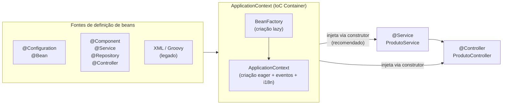
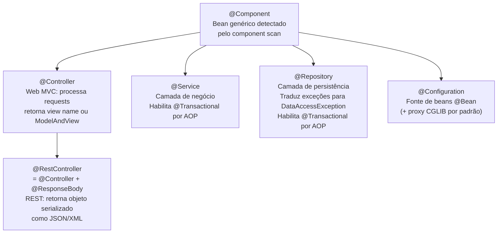

# Spring — Java, Spring Framework e Camada de Serviço

> **Baseline principal:** Spring Boot 3.5 · Spring Framework 6.x · Java 21+
>
> Este documento reúne os fundamentos de Java, Spring Framework e as boas práticas
> da camada de serviço — base compartilhada pelos guias
> [REST](Dicas-Spring-MVC-REST.md) e [SSR](Dicas-Spring-MVC-SSR.md).

---

## Sumário

1. [Java — Recursos da Linguagem Relevantes para o Documento](#1-java-recursos-da-linguagem-relevantes-para-o-documento)
2. [Spring Framework: IoC, DI e Anotações Essenciais](#2-base-spring-framework-ioc-di-e-anotações-essenciais)
3. [Boas Práticas na Camada de Serviço (`@Service`)](#3-boas-práticas-na-camada-de-serviço-service)
    - [3.1 Responsabilidades e Estrutura](#31-responsabilidades-e-estrutura)
    - [3.2 `@Transactional` — Padrões e Armadilhas](#32-transactional-padrões-e-armadilhas)
    - [3.3 Mapeamento DTO ↔ Entidade](#33-mapeamento-dto-entidade)
    - [3.4 Validação no Service — Invariantes de Domínio](#34-validação-no-service-invariantes-de-domínio)
    - [3.5 Tratamento de Exceções no Service](#35-tratamento-de-exceções-no-service)
    - [3.6 Services Stateless — Evitar Estado em Campos](#36-services-stateless-evitar-estado-em-campos)
    - [3.7 Checklist — Boas Práticas do `@Service`](#37-checklist-boas-práticas-do-service)

---

## 1. Java — Recursos da Linguagem Relevantes para o Documento

Esta seção cobre recursos do Java puro (sem Spring) que aparecem com frequência
ao longo do documento. O objetivo é servir como referência rápida e nivelamento
de conhecimento antes das seções de framework.

### 1.1 `Optional<T>` — Representação Explícita de Ausência de Valor

`Optional<T>` é um container que pode conter ou não um valor não-nulo. Substitui
o retorno de `null` em métodos que podem legitimamente não ter resultado, tornando
a ausência explícita no contrato do método.

```java
// ─── Criação ──────────────────────────────────────────────────────────────────
Optional<String> comValor  = Optional.of("Spring MVC");        // nunca aceita null
Optional<String> vazio     = Optional.empty();
Optional<String> talvezNull = Optional.ofNullable(valorQuePodeSerNull); // aceita null

// ─── Verificação e acesso ─────────────────────────────────────────────────────
boolean presente = comValor.isPresent();   // true
boolean ausente  = vazio.isEmpty();        // true (Java 11+)

String valor     = comValor.get();         // ⚠️ lança NoSuchElementException se vazio
String seguro    = comValor.orElse("default");          // retorna "default" se vazio
String calculado = vazio.orElseGet(() -> calcular());   // avaliação lazy
String obrigatorio = vazio.orElseThrow(
    () -> new RecursoNaoEncontradoException("Produto", 42L)); // lança exceção customizada

// ─── Transformação — map e flatMap ────────────────────────────────────────────
Optional<Integer> tamanho = comValor.map(String::length);        // Optional<Integer>(10)
Optional<String>  upper   = comValor.map(String::toUpperCase);   // Optional<String>("SPRING MVC")

// flatMap: quando a função de mapeamento já retorna Optional (evita Optional<Optional<T>>)
Optional<Endereco> endereco = clienteOpt.flatMap(Cliente::getEnderecoOpcional);

// ─── Filtragem ────────────────────────────────────────────────────────────────
Optional<String> longo = comValor.filter(s -> s.length() > 5);  // presente se atende o predicado

// ─── Execução condicional (sem if-null explícito) ─────────────────────────────
comValor.ifPresent(s -> System.out.println("Valor: " + s));

// ifPresentOrElse (Java 9+): ação se presente, ação alternativa se vazio
comValor.ifPresentOrElse(
    s  -> System.out.println("Encontrado: " + s),
    () -> System.out.println("Não encontrado")
);

// or (Java 9+): substitui por outro Optional se vazio
Optional<Produto> resultado = repositorio.findById(id)
        .or(() -> repositorio.findByCodigoLegado(id));  // tenta fallback

// stream (Java 9+): converte Optional em Stream de 0 ou 1 elemento
List<String> nomes = optionals.stream()
        .flatMap(Optional::stream)     // remove os vazios e desembala os presentes
        .toList();
```

**Uso em repositórios e controllers (padrão no documento):**

```java
// ─── Repositório retorna Optional ─────────────────────────────────────────────
public interface ProdutoRepository extends JpaRepository<Produto, Long> {
    Optional<Produto> findBySkuIgnoreCase(String sku);
}

// ─── Service usa orElseThrow para transformar ausência em exceção de domínio ──
@Service
public class ProdutoService {

    public ProdutoResponse buscarPorId(Long id) {
        return produtoRepository.findById(id)
                .map(ProdutoResponse::from)                   // transforma se presente
                .orElseThrow(() ->                            // lança se vazio
                        new RecursoNaoEncontradoException("Produto", id));
    }

    public Optional<ProdutoResponse> buscarPorSku(String sku) {
        // Retorna Optional quando a ausência é um resultado válido (não um erro)
        return produtoRepository.findBySkuIgnoreCase(sku)
                .map(ProdutoResponse::from);
    }
}

// ─── Controller trata Optional com map/orElseThrow ou orElse ──────────────────
@GetMapping("/{id}")
public ResponseEntity<ProdutoResponse> buscar(@PathVariable Long id) {
    return produtoService.buscarPorSku("ABC-123")
            .map(ResponseEntity::ok)                          // 200 se presente
            .orElse(ResponseEntity.notFound().build());       // 404 se vazio
}
```

**O que evitar com `Optional`:**

```java
// ❌ NÃO use Optional como campo de classe — use null com @Nullable
public class Produto {
    private Optional<String> descricao;  // ← errado; Optional não é Serializable seguro
}

// ❌ NÃO use Optional como parâmetro de método — use sobrecarga ou @Nullable
public void processar(Optional<Filtro> filtro) { }  // ← verboso, desnecessário

// ❌ NÃO chame get() sem verificar — prefira orElse/orElseThrow
String s = optional.get();  // ← lança NoSuchElementException se vazio

// ✅ Padrão correto: Optional apenas como tipo de retorno de métodos
public Optional<Produto> findBySku(String sku) { /* ... */ }
```

---

### 1.2 Interfaces — Contratos, Implementações Múltiplas e Padrões do Java

Interfaces definem **contratos** sem implementação (exceto `default` e `static`).
São a base do polimorfismo, do princípio de Segregação de Interfaces (ISP) e da
Inversão de Dependência (DIP) — dois dos cinco princípios SOLID.

```java
// ─── Interface básica — define o contrato ─────────────────────────────────────
public interface Exporter {
    byte[] exportar(Long relatorioId);

    // default: implementação opcional — subclasses podem sobrescrever
    default String getNomeArquivo(Long relatorioId) {
        return "relatorio-" + relatorioId + "." + getExtensao();
    }

    // método abstrato que toda implementação deve fornecer
    String getExtensao();

    // static: utilitário da interface, não herdado
    static boolean formatoSuportado(String formato) {
        return Set.of("pdf", "csv", "xlsx").contains(formato.toLowerCase());
    }
}

// ─── Múltiplas implementações do mesmo contrato ───────────────────────────────
@Component("pdfExporter")
public class PdfExporter implements Exporter {
    @Override public byte[] exportar(Long id) { /* gera PDF */ return new byte[0]; }
    @Override public String getExtensao()      { return "pdf"; }
}

@Component("csvExporter")
public class CsvExporter implements Exporter {
    @Override public byte[] exportar(Long id) { /* gera CSV */ return new byte[0]; }
    @Override public String getExtensao()      { return "csv"; }
}

// ─── Uso polimórfico: o código depende da interface, não da implementação ──────
@Service
public class RelatorioService {
    // Depende de Exporter, não de PdfExporter ou CsvExporter.
    // Trocar a implementação não exige nenhuma alteração aqui.
    private final Exporter exporter;

    public RelatorioService(@Qualifier("pdfExporter") Exporter exporter) {
        this.exporter = exporter;
    }
}
```

**Interfaces funcionais e lambdas — visão rápida:**

```java
// Interfaces com exatamente UM método abstrato podem ser usadas com lambdas.
// Ver seção 1.5 para o catálogo completo de java.util.function.

// Supplier<T>: sem parâmetros, retorna T
Supplier<Produto>  supplier  = () -> new Produto("Notebook", BigDecimal.TEN);

// Consumer<T>: recebe T, sem retorno
Consumer<String>   consumer  = nome -> System.out.println("Olá, " + nome);

// Function<T,R>: recebe T, retorna R
Function<Produto, String> nomeFn = produto -> produto.getNome().toUpperCase();

// Predicate<T>: recebe T, retorna boolean
Predicate<Produto> ativo = produto -> produto.isAtivo();

// BiFunction<T,U,R>: recebe T e U, retorna R
BiFunction<String, BigDecimal, Produto> factory =
        (nome, preco) -> new Produto(nome, preco);

// ─── Uso em Streams — composição funcional ────────────────────────────────────
List<ProdutoResponse> ativos = produtos.stream()
        .filter(Predicate.not(Produto::isRemovido))   // Predicate
        .filter(p -> p.getEstoque() > 0)              // lambda Predicate
        .map(ProdutoResponse::from)                   // Function — method reference
        .sorted(Comparator.comparing(ProdutoResponse::nome))
        .toList();                                    // Java 16+ — lista imutável

// ─── Interface funcional customizada ─────────────────────────────────────────
@FunctionalInterface
public interface RelatorioGenerator<T> {
    byte[] gerar(T dados, Locale locale);

    // default e static são permitidos em @FunctionalInterface
    default String cabecalho() { return "Relatório"; }
}

// Uso como lambda:
RelatorioGenerator<List<Produto>> gen =
        (dados, locale) -> pdfService.renderizar(dados, locale);
```

**Interfaces no contexto Spring MVC (usadas ao longo do documento):**

| Interface | Onde aparece | Propósito |
|---|---|---|
| `WebMvcConfigurer` | Seção 2.2 | Personalizar o Spring MVC sem substituir a auto-configuração |
| `HandlerInterceptor` | Seção 11.1 | Interceptar requisições antes/depois do controller |
| `Converter<S,T>` | Seção 7 | Converter tipos no binding de parâmetros |
| `Formatter<T>` | Seção 7 | Formatar/parsear tipos com locale |
| `ErrorController` | Seção 18 | Personalizar o endpoint `/error` |
| `CorsConfigurationSource` | Seção 14 | Prover configuração CORS dinâmica |
| `UserDetails` | Seção 11.12 | Contrato do usuário autenticado no Spring Security |

---

### 1.3 POJO, `class` e `record` — Modelagem de Dados

**POJO (Plain Old Java Object)** é um objeto Java sem herança obrigatória de
frameworks, sem anotações intrusivas, representando apenas dados ou comportamento
de domínio.

#### 1.3.1 POJO com `class` — mutável, com getters/setters

```java
// ─── POJO clássico — necessário quando o objeto precisa ser mutável ───────────
// Casos de uso: form objects (seção 4.2), entidades JPA, objetos acumuladores
public class ProdutoForm {

    // Campos privados — encapsulamento
    private String     nome;
    private BigDecimal preco;
    private Integer    estoque;
    private Long       categoriaId;
    private boolean    ativo = true;   // valor padrão

    // Construtor padrão obrigatório para frameworks de binding (Thymeleaf, Jackson)
    public ProdutoForm() {}

    // Construtor de conveniência
    public ProdutoForm(String nome, BigDecimal preco) {
        this.nome  = nome;
        this.preco = preco;
    }

    // Getters e setters — necessários para binding MVC e serialização Jackson
    public String getNome()              { return nome; }
    public void setNome(String nome)     { this.nome = nome; }

    public BigDecimal getPreco()                 { return preco; }
    public void setPreco(BigDecimal preco)        { this.preco = preco; }

    public Integer getEstoque()                  { return estoque; }
    public void setEstoque(Integer estoque)       { this.estoque = estoque; }

    public Long getCategoriaId()                 { return categoriaId; }
    public void setCategoriaId(Long categoriaId) { this.categoriaId = categoriaId; }

    public boolean isAtivo()                     { return ativo; }
    public void setAtivo(boolean ativo)          { this.ativo = ativo; }

    // equals, hashCode, toString (gerados pela IDE ou Lombok @Data)
    @Override public String toString() {
        return "ProdutoForm{nome='%s', preco=%s}".formatted(nome, preco);
    }
}
```

#### 1.3.2 `record` — POJO imutável conciso (Java 16+)

`record` gera automaticamente: construtor canônico, getters (sem prefixo `get`),
`equals`, `hashCode` e `toString`. É imutável por design — ideal para DTOs,
value objects e respostas de API.

```java
// ─── Record básico ────────────────────────────────────────────────────────────
// Equivale a uma class com 4 campos final, construtor, getters, equals, hashCode, toString
public record ProdutoResponse(
        Long       id,
        String     nome,
        BigDecimal preco,
        String     categoria
) {}

// Acesso: produto.id(), produto.nome(), produto.preco() — sem prefixo "get"
ProdutoResponse p = new ProdutoResponse(1L, "Notebook", new BigDecimal("3499.99"), "TI");
System.out.println(p.nome());    // "Notebook"
System.out.println(p);           // ProdutoResponse[id=1, nome=Notebook, ...]

// ─── Record com anotações de validação ────────────────────────────────────────
public record ProdutoRequest(

    @NotBlank(message = "Nome é obrigatório")
    @Size(min = 2, max = 200)
    String nome,

    @NotNull
    @Positive
    BigDecimal preco,

    @NotNull
    Long categoriaId
) {}

// ─── Record com construtor compacto — validação customizada ───────────────────
public record Intervalo(LocalDate inicio, LocalDate fim) {

    // Construtor compacto: sem parâmetros explícitos — acessa diretamente os campos
    // Executado antes da atribuição dos campos
    public Intervalo {
        if (inicio.isAfter(fim)) {
            throw new IllegalArgumentException(
                    "Início (%s) não pode ser após o fim (%s)".formatted(inicio, fim));
        }
        // Normalização: campos são atribuídos automaticamente após o bloco
    }
}

// ─── Record com método factory e método de instância ─────────────────────────
public record PaginaInfo(int numero, int tamanho, long total) {

    // Método factory estático
    public static PaginaInfo of(Pageable pageable, long total) {
        return new PaginaInfo(pageable.getPageNumber(), pageable.getPageSize(), total);
    }

    // Método de instância — records podem ter métodos
    public int totalPaginas() {
        return tamanho == 0 ? 0 : (int) Math.ceil((double) total / tamanho);
    }

    public boolean temProxima() {
        return numero < totalPaginas() - 1;
    }
}

// ─── Record com implementação de interface ────────────────────────────────────
public record CoordenadaGPS(double latitude, double longitude) implements Serializable {

    // Construtor compacto com validação
    public CoordenadaGPS {
        if (latitude  < -90  || latitude  > 90)  throw new IllegalArgumentException("Latitude inválida");
        if (longitude < -180 || longitude > 180)  throw new IllegalArgumentException("Longitude inválida");
    }

    public double distanciaKm(CoordenadaGPS outro) {
        // Haversine simplificado
        double r = 6371;
        double dLat = Math.toRadians(outro.latitude  - this.latitude);
        double dLon = Math.toRadians(outro.longitude - this.longitude);
        double a = Math.sin(dLat/2) * Math.sin(dLat/2)
                 + Math.cos(Math.toRadians(this.latitude))
                 * Math.cos(Math.toRadians(outro.latitude))
                 * Math.sin(dLon/2) * Math.sin(dLon/2);
        return r * 2 * Math.atan2(Math.sqrt(a), Math.sqrt(1-a));
    }
}
```

**Comparativo `class` vs `record`:**

| Característica | `class` (POJO) | `record` |
|---|---|---|
| Imutabilidade | ❌ Mutável por padrão | ✅ Imutável por padrão |
| Boilerplate | Alto (getters, setters, equals...) | ✅ Zero — tudo gerado |
| Getters | `getNome()` | `nome()` (sem prefixo) |
| Setters | Sim | ❌ Não (campos `final`) |
| Herança | Pode herdar e ser herdada | ❌ `final` implícito — não pode ser herdada |
| Binding MVC/Thymeleaf | ✅ Form objects (mutável) | ⚠️ Apenas leitura (sem setter) |
| Jackson / JSON | ✅ Com configuração | ✅ Funciona sem configuração extra |
| JPA `@Entity` | ✅ Necessário | ❌ Não use — JPA exige mutabilidade |
| **Uso típico** | Form objects, entidades JPA | DTOs de request/response, value objects |

---

### 1.4 Text Blocks — Strings Multilinha (Java 15+)

Text blocks (`"""..."""`) permitem escrever strings multilinha sem concatenação,
escapamentos excessivos ou quebras de legibilidade. São especialmente úteis para
JSON, SQL, HTML e outros conteúdos estruturados inline.

```java
// ─── String tradicional vs text block ────────────────────────────────────────

// Antes (Java 14 e anterior) — ilegível, propenso a erro
String jsonAntigo = "{\n" +
                    "  \"nome\": \"Notebook\",\n" +
                    "  \"preco\": 3499.99,\n" +
                    "  \"ativo\": true\n" +
                    "}";

// Agora (Java 15+) — legível, indentação preservada automaticamente
String json = """
        {
          "nome": "Notebook",
          "preco": 3499.99,
          "ativo": true
        }
        """;
// A indentação do fechamento """ define o nível de corte da indentação:
// qualquer espaço comum a todas as linhas é removido automaticamente.
// O \n final existe porque """ fechando está em linha própria.

// ─── Uso em testes — payloads de request ─────────────────────────────────────
restTestClient.post()
        .uri("/api/v1/produtos")
        .contentType(MediaType.APPLICATION_JSON)
        .bodyValue("""
                {
                  "nome": "Notebook Dell",
                  "preco": 3499.99,
                  "categoriaId": 1
                }
                """)
        .exchange()
        .expectStatus().isCreated();

// ─── SQL multilinha — muito mais legível ─────────────────────────────────────
String sql = """
        SELECT p.id, p.nome, p.preco, c.nome AS categoria
        FROM produtos p
        JOIN categorias c ON c.id = p.categoria_id
        WHERE p.ativo = true
          AND p.estoque > :estoqueMinimo
        ORDER BY p.nome
        LIMIT :limite
        """;

// ─── HTML inline (ex: templates de e-mail simples) ───────────────────────────
String html = """
        <html>
          <body>
            <h1>Pedido confirmado</h1>
            <p>Olá, %s! Seu pedido <strong>#%d</strong> foi confirmado.</p>
          </body>
        </html>
        """.formatted(nomeCliente, numeroPedido);
// .formatted() é o equivalente de String.format() em text blocks

// ─── Interpolação de variáveis com formatted() ───────────────────────────────
String mensagem = """
        Produto: %s
        Preço:   R$ %.2f
        Estoque: %d unidades
        """.formatted(produto.getNome(), produto.getPreco(), produto.getEstoque());

// ─── Controle preciso de nova linha e espaços ─────────────────────────────────
// \  no final da linha: continua na mesma linha (sem \n)
String umaLinha = """
        Esta é uma string \
        que continua \
        na mesma linha.
        """;  // "Esta é uma string que continua na mesma linha."

// \s no final da linha: preserva espaços à direita (que seriam removidos)
String comEspacos = """
        col1     \s
        col2     \s
        """;

// ─── Uso nos exemplos do documento ───────────────────────────────────────────
// Text blocks aparecem principalmente em:
//   - Payloads de teste (seção 3)
//   - Mensagens Javadoc de constraints (seção 5)
//   - Templates de e-mail em serviços de notificação
//   - Queries SQL nativas com JdbcClient
```

---

### 1.5 Programação Funcional — `java.util.function`, Composição e Method References

O pacote `java.util.function` define as interfaces funcionais padrão do Java.
Todas possuem exatamente **um método abstrato** (`@FunctionalInterface`) e por
isso aceitam lambdas e method references como implementações.

#### 1.5.1 Catálogo das interfaces principais

```java
// ════════════════════════════════════════════════════════════════════════════════
// GRUPO 1 — Transformação (recebe algo, retorna algo diferente)
// ════════════════════════════════════════════════════════════════════════════════

// Function<T, R> — recebe T, produz R
// Método abstrato: R apply(T t)
Function<String, Integer>    tamanho  = String::length;        // "abc" → 3
Function<Produto, String>    nomeFn   = Produto::getNome;      // Produto → "Notebook"
Function<String, LocalDate>  parseData = LocalDate::parse;    // "2024-01-15" → LocalDate

// BiFunction<T, U, R> — recebe T e U, produz R
// Método abstrato: R apply(T t, U u)
BiFunction<String, Integer, String> repetir =
        (s, n) -> s.repeat(n);                                 // ("AB", 3) → "ABABAB"
BiFunction<BigDecimal, BigDecimal, BigDecimal> soma =
        BigDecimal::add;                                       // (1.0, 2.0) → 3.0

// UnaryOperator<T> — especialização de Function<T,T> (entrada e saída do mesmo tipo)
// Método abstrato: T apply(T t)
UnaryOperator<String>     maiusculo = String::toUpperCase;     // "abc" → "ABC"
UnaryOperator<BigDecimal> dobrar    = v -> v.multiply(BigDecimal.TWO);

// BinaryOperator<T> — especialização de BiFunction<T,T,T>
// Método abstrato: T apply(T t1, T t2)
BinaryOperator<BigDecimal> maior    = BigDecimal::max;         // (3, 5) → 5
BinaryOperator<String>     concat   = String::concat;          // ("a","b") → "ab"

// ════════════════════════════════════════════════════════════════════════════════
// GRUPO 2 — Produção (sem entrada, retorna algo)
// ════════════════════════════════════════════════════════════════════════════════

// Supplier<T> — sem parâmetros, fornece T (lazy evaluation)
// Método abstrato: T get()
Supplier<Instant>  agora      = Instant::now;                  // () → Instant.now()
Supplier<Produto>  novoProduto = Produto::new;                 // () → new Produto()
Supplier<List<String>> listaVazia = ArrayList::new;            // () → new ArrayList<>()

// Uso típico: valor default lazy (só avaliado se necessário)
String nome = optional.orElseGet(() -> gerarNomeDefault());    // Supplier<String>

// ════════════════════════════════════════════════════════════════════════════════
// GRUPO 3 — Consumo (recebe algo, sem retorno — side effect)
// ════════════════════════════════════════════════════════════════════════════════

// Consumer<T> — recebe T, sem retorno (void)
// Método abstrato: void accept(T t)
Consumer<String>  log    = System.out::println;
Consumer<Produto> salvar = produtoRepository::save;
Consumer<Pedido>  enviar = emailService::enviarConfirmacao;

// BiConsumer<T, U> — recebe T e U, sem retorno
// Método abstrato: void accept(T t, U u)
BiConsumer<String, Integer> logComNivel =
        (msg, nivel) -> logger.log(nivel, msg);
BiConsumer<Map<String, Object>, String> remover =
        (mapa, chave) -> mapa.remove(chave);

// Uso típico: forEach, ifPresent, peek
produtos.forEach(salvar);                                      // Consumer
optional.ifPresent(log);                                       // Consumer
stream.peek(p -> logger.debug("Processando: {}", p.getId())); // Consumer

// ════════════════════════════════════════════════════════════════════════════════
// GRUPO 4 — Predicados (recebe algo, retorna boolean)
// ════════════════════════════════════════════════════════════════════════════════

// Predicate<T> — recebe T, retorna boolean
// Método abstrato: boolean test(T t)
Predicate<String>  naoVazio   = s -> !s.isBlank();
Predicate<Produto> emEstoque  = p -> p.getEstoque() > 0;
Predicate<Pedido>  confirmado = p -> p.getStatus() == Status.CONFIRMADO;

// BiPredicate<T, U> — recebe T e U, retorna boolean
// Método abstrato: boolean test(T t, U u)
BiPredicate<String, Integer> tamanhoMinimo =
        (s, min) -> s.length() >= min;

// ════════════════════════════════════════════════════════════════════════════════
// GRUPO 5 — Versões primitivas (evitam boxing/unboxing — mais performáticas)
// ════════════════════════════════════════════════════════════════════════════════

// IntFunction<R>, LongFunction<R>, DoubleFunction<R>
IntFunction<String>    intToStr  = Integer::toString;       // int → String
LongFunction<Instant>  epochToTs = Instant::ofEpochMilli;  // long → Instant

// ToIntFunction<T>, ToLongFunction<T>, ToDoubleFunction<T>
ToIntFunction<String>    strlen  = String::length;          // String → int
ToDoubleFunction<Produto> preco  = p -> p.getPreco().doubleValue();

// IntUnaryOperator, LongUnaryOperator, DoubleUnaryOperator
IntUnaryOperator    dobrarInt  = n -> n * 2;                // int → int
DoubleUnaryOperator arredondar = Math::floor;               // double → double

// IntBinaryOperator, LongBinaryOperator, DoubleBinaryOperator
IntBinaryOperator    somaInt = Integer::sum;                // (int, int) → int
DoubleBinaryOperator maiorD  = Math::max;                   // (double, double) → double

// IntSupplier, LongSupplier, DoubleSupplier
IntSupplier    contador = atomicInt::getAndIncrement;       // () → int
DoubleSupplier random   = Math::random;                     // () → double

// IntConsumer, LongConsumer, DoubleConsumer
IntConsumer    printInt  = System.out::println;             // int → void
DoubleConsumer logDouble = d -> logger.debug("val={}", d);  // double → void

// IntPredicate, LongPredicate, DoublePredicate
IntPredicate  positivo = n -> n > 0;                        // int → boolean
LongPredicate par      = n -> n % 2 == 0;                   // long → boolean
```

#### 1.5.2 Composição de funções

Todas as interfaces funcionais do `java.util.function` oferecem métodos `default`
para **encadear e combinar** funções sem variáveis intermediárias.

```java
// ─── Function: andThen e compose ─────────────────────────────────────────────

Function<String, String>  trim      = String::trim;
Function<String, String>  maiusculo = String::toUpperCase;
Function<String, Integer> tamanho   = String::length;

// andThen: aplica this, depois a função argumento
// trim → maiusculo → tamanho: "  abc  " → "ABC" → 3
Function<String, Integer> pipeline = trim.andThen(maiusculo).andThen(tamanho);
int resultado = pipeline.apply("  abc  ");  // 3

// compose: aplica a função argumento ANTES de this
// maiusculo.compose(trim) ≡ trim.andThen(maiusculo)
Function<String, String> trimThenMaiusculo = maiusculo.compose(trim);

// ─── Predicate: and, or, negate ───────────────────────────────────────────────

Predicate<Produto> ativo    = p -> p.isAtivo();
Predicate<Produto> emEstoque = p -> p.getEstoque() > 0;
Predicate<Produto> barato   = p -> p.getPreco().compareTo(new BigDecimal("100")) < 0;

// and: ambos devem ser verdadeiros
Predicate<Produto> disponivel = ativo.and(emEstoque);

// or: pelo menos um deve ser verdadeiro
Predicate<Produto> interessante = barato.or(emEstoque);

// negate: inverte o resultado
Predicate<Produto> indisponivel = disponivel.negate();

// Predicate.not (Java 11+) — inverso de um method reference
Predicate<String> naoVazio = Predicate.not(String::isBlank);

// Uso em stream com composição
List<Produto> catalogo = produtos.stream()
        .filter(ativo.and(emEstoque).and(Predicate.not(Produto::isRemovido)))
        .toList();

// ─── Consumer: andThen ────────────────────────────────────────────────────────

Consumer<Pedido> salvar  = pedidoRepository::save;
Consumer<Pedido> auditar = auditService::registrar;
Consumer<Pedido> notificar = emailService::enviarConfirmacao;

// Executa salvar → auditar → notificar em sequência
Consumer<Pedido> processarPedido = salvar.andThen(auditar).andThen(notificar);
processarPedido.accept(pedido);

// ─── BinaryOperator como acumulador em reduce ─────────────────────────────────

BinaryOperator<BigDecimal> soma  = BigDecimal::add;
BinaryOperator<String>     concat = (a, b) -> a + ", " + b;

BigDecimal totalPrecos = precos.stream()
        .reduce(BigDecimal.ZERO, soma);           // 0 + p1 + p2 + ...

String nomesCSV = nomes.stream()
        .reduce("", concat);                       // "" + n1 + ", " + n2 + ...

// Function.identity() — retorna o próprio argumento (útil em collectors)
Map<Long, Produto> porId = produtos.stream()
        .collect(Collectors.toMap(Produto::getId, Function.identity()));
```

#### 1.5.3 Method references — quatro formas

```java
// ════════════════════════════════════════════════════════════════════════════════
// FORMA 1: Classe::métodoEstático
// Equivale a: (args) -> Classe.metodoEstatico(args)
// ════════════════════════════════════════════════════════════════════════════════
Function<String, Integer>  parseInt    = Integer::parseInt;      // s -> Integer.parseInt(s)
Function<String, String>   valueOf     = String::valueOf;        // s -> String.valueOf(s)
Function<Double, Double>   sqrt        = Math::sqrt;             // d -> Math.sqrt(d)
Predicate<String>          isNullFn    = Objects::isNull;        // s -> Objects.isNull(s)
BiFunction<Object,Object,Boolean> eq   = Objects::equals;        // (a,b) -> Objects.equals(a,b)

// ════════════════════════════════════════════════════════════════════════════════
// FORMA 2: instância::método
// Equivale a: (args) -> instancia.metodo(args)
// ════════════════════════════════════════════════════════════════════════════════
Consumer<String>  printer   = System.out::println;               // s -> System.out.println(s)
Consumer<Produto> salvar    = produtoRepository::save;           // p -> produtoRepository.save(p)
Supplier<Instant> agora     = Instant::now;                      // () -> Instant.now()
// (Instant::now é estático — comporta-se como Forma 1 aqui)

// ════════════════════════════════════════════════════════════════════════════════
// FORMA 3: Classe::métodoDeInstância
// O primeiro argumento da lambda vira o receptor (this) do método
// Equivale a: (obj, args) -> obj.metodo(args)
// ════════════════════════════════════════════════════════════════════════════════
Function<String, String>      upper    = String::toUpperCase;    // s -> s.toUpperCase()
Function<String, Integer>     length   = String::length;         // s -> s.length()
Function<Produto, String>     getNome  = Produto::getNome;       // p -> p.getNome()
BiFunction<String,String,Boolean> startsWith = String::startsWith; // (s,p) -> s.startsWith(p)
Predicate<String>             vazio    = String::isEmpty;         // s -> s.isEmpty()
ToIntFunction<String>         tamanho  = String::length;         // s -> s.length() (int primitivo)

// ════════════════════════════════════════════════════════════════════════════════
// FORMA 4: Classe::new (construtor)
// Equivale a: (args) -> new Classe(args)
// ════════════════════════════════════════════════════════════════════════════════
Supplier<ArrayList<String>>         listaVazia = ArrayList::new;   // () -> new ArrayList<>()
Function<String, StringBuilder>     sbFactory  = StringBuilder::new; // s -> new StringBuilder(s)
BiFunction<String,BigDecimal,Produto> prodFactory =
        Produto::new;                                               // (n,p) -> new Produto(n,p)

// ─── Uso prático dos quatro tipos em conjunto ─────────────────────────────────
List<String> nomes = List.of("  Ana  ", "  Bob  ", "");

List<String> resultado = nomes.stream()
        .map(String::trim)             // Forma 3: instance method
        .filter(Predicate.not(String::isEmpty))  // Forma 3: instance method
        .map(String::toUpperCase)      // Forma 3: instance method
        .sorted(String::compareTo)     // Forma 3: instance method (BiFunction)
        .collect(Collectors.toList()); // ["ANA", "BOB"]
```

#### 1.5.4 Interfaces funcionais customizadas e usos no Spring MVC

```java
// ─── @FunctionalInterface — garante que a interface tem exatamente 1 método abs.
// O compilador emite erro se alguém adicionar um segundo método abstrato.

@FunctionalInterface
public interface Validator<T> {
    ValidationResult validate(T obj);

    // Composição: encadeia validadores
    default Validator<T> andThen(Validator<T> other) {
        return obj -> {
            ValidationResult r = this.validate(obj);
            return r.isValid() ? other.validate(obj) : r;
        };
    }
}

// Uso:
Validator<ProdutoRequest> nomeValido  = req -> req.nome() != null && !req.nome().isBlank()
        ? ValidationResult.ok()
        : ValidationResult.erro("Nome obrigatório");

Validator<ProdutoRequest> precoValido = req -> req.preco() != null && req.preco().signum() > 0
        ? ValidationResult.ok()
        : ValidationResult.erro("Preço deve ser positivo");

Validator<ProdutoRequest> validarProduto = nomeValido.andThen(precoValido);
ValidationResult resultado = validarProduto.validate(request);

// ─── Tipos funcionais recorrentes no Spring Framework ─────────────────────────

// HandlerFunction<T> (WebMvc.fn) — Function<ServerRequest, ServerResponse>
// RouterFunction<T>  (WebMvc.fn) — encadeia rotas como predicados

// Comparator — interface funcional com método estático e helpers
Comparator<Produto> porPreco = Comparator.comparing(Produto::getPreco);
Comparator<Produto> porNome  = Comparator.comparing(Produto::getNome);
Comparator<Produto> ordem    = porPreco.reversed()           // maior preço primeiro
                                       .thenComparing(porNome); // desempate por nome

produtos.sort(ordem);
List<Produto> ordenados = produtos.stream().sorted(ordem).toList();

// Runnable — () -> void (sem parâmetros, sem retorno)
// Muito comum com @Async e CompletableFuture
Runnable tarefa = () -> processarRelatorio(id);
CompletableFuture.runAsync(tarefa, executor);

// Callable<T> — () throws Exception -> T (com checagem de exceção)
// Usado em @Async e controllers assíncronos (seção 11.9)
Callable<RelatorioResponse> callable = () -> relatorioService.gerarCompleto(periodo);
```

#### 1.5.5 Resumo — guia de escolha rápida

| Preciso... | Interface | Assinatura |
|---|---|---|
| Transformar `T` em `R` | `Function<T,R>` | `R apply(T)` |
| Transformar `T` em `T` | `UnaryOperator<T>` | `T apply(T)` |
| Transformar `T` e `U` em `R` | `BiFunction<T,U,R>` | `R apply(T,U)` |
| Combinar dois `T` em `T` | `BinaryOperator<T>` | `T apply(T,T)` |
| Produzir `T` sem entrada | `Supplier<T>` | `T get()` |
| Consumir `T` sem retorno | `Consumer<T>` | `void accept(T)` |
| Consumir `T` e `U` sem retorno | `BiConsumer<T,U>` | `void accept(T,U)` |
| Testar `T` → boolean | `Predicate<T>` | `boolean test(T)` |
| Testar `T` e `U` → boolean | `BiPredicate<T,U>` | `boolean test(T,U)` |
| Executar sem parâmetros / retorno | `Runnable` | `void run()` |
| Produzir `T` com exceção checada | `Callable<T>` | `T call() throws Exception` |
| Transformar `int` → `R` (sem boxing) | `IntFunction<R>` | `R apply(int)` |
| Transformar `T` → `int` (sem boxing) | `ToIntFunction<T>` | `int applyAsInt(T)` |
| Operar `int` → `int` | `IntUnaryOperator` | `int applyAsInt(int)` |

---

### 1.6 Outros Recursos Java Usados no Documento

Referência rápida de recursos Java modernos que aparecem nos exemplos das seções
numeradas.

```java
// ─── var — inferência de tipo local (Java 10+) ────────────────────────────────
// O compilador infere o tipo; não reduz type-safety — é açúcar sintático.
var produtos  = produtoRepository.findAll();          // List<Produto>
var pageable  = PageRequest.of(0, 20, Sort.by("nome")); // PageRequest
var resultado = produtoService.criar(request);         // tipo inferido do retorno

// ─── Pattern matching para instanceof (Java 16+) ─────────────────────────────
// Elimina o cast manual após verificação de tipo
Object obj = obterObjeto();

// Antes:
if (obj instanceof String) {
    String s = (String) obj;  // cast redundante
    System.out.println(s.length());
}

// Agora:
if (obj instanceof String s) {              // declara 's' já como String
    System.out.println(s.length());
}

// ─── switch expression (Java 14+) ────────────────────────────────────────────
// Retorna valor diretamente; sem fall-through; cobre todos os casos
HttpStatus status = switch (tipoErro) {
    case "NOT_FOUND"   -> HttpStatus.NOT_FOUND;
    case "FORBIDDEN"   -> HttpStatus.FORBIDDEN;
    case "CONFLICT"    -> HttpStatus.CONFLICT;
    default            -> HttpStatus.INTERNAL_SERVER_ERROR;
};

// switch com bloco (yield para retornar de bloco multi-linha)
String descricao = switch (produto.getTipo()) {
    case FISICO   -> "Produto físico — requer envio";
    case DIGITAL  -> {
        var link = gerarLink(produto);
        yield "Download: " + link;           // yield retorna de dentro do bloco
    }
    case SERVICO  -> "Prestação de serviço";
};

// ─── Sealed classes (Java 17+) — hierarquias fechadas ────────────────────────
// Restringe quais classes podem implementar/estender; potencializa o switch
public sealed interface Resultado<T>
        permits Resultado.Sucesso, Resultado.Erro {

    record Sucesso<T>(T valor)              implements Resultado<T> {}
    record Erro<T>(String mensagem, int codigo) implements Resultado<T> {}
}

// switch exaustivo sobre sealed interface — o compilador garante todos os casos
String texto = switch (resultado) {
    case Resultado.Sucesso<ProdutoResponse> s -> "Criado: " + s.valor().nome();
    case Resultado.Erro<ProdutoResponse>    e -> "Erro %d: %s".formatted(e.codigo(), e.mensagem());
    // Sem default necessário — sealed garante exaustividade
};

// ─── Method references — atalho para lambdas que delegam a um método ─────────
// Classe::métodoEstático
Function<String, Integer> parse  = Integer::parseInt;
// instância::método
Consumer<String>          printer = System.out::println;
// Classe::métodoDeInstância (receptor é o primeiro parâmetro)
Function<Produto, String> nome   = Produto::getNome;
// Classe::new (construtor)
Function<Long, Produto>   ctor   = Produto::new;

// ─── Stream API — processamento declarativo de coleções ───────────────────────
List<ProdutoResponse> resultado = produtos.stream()
        .filter(p  -> p.isAtivo())                           // filtra
        .map(ProdutoResponse::from)                          // transforma
        .sorted(Comparator.comparing(ProdutoResponse::nome)) // ordena
        .limit(10)                                           // limita
        .toList();                                           // coleta

// Operações terminais úteis
long total           = stream.count();
Optional<T> primeiro = stream.findFirst();
boolean todos        = stream.allMatch(predicado);
boolean algum        = stream.anyMatch(predicado);
Map<K, List<T>> agrupado = stream.collect(Collectors.groupingBy(classificador));
```

---

## 2. Base — Spring Framework: IoC, DI e Anotações Essenciais

Esta seção apresenta os fundamentos do Spring Framework que sustentam todo o
Spring MVC. O entendimento destes conceitos é pré-requisito para as seções
numeradas do documento.

### 2.1 Inversão de Controle e Injeção de Dependência

O Spring Framework é construído sobre dois pilares:

- **IoC (Inversion of Control):** o container Spring cria e gerencia o ciclo de
  vida dos objetos em vez de o código criá-los com `new`.
- **DI (Dependency Injection):** o container injeta as dependências nos objetos
  em vez de eles as buscarem ativamente.

#### 2.1.1 Sem IoC — acoplamento manual (o problema)

```java
// ════════════════════════════════════════════════════════════════════════════════
// CENÁRIO: sistema de pedidos com repositório, serviço e controller
// SEM IoC — todas as dependências criadas e gerenciadas manualmente pelo código.
// ════════════════════════════════════════════════════════════════════════════════

// ─── Repositório ──────────────────────────────────────────────────────────────
public class PedidoRepository {

    // A conexão com o banco é criada DENTRO do repositório.
    // Ninguém de fora controla como ela é criada ou qual implementação é usada.
    private final DataSource dataSource;

    public PedidoRepository() {
        // Acoplamento forte: o repositório decide qual banco usar e como conectar.
        // Para trocar de banco ou usar um banco diferente em testes, é necessário
        // alterar o código desta classe — viola o Princípio Aberto/Fechado (OCP).
        var ds = new HikariDataSource();
        ds.setJdbcUrl("jdbc:postgresql://localhost:5432/loja");
        ds.setUsername("admin");
        ds.setPassword("senha123");    // ← senha hardcoded no código
        this.dataSource = ds;
    }

    public Optional<Pedido> findById(Long id) {
        // usa dataSource...
        return Optional.empty();
    }
}

// ─── Serviço ──────────────────────────────────────────────────────────────────
public class PedidoService {

    // O serviço cria o repositório com "new" — ele está no controle da criação.
    // Problema 1: não há como substituir PedidoRepository por uma implementação
    //             de teste sem alterar esta classe.
    // Problema 2: se PedidoRepository mudar seu construtor, PedidoService
    //             também precisará ser alterado — alto acoplamento.
    private final PedidoRepository pedidoRepository = new PedidoRepository();

    // O serviço também cria o EmailService, que por sua vez pode criar
    // outras dependências — a cadeia de "new" cresce indefinidamente.
    private final EmailService emailService = new EmailService();

    public PedidoResponse buscar(Long id) {
        return pedidoRepository.findById(id)
                .map(PedidoResponse::from)
                .orElseThrow(() -> new RuntimeException("Pedido não encontrado: " + id));
    }

    public void confirmar(Long id) {
        var pedido = pedidoRepository.findById(id).orElseThrow();
        // ...lógica de confirmação...
        emailService.enviarConfirmacao(pedido);
    }
}

// ─── Controller ───────────────────────────────────────────────────────────────
public class PedidoController {

    // O controller também cria o serviço com "new".
    // Se PedidoService precisar de novos colaboradores no futuro,
    // PedidoController precisará ser atualizado — mesmo que não use esses colaboradores.
    private final PedidoService pedidoService = new PedidoService();

    public PedidoResponse buscar(Long id) {
        return pedidoService.buscar(id);
    }
}

// ─── Criação no ponto de uso ──────────────────────────────────────────────────
public class Main {
    public static void main(String[] args) {
        // Cada vez que precisar de um controller, todo o grafo de objetos é
        // recriado do zero: controller → service → repository → datasource.
        // Não há singleton: cada "new PedidoController()" cria conexões novas.
        // Não há gerenciamento de ciclo de vida: conexões nunca são fechadas.
        var controller = new PedidoController();
        controller.buscar(1L);
    }
}

// ─── Teste unitário — quase impossível ───────────────────────────────────────
class PedidoServiceTest {
    @Test
    void buscar_deveRetornarPedido() {
        // Não há como criar um PedidoService com um repositório "fake":
        //   - PedidoRepository é instanciado DENTRO de PedidoService
        //   - O teste vai tentar conectar ao banco de produção
        //   - Único recurso: subclassear e sobrescrever (Mockito estático, PowerMock)
        //     — frágil, verboso e com baixo valor didático
        var service = new PedidoService(); // ← conecta ao banco de produção!
        // ...
    }
}
```

#### 2.1.2 Com IoC e DI — o Spring assume o controle

```java
// ════════════════════════════════════════════════════════════════════════════════
// MESMO CENÁRIO — com Spring IoC e injeção de dependência por construtor.
// O container cria, configura e injeta tudo. O código só declara do que precisa.
// ════════════════════════════════════════════════════════════════════════════════

// ─── Repositório ──────────────────────────────────────────────────────────────
@Repository   // ← detectado pelo component scan; registrado como bean singleton
public class PedidoRepository {

    private final JdbcClient jdbcClient;

    // O construtor declara a dependência — o Spring a injeta.
    // PedidoRepository não sabe COMO o JdbcClient foi criado nem qual banco usa.
    // Em teste, o Spring (ou o teste) injeta um JdbcClient conectado ao H2/Testcontainers.
    public PedidoRepository(JdbcClient jdbcClient) {
        this.jdbcClient = jdbcClient;
    }

    public Optional<Pedido> findById(Long id) {
        return jdbcClient.sql("SELECT * FROM pedidos WHERE id = :id")
                .param("id", id)
                .query(Pedido.class)
                .optional();
    }
}

// ─── Serviço ──────────────────────────────────────────────────────────────────
@Service   // ← detectado pelo component scan; registrado como bean singleton
public class PedidoService {

    // Campos final: imutáveis após construção, nunca serão null.
    private final PedidoRepository pedidoRepository;
    private final EmailService     emailService;

    // O Spring injeta as implementações corretas automaticamente.
    // Para trocar EmailService por uma versão de teste, basta registrar
    // outra implementação no contexto de teste — nenhuma alteração aqui.
    public PedidoService(PedidoRepository pedidoRepository,
                         EmailService emailService) {
        this.pedidoRepository = pedidoRepository;
        this.emailService     = emailService;
    }

    public PedidoResponse buscar(Long id) {
        return pedidoRepository.findById(id)
                .map(PedidoResponse::from)
                .orElseThrow(() -> new RecursoNaoEncontradoException("Pedido", id));
    }

    public void confirmar(Long id) {
        var pedido = pedidoRepository.findById(id).orElseThrow();
        // ...lógica de confirmação...
        emailService.enviarConfirmacao(pedido);
    }
}

// ─── Controller ───────────────────────────────────────────────────────────────
@RestController   // ← detectado pelo component scan; registrado como bean singleton
@RequestMapping("/api/v1/pedidos")
public class PedidoController {

    private final PedidoService pedidoService;

    // O Spring injeta o MESMO bean PedidoService que foi criado anteriormente —
    // singleton por padrão. Não há nova instância, não há nova conexão com banco.
    public PedidoController(PedidoService pedidoService) {
        this.pedidoService = pedidoService;
    }

    @GetMapping("/{id}")
    public ResponseEntity<PedidoResponse> buscar(@PathVariable Long id) {
        return ResponseEntity.ok(pedidoService.buscar(id));
    }
}

// ─── DataSource e JdbcClient declarados uma única vez — @Configuration ────────
// O Spring Boot auto-configura isso a partir do application.yml.
// Configuração manual é necessária apenas para múltiplos datasources.
@Configuration
public class DataConfig {

    // Este bean é criado UMA vez e injetado em TODOS os repositórios.
    // O pool de conexões (HikariCP) é gerenciado pelo container — fechado
    // corretamente quando o contexto é encerrado (@PreDestroy implícito).
    @Bean
    public DataSource dataSource(
            @Value("${spring.datasource.url}")      String url,
            @Value("${spring.datasource.username}") String username,
            @Value("${spring.datasource.password}") String password) {
        var ds = new HikariDataSource();
        ds.setJdbcUrl(url);       // lido do application.yml — sem hardcode
        ds.setUsername(username);
        ds.setPassword(password);
        return ds;
    }
}

// ─── Teste unitário — limpo e simples ────────────────────────────────────────
class PedidoServiceTest {

    // Mockito cria implementações "fake" das dependências em memória.
    // Nenhum banco de dados, nenhum servidor de email — teste é instantâneo.
    @Mock
    private PedidoRepository pedidoRepository;

    @Mock
    private EmailService emailService;

    private PedidoService pedidoService;

    @BeforeEach
    void setUp() {
        MockitoAnnotations.openMocks(this);
        // Construtor com injeção: o teste passa as implementações fake diretamente.
        // Isso só é possível porque o serviço recebe as dependências via construtor
        // e não as cria internamente com "new".
        pedidoService = new PedidoService(pedidoRepository, emailService);
    }

    @Test
    void buscar_QuandoPedidoExiste_RetornaResponse() {
        var pedidoMock = new Pedido(1L, "CONFIRMADO");
        when(pedidoRepository.findById(1L)).thenReturn(Optional.of(pedidoMock));

        var result = pedidoService.buscar(1L);

        assertThat(result.id()).isEqualTo(1L);
        verify(pedidoRepository).findById(1L);
        verifyNoInteractions(emailService);   // email não foi enviado em busca
    }
}
```

#### 2.1.3 Comparativo direto

| Aspecto | Sem IoC (`new`) | Com IoC (Spring) |
|---|---|---|
| Criação de objetos | Cada classe cria suas dependências com `new` | Container cria e gerencia todos os objetos |
| Acoplamento | Alto — mudança em A força mudança em B | Baixo — classes dependem de interfaces |
| Ciclo de vida | Manual — sem garantia de fechamento | Gerenciado — `@PostConstruct` / `@PreDestroy` |
| Singleton | Impossível sem código extra | Automático (padrão para todos os beans) |
| Testabilidade | Difícil — dependências hardcoded | Fácil — qualquer implementação pode ser injetada |
| Configuração de ambiente | Hardcoded no código | Externalizada em `application.yml` / variáveis de ambiente |
| Substituição de implementação | Requer alteração do código | Registrar novo bean / `@Profile` / `@ConditionalOn*` |



### 2.2 `@Configuration` e `proxyBeanMethods`

`@Configuration` marca uma classe como **fonte de definições de beans** para o
container. Por padrão, o Spring cria um **proxy CGLIB** da classe para garantir
que chamadas entre métodos `@Bean` dentro da mesma classe retornem sempre a
**mesma instância** (comportamento de singleton).

```java
// ─── proxyBeanMethods = true (DEFAULT) ───────────────────────────────────────
//
// O Spring cria um proxy CGLIB da classe.
// Chamadas entre métodos @Bean são interceptadas:
//   dataSource() chamado por jdbcClient() retorna o MESMO bean do container.
// Use quando um @Bean chama outro @Bean da mesma classe.
@Configuration   // equivalente a @Configuration(proxyBeanMethods = true)
public class DataConfig {

    @Bean
    public DataSource dataSource() {
        var ds = new HikariDataSource();
        ds.setJdbcUrl("jdbc:postgresql://localhost:5432/mydb");
        return ds;
    }

    @Bean
    public JdbcClient jdbcClient() {
        // Chama dataSource() — o proxy intercepta e retorna o bean singleton,
        // NÃO cria uma segunda instância de HikariDataSource.
        return JdbcClient.create(dataSource());
    }

    @Bean
    public PlatformTransactionManager transactionManager() {
        // Mesma chamada interceptada — mesma instância de DataSource
        return new DataSourceTransactionManager(dataSource());
    }
}

// ─── proxyBeanMethods = false ─────────────────────────────────────────────────
//
// Sem proxy CGLIB: a classe é instanciada diretamente.
// Benefícios: startup mais rápido, menor uso de memória, melhor para GraalVM native.
// Restrição: métodos @Bean NÃO podem chamar outros @Bean da mesma classe
//            (cada chamada criaria uma nova instância, quebrando o singleton).
// Use quando os beans são independentes entre si — ex.: configurações simples.
@Configuration(proxyBeanMethods = false)
public class WebConfig {

    @Bean
    public ObjectMapper objectMapper() {
        return JsonMapper.builder()
                .findAndAddModules()
                .disable(SerializationFeature.WRITE_DATES_AS_TIMESTAMPS)
                .build();
    }

    @Bean
    public ModelMapper modelMapper() {
        var mm = new ModelMapper();
        mm.getConfiguration().setMatchingStrategy(MatchingStrategies.STRICT);
        return mm;
    }
    // objectMapper() e modelMapper() são independentes — sem chamadas cruzadas.
    // proxyBeanMethods = false é seguro aqui e melhora a performance de startup.
}
```

**Resumo:**

| | `proxyBeanMethods = true` (default) | `proxyBeanMethods = false` |
|---|---|---|
| Proxy CGLIB gerado | ✅ Sim | ❌ Não |
| Chamadas entre `@Bean` retornam singleton | ✅ Sim | ❌ Não (nova instância a cada chamada) |
| Performance de startup | Ligeiramente mais lenta | ✅ Mais rápida |
| Compatível com GraalVM Native | ⚠️ Limitado | ✅ Preferível |
| **Use quando** | Beans dependem uns dos outros na config | Beans são declarados independentemente |

### 2.3 `@Bean`

`@Bean` declara que um método de uma classe `@Configuration` produz um bean
gerenciado pelo container. É a forma de registrar objetos de terceiros (que não
podem receber `@Component`) ou quando a criação exige lógica.

```java
@Configuration(proxyBeanMethods = false)
public class InfraConfig {

    // ─── Bean com nome explícito ──────────────────────────────────────────────
    // Por padrão o nome é o nome do método. name= sobrescreve.
    @Bean(name = "primaryDataSource")
    public DataSource dataSource(
            @Value("${spring.datasource.url}") String url,
            @Value("${spring.datasource.username}") String username,
            @Value("${spring.datasource.password}") String password) {
        var ds = new HikariDataSource();
        ds.setJdbcUrl(url);
        ds.setUsername(username);
        ds.setPassword(password);
        return ds;
    }

    // ─── Escopo do bean ───────────────────────────────────────────────────────
    // @Scope("singleton") é o padrão — um único bean compartilhado.
    // Outros escopos: prototype (nova instância por injeção), request, session.
    @Bean
    @Scope("prototype")
    public EmailBuilder emailBuilder() {
        return new EmailBuilder();  // nova instância a cada ponto de injeção
    }

    // ─── @Primary — bean preferido quando há múltiplas implementações ─────────
    @Bean
    @Primary
    public CacheManager redisCacheManager(RedisConnectionFactory factory) {
        return RedisCacheManager.builder(factory).build();
    }

    @Bean
    public CacheManager caffeineCacheManager() {
        return new CaffeineCacheManager();
    }

    // ─── @Qualifier — identifica bean específico quando há múltiplos ──────────
    // (usado na injeção, ver seção 2.5)

    // ─── Lifecycle callbacks ──────────────────────────────────────────────────
    @Bean(initMethod = "connect", destroyMethod = "disconnect")
    public ExternalApiClient apiClient() {
        return new ExternalApiClient("https://api.externa.com.br");
    }

    // Alternativa: @PostConstruct / @PreDestroy na própria classe do bean
}
```

### 2.4 `@Component` e Especializações (Stereotype Annotations)

`@Component` é a anotação base de **detecção automática**: o Spring varre o
classpath por componentes anotados e os registra como beans. As demais são
especializações semânticas — todas se comportam como `@Component`, mas comunicam
a intenção e habilitam comportamentos adicionais.



```java
// ─── @Component — uso genérico ────────────────────────────────────────────────
// Para utilitários, helpers, e componentes que não se encaixam nas outras camadas
@Component
public class CpfFormatter {
    public String formatar(String cpf) { /* ... */ return cpf; }
    public String desformatar(String cpf) { /* ... */ return cpf; }
}

// ─── @Service — camada de negócio ────────────────────────────────────────────
// Semanticamente indica "lógica de aplicação/domínio".
// @Transactional na classe ou método funciona aqui via AOP proxy.
@Service
@Transactional(readOnly = true)   // padrão de leitura; sobrescrito nos métodos de escrita
public class ProdutoService {

    private final ProdutoRepository produtoRepository;

    public ProdutoService(ProdutoRepository produtoRepository) {
        this.produtoRepository = produtoRepository;
    }

    public Optional<ProdutoResponse> buscarPorId(Long id) {
        return produtoRepository.findById(id).map(ProdutoResponse::from);
    }

    @Transactional   // escrita: sobrescreve o readOnly=true da classe
    public ProdutoResponse criar(ProdutoRequest request) {
        var produto = Produto.from(request);
        return ProdutoResponse.from(produtoRepository.save(produto));
    }
}

// ─── @Repository — camada de dados ───────────────────────────────────────────
// Habilita tradução automática de exceções de infraestrutura
// (SQLException, JPA exceptions) para a hierarquia DataAccessException do Spring.
// Permite que a camada de serviço trate exceções sem acoplamento ao JPA/JDBC.
@Repository
public class ProdutoJdbcRepository {

    private final JdbcClient jdbcClient;

    public ProdutoJdbcRepository(JdbcClient jdbcClient) {
        this.jdbcClient = jdbcClient;
    }

    public Optional<Produto> findById(Long id) {
        return jdbcClient.sql("SELECT * FROM produtos WHERE id = :id")
                .param("id", id)
                .query(Produto.class)
                .optional();
    }
}
// Nota: interfaces que estendem JpaRepository / CrudRepository já são detectadas
// como @Repository pelo Spring Data — não é necessário declarar a anotação.

// ─── @Controller e @RestController — camada web ───────────────────────────────
// Ver seções 3 e 4 para exemplos completos.
// A diferença fundamental:
//   @Controller       → retorna nome de view (String) ou ModelAndView (SSR)
//   @RestController   → retorna objeto serializado para o corpo HTTP (REST)
```

### 2.5 `@Autowired` — Injeção de Dependência e a Boa Prática Atual

`@Autowired` instrui o container a injetar um bean no ponto anotado. Pode ser
aplicada em **campos**, **setters** ou **construtores**.

```java
// ─── EVITAR: injeção por campo (@Autowired no campo) ─────────────────────────
//
// ❌ Problemas:
//   - Impossibilita testes unitários sem o container (não dá para usar "new")
//   - Oculta as dependências — a assinatura da classe não as declara
//   - Viola o princípio da imutabilidade: o campo não pode ser "final"
//   - Reflation acoplada ao Spring (não funciona fora do contexto Spring)
@Service
public class ProdutoServiceRuim {
    @Autowired                          // ← EVITAR
    private ProdutoRepository repository;

    @Autowired                          // ← EVITAR
    private CategoriaService categoriaService;
}

// ─── EVITAR: injeção por setter ───────────────────────────────────────────────
//
// ❌ Permite que dependências obrigatórias sejam omitidas (NullPointerException)
// ✅ Aceitável apenas para dependências OPCIONAIS (@Autowired(required = false))
@Service
public class ProdutoServiceSetter {
    private ProdutoRepository repository;

    @Autowired                          // ← EVITAR para dependências obrigatórias
    public void setRepository(ProdutoRepository repository) {
        this.repository = repository;
    }
}

// ─── RECOMENDADO: injeção por construtor, sem @Autowired ─────────────────────
//
// ✅ Desde o Spring 4.3: quando há UM único construtor, @Autowired é opcional.
//    O Spring injeta automaticamente — a anotação é redundante.
// ✅ Vantagens:
//   - Campos podem ser "final" — imutabilidade garantida
//   - Dependências explícitas na assinatura do construtor
//   - Classe pode ser instanciada com "new" nos testes (sem container)
//   - Código mais limpo e autoexplicativo
@Service
public class ProdutoService {

    private final ProdutoRepository   produtoRepository;   // final!
    private final CategoriaService    categoriaService;    // final!
    private final ApplicationEventPublisher eventPublisher; // final!

    // @Autowired DESNECESSÁRIO — Spring injeta automaticamente (único construtor)
    public ProdutoService(ProdutoRepository produtoRepository,
                          CategoriaService categoriaService,
                          ApplicationEventPublisher eventPublisher) {
        this.produtoRepository = produtoRepository;
        this.categoriaService  = categoriaService;
        this.eventPublisher    = eventPublisher;
    }
}

// ─── @Qualifier — quando há múltiplas implementações do mesmo tipo ────────────
@Service
public class NotificacaoService {

    private final CacheManager cacheManager;

    // @Qualifier seleciona pelo nome do bean quando @Primary não é suficiente
    public NotificacaoService(
            @Qualifier("caffeineCacheManager") CacheManager cacheManager) {
        this.cacheManager = cacheManager;
    }
}

// ─── @Autowired(required = false) — dependência opcional ─────────────────────
// Único caso em que setter injection é aceitável
@Component
public class MetricasCollector {

    private MeterRegistry meterRegistry;  // pode ser null se Micrometer não estiver no classpath

    @Autowired(required = false)
    public void setMeterRegistry(MeterRegistry meterRegistry) {
        this.meterRegistry = meterRegistry;
    }

    public void registrar(String evento) {
        if (meterRegistry != null) {
            meterRegistry.counter(evento).increment();
        }
    }
}

// ─── Dependência opcional com injeção por construtor ─────────────────────────
//
// Com construtor, há três formas de declarar uma dependência opcional,
// sem precisar recorrer a @Autowired(required = false) em setter.

// Forma 1: Optional<T> — mais explícita e idiomática (Java 8+)
// O container injeta Optional.empty() se o bean não estiver registrado.
// Vantagem: a assinatura do construtor comunica claramente a opcionalidade.
@Service
public class NotificacaoService {

    private final EmailService         emailService;
    private final Optional<SmsService> smsService;   // ausente → Optional.empty()

    public NotificacaoService(EmailService emailService,
                               Optional<SmsService> smsService) {
        this.emailService = emailService;
        this.smsService   = smsService;
    }

    public void notificar(String destinatario, String mensagem) {
        emailService.enviar(destinatario, mensagem);
        smsService.ifPresent(sms -> sms.enviar(destinatario, mensagem));
    }
}

// Forma 2: @Nullable — null-safe sem wrapper
// O container injeta null se o bean não estiver registrado.
// Vantagem: sem overhead do Optional, idiomático com JSpecify (projeto já usa @NullMarked).
// Atenção: requer null-check explícito no uso — certifique-se de tratar o null.
@Service
public class RelatorioService {

    private final ProdutoRepository      produtoRepository;
    private final @Nullable AuditService auditService;   // null se não registrado

    public RelatorioService(ProdutoRepository produtoRepository,
                             @Nullable AuditService auditService) {
        this.produtoRepository = produtoRepository;
        this.auditService      = auditService;
    }

    public RelatorioResponse gerar(Long id) {
        var relatorio = produtoRepository.findById(id).orElseThrow();
        if (auditService != null) {
            auditService.registrar("relatorio.gerado", id);
        }
        return RelatorioResponse.from(relatorio);
    }
}

// Forma 3: ObjectProvider<T> — mais poderoso; resolve lazy, múltiplos beans e protótipos
//
// ObjectProvider é a forma mais flexível:
//   getIfAvailable()  — retorna null (sem exceção) se o bean não existir
//   ifAvailable(cb)   — executa o callback apenas se o bean existir
//   stream()          — itera sobre TODAS as implementações registradas
//   getObject(args)   — cria nova instância (útil para beans @Prototype)
//
// Vantagem extra: o bean alvo só é resolvido/criado quando getIfAvailable()
// ou ifAvailable() é chamado — comportamento lazy implícito.
@Service
public class ExportacaoService {

    private final ProdutoRepository          produtoRepository;
    private final ObjectProvider<PdfExporter> pdfExporterProvider;

    public ExportacaoService(ProdutoRepository produtoRepository,
                              ObjectProvider<PdfExporter> pdfExporterProvider) {
        this.produtoRepository   = produtoRepository;
        this.pdfExporterProvider = pdfExporterProvider;
    }

    public byte[] exportarPdf(Long id) {
        var produto = produtoRepository.findById(id).orElseThrow();

        // Lança NoSuchBeanDefinitionException se PdfExporter não estiver registrado
        // — use quando o bean é obrigatório mas de resolução lazy
        // return pdfExporterProvider.getObject().exportar(produto);

        // Retorna null sem exceção se PdfExporter não estiver disponível
        PdfExporter exporter = pdfExporterProvider.getIfAvailable();
        if (exporter == null) {
            throw new NegocioException("Exportação PDF não está habilitada neste ambiente");
        }
        return exporter.exportar(produto);
    }

    public void notificarTodosExportadores(Long id) {
        var produto = produtoRepository.findById(id).orElseThrow();
        // stream() itera sobre TODOS os beans do tipo Exporter registrados
        pdfExporterProvider.stream().forEach(e -> e.exportar(produto));
    }
}

// ─── Comparativo: quando usar cada forma de dependência opcional ──────────────
//
// | Abordagem              | Quando preferir                                      |
// |------------------------|------------------------------------------------------|
// | Optional<T>            | Forma mais legível — comunicação explícita na API    |
// | @Nullable              | Sem overhead; projeto já usa JSpecify/@NullMarked    |
// | ObjectProvider<T>      | Lazy, múltiplas implementações, beans @Prototype     |
// | @Autowired(req=false)  | Apenas para setter — nunca no construtor             |

// ─── @Lazy — inicialização tardia do bean ─────────────────────────────────────
//
// Por padrão o Spring inicializa todos os beans singleton na subida do contexto
// (eager initialization). @Lazy adia a criação do bean para o momento em que
// ele é acessado pela primeira vez.
//
// ONDE pode ser aplicado:
//   - Na declaração do bean (@Component, @Service, @Bean): define o bean como lazy.
//   - No ponto de injeção (construtor, setter): injeta um proxy que inicializa
//     o bean real somente na primeira chamada ao proxy — mesmo que o bean alvo
//     não seja lazy por definição.
//
// QUANDO usar:
//   ✅ Beans pesados raramente usados (ex.: cliente de integração, gerador de PDF)
//   ✅ Acelerar o startup em desenvolvimento (todos os beans lazy via property)
//   ✅ Quebrar dependências circulares (solução paliativa — prefira refatorar)
//   ❌ Beans críticos ao funcionamento da aplicação — erros de configuração
//      só aparecem na primeira chamada, não no startup
//   ❌ Beans que precisam de validação de configuração no startup

// Caso 1: bean marcado como lazy em sua própria declaração
@Service
@Lazy   // o Spring não cria esta instância na subida — apenas quando for injetada/acessada
public class RelatorioExcelService {

    // Construtor pesado: carrega templates, inicializa Apache POI, etc.
    public RelatorioExcelService() {
        // simulação de inicialização cara
    }

    public byte[] gerar(Long relatorioId) {
        // gera o Excel...
        return new byte[0];
    }
}

// Caso 2: @Lazy no ponto de injeção — injeta um proxy CGLIB do bean alvo
// O bean real só é criado na primeira chamada a qualquer método do proxy.
// Útil quando o bean A depende de B mas raramente usa B em runtime.
@Service
public class PedidoService {

    private final PedidoRepository      pedidoRepository;
    private final RelatorioExcelService relatorioService;  // raramente usado

    public PedidoService(
            PedidoRepository pedidoRepository,
            @Lazy RelatorioExcelService relatorioService) {
            // ↑ proxy injetado na construção; RelatorioExcelService só é instanciado
            //   quando relatorioService.gerar(...) for chamado pela primeira vez
        this.pedidoRepository = pedidoRepository;
        this.relatorioService = relatorioService;
    }

    public PedidoResponse buscar(Long id) {
        // relatorioService.gerar() não é chamado aqui — o bean real ainda não existe
        return pedidoRepository.findById(id).map(PedidoResponse::from).orElseThrow();
    }

    public byte[] exportarRelatorio(Long pedidoId) {
        // Primeira chamada a relatorioService: o proxy inicializa o bean real agora
        return relatorioService.gerar(pedidoId);
    }
}

// Caso 3: lazy global via application.yml — útil em desenvolvimento
// Reduz o tempo de startup consideravelmente em projetos grandes.
// ⚠️  Não recomendado em produção: erros de configuração só aparecem em runtime.
//
// spring:
//   main:
//     lazy-initialization: true  # torna TODOS os beans lazy por padrão
//
// Para forçar beans críticos como eager mesmo com lazy global:
@Service
@Lazy(false)   // eager mesmo quando spring.main.lazy-initialization=true
public class SecurityAuditService {
    // bean crítico que deve falhar no startup se mal configurado
}
```

### 2.6 Component Scan — Como o Spring Detecta os Beans

```java
// A anotação @SpringBootApplication combina três anotações:
//   @SpringBootConfiguration  → @Configuration especializado
//   @EnableAutoConfiguration  → ativa os starters / auto-config
//   @ComponentScan            → varre o pacote da classe e subpacotes

@SpringBootApplication   // escaneia br.com.empresa.app e TODOS os subpacotes
public class MeuAppApplication {
    public static void main(String[] args) {
        SpringApplication.run(MeuAppApplication.class, args);
    }
}

// ─── Para escanear pacotes adicionais ou customizar o scan ────────────────────
@SpringBootApplication(
    scanBasePackages = {
        "br.com.empresa.app",
        "br.com.empresa.shared"   // pacotes externos ao projeto principal
    }
)
public class MeuAppApplication { /* ... */ }

// ─── @ComponentScan em @Configuration separado ────────────────────────────────
@Configuration
@ComponentScan(
    basePackages = "br.com.empresa.plugins",
    excludeFilters = @ComponentScan.Filter(
        type = FilterType.ANNOTATION,
        classes = TestComponent.class   // exclui beans de teste
    )
)
public class PluginConfig { }
```

### 2.7 Boas Práticas Resumidas

```java
// ✅ DO — Injeção por construtor sem @Autowired
@Service
public class PedidoService {
    private final PedidoRepository repository;
    private final EstoqueService    estoqueService;

    public PedidoService(PedidoRepository repository, EstoqueService estoqueService) {
        this.repository      = repository;
        this.estoqueService  = estoqueService;
    }
}

// ✅ DO — @Configuration(proxyBeanMethods = false) quando beans não se chamam
@Configuration(proxyBeanMethods = false)
public class AppConfig {
    @Bean public ObjectMapper objectMapper() { /* ... */ }
    @Bean public ModelMapper modelMapper()   { /* ... */ }
}

// ✅ DO — @Configuration (proxy ativo) quando beans dependem uns dos outros
@Configuration
public class DataConfig {
    @Bean DataSource dataSource() { /* ... */ }
    @Bean JdbcClient jdbcClient() { return JdbcClient.create(dataSource()); }
}

// ✅ DO — @Qualifier para desambiguar múltiplas implementações
@Service
public class RelatorioService {
    public RelatorioService(@Qualifier("pdfExporter") Exporter exporter) { /* ... */ }
}

// ❌ DON'T — @Autowired em campo
@Service
public class Ruim {
    @Autowired private Repositorio rep;  // ← não faça
}

// ❌ DON'T — @Autowired(required = true) explícito em construtor (redundante)
@Service
public class Redundante {
    @Autowired  // ← desnecessário com Spring 4.3+ e único construtor
    public Redundante(Servico servico) { /* ... */ }
}
```

---

### 2.8 `ApplicationContext` — Acesso Programático ao Container

O `ApplicationContext` é a interface central do IoC container. Em situações onde
a injeção de dependência declarativa não é possível (factories estáticos, código
legado, integrações dinâmicas), é possível acessar beans programaticamente.

> **Regra de ouro:** prefira sempre a injeção por construtor (seção 2.5). Acesso
> programático ao `ApplicationContext` é um escape hatch — use com parcimônia e
> documente o motivo.

#### 2.8.1 Injetando o próprio `ApplicationContext`

```java
// O ApplicationContext é um bean como qualquer outro — pode ser injetado.
// Use quando precisar de acesso dinâmico ao container dentro de um bean Spring.
@Component
public class BeanLocator {

    private final ApplicationContext context;

    public BeanLocator(ApplicationContext context) {
        this.context = context;
    }

    // ─── Buscar bean pelo tipo ─────────────────────────────────────────────────
    public <T> T getBean(Class<T> tipo) {
        // Lança NoSuchBeanDefinitionException se não houver bean do tipo
        // Lança NoUniqueBeanDefinitionException se houver mais de um
        return context.getBean(tipo);
    }

    // ─── Buscar bean pelo nome e tipo (evita ambiguidade) ─────────────────────
    public <T> T getBean(String nome, Class<T> tipo) {
        return context.getBean(nome, tipo);
    }

    // ─── Verificar se um bean existe antes de buscá-lo ────────────────────────
    public boolean contemBean(String nome) {
        return context.containsBean(nome);
    }

    // ─── Listar todos os beans de um tipo (ex: todos os EventListener) ─────────
    public <T> Map<String, T> getBeansDoTipo(Class<T> tipo) {
        return context.getBeansOfType(tipo);
    }

    // ─── Verificar se o bean é singleton ou prototype ─────────────────────────
    public boolean eSingleton(String nome) {
        return context.isSingleton(nome);
    }
}
```

#### 2.8.2 `ApplicationContextAware` — receber o contexto via callback

Útil quando o bean não pode usar injeção por construtor (ex.: classes instanciadas
por frameworks externos como JPA, Jackson ou em testes de integração legados).

```java
/**
 * Implementar ApplicationContextAware faz o Spring chamar setApplicationContext()
 * logo após construir e configurar o bean, antes de qualquer @PostConstruct.
 *
 * Prefira injeção por construtor quando possível — esta abordagem é um fallback
 * para situações onde o bean é criado fora do controle direto do container.
 */
@Component
public class SpringContextHolder implements ApplicationContextAware {

    // Static para que o contexto fique acessível sem referência ao bean
    // (ex.: chamado de código estático legado)
    private static ApplicationContext applicationContext;

    @Override
    public void setApplicationContext(ApplicationContext ctx) {
        SpringContextHolder.applicationContext = ctx;
    }

    // ─── Ponto de acesso estático — use apenas quando injeção não for viável ───
    public static ApplicationContext getContext() {
        if (applicationContext == null) {
            throw new IllegalStateException(
                "ApplicationContext não foi inicializado. " +
                "Certifique-se de que SpringContextHolder é um bean Spring.");
        }
        return applicationContext;
    }

    public static <T> T getBean(Class<T> tipo) {
        return getContext().getBean(tipo);
    }

    public static <T> T getBean(String nome, Class<T> tipo) {
        return getContext().getBean(nome, tipo);
    }
}

// Uso em código legado ou estático que não pode receber injeção:
public class UtilitarioLegado {

    public static void processarPedido(Long id) {
        // Apenas quando não há outra alternativa — documente o motivo
        var service = SpringContextHolder.getBean(PedidoService.class);
        service.confirmar(id);
    }
}
```

#### 2.8.3 Acesso programático a beans com nome dinâmico

```java
/**
 * Caso de uso: estratégia dinâmica onde o nome do bean é determinado em runtime
 * (ex.: Strategy Pattern com seleção por enum ou configuração).
 */
@Service
public class ExportacaoDispatcher {

    private final ApplicationContext context;

    public ExportacaoDispatcher(ApplicationContext context) {
        this.context = context;
    }

    /**
     * Seleciona o bean exportador conforme o formato solicitado.
     * Os beans são nomeados por convenção: "pdfExporter", "csvExporter", etc.
     *
     * Alternativa mais type-safe: Map<String, Exporter> injetado por construtor
     * (o Spring popula o Map com todos os beans do tipo Exporter automaticamente).
     */
    public byte[] exportar(Long relatorioId, String formato) {
        String nomeDoBean = formato.toLowerCase() + "Exporter"; // "pdfExporter"

        if (!context.containsBean(nomeDoBean)) {
            throw new NegocioException(
                    "Formato de exportação não suportado: " + formato);
        }

        Exporter exporter = context.getBean(nomeDoBean, Exporter.class);
        return exporter.exportar(relatorioId);
    }
}

// ─── Alternativa preferível: injeção de Map<String, Exporter> ─────────────────
// O Spring injeta automaticamente todos os beans do tipo Exporter,
// usando o nome do bean como chave — sem acesso direto ao ApplicationContext.
@Service
public class ExportacaoDispatcherV2 {

    // Spring popula o map: {"pdfExporter" → PdfExporter, "csvExporter" → CsvExporter}
    private final Map<String, Exporter> exporters;

    public ExportacaoDispatcherV2(Map<String, Exporter> exporters) {
        this.exporters = exporters;
    }

    public byte[] exportar(Long relatorioId, String formato) {
        Exporter exporter = exporters.get(formato.toLowerCase() + "Exporter");
        if (exporter == null) {
            throw new NegocioException("Formato não suportado: " + formato);
        }
        return exporter.exportar(relatorioId);
    }
}
```

#### 2.8.4 Publicação e escuta de eventos via `ApplicationContext`

O `ApplicationContext` também é um **event bus** interno — permite comunicação
desacoplada entre beans sem dependência direta.

```java
// ─── Definição do evento ──────────────────────────────────────────────────────
// Recomendado: Record (imutável, sem herança de ApplicationEvent necessária — Spring 4.2+)
public record PedidoConfirmadoEvent(Long pedidoId, String clienteEmail, Instant ocorridoEm) {}

// ─── Publicação do evento no Service ─────────────────────────────────────────
@Service
public class PedidoService {

    private final PedidoRepository         pedidoRepository;
    private final ApplicationEventPublisher eventPublisher;   // interface mais estreita que ApplicationContext

    public PedidoService(PedidoRepository pedidoRepository,
                          ApplicationEventPublisher eventPublisher) {
        this.pedidoRepository = pedidoRepository;
        this.eventPublisher   = eventPublisher;
    }

    @Transactional
    public void confirmar(Long id) {
        var pedido = pedidoRepository.findById(id).orElseThrow();
        pedido.confirmar();
        pedidoRepository.save(pedido);

        // Publica o evento APÓS o commit — listeners são chamados de forma síncrona
        // por padrão; use @TransactionalEventListener para garantir pós-commit.
        eventPublisher.publishEvent(
            new PedidoConfirmadoEvent(pedido.getId(), pedido.getClienteEmail(), Instant.now())
        );
    }
}

// ─── Listener do evento ───────────────────────────────────────────────────────
@Component
public class PedidoConfirmadoListener {

    private final EmailService emailService;

    public PedidoConfirmadoListener(EmailService emailService) {
        this.emailService = emailService;
    }

    // @TransactionalEventListener: só executa após o commit da transação que publicou o evento.
    // Evita enviar e-mail se a transação do Service for revertida (rollback).
    @TransactionalEventListener(phase = TransactionPhase.AFTER_COMMIT)
    public void onPedidoConfirmado(PedidoConfirmadoEvent evento) {
        emailService.enviarConfirmacao(evento.clienteEmail(), evento.pedidoId());
    }

    // @Async: processa em thread separada para não bloquear a transação principal
    @EventListener
    @Async
    public void onPedidoConfirmadoAsync(PedidoConfirmadoEvent evento) {
        // notificações secundárias, analytics, etc.
    }
}
```

> **`ApplicationContext` vs `ApplicationEventPublisher`:** sempre injete a interface
> mais estreita. Se o bean só precisa publicar eventos, declare
> `ApplicationEventPublisher` — não `ApplicationContext`. Isso deixa a intenção
> clara e facilita os testes (mock mais simples).

---

---

## 3. Boas Práticas na Camada de Serviço (`@Service`)

A camada de serviço é o coração da aplicação: concentra as regras de negócio,
coordena operações entre repositórios e garante a consistência dos dados. Esta
seção consolida os padrões e armadilhas mais importantes do `@Service` no
ecossistema Spring Boot.

### 3.1 Responsabilidades e Estrutura

```java
// ─── Responsabilidades de um @Service bem definido ────────────────────────────
//
// ✅ Deve fazer:
//   - Implementar regras e invariantes de negócio
//   - Coordenar repositórios e outros serviços
//   - Converter entidades JPA ↔ DTOs (ou delegar a um Mapper)
//   - Publicar eventos de domínio via ApplicationEventPublisher
//   - Gerenciar transações (@Transactional)
//
// ❌ Não deve fazer:
//   - Conhecer HttpServletRequest, HttpSession ou qualquer detalhe HTTP
//   - Conter lógica de apresentação (formatação, i18n, redirecionamentos)
//   - Lançar diretamente respostas HTTP (ResponseEntity, ModelAndView)
//   - Armazenar estado de requisição em campos (services são singletons)

// ─── Interface de serviço: quando vale a pena ─────────────────────────────────
//
// Crie uma interface quando:
//   - Há (ou pode haver) múltiplas implementações (ex.: NotificacaoService
//     com EmailNotificacaoService e SmsNotificacaoService)
//   - O serviço precisa ser mockado em muitos testes (a interface facilita)
//   - Segue arquitetura hexagonal (ports & adapters)
//
// Não crie interface quando:
//   - Existe apenas uma implementação e ela nunca mudará
//     → IServicoXxx + ServicoXxxImpl é over-engineering na maioria dos projetos
//   - O serviço é interno / de suporte (ex.: CacheWarmupService)

public interface NotificacaoService {
    void enviar(String destinatario, String mensagem, TipoNotificacao tipo);
}

@Service
@Primary
public class EmailNotificacaoService implements NotificacaoService {
    @Override
    public void enviar(String destinatario, String mensagem, TipoNotificacao tipo) {
        // implementação via e-mail
    }
}

@Service
@Profile("sms-enabled")
public class SmsNotificacaoService implements NotificacaoService {
    @Override
    public void enviar(String destinatario, String mensagem, TipoNotificacao tipo) {
        // implementação via SMS
    }
}
```

### 3.2 `@Transactional` — Padrões e Armadilhas

#### 10.2.1 Padrão `readOnly` + escrita explícita

```java
@Service
// readOnly=true na classe: otimiza leituras (sem dirty checking, hint para o banco)
// e serve como documentação — qualquer método de escrita precisa sobrescrever.
@Transactional(readOnly = true)
public class ProdutoService {

    private final ProdutoRepository produtoRepository;
    private final CategoriaService  categoriaService;
    private final ApplicationEventPublisher eventPublisher;

    public ProdutoService(ProdutoRepository produtoRepository,
                          CategoriaService categoriaService,
                          ApplicationEventPublisher eventPublisher) {
        this.produtoRepository = produtoRepository;
        this.categoriaService  = categoriaService;
        this.eventPublisher    = eventPublisher;
    }

    // ─── Leitura — herda readOnly=true da classe ──────────────────────────────
    public ProdutoResponse buscarPorId(Long id) {
        return produtoRepository.findById(id)
                .map(ProdutoResponse::from)
                .orElseThrow(() -> new RecursoNaoEncontradoException("Produto", id));
    }

    public Page<ProdutoResponse> listar(ProdutoFiltros filtros, Pageable pageable) {
        return produtoRepository.findAll(filtros.toSpec(), pageable)
                .map(ProdutoResponse::from);
    }

    // ─── Escrita — sobrescreve com readOnly=false (default) ───────────────────
    @Transactional
    public ProdutoResponse criar(ProdutoRequest request) {
        categoriaService.verificarExistencia(request.categoriaId()); // valida antes

        var produto = Produto.from(request);
        produto = produtoRepository.save(produto);

        // Publica evento APÓS salvar, mas ANTES do commit — @TransactionalEventListener
        // garante que o listener só executa após o commit ter sucesso
        eventPublisher.publishEvent(new ProdutoCriadoEvent(produto.getId()));

        return ProdutoResponse.from(produto);
    }

    @Transactional
    public ProdutoResponse atualizar(Long id, ProdutoRequest request) {
        var produto = produtoRepository.findById(id)
                .orElseThrow(() -> new RecursoNaoEncontradoException("Produto", id));

        produto.atualizar(request); // lógica no próprio domínio
        // Não é necessário chamar save() — dirty checking do JPA detecta a mudança
        // e persiste automaticamente no commit da transação

        return ProdutoResponse.from(produto);
    }

    @Transactional
    public void remover(Long id) {
        var produto = produtoRepository.findById(id)
                .orElseThrow(() -> new RecursoNaoEncontradoException("Produto", id));

        if (produto.temPedidosAtivos()) {
            throw new NegocioException("Produto com pedidos ativos não pode ser removido");
        }
        produtoRepository.delete(produto);
    }
}
```

#### 10.2.2 Propagação — quando usar cada modo

```java
@Service
@Transactional(readOnly = true)
public class PedidoService {

    // ─── REQUIRED (default) — participa da transação existente ou cria nova ────
    // 99% dos casos: o comportamento correto para operações de negócio.
    @Transactional
    public void confirmar(Long id) {
        // executa dentro da mesma transação se chamado de outro @Transactional
    }

    // ─── REQUIRES_NEW — sempre cria uma nova transação independente ───────────
    // Use quando a operação DEVE persistir mesmo se a transação chamadora fizer
    // rollback. Exemplo clássico: log de auditoria ou registro de tentativa.
    @Transactional(propagation = Propagation.REQUIRES_NEW)
    public void registrarTentativaDePagamento(Long pedidoId, String motivo) {
        // Esta gravação persiste MESMO que o pagamento falhe e a tx principal
        // seja revertida — é o comportamento desejado para auditoria
        auditRepository.save(new AuditEntry(pedidoId, motivo, Instant.now()));
    }

    // ─── SUPPORTS — executa com transação se houver, sem transação se não ──────
    // Útil para operações de leitura que podem ser chamadas tanto dentro
    // quanto fora de um contexto transacional.
    @Transactional(propagation = Propagation.SUPPORTS, readOnly = true)
    public Optional<PedidoResponse> buscarOpcional(Long id) {
        return pedidoRepository.findById(id).map(PedidoResponse::from);
    }

    // ─── NOT_SUPPORTED — suspende a transação existente ──────────────────────
    // Raramente necessário. Use quando a operação tem efeitos colaterais que
    // não devem ser revertidos com a transação (ex.: enviar mensagem a broker).
    @Transactional(propagation = Propagation.NOT_SUPPORTED)
    public void publicarEvento(DomainEvent evento) {
        // executado sem transação — evita o broker ser enrolado no rollback
        messageBroker.publish(evento);
    }
}
```

#### 10.2.3 `rollbackFor` — checked exceptions não fazem rollback por padrão

```java
@Service
@Transactional(readOnly = true)
public class ImportacaoService {

    // ⚠️ ARMADILHA: por padrão @Transactional só faz rollback em
    // RuntimeException (unchecked). Se o método lançar uma checked exception,
    // a transação é COMMITADA mesmo com erro!

    // ❌ Errado: IOException é checked — a transação vai commitar parcialmente
    @Transactional
    public void importarArquivo(MultipartFile arquivo) throws IOException {
        var linha1 = processar(arquivo.getInputStream());  // salva no banco
        throw new IOException("Erro na linha 2");          // tx COMMITA mesmo assim!
    }

    // ✅ Correto: rollbackFor inclui checked exceptions explicitamente
    @Transactional(rollbackFor = Exception.class)
    public void importarArquivoCorreto(MultipartFile arquivo) throws IOException {
        var linha1 = processar(arquivo.getInputStream());  // salva no banco
        throw new IOException("Erro na linha 2");          // tx faz ROLLBACK agora
    }

    // ✅ Alternativa: envolver em RuntimeException (unchecked)
    @Transactional
    public void importarArquivoAlternativo(MultipartFile arquivo) {
        try {
            processar(arquivo.getInputStream());
        } catch (IOException e) {
            throw new NegocioException("Falha na importação: " + e.getMessage(), e);
            // NegocioException extends RuntimeException → rollback automático
        }
    }

    // noRollbackFor: rollback NÃO ocorre para esta exceção específica
    // Use quando a exceção é esperada e não indica falha transacional
    @Transactional(noRollbackFor = RegistroDuplicadoException.class)
    public void importarComIdempotencia(List<Produto> produtos) {
        for (var p : produtos) {
            try {
                produtoRepository.save(p);
            } catch (RegistroDuplicadoException e) {
                // Produto já existe — ignora e continua (sem rollback)
                log.warn("Produto {} já cadastrado, pulando", p.getSku());
            }
        }
    }
}
```

#### 10.2.4 Self-invocation — a armadilha silenciosa

```java
@Service
@Transactional(readOnly = true)
public class RelatorioService {

    // ⚠️ SELF-INVOCATION: quando um método do bean chama outro método do MESMO
    // bean, a chamada bypassa o proxy AOP do Spring. O @Transactional do método
    // chamado é completamente IGNORADO — nenhuma nova transação é criada.

    // ❌ Errado: gerarRelatorio() chama gerarPDF() diretamente
    @Transactional
    public RelatorioResponse gerarRelatorio(Long id) {
        var dados = buscarDados(id);
        // Esta chamada é this.gerarPDF(dados) — bypass do proxy!
        // O @Transactional(propagation = REQUIRES_NEW) abaixo NÃO é ativado
        var pdf = gerarPDF(dados);  // ← proxy bypassado!
        return new RelatorioResponse(dados, pdf);
    }

    @Transactional(propagation = Propagation.REQUIRES_NEW)
    public byte[] gerarPDF(DadosRelatorio dados) {
        // Este @Transactional só funciona se chamado de FORA do bean
        return pdfService.gerar(dados);
    }

    // ✅ Solução 1: extrair gerarPDF para um serviço separado
    // PdfService é um @Component diferente — o proxy funciona normalmente

    // ✅ Solução 2: injetar o próprio bean (auto-injeção)
    // Spring injeta o proxy, não o objeto direto
    private RelatorioService self;  // inicializado abaixo

    @Autowired
    public void setSelf(RelatorioService self) { this.self = self; }

    @Transactional
    public RelatorioResponse gerarRelatorioCorreto(Long id) {
        var dados = buscarDados(id);
        // Chama via proxy — @Transactional(REQUIRES_NEW) será respeitado
        var pdf = self.gerarPDF(dados);  // ← via proxy
        return new RelatorioResponse(dados, pdf);
    }

    // ✅ Solução 3 (preferível): ApplicationContext para resolver o proxy
    // — ver seção 2.8 para detalhes
}
```

### 3.3 Mapeamento DTO ↔ Entidade

```java
// ─── Opção 1: método factory estático no Record (simples, sem dependência) ────
//
// Vantagem: zero overhead, zero dependência, código próximo do tipo.
// Limitação: lógica de mapeamento fica no DTO — viola SRP se ficar complexo.
public record ProdutoResponse(Long id, String nome, BigDecimal preco, String categoria) {

    public static ProdutoResponse from(Produto produto) {
        return new ProdutoResponse(
                produto.getId(),
                produto.getNome(),
                produto.getPreco(),
                produto.getCategoria().getNome()
        );
    }
}

// ─── Opção 2: Mapper dedicado — para mapeamentos complexos ────────────────────
//
// Usar quando: múltiplos campos calculados, listas aninhadas, lógica condicional.
// MapStruct gera a implementação em tempo de compilação — zero overhead em runtime.
@Mapper(componentModel = "spring")  // gera ProdutoMapperImpl como @Component
public interface ProdutoMapper {

    @Mapping(source = "categoria.nome", target = "categoria")
    ProdutoResponse toResponse(Produto produto);

    @Mapping(target = "id",         ignore = true)
    @Mapping(target = "criadoEm",   ignore = true)
    @Mapping(target = "categoria",  ignore = true)   // definido no service
    Produto toEntity(ProdutoRequest request);

    List<ProdutoResponse> toResponseList(List<Produto> produtos);
}

// ─── Onde fazer a conversão: no service (recomendado) ─────────────────────────
//
// ✅ Service converte entidade → DTO antes de retornar ao controller
// ✅ Controller nunca recebe nem retorna entidades JPA diretamente
// ❌ Não exponha entidades JPA ao controller — lazy loading fora da transação
//    gera LazyInitializationException (OSIV desabilitado, como recomendado)
@Service
@Transactional(readOnly = true)
public class ProdutoService {

    private final ProdutoRepository produtoRepository;
    private final ProdutoMapper     produtoMapper;

    public List<ProdutoResponse> listar() {
        // Entidades são convertidas para DTO DENTRO da transação
        return produtoMapper.toResponseList(produtoRepository.findAll());
        // Após o retorno, a transação fecha — sem risco de lazy loading externo
    }
}
```

### 3.4 Validação no Service — Invariantes de Domínio

```java
// O @Valid no controller valida o formato do input (Bean Validation).
// O service deve validar as REGRAS DE NEGÓCIO que o Bean Validation não cobre.

@Service
@Validated   // habilita Bean Validation nos parâmetros do service (via AOP)
@Transactional(readOnly = true)
public class PedidoService {

    // ─── @Validated no service: invariantes de domínio via Bean Validation ────
    // Útil para garantir contratos que valem independentemente de quem chama
    // (controller, job agendado, outro service, teste)
    @Transactional
    public PedidoResponse criar(@Valid @NotNull PedidoRequest request) {
        // Se request violar constraints, ConstraintViolationException é lançada
        // pelo proxy AOP antes de entrar neste método
        return processarPedido(request);
    }

    // ─── Regras de negócio explícitas (não cobertas pelo Bean Validation) ──────
    @Transactional
    public void confirmarPagamento(Long pedidoId, PagamentoRequest pagamento) {
        var pedido = pedidoRepository.findById(pedidoId)
                .orElseThrow(() -> new RecursoNaoEncontradoException("Pedido", pedidoId));

        // Regra 1: status
        if (pedido.getStatus() != StatusPedido.AGUARDANDO_PAGAMENTO) {
            throw new NegocioException(
                    "Pedido #" + pedidoId + " não está aguardando pagamento. " +
                    "Status atual: " + pedido.getStatus());
        }

        // Regra 2: prazo
        if (pedido.getCriadoEm().isBefore(Instant.now().minus(24, ChronoUnit.HOURS))) {
            pedido.cancelar(MotivoCancelamento.PRAZO_EXPIRADO);
            throw new NegocioException("Prazo para pagamento expirou. Pedido cancelado.");
        }

        // Regra 3: valor
        if (pagamento.valor().compareTo(pedido.getTotal()) != 0) {
            throw new NegocioException(
                    "Valor do pagamento (R$ " + pagamento.valor() + ") " +
                    "diverge do total do pedido (R$ " + pedido.getTotal() + ")");
        }

        pedido.confirmarPagamento(pagamento);
    }
}
```

### 3.5 Tratamento de Exceções no Service

```java
// ─── Hierarquia de exceções de domínio ────────────────────────────────────────
//
// Crie exceções próprias que estendem RuntimeException — serão tratadas
// centralizadamente no @ControllerAdvice (seção 11).
// Não capture e relance desnecessariamente.

public abstract class AppException extends RuntimeException {
    protected AppException(String message)                   { super(message); }
    protected AppException(String message, Throwable cause)  { super(message, cause); }
}

@ResponseStatus(HttpStatus.NOT_FOUND)
public class RecursoNaoEncontradoException extends AppException {
    public RecursoNaoEncontradoException(String recurso, Object id) {
        super(recurso + " com id '" + id + "' não encontrado");
    }
}

@ResponseStatus(HttpStatus.UNPROCESSABLE_ENTITY)
public class NegocioException extends AppException {
    public NegocioException(String message) { super(message); }
}

@ResponseStatus(HttpStatus.CONFLICT)
public class ConflitoDeDadosException extends AppException {
    public ConflitoDeDadosException(String message) { super(message); }
}

// ─── Boas práticas de exceção no service ──────────────────────────────────────
@Service
@Transactional(readOnly = true)
public class ClienteService {

    // ✅ Lança exceção de domínio específica — o @ControllerAdvice trata
    public ClienteResponse buscarPorCpf(String cpf) {
        return clienteRepository.findByCpf(cpf)
                .map(ClienteResponse::from)
                .orElseThrow(() -> new RecursoNaoEncontradoException("Cliente", cpf));
    }

    // ✅ Wrapping de exceção de infraestrutura em exceção de domínio
    @Transactional
    public ClienteResponse criar(ClienteRequest request) {
        if (clienteRepository.existsByCpf(request.cpf())) {
            throw new ConflitoDeDadosException(
                    "CPF " + request.cpf() + " já cadastrado");
        }
        try {
            var cliente = clienteRepository.save(Cliente.from(request));
            return ClienteResponse.from(cliente);
        } catch (DataIntegrityViolationException e) {
            // Converte exceção de infraestrutura (JPA) em exceção de domínio
            throw new ConflitoDeDadosException("Dados duplicados: " + e.getMessage());
        }
    }

    // ❌ Anti-pattern: capturar e relanças sem agregar valor
    public ClienteResponse buscarRuim(Long id) {
        try {
            return clienteRepository.findById(id)
                    .map(ClienteResponse::from)
                    .orElseThrow();
        } catch (Exception e) {
            throw new RuntimeException(e);  // ← não faça: perde o tipo, perde o contexto
        }
    }

    // ❌ Anti-pattern: logar E relançar (o @ControllerAdvice vai logar de novo)
    public void removerRuim(Long id) {
        try {
            clienteRepository.deleteById(id);
        } catch (Exception e) {
            log.error("Erro ao remover cliente", e);  // ← vai ser logado duas vezes
            throw e;
        }
    }
}
```

### 3.6 Services Stateless — Evitar Estado em Campos

```java
// @Service é um singleton — a MESMA instância atende TODAS as requisições.
// Armazenar estado de requisição em campos gera condições de corrida.

// ❌ Errado: campo de instância armazena estado da requisição
@Service
public class RelatorioServiceRuim {
    private Long usuarioAtualId;   // ← PERIGO: compartilhado entre threads!
    private String filtroAtual;    // ← PERIGO: condição de corrida!

    public void setContexto(Long userId, String filtro) {
        this.usuarioAtualId = userId;   // Thread A seta userId=1
        this.filtroAtual    = filtro;   // Thread B seta userId=2 antes de usar
    }

    public RelatorioResponse gerar() {
        // usuarioAtualId pode ser de outra thread!
        return relatorioRepository.buscar(usuarioAtualId, filtroAtual);
    }
}

// ✅ Correto: estado passado como parâmetro — stateless por design
@Service
@Transactional(readOnly = true)
public class RelatorioService {

    public RelatorioResponse gerar(Long usuarioId, String filtro) {
        // Cada chamada tem seu próprio escopo — sem estado compartilhado
        return relatorioRepository.buscar(usuarioId, filtro);
    }
}

// ✅ Alternativa para contexto de requisição: @RequestScope bean (seção 12.6)
// O Spring gerencia um bean por requisição — sem campos no Service
@Component
@RequestScope
public class RequestContext {
    private Long usuarioId;
    private String tenantId;
    // getters/setters
}
```

### 3.7 Checklist — Boas Práticas do `@Service`

| Prática | Justificativa |
|---|---|
| `@Transactional(readOnly = true)` na classe | Otimiza leituras; força declaração explícita de métodos de escrita |
| `@Transactional` sem `readOnly` nos métodos de escrita | Garante persistência; dirty checking ativo |
| `rollbackFor = Exception.class` quando há checked exceptions | Evita commit parcial silencioso |
| Retornar DTOs, nunca entidades JPA | Evita `LazyInitializationException` com `open-in-view: false` |
| Mapeamento DTO↔entidade dentro da transação | Lazy loading seguro dentro da transação aberta |
| Sem estado em campos — parâmetros para tudo | Singleton thread-safe |
| Exceções de domínio (`extends RuntimeException`) | Tratamento centralizado no `@ControllerAdvice` |
| Não logar E relançar | Evita log duplicado; deixa o `@ControllerAdvice` logar |
| Evitar self-invocation para métodos `@Transactional` | Proxy bypassa `@Transactional` em chamadas internas |
| `@Validated` para invariantes de domínio | Contratos válidos independente do chamador |


---
