# Spring MVC — Guia Completo: REST APIs e SSR com Thymeleaf

> **Versões de referência:** Spring Boot 3.5 / 4.0 · Spring Framework 6.x / 7.x · Java 21+ · Thymeleaf 3.x · SpringDoc OpenAPI 2.x / 3.x

---

## Sumário

- [Java — Recursos da Linguagem Relevantes para o Documento](#java--recursos-da-linguagem-relevantes-para-o-documento)
- [Base — Spring Framework: IoC, DI e Anotações Essenciais](#base--spring-framework-ioc-di-e-anotações-essenciais)

1. [Arquitetura do Spring MVC](#1-arquitetura-do-spring-mvc)
2. [Configuração Base](#2-configuração-base)
3. [Controllers REST](#3-controllers-rest)
4. [Controllers MVC com Thymeleaf (SSR)](#4-controllers-mvc-com-thymeleaf-ssr)
5. [Bean Validation — @Valid vs @Validated](#5-bean-validation--valid-vs-validated)
6. [InitBinder](#6-initbinder)
7. [Converters e Formatters](#7-converters-e-formatters)
8. [Tratamento de Erros](#8-tratamento-de-erros)
9. [Documentação com OpenAPI / SpringDoc](#9-documentação-com-openapi--springdoc)
10. [Recursos Avançados e Pouco Explorados](#10-recursos-avançados-e-pouco-explorados)
    - [10.9 Controller Assíncrono — CompletableFuture, Callable e DeferredResult](#109-controller-assíncrono--completablefuture-callable-e-deferredresult)
    - [10.10 Versionamento de API Nativo — Spring Boot 4 / Spring Framework 7](#1010-api-versioning--spring-boot-4--spring-framework-7)
    - [10.11 HttpServletRequest, HttpServletResponse e RequestContextHolder](#1011-acesso-a-recursos-do-servlet--httpservletrequest-httpservletresponse-e-requestcontextholder)
    - [10.12 Integração com Spring Security](#1012-integração-com-spring-security)
11. [Alternativas ao Thymeleaf](#11-alternativas-ao-thymeleaf)
12. [Boas Práticas e Checklist](#12-boas-práticas-e-checklist)

---

## Java — Recursos da Linguagem Relevantes para o Documento

Esta seção cobre recursos do Java puro (sem Spring) que aparecem com frequência
ao longo do documento. O objetivo é servir como referência rápida e nivelamento
de conhecimento antes das seções de framework.

### J.1 `Optional<T>` — Representação Explícita de Ausência de Valor

`Optional<T>` é um container que pode conter ou não um valor não-nulo. Substitui
o retorno de `null` em métodos que podem legitimamente não ter resultado, tornando
a ausência explícita no contrato do método.

```java
// ─── Criação ──────────────────────────────────────────────────────────────────
Optional<String> comValor  = Optional.of("Spring MVC");        // nunca aceita null
Optional<String> vazio     = Optional.empty();
Optional<String> talvezNull = Optional.ofNullable(valorQuePodeSerNull); // aceita null

// ─── Verificação e acesso ─────────────────────────────────────────────────────
boolean presente = comValor.isPresent();   // true
boolean ausente  = vazio.isEmpty();        // true (Java 11+)

String valor     = comValor.get();         // ⚠️ lança NoSuchElementException se vazio
String seguro    = comValor.orElse("default");          // retorna "default" se vazio
String calculado = vazio.orElseGet(() -> calcular());   // avaliação lazy
String obrigatorio = vazio.orElseThrow(
    () -> new RecursoNaoEncontradoException("Produto", 42L)); // lança exceção customizada

// ─── Transformação — map e flatMap ────────────────────────────────────────────
Optional<Integer> tamanho = comValor.map(String::length);        // Optional<Integer>(10)
Optional<String>  upper   = comValor.map(String::toUpperCase);   // Optional<String>("SPRING MVC")

// flatMap: quando a função de mapeamento já retorna Optional (evita Optional<Optional<T>>)
Optional<Endereco> endereco = clienteOpt.flatMap(Cliente::getEnderecoOpcional);

// ─── Filtragem ────────────────────────────────────────────────────────────────
Optional<String> longo = comValor.filter(s -> s.length() > 5);  // presente se atende o predicado

// ─── Execução condicional (sem if-null explícito) ─────────────────────────────
comValor.ifPresent(s -> System.out.println("Valor: " + s));

// ifPresentOrElse (Java 9+): ação se presente, ação alternativa se vazio
comValor.ifPresentOrElse(
    s  -> System.out.println("Encontrado: " + s),
    () -> System.out.println("Não encontrado")
);

// or (Java 9+): substitui por outro Optional se vazio
Optional<Produto> resultado = repositorio.findById(id)
        .or(() -> repositorio.findByCodigoLegado(id));  // tenta fallback

// stream (Java 9+): converte Optional em Stream de 0 ou 1 elemento
List<String> nomes = optionals.stream()
        .flatMap(Optional::stream)     // remove os vazios e desembala os presentes
        .toList();
```

**Uso em repositórios e controllers (padrão no documento):**

```java
// ─── Repositório retorna Optional ─────────────────────────────────────────────
public interface ProdutoRepository extends JpaRepository<Produto, Long> {
    Optional<Produto> findBySkuIgnoreCase(String sku);
}

// ─── Service usa orElseThrow para transformar ausência em exceção de domínio ──
@Service
public class ProdutoService {

    public ProdutoResponse buscarPorId(Long id) {
        return produtoRepository.findById(id)
                .map(ProdutoResponse::from)                   // transforma se presente
                .orElseThrow(() ->                            // lança se vazio
                        new RecursoNaoEncontradoException("Produto", id));
    }

    public Optional<ProdutoResponse> buscarPorSku(String sku) {
        // Retorna Optional quando a ausência é um resultado válido (não um erro)
        return produtoRepository.findBySkuIgnoreCase(sku)
                .map(ProdutoResponse::from);
    }
}

// ─── Controller trata Optional com map/orElseThrow ou orElse ──────────────────
@GetMapping("/{id}")
public ResponseEntity<ProdutoResponse> buscar(@PathVariable Long id) {
    return produtoService.buscarPorSku("ABC-123")
            .map(ResponseEntity::ok)                          // 200 se presente
            .orElse(ResponseEntity.notFound().build());       // 404 se vazio
}
```

**O que evitar com `Optional`:**

```java
// ❌ NÃO use Optional como campo de classe — use null com @Nullable
public class Produto {
    private Optional<String> descricao;  // ← errado; Optional não é Serializable seguro
}

// ❌ NÃO use Optional como parâmetro de método — use sobrecarga ou @Nullable
public void processar(Optional<Filtro> filtro) { }  // ← verboso, desnecessário

// ❌ NÃO chame get() sem verificar — prefira orElse/orElseThrow
String s = optional.get();  // ← lança NoSuchElementException se vazio

// ✅ Padrão correto: Optional apenas como tipo de retorno de métodos
public Optional<Produto> findBySku(String sku) { /* ... */ }
```

---

### J.2 Interfaces — Contratos, Implementações Múltiplas e Padrões do Java

Interfaces definem **contratos** sem implementação (exceto `default` e `static`).
São a base do polimorfismo, do princípio de Segregação de Interfaces (ISP) e da
Inversão de Dependência (DIP) — dois dos cinco princípios SOLID.

```java
// ─── Interface básica — define o contrato ─────────────────────────────────────
public interface Exporter {
    byte[] exportar(Long relatorioId);

    // default: implementação opcional — subclasses podem sobrescrever
    default String getNomeArquivo(Long relatorioId) {
        return "relatorio-" + relatorioId + "." + getExtensao();
    }

    // método abstrato que toda implementação deve fornecer
    String getExtensao();

    // static: utilitário da interface, não herdado
    static boolean formatoSuportado(String formato) {
        return Set.of("pdf", "csv", "xlsx").contains(formato.toLowerCase());
    }
}

// ─── Múltiplas implementações do mesmo contrato ───────────────────────────────
@Component("pdfExporter")
public class PdfExporter implements Exporter {
    @Override public byte[] exportar(Long id) { /* gera PDF */ return new byte[0]; }
    @Override public String getExtensao()      { return "pdf"; }
}

@Component("csvExporter")
public class CsvExporter implements Exporter {
    @Override public byte[] exportar(Long id) { /* gera CSV */ return new byte[0]; }
    @Override public String getExtensao()      { return "csv"; }
}

// ─── Uso polimórfico: o código depende da interface, não da implementação ──────
@Service
public class RelatorioService {
    // Depende de Exporter, não de PdfExporter ou CsvExporter.
    // Trocar a implementação não exige nenhuma alteração aqui.
    private final Exporter exporter;

    public RelatorioService(@Qualifier("pdfExporter") Exporter exporter) {
        this.exporter = exporter;
    }
}
```

**Interfaces funcionais e lambdas:**

```java
// Interfaces com exatamente UM método abstrato podem ser usadas com lambdas.
// As mais comuns do Java estão no pacote java.util.function:

// Supplier<T>: sem parâmetros, retorna T
Supplier<Produto>  supplier  = () -> new Produto("Notebook", BigDecimal.TEN);

// Consumer<T>: recebe T, sem retorno
Consumer<String>   consumer  = nome -> System.out.println("Olá, " + nome);

// Function<T,R>: recebe T, retorna R
Function<Produto, String> nomeFn = produto -> produto.getNome().toUpperCase();

// Predicate<T>: recebe T, retorna boolean
Predicate<Produto> ativo = produto -> produto.isAtivo();

// BiFunction<T,U,R>: recebe T e U, retorna R
BiFunction<String, BigDecimal, Produto> factory =
        (nome, preco) -> new Produto(nome, preco);

// ─── Uso em Streams — composição funcional ────────────────────────────────────
List<ProdutoResponse> ativos = produtos.stream()
        .filter(Predicate.not(Produto::isRemovido))   // Predicate
        .filter(p -> p.getEstoque() > 0)              // lambda Predicate
        .map(ProdutoResponse::from)                   // Function — method reference
        .sorted(Comparator.comparing(ProdutoResponse::nome))
        .toList();                                    // Java 16+ — lista imutável

// ─── Interface funcional customizada ─────────────────────────────────────────
@FunctionalInterface
public interface RelatorioGenerator<T> {
    byte[] gerar(T dados, Locale locale);

    // default e static são permitidos em @FunctionalInterface
    default String cabecalho() { return "Relatório"; }
}

// Uso como lambda:
RelatorioGenerator<List<Produto>> gen =
        (dados, locale) -> pdfService.renderizar(dados, locale);
```

**Interfaces no contexto Spring MVC (usadas ao longo do documento):**

| Interface | Onde aparece | Propósito |
|---|---|---|
| `WebMvcConfigurer` | Seção 2.2 | Personalizar o Spring MVC sem substituir a auto-configuração |
| `HandlerInterceptor` | Seção 10.1 | Interceptar requisições antes/depois do controller |
| `Converter<S,T>` | Seção 7 | Converter tipos no binding de parâmetros |
| `Formatter<T>` | Seção 7 | Formatar/parsear tipos com locale |
| `ErrorController` | Seção 17 | Personalizar o endpoint `/error` |
| `CorsConfigurationSource` | Seção 13 | Prover configuração CORS dinâmica |
| `UserDetails` | Seção 10.12 | Contrato do usuário autenticado no Spring Security |

---

### J.3 POJO, `class` e `record` — Modelagem de Dados

**POJO (Plain Old Java Object)** é um objeto Java sem herança obrigatória de
frameworks, sem anotações intrusivas, representando apenas dados ou comportamento
de domínio.

#### J.3.1 POJO com `class` — mutável, com getters/setters

```java
// ─── POJO clássico — necessário quando o objeto precisa ser mutável ───────────
// Casos de uso: form objects (seção 4.2), entidades JPA, objetos acumuladores
public class ProdutoForm {

    // Campos privados — encapsulamento
    private String     nome;
    private BigDecimal preco;
    private Integer    estoque;
    private Long       categoriaId;
    private boolean    ativo = true;   // valor padrão

    // Construtor padrão obrigatório para frameworks de binding (Thymeleaf, Jackson)
    public ProdutoForm() {}

    // Construtor de conveniência
    public ProdutoForm(String nome, BigDecimal preco) {
        this.nome  = nome;
        this.preco = preco;
    }

    // Getters e setters — necessários para binding MVC e serialização Jackson
    public String getNome()              { return nome; }
    public void setNome(String nome)     { this.nome = nome; }

    public BigDecimal getPreco()                 { return preco; }
    public void setPreco(BigDecimal preco)        { this.preco = preco; }

    public Integer getEstoque()                  { return estoque; }
    public void setEstoque(Integer estoque)       { this.estoque = estoque; }

    public Long getCategoriaId()                 { return categoriaId; }
    public void setCategoriaId(Long categoriaId) { this.categoriaId = categoriaId; }

    public boolean isAtivo()                     { return ativo; }
    public void setAtivo(boolean ativo)          { this.ativo = ativo; }

    // equals, hashCode, toString (gerados pela IDE ou Lombok @Data)
    @Override public String toString() {
        return "ProdutoForm{nome='%s', preco=%s}".formatted(nome, preco);
    }
}
```

#### J.3.2 `record` — POJO imutável conciso (Java 16+)

`record` gera automaticamente: construtor canônico, getters (sem prefixo `get`),
`equals`, `hashCode` e `toString`. É imutável por design — ideal para DTOs,
value objects e respostas de API.

```java
// ─── Record básico ────────────────────────────────────────────────────────────
// Equivale a uma class com 4 campos final, construtor, getters, equals, hashCode, toString
public record ProdutoResponse(
        Long       id,
        String     nome,
        BigDecimal preco,
        String     categoria
) {}

// Acesso: produto.id(), produto.nome(), produto.preco() — sem prefixo "get"
ProdutoResponse p = new ProdutoResponse(1L, "Notebook", new BigDecimal("3499.99"), "TI");
System.out.println(p.nome());    // "Notebook"
System.out.println(p);           // ProdutoResponse[id=1, nome=Notebook, ...]

// ─── Record com anotações de validação ────────────────────────────────────────
public record ProdutoRequest(

    @NotBlank(message = "Nome é obrigatório")
    @Size(min = 2, max = 200)
    String nome,

    @NotNull
    @Positive
    BigDecimal preco,

    @NotNull
    Long categoriaId
) {}

// ─── Record com construtor compacto — validação customizada ───────────────────
public record Intervalo(LocalDate inicio, LocalDate fim) {

    // Construtor compacto: sem parâmetros explícitos — acessa diretamente os campos
    // Executado antes da atribuição dos campos
    public Intervalo {
        if (inicio.isAfter(fim)) {
            throw new IllegalArgumentException(
                    "Início (%s) não pode ser após o fim (%s)".formatted(inicio, fim));
        }
        // Normalização: campos são atribuídos automaticamente após o bloco
    }
}

// ─── Record com método factory e método de instância ─────────────────────────
public record PaginaInfo(int numero, int tamanho, long total) {

    // Método factory estático
    public static PaginaInfo of(Pageable pageable, long total) {
        return new PaginaInfo(pageable.getPageNumber(), pageable.getPageSize(), total);
    }

    // Método de instância — records podem ter métodos
    public int totalPaginas() {
        return tamanho == 0 ? 0 : (int) Math.ceil((double) total / tamanho);
    }

    public boolean temProxima() {
        return numero < totalPaginas() - 1;
    }
}

// ─── Record com implementação de interface ────────────────────────────────────
public record CoordenadaGPS(double latitude, double longitude) implements Serializable {

    // Construtor compacto com validação
    public CoordenadaGPS {
        if (latitude  < -90  || latitude  > 90)  throw new IllegalArgumentException("Latitude inválida");
        if (longitude < -180 || longitude > 180)  throw new IllegalArgumentException("Longitude inválida");
    }

    public double distanciaKm(CoordenadaGPS outro) {
        // Haversine simplificado
        double r = 6371;
        double dLat = Math.toRadians(outro.latitude  - this.latitude);
        double dLon = Math.toRadians(outro.longitude - this.longitude);
        double a = Math.sin(dLat/2) * Math.sin(dLat/2)
                 + Math.cos(Math.toRadians(this.latitude))
                 * Math.cos(Math.toRadians(outro.latitude))
                 * Math.sin(dLon/2) * Math.sin(dLon/2);
        return r * 2 * Math.atan2(Math.sqrt(a), Math.sqrt(1-a));
    }
}
```

**Comparativo `class` vs `record`:**

| Característica | `class` (POJO) | `record` |
|---|---|---|
| Imutabilidade | ❌ Mutável por padrão | ✅ Imutável por padrão |
| Boilerplate | Alto (getters, setters, equals...) | ✅ Zero — tudo gerado |
| Getters | `getNome()` | `nome()` (sem prefixo) |
| Setters | Sim | ❌ Não (campos `final`) |
| Herança | Pode herdar e ser herdada | ❌ `final` implícito — não pode ser herdada |
| Binding MVC/Thymeleaf | ✅ Form objects (mutável) | ⚠️ Apenas leitura (sem setter) |
| Jackson / JSON | ✅ Com configuração | ✅ Funciona sem configuração extra |
| JPA `@Entity` | ✅ Necessário | ❌ Não use — JPA exige mutabilidade |
| **Uso típico** | Form objects, entidades JPA | DTOs de request/response, value objects |

---

### J.4 Text Blocks — Strings Multilinha (Java 15+)

Text blocks (`"""..."""`) permitem escrever strings multilinha sem concatenação,
escapamentos excessivos ou quebras de legibilidade. São especialmente úteis para
JSON, SQL, HTML e outros conteúdos estruturados inline.

```java
// ─── String tradicional vs text block ────────────────────────────────────────

// Antes (Java 14 e anterior) — ilegível, propenso a erro
String jsonAntigo = "{\n" +
                    "  \"nome\": \"Notebook\",\n" +
                    "  \"preco\": 3499.99,\n" +
                    "  \"ativo\": true\n" +
                    "}";

// Agora (Java 15+) — legível, indentação preservada automaticamente
String json = """
        {
          "nome": "Notebook",
          "preco": 3499.99,
          "ativo": true
        }
        """;
// A indentação do fechamento """ define o nível de corte da indentação:
// qualquer espaço comum a todas as linhas é removido automaticamente.
// O \n final existe porque """ fechando está em linha própria.

// ─── Uso em testes — payloads de request ─────────────────────────────────────
restTestClient.post()
        .uri("/api/v1/produtos")
        .contentType(MediaType.APPLICATION_JSON)
        .bodyValue("""
                {
                  "nome": "Notebook Dell",
                  "preco": 3499.99,
                  "categoriaId": 1
                }
                """)
        .exchange()
        .expectStatus().isCreated();

// ─── SQL multilinha — muito mais legível ─────────────────────────────────────
String sql = """
        SELECT p.id, p.nome, p.preco, c.nome AS categoria
        FROM produtos p
        JOIN categorias c ON c.id = p.categoria_id
        WHERE p.ativo = true
          AND p.estoque > :estoqueMinimo
        ORDER BY p.nome
        LIMIT :limite
        """;

// ─── HTML inline (ex: templates de e-mail simples) ───────────────────────────
String html = """
        <html>
          <body>
            <h1>Pedido confirmado</h1>
            <p>Olá, %s! Seu pedido <strong>#%d</strong> foi confirmado.</p>
          </body>
        </html>
        """.formatted(nomeCliente, numeroPedido);
// .formatted() é o equivalente de String.format() em text blocks

// ─── Interpolação de variáveis com formatted() ───────────────────────────────
String mensagem = """
        Produto: %s
        Preço:   R$ %.2f
        Estoque: %d unidades
        """.formatted(produto.getNome(), produto.getPreco(), produto.getEstoque());

// ─── Controle preciso de nova linha e espaços ─────────────────────────────────
// \  no final da linha: continua na mesma linha (sem \n)
String umaLinha = """
        Esta é uma string \
        que continua \
        na mesma linha.
        """;  // "Esta é uma string que continua na mesma linha."

// \s no final da linha: preserva espaços à direita (que seriam removidos)
String comEspacos = """
        col1     \s
        col2     \s
        """;

// ─── Uso nos exemplos do documento ───────────────────────────────────────────
// Text blocks aparecem principalmente em:
//   - Payloads de teste (seção 3)
//   - Mensagens Javadoc de constraints (seção 5)
//   - Templates de e-mail em serviços de notificação
//   - Queries SQL nativas com JdbcClient
```

---

### J.5 Outros Recursos Java Usados no Documento

Referência rápida de recursos Java modernos que aparecem nos exemplos das seções
numeradas.

```java
// ─── var — inferência de tipo local (Java 10+) ────────────────────────────────
// O compilador infere o tipo; não reduz type-safety — é açúcar sintático.
var produtos  = produtoRepository.findAll();          // List<Produto>
var pageable  = PageRequest.of(0, 20, Sort.by("nome")); // PageRequest
var resultado = produtoService.criar(request);         // tipo inferido do retorno

// ─── Pattern matching para instanceof (Java 16+) ─────────────────────────────
// Elimina o cast manual após verificação de tipo
Object obj = obterObjeto();

// Antes:
if (obj instanceof String) {
    String s = (String) obj;  // cast redundante
    System.out.println(s.length());
}

// Agora:
if (obj instanceof String s) {              // declara 's' já como String
    System.out.println(s.length());
}

// ─── switch expression (Java 14+) ────────────────────────────────────────────
// Retorna valor diretamente; sem fall-through; cobre todos os casos
HttpStatus status = switch (tipoErro) {
    case "NOT_FOUND"   -> HttpStatus.NOT_FOUND;
    case "FORBIDDEN"   -> HttpStatus.FORBIDDEN;
    case "CONFLICT"    -> HttpStatus.CONFLICT;
    default            -> HttpStatus.INTERNAL_SERVER_ERROR;
};

// switch com bloco (yield para retornar de bloco multi-linha)
String descricao = switch (produto.getTipo()) {
    case FISICO   -> "Produto físico — requer envio";
    case DIGITAL  -> {
        var link = gerarLink(produto);
        yield "Download: " + link;           // yield retorna de dentro do bloco
    }
    case SERVICO  -> "Prestação de serviço";
};

// ─── Sealed classes (Java 17+) — hierarquias fechadas ────────────────────────
// Restringe quais classes podem implementar/estender; potencializa o switch
public sealed interface Resultado<T>
        permits Resultado.Sucesso, Resultado.Erro {

    record Sucesso<T>(T valor)              implements Resultado<T> {}
    record Erro<T>(String mensagem, int codigo) implements Resultado<T> {}
}

// switch exaustivo sobre sealed interface — o compilador garante todos os casos
String texto = switch (resultado) {
    case Resultado.Sucesso<ProdutoResponse> s -> "Criado: " + s.valor().nome();
    case Resultado.Erro<ProdutoResponse>    e -> "Erro %d: %s".formatted(e.codigo(), e.mensagem());
    // Sem default necessário — sealed garante exaustividade
};

// ─── Method references — atalho para lambdas que delegam a um método ─────────
// Classe::métodoEstático
Function<String, Integer> parse  = Integer::parseInt;
// instância::método
Consumer<String>          printer = System.out::println;
// Classe::métodoDeInstância (receptor é o primeiro parâmetro)
Function<Produto, String> nome   = Produto::getNome;
// Classe::new (construtor)
Function<Long, Produto>   ctor   = Produto::new;

// ─── Stream API — processamento declarativo de coleções ───────────────────────
List<ProdutoResponse> resultado = produtos.stream()
        .filter(p  -> p.isAtivo())                           // filtra
        .map(ProdutoResponse::from)                          // transforma
        .sorted(Comparator.comparing(ProdutoResponse::nome)) // ordena
        .limit(10)                                           // limita
        .toList();                                           // coleta

// Operações terminais úteis
long total           = stream.count();
Optional<T> primeiro = stream.findFirst();
boolean todos        = stream.allMatch(predicado);
boolean algum        = stream.anyMatch(predicado);
Map<K, List<T>> agrupado = stream.collect(Collectors.groupingBy(classificador));
```

## Base — Spring Framework: IoC, DI e Anotações Essenciais

Esta seção apresenta os fundamentos do Spring Framework que sustentam todo o
Spring MVC. O entendimento destes conceitos é pré-requisito para as seções
numeradas do documento.

### B.1 Inversão de Controle e Injeção de Dependência

O Spring Framework é construído sobre dois pilares:

- **IoC (Inversion of Control):** o container Spring cria e gerencia o ciclo de
  vida dos objetos em vez de o código criá-los com `new`.
- **DI (Dependency Injection):** o container injeta as dependências nos objetos
  em vez de eles as buscarem ativamente.

#### B.1.1 Sem IoC — acoplamento manual (o problema)

```java
// ════════════════════════════════════════════════════════════════════════════════
// CENÁRIO: sistema de pedidos com repositório, serviço e controller
// SEM IoC — todas as dependências criadas e gerenciadas manualmente pelo código.
// ════════════════════════════════════════════════════════════════════════════════

// ─── Repositório ──────────────────────────────────────────────────────────────
public class PedidoRepository {

    // A conexão com o banco é criada DENTRO do repositório.
    // Ninguém de fora controla como ela é criada ou qual implementação é usada.
    private final DataSource dataSource;

    public PedidoRepository() {
        // Acoplamento forte: o repositório decide qual banco usar e como conectar.
        // Para trocar de banco ou usar um banco diferente em testes, é necessário
        // alterar o código desta classe — viola o Princípio Aberto/Fechado (OCP).
        var ds = new HikariDataSource();
        ds.setJdbcUrl("jdbc:postgresql://localhost:5432/loja");
        ds.setUsername("admin");
        ds.setPassword("senha123");    // ← senha hardcoded no código
        this.dataSource = ds;
    }

    public Optional<Pedido> findById(Long id) {
        // usa dataSource...
        return Optional.empty();
    }
}

// ─── Serviço ──────────────────────────────────────────────────────────────────
public class PedidoService {

    // O serviço cria o repositório com "new" — ele está no controle da criação.
    // Problema 1: não há como substituir PedidoRepository por uma implementação
    //             de teste sem alterar esta classe.
    // Problema 2: se PedidoRepository mudar seu construtor, PedidoService
    //             também precisará ser alterado — alto acoplamento.
    private final PedidoRepository pedidoRepository = new PedidoRepository();

    // O serviço também cria o EmailService, que por sua vez pode criar
    // outras dependências — a cadeia de "new" cresce indefinidamente.
    private final EmailService emailService = new EmailService();

    public PedidoResponse buscar(Long id) {
        return pedidoRepository.findById(id)
                .map(PedidoResponse::from)
                .orElseThrow(() -> new RuntimeException("Pedido não encontrado: " + id));
    }

    public void confirmar(Long id) {
        var pedido = pedidoRepository.findById(id).orElseThrow();
        // ...lógica de confirmação...
        emailService.enviarConfirmacao(pedido);
    }
}

// ─── Controller ───────────────────────────────────────────────────────────────
public class PedidoController {

    // O controller também cria o serviço com "new".
    // Se PedidoService precisar de novos colaboradores no futuro,
    // PedidoController precisará ser atualizado — mesmo que não use esses colaboradores.
    private final PedidoService pedidoService = new PedidoService();

    public PedidoResponse buscar(Long id) {
        return pedidoService.buscar(id);
    }
}

// ─── Criação no ponto de uso ──────────────────────────────────────────────────
public class Main {
    public static void main(String[] args) {
        // Cada vez que precisar de um controller, todo o grafo de objetos é
        // recriado do zero: controller → service → repository → datasource.
        // Não há singleton: cada "new PedidoController()" cria conexões novas.
        // Não há gerenciamento de ciclo de vida: conexões nunca são fechadas.
        var controller = new PedidoController();
        controller.buscar(1L);
    }
}

// ─── Teste unitário — quase impossível ───────────────────────────────────────
class PedidoServiceTest {
    @Test
    void buscar_deveRetornarPedido() {
        // Não há como criar um PedidoService com um repositório "fake":
        //   - PedidoRepository é instanciado DENTRO de PedidoService
        //   - O teste vai tentar conectar ao banco de produção
        //   - Único recurso: subclassear e sobrescrever (Mockito estático, PowerMock)
        //     — frágil, verboso e com baixo valor didático
        var service = new PedidoService(); // ← conecta ao banco de produção!
        // ...
    }
}
```

#### B.1.2 Com IoC e DI — o Spring assume o controle

```java
// ════════════════════════════════════════════════════════════════════════════════
// MESMO CENÁRIO — com Spring IoC e injeção de dependência por construtor.
// O container cria, configura e injeta tudo. O código só declara do que precisa.
// ════════════════════════════════════════════════════════════════════════════════

// ─── Repositório ──────────────────────────────────────────────────────────────
@Repository   // ← detectado pelo component scan; registrado como bean singleton
public class PedidoRepository {

    private final JdbcClient jdbcClient;

    // O construtor declara a dependência — o Spring a injeta.
    // PedidoRepository não sabe COMO o JdbcClient foi criado nem qual banco usa.
    // Em teste, o Spring (ou o teste) injeta um JdbcClient conectado ao H2/Testcontainers.
    public PedidoRepository(JdbcClient jdbcClient) {
        this.jdbcClient = jdbcClient;
    }

    public Optional<Pedido> findById(Long id) {
        return jdbcClient.sql("SELECT * FROM pedidos WHERE id = :id")
                .param("id", id)
                .query(Pedido.class)
                .optional();
    }
}

// ─── Serviço ──────────────────────────────────────────────────────────────────
@Service   // ← detectado pelo component scan; registrado como bean singleton
public class PedidoService {

    // Campos final: imutáveis após construção, nunca serão null.
    private final PedidoRepository pedidoRepository;
    private final EmailService     emailService;

    // O Spring injeta as implementações corretas automaticamente.
    // Para trocar EmailService por uma versão de teste, basta registrar
    // outra implementação no contexto de teste — nenhuma alteração aqui.
    public PedidoService(PedidoRepository pedidoRepository,
                         EmailService emailService) {
        this.pedidoRepository = pedidoRepository;
        this.emailService     = emailService;
    }

    public PedidoResponse buscar(Long id) {
        return pedidoRepository.findById(id)
                .map(PedidoResponse::from)
                .orElseThrow(() -> new RecursoNaoEncontradoException("Pedido", id));
    }

    public void confirmar(Long id) {
        var pedido = pedidoRepository.findById(id).orElseThrow();
        // ...lógica de confirmação...
        emailService.enviarConfirmacao(pedido);
    }
}

// ─── Controller ───────────────────────────────────────────────────────────────
@RestController   // ← detectado pelo component scan; registrado como bean singleton
@RequestMapping("/api/v1/pedidos")
public class PedidoController {

    private final PedidoService pedidoService;

    // O Spring injeta o MESMO bean PedidoService que foi criado anteriormente —
    // singleton por padrão. Não há nova instância, não há nova conexão com banco.
    public PedidoController(PedidoService pedidoService) {
        this.pedidoService = pedidoService;
    }

    @GetMapping("/{id}")
    public ResponseEntity<PedidoResponse> buscar(@PathVariable Long id) {
        return ResponseEntity.ok(pedidoService.buscar(id));
    }
}

// ─── DataSource e JdbcClient declarados uma única vez — @Configuration ────────
// O Spring Boot auto-configura isso a partir do application.yml.
// Configuração manual é necessária apenas para múltiplos datasources.
@Configuration
public class DataConfig {

    // Este bean é criado UMA vez e injetado em TODOS os repositórios.
    // O pool de conexões (HikariCP) é gerenciado pelo container — fechado
    // corretamente quando o contexto é encerrado (@PreDestroy implícito).
    @Bean
    public DataSource dataSource(
            @Value("${spring.datasource.url}")      String url,
            @Value("${spring.datasource.username}") String username,
            @Value("${spring.datasource.password}") String password) {
        var ds = new HikariDataSource();
        ds.setJdbcUrl(url);       // lido do application.yml — sem hardcode
        ds.setUsername(username);
        ds.setPassword(password);
        return ds;
    }
}

// ─── Teste unitário — limpo e simples ────────────────────────────────────────
class PedidoServiceTest {

    // Mockito cria implementações "fake" das dependências em memória.
    // Nenhum banco de dados, nenhum servidor de email — teste é instantâneo.
    @Mock
    private PedidoRepository pedidoRepository;

    @Mock
    private EmailService emailService;

    private PedidoService pedidoService;

    @BeforeEach
    void setUp() {
        MockitoAnnotations.openMocks(this);
        // Construtor com injeção: o teste passa as implementações fake diretamente.
        // Isso só é possível porque o serviço recebe as dependências via construtor
        // e não as cria internamente com "new".
        pedidoService = new PedidoService(pedidoRepository, emailService);
    }

    @Test
    void buscar_QuandoPedidoExiste_RetornaResponse() {
        var pedidoMock = new Pedido(1L, "CONFIRMADO");
        when(pedidoRepository.findById(1L)).thenReturn(Optional.of(pedidoMock));

        var result = pedidoService.buscar(1L);

        assertThat(result.id()).isEqualTo(1L);
        verify(pedidoRepository).findById(1L);
        verifyNoInteractions(emailService);   // email não foi enviado em busca
    }
}
```

#### B.1.3 Comparativo direto

| Aspecto | Sem IoC (`new`) | Com IoC (Spring) |
|---|---|---|
| Criação de objetos | Cada classe cria suas dependências com `new` | Container cria e gerencia todos os objetos |
| Acoplamento | Alto — mudança em A força mudança em B | Baixo — classes dependem de interfaces |
| Ciclo de vida | Manual — sem garantia de fechamento | Gerenciado — `@PostConstruct` / `@PreDestroy` |
| Singleton | Impossível sem código extra | Automático (padrão para todos os beans) |
| Testabilidade | Difícil — dependências hardcoded | Fácil — qualquer implementação pode ser injetada |
| Configuração de ambiente | Hardcoded no código | Externalizada em `application.yml` / variáveis de ambiente |
| Substituição de implementação | Requer alteração do código | Registrar novo bean / `@Profile` / `@ConditionalOn*` |

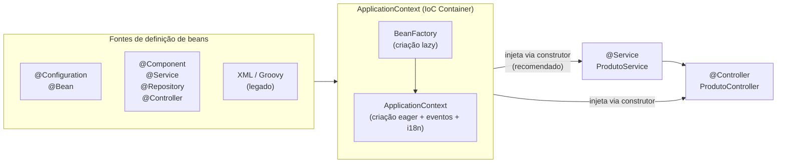

### B.2 `@Configuration` e `proxyBeanMethods`

`@Configuration` marca uma classe como **fonte de definições de beans** para o
container. Por padrão, o Spring cria um **proxy CGLIB** da classe para garantir
que chamadas entre métodos `@Bean` dentro da mesma classe retornem sempre a
**mesma instância** (comportamento de singleton).

```java
// ─── proxyBeanMethods = true (DEFAULT) ───────────────────────────────────────
//
// O Spring cria um proxy CGLIB da classe.
// Chamadas entre métodos @Bean são interceptadas:
//   dataSource() chamado por jdbcClient() retorna o MESMO bean do container.
// Use quando um @Bean chama outro @Bean da mesma classe.
@Configuration   // equivalente a @Configuration(proxyBeanMethods = true)
public class DataConfig {

    @Bean
    public DataSource dataSource() {
        var ds = new HikariDataSource();
        ds.setJdbcUrl("jdbc:postgresql://localhost:5432/mydb");
        return ds;
    }

    @Bean
    public JdbcClient jdbcClient() {
        // Chama dataSource() — o proxy intercepta e retorna o bean singleton,
        // NÃO cria uma segunda instância de HikariDataSource.
        return JdbcClient.create(dataSource());
    }

    @Bean
    public PlatformTransactionManager transactionManager() {
        // Mesma chamada interceptada — mesma instância de DataSource
        return new DataSourceTransactionManager(dataSource());
    }
}

// ─── proxyBeanMethods = false ─────────────────────────────────────────────────
//
// Sem proxy CGLIB: a classe é instanciada diretamente.
// Benefícios: startup mais rápido, menor uso de memória, melhor para GraalVM native.
// Restrição: métodos @Bean NÃO podem chamar outros @Bean da mesma classe
//            (cada chamada criaria uma nova instância, quebrando o singleton).
// Use quando os beans são independentes entre si — ex.: configurações simples.
@Configuration(proxyBeanMethods = false)
public class WebConfig {

    @Bean
    public ObjectMapper objectMapper() {
        return JsonMapper.builder()
                .findAndAddModules()
                .disable(SerializationFeature.WRITE_DATES_AS_TIMESTAMPS)
                .build();
    }

    @Bean
    public ModelMapper modelMapper() {
        var mm = new ModelMapper();
        mm.getConfiguration().setMatchingStrategy(MatchingStrategies.STRICT);
        return mm;
    }
    // objectMapper() e modelMapper() são independentes — sem chamadas cruzadas.
    // proxyBeanMethods = false é seguro aqui e melhora a performance de startup.
}
```

**Resumo:**

| | `proxyBeanMethods = true` (default) | `proxyBeanMethods = false` |
|---|---|---|
| Proxy CGLIB gerado | ✅ Sim | ❌ Não |
| Chamadas entre `@Bean` retornam singleton | ✅ Sim | ❌ Não (nova instância a cada chamada) |
| Performance de startup | Ligeiramente mais lenta | ✅ Mais rápida |
| Compatível com GraalVM Native | ⚠️ Limitado | ✅ Preferível |
| **Use quando** | Beans dependem uns dos outros na config | Beans são declarados independentemente |

### B.3 `@Bean`

`@Bean` declara que um método de uma classe `@Configuration` produz um bean
gerenciado pelo container. É a forma de registrar objetos de terceiros (que não
podem receber `@Component`) ou quando a criação exige lógica.

```java
@Configuration(proxyBeanMethods = false)
public class InfraConfig {

    // ─── Bean com nome explícito ──────────────────────────────────────────────
    // Por padrão o nome é o nome do método. name= sobrescreve.
    @Bean(name = "primaryDataSource")
    public DataSource dataSource(
            @Value("${spring.datasource.url}") String url,
            @Value("${spring.datasource.username}") String username,
            @Value("${spring.datasource.password}") String password) {
        var ds = new HikariDataSource();
        ds.setJdbcUrl(url);
        ds.setUsername(username);
        ds.setPassword(password);
        return ds;
    }

    // ─── Escopo do bean ───────────────────────────────────────────────────────
    // @Scope("singleton") é o padrão — um único bean compartilhado.
    // Outros escopos: prototype (nova instância por injeção), request, session.
    @Bean
    @Scope("prototype")
    public EmailBuilder emailBuilder() {
        return new EmailBuilder();  // nova instância a cada ponto de injeção
    }

    // ─── @Primary — bean preferido quando há múltiplas implementações ─────────
    @Bean
    @Primary
    public CacheManager redisCacheManager(RedisConnectionFactory factory) {
        return RedisCacheManager.builder(factory).build();
    }

    @Bean
    public CacheManager caffeineCacheManager() {
        return new CaffeineCacheManager();
    }

    // ─── @Qualifier — identifica bean específico quando há múltiplos ──────────
    // (usado na injeção, ver seção B.5)

    // ─── Lifecycle callbacks ──────────────────────────────────────────────────
    @Bean(initMethod = "connect", destroyMethod = "disconnect")
    public ExternalApiClient apiClient() {
        return new ExternalApiClient("https://api.externa.com.br");
    }

    // Alternativa: @PostConstruct / @PreDestroy na própria classe do bean
}
```

### B.4 `@Component` e Especializações (Stereotype Annotations)

`@Component` é a anotação base de **detecção automática**: o Spring varre o
classpath por componentes anotados e os registra como beans. As demais são
especializações semânticas — todas se comportam como `@Component`, mas comunicam
a intenção e habilitam comportamentos adicionais.

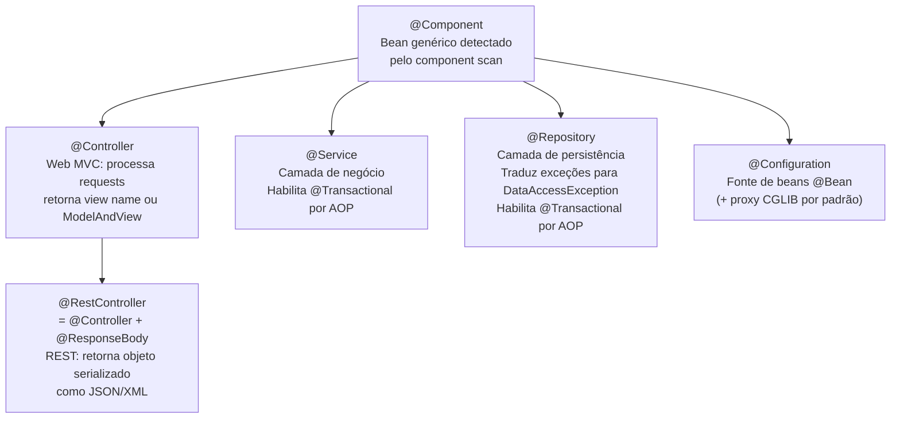

```java
// ─── @Component — uso genérico ────────────────────────────────────────────────
// Para utilitários, helpers, e componentes que não se encaixam nas outras camadas
@Component
public class CpfFormatter {
    public String formatar(String cpf) { /* ... */ return cpf; }
    public String desformatar(String cpf) { /* ... */ return cpf; }
}

// ─── @Service — camada de negócio ────────────────────────────────────────────
// Semanticamente indica "lógica de aplicação/domínio".
// @Transactional na classe ou método funciona aqui via AOP proxy.
@Service
@Transactional(readOnly = true)   // padrão de leitura; sobrescrito nos métodos de escrita
public class ProdutoService {

    private final ProdutoRepository produtoRepository;

    public ProdutoService(ProdutoRepository produtoRepository) {
        this.produtoRepository = produtoRepository;
    }

    public Optional<ProdutoResponse> buscarPorId(Long id) {
        return produtoRepository.findById(id).map(ProdutoResponse::from);
    }

    @Transactional   // escrita: sobrescreve o readOnly=true da classe
    public ProdutoResponse criar(ProdutoRequest request) {
        var produto = Produto.from(request);
        return ProdutoResponse.from(produtoRepository.save(produto));
    }
}

// ─── @Repository — camada de dados ───────────────────────────────────────────
// Habilita tradução automática de exceções de infraestrutura
// (SQLException, JPA exceptions) para a hierarquia DataAccessException do Spring.
// Permite que a camada de serviço trate exceções sem acoplamento ao JPA/JDBC.
@Repository
public class ProdutoJdbcRepository {

    private final JdbcClient jdbcClient;

    public ProdutoJdbcRepository(JdbcClient jdbcClient) {
        this.jdbcClient = jdbcClient;
    }

    public Optional<Produto> findById(Long id) {
        return jdbcClient.sql("SELECT * FROM produtos WHERE id = :id")
                .param("id", id)
                .query(Produto.class)
                .optional();
    }
}
// Nota: interfaces que estendem JpaRepository / CrudRepository já são detectadas
// como @Repository pelo Spring Data — não é necessário declarar a anotação.

// ─── @Controller e @RestController — camada web ───────────────────────────────
// Ver seções 3 e 4 para exemplos completos.
// A diferença fundamental:
//   @Controller       → retorna nome de view (String) ou ModelAndView (SSR)
//   @RestController   → retorna objeto serializado para o corpo HTTP (REST)
```

### B.5 `@Autowired` — Injeção de Dependência e a Boa Prática Atual

`@Autowired` instrui o container a injetar um bean no ponto anotado. Pode ser
aplicada em **campos**, **setters** ou **construtores**.

```java
// ─── EVITAR: injeção por campo (@Autowired no campo) ─────────────────────────
//
// ❌ Problemas:
//   - Impossibilita testes unitários sem o container (não dá para usar "new")
//   - Oculta as dependências — a assinatura da classe não as declara
//   - Viola o princípio da imutabilidade: o campo não pode ser "final"
//   - Reflation acoplada ao Spring (não funciona fora do contexto Spring)
@Service
public class ProdutoServiceRuim {
    @Autowired                          // ← EVITAR
    private ProdutoRepository repository;

    @Autowired                          // ← EVITAR
    private CategoriaService categoriaService;
}

// ─── EVITAR: injeção por setter ───────────────────────────────────────────────
//
// ❌ Permite que dependências obrigatórias sejam omitidas (NullPointerException)
// ✅ Aceitável apenas para dependências OPCIONAIS (@Autowired(required = false))
@Service
public class ProdutoServiceSetter {
    private ProdutoRepository repository;

    @Autowired                          // ← EVITAR para dependências obrigatórias
    public void setRepository(ProdutoRepository repository) {
        this.repository = repository;
    }
}

// ─── RECOMENDADO: injeção por construtor, sem @Autowired ─────────────────────
//
// ✅ Desde o Spring 4.3: quando há UM único construtor, @Autowired é opcional.
//    O Spring injeta automaticamente — a anotação é redundante.
// ✅ Vantagens:
//   - Campos podem ser "final" — imutabilidade garantida
//   - Dependências explícitas na assinatura do construtor
//   - Classe pode ser instanciada com "new" nos testes (sem container)
//   - Código mais limpo e autoexplicativo
@Service
public class ProdutoService {

    private final ProdutoRepository   produtoRepository;   // final!
    private final CategoriaService    categoriaService;    // final!
    private final ApplicationEventPublisher eventPublisher; // final!

    // @Autowired DESNECESSÁRIO — Spring injeta automaticamente (único construtor)
    public ProdutoService(ProdutoRepository produtoRepository,
                          CategoriaService categoriaService,
                          ApplicationEventPublisher eventPublisher) {
        this.produtoRepository = produtoRepository;
        this.categoriaService  = categoriaService;
        this.eventPublisher    = eventPublisher;
    }
}

// ─── @Qualifier — quando há múltiplas implementações do mesmo tipo ────────────
@Service
public class NotificacaoService {

    private final CacheManager cacheManager;

    // @Qualifier seleciona pelo nome do bean quando @Primary não é suficiente
    public NotificacaoService(
            @Qualifier("caffeineCacheManager") CacheManager cacheManager) {
        this.cacheManager = cacheManager;
    }
}

// ─── @Autowired(required = false) — dependência opcional ─────────────────────
// Único caso em que setter injection é aceitável
@Component
public class MetricasCollector {

    private MeterRegistry meterRegistry;  // pode ser null se Micrometer não estiver no classpath

    @Autowired(required = false)
    public void setMeterRegistry(MeterRegistry meterRegistry) {
        this.meterRegistry = meterRegistry;
    }

    public void registrar(String evento) {
        if (meterRegistry != null) {
            meterRegistry.counter(evento).increment();
        }
    }
}

// ─── Dependência opcional com injeção por construtor ─────────────────────────
//
// Com construtor, há três formas de declarar uma dependência opcional,
// sem precisar recorrer a @Autowired(required = false) em setter.

// Forma 1: Optional<T> — mais explícita e idiomática (Java 8+)
// O container injeta Optional.empty() se o bean não estiver registrado.
// Vantagem: a assinatura do construtor comunica claramente a opcionalidade.
@Service
public class NotificacaoService {

    private final EmailService         emailService;
    private final Optional<SmsService> smsService;   // ausente → Optional.empty()

    public NotificacaoService(EmailService emailService,
                               Optional<SmsService> smsService) {
        this.emailService = emailService;
        this.smsService   = smsService;
    }

    public void notificar(String destinatario, String mensagem) {
        emailService.enviar(destinatario, mensagem);
        smsService.ifPresent(sms -> sms.enviar(destinatario, mensagem));
    }
}

// Forma 2: @Nullable — null-safe sem wrapper
// O container injeta null se o bean não estiver registrado.
// Vantagem: sem overhead do Optional, idiomático com JSpecify (projeto já usa @NullMarked).
// Atenção: requer null-check explícito no uso — certifique-se de tratar o null.
@Service
public class RelatorioService {

    private final ProdutoRepository      produtoRepository;
    private final @Nullable AuditService auditService;   // null se não registrado

    public RelatorioService(ProdutoRepository produtoRepository,
                             @Nullable AuditService auditService) {
        this.produtoRepository = produtoRepository;
        this.auditService      = auditService;
    }

    public RelatorioResponse gerar(Long id) {
        var relatorio = produtoRepository.findById(id).orElseThrow();
        if (auditService != null) {
            auditService.registrar("relatorio.gerado", id);
        }
        return RelatorioResponse.from(relatorio);
    }
}

// Forma 3: ObjectProvider<T> — mais poderoso; resolve lazy, múltiplos beans e protótipos
//
// ObjectProvider é a forma mais flexível:
//   getIfAvailable()  — retorna null (sem exceção) se o bean não existir
//   ifAvailable(cb)   — executa o callback apenas se o bean existir
//   stream()          — itera sobre TODAS as implementações registradas
//   getObject(args)   — cria nova instância (útil para beans @Prototype)
//
// Vantagem extra: o bean alvo só é resolvido/criado quando getIfAvailable()
// ou ifAvailable() é chamado — comportamento lazy implícito.
@Service
public class ExportacaoService {

    private final ProdutoRepository          produtoRepository;
    private final ObjectProvider<PdfExporter> pdfExporterProvider;

    public ExportacaoService(ProdutoRepository produtoRepository,
                              ObjectProvider<PdfExporter> pdfExporterProvider) {
        this.produtoRepository   = produtoRepository;
        this.pdfExporterProvider = pdfExporterProvider;
    }

    public byte[] exportarPdf(Long id) {
        var produto = produtoRepository.findById(id).orElseThrow();

        // Lança NoSuchBeanDefinitionException se PdfExporter não estiver registrado
        // — use quando o bean é obrigatório mas de resolução lazy
        // return pdfExporterProvider.getObject().exportar(produto);

        // Retorna null sem exceção se PdfExporter não estiver disponível
        PdfExporter exporter = pdfExporterProvider.getIfAvailable();
        if (exporter == null) {
            throw new NegocioException("Exportação PDF não está habilitada neste ambiente");
        }
        return exporter.exportar(produto);
    }

    public void notificarTodosExportadores(Long id) {
        var produto = produtoRepository.findById(id).orElseThrow();
        // stream() itera sobre TODOS os beans do tipo Exporter registrados
        pdfExporterProvider.stream().forEach(e -> e.exportar(produto));
    }
}

// ─── Comparativo: quando usar cada forma de dependência opcional ──────────────
//
// | Abordagem              | Quando preferir                                      |
// |------------------------|------------------------------------------------------|
// | Optional<T>            | Forma mais legível — comunicação explícita na API    |
// | @Nullable              | Sem overhead; projeto já usa JSpecify/@NullMarked    |
// | ObjectProvider<T>      | Lazy, múltiplas implementações, beans @Prototype     |
// | @Autowired(req=false)  | Apenas para setter — nunca no construtor             |

// ─── @Lazy — inicialização tardia do bean ─────────────────────────────────────
//
// Por padrão o Spring inicializa todos os beans singleton na subida do contexto
// (eager initialization). @Lazy adia a criação do bean para o momento em que
// ele é acessado pela primeira vez.
//
// ONDE pode ser aplicado:
//   - Na declaração do bean (@Component, @Service, @Bean): define o bean como lazy.
//   - No ponto de injeção (construtor, setter): injeta um proxy que inicializa
//     o bean real somente na primeira chamada ao proxy — mesmo que o bean alvo
//     não seja lazy por definição.
//
// QUANDO usar:
//   ✅ Beans pesados raramente usados (ex.: cliente de integração, gerador de PDF)
//   ✅ Acelerar o startup em desenvolvimento (todos os beans lazy via property)
//   ✅ Quebrar dependências circulares (solução paliativa — prefira refatorar)
//   ❌ Beans críticos ao funcionamento da aplicação — erros de configuração
//      só aparecem na primeira chamada, não no startup
//   ❌ Beans que precisam de validação de configuração no startup

// Caso 1: bean marcado como lazy em sua própria declaração
@Service
@Lazy   // o Spring não cria esta instância na subida — apenas quando for injetada/acessada
public class RelatorioExcelService {

    // Construtor pesado: carrega templates, inicializa Apache POI, etc.
    public RelatorioExcelService() {
        // simulação de inicialização cara
    }

    public byte[] gerar(Long relatorioId) {
        // gera o Excel...
        return new byte[0];
    }
}

// Caso 2: @Lazy no ponto de injeção — injeta um proxy CGLIB do bean alvo
// O bean real só é criado na primeira chamada a qualquer método do proxy.
// Útil quando o bean A depende de B mas raramente usa B em runtime.
@Service
public class PedidoService {

    private final PedidoRepository      pedidoRepository;
    private final RelatorioExcelService relatorioService;  // raramente usado

    public PedidoService(
            PedidoRepository pedidoRepository,
            @Lazy RelatorioExcelService relatorioService) {
            // ↑ proxy injetado na construção; RelatorioExcelService só é instanciado
            //   quando relatorioService.gerar(...) for chamado pela primeira vez
        this.pedidoRepository = pedidoRepository;
        this.relatorioService = relatorioService;
    }

    public PedidoResponse buscar(Long id) {
        // relatorioService.gerar() não é chamado aqui — o bean real ainda não existe
        return pedidoRepository.findById(id).map(PedidoResponse::from).orElseThrow();
    }

    public byte[] exportarRelatorio(Long pedidoId) {
        // Primeira chamada a relatorioService: o proxy inicializa o bean real agora
        return relatorioService.gerar(pedidoId);
    }
}

// Caso 3: lazy global via application.yml — útil em desenvolvimento
// Reduz o tempo de startup consideravelmente em projetos grandes.
// ⚠️  Não recomendado em produção: erros de configuração só aparecem em runtime.
//
// spring:
//   main:
//     lazy-initialization: true  # torna TODOS os beans lazy por padrão
//
// Para forçar beans críticos como eager mesmo com lazy global:
@Service
@Lazy(false)   // eager mesmo quando spring.main.lazy-initialization=true
public class SecurityAuditService {
    // bean crítico que deve falhar no startup se mal configurado
}
```

### B.6 Component Scan — Como o Spring Detecta os Beans

```java
// A anotação @SpringBootApplication combina três anotações:
//   @SpringBootConfiguration  → @Configuration especializado
//   @EnableAutoConfiguration  → ativa os starters / auto-config
//   @ComponentScan            → varre o pacote da classe e subpacotes

@SpringBootApplication   // escaneia br.com.empresa.app e TODOS os subpacotes
public class MeuAppApplication {
    public static void main(String[] args) {
        SpringApplication.run(MeuAppApplication.class, args);
    }
}

// ─── Para escanear pacotes adicionais ou customizar o scan ────────────────────
@SpringBootApplication(
    scanBasePackages = {
        "br.com.empresa.app",
        "br.com.empresa.shared"   // pacotes externos ao projeto principal
    }
)
public class MeuAppApplication { /* ... */ }

// ─── @ComponentScan em @Configuration separado ────────────────────────────────
@Configuration
@ComponentScan(
    basePackages = "br.com.empresa.plugins",
    excludeFilters = @ComponentScan.Filter(
        type = FilterType.ANNOTATION,
        classes = TestComponent.class   // exclui beans de teste
    )
)
public class PluginConfig { }
```

### B.7 Boas Práticas Resumidas

```java
// ✅ DO — Injeção por construtor sem @Autowired
@Service
public class PedidoService {
    private final PedidoRepository repository;
    private final EstoqueService    estoqueService;

    public PedidoService(PedidoRepository repository, EstoqueService estoqueService) {
        this.repository      = repository;
        this.estoqueService  = estoqueService;
    }
}

// ✅ DO — @Configuration(proxyBeanMethods = false) quando beans não se chamam
@Configuration(proxyBeanMethods = false)
public class AppConfig {
    @Bean public ObjectMapper objectMapper() { /* ... */ }
    @Bean public ModelMapper modelMapper()   { /* ... */ }
}

// ✅ DO — @Configuration (proxy ativo) quando beans dependem uns dos outros
@Configuration
public class DataConfig {
    @Bean DataSource dataSource() { /* ... */ }
    @Bean JdbcClient jdbcClient() { return JdbcClient.create(dataSource()); }
}

// ✅ DO — @Qualifier para desambiguar múltiplas implementações
@Service
public class RelatorioService {
    public RelatorioService(@Qualifier("pdfExporter") Exporter exporter) { /* ... */ }
}

// ❌ DON'T — @Autowired em campo
@Service
public class Ruim {
    @Autowired private Repositorio rep;  // ← não faça
}

// ❌ DON'T — @Autowired(required = true) explícito em construtor (redundante)
@Service
public class Redundante {
    @Autowired  // ← desnecessário com Spring 4.3+ e único construtor
    public Redundante(Servico servico) { /* ... */ }
}
```

---

### B.8 `ApplicationContext` — Acesso Programático ao Container

O `ApplicationContext` é a interface central do IoC container. Em situações onde
a injeção de dependência declarativa não é possível (factories estáticos, código
legado, integrações dinâmicas), é possível acessar beans programaticamente.

> **Regra de ouro:** prefira sempre a injeção por construtor (seção B.5). Acesso
> programático ao `ApplicationContext` é um escape hatch — use com parcimônia e
> documente o motivo.

#### B.8.1 Injetando o próprio `ApplicationContext`

```java
// O ApplicationContext é um bean como qualquer outro — pode ser injetado.
// Use quando precisar de acesso dinâmico ao container dentro de um bean Spring.
@Component
public class BeanLocator {

    private final ApplicationContext context;

    public BeanLocator(ApplicationContext context) {
        this.context = context;
    }

    // ─── Buscar bean pelo tipo ─────────────────────────────────────────────────
    public <T> T getBean(Class<T> tipo) {
        // Lança NoSuchBeanDefinitionException se não houver bean do tipo
        // Lança NoUniqueBeanDefinitionException se houver mais de um
        return context.getBean(tipo);
    }

    // ─── Buscar bean pelo nome e tipo (evita ambiguidade) ─────────────────────
    public <T> T getBean(String nome, Class<T> tipo) {
        return context.getBean(nome, tipo);
    }

    // ─── Verificar se um bean existe antes de buscá-lo ────────────────────────
    public boolean contemBean(String nome) {
        return context.containsBean(nome);
    }

    // ─── Listar todos os beans de um tipo (ex: todos os EventListener) ─────────
    public <T> Map<String, T> getBeansDoTipo(Class<T> tipo) {
        return context.getBeansOfType(tipo);
    }

    // ─── Verificar se o bean é singleton ou prototype ─────────────────────────
    public boolean eSingleton(String nome) {
        return context.isSingleton(nome);
    }
}
```

#### B.8.2 `ApplicationContextAware` — receber o contexto via callback

Útil quando o bean não pode usar injeção por construtor (ex.: classes instanciadas
por frameworks externos como JPA, Jackson ou em testes de integração legados).

```java
/**
 * Implementar ApplicationContextAware faz o Spring chamar setApplicationContext()
 * logo após construir e configurar o bean, antes de qualquer @PostConstruct.
 *
 * Prefira injeção por construtor quando possível — esta abordagem é um fallback
 * para situações onde o bean é criado fora do controle direto do container.
 */
@Component
public class SpringContextHolder implements ApplicationContextAware {

    // Static para que o contexto fique acessível sem referência ao bean
    // (ex.: chamado de código estático legado)
    private static ApplicationContext applicationContext;

    @Override
    public void setApplicationContext(ApplicationContext ctx) {
        SpringContextHolder.applicationContext = ctx;
    }

    // ─── Ponto de acesso estático — use apenas quando injeção não for viável ───
    public static ApplicationContext getContext() {
        if (applicationContext == null) {
            throw new IllegalStateException(
                "ApplicationContext não foi inicializado. " +
                "Certifique-se de que SpringContextHolder é um bean Spring.");
        }
        return applicationContext;
    }

    public static <T> T getBean(Class<T> tipo) {
        return getContext().getBean(tipo);
    }

    public static <T> T getBean(String nome, Class<T> tipo) {
        return getContext().getBean(nome, tipo);
    }
}

// Uso em código legado ou estático que não pode receber injeção:
public class UtilitarioLegado {

    public static void processarPedido(Long id) {
        // Apenas quando não há outra alternativa — documente o motivo
        var service = SpringContextHolder.getBean(PedidoService.class);
        service.confirmar(id);
    }
}
```

#### B.8.3 Acesso programático a beans com nome dinâmico

```java
/**
 * Caso de uso: estratégia dinâmica onde o nome do bean é determinado em runtime
 * (ex.: Strategy Pattern com seleção por enum ou configuração).
 */
@Service
public class ExportacaoDispatcher {

    private final ApplicationContext context;

    public ExportacaoDispatcher(ApplicationContext context) {
        this.context = context;
    }

    /**
     * Seleciona o bean exportador conforme o formato solicitado.
     * Os beans são nomeados por convenção: "pdfExporter", "csvExporter", etc.
     *
     * Alternativa mais type-safe: Map<String, Exporter> injetado por construtor
     * (o Spring popula o Map com todos os beans do tipo Exporter automaticamente).
     */
    public byte[] exportar(Long relatorioId, String formato) {
        String nomeDoBean = formato.toLowerCase() + "Exporter"; // "pdfExporter"

        if (!context.containsBean(nomeDoBean)) {
            throw new NegocioException(
                    "Formato de exportação não suportado: " + formato);
        }

        Exporter exporter = context.getBean(nomeDoBean, Exporter.class);
        return exporter.exportar(relatorioId);
    }
}

// ─── Alternativa preferível: injeção de Map<String, Exporter> ─────────────────
// O Spring injeta automaticamente todos os beans do tipo Exporter,
// usando o nome do bean como chave — sem acesso direto ao ApplicationContext.
@Service
public class ExportacaoDispatcherV2 {

    // Spring popula o map: {"pdfExporter" → PdfExporter, "csvExporter" → CsvExporter}
    private final Map<String, Exporter> exporters;

    public ExportacaoDispatcherV2(Map<String, Exporter> exporters) {
        this.exporters = exporters;
    }

    public byte[] exportar(Long relatorioId, String formato) {
        Exporter exporter = exporters.get(formato.toLowerCase() + "Exporter");
        if (exporter == null) {
            throw new NegocioException("Formato não suportado: " + formato);
        }
        return exporter.exportar(relatorioId);
    }
}
```

#### B.8.4 Publicação e escuta de eventos via `ApplicationContext`

O `ApplicationContext` também é um **event bus** interno — permite comunicação
desacoplada entre beans sem dependência direta.

```java
// ─── Definição do evento ──────────────────────────────────────────────────────
// Recomendado: Record (imutável, sem herança de ApplicationEvent necessária — Spring 4.2+)
public record PedidoConfirmadoEvent(Long pedidoId, String clienteEmail, Instant ocorridoEm) {}

// ─── Publicação do evento no Service ─────────────────────────────────────────
@Service
public class PedidoService {

    private final PedidoRepository         pedidoRepository;
    private final ApplicationEventPublisher eventPublisher;   // interface mais estreita que ApplicationContext

    public PedidoService(PedidoRepository pedidoRepository,
                          ApplicationEventPublisher eventPublisher) {
        this.pedidoRepository = pedidoRepository;
        this.eventPublisher   = eventPublisher;
    }

    @Transactional
    public void confirmar(Long id) {
        var pedido = pedidoRepository.findById(id).orElseThrow();
        pedido.confirmar();
        pedidoRepository.save(pedido);

        // Publica o evento APÓS o commit — listeners são chamados de forma síncrona
        // por padrão; use @TransactionalEventListener para garantir pós-commit.
        eventPublisher.publishEvent(
            new PedidoConfirmadoEvent(pedido.getId(), pedido.getClienteEmail(), Instant.now())
        );
    }
}

// ─── Listener do evento ───────────────────────────────────────────────────────
@Component
public class PedidoConfirmadoListener {

    private final EmailService emailService;

    public PedidoConfirmadoListener(EmailService emailService) {
        this.emailService = emailService;
    }

    // @TransactionalEventListener: só executa após o commit da transação que publicou o evento.
    // Evita enviar e-mail se a transação do Service for revertida (rollback).
    @TransactionalEventListener(phase = TransactionPhase.AFTER_COMMIT)
    public void onPedidoConfirmado(PedidoConfirmadoEvent evento) {
        emailService.enviarConfirmacao(evento.clienteEmail(), evento.pedidoId());
    }

    // @Async: processa em thread separada para não bloquear a transação principal
    @EventListener
    @Async
    public void onPedidoConfirmadoAsync(PedidoConfirmadoEvent evento) {
        // notificações secundárias, analytics, etc.
    }
}
```

> **`ApplicationContext` vs `ApplicationEventPublisher`:** sempre injete a interface
> mais estreita. Se o bean só precisa publicar eventos, declare
> `ApplicationEventPublisher` — não `ApplicationContext`. Isso deixa a intenção
> clara e facilita os testes (mock mais simples).

---

## 1. Arquitetura do Spring MVC

### 1.1 Ciclo de Vida de uma Requisição

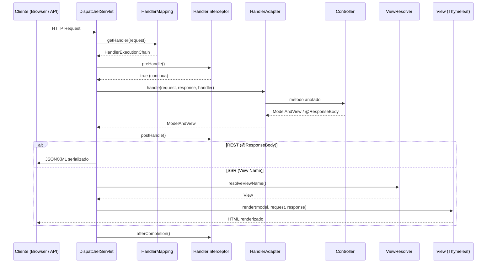

### 1.2 Componentes Principais

```mermaid
graph TB
    subgraph "Camada Web"
        DS[DispatcherServlet<br/>Front Controller]
        HM[HandlerMapping<br/>RequestMappingHandlerMapping]
        HA[HandlerAdapter<br/>RequestMappingHandlerAdapter]
        VR[ViewResolver<br/>ThymeleafViewResolver]
    end

    subgraph "Suporte"
        HI[HandlerInterceptor]
        EH[ExceptionHandler<br/>@ControllerAdvice]
        MC[MessageConverter<br/>JSON/XML/Form]
        DT[DataBinder<br/>InitBinder + Formatters]
    end

    subgraph "Controllers"
        RC[@RestController<br/>REST APIs]
        VC[@Controller<br/>SSR + Thymeleaf]
    end

    DS --> HM --> HA
    HA --> RC
    HA --> VC
    HA --> DT
    DS --> HI
    DS --> EH
    HA --> MC
    VC --> VR
```

### 1.3 Fluxo Visual — SSR (Thymeleaf)

O diagrama abaixo representa o ciclo completo de uma requisição SSR, com cada componente e o fluxo de dados entre eles — padrão clássico de Front Controller.

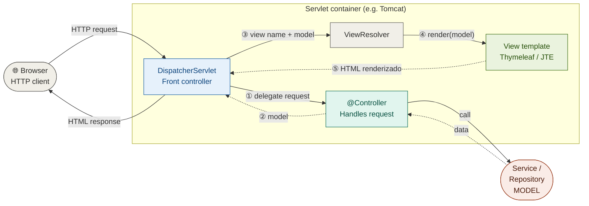

**Passos do fluxo SSR:**

| Passo | Ação |
|-------|------|
| ① DS → @Controller | Delega via `HandlerMapping` ao handler correto |
| ② @Controller → DS | Retorna `ModelAndView` com dados e nome da view |
| ③ DS → ViewResolver | Resolve o nome lógico para uma `View` concreta |
| ④ ViewResolver → Thymeleaf | Template engine renderiza o HTML com o `Model` |
| ⑤ View → DS | HTML pronto é enviado ao browser |

### 1.4 Fluxo Visual — REST API (JSON)

Na arquitetura REST **não há ViewResolver nem template engine**. O `@RestController` retorna objetos Java serializados pelo `HttpMessageConverter` (Jackson).

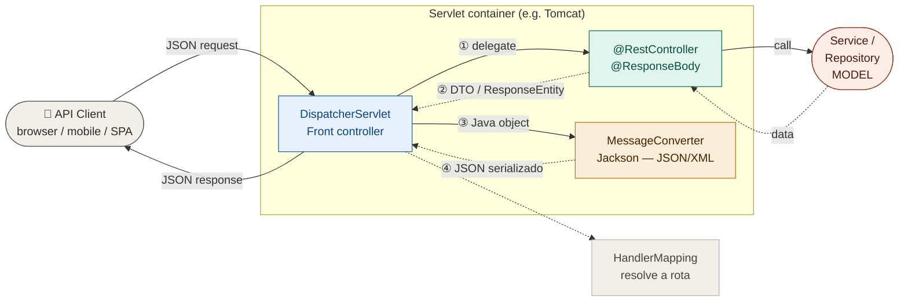

### 1.5 Diferença Fundamental: REST vs MVC SSR

| Aspecto | REST (`@RestController`) | SSR (`@Controller` + Thymeleaf) |
|---|---|---|
| Retorno | Objeto serializado (JSON/XML) | Nome da view ou `ModelAndView` |
| Cliente | SPA, mobile, outro serviço | Browser (requisição completa) |
| Estado | Stateless (JWT/OAuth2) | Session ou stateless |
| Formulários | Não aplicável | `@ModelAttribute` + BindingResult |
| Validação | `@Valid` no `@RequestBody` | `@Valid` no `@ModelAttribute` |
| Redirect | `ResponseEntity` com Location | `"redirect:/caminho"` |

---

## 2. Configuração Base

### 2.1 Dependências Maven

A tabela abaixo resume o que cada starter ativa automaticamente via
auto-configuração do Spring Boot — sem nenhuma linha de código adicional:

| Starter | Auto-configurações ativadas |
|---|---|
| `spring-boot-starter-web` | `DispatcherServlet`, `Jackson`, `Tomcat`, `CharacterEncodingFilter`, `HiddenHttpMethodFilter`, recursos estáticos, `ContentNegotiationStrategy` |
| `spring-boot-starter-validation` | `LocalValidatorFactoryBean` (Bean Validation), `MethodValidationPostProcessor` |
| `spring-boot-starter-thymeleaf` | `ThymeleafViewResolver`, `SpringTemplateEngine`, `ClassLoaderTemplateResolver` |
| `spring-boot-starter-data-jpa` | `PageableHandlerMethodArgumentResolver` (Pageable em controllers), `SortHandlerMethodArgumentResolver` |
| `springdoc-openapi-starter-webmvc-ui` | Endpoint `/api-docs`, `/swagger-ui.html`, `OpenApiWebMvcResource` |
| `spring-boot-starter-actuator` | Endpoints `/actuator/*`, métricas, health |

```xml
<!-- REST APIs -->
<!-- ✅ Auto-configura: DispatcherServlet, Jackson ObjectMapper, Tomcat, CORS básico -->
<dependency>
    <groupId>org.springframework.boot</groupId>
    <artifactId>spring-boot-starter-web</artifactId>
</dependency>

<!-- ✅ Auto-configura: LocalValidatorFactoryBean e MethodValidationPostProcessor -->
<!-- ⚠️  NÃO conecta o validador ao MessageSource do Spring (ver seção 12.6) -->
<dependency>
    <groupId>org.springframework.boot</groupId>
    <artifactId>spring-boot-starter-validation</artifactId>
</dependency>

<!-- SSR com Thymeleaf -->
<!-- ✅ Auto-configura: ThymeleafViewResolver, SpringTemplateEngine, templates em /templates/ -->
<dependency>
    <groupId>org.springframework.boot</groupId>
    <artifactId>spring-boot-starter-thymeleaf</artifactId>
</dependency>

<!-- ❌ Não auto-configurado: precisa ser registrado manualmente como bean TemplateEngine -->
<dependency>
    <groupId>nz.net.ultraq.thymeleaf</groupId>
    <artifactId>thymeleaf-layout-dialect</artifactId>
</dependency>

<!-- ❌ Não auto-configurado: requer declaração explícita em ThymeleafConfig -->
<dependency>
    <groupId>org.thymeleaf.extras</groupId>
    <artifactId>thymeleaf-extras-springsecurity6</artifactId>
</dependency>

<!-- OpenAPI / Swagger UI -->
<!-- ✅ Auto-configura: /api-docs e /swagger-ui.html quando no classpath -->
<dependency>
    <groupId>org.springdoc</groupId>
    <!-- Spring Boot 4: usar springdoc-openapi-starter-webmvc-ui versão 3.x -->
    <artifactId>springdoc-openapi-starter-webmvc-ui</artifactId>
    <version>2.8.8</version>
</dependency>

<!-- Webjars para SSR (Bootstrap, Font Awesome) -->
<!-- ✅ Auto-configura: /webjars/** mapeado automaticamente pelo ResourceHandlerRegistry -->
<dependency>
    <groupId>org.webjars</groupId>
    <artifactId>webjars-locator-lite</artifactId>
</dependency>
<dependency>
    <groupId>org.webjars</groupId>
    <artifactId>bootstrap</artifactId>
    <version>5.3.3</version>
</dependency>
```

### 2.2 Configuração MVC Centralizada

> **`@EnableWebMvc` vs `WebMvcConfigurer`**
>
> O Spring Boot auto-configura todo o Spring MVC via `WebMvcAutoConfiguration`.
> Ao usar `WebMvcConfigurer` (sem `@EnableWebMvc`), você *adiciona* comportamento
> sem quebrar a auto-configuração — é a abordagem recomendada.
> `@EnableWebMvc` **desativa** a auto-configuração do Boot e exige que tudo seja
> configurado manualmente (sem defaults de Jackson, sem `ResourceHandlers`, etc.).
> Use `@EnableWebMvc` apenas se precisar de controle absoluto sobre a stack MVC.

```java
@Configuration
// @EnableWebMvc  ← EVITE: desativa WebMvcAutoConfiguration e todos os seus defaults
//                  Use apenas se precisar substituir completamente a stack MVC.
//                  Com Spring Boot, prefira apenas WebMvcConfigurer sem esta anotação.
public class WebMvcConfig implements WebMvcConfigurer {

    // ─── Recursos estáticos ──────────────────────────────────────────────────
    @Override
    public void addResourceHandlers(ResourceHandlerRegistry registry) {
        registry.addResourceHandler("/static/**")
                .addResourceLocations("classpath:/static/")
                .setCacheControl(CacheControl.maxAge(1, TimeUnit.HOURS).cachePublic());

        // Webjars com versionamento automático
        registry.addResourceHandler("/webjars/**")
                .addResourceLocations("classpath:/META-INF/resources/webjars/")
                .resourceChain(true)
                .addResolver(new WebJarsResourceResolver());
    }

    // ─── CORS global ─────────────────────────────────────────────────────────
    @Override
    public void addCorsMappings(CorsRegistry registry) {
        registry.addMapping("/api/**")
                .allowedOrigins("https://app.example.com")
                .allowedMethods("GET", "POST", "PUT", "DELETE", "PATCH", "OPTIONS")
                .allowedHeaders("*")
                .allowCredentials(true)
                .maxAge(3600);
    }

    // ─── Interceptors ────────────────────────────────────────────────────────
    @Override
    public void addInterceptors(InterceptorRegistry registry) {
        registry.addInterceptor(new AuditInterceptor())
                .addPathPatterns("/api/**")
                .excludePathPatterns("/api/health");

        registry.addInterceptor(new LocaleChangeInterceptor())
                .addPathPatterns("/**");
    }

    // ─── Resolução de locale ──────────────────────────────────────────────────
    @Bean
    public LocaleResolver localeResolver() {
        CookieLocaleResolver resolver = new CookieLocaleResolver("APP_LOCALE");
        resolver.setDefaultLocale(new Locale("pt", "BR"));
        return resolver;
    }

    // ─── Formatters e Converters (seção 7) ───────────────────────────────────
    @Override
    public void addFormatters(FormatterRegistry registry) {
        registry.addConverter(new StringToMoneyConverter());
        registry.addFormatter(new BrazilianDateFormatter());
        registry.addConverterFactory(new StringToEnumConverterFactory());
    }

    // ─── Content Negotiation ──────────────────────────────────────────────────
    @Override
    public void configureContentNegotiation(ContentNegotiationConfigurer configurer) {
        configurer
            .favorParameter(true)             // ?format=json
            .parameterName("format")
            .ignoreAcceptHeader(false)
            .defaultContentType(MediaType.APPLICATION_JSON)
            .mediaType("json", MediaType.APPLICATION_JSON)
            .mediaType("xml", MediaType.APPLICATION_XML);
    }

    // ─── View Controllers — redirecionamentos e views sem lógica ────────────
    //
    // addViewControllers registra mapeamentos diretos URL→view ou URL→redirect
    // sem precisar de um @Controller. Ideal para:
    //   - Páginas estáticas (sobre, termos de uso, manutenção)
    //   - Redirects permanentes de URLs antigas
    //   - Respostas de status sem corpo (503 em manutenção)
    @Override
    public void addViewControllers(ViewControllerRegistry registry) {
        // Renderiza uma view Thymeleaf sem nenhum controller ou model
        registry.addViewController("/").setViewName("home");
        registry.addViewController("/login").setViewName("auth/login");
        registry.addViewController("/sobre").setViewName("institucional/sobre");
        registry.addViewController("/termos").setViewName("institucional/termos");

        // Redirect permanente (301) — troca de URL sem perder SEO
        registry.addRedirectViewController("/home", "/")
                .setPermanent(true);

        // Redirect temporário (302) — padrão quando omitido setPermanent
        registry.addRedirectViewController("/admin", "/admin/dashboard");

        // Status puro — sem body, sem view (ex.: modo manutenção)
        // Útil combinado com um filtro que bloqueia as demais rotas
        registry.addStatusController("/health/ping", HttpStatus.OK);
    }

    // ─── Async / Virtual Threads ──────────────────────────────────────────────
    @Override
    public void configureAsyncSupport(AsyncSupportConfigurer configurer) {
        configurer.setDefaultTimeout(30_000L);
        // Com Virtual Threads (Java 21+), o Executor já é configurado automaticamente
        // pelo Spring Boot quando spring.threads.virtual.enabled=true
    }
}
```

### 2.3 application.yml — Configuração Recomendada

Cada propriedade abaixo está marcada com o que o Spring Boot faz por padrão
quando a propriedade **não** é declarada:

```yaml
# ─── Servidor — EmbeddedWebServerFactoryCustomizerAutoConfiguration ───────────
server:
  # ✅ Default: 8080
  port: 8080

  servlet:
    # ✅ Default: "" (raiz — sem prefixo)
    # Prefixo global aplicado a TODOS os endpoints, incluindo Actuator e Swagger.
    # Ex.: context-path: /app  →  http://localhost:8080/app/api/v1/produtos
    # ⚠️  Diferente de spring.mvc.servlet.path, que só afeta o DispatcherServlet.
    context-path: /

spring:
  # ─── MVC — WebMvcAutoConfiguration ──────────────────────────────────────────
  mvc:
    # ✅ Default: false — lança NoHandlerFoundException mapeável pelo @ControllerAdvice
    throw-exception-if-no-handler-found: true

    # ✅ Default: /** (todos os recursos estáticos em /static, /public, /resources, /META-INF/resources)
    static-path-pattern: /static/**

    # ✅ Defaults: nenhum formato pré-configurado (datas serializam como timestamp)
    format:
      date: yyyy-MM-dd
      date-time: yyyy-MM-dd'T'HH:mm:ss

  # ─── Thymeleaf — ThymeleafAutoConfiguration ──────────────────────────────────
  thymeleaf:
    cache: false            # ✅ Default: true — SEMPRE false em dev, true em prod
    mode: HTML              # ✅ Default: HTML
    encoding: UTF-8         # ✅ Default: UTF-8
    prefix: classpath:/templates/  # ✅ Default: classpath:/templates/
    suffix: .html           # ✅ Default: .html
    servlet:
      content-type: text/html;charset=UTF-8  # ✅ Default: text/html;charset=UTF-8

  # ─── Jackson — JacksonAutoConfiguration ──────────────────────────────────────
  jackson:
    # ✅ Default: ALWAYS (inclui nulls) — non_null é recomendado para APIs limpas
    default-property-inclusion: non_null
    serialization:
      write-dates-as-timestamps: false  # ✅ Default: true — false para ISO 8601
      indent-output: false              # ✅ Default: false
    deserialization:
      fail-on-unknown-properties: false # ✅ Default: false (Boot 2.3+)
    time-zone: America/Sao_Paulo        # ✅ Default: UTC

  # ─── Multipart — MultipartAutoConfiguration ──────────────────────────────────
  servlet:
    multipart:
      enabled: true           # ✅ Default: true
      max-file-size: 10MB     # ✅ Default: 1MB — ajuste conforme necessidade
      max-request-size: 50MB  # ✅ Default: 10MB

  # ─── Virtual Threads — TomcatVirtualThreadsWebServerFactoryCustomizer ────────
  threads:
    virtual:
      enabled: true           # ✅ Default: false — habilitar em prod com Java 21+

  # ─── MessageSource — MessageSourceAutoConfiguration ──────────────────────────
  messages:
    basename: messages        # ✅ Default: messages (lê messages*.properties)
    encoding: UTF-8           # ✅ Default: UTF-8
    cache-duration: 1s        # ✅ Default: sem cache (recarrega a cada acesso em dev)
    use-code-as-default-message: false  # ✅ Default: false — lança exceção se chave não existe

  # ─── Spring Data Web — SpringDataWebAutoConfiguration ────────────────────────
  data:
    web:
      pageable:
        default-page-size: 20      # ✅ Default: 20
        max-page-size: 100         # ✅ Default: 2000 — SEMPRE reduzir em produção
        one-indexed-parameters: false  # ✅ Default: false (página começa em 0)

# ─── SpringDoc OpenAPI — OpenApiAutoConfiguration ────────────────────────────
# ⚠️  Não é um starter do Spring Boot oficial — configuração própria do SpringDoc
springdoc:
  api-docs:
    path: /api-docs           # Default: /v3/api-docs
    groups:
      enabled: true
  swagger-ui:
    path: /swagger-ui.html    # Default: /swagger-ui.html
    tags-sorter: alpha
    operations-sorter: method
    display-request-duration: true
    try-it-out-enabled: true
  default-produces-media-type: application/json
  show-actuator: false
```

---

## 3. Controllers REST

### 3.1 Estrutura Completa de um Controller REST

```java
@RestController
@RequestMapping("/api/v1/produtos")
@Validated                           // Habilita validação de parâmetros (Path, Query)
@Tag(name = "Produtos", description = "Gerenciamento de produtos")
@Slf4j
public class ProdutoController {

    private final ProdutoService produtoService;

    public ProdutoController(ProdutoService produtoService) {
        this.produtoService = produtoService;
    }

    // ─── VERSÃO A: parâmetros individuais explícitos ─────────────────────────
    //
    // Vantagem: cada parâmetro fica visível no Swagger individualmente.
    // Desvantagem: assinatura longa; paginação construída manualmente.
    //
    // GET /api/v1/produtos?page=0&size=20&sort=nome,asc&busca=notebook
    @GetMapping
    @Operation(summary = "Listar produtos — parâmetros individuais")
    @ApiResponses({
        @ApiResponse(responseCode = "200", description = "Lista paginada"),
        @ApiResponse(responseCode = "400", description = "Parâmetros inválidos",
            content = @Content(schema = @Schema(implementation = ProblemDetail.class)))
    })
    public ResponseEntity<Page<ProdutoResponse>> listar(
            @RequestParam(defaultValue = "0") @Min(0) int page,
            @RequestParam(defaultValue = "20") @Min(1) @Max(100) int size,
            @RequestParam(defaultValue = "nome") String sort,
            @RequestParam(required = false) String busca,
            @RequestParam(required = false) BigDecimal precoMin,
            @RequestParam(required = false) BigDecimal precoMax) {

        var pageable = PageRequest.of(page, size, Sort.by(sort));
        var filtros = new ProdutoFiltros(busca, precoMin, precoMax);
        return ResponseEntity.ok(produtoService.listar(filtros, pageable));
    }

    // ─── VERSÃO B: filtros agrupados em record + Pageable do Spring Data ──────
    //
    // Vantagem: assinatura limpa; Pageable integrado com Spring Data (page, size,
    //   sort resolvidos automaticamente pelo PageableHandlerMethodArgumentResolver).
    // @ParameterObject: SpringDoc "explode" os campos do record no Swagger UI,
    //   evitando que apareça como um único objeto JSON opaco.
    //
    // GET /api/v1/produtos/busca?busca=notebook&precoMin=100&page=0&size=20&sort=nome,asc
    @GetMapping("/busca")
    @Operation(summary = "Listar produtos — filtros agrupados em record + Pageable")
    public ResponseEntity<Page<ProdutoResponse>> listarComFiltros(
            @ParameterObject @Valid ProdutoFiltros filtros,  // campos "explodidos" no Swagger
            @ParameterObject Pageable pageable) {            // page, size, sort como params individuais

        return ResponseEntity.ok(produtoService.listar(filtros, pageable));
    }

    // ─── VERSÃO C: validação de elementos dentro do genérico (TYPE_USE) ───────
    //
    // Jakarta Bean Validation 2.0+ suporta anotações em TYPE_USE, permitindo
    // validar cada elemento de uma coleção sem necessidade de @Valid em cascata.
    //
    // GET /api/v1/produtos/por-tags?tags=notebook&tags=dell
    @GetMapping("/por-tags")
    @Operation(summary = "Buscar produtos por lista de tags")
    public ResponseEntity<List<ProdutoResponse>> listarPorTags(
            @RequestParam @NotEmpty List<@NotBlank @Size(max = 50) String> tags) {
            //                             ↑ anotação dentro do diamante
            //   @NotEmpty  = a lista em si não pode ser vazia
            //   @NotBlank  = cada String da lista não pode ser blank
            //   @Size(max) = cada String da lista deve ter no máximo 50 chars
        return ResponseEntity.ok(produtoService.listarPorTags(tags));
    }

    /*
     * ─── Pageable automático — Spring Boot auto-configura via starter ─────────
     *
     * O spring-boot-starter-data-jpa registra automaticamente o
     * PageableHandlerMethodArgumentResolver via SpringDataWebAutoConfiguration.
     * Não é necessário nenhum código extra para resolver Pageable em controllers.
     *
     * Para customizar os defaults globalmente (opcional):
     *
     *   @Configuration
     *   public class PageableConfig implements WebMvcConfigurer {
     *       @Override
     *       public void addArgumentResolvers(List<HandlerMethodArgumentResolver> resolvers) {
     *           var resolver = new PageableHandlerMethodArgumentResolver();
     *           resolver.setMaxPageSize(100);
     *           resolver.setFallbackPageable(PageRequest.of(0, 20));
     *           resolvers.add(resolver);
     *       }
     *   }
     *
     * Ou via propriedade no application.yml (mais simples):
     *
     *   spring:
     *     data:
     *       web:
     *         pageable:
     *           default-page-size: 20
     *           max-page-size: 100
     *           one-indexed-parameters: false  # página começa em 0 (padrão)
     */

    // ─── GET /api/v1/produtos/{id} ───────────────────────────────────────────
    @GetMapping("/{id}")
    @Operation(summary = "Buscar produto por ID")
    public ResponseEntity<ProdutoResponse> buscarPorId(
            @PathVariable @Positive Long id) {

        return produtoService.buscarPorId(id)
                .map(ResponseEntity::ok)
                .orElseThrow(() -> new ResourceNotFoundException("Produto", id));
    }

    // ─── POST /api/v1/produtos ────────────────────────────────────────────────
    @PostMapping
    @ResponseStatus(HttpStatus.CREATED)
    @Operation(summary = "Criar produto")
    public ResponseEntity<ProdutoResponse> criar(
            @RequestBody @Valid ProdutoCreateRequest request,
            UriComponentsBuilder uriBuilder) {

        var produto = produtoService.criar(request);
        var location = uriBuilder
                .path("/api/v1/produtos/{id}")
                .buildAndExpand(produto.id())
                .toUri();

        return ResponseEntity.created(location).body(produto);
    }

    // ─── PUT /api/v1/produtos/{id} ────────────────────────────────────────────
    @PutMapping("/{id}")
    @Operation(summary = "Atualizar produto completamente")
    public ResponseEntity<ProdutoResponse> atualizar(
            @PathVariable @Positive Long id,
            @RequestBody @Valid ProdutoUpdateRequest request) {

        return ResponseEntity.ok(produtoService.atualizar(id, request));
    }

    // ─── PATCH /api/v1/produtos/{id} ──────────────────────────────────────────
    @PatchMapping("/{id}")
    @Operation(summary = "Atualizar produto parcialmente")
    public ResponseEntity<ProdutoResponse> atualizarParcial(
            @PathVariable @Positive Long id,
            @RequestBody @Validated(ProdutoUpdateRequest.PatchGroup.class) ProdutoUpdateRequest request) {

        return ResponseEntity.ok(produtoService.atualizarParcial(id, request));
    }

    // ─── DELETE /api/v1/produtos/{id} ─────────────────────────────────────────
    @DeleteMapping("/{id}")
    @ResponseStatus(HttpStatus.NO_CONTENT)
    @Operation(summary = "Excluir produto")
    public void excluir(@PathVariable @Positive Long id) {
        produtoService.excluir(id);
    }

    // ─── POST /api/v1/produtos/importar (upload) ──────────────────────────────
    @PostMapping(value = "/importar", consumes = MediaType.MULTIPART_FORM_DATA_VALUE)
    @Operation(summary = "Importar produtos via CSV")
    public ResponseEntity<ImportacaoResult> importar(
            @RequestPart("arquivo") @NotNull MultipartFile arquivo,
            @RequestPart(value = "config", required = false) ImportacaoConfig config) {

        return ResponseEntity.accepted()
                .body(produtoService.importarAsync(arquivo, config));
    }

    // ─── GET /api/v1/produtos/{id}/exportar (download) ───────────────────────
    @GetMapping("/{id}/exportar")
    public ResponseEntity<Resource> exportar(@PathVariable Long id) {
        var resource = produtoService.gerarPdf(id);

        return ResponseEntity.ok()
                .contentType(MediaType.APPLICATION_PDF)
                .header(HttpHeaders.CONTENT_DISPOSITION,
                        "attachment; filename=\"produto-" + id + ".pdf\"")
                .body(resource);
    }
}
```

### 3.2 DTOs com Records (Java 16+)

```java
// ─── Request DTO com validações ───────────────────────────────────────────────
public record ProdutoCreateRequest(

    @NotBlank(message = "{produto.nome.obrigatorio}")
    @Size(min = 2, max = 200, message = "{produto.nome.tamanho}")
    String nome,

    @NotBlank
    @Size(max = 2000)
    String descricao,

    @NotNull
    @DecimalMin(value = "0.01", message = "{produto.preco.minimo}")
    @Digits(integer = 10, fraction = 2)
    BigDecimal preco,

    @NotNull
    @Min(0)
    Integer estoque,

    @NotNull
    @Positive
    Long categoriaId,

    // Validação condicional com grupos
    @NotBlank(groups = PatchGroup.class)
    String sku

) {
    // Interface de grupo para validação parcial (PATCH)
    public interface PatchGroup {}
}

// ─── Response DTO ─────────────────────────────────────────────────────────────
@JsonInclude(JsonInclude.Include.NON_NULL)
public record ProdutoResponse(
    Long id,
    String nome,
    String descricao,
    BigDecimal preco,
    Integer estoque,
    String sku,
    CategoriaResponse categoria,
    @JsonFormat(pattern = "yyyy-MM-dd'T'HH:mm:ss")
    LocalDateTime criadoEm,
    @JsonFormat(pattern = "yyyy-MM-dd'T'HH:mm:ss")
    LocalDateTime atualizadoEm
) {}
```

### 3.3 Mapeamento de Método HTTP com Exemplos Práticos

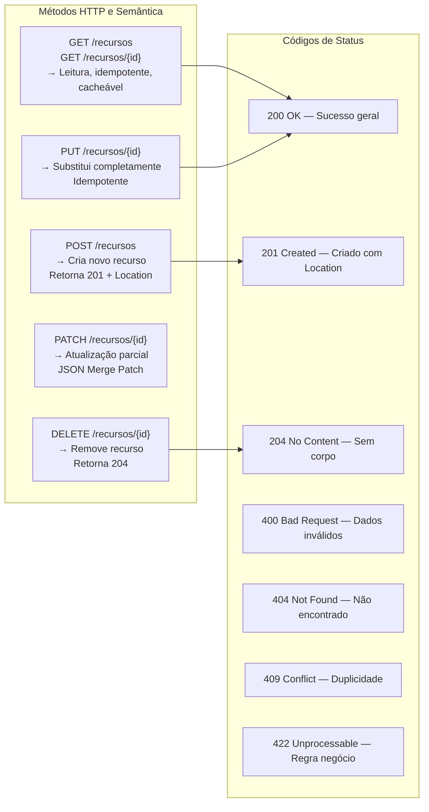

---

## 4. Controllers MVC com Thymeleaf (SSR)

> **Sintaxe alternativa HTML5 — `data-th-*`**
>
> Todos os atributos `th:*` do Thymeleaf possuem uma forma equivalente no padrão
> `data-th-*` (ex.: `data-th-text`, `data-th-href`, `data-th-field`), que é
> tecnicamente válida segundo a especificação HTML5 — qualquer atributo prefixado
> com `data-` é permitido pelo padrão e ignorado pelo browser.
>
> ```html
> <!-- th:* — sintaxe canônica do Thymeleaf (mais comum) -->
> <span th:text="${produto.nome}">Nome</span>
>
> <!-- data-th-* — equivalente 100%, aderente ao HTML5 -->
> <span data-th-text="${produto.nome}">Nome</span>
> ```
>
> A diferença é apenas sintática: o comportamento em tempo de execução é idêntico.
> A forma `th:*` é a mais usada na documentação e na comunidade; `data-th-*` é
> preferida quando validadores HTML5 estritos (linters, ferramentas de QA) são
> exigidos no projeto, pois `th:text` tecnicamente não é um atributo HTML válido
> fora do namespace Thymeleaf.

### 4.1 Controller MVC Clássico

```java
@Controller
@RequestMapping("/produtos")
@Slf4j
public class ProdutoMvcController {

    private final ProdutoService produtoService;
    private final CategoriaService categoriaService;

    public ProdutoMvcController(ProdutoService produtoService,
                                 CategoriaService categoriaService) {
        this.produtoService = produtoService;
        this.categoriaService = categoriaService;
    }

    // ─── GET /produtos ────────────────────────────────────────────────────────
    @GetMapping
    public String listar(
            @RequestParam(defaultValue = "0") int page,
            @RequestParam(defaultValue = "20") int size,
            @RequestParam(required = false) String busca,
            Model model) {

        var pageable = PageRequest.of(page, size, Sort.by("nome"));
        model.addAttribute("produtos", produtoService.listar(busca, pageable));
        model.addAttribute("busca", busca);
        return "produtos/lista";   // → templates/produtos/lista.html
    }

    // ─── GET /produtos/novo ───────────────────────────────────────────────────
    @GetMapping("/novo")
    public String exibirFormulario(Model model) {
        model.addAttribute("produto", new ProdutoForm());
        model.addAttribute("categorias", categoriaService.listarTodas());
        return "produtos/formulario";
    }

    // ─── POST /produtos ───────────────────────────────────────────────────────
    @PostMapping
    public String salvar(
            @ModelAttribute("produto") @Valid ProdutoForm form,
            BindingResult bindingResult,
            Model model,
            RedirectAttributes redirectAttrs) {

        // Sempre verificar BindingResult ANTES de usar o form
        if (bindingResult.hasErrors()) {
            model.addAttribute("categorias", categoriaService.listarTodas());
            return "produtos/formulario";   // Volta ao form com erros
        }

        try {
            produtoService.criar(form);
            redirectAttrs.addFlashAttribute("mensagem",
                "Produto criado com sucesso!");
            redirectAttrs.addFlashAttribute("tipoMensagem", "success");
            return "redirect:/produtos";

        } catch (BusinessException e) {
            bindingResult.rejectValue("sku", "produto.sku.duplicado",
                "SKU já cadastrado no sistema");
            model.addAttribute("categorias", categoriaService.listarTodas());
            return "produtos/formulario";
        }
    }

    // ─── GET /produtos/{id}/editar ────────────────────────────────────────────
    @GetMapping("/{id}/editar")
    public String exibirEdicao(@PathVariable Long id, Model model) {
        var produto = produtoService.buscarPorId(id)
                .orElseThrow(() -> new ResourceNotFoundException("Produto", id));

        model.addAttribute("produto", ProdutoForm.from(produto));
        model.addAttribute("categorias", categoriaService.listarTodas());
        model.addAttribute("editando", true);
        return "produtos/formulario";
    }

    // ─── POST /produtos/{id} (PUT simulado via _method) ───────────────────────
    @PostMapping("/{id}")
    public String atualizar(
            @PathVariable Long id,
            @ModelAttribute("produto") @Valid ProdutoForm form,
            BindingResult bindingResult,
            Model model,
            RedirectAttributes redirectAttrs) {

        if (bindingResult.hasErrors()) {
            model.addAttribute("categorias", categoriaService.listarTodas());
            model.addAttribute("editando", true);
            return "produtos/formulario";
        }

        produtoService.atualizar(id, form);
        redirectAttrs.addFlashAttribute("mensagem", "Produto atualizado!");
        redirectAttrs.addFlashAttribute("tipoMensagem", "success");
        return "redirect:/produtos";
    }

    // ─── POST /produtos/{id}/excluir ──────────────────────────────────────────
    @PostMapping("/{id}/excluir")
    public String excluir(@PathVariable Long id, RedirectAttributes redirectAttrs) {
        produtoService.excluir(id);
        redirectAttrs.addFlashAttribute("mensagem", "Produto excluído!");
        redirectAttrs.addFlashAttribute("tipoMensagem", "warning");
        return "redirect:/produtos";
    }
}
```

### 4.2 Form Object (Separado do Domain/DTO)

```java
// Form object: representa o estado do formulário HTML, com coerção de tipos
public class ProdutoForm {

    @NotBlank(message = "Nome é obrigatório")
    @Size(max = 200)
    private String nome;

    @NotBlank
    @Size(max = 2000)
    private String descricao;

    // String no form para aceitar formatação do usuário (ex: "1.299,90")
    // O Formatter/Converter fará a coerção para BigDecimal
    @NotBlank
    private String preco;

    @NotNull
    @Min(0)
    private Integer estoque;

    @NotNull
    private Long categoriaId;

    // Factory method para preencher a partir da entidade (para edição)
    public static ProdutoForm from(Produto produto) {
        var form = new ProdutoForm();
        form.nome = produto.getNome();
        form.descricao = produto.getDescricao();
        form.preco = produto.getPreco().toPlainString();
        form.estoque = produto.getEstoque();
        form.categoriaId = produto.getCategoria().getId();
        return form;
    }

    // Getters e Setters (necessários para binding MVC)
    // ...
}
```

### 4.3 Templates Thymeleaf

#### Layout Base (`templates/layout/base.html`)

```html
<!DOCTYPE html>
<html xmlns:th="http://www.thymeleaf.org"
      xmlns:layout="http://www.ultraq.net.nz/thymeleaf/layout"
      xmlns:sec="http://www.thymeleaf.org/extras/spring-security"
      lang="pt-BR">
<head>
    <meta charset="UTF-8">
    <meta name="viewport" content="width=device-width, initial-scale=1">
    <title layout:title-pattern="$CONTENT_TITLE - $DECORATOR_TITLE">Minha App</title>
    <!-- CSRF token para formulários AJAX -->
    <meta name="_csrf" th:content="${_csrf.token}">
    <meta name="_csrf_header" th:content="${_csrf.headerName}">
    <!-- Bootstrap via Webjars (versão resolvida automaticamente) -->
    <link rel="stylesheet" th:href="@{/webjars/bootstrap/css/bootstrap.min.css}">
    <link rel="stylesheet" th:href="@{/static/css/app.css}">
</head>
<body>
<nav th:replace="~{layout/navbar :: navbar}"></nav>

<!-- Mensagens Flash -->
<div class="container mt-3" th:if="${mensagem}">
    <div class="alert"
         th:classappend="'alert-' + ${tipoMensagem ?: 'info'}"
         th:text="${mensagem}"
         role="alert">
    </div>
</div>

<!-- Conteúdo da página filha -->
<main class="container mt-4" layout:fragment="content">
</main>

<script th:src="@{/webjars/bootstrap/js/bootstrap.bundle.min.js}"></script>
<th:block layout:fragment="scripts"></th:block>
</body>
</html>
```

#### Formulário de Produto (`templates/produtos/formulario.html`)

```html
<!DOCTYPE html>
<html xmlns:th="http://www.thymeleaf.org"
      xmlns:layout="http://www.ultraq.net.nz/thymeleaf/layout"
      layout:decorate="~{layout/base}">
<head>
    <title th:text="${editando} ? 'Editar Produto' : 'Novo Produto'">Produto</title>
</head>
<body>
<div layout:fragment="content">
    <h1 class="mb-4" th:text="${editando} ? 'Editar Produto' : 'Novo Produto'"></h1>

    <!-- Erros globais do BindingResult -->
    <div th:if="${#fields.hasGlobalErrors()}" class="alert alert-danger">
        <ul class="mb-0">
            <li th:each="err : ${#fields.globalErrors()}" th:text="${err}"></li>
        </ul>
    </div>

    <!--
        th:action: URL dinâmica para criar ou atualizar
        th:object: vincula o form ao @ModelAttribute "produto"
    -->
    <form th:action="${editando} ? @{/produtos/{id}(id=${produto.id})} : @{/produtos}"
          th:object="${produto}"
          method="post"
          enctype="application/x-www-form-urlencoded"
          novalidate>

        <!-- Campo nome com exibição de erro inline -->
        <div class="mb-3">
            <label for="nome" class="form-label">Nome <span class="text-danger">*</span></label>
            <input type="text"
                   id="nome"
                   th:field="*{nome}"
                   th:errorclass="is-invalid"
                   class="form-control">
            <div class="invalid-feedback" th:errors="*{nome}"></div>
        </div>

        <!-- Preço com placeholder de formato -->
        <div class="mb-3">
            <label for="preco" class="form-label">Preço <span class="text-danger">*</span></label>
            <div class="input-group">
                <span class="input-group-text">R$</span>
                <input type="text"
                       id="preco"
                       th:field="*{preco}"
                       th:errorclass="is-invalid"
                       class="form-control"
                       placeholder="0,00">
                <div class="invalid-feedback" th:errors="*{preco}"></div>
            </div>
        </div>

        <!-- Select de categoria com opção vazia -->
        <div class="mb-3">
            <label for="categoriaId" class="form-label">Categoria <span class="text-danger">*</span></label>
            <select id="categoriaId"
                    th:field="*{categoriaId}"
                    th:errorclass="is-invalid"
                    class="form-select">
                <option value="">Selecione...</option>
                <option th:each="cat : ${categorias}"
                        th:value="${cat.id}"
                        th:text="${cat.nome}">
                </option>
            </select>
            <div class="invalid-feedback" th:errors="*{categoriaId}"></div>
        </div>

        <!-- Estoque -->
        <div class="mb-3">
            <label for="estoque" class="form-label">Estoque</label>
            <input type="number"
                   id="estoque"
                   th:field="*{estoque}"
                   th:errorclass="is-invalid"
                   class="form-control"
                   min="0">
            <div class="invalid-feedback" th:errors="*{estoque}"></div>
        </div>

        <!-- Descrição -->
        <div class="mb-3">
            <label for="descricao" class="form-label">Descrição</label>
            <textarea id="descricao"
                      th:field="*{descricao}"
                      th:errorclass="is-invalid"
                      class="form-control"
                      rows="4">
            </textarea>
            <div class="invalid-feedback" th:errors="*{descricao}"></div>
        </div>

        <div class="d-flex gap-2">
            <button type="submit" class="btn btn-primary">
                <i class="fas fa-save"></i>
                <span th:text="${editando} ? 'Atualizar' : 'Salvar'">Salvar</span>
            </button>
            <a th:href="@{/produtos}" class="btn btn-outline-secondary">Cancelar</a>
        </div>
    </form>
</div>
</html>
```

#### Habilitando PUT/DELETE em Formulários HTML

O HTML padrão suporta apenas `GET` e `POST`. Para simular `PUT`/`DELETE`:

```java
// Em WebMvcConfig
@Bean
public HiddenHttpMethodFilter hiddenHttpMethodFilter() {
    return new HiddenHttpMethodFilter();
}
```

```html
<!-- No template: simula PUT -->
<form method="post" th:action="@{/produtos/{id}(id=${produto.id})}">
    <input type="hidden" name="_method" value="PUT">
    <!-- campos... -->
</form>
```

### 4.4 Convertendo `ConstraintViolationException` do Service em `BindingResult`

Quando um `@Service` anotado com `@Validated` lança `ConstraintViolationException`,
essa exceção **não é capturada automaticamente** pelo mecanismo de `BindingResult`
do Spring MVC — ela existe no service via proxy AOP, fora do ciclo de binding do
controller. Se não tratada, propagaria como 500 ou seria capturada por um
`@ControllerAdvice` genérico, sem vincular os erros aos campos do formulário.

O objetivo desta seção é mostrar como **converter** as violações de constraint para
erros de `BindingResult`, fazendo com que os `th:errors` e `th:errorclass` do
Thymeleaf funcionem normalmente — sem nenhuma alteração nos templates.

#### Por que isso acontece

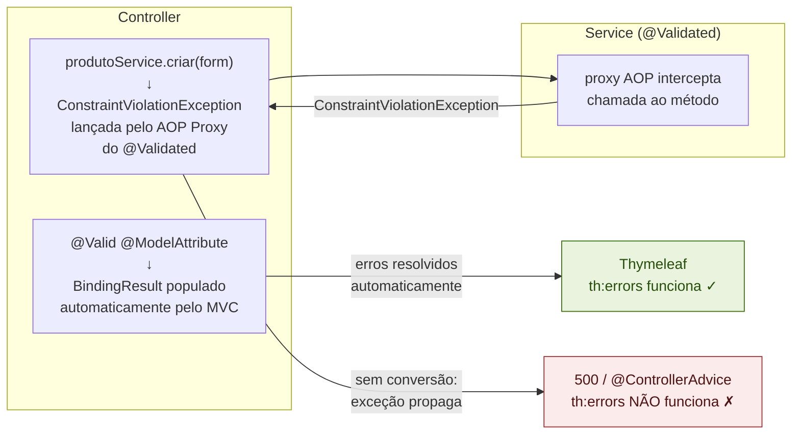

#### Utilitário de conversão

Centralizar a conversão em um componente reutilizável evita duplicar o código em
todos os controllers.

```java
/**
 * Converte as violações de constraint lançadas por @Validated em services
 * para erros reconhecidos pelo BindingResult — e, consequentemente, pelo Thymeleaf.
 */
@Component
public class ConstraintViolationConverter {

    /**
     * Transfere cada {@link ConstraintViolation} para o {@link BindingResult},
     * vinculando-o ao campo correto do form object.
     *
     * O propertyPath retornado pelo violation tem o formato completo do caminho
     * AOP: "criar.form.nome", "criar.form.preco" etc.
     * O método extrai apenas o último nó com Kind=PROPERTY, que corresponde
     * ao nome do campo no form: "nome", "preco" etc.
     */
    public void convert(ConstraintViolationException ex, BindingResult result) {
        for (ConstraintViolation<?> violation : ex.getConstraintViolations()) {
            String field   = extractFieldName(violation.getPropertyPath());
            String code    = violation.getConstraintDescriptor()
                                      .getAnnotation()
                                      .annotationType()
                                      .getSimpleName(); // "NotBlank", "Size", ...
            String message = violation.getMessage();

            if (field.isEmpty()) {
                // Violação de classe (cross-field constraint) — erro global
                result.reject(code, message);
            } else {
                result.rejectValue(field, code, message);
            }
        }
    }

    /**
     * Extrai o nome do campo a partir do PropertyPath completo.
     *
     * "criar.form.nome"          → "nome"
     * "atualizar.request.preco"  → "preco"
     * "criar.form"               → "" (violação de classe — sem campo)
     */
    private String extractFieldName(Path propertyPath) {
        Path.Node lastNode = null;
        for (Path.Node node : propertyPath) {
            lastNode = node;
        }
        if (lastNode == null) return "";

        // ElementKind.PROPERTY identifica um campo do objeto;
        // outros kinds (METHOD, PARAMETER) representam o contexto AOP
        return lastNode.getKind() == ElementKind.PROPERTY
                ? lastNode.getName()
                : "";
    }
}
```

#### Controller usando o conversor

```java
@Controller
@RequestMapping("/produtos")
public class ProdutoMvcController {

    private final ProdutoService               produtoService;
    private final CategoriaService             categoriaService;
    private final ConstraintViolationConverter cvConverter;

    // ─── POST /produtos ───────────────────────────────────────────────────────
    @PostMapping
    public String salvar(
            @ModelAttribute("produto") @Valid ProdutoForm form,
            BindingResult bindingResult,              // deve vir LOGO após @ModelAttribute
            Model model,
            RedirectAttributes redirectAttrs) {

        // 1. Erros de binding (@Valid no controller) — tratar antes do service
        if (bindingResult.hasErrors()) {
            model.addAttribute("categorias", categoriaService.listarTodas());
            return "produtos/formulario";
        }

        try {
            produtoService.criar(form);
            redirectAttrs.addFlashAttribute("mensagem", "Produto criado com sucesso!");
            redirectAttrs.addFlashAttribute("tipoMensagem", "success");
            return "redirect:/produtos";

        } catch (ConstraintViolationException ex) {
            // 2. Violações do @Validated no service → converter para BindingResult
            cvConverter.convert(ex, bindingResult);
            model.addAttribute("categorias", categoriaService.listarTodas());
            return "produtos/formulario";   // retorna ao form normalmente

        } catch (BusinessException ex) {
            // 3. Regras de negócio explícitas (ex: SKU duplicado)
            bindingResult.rejectValue("sku", "produto.sku.duplicado", ex.getMessage());
            model.addAttribute("categorias", categoriaService.listarTodas());
            return "produtos/formulario";
        }
    }

    // ─── POST /produtos/{id} ─────────────────────────────────────────────────
    @PostMapping("/{id}")
    public String atualizar(
            @PathVariable Long id,
            @ModelAttribute("produto") @Valid ProdutoForm form,
            BindingResult bindingResult,
            Model model,
            RedirectAttributes redirectAttrs) {

        if (bindingResult.hasErrors()) {
            model.addAttribute("categorias", categoriaService.listarTodas());
            model.addAttribute("editando", true);
            return "produtos/formulario";
        }

        try {
            produtoService.atualizar(id, form);
            redirectAttrs.addFlashAttribute("mensagem", "Produto atualizado!");
            return "redirect:/produtos";

        } catch (ConstraintViolationException ex) {
            cvConverter.convert(ex, bindingResult);
            model.addAttribute("categorias", categoriaService.listarTodas());
            model.addAttribute("editando", true);
            return "produtos/formulario";
        }
    }
}
```

#### Service com `@Validated` — origem das violações

```java
@Service
@Validated   // ativa o proxy AOP que lança ConstraintViolationException
public class ProdutoService {

    /**
     * As constraints aqui representam invariantes de domínio que valem
     * independentemente de onde o service é chamado (controller, job, outro service).
     * O proxy AOP valida ANTES de entrar no corpo do método.
     */
    public ProdutoResponse criar(@Valid @NotNull ProdutoForm form) {
        // Se qualquer constraint for violada, o proxy lança
        // ConstraintViolationException antes de chegar aqui
        return ProdutoResponse.from(produtoRepository.save(toEntity(form)));
    }

    public ProdutoResponse atualizar(Long id, @Valid @NotNull ProdutoForm form) {
        var produto = produtoRepository.findById(id)
                .orElseThrow(() -> new RecursoNaoEncontradoException("Produto", id));
        update(produto, form);
        return ProdutoResponse.from(produtoRepository.save(produto));
    }
}
```

#### Template Thymeleaf — sem nenhuma alteração

O `BindingResult` preenchido pelo conversor é idêntico ao preenchido pelo `@Valid`
do MVC. O Thymeleaf usa o mesmo mecanismo em ambos os casos: `th:errors`,
`th:errorclass` e `#fields.hasErrors()` funcionam sem qualquer modificação:

```html
<!-- templates/produtos/formulario.html -->
<!DOCTYPE html>
<html xmlns:th="http://www.thymeleaf.org"
      xmlns:layout="http://www.ultraq.net.nz/thymeleaf/layout"
      layout:decorate="~{layout/base}">
<body>
<section layout:fragment="content">

<form th:action="${editando} ? @{/produtos/{id}(id=${produto.id})} : @{/produtos}"
      th:object="${produto}"
      method="post"
      novalidate>

    <!-- ─── Erros globais (violações cross-field ou BusinessException sem campo) -->
    <div th:if="${#fields.hasGlobalErrors()}" class="alert alert-danger">
        <ul class="mb-0">
            <li th:each="err : ${#fields.globalErrors()}" th:text="${err}"></li>
        </ul>
    </div>

    <!-- ─── Campo: nome ───────────────────────────────────────────────────────
         th:errorclass="is-invalid" é adicionado automaticamente quando
         BindingResult tem erros para o campo "nome" — de qualquer origem:
         @Valid no controller OU ConstraintViolationConverter do service. -->
    <div class="mb-3">
        <label for="nome" class="form-label">Nome *</label>
        <input type="text" id="nome"
               th:field="*{nome}"
               th:errorclass="is-invalid"
               class="form-control">
        <div class="invalid-feedback" th:errors="*{nome}"></div>
    </div>

    <!-- ─── Campo: preco ──────────────────────────────────────────────────── -->
    <div class="mb-3">
        <label for="preco" class="form-label">Preço *</label>
        <input type="text" id="preco"
               th:field="*{preco}"
               th:errorclass="is-invalid"
               class="form-control" placeholder="0,00">
        <div class="invalid-feedback" th:errors="*{preco}"></div>
    </div>

    <!-- ─── Campo: estoque ────────────────────────────────────────────────── -->
    <div class="mb-3">
        <label for="estoque" class="form-label">Estoque</label>
        <input type="number" id="estoque"
               th:field="*{estoque}"
               th:errorclass="is-invalid"
               class="form-control">
        <div class="invalid-feedback" th:errors="*{estoque}"></div>
    </div>

    <!-- ─── Campo: sku ────────────────────────────────────────────────────── -->
    <div class="mb-3">
        <label for="sku" class="form-label">SKU</label>
        <input type="text" id="sku"
               th:field="*{sku}"
               th:errorclass="is-invalid"
               class="form-control">
        <div class="invalid-feedback" th:errors="*{sku}"></div>
    </div>

    <!-- ─── Select: categoria ─────────────────────────────────────────────── -->
    <div class="mb-3">
        <label for="categoriaId" class="form-label">Categoria *</label>
        <select id="categoriaId"
                th:field="*{categoriaId}"
                th:errorclass="is-invalid"
                class="form-select">
            <option value="">Selecione...</option>
            <option th:each="cat : ${categorias}"
                    th:value="${cat.id()}"
                    th:text="${cat.nome()}">
            </option>
        </select>
        <div class="invalid-feedback" th:errors="*{categoriaId}"></div>
    </div>

    <div class="d-flex gap-2 mt-4">
        <button type="submit" class="btn btn-primary">Salvar</button>
        <a th:href="@{/produtos}" class="btn btn-outline-secondary">Cancelar</a>
    </div>
</form>

</section>
</body>
</html>
```

#### Alternativa: `@ControllerAdvice` para centralização

Para evitar o bloco `try/catch` repetido em vários controllers, a exceção pode ser
capturada em um `@ControllerAdvice`. A limitação é que o `BindingResult` **não é
acessível** fora do escopo do controller — os erros precisam ser transportados como
flash attribute e exibidos em um bloco genérico, sem vinculação campo a campo:

```java
@ControllerAdvice(annotations = Controller.class)
public class ConstraintViolationMvcAdvice {

    @ExceptionHandler(ConstraintViolationException.class)
    public String handleConstraintViolation(
            ConstraintViolationException ex,
            HttpServletRequest request,
            RedirectAttributes redirectAttrs) {

        var erros = ex.getConstraintViolations().stream()
                .map(v -> new FieldErrorInfo(
                        extractFieldName(v.getPropertyPath()),
                        v.getMessage()))
                .toList();

        redirectAttrs.addFlashAttribute("errosValidacao", erros);

        // Redireciona para a URL de origem (Referer) para re-exibir o formulário
        String referer = request.getHeader(HttpHeaders.REFERER);
        return "redirect:" + (referer != null ? referer : "/");
    }

    private String extractFieldName(Path path) {
        Path.Node last = null;
        for (Path.Node n : path) last = n;
        return (last != null && last.getKind() == ElementKind.PROPERTY)
                ? last.getName() : "";
    }

    public record FieldErrorInfo(String campo, String mensagem) {}
}
```

```html
<!-- Template — exibição via lista genérica (abordagem @ControllerAdvice) -->
<div th:if="${errosValidacao != null and !#lists.isEmpty(errosValidacao)}"
     class="alert alert-danger">
    <strong>Corrija os erros abaixo:</strong>
    <ul class="mb-0 mt-1">
        <li th:each="err : ${errosValidacao}"
            th:text="${err.campo() != '' ? err.campo() + ': ' : ''} + ${err.mensagem()}">
        </li>
    </ul>
</div>
```

#### Resumo: quando usar cada abordagem

| | `try/catch` no controller | `@ControllerAdvice` |
|---|---|---|
| `th:errors` vinculado ao campo | ✅ Sim | ❌ Não |
| `th:errorclass` automático | ✅ Sim | ❌ Não |
| Form mantém valores digitados | ✅ Sim (model intacto) | ⚠️ Perde no redirect |
| Centralização do tratamento | ❌ Repetido por controller | ✅ Um único lugar |
| **Recomendação** | ✅ Formulários com campos | Somente lista genérica de erros |

### 4.5 Atributos de Modelo Compartilhados com @ModelAttribute

```java
@Controller
@RequestMapping("/produtos")
public class ProdutoMvcController {

    // Executado ANTES de todos os métodos do controller.
    // Útil para dados comuns a múltiplas views (ex: listas de select).
    @ModelAttribute("categorias")
    public List<CategoriaResponse> categorias() {
        return categoriaService.listarTodas();
    }

    @ModelAttribute("usuario")
    public UsuarioInfo usuarioLogado(Authentication auth) {
        return (UsuarioInfo) auth.getPrincipal();
    }
}
```

---

### 4.6 `@SessionAttributes` e `@SessionAttribute`

#### `@SessionAttributes` — manter atributos do model na sessão

`@SessionAttributes` é uma anotação de **classe** que instrui o Spring MVC a
persistir determinados atributos do `Model` na `HttpSession` entre requisições do
mesmo controller. É a solução nativa do Spring MVC para fluxos de múltiplas etapas
(wizards) sem precisar manipular `HttpSession` diretamente.

```java
/**
 * Wizard de criação de pedido em três etapas.
 *
 * @SessionAttributes mantém "pedidoWizard" na sessão enquanto o fluxo
 * não for concluído ou cancelado — sem nenhum acesso direto à HttpSession.
 *
 * IMPORTANTE: funciona apenas para atributos criados pelo MESMO controller.
 * Para ler atributos de sessão criados externamente, use @SessionAttribute (singular).
 */
@Controller
@RequestMapping("/pedidos/novo")
@SessionAttributes("pedidoWizard")          // ← nome(s) do(s) atributo(s) a persistir
public class PedidoWizardController {

    private final ProdutoService   produtoService;
    private final EnderecoService  enderecoService;
    private final PedidoService    pedidoService;

    // ─── Inicializa o objeto de sessão (chamado apenas na PRIMEIRA request) ───
    //
    // @ModelAttribute de classe é executado antes de qualquer handler method.
    // O Spring só chama este método se "pedidoWizard" ainda não existir no Model
    // (nem na sessão) — evita sobrescrever o estado acumulado entre etapas.
    @ModelAttribute("pedidoWizard")
    public PedidoWizard inicializarWizard() {
        return new PedidoWizard();
    }

    // ─── Etapa 1: seleção de produtos ────────────────────────────────────────
    @GetMapping("/etapa-1")
    public String etapa1(Model model) {
        model.addAttribute("produtos", produtoService.listarAtivos());
        return "pedidos/wizard/etapa1";
    }

    @PostMapping("/etapa-1")
    public String processarEtapa1(
            @ModelAttribute("pedidoWizard") PedidoWizard wizard, // ← vem da sessão
            @Valid EtapaItensForm form,
            BindingResult binding,
            Model model) {

        if (binding.hasErrors()) {
            model.addAttribute("produtos", produtoService.listarAtivos());
            return "pedidos/wizard/etapa1";
        }

        wizard.setItens(form.getItens());   // acumula estado no objeto de sessão
        return "redirect:/pedidos/novo/etapa-2";
    }

    // ─── Etapa 2: endereço de entrega ────────────────────────────────────────
    @GetMapping("/etapa-2")
    public String etapa2(
            @ModelAttribute("pedidoWizard") PedidoWizard wizard,
            Model model) {

        model.addAttribute("enderecos", enderecoService.listarDoCliente());
        model.addAttribute("subtotal", wizard.calcularSubtotal());
        return "pedidos/wizard/etapa2";
    }

    @PostMapping("/etapa-2")
    public String processarEtapa2(
            @ModelAttribute("pedidoWizard") PedidoWizard wizard,
            @Valid EtapaEnderecoForm form,
            BindingResult binding,
            Model model) {

        if (binding.hasErrors()) {
            model.addAttribute("enderecos", enderecoService.listarDoCliente());
            return "pedidos/wizard/etapa2";
        }

        wizard.setEnderecoEntregaId(form.getEnderecoId());
        return "redirect:/pedidos/novo/etapa-3";
    }

    // ─── Etapa 3: resumo e confirmação ───────────────────────────────────────
    @GetMapping("/etapa-3")
    public String etapa3(
            @ModelAttribute("pedidoWizard") PedidoWizard wizard,
            Model model) {

        model.addAttribute("resumo", pedidoService.calcularResumo(wizard));
        return "pedidos/wizard/etapa3";
    }

    @PostMapping("/confirmar")
    public String confirmar(
            @ModelAttribute("pedidoWizard") PedidoWizard wizard,
            SessionStatus sessionStatus,         // ← injeta o status da sessão
            RedirectAttributes redirectAttrs) {

        var pedido = pedidoService.criar(wizard);

        // OBRIGATÓRIO ao final do fluxo: limpa os atributos de @SessionAttributes
        // da sessão. Sem isso, o wizard persiste indefinidamente e interferirá
        // na próxima tentativa de criação de pedido.
        sessionStatus.setComplete();

        redirectAttrs.addFlashAttribute("mensagem",
                "Pedido #" + pedido.getNumero() + " criado com sucesso!");
        return "redirect:/pedidos/" + pedido.getId();
    }

    @GetMapping("/cancelar")
    public String cancelar(SessionStatus sessionStatus, RedirectAttributes redirectAttrs) {
        sessionStatus.setComplete();    // limpa a sessão ao cancelar também
        redirectAttrs.addFlashAttribute("mensagem", "Criação de pedido cancelada.");
        return "redirect:/pedidos";
    }
}
```

**Form object acumulador do wizard:**

```java
/**
 * Objeto de sessão que acumula o estado entre as etapas do wizard.
 * Deve ser serializável se a sessão for distribuída (Redis, Hazelcast).
 */
public class PedidoWizard implements Serializable {

    private List<ItemWizard> itens      = new ArrayList<>();
    private Long   enderecoEntregaId;
    private String observacao;

    public BigDecimal calcularSubtotal() {
        return itens.stream()
                .map(i -> i.precoUnitario().multiply(BigDecimal.valueOf(i.quantidade())))
                .reduce(BigDecimal.ZERO, BigDecimal::add);
    }

    // getters / setters
}
```

**Template da etapa 1 — acesso ao wizard acumulado:**

```html
<!-- templates/pedidos/wizard/etapa1.html -->
<form th:action="@{/pedidos/novo/etapa-1}" method="post">

    <!-- Progresso do wizard -->
    <div class="d-flex gap-2 mb-4">
        <span class="badge bg-primary">1. Produtos</span>
        <span class="badge bg-secondary">2. Endereço</span>
        <span class="badge bg-secondary">3. Confirmação</span>
    </div>

    <!-- Lista de produtos para seleção -->
    <div th:each="produto : ${produtos}" class="form-check mb-2">
        <input class="form-check-input" type="checkbox"
               th:name="'itens[' + ${produtoStat.index} + '].produtoId'"
               th:value="${produto.id()}"
               th:id="'prod-' + ${produto.id()}">
        <label class="form-check-label" th:for="'prod-' + ${produto.id()}">
            <span th:text="${produto.nome()}">Produto</span>
            — R$ <span th:text="${produto.preco()}">0,00</span>
        </label>
    </div>

    <!-- Botões de navegação do wizard -->
    <div class="d-flex justify-content-between mt-4">
        <a th:href="@{/pedidos/novo/cancelar}" class="btn btn-outline-secondary">
            Cancelar
        </a>
        <button type="submit" class="btn btn-primary">
            Próximo →
        </button>
    </div>
</form>
```

---

#### `@SessionAttribute` (singular) — ler atributo de sessão externo

`@SessionAttribute` (singular, sem `s`) é um **parâmetro de método** que lê um
atributo já existente na `HttpSession` — tipicamente criado por outro controller,
filtro ou interceptor. Não gerencia ciclo de vida; apenas lê.

```java
@Controller
@RequestMapping("/checkout")
public class CheckoutController {

    /**
     * Lê o carrinho de compras da sessão, criado pelo CarrinhoController.
     *
     * required = true  (default): lança exceção se o atributo não existir.
     * required = false           : injeta null se ausente — use Optional ou null-check.
     */
    @GetMapping
    public String exibir(
            @SessionAttribute("carrinho") CarrinhoSession carrinho,
            Model model) {

        model.addAttribute("itens",    carrinho.getItens());
        model.addAttribute("subtotal", carrinho.calcularTotal());
        return "checkout/resumo";
    }

    @GetMapping("/pagamento")
    public String pagamento(
            @SessionAttribute(value = "carrinho", required = false) CarrinhoSession carrinho,
            Model model) {

        if (carrinho == null || carrinho.estaVazio()) {
            return "redirect:/carrinho";
        }
        model.addAttribute("total", carrinho.calcularTotal());
        return "checkout/pagamento";
    }
}
```

#### Comparativo: `@SessionAttributes` vs `@SessionAttribute` vs `@SessionScope`

| | `@SessionAttributes` | `@SessionAttribute` | `@SessionScope` |
|---|---|---|---|
| Nível | Classe do controller | Parâmetro de método | Bean Spring |
| Cria atributo na sessão | ✅ Via `@ModelAttribute` | ❌ Apenas lê | ✅ Auto-gerenciado |
| Escopo | Mesmo controller | Qualquer controller | Toda a aplicação |
| Finalização | `SessionStatus.setComplete()` | N/A | Fim da sessão HTTP |
| Uso típico | Wizards / multi-step forms | Ler dado de sessão externo | Carrinho, preferências |
| Serialização necessária | Se sessão distribuída | Se sessão distribuída | Se sessão distribuída |

---

## 5. Bean Validation — @Valid vs @Validated — @Valid vs @Validated

### 5.1 Diferença Conceitual

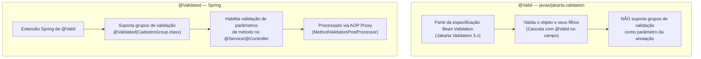

### 5.2 Exemplo Prático de Grupos de Validação

```java
// ─── Definição de grupos ──────────────────────────────────────────────────────
//
// Por que extends Default?
//
// Quando @Validated(Cadastro.class) é ativado, APENAS as constraints do grupo
// Cadastro são avaliadas. Constraints sem grupo explícito pertencem ao grupo
// Default, mas NÃO são executadas automaticamente quando um grupo específico
// é informado — a menos que o grupo herde de Default.
//
// Ao fazer `interface Cadastro extends Default`, o Bean Validation inclui
// automaticamente todas as constraints do grupo Default na mesma passagem.
// Isso evita repetir `groups = {Cadastro.class, Default.class}` em cada campo.
//
// Referência: https://stackoverflow.com/a/35359965
//
public interface ValidationGroups {
    interface Cadastro  extends Default {}  // herda Default: valida campos sem grupo também
    interface Edicao    extends Default {}  // herda Default: idem
    interface PatchGroup extends Default {} // herda Default: idem
}

// ─── DTO com grupos ───────────────────────────────────────────────────────────
public class ClienteRequest {

    // Obrigatório apenas no cadastro — campos sem grupo rodam via herança de Default
    @NotBlank(groups = ValidationGroups.Cadastro.class,
              message = "CPF é obrigatório no cadastro")
    @CPF(groups = {ValidationGroups.Cadastro.class, ValidationGroups.Edicao.class})
    private String cpf;

    @NotBlank(groups = {ValidationGroups.Cadastro.class, ValidationGroups.Edicao.class})
    @Email  // ← sem grupo = Default; executado em Cadastro e Edicao via herança
    private String email;

    @NotBlank(groups = {ValidationGroups.Cadastro.class, ValidationGroups.Edicao.class})
    @Size(min = 2, max = 100)  // ← sem grupo = Default; executado em todos os grupos
    private String nome;

    // Sem grupo = Default; roda em Cadastro, Edicao e PatchGroup via herança
    @Size(max = 20)
    private String telefone;

    // Validação de elementos dentro do genérico (TYPE_USE — Jakarta BV 2.0+)
    // Cada tag da lista é validada individualmente: @NotBlank e @Size por elemento
    @NotEmpty(groups = ValidationGroups.Cadastro.class)
    private List<@NotBlank @Size(max = 50) String> tags;
}

// ─── Controller usando grupos ─────────────────────────────────────────────────
@RestController
@RequestMapping("/api/v1/clientes")
public class ClienteController {

    @PostMapping
    public ResponseEntity<ClienteResponse> criar(
            // @Validated com grupo: aplica apenas as regras de Cadastro
            @RequestBody @Validated(ValidationGroups.Cadastro.class) ClienteRequest request) {
        // ...
    }

    @PutMapping("/{id}")
    public ResponseEntity<ClienteResponse> atualizar(
            @PathVariable Long id,
            @RequestBody @Validated(ValidationGroups.Edicao.class) ClienteRequest request) {
        // ...
    }

    @PatchMapping("/{id}")
    public ResponseEntity<ClienteResponse> atualizarParcial(
            @PathVariable Long id,
            @RequestBody @Validated(ValidationGroups.PatchGroup.class) ClienteRequest request) {
        // ...
    }
}
```

### 5.3 Validação em Serviços com @Validated

```java
// Habilitar validação de método em Services
@Service
@Validated  // Fundamental: sem isso, as anotações nos parâmetros são ignoradas
public class ClienteService {

    // Valida o parâmetro de entrada e o retorno
    public @NotNull ClienteResponse criar(@Valid @NotNull ClienteRequest request) {
        // ...
    }

    // Valida apenas parâmetros escalares (sem objeto wrapper)
    public ClienteResponse buscarPorCpf(
            @NotBlank @CPF String cpf) {   // Funciona com @Validated na classe
        // ...
    }

    // Valida coleção de elementos
    public List<ClienteResponse> criarLote(
            @NotEmpty @Valid List<ClienteRequest> requests) {
        // ...
    }
}
```

### 5.4 Cascata de Validação com @Valid

```java
public class PedidoRequest {

    @NotNull
    @Valid           // ← Cascata: valida os campos internos de EnderecoRequest
    private EnderecoRequest enderecoEntrega;

    @NotEmpty
    @Valid           // ← Cascata em coleção: valida cada ItemRequest
    private List<ItemRequest> itens;
}

public class EnderecoRequest {
    @NotBlank private String cep;
    @NotBlank private String logradouro;
    @NotBlank private String numero;
    @Size(max = 8) private String complemento;
    @NotBlank private String cidade;
    @NotBlank @Size(min = 2, max = 2) private String uf;
}
```

### 5.5 Constraint Customizada

```java
// ─── Anotação ─────────────────────────────────────────────────────────────────
@Target({FIELD, PARAMETER, ANNOTATION_TYPE})
@Retention(RUNTIME)
@Constraint(validatedBy = CpfValidator.class)
@Documented
public @interface CPF {
    String message() default "{br.com.app.validation.cpf.invalido}";
    Class<?>[] groups() default {};
    Class<? extends Payload>[] payload() default {};
}

// ─── Implementação ────────────────────────────────────────────────────────────
public class CpfValidator implements ConstraintValidator<CPF, String> {

    @Override
    public boolean isValid(String value, ConstraintValidatorContext context) {
        if (value == null || value.isBlank()) return true; // @NotNull cuida de null

        var digits = value.replaceAll("\\D", "");
        if (digits.length() != 11 || digits.chars().distinct().count() == 1) {
            return false;
        }

        return verificarDigitos(digits);
    }

    private boolean verificarDigitos(String digits) {
        int sum = 0;
        for (int i = 0; i < 9; i++) sum += (digits.charAt(i) - '0') * (10 - i);
        int r1 = sum % 11 < 2 ? 0 : 11 - (sum % 11);
        if (r1 != (digits.charAt(9) - '0')) return false;

        sum = 0;
        for (int i = 0; i < 10; i++) sum += (digits.charAt(i) - '0') * (11 - i);
        int r2 = sum % 11 < 2 ? 0 : 11 - (sum % 11);
        return r2 == (digits.charAt(10) - '0');
    }
}
```

### 5.6 Constraint com Acesso a Banco (Spring Bean)

```java
@Target(FIELD)
@Retention(RUNTIME)
@Constraint(validatedBy = EmailUnicoValidator.class)
public @interface EmailUnico {
    String message() default "E-mail já cadastrado";
    Class<?>[] groups() default {};
    Class<? extends Payload>[] payload() default {};
}

// Spring injeta dependências normalmente no validator
@Component
public class EmailUnicoValidator implements ConstraintValidator<EmailUnico, String> {

    private final ClienteRepository repository;

    public EmailUnicoValidator(ClienteRepository repository) {
        this.repository = repository;
    }

    @Override
    public boolean isValid(String email, ConstraintValidatorContext ctx) {
        if (email == null) return true;
        return !repository.existsByEmailIgnoreCase(email);
    }
}
```

---

### 5.7 Atributo `payload` nas Constraints

O atributo `payload` presente em toda anotação de constraint (`Class<? extends Payload>[]`)
é uma extensão point da especificação Jakarta Bean Validation: permite **anexar
metadados** a uma violação em tempo de definição da constraint, sem alterar a lógica
de validação. Esses metadados ficam disponíveis em `ConstraintViolation.unwrap()` ou
via `ConstraintDescriptor` e podem ser lidos por quem processa as violações.

#### Usos práticos do `payload`

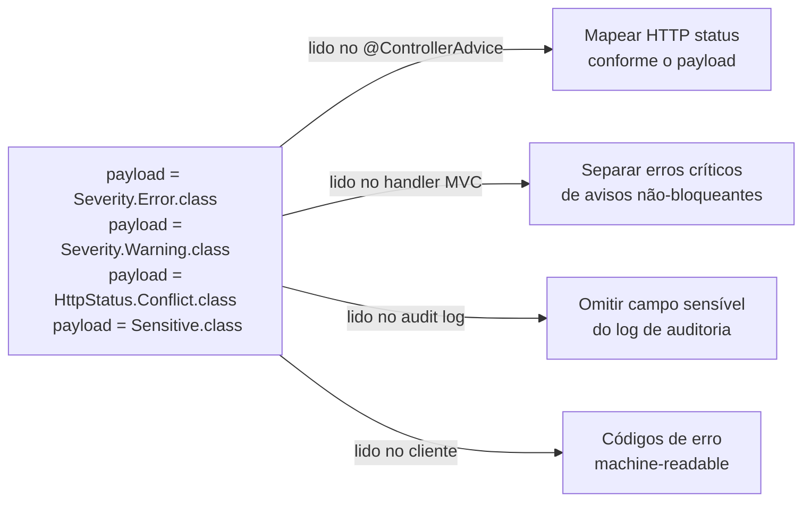

#### 1. Severidade — separar erros bloqueantes de avisos

```java
// ─── Definição dos marcadores de severidade ───────────────────────────────────
//
// Os payloads são interfaces marcadoras que estendem Payload.
// A especificação define Error e Warning como exemplos; Warning é convenção,
// não bloqueia o fluxo por padrão — quem decide o que fazer com cada
// severidade é o código consumidor.
public interface Severity {
    // Erro bloqueante: impede a operação
    interface Error   extends Payload {}

    // Aviso: operação prossegue mas cliente deve ser alertado
    interface Warning extends Payload {}

    // Informacional: sugestão de melhoria, não obrigatória
    interface Info    extends Payload {}
}

// ─── Uso nas constraints ──────────────────────────────────────────────────────
public record ProdutoRequest(

    @NotBlank(
        message  = "Nome é obrigatório",
        payload  = { Severity.Error.class }    // bloqueia — campo obrigatório
    )
    String nome,

    @Size(
        min     = 10,
        message = "Descrição muito curta — recomendamos pelo menos 10 caracteres",
        payload = { Severity.Warning.class }   // não bloqueia — apenas aviso
    )
    String descricao,

    @DecimalMax(
        value   = "9999.99",
        message = "Preço acima do limite recomendado para esta categoria",
        payload = { Severity.Warning.class }   // aviso, não erro
    )
    @DecimalMin(
        value   = "0.01",
        message = "Preço deve ser positivo",
        payload = { Severity.Error.class }     // bloqueia
    )
    BigDecimal preco
) {}
```

```java
// ─── Leitura da severidade no @ControllerAdvice ───────────────────────────────
@RestControllerAdvice
public class GlobalExceptionHandler {

    @ExceptionHandler(ConstraintViolationException.class)
    public ResponseEntity<ValidationErrorResponse> handleConstraintViolation(
            ConstraintViolationException ex) {

        var errors   = new ArrayList<FieldError>();
        var warnings = new ArrayList<FieldError>();

        for (ConstraintViolation<?> v : ex.getConstraintViolations()) {
            var payloads = v.getConstraintDescriptor().getPayload();
            var entry    = new FieldError(
                    extractField(v.getPropertyPath()), v.getMessage());

            // Separa por severidade via payload
            if (payloads.stream().anyMatch(Severity.Error.class::isAssignableFrom)) {
                errors.add(entry);
            } else if (payloads.stream().anyMatch(Severity.Warning.class::isAssignableFrom)) {
                warnings.add(entry);
            }
        }

        // Se há erros bloqueantes: 422; se só avisos: 200 com warnings no body
        HttpStatus status = errors.isEmpty()
                ? HttpStatus.OK
                : HttpStatus.UNPROCESSABLE_ENTITY;

        return ResponseEntity.status(status)
                .body(new ValidationErrorResponse(errors, warnings));
    }

    private String extractField(Path path) {
        Path.Node last = null;
        for (Path.Node n : path) last = n;
        return last != null ? last.getName() : "";
    }

    public record FieldError(String campo, String mensagem) {}

    public record ValidationErrorResponse(
            List<FieldError> errors,
            List<FieldError> warnings
    ) {}
}
```

#### 2. Código de erro machine-readable — contrato com o cliente

```java
// ─── Payloads como códigos de erro ────────────────────────────────────────────
public interface ErrorCode {
    interface DuplicateValue  extends Payload {}
    interface InvalidFormat   extends Payload {}
    interface OutOfRange      extends Payload {}
    interface RequiredField   extends Payload {}
    interface BusinessRule    extends Payload {}
}

// ─── Constraints com código de erro ──────────────────────────────────────────
public record ClienteRequest(

    @NotBlank(
        message = "CPF é obrigatório",
        payload = { Severity.Error.class, ErrorCode.RequiredField.class }
    )
    @CPF(
        message = "CPF inválido",
        payload = { Severity.Error.class, ErrorCode.InvalidFormat.class }
    )
    String cpf,

    @EmailUnico(
        message = "E-mail já cadastrado",
        payload = { Severity.Error.class, ErrorCode.DuplicateValue.class }
    )
    String email
) {}

// ─── Handler que expõe os códigos de erro no JSON da resposta ─────────────────
@ExceptionHandler(ConstraintViolationException.class)
@ResponseStatus(HttpStatus.UNPROCESSABLE_ENTITY)
public ProblemDetail handleWithErrorCodes(ConstraintViolationException ex) {
    var violations = ex.getConstraintViolations().stream()
            .map(v -> {
                // Lê TODOS os payloads da violação
                var payloadNames = v.getConstraintDescriptor().getPayload().stream()
                        .map(Class::getSimpleName)   // "Error", "RequiredField", ...
                        .toList();

                return Map.of(
                    "campo",   extractField(v.getPropertyPath()),
                    "message", v.getMessage(),
                    "codes",   payloadNames           // cliente pode usar para i18n
                );
            })
            .toList();

    var pd = ProblemDetail.forStatusAndDetail(
            HttpStatus.UNPROCESSABLE_ENTITY, "Dados inválidos");
    pd.setProperty("violations", violations);
    return pd;
}
```

#### 3. Payload de sensibilidade — omitir campos do log de auditoria

```java
// ─── Marcador de dado sensível ────────────────────────────────────────────────
public interface Sensitive extends Payload {}

// ─── Constraints marcando campos sensíveis ────────────────────────────────────
public record LoginRequest(
    @NotBlank String username,

    @NotBlank(
        message = "Senha é obrigatória",
        payload = { Sensitive.class }   // informa ao audit log: não logar este campo
    )
    @Size(min = 8, message = "Senha muito curta", payload = { Sensitive.class })
    String password,

    @NotBlank(
        message = "Token obrigatório",
        payload = { Sensitive.class }   // token também sensível
    )
    String mfaToken
) {}

// ─── Audit interceptor que respeita o payload de sensibilidade ────────────────
@Component
public class ValidationAuditLogger {

    private static final Logger log = LoggerFactory.getLogger(ValidationAuditLogger.class);

    public void logViolations(ConstraintViolationException ex, String operacao) {
        ex.getConstraintViolations().forEach(v -> {
            boolean isSensitive = v.getConstraintDescriptor()
                    .getPayload()
                    .stream()
                    .anyMatch(Sensitive.class::isAssignableFrom);

            if (isSensitive) {
                // Loga apenas o campo — nunca o valor
                log.warn("[{}] Violação em campo sensível: campo={}",
                        operacao,
                        extractField(v.getPropertyPath()));
            } else {
                log.warn("[{}] Violação: campo={}, valor={}, mensagem={}",
                        operacao,
                        extractField(v.getPropertyPath()),
                        v.getInvalidValue(),
                        v.getMessage());
            }
        });
    }
}
```

#### 4. `payload` em SSR — separar erros por severidade no Thymeleaf

```java
// ─── Extensão do ConstraintViolationConverter (seção 4.4) para leitura do payload ─
@Component
public class ConstraintViolationConverter {

    /**
     * Versão que separa erros bloqueantes de avisos no BindingResult.
     * Erros (Severity.Error) → rejectValue → bloqueiam o envio do form.
     * Avisos (Severity.Warning) → adicionados ao Model como lista separada
     * para exibição não-bloqueante no template.
     */
    public List<FieldWarning> convertWithSeverity(
            ConstraintViolationException ex,
            BindingResult result) {

        var warnings = new ArrayList<FieldWarning>();

        for (ConstraintViolation<?> v : ex.getConstraintViolations()) {
            var payloads = v.getConstraintDescriptor().getPayload();
            String field = extractFieldName(v.getPropertyPath());
            String code  = v.getConstraintDescriptor().getAnnotation()
                             .annotationType().getSimpleName();

            boolean isWarning = payloads.stream()
                    .anyMatch(Severity.Warning.class::isAssignableFrom);

            if (isWarning) {
                warnings.add(new FieldWarning(field, v.getMessage()));
            } else {
                // Severity.Error ou sem payload → rejeita o campo normalmente
                if (field.isEmpty()) result.reject(code, v.getMessage());
                else                 result.rejectValue(field, code, v.getMessage());
            }
        }
        return warnings; // controller adiciona ao Model para exibição no template
    }

    public record FieldWarning(String campo, String mensagem) {}
}
```

```java
// ─── Controller usando a separação de severidade ──────────────────────────────
@PostMapping
public String salvar(
        @ModelAttribute("produto") @Valid ProdutoForm form,
        BindingResult bindingResult,
        Model model,
        RedirectAttributes redirectAttrs) {

    if (bindingResult.hasErrors()) {
        model.addAttribute("categorias", categoriaService.listarTodas());
        return "produtos/formulario";
    }

    try {
        produtoService.criar(form);
        redirectAttrs.addFlashAttribute("mensagem", "Produto criado com sucesso!");
        return "redirect:/produtos";

    } catch (ConstraintViolationException ex) {
        var warnings = cvConverter.convertWithSeverity(ex, bindingResult);

        if (bindingResult.hasErrors()) {
            // Há erros bloqueantes — retorna ao form
            model.addAttribute("warnings",   warnings);
            model.addAttribute("categorias", categoriaService.listarTodas());
            return "produtos/formulario";
        } else {
            // Apenas avisos — persiste e notifica
            redirectAttrs.addFlashAttribute("warnings", warnings);
            redirectAttrs.addFlashAttribute("mensagem", "Produto criado com avisos.");
            return "redirect:/produtos";
        }
    }
}
```

```html
<!-- Template: exibição de avisos não-bloqueantes separados dos erros ──────── -->

<!-- Bloco de avisos (Severity.Warning) — exibido mesmo quando o form foi salvo -->
<div th:if="${warnings != null and !#lists.isEmpty(warnings)}"
     class="alert alert-warning">
    <strong>Atenção:</strong>
    <ul class="mb-0 mt-1">
        <li th:each="w : ${warnings}"
            th:text="${w.campo() != '' ? w.campo() + ': ' : ''} + ${w.mensagem()}">
        </li>
    </ul>
</div>

<!-- Erros bloqueantes: exibidos normalmente via th:errors (sem mudança) -->
<div class="mb-3">
    <label for="descricao" class="form-label">Descrição</label>
    <textarea id="descricao" th:field="*{descricao}"
              th:errorclass="is-invalid"
              class="form-control" rows="3"></textarea>
    <!-- "Descrição muito curta" virá como warning, não como th:errors -->
    <div class="invalid-feedback" th:errors="*{descricao}"></div>
</div>
```

#### Resumo dos casos de uso do `payload`

| Caso de uso | Payload | Quem consome |
|---|---|---|
| Severidade de erro | `Severity.Error` / `.Warning` / `.Info` | `@ControllerAdvice`, converter SSR |
| Código de erro para o cliente | `ErrorCode.DuplicateValue` etc. | `@ControllerAdvice` (JSON) |
| Campo sensível / PII | `Sensitive` | Audit logger, log interceptor |
| Mapeamento de HTTP status | `HttpStatus.Conflict.class` (payload custom) | `@ControllerAdvice` |
| Classificação para monitoramento | `Payload` de domínio próprio | Métricas, alertas |

---

## 6. InitBinder

`@InitBinder` é executado antes do binding de cada request no controller. Permite registrar editores, formatters e configurações de binding específicas por controller.

### 6.1 Usos Comuns

```java
@Controller
@RequestMapping("/produtos")
public class ProdutoMvcController {

    /**
     * @InitBinder sem parâmetro: aplica a TODOS os @ModelAttribute do controller
     */
    @InitBinder
    public void initBinder(WebDataBinder binder) {

        // ── 1. Trimming automático de Strings ────────────────────────────────
        binder.registerCustomEditor(String.class,
            new StringTrimmerEditor(true)); // true = converter string vazia para null

        // ── 2. Formato de datas brasileiro ────────────────────────────────────
        var dateEditor = new CustomDateEditor(
            new SimpleDateFormat("dd/MM/yyyy"), true); // true = aceita null
        binder.registerCustomEditor(Date.class, dateEditor);

        // ── 3. Formatação de moeda brasileira (campo preco) ───────────────────
        binder.registerCustomEditor(BigDecimal.class, "preco",
            new BigDecimalBrazilianEditor());

        // ── 4. Campos proibidos (segurança: evitar mass assignment) ───────────
        binder.setDisallowedFields("id", "criadoEm", "atualizadoEm", "versao");

        // ── 5. Campos permitidos (whitelist — mais seguro) ────────────────────
        // binder.setAllowedFields("nome", "descricao", "preco", "estoque", "categoriaId");
    }

    /**
     * @InitBinder com nome: aplica apenas ao @ModelAttribute "produto"
     */
    @InitBinder("produto")
    public void initBinderProduto(WebDataBinder binder) {
        // Validação máxima de tamanho do objeto antes do binding
        binder.setValidator(new ProdutoFormValidator());
        // Configuração de campos obrigatórios no nível do binder
        binder.setRequiredFields("nome", "preco");
    }
}
```

### 6.2 PropertyEditor Customizado

```java
/**
 * Converte String no formato brasileiro "1.299,90" para BigDecimal
 */
public class BigDecimalBrazilianEditor extends PropertyEditorSupport {

    private static final NumberFormat FORMAT =
        NumberFormat.getNumberInstance(new Locale("pt", "BR"));

    @Override
    public void setAsText(String text) {
        if (text == null || text.isBlank()) {
            setValue(null);
            return;
        }
        try {
            // Remove espaços e converte
            setValue(new BigDecimal(FORMAT.parse(text.trim()).toString()));
        } catch (ParseException e) {
            throw new IllegalArgumentException(
                "Valor monetário inválido: '" + text + "'");
        }
    }

    @Override
    public String getAsText() {
        var value = (BigDecimal) getValue();
        return value == null ? "" : FORMAT.format(value);
    }
}
```

### 6.3 Validator Programático com @InitBinder

```java
@Component
public class ProdutoFormValidator implements Validator {

    @Override
    public boolean supports(Class<?> clazz) {
        return ProdutoForm.class.isAssignableFrom(clazz);
    }

    @Override
    public void validate(Object target, Errors errors) {
        var form = (ProdutoForm) target;

        // Regra de negócio: preço de promoção deve ser menor que preço original
        if (form.getPrecoPromocional() != null &&
            form.getPreco() != null &&
            form.getPrecoPromocional().compareTo(form.getPreco()) >= 0) {

            errors.rejectValue("precoPromocional",
                "produto.precoPromocional.invalido",
                "Preço promocional deve ser menor que o preço original");
        }

        // Validação de estoque mínimo por categoria
        if ("PERECIVEL".equals(form.getTipoCategoria()) && form.getEstoque() > 1000) {
            errors.rejectValue("estoque",
                "produto.estoque.perecivel",
                "Produtos perecíveis não podem ter estoque acima de 1.000 unidades");
        }
    }
}
```

---

## 7. Converters e Formatters

### 7.1 Diferenças entre os Tipos

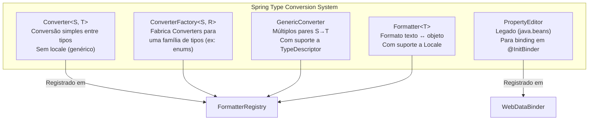

| | `Converter<S,T>` | `Formatter<T>` | `PropertyEditor` |
|---|---|---|---|
| Locale | ❌ Não | ✅ Sim | ❌ Não |
| Threads | Thread-safe | Thread-safe | ⚠️ Não (stateful) |
| Uso ideal | Conversão de tipos | Apresentação de dados | Legado / @InitBinder |
| Registro | `FormatterRegistry` | `FormatterRegistry` | `WebDataBinder` |

### 7.2 Converter — String para Enum Genérico

```java
/**
 * Converte qualquer String para qualquer Enum.
 * Aceita o nome do enum case-insensitive.
 */
public class StringToEnumConverterFactory
        implements ConverterFactory<String, Enum<?>> {

    @Override
    @SuppressWarnings({"unchecked", "rawtypes"})
    public <T extends Enum<?>> Converter<String, T> getConverter(Class<T> targetType) {
        return source -> {
            if (source == null || source.isBlank()) return null;
            // Busca case-insensitive
            return (T) Arrays.stream(targetType.getEnumConstants())
                    .filter(e -> e.name().equalsIgnoreCase(source.trim()))
                    .findFirst()
                    .orElseThrow(() -> new IllegalArgumentException(
                        "Valor inválido '" + source + "' para " + targetType.getSimpleName()));
        };
    }
}
```

### 7.3 Converter — ID para Entidade JPA

```java
/**
 * Permite receber o ID de uma entidade em um formulário e
 * obter a entidade completa automaticamente no binding.
 *
 * Uso: <select th:field="*{categoriaId}">
 * O MVC converte automaticamente Long → Categoria
 */
@Component
public class IdToCategoriaConverter implements Converter<Long, Categoria> {

    private final CategoriaRepository repository;

    public IdToCategoriaConverter(CategoriaRepository repository) {
        this.repository = repository;
    }

    @Override
    public Categoria convert(@NonNull Long source) {
        return repository.findById(source)
                .orElseThrow(() -> new ResourceNotFoundException("Categoria", source));
    }
}
```

### 7.4 Formatter — Moeda Brasileira com Locale

```java
/**
 * Formatter para BigDecimal no formato monetário brasileiro.
 * Responde ao Locale pt-BR.
 */
@Component
public class BrazilianMoneyFormatter implements Formatter<BigDecimal> {

    @Override
    public BigDecimal parse(String text, Locale locale) {
        if (text == null || text.isBlank()) return null;
        try {
            var format = NumberFormat.getNumberInstance(
                locale != null ? locale : new Locale("pt", "BR"));
            ((DecimalFormat) format).setParseBigDecimal(true);
            return (BigDecimal) format.parse(text.trim().replace("R$", "").trim());
        } catch (ParseException e) {
            throw new IllegalArgumentException("Valor monetário inválido: " + text);
        }
    }

    @Override
    public String print(BigDecimal object, Locale locale) {
        if (object == null) return "";
        return NumberFormat.getCurrencyInstance(
            locale != null ? locale : new Locale("pt", "BR"))
            .format(object);
    }
}
```

### 7.5 Formatter para LocalDate Brasileiro

```java
@Component
public class BrazilianDateFormatter implements Formatter<LocalDate> {

    private static final DateTimeFormatter BR_FORMAT =
        DateTimeFormatter.ofPattern("dd/MM/yyyy");
    private static final DateTimeFormatter ISO_FORMAT =
        DateTimeFormatter.ISO_LOCAL_DATE;

    @Override
    public LocalDate parse(String text, Locale locale) {
        if (text == null || text.isBlank()) return null;
        // Aceita tanto dd/MM/yyyy quanto yyyy-MM-dd
        if (text.contains("/")) {
            return LocalDate.parse(text, BR_FORMAT);
        }
        return LocalDate.parse(text, ISO_FORMAT);
    }

    @Override
    public String print(LocalDate object, Locale locale) {
        if (object == null) return "";
        // Formato para exibição pt-BR, ISO para API
        Locale effectiveLocale = locale != null ? locale : Locale.getDefault();
        return effectiveLocale.getLanguage().equals("pt")
            ? object.format(BR_FORMAT)
            : object.format(ISO_FORMAT);
    }
}
```

### 7.6 Registro dos Converters/Formatters

```java
@Configuration
public class WebMvcConfig implements WebMvcConfigurer {

    private final IdToCategoriaConverter idToCategoriaConverter;
    private final BrazilianMoneyFormatter brazilianMoneyFormatter;
    private final BrazilianDateFormatter brazilianDateFormatter;

    public WebMvcConfig(IdToCategoriaConverter idToCategoriaConverter,
                        BrazilianMoneyFormatter brazilianMoneyFormatter,
                        BrazilianDateFormatter brazilianDateFormatter) {
        this.idToCategoriaConverter = idToCategoriaConverter;
        this.brazilianMoneyFormatter = brazilianMoneyFormatter;
        this.brazilianDateFormatter = brazilianDateFormatter;
    }

    @Override
    public void addFormatters(FormatterRegistry registry) {
        registry.addConverter(idToCategoriaConverter);
        registry.addFormatter(brazilianMoneyFormatter);
        registry.addFormatter(brazilianDateFormatter);
        registry.addConverterFactory(new StringToEnumConverterFactory());
    }
}
```

---

## 8. Tratamento de Erros

### 8.1 Hierarquia de Exceções

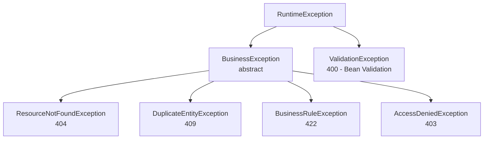

### 8.2 @ControllerAdvice Global — RFC 9457 (Problem Details)

```java
/**
 * Tratamento global de exceções.
 * RFC 9457 / RFC 7807: ProblemDetail é o padrão do Spring 6+
 */
@RestControllerAdvice           // @ControllerAdvice para SSR (retorna view de erro)
@Slf4j
public class GlobalExceptionHandler extends ResponseEntityExceptionHandler {

    // ─── Bean Validation (@Valid / @Validated) ────────────────────────────────
    @Override
    protected ResponseEntity<Object> handleMethodArgumentNotValid(
            MethodArgumentNotValidException ex,
            HttpHeaders headers,
            HttpStatusCode status,
            WebRequest request) {

        var detail = ProblemDetail.forStatusAndDetail(
            HttpStatus.BAD_REQUEST, "Dados de entrada inválidos");

        detail.setTitle("Erro de Validação");
        detail.setType(URI.create("https://api.example.com/problems/validation-error"));
        detail.setInstance(URI.create(((ServletWebRequest) request).getRequest().getRequestURI()));

        // Mapa campo → lista de erros
        var fieldErrors = ex.getBindingResult().getFieldErrors().stream()
                .collect(Collectors.groupingBy(
                    FieldError::getField,
                    Collectors.mapping(FieldError::getDefaultMessage, Collectors.toList())
                ));

        detail.setProperty("errors", fieldErrors);
        detail.setProperty("timestamp", Instant.now());

        return ResponseEntity.badRequest().body(detail);
    }

    // ─── Validação de parâmetros (@Validated em @Service/@Controller) ─────────
    @ExceptionHandler(ConstraintViolationException.class)
    public ResponseEntity<ProblemDetail> handleConstraintViolation(
            ConstraintViolationException ex, HttpServletRequest request) {

        var detail = ProblemDetail.forStatusAndDetail(
            HttpStatus.BAD_REQUEST, "Parâmetros inválidos");
        detail.setTitle("Erro de Validação de Parâmetros");

        var violations = ex.getConstraintViolations().stream()
                .collect(Collectors.toMap(
                    v -> v.getPropertyPath().toString(),
                    v -> v.getMessage(),
                    (a, b) -> a + "; " + b
                ));

        detail.setProperty("errors", violations);
        return ResponseEntity.badRequest().body(detail);
    }

    // ─── Recurso não encontrado ───────────────────────────────────────────────
    @ExceptionHandler(ResourceNotFoundException.class)
    public ResponseEntity<ProblemDetail> handleResourceNotFound(
            ResourceNotFoundException ex, HttpServletRequest request) {

        var detail = ProblemDetail.forStatusAndDetail(HttpStatus.NOT_FOUND, ex.getMessage());
        detail.setTitle("Recurso Não Encontrado");
        detail.setType(URI.create("https://api.example.com/problems/resource-not-found"));
        detail.setInstance(URI.create(request.getRequestURI()));

        return ResponseEntity.status(HttpStatus.NOT_FOUND).body(detail);
    }

    // ─── Regra de negócio ─────────────────────────────────────────────────────
    @ExceptionHandler(BusinessRuleException.class)
    public ResponseEntity<ProblemDetail> handleBusinessRule(
            BusinessRuleException ex, HttpServletRequest request) {

        var detail = ProblemDetail.forStatusAndDetail(
            HttpStatus.UNPROCESSABLE_ENTITY, ex.getMessage());
        detail.setTitle("Regra de Negócio Violada");

        return ResponseEntity.unprocessableEntity().body(detail);
    }

    // ─── Conflito de dados ────────────────────────────────────────────────────
    @ExceptionHandler(DuplicateEntityException.class)
    public ResponseEntity<ProblemDetail> handleDuplicate(
            DuplicateEntityException ex, HttpServletRequest request) {

        var detail = ProblemDetail.forStatusAndDetail(HttpStatus.CONFLICT, ex.getMessage());
        detail.setTitle("Conflito de Dados");

        return ResponseEntity.status(HttpStatus.CONFLICT).body(detail);
    }

    // ─── Fallback para exceções inesperadas ───────────────────────────────────
    @ExceptionHandler(Exception.class)
    public ResponseEntity<ProblemDetail> handleGeneral(
            Exception ex, HttpServletRequest request) {

        log.error("Erro inesperado na requisição {}: {}",
            request.getRequestURI(), ex.getMessage(), ex);

        var detail = ProblemDetail.forStatusAndDetail(
            HttpStatus.INTERNAL_SERVER_ERROR, "Ocorreu um erro interno. Tente novamente.");
        detail.setTitle("Erro Interno");

        return ResponseEntity.internalServerError().body(detail);
    }
}
```

### 8.3 Resposta de Erro Padrão (RFC 9457)

```json
{
  "type": "https://api.example.com/problems/validation-error",
  "title": "Erro de Validação",
  "status": 400,
  "detail": "Dados de entrada inválidos",
  "instance": "/api/v1/produtos",
  "timestamp": "2025-03-15T10:30:00Z",
  "errors": {
    "nome": ["Nome é obrigatório", "Tamanho mínimo: 2 caracteres"],
    "preco": ["Preço deve ser maior que zero"]
  }
}
```

### 8.4 Tratamento de Erros em SSR (Páginas de Erro Thymeleaf)

```java
// Para controllers @Controller (SSR), use @ControllerAdvice sem "Rest"
@ControllerAdvice(annotations = Controller.class)
public class MvcExceptionHandler {

    @ExceptionHandler(ResourceNotFoundException.class)
    public String handleNotFound(ResourceNotFoundException ex, Model model) {
        model.addAttribute("mensagem", ex.getMessage());
        model.addAttribute("codigo", 404);
        return "erros/404";   // → templates/erros/404.html
    }

    @ExceptionHandler(AccessDeniedException.class)
    public String handleForbidden(AccessDeniedException ex, Model model) {
        model.addAttribute("mensagem", "Você não tem permissão para acessar este recurso.");
        return "erros/403";
    }
}
```

---

## 9. Documentação com OpenAPI / SpringDoc

### 9.1 Configuração Principal

```java
@Configuration
public class OpenApiConfig {

    @Bean
    public OpenAPI openAPI() {
        return new OpenAPI()
            .info(new Info()
                .title("API de Produtos")
                .description("""
                    API REST para gerenciamento de produtos e categorias.

                    ## Autenticação
                    Use Bearer Token (JWT) obtido via `/auth/login`.
                    """)
                .version("1.0.0")
                .contact(new Contact()
                    .name("Time de Desenvolvimento")
                    .email("dev@example.com"))
                .license(new License()
                    .name("Apache 2.0")
                    .url("https://www.apache.org/licenses/LICENSE-2.0")))
            .addSecurityItem(new SecurityRequirement().addList("BearerAuth"))
            .components(new Components()
                .addSecuritySchemes("BearerAuth",
                    new SecurityScheme()
                        .type(SecurityScheme.Type.HTTP)
                        .scheme("bearer")
                        .bearerFormat("JWT")));
    }

    // ─── Agrupamento de endpoints por domínio ─────────────────────────────────
    @Bean
    public GroupedOpenApi produtosApi() {
        return GroupedOpenApi.builder()
                .group("produtos")
                .displayName("Gerenciamento de Produtos")
                .pathsToMatch("/api/v1/produtos/**")
                .build();
    }

    @Bean
    public GroupedOpenApi adminApi() {
        return GroupedOpenApi.builder()
                .group("admin")
                .displayName("Administração")
                .pathsToMatch("/api/v1/admin/**")
                .build();
    }
}
```

### 9.2 Anotações nos Controllers e DTOs

```java
// ─── Controller com documentação completa ─────────────────────────────────────
@RestController
@RequestMapping("/api/v1/produtos")
@Tag(name = "Produtos", description = "CRUD de produtos com paginação e filtros")
public class ProdutoController {

    @Operation(
        summary = "Buscar produto por ID",
        description = "Retorna os detalhes completos de um produto pelo seu identificador único.",
        security = @SecurityRequirement(name = "BearerAuth")
    )
    @ApiResponses({
        @ApiResponse(
            responseCode = "200",
            description = "Produto encontrado",
            content = @Content(
                mediaType = "application/json",
                schema = @Schema(implementation = ProdutoResponse.class),
                examples = @ExampleObject(
                    name = "Produto exemplo",
                    value = """
                        {
                          "id": 1,
                          "nome": "Notebook Dell XPS 15",
                          "preco": 8999.99,
                          "estoque": 25
                        }
                        """
                )
            )
        ),
        @ApiResponse(
            responseCode = "404",
            description = "Produto não encontrado",
            content = @Content(schema = @Schema(implementation = ProblemDetail.class))
        )
    })
    @GetMapping("/{id}")
    public ResponseEntity<ProdutoResponse> buscarPorId(
            @Parameter(description = "ID único do produto", example = "1", required = true)
            @PathVariable @Positive Long id) {
        // ...
    }
}

// ─── DTO com Schema OpenAPI ────────────────────────────────────────────────────
@Schema(description = "Dados para criação de um novo produto")
public record ProdutoCreateRequest(

    @Schema(description = "Nome do produto", example = "Notebook Dell XPS 15",
            minLength = 2, maxLength = 200, requiredMode = Schema.RequiredMode.REQUIRED)
    @NotBlank @Size(min = 2, max = 200)
    String nome,

    @Schema(description = "Preço de venda", example = "8999.99",
            minimum = "0.01", requiredMode = Schema.RequiredMode.REQUIRED)
    @NotNull @DecimalMin("0.01")
    BigDecimal preco,

    @Schema(description = "Quantidade em estoque", example = "100",
            minimum = "0", requiredMode = Schema.RequiredMode.REQUIRED)
    @NotNull @Min(0)
    Integer estoque

) {}
```

### 9.3 Ocultando Endpoints do Swagger

```java
// Ocultar endpoint específico
@Hidden
@GetMapping("/interno/cache/clear")
public void limparCache() { ... }

// Ocultar parâmetro interno do usuário no Swagger
@GetMapping
public List<ProdutoResponse> listar(
    @Parameter(hidden = true) @AuthenticationPrincipal UserDetails user,
    @RequestParam(defaultValue = "0") int page) { ... }
```

---

## 10. Recursos Avançados e Pouco Explorados

### 10.1 HandlerInterceptor — Auditoria e Métricas

```java
@Component
@Slf4j
public class AuditInterceptor implements HandlerInterceptor {

    private final AuditService auditService;

    public AuditInterceptor(AuditService auditService) {
        this.auditService = auditService;
    }

    @Override
    public boolean preHandle(HttpServletRequest request,
                              HttpServletResponse response,
                              Object handler) throws Exception {

        if (!(handler instanceof HandlerMethod method)) return true;

        if (method.hasMethodAnnotation(RequiresAudit.class)) {
            request.setAttribute("AUDIT_START_TIME", System.nanoTime());
            request.setAttribute("AUDIT_USER", SecurityUtils.getCurrentUser());
        }
        return true;
    }

    @Override
    public void afterCompletion(HttpServletRequest request,
                                 HttpServletResponse response,
                                 Object handler, Exception ex) throws Exception {

        var startTime = (Long) request.getAttribute("AUDIT_START_TIME");
        if (startTime == null) return;

        var duration = (System.nanoTime() - startTime) / 1_000_000;
        var user = (String) request.getAttribute("AUDIT_USER");

        auditService.registrar(AuditEvent.builder()
            .usuario(user)
            .endpoint(request.getMethod() + " " + request.getRequestURI())
            .statusCode(response.getStatus())
            .duracaoMs(duration)
            .ip(getClientIp(request))
            .build());
    }

    private String getClientIp(HttpServletRequest request) {
        var xff = request.getHeader("X-Forwarded-For");
        return xff != null ? xff.split(",")[0].trim() : request.getRemoteAddr();
    }
}
```

### 10.2 @ModelAttribute Global com @ControllerAdvice

```java
/**
 * Adiciona dados comuns a todos os models de todos os controllers SSR.
 * Útil para dados de navegação, usuário logado, configurações.
 */
@ControllerAdvice(annotations = Controller.class)
public class GlobalModelAttributeAdvice {

    private final AppConfigService configService;

    @ModelAttribute("appConfig")
    public AppConfig appConfig() {
        return configService.getConfig();
    }

    @ModelAttribute("usuarioLogado")
    public Optional<UsuarioInfo> usuarioLogado(Authentication authentication) {
        if (authentication == null || !authentication.isAuthenticated()) {
            return Optional.empty();
        }
        return Optional.ofNullable((UsuarioInfo) authentication.getPrincipal());
    }

    @ModelAttribute("anoAtual")
    public int anoAtual() {
        return LocalDate.now().getYear();
    }
}
```

### 10.3 Content Negotiation — Mesmo Endpoint, Múltiplos Formatos

```java
@RestController
@RequestMapping("/api/v1/relatorios")
public class RelatorioController {

    /**
     * Mesmo endpoint retorna JSON, XML ou CSV dependendo do Accept header.
     * Accept: application/json → JSON
     * Accept: application/xml  → XML
     * Accept: text/csv         → CSV download
     * ?format=pdf              → PDF download
     */
    @GetMapping(value = "/vendas",
        produces = {
            MediaType.APPLICATION_JSON_VALUE,
            MediaType.APPLICATION_XML_VALUE,
            "text/csv",
            MediaType.APPLICATION_PDF_VALUE
        })
    public ResponseEntity<?> relatorioVendas(
            @RequestParam(required = false) String format,
            HttpServletRequest request) {

        var dados = relatorioService.gerarVendas();

        return switch (format != null ? format : detectContentType(request)) {
            case "pdf"  -> ResponseEntity.ok()
                .contentType(MediaType.APPLICATION_PDF)
                .header("Content-Disposition", "attachment; filename=vendas.pdf")
                .body(relatorioService.gerarPdf(dados));
            case "csv"  -> ResponseEntity.ok()
                .contentType(MediaType.parseMediaType("text/csv"))
                .header("Content-Disposition", "attachment; filename=vendas.csv")
                .body(relatorioService.gerarCsv(dados));
            default     -> ResponseEntity.ok(dados);
        };
    }
}
```

### 10.4 Streaming com SseEmitter e StreamingResponseBody

```java
@RestController
@RequestMapping("/api/v1/eventos")
public class EventoController {

    /**
     * Server-Sent Events (SSE) — Notificações em tempo real sem WebSocket.
     * O cliente recebe eventos via EventSource (JavaScript).
     */
    @GetMapping(value = "/stream", produces = MediaType.TEXT_EVENT_STREAM_VALUE)
    public SseEmitter stream(@RequestParam Long usuarioId) {
        var emitter = new SseEmitter(60_000L);  // Timeout 60s

        eventoBroadcaster.subscribe(usuarioId, emitter);

        emitter.onTimeout(() -> eventoBroadcaster.unsubscribe(usuarioId));
        emitter.onCompletion(() -> eventoBroadcaster.unsubscribe(usuarioId));

        return emitter;
    }

    /**
     * Download progressivo de arquivo grande sem carregar tudo na memória.
     */
    @GetMapping("/exportar-grande")
    public ResponseEntity<StreamingResponseBody> exportarGrande() {
        StreamingResponseBody body = outputStream -> {
            try (var writer = new OutputStreamWriter(outputStream)) {
                writer.write("id,nome,preco\n");
                produtoService.streamTodos().forEach(p -> {
                    try {
                        writer.write(p.id() + "," + p.nome() + "," + p.preco() + "\n");
                        writer.flush(); // flush a cada linha
                    } catch (IOException e) {
                        throw new UncheckedIOException(e);
                    }
                });
            }
        };

        return ResponseEntity.ok()
                .contentType(MediaType.parseMediaType("text/csv"))
                .header("Content-Disposition", "attachment; filename=produtos.csv")
                .body(body);
    }
}
```

### 10.5 HandlerMethodArgumentResolver — Argumento Customizado

```java
/**
 * Resolve automaticamente o usuário logado como parâmetro de método.
 * Uso: public ResponseEntity<?> meuMetodo(@CurrentUser UsuarioInfo usuario)
 *
 * Elimina o boilerplate de injetar Authentication em todos os métodos.
 */
@Component
public class CurrentUserArgumentResolver implements HandlerMethodArgumentResolver {

    @Override
    public boolean supportsParameter(MethodParameter parameter) {
        return parameter.hasParameterAnnotation(CurrentUser.class)
            && parameter.getParameterType().equals(UsuarioInfo.class);
    }

    @Override
    public Object resolveArgument(MethodParameter parameter,
                                   ModelAndViewContainer mavContainer,
                                   NativeWebRequest webRequest,
                                   WebDataBinderFactory binderFactory) {

        var auth = SecurityContextHolder.getContext().getAuthentication();
        if (auth == null || !auth.isAuthenticated()) return null;
        return auth.getPrincipal() instanceof UsuarioInfo u ? u : null;
    }
}

// Registro em WebMvcConfigurer
@Override
public void addArgumentResolvers(List<HandlerMethodArgumentResolver> resolvers) {
    resolvers.add(currentUserArgumentResolver);
}

// Uso limpo no Controller (sem Authentication como parâmetro)
@GetMapping("/meu-perfil")
public ResponseEntity<PerfilResponse> meuPerfil(@CurrentUser UsuarioInfo usuario) {
    return ResponseEntity.ok(perfilService.buscar(usuario.getId()));
}
```

### 10.6 @RequestScope e @SessionScope Beans

```java
// Bean scoped por request — contexto da requisição corrente
@Component
@RequestScope
public class RequestContext {
    private String correlationId = UUID.randomUUID().toString();
    private String usuarioId;
    private String tenantId;
    // getters/setters
}

// Bean scoped por sessão — carrinho de compras, preferências
@Component
@SessionScope
public class CarrinhoSession {
    private final Map<Long, Integer> itens = new LinkedHashMap<>();

    public void adicionar(Long produtoId, int quantidade) {
        itens.merge(produtoId, quantidade, Integer::sum);
    }

    public Map<Long, Integer> getItens() {
        return Collections.unmodifiableMap(itens);
    }
}

// Injeção normal — Spring usa proxy para resolver o scope correto
@Controller
public class CarrinhoController {

    private final CarrinhoSession carrinho;

    public CarrinhoController(CarrinhoSession carrinho) {
        this.carrinho = carrinho;
    }
}
```

### 10.7 Flash Attributes — Dados entre Redirects (PRG Pattern)

```java
/**
 * PRG Pattern (Post-Redirect-Get):
 * POST → processa → redirect → GET → exibe resultado.
 * Flash attributes sobrevivem ao redirect e são removidos após a próxima view.
 */
@PostMapping
public String processarFormulario(RedirectAttributes redirectAttrs) {
    var resultado = service.processar();

    // Sobrevive ao redirect, removido automaticamente após exibição
    redirectAttrs.addFlashAttribute("sucesso", "Operação realizada com sucesso!");
    redirectAttrs.addFlashAttribute("resultado", resultado);

    // Vai na query string: /sucesso?id=42
    redirectAttrs.addAttribute("id", resultado.getId());

    return "redirect:/sucesso";
}
```

### 10.8 ResponseBodyAdvice — Interceptar Respostas Globalmente

```java
/**
 * Envolve TODAS as respostas REST em um envelope padronizado.
 * Útil para adicionar metadata, correlation IDs, versão da API.
 */
@RestControllerAdvice
public class ApiResponseWrapper
        implements ResponseBodyAdvice<Object> {

    @Override
    public boolean supports(MethodParameter returnType,
                             Class<? extends HttpMessageConverter<?>> converterType) {
        // Aplica apenas em controllers da API, não no Swagger
        return returnType.getContainingClass().isAnnotationPresent(RestController.class)
            && !returnType.hasMethodAnnotation(RawResponse.class); // Anotação para exclusões
    }

    @Override
    public Object beforeBodyWrite(Object body,
                                   MethodParameter returnType,
                                   MediaType selectedContentType,
                                   Class<? extends HttpMessageConverter<?>> selectedConverterType,
                                   ServerHttpRequest request,
                                   ServerHttpResponse response) {

        if (body instanceof ProblemDetail) return body; // Não envelopa erros

        return ApiEnvelope.of(body, correlationId());
    }

    private String correlationId() {
        // Pega da requisição ou gera novo
        return MDC.get("correlationId");
    }
}

// Envelope padrão
public record ApiEnvelope<T>(
    T data,
    String correlationId,
    Instant timestamp
) {
    public static <T> ApiEnvelope<T> of(T data, String correlationId) {
        return new ApiEnvelope<>(data, correlationId, Instant.now());
    }
}
```

---

### 10.9 Controller Assíncrono — `CompletableFuture`, `Callable` e `DeferredResult`

O Spring MVC suporta retornos assíncronos no controller sem bloquear a thread do
Servlet. O container libera a thread imediatamente e a resposta é enviada quando o
resultado ficar disponível — essencial para operações de I/O pesado, integrações
externas e processamento paralelo.

#### Comparativo dos mecanismos

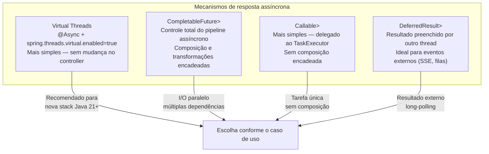

#### Virtual Threads — a forma mais simples (Java 21+ / Spring Boot 3.2+)

Com Virtual Threads habilitados, o controller continua **síncrono** no código mas
não bloqueia threads de plataforma. É a abordagem recomendada para a maioria dos casos:

```java
// application.yml
// spring:
//   threads:
//     virtual:
//       enabled: true    ← habilita Virtual Threads no Tomcat automaticamente

// O controller continua idêntico — sem nenhuma mudança
@GetMapping("/{id}")
public ResponseEntity<ProdutoResponse> buscar(@PathVariable Long id) {
    // Mesmo que esta chamada bloqueie 200ms, a thread virtual é suspensa
    // e a thread de plataforma fica livre para outras requisições
    return ResponseEntity.ok(produtoService.buscar(id));
}
```

#### `CompletableFuture` — composição assíncrona

```java
@RestController
@RequestMapping("/api/v1/produtos")
public class ProdutoAsyncController {

    private final ProdutoService produtoService;
    private final EstoqueService estoqueService;
    private final PrecoService precoService;

    // ─── Retorno simples com CompletableFuture ────────────────────────────────
    //
    // Spring detecta o CompletableFuture e libera a thread do Servlet.
    // Quando o future completar, a resposta é escrita na conexão original.
    @GetMapping("/{id}")
    @Operation(summary = "Buscar produto (assíncrono)")
    public CompletableFuture<ResponseEntity<ProdutoResponse>> buscar(
            @PathVariable Long id) {

        return produtoService.buscarAsync(id)
                .thenApply(ResponseEntity::ok)
                .exceptionally(ex -> {
                    if (ex.getCause() instanceof RecursoNaoEncontradoException) {
                        return ResponseEntity.notFound().build();
                    }
                    return ResponseEntity.internalServerError().build();
                });
    }

    // ─── Múltiplas chamadas paralelas combinadas ───────────────────────────────
    //
    // As três chamadas executam em paralelo; a resposta aguarda todas.
    // Sem CompletableFuture, seriam sequenciais: 300ms + 150ms + 200ms = 650ms.
    // Com paralelismo: max(300, 150, 200) = 300ms.
    @GetMapping("/{id}/detalhes-completos")
    @Operation(summary = "Detalhes completos — busca paralela")
    public CompletableFuture<ResponseEntity<ProdutoDetalhesResponse>> detalhes(
            @PathVariable Long id) {

        var produtoFuture  = produtoService.buscarAsync(id);           // ~300ms
        var estoqueFuture  = estoqueService.buscarPorProdutoAsync(id); // ~150ms
        var precoFuture    = precoService.buscarHistoricoAsync(id);    // ~200ms

        return CompletableFuture.allOf(produtoFuture, estoqueFuture, precoFuture)
                .thenApply(_ -> {
                    var resposta = new ProdutoDetalhesResponse(
                            produtoFuture.join(),
                            estoqueFuture.join(),
                            precoFuture.join()
                    );
                    return ResponseEntity.ok(resposta);
                });
    }

    // ─── CompletableFuture com timeout explícito ──────────────────────────────
    @GetMapping("/{id}/preco-externo")
    public CompletableFuture<ResponseEntity<PrecoExternoResponse>> precoExterno(
            @PathVariable Long id) {

        return precoService.consultarFornecedorAsync(id)
                .orTimeout(5, TimeUnit.SECONDS)           // ← timeout de 5s
                .thenApply(ResponseEntity::ok)
                .exceptionally(ex -> {
                    if (ex.getCause() instanceof TimeoutException) {
                        return ResponseEntity.status(HttpStatus.GATEWAY_TIMEOUT)
                                .build();
                    }
                    return ResponseEntity.status(HttpStatus.BAD_GATEWAY).build();
                });
    }
}
```

#### Serviço assíncrono com `@Async`

```java
@Service
public class ProdutoService {

    private final ProdutoRepository produtoRepository;

    // ─── @Async transforma o retorno em CompletableFuture automaticamente ──────
    //
    // Spring executa o método num thread separado do pool definido em @Async.
    // O chamador (controller) recebe um CompletableFuture já em andamento.
    @Async("asyncExecutor")
    public CompletableFuture<ProdutoResponse> buscarAsync(Long id) {
        var produto = produtoRepository.findById(id)
                .map(ProdutoResponse::from)
                .orElseThrow(() -> new RecursoNaoEncontradoException("Produto", id));
        return CompletableFuture.completedFuture(produto);
    }

    @Async("asyncExecutor")
    public CompletableFuture<List<ProdutoResponse>> listarAsync(ProdutoFiltros filtros,
                                                                  Pageable pageable) {
        return CompletableFuture.completedFuture(
                produtoRepository.findAll(filtros.toSpec(), pageable)
                        .map(ProdutoResponse::from)
                        .toList()
        );
    }
}
```

#### Configuração do `TaskExecutor` para `@Async`

```java
@Configuration
@EnableAsync
public class AsyncConfig implements AsyncConfigurer {

    // ─── Executor dedicado para operações assíncronas da aplicação ────────────
    @Bean("asyncExecutor")
    public Executor asyncExecutor() {
        var executor = new ThreadPoolTaskExecutor();
        executor.setCorePoolSize(10);
        executor.setMaxPoolSize(50);
        executor.setQueueCapacity(200);
        executor.setThreadNamePrefix("async-");

        // Propaga o SecurityContext para threads filhas (@Async + Spring Security)
        executor.setTaskDecorator(new DelegatingSecurityContextTaskDecorator(
                new ContextPropagatingTaskDecorator()));

        // Política de rejeição: lança exceção quando fila está cheia
        executor.setRejectedExecutionHandler(new ThreadPoolExecutor.CallerRunsPolicy());
        executor.initialize();
        return executor;
    }

    // ─── Handler global para exceções não capturadas em @Async ───────────────
    @Override
    public AsyncUncaughtExceptionHandler getAsyncUncaughtExceptionHandler() {
        return (ex, method, params) ->
            LoggerFactory.getLogger(AsyncConfig.class)
                    .error("Erro assíncrono em {}: {}", method.getName(), ex.getMessage(), ex);
    }
}
```

> **Nota sobre Virtual Threads e `@Async`:** com `spring.threads.virtual.enabled=true`,
> o Spring Boot substitui o `SimpleAsyncTaskExecutor` padrão por um executor de
> Virtual Threads automaticamente. Nesse cenário, `@Async` com Virtual Threads
> elimina a necessidade de configurar pool sizes — cada tarefa recebe uma Virtual
> Thread própria sem custo de bloqueio.

#### `Callable<T>` — delegação simples ao `TaskExecutor`

```java
// Callable é a forma mais simples de assincronia sem CompletableFuture.
// Spring MVC executa o Callable num AsyncTaskExecutor e libera a thread do Servlet.
@GetMapping("/processamento-pesado")
public Callable<ResponseEntity<RelatorioResponse>> processamentoPesado(
        @RequestParam String periodo) {

    // O Callable é executado em outro thread — a thread do Servlet é liberada aqui
    return () -> {
        var relatorio = relatorioService.gerarCompleto(periodo); // pode demorar
        return ResponseEntity.ok(relatorio);
    };
}
```

#### `DeferredResult<T>` — resultado produzido por outro componente

```java
// DeferredResult é preenchido por um thread externo (event listener, fila, etc.)
// O Servlet aguarda sem bloquear thread. Ideal para long-polling e integração com
// sistemas de mensageria.
@Component
public class CotacaoController {

    // Mapa de cotações pendentes: tickerSymbol → lista de DeferredResults aguardando
    private final Map<String, List<DeferredResult<ResponseEntity<CotacaoResponse>>>> pendentes
            = new ConcurrentHashMap<>();

    @GetMapping("/api/v1/cotacoes/{ticker}/aguardar")
    @Operation(summary = "Aguarda a próxima atualização de cotação (long-polling)")
    public DeferredResult<ResponseEntity<CotacaoResponse>> aguardarCotacao(
            @PathVariable String ticker) {

        // Timeout de 30s — se não houver atualização, retorna 204
        var result = new DeferredResult<ResponseEntity<CotacaoResponse>>(30_000L,
                ResponseEntity.noContent().build());

        pendentes.computeIfAbsent(ticker, _ -> new CopyOnWriteArrayList<>()).add(result);
        result.onCompletion(() -> pendentes.getOrDefault(ticker, List.of()).remove(result));

        return result;
    }

    // Chamado por um @EventListener ou consumidor de fila quando chega nova cotação
    @EventListener
    public void onNovaCotacao(CotacaoAtualizadaEvent evento) {
        var resultados = pendentes.remove(evento.ticker());
        if (resultados != null) {
            var response = ResponseEntity.ok(CotacaoResponse.from(evento));
            resultados.forEach(r -> r.setResult(response)); // notifica todos os clientes
        }
    }
}
```

#### Tratamento de erros assíncronos no `@ControllerAdvice`

```java
// Exceções lançadas dentro de CompletableFuture são envolvidas em
// CompletionException — o Spring MVC desempacota automaticamente a causa
// antes de passar ao @ExceptionHandler.
@RestControllerAdvice
public class GlobalExceptionHandler {

    // Este handler captura tanto exceções síncronas quanto as desempacotadas
    // de CompletableFuture (Spring MVC faz o unwrap de CompletionException)
    @ExceptionHandler(RecursoNaoEncontradoException.class)
    @ResponseStatus(HttpStatus.NOT_FOUND)
    public ProblemDetail handleNotFound(RecursoNaoEncontradoException ex) {
        return ProblemDetail.forStatusAndDetail(HttpStatus.NOT_FOUND, ex.getMessage());
    }

    // AsyncRequestTimeoutException: lançada quando o timeout do DeferredResult
    // ou Callable expira sem que o resultado tenha sido preenchido
    @ExceptionHandler(AsyncRequestTimeoutException.class)
    @ResponseStatus(HttpStatus.SERVICE_UNAVAILABLE)
    public ProblemDetail handleAsyncTimeout(AsyncRequestTimeoutException ex) {
        return ProblemDetail.forStatusAndDetail(HttpStatus.SERVICE_UNAVAILABLE,
                "Operação expirou — tente novamente");
    }
}
```

#### Configuração do timeout global de async no MVC

```java
// Em WebMvcConfigurer — define o timeout padrão para Callable e DeferredResult
@Override
public void configureAsyncSupport(AsyncSupportConfigurer configurer) {
    configurer.setDefaultTimeout(30_000L); // 30 segundos

    // Quando Virtual Threads estão habilitadas, o Spring Boot já configura
    // um VirtualThreadTaskExecutor automaticamente — não é necessário setar aqui.
    // Para pool de threads convencional:
    // configurer.setTaskExecutor(asyncExecutor());
}
```

#### Teste de endpoint assíncrono

```java
@SpringBootTest(webEnvironment = RANDOM_PORT)
class ProdutoAsyncControllerIT {

    @Autowired
    private RestTestClient restTestClient;

    @MockitoBean
    private ProdutoService produtoService;

    @Test
    @DisplayName("GET /{id} assíncrono → 200 quando produto existe")
    void buscar_Async_Returns200() {
        when(produtoService.buscarAsync(1L))
                .thenReturn(CompletableFuture.completedFuture(
                        new ProdutoResponse(1L, "Notebook", new BigDecimal("3499.99"),
                                "Informática", LocalDateTime.now(), LocalDateTime.now())));

        restTestClient.get()
                .uri("/api/v1/produtos/1")
                .exchange()
                .expectStatus().isOk()
                .expectBody(ProdutoResponse.class)
                .value(p -> assertThat(p.nome()).isEqualTo("Notebook"));
    }

    @Test
    @DisplayName("GET /{id}/preco-externo → 504 quando timeout")
    void buscarPrecoExterno_Timeout_Returns504() {
        when(produtoService.consultarFornecedorAsync(1L))
                .thenReturn(CompletableFuture.failedFuture(new TimeoutException()));

        restTestClient.get()
                .uri("/api/v1/produtos/1/preco-externo")
                .exchange()
                .expectStatus().isEqualTo(HttpStatus.GATEWAY_TIMEOUT);
    }
}
```

---

### 10.10 API Versioning — Spring Boot 4 / Spring Framework 7

O Spring Framework 7 (base do Spring Boot 4) introduziu suporte nativo a
versionamento de API por meio da classe `ApiVersionRequestMappingHandlerMapping`
e da anotação `@ApiVersion`. Isso elimina a necessidade de embutir a versão
explicitamente em cada `@RequestMapping("/api/v1/...")`.

#### Como funciona

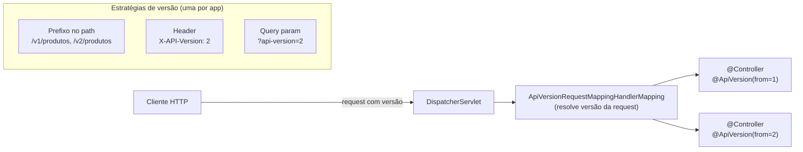

#### Configuração do versionamento

```java
// ─── 1. Configurar a estratégia em WebMvcConfigurer ──────────────────────────
@Configuration
public class WebMvcConfig implements WebMvcConfigurer {

    @Override
    public void configureApiVersioning(ApiVersioningConfigurer configurer) {
        configurer
            // Estratégia 1: versão como prefixo no path  → /v{n}/produtos
            .usePathPrefix("v{version}")

            // Estratégia 2: via header (alternativa)
            // .useRequestHeader("X-API-Version")

            // Estratégia 3: via query param (alternativa)
            // .useRequestParameter("api-version")

            // Versão default quando o cliente não envia nenhuma
            .setDefaultVersion("1")

            // Como reagir a versões sem handler mapeado
            .setIncompatibleVersionStrategy(
                ApiVersionIncompatibleRequestStrategy.sendError(
                    HttpStatus.GONE, "Versão da API não suportada"));
    }
}
```

#### Controllers sem versão no path

```java
// ─── Controller v1 — versão inicial ──────────────────────────────────────────
//
// @ApiVersion(from = "1") = atende requests de versão 1 em diante,
//   até que uma versão mais específica exista para a mesma rota.
//
// Mapeamento gerado automaticamente: /v1/produtos/**
//
@RestController
@RequestMapping("/produtos")   // SEM prefixo de versão na rota!
@ApiVersion(from = "1")
@Tag(name = "Produtos")
public class ProdutoV1Controller {

    @GetMapping("/{id}")
    public ResponseEntity<ProdutoV1Response> buscar(@PathVariable Long id) {
        return ResponseEntity.ok(produtoService.buscarV1(id));
    }

    @GetMapping
    public ResponseEntity<Page<ProdutoV1Response>> listar(Pageable pageable) {
        return ResponseEntity.ok(produtoService.listarV1(pageable));
    }
}

// ─── Controller v2 — breaking change ─────────────────────────────────────────
//
// @ApiVersion(from = "2") = atende requests de versão 2 em diante.
// Requests para /v1/produtos/{id} continuam indo para ProdutoV1Controller.
// Requests para /v2/produtos/{id} vão para ProdutoV2Controller.
//
// Mapeamento gerado automaticamente: /v2/produtos/**
//
@RestController
@RequestMapping("/produtos")   // mesmo path base — o framework diferencia pela versão
@ApiVersion(from = "2")
@Tag(name = "Produtos")
public class ProdutoV2Controller {

    // v2 retorna um Response com campos extras (breaking change justifica nova versão)
    @GetMapping("/{id}")
    public ResponseEntity<ProdutoV2Response> buscar(@PathVariable Long id) {
        return ResponseEntity.ok(produtoService.buscarV2(id));
    }

    // Endpoint novo que existe apenas na v2
    @GetMapping("/{id}/avaliacoes")
    public ResponseEntity<Page<AvaliacaoResponse>> avaliacoes(
            @PathVariable Long id, Pageable pageable) {
        return ResponseEntity.ok(avaliacaoService.listar(id, pageable));
    }
}

// ─── Granularidade por método ─────────────────────────────────────────────────
//
// @ApiVersion pode ser aplicado também em métodos individuais,
// permitindo que apenas parte de um controller seja versionado.
//
@RestController
@RequestMapping("/categorias")
@ApiVersion(from = "1")
public class CategoriaController {

    @GetMapping                     // disponível desde v1
    public List<CategoriaResponse> listar() { ... }

    @GetMapping("/{id}/arvore")
    @ApiVersion(from = "2")         // endpoint novo, apenas v2+
    public CategoriaArvoreResponse arvore(@PathVariable Long id) { ... }

    @DeleteMapping("/{id}")
    @ApiVersion(from = "1", to = "2")  // removido na v3 (deprecated range)
    public void excluir(@PathVariable Long id) { ... }
}
```

#### Documentação OpenAPI por versão

```java
// SpringDoc agrupa automaticamente os endpoints por versão quando configurado:
@Bean
public GroupedOpenApi v1Api() {
    return GroupedOpenApi.builder()
            .group("v1")
            .displayName("API v1 (estável)")
            .addOpenApiCustomizer(api ->
                api.info(new Info().title("API v1").version("1.0")))
            .build();
}

@Bean
public GroupedOpenApi v2Api() {
    return GroupedOpenApi.builder()
            .group("v2")
            .displayName("API v2 (atual)")
            .addOpenApiCustomizer(api ->
                api.info(new Info().title("API v2").version("2.0")))
            .build();
}
```

> **Compatibilidade:** `@ApiVersion` e `configureApiVersioning` são APIs do
> Spring Framework 7 — disponíveis a partir do Spring Boot 4.0. No Spring Boot
> 3.x, o versionamento manual via prefixo de path (`/api/v1/...`) ou
> `GroupedOpenApi` continua sendo a abordagem recomendada.

---

### 10.11 Acesso a Recursos do Servlet — `HttpServletRequest`, `HttpServletResponse` e `RequestContextHolder`

O Spring MVC expõe os objetos do Servlet diretamente como parâmetros de método
nos controllers. Para camadas mais internas (services, componentes) que não têm
acesso direto ao contexto da requisição, o `RequestContextHolder` fornece acesso
estático thread-safe.

#### Injeção direta nos controllers

```java
@RestController
@RequestMapping("/api/v1/exemplos")
public class ExemplosServletController {

    // ─── HttpServletRequest — dados brutos da requisição ─────────────────────
    @GetMapping("/request-info")
    public Map<String, Object> requestInfo(HttpServletRequest request) {
        return Map.of(
            "method",      request.getMethod(),
            "uri",         request.getRequestURI(),
            "queryString", Objects.requireNonNullElse(request.getQueryString(), ""),
            "remoteAddr",  request.getRemoteAddr(),
            "serverName",  request.getServerName(),
            "headers",     Collections.list(request.getHeaderNames())
                               .stream()
                               .collect(Collectors.toMap(
                                   h -> h,
                                   request::getHeader
                               ))
        );
    }

    // ─── HttpServletResponse — manipulação direta da resposta ────────────────
    @GetMapping("/download")
    public void download(HttpServletResponse response) throws IOException {
        response.setContentType("text/csv");
        response.setHeader(HttpHeaders.CONTENT_DISPOSITION,
                           "attachment; filename=\"dados.csv\"");
        response.setCharacterEncoding("UTF-8");

        try (var writer = response.getWriter()) {
            writer.write("id,nome,preco\n");
            writer.write("1,Produto A,99.90\n");
        }
        // Não retorna nada — a resposta já foi escrita diretamente
    }

    // ─── HttpSession — acesso direto ou criação lazy ──────────────────────────
    @GetMapping("/sessao")
    public Map<String, Object> sessao(HttpSession session) {
        // false = não cria sessão se não existir
        // Para acesso sem criar: request.getSession(false)
        return Map.of(
            "sessionId", session.getId(),
            "isNew",     session.isNew(),
            "maxInactive", session.getMaxInactiveInterval()
        );
    }

    // ─── WebRequest — abstração portável (funciona com Servlet e Portlet) ────
    @GetMapping("/web-request")
    public String webRequest(WebRequest webRequest,
                              NativeWebRequest nativeWebRequest) {
        // WebRequest: API portável do Spring
        String param = webRequest.getParameter("q");

        // NativeWebRequest: acesso ao objeto nativo quando necessário
        HttpServletRequest nativo = nativeWebRequest.getNativeRequest(HttpServletRequest.class);

        return param;
    }

    // ─── Principal — usuário autenticado via interface padrão Java EE ─────────
    @GetMapping("/principal")
    public String principal(Principal principal) {
        // Funciona com qualquer mecanismo de autenticação (Basic, JWT, OIDC...)
        return principal != null ? principal.getName() : "anônimo";
    }

    // ─── Locale — idioma/region do cliente ───────────────────────────────────
    @GetMapping("/locale")
    public String locale(Locale locale) {
        // Resolvido pelo LocaleResolver configurado (Accept-Language, cookie, session)
        return locale.toLanguageTag();  // ex: "pt-BR"
    }

    // ─── InputStream / OutputStream direto ───────────────────────────────────
    @PostMapping(value = "/raw-body", consumes = MediaType.APPLICATION_OCTET_STREAM_VALUE)
    public void rawBody(InputStream body, OutputStream out) throws IOException {
        // Leitura e escrita direta nos streams da requisição/resposta
        body.transferTo(out);
    }
}
```

#### `RequestContextHolder` — acesso fora do controller

O `RequestContextHolder` permite acessar o contexto da requisição corrente em
qualquer camada da aplicação — útil em services, interceptors e componentes que
não recebem o request por parâmetro.

```java
// ─── Utilitário de acesso ao contexto da requisição ──────────────────────────
//
// ATENÇÃO: use com parcimônia. Passar HttpServletRequest como parâmetro
// é mais explícito e testável. Use RequestContextHolder apenas quando
// não há acesso direto ao contexto (ex: dentro de um @Component genérico).
//
@Component
public class RequestContextUtils {

    /**
     * Retorna o HttpServletRequest da requisição corrente, ou null se chamado
     * fora do escopo de uma requisição HTTP (ex: thread de background).
     */
    public static HttpServletRequest currentRequest() {
        var attrs = RequestContextHolder.getRequestAttributes();
        if (attrs instanceof ServletRequestAttributes sra) {
            return sra.getRequest();
        }
        return null;
    }

    public static HttpServletResponse currentResponse() {
        var attrs = RequestContextHolder.getRequestAttributes();
        if (attrs instanceof ServletRequestAttributes sra) {
            return sra.getResponse();  // pode ser null se ainda não resolvido
        }
        return null;
    }

    public static HttpSession currentSession(boolean create) {
        var attrs = RequestContextHolder.getRequestAttributes();
        if (attrs instanceof ServletRequestAttributes sra) {
            return sra.getRequest().getSession(create);
        }
        return null;
    }

    /** Header da requisição corrente — útil para ler X-Tenant-Id, X-Correlation-Id etc. */
    public static String header(String name) {
        var req = currentRequest();
        return req != null ? req.getHeader(name) : null;
    }

    /** IP real do cliente, considerando proxies reversos. */
    public static String clientIp() {
        var req = currentRequest();
        if (req == null) return null;
        var forwarded = req.getHeader("X-Forwarded-For");
        if (forwarded != null && !forwarded.isBlank()) {
            return forwarded.split(",")[0].trim();
        }
        return req.getRemoteAddr();
    }
}

// ─── Uso em um @Service (sem receber request como parâmetro) ─────────────────
@Service
public class AuditService {

    public void registrar(String evento) {
        String ip          = RequestContextUtils.clientIp();
        String correlation = RequestContextUtils.header("X-Correlation-Id");
        String uri         = Optional.ofNullable(RequestContextUtils.currentRequest())
                                     .map(HttpServletRequest::getRequestURI)
                                     .orElse("unknown");

        log.info("Evento={} IP={} Correlation={} URI={}", evento, ip, correlation, uri);
    }
}
```

#### Propagação para threads assíncronas

```java
// RequestContextHolder é ThreadLocal — NÃO funciona em threads filhas por padrão.
// Para propagar o contexto em chamadas assíncronas:

@Configuration
public class AsyncConfig {

    @Bean
    public TaskExecutor asyncExecutor() {
        var executor = new ThreadPoolTaskExecutor();
        executor.setCorePoolSize(10);
        executor.setMaxPoolSize(50);
        // Propaga RequestAttributes e SecurityContext para threads do pool
        executor.setTaskDecorator(new RequestContextTaskDecorator());
        return executor;
    }
}

// Decorator que copia o contexto da thread pai para a thread filha
public class RequestContextTaskDecorator implements TaskDecorator {

    @Override
    public Runnable decorate(Runnable runnable) {
        // Captura o contexto da thread chamadora (request thread)
        var requestAttrs  = RequestContextHolder.getRequestAttributes();
        var securityCtx   = SecurityContextHolder.getContext();

        return () -> {
            try {
                RequestContextHolder.setRequestAttributes(requestAttrs);
                SecurityContextHolder.setContext(securityCtx);
                runnable.run();
            } finally {
                RequestContextHolder.resetRequestAttributes();
                SecurityContextHolder.clearContext();
            }
        };
    }
}
```

---

### 10.12 Integração com Spring Security

#### Recuperando o usuário autenticado no Controller

O Spring Security oferece três formas de acessar o usuário no controller, da
mais simples à mais poderosa:

```java
@RestController
@RequestMapping("/api/v1/perfil")
public class PerfilController {

    // ─── Forma 1: @AuthenticationPrincipal (recomendada) ─────────────────────
    //
    // Injeta diretamente o principal retornado pelo UserDetailsService.
    // Mais limpa: sem cast manual, sem acoplamento ao SecurityContextHolder.
    //
    @GetMapping
    public ResponseEntity<PerfilResponse> meuPerfil(
            @AuthenticationPrincipal UserDetails userDetails) {

        return ResponseEntity.ok(perfilService.buscar(userDetails.getUsername()));
    }

    // ─── Forma 1b: @AuthenticationPrincipal com tipo customizado ──────────────
    //
    // Quando UserDetailsService retorna uma implementação própria (UsuarioPrincipal),
    // o Spring faz o cast automaticamente — sem ClassCastException.
    //
    @GetMapping("/completo")
    public ResponseEntity<PerfilResponse> perfilCompleto(
            @AuthenticationPrincipal UsuarioPrincipal principal) {
        // UsuarioPrincipal é seu UserDetails customizado com dados extras
        return ResponseEntity.ok(perfilService.buscarCompleto(principal.getId()));
    }

    // ─── Forma 1c: @AuthenticationPrincipal com SpEL ─────────────────────────
    //
    // Extrai propriedade diretamente do principal usando Spring Expression Language.
    //
    @GetMapping("/id")
    public Long meuId(
            @AuthenticationPrincipal(expression = "id") Long userId) {
        return userId;
    }

    // ─── Forma 2: Authentication como parâmetro ───────────────────────────────
    //
    // Acesso ao objeto Authentication completo: principal, credentials,
    // authorities e detalhes adicionais. Útil quando se precisa das authorities.
    //
    @GetMapping("/roles")
    public List<String> minhasRoles(Authentication authentication) {
        return authentication.getAuthorities().stream()
                .map(GrantedAuthority::getAuthority)
                .toList();
    }

    // ─── Forma 3: SecurityContextHolder (acesso estático) ────────────────────
    //
    // Útil em camadas que não têm Authentication por parâmetro (services, utils).
    // Funciona na mesma thread da requisição (ThreadLocal).
    //
    @GetMapping("/direto")
    public String acessoDireto() {
        var auth = SecurityContextHolder.getContext().getAuthentication();
        if (auth == null || !auth.isAuthenticated()
                || auth instanceof AnonymousAuthenticationToken) {
            return "anônimo";
        }
        return auth.getName();
    }

    // ─── @CurrentSecurityContext — acesso ao SecurityContext completo ─────────
    //
    // Injeta o SecurityContext inteiro, não apenas o Authentication.
    // Raro, mas útil para lógica que precisa do contexto completo.
    //
    @GetMapping("/security-context")
    public String securityContext(
            @CurrentSecurityContext SecurityContext ctx) {
        var auth = ctx.getAuthentication();
        return auth != null ? auth.getName() : "anônimo";
    }
}
```

#### UserDetails customizado — boas práticas

```java
// ─── Principal customizado com dados do domínio ───────────────────────────────
public class UsuarioPrincipal implements UserDetails {

    private final Long id;
    private final String email;
    private final String nome;
    private final String senha;
    private final Collection<? extends GrantedAuthority> authorities;

    public UsuarioPrincipal(Usuario usuario) {
        this.id          = usuario.getId();
        this.email       = usuario.getEmail();
        this.nome        = usuario.getNome();
        this.senha       = usuario.getSenhaHash();
        this.authorities = usuario.getPerfis().stream()
                .map(p -> new SimpleGrantedAuthority("ROLE_" + p.name()))
                .toList();
    }

    // ─── Getters do domínio (não fazem parte da interface UserDetails) ────────
    public Long getId()    { return id; }
    public String getNome(){ return nome; }

    // ─── Interface UserDetails ────────────────────────────────────────────────
    @Override public String getUsername()               { return email; }
    @Override public String getPassword()               { return senha; }
    @Override public Collection<? extends GrantedAuthority> getAuthorities() { return authorities; }
    @Override public boolean isAccountNonExpired()      { return true; }
    @Override public boolean isAccountNonLocked()       { return true; }
    @Override public boolean isCredentialsNonExpired()  { return true; }
    @Override public boolean isEnabled()                { return true; }
}

// ─── UserDetailsService que retorna o tipo customizado ────────────────────────
@Service
public class UsuarioDetailsService implements UserDetailsService {

    private final UsuarioRepository usuarioRepository;

    @Override
    public UserDetails loadUserByUsername(String email) throws UsernameNotFoundException {
        return usuarioRepository.findByEmail(email)
                .map(UsuarioPrincipal::new)
                .orElseThrow(() -> new UsernameNotFoundException("Usuário não encontrado: " + email));
    }
}
```

#### Uso do SecurityContextHolder em services

```java
// ─── Componente utilitário de segurança para uso em qualquer camada ───────────
@Component
public class SecurityUtils {

    /**
     * Retorna o usuário autenticado ou lança exceção se não houver autenticação.
     * Convenção: retorna Optional para não forçar tratamento de exceção em
     * endpoints públicos onde o usuário pode não estar autenticado.
     */
    public Optional<UsuarioPrincipal> usuarioAtual() {
        return Optional.ofNullable(SecurityContextHolder.getContext().getAuthentication())
                .filter(auth -> auth.isAuthenticated()
                        && !(auth instanceof AnonymousAuthenticationToken))
                .map(Authentication::getPrincipal)
                .filter(UsuarioPrincipal.class::isInstance)
                .map(UsuarioPrincipal.class::cast);
    }

    public UsuarioPrincipal usuarioAtualOuErro() {
        return usuarioAtual()
                .orElseThrow(() -> new AccessDeniedException("Usuário não autenticado"));
    }

    public Long idUsuarioAtual() {
        return usuarioAtual().map(UsuarioPrincipal::getId).orElse(null);
    }

    public boolean temRole(String role) {
        return usuarioAtual()
                .map(u -> u.getAuthorities().stream()
                        .anyMatch(a -> a.getAuthority().equals("ROLE_" + role)))
                .orElse(false);
    }
}

// ─── Uso em serviços de domínio ───────────────────────────────────────────────
@Service
public class PedidoService {

    private final SecurityUtils securityUtils;

    public PedidoResponse criar(PedidoRequest request) {
        // Sem parâmetro extra no método — contexto capturado internamente
        var usuario = securityUtils.usuarioAtualOuErro();

        var pedido = new Pedido();
        pedido.setCliente(usuario.getId());
        // ...
        return PedidoResponse.from(pedido);
    }
}
```

#### Thymeleaf + Spring Security — templates seguros

Para usar as expressões de segurança no Thymeleaf, o artefato
`thymeleaf-extras-springsecurity6` deve estar no classpath. O namespace
`sec:` fica disponível automaticamente após a detecção da dependência.

```xml
<!-- pom.xml — necessário para o namespace sec: no Thymeleaf -->
<!-- ✅ Auto-configurado pelo ThymeleafSecurityDialect quando no classpath -->
<dependency>
    <groupId>org.thymeleaf.extras</groupId>
    <artifactId>thymeleaf-extras-springsecurity6</artifactId>
    <!-- Versão gerenciada pelo Spring Boot BOM — não declare explicitamente -->
</dependency>
```

```html
<!-- templates/fragmentos/navbar.html -->
<!DOCTYPE html>
<html xmlns:th="http://www.thymeleaf.org"
      xmlns:sec="http://www.thymeleaf.org/extras/spring-security">
<body>

<!-- ─── Exibição condicional por autenticação ─────────────────────────────── -->
<nav>
    <!-- Bloco visível apenas para usuários NÃO autenticados -->
    <div sec:authorize="!isAuthenticated()">
        <a th:href="@{/login}" class="btn btn-outline-primary">Entrar</a>
        <a th:href="@{/cadastro}" class="btn btn-primary">Cadastrar</a>
    </div>

    <!-- Bloco visível apenas para usuários autenticados -->
    <div sec:authorize="isAuthenticated()">
        <!-- Exibe o username (retorno de Authentication.getName()) -->
        <span>Olá, <strong sec:authentication="name">Usuário</strong>!</span>

        <!-- Exibe propriedade do principal customizado via SpEL -->
        <span sec:authentication="principal.nome">Nome</span>

        <!-- Exibe o e-mail (username configurado no UserDetailsService) -->
        <span sec:authentication="principal.username">e-mail</span>

        <!-- Avatar com iniciais do nome -->
        <span th:text="${#strings.substring(#authentication.principal.nome, 0, 1)}">A</span>

        <!-- Logout com CSRF token obrigatório -->
        <form th:action="@{/logout}" method="post">
            <input type="hidden" th:name="${_csrf.parameterName}" th:value="${_csrf.token}"/>
            <button type="submit" class="btn btn-link">Sair</button>
        </form>
    </div>
</nav>

<!-- ─── Controle por role ──────────────────────────────────────────────────── -->
<aside>
    <!-- Visível apenas para ADMIN -->
    <a sec:authorize="hasRole('ADMIN')" th:href="@{/admin}">Painel Admin</a>

    <!-- Visível para ADMIN ou GERENTE -->
    <a sec:authorize="hasAnyRole('ADMIN', 'GERENTE')" th:href="@{/relatorios}">
        Relatórios
    </a>

    <!-- Visível para quem tem permissão específica (não role) -->
    <button sec:authorize="hasAuthority('PRODUTO_EDITAR')"
            th:onclick="|window.location='${@{/produtos/novo}}'|">
        Novo Produto
    </button>
</aside>

<!-- ─── Acesso a propriedades do principal em templates ───────────────────── -->
<div sec:authorize="isAuthenticated()" class="user-info">
    <!-- authentication.principal devolve o objeto UserDetails (ou customizado) -->
    <p>
        <span class="label">Nome:</span>
        <span sec:authentication="principal.nome">-</span>
    </p>
    <p>
        <span class="label">E-mail:</span>
        <span sec:authentication="principal.username">-</span>
    </p>
    <p>
        <span class="label">Perfis:</span>
        <!-- Lista de GrantedAuthority como string separado por vírgula -->
        <span th:text="${#authentication.principal.authorities}">-</span>
    </p>
</div>

<!-- ─── Expressões SpEL avançadas ─────────────────────────────────────────── -->
<!-- hasPermission() requer PermissionEvaluator customizado -->
<button sec:authorize="hasPermission(#pedido, 'cancelar')">Cancelar pedido</button>

<!-- Checar role E estar em rota específica -->
<a sec:authorize="hasRole('ADMIN') and isFullyAuthenticated()">Área restrita</a>

<!-- ─── Uso no controlador SSR para popular model com dados do usuário ─────── -->
<!--
    No controller, você pode adicionar dados do usuário ao model explicitamente:

    @GetMapping("/dashboard")
    public String dashboard(@AuthenticationPrincipal UsuarioPrincipal principal,
                             Model model) {
        model.addAttribute("usuario", principal);
        return "dashboard";
    }

    Ou usar @ModelAttribute global no @ControllerAdvice para disponibilizar
    o usuário em TODAS as views sem repetição:

    @ControllerAdvice
    public class SecurityModelAdvice {
        @ModelAttribute("usuarioLogado")
        public UsuarioPrincipal usuarioLogado(
                @AuthenticationPrincipal UsuarioPrincipal principal) {
            return principal;  // null quando não autenticado
        }
    }

    Então no template: th:text="${usuarioLogado?.nome}"
-->
</body>
</html>
```

#### @ControllerAdvice global para dados de segurança nas views SSR

```java
// ─── Disponibiliza dados do usuário em TODAS as views Thymeleaf ───────────────
//
// Alternativa ao sec:authentication do Thymeleaf quando se precisa de
// propriedades do domínio que não estão na interface UserDetails.
//
@ControllerAdvice
public class SecurityModelAdvice {

    /**
     * Injeta o usuário autenticado no model de TODAS as requisições MVC.
     * Retorna null se não autenticado — templates usam ${usuarioLogado?.nome}.
     */
    @ModelAttribute("usuarioLogado")
    public UsuarioPrincipal usuarioLogado(
            @AuthenticationPrincipal UsuarioPrincipal principal) {
        return principal;
    }

    /** Disponibiliza a lista de roles para lógica condicional nos templates. */
    @ModelAttribute("roles")
    public Set<String> roles(Authentication authentication) {
        if (authentication == null) return Set.of();
        return authentication.getAuthorities().stream()
                .map(GrantedAuthority::getAuthority)
                .collect(Collectors.toSet());
    }
}
```

```html
<!-- Uso nas views sem nenhum @sec adicional ──────────────────────────────── -->
<div th:if="${usuarioLogado != null}">
    <p th:text="${usuarioLogado.nome}">Nome</p>
    <p th:text="${usuarioLogado.email}">Email</p>

    <!-- roles vem do @ModelAttribute("roles") -->
    <a th:if="${roles.contains('ROLE_ADMIN')}" th:href="@{/admin}">Admin</a>
</div>
```

#### Diagrama — fluxo de resolução do usuário autenticado

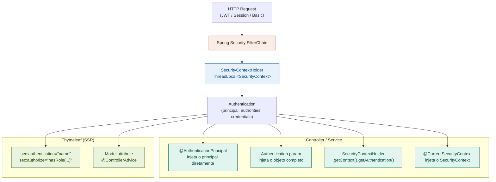

---

## 11. Alternativas ao Thymeleaf

### 11.1 Comparativo de Engines de Template

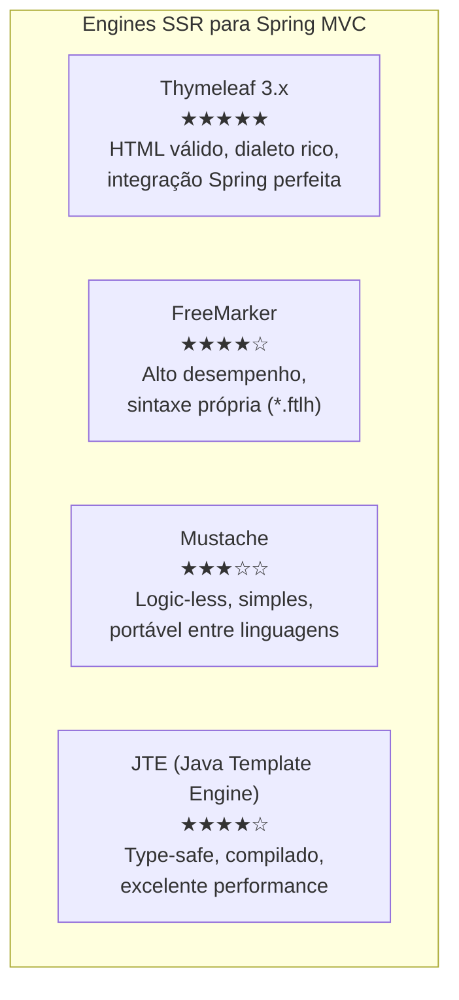

### 11.2 FreeMarker

```xml
<dependency>
    <groupId>org.springframework.boot</groupId>
    <artifactId>spring-boot-starter-freemarker</artifactId>
</dependency>
```

```yaml
spring:
  freemarker:
    template-loader-path: classpath:/templates/
    suffix: .ftlh
    charset: UTF-8
    cache: false
    settings:
      number_format: ",##0.##"
      date_format: dd/MM/yyyy
```

```html
<!-- templates/produtos/lista.ftlh -->
<#list produtos as produto>
    <p>${produto.nome} — R$ ${produto.preco?string("0.00")}</p>
</#list>

<!-- Macro reutilizável (equivale a fragment do Thymeleaf) -->
<#macro campo label nome>
    <div class="mb-3">
        <label>${label}</label>
        <input type="text" name="${nome}" value="${(form[nome])!}">
    </div>
</#macro>
<@campo label="Nome" nome="nome"/>
```

### 11.3 JTE (Java Template Engine) — Recomendado para Performance

JTE compila os templates para bytecode Java, oferecendo type-safety em tempo de compilação e desempenho superior ao Thymeleaf.

```xml
<dependency>
    <groupId>gg.jte</groupId>
    <artifactId>jte-spring-boot-starter-3</artifactId>
    <version>3.1.12</version>
</dependency>
```

```java
// src/main/jte/produtos/lista.jte
@import br.com.app.dto.ProdutoResponse
@import java.util.List

@param List<ProdutoResponse> produtos
@param String busca

<!DOCTYPE html>
<html>
<body>
<h1>Produtos</h1>
@for(var produto : produtos)
    <div class="card">
        <h3>${produto.nome()}</h3>   <%-- Erro de compilação se campo não existir! --%>
        <p>R$ ${produto.preco()}</p>
    </div>
@endfor

@if(produtos.isEmpty())
    <p>Nenhum produto encontrado.</p>
@endif
</body>
</html>
```

### 11.4 Quando Usar Cada Template Engine

| Cenário | Recomendação |
|---|---|
| Projeto Spring Boot padrão | **Thymeleaf** — melhor ecossistema, Spring Security integrado |
| Alta performance / muitas requests | **JTE** — compilado, type-safe |
| Templates de e-mail | **Thymeleaf** — dialeto rico para HTML de e-mail |
| Equipe com Java forte, sem UX | **JTE** — erros em tempo de compilação |
| Templates portáveis (Java + Node) | **Mustache** |
| Geração de documentos (PDF, XML) | **FreeMarker** — mais controle sobre output |

---

## 12. Boas Práticas e Checklist

### 12.1 Diagrama de Fluxo de Decisão

```mermaid
flowchart TD
    A[Novo Endpoint] --> B{REST ou SSR?}

    B -->|REST| C[Criar DTO com Records]
    B -->|SSR| D[Criar Form Object + Template]

    C --> E[Adicionar anotações Bean Validation]
    D --> E

    E --> F[Criar Controller com mapeamento correto]
    F --> G{Requer conversão<br/>de tipos?}

    G -->|Sim| H[Implementar Converter<br/>ou Formatter]
    G -->|Não| I[Implementar lógica de serviço]
    H --> I

    I --> J[Configurar tratamento de erros<br/>@ControllerAdvice]
    J --> K{REST?}

    K -->|Sim| L[Documentar com OpenAPI]
    K -->|Não| M[Testar formulário com<br/>cenários de erro]

    L --> N[Escrever testes]
    M --> N

    N --> O[@WebMvcTest + @SpringBootTest<br/>RestTestClient ou REST Assured]
```

### 12.2 Checklist — REST Controllers

- [ ] Usar `@RestController` (combina `@Controller` + `@ResponseBody`)
- [ ] Versionamento de API na URL: `/api/v1/...`
- [ ] Retornar `ResponseEntity<T>` com status HTTP correto
- [ ] POST retorna `201 Created` + header `Location`
- [ ] DELETE retorna `204 No Content`
- [ ] Usar `@Validated` no controller para validar `@PathVariable` e `@RequestParam`
- [ ] Separar DTOs de Request e Response (nunca expor entidades JPA)
- [ ] Usar Records para DTOs imutáveis
- [ ] Documentar com `@Tag`, `@Operation`, `@ApiResponse`
- [ ] Tratar erros com `@RestControllerAdvice` e `ProblemDetail` (RFC 9457)
- [ ] CORS configurado explicitamente (nunca `*` em produção)

### 12.3 Checklist — SSR Controllers

- [ ] Usar `@Controller` (não `@RestController`)
- [ ] Criar Form Objects separados das entidades/DTOs
- [ ] Sempre checar `bindingResult.hasErrors()` ANTES de usar o form
- [ ] Usar `RedirectAttributes.addFlashAttribute()` para mensagens pós-redirect (PRG)
- [ ] Usar `@ModelAttribute` para dados comuns (select options, etc.)
- [ ] Configurar `HiddenHttpMethodFilter` para PUT/DELETE em forms HTML
- [ ] Aplicar `StringTrimmerEditor` via `@InitBinder`
- [ ] Definir `setAllowedFields` para prevenir mass assignment

### 12.4 Checklist — Validação

- [ ] Bean Validation nas camadas Controller E Service (`@Validated`)
- [ ] Usar grupos de validação para criar/atualizar com regras diferentes
- [ ] Constraints customizadas para regras de domínio (CPF, CNPJ, etc.)
- [ ] `@Valid` em objetos aninhados e coleções para cascata
- [ ] Mensagens de erro externalizadas em `messages.properties`
- [ ] `@EmailUnico`, `@CpfUnico` com acesso ao repositório via Spring

### 12.5 Anti-patterns a Evitar

```java
// ❌ Expondo entidade JPA diretamente
@GetMapping("/{id}")
public Produto buscar(@PathVariable Long id) { ... }

// ✅ DTO como contrato da API
@GetMapping("/{id}")
public ResponseEntity<ProdutoResponse> buscar(@PathVariable Long id) { ... }

// ❌ Lógica de negócio no Controller
@PostMapping
public ResponseEntity<?> criar(@RequestBody ProdutoRequest req) {
    if (produtoRepository.existsBySku(req.sku())) {
        return ResponseEntity.badRequest().body("SKU duplicado");
    }
    produtoRepository.save(new Produto(req.nome(), req.preco()));
    // ...
}

// ✅ Controller delega para Service
@PostMapping
public ResponseEntity<ProdutoResponse> criar(
        @RequestBody @Valid ProdutoCreateRequest req,
        UriComponentsBuilder uriBuilder) {
    var produto = produtoService.criar(req);
    var location = uriBuilder.path("/api/v1/produtos/{id}")
            .buildAndExpand(produto.id()).toUri();
    return ResponseEntity.created(location).body(produto);
}

// ❌ Verificar BindingResult DEPOIS de usar o form
@PostMapping
public String salvar(@ModelAttribute @Valid ProdutoForm form,
                     BindingResult result, Model model) {
    produtoService.salvar(form);  // ERRO: usa o form antes de checar!
    if (result.hasErrors()) return "formulario";
    return "redirect:/lista";
}

// ✅ Verificar BindingResult PRIMEIRO
@PostMapping
public String salvar(@ModelAttribute @Valid ProdutoForm form,
                     BindingResult result, Model model) {
    if (result.hasErrors()) return "formulario";  // Verifica ANTES
    produtoService.salvar(form);
    return "redirect:/lista";
}

// ❌ @InitBinder sem whitelist (vulnerável a mass assignment)
@InitBinder
public void init(WebDataBinder binder) {
    binder.registerCustomEditor(String.class, new StringTrimmerEditor(true));
    // Esqueceu setAllowedFields!
}

// ✅ Sempre proteger com whitelist
@InitBinder
public void init(WebDataBinder binder) {
    binder.registerCustomEditor(String.class, new StringTrimmerEditor(true));
    binder.setAllowedFields("nome", "descricao", "preco", "estoque", "categoriaId");
}
```

### 12.6 Mensagens de Validação i18n — Integração com messages.properties

Por padrão o Bean Validation resolve mensagens no arquivo
`ValidationMessages.properties` (padrão Jakarta) ou dentro das próprias
anotações. Para usar o sistema de mensagens do Spring (`messages.properties`)
— unificando as traduções de validação com as demais mensagens da aplicação —
é necessário conectar o `MessageSource` ao validador.

#### O que o Spring Boot faz automaticamente

| Comportamento | Auto-configurado? |
|---|---|
| `MessageSource` lendo `classpath:messages*.properties` | ✅ `MessageSourceAutoConfiguration` |
| Validador padrão (`javax.validation`) | ✅ `ValidationAutoConfiguration` |
| Validador integrado ao `MessageSource` do Spring | ❌ **Requer configuração manual** |
| Interpolação `{min}`, `{max}`, `{value}` nos arquivos `.properties` | ✅ Funcionam após integração |

> **Por que não é automático?** O `ValidationAutoConfiguration` registra um
> `LocalValidatorFactoryBean`, mas sem apontar para o `MessageSource` da
> aplicação. O Spring Boot *evita* sobrescrever o bean do usuário, por isso
> a integração precisa ser declarada explicitamente.

#### Convenções de nomenclatura de chaves

O Bean Validation procura mensagens na seguinte ordem de prioridade:

1. `{chave}` literal definida no atributo `message` da constraint
2. `{NomeDaConstraint.nomeDoTipo.nomeDoCampo}` — ex.: `NotBlank.clienteRequest.cpf`
3. `{NomeDaConstraint.nomeDoCampo}` — ex.: `NotBlank.cpf`
4. `{NomeDaConstraint.tipoPrimitivo}` — ex.: `NotBlank.java.lang.String`
5. `{NomeDaConstraint}` — ex.: `NotBlank`

```properties
# src/main/resources/messages.properties
# ─── Chaves explícitas referenciadas com {chave} nas anotações ────────────────
produto.nome.obrigatorio=Nome do produto é obrigatório
produto.nome.tamanho=Nome deve ter entre {min} e {max} caracteres
produto.preco.minimo=Preço deve ser maior que {value}
produto.estoque.invalido=Estoque não pode ser negativo

# ─── Constraints customizadas ─────────────────────────────────────────────────
br.com.app.validation.cpf.invalido=CPF inválido
br.com.app.validation.email.unico=E-mail já cadastrado no sistema

# ─── Chaves por convenção de nome (sem precisar declarar message=) ────────────
# Bean Validation resolve automaticamente pelo padrão: ConstraintName.campo
NotBlank.clienteRequest.nome=Nome é obrigatório
Size.clienteRequest.nome=Nome deve ter entre {min} e {max} caracteres
Email.clienteRequest.email=E-mail inválido

# ─── Fallback genérico por tipo de constraint ─────────────────────────────────
NotBlank=Campo obrigatório
NotNull=Campo obrigatório
Size=Tamanho inválido: deve ter entre {min} e {max} caracteres
```

```java
// ─── Configuração necessária para integrar MessageSource ao validador ─────────
//
// ⚠️  Spring Boot NÃO faz isso automaticamente.
//     Sem este bean, mensagens como {produto.nome.obrigatorio} ficam
//     literalmente na resposta em vez de serem resolvidas.
//
@Configuration
public class ValidationConfig {

    // MessageSource já é auto-configurado pelo Spring Boot a partir de
    // messages.properties — este bean é necessário apenas para wiring manual.
    @Bean
    public LocalValidatorFactoryBean validator(MessageSource messageSource) {
        var factory = new LocalValidatorFactoryBean();
        // Aponta o validador para o MessageSource da aplicação
        factory.setValidationMessageSource(messageSource);
        return factory;
    }
}
```

```java
// ─── Uso nas constraints: referencias com {chave} ─────────────────────────────
public record ProdutoRequest(

    // Referência explícita a chave do messages.properties
    @NotBlank(message = "{produto.nome.obrigatorio}")
    @Size(min = 2, max = 200, message = "{produto.nome.tamanho}")
    String nome,

    // Sem message= : Bean Validation usa a convenção de nomes (NotNull.preco,
    // NotNull.java.math.BigDecimal ou NotNull — nessa ordem de prioridade)
    @NotNull
    @Positive
    BigDecimal preco,

    // Interpolação de atributos da própria anotação: {min}, {max}, {value}
    // funcionam dentro dos messages.properties após a integração acima
    @Size(min = 3, max = 50)  // {min}=3 e {max}=50 ficam disponíveis no template
    String sku
) {}
```

```yaml
# application.yml — configuração do MessageSource (auto-configurado pelo Boot)
# Estas propriedades são gerenciadas por MessageSourceAutoConfiguration.
spring:
  messages:
    basename: messages          # padrão; separe com vírgula para múltiplos arquivos
    encoding: UTF-8             # padrão UTF-8
    cache-duration: 1s          # 0 = sem cache (útil em desenvolvimento)
    use-code-as-default-message: false  # false = lança exceção se chave não existir
```

---

## Referências

- [Spring MVC Reference Documentation](https://docs.spring.io/spring-framework/reference/web/webmvc.html)
- [Spring Boot Web Reference](https://docs.spring.io/spring-boot/reference/web/servlet.html)
- [Thymeleaf Documentation](https://www.thymeleaf.org/documentation.html)
- [Thymeleaf Layout Dialect](https://ultraq.github.io/thymeleaf-layout-dialect/)
- [SpringDoc OpenAPI 3.x](https://springdoc.org/)
- [Jakarta Bean Validation 3.0](https://beanvalidation.org/3.0/)
- [RFC 9457 — Problem Details for HTTP APIs](https://www.rfc-editor.org/rfc/rfc9457)
- [JTE — Java Template Engine](https://jte.gg/)

---

*Documento gerado para Spring Boot 3.5 / 4.0 com Java 21+*
---

## 13. CORS — Cross-Origin Resource Sharing

### 13.1 Como o CORS Funciona

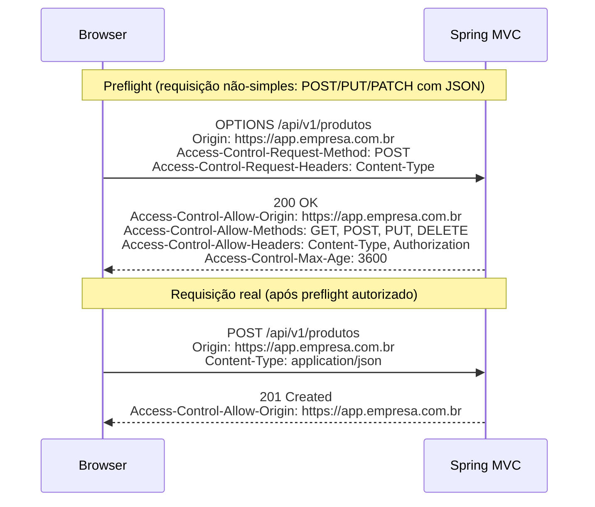

**Requisições "simples"** (sem preflight): `GET`, `HEAD`, `POST` com `Content-Type: application/x-www-form-urlencoded`, `multipart/form-data` ou `text/plain`.
Qualquer outro método ou Content-Type (incluindo `application/json`) dispara o preflight.

### 13.2 Configuração Global — `WebMvcConfigurer`

```java
@Configuration
public class WebMvcConfig implements WebMvcConfigurer {

    @Override
    public void addCorsMappings(CorsRegistry registry) {
        registry.addMapping("/api/**")
                // Origens exatas — preferível a wildcard em produção
                .allowedOrigins(
                    "https://app.empresa.com.br",
                    "https://admin.empresa.com.br"
                )
                // allowedOriginPatterns aceita wildcards no subdomínio
                // .allowedOriginPatterns("https://*.empresa.com.br")

                .allowedMethods("GET", "POST", "PUT", "PATCH", "DELETE", "OPTIONS")

                // Headers que o browser pode enviar
                .allowedHeaders(
                    "Authorization",
                    "Content-Type",
                    "X-Requested-With",
                    "X-API-Version"
                )

                // Headers que o browser pode ler na resposta
                // (por padrão apenas CORS-safelisted headers são expostos)
                .exposedHeaders(
                    "Location",
                    "X-Total-Count",
                    "X-Correlation-ID"
                )

                // Permite envio de cookies/credentials (requer origem exata, não *)
                .allowCredentials(true)

                // Duração do cache do preflight no browser (segundos)
                // ✅ Default: 1800 (30 min). Máximo aceito pelo Chrome: 7200 (2h)
                .maxAge(3600);

        // Endpoints públicos — mais permissivo
        registry.addMapping("/api/public/**")
                .allowedOriginPatterns("*")
                .allowedMethods("GET")
                .allowCredentials(false);
    }
}
```

### 13.3 `@CrossOrigin` por Controller ou Método

```java
// ─── Nível de classe: aplica a TODOS os métodos do controller ─────────────────
@RestController
@RequestMapping("/api/v1/produtos")
@CrossOrigin(
    origins            = "https://app.empresa.com.br",
    allowedHeaders     = "*",
    allowCredentials   = "true",
    maxAge             = 3600
)
public class ProdutoController { /* ... */ }

// ─── Nível de método: sobrescreve ou complementa o nível de classe ────────────
@RestController
@RequestMapping("/api/v1/relatorios")
@CrossOrigin(origins = "https://app.empresa.com.br")   // restrito por padrão
public class RelatorioController {

    @GetMapping("/publico")
    @CrossOrigin(origins = "*", allowCredentials = "false") // este endpoint é público
    public ResponseEntity<RelatorioPublicoResponse> relatorioPublico() {
        return ResponseEntity.ok(relatorioService.publico());
    }

    @GetMapping("/interno")
    // herda o @CrossOrigin da classe — apenas app.empresa.com.br
    public ResponseEntity<RelatorioInternoResponse> relatorioInterno(
            @AuthenticationPrincipal UsuarioDetails usuario) {
        return ResponseEntity.ok(relatorioService.interno(usuario));
    }
}
```

> **`@CrossOrigin` vs configuração global:** a configuração via `WebMvcConfigurer`
> é preferível para a maioria dos casos, pois centraliza a política e evita
> divergências entre controllers. `@CrossOrigin` é útil quando um endpoint
> específico precisa de política diferente da global.

### 13.4 Integração Obrigatória com Spring Security

> ⚠️ **Armadilha comum:** configurar CORS no `WebMvcConfigurer` **não é suficiente**
> quando Spring Security está presente. O `SecurityFilterChain` intercepta a
> requisição antes do `DispatcherServlet` — sem a configuração no Security, os
> preflights `OPTIONS` recebem 401 ou 403 e o browser bloqueia tudo.

```java
@Configuration
@EnableWebSecurity
public class SecurityConfig {

    @Bean
    public SecurityFilterChain securityFilterChain(HttpSecurity http) throws Exception {
        http
            // CORS deve ser habilitado AQUI para que o CorsFilter do Spring
            // seja registrado na cadeia do Security antes da autenticação.
            // Ele lê a configuração do CorsConfigurationSource bean abaixo.
            .cors(cors -> cors.configurationSource(corsConfigurationSource()))

            .csrf(csrf -> csrf.disable())   // APIs REST stateless
            .authorizeHttpRequests(auth -> auth
                .requestMatchers(HttpMethod.OPTIONS, "/**").permitAll() // preflight sem auth
                .requestMatchers("/api/public/**").permitAll()
                .anyRequest().authenticated()
            )
            .sessionManagement(session ->
                session.sessionCreationPolicy(SessionCreationPolicy.STATELESS))
            .oauth2ResourceServer(oauth2 -> oauth2.jwt(Customizer.withDefaults()));

        return http.build();
    }

    @Bean
    public CorsConfigurationSource corsConfigurationSource() {
        var config = new CorsConfiguration();
        config.setAllowedOrigins(List.of(
            "https://app.empresa.com.br",
            "https://admin.empresa.com.br"
        ));
        config.setAllowedMethods(List.of("GET","POST","PUT","PATCH","DELETE","OPTIONS"));
        config.setAllowedHeaders(List.of("Authorization","Content-Type","X-API-Version"));
        config.setExposedHeaders(List.of("Location","X-Total-Count"));
        config.setAllowCredentials(true);
        config.setMaxAge(3600L);

        var source = new UrlBasedCorsConfigurationSource();
        source.registerCorsConfiguration("/api/**", config);
        return source;
    }
}
```

### 13.5 CORS Dinâmico — Origens em Banco de Dados

```java
/**
 * CorsConfigurationSource que lê as origens permitidas do banco de dados,
 * com cache para não consultar a cada requisição.
 *
 * Útil para aplicações multi-tenant onde cada tenant tem sua própria origem.
 */
@Component
public class DynamicCorsConfigurationSource implements CorsConfigurationSource {

    private final OrigemPermitidaRepository origemRepository;

    // Cache de 5 minutos para evitar query por requisição
    @Cacheable("corsOrigens")
    public List<String> origensPermitidas() {
        return origemRepository.findAllAtivas()
                .stream()
                .map(OrigemPermitida::getUrl)
                .toList();
    }

    @Override
    public CorsConfiguration getCorsConfiguration(HttpServletRequest request) {
        var config = new CorsConfiguration();
        config.setAllowedOrigins(origensPermitidas());
        config.setAllowedMethods(List.of("GET","POST","PUT","PATCH","DELETE","OPTIONS"));
        config.setAllowedHeaders(List.of("*"));
        config.setAllowCredentials(true);
        config.setMaxAge(600L);
        return config;
    }
}
```

### 13.6 Diagnóstico de Problemas CORS

```yaml
# application-dev-local.yml — habilitar log do CorsFilter para diagnóstico
logging:
  level:
    org.springframework.web.cors: DEBUG
    org.springframework.security.web.cors: DEBUG
```

| Sintoma | Causa mais provável | Solução |
|---|---|---|
| `No 'Access-Control-Allow-Origin'` em produção | `allowedOrigins` não inclui a origem exata | Verificar o header `Origin` da requisição e adicionar à lista |
| Preflight retorna 401 | Spring Security sem `.cors()` configurado | Adicionar `CorsConfigurationSource` bean e `.cors(cors -> ...)` |
| `allowCredentials` não funciona | Usando `allowedOriginPatterns("*")` com `allowCredentials(true)` | Usar origens exatas — wildcard e credentials são incompatíveis |
| Origem permitida mas headers bloqueados | `allowedHeaders` não inclui o header enviado | Adicionar o header à lista ou usar `allowedHeaders("*")` |
| `exposedHeaders` não visível no browser | Header não listado em `exposedHeaders` | Adicionar o header à lista de expostos |

---

## 14. ETag e Cache HTTP

### 14.1 Visão Geral dos Mecanismos de Cache

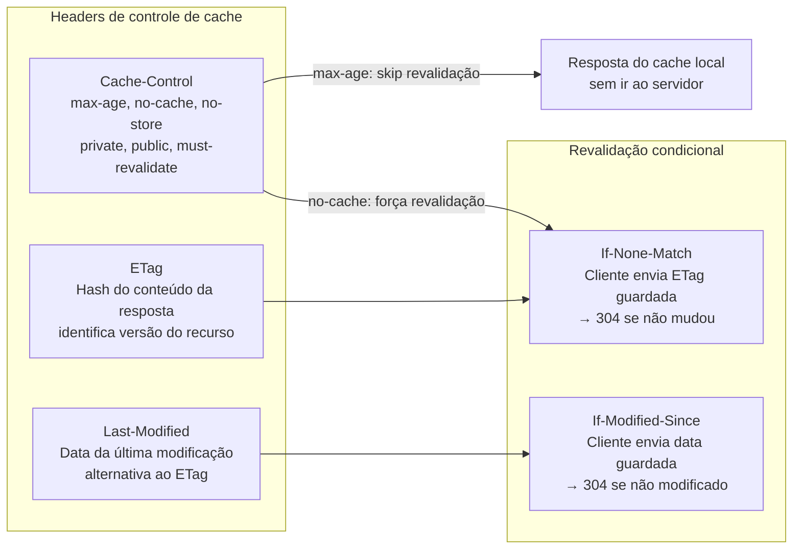

### 14.2 `ShallowEtagHeaderFilter` — ETag Automático

O `ShallowEtagHeaderFilter` calcula o hash MD5 do body da resposta e adiciona o
header `ETag` automaticamente. Nas requisições seguintes com `If-None-Match`,
ele compara os ETags e retorna 304 sem re-executar o controller.

```java
// ─── Registro do filtro — Spring Boot NÃO registra automaticamente ────────────
@Configuration
public class CacheConfig {

    /**
     * ShallowEtagHeaderFilter: calcula ETag a partir do body serializado.
     * "Shallow" = baseado apenas no conteúdo da resposta, não em dados do domínio.
     *
     * O controller AINDA é executado — o 304 é decidido pelo filtro após a execução.
     * Para evitar a execução do controller, use ETag baseada em versão (seção 14.3).
     */
    @Bean
    public FilterRegistrationBean<ShallowEtagHeaderFilter> etagFilter() {
        var registration = new FilterRegistrationBean<>(new ShallowEtagHeaderFilter());
        registration.addUrlPatterns("/api/*");
        registration.setOrder(Ordered.LOWEST_PRECEDENCE - 10);
        return registration;
    }
}
```

```yaml
# application.yml — sem configuração Spring Boot automática para este filtro
# O filtro deve ser registrado explicitamente como acima.
```

### 14.3 `ResponseEntity` com ETag e Last-Modified

Para evitar execução desnecessária do controller, use `WebRequest.checkNotModified()`
— retorna `true` e define o status 304 antes de qualquer processamento:

```java
@RestController
@RequestMapping("/api/v1/produtos")
public class ProdutoController {

    private final ProdutoService produtoService;

    // ─── ETag baseada no hash/versão do recurso ───────────────────────────────
    @GetMapping("/{id}")
    public ResponseEntity<ProdutoResponse> buscar(
            @PathVariable Long id,
            WebRequest webRequest) {

        var produto = produtoService.buscarPorId(id);

        // Calcula ETag a partir da versão do objeto (ex.: campo @Version do JPA)
        // ou de um hash do conteúdo — mais eficiente que ShallowEtagHeaderFilter
        // pois evita executar a serialização completa
        String etag = "\"" + produto.versao() + "\""; // aspas obrigatórias na spec

        // Se o cliente enviou If-None-Match e o ETag não mudou:
        // checkNotModified seta status 304 e retorna true — retornar null encerra a resposta
        if (webRequest.checkNotModified(etag)) {
            return null; // Spring MVC envia 304 automaticamente
        }

        return ResponseEntity.ok()
                .eTag(etag)
                .cacheControl(CacheControl.maxAge(60, TimeUnit.SECONDS)
                        .cachePublic()
                        .mustRevalidate())
                .body(produto);
    }

    // ─── Last-Modified — alternativa ao ETag para recursos baseados em tempo ──
    @GetMapping("/{id}/foto")
    public ResponseEntity<Resource> foto(
            @PathVariable Long id,
            WebRequest webRequest) {

        var foto = produtoService.buscarFoto(id);
        long lastModifiedMs = foto.atualizadoEm().toInstant(ZoneOffset.UTC).toEpochMilli();

        if (webRequest.checkNotModified(lastModifiedMs)) {
            return null; // 304
        }

        return ResponseEntity.ok()
                .lastModified(foto.atualizadoEm())
                .cacheControl(CacheControl.maxAge(1, TimeUnit.HOURS).cachePublic())
                .contentType(MediaType.IMAGE_JPEG)
                .body(foto.resource());
    }

    // ─── ETag + Last-Modified combinados ─────────────────────────────────────
    @GetMapping("/{id}/detalhes")
    public ResponseEntity<ProdutoDetalhesResponse> detalhes(
            @PathVariable Long id,
            WebRequest webRequest) {

        var produto = produtoService.buscarDetalhes(id);
        String etag = "\"" + produto.checksum() + "\"";
        long  lastModified = produto.atualizadoEm().toInstant(ZoneOffset.UTC).toEpochMilli();

        // Verifica ETag E Last-Modified — retorna 304 se qualquer um corresponder
        if (webRequest.checkNotModified(etag, lastModified)) {
            return null;
        }

        return ResponseEntity.ok()
                .eTag(etag)
                .lastModified(produto.atualizadoEm())
                .cacheControl(CacheControl.maxAge(120, TimeUnit.SECONDS))
                .body(produto);
    }
}
```

### 14.4 `CacheControl` — Políticas Comuns

```java
@RestController
@RequestMapping("/api/v1/catalogo")
public class CatalogoController {

    // ─── Recurso público, cacheable por proxies ────────────────────────────────
    // max-age=300: cache válido por 5 minutos
    // public: proxies e CDNs podem armazenar
    @GetMapping("/categorias")
    public ResponseEntity<List<CategoriaResponse>> categorias() {
        return ResponseEntity.ok()
                .cacheControl(CacheControl.maxAge(5, TimeUnit.MINUTES).cachePublic())
                .body(catalogoService.listarCategorias());
    }

    // ─── Recurso privado por usuário — só browser pode cachear ───────────────
    // private: proxy não armazena (conteúdo é específico do usuário)
    @GetMapping("/minha-lista")
    public ResponseEntity<List<ProdutoResponse>> minhaLista(
            @AuthenticationPrincipal UsuarioDetails usuario) {
        return ResponseEntity.ok()
                .cacheControl(CacheControl.maxAge(1, TimeUnit.MINUTES).cachePrivate())
                .body(catalogoService.listarFavoritos(usuario.getId()));
    }

    // ─── Sem cache algum — dados em tempo real ────────────────────────────────
    @GetMapping("/estoque/{id}")
    public ResponseEntity<EstoqueResponse> estoque(@PathVariable Long id) {
        return ResponseEntity.ok()
                .cacheControl(CacheControl.noStore())
                .body(catalogoService.consultarEstoque(id));
    }

    // ─── no-cache: armazena mas sempre revalida ───────────────────────────────
    // Útil quando o recurso muda com frequência imprevisível mas
    // revalidação com ETag/304 é barata
    @GetMapping("/preco/{id}")
    public ResponseEntity<PrecoResponse> preco(
            @PathVariable Long id,
            WebRequest webRequest) {

        var preco = catalogoService.consultarPreco(id);
        String etag = "\"" + preco.hashCode() + "\"";

        if (webRequest.checkNotModified(etag)) return null;

        return ResponseEntity.ok()
                .eTag(etag)
                .cacheControl(CacheControl.noCache())   // revalida sempre, mas armazena
                .body(preco);
    }

    // ─── Recurso imutável — pode ser cacheado para sempre ────────────────────
    // Usado para assets com hash no nome (ex: produto-thumbnail-a3f8d2.jpg)
    @GetMapping("/imagens/{hash}")
    public ResponseEntity<Resource> imagem(@PathVariable String hash) {
        return ResponseEntity.ok()
                .cacheControl(CacheControl.maxAge(365, TimeUnit.DAYS)
                        .cachePublic()
                        .immutable())
                .body(catalogoService.buscarImagem(hash));
    }
}
```

### 14.5 Cache HTTP em Views SSR

```java
// Para páginas Thymeleaf com dados relativamente estáveis
@Controller
@RequestMapping("/catalogo")
public class CatalogoMvcController {

    @GetMapping("/vitrine")
    public String vitrine(Model model, HttpServletResponse response) {
        // Adiciona headers de cache à resposta HTML
        response.setHeader(HttpHeaders.CACHE_CONTROL,
                "public, max-age=300, must-revalidate");

        model.addAttribute("produtos", catalogoService.destaques());
        return "catalogo/vitrine";
    }
}
```

```yaml
# application.yml — Cache-Control para recursos estáticos (auto-configurado pelo Boot)
spring:
  web:
    resources:
      cache:
        period: 3600          # segundos — padrão 0 (sem cache)
        cachecontrol:
          max-age: 3600
          cache-public: true
          must-revalidate: true
```

### 14.6 Resumo: Quando Usar Cada Estratégia

| Recurso | Estratégia recomendada | Headers |
|---|---|---|
| Dados que mudam raramente (categorias, config) | `max-age` longo + `public` | `Cache-Control: public, max-age=3600` |
| Dados por usuário | `max-age` curto + `private` | `Cache-Control: private, max-age=60` |
| Dados voláteis mas verificáveis | `no-cache` + ETag | `ETag: "abc"`, `Cache-Control: no-cache` |
| Dados em tempo real (estoque, preço ao vivo) | `no-store` | `Cache-Control: no-store` |
| Assets com hash no nome | `immutable` | `Cache-Control: public, max-age=31536000, immutable` |
| API paginada | ETag por página + `max-age` curto | `ETag: "page-0-hash"` |

---

## 15. Upload de Arquivos

### 15.1 Configuração

```yaml
# application.yml — MultipartAutoConfiguration (✅ auto-configurado pelo Boot)
spring:
  servlet:
    multipart:
      enabled: true             # ✅ Default: true
      max-file-size: 10MB       # ✅ Default: 1MB — tamanho máximo por arquivo
      max-request-size: 50MB    # ✅ Default: 10MB — tamanho total da requisição
      file-size-threshold: 2KB  # ✅ Default: 0 — acima disso grava em disco temporário
      location: /tmp/uploads    # ✅ Default: diretório temporário do SO
```

### 15.2 Controller de Upload

```java
@RestController
@RequestMapping("/api/v1/arquivos")
public class ArquivoController {

    private final ArquivoService arquivoService;

    // ─── Upload simples — arquivo único ──────────────────────────────────────
    @PostMapping(consumes = MediaType.MULTIPART_FORM_DATA_VALUE)
    @Operation(summary = "Upload de arquivo único")
    public ResponseEntity<ArquivoResponse> upload(
            @RequestParam("arquivo") MultipartFile arquivo) {

        validarArquivo(arquivo);
        var response = arquivoService.salvar(arquivo);

        return ResponseEntity.created(
                URI.create("/api/v1/arquivos/" + response.id()))
                .body(response);
    }

    // ─── Upload com metadados — @RequestPart ─────────────────────────────────
    // @RequestPart permite enviar JSON + arquivo na mesma requisição multipart
    @PostMapping(value = "/com-metadados", consumes = MediaType.MULTIPART_FORM_DATA_VALUE)
    public ResponseEntity<ArquivoResponse> uploadComMetadados(
            @RequestPart("arquivo")   MultipartFile arquivo,
            @RequestPart("metadados") @Valid ArquivoMetadadosRequest metadados) {

        validarArquivo(arquivo);
        return ResponseEntity.ok(arquivoService.salvarComMetadados(arquivo, metadados));
    }

    // ─── Upload múltiplo ──────────────────────────────────────────────────────
    @PostMapping(value = "/multiplos", consumes = MediaType.MULTIPART_FORM_DATA_VALUE)
    public ResponseEntity<List<ArquivoResponse>> uploadMultiplo(
            @RequestParam("arquivos") List<MultipartFile> arquivos) {

        if (arquivos.size() > 10) {
            throw new NegocioException("Máximo de 10 arquivos por requisição");
        }
        arquivos.forEach(this::validarArquivo);

        return ResponseEntity.ok(arquivoService.salvarTodos(arquivos));
    }

    // ─── Validação do arquivo ─────────────────────────────────────────────────
    private void validarArquivo(MultipartFile arquivo) {
        if (arquivo.isEmpty()) {
            throw new NegocioException("Arquivo não pode ser vazio");
        }
        if (arquivo.getSize() > 10 * 1024 * 1024) { // 10 MB
            throw new NegocioException("Arquivo excede o tamanho máximo de 10 MB");
        }

        // Validação de MIME type real (não confia apenas na extensão)
        String contentType = detectarMimeType(arquivo);
        var permitidos = Set.of("image/jpeg", "image/png", "image/webp",
                                "application/pdf", "text/csv");
        if (!permitidos.contains(contentType)) {
            throw new NegocioException(
                    "Tipo de arquivo não permitido: " + contentType);
        }
    }

    private String detectarMimeType(MultipartFile arquivo) {
        try {
            // Apache Tika ou Files.probeContentType são mais seguros que
            // confiar no Content-Type declarado pelo cliente
            var tika = new Tika();
            return tika.detect(arquivo.getInputStream());
        } catch (IOException e) {
            throw new NegocioException("Não foi possível verificar o tipo do arquivo");
        }
    }
}
```

### 15.3 Service — Estratégias de Armazenamento

```java
@Service
public class ArquivoService {

    private final Path storageDir;

    public ArquivoService(@Value("${app.storage.dir:uploads}") String dir) {
        this.storageDir = Paths.get(dir).toAbsolutePath().normalize();
        try {
            Files.createDirectories(storageDir);
        } catch (IOException e) {
            throw new IllegalStateException("Não foi possível criar diretório de uploads", e);
        }
    }

    // ─── Estratégia 1: disco local ────────────────────────────────────────────
    public ArquivoResponse salvarLocalmente(MultipartFile arquivo) {
        // Nunca usar o nome original diretamente — risco de path traversal
        String extensao  = StringUtils.getFilenameExtension(arquivo.getOriginalFilename());
        String nomeSeguro = UUID.randomUUID() + (extensao != null ? "." + extensao : "");
        Path destino = storageDir.resolve(nomeSeguro);

        try {
            Files.copy(arquivo.getInputStream(), destino,
                    StandardCopyOption.REPLACE_EXISTING);
        } catch (IOException e) {
            throw new NegocioException("Erro ao salvar arquivo: " + e.getMessage());
        }

        return new ArquivoResponse(
                UUID.randomUUID().toString(),
                nomeSeguro,
                arquivo.getSize(),
                arquivo.getContentType(),
                "/api/v1/arquivos/" + nomeSeguro);
    }

    // ─── Estratégia 2: S3 / MinIO via Spring Cloud AWS ───────────────────────
    public ArquivoResponse salvarS3(MultipartFile arquivo, S3Template s3Template) {
        String chave = "uploads/" + UUID.randomUUID() + "/"
                + arquivo.getOriginalFilename();
        try {
            var upload = s3Template.upload(
                    "meu-bucket", chave,
                    arquivo.getInputStream(),
                    ObjectMetadata.builder()
                            .contentType(arquivo.getContentType())
                            .contentLength(arquivo.getSize())
                            .build());

            return new ArquivoResponse(
                    chave,
                    arquivo.getOriginalFilename(),
                    arquivo.getSize(),
                    arquivo.getContentType(),
                    upload.url().toString());
        } catch (IOException e) {
            throw new NegocioException("Erro ao enviar para S3: " + e.getMessage());
        }
    }
}
```

### 15.4 Download de Arquivos

```java
@GetMapping("/{nomeArquivo:.+}")
public ResponseEntity<Resource> download(@PathVariable String nomeArquivo) {
    Path caminho = storageDir.resolve(nomeArquivo).normalize();

    // Proteção contra path traversal: garante que o arquivo está dentro do storageDir
    if (!caminho.startsWith(storageDir)) {
        throw new RecursoNaoEncontradoException("Arquivo", nomeArquivo);
    }

    Resource resource = new FileSystemResource(caminho);
    if (!resource.exists() || !resource.isReadable()) {
        throw new RecursoNaoEncontradoException("Arquivo", nomeArquivo);
    }

    String contentType;
    try {
        contentType = Files.probeContentType(caminho);
    } catch (IOException e) {
        contentType = MediaType.APPLICATION_OCTET_STREAM_VALUE;
    }

    return ResponseEntity.ok()
            .contentType(MediaType.parseMediaType(contentType))
            .header(HttpHeaders.CONTENT_DISPOSITION,
                    ContentDisposition.attachment()
                            .filename(nomeArquivo, StandardCharsets.UTF_8)
                            .build()
                            .toString())
            .body(resource);
}
```

### 15.5 Upload via Fetch API (JavaScript)

#### Upload simples com arquivo único

```html
<!-- templates/arquivos/upload.html (Thymeleaf) -->
<form id="uploadForm">
    <input type="file" id="arquivo" name="arquivo" accept="image/*,.pdf,.csv">
    <div id="progress" style="display:none">
        <div id="progressBar" style="width:0%;height:8px;background:#0d6efd;transition:width .2s"></div>
        <span id="progressText">0%</span>
    </div>
    <button type="submit" class="btn btn-primary">Enviar</button>
</form>
<div id="resultado"></div>

<script>
document.getElementById('uploadForm').addEventListener('submit', async (e) => {
    e.preventDefault();

    const arquivo = document.getElementById('arquivo').files[0];
    if (!arquivo) return alert('Selecione um arquivo');

    const formData = new FormData();
    formData.append('arquivo', arquivo);          // nome deve corresponder ao @RequestParam

    const csrfToken  = document.querySelector('meta[name="_csrf"]')?.content;
    const csrfHeader = document.querySelector('meta[name="_csrf_header"]')?.content;

    const headers = {};
    if (csrfToken && csrfHeader) {
        headers[csrfHeader] = csrfToken;          // CSRF para apps SSR com Spring Security
    }

    try {
        // XMLHttpRequest para acompanhar progresso (Fetch API não suporta upload progress)
        await uploadComProgresso('/api/v1/arquivos', formData, headers);
    } catch (err) {
        document.getElementById('resultado').innerHTML =
            `<div class="alert alert-danger">Erro: ${err.message}</div>`;
    }
});

function uploadComProgresso(url, formData, headers) {
    return new Promise((resolve, reject) => {
        const xhr = new XMLHttpRequest();

        xhr.upload.addEventListener('progress', (e) => {
            if (e.lengthComputable) {
                const pct = Math.round((e.loaded / e.total) * 100);
                document.getElementById('progress').style.display = 'block';
                document.getElementById('progressBar').style.width = pct + '%';
                document.getElementById('progressText').textContent = pct + '%';
            }
        });

        xhr.addEventListener('load', () => {
            if (xhr.status >= 200 && xhr.status < 300) {
                const data = JSON.parse(xhr.responseText);
                document.getElementById('resultado').innerHTML =
                    `<div class="alert alert-success">
                        Arquivo enviado: <a href="${data.url}">${data.nome}</a>
                     </div>`;
                resolve(data);
            } else {
                const err = JSON.parse(xhr.responseText);
                reject(new Error(err.detail || 'Erro no upload'));
            }
        });

        xhr.addEventListener('error', () => reject(new Error('Falha na conexão')));

        xhr.open('POST', url);
        Object.entries(headers).forEach(([k, v]) => xhr.setRequestHeader(k, v));
        xhr.send(formData);
    });
}
</script>
```

#### Upload com múltiplos arquivos e pré-visualização

```html
<input type="file" id="arquivos" multiple accept="image/*">
<div id="preview" class="d-flex flex-wrap gap-2 my-3"></div>
<button id="btnEnviar" class="btn btn-primary" disabled>Enviar todos</button>

<script>
const input     = document.getElementById('arquivos');
const preview   = document.getElementById('preview');
const btnEnviar = document.getElementById('btnEnviar');
const CSRF      = document.querySelector('meta[name="_csrf"]')?.content;
const CSRF_HDR  = document.querySelector('meta[name="_csrf_header"]')?.content;

input.addEventListener('change', () => {
    preview.innerHTML = '';
    [...input.files].forEach(file => {
        if (!file.type.startsWith('image/')) return;
        const reader = new FileReader();
        reader.onload = (e) => {
            const img = document.createElement('img');
            img.src = e.target.result;
            img.style.cssText = 'width:80px;height:80px;object-fit:cover;border-radius:4px';
            img.title = file.name;
            preview.appendChild(img);
        };
        reader.readAsDataURL(file);
    });
    btnEnviar.disabled = input.files.length === 0;
});

btnEnviar.addEventListener('click', async () => {
    const formData = new FormData();
    [...input.files].forEach(f => formData.append('arquivos', f)); // mesmo @RequestParam

    const headers = {};
    if (CSRF && CSRF_HDR) headers[CSRF_HDR] = CSRF;

    const res = await fetch('/api/v1/arquivos/multiplos', {
        method: 'POST',
        headers,
        body: formData
        // NÃO definir Content-Type — o browser define com o boundary correto
    });

    if (!res.ok) {
        const err = await res.json();
        alert('Erro: ' + (err.detail ?? res.statusText));
        return;
    }

    const arquivos = await res.json();
    console.log('Enviados:', arquivos);
});
</script>
```

#### Upload de arquivo com JSON (usando `@RequestPart`)

```javascript
// Fetch API: envia arquivo + JSON na mesma requisição multipart
async function uploadComMetadados(arquivo, metadados) {
    const formData = new FormData();

    // Parte 1: arquivo binário
    formData.append('arquivo', arquivo);

    // Parte 2: JSON como Blob com Content-Type explícito
    // Necessário para que o Spring MVC deserialize o JSON corretamente com @RequestPart
    formData.append(
        'metadados',
        new Blob([JSON.stringify(metadados)], { type: 'application/json' })
    );

    const res = await fetch('/api/v1/arquivos/com-metadados', {
        method: 'POST',
        headers: {
            [document.querySelector('meta[name="_csrf_header"]').content]:
             document.querySelector('meta[name="_csrf"]').content
        },
        body: formData
    });

    if (!res.ok) throw new Error(await res.text());
    return res.json();
}

// Exemplo de uso
uploadComMetadados(
    document.getElementById('arquivo').files[0],
    { titulo: 'Foto do produto', descricao: 'Vista frontal', publica: true }
).then(r => console.log('Arquivo salvo:', r));
```

#### Tratamento de erros de upload no `@ControllerAdvice`

```java
@RestControllerAdvice
public class GlobalExceptionHandler {

    // Arquivo maior que spring.servlet.multipart.max-file-size
    @ExceptionHandler(MaxUploadSizeExceededException.class)
    @ResponseStatus(HttpStatus.PAYLOAD_TOO_LARGE)
    public ProblemDetail handleMaxSize(MaxUploadSizeExceededException ex) {
        return ProblemDetail.forStatusAndDetail(
                HttpStatus.PAYLOAD_TOO_LARGE,
                "Arquivo excede o tamanho máximo permitido");
    }

    // Arquivo corrompido ou leitura falhou
    @ExceptionHandler(MultipartException.class)
    @ResponseStatus(HttpStatus.BAD_REQUEST)
    public ProblemDetail handleMultipart(MultipartException ex) {
        return ProblemDetail.forStatusAndDetail(
                HttpStatus.BAD_REQUEST,
                "Requisição multipart inválida: " + ex.getMessage());
    }
}
```

---

## 16. Internacionalização (i18n)

### 16.1 Estratégias de Resolução de Locale

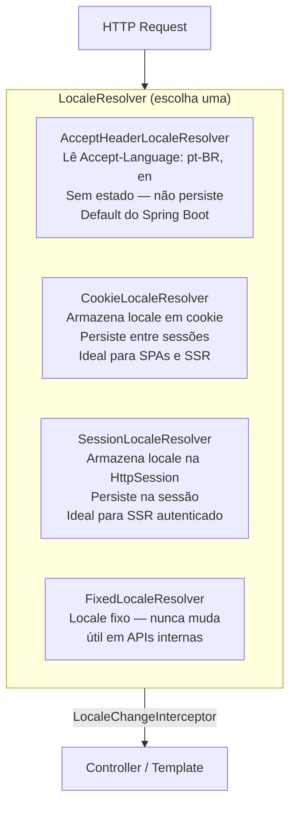

### 16.2 Configuração Completa

```java
@Configuration
public class I18nConfig implements WebMvcConfigurer {

    // ─── 1. LocaleResolver — escolha conforme o tipo de aplicação ─────────────

    // Para SSR com usuário logado: SessionLocaleResolver
    @Bean
    public LocaleResolver localeResolver() {
        var resolver = new CookieLocaleResolver("APP_LOCALE");
        resolver.setDefaultLocale(new Locale("pt", "BR"));
        resolver.setDefaultTimeZone(TimeZone.getTimeZone("America/Sao_Paulo"));
        resolver.setCookieMaxAge(Duration.ofDays(365));
        resolver.setCookieHttpOnly(true);
        resolver.setCookieSecure(true); // apenas HTTPS em produção
        return resolver;
    }

    // Para REST APIs stateless: AcceptHeaderLocaleResolver
    // @Bean
    // public LocaleResolver localeResolver() {
    //     var resolver = new AcceptHeaderLocaleResolver();
    //     resolver.setDefaultLocale(new Locale("pt", "BR"));
    //     resolver.setSupportedLocales(List.of(
    //         new Locale("pt", "BR"),
    //         Locale.ENGLISH
    //     ));
    //     return resolver;
    // }

    // ─── 2. LocaleChangeInterceptor — muda locale via query param ─────────────
    // GET /qualquer-rota?lang=en  → muda para inglês
    // GET /qualquer-rota?lang=pt-BR → muda para português
    @Bean
    public LocaleChangeInterceptor localeChangeInterceptor() {
        var interceptor = new LocaleChangeInterceptor();
        interceptor.setParamName("lang");
        return interceptor;
    }

    @Override
    public void addInterceptors(InterceptorRegistry registry) {
        registry.addInterceptor(localeChangeInterceptor());
    }

    // ─── 3. MessageSource — carrega os arquivos de mensagens ──────────────────
    // ✅ Spring Boot auto-configura via MessageSourceAutoConfiguration
    // Declare apenas para customizar (charset, cache, múltiplos basenames)
    @Bean
    public MessageSource messageSource() {
        var source = new ReloadableResourceBundleMessageSource();
        source.setBasenames(
            "classpath:messages",        // messages_pt_BR.properties, messages_en.properties
            "classpath:validation-messages" // separado para mensagens de validação
        );
        source.setDefaultEncoding("UTF-8");
        source.setDefaultLocale(new Locale("pt", "BR"));
        source.setCacheSeconds(3600);    // 0 = sem cache (dev), 3600 (prod)
        source.setUseCodeAsDefaultMessage(false);
        return source;
    }

    // ─── 4. Conectar MessageSource ao Bean Validation ─────────────────────────
    // ⚠️ NÃO automático — necessário para {chave} nas mensagens de constraint
    @Bean
    public LocalValidatorFactoryBean validator(MessageSource messageSource) {
        var factory = new LocalValidatorFactoryBean();
        factory.setValidationMessageSource(messageSource);
        return factory;
    }
}
```

```yaml
# application.yml — MessageSourceAutoConfiguration
spring:
  messages:
    basename: messages             # ✅ Default: messages
    encoding: UTF-8               # ✅ Default: UTF-8
    cache-duration: 3600s         # ✅ Default: sem cache
    use-code-as-default-message: false
    fallback-to-system-locale: true  # tenta locale do SO se não encontrar o arquivo
```

### 16.3 Arquivos de Mensagens

```
src/main/resources/
├── messages.properties           ← fallback (pt-BR, idioma padrão)
├── messages_pt_BR.properties     ← português do Brasil
├── messages_en.properties        ← inglês
├── messages_es.properties        ← espanhol (opcional)
└── validation-messages.properties← mensagens de constraint (todas as línguas)
```

```properties
# messages_pt_BR.properties
# ─── Títulos e navegação ──────────────────────────────────────────────────────
app.titulo=Minha Aplicação
app.nav.home=Início
app.nav.produtos=Produtos
app.nav.sair=Sair

# ─── Mensagens de feedback ────────────────────────────────────────────────────
produto.criado=Produto "{0}" cadastrado com sucesso!
produto.atualizado=Produto atualizado.
produto.removido=Produto removido.
produto.nao.encontrado=Produto com ID {0} não encontrado.

# ─── Labels de formulário ─────────────────────────────────────────────────────
form.campo.nome=Nome
form.campo.preco=Preço
form.campo.estoque=Estoque em estoque
form.botao.salvar=Salvar
form.botao.cancelar=Cancelar

# ─── Paginação ────────────────────────────────────────────────────────────────
paginacao.anterior=Anterior
paginacao.proximo=Próximo
paginacao.total=Mostrando {0} a {1} de {2} registros
```

```properties
# messages_en.properties
app.titulo=My Application
app.nav.home=Home
app.nav.produtos=Products
app.nav.sair=Sign out

produto.criado=Product "{0}" created successfully!
produto.atualizado=Product updated.
produto.removido=Product removed.
produto.nao.encontrado=Product with ID {0} not found.

form.campo.nome=Name
form.campo.preco=Price
form.campo.estoque=Stock
form.botao.salvar=Save
form.botao.cancelar=Cancel

paginacao.anterior=Previous
paginacao.proximo=Next
paginacao.total=Showing {0} to {1} of {2} records
```

```properties
# validation-messages.properties (sem sufixo de locale — único arquivo para todas as línguas
# OU criar validation-messages_pt_BR.properties e validation-messages_en.properties)

# Convenção Jakarta Bean Validation: ConstraintName.objectName.fieldName
NotBlank.produtoRequest.nome=Nome do produto é obrigatório
Size.produtoRequest.nome=Nome deve ter entre {min} e {max} caracteres

# Fallback por tipo de constraint
NotBlank=Campo obrigatório
NotNull=Campo obrigatório
Size=Deve ter entre {min} e {max} caracteres
Min=Valor mínimo: {value}
Max=Valor máximo: {value}
Email=E-mail inválido
Positive=Deve ser um número positivo
DecimalMin=Valor mínimo: {value}

# Constraints customizadas
br.com.app.validation.cpf.invalido=CPF inválido
br.com.app.validation.email.unico=E-mail já cadastrado
```

### 16.4 i18n em Controllers REST

```java
@RestController
@RequestMapping("/api/v1/produtos")
public class ProdutoController {

    private final MessageSource messageSource;

    // ─── Usando MessageSource diretamente ─────────────────────────────────────
    @DeleteMapping("/{id}")
    @ResponseStatus(HttpStatus.NO_CONTENT)
    public void excluir(@PathVariable Long id, Locale locale) {
        produtoService.excluir(id);
        // locale é injetado pelo LocaleResolver — sem acoplamento ao request
    }

    // ─── Mensagem localizada em ProblemDetail ─────────────────────────────────
    @GetMapping("/{id}")
    public ResponseEntity<ProdutoResponse> buscar(
            @PathVariable Long id,
            Locale locale) {

        return produtoService.buscarPorId(id)
                .map(ResponseEntity::ok)
                .orElseThrow(() -> {
                    String msg = messageSource.getMessage(
                            "produto.nao.encontrado",
                            new Object[]{id},
                            locale);
                    return new RecursoNaoEncontradoException(msg);
                });
    }
}
```

```java
// ─── @ControllerAdvice localizando mensagens de erro ─────────────────────────
@RestControllerAdvice
public class GlobalExceptionHandler {

    private final MessageSource messageSource;

    @ExceptionHandler(RecursoNaoEncontradoException.class)
    @ResponseStatus(HttpStatus.NOT_FOUND)
    public ProblemDetail handleNotFound(
            RecursoNaoEncontradoException ex,
            Locale locale) {

        // A mensagem já vem localizada da exceção OU buscamos aqui
        var pd = ProblemDetail.forStatusAndDetail(
                HttpStatus.NOT_FOUND, ex.getMessage());
        pd.setTitle(messageSource.getMessage(
                "error.not.found.title", null, "Not Found", locale));
        return pd;
    }
}
```

### 16.5 i18n em Templates Thymeleaf

```html
<!DOCTYPE html>
<html xmlns:th="http://www.thymeleaf.org"
      xmlns:layout="http://www.ultraq.net.nz/thymeleaf/layout"
      layout:decorate="~{layout/base}">
<body>
<section layout:fragment="content">

<!-- ─── #{chave} — resolve mensagem do MessageSource para o locale atual ─────
     Equivalente a messageSource.getMessage("produto.criado", null, locale)     -->
<h1 th:text="#{app.nav.produtos}">Produtos</h1>

<!-- ─── #{chave(param1, param2)} — mensagem com parâmetros ──────────────────
     Equivale ao {0}, {1} nos arquivos .properties                              -->
<p th:text="#{paginacao.total(${page.number * page.size + 1},
                               ${page.number * page.size + page.numberOfElements},
                               ${page.totalElements})}">
    Mostrando 1 a 20 de 150 registros
</p>

<!-- ─── Mensagem flash localizada ────────────────────────────────────────────
     O controller envia a chave (não o texto) como flash attribute             -->
<div th:if="${mensagemChave}" class="alert alert-success">
    <!-- Resolve a chave com parâmetros opcionais -->
    <span th:text="${mensagemArgs != null}
                    ? #{__${mensagemChave}__(__${mensagemArgs}__)}
                    : #{__${mensagemChave}__}">
    </span>
</div>

<!-- ─── Labels de formulário com fallback ────────────────────────────────────
     #{chave,default='texto'} — exibe o default se a chave não existir         -->
<label th:text="#{form.campo.nome,default='Nome'}">Nome</label>

<!-- ─── Seletor de idioma ────────────────────────────────────────────────────
     LocaleChangeInterceptor intercepta o parâmetro lang e altera o locale     -->
<div class="dropdown">
    <button class="btn btn-sm btn-outline-secondary dropdown-toggle">
        Idioma
    </button>
    <ul class="dropdown-menu">
        <li><a class="dropdown-item" th:href="@{/(lang=pt-BR)}">🇧🇷 Português</a></li>
        <li><a class="dropdown-item" th:href="@{/(lang=en)}">🇺🇸 English</a></li>
        <li><a class="dropdown-item" th:href="@{/(lang=es)}">🇪🇸 Español</a></li>
    </ul>
</div>

<!-- ─── Formatação de data/número com o locale atual ─────────────────────────
     Thymeleaf usa automaticamente o locale resolvido pelo LocaleResolver       -->
<td th:text="${#temporals.format(produto.criadoEm, 'dd/MM/yyyy HH:mm')}"></td>
<td th:text="${#numbers.formatDecimal(produto.preco, 1, 'POINT', 2, 'COMMA')}"></td>

<!-- ─── Acesso programático ao locale atual ──────────────────────────────────
     #locale é o objeto java.util.Locale resolvido para a requisição atual      -->
<span th:text="${#locale.language}">pt</span>
<span th:text="${#locale.country}">BR</span>
<span th:text="${#locale}">pt_BR</span>

</section>
</body>
</html>
```

### 16.6 Controller SSR — enviando chave em vez de texto

```java
// Padrão recomendado para SSR: o controller envia CHAVES, o template resolve
@Controller
@RequestMapping("/produtos")
public class ProdutoMvcController {

    @PostMapping
    public String salvar(@ModelAttribute @Valid ProdutoForm form,
                         BindingResult binding,
                         RedirectAttributes redirectAttrs) {
        if (binding.hasErrors()) return "produtos/formulario";

        var produto = produtoService.criar(form);

        // Envia a CHAVE da mensagem e os argumentos separados
        // O template Thymeleaf resolve com o locale do usuário
        redirectAttrs.addFlashAttribute("mensagemChave", "produto.criado");
        redirectAttrs.addFlashAttribute("mensagemArgs", produto.getNome());

        return "redirect:/produtos";
    }
}
```

### 16.7 i18n em Respostas JSON — `MessageSourceAccessor`

```java
/**
 * Wrapper conveniente sobre MessageSource — atalho para evitar
 * passar Locale explicitamente em todo lugar.
 * Usa o Locale do LocaleContextHolder (thread-local do Spring MVC).
 */
@Configuration
public class I18nConfig {

    @Bean
    public MessageSourceAccessor messageSourceAccessor(MessageSource messageSource) {
        return new MessageSourceAccessor(messageSource, new Locale("pt", "BR"));
    }
}

// Uso em services e components sem precisar injetar Locale
@Service
public class NotificacaoService {

    private final MessageSourceAccessor messages;

    public String getTextoEmail(String chave, Object... args) {
        // Usa o Locale do LocaleContextHolder — respeita o locale da requisição
        return messages.getMessage(chave, args);
    }

    public void enviarBoasVindas(Usuario usuario) {
        String assunto = messages.getMessage("email.boas.vindas.assunto",
                new Object[]{usuario.getNome()});
        String corpo   = messages.getMessage("email.boas.vindas.corpo",
                new Object[]{usuario.getNome()});
        emailService.enviar(usuario.getEmail(), assunto, corpo);
    }
}
```

### 16.8 Timezone — Integração com i18n

```java
// LocaleContextHolder carrega Locale E TimeZone — útil para formatação
@Component
public class DateTimeFormatter {

    public String formatarParaUsuario(LocalDateTime dateTime) {
        TimeZone tz = LocaleContextHolder.getTimeZone();
        ZoneId zoneId = tz != null ? tz.toZoneId() : ZoneOffset.UTC;

        DateTimeFormatter fmt = DateTimeFormatter
                .ofLocalizedDateTime(FormatStyle.MEDIUM)
                .withLocale(LocaleContextHolder.getLocale())
                .withZone(zoneId);

        return fmt.format(dateTime.atZone(ZoneId.systemDefault())
                .withZoneSameInstant(zoneId));
    }
}
```


---


---

## 17. Customização do `ErrorController`

O Spring Boot registra automaticamente um `BasicErrorController` que serve o
endpoint `/error` — ponto de chegada de todos os erros não tratados por um
`@ControllerAdvice` (ex.: 404 gerado antes do `DispatcherServlet`, exceções em
filtros, erros de Tomcat). Esta seção cobre como personalizar esse comportamento.

### 17.1 Como o Fluxo de Erro Funciona

```mermaid
flowchart LR
    REQ["Request"] --> F["Filters / Security"]
    F -->|exceção no filtro| EC["/error\nBasicErrorController"]
    F --> DS["DispatcherServlet"]
    DS -->|404 — handler não encontrado| EC
    DS --> CTRL["@Controller / @RestController"]
    CTRL -->|exceção não mapeada| CA["@ControllerAdvice\nGlobalExceptionHandler"]
    CA -->|exceção não mapeada| EC
    EC -->|browser| VIEW["Whitelabel Error Page\nou template error/*.html"]
    EC -->|cliente REST| JSON["JSON ProblemDetail"]
```

> A regra prática é: `@ControllerAdvice` para a esmagadora maioria dos casos;
> `ErrorController` apenas para erros que **escapam** do `DispatcherServlet`.

### 17.2 Customizando o `BasicErrorController`

#### Abordagem 1 — `ErrorAttributes` customizado

A forma mais simples: substitui apenas o **conteúdo** da resposta de erro sem
reimplementar o controller.

```java
/**
 * Substitui o DefaultErrorAttributes do Spring Boot.
 * Controla quais campos aparecem na resposta JSON de /error
 * e adiciona informações customizadas.
 */
@Component
public class AppErrorAttributes extends DefaultErrorAttributes {

    @Override
    public Map<String, Object> getErrorAttributes(WebRequest webRequest,
                                                   ErrorAttributeOptions options) {
        // Começa com os atributos padrão (timestamp, status, error, path...)
        Map<String, Object> attrs = super.getErrorAttributes(webRequest, options);

        // Remove campos verbosos que não devem ser expostos ao cliente
        attrs.remove("exception");   // classe da exceção interna
        attrs.remove("trace");       // stack trace

        // Adiciona campos customizados
        attrs.put("api_version", "v1");
        attrs.put("docs", "https://api.empresa.com.br/docs/erros");

        // Recupera a exceção original para enriquecer a resposta
        Throwable ex = getError(webRequest);
        if (ex instanceof RecursoNaoEncontradoException e) {
            attrs.put("recurso", e.getRecurso());
            attrs.put("identificador", e.getId());
        }

        return attrs;
    }
}
```

#### Abordagem 2 — `ErrorController` completo

Reimplementa todo o endpoint `/error`, separando a resposta para clientes REST
e para o browser (SSR):

```java
/**
 * Substitui o BasicErrorController do Spring Boot.
 *
 * Registrar este bean faz o Spring Boot desabilitar o BasicErrorController
 * automaticamente — não é necessário excluir nenhuma auto-configuração.
 */
@Controller
@RequestMapping("${server.error.path:${error.path:/error}}")
public class AppErrorController implements ErrorController {

    private final ErrorAttributes errorAttributes;

    public AppErrorController(ErrorAttributes errorAttributes) {
        this.errorAttributes = errorAttributes;
    }

    // ─── Resposta JSON para clientes REST ─────────────────────────────────────
    @RequestMapping(produces = MediaType.APPLICATION_JSON_VALUE)
    @ResponseBody
    public ResponseEntity<Map<String, Object>> errorJson(HttpServletRequest request) {
        var attrs   = getErrorAttributes(request);
        var status  = HttpStatus.valueOf((int) attrs.getOrDefault("status", 500));

        // Formata no padrão RFC 9457 (ProblemDetail)
        var body = new LinkedHashMap<String, Object>();
        body.put("type",     "https://api.empresa.com.br/erros/" + status.value());
        body.put("title",    status.getReasonPhrase());
        body.put("status",   status.value());
        body.put("detail",   attrs.getOrDefault("message", "Erro interno"));
        body.put("instance", attrs.get("path"));
        body.put("timestamp", Instant.now());

        return ResponseEntity.status(status).body(body);
    }

    // ─── Resposta HTML para o browser (SSR) ───────────────────────────────────
    @RequestMapping(produces = MediaType.TEXT_HTML_VALUE)
    public ModelAndView errorHtml(HttpServletRequest request) {
        var attrs  = getErrorAttributes(request);
        var status = HttpStatus.valueOf((int) attrs.getOrDefault("status", 500));

        // Tenta view específica por status (error/404.html, error/500.html)
        // com fallback para error/error.html genérico
        String viewName = switch (status) {
            case NOT_FOUND            -> "error/404";
            case FORBIDDEN            -> "error/403";
            case INTERNAL_SERVER_ERROR-> "error/500";
            default                   -> "error/error";
        };

        var mav = new ModelAndView(viewName);
        mav.setStatus(status);
        mav.addObject("status",  status.value());
        mav.addObject("message", attrs.getOrDefault("message", status.getReasonPhrase()));
        mav.addObject("path",    attrs.get("path"));
        return mav;
    }

    private Map<String, Object> getErrorAttributes(HttpServletRequest request) {
        var webRequest = new ServletWebRequest(request);
        return errorAttributes.getErrorAttributes(webRequest,
                ErrorAttributeOptions.of(
                        ErrorAttributeOptions.Include.MESSAGE,
                        ErrorAttributeOptions.Include.BINDING_ERRORS
                ));
    }
}
```

### 17.3 Templates de Erro Thymeleaf

O Spring Boot resolve automaticamente templates em `templates/error/` pelo
código de status — sem nenhuma configuração adicional.

```
src/main/resources/templates/
└── error/
    ├── 400.html   ← Bad Request
    ├── 403.html   ← Forbidden
    ├── 404.html   ← Not Found
    ├── 500.html   ← Internal Server Error
    └── error.html ← fallback genérico (qualquer outro status)
```

```html
<!-- templates/error/404.html -->
<!DOCTYPE html>
<html xmlns:th="http://www.thymeleaf.org"
      xmlns:layout="http://www.ultraq.net.nz/thymeleaf/layout"
      layout:decorate="~{layout/base}">
<body>
<section layout:fragment="content" class="text-center py-5">
    <h1 class="display-1 fw-bold text-muted">404</h1>
    <h2 class="mb-3">Página não encontrada</h2>
    <p class="text-muted mb-4">
        O endereço <code th:text="${path}"></code> não existe ou foi movido.
    </p>
    <a th:href="@{/}" class="btn btn-primary">Voltar ao início</a>
</section>
</body>
</html>
```

### 17.4 Configuração via `application.yml`

```yaml
server:
  error:
    path: /error                  # ✅ Default: /error
    include-message: always       # ✅ Default: never — expõe getMessage() na resposta
    include-binding-errors: always# ✅ Default: never — expõe erros de validação
    include-stacktrace: never     # ✅ Default: never — NUNCA expor em produção
    include-exception: false      # ✅ Default: false — oculta classe da exceção

    # Whitelabel: página padrão do Spring Boot quando não há template de erro
    whitelabel:
      enabled: false              # ✅ Default: true — desabilitar quando usar templates próprios
```

---

## 18. `@ResponseStatus` em Classes de Exceção

`@ResponseStatus` aplicado diretamente a uma classe de exceção instrui o Spring
MVC a retornar um HTTP status específico sempre que essa exceção for lançada —
sem necessidade de um `@ExceptionHandler` dedicado.

### 18.1 Uso Básico

```java
// ─── Exceção com status fixo ──────────────────────────────────────────────────
@ResponseStatus(HttpStatus.NOT_FOUND)
public class RecursoNaoEncontradoException extends RuntimeException {
    public RecursoNaoEncontradoException(String mensagem) {
        super(mensagem);
    }
}

// ─── Exceção com código de erro personalizado (reason) ────────────────────────
//
// reason: texto fixo que substitui a mensagem da exceção no body.
// Use apenas quando a mensagem de erro pode ser exposta ao cliente.
@ResponseStatus(
    value  = HttpStatus.CONFLICT,
    reason = "Registro duplicado"
)
public class DuplicidadeException extends RuntimeException {
    public DuplicidadeException(String entidade, Object chave) {
        super("Já existe um(a) " + entidade + " com a chave: " + chave);
    }
}

// ─── Uso no controller — sem nenhum try/catch ─────────────────────────────────
@GetMapping("/{id}")
public ProdutoResponse buscar(@PathVariable Long id) {
    return produtoService.buscarPorId(id)
            .orElseThrow(() ->
                new RecursoNaoEncontradoException("Produto " + id + " não encontrado"));
            // → Spring retorna automaticamente 404
}

@PostMapping
public ResponseEntity<ProdutoResponse> criar(@RequestBody @Valid ProdutoRequest req) {
    if (produtoService.skuJaExiste(req.sku())) {
        throw new DuplicidadeException("Produto", req.sku());
        // → Spring retorna automaticamente 409 Conflict com body "Registro duplicado"
    }
    // ...
}
```

### 18.2 `@ResponseStatus` vs `@ExceptionHandler` — Quando Usar Cada Um

```java
// ─── @ResponseStatus: adequado para exceções simples ─────────────────────────
//
// ✅ Use quando:
//   - A resposta de erro é apenas o status HTTP + mensagem simples
//   - Não há lógica de tratamento (log, enriquecimento, ProblemDetail detalhado)
//   - A exceção é de domínio e carrega a mensagem diretamente

@ResponseStatus(HttpStatus.UNPROCESSABLE_ENTITY)
public class RegraDeNegocioException extends RuntimeException {
    public RegraDeNegocioException(String mensagem) { super(mensagem); }
}

// ─── @ExceptionHandler: necessário para respostas ricas ──────────────────────
//
// ✅ Use quando:
//   - Precisa de ProblemDetail com campos extras (violations, links, correlationId)
//   - Precisa logar a exceção
//   - Precisa de lógica condicional na resposta (ex: detalhe diferente por ambiente)
//   - Múltiplas exceções mapeadas para o mesmo formato de resposta

@ExceptionHandler(ConstraintViolationException.class)
@ResponseStatus(HttpStatus.BAD_REQUEST)
public ProblemDetail handleConstraintViolation(ConstraintViolationException ex) {
    var pd = ProblemDetail.forStatusAndDetail(HttpStatus.BAD_REQUEST, "Dados inválidos");
    // enriquece com a lista de violações...
    return pd;
}
```

### 18.3 Precedência com `@ControllerAdvice`

Quando uma exceção tem `@ResponseStatus` **e** existe um `@ExceptionHandler`
compatível no `@ControllerAdvice`, o **`@ExceptionHandler` vence** — a anotação
`@ResponseStatus` na classe da exceção é ignorada.

```java
// Esta exceção tem @ResponseStatus(404) na classe...
@ResponseStatus(HttpStatus.NOT_FOUND)
public class RecursoNaoEncontradoException extends RuntimeException { /* ... */ }

// ...mas este handler vence, pois @ExceptionHandler tem precedência:
@ExceptionHandler(RecursoNaoEncontradoException.class)
@ResponseStatus(HttpStatus.NOT_FOUND)           // ainda precisa declarar aqui
public ProblemDetail handle(RecursoNaoEncontradoException ex, HttpServletRequest req) {
    var pd = ProblemDetail.forStatusAndDetail(HttpStatus.NOT_FOUND, ex.getMessage());
    pd.setInstance(URI.create(req.getRequestURI()));
    return pd;                                   // retorna 404 com ProblemDetail
}
```

| Cenário | Quem controla a resposta |
|---|---|
| Exceção com `@ResponseStatus`, sem `@ExceptionHandler` | `@ResponseStatus` na classe |
| Exceção com `@ResponseStatus` + `@ExceptionHandler` compatível | `@ExceptionHandler` (vence) |
| Exceção sem `@ResponseStatus`, sem `@ExceptionHandler` | Spring MVC → 500 |
| Exceção sem `@ResponseStatus` + `@ExceptionHandler` | `@ExceptionHandler` |

---

## 19. `MultiValueMap` e Form Data

### 19.1 `MultiValueMap` — Múltiplos Valores por Chave

`MultiValueMap<K, V>` é uma extensão de `Map` do Spring que associa **uma ou mais
valores** a cada chave. É o tipo usado internamente pelo MVC para representar
parâmetros de query, headers e form data — onde um mesmo campo pode aparecer
múltiplas vezes (ex.: `?tag=java&tag=spring`).

```java
@RestController
@RequestMapping("/api/v1/exemplos")
public class MultiValueMapController {

    // ─── @RequestParam com lista — forma mais comum ───────────────────────────
    // GET /api/v1/exemplos/busca?tag=java&tag=spring&tag=mvc
    @GetMapping("/busca")
    public List<ProdutoResponse> buscar(
            @RequestParam List<String> tag,          // lista de valores do param "tag"
            @RequestParam(required = false) String q) {
        return produtoService.buscarPorTags(tag, q);
    }

    // ─── MultiValueMap completo — quando os parâmetros são dinâmicos ──────────
    // Todos os query params em um único mapa — útil para proxy/forwarding
    @GetMapping("/todos-params")
    public Map<String, List<String>> todosParams(
            @RequestParam MultiValueMap<String, String> params) {
        // params.get("tag")      → ["java", "spring"]
        // params.getFirst("tag") → "java"
        // params.toSingleValueMap() → Map<String, String> (pega o primeiro de cada)
        return params;
    }

    // ─── @RequestHeader com MultiValueMap ─────────────────────────────────────
    @GetMapping("/headers")
    public Map<String, List<String>> headers(
            @RequestHeader MultiValueMap<String, String> headers) {
        return headers;
    }
}
```

### 19.2 Form Data com Checkboxes (`multi-select`)

O caso de uso mais comum de `MultiValueMap` em SSR é o binding de checkboxes e
selects múltiplos em um form HTML — onde cada checkbox marcado envia o mesmo
nome de campo com valores diferentes.

```java
// ─── Form object com lista para binding de checkboxes ─────────────────────────
public class FiltroProdutoForm {

    // Lista recebe um valor por checkbox marcado
    private List<Long> categoriaIds = new ArrayList<>();

    // Lista de Strings para checkboxes de tags
    private List<String> tags = new ArrayList<>();

    // Integer para select múltiplo de estoque mínimo
    private Integer estoqueMinimo;

    // getters/setters necessários para o binding MVC
    public List<Long> getCategoriaIds()          { return categoriaIds; }
    public void setCategoriaIds(List<Long> ids)  { this.categoriaIds = ids; }
    public List<String> getTags()                { return tags; }
    public void setTags(List<String> tags)       { this.tags = tags; }
    // ...
}

@Controller
@RequestMapping("/produtos")
public class ProdutoMvcController {

    @GetMapping("/filtrar")
    public String exibirFiltro(Model model) {
        model.addAttribute("filtro",     new FiltroProdutoForm());
        model.addAttribute("categorias", categoriaService.listarTodas());
        model.addAttribute("tagsDisponiveis", tagService.listarTodas());
        return "produtos/filtro";
    }

    @PostMapping("/filtrar")
    public String aplicarFiltro(
            @ModelAttribute("filtro") FiltroProdutoForm filtro,
            Model model) {
        // filtro.getCategoriaIds() contém os IDs das checkboxes marcadas
        // filtro.getTags() contém as tags selecionadas
        model.addAttribute("produtos",
                produtoService.filtrar(filtro.getCategoriaIds(), filtro.getTags(),
                                       filtro.getEstoqueMinimo()));
        model.addAttribute("categorias", categoriaService.listarTodas());
        model.addAttribute("tagsDisponiveis", tagService.listarTodas());
        return "produtos/filtro";
    }
}
```

```html
<!-- templates/produtos/filtro.html -->
<form th:action="@{/produtos/filtrar}" th:object="${filtro}" method="post">

    <!-- ─── Checkboxes — cada checkbox tem o mesmo "name" ─────────────────────
         th:field gera name="categoriaIds" e value="${cat.id()}" para cada item.
         O MVC coleta todos os valores marcados na lista categoriaIds do form.  -->
    <fieldset class="mb-3">
        <legend class="fw-semibold">Categorias</legend>
        <div th:each="cat : ${categorias}" class="form-check form-check-inline">
            <input type="checkbox"
                   th:field="*{categoriaIds}"
                   th:value="${cat.id()}"
                   class="form-check-input"
                   th:id="'cat-' + ${cat.id()}">
            <label class="form-check-label"
                   th:for="'cat-' + ${cat.id()}"
                   th:text="${cat.nome()}">Categoria</label>
        </div>
    </fieldset>

    <!-- ─── Checkboxes de Strings ─────────────────────────────────────────────
         Para listas de String, th:field gera value igual ao texto da tag.     -->
    <fieldset class="mb-3">
        <legend class="fw-semibold">Tags</legend>
        <div th:each="tag : ${tagsDisponiveis}" class="form-check form-check-inline">
            <input type="checkbox"
                   th:field="*{tags}"
                   th:value="${tag}"
                   class="form-check-input"
                   th:id="'tag-' + ${tag}">
            <label class="form-check-label"
                   th:for="'tag-' + ${tag}"
                   th:text="${tag}">Tag</label>
        </div>
    </fieldset>

    <!-- ─── Select múltiplo ───────────────────────────────────────────────────
         multiple="true" permite selecionar vários itens com Ctrl/Cmd+clique.
         O binding é idêntico ao dos checkboxes — lista de valores.            -->
    <div class="mb-3">
        <label class="form-label fw-semibold">Selecionar categorias (alternativa)</label>
        <select th:field="*{categoriaIds}" class="form-select" multiple size="4">
            <option th:each="cat : ${categorias}"
                    th:value="${cat.id()}"
                    th:text="${cat.nome()}">
            </option>
        </select>
        <small class="text-muted">Ctrl/Cmd + clique para selecionar múltiplos</small>
    </div>

    <button type="submit" class="btn btn-primary">Filtrar</button>
</form>
```

### 19.3 `@RequestBody` com `MultiValueMap` (form-urlencoded)

```java
// Para receber form data (application/x-www-form-urlencoded) via REST
@PostMapping(value = "/form",
             consumes = MediaType.APPLICATION_FORM_URLENCODED_VALUE)
public ResponseEntity<String> receberFormData(
        @RequestBody MultiValueMap<String, String> formData) {

    String nome  = formData.getFirst("nome");
    List<String> tags = formData.get("tags");   // múltiplos valores

    return ResponseEntity.ok("Recebido: " + nome + ", tags: " + tags);
}
```

### 19.4 `LinkedMultiValueMap` — Construção Programática

```java
// Construção manual de MultiValueMap — útil em testes ou ao montar requests
MultiValueMap<String, String> params = new LinkedMultiValueMap<>();
params.add("tag", "java");
params.add("tag", "spring");
params.add("tag", "mvc");
params.set("pagina", "0");       // set substitui todos os valores da chave

// Uso com RestClient / TestRestTemplate
restClient.get()
        .uri(uriBuilder -> uriBuilder
                .path("/api/v1/produtos/busca")
                .queryParams(params)
                .build())
        .retrieve()
        .body(new ParameterizedTypeReference<List<ProdutoResponse>>() {});
```

---

## 20. `RedirectView` e `UrlBasedViewResolver`

### 20.1 `RedirectView` — Redirect Programático com Controle Total

```java
@Controller
@RequestMapping("/legacy")
public class LegacyRedirectController {

    // ─── String de redirect — forma mais simples (preferível na maioria dos casos)
    @GetMapping("/produtos")
    public String redirectSimples() {
        return "redirect:/api/v1/produtos";  // 302 por padrão
    }

    // ─── RedirectView — quando precisar de controle fino ─────────────────────
    @GetMapping("/produto/{id}")
    public RedirectView redirectComControle(@PathVariable Long id) {
        var rv = new RedirectView();

        rv.setUrl("/produtos/" + id);

        // Status code: 301 (permanente) ou 302 (temporário, default)
        rv.setStatusCode(HttpStatus.MOVED_PERMANENTLY);

        // false = preserva o contexto da app no path (recomendado: true)
        rv.setContextRelative(true);

        // false = não expõe os atributos do model como query params
        rv.setExposeModelAttributes(false);

        return rv;
    }

    // ─── RedirectView com query params via Model ──────────────────────────────
    //
    // Atributos adicionados ao Model (com exposeModelAttributes=true, default)
    // são automaticamente anexados como query params na URL de destino
    @PostMapping("/busca-legada")
    public RedirectView redirectComParams(@RequestParam String q, Model model) {
        model.addAttribute("query",  q);        // → /busca?query=valor
        model.addAttribute("origem", "legacy"); // → /busca?query=valor&origem=legacy

        var rv = new RedirectView("/busca");
        rv.setExposeModelAttributes(true);      // default: true
        return rv;
    }

    // ─── ModelAndView com RedirectView ────────────────────────────────────────
    @GetMapping("/painel")
    public ModelAndView redirectMav() {
        var rv  = new RedirectView("/admin/dashboard", true); // contextRelative=true
        var mav = new ModelAndView(rv);
        mav.addObject("source", "legacy_painel");
        return mav;
    }
}
```

### 20.2 `UrlBasedViewResolver` — Configuração Avançada de View Resolution

O Spring Boot auto-configura o `ThymeleafViewResolver`, que tem precedência sobre
o `UrlBasedViewResolver`. Este é relevante quando se usa FreeMarker, Mustache,
JSP ou uma engine customizada onde o resolver precisa ser configurado manualmente.

```java
@Configuration
public class ViewResolverConfig {

    // ─── Encadeamento de resolvers por ordem de precedência ───────────────────
    //
    // O Spring MVC tenta cada resolver em ordem (menor order = maior prioridade).
    // O primeiro que retornar uma View não-nula é usado.

    // 1. Thymeleaf: order=1 (auto-configurado pelo Boot com mais alta prioridade)
    //    Resolve: qualquer nome sem prefixo especial

    // 2. Redirects e Forwards: sempre resolvidos antes de qualquer ViewResolver
    //    "redirect:/rota"  → RedirectView (302)
    //    "redirect:301:/rota" → RedirectView (301) — Spring 6+
    //    "forward:/rota"   → InternalResourceView (forward interno)

    // 3. Resolver customizado para relatórios PDF (exemplo)
    @Bean
    public ViewResolver pdfViewResolver() {
        var resolver = new UrlBasedViewResolver();
        resolver.setOrder(2);                     // após Thymeleaf
        resolver.setViewClass(PdfView.class);     // view customizada
        resolver.setPrefix("classpath:/relatorios/");
        resolver.setSuffix(".jrxml");             // JasperReports, por exemplo
        // Só resolve nomes com prefixo "pdf:" no controller:
        // return "pdf:relatorio-vendas";
        return resolver;
    }

    // ─── InternalResourceViewResolver (JSP — legado) ─────────────────────────
    // Necessário apenas em projetos que ainda usam JSP
    // @Bean
    // public InternalResourceViewResolver jspViewResolver() {
    //     var resolver = new InternalResourceViewResolver();
    //     resolver.setOrder(3);
    //     resolver.setPrefix("/WEB-INF/views/");
    //     resolver.setSuffix(".jsp");
    //     return resolver;
    // }
}
```

### 20.3 Redirect 301 Permanente — SEO e Mudança de URL

```java
@Controller
public class SeoRedirectController {

    // ─── Redirect 301 via String (Spring 6+) ─────────────────────────────────
    @GetMapping("/blog/{slug}")
    public String blogPost(@PathVariable String slug) {
        return "redirect:301:/artigos/" + slug;   // sintaxe Spring 6+
    }

    // ─── Redirect 301 via RedirectView (Spring 5 e anterior) ─────────────────
    @GetMapping("/noticias/{id}")
    public RedirectView noticiaLegada(@PathVariable Long id) {
        var rv = new RedirectView("/conteudo/noticias/" + id);
        rv.setStatusCode(HttpStatus.MOVED_PERMANENTLY);
        return rv;
    }

    // ─── Redirects em massa via addViewControllers (WebMvcConfigurer) ─────────
    // Para redirects estáticos sem lógica, prefira addViewControllers (seção 2.2)
    // em vez de um controller dedicado — mais performático e sem instância de bean
}
```

### 20.4 Forward Interno — Compartilhamento de Handlers

```java
@Controller
@RequestMapping("/compatibilidade")
public class ForwardController {

    // Forward: transfere a requisição para outro handler INTERNAMENTE
    // O browser não sabe que houve um forward — a URL não muda
    // Diferente do redirect, o request original é preservado (incluindo body e attrs)
    @GetMapping("/produto-antigo/{codigo}")
    public String forwardParaNovo(@PathVariable String codigo,
                                   HttpServletRequest request) {
        // Preserva o código como atributo para o handler destino
        request.setAttribute("codigoLegado", codigo);
        return "forward:/api/v1/produtos/por-codigo/" + codigo;
    }

    // Forward com prefixo explícito — equivalente ao return "forward:..."
    @GetMapping("/rota-alternativa")
    public ModelAndView forwardMav() {
        return new ModelAndView("forward:/rota-principal");
    }
}
```

## 21. Tópicos Relevantes Não Cobertos Neste Documento

Assuntos relacionados ao Spring MVC ainda ausentes neste documento, ordenados por relevância prática.

### 21.1 Tópicos Ausentes — Alta Relevância

**1. Testes — seção dedicada**
O documento menciona `@WebMvcTest` e `RestTestClient` em exemplos pontuais, mas não tem uma seção consolidada com: `MockMvc` vs `RestTestClient`, teste de views SSR com Thymeleaf (`andExpect(view().name(...))`, `andExpect(model().attribute(...))`), teste de CSRF em formulários, `@WebMvcTest` com Spring Security (`@WithMockUser`, `@WithUserDetails`), e slice tests vs `@SpringBootTest`.

**2. HTTP Interface — `@HttpExchange`**
Introduzido no Spring 6, é a forma moderna de declarar clients HTTP (similar ao Feign) usando interfaces anotadas com `@GetExchange`, `@PostExchange` etc., resolvidos por `HttpServiceProxyFactory`. Direto ao território do Spring MVC e completamente ausente.

**3. HATEOAS**
`spring-hateoas`, `EntityModel<T>`, `CollectionModel<T>`, `WebMvcLinkBuilder`, representação HAL. Ausente por completo, apesar de ser parte oficial do ecossistema Spring MVC para APIs hipermídia.

### 21.2 Tópicos Ausentes — Relevância Moderada

**4. Endpoints funcionais — `RouterFunction` / WebMvc.fn**
Alternativa ao `@Controller` introduzida no Spring 5, disponível no MVC via `WebMvcConfigurer.addRouterFunctions()`. Não substitui `@Controller` no dia a dia mas é relevante para cenários de roteamento dinâmico ou bibliotecas internas.

### 21.3 Tópicos Ausentes — Relevância Menor mas Notáveis

**5. `WebMvcTest` + `MockMvcRestDocumentation`** — geração de documentação a partir dos testes (Spring REST Docs)

**6. Virtual Threads — seção dedicada** — mencionado em vários lugares, mas sem consolidar os impactos no MVC (thread locals, `@Async`, `SecurityContextHolder`, `TransactionSynchronizationManager`)

### 21.4 Resumo por Prioridade

| Prioridade | Tópico | Justificativa |
|---|---|---|
| 🔴 Alta | Testes dedicados | Sem testes, nenhum dos exemplos do doc é verificável |
| 🔴 Alta | `@HttpExchange` | Substitui Feign no ecossistema Spring — muito usado em microserviços |
| 🟡 Média | HATEOAS | Relevante para APIs que seguem nível 3 do Richardson Maturity Model |
| 🟢 Baixa | WebMvc.fn | Nicho, mas parte oficial da spec |
