# Spring MVC — Guia REST API

> **Baseline principal:** Spring Boot 3.5 · Spring Framework 6.x · Java 21+ · SpringDoc OpenAPI 2.x
>
> **Notas de compatibilidade:** quando uma seção exigir Spring Boot 4 / Spring Framework 7 ou SpringDoc 3.x, isso será indicado explicitamente.

> **Pré-requisitos:** os fundamentos de Java, Spring Framework e boas práticas de `@Service` estão em [Dicas-Spring-Inicial.md](Dicas-Spring-Inicial.md).

---

## Sumário


1. [Arquitetura do Spring MVC](#1-arquitetura-do-spring-mvc)
    - [1.1 Ciclo de Vida de uma Requisição](#11-ciclo-de-vida-de-uma-requisição)
    - [1.2 Componentes Principais](#12-componentes-principais)
    - [1.4 Fluxo Visual — REST API (JSON)](#14-fluxo-visual--rest-api-json)
    - [1.5 Diferença Fundamental: REST vs MVC SSR](#15-diferença-fundamental-rest-vs-mvc-ssr)
2. [Configuração Base](#2-configuração-base)
    - [2.1 Dependências Maven](#21-dependências-maven)
    - [2.2 Configuração MVC Centralizada](#22-configuração-mvc-centralizada)
    - [2.3 application.yml — Configuração Recomendada](#23-applicationyml--configuração-recomendada)
3. [Anotações do Controller — Referência Rápida](#3-anotações-do-controller--referência-rápida)
    - [3.1 Anotações de Classe — Definição do Controller](#31-anotações-de-classe--definição-do-controller)
    - [3.2 Anotações de Método — Mapeamento de Requisições](#32-anotações-de-método--mapeamento-de-requisições)
    - [3.3 Anotações de Método — Controle da Resposta](#33-anotações-de-método--controle-da-resposta)
    - [3.4 Anotações de Parâmetro — Captura de Dados da Requisição](#34-anotações-de-parâmetro--captura-de-dados-da-requisição)
    - [3.5 Anotações de Parâmetro — Objetos Especiais do Spring MVC](#35-anotações-de-parâmetro--objetos-especiais-do-spring-mvc)
    - [3.6 Anotações de Classe/Método — @ControllerAdvice](#36-anotações-de-classemétodo--controlleradvice)
    - [3.7 Visão Consolidada — Contexto por Anotação](#37-visão-consolidada--contexto-por-anotação)
    - [3.8 Tipos de Retorno dos Métodos de Controller](#38-tipos-de-retorno-dos-métodos-de-controller)
4. [Controllers REST](#4-controllers-rest)
    - [4.1 Estrutura Completa de um Controller REST](#41-estrutura-completa-de-um-controller-rest)
    - [4.2 DTOs com Records (Java 16+)](#42-dtos-com-records-java-16)
    - [4.3 Mapeamento de Método HTTP com Exemplos Práticos](#43-mapeamento-de-método-http-com-exemplos-práticos)
5. [Bean Validation — @Valid vs @Validated](#5-bean-validation--valid-vs-validated)
    - [5.1 Diferença Conceitual](#51-diferença-conceitual)
    - [5.2 Exemplo Prático de Grupos de Validação](#52-exemplo-prático-de-grupos-de-validação)
    - [5.3 Validação em Serviços com @Validated](#53-validação-em-serviços-com-validated)
    - [5.4 Cascata de Validação com @Valid](#54-cascata-de-validação-com-valid)
    - [5.5 Constraint Customizada](#55-constraint-customizada)
    - [5.6 Constraint com Acesso a Banco (Spring Bean)](#56-constraint-com-acesso-a-banco-spring-bean)
    - [5.7 Atributo payload nas Constraints](#57-atributo-payload-nas-constraints)
6. [InitBinder](#6-initbinder)
    - [6.1 Usos Comuns](#61-usos-comuns)
    - [6.2 PropertyEditor Customizado](#62-propertyeditor-customizado)
    - [6.3 Validator Programático com @InitBinder](#63-validator-programático-com-initbinder)
7. [Converters e Formatters](#7-converters-e-formatters)
    - [7.1 Diferenças entre os Tipos](#71-diferenças-entre-os-tipos)
    - [7.2 Converter — String para Enum Genérico](#72-converter--string-para-enum-genérico)
    - [7.3 Converter — ID para Entidade JPA](#73-converter--id-para-entidade-jpa)
    - [7.4 Formatter — Moeda Brasileira com Locale](#74-formatter--moeda-brasileira-com-locale)
    - [7.5 Formatter para LocalDate Brasileiro](#75-formatter-para-localdate-brasileiro)
    - [7.6 Registro dos Converters/Formatters](#76-registro-dos-convertersformatters)
8. [Tratamento de Erros](#8-tratamento-de-erros)
    - [8.1 Hierarquia de Exceções](#81-hierarquia-de-exceções)
    - [8.2 @ControllerAdvice Global — RFC 9457 (Problem Details)](#82-controlleradvice-global--rfc-9457-problem-details)
    - [8.3 Resposta de Erro Padrão (RFC 9457)](#83-resposta-de-erro-padrão-rfc-9457)
9. [Documentação com OpenAPI / SpringDoc](#9-documentação-com-openapi--springdoc)
    - [9.1 Configuração Principal](#91-configuração-principal)
    - [9.2 Anotações nos Controllers e DTOs](#92-anotações-nos-controllers-e-dtos)
    - [9.3 Ocultando Endpoints do Swagger](#93-ocultando-endpoints-do-swagger)
10. [Recursos Avançados e Pouco Explorados](#10-recursos-avançados-e-pouco-explorados)
    - [10.1 HandlerInterceptor — Auditoria e Métricas](#101-handlerinterceptor--auditoria-e-métricas)
    - [10.2 Content Negotiation — Mesmo Endpoint, Múltiplos Formatos](#102-content-negotiation--mesmo-endpoint-múltiplos-formatos)
    - [10.3 Streaming com SseEmitter e StreamingResponseBody](#103-streaming-com-sseemitter-e-streamingresponsebody)
    - [10.4 HandlerMethodArgumentResolver — Argumento Customizado](#104-handlermethodargumentresolver--argumento-customizado)
    - [10.5 @RequestScope e @SessionScope Beans](#105-requestscope-e-sessionscope-beans)
    - [10.6 Flash Attributes — Dados entre Redirects (PRG Pattern)](#106-flash-attributes--dados-entre-redirects-prg-pattern)
    - [10.7 ResponseBodyAdvice — Interceptar Respostas Globalmente](#107-responsebodyadvice--interceptar-respostas-globalmente)
    - [10.8 Controller Assíncrono — CompletableFuture, Callable e DeferredResult](#108-controller-assíncrono--completablefuture-callable-e-deferredresult)
    - [10.9 API Versioning nativo — Spring Framework 7 / Spring Boot 4](#109-api-versioning-nativo--spring-framework-7--spring-boot-4)
    - [10.10 HttpServletRequest, HttpServletResponse e RequestContextHolder](#1010-acesso-a-recursos-do-servlet--httpservletrequest-httpservletresponse-e-requestcontextholder)
    - [10.11 Integração com Spring Security](#1011-integração-com-spring-security)
11. [Boas Práticas e Checklist](#11-boas-práticas-e-checklist)
12. [CORS — Cross-Origin Resource Sharing](#12-cors--cross-origin-resource-sharing)
    - [12.1 Como o CORS Funciona](#121-como-o-cors-funciona)
    - [12.2 Configuração Global — WebMvcConfigurer](#122-configuração-global--webmvcconfigurer)
    - [12.3 @CrossOrigin por Controller ou Método](#123-crossorigin-por-controller-ou-método)
    - [12.4 Integração Obrigatória com Spring Security](#124-integração-obrigatória-com-spring-security)
    - [12.5 CORS Dinâmico — Origens em Banco de Dados](#125-cors-dinâmico--origens-em-banco-de-dados)
    - [12.6 Diagnóstico de Problemas CORS](#126-diagnóstico-de-problemas-cors)
13. [ETag e Cache HTTP](#13-etag-e-cache-http)
    - [13.1 Visão Geral dos Mecanismos de Cache](#131-visão-geral-dos-mecanismos-de-cache)
    - [13.2 ShallowEtagHeaderFilter — ETag Automático](#132-shallowheaderetagfilter--etag-automático)
    - [13.3 ResponseEntity com ETag e Last-Modified](#133-responseentity-com-etag-e-last-modified)
    - [13.4 CacheControl — Políticas Comuns](#134-cachecontrol--políticas-comuns)
    - [13.5 Resumo: Quando Usar Cada Estratégia](#135-resumo-quando-usar-cada-estratégia)
14. [Upload de Arquivos](#14-upload-de-arquivos)
    - [14.1 Configuração](#141-configuração)
    - [14.2 Controller de Upload](#142-controller-de-upload)
    - [14.3 Service — Estratégias de Armazenamento](#143-service--estratégias-de-armazenamento)
    - [14.4 Download de Arquivos](#144-download-de-arquivos)
    - [14.5 Upload via Fetch API (JavaScript)](#145-upload-via-fetch-api-javascript)
15. [Internacionalização (i18n)](#15-internacionalização-i18n)
    - [15.1 Estratégias de Resolução de Locale](#151-estratégias-de-resolução-de-locale)
    - [15.2 Configuração Completa](#152-configuração-completa)
    - [15.3 Arquivos de Mensagens](#153-arquivos-de-mensagens)
    - [15.4 i18n em Controllers REST](#154-i18n-em-controllers-rest)
    - [15.5 i18n em Respostas JSON — MessageSourceAccessor](#155-i18n-em-respostas-json--messagesourceaccessor)
    - [15.6 Timezone — Integração com i18n](#156-timezone--integração-com-i18n)
16. [Customização do ErrorController](#16-customização-do-errorcontroller)
    - [16.1 Como o Fluxo de Erro Funciona](#161-como-o-fluxo-de-erro-funciona)
    - [16.2 Customizando o BasicErrorController](#162-customizando-o-basicerrorcontroller)
    - [16.3 Configuração via application.yml](#163-configuração-via-applicationyml)
17. [@ResponseStatus em Classes de Exceção](#17-responsestatus-em-classes-de-exceção)
    - [17.1 Uso Básico](#171-uso-básico)
    - [17.2 @ResponseStatus vs @ExceptionHandler — Quando Usar Cada Um](#172-responsestatus-vs-exceptionhandler--quando-usar-cada-um)
    - [17.3 Precedência com @ControllerAdvice](#173-precedência-com-controlleradvice)
18. [MultiValueMap e Form Data](#18-multivaluemap-e-form-data)
    - [18.1 MultiValueMap — Múltiplos Valores por Chave](#181-multivaluemap--múltiplos-valores-por-chave)
    - [18.2 @RequestBody com MultiValueMap (form-urlencoded)](#182-requestbody-com-multivaluemap-form-urlencoded)
    - [18.3 LinkedMultiValueMap — Construção Programática](#183-linkedmultivaluemap--construção-programática)
19. [Testes](#19-testes)
    - [19.1 Visão Geral — Pirâmide de Testes no Spring MVC](#191-visão-geral--pirâmide-de-testes-no-spring-mvc)
    - [19.2 Teste Unitário — Service sem Spring](#192-teste-unitário--service-sem-spring)
    - [19.3 @WebMvcTest — Slice Test da Camada Web](#193-webmvctest--slice-test-da-camada-web)
    - [19.4 @WebMvcTest com Spring Security](#194-webmvctest-com-spring-security)
    - [19.5 @SpringBootTest — Teste de Integração](#195-springboottest--teste-de-integração)
    - [19.6 MockMvc vs RestTestClient — Comparativo](#196-mockmvc-vs-resttestclient--comparativo)
    - [19.7 Configuração de Contexto de Teste](#197-configuração-de-contexto-de-teste)
    - [19.8 Testando Upload, CORS e SSE](#198-testando-upload-cors-e-sse)
20. [Tópicos Relevantes Não Cobertos Neste Documento](#20-tópicos-relevantes-não-cobertos-neste-documento)
---

> **Como navegar este material:** para uma primeira leitura, priorize as seções 1 a 5, 7, 8 e 19. As seções 10 a 20 funcionam melhor como consulta e aprofundamento.

## 1. Arquitetura do Spring MVC

> **Escopo deste documento — Spring MVC (Servlet Stack)**
>
> Este documento cobre exclusivamente o **Spring MVC**, o módulo web baseado na
> Servlet API (`spring-webmvc`). Ele opera sobre um modelo de concorrência
> **thread-per-request** (bloqueante) e é a stack padrão do
> `spring-boot-starter-web`.
>
> O Spring Framework oferece uma segunda stack web — **Spring WebFlux**
> (`spring-webflux`, `spring-boot-starter-webflux`) — baseada em programação
> reativa com Project Reactor (`Mono<T>`, `Flux<T>`). WebFlux opera de forma
> não-bloqueante sobre Netty (ou Servlet 3.1+ assíncrono) e é adequado para
> cenários de alta concorrência com I/O intensivo.
>
> As duas stacks **não coexistem** na mesma aplicação Spring Boot: a presença de
> `spring-boot-starter-webflux` no classpath sem `spring-boot-starter-web`
> ativa o WebFlux; a presença de ambos mantém o MVC como padrão.
>
> | | Spring MVC | Spring WebFlux |
> |---|---|---|
> | Modelo de execução | Thread-per-request (bloqueante) | Event loop (não-bloqueante) |
> | API de retorno | `ResponseEntity<T>`, `String`, `ModelAndView` | `Mono<T>`, `Flux<T>` |
> | Servidor padrão | Tomcat (Servlet) | Netty |
> | Starter (Boot 3.x) | `spring-boot-starter-web` | `spring-boot-starter-webflux` |
> | Starter (Boot 4.x) | `spring-boot-starter-webmvc` ¹ | `spring-boot-starter-webflux` |
> | Java 21+ Virtual Threads | ✅ Recomendado — simplifica throughput | Não necessário |
> | **Coberto neste doc** | ✅ Sim | ❌ Não |
>
> ¹ No Spring Boot 4 o starter foi renomeado de `spring-boot-starter-web` para
> `spring-boot-starter-webmvc`, tornando explícito que ele ativa a stack MVC
> (Servlet). O nome antigo ainda funciona como alias para compatibilidade, mas
> o nome canônico nos novos projetos é `spring-boot-starter-webmvc`.

### 1.1 Ciclo de Vida de uma Requisição

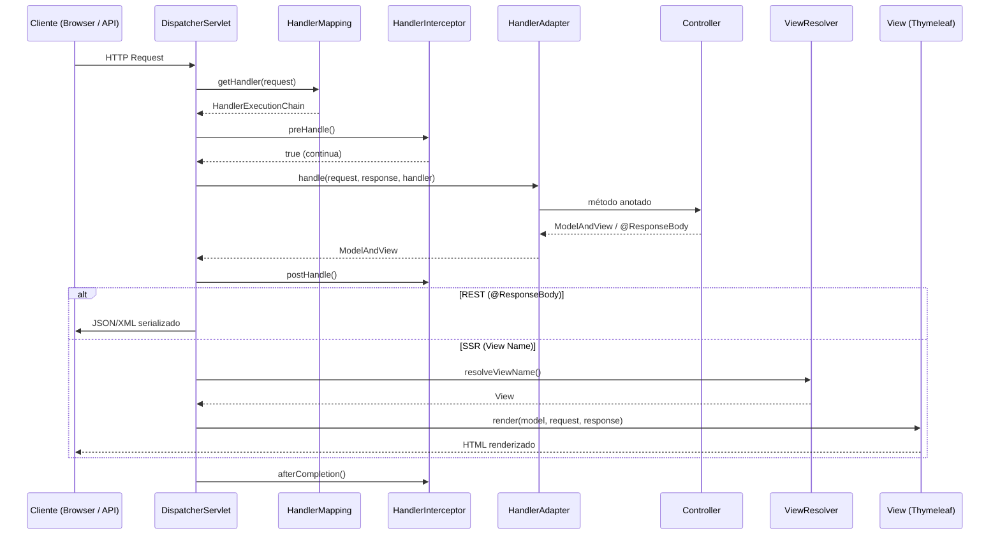

### 1.2 Componentes Principais

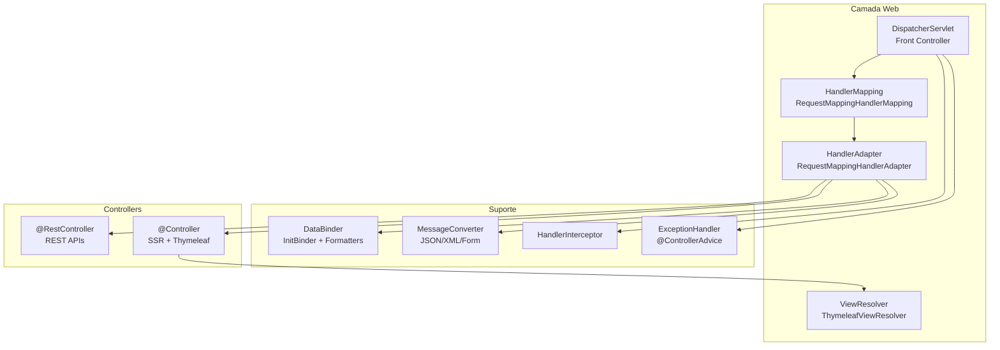
### 1.4 Fluxo Visual — REST API (JSON)

Na arquitetura REST **não há ViewResolver nem template engine**. O `@RestController` retorna objetos Java serializados pelo `HttpMessageConverter` (Jackson).

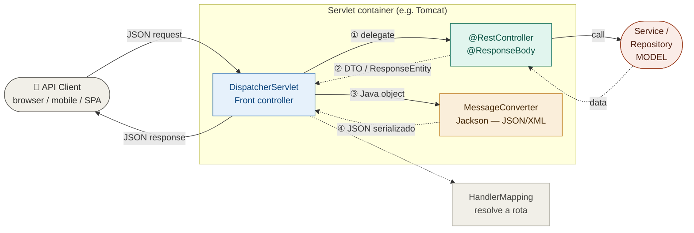

### 1.5 Diferença Fundamental: REST vs MVC SSR

| Aspecto | REST (`@RestController`) | SSR (`@Controller` + Thymeleaf) |
|---|---|---|
| Retorno | Objeto serializado (JSON/XML) | Nome da view ou `ModelAndView` |
| Cliente | SPA, mobile, outro serviço | Browser (requisição completa) |
| Estado | Stateless (JWT/OAuth2) | Session ou stateless |
| Formulários | Não aplicável | `@ModelAttribute` + BindingResult |
| Validação | `@Valid` no `@RequestBody` | `@Valid` no `@ModelAttribute` |
| Redirect | `ResponseEntity` com Location | `"redirect:/caminho"` |

---
## 2. Configuração Base

### 2.1 Dependências Maven

A tabela abaixo resume o que cada starter ativa automaticamente via
auto-configuração do Spring Boot — sem nenhuma linha de código adicional:

| Starter | Auto-configurações ativadas |
|---|---|
| `spring-boot-starter-web` | `DispatcherServlet`, `Jackson`, `Tomcat`, `CharacterEncodingFilter`, `HiddenHttpMethodFilter`, recursos estáticos, `ContentNegotiationStrategy` |
| `spring-boot-starter-validation` | `LocalValidatorFactoryBean` (Bean Validation), `MethodValidationPostProcessor` |
| `spring-boot-starter-thymeleaf` | `ThymeleafViewResolver`, `SpringTemplateEngine`, `ClassLoaderTemplateResolver` |
| `spring-boot-starter-data-jpa` | `PageableHandlerMethodArgumentResolver` (Pageable em controllers), `SortHandlerMethodArgumentResolver` |
| `springdoc-openapi-starter-webmvc-ui` | Endpoint `/api-docs`, `/swagger-ui.html`, `OpenApiWebMvcResource` |
| `spring-boot-starter-actuator` | Endpoints `/actuator/*`, métricas, health |

```xml
<!-- REST APIs -->
<!-- ✅ Auto-configura: DispatcherServlet, Jackson ObjectMapper, Tomcat, CORS básico -->
<dependency>
    <groupId>org.springframework.boot</groupId>
    <artifactId>spring-boot-starter-web</artifactId>
</dependency>

<!-- ✅ Auto-configura: LocalValidatorFactoryBean e MethodValidationPostProcessor -->
<!-- ⚠️  NÃO conecta o validador ao MessageSource do Spring (ver seção 13.6) -->
<dependency>
    <groupId>org.springframework.boot</groupId>
    <artifactId>spring-boot-starter-validation</artifactId>
</dependency>

<!-- OpenAPI / Swagger UI -->
<!-- ✅ Auto-configura: /api-docs e /swagger-ui.html quando no classpath -->
<dependency>
    <groupId>org.springdoc</groupId>
    <artifactId>springdoc-openapi-starter-webmvc-ui</artifactId>
    <version>2.8.16</version> <!-- Spring Boot 4: usar springdoc-openapi-starter-webmvc-ui versão 3.0.2+ -->
</dependency>

```

### 2.2 Configuração MVC Centralizada

> **`@EnableWebMvc` vs `WebMvcConfigurer`**
>
> O Spring Boot auto-configura todo o Spring MVC via `WebMvcAutoConfiguration`.
> Ao usar `WebMvcConfigurer` (sem `@EnableWebMvc`), você *adiciona* comportamento
> sem quebrar a auto-configuração — é a abordagem recomendada.
> `@EnableWebMvc` **desativa** a auto-configuração do Boot e exige que tudo seja
> configurado manualmente (sem defaults de Jackson, sem `ResourceHandlers`, etc.).
> Use `@EnableWebMvc` apenas se precisar de controle absoluto sobre a stack MVC.

```java
@Configuration
// @EnableWebMvc  ← EVITE: desativa WebMvcAutoConfiguration e todos os seus defaults
//                  Use apenas se precisar substituir completamente a stack MVC.
//                  Com Spring Boot, prefira apenas WebMvcConfigurer sem esta anotação.
public class WebMvcConfig implements WebMvcConfigurer {

    // ─── Recursos estáticos ──────────────────────────────────────────────────
    @Override
    public void addResourceHandlers(ResourceHandlerRegistry registry) {
        registry.addResourceHandler("/static/**")
                .addResourceLocations("classpath:/static/")
                .setCacheControl(CacheControl.maxAge(1, TimeUnit.HOURS).cachePublic());

        // Webjars com versionamento automático
        registry.addResourceHandler("/webjars/**")
                .addResourceLocations("classpath:/META-INF/resources/webjars/")
                .resourceChain(true)
                .addResolver(new WebJarsResourceResolver());
    }

    // ─── CORS global ─────────────────────────────────────────────────────────
    @Override
    public void addCorsMappings(CorsRegistry registry) {
        registry.addMapping("/api/**")
                .allowedOrigins("https://app.example.com")
                .allowedMethods("GET", "POST", "PUT", "DELETE", "PATCH", "OPTIONS")
                .allowedHeaders("*")
                .allowCredentials(true)
                .maxAge(3600);
    }

    // ─── Interceptors ────────────────────────────────────────────────────────
    @Override
    public void addInterceptors(InterceptorRegistry registry) {
        registry.addInterceptor(new AuditInterceptor())
                .addPathPatterns("/api/**")
                .excludePathPatterns("/api/health");

        registry.addInterceptor(new LocaleChangeInterceptor())
                .addPathPatterns("/**");
    }

    // ─── Resolução de locale ──────────────────────────────────────────────────
    @Bean
    public LocaleResolver localeResolver() {
        CookieLocaleResolver resolver = new CookieLocaleResolver("APP_LOCALE");
        resolver.setDefaultLocale(new Locale("pt", "BR"));
        return resolver;
    }

    // ─── Formatters e Converters (seção 7) ───────────────────────────────────
    @Override
    public void addFormatters(FormatterRegistry registry) {
        registry.addConverter(new StringToMoneyConverter());
        registry.addFormatter(new BrazilianDateFormatter());
        registry.addConverterFactory(new StringToEnumConverterFactory());
    }

    // ─── Content Negotiation ──────────────────────────────────────────────────
    @Override
    public void configureContentNegotiation(ContentNegotiationConfigurer configurer) {
        configurer
            .favorParameter(true)             // ?format=json
            .parameterName("format")
            .ignoreAcceptHeader(false)
            .defaultContentType(MediaType.APPLICATION_JSON)
            .mediaType("json", MediaType.APPLICATION_JSON)
            .mediaType("xml", MediaType.APPLICATION_XML);
    }

    // ─── View Controllers — redirecionamentos e views sem lógica ────────────
    //
    // addViewControllers registra mapeamentos diretos URL→view ou URL→redirect
    // sem precisar de um @Controller. Ideal para:
    //   - Páginas estáticas (sobre, termos de uso, manutenção)
    //   - Redirects permanentes de URLs antigas
    //   - Respostas de status sem corpo (503 em manutenção)
    @Override
    public void addViewControllers(ViewControllerRegistry registry) {
        // Renderiza uma view Thymeleaf sem nenhum controller ou model
        registry.addViewController("/").setViewName("home");
        registry.addViewController("/login").setViewName("auth/login");
        registry.addViewController("/sobre").setViewName("institucional/sobre");
        registry.addViewController("/termos").setViewName("institucional/termos");

        // Redirect permanente (301) — troca de URL sem perder SEO
        registry.addRedirectViewController("/home", "/")
                .setPermanent(true);

        // Redirect temporário (302) — padrão quando omitido setPermanent
        registry.addRedirectViewController("/admin", "/admin/dashboard");

        // Status puro — sem body, sem view (ex.: modo manutenção)
        // Útil combinado com um filtro que bloqueia as demais rotas
        registry.addStatusController("/health/ping", HttpStatus.OK);
    }

    // ─── Async / Virtual Threads ──────────────────────────────────────────────
    @Override
    public void configureAsyncSupport(AsyncSupportConfigurer configurer) {
        configurer.setDefaultTimeout(30_000L);
        // Com Virtual Threads (Java 21+), o Executor já é configurado automaticamente
        // pelo Spring Boot quando spring.threads.virtual.enabled=true
    }
}
```

### 2.3 application.yml — Configuração Recomendada

Cada propriedade abaixo está marcada com o que o Spring Boot faz por padrão
quando a propriedade **não** é declarada:

```yaml
# ─── Servidor — EmbeddedWebServerFactoryCustomizerAutoConfiguration ───────────
server:
  # ✅ Default: 8080
  port: 8080

  servlet:
    # ✅ Default: "" (raiz — sem prefixo)
    # Prefixo global aplicado a TODOS os endpoints, incluindo Actuator e Swagger.
    # Ex.: context-path: /app  →  http://localhost:8080/app/api/v1/produtos
    # ⚠️  Diferente de spring.mvc.servlet.path, que só afeta o DispatcherServlet.
    context-path: /

spring:
  # ─── MVC — WebMvcAutoConfiguration ──────────────────────────────────────────
  mvc:
    # ✅ Default: false — lança NoHandlerFoundException mapeável pelo @ControllerAdvice
    throw-exception-if-no-handler-found: true

    # ✅ Default: /** (todos os recursos estáticos em /static, /public, /resources, /META-INF/resources)
    static-path-pattern: /static/**

    # ✅ Defaults: nenhum formato pré-configurado (datas serializam como timestamp)
    format:
      date: yyyy-MM-dd
      date-time: yyyy-MM-dd'T'HH:mm:ss

  # ─── Jackson — JacksonAutoConfiguration ──────────────────────────────────────
  jackson:
    # ✅ Default: ALWAYS (inclui nulls) — non_null é recomendado para APIs limpas
    default-property-inclusion: non_null
    serialization:
      write-dates-as-timestamps: false  # ✅ Default: true — false para ISO 8601
      indent-output: false              # ✅ Default: false
    deserialization:
      fail-on-unknown-properties: false # ✅ Default: false (Boot 2.3+)
    time-zone: America/Sao_Paulo        # ✅ Default: UTC

  # ─── Multipart — MultipartAutoConfiguration ──────────────────────────────────
  servlet:
    multipart:
      enabled: true           # ✅ Default: true
      max-file-size: 10MB     # ✅ Default: 1MB — ajuste conforme necessidade
      max-request-size: 50MB  # ✅ Default: 10MB

  # ─── Virtual Threads — TomcatVirtualThreadsWebServerFactoryCustomizer ────────
  threads:
    virtual:
      enabled: true           # ✅ Default: false — habilitar em prod com Java 21+

  # ─── MessageSource — MessageSourceAutoConfiguration ──────────────────────────
  messages:
    basename: messages        # ✅ Default: messages (lê messages*.properties)
    encoding: UTF-8           # ✅ Default: UTF-8
    cache-duration: 1s        # ✅ Default: sem cache (recarrega a cada acesso em dev)
    use-code-as-default-message: false  # ✅ Default: false — lança exceção se chave não existe

  # ─── Spring Data Web — SpringDataWebAutoConfiguration ────────────────────────
  data:
    web:
      pageable:
        default-page-size: 20      # ✅ Default: 20
        max-page-size: 100         # ✅ Default: 2000 — SEMPRE reduzir em produção
        one-indexed-parameters: false  # ✅ Default: false (página começa em 0)

# ─── SpringDoc OpenAPI — OpenApiAutoConfiguration ────────────────────────────
# ⚠️  Não é um starter do Spring Boot oficial — configuração própria do SpringDoc
springdoc:
  api-docs:
    path: /api-docs           # Default: /v3/api-docs
    groups:
      enabled: true
  swagger-ui:
    path: /swagger-ui.html    # Default: /swagger-ui.html
    tags-sorter: alpha
    operations-sorter: method
    display-request-duration: true
    try-it-out-enabled: true
  default-produces-media-type: application/json
  show-actuator: false
```

---
## 3. Anotações do Controller — Referência Rápida

Esta seção apresenta as principais anotações do Spring MVC usadas em controllers,
agrupadas por categoria. Para cada anotação são indicados: onde pode ser aplicada
(classe, método ou parâmetro), o contexto de uso (REST, SSR ou ambos) e uma
breve descrição.

**Legenda de contexto:**
- **Geral** — aplicável a REST e SSR sem restrição
- **REST** — voltada para APIs que retornam JSON/XML
- **SSR** — voltada para controllers que renderizam templates (ex.: Thymeleaf)

---

### 3.1 Anotações de Classe — Definição do Controller

| Anotação | Contexto | Alvo | Descrição |
|----------|----------|------|-----------|
| `@Controller` | Geral | Classe | Marca a classe como controller Spring MVC. Métodos podem retornar nomes de views ou `@ResponseBody`. |
| `@RestController` | REST | Classe | Atalho para `@Controller` + `@ResponseBody`. Todos os métodos serializam o retorno para JSON/XML. |
| `@RequestMapping` | Geral | Classe / Método | Define o prefixo de URL para todos os métodos do controller. Na classe, estabelece a raiz do path. |
| `@Validated` | Geral | Classe | Habilita validação de parâmetros simples (`@PathVariable`, `@RequestParam`) via Bean Validation. Necessário para `@NotNull`, `@Min` etc. fora de `@RequestBody`. |
| `@SessionAttributes` | SSR | Classe | Mantém atributos do `Model` na sessão HTTP entre requisições. Útil em formulários multi-etapa. |
| `@CrossOrigin` | REST | Classe / Método | Habilita CORS para o controller ou método específico. Equivalente pontual à configuração global de CORS. |

```java
// REST — retorno sempre serializado para JSON
@RestController
@RequestMapping("/api/v1/produtos")
@Validated
@CrossOrigin(origins = "https://meusite.com")
public class ProdutoController { ... }

```

---

### 3.2 Anotações de Método — Mapeamento de Requisições

| Anotação | Contexto | Alvo | Descrição |
|----------|----------|------|-----------|
| `@GetMapping` | Geral | Método | Atalho para `@RequestMapping(method = GET)`. |
| `@PostMapping` | Geral | Método | Atalho para `@RequestMapping(method = POST)`. |
| `@PutMapping` | REST | Método | Atalho para `@RequestMapping(method = PUT)`. Substitui o recurso inteiro. |
| `@PatchMapping` | REST | Método | Atalho para `@RequestMapping(method = PATCH)`. Atualização parcial. |
| `@DeleteMapping` | REST | Método | Atalho para `@RequestMapping(method = DELETE)`. |
| `@RequestMapping` | Geral | Método | Mapeamento genérico — use quando precisar de mais de um método HTTP ou configurar `consumes`/`produces`. |

```java
@GetMapping                                  // GET /api/v1/produtos
@GetMapping("/{id}")                         // GET /api/v1/produtos/{id}
@PostMapping(consumes = "application/json")  // POST com body JSON
@PutMapping("/{id}")                         // PUT /api/v1/produtos/{id}
@PatchMapping("/{id}")                       // PATCH /api/v1/produtos/{id}
@DeleteMapping("/{id}")                      // DELETE /api/v1/produtos/{id}

// Quando precisar de mais controle:
@RequestMapping(value = "/export", method = {GET, HEAD},
                produces = "text/csv")
```

---

### 3.3 Anotações de Método — Controle da Resposta

| Anotação | Contexto | Alvo | Descrição |
|----------|----------|------|-----------|
| `@ResponseBody` | REST | Método / Classe | Serializa o retorno do método para o corpo da resposta HTTP (JSON, XML etc). Implícito em `@RestController`. |
| `@ResponseStatus` | Geral | Método / Classe | Define o status HTTP padrão da resposta. Em classes de exceção, elimina a necessidade de `@ExceptionHandler`. |
| `@ModelAttribute` | SSR | Método | Método cujo retorno é adicionado ao `Model` antes de qualquer handler do controller ser chamado. |
| `@InitBinder` | Geral | Método | Inicializa o `WebDataBinder` para o controller — registra `PropertyEditors`, `Validators` e formatadores customizados. |
| `@ExceptionHandler` | Geral | Método | Captura exceções lançadas pelo controller (ou por toda a aplicação se em `@ControllerAdvice`). |

```java
// Status customizado — sem precisar de ResponseEntity
@PostMapping
@ResponseStatus(HttpStatus.CREATED)
public ProdutoResponse criar(@RequestBody @Valid ProdutoRequest req) { ... }

// Método que pré-popula o Model para todas as views do controller
@ModelAttribute("categorias")
public List<Categoria> popularCategorias() {
    return categoriaService.listarAtivas();
}

// Tratamento de erro local (só para este controller)
@ExceptionHandler(ProdutoNaoEncontradoException.class)
@ResponseStatus(HttpStatus.NOT_FOUND)
public ProblemDetail handleNotFound(ProdutoNaoEncontradoException ex) { ... }
```

---

### 3.4 Anotações de Parâmetro — Captura de Dados da Requisição

| Anotação | Contexto | Alvo | Descrição |
|----------|----------|------|-----------|
| `@PathVariable` | Geral | Parâmetro | Captura segmento de URL: `/produtos/{id}` → `@PathVariable Long id`. |
| `@RequestParam` | Geral | Parâmetro | Captura parâmetro de query string ou form data: `?page=0`. Aceita `required`, `defaultValue`. |
| `@RequestBody` | REST | Parâmetro | Desserializa o corpo da requisição (JSON/XML) para o tipo do parâmetro. |
| `@ModelAttribute` | SSR | Parâmetro | Faz o binding de form data (HTML form) para um objeto Java. |
| `@RequestHeader` | Geral | Parâmetro | Captura um header HTTP específico: `Authorization`, `Accept-Language` etc. |
| `@CookieValue` | Geral | Parâmetro | Captura o valor de um cookie pelo nome. |
| `@RequestPart` | REST | Parâmetro | Captura uma parte de requisição `multipart/form-data` (arquivo ou JSON). |
| `@Valid` / `@Validated` | Geral | Parâmetro | Aciona o Bean Validation no objeto recebido. `@Valid` para cascata; `@Validated` para grupos. |
| `@SessionAttribute` | SSR | Parâmetro | Recupera um atributo específico da sessão HTTP. |
| `@RequestAttribute` | Geral | Parâmetro | Recupera um atributo do `HttpServletRequest` (definido por filtro ou interceptor). |

```java
@GetMapping("/{id}")
public ResponseEntity<ProdutoResponse> buscar(
        @PathVariable Long id) { ... }

@GetMapping
public Page<ProdutoResponse> listar(
        @RequestParam(defaultValue = "0")  int page,
        @RequestParam(defaultValue = "20") int size,
        @RequestParam(required = false)    String busca) { ... }

@PostMapping
public ResponseEntity<ProdutoResponse> criar(
        @RequestBody @Valid ProdutoRequest request) { ... }

// SSR — binding de formulário HTML
@PostMapping
public String salvar(
        @ModelAttribute @Valid ProdutoForm form,
        BindingResult binding) { ... }

@GetMapping("/export")
public ResponseEntity<byte[]> exportar(
        @RequestHeader("Accept-Language") String lang,
        @CookieValue(name = "APP_LOCALE", required = false) String locale) { ... }

@PostMapping("/upload")
public ResponseEntity<String> upload(
        @RequestPart("arquivo") MultipartFile arquivo,
        @RequestPart("dados")   @Valid ProdutoRequest dados) { ... }
```

---

### 3.5 Anotações de Parâmetro — Objetos Especiais do Spring MVC

Esses tipos são injetados automaticamente pelo Spring MVC como parâmetros de
método — sem necessidade de anotação.

| Tipo | Contexto | Descrição |
|------|----------|-----------|
| `HttpServletRequest` | Geral | Acesso direto ao request HTTP (headers, cookies, attributes). Prefira as anotações acima quando possível. |
| `HttpServletResponse` | Geral | Acesso direto à resposta HTTP. Útil para streaming ou cookies programáticos. |
| `HttpSession` | Geral | Acesso direto à sessão HTTP. Prefira `@SessionAttributes`/`@SessionAttribute` em SSR; use diretamente apenas quando precisar de controle explícito (invalidar sessão, iterar atributos). |
| `BindingResult` | Geral | Resultado do Bean Validation (`@Valid`/`@Validated`). Deve ser declarado imediatamente após o parâmetro validado. |
| `Model` / `ModelMap` | SSR | Mapa de atributos enviados à view. Alternativa a `ModelAndView`. |
| `RedirectAttributes` | SSR | Atributos para redirect (flash attributes). Disponível na próxima requisição. |
| `Locale` | Geral | Locale resolvido pelo `LocaleResolver` para a requisição atual. |
| `TimeZone` / `ZoneId` | Geral | TimeZone resolvido pelo `LocaleResolver`. |
| `Principal` | Geral | Usuário autenticado (Spring Security ou container). |
| `@AuthenticationPrincipal` | Geral | Extrai o objeto de usuário do `SecurityContext` diretamente como parâmetro. |
| `Pageable` | REST | Parâmetros de paginação do Spring Data (`page`, `size`, `sort`) desserializados automaticamente. |
| `UriComponentsBuilder` | REST | Constrói URIs de forma programática e tipada. Injetado com o base URL do request atual. Use `ServletUriComponentsBuilder` para herdar scheme/host/port/context-path automaticamente. |

```java
@PostMapping
public String salvar(
        @ModelAttribute @Valid ProdutoForm form,
        BindingResult binding,           // ← imediatamente após @ModelAttribute/@RequestBody
        Model model,
        RedirectAttributes redirectAttrs,
        Locale locale) {

    if (binding.hasErrors()) {
        model.addAttribute("categorias", categoriaService.listar());
        return "produtos/formulario";
    }
    produtoService.criar(form);
    redirectAttrs.addFlashAttribute("mensagem", "produto.criado");
    return "redirect:/produtos";
}
```

---

### 3.6 Anotações de Classe/Método — `@ControllerAdvice`

Usadas em classes anotadas com `@ControllerAdvice` ou `@RestControllerAdvice`
para comportamento global (toda a aplicação ou um subconjunto de controllers).

| Anotação | Contexto | Alvo | Descrição |
|----------|----------|------|-----------|
| `@ControllerAdvice` | SSR | Classe | Intercepta controllers SSR globalmente. Pode conter `@ExceptionHandler`, `@ModelAttribute` e `@InitBinder`. |
| `@RestControllerAdvice` | REST | Classe | Atalho para `@ControllerAdvice` + `@ResponseBody`. Respostas de erro são serializadas para JSON. |
| `@ExceptionHandler` | Geral | Método | Dentro de `@ControllerAdvice`, captura exceções de todos os controllers. |
| `@ModelAttribute` | SSR | Método | Dentro de `@ControllerAdvice`, adiciona atributos ao `Model` globalmente (ex.: usuário logado, configurações). |
| `@InitBinder` | Geral | Método | Dentro de `@ControllerAdvice`, inicializa `WebDataBinder` para todos os controllers. |

```java
// Tratamento de erros global — REST
@RestControllerAdvice
public class GlobalExceptionHandler {

    @ExceptionHandler(RecursoNaoEncontradoException.class)
    @ResponseStatus(HttpStatus.NOT_FOUND)
    public ProblemDetail handleNotFound(RecursoNaoEncontradoException ex, Locale locale) { ... }

    @ExceptionHandler(MethodArgumentNotValidException.class)
    @ResponseStatus(HttpStatus.UNPROCESSABLE_ENTITY)
    public ProblemDetail handleValidation(MethodArgumentNotValidException ex) { ... }
}

// Dados globais para todas as views SSR
@ControllerAdvice
public class GlobalModelAdvice {

    @ModelAttribute("usuarioLogado")
    public UsuarioDTO popularUsuario(@AuthenticationPrincipal UserDetails user) {
        return usuarioService.toDTO(user);
    }
}
```

---

### 3.7 Visão Consolidada — Contexto por Anotação

```
GERAL (REST + SSR)
├── Classe:    @RequestMapping  @Validated  @CrossOrigin
├── Método:    @GetMapping  @PostMapping  @PutMapping  @PatchMapping  @DeleteMapping
│              @ResponseStatus  @ExceptionHandler  @InitBinder
└── Parâmetro: @PathVariable  @RequestParam  @RequestHeader  @CookieValue
               @Valid  @Validated  @RequestAttribute

REST
├── Classe:    @RestController
├── Método:    @ResponseBody
└── Parâmetro: @RequestBody  @RequestPart

SSR (Thymeleaf / Templates)
├── Classe:    @Controller  @SessionAttributes
├── Método:    @ModelAttribute (pré-popula Model)
└── Parâmetro: @ModelAttribute (binding de form)  @SessionAttribute
```

---

### 3.8 Tipos de Retorno dos Métodos de Controller

Esta seção apresenta os principais tipos que um método de controller pode retornar,
com indicação do contexto de uso, quando preferir cada um e exemplos práticos.

| Tipo de Retorno | Contexto | Descrição |
|-----------------|----------|-----------|
| `String` | SSR | Nome da view a renderizar (`"produtos/lista"`) ou redirect (`"redirect:/produtos"`). O tipo mais simples para SSR. |
| `ModelAndView` | SSR | Encapsula nome da view **e** os atributos do model em um único objeto. Útil quando ambos são construídos condicionalmente. |
| `ResponseEntity<T>` | REST | Controle total sobre status HTTP, headers e corpo da resposta. O tipo mais completo para REST. |
| `T` (objeto direto) | REST | Em `@RestController`, qualquer objeto retornado é serializado para JSON/XML automaticamente (implica `@ResponseBody`). |
| `void` | Geral | O método escreve a resposta diretamente no `HttpServletResponse`, ou para SSR com `@ResponseStatus`. |
| `View` | SSR | Implementação de `View` retornada diretamente — permite controle total da renderização sem passar pelo `ViewResolver`. |
| `RedirectView` | SSR | Especialização de `View` para redirects HTTP. Permite definir status code, propagação de parâmetros e encoding. |
| `HttpEntity<T>` | REST | Versão simplificada de `ResponseEntity` — headers + corpo, sem controle de status. |
| `ResponseBodyEmitter` | REST | Streaming de múltiplos objetos para a resposta. Base de `SseEmitter`. |
| `StreamingResponseBody` | REST | Escrita assíncrona e incremental no `OutputStream` da resposta (ex.: download de arquivos grandes). |
| `Callable<T>` / `CompletableFuture<T>` | REST | Processamento assíncrono — libera a thread do Servlet durante a execução. |

---

#### `String` — retorno SSR mais simples

```java
@Controller
@RequestMapping("/produtos")
public class ProdutoMvcController {

    // Retorna nome de view — Spring resolve para templates/produtos/lista.html
    @GetMapping
    public String listar(Model model) {
        model.addAttribute("produtos", produtoService.listar());
        return "produtos/lista";                   // view name
    }

    // Redirect após POST (padrão PRG — Post/Redirect/Get)
    @PostMapping
    public String salvar(@ModelAttribute @Valid ProdutoForm form,
                         BindingResult binding,
                         RedirectAttributes ra) {
        if (binding.hasErrors()) return "produtos/formulario"; // re-exibe form
        produtoService.criar(form);
        ra.addFlashAttribute("mensagem", "produto.criado");
        return "redirect:/produtos";               // redirect HTTP 302
    }

    // Forward interno (não cria novo request)
    @GetMapping("/legado/{id}")
    public String forward(@PathVariable Long id) {
        return "forward:/produtos/" + id;          // forward para outra rota
    }
}
```

---

#### `ModelAndView` — view e model juntos

```java
// Preferir quando view e atributos são construídos em lógica condicional
@GetMapping("/{id}/editar")
public ModelAndView editar(@PathVariable Long id) {
    var mav = new ModelAndView("produtos/formulario"); // view name

    produtoService.buscarPorId(id).ifPresentOrElse(
        p -> {
            mav.addObject("form", ProdutoForm.de(p));
            mav.addObject("categorias", categoriaService.listar());
        },
        () -> {
            mav.setViewName("redirect:/produtos");
            mav.addObject("erro", "produto.nao.encontrado");
        }
    );

    return mav;
}

// Com status HTTP explícito
@GetMapping("/erro")
public ModelAndView paginaErro() {
    var mav = new ModelAndView("erros/generico");
    mav.setStatus(HttpStatus.INTERNAL_SERVER_ERROR);
    mav.addObject("mensagem", "Erro inesperado.");
    return mav;
}
```

> **Prefira `String` + `Model`** para o caso simples — `ModelAndView` agrega valor
> quando o nome da view ou os atributos dependem de lógica condicional.

---

#### `ResponseEntity<T>` — controle total da resposta REST

```java
@RestController
@RequestMapping("/api/v1/produtos")
public class ProdutoController {

    // GET — 200 OK com body / 404 Not Found sem body
    @GetMapping("/{id}")
    public ResponseEntity<ProdutoResponse> buscar(@PathVariable Long id) {
        return produtoService.buscarPorId(id)
                .map(ResponseEntity::ok)                         // 200 + body
                .orElse(ResponseEntity.notFound().build());      // 404 sem body
    }

    // POST — 201 Created com Location header e body
    @PostMapping
    public ResponseEntity<ProdutoResponse> criar(@RequestBody @Valid ProdutoRequest req) {
        ProdutoResponse criado = produtoService.criar(req);
        URI location = ServletUriComponentsBuilder
                .fromCurrentRequest()
                .path("/{id}")
                .buildAndExpand(criado.id())
                .toUri();
        return ResponseEntity
                .created(location)                               // 201 + Location
                .body(criado);
    }

    // PUT — 200 OK ou 404 Not Found
    @PutMapping("/{id}")
    public ResponseEntity<ProdutoResponse> atualizar(
            @PathVariable Long id,
            @RequestBody @Valid ProdutoRequest req) {
        return produtoService.atualizar(id, req)
                .map(ResponseEntity::ok)
                .orElse(ResponseEntity.notFound().build());
    }

    // DELETE — 204 No Content
    @DeleteMapping("/{id}")
    public ResponseEntity<Void> excluir(@PathVariable Long id) {
        produtoService.excluir(id);
        return ResponseEntity.noContent().build();               // 204
    }

    // Headers customizados
    @GetMapping("/{id}/export")
    public ResponseEntity<byte[]> exportar(@PathVariable Long id) {
        byte[] csv = produtoService.exportarCsv(id);
        return ResponseEntity.ok()
                .header(HttpHeaders.CONTENT_DISPOSITION,
                        "attachment; filename=\"produto-" + id + ".csv\"")
                .contentType(MediaType.parseMediaType("text/csv"))
                .body(csv);
    }
}
```

> **Prefira `T` direto** quando o status for sempre 200 OK e não houver headers extras —
> `ResponseEntity` agrega valor quando status, headers ou ausência de body variam.

---

#### `View` e `RedirectView` — controle programático de views SSR

```java
@Controller
public class ExportController {

    // View customizada — renderização própria, sem ViewResolver
    @GetMapping("/relatorio/pdf")
    public View gerarPdf() {
        return new AbstractView() {
            @Override
            protected void renderMergedOutputModel(
                    Map<String, Object> model,
                    HttpServletRequest req,
                    HttpServletResponse res) throws Exception {
                res.setContentType("application/pdf");
                // escreve bytes do PDF diretamente no response
            }
        };
    }
}

@Controller
public class ProdutoMvcController {

    // RedirectView — mais controle que "redirect:/url"
    @PostMapping
    public RedirectView salvar(@ModelAttribute @Valid ProdutoForm form,
                               BindingResult binding) {
        if (binding.hasErrors()) {
            // ⚠️ RedirectView não suporta re-exibir form com erros diretamente
            // Retorne String nesse caso: return "produtos/formulario"
        }
        Long novoId = produtoService.criar(form).getId();

        var rv = new RedirectView("/produtos/" + novoId);
        rv.setStatusCode(HttpStatus.SEE_OTHER);          // 303 em vez de 302
        rv.setExposeModelAttributes(false);              // não passa model como query params
        rv.setContextRelative(true);                     // URL relativa ao context-path
        return rv;
    }

    // Redirect permanente 301 (SEO — mudança de URL definitiva)
    @GetMapping("/produto/{id}")          // URL antiga
    public RedirectView redirectLegado(@PathVariable Long id) {
        var rv = new RedirectView("/produtos/" + id);
        rv.setStatusCode(HttpStatus.MOVED_PERMANENTLY);  // 301
        return rv;
    }
}
```

| | `"redirect:/url"` (String) | `RedirectView` |
|-|---------------------------|----------------|
| Status code | Sempre 302 | Configurável (301, 302, 303, 307…) |
| `exposeModelAttributes` | Configurável globalmente | Configurável por redirect |
| Simplicidade | Alta | Média |
| Quando usar | Casos comuns | Status != 302 ou controle fino |

---

#### Visão consolidada — tipos de retorno por contexto

```
REST (@RestController / @ResponseBody)
├── T                    — objeto serializado, sempre 200 OK
├── ResponseEntity<T>    — status + headers + body configuráveis  ← preferido para REST
├── HttpEntity<T>        — headers + body (sem controle de status)
├── void                 — escreve direto no HttpServletResponse
├── StreamingResponseBody— streaming de bytes (downloads)
└── Callable<T> /
    CompletableFuture<T> — processamento assíncrono

SSR (@Controller sem @ResponseBody)
├── String               — nome de view, "redirect:/url" ou "forward:/url"  ← preferido para SSR
├── ModelAndView         — view + atributos juntos (lógica condicional)
├── View                 — implementação customizada de renderização
├── RedirectView         — redirect com controle de status (301, 303…)
└── void                 — escreve direto no HttpServletResponse
```


---
## 4. Controllers REST

### 4.1 Estrutura Completa de um Controller REST

```java
@RestController
@RequestMapping("/api/v1/produtos")
@Validated                           // Habilita validação de parâmetros (Path, Query)
@Tag(name = "Produtos", description = "Gerenciamento de produtos")
@Slf4j
public class ProdutoController {

    private final ProdutoService produtoService;

    public ProdutoController(ProdutoService produtoService) {
        this.produtoService = produtoService;
    }

    // ─── VERSÃO A: parâmetros individuais explícitos ─────────────────────────
    //
    // Vantagem: cada parâmetro fica visível no Swagger individualmente.
    // Desvantagem: assinatura longa; paginação construída manualmente.
    //
    // GET /api/v1/produtos?page=0&size=20&sort=nome,asc&busca=notebook
    @GetMapping
    @Operation(summary = "Listar produtos — parâmetros individuais")
    @ApiResponses({
        @ApiResponse(responseCode = "200", description = "Lista paginada"),
        @ApiResponse(responseCode = "400", description = "Parâmetros inválidos",
            content = @Content(schema = @Schema(implementation = ProblemDetail.class)))
    })
    public ResponseEntity<Page<ProdutoResponse>> listar(
            @RequestParam(defaultValue = "0") @Min(0) int page,
            @RequestParam(defaultValue = "20") @Min(1) @Max(100) int size,
            @RequestParam(defaultValue = "nome") String sort,
            @RequestParam(required = false) String busca,
            @RequestParam(required = false) BigDecimal precoMin,
            @RequestParam(required = false) BigDecimal precoMax) {

        var pageable = PageRequest.of(page, size, Sort.by(sort));
        var filtros = new ProdutoFiltros(busca, precoMin, precoMax);
        return ResponseEntity.ok(produtoService.listar(filtros, pageable));
    }

    // ─── VERSÃO B: filtros agrupados em record + Pageable do Spring Data ──────
    //
    // Vantagem: assinatura limpa; Pageable integrado com Spring Data (page, size,
    //   sort resolvidos automaticamente pelo PageableHandlerMethodArgumentResolver).
    // @ParameterObject: SpringDoc "explode" os campos do record no Swagger UI,
    //   evitando que apareça como um único objeto JSON opaco.
    //
    // GET /api/v1/produtos/busca?busca=notebook&precoMin=100&page=0&size=20&sort=nome,asc
    @GetMapping("/busca")
    @Operation(summary = "Listar produtos — filtros agrupados em record + Pageable")
    public ResponseEntity<Page<ProdutoResponse>> listarComFiltros(
            @ParameterObject @Valid ProdutoFiltros filtros,  // campos "explodidos" no Swagger
            @ParameterObject Pageable pageable) {            // page, size, sort como params individuais

        return ResponseEntity.ok(produtoService.listar(filtros, pageable));
    }

    // ─── VERSÃO C: validação de elementos dentro do genérico (TYPE_USE) ───────
    //
    // Jakarta Bean Validation 2.0+ suporta anotações em TYPE_USE, permitindo
    // validar cada elemento de uma coleção sem necessidade de @Valid em cascata.
    //
    // GET /api/v1/produtos/por-tags?tags=notebook&tags=dell
    @GetMapping("/por-tags")
    @Operation(summary = "Buscar produtos por lista de tags")
    public ResponseEntity<List<ProdutoResponse>> listarPorTags(
            @RequestParam @NotEmpty List<@NotBlank @Size(max = 50) String> tags) {
            //                             ↑ anotação dentro do diamante
            //   @NotEmpty  = a lista em si não pode ser vazia
            //   @NotBlank  = cada String da lista não pode ser blank
            //   @Size(max) = cada String da lista deve ter no máximo 50 chars
        return ResponseEntity.ok(produtoService.listarPorTags(tags));
    }
}
```

#### Pageable automático

O `spring-boot-starter-data-jpa` registra automaticamente o `PageableHandlerMethodArgumentResolver` via `SpringDataWebAutoConfiguration`. Não é necessário nenhum código extra para resolver `Pageable` em controllers.

Para customizar os defaults **globalmente** via `application.yml`:

```yaml
spring:
  data:
    web:
      pageable:
        default-page-size: 20
        max-page-size: 100
        one-indexed-parameters: false  # página começa em 0 (padrão)
```

Ou programaticamente via `WebMvcConfigurer` (mais verboso, raramente necessário):

```java
@Configuration
public class PageableConfig implements WebMvcConfigurer {
    @Override
    public void addArgumentResolvers(List<HandlerMethodArgumentResolver> resolvers) {
        var resolver = new PageableHandlerMethodArgumentResolver();
        resolver.setMaxPageSize(100);
        resolver.setFallbackPageable(PageRequest.of(0, 20));
        resolvers.add(resolver);
    }
}
```

#### `@PageableDefault` — defaults por endpoint

Use `@PageableDefault` para sobrescrever os defaults globais em um endpoint específico, sem alterar a configuração global. O cliente ainda pode sobrescrever via query string (`?size=30&sort=id,asc`); a anotação só se aplica quando o parâmetro não é enviado.

| Atributo    | Descrição                                      | Padrão Spring |
|-------------|------------------------------------------------|---------------|
| `size`      | Tamanho da página                              | `20`          |
| `page`      | Número da página inicial                       | `0`           |
| `sort`      | Campo(s) de ordenação padrão                   | —             |
| `direction` | Direção da ordenação (`ASC` ou `DESC`)         | `ASC`         |

```java
// Ordenação ascendente por nome, 10 itens por página
@GetMapping
public ResponseEntity<Page<ProdutoResponse>> listar(
        @PageableDefault(size = 10, sort = "nome") Pageable pageable) {
    return ResponseEntity.ok(produtoService.listar(pageable));
}

// Ordenação descendente por preço, 5 itens por página
@GetMapping("/destaques")
public ResponseEntity<Page<ProdutoResponse>> destaques(
        @PageableDefault(size = 5, sort = "preco", direction = Sort.Direction.DESC)
        Pageable pageable) {
    return ResponseEntity.ok(produtoService.listarDestaques(pageable));
}
```

#### Objeto customizado para query parameters (`@ParameterObject`)

Em vez de declarar cada query parameter como argumento separado no método, agrupe-os em um `record` e anote com `@ParameterObject`. O Spring resolve cada campo como se fosse um `@RequestParam` individual. O SpringDoc/Swagger "explode" os campos no Swagger UI automaticamente.

**1. Definição do record de filtros:**

```java
public record ProdutoFiltros(

    @RequestParam(required = false)
    String busca,                    // ?busca=notebook

    @RequestParam(required = false)
    @DecimalMin("0.0")
    BigDecimal precoMin,             // ?precoMin=100.00

    @RequestParam(required = false)
    @DecimalMin("0.0")
    BigDecimal precoMax              // ?precoMax=5000.00

) {}
```

**2. Uso no controller — assinatura limpa, sem `@RequestParam` espalhados:**

```java
// GET /api/v1/produtos?busca=notebook&precoMin=100&page=0&size=10&sort=nome,asc
@GetMapping
public ResponseEntity<Page<ProdutoResponse>> listar(
        @ParameterObject @Valid ProdutoFiltros filtros,
        @ParameterObject @PageableDefault(size = 10, sort = "nome") Pageable pageable) {

    return ResponseEntity.ok(produtoService.listar(filtros, pageable));
}
```

| Anotação           | Papel                                                              |
|--------------------|--------------------------------------------------------------------|
| `@ParameterObject` | Instrui o SpringDoc a expor os campos individualmente no Swagger   |
| `@Valid`           | Dispara o Bean Validation nos campos do record                     |
| `@PageableDefault` | Define valores padrão de paginação quando não enviados pelo cliente |

```java
// Continuação de ProdutoController...

    // ─── GET /api/v1/produtos/{id} ───────────────────────────────────────────
    @GetMapping("/{id}")
    @Operation(summary = "Buscar produto por ID")
    public ResponseEntity<ProdutoResponse> buscarPorId(
            @PathVariable @Positive Long id) {

        return produtoService.buscarPorId(id)
                .map(ResponseEntity::ok)
                .orElseThrow(() -> new ResourceNotFoundException("Produto", id));
    }

    // ─── POST /api/v1/produtos ────────────────────────────────────────────────
    @PostMapping
    @ResponseStatus(HttpStatus.CREATED)
    @Operation(summary = "Criar produto")
    public ResponseEntity<ProdutoResponse> criar(
            @RequestBody @Valid ProdutoCreateRequest request,
            UriComponentsBuilder uriBuilder) {

        var produto = produtoService.criar(request);
        var location = uriBuilder
                .path("/api/v1/produtos/{id}")
                .buildAndExpand(produto.id())
                .toUri();

        return ResponseEntity.created(location).body(produto);
    }

    // ─── PUT /api/v1/produtos/{id} ────────────────────────────────────────────
    @PutMapping("/{id}")
    @Operation(summary = "Atualizar produto completamente")
    public ResponseEntity<ProdutoResponse> atualizar(
            @PathVariable @Positive Long id,
            @RequestBody @Valid ProdutoUpdateRequest request) {

        return ResponseEntity.ok(produtoService.atualizar(id, request));
    }

    // ─── PATCH /api/v1/produtos/{id} ──────────────────────────────────────────
    @PatchMapping("/{id}")
    @Operation(summary = "Atualizar produto parcialmente")
    public ResponseEntity<ProdutoResponse> atualizarParcial(
            @PathVariable @Positive Long id,
            @RequestBody @Validated(ProdutoUpdateRequest.PatchGroup.class) ProdutoUpdateRequest request) {

        return ResponseEntity.ok(produtoService.atualizarParcial(id, request));
    }

    // ─── DELETE /api/v1/produtos/{id} ─────────────────────────────────────────
    @DeleteMapping("/{id}")
    @ResponseStatus(HttpStatus.NO_CONTENT)
    @Operation(summary = "Excluir produto")
    public void excluir(@PathVariable @Positive Long id) {
        produtoService.excluir(id);
    }

    // ─── POST /api/v1/produtos/importar (upload) ──────────────────────────────
    @PostMapping(value = "/importar", consumes = MediaType.MULTIPART_FORM_DATA_VALUE)
    @Operation(summary = "Importar produtos via CSV")
    public ResponseEntity<ImportacaoResult> importar(
            @RequestPart("arquivo") @NotNull MultipartFile arquivo,
            @RequestPart(value = "config", required = false) ImportacaoConfig config) {

        return ResponseEntity.accepted()
                .body(produtoService.importarAsync(arquivo, config));
    }

    // ─── GET /api/v1/produtos/{id}/exportar (download) ───────────────────────
    @GetMapping("/{id}/exportar")
    public ResponseEntity<Resource> exportar(@PathVariable Long id) {
        var resource = produtoService.gerarPdf(id);

        return ResponseEntity.ok()
                .contentType(MediaType.APPLICATION_PDF)
                .header(HttpHeaders.CONTENT_DISPOSITION,
                        "attachment; filename=\"produto-" + id + ".pdf\"")
                .body(resource);
    }
}
```

### 4.2 DTOs com Records (Java 16+)

```java
// ─── Request DTO com validações ───────────────────────────────────────────────
public record ProdutoCreateRequest(

    @NotBlank(message = "{produto.nome.obrigatorio}")
    @Size(min = 2, max = 200, message = "{produto.nome.tamanho}")
    String nome,

    @NotBlank
    @Size(max = 2000)
    String descricao,

    @NotNull
    @DecimalMin(value = "0.01", message = "{produto.preco.minimo}")
    @Digits(integer = 10, fraction = 2)
    BigDecimal preco,

    @NotNull
    @Min(0)
    Integer estoque,

    @NotNull
    @Positive
    Long categoriaId,

    // Validação condicional com grupos
    @NotBlank(groups = PatchGroup.class)
    String sku

) {
    // Interface de grupo para validação parcial (PATCH)
    public interface PatchGroup {}
}

// ─── Response DTO ─────────────────────────────────────────────────────────────
@JsonInclude(JsonInclude.Include.NON_NULL)
public record ProdutoResponse(
    Long id,
    String nome,
    String descricao,
    BigDecimal preco,
    Integer estoque,
    String sku,
    CategoriaResponse categoria,
    @JsonFormat(pattern = "yyyy-MM-dd'T'HH:mm:ss")
    LocalDateTime criadoEm,
    @JsonFormat(pattern = "yyyy-MM-dd'T'HH:mm:ss")
    LocalDateTime atualizadoEm
) {}
```

### 4.3 Mapeamento de Método HTTP com Exemplos Práticos

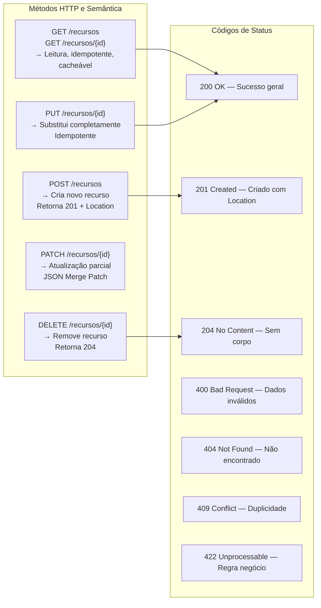

---
## 5. Bean Validation — @Valid vs @Validated

### 5.1 Diferença Conceitual

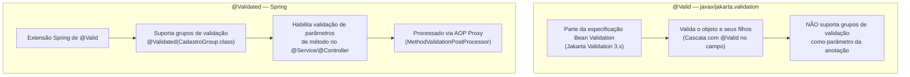

### 5.2 Exemplo Prático de Grupos de Validação

```java
// ─── Definição de grupos ──────────────────────────────────────────────────────
//
// Por que extends Default?
//
// Quando @Validated(Cadastro.class) é ativado, APENAS as constraints do grupo
// Cadastro são avaliadas. Constraints sem grupo explícito pertencem ao grupo
// Default, mas NÃO são executadas automaticamente quando um grupo específico
// é informado — a menos que o grupo herde de Default.
//
// Ao fazer `interface Cadastro extends Default`, o Bean Validation inclui
// automaticamente todas as constraints do grupo Default na mesma passagem.
// Isso evita repetir `groups = {Cadastro.class, Default.class}` em cada campo.
//
// Referência: https://stackoverflow.com/a/35359965
//
public interface ValidationGroups {
    interface Cadastro  extends Default {}  // herda Default: valida campos sem grupo também
    interface Edicao    extends Default {}  // herda Default: idem
    interface PatchGroup extends Default {} // herda Default: idem
}

// ─── DTO com grupos ───────────────────────────────────────────────────────────
public class ClienteRequest {

    // Obrigatório apenas no cadastro — campos sem grupo rodam via herança de Default
    @NotBlank(groups = ValidationGroups.Cadastro.class,
              message = "CPF é obrigatório no cadastro")
    @CPF(groups = {ValidationGroups.Cadastro.class, ValidationGroups.Edicao.class})
    private String cpf;

    @NotBlank(groups = {ValidationGroups.Cadastro.class, ValidationGroups.Edicao.class})
    @Email  // ← sem grupo = Default; executado em Cadastro e Edicao via herança
    private String email;

    @NotBlank(groups = {ValidationGroups.Cadastro.class, ValidationGroups.Edicao.class})
    @Size(min = 2, max = 100)  // ← sem grupo = Default; executado em todos os grupos
    private String nome;

    // Sem grupo = Default; roda em Cadastro, Edicao e PatchGroup via herança
    @Size(max = 20)
    private String telefone;

    // Validação de elementos dentro do genérico (TYPE_USE — Jakarta BV 2.0+)
    // Cada tag da lista é validada individualmente: @NotBlank e @Size por elemento
    @NotEmpty(groups = ValidationGroups.Cadastro.class)
    private List<@NotBlank @Size(max = 50) String> tags;
}

// ─── Controller usando grupos ─────────────────────────────────────────────────
@RestController
@RequestMapping("/api/v1/clientes")
public class ClienteController {

    @PostMapping
    public ResponseEntity<ClienteResponse> criar(
            // @Validated com grupo: aplica apenas as regras de Cadastro
            @RequestBody @Validated(ValidationGroups.Cadastro.class) ClienteRequest request) {
        // ...
    }

    @PutMapping("/{id}")
    public ResponseEntity<ClienteResponse> atualizar(
            @PathVariable Long id,
            @RequestBody @Validated(ValidationGroups.Edicao.class) ClienteRequest request) {
        // ...
    }

    @PatchMapping("/{id}")
    public ResponseEntity<ClienteResponse> atualizarParcial(
            @PathVariable Long id,
            @RequestBody @Validated(ValidationGroups.PatchGroup.class) ClienteRequest request) {
        // ...
    }
}
```

### 5.3 Validação em Serviços com @Validated

```java
// Habilitar validação de método em Services
@Service
@Validated  // Fundamental: sem isso, as anotações nos parâmetros são ignoradas
public class ClienteService {

    // Valida o parâmetro de entrada e o retorno
    public @NotNull ClienteResponse criar(@Valid @NotNull ClienteRequest request) {
        // ...
    }

    // Valida apenas parâmetros escalares (sem objeto wrapper)
    public ClienteResponse buscarPorCpf(
            @NotBlank @CPF String cpf) {   // Funciona com @Validated na classe
        // ...
    }

    // Valida coleção de elementos
    public List<ClienteResponse> criarLote(
            @NotEmpty @Valid List<ClienteRequest> requests) {
        // ...
    }
}
```

### 5.4 Cascata de Validação com @Valid

```java
public class PedidoRequest {

    @NotNull
    @Valid           // ← Cascata: valida os campos internos de EnderecoRequest
    private EnderecoRequest enderecoEntrega;

    @NotEmpty
    @Valid           // ← Cascata em coleção: valida cada ItemRequest
    private List<ItemRequest> itens;
}

public class EnderecoRequest {
    @NotBlank private String cep;
    @NotBlank private String logradouro;
    @NotBlank private String numero;
    @Size(max = 8) private String complemento;
    @NotBlank private String cidade;
    @NotBlank @Size(min = 2, max = 2) private String uf;
}
```

### 5.5 Constraint Customizada

```java
// ─── Anotação ─────────────────────────────────────────────────────────────────
@Target({FIELD, PARAMETER, ANNOTATION_TYPE})
@Retention(RUNTIME)
@Constraint(validatedBy = CpfValidator.class)
@Documented
public @interface CPF {
    String message() default "{br.com.app.validation.cpf.invalido}";
    Class<?>[] groups() default {};
    Class<? extends Payload>[] payload() default {};
}

// ─── Implementação ────────────────────────────────────────────────────────────
public class CpfValidator implements ConstraintValidator<CPF, String> {

    @Override
    public boolean isValid(String value, ConstraintValidatorContext context) {
        if (value == null || value.isBlank()) return true; // @NotNull cuida de null

        var digits = value.replaceAll("\\D", "");
        if (digits.length() != 11 || digits.chars().distinct().count() == 1) {
            return false;
        }

        return verificarDigitos(digits);
    }

    private boolean verificarDigitos(String digits) {
        int sum = 0;
        for (int i = 0; i < 9; i++) sum += (digits.charAt(i) - '0') * (10 - i);
        int r1 = sum % 11 < 2 ? 0 : 11 - (sum % 11);
        if (r1 != (digits.charAt(9) - '0')) return false;

        sum = 0;
        for (int i = 0; i < 10; i++) sum += (digits.charAt(i) - '0') * (11 - i);
        int r2 = sum % 11 < 2 ? 0 : 11 - (sum % 11);
        return r2 == (digits.charAt(10) - '0');
    }
}
```

### 5.6 Constraint com Acesso a Banco (Spring Bean)

```java
@Target(FIELD)
@Retention(RUNTIME)
@Constraint(validatedBy = EmailUnicoValidator.class)
public @interface EmailUnico {
    String message() default "E-mail já cadastrado";
    Class<?>[] groups() default {};
    Class<? extends Payload>[] payload() default {};
}

// Spring injeta dependências normalmente no validator
@Component
public class EmailUnicoValidator implements ConstraintValidator<EmailUnico, String> {

    private final ClienteRepository repository;

    public EmailUnicoValidator(ClienteRepository repository) {
        this.repository = repository;
    }

    @Override
    public boolean isValid(String email, ConstraintValidatorContext ctx) {
        if (email == null) return true;
        return !repository.existsByEmailIgnoreCase(email);
    }
}
```

---

### 5.7 Atributo `payload` nas Constraints

O atributo `payload` presente em toda anotação de constraint (`Class<? extends Payload>[]`)
é uma extensão point da especificação Jakarta Bean Validation: permite **anexar
metadados** a uma violação em tempo de definição da constraint, sem alterar a lógica
de validação. Esses metadados ficam disponíveis em `ConstraintViolation.unwrap()` ou
via `ConstraintDescriptor` e podem ser lidos por quem processa as violações.

#### Usos práticos do `payload`

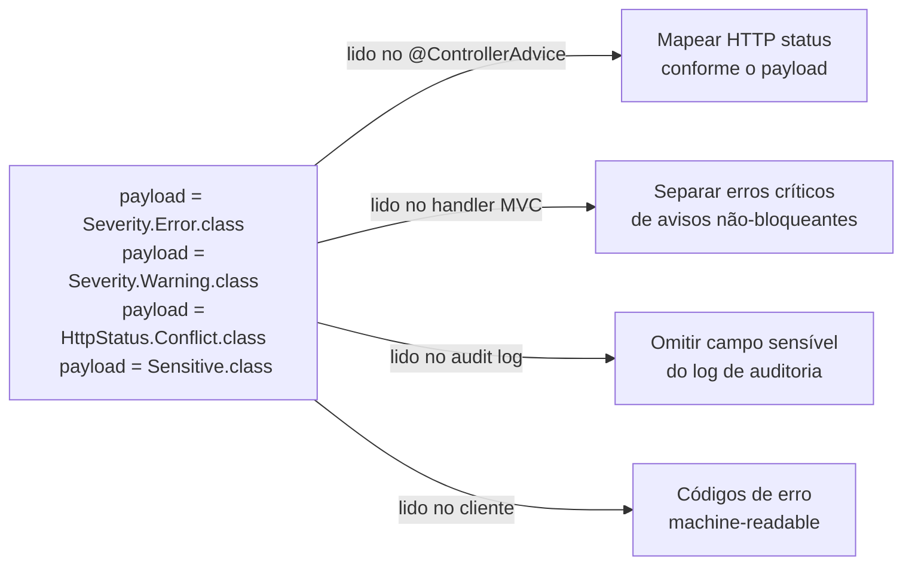

#### 1. Severidade — separar erros bloqueantes de avisos

```java
// ─── Definição dos marcadores de severidade ───────────────────────────────────
//
// Os payloads são interfaces marcadoras que estendem Payload.
// A especificação define Error e Warning como exemplos; Warning é convenção,
// não bloqueia o fluxo por padrão — quem decide o que fazer com cada
// severidade é o código consumidor.
public interface Severity {
    // Erro bloqueante: impede a operação
    interface Error   extends Payload {}

    // Aviso: operação prossegue mas cliente deve ser alertado
    interface Warning extends Payload {}

    // Informacional: sugestão de melhoria, não obrigatória
    interface Info    extends Payload {}
}

// ─── Uso nas constraints ──────────────────────────────────────────────────────
public record ProdutoRequest(

    @NotBlank(
        message  = "Nome é obrigatório",
        payload  = { Severity.Error.class }    // bloqueia — campo obrigatório
    )
    String nome,

    @Size(
        min     = 10,
        message = "Descrição muito curta — recomendamos pelo menos 10 caracteres",
        payload = { Severity.Warning.class }   // não bloqueia — apenas aviso
    )
    String descricao,

    @DecimalMax(
        value   = "9999.99",
        message = "Preço acima do limite recomendado para esta categoria",
        payload = { Severity.Warning.class }   // aviso, não erro
    )
    @DecimalMin(
        value   = "0.01",
        message = "Preço deve ser positivo",
        payload = { Severity.Error.class }     // bloqueia
    )
    BigDecimal preco
) {}
```

```java
// ─── Leitura da severidade no @ControllerAdvice ───────────────────────────────
@RestControllerAdvice
public class GlobalExceptionHandler {

    @ExceptionHandler(ConstraintViolationException.class)
    public ResponseEntity<ValidationErrorResponse> handleConstraintViolation(
            ConstraintViolationException ex) {

        var errors   = new ArrayList<FieldError>();
        var warnings = new ArrayList<FieldError>();

        for (ConstraintViolation<?> v : ex.getConstraintViolations()) {
            var payloads = v.getConstraintDescriptor().getPayload();
            var entry    = new FieldError(
                    extractField(v.getPropertyPath()), v.getMessage());

            // Separa por severidade via payload
            if (payloads.stream().anyMatch(Severity.Error.class::isAssignableFrom)) {
                errors.add(entry);
            } else if (payloads.stream().anyMatch(Severity.Warning.class::isAssignableFrom)) {
                warnings.add(entry);
            }
        }

        // Se há erros bloqueantes: 422; se só avisos: 200 com warnings no body
        HttpStatus status = errors.isEmpty()
                ? HttpStatus.OK
                : HttpStatus.UNPROCESSABLE_ENTITY;

        return ResponseEntity.status(status)
                .body(new ValidationErrorResponse(errors, warnings));
    }

    private String extractField(Path path) {
        Path.Node last = null;
        for (Path.Node n : path) last = n;
        return last != null ? last.getName() : "";
    }

    public record FieldError(String campo, String mensagem) {}

    public record ValidationErrorResponse(
            List<FieldError> errors,
            List<FieldError> warnings
    ) {}
}
```

#### 2. Código de erro machine-readable — contrato com o cliente

```java
// ─── Payloads como códigos de erro ────────────────────────────────────────────
public interface ErrorCode {
    interface DuplicateValue  extends Payload {}
    interface InvalidFormat   extends Payload {}
    interface OutOfRange      extends Payload {}
    interface RequiredField   extends Payload {}
    interface BusinessRule    extends Payload {}
}

// ─── Constraints com código de erro ──────────────────────────────────────────
public record ClienteRequest(

    @NotBlank(
        message = "CPF é obrigatório",
        payload = { Severity.Error.class, ErrorCode.RequiredField.class }
    )
    @CPF(
        message = "CPF inválido",
        payload = { Severity.Error.class, ErrorCode.InvalidFormat.class }
    )
    String cpf,

    @EmailUnico(
        message = "E-mail já cadastrado",
        payload = { Severity.Error.class, ErrorCode.DuplicateValue.class }
    )
    String email
) {}

// ─── Handler que expõe os códigos de erro no JSON da resposta ─────────────────
@ExceptionHandler(ConstraintViolationException.class)
@ResponseStatus(HttpStatus.UNPROCESSABLE_ENTITY)
public ProblemDetail handleWithErrorCodes(ConstraintViolationException ex) {
    var violations = ex.getConstraintViolations().stream()
            .map(v -> {
                // Lê TODOS os payloads da violação
                var payloadNames = v.getConstraintDescriptor().getPayload().stream()
                        .map(Class::getSimpleName)   // "Error", "RequiredField", ...
                        .toList();

                return Map.of(
                    "campo",   extractField(v.getPropertyPath()),
                    "message", v.getMessage(),
                    "codes",   payloadNames           // cliente pode usar para i18n
                );
            })
            .toList();

    var pd = ProblemDetail.forStatusAndDetail(
            HttpStatus.UNPROCESSABLE_ENTITY, "Dados inválidos");
    pd.setProperty("violations", violations);
    return pd;
}
```

#### 4. Payload de sensibilidade — omitir campos do log de auditoria

```java
// ─── Marcador de dado sensível ────────────────────────────────────────────────
public interface Sensitive extends Payload {}

// ─── Constraints marcando campos sensíveis ────────────────────────────────────
public record LoginRequest(
    @NotBlank String username,

    @NotBlank(
        message = "Senha é obrigatória",
        payload = { Sensitive.class }   // informa ao audit log: não logar este campo
    )
    @Size(min = 8, message = "Senha muito curta", payload = { Sensitive.class })
    String password,

    @NotBlank(
        message = "Token obrigatório",
        payload = { Sensitive.class }   // token também sensível
    )
    String mfaToken
) {}

// ─── Audit interceptor que respeita o payload de sensibilidade ────────────────
@Component
public class ValidationAuditLogger {

    private static final Logger log = LoggerFactory.getLogger(ValidationAuditLogger.class);

    public void logViolations(ConstraintViolationException ex, String operacao) {
        ex.getConstraintViolations().forEach(v -> {
            boolean isSensitive = v.getConstraintDescriptor()
                    .getPayload()
                    .stream()
                    .anyMatch(Sensitive.class::isAssignableFrom);

            if (isSensitive) {
                // Loga apenas o campo — nunca o valor
                log.warn("[{}] Violação em campo sensível: campo={}",
                        operacao,
                        extractField(v.getPropertyPath()));
            } else {
                log.warn("[{}] Violação: campo={}, valor={}, mensagem={}",
                        operacao,
                        extractField(v.getPropertyPath()),
                        v.getInvalidValue(),
                        v.getMessage());
            }
        });
    }
}
```
#### Resumo dos casos de uso do `payload`

| Caso de uso | Payload | Quem consome |
|---|---|---|
| Severidade de erro | `Severity.Error` / `.Warning` / `.Info` | `@ControllerAdvice`, converter SSR |
| Código de erro para o cliente | `ErrorCode.DuplicateValue` etc. | `@ControllerAdvice` (JSON) |
| Campo sensível / PII | `Sensitive` | Audit logger, log interceptor |
| Mapeamento de HTTP status | `HttpStatus.Conflict.class` (payload custom) | `@ControllerAdvice` |
| Classificação para monitoramento | `Payload` de domínio próprio | Métricas, alertas |

---
## 6. InitBinder

`@InitBinder` é executado antes do binding de cada request no controller. Permite registrar editores, formatters e configurações de binding específicas por controller.

### 6.1 Usos Comuns

```java
@Controller
@RequestMapping("/produtos")
public class ProdutoMvcController {

    /**
     * @InitBinder sem parâmetro: aplica a TODOS os @ModelAttribute do controller
     */
    @InitBinder
    public void initBinder(WebDataBinder binder) {

        // ── 1. Trimming automático de Strings ────────────────────────────────
        binder.registerCustomEditor(String.class,
            new StringTrimmerEditor(true)); // true = converter string vazia para null

        // ── 2. Formato de datas brasileiro ────────────────────────────────────
        var dateEditor = new CustomDateEditor(
            new SimpleDateFormat("dd/MM/yyyy"), true); // true = aceita null
        binder.registerCustomEditor(Date.class, dateEditor);

        // ── 3. Formatação de moeda brasileira (campo preco) ───────────────────
        binder.registerCustomEditor(BigDecimal.class, "preco",
            new BigDecimalBrazilianEditor());

        // ── 4. Campos proibidos (segurança: evitar mass assignment) ───────────
        binder.setDisallowedFields("id", "criadoEm", "atualizadoEm", "versao");

        // ── 5. Campos permitidos (whitelist — mais seguro) ────────────────────
        // binder.setAllowedFields("nome", "descricao", "preco", "estoque", "categoriaId");
    }

    /**
     * @InitBinder com nome: aplica apenas ao @ModelAttribute "produto"
     */
    @InitBinder("produto")
    public void initBinderProduto(WebDataBinder binder) {
        // Validação máxima de tamanho do objeto antes do binding
        binder.setValidator(new ProdutoFormValidator());
        // Configuração de campos obrigatórios no nível do binder
        binder.setRequiredFields("nome", "preco");
    }
}
```

### 6.2 PropertyEditor Customizado

```java
/**
 * Converte String no formato brasileiro "1.299,90" para BigDecimal
 */
public class BigDecimalBrazilianEditor extends PropertyEditorSupport {

    private static final NumberFormat FORMAT =
        NumberFormat.getNumberInstance(new Locale("pt", "BR"));

    @Override
    public void setAsText(String text) {
        if (text == null || text.isBlank()) {
            setValue(null);
            return;
        }
        try {
            // Remove espaços e converte
            setValue(new BigDecimal(FORMAT.parse(text.trim()).toString()));
        } catch (ParseException e) {
            throw new IllegalArgumentException(
                "Valor monetário inválido: '" + text + "'");
        }
    }

    @Override
    public String getAsText() {
        var value = (BigDecimal) getValue();
        return value == null ? "" : FORMAT.format(value);
    }
}
```

### 6.3 Validator Programático com @InitBinder

```java
@Component
public class ProdutoFormValidator implements Validator {

    @Override
    public boolean supports(Class<?> clazz) {
        return ProdutoForm.class.isAssignableFrom(clazz);
    }

    @Override
    public void validate(Object target, Errors errors) {
        var form = (ProdutoForm) target;

        // Regra de negócio: preço de promoção deve ser menor que preço original
        if (form.getPrecoPromocional() != null &&
            form.getPreco() != null &&
            form.getPrecoPromocional().compareTo(form.getPreco()) >= 0) {

            errors.rejectValue("precoPromocional",
                "produto.precoPromocional.invalido",
                "Preço promocional deve ser menor que o preço original");
        }

        // Validação de estoque mínimo por categoria
        if ("PERECIVEL".equals(form.getTipoCategoria()) && form.getEstoque() > 1000) {
            errors.rejectValue("estoque",
                "produto.estoque.perecivel",
                "Produtos perecíveis não podem ter estoque acima de 1.000 unidades");
        }
    }
}
```

---
## 7. Converters e Formatters

### 7.1 Diferenças entre os Tipos

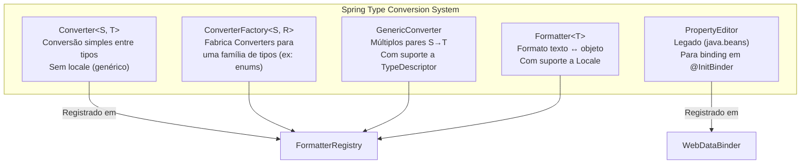

| | `Converter<S,T>` | `Formatter<T>` | `PropertyEditor` |
|---|---|---|---|
| Locale | ❌ Não | ✅ Sim | ❌ Não |
| Threads | Thread-safe | Thread-safe | ⚠️ Não (stateful) |
| Uso ideal | Conversão de tipos | Apresentação de dados | Legado / @InitBinder |
| Registro | `FormatterRegistry` | `FormatterRegistry` | `WebDataBinder` |

### 7.2 Converter — String para Enum Genérico

```java
/**
 * Converte qualquer String para qualquer Enum.
 * Aceita o nome do enum case-insensitive.
 */
public class StringToEnumConverterFactory
        implements ConverterFactory<String, Enum<?>> {

    @Override
    @SuppressWarnings({"unchecked", "rawtypes"})
    public <T extends Enum<?>> Converter<String, T> getConverter(Class<T> targetType) {
        return source -> {
            if (source == null || source.isBlank()) return null;
            // Busca case-insensitive
            return (T) Arrays.stream(targetType.getEnumConstants())
                    .filter(e -> e.name().equalsIgnoreCase(source.trim()))
                    .findFirst()
                    .orElseThrow(() -> new IllegalArgumentException(
                        "Valor inválido '" + source + "' para " + targetType.getSimpleName()));
        };
    }
}
```

### 7.3 Converter — ID para Entidade JPA

```java
/**
 * Permite receber o ID de uma entidade em um formulário e
 * obter a entidade completa automaticamente no binding.
 *
 * Uso: <select th:field="*{categoriaId}">
 * O MVC converte automaticamente Long → Categoria
 */
@Component
public class IdToCategoriaConverter implements Converter<Long, Categoria> {

    private final CategoriaRepository repository;

    public IdToCategoriaConverter(CategoriaRepository repository) {
        this.repository = repository;
    }

    @Override
    public Categoria convert(@NonNull Long source) {
        return repository.findById(source)
                .orElseThrow(() -> new ResourceNotFoundException("Categoria", source));
    }
}
```

### 7.4 Formatter — Moeda Brasileira com Locale

```java
/**
 * Formatter para BigDecimal no formato monetário brasileiro.
 * Responde ao Locale pt-BR.
 */
@Component
public class BrazilianMoneyFormatter implements Formatter<BigDecimal> {

    @Override
    public BigDecimal parse(String text, Locale locale) {
        if (text == null || text.isBlank()) return null;
        try {
            var format = NumberFormat.getNumberInstance(
                locale != null ? locale : new Locale("pt", "BR"));
            ((DecimalFormat) format).setParseBigDecimal(true);
            return (BigDecimal) format.parse(text.trim().replace("R$", "").trim());
        } catch (ParseException e) {
            throw new IllegalArgumentException("Valor monetário inválido: " + text);
        }
    }

    @Override
    public String print(BigDecimal object, Locale locale) {
        if (object == null) return "";
        return NumberFormat.getCurrencyInstance(
            locale != null ? locale : new Locale("pt", "BR"))
            .format(object);
    }
}
```

### 7.5 Formatter para LocalDate Brasileiro

```java
@Component
public class BrazilianDateFormatter implements Formatter<LocalDate> {

    private static final DateTimeFormatter BR_FORMAT =
        DateTimeFormatter.ofPattern("dd/MM/yyyy");
    private static final DateTimeFormatter ISO_FORMAT =
        DateTimeFormatter.ISO_LOCAL_DATE;

    @Override
    public LocalDate parse(String text, Locale locale) {
        if (text == null || text.isBlank()) return null;
        // Aceita tanto dd/MM/yyyy quanto yyyy-MM-dd
        if (text.contains("/")) {
            return LocalDate.parse(text, BR_FORMAT);
        }
        return LocalDate.parse(text, ISO_FORMAT);
    }

    @Override
    public String print(LocalDate object, Locale locale) {
        if (object == null) return "";
        // Formato para exibição pt-BR, ISO para API
        Locale effectiveLocale = locale != null ? locale : Locale.getDefault();
        return effectiveLocale.getLanguage().equals("pt")
            ? object.format(BR_FORMAT)
            : object.format(ISO_FORMAT);
    }
}
```

### 7.6 Registro dos Converters/Formatters

```java
@Configuration
public class WebMvcConfig implements WebMvcConfigurer {

    private final IdToCategoriaConverter idToCategoriaConverter;
    private final BrazilianMoneyFormatter brazilianMoneyFormatter;
    private final BrazilianDateFormatter brazilianDateFormatter;

    public WebMvcConfig(IdToCategoriaConverter idToCategoriaConverter,
                        BrazilianMoneyFormatter brazilianMoneyFormatter,
                        BrazilianDateFormatter brazilianDateFormatter) {
        this.idToCategoriaConverter = idToCategoriaConverter;
        this.brazilianMoneyFormatter = brazilianMoneyFormatter;
        this.brazilianDateFormatter = brazilianDateFormatter;
    }

    @Override
    public void addFormatters(FormatterRegistry registry) {
        registry.addConverter(idToCategoriaConverter);
        registry.addFormatter(brazilianMoneyFormatter);
        registry.addFormatter(brazilianDateFormatter);
        registry.addConverterFactory(new StringToEnumConverterFactory());
    }
}
```

---
## 8. Tratamento de Erros

### 8.1 Hierarquia de Exceções

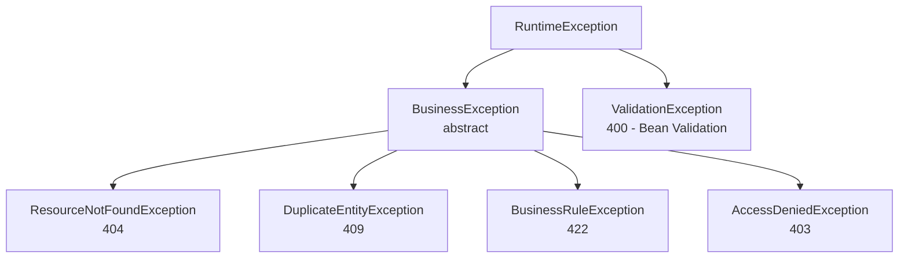

### 8.2 @ControllerAdvice Global — RFC 9457 (Problem Details)

```java
/**
 * Tratamento global de exceções.
 * RFC 9457 / RFC 7807: ProblemDetail é o padrão do Spring 6+
 */
@RestControllerAdvice           // @ControllerAdvice para SSR (retorna view de erro)
@Slf4j
public class GlobalExceptionHandler extends ResponseEntityExceptionHandler {

    // ─── Bean Validation (@Valid / @Validated) ────────────────────────────────
    @Override
    protected ResponseEntity<Object> handleMethodArgumentNotValid(
            MethodArgumentNotValidException ex,
            HttpHeaders headers,
            HttpStatusCode status,
            WebRequest request) {

        var detail = ProblemDetail.forStatusAndDetail(
            HttpStatus.BAD_REQUEST, "Dados de entrada inválidos");

        detail.setTitle("Erro de Validação");
        detail.setType(URI.create("https://api.example.com/problems/validation-error"));
        detail.setInstance(URI.create(((ServletWebRequest) request).getRequest().getRequestURI()));

        // Mapa campo → lista de erros
        var fieldErrors = ex.getBindingResult().getFieldErrors().stream()
                .collect(Collectors.groupingBy(
                    FieldError::getField,
                    Collectors.mapping(FieldError::getDefaultMessage, Collectors.toList())
                ));

        detail.setProperty("errors", fieldErrors);
        detail.setProperty("timestamp", Instant.now());

        return ResponseEntity.badRequest().body(detail);
    }

    // ─── Validação de parâmetros (@Validated em @Service/@Controller) ─────────
    @ExceptionHandler(ConstraintViolationException.class)
    public ResponseEntity<ProblemDetail> handleConstraintViolation(
            ConstraintViolationException ex, HttpServletRequest request) {

        var detail = ProblemDetail.forStatusAndDetail(
            HttpStatus.BAD_REQUEST, "Parâmetros inválidos");
        detail.setTitle("Erro de Validação de Parâmetros");

        var violations = ex.getConstraintViolations().stream()
                .collect(Collectors.toMap(
                    v -> v.getPropertyPath().toString(),
                    v -> v.getMessage(),
                    (a, b) -> a + "; " + b
                ));

        detail.setProperty("errors", violations);
        return ResponseEntity.badRequest().body(detail);
    }

    // ─── Recurso não encontrado ───────────────────────────────────────────────
    @ExceptionHandler(ResourceNotFoundException.class)
    public ResponseEntity<ProblemDetail> handleResourceNotFound(
            ResourceNotFoundException ex, HttpServletRequest request) {

        var detail = ProblemDetail.forStatusAndDetail(HttpStatus.NOT_FOUND, ex.getMessage());
        detail.setTitle("Recurso Não Encontrado");
        detail.setType(URI.create("https://api.example.com/problems/resource-not-found"));
        detail.setInstance(URI.create(request.getRequestURI()));

        return ResponseEntity.status(HttpStatus.NOT_FOUND).body(detail);
    }

    // ─── Regra de negócio ─────────────────────────────────────────────────────
    @ExceptionHandler(BusinessRuleException.class)
    public ResponseEntity<ProblemDetail> handleBusinessRule(
            BusinessRuleException ex, HttpServletRequest request) {

        var detail = ProblemDetail.forStatusAndDetail(
            HttpStatus.UNPROCESSABLE_ENTITY, ex.getMessage());
        detail.setTitle("Regra de Negócio Violada");

        return ResponseEntity.unprocessableEntity().body(detail);
    }

    // ─── Conflito de dados ────────────────────────────────────────────────────
    @ExceptionHandler(DuplicateEntityException.class)
    public ResponseEntity<ProblemDetail> handleDuplicate(
            DuplicateEntityException ex, HttpServletRequest request) {

        var detail = ProblemDetail.forStatusAndDetail(HttpStatus.CONFLICT, ex.getMessage());
        detail.setTitle("Conflito de Dados");

        return ResponseEntity.status(HttpStatus.CONFLICT).body(detail);
    }

    // ─── Fallback para exceções inesperadas ───────────────────────────────────
    @ExceptionHandler(Exception.class)
    public ResponseEntity<ProblemDetail> handleGeneral(
            Exception ex, HttpServletRequest request) {

        log.error("Erro inesperado na requisição {}: {}",
            request.getRequestURI(), ex.getMessage(), ex);

        var detail = ProblemDetail.forStatusAndDetail(
            HttpStatus.INTERNAL_SERVER_ERROR, "Ocorreu um erro interno. Tente novamente.");
        detail.setTitle("Erro Interno");

        return ResponseEntity.internalServerError().body(detail);
    }
}
```

### 8.3 Resposta de Erro Padrão (RFC 9457)

```json
{
  "type": "https://api.example.com/problems/validation-error",
  "title": "Erro de Validação",
  "status": 400,
  "detail": "Dados de entrada inválidos",
  "instance": "/api/v1/produtos",
  "timestamp": "2025-03-15T10:30:00Z",
  "errors": {
    "nome": ["Nome é obrigatório", "Tamanho mínimo: 2 caracteres"],
    "preco": ["Preço deve ser maior que zero"]
  }
}
```
## 9. Documentação com OpenAPI / SpringDoc

### 9.1 Configuração Principal

```java
@Configuration
public class OpenApiConfig {

    @Bean
    public OpenAPI openAPI() {
        return new OpenAPI()
            .info(new Info()
                .title("API de Produtos")
                .description("""
                    API REST para gerenciamento de produtos e categorias.

                    ## Autenticação
                    Use Bearer Token (JWT) obtido via `/auth/login`.
                    """)
                .version("1.0.0")
                .contact(new Contact()
                    .name("Time de Desenvolvimento")
                    .email("dev@example.com"))
                .license(new License()
                    .name("Apache 2.0")
                    .url("https://www.apache.org/licenses/LICENSE-2.0")))
            .addSecurityItem(new SecurityRequirement().addList("BearerAuth"))
            .components(new Components()
                .addSecuritySchemes("BearerAuth",
                    new SecurityScheme()
                        .type(SecurityScheme.Type.HTTP)
                        .scheme("bearer")
                        .bearerFormat("JWT")));
    }

    // ─── Agrupamento de endpoints por domínio ─────────────────────────────────
    @Bean
    public GroupedOpenApi produtosApi() {
        return GroupedOpenApi.builder()
                .group("produtos")
                .displayName("Gerenciamento de Produtos")
                .pathsToMatch("/api/v1/produtos/**")
                .build();
    }

    @Bean
    public GroupedOpenApi adminApi() {
        return GroupedOpenApi.builder()
                .group("admin")
                .displayName("Administração")
                .pathsToMatch("/api/v1/admin/**")
                .build();
    }
}
```

### 9.2 Anotações nos Controllers e DTOs

```java
// ─── Controller com documentação completa ─────────────────────────────────────
@RestController
@RequestMapping("/api/v1/produtos")
@Tag(name = "Produtos", description = "CRUD de produtos com paginação e filtros")
public class ProdutoController {

    @Operation(
        summary = "Buscar produto por ID",
        description = "Retorna os detalhes completos de um produto pelo seu identificador único.",
        security = @SecurityRequirement(name = "BearerAuth")
    )
    @ApiResponses({
        @ApiResponse(
            responseCode = "200",
            description = "Produto encontrado",
            content = @Content(
                mediaType = "application/json",
                schema = @Schema(implementation = ProdutoResponse.class),
                examples = @ExampleObject(
                    name = "Produto exemplo",
                    value = """
                        {
                          "id": 1,
                          "nome": "Notebook Dell XPS 15",
                          "preco": 8999.99,
                          "estoque": 25
                        }
                        """
                )
            )
        ),
        @ApiResponse(
            responseCode = "404",
            description = "Produto não encontrado",
            content = @Content(schema = @Schema(implementation = ProblemDetail.class))
        )
    })
    @GetMapping("/{id}")
    public ResponseEntity<ProdutoResponse> buscarPorId(
            @Parameter(description = "ID único do produto", example = "1", required = true)
            @PathVariable @Positive Long id) {
        // ...
    }
}

// ─── DTO com Schema OpenAPI ────────────────────────────────────────────────────
@Schema(description = "Dados para criação de um novo produto")
public record ProdutoCreateRequest(

    @Schema(description = "Nome do produto", example = "Notebook Dell XPS 15",
            minLength = 2, maxLength = 200, requiredMode = Schema.RequiredMode.REQUIRED)
    @NotBlank @Size(min = 2, max = 200)
    String nome,

    @Schema(description = "Preço de venda", example = "8999.99",
            minimum = "0.01", requiredMode = Schema.RequiredMode.REQUIRED)
    @NotNull @DecimalMin("0.01")
    BigDecimal preco,

    @Schema(description = "Quantidade em estoque", example = "100",
            minimum = "0", requiredMode = Schema.RequiredMode.REQUIRED)
    @NotNull @Min(0)
    Integer estoque

) {}
```

### 9.3 Ocultando Endpoints do Swagger

```java
// Ocultar endpoint específico
@Hidden
@GetMapping("/interno/cache/clear")
public void limparCache() { ... }

// Ocultar parâmetro interno do usuário no Swagger
@GetMapping
public List<ProdutoResponse> listar(
    @Parameter(hidden = true) @AuthenticationPrincipal UserDetails user,
    @RequestParam(defaultValue = "0") int page) { ... }
```

---
## 10. Recursos Avançados e Pouco Explorados

### 10.1 HandlerInterceptor — Auditoria e Métricas

```java
@Component
@Slf4j
public class AuditInterceptor implements HandlerInterceptor {

    private final AuditService auditService;

    public AuditInterceptor(AuditService auditService) {
        this.auditService = auditService;
    }

    @Override
    public boolean preHandle(HttpServletRequest request,
                              HttpServletResponse response,
                              Object handler) throws Exception {

        if (!(handler instanceof HandlerMethod method)) return true;

        if (method.hasMethodAnnotation(RequiresAudit.class)) {
            request.setAttribute("AUDIT_START_TIME", System.nanoTime());
            request.setAttribute("AUDIT_USER", SecurityUtils.getCurrentUser());
        }
        return true;
    }

    @Override
    public void afterCompletion(HttpServletRequest request,
                                 HttpServletResponse response,
                                 Object handler, Exception ex) throws Exception {

        var startTime = (Long) request.getAttribute("AUDIT_START_TIME");
        if (startTime == null) return;

        var duration = (System.nanoTime() - startTime) / 1_000_000;
        var user = (String) request.getAttribute("AUDIT_USER");

        auditService.registrar(AuditEvent.builder()
            .usuario(user)
            .endpoint(request.getMethod() + " " + request.getRequestURI())
            .statusCode(response.getStatus())
            .duracaoMs(duration)
            .ip(getClientIp(request))
            .build());
    }

    private String getClientIp(HttpServletRequest request) {
        var xff = request.getHeader("X-Forwarded-For");
        return xff != null ? xff.split(",")[0].trim() : request.getRemoteAddr();
    }
}
```
### 10.2 Content Negotiation — Mesmo Endpoint, Múltiplos Formatos

```java
@RestController
@RequestMapping("/api/v1/relatorios")
public class RelatorioController {

    /**
     * Mesmo endpoint retorna JSON, XML ou CSV dependendo do Accept header.
     * Accept: application/json → JSON
     * Accept: application/xml  → XML
     * Accept: text/csv         → CSV download
     * ?format=pdf              → PDF download
     */
    @GetMapping(value = "/vendas",
        produces = {
            MediaType.APPLICATION_JSON_VALUE,
            MediaType.APPLICATION_XML_VALUE,
            "text/csv",
            MediaType.APPLICATION_PDF_VALUE
        })
    public ResponseEntity<?> relatorioVendas(
            @RequestParam(required = false) String format,
            HttpServletRequest request) {

        var dados = relatorioService.gerarVendas();

        return switch (format != null ? format : detectContentType(request)) {
            case "pdf"  -> ResponseEntity.ok()
                .contentType(MediaType.APPLICATION_PDF)
                .header("Content-Disposition", "attachment; filename=vendas.pdf")
                .body(relatorioService.gerarPdf(dados));
            case "csv"  -> ResponseEntity.ok()
                .contentType(MediaType.parseMediaType("text/csv"))
                .header("Content-Disposition", "attachment; filename=vendas.csv")
                .body(relatorioService.gerarCsv(dados));
            default     -> ResponseEntity.ok(dados);
        };
    }
}
```

### 10.3 Streaming com SseEmitter e StreamingResponseBody

```java
@RestController
@RequestMapping("/api/v1/eventos")
public class EventoController {

    /**
     * Server-Sent Events (SSE) — Notificações em tempo real sem WebSocket.
     * O cliente recebe eventos via EventSource (JavaScript).
     */
    @GetMapping(value = "/stream", produces = MediaType.TEXT_EVENT_STREAM_VALUE)
    public SseEmitter stream(@RequestParam Long usuarioId) {
        var emitter = new SseEmitter(60_000L);  // Timeout 60s

        eventoBroadcaster.subscribe(usuarioId, emitter);

        emitter.onTimeout(() -> eventoBroadcaster.unsubscribe(usuarioId));
        emitter.onCompletion(() -> eventoBroadcaster.unsubscribe(usuarioId));

        return emitter;
    }

    /**
     * Download progressivo de arquivo grande sem carregar tudo na memória.
     */
    @GetMapping("/exportar-grande")
    public ResponseEntity<StreamingResponseBody> exportarGrande() {
        StreamingResponseBody body = outputStream -> {
            try (var writer = new OutputStreamWriter(outputStream)) {
                writer.write("id,nome,preco\n");
                produtoService.streamTodos().forEach(p -> {
                    try {
                        writer.write(p.id() + "," + p.nome() + "," + p.preco() + "\n");
                        writer.flush(); // flush a cada linha
                    } catch (IOException e) {
                        throw new UncheckedIOException(e);
                    }
                });
            }
        };

        return ResponseEntity.ok()
                .contentType(MediaType.parseMediaType("text/csv"))
                .header("Content-Disposition", "attachment; filename=produtos.csv")
                .body(body);
    }
}
```

### 10.4 HandlerMethodArgumentResolver — Argumento Customizado

```java
/**
 * Resolve automaticamente o usuário logado como parâmetro de método.
 * Uso: public ResponseEntity<?> meuMetodo(@CurrentUser UsuarioInfo usuario)
 *
 * Elimina o boilerplate de injetar Authentication em todos os métodos.
 */
@Component
public class CurrentUserArgumentResolver implements HandlerMethodArgumentResolver {

    @Override
    public boolean supportsParameter(MethodParameter parameter) {
        return parameter.hasParameterAnnotation(CurrentUser.class)
            && parameter.getParameterType().equals(UsuarioInfo.class);
    }

    @Override
    public Object resolveArgument(MethodParameter parameter,
                                   ModelAndViewContainer mavContainer,
                                   NativeWebRequest webRequest,
                                   WebDataBinderFactory binderFactory) {

        var auth = SecurityContextHolder.getContext().getAuthentication();
        if (auth == null || !auth.isAuthenticated()) return null;
        return auth.getPrincipal() instanceof UsuarioInfo u ? u : null;
    }
}

// Registro em WebMvcConfigurer
@Override
public void addArgumentResolvers(List<HandlerMethodArgumentResolver> resolvers) {
    resolvers.add(currentUserArgumentResolver);
}

// Uso limpo no Controller (sem Authentication como parâmetro)
@GetMapping("/meu-perfil")
public ResponseEntity<PerfilResponse> meuPerfil(@CurrentUser UsuarioInfo usuario) {
    return ResponseEntity.ok(perfilService.buscar(usuario.getId()));
}
```

### 10.5 @RequestScope e @SessionScope Beans

```java
// Bean scoped por request — contexto da requisição corrente
@Component
@RequestScope
public class RequestContext {
    private String correlationId = UUID.randomUUID().toString();
    private String usuarioId;
    private String tenantId;
    // getters/setters
}

// Bean scoped por sessão — carrinho de compras, preferências
@Component
@SessionScope
public class CarrinhoSession {
    private final Map<Long, Integer> itens = new LinkedHashMap<>();

    public void adicionar(Long produtoId, int quantidade) {
        itens.merge(produtoId, quantidade, Integer::sum);
    }

    public Map<Long, Integer> getItens() {
        return Collections.unmodifiableMap(itens);
    }
}

// Injeção normal — Spring usa proxy para resolver o scope correto
@Controller
public class CarrinhoController {

    private final CarrinhoSession carrinho;

    public CarrinhoController(CarrinhoSession carrinho) {
        this.carrinho = carrinho;
    }
}
```

### 10.6 Flash Attributes — Dados entre Redirects (PRG Pattern)

```java
/**
 * PRG Pattern (Post-Redirect-Get):
 * POST → processa → redirect → GET → exibe resultado.
 * Flash attributes sobrevivem ao redirect e são removidos após a próxima view.
 */
@PostMapping
public String processarFormulario(RedirectAttributes redirectAttrs) {
    var resultado = service.processar();

    // Sobrevive ao redirect, removido automaticamente após exibição
    redirectAttrs.addFlashAttribute("sucesso", "Operação realizada com sucesso!");
    redirectAttrs.addFlashAttribute("resultado", resultado);

    // Vai na query string: /sucesso?id=42
    redirectAttrs.addAttribute("id", resultado.getId());

    return "redirect:/sucesso";
}
```

### 10.7 ResponseBodyAdvice — Interceptar Respostas Globalmente

```java
/**
 * Envolve TODAS as respostas REST em um envelope padronizado.
 * Útil para adicionar metadata, correlation IDs, versão da API.
 */
@RestControllerAdvice
public class ApiResponseWrapper
        implements ResponseBodyAdvice<Object> {

    @Override
    public boolean supports(MethodParameter returnType,
                             Class<? extends HttpMessageConverter<?>> converterType) {
        // Aplica apenas em controllers da API, não no Swagger
        return returnType.getContainingClass().isAnnotationPresent(RestController.class)
            && !returnType.hasMethodAnnotation(RawResponse.class); // Anotação para exclusões
    }

    @Override
    public Object beforeBodyWrite(Object body,
                                   MethodParameter returnType,
                                   MediaType selectedContentType,
                                   Class<? extends HttpMessageConverter<?>> selectedConverterType,
                                   ServerHttpRequest request,
                                   ServerHttpResponse response) {

        if (body instanceof ProblemDetail) return body; // Não envelopa erros

        return ApiEnvelope.of(body, correlationId());
    }

    private String correlationId() {
        // Pega da requisição ou gera novo
        return MDC.get("correlationId");
    }
}

// Envelope padrão
public record ApiEnvelope<T>(
    T data,
    String correlationId,
    Instant timestamp
) {
    public static <T> ApiEnvelope<T> of(T data, String correlationId) {
        return new ApiEnvelope<>(data, correlationId, Instant.now());
    }
}
```

---

### 10.8 Controller Assíncrono — `CompletableFuture`, `Callable` e `DeferredResult`

O Spring MVC suporta retornos assíncronos no controller sem bloquear a thread do
Servlet. O container libera a thread imediatamente e a resposta é enviada quando o
resultado ficar disponível — essencial para operações de I/O pesado, integrações
externas e processamento paralelo.

#### Comparativo dos mecanismos

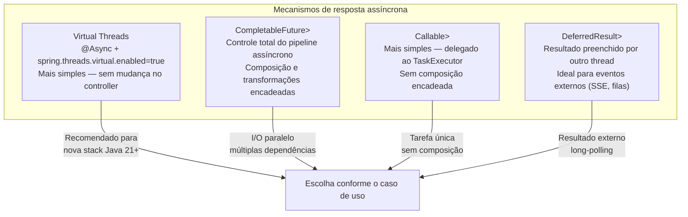

#### Virtual Threads — a forma mais simples (Java 21+ / Spring Boot 3.2+)

Com Virtual Threads habilitados, o controller continua **síncrono** no código mas
não bloqueia threads de plataforma. É a abordagem recomendada para a maioria dos casos:

```java
// application.yml
// spring:
//   threads:
//     virtual:
//       enabled: true    ← habilita Virtual Threads no Tomcat automaticamente

// O controller continua idêntico — sem nenhuma mudança
@GetMapping("/{id}")
public ResponseEntity<ProdutoResponse> buscar(@PathVariable Long id) {
    // Mesmo que esta chamada bloqueie 200ms, a thread virtual é suspensa
    // e a thread de plataforma fica livre para outras requisições
    return ResponseEntity.ok(produtoService.buscar(id));
}
```

#### `CompletableFuture` — composição assíncrona

```java
@RestController
@RequestMapping("/api/v1/produtos")
public class ProdutoAsyncController {

    private final ProdutoService produtoService;
    private final EstoqueService estoqueService;
    private final PrecoService precoService;

    // ─── Retorno simples com CompletableFuture ────────────────────────────────
    //
    // Spring detecta o CompletableFuture e libera a thread do Servlet.
    // Quando o future completar, a resposta é escrita na conexão original.
    @GetMapping("/{id}")
    @Operation(summary = "Buscar produto (assíncrono)")
    public CompletableFuture<ResponseEntity<ProdutoResponse>> buscar(
            @PathVariable Long id) {

        return produtoService.buscarAsync(id)
                .thenApply(ResponseEntity::ok)
                .exceptionally(ex -> {
                    if (ex.getCause() instanceof RecursoNaoEncontradoException) {
                        return ResponseEntity.notFound().build();
                    }
                    return ResponseEntity.internalServerError().build();
                });
    }

    // ─── Múltiplas chamadas paralelas combinadas ───────────────────────────────
    //
    // As três chamadas executam em paralelo; a resposta aguarda todas.
    // Sem CompletableFuture, seriam sequenciais: 300ms + 150ms + 200ms = 650ms.
    // Com paralelismo: max(300, 150, 200) = 300ms.
    @GetMapping("/{id}/detalhes-completos")
    @Operation(summary = "Detalhes completos — busca paralela")
    public CompletableFuture<ResponseEntity<ProdutoDetalhesResponse>> detalhes(
            @PathVariable Long id) {

        var produtoFuture  = produtoService.buscarAsync(id);           // ~300ms
        var estoqueFuture  = estoqueService.buscarPorProdutoAsync(id); // ~150ms
        var precoFuture    = precoService.buscarHistoricoAsync(id);    // ~200ms

        return CompletableFuture.allOf(produtoFuture, estoqueFuture, precoFuture)
                .thenApply(_ -> {
                    var resposta = new ProdutoDetalhesResponse(
                            produtoFuture.join(),
                            estoqueFuture.join(),
                            precoFuture.join()
                    );
                    return ResponseEntity.ok(resposta);
                });
    }

    // ─── CompletableFuture com timeout explícito ──────────────────────────────
    @GetMapping("/{id}/preco-externo")
    public CompletableFuture<ResponseEntity<PrecoExternoResponse>> precoExterno(
            @PathVariable Long id) {

        return precoService.consultarFornecedorAsync(id)
                .orTimeout(5, TimeUnit.SECONDS)           // ← timeout de 5s
                .thenApply(ResponseEntity::ok)
                .exceptionally(ex -> {
                    if (ex.getCause() instanceof TimeoutException) {
                        return ResponseEntity.status(HttpStatus.GATEWAY_TIMEOUT)
                                .build();
                    }
                    return ResponseEntity.status(HttpStatus.BAD_GATEWAY).build();
                });
    }
}
```

#### Serviço assíncrono com `@Async`

```java
@Service
public class ProdutoService {

    private final ProdutoRepository produtoRepository;

    // ─── @Async transforma o retorno em CompletableFuture automaticamente ──────
    //
    // Spring executa o método num thread separado do pool definido em @Async.
    // O chamador (controller) recebe um CompletableFuture já em andamento.
    @Async("asyncExecutor")
    public CompletableFuture<ProdutoResponse> buscarAsync(Long id) {
        var produto = produtoRepository.findById(id)
                .map(ProdutoResponse::from)
                .orElseThrow(() -> new RecursoNaoEncontradoException("Produto", id));
        return CompletableFuture.completedFuture(produto);
    }

    @Async("asyncExecutor")
    public CompletableFuture<List<ProdutoResponse>> listarAsync(ProdutoFiltros filtros,
                                                                  Pageable pageable) {
        return CompletableFuture.completedFuture(
                produtoRepository.findAll(filtros.toSpec(), pageable)
                        .map(ProdutoResponse::from)
                        .toList()
        );
    }
}
```

#### Configuração do `TaskExecutor` para `@Async`

```java
@Configuration
@EnableAsync
public class AsyncConfig implements AsyncConfigurer {

    // ─── Executor dedicado para operações assíncronas da aplicação ────────────
    @Bean("asyncExecutor")
    public Executor asyncExecutor() {
        var executor = new ThreadPoolTaskExecutor();
        executor.setCorePoolSize(10);
        executor.setMaxPoolSize(50);
        executor.setQueueCapacity(200);
        executor.setThreadNamePrefix("async-");

        // Propaga o SecurityContext para threads filhas (@Async + Spring Security)
        executor.setTaskDecorator(new DelegatingSecurityContextTaskDecorator(
                new ContextPropagatingTaskDecorator()));

        // Política de rejeição: lança exceção quando fila está cheia
        executor.setRejectedExecutionHandler(new ThreadPoolExecutor.CallerRunsPolicy());
        executor.initialize();
        return executor;
    }

    // ─── Handler global para exceções não capturadas em @Async ───────────────
    @Override
    public AsyncUncaughtExceptionHandler getAsyncUncaughtExceptionHandler() {
        return (ex, method, params) ->
            LoggerFactory.getLogger(AsyncConfig.class)
                    .error("Erro assíncrono em {}: {}", method.getName(), ex.getMessage(), ex);
    }
}
```

> **Nota sobre Virtual Threads e `@Async`:** com `spring.threads.virtual.enabled=true`,
> o Spring Boot substitui o `SimpleAsyncTaskExecutor` padrão por um executor de
> Virtual Threads automaticamente. Nesse cenário, `@Async` com Virtual Threads
> elimina a necessidade de configurar pool sizes — cada tarefa recebe uma Virtual
> Thread própria sem custo de bloqueio.

#### `Callable<T>` — delegação simples ao `TaskExecutor`

```java
// Callable é a forma mais simples de assincronia sem CompletableFuture.
// Spring MVC executa o Callable num AsyncTaskExecutor e libera a thread do Servlet.
@GetMapping("/processamento-pesado")
public Callable<ResponseEntity<RelatorioResponse>> processamentoPesado(
        @RequestParam String periodo) {

    // O Callable é executado em outro thread — a thread do Servlet é liberada aqui
    return () -> {
        var relatorio = relatorioService.gerarCompleto(periodo); // pode demorar
        return ResponseEntity.ok(relatorio);
    };
}
```

#### `DeferredResult<T>` — resultado produzido por outro componente

```java
// DeferredResult é preenchido por um thread externo (event listener, fila, etc.)
// O Servlet aguarda sem bloquear thread. Ideal para long-polling e integração com
// sistemas de mensageria.
@Component
public class CotacaoController {

    // Mapa de cotações pendentes: tickerSymbol → lista de DeferredResults aguardando
    private final Map<String, List<DeferredResult<ResponseEntity<CotacaoResponse>>>> pendentes
            = new ConcurrentHashMap<>();

    @GetMapping("/api/v1/cotacoes/{ticker}/aguardar")
    @Operation(summary = "Aguarda a próxima atualização de cotação (long-polling)")
    public DeferredResult<ResponseEntity<CotacaoResponse>> aguardarCotacao(
            @PathVariable String ticker) {

        // Timeout de 30s — se não houver atualização, retorna 204
        var result = new DeferredResult<ResponseEntity<CotacaoResponse>>(30_000L,
                ResponseEntity.noContent().build());

        pendentes.computeIfAbsent(ticker, _ -> new CopyOnWriteArrayList<>()).add(result);
        result.onCompletion(() -> pendentes.getOrDefault(ticker, List.of()).remove(result));

        return result;
    }

    // Chamado por um @EventListener ou consumidor de fila quando chega nova cotação
    @EventListener
    public void onNovaCotacao(CotacaoAtualizadaEvent evento) {
        var resultados = pendentes.remove(evento.ticker());
        if (resultados != null) {
            var response = ResponseEntity.ok(CotacaoResponse.from(evento));
            resultados.forEach(r -> r.setResult(response)); // notifica todos os clientes
        }
    }
}
```

#### Tratamento de erros assíncronos no `@ControllerAdvice`

```java
// Exceções lançadas dentro de CompletableFuture são envolvidas em
// CompletionException — o Spring MVC desempacota automaticamente a causa
// antes de passar ao @ExceptionHandler.
@RestControllerAdvice
public class GlobalExceptionHandler {

    // Este handler captura tanto exceções síncronas quanto as desempacotadas
    // de CompletableFuture (Spring MVC faz o unwrap de CompletionException)
    @ExceptionHandler(RecursoNaoEncontradoException.class)
    @ResponseStatus(HttpStatus.NOT_FOUND)
    public ProblemDetail handleNotFound(RecursoNaoEncontradoException ex) {
        return ProblemDetail.forStatusAndDetail(HttpStatus.NOT_FOUND, ex.getMessage());
    }

    // AsyncRequestTimeoutException: lançada quando o timeout do DeferredResult
    // ou Callable expira sem que o resultado tenha sido preenchido
    @ExceptionHandler(AsyncRequestTimeoutException.class)
    @ResponseStatus(HttpStatus.SERVICE_UNAVAILABLE)
    public ProblemDetail handleAsyncTimeout(AsyncRequestTimeoutException ex) {
        return ProblemDetail.forStatusAndDetail(HttpStatus.SERVICE_UNAVAILABLE,
                "Operação expirou — tente novamente");
    }
}
```

#### Configuração do timeout global de async no MVC

```java
// Em WebMvcConfigurer — define o timeout padrão para Callable e DeferredResult
@Override
public void configureAsyncSupport(AsyncSupportConfigurer configurer) {
    configurer.setDefaultTimeout(30_000L); // 30 segundos

    // Quando Virtual Threads estão habilitadas, o Spring Boot já configura
    // um VirtualThreadTaskExecutor automaticamente — não é necessário setar aqui.
    // Para pool de threads convencional:
    // configurer.setTaskExecutor(asyncExecutor());
}
```

#### Teste de endpoint assíncrono

```java
@SpringBootTest(webEnvironment = RANDOM_PORT)
class ProdutoAsyncControllerIT {

    @Autowired
    private RestTestClient restTestClient;

    @MockitoBean
    private ProdutoService produtoService;

    @Test
    @DisplayName("GET /{id} assíncrono → 200 quando produto existe")
    void buscar_Async_Returns200() {
        when(produtoService.buscarAsync(1L))
                .thenReturn(CompletableFuture.completedFuture(
                        new ProdutoResponse(1L, "Notebook", new BigDecimal("3499.99"),
                                "Informática", LocalDateTime.now(), LocalDateTime.now())));

        restTestClient.get()
                .uri("/api/v1/produtos/1")
                .exchange()
                .expectStatus().isOk()
                .expectBody(ProdutoResponse.class)
                .value(p -> assertThat(p.nome()).isEqualTo("Notebook"));
    }

    @Test
    @DisplayName("GET /{id}/preco-externo → 504 quando timeout")
    void buscarPrecoExterno_Timeout_Returns504() {
        when(produtoService.consultarFornecedorAsync(1L))
                .thenReturn(CompletableFuture.failedFuture(new TimeoutException()));

        restTestClient.get()
                .uri("/api/v1/produtos/1/preco-externo")
                .exchange()
                .expectStatus().isEqualTo(HttpStatus.GATEWAY_TIMEOUT);
    }
}
```

---

### 10.9 API Versioning nativo — Spring Framework 7 / Spring Boot 4

O Spring Framework 7 (base do Spring Boot 4) introduziu suporte nativo a
versionamento de API por meio da classe `ApiVersionRequestMappingHandlerMapping`
e da anotação `@ApiVersion`. Isso elimina a necessidade de embutir a versão
explicitamente em cada `@RequestMapping("/api/v1/...")`.

#### Como funciona

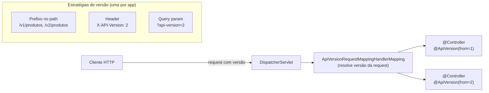

#### Configuração do versionamento

```java
// ─── 1. Configurar a estratégia em WebMvcConfigurer ──────────────────────────
@Configuration
public class WebMvcConfig implements WebMvcConfigurer {

    @Override
    public void configureApiVersioning(ApiVersioningConfigurer configurer) {
        configurer
            // Estratégia 1: versão como prefixo no path  → /v{n}/produtos
            .usePathPrefix("v{version}")

            // Estratégia 2: via header (alternativa)
            // .useRequestHeader("X-API-Version")

            // Estratégia 3: via query param (alternativa)
            // .useRequestParameter("api-version")

            // Versão default quando o cliente não envia nenhuma
            .setDefaultVersion("1")

            // Como reagir a versões sem handler mapeado
            .setIncompatibleVersionStrategy(
                ApiVersionIncompatibleRequestStrategy.sendError(
                    HttpStatus.GONE, "Versão da API não suportada"));
    }
}
```

#### Controllers sem versão no path

```java
// ─── Controller v1 — versão inicial ──────────────────────────────────────────
//
// @ApiVersion(from = "1") = atende requests de versão 1 em diante,
//   até que uma versão mais específica exista para a mesma rota.
//
// Mapeamento gerado automaticamente: /v1/produtos/**
//
@RestController
@RequestMapping("/produtos")   // SEM prefixo de versão na rota!
@ApiVersion(from = "1")
@Tag(name = "Produtos")
public class ProdutoV1Controller {

    @GetMapping("/{id}")
    public ResponseEntity<ProdutoV1Response> buscar(@PathVariable Long id) {
        return ResponseEntity.ok(produtoService.buscarV1(id));
    }

    @GetMapping
    public ResponseEntity<Page<ProdutoV1Response>> listar(Pageable pageable) {
        return ResponseEntity.ok(produtoService.listarV1(pageable));
    }
}

// ─── Controller v2 — breaking change ─────────────────────────────────────────
//
// @ApiVersion(from = "2") = atende requests de versão 2 em diante.
// Requests para /v1/produtos/{id} continuam indo para ProdutoV1Controller.
// Requests para /v2/produtos/{id} vão para ProdutoV2Controller.
//
// Mapeamento gerado automaticamente: /v2/produtos/**
//
@RestController
@RequestMapping("/produtos")   // mesmo path base — o framework diferencia pela versão
@ApiVersion(from = "2")
@Tag(name = "Produtos")
public class ProdutoV2Controller {

    // v2 retorna um Response com campos extras (breaking change justifica nova versão)
    @GetMapping("/{id}")
    public ResponseEntity<ProdutoV2Response> buscar(@PathVariable Long id) {
        return ResponseEntity.ok(produtoService.buscarV2(id));
    }

    // Endpoint novo que existe apenas na v2
    @GetMapping("/{id}/avaliacoes")
    public ResponseEntity<Page<AvaliacaoResponse>> avaliacoes(
            @PathVariable Long id, Pageable pageable) {
        return ResponseEntity.ok(avaliacaoService.listar(id, pageable));
    }
}

// ─── Granularidade por método ─────────────────────────────────────────────────
//
// @ApiVersion pode ser aplicado também em métodos individuais,
// permitindo que apenas parte de um controller seja versionado.
//
@RestController
@RequestMapping("/categorias")
@ApiVersion(from = "1")
public class CategoriaController {

    @GetMapping                     // disponível desde v1
    public List<CategoriaResponse> listar() { ... }

    @GetMapping("/{id}/arvore")
    @ApiVersion(from = "2")         // endpoint novo, apenas v2+
    public CategoriaArvoreResponse arvore(@PathVariable Long id) { ... }

    @DeleteMapping("/{id}")
    @ApiVersion(from = "1", to = "2")  // removido na v3 (deprecated range)
    public void excluir(@PathVariable Long id) { ... }
}
```

#### Documentação OpenAPI por versão

```java
// SpringDoc agrupa automaticamente os endpoints por versão quando configurado:
@Bean
public GroupedOpenApi v1Api() {
    return GroupedOpenApi.builder()
            .group("v1")
            .displayName("API v1 (estável)")
            .addOpenApiCustomizer(api ->
                api.info(new Info().title("API v1").version("1.0")))
            .build();
}

@Bean
public GroupedOpenApi v2Api() {
    return GroupedOpenApi.builder()
            .group("v2")
            .displayName("API v2 (atual)")
            .addOpenApiCustomizer(api ->
                api.info(new Info().title("API v2").version("2.0")))
            .build();
}
```

> **Compatibilidade:** `@ApiVersion` e `configureApiVersioning` são APIs do
> Spring Framework 7 — disponíveis a partir do Spring Boot 4.0. No Spring Boot
> 3.x, o versionamento manual via prefixo de path (`/api/v1/...`) ou
> `GroupedOpenApi` continua sendo a abordagem recomendada.

---

### 10.10 Acesso a Recursos do Servlet — `HttpServletRequest`, `HttpServletResponse` e `RequestContextHolder`

O Spring MVC expõe os objetos do Servlet diretamente como parâmetros de método
nos controllers. Para camadas mais internas (services, componentes) que não têm
acesso direto ao contexto da requisição, o `RequestContextHolder` fornece acesso
estático thread-safe.

#### Injeção direta nos controllers

```java
@RestController
@RequestMapping("/api/v1/exemplos")
public class ExemplosServletController {

    // ─── HttpServletRequest — dados brutos da requisição ─────────────────────
    @GetMapping("/request-info")
    public Map<String, Object> requestInfo(HttpServletRequest request) {
        return Map.of(
            "method",      request.getMethod(),
            "uri",         request.getRequestURI(),
            "queryString", Objects.requireNonNullElse(request.getQueryString(), ""),
            "remoteAddr",  request.getRemoteAddr(),
            "serverName",  request.getServerName(),
            "headers",     Collections.list(request.getHeaderNames())
                               .stream()
                               .collect(Collectors.toMap(
                                   h -> h,
                                   request::getHeader
                               ))
        );
    }

    // ─── HttpServletResponse — manipulação direta da resposta ────────────────
    @GetMapping("/download")
    public void download(HttpServletResponse response) throws IOException {
        response.setContentType("text/csv");
        response.setHeader(HttpHeaders.CONTENT_DISPOSITION,
                           "attachment; filename=\"dados.csv\"");
        response.setCharacterEncoding("UTF-8");

        try (var writer = response.getWriter()) {
            writer.write("id,nome,preco\n");
            writer.write("1,Produto A,99.90\n");
        }
        // Não retorna nada — a resposta já foi escrita diretamente
    }

    // ─── HttpSession — acesso direto ou criação lazy ──────────────────────────
    @GetMapping("/sessao")
    public Map<String, Object> sessao(HttpSession session) {
        // false = não cria sessão se não existir
        // Para acesso sem criar: request.getSession(false)
        return Map.of(
            "sessionId", session.getId(),
            "isNew",     session.isNew(),
            "maxInactive", session.getMaxInactiveInterval()
        );
    }

    // ─── WebRequest — abstração portável (funciona com Servlet e Portlet) ────
    @GetMapping("/web-request")
    public String webRequest(WebRequest webRequest,
                              NativeWebRequest nativeWebRequest) {
        // WebRequest: API portável do Spring
        String param = webRequest.getParameter("q");

        // NativeWebRequest: acesso ao objeto nativo quando necessário
        HttpServletRequest nativo = nativeWebRequest.getNativeRequest(HttpServletRequest.class);

        return param;
    }

    // ─── Principal — usuário autenticado via interface padrão Java EE ─────────
    @GetMapping("/principal")
    public String principal(Principal principal) {
        // Funciona com qualquer mecanismo de autenticação (Basic, JWT, OIDC...)
        return principal != null ? principal.getName() : "anônimo";
    }

    // ─── Locale — idioma/region do cliente ───────────────────────────────────
    @GetMapping("/locale")
    public String locale(Locale locale) {
        // Resolvido pelo LocaleResolver configurado (Accept-Language, cookie, session)
        return locale.toLanguageTag();  // ex: "pt-BR"
    }

    // ─── InputStream / OutputStream direto ───────────────────────────────────
    @PostMapping(value = "/raw-body", consumes = MediaType.APPLICATION_OCTET_STREAM_VALUE)
    public void rawBody(InputStream body, OutputStream out) throws IOException {
        // Leitura e escrita direta nos streams da requisição/resposta
        body.transferTo(out);
    }
}
```

#### `RequestContextHolder` — acesso fora do controller

O `RequestContextHolder` permite acessar o contexto da requisição corrente em
qualquer camada da aplicação — útil em services, interceptors e componentes que
não recebem o request por parâmetro.

```java
// ─── Utilitário de acesso ao contexto da requisição ──────────────────────────
//
// ATENÇÃO: use com parcimônia. Passar HttpServletRequest como parâmetro
// é mais explícito e testável. Use RequestContextHolder apenas quando
// não há acesso direto ao contexto (ex: dentro de um @Component genérico).
//
@Component
public class RequestContextUtils {

    /**
     * Retorna o HttpServletRequest da requisição corrente, ou null se chamado
     * fora do escopo de uma requisição HTTP (ex: thread de background).
     */
    public static HttpServletRequest currentRequest() {
        var attrs = RequestContextHolder.getRequestAttributes();
        if (attrs instanceof ServletRequestAttributes sra) {
            return sra.getRequest();
        }
        return null;
    }

    public static HttpServletResponse currentResponse() {
        var attrs = RequestContextHolder.getRequestAttributes();
        if (attrs instanceof ServletRequestAttributes sra) {
            return sra.getResponse();  // pode ser null se ainda não resolvido
        }
        return null;
    }

    public static HttpSession currentSession(boolean create) {
        var attrs = RequestContextHolder.getRequestAttributes();
        if (attrs instanceof ServletRequestAttributes sra) {
            return sra.getRequest().getSession(create);
        }
        return null;
    }

    /** Header da requisição corrente — útil para ler X-Tenant-Id, X-Correlation-Id etc. */
    public static String header(String name) {
        var req = currentRequest();
        return req != null ? req.getHeader(name) : null;
    }

    /** IP real do cliente, considerando proxies reversos. */
    public static String clientIp() {
        var req = currentRequest();
        if (req == null) return null;
        var forwarded = req.getHeader("X-Forwarded-For");
        if (forwarded != null && !forwarded.isBlank()) {
            return forwarded.split(",")[0].trim();
        }
        return req.getRemoteAddr();
    }
}

// ─── Uso em um @Service (sem receber request como parâmetro) ─────────────────
@Service
public class AuditService {

    public void registrar(String evento) {
        String ip          = RequestContextUtils.clientIp();
        String correlation = RequestContextUtils.header("X-Correlation-Id");
        String uri         = Optional.ofNullable(RequestContextUtils.currentRequest())
                                     .map(HttpServletRequest::getRequestURI)
                                     .orElse("unknown");

        log.info("Evento={} IP={} Correlation={} URI={}", evento, ip, correlation, uri);
    }
}
```

#### Propagação para threads assíncronas

```java
// RequestContextHolder é ThreadLocal — NÃO funciona em threads filhas por padrão.
// Para propagar o contexto em chamadas assíncronas:

@Configuration
public class AsyncConfig {

    @Bean
    public TaskExecutor asyncExecutor() {
        var executor = new ThreadPoolTaskExecutor();
        executor.setCorePoolSize(10);
        executor.setMaxPoolSize(50);
        // Propaga RequestAttributes e SecurityContext para threads do pool
        executor.setTaskDecorator(new RequestContextTaskDecorator());
        return executor;
    }
}

// Decorator que copia o contexto da thread pai para a thread filha
public class RequestContextTaskDecorator implements TaskDecorator {

    @Override
    public Runnable decorate(Runnable runnable) {
        // Captura o contexto da thread chamadora (request thread)
        var requestAttrs  = RequestContextHolder.getRequestAttributes();
        var securityCtx   = SecurityContextHolder.getContext();

        return () -> {
            try {
                RequestContextHolder.setRequestAttributes(requestAttrs);
                SecurityContextHolder.setContext(securityCtx);
                runnable.run();
            } finally {
                RequestContextHolder.resetRequestAttributes();
                SecurityContextHolder.clearContext();
            }
        };
    }
}
```

---
### 10.11 Integração com Spring Security

#### Recuperando o usuário autenticado no Controller

O Spring Security oferece três formas de acessar o usuário no controller, da
mais simples à mais poderosa:

```java
@RestController
@RequestMapping("/api/v1/perfil")
public class PerfilController {

    // ─── Forma 1: @AuthenticationPrincipal (recomendada) ─────────────────────
    //
    // Injeta diretamente o principal retornado pelo UserDetailsService.
    // Mais limpa: sem cast manual, sem acoplamento ao SecurityContextHolder.
    //
    @GetMapping
    public ResponseEntity<PerfilResponse> meuPerfil(
            @AuthenticationPrincipal UserDetails userDetails) {

        return ResponseEntity.ok(perfilService.buscar(userDetails.getUsername()));
    }

    // ─── Forma 1b: @AuthenticationPrincipal com tipo customizado ──────────────
    //
    // Quando UserDetailsService retorna uma implementação própria (UsuarioPrincipal),
    // o Spring faz o cast automaticamente — sem ClassCastException.
    //
    @GetMapping("/completo")
    public ResponseEntity<PerfilResponse> perfilCompleto(
            @AuthenticationPrincipal UsuarioPrincipal principal) {
        // UsuarioPrincipal é seu UserDetails customizado com dados extras
        return ResponseEntity.ok(perfilService.buscarCompleto(principal.getId()));
    }

    // ─── Forma 1c: @AuthenticationPrincipal com SpEL ─────────────────────────
    //
    // Extrai propriedade diretamente do principal usando Spring Expression Language.
    //
    @GetMapping("/id")
    public Long meuId(
            @AuthenticationPrincipal(expression = "id") Long userId) {
        return userId;
    }

    // ─── Forma 2: Authentication como parâmetro ───────────────────────────────
    //
    // Acesso ao objeto Authentication completo: principal, credentials,
    // authorities e detalhes adicionais. Útil quando se precisa das authorities.
    //
    @GetMapping("/roles")
    public List<String> minhasRoles(Authentication authentication) {
        return authentication.getAuthorities().stream()
                .map(GrantedAuthority::getAuthority)
                .toList();
    }

    // ─── Forma 3: SecurityContextHolder (acesso estático) ────────────────────
    //
    // Útil em camadas que não têm Authentication por parâmetro (services, utils).
    // Funciona na mesma thread da requisição (ThreadLocal).
    //
    @GetMapping("/direto")
    public String acessoDireto() {
        var auth = SecurityContextHolder.getContext().getAuthentication();
        if (auth == null || !auth.isAuthenticated()
                || auth instanceof AnonymousAuthenticationToken) {
            return "anônimo";
        }
        return auth.getName();
    }

    // ─── @CurrentSecurityContext — acesso ao SecurityContext completo ─────────
    //
    // Injeta o SecurityContext inteiro, não apenas o Authentication.
    // Raro, mas útil para lógica que precisa do contexto completo.
    //
    @GetMapping("/security-context")
    public String securityContext(
            @CurrentSecurityContext SecurityContext ctx) {
        var auth = ctx.getAuthentication();
        return auth != null ? auth.getName() : "anônimo";
    }
}
```

#### UserDetails customizado — boas práticas

```java
// ─── Principal customizado com dados do domínio ───────────────────────────────
public class UsuarioPrincipal implements UserDetails {

    private final Long id;
    private final String email;
    private final String nome;
    private final String senha;
    private final Collection<? extends GrantedAuthority> authorities;

    public UsuarioPrincipal(Usuario usuario) {
        this.id          = usuario.getId();
        this.email       = usuario.getEmail();
        this.nome        = usuario.getNome();
        this.senha       = usuario.getSenhaHash();
        this.authorities = usuario.getPerfis().stream()
                .map(p -> new SimpleGrantedAuthority("ROLE_" + p.name()))
                .toList();
    }

    // ─── Getters do domínio (não fazem parte da interface UserDetails) ────────
    public Long getId()    { return id; }
    public String getNome(){ return nome; }

    // ─── Interface UserDetails ────────────────────────────────────────────────
    @Override public String getUsername()               { return email; }
    @Override public String getPassword()               { return senha; }
    @Override public Collection<? extends GrantedAuthority> getAuthorities() { return authorities; }
    @Override public boolean isAccountNonExpired()      { return true; }
    @Override public boolean isAccountNonLocked()       { return true; }
    @Override public boolean isCredentialsNonExpired()  { return true; }
    @Override public boolean isEnabled()                { return true; }
}

// ─── UserDetailsService que retorna o tipo customizado ────────────────────────
@Service
public class UsuarioDetailsService implements UserDetailsService {

    private final UsuarioRepository usuarioRepository;

    @Override
    public UserDetails loadUserByUsername(String email) throws UsernameNotFoundException {
        return usuarioRepository.findByEmail(email)
                .map(UsuarioPrincipal::new)
                .orElseThrow(() -> new UsernameNotFoundException("Usuário não encontrado: " + email));
    }
}
```

#### Uso do SecurityContextHolder em services

```java
// ─── Componente utilitário de segurança para uso em qualquer camada ───────────
@Component
public class SecurityUtils {

    /**
     * Retorna o usuário autenticado ou lança exceção se não houver autenticação.
     * Convenção: retorna Optional para não forçar tratamento de exceção em
     * endpoints públicos onde o usuário pode não estar autenticado.
     */
    public Optional<UsuarioPrincipal> usuarioAtual() {
        return Optional.ofNullable(SecurityContextHolder.getContext().getAuthentication())
                .filter(auth -> auth.isAuthenticated()
                        && !(auth instanceof AnonymousAuthenticationToken))
                .map(Authentication::getPrincipal)
                .filter(UsuarioPrincipal.class::isInstance)
                .map(UsuarioPrincipal.class::cast);
    }

    public UsuarioPrincipal usuarioAtualOuErro() {
        return usuarioAtual()
                .orElseThrow(() -> new AccessDeniedException("Usuário não autenticado"));
    }

    public Long idUsuarioAtual() {
        return usuarioAtual().map(UsuarioPrincipal::getId).orElse(null);
    }

    public boolean temRole(String role) {
        return usuarioAtual()
                .map(u -> u.getAuthorities().stream()
                        .anyMatch(a -> a.getAuthority().equals("ROLE_" + role)))
                .orElse(false);
    }
}

// ─── Uso em serviços de domínio ───────────────────────────────────────────────
@Service
public class PedidoService {

    private final SecurityUtils securityUtils;

    public PedidoResponse criar(PedidoRequest request) {
        // Sem parâmetro extra no método — contexto capturado internamente
        var usuario = securityUtils.usuarioAtualOuErro();

        var pedido = new Pedido();
        pedido.setCliente(usuario.getId());
        // ...
        return PedidoResponse.from(pedido);
    }
}
```
#### Diagrama — fluxo de resolução do usuário autenticado

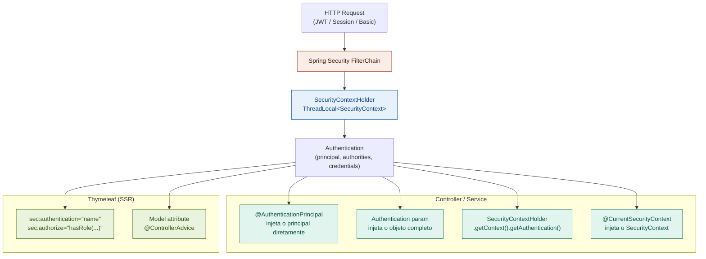

---
## 11. Boas Práticas e Checklist

### 11.1 Diagrama de Fluxo de Decisão

```mermaid
flowchart TD
    A[Novo Endpoint] --> B{REST ou SSR?}

    B -->|REST| C[Criar DTO com Records]
    B -->|SSR| D[Criar Form Object + Template]

    C --> E[Adicionar anotações Bean Validation]
    D --> E

    E --> F[Criar Controller com mapeamento correto]
    F --> G{Requer conversão<br/>de tipos?}

    G -->|Sim| H[Implementar Converter<br/>ou Formatter]
    G -->|Não| I[Implementar lógica de serviço]
    H --> I

    I --> J[Configurar tratamento de erros<br/>@ControllerAdvice]
    J --> K{REST?}

    K -->|Sim| L[Documentar com OpenAPI]
    K -->|Não| M[Testar formulário com<br/>cenários de erro]

    L --> N[Escrever testes]
    M --> N

    N --> O[@WebMvcTest + @SpringBootTest<br/>RestTestClient ou REST Assured]
```

### 11.2 Checklist — REST Controllers

- [ ] Usar `@RestController` (combina `@Controller` + `@ResponseBody`)
- [ ] Versionamento de API na URL: `/api/v1/...`
- [ ] Retornar `ResponseEntity<T>` com status HTTP correto
- [ ] POST retorna `201 Created` + header `Location`
- [ ] DELETE retorna `204 No Content`
- [ ] Usar `@Validated` no controller para validar `@PathVariable` e `@RequestParam`
- [ ] Separar DTOs de Request e Response (nunca expor entidades JPA)
- [ ] Usar Records para DTOs imutáveis
- [ ] Documentar com `@Tag`, `@Operation`, `@ApiResponse`
- [ ] Tratar erros com `@RestControllerAdvice` e `ProblemDetail` (RFC 9457)
- [ ] CORS configurado explicitamente (nunca `*` em produção)
### 11.3 Checklist — Validação

- [ ] Bean Validation nas camadas Controller E Service (`@Validated`)
- [ ] Usar grupos de validação para criar/atualizar com regras diferentes
- [ ] Constraints customizadas para regras de domínio (CPF, CNPJ, etc.)
- [ ] `@Valid` em objetos aninhados e coleções para cascata
- [ ] Mensagens de erro externalizadas em `messages.properties`
- [ ] `@EmailUnico`, `@CpfUnico` com acesso ao repositório via Spring

### 11.4 Anti-patterns a Evitar

```java
// ❌ Expondo entidade JPA diretamente
@GetMapping("/{id}")
public Produto buscar(@PathVariable Long id) { ... }

// ✅ DTO como contrato da API
@GetMapping("/{id}")
public ResponseEntity<ProdutoResponse> buscar(@PathVariable Long id) { ... }

// ❌ Lógica de negócio no Controller
@PostMapping
public ResponseEntity<?> criar(@RequestBody ProdutoRequest req) {
    if (produtoRepository.existsBySku(req.sku())) {
        return ResponseEntity.badRequest().body("SKU duplicado");
    }
    produtoRepository.save(new Produto(req.nome(), req.preco()));
    // ...
}

// ✅ Controller delega para Service
@PostMapping
public ResponseEntity<ProdutoResponse> criar(
        @RequestBody @Valid ProdutoCreateRequest req,
        UriComponentsBuilder uriBuilder) {
    var produto = produtoService.criar(req);
    var location = uriBuilder.path("/api/v1/produtos/{id}")
            .buildAndExpand(produto.id()).toUri();
    return ResponseEntity.created(location).body(produto);
}

// ❌ Verificar BindingResult DEPOIS de usar o form
@PostMapping
public String salvar(@ModelAttribute @Valid ProdutoForm form,
                     BindingResult result, Model model) {
    produtoService.salvar(form);  // ERRO: usa o form antes de checar!
    if (result.hasErrors()) return "formulario";
    return "redirect:/lista";
}

// ✅ Verificar BindingResult PRIMEIRO
@PostMapping
public String salvar(@ModelAttribute @Valid ProdutoForm form,
                     BindingResult result, Model model) {
    if (result.hasErrors()) return "formulario";  // Verifica ANTES
    produtoService.salvar(form);
    return "redirect:/lista";
}

// ❌ @InitBinder sem whitelist (vulnerável a mass assignment)
@InitBinder
public void init(WebDataBinder binder) {
    binder.registerCustomEditor(String.class, new StringTrimmerEditor(true));
    // Esqueceu setAllowedFields!
}

// ✅ Sempre proteger com whitelist
@InitBinder
public void init(WebDataBinder binder) {
    binder.registerCustomEditor(String.class, new StringTrimmerEditor(true));
    binder.setAllowedFields("nome", "descricao", "preco", "estoque", "categoriaId");
}
```

### 11.5 Mensagens de Validação i18n — Integração com messages.properties

Por padrão o Bean Validation resolve mensagens no arquivo
`ValidationMessages.properties` (padrão Jakarta) ou dentro das próprias
anotações. Para usar o sistema de mensagens do Spring (`messages.properties`)
— unificando as traduções de validação com as demais mensagens da aplicação —
é necessário conectar o `MessageSource` ao validador.

#### O que o Spring Boot faz automaticamente

| Comportamento | Auto-configurado? |
|---|---|
| `MessageSource` lendo `classpath:messages*.properties` | ✅ `MessageSourceAutoConfiguration` |
| Validador padrão (`javax.validation`) | ✅ `ValidationAutoConfiguration` |
| Validador integrado ao `MessageSource` do Spring | ❌ **Requer configuração manual** |
| Interpolação `{min}`, `{max}`, `{value}` nos arquivos `.properties` | ✅ Funcionam após integração |

> **Por que não é automático?** O `ValidationAutoConfiguration` registra um
> `LocalValidatorFactoryBean`, mas sem apontar para o `MessageSource` da
> aplicação. O Spring Boot *evita* sobrescrever o bean do usuário, por isso
> a integração precisa ser declarada explicitamente.

#### Convenções de nomenclatura de chaves

O Bean Validation procura mensagens na seguinte ordem de prioridade:

1. `{chave}` literal definida no atributo `message` da constraint
2. `{NomeDaConstraint.nomeDoTipo.nomeDoCampo}` — ex.: `NotBlank.clienteRequest.cpf`
3. `{NomeDaConstraint.nomeDoCampo}` — ex.: `NotBlank.cpf`
4. `{NomeDaConstraint.tipoPrimitivo}` — ex.: `NotBlank.java.lang.String`
5. `{NomeDaConstraint}` — ex.: `NotBlank`

```properties
# src/main/resources/messages.properties
# ─── Chaves explícitas referenciadas com {chave} nas anotações ────────────────
produto.nome.obrigatorio=Nome do produto é obrigatório
produto.nome.tamanho=Nome deve ter entre {min} e {max} caracteres
produto.preco.minimo=Preço deve ser maior que {value}
produto.estoque.invalido=Estoque não pode ser negativo

# ─── Constraints customizadas ─────────────────────────────────────────────────
br.com.app.validation.cpf.invalido=CPF inválido
br.com.app.validation.email.unico=E-mail já cadastrado no sistema

# ─── Chaves por convenção de nome (sem precisar declarar message=) ────────────
# Bean Validation resolve automaticamente pelo padrão: ConstraintName.campo
NotBlank.clienteRequest.nome=Nome é obrigatório
Size.clienteRequest.nome=Nome deve ter entre {min} e {max} caracteres
Email.clienteRequest.email=E-mail inválido

# ─── Fallback genérico por tipo de constraint ─────────────────────────────────
NotBlank=Campo obrigatório
NotNull=Campo obrigatório
Size=Tamanho inválido: deve ter entre {min} e {max} caracteres
```

```java
// ─── Configuração necessária para integrar MessageSource ao validador ─────────
//
// ⚠️  Spring Boot NÃO faz isso automaticamente.
//     Sem este bean, mensagens como {produto.nome.obrigatorio} ficam
//     literalmente na resposta em vez de serem resolvidas.
//
@Configuration
public class ValidationConfig {

    // MessageSource já é auto-configurado pelo Spring Boot a partir de
    // messages.properties — este bean é necessário apenas para wiring manual.
    @Bean
    public LocalValidatorFactoryBean validator(MessageSource messageSource) {
        var factory = new LocalValidatorFactoryBean();
        // Aponta o validador para o MessageSource da aplicação
        factory.setValidationMessageSource(messageSource);
        return factory;
    }
}
```

```java
// ─── Uso nas constraints: referencias com {chave} ─────────────────────────────
public record ProdutoRequest(

    // Referência explícita a chave do messages.properties
    @NotBlank(message = "{produto.nome.obrigatorio}")
    @Size(min = 2, max = 200, message = "{produto.nome.tamanho}")
    String nome,

    // Sem message= : Bean Validation usa a convenção de nomes (NotNull.preco,
    // NotNull.java.math.BigDecimal ou NotNull — nessa ordem de prioridade)
    @NotNull
    @Positive
    BigDecimal preco,

    // Interpolação de atributos da própria anotação: {min}, {max}, {value}
    // funcionam dentro dos messages.properties após a integração acima
    @Size(min = 3, max = 50)  // {min}=3 e {max}=50 ficam disponíveis no template
    String sku
) {}
```

```yaml
# application.yml — configuração do MessageSource (auto-configurado pelo Boot)
# Estas propriedades são gerenciadas por MessageSourceAutoConfiguration.
spring:
  messages:
    basename: messages          # padrão; separe com vírgula para múltiplos arquivos
    encoding: UTF-8             # padrão UTF-8
    cache-duration: 1s          # 0 = sem cache (útil em desenvolvimento)
    use-code-as-default-message: false  # false = lança exceção se chave não existir
```
## 12. CORS — Cross-Origin Resource Sharing

### 12.1 Como o CORS Funciona

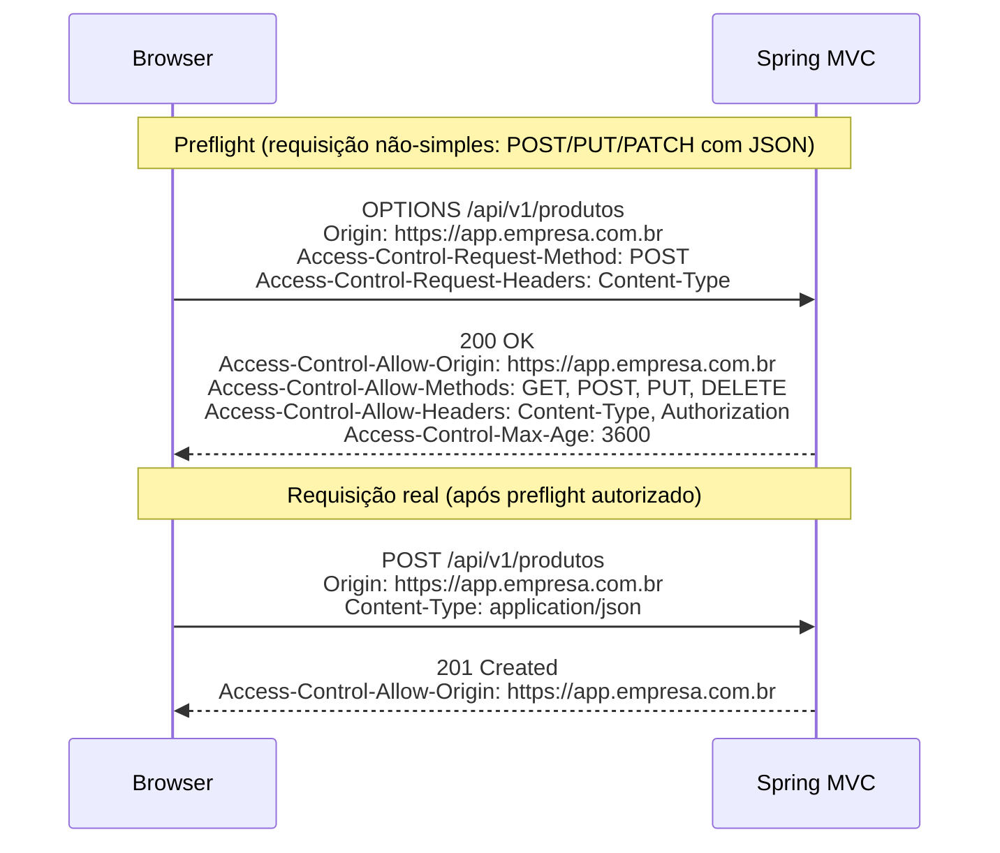

**Requisições "simples"** (sem preflight): `GET`, `HEAD`, `POST` com `Content-Type: application/x-www-form-urlencoded`, `multipart/form-data` ou `text/plain`.
Qualquer outro método ou Content-Type (incluindo `application/json`) dispara o preflight.

### 12.2 Configuração Global — `WebMvcConfigurer`

```java
@Configuration
public class WebMvcConfig implements WebMvcConfigurer {

    @Override
    public void addCorsMappings(CorsRegistry registry) {
        registry.addMapping("/api/**")
                // Origens exatas — preferível a wildcard em produção
                .allowedOrigins(
                    "https://app.empresa.com.br",
                    "https://admin.empresa.com.br"
                )
                // allowedOriginPatterns aceita wildcards no subdomínio
                // .allowedOriginPatterns("https://*.empresa.com.br")

                .allowedMethods("GET", "POST", "PUT", "PATCH", "DELETE", "OPTIONS")

                // Headers que o browser pode enviar
                .allowedHeaders(
                    "Authorization",
                    "Content-Type",
                    "X-Requested-With",
                    "X-API-Version"
                )

                // Headers que o browser pode ler na resposta
                // (por padrão apenas CORS-safelisted headers são expostos)
                .exposedHeaders(
                    "Location",
                    "X-Total-Count",
                    "X-Correlation-ID"
                )

                // Permite envio de cookies/credentials (requer origem exata, não *)
                .allowCredentials(true)

                // Duração do cache do preflight no browser (segundos)
                // ✅ Default: 1800 (30 min). Máximo aceito pelo Chrome: 7200 (2h)
                .maxAge(3600);

        // Endpoints públicos — mais permissivo
        registry.addMapping("/api/public/**")
                .allowedOriginPatterns("*")
                .allowedMethods("GET")
                .allowCredentials(false);
    }
}
```

### 12.3 `@CrossOrigin` por Controller ou Método

```java
// ─── Nível de classe: aplica a TODOS os métodos do controller ─────────────────
@RestController
@RequestMapping("/api/v1/produtos")
@CrossOrigin(
    origins            = "https://app.empresa.com.br",
    allowedHeaders     = "*",
    allowCredentials   = "true",
    maxAge             = 3600
)
public class ProdutoController { /* ... */ }

// ─── Nível de método: sobrescreve ou complementa o nível de classe ────────────
@RestController
@RequestMapping("/api/v1/relatorios")
@CrossOrigin(origins = "https://app.empresa.com.br")   // restrito por padrão
public class RelatorioController {

    @GetMapping("/publico")
    @CrossOrigin(origins = "*", allowCredentials = "false") // este endpoint é público
    public ResponseEntity<RelatorioPublicoResponse> relatorioPublico() {
        return ResponseEntity.ok(relatorioService.publico());
    }

    @GetMapping("/interno")
    // herda o @CrossOrigin da classe — apenas app.empresa.com.br
    public ResponseEntity<RelatorioInternoResponse> relatorioInterno(
            @AuthenticationPrincipal UsuarioDetails usuario) {
        return ResponseEntity.ok(relatorioService.interno(usuario));
    }
}
```

> **`@CrossOrigin` vs configuração global:** a configuração via `WebMvcConfigurer`
> é preferível para a maioria dos casos, pois centraliza a política e evita
> divergências entre controllers. `@CrossOrigin` é útil quando um endpoint
> específico precisa de política diferente da global.

### 12.4 Integração Obrigatória com Spring Security

> ⚠️ **Armadilha comum:** configurar CORS no `WebMvcConfigurer` **não é suficiente**
> quando Spring Security está presente. O `SecurityFilterChain` intercepta a
> requisição antes do `DispatcherServlet` — sem a configuração no Security, os
> preflights `OPTIONS` recebem 401 ou 403 e o browser bloqueia tudo.

```java
@Configuration
@EnableWebSecurity
public class SecurityConfig {

    @Bean
    public SecurityFilterChain securityFilterChain(HttpSecurity http) throws Exception {
        http
            // CORS deve ser habilitado AQUI para que o CorsFilter do Spring
            // seja registrado na cadeia do Security antes da autenticação.
            // Ele lê a configuração do CorsConfigurationSource bean abaixo.
            .cors(cors -> cors.configurationSource(corsConfigurationSource()))

            .csrf(csrf -> csrf.disable())   // APIs REST stateless
            .authorizeHttpRequests(auth -> auth
                .requestMatchers(HttpMethod.OPTIONS, "/**").permitAll() // preflight sem auth
                .requestMatchers("/api/public/**").permitAll()
                .anyRequest().authenticated()
            )
            .sessionManagement(session ->
                session.sessionCreationPolicy(SessionCreationPolicy.STATELESS))
            .oauth2ResourceServer(oauth2 -> oauth2.jwt(Customizer.withDefaults()));

        return http.build();
    }

    @Bean
    public CorsConfigurationSource corsConfigurationSource() {
        var config = new CorsConfiguration();
        config.setAllowedOrigins(List.of(
            "https://app.empresa.com.br",
            "https://admin.empresa.com.br"
        ));
        config.setAllowedMethods(List.of("GET","POST","PUT","PATCH","DELETE","OPTIONS"));
        config.setAllowedHeaders(List.of("Authorization","Content-Type","X-API-Version"));
        config.setExposedHeaders(List.of("Location","X-Total-Count"));
        config.setAllowCredentials(true);
        config.setMaxAge(3600L);

        var source = new UrlBasedCorsConfigurationSource();
        source.registerCorsConfiguration("/api/**", config);
        return source;
    }
}
```

### 12.5 CORS Dinâmico — Origens em Banco de Dados

```java
/**
 * CorsConfigurationSource que lê as origens permitidas do banco de dados,
 * com cache para não consultar a cada requisição.
 *
 * Útil para aplicações multi-tenant onde cada tenant tem sua própria origem.
 */
@Component
public class DynamicCorsConfigurationSource implements CorsConfigurationSource {

    private final OrigemPermitidaRepository origemRepository;

    // Cache de 5 minutos para evitar query por requisição
    @Cacheable("corsOrigens")
    public List<String> origensPermitidas() {
        return origemRepository.findAllAtivas()
                .stream()
                .map(OrigemPermitida::getUrl)
                .toList();
    }

    @Override
    public CorsConfiguration getCorsConfiguration(HttpServletRequest request) {
        var config = new CorsConfiguration();
        config.setAllowedOrigins(origensPermitidas());
        config.setAllowedMethods(List.of("GET","POST","PUT","PATCH","DELETE","OPTIONS"));
        config.setAllowedHeaders(List.of("*"));
        config.setAllowCredentials(true);
        config.setMaxAge(600L);
        return config;
    }
}
```

### 12.6 Diagnóstico de Problemas CORS

```yaml
# application-dev-local.yml — habilitar log do CorsFilter para diagnóstico
logging:
  level:
    org.springframework.web.cors: DEBUG
    org.springframework.security.web.cors: DEBUG
```

| Sintoma | Causa mais provável | Solução |
|---|---|---|
| `No 'Access-Control-Allow-Origin'` em produção | `allowedOrigins` não inclui a origem exata | Verificar o header `Origin` da requisição e adicionar à lista |
| Preflight retorna 401 | Spring Security sem `.cors()` configurado | Adicionar `CorsConfigurationSource` bean e `.cors(cors -> ...)` |
| `allowCredentials` não funciona | Usando `allowedOriginPatterns("*")` com `allowCredentials(true)` | Usar origens exatas — wildcard e credentials são incompatíveis |
| Origem permitida mas headers bloqueados | `allowedHeaders` não inclui o header enviado | Adicionar o header à lista ou usar `allowedHeaders("*")` |
| `exposedHeaders` não visível no browser | Header não listado em `exposedHeaders` | Adicionar o header à lista de expostos |

---
## 13. ETag e Cache HTTP

### 13.1 Visão Geral dos Mecanismos de Cache

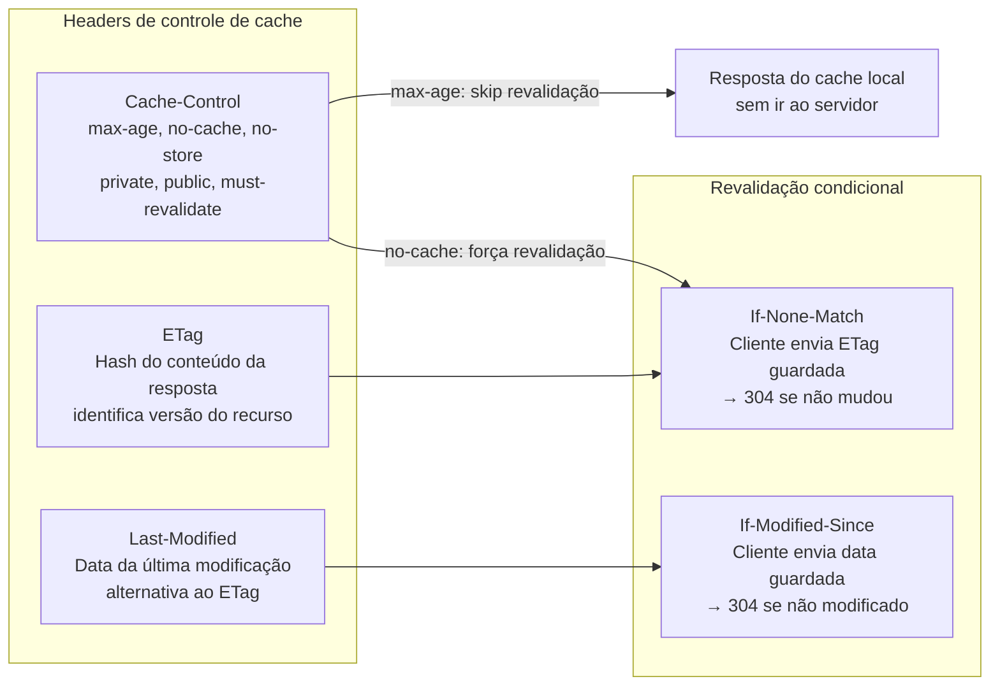

### 13.2 `ShallowEtagHeaderFilter` — ETag Automático

O `ShallowEtagHeaderFilter` calcula o hash MD5 do body da resposta e adiciona o
header `ETag` automaticamente. Nas requisições seguintes com `If-None-Match`,
ele compara os ETags e retorna 304 sem re-executar o controller.

```java
// ─── Registro do filtro — Spring Boot NÃO registra automaticamente ────────────
@Configuration
public class CacheConfig {

    /**
     * ShallowEtagHeaderFilter: calcula ETag a partir do body serializado.
     * "Shallow" = baseado apenas no conteúdo da resposta, não em dados do domínio.
     *
     * O controller AINDA é executado — o 304 é decidido pelo filtro após a execução.
     * Para evitar a execução do controller, use ETag baseada em versão (seção 16.3).
     */
    @Bean
    public FilterRegistrationBean<ShallowEtagHeaderFilter> etagFilter() {
        var registration = new FilterRegistrationBean<>(new ShallowEtagHeaderFilter());
        registration.addUrlPatterns("/api/*");
        registration.setOrder(Ordered.LOWEST_PRECEDENCE - 10);
        return registration;
    }
}
```

```yaml
# application.yml — sem configuração Spring Boot automática para este filtro
# O filtro deve ser registrado explicitamente como acima.
```

### 13.3 `ResponseEntity` com ETag e Last-Modified

Para evitar execução desnecessária do controller, use `WebRequest.checkNotModified()`
— retorna `true` e define o status 304 antes de qualquer processamento:

```java
@RestController
@RequestMapping("/api/v1/produtos")
public class ProdutoController {

    private final ProdutoService produtoService;

    // ─── ETag baseada no hash/versão do recurso ───────────────────────────────
    @GetMapping("/{id}")
    public ResponseEntity<ProdutoResponse> buscar(
            @PathVariable Long id,
            WebRequest webRequest) {

        var produto = produtoService.buscarPorId(id);

        // Calcula ETag a partir da versão do objeto (ex.: campo @Version do JPA)
        // ou de um hash do conteúdo — mais eficiente que ShallowEtagHeaderFilter
        // pois evita executar a serialização completa
        String etag = "\"" + produto.versao() + "\""; // aspas obrigatórias na spec

        // Se o cliente enviou If-None-Match e o ETag não mudou:
        // checkNotModified seta status 304 e retorna true — retornar null encerra a resposta
        if (webRequest.checkNotModified(etag)) {
            return null; // Spring MVC envia 304 automaticamente
        }

        return ResponseEntity.ok()
                .eTag(etag)
                .cacheControl(CacheControl.maxAge(60, TimeUnit.SECONDS)
                        .cachePublic()
                        .mustRevalidate())
                .body(produto);
    }

    // ─── Last-Modified — alternativa ao ETag para recursos baseados em tempo ──
    @GetMapping("/{id}/foto")
    public ResponseEntity<Resource> foto(
            @PathVariable Long id,
            WebRequest webRequest) {

        var foto = produtoService.buscarFoto(id);
        long lastModifiedMs = foto.atualizadoEm().toInstant(ZoneOffset.UTC).toEpochMilli();

        if (webRequest.checkNotModified(lastModifiedMs)) {
            return null; // 304
        }

        return ResponseEntity.ok()
                .lastModified(foto.atualizadoEm())
                .cacheControl(CacheControl.maxAge(1, TimeUnit.HOURS).cachePublic())
                .contentType(MediaType.IMAGE_JPEG)
                .body(foto.resource());
    }

    // ─── ETag + Last-Modified combinados ─────────────────────────────────────
    @GetMapping("/{id}/detalhes")
    public ResponseEntity<ProdutoDetalhesResponse> detalhes(
            @PathVariable Long id,
            WebRequest webRequest) {

        var produto = produtoService.buscarDetalhes(id);
        String etag = "\"" + produto.checksum() + "\"";
        long  lastModified = produto.atualizadoEm().toInstant(ZoneOffset.UTC).toEpochMilli();

        // Verifica ETag E Last-Modified — retorna 304 se qualquer um corresponder
        if (webRequest.checkNotModified(etag, lastModified)) {
            return null;
        }

        return ResponseEntity.ok()
                .eTag(etag)
                .lastModified(produto.atualizadoEm())
                .cacheControl(CacheControl.maxAge(120, TimeUnit.SECONDS))
                .body(produto);
    }
}
```

### 13.4 `CacheControl` — Políticas Comuns

```java
@RestController
@RequestMapping("/api/v1/catalogo")
public class CatalogoController {

    // ─── Recurso público, cacheable por proxies ────────────────────────────────
    // max-age=300: cache válido por 5 minutos
    // public: proxies e CDNs podem armazenar
    @GetMapping("/categorias")
    public ResponseEntity<List<CategoriaResponse>> categorias() {
        return ResponseEntity.ok()
                .cacheControl(CacheControl.maxAge(5, TimeUnit.MINUTES).cachePublic())
                .body(catalogoService.listarCategorias());
    }

    // ─── Recurso privado por usuário — só browser pode cachear ───────────────
    // private: proxy não armazena (conteúdo é específico do usuário)
    @GetMapping("/minha-lista")
    public ResponseEntity<List<ProdutoResponse>> minhaLista(
            @AuthenticationPrincipal UsuarioDetails usuario) {
        return ResponseEntity.ok()
                .cacheControl(CacheControl.maxAge(1, TimeUnit.MINUTES).cachePrivate())
                .body(catalogoService.listarFavoritos(usuario.getId()));
    }

    // ─── Sem cache algum — dados em tempo real ────────────────────────────────
    @GetMapping("/estoque/{id}")
    public ResponseEntity<EstoqueResponse> estoque(@PathVariable Long id) {
        return ResponseEntity.ok()
                .cacheControl(CacheControl.noStore())
                .body(catalogoService.consultarEstoque(id));
    }

    // ─── no-cache: armazena mas sempre revalida ───────────────────────────────
    // Útil quando o recurso muda com frequência imprevisível mas
    // revalidação com ETag/304 é barata
    @GetMapping("/preco/{id}")
    public ResponseEntity<PrecoResponse> preco(
            @PathVariable Long id,
            WebRequest webRequest) {

        var preco = catalogoService.consultarPreco(id);
        String etag = "\"" + preco.hashCode() + "\"";

        if (webRequest.checkNotModified(etag)) return null;

        return ResponseEntity.ok()
                .eTag(etag)
                .cacheControl(CacheControl.noCache())   // revalida sempre, mas armazena
                .body(preco);
    }

    // ─── Recurso imutável — pode ser cacheado para sempre ────────────────────
    // Usado para assets com hash no nome (ex: produto-thumbnail-a3f8d2.jpg)
    @GetMapping("/imagens/{hash}")
    public ResponseEntity<Resource> imagem(@PathVariable String hash) {
        return ResponseEntity.ok()
                .cacheControl(CacheControl.maxAge(365, TimeUnit.DAYS)
                        .cachePublic()
                        .immutable())
                .body(catalogoService.buscarImagem(hash));
    }
}
```
### 13.5 Resumo: Quando Usar Cada Estratégia

| Recurso | Estratégia recomendada | Headers |
|---|---|---|
| Dados que mudam raramente (categorias, config) | `max-age` longo + `public` | `Cache-Control: public, max-age=3600` |
| Dados por usuário | `max-age` curto + `private` | `Cache-Control: private, max-age=60` |
| Dados voláteis mas verificáveis | `no-cache` + ETag | `ETag: "abc"`, `Cache-Control: no-cache` |
| Dados em tempo real (estoque, preço ao vivo) | `no-store` | `Cache-Control: no-store` |
| Assets com hash no nome | `immutable` | `Cache-Control: public, max-age=31536000, immutable` |
| API paginada | ETag por página + `max-age` curto | `ETag: "page-0-hash"` |

---
## 14. Upload de Arquivos

### 14.1 Configuração

```yaml
# application.yml — MultipartAutoConfiguration (✅ auto-configurado pelo Boot)
spring:
  servlet:
    multipart:
      enabled: true             # ✅ Default: true
      max-file-size: 10MB       # ✅ Default: 1MB — tamanho máximo por arquivo
      max-request-size: 50MB    # ✅ Default: 10MB — tamanho total da requisição
      file-size-threshold: 2KB  # ✅ Default: 0 — acima disso grava em disco temporário
      location: /tmp/uploads    # ✅ Default: diretório temporário do SO
```

### 14.2 Controller de Upload

```java
@RestController
@RequestMapping("/api/v1/arquivos")
public class ArquivoController {

    private final ArquivoService arquivoService;

    // ─── Upload simples — arquivo único ──────────────────────────────────────
    @PostMapping(consumes = MediaType.MULTIPART_FORM_DATA_VALUE)
    @Operation(summary = "Upload de arquivo único")
    public ResponseEntity<ArquivoResponse> upload(
            @RequestParam("arquivo") MultipartFile arquivo) {

        validarArquivo(arquivo);
        var response = arquivoService.salvar(arquivo);

        return ResponseEntity.created(
                URI.create("/api/v1/arquivos/" + response.id()))
                .body(response);
    }

    // ─── Upload com metadados — @RequestPart ─────────────────────────────────
    // @RequestPart permite enviar JSON + arquivo na mesma requisição multipart
    @PostMapping(value = "/com-metadados", consumes = MediaType.MULTIPART_FORM_DATA_VALUE)
    public ResponseEntity<ArquivoResponse> uploadComMetadados(
            @RequestPart("arquivo")   MultipartFile arquivo,
            @RequestPart("metadados") @Valid ArquivoMetadadosRequest metadados) {

        validarArquivo(arquivo);
        return ResponseEntity.ok(arquivoService.salvarComMetadados(arquivo, metadados));
    }

    // ─── Upload múltiplo ──────────────────────────────────────────────────────
    @PostMapping(value = "/multiplos", consumes = MediaType.MULTIPART_FORM_DATA_VALUE)
    public ResponseEntity<List<ArquivoResponse>> uploadMultiplo(
            @RequestParam("arquivos") List<MultipartFile> arquivos) {

        if (arquivos.size() > 10) {
            throw new NegocioException("Máximo de 10 arquivos por requisição");
        }
        arquivos.forEach(this::validarArquivo);

        return ResponseEntity.ok(arquivoService.salvarTodos(arquivos));
    }

    // ─── Validação do arquivo ─────────────────────────────────────────────────
    private void validarArquivo(MultipartFile arquivo) {
        if (arquivo.isEmpty()) {
            throw new NegocioException("Arquivo não pode ser vazio");
        }
        if (arquivo.getSize() > 10 * 1024 * 1024) { // 10 MB
            throw new NegocioException("Arquivo excede o tamanho máximo de 10 MB");
        }

        // Validação de MIME type real (não confia apenas na extensão)
        String contentType = detectarMimeType(arquivo);
        var permitidos = Set.of("image/jpeg", "image/png", "image/webp",
                                "application/pdf", "text/csv");
        if (!permitidos.contains(contentType)) {
            throw new NegocioException(
                    "Tipo de arquivo não permitido: " + contentType);
        }
    }

    private String detectarMimeType(MultipartFile arquivo) {
        try {
            // Apache Tika ou Files.probeContentType são mais seguros que
            // confiar no Content-Type declarado pelo cliente
            var tika = new Tika();
            return tika.detect(arquivo.getInputStream());
        } catch (IOException e) {
            throw new NegocioException("Não foi possível verificar o tipo do arquivo");
        }
    }
}
```

### 14.3 Service — Estratégias de Armazenamento

```java
@Service
public class ArquivoService {

    private final Path storageDir;

    public ArquivoService(@Value("${app.storage.dir:uploads}") String dir) {
        this.storageDir = Paths.get(dir).toAbsolutePath().normalize();
        try {
            Files.createDirectories(storageDir);
        } catch (IOException e) {
            throw new IllegalStateException("Não foi possível criar diretório de uploads", e);
        }
    }

    // ─── Estratégia 1: disco local ────────────────────────────────────────────
    public ArquivoResponse salvarLocalmente(MultipartFile arquivo) {
        // Nunca usar o nome original diretamente — risco de path traversal
        String extensao  = StringUtils.getFilenameExtension(arquivo.getOriginalFilename());
        String nomeSeguro = UUID.randomUUID() + (extensao != null ? "." + extensao : "");
        Path destino = storageDir.resolve(nomeSeguro);

        try {
            Files.copy(arquivo.getInputStream(), destino,
                    StandardCopyOption.REPLACE_EXISTING);
        } catch (IOException e) {
            throw new NegocioException("Erro ao salvar arquivo: " + e.getMessage());
        }

        return new ArquivoResponse(
                UUID.randomUUID().toString(),
                nomeSeguro,
                arquivo.getSize(),
                arquivo.getContentType(),
                "/api/v1/arquivos/" + nomeSeguro);
    }

    // ─── Estratégia 2: S3 / MinIO via Spring Cloud AWS ───────────────────────
    public ArquivoResponse salvarS3(MultipartFile arquivo, S3Template s3Template) {
        String chave = "uploads/" + UUID.randomUUID() + "/"
                + arquivo.getOriginalFilename();
        try {
            var upload = s3Template.upload(
                    "meu-bucket", chave,
                    arquivo.getInputStream(),
                    ObjectMetadata.builder()
                            .contentType(arquivo.getContentType())
                            .contentLength(arquivo.getSize())
                            .build());

            return new ArquivoResponse(
                    chave,
                    arquivo.getOriginalFilename(),
                    arquivo.getSize(),
                    arquivo.getContentType(),
                    upload.url().toString());
        } catch (IOException e) {
            throw new NegocioException("Erro ao enviar para S3: " + e.getMessage());
        }
    }
}
```

### 14.4 Download de Arquivos

```java
@GetMapping("/{nomeArquivo:.+}")
public ResponseEntity<Resource> download(@PathVariable String nomeArquivo) {
    Path caminho = storageDir.resolve(nomeArquivo).normalize();

    // Proteção contra path traversal: garante que o arquivo está dentro do storageDir
    if (!caminho.startsWith(storageDir)) {
        throw new RecursoNaoEncontradoException("Arquivo", nomeArquivo);
    }

    Resource resource = new FileSystemResource(caminho);
    if (!resource.exists() || !resource.isReadable()) {
        throw new RecursoNaoEncontradoException("Arquivo", nomeArquivo);
    }

    String contentType;
    try {
        contentType = Files.probeContentType(caminho);
    } catch (IOException e) {
        contentType = MediaType.APPLICATION_OCTET_STREAM_VALUE;
    }

    return ResponseEntity.ok()
            .contentType(MediaType.parseMediaType(contentType))
            .header(HttpHeaders.CONTENT_DISPOSITION,
                    ContentDisposition.attachment()
                            .filename(nomeArquivo, StandardCharsets.UTF_8)
                            .build()
                            .toString())
            .body(resource);
}
```

### 14.5 Upload via Fetch API (JavaScript)

#### Upload simples com arquivo único

```html
<!-- templates/arquivos/upload.html (Thymeleaf) -->
<form id="uploadForm">
    <input type="file" id="arquivo" name="arquivo" accept="image/*,.pdf,.csv">
    <div id="progress" style="display:none">
        <div id="progressBar" style="width:0%;height:8px;background:#0d6efd;transition:width .2s"></div>
        <span id="progressText">0%</span>
    </div>
    <button type="submit" class="btn btn-primary">Enviar</button>
</form>
<div id="resultado"></div>

<script>
document.getElementById('uploadForm').addEventListener('submit', async (e) => {
    e.preventDefault();

    const arquivo = document.getElementById('arquivo').files[0];
    if (!arquivo) return alert('Selecione um arquivo');

    const formData = new FormData();
    formData.append('arquivo', arquivo);          // nome deve corresponder ao @RequestParam

    const csrfToken  = document.querySelector('meta[name="_csrf"]')?.content;
    const csrfHeader = document.querySelector('meta[name="_csrf_header"]')?.content;

    const headers = {};
    if (csrfToken && csrfHeader) {
        headers[csrfHeader] = csrfToken;          // CSRF para apps SSR com Spring Security
    }

    try {
        // XMLHttpRequest para acompanhar progresso (Fetch API não suporta upload progress)
        await uploadComProgresso('/api/v1/arquivos', formData, headers);
    } catch (err) {
        document.getElementById('resultado').innerHTML =
            `<div class="alert alert-danger">Erro: ${err.message}</div>`;
    }
});

function uploadComProgresso(url, formData, headers) {
    return new Promise((resolve, reject) => {
        const xhr = new XMLHttpRequest();

        xhr.upload.addEventListener('progress', (e) => {
            if (e.lengthComputable) {
                const pct = Math.round((e.loaded / e.total) * 100);
                document.getElementById('progress').style.display = 'block';
                document.getElementById('progressBar').style.width = pct + '%';
                document.getElementById('progressText').textContent = pct + '%';
            }
        });

        xhr.addEventListener('load', () => {
            if (xhr.status >= 200 && xhr.status < 300) {
                const data = JSON.parse(xhr.responseText);
                document.getElementById('resultado').innerHTML =
                    `<div class="alert alert-success">
                        Arquivo enviado: <a href="${data.url}">${data.nome}</a>
                     </div>`;
                resolve(data);
            } else {
                const err = JSON.parse(xhr.responseText);
                reject(new Error(err.detail || 'Erro no upload'));
            }
        });

        xhr.addEventListener('error', () => reject(new Error('Falha na conexão')));

        xhr.open('POST', url);
        Object.entries(headers).forEach(([k, v]) => xhr.setRequestHeader(k, v));
        xhr.send(formData);
    });
}
</script>
```

#### Upload com múltiplos arquivos e pré-visualização

```html
<input type="file" id="arquivos" multiple accept="image/*">
<div id="preview" class="d-flex flex-wrap gap-2 my-3"></div>
<button id="btnEnviar" class="btn btn-primary" disabled>Enviar todos</button>

<script>
const input     = document.getElementById('arquivos');
const preview   = document.getElementById('preview');
const btnEnviar = document.getElementById('btnEnviar');
const CSRF      = document.querySelector('meta[name="_csrf"]')?.content;
const CSRF_HDR  = document.querySelector('meta[name="_csrf_header"]')?.content;

input.addEventListener('change', () => {
    preview.innerHTML = '';
    [...input.files].forEach(file => {
        if (!file.type.startsWith('image/')) return;
        const reader = new FileReader();
        reader.onload = (e) => {
            const img = document.createElement('img');
            img.src = e.target.result;
            img.style.cssText = 'width:80px;height:80px;object-fit:cover;border-radius:4px';
            img.title = file.name;
            preview.appendChild(img);
        };
        reader.readAsDataURL(file);
    });
    btnEnviar.disabled = input.files.length === 0;
});

btnEnviar.addEventListener('click', async () => {
    const formData = new FormData();
    [...input.files].forEach(f => formData.append('arquivos', f)); // mesmo @RequestParam

    const headers = {};
    if (CSRF && CSRF_HDR) headers[CSRF_HDR] = CSRF;

    const res = await fetch('/api/v1/arquivos/multiplos', {
        method: 'POST',
        headers,
        body: formData
        // NÃO definir Content-Type — o browser define com o boundary correto
    });

    if (!res.ok) {
        const err = await res.json();
        alert('Erro: ' + (err.detail ?? res.statusText));
        return;
    }

    const arquivos = await res.json();
    console.log('Enviados:', arquivos);
});
</script>
```

#### Upload de arquivo com JSON (usando `@RequestPart`)

```javascript
// Fetch API: envia arquivo + JSON na mesma requisição multipart
async function uploadComMetadados(arquivo, metadados) {
    const formData = new FormData();

    // Parte 1: arquivo binário
    formData.append('arquivo', arquivo);

    // Parte 2: JSON como Blob com Content-Type explícito
    // Necessário para que o Spring MVC deserialize o JSON corretamente com @RequestPart
    formData.append(
        'metadados',
        new Blob([JSON.stringify(metadados)], { type: 'application/json' })
    );

    const res = await fetch('/api/v1/arquivos/com-metadados', {
        method: 'POST',
        headers: {
            [document.querySelector('meta[name="_csrf_header"]').content]:
             document.querySelector('meta[name="_csrf"]').content
        },
        body: formData
    });

    if (!res.ok) throw new Error(await res.text());
    return res.json();
}

// Exemplo de uso
uploadComMetadados(
    document.getElementById('arquivo').files[0],
    { titulo: 'Foto do produto', descricao: 'Vista frontal', publica: true }
).then(r => console.log('Arquivo salvo:', r));
```

#### Tratamento de erros de upload no `@ControllerAdvice`

```java
@RestControllerAdvice
public class GlobalExceptionHandler {

    // Arquivo maior que spring.servlet.multipart.max-file-size
    @ExceptionHandler(MaxUploadSizeExceededException.class)
    @ResponseStatus(HttpStatus.PAYLOAD_TOO_LARGE)
    public ProblemDetail handleMaxSize(MaxUploadSizeExceededException ex) {
        return ProblemDetail.forStatusAndDetail(
                HttpStatus.PAYLOAD_TOO_LARGE,
                "Arquivo excede o tamanho máximo permitido");
    }

    // Arquivo corrompido ou leitura falhou
    @ExceptionHandler(MultipartException.class)
    @ResponseStatus(HttpStatus.BAD_REQUEST)
    public ProblemDetail handleMultipart(MultipartException ex) {
        return ProblemDetail.forStatusAndDetail(
                HttpStatus.BAD_REQUEST,
                "Requisição multipart inválida: " + ex.getMessage());
    }
}
```

---
## 15. Internacionalização (i18n)

### 15.1 Estratégias de Resolução de Locale

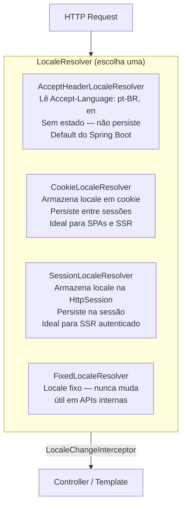

### 15.2 Configuração Completa

```java
@Configuration
public class I18nConfig implements WebMvcConfigurer {

    // ─── 1. LocaleResolver — escolha conforme o tipo de aplicação ─────────────

    // Para SSR com usuário logado: SessionLocaleResolver
    @Bean
    public LocaleResolver localeResolver() {
        var resolver = new CookieLocaleResolver("APP_LOCALE");
        resolver.setDefaultLocale(new Locale("pt", "BR"));
        resolver.setDefaultTimeZone(TimeZone.getTimeZone("America/Sao_Paulo"));
        resolver.setCookieMaxAge(Duration.ofDays(365));
        resolver.setCookieHttpOnly(true);
        resolver.setCookieSecure(true); // apenas HTTPS em produção
        return resolver;
    }

    // Para REST APIs stateless: AcceptHeaderLocaleResolver
    // @Bean
    // public LocaleResolver localeResolver() {
    //     var resolver = new AcceptHeaderLocaleResolver();
    //     resolver.setDefaultLocale(new Locale("pt", "BR"));
    //     resolver.setSupportedLocales(List.of(
    //         new Locale("pt", "BR"),
    //         Locale.ENGLISH
    //     ));
    //     return resolver;
    // }

    // ─── 2. LocaleChangeInterceptor — muda locale via query param ─────────────
    // GET /qualquer-rota?lang=en  → muda para inglês
    // GET /qualquer-rota?lang=pt-BR → muda para português
    @Bean
    public LocaleChangeInterceptor localeChangeInterceptor() {
        var interceptor = new LocaleChangeInterceptor();
        interceptor.setParamName("lang");
        return interceptor;
    }

    @Override
    public void addInterceptors(InterceptorRegistry registry) {
        registry.addInterceptor(localeChangeInterceptor());
    }

    // ─── 3. MessageSource — carrega os arquivos de mensagens ──────────────────
    // ✅ Spring Boot auto-configura via MessageSourceAutoConfiguration
    // Declare apenas para customizar (charset, cache, múltiplos basenames)
    @Bean
    public MessageSource messageSource() {
        var source = new ReloadableResourceBundleMessageSource();
        source.setBasenames(
            "classpath:messages",        // messages_pt_BR.properties, messages_en.properties
            "classpath:validation-messages" // separado para mensagens de validação
        );
        source.setDefaultEncoding("UTF-8");
        source.setDefaultLocale(new Locale("pt", "BR"));
        source.setCacheSeconds(3600);    // 0 = sem cache (dev), 3600 (prod)
        source.setUseCodeAsDefaultMessage(false);
        return source;
    }

    // ─── 4. Conectar MessageSource ao Bean Validation ─────────────────────────
    // ⚠️ NÃO automático — necessário para {chave} nas mensagens de constraint
    @Bean
    public LocalValidatorFactoryBean validator(MessageSource messageSource) {
        var factory = new LocalValidatorFactoryBean();
        factory.setValidationMessageSource(messageSource);
        return factory;
    }
}
```

```yaml
# application.yml — MessageSourceAutoConfiguration
spring:
  messages:
    basename: messages             # ✅ Default: messages
    encoding: UTF-8               # ✅ Default: UTF-8
    cache-duration: 3600s         # ✅ Default: sem cache
    use-code-as-default-message: false
    fallback-to-system-locale: true  # tenta locale do SO se não encontrar o arquivo
```

### 15.3 Arquivos de Mensagens

```
src/main/resources/
├── messages.properties           ← fallback (pt-BR, idioma padrão)
├── messages_pt_BR.properties     ← português do Brasil
├── messages_en.properties        ← inglês
├── messages_es.properties        ← espanhol (opcional)
└── validation-messages.properties← mensagens de constraint (todas as línguas)
```

```properties
# messages_pt_BR.properties
# ─── Títulos e navegação ──────────────────────────────────────────────────────
app.titulo=Minha Aplicação
app.nav.home=Início
app.nav.produtos=Produtos
app.nav.sair=Sair

# ─── Mensagens de feedback ────────────────────────────────────────────────────
produto.criado=Produto "{0}" cadastrado com sucesso!
produto.atualizado=Produto atualizado.
produto.removido=Produto removido.
produto.nao.encontrado=Produto com ID {0} não encontrado.

# ─── Labels de formulário ─────────────────────────────────────────────────────
form.campo.nome=Nome
form.campo.preco=Preço
form.campo.estoque=Estoque em estoque
form.botao.salvar=Salvar
form.botao.cancelar=Cancelar

# ─── Paginação ────────────────────────────────────────────────────────────────
paginacao.anterior=Anterior
paginacao.proximo=Próximo
paginacao.total=Mostrando {0} a {1} de {2} registros
```

```properties
# messages_en.properties
app.titulo=My Application
app.nav.home=Home
app.nav.produtos=Products
app.nav.sair=Sign out

produto.criado=Product "{0}" created successfully!
produto.atualizado=Product updated.
produto.removido=Product removed.
produto.nao.encontrado=Product with ID {0} not found.

form.campo.nome=Name
form.campo.preco=Price
form.campo.estoque=Stock
form.botao.salvar=Save
form.botao.cancelar=Cancel

paginacao.anterior=Previous
paginacao.proximo=Next
paginacao.total=Showing {0} to {1} of {2} records
```

```properties
# validation-messages.properties (sem sufixo de locale — único arquivo para todas as línguas
# OU criar validation-messages_pt_BR.properties e validation-messages_en.properties)

# Convenção Jakarta Bean Validation: ConstraintName.objectName.fieldName
NotBlank.produtoRequest.nome=Nome do produto é obrigatório
Size.produtoRequest.nome=Nome deve ter entre {min} e {max} caracteres

# Fallback por tipo de constraint
NotBlank=Campo obrigatório
NotNull=Campo obrigatório
Size=Deve ter entre {min} e {max} caracteres
Min=Valor mínimo: {value}
Max=Valor máximo: {value}
Email=E-mail inválido
Positive=Deve ser um número positivo
DecimalMin=Valor mínimo: {value}

# Constraints customizadas
br.com.app.validation.cpf.invalido=CPF inválido
br.com.app.validation.email.unico=E-mail já cadastrado
```

### 15.4 i18n em Controllers REST

```java
@RestController
@RequestMapping("/api/v1/produtos")
public class ProdutoController {

    private final MessageSource messageSource;

    // ─── Usando MessageSource diretamente ─────────────────────────────────────
    @DeleteMapping("/{id}")
    @ResponseStatus(HttpStatus.NO_CONTENT)
    public void excluir(@PathVariable Long id, Locale locale) {
        produtoService.excluir(id);
        // locale é injetado pelo LocaleResolver — sem acoplamento ao request
    }

    // ─── Mensagem localizada em ProblemDetail ─────────────────────────────────
    @GetMapping("/{id}")
    public ResponseEntity<ProdutoResponse> buscar(
            @PathVariable Long id,
            Locale locale) {

        return produtoService.buscarPorId(id)
                .map(ResponseEntity::ok)
                .orElseThrow(() -> {
                    String msg = messageSource.getMessage(
                            "produto.nao.encontrado",
                            new Object[]{id},
                            locale);
                    return new RecursoNaoEncontradoException(msg);
                });
    }
}
```

```java
// ─── @ControllerAdvice localizando mensagens de erro ─────────────────────────
@RestControllerAdvice
public class GlobalExceptionHandler {

    private final MessageSource messageSource;

    @ExceptionHandler(RecursoNaoEncontradoException.class)
    @ResponseStatus(HttpStatus.NOT_FOUND)
    public ProblemDetail handleNotFound(
            RecursoNaoEncontradoException ex,
            Locale locale) {

        // A mensagem já vem localizada da exceção OU buscamos aqui
        var pd = ProblemDetail.forStatusAndDetail(
                HttpStatus.NOT_FOUND, ex.getMessage());
        pd.setTitle(messageSource.getMessage(
                "error.not.found.title", null, "Not Found", locale));
        return pd;
    }
}
```
### 15.5 i18n em Respostas JSON — `MessageSourceAccessor`

```java
/**
 * Wrapper conveniente sobre MessageSource — atalho para evitar
 * passar Locale explicitamente em todo lugar.
 * Usa o Locale do LocaleContextHolder (thread-local do Spring MVC).
 */
@Configuration
public class I18nConfig {

    @Bean
    public MessageSourceAccessor messageSourceAccessor(MessageSource messageSource) {
        return new MessageSourceAccessor(messageSource, new Locale("pt", "BR"));
    }
}

// Uso em services e components sem precisar injetar Locale
@Service
public class NotificacaoService {

    private final MessageSourceAccessor messages;

    public String getTextoEmail(String chave, Object... args) {
        // Usa o Locale do LocaleContextHolder — respeita o locale da requisição
        return messages.getMessage(chave, args);
    }

    public void enviarBoasVindas(Usuario usuario) {
        String assunto = messages.getMessage("email.boas.vindas.assunto",
                new Object[]{usuario.getNome()});
        String corpo   = messages.getMessage("email.boas.vindas.corpo",
                new Object[]{usuario.getNome()});
        emailService.enviar(usuario.getEmail(), assunto, corpo);
    }
}
```

### 15.6 Timezone — Integração com i18n

```java
// LocaleContextHolder carrega Locale E TimeZone — útil para formatação
@Component
public class DateTimeFormatter {

    public String formatarParaUsuario(LocalDateTime dateTime) {
        TimeZone tz = LocaleContextHolder.getTimeZone();
        ZoneId zoneId = tz != null ? tz.toZoneId() : ZoneOffset.UTC;

        DateTimeFormatter fmt = DateTimeFormatter
                .ofLocalizedDateTime(FormatStyle.MEDIUM)
                .withLocale(LocaleContextHolder.getLocale())
                .withZone(zoneId);

        return fmt.format(dateTime.atZone(ZoneId.systemDefault())
                .withZoneSameInstant(zoneId));
    }
}
```


### 15.7 `LocaleContextHolder` — acesso ao Locale fora do Controller

`LocaleContextHolder` é um utilitário estático do Spring que armazena o **Locale e o
TimeZone da requisição atual** em uma variável `ThreadLocal`. O `DispatcherServlet`
popula esse holder automaticamente ao início de cada requisição — usando o
`LocaleResolver` configurado — e o limpa ao final.

```
HTTP Request
    │
    ▼
DispatcherServlet
    ├─ chama LocaleResolver.resolveLocale(request)
    ├─ armazena resultado em LocaleContextHolder (ThreadLocal)
    │
    ▼                              ▼                         ▼
@Controller                   @Service                  @Component
  Locale locale               LocaleContextHolder        MessageSourceAccessor
  (injetado pelo MVC)         .getLocale()               (usa o holder internamente)
```

#### Métodos principais

| Método | Descrição |
|--------|-----------|
| `getLocale()` | Retorna o `Locale` da thread atual (nunca `null` — usa `Locale.getDefault()` como fallback) |
| `getTimeZone()` | Retorna o `TimeZone` da thread atual (pode ser `null` se não configurado) |
| `setLocale(Locale)` | Define o Locale para a thread atual (útil em testes e tarefas assíncronas) |
| `setTimeZone(TimeZone)` | Define o TimeZone para a thread atual |
| `getLocaleContext()` | Retorna o `LocaleContext` completo (contém Locale e TimeZone juntos) |
| `setLocaleContext(LocaleContext)` | Define `LocaleContext` na thread atual |
| `resetLocaleContext()` | Remove o contexto da thread (evita memory leak fora do MVC) |

```java
// Imports
import org.springframework.context.i18n.LocaleContextHolder;
import java.util.Locale;
import java.util.TimeZone;
```

#### Uso na camada de serviço

O principal benefício é acessar o Locale **sem precisar propagá-lo por parâmetro**
através de todas as camadas.

```java
// ❌ Abordagem sem LocaleContextHolder — polui a assinatura dos métodos
@Service
public class ProdutoService {
    public String getNomeProduto(Long id, Locale locale) { ... }
    public void validarEstoque(Long id, int qtd, Locale locale) { ... }
    public void enviarConfirmacao(Pedido pedido, Locale locale) { ... }
}

// ✅ Com LocaleContextHolder — Locale transparente na camada de serviço
@Service
public class ProdutoService {

    private final MessageSource messageSource;

    public String getMensagemEstoqueInsuficiente(int disponivel) {
        // Locale resolvido automaticamente — sem parâmetro extra
        Locale locale = LocaleContextHolder.getLocale();
        return messageSource.getMessage(
            "estoque.insuficiente",
            new Object[]{disponivel},
            locale);
    }
}
```

#### Propagação manual em código assíncrono

> **Atenção:** `ThreadLocal` não é propagado automaticamente para novas threads.
> Em métodos `@Async`, `CompletableFuture`, `ExecutorService` e similares,
> é preciso capturar e restaurar o contexto manualmente.

```java
@Service
public class RelatorioService {

    // ─── @Async — contexto NÃO é propagado automaticamente ───────────────────
    @Async
    public CompletableFuture<String> gerarRelatorioAsync(Long id) {
        // ⚠️ LocaleContextHolder.getLocale() aqui retornaria o locale padrão do SO,
        // NÃO o locale da requisição que disparou o @Async.
        Locale locale = LocaleContextHolder.getLocale(); // ← ERRADO em @Async
        ...
    }

    // ─── Solução: capturar antes de delegar à outra thread ────────────────────
    public CompletableFuture<String> gerarRelatorioComLocale(Long id) {
        // 1. Captura o contexto NA thread da requisição
        LocaleContext contexto = LocaleContextHolder.getLocaleContext();
        Locale localeAtual = LocaleContextHolder.getLocale();

        return CompletableFuture.supplyAsync(() -> {
            // 2. Restaura o contexto NA nova thread
            LocaleContextHolder.setLocaleContext(contexto);
            try {
                return processarRelatorio(id, localeAtual);
            } finally {
                // 3. Limpa para evitar memory leak no pool de threads
                LocaleContextHolder.resetLocaleContext();
            }
        });
    }
}
```

#### Configurando em testes

```java
@SpringBootTest
class ProdutoServiceTest {

    @Autowired
    private ProdutoService produtoService;

    @Test
    void deveMostrarMensagemEmIngles() {
        // Define o locale para este teste
        LocaleContextHolder.setLocale(Locale.ENGLISH);
        try {
            String msg = produtoService.getMensagemEstoqueInsuficiente(0);
            assertThat(msg).contains("out of stock");
        } finally {
            // Sempre restaurar após o teste
            LocaleContextHolder.resetLocaleContext();
        }
    }

    @Test
    void deveMostrarMensagemEmPortugues() {
        LocaleContextHolder.setLocale(new Locale("pt", "BR"));
        try {
            String msg = produtoService.getMensagemEstoqueInsuficiente(0);
            assertThat(msg).contains("sem estoque");
        } finally {
            LocaleContextHolder.resetLocaleContext();
        }
    }
}
```

#### Locale e TimeZone juntos — `LocaleContext` e `TimeZoneAwareLocaleContext`

```java
@Component
public class ContextoUsuarioHelper {

    /**
     * Retorna um resumo do contexto de localização da thread atual.
     * Útil para logging e diagnóstico.
     */
    public String descreverContexto() {
        Locale locale = LocaleContextHolder.getLocale();
        TimeZone tz   = LocaleContextHolder.getTimeZone();

        return String.format("Locale: %s | TimeZone: %s",
            locale,
            tz != null ? tz.getID() : "não definido (usando UTC)");
    }

    /**
     * Cria um LocaleContext com Locale e TimeZone para uso em threads assíncronas.
     * SimpleTimeZoneAwareLocaleContext implementa TimeZoneAwareLocaleContext.
     */
    public LocaleContext capturarContextoAtual() {
        return new SimpleTimeZoneAwareLocaleContext(
            LocaleContextHolder.getLocale(),
            LocaleContextHolder.getTimeZone()
        );
    }
}
```

#### Quando usar `LocaleContextHolder` vs injetar `Locale` no método

| Situação | Recomendação |
|----------|-------------|
| Controller (REST ou MVC) | Injetar `Locale locale` no método — mais explícito e testável |
| Camada de serviço (`@Service`) | `LocaleContextHolder.getLocale()` — evita poluir a API |
| Componente de infraestrutura (`@Component`) | `LocaleContextHolder.getLocale()` ou `MessageSourceAccessor` |
| `@Async` / `CompletableFuture` | Capturar antes, restaurar dentro da nova thread |
| `@Scheduled` | Definir locale explicitamente — não há requisição HTTP |
| Testes unitários | `LocaleContextHolder.setLocale(...)` + `resetLocaleContext()` no `@AfterEach` |


---
## 16. Customização do ErrorController

O Spring Boot registra automaticamente um `BasicErrorController` que serve o
endpoint `/error` — ponto de chegada de todos os erros não tratados por um
`@ControllerAdvice` (ex.: 404 gerado antes do `DispatcherServlet`, exceções em
filtros, erros de Tomcat). Esta seção cobre como personalizar esse comportamento.

### 16.1 Como o Fluxo de Erro Funciona

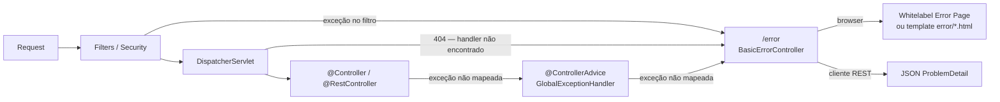

> A regra prática é: `@ControllerAdvice` para a esmagadora maioria dos casos;
> `ErrorController` apenas para erros que **escapam** do `DispatcherServlet`.

### 16.2 Customizando o `BasicErrorController`

#### Abordagem 1 — `ErrorAttributes` customizado

A forma mais simples: substitui apenas o **conteúdo** da resposta de erro sem
reimplementar o controller.

```java
/**
 * Substitui o DefaultErrorAttributes do Spring Boot.
 * Controla quais campos aparecem na resposta JSON de /error
 * e adiciona informações customizadas.
 */
@Component
public class AppErrorAttributes extends DefaultErrorAttributes {

    @Override
    public Map<String, Object> getErrorAttributes(WebRequest webRequest,
                                                   ErrorAttributeOptions options) {
        // Começa com os atributos padrão (timestamp, status, error, path...)
        Map<String, Object> attrs = super.getErrorAttributes(webRequest, options);

        // Remove campos verbosos que não devem ser expostos ao cliente
        attrs.remove("exception");   // classe da exceção interna
        attrs.remove("trace");       // stack trace

        // Adiciona campos customizados
        attrs.put("api_version", "v1");
        attrs.put("docs", "https://api.empresa.com.br/docs/erros");

        // Recupera a exceção original para enriquecer a resposta
        Throwable ex = getError(webRequest);
        if (ex instanceof RecursoNaoEncontradoException e) {
            attrs.put("recurso", e.getRecurso());
            attrs.put("identificador", e.getId());
        }

        return attrs;
    }
}
```

#### Abordagem 2 — `ErrorController` completo

Reimplementa todo o endpoint `/error`, separando a resposta para clientes REST
e para o browser (SSR):

```java
/**
 * Substitui o BasicErrorController do Spring Boot.
 *
 * Registrar este bean faz o Spring Boot desabilitar o BasicErrorController
 * automaticamente — não é necessário excluir nenhuma auto-configuração.
 */
@Controller
@RequestMapping("${server.error.path:${error.path:/error}}")
public class AppErrorController implements ErrorController {

    private final ErrorAttributes errorAttributes;

    public AppErrorController(ErrorAttributes errorAttributes) {
        this.errorAttributes = errorAttributes;
    }

    // ─── Resposta JSON para clientes REST ─────────────────────────────────────
    @RequestMapping(produces = MediaType.APPLICATION_JSON_VALUE)
    @ResponseBody
    public ResponseEntity<Map<String, Object>> errorJson(HttpServletRequest request) {
        var attrs   = getErrorAttributes(request);
        var status  = HttpStatus.valueOf((int) attrs.getOrDefault("status", 500));

        // Formata no padrão RFC 9457 (ProblemDetail)
        var body = new LinkedHashMap<String, Object>();
        body.put("type",     "https://api.empresa.com.br/erros/" + status.value());
        body.put("title",    status.getReasonPhrase());
        body.put("status",   status.value());
        body.put("detail",   attrs.getOrDefault("message", "Erro interno"));
        body.put("instance", attrs.get("path"));
        body.put("timestamp", Instant.now());

        return ResponseEntity.status(status).body(body);
    }

    // ─── Resposta HTML para o browser (SSR) ───────────────────────────────────
    @RequestMapping(produces = MediaType.TEXT_HTML_VALUE)
    public ModelAndView errorHtml(HttpServletRequest request) {
        var attrs  = getErrorAttributes(request);
        var status = HttpStatus.valueOf((int) attrs.getOrDefault("status", 500));

        // Tenta view específica por status (error/404.html, error/500.html)
        // com fallback para error/error.html genérico
        String viewName = switch (status) {
            case NOT_FOUND            -> "error/404";
            case FORBIDDEN            -> "error/403";
            case INTERNAL_SERVER_ERROR-> "error/500";
            default                   -> "error/error";
        };

        var mav = new ModelAndView(viewName);
        mav.setStatus(status);
        mav.addObject("status",  status.value());
        mav.addObject("message", attrs.getOrDefault("message", status.getReasonPhrase()));
        mav.addObject("path",    attrs.get("path"));
        return mav;
    }

    private Map<String, Object> getErrorAttributes(HttpServletRequest request) {
        var webRequest = new ServletWebRequest(request);
        return errorAttributes.getErrorAttributes(webRequest,
                ErrorAttributeOptions.of(
                        ErrorAttributeOptions.Include.MESSAGE,
                        ErrorAttributeOptions.Include.BINDING_ERRORS
                ));
    }
}
```
### 16.3 Configuração via `application.yml`

```yaml
server:
  error:
    path: /error                  # ✅ Default: /error
    include-message: always       # ✅ Default: never — expõe getMessage() na resposta
    include-binding-errors: always# ✅ Default: never — expõe erros de validação
    include-stacktrace: never     # ✅ Default: never — NUNCA expor em produção
    include-exception: false      # ✅ Default: false — oculta classe da exceção

    # Whitelabel: página padrão do Spring Boot quando não há template de erro
    whitelabel:
      enabled: false              # ✅ Default: true — desabilitar quando usar templates próprios
```

---
## 17. `@ResponseStatus` em Classes de Exceção

`@ResponseStatus` aplicado diretamente a uma classe de exceção instrui o Spring
MVC a retornar um HTTP status específico sempre que essa exceção for lançada —
sem necessidade de um `@ExceptionHandler` dedicado.

### 17.1 Uso Básico

```java
// ─── Exceção com status fixo ──────────────────────────────────────────────────
@ResponseStatus(HttpStatus.NOT_FOUND)
public class RecursoNaoEncontradoException extends RuntimeException {
    public RecursoNaoEncontradoException(String mensagem) {
        super(mensagem);
    }
}

// ─── Exceção com código de erro personalizado (reason) ────────────────────────
//
// reason: texto fixo que substitui a mensagem da exceção no body.
// Use apenas quando a mensagem de erro pode ser exposta ao cliente.
@ResponseStatus(
    value  = HttpStatus.CONFLICT,
    reason = "Registro duplicado"
)
public class DuplicidadeException extends RuntimeException {
    public DuplicidadeException(String entidade, Object chave) {
        super("Já existe um(a) " + entidade + " com a chave: " + chave);
    }
}

// ─── Uso no controller — sem nenhum try/catch ─────────────────────────────────
@GetMapping("/{id}")
public ProdutoResponse buscar(@PathVariable Long id) {
    return produtoService.buscarPorId(id)
            .orElseThrow(() ->
                new RecursoNaoEncontradoException("Produto " + id + " não encontrado"));
            // → Spring retorna automaticamente 404
}

@PostMapping
public ResponseEntity<ProdutoResponse> criar(@RequestBody @Valid ProdutoRequest req) {
    if (produtoService.skuJaExiste(req.sku())) {
        throw new DuplicidadeException("Produto", req.sku());
        // → Spring retorna automaticamente 409 Conflict com body "Registro duplicado"
    }
    // ...
}
```

### 17.2 `@ResponseStatus` vs `@ExceptionHandler` — Quando Usar Cada Um

```java
// ─── @ResponseStatus: adequado para exceções simples ─────────────────────────
//
// ✅ Use quando:
//   - A resposta de erro é apenas o status HTTP + mensagem simples
//   - Não há lógica de tratamento (log, enriquecimento, ProblemDetail detalhado)
//   - A exceção é de domínio e carrega a mensagem diretamente

@ResponseStatus(HttpStatus.UNPROCESSABLE_ENTITY)
public class RegraDeNegocioException extends RuntimeException {
    public RegraDeNegocioException(String mensagem) { super(mensagem); }
}

// ─── @ExceptionHandler: necessário para respostas ricas ──────────────────────
//
// ✅ Use quando:
//   - Precisa de ProblemDetail com campos extras (violations, links, correlationId)
//   - Precisa logar a exceção
//   - Precisa de lógica condicional na resposta (ex: detalhe diferente por ambiente)
//   - Múltiplas exceções mapeadas para o mesmo formato de resposta

@ExceptionHandler(ConstraintViolationException.class)
@ResponseStatus(HttpStatus.BAD_REQUEST)
public ProblemDetail handleConstraintViolation(ConstraintViolationException ex) {
    var pd = ProblemDetail.forStatusAndDetail(HttpStatus.BAD_REQUEST, "Dados inválidos");
    // enriquece com a lista de violações...
    return pd;
}
```

### 17.3 Precedência com `@ControllerAdvice`

Quando uma exceção tem `@ResponseStatus` **e** existe um `@ExceptionHandler`
compatível no `@ControllerAdvice`, o **`@ExceptionHandler` vence** — a anotação
`@ResponseStatus` na classe da exceção é ignorada.

```java
// Esta exceção tem @ResponseStatus(404) na classe...
@ResponseStatus(HttpStatus.NOT_FOUND)
public class RecursoNaoEncontradoException extends RuntimeException { /* ... */ }

// ...mas este handler vence, pois @ExceptionHandler tem precedência:
@ExceptionHandler(RecursoNaoEncontradoException.class)
@ResponseStatus(HttpStatus.NOT_FOUND)           // ainda precisa declarar aqui
public ProblemDetail handle(RecursoNaoEncontradoException ex, HttpServletRequest req) {
    var pd = ProblemDetail.forStatusAndDetail(HttpStatus.NOT_FOUND, ex.getMessage());
    pd.setInstance(URI.create(req.getRequestURI()));
    return pd;                                   // retorna 404 com ProblemDetail
}
```

| Cenário | Quem controla a resposta |
|---|---|
| Exceção com `@ResponseStatus`, sem `@ExceptionHandler` | `@ResponseStatus` na classe |
| Exceção com `@ResponseStatus` + `@ExceptionHandler` compatível | `@ExceptionHandler` (vence) |
| Exceção sem `@ResponseStatus`, sem `@ExceptionHandler` | Spring MVC → 500 |
| Exceção sem `@ResponseStatus` + `@ExceptionHandler` | `@ExceptionHandler` |

---
## 18. `MultiValueMap` e Form Data

### 18.1 `MultiValueMap` — Múltiplos Valores por Chave

`MultiValueMap<K, V>` é uma extensão de `Map` do Spring que associa **uma ou mais
valores** a cada chave. É o tipo usado internamente pelo MVC para representar
parâmetros de query, headers e form data — onde um mesmo campo pode aparecer
múltiplas vezes (ex.: `?tag=java&tag=spring`).

```java
@RestController
@RequestMapping("/api/v1/exemplos")
public class MultiValueMapController {

    // ─── @RequestParam com lista — forma mais comum ───────────────────────────
    // GET /api/v1/exemplos/busca?tag=java&tag=spring&tag=mvc
    @GetMapping("/busca")
    public List<ProdutoResponse> buscar(
            @RequestParam List<String> tag,          // lista de valores do param "tag"
            @RequestParam(required = false) String q) {
        return produtoService.buscarPorTags(tag, q);
    }

    // ─── MultiValueMap completo — quando os parâmetros são dinâmicos ──────────
    // Todos os query params em um único mapa — útil para proxy/forwarding
    @GetMapping("/todos-params")
    public Map<String, List<String>> todosParams(
            @RequestParam MultiValueMap<String, String> params) {
        // params.get("tag")      → ["java", "spring"]
        // params.getFirst("tag") → "java"
        // params.toSingleValueMap() → Map<String, String> (pega o primeiro de cada)
        return params;
    }

    // ─── @RequestHeader com MultiValueMap ─────────────────────────────────────
    @GetMapping("/headers")
    public Map<String, List<String>> headers(
            @RequestHeader MultiValueMap<String, String> headers) {
        return headers;
    }
}
```
### 18.2 `@RequestBody` com `MultiValueMap` (form-urlencoded)

```java
// Para receber form data (application/x-www-form-urlencoded) via REST
@PostMapping(value = "/form",
             consumes = MediaType.APPLICATION_FORM_URLENCODED_VALUE)
public ResponseEntity<String> receberFormData(
        @RequestBody MultiValueMap<String, String> formData) {

    String nome  = formData.getFirst("nome");
    List<String> tags = formData.get("tags");   // múltiplos valores

    return ResponseEntity.ok("Recebido: " + nome + ", tags: " + tags);
}
```

### 18.3 `LinkedMultiValueMap` — Construção Programática

```java
// Construção manual de MultiValueMap — útil em testes ou ao montar requests
MultiValueMap<String, String> params = new LinkedMultiValueMap<>();
params.add("tag", "java");
params.add("tag", "spring");
params.add("tag", "mvc");
params.set("pagina", "0");       // set substitui todos os valores da chave

// Uso com RestClient / TestRestTemplate
restClient.get()
        .uri(uriBuilder -> uriBuilder
                .path("/api/v1/produtos/busca")
                .queryParams(params)
                .build())
        .retrieve()
        .body(new ParameterizedTypeReference<List<ProdutoResponse>>() {});
```

---
## 19. Testes

### 19.1 Visão Geral — Pirâmide de Testes no Spring MVC

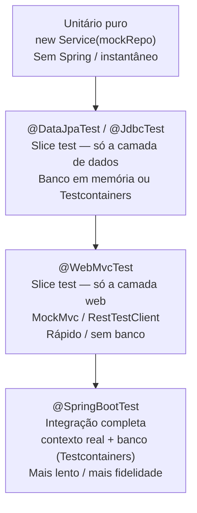

**Dependências de teste — Spring Boot 3.x vs Spring Boot 4.x:**

> **Spring Boot 4 / Spring Framework 7 — mudanças importantes nas dependências de teste:**
>
> - **JUnit 6 (Jupiter 6):** o Spring Boot 4 usa JUnit 6 (`org.junit.api.*`).
>   O pacote mudou de `org.junit.jupiter.api` para `org.junit.api` — todos os
>   imports precisam ser atualizados.
> - **`spring-boot-starter-webmvc` explícito:** no Spring Boot 4, o starter web
>   foi renomeado. Para testes que precisam da stack MVC completa, declare
>   `spring-boot-starter-webmvc` explicitamente (ver seção 1).
> - **`RestTestClient` nativo:** o `RestTestClient` passou a ser incluído
>   automaticamente pelo `spring-boot-starter-test` no Boot 4 — sem dependência
>   adicional.

```xml
<!-- ─── Spring Boot 3.x ──────────────────────────────────────────────────── -->

<!-- Inclui: JUnit 5 (org.junit.jupiter.api.*), Mockito, AssertJ,
             Hamcrest, JsonPath, Spring Test, Spring Boot Test, MockMvc -->
<dependency>
    <groupId>org.springframework.boot</groupId>
    <artifactId>spring-boot-starter-test</artifactId>
    <scope>test</scope>
</dependency>

<!-- ─── Spring Boot 4.x — diferenças relevantes ─────────────────────────── -->

<!-- Inclui: JUnit 6 (org.junit.api.*), Mockito, AssertJ,
             Spring Test, Spring Boot Test, RestTestClient (nativo)  -->
<dependency>
    <groupId>org.springframework.boot</groupId>
    <artifactId>spring-boot-starter-test</artifactId>
    <scope>test</scope>
</dependency>

<!-- Boot 4: declarar explicitamente para testes @WebMvcTest e @SpringBootTest
     que precisam da stack MVC (DispatcherServlet, MessageConverters, etc.) -->
<dependency>
    <groupId>org.springframework.boot</groupId>
    <artifactId>spring-boot-starter-webmvc</artifactId>
    <scope>test</scope>
</dependency>

<!-- ─── Comuns a Boot 3 e Boot 4 ─────────────────────────────────────────── -->

<!-- Spring Security Test — @WithMockUser, @WithUserDetails, SecurityMockMvcRequestPostProcessors -->
<dependency>
    <groupId>org.springframework.security</groupId>
    <artifactId>spring-security-test</artifactId>
    <scope>test</scope>
</dependency>

<!-- Testcontainers — banco real em container para testes de integração -->
<dependency>
    <groupId>org.springframework.boot</groupId>
    <artifactId>spring-boot-testcontainers</artifactId>
    <scope>test</scope>
</dependency>
<dependency>
    <groupId>org.testcontainers</groupId>
    <artifactId>postgresql</artifactId>
    <scope>test</scope>
</dependency>
```

**JUnit 5 vs JUnit 6 — mudança de pacote:**

```java
// ─── JUnit 5 (Spring Boot 3.x) ────────────────────────────────────────────────
import org.junit.jupiter.api.Test;
import org.junit.jupiter.api.BeforeEach;
import org.junit.jupiter.api.DisplayName;
import org.junit.jupiter.api.extension.ExtendWith;
import org.junit.jupiter.params.ParameterizedTest;
import org.junit.jupiter.params.provider.ValueSource;

// ─── JUnit 6 (Spring Boot 4.x) — pacote raiz mudou de jupiter para api ────────
import org.junit.api.Test;
import org.junit.api.BeforeEach;
import org.junit.api.DisplayName;
import org.junit.api.extension.ExtendWith;
import org.junit.api.params.ParameterizedTest;
import org.junit.api.params.provider.ValueSource;

// As anotações e comportamentos são os mesmos — apenas o pacote mudou.
// No IntelliJ IDEA: use "Migrate Packages" ou busca/substituição global:
//   org.junit.jupiter.api  →  org.junit.api
```

---

### 19.2 Teste Unitário — Service sem Spring

O teste mais rápido: instancia a classe diretamente, injeta mocks via construtor.
Não carrega nenhum contexto Spring.

#### Ciclo de vida dos métodos de setup e teardown

```java
// JUnit 6 (Boot 4) — pacote org.junit.api.*
// JUnit 5 (Boot 3) — pacote org.junit.jupiter.api.*
//
// As anotações abaixo funcionam igualmente em ambas as versões;
// apenas o pacote de import muda.
//
// ─── Ordem de execução por teste ──────────────────────────────────────────────
//
//  @BeforeAll   → uma vez antes de TODOS os testes da classe
//  @BeforeEach  → antes de CADA teste
//     @Test     → o próprio teste
//  @AfterEach   → após CADA teste
//  @AfterAll    → uma vez após TODOS os testes da classe
//
// @BeforeAll e @AfterAll precisam ser static (por padrão) porque são chamados
// antes de qualquer instância ser criada. Podem ser não-static com
// @TestInstance(Lifecycle.PER_CLASS) — uma única instância para toda a classe.

@ExtendWith(MockitoExtension.class)
@DisplayName("ProdutoService — ciclo de vida completo")
class ProdutoServiceLifecycleTest {

    // ─── @BeforeAll — executado UMA VEZ antes de todos os testes ─────────────
    // Usado para recursos caros de inicializar que podem ser compartilhados:
    // conexões, servidores externos, dados de referência read-only.
    // Deve ser static (a menos que @TestInstance(PER_CLASS) seja usado).
    @BeforeAll
    static void configurarAmbiente() {
        // Exemplos de uso real:
        //   - Iniciar um servidor mock de e-mail (GreenMail)
        //   - Carregar fixtures de dados estáticos de arquivos
        //   - Configurar propriedades de sistema necessárias ao teste
        System.setProperty("app.test.modo", "unitario");
    }

    // ─── @BeforeEach — executado antes de CADA teste ──────────────────────────
    // Reinicia o estado que pode ser "poluído" por um teste anterior.
    // Cada teste parte de um estado limpo e previsível.
    @Mock private ProdutoRepository produtoRepository;
    @Mock private CategoriaService  categoriaService;
    @InjectMocks private ProdutoService produtoService;

    @BeforeEach
    void prepararCenario() {
        // Com @ExtendWith(MockitoExtension) os mocks já são reiniciados automaticamente
        // a cada teste — @BeforeEach é útil para preparar dados de teste reutilizáveis
        // ou configurar comportamentos padrão comuns a vários testes.
        when(categoriaService.buscarPorId(1L))
                .thenReturn(new Categoria(1L, "Informática"));
    }

    // ─── @AfterEach — executado após CADA teste ───────────────────────────────
    // Limpa recursos alocados no @BeforeEach ou durante o próprio teste:
    // arquivos temporários, conexões abertas, estados estáticos modificados.
    @AfterEach
    void limparCenario() {
        // Exemplos de uso real:
        //   - Deletar arquivos temporários criados pelo teste
        //   - Resetar contadores estáticos
        //   - Fechar streams ou conexões abertas no @BeforeEach
        // Com Mockito puro (@ExtendWith) os mocks já são resetados automaticamente —
        // @AfterEach só é necessário para recursos externos.
    }

    // ─── @AfterAll — executado UMA VEZ após todos os testes ──────────────────
    // Libera recursos inicializados no @BeforeAll.
    // Deve ser static (mesma restrição do @BeforeAll).
    @AfterAll
    static void liberarAmbiente() {
        // Exemplos de uso real:
        //   - Parar um servidor mock de e-mail iniciado no @BeforeAll
        //   - Remover propriedades de sistema configuradas no @BeforeAll
        //   - Liberar conexões de banco compartilhadas (em testes que não usam Testcontainers)
        System.clearProperty("app.test.modo");
    }

    // ─── Testes que usam o estado preparado no @BeforeEach ────────────────────
    @Test
    @DisplayName("buscarPorId retorna response quando produto existe")
    void buscarPorId_WhenExists_ReturnsResponse() {
        var produto = new Produto(1L, "Notebook", new BigDecimal("3499.99"));
        when(produtoRepository.findById(1L)).thenReturn(Optional.of(produto));

        var result = produtoService.buscarPorId(1L);

        assertThat(result.id()).isEqualTo(1L);
        assertThat(result.nome()).isEqualTo("Notebook");
        verify(produtoRepository).findById(1L);
        verifyNoMoreInteractions(produtoRepository, categoriaService);
    }

    @Test
    @DisplayName("buscarPorId lança exceção quando produto não existe")
    void buscarPorId_WhenNotFound_ThrowsException() {
        when(produtoRepository.findById(99L)).thenReturn(Optional.empty());

        assertThatThrownBy(() -> produtoService.buscarPorId(99L))
                .isInstanceOf(RecursoNaoEncontradoException.class)
                .hasMessageContaining("99");
    }

    // ─── ArgumentCaptor — inspecionar o objeto passado ao mock ───────────────
    @Test
    @DisplayName("criar persiste produto com dados corretos")
    void criar_ValidRequest_PersistsCorrectly() {
        var request = new ProdutoRequest("Notebook", new BigDecimal("3499.99"), 1L);
        var saved   = new Produto(42L, "Notebook", new BigDecimal("3499.99"));
        when(produtoRepository.save(any(Produto.class))).thenReturn(saved);

        var result = produtoService.criar(request);

        var captor = ArgumentCaptor.forClass(Produto.class);
        verify(produtoRepository).save(captor.capture());
        assertThat(captor.getValue().getNome()).isEqualTo("Notebook");
        assertThat(result.id()).isEqualTo(42L);
    }
}
```

#### `@TestInstance(Lifecycle.PER_CLASS)` — `@BeforeAll` não-estático

```java
// Por padrão o JUnit cria uma nova instância da classe para cada @Test
// (PER_METHOD), tornando @BeforeAll/@AfterAll obrigatoriamente static.
//
// Com @TestInstance(PER_CLASS), uma única instância é usada para todos os testes:
//   - @BeforeAll e @AfterAll podem ser métodos de instância (não-static)
//   - Permite compartilhar estado entre testes (use com cuidado — pode gerar
//     dependência entre testes se o estado for modificado)
//   - Útil quando @BeforeAll precisa acessar campos de instância (ex.: mocks)
@ExtendWith(MockitoExtension.class)
@TestInstance(TestInstance.Lifecycle.PER_CLASS)
@DisplayName("ProdutoService — PER_CLASS lifecycle")
class ProdutoServicePerClassTest {

    @Mock private ProdutoRepository produtoRepository;
    @InjectMocks private ProdutoService produtoService;

    // Sem static — acessa this.produtoRepository normalmente
    @BeforeAll
    void carregarDadosCompartilhados() {
        // Configura stub permanente que vale para todos os testes da classe
        when(produtoRepository.count()).thenReturn(100L);
    }

    @AfterAll
    void gerarRelatorioDeCobertura() {
        // Executado após o último teste — pode acessar campos de instância
        System.out.println("Testes concluídos. Total de produtos no mock: "
                + produtoRepository.count());
    }

    @Test
    void contagem_RetornaValorConfigurado() {
        assertThat(produtoService.contarTodos()).isEqualTo(100L);
    }
}
```

**Ciclo de vida dos testes — `@BeforeAll`, `@BeforeEach`, `@AfterEach`, `@AfterAll`:**

```java
// ─── JUnit 5 (Boot 3.x) ───────────────────────────────────────────────────────
import org.junit.jupiter.api.*;

// ─── JUnit 6 (Boot 4.x) ───────────────────────────────────────────────────────
import org.junit.api.*;

@ExtendWith(MockitoExtension.class)
@DisplayName("PedidoService — ciclo de vida de testes")
class PedidoServiceLifecycleTest {

    // ─── @BeforeAll ────────────────────────────────────────────────────────────
    // Executado UMA VEZ antes de todos os testes da classe.
    // DEVE ser static (a menos que a classe use @TestInstance(PER_CLASS)).
    // Uso típico: inicializar recursos caros compartilhados entre testes
    // (ex: conexão de banco, servidor embarcado, dados de fixtures fixos).
    @BeforeAll
    static void configurarAmbiente() {
        // Exemplo: criar diretório temporário, carregar arquivo de configuração
        System.setProperty("app.test.mode", "true");
    }

    // ─── @BeforeEach ───────────────────────────────────────────────────────────
    // Executado antes de CADA teste.
    // Uso típico: estado inicial limpo por teste (mocks resetados, dados frescos).
    // O Mockito já reseta os mocks automaticamente com MockitoExtension —
    // use @BeforeEach para inicializar outros objetos ou estado adicional.
    @BeforeEach
    void prepararCadaTeste() {
        // Reset de estado que não é gerenciado pelo Mockito
        CarrinhoContexto.limpar();
    }

    @Test
    @DisplayName("confirmar pedido dispara email de confirmação")
    void confirmar_PedidoValido_EnviaEmail() {
        // ...
    }

    @Test
    @DisplayName("confirmar pedido lança exceção se estoque insuficiente")
    void confirmar_SemEstoque_LancaExcecao() {
        // ...
    }

    // ─── @AfterEach ────────────────────────────────────────────────────────────
    // Executado após CADA teste, mesmo que o teste tenha falhado.
    // Uso típico: limpar recursos criados pelo teste, fechar conexões temporárias,
    // verificar ausência de interações inesperadas (verifyNoMoreInteractions).
    @AfterEach
    void limparAposCadaTeste() {
        // Garante que nenhum mock foi chamado de forma não verificada
        // (substitui Mockito.validateMockitoUsage() que é mais verboso)
        CarrinhoContexto.limpar();
    }

    // ─── @AfterAll ─────────────────────────────────────────────────────────────
    // Executado UMA VEZ após todos os testes da classe, mesmo após falhas.
    // DEVE ser static (a menos que use @TestInstance(PER_CLASS)).
    // Uso típico: liberar recursos globais abertos no @BeforeAll.
    @AfterAll
    static void tearDown() {
        System.clearProperty("app.test.mode");
    }
}

// ─── @TestInstance(PER_CLASS) — permite @BeforeAll/@AfterAll não-static ────────
//
// Por padrão o JUnit cria uma nova instância da classe para CADA teste.
// Com PER_CLASS, uma única instância é usada em todos os testes da classe.
// Vantagem: @BeforeAll e @AfterAll podem ser de instância (não precisam ser static),
//            o que permite injetar dependências normalmente nesses métodos.
// Atenção: o estado da instância persiste entre testes — mocks e campos podem
//          ser "contaminados" por testes anteriores; use @BeforeEach para resetar.
@TestInstance(TestInstance.Lifecycle.PER_CLASS)
@SpringBootTest(webEnvironment = SpringBootTest.WebEnvironment.RANDOM_PORT)
@Testcontainers
@DisplayName("PedidoController — integração (PER_CLASS)")
class PedidoControllerIT {

    @Container
    static PostgreSQLContainer<?> postgres = new PostgreSQLContainer<>("postgres:18")
            .withReuse(true);

    @Autowired
    private PedidoRepository pedidoRepository;

    @Autowired
    private RestTestClient restTestClient;

    // ─── Não-static: possível apenas com PER_CLASS ─────────────────────────────
    @BeforeAll
    void carregarDadosBase() {
        // Inserção de dados de referência usados por todos os testes da classe.
        // Como é PER_CLASS, este método roda uma única vez — mais eficiente.
        pedidoRepository.saveAll(DadosBase.pedidosPadrao());
    }

    @BeforeEach
    void limparPedidosVariaveis() {
        // Remove apenas pedidos criados nos testes individuais;
        // os dados base do @BeforeAll são preservados.
        pedidoRepository.deleteByOrigemTeste(true);
    }

    @Test
    @DisplayName("GET /api/v1/pedidos → retorna lista paginada")
    void listar_RetornaPaginaComPedidosBase() {
        restTestClient.get()
                .uri("/api/v1/pedidos?page=0&size=10")
                .exchange()
                .expectStatus().isOk()
                .expectBody()
                .jsonPath("$.content").isNotEmpty();
    }

    // ─── @AfterAll não-static — possível com PER_CLASS ────────────────────────
    @AfterAll
    void limparDadosBase() {
        pedidoRepository.deleteAll();
    }
}
```

**Resumo do ciclo de vida:**

```
┌─────────────────────────────────────────────────────────────────────┐
│  @BeforeAll (static)  ─── uma vez por CLASSE (antes de tudo)        │
│                                                                       │
│   ┌──────────────────────────────────────────────────────────────┐   │
│   │  @BeforeEach  ─── antes de CADA @Test                        │   │
│   │  @Test        ─── execução do teste                          │   │
│   │  @AfterEach   ─── após CADA @Test (mesmo se falhou)          │   │
│   └──────────────────────────────────────────────────────────────┘   │
│   (repetido para cada método @Test da classe)                         │
│                                                                       │
│  @AfterAll (static)   ─── uma vez por CLASSE (após tudo)             │
└─────────────────────────────────────────────────────────────────────┘
```

---

### 19.3 `@WebMvcTest` — Slice Test da Camada Web

Carrega apenas o slice MVC (controllers, filters, converters, security web).
**Não carrega** services, repositories nem o banco — estes devem ser mockados.

#### 19.3.1 REST Controller com `RestTestClient` (Spring Boot 4)

> **Nota:** no baseline Spring Boot 3.5 deste documento, prefira `MockMvc` ou um cliente equivalente. O `RestTestClient` é tratado aqui como recurso nativo da stack Spring Boot 4 / Spring Framework 7.

```java
@WebMvcTest(ProdutoController.class)
@DisplayName("ProdutoController — slice REST")
class ProdutoControllerTest {

    @Autowired
    private MockMvc mockMvc;

    @MockitoBean                   // Spring Boot 3.4+: substitui @MockBean
    private ProdutoService produtoService;

    private RestTestClient restTestClient;

    @BeforeEach
    void setUp() {
        // Bind RestTestClient ao MockMvc para testes de slice
        restTestClient = RestTestClient.bindToMockMvc(mockMvc).build();
    }

    @Test
    @DisplayName("GET /{id} → 200 quando produto existe")
    void buscar_WhenExists_Returns200() {
        var response = new ProdutoResponse(1L, "Notebook",
                new BigDecimal("3499.99"), "TI",
                LocalDateTime.now(), LocalDateTime.now());
        when(produtoService.buscarPorId(1L)).thenReturn(response);

        restTestClient.get()
                .uri("/api/v1/produtos/1")
                .exchange()
                .expectStatus().isOk()
                .expectBody(ProdutoResponse.class)
                .value(p -> {
                    assertThat(p.id()).isEqualTo(1L);
                    assertThat(p.nome()).isEqualTo("Notebook");
                });
    }

    @Test
    @DisplayName("GET /{id} → 404 quando produto não existe")
    void buscar_WhenNotFound_Returns404() {
        when(produtoService.buscarPorId(99L))
                .thenThrow(new RecursoNaoEncontradoException("Produto", 99L));

        restTestClient.get()
                .uri("/api/v1/produtos/99")
                .exchange()
                .expectStatus().isNotFound()
                .expectBody()
                .jsonPath("$.status").isEqualTo(404)
                .jsonPath("$.detail").isNotEmpty();
    }

    @Test
    @DisplayName("POST / → 201 com Location quando request válido")
    void criar_ValidRequest_Returns201() {
        var created = new ProdutoResponse(42L, "Notebook",
                new BigDecimal("3499.99"), "TI",
                LocalDateTime.now(), LocalDateTime.now());
        when(produtoService.criar(any())).thenReturn(created);

        restTestClient.post()
                .uri("/api/v1/produtos")
                .contentType(MediaType.APPLICATION_JSON)
                .bodyValue("""
                        {
                          "nome": "Notebook",
                          "preco": 3499.99,
                          "categoriaId": 1
                        }
                        """)
                .exchange()
                .expectStatus().isCreated()
                .expectHeader().valueMatches("Location", ".*/api/v1/produtos/42")
                .expectBody(ProdutoResponse.class)
                .value(p -> assertThat(p.id()).isEqualTo(42L));
    }

    @Test
    @DisplayName("POST / → 400 quando nome em branco")
    void criar_WhenNomeBlank_Returns400() {
        restTestClient.post()
                .uri("/api/v1/produtos")
                .contentType(MediaType.APPLICATION_JSON)
                .bodyValue("""
                        {"nome": "", "preco": 99.90, "categoriaId": 1}
                        """)
                .exchange()
                .expectStatus().isBadRequest()
                .expectBody()
                .jsonPath("$.errors.nome").isNotEmpty();
    }
}
```
### 19.4 `@WebMvcTest` com Spring Security

```java
// Por padrão, @WebMvcTest aplica a configuração de Security do projeto.
// Use as anotações do spring-security-test para simular autenticação.

@WebMvcTest(PedidoController.class)
@DisplayName("PedidoController — autenticação e autorização")
class PedidoControllerSecurityTest {

    @Autowired private MockMvc       mockMvc;
    @MockitoBean private PedidoService pedidoService;

    // ─── @WithMockUser — simula usuário autenticado com roles ────────────────
    @Test
    @WithMockUser(username = "joao@empresa.com", roles = {"USER"})
    @DisplayName("GET /api/v1/pedidos → 200 para usuário autenticado")
    void listar_AuthenticatedUser_Returns200() throws Exception {
        when(pedidoService.listar(any())).thenReturn(Page.empty());

        mockMvc.perform(get("/api/v1/pedidos"))
                .andExpect(status().isOk());
    }

    // ─── Sem autenticação → 401 ───────────────────────────────────────────────
    @Test
    @DisplayName("GET /api/v1/pedidos → 401 sem autenticação")
    void listar_Unauthenticated_Returns401() throws Exception {
        mockMvc.perform(get("/api/v1/pedidos"))
                .andExpect(status().isUnauthorized());
    }

    // ─── Papel insuficiente → 403 ────────────────────────────────────────────
    @Test
    @WithMockUser(roles = {"USER"})
    @DisplayName("DELETE /api/v1/pedidos/{id} → 403 para role USER")
    void excluir_InsufficientRole_Returns403() throws Exception {
        mockMvc.perform(delete("/api/v1/pedidos/1").with(csrf()))
                .andExpect(status().isForbidden());
    }

    // ─── @WithUserDetails — carrega o UserDetails real do UserDetailsService ─
    @Test
    @WithUserDetails(value = "admin@empresa.com",
                     userDetailsServiceBeanName = "usuarioDetailsService")
    @DisplayName("DELETE → 204 para usuário ADMIN real")
    void excluir_AdminUser_Returns204() throws Exception {
        doNothing().when(pedidoService).excluir(1L);

        mockMvc.perform(delete("/api/v1/pedidos/1").with(csrf()))
                .andExpect(status().isNoContent());
    }

    // ─── Simular principal customizado (UsuarioDetails) ──────────────────────
    @Test
    @DisplayName("GET /meus-pedidos → usa o ID do usuário autenticado")
    void meusPedidos_UsesAuthenticatedUserId() throws Exception {
        var principal = new UsuarioDetails(42L, "João", "joao@email.com",
                "tenant-01", List.of(new SimpleGrantedAuthority("ROLE_USER")));

        mockMvc.perform(get("/api/v1/pedidos/meus")
                        .with(user(principal)))           // SecurityMockMvcRequestPostProcessors
                .andExpect(status().isOk());

        verify(pedidoService).listarPorCliente(eq(42L), any());
    }
}
```

---

### 19.5 `@SpringBootTest` — Teste de Integração

Carrega o contexto Spring completo. Use com `Testcontainers` para banco real.

```java
@SpringBootTest(webEnvironment = SpringBootTest.WebEnvironment.RANDOM_PORT)
@Testcontainers
@DisplayName("ProdutoController — integração")
class ProdutoControllerIT {

    // Testcontainers: sobe PostgreSQL real em Docker
    @Container
    static PostgreSQLContainer<?> postgres =
            new PostgreSQLContainer<>("postgres:17")
                    .withReuse(true);

    // Conecta o contexto Spring ao container PostgreSQL
    @DynamicPropertySource
    static void configureProperties(DynamicPropertyRegistry registry) {
        registry.add("spring.datasource.url",      postgres::getJdbcUrl);
        registry.add("spring.datasource.username", postgres::getUsername);
        registry.add("spring.datasource.password", postgres::getPassword);
    }

    // RestTestClient com RANDOM_PORT — injeta o cliente HTTP real
    @Autowired
    private RestTestClient restTestClient;

    @Autowired
    private ProdutoRepository produtoRepository;

    @BeforeEach
    void setUp() {
        produtoRepository.deleteAll();
    }

    @Test
    @DisplayName("CRUD completo: criar → buscar → atualizar → deletar")
    void crudCompleto() {
        // CREATE
        var created = restTestClient.post()
                .uri("/api/v1/produtos")
                .contentType(MediaType.APPLICATION_JSON)
                .bodyValue("""
                        {"nome": "Notebook Dell", "preco": 3499.99, "categoriaId": 1}
                        """)
                .exchange()
                .expectStatus().isCreated()
                .expectBody(ProdutoResponse.class)
                .returnResult()
                .getResponseBody();

        assertThat(created).isNotNull();
        Long id = created.id();

        // READ
        restTestClient.get()
                .uri("/api/v1/produtos/{id}", id)
                .exchange()
                .expectStatus().isOk()
                .expectBody()
                .jsonPath("$.nome").isEqualTo("Notebook Dell");

        // UPDATE
        restTestClient.put()
                .uri("/api/v1/produtos/{id}", id)
                .contentType(MediaType.APPLICATION_JSON)
                .bodyValue("""
                        {"nome": "Notebook Dell Atualizado", "preco": 3299.99, "categoriaId": 1}
                        """)
                .exchange()
                .expectStatus().isOk()
                .expectBody()
                .jsonPath("$.nome").isEqualTo("Notebook Dell Atualizado");

        // DELETE
        restTestClient.delete()
                .uri("/api/v1/produtos/{id}", id)
                .exchange()
                .expectStatus().isNoContent();

        // VERIFY DELETED
        restTestClient.get()
                .uri("/api/v1/produtos/{id}", id)
                .exchange()
                .expectStatus().isNotFound();
    }

    // ─── Teste de validação end-to-end ────────────────────────────────────────
    @Test
    @DisplayName("POST com dados inválidos → 400 com erros por campo")
    void criar_InvalidData_Returns400WithFieldErrors() {
        restTestClient.post()
                .uri("/api/v1/produtos")
                .contentType(MediaType.APPLICATION_JSON)
                .bodyValue("""
                        {"nome": "", "preco": -1, "categoriaId": null}
                        """)
                .exchange()
                .expectStatus().isBadRequest()
                .expectBody()
                .jsonPath("$.errors.nome").isNotEmpty()
                .jsonPath("$.errors.preco").isNotEmpty()
                .jsonPath("$.errors.categoriaId").isNotEmpty();
    }
}
```

---

### 19.6 `MockMvc` vs `RestTestClient` — Comparativo

> **Nota:** na comparação abaixo, a disponibilidade do `RestTestClient` sem dependência extra refere-se ao Spring Boot 4.

```java
// ─── MockMvc — API imperativa tradicional ─────────────────────────────────────
// Verboso mas flexível; suporte nativo ao Thymeleaf (view(), model(), xpath())
mockMvc.perform(
        get("/api/v1/produtos/1")
                .accept(MediaType.APPLICATION_JSON)
                .header("X-API-Version", "1.0"))
        .andExpect(status().isOk())
        .andExpect(content().contentType(MediaType.APPLICATION_JSON))
        .andExpect(jsonPath("$.nome").value("Notebook"))
        .andExpect(jsonPath("$.preco").value(3499.99))
        .andDo(print());  // imprime request/response no console

// ─── RestTestClient — API fluente (Spring Boot 4 nativo) ─────────────────────
// Mais legível; AssertJ; funciona igual para MockMvc (slice) e RANDOM_PORT (IT)
restTestClient.get()
        .uri("/api/v1/produtos/1")
        .accept(MediaType.APPLICATION_JSON)
        .header("X-API-Version", "1.0")
        .exchange()
        .expectStatus().isOk()
        .expectHeader().contentType(MediaType.APPLICATION_JSON)
        .expectBody()
        .jsonPath("$.nome").isEqualTo("Notebook")
        .jsonPath("$.preco").isEqualTo(3499.99);
```

| | `MockMvc` | `RestTestClient` |
|---|---|---|
| API | Imperativa — `andExpect()` | Fluente — `expectStatus()` |
| Assertions | Hamcrest / MockMvc matchers | AssertJ + JsonPath |
| Suporte a Thymeleaf (`view()`, `model()`) | ✅ Nativo | ❌ Não |
| Funciona com `@WebMvcTest` | ✅ | ✅ via `bindToMockMvc(mockMvc)` |
| Funciona com `@SpringBootTest RANDOM_PORT` | ❌ | ✅ injetado automaticamente |
| Disponível sem dependência extra | ✅ | ✅ (Boot 4 — `spring-boot-starter-test`) |
| **Recomendação** | Testes SSR com view/model | REST — slice e integração |

---

### 19.7 Configuração de Contexto de Teste

```java
// ─── @TestConfiguration — beans extras apenas nos testes ─────────────────────
@TestConfiguration
public class TestSecurityConfig {

    // Substitui a SecurityFilterChain de produção durante os testes
    @Bean
    @Primary
    public SecurityFilterChain testSecurityFilterChain(HttpSecurity http)
            throws Exception {
        http.csrf(AbstractHttpConfigurer::disable)
            .authorizeHttpRequests(auth -> auth.anyRequest().permitAll());
        return http.build();
    }
}

// Uso: importar apenas onde necessário
@WebMvcTest(ProdutoController.class)
@Import(TestSecurityConfig.class)
class ProdutoControllerTest { /* ... */ }

// ─── @ActiveProfiles — ativar perfil de teste ─────────────────────────────────
@SpringBootTest
@ActiveProfiles("test")   // carrega application-test.yml
class ProdutoServiceIT { /* ... */ }

// ─── @Sql — executar scripts SQL antes/depois dos testes ──────────────────────
@SpringBootTest
@Sql(scripts = "/sql/setup-produtos.sql",
     executionPhase = Sql.ExecutionPhase.BEFORE_TEST_METHOD)
@Sql(scripts = "/sql/cleanup.sql",
     executionPhase = Sql.ExecutionPhase.AFTER_TEST_METHOD)
class RelatorioServiceIT { /* ... */ }

// ─── @Transactional em testes — rollback automático ──────────────────────────
@SpringBootTest
@Transactional   // cada teste é executado em transação que faz rollback no final
class ProdutoRepositoryTest {

    @Autowired private ProdutoRepository repository;

    @Test
    void salvar_PersisteProduto() {
        repository.save(new Produto("Notebook", new BigDecimal("3499.99")));
        // rollback automático ao final do teste — banco fica limpo
        assertThat(repository.count()).isEqualTo(1);
    }
}

// ─── @DirtiesContext — reinicia contexto após teste que modifica estado global ─
@SpringBootTest
@DirtiesContext(classMode = DirtiesContext.ClassMode.AFTER_EACH_TEST_METHOD)
class IntegracaoComEfeitos { /* ... */ }
```

---

### 19.8 Testando Upload, CORS e SSE

```java
@WebMvcTest(ArquivoController.class)
class ArquivoControllerTest {

    @Autowired  private MockMvc       mockMvc;
    @MockitoBean private ArquivoService arquivoService;

    // ─── Upload de arquivo ────────────────────────────────────────────────────
    @Test
    @WithMockUser
    void upload_ArquivoValido_Returns201() throws Exception {
        var arquivo = new MockMultipartFile(
                "arquivo",                         // nome do parâmetro (@RequestParam)
                "foto.jpg",                        // nome original do arquivo
                MediaType.IMAGE_JPEG_VALUE,        // content type
                "conteudo-binario".getBytes());    // bytes do arquivo

        when(arquivoService.salvar(any()))
                .thenReturn(new ArquivoResponse("id-1", "foto.jpg", 100L,
                        "image/jpeg", "/api/v1/arquivos/id-1"));

        mockMvc.perform(multipart("/api/v1/arquivos").file(arquivo)
                        .with(csrf()))
                .andExpect(status().isCreated())
                .andExpect(jsonPath("$.nome").value("foto.jpg"));
    }

    // ─── CORS — verifica headers na resposta ──────────────────────────────────
    @Test
    void cors_AllowedOrigin_RetornaHeaders() throws Exception {
        mockMvc.perform(options("/api/v1/arquivos")
                        .header("Origin",                        "https://app.empresa.com.br")
                        .header("Access-Control-Request-Method", "POST"))
                .andExpect(status().isOk())
                .andExpect(header().string("Access-Control-Allow-Origin",
                        "https://app.empresa.com.br"))
                .andExpect(header().exists("Access-Control-Allow-Methods"));
    }
}

// ─── SSE — Server-Sent Events ─────────────────────────────────────────────────
@WebMvcTest(EventoController.class)
class EventoControllerTest {

    @Autowired  private MockMvc         mockMvc;
    @MockitoBean private EventoBroadcaster broadcaster;

    @Test
    @WithMockUser
    void stream_RetornaTextEventStream() throws Exception {
        var emitter = new SseEmitter();
        when(broadcaster.subscribe(any(), any())).thenReturn(emitter);

        mockMvc.perform(get("/api/v1/eventos/stream")
                        .param("usuarioId", "1")
                        .accept(MediaType.TEXT_EVENT_STREAM_VALUE))
                .andExpect(status().isOk())
                .andExpect(content().contentTypeCompatibleWith(
                        MediaType.TEXT_EVENT_STREAM_VALUE));
    }
}
```

---
## 20. Tópicos Relevantes Não Cobertos Neste Documento

Assuntos relacionados ao Spring MVC ainda ausentes neste documento, ordenados por relevância prática.

### 20.1 Tópicos Ausentes — Alta Relevância

**1. HTTP Interface — `@HttpExchange`**
Introduzido no Spring 6, é a forma moderna de declarar clients HTTP (similar ao Feign) usando interfaces anotadas com `@GetExchange`, `@PostExchange` etc., resolvidos por `HttpServiceProxyFactory`. Direto ao território do Spring MVC e completamente ausente.

**2. HATEOAS**
`spring-hateoas`, `EntityModel<T>`, `CollectionModel<T>`, `WebMvcLinkBuilder`, representação HAL. Ausente por completo, apesar de ser parte oficial do ecossistema Spring MVC para APIs hipermídia.

### 20.2 Tópicos Ausentes — Relevância Moderada

**3. Endpoints funcionais — `RouterFunction` / WebMvc.fn**
Alternativa ao `@Controller` introduzida no Spring 5, disponível no MVC via `WebMvcConfigurer.addRouterFunctions()`. Não substitui `@Controller` no dia a dia mas é relevante para cenários de roteamento dinâmico ou bibliotecas internas.

### 20.3 Tópicos Ausentes — Relevância Menor mas Notáveis

**4. `WebMvcTest` + `MockMvcRestDocumentation`** — geração de documentação a partir dos testes (Spring REST Docs)

**5. Virtual Threads — seção dedicada** — mencionado em vários lugares, mas sem consolidar os impactos no MVC (thread locals, `@Async`, `SecurityContextHolder`, `TransactionSynchronizationManager`)

### 20.4 Resumo por Prioridade

| Prioridade | Tópico | Justificativa |
|---|---|---|
| 🔴 Alta | `@HttpExchange` | Substitui Feign no ecossistema Spring — muito usado em microserviços |
| 🔴 Alta | HATEOAS | Parte oficial do ecossistema Spring MVC para APIs hipermídia |
| 🟡 Média | WebMvc.fn | Nicho, mas parte oficial da stack MVC |
| 🟢 Baixa | `MockMvcRestDocumentation` | Útil para gerar documentação a partir dos testes |
| 🟢 Baixa | Virtual Threads | Merece consolidação dos impactos no MVC e em contexto assíncrono |

---
## Referências e Créditos

### Documentação Oficial

| Recurso | URL |
|---|---|
| Spring MVC Reference | https://docs.spring.io/spring-framework/reference/web/webmvc.html |
| Spring Boot Web Reference | https://docs.spring.io/spring-boot/reference/web/servlet.html |
| Spring Framework 7 — API Versioning | https://docs.spring.io/spring-framework/reference/web/webmvc-versioning.html |
| Spring Security Reference | https://docs.spring.io/spring-security/reference/ |
| SpringDoc OpenAPI | https://springdoc.org/ |
| Jakarta Bean Validation 3.0 | https://beanvalidation.org/3.0/ |
| JUnit 5 User Guide | https://junit.org/junit5/docs/current/user-guide/ |
| Mockito Documentation | https://site.mockito.org/ |
| Testcontainers for Java | https://java.testcontainers.org/ |

### Especificações e RFCs

| Especificação | URL |
|---|---|
| RFC 9457 — Problem Details for HTTP APIs | https://www.rfc-editor.org/rfc/rfc9457 |
| RFC 8594 — Sunset HTTP Header | https://www.rfc-editor.org/rfc/rfc8594 |
| Jakarta EE 10 Platform | https://jakarta.ee/specifications/platform/10/ |
| WHATWG HTML — `data-*` attributes | https://html.spec.whatwg.org/multipage/dom.html#embedding-custom-non-visible-data-with-the-data-*-attributes |

### Referências Complementares

| Recurso | URL |
|---|---|
| Baeldung — Spring MVC | https://www.baeldung.com/spring-mvc |
| Baeldung — Spring Security | https://www.baeldung.com/security-spring |
| Spring Boot API Versioning (Baeldung) | https://www.baeldung.com/spring-api-versioning |
| Validation Groups — Stack Overflow | https://stackoverflow.com/a/35359965 |
| Spring Blog — API Versioning in Spring | https://spring.io/blog/2025/09/16/api-versioning-in-spring/ |

---

### Créditos

Este documento foi elaborado de forma colaborativa entre:

- **[@ftsuda-senac](https://github.com/ftsuda-senac)** — autor das perguntas, revisões e direcionamentos que moldaram o conteúdo e a estrutura do documento.

- **[Claude Sonnet 4.6](https://www.anthropic.com/claude)** (Anthropic) — modelo de linguagem utilizado para geração, estruturação e revisão do conteúdo técnico ao longo de toda a conversa.

> *Documento gerado para Spring Boot 3.5 / 4.0 com Java 21+ · Spring Framework 6.x / 7.x · Thymeleaf 3.x · SpringDoc OpenAPI 2.x / 3.x*

