# Spring Security — Guia Abrangente

> **Versões de referência:** Spring Boot 3.5.x / 4.x · Spring Security 6.x / 7.x · Java 21+ · Nimbus JOSE+JWT

---

## Sumário

1. [Arquitetura e Conceitos Fundamentais](#1-arquitetura-e-conceitos-fundamentais)
2. [Dependências Maven](#2-dependências-maven)
3. [SecurityConfig — Configuração Básica](#3-securityconfig--configuração-básica)
4. [Múltiplas SecurityFilterChains no Mesmo Projeto](#4-múltiplas-securityfilterchains-no-mesmo-projeto)
5. [HTTP Basic Authentication](#5-http-basic-authentication)
6. [Form Login](#6-form-login)
7. [Multi-Factor Authentication, OTP e One-Time Token](#7-multi-factor-authentication-otp-e-one-time-token)
8. [JWT com Nimbus JOSE+JWT](#8-jwt-com-nimbus-josejwt)
9. [Method Security (@PreAuthorize / @PostAuthorize)](#9-method-security-preauthorize--postauthorize)
10. [SpEL Customizado para Anotações de Segurança](#10-spel-customizado-para-anotações-de-segurança)
11. [PermissionEvaluator — Permissões por Domínio](#11-permissionevaluator--permissões-por-domínio)
12. [OAuth2 Resource Server](#12-oauth2-resource-server)
13. [OAuth2 Client](#13-oauth2-client)
14. [Integração com Keycloak](#14-integração-com-keycloak)
15. [Identity Providers Externos (Google, Microsoft, GitHub)](#15-identity-providers-externos-google-microsoft-github)
16. [Spring Authorization Server — Criando um Identity Provider](#16-spring-authorization-server--criando-um-identity-provider)
17. [Integração com SAML2](#17-integração-com-saml2)
18. [Integração com LDAP](#18-integração-com-ldap)
19. [Boas Práticas OWASP](#19-boas-práticas-owasp)
20. [CORS](#20-cors)
21. [WebSocket Security](#21-websocket-security)
22. [SecurityContext em Contextos Assíncronos](#22-securitycontext-em-contextos-assíncronos)
23. [Session Management Avançado](#23-session-management-avançado)
24. [ACL Module — Permissões por Instância de Objeto](#24-acl-module--permissões-por-instância-de-objeto)
25. [Hierarquia de Roles (RoleHierarchy)](#25-hierarquia-de-roles-rolehierarchy)
26. [Segurança do Spring Boot Actuator](#26-segurança-do-spring-boot-actuator)
27. [Testes de Segurança](#27-testes-de-segurança)

---

## 1. Arquitetura e Conceitos Fundamentais

### 1.1 Pipeline de Filtros

O Spring Security opera como uma cadeia de `Servlet Filters` delegada via `DelegatingFilterProxy`. Cada `SecurityFilterChain` é avaliada em ordem de prioridade (`@Order`).

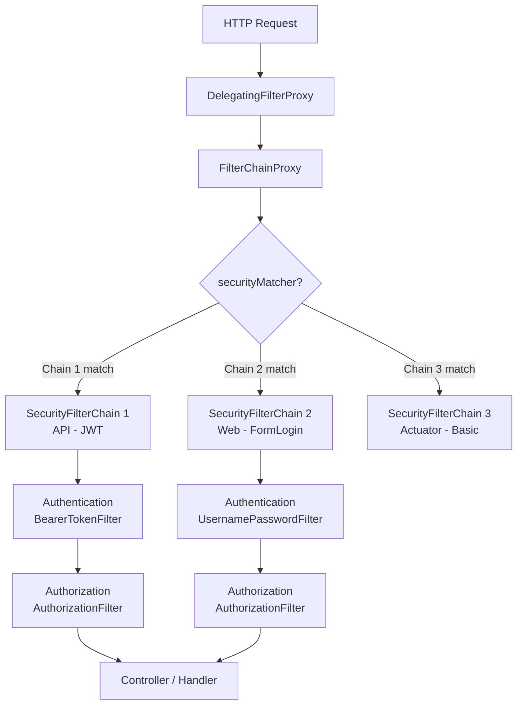
```mermaid
flowchart TD
    REQ[HTTP Request] --> DFP[DelegatingFilterProxy]
    DFP --> FSB[FilterChainProxy]
    FSB --> MATCH{securityMatcher?}
    MATCH -->|Chain 1 match| SFC1[SecurityFilterChain 1\nAPI - JWT]
    MATCH -->|Chain 2 match| SFC2[SecurityFilterChain 2\nWeb - FormLogin]
    MATCH -->|Chain 3 match| SFC3[SecurityFilterChain 3\nActuator - Basic]

    SFC1 --> AUTH1[Authentication\nBearerTokenFilter]
    AUTH1 --> AUTHZ1[Authorization\nAuthorizationFilter]
    AUTHZ1 --> CTRL[Controller / Handler]

    SFC2 --> AUTH2[Authentication\nUsernamePasswordFilter]
    AUTH2 --> AUTHZ2[Authorization\nAuthorizationFilter]
    AUTHZ2 --> CTRL
```

### 1.2 Filtros na Ordem de Execução

```
SecurityFilterChain (ordem de execução)
├── DisableEncodeUrlFilter              ← Remove jsessionid da URL
├── WebAsyncManagerIntegrationFilter    ← Propaga SecurityContext para threads async
├── SecurityContextHolderFilter         ← Carrega/salva SecurityContext
├── HeaderWriterFilter                  ← Escreve headers de segurança (HSTS, X-Frame, etc.)
├── CorsFilter                          ← Trata preflight e headers CORS
├── CsrfFilter                          ← Valida token CSRF
├── LogoutFilter                        ← Processa logout
├── OAuth2AuthorizationRequestRedirectFilter  ← Redireciona para IdP
├── OAuth2LoginAuthenticationFilter     ← Processa callback do IdP
├── UsernamePasswordAuthenticationFilter     ← Form Login
├── BearerTokenAuthenticationFilter     ← JWT Bearer
├── BasicAuthenticationFilter           ← HTTP Basic
├── RequestCacheAwareFilter             ← Restaura request original pós-login
├── SecurityContextHolderAwareRequestFilter  ← Adapta HttpServletRequest
├── AnonymousAuthenticationFilter       ← Insere usuário anônimo
├── SessionManagementFilter             ← Gerencia sessão/concorrência
├── ExceptionTranslationFilter          ← Converte exceções em 401/403
└── AuthorizationFilter                 ← Avalia regras de autorização
```

### 1.3 Modelo de Objetos

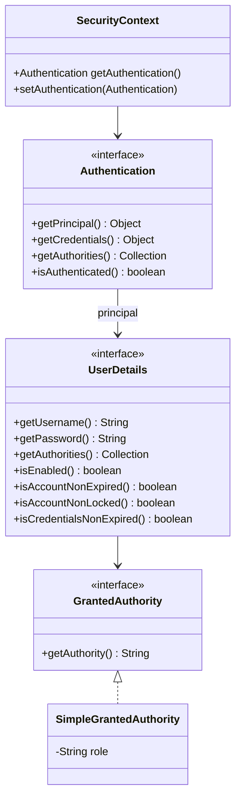
```mermaid
classDiagram
    class SecurityContext {
        +Authentication getAuthentication()
        +setAuthentication(Authentication)
    }

    class Authentication {
        <<interface>>
        +getPrincipal() Object
        +getCredentials() Object
        +getAuthorities() Collection
        +isAuthenticated() boolean
    }

    class UserDetails {
        <<interface>>
        +getUsername() String
        +getPassword() String
        +getAuthorities() Collection
        +isEnabled() boolean
        +isAccountNonExpired() boolean
        +isAccountNonLocked() boolean
        +isCredentialsNonExpired() boolean
    }

    class GrantedAuthority {
        <<interface>>
        +getAuthority() String
    }

    class SimpleGrantedAuthority {
        -String role
    }

    SecurityContext --> Authentication
    Authentication --> UserDetails : principal
    UserDetails --> GrantedAuthority
    GrantedAuthority <|.. SimpleGrantedAuthority
```

---

## 2. Dependências Maven

```xml
<!-- Spring Security Core (incluso em spring-boot-starter-web) -->
<dependency>
    <groupId>org.springframework.boot</groupId>
    <artifactId>spring-boot-starter-security</artifactId>
</dependency>

<!-- OAuth2 Resource Server (JWT Bearer) -->
<dependency>
    <groupId>org.springframework.boot</groupId>
    <artifactId>spring-boot-starter-oauth2-resource-server</artifactId>
</dependency>

<!-- OAuth2 Client (Login Social / Keycloak) -->
<dependency>
    <groupId>org.springframework.boot</groupId>
    <artifactId>spring-boot-starter-oauth2-client</artifactId>
</dependency>

<!-- Nimbus JOSE+JWT — geração e validação manual de JWT -->
<!-- NOTA: já incluso transitivamente pelo oauth2-resource-server -->
<dependency>
    <groupId>com.nimbusds</groupId>
    <artifactId>nimbus-jose-jwt</artifactId>
    <!-- Versão gerenciada pelo Spring Boot BOM -->
</dependency>

<!-- Thymeleaf + Spring Security (extras de template) -->
<dependency>
    <groupId>org.thymeleaf.extras</groupId>
    <artifactId>thymeleaf-extras-springsecurity6</artifactId>
</dependency>

<!-- Testes de Segurança -->
<dependency>
    <groupId>org.springframework.security</groupId>
    <artifactId>spring-security-test</artifactId>
    <scope>test</scope>
</dependency>
```

> **Atenção:** Nunca declare a versão do `nimbus-jose-jwt` manualmente quando usar o BOM do Spring Boot. Conflitos de versão causam erros sutis no parser JWT.

---

## 3. SecurityConfig — Configuração Básica

### 3.1 `@EnableWebSecurity` — Esclarecimento Importante

Há uma confusão frequente por analogia com `@EnableWebMvc`: acredita-se que `@EnableWebSecurity` desabilita a auto-configuração padrão do `spring-boot-starter-security`, assim como `@EnableWebMvc` desabilita a auto-configuração MVC. **Isso não é verdade.**

#### O que a anotação realmente faz

`@EnableWebSecurity` é uma meta-annotation que importa infraestrutura interna do Spring Security. No Spring Boot 3.x, **essa infraestrutura já é aplicada internamente pela auto-configuração**, portanto declarar a anotação na sua `SecurityConfig` é um **no-op** — não adiciona nem remove comportamento.

```java
// O que @EnableWebSecurity importa internamente:
@Import({ WebSecurityConfiguration.class,
          HttpSecurityConfiguration.class,
          SpringWebMvcImportSelector.class,
          OAuth2ImportSelector.class })
@EnableGlobalAuthentication
public @interface EnableWebSecurity { ... }
// ↑ O Spring Boot já aplica tudo isso via auto-configuration
```

#### O que de fato controla o back-off da auto-configuração

O mecanismo real são as anotações `@ConditionalOnMissingBean` presentes nas classes de auto-configuração. O back-off ocorre pela **presença dos seus próprios beans**, não pela presença de `@EnableWebSecurity`.

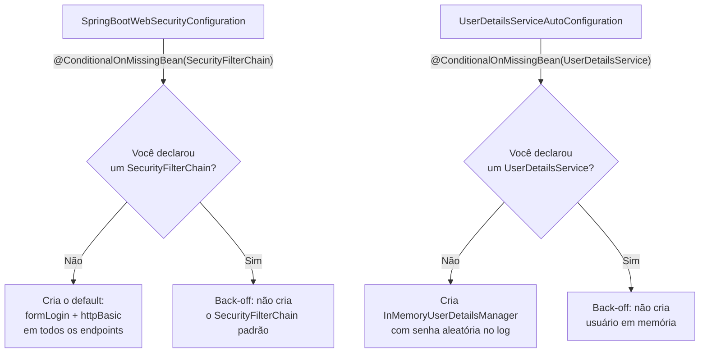
```mermaid
flowchart TD
    SBA[SpringBootWebSecurityConfiguration] -->|"@ConditionalOnMissingBean(SecurityFilterChain)"| CHECK{Você declarou\num SecurityFilterChain?}
    CHECK -->|Não| DEFAULT["Cria o default:\nformLogin + httpBasic\nem todos os endpoints"]
    CHECK -->|Sim| BACKOFF[Back-off: não cria\no SecurityFilterChain padrão]

    UDSA[UserDetailsServiceAutoConfiguration] -->|"@ConditionalOnMissingBean(UserDetailsService)"| CHECK2{Você declarou\num UserDetailsService?}
    CHECK2 -->|Não| INMEMORY["Cria InMemoryUserDetailsManager\ncom senha aleatória no log"]
    CHECK2 -->|Sim| BACKOFF2[Back-off: não cria\nusuário em memória]
```

O trecho real do Spring Boot que implementa esse comportamento:

```java
// SpringBootWebSecurityConfiguration (código-fonte do Spring Boot)
@ConditionalOnDefaultWebSecurity
@ConditionalOnWebApplication(type = Type.SERVLET)
class SpringBootWebSecurityConfiguration {

    @Bean
    @Order(SecurityProperties.BASIC_AUTH_ORDER)
    @ConditionalOnMissingBean(SecurityFilterChain.class)  // ← back-off aqui
    SecurityFilterChain defaultSecurityFilterChain(HttpSecurity http) throws Exception {
        http.authorizeHttpRequests(requests -> requests.anyRequest().authenticated());
        http.formLogin(withDefaults());
        http.httpBasic(withDefaults());
        return http.build();
    }
}
```

#### Comparação com `@EnableWebMvc`

| | `@EnableWebMvc` | `@EnableWebSecurity` |
|---|---|---|
| **Efeito no Spring Boot** | **Desabilita** toda a auto-configuração MVC | **Não desabilita** a auto-configuração Security |
| **Mecanismo de back-off** | A própria anotação remove a auto-config | Presença do `@Bean SecurityFilterChain` |
| **Redundante no Boot?** | Não — causa dano real | Sim — é no-op |
| **Recomendação** | **Nunca usar** em projetos Spring Boot | Opcional; pode ser mantida por clareza |

#### O que permanece ativo mesmo com sua SecurityConfig

Mesmo declarando seu próprio `SecurityFilterChain`, estes componentes **continuam ativos**:

```
SecurityAutoConfiguration                ← sempre ativa
  ├── AuthenticationEventPublisher       ← continua ativo
  └── DefaultAuthenticationEventPublisher ← continua ativo

SecurityFilterAutoConfiguration          ← sempre ativa
  └── DelegatingFilterProxyRegistrationBean ← continua ativo

UserDetailsServiceAutoConfiguration      ← back-off se você definir UserDetailsService
  └── InMemoryUserDetailsManager         ← criado APENAS se não houver seu UserDetailsService

SpringBootWebSecurityConfiguration       ← back-off se você definir SecurityFilterChain
  └── defaultSecurityFilterChain         ← criado APENAS se não houver seu SecurityFilterChain
```

#### Conclusão prática

```java
@Configuration
@EnableWebSecurity  // ← opcional no Spring Boot 3.x; não desabilita nada
// @EnableMethodSecurity ← este sim adiciona comportamento novo (não estava ativo antes)
public class SecurityConfig {

    // Este bean faz back-off do defaultSecurityFilterChain automático:
    @Bean
    public SecurityFilterChain myChain(HttpSecurity http) throws Exception {
        return http
            .authorizeHttpRequests(auth -> auth.anyRequest().authenticated())
            .build();
    }

    // Este bean faz back-off do InMemoryUserDetailsManager automático:
    @Bean
    public UserDetailsService userDetailsService() {
        return new AppUserDetailsService(...);
    }
}
```

`@EnableWebSecurity` pode ser mantida por clareza de intenção ou simplesmente omitida. O comportamento é idêntico nos dois casos.

---

### 3.2 Estrutura Mínima

```java
@Configuration
@EnableWebSecurity
@EnableMethodSecurity(prePostEnabled = true)  // Habilita @PreAuthorize, @PostAuthorize
public class SecurityConfig {

    /**
     * Bean obrigatório — encoder de senhas com BCrypt force 12.
     * Nunca use MD5, SHA-1 ou armazenamento em plain text.
     */
    @Bean
    public PasswordEncoder passwordEncoder() {
        return new BCryptPasswordEncoder(12);
    }

    /**
     * AuthenticationManager exposto como Bean para uso em serviços de autenticação.
     */
    @Bean
    public AuthenticationManager authenticationManager(
            AuthenticationConfiguration config) throws Exception {
        return config.getAuthenticationManager();
    }
}
```

### 3.3 SecurityFilterChain para API REST (Stateless)

```java
@Bean
@Order(1)
public SecurityFilterChain apiSecurityFilterChain(
        HttpSecurity http,
        JwtAuthenticationFilter jwtFilter) throws Exception {

    return http
        .securityMatcher("/api/**")
        // APIs REST são stateless — sem sessão HTTP
        .sessionManagement(session ->
            session.sessionCreationPolicy(SessionCreationPolicy.STATELESS))
        // APIs REST não precisam de CSRF (tokens Bearer são imunes a CSRF)
        .csrf(csrf -> csrf.disable())
        // Headers de segurança padrão (HSTS, X-Content-Type, etc.)
        .headers(headers -> headers
            .frameOptions(frame -> frame.deny())
            .contentTypeOptions(Customizer.withDefaults())
            .httpStrictTransportSecurity(hsts -> hsts
                .includeSubDomains(true)
                .maxAgeInSeconds(31536000)))
        // Tratamento de erros de autenticação/autorização
        .exceptionHandling(ex -> ex
            .authenticationEntryPoint(new HttpStatusEntryPoint(HttpStatus.UNAUTHORIZED))
            .accessDeniedHandler((req, res, e) ->
                res.sendError(HttpServletResponse.SC_FORBIDDEN, "Acesso negado")))
        // Regras de autorização por rota
        .authorizeHttpRequests(auth -> auth
            .requestMatchers(HttpMethod.POST, "/api/v1/auth/**").permitAll()
            .requestMatchers(HttpMethod.GET, "/api/v1/public/**").permitAll()
            .requestMatchers("/api/v1/admin/**").hasRole("ADMIN")
            .requestMatchers("/api/v1/users/**").hasAnyRole("USER", "ADMIN")
            .anyRequest().authenticated())
        // Filtro JWT antes do UsernamePasswordAuthenticationFilter
        .addFilterBefore(jwtFilter, UsernamePasswordAuthenticationFilter.class)
        .build();
}
```


### 3.4 SecurityConfig para Início de Desenvolvimento (Acesso Total)

Durante as primeiras etapas do desenvolvimento — antes de definir as regras de autenticação e autorização da aplicação — é útil ter uma configuração que desabilite completamente a segurança, permitindo que toda requisição seja processada sem credenciais. Isso evita que a tela de login padrão do Spring Security interrompa os primeiros testes de endpoints.

```java
/**
 * SecurityConfig de desenvolvimento — acesso irrestrito a todos os endpoints.
 *
 * Use apenas no início do projeto, enquanto as regras de autenticação
 * e autorização ainda não foram definidas. Substitua esta classe pela
 * SecurityConfig real antes de evoluir o projeto.
 *
 * Substitui qualquer outra SecurityFilterChain graças ao @Order(Ordered.HIGHEST_PRECEDENCE).
 */
@Configuration
@Slf4j
public class DevOpenSecurityConfig {

    @PostConstruct
    public void warn() {
        log.warn("╔═══════════════════════════════════════════════════════════════════╗");
        log.warn("║  ⚠  SEGURANÇA DESABILITADA — CONFIGURAÇÃO PROVISÓRIA DE DEV      ║");
        log.warn("║  Todos os endpoints estão acessíveis sem autenticação.            ║");
        log.warn("║  TODO: Substituir DevOpenSecurityConfig pela SecurityConfig real  ║");
        log.warn("║        antes de evoluir o projeto ou realizar qualquer deploy.    ║");
        log.warn("╚═══════════════════════════════════════════════════════════════════╝");
    }

    @Bean
    @Order(Ordered.HIGHEST_PRECEDENCE)
    public SecurityFilterChain devOpenSecurityFilterChain(HttpSecurity http)
            throws Exception {

        return http
            // Permite todas as requisições sem autenticação
            .authorizeHttpRequests(auth -> auth
                .anyRequest().permitAll())

            // Desabilita CSRF — sem sessão, sem token necessário
            .csrf(csrf -> csrf.disable())

            // Desabilita Basic e form login (sem prompt de credenciais)
            .httpBasic(AbstractHttpConfigurer::disable)
            .formLogin(AbstractHttpConfigurer::disable)

            // Desabilita logout (sem sessão a encerrar)
            .logout(AbstractHttpConfigurer::disable)

            // Stateless — sem criação de sessão HTTP
            .sessionManagement(s ->
                s.sessionCreationPolicy(SessionCreationPolicy.STATELESS))

            // Headers relaxados: permite H2 console em iframe, sem HSTS
            .headers(headers -> headers
                .frameOptions(frame -> frame.disable())
                .httpStrictTransportSecurity(hsts -> hsts.disable()))

            .build();
    }

    /**
     * UserDetailsService mínimo — suprime a geração de senha aleatória
     * no log ("Using generated security password: ...") que o Spring Boot
     * exibiria mesmo com segurança desabilitada.
     */
    @Bean
    public UserDetailsService noopUserDetailsService() {
        return username -> User.withUsername(username)
            .password("{noop}dev")
            .roles("ADMIN", "USER")
            .build();
    }
}
```

#### Por que `@Order(Ordered.HIGHEST_PRECEDENCE)` é necessário

Sem `@Order`, o Spring Security aplica a chain com maior especificidade primeiro. Se existir outra `SecurityFilterChain` no projeto (ex.: a chain de JWT ou form login), ela pode ser processada antes desta, reativando a autenticação. `Ordered.HIGHEST_PRECEDENCE` garante que esta chain seja **sempre a primeira** a processar qualquer requisição.

#### Variantes comuns

```java
// Variante 1 — habilitar H2 Console em iframe (mesmo domínio)
.headers(headers -> headers
    .frameOptions(frame -> frame.sameOrigin()))

// Variante 2 — usuário anônimo nomeado para facilitar rastreamento em logs
// SecurityContextHolder.getContext().getAuthentication().getName() = "dev-user"
.anonymous(anon -> anon
    .principal("dev-user")
    .authorities("ROLE_ANONYMOUS"))
```

#### Verificação rápida

```bash
# Confirmar que o acesso aberto está ativo:
curl -i http://localhost:8080/api/v1/qualquer-endpoint
# Esperado: 200 OK — sem 401 ou redirecionamento para /login
```


---

## 4. Múltiplas SecurityFilterChains no Mesmo Projeto

Projetos que expõem tanto uma API REST quanto páginas web precisam de configurações de segurança diferentes para cada grupo de rotas.

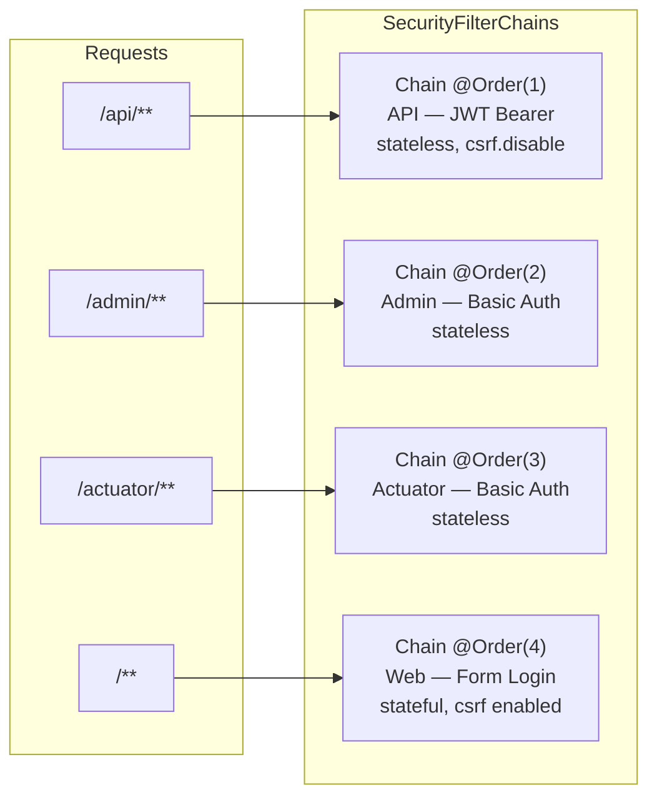
```mermaid
flowchart LR
    subgraph Requests
        A["/api/**"] 
        B["/admin/**"]
        C["/actuator/**"]
        D["/**"]
    end

    subgraph SecurityFilterChains
        SFC1["Chain @Order(1)\nAPI — JWT Bearer\nstateless, csrf.disable"]
        SFC2["Chain @Order(2)\nAdmin — Basic Auth\nstateless"]
        SFC3["Chain @Order(3)\nActuator — Basic Auth\nstateless"]
        SFC4["Chain @Order(4)\nWeb — Form Login\nstateful, csrf enabled"]
    end

    A --> SFC1
    B --> SFC2
    C --> SFC3
    D --> SFC4
```

```java
@Configuration
@EnableWebSecurity
@EnableMethodSecurity
public class MultiChainSecurityConfig {

    // =========================================================
    // Chain 1 — API REST com JWT
    // =========================================================
    @Bean
    @Order(1)
    public SecurityFilterChain apiChain(HttpSecurity http,
                                         JwtAuthenticationFilter jwtFilter) throws Exception {
        return http
            .securityMatcher("/api/**")
            .csrf(csrf -> csrf.disable())
            .sessionManagement(s -> s.sessionCreationPolicy(SessionCreationPolicy.STATELESS))
            .exceptionHandling(ex -> ex
                .authenticationEntryPoint(new HttpStatusEntryPoint(HttpStatus.UNAUTHORIZED)))
            .authorizeHttpRequests(auth -> auth
                .requestMatchers("/api/v1/auth/**").permitAll()
                .anyRequest().authenticated())
            .addFilterBefore(jwtFilter, UsernamePasswordAuthenticationFilter.class)
            .build();
    }

    // =========================================================
    // Chain 2 — Painel Administrativo com HTTP Basic
    // =========================================================
    @Bean
    @Order(2)
    public SecurityFilterChain adminChain(HttpSecurity http) throws Exception {
        return http
            .securityMatcher("/admin/**")
            .csrf(csrf -> csrf.disable())
            .sessionManagement(s -> s.sessionCreationPolicy(SessionCreationPolicy.STATELESS))
            .httpBasic(basic -> basic.realmName("Admin Area"))
            .authorizeHttpRequests(auth -> auth
                .anyRequest().hasRole("ADMIN"))
            .build();
    }

    // =========================================================
    // Chain 3 — Actuator com Basic Auth (apenas internamente)
    // =========================================================
    @Bean
    @Order(3)
    public SecurityFilterChain actuatorChain(HttpSecurity http) throws Exception {
        return http
            .securityMatcher("/actuator/**")
            .csrf(csrf -> csrf.disable())
            .sessionManagement(s -> s.sessionCreationPolicy(SessionCreationPolicy.STATELESS))
            .httpBasic(Customizer.withDefaults())
            .authorizeHttpRequests(auth -> auth
                .requestMatchers("/actuator/health", "/actuator/info").permitAll()
                .anyRequest().hasRole("ACTUATOR"))
            .build();
    }

    // =========================================================
    // Chain 4 — Aplicação Web com Form Login (catch-all)
    // =========================================================
    @Bean
    @Order(4)
    public SecurityFilterChain webChain(HttpSecurity http) throws Exception {
        return http
            .securityMatcher("/**")
            .csrf(Customizer.withDefaults())           // CSRF habilitado para web
            .sessionManagement(s -> s
                .sessionCreationPolicy(SessionCreationPolicy.IF_REQUIRED)
                .maximumSessions(1)                    // Apenas 1 sessão por usuário
                .maxSessionsPreventsLogin(false))      // Nova sessão expulsa a anterior
            .formLogin(form -> form
                .loginPage("/login")
                .loginProcessingUrl("/login")
                .defaultSuccessUrl("/dashboard", true)
                .failureUrl("/login?error")
                .permitAll())
            .logout(logout -> logout
                .logoutUrl("/logout")
                .logoutSuccessUrl("/login?logout")
                .invalidateHttpSession(true)
                .deleteCookies("JSESSIONID")
                .permitAll())
            .rememberMe(remember -> remember
                .key("${app.security.remember-me-key}")
                .tokenValiditySeconds(86400 * 30))
            .authorizeHttpRequests(auth -> auth
                .requestMatchers("/", "/login", "/css/**", "/js/**", "/images/**").permitAll()
                .requestMatchers("/admin/**").hasRole("ADMIN")
                .anyRequest().authenticated())
            .build();
    }
}
```

> **Regra crítica de ordem:** O `securityMatcher` define qual cadeia processa cada requisição. A primeira cadeia com matcher correspondente "vence". A cadeia sem `securityMatcher` (ou com `/**`) deve ter o maior `@Order` (número mais alto = menor prioridade).

---

## 5. HTTP Basic Authentication

### 5.1 Configuração

```java
@Bean
@Order(2)
public SecurityFilterChain basicAuthChain(HttpSecurity http) throws Exception {
    return http
        .securityMatcher("/internal/**", "/admin/**")
        .csrf(csrf -> csrf.disable())
        .sessionManagement(s -> s.sessionCreationPolicy(SessionCreationPolicy.STATELESS))
        .httpBasic(basic -> basic
            .realmName("MyApp Internal")
            // EntryPoint customizado para retornar JSON em vez de popup do browser
            .authenticationEntryPoint((request, response, authException) -> {
                response.setContentType("application/json");
                response.setStatus(HttpServletResponse.SC_UNAUTHORIZED);
                response.getWriter().write("""
                    {"error": "Unauthorized", "message": "Credenciais inválidas"}
                    """);
            }))
        .authorizeHttpRequests(auth -> auth
            .anyRequest().hasRole("INTERNAL"))
        .build();
}
```

### 5.2 BasicAuthenticationEntryPoint Customizado

`BasicAuthenticationEntryPoint` é a interface chamada pelo `ExceptionTranslationFilter` quando uma requisição chega sem credenciais (ou com credenciais inválidas) em uma rota protegida por HTTP Basic. O método `commence` é o ponto de entrada que define como o servidor responde ao cliente.

#### Comportamento padrão vs customizado

```
Requisição sem Authorization header
        │
        ▼
ExceptionTranslationFilter detecta AuthenticationException
        │
        ▼
BasicAuthenticationEntryPoint.commence()
        │
        ├── Padrão (BasicAuthenticationEntryPoint nativo)
        │     WWW-Authenticate: Basic realm="Realm"
        │     HTTP 401 Unauthorized
        │     Body: vazio
        │
        └── Customizado (sua implementação)
              WWW-Authenticate: Basic realm="MyApp"
              HTTP 401 Unauthorized
              Content-Type: application/json
              Body: {"error": "unauthorized", "message": "..."}
```

#### Implementação completa

```java
/**
 * EntryPoint customizado para HTTP Basic que retorna respostas JSON
 * em vez do comportamento padrão (body vazio + popup no browser).
 *
 * Implementar AuthenticationEntryPoint diretamente (não estender
 * BasicAuthenticationEntryPoint) dá controle total sobre o response,
 * incluindo body, headers e status code.
 */
@Component
@Slf4j
public class JsonBasicAuthenticationEntryPoint implements AuthenticationEntryPoint {

    private final ObjectMapper objectMapper;

    public JsonBasicAuthenticationEntryPoint(ObjectMapper objectMapper) {
        this.objectMapper = objectMapper;
    }

    /**
     * Chamado pelo ExceptionTranslationFilter quando:
     * - A requisição não contém o header Authorization
     * - O header Authorization está presente mas as credenciais são inválidas
     * - O token Basic está mal formado (base64 inválido, sem ":" separador, etc.)
     *
     * @param request       requisição HTTP original
     * @param response      resposta a ser preenchida
     * @param authException exceção que originou a chamada — carrega o motivo exato
     */
    @Override
    public void commence(HttpServletRequest request,
                         HttpServletResponse response,
                         AuthenticationException authException) throws IOException {

        log.warn("Acesso não autorizado: uri={} ip={} motivo={}",
            request.getRequestURI(),
            getClientIp(request),
            authException.getMessage());

        // ── Header WWW-Authenticate obrigatório pela RFC 7235 ──────────────
        // Sem este header, o browser não sabe que precisa enviar credenciais Basic.
        // O realm identifica o espaço de proteção exibido no popup do browser.
        // Como retornamos JSON, o popup não aparece — mas o header ainda é exigido
        // pela especificação HTTP para respostas 401 em recursos protegidos por Basic.
        response.setHeader(HttpHeaders.WWW_AUTHENTICATE,
            "Basic realm="MyApp Internal", charset="UTF-8"");

        response.setStatus(HttpServletResponse.SC_UNAUTHORIZED);
        response.setContentType(MediaType.APPLICATION_JSON_VALUE);
        response.setCharacterEncoding(StandardCharsets.UTF_8.name());

        // Monta a resposta de erro padronizada (RFC 7807 Problem Details)
        ProblemDetail problem = buildProblemDetail(request, authException);
        response.getWriter().write(objectMapper.writeValueAsString(problem));
    }

    private ProblemDetail buildProblemDetail(HttpServletRequest request,
                                              AuthenticationException ex) {
        ProblemDetail problem = ProblemDetail.forStatus(HttpStatus.UNAUTHORIZED);
        problem.setTitle("Não autorizado");
        problem.setInstance(URI.create(request.getRequestURI()));
        problem.setProperty("timestamp", Instant.now());

        // Mensagem genérica ao cliente — nunca expor detalhes internos
        problem.setDetail(switch (ex) {
            case BadCredentialsException e      -> "Usuário ou senha inválidos.";
            case InsufficientAuthenticationException e
                                                -> "Autenticação necessária.";
            case LockedException e              -> "Conta bloqueada.";
            case DisabledException e            -> "Conta desativada.";
            case CredentialsExpiredException e  -> "Credenciais expiradas.";
            default                             -> "Falha na autenticação.";
        });

        return problem;
    }

    private String getClientIp(HttpServletRequest request) {
        return Optional.ofNullable(request.getHeader("X-Forwarded-For"))
            .map(h -> h.split(",")[0].trim())
            .orElse(request.getRemoteAddr());
    }
}
```

#### Registro na SecurityFilterChain

```java
@Bean
@Order(2)
public SecurityFilterChain basicAuthChain(
        HttpSecurity http,
        JsonBasicAuthenticationEntryPoint entryPoint) throws Exception {

    return http
        .securityMatcher("/internal/**", "/admin/**")
        .csrf(csrf -> csrf.disable())
        .sessionManagement(s -> s.sessionCreationPolicy(SessionCreationPolicy.STATELESS))
        .httpBasic(basic -> basic
            .realmName("MyApp Internal")
            .authenticationEntryPoint(entryPoint))   // ← EntryPoint registrado aqui
        .exceptionHandling(ex -> ex
            // EntryPoint também registrado no ExceptionHandling para cobrir
            // casos onde a exceção é lançada fora do fluxo Basic (ex: token expirado)
            .authenticationEntryPoint(entryPoint))
        .authorizeHttpRequests(auth -> auth
            .anyRequest().hasRole("INTERNAL"))
        .build();
}
```

> **Diferença entre os dois pontos de registro:** `.httpBasic().authenticationEntryPoint()` atua quando `BasicAuthenticationFilter` rejeita as credenciais. `.exceptionHandling().authenticationEntryPoint()` atua quando `ExceptionTranslationFilter` captura uma `AuthenticationException` de qualquer outro ponto da cadeia (ex.: `AuthorizationFilter`). Registrar nos dois locais garante cobertura completa.

---

### 5.3 BasicAuthenticationFilter Customizado

`BasicAuthenticationFilter` é o filtro responsável por extrair o header `Authorization: Basic <base64>`, decodificar as credenciais, delegar ao `AuthenticationManager` e, em caso de sucesso, popular o `SecurityContext`.

#### Fluxo interno do filtro

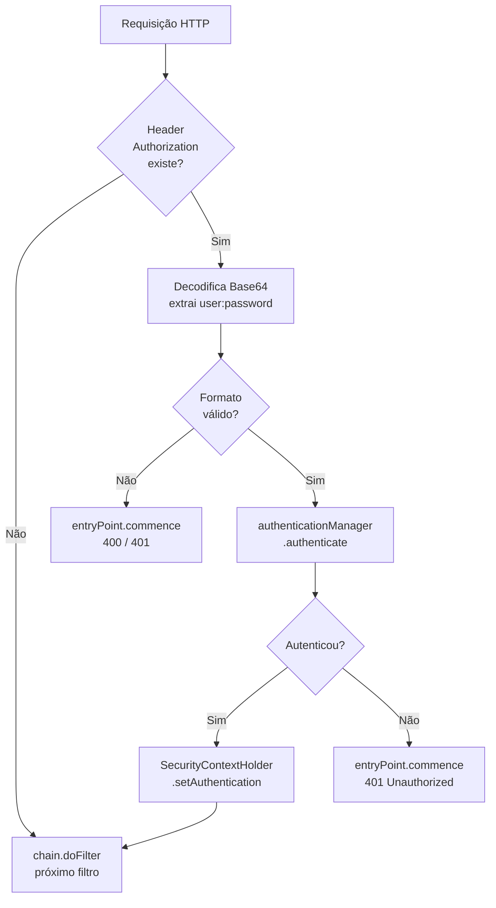
```mermaid
flowchart TD
    REQ[Requisição HTTP] --> CHK{Header
Authorization
existe?}
    CHK -->|Não| NEXT[chain.doFilter
próximo filtro]
    CHK -->|Sim| DEC[Decodifica Base64
extrai user:password]
    DEC --> MALFORMED{Formato
válido?}
    MALFORMED -->|Não| EP1[entryPoint.commence
400 / 401]
    MALFORMED -->|Sim| AUTH[authenticationManager
.authenticate]
    AUTH --> OK{Autenticou?}
    OK -->|Sim| CTX[SecurityContextHolder
.setAuthentication]
    CTX --> NEXT
    OK -->|Não| EP2[entryPoint.commence
401 Unauthorized]
```

#### Implementação de um BasicAuthenticationFilter customizado

A necessidade mais comum de estender `BasicAuthenticationFilter` é adicionar comportamentos transversais: logging de auditoria, extração de claims adicionais do principal, ou suporte a múltiplos formatos de credencial além do `user:password` padrão.

```java
/**
 * Extensão do BasicAuthenticationFilter com:
 * - Log de auditoria em cada tentativa de autenticação
 * - Extração de um header customizado de tenant para autenticações M2M
 * - Rate limiting por IP antes de delegar ao AuthenticationManager
 */
@Slf4j
public class AuditingBasicAuthenticationFilter extends BasicAuthenticationFilter {

    private final AuditLogService auditLog;
    private final Cache<String, AtomicInteger> failureCache;  // Caffeine

    public AuditingBasicAuthenticationFilter(
            AuthenticationManager authenticationManager,
            AuthenticationEntryPoint entryPoint,
            AuditLogService auditLog,
            Cache<String, AtomicInteger> failureCache) {

        super(authenticationManager, entryPoint);
        this.auditLog    = auditLog;
        this.failureCache = failureCache;
    }

    /**
     * Ponto de extensão principal.
     * Chamado uma vez por requisição (OncePerRequestFilter sob o capô).
     */
    @Override
    protected void doFilterInternal(HttpServletRequest request,
                                    HttpServletResponse response,
                                    FilterChain chain)
            throws IOException, ServletException {

        String authHeader = request.getHeader(HttpHeaders.AUTHORIZATION);

        // Sem header Basic — deixa a cadeia seguir (pode ter outro mecanismo de auth)
        if (authHeader == null || !authHeader.startsWith("Basic ")) {
            chain.doFilter(request, response);
            return;
        }

        // Rate limiting por IP antes de processar credenciais
        String clientIp = resolveClientIp(request);
        if (isRateLimited(clientIp)) {
            log.warn("Rate limit Basic Auth atingido: ip={}", clientIp);
            response.setStatus(HttpStatus.TOO_MANY_REQUESTS.value());
            response.setContentType(MediaType.APPLICATION_JSON_VALUE);
            response.getWriter().write(
                "{"error":"too_many_requests"," +
                ""message":"Muitas tentativas. Aguarde alguns minutos."}");
            return;
        }

        // Delega a autenticação ao filtro pai (extração de credenciais + AuthManager)
        // O pai chama onSuccessfulAuthentication / onUnsuccessfulAuthentication
        super.doFilterInternal(request, response, chain);
    }

    /**
     * Chamado pelo filtro pai após autenticação bem-sucedida.
     * SecurityContext já foi populado neste momento.
     */
    @Override
    protected void onSuccessfulAuthentication(HttpServletRequest request,
                                              HttpServletResponse response,
                                              Authentication authResult) {
        String username = authResult.getName();
        String clientIp = resolveClientIp(request);

        // Zera contador de falhas após sucesso
        failureCache.invalidate(clientIp);

        // Adiciona header de diagnóstico (útil em APIs internas)
        response.setHeader("X-Authenticated-User", username);

        // Propaga tenant do header customizado para o SecurityContext
        String tenantId = request.getHeader("X-Tenant-Id");
        if (tenantId != null) {
            TenantContextHolder.setTenantId(tenantId);
        }

        log.info("Basic Auth OK: user={} ip={} uri={}",
            username, clientIp, request.getRequestURI());

        auditLog.recordSuccess(username, clientIp, "BASIC_AUTH",
            request.getRequestURI());
    }

    /**
     * Chamado pelo filtro pai após falha de autenticação.
     * Não lança exceção — o EntryPoint já foi chamado neste ponto.
     */
    @Override
    protected void onUnsuccessfulAuthentication(HttpServletRequest request,
                                                HttpServletResponse response,
                                                AuthenticationException failed) {
        String clientIp = resolveClientIp(request);

        // Incrementa contador de falhas para rate limiting
        AtomicInteger counter = failureCache.get(clientIp,
            k -> new AtomicInteger(0));
        int total = counter.incrementAndGet();

        // Extrai username do header para log (sem expor a senha)
        String username = extractUsernameFromHeader(
            request.getHeader(HttpHeaders.AUTHORIZATION));

        log.warn("Basic Auth FAIL: user={} ip={} tentativas={} motivo={}",
            username, clientIp, total, failed.getClass().getSimpleName());

        auditLog.recordFailure(username, clientIp, "BASIC_AUTH",
            failed.getMessage());
    }

    // ── Utilitários ───────────────────────────────────────────────────────

    private boolean isRateLimited(String ip) {
        AtomicInteger counter = failureCache.getIfPresent(ip);
        return counter != null && counter.get() >= 5;
    }

    private String resolveClientIp(HttpServletRequest request) {
        return Optional.ofNullable(request.getHeader("X-Forwarded-For"))
            .map(h -> h.split(",")[0].trim())
            .orElse(request.getRemoteAddr());
    }

    /**
     * Extrai apenas o username do header Basic para fins de log.
     * Nunca registra a senha.
     */
    private String extractUsernameFromHeader(String authHeader) {
        if (authHeader == null || !authHeader.startsWith("Basic ")) return "unknown";
        try {
            String decoded = new String(
                Base64.getDecoder().decode(authHeader.substring(6)),
                StandardCharsets.UTF_8);
            int sep = decoded.indexOf(':');
            return sep > 0 ? decoded.substring(0, sep) : "unknown";
        } catch (IllegalArgumentException e) {
            return "malformed";
        }
    }
}
```

#### Registro do filtro customizado na SecurityFilterChain

```java
@Configuration
@RequiredArgsConstructor
public class BasicAuthSecurityConfig {

    private final JsonBasicAuthenticationEntryPoint entryPoint;
    private final AuditLogService auditLog;

    @Bean
    @Order(2)
    public SecurityFilterChain basicAuthChain(
            HttpSecurity http,
            AuthenticationManager authManager) throws Exception {

        // Instancia o filtro customizado com suas dependências
        AuditingBasicAuthenticationFilter basicFilter =
            new AuditingBasicAuthenticationFilter(
                authManager,
                entryPoint,
                auditLog,
                loginFailureCache());

        return http
            .securityMatcher("/internal/**", "/admin/**")
            .csrf(csrf -> csrf.disable())
            .sessionManagement(s ->
                s.sessionCreationPolicy(SessionCreationPolicy.STATELESS))
            // Substitui o BasicAuthenticationFilter padrão pelo customizado.
            // addFilterAt coloca o filtro customizado na mesma posição do padrão
            // na cadeia — o filtro padrão não é adicionado automaticamente quando
            // .httpBasic() não é chamado.
            .addFilterAt(basicFilter, BasicAuthenticationFilter.class)
            .exceptionHandling(ex -> ex
                .authenticationEntryPoint(entryPoint))
            .authorizeHttpRequests(auth -> auth
                .anyRequest().hasRole("INTERNAL"))
            .build();
    }

    @Bean
    public AuthenticationManager authenticationManager(
            AuthenticationConfiguration config) throws Exception {
        return config.getAuthenticationManager();
    }

    @Bean
    public Cache<String, AtomicInteger> loginFailureCache() {
        return Caffeine.newBuilder()
            .expireAfterWrite(15, TimeUnit.MINUTES)
            .maximumSize(10_000)
            .build();
    }
}
```

> **`addFilterAt` vs `addFilterBefore`/`addFilterAfter`:** `addFilterAt` posiciona o filtro customizado exatamente onde `BasicAuthenticationFilter` estaria na cadeia padrão, sem duplicá-lo. Se `.httpBasic()` fosse chamado junto, haveria dois filtros Basic na cadeia — o padrão e o customizado. Ao usar `addFilterAt` sem `.httpBasic()`, apenas o customizado é registrado.


### 5.4 UserDetailsService com Banco de Dados

```java
@Service
@RequiredArgsConstructor
public class AppUserDetailsService implements UserDetailsService {

    private final UserRepository userRepository;

    @Override
    @Transactional(readOnly = true)
    public UserDetails loadUserByUsername(String username)
            throws UsernameNotFoundException {

        return userRepository.findByUsernameIgnoreCase(username)
            .map(this::toUserDetails)
            .orElseThrow(() -> new UsernameNotFoundException(
                "Usuário não encontrado: " + username));
    }

    private UserDetails toUserDetails(UserEntity user) {
        List<GrantedAuthority> authorities = user.getRoles().stream()
            .map(role -> new SimpleGrantedAuthority("ROLE_" + role.name()))
            .collect(Collectors.toList());

        // Adiciona permissões granulares além de roles
        user.getPermissions().stream()
            .map(p -> new SimpleGrantedAuthority(p.name()))
            .forEach(authorities::add);

        return User.builder()
            .username(user.getUsername())
            .password(user.getPasswordHash())
            .authorities(authorities)
            .accountExpired(!user.isAccountNonExpired())
            .accountLocked(!user.isAccountNonLocked())
            .credentialsExpired(!user.isCredentialsNonExpired())
            .disabled(!user.isEnabled())
            .build();
    }
}
```

---

## 6. Form Login

### 6.1 SecurityFilterChain Completa

```java
@Bean
public SecurityFilterChain formLoginChain(HttpSecurity http) throws Exception {
    return http
        .csrf(csrf -> csrf
            // CSRF habilitado — proteção contra ataques cross-site
            .csrfTokenRepository(CookieCsrfTokenRepository.withHttpOnlyFalse())
            // SPA que lê o cookie XSRF-TOKEN precisa de httpOnly=false
        )
        .sessionManagement(session -> session
            .sessionCreationPolicy(SessionCreationPolicy.IF_REQUIRED)
            .sessionFixation(SessionManagementConfigurer.SessionFixationConfigurer::newSession)
            .maximumSessions(1)
            .maxSessionsPreventsLogin(false)
            .expiredUrl("/login?expired"))
        .formLogin(form -> form
            .loginPage("/login")                    // Página de login customizada
            .loginProcessingUrl("/login")           // POST que processa credenciais
            .usernameParameter("username")
            .passwordParameter("password")
            .defaultSuccessUrl("/dashboard", true)
            .failureUrl("/login?error=true")
            .successHandler(customAuthSuccessHandler())
            .failureHandler(customAuthFailureHandler())
            .permitAll())
        .logout(logout -> logout
            .logoutUrl("/logout")
            .logoutSuccessUrl("/login?logout")
            .logoutSuccessHandler(customLogoutSuccessHandler())
            .invalidateHttpSession(true)
            .clearAuthentication(true)
            .deleteCookies("JSESSIONID", "XSRF-TOKEN")
            .permitAll())
        .exceptionHandling(ex -> ex
            .accessDeniedPage("/403"))
        .authorizeHttpRequests(auth -> auth
            .requestMatchers("/login", "/register", "/forgot-password").permitAll()
            .requestMatchers("/css/**", "/js/**", "/images/**", "/fonts/**").permitAll()
            .requestMatchers("/admin/**").hasRole("ADMIN")
            .anyRequest().authenticated())
        .build();
}
```

### 6.2 Handlers Customizados

```java
@Component
public class CustomAuthSuccessHandler implements AuthenticationSuccessHandler {

    private final AuditLogService auditLog;
    private final RedirectStrategy redirectStrategy = new DefaultRedirectStrategy();

    @Override
    public void onAuthenticationSuccess(HttpServletRequest request,
                                        HttpServletResponse response,
                                        Authentication authentication) throws IOException {

        auditLog.logLogin(authentication.getName(), request.getRemoteAddr());

        // Redireciona para URL salva antes do login, ou para o dashboard
        String targetUrl = determineTargetUrl(request, authentication);
        redirectStrategy.sendRedirect(request, response, targetUrl);
    }

    private String determineTargetUrl(HttpServletRequest request, Authentication auth) {
        // Redireciona admin para painel admin
        if (auth.getAuthorities().stream()
                .anyMatch(a -> a.getAuthority().equals("ROLE_ADMIN"))) {
            return "/admin/dashboard";
        }
        // Verifica URL salva pelo RequestCache
        SavedRequest savedRequest = new HttpSessionRequestCache()
            .getRequest(request, null);
        if (savedRequest != null) {
            return savedRequest.getRedirectUrl();
        }
        return "/dashboard";
    }
}

@Component
public class CustomAuthFailureHandler implements AuthenticationFailureHandler {

    private final AuditLogService auditLog;

    @Override
    public void onAuthenticationFailure(HttpServletRequest request,
                                        HttpServletResponse response,
                                        AuthenticationException exception) throws IOException {
        auditLog.logFailedLogin(request.getParameter("username"), request.getRemoteAddr());
        response.sendRedirect("/login?error=" + encodeErrorMessage(exception));
    }

    private String encodeErrorMessage(AuthenticationException ex) {
        return switch (ex) {
            case BadCredentialsException e      -> "invalid_credentials";
            case LockedException e              -> "account_locked";
            case DisabledException e            -> "account_disabled";
            case CredentialsExpiredException e  -> "password_expired";
            default                             -> "unknown";
        };
    }
}
```

### 6.3 Template Thymeleaf com CSRF

```html
<!DOCTYPE html>
<html xmlns:th="http://www.thymeleaf.org"
      xmlns:sec="http://www.thymeleaf.org/extras/spring-security">
<head>
    <title>Login</title>
</head>
<body>
<form th:action="@{/login}" method="post">
    <!-- Token CSRF inserido automaticamente pelo Thymeleaf + Spring Security -->
    <input type="hidden" th:name="${_csrf.parameterName}" th:value="${_csrf.token}"/>

    <div th:if="${param.error}" class="alert alert-danger">
        Usuário ou senha inválidos.
    </div>
    <div th:if="${param.logout}" class="alert alert-info">
        Você foi desconectado com sucesso.
    </div>

    <input type="text"     name="username" placeholder="Usuário" required/>
    <input type="password" name="password" placeholder="Senha"   required/>
    <button type="submit">Entrar</button>
</form>

<!-- Exibição condicional por role -->
<div sec:authorize="hasRole('ADMIN')">
    <a th:href="@{/admin/dashboard}">Painel Admin</a>
</div>
<div sec:authorize="isAuthenticated()">
    Bem-vindo, <span sec:authentication="name"></span>!
</div>
</body>
</html>
```

---

## 7. Multi-Factor Authentication, OTP e One-Time Token

### 7.1 Conceitos e Comparativo

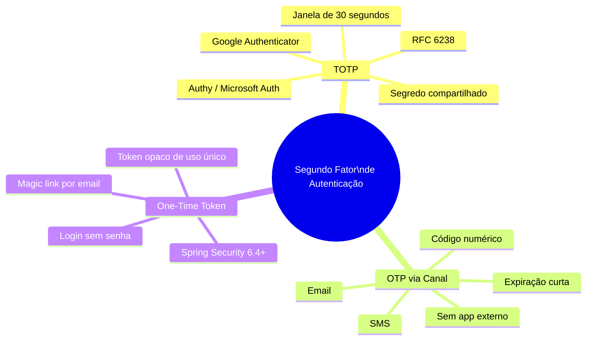
```mermaid
mindmap
  root((Segundo Fator\nde Autenticação))
    TOTP
      RFC 6238
      Google Authenticator
      Authy / Microsoft Auth
      Segredo compartilhado
      Janela de 30 segundos
    OTP via Canal
      Email
      SMS
      Código numérico
      Expiração curta
      Sem app externo
    One-Time Token
      Spring Security 6.4+
      Magic link por email
      Token opaco de uso único
      Login sem senha
```

| Mecanismo | Padrão | Requer App? | Canal externo | Spring Security nativo? |
|-----------|--------|-------------|---------------|------------------------|
| **TOTP** (Google Auth) | RFC 6238 | Sim | Não | Não — biblioteca externa |
| **OTP por email** | — | Não | Email | Parcialmente |
| **OTP por SMS** | — | Não | SMS (Twilio) | Não |
| **One-Time Token** | — | Não | Email | **Sim — Spring Security 6.4+** |

> **Distinção chave:** OTP (One-Time Password) é um código numérico de uso único gerado por algoritmo (TOTP/HOTP). OTT (One-Time Token) é um token opaco gerado pelo servidor — a implementação nativa do Spring Security 6.4 para login por magic link.

---

### 7.2 TOTP — One-Time Password Baseado em Tempo

TOTP (RFC 6238) gera códigos numéricos de 6 dígitos que mudam a cada 30 segundos, derivados de um segredo compartilhado entre o servidor e o app autenticador do usuário.

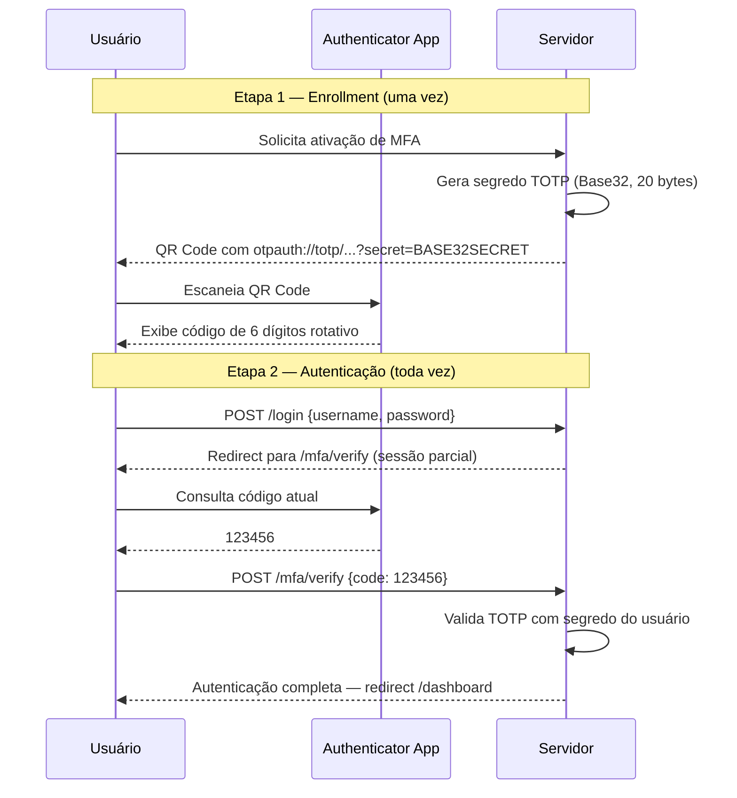
```mermaid
sequenceDiagram
    participant U as Usuário
    participant APP as Authenticator App
    participant S as Servidor

    Note over U,S: Etapa 1 — Enrollment (uma vez)
    U->>S: Solicita ativação de MFA
    S->>S: Gera segredo TOTP (Base32, 20 bytes)
    S-->>U: QR Code com otpauth://totp/...?secret=BASE32SECRET
    U->>APP: Escaneia QR Code
    APP-->>U: Exibe código de 6 dígitos rotativo

    Note over U,S: Etapa 2 — Autenticação (toda vez)
    U->>S: POST /login {username, password}
    S-->>U: Redirect para /mfa/verify (sessão parcial)
    U->>APP: Consulta código atual
    APP-->>U: 123456
    U->>S: POST /mfa/verify {code: 123456}
    S->>S: Valida TOTP com segredo do usuário
    S-->>U: Autenticação completa — redirect /dashboard
```

#### Dependência

```xml
<!-- Biblioteca TOTP — implementa RFC 6238 e RFC 4226 -->
<dependency>
    <groupId>dev.samstevens.totp</groupId>
    <artifactId>totp-spring-boot-starter</artifactId>
    <version>1.7.1</version>
</dependency>
```

#### TotpService — Geração e Validação

```java
@Service
@RequiredArgsConstructor
public class TotpService {

    private final SecretGenerator secretGenerator;
    private final CodeGenerator codeGenerator;
    private final CodeVerifier codeVerifier;
    private final QrDataFactory qrDataFactory;
    private final QrGenerator qrGenerator;

    private static final String APP_NAME = "MyApp";

    /**
     * Gera um novo segredo TOTP para o usuário.
     * Deve ser armazenado criptografado no banco de dados.
     */
    public String generateSecret() {
        return secretGenerator.generate();  // Base32, 160 bits
    }

    /**
     * Gera a URI otpauth:// para exibição como QR Code.
     * O app autenticador (Google Auth, Authy) lê este QR para configurar o TOTP.
     */
    public String generateQrCodeImageUri(String secret, String userEmail) {
        QrData qrData = qrDataFactory.newBuilder()
            .label(userEmail)
            .secret(secret)
            .issuer(APP_NAME)
            .algorithm(HashingAlgorithm.SHA1)  // RFC 6238 padrão
            .digits(6)
            .period(30)                        // 30 segundos por janela
            .build();

        try {
            byte[] imageData = qrGenerator.generate(qrData);
            String mimeType = qrGenerator.getImageMimeType();
            return "data:" + mimeType + ";base64," +
                Base64.getEncoder().encodeToString(imageData);
        } catch (QrGenerationException e) {
            throw new MfaSetupException("Falha ao gerar QR Code", e);
        }
    }

    /**
     * Valida o código TOTP informado pelo usuário.
     * Aceita a janela atual e as adjacentes (±30s) para tolerância de clock skew.
     */
    public boolean validateCode(String secret, String code) {
        try {
            return codeVerifier.isValidCode(secret, code);
        } catch (CodeVerificationException e) {
            return false;
        }
    }

    /**
     * Valida o código e lança exceção se inválido — use em fluxos de autenticação.
     */
    public void validateCodeOrThrow(String secret, String code) {
        if (!validateCode(secret, code)) {
            throw new InvalidMfaCodeException("Código TOTP inválido ou expirado");
        }
    }
}
```

#### Entidade e repositório

```java
@Entity
@Table(name = "user_mfa_config")
@Getter @Setter
public class UserMfaConfig {

    @Id
    @GeneratedValue(strategy = GenerationType.IDENTITY)
    private Long id;

    @OneToOne(fetch = FetchType.LAZY)
    @JoinColumn(name = "user_id", nullable = false, unique = true)
    private UserEntity user;

    @Column(name = "totp_secret", nullable = false)
    @Convert(converter = EncryptedStringConverter.class) // criptografia em repouso
    private String totpSecret;

    @Column(name = "mfa_enabled", nullable = false)
    private boolean mfaEnabled = false;

    @Column(name = "enrolled_at")
    private Instant enrolledAt;

    // Códigos de recuperação (backup codes) — hash BCrypt
    @ElementCollection
    @CollectionTable(name = "user_mfa_backup_codes",
                     joinColumns = @JoinColumn(name = "mfa_config_id"))
    @Column(name = "code_hash")
    private List<String> backupCodeHashes = new ArrayList<>();
}
```

#### MfaController — Enrollment e Verificação

```java
@Controller
@RequestMapping("/mfa")
@RequiredArgsConstructor
public class MfaController {

    private final TotpService totpService;
    private final UserMfaService userMfaService;

    // ── Enrollment ────────────────────────────────────────────

    @GetMapping("/setup")
    @PreAuthorize("isAuthenticated()")
    public String setupMfa(Model model, Authentication auth) {
        String secret = totpService.generateSecret();
        // Armazena temporariamente na sessão — confirmado apenas após validação
        model.addAttribute("secret", secret);
        model.addAttribute("qrCodeUri",
            totpService.generateQrCodeImageUri(secret, auth.getName()));
        return "mfa/setup";
    }

    @PostMapping("/setup/confirm")
    @PreAuthorize("isAuthenticated()")
    public String confirmSetup(@RequestParam String secret,
                               @RequestParam String code,
                               Authentication auth,
                               RedirectAttributes attrs) {
        try {
            totpService.validateCodeOrThrow(secret, code);
            userMfaService.enableMfa(auth.getName(), secret);
            attrs.addFlashAttribute("success", "MFA ativado com sucesso!");
            return "redirect:/dashboard";
        } catch (InvalidMfaCodeException e) {
            attrs.addFlashAttribute("error", "Código inválido. Tente novamente.");
            return "redirect:/mfa/setup";
        }
    }

    // ── Verificação (segundo fator no login) ─────────────────

    @GetMapping("/verify")
    public String verifyMfaPage() {
        return "mfa/verify";
    }

    @PostMapping("/verify")
    public String verifyMfa(@RequestParam String code,
                            HttpSession session,
                            RedirectAttributes attrs) {
        // Recupera usuário da sessão parcial (pré-MFA)
        String username = (String) session.getAttribute("PRE_MFA_USERNAME");
        if (username == null) {
            return "redirect:/login";
        }

        String secret = userMfaService.getTotpSecret(username);
        try {
            totpService.validateCodeOrThrow(secret, code);
            // Promove sessão parcial para totalmente autenticada
            userMfaService.completeAuthentication(username, session);
            session.removeAttribute("PRE_MFA_USERNAME");
            return "redirect:/dashboard";
        } catch (InvalidMfaCodeException e) {
            attrs.addFlashAttribute("error", "Código TOTP inválido.");
            return "redirect:/mfa/verify";
        }
    }
}
```

#### MfaAuthenticationFilter — Intercepta o Segundo Fator

```java
/**
 * Filtro que intercepta logins bem-sucedidos de usuários com MFA habilitado.
 * Em vez de autenticar completamente, cria uma sessão parcial e redireciona
 * para a página de verificação do segundo fator.
 */
@Component
@RequiredArgsConstructor
public class MfaAuthenticationFilter extends UsernamePasswordAuthenticationFilter {

    private final UserMfaService userMfaService;

    @Override
    protected void successfulAuthentication(HttpServletRequest request,
                                            HttpServletResponse response,
                                            FilterChain chain,
                                            Authentication authResult)
            throws IOException, ServletException {

        UserDetails user = (UserDetails) authResult.getPrincipal();

        if (userMfaService.isMfaEnabled(user.getUsername())) {
            // Salva usuário na sessão mas NÃO persiste no SecurityContext ainda
            request.getSession().setAttribute("PRE_MFA_USERNAME", user.getUsername());

            // Limpa qualquer autenticação prévia no contexto
            SecurityContextHolder.clearContext();

            response.sendRedirect("/mfa/verify");
            return;
        }

        // MFA não habilitado — autenticação normal
        super.successfulAuthentication(request, response, chain, authResult);
    }
}
```

#### Template Thymeleaf — Verificação MFA

```html
<!-- mfa/verify.html -->
<form th:action="@{/mfa/verify}" method="post">
    <input type="hidden" th:name="${_csrf.parameterName}" th:value="${_csrf.token}"/>

    <div th:if="${error}" class="alert alert-danger" th:text="${error}"></div>

    <label>Código do autenticador (6 dígitos)</label>
    <input type="text"
           name="code"
           maxlength="6"
           pattern="[0-9]{6}"
           autocomplete="one-time-code"  <!-- hint para autofill do browser -->
           inputmode="numeric"
           autofocus
           required/>

    <button type="submit">Verificar</button>
    <a th:href="@{/mfa/backup}">Usar código de recuperação</a>
</form>
```

#### Compatibilidade com Múltiplos Apps Autenticadores

O QR Code gerado usa o URI scheme `otpauth://totp/` padronizado (RFC 6238), suportado por qualquer app TOTP compatível. A validação do servidor é idêntica independentemente do app — o protocolo é o mesmo.

| App | Algoritmo | Dígitos | Período | Backup na Nuvem | Deep Link |
|-----|-----------|---------|---------|-----------------|-----------|
| **Google Authenticator** | SHA-1 | 6 | 30s | Sim (Google Account) | Não |
| **Microsoft Authenticator** | SHA-1 | 6 | 30s | Sim (Microsoft Account) | Sim (`ms-auth-authenticator://`) |
| **Authy** | SHA-1 | 6/8 | 30s | Sim (Twilio) | Não |
| **1Password** | SHA-1/256/512 | 6/8 | 30s/60s | Sim | Não |

> **Observação de algoritmo:** Embora a biblioteca `dev.samstevens.totp` suporte SHA-256 e SHA-512, **use sempre SHA-1 para TOTP**. Google Authenticator e Microsoft Authenticator na prática suportam apenas SHA-1 em contas de terceiros — os outros algoritmos são aceitos no QR mas ignorados silenciosamente, gerando códigos que falham na validação.

---

#### Microsoft Authenticator — Integração Específica

O Microsoft Authenticator funciona com o mesmo `otpauth://totp/` URI do Google Authenticator, mas tem dois comportamentos distintos que exigem atenção:

**1. Formato do label no URI**

O Microsoft Authenticator é mais rigoroso na interpretação do campo `label`. Para exibição correta do nome da conta na interface do app, o label deve seguir o formato `issuer:account`:

```
otpauth://totp/MyApp:alice@example.com?secret=BASE32SECRET&issuer=MyApp&algorithm=SHA1&digits=6&period=30
```

Se o `issuer` no parâmetro de query não corresponder ao prefixo do label, o Microsoft Authenticator pode exibir o nome da conta de forma incorreta ou mostrar um aviso de configuração inválida.

**2. Deep link para adição direta no mobile**

O Microsoft Authenticator suporta o scheme `ms-auth-authenticator://` para adicionar contas diretamente via link, sem escanear QR Code — útil em fluxos mobile-first onde a câmera para QR pode ser inconveniente.

```
ms-auth-authenticator://authasking?authString=otpauth%3A%2F%2Ftotp%2FMyApp%3Aalice%40example.com%3F...
```

#### TotpService — Suporte a Microsoft Authenticator e Deep Link

```java
@Service
@RequiredArgsConstructor
public class TotpService {

    private final SecretGenerator secretGenerator;
    private final CodeVerifier codeVerifier;
    private final QrDataFactory qrDataFactory;
    private final QrGenerator qrGenerator;

    @Value("${app.mfa.issuer:MyApp}")
    private String issuer;

    // ── Geração de segredo ────────────────────────────────────

    public String generateSecret() {
        return secretGenerator.generate();  // Base32, 160 bits
    }

    // ── Construção do URI otpauth:// ──────────────────────────

    /**
     * Monta o URI otpauth:// compatível com todos os apps autenticadores.
     *
     * Formato do label: "issuer:account" — obrigatório para exibição correta
     * no Microsoft Authenticator. Google Authenticator aceita qualquer formato.
     *
     * @param secret   segredo TOTP em Base32
     * @param account  identificador do usuário (normalmente o e-mail)
     */
    public String buildOtpauthUri(String secret, String account) {
        // Label no formato "issuer:account" — compatível com Google e Microsoft Auth
        String label = issuer + ":" + account;

        return UriComponentsBuilder.newInstance()
            .scheme("otpauth")
            .host("totp")
            .path("/" + UriUtils.encode(label, StandardCharsets.UTF_8))
            .queryParam("secret", secret)
            .queryParam("issuer", issuer)
            .queryParam("algorithm", "SHA1")   // SHA1 é o único suportado na prática
            .queryParam("digits", 6)
            .queryParam("period", 30)
            .build(true)
            .toUriString();
    }

    // ── QR Code para desktop ──────────────────────────────────

    /**
     * Gera o QR Code como Data URI Base64 para exibição em .
     * Compatível com Google Authenticator, Microsoft Authenticator e Authy.
     */
    public String generateQrCodeDataUri(String secret, String account) {
        QrData qrData = qrDataFactory.newBuilder()
            .label(issuer + ":" + account)     // formato "issuer:account"
            .secret(secret)
            .issuer(issuer)
            .algorithm(HashingAlgorithm.SHA1)
            .digits(6)
            .period(30)
            .build();

        try {
            byte[] imageData = qrGenerator.generate(qrData);
            String mimeType  = qrGenerator.getImageMimeType();
            return "data:" + mimeType + ";base64," +
                Base64.getEncoder().encodeToString(imageData);
        } catch (QrGenerationException e) {
            throw new MfaSetupException("Falha ao gerar QR Code", e);
        }
    }

    // ── Deep link para Microsoft Authenticator (mobile) ──────

    /**
     * Gera o deep link ms-auth-authenticator:// para adição direta da conta
     * no Microsoft Authenticator via botão/link, sem necessidade de câmera.
     *
     * Formato: ms-auth-authenticator://authasking?authString=<otpauth_uri_encoded>
     *
     * Fluxo: usuário toca o botão no mobile → sistema operacional abre o
     * Microsoft Authenticator → conta é adicionada automaticamente.
     *
     * Fallback: se o app não estiver instalado, redirecionar para a store.
     */
    public String generateMicrosoftAuthDeepLink(String secret, String account) {
        String otpauthUri = buildOtpauthUri(secret, account);
        String encodedUri = UriUtils.encode(otpauthUri, StandardCharsets.UTF_8);
        return "ms-auth-authenticator://authasking?authString=" + encodedUri;
    }

    /**
     * Retorna todos os dados de enrollment em um único objeto.
     * O controller repassa ao template para exibir QR + deep link + chave manual.
     */
    public MfaEnrollmentData buildEnrollmentData(String secret, String account) {
        return new MfaEnrollmentData(
            secret,
            generateQrCodeDataUri(secret, account),
            buildOtpauthUri(secret, account),
            generateMicrosoftAuthDeepLink(secret, account),
            formatSecretForDisplay(secret)  // blocos de 4 para entrada manual
        );
    }

    // ── Validação ─────────────────────────────────────────────

    public boolean validateCode(String secret, String code) {
        try {
            return codeVerifier.isValidCode(secret, code);
        } catch (CodeVerificationException e) {
            return false;
        }
    }

    public void validateCodeOrThrow(String secret, String code) {
        if (!validateCode(secret, code)) {
            throw new InvalidMfaCodeException("Código TOTP inválido ou expirado");
        }
    }

    // ── Utilitários ───────────────────────────────────────────

    /**
     * Formata o segredo Base32 em blocos de 4 caracteres para entrada manual.
     * Exemplo: "JBSWY3DP" → "JBSW Y3DP"
     */
    private String formatSecretForDisplay(String secret) {
        return String.join(" ",
            secret.replaceAll("(.{4})", "$1 ").trim().split(" "));
    }

    // ── Record de retorno ─────────────────────────────────────

    public record MfaEnrollmentData(
        String secret,
        String qrCodeDataUri,
        String otpauthUri,
        String microsoftAuthDeepLink,
        String secretFormatted        // ex: "JBSW Y3DP XYZW ABCD" para entrada manual
    ) {}
}
```

#### MfaController — Enrollment com Suporte a Microsoft Authenticator

```java
@Controller
@RequestMapping("/mfa")
@RequiredArgsConstructor
public class MfaController {

    private final TotpService totpService;
    private final UserMfaService userMfaService;

    @GetMapping("/setup")
    @PreAuthorize("isAuthenticated()")
    public String setupMfa(Model model, Authentication auth) {
        String secret = totpService.generateSecret();

        // Passa todos os dados de enrollment para o template de uma vez
        TotpService.MfaEnrollmentData enrollment =
            totpService.buildEnrollmentData(secret, auth.getName());

        model.addAttribute("enrollment", enrollment);
        return "mfa/setup";
    }

    @PostMapping("/setup/confirm")
    @PreAuthorize("isAuthenticated()")
    public String confirmSetup(@RequestParam String secret,
                               @RequestParam String code,
                               Authentication auth,
                               RedirectAttributes attrs) {
        try {
            totpService.validateCodeOrThrow(secret, code);
            userMfaService.enableMfa(auth.getName(), secret);
            attrs.addFlashAttribute("success", "Autenticação em dois fatores ativada!");
            return "redirect:/dashboard";
        } catch (InvalidMfaCodeException e) {
            attrs.addFlashAttribute("error", "Código inválido. Tente novamente.");
            return "redirect:/mfa/setup";
        }
    }

    @GetMapping("/verify")
    public String verifyPage() { return "mfa/verify"; }

    @PostMapping("/verify")
    public String verifyMfa(@RequestParam String code,
                            HttpSession session,
                            RedirectAttributes attrs) {
        String username = (String) session.getAttribute("PRE_MFA_USERNAME");
        if (username == null) return "redirect:/login";

        String secret = userMfaService.getTotpSecret(username);
        try {
            totpService.validateCodeOrThrow(secret, code);
            userMfaService.completeAuthentication(username, session);
            session.removeAttribute("PRE_MFA_USERNAME");
            return "redirect:/dashboard";
        } catch (InvalidMfaCodeException e) {
            attrs.addFlashAttribute("error", "Código TOTP inválido.");
            return "redirect:/mfa/verify";
        }
    }
}
```

#### Template Thymeleaf — Setup com QR Code e Deep Link

```html
<!-- mfa/setup.html -->
<!DOCTYPE html>
<html xmlns:th="http://www.thymeleaf.org">
<head><title>Configurar Autenticação em Dois Fatores</title></head>
<body>

<h2>Ativar autenticação em dois fatores (2FA)</h2>

<!-- ── Passo 1: escolha o app ─────────────────────────────── -->
<section>
    <h3>Passo 1 — Escolha seu app autenticador</h3>
    <ul>
        <li><strong>Microsoft Authenticator</strong> — recomendado (backup automático)</li>
        <li>Google Authenticator</li>
        <li>Authy</li>
    </ul>
</section>

<!-- ── Passo 2: adicione a conta ──────────────────────────── -->
<section>
    <h3>Passo 2 — Adicione a conta ao seu app</h3>

    <!-- QR Code — funciona com todos os apps via câmera -->
    <div>
        <p><strong>Escaneie o QR Code com seu app autenticador:</strong></p>
          <!--
             Margem branca obrigatória para leitura confiável pelo scanner -->
    </div>

    <!-- Deep Link — abre o Microsoft Authenticator diretamente no mobile -->
    <div>
        <p><strong>Ou adicione diretamente no Microsoft Authenticator:</strong></p>

        <!--
            O deep link ms-auth-authenticator:// abre o Microsoft Authenticator
            e adiciona a conta automaticamente, sem precisar escanear o QR Code.
            Em desktop (sem o app instalado) o link simplesmente não faz nada —
            por isso o QR Code é sempre exibido como alternativa.
        -->
        <a th:href="${enrollment.microsoftAuthDeepLink}"
           class="btn btn-primary">
            <!-- Ícone do Microsoft Authenticator -->
            Adicionar no Microsoft Authenticator
        </a>

        <!--
            Fallback: link direto para a store caso o app não esteja instalado.
            Detectável via JavaScript: se o deep link não abrir em ~1s, redireciona.
        -->
        <script th:attr="nonce=${_cspNonce}">
            document.querySelector('a[href^="ms-auth"]')?.addEventListener('click', () => {
                setTimeout(() => {
                    const isAndroid = /Android/i.test(navigator.userAgent);
                    const isIOS = /iPhone|iPad/i.test(navigator.userAgent);
                    if (isAndroid) {
                        window.location.href =
                          'https://play.google.com/store/apps/details?id=com.azure.authenticator';
                    } else if (isIOS) {
                        window.location.href =
                          'https://apps.apple.com/app/microsoft-authenticator/id983156458';
                    }
                }, 1500); // aguarda 1,5s para o deep link abrir antes de redirecionar
            });
        </script>
    </div>

    <!-- Entrada manual — alternativa quando a câmera não está disponível -->
    <details>
        <summary>Não consigo escanear o QR Code — inserir manualmente</summary>
        <p>Abra o app, toque em <em>Adicionar conta</em> → <em>Outra conta</em>
           → <em>Inserir código manualmente</em> e preencha:</p>
        <dl>
            <dt>Nome da conta (Issuer)</dt>
            <dd th:text="${enrollment.otpauthUri.split('issuer=')[1]?.split('&')[0]}">MyApp</dd>
            <dt>Chave secreta</dt>
            <!-- Exibe em blocos de 4 para facilitar a digitação -->
            <dd><code th:text="${enrollment.secretFormatted}">JBSW Y3DP XYZW ABCD</code></dd>
        </dl>
        <small>Tipo: baseado em tempo (TOTP) · Dígitos: 6 · Período: 30 segundos</small>
    </details>
</section>

<!-- ── Passo 3: confirme com o código gerado ──────────────── -->
<section>
    <h3>Passo 3 — Confirme o código gerado pelo app</h3>

    <form th:action="@{/mfa/setup/confirm}" method="post">
        <input type="hidden" th:name="${_csrf.parameterName}" th:value="${_csrf.token}"/>
        <!--
            O secret é retornado para o servidor para confirmar o enrollment.
            Em produção, considere armazená-lo temporariamente na sessão do servidor
            em vez de em um campo hidden, para evitar manipulação.
        -->
        <input type="hidden" name="secret" th:value="${enrollment.secret}"/>

        <div th:if="${error}" class="alert alert-danger" th:text="${error}"></div>

        <label>Código de 6 dígitos gerado pelo app</label>
        <input type="text"
               name="code"
               maxlength="6"
               minlength="6"
               pattern="[0-9]{6}"
               autocomplete="one-time-code"
               inputmode="numeric"
               placeholder="000000"
               autofocus
               required/>

        <button type="submit">Confirmar e ativar 2FA</button>
    </form>
</section>

</body>
</html>
```

#### Pontos de Atenção com Microsoft Authenticator

```
┌─────────────────────────────────────────────────────────────────────────┐
│                   Microsoft Authenticator — Resumo Técnico              │
├─────────────────────┬───────────────────────────────────────────────────┤
│ Protocolo TOTP      │ RFC 6238 — idêntico ao Google Authenticator        │
│ URI scheme          │ otpauth://totp/ (padrão de mercado)               │
│ Algoritmo suportado │ SHA-1 (único confiável para contas de terceiros)   │
│ Label recomendado   │ "issuer:account" — obrigatório para nome correto   │
│ Deep link mobile    │ ms-auth-authenticator://authasking?authString=...  │
│ Backup automático   │ Sim — sincronizado via conta Microsoft             │
│ Validação servidor  │ Idêntica — nenhuma mudança no backend necessária   │
└─────────────────────┴───────────────────────────────────────────────────┘
```

> **SHA-1 e segurança:** O uso de SHA-1 no TOTP **não é uma vulnerabilidade**. O SHA-1 é inseguro para assinaturas digitais e colisões, mas no TOTP ele é usado como HMAC (HMAC-SHA1), que permanece seguro para este propósito específico. Todos os apps autenticadores do mercado usam HMAC-SHA1 por padrão.

---

### 7.3 OTP por Email ou SMS

OTP por canal externo (email ou SMS) é alternativa ao TOTP quando não se quer exigir um app autenticador. O servidor gera um código numérico aleatório, envia ao usuário e valida dentro de uma janela de tempo.

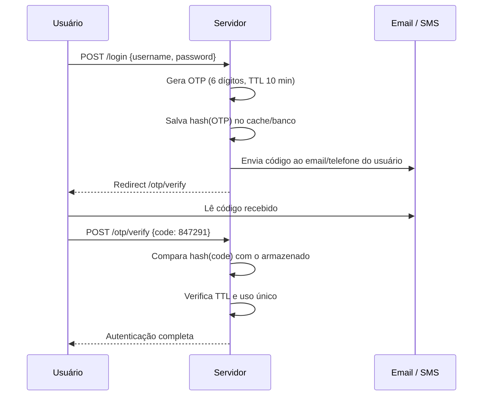
```mermaid
sequenceDiagram
    participant U as Usuário
    participant S as Servidor
    participant E as Email / SMS

    U->>S: POST /login {username, password}
    S->>S: Gera OTP (6 dígitos, TTL 10 min)
    S->>S: Salva hash(OTP) no cache/banco
    S->>E: Envia código ao email/telefone do usuário
    S-->>U: Redirect /otp/verify

    U->>E: Lê código recebido
    U->>S: POST /otp/verify {code: 847291}
    S->>S: Compara hash(code) com o armazenado
    S->>S: Verifica TTL e uso único
    S-->>U: Autenticação completa
```

#### OtpService

```java
@Service
@RequiredArgsConstructor
@Slf4j
public class OtpService {

    private final Cache<String, String> otpCache;      // Caffeine — TTL 10 min
    private final PasswordEncoder passwordEncoder;      // BCrypt para hash do OTP
    private final EmailService emailService;
    private final SmsService smsService;

    private static final int OTP_LENGTH  = 6;
    private static final SecureRandom RANDOM = new SecureRandom();

    /**
     * Gera e envia OTP por email.
     * A chave de cache é prefixada por canal para evitar colisão.
     */
    public void generateAndSendByEmail(String username, String email) {
        String otp = generateOtp();
        // Armazena o hash — nunca o OTP em texto claro no cache
        otpCache.put("email:" + username, passwordEncoder.encode(otp));
        emailService.sendOtp(email, otp);
        log.info("OTP por email gerado para usuário: {}", username);
    }

    public void generateAndSendBySms(String username, String phoneNumber) {
        String otp = generateOtp();
        otpCache.put("sms:" + username, passwordEncoder.encode(otp));
        smsService.sendOtp(phoneNumber, otp);
    }

    /**
     * Valida o OTP informado pelo usuário.
     * Remove do cache após validação bem-sucedida (uso único).
     */
    public boolean validateOtp(String channel, String username, String inputCode) {
        String cacheKey = channel + ":" + username;
        String storedHash = otpCache.getIfPresent(cacheKey);

        if (storedHash == null) {
            log.warn("OTP não encontrado ou expirado para: {}", username);
            return false;
        }

        boolean valid = passwordEncoder.matches(inputCode, storedHash);

        if (valid) {
            otpCache.invalidate(cacheKey);  // uso único — invalida imediatamente
            log.info("OTP válido consumido para: {}", username);
        } else {
            log.warn("OTP inválido informado para: {}", username);
        }

        return valid;
    }

    private String generateOtp() {
        // Gera número entre 0 e 999999 e formata com zeros à esquerda
        int code = RANDOM.nextInt(1_000_000);
        return String.format("%0" + OTP_LENGTH + "d", code);
    }
}

@Configuration
public class OtpCacheConfig {

    @Bean
    public Cache<String, String> otpCache() {
        return Caffeine.newBuilder()
            .expireAfterWrite(10, TimeUnit.MINUTES)  // OTP expira em 10 minutos
            .maximumSize(50_000)
            .build();
    }
}
```

#### OtpController

```java
@Controller
@RequestMapping("/otp")
@RequiredArgsConstructor
public class OtpController {

    private final OtpService otpService;
    private final UserService userService;

    @GetMapping("/verify")
    public String verifyPage() {
        return "otp/verify";
    }

    @PostMapping("/verify")
    public String verifyOtp(@RequestParam String code,
                            @RequestParam(defaultValue = "email") String channel,
                            HttpSession session,
                            RedirectAttributes attrs) {

        String username = (String) session.getAttribute("PRE_OTP_USERNAME");
        if (username == null) return "redirect:/login";

        if (otpService.validateOtp(channel, username, code)) {
            userService.completeAuthentication(username, session);
            session.removeAttribute("PRE_OTP_USERNAME");
            return "redirect:/dashboard";
        }

        attrs.addFlashAttribute("error", "Código inválido ou expirado.");
        return "redirect:/otp/verify";
    }

    @PostMapping("/resend")
    public String resendOtp(HttpSession session, RedirectAttributes attrs) {
        String username = (String) session.getAttribute("PRE_OTP_USERNAME");
        if (username == null) return "redirect:/login";

        String email = userService.getEmail(username);
        otpService.generateAndSendByEmail(username, email);
        attrs.addFlashAttribute("info", "Novo código enviado para seu e-mail.");
        return "redirect:/otp/verify";
    }
}
```

---

### 7.4 One-Time Token (Spring Security 6.4+)

O Spring Security 6.4 (Spring Boot 3.4+) introduziu suporte nativo a **One-Time Token login** — também chamado de **magic link**. O usuário informa apenas o e-mail, recebe um link com um token opaco de uso único, clica e está autenticado — sem senha.

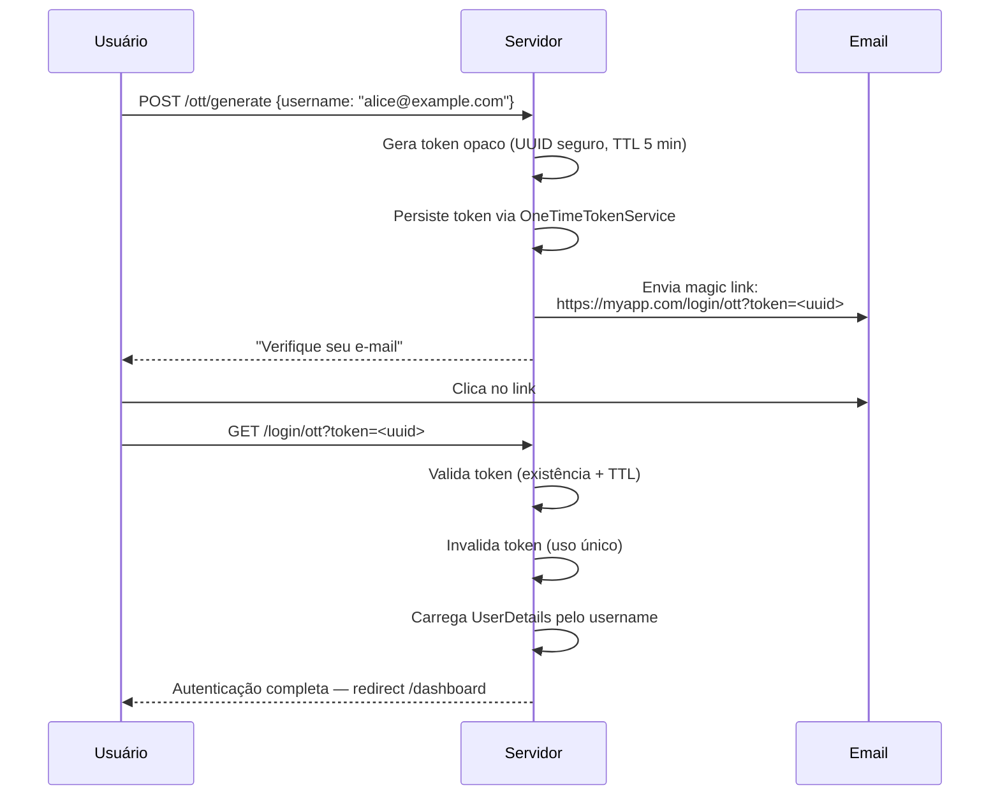
```mermaid
sequenceDiagram
    participant U as Usuário
    participant S as Servidor
    participant E as Email

    U->>S: POST /ott/generate {username: "alice@example.com"}
    S->>S: Gera token opaco (UUID seguro, TTL 5 min)
    S->>S: Persiste token via OneTimeTokenService
    S->>E: Envia magic link:<br/>https://myapp.com/login/ott?token=<uuid>
    S-->>U: "Verifique seu e-mail"

    U->>E: Clica no link
    U->>S: GET /login/ott?token=<uuid>
    S->>S: Valida token (existência + TTL)
    S->>S: Invalida token (uso único)
    S->>S: Carrega UserDetails pelo username
    S-->>U: Autenticação completa — redirect /dashboard
```

#### Dependência

O módulo `spring-boot-starter-security` já inclui o suporte. Nenhuma dependência adicional é necessária a partir do Spring Boot 3.4.

#### Configuração da SecurityFilterChain

```java
@Bean
public SecurityFilterChain ottSecurityChain(HttpSecurity http,
        OneTimeTokenGenerationSuccessHandler ottSuccessHandler) throws Exception {

    return http
        .oneTimeTokenLogin(ott -> ott
            // Handler chamado após geração do token — responsável por enviar o e-mail
            .tokenGenerationSuccessHandler(ottSuccessHandler)
            // URL onde o usuário solicita o magic link (padrão: /ott/generate)
            .generateTokenUrl("/ott/generate")
            // URL de consumo do token no link enviado por email (padrão: /login/ott)
            .loginProcessingUrl("/login/ott")
            // Redireciona para esta URL após autenticação bem-sucedida
            .defaultSuccessUrl("/dashboard", true)
        )
        .authorizeHttpRequests(auth -> auth
            .requestMatchers("/ott/**", "/login").permitAll()
            .anyRequest().authenticated())
        .build();
}
```

#### OneTimeTokenGenerationSuccessHandler — Envio do Magic Link

```java
/**
 * Chamado pelo Spring Security após gerar o token.
 * Responsabilidade: enviar o magic link ao usuário.
 */
@Component
@RequiredArgsConstructor
@Slf4j
public class MagicLinkOneTimeTokenHandler
        implements OneTimeTokenGenerationSuccessHandler {

    private final EmailService emailService;
    private final RedirectStrategy redirectStrategy = new DefaultRedirectStrategy();

    @Override
    public void handle(HttpServletRequest request,
                       HttpServletResponse response,
                       OneTimeToken token) throws IOException {

        // Monta a URL completa do magic link
        String magicLink = UriComponentsBuilder
            .fromHttpUrl(getBaseUrl(request))
            .path("/login/ott")
            .queryParam("token", token.getTokenValue())
            .build()
            .toUriString();

        // Envia e-mail ao usuário
        String username = token.getUsername();
        log.info("Enviando magic link para: {}", username);
        emailService.sendMagicLink(username, magicLink);

        // Redireciona para página de confirmação
        redirectStrategy.sendRedirect(request, response, "/ott/sent");
    }

    private String getBaseUrl(HttpServletRequest request) {
        String scheme = Optional.ofNullable(request.getHeader("X-Forwarded-Proto"))
            .orElse(request.getScheme());
        String host = Optional.ofNullable(request.getHeader("X-Forwarded-Host"))
            .orElse(request.getServerName());
        int port = request.getServerPort();

        if ((scheme.equals("http")  && port == 80) ||
            (scheme.equals("https") && port == 443)) {
            return scheme + "://" + host;
        }
        return scheme + "://" + host + ":" + port;
    }
}
```

#### OneTimeTokenService — Persistência Customizada

O Spring Security fornece `InMemoryOneTimeTokenService` para desenvolvimento. Em produção, implemente `OneTimeTokenService` com banco de dados:

```java
/**
 * Implementação de OneTimeTokenService com persistência em banco de dados.
 * Substitui o InMemoryOneTimeTokenService padrão.
 */
@Service
@RequiredArgsConstructor
@Slf4j
public class PersistentOneTimeTokenService implements OneTimeTokenService {

    private final OneTimeTokenRepository tokenRepository;
    private static final Duration TOKEN_TTL = Duration.ofMinutes(5);

    @Override
    @Transactional
    public OneTimeToken generate(GenerateOneTimeTokenRequest request) {
        // Invalida tokens anteriores do mesmo usuário (evita acúmulo)
        tokenRepository.deleteByUsername(request.getUsername());

        String tokenValue = UUID.randomUUID().toString();
        Instant expiresAt = Instant.now().plus(TOKEN_TTL);

        OneTimeTokenEntity entity = new OneTimeTokenEntity();
        entity.setTokenValue(tokenValue);
        entity.setUsername(request.getUsername());
        entity.setExpiresAt(expiresAt);
        tokenRepository.save(entity);

        log.debug("OTT gerado para usuário: {}, expira em: {}",
            request.getUsername(), expiresAt);

        return new DefaultOneTimeToken(tokenValue, request.getUsername(), expiresAt);
    }

    @Override
    @Transactional
    public OneTimeToken consume(ConsumeOneTimeTokenRequest request) {
        return tokenRepository.findByTokenValue(request.getToken())
            .map(entity -> {
                tokenRepository.delete(entity);  // uso único — remove imediatamente

                if (entity.getExpiresAt().isBefore(Instant.now())) {
                    log.warn("OTT expirado consumido para: {}", entity.getUsername());
                    throw new InvalidOneTimeTokenException("Token expirado");
                }

                log.info("OTT consumido com sucesso para: {}", entity.getUsername());
                return (OneTimeToken) new DefaultOneTimeToken(
                    entity.getTokenValue(),
                    entity.getUsername(),
                    entity.getExpiresAt());
            })
            .orElseThrow(() -> {
                log.warn("OTT não encontrado: {}", request.getToken());
                return new InvalidOneTimeTokenException("Token inválido ou já utilizado");
            });
    }
}
```

#### Entidade JPA e Repositório

```java
@Entity
@Table(name = "one_time_tokens",
       indexes = @Index(name = "idx_ott_token", columnList = "token_value", unique = true))
@Getter @Setter
@NoArgsConstructor
public class OneTimeTokenEntity {

    @Id
    @GeneratedValue(strategy = GenerationType.IDENTITY)
    private Long id;

    @Column(name = "token_value", nullable = false, unique = true, length = 36)
    private String tokenValue;

    @Column(name = "username", nullable = false)
    private String username;

    @Column(name = "expires_at", nullable = false)
    private Instant expiresAt;

    @Column(name = "created_at", nullable = false, updatable = false)
    @CreationTimestamp
    private Instant createdAt;
}

public interface OneTimeTokenRepository extends JpaRepository<OneTimeTokenEntity, Long> {
    Optional<OneTimeTokenEntity> findByTokenValue(String tokenValue);
    void deleteByUsername(String username);

    // Job de limpeza — remove tokens expirados
    @Modifying
    @Query("DELETE FROM OneTimeTokenEntity t WHERE t.expiresAt < :now")
    void deleteExpiredTokens(@Param("now") Instant now);
}
```

#### Registro dos Beans no SecurityConfig

```java
@Configuration
@EnableWebSecurity
public class SecurityConfig {

    /**
     * Registra a implementação persistente em vez do InMemoryOneTimeTokenService.
     * O Spring Security auto-descobre o bean via @Service.
     */
    @Bean
    public OneTimeTokenService oneTimeTokenService(OneTimeTokenRepository repo) {
        return new PersistentOneTimeTokenService(repo);
    }

    @Bean
    public OneTimeTokenGenerationSuccessHandler ottSuccessHandler(EmailService emailService) {
        return new MagicLinkOneTimeTokenHandler(emailService);
    }
}
```

#### Template — Formulário de Solicitação do Magic Link

```html
<!-- ott/request.html -->
<form th:action="@{/ott/generate}" method="post">
    <input type="hidden" th:name="${_csrf.parameterName}" th:value="${_csrf.token}"/>

    <h2>Login sem senha</h2>
    <p>Informe seu e-mail e enviaremos um link de acesso.</p>

    <label>E-mail</label>
    <input type="email"
           name="username"       <!-- O Spring Security usa o campo "username" -->
           placeholder="seu@email.com"
           autocomplete="email"
           required/>

    <button type="submit">Enviar link de acesso</button>
</form>

<!-- ott/sent.html -->
<div class="alert alert-success">
    <h4>Link enviado!</h4>
    <p>Verifique sua caixa de entrada. O link expira em <strong>5 minutos</strong>.</p>
    <small>Não recebeu? Verifique o spam ou
        <a th:href="@{/ott/request}">solicite um novo link</a>.
    </small>
</div>
```

---

### 7.5 Comparativo de Implementação

| Aspecto | TOTP | OTP por Canal | One-Time Token |
|---------|------|---------------|----------------|
| **UX** | Requer app externo | Simples | Mais simples (só e-mail) |
| **Segurança** | Alta (offline, sem canal externo) | Média (depende do canal) | Alta (token opaco + TTL curto) |
| **Implementação** | Biblioteca + filtro customizado | Service + cache + envio | Spring Security nativo 6.4+ |
| **Dependência externa** | App autenticador | SMTP / Twilio | SMTP |
| **Segundo fator?** | Sim (complementa senha) | Sim (complementa senha) | Não (substitui senha) |
| **Backup** | Códigos de recuperação | Reenvio | Novo token |
| **Melhor para** | Alta segurança, usuários técnicos | Usuários não técnicos | Apps sem senha (passwordless) |

---

## 8. JWT com Nimbus JOSE+JWT

### 8.1 Arquitetura do Fluxo JWT

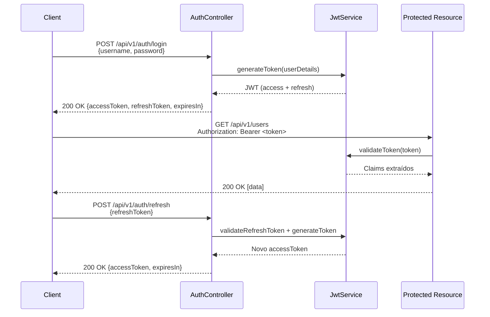
```mermaid
sequenceDiagram
    participant C as Client
    participant A as AuthController
    participant JS as JwtService
    participant PR as Protected Resource

    C->>A: POST /api/v1/auth/login<br/>{username, password}
    A->>JS: generateToken(userDetails)
    JS-->>A: JWT (access + refresh)
    A-->>C: 200 OK {accessToken, refreshToken, expiresIn}

    C->>PR: GET /api/v1/users<br/>Authorization: Bearer <token>
    PR->>JS: validateToken(token)
    JS-->>PR: Claims extraídos
    PR-->>C: 200 OK [data]

    C->>A: POST /api/v1/auth/refresh<br/>{refreshToken}
    A->>JS: validateRefreshToken + generateToken
    JS-->>A: Novo accessToken
    A-->>C: 200 OK {accessToken, expiresIn}
```

### 8.2 JwtService com Nimbus

```java
@Service
@Slf4j
public class JwtService {

    private final RSAKey rsaKey;
    private final JWSAlgorithm algorithm = JWSAlgorithm.RS256;

    // Expiração do access token: 15 minutos
    private static final Duration ACCESS_TOKEN_TTL  = Duration.ofMinutes(15);
    // Expiração do refresh token: 7 dias
    private static final Duration REFRESH_TOKEN_TTL = Duration.ofDays(7);

    public JwtService(@Value("${app.security.jwt.private-key}") RSAPrivateKey privateKey,
                      @Value("${app.security.jwt.public-key}")  RSAPublicKey  publicKey) {
        this.rsaKey = new RSAKey.Builder(publicKey)
            .privateKey(privateKey)
            .keyID(UUID.randomUUID().toString())
            .build();
    }

    /**
     * Gera um access token JWT assinado com RSA-256.
     */
    public String generateAccessToken(UserDetails userDetails) {
        return buildToken(userDetails, ACCESS_TOKEN_TTL, "access");
    }

    /**
     * Gera um refresh token JWT — sem claims de roles.
     */
    public String generateRefreshToken(UserDetails userDetails) {
        return buildToken(userDetails, REFRESH_TOKEN_TTL, "refresh");
    }

    private String buildToken(UserDetails user, Duration ttl, String tokenType) {
        Instant now = Instant.now();

        // Claims padrão (registered claims)
        JWTClaimsSet claims = new JWTClaimsSet.Builder()
            .subject(user.getUsername())
            .issuer("https://myapp.example.com")
            .audience("myapp-api")
            .issueTime(Date.from(now))
            .expirationTime(Date.from(now.plus(ttl)))
            .jwtID(UUID.randomUUID().toString())
            // Claims customizados
            .claim("token_type", tokenType)
            .claim("roles", extractRoles(user))
            .claim("permissions", extractPermissions(user))
            .build();

        try {
            SignedJWT jwt = new SignedJWT(
                new JWSHeader.Builder(algorithm)
                    .keyID(rsaKey.getKeyID())
                    .type(JOSEObjectType.JWT)
                    .build(),
                claims);

            jwt.sign(new RSASSASigner(rsaKey));
            return jwt.serialize();

        } catch (JOSEException e) {
            throw new TokenGenerationException("Falha ao gerar token JWT", e);
        }
    }

    /**
     * Valida e extrai claims de um token JWT.
     * Lança exceção se o token for inválido, expirado ou com assinatura incorreta.
     */
    public JWTClaimsSet validateAndExtractClaims(String token) {
        try {
            SignedJWT jwt = SignedJWT.parse(token);

            // Verifica assinatura
            JWSVerifier verifier = new RSASSAVerifier(rsaKey.toRSAPublicKey());
            if (!jwt.verify(verifier)) {
                throw new InvalidTokenException("Assinatura JWT inválida");
            }

            JWTClaimsSet claims = jwt.getJWTClaimsSet();

            // Verifica expiração
            if (claims.getExpirationTime().before(new Date())) {
                throw new TokenExpiredException("Token JWT expirado");
            }

            // Verifica issuer
            if (!"https://myapp.example.com".equals(claims.getIssuer())) {
                throw new InvalidTokenException("Issuer inválido");
            }

            return claims;

        } catch (ParseException | JOSEException e) {
            throw new InvalidTokenException("Token JWT malformado", e);
        }
    }

    public String extractUsername(String token) {
        return validateAndExtractClaims(token).getSubject();
    }

    @SuppressWarnings("unchecked")
    private List<String> extractRoles(UserDetails user) {
        return user.getAuthorities().stream()
            .map(GrantedAuthority::getAuthority)
            .filter(a -> a.startsWith("ROLE_"))
            .map(a -> a.substring(5))
            .toList();
    }

    @SuppressWarnings("unchecked")
    private List<String> extractPermissions(UserDetails user) {
        return user.getAuthorities().stream()
            .map(GrantedAuthority::getAuthority)
            .filter(a -> !a.startsWith("ROLE_"))
            .toList();
    }
}
```

### 8.3 Geração de Par de Chaves RSA

```java
@Configuration
public class JwtKeyConfig {

    /**
     * Lê a chave privada RSA de variável de ambiente (PEM base64).
     * Em produção, usar AWS Secrets Manager, Vault ou similar.
     */
    @Bean
    public RSAPrivateKey jwtPrivateKey(
            @Value("${app.security.jwt.private-key-pem}") String pemBase64)
            throws Exception {

        byte[] decoded = Base64.getDecoder().decode(pemBase64.replaceAll("\\s", ""));
        PKCS8EncodedKeySpec spec = new PKCS8EncodedKeySpec(decoded);
        return (RSAPrivateKey) KeyFactory.getInstance("RSA").generatePrivate(spec);
    }

    @Bean
    public RSAPublicKey jwtPublicKey(
            @Value("${app.security.jwt.public-key-pem}") String pemBase64)
            throws Exception {

        byte[] decoded = Base64.getDecoder().decode(pemBase64.replaceAll("\\s", ""));
        X509EncodedKeySpec spec = new X509EncodedKeySpec(decoded);
        return (RSAPublicKey) KeyFactory.getInstance("RSA").generatePublic(spec);
    }
}
```

```bash
# Geração do par de chaves RSA 2048 bits (use 4096 em produção):
openssl genrsa -out private.pem 2048
openssl rsa -in private.pem -pubout -out public.pem

# Converter para base64 (uma linha):
base64 -w 0 private.pem
base64 -w 0 public.pem
```

### 8.4 JwtAuthenticationFilter

```java
@Component
@RequiredArgsConstructor
@Slf4j
public class JwtAuthenticationFilter extends OncePerRequestFilter {

    private final JwtService jwtService;
    private final UserDetailsService userDetailsService;

    private static final String BEARER_PREFIX = "Bearer ";

    @Override
    protected void doFilterInternal(HttpServletRequest request,
                                    HttpServletResponse response,
                                    FilterChain filterChain)
            throws ServletException, IOException {

        String authHeader = request.getHeader(HttpHeaders.AUTHORIZATION);

        if (authHeader == null || !authHeader.startsWith(BEARER_PREFIX)) {
            filterChain.doFilter(request, response);
            return;
        }

        String token = authHeader.substring(BEARER_PREFIX.length());

        try {
            String username = jwtService.extractUsername(token);

            if (username != null &&
                SecurityContextHolder.getContext().getAuthentication() == null) {

                UserDetails userDetails = userDetailsService.loadUserByUsername(username);
                JWTClaimsSet claims = jwtService.validateAndExtractClaims(token);

                // Verifica que é um access token (não refresh)
                if (!"access".equals(claims.getStringClaim("token_type"))) {
                    throw new InvalidTokenException("Tipo de token inválido para autenticação");
                }

                UsernamePasswordAuthenticationToken authToken =
                    new UsernamePasswordAuthenticationToken(
                        userDetails, null, userDetails.getAuthorities());

                authToken.setDetails(
                    new WebAuthenticationDetailsSource().buildDetails(request));

                SecurityContextHolder.getContext().setAuthentication(authToken);
            }

        } catch (InvalidTokenException | TokenExpiredException e) {
            log.debug("Token JWT inválido: {}", e.getMessage());
            response.setStatus(HttpServletResponse.SC_UNAUTHORIZED);
            response.setContentType("application/json");
            response.getWriter().write(
                "{\"error\": \"invalid_token\", \"message\": \"%s\"}"
                    .formatted(e.getMessage()));
            return;
        }

        filterChain.doFilter(request, response);
    }

    /**
     * Não filtrar rotas públicas de autenticação.
     */
    @Override
    protected boolean shouldNotFilter(HttpServletRequest request) {
        String path = request.getServletPath();
        return path.startsWith("/api/v1/auth/") ||
               path.startsWith("/api/v1/public/");
    }
}
```

### 8.5 AuthController

```java
@RestController
@RequestMapping("/api/v1/auth")
@RequiredArgsConstructor
@Tag(name = "Authentication")
public class AuthController {

    private final AuthenticationManager authenticationManager;
    private final JwtService jwtService;
    private final UserDetailsService userDetailsService;

    @PostMapping("/login")
    public ResponseEntity<AuthResponse> login(@Valid @RequestBody LoginRequest request) {
        Authentication auth = authenticationManager.authenticate(
            new UsernamePasswordAuthenticationToken(
                request.username(), request.password()));

        UserDetails userDetails = (UserDetails) auth.getPrincipal();
        String accessToken  = jwtService.generateAccessToken(userDetails);
        String refreshToken = jwtService.generateRefreshToken(userDetails);

        return ResponseEntity.ok(new AuthResponse(
            accessToken,
            refreshToken,
            "Bearer",
            jwtService.getAccessTokenTtlSeconds()));
    }

    @PostMapping("/refresh")
    public ResponseEntity<AuthResponse> refresh(
            @RequestBody RefreshTokenRequest request) {

        String username = jwtService.extractUsernameFromRefreshToken(request.refreshToken());
        UserDetails userDetails = userDetailsService.loadUserByUsername(username);
        String newAccessToken = jwtService.generateAccessToken(userDetails);

        return ResponseEntity.ok(new AuthResponse(
            newAccessToken,
            request.refreshToken(),
            "Bearer",
            jwtService.getAccessTokenTtlSeconds()));
    }

    // DTOs como Records (Java 16+)
    public record LoginRequest(
        @NotBlank String username,
        @NotBlank String password) {}

    public record RefreshTokenRequest(
        @NotBlank String refreshToken) {}

    public record AuthResponse(
        String accessToken,
        String refreshToken,
        String tokenType,
        long expiresIn) {}
}
```

### 8.6 Refresh Token em Cookie HTTP-Only

Retornar o refresh token no corpo da resposta JSON expõe-o a roubo via XSS: qualquer script malicioso injetado na página pode lê-lo do `localStorage` ou da memória do aplicativo. Armazená-lo em um cookie `HttpOnly; Secure; SameSite=Strict` torna-o inacessível a JavaScript, eliminando esse vetor.

#### Por que cookie HTTP-Only é mais seguro para o refresh token

```
┌─────────────────────────────────────────────────────────────────────────────┐
│                  Refresh Token no Body  vs  Cookie HTTP-Only                │
├──────────────────────────────┬──────────────────────────────────────────────┤
│ Body / localStorage          │ Cookie HttpOnly                              │
├──────────────────────────────┼──────────────────────────────────────────────┤
│ Legível por JavaScript       │ Inacessível a qualquer script                │
│ Vulnerável a XSS             │ Imune a XSS                                 │
│ Enviado manualmente (fetch)  │ Enviado automaticamente pelo browser         │
│ Precisa de lógica de storage │ Gerenciado pelo browser                     │
│ Vulnerável a CSRF? Não       │ Vulnerável a CSRF? Sim → mitigar com        │
│                              │ SameSite=Strict + CSRF token no refresh      │
└──────────────────────────────┴──────────────────────────────────────────────┘
```

O **access token** continua sendo retornado no body e armazenado em memória (variável JavaScript) — não em `localStorage`. Ele tem TTL curto (15 min) e é enviado manualmente no header `Authorization`. O **refresh token** vai no cookie e nunca é acessado por JavaScript.

#### Diagrama do fluxo completo

```mermaid
sequenceDiagram
    participant C as Browser (SPA)
    participant S as AuthController
    participant JS as JwtService

    Note over C,S: Login
    C->>S: POST /api/v1/auth/login<br/>{username, password}
    S->>JS: generateAccessToken + generateRefreshToken
    S-->>C: 200 OK<br/>Body: {accessToken, expiresIn}<br/>Set-Cookie: refresh_token=...; HttpOnly; Secure; SameSite=Strict

    Note over C,S: Chamada autenticada
    C->>S: GET /api/v1/resource<br/>Authorization: Bearer <accessToken>
    S-->>C: 200 OK {data}

    Note over C,S: Renovação (access token expirado)
    C->>S: POST /api/v1/auth/refresh<br/>Cookie: refresh_token=... (automático)<br/>X-CSRF-Token: <csrfToken>
    S->>JS: validateRefreshToken → generateAccessToken
    S-->>C: 200 OK<br/>Body: {accessToken, expiresIn}<br/>Set-Cookie: refresh_token=... (renovado)

    Note over C,S: Logout
    C->>S: POST /api/v1/auth/logout<br/>Cookie: refresh_token=... (automático)
    S-->>C: 200 OK<br/>Set-Cookie: refresh_token=; Max-Age=0 (apaga o cookie)
```

#### CookieTokenService — criação e leitura do cookie

```java
/**
 * Serviço responsável por emitir e consumir o cookie HttpOnly
 * que transporta o refresh token.
 *
 * Atributos do cookie:
 * - HttpOnly   → inacessível a JavaScript (proteção XSS)
 * - Secure     → transmitido apenas em HTTPS (proteção man-in-the-middle)
 * - SameSite=Strict → não enviado em requisições cross-site (proteção CSRF)
 * - Path=/api/v1/auth → enviado apenas para os endpoints de autenticação,
 *                        não para cada requisição da API (minimiza exposição)
 * - Max-Age    → TTL explícito; sem Max-Age o cookie seria de sessão e
 *                desapareceria ao fechar o browser
 */
@Component
public class CookieTokenService {

    public static final String REFRESH_TOKEN_COOKIE = "refresh_token";

    @Value("${app.security.jwt.refresh-token-ttl-days:30}")
    private int refreshTokenTtlDays;

    @Value("${app.security.cookie.secure:true}")
    private boolean secureCookie;   // false apenas em dev-local (HTTP)

    /**
     * Cria o cookie HttpOnly com o refresh token e o adiciona à resposta.
     */
    public void addRefreshTokenCookie(HttpServletResponse response,
                                      String refreshToken) {
        ResponseCookie cookie = ResponseCookie
            .from(REFRESH_TOKEN_COOKIE, refreshToken)
            .httpOnly(true)                          // bloqueia acesso via JS
            .secure(secureCookie)                    // HTTPS obrigatório em prod
            .sameSite("Strict")                      // bloqueia envio cross-site
            .path("/api/v1/auth")                    // escopo mínimo — só auth endpoints
            .maxAge(Duration.ofDays(refreshTokenTtlDays))
            .build();

        response.addHeader(HttpHeaders.SET_COOKIE, cookie.toString());
    }

    /**
     * Lê o refresh token do cookie da requisição.
     * Retorna Optional.empty() se o cookie não estiver presente.
     */
    public Optional<String> getRefreshToken(HttpServletRequest request) {
        return Optional.ofNullable(WebUtils.getCookie(request, REFRESH_TOKEN_COOKIE))
            .map(Cookie::getValue)
            .filter(v -> !v.isBlank());
    }

    /**
     * Apaga o cookie de refresh token — chamado no logout.
     * Define Max-Age=0 para instruir o browser a remover o cookie imediatamente.
     */
    public void clearRefreshTokenCookie(HttpServletResponse response) {
        ResponseCookie cookie = ResponseCookie
            .from(REFRESH_TOKEN_COOKIE, "")
            .httpOnly(true)
            .secure(secureCookie)
            .sameSite("Strict")
            .path("/api/v1/auth")
            .maxAge(Duration.ZERO)                   // instrui o browser a apagar
            .build();

        response.addHeader(HttpHeaders.SET_COOKIE, cookie.toString());
    }
}
```

> **`ResponseCookie` vs `Cookie`:** Use sempre `ResponseCookie` do Spring (não `javax.servlet.http.Cookie`) para definir o atributo `SameSite`. A classe `Cookie` da servlet API não expõe `SameSite` e qualquer workaround via `addHeader` manual é frágil. `ResponseCookie.from(...).sameSite("Strict")` gera o header `Set-Cookie` correto.

#### AuthController refatorado — refresh token no cookie

```java
@RestController
@RequestMapping("/api/v1/auth")
@RequiredArgsConstructor
@Tag(name = "Authentication")
public class AuthController {

    private final AuthenticationManager authenticationManager;
    private final JwtService jwtService;
    private final UserDetailsService userDetailsService;
    private final CookieTokenService cookieService;

    // ── Login ─────────────────────────────────────────────────────────────

    @PostMapping("/login")
    public ResponseEntity<AccessTokenResponse> login(
            @Valid @RequestBody LoginRequest request,
            HttpServletResponse response) {

        Authentication auth = authenticationManager.authenticate(
            new UsernamePasswordAuthenticationToken(
                request.username(), request.password()));

        UserDetails userDetails = (UserDetails) auth.getPrincipal();

        String accessToken  = jwtService.generateAccessToken(userDetails);
        String refreshToken = jwtService.generateRefreshToken(userDetails);

        // Refresh token → cookie HttpOnly (nunca no body)
        cookieService.addRefreshTokenCookie(response, refreshToken);

        // Access token → body (armazenado em memória pelo SPA, não em localStorage)
        return ResponseEntity.ok(new AccessTokenResponse(
            accessToken,
            "Bearer",
            jwtService.getAccessTokenTtlSeconds()));
    }

    // ── Refresh ───────────────────────────────────────────────────────────

    /**
     * Renova o access token usando o refresh token do cookie.
     *
     * O cookie é enviado automaticamente pelo browser — o cliente não precisa
     * ler nem repassar o refresh token explicitamente.
     *
     * Proteção CSRF: SameSite=Strict já bloqueia requisições cross-site.
     * Para defesa em profundidade, valide também o header customizado:
     * requisições cross-site não conseguem definir headers customizados.
     */
    @PostMapping("/refresh")
    public ResponseEntity<AccessTokenResponse> refresh(
            HttpServletRequest request,
            HttpServletResponse response) {

        // Extrai o refresh token do cookie — nunca do body
        String refreshToken = cookieService.getRefreshToken(request)
            .orElseThrow(() -> new MissingRefreshTokenException(
                "Refresh token ausente. Faça login novamente."));

        // Valida e extrai o username do refresh token
        String username = jwtService.extractUsernameFromRefreshToken(refreshToken);
        UserDetails userDetails = userDetailsService.loadUserByUsername(username);

        // Gera novo access token
        String newAccessToken = jwtService.generateAccessToken(userDetails);

        // Gera novo refresh token (rotação — invalida o anterior)
        String newRefreshToken = jwtService.generateRefreshToken(userDetails);
        cookieService.addRefreshTokenCookie(response, newRefreshToken);

        return ResponseEntity.ok(new AccessTokenResponse(
            newAccessToken,
            "Bearer",
            jwtService.getAccessTokenTtlSeconds()));
    }

    // ── Logout ────────────────────────────────────────────────────────────

    /**
     * Invalida o refresh token e apaga o cookie.
     * O access token não pode ser revogado (stateless) — expira naturalmente.
     * Para revogação imediata do access token, implementar uma denylist (Redis).
     */
    @PostMapping("/logout")
    public ResponseEntity<Void> logout(
            HttpServletRequest request,
            HttpServletResponse response) {

        // Apaga o cookie de refresh token no browser
        cookieService.clearRefreshTokenCookie(response);

        // Limpa o SecurityContext da requisição atual
        SecurityContextHolder.clearContext();

        return ResponseEntity.noContent().build();
    }

    // ── DTOs ──────────────────────────────────────────────────────────────

    public record LoginRequest(
        @NotBlank String username,
        @NotBlank String password) {}

    /**
     * O refresh token foi removido do response body.
     * Apenas o access token e seus metadados são retornados.
     */
    public record AccessTokenResponse(
        String accessToken,
        String tokenType,
        long   expiresIn) {}
}
```

#### Rotação do Refresh Token

A cada chamada ao `/refresh`, um novo refresh token é gerado e o anterior é descartado. Isso limita a janela de uso de um token roubado: se um atacante usar o refresh token comprometido, o token legítimo do usuário também será invalidado na próxima renovação, forçando um novo login.

```java
// Em JwtService — registro de refresh tokens usados (denylist simples com Redis)
@Service
@RequiredArgsConstructor
public class JwtService {

    private final RedisTemplate<String, String> redisTemplate;

    private static final String REVOKED_PREFIX = "revoked:refresh:";

    /**
     * Valida o refresh token e garante que não foi revogado.
     * Após validação, registra o JTI como revogado (uso único).
     */
    public String consumeRefreshToken(String token) {
        JWTClaimsSet claims = validateAndExtractClaims(token);

        String jti = claims.getJWTIDClaim();
        String revokedKey = REVOKED_PREFIX + jti;

        // Verifica se já foi usado (rotação — cada refresh token é de uso único)
        if (Boolean.TRUE.equals(redisTemplate.hasKey(revokedKey))) {
            throw new InvalidTokenException(
                "Refresh token já utilizado. Possível reutilização — faça login novamente.");
        }

        // Registra como revogado com TTL igual ao tempo restante do token
        Instant expiration = claims.getExpirationTime().toInstant();
        long ttlSeconds = Duration.between(Instant.now(), expiration).getSeconds();
        if (ttlSeconds > 0) {
            redisTemplate.opsForValue().set(revokedKey, "1",
                Duration.ofSeconds(ttlSeconds));
        }

        return claims.getSubject();
    }
}
```

#### Configuração por perfil — desabilitar Secure em dev-local

```yaml
# application.yml
app:
  security:
    cookie:
      secure: true    # HTTPS obrigatório em produção

# application-dev-local.yml
app:
  security:
    cookie:
      secure: false   # permite HTTP em desenvolvimento local
    jwt:
      refresh-token-ttl-days: 1   # TTL reduzido em desenvolvimento
```

#### Consumo no cliente React (SPA)

O exemplo usa `fetch` nativo e **TanStack Query** (`@tanstack/react-query`) — alinhado com o stack `react-frontend-stack`. O access token é mantido em memória via módulo singleton; o cookie `HttpOnly` com o refresh token é gerenciado exclusivamente pelo browser.

```typescript
// auth/tokenStore.ts
// Módulo singleton — access token em memória, nunca em localStorage ou sessionStorage
let accessToken: string | null = null;

export const tokenStore = {
  get: (): string | null => accessToken,
  set: (token: string): void => { accessToken = token; },
  clear: (): void => { accessToken = null; },
};
```

```typescript
// auth/api.ts — funções de autenticação com fetch nativo
import { tokenStore } from './tokenStore';

export interface LoginRequest  { username: string; password: string; }
export interface TokenResponse { accessToken: string; expiresIn: number; }

/** Login — persiste apenas o access token; refresh token vai para cookie HttpOnly. */
export async function login(credentials: LoginRequest): Promise<void> {
  const res = await fetch('/api/v1/auth/login', {
    method: 'POST',
    headers: { 'Content-Type': 'application/json' },
    credentials: 'include',           // recebe o Set-Cookie do servidor
    body: JSON.stringify(credentials),
  });

  if (!res.ok) {
    const err = await res.json().catch(() => ({}));
    throw new Error(err.message ?? 'Credenciais inválidas.');
  }

  const data: TokenResponse = await res.json();
  tokenStore.set(data.accessToken);  // access token em memória
}

/**
 * Renova o access token usando o cookie HttpOnly.
 * O browser envia o cookie automaticamente — JS nunca o lê ou manipula.
 */
export async function refreshAccessToken(): Promise<string> {
  const res = await fetch('/api/v1/auth/refresh', {
    method: 'POST',
    credentials: 'include',           // envia cookie refresh_token automaticamente
  });

  if (!res.ok) {
    tokenStore.clear();
    throw new Error('Sessão expirada. Faça login novamente.');
  }

  const data: TokenResponse = await res.json();
  tokenStore.set(data.accessToken);
  return data.accessToken;
}

/** Logout — limpa o access token em memória e apaga o cookie via servidor. */
export async function logout(): Promise<void> {
  await fetch('/api/v1/auth/logout', {
    method: 'POST',
    credentials: 'include',           // servidor apaga o cookie com Max-Age=0
  });
  tokenStore.clear();
}
```

```typescript
// auth/fetchClient.ts
// fetch wrapper com renovação automática de token em caso de 401
import { tokenStore, refreshAccessToken } from './api';

type FetchArgs = [input: RequestInfo | URL, init?: RequestInit];

export async function authFetch(...[input, init]: FetchArgs): Promise<Response> {
  const token = tokenStore.get();

  const res = await fetch(input, {
    ...init,
    credentials: 'include',
    headers: {
      'Content-Type': 'application/json',
      ...(init?.headers ?? {}),
      ...(token ? { Authorization: `Bearer ${token}` } : {}),
    },
  });

  // Token expirado — tenta renovar e reenviar uma única vez
  if (res.status === 401 && token !== null) {
    try {
      const newToken = await refreshAccessToken();
      return fetch(input, {
        ...init,
        credentials: 'include',
        headers: {
          'Content-Type': 'application/json',
          ...(init?.headers ?? {}),
          Authorization: `Bearer ${newToken}`,
        },
      });
    } catch {
      // Refresh falhou — redireciona para login
      window.location.href = '/login?expired';
    }
  }

  return res;
}
```

```typescript
// hooks/useUsers.ts — integração com TanStack Query
import { useQuery, useMutation, useQueryClient } from '@tanstack/react-query';
import { authFetch } from '../auth/fetchClient';

export interface UserDto {
  id: number;
  username: string;
  email: string;
}

// Query: lista de usuários com cache e renovação automática de token
export function useUsers() {
  return useQuery<UserDto[]>({
    queryKey: ['users'],
    queryFn: async () => {
      const res = await authFetch('/api/v1/users');
      if (!res.ok) throw new Error('Erro ao carregar usuários.');
      return res.json();
    },
  });
}

// Mutation: criação de usuário com invalidação do cache
export function useCreateUser() {
  const queryClient = useQueryClient();

  return useMutation({
    mutationFn: async (payload: Omit<UserDto, 'id'>) => {
      const res = await authFetch('/api/v1/users', {
        method: 'POST',
        body: JSON.stringify(payload),
      });
      if (!res.ok) throw new Error('Erro ao criar usuário.');
      return res.json() as Promise<UserDto>;
    },
    onSuccess: () => {
      // Invalida o cache para forçar recarregamento da lista
      queryClient.invalidateQueries({ queryKey: ['users'] });
    },
  });
}
```

```typescript
// hooks/useAuth.ts — hook de autenticação com TanStack Query
import { useMutation, useQueryClient } from '@tanstack/react-query';
import { login, logout } from '../auth/api';
import { tokenStore } from '../auth/tokenStore';

export function useLogin() {
  const queryClient = useQueryClient();

  return useMutation({
    mutationFn: login,
    onSuccess: () => {
      // Invalida queries que dependem da autenticação
      queryClient.invalidateQueries();
    },
    onError: (error: Error) => {
      console.error('Login falhou:', error.message);
    },
  });
}

export function useLogout() {
  const queryClient = useQueryClient();

  return useMutation({
    mutationFn: logout,
    onSettled: () => {
      // Limpa todo o cache independente de sucesso ou falha
      queryClient.clear();
      tokenStore.clear();
    },
  });
}

/** Verifica se há um access token em memória (não garante validade). */
export function useIsAuthenticated(): boolean {
  return tokenStore.get() !== null;
}
```

```tsx
// components/LoginForm.tsx
import { useLogin } from '../hooks/useAuth';

export function LoginForm() {
  const { mutate: doLogin, isPending, isError, error } = useLogin();

  const handleSubmit = (e: React.FormEvent<HTMLFormElement>) => {
    e.preventDefault();
    const form = new FormData(e.currentTarget);
    doLogin({
      username: form.get('username') as string,
      password: form.get('password') as string,
    });
  };

  return (
    <form onSubmit={handleSubmit}>
      {isError && <p className="text-danger">{(error as Error).message}</p>}
      <input name="username" type="text"     required placeholder="Usuário" />
      <input name="password" type="password" required placeholder="Senha"   />
      <button type="submit" disabled={isPending}>
        {isPending ? 'Entrando…' : 'Entrar'}
      </button>
    </form>
  );
}
```

#### Configuração CORS para credenciais

O envio de cookies em requisições cross-origin (SPA em porta diferente da API) requer configuração explícita de CORS — tanto no cliente (`credentials: 'include'`) quanto no servidor:

```java
@Configuration
public class CorsConfig implements WebMvcConfigurer {

    @Override
    public void addCorsMappings(CorsRegistry registry) {
        registry.addMapping("/api/**")
            // Origens explícitas obrigatórias quando allowCredentials=true
            // (não é possível usar "*" com credentials)
            .allowedOrigins(
                "http://localhost:5173",   // Vite dev server
                "https://myapp.com")
            .allowedMethods("GET", "POST", "PUT", "DELETE", "PATCH", "OPTIONS")
            .allowedHeaders("*")
            .allowCredentials(true)        // permite envio de cookies cross-origin
            .maxAge(3600);
    }
}
```

> **`allowCredentials(true)` e `allowedOrigins("*")` são mutuamente exclusivos** no Spring MVC. Ao usar credenciais, as origens devem ser listadas explicitamente. Em produção, externalize a lista via `@Value("${app.cors.allowed-origins}")`.


---

## 9. Method Security (@PreAuthorize / @PostAuthorize)

### 9.1 Habilitação

```java
@Configuration
@EnableMethodSecurity(
    prePostEnabled  = true,   // @PreAuthorize, @PostAuthorize, @PreFilter, @PostFilter
    securedEnabled  = true,   // @Secured (legado)
    jsr250Enabled   = true    // @RolesAllowed, @PermitAll, @DenyAll (JSR-250)
)
public class MethodSecurityConfig {
    // Configurações adicionais do MethodSecurityExpressionHandler aqui
}
```

### 9.2 Exemplos de @PreAuthorize

```java
@Service
@RequiredArgsConstructor
public class UserService {

    private final UserRepository userRepository;

    // Apenas ADMIN pode listar todos os usuários
    @PreAuthorize("hasRole('ADMIN')")
    public List<UserDto> findAll() {
        return userRepository.findAll().stream()
            .map(UserDto::fromEntity)
            .toList();
    }

    // Usuário pode acessar seu próprio perfil; ADMIN pode acessar qualquer um
    @PreAuthorize("hasRole('ADMIN') or #username == authentication.name")
    public UserDto findByUsername(String username) {
        return userRepository.findByUsername(username)
            .map(UserDto::fromEntity)
            .orElseThrow(UserNotFoundException::new);
    }

    // Verifica permissão granular (não apenas role)
    @PreAuthorize("hasAuthority('USER_WRITE')")
    public UserDto create(CreateUserRequest request) {
        // ...
    }

    // Validação antes E depois (garante que retorna apenas o próprio dado)
    @PreAuthorize("isAuthenticated()")
    @PostAuthorize("returnObject.username == authentication.name or hasRole('ADMIN')")
    public UserDto findById(Long id) {
        return userRepository.findById(id)
            .map(UserDto::fromEntity)
            .orElseThrow(UserNotFoundException::new);
    }

    // Filtra lista no retorno — remove itens que o usuário não pode ver
    @PreAuthorize("isAuthenticated()")
    @PostFilter("filterObject.owner == authentication.name or hasRole('ADMIN')")
    public List<DocumentDto> findDocuments() {
        return documentRepository.findAll().stream()
            .map(DocumentDto::fromEntity)
            .toList();
    }

    // Filtra lista de entrada — remove itens não autorizados
    @PreFilter("filterObject.owner == authentication.name")
    public void deleteDocuments(List<DocumentDto> documents) {
        documents.forEach(d -> documentRepository.deleteById(d.id()));
    }
}
```

### 9.3 @PostAuthorize para Verificação de Retorno

```java
@RestController
@RequestMapping("/api/v1/orders")
public class OrderController {

    private final OrderService orderService;

    // Verifica após a execução se o pedido pertence ao usuário autenticado
    @GetMapping("/{id}")
    @PostAuthorize("returnObject.customerId == authentication.name " +
                   "or hasRole('ADMIN')")
    public OrderDto getOrder(@PathVariable Long id) {
        return orderService.findById(id);
    }
}
```

### 9.4 @Secured e @RolesAllowed (legado)

```java
// @Secured — sem SpEL, apenas roles
@Secured({"ROLE_ADMIN", "ROLE_MANAGER"})
public void deleteUser(Long id) { ... }

// @RolesAllowed — JSR-250, sem prefixo ROLE_
@RolesAllowed({"ADMIN", "MANAGER"})
public void deleteUser(Long id) { ... }

// @PermitAll / @DenyAll — JSR-250
@PermitAll
public List<ProductDto> listPublicProducts() { ... }

@DenyAll
public void dangerousOperation() { ... }
```

---

## 10. SpEL Customizado para Anotações de Segurança

### 10.1 Como Funciona

O Spring Security avalia `@PreAuthorize` usando `SecurityExpressionRoot`, que expõe funções como `hasRole()`, `isAuthenticated()`, etc. Para adicionar funções customizadas, cria-se um `MethodSecurityExpressionHandler` personalizado.

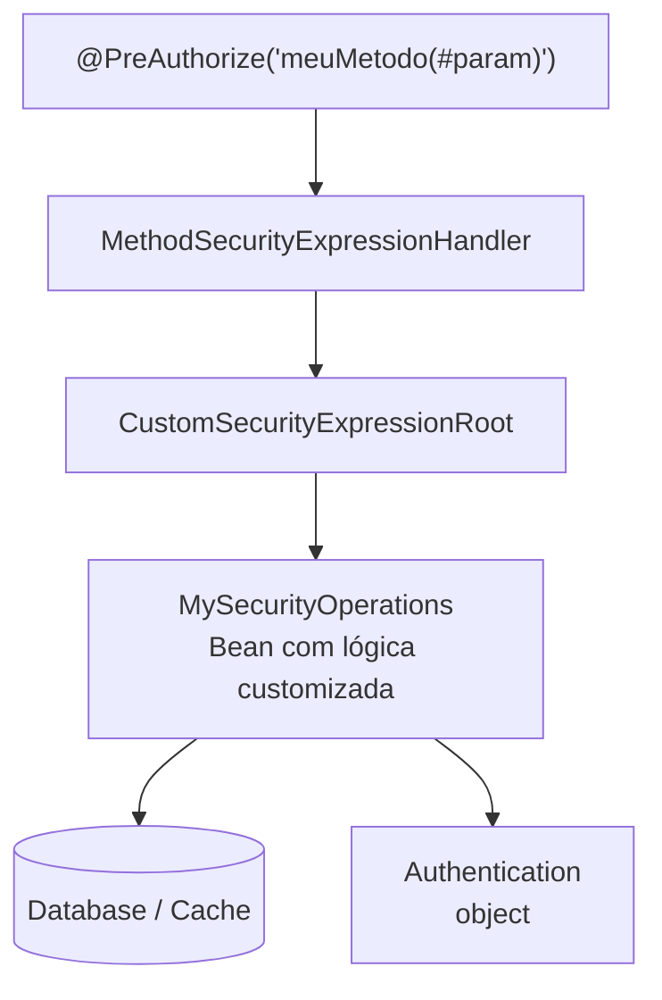
```mermaid
flowchart TD
    PA["@PreAuthorize('meuMetodo(#param)')"] --> MSEH[MethodSecurityExpressionHandler]
    MSEH --> CSER[CustomSecurityExpressionRoot]
    CSER --> MO[MySecurityOperations\nBean com lógica customizada]
    MO --> DB[(Database / Cache)]
    MO --> AUTH[Authentication\nobject]
```

### 10.2 Implementação Completa

**Passo 1 — Classe com operações customizadas:**

```java
/**
 * Operações de segurança customizadas disponíveis via SpEL em @PreAuthorize.
 * Exemplo de uso: @PreAuthorize("@security.isOwner(#resourceId)")
 */
@Component("security")  // Nome do bean usado no SpEL: @security
@RequiredArgsConstructor
@Slf4j
public class SecurityOperations {

    private final ResourceRepository resourceRepository;
    private final OrganizationService organizationService;

    /**
     * Verifica se o usuário autenticado é dono do recurso.
     * Uso: @PreAuthorize("@security.isOwner(#resourceId)")
     */
    public boolean isOwner(Long resourceId) {
        Authentication auth = SecurityContextHolder.getContext().getAuthentication();
        if (auth == null || !auth.isAuthenticated()) return false;

        return resourceRepository.findById(resourceId)
            .map(r -> r.getOwnerUsername().equals(auth.getName()))
            .orElse(false);
    }

    /**
     * Verifica se o usuário pertence à organização especificada.
     * Uso: @PreAuthorize("@security.belongsToOrg(#orgId)")
     */
    public boolean belongsToOrg(Long orgId) {
        Authentication auth = SecurityContextHolder.getContext().getAuthentication();
        return organizationService.isMember(auth.getName(), orgId);
    }

    /**
     * Verifica se o usuário tem permissão específica sobre o recurso.
     * Uso: @PreAuthorize("@security.canAccess(#resourceId, 'READ')")
     */
    public boolean canAccess(Long resourceId, String action) {
        Authentication auth = SecurityContextHolder.getContext().getAuthentication();
        return resourceRepository.findById(resourceId)
            .map(r -> hasPermissionForAction(auth, r, action))
            .orElse(false);
    }

    /**
     * Verifica se o tenant do usuário autenticado corresponde ao tenant do parâmetro.
     * Uso: @PreAuthorize("@security.sameTenant(#tenantId)")
     */
    public boolean sameTenant(String tenantId) {
        Authentication auth = SecurityContextHolder.getContext().getAuthentication();
        if (auth.getPrincipal() instanceof TenantAwareUserDetails user) {
            return user.getTenantId().equals(tenantId);
        }
        return false;
    }

    private boolean hasPermissionForAction(Authentication auth, Resource r, String action) {
        return switch (action.toUpperCase()) {
            case "READ"   -> r.isPublic() || r.getOwnerUsername().equals(auth.getName());
            case "WRITE"  -> r.getOwnerUsername().equals(auth.getName()) ||
                             hasAuthority(auth, "RESOURCE_WRITE");
            case "DELETE" -> r.getOwnerUsername().equals(auth.getName()) ||
                             hasRole(auth, "ADMIN");
            default       -> false;
        };
    }

    private boolean hasAuthority(Authentication auth, String authority) {
        return auth.getAuthorities().stream()
            .anyMatch(a -> a.getAuthority().equals(authority));
    }

    private boolean hasRole(Authentication auth, String role) {
        return hasAuthority(auth, "ROLE_" + role);
    }
}
```

**Passo 2 — Uso nos controladores/serviços:**

```java
@RestController
@RequestMapping("/api/v1/resources")
@RequiredArgsConstructor
public class ResourceController {

    private final ResourceService resourceService;

    // Verifica se o usuário é dono do recurso antes de retornar
    @GetMapping("/{id}")
    @PreAuthorize("hasRole('ADMIN') or @security.isOwner(#id)")
    public ResourceDto getResource(@PathVariable Long id) {
        return resourceService.findById(id);
    }

    // Verifica tenant + permissão de escrita
    @PutMapping("/{id}")
    @PreAuthorize("@security.canAccess(#id, 'WRITE') and @security.sameTenant(#request.tenantId)")
    public ResourceDto updateResource(@PathVariable Long id,
                                      @RequestBody @Valid UpdateResourceRequest request) {
        return resourceService.update(id, request);
    }

    // Combina múltiplas verificações customizadas
    @DeleteMapping("/{id}")
    @PreAuthorize("@security.isOwner(#id) or (hasRole('ADMIN') and @security.sameTenant(#tenantId))")
    public ResponseEntity<Void> deleteResource(@PathVariable Long id,
                                               @RequestParam String tenantId) {
        resourceService.delete(id);
        return ResponseEntity.noContent().build();
    }

    // Usa SpEL puro com acesso ao objeto Authentication
    @GetMapping("/my-resources")
    @PreAuthorize("authentication.name != null and isAuthenticated()")
    public List<ResourceDto> getMyResources() {
        return resourceService.findByCurrentUser();
    }
}
```

### 10.3 MethodSecurityExpressionHandler Customizado (Alternativa)

Para adicionar funções diretamente no contexto SpEL (sem `@beanName`):

```java
/**
 * Root de expressão customizada — adiciona métodos disponíveis diretamente no SpEL.
 * Exemplo: @PreAuthorize("isOwnerOf(#id)") em vez de @PreAuthorize("@security.isOwner(#id)")
 */
public class CustomSecurityExpressionRoot
        extends SecurityExpressionRoot
        implements MethodSecurityExpressionOperations {

    private Object filterObject;
    private Object returnObject;
    private final ResourceRepository resourceRepository;

    public CustomSecurityExpressionRoot(Authentication auth,
                                        ResourceRepository resourceRepository) {
        super(auth);
        this.resourceRepository = resourceRepository;
    }

    /**
     * Disponível diretamente: @PreAuthorize("isOwnerOf(#resourceId)")
     */
    public boolean isOwnerOf(Long resourceId) {
        return resourceRepository.findById(resourceId)
            .map(r -> r.getOwnerUsername().equals(getAuthentication().getName()))
            .orElse(false);
    }

    /**
     * Verifica se usuário tem nível de acesso >= nível requerido.
     * Uso: @PreAuthorize("accessLevel(#requiredLevel)")
     */
    public boolean accessLevel(int requiredLevel) {
        if (getAuthentication().getPrincipal() instanceof LeveledUserDetails user) {
            return user.getAccessLevel() >= requiredLevel;
        }
        return false;
    }

    @Override public void setFilterObject(Object o)  { this.filterObject = o; }
    @Override public Object getFilterObject()         { return filterObject; }
    @Override public void setReturnObject(Object o)  { this.returnObject = o; }
    @Override public Object getReturnObject()         { return returnObject; }
    @Override public Object getThis()                 { return this; }
}

/**
 * Handler que injeta o CustomSecurityExpressionRoot.
 */
public class CustomMethodSecurityExpressionHandler
        extends DefaultMethodSecurityExpressionHandler {

    private final ResourceRepository resourceRepository;

    public CustomMethodSecurityExpressionHandler(ResourceRepository resourceRepository) {
        this.resourceRepository = resourceRepository;
    }

    @Override
    protected MethodSecurityExpressionOperations createSecurityExpressionRoot(
            Authentication authentication, MethodInvocation invocation) {

        CustomSecurityExpressionRoot root =
            new CustomSecurityExpressionRoot(authentication, resourceRepository);
        root.setPermissionEvaluator(getPermissionEvaluator());
        root.setTrustResolver(getTrustResolver());
        root.setRoleHierarchy(getRoleHierarchy());
        return root;
    }
}

/**
 * Registra o handler customizado na configuração.
 */
@Configuration
@EnableMethodSecurity
public class MethodSecurityConfig {

    @Bean
    @Role(BeanDefinition.ROLE_INFRASTRUCTURE)
    public MethodSecurityExpressionHandler methodSecurityExpressionHandler(
            ResourceRepository resourceRepository) {
        return new CustomMethodSecurityExpressionHandler(resourceRepository);
    }
}
```

---

## 11. PermissionEvaluator — Permissões por Domínio

### 11.1 Conceito

`PermissionEvaluator` é a interface usada pelo Spring Security para avaliar `hasPermission()` no SpEL. Permite implementar lógica de autorização baseada em domínio (ACL — Access Control List).

```java
/**
 * Interface central:
 * hasPermission(authentication, targetDomainObject, permission)
 * hasPermission(authentication, targetId, targetType, permission)
 */
public interface PermissionEvaluator {
    boolean hasPermission(Authentication auth, Object targetDomainObject, Object permission);
    boolean hasPermission(Authentication auth, Serializable targetId,
                          String targetType, Object permission);
}
```

### 11.2 Implementação

```java
@Component
@RequiredArgsConstructor
@Slf4j
public class AppPermissionEvaluator implements PermissionEvaluator {

    private final DocumentRepository documentRepository;
    private final ProjectRepository projectRepository;
    private final AclService aclService;

    @Override
    public boolean hasPermission(Authentication auth,
                                  Object targetDomainObject,
                                  Object permission) {

        if (auth == null || !auth.isAuthenticated()) return false;
        if (permission == null) return false;

        String perm = permission.toString().toUpperCase();

        return switch (targetDomainObject) {
            case Document doc   -> evaluateDocumentPermission(auth, doc, perm);
            case Project project -> evaluateProjectPermission(auth, project, perm);
            default -> {
                log.warn("Tipo de domínio não suportado: {}", 
                    targetDomainObject.getClass().getName());
                yield false;
            }
        };
    }

    @Override
    public boolean hasPermission(Authentication auth,
                                  Serializable targetId,
                                  String targetType,
                                  Object permission) {

        if (auth == null || !auth.isAuthenticated()) return false;

        String perm = permission.toString().toUpperCase();

        return switch (targetType) {
            case "Document" -> documentRepository.findById((Long) targetId)
                .map(doc -> evaluateDocumentPermission(auth, doc, perm))
                .orElse(false);

            case "Project"  -> projectRepository.findById((Long) targetId)
                .map(project -> evaluateProjectPermission(auth, project, perm))
                .orElse(false);

            default -> {
                log.warn("Tipo não reconhecido: {}", targetType);
                yield false;
            }
        };
    }

    private boolean evaluateDocumentPermission(Authentication auth,
                                                Document doc,
                                                String permission) {
        String username = auth.getName();
        boolean isAdmin = hasRole(auth, "ADMIN");

        return switch (permission) {
            case "READ"   -> isAdmin || doc.isPublic() || doc.getOwner().equals(username)
                             || aclService.hasAccess(username, doc.getId(), "READ");
            case "WRITE"  -> isAdmin || doc.getOwner().equals(username)
                             || aclService.hasAccess(username, doc.getId(), "WRITE");
            case "DELETE" -> isAdmin || doc.getOwner().equals(username);
            case "SHARE"  -> isAdmin || doc.getOwner().equals(username);
            default       -> false;
        };
    }

    private boolean evaluateProjectPermission(Authentication auth,
                                               Project project,
                                               String permission) {
        String username = auth.getName();
        boolean isOwner = project.getOwner().equals(username);
        boolean isMember = project.getMembers().contains(username);

        return switch (permission) {
            case "READ"   -> isOwner || isMember || hasRole(auth, "ADMIN");
            case "WRITE"  -> isOwner || (isMember && hasAuthority(auth, "PROJECT_WRITE"));
            case "DELETE" -> isOwner || hasRole(auth, "ADMIN");
            default       -> false;
        };
    }

    private boolean hasRole(Authentication auth, String role) {
        return auth.getAuthorities().stream()
            .anyMatch(a -> a.getAuthority().equals("ROLE_" + role));
    }

    private boolean hasAuthority(Authentication auth, String authority) {
        return auth.getAuthorities().stream()
            .anyMatch(a -> a.getAuthority().equals(authority));
    }
}
```

### 11.3 Registrar o PermissionEvaluator

```java
@Configuration
@EnableMethodSecurity
public class MethodSecurityConfig {

    @Bean
    @Role(BeanDefinition.ROLE_INFRASTRUCTURE)
    public MethodSecurityExpressionHandler methodSecurityExpressionHandler(
            AppPermissionEvaluator permissionEvaluator) {

        DefaultMethodSecurityExpressionHandler handler =
            new DefaultMethodSecurityExpressionHandler();
        handler.setPermissionEvaluator(permissionEvaluator);
        return handler;
    }
}
```

### 11.4 Uso com hasPermission()

```java
@RestController
@RequestMapping("/api/v1/documents")
public class DocumentController {

    @GetMapping("/{id}")
    // Passa o objeto de domínio diretamente
    @PreAuthorize("hasPermission(#document, 'READ')")
    public DocumentDto getDocument(@PathVariable Long id,
                                   Document document) {  // injetado via @ModelAttribute
        return DocumentDto.fromEntity(document);
    }

    @PutMapping("/{id}")
    // Passa apenas o ID e o tipo (lazy loading — o evaluator faz o lookup)
    @PreAuthorize("hasPermission(#id, 'Document', 'WRITE')")
    public DocumentDto updateDocument(@PathVariable Long id,
                                      @RequestBody @Valid UpdateDocumentRequest req) {
        return documentService.update(id, req);
    }

    @DeleteMapping("/{id}")
    @PreAuthorize("hasPermission(#id, 'Document', 'DELETE')")
    public ResponseEntity<Void> deleteDocument(@PathVariable Long id) {
        documentService.delete(id);
        return ResponseEntity.noContent().build();
    }

    @PostMapping("/{id}/share")
    @PreAuthorize("hasPermission(#id, 'Document', 'SHARE') and hasAuthority('DOCUMENT_SHARE')")
    public ResponseEntity<Void> shareDocument(@PathVariable Long id,
                                              @RequestBody ShareRequest req) {
        documentService.share(id, req);
        return ResponseEntity.ok().build();
    }
}
```

---

## 12. OAuth2 Resource Server

### 12.1 Configuração para JWT

```yaml
# application.yml
spring:
  security:
    oauth2:
      resourceserver:
        jwt:
          # Opção A: JWKS endpoint (recomendado para Keycloak/IdPs externos)
          jwk-set-uri: http://localhost:8180/realms/myrealm/protocol/openid-connect/certs
          
          # Opção B: Chave pública RSA local
          # public-key-location: classpath:keys/public.pem
          
          issuer-uri: http://localhost:8180/realms/myrealm
          audiences: myapp-api
```

```java
@Bean
@Order(1)
public SecurityFilterChain resourceServerChain(HttpSecurity http) throws Exception {
    return http
        .securityMatcher("/api/**")
        .csrf(csrf -> csrf.disable())
        .sessionManagement(s -> s.sessionCreationPolicy(SessionCreationPolicy.STATELESS))
        .oauth2ResourceServer(oauth2 -> oauth2
            .jwt(jwt -> jwt
                .jwtAuthenticationConverter(jwtAuthenticationConverter())))
        .authorizeHttpRequests(auth -> auth
            .requestMatchers("/api/v1/public/**").permitAll()
            .requestMatchers("/api/v1/admin/**").hasAuthority("SCOPE_admin")
            .anyRequest().authenticated())
        .build();
}

/**
 * Converte claims JWT em GrantedAuthorities do Spring Security.
 * Suporta roles do Keycloak (realm_access.roles) e escopos OAuth2.
 */
@Bean
public JwtAuthenticationConverter jwtAuthenticationConverter() {
    JwtGrantedAuthoritiesConverter scopesConverter =
        new JwtGrantedAuthoritiesConverter();
    scopesConverter.setAuthorityPrefix("SCOPE_");
    scopesConverter.setAuthoritiesClaimName("scope");

    // Converter customizado para roles do Keycloak
    Converter<Jwt, Collection<GrantedAuthority>> keycloakRolesConverter =
        jwt -> {
            Map<String, Object> realmAccess =
                jwt.getClaimAsMap("realm_access");
            if (realmAccess == null) return Collections.emptyList();

            @SuppressWarnings("unchecked")
            List<String> roles = (List<String>) realmAccess.get("roles");
            if (roles == null) return Collections.emptyList();

            return roles.stream()
                .map(role -> new SimpleGrantedAuthority("ROLE_" + role.toUpperCase()))
                .collect(Collectors.toList());
        };

    JwtAuthenticationConverter converter = new JwtAuthenticationConverter();
    converter.setJwtGrantedAuthoritiesConverter(jwt ->
        Stream.concat(
            scopesConverter.convert(jwt).stream(),
            keycloakRolesConverter.convert(jwt).stream()
        ).collect(Collectors.toList()));

    return converter;
}
```

### 12.2 Validações Adicionais de JWT

```java
@Bean
public JwtDecoder jwtDecoder(
        @Value("${spring.security.oauth2.resourceserver.jwt.jwk-set-uri}") String jwksUri) {

    NimbusJwtDecoder decoder = NimbusJwtDecoder
        .withJwkSetUri(jwksUri)
        .jwsAlgorithm(SignatureAlgorithm.RS256)
        .build();

    // Validações adicionais além das padrão (exp, iss, nbf)
    OAuth2TokenValidator<Jwt> validators = new DelegatingOAuth2TokenValidator<>(
        JwtValidators.createDefaultWithIssuer("http://localhost:8180/realms/myrealm"),
        new JwtClaimValidator<List<String>>("aud",
            aud -> aud != null && aud.contains("myapp-api")),
        new JwtClaimValidator<String>("token_type",
            type -> "access".equals(type))
    );

    decoder.setJwtValidator(validators);
    return decoder;
}
```

---

## 13. OAuth2 Client

### 13.1 Configuração

```yaml
# application.yml
spring:
  security:
    oauth2:
      client:
        registration:
          keycloak:
            client-id: myapp-client
            client-secret: ${KEYCLOAK_CLIENT_SECRET}
            scope: openid,profile,email,roles
            authorization-grant-type: authorization_code
            redirect-uri: "{baseUrl}/login/oauth2/code/{registrationId}"
        provider:
          keycloak:
            issuer-uri: http://localhost:8180/realms/myrealm
            user-name-attribute: preferred_username
```

```java
@Bean
public SecurityFilterChain oauth2ClientChain(HttpSecurity http) throws Exception {
    return http
        .oauth2Login(oauth2 -> oauth2
            .loginPage("/oauth2/authorization/keycloak")
            .defaultSuccessUrl("/dashboard", true)
            .failureUrl("/login?error=oauth2")
            .userInfoEndpoint(userInfo -> userInfo
                .oidcUserService(oidcUserService()))
            .successHandler(oauth2SuccessHandler()))
        .logout(logout -> logout
            .logoutSuccessHandler(oidcLogoutSuccessHandler()))
        .authorizeHttpRequests(auth -> auth
            .requestMatchers("/", "/login**", "/error").permitAll()
            .anyRequest().authenticated())
        .build();
}

/**
 * Processa o usuário OIDC após login — sincroniza com banco local.
 */
@Bean
public OidcUserService oidcUserService() {
    DefaultOidcUserService delegate = new DefaultOidcUserService();

    return new OidcUserService() {
        @Override
        public OidcUser loadUser(OidcUserRequest request) throws OAuth2AuthenticationException {
            OidcUser oidcUser = delegate.loadUser(request);

            // Sincroniza com banco de dados local
            userSyncService.syncOidcUser(oidcUser);

            // Adiciona authorities do banco local
            Set<GrantedAuthority> authorities =
                new HashSet<>(oidcUser.getAuthorities());
            authorities.addAll(userSyncService.loadLocalAuthorities(
                oidcUser.getEmail()));

            return new DefaultOidcUser(
                authorities,
                oidcUser.getIdToken(),
                oidcUser.getUserInfo(),
                "preferred_username");
        }
    };
}

/**
 * Logout que invalida sessão também no Keycloak (Single Logout).
 */
@Bean
public LogoutSuccessHandler oidcLogoutSuccessHandler() {
    OidcClientInitiatedLogoutSuccessHandler handler =
        new OidcClientInitiatedLogoutSuccessHandler(clientRegistrationRepository);
    handler.setPostLogoutRedirectUri("{baseUrl}/login?logout");
    return handler;
}
```

---

## 14. Integração com Keycloak

### 14.1 Diagrama de Arquitetura

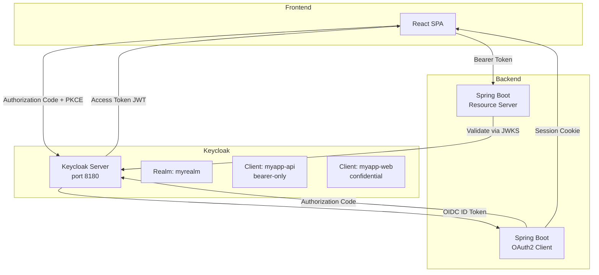
```mermaid
flowchart TD
    subgraph Frontend
        SPA[React SPA]
    end

    subgraph Backend
        API[Spring Boot\nResource Server]
        WEB[Spring Boot\nOAuth2 Client]
    end

    subgraph Keycloak
        KC[Keycloak Server\nport 8180]
        REALM[Realm: myrealm]
        CLI_API[Client: myapp-api\nbearer-only]
        CLI_WEB[Client: myapp-web\nconfidential]
    end

    SPA -->|"Authorization Code + PKCE"| KC
    KC -->|Access Token JWT| SPA
    SPA -->|"Bearer Token"| API
    API -->|Validate via JWKS| KC

    WEB -->|"Authorization Code"| KC
    KC -->|"OIDC ID Token"| WEB
    WEB -->|"Session Cookie"| SPA
```

### 14.2 Propriedades Spring Boot

```yaml
# Resource Server (API REST)
spring:
  security:
    oauth2:
      resourceserver:
        jwt:
          jwk-set-uri: ${KEYCLOAK_URL:http://localhost:8180}/realms/${KEYCLOAK_REALM:myrealm}/protocol/openid-connect/certs
          issuer-uri: ${KEYCLOAK_URL:http://localhost:8180}/realms/${KEYCLOAK_REALM:myrealm}

# OAuth2 Client (Web MVC)
spring:
  security:
    oauth2:
      client:
        registration:
          keycloak:
            provider: keycloak
            client-id: ${KEYCLOAK_CLIENT_ID:myapp-web}
            client-secret: ${KEYCLOAK_CLIENT_SECRET}
            scope: openid,profile,email,roles
            authorization-grant-type: authorization_code
        provider:
          keycloak:
            issuer-uri: ${KEYCLOAK_URL:http://localhost:8180}/realms/${KEYCLOAK_REALM:myrealm}
            user-name-attribute: preferred_username
```

### 14.3 Converter de Roles do Keycloak

```java
/**
 * Keycloak retorna roles em:
 * - realm_access.roles         (roles do realm)
 * - resource_access.<client>.roles  (roles do client)
 */
@Component
public class KeycloakJwtRolesConverter implements Converter<Jwt, Collection<GrantedAuthority>> {

    private static final String REALM_ACCESS  = "realm_access";
    private static final String RESOURCE_ACCESS = "resource_access";
    private static final String ROLES = "roles";

    private final String clientId;

    public KeycloakJwtRolesConverter(
            @Value("${keycloak.client-id:myapp-api}") String clientId) {
        this.clientId = clientId;
    }

    @Override
    @SuppressWarnings("unchecked")
    public Collection<GrantedAuthority> convert(Jwt jwt) {
        List<GrantedAuthority> authorities = new ArrayList<>();

        // Realm roles → ROLE_XXX
        Map<String, Object> realmAccess = jwt.getClaimAsMap(REALM_ACCESS);
        if (realmAccess != null) {
            List<String> realmRoles = (List<String>) realmAccess.get(ROLES);
            if (realmRoles != null) {
                realmRoles.stream()
                    .map(r -> new SimpleGrantedAuthority("ROLE_" + r.toUpperCase()))
                    .forEach(authorities::add);
            }
        }

        // Client roles → ROLE_CLIENT_XXX
        Map<String, Object> resourceAccess = jwt.getClaimAsMap(RESOURCE_ACCESS);
        if (resourceAccess != null) {
            Map<String, Object> clientAccess =
                (Map<String, Object>) resourceAccess.get(clientId);
            if (clientAccess != null) {
                List<String> clientRoles = (List<String>) clientAccess.get(ROLES);
                if (clientRoles != null) {
                    clientRoles.stream()
                        .map(r -> new SimpleGrantedAuthority("ROLE_CLIENT_" + r.toUpperCase()))
                        .forEach(authorities::add);
                }
            }
        }

        // Scopes OAuth2 → SCOPE_xxx
        String scope = jwt.getClaimAsString("scope");
        if (scope != null) {
            Arrays.stream(scope.split(" "))
                .filter(s -> !s.isBlank())
                .map(s -> new SimpleGrantedAuthority("SCOPE_" + s))
                .forEach(authorities::add);
        }

        return authorities;
    }
}
```

### 14.4 Docker Compose — Keycloak + Postgres

```yaml
# docker-compose.yml
services:
  keycloak:
    image: quay.io/keycloak/keycloak:26.0
    command: start-dev --import-realm
    environment:
      KC_DB: postgres
      KC_DB_URL: jdbc:postgresql://keycloak-db:5432/keycloak
      KC_DB_USERNAME: keycloak
      KC_DB_PASSWORD: keycloak
      KEYCLOAK_ADMIN: admin
      KEYCLOAK_ADMIN_PASSWORD: ${KC_ADMIN_PASSWORD:-admin}
      KC_HOSTNAME: localhost
      KC_HTTP_PORT: 8180
    ports:
      - "8180:8180"
    volumes:
      - ./keycloak/realm-export.json:/opt/keycloak/data/import/realm.json:ro
    depends_on:
      keycloak-db:
        condition: service_healthy
    healthcheck:
      test: ["CMD-SHELL", "exec 3<>/dev/tcp/localhost/8180 && echo OK"]
      interval: 30s
      timeout: 10s
      retries: 5

  keycloak-db:
    image: postgres:18
    environment:
      POSTGRES_DB: keycloak
      POSTGRES_USER: keycloak
      POSTGRES_PASSWORD: keycloak
    volumes:
      - keycloak-db-data:/var/lib/postgresql/data
    healthcheck:
      test: ["CMD-SHELL", "pg_isready -U keycloak -d keycloak"]
      interval: 10s
      retries: 5

volumes:
  keycloak-db-data:
```

---

## 15. Identity Providers Externos (Google, Microsoft, GitHub)

### 15.1 Configuração Multi-Provider

```yaml
spring:
  security:
    oauth2:
      client:
        registration:
          # Google
          google:
            client-id: ${GOOGLE_CLIENT_ID}
            client-secret: ${GOOGLE_CLIENT_SECRET}
            scope: openid,profile,email

          # Microsoft (Azure AD)
          microsoft:
            client-id: ${AZURE_CLIENT_ID}
            client-secret: ${AZURE_CLIENT_SECRET}
            scope: openid,profile,email,User.Read
            authorization-grant-type: authorization_code
            redirect-uri: "{baseUrl}/login/oauth2/code/{registrationId}"

          # GitHub
          github:
            client-id: ${GITHUB_CLIENT_ID}
            client-secret: ${GITHUB_CLIENT_SECRET}
            scope: user:email,read:user

        provider:
          microsoft:
            authorization-uri: https://login.microsoftonline.com/${AZURE_TENANT_ID}/oauth2/v2.0/authorize
            token-uri: https://login.microsoftonline.com/${AZURE_TENANT_ID}/oauth2/v2.0/token
            jwk-set-uri: https://login.microsoftonline.com/${AZURE_TENANT_ID}/discovery/v2.0/keys
            user-info-uri: https://graph.microsoft.com/oidc/userinfo
            user-name-attribute: email
```

### 15.2 OAuth2UserService Unificado

```java
@Service
@RequiredArgsConstructor
@Slf4j
public class UnifiedOAuth2UserService
        extends DefaultOAuth2UserService
        implements OidcUserService {

    private final UserRepository userRepository;
    private final DefaultOidcUserService oidcDelegate = new DefaultOidcUserService();

    // Para Google (OIDC)
    @Override
    public OidcUser loadUser(OidcUserRequest request) throws OAuth2AuthenticationException {
        OidcUser oidcUser = oidcDelegate.loadUser(request);

        String email    = oidcUser.getEmail();
        String name     = oidcUser.getFullName();
        String provider = request.getClientRegistration().getRegistrationId();

        UserEntity user = syncUser(email, name, provider, oidcUser.getSubject());

        return new DefaultOidcUser(
            buildAuthorities(user),
            oidcUser.getIdToken(),
            oidcUser.getUserInfo());
    }

    // Para GitHub (OAuth2 simples, sem OIDC)
    @Override
    public OAuth2User loadUser(OAuth2UserRequest request) throws OAuth2AuthenticationException {
        OAuth2User oauth2User = super.loadUser(request);

        String provider = request.getClientRegistration().getRegistrationId();
        String email    = extractEmail(oauth2User, provider);
        String name     = oauth2User.getAttribute("name");
        String sub      = oauth2User.getAttribute("id").toString();

        UserEntity user = syncUser(email, name, provider, sub);

        return new DefaultOAuth2User(
            buildAuthorities(user),
            oauth2User.getAttributes(),
            "login");  // GitHub usa "login" como username attribute
    }

    private UserEntity syncUser(String email, String name,
                                 String provider, String providerId) {
        return userRepository.findByEmail(email)
            .map(existing -> updateProvider(existing, provider, providerId))
            .orElseGet(() -> createUser(email, name, provider, providerId));
    }

    private UserEntity createUser(String email, String name,
                                   String provider, String providerId) {
        UserEntity user = new UserEntity();
        user.setEmail(email);
        user.setName(name);
        user.setProvider(provider);
        user.setProviderId(providerId);
        user.setEnabled(true);
        user.getRoles().add(Role.USER);   // Role padrão para novos usuários
        return userRepository.save(user);
    }

    private Collection<GrantedAuthority> buildAuthorities(UserEntity user) {
        return user.getRoles().stream()
            .map(r -> new SimpleGrantedAuthority("ROLE_" + r.name()))
            .collect(Collectors.toList());
    }

    private String extractEmail(OAuth2User user, String provider) {
        // GitHub pode não retornar email diretamente — requer chamada à API
        String email = user.getAttribute("email");
        if (email == null && "github".equals(provider)) {
            // Em produção, usar WebClient para chamar /user/emails
            email = user.getAttribute("login") + "@github.noemail";
        }
        return email;
    }
}
```

### 15.3 SecurityConfig com Múltiplos Providers

```java
@Bean
public SecurityFilterChain socialLoginChain(
        HttpSecurity http,
        UnifiedOAuth2UserService userService) throws Exception {

    return http
        .oauth2Login(oauth2 -> oauth2
            .loginPage("/login")
            .userInfoEndpoint(info -> info
                .userService(userService)           // GitHub, Microsoft
                .oidcUserService(userService))       // Google (OIDC)
            .defaultSuccessUrl("/dashboard", true)
            .failureHandler((req, res, ex) -> {
                log.error("OAuth2 login failed: {}", ex.getMessage());
                res.sendRedirect("/login?error=oauth2_failed");
            }))
        .logout(logout -> logout
            .logoutSuccessUrl("/login?logout")
            .deleteCookies("JSESSIONID"))
        .authorizeHttpRequests(auth -> auth
            .requestMatchers("/login**", "/oauth2/**", "/error").permitAll()
            .anyRequest().authenticated())
        .build();
}
```

---

## 16. Spring Authorization Server — Criando um Identity Provider

O **Spring Authorization Server** (`spring-security-oauth2-authorization-server`) é o módulo oficial do Spring para construir um **Identity Provider (IdP)** próprio com suporte completo a OAuth 2.1 e OpenID Connect 1.0. É a alternativa self-hosted ao Keycloak quando se quer um IdP embutido na própria aplicação Spring Boot ou como serviço separado dentro da organização.

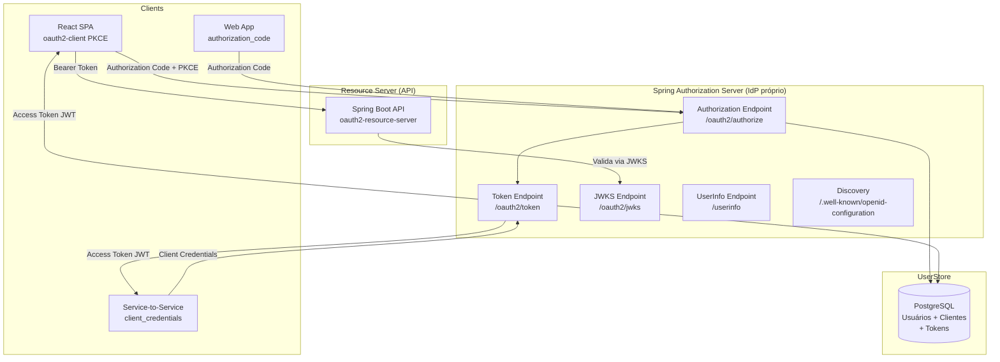
```mermaid
flowchart TD
    subgraph Clients
        SPA[React SPA
oauth2-client PKCE]
        API[Service-to-Service
client_credentials]
        WEB[Web App
authorization_code]
    end

    subgraph AuthServer["Spring Authorization Server (IdP próprio)"]
        AS[Authorization Endpoint
/oauth2/authorize]
        TK[Token Endpoint
/oauth2/token]
        JW[JWKS Endpoint
/oauth2/jwks]
        UI[UserInfo Endpoint
/userinfo]
        DC[Discovery
/.well-known/openid-configuration]
    end

    subgraph ResourceServer["Resource Server (API)"]
        RS[Spring Boot API
oauth2-resource-server]
    end

    subgraph UserStore
        DB[(PostgreSQL
Usuários + Clientes
+ Tokens)]
    end

    SPA -->|Authorization Code + PKCE| AS
    WEB -->|Authorization Code| AS
    API -->|Client Credentials| TK
    AS --> TK
    TK -->|Access Token JWT| SPA
    TK -->|Access Token JWT| API
    SPA -->|Bearer Token| RS
    RS -->|Valida via JWKS| JW
    AS --> DB
    TK --> DB
```

### 16.1 Dependências Maven

```xml
<!-- Spring Authorization Server -->
<dependency>
    <groupId>org.springframework.boot</groupId>
    <artifactId>spring-boot-starter-oauth2-authorization-server</artifactId>
</dependency>

<!-- Necessário para a UI de login do próprio IdP -->
<dependency>
    <groupId>org.springframework.boot</groupId>
    <artifactId>spring-boot-starter-thymeleaf</artifactId>
</dependency>
<dependency>
    <groupId>org.thymeleaf.extras</groupId>
    <artifactId>thymeleaf-extras-springsecurity6</artifactId>
</dependency>

<!-- JPA para persistência de clientes e tokens -->
<dependency>
    <groupId>org.springframework.boot</groupId>
    <artifactId>spring-boot-starter-data-jpa</artifactId>
</dependency>
<dependency>
    <groupId>org.postgresql</groupId>
    <artifactId>postgresql</artifactId>
    <scope>runtime</scope>
</dependency>
```

---

### 16.2 Configuração do Authorization Server

O Authorization Server exige **duas** `SecurityFilterChain`: uma para os endpoints OAuth2/OIDC e outra para a UI de login dos usuários (autenticação no próprio IdP).

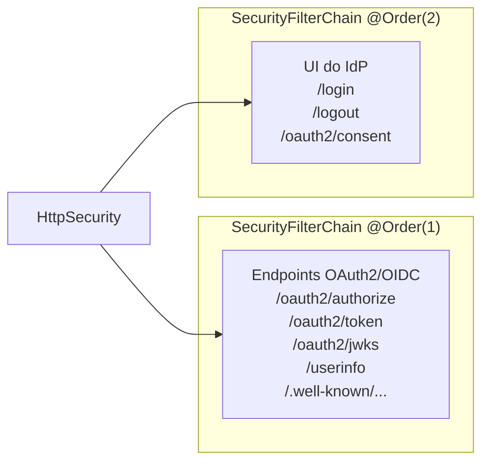
```mermaid
flowchart LR
    subgraph "SecurityFilterChain @Order(1)"
        OE["Endpoints OAuth2/OIDC
/oauth2/authorize
/oauth2/token
/oauth2/jwks
/userinfo
/.well-known/..."]
    end
    subgraph "SecurityFilterChain @Order(2)"
        UI["UI do IdP
/login
/logout
/oauth2/consent"]
    end
    HTTP[HttpSecurity] --> OE
    HTTP --> UI
```

```java
@Configuration
@EnableWebSecurity
public class AuthorizationServerConfig {

    // ── Chain 1: endpoints OAuth2/OIDC ────────────────────────────────────
    /**
     * Configura os endpoints do protocolo OAuth2 e OIDC.
     * Deve ter @Order menor (maior prioridade) que a chain de login.
     */
    @Bean
    @Order(1)
    public SecurityFilterChain authorizationServerSecurityFilterChain(
            HttpSecurity http) throws Exception {

        // Aplica as defaults do Authorization Server (endpoints, filtros, etc.)
        OAuth2AuthorizationServerConfiguration.applyDefaultSecurity(http);

        http.getConfigurer(OAuth2AuthorizationServerConfigurer.class)
            // Habilita OpenID Connect 1.0
            .oidc(oidc -> oidc
                .userInfoEndpoint(userInfo -> userInfo
                    .userInfoMapper(userInfoMapper()))    // mapeia claims do userinfo
                    .clientRegistrationEndpoint(Customizer.withDefaults()) // DCR dinâmico
            );

        http
            // Redireciona para o login do próprio IdP quando não autenticado
            .exceptionHandling(ex -> ex
                .defaultAuthenticationEntryPointFor(
                    new LoginUrlAuthenticationEntryPoint("/login"),
                    new MediaTypeRequestMatcher(MediaType.TEXT_HTML)))
            // Resource server para validar tokens nos endpoints protegidos (/userinfo)
            .oauth2ResourceServer(rs -> rs.jwt(Customizer.withDefaults()));

        return http.build();
    }

    // ── Chain 2: UI de login e consentimento ──────────────────────────────
    /**
     * Protege as páginas de login e consentimento do próprio IdP.
     * Usuários se autenticam aqui antes de autorizar clients OAuth2.
     */
    @Bean
    @Order(2)
    public SecurityFilterChain defaultSecurityFilterChain(HttpSecurity http) throws Exception {
        return http
            .authorizeHttpRequests(auth -> auth
                .requestMatchers("/assets/**", "/webjars/**", "/login").permitAll()
                .anyRequest().authenticated())
            .formLogin(form -> form
                .loginPage("/login")
                .permitAll())
            .build();
    }
}
```

---

### 16.3 AuthorizationServerSettings — Configuração dos Endpoints

```java
@Configuration
public class AuthServerSettings {

    /**
     * Define as URLs de todos os endpoints OAuth2/OIDC.
     * Os defaults seguem as especificações RFC 8414 e OpenID Connect Discovery.
     */
    @Bean
    public AuthorizationServerSettings authorizationServerSettings(
            @Value("${app.auth-server.issuer-uri}") String issuerUri) {

        return AuthorizationServerSettings.builder()
            .issuer(issuerUri)                          // ex: https://auth.myapp.com
            .authorizationEndpoint("/oauth2/authorize")
            .deviceAuthorizationEndpoint("/oauth2/device_authorization")
            .deviceVerificationEndpoint("/oauth2/device_verification")
            .tokenEndpoint("/oauth2/token")
            .tokenIntrospectionEndpoint("/oauth2/introspect")
            .tokenRevocationEndpoint("/oauth2/revoke")
            .jwkSetEndpoint("/oauth2/jwks")
            .oidcLogoutEndpoint("/connect/logout")
            .oidcUserInfoEndpoint("/userinfo")
            .oidcClientRegistrationEndpoint("/connect/register")
            .build();
    }
}
```

```yaml
# application.yml
app:
  auth-server:
    issuer-uri: ${AUTH_SERVER_ISSUER_URI:http://localhost:9000}

server:
  port: 9000   # porta padrão para o IdP separado
```

---

### 16.4 Registro de Clients OAuth2

Cada aplicação que usa o IdP é um **client** OAuth2 registrado. O Spring Authorization Server suporta armazenamento em memória (desenvolvimento) e banco de dados (produção).

#### 16.4.1 Clients em Memória (desenvolvimento)

```java
@Bean
public RegisteredClientRepository registeredClientRepository(
        PasswordEncoder passwordEncoder) {

    // ── Client 1: SPA com Authorization Code + PKCE ───────────────
    RegisteredClient spaClient = RegisteredClient
        .withId(UUID.randomUUID().toString())
        .clientId("myapp-spa")
        // SPAs públicos não têm client secret (PKCE substitui)
        .clientAuthenticationMethod(ClientAuthenticationMethod.NONE)
        .authorizationGrantType(AuthorizationGrantType.AUTHORIZATION_CODE)
        .authorizationGrantType(AuthorizationGrantType.REFRESH_TOKEN)
        .redirectUri("http://localhost:5173/callback")
        .redirectUri("https://myapp.com/callback")
        .postLogoutRedirectUri("https://myapp.com/logout")
        .scope(OidcScopes.OPENID)
        .scope(OidcScopes.PROFILE)
        .scope(OidcScopes.EMAIL)
        .scope("api.read")
        .scope("api.write")
        .clientSettings(ClientSettings.builder()
            .requireAuthorizationConsent(true)   // exibe tela de consentimento
            .requireProofKey(true)               // PKCE obrigatório para SPAs
            .build())
        .tokenSettings(TokenSettings.builder()
            .accessTokenTimeToLive(Duration.ofMinutes(15))
            .refreshTokenTimeToLive(Duration.ofDays(30))
            .reuseRefreshTokens(false)           // gera novo refresh token a cada uso
            .accessTokenFormat(OAuth2TokenFormat.SELF_CONTAINED) // JWT
            .build())
        .build();

    // ── Client 2: Web App confidencial ────────────────────────────
    RegisteredClient webClient = RegisteredClient
        .withId(UUID.randomUUID().toString())
        .clientId("myapp-web")
        .clientSecret(passwordEncoder.encode("${WEB_CLIENT_SECRET}"))
        .clientAuthenticationMethod(ClientAuthenticationMethod.CLIENT_SECRET_BASIC)
        .authorizationGrantType(AuthorizationGrantType.AUTHORIZATION_CODE)
        .authorizationGrantType(AuthorizationGrantType.REFRESH_TOKEN)
        .redirectUri("https://myapp.com/login/oauth2/code/myapp")
        .postLogoutRedirectUri("https://myapp.com/login?logout")
        .scope(OidcScopes.OPENID)
        .scope(OidcScopes.PROFILE)
        .scope(OidcScopes.EMAIL)
        .scope("api.read")
        .clientSettings(ClientSettings.builder()
            .requireAuthorizationConsent(false)  // sem tela de consentimento (first-party)
            .requireProofKey(false)
            .build())
        .tokenSettings(TokenSettings.builder()
            .accessTokenTimeToLive(Duration.ofMinutes(15))
            .refreshTokenTimeToLive(Duration.ofDays(7))
            .build())
        .build();

    // ── Client 3: Machine-to-Machine (Client Credentials) ─────────
    RegisteredClient m2mClient = RegisteredClient
        .withId(UUID.randomUUID().toString())
        .clientId("myapp-service")
        .clientSecret(passwordEncoder.encode("${SERVICE_CLIENT_SECRET}"))
        .clientAuthenticationMethod(ClientAuthenticationMethod.CLIENT_SECRET_BASIC)
        .authorizationGrantType(AuthorizationGrantType.CLIENT_CREDENTIALS)
        .scope("api.admin")
        .scope("reports.read")
        .tokenSettings(TokenSettings.builder()
            .accessTokenTimeToLive(Duration.ofHours(1))
            .accessTokenFormat(OAuth2TokenFormat.SELF_CONTAINED)
            .build())
        .build();

    return new InMemoryRegisteredClientRepository(spaClient, webClient, m2mClient);
}
```

#### 16.4.2 Clients em Banco de Dados (produção)

```java
/**
 * Implementação JPA do RegisteredClientRepository para persistência em PostgreSQL.
 * O Spring Authorization Server provê JdbcRegisteredClientRepository,
 * mas a implementação JPA oferece mais flexibilidade para queries customizadas.
 */
@Bean
public RegisteredClientRepository registeredClientRepository(
        JdbcTemplate jdbcTemplate) {
    // Usar JdbcRegisteredClientRepository — implementação oficial com JDBC
    return new JdbcRegisteredClientRepository(jdbcTemplate);
}
```

Script Flyway para criar as tabelas oficiais do Spring Authorization Server:

```sql
-- V2__spring_authorization_server_schema.sql
-- Schema oficial do Spring Authorization Server
-- Fonte: https://github.com/spring-projects/spring-authorization-server/tree/main/oauth2-authorization-server/src/main/resources/org/springframework/security/oauth2/server/authorization

CREATE TABLE oauth2_registered_client (
    id                            VARCHAR(100)  NOT NULL,
    client_id                     VARCHAR(100)  NOT NULL,
    client_id_issued_at           TIMESTAMP     DEFAULT CURRENT_TIMESTAMP NOT NULL,
    client_secret                 VARCHAR(200)  DEFAULT NULL,
    client_secret_expires_at      TIMESTAMP     DEFAULT NULL,
    client_name                   VARCHAR(200)  NOT NULL,
    client_authentication_methods VARCHAR(1000) NOT NULL,
    authorization_grant_types     VARCHAR(1000) NOT NULL,
    redirect_uris                 VARCHAR(1000) DEFAULT NULL,
    post_logout_redirect_uris     VARCHAR(1000) DEFAULT NULL,
    scopes                        VARCHAR(1000) NOT NULL,
    client_settings               VARCHAR(2000) NOT NULL,
    token_settings                VARCHAR(2000) NOT NULL,
    CONSTRAINT pk_oauth2_registered_client PRIMARY KEY (id)
);

CREATE TABLE oauth2_authorization (
    id                            VARCHAR(100)  NOT NULL,
    registered_client_id          VARCHAR(100)  NOT NULL,
    principal_name                VARCHAR(200)  NOT NULL,
    authorization_grant_type      VARCHAR(100)  NOT NULL,
    authorized_scopes             VARCHAR(1000) DEFAULT NULL,
    attributes                    TEXT          DEFAULT NULL,
    state                         VARCHAR(500)  DEFAULT NULL,
    -- Authorization Code
    authorization_code_value      TEXT          DEFAULT NULL,
    authorization_code_issued_at  TIMESTAMP     DEFAULT NULL,
    authorization_code_expires_at TIMESTAMP     DEFAULT NULL,
    authorization_code_metadata   TEXT          DEFAULT NULL,
    -- Access Token
    access_token_value            TEXT          DEFAULT NULL,
    access_token_issued_at        TIMESTAMP     DEFAULT NULL,
    access_token_expires_at       TIMESTAMP     DEFAULT NULL,
    access_token_metadata         TEXT          DEFAULT NULL,
    access_token_type             VARCHAR(100)  DEFAULT NULL,
    access_token_scopes           VARCHAR(1000) DEFAULT NULL,
    -- Refresh Token
    refresh_token_value           TEXT          DEFAULT NULL,
    refresh_token_issued_at       TIMESTAMP     DEFAULT NULL,
    refresh_token_expires_at      TIMESTAMP     DEFAULT NULL,
    refresh_token_metadata        TEXT          DEFAULT NULL,
    -- OIDC ID Token
    oidc_id_token_value           TEXT          DEFAULT NULL,
    oidc_id_token_issued_at       TIMESTAMP     DEFAULT NULL,
    oidc_id_token_expires_at      TIMESTAMP     DEFAULT NULL,
    oidc_id_token_metadata        TEXT          DEFAULT NULL,
    oidc_id_token_claims          TEXT          DEFAULT NULL,
    -- Device Code
    user_code_value               TEXT          DEFAULT NULL,
    user_code_issued_at           TIMESTAMP     DEFAULT NULL,
    user_code_expires_at          TIMESTAMP     DEFAULT NULL,
    user_code_metadata            TEXT          DEFAULT NULL,
    device_code_value             TEXT          DEFAULT NULL,
    device_code_issued_at         TIMESTAMP     DEFAULT NULL,
    device_code_expires_at        TIMESTAMP     DEFAULT NULL,
    device_code_metadata          TEXT          DEFAULT NULL,
    CONSTRAINT pk_oauth2_authorization PRIMARY KEY (id)
);

CREATE TABLE oauth2_authorization_consent (
    registered_client_id VARCHAR(100)  NOT NULL,
    principal_name       VARCHAR(200)  NOT NULL,
    authorities          VARCHAR(1000) NOT NULL,
    CONSTRAINT pk_oauth2_authorization_consent
        PRIMARY KEY (registered_client_id, principal_name)
);
```

---

### 16.5 Chaves RSA para Assinatura de Tokens

```java
/**
 * JWKSource fornece as chaves usadas para assinar os JWTs emitidos pelo IdP.
 * Em produção, carregar de Vault / AWS Secrets Manager / HSM.
 */
@Configuration
public class JwkSourceConfig {

    @Bean
    public JWKSource<SecurityContext> jwkSource(
            @Value("${app.auth-server.rsa-private-key}") RSAPrivateKey privateKey,
            @Value("${app.auth-server.rsa-public-key}")  RSAPublicKey  publicKey) {

        RSAKey rsaKey = new RSAKey.Builder(publicKey)
            .privateKey(privateKey)
            .keyID(UUID.randomUUID().toString())
            .keyUse(KeyUse.SIGNATURE)
            .algorithm(JWSAlgorithm.RS256)
            .build();

        JWKSet jwkSet = new JWKSet(rsaKey);
        return new ImmutableJWKSet<>(jwkSet);
    }

    /**
     * Decoder JWT para validar tokens nos endpoints protegidos do próprio IdP
     * (ex: /userinfo — requer Bearer token válido).
     */
    @Bean
    public JwtDecoder jwtDecoder(JWKSource<SecurityContext> jwkSource) {
        return OAuth2AuthorizationServerConfiguration.jwtDecoder(jwkSource);
    }
}
```

---

### 16.6 UserDetailsService e Claims Customizados

O IdP precisa carregar usuários do banco para autenticá-los e popular os tokens JWT com claims customizados.

```java
// ── UserDetailsService ────────────────────────────────────────────────────
@Service
@RequiredArgsConstructor
public class IdpUserDetailsService implements UserDetailsService {

    private final UserRepository userRepository;

    @Override
    @Transactional(readOnly = true)
    public UserDetails loadUserByUsername(String username)
            throws UsernameNotFoundException {

        return userRepository.findByUsernameOrEmail(username, username)
            .map(user -> User.builder()
                .username(user.getUsername())
                .password(user.getPasswordHash())
                .authorities(buildAuthorities(user))
                .accountExpired(!user.isAccountNonExpired())
                .accountLocked(!user.isAccountNonLocked())
                .credentialsExpired(!user.isCredentialsNonExpired())
                .disabled(!user.isEnabled())
                .build())
            .orElseThrow(() ->
                new UsernameNotFoundException("Usuário não encontrado: " + username));
    }

    private Collection<GrantedAuthority> buildAuthorities(UserEntity user) {
        return user.getRoles().stream()
            .map(r -> new SimpleGrantedAuthority("ROLE_" + r.name()))
            .collect(Collectors.toList());
    }
}

// ── Token Customizer — adiciona claims extras ao JWT ─────────────────────
/**
 * Personaliza os claims dos tokens JWT emitidos pelo Authorization Server.
 *
 * Dois customizadores distintos:
 * - OAuth2TokenCustomizer<JwtEncodingContext>  → access token e id token
 * - OAuth2TokenCustomizer<OAuth2TokenClaimsContext> → opaque tokens (introspection)
 */
@Bean
public OAuth2TokenCustomizer<JwtEncodingContext> jwtTokenCustomizer(
        UserRepository userRepository) {

    return context -> {
        // Determina o tipo de token sendo emitido
        OAuth2TokenType tokenType = context.getTokenType();

        if (OAuth2TokenType.ACCESS_TOKEN.equals(tokenType)) {
            customizeAccessToken(context, userRepository);
        } else if (OidcParameterNames.ID_TOKEN.equals(tokenType.getValue())) {
            customizeIdToken(context, userRepository);
        }
    };
}

private void customizeAccessToken(JwtEncodingContext context,
                                   UserRepository userRepository) {

    Authentication principal = context.getPrincipal();

    // Client Credentials: não há usuário — adicionar claims do client
    if (context.getAuthorizationGrantType()
            .equals(AuthorizationGrantType.CLIENT_CREDENTIALS)) {
        context.getClaims()
            .claim("client_id",   context.getRegisteredClient().getClientId())
            .claim("token_type",  "client_credentials");
        return;
    }

    // Authorization Code: adicionar claims do usuário autenticado
    String username = principal.getName();
    userRepository.findByUsername(username).ifPresent(user -> {
        context.getClaims()
            // Roles como lista no JWT — consumido pelo Resource Server
            .claim("roles", user.getRoles().stream()
                .map(Enum::name)
                .toList())
            // Permissões granulares
            .claim("permissions", user.getPermissions().stream()
                .map(Permission::name)
                .toList())
            // Tenant para sistemas multi-tenant
            .claim("tenant_id",   user.getTenantId())
            // Email verificado
            .claim("email",       user.getEmail())
            .claim("email_verified", user.isEmailVerified());
    });
}

private void customizeIdToken(JwtEncodingContext context,
                               UserRepository userRepository) {
    // ID Token (OIDC) — claims padrão do perfil do usuário
    String username = context.getPrincipal().getName();
    userRepository.findByUsername(username).ifPresent(user -> {
        context.getClaims()
            .claim("name",              user.getFullName())
            .claim("given_name",        user.getFirstName())
            .claim("family_name",       user.getLastName())
            .claim("email",             user.getEmail())
            .claim("email_verified",    user.isEmailVerified())
            .claim("picture",           user.getAvatarUrl())
            .claim("preferred_username", user.getUsername())
            .claim("locale",            "pt-BR");
    });
}
```

---

### 16.7 UserInfo Endpoint — Mapeamento de Claims

```java
/**
 * Mapeia os claims retornados pelo /userinfo endpoint (OIDC).
 * Recebe o OidcUserInfoAuthenticationContext e retorna um OidcUserInfo.
 */
@Bean
public Function<OidcUserInfoAuthenticationContext, OidcUserInfo> userInfoMapper(
        UserRepository userRepository) {

    return context -> {
        OidcUserInfo requestedClaims = context.getUserInfo();
        String username = context.getAuthorization().getPrincipalName();

        UserEntity user = userRepository.findByUsername(username)
            .orElseThrow(() -> new UsernameNotFoundException(username));

        // Filtra claims com base nos escopos autorizados pelo client
        Set<String> scopes = context.getAuthorization()
            .getAuthorizedScopes();

        OidcUserInfo.Builder builder = OidcUserInfo.builder()
            .subject(username);

        if (scopes.contains(OidcScopes.PROFILE)) {
            builder
                .name(user.getFullName())
                .givenName(user.getFirstName())
                .familyName(user.getLastName())
                .preferredUsername(user.getUsername())
                .picture(user.getAvatarUrl())
                .locale("pt-BR")
                .updatedAt(user.getUpdatedAt());
        }

        if (scopes.contains(OidcScopes.EMAIL)) {
            builder
                .email(user.getEmail())
                .emailVerified(user.isEmailVerified());
        }

        // Claim customizado de tenant — disponível apenas com escopo específico
        if (scopes.contains("tenant.read")) {
            builder.claim("tenant_id", user.getTenantId());
        }

        return builder.build();
    };
}
```

---

### 16.8 Tela de Consentimento Customizada

Quando `requireAuthorizationConsent(true)`, o Spring Authorization Server exibe uma tela de consentimento antes de emitir o token. É possível customizar essa tela.

```java
@Controller
@RequiredArgsConstructor
public class AuthorizationConsentController {

    private final RegisteredClientRepository clientRepository;
    private final OAuth2AuthorizationConsentService consentService;

    /**
     * Exibe a tela de consentimento ao usuário.
     * Chamado automaticamente pelo Authorization Server quando consent é necessário.
     */
    @GetMapping("/oauth2/consent")
    public String consent(
            Principal principal,
            Model model,
            @RequestParam(OAuth2ParameterNames.CLIENT_ID)     String clientId,
            @RequestParam(OAuth2ParameterNames.SCOPE)         String scope,
            @RequestParam(OAuth2ParameterNames.STATE)         String state,
            @RequestParam(value = OAuth2ParameterNames.USER_CODE,
                          required = false)                   String userCode) {

        RegisteredClient client = clientRepository.findByClientId(clientId);

        // Escopos já aprovados anteriormente
        Set<String> previouslyApprovedScopes = getPreviouslyApprovedScopes(
            principal.getName(), clientId);

        // Divide escopos em: já aprovados vs novos pendentes de aprovação
        Set<ScopeWithDescription> scopesToApprove = new LinkedHashSet<>();
        Set<ScopeWithDescription> previouslyApproved  = new LinkedHashSet<>();

        for (String requestedScope : StringUtils.commaDelimitedListToSet(scope)) {
            if (OidcScopes.OPENID.equals(requestedScope)) continue; // openid é implícito

            ScopeWithDescription swd = new ScopeWithDescription(
                requestedScope, getScopeDescription(requestedScope));

            if (previouslyApprovedScopes.contains(requestedScope)) {
                previouslyApproved.add(swd);
            } else {
                scopesToApprove.add(swd);
            }
        }

        model.addAttribute("clientId",           clientId);
        model.addAttribute("clientName",         client.getClientName());
        model.addAttribute("state",              state);
        model.addAttribute("scopes",             scopesToApprove);
        model.addAttribute("previouslyApproved", previouslyApproved);
        model.addAttribute("principalName",      principal.getName());
        model.addAttribute("userCode",           userCode);
        model.addAttribute("requestURI",
            "/oauth2/authorize" + (userCode != null ? "/device_verification" : ""));

        return "oauth2/consent";
    }

    private String getScopeDescription(String scope) {
        return switch (scope) {
            case "api.read"    -> "Ler dados da sua conta";
            case "api.write"   -> "Modificar dados da sua conta";
            case "api.admin"   -> "Acesso administrativo completo";
            case "tenant.read" -> "Ler informações do seu tenant";
            case "profile"     -> "Acessar seu perfil (nome, foto)";
            case "email"       -> "Acessar seu endereço de e-mail";
            default            -> scope;
        };
    }

    private Set<String> getPreviouslyApprovedScopes(String username, String clientId) {
        OAuth2AuthorizationConsent consent =
            consentService.findById(clientId, username);
        if (consent == null) return Set.of();
        return consent.getScopes();
    }

    public record ScopeWithDescription(String scope, String description) {}
}
```

```html
<!-- templates/oauth2/consent.html -->
<!DOCTYPE html>
<html xmlns:th="http://www.thymeleaf.org">
<head><title>Autorizar Acesso</title></head>
<body>
<h2>
    <span th:text="${clientName}">App</span> está solicitando acesso à sua conta
</h2>

<form th:action="@{/oauth2/authorize}" method="post">
    <input type="hidden" name="client_id"     th:value="${clientId}"/>
    <input type="hidden" name="state"         th:value="${state}"/>
    <input type="hidden" th:name="${_csrf.parameterName}" th:value="${_csrf.token}"/>
    <input type="hidden" name="user_code"     th:value="${userCode}" th:if="${userCode}"/>

    <!-- Escopos novos — usuário decide aprovar ou não -->
    <fieldset th:if="${not #lists.isEmpty(scopes)}">
        <legend>Permissões solicitadas</legend>
        <div th:each="scope : ${scopes}">
            <label>
                <input type="checkbox"
                       name="scope"
                       th:value="${scope.scope}"
                       checked/>
                <span th:text="${scope.description}"></span>
                <small th:text="'(' + ${scope.scope} + ')'"></small>
            </label>
        </div>
    </fieldset>

    <!-- Escopos já aprovados — exibição apenas -->
    <fieldset th:if="${not #lists.isEmpty(previouslyApproved)}">
        <legend>Permissões já aprovadas</legend>
        <div th:each="scope : ${previouslyApproved}">
            <label>
                <input type="checkbox" name="scope"
                       th:value="${scope.scope}" checked disabled/>
                <span th:text="${scope.description}"></span>
            </label>
        </div>
    </fieldset>

    <button type="submit" name="action" value="approve">Autorizar</button>
    <button type="submit" name="action" value="deny">Cancelar</button>
</form>
</body>
</html>
```

---

### 16.9 Discovery e JWKS — Endpoints OIDC

O Spring Authorization Server expõe automaticamente os endpoints de descoberta exigidos pela especificação OpenID Connect:

```
GET /.well-known/openid-configuration   → OpenID Connect Discovery Document
GET /.well-known/oauth-authorization-server → OAuth2 Authorization Server Metadata (RFC 8414)
GET /oauth2/jwks                        → JSON Web Key Set (chaves públicas para validação)
GET /userinfo                           → Claims do usuário autenticado
POST /oauth2/token                      → Emissão de tokens
POST /oauth2/revoke                     → Revogação de tokens
POST /oauth2/introspect                 → Introspecção de tokens
```

Exemplo de resposta do Discovery Document:

```json
{
  "issuer": "https://auth.myapp.com",
  "authorization_endpoint": "https://auth.myapp.com/oauth2/authorize",
  "token_endpoint": "https://auth.myapp.com/oauth2/token",
  "jwks_uri": "https://auth.myapp.com/oauth2/jwks",
  "userinfo_endpoint": "https://auth.myapp.com/userinfo",
  "end_session_endpoint": "https://auth.myapp.com/connect/logout",
  "response_types_supported": ["code"],
  "grant_types_supported": [
    "authorization_code",
    "client_credentials",
    "refresh_token",
    "urn:ietf:params:oauth:grant-type:device_code"
  ],
  "subject_types_supported": ["public"],
  "id_token_signing_alg_values_supported": ["RS256"],
  "scopes_supported": ["openid", "profile", "email", "api.read", "api.write"],
  "token_endpoint_auth_methods_supported": [
    "client_secret_basic",
    "client_secret_post",
    "none"
  ],
  "code_challenge_methods_supported": ["S256"]
}
```

---

### 16.10 Resource Server consumindo o IdP próprio

O Resource Server (API REST) consome o IdP próprio via JWKS, sem nenhuma diferença em relação ao Keycloak — basta apontar para os endpoints corretos:

```yaml
# application.yml do Resource Server
spring:
  security:
    oauth2:
      resourceserver:
        jwt:
          # Discovery automático via issuer-uri (preferível)
          issuer-uri: ${AUTH_SERVER_ISSUER_URI:http://localhost:9000}
          # Alternativa: JWKS explícito
          # jwk-set-uri: http://localhost:9000/oauth2/jwks
```

```java
// No Resource Server — converter de claims do IdP próprio
@Bean
public JwtAuthenticationConverter jwtAuthenticationConverter() {
    JwtAuthenticationConverter converter = new JwtAuthenticationConverter();

    converter.setJwtGrantedAuthoritiesConverter(jwt -> {
        List<GrantedAuthority> authorities = new ArrayList<>();

        // Roles do claim "roles" — populado pelo TokenCustomizer do IdP
        List<String> roles = jwt.getClaimAsStringList("roles");
        if (roles != null) {
            roles.stream()
                .map(r -> new SimpleGrantedAuthority("ROLE_" + r))
                .forEach(authorities::add);
        }

        // Permissões do claim "permissions"
        List<String> permissions = jwt.getClaimAsStringList("permissions");
        if (permissions != null) {
            permissions.stream()
                .map(SimpleGrantedAuthority::new)
                .forEach(authorities::add);
        }

        // Escopos OAuth2 → SCOPE_xxx
        String scope = jwt.getClaimAsString("scope");
        if (scope != null) {
            Arrays.stream(scope.split(" "))
                .map(s -> new SimpleGrantedAuthority("SCOPE_" + s))
                .forEach(authorities::add);
        }

        return authorities;
    });

    return converter;
}
```

---

### 16.11 SPA React consumindo o IdP próprio (PKCE)

```typescript
// auth/config.ts — configuração do cliente OAuth2 na SPA
import { UserManager, WebStorageStateStore } from 'oidc-client-ts';

export const authManager = new UserManager({
  authority:              'http://localhost:9000',       // issuer do IdP próprio
  client_id:             'myapp-spa',
  redirect_uri:          `${window.location.origin}/callback`,
  post_logout_redirect_uri: `${window.location.origin}/login`,
  response_type:         'code',                        // Authorization Code
  scope:                 'openid profile email api.read api.write',
  // PKCE é habilitado automaticamente pelo oidc-client-ts para flows públicos
  userStore:             new WebStorageStateStore({ store: sessionStorage }),
  automaticSilentRenew:  true,
  silent_redirect_uri:   `${window.location.origin}/silent-renew`,
  // Discovery automático via /.well-known/openid-configuration
  loadUserInfo:          true,
});
```

---

### 16.12 Docker Compose — Authorization Server isolado

```yaml
# docker-compose.yml — IdP Spring Authorization Server
services:
  auth-server:
    build:
      context: ./auth-server
      dockerfile: Dockerfile
    ports:
      - "9000:9000"
    environment:
      SPRING_PROFILES_ACTIVE: container
      DB_HOST: auth-db
      DB_PORT: 5432
      DB_NAME: authserver
      DB_USERNAME: authserver
      DB_PASSWORD: ${AUTH_DB_PASSWORD:-authserver}
      AUTH_SERVER_ISSUER_URI: http://localhost:9000
      AUTH_SERVER_RSA_PRIVATE_KEY: ${AUTH_RSA_PRIVATE_KEY}
      AUTH_SERVER_RSA_PUBLIC_KEY: ${AUTH_RSA_PUBLIC_KEY}
    depends_on:
      auth-db:
        condition: service_healthy
    healthcheck:
      test: ["CMD-SHELL",
             "curl -sf http://localhost:9000/.well-known/openid-configuration || exit 1"]
      interval: 30s
      timeout: 10s
      retries: 5

  auth-db:
    image: postgres:18
    environment:
      POSTGRES_DB: authserver
      POSTGRES_USER: authserver
      POSTGRES_PASSWORD: ${AUTH_DB_PASSWORD:-authserver}
    volumes:
      - auth-db-data:/var/lib/postgresql/data
    healthcheck:
      test: ["CMD-SHELL", "pg_isready -U authserver -d authserver"]
      interval: 10s
      retries: 5

volumes:
  auth-db-data:
```

---

### 16.13 Comparativo: Spring Authorization Server vs Keycloak

| Aspecto | Spring Authorization Server | Keycloak |
|---|---|---|
| **Tipo** | Biblioteca embeddable | Servidor standalone |
| **Footprint** | Leve — parte do seu JAR | ~512 MB RAM mínimo |
| **Customização** | Total (código Java) | Limitada (SPI, themes) |
| **UI de admin** | Não incluída — implementar | Console web completo |
| **Multi-realm** | Implementar manualmente | Nativo |
| **Social login** | Via oauth2-client | Nativo |
| **LDAP/AD** | Implementar | Nativo |
| **MFA** | Implementar (seção 7) | Nativo |
| **SCIM** | Implementar | Extensão disponível |
| **Melhor para** | Controle total, apps menores, SaaS próprio | Enterprise, equipes sem dev Java |


---


---

## 17. Integração com SAML2

SAML 2.0 (Security Assertion Markup Language) é um padrão XML amplamente adotado em ambientes corporativos e educacionais para Single Sign-On (SSO). O Spring Security oferece suporte nativo ao SAML2 como **Service Provider (SP)**, permitindo que a aplicação delegue autenticação a um Identity Provider SAML como ADFS, Shibboleth, Okta ou Azure AD.

### 17.1 Conceitos SAML2

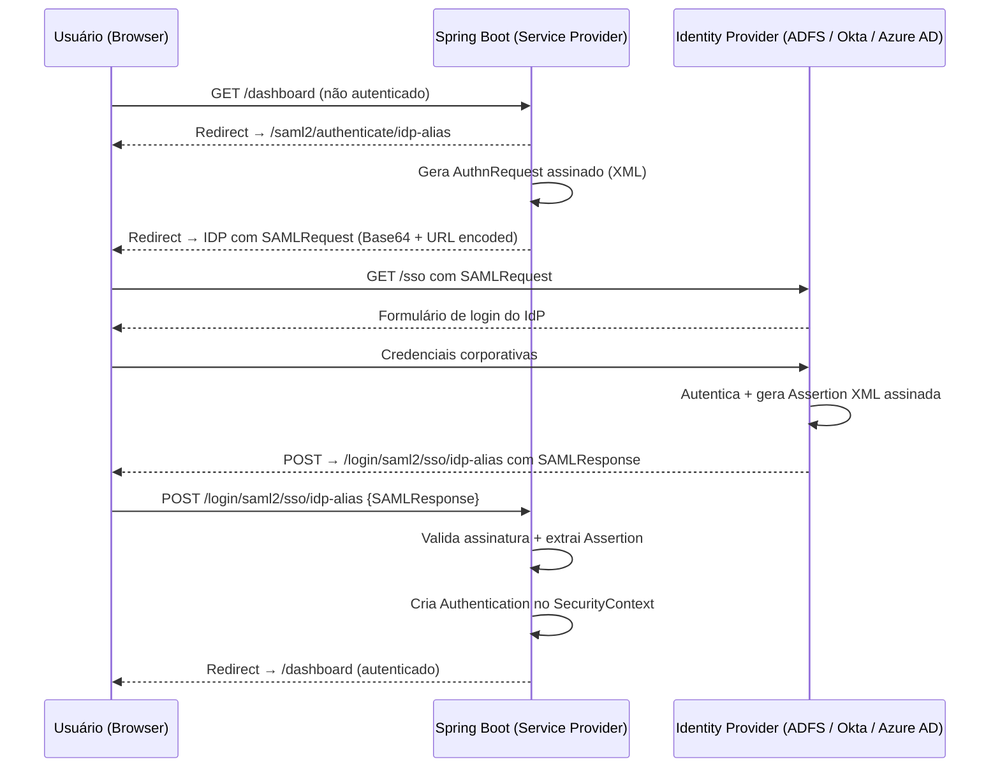
```mermaid
sequenceDiagram
    participant U as Usuário (Browser)
    participant SP as Spring Boot (Service Provider)
    participant IDP as Identity Provider (ADFS / Okta / Azure AD)

    U->>SP: GET /dashboard (não autenticado)
    SP-->>U: Redirect → /saml2/authenticate/idp-alias
    SP->>SP: Gera AuthnRequest assinado (XML)
    SP-->>U: Redirect → IDP com SAMLRequest (Base64 + URL encoded)
    U->>IDP: GET /sso com SAMLRequest
    IDP-->>U: Formulário de login do IdP
    U->>IDP: Credenciais corporativas
    IDP->>IDP: Autentica + gera Assertion XML assinada
    IDP-->>U: POST → /login/saml2/sso/idp-alias com SAMLResponse
    U->>SP: POST /login/saml2/sso/idp-alias {SAMLResponse}
    SP->>SP: Valida assinatura + extrai Assertion
    SP->>SP: Cria Authentication no SecurityContext
    SP-->>U: Redirect → /dashboard (autenticado)
```

**Terminologia essencial:**

| Termo | Significado |
|-------|-------------|
| **SP (Service Provider)** | Sua aplicação Spring Boot |
| **IdP (Identity Provider)** | ADFS, Okta, Azure AD, Shibboleth |
| **AuthnRequest** | Pedido de autenticação enviado pelo SP ao IdP |
| **Assertion** | Documento XML com os dados do usuário, emitido pelo IdP |
| **Metadata** | Documento XML descrevendo endpoints e certificados do SP/IdP |
| **Entity ID** | Identificador único do SP ou IdP (normalmente uma URL) |
| **ACS (Assertion Consumer Service)** | Endpoint do SP que recebe o SAMLResponse do IdP |
| **Binding** | Mecanismo de transporte: HTTP-POST (padrão) ou HTTP-Redirect |

---

### 17.2 Dependência Maven

```xml
<!-- Spring Security SAML2 Service Provider -->
<dependency>
    <groupId>org.springframework.security</groupId>
    <artifactId>spring-security-saml2-service-provider</artifactId>
</dependency>

<!-- OpenSAML — implementação SAML subjacente, gerenciada pelo BOM -->
<!-- Não declarar versão explicitamente -->
```

---

### 17.3 Configuração via `application.yml`

```yaml
spring:
  security:
    saml2:
      relyingparty:
        registration:
          # "adfs" é o registrationId — aparece nas URLs: /saml2/authenticate/adfs
          adfs:
            entity-id: https://myapp.example.com/saml2/sp   # Entity ID do SP
            asserting-party:                                  # Configurações do IdP
              metadata-uri: https://adfs.corp.com/FederationMetadata/2007-06/FederationMetadata.xml
              # Alternativa: metadados inline ou arquivo local
              # metadata-uri: classpath:saml/idp-metadata.xml
            signing:
              credentials:
                - private-key-location: classpath:saml/sp-private.key
                  certificate-location: classpath:saml/sp-certificate.crt
            decryption:
              credentials:
                - private-key-location: classpath:saml/sp-private.key
                  certificate-location: classpath:saml/sp-certificate.crt

          # Segundo IdP — ex: Okta para parceiros externos
          okta:
            entity-id: https://myapp.example.com/saml2/sp
            asserting-party:
              metadata-uri: https://mycompany.okta.com/app/abc123/sso/saml/metadata
            signing:
              credentials:
                - private-key-location: classpath:saml/sp-private.key
                  certificate-location: classpath:saml/sp-certificate.crt
```

---

### 17.4 Geração do Par de Chaves do SP

```bash
# Gera chave privada RSA 2048 bits
openssl genrsa -out sp-private.key 2048

# Gera certificado autoassinado (validade 10 anos)
openssl req -new -x509 \
  -key sp-private.key \
  -out sp-certificate.crt \
  -days 3650 \
  -subj "/CN=myapp.example.com/O=MyOrg/C=BR"

# Copiar para src/main/resources/saml/
```

> Em produção, use um certificado emitido por uma CA interna. O certificado do SP é público — é compartilhado com o IdP via metadata. A chave privada deve ser armazenada no Vault ou AWS Secrets Manager.

---

### 17.5 SecurityFilterChain para SAML2

```java
@Configuration
@EnableWebSecurity
public class Saml2SecurityConfig {

    /**
     * SecurityFilterChain com autenticação SAML2.
     *
     * Endpoints registrados automaticamente pelo Spring Security:
     *   GET  /saml2/authenticate/{registrationId}  → inicia AuthnRequest
     *   POST /login/saml2/sso/{registrationId}     → recebe SAMLResponse (ACS)
     *   GET  /saml2/metadata/{registrationId}      → expõe SP Metadata XML
     *   POST /logout/saml2/slo/{registrationId}    → recebe LogoutRequest do IdP (SLO)
     */
    @Bean
    public SecurityFilterChain saml2Chain(HttpSecurity http) throws Exception {
        return http
            .saml2Login(saml2 -> saml2
                .loginPage("/login")                    // página de seleção de IdP
                .defaultSuccessUrl("/dashboard", true)
                .failureUrl("/login?error=saml2")
                .userDetailsService(saml2UserDetailsService())
            )
            .saml2Logout(logout -> logout
                .logoutUrl("/logout")
                // Habilita Single Logout — propaga logout para o IdP
                .addObjectPostProcessor(new ObjectPostProcessor<>() {
                    @Override
                    public <O extends Saml2LogoutRequestFilter> O postProcess(O filter) {
                        // Configura SLO se o IdP suportar
                        return filter;
                    }
                })
            )
            .authorizeHttpRequests(auth -> auth
                .requestMatchers("/login**", "/saml2/**", "/error").permitAll()
                .anyRequest().authenticated())
            .build();
    }
}
```

---

### 17.6 Mapeamento de Atributos SAML para `UserDetails`

O IdP envia os dados do usuário dentro da Assertion como **Attributes** XML. Os nomes dos atributos variam por IdP — ADFS usa o formato `http://schemas.xmlsoap.org/...`, Okta e Azure AD usam nomes mais curtos.

```java
/**
 * Converte a Saml2AuthenticatedPrincipal (dados extraídos da Assertion)
 * em um UserDetails do Spring Security com roles e permissões locais.
 */
@Service
@RequiredArgsConstructor
@Slf4j
public class Saml2UserDetailsService
        implements Saml2UserDetailsService<Saml2AuthenticatedPrincipal> {

    private final UserRepository userRepository;

    // Nomes de atributos SAML comuns por IdP
    private static final Map<String, List<String>> EMAIL_ATTRS = Map.of(
        "adfs",  List.of(
            "http://schemas.xmlsoap.org/ws/2005/05/identity/claims/emailaddress",
            "http://schemas.xmlsoap.org/ws/2005/05/identity/claims/upn"),
        "okta",  List.of("email", "login"),
        "azure", List.of("http://schemas.xmlsoap.org/ws/2005/05/identity/claims/emailaddress",
                         "preferred_username"),
        "default", List.of("email", "mail", "EmailAddress")
    );

    private static final Map<String, String> GROUPS_ATTRS = Map.of(
        "adfs",  "http://schemas.xmlsoap.org/claims/Group",
        "okta",  "groups",
        "azure", "http://schemas.microsoft.com/ws/2008/06/identity/claims/groups",
        "default", "groups"
    );

    @Override
    public Saml2AuthenticatedPrincipal loadUser(
            Saml2AuthenticatedPrincipal principal) {

        String registrationId = principal.getRelyingPartyRegistrationId();
        String nameId         = principal.getName();   // NameID da Assertion

        // Extrai email dos atributos SAML
        String email = resolveEmail(principal, registrationId);

        // Sincroniza com banco de dados local — cria ou atualiza o usuário
        UserEntity user = syncUser(nameId, email, registrationId, principal);

        log.info("SAML2 login: nameId={} email={} idp={}",
            nameId, email, registrationId);

        // Retorna o principal original enriquecido com authorities locais
        return new CustomSaml2Principal(principal, buildAuthorities(user));
    }

    private String resolveEmail(Saml2AuthenticatedPrincipal p, String idp) {
        List<String> candidateAttrs = EMAIL_ATTRS.getOrDefault(idp,
            EMAIL_ATTRS.get("default"));

        return candidateAttrs.stream()
            .map(attr -> p.getFirstAttribute(attr))
            .filter(Objects::nonNull)
            .findFirst()
            .orElse(p.getName());   // fallback: usa o NameID como email
    }

    @SuppressWarnings("unchecked")
    private List<String> resolveGroups(Saml2AuthenticatedPrincipal p, String idp) {
        String groupAttr = GROUPS_ATTRS.getOrDefault(idp, GROUPS_ATTRS.get("default"));
        List<String> groups = p.getAttribute(groupAttr);
        return groups != null ? groups : List.of();
    }

    private UserEntity syncUser(String nameId, String email,
                                 String idp, Saml2AuthenticatedPrincipal p) {
        return userRepository.findBySamlNameId(nameId)
            .map(existing -> {
                // Atualiza dados do usuário existente com informações do IdP
                existing.setEmail(email);
                existing.setLastLoginAt(Instant.now());
                return userRepository.save(existing);
            })
            .orElseGet(() -> {
                // Cria novo usuário no primeiro login
                UserEntity newUser = new UserEntity();
                newUser.setSamlNameId(nameId);
                newUser.setEmail(email);
                newUser.setProvider(idp);
                newUser.setEnabled(true);
                newUser.getRoles().add(Role.USER);
                return userRepository.save(newUser);
            });
    }

    private Collection<GrantedAuthority> buildAuthorities(UserEntity user) {
        return user.getRoles().stream()
            .map(r -> new SimpleGrantedAuthority("ROLE_" + r.name()))
            .collect(Collectors.toList());
    }
}
```

---

### 17.7 Mapeamento de Grupos SAML para Roles Spring

```java
/**
 * Converte grupos SAML (ex: grupos do AD) em GrantedAuthorities Spring.
 * Registrado como GrantedAuthoritiesMapper no contexto.
 */
@Component
public class SamlGroupsToRolesMapper implements GrantedAuthoritiesMapper {

    // Mapeamento de grupo AD → ROLE Spring Security
    private static final Map<String, String> GROUP_TO_ROLE = Map.of(
        "CN=AppAdmins,OU=Groups,DC=corp,DC=com",    "ROLE_ADMIN",
        "CN=AppUsers,OU=Groups,DC=corp,DC=com",     "ROLE_USER",
        "CN=AppManagers,OU=Groups,DC=corp,DC=com",  "ROLE_MANAGER",
        "AppAdmins",   "ROLE_ADMIN",   // Okta usa nomes curtos
        "AppUsers",    "ROLE_USER",
        "AppManagers", "ROLE_MANAGER"
    );

    @Override
    public Collection<? extends GrantedAuthority> mapAuthorities(
            Collection<? extends GrantedAuthority> authorities) {

        Set<GrantedAuthority> mapped = new LinkedHashSet<>();

        for (GrantedAuthority authority : authorities) {
            // Authorities do SAML2 chegam como SimpleGrantedAuthority
            // com o valor do atributo de grupo
            String role = GROUP_TO_ROLE.get(authority.getAuthority());
            if (role != null) {
                mapped.add(new SimpleGrantedAuthority(role));
            }
            // Mantém a authority original também (para auditoria)
            mapped.add(authority);
        }

        // Role mínima para qualquer usuário autenticado via SAML
        mapped.add(new SimpleGrantedAuthority("ROLE_USER"));

        return mapped;
    }
}

// Registro no SecurityConfig
@Bean
public SecurityFilterChain saml2Chain(HttpSecurity http,
        SamlGroupsToRolesMapper groupsMapper) throws Exception {
    return http
        .saml2Login(saml2 -> saml2
            .userDetailsService(saml2UserDetailsService())
            .grantedAuthoritiesMapper(groupsMapper)   // ← mapper registrado aqui
        )
        // ...
        .build();
}
```

---

### 17.8 SP Metadata — Configuração do IdP

O Spring Security gera automaticamente o **SP Metadata XML** em `/saml2/metadata/{registrationId}`. Esse XML deve ser fornecido ao administrador do IdP para configurar a relação de confiança (trust relationship).

```
GET /saml2/metadata/adfs
→ Retorna XML com:
   - Entity ID do SP
   - Certificado público do SP (para o IdP validar as assinaturas)
   - ACS URL (onde o IdP deve enviar o SAMLResponse)
   - SLO URL (onde o IdP deve enviar LogoutRequest)
   - NameID formats suportados
```

Para personalizar o metadata gerado:

```java
@Bean
public Saml2MetadataResolver saml2MetadataResolver(
        RelyingPartyRegistrationRepository registrations) {

    OpenSaml4MetadataResolver resolver = new OpenSaml4MetadataResolver();

    // Adiciona informações de contato ao metadata (opcional mas recomendado)
    resolver.setEntityDescriptorCustomizer(descriptor -> {
        // Personaliza o EntityDescriptor gerado
        descriptor.setValidUntil(Instant.now().plus(365, ChronoUnit.DAYS));
    });

    return resolver;
}
```

---

### 17.9 Single Logout (SLO)

```java
@Bean
public SecurityFilterChain saml2Chain(HttpSecurity http) throws Exception {
    return http
        .saml2Login(Customizer.withDefaults())
        .saml2Logout(logout -> logout
            // URL onde o SP recebe LogoutRequest do IdP
            .logoutRequestValidator(new Saml2LogoutRequestValidator())
            // URL onde o SP recebe LogoutResponse do IdP
            .logoutResponseResolver(new OpenSaml4LogoutResponseResolver(
                registrationRepository))
        )
        .logout(logout -> logout
            .logoutUrl("/logout")
            .logoutSuccessUrl("/login?logout")
            .deleteCookies("JSESSIONID")
            .invalidateHttpSession(true))
        .build();
}
```

---

### 17.10 Integração com Azure AD via SAML2

```yaml
spring:
  security:
    saml2:
      relyingparty:
        registration:
          azure:
            entity-id: https://myapp.example.com/saml2/sp
            asserting-party:
              # Metadata do Azure AD — substitua {tenant-id} pelo ID do tenant
              metadata-uri: >
                https://login.microsoftonline.com/{tenant-id}/federationmetadata/2007-06/federationmetadata.xml?appid={app-id}
              want-authn-requests-signed: true
            signing:
              credentials:
                - private-key-location: classpath:saml/sp-private.key
                  certificate-location: classpath:saml/sp-certificate.crt
            acs:
              location: https://myapp.example.com/login/saml2/sso/azure
```

Atributos enviados pelo Azure AD e seus mapeamentos:

```java
// Extração de atributos específicos do Azure AD
private static final String AZURE_EMAIL =
    "http://schemas.xmlsoap.org/ws/2005/05/identity/claims/emailaddress";
private static final String AZURE_GROUPS =
    "http://schemas.microsoft.com/ws/2008/06/identity/claims/groups";
private static final String AZURE_DISPLAY_NAME =
    "http://schemas.microsoft.com/identity/claims/displayname";
private static final String AZURE_OBJECT_ID =
    "http://schemas.microsoft.com/identity/claims/objectidentifier";

public void extractAzureAttributes(Saml2AuthenticatedPrincipal p) {
    String email       = p.getFirstAttribute(AZURE_EMAIL);
    List<String> groups = p.getAttribute(AZURE_GROUPS);   // GUIDs dos grupos no AD
    String displayName = p.getFirstAttribute(AZURE_DISPLAY_NAME);
    String objectId    = p.getFirstAttribute(AZURE_OBJECT_ID);
}
```

---

### 17.11 Comparativo: SAML2 vs OAuth2/OIDC

| Aspecto | SAML2 | OAuth2 / OIDC |
|---|---|---|
| **Formato** | XML (verboso, pesado) | JSON (compacto, leve) |
| **Transport** | HTTP-POST / HTTP-Redirect | HTTP-Redirect / Token no body |
| **Adoção** | Corporativo / Enterprise (ADFS, Shibboleth) | Web moderno, mobile, SPAs |
| **Spring Security** | `spring-security-saml2-service-provider` | `spring-boot-starter-oauth2-client` |
| **Configuração** | Troca de metadata XML | Discovery endpoint automático |
| **Mobile** | Difícil (fluxo baseado em redirect browser) | Nativo (PKCE) |
| **Quando usar** | Integração com ADFS corporativo, universidades (CAFe/RNP) | Novos projetos, APIs, SPAs |


---

## 18. Integração com LDAP

LDAP (Lightweight Directory Access Protocol) é o protocolo padrão para diretórios corporativos como Microsoft Active Directory, OpenLDAP e 389 Directory Server. O Spring Security oferece suporte nativo para autenticação e busca de usuários via LDAP.

### 18.1 Modos de Autenticação LDAP

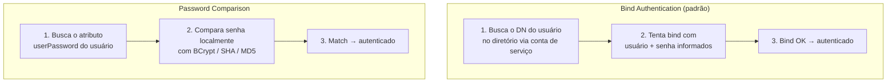
```mermaid
flowchart TD
    subgraph "Bind Authentication (padrão)"
        BA1[1. Busca o DN do usuário\nno diretório via conta de serviço]
        BA2[2. Tenta bind com\nusuário + senha informados]
        BA3[3. Bind OK → autenticado]
        BA1 --> BA2 --> BA3
    end

    subgraph "Password Comparison"
        PC1[1. Busca o atributo\nuserPassword do usuário]
        PC2[2. Compara senha localmente\ncom BCrypt / SHA / MD5]
        PC3[3. Match → autenticado]
        PC1 --> PC2 --> PC3
    end
```

| Modo | Vantagem | Desvantagem | Quando usar |
|------|----------|-------------|-------------|
| **Bind** | Senha nunca trafega do LDAP para a app | Requer conta de serviço no LDAP | Active Directory, OpenLDAP |
| **Password Comparison** | Não precisa de bind | Exige que `userPassword` seja legível | LDAP com hash de senha acessível |

---

### 18.2 Dependências Maven

```xml
<!-- Spring Security LDAP -->
<dependency>
    <groupId>org.springframework.security</groupId>
    <artifactId>spring-security-ldap</artifactId>
</dependency>

<!-- Spring LDAP Core (abstração de baixo nível) -->
<dependency>
    <groupId>org.springframework.ldap</groupId>
    <artifactId>spring-ldap-core</artifactId>
</dependency>

<!-- UnboundID LDAP SDK — servidor LDAP embutido para testes -->
<dependency>
    <groupId>com.unboundid</groupId>
    <artifactId>unboundid-ldapsdk</artifactId>
    <scope>test</scope>
</dependency>
```

---

### 18.3 Configuração via `application.yml`

```yaml
spring:
  ldap:
    urls: ldap://ldap.corp.com:389
    # Para LDAPS (TLS): ldaps://ldap.corp.com:636
    base: dc=corp,dc=com            # Base DN de busca
    username: cn=svc-springapp,ou=ServiceAccounts,dc=corp,dc=com  # Conta de serviço
    password: ${LDAP_SERVICE_PASSWORD}

app:
  ldap:
    user-search-base: ou=Users         # Relativo ao base DN
    user-search-filter: (sAMAccountName={0})   # {0} = username — AD usa sAMAccountName
    group-search-base: ou=Groups
    group-search-filter: (member={0})          # {0} = DN completo do usuário
    group-role-attribute: cn              # Atributo do grupo usado como nome da role
    role-prefix: ROLE_
    # Para OpenLDAP, substituir sAMAccountName por uid
    # user-search-filter: (uid={0})
```

---

### 18.4 Configuração do `AuthenticationProvider` LDAP

#### 18.4.1 Bind Authentication (recomendado para Active Directory)

```java
@Configuration
@EnableWebSecurity
@RequiredArgsConstructor
public class LdapSecurityConfig {

    @Value("${spring.ldap.urls}")              private String ldapUrl;
    @Value("${spring.ldap.base}")              private String ldapBase;
    @Value("${spring.ldap.username}")          private String serviceUser;
    @Value("${spring.ldap.password}")          private String servicePassword;
    @Value("${app.ldap.user-search-base}")     private String userSearchBase;
    @Value("${app.ldap.user-search-filter}")   private String userSearchFilter;
    @Value("${app.ldap.group-search-base}")    private String groupSearchBase;
    @Value("${app.ldap.group-search-filter}")  private String groupSearchFilter;
    @Value("${app.ldap.group-role-attribute}") private String groupRoleAttribute;

    /**
     * ContextSource — conexão ao servidor LDAP com conta de serviço.
     * O Spring usa esta conta para buscar o DN do usuário antes do bind.
     */
    @Bean
    public LdapContextSource ldapContextSource() {
        LdapContextSource ctx = new LdapContextSource();
        ctx.setUrl(ldapUrl);
        ctx.setBase(ldapBase);
        ctx.setUserDn(serviceUser);
        ctx.setPassword(servicePassword);
        // Pool de conexões para reutilizar a conexão da conta de serviço
        ctx.setPooled(true);
        return ctx;
    }

    /**
     * LdapTemplate — API de alto nível para queries LDAP.
     * Usado pelo LdapUserDetailsService para carregar atributos adicionais.
     */
    @Bean
    public LdapTemplate ldapTemplate(LdapContextSource contextSource) {
        LdapTemplate template = new LdapTemplate(contextSource);
        // Ignora erros de referência parcial (comum no Active Directory)
        template.setIgnorePartialResultException(true);
        return template;
    }

    /**
     * AuthenticationProvider que realiza Bind Authentication no LDAP.
     *
     * Fluxo:
     * 1. Busca o DN completo do usuário via userSearchFilter
     * 2. Tenta bind com o DN + senha informados pelo usuário
     * 3. Carrega os grupos do usuário via groupSearchFilter
     * 4. Converte grupos em GrantedAuthorities
     */
    @Bean
    public LdapAuthenticationProvider ldapAuthenticationProvider(
            LdapContextSource contextSource) {

        // 1. Define como encontrar o DN do usuário
        FilterBasedLdapUserSearch userSearch = new FilterBasedLdapUserSearch(
            userSearchBase,      // ou=Users
            userSearchFilter,    // (sAMAccountName={0})
            contextSource);
        userSearch.setSearchSubtree(true); // busca em subárvores

        // 2. Define o mecanismo de bind (verificação de senha)
        BindAuthenticator bindAuthenticator = new BindAuthenticator(contextSource);
        bindAuthenticator.setUserSearch(userSearch);

        // 3. Define como carregar os grupos (authorities)
        DefaultLdapAuthoritiesPopulator authoritiesPopulator =
            new DefaultLdapAuthoritiesPopulator(contextSource, groupSearchBase);
        authoritiesPopulator.setGroupSearchFilter(groupSearchFilter);
        authoritiesPopulator.setGroupRoleAttribute(groupRoleAttribute);
        authoritiesPopulator.setRolePrefix("ROLE_");
        authoritiesPopulator.setConvertToUpperCase(true); // ROLE_APPADMINS
        authoritiesPopulator.setSearchSubtree(true);
        // Adiciona a role "ROLE_USER" para qualquer usuário autenticado via LDAP
        authoritiesPopulator.setDefaultRole("ROLE_USER");

        // 4. Monta o provider
        LdapAuthenticationProvider provider = new LdapAuthenticationProvider(
            bindAuthenticator, authoritiesPopulator);

        // 5. Mapper de atributos LDAP → UserDetails
        provider.setUserDetailsContextMapper(ldapUserDetailsMapper());

        return provider;
    }

    /**
     * Registra o LdapAuthenticationProvider no AuthenticationManager.
     */
    @Bean
    public SecurityFilterChain ldapSecurityChain(HttpSecurity http,
            LdapAuthenticationProvider ldapProvider) throws Exception {
        return http
            .authenticationProvider(ldapProvider)
            .formLogin(form -> form
                .loginPage("/login")
                .defaultSuccessUrl("/dashboard", true)
                .permitAll())
            .authorizeHttpRequests(auth -> auth
                .requestMatchers("/login", "/css/**", "/js/**").permitAll()
                .requestMatchers("/admin/**").hasRole("APPADMINS")
                .anyRequest().authenticated())
            .build();
    }

    @Bean
    public LdapUserDetailsMapper ldapUserDetailsMapper() {
        return new CustomLdapUserDetailsMapper();
    }
}
```

#### 18.4.2 Active Directory — `ActiveDirectoryLdapAuthenticationProvider`

Para integração com AD, o Spring Security oferece um provider especializado que trata as peculiaridades do Active Directory (formato do DN, grupos aninhados, códigos de erro específicos):

```java
/**
 * Provider especializado para Active Directory.
 * Simplifica a configuração — não é necessário definir userSearchFilter
 * separadamente, pois o AD usa UPN (user@domain) ou sAMAccountName por padrão.
 */
@Bean
public ActiveDirectoryLdapAuthenticationProvider adAuthenticationProvider() {

    ActiveDirectoryLdapAuthenticationProvider provider =
        new ActiveDirectoryLdapAuthenticationProvider(
            "corp.com",           // domínio AD
            "ldap://ldap.corp.com:389",
            "dc=corp,dc=com");    // root DN

    // Padrão de busca do usuário — {0}=username, {1}=domínio
    provider.setSearchFilter("(&(objectClass=user)(sAMAccountName={0}))");

    // Converte grupos AD em GrantedAuthorities automaticamente
    provider.setConvertSubErrorCodesToExceptions(true);
    provider.setUseAuthenticationRequestCredentials(true);

    return provider;
}
```

---

### 18.5 `UserDetailsContextMapper` — Enriquecimento do UserDetails

O `UserDetailsContextMapper` é chamado após o bind bem-sucedido para converter os atributos LDAP em um `UserDetails` Spring. É aqui que se extrai email, nome completo, departamento, etc.

```java
@Component
@RequiredArgsConstructor
@Slf4j
public class CustomLdapUserDetailsMapper implements UserDetailsContextMapper {

    private final UserRepository localUserRepository;

    /**
     * Chamado após bind LDAP bem-sucedido.
     * Converte os atributos do DirContextOperations (contexto LDAP) em UserDetails.
     *
     * @param ctx         contexto LDAP com todos os atributos do usuário
     * @param username    username informado no formulário
     * @param authorities grupos/roles carregados pelo authoritiesPopulator
     */
    @Override
    public UserDetails mapUserFromContext(DirContextOperations ctx,
                                          String username,
                                          Collection<? extends GrantedAuthority> authorities) {

        // Extrai atributos LDAP — nomes variam entre AD e OpenLDAP
        String email       = getAttr(ctx, "mail", "userPrincipalName");
        String displayName = getAttr(ctx, "displayName", "cn");
        String department  = getAttr(ctx, "department", "ou");
        String employeeId  = getAttr(ctx, "employeeID", "employeeNumber");
        String dn          = ctx.getDn().toString();

        log.debug("LDAP login: user={} dn={} dept={}", username, dn, department);

        // Sincroniza com banco local — garante que o usuário existe localmente
        // para uso com JPA, roles locais, preferências, etc.
        localUserRepository.findByUsername(username)
            .ifPresentOrElse(
                user -> updateFromLdap(user, email, displayName, department),
                () -> createFromLdap(username, email, displayName, department));

        // Enriquece com authorities locais do banco além das do LDAP
        Set<GrantedAuthority> allAuthorities = new LinkedHashSet<>(authorities);
        localUserRepository.findByUsername(username)
            .ifPresent(user -> user.getLocalRoles().stream()
                .map(r -> new SimpleGrantedAuthority("ROLE_" + r.name()))
                .forEach(allAuthorities::add));

        // Constrói UserDetails com todos os atributos
        return LdapUserDetailsImpl.newInstance()
            .username(username)
            .dn(dn)
            .authorities(allAuthorities)
            .accountNonExpired(true)
            .accountNonLocked(true)
            .credentialsNonExpired(true)
            .enabled(true)
            .build();
    }

    /**
     * Chamado quando o usuário atualiza a senha (raro via LDAP).
     * Normalmente não implementado — a senha é gerenciada pelo IdP LDAP.
     */
    @Override
    public void mapUserToContext(UserDetails user, DirContextAdapter ctx) {
        throw new UnsupportedOperationException(
            "Alteração de senha via LDAP não suportada nesta aplicação.");
    }

    private String getAttr(DirContextOperations ctx, String... candidates) {
        for (String attr : candidates) {
            String value = ctx.getStringAttribute(attr);
            if (value != null && !value.isBlank()) return value;
        }
        return null;
    }

    private void updateFromLdap(UserEntity user, String email,
                                 String displayName, String department) {
        user.setEmail(email);
        user.setDisplayName(displayName);
        user.setDepartment(department);
        user.setLastLoginAt(Instant.now());
        localUserRepository.save(user);
    }

    private void createFromLdap(String username, String email,
                                  String displayName, String department) {
        UserEntity user = new UserEntity();
        user.setUsername(username);
        user.setEmail(email);
        user.setDisplayName(displayName);
        user.setDepartment(department);
        user.setProvider("ldap");
        user.setEnabled(true);
        user.getRoles().add(Role.USER);
        localUserRepository.save(user);
    }
}
```

---

### 18.6 `LdapUserDetailsService` — Busca de Usuários sem Autenticação

Para carregar usuários LDAP fora do fluxo de autenticação (ex.: pré-popular dados, verificar existência), use `LdapUserDetailsService`:

```java
@Service
@RequiredArgsConstructor
public class LdapDirectoryService {

    private final LdapTemplate ldapTemplate;

    @Value("${app.ldap.user-search-base}")   private String userBase;
    @Value("${app.ldap.group-search-base}")  private String groupBase;

    /**
     * Busca usuário por username no LDAP.
     * Retorna atributos selecionados — não carrega senha.
     */
    public Optional<LdapUserDto> findByUsername(String username) {
        String filter = "(sAMAccountName=" + LdapEncoder.filterEncode(username) + ")";

        List<LdapUserDto> results = ldapTemplate.search(
            userBase,
            filter,
            SearchControls.SUBTREE_SCOPE,
            new String[]{"sAMAccountName", "mail", "displayName",
                         "department", "telephoneNumber"},
            (DirContextOperations ctx) -> new LdapUserDto(
                ctx.getStringAttribute("sAMAccountName"),
                ctx.getStringAttribute("mail"),
                ctx.getStringAttribute("displayName"),
                ctx.getStringAttribute("department"),
                ctx.getStringAttribute("telephoneNumber")
            )
        );

        return results.stream().findFirst();
    }

    /**
     * Lista todos os grupos do usuário (incluindo grupos aninhados via AD).
     */
    public List<String> getUserGroups(String userDn) {
        // memberOf com LDAP_MATCHING_RULE_IN_CHAIN retorna grupos aninhados no AD
        String filter = "(member:1.2.840.113556.1.4.1941:=" +
            LdapEncoder.filterEncode(userDn) + ")";

        return ldapTemplate.search(
            groupBase,
            filter,
            (Attributes attrs) -> attrs.get("cn") != null
                ? (String) attrs.get("cn").get()
                : null
        ).stream().filter(Objects::nonNull).toList();
    }

    /**
     * Verifica se um usuário é membro de um grupo específico.
     */
    public boolean isMemberOf(String username, String groupCn) {
        String userDn = findDnByUsername(username);
        if (userDn == null) return false;
        return getUserGroups(userDn).stream()
            .anyMatch(g -> g.equalsIgnoreCase(groupCn));
    }

    private String findDnByUsername(String username) {
        String filter = "(sAMAccountName=" + LdapEncoder.filterEncode(username) + ")";
        List<String> dns = ldapTemplate.search(userBase, filter,
            (DirContextOperations ctx) -> ctx.getDn().toString());
        return dns.stream().findFirst().orElse(null);
    }

    public record LdapUserDto(String username, String email,
                               String displayName, String department,
                               String phone) {}
}
```

---

### 18.7 LDAP Embutido para Testes

```java
/**
 * Configura um servidor LDAP em memória (UnboundID) para testes de integração.
 * Carrega usuários de um arquivo LDIF na inicialização.
 */
@TestConfiguration
public class EmbeddedLdapConfig {

    @Bean
    public EmbeddedLdapAutoConfiguration embeddedLdap() {
        // Configurado automaticamente pelo spring-boot-starter-test
        // quando unboundid-ldapsdk está no classpath
        return new EmbeddedLdapAutoConfiguration();
    }
}
```

```yaml
# application-test.yml
spring:
  ldap:
    embedded:
      base-dn: dc=test,dc=com
      ldif: classpath:ldap/test-users.ldif
      port: 0   # porta aleatória
```

```ldif
# src/test/resources/ldap/test-users.ldif
dn: dc=test,dc=com
objectClass: top
objectClass: domain
dc: test

dn: ou=Users,dc=test,dc=com
objectClass: top
objectClass: organizationalUnit
ou: Users

dn: ou=Groups,dc=test,dc=com
objectClass: top
objectClass: organizationalUnit
ou: Groups

# Usuário de teste: admin
dn: cn=admin,ou=Users,dc=test,dc=com
objectClass: top
objectClass: person
objectClass: organizationalPerson
objectClass: inetOrgPerson
cn: admin
sn: Administrator
uid: admin
mail: admin@test.com
userPassword: {SSHA}senha-hash-bcrypt-aqui

# Usuário de teste: john
dn: cn=john,ou=Users,dc=test,dc=com
objectClass: inetOrgPerson
cn: john
sn: Doe
uid: john
mail: john@test.com
userPassword: {SSHA}senha-hash-bcrypt-aqui

# Grupo: AppAdmins
dn: cn=AppAdmins,ou=Groups,dc=test,dc=com
objectClass: groupOfNames
cn: AppAdmins
member: cn=admin,ou=Users,dc=test,dc=com

# Grupo: AppUsers
dn: cn=AppUsers,ou=Groups,dc=test,dc=com
objectClass: groupOfNames
cn: AppUsers
member: cn=john,ou=Users,dc=test,dc=com
member: cn=admin,ou=Users,dc=test,dc=com
```

---

### 18.8 Fallback: LDAP + Banco de Dados

Em ambientes onde nem todos os usuários estão no LDAP (ex.: usuários externos sem conta no AD), configure múltiplos `AuthenticationProvider` em ordem de tentativa:

```java
@Bean
public AuthenticationManager authenticationManager(
        LdapAuthenticationProvider ldapProvider,
        DaoAuthenticationProvider dbProvider) {

    // Spring tenta cada provider em ordem — primeiro LDAP, depois banco
    // Se LDAP não encontrar o usuário, tenta o banco local
    return new ProviderManager(List.of(ldapProvider, dbProvider));
}

@Bean
public DaoAuthenticationProvider dbAuthenticationProvider(
        UserDetailsService userDetailsService,
        PasswordEncoder passwordEncoder) {

    DaoAuthenticationProvider provider = new DaoAuthenticationProvider();
    provider.setUserDetailsService(userDetailsService);
    provider.setPasswordEncoder(passwordEncoder);
    return provider;
}
```

---

### 18.9 Comparativo: LDAP vs Banco de Dados vs OAuth2

| Aspecto | LDAP / Active Directory | Banco de Dados | OAuth2 / OIDC |
|---|---|---|---|
| **Fonte de usuários** | Diretório corporativo centralizado | Tabela local da aplicação | IdP externo |
| **Gestão de senhas** | RH / TI (auto-serviço AD) | Pela própria aplicação | Pelo IdP |
| **SSO** | Via Kerberos / ADFS | Não — por aplicação | Nativo |
| **Grupos/Roles** | Grupos do AD → roles Spring | Tabela local | Claims do token |
| **Implantação** | Comum em empresas com AD | Apps sem AD ou usuários externos | SaaS, apps modernos |
| **Spring Security** | `spring-security-ldap` | `DaoAuthenticationProvider` | `oauth2-client` |


## 19. Boas Práticas OWASP

### 19.1 Top 10 OWASP aplicado ao Spring Security

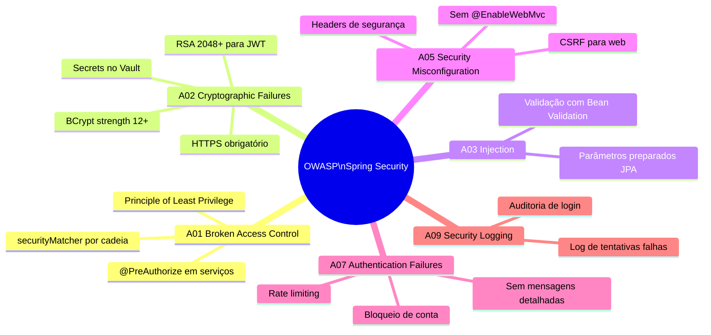
```mermaid
mindmap
  root((OWASP\nSpring Security))
    A01 Broken Access Control
      Principle of Least Privilege
      @PreAuthorize em serviços
      securityMatcher por cadeia
    A02 Cryptographic Failures
      BCrypt strength 12+
      RSA 2048+ para JWT
      HTTPS obrigatório
      Secrets no Vault
    A03 Injection
      Validação com Bean Validation
      Parâmetros preparados JPA
    A05 Security Misconfiguration
      Sem @EnableWebMvc
      CSRF para web
      Headers de segurança
    A07 Authentication Failures
      Rate limiting
      Bloqueio de conta
      Sem mensagens detalhadas
    A09 Security Logging
      Auditoria de login
      Log de tentativas falhas
```

### 19.2 Headers de Segurança HTTP

#### Headers sem nonce (CSP estático)

Para APIs REST ou aplicações onde todos os scripts são próprios e não há inline scripts, o CSP pode ser completamente estático:

```java
@Bean
public SecurityFilterChain secureHeadersChain(HttpSecurity http) throws Exception {
    return http
        .headers(headers -> headers
            // X-Frame-Options: DENY — previne clickjacking
            .frameOptions(frame -> frame.deny())

            // X-Content-Type-Options: nosniff — previne MIME sniffing
            .contentTypeOptions(Customizer.withDefaults())

            // X-XSS-Protection: 0 — desabilita filtro XSS legado do browser
            // (CSP é mais eficaz e moderno)
            .xssProtection(xss -> xss.disable())

            // Strict-Transport-Security: max-age=31536000; includeSubDomains; preload
            .httpStrictTransportSecurity(hsts -> hsts
                .includeSubDomains(true)
                .preload(true)
                .maxAgeInSeconds(31536000))

            // Content-Security-Policy estático — sem nonce
            // Adequado quando não há inline scripts/styles no HTML
            .contentSecurityPolicy(csp -> csp
                .policyDirectives(
                    "default-src 'self'; " +
                    "script-src 'self'; " +          // apenas scripts do próprio domínio
                    "style-src 'self'; " +
                    "img-src 'self' data: https:; " +
                    "font-src 'self'; " +
                    "frame-ancestors 'none'; " +
                    "base-uri 'self'; " +
                    "form-action 'self'"))

            // Permissions-Policy (substitui Feature-Policy)
            .permissionsPolicy(pp -> pp
                .policy("camera=(), microphone=(), geolocation=(), payment=()"))

            // Referrer-Policy
            .referrerPolicy(rp -> rp
                .policy(ReferrerPolicyHeaderWriter.ReferrerPolicy.STRICT_ORIGIN_WHEN_CROSS_ORIGIN))
        )
        .build();
}
```

#### Por que `'nonce-{nonce}'` em `policyDirectives` não funciona

> **Erro conceitual importante:** `policyDirectives` recebe uma `String` literal. O Spring Security **não realiza substituição** de nenhum placeholder nessa string. O valor `'nonce-{nonce}'` seria enviado literalmente ao browser, que o rejeitaria por não corresponder a nenhum nonce real — invalidando todos os scripts da página.

O problema se torna claro quando se entende o mecanismo do nonce:

```mermaid
sequenceDiagram
    participant B as Browser
    participant F as Spring Security Filter
    participant C as Controller/Template

    B->>F: GET /pagina
    Note over F: Gera nonce aleatório<br/>para ESTA requisição
    F->>C: request com atributo _cspNonce = "abc123xyz"
    C-->>F: HTML com &lt;script nonce="abc123xyz"&gt;
    Note over F: Monta header CSP:<br/>script-src 'nonce-abc123xyz'
    F-->>B: Response com header + HTML

    Note over B: Executa apenas scripts cujo<br/>atributo nonce == "abc123xyz"<br/>Rejeita scripts sem nonce (XSS)
```

O nonce precisa ser:
1. **Gerado por requisição** — aleatório, criptograficamente seguro, único por resposta HTTP
2. **Embutido no header CSP** dinamicamente na forma `'nonce-<valor>'`
3. **Embutido no HTML** como atributo de cada `<script>` e `<style>` legítimo
4. **Consistente** — o valor no header e no atributo HTML devem ser idênticos

#### Implementação correta com nonce dinâmico

**Passo 1 — `HeaderWriter` customizado que gera e propaga o nonce:**

```java
/**
 * Gera um nonce criptograficamente seguro por requisição,
 * armazena como atributo do request e escreve o header CSP dinamicamente.
 *
 * O nonce fica disponível nos templates via ${_cspNonce}.
 */
public class CspNonceHeaderWriter implements HeaderWriter {

    // Atributo de request onde o nonce é armazenado para uso nos templates
    public static final String NONCE_ATTRIBUTE = "_cspNonce";

    private static final SecureRandom SECURE_RANDOM = new SecureRandom();
    private static final int NONCE_BYTE_LENGTH = 16; // 128 bits — seguro o suficiente

    @Override
    public void writeHeaders(HttpServletRequest request, HttpServletResponse response) {
        // Gera nonce apenas uma vez por requisição (filtros podem ser chamados mais de uma vez)
        String nonce = (String) request.getAttribute(NONCE_ATTRIBUTE);
        if (nonce == null) {
            nonce = generateNonce();
            request.setAttribute(NONCE_ATTRIBUTE, nonce);
        }

        // Monta a policy com o nonce real — substituição ocorre aqui, em Java
        String policy =
            "default-src 'self'; " +
            "script-src 'self' 'nonce-" + nonce + "'; " +  // ← nonce real inserido aqui
            "style-src 'self' 'nonce-" + nonce + "'; " +
            "img-src 'self' data: https:; " +
            "font-src 'self'; " +
            "frame-ancestors 'none'; " +
            "base-uri 'self'; " +
            "form-action 'self'";

        response.setHeader("Content-Security-Policy", policy);
    }

    private String generateNonce() {
        byte[] bytes = new byte[NONCE_BYTE_LENGTH];
        SECURE_RANDOM.nextBytes(bytes);
        // Base64 URL-safe sem padding — formato seguro para atributo HTML e header HTTP
        return Base64.getUrlEncoder().withoutPadding().encodeToString(bytes);
    }
}
```

**Passo 2 — Registrar o `HeaderWriter` na `SecurityFilterChain`:**

```java
@Bean
public SecurityFilterChain secureHeadersChain(HttpSecurity http) throws Exception {
    return http
        .headers(headers -> headers
            // Desabilita o writer padrão de CSP (que seria estático)
            .contentSecurityPolicy(csp -> csp.disable())
            // Adiciona o writer customizado com nonce dinâmico
            .addHeaderWriter(new CspNonceHeaderWriter())
            // Demais headers permanecem estáticos — não precisam de nonce
            .frameOptions(frame -> frame.deny())
            .contentTypeOptions(Customizer.withDefaults())
            .httpStrictTransportSecurity(hsts -> hsts
                .includeSubDomains(true)
                .maxAgeInSeconds(31536000))
            .permissionsPolicy(pp -> pp
                .policy("camera=(), microphone=(), geolocation=(), payment=()"))
        )
        .build();
}
```

**Passo 3 — Usar o nonce nos templates Thymeleaf:**

```html
<!DOCTYPE html>
<html xmlns:th="http://www.thymeleaf.org">
<head>
    <!--
        O atributo th:attr="nonce=${_cspNonce}" injeta o nonce gerado pelo
        CspNonceHeaderWriter no atributo nonce do elemento.
        O browser compara este valor com o 'nonce-xxx' do header CSP.
        Se coincidirem, o script é executado. Se não, é bloqueado.
    -->
    <script th:attr="nonce=${_cspNonce}" th:src="@{/js/app.js}"></script>
    <link   th:attr="nonce=${_cspNonce}" rel="stylesheet" th:href="@{/css/main.css}"/>

    <!-- Script inline também precisa do nonce -->
    <script th:attr="nonce=${_cspNonce}">
        const config = /*[[${appConfig}]]*/ {};
    </script>
</head>
<body>
    <!-- Scripts inline sem nonce são bloqueados pelo browser (proteção XSS) -->
    <!-- <script>alert('XSS')</script> ← bloqueado mesmo que seja injetado -->
</body>
</html>
```

**Passo 4 — Tornar o nonce disponível em controllers/interceptors (opcional):**

```java
/**
 * Interceptor que expõe o nonce como variável de modelo Thymeleaf.
 * Necessário apenas se o nonce precisar estar em ModelAndView além de request attribute.
 */
@Component
public class CspNonceModelInterceptor implements HandlerInterceptor {

    @Override
    public void postHandle(HttpServletRequest request,
                           HttpServletResponse response,
                           Object handler,
                           ModelAndView modelAndView) {

        if (modelAndView != null) {
            String nonce = (String) request.getAttribute(CspNonceHeaderWriter.NONCE_ATTRIBUTE);
            if (nonce != null) {
                // Disponível em templates como ${cspNonce} além de ${_cspNonce}
                modelAndView.addObject("cspNonce", nonce);
            }
        }
    }
}

// Registro do interceptor
@Configuration
public class WebMvcConfig implements WebMvcConfigurer {
    @Override
    public void addInterceptors(InterceptorRegistry registry) {
        registry.addInterceptor(new CspNonceModelInterceptor());
    }
}
```

#### Resumo do fluxo completo

| Etapa | Responsável | O que acontece |
|-------|-------------|----------------|
| Geração | `CspNonceHeaderWriter` | `SecureRandom` gera 16 bytes → Base64 URL-safe |
| Armazenamento | `CspNonceHeaderWriter` | Salvo em `request.setAttribute("_cspNonce", nonce)` |
| Header HTTP | `CspNonceHeaderWriter` | `Content-Security-Policy: script-src 'nonce-abc123'` |
| Template | Thymeleaf `${_cspNonce}` | `<script nonce="abc123">` no HTML gerado |
| Validação | Browser | Compara atributo do script com o nonce do header CSP |

> **Por que um novo nonce a cada requisição?** Um nonce fixo ou reutilizado anula a proteção — um atacante que descobrir o valor pode injetar scripts com o mesmo nonce e o browser os aceitará. O `SecureRandom` com 128 bits garante que cada resposta HTTP tenha um valor imprevisível e único.

### 19.3 Rate Limiting (Prevenção de Brute Force)

```java
@Component
@RequiredArgsConstructor
@Slf4j
public class RateLimitingFilter extends OncePerRequestFilter {

    private final Cache<String, AtomicInteger> loginAttempts;
    private final UserService userService;

    private static final int MAX_ATTEMPTS = 5;
    private static final String LOGIN_URL  = "/api/v1/auth/login";

    @Override
    protected void doFilterInternal(HttpServletRequest request,
                                    HttpServletResponse response,
                                    FilterChain chain)
            throws ServletException, IOException {

        if (!isLoginRequest(request)) {
            chain.doFilter(request, response);
            return;
        }

        String clientKey = resolveClientKey(request);

        AtomicInteger attempts = loginAttempts.get(clientKey,
            k -> new AtomicInteger(0));

        if (attempts.get() >= MAX_ATTEMPTS) {
            log.warn("Rate limit atingido para: {}", clientKey);
            response.setStatus(HttpStatus.TOO_MANY_REQUESTS.value());
            response.setContentType("application/json");
            response.getWriter().write(
                "{\"error\": \"too_many_requests\", " +
                "\"message\": \"Muitas tentativas. Tente novamente em alguns minutos.\"}");
            return;
        }

        chain.doFilter(request, response);

        // Incrementa apenas em falha de autenticação
        if (response.getStatus() == HttpServletResponse.SC_UNAUTHORIZED) {
            int count = attempts.incrementAndGet();
            log.debug("Tentativas falhas para {}: {}/{}", clientKey, count, MAX_ATTEMPTS);
        } else if (response.getStatus() == HttpServletResponse.SC_OK) {
            // Login bem-sucedido — zera contador
            loginAttempts.invalidate(clientKey);
        }
    }

    private String resolveClientKey(HttpServletRequest req) {
        // Usa username + IP como chave
        String username = extractUsername(req);
        String ip = Optional.ofNullable(req.getHeader("X-Forwarded-For"))
            .orElse(req.getRemoteAddr());
        return username + ":" + ip;
    }

    private boolean isLoginRequest(HttpServletRequest req) {
        return HttpMethod.POST.name().equals(req.getMethod()) &&
               LOGIN_URL.equals(req.getServletPath());
    }
}

@Configuration
public class RateLimitConfig {

    @Bean
    public Cache<String, AtomicInteger> loginAttemptsCache() {
        return Caffeine.newBuilder()
            .expireAfterWrite(15, TimeUnit.MINUTES)
            .maximumSize(10_000)
            .build();
    }
}
```

### 19.4 CSRF — Estratégias

```java
// ====================================================
// Opção 1: CSRF via Cookie (para SPAs com Axios/Fetch)
// ====================================================
.csrf(csrf -> csrf
    .csrfTokenRepository(CookieCsrfTokenRepository.withHttpOnlyFalse())
    .csrfTokenRequestHandler(new XorCsrfTokenRequestAttributeHandler()))

// ====================================================
// Opção 2: CSRF via Header customizado
// ====================================================
.csrf(csrf -> csrf
    .csrfTokenRepository(CookieCsrfTokenRepository.withHttpOnlyFalse())
    .requireCsrfProtectionMatcher(request ->
        !Set.of("GET", "HEAD", "TRACE", "OPTIONS")
            .contains(request.getMethod())))

// ====================================================
// Opção 3: Desabilitar CSRF apenas para APIs stateless
// (correto porque Bearer tokens são imunes a CSRF)
// ====================================================
.csrf(csrf -> csrf.disable())  // SOMENTE em SecurityFilterChains stateless com JWT
```

### 19.5 Gestão Segura de Senhas

#### 19.5.1 BCrypt

BCrypt é o encoder padrão do Spring Security. Baseado no algoritmo Blowfish, usa um fator de custo (`strength`) que define o número de iterações como `2^strength`.

```java
@Bean
public PasswordEncoder passwordEncoder() {
    // strength 12 → 2^12 = 4.096 iterações → ~250ms em hardware moderno
    // strength 14 → 2^14 = 16.384 iterações → ~1s — para sistemas de alto valor
    return new BCryptPasswordEncoder(12);
}
```

---

#### 19.5.2 Argon2id — Algoritmo Recomendado pelo OWASP

Argon2id é o vencedor do Password Hashing Competition (2015) e o algoritmo **recomendado pelo OWASP** para novos sistemas. Combina resistência a ataques de GPU/ASIC (via uso intensivo de memória) com resistência a ataques de timing side-channel.

##### Diferença fundamental entre BCrypt e Argon2id

```
BCrypt                              Argon2id
──────────────────────────────────  ──────────────────────────────────────
Custo: apenas tempo de CPU          Custo: tempo de CPU + memória RAM
Parâmetro: strength (iterações)     Parâmetros: memory, iterations, parallelism
Resistência GPU: baixa              Resistência GPU/ASIC: alta (memória cara)
Tamanho do salt: 128 bits           Tamanho do salt: 128 bits (configurável)
Tamanho do hash: 184 bits           Tamanho do hash: 256 bits (configurável)
Limite de senha: 72 bytes           Limite de senha: sem limite prático
Suporte Spring Security: nativo     Suporte Spring Security: nativo (Bouncy Castle)
```

Argon2id tem três variantes:
- **Argon2d** — máxima resistência a GPU, vulnerável a timing side-channel
- **Argon2i** — resistente a timing, menor resistência a GPU
- **Argon2id** — híbrido: resistente a GPU *e* a timing side-channel → **use sempre esta**

##### Dependência

```xml
<!--
    Argon2id requer Bouncy Castle como provider JCE.
    O Spring Security delega para o provider internamente.
    Versão gerenciada pelo BOM do Spring Boot — não declarar explicitamente.
-->
<dependency>
    <groupId>org.bouncycastle</groupId>
    <artifactId>bcpkix-jdk18on</artifactId>
</dependency>
```

##### Configuração

```java
@Configuration
public class PasswordSecurityConfig {

    /**
     * Argon2id com parâmetros recomendados pelo OWASP (configuração mínima):
     *
     * - saltLength   : 16 bytes (128 bits) — gerado aleatoriamente por hash
     * - hashLength   : 32 bytes (256 bits) — tamanho do digest final
     * - parallelism  : 1 — número de threads paralelas
     * - memory       : 19.456 KB (~19 MB) — uso de RAM por operação de hash
     * - iterations   : 2 — número de passes sobre a memória
     *
     * Referência: https://cheatsheetseries.owasp.org/cheatsheets/Password_Storage_Cheat_Sheet.html
     */
    @Bean
    public PasswordEncoder passwordEncoder() {
        return new Argon2PasswordEncoder(
            16,      // saltLength  (bytes)
            32,      // hashLength  (bytes)
            1,       // parallelism (threads)
            19456,   // memory      (KB)  ← parâmetro mais importante
            2        // iterations
        );
    }
}
```

##### Tabela de Parâmetros por Perfil de Segurança

| Perfil | memory (KB) | iterations | parallelism | Tempo aprox. | Uso |
|--------|------------|------------|-------------|--------------|-----|
| **Mínimo OWASP** | 19.456 | 2 | 1 | ~50ms | Apps de uso geral |
| **Balanceado** | 65.536 | 3 | 2 | ~200ms | Dados sensíveis |
| **Alto valor** | 262.144 | 4 | 4 | ~800ms | Credenciais críticas |

> **Regra prática:** o custo em memória (RAM) é o parâmetro mais importante do Argon2id — é ele que frustra ataques com GPUs e ASICs. Priorize aumentar `memory` antes de aumentar `iterations`.

---

#### 19.5.3 Migração de BCrypt para Argon2id sem Invalidar Senhas

Trocar o `PasswordEncoder` de BCrypt para Argon2id quebraria a autenticação de todos os usuários que ainda têm hashes BCrypt no banco. A solução é o `DelegatingPasswordEncoder`, que identifica o algoritmo pelo prefixo do hash armazenado e re-faz o hash no próximo login bem-sucedido — de forma completamente transparente.

##### Como o `DelegatingPasswordEncoder` funciona

```
Hash armazenado no banco:
  {bcrypt}$2a$12$...           → verifica com BCryptPasswordEncoder
  {argon2}$argon2id$v=19$...   → verifica com Argon2PasswordEncoder
  {noop}minhasenha             → texto puro (apenas dev/testes)

Fluxo de autenticação com hash legado ({bcrypt}):
  1. Lê o prefixo {bcrypt} do hash armazenado
  2. Seleciona BCryptPasswordEncoder
  3. Verifica a senha → sucesso
  4. upgradeEncoding() detecta que o hash não é Argon2id (padrão atual)
  5. Re-faz o hash com Argon2id → atualiza no banco
  6. Próximo login: o hash já é {argon2} e BCrypt não é mais chamado
```

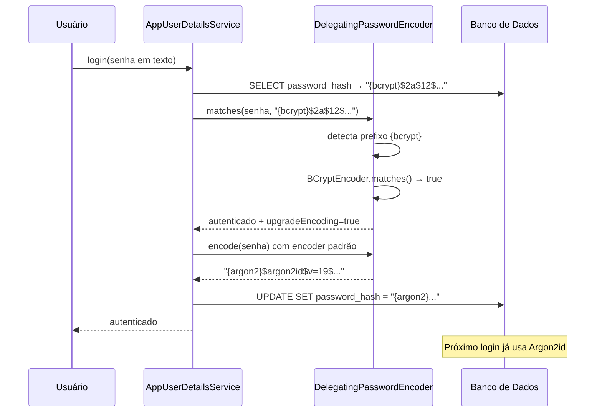
```mermaid
sequenceDiagram
    participant U as Usuário
    participant S as AppUserDetailsService
    participant DE as DelegatingPasswordEncoder
    participant DB as Banco de Dados

    U->>S: login(senha em texto)
    S->>DB: SELECT password_hash → "{bcrypt}$2a$12$..."
    S->>DE: matches(senha, "{bcrypt}$2a$12$...")
    DE->>DE: detecta prefixo {bcrypt}
    DE->>DE: BCryptEncoder.matches() → true
    DE-->>S: autenticado + upgradeEncoding=true
    S->>DE: encode(senha) com encoder padrão
    DE-->>S: "{argon2}$argon2id$v=19$..."
    S->>DB: UPDATE SET password_hash = "{argon2}..."
    S-->>U: autenticado
    Note over DB: Próximo login já usa Argon2id
```

##### Configuração do `DelegatingPasswordEncoder`

```java
@Configuration
public class PasswordSecurityConfig {

    /**
     * DelegatingPasswordEncoder com Argon2id como padrão e BCrypt como fallback.
     *
     * Prefixos reconhecidos automaticamente pelo Spring Security:
     *   {argon2}  → Argon2PasswordEncoder
     *   {bcrypt}  → BCryptPasswordEncoder
     *   {pbkdf2}  → Pbkdf2PasswordEncoder
     *   {scrypt}  → SCryptPasswordEncoder
     *   {noop}    → NoOpPasswordEncoder (NUNCA em produção)
     */
    @Bean
    public PasswordEncoder passwordEncoder() {
        String defaultId = "argon2";

        Map<String, PasswordEncoder> encoders = new HashMap<>();
        encoders.put("argon2", new Argon2PasswordEncoder(16, 32, 1, 19456, 2));
        encoders.put("bcrypt", new BCryptPasswordEncoder(12));
        encoders.put("pbkdf2", Pbkdf2PasswordEncoder.defaultsForSpringSecurity_v5_8());
        encoders.put("noop",   NoOpPasswordEncoder.getInstance());

        return new DelegatingPasswordEncoder(defaultId, encoders);
    }
}
```

##### `UserDetailsPasswordService` — Hook de Re-encoding Automático

```java
/**
 * Implementar UserDetailsPasswordService permite que o DaoAuthenticationProvider
 * chame updatePassword() automaticamente quando o hash armazenado usa um
 * algoritmo diferente do encoder padrão (Argon2id).
 *
 * O Spring Security chama este método sozinho — não é necessário nenhum código
 * adicional no fluxo de autenticação.
 */
@Service
@RequiredArgsConstructor
@Slf4j
public class AppUserDetailsService
        implements UserDetailsService, UserDetailsPasswordService {

    private final UserRepository userRepository;

    @Override
    @Transactional(readOnly = true)
    public UserDetails loadUserByUsername(String username)
            throws UsernameNotFoundException {
        return userRepository.findByUsername(username)
            .map(this::toUserDetails)
            .orElseThrow(() -> new UsernameNotFoundException(username));
    }

    /**
     * Chamado automaticamente após login bem-sucedido quando
     * passwordEncoder.upgradeEncoding(storedHash) retorna true.
     *
     * Cenário: usuário tem {bcrypt}... → Spring detecta → chama updatePassword()
     * → salva {argon2}... → próximo login já usa Argon2id diretamente.
     */
    @Override
    @Transactional
    public UserDetails updatePassword(UserDetails user, String newEncodedPassword) {
        log.info("Migrando hash para Argon2id: user={}", user.getUsername());

        userRepository.findByUsername(user.getUsername()).ifPresent(entity -> {
            entity.setPasswordHash(newEncodedPassword);
            userRepository.save(entity);
        });

        return User.withUserDetails(user)
            .password(newEncodedPassword)
            .build();
    }

    private UserDetails toUserDetails(UserEntity user) {
        return User.builder()
            .username(user.getUsername())
            .password(user.getPasswordHash()) // inclui prefixo {argon2} ou {bcrypt}
            .authorities(buildAuthorities(user))
            .build();
    }
}
```

##### Monitoramento do Progresso de Migração

```java
@Component
@RequiredArgsConstructor
@Slf4j
public class PasswordMigrationMonitor {

    private final UserRepository userRepository;
    private final MeterRegistry meterRegistry;

    /**
     * Relata o progresso da migração a cada 5 minutos.
     * A query usa LIKE no campo password_hash para identificar o algoritmo
     * pelo prefixo {argon2} ou {bcrypt} sem varredura completa de dados.
     */
    @Scheduled(fixedDelay = 300_000)
    public void reportProgress() {
        long total  = userRepository.count();
        long argon2 = userRepository.countByPasswordHashStartingWith("{argon2}");
        long bcrypt = userRepository.countByPasswordHashStartingWith("{bcrypt}");
        double pct  = total > 0 ? (argon2 * 100.0 / total) : 0;

        log.info("Migração Argon2id: {}/{} ({:.1f}%) — bcrypt restante: {}",
            argon2, total, pct, bcrypt);

        Gauge.builder("password_hash_migrated_ratio",
                () -> total > 0 ? (double) argon2 / total : 0.0)
            .description("Fração de usuários com hash Argon2id (0..1)")
            .register(meterRegistry);
    }
}
```

---

#### 19.5.4 Constraint de Senha Forte

```java
// Anotação customizada de validação
@Target({ElementType.FIELD, ElementType.PARAMETER})
@Retention(RetentionPolicy.RUNTIME)
@Constraint(validatedBy = PasswordPolicyValidator.class)
public @interface StrongPassword {
    String message() default "Senha não atende aos requisitos mínimos de segurança";
    Class<?>[] groups() default {};
    Class<? extends Payload>[] payload() default {};
}

@Component
public class PasswordPolicyValidator
        implements ConstraintValidator<StrongPassword, String> {

    // Mínimo 12 caracteres, maiúscula, minúscula, número e especial
    private static final Pattern POLICY = Pattern.compile(
        "^(?=.*[a-z])(?=.*[A-Z])(?=.*\\d)(?=.*[@$!%*?&#])" +
        "[A-Za-z\\d@$!%*?&#]{12,}$");

    @Override
    public boolean isValid(String password, ConstraintValidatorContext ctx) {
        if (password == null) return false;
        return POLICY.matcher(password).matches();
    }
}
```

---

#### 19.5.5 Comparativo Final: BCrypt vs Argon2id

| Critério | BCrypt (strength 12) | Argon2id (OWASP mínimo) |
|---|---|---|
| **Custo controlado** | Tempo de CPU | Tempo de CPU + RAM |
| **Resistência a GPU** | Baixa | Alta — 19 MB RAM por hash inviabiliza GPU em massa |
| **Resistência a ASIC** | Baixa | Alta |
| **Timing side-channel** | Vulnerável | Resistente (variante id) |
| **Limite de senha** | **72 bytes** (trunca silenciosamente) | Sem limite prático |
| **Tempo de hash** | ~250ms (strength 12) | ~50ms (parâmetros OWASP mínimos) |
| **Suporte legado** | Universal | Spring Security 5.3+ |
| **Recomendação OWASP** | Segunda opção | **Primeira opção** |
| **Quando usar** | Sistemas legados, migração gradual | Novos sistemas |

> **Truncamento silencioso do BCrypt:** BCrypt processa no máximo 72 bytes da senha. Senhas mais longas são truncadas sem aviso — `"senha_longa_com_mais_de_72_bytes"` e `"senha_longa_com_mais_de_72_bytes_COMPLETAMENTE_DIFERENTE"` podem produzir o **mesmo hash** se os primeiros 72 bytes coincidirem. O Argon2id não tem essa limitação.


### 19.6 Auditoria de Segurança

```java
@Component
@RequiredArgsConstructor
@Slf4j
public class SecurityAuditListener
        implements ApplicationListener<AbstractAuthenticationEvent> {

    private final AuditEventRepository auditRepository;

    @Override
    public void onApplicationEvent(AbstractAuthenticationEvent event) {
        switch (event) {
            case AuthenticationSuccessEvent e -> {
                log.info("LOGIN_SUCCESS | user={} | ip={}",
                    e.getAuthentication().getName(), extractIp());
                auditRepository.save(new AuditEvent(
                    e.getAuthentication().getName(),
                    "LOGIN_SUCCESS",
                    Map.of("ip", extractIp())));
            }
            case AbstractAuthenticationFailureEvent e -> {
                log.warn("LOGIN_FAILURE | user={} | reason={} | ip={}",
                    e.getAuthentication().getName(),
                    e.getException().getClass().getSimpleName(),
                    extractIp());
                auditRepository.save(new AuditEvent(
                    e.getAuthentication().getName(),
                    "LOGIN_FAILURE",
                    Map.of("reason", e.getException().getMessage(),
                           "ip", extractIp())));
            }
            default -> {}
        }
    }

    private String extractIp() {
        ServletRequestAttributes attrs =
            (ServletRequestAttributes) RequestContextHolder.getRequestAttributes();
        if (attrs == null) return "unknown";
        HttpServletRequest req = attrs.getRequest();
        return Optional.ofNullable(req.getHeader("X-Forwarded-For"))
            .orElse(req.getRemoteAddr());
    }
}
```

### 19.7 Restrição de Acesso por Endereço IP

O Spring Security suporta restrição por IP nativamente via `hasIpAddress()` no SpEL das regras de autorização. Para cenários mais sofisticados — como anotações customizadas, allowlists configuráveis ou suporte a CIDR — é necessária uma implementação complementar.

#### 19.7.1 Restrição Nativa via `hasIpAddress()`

`hasIpAddress()` é uma expressão SpEL nativa do Spring Security que compara o IP do cliente com uma string de IP simples ou uma notação CIDR:

```java
@Bean
public SecurityFilterChain ipRestrictedChain(HttpSecurity http) throws Exception {
    return http
        .securityMatcher("/admin/**", "/internal/**", "/actuator/**")
        .authorizeHttpRequests(auth -> auth
            // IP exato
            .requestMatchers("/admin/**").access(
                new WebExpressionAuthorizationManager(
                    "hasIpAddress('192.168.1.100')"))

            // Range CIDR — rede interna 192.168.1.0/24
            .requestMatchers("/internal/**").access(
                new WebExpressionAuthorizationManager(
                    "hasIpAddress('192.168.1.0/24')"))

            // Múltiplos ranges — combina com OR
            .requestMatchers("/actuator/**").access(
                new WebExpressionAuthorizationManager(
                    "hasIpAddress('192.168.1.0/24') or " +
                    "hasIpAddress('10.0.0.0/8')   or " +
                    "hasIpAddress('172.16.0.0/12')"))

            .anyRequest().authenticated()
        )
        .build();
}
```

> **`hasIpAddress()` e proxies reversos:** O método compara com `request.getRemoteAddr()`, que retorna o IP do último hop — o proxy reverso, não o cliente. Se a aplicação roda atrás de nginx ou AWS ALB, configure `RemoteIpFilter` (seção 17.7.4) para que o IP real seja extraído do header `X-Forwarded-For`.

---

#### 19.7.2 Anotação Customizada `@AllowedIps`

Para reutilizar restrições por IP em controllers e métodos via anotação, crie uma constraint customizada baseada em `@PreAuthorize`:

```java
// ── Definição da anotação ─────────────────────────────────────────────────

/**
 * Restringe o acesso ao método ou controller apenas para os IPs listados.
 *
 * Uso: @AllowedIps({"192.168.1.0/24", "10.0.0.1"})
 */
@Target({ElementType.METHOD, ElementType.TYPE})
@Retention(RetentionPolicy.RUNTIME)
@Documented
@PreAuthorize("@ipAccessControl.isAllowed(request)")
public @interface AllowedIps {

    /**
     * Lista de IPs ou ranges CIDR permitidos.
     * Exemplos: "192.168.1.100", "10.0.0.0/8", "::1" (IPv6 loopback)
     */
    String[] value();
}
```

Como a anotação `@PreAuthorize` não consegue ler os atributos de `@AllowedIps` diretamente via SpEL, o bean `@ipAccessControl` recebe a requisição e inspeciona a anotação do método em execução:

```java
// ── Bean de controle de IP — chamado pelo SpEL ────────────────────────────

/**
 * Avalia se o IP do cliente está na lista permitida definida
 * na anotação @AllowedIps do método em execução.
 *
 * Acesso via SpEL: @ipAccessControl.isAllowed(request)
 */
@Component("ipAccessControl")
@Slf4j
public class IpAccessControl {

    // Cache de subrede compilada para evitar reparse a cada requisição
    private final ConcurrentHashMap<String, InetAddressRange> rangeCache =
        new ConcurrentHashMap<>();

    /**
     * Verifica se o IP da requisição está permitido pela anotação @AllowedIps
     * do método interceptado pelo Spring Security AOP.
     */
    public boolean isAllowed(HttpServletRequest request) {
        String clientIp = resolveClientIp(request);

        // Recupera a anotação @AllowedIps do método via AOP MethodInvocation
        AllowedIps annotation = resolveAnnotation();
        if (annotation == null) {
            // Sem anotação — permissão concedida (não é ponto de controle)
            return true;
        }

        boolean allowed = Arrays.stream(annotation.value())
            .anyMatch(cidr -> matchesCidr(clientIp, cidr));

        if (!allowed) {
            log.warn("Acesso bloqueado por IP: clientIp={} allowedCidrs={}",
                clientIp, Arrays.toString(annotation.value()));
        }

        return allowed;
    }

    /**
     * Verifica se um IP está dentro de um range CIDR ou é igual a um IP exato.
     * Suporta IPv4 e IPv6.
     *
     * Exemplos válidos de cidr: "192.168.1.0/24", "10.0.0.1", "::1", "0:0:0:0:0:0:0:1"
     */
    private boolean matchesCidr(String clientIp, String cidr) {
        try {
            InetAddressRange range = rangeCache.computeIfAbsent(
                cidr, InetAddressRange::parse);
            return range.contains(InetAddress.getByName(clientIp));
        } catch (UnknownHostException e) {
            log.error("IP inválido na verificação: clientIp={}", clientIp);
            return false;
        }
    }

    private AllowedIps resolveAnnotation() {
        // Recupera o contexto do método via MethodSecurityInterceptor
        MethodInvocation invocation = MethodInvocationUtils.currentInvocation();
        if (invocation == null) return null;

        Method method = invocation.getMethod();

        // Verifica no método primeiro, depois na classe
        AllowedIps annotation = method.getAnnotation(AllowedIps.class);
        if (annotation == null) {
            annotation = method.getDeclaringClass().getAnnotation(AllowedIps.class);
        }
        return annotation;
    }

    /**
     * Resolve o IP real do cliente, respeitando proxies reversos.
     * Usa X-Forwarded-For (primeiro IP da cadeia = cliente original).
     */
    public String resolveClientIp(HttpServletRequest request) {
        String xff = request.getHeader("X-Forwarded-For");
        if (xff != null && !xff.isBlank()) {
            // X-Forwarded-For: <client>, <proxy1>, <proxy2>
            return xff.split(",")[0].trim();
        }
        String realIp = request.getHeader("X-Real-IP");
        if (realIp != null && !realIp.isBlank()) {
            return realIp.trim();
        }
        return request.getRemoteAddr();
    }
}
```

```java
// ── Classe auxiliar para parse e matching de CIDR ────────────────────────

/**
 * Representa um range de IPs em notação CIDR ou um IP exato.
 * Suporta IPv4 e IPv6.
 */
public record InetAddressRange(InetAddress networkAddress, int prefixLength) {

    public static InetAddressRange parse(String cidr) {
        try {
            if (cidr.contains("/")) {
                String[] parts    = cidr.split("/");
                InetAddress addr  = InetAddress.getByName(parts[0]);
                int prefix        = Integer.parseInt(parts[1]);
                return new InetAddressRange(addr, prefix);
            }
            // IP exato — /32 para IPv4, /128 para IPv6
            InetAddress addr = InetAddress.getByName(cidr);
            int prefix = addr instanceof Inet6Address ? 128 : 32;
            return new InetAddressRange(addr, prefix);
        } catch (UnknownHostException e) {
            throw new IllegalArgumentException("CIDR inválido: " + cidr, e);
        }
    }

    public boolean contains(InetAddress candidate) {
        byte[] network   = networkAddress.getAddress();
        byte[] client    = candidate.getAddress();

        // IPs de famílias diferentes (IPv4 vs IPv6) nunca coincidem
        if (network.length != client.length) return false;

        // Compara bit a bit até o comprimento do prefixo
        int fullBytes    = prefixLength / 8;
        int remainBits   = prefixLength % 8;

        for (int i = 0; i < fullBytes; i++) {
            if (network[i] != client[i]) return false;
        }

        if (remainBits > 0 && fullBytes < network.length) {
            int mask = 0xFF << (8 - remainBits);
            return (network[fullBytes] & mask) == (client[fullBytes] & mask);
        }

        return true;
    }
}
```

#### 19.7.3 Uso da Anotação `@AllowedIps`

```java
// ── Restrição no nível do controller (todos os endpoints) ─────────────────

@RestController
@RequestMapping("/api/v1/reports")
@AllowedIps({"10.0.0.0/8", "172.16.0.0/12", "192.168.0.0/16"})  // redes privadas RFC 1918
@RequiredArgsConstructor
public class ReportController {

    @GetMapping
    public List<ReportDto> listReports() { ... }

    @PostMapping("/generate")
    public ReportDto generate(@RequestBody GenerateReportRequest req) { ... }
}

// ── Restrição no nível do método (granularidade fina) ─────────────────────

@RestController
@RequestMapping("/api/v1/admin")
@RequiredArgsConstructor
public class AdminController {

    // Qualquer IP autenticado pode listar
    @GetMapping("/users")
    @PreAuthorize("hasRole('ADMIN')")
    public List<UserDto> listUsers() { ... }

    // Apenas IP interno pode excluir
    @DeleteMapping("/users/{id}")
    @PreAuthorize("hasRole('ADMIN')")
    @AllowedIps("192.168.1.0/24")
    public ResponseEntity<Void> deleteUser(@PathVariable Long id) { ... }

    // Operações críticas: role + IP + horário comercial
    @PostMapping("/system/reset")
    @PreAuthorize("hasRole('SUPER_ADMIN') and @ipAccessControl.isAllowed(request)")
    @AllowedIps({"192.168.1.10", "192.168.1.11"})  // apenas workstations da equipe de ops
    public ResponseEntity<Void> systemReset() { ... }
}

// ── IPv6 loopback para testes locais ──────────────────────────────────────

@RestController
@RequestMapping("/api/v1/internal")
@AllowedIps({"127.0.0.1", "::1", "10.0.0.0/8"})  // localhost IPv4, IPv6 e rede interna
public class InternalController { ... }
```

#### 19.7.4 `RemoteIpFilter` — IP Real atrás de Proxy Reverso

Sem configuração adicional, `request.getRemoteAddr()` retorna o IP do proxy reverso (nginx, ALB), não o do cliente. O `RemoteIpFilter` resolve isso substituindo `remoteAddr` pelo valor extraído do header `X-Forwarded-For`, tornando `hasIpAddress()` e `resolveClientIp()` transparentes ao proxy:

```java
@Configuration
public class RemoteIpConfig {

    /**
     * Registra o RemoteIpFilter para que request.getRemoteAddr()
     * retorne o IP real do cliente a partir do X-Forwarded-For.
     *
     * ATENÇÃO: configure trustedProxies apenas com os IPs dos seus
     * proxies legítimos. Aceitar qualquer X-Forwarded-For sem validação
     * permite que clientes forjem seu próprio IP.
     */
    @Bean
    public FilterRegistrationBean<RemoteIpFilter> remoteIpFilter() {
        RemoteIpFilter filter = new RemoteIpFilter();

        // IPs ou CIDRs dos proxies confiáveis — ajuste para seu ambiente
        filter.setInternalProxies(
            "127\.0\.0\.1|"       +   // loopback
            "10\.\d+\.\d+\.\d+|" + // RFC 1918 classe A
            "172\.(1[6-9]|2\d|3[01])\.\d+\.\d+|" + // RFC 1918 classe B
            "192\.168\.\d+\.\d+"    // RFC 1918 classe C
        );

        // Header que carrega o IP real (padrão: X-Forwarded-For)
        filter.setRemoteIpHeader("X-Forwarded-For");

        // Header que carrega o protocolo original (para HSTS correto)
        filter.setProtocolHeader("X-Forwarded-Proto");

        FilterRegistrationBean<RemoteIpFilter> bean =
            new FilterRegistrationBean<>(filter);
        bean.setOrder(Ordered.HIGHEST_PRECEDENCE);  // deve ser o primeiro filtro
        return bean;
    }
}
```

```yaml
# Alternativa: configurar via propriedade Spring Boot (mais simples)
server:
  forward-headers-strategy: NATIVE   # usa RemoteIpFilter automaticamente
  # forward-headers-strategy: FRAMEWORK  # alternativa com ForwardedHeaderFilter
  tomcat:
    remoteip:
      internal-proxies: "10\.\d+\.\d+\.\d+|192\.168\.\d+\.\d+"
      remote-ip-header: X-Forwarded-For
      protocol-header: X-Forwarded-Proto
```

#### 19.7.5 Allowlist Configurável via Properties

Para mudar os IPs permitidos sem recompilar a aplicação, externalize a lista via `@ConfigurationProperties`:

```java
@ConfigurationProperties(prefix = "app.security.ip")
@Getter @Setter
public class IpAllowlistProperties {

    /** IPs e CIDRs globalmente permitidos para rotas administrativas. */
    private List<String> adminAllowlist = List.of("127.0.0.1", "::1");

    /** IPs e CIDRs permitidos para endpoints de integração interna. */
    private List<String> internalAllowlist = List.of("10.0.0.0/8");
}
```

```java
@Component("ipAccessControl")
@RequiredArgsConstructor
@Slf4j
public class IpAccessControl {

    private final IpAllowlistProperties allowlistProps;

    /**
     * Verifica contra allowlist configurada por perfil de acesso.
     * Uso: @PreAuthorize("@ipAccessControl.isAdminAllowed(request)")
     */
    public boolean isAdminAllowed(HttpServletRequest request) {
        return isInList(resolveClientIp(request),
            allowlistProps.getAdminAllowlist());
    }

    public boolean isInternalAllowed(HttpServletRequest request) {
        return isInList(resolveClientIp(request),
            allowlistProps.getInternalAllowlist());
    }

    private boolean isInList(String clientIp, List<String> cidrs) {
        return cidrs.stream().anyMatch(cidr -> matchesCidr(clientIp, cidr));
    }

    // ... matchesCidr e resolveClientIp conforme implementação anterior
}
```

```yaml
# application.yml
app:
  security:
    ip:
      admin-allowlist:
        - "127.0.0.1"
        - "::1"
        - "192.168.1.0/24"
      internal-allowlist:
        - "10.0.0.0/8"
        - "172.16.0.0/12"

# application-prod.yml
app:
  security:
    ip:
      admin-allowlist:
        - "10.100.5.10"   # bastion host de produção
        - "10.100.5.11"
      internal-allowlist:
        - "10.100.0.0/16" # VPC de produção
```

```java
// Uso com allowlist configurável
@DeleteMapping("/users/{id}")
@PreAuthorize("hasRole('ADMIN') and @ipAccessControl.isAdminAllowed(request)")
public ResponseEntity<Void> deleteUser(@PathVariable Long id) { ... }

@GetMapping("/metrics/internal")
@PreAuthorize("@ipAccessControl.isInternalAllowed(request)")
public MetricsDto getInternalMetrics() { ... }
```


#### 19.7.6 Allowlist Persistida em Banco de Dados

Quando as regras de IP precisam ser gerenciadas em tempo real — sem redeploy e sem reinicialização da aplicação — a allowlist deve ser armazenada no banco de dados e carregada com cache de curta duração. Isso permite que administradores adicionem ou revoguem IPs por uma API ou painel de administração com efeito imediato.

```mermaid
flowchart TD
    REQ[Requisição HTTP] --> FILTER[IpAccessControl
@ipAccessControl.isAllowed]
    FILTER --> CACHE{Cache local
Caffeine TTL 60s}
    CACHE -->|Hit| EVAL[Avalia IP
contra lista em memória]
    CACHE -->|Miss| DB[(PostgreSQL
ip_allowlist)]
    DB --> REFRESH[Recarrega e
atualiza cache]
    REFRESH --> EVAL
    EVAL -->|Permitido| HANDLER[Controller]
    EVAL -->|Bloqueado| ERR[403 Forbidden]
```

##### Migração Flyway

```sql
-- V10__ip_allowlist.sql
CREATE TABLE ip_allowlist (
    id          BIGSERIAL       PRIMARY KEY,
    cidr        VARCHAR(50)     NOT NULL,
    description VARCHAR(200)    NOT NULL,
    profile     VARCHAR(50)     NOT NULL DEFAULT 'internal',
    enabled     BOOLEAN         NOT NULL DEFAULT TRUE,
    created_by  VARCHAR(100)    NOT NULL,
    created_at  TIMESTAMPTZ     NOT NULL DEFAULT now(),
    updated_at  TIMESTAMPTZ     NOT NULL DEFAULT now(),
    CONSTRAINT uq_ip_allowlist_cidr_profile UNIQUE (cidr, profile)
);

CREATE INDEX idx_ip_allowlist_profile_enabled
    ON ip_allowlist (profile, enabled);

-- Dados iniciais de bootstrap
INSERT INTO ip_allowlist (cidr, description, profile, created_by) VALUES
    ('127.0.0.1',        'Loopback IPv4',            'admin',    'system'),
    ('::1',              'Loopback IPv6',             'admin',    'system'),
    ('192.168.1.0/24',   'Rede interna escritório',   'admin',    'system'),
    ('10.0.0.0/8',       'VPC interna',               'internal', 'system'),
    ('172.16.0.0/12',    'Rede containers Docker',    'internal', 'system');
```

##### Entidade JPA e Repositório

```java
@Entity
@Table(name = "ip_allowlist")
@Getter @Setter
@NoArgsConstructor
@EntityListeners(AuditingEntityListener.class)
public class IpAllowlistEntry {

    @Id
    @GeneratedValue(strategy = GenerationType.IDENTITY)
    private Long id;

    @Column(nullable = false, length = 50)
    private String cidr;          // Ex: "192.168.1.0/24" ou "10.0.0.1"

    @Column(nullable = false, length = 200)
    private String description;   // Descrição legível para auditoria

    @Column(nullable = false, length = 50)
    private String profile;       // "admin", "internal", "webhook", etc.

    @Column(nullable = false)
    private boolean enabled = true;

    @Column(nullable = false, length = 100)
    private String createdBy;

    @CreatedDate
    @Column(nullable = false, updatable = false)
    private Instant createdAt;

    @LastModifiedDate
    @Column(nullable = false)
    private Instant updatedAt;
}

public interface IpAllowlistRepository extends JpaRepository<IpAllowlistEntry, Long> {

    // Busca apenas entradas ativas de um perfil — usada pelo cache
    List<IpAllowlistEntry> findByProfileAndEnabledTrue(String profile);

    // Para a API de administração
    List<IpAllowlistEntry> findByProfile(String profile);
    boolean existsByCidrAndProfile(String cidr, String profile);

    @Modifying
    @Query("UPDATE IpAllowlistEntry e SET e.enabled = :enabled WHERE e.id = :id")
    void setEnabled(@Param("id") Long id, @Param("enabled") boolean enabled);
}
```

##### `DatabaseIpAccessControl` — Bean com Cache

```java
/**
 * Implementação do controle de acesso por IP com allowlist persistida em banco.
 *
 * Usa Caffeine como cache local com TTL de 60 segundos para equilibrar
 * consistência (mudanças refletem em até 1 minuto) e performance
 * (sem hit ao banco a cada requisição).
 *
 * Para propagação imediata de mudanças, chame invalidateCache()
 * após alterações pela API de administração.
 */
@Component("ipAccessControl")
@RequiredArgsConstructor
@Slf4j
public class DatabaseIpAccessControl {

    private final IpAllowlistRepository repository;

    // Cache por perfil: profile -> lista de InetAddressRange compilados
    // TTL de 60s: mudanças no banco propagam em no máximo 1 minuto
    private final Cache<String, List<InetAddressRange>> allowlistCache =
        Caffeine.newBuilder()
            .expireAfterWrite(60, TimeUnit.SECONDS)
            .maximumSize(100)           // máximo de 100 perfis distintos
            .recordStats()              // métricas para Micrometer
            .build();

    // ── Métodos de verificação (chamados via SpEL) ────────────────────────

    /**
     * Verifica se o IP da requisição está na allowlist do perfil informado.
     * Uso via SpEL: @PreAuthorize("@ipAccessControl.isAllowed(request, 'admin')")
     */
    public boolean isAllowed(HttpServletRequest request, String profile) {
        String clientIp = resolveClientIp(request);
        return isIpAllowed(clientIp, profile);
    }

    /**
     * Verifica contra o perfil "admin" — atalho para o caso mais comum.
     * Uso via SpEL: @PreAuthorize("@ipAccessControl.isAdminAllowed(request)")
     */
    public boolean isAdminAllowed(HttpServletRequest request) {
        return isAllowed(request, "admin");
    }

    /**
     * Verifica contra o perfil "internal".
     * Uso via SpEL: @PreAuthorize("@ipAccessControl.isInternalAllowed(request)")
     */
    public boolean isInternalAllowed(HttpServletRequest request) {
        return isAllowed(request, "internal");
    }

    // ── Lógica central ────────────────────────────────────────────────────

    private boolean isIpAllowed(String clientIp, String profile) {
        try {
            InetAddress clientAddr = InetAddress.getByName(clientIp);

            List<InetAddressRange> ranges = allowlistCache.get(
                profile, this::loadFromDatabase);

            boolean allowed = ranges.stream()
                .anyMatch(range -> range.contains(clientAddr));

            if (!allowed) {
                log.warn("IP bloqueado: ip={} profile={}", clientIp, profile);
            }

            return allowed;

        } catch (UnknownHostException e) {
            log.error("IP inválido na verificação de acesso: {}", clientIp);
            return false;
        }
    }

    /**
     * Carrega as entradas ativas do perfil no banco e compila os ranges CIDR.
     * Chamado automaticamente pelo Caffeine quando o cache está expirado ou ausente.
     */
    private List<InetAddressRange> loadFromDatabase(String profile) {
        log.debug("Recarregando allowlist do banco: profile={}", profile);

        return repository.findByProfileAndEnabledTrue(profile)
            .stream()
            .map(entry -> {
                try {
                    return InetAddressRange.parse(entry.getCidr());
                } catch (IllegalArgumentException e) {
                    log.error("CIDR inválido ignorado: cidr={} id={}",
                        entry.getCidr(), entry.getId());
                    return null;
                }
            })
            .filter(Objects::nonNull)
            .toList();
    }

    // ── Invalidação manual de cache ───────────────────────────────────────

    /**
     * Invalida o cache de um perfil específico.
     * Chame após inserir, editar ou desabilitar entradas via API de administração
     * para que a mudança reflita imediatamente (sem aguardar o TTL de 60s).
     */
    public void invalidateCache(String profile) {
        allowlistCache.invalidate(profile);
        log.info("Cache de allowlist invalidado: profile={}", profile);
    }

    /** Invalida todo o cache — use com cautela em produção. */
    public void invalidateAllCaches() {
        allowlistCache.invalidateAll();
        log.info("Cache completo de allowlist invalidado");
    }

    // ── Utilitários ───────────────────────────────────────────────────────

    public String resolveClientIp(HttpServletRequest request) {
        String xff = request.getHeader("X-Forwarded-For");
        if (xff != null && !xff.isBlank()) {
            return xff.split(",")[0].trim();
        }
        String realIp = request.getHeader("X-Real-IP");
        if (realIp != null && !realIp.isBlank()) {
            return realIp.trim();
        }
        return request.getRemoteAddr();
    }
}
```

##### API de Administração da Allowlist

```java
/**
 * API REST para gerenciar a allowlist de IPs em tempo real.
 * Restrita a ADMIN + IP interno para evitar lockout acidental.
 */
@RestController
@RequestMapping("/api/v1/admin/ip-allowlist")
@RequiredArgsConstructor
@PreAuthorize("hasRole('ADMIN')")
public class IpAllowlistController {

    private final IpAllowlistRepository repository;
    private final DatabaseIpAccessControl ipAccessControl;

    @GetMapping
    public List<IpAllowlistEntryDto> list(
            @RequestParam(required = false) String profile) {

        return (profile != null
            ? repository.findByProfile(profile)
            : repository.findAll())
            .stream()
            .map(IpAllowlistEntryDto::fromEntity)
            .toList();
    }

    @PostMapping
    @ResponseStatus(HttpStatus.CREATED)
    public IpAllowlistEntryDto add(
            @Valid @RequestBody AddIpRequest request,
            Authentication auth) {

        if (repository.existsByCidrAndProfile(request.cidr(), request.profile())) {
            throw new DuplicateIpEntryException(
                "Entrada já existe: cidr=%s profile=%s"
                    .formatted(request.cidr(), request.profile()));
        }

        // Valida o CIDR antes de persistir
        try {
            InetAddressRange.parse(request.cidr());
        } catch (IllegalArgumentException e) {
            throw new InvalidCidrException("CIDR inválido: " + request.cidr());
        }

        IpAllowlistEntry entry = new IpAllowlistEntry();
        entry.setCidr(request.cidr());
        entry.setDescription(request.description());
        entry.setProfile(request.profile());
        entry.setEnabled(true);
        entry.setCreatedBy(auth.getName());

        IpAllowlistEntry saved = repository.save(entry);

        // Invalida o cache do perfil afetado — mudança reflete imediatamente
        ipAccessControl.invalidateCache(request.profile());

        return IpAllowlistEntryDto.fromEntity(saved);
    }

    @PatchMapping("/{id}/disable")
    public IpAllowlistEntryDto disable(@PathVariable Long id) {
        IpAllowlistEntry entry = repository.findById(id)
            .orElseThrow(() -> new EntityNotFoundException("Entrada não encontrada: " + id));

        repository.setEnabled(id, false);
        ipAccessControl.invalidateCache(entry.getProfile());

        entry.setEnabled(false);
        return IpAllowlistEntryDto.fromEntity(entry);
    }

    @PatchMapping("/{id}/enable")
    public IpAllowlistEntryDto enable(@PathVariable Long id) {
        IpAllowlistEntry entry = repository.findById(id)
            .orElseThrow(() -> new EntityNotFoundException("Entrada não encontrada: " + id));

        repository.setEnabled(id, true);
        ipAccessControl.invalidateCache(entry.getProfile());

        entry.setEnabled(true);
        return IpAllowlistEntryDto.fromEntity(entry);
    }

    @DeleteMapping("/{id}")
    @ResponseStatus(HttpStatus.NO_CONTENT)
    public void delete(@PathVariable Long id) {
        IpAllowlistEntry entry = repository.findById(id)
            .orElseThrow(() -> new EntityNotFoundException("Entrada não encontrada: " + id));

        repository.deleteById(id);
        ipAccessControl.invalidateCache(entry.getProfile());
    }

    // ── DTOs ──────────────────────────────────────────────────────────────

    public record AddIpRequest(
        @NotBlank @Size(max = 50) String cidr,
        @NotBlank @Size(max = 200) String description,
        @NotBlank @Size(max = 50) String profile) {}

    public record IpAllowlistEntryDto(
        Long id,
        String cidr,
        String description,
        String profile,
        boolean enabled,
        String createdBy,
        Instant createdAt) {

        public static IpAllowlistEntryDto fromEntity(IpAllowlistEntry e) {
            return new IpAllowlistEntryDto(e.getId(), e.getCidr(), e.getDescription(),
                e.getProfile(), e.isEnabled(), e.getCreatedBy(), e.getCreatedAt());
        }
    }
}
```

##### Exposição de Métricas do Cache (Micrometer)

```java
/**
 * Registra métricas do cache de allowlist no Micrometer/Prometheus.
 * Permite monitorar taxa de hit/miss e tamanho do cache por perfil.
 */
@Configuration
@RequiredArgsConstructor
public class IpAllowlistMetricsConfig {

    @Bean
    public MeterBinder ipAllowlistCacheMetrics(DatabaseIpAccessControl control) {
        return registry ->
            CaffeineCacheMetrics.monitor(
                registry,
                control.getAllowlistCache(),
                "ip_allowlist_cache",
                Tags.of("component", "security"));
    }
}
```

```yaml
# Métricas disponíveis no /actuator/prometheus:
# ip_allowlist_cache_hits_total
# ip_allowlist_cache_misses_total
# ip_allowlist_cache_evictions_total
# ip_allowlist_cache_size
```

##### Uso nos Controllers

```java
// Perfil específico por endpoint
@DeleteMapping("/users/{id}")
@PreAuthorize("hasRole('ADMIN') and @ipAccessControl.isAllowed(request, 'admin')")
public ResponseEntity<Void> deleteUser(@PathVariable Long id) { ... }

// Atalhos por perfil nomeado
@GetMapping("/metrics/internal")
@PreAuthorize("@ipAccessControl.isInternalAllowed(request)")
public MetricsDto internalMetrics() { ... }

// Combinação com outros critérios de autorização
@PostMapping("/system/config")
@PreAuthorize("hasRole('SUPER_ADMIN') " +
              "and @ipAccessControl.isAllowed(request, 'admin') " +
              "and @ipAccessControl.isAllowed(request, 'internal')")
public ResponseEntity<Void> updateSystemConfig(
        @RequestBody @Valid SystemConfigRequest req) { ... }
```


#### 19.7.7 Resumo das Abordagens

| Abordagem | Granularidade | Configurável sem redeploy | Suporte CIDR | Caso de uso |
|-----------|--------------|--------------------------|--------------|-------------|
| `hasIpAddress()` nativo | Rota | Não | Sim | Regras simples na SecurityFilterChain |
| `@AllowedIps` customizado | Método / Classe | Não | Sim | Restrição declarativa em controllers |
| Bean `@ipAccessControl` | Qualquer | Não | Sim | SpEL customizado com lógica complexa |
| `IpAllowlistProperties` | Qualquer | Sim (profiles/env) | Sim | Ambientes diferentes sem recompilação |
| **Banco de dados + cache** | **Qualquer** | **Sim (tempo real)** | **Sim** | **Gestão dinâmica via API de admin** |


---

## 20. CORS

CORS (Cross-Origin Resource Sharing) é o mecanismo que permite ou bloqueia requisições HTTP entre origens distintas (protocolo + domínio + porta). O Spring Security integra-se ao CORS do Spring MVC mas requer configuração explícita — sem ela, requisições preflight (`OPTIONS`) podem ser bloqueadas antes de chegar ao controller.

### 20.1 Como o Spring Security Processa CORS

```mermaid
flowchart TD
    REQ[Requisição HTTP] --> CORS_FILTER[CorsFilter
Spring Security]
    CORS_FILTER --> PREFLIGHT{É preflight?
METHOD = OPTIONS}
    PREFLIGHT -->|Sim| EVAL[Avalia CorsConfigurationSource]
    EVAL --> ALLOWED{Origem
permitida?}
    ALLOWED -->|Sim| RESP_OK["200 OK + headers
Access-Control-Allow-*"]
    ALLOWED -->|Não| RESP_DENY[403 Forbidden]
    PREFLIGHT -->|Não — request real| AUTH[Filtros de Autenticação]
    AUTH --> HANDLER[Controller]
```

> **Por que CORS no Security e não só no MVC?** O `CorsFilter` do Spring Security fica antes de qualquer filtro de autenticação. Se CORS fosse tratado apenas pelo MVC, requisições preflight `OPTIONS` seriam bloqueadas por `401 Unauthorized` antes de chegar ao `DispatcherServlet` — o browser interpretaria isso como falha de CORS, não de autenticação.

---

### 20.2 Configuração Recomendada — `CorsConfigurationSource` como Bean

```java
@Configuration
public class CorsConfig {

    /**
     * Bean de CORS reconhecido automaticamente pelo Spring Security (via .cors()).
     * Define regras por padrão de URL.
     */
    @Bean
    public CorsConfigurationSource corsConfigurationSource() {
        CorsConfiguration apiConfig = new CorsConfiguration();
        apiConfig.setAllowedOrigins(List.of(
            "http://localhost:5173",     // Vite dev server
            "https://myapp.com",         // produção
            "https://staging.myapp.com"  // staging
        ));
        apiConfig.setAllowedMethods(List.of(
            "GET", "POST", "PUT", "PATCH", "DELETE", "OPTIONS"));
        apiConfig.setAllowedHeaders(List.of(
            "Authorization",
            "Content-Type",
            "X-Requested-With",
            "X-CSRF-Token",
            "X-Tenant-Id"));
        // Expõe headers customizados para o JavaScript do browser
        apiConfig.setExposedHeaders(List.of(
            "Location",
            "X-Total-Count",
            "X-Authenticated-User"));
        // Necessário para envio de cookies (refresh token HttpOnly)
        apiConfig.setAllowCredentials(true);
        // Cache do preflight no browser — evita OPTIONS a cada requisição
        apiConfig.setMaxAge(3600L);

        // Configuração mais permissiva para assets públicos
        CorsConfiguration publicConfig = new CorsConfiguration();
        publicConfig.setAllowedOrigins(List.of("*"));
        publicConfig.setAllowedMethods(List.of("GET", "OPTIONS"));
        publicConfig.setAllowCredentials(false);

        UrlBasedCorsConfigurationSource source = new UrlBasedCorsConfigurationSource();
        source.registerCorsConfiguration("/api/**",     apiConfig);
        source.registerCorsConfiguration("/public/**",  publicConfig);
        return source;
    }
}
```

```java
// Na SecurityFilterChain: .cors() usa automaticamente o bean CorsConfigurationSource
@Bean
public SecurityFilterChain apiChain(HttpSecurity http) throws Exception {
    return http
        .securityMatcher("/api/**")
        // .cors() sem argumento → busca o bean CorsConfigurationSource no contexto
        .cors(Customizer.withDefaults())
        .csrf(csrf -> csrf.disable())
        .authorizeHttpRequests(auth -> auth.anyRequest().authenticated())
        .build();
}
```

---

### 20.3 CORS por Ambiente com `@Profile`

```java
@Configuration
public class CorsConfig {

    @Value("${app.cors.allowed-origins}")
    private List<String> allowedOrigins;

    @Bean
    public CorsConfigurationSource corsConfigurationSource() {
        CorsConfiguration config = new CorsConfiguration();
        config.setAllowedOrigins(allowedOrigins);   // externalizado por ambiente
        config.setAllowedMethods(List.of("GET","POST","PUT","PATCH","DELETE","OPTIONS"));
        config.setAllowedHeaders(List.of("*"));
        config.setAllowCredentials(true);
        config.setMaxAge(3600L);

        UrlBasedCorsConfigurationSource source = new UrlBasedCorsConfigurationSource();
        source.registerCorsConfiguration("/**", config);
        return source;
    }
}
```

```yaml
# application.yml
app:
  cors:
    allowed-origins:
      - "http://localhost:5173"

# application-prod.yml
app:
  cors:
    allowed-origins:
      - "https://myapp.com"
      - "https://app.myapp.com"
```

---

### 20.4 `@CrossOrigin` em Controllers (granularidade fina)

```java
@RestController
@RequestMapping("/api/v1/webhooks")
// Permite apenas o domínio do parceiro neste controller específico
@CrossOrigin(
    origins = "https://partner.example.com",
    methods = {RequestMethod.POST},
    allowedHeaders = {"Content-Type", "X-Webhook-Signature"},
    maxAge = 1800)
public class WebhookController {

    @PostMapping
    public ResponseEntity<Void> receive(@RequestBody WebhookEvent event) { ... }
}
```

> **`@CrossOrigin` vs `CorsConfigurationSource`:** Prefira `CorsConfigurationSource` para configuração global centralizada. Use `@CrossOrigin` apenas para exceções pontuais — por exemplo, um endpoint de webhook que aceita origem diferente do restante da API.

---

### 20.5 Erros Comuns de CORS com Spring Security

| Sintoma | Causa | Solução |
|---|---|---|
| `401` em OPTIONS | `.cors()` não configurado na chain | Adicionar `.cors(Customizer.withDefaults())` |
| `allowCredentials` + `*` | `allowCredentials(true)` com `allowedOrigins("*")` são mutuamente exclusivos | Listar origens explicitamente |
| Cookie não enviado | `credentials: 'include'` ausente no fetch | Adicionar `credentials: 'include'` no cliente |
| Header bloqueado | Header não listado em `allowedHeaders` | Adicionar ao `setAllowedHeaders()` |
| CORS em prod mas não dev | Origens hardcoded | Externalizar via `@Value` + profiles |

---

## 21. WebSocket Security

WebSockets estabelecem conexões persistentes — o handshake HTTP inicial é interceptado pelo Spring Security normalmente, mas as mensagens subsequentes trafegam pelo protocolo WebSocket, exigindo configuração de autorização específica para destinos STOMP.

### 21.1 Dependências

```xml
<dependency>
    <groupId>org.springframework.boot</groupId>
    <artifactId>spring-boot-starter-websocket</artifactId>
</dependency>
<!-- spring-security-messaging — autorização de mensagens STOMP -->
<dependency>
    <groupId>org.springframework.security</groupId>
    <artifactId>spring-security-messaging</artifactId>
</dependency>
```

---

### 21.2 Fluxo de Autenticação WebSocket

```mermaid
sequenceDiagram
    participant C as Client (SPA)
    participant S as Spring Security
    participant WS as WebSocket Handler

    C->>S: HTTP GET /ws/connect<br/>Upgrade: websocket<br/>Cookie: JSESSIONID / Authorization: Bearer
    S->>S: Autentica via HTTP (sessão ou JWT)
    S-->>C: 101 Switching Protocols
    Note over C,WS: Conexão WebSocket estabelecida

    C->>WS: STOMP CONNECT
nonce:1
Authorization:Bearer <token>
    WS->>S: ChannelInterceptor valida token
    S-->>WS: Authentication populada no SecurityContext
    WS-->>C: CONNECTED

    C->>WS: SEND /app/quiz.answer
{questionId:1, answer:"A"}
    WS->>S: MessageSecurityMetadataSourceRegistry avalia
    Note over S: hasRole('USER') → permite
    WS-->>C: Processa e responde
```

---

### 21.3 Configuração de Segurança WebSocket

```java
@Configuration
@EnableWebSecurity
public class WebSocketSecurityConfig
        extends AbstractSecurityWebSocketMessageBrokerConfigurer {

    /**
     * Define regras de autorização por destino STOMP.
     * Equivalente ao authorizeHttpRequests, mas para mensagens WebSocket.
     */
    @Override
    protected void configureInbound(
            MessageSecurityMetadataSourceRegistry messages) {
        messages
            // Handshake STOMP — qualquer autenticado pode conectar
            .simpDestMatchers("/app/**").authenticated()
            // Tópicos de broadcast — apenas assinantes autenticados
            .simpSubscribeDestMatchers("/topic/**").authenticated()
            // Fila privada do usuário — apenas o próprio usuário
            .simpSubscribeDestMatchers("/user/**").authenticated()
            // Admin topics
            .simpDestMatchers("/app/admin/**").hasRole("ADMIN")
            // Mensagens de erro e sistema — públicas
            .simpTypeMatchers(SimpMessageType.CONNECT,
                              SimpMessageType.DISCONNECT,
                              SimpMessageType.UNSUBSCRIBE).permitAll()
            .anyMessage().denyAll();
    }

    /**
     * Por padrão, Spring Security habilita proteção CSRF em WebSocket.
     * Desabilitar APENAS quando usando autenticação stateless (JWT no header STOMP).
     * Manter habilitado quando a autenticação é baseada em sessão HTTP.
     */
    @Override
    protected boolean sameOriginDisabled() {
        return true; // desabilita verificação de same-origin para STOMP
    }
}
```

---

### 21.4 Autenticação JWT no Handshake STOMP

Para SPAs que usam JWT (sem sessão), o token deve ser validado no interceptor de canal:

```java
/**
 * ChannelInterceptor que extrai e valida o JWT do header STOMP CONNECT.
 * Popula o SecurityContext para que as regras de autorização de mensagens
 * possam avaliar o usuário autenticado.
 */
@Component
@RequiredArgsConstructor
@Slf4j
public class JwtChannelInterceptor implements ChannelInterceptor {

    private final JwtService jwtService;
    private final UserDetailsService userDetailsService;

    /**
     * Chamado antes de cada mensagem ser processada.
     * Extrai o JWT do header Authorization do frame STOMP CONNECT.
     */
    @Override
    public Message<?> preSend(Message<?> message, MessageChannel channel) {
        StompHeaderAccessor accessor =
            MessageHeaderAccessor.getAccessor(message, StompHeaderAccessor.class);

        if (accessor == null) return message;

        // Apenas no frame CONNECT — autentica uma vez por conexão
        if (StompCommand.CONNECT.equals(accessor.getCommand())) {
            String authHeader = accessor.getFirstNativeHeader("Authorization");

            if (authHeader != null && authHeader.startsWith("Bearer ")) {
                String token = authHeader.substring(7);
                try {
                    String username = jwtService.extractUsername(token);
                    UserDetails userDetails =
                        userDetailsService.loadUserByUsername(username);

                    UsernamePasswordAuthenticationToken auth =
                        new UsernamePasswordAuthenticationToken(
                            userDetails, null, userDetails.getAuthorities());

                    // Popula o Principal da sessão STOMP
                    accessor.setUser(auth);

                    log.debug("WebSocket autenticado: user={}", username);
                } catch (Exception e) {
                    log.warn("JWT WebSocket inválido: {}", e.getMessage());
                    throw new MessageDeliveryException("Token inválido");
                }
            }
        }
        return message;
    }
}
```

```java
// Registro do interceptor no MessageBroker
@Configuration
@EnableWebSocketMessageBroker
public class WebSocketConfig implements WebSocketMessageBrokerConfigurer {

    private final JwtChannelInterceptor jwtChannelInterceptor;

    @Override
    public void configureClientInboundChannel(ChannelRegistration registration) {
        registration.interceptors(jwtChannelInterceptor);
    }

    @Override
    public void configureMessageBroker(MessageBrokerRegistry registry) {
        registry.enableSimpleBroker("/topic", "/queue", "/user");
        registry.setApplicationDestinationPrefixes("/app");
        registry.setUserDestinationPrefix("/user");
    }

    @Override
    public void registerStompEndpoints(StompEndpointRegistry registry) {
        registry.addEndpoint("/ws")
            .setAllowedOriginPatterns("http://localhost:*", "https://*.myapp.com")
            .withSockJS();
    }
}
```

---

### 21.5 Envio de Mensagens ao Usuário Autenticado

```java
@Controller
@RequiredArgsConstructor
public class QuizController {

    private final SimpMessagingTemplate messagingTemplate;

    /**
     * Recebe resposta do usuário e retorna feedback apenas para ele.
     * @MessageMapping equivale ao @RequestMapping — mas para mensagens STOMP.
     * Principal é populado pelo JwtChannelInterceptor.
     */
    @MessageMapping("/quiz.answer")
    @PreAuthorize("hasRole('USER')")
    public void processAnswer(AnswerDto answer, Principal principal) {
        String username = principal.getName();

        boolean correct = quizService.evaluate(answer);
        FeedbackDto feedback = new FeedbackDto(answer.questionId(), correct);

        // Envia apenas para o usuário que respondeu (fila privada)
        messagingTemplate.convertAndSendToUser(
            username,
            "/queue/feedback",
            feedback);
    }

    /**
     * Broadcast para todos os inscritos no tópico da sala.
     * Apenas ADMIN pode enviar mensagens para todos.
     */
    @MessageMapping("/quiz.broadcast")
    @PreAuthorize("hasRole('ADMIN')")
    public void broadcast(QuizEventDto event) {
        messagingTemplate.convertAndSend("/topic/quiz-room", event);
    }
}
```

---

### 21.6 CSRF em WebSocket com Sessão HTTP

Quando a autenticação é baseada em sessão (Form Login), manter a proteção CSRF no WebSocket:

```java
@Configuration
public class WebSocketSecurityConfig
        extends AbstractSecurityWebSocketMessageBrokerConfigurer {

    @Override
    protected boolean sameOriginDisabled() {
        // false = mantém verificação de same-origin (proteção CSRF)
        // Use false quando a autenticação é via sessão HTTP
        return false;
    }
}
```

```javascript
// Cliente JavaScript — envia o token CSRF no header STOMP
const csrfToken = document.cookie
    .split('; ')
    .find(c => c.startsWith('XSRF-TOKEN='))
    ?.split('=')[1];

stompClient.connect(
    { 'X-XSRF-TOKEN': csrfToken },
    frame => console.log('Conectado:', frame)
);
```

---

## 22. SecurityContext em Contextos Assíncronos

O `SecurityContextHolder` usa por padrão uma estratégia `ThreadLocal` — o `SecurityContext` é armazenado por thread. Em operações assíncronas (`@Async`, `CompletableFuture`, Virtual Threads), a execução migra para outra thread e o contexto se perde, fazendo `SecurityContextHolder.getContext().getAuthentication()` retornar `null`.

### 22.1 O Problema

```java
@Service
public class ReportService {

    @Async
    public CompletableFuture<Report> generateAsync() {
        // PROBLEMA: Authentication é null aqui
        // A thread do @Async não tem o SecurityContext da thread HTTP original
        Authentication auth = SecurityContextHolder.getContext().getAuthentication();
        String username = auth.getName(); // NullPointerException!
        return CompletableFuture.completedFuture(buildReport(username));
    }
}
```

---

### 22.2 Estratégias de Propagação do SecurityContextHolder

O Spring Security oferece três estratégias nativas:

```java
@Bean
public MethodInvokingFactoryBean securityContextHolderStrategy() {
    MethodInvokingFactoryBean bean = new MethodInvokingFactoryBean();
    bean.setTargetClass(SecurityContextHolder.class);
    bean.setTargetMethod("setStrategyName");
    // MODE_THREADLOCAL    → padrão — apenas a thread atual (não propaga)
    // MODE_INHERITABLETHREADLOCAL → propaga para threads filhas criadas pela thread atual
    // MODE_GLOBAL         → compartilhado por toda a JVM (não usar em produção)
    bean.setArguments(SecurityContextHolder.MODE_INHERITABLETHREADLOCAL);
    return bean;
}
```

> **`MODE_INHERITABLETHREADLOCAL` e Virtual Threads:** Esta estratégia funciona para threads convencionais (`Thread` filho herda o `InheritableThreadLocal` do pai), mas **não é confiável com Virtual Threads ou pool de threads reutilizadas** (Executors), pois a thread pode ser reaproveitada de uma operação anterior. Use `DelegatingSecurityContextExecutor` nesses casos.

---

### 22.3 `DelegatingSecurityContextExecutor` — Propagação Explícita

```java
@Configuration
@EnableAsync
public class AsyncSecurityConfig implements AsyncConfigurer {

    /**
     * Executor que propaga o SecurityContext da thread chamadora
     * para as threads do pool onde @Async é executado.
     *
     * Funciona capturando o SecurityContext no momento da submissão
     * da tarefa e restaurando-o na thread do pool antes da execução.
     */
    @Override
    public Executor getAsyncExecutor() {
        ThreadPoolTaskExecutor delegate = new ThreadPoolTaskExecutor();
        delegate.setCorePoolSize(4);
        delegate.setMaxPoolSize(16);
        delegate.setQueueCapacity(100);
        delegate.setThreadNamePrefix("async-security-");
        delegate.initialize();

        // Envolve o executor com propagação automática de SecurityContext
        return new DelegatingSecurityContextAsyncTaskExecutor(delegate);
    }
}
```

```java
// Com Virtual Threads (Spring Boot 3.2+) — propagação explícita
@Configuration
@EnableAsync
public class VirtualThreadAsyncConfig implements AsyncConfigurer {

    @Override
    public Executor getAsyncExecutor() {
        // Executor de Virtual Threads
        ExecutorService virtualExecutor =
            Executors.newVirtualThreadPerTaskExecutor();

        // Propaga SecurityContext para cada Virtual Thread
        return new DelegatingSecurityContextExecutorService(virtualExecutor);
    }
}
```

---

### 22.4 Propagação Manual em `CompletableFuture`

Quando não é possível usar `@Async` ou um executor configurado:

```java
@Service
@RequiredArgsConstructor
public class ReportService {

    private final Executor executor;

    public CompletableFuture<Report> generateAsync() {
        // Captura o contexto da thread HTTP atual
        SecurityContext context = SecurityContextHolder.getContext();

        return CompletableFuture.supplyAsync(() -> {
            // Restaura o contexto na thread assíncrona
            SecurityContextHolder.setContext(context);
            try {
                String username = context.getAuthentication().getName();
                return buildReport(username);
            } finally {
                // Limpa ao terminar — a thread pode ser reutilizada
                SecurityContextHolder.clearContext();
            }
        }, executor);
    }
}
```

---

### 22.5 `DelegatingSecurityContextRunnable` e `Callable`

Para tarefas pontuais sem necessidade de configurar o executor global:

```java
@Service
public class NotificationService {

    private final ExecutorService executor = Executors.newVirtualThreadPerTaskExecutor();

    public void sendAsync(String message) {
        // Captura o contexto atual e envolve o Runnable
        Runnable task = SecurityContextHolder.getDeferredContext()
            .map(ctx -> (Runnable) new DelegatingSecurityContextRunnable(
                () -> doSend(message), ctx))
            .orElse(() -> doSend(message));

        executor.submit(task);
    }

    // Alternativa explícita
    public Future<String> processAsync(String data) {
        SecurityContext ctx = SecurityContextHolder.getContext();

        Callable<String> secured = new DelegatingSecurityContextCallable<>(
            () -> {
                // SecurityContext disponível aqui
                String user = SecurityContextHolder.getContext()
                    .getAuthentication().getName();
                return user + ": " + process(data);
            }, ctx);

        return executor.submit(secured);
    }
}
```

---

### 22.6 `@Async` com `@PreAuthorize` em Métodos Assíncronos

`@PreAuthorize` em métodos `@Async` é avaliado na thread do executor — o contexto precisa estar disponível:

```java
@Service
public class AdminReportService {

    // CORRETO: funciona se o executor for DelegatingSecurityContextAsyncTaskExecutor
    @Async
    @PreAuthorize("hasRole('ADMIN')")
    public CompletableFuture<AdminReport> generateAdminReportAsync() {
        // @PreAuthorize avalia o SecurityContext na thread do executor
        // Se o contexto não foi propagado, lança IllegalStateException
        return CompletableFuture.completedFuture(buildAdminReport());
    }
}
```

---

### 22.7 `SecurityContextRepository` para Contexto Stateless

Em APIs REST stateless, o contexto não é salvo em sessão — é recriado a cada requisição pelo filtro JWT. Para tarefas assíncronas longas que podem durar mais que a requisição HTTP:

```java
@Component
@RequiredArgsConstructor
public class AsyncTaskService {

    private final TaskExecutor secureExecutor;

    /**
     * Para tarefas longas que sobrevivem à requisição HTTP original,
     * extraia os dados necessários do Principal antes de submeter a tarefa.
     * Não confie no SecurityContext após o término da requisição HTTP.
     */
    public void submitLongTask(Authentication auth, TaskRequest request) {
        // Extrai dados do auth ANTES de submeter a tarefa
        String username    = auth.getName();
        List<String> roles = auth.getAuthorities().stream()
            .map(GrantedAuthority::getAuthority)
            .toList();

        // A tarefa assíncrona usa dados extraídos, não o SecurityContext
        secureExecutor.execute(() -> {
            processLongTask(username, roles, request);
        });
    }
}
```

---

## 23. Session Management Avançado

### 23.1 Estratégias de Criação de Sessão

```java
.sessionManagement(session -> session
    // ALWAYS          → cria sessão se não existir
    // IF_REQUIRED     → cria apenas quando necessário (padrão)
    // NEVER           → nunca cria, mas usa se já existir
    // STATELESS       → nunca cria nem usa sessão (APIs REST com JWT)
    .sessionCreationPolicy(SessionCreationPolicy.IF_REQUIRED)
)
```

---

### 23.2 Sessões Concorrentes e `SessionRegistry`

```java
@Bean
public SecurityFilterChain webChain(HttpSecurity http,
        SessionRegistry sessionRegistry) throws Exception {
    return http
        .sessionManagement(session -> session
            .sessionCreationPolicy(SessionCreationPolicy.IF_REQUIRED)
            // Session Fixation — gera nova sessão após login (proteção padrão)
            .sessionFixation(fix -> fix.newSession())
            // Máximo de sessões simultâneas por usuário
            .maximumSessions(1)
            // false → nova sessão expulsa a anterior (recomendado)
            // true  → bloqueia novo login enquanto sessão anterior existe
            .maxSessionsPreventsLogin(false)
            .expiredUrl("/login?expired")
            .sessionRegistry(sessionRegistry))
        .build();
}

@Bean
public SessionRegistry sessionRegistry() {
    return new SessionRegistryImpl();
}

/**
 * Necessário para que o SessionRegistry seja notificado de eventos
 * de criação e destruição de sessões HTTP.
 */
@Bean
public HttpSessionEventPublisher httpSessionEventPublisher() {
    return new HttpSessionEventPublisher();
}
```

---

### 23.3 Consulta de Sessões Ativas

```java
@RestController
@RequestMapping("/api/v1/admin/sessions")
@RequiredArgsConstructor
@PreAuthorize("hasRole('ADMIN')")
public class SessionManagementController {

    private final SessionRegistry sessionRegistry;

    /**
     * Lista todos os usuários com sessões ativas no momento.
     */
    @GetMapping
    public List<ActiveSessionDto> listActiveSessions() {
        return sessionRegistry.getAllPrincipals().stream()
            .filter(p -> !sessionRegistry
                .getAllSessions(p, false).isEmpty())
            .map(principal -> {
                List<SessionInformation> sessions =
                    sessionRegistry.getAllSessions(principal, false);
                String username = switch (principal) {
                    case UserDetails ud -> ud.getUsername();
                    case String s      -> s;
                    default            -> principal.toString();
                };
                return new ActiveSessionDto(
                    username,
                    sessions.size(),
                    sessions.stream()
                        .map(SessionInformation::getLastRequest)
                        .max(Comparator.naturalOrder())
                        .orElse(null));
            })
            .toList();
    }

    /**
     * Invalida todas as sessões de um usuário específico — logout remoto.
     */
    @DeleteMapping("/{username}")
    public ResponseEntity<Void> invalidateUserSessions(
            @PathVariable String username) {

        sessionRegistry.getAllPrincipals().stream()
            .filter(p -> matchesUsername(p, username))
            .flatMap(p -> sessionRegistry.getAllSessions(p, false).stream())
            .forEach(SessionInformation::expireNow);

        return ResponseEntity.noContent().build();
    }

    private boolean matchesUsername(Object principal, String username) {
        return switch (principal) {
            case UserDetails ud -> ud.getUsername().equals(username);
            case String s      -> s.equals(username);
            default            -> false;
        };
    }

    public record ActiveSessionDto(
        String username,
        int sessionCount,
        Date lastRequest) {}
}
```

---

### 23.4 Spring Session + Redis — Sessões Distribuídas

Para múltiplas instâncias da aplicação (load balancer), as sessões devem ser compartilhadas:

```xml
<!-- Spring Session com Redis -->
<dependency>
    <groupId>org.springframework.session</groupId>
    <artifactId>spring-session-data-redis</artifactId>
</dependency>
<dependency>
    <groupId>io.lettuce</groupId>
    <artifactId>lettuce-core</artifactId>
</dependency>
```

```yaml
spring:
  session:
    store-type: redis
    redis:
      namespace: "myapp:session"
      flush-mode: on-save        # on-save (padrão) ou immediate
    timeout: 30m                 # TTL da sessão
  data:
    redis:
      host: ${REDIS_HOST:localhost}
      port: ${REDIS_PORT:6379}
      password: ${REDIS_PASSWORD:}
      lettuce:
        pool:
          max-active: 8
          min-idle: 2
```

```java
@Configuration
@EnableRedisHttpSession(
    maxInactiveIntervalInSeconds = 1800,    // 30 minutos
    redisNamespace = "myapp:session",
    flushMode = FlushMode.ON_SAVE)
public class RedisSessionConfig {

    /**
     * Com Spring Session Redis, o SessionRegistry precisa ser substituído
     * por uma implementação que consulte o Redis em vez da memória local.
     */
    @Bean
    public FindByIndexNameSessionRepository<?> sessionRepository(
            RedisIndexedSessionRepository redisRepo) {
        return redisRepo;
    }

    @Bean
    public SpringSessionBackedSessionRegistry<?> sessionRegistry(
            FindByIndexNameSessionRepository<?> sessionRepository) {
        return new SpringSessionBackedSessionRegistry<>(sessionRepository);
    }
}
```

```mermaid
flowchart LR
    subgraph LB[Load Balancer]
        direction TB
    end
    subgraph Inst1[Instância 1]
        APP1[Spring Boot]
    end
    subgraph Inst2[Instância 2]
        APP2[Spring Boot]
    end
    subgraph Inst3[Instância 3]
        APP3[Spring Boot]
    end
    Redis[(Redis
Sessões compartilhadas)]

    LB --> Inst1 & Inst2 & Inst3
    APP1 & APP2 & APP3 <--> Redis
```

---

### 23.5 Detecção de Session Fixation

Session fixation é um ataque em que o atacante força o usuário a usar um session ID conhecido. O Spring Security mitiga isso automaticamente ao regenerar o session ID após o login:

```java
.sessionManagement(session -> session
    .sessionFixation(fix -> fix
        // newSession()       → cria nova sessão, copia atributos (padrão recomendado)
        // migrateSession()   → mantém o mesmo session ID mas migra atributos
        // changeSessionId()  → apenas muda o ID — mais leve, sem copiar atributos
        // none()             → desabilita proteção (NUNCA usar)
        .newSession()
    )
)
```

---

### 23.6 `SessionManagementFilter` — Eventos de Sessão

```java
/**
 * Listener de eventos de sessão HTTP para auditoria e métricas.
 * Requer HttpSessionEventPublisher registrado como bean.
 */
@Component
@Slf4j
public class SessionEventListener
        implements ApplicationListener<AbstractSessionEvent> {

    private final MeterRegistry meterRegistry;
    private final Counter sessionCreatedCounter;
    private final Counter sessionDestroyedCounter;

    public SessionEventListener(MeterRegistry meterRegistry) {
        this.meterRegistry        = meterRegistry;
        this.sessionCreatedCounter  = Counter.builder("http_sessions_created_total")
            .register(meterRegistry);
        this.sessionDestroyedCounter = Counter.builder("http_sessions_destroyed_total")
            .register(meterRegistry);
    }

    @Override
    public void onApplicationEvent(AbstractSessionEvent event) {
        switch (event) {
            case SessionCreatedEvent e -> {
                sessionCreatedCounter.increment();
                log.debug("Sessão criada: {}", e.getSessionId());
            }
            case SessionDestroyedEvent e -> {
                sessionDestroyedCounter.increment();
                log.debug("Sessão destruída: {}", e.getSessionId());
            }
            case SessionExpiredEvent e -> {
                log.info("Sessão expirada: {}", e.getSessionId());
            }
            default -> {}
        }
    }
}
```

---

## 24. ACL Module — Controle de Acesso por Instância

O ACL Module (`spring-security-acl`) fornece controle de acesso granular ao nível de instância de objeto — por exemplo, permitir que o usuário A leia o documento 42 mas não o 43, enquanto o usuário B pode editar o 43 mas não o 42. É distinto do `PermissionEvaluator` manual (seção 11): o ACL Module persiste as permissões no banco, suporta herança entre objetos e integra com `@PreAuthorize("hasPermission()")` sem código adicional.

### 24.1 Modelo de Dados do ACL

```mermaid
erDiagram
    ACL_CLASS {
        bigint id PK
        varchar class "nome FQCN da entidade"
    }
    ACL_SID {
        bigint id PK
        boolean principal "true=user false=role"
        varchar sid "username ou ROLE_xxx"
    }
    ACL_OBJECT_IDENTITY {
        bigint id PK
        bigint object_id_class FK
        bigint object_id_identity "id da instância"
        bigint parent_object FK "herança"
        bigint owner_sid FK
        boolean entries_inheriting
    }
    ACL_ENTRY {
        bigint id PK
        bigint acl_object_identity FK
        int ace_order
        bigint sid FK
        int mask "bitmask: 1=READ 2=WRITE 4=CREATE 8=DELETE 16=ADMIN"
        boolean granting "true=allow false=deny"
        boolean audit_success
        boolean audit_failure
    }

    ACL_CLASS ||--o{ ACL_OBJECT_IDENTITY : "classifica"
    ACL_SID ||--o{ ACL_OBJECT_IDENTITY : "é dono de"
    ACL_OBJECT_IDENTITY ||--o{ ACL_ENTRY : "tem"
    ACL_SID ||--o{ ACL_ENTRY : "recebe"
    ACL_OBJECT_IDENTITY ||--o| ACL_OBJECT_IDENTITY : "herda de"
```

### 24.2 Dependência e Schema

```xml
<dependency>
    <groupId>org.springframework.security</groupId>
    <artifactId>spring-security-acl</artifactId>
</dependency>
<dependency>
    <groupId>org.springframework</groupId>
    <artifactId>spring-aspects</artifactId>
</dependency>
```

```sql
-- V11__acl_schema.sql
CREATE TABLE acl_class (
    id    BIGSERIAL PRIMARY KEY,
    class VARCHAR(255) NOT NULL UNIQUE
);
CREATE TABLE acl_sid (
    id        BIGSERIAL PRIMARY KEY,
    principal BOOLEAN      NOT NULL,
    sid       VARCHAR(100) NOT NULL,
    CONSTRAINT uq_acl_sid UNIQUE (sid, principal)
);
CREATE TABLE acl_object_identity (
    id                 BIGSERIAL PRIMARY KEY,
    object_id_class    BIGINT  NOT NULL REFERENCES acl_class(id),
    object_id_identity BIGINT  NOT NULL,
    parent_object      BIGINT  REFERENCES acl_object_identity(id),
    owner_sid          BIGINT  REFERENCES acl_sid(id),
    entries_inheriting BOOLEAN NOT NULL DEFAULT TRUE,
    CONSTRAINT uq_acl_oi UNIQUE (object_id_class, object_id_identity)
);
CREATE TABLE acl_entry (
    id                 BIGSERIAL PRIMARY KEY,
    acl_object_identity BIGINT  NOT NULL REFERENCES acl_object_identity(id),
    ace_order          INT     NOT NULL,
    sid                BIGINT  NOT NULL REFERENCES acl_sid(id),
    mask               INT     NOT NULL,
    granting           BOOLEAN NOT NULL,
    audit_success      BOOLEAN NOT NULL DEFAULT FALSE,
    audit_failure      BOOLEAN NOT NULL DEFAULT FALSE,
    CONSTRAINT uq_acl_entry UNIQUE (acl_object_identity, ace_order)
);
```

---

### 24.3 Configuração do ACL

```java
@Configuration
@EnableGlobalMethodSecurity(prePostEnabled = true)
public class AclConfig {

    @Bean
    public AclAuthorizationStrategy aclAuthorizationStrategy() {
        // Define quais roles podem: alterar dono, auditar, modificar ACEs
        return new AclAuthorizationStrategyImpl(
            new SimpleGrantedAuthority("ROLE_ACL_ADMIN"));
    }

    @Bean
    public PermissionGrantingStrategy permissionGrantingStrategy() {
        return new DefaultPermissionGrantingStrategy(new ConsoleAuditLogger());
    }

    /**
     * EhCacheBasedAclCache — cache de ACLs para evitar consultas ao banco
     * a cada verificação de permissão.
     */
    @Bean
    public AclCache aclCache(CacheManager cacheManager,
                              PermissionGrantingStrategy grantingStrategy,
                              AclAuthorizationStrategy authStrategy) {
        return new SpringCacheBasedAclCache(
            cacheManager.getCache("aclCache"),
            grantingStrategy,
            authStrategy);
    }

    @Bean
    public LookupStrategy lookupStrategy(DataSource dataSource,
                                          AclCache aclCache,
                                          AclAuthorizationStrategy authStrategy,
                                          PermissionGrantingStrategy grantingStrategy) {
        return new BasicLookupStrategy(
            dataSource, aclCache, authStrategy, grantingStrategy);
    }

    @Bean
    public AclService aclService(DataSource dataSource,
                                  LookupStrategy lookupStrategy,
                                  AclCache aclCache) {
        return new JdbcMutableAclService(dataSource, lookupStrategy, aclCache);
    }

    /**
     * Substitui o MethodSecurityExpressionHandler padrão para que
     * hasPermission() use o AclPermissionEvaluator.
     */
    @Bean
    @Role(BeanDefinition.ROLE_INFRASTRUCTURE)
    public MethodSecurityExpressionHandler methodSecurityExpressionHandler(
            AclService aclService) {
        DefaultMethodSecurityExpressionHandler handler =
            new DefaultMethodSecurityExpressionHandler();
        handler.setPermissionEvaluator(
            new AclPermissionEvaluator(aclService));
        return handler;
    }
}
```

```yaml
spring:
  cache:
    type: caffeine
    caffeine:
      spec: "maximumSize=500,expireAfterWrite=300s"
    cache-names: aclCache
```

---

### 24.4 `AclService` — Criação e Gestão de Permissões

```java
@Service
@RequiredArgsConstructor
@Transactional
@Slf4j
public class DocumentAclService {

    private final MutableAclService aclService;

    // Bitmasks padrão do Spring Security ACL
    private static final Permission READ   = BasePermission.READ;    // 1
    private static final Permission WRITE  = BasePermission.WRITE;   // 2
    private static final Permission CREATE = BasePermission.CREATE;  // 4
    private static final Permission DELETE = BasePermission.DELETE;  // 8
    private static final Permission ADMIN  = BasePermission.ADMINISTRATION; // 16

    /**
     * Cria a ACL para um novo documento, concedendo todas as permissões ao criador.
     * Deve ser chamado logo após persistir a entidade no banco.
     */
    public void grantOwnerPermissions(Document document, String ownerUsername) {
        ObjectIdentity oid = new ObjectIdentityImpl(Document.class, document.getId());
        MutableAcl acl = aclService.createAcl(oid);

        Sid ownerSid = new PrincipalSid(ownerUsername);
        acl.setOwner(ownerSid);

        // Dono tem todas as permissões
        acl.insertAce(acl.getEntries().size(), READ,   ownerSid, true);
        acl.insertAce(acl.getEntries().size(), WRITE,  ownerSid, true);
        acl.insertAce(acl.getEntries().size(), DELETE, ownerSid, true);
        acl.insertAce(acl.getEntries().size(), ADMIN,  ownerSid, true);

        aclService.updateAcl(acl);
        log.info("ACL criada: document={} owner={}", document.getId(), ownerUsername);
    }

    /**
     * Compartilha o documento com outro usuário — concede apenas leitura.
     */
    public void grantReadAccess(Long documentId, String username) {
        ObjectIdentity oid = new ObjectIdentityImpl(Document.class, documentId);
        MutableAcl acl = (MutableAcl) aclService.readAclById(oid);

        Sid sid = new PrincipalSid(username);
        acl.insertAce(acl.getEntries().size(), READ, sid, true);
        aclService.updateAcl(acl);
        log.info("READ concedido: document={} user={}", documentId, username);
    }

    /**
     * Concede permissão a uma role inteira — ex: ROLE_AUDITOR pode ler qualquer doc.
     */
    public void grantRolePermission(Long documentId, String role, Permission permission) {
        ObjectIdentity oid = new ObjectIdentityImpl(Document.class, documentId);
        MutableAcl acl = (MutableAcl) aclService.readAclById(oid);

        // GrantedAuthoritySid → permissão para uma role, não um usuário específico
        Sid roleSid = new GrantedAuthoritySid("ROLE_" + role);
        acl.insertAce(acl.getEntries().size(), permission, roleSid, true);
        aclService.updateAcl(acl);
    }

    /**
     * Revoga uma permissão específica de um usuário.
     */
    public void revokePermission(Long documentId, String username, Permission permission) {
        ObjectIdentity oid = new ObjectIdentityImpl(Document.class, documentId);
        MutableAcl acl = (MutableAcl) aclService.readAclById(oid);

        Sid sid = new PrincipalSid(username);
        List<AccessControlEntry> entries = acl.getEntries();

        // Remove ACEs que correspondem ao sid e permissão
        IntStream.range(0, entries.size())
            .filter(i -> entries.get(i).getSid().equals(sid)
                      && entries.get(i).getPermission().equals(permission))
            .boxed()
            .sorted(Collections.reverseOrder()) // remove de trás para frente
            .forEach(acl::deleteAce);

        aclService.updateAcl(acl);
    }

    /**
     * Herança de ACL — pasta herda permissões da pasta pai.
     * Documentos dentro da pasta herdam as permissões da pasta.
     */
    public void setParent(Long childDocId, Long parentDocId) {
        ObjectIdentity childOid  = new ObjectIdentityImpl(Document.class, childDocId);
        ObjectIdentity parentOid = new ObjectIdentityImpl(Document.class, parentDocId);

        MutableAcl childAcl  = (MutableAcl) aclService.readAclById(childOid);
        Acl         parentAcl = aclService.readAclById(parentOid);

        childAcl.setParent(parentAcl);
        childAcl.setEntriesInheriting(true);  // herda ACEs do pai
        aclService.updateAcl(childAcl);
    }

    /**
     * Remove toda a ACL ao deletar o documento.
     */
    public void deleteAcl(Long documentId) {
        ObjectIdentity oid = new ObjectIdentityImpl(Document.class, documentId);
        aclService.deleteAcl(oid, true);  // true = cascateia para filhos
    }
}
```

---

### 24.5 Uso com `@PreAuthorize` e `@PostAuthorize`

Com o `AclPermissionEvaluator` registrado, `hasPermission()` consulta automaticamente as tabelas ACL:

```java
@Service
@RequiredArgsConstructor
public class DocumentService {

    private final DocumentRepository documentRepository;
    private final DocumentAclService aclService;

    /**
     * hasPermission(#id, 'com.example.Document', 'read')
     * → AclPermissionEvaluator busca ACL para Document#id
     * → verifica se o usuário autenticado tem mask=READ (1)
     */
    @PreAuthorize("hasPermission(#id, 'com.example.Document', 'read')")
    public DocumentDto findById(Long id) {
        return documentRepository.findById(id)
            .map(DocumentDto::fromEntity)
            .orElseThrow(EntityNotFoundException::new);
    }

    @PreAuthorize("hasPermission(#id, 'com.example.Document', 'write')")
    public DocumentDto update(Long id, UpdateDocumentRequest req) { ... }

    @PreAuthorize("hasPermission(#id, 'com.example.Document', 'delete')")
    public void delete(Long id) {
        documentRepository.deleteById(id);
        aclService.deleteAcl(id);
    }

    /**
     * Filtra a lista retornada — remove documentos sem permissão de leitura.
     * @PostFilter avalia hasPermission para cada item da coleção.
     */
    @PostFilter("hasPermission(filterObject, 'read')")
    public List<DocumentDto> findAll() {
        return documentRepository.findAll().stream()
            .map(DocumentDto::fromEntity)
            .toList();
    }

    @Transactional
    public DocumentDto create(CreateDocumentRequest req, Authentication auth) {
        Document doc = documentRepository.save(req.toEntity());
        // Cria ACL imediatamente após persistir a entidade
        aclService.grantOwnerPermissions(doc, auth.getName());
        return DocumentDto.fromEntity(doc);
    }
}
```

---

### 24.6 Comparativo: ACL Module vs PermissionEvaluator Manual

| Aspecto | PermissionEvaluator Manual (seção 11) | ACL Module |
|---|---|---|
| **Regras armazenadas** | No código Java | No banco de dados |
| **Modificação de regras** | Requer redeploy | Em tempo real (API/SQL) |
| **Herança entre objetos** | Implementar manualmente | Nativa (`setParent`) |
| **Auditoria de acessos** | Implementar manualmente | Nativa (`audit_success/failure`) |
| **Performance** | Alta — sem acesso ao banco | Média — consulta ACL tables (com cache) |
| **Complexidade** | Menor — lógica em Java | Maior — schema + configuração |
| **Escala de objetos** | Qualquer | Milhões (com índices adequados) |
| **Melhor para** | Regras fixas baseadas em atributos | Permissões dinâmicas por instância |

---

## 25. Hierarquia de Roles (RoleHierarchy)

`RoleHierarchy` define relacoes de superconjunto entre roles: uma role de nivel superior herda implicitamente todas as permissoes das roles abaixo na hierarquia. Sem essa configuracao, um `ADMIN` nao possui automaticamente as permissoes de `USER` — cada role e tratada como conjunto independente.

### 25.1 Conceito e Motivacao

```
Sem RoleHierarchy:              Com RoleHierarchy:

ADMIN   -> ROLE_ADMIN           ADMIN   -> ROLE_ADMIN + ROLE_MANAGER
MANAGER -> ROLE_MANAGER                   + ROLE_USER + ROLE_VIEWER
USER    -> ROLE_USER
VIEWER  -> ROLE_VIEWER          MANAGER -> ROLE_MANAGER + ROLE_USER + ROLE_VIEWER
                                USER    -> ROLE_USER + ROLE_VIEWER
                                VIEWER  -> ROLE_VIEWER
```

Sem hierarquia, `.hasRole("USER")` bloquearia um `ADMIN` se ele nao tiver `ROLE_USER` atribuido explicitamente. Com hierarquia, `ADMIN > USER` faz com que qualquer verificacao de `ROLE_USER` tambem passe para quem tem `ROLE_ADMIN`.

### 25.2 Configuracao Basica

```java
@Configuration
public class RoleHierarchyConfig {

    /**
     * RoleHierarchyImpl.fromHierarchy() — API moderna (Spring Security 6.3+).
     * Sintaxe: "ROLE_SUPERIOR > ROLE_INFERIOR"
     * O simbolo ">" significa "inclui todas as permissoes de".
     */
    @Bean
    public RoleHierarchy roleHierarchy() {
        return RoleHierarchyImpl.fromHierarchy("""
                ROLE_ADMIN   > ROLE_MANAGER
                ROLE_MANAGER > ROLE_USER
                ROLE_USER    > ROLE_VIEWER
                """);
    }
}
```

```mermaid
flowchart TD
    A["ROLE_ADMIN\n(tudo abaixo implicito)"]
    M["ROLE_MANAGER\n+ USER + VIEWER"]
    U["ROLE_USER\n+ VIEWER"]
    V["ROLE_VIEWER"]
    A --> M --> U --> V
```

### 25.3 Hierarquias com Multiplos Ramos

```java
@Bean
public RoleHierarchy roleHierarchy() {
    return RoleHierarchyImpl.fromHierarchy("""
            ROLE_SUPER_ADMIN > ROLE_ADMIN
            ROLE_ADMIN       > ROLE_MANAGER
            ROLE_ADMIN       > ROLE_AUDITOR
            ROLE_MANAGER     > ROLE_USER
            ROLE_AUDITOR     > ROLE_VIEWER
            ROLE_USER        > ROLE_VIEWER
            """);
}
```

```mermaid
flowchart TD
    SA[ROLE_SUPER_ADMIN] --> A[ROLE_ADMIN]
    A --> M[ROLE_MANAGER]
    A --> AU[ROLE_AUDITOR]
    M --> U[ROLE_USER]
    AU --> V[ROLE_VIEWER]
    U  --> V
```

Neste exemplo `ROLE_ADMIN` herda de `ROLE_MANAGER` **e** `ROLE_AUDITOR`, portanto possui `ROLE_USER` e `ROLE_VIEWER` transitivamente. `ROLE_AUDITOR` nao herda de `ROLE_USER` — um auditor pode ver mas nao atuar como usuario comum.

### 25.4 Registro nos Componentes do Spring Security

O bean `RoleHierarchy` **nao e detectado automaticamente** por todos os componentes. Deve ser registrado explicitamente em cada ponto onde a hierarquia deve ser respeitada.

#### 25.4.1 Method Security (`@PreAuthorize` / `@PostAuthorize`)

```java
@Configuration
@EnableMethodSecurity
public class MethodSecurityConfig {

    /**
     * Sem este bean, @PreAuthorize("hasRole('USER')") falha para ADMIN
     * mesmo que ADMIN > USER esteja definido na hierarquia.
     */
    @Bean
    @Role(BeanDefinition.ROLE_INFRASTRUCTURE)
    public MethodSecurityExpressionHandler methodSecurityExpressionHandler(
            RoleHierarchy roleHierarchy) {

        DefaultMethodSecurityExpressionHandler handler =
            new DefaultMethodSecurityExpressionHandler();
        handler.setRoleHierarchy(roleHierarchy);
        return handler;
    }
}
```

> **Spring Security 6.x e `authorizeHttpRequests`:** a partir do Spring Security 6, o bean `RoleHierarchy` e detectado automaticamente pelo `HttpSecurity` para uso em `authorizeHttpRequests`. Para **Method Security** (`@PreAuthorize`), o registro manual no `MethodSecurityExpressionHandler` **continua obrigatorio**.

#### 25.4.2 `CustomSecurityExpressionRoot` (se aplicavel)

```java
// Se o projeto usa CustomSecurityExpressionRoot (secao 10),
// a hierarquia deve ser repassada explicitamente:
public class CustomMethodSecurityExpressionHandler
        extends DefaultMethodSecurityExpressionHandler {

    @Override
    protected MethodSecurityExpressionOperations createSecurityExpressionRoot(
            Authentication authentication, MethodInvocation invocation) {

        CustomSecurityExpressionRoot root =
            new CustomSecurityExpressionRoot(authentication, resourceRepository);
        root.setPermissionEvaluator(getPermissionEvaluator());
        root.setTrustResolver(getTrustResolver());
        // Sem esta linha, hasRole() no SpEL customizado ignora a hierarquia
        root.setRoleHierarchy(getRoleHierarchy());
        return root;
    }
}
```

### 25.5 `getReachableGrantedAuthorities()` — Authorities Expandidas

O `RoleHierarchy` expoe `getReachableGrantedAuthorities()` para obter o conjunto completo de authorities implicitas de um principal:

```java
@Component
@RequiredArgsConstructor
public class RoleInspectionService {

    private final RoleHierarchy roleHierarchy;

    /**
     * Retorna todas as authorities efetivas, incluindo as herdadas.
     * Usuario com ROLE_MANAGER retorna: [ROLE_MANAGER, ROLE_USER, ROLE_VIEWER]
     */
    public Collection<GrantedAuthority> getEffectiveAuthorities(Authentication auth) {
        return roleHierarchy.getReachableGrantedAuthorities(auth.getAuthorities());
    }

    /** Verifica programaticamente se o usuario tem uma role (direta ou herdada). */
    public boolean hasEffectiveRole(Authentication auth, String role) {
        String normalized = role.startsWith("ROLE_") ? role : "ROLE_" + role;
        return getEffectiveAuthorities(auth).stream()
            .anyMatch(a -> a.getAuthority().equals(normalized));
    }

    /** Lista authorities diretas vs herdadas — util para diagnostico. */
    public Map<String, List<String>> debugAuthorities(Authentication auth) {
        Collection<? extends GrantedAuthority> direct = auth.getAuthorities();
        Collection<GrantedAuthority> effective =
            roleHierarchy.getReachableGrantedAuthorities(direct);

        List<String> inherited = effective.stream()
            .filter(a -> !direct.contains(a))
            .map(GrantedAuthority::getAuthority)
            .sorted().toList();

        return Map.of(
            "direct",    direct.stream().map(GrantedAuthority::getAuthority).sorted().toList(),
            "inherited", inherited,
            "effective", effective.stream().map(GrantedAuthority::getAuthority).sorted().toList());
    }
}
```

Resposta para usuario com `ROLE_MANAGER`:

```json
{
  "direct":    ["ROLE_MANAGER"],
  "inherited": ["ROLE_USER", "ROLE_VIEWER"],
  "effective": ["ROLE_MANAGER", "ROLE_USER", "ROLE_VIEWER"]
}
```

### 25.6 Hierarquia com Authorities Nao-ROLE_

`RoleHierarchy` funciona com qualquer `GrantedAuthority`, nao apenas prefixadas com `ROLE_`:

```java
@Bean
public RoleHierarchy roleHierarchy() {
    return RoleHierarchyImpl.fromHierarchy("""
            ROLE_ADMIN       > ROLE_MANAGER
            ROLE_MANAGER     > ROLE_USER
            ROLE_USER        > ROLE_VIEWER
            SCOPE_admin      > SCOPE_read
            SCOPE_admin      > SCOPE_write
            PERMISSION_WRITE > PERMISSION_READ
            """);
}
```

```java
// Um token com SCOPE_admin passa aqui via hierarquia (SCOPE_admin > SCOPE_read)
@GetMapping("/data")
@PreAuthorize("hasAuthority('SCOPE_read')")
public List<DataDto> getData() { ... }
```

### 25.7 Hierarquia Carregada do Banco de Dados

```java
@Component
@RequiredArgsConstructor
@Slf4j
public class DatabaseRoleHierarchyFactory {

    private final RoleRelationRepository repository;

    @Bean
    public RoleHierarchy roleHierarchy() {
        List<RoleRelationEntity> relations =
            repository.findAllByOrderByParentAsc();

        if (relations.isEmpty()) {
            log.warn("Nenhuma relacao de hierarquia encontrada no banco.");
            return new NullRoleHierarchy();
        }

        String hierarchyStr = relations.stream()
            .map(r -> r.getParentRole() + " > " + r.getChildRole())
            .collect(Collectors.joining("\n"));

        log.info("Hierarquia de roles carregada: {} relacoes", relations.size());
        return RoleHierarchyImpl.fromHierarchy(hierarchyStr);
    }
}
```

```java
@Entity
@Table(name = "role_relations")
@Getter @Setter
public class RoleRelationEntity {

    @Id @GeneratedValue(strategy = GenerationType.IDENTITY)
    private Long id;

    @Column(name = "parent_role", nullable = false, length = 100)
    private String parentRole;  // ex: "ROLE_ADMIN"

    @Column(name = "child_role", nullable = false, length = 100)
    private String childRole;   // ex: "ROLE_MANAGER"
}

public interface RoleRelationRepository extends JpaRepository<RoleRelationEntity, Long> {
    List<RoleRelationEntity> findAllByOrderByParentAsc();
}
```

```sql
-- V12__role_hierarchy.sql
CREATE TABLE role_relations (
    id          BIGSERIAL    PRIMARY KEY,
    parent_role VARCHAR(100) NOT NULL,
    child_role  VARCHAR(100) NOT NULL,
    CONSTRAINT uq_role_relation UNIQUE (parent_role, child_role)
);

INSERT INTO role_relations (parent_role, child_role) VALUES
    ('ROLE_ADMIN',   'ROLE_MANAGER'),
    ('ROLE_MANAGER', 'ROLE_USER'),
    ('ROLE_USER',    'ROLE_VIEWER');
```

> **Atencao:** o bean `RoleHierarchy` e criado uma unica vez na inicializacao do contexto Spring. Para refletir mudancas no banco sem redeploy, e necessario reiniciar a aplicacao ou usar um mecanismo como `@RefreshScope` com Spring Cloud Bus.

### 25.8 Checklist de Configuracao

```
RoleHierarchy — pontos de registro obrigatorios:

  [v] @Bean RoleHierarchy                              definicao da hierarquia
  [v] MethodSecurityExpressionHandler.setRoleHierarchy @PreAuthorize / @PostAuthorize
  [v] CustomSecurityExpressionRoot.setRoleHierarchy    SpEL customizado (se aplicavel)
  [ ] authorizeHttpRequests                            detectado automaticamente (Spring 6+)

  Verificacao rapida:
  hasRole('USER') passa para ADMIN via HTTP?           hierarquia ativa no HTTP
  @PreAuthorize("hasRole('USER')") passa para ADMIN?  hierarquia ativa no Method Security
  getReachableGrantedAuthorities() retorna herdadas?   hierarquia funcionando corretamente
```


---

## 26. Segurança do Spring Boot Actuator

O Spring Boot Actuator expõe endpoints de operação e diagnóstico da aplicação — métricas,
health checks, env, beans, heapdump e até `/shutdown`. Sem proteção adequada, esses
endpoints vazam informação sensível ou permitem ações destrutivas. A configuração de
segurança do Actuator deve ser tratada com o mesmo rigor que os endpoints de negócio.

### 26.1 Mapa de Risco dos Endpoints

| Endpoint | Risco | Exposição padrão |
|---|---|---|
| `/actuator/health` | Baixo — status da aplicação | Web |
| `/actuator/info` | Baixo — metadados da build | Web |
| `/actuator/metrics` | Médio — contadores, gauges internos | Web |
| `/actuator/prometheus` | Médio — métricas Micrometer | Web |
| `/actuator/loggers` | Alto — altera nível de log em runtime | Web |
| `/actuator/env` | **Crítico** — expõe variáveis de ambiente e properties | Web |
| `/actuator/configprops` | **Crítico** — expõe toda configuração da aplicação | Web |
| `/actuator/beans` | Alto — lista todos os beans do contexto | Web |
| `/actuator/mappings` | Médio — lista todos os endpoints HTTP | Web |
| `/actuator/threaddump` | Alto — dump de threads (pode expor dados) | Web |
| `/actuator/heapdump` | **Crítico** — download do heap completo (senhas em memória) | Web |
| `/actuator/shutdown` | **Crítico** — encerra a aplicação | **Desabilitado** |
| `/actuator/flyway` | Médio — histórico de migrações SQL | Web |
| `/actuator/caches` | Médio — gerencia caches em runtime | Web |
| `/actuator/sessions` | Alto — lista sessões ativas | Web |

### 26.2 Configuração de Exposição (`application.yml`)

A primeira linha de defesa é controlar **quais endpoints são expostos** via HTTP,
independentemente de segurança:

```yaml
management:
  # ── Porta separada — isola o Actuator da porta principal da aplicação ──────
  # Ideal para produção: apenas a rede interna/VPN acessa a porta 8081
  server:
    port: ${MANAGEMENT_PORT:8081}
    # Bind apenas em loopback em ambientes sem rede interna segura
    # address: 127.0.0.1

  endpoints:
    web:
      exposure:
        # Expõe apenas os endpoints necessários — nunca use "*" em produção
        include: health, info, metrics, prometheus, loggers
        # Alternativa produção mínima: apenas health e prometheus
        # include: health, prometheus

  endpoint:
    health:
      # Detalhes de saúde apenas para usuários autenticados com role adequada
      show-details: when_authorized
      show-components: when_authorized
      # Habilita probes do Kubernetes (liveness e readiness)
      probes:
        enabled: true
      roles:
        - ACTUATOR            # role necessária para ver detalhes de health
    shutdown:
      enabled: false          # NUNCA habilitar em produção
    env:
      enabled: false          # Desabilitar — expõe todas as variáveis de ambiente
    configprops:
      enabled: false          # Desabilitar — expõe toda a configuração
      show-values: never      # Mascara valores sensíveis se habilitado
    heapdump:
      enabled: false          # Desabilitar — heap pode conter senhas em memória
    beans:
      enabled: ${ACTUATOR_BEANS_ENABLED:false}  # apenas em dev/staging

  # Exclui variáveis sensíveis do /env (se mantido habilitado)
  env:
    show-values: never

  info:
    # Inclui informações da build no /info (sem dados sensíveis)
    build:
      enabled: true
    git:
      enabled: true
      mode: simple            # "full" expõe hash e mensagem do commit
    env:
      enabled: false          # Não expõe @info.* de application.properties

  metrics:
    tags:
      application: ${spring.application.name}
    distribution:
      percentiles-histogram:
        http.server.requests: true
```

---

### 26.3 SecurityFilterChain Dedicada para o Actuator

A `SecurityFilterChain` do Actuator deve ter maior prioridade (`@Order`) que as chains de
negócio, com `securityMatcher` restrito a `/actuator/**`:

```java
@Configuration
@RequiredArgsConstructor
public class ActuatorSecurityConfig {

    /**
     * Chain dedicada ao Actuator — processada antes das chains de negócio.
     *
     * Endpoints públicos: /actuator/health, /actuator/info
     * Endpoints internos (role ACTUATOR): demais endpoints habilitados
     * Todos os outros: 404 (não expostos via application.yml)
     */
    @Bean
    @Order(1)                          // maior prioridade
    public SecurityFilterChain actuatorChain(HttpSecurity http) throws Exception {
        return http
            .securityMatcher(EndpointRequest.toAnyEndpoint())   // matcher oficial do Actuator
            .csrf(csrf -> csrf.disable())
            .sessionManagement(s ->
                s.sessionCreationPolicy(SessionCreationPolicy.STATELESS))
            .httpBasic(basic -> basic
                .realmName("Actuator")
                .authenticationEntryPoint(actuatorEntryPoint()))
            .authorizeHttpRequests(auth -> auth
                // Endpoints públicos — sem autenticação
                .requestMatchers(EndpointRequest.to(
                    HealthEndpoint.class,
                    InfoEndpoint.class)).permitAll()

                // Endpoints de métricas — apenas sistemas de monitoramento
                .requestMatchers(EndpointRequest.to(
                    MetricsEndpoint.class,
                    PrometheusScrapeEndpoint.class)).hasRole("MONITORING")

                // Endpoints operacionais — equipe de operações
                .requestMatchers(EndpointRequest.to(
                    LoggersEndpoint.class,
                    CachesEndpoint.class)).hasRole("ACTUATOR")

                // Demais endpoints habilitados — apenas ADMIN
                .anyRequest().hasRole("ADMIN"))
            .build();
    }

    /**
     * EntryPoint JSON para o Actuator — evita que ferramentas de monitoramento
     * recebam respostas HTML de login em vez de 401 JSON.
     */
    private AuthenticationEntryPoint actuatorEntryPoint() {
        return (request, response, ex) -> {
            response.setStatus(HttpServletResponse.SC_UNAUTHORIZED);
            response.setContentType(MediaType.APPLICATION_JSON_VALUE);
            response.getWriter().write(
                "{"error":"unauthorized","
                + ""message":"Credenciais necessárias para acessar este endpoint."}");
        };
    }
}
```

> **`EndpointRequest.to(HealthEndpoint.class)`** é preferível a
> `requestMatchers("/actuator/health")` pois respeita customizações de `base-path` e
> não quebra se o path do endpoint for alterado via properties.

---

### 26.4 Porta de Gerenciamento Separada

Isolar o Actuator em uma porta diferente (ex.: `8081`) é a estratégia mais segura em
produção: a porta `8080` (negócio) fica exposta ao load balancer público, enquanto a
`8081` fica acessível apenas dentro da VPC/rede privada.

```yaml
# application.yml
management:
  server:
    port: ${MANAGEMENT_PORT:8081}

server:
  port: ${SERVER_PORT:8080}
```

```java
/**
 * Quando management.server.port é diferente de server.port,
 * o Spring Boot cria um contexto de servlet separado para o Actuator.
 * A SecurityFilterChain com EndpointRequest.toAnyEndpoint() só se aplica
 * à porta de gerenciamento — sem risco de vazamento pela porta principal.
 */
@Bean
@Order(1)
public SecurityFilterChain actuatorChain(HttpSecurity http) throws Exception {
    return http
        .securityMatcher(EndpointRequest.toAnyEndpoint())
        // Com porta separada, pode-se usar apenas IP filtering em vez de auth:
        .authorizeHttpRequests(auth -> auth
            // Permite apenas da rede interna (Prometheus, Grafana, OpsTeam)
            .requestMatchers(EndpointRequest.to(HealthEndpoint.class)).permitAll()
            .anyRequest().access(
                new WebExpressionAuthorizationManager(
                    "hasRole('ACTUATOR') or hasIpAddress('10.0.0.0/8')")))
        .httpBasic(Customizer.withDefaults())
        .csrf(csrf -> csrf.disable())
        .build();
}
```

```yaml
# nginx.conf — bloqueia /actuator na porta pública via proxy reverso
server {
    listen 443 ssl;
    server_name myapp.com;

    # Bloqueia acesso externo ao Actuator
    location /actuator {
        deny all;
        return 403;
    }

    location / {
        proxy_pass http://app:8080;
    }
}
```

---

### 26.5 Usuário de Serviço para Monitoramento

Sistemas de monitoramento (Prometheus, Grafana) precisam de credenciais para raspar
`/actuator/prometheus`. Crie um usuário dedicado com a role mínima necessária:

```java
@Configuration
public class ActuatorUserConfig {

    /**
     * InMemoryUserDetailsManager para usuários técnicos do Actuator.
     * Em produção, prefira carregar do banco via UserDetailsService principal.
     *
     * NOTA: este bean só deve ser declarado se não houver outro
     * UserDetailsService no contexto — caso contrário use o repositório
     * de usuários existente e adicione os usuários de serviço lá.
     */
    @Bean
    @ConditionalOnMissingBean(UserDetailsService.class)
    public UserDetailsService actuatorUserDetailsService(
            PasswordEncoder passwordEncoder,
            @Value("${app.actuator.prometheus-password}") String prometheusPassword,
            @Value("${app.actuator.ops-password}") String opsPassword) {

        UserDetails prometheus = User.builder()
            .username("prometheus")
            .password(passwordEncoder.encode(prometheusPassword))
            .roles("MONITORING")
            .build();

        UserDetails ops = User.builder()
            .username("ops")
            .password(passwordEncoder.encode(opsPassword))
            .roles("ACTUATOR")
            .build();

        return new InMemoryUserDetailsManager(prometheus, ops);
    }
}
```

```yaml
# application.yml — senhas via variáveis de ambiente (nunca hardcoded)
app:
  actuator:
    prometheus-password: ${PROMETHEUS_SCRAPE_PASSWORD}
    ops-password: ${OPS_USER_PASSWORD}
```

Configuração correspondente no `prometheus.yml`:

```yaml
# prometheus.yml
scrape_configs:
  - job_name: 'myapp'
    metrics_path: '/actuator/prometheus'
    scheme: https
    basic_auth:
      username: prometheus
      password_file: /etc/prometheus/secrets/scrape_password
    static_configs:
      - targets: ['myapp-internal:8081']
```

---

### 26.6 Customização do `/actuator/health`

O endpoint de health pode incluir indicadores customizados e controlar a visibilidade
dos detalhes por role:

```java
/**
 * HealthIndicator customizado — verifica conectividade com serviço externo.
 * Incluído automaticamente no /actuator/health quando declarado como @Bean.
 */
@Component("paymentGateway")
@RequiredArgsConstructor
@Slf4j
public class PaymentGatewayHealthIndicator implements HealthIndicator {

    private final PaymentGatewayClient client;

    @Override
    public Health health() {
        try {
            boolean available = client.ping();
            if (available) {
                return Health.up()
                    .withDetail("gateway", "Reachable")
                    .withDetail("latencyMs", client.getLastLatencyMs())
                    .build();
            } else {
                return Health.down()
                    .withDetail("gateway", "Unreachable")
                    .withDetail("reason", "Timeout on ping")
                    .build();
            }
        } catch (Exception e) {
            log.error("Erro ao verificar saúde do payment gateway", e);
            return Health.down(e)
                .withDetail("gateway", "Error")
                .build();
        }
    }
}
```

```yaml
management:
  endpoint:
    health:
      show-details: when_authorized   # detalhes apenas para ROLE_ACTUATOR
      show-components: when_authorized
      roles:
        - ACTUATOR
      group:
        # Grupo "liveness" — apenas verificações que não dependem de recursos externos
        liveness:
          include: livenessState, diskSpace
          show-details: always          # liveness sempre público (Kubernetes precisa)
        # Grupo "readiness" — inclui dependências externas
        readiness:
          include: readinessState, db, redis, paymentGateway
          show-details: when_authorized
```

Resposta para usuário não autenticado (apenas status):

```json
{ "status": "UP" }
```

Resposta para usuário com `ROLE_ACTUATOR` (detalhes completos):

```json
{
  "status": "UP",
  "components": {
    "db": { "status": "UP", "details": { "database": "PostgreSQL", "validationQuery": "isValid()" } },
    "diskSpace": { "status": "UP", "details": { "total": 107374182400, "free": 80000000000 } },
    "paymentGateway": { "status": "UP", "details": { "gateway": "Reachable", "latencyMs": 42 } }
  }
}
```

---

### 26.7 Auditoria de Acesso ao Actuator

Registrar acessos aos endpoints sensíveis do Actuator para compliance e detecção de
uso indevido:

```java
/**
 * Interceptor que registra acessos a endpoints sensíveis do Actuator.
 * Registrado antes do processamento da requisição (preHandle).
 */
@Component
@Slf4j
public class ActuatorAuditInterceptor implements HandlerInterceptor {

    // Endpoints que exigem registro de acesso por compliance
    private static final Set<String> SENSITIVE_PATHS = Set.of(
        "/actuator/env",
        "/actuator/configprops",
        "/actuator/heapdump",
        "/actuator/loggers",
        "/actuator/shutdown",
        "/actuator/flyway",
        "/actuator/sessions"
    );

    @Override
    public boolean preHandle(HttpServletRequest request,
                             HttpServletResponse response,
                             Object handler) {

        String path = request.getRequestURI();
        if (SENSITIVE_PATHS.stream().anyMatch(path::startsWith)) {
            Authentication auth = SecurityContextHolder.getContext().getAuthentication();
            String user = auth != null ? auth.getName() : "anonymous";
            String ip   = resolveClientIp(request);

            log.warn("ACTUATOR_ACCESS: path={} method={} user={} ip={}",
                path, request.getMethod(), user, ip);
        }
        return true;
    }

    private String resolveClientIp(HttpServletRequest request) {
        String xff = request.getHeader("X-Forwarded-For");
        return xff != null ? xff.split(",")[0].trim() : request.getRemoteAddr();
    }
}

// Registro do interceptor
@Configuration
@RequiredArgsConstructor
public class ActuatorWebConfig implements WebMvcConfigurer {

    private final ActuatorAuditInterceptor auditInterceptor;

    @Override
    public void addInterceptors(InterceptorRegistry registry) {
        registry.addInterceptor(auditInterceptor)
            .addPathPatterns("/actuator/**");
    }
}
```

---

### 26.8 Perfis de Configuração por Ambiente

```yaml
# application.yml — base (produção por padrão)
management:
  server:
    port: 8081
  endpoints:
    web:
      exposure:
        include: health, prometheus
  endpoint:
    health:
      show-details: when_authorized
    env:
      enabled: false
    heapdump:
      enabled: false
    shutdown:
      enabled: false

---
# application-dev-local.yml — desenvolvimento local
management:
  server:
    port: 8080          # mesma porta — simplifica desenvolvimento
  endpoints:
    web:
      exposure:
        include: "*"    # todos os endpoints disponíveis em dev
  endpoint:
    health:
      show-details: always    # sempre visível em dev
    env:
      enabled: true
      show-values: always
    heapdump:
      enabled: true
    beans:
      enabled: true
    shutdown:
      enabled: false          # shutdown continua desabilitado mesmo em dev

---
# application-staging.yml — staging / homologação
management:
  endpoints:
    web:
      exposure:
        include: health, info, metrics, prometheus, loggers, flyway
  endpoint:
    env:
      enabled: true
      show-values: never      # estrutura visível, valores mascarados
```

---

### 26.9 Checklist de Segurança do Actuator

```
Produção — verificações obrigatórias:

  [ ] management.server.port diferente de server.port
  [ ] /actuator/env desabilitado ou show-values: never
  [ ] /actuator/heapdump desabilitado
  [ ] /actuator/shutdown desabilitado (padrão)
  [ ] /actuator/configprops desabilitado ou show-values: never
  [ ] SecurityFilterChain com EndpointRequest.toAnyEndpoint()
  [ ] health.show-details: when_authorized com role dedicada
  [ ] Usuário de scraping Prometheus com ROLE_MONITORING (mínimo privilégio)
  [ ] Senhas de acesso via variáveis de ambiente (não hardcoded)
  [ ] Auditoria de acessos aos endpoints sensíveis
  [ ] Bloqueio via proxy reverso (nginx/ALB) como camada adicional
  [ ] Teste: GET /actuator/env sem auth → 401, não 200
  [ ] Teste: GET /actuator/heapdump → 404 (não exposto)
```


---

## 27. Testes de Segurança

### 27.1 Dependência

```xml
<dependency>
    <groupId>org.springframework.security</groupId>
    <artifactId>spring-security-test</artifactId>
    <scope>test</scope>
</dependency>
```

### 27.2 Testes com @WithMockUser

```java
@WebMvcTest(UserController.class)
@DisplayName("UserController — Segurança")
class UserControllerSecurityTest {

    @Autowired private MockMvc mockMvc;
    @MockitoBean private UserService userService;

    private RestTestClient restTestClient;

    @BeforeEach
    void setUp() {
        restTestClient = RestTestClient.bindToMockMvc(mockMvc).build();
    }

    @Test
    @DisplayName("GET /api/v1/users retorna 401 sem autenticação")
    void listUsers_Unauthenticated_Returns401() {
        restTestClient.get().uri("/api/v1/users")
            .exchange()
            .expectStatus().isUnauthorized();
    }

    @Test
    @WithMockUser(roles = "USER")
    @DisplayName("GET /api/v1/users retorna 403 para USER sem permissão")
    void listUsers_UserRole_Returns403() {
        restTestClient.get().uri("/api/v1/users")
            .exchange()
            .expectStatus().isForbidden();
    }

    @Test
    @WithMockUser(username = "admin", roles = "ADMIN")
    @DisplayName("GET /api/v1/users retorna 200 para ADMIN")
    void listUsers_AdminRole_Returns200() {
        when(userService.findAll()).thenReturn(List.of());

        restTestClient.get().uri("/api/v1/users")
            .exchange()
            .expectStatus().isOk();
    }

    @Test
    @WithMockUser(username = "alice", authorities = {"ROLE_USER", "USER_READ"})
    @DisplayName("GET /api/v1/users/alice retorna 200 para próprio usuário")
    void findByUsername_OwnProfile_Returns200() {
        when(userService.findByUsername("alice"))
            .thenReturn(new UserDto("alice", "alice@test.com"));

        restTestClient.get().uri("/api/v1/users/alice")
            .exchange()
            .expectStatus().isOk();
    }
}
```

### 27.3 Testes com JWT Real

```java
@SpringBootTest(webEnvironment = SpringBootTest.WebEnvironment.RANDOM_PORT)
@Testcontainers
@DisplayName("API Security IT")
class ApiSecurityIT {

    @Container
    static PostgreSQLContainer<?> postgres = new PostgreSQLContainer<>("postgres:18")
        .withReuse(true);

    @Autowired private RestTestClient restTestClient;
    @Autowired private JwtService jwtService;

    private String adminToken;
    private String userToken;

    @BeforeEach
    void setUp() {
        adminToken = jwtService.generateAccessToken(
            User.withUsername("admin")
                .password("n/a")
                .roles("ADMIN")
                .build());

        userToken = jwtService.generateAccessToken(
            User.withUsername("john")
                .password("n/a")
                .roles("USER")
                .build());
    }

    @Test
    @DisplayName("DELETE /api/v1/users/{id} retorna 403 para USER")
    void deleteUser_UserToken_Returns403() {
        restTestClient.delete().uri("/api/v1/users/1")
            .header(HttpHeaders.AUTHORIZATION, "Bearer " + userToken)
            .exchange()
            .expectStatus().isForbidden();
    }

    @Test
    @DisplayName("DELETE /api/v1/users/{id} retorna 204 para ADMIN")
    void deleteUser_AdminToken_Returns204() {
        restTestClient.delete().uri("/api/v1/users/1")
            .header(HttpHeaders.AUTHORIZATION, "Bearer " + adminToken)
            .exchange()
            .expectStatus().isNoContent();
    }

    @Test
    @DisplayName("GET /api/v1/users retorna 401 sem token")
    void listUsers_NoToken_Returns401() {
        restTestClient.get().uri("/api/v1/users")
            .exchange()
            .expectStatus().isUnauthorized();
    }

    @Test
    @DisplayName("Rejeita token expirado com 401")
    void request_WithExpiredToken_Returns401() {
        String expiredToken = createExpiredToken();

        restTestClient.get().uri("/api/v1/users")
            .header(HttpHeaders.AUTHORIZATION, "Bearer " + expiredToken)
            .exchange()
            .expectStatus().isUnauthorized();
    }
}
```

### 27.4 Testes de Method Security

```java
@SpringBootTest
@DisplayName("UserService — Method Security")
class UserServiceMethodSecurityTest {

    @Autowired private UserService userService;

    @Test
    @WithMockUser(roles = "USER")
    @DisplayName("findAll() lança AccessDeniedException para USER")
    void findAll_UserRole_ThrowsAccessDenied() {
        assertThatThrownBy(() -> userService.findAll())
            .isInstanceOf(AccessDeniedException.class);
    }

    @Test
    @WithMockUser(roles = "ADMIN")
    @DisplayName("findAll() retorna lista para ADMIN")
    void findAll_AdminRole_ReturnsList() {
        assertThatNoException().isThrownBy(() -> userService.findAll());
    }

    @Test
    @WithMockUser(username = "alice", roles = "USER")
    @DisplayName("findByUsername('alice') funciona para próprio usuário")
    void findByUsername_OwnUser_Succeeds() {
        assertThatNoException()
            .isThrownBy(() -> userService.findByUsername("alice"));
    }

    @Test
    @WithMockUser(username = "alice", roles = "USER")
    @DisplayName("findByUsername('bob') lança AccessDeniedException para outro usuário")
    void findByUsername_OtherUser_ThrowsAccessDenied() {
        assertThatThrownBy(() -> userService.findByUsername("bob"))
            .isInstanceOf(AccessDeniedException.class);
    }

    // Usando @WithSecurityContext para cenários complexos
    @Test
    @WithUserDetails("admin@test.com")  // Carrega do UserDetailsService real
    @DisplayName("create() funciona com authority USER_WRITE")
    void create_WithWriteAuthority_Succeeds() {
        assertThatNoException().isThrownBy(() ->
            userService.create(new CreateUserRequest("New", "new@test.com")));
    }
}
```

---

## Referência Rápida

### Expressões SpEL Disponíveis

| Expressão | Descrição |
|-----------|-----------|
| `hasRole('ADMIN')` | Verifica `ROLE_ADMIN` |
| `hasAnyRole('USER', 'ADMIN')` | Verifica qualquer role |
| `hasAuthority('USER_READ')` | Verifica authority exata |
| `hasAnyAuthority('A', 'B')` | Qualquer authority |
| `isAuthenticated()` | Usuário autenticado (não anônimo) |
| `isFullyAuthenticated()` | Autenticado sem "remember-me" |
| `isAnonymous()` | Usuário anônimo |
| `permitAll()` | Sempre permite |
| `denyAll()` | Sempre nega |
| `principal` | Objeto principal (UserDetails, Jwt, etc.) |
| `authentication` | Objeto Authentication completo |
| `#paramName` | Valor de parâmetro do método |
| `returnObject` | Valor de retorno (`@PostAuthorize`) |
| `filterObject` | Item da coleção (`@PostFilter`, `@PreFilter`) |
| `hasPermission(obj, perm)` | Delega ao PermissionEvaluator |
| `@beanName.method()` | Chama bean Spring |

### Hierarquia de Roles

```java
@Bean
public RoleHierarchy roleHierarchy() {
    return RoleHierarchyImpl.fromHierarchy("""
        ROLE_ADMIN > ROLE_MANAGER
        ROLE_MANAGER > ROLE_USER
        ROLE_USER > ROLE_VIEWER
        """);
}
```

### Checklist de Segurança para Produção

- [ ] `BCryptPasswordEncoder` com strength ≥ 12
- [ ] HTTPS obrigatório (HSTS habilitado)
- [ ] Tokens JWT com TTL curto (≤ 15 min para access token)
- [ ] Chaves RSA 2048+ bits armazenadas em Vault/Secrets Manager
- [ ] CSRF habilitado para aplicações web com sessão
- [ ] Rate limiting nas rotas de autenticação
- [ ] Headers de segurança (CSP, X-Frame-Options, HSTS)
- [ ] Auditoria de eventos de autenticação (logins, falhas)
- [ ] `@PreAuthorize` nos métodos de serviço (não apenas controllers)
- [ ] Sem credenciais hardcoded (usar variáveis de ambiente)
- [ ] `session.sessionFixation().newSession()` habilitado
- [ ] `show-sql: false` em produção (senhas em SQL logs)
- [ ] CORS restrito a origens conhecidas
- [ ] Resposta genérica para erros de autenticação (não vazar detalhes)
