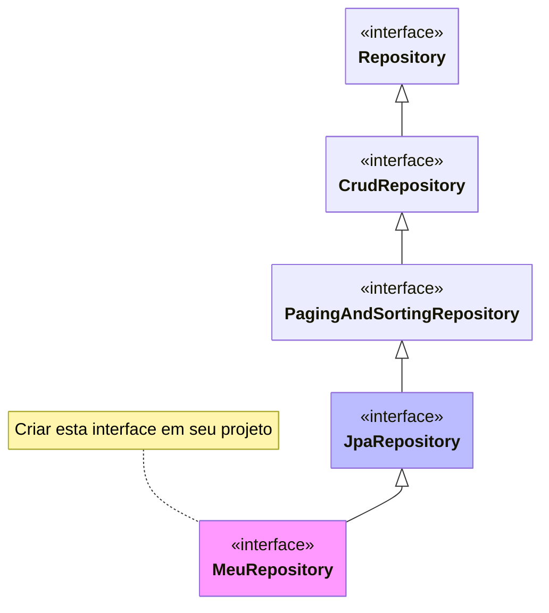

# Spring

## Arquitetura
* 3-tier (Domain, Services, Presentation) -> Ver DDD ou Onion Architecture
    * https://blog.avenuecode.com/domain-driven-design-and-onion-architecture#:~:text=Onion%20Architecture%20is%20based%20on,but%20rather%20on%20domain%20models.
    * https://www.infoq.com/br/articles/onion-architecture/
    * https://www.javaguides.net/2020/07/three-tier-three-layer-architecture-in-spring-mvc-web-application.html
* Anotações `@Component`, `@Controller`, `@Service`, `@Repository`
    * ```mermaid
      ---
      config:
        class:
          hideEmptyMembersBox: true
      ---
      classDiagram
      class Component["@Component"]
      class Controller["@Controller"]
      class Service["@Service"]
      class Repository["@Repository"]
      Component <|-- Controller
      Component <|-- Service
      Component <|-- Repository
      ```
    * Premissa de um `@Service` para quem desenvolve web: a funcionalidade será executada corretamente se for feita através de outra interface de operação, como, por exemplo, linha de comando (considerar entradas primárias tipo String, int, validações, mensagens de sucesso, erros, etc)?

* Configurações
    * application.properties
        * Acesso a variáveis de ambiente
        * SpEL com valor padrão no arquivo de propriedades
        * Precedência das várias formas de configuração em https://docs.spring.io/spring-boot/docs/current/reference/html/features.html#features.external-config
    * Uso de profiles (ver https://docs.spring.io/spring-boot/docs/current/reference/html/features.html#features.profiles)

## Core
* Injeção de dependências
    * Processo de component scanning - Por padrão, segue subpackages a partir do package onde a classe principal do projeto se encontra
        * Caso haja classes fora do package principal, configurar o `scanBasePackages` em `@SpringBootApplication`
    * Nas camadas principais (Service e Controller), sempre que possível usar a injeção através de um construtor único e/ou método `set` (caso seja opcional) ao invés de usar o `@Autowired` diretamente no atributo - Facilita a escrita de testes (unitários/integração).
    * Criar beans programaticamente através de classes anotadas com `@Configuration`e métodos anotados com `@Bean`
    * Usar valores padrões nas anotações `@Value`
    ```java
    @Value("${valor-booolean-properties:true}")
    boolean valorBooleanoInjetado;
    ```
    
* Spring Boot/Spring Initialzr
    * Cuidado ao configurar Beans que sobrescrevem o comportamento padrão
    * Dependências úteis: devtools, actuator, configuration-processor
* EventListeners
* SpEL

## MVC
* `@Controller` e `@RestController`
* Informações do Spring MVC Auto-configuration - https://docs.spring.io/spring-boot/reference/web/servlet.html#web.servlet.spring-mvc.auto-configuration
    * **NÃO** criar classe `@Configuration` + `@EnableWebMvc` - isso desabilita a auto-configuration - Basta criar classe que implementa `WebMvcConfigurer` **SEM** `@EnableWebMvc`
* Tratamento de erros com `@ControllerAdvice` + `@ExceptionHandler`+ Problem Details for HTTP APIs (RFC 7807) (+ `@ResponseStatus`)
* Escopo dos beans
    * `@RequestScope`
    * `@SessionScope` (cuidado ao usar em aplicações REST)
    * `@ApplicationScope`
    * https://www.baeldung.com/spring-bean-scopes
* i18n para textos estáticos/validações
    * Uso de i18n em dados gerenciados requer atenção na modelagem para suportá-lo
* OpenAPI/Swagger2
* Upload e mapeamento para acesso via HTTP
    * Integração com serviços externos (ex: AWS S3)
* Utilitários
    * Conversor de erros do Bean Validation do JEE para Spring Validator - Útil quando validação é feita no `@Service` mas precisa apresentar erros via `@Controller`
    ```java
    import java.util.Set;
    import jakarta.validation.ConstraintViolation;
    import jakarta.validation.Validation;
    import org.springframework.validation.Errors;
    import org.springframework.validation.beanvalidation.SpringValidatorAdapter;

    // https://stackoverflow.com/a/66069937
    public class ConstraintViolationsToErrorsConverter extends SpringValidatorAdapter {
    
        public ConstraintViolationsToErrorsConverter() {
            super(Validation.buildDefaultValidatorFactory().getValidator()); // Validator is not actually used
        }

        @SuppressWarnings({"rawtypes", "unchecked"})
        public void addConstraintViolations(Set<? super ConstraintViolation<?>> violations, Errors errors) {
            // Using raw type since processConstraintViolations specifically expects ConstraintViolation<Object>
            super.processConstraintViolations((Set) violations, errors);
        }
    }
    ```
    * `org.springframework.web.context.request.RequestContextHolder` [javadoc](https://docs.spring.io/spring-framework/docs/current/javadoc-api/org/springframework/web/context/request/RequestContextHolder.html)
        * `org.springframework.web.context.request.ServletRequestAttributes` [javadoc](https://docs.spring.io/spring-framework/docs/current/javadoc-api/org/springframework/web/context/request/ServletRequestAttributes.html)
    * `org.springframework.context.i18n.LocaleContextHolder` [javadoc](https://docs.spring.io/spring-framework/docs/current/javadoc-api/org/springframework/context/i18n/LocaleContextHolder.html)
    * `org.springframework.security.core.context.SecurityContextHolder` [javadoc](https://docs.spring.io/spring-security/site/docs/current/api/org/springframework/security/core/context/SecurityContextHolder.html)
* HATEOAS

## Data JPA
* Entender a hierarquia das interfaces `Repository` <- `CrudRepository` <- `PagingAndSortingRepository` <- `JpaRepository` e verificar as funcionalidades já fornecidas por padrão https://docs.spring.io/spring-data/jpa/reference/repositories/core-concepts.html



* Formas de desenvolver lógica do repositório
    * Query methods - uso de convenções de nomenclatura dos métodos da interface. Dessa forma, o Spring Data irá criar automaticamente as queries de consulta ao repositório
        * https://docs.spring.io/spring-data/jpa/reference/jpa/query-methods.html#jpa.query-methods.query-creation
        * https://docs.spring.io/spring-data/jpa/reference/repositories/query-methods-details.html#repositories.query-methods.query-property-expressions
        * https://docs.spring.io/spring-data/jpa/reference/repositories/query-keywords-reference.html#appendix.query.method.subject
    * Uso do `@Query` com JPQL OU SQL nativo (dependente do Banco de dados usado)
        * Envolve definir um método qualquer no repositório e incluir a anotação `@Query` (importado de `org.springframework.data.jpa.repository.Query`) com a JPQL de consulta e sempre que possivel usando parametros nomeados com `@Param` (importado de `org.springframework.data.repository.query.Param`) ou query nativa
         ```java
         // JPQL
         @Query("SELECT p FROM Person p WHERE p.firstName = :nameParam") // Person é o nome do entity
         Optional<Person> findSomethingJpql(@Param("nameParam") String nameParam);

         // SQL nativo - sintaxe pode variar dependendo do banco de dados e comandos usados
         // Lembrar de usar nomes de tabelas e colunas de acordo com o banco de dados e não à classe de Entidade
         @Query(nativeQuery = true, value = "SELECT * FROM person WHERE first_name = :nameParam")
         // Ou @NativeQuery("SELECT * FROM person WHERE first_name = :nameParam")
         // ver https://docs.spring.io/spring-data/jpa/reference/jpa/query-methods.html#jpa.query-methods.at-query.native
         Optional<Person> findSomethingNative(@Param("nameParam") String nameParam);
         ```
        
        * Exemplo para concatenar parâmetros às funções e wildcards
        ```java
        // JPQL
        @Query("SELECT p FROM Person p WHERE upper(p.fullName) LIKE UPPER('%'||:searchTerm||'%')")
        List<Person> searchByNameJpql(@Param("searchTerm") String searchTerm);
        
        // SQL nativo
        @Query(nativeQuery = true, value = "SELECT * FROM person WHERE upper(full_name) LIKE upper('%'||:searchTerm||'%')")
        // OU @NativeQuery("SELECT * FROM person WHERE upper(full_name) LIKE upper('%'||:searchTerm||'%')")
        List<Person> searchByNameNative(@Param("searchTerm") String searchTerm);
        ```

    * Specification ​+ Criteria API
        * Geração dos metamodels usando Hibernate JPA Modelgen configurado no pom.xml
            * Fazer via console usando `mvn clean generate-sources`, senão ao abrir projeto no Eclipse gera erros
            * Não salvar arquivos gerados no repositório de código-fonte.
            * Tutorial de Criteria/JPQL: https://www.objectdb.com/java/jpa/query/jpql/structure
    * Uso do JPA "puro"
    * Uso do JDBC
        * Lembrar de usar **try-with-resources** ao usar recursos como `Connection`, `Statement`/`PreparedStatement` e `ResultSet`
    * Uso do H2 console + Security
        * Desabilitar CSRF e X-Frame-Options no SecurityFilterChain
        * Exemplo de configuração em https://docs.spring.io/spring-boot/reference/data/sql.html#data.sql.h2-web-console.spring-security

* Outras dicas e pontos de atenção
    * Na criação das Entities, sempre que possível usar as anotações padrão do JPA puro (pacote `jakarta.persistence`/ antigo `javax.persistence`) e evitar usar anotações específicas do Hibernate.
    * Uso da configuração `spring.jpa.open-in-view=false` - considerada má-prática, pois mantém uma conexão aberta com o banco de dados para cada acesso realizado à aplicação. Alternativas indicadas abaixo
    * Uso do `@Transactional` (importado de `org.springframework.transaction.annotation.Transactional`) na camada `@Service`
        * TODO: Ver diferenças de comportamento com `jakarta.transaction.Transactional` do JEE
            * https://www.baeldung.com/spring-vs-jta-transactional
            * https://stackoverflow.com/a/62702146
    * Mapeamento das entidades com annotations do JPA
        * Fetchs EAGER, LAZY e como configurar fetch nas consultas usando Entity Graph
            * Por padrão, são adotados as seguintes configurações:
                * `*toOne` - EAGER
                * `*toMany`- LAZY
            * Atentar ao uso do "fetch EAGER" nas anotações de relacionamento (`@OneToOne`, `@OneToMany`/`@ManyToOne` e `@ManyToMany`). Se usado incorretamente, pode ocasionar problema sérios de desempenho. Sempre dar preferência ao uso do "fetch LAZY" e quando necessário fazer o fetch manualmente usando JOIN FETCH do JPQL ou usar `@EntityGraph` ou `@NamedEntityGraph`.
            * Nos relacionamentos `*toMany`, normalmente usar coleção do tipo `Set` ao invés do `List` para evitar erros to tipo `MultipleBagFetchException` - porém causa problema do produto cartesiano e precisa analisar caso a caso [ref1](https://stackoverflow.com/questions/4334970/hibernate-throws-multiplebagfetchexception-cannot-simultaneously-fetch-multipl), [ref2](https://www.baeldung.com/java-hibernate-multiplebagfetchexception) e [ref3](https://vladmihalcea.com/hibernate-multiplebagfetchexception/)
        * Uso do Cascade e orphanRemoval
        * IDs compostos para relacionamentos many-to-many "manuais" + campos extras na relação
        * Uso dos Listeners de eventos (ex: `@PostLoad`, `@PrePersist`, `@PostPersist`, etc)
            * Referência: https://www.baeldung.com/jpa-entity-lifecycle-events
        * Nomear FKs
        * Criação de índices.
        * Usar mesma PK em relações do tipo one-to-one
            * Sempre que possível, associações @OneToOne devem ser feitas usando o ID da entidade principal como PK da entidade secundária (usar @JoinColumn + @MapsId OU @PrimaryKeyJoinColumn).
        * Caso seja necessário abrir uma associação many-to-many em `@OneToMany`/`@ManyToOne` para adicionar campos extras, usar o `@EmbeddedId` para evitar gerar IDs adicionais. Lembrar que a classe `@Embedded` representa o ID composto da tabela de associação e deve ser `Serializable` e implementar os métodos `hashCode()` e `equals()`.
        * Identificadores internos e externos (UUID).
    * Integração com Project Lombok
        * Evitar usar `@Data`, pois ele transforma a classe em `Serializable` e reimplementa o `equals`, podendo ocasionar incompatibilidades com o modelo de funcionamento do JPA
        * Cuidado ao usar `@ToString`, pois se estiver mal configurado pode gerar loops infinitos.
    * Records (Java 14+)
        * Records **NÃO** podem ser usados para representar uma Entidade JPA, pois são imutáveis.
        * https://thorben-janssen.com/java-records-hibernate-jpa/

* Controle de versões do banco de dados
    * Liquidbase
    * Flyway
    * Referências:
        * https://dzone.com/articles/flyway-vs-liquibase
        * https://medium.com/@ruxijitianu/database-version-control-liquibase-versus-flyway-9872d43ee5a4

## Security
* Hash de senhas (ex: bcrypt)
* OpenID
* OAuth2
* JWT
* Keycloak como servidor de autenticação/autorização https://www.keycloak.org/

## Properties úteis

Ver https://docs.spring.io/spring-boot/docs/current/reference/html/application-properties.html#appendix.application-properties . Se necessário, trocar "current" pela versão desejada.

```
#========= GENERAL CONFIG ==========
debug=true
spring.main.banner-mode=off

# PEGANDO VALOR DO PROFILE CONFIGURADO NO pom.xml
spring.profiles.active=@build.profile.id@
spring.profiles.include=@build.profile.id@

#========= WEB ==========
server.port=8080
server.context-path=/
server.compression.enabled=true
server.compression.min-response-size=50KB
spring.servlet.multipart.max-file-size=5MB
spring.servlet.multipart.max-request-size=10MB

#========= DATABASE/JPA ==========
spring.jpa.open-in-view=false
spring.jpa.show-sql=true
# Pode ser none/validate/create/create-drop/update - https://docs.jboss.org/hibernate/orm/5.2/userguide/html_single/Hibernate_User_Guide.html#configurations-hbmddl
spring.jpa.properties.hibernate.ddl-auto=update

#========== JSON ==========
spring.jackson.serialization.INDENT_OUTPUT=true
spring.jackson.deserialization.ACCEPT_EMPTY_STRING_AS_NULL_OBJECT=true
spring.jackson.deserialization.FAIL_ON_IGNORED_PROPERTIES=false
spring.jackson.deserialization.FAIL_ON_UNKNOWN_PROPERTIES=false

#========== OUTROS ==========
# USO DE VARIÁVEIS DE AMBIENTE
app.some-directory=${HOME}/directory

# PROPRIEDADES COM FALLBACK
app.some-text=${SOME_ENV_VAR:Texto fallback caso variável não exista}
```

```xml
<!-- trecho do pom.xml com declaração do profile -->
<profles>
	<profile>
		<id>dev</id>
		<activation>
			<activeByDefault>true</activeByDefault>
		</activation>
		<properties>
			<build.profile.id>dev</build.profile.id>
		</properties>
	</profile>
</profiles>
```

## Links úteis

Versões das dependências usadas nos seguintes links:
* https://docs.spring.io/spring-boot/docs/current/reference/html/dependency-versions.html#appendix.dependency-versions
* https://github.com/spring-projects/spring-boot/blob/2.2.x/spring-boot-project/spring-boot-dependencies/pom.xml (2.2.x foi a última com Maven, depois migrou para Gradle)

Se necessário, trocar "current" pela versão desejada

## "Receitas de bolo" para requisitos de alguns microservices
* Autenticação/Autorização de acesso
    * Cadastro de novo usuário
    * Controle de tentativa máximas de erros de login
    * Troca de credenciais (alterar senha)
    * "Remember me" (via sessão persistente/refresh tokens)
    * Reinicializar senha
        * Self-service
        * Via help-desk
        * Mecanismos para gerar códigos aleatórios de confirmação (TODO)
    * Auditoria
    * n-factor authentication
        * Referência: https://blog.nec.com.br/autenticacao-de-usuario-um-mundo-alem-de-senhas
    * Gerenciamento
        * Ativação/Inativação de conta
        * Permissões de acesso (Role/Authority)
    * Notificações de eventos (criação, alteração, troca de senha, etc)
* Disparo de tarefas automatizadas com Quartz
    * Cadastrar tarefas
    * Ativar/Desativar execução de dinamicamente
    * Registrar data/horario e resultados de execução
    * cron expressions
* Sistema de comentários
    * Apresentação dos comentários
    * Entrada de comentário
    * Moderação, Aprovação/Reprovação
    * Feedback em casos de reprovação
* Sistema de notas/ranking
* Sistema newsletter
    * Inscrição
    * Cancelamento de inscrição
    * Integração com sistema de notificações
* CRUD genérico
    * Listagem das informações
        * Buscas textuais (Solr, ElasticSearch/Opensearch, PostgreSQL full text search)
        * Filtros
            * Inclusão de Filtro
            * Remoção de Filtro
            * Resultados facetados (refinamento dos filtros - conceito do Solr)
        * Ordenação
        * Paginação/Quantidade de resultados limitados
    * Formulários de inclusão/alteração
        * Validações de campos
            * Client-side (usar recursos do HTML5 para validações simples)
            * Server-side (sempre mandatório)
        * Cadastro com upload de arquivos
* Notificações
    * Internas (dentro do próprio sistema - Webhook, Server-sent events)
    * Envio de e-mails
    * Outros (ex: SMS, WhatsApp, etc)
* LGPD
    * Apresentação dos termos de uso com informações de como os dados serão usados
    * Versionamento dos termos de uso
    * Aceite dos termos pelo usuário

## Outros
* Project Lombok
* Testes unitários e integração
    * JUnit 5
    * BDD + Cuccumber
    * Selenium Webdriver/Cypress
    * JMeter/Gatling e teste de carga
* Containers
    * Docker
    * Kubernetes
* MVC assíncrono
* Webflux
* Websockets
* SSE (Server Sent Events)
* Spring Data REST
* Cloud
    * Configuration Server
    * Eureka (Service discovery)
    * Open Feign
    * Load balancer
    * Zuul (API Gateway)
    * Resilience4J
    * Zipkin (Coletor de logs E2E)
* Boas práticas
    * Configurações estáticas X configurações dinâmicas
        * Arquivo properties externo (fora do diretório de deploy) X configurações gerenciadas no BD X environment variables -> Confirmar se "hot-reload" funciona nestes casos
        * Em containers, prever uso de volumes persistentes para manter estes arquivos
    * Configuração externa de logs (SLF4J, logback)
