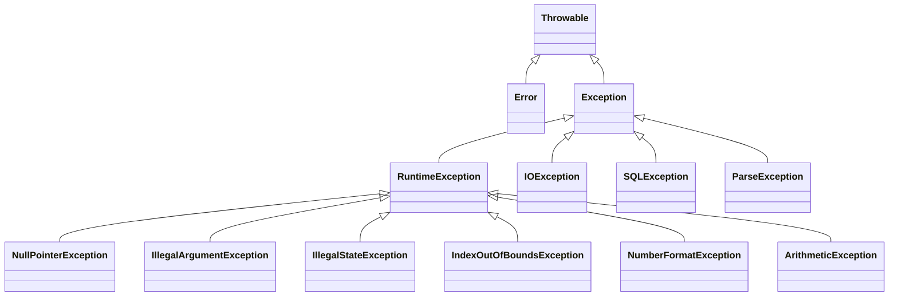

# Exemplos de recursos básicos do Java moderno

Este arquivo reúne exemplos simples e práticos de recursos muito usados no Java moderno, com foco em APIs atuais da JDK e algumas boas práticas comuns no dia a dia.

## Fundamentos Conceituais

### Programação Orientada a Objetos (POO)

A Programação Orientada a Objetos organiza o código em torno de **objetos**, que encapsulam estado (atributos) e comportamento (métodos). Os três pilares fundamentais são:

#### 1. Encapsulamento

Ocultar os detalhes internos de um objeto, expondo apenas o necessário por meio de uma interface pública. Em Java, isso se concretiza com modificadores de acesso (`private`, `protected`, `public`) e com o uso de getters/setters ou, preferencialmente, métodos que expressam intenção de negócio.

```java
public class ContaBancaria {
    private double saldo; // estado interno protegido

    public void depositar(double valor) {
        if (valor > 0) saldo += valor;
    }

    public double getSaldo() {
        return saldo;
    }
}
```

#### 2. Herança

Permite que uma classe derive de outra, reaproveitando e especializando comportamento. Apesar de poderosa, a herança cria acoplamento forte entre classes e deve ser usada com moderação — preferindo-se **composição** quando o objetivo é apenas reutilizar código.

```java
public class Animal {
    public void emitirSom() { System.out.println("..."); }
}

public class Cachorro extends Animal {
    @Override
    public void emitirSom() { System.out.println("Au!"); }
}

public class Gato extends Animal {
    @Override
    public void emitirSom() { System.out.println("Miau!"); }
}
```

#### 3. Polimorfismo

Capacidade de tratar objetos de tipos diferentes de forma uniforme por meio de uma interface comum (classe abstrata ou interface). Permite escrever código genérico que funciona com qualquer implementação futura sem precisar ser alterado.

```java
List<Animal> animais = List.of(new Cachorro(), new Gato());
animais.forEach(Animal::emitirSom); // cada um responde ao seu modo
```

---

#### Boas práticas em POO

**Composição sobre herança**

Prefira compor objetos em vez de herdar implementação. Composição é mais flexível: troca-se o comportamento em tempo de execução e evita-se a fragilidade da hierarquia de classes.

```java
// Herança: Pato "é um" Ave, mas nem todo Pato voa da mesma forma
// Composição: Pato "tem um" comportamento de voo
public interface ComportamentoVoo {
    void voar();
}

public class Pato {
    private final ComportamentoVoo voo; // injetado por construtor

    public Pato(ComportamentoVoo voo) { this.voo = voo; }

    public void voar() { voo.voar(); }
}
```

**Agregação vs. Composição**

Ambas representam relacionamentos "tem um", mas diferem no ciclo de vida dos objetos envolvidos:

| Conceito | Ciclo de vida | Exemplo |
|---|---|---|
| **Agregação** | O objeto "parte" existe independentemente do "todo" | `Departamento` tem `Funcionarios` — funcionários existem sem o departamento |
| **Composição** | A "parte" pertence exclusivamente ao "todo" e é destruída com ele | `Pedido` tem `ItensDoPedido` — itens não fazem sentido sem o pedido |

```java
// Agregação: Turma referencia Alunos que existem de forma independente
public class Turma {
    private List<Aluno> alunos; // Aluno pode existir sem Turma
}

// Composição: Pedido cria e controla seus próprios itens
public class Pedido {
    private final List<ItemPedido> itens = new ArrayList<>(); // criados dentro do Pedido

    public void adicionarItem(Produto produto, int quantidade) {
        itens.add(new ItemPedido(produto, quantidade));
    }
}
```

---

### Programação Funcional em Java

A programação funcional trata funções como valores de primeira classe: funções podem ser passadas como argumentos, retornadas de outras funções e armazenadas em variáveis. O foco está em **o que** computar, não em **como** iterar ou mutar estado.

O Java incorporou suporte funcional a partir do **Java 8** com três pilares:

#### Interfaces funcionais

Uma interface com um único método abstrato (`@FunctionalInterface`) pode ser implementada como uma **expressão lambda** ou **method reference**, eliminando classes anônimas verbosas.

```java
// Interface funcional da JDK
@FunctionalInterface
public interface Predicate<T> {
    boolean test(T t);
}

// Uso com lambda
Predicate<String> naoVazio = s -> !s.isBlank();

// Uso com method reference
Predicate<String> naoNulo = Objects::nonNull;
```

As principais interfaces funcionais da JDK estão em `java.util.function`:

| Interface | Assinatura | Uso típico |
|---|---|---|
| `Predicate<T>` | `T → boolean` | Filtros |
| `Function<T, R>` | `T → R` | Transformações |
| `Consumer<T>` | `T → void` | Efeitos colaterais (ex.: log) |
| `Supplier<T>` | `() → T` | Produção de valores |
| `UnaryOperator<T>` | `T → T` | Transformação no mesmo tipo |
| `BinaryOperator<T>` | `(T, T) → T` | Combinação (ex.: soma) |

#### Expressões lambda e method references

```java
// Lambda equivalente a uma classe anônima
Comparator<String> porTamanho = (a, b) -> Integer.compare(a.length(), b.length());

// Method reference — mais legível quando o lambda apenas delega
List<String> nomes = List.of("Ana", "Beto", "Carlos");
nomes.forEach(System.out::println);         // instance method reference
nomes.stream().map(String::toUpperCase);    // unbound method reference
nomes.stream().map(String::new);            // constructor reference
```

#### Funções puras e imutabilidade

Uma **função pura** sempre retorna o mesmo resultado para os mesmos argumentos e não produz efeitos colaterais (não altera estado externo). Esse estilo facilita testes, paralelismo e raciocínio sobre o código.

```java
// Impuro: depende e modifica estado externo
int total = 0;
for (int x : lista) total += x; // muta variável externa

// Puro: sem efeitos colaterais, resultado previsível
int total = lista.stream().reduce(0, Integer::sum);
```

> A `Stream API` e o `Optional` — abordados nas seções seguintes — são as principais APIs do Java construídas sobre esses conceitos funcionais.

---

## Sumário

- [1. Verificar se uma `String` é blank](#1-verificar-se-uma-string-é-blank)
- [2. Comparação de strings mantendo constantes do lado esquerdo](#2-comparação-de-strings-mantendo-constantes-do-lado-esquerdo)
- [3. Uso de collections comuns (`List`, `Set`, `Map`)](#3-uso-de-collections-comuns-list-set-map)
- [4. Abrir arquivos em disco para leitura e escrita usando recursos do Java moderno](#4-abrir-arquivos-em-disco-para-leitura-e-escrita-usando-recursos-do-java-moderno)
- [5. Navegar por arquivos em um diretório](#5-navegar-por-arquivos-em-um-diretório)
- [6. Uso de `Pattern` e `Matcher`](#6-uso-de-pattern-e-matcher)
- [7. Trabalhando com datas: `Date`, `Calendar` e `java.time`](#7-trabalhando-com-datas-date-calendar-e-javatime)
- [8. Uso do `Optional`](#8-uso-do-optional)
- [9. Interface funcional e classes auxiliares](#9-interface-funcional-e-classes-auxiliares)
- [10. Uso do `Stream API` e `Collectors`](#10-uso-do-stream-api-e-collectors)
- [11. Uso do `CompletableFuture`](#11-uso-do-completablefuture)
- [12. Exceções em Java](#12-exceções-em-java)
- [13. Design Patterns: Gang of Four](#13-design-patterns-gang-of-four)
- [14. Resumo rápido](#14-resumo-rápido)

---

## 1. Verificar se uma `String` é blank

Uma string **blank** é uma string que:
- está vazia (`""`), ou
- contém apenas espaços em branco, tabs ou quebras de linha.

### Usando Java padrão

Desde o Java 11, a classe `String` possui o método `isBlank()`.

```java
String texto1 = "";
String texto2 = "   ";
String texto3 = "\n\t";
String texto4 = "Java";

System.out.println(texto1.isBlank()); // true
System.out.println(texto2.isBlank()); // true
System.out.println(texto3.isBlank()); // true
System.out.println(texto4.isBlank()); // false
```

### Cuidado com `null`

O método `isBlank()` não pode ser chamado em uma referência nula.

```java
String texto = null;

if (texto != null && !texto.isBlank()) {
    System.out.println("Texto válido");
}
```

### Usando Apache Commons Lang

A biblioteca Apache Commons Lang oferece utilitários úteis para strings, como `StringUtils.isBlank()`.

```java
import org.apache.commons.lang3.StringUtils;

String texto1 = null;
String texto2 = "";
String texto3 = "   ";
String texto4 = "Java";

System.out.println(StringUtils.isBlank(texto1)); // true
System.out.println(StringUtils.isBlank(texto2)); // true
System.out.println(StringUtils.isBlank(texto3)); // true
System.out.println(StringUtils.isBlank(texto4)); // false
```

### Dependência Maven para Apache Commons Lang

Caso queira usar `StringUtils`, adicione a dependência abaixo ao `pom.xml`:

```xml
<dependency>
    <groupId>org.apache.commons</groupId>
    <artifactId>commons-lang3</artifactId>
    <version>3.17.0</version>
</dependency>
```

### Quando usar cada um?

- Use `String.isBlank()` quando estiver trabalhando apenas com Java padrão e já souber que a string não é nula.
- Use `StringUtils.isBlank()` quando quiser tratar `null` com mais segurança e conveniência.

---

## 2. Comparação de strings mantendo constantes do lado esquerdo

Uma prática comum em Java é colocar a constante do lado esquerdo da comparação com `equals`, para evitar `NullPointerException`.

### Forma recomendada

```java
String status = obterStatus();

if ("ATIVO".equals(status)) {
    System.out.println("Usuário ativo");
}
```

Se `status` for `null`, o código continua funcionando normalmente.

### Forma arriscada

```java
String status = obterStatus();

if (status.equals("ATIVO")) {
    System.out.println("Usuário ativo");
}
```

Neste caso, se `status` for `null`, será lançada uma `NullPointerException`.

### Comparação sem diferenciar maiúsculas/minúsculas

```java
String perfil = obterPerfil();

if ("admin".equalsIgnoreCase(perfil)) {
    System.out.println("Perfil administrativo");
}
```

### Observação

Em código moderno, essa prática continua válida, especialmente ao lidar com dados externos, formulários, JSON, banco de dados e integrações.

---

## 3. Uso de collections comuns (`List`, `Set`, `Map`)

As coleções mais comuns em Java são:
- `List`: mantém ordem e permite elementos repetidos
- `Set`: não permite duplicidade
- `Map`: armazena pares chave/valor

### 3.1 `List`

```java
import java.util.ArrayList;
import java.util.List;

List<String> nomes = new ArrayList<>();
nomes.add("Ana");
nomes.add("Bruno");
nomes.add("Ana");

System.out.println(nomes); // [Ana, Bruno, Ana]
System.out.println(nomes.get(0)); // Ana
```

### Lista imutável com `List.of`

```java
List<String> cores = List.of("azul", "verde", "vermelho");
System.out.println(cores);
```

Tentativas de alteração geram exceção:

```java
cores.add("amarelo"); // UnsupportedOperationException
```

### 3.2 `Set`

```java
import java.util.HashSet;
import java.util.Set;

Set<String> tecnologias = new HashSet<>();
tecnologias.add("Java");
tecnologias.add("Spring");
tecnologias.add("Java");

System.out.println(tecnologias); // Java aparece apenas uma vez
```

### Set imutável com `Set.of`

```java
Set<String> linguagens = Set.of("Java", "Kotlin", "Scala");
System.out.println(linguagens);
```

### 3.3 `Map`

```java
import java.util.HashMap;
import java.util.Map;

Map<Integer, String> usuarios = new HashMap<>();
usuarios.put(1, "Ana");
usuarios.put(2, "Bruno");
usuarios.put(3, "Carla");

System.out.println(usuarios.get(2)); // Bruno
System.out.println(usuarios.containsKey(1)); // true
```

### Map imutável com `Map.of`

```java
Map<String, Integer> estoque = Map.of(
    "mouse", 10,
    "teclado", 5,
    "monitor", 2
);

System.out.println(estoque);
```

### Map imutável com `Map.ofEntries` e `Map.Entry`

Quando você quer montar um `Map` usando entradas explícitas, pode usar `Map.ofEntries(...)` junto com `Map.entry(...)`.

```java
import java.util.Map;

Map<Integer, String> usuarios = Map.ofEntries(
    Map.entry(1, "Ana"),
    Map.entry(2, "Bruno"),
    Map.entry(3, "Carla")
);

System.out.println(usuarios);
```

Isso é especialmente útil quando o mapa tem vários pares e você quer deixar cada entrada visualmente separada.

### Iterando em coleções

```java
List<String> nomes = List.of("Ana", "Bruno", "Carla");
for (String nome : nomes) {
    System.out.println(nome);
}
```

```java
Map<String, Integer> notas = Map.of(
    "Ana", 9,
    "Bruno", 8
);

for (Map.Entry<String, Integer> entry : notas.entrySet()) {
    System.out.println(entry.getKey() + " -> " + entry.getValue());
}
```

### Removendo itens de um `List` com `Iterator`

Quando você precisa remover elementos enquanto percorre uma lista mutável, o mais seguro é usar `Iterator`.

```java
import java.util.ArrayList;
import java.util.Iterator;
import java.util.List;

List<String> nomes = new ArrayList<>(List.of("Ana", "Bruno", "Carlos", "Bianca"));

Iterator<String> iterator = nomes.iterator();
while (iterator.hasNext()) {
    String nome = iterator.next();
    if (nome.startsWith("B")) {
        iterator.remove();
    }
}

System.out.println(nomes); // [Ana, Carlos]
```

Se você tentar remover diretamente com `list.remove(...)` dentro de um `for-each`, pode ocorrer `ConcurrentModificationException`.

### 3.4 Diagrama de classes Mermaid das coleções Java

O diagrama abaixo mostra a relação entre as interfaces principais e algumas implementações muito comuns da biblioteca padrão.


#### Observações importantes sobre o diagrama

- `Collection` é a interface base para coleções de elementos.
- `List` e `Set` herdam de `Collection`.
- `Map` **não** herda de `Collection`, porque sua estrutura é baseada em pares chave/valor.
- `ArrayList` é uma implementação muito comum de `List`.
- `HashSet` e `LinkedHashSet` são implementações comuns de `Set`.
- `HashMap` e `LinkedHashMap` são implementações comuns de `Map`.

#### Diferença entre `HashSet` e `LinkedHashSet`

Ambos não permitem elementos duplicados, mas:

- `HashSet` não garante ordem de iteração.
- `LinkedHashSet` mantém a ordem de inserção dos elementos.

Exemplo:

```java
Set<String> set1 = new HashSet<>();
set1.add("B");
set1.add("A");
set1.add("C");
System.out.println(set1);
```

A saída pode variar de acordo com a implementação e o estado interno da estrutura.

```java
Set<String> set2 = new LinkedHashSet<>();
set2.add("B");
set2.add("A");
set2.add("C");
System.out.println(set2); // [B, A, C]
```

#### Diferença entre `HashMap` e `LinkedHashMap`

Ambos armazenam pares chave/valor, mas:

- `HashMap` não garante ordem de iteração das chaves.
- `LinkedHashMap` mantém a ordem de inserção das entradas.

Exemplo:

```java
Map<Integer, String> map1 = new HashMap<>();
map1.put(2, "Bruno");
map1.put(1, "Ana");
map1.put(3, "Carla");
System.out.println(map1);
```

A ordem de saída não deve ser considerada previsível.

```java
Map<Integer, String> map2 = new LinkedHashMap<>();
map2.put(2, "Bruno");
map2.put(1, "Ana");
map2.put(3, "Carla");
System.out.println(map2); // {2=Bruno, 1=Ana, 3=Carla}
```

#### Quando usar `LinkedHashSet` e `LinkedHashMap`

Essas implementações são úteis quando você precisa:
- preservar a ordem de inserção
- manter comportamento previsível na iteração
- gerar saídas mais legíveis em logs, telas e serializações

O custo costuma ser um pouco maior do que as versões `Hash*`, porque existe uma estrutura adicional para encadear os elementos na ordem em que foram inseridos.

### Dica prática

No Java moderno, é comum preferir:
- `List.of(...)`, `Set.of(...)` e `Map.of(...)` para coleções fixas
- `ArrayList`, `HashSet` e `HashMap` quando for necessário alterar o conteúdo

---

## 4. Abrir arquivos em disco para leitura e escrita usando recursos do Java moderno

As APIs modernas de arquivos em Java estão principalmente no pacote `java.nio.file`.

Principais classes:
- `Path`
- `Paths`
- `Files`
- `StandardOpenOption`

---

### 4.1 Ler arquivo inteiro

```java
import java.nio.file.Files;
import java.nio.file.Path;

Path caminho = Path.of("dados/arquivo.txt");
String conteudo = Files.readString(caminho);

System.out.println(conteudo);
```

### 4.2 Ler todas as linhas

```java
import java.nio.file.Files;
import java.nio.file.Path;
import java.util.List;

Path caminho = Path.of("dados/arquivo.txt");
List<String> linhas = Files.readAllLines(caminho);

linhas.forEach(System.out::println);
```

### 4.3 Escrever string em arquivo

```java
import java.nio.file.Files;
import java.nio.file.Path;

Path caminho = Path.of("saida.txt");
Files.writeString(caminho, "Olá, mundo!\n");
```

### 4.4 Escrever linhas em arquivo

```java
import java.nio.file.Files;
import java.nio.file.Path;
import java.util.List;

Path caminho = Path.of("saida-linhas.txt");
Files.write(caminho, List.of("linha 1", "linha 2", "linha 3"));
```

### 4.5 Acrescentar conteúdo ao final do arquivo

```java
import java.nio.file.Files;
import java.nio.file.Path;
import java.nio.file.StandardOpenOption;

Path caminho = Path.of("log.txt");
Files.writeString(
    caminho,
    "Nova linha de log\n",
    StandardOpenOption.CREATE,
    StandardOpenOption.APPEND
);
```

### 4.6 Escrever arquivo usando `BufferedOutputStream`

Quando você quer escrever bytes com buffer, pode usar `BufferedOutputStream` junto com `Files.newOutputStream(...)`.

```java
import java.io.BufferedOutputStream;
import java.nio.charset.StandardCharsets;
import java.nio.file.Files;
import java.nio.file.Path;
import java.nio.file.StandardOpenOption;

Path caminho = Path.of("saida-buffered.txt");

try (BufferedOutputStream bos = new BufferedOutputStream(
        Files.newOutputStream(
            caminho,
            StandardOpenOption.CREATE,
            StandardOpenOption.TRUNCATE_EXISTING,
            StandardOpenOption.WRITE
        ))) {

    bos.write("Linha 1\n".getBytes(StandardCharsets.UTF_8));
    bos.write("Linha 2\n".getBytes(StandardCharsets.UTF_8));
}
```

### 4.7 Ler arquivo usando `BufferedInputStream`

Para leitura em blocos de bytes com buffer:

```java
import java.io.BufferedInputStream;
import java.nio.charset.StandardCharsets;
import java.nio.file.Files;
import java.nio.file.Path;

Path caminho = Path.of("saida-buffered.txt");

try (BufferedInputStream bis = new BufferedInputStream(Files.newInputStream(caminho))) {
    byte[] buffer = new byte[1024];
    int bytesLidos;

    while ((bytesLidos = bis.read(buffer)) != -1) {
        String trecho = new String(buffer, 0, bytesLidos, StandardCharsets.UTF_8);
        System.out.print(trecho);
    }
}
```

### 4.8 Escrever texto com `BufferedWriter`

`BufferedWriter` é voltado para **texto**, e não para bytes brutos. Ele é muito útil quando você quer escrever linha a linha com boa legibilidade.

```java
import java.io.BufferedWriter;
import java.nio.file.Files;
import java.nio.file.Path;
import java.nio.file.StandardOpenOption;

Path caminho = Path.of("saida-writer.txt");

try (BufferedWriter writer = Files.newBufferedWriter(
        caminho,
        StandardOpenOption.CREATE,
        StandardOpenOption.TRUNCATE_EXISTING,
        StandardOpenOption.WRITE
)) {
    writer.write("Primeira linha");
    writer.newLine();
    writer.write("Segunda linha");
    writer.newLine();
    writer.write("Terceira linha");
}
```

### 4.9 Ler texto com `BufferedReader`

`BufferedReader` também é voltado para **texto** e facilita bastante a leitura linha a linha.

```java
import java.io.BufferedReader;
import java.nio.file.Files;
import java.nio.file.Path;

Path caminho = Path.of("saida-writer.txt");

try (BufferedReader reader = Files.newBufferedReader(caminho)) {
    String linha;
    while ((linha = reader.readLine()) != null) {
        System.out.println(linha);
    }
}
```

### 4.10 Exemplo com `lines()` do `BufferedReader`

Uma alternativa moderna é usar o stream de linhas:

```java
import java.io.BufferedReader;
import java.nio.file.Files;
import java.nio.file.Path;

Path caminho = Path.of("saida-writer.txt");

try (BufferedReader reader = Files.newBufferedReader(caminho)) {
    reader.lines().forEach(System.out::println);
}
```

### 4.11 Comparando `BufferedReader` / `BufferedWriter` com `BufferedInputStream` / `BufferedOutputStream`

Embora todos usem buffer internamente, eles servem para propósitos diferentes.

#### `BufferedReader` e `BufferedWriter`

Use quando:
- o conteúdo é **texto**
- você quer trabalhar com `String`, linhas e caracteres
- legibilidade do código é prioridade

Vantagens:
- API mais adequada para texto
- leitura linha a linha com `readLine()`
- escrita com `write()` e `newLine()`
- evita conversões manuais de bytes para texto na maior parte dos casos

#### `BufferedInputStream` e `BufferedOutputStream`

Use quando:
- o conteúdo é **binário** ou baseado em bytes
- você precisa controlar blocos de leitura e escrita
- está manipulando arquivos como imagem, PDF, ZIP, áudio ou vídeo

Vantagens:
- trabalham diretamente com `byte[]`
- são apropriados para arquivos binários
- são úteis para cópia e transferência de dados em blocos

### 4.12 Resumo prático da escolha

- Para **texto simples**, prefira `BufferedReader` e `BufferedWriter`.
- Para **bytes ou arquivos binários**, prefira `BufferedInputStream` e `BufferedOutputStream`.
- Para casos simples de texto, `Files.readString`, `Files.readAllLines` e `Files.writeString` continuam sendo opções muito práticas.

### 4.13 Exemplo copiando arquivo com streams bufferizados

```java
import java.io.BufferedInputStream;
import java.io.BufferedOutputStream;
import java.nio.file.Files;
import java.nio.file.Path;
import java.nio.file.StandardOpenOption;

Path origem = Path.of("origem.bin");
Path destino = Path.of("destino.bin");

try (
    BufferedInputStream bis = new BufferedInputStream(Files.newInputStream(origem));
    BufferedOutputStream bos = new BufferedOutputStream(
        Files.newOutputStream(
            destino,
            StandardOpenOption.CREATE,
            StandardOpenOption.TRUNCATE_EXISTING,
            StandardOpenOption.WRITE
        )
    )
) {
    byte[] buffer = new byte[8192];
    int bytesLidos;

    while ((bytesLidos = bis.read(buffer)) != -1) {
        bos.write(buffer, 0, bytesLidos);
    }
}
```

### 4.14 Tabela de flags de abertura de arquivos (`StandardOpenOption`)

As flags mais comuns para leitura e escrita são:

| Flag | Significado | Observação |
|---|---|---|
| `CREATE` | Cria o arquivo se ele não existir | útil para escrita inicial |
| `CREATE_NEW` | Cria o arquivo apenas se ele ainda não existir | lança exceção se o arquivo já existir |
| `APPEND` | Adiciona conteúdo ao final do arquivo | preserva o conteúdo anterior |
| `TRUNCATE_EXISTING` | Apaga o conteúdo atual antes de escrever | usado quando se quer sobrescrever |
| `WRITE` | Abre o arquivo para escrita | comum em gravação |
| `READ` | Abre o arquivo para leitura | comum em leitura explícita |
| `SYNC` | Força atualização síncrona de dados e metadados | pode impactar desempenho |
| `DSYNC` | Força sincronização principalmente dos dados | semelhante ao `SYNC`, com foco nos dados |

#### Exemplo com múltiplas flags

```java
import java.nio.file.Files;
import java.nio.file.Path;
import java.nio.file.StandardOpenOption;

Path caminho = Path.of("auditoria.log");

Files.writeString(
    caminho,
    "Registro de auditoria\n",
    StandardOpenOption.CREATE,
    StandardOpenOption.WRITE,
    StandardOpenOption.APPEND
);
```

#### Observação importante

Nem toda combinação de flags faz sentido. Por exemplo:
- `APPEND` + `TRUNCATE_EXISTING` normalmente é contraditório
- `CREATE_NEW` falha se o arquivo já existir

---

## 5. Navegar por arquivos em um diretório

A API `Files` também facilita listar, percorrer e filtrar diretórios.

### 5.1 Listar itens de um diretório

```java
import java.nio.file.Files;
import java.nio.file.Path;
import java.util.stream.Stream;

Path diretorio = Path.of("dados");

try (Stream<Path> stream = Files.list(diretorio)) {
    stream.forEach(System.out::println);
}
```

### 5.2 Percorrer subdiretórios recursivamente

```java
import java.nio.file.Files;
import java.nio.file.Path;
import java.util.stream.Stream;

Path diretorio = Path.of("dados");

try (Stream<Path> stream = Files.walk(diretorio)) {
    stream.forEach(System.out::println);
}
```

### 5.3 Filtrar apenas arquivos regulares

```java
import java.nio.file.Files;
import java.nio.file.Path;
import java.util.stream.Stream;

Path diretorio = Path.of("dados");

try (Stream<Path> stream = Files.walk(diretorio)) {
    stream
        .filter(Files::isRegularFile)
        .forEach(System.out::println);
}
```

### 5.4 Filtrar por extensão

```java
import java.nio.file.Files;
import java.nio.file.Path;
import java.util.stream.Stream;

Path diretorio = Path.of("dados");

try (Stream<Path> stream = Files.walk(diretorio)) {
    stream
        .filter(Files::isRegularFile)
        .filter(path -> path.toString().endsWith(".txt"))
        .forEach(System.out::println);
}
```

### 5.5 Usar `DirectoryStream`

`DirectoryStream` pode ser útil para listagens simples e eficientes.

```java
import java.nio.file.DirectoryStream;
import java.nio.file.Files;
import java.nio.file.Path;

Path diretorio = Path.of("dados");

try (DirectoryStream<Path> stream = Files.newDirectoryStream(diretorio, "*.txt")) {
    for (Path path : stream) {
        System.out.println(path);
    }
}
```

---

## 6. Uso de `Pattern` e `Matcher`

As classes `Pattern` e `Matcher` pertencem ao pacote `java.util.regex` e são usadas para trabalhar com expressões regulares.

### Exemplo básico

```java
import java.util.regex.Matcher;
import java.util.regex.Pattern;

Pattern pattern = Pattern.compile("\\d+");
Matcher matcher = pattern.matcher("Pedido 123 gerado em 2026");

while (matcher.find()) {
    System.out.println("Encontrado: " + matcher.group());
}
```

Saída esperada:

```text
Encontrado: 123
Encontrado: 2026
```

### Validar string inteira

```java
import java.util.regex.Pattern;

Pattern emailPattern = Pattern.compile("^[\\w.-]+@[\\w.-]+\\.[A-Za-z]{2,}$");
boolean valido = emailPattern.matcher("teste@email.com").matches();

System.out.println(valido); // true
```

### Capturar grupos

```java
import java.util.regex.Matcher;
import java.util.regex.Pattern;

Pattern pattern = Pattern.compile("(\\d{2})/(\\d{2})/(\\d{4})");
Matcher matcher = pattern.matcher("Data: 15/03/2026");

if (matcher.find()) {
    System.out.println("Dia: " + matcher.group(1));
    System.out.println("Mês: " + matcher.group(2));
    System.out.println("Ano: " + matcher.group(3));
}
```

### Substituir valores com `replaceAll`

Quando você quer trocar todas as ocorrências encontradas por uma regex, pode usar `replaceAll`.

```java
String texto = "CPF: 123.456.789-00";
String resultado = texto.replaceAll("\\d", "*");

System.out.println(resultado); // CPF: ***.***.***-**
```

### Substituir apenas a primeira ocorrência com `replaceFirst`

```java
String texto = "Item 1, Item 2, Item 3";
String resultado = texto.replaceFirst("Item", "Produto");

System.out.println(resultado); // Produto 1, Item 2, Item 3
```

### Substituir usando grupos capturados

Também é possível reorganizar partes do texto usando os grupos da regex.

```java
String data = "15/03/2026";
String iso = data.replaceAll("(\\d{2})/(\\d{2})/(\\d{4})", "$3-$2-$1");

System.out.println(iso); // 2026-03-15
```

### Substituir com `Matcher.replaceAll`

Você pode criar o `Matcher` explicitamente e depois aplicar a substituição.

```java
Pattern pattern = Pattern.compile("\\s+");
Matcher matcher = pattern.matcher("Java    moderno   é   útil");

String resultado = matcher.replaceAll(" ");
System.out.println(resultado); // Java moderno é útil
```

### Substituição incremental com `appendReplacement` e `appendTail`

Esses métodos são úteis quando você precisa de mais controle sobre cada substituição.

```java
import java.util.regex.Matcher;
import java.util.regex.Pattern;

Pattern pattern = Pattern.compile("\\d+");
Matcher matcher = pattern.matcher("Pedido 123 e pedido 456");
StringBuffer sb = new StringBuffer();

while (matcher.find()) {
    matcher.appendReplacement(sb, "[NUMERO]");
}
matcher.appendTail(sb);

System.out.println(sb); // Pedido [NUMERO] e pedido [NUMERO]
```

### Quando usar cada abordagem?

- `replaceAll` para substituir todas as ocorrências rapidamente.
- `replaceFirst` para trocar somente a primeira.
- grupos (`$1`, `$2`, ...) quando precisar reorganizar partes do texto.
- `appendReplacement` e `appendTail` quando cada substituição exigir lógica mais detalhada.

---

### 6.1 Tabela com símbolos mais usados em regex no dia a dia

A tabela abaixo resume vários símbolos e atalhos muito usados com `Pattern` e `Matcher`.

| Símbolo | Significado | Exemplo | Observação |
|---|---|---|---|
| `.` | qualquer caractere | `a.c` | por padrão não inclui quebra de linha |
| `\\d` | dígito | `\\d+` | equivalente a `[0-9]` |
| `\\D` | não dígito | `\\D+` | complemento de `\\d` |
| `\\w` | caractere de palavra | `\\w+` | normalmente letras, números e `_` |
| `\\W` | não caractere de palavra | `\\W+` | complemento de `\\w` |
| `\\s` | espaço em branco | `\\s+` | inclui espaço, tab, quebra de linha |
| `\\S` | não espaço em branco | `\\S+` | complemento de `\\s` |
| `\\t` | tabulação | `\\t+` | útil para textos separados por tab |
| `\\n` | quebra de linha | `\\n` | representa nova linha |
| `\\r` | carriage return | `\\r` | comum em finais de linha Windows junto com `\\n` |
| `[abc]` | um dos caracteres listados | `[aeiou]` | casa um item do conjunto |
| `[^abc]` | negação do conjunto | `[^0-9]` | qualquer caractere exceto os informados |
| `[a-z]` | intervalo | `[A-Z]` | útil para letras e faixas |
| `^` | início da linha/string | `^Java` | com `MULTILINE`, vale por linha |
| `$` | fim da linha/string | `fim$` | com `MULTILINE`, vale por linha |
| `\\A` | início da entrada inteira | `\\AJava` | diferente de `^` em contextos multiline |
| `\\z` | fim da entrada inteira | `fim\\z` | diferente de `$` em certos contextos |
| `?` | zero ou uma ocorrência | `colou?r` | aceita presença opcional |
| `*` | zero ou mais ocorrências | `a*` | pode casar vazio |
| `+` | uma ou mais ocorrências | `a+` | precisa existir ao menos uma |
| `{n}` | exatamente n ocorrências | `\\d{4}` | ex.: ano |
| `{n,}` | no mínimo n ocorrências | `\\d{2,}` | sem limite superior |
| `{n,m}` | entre n e m ocorrências | `\\d{2,4}` | intervalo fechado |
| `(...)` | grupo capturante | `(\\d{2})/(\\d{2})` | permite `group(1)`, `group(2)` |
| `(?<nome>...)` | grupo capturante nomeado | `(?<dia>\\d{2})` | permite acessar com `group("dia")` |
| `(?:...)` | grupo não capturante | `(?:abc)+` | agrupa sem capturar |
| `\\1` | backreference para grupo anterior | `(\\w+)\\s+\\1` | reutiliza o conteúdo capturado no grupo 1 |
| `(?=...)` | lookahead positivo | `\\d+(?=kg)` | exige algo à frente sem consumir |
| `(?!...)` | lookahead negativo | `Java(?!Script)` | rejeita determinado padrão à frente |
| `(?<=...)` | lookbehind positivo | `(?<=R\\$)\\d+` | exige algo antes sem consumir |
| `(?<!...)` | lookbehind negativo | `(?<!-)\\d+` | rejeita determinado padrão antes |
| `|` | alternativa / ou | `sim|não` | muito usado para opções |
| `\\` | escape | `\\.` | trata metacaractere literalmente |
| `\\b` | limite de palavra | `\\bJava\\b` | evita casar dentro de outra palavra |
| `\\B` | não limite de palavra | `\\Babc\\B` | caso oposto ao `\\b` |

#### Regex prontos usados no dia a dia

Os exemplos abaixo são úteis como ponto de partida. Em cenários reais, vale ajustar as regras conforme o contexto da aplicação.

| Caso | Regex | Observação |
|---|---|---|
| senha com mínimo de 8 caracteres, maiúscula, minúscula, número e especial | `^(?=.*[a-z])(?=.*[A-Z])(?=.*\\d)(?=.*[^A-Za-z\\d]).{8,}$` | valida regras comuns de senha |
| e-mail simples | `^[\\w.-]+@[\\w.-]+\\.[A-Za-z]{2,}$` | útil para validações básicas, mas não cobre todos os casos do padrão oficial |
| CEP brasileiro | `^\\d{5}-?\\d{3}$` | aceita com ou sem hífen |
| telefone brasileiro simples | `^\\(?\\d{2}\\)?\\s?9?\\d{4}-?\\d{4}$` | formato simplificado para uso comum |
| data no formato `dd/MM/yyyy` | `^\\d{2}/\\d{2}/\\d{4}$` | valida só o formato, não a data real |
| UUID | `^[0-9a-fA-F]{8}-[0-9a-fA-F]{4}-[1-5][0-9a-fA-F]{3}-[89abAB][0-9a-fA-F]{3}-[0-9a-fA-F]{12}$` | valida UUID textual padrão |
| hexadecimal | `^[0-9a-fA-F]+$` | útil para IDs, hashes e cores sem `#` |
| slug | `^[a-z0-9]+(?:-[a-z0-9]+)*$` | útil para URLs amigáveis |

Exemplo validando senha:

```java
Pattern pattern = Pattern.compile("^(?=.*[a-z])(?=.*[A-Z])(?=.*\\d)(?=.*[^A-Za-z\\d]).{8,}$");

System.out.println(pattern.matcher("Senha@123").matches()); // true
System.out.println(pattern.matcher("senha123").matches());  // false
```

Exemplo validando CEP:

```java
Pattern pattern = Pattern.compile("^\\d{5}-?\\d{3}$");

System.out.println(pattern.matcher("01310-100").matches()); // true
System.out.println(pattern.matcher("01310100").matches());  // true
```

#### Exemplos rápidos

#### Wildcard de “qualquer caractere”

```java
Pattern pattern = Pattern.compile("c.sa");
System.out.println(pattern.matcher("casa").find()); // true
System.out.println(pattern.matcher("coisa").find()); // false
```

#### Negação

```java
Pattern pattern = Pattern.compile("[^0-9]+");
System.out.println(pattern.matcher("abc").matches()); // true
```

#### Opções com `|`

```java
Pattern pattern = Pattern.compile("sim|não|talvez");
System.out.println(pattern.matcher("não").matches()); // true
```

#### Um ou mais dígitos

```java
Pattern pattern = Pattern.compile("\\d+");
System.out.println(pattern.matcher("12345").matches()); // true
```

#### Palavra inteira com `\\b`

```java
Pattern pattern = Pattern.compile("\\bJava\\b");
System.out.println(pattern.matcher("Gosto de Java moderno").find()); // true
```

#### Lookahead positivo

```java
Pattern pattern = Pattern.compile("\\d+(?=kg)");
Matcher matcher = pattern.matcher("Peso: 25kg");

if (matcher.find()) {
    System.out.println(matcher.group()); // 25
}
```

#### Lookbehind positivo

```java
Pattern pattern = Pattern.compile("(?<=R\\$)\\d+");
Matcher matcher = pattern.matcher("Valor: R$150");

if (matcher.find()) {
    System.out.println(matcher.group()); // 150
}
```

#### Backreference

```java
Pattern pattern = Pattern.compile("(\\w+)\\s+\\1");
System.out.println(pattern.matcher("teste teste").find()); // true
```

#### Grupo nomeado com label

```java
Pattern pattern = Pattern.compile("(?<dia>\\d{2})/(?<mes>\\d{2})/(?<ano>\\d{4})");
Matcher matcher = pattern.matcher("Data: 16/03/2026");

if (matcher.find()) {
    System.out.println(matcher.group("dia")); // 16
    System.out.println(matcher.group("mes")); // 03
    System.out.println(matcher.group("ano")); // 2026
}
```

#### Substituição usando grupo nomeado

```java
String data = "16/03/2026";
String iso = data.replaceAll("(?<dia>\\d{2})/(?<mes>\\d{2})/(?<ano>\\d{4})", "${ano}-${mes}-${dia}");

System.out.println(iso); // 2026-03-16
```

---

### 6.2 Tabela de flags de `Pattern`

Ao compilar uma expressão regular, é possível informar flags que alteram o comportamento do mecanismo.

| Flag | Efeito | Observação |
|---|---|---|
| `Pattern.CASE_INSENSITIVE` | ignora diferença entre maiúsculas e minúsculas | útil para buscas sem distinção de caixa |
| `Pattern.MULTILINE` | faz `^` e `$` funcionarem por linha | muda o comportamento de início e fim em textos com múltiplas linhas |
| `Pattern.DOTALL` | faz `.` também casar quebras de linha | sem essa flag, `.` normalmente não captura `\n` |
| `Pattern.UNICODE_CASE` | melhora o case folding para Unicode | normalmente usado junto com `CASE_INSENSITIVE` |
| `Pattern.COMMENTS` | permite espaços e comentários na regex | ajuda a escrever regex longas e legíveis |
| `Pattern.LITERAL` | trata a expressão literalmente | ignora o significado especial dos metacaracteres |
| `Pattern.UNIX_LINES` | considera apenas `\n` como terminador de linha | afeta certos comportamentos ligados a linhas |

#### Exemplos com flags

##### `Pattern.CASE_INSENSITIVE`

```java
Pattern pattern = Pattern.compile("java", Pattern.CASE_INSENSITIVE);
System.out.println(pattern.matcher("JAVA").find()); // true
```

##### `Pattern.MULTILINE`

```java
Pattern pattern = Pattern.compile("^abc", Pattern.MULTILINE);
Matcher matcher = pattern.matcher("xyz\nabc\n123");

System.out.println(matcher.find()); // true
```

##### `Pattern.DOTALL`

```java
Pattern pattern = Pattern.compile("inicio.*fim", Pattern.DOTALL);
Matcher matcher = pattern.matcher("inicio\nconteudo\nfim");

System.out.println(matcher.find()); // true
```

##### `Pattern.UNICODE_CASE`

```java
Pattern pattern = Pattern.compile("ação", Pattern.CASE_INSENSITIVE | Pattern.UNICODE_CASE);
```

##### `Pattern.COMMENTS`

```java
Pattern pattern = Pattern.compile(
    "^        # início\n\\d{3}   # três dígitos\n-        # hífen\n\\d{2}   # dois dígitos\n$        # fim",
    Pattern.COMMENTS
);
```

##### `Pattern.LITERAL`

```java
Pattern pattern = Pattern.compile("a.b", Pattern.LITERAL);
System.out.println(pattern.matcher("a.b").find()); // true
```

##### `Pattern.UNIX_LINES`

```java
Pattern pattern = Pattern.compile("^texto$", Pattern.MULTILINE | Pattern.UNIX_LINES);
```

##### Flags combinadas

É possível combinar flags usando o operador `|`.

```java
Pattern pattern = Pattern.compile(
    "erro.*fatal",
    Pattern.CASE_INSENSITIVE | Pattern.DOTALL
);
```

---

### 6.3 Exemplo prático combinando `Pattern` e leitura de arquivo

```java
import java.nio.file.Files;
import java.nio.file.Path;
import java.util.regex.Matcher;
import java.util.regex.Pattern;

Path caminho = Path.of("app.log");
String conteudo = Files.readString(caminho);

Pattern pattern = Pattern.compile("ERROR: (.*)", Pattern.MULTILINE);
Matcher matcher = pattern.matcher(conteudo);

while (matcher.find()) {
    System.out.println("Erro encontrado: " + matcher.group(1));
}
```

---

## 7. Trabalhando com datas: `Date`, `Calendar` e `java.time`

Java possui mais de uma API para datas. As mais importantes são:

- `java.util.Date`
- `java.util.Calendar`
- `java.time` (API moderna introduzida no Java 8)

### `Date`

`Date` é uma API antiga. Ainda aparece bastante em sistemas legados e integrações antigas.

```java
import java.util.Date;

Date agora = new Date();
System.out.println(agora);
```

#### Limitações do `Date`

- API antiga e menos intuitiva
- mutável
- muitos métodos antigos foram depreciados
- não separa bem conceitos como data, hora e fuso

### `Calendar`

`Calendar` surgiu para dar mais flexibilidade do que `Date`, mas também é considerado legado em código moderno.

```java
import java.util.Calendar;

Calendar cal = Calendar.getInstance();
cal.set(2026, Calendar.MARCH, 16, 10, 30, 0);

System.out.println(cal.getTime());
```

#### Atenção com o mês no `Calendar`

No `Calendar`, os meses começam em zero:

- `Calendar.JANUARY = 0`
- `Calendar.FEBRUARY = 1`
- `Calendar.MARCH = 2`

Por isso, usar constantes da classe é melhor do que números soltos.

### `java.time`

A API `java.time` é a abordagem recomendada em Java moderno.

Principais classes:
- `LocalDate` → só data
- `LocalTime` → só hora
- `LocalDateTime` → data e hora sem fuso
- `OffsetDateTime` → data e hora com offset, como `-03:00`
- `ZonedDateTime` → data e hora com fuso
- `Instant` → ponto exato na linha do tempo
- `Period` → diferença entre datas
- `Duration` → diferença entre instantes/horas
- `ChronoUnit` → unidade útil para calcular diferenças como dias, meses e anos

#### Exemplo com `LocalDate`

```java
import java.time.LocalDate;

LocalDate hoje = LocalDate.now();
System.out.println(hoje);
```

#### Exemplo com `LocalDateTime`

```java
import java.time.LocalDateTime;

LocalDateTime agora = LocalDateTime.now();
System.out.println(agora);
```

#### Exemplo com `ZonedDateTime`

```java
import java.time.ZoneId;
import java.time.ZonedDateTime;

ZonedDateTime agoraSaoPaulo = ZonedDateTime.now(ZoneId.of("America/Sao_Paulo"));
System.out.println(agoraSaoPaulo);
```

#### Exemplo com `OffsetDateTime`

```java
import java.time.OffsetDateTime;
import java.time.ZoneOffset;

OffsetDateTime agoraComOffset = OffsetDateTime.now(ZoneOffset.of("-03:00"));
System.out.println(agoraComOffset);
```

#### Diferença entre `OffsetDateTime` e `ZonedDateTime`

- `OffsetDateTime` guarda a data/hora com um offset fixo, como `-03:00`
- `ZonedDateTime` guarda a data/hora com uma região de fuso, como `America/Sao_Paulo`
- `ZonedDateTime` considera regras reais de fuso, incluindo mudanças históricas e horário de verão
- `OffsetDateTime` é muito comum em APIs, bancos e serialização técnica
- `ZonedDateTime` é mais útil quando o identificador da região faz diferença para a regra de negócio

#### Exemplo com `Instant`

```java
import java.time.Instant;

Instant instant = Instant.now();
System.out.println(instant);
```

#### Exemplo com `Duration`

`Duration` é útil para medir intervalos de tempo baseados em horas, minutos e segundos.

```java
import java.time.Duration;
import java.time.LocalDateTime;

LocalDateTime inicio = LocalDateTime.of(2026, 3, 16, 8, 0);
LocalDateTime fim = LocalDateTime.of(2026, 3, 16, 10, 45);

Duration duracao = Duration.between(inicio, fim);

System.out.println(duracao.toHours());   // 2
System.out.println(duracao.toMinutes()); // 165
```

#### Exemplo com `ChronoUnit`

`ChronoUnit` ajuda a calcular diferenças em unidades específicas, como dias, meses ou anos.

```java
import java.time.LocalDate;
import java.time.temporal.ChronoUnit;

LocalDate inicioCurso = LocalDate.of(2026, 3, 1);
LocalDate hoje = LocalDate.of(2026, 3, 16);

long dias = ChronoUnit.DAYS.between(inicioCurso, hoje);
System.out.println(dias); // 15
```

#### Exemplo calculando idade com `ChronoUnit`

Para cálculos simples de idade em anos completos, `ChronoUnit.YEARS` pode ser bastante prático.

```java
import java.time.LocalDate;
import java.time.temporal.ChronoUnit;

LocalDate nascimento = LocalDate.of(2000, 5, 10);
LocalDate hoje = LocalDate.now();

long idade = ChronoUnit.YEARS.between(nascimento, hoje);
System.out.println(idade);
```

Se você quiser apenas a quantidade de anos completos entre duas datas, essa abordagem funciona bem. Para detalhar anos, meses e dias separadamente, `Period` costuma ser mais apropriado.

#### Exemplo com `Period`

`Period` é útil quando você quer decompor a diferença entre duas datas em anos, meses e dias.

```java
import java.time.LocalDate;
import java.time.Period;

LocalDate nascimento = LocalDate.of(2000, 5, 10);
LocalDate hoje = LocalDate.now();

Period periodo = Period.between(nascimento, hoje);

System.out.println(periodo.getYears());  // anos
System.out.println(periodo.getMonths()); // meses
System.out.println(periodo.getDays());   // dias
```

Esse tipo de abordagem é especialmente útil para exibir idade detalhada ou tempo decorrido em formato mais legível.

---

### 7.1 Formatação de datas

#### 7.1.1 Formatar com `SimpleDateFormat` (legado)

Usado com `Date` e APIs antigas.

```java
import java.text.SimpleDateFormat;
import java.util.Date;

Date agora = new Date();
SimpleDateFormat sdf = new SimpleDateFormat("dd/MM/yyyy HH:mm:ss");

String formatada = sdf.format(agora);
System.out.println(formatada);
```

#### Limitações do `SimpleDateFormat`

- API antiga
- não é thread-safe
- não é a melhor opção para código moderno

#### 7.1.2 Formatar com `DateTimeFormatter` (moderno)

```java
import java.time.LocalDateTime;
import java.time.format.DateTimeFormatter;

LocalDateTime agora = LocalDateTime.now();
DateTimeFormatter formatter = DateTimeFormatter.ofPattern("dd/MM/yyyy HH:mm:ss");

String formatada = agora.format(formatter);
System.out.println(formatada);
```

#### Exemplo com formato ISO

```java
import java.time.LocalDateTime;
import java.time.format.DateTimeFormatter;

LocalDateTime agora = LocalDateTime.now();

System.out.println(agora.format(DateTimeFormatter.ISO_LOCAL_DATE_TIME));
```

#### Exemplo com `LocalDate`

```java
import java.time.LocalDate;
import java.time.format.DateTimeFormatter;

LocalDate data = LocalDate.of(2026, 3, 16);
String texto = data.format(DateTimeFormatter.ofPattern("dd/MM/yyyy"));

System.out.println(texto); // 16/03/2026
```

---

### 7.2 Tabela de padrões de formatação de data e hora

Os símbolos abaixo são muito usados em `SimpleDateFormat` e `DateTimeFormatter`. Em geral, o uso moderno deve priorizar `DateTimeFormatter`.

| Padrão | Significado | Exemplo |
|---|---|---|
| `y` | ano | `6`, `26`, `2026` dependendo da quantidade |
| `yy` | ano com 2 dígitos | `26` |
| `yyyy` | ano com 4 dígitos | `2026` |
| `M` | mês numérico | `3` |
| `MM` | mês com 2 dígitos | `03` |
| `MMM` | abreviação do mês | `mar` |
| `MMMM` | nome completo do mês | `março` |
| `d` | dia do mês | `6` |
| `dd` | dia com 2 dígitos | `06` |
| `H` | hora 0-23 | `9` |
| `HH` | hora 0-23 com 2 dígitos | `09` |
| `h` | hora 1-12 | `9` |
| `hh` | hora 1-12 com 2 dígitos | `09` |
| `m` | minuto | `5` |
| `mm` | minuto com 2 dígitos | `05` |
| `s` | segundo | `7` |
| `ss` | segundo com 2 dígitos | `07` |
| `S` | fração de segundo | `1`, `12`, `123` |
| `a` | AM/PM | `AM` |
| `E` | dia da semana abreviado | `seg.` |
| `EEEE` | dia da semana por extenso | `segunda-feira` |
| `z` | nome curto do fuso | `BRT` |
| `XXX` | offset ISO 8601 | `-03:00` |

#### Exemplos comuns de padrões

| Padrão | Resultado de exemplo |
|---|---|
| `dd/MM/yyyy` | `16/03/2026` |
| `yyyy-MM-dd` | `2026-03-16` |
| `dd/MM/yyyy HH:mm` | `16/03/2026 10:45` |
| `yyyy-MM-dd HH:mm:ss` | `2026-03-16 10:45:30` |
| `dd 'de' MMMM 'de' yyyy` | `16 de março de 2026` |

#### 7.2.1 Formato relativo de data e hora

No Java padrão, `DateTimeFormatter` e `SimpleDateFormat` não possuem um padrão nativo equivalente a textos como `há 2 horas`, `há 3 dias` ou `agora mesmo`.

Quando esse tipo de saída for necessário, o mais comum é implementar a lógica manualmente com `Duration`, `ChronoUnit` ou regras próprias de negócio.

Exemplo simples:

```java
import java.time.Duration;
import java.time.LocalDateTime;

LocalDateTime dataHora = LocalDateTime.now().minusHours(3).minusMinutes(15);
LocalDateTime agora = LocalDateTime.now();

Duration duration = Duration.between(dataHora, agora);

String textoRelativo;
if (duration.toMinutes() < 1) {
    textoRelativo = "agora mesmo";
} else if (duration.toHours() < 1) {
    textoRelativo = "há " + duration.toMinutes() + " minutos";
} else if (duration.toDays() < 1) {
    textoRelativo = "há " + duration.toHours() + " horas";
} else {
    textoRelativo = "há " + duration.toDays() + " dias";
}

System.out.println(textoRelativo); // há 3 horas
```

Exemplo com método utilitário:

```java
import java.time.Duration;
import java.time.LocalDateTime;

public static String formatarRelativo(LocalDateTime dataHora) {
    Duration duration = Duration.between(dataHora, LocalDateTime.now());

    if (duration.toMinutes() < 1) {
        return "agora mesmo";
    }
    if (duration.toHours() < 1) {
        long minutos = duration.toMinutes();
        return minutos == 1 ? "há 1 minuto" : "há " + minutos + " minutos";
    }
    if (duration.toDays() < 1) {
        long horas = duration.toHours();
        return horas == 1 ? "há 1 hora" : "há " + horas + " horas";
    }

    long dias = duration.toDays();
    return dias == 1 ? "há 1 dia" : "há " + dias + " dias";
}
```

Para casos mais completos, você pode expandir a lógica para semanas, meses, anos e também para textos futuros como `em 2 horas`.

---

### 7.3 Formato ISO 8601

ISO 8601 é um padrão internacional muito usado em APIs, bancos de dados, logs e integração entre sistemas.

#### Exemplos comuns

| Tipo | Exemplo |
|---|---|
| data | `2026-03-16` |
| data e hora sem fuso | `2026-03-16T10:45:30` |
| data e hora com offset | `2026-03-16T10:45:30-03:00` |
| instante UTC | `2026-03-16T13:45:30Z` |

#### Exemplos com `DateTimeFormatter`

```java
import java.time.LocalDate;
import java.time.LocalDateTime;
import java.time.OffsetDateTime;
import java.time.ZoneOffset;
import java.time.format.DateTimeFormatter;

LocalDate data = LocalDate.of(2026, 3, 16);
System.out.println(data.format(DateTimeFormatter.ISO_LOCAL_DATE));

LocalDateTime dataHora = LocalDateTime.of(2026, 3, 16, 10, 45, 30);
System.out.println(dataHora.format(DateTimeFormatter.ISO_LOCAL_DATE_TIME));

OffsetDateTime offsetDateTime = OffsetDateTime.of(2026, 3, 16, 10, 45, 30, 0, ZoneOffset.of("-03:00"));
System.out.println(offsetDateTime.format(DateTimeFormatter.ISO_OFFSET_DATE_TIME));
```

---

### 7.4 Converter entre APIs antigas e modernas

Em sistemas reais, muitas vezes é necessário converter entre `Date` e `java.time`.

#### `Date` para `Instant`

```java
import java.util.Date;
import java.time.Instant;

Date date = new Date();
Instant instant = date.toInstant();
```

#### `Instant` para `Date`

```java
import java.util.Date;
import java.time.Instant;

Instant instant = Instant.now();
Date date = Date.from(instant);
```

#### `Date` para `LocalDateTime`

```java
import java.time.LocalDateTime;
import java.time.ZoneId;
import java.util.Date;

Date date = new Date();

LocalDateTime ldt = date.toInstant()
    .atZone(ZoneId.systemDefault())
    .toLocalDateTime();
```

---

### 7.5 Quando usar cada API de datas

#### Use `java.time` em código novo

Prefira:
- `LocalDate` para datas sem hora
- `LocalDateTime` para data e hora sem fuso
- `ZonedDateTime` quando o fuso importa
- `Instant` para timestamps e integração técnica

#### Use `Date` e `Calendar` apenas quando necessário

Casos comuns:
- sistemas legados
- bibliotecas antigas
- integrações que ainda exigem essas classes

---

## 8. Uso do `Optional`

`Optional` é um contêiner que pode ou não possuir um valor. Ele ajuda a deixar explícito que determinado resultado pode estar ausente, reduzindo o uso descuidado de `null`.

### 8.1 Criando `Optional`

```java
import java.util.Optional;

Optional<String> nome1 = Optional.of("Ana");
Optional<String> nome2 = Optional.ofNullable(null);
Optional<String> nome3 = Optional.empty();
```

### 8.2 Obtendo valores com segurança

```java
import java.util.Optional;

Optional<String> nome = Optional.ofNullable("Bruno");

System.out.println(nome.orElse("Sem nome"));
System.out.println(nome.orElseGet(() -> "Valor padrão"));
```

Quando você quer lançar erro se o valor não existir:

```java
String valor = nome.orElseThrow(() -> new IllegalArgumentException("Nome obrigatório"));
```

### 8.3 Executando lógica apenas se houver valor

```java
Optional<String> email = Optional.of("contato@email.com");

email.ifPresent(valor -> System.out.println("Enviando para: " + valor));
```

### 8.4 Transformando valores com `map` e `filter`

```java
Optional<String> nome = Optional.of("  carla  ");

String resultado = nome
    .map(String::trim)
    .filter(valor -> !valor.isBlank())
    .map(String::toUpperCase)
    .orElse("SEM NOME");

System.out.println(resultado); // CARLA
```

### 8.5 Exemplo prático com busca de usuário

```java
import java.util.Optional;

public Optional<String> buscarNomePorId(Long id) {
    if (id == 1L) {
        return Optional.of("Ana");
    }
    return Optional.empty();
}

String nome = buscarNomePorId(2L)
    .orElse("Usuário não encontrado");

System.out.println(nome);
```

### 8.6 Boas práticas

- use `Optional` principalmente em retornos de métodos
- evite usar `Optional` como atributo de entidade, parâmetro de método ou em serialização simples
- não use `get()` sem antes ter certeza de que o valor existe

---

## 9. Interface funcional e classes auxiliares

Interfaces funcionais são interfaces com **um único método abstrato**. Elas são muito usadas com lambdas, method references, `Stream API` e programação funcional em Java.

### 9.1 Exemplo de interface funcional

```java
@FunctionalInterface
public interface Validador {
    boolean testar(String valor);
}
```

Uso com lambda:

```java
Validador validador = texto -> texto != null && !texto.isBlank();

System.out.println(validador.testar("Java")); // true
```

### 9.2 Interfaces funcionais prontas do Java

| Tipo | Entrada | Saída | Uso comum |
|---|---|---|---|
| `Predicate<T>` | `T` | `boolean` | testar condição |
| `BiPredicate<T, U>` | `T`, `U` | `boolean` | testar condição com dois valores |
| `Function<T, R>` | `T` | `R` | transformar valor |
| `BiFunction<T, U, R>` | `T`, `U` | `R` | transformar dois valores em um resultado |
| `Consumer<T>` | `T` | nada | consumir valor, normalmente com efeito colateral |
| `BiConsumer<T, U>` | `T`, `U` | nada | consumir dois valores |
| `Supplier<T>` | nada | `T` | fornecer/criar valor |
| `UnaryOperator<T>` | `T` | `T` | transformar mantendo o mesmo tipo |
| `BinaryOperator<T>` | `T`, `T` | `T` | combinar dois valores do mesmo tipo |
| `IntFunction<R>` | `int` | `R` | transformar `int` sem boxing |
| `ToIntFunction<T>` | `T` | `int` | extrair `int` de um objeto sem boxing |
| `IntUnaryOperator` | `int` | `int` | transformar `int` em `int` sem boxing |

### 9.3 Exemplos com tipos mais usados

#### `Predicate`

```java
import java.util.function.Predicate;

Predicate<String> textoValido = texto -> texto != null && !texto.isBlank();
System.out.println(textoValido.test("Java")); // true
```

#### `Function`

```java
import java.util.function.Function;

Function<String, Integer> tamanho = texto -> texto.length();
System.out.println(tamanho.apply("Java")); // 4
```

#### `BiFunction`

```java
import java.util.function.BiFunction;

BiFunction<Integer, Integer, Integer> soma = (a, b) -> a + b;
System.out.println(soma.apply(10, 20)); // 30
```

#### `Supplier`

```java
import java.util.UUID;
import java.util.function.Supplier;

Supplier<String> geradorId = () -> UUID.randomUUID().toString();
System.out.println(geradorId.get());
```

#### `Consumer`

```java
import java.util.function.Consumer;

Consumer<String> imprimir = valor -> System.out.println("Valor: " + valor);
imprimir.accept("Java moderno");
```

#### `UnaryOperator`

```java
import java.util.function.UnaryOperator;

UnaryOperator<String> maiusculo = texto -> texto.toUpperCase();
System.out.println(maiusculo.apply("java")); // JAVA
```

#### `IntFunction<R>`

```java
import java.util.function.IntFunction;

IntFunction<String> numeroParaTexto = valor -> "Valor: " + valor;
System.out.println(numeroParaTexto.apply(10)); // Valor: 10
```

#### `ToIntFunction<T>`

```java
import java.util.function.ToIntFunction;

record Produto(String nome) {}

ToIntFunction<Produto> tamanhoNome = produto -> produto.nome().length();
System.out.println(tamanhoNome.applyAsInt(new Produto("Mouse"))); // 5
```

#### `IntUnaryOperator`

```java
import java.util.function.IntUnaryOperator;

IntUnaryOperator dobrar = valor -> valor * 2;
System.out.println(dobrar.applyAsInt(21)); // 42
```

### 9.4 Compondo funções

```java
import java.util.function.Function;

Function<String, String> trim = String::trim;
Function<String, String> upper = String::toUpperCase;

Function<String, String> normalizar = trim.andThen(upper);

System.out.println(normalizar.apply("  java  ")); // JAVA
```

---

## 10. Uso do `Stream API` e `Collectors`

A `Stream API` permite processar coleções e sequências de dados de forma declarativa, encadeando operações como filtro, transformação, ordenação e agrupamento.

### 10.1 Consumindo dados com `Stream`

```java
import java.util.List;

List<String> nomes = List.of("Ana", "Bruno", "Carla", "Daniel");

nomes.stream()
    .filter(nome -> nome.length() > 4)
    .map(String::toUpperCase)
    .forEach(System.out::println);
```

### 10.2 Gerando dados com `Stream`

#### Com `Stream.of`

```java
import java.util.stream.Stream;

Stream.of("Java", "Spring", "JPA")
    .forEach(System.out::println);
```

#### Com `Stream.iterate`

```java
import java.util.stream.Stream;

Stream.iterate(1, n -> n + 1)
    .limit(5)
    .forEach(System.out::println);
```

#### Com `Stream.generate`

```java
import java.util.UUID;
import java.util.stream.Stream;

Stream.generate(() -> UUID.randomUUID().toString())
    .limit(3)
    .forEach(System.out::println);
```

### 10.3 Operações intermediárias comuns

- `filter` para filtrar elementos
- `map` para transformar elementos
- `flatMap` para achatar estruturas
- `sorted` para ordenar
- `distinct` para remover duplicidade
- `limit` e `skip` para paginação simples

Exemplo com `flatMap`:

```java
import java.util.List;

List<List<String>> grupos = List.of(
    List.of("Ana", "Bruno"),
    List.of("Carla", "Daniel")
);

grupos.stream()
    .flatMap(List::stream)
    .forEach(System.out::println);
```

### 10.4 Operações terminais

```java
import java.util.List;

List<Integer> numeros = List.of(1, 2, 3, 4, 5);

long quantidade = numeros.stream().count();
boolean existePar = numeros.stream().anyMatch(n -> n % 2 == 0);
int soma = numeros.stream().reduce(0, Integer::sum);

System.out.println(quantidade); // 5
System.out.println(existePar);  // true
System.out.println(soma);       // 15
```

### 10.5 Coletando dados com `Collectors`

#### Gerando lista transformada

```java
import java.util.List;

List<String> nomes = List.of("ana", "bruno", "carla");

List<String> maiusculos = nomes.stream()
    .map(String::toUpperCase)
    .toList();

System.out.println(maiusculos);
```

#### Usando `Collectors.joining`

```java
import java.util.List;
import java.util.stream.Collectors;

String texto = List.of("Java", "Spring", "Hibernate").stream()
    .collect(Collectors.joining(", "));

System.out.println(texto); // Java, Spring, Hibernate
```

#### Usando `Collectors.groupingBy`

```java
import java.util.List;
import java.util.Map;
import java.util.stream.Collectors;

List<String> nomes = List.of("Ana", "Bruno", "Bia", "Carlos");

Map<Integer, List<String>> agrupados = nomes.stream()
    .collect(Collectors.groupingBy(String::length));

System.out.println(agrupados);
```

#### Usando `Collectors.partitioningBy`

```java
import java.util.List;
import java.util.Map;
import java.util.stream.Collectors;

Map<Boolean, List<Integer>> particionado = List.of(1, 2, 3, 4, 5, 6).stream()
    .collect(Collectors.partitioningBy(n -> n % 2 == 0));

System.out.println(particionado);
```

#### Usando `Collectors.teeing`

`teeing` permite executar dois coletores ao mesmo tempo sobre o mesmo stream e combinar os resultados no final.

```java
import java.util.List;
import java.util.stream.Collectors;

record Resumo(int quantidade, int soma) {}

Resumo resumo = List.of(10, 20, 30, 40).stream()
    .collect(Collectors.teeing(
        Collectors.collectingAndThen(Collectors.counting(), Long::intValue),
        Collectors.summingInt(Integer::intValue),
        Resumo::new
    ));

System.out.println(resumo.quantidade()); // 4
System.out.println(resumo.soma());       // 100
```

#### Usando `Collectors.counting`

```java
import java.util.List;
import java.util.stream.Collectors;

long quantidade = List.of("Ana", "Bruno", "Carla").stream()
    .collect(Collectors.counting());

System.out.println(quantidade); // 3
```

#### Usando `Collectors.mapping`

`mapping` é útil quando você quer transformar os elementos durante outra coleta, como um agrupamento.

```java
import java.util.List;
import java.util.Map;
import java.util.stream.Collectors;

record Pessoa(String nome, String cidade) {}

List<Pessoa> pessoas = List.of(
    new Pessoa("Ana", "São Paulo"),
    new Pessoa("Bruno", "Rio"),
    new Pessoa("Carla", "São Paulo")
);

Map<String, List<String>> nomesPorCidade = pessoas.stream()
    .collect(Collectors.groupingBy(
        Pessoa::cidade,
        Collectors.mapping(Pessoa::nome, Collectors.toList())
    ));

System.out.println(nomesPorCidade);
```

#### Usando `Collectors.summarizingInt`

```java
import java.util.IntSummaryStatistics;
import java.util.List;
import java.util.stream.Collectors;

IntSummaryStatistics estatisticas = List.of("Ana", "Bruno", "Carla").stream()
    .collect(Collectors.summarizingInt(String::length));

System.out.println(estatisticas.getCount()); // 3
System.out.println(estatisticas.getMin());   // 3
System.out.println(estatisticas.getMax());   // 5
System.out.println(estatisticas.getAverage());
```

#### Usando `Collectors.toMap`

```java
import java.util.List;
import java.util.Map;
import java.util.stream.Collectors;

record Produto(Long id, String nome) {}

Map<Long, String> produtosPorId = List.of(
    new Produto(1L, "Mouse"),
    new Produto(2L, "Teclado"),
    new Produto(3L, "Monitor")
).stream().collect(Collectors.toMap(Produto::id, Produto::nome));

System.out.println(produtosPorId);
```

#### Convertendo `ArrayList` em `LinkedHashSet`

Esse padrão é útil quando você quer remover duplicidade sem perder a ordem original de inserção.

```java
import java.util.ArrayList;
import java.util.LinkedHashSet;
import java.util.List;
import java.util.stream.Collectors;

ArrayList<String> nomes = new ArrayList<>(List.of("Ana", "Bruno", "Ana", "Carla"));

LinkedHashSet<String> nomesUnicos = nomes.stream()
    .collect(Collectors.toCollection(LinkedHashSet::new));

System.out.println(nomesUnicos); // [Ana, Bruno, Carla]
```

#### Convertendo `ArrayList` de objetos em `LinkedHashMap` e vice-versa

Esse padrão é útil quando você quer indexar objetos por uma chave, como `id`, sem perder a ordem de inserção.

```java
import java.util.ArrayList;
import java.util.LinkedHashMap;
import java.util.List;
import java.util.Map;
import java.util.stream.Collectors;

record Usuario(Integer id, String nome) {}

ArrayList<Usuario> usuarios = new ArrayList<>(List.of(
    new Usuario(3, "Carla"),
    new Usuario(1, "Ana"),
    new Usuario(2, "Bruno")
));

LinkedHashMap<Integer, Usuario> usuariosPorId = usuarios.stream()
    .collect(Collectors.toMap(
        Usuario::id,
        usuario -> usuario,
        (anterior, atual) -> atual,
        LinkedHashMap::new
    ));

System.out.println(usuariosPorId);
```

Para voltar de `Map` para `ArrayList`:

```java
ArrayList<Usuario> listaNovamente = usuariosPorId.values().stream()
    .collect(Collectors.toCollection(ArrayList::new));

System.out.println(listaNovamente);
```

Se você precisar só das chaves ou só dos valores:

```java
ArrayList<Integer> ids = usuariosPorId.keySet().stream()
    .collect(Collectors.toCollection(ArrayList::new));

ArrayList<Usuario> valores = usuariosPorId.values().stream()
    .collect(Collectors.toCollection(ArrayList::new));
```

#### Usando `Collectors.collectingAndThen`

`collectingAndThen` permite aplicar uma transformação final depois da coleta.

```java
import java.util.List;
import java.util.Set;
import java.util.stream.Collectors;

Set<String> nomesNormalizados = List.of(" ana ", " bruno ", " ana ").stream()
    .map(String::trim)
    .collect(Collectors.collectingAndThen(
        Collectors.toSet(),
        Set::copyOf
    ));

System.out.println(nomesNormalizados);
```

#### Usando `Collectors.filtering`

`filtering` é útil quando você quer aplicar um filtro dentro de outro collector, como um `groupingBy`.

```java
import java.util.List;
import java.util.Map;
import java.util.stream.Collectors;

record Produto(String categoria, String nome, int estoque) {}

List<Produto> produtos = List.of(
    new Produto("Informática", "Mouse", 10),
    new Produto("Informática", "Teclado", 0),
    new Produto("Áudio", "Fone", 5)
);

Map<String, List<Produto>> disponiveisPorCategoria = produtos.stream()
    .collect(Collectors.groupingBy(
        Produto::categoria,
        Collectors.filtering(produto -> produto.estoque() > 0, Collectors.toList())
    ));

System.out.println(disponiveisPorCategoria);
```

#### Usando `Collectors.flatMapping`

`flatMapping` ajuda a achatar listas internas durante a coleta.

```java
import java.util.List;
import java.util.Map;
import java.util.stream.Collectors;

record Turma(String nome, List<String> alunos) {}

List<Turma> turmas = List.of(
    new Turma("Turma A", List.of("Ana", "Bruno")),
    new Turma("Turma B", List.of("Carla", "Daniel"))
);

List<String> alunos = turmas.stream()
    .collect(Collectors.flatMapping(turma -> turma.alunos().stream(), Collectors.toList()));

System.out.println(alunos); // [Ana, Bruno, Carla, Daniel]
```

#### Usando `Collectors.summingInt` e `Collectors.averagingDouble`

```java
import java.util.List;
import java.util.stream.Collectors;

record Venda(String produto, int quantidade, double valor) {}

List<Venda> vendas = List.of(
    new Venda("Mouse", 2, 50.0),
    new Venda("Teclado", 1, 120.0),
    new Venda("Monitor", 1, 900.0)
);

int totalItens = vendas.stream()
    .collect(Collectors.summingInt(Venda::quantidade));

double mediaValores = vendas.stream()
    .collect(Collectors.averagingDouble(Venda::valor));

System.out.println(totalItens);   // 4
System.out.println(mediaValores); // 356.666...
```

#### Usando `Collectors.maxBy` e `Collectors.minBy`

```java
import java.util.Comparator;
import java.util.List;
import java.util.Optional;
import java.util.stream.Collectors;

Optional<String> maiorNome = List.of("Ana", "Bruno", "Carla").stream()
    .collect(Collectors.maxBy(Comparator.comparingInt(String::length)));

Optional<String> menorNome = List.of("Ana", "Bruno", "Carla").stream()
    .collect(Collectors.minBy(Comparator.comparingInt(String::length)));

System.out.println(maiorNome.orElse("")); // Bruno
System.out.println(menorNome.orElse("")); // Ana
```

#### Usando `Collectors.reducing`

```java
import java.util.List;
import java.util.stream.Collectors;

int total = List.of(10, 20, 30).stream()
    .collect(Collectors.reducing(0, Integer::intValue, Integer::sum));

System.out.println(total); // 60
```

#### Usando `groupingBy` com collector downstream

Esse padrão é muito comum quando você quer agrupar e já resumir o grupo em vez de guardar a lista completa.

```java
import java.util.List;
import java.util.Map;
import java.util.stream.Collectors;

record Funcionario(String departamento, String nome) {}

List<Funcionario> funcionarios = List.of(
    new Funcionario("TI", "Ana"),
    new Funcionario("TI", "Bruno"),
    new Funcionario("RH", "Carla")
);

Map<String, Long> quantidadePorDepartamento = funcionarios.stream()
    .collect(Collectors.groupingBy(Funcionario::departamento, Collectors.counting()));

System.out.println(quantidadePorDepartamento);
```

### 10.6 Observações práticas

- streams não alteram a coleção original por si só
- operações intermediárias são avaliadas de forma lazy
- `toList()` é muito útil em código moderno
- `Collectors` ajudam a transformar o resultado em listas, mapas, agrupamentos e textos

---

## 11. Uso do `CompletableFuture`

`CompletableFuture` é usado para representar tarefas assíncronas e encadear etapas sem bloquear o fluxo principal o tempo todo.

### 11.1 Processamento assíncrono em geral

Processamento assíncrono é quando você dispara uma tarefa e o fluxo principal pode continuar sem esperar imediatamente pelo resultado.

Isso costuma ser útil para:
- chamadas HTTP ou integrações externas
- leitura e escrita em recursos lentos
- composição de múltiplas operações independentes
- tarefas em background que não precisam bloquear a thread atual

Em Java moderno, `CompletableFuture` é uma das APIs mais usadas para esse tipo de cenário.

### 11.2 Exemplo básico com `supplyAsync`

```java
import java.util.concurrent.CompletableFuture;

CompletableFuture<String> future = CompletableFuture.supplyAsync(() -> {
    return "Resultado assíncrono";
});

System.out.println(future.join());
```

### 11.3 Exemplo com `runAsync`

Use `runAsync` quando a tarefa não precisa retornar valor.

```java
import java.util.concurrent.CompletableFuture;

CompletableFuture<Void> future = CompletableFuture.runAsync(() -> {
    System.out.println("Processando em background...");
});

future.join();
```

### 11.4 Encadeando etapas

```java
import java.util.concurrent.CompletableFuture;

CompletableFuture<String> future = CompletableFuture.supplyAsync(() -> "java")
    .thenApply(String::toUpperCase)
    .thenApply(valor -> "Tecnologia: " + valor);

System.out.println(future.join()); // Tecnologia: JAVA
```

### 11.5 Consumindo resultado

```java
import java.util.concurrent.CompletableFuture;

CompletableFuture.supplyAsync(() -> "Processamento concluído")
    .thenAccept(System.out::println)
    .join();
```

### 11.6 Encadeando tarefas dependentes com `thenCompose`

`thenCompose` é útil quando a próxima etapa também devolve um `CompletableFuture`, evitando aninhamento.

```java
import java.util.concurrent.CompletableFuture;

CompletableFuture<String> future = CompletableFuture.supplyAsync(() -> 10)
    .thenCompose(id -> CompletableFuture.supplyAsync(() -> "Usuário " + id));

System.out.println(future.join()); // Usuário 10
```

### 11.7 Tratando erros

```java
import java.util.concurrent.CompletableFuture;

CompletableFuture<Integer> future = CompletableFuture.supplyAsync(() -> {
    if (true) {
        throw new RuntimeException("Falha no processamento");
    }
    return 10;
}).exceptionally(ex -> {
    System.out.println("Erro: " + ex.getMessage());
    return 0;
});

System.out.println(future.join()); // 0
```

### 11.8 Combinando tarefas

```java
import java.util.concurrent.CompletableFuture;

CompletableFuture<Integer> future1 = CompletableFuture.supplyAsync(() -> 10);
CompletableFuture<Integer> future2 = CompletableFuture.supplyAsync(() -> 20);

CompletableFuture<Integer> soma = future1.thenCombine(future2, Integer::sum);

System.out.println(soma.join()); // 30
```

### 11.9 Esperando múltiplas tarefas

```java
import java.util.concurrent.CompletableFuture;

CompletableFuture<String> f1 = CompletableFuture.supplyAsync(() -> "A");
CompletableFuture<String> f2 = CompletableFuture.supplyAsync(() -> "B");
CompletableFuture<String> f3 = CompletableFuture.supplyAsync(() -> "C");

CompletableFuture.allOf(f1, f2, f3).join();

System.out.println(f1.join());
System.out.println(f2.join());
System.out.println(f3.join());
```

### 11.10 Usando `Executor` customizado

Em aplicações reais, muitas vezes vale definir o executor para controlar a quantidade de threads usadas.

```java
import java.util.concurrent.CompletableFuture;
import java.util.concurrent.ExecutorService;
import java.util.concurrent.Executors;

ExecutorService executor = Executors.newFixedThreadPool(4);

CompletableFuture<String> future = CompletableFuture.supplyAsync(() -> {
    return "Executando com pool customizado";
}, executor);

System.out.println(future.join());
executor.shutdown();
```

### 11.11 Timeout em processamento assíncrono

```java
import java.util.concurrent.CompletableFuture;
import java.util.concurrent.TimeUnit;

CompletableFuture<String> future = CompletableFuture.supplyAsync(() -> {
    try {
        Thread.sleep(3000);
    } catch (InterruptedException e) {
        throw new RuntimeException(e);
    }
    return "Concluído";
}).completeOnTimeout("Tempo esgotado", 1, TimeUnit.SECONDS);

System.out.println(future.join()); // Tempo esgotado
```

### 11.12 Quando usar com cuidado

- `CompletableFuture` é útil para I/O, integrações e composição assíncrona
- nem todo código precisa ser assíncrono
- encadeamentos muito complexos podem ficar difíceis de ler
- em aplicações maiores, vale considerar o executor usado nas tarefas assíncronas

---

## 12. Exceções em Java

Exceção é um objeto que representa uma condição anormal durante a execução do programa, como erro de leitura de arquivo, acesso inválido a índice ou argumento inconsistente.

Em Java, exceções ajudam a:
- sinalizar problemas de forma padronizada
- separar fluxo normal de fluxo de erro
- permitir tratamento local ou propagação com `throws`

### 12.1 Exemplo básico com `try/catch`

```java
try {
    int resultado = 10 / 0;
    System.out.println(resultado);
} catch (ArithmeticException ex) {
    System.out.println("Erro: " + ex.getMessage());
}
```

### 12.2 Checked vs unchecked

#### Checked exceptions

São exceções verificadas em tempo de compilação. Normalmente representam situações externas ou recuperáveis, como falha de I/O, acesso a arquivo ou banco.

O compilador exige que você:
- trate com `try/catch`, ou
- declare com `throws`

Exemplo:

```java
import java.io.IOException;
import java.nio.file.Files;
import java.nio.file.Path;

public String lerArquivo(Path caminho) throws IOException {
    return Files.readString(caminho);
}
```

#### Unchecked exceptions

São exceções que herdam de `RuntimeException`. O compilador não obriga tratamento explícito.

Elas costumam indicar:
- erro de programação
- uso inválido da API
- estado inconsistente

Exemplo:

```java
public void definirIdade(int idade) {
    if (idade < 0) {
        throw new IllegalArgumentException("Idade não pode ser negativa");
    }
}
```

### 12.3 Quando usar cada tipo

- use checked exception quando o chamador pode reagir de forma útil, como tentar novamente, pedir outro arquivo ou informar o usuário
- use unchecked exception quando o problema indica erro de uso, argumento inválido ou estado incorreto do sistema
- prefira mensagens claras e específicas ao lançar exceções
- evite capturar exceções genéricas demais sem necessidade

### 12.4 Propagando com `throws`

```java
import java.io.IOException;
import java.nio.file.Files;
import java.nio.file.Path;
import java.util.List;

public List<String> carregarLinhas(Path caminho) throws IOException {
    return Files.readAllLines(caminho);
}
```

### 12.5 Lançando exceções com `throw`

```java
public void validarNome(String nome) {
    if (nome == null || nome.isBlank()) {
        throw new IllegalArgumentException("Nome obrigatório");
    }
}
```

### 12.6 `try-catch-finally`

O bloco `finally` é executado mesmo quando ocorre exceção, e costuma ser usado para limpeza de recursos quando não se usa `try-with-resources`.

```java
java.io.BufferedReader reader = null;

try {
    reader = java.nio.file.Files.newBufferedReader(java.nio.file.Path.of("dados.txt"));
    System.out.println(reader.readLine());
} catch (java.io.IOException ex) {
    System.out.println("Falha ao ler arquivo");
} finally {
    if (reader != null) {
        try {
            reader.close();
        } catch (java.io.IOException ex) {
            System.out.println("Falha ao fechar arquivo");
        }
    }
}
```

### 12.7 Exemplo de exceção customizada

```java
public class RegraNegocioException extends RuntimeException {
    public RegraNegocioException(String mensagem) {
        super(mensagem);
    }
}
```

Uso:

```java
public void sacar(double valor) {
    if (valor <= 0) {
        throw new RegraNegocioException("Valor de saque inválido");
    }
}
```

### 12.8 Hierarquia simplificada das exceções comuns



Observações:
- `Error` normalmente representa problemas graves da JVM e não costuma ser tratado no código de negócio
- `Exception` reúne exceções tratáveis da aplicação
- `RuntimeException` concentra as unchecked exceptions mais comuns do dia a dia

### 12.9 Tabela de exceções padrão do Java

| Exceção | Tipo | Checked ou unchecked | Situação comum de uso |
|---|---|---|---|
| `IOException` | I/O | checked | leitura e escrita de arquivos, streams e sockets |
| `SQLException` | banco de dados | checked | falhas em acesso JDBC |
| `ParseException` | parsing | checked | falha ao interpretar texto em APIs antigas |
| `ClassNotFoundException` | reflexão/carregamento | checked | falha ao carregar classe dinamicamente |
| `InterruptedException` | concorrência | checked | interrupção de thread em espera |
| `NullPointerException` | runtime | unchecked | acesso a método ou atributo em referência nula |
| `IllegalArgumentException` | runtime | unchecked | argumento inválido passado a método |
| `IllegalStateException` | runtime | unchecked | objeto em estado impróprio para a operação |
| `IndexOutOfBoundsException` | runtime | unchecked | índice inválido em lista, array ou string |
| `NumberFormatException` | runtime | unchecked | conversão inválida de texto para número |
| `ArithmeticException` | runtime | unchecked | erro aritmético, como divisão por zero |
| `UnsupportedOperationException` | runtime | unchecked | operação não suportada, como alterar coleção imutável |
| `ConcurrentModificationException` | runtime | unchecked | alteração indevida de coleção durante iteração |
| `NoSuchElementException` | runtime | unchecked | elemento ausente em iterator, scanner ou optional usado incorretamente |

### 12.10 Boas práticas

- capture a exceção mais específica possível
- não esconda erro importante com `catch (Exception)` sem necessidade
- preserve a causa original quando relançar exceções
- use checked exceptions para cenários recuperáveis e unchecked para erros de uso/regra
- escreva mensagens que ajudem a diagnosticar o problema

---

## 13. Design Patterns: Gang of Four

Os **Design Patterns** (padrões de projeto) são soluções reutilizáveis para problemas recorrentes no design de software orientado a objetos. O livro *Design Patterns: Elements of Reusable Object-Oriented Software* (1994), escrito pelos autores conhecidos como **Gang of Four** (GoF) — Erich Gamma, Richard Helm, Ralph Johnson e John Vlissides —, catalogou 23 padrões divididos em três categorias.

| Categoria | Foco | Exemplos |
|---|---|---|
| **Criacional** | Como objetos são criados | Singleton, Factory Method, Abstract Factory, Builder, Prototype |
| **Estrutural** | Como classes e objetos se compõem | Adapter, Bridge, Composite, Decorator, Facade, Flyweight, Proxy |
| **Comportamental** | Como objetos se comunicam e interagem | Strategy, Observer, Command, Template Method, Iterator, State, Chain of Responsibility, Mediator, Memento, Visitor, Interpreter |

---

### 13.1 Padrões Criacionais

Padrões criacionais tratam da **criação de objetos**, desacoplando o código que usa o objeto do código que o instancia.

#### Singleton

Garante que uma classe tenha **apenas uma instância** e fornece um ponto global de acesso a ela. Muito usado para recursos compartilhados como configurações ou pools de conexão.

```java
public class Configuracao {

    private static Configuracao instancia;
    private String ambiente;

    private Configuracao() {
        this.ambiente = "producao";
    }

    public static Configuracao getInstancia() {
        if (instancia == null) {
            instancia = new Configuracao();
        }
        return instancia;
    }

    public String getAmbiente() {
        return ambiente;
    }
}

// uso
Configuracao config1 = Configuracao.getInstancia();
Configuracao config2 = Configuracao.getInstancia();

System.out.println(config1 == config2); // true — mesma instância
System.out.println(config1.getAmbiente()); // producao
```

> Em ambientes multithreaded, use `synchronized` ou inicialização estática para garantir a unicidade com segurança.

```java
// versão thread-safe com inicialização estática
public class Configuracao {

    private static final Configuracao INSTANCIA = new Configuracao();

    private Configuracao() {}

    public static Configuracao getInstancia() {
        return INSTANCIA;
    }
}
```

#### Factory Method

Define uma interface para criar um objeto, mas **deixa as subclasses decidirem qual classe instanciar**. Útil quando o tipo exato do objeto só é conhecido em tempo de execução.

```java
// produto
public interface Notificacao {
    void enviar(String mensagem);
}

// implementações concretas
public class NotificacaoEmail implements Notificacao {
    @Override
    public void enviar(String mensagem) {
        System.out.println("E-mail: " + mensagem);
    }
}

public class NotificacaoSms implements Notificacao {
    @Override
    public void enviar(String mensagem) {
        System.out.println("SMS: " + mensagem);
    }
}

// factory
public class NotificacaoFactory {
    public static Notificacao criar(String tipo) {
        return switch (tipo) {
            case "email" -> new NotificacaoEmail();
            case "sms"   -> new NotificacaoSms();
            default -> throw new IllegalArgumentException("Tipo desconhecido: " + tipo);
        };
    }
}

// uso
Notificacao n = NotificacaoFactory.criar("email");
n.enviar("Seu pedido foi confirmado"); // E-mail: Seu pedido foi confirmado
```

#### Builder

Separa a **construção de um objeto complexo** da sua representação, permitindo criar diferentes variações usando o mesmo processo de construção. Evita construtores com muitos parâmetros.

```java
public class Pedido {

    private final String produto;
    private final int quantidade;
    private final String enderecoEntrega;
    private final boolean frete;

    private Pedido(Builder builder) {
        this.produto = builder.produto;
        this.quantidade = builder.quantidade;
        this.enderecoEntrega = builder.enderecoEntrega;
        this.frete = builder.frete;
    }

    @Override
    public String toString() {
        return produto + " x" + quantidade + " → " + enderecoEntrega + (frete ? " (com frete)" : "");
    }

    public static class Builder {
        private final String produto;
        private int quantidade = 1;
        private String enderecoEntrega = "";
        private boolean frete = false;

        public Builder(String produto) {
            this.produto = produto;
        }

        public Builder quantidade(int quantidade) {
            this.quantidade = quantidade;
            return this;
        }

        public Builder enderecoEntrega(String endereco) {
            this.enderecoEntrega = endereco;
            return this;
        }

        public Builder comFrete() {
            this.frete = true;
            return this;
        }

        public Pedido build() {
            return new Pedido(this);
        }
    }
}

// uso
Pedido pedido = new Pedido.Builder("Teclado Mecânico")
    .quantidade(2)
    .enderecoEntrega("Rua das Flores, 100")
    .comFrete()
    .build();

System.out.println(pedido); // Teclado Mecânico x2 → Rua das Flores, 100 (com frete)
```

---

### 13.2 Padrões Estruturais

Padrões estruturais tratam de **como classes e objetos se compõem** para formar estruturas maiores, facilitando a flexibilidade e a reutilização.

#### Adapter

Converte a interface de uma classe em outra interface esperada pelo cliente. Permite que classes com interfaces incompatíveis trabalhem juntas.

```java
// interface esperada pelo sistema
public interface LeitorDados {
    String[] lerLinhas();
}

// classe externa (legada ou de terceiros) com interface incompatível
public class ArquivoLegado {
    public String obterConteudo() {
        return "linha1\nlinha2\nlinha3";
    }
}

// adapter que adapta ArquivoLegado para LeitorDados
public class ArquivoLegadoAdapter implements LeitorDados {

    private final ArquivoLegado arquivo;

    public ArquivoLegadoAdapter(ArquivoLegado arquivo) {
        this.arquivo = arquivo;
    }

    @Override
    public String[] lerLinhas() {
        return arquivo.obterConteudo().split("\n");
    }
}

// uso
LeitorDados leitor = new ArquivoLegadoAdapter(new ArquivoLegado());

for (String linha : leitor.lerLinhas()) {
    System.out.println(linha);
}
// linha1
// linha2
// linha3
```

#### Decorator

Adiciona responsabilidades a um objeto de forma dinâmica, **sem modificar sua classe**. Funciona como uma alternativa flexível à herança.

```java
// componente base
public interface TextoFormatado {
    String formatar(String texto);
}

// implementação concreta
public class TextoSimples implements TextoFormatado {
    @Override
    public String formatar(String texto) {
        return texto;
    }
}

// decorator base
public abstract class TextoDecorator implements TextoFormatado {
    protected final TextoFormatado decorado;

    public TextoDecorator(TextoFormatado decorado) {
        this.decorado = decorado;
    }
}

// decorators concretos
public class NegritoDecorator extends TextoDecorator {
    public NegritoDecorator(TextoFormatado decorado) {
        super(decorado);
    }

    @Override
    public String formatar(String texto) {
        return "**" + decorado.formatar(texto) + "**";
    }
}

public class MaiusculoDecorator extends TextoDecorator {
    public MaiusculoDecorator(TextoFormatado decorado) {
        super(decorado);
    }

    @Override
    public String formatar(String texto) {
        return decorado.formatar(texto).toUpperCase();
    }
}

// uso — composição de decorators
TextoFormatado texto = new NegritoDecorator(
    new MaiusculoDecorator(
        new TextoSimples()
    )
);

System.out.println(texto.formatar("java")); // **JAVA**
```

#### Facade

Fornece uma **interface simplificada** para um conjunto de interfaces de um subsistema complexo. Reduz o acoplamento entre o cliente e os detalhes internos.

```java
// subsistemas internos
public class ValidadorPedido {
    public void validar(String produto) {
        System.out.println("Validando pedido de: " + produto);
    }
}

public class EstoqueServico {
    public void reservar(String produto) {
        System.out.println("Reservando estoque de: " + produto);
    }
}

public class PagamentoServico {
    public void processar(double valor) {
        System.out.println("Processando pagamento de R$ " + valor);
    }
}

public class NotificacaoServico {
    public void notificarCliente(String produto) {
        System.out.println("Notificando cliente sobre: " + produto);
    }
}

// facade
public class PedidoFacade {

    private final ValidadorPedido validador = new ValidadorPedido();
    private final EstoqueServico estoque = new EstoqueServico();
    private final PagamentoServico pagamento = new PagamentoServico();
    private final NotificacaoServico notificacao = new NotificacaoServico();

    public void realizarPedido(String produto, double valor) {
        validador.validar(produto);
        estoque.reservar(produto);
        pagamento.processar(valor);
        notificacao.notificarCliente(produto);
        System.out.println("Pedido concluído!");
    }
}

// uso — o cliente não precisa conhecer os subsistemas
PedidoFacade facade = new PedidoFacade();
facade.realizarPedido("Monitor 4K", 2499.90);
```

---

### 13.3 Padrões Comportamentais

Padrões comportamentais tratam de **como objetos se comunicam e distribuem responsabilidades** entre si.

#### Strategy

Define uma família de algoritmos, encapsula cada um deles e os torna intercambiáveis. Permite variar o algoritmo independentemente dos clientes que o utilizam.

```java
// estratégia
public interface CalculoFrete {
    double calcular(double pesoKg);
}

// estratégias concretas
public class FreteCorreios implements CalculoFrete {
    @Override
    public double calcular(double pesoKg) {
        return pesoKg * 5.0;
    }
}

public class FreteTransportadora implements CalculoFrete {
    @Override
    public double calcular(double pesoKg) {
        return pesoKg * 3.5 + 10.0;
    }
}

// contexto
public class Carrinho {

    private CalculoFrete estrategia;

    public Carrinho(CalculoFrete estrategia) {
        this.estrategia = estrategia;
    }

    public void setEstrategia(CalculoFrete estrategia) {
        this.estrategia = estrategia;
    }

    public double calcularFrete(double pesoKg) {
        return estrategia.calcular(pesoKg);
    }
}

// uso
Carrinho carrinho = new Carrinho(new FreteCorreios());
System.out.println(carrinho.calcularFrete(2.0)); // 10.0

carrinho.setEstrategia(new FreteTransportadora());
System.out.println(carrinho.calcularFrete(2.0)); // 17.0
```

#### Observer

Define uma dependência um-para-muitos entre objetos: quando um objeto muda de estado, todos os seus dependentes são notificados automaticamente. Muito usado em sistemas de eventos.

```java
import java.util.ArrayList;
import java.util.List;

// observer
public interface EventoListener {
    void aoOcorrer(String evento, Object dados);
}

// subject (observável)
public class EventoPublicador {

    private final List<EventoListener> listeners = new ArrayList<>();

    public void assinar(EventoListener listener) {
        listeners.add(listener);
    }

    public void cancelarAssinatura(EventoListener listener) {
        listeners.remove(listener);
    }

    public void publicar(String evento, Object dados) {
        for (EventoListener listener : listeners) {
            listener.aoOcorrer(evento, dados);
        }
    }
}

// listeners concretos
public class LogListener implements EventoListener {
    @Override
    public void aoOcorrer(String evento, Object dados) {
        System.out.println("[LOG] " + evento + ": " + dados);
    }
}

public class EmailListener implements EventoListener {
    @Override
    public void aoOcorrer(String evento, Object dados) {
        System.out.println("[EMAIL] Enviando e-mail sobre " + evento + ": " + dados);
    }
}

// uso
EventoPublicador publicador = new EventoPublicador();
publicador.assinar(new LogListener());
publicador.assinar(new EmailListener());

publicador.publicar("pedido_criado", "Pedido #42");
// [LOG] pedido_criado: Pedido #42
// [EMAIL] Enviando e-mail sobre pedido_criado: Pedido #42
```

#### Command

Encapsula uma **requisição como objeto**, permitindo parametrizar clientes com operações, enfileirar requisições e suportar operações desfazíveis (undo).

```java
// comando
public interface Comando {
    void executar();
    void desfazer();
}

// receptor
public class EditorTexto {
    private StringBuilder texto = new StringBuilder();

    public void inserir(String conteudo) {
        texto.append(conteudo);
        System.out.println("Texto atual: " + texto);
    }

    public void remover(int quantidade) {
        int inicio = texto.length() - quantidade;
        if (inicio >= 0) {
            texto.delete(inicio, texto.length());
        }
        System.out.println("Texto atual: " + texto);
    }
}

// comando concreto
public class InserirTextoComando implements Comando {

    private final EditorTexto editor;
    private final String conteudo;

    public InserirTextoComando(EditorTexto editor, String conteudo) {
        this.editor = editor;
        this.conteudo = conteudo;
    }

    @Override
    public void executar() {
        editor.inserir(conteudo);
    }

    @Override
    public void desfazer() {
        editor.remover(conteudo.length());
    }
}

// invocador com histórico para undo
import java.util.ArrayDeque;
import java.util.Deque;

public class HistoricoComandos {

    private final Deque<Comando> historico = new ArrayDeque<>();

    public void executar(Comando comando) {
        comando.executar();
        historico.push(comando);
    }

    public void desfazer() {
        if (!historico.isEmpty()) {
            historico.pop().desfazer();
        }
    }
}

// uso
EditorTexto editor = new EditorTexto();
HistoricoComandos historico = new HistoricoComandos();

historico.executar(new InserirTextoComando(editor, "Olá"));
// Texto atual: Olá

historico.executar(new InserirTextoComando(editor, ", mundo!"));
// Texto atual: Olá, mundo!

historico.desfazer();
// Texto atual: Olá

historico.desfazer();
// Texto atual:
```

#### Template Method

Define o **esqueleto de um algoritmo** em uma classe base, delegando alguns passos para subclasses. Permite que subclasses redefinam partes do algoritmo sem alterar sua estrutura.

```java
// classe abstrata com o template method
public abstract class ProcessadorRelatorio {

    // template method — define a sequência
    public final void processar() {
        coletarDados();
        processarDados();
        gerarRelatorio();
    }

    protected abstract void coletarDados();
    protected abstract void processarDados();

    // passo com implementação padrão — pode ser sobrescrito
    protected void gerarRelatorio() {
        System.out.println("Gerando relatório padrão em texto...");
    }
}

// subclasses especializam os passos
public class RelatorioVendas extends ProcessadorRelatorio {
    @Override
    protected void coletarDados() {
        System.out.println("Coletando dados de vendas do banco...");
    }

    @Override
    protected void processarDados() {
        System.out.println("Calculando totais e agrupando por produto...");
    }

    @Override
    protected void gerarRelatorio() {
        System.out.println("Gerando relatório de vendas em PDF...");
    }
}

public class RelatorioEstoque extends ProcessadorRelatorio {
    @Override
    protected void coletarDados() {
        System.out.println("Coletando dados de estoque...");
    }

    @Override
    protected void processarDados() {
        System.out.println("Identificando itens críticos...");
    }
}

// uso
new RelatorioVendas().processar();
// Coletando dados de vendas do banco...
// Calculando totais e agrupando por produto...
// Gerando relatório de vendas em PDF...

new RelatorioEstoque().processar();
// Coletando dados de estoque...
// Identificando itens críticos...
// Gerando relatório padrão em texto...
```

---

### 13.4 Quando usar cada categoria

| Situação | Categoria | Padrões sugeridos |
|---|---|---|
| Controlar como objetos são criados | Criacional | Singleton, Factory Method, Builder |
| Reduzir acoplamento na instanciação | Criacional | Abstract Factory, Prototype |
| Compor objetos para novas funcionalidades | Estrutural | Decorator, Composite, Proxy |
| Simplificar acesso a subsistemas | Estrutural | Facade, Adapter |
| Variar algoritmos em tempo de execução | Comportamental | Strategy |
| Notificar múltiplos objetos sobre mudanças | Comportamental | Observer |
| Encapsular e desfazer ações | Comportamental | Command |
| Reaproveitar estrutura com variações pontuais | Comportamental | Template Method |
| Gerenciar estado e transições | Comportamental | State |

---

## 14. Resumo rápido

### Strings
- `isBlank()` verifica se a string está vazia ou só com espaços
- `StringUtils.isBlank()` também trata `null`
- prefira `"CONSTANTE".equals(valor)` para evitar `NullPointerException`

### Collections
- `List` permite repetição
- `Set` evita duplicidade
- `Map` trabalha com chave/valor
- `List.of`, `Set.of` e `Map.of` criam coleções imutáveis

### Arquivos
- use `Path` e `Files` do pacote `java.nio.file`
- `readString`, `readAllLines`, `writeString` e `write` simplificam leitura e escrita
- `BufferedReader` e `BufferedWriter` são ótimos para texto
- `BufferedInputStream` e `BufferedOutputStream` são mais indicados para bytes e arquivos binários
- `StandardOpenOption` controla como o arquivo será aberto

### Diretórios
- `Files.list()` lista o conteúdo imediato
- `Files.walk()` percorre recursivamente
- `DirectoryStream` é útil para filtros simples

### Regex
- `Pattern` representa a expressão regular compilada
- `Matcher` aplica a regex sobre um texto
- símbolos como `\\d`, `\\s`, `.*`, `|`, `[^...]` e `\\b` aparecem muito no dia a dia
- flags como `DOTALL`, `MULTILINE` e `CASE_INSENSITIVE` alteram o comportamento da regex

### Datas
- `Date` e `Calendar` são APIs antigas
- `java.time` é a abordagem moderna recomendada
- `DateTimeFormatter` é a melhor opção para formatar datas em código novo
- `Duration` é útil para intervalos de tempo
- `ChronoUnit` ajuda a calcular diferenças em unidades como dias e anos
- `Period` é útil para representar diferenças em anos, meses e dias
- ISO 8601 é o formato mais comum em APIs e integrações

### `Optional`
- deixa explícito quando um valor pode estar ausente
- `orElse`, `orElseGet`, `orElseThrow` e `ifPresent` são operações comuns
- `map` e `filter` ajudam a transformar e validar o conteúdo com segurança

### Interfaces funcionais
- lambdas e method references normalmente usam interfaces funcionais
- `Predicate`, `Function`, `BiFunction`, `Supplier` e `Consumer` estão entre os tipos mais usados
- composição com `andThen` e operações similares ajuda a montar fluxos reutilizáveis

### `Stream API` e `Collectors`
- streams facilitam filtrar, transformar, ordenar e consumir dados
- `Stream.of`, `iterate` e `generate` ajudam a gerar sequências
- `Collectors` permitem agrupar, particionar, juntar textos e combinar resultados com `teeing`

### `CompletableFuture`
- representa tarefas assíncronas e permite encadear etapas
- `thenApply`, `thenAccept`, `thenCombine` e `allOf` aparecem bastante no uso prático
- `exceptionally` ajuda a tratar falhas em fluxos assíncronos

### Exceções
- exceções representam problemas durante a execução do programa
- checked exceptions exigem tratamento ou `throws`
- unchecked exceptions normalmente indicam erro de programação ou uso incorreto
- `try/catch`, `throw` e `throws` são mecanismos centrais do tratamento de erros

### 14.1 Sugestão de estudo complementar

Depois destes tópicos, vale estudar também:
- `record`
- `var`
- `switch` expressions
- `try-with-resources`
- `Comparator`

Esses recursos ajudam bastante a escrever código mais moderno, legível e seguro em Java.
