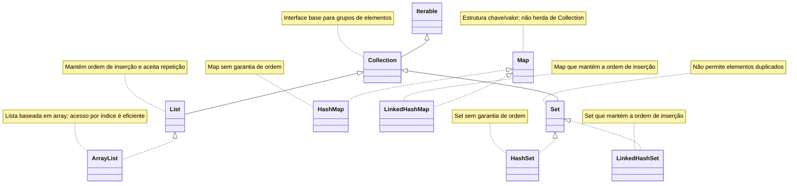

# Exemplos de recursos básicos do Java moderno

Este arquivo reúne exemplos simples e práticos de recursos muito usados no Java moderno, com foco em APIs atuais da JDK e algumas boas práticas comuns no dia a dia.

---

## 1. Verificar se uma `String` é blank

Uma string **blank** é uma string que:
- está vazia (`""`), ou
- contém apenas espaços em branco, tabs ou quebras de linha.

### Usando Java padrão

Desde o Java 11, a classe `String` possui o método `isBlank()`.

```java
String texto1 = "";
String texto2 = "   ";
String texto3 = "\n\t";
String texto4 = "Java";

System.out.println(texto1.isBlank()); // true
System.out.println(texto2.isBlank()); // true
System.out.println(texto3.isBlank()); // true
System.out.println(texto4.isBlank()); // false
```

### Cuidado com `null`

O método `isBlank()` não pode ser chamado em uma referência nula.

```java
String texto = null;

if (texto != null && !texto.isBlank()) {
    System.out.println("Texto válido");
}
```

### Usando Apache Commons Lang

A biblioteca Apache Commons Lang oferece utilitários úteis para strings, como `StringUtils.isBlank()`.

```java
import org.apache.commons.lang3.StringUtils;

String texto1 = null;
String texto2 = "";
String texto3 = "   ";
String texto4 = "Java";

System.out.println(StringUtils.isBlank(texto1)); // true
System.out.println(StringUtils.isBlank(texto2)); // true
System.out.println(StringUtils.isBlank(texto3)); // true
System.out.println(StringUtils.isBlank(texto4)); // false
```

### Quando usar cada um?

- Use `String.isBlank()` quando estiver trabalhando apenas com Java padrão e já souber que a string não é nula.
- Use `StringUtils.isBlank()` quando quiser tratar `null` com mais segurança e conveniência.

---

## 2. Comparação de strings mantendo constantes do lado esquerdo

Uma prática comum em Java é colocar a constante do lado esquerdo da comparação com `equals`, para evitar `NullPointerException`.

### Forma recomendada

```java
String status = obterStatus();

if ("ATIVO".equals(status)) {
    System.out.println("Usuário ativo");
}
```

Se `status` for `null`, o código continua funcionando normalmente.

### Forma arriscada

```java
String status = obterStatus();

if (status.equals("ATIVO")) {
    System.out.println("Usuário ativo");
}
```

Neste caso, se `status` for `null`, será lançada uma `NullPointerException`.

### Comparação sem diferenciar maiúsculas/minúsculas

```java
String perfil = obterPerfil();

if ("admin".equalsIgnoreCase(perfil)) {
    System.out.println("Perfil administrativo");
}
```

### Observação

Em código moderno, essa prática continua válida, especialmente ao lidar com dados externos, formulários, JSON, banco de dados e integrações.

---

## 3. Uso de collections comuns (`List`, `Set`, `Map`)

As coleções mais comuns em Java são:
- `List`: mantém ordem e permite elementos repetidos
- `Set`: não permite duplicidade
- `Map`: armazena pares chave/valor

### 3.1 `List`

```java
import java.util.ArrayList;
import java.util.List;

List<String> nomes = new ArrayList<>();
nomes.add("Ana");
nomes.add("Bruno");
nomes.add("Ana");

System.out.println(nomes); // [Ana, Bruno, Ana]
System.out.println(nomes.get(0)); // Ana
```

### Lista imutável com `List.of`

```java
List<String> cores = List.of("azul", "verde", "vermelho");
System.out.println(cores);
```

Tentativas de alteração geram exceção:

```java
cores.add("amarelo"); // UnsupportedOperationException
```

### 3.2 `Set`

```java
import java.util.HashSet;
import java.util.Set;

Set<String> tecnologias = new HashSet<>();
tecnologias.add("Java");
tecnologias.add("Spring");
tecnologias.add("Java");

System.out.println(tecnologias); // Java aparece apenas uma vez
```

### Set imutável com `Set.of`

```java
Set<String> linguagens = Set.of("Java", "Kotlin", "Scala");
System.out.println(linguagens);
```

### 3.3 `Map`

```java
import java.util.HashMap;
import java.util.Map;

Map<Integer, String> usuarios = new HashMap<>();
usuarios.put(1, "Ana");
usuarios.put(2, "Bruno");
usuarios.put(3, "Carla");

System.out.println(usuarios.get(2)); // Bruno
System.out.println(usuarios.containsKey(1)); // true
```

### Map imutável com `Map.of`

```java
Map<String, Integer> estoque = Map.of(
    "mouse", 10,
    "teclado", 5,
    "monitor", 2
);

System.out.println(estoque);
```

### Iterando em coleções

```java
List<String> nomes = List.of("Ana", "Bruno", "Carla");
for (String nome : nomes) {
    System.out.println(nome);
}
```

```java
Map<String, Integer> notas = Map.of(
    "Ana", 9,
    "Bruno", 8
);

for (Map.Entry<String, Integer> entry : notas.entrySet()) {
    System.out.println(entry.getKey() + " -> " + entry.getValue());
}
```

### Dica prática

No Java moderno, é comum preferir:
- `List.of(...)`, `Set.of(...)` e `Map.of(...)` para coleções fixas
- `ArrayList`, `HashSet` e `HashMap` quando for necessário alterar o conteúdo

---

## 4. Abrir arquivos em disco para leitura e escrita usando recursos do Java moderno

As APIs modernas de arquivos em Java estão principalmente no pacote `java.nio.file`.

Principais classes:
- `Path`
- `Paths`
- `Files`
- `StandardOpenOption`

---

### 4.1 Ler arquivo inteiro

```java
import java.nio.file.Files;
import java.nio.file.Path;

Path caminho = Path.of("dados/arquivo.txt");
String conteudo = Files.readString(caminho);

System.out.println(conteudo);
```

### 4.2 Ler todas as linhas

```java
import java.nio.file.Files;
import java.nio.file.Path;
import java.util.List;

Path caminho = Path.of("dados/arquivo.txt");
List<String> linhas = Files.readAllLines(caminho);

linhas.forEach(System.out::println);
```

### 4.3 Escrever string em arquivo

```java
import java.nio.file.Files;
import java.nio.file.Path;

Path caminho = Path.of("saida.txt");
Files.writeString(caminho, "Olá, mundo!\n");
```

### 4.4 Escrever linhas em arquivo

```java
import java.nio.file.Files;
import java.nio.file.Path;
import java.util.List;

Path caminho = Path.of("saida-linhas.txt");
Files.write(caminho, List.of("linha 1", "linha 2", "linha 3"));
```

### 4.5 Acrescentar conteúdo ao final do arquivo

```java
import java.nio.file.Files;
import java.nio.file.Path;
import java.nio.file.StandardOpenOption;

Path caminho = Path.of("log.txt");
Files.writeString(
    caminho,
    "Nova linha de log\n",
    StandardOpenOption.CREATE,
    StandardOpenOption.APPEND
);
```

### 4.6 Escrever arquivo usando `BufferedOutputStream`

Quando você quer escrever bytes com buffer, pode usar `BufferedOutputStream` junto com `Files.newOutputStream(...)`.

```java
import java.io.BufferedOutputStream;
import java.nio.charset.StandardCharsets;
import java.nio.file.Files;
import java.nio.file.Path;
import java.nio.file.StandardOpenOption;

Path caminho = Path.of("saida-buffered.txt");

try (BufferedOutputStream bos = new BufferedOutputStream(
        Files.newOutputStream(
            caminho,
            StandardOpenOption.CREATE,
            StandardOpenOption.TRUNCATE_EXISTING,
            StandardOpenOption.WRITE
        ))) {

    bos.write("Linha 1\n".getBytes(StandardCharsets.UTF_8));
    bos.write("Linha 2\n".getBytes(StandardCharsets.UTF_8));
}
```

### 4.7 Ler arquivo usando `BufferedInputStream`

Para leitura em blocos de bytes com buffer:

```java
import java.io.BufferedInputStream;
import java.nio.charset.StandardCharsets;
import java.nio.file.Files;
import java.nio.file.Path;

Path caminho = Path.of("saida-buffered.txt");

try (BufferedInputStream bis = new BufferedInputStream(Files.newInputStream(caminho))) {
    byte[] buffer = new byte[1024];
    int bytesLidos;

    while ((bytesLidos = bis.read(buffer)) != -1) {
        String trecho = new String(buffer, 0, bytesLidos, StandardCharsets.UTF_8);
        System.out.print(trecho);
    }
}
```

### 4.8 Escrever texto com `BufferedWriter`

`BufferedWriter` é voltado para **texto**, e não para bytes brutos. Ele é muito útil quando você quer escrever linha a linha com boa legibilidade.

```java
import java.io.BufferedWriter;
import java.nio.file.Files;
import java.nio.file.Path;
import java.nio.file.StandardOpenOption;

Path caminho = Path.of("saida-writer.txt");

try (BufferedWriter writer = Files.newBufferedWriter(
        caminho,
        StandardOpenOption.CREATE,
        StandardOpenOption.TRUNCATE_EXISTING,
        StandardOpenOption.WRITE
)) {
    writer.write("Primeira linha");
    writer.newLine();
    writer.write("Segunda linha");
    writer.newLine();
    writer.write("Terceira linha");
}
```

### 4.9 Ler texto com `BufferedReader`

`BufferedReader` também é voltado para **texto** e facilita bastante a leitura linha a linha.

```java
import java.io.BufferedReader;
import java.nio.file.Files;
import java.nio.file.Path;

Path caminho = Path.of("saida-writer.txt");

try (BufferedReader reader = Files.newBufferedReader(caminho)) {
    String linha;
    while ((linha = reader.readLine()) != null) {
        System.out.println(linha);
    }
}
```

### 4.10 Exemplo com `lines()` do `BufferedReader`

Uma alternativa moderna é usar o stream de linhas:

```java
import java.io.BufferedReader;
import java.nio.file.Files;
import java.nio.file.Path;

Path caminho = Path.of("saida-writer.txt");

try (BufferedReader reader = Files.newBufferedReader(caminho)) {
    reader.lines().forEach(System.out::println);
}
```

### 4.11 Comparando `BufferedReader` / `BufferedWriter` com `BufferedInputStream` / `BufferedOutputStream`

Embora todos usem buffer internamente, eles servem para propósitos diferentes.

#### `BufferedReader` e `BufferedWriter`

Use quando:
- o conteúdo é **texto**
- você quer trabalhar com `String`, linhas e caracteres
- legibilidade do código é prioridade

Vantagens:
- API mais adequada para texto
- leitura linha a linha com `readLine()`
- escrita com `write()` e `newLine()`
- evita conversões manuais de bytes para texto na maior parte dos casos

#### `BufferedInputStream` e `BufferedOutputStream`

Use quando:
- o conteúdo é **binário** ou baseado em bytes
- você precisa controlar blocos de leitura e escrita
- está manipulando arquivos como imagem, PDF, ZIP, áudio ou vídeo

Vantagens:
- trabalham diretamente com `byte[]`
- são apropriados para arquivos binários
- são úteis para cópia e transferência de dados em blocos

### 4.12 Resumo prático da escolha

- Para **texto simples**, prefira `BufferedReader` e `BufferedWriter`.
- Para **bytes ou arquivos binários**, prefira `BufferedInputStream` e `BufferedOutputStream`.
- Para casos simples de texto, `Files.readString`, `Files.readAllLines` e `Files.writeString` continuam sendo opções muito práticas.

### 4.13 Exemplo copiando arquivo com streams bufferizados

```java
import java.io.BufferedInputStream;
import java.io.BufferedOutputStream;
import java.nio.file.Files;
import java.nio.file.Path;
import java.nio.file.StandardOpenOption;

Path origem = Path.of("origem.bin");
Path destino = Path.of("destino.bin");

try (
    BufferedInputStream bis = new BufferedInputStream(Files.newInputStream(origem));
    BufferedOutputStream bos = new BufferedOutputStream(
        Files.newOutputStream(
            destino,
            StandardOpenOption.CREATE,
            StandardOpenOption.TRUNCATE_EXISTING,
            StandardOpenOption.WRITE
        )
    )
) {
    byte[] buffer = new byte[8192];
    int bytesLidos;

    while ((bytesLidos = bis.read(buffer)) != -1) {
        bos.write(buffer, 0, bytesLidos);
    }
}
```

---

## 5. Flags de abertura de arquivos (`StandardOpenOption`)

As flags mais comuns para leitura e escrita são:

### `CREATE`
Cria o arquivo se ele não existir.

```java
StandardOpenOption.CREATE
```

### `CREATE_NEW`
Cria o arquivo apenas se ele ainda não existir. Se já existir, lança exceção.

```java
StandardOpenOption.CREATE_NEW
```

### `APPEND`
Adiciona conteúdo ao final do arquivo, sem apagar o conteúdo anterior.

```java
StandardOpenOption.APPEND
```

### `TRUNCATE_EXISTING`
Apaga o conteúdo atual do arquivo antes de escrever o novo conteúdo.

```java
StandardOpenOption.TRUNCATE_EXISTING
```

### `WRITE`
Abre o arquivo para escrita.

```java
StandardOpenOption.WRITE
```

### `READ`
Abre o arquivo para leitura.

```java
StandardOpenOption.READ
```

### `SYNC`
Força atualização síncrona do conteúdo e dos metadados no armazenamento físico. Pode impactar desempenho.

```java
StandardOpenOption.SYNC
```

### `DSYNC`
Semelhante ao `SYNC`, mas com foco principalmente nos dados do arquivo.

```java
StandardOpenOption.DSYNC
```

### Exemplo com múltiplas flags

```java
import java.nio.file.Files;
import java.nio.file.Path;
import java.nio.file.StandardOpenOption;

Path caminho = Path.of("auditoria.log");

Files.writeString(
    caminho,
    "Registro de auditoria\n",
    StandardOpenOption.CREATE,
    StandardOpenOption.WRITE,
    StandardOpenOption.APPEND
);
```

### Observação importante

Nem toda combinação de flags faz sentido. Por exemplo:
- `APPEND` + `TRUNCATE_EXISTING` normalmente é contraditório
- `CREATE_NEW` falha se o arquivo já existir

---

## 6. Navegar por arquivos em um diretório

A API `Files` também facilita listar, percorrer e filtrar diretórios.

### 6.1 Listar itens de um diretório

```java
import java.nio.file.Files;
import java.nio.file.Path;
import java.util.stream.Stream;

Path diretorio = Path.of("dados");

try (Stream<Path> stream = Files.list(diretorio)) {
    stream.forEach(System.out::println);
}
```

### 6.2 Percorrer subdiretórios recursivamente

```java
import java.nio.file.Files;
import java.nio.file.Path;
import java.util.stream.Stream;

Path diretorio = Path.of("dados");

try (Stream<Path> stream = Files.walk(diretorio)) {
    stream.forEach(System.out::println);
}
```

### 6.3 Filtrar apenas arquivos regulares

```java
import java.nio.file.Files;
import java.nio.file.Path;
import java.util.stream.Stream;

Path diretorio = Path.of("dados");

try (Stream<Path> stream = Files.walk(diretorio)) {
    stream
        .filter(Files::isRegularFile)
        .forEach(System.out::println);
}
```

### 6.4 Filtrar por extensão

```java
import java.nio.file.Files;
import java.nio.file.Path;
import java.util.stream.Stream;

Path diretorio = Path.of("dados");

try (Stream<Path> stream = Files.walk(diretorio)) {
    stream
        .filter(Files::isRegularFile)
        .filter(path -> path.toString().endsWith(".txt"))
        .forEach(System.out::println);
}
```

### 6.5 Usar `DirectoryStream`

`DirectoryStream` pode ser útil para listagens simples e eficientes.

```java
import java.nio.file.DirectoryStream;
import java.nio.file.Files;
import java.nio.file.Path;

Path diretorio = Path.of("dados");

try (DirectoryStream<Path> stream = Files.newDirectoryStream(diretorio, "*.txt")) {
    for (Path path : stream) {
        System.out.println(path);
    }
}
```

---

## 7. Uso de `Pattern` e `Matcher`

As classes `Pattern` e `Matcher` pertencem ao pacote `java.util.regex` e são usadas para trabalhar com expressões regulares.

### Exemplo básico

```java
import java.util.regex.Matcher;
import java.util.regex.Pattern;

Pattern pattern = Pattern.compile("\\d+");
Matcher matcher = pattern.matcher("Pedido 123 gerado em 2026");

while (matcher.find()) {
    System.out.println("Encontrado: " + matcher.group());
}
```

Saída esperada:

```text
Encontrado: 123
Encontrado: 2026
```

### Validar string inteira

```java
import java.util.regex.Pattern;

Pattern emailPattern = Pattern.compile("^[\\w.-]+@[\\w.-]+\\.[A-Za-z]{2,}$");
boolean valido = emailPattern.matcher("teste@email.com").matches();

System.out.println(valido); // true
```

### Capturar grupos

```java
import java.util.regex.Matcher;
import java.util.regex.Pattern;

Pattern pattern = Pattern.compile("(\\d{2})/(\\d{2})/(\\d{4})");
Matcher matcher = pattern.matcher("Data: 15/03/2026");

if (matcher.find()) {
    System.out.println("Dia: " + matcher.group(1));
    System.out.println("Mês: " + matcher.group(2));
    System.out.println("Ano: " + matcher.group(3));
}
```

### Substituir valores com `replaceAll`

Quando você quer trocar todas as ocorrências encontradas por uma regex, pode usar `replaceAll`.

```java
String texto = "CPF: 123.456.789-00";
String resultado = texto.replaceAll("\\d", "*");

System.out.println(resultado); // CPF: ***.***.***-**
```

### Substituir apenas a primeira ocorrência com `replaceFirst`

```java
String texto = "Item 1, Item 2, Item 3";
String resultado = texto.replaceFirst("Item", "Produto");

System.out.println(resultado); // Produto 1, Item 2, Item 3
```

### Substituir usando grupos capturados

Também é possível reorganizar partes do texto usando os grupos da regex.

```java
String data = "15/03/2026";
String iso = data.replaceAll("(\\d{2})/(\\d{2})/(\\d{4})", "$3-$2-$1");

System.out.println(iso); // 2026-03-15
```

### Substituir com `Matcher.replaceAll`

Você pode criar o `Matcher` explicitamente e depois aplicar a substituição.

```java
Pattern pattern = Pattern.compile("\\s+");
Matcher matcher = pattern.matcher("Java    moderno   é   útil");

String resultado = matcher.replaceAll(" ");
System.out.println(resultado); // Java moderno é útil
```

### Substituição incremental com `appendReplacement` e `appendTail`

Esses métodos são úteis quando você precisa de mais controle sobre cada substituição.

```java
import java.util.regex.Matcher;
import java.util.regex.Pattern;

Pattern pattern = Pattern.compile("\\d+");
Matcher matcher = pattern.matcher("Pedido 123 e pedido 456");
StringBuffer sb = new StringBuffer();

while (matcher.find()) {
    matcher.appendReplacement(sb, "[NUMERO]");
}
matcher.appendTail(sb);

System.out.println(sb); // Pedido [NUMERO] e pedido [NUMERO]
```

### Quando usar cada abordagem?

- `replaceAll` para substituir todas as ocorrências rapidamente.
- `replaceFirst` para trocar somente a primeira.
- grupos (`$1`, `$2`, ...) quando precisar reorganizar partes do texto.
- `appendReplacement` e `appendTail` quando cada substituição exigir lógica mais detalhada.

---

## 8. Tabela com símbolos mais usados em regex no dia a dia

A tabela abaixo resume vários símbolos e atalhos muito usados com `Pattern` e `Matcher`.

| Símbolo | Significado | Exemplo | Observação |
|---|---|---|---|
| `.` | qualquer caractere | `a.c` | por padrão não inclui quebra de linha |
| `\\d` | dígito | `\\d+` | equivalente a `[0-9]` |
| `\\D` | não dígito | `\\D+` | complemento de `\\d` |
| `\\w` | caractere de palavra | `\\w+` | normalmente letras, números e `_` |
| `\\W` | não caractere de palavra | `\\W+` | complemento de `\\w` |
| `\\s` | espaço em branco | `\\s+` | inclui espaço, tab, quebra de linha |
| `\\S` | não espaço em branco | `\\S+` | complemento de `\\s` |
| `[abc]` | um dos caracteres listados | `[aeiou]` | casa um item do conjunto |
| `[^abc]` | negação do conjunto | `[^0-9]` | qualquer caractere exceto os informados |
| `[a-z]` | intervalo | `[A-Z]` | útil para letras e faixas |
| `^` | início da linha/string | `^Java` | com `MULTILINE`, vale por linha |
| `$` | fim da linha/string | `fim$` | com `MULTILINE`, vale por linha |
| `?` | zero ou uma ocorrência | `colou?r` | aceita presença opcional |
| `*` | zero ou mais ocorrências | `a*` | pode casar vazio |
| `+` | uma ou mais ocorrências | `a+` | precisa existir ao menos uma |
| `{n}` | exatamente n ocorrências | `\\d{4}` | ex.: ano |
| `{n,}` | no mínimo n ocorrências | `\\d{2,}` | sem limite superior |
| `{n,m}` | entre n e m ocorrências | `\\d{2,4}` | intervalo fechado |
| `(...)` | grupo capturante | `(\\d{2})/(\\d{2})` | permite `group(1)`, `group(2)` |
| `(?:...)` | grupo não capturante | `(?:abc)+` | agrupa sem capturar |
| `|` | alternativa / ou | `sim|não` | muito usado para opções |
| `\\` | escape | `\\.` | trata metacaractere literalmente |
| `\\b` | limite de palavra | `\\bJava\\b` | evita casar dentro de outra palavra |
| `\\B` | não limite de palavra | `\\Babc\\B` | caso oposto ao `\\b` |

### Exemplos rápidos

#### Wildcard de “qualquer caractere”

```java
Pattern pattern = Pattern.compile("c.sa");
System.out.println(pattern.matcher("casa").find()); // true
System.out.println(pattern.matcher("coisa").find()); // false
```

#### Negação

```java
Pattern pattern = Pattern.compile("[^0-9]+");
System.out.println(pattern.matcher("abc").matches()); // true
```

#### Opções com `|`

```java
Pattern pattern = Pattern.compile("sim|não|talvez");
System.out.println(pattern.matcher("não").matches()); // true
```

#### Um ou mais dígitos

```java
Pattern pattern = Pattern.compile("\\d+");
System.out.println(pattern.matcher("12345").matches()); // true
```

#### Palavra inteira com `\\b`

```java
Pattern pattern = Pattern.compile("\\bJava\\b");
System.out.println(pattern.matcher("Gosto de Java moderno").find()); // true
```

---

## 9. Flags de `Pattern`

Ao compilar uma expressão regular, é possível informar flags que alteram o comportamento do mecanismo.

### `Pattern.CASE_INSENSITIVE`

Ignora diferença entre maiúsculas e minúsculas.

```java
Pattern pattern = Pattern.compile("java", Pattern.CASE_INSENSITIVE);
System.out.println(pattern.matcher("JAVA").find()); // true
```

### `Pattern.MULTILINE`

Faz com que `^` e `$` funcionem por linha, e não apenas no início e fim de toda a string.

```java
Pattern pattern = Pattern.compile("^abc", Pattern.MULTILINE);
Matcher matcher = pattern.matcher("xyz\nabc\n123");

System.out.println(matcher.find()); // true
```

### `Pattern.DOTALL`

Faz com que o caractere `.` também corresponda a quebras de linha.

Sem `DOTALL`, o ponto normalmente não captura `\n`.

```java
Pattern pattern = Pattern.compile("inicio.*fim", Pattern.DOTALL);
Matcher matcher = pattern.matcher("inicio\nconteudo\nfim");

System.out.println(matcher.find()); // true
```

### `Pattern.UNICODE_CASE`

Melhora o tratamento de case folding para Unicode, geralmente usado junto com `CASE_INSENSITIVE`.

```java
Pattern pattern = Pattern.compile("ação", Pattern.CASE_INSENSITIVE | Pattern.UNICODE_CASE);
```

### `Pattern.COMMENTS`

Permite escrever regex com espaços e comentários para facilitar leitura.

```java
Pattern pattern = Pattern.compile(
    "^        # início\n\\d{3}   # três dígitos\n-        # hífen\n\\d{2}   # dois dígitos\n$        # fim",
    Pattern.COMMENTS
);
```

### `Pattern.LITERAL`

Faz a expressão ser tratada literalmente, sem interpretar metacaracteres.

```java
Pattern pattern = Pattern.compile("a.b", Pattern.LITERAL);
System.out.println(pattern.matcher("a.b").find()); // true
```

### `Pattern.UNIX_LINES`

Considera apenas `\n` como terminador de linha em certos contextos.

```java
Pattern pattern = Pattern.compile("^texto$", Pattern.MULTILINE | Pattern.UNIX_LINES);
```

### Flags combinadas

É possível combinar flags usando o operador `|`.

```java
Pattern pattern = Pattern.compile(
    "erro.*fatal",
    Pattern.CASE_INSENSITIVE | Pattern.DOTALL
);
```

---

## 10. Exemplo prático combinando `Pattern` e leitura de arquivo

```java
import java.nio.file.Files;
import java.nio.file.Path;
import java.util.regex.Matcher;
import java.util.regex.Pattern;

Path caminho = Path.of("app.log");
String conteudo = Files.readString(caminho);

Pattern pattern = Pattern.compile("ERROR: (.*)", Pattern.MULTILINE);
Matcher matcher = pattern.matcher(conteudo);

while (matcher.find()) {
    System.out.println("Erro encontrado: " + matcher.group(1));
}
```

---

## 11. Diagrama de classes Mermaid das coleções Java

O diagrama abaixo mostra a relação entre as interfaces principais e algumas implementações muito comuns da biblioteca padrão.



### Observações importantes sobre o diagrama

- `Collection` é a interface base para coleções de elementos.
- `List` e `Set` herdam de `Collection`.
- `Map` **não** herda de `Collection`, porque sua estrutura é baseada em pares chave/valor.
- `ArrayList` é uma implementação muito comum de `List`.
- `HashSet` e `LinkedHashSet` são implementações comuns de `Set`.
- `HashMap` e `LinkedHashMap` são implementações comuns de `Map`.

### Diferença entre `HashSet` e `LinkedHashSet`

Ambos não permitem elementos duplicados, mas:

- `HashSet` não garante ordem de iteração.
- `LinkedHashSet` mantém a ordem de inserção dos elementos.

Exemplo:

```java
Set<String> set1 = new HashSet<>();
set1.add("B");
set1.add("A");
set1.add("C");
System.out.println(set1);
```

A saída pode variar de acordo com a implementação e o estado interno da estrutura.

```java
Set<String> set2 = new LinkedHashSet<>();
set2.add("B");
set2.add("A");
set2.add("C");
System.out.println(set2); // [B, A, C]
```

### Diferença entre `HashMap` e `LinkedHashMap`

Ambos armazenam pares chave/valor, mas:

- `HashMap` não garante ordem de iteração das chaves.
- `LinkedHashMap` mantém a ordem de inserção das entradas.

Exemplo:

```java
Map<Integer, String> map1 = new HashMap<>();
map1.put(2, "Bruno");
map1.put(1, "Ana");
map1.put(3, "Carla");
System.out.println(map1);
```

A ordem de saída não deve ser considerada previsível.

```java
Map<Integer, String> map2 = new LinkedHashMap<>();
map2.put(2, "Bruno");
map2.put(1, "Ana");
map2.put(3, "Carla");
System.out.println(map2); // {2=Bruno, 1=Ana, 3=Carla}
```

### Quando usar `LinkedHashSet` e `LinkedHashMap`

Essas implementações são úteis quando você precisa:
- preservar a ordem de inserção
- manter comportamento previsível na iteração
- gerar saídas mais legíveis em logs, telas e serializações

O custo costuma ser um pouco maior do que as versões `Hash*`, porque existe uma estrutura adicional para encadear os elementos na ordem em que foram inseridos.

---

## 12. Trabalhando com datas: `Date`, `Calendar` e `java.time`

Java possui mais de uma API para datas. As mais importantes são:

- `java.util.Date`
- `java.util.Calendar`
- `java.time` (API moderna introduzida no Java 8)

### 12.1 `Date`

`Date` é uma API antiga. Ainda aparece bastante em sistemas legados e integrações antigas.

```java
import java.util.Date;

Date agora = new Date();
System.out.println(agora);
```

#### Limitações do `Date`

- API antiga e menos intuitiva
- mutável
- muitos métodos antigos foram depreciados
- não separa bem conceitos como data, hora e fuso

### 12.2 `Calendar`

`Calendar` surgiu para dar mais flexibilidade do que `Date`, mas também é considerado legado em código moderno.

```java
import java.util.Calendar;

Calendar cal = Calendar.getInstance();
cal.set(2026, Calendar.MARCH, 16, 10, 30, 0);

System.out.println(cal.getTime());
```

### Atenção com o mês no `Calendar`

No `Calendar`, os meses começam em zero:

- `Calendar.JANUARY = 0`
- `Calendar.FEBRUARY = 1`
- `Calendar.MARCH = 2`

Por isso, usar constantes da classe é melhor do que números soltos.

### 12.3 `java.time`

A API `java.time` é a abordagem recomendada em Java moderno.

Principais classes:
- `LocalDate` → só data
- `LocalTime` → só hora
- `LocalDateTime` → data e hora sem fuso
- `ZonedDateTime` → data e hora com fuso
- `Instant` → ponto exato na linha do tempo
- `Period` → diferença entre datas
- `Duration` → diferença entre instantes/horas

### Exemplo com `LocalDate`

```java
import java.time.LocalDate;

LocalDate hoje = LocalDate.now();
System.out.println(hoje);
```

### Exemplo com `LocalDateTime`

```java
import java.time.LocalDateTime;

LocalDateTime agora = LocalDateTime.now();
System.out.println(agora);
```

### Exemplo com `ZonedDateTime`

```java
import java.time.ZoneId;
import java.time.ZonedDateTime;

ZonedDateTime agoraSaoPaulo = ZonedDateTime.now(ZoneId.of("America/Sao_Paulo"));
System.out.println(agoraSaoPaulo);
```

### Exemplo com `Instant`

```java
import java.time.Instant;

Instant instant = Instant.now();
System.out.println(instant);
```

---

## 13. Formatação de datas

### 13.1 Formatar com `SimpleDateFormat` (legado)

Usado com `Date` e APIs antigas.

```java
import java.text.SimpleDateFormat;
import java.util.Date;

Date agora = new Date();
SimpleDateFormat sdf = new SimpleDateFormat("dd/MM/yyyy HH:mm:ss");

String formatada = sdf.format(agora);
System.out.println(formatada);
```

### Limitações do `SimpleDateFormat`

- API antiga
- não é thread-safe
- não é a melhor opção para código moderno

### 13.2 Formatar com `DateTimeFormatter` (moderno)

```java
import java.time.LocalDateTime;
import java.time.format.DateTimeFormatter;

LocalDateTime agora = LocalDateTime.now();
DateTimeFormatter formatter = DateTimeFormatter.ofPattern("dd/MM/yyyy HH:mm:ss");

String formatada = agora.format(formatter);
System.out.println(formatada);
```

### Exemplo com formato ISO

```java
import java.time.LocalDateTime;
import java.time.format.DateTimeFormatter;

LocalDateTime agora = LocalDateTime.now();

System.out.println(agora.format(DateTimeFormatter.ISO_LOCAL_DATE_TIME));
```

### Exemplo com `LocalDate`

```java
import java.time.LocalDate;
import java.time.format.DateTimeFormatter;

LocalDate data = LocalDate.of(2026, 3, 16);
String texto = data.format(DateTimeFormatter.ofPattern("dd/MM/yyyy"));

System.out.println(texto); // 16/03/2026
```

---

## 14. Tabela de padrões de formatação de data e hora

Os símbolos abaixo são muito usados em `SimpleDateFormat` e `DateTimeFormatter`. Em geral, o uso moderno deve priorizar `DateTimeFormatter`.

| Padrão | Significado | Exemplo |
|---|---|---|
| `y` | ano | `6`, `26`, `2026` dependendo da quantidade |
| `yy` | ano com 2 dígitos | `26` |
| `yyyy` | ano com 4 dígitos | `2026` |
| `M` | mês numérico | `3` |
| `MM` | mês com 2 dígitos | `03` |
| `MMM` | abreviação do mês | `mar` |
| `MMMM` | nome completo do mês | `março` |
| `d` | dia do mês | `6` |
| `dd` | dia com 2 dígitos | `06` |
| `H` | hora 0-23 | `9` |
| `HH` | hora 0-23 com 2 dígitos | `09` |
| `h` | hora 1-12 | `9` |
| `hh` | hora 1-12 com 2 dígitos | `09` |
| `m` | minuto | `5` |
| `mm` | minuto com 2 dígitos | `05` |
| `s` | segundo | `7` |
| `ss` | segundo com 2 dígitos | `07` |
| `S` | fração de segundo | `1`, `12`, `123` |
| `a` | AM/PM | `AM` |
| `E` | dia da semana abreviado | `seg.` |
| `EEEE` | dia da semana por extenso | `segunda-feira` |
| `z` | nome curto do fuso | `BRT` |
| `XXX` | offset ISO 8601 | `-03:00` |

### Exemplos comuns de padrões

| Padrão | Resultado de exemplo |
|---|---|
| `dd/MM/yyyy` | `16/03/2026` |
| `yyyy-MM-dd` | `2026-03-16` |
| `dd/MM/yyyy HH:mm` | `16/03/2026 10:45` |
| `yyyy-MM-dd HH:mm:ss` | `2026-03-16 10:45:30` |
| `dd 'de' MMMM 'de' yyyy` | `16 de março de 2026` |

---

## 15. Formato ISO 8601

ISO 8601 é um padrão internacional muito usado em APIs, bancos de dados, logs e integração entre sistemas.

### Exemplos comuns

| Tipo | Exemplo |
|---|---|
| data | `2026-03-16` |
| data e hora sem fuso | `2026-03-16T10:45:30` |
| data e hora com offset | `2026-03-16T10:45:30-03:00` |
| instante UTC | `2026-03-16T13:45:30Z` |

### Exemplos com `DateTimeFormatter`

```java
import java.time.LocalDate;
import java.time.LocalDateTime;
import java.time.OffsetDateTime;
import java.time.ZoneOffset;
import java.time.format.DateTimeFormatter;

LocalDate data = LocalDate.of(2026, 3, 16);
System.out.println(data.format(DateTimeFormatter.ISO_LOCAL_DATE));

LocalDateTime dataHora = LocalDateTime.of(2026, 3, 16, 10, 45, 30);
System.out.println(dataHora.format(DateTimeFormatter.ISO_LOCAL_DATE_TIME));

OffsetDateTime offsetDateTime = OffsetDateTime.of(2026, 3, 16, 10, 45, 30, 0, ZoneOffset.of("-03:00"));
System.out.println(offsetDateTime.format(DateTimeFormatter.ISO_OFFSET_DATE_TIME));
```

---

## 16. Converter entre APIs antigas e modernas

Em sistemas reais, muitas vezes é necessário converter entre `Date` e `java.time`.

### `Date` para `Instant`

```java
import java.util.Date;
import java.time.Instant;

Date date = new Date();
Instant instant = date.toInstant();
```

### `Instant` para `Date`

```java
import java.util.Date;
import java.time.Instant;

Instant instant = Instant.now();
Date date = Date.from(instant);
```

### `Date` para `LocalDateTime`

```java
import java.time.LocalDateTime;
import java.time.ZoneId;
import java.util.Date;

Date date = new Date();

LocalDateTime ldt = date.toInstant()
    .atZone(ZoneId.systemDefault())
    .toLocalDateTime();
```

---

## 17. Quando usar cada API de datas

### Use `java.time` em código novo

Prefira:
- `LocalDate` para datas sem hora
- `LocalDateTime` para data e hora sem fuso
- `ZonedDateTime` quando o fuso importa
- `Instant` para timestamps e integração técnica

### Use `Date` e `Calendar` apenas quando necessário

Casos comuns:
- sistemas legados
- bibliotecas antigas
- integrações que ainda exigem essas classes

---

## 18. Resumo rápido

### Strings
- `isBlank()` verifica se a string está vazia ou só com espaços
- `StringUtils.isBlank()` também trata `null`
- prefira `"CONSTANTE".equals(valor)` para evitar `NullPointerException`

### Collections
- `List` permite repetição
- `Set` evita duplicidade
- `Map` trabalha com chave/valor
- `List.of`, `Set.of` e `Map.of` criam coleções imutáveis

### Arquivos
- use `Path` e `Files` do pacote `java.nio.file`
- `readString`, `readAllLines`, `writeString` e `write` simplificam leitura e escrita
- `BufferedReader` e `BufferedWriter` são ótimos para texto
- `BufferedInputStream` e `BufferedOutputStream` são mais indicados para bytes e arquivos binários
- `StandardOpenOption` controla como o arquivo será aberto

### Diretórios
- `Files.list()` lista o conteúdo imediato
- `Files.walk()` percorre recursivamente
- `DirectoryStream` é útil para filtros simples

### Regex
- `Pattern` representa a expressão regular compilada
- `Matcher` aplica a regex sobre um texto
- símbolos como `\\d`, `\\s`, `.*`, `|`, `[^...]` e `\\b` aparecem muito no dia a dia
- flags como `DOTALL`, `MULTILINE` e `CASE_INSENSITIVE` alteram o comportamento da regex

### Datas
- `Date` e `Calendar` são APIs antigas
- `java.time` é a abordagem moderna recomendada
- `DateTimeFormatter` é a melhor opção para formatar datas em código novo
- ISO 8601 é o formato mais comum em APIs e integrações

---

## 19. Dependência Maven para Apache Commons Lang

Caso queira usar `StringUtils`, adicione a dependência abaixo ao `pom.xml`:

```xml
<dependency>
    <groupId>org.apache.commons</groupId>
    <artifactId>commons-lang3</artifactId>
    <version>3.17.0</version>
</dependency>
```

---

## 20. Sugestão de estudo complementar

Depois destes tópicos, vale estudar também:
- `Optional`
- `Stream API`
- `record`
- `var`
- `switch` expressions
- `try-with-resources`
- `java.time`
- `Comparator`
- `Collectors`

Esses recursos ajudam bastante a escrever código mais moderno, legível e seguro em Java.
