# Flutter 3 — Referência Completa

Referência consolidada sobre Flutter 3 com Dart, cobrindo fundamentos, navegação, gerenciamento de estado global, integração com backend, telas de lista e formulários, internacionalização, autenticação JWT com controle de acesso por role e distribuição para Android e iOS.

---

## Sumário

1. [Fundamentos do Flutter](#1-fundamentos-do-flutter)
   - [Configuração do Projeto](#configuração-do-projeto)
     - [Instalação no Windows](#instalação-no-windows)
     - [Instalação no macOS](#instalação-no-macos)
   - [Gerenciamento de Versões — FVM](#gerenciamento-de-versões--fvm)
     - [Instalação do FVM no Windows](#instalação-do-fvm-no-windows)
     - [Instalação do FVM no macOS / Linux](#instalação-do-fvm-no-macos--linux)
   - [Configuração das IDEs](#configuração-das-ides)
   - [Estrutura de Pastas](#estrutura-de-pastas)
   - [Arquivos de Configuração](#arquivos-de-configuração)
   - [Plugins Nativos e Compatibilidade com Web](#plugins-nativos-e-compatibilidade-com-web)
   - [Widgets Essenciais](#widgets-essenciais)
     - [Estrutura de Tela](#estrutura-de-tela) — Scaffold, AppBar, SafeArea, Drawer
     - [Layout e Posicionamento](#layout-e-posicionamento) — Column, Row, Stack, Container, Padding, SizedBox, Center, Align, Wrap
     - [Expansão e Flexibilidade](#expansão-e-flexibilidade) — Expanded, Flexible, Spacer
     - [Exibição de Conteúdo](#exibição-de-conteúdo) — Text, Icon, Image, Card, ListTile, Chip
     - [Listas e Rolagem](#listas-e-rolagem) — ListView, GridView, SingleChildScrollView, RefreshIndicator
     - [Interação e Botões](#interação-e-botões) — GestureDetector, InkWell, IconButton, FilledButton, ElevatedButton, TextButton, OutlinedButton, FloatingActionButton
     - [Formulários e Inputs](#formulários-e-inputs) — TextField, TextFormField, Switch, Checkbox, Radio, DropdownButtonFormField
     - [Feedback Visual](#feedback-visual-widgets) — CircularProgressIndicator, SnackBar, AlertDialog, BottomSheet
   - [Fundamentos do Dart](#fundamentos-do-dart)
   - [Layouts de Tela Completos](#layouts-de-tela-completos)
     - [Cabeçalho + Corpo Rolável + Rodapé Fixo](#cabeçalho--corpo-rolável--rodapé-fixo)
     - [Duas Colunas — Sidebar + Conteúdo](#duas-colunas--sidebar--conteúdo)
     - [Sidebar Retrátil — Push (empurra o conteúdo)](#sidebar-retrátil--push-empurra-o-conteúdo)
     - [Sidebar Retrátil — Overlay (sobre o conteúdo)](#sidebar-retrátil--overlay-sobre-o-conteúdo)
     - [Sidebar Retrátil — Slide (desliza sem redimensionar)](#sidebar-retrátil--slide-desliza-sem-redimensionar)
     - [Header + 2 Colunas + Footer Responsivo](#header--2-colunas--footer-responsivo)
     - [Lista com Busca e Filtros](#lista-com-busca-e-filtros)
     - [Grade de Itens — Grid Responsivo](#grade-de-itens--grid-responsivo)
     - [Hero — Transição de Elemento Compartilhado](#hero--transição-de-elemento-compartilhado)
     - [Tela de Perfil](#tela-de-perfil)
     - [Dashboard com Métricas](#dashboard-com-métricas)
     - [Navegação por Abas — TabBar](#navegação-por-abas--tabbar)
     - [Design Token System — Boas Práticas de Layout](#design-token-system--boas-práticas-de-layout)
     - [Boas Práticas de Layout e Performance](#boas-práticas-de-layout-e-performance)
2. [Navegação](#2-navegação)
   - [GoRouter](#gorouter)
     - [Configuração do GoRouter](#configuração-do-gorouter)
     - [Rotas Aninhadas e Parâmetros](#rotas-aninhadas-e-parâmetros)
     - [Rotas Protegidas](#rotas-protegidas)
     - [Navegação Programática](#navegação-programática)
     - [Deep Linking](#deep-linking)
   - [flutter_modular](#flutter_modular)
     - [Configuração do flutter_modular](#configuração-do-flutter_modular)
     - [Módulos e Rotas](#módulos-e-rotas)
     - [Guards — Rotas Protegidas](#guards--rotas-protegidas)
     - [Injeção de Dependências](#injeção-de-dependências)
     - [Navegação Programática — flutter_modular](#navegação-programática--flutter_modular)
     - [Deep Linking — flutter_modular](#deep-linking--flutter_modular)
3. [Estado Global com Riverpod](#3-estado-global-com-riverpod)
   - [Conceitos Básicos](#conceitos-básicos)
   - [Providers Principais](#providers-principais)
   - [AsyncNotifier para Estado Assíncrono](#asyncnotifier-para-estado-assíncrono)
4. [Integração com Backend](#4-integração-com-backend)
   - [Separação de Responsabilidades](#separação-de-responsabilidades)
   - [Configuração do Dio](#configuração-do-dio)
   - [Interceptors e Tratamento de Erros](#interceptors-e-tratamento-de-erros)
   - [Repository Pattern](#repository-pattern)
5. [Telas de Lista e Formulários](#5-telas-de-lista-e-formulários)
   - [Listas com ListView e Paginação](#listas-com-listview-e-paginação)
   - [Formulários e Validação](#formulários-e-validação)
   - [Feedback Visual ao Usuário](#feedback-visual-ao-usuário)
   - [Componentes de UI Reutilizáveis](#componentes-de-ui-reutilizáveis)
     - [Toast — Notificação Temporária](#toast--notificação-temporária)
     - [Diálogo Customizável — Mensagem e Botões Dinâmicos](#diálogo-customizável--mensagem-e-botões-dinâmicos)
     - [Hero — Transição entre Telas](#hero--transição-entre-telas)
     - [Carrossel de Imagens](#carrossel-de-imagens)
     - [Dropdown e Autocomplete](#dropdown-e-autocomplete)
     - [Chips de Seleção — Única e Múltipla](#chips-de-seleção--única-e-múltipla)
     - [Bottom Sheet com Opções](#bottom-sheet-com-opções)
     - [Tooltip e Popover](#tooltip-e-popover)
     - [Skeleton — Placeholder de Carregamento](#skeleton--placeholder-de-carregamento)
6. [Internacionalização (i18n)](#6-internacionalização-i18n)
   - [Configuração do flutter_localizations](#configuração-do-flutter_localizations)
   - [Mensagens de Validação Localizadas](#mensagens-de-validação-localizadas)
7. [Autenticação JWT e Controle de Acesso por Role](#7-autenticação-jwt-e-controle-de-acesso-por-role)
   - [Armazenamento Seguro do Token](#armazenamento-seguro-do-token)
   - [Decodificação e Roles do JWT](#decodificação-e-roles-do-jwt)
   - [Provider de Autenticação](#provider-de-autenticação)
   - [Guard de Rotas por Role](#guard-de-rotas-por-role)
8. [Compilação e Distribuição](#8-compilação-e-distribuição)
   - [Build para Android](#build-para-android)
   - [Publicação na Google Play Store](#publicação-na-google-play-store)
   - [Build para iOS](#build-para-ios)
   - [Publicação na Apple App Store](#publicação-na-apple-app-store)
9. [WebView no Flutter](#9-webview-no-flutter)
   - [Instalação e Configuração](#instalação-e-configuração)
   - [WebViewController — Controlando o WebView](#webviewcontroller--controlando-o-webview)
   - [Carregamento de Conteúdo](#carregamento-de-conteúdo)
   - [NavigationDelegate — Interceptando Navegação](#navigationdelegate--interceptando-navegação)
   - [Avaliação de JavaScript](#avaliação-de-javascript)
   - [Canais JavaScript — Comunicação Flutter ↔ JS](#canais-javascript--comunicação-flutter--js)
   - [Indicador de Progresso e Tratamento de Erros](#indicador-de-progresso-e-tratamento-de-erros)
   - [Tela Completa com WebView](#tela-completa-com-webview)
10. [HTML + CSS × Flutter — Tabela de Equivalências](#10-html--css--flutter--tabela-de-equivalências)
    - [Elementos HTML → Widgets Flutter](#elementos-html--widgets-flutter)
      - [Estrutura e Layout](#estrutura-e-layout)
      - [Texto e Tipografia](#texto-e-tipografia)
      - [Mídia](#mídia)
      - [Formulários e Inputs](#formulários-e-inputs-1)
      - [Tabelas](#tabelas)
    - [CSS → Flutter](#css--flutter)
      - [Modelo de Caixa](#modelo-de-caixa-box-model)
      - [Display e Flexbox](#display-e-flexbox)
      - [Posicionamento](#posicionamento)
      - [Aparência Visual](#aparência-visual)
      - [Tipografia](#tipografia)
      - [Animações e Transições](#animações-e-transições)
    - [Padrões de Tela — HTML × Flutter lado a lado](#padrões-de-tela--html--flutter-lado-a-lado)
    - [Requisições HTTP Assíncronas — Fetch API × Flutter](#requisições-http-assíncronas--fetch-api--flutter)
11. [Testes no Flutter](#11-testes-no-flutter)
    - [Visão Geral e Configuração](#visão-geral-e-configuração)
    - [Testes Unitários](#testes-unitários)
      - [Lógica Pura — Modelos e Validações](#lógica-pura--modelos-e-validações)
      - [Providers Riverpod com ProviderContainer](#providers-riverpod-com-providercontainer)
      - [Repositório com Mock — mocktail](#repositório-com-mock--mocktail)
    - [Testes de Widget](#testes-de-widget)
      - [Estrutura e WidgetTester](#estrutura-e-widgettester)
      - [Finders e Matchers](#finders-e-matchers)
      - [Interações](#interações)
      - [Testes com Riverpod — ProviderScope Override](#testes-com-riverpod--providerscope-override)
    - [Testes de Integração e E2E](#testes-de-integração-e-e2e)
      - [Configuração do integration_test](#configuração-do-integration_test)
      - [Escrevendo Testes de Integração](#escrevendo-testes-de-integração)
      - [E2E com Patrol](#e2e-com-patrol)
      - [Rodando os Testes](#rodando-os-testes)
12. [Desempenho e Otimização](#12-desempenho-e-otimização)
    - [Singleton e Reutilização de Instâncias](#singleton-e-reutilização-de-instâncias)
    - [Reaproveitamento de Widgets](#reaproveitamento-de-widgets)
    - [Cache de Dados e Imagens](#cache-de-dados-e-imagens)
    - [Lazy Loading e Inicialização sob Demanda](#lazy-loading-e-inicialização-sob-demanda)
    - [Isolates — Processamento Pesado fora da UI Thread](#isolates--processamento-pesado-fora-da-ui-thread)
    - [RepaintBoundary — Limitar Áreas de Repintura](#repaintboundary--limitar-áreas-de-repintura)
    - [Otimização de Listas](#otimização-de-listas)
    - [Diagnóstico e Ferramentas de Profiling](#diagnóstico-e-ferramentas-de-profiling)

---

## 1. Fundamentos do Flutter

### Configuração do Projeto

Flutter exige a instalação do Flutter SDK e, para iOS, do Xcode (macOS obrigatório).

#### Instalação no Windows

**Pré-requisitos:**
- Windows 10 (versão 1903+) ou Windows 11, 64 bits
- [Git for Windows](https://git-scm.com/download/win) 2.x+
- PowerShell 5.0+ (já incluído no Windows 10/11)
- ~2,5 GB para o Flutter SDK + ~8 GB para o Android Studio e Android SDK

**Opção 1 — via `winget` (recomendado):**

```powershell
# Instalar Flutter SDK
winget install Google.Flutter

# Instalar Android Studio (inclui o Android SDK)
winget install Google.AndroidStudio
```

Após a instalação, feche e reabra o terminal para que o `PATH` seja atualizado.

**Opção 2 — instalação manual:**

1. Baixe o SDK em [flutter.dev/install/windows](https://flutter.dev/install/windows).
2. Extraia o `.zip` em `C:\dev\flutter` — evite caminhos com espaços ou caracteres especiais (ex.: não use `C:\Program Files`).
3. Adicione `C:\dev\flutter\bin` ao `PATH`:
   - *Painel de Controle > Sistema > Configurações avançadas do sistema > Variáveis de Ambiente*
   - Em *Variáveis do usuário*, edite `Path` e adicione a entrada `C:\dev\flutter\bin`

   Ou via PowerShell (permanente para o usuário atual):

   ```powershell
   $novo = "C:\dev\flutter\bin"
   $atual = [System.Environment]::GetEnvironmentVariable("Path", "User")
   [System.Environment]::SetEnvironmentVariable("Path", "$atual;$novo", "User")
   ```

**Configurar o Android SDK:**

1. Instale o [Android Studio](https://developer.android.com/studio).
2. No primeiro lançamento, conclua o assistente de configuração (baixa o Android SDK automaticamente).
3. Instale os plugins **Flutter** e **Dart**: *File > Settings > Plugins > Marketplace*.
4. Aceite as licenças do Android:

```powershell
flutter doctor --android-licenses
```

**Habilitar suporte a Windows Desktop (opcional):**

```powershell
flutter config --enable-windows-desktop

# Criar projeto com suporte a Windows
flutter create --platforms=windows meu_app

# Rodar no Windows
flutter run -d windows
```

**Verificar a instalação:**

```powershell
flutter doctor -v
```

Resultado esperado após configuração completa:

```
[✓] Flutter (Channel stable, 3.x.x, on Microsoft Windows 11)
[✓] Windows Version (Windows 10 ou superior)
[✓] Android toolchain - develop for Android devices
[✓] Android Studio (version 2024.x)
[✓] VS Code (version 1.x.x)
[✓] Connected device (x available)
```

> **Atenção:** iOS **não pode** ser compilado no Windows. Para publicar na App Store é obrigatório macOS com Xcode.

---

#### Instalação no macOS

```bash
# Via Homebrew (recomendado)
brew install --cask flutter

# Instalar CocoaPods (necessário para compilar iOS)
sudo gem install cocoapods

# Ativar ferramentas de linha de comando do Xcode (instale o Xcode pela App Store antes)
sudo xcode-select --switch /Applications/Xcode.app/Contents/Developer
sudo xcodebuild -runFirstLaunch

# Verificar instalação
flutter doctor -v
```

> **Dica:** em vez de instalar o Flutter SDK diretamente, prefira o FVM (seção seguinte) para gerenciar versões por projeto.

---

#### Verificação e Primeiro Projeto

```bash
# Verificar instalação e dependências
flutter doctor

# Criar novo projeto
flutter create meu_app
cd meu_app

# Instalar dependências deste guia
flutter pub add go_router
flutter pub add flutter_riverpod riverpod_annotation
flutter pub add dev:riverpod_generator dev:build_runner

flutter pub add dio
flutter pub add flutter_secure_storage
flutter pub add jwt_decoder

flutter pub add intl
# flutter_localizations faz parte do SDK, não precisa de pub add separado

# Rodar o app
flutter run
```

> **Dica:** use `flutter pub get` após editar `pubspec.yaml` manualmente. Use `dart run build_runner watch` em paralelo ao desenvolvimento para regenerar código do Riverpod automaticamente.

---

### Gerenciamento de Versões — FVM

FVM (Flutter Version Manager) permite instalar e alternar entre versões do Flutter SDK, tanto globalmente quanto por projeto — útil quando diferentes projetos exigem versões distintas do SDK.

**Pré-requisitos:**

| Plataforma | Requisito mínimo |
|---|---|
| Windows | Git for Windows 2.x+ · um dos métodos: Chocolatey, Scoop **ou** Dart SDK no `PATH` |
| macOS | Homebrew **ou** Dart SDK no `PATH` |
| Linux | Homebrew (Linuxbrew) **ou** Dart SDK no `PATH` |

O Dart SDK já vem incluído no Flutter SDK. Se o Flutter ainda não estiver instalado, use Chocolatey/Scoop/Homebrew (sem pré-requisito adicional) ou instale o [Dart SDK standalone](https://dart.dev/get-dart) antes de usar `dart pub global`.

---

#### Instalação do FVM no Windows

**Opção 1 — via Chocolatey (não exige Dart pré-instalado):**

```powershell
# 1. Instalar Chocolatey — execute o PowerShell como Administrador
Set-ExecutionPolicy Bypass -Scope Process -Force
[System.Net.ServicePointManager]::SecurityProtocol = `
  [System.Net.ServicePointManager]::SecurityProtocol -bor 3072
iex ((New-Object System.Net.WebClient).DownloadString('https://community.chocolatey.org/install.ps1'))

# 2. Instalar FVM
choco install fvm

# 3. Verificar
fvm --version
```

**Opção 2 — via Scoop (não exige Dart pré-instalado, sem necessidade de Administrador):**

```powershell
# 1. Instalar Scoop (se ainda não tiver)
Set-ExecutionPolicy RemoteSigned -Scope CurrentUser
irm get.scoop.sh | iex

# 2. Adicionar o bucket extras e instalar FVM
scoop bucket add extras
scoop install fvm

# 3. Verificar
fvm --version
```

**Opção 3 — via `dart pub global` (requer Dart ou Flutter já instalado):**

```powershell
dart pub global activate fvm
```

O executável `fvm.bat` é instalado em `%LOCALAPPDATA%\Pub\Cache\bin`. Esse diretório precisa estar no `PATH`:

```powershell
# Verificar se já está no PATH
$env:Path -split ";" | Where-Object { $_ -like "*Pub\Cache\bin*" }

# Se não estiver, adicionar permanentemente para o usuário atual
$pubBin = "$env:LOCALAPPDATA\Pub\Cache\bin"
$atual = [System.Environment]::GetEnvironmentVariable("Path", "User")
[System.Environment]::SetEnvironmentVariable("Path", "$atual;$pubBin", "User")

# Reabrir o terminal e verificar
fvm --version
```

> **Nota:** ao instalar o Flutter via `winget install Google.Flutter`, o `flutter doctor` costuma adicionar `%LOCALAPPDATA%\Pub\Cache\bin` ao `PATH` automaticamente. Nesse caso, `dart pub global activate fvm` já deixa o `fvm` disponível sem configuração manual.

---

#### Instalação do FVM no macOS / Linux

**Via Homebrew (recomendado — não exige Dart pré-instalado):**

```bash
brew tap leoafarias/fvm
brew install fvm

# Verificar
fvm --version
```

**Via `dart pub global` (requer Dart ou Flutter instalado):**

```bash
dart pub global activate fvm

# Verificar se ~/.pub-cache/bin está no PATH
echo $PATH | tr ':' '\n' | grep pub-cache

# Se não estiver, adicionar ao shell (zsh)
echo 'export PATH="$PATH:$HOME/.pub-cache/bin"' >> ~/.zshrc
source ~/.zshrc

# Para bash
echo 'export PATH="$PATH:$HOME/.pub-cache/bin"' >> ~/.bashrc
source ~/.bashrc

# Verificar
fvm --version
```

---

**Versão global (padrão para o sistema):**

```bash
# Listar todas as versões disponíveis para download
fvm releases

# Instalar uma versão específica
fvm install 3.32.0

# Definir a versão global padrão do sistema
fvm global 3.32.0

# Listar versões já instaladas localmente
fvm list
```

**Versão local (fixada por projeto):**

Execute dentro do diretório do projeto. O FVM cria o arquivo `.fvm/fvm_config.json` com a versão fixada — commite esse arquivo para que toda a equipe use a mesma versão.

```bash
# Usar a versão estável mais recente
fvm use stable

# Usar uma versão específica
fvm use 3.32.0

# Usar o canal beta
fvm use beta
```

**Comandos úteis:**

```bash
# Verificar diagnóstico do FVM no projeto atual
fvm doctor

# Remover uma versão instalada
fvm remove 3.24.0

# Ver versão do Flutter gerenciada pelo FVM no projeto
fvm flutter --version
fvm dart --version
```

**Rodar o app com FVM:**

Em projetos com versão fixada, use sempre o prefixo `fvm` para garantir o SDK correto:

```bash
fvm flutter pub get
fvm flutter run                                              # dispositivo padrão
fvm flutter run -d chrome                                    # Web
fvm flutter run -d emulator-5554                            # emulador Android específico
fvm flutter build apk --release
fvm flutter build appbundle --release
fvm flutter build ipa --release
fvm flutter test
fvm dart run build_runner build --delete-conflicting-outputs
fvm dart run build_runner watch
```

**Integração com VS Code** — adicionar em `.vscode/settings.json`:

```json
{
  "dart.flutterSdkPath": ".fvm/flutter_sdk"
}
```

> **Dica:** adicione `.fvm/flutter_sdk` ao `.gitignore` (o link simbólico do SDK não deve ser commitado) e commite `.fvm/fvm_config.json` para que todos no time usem a mesma versão do Flutter.

---

### Configuração das IDEs

#### Android Studio

1. Instale os plugins **Flutter** e **Dart**: *File > Settings > Plugins > Marketplace*.
2. Para abrir um projeto Flutter: *File > Open* — selecione a **raiz do projeto** (onde está o `pubspec.yaml`). Não abra a subpasta `android/`.
3. Se o Flutter SDK não for detectado automaticamente, configure o caminho em:
   *File > Settings > Languages & Frameworks > Flutter > Flutter SDK path*
   - **Sem FVM:** caminho global do SDK (ex.: `~/flutter` ou `C:\flutter`)
   - **Com FVM:** `.fvm/flutter_sdk` na raiz do projeto
4. Para criar e gerenciar emuladores Android: *Tools > Device Manager > +*.

#### VS Code

1. Instale a extensão **Flutter** (inclui a extensão Dart automaticamente).
2. Abra a **pasta raiz** do projeto: *File > Open Folder*.
3. Com FVM, configure `.vscode/settings.json`:
   ```json
   { "dart.flutterSdkPath": ".fvm/flutter_sdk" }
   ```
4. Atalhos úteis:
   - `F5` — iniciar debug
   - `Ctrl+F5` — rodar sem debug
   - `Ctrl+Shift+P > Flutter: Select Device` — trocar dispositivo alvo

#### Xcode (iOS — macOS obrigatório)

> **Importante:** abra sempre o arquivo `.xcworkspace`, **nunca** o `.xcodeproj`. O `.xcworkspace` carrega as dependências CocoaPods.

```bash
# Abrir o workspace correto
open ios/Runner.xcworkspace

# Se os pods não estiverem instalados ou estiverem desatualizados
cd ios && pod install && cd ..
```

Após abrir no Xcode:

1. Selecione o target **Runner** na barra lateral esquerda.
2. Em *Signing & Capabilities*, defina o **Team** (conta Apple Developer).
3. Confirme o **Bundle Identifier** (ex.: `com.empresa.meuapp`).
4. Em *General > Minimum Deployments*, verifique a versão mínima do iOS.

---

### Estrutura de Pastas

```
lib/
├── main.dart
├── app.dart                  # MaterialApp + GoRouter + ProviderScope
├── core/
│   ├── constants/
│   ├── errors/
│   ├── extensions/
│   ├── network/
│   │   ├── dio_client.dart
│   │   └── api_interceptor.dart
│   └── storage/
│       └── secure_storage.dart
├── features/
│   ├── auth/
│   │   ├── data/
│   │   │   ├── auth_repository.dart
│   │   │   └── auth_repository.g.dart
│   │   ├── domain/
│   │   │   ├── auth_state.dart
│   │   │   └── user_model.dart
│   │   └── presentation/
│   │       ├── login_screen.dart
│   │       └── auth_provider.dart
│   ├── produtos/
│   │   ├── data/
│   │   ├── domain/
│   │   └── presentation/
│   └── ...
├── l10n/
│   ├── app_en.arb
│   └── app_pt.arb
└── routes/
    └── app_router.dart
```

---

### Arquivos de Configuração

Principais arquivos de configuração de um projeto Flutter:

**Raiz do projeto:**

| Arquivo | Função |
|---|---|
| `pubspec.yaml` | Metadados, dependências, assets e fontes — equivalente ao `package.json` |
| `pubspec.lock` | Versões exatas das dependências resolvidas (commitar no git) |
| `analysis_options.yaml` | Regras do analisador Dart (lint) |
| `.fvm/fvm_config.json` | Versão do Flutter fixada por projeto — commitar no git |
| `.fvm/flutter_sdk/` | Link simbólico para o SDK gerenciado pelo FVM — **não commitar** |
| `.flutter-plugins` | Plugins nativos registrados (gerado automaticamente) |
| `.flutter-plugins-dependencies` | Grafo de dependências entre plugins (gerado automaticamente) |
| `.gitignore` | Arquivos ignorados pelo git |
| `.vscode/settings.json` | Configurações do projeto para o VS Code (SDK path) |

**Android (`android/`):**

| Arquivo | Função |
|---|---|
| `app/build.gradle` | Build config: versão mínima do Android, compileSdk, assinatura, minificação |
| `app/src/main/AndroidManifest.xml` | Permissões, activities, deep links, metadados do app |
| `gradle/wrapper/gradle-wrapper.properties` | Versão do Gradle |
| `local.properties` | Caminhos locais do SDK Android — **não commitar** |
| `key.properties` | Credenciais de assinatura (keystore) — **não commitar** |

**iOS (`ios/`):**

| Arquivo | Função |
|---|---|
| `Runner.xcworkspace` | Projeto Xcode com CocoaPods integrados — **sempre abra este arquivo** |
| `Runner/Info.plist` | Permissões, Bundle ID, nome do app, configurações do sistema |
| `Podfile` | Dependências CocoaPods e versão mínima do iOS |
| `Podfile.lock` | Versões exatas dos pods — commitar no git |

**Web (`web/`):**

| Arquivo | Função |
|---|---|
| `index.html` | Ponto de entrada HTML |
| `manifest.json` | Configuração do PWA (ícone, nome, cor de tema) |

**CI/CD:**

| Arquivo | Função |
|---|---|
| `.github/workflows/*.yml` | Pipelines GitHub Actions |
| `fastlane/Fastfile` | Automação de build e publicação com Fastlane |

**`.gitignore` recomendado para Flutter:**

```gitignore
# Gerados pelo Flutter — nunca commitar
.dart_tool/
.packages
build/
.flutter-plugins
.flutter-plugins-dependencies

# FVM — link simbólico do SDK
.fvm/flutter_sdk

# IDE
.idea/
*.iml
.vscode/launch.json

# Android
android/.gradle/
android/local.properties
android/key.properties
android/app/release/
android/**/*.jks
android/**/*.keystore
**/android/captures/
**/android/gradlew
**/android/gradlew.bat

# iOS
ios/Pods/
ios/.symlinks/
ios/Flutter/Flutter.framework
ios/Flutter/Flutter.podspec
ios/Runner.xcworkspace/xcshareddata/
ios/Flutter/Generated.xcconfig
ios/Flutter/flutter_export_environment.sh

# Web
web/favicon.png

# Cobertura de testes
coverage/

# Arquivos de ambiente e segredos
.env
.env.*
*.jks
*.keystore

# Pub
.pub-cache/
.pub/

# Gerados por build_runner / freezed / json_serializable
# (descomente se preferir não commitar arquivos gerados)
# *.g.dart
# *.freezed.dart
```

> **Dica:** O comando `flutter create` já gera um `.gitignore` básico. O modelo acima expande esse padrão com regras para FVM, keystores, arquivos de ambiente e artefatos de build nativos.

---

### Plugins Nativos e Compatibilidade com Web

Ao incluir a plataforma web (`flutter create --platforms=...,web`), plugins que dependem de recursos nativos (câmera, player de vídeo, GPS, etc.) são resolvidos pela arquitetura de **federated plugins** do Flutter.

**Como funciona a arquitetura federada:**

O pacote principal declara uma interface, e cada plataforma tem um pacote de implementação separado que o `pub` resolve automaticamente:

```
camera                      ← interface (o que você declara no pubspec.yaml)
├── camera_android          ← implementação Android (CameraX)
├── camera_avfoundation     ← implementação iOS (AVFoundation)
└── camera_web              ← implementação Web (getUserMedia / MediaDevices API)
```

Se o pacote `_web` existe, o plugin funciona no browser. Se não existe, o plugin não executa na web — mas **não impede a compilação**. O `flutter build web` compila normalmente; a falha ocorre apenas em **runtime** ao tentar usar a funcionalidade, com `MissingPluginException` ou `UnimplementedError`.

**Plugins com e sem suporte web:**

| Plugin | Android / iOS | Web | Alternativa Web |
|---|---|---|---|
| `video_player` | ExoPlayer / AVPlayer | `<video>` HTML5 | Suporta nativamente |
| `better_player_plus` | ExoPlayer / AVPlayer | Não suporta | `video_player` ou Video.js via JS interop |
| `camera` | CameraX / AVFoundation | `getUserMedia` | Suporta (pacote `camera_web`) |
| `geolocator` | GPS nativo | `navigator.geolocation` | Suporta nativamente |
| `google_maps_flutter` | SDK nativo | JS SDK do Google Maps | Suporta (pacote `google_maps_flutter_web`) |
| `flutter_secure_storage` | Keystore / Keychain | `localStorage` | Suporta, mas menos seguro na web |
| `flutter_appauth` | AppAuth nativo | Não suporta | `url_launcher` + fluxo manual |

**Verificação de plataforma em tempo de compilação:**

```dart
import 'package:flutter/foundation.dart' show kIsWeb;

Widget build(BuildContext context) {
  if (kIsWeb) {
    // Alternativa web (ex: video_player com suporte HTML5)
    // ou mensagem "não disponível no navegador"
    return const Center(child: Text('Player não disponível na web.'));
  }
  // Plugin nativo normalmente
  return BetterPlayer(controller: _controller);
}
```

**Imports condicionais — separação completa de implementações:**

Quando a diferença entre plataformas exige classes e imports distintos, use **conditional imports** para que o compilador inclua apenas o código da plataforma alvo:

```dart
// lib/features/video/video_player_factory.dart
import 'video_player_mobile.dart'
    if (dart.library.html) 'video_player_web.dart';

// video_player_mobile.dart — usa better_player_plus
Widget buildPlayer(String url) => BetterPlayer(...);

// video_player_web.dart — usa video_player (suporta web via <video>)
Widget buildPlayer(String url) => VideoPlayer(...);
```

> **Resumo:** o Flutter não impede a compilação web quando plugins nativos estão no `pubspec.yaml`. O plugin simplesmente não executa no browser. A responsabilidade de verificar `kIsWeb` e fornecer alternativas é do desenvolvedor. Plugins bem mantidos já incluem o pacote `_web` com implementação via APIs do browser; plugins sem equivalente web exigem conditional imports ou fallback.

---

### Widgets Essenciais

No Flutter tudo é widget. Os dois tipos fundamentais são:

- **StatelessWidget** — imutável, redesenhado somente quando o pai muda.
- **StatefulWidget** — possui estado interno que pode ser atualizado com `setState`.

Com Riverpod, a maioria das telas usa `ConsumerWidget` (equivalente a `StatelessWidget`) ou `ConsumerStatefulWidget`.

**Hierarquia dos widgets padrões do Flutter:**

```mermaid
graph TD
    Widget["🧩 Widget"]

    Widget --> StatelessWidget["StatelessWidget"]
    Widget --> StatefulWidget["StatefulWidget"]
    Widget --> RenderObjectWidget["RenderObjectWidget"]
    Widget --> ProxyWidget["ProxyWidget"]

    %% StatelessWidget
    StatelessWidget --> Container
    StatelessWidget --> Text
    StatelessWidget --> Icon
    StatelessWidget --> Image
    StatelessWidget --> Card
    StatelessWidget --> Divider
    StatelessWidget --> ListTile
    StatelessWidget --> Chip

    %% StatefulWidget
    StatefulWidget --> Scaffold
    StatefulWidget --> AppBar
    StatefulWidget --> Navigator
    StatefulWidget --> TextField
    StatefulWidget --> Checkbox
    StatefulWidget --> Switch
    StatefulWidget --> Radio
    StatefulWidget --> DropdownButton
    StatefulWidget --> Form
    StatefulWidget --> ListView
    StatefulWidget --> GridView
    StatefulWidget --> PageView
    StatefulWidget --> TabBarView
    StatefulWidget --> AnimatedContainer
    StatefulWidget --> Hero

    %% RenderObjectWidget
    RenderObjectWidget --> SingleChild["SingleChildRenderObjectWidget"]
    RenderObjectWidget --> MultiChild["MultiChildRenderObjectWidget"]

    SingleChild --> Padding
    SingleChild --> Align
    SingleChild --> Center
    SingleChild --> SizedBox
    SingleChild --> ConstrainedBox
    SingleChild --> DecoratedBox
    SingleChild --> ClipRRect
    SingleChild --> Opacity
    SingleChild --> Transform

    MultiChild --> Column
    MultiChild --> Row
    MultiChild --> Stack
    MultiChild --> Wrap
    MultiChild --> Flex
    MultiChild --> CustomMultiChildLayout

    %% ProxyWidget
    ProxyWidget --> InheritedWidget
    ProxyWidget --> ParentDataWidget

    InheritedWidget --> Theme
    InheritedWidget --> MediaQuery
    InheritedWidget --> DefaultTextStyle

    ParentDataWidget --> Expanded
    ParentDataWidget --> Flexible
    ParentDataWidget --> Positioned

    %% Botões (StatelessWidget)
    StatelessWidget --> BotoesBase["ButtonStyleButton"]
    BotoesBase --> ElevatedButton
    BotoesBase --> FilledButton
    BotoesBase --> TextButton
    BotoesBase --> OutlinedButton

    StatelessWidget --> IconButton
    StatelessWidget --> FloatingActionButton

    %% Interação (StatelessWidget)
    StatelessWidget --> GestureDetector
    StatelessWidget --> InkWell

    %% Rolagem (StatefulWidget)
    StatefulWidget --> SingleChildScrollView
    StatefulWidget --> RefreshIndicator
    StatefulWidget --> Scrollbar

    %% Feedback (StatelessWidget / StatefulWidget)
    StatelessWidget --> AlertDialog
    StatelessWidget --> BottomSheet
    StatefulWidget --> CircularProgressIndicator
    StatefulWidget --> LinearProgressIndicator
    StatefulWidget --> SnackBar

    %% Estilos
    classDef base fill:#4a90d9,stroke:#2c5f8a,color:#fff,font-weight:bold
    classDef stateless fill:#66bb6a,stroke:#388e3c,color:#fff
    classDef stateful fill:#ffa726,stroke:#ef6c00,color:#fff
    classDef render fill:#ab47bc,stroke:#7b1fa2,color:#fff
    classDef proxy fill:#26c6da,stroke:#00838f,color:#fff
    classDef leaf fill:#f5f5f5,stroke:#9e9e9e,color:#333

    class Widget base
    class StatelessWidget stateless
    class StatefulWidget stateful
    class RenderObjectWidget render
    class SingleChild,MultiChild render
    class ProxyWidget,InheritedWidget,ParentDataWidget proxy
```



> **Nota:** A árvore acima mostra a herança real do framework Flutter. Na prática, widgets como `Container` são wrappers de conveniência que combinam vários `RenderObjectWidget` internamente (`Padding`, `DecoratedBox`, `ConstrainedBox`, etc.). A classificação Stateless/Stateful indica se o widget gerencia estado interno mutável.

Os widgets são organizados abaixo por categoria de uso:

- [Estrutura de Tela](#estrutura-de-tela) — Scaffold, AppBar, SafeArea, Drawer, BottomNavigationBar
- [Layout e Posicionamento](#layout-e-posicionamento) — Column, Row, Stack, Container, Padding, SizedBox, Center, Align, Wrap
- [Expansão e Flexibilidade](#expansão-e-flexibilidade) — Expanded, Flexible, Spacer
- [Exibição de Conteúdo](#exibição-de-conteúdo) — Text, RichText, Icon, Image, Card, ListTile, Divider, Chip
- [Listas e Rolagem](#listas-e-rolagem) — ListView, GridView, SingleChildScrollView, RefreshIndicator
- [Interação e Botões](#interação-e-botões) — GestureDetector, InkWell, IconButton, ElevatedButton, FilledButton, TextButton, OutlinedButton, FloatingActionButton
- [Formulários e Inputs](#formulários-e-inputs) — TextField, TextFormField, Checkbox, Switch, Radio, DropdownButton, Form
- [Feedback Visual](#feedback-visual-widgets) — CircularProgressIndicator, LinearProgressIndicator, SnackBar, AlertDialog, BottomSheet

---

#### Estrutura de Tela

**Scaffold**

Fornece a estrutura visual padrão de uma tela Material Design. Gerencia AppBar, body, FAB, Drawer e SnackBars.

| Propriedade | Tipo | Descrição |
|---|---|---|
| `appBar` | `PreferredSizeWidget?` | Barra superior da tela |
| `body` | `Widget?` | Conteúdo principal |
| `floatingActionButton` | `Widget?` | Botão de ação flutuante |
| `floatingActionButtonLocation` | `FloatingActionButtonLocation?` | Posição do FAB |
| `drawer` | `Widget?` | Menu lateral esquerdo |
| `endDrawer` | `Widget?` | Menu lateral direito |
| `bottomNavigationBar` | `Widget?` | Barra de navegação inferior |
| `bottomSheet` | `Widget?` | Painel fixo na base |
| `backgroundColor` | `Color?` | Cor de fundo |
| `resizeToAvoidBottomInset` | `bool` | Redimensiona ao abrir teclado (padrão: `true`) |

```dart
Scaffold(
  appBar: AppBar(title: const Text('Produtos')),
  body: const Center(child: Text('Conteúdo')),
  floatingActionButton: FloatingActionButton(
    onPressed: () {},
    child: const Icon(Icons.add),
  ),
  bottomNavigationBar: BottomNavigationBar(
    items: const [
      BottomNavigationBarItem(icon: Icon(Icons.home), label: 'Início'),
      BottomNavigationBarItem(icon: Icon(Icons.person), label: 'Perfil'),
    ],
  ),
)
```

---

**AppBar**

Barra superior padrão do Material Design.

| Propriedade | Tipo | Descrição |
|---|---|---|
| `title` | `Widget?` | Título central ou alinhado à esquerda |
| `leading` | `Widget?` | Widget à esquerda (ex.: botão voltar) |
| `actions` | `List<Widget>?` | Widgets à direita (ícones de ação) |
| `bottom` | `PreferredSizeWidget?` | Widget abaixo da barra (ex.: TabBar) |
| `backgroundColor` | `Color?` | Cor de fundo |
| `foregroundColor` | `Color?` | Cor do texto e ícones |
| `elevation` | `double?` | Sombra |
| `centerTitle` | `bool?` | Centraliza o título |
| `automaticallyImplyLeading` | `bool` | Adiciona botão voltar automaticamente (padrão: `true`) |

```dart
AppBar(
  title: const Text('Produtos'),
  centerTitle: false,
  actions: [
    IconButton(icon: const Icon(Icons.search), onPressed: () {}),
    IconButton(icon: const Icon(Icons.more_vert), onPressed: () {}),
  ],
)
```

---

**SafeArea**

Insere o conteúdo dentro dos limites seguros da tela, evitando sobreposição com notch, barra de status e gestos do sistema.

| Propriedade | Tipo | Descrição |
|---|---|---|
| `child` | `Widget` | Widget filho protegido |
| `top` | `bool` | Aplica inset superior (padrão: `true`) |
| `bottom` | `bool` | Aplica inset inferior (padrão: `true`) |
| `left` | `bool` | Aplica inset esquerdo (padrão: `true`) |
| `right` | `bool` | Aplica inset direito (padrão: `true`) |
| `minimum` | `EdgeInsets` | Inset mínimo garantido |

```dart
// Tela de login sem AppBar — SafeArea protege o conteúdo
Scaffold(
  body: SafeArea(
    child: Padding(
      padding: const EdgeInsets.all(24),
      child: Column(children: [...]),
    ),
  ),
)
```

> **Quando usar:** sempre que a tela não tiver AppBar, ou em telas de splash, onboarding e login onde o Scaffold não gerencia os insets automaticamente.

---

**Drawer**

Painel deslizante lateral para navegação.

```dart
Drawer(
  child: ListView(
    padding: EdgeInsets.zero,
    children: [
      DrawerHeader(
        decoration: const BoxDecoration(color: Colors.indigo),
        child: Text('Menu', style: TextStyle(color: Colors.white, fontSize: 24)),
      ),
      ListTile(
        leading: const Icon(Icons.home),
        title: const Text('Início'),
        onTap: () => context.go('/home'),
      ),
    ],
  ),
)
```

---

#### Layout e Posicionamento

**Column**

Organiza filhos na vertical. Não rola — use `ListView` quando o conteúdo puder ultrapassar a tela.

| Propriedade | Tipo | Descrição |
|---|---|---|
| `children` | `List<Widget>` | Lista de filhos |
| `mainAxisAlignment` | `MainAxisAlignment` | Alinhamento no eixo vertical |
| `crossAxisAlignment` | `CrossAxisAlignment` | Alinhamento no eixo horizontal |
| `mainAxisSize` | `MainAxisSize` | `max` (ocupa toda altura) ou `min` (altura dos filhos) |

```dart
Column(
  mainAxisAlignment: MainAxisAlignment.center,   // centraliza verticalmente
  crossAxisAlignment: CrossAxisAlignment.stretch, // estica horizontalmente
  children: [
    const Text('Título'),
    const SizedBox(height: 16),
    ElevatedButton(onPressed: () {}, child: const Text('Ação')),
  ],
)
```

| `MainAxisAlignment` | Efeito |
|---|---|
| `start` | Agrupa no início |
| `center` | Centraliza |
| `end` | Agrupa no fim |
| `spaceBetween` | Espaço igual entre filhos |
| `spaceAround` | Espaço ao redor de cada filho |
| `spaceEvenly` | Espaço igual entre e nas bordas |

---

**Row**

Organiza filhos na horizontal. Mesmas propriedades de `Column`, com eixos invertidos.

```dart
Row(
  mainAxisAlignment: MainAxisAlignment.spaceBetween,
  children: [
    Text('Nome'),
    Chip(label: Text('Disponível')),
  ],
)
```

---

**Stack**

Sobrepõe widgets uns sobre os outros (semelhante a `position: absolute` no CSS).

| Propriedade | Tipo | Descrição |
|---|---|---|
| `children` | `List<Widget>` | Filhos (o último fica no topo) |
| `alignment` | `AlignmentGeometry` | Alinhamento padrão dos filhos não posicionados |
| `fit` | `StackFit` | Como filhos não posicionados preenchem o Stack |
| `clipBehavior` | `Clip` | Se corta o conteúdo que extrapola |

**Positioned** — usado dentro de `Stack` para posicionamento absoluto:

```dart
Stack(
  children: [
    Image.network(produto.imagemUrl!),
    Positioned(
      top: 8,
      right: 8,
      child: Chip(label: Text('NOVO')),
    ),
    Positioned.fill(
      child: Material(
        color: Colors.transparent,
        child: InkWell(onTap: onTap),
      ),
    ),
  ],
)
```

---

**Container**

Widget de propósito geral: combina decoração, dimensionamento, padding, margin e transformações.

| Propriedade | Tipo | Descrição |
|---|---|---|
| `child` | `Widget?` | Conteúdo interno |
| `width` / `height` | `double?` | Dimensões fixas |
| `padding` | `EdgeInsetsGeometry?` | Espaço interno |
| `margin` | `EdgeInsetsGeometry?` | Espaço externo |
| `color` | `Color?` | Cor de fundo (exclusivo com `decoration`) |
| `decoration` | `BoxDecoration?` | Bordas, sombra, gradiente, border-radius |
| `alignment` | `AlignmentGeometry?` | Alinha o filho dentro do container |
| `constraints` | `BoxConstraints?` | Limites de tamanho (min/max largura e altura) |
| `transform` | `Matrix4?` | Transformação geométrica (rotação, escala) |

```dart
Container(
  width: double.infinity,
  padding: const EdgeInsets.all(16),
  margin: const EdgeInsets.symmetric(horizontal: 16, vertical: 8),
  decoration: BoxDecoration(
    color: Colors.white,
    borderRadius: BorderRadius.circular(12),
    boxShadow: [BoxShadow(color: Colors.black12, blurRadius: 8)],
    border: Border.all(color: Colors.grey.shade200),
  ),
  child: Text('Conteúdo decorado'),
)
```

> **Dica:** prefira `Padding` quando só precisar de espaçamento, e `DecoratedBox` quando só precisar de decoração — `Container` é conveniente mas mais custoso.

---

**Padding**

Aplica espaço interno ao redor de um único filho. Mais eficiente que `Container` quando só há necessidade de padding.

| Propriedade | Tipo | Descrição |
|---|---|---|
| `padding` | `EdgeInsetsGeometry` | Espaçamento interno |
| `child` | `Widget?` | Widget filho |

```dart
// Construtores EdgeInsets mais usados
EdgeInsets.all(16)                          // todos os lados iguais
EdgeInsets.symmetric(horizontal: 16, vertical: 8)
EdgeInsets.only(top: 8, bottom: 24)
EdgeInsets.fromLTRB(16, 8, 16, 24)         // left, top, right, bottom

Padding(
  padding: const EdgeInsets.symmetric(horizontal: 24),
  child: Text('Com padding lateral'),
)
```

---

**SizedBox**

Define dimensões fixas ou atua como espaçador.

```dart
// Espaçador vertical entre widgets em Column
const SizedBox(height: 16)

// Espaçador horizontal em Row
const SizedBox(width: 8)

// Forçar dimensão em um filho
SizedBox(
  width: double.infinity, // ocupa toda a largura disponível
  height: 48,
  child: FilledButton(onPressed: () {}, child: const Text('Salvar')),
)

// Widget invisível (remove um filho condicionalmente sem afetar o layout)
SizedBox.shrink()
```

---

**Center**

Centraliza seu filho horizontal e verticalmente dentro do espaço disponível.

```dart
Center(
  child: CircularProgressIndicator(),
)
```

---

**Align**

Alinha o filho em uma posição específica dentro do espaço disponível.

```dart
Align(
  alignment: Alignment.bottomRight,
  child: FloatingActionButton(onPressed: () {}, child: Icon(Icons.add)),
)
```

---

**Wrap**

Distribui filhos em linhas (ou colunas), quebrando automaticamente ao atingir o limite de espaço. Útil para chips e tags.

| Propriedade | Tipo | Descrição |
|---|---|---|
| `direction` | `Axis` | Eixo principal (`horizontal` padrão) |
| `spacing` | `double` | Espaço entre filhos no eixo principal |
| `runSpacing` | `double` | Espaço entre linhas |
| `alignment` | `WrapAlignment` | Alinhamento dos filhos |

```dart
Wrap(
  spacing: 8,
  runSpacing: 4,
  children: categorias.map((c) => Chip(label: Text(c))).toList(),
)
```

---

#### Expansão e Flexibilidade

**Expanded**

Ocupa todo o espaço restante disponível no eixo principal de `Row`, `Column` ou `Flex`. Equivalente a `flex: 1` com `flexFit: FlexFit.tight`.

| Propriedade | Tipo | Descrição |
|---|---|---|
| `flex` | `int` | Proporção relativa de espaço (padrão: `1`) |
| `child` | `Widget` | Widget filho |

```dart
Row(
  children: [
    const Icon(Icons.search),
    const SizedBox(width: 8),
    Expanded(             // campo de texto ocupa o restante da linha
      child: TextField(decoration: InputDecoration(hintText: 'Buscar...')),
    ),
  ],
)

// Múltiplos Expanded com proporções diferentes
Row(
  children: [
    Expanded(flex: 2, child: Container(color: Colors.blue)),  // 2/3 da largura
    Expanded(flex: 1, child: Container(color: Colors.red)),   // 1/3 da largura
  ],
)
```

---

**Flexible**

Similar ao `Expanded`, mas o filho pode ser menor que o espaço atribuído (`FlexFit.loose` por padrão). Não força o filho a preencher todo o espaço.

| Propriedade | Tipo | Descrição |
|---|---|---|
| `flex` | `int` | Proporção relativa (padrão: `1`) |
| `fit` | `FlexFit` | `loose` (pode ser menor) ou `tight` (igual ao Expanded) |
| `child` | `Widget` | Widget filho |

```dart
Row(
  children: [
    Flexible(
      child: Text(
        'Texto longo que pode ser truncado sem causar overflow',
        overflow: TextOverflow.ellipsis,
      ),
    ),
    const SizedBox(width: 8),
    const Chip(label: Text('Tag')),
  ],
)
```

> **Expanded vs Flexible:** use `Expanded` quando o filho deve sempre preencher o espaço alocado; use `Flexible` quando o filho pode ser menor (ex.: texto que precisa apenas do espaço necessário, sem forçar expansão).

---

**Spacer**

Atalho para `Expanded(child: SizedBox())`. Preenche espaço vazio em `Row` ou `Column`.

```dart
Row(
  children: [
    Text('Esquerda'),
    const Spacer(),       // empurra o próximo widget para a direita
    Text('Direita'),
  ],
)
```

---

#### Exibição de Conteúdo

**Text**

| Propriedade | Tipo | Descrição |
|---|---|---|
| `data` | `String` | Texto exibido (argumento posicional) |
| `style` | `TextStyle?` | Estilo tipográfico |
| `textAlign` | `TextAlign?` | Alinhamento horizontal do texto |
| `maxLines` | `int?` | Número máximo de linhas |
| `overflow` | `TextOverflow?` | Comportamento ao ultrapassar (`ellipsis`, `clip`, `fade`) |
| `softWrap` | `bool?` | Permite quebra de linha (padrão: `true`) |

```dart
Text(
  'Nome do produto muito longo',
  style: Theme.of(context).textTheme.titleMedium?.copyWith(
    fontWeight: FontWeight.bold,
    color: Colors.indigo,
  ),
  maxLines: 2,
  overflow: TextOverflow.ellipsis,
)

// Estilos tipográficos do tema Material 3
// textTheme.displayLarge / displayMedium / displaySmall
// textTheme.headlineLarge / headlineMedium / headlineSmall
// textTheme.titleLarge / titleMedium / titleSmall
// textTheme.bodyLarge / bodyMedium / bodySmall
// textTheme.labelLarge / labelMedium / labelSmall
```

---

**Icon**

| Propriedade | Tipo | Descrição |
|---|---|---|
| `icon` | `IconData` | Ícone (ex.: `Icons.home`) |
| `size` | `double?` | Tamanho em pixels lógicos (padrão: `24`) |
| `color` | `Color?` | Cor do ícone |

```dart
const Icon(Icons.favorite, size: 32, color: Colors.red)
```

---

**Image**

| Construtor | Uso |
|---|---|
| `Image.network(url)` | Imagem remota via URL |
| `Image.asset(path)` | Imagem do pacote (pubspec.yaml) |
| `Image.file(file)` | Imagem do sistema de arquivos |
| `Image.memory(bytes)` | Imagem de bytes em memória |

Propriedades comuns:

| Propriedade | Tipo | Descrição |
|---|---|---|
| `width` / `height` | `double?` | Dimensões |
| `fit` | `BoxFit?` | Como preencher o espaço (`cover`, `contain`, `fill`, `fitWidth`, `fitHeight`) |
| `loadingBuilder` | `ImageLoadingBuilder?` | Widget exibido enquanto carrega |
| `errorBuilder` | `ImageErrorWidgetBuilder?` | Widget exibido em caso de erro |

```dart
Image.network(
  produto.imagemUrl!,
  width: 80,
  height: 80,
  fit: BoxFit.cover,
  loadingBuilder: (_, child, progress) =>
      progress == null ? child : const CircularProgressIndicator(),
  errorBuilder: (_, __, ___) => const Icon(Icons.broken_image, size: 80),
)
```

---

**Card**

Container com elevação e bordas arredondadas padrão Material Design.

| Propriedade | Tipo | Descrição |
|---|---|---|
| `child` | `Widget?` | Conteúdo interno |
| `elevation` | `double?` | Altura da sombra |
| `color` | `Color?` | Cor de fundo |
| `margin` | `EdgeInsetsGeometry?` | Margem externa |
| `shape` | `ShapeBorder?` | Forma (ex.: `RoundedRectangleBorder`) |

```dart
Card(
  elevation: 2,
  margin: const EdgeInsets.symmetric(horizontal: 16, vertical: 6),
  shape: RoundedRectangleBorder(borderRadius: BorderRadius.circular(12)),
  child: ListTile(
    leading: const Icon(Icons.inventory_2),
    title: Text(produto.nome),
    subtitle: Text('R\$ ${produto.preco.toStringAsFixed(2)}'),
    trailing: produto.disponivel
        ? const Icon(Icons.check_circle, color: Colors.green)
        : const Icon(Icons.cancel, color: Colors.red),
    onTap: onTap,
  ),
)
```

---

**ListTile**

Widget de linha pré-formatado para listas, com suporte a ícone, título, subtítulo e widget à direita.

| Propriedade | Tipo | Descrição |
|---|---|---|
| `title` | `Widget?` | Texto principal |
| `subtitle` | `Widget?` | Texto secundário |
| `leading` | `Widget?` | Widget à esquerda (ícone, avatar) |
| `trailing` | `Widget?` | Widget à direita (ícone, chip, switch) |
| `onTap` | `VoidCallback?` | Ação ao tocar |
| `onLongPress` | `VoidCallback?` | Ação ao pressionar longo |
| `selected` | `bool` | Destaca o tile como selecionado |
| `enabled` | `bool` | Habilita ou desabilita interação |
| `contentPadding` | `EdgeInsetsGeometry?` | Padding interno customizado |

---

**Chip**

Elemento compacto para tags, filtros e seleção.

```dart
// Chip simples
Chip(
  label: const Text('Flutter'),
  avatar: const Icon(Icons.code, size: 18),
  onDeleted: () {},           // exibe ícone X
  deleteIcon: const Icon(Icons.close, size: 16),
)

// FilterChip para seleção múltipla
FilterChip(
  label: const Text('Eletrônicos'),
  selected: categoriaSelecionada,
  onSelected: (valor) => setState(() { categoriaSelecionada = valor; }),
)

// ActionChip como botão compacto
ActionChip(
  label: const Text('Compartilhar'),
  avatar: const Icon(Icons.share, size: 18),
  onPressed: () {},
)
```

---

**Divider**

Linha separadora horizontal.

```dart
const Divider()                                  // linha com espessura padrão
const Divider(height: 1, color: Colors.grey)     // linha mais fina
const VerticalDivider(width: 1)                  // separador vertical em Row
```

---

#### Listas e Rolagem

**ListView**

Lista rolável de widgets. Para listas longas, prefira `ListView.builder` para renderização eficiente sob demanda.

| Construtor | Quando usar |
|---|---|
| `ListView(children: [...])` | Listas curtas com poucos itens conhecidos |
| `ListView.builder(...)` | Listas longas ou com dados dinâmicos |
| `ListView.separated(...)` | Lista com separador entre itens |

Propriedades comuns:

| Propriedade | Tipo | Descrição |
|---|---|---|
| `itemCount` | `int?` | Número de itens (`builder` e `separated`) |
| `itemBuilder` | `IndexedWidgetBuilder` | Constrói cada item pelo índice |
| `separatorBuilder` | `IndexedWidgetBuilder` | Constrói o separador (`separated`) |
| `controller` | `ScrollController?` | Controla a posição de rolagem |
| `padding` | `EdgeInsetsGeometry?` | Padding ao redor da lista |
| `scrollDirection` | `Axis` | Direção: `vertical` (padrão) ou `horizontal` |
| `physics` | `ScrollPhysics?` | Comportamento da física de rolagem |
| `shrinkWrap` | `bool` | Lista ocupa apenas o espaço necessário |

```dart
// Lista com separador
ListView.separated(
  itemCount: produtos.length,
  separatorBuilder: (_, __) => const Divider(height: 1),
  itemBuilder: (context, index) => ListTile(
    title: Text(produtos[index].nome),
  ),
)

// Lista horizontal de cards
SizedBox(
  height: 180,
  child: ListView.builder(
    scrollDirection: Axis.horizontal,
    itemCount: destaques.length,
    itemBuilder: (context, index) => Padding(
      padding: const EdgeInsets.only(left: 16),
      child: CardDestaque(item: destaques[index]),
    ),
  ),
)
```

---

**GridView**

Grade rolável de widgets com layout em colunas.

```dart
GridView.builder(
  gridDelegate: const SliverGridDelegateWithFixedCrossAxisCount(
    crossAxisCount: 2,          // colunas
    mainAxisSpacing: 12,        // espaço entre linhas
    crossAxisSpacing: 12,       // espaço entre colunas
    childAspectRatio: 3 / 4,    // proporção largura/altura de cada célula
  ),
  itemCount: produtos.length,
  itemBuilder: (context, index) => CardProduto(produto: produtos[index]),
)
```

---

**SingleChildScrollView**

Torna um único widget rolável. Útil para formulários e conteúdos que podem ser maiores que a tela.

```dart
SingleChildScrollView(
  padding: const EdgeInsets.all(16),
  child: Column(
    crossAxisAlignment: CrossAxisAlignment.stretch,
    children: [...],  // formulário ou conteúdo longo
  ),
)
```

---

**RefreshIndicator**

Adiciona o gesto "arrastar para atualizar" (pull-to-refresh) em widgets roláveis.

```dart
RefreshIndicator(
  onRefresh: () async {
    await ref.refresh(produtosListProvider.future);
  },
  child: ListView.builder(...),
)
```

---

#### Interação e Botões

**GestureDetector**

Detecta gestos em qualquer widget. Não exibe feedback visual — prefira `InkWell` para Material Design.

```dart
GestureDetector(
  onTap: () {},
  onDoubleTap: () {},
  onLongPress: () {},
  onHorizontalDragEnd: (details) {},
  child: Container(color: Colors.blue, width: 100, height: 100),
)
```

---

**InkWell**

Detecta toques com efeito ripple visual Material Design. Deve estar dentro de `Material`.

| Propriedade | Tipo | Descrição |
|---|---|---|
| `onTap` | `VoidCallback?` | Ação ao tocar |
| `onLongPress` | `VoidCallback?` | Ação ao pressionar longo |
| `onDoubleTap` | `VoidCallback?` | Ação ao tocar duas vezes |
| `borderRadius` | `BorderRadius?` | Arredonda o ripple |
| `splashColor` | `Color?` | Cor do efeito ripple |

```dart
InkWell(
  onTap: onTap,
  borderRadius: BorderRadius.circular(12),
  child: Padding(
    padding: const EdgeInsets.all(12),
    child: Text('Toque aqui'),
  ),
)
```

---

**IconButton**

Botão com um único ícone, com área de toque mínima garantida pelo Material Design (48×48 dp).

| Propriedade | Tipo | Descrição |
|---|---|---|
| `icon` | `Widget` | Ícone exibido |
| `onPressed` | `VoidCallback?` | Ação ao tocar (`null` desabilita) |
| `tooltip` | `String?` | Texto exibido ao pressionar longo |
| `color` | `Color?` | Cor do ícone |
| `iconSize` | `double?` | Tamanho do ícone |
| `style` | `ButtonStyle?` | Personalização via `IconButton.styleFrom` |
| `visualDensity` | `VisualDensity?` | Ajuste da área de toque |

```dart
// Na AppBar
IconButton(
  icon: const Icon(Icons.search),
  tooltip: 'Buscar',
  onPressed: () => context.push('/busca'),
)

// Botão de exclusão com confirmação
IconButton(
  icon: const Icon(Icons.delete_outline),
  color: Colors.red,
  onPressed: () async {
    final confirmar = await context.confirmarExclusao(produto.nome);
    if (confirmar == true) await _excluir();
  },
)
```

---

**Botões de Ação**

O Material 3 define uma hierarquia clara de botões:

| Widget | Hierarquia | Quando usar |
|---|---|---|
| `FilledButton` | Primário | Ação principal da tela (Salvar, Confirmar) |
| `ElevatedButton` | Primário alternativo | Ação importante com destaque sutil |
| `OutlinedButton` | Secundário | Ação secundária (Cancelar, Voltar) |
| `TextButton` | Terciário | Ação de baixo destaque (links, ações opcionais) |

Propriedades comuns:

| Propriedade | Tipo | Descrição |
|---|---|---|
| `onPressed` | `VoidCallback?` | Ação ao tocar (`null` desabilita) |
| `child` | `Widget` | Conteúdo (geralmente `Text` ou `Row` com ícone) |
| `style` | `ButtonStyle?` | Personalização via `XButton.styleFrom(...)` |

```dart
// Botão primário — ocupa toda a largura
SizedBox(
  width: double.infinity,
  child: FilledButton(
    onPressed: _salvando ? null : _salvar,
    child: _salvando
        ? const SizedBox(
            height: 20, width: 20,
            child: CircularProgressIndicator(strokeWidth: 2, color: Colors.white))
        : const Text('Salvar'),
  ),
)

// Botão com ícone
FilledButton.icon(
  onPressed: () {},
  icon: const Icon(Icons.save),
  label: const Text('Salvar'),
)

// Personalização com styleFrom
ElevatedButton(
  onPressed: () {},
  style: ElevatedButton.styleFrom(
    backgroundColor: Colors.red,
    foregroundColor: Colors.white,
    padding: const EdgeInsets.symmetric(horizontal: 32, vertical: 16),
    shape: RoundedRectangleBorder(borderRadius: BorderRadius.circular(8)),
  ),
  child: const Text('Excluir'),
)

// Linha de ações típica de formulário
Row(
  children: [
    Expanded(
      child: OutlinedButton(onPressed: () => context.pop(), child: const Text('Cancelar')),
    ),
    const SizedBox(width: 12),
    Expanded(
      child: FilledButton(onPressed: _salvar, child: const Text('Confirmar')),
    ),
  ],
)
```

---

**FloatingActionButton**

Botão de ação flutuante, posicionado pelo `Scaffold`.

```dart
FloatingActionButton(
  onPressed: () => context.push('/produtos/novo'),
  tooltip: 'Novo produto',
  child: const Icon(Icons.add),
)

// Versão estendida com rótulo
FloatingActionButton.extended(
  onPressed: () {},
  icon: const Icon(Icons.add),
  label: const Text('Novo Produto'),
)
```

---

#### Formulários e Inputs

**TextField / TextFormField**

`TextFormField` é o `TextField` integrado ao `Form` para validação automática.

| Propriedade | Tipo | Descrição |
|---|---|---|
| `controller` | `TextEditingController?` | Controla o valor do texto |
| `decoration` | `InputDecoration?` | Aparência (label, hint, ícone, borda) |
| `keyboardType` | `TextInputType?` | Tipo de teclado |
| `textInputAction` | `TextInputAction?` | Botão de ação do teclado (`next`, `done`, `search`) |
| `obscureText` | `bool` | Oculta o texto (senha) |
| `maxLines` | `int?` | `1` (padrão) ou `null` para multilinha |
| `inputFormatters` | `List<TextInputFormatter>?` | Filtros de entrada |
| `onChanged` | `ValueChanged<String>?` | Callback a cada alteração |
| `onFieldSubmitted` | `ValueChanged<String>?` | Callback ao pressionar Enter/Done |
| `validator` | `FormFieldValidator<String>?` | Apenas em `TextFormField` |
| `focusNode` | `FocusNode?` | Controla o foco programaticamente |
| `autofocus` | `bool` | Foca automaticamente ao exibir |
| `readOnly` | `bool` | Campo somente leitura |
| `enabled` | `bool?` | Habilita ou desabilita o campo |

```dart
TextFormField(
  controller: _emailCtrl,
  decoration: const InputDecoration(
    labelText: 'E-mail',
    hintText: 'nome@exemplo.com',
    prefixIcon: Icon(Icons.email),
    border: OutlineInputBorder(),
    // Variações de borda:
    // border: UnderlineInputBorder()  — apenas linha inferior
    // border: InputBorder.none        — sem borda
  ),
  keyboardType: TextInputType.emailAddress,
  textInputAction: TextInputAction.next,    // avança para o próximo campo
  validator: (v) {
    if (v == null || v.isEmpty) return 'Campo obrigatório';
    if (!v.contains('@')) return 'E-mail inválido';
    return null;
  },
)
```

---

**Form e GlobalKey**

Agrupa `TextFormField`s para validação e reset coletivos.

```dart
final _formKey = GlobalKey<FormState>();

Form(
  key: _formKey,
  child: Column(children: [
    TextFormField(validator: ...),
    TextFormField(validator: ...),
    ElevatedButton(
      onPressed: () {
        if (_formKey.currentState!.validate()) {
          // todos os campos são válidos
          _formKey.currentState!.save();   // dispara onSaved de cada campo
        }
      },
      child: const Text('Enviar'),
    ),
  ]),
)
```

---

**Switch, Checkbox e Radio**

```dart
// Switch — ativa/desativa uma opção
SwitchListTile(
  title: const Text('Disponível para venda'),
  subtitle: Text(_ativo ? 'Produto ativo' : 'Produto inativo'),
  value: _ativo,
  onChanged: (v) => setState(() { _ativo = v; }),
)

// Checkbox
CheckboxListTile(
  title: const Text('Aceito os termos'),
  value: _termos,
  onChanged: (v) => setState(() { _termos = v ?? false; }),
  controlAffinity: ListTileControlAffinity.leading,
)

// Radio — seleção exclusiva em grupo
Column(
  children: Categoria.values.map((c) => RadioListTile<Categoria>(
    title: Text(c.nome),
    value: c,
    groupValue: _categoriaSelecionada,
    onChanged: (v) => setState(() { _categoriaSelecionada = v; }),
  )).toList(),
)
```

---

**DropdownButtonFormField**

Seleção a partir de uma lista suspensa, integrado ao `Form`.

```dart
DropdownButtonFormField<String>(
  value: _estadoSelecionado,
  decoration: const InputDecoration(
    labelText: 'Estado',
    border: OutlineInputBorder(),
  ),
  items: estados.map((e) => DropdownMenuItem(value: e, child: Text(e))).toList(),
  onChanged: (v) => setState(() { _estadoSelecionado = v; }),
  validator: (v) => v == null ? 'Selecione um estado' : null,
)
```

---

#### Feedback Visual Widgets

**CircularProgressIndicator / LinearProgressIndicator**

```dart
// Indeterminado (carregamento de duração desconhecida)
const CircularProgressIndicator()
const LinearProgressIndicator()

// Determinado (progresso conhecido de 0.0 a 1.0)
CircularProgressIndicator(value: _progresso)
LinearProgressIndicator(value: _progresso)

// Centralizado em uma tela de carregamento
const Center(child: CircularProgressIndicator())

// Inline em botão durante operação assíncrona
SizedBox(
  height: 20, width: 20,
  child: CircularProgressIndicator(strokeWidth: 2, color: Colors.white),
)
```

---

**SnackBar**

Mensagem temporária exibida na parte inferior da tela.

```dart
ScaffoldMessenger.of(context).showSnackBar(
  SnackBar(
    content: const Text('Produto salvo com sucesso!'),
    backgroundColor: Colors.green,
    behavior: SnackBarBehavior.floating,   // flutua sobre o conteúdo
    duration: const Duration(seconds: 3),
    action: SnackBarAction(
      label: 'Desfazer',
      onPressed: () {},
    ),
  ),
)
```

---

**AlertDialog**

Caixa de diálogo modal para confirmações e alertas.

```dart
final confirmar = await showDialog<bool>(
  context: context,
  barrierDismissible: false,   // impede fechar ao tocar fora
  builder: (ctx) => AlertDialog(
    icon: const Icon(Icons.warning, color: Colors.orange),
    title: const Text('Confirmar exclusão'),
    content: Text('Deseja excluir "${produto.nome}"? Esta ação não pode ser desfeita.'),
    actions: [
      TextButton(
        onPressed: () => Navigator.pop(ctx, false),
        child: const Text('Cancelar'),
      ),
      FilledButton(
        onPressed: () => Navigator.pop(ctx, true),
        style: FilledButton.styleFrom(backgroundColor: Colors.red),
        child: const Text('Excluir'),
      ),
    ],
  ),
);

if (confirmar == true) await _excluir();
```

---

**BottomSheet**

Painel que desliza a partir da base da tela.

```dart
// Modal (bloqueia interação com o fundo)
showModalBottomSheet(
  context: context,
  isScrollControlled: true,     // permite altura maior que 50% da tela
  shape: const RoundedRectangleBorder(
    borderRadius: BorderRadius.vertical(top: Radius.circular(16)),
  ),
  builder: (ctx) => Padding(
    padding: EdgeInsets.only(bottom: MediaQuery.of(ctx).viewInsets.bottom),
    child: FiltrosSheet(),
  ),
)
```

---

```dart
// lib/features/produtos/presentation/card_produto.dart — exemplo combinando widgets
import 'package:flutter/material.dart';
import '../domain/produto_model.dart';

class CardProduto extends StatelessWidget {
  final Produto produto;
  final VoidCallback onTap;

  const CardProduto({super.key, required this.produto, required this.onTap});

  @override
  Widget build(BuildContext context) {
    return Card(
      margin: const EdgeInsets.symmetric(horizontal: 16, vertical: 8),
      child: ListTile(
        leading: produto.imagemUrl != null
            ? Image.network(produto.imagemUrl!, width: 56, fit: BoxFit.cover)
            : const Icon(Icons.inventory_2),
        title: Text(produto.nome),
        subtitle: Text('R\$ ${produto.preco.toStringAsFixed(2)}'),
        trailing: produto.disponivel
            ? const Icon(Icons.check_circle, color: Colors.green)
            : const Icon(Icons.cancel, color: Colors.red),
        onTap: onTap,
      ),
    );
  }
}
```

---

### Fundamentos do Dart

```dart
// Tipos básicos e null safety
String nome = 'Flutter';
int versao = 3;
double preco = 19.99;
bool ativo = true;
String? descricao;           // nullable — pode ser null

// Records (Dart 3+)
(String, int) par = ('Flutter', 3);
({String nome, int idade}) pessoa = (nome: 'Ana', idade: 25);

// Sealed classes para estados (Dart 3+)
sealed class ResultadoAuth {}
class Autenticado extends ResultadoAuth { final String token; Autenticado(this.token); }
class NaoAutenticado extends ResultadoAuth {}
class ErroAuth extends ResultadoAuth { final String mensagem; ErroAuth(this.mensagem); }

// Pattern matching com switch expressions (Dart 3+)
String descreveResultado(ResultadoAuth resultado) => switch (resultado) {
  Autenticado(token: var t) => 'Token: $t',
  NaoAutenticado() => 'Não autenticado',
  ErroAuth(mensagem: var m) => 'Erro: $m',
};

// async/await
Future<List<Produto>> buscarProdutos() async {
  final response = await dio.get('/produtos');
  return (response.data as List).map((e) => Produto.fromJson(e)).toList();
}
```

---

### Layouts de Tela Completos

Exemplos de composições de tela recorrentes em apps Flutter, do mais simples ao mais composto. Todos pressupõem `MaterialApp` com `ThemeData` e `GoRouter` configurados.

---

#### Cabeçalho + Corpo Rolável + Rodapé Fixo

Padrão mais comum em telas de detalhe: AppBar fixa no topo, conteúdo rolável no meio e área de ação fixa no rodapé.

```dart
// lib/features/produtos/presentation/produto_detalhe_screen.dart
class ProdutoDetalheScreen extends ConsumerWidget {
  final String id;
  const ProdutoDetalheScreen({super.key, required this.id});

  @override
  Widget build(BuildContext context, WidgetRef ref) {
    final produtoAsync = ref.watch(produtoPorIdProvider(int.parse(id)));

    return produtoAsync.when(
      loading: () => const Scaffold(body: Center(child: CircularProgressIndicator())),
      error: (e, _) => Scaffold(body: Center(child: Text('Erro: $e'))),
      data: (produto) => Scaffold(
        appBar: AppBar(title: Text(produto.nome)),
        body: Column(
          children: [
            // Banner fixo abaixo da AppBar
            Container(
              width: double.infinity,
              color: Theme.of(context).colorScheme.primaryContainer,
              padding: const EdgeInsets.symmetric(horizontal: 16, vertical: 10),
              child: Row(
                children: [
                  const Icon(Icons.local_shipping, size: 16),
                  const SizedBox(width: 6),
                  Text('Frete grátis acima de R\$ 200',
                      style: Theme.of(context).textTheme.bodySmall),
                ],
              ),
            ),

            // Corpo rolável ocupa o espaço restante
            Expanded(
              child: SingleChildScrollView(
                padding: const EdgeInsets.all(16),
                child: Column(
                  crossAxisAlignment: CrossAxisAlignment.start,
                  children: [
                    ClipRRect(
                      borderRadius: BorderRadius.circular(12),
                      child: Image.network(
                        produto.imagemUrl ?? '',
                        height: 280,
                        width: double.infinity,
                        fit: BoxFit.cover,
                        errorBuilder: (_, __, ___) => Container(
                          height: 280,
                          color: Colors.grey.shade100,
                          child: const Icon(Icons.inventory_2, size: 80, color: Colors.grey),
                        ),
                      ),
                    ),
                    const SizedBox(height: 16),
                    Text(produto.nome,
                        style: Theme.of(context).textTheme.headlineSmall),
                    const SizedBox(height: 6),
                    Text(
                      'R\$ ${produto.preco.toStringAsFixed(2)}',
                      style: Theme.of(context).textTheme.titleLarge?.copyWith(
                            color: Theme.of(context).colorScheme.primary,
                            fontWeight: FontWeight.bold,
                          ),
                    ),
                    const SizedBox(height: 16),
                    const Divider(),
                    Text('Descrição',
                        style: Theme.of(context).textTheme.titleMedium),
                    const SizedBox(height: 8),
                    Text(produto.descricao ?? ''),
                    const SizedBox(height: 80), // espaço para o rodapé não cobrir o conteúdo
                  ],
                ),
              ),
            ),

            // Rodapé fixo — ação principal
            SafeArea(
              child: Container(
                padding: const EdgeInsets.symmetric(horizontal: 16, vertical: 12),
                decoration: BoxDecoration(
                  color: Theme.of(context).colorScheme.surface,
                  boxShadow: const [BoxShadow(color: Colors.black12, blurRadius: 8, offset: Offset(0, -2))],
                ),
                child: Row(
                  children: [
                    // Preço resumido
                    Column(
                      mainAxisSize: MainAxisSize.min,
                      crossAxisAlignment: CrossAxisAlignment.start,
                      children: [
                        const Text('Total', style: TextStyle(fontSize: 11, color: Colors.grey)),
                        Text(
                          'R\$ ${produto.preco.toStringAsFixed(2)}',
                          style: const TextStyle(fontWeight: FontWeight.bold, fontSize: 18),
                        ),
                      ],
                    ),
                    const SizedBox(width: 16),
                    Expanded(
                      child: FilledButton.icon(
                        onPressed: produto.disponivel
                            ? () => ref.read(carrinhoProvider.notifier).adicionar(produto)
                            : null,
                        icon: const Icon(Icons.shopping_cart),
                        label: Text(produto.disponivel ? 'Adicionar ao Carrinho' : 'Indisponível'),
                      ),
                    ),
                  ],
                ),
              ),
            ),
          ],
        ),
      ),
    );
  }
}
```

---

#### Duas Colunas — Sidebar + Conteúdo

Layout de gestão para tablets: menu lateral fixo à esquerda e área de conteúdo à direita.

```dart
// lib/features/admin/presentation/admin_layout.dart
class AdminLayout extends StatefulWidget {
  final Widget conteudo;
  const AdminLayout({super.key, required this.conteudo});

  @override
  State<AdminLayout> createState() => _AdminLayoutState();
}

class _AdminLayoutState extends State<AdminLayout> {
  int _indiceMenu = 0;

  static const _itensMenu = [
    (icone: Icons.dashboard,    rotulo: 'Dashboard',     rota: '/admin'),
    (icone: Icons.inventory_2,  rotulo: 'Produtos',      rota: '/admin/produtos'),
    (icone: Icons.people,       rotulo: 'Clientes',      rota: '/admin/clientes'),
    (icone: Icons.receipt_long, rotulo: 'Pedidos',       rota: '/admin/pedidos'),
    (icone: Icons.bar_chart,    rotulo: 'Relatórios',    rota: '/admin/relatorios'),
  ];

  @override
  Widget build(BuildContext context) {
    return Scaffold(
      body: Row(
        children: [
          // Sidebar fixa
          NavigationRail(
            selectedIndex: _indiceMenu,
            onDestinationSelected: (i) {
              setState(() => _indiceMenu = i);
              context.go(_itensMenu[i].rota);
            },
            labelType: NavigationRailLabelType.selected,
            leading: Padding(
              padding: const EdgeInsets.symmetric(vertical: 16),
              child: Icon(Icons.store, color: Theme.of(context).colorScheme.primary, size: 28),
            ),
            destinations: _itensMenu
                .map((m) => NavigationRailDestination(
                      icon: Icon(m.icone),
                      label: Text(m.rotulo),
                    ))
                .toList(),
          ),
          const VerticalDivider(width: 1),
          // Conteúdo principal — ocupa o restante
          Expanded(child: widget.conteudo),
        ],
      ),
    );
  }
}
```

> **Quando usar:** `NavigationRail` é a solução recomendada pelo Material 3 para navegação lateral. Para sidebars mais largas com submenus, use `Drawer` com `ListView` customizada.

---

#### Sidebar Retrátil — Push (empurra o conteúdo)

A sidebar participa do layout normal (`Row`). Ao abrir, o conteúdo principal encolhe para acomodá-la; ao fechar, o conteúdo recupera o espaço. É o padrão ideal para painéis administrativos e dashboards onde o conteúdo deve se redistribuir.

```dart
// lib/features/admin/presentation/admin_push_sidebar.dart
class AdminPushSidebar extends StatefulWidget {
  final Widget conteudo;
  const AdminPushSidebar({super.key, required this.conteudo});

  @override
  State<AdminPushSidebar> createState() => _AdminPushSidebarState();
}

class _AdminPushSidebarState extends State<AdminPushSidebar> {
  bool _sidebarAberta = true;
  int _indiceMenu = 0;

  static const _itensMenu = [
    (icone: Icons.dashboard,    rotulo: 'Dashboard',     rota: '/admin'),
    (icone: Icons.inventory_2,  rotulo: 'Produtos',      rota: '/admin/produtos'),
    (icone: Icons.people,       rotulo: 'Clientes',      rota: '/admin/clientes'),
    (icone: Icons.receipt_long, rotulo: 'Pedidos',       rota: '/admin/pedidos'),
    (icone: Icons.bar_chart,    rotulo: 'Relatórios',    rota: '/admin/relatorios'),
  ];

  @override
  Widget build(BuildContext context) {
    return Scaffold(
      body: Row(
        children: [
          // Sidebar animada — empurra o conteúdo ao abrir
          AnimatedContainer(
            duration: const Duration(milliseconds: 250),
            curve: Curves.easeInOut,
            width: _sidebarAberta ? 240 : 0,
            clipBehavior: Clip.hardEdge,
            decoration: BoxDecoration(
              color: Theme.of(context).colorScheme.surfaceContainerLow,
              border: Border(
                right: BorderSide(color: Theme.of(context).dividerColor),
              ),
            ),
            child: _sidebarAberta
                ? Column(
                    children: [
                      // Cabeçalho da sidebar
                      Container(
                        height: 64,
                        padding: const EdgeInsets.symmetric(horizontal: 16),
                        alignment: Alignment.centerLeft,
                        child: Row(
                          children: [
                            Icon(Icons.store,
                                color: Theme.of(context).colorScheme.primary),
                            const SizedBox(width: 12),
                            Text('Admin',
                                style: Theme.of(context).textTheme.titleMedium),
                          ],
                        ),
                      ),
                      const Divider(height: 1),

                      // Itens de navegação
                      Expanded(
                        child: ListView.builder(
                          itemCount: _itensMenu.length,
                          itemBuilder: (context, i) {
                            final item = _itensMenu[i];
                            final selecionado = i == _indiceMenu;
                            return ListTile(
                              leading: Icon(item.icone,
                                  color: selecionado
                                      ? Theme.of(context).colorScheme.primary
                                      : null),
                              title: Text(item.rotulo),
                              selected: selecionado,
                              onTap: () {
                                setState(() => _indiceMenu = i);
                                context.go(item.rota);
                              },
                            );
                          },
                        ),
                      ),
                    ],
                  )
                : const SizedBox.shrink(),
          ),

          // Conteúdo principal — se redistribui ao abrir/fechar a sidebar
          Expanded(
            child: Column(
              children: [
                // AppBar com botão de toggle
                Container(
                  height: 64,
                  padding: const EdgeInsets.symmetric(horizontal: 8),
                  decoration: BoxDecoration(
                    border: Border(
                      bottom: BorderSide(color: Theme.of(context).dividerColor),
                    ),
                  ),
                  child: Row(
                    children: [
                      IconButton(
                        icon: Icon(
                            _sidebarAberta ? Icons.menu_open : Icons.menu),
                        tooltip: _sidebarAberta ? 'Fechar menu' : 'Abrir menu',
                        onPressed: () =>
                            setState(() => _sidebarAberta = !_sidebarAberta),
                      ),
                      const SizedBox(width: 8),
                      Text(_itensMenu[_indiceMenu].rotulo,
                          style: Theme.of(context).textTheme.titleLarge),
                    ],
                  ),
                ),
                Expanded(child: widget.conteudo),
              ],
            ),
          ),
        ],
      ),
    );
  }
}
```

> **Comportamento:** o `AnimatedContainer` anima a largura da sidebar de 240 para 0. Como a sidebar está dentro de um `Row` ao lado de um `Expanded`, o conteúdo principal cresce e encolhe automaticamente conforme a sidebar abre e fecha. Grids e listas dentro do conteúdo se redistribuem.

---

#### Sidebar Retrátil — Overlay (sobre o conteúdo)

A sidebar flutua sobre o conteúdo principal usando `Stack` + `SlideTransition`. O conteúdo permanece no mesmo tamanho — a sidebar desliza por cima e uma barreira escurecida permite fechar ao tocar fora. É o padrão de apps mobile e a abordagem usada pelo `Drawer` nativo do Flutter.

```dart
// lib/features/admin/presentation/admin_overlay_sidebar.dart
class AdminOverlaySidebar extends StatefulWidget {
  final Widget conteudo;
  const AdminOverlaySidebar({super.key, required this.conteudo});

  @override
  State<AdminOverlaySidebar> createState() => _AdminOverlaySidebarState();
}

class _AdminOverlaySidebarState extends State<AdminOverlaySidebar>
    with SingleTickerProviderStateMixin {
  static const _larguraSidebar = 280.0;

  bool _sidebarAberta = false;
  int _indiceMenu = 0;

  late final AnimationController _animCtrl = AnimationController(
    vsync: this,
    duration: const Duration(milliseconds: 250),
  );
  late final Animation<Offset> _slideAnim = Tween<Offset>(
    begin: const Offset(-1, 0),
    end: Offset.zero,
  ).animate(CurvedAnimation(parent: _animCtrl, curve: Curves.easeInOut));

  late final Animation<double> _fadeAnim = Tween<double>(
    begin: 0,
    end: 0.4,
  ).animate(_animCtrl);

  static const _itensMenu = [
    (icone: Icons.dashboard,    rotulo: 'Dashboard',     rota: '/admin'),
    (icone: Icons.inventory_2,  rotulo: 'Produtos',      rota: '/admin/produtos'),
    (icone: Icons.people,       rotulo: 'Clientes',      rota: '/admin/clientes'),
    (icone: Icons.receipt_long, rotulo: 'Pedidos',       rota: '/admin/pedidos'),
    (icone: Icons.bar_chart,    rotulo: 'Relatórios',    rota: '/admin/relatorios'),
  ];

  void _toggle() {
    setState(() => _sidebarAberta = !_sidebarAberta);
    _sidebarAberta ? _animCtrl.forward() : _animCtrl.reverse();
  }

  void _fechar() {
    setState(() => _sidebarAberta = false);
    _animCtrl.reverse();
  }

  @override
  void dispose() {
    _animCtrl.dispose();
    super.dispose();
  }

  @override
  Widget build(BuildContext context) {
    return Scaffold(
      body: Stack(
        children: [
          // Conteúdo principal — ocupa toda a tela, não se move
          Column(
            children: [
              // AppBar com botão de toggle
              Container(
                height: 64,
                padding: const EdgeInsets.symmetric(horizontal: 8),
                decoration: BoxDecoration(
                  color: Theme.of(context).colorScheme.surface,
                  border: Border(
                    bottom:
                        BorderSide(color: Theme.of(context).dividerColor),
                  ),
                ),
                child: Row(
                  children: [
                    IconButton(
                      icon: const Icon(Icons.menu),
                      tooltip: 'Abrir menu',
                      onPressed: _toggle,
                    ),
                    const SizedBox(width: 8),
                    Text(_itensMenu[_indiceMenu].rotulo,
                        style: Theme.of(context).textTheme.titleLarge),
                  ],
                ),
              ),
              Expanded(child: widget.conteudo),
            ],
          ),

          // Barreira escurecida — fecha ao tocar fora
          if (_sidebarAberta)
            AnimatedBuilder(
              animation: _fadeAnim,
              builder: (context, _) => GestureDetector(
                onTap: _fechar,
                child: Container(
                  color: Colors.black.withValues(alpha: _fadeAnim.value),
                ),
              ),
            ),

          // Sidebar deslizante sobre o conteúdo
          SlideTransition(
            position: _slideAnim,
            child: Material(
              elevation: 16,
              child: SizedBox(
                width: _larguraSidebar,
                child: Column(
                  children: [
                    // Cabeçalho
                    Container(
                      height: 64,
                      padding: const EdgeInsets.symmetric(horizontal: 16),
                      color:
                          Theme.of(context).colorScheme.primaryContainer,
                      child: Row(
                        children: [
                          Icon(Icons.store,
                              color:
                                  Theme.of(context).colorScheme.primary),
                          const SizedBox(width: 12),
                          Text('Admin',
                              style: Theme.of(context)
                                  .textTheme
                                  .titleMedium),
                          const Spacer(),
                          IconButton(
                            icon: const Icon(Icons.close),
                            onPressed: _fechar,
                          ),
                        ],
                      ),
                    ),
                    const Divider(height: 1),

                    // Itens de navegação
                    Expanded(
                      child: ListView.builder(
                        itemCount: _itensMenu.length,
                        itemBuilder: (context, i) {
                          final item = _itensMenu[i];
                          final selecionado = i == _indiceMenu;
                          return ListTile(
                            leading: Icon(item.icone,
                                color: selecionado
                                    ? Theme.of(context).colorScheme.primary
                                    : null),
                            title: Text(item.rotulo),
                            selected: selecionado,
                            onTap: () {
                              setState(() => _indiceMenu = i);
                              context.go(item.rota);
                              _fechar();
                            },
                          );
                        },
                      ),
                    ),
                  ],
                ),
              ),
            ),
          ),
        ],
      ),
    );
  }
}
```

> **Comportamento:** o `SlideTransition` desliza a sidebar da esquerda para dentro da tela, enquanto a barreira animada escurece o fundo. O conteúdo principal permanece na mesma posição e largura — a sidebar flutua acima dele via `Stack`. Tocar na barreira ou no botão de fechar recolhe o painel.

---

#### Sidebar Retrátil — Slide (desliza sem redimensionar)

Sidebar e conteúdo principal deslizam juntos via `Transform.translate` — nenhum widget é redimensionado. Ao abrir, a sidebar entra pela esquerda e o conteúdo desliza para a direita na mesma proporção, com a borda direita saindo do viewport. É o padrão clássico de apps como Facebook e Gmail mobile (menu "gaveta" que empurra a tela inteira).

```dart
// lib/features/admin/presentation/admin_slide_sidebar.dart
class AdminSlideSidebar extends StatefulWidget {
  final Widget conteudo;
  const AdminSlideSidebar({super.key, required this.conteudo});

  @override
  State<AdminSlideSidebar> createState() => _AdminSlideSidebarState();
}

class _AdminSlideSidebarState extends State<AdminSlideSidebar>
    with SingleTickerProviderStateMixin {
  static const _larguraSidebar = 240.0;

  bool _sidebarAberta = false;
  int _indiceMenu = 0;

  late final AnimationController _animCtrl = AnimationController(
    vsync: this,
    duration: const Duration(milliseconds: 250),
  );

  static const _itensMenu = [
    (icone: Icons.dashboard,    rotulo: 'Dashboard',     rota: '/admin'),
    (icone: Icons.inventory_2,  rotulo: 'Produtos',      rota: '/admin/produtos'),
    (icone: Icons.people,       rotulo: 'Clientes',      rota: '/admin/clientes'),
    (icone: Icons.receipt_long, rotulo: 'Pedidos',       rota: '/admin/pedidos'),
    (icone: Icons.bar_chart,    rotulo: 'Relatórios',    rota: '/admin/relatorios'),
  ];

  void _toggle() {
    setState(() => _sidebarAberta = !_sidebarAberta);
    _sidebarAberta ? _animCtrl.forward() : _animCtrl.reverse();
  }

  void _fechar() {
    setState(() => _sidebarAberta = false);
    _animCtrl.reverse();
  }

  @override
  void dispose() {
    _animCtrl.dispose();
    super.dispose();
  }

  @override
  Widget build(BuildContext context) {
    return Scaffold(
      body: LayoutBuilder(
        builder: (context, constraints) {
          final larguraTela = constraints.maxWidth;
          final alturaTela = constraints.maxHeight;

          return AnimatedBuilder(
            animation: _animCtrl,
            builder: (context, _) {
              // Deslocamento: 0 (fechado) → _larguraSidebar (aberto)
              final deslocamento = _larguraSidebar * _animCtrl.value;

              return ClipRect(
                child: Stack(
                  children: [
                    // Sidebar — começa fora do viewport à esquerda
                    Transform.translate(
                      offset: Offset(deslocamento - _larguraSidebar, 0),
                      child: SizedBox(
                        width: _larguraSidebar,
                        height: alturaTela,
                        child: Material(
                          color: Theme.of(context)
                              .colorScheme
                              .surfaceContainerLow,
                          child: Column(
                            children: [
                              Container(
                                height: 64,
                                padding: const EdgeInsets.symmetric(
                                    horizontal: 16),
                                alignment: Alignment.centerLeft,
                                child: Row(
                                  children: [
                                    Icon(Icons.store,
                                        color: Theme.of(context)
                                            .colorScheme
                                            .primary),
                                    const SizedBox(width: 12),
                                    Text('Admin',
                                        style: Theme.of(context)
                                            .textTheme
                                            .titleMedium),
                                  ],
                                ),
                              ),
                              const Divider(height: 1),
                              Expanded(
                                child: ListView.builder(
                                  itemCount: _itensMenu.length,
                                  itemBuilder: (context, i) {
                                    final item = _itensMenu[i];
                                    final selecionado = i == _indiceMenu;
                                    return ListTile(
                                      leading: Icon(item.icone,
                                          color: selecionado
                                              ? Theme.of(context)
                                                  .colorScheme
                                                  .primary
                                              : null),
                                      title: Text(item.rotulo),
                                      selected: selecionado,
                                      onTap: () {
                                        setState(() => _indiceMenu = i);
                                        context.go(item.rota);
                                        _fechar();
                                      },
                                    );
                                  },
                                ),
                              ),
                            ],
                          ),
                        ),
                      ),
                    ),

                    // Conteúdo — desliza para a direita sem redimensionar
                    Transform.translate(
                      offset: Offset(deslocamento, 0),
                      child: SizedBox(
                        width: larguraTela,
                        height: alturaTela,
                        child: Column(
                          children: [
                            Container(
                              height: 64,
                              padding:
                                  const EdgeInsets.symmetric(horizontal: 8),
                              decoration: BoxDecoration(
                                color:
                                    Theme.of(context).colorScheme.surface,
                                border: Border(
                                  bottom: BorderSide(
                                      color: Theme.of(context)
                                          .dividerColor),
                                ),
                              ),
                              child: Row(
                                children: [
                                  IconButton(
                                    icon: Icon(_sidebarAberta
                                        ? Icons.menu_open
                                        : Icons.menu),
                                    tooltip: _sidebarAberta
                                        ? 'Fechar menu'
                                        : 'Abrir menu',
                                    onPressed: _toggle,
                                  ),
                                  const SizedBox(width: 8),
                                  Text(_itensMenu[_indiceMenu].rotulo,
                                      style: Theme.of(context)
                                          .textTheme
                                          .titleLarge),
                                ],
                              ),
                            ),
                            Expanded(child: widget.conteudo),
                          ],
                        ),
                      ),
                    ),
                  ],
                ),
              );
            },
          );
        },
      ),
    );
  }
}
```

> **Comportamento:** `LayoutBuilder` captura a largura real da tela. Ambos os widgets (`sidebar` e `conteúdo`) são posicionados com `Transform.translate` dentro de um `Stack` com `ClipRect`. A sidebar inicia em `Offset(-240, 0)` (fora do viewport) e desliza até `Offset(0, 0)`. O conteúdo mantém a largura total da tela e desliza de `Offset(0, 0)` para `Offset(240, 0)` — a borda direita sai do viewport mas nenhum widget é redimensionado.

**Comparação entre as três abordagens:**

| Aspecto | Push (redimensiona) | Overlay (sobre conteúdo) | Slide (desliza sem redimensionar) |
|---|---|---|---|
| Conteúdo principal | Se redistribui ao abrir/fechar | Permanece estático e visível | Mantém tamanho, desliza parcialmente para fora |
| Sidebar | Participa do layout (`Row`) | Flutua acima (`Stack` + elevação) | Desliza junto com o conteúdo (`Transform`) |
| Redimensionamento | Sim — conteúdo encolhe/cresce | Não | Não |
| Indicado para | Desktops e tablets com espaço | Mobile e telas estreitas | Mobile — experiência de "gaveta" |
| Equivalente web/nativo | Sidebar fixa de apps desktop | Modal drawer / off-canvas overlay | Gmail mobile, Facebook sidebar antiga |
| Mecanismo | `AnimatedContainer` em `Row` | `Stack` + `SlideTransition` + barreira | `Stack` + `Transform.translate` + `ClipRect` |

> **Dica:** combine as abordagens em um layout responsivo — use Push em telas largas (desktop/tablet) e Overlay ou Slide em telas estreitas (mobile), alternando via `LayoutBuilder`.

---

#### Header + 2 Colunas + Footer Responsivo

Tela de checkout com indicador de progresso no topo, formulário + resumo em colunas (tablet) ou empilhado (celular) e barra de ação fixa no rodapé.

```dart
// lib/features/checkout/presentation/checkout_screen.dart
class CheckoutScreen extends StatelessWidget {
  const CheckoutScreen({super.key});

  @override
  Widget build(BuildContext context) {
    final largura = MediaQuery.sizeOf(context).width;
    final isTablet = largura > 768;

    return Scaffold(
      appBar: AppBar(
        title: const Text('Checkout'),
        // Header — indicador de etapas
        bottom: PreferredSize(
          preferredSize: const Size.fromHeight(72),
          child: Padding(
            padding: const EdgeInsets.fromLTRB(16, 0, 16, 12),
            child: Row(
              children: [
                _EtapaCheckout(numero: '1', rotulo: 'Endereço', ativa: true),
                const Expanded(child: Divider()),
                _EtapaCheckout(numero: '2', rotulo: 'Pagamento', ativa: false),
                const Expanded(child: Divider()),
                _EtapaCheckout(numero: '3', rotulo: 'Confirmação', ativa: false),
              ],
            ),
          ),
        ),
      ),

      // Corpo — 2 colunas em tablet, 1 coluna em celular
      body: isTablet
          ? Row(
              crossAxisAlignment: CrossAxisAlignment.start,
              children: [
                Expanded(
                  flex: 3,
                  child: SingleChildScrollView(
                    padding: const EdgeInsets.all(24),
                    child: _FormularioEndereco(),
                  ),
                ),
                const VerticalDivider(width: 1),
                SizedBox(
                  width: 320,
                  child: SingleChildScrollView(
                    padding: const EdgeInsets.all(24),
                    child: _ResumoPedido(),
                  ),
                ),
              ],
            )
          : SingleChildScrollView(
              padding: const EdgeInsets.all(16),
              child: Column(
                crossAxisAlignment: CrossAxisAlignment.stretch,
                children: [
                  _FormularioEndereco(),
                  const SizedBox(height: 24),
                  _ResumoPedido(),
                  const SizedBox(height: 80),
                ],
              ),
            ),

      // Footer fixo — ações de navegação
      bottomNavigationBar: SafeArea(
        child: Padding(
          padding: const EdgeInsets.fromLTRB(16, 8, 16, 12),
          child: Row(
            children: [
              OutlinedButton(
                onPressed: () => context.pop(),
                child: const Text('Voltar'),
              ),
              const SizedBox(width: 12),
              Expanded(
                child: FilledButton(
                  onPressed: () => context.push('/checkout/pagamento'),
                  child: const Text('Continuar para Pagamento'),
                ),
              ),
            ],
          ),
        ),
      ),
    );
  }
}

class _EtapaCheckout extends StatelessWidget {
  final String numero;
  final String rotulo;
  final bool ativa;

  const _EtapaCheckout({required this.numero, required this.rotulo, required this.ativa});

  @override
  Widget build(BuildContext context) {
    final cor = ativa
        ? Theme.of(context).colorScheme.primary
        : Theme.of(context).colorScheme.outlineVariant;

    return Column(
      mainAxisSize: MainAxisSize.min,
      children: [
        CircleAvatar(
          radius: 14,
          backgroundColor: cor,
          child: Text(numero,
              style: TextStyle(
                  color: ativa ? Colors.white : Theme.of(context).colorScheme.outline,
                  fontSize: 12,
                  fontWeight: FontWeight.bold)),
        ),
        const SizedBox(height: 4),
        Text(rotulo, style: TextStyle(color: cor, fontSize: 11)),
      ],
    );
  }
}
```

---

#### Lista com Busca e Filtros

Barra de busca integrada na AppBar, chips de filtro horizontal e lista com resultado vazio tratado.

```dart
// lib/features/produtos/presentation/produtos_busca_screen.dart
class ProdutosBuscaScreen extends ConsumerStatefulWidget {
  const ProdutosBuscaScreen({super.key});

  @override
  ConsumerState<ProdutosBuscaScreen> createState() => _ProdutosBuscaScreenState();
}

class _ProdutosBuscaScreenState extends ConsumerState<ProdutosBuscaScreen> {
  final _buscaCtrl = TextEditingController();
  String _busca = '';
  String? _categoriaFiltro;

  static const _categorias = ['Eletrônicos', 'Roupas', 'Alimentos', 'Casa'];

  @override
  void dispose() {
    _buscaCtrl.dispose();
    super.dispose();
  }

  @override
  Widget build(BuildContext context) {
    final produtosAsync = ref.watch(produtosListProvider);

    return Scaffold(
      appBar: AppBar(
        title: TextField(
          controller: _buscaCtrl,
          autofocus: true,
          decoration: InputDecoration(
            hintText: 'Buscar produtos...',
            border: InputBorder.none,
            suffixIcon: _busca.isNotEmpty
                ? IconButton(
                    icon: const Icon(Icons.clear),
                    onPressed: () {
                      _buscaCtrl.clear();
                      setState(() => _busca = '');
                    },
                  )
                : null,
          ),
          onChanged: (v) => setState(() => _busca = v),
        ),
        // Chips de categoria — rolagem horizontal
        bottom: PreferredSize(
          preferredSize: const Size.fromHeight(52),
          child: SizedBox(
            height: 52,
            child: ListView(
              scrollDirection: Axis.horizontal,
              padding: const EdgeInsets.symmetric(horizontal: 12, vertical: 8),
              children: [
                // Chip "Todos"
                Padding(
                  padding: const EdgeInsets.only(right: 8),
                  child: FilterChip(
                    label: const Text('Todos'),
                    selected: _categoriaFiltro == null,
                    onSelected: (_) => setState(() => _categoriaFiltro = null),
                  ),
                ),
                // Chips por categoria
                ..._categorias.map((cat) => Padding(
                      padding: const EdgeInsets.only(right: 8),
                      child: FilterChip(
                        label: Text(cat),
                        selected: _categoriaFiltro == cat,
                        onSelected: (_) => setState(() {
                          _categoriaFiltro = _categoriaFiltro == cat ? null : cat;
                        }),
                      ),
                    )),
              ],
            ),
          ),
        ),
      ),

      body: produtosAsync.when(
        loading: () => const Center(child: CircularProgressIndicator()),
        error: (e, _) => Center(child: Text('Erro ao carregar: $e')),
        data: (todos) {
          final filtrados = todos.where((p) {
            final buscaOk = _busca.isEmpty ||
                p.nome.toLowerCase().contains(_busca.toLowerCase());
            final catOk = _categoriaFiltro == null || p.categoria == _categoriaFiltro;
            return buscaOk && catOk;
          }).toList();

          if (filtrados.isEmpty) {
            return Center(
              child: Column(
                mainAxisAlignment: MainAxisAlignment.center,
                children: [
                  Icon(Icons.search_off, size: 64, color: Colors.grey.shade400),
                  const SizedBox(height: 12),
                  Text(
                    'Nenhum resultado para "$_busca"',
                    style: Theme.of(context).textTheme.bodyLarge,
                  ),
                  const SizedBox(height: 8),
                  TextButton(
                    onPressed: () {
                      _buscaCtrl.clear();
                      setState(() {
                        _busca = '';
                        _categoriaFiltro = null;
                      });
                    },
                    child: const Text('Limpar filtros'),
                  ),
                ],
              ),
            );
          }

          return ListView.separated(
            itemCount: filtrados.length,
            separatorBuilder: (_, __) => const Divider(height: 1, indent: 72, endIndent: 16),
            itemBuilder: (_, i) {
              final p = filtrados[i];
              return ListTile(
                contentPadding: const EdgeInsets.symmetric(horizontal: 16, vertical: 4),
                leading: ClipRRect(
                  borderRadius: BorderRadius.circular(8),
                  child: Image.network(p.imagemUrl ?? '', width: 48, height: 48, fit: BoxFit.cover,
                      errorBuilder: (_, __, ___) =>
                          Container(width: 48, height: 48, color: Colors.grey.shade100,
                              child: const Icon(Icons.inventory_2))),
                ),
                title: Text(p.nome),
                subtitle: Text(p.categoria ?? ''),
                trailing: Column(
                  mainAxisAlignment: MainAxisAlignment.center,
                  crossAxisAlignment: CrossAxisAlignment.end,
                  children: [
                    Text('R\$ ${p.preco.toStringAsFixed(2)}',
                        style: const TextStyle(fontWeight: FontWeight.bold)),
                    if (!p.disponivel)
                      const Text('Indisponível',
                          style: TextStyle(color: Colors.red, fontSize: 11)),
                  ],
                ),
                onTap: () => context.goNamed('produto-detalhe',
                    pathParameters: {'id': p.id.toString()}),
              );
            },
          );
        },
      ),
    );
  }
}
```

---

#### Grade de Itens — Grid Responsivo

Grid com número de colunas adaptável à largura da tela e card com imagem, nome e preço.

```dart
// lib/features/produtos/presentation/produtos_grid_screen.dart
class ProdutosGridScreen extends ConsumerWidget {
  const ProdutosGridScreen({super.key});

  @override
  Widget build(BuildContext context, WidgetRef ref) {
    final produtosAsync = ref.watch(produtosListProvider);
    final largura = MediaQuery.sizeOf(context).width;

    final colunas = switch (largura) {
      > 1200 => 4,
      > 800  => 3,
      > 500  => 2,
      _      => 2,
    };

    return Scaffold(
      appBar: AppBar(
        title: const Text('Catálogo'),
        actions: [
          IconButton(icon: const Icon(Icons.filter_list), onPressed: () {}),
          IconButton(icon: const Icon(Icons.view_list), onPressed: () {}),
        ],
      ),
      body: produtosAsync.when(
        loading: () => const Center(child: CircularProgressIndicator()),
        error: (e, _) => Center(child: Text('Erro: $e')),
        data: (produtos) => GridView.builder(
          padding: const EdgeInsets.all(12),
          gridDelegate: SliverGridDelegateWithFixedCrossAxisCount(
            crossAxisCount: colunas,
            mainAxisSpacing: 12,
            crossAxisSpacing: 12,
            childAspectRatio: 0.68,
          ),
          itemCount: produtos.length,
          itemBuilder: (_, i) => _CardGrid(produto: produtos[i]),
        ),
      ),
    );
  }
}

class _CardGrid extends StatelessWidget {
  final Produto produto;
  const _CardGrid({required this.produto});

  @override
  Widget build(BuildContext context) {
    return Card(
      clipBehavior: Clip.antiAlias,
      child: InkWell(
        onTap: () => context.goNamed('produto-detalhe',
            pathParameters: {'id': produto.id.toString()}),
        child: Column(
          crossAxisAlignment: CrossAxisAlignment.start,
          children: [
            // Imagem com overlay de indisponível
            Expanded(
              flex: 3,
              child: Stack(
                fit: StackFit.expand,
                children: [
                  Image.network(
                    produto.imagemUrl ?? '',
                    fit: BoxFit.cover,
                    errorBuilder: (_, __, ___) => Container(
                      color: Colors.grey.shade100,
                      child: const Icon(Icons.inventory_2, size: 40, color: Colors.grey),
                    ),
                  ),
                  if (!produto.disponivel)
                    Container(
                      color: Colors.black54,
                      alignment: Alignment.center,
                      child: const Text('Indisponível',
                          style: TextStyle(color: Colors.white, fontWeight: FontWeight.bold)),
                    ),
                  // Badge de categoria
                  if (produto.categoria != null)
                    Positioned(
                      top: 6,
                      left: 6,
                      child: Container(
                        padding: const EdgeInsets.symmetric(horizontal: 6, vertical: 2),
                        decoration: BoxDecoration(
                          color: Theme.of(context).colorScheme.primaryContainer,
                          borderRadius: BorderRadius.circular(4),
                        ),
                        child: Text(produto.categoria!,
                            style: const TextStyle(fontSize: 10, fontWeight: FontWeight.bold)),
                      ),
                    ),
                ],
              ),
            ),
            // Informações
            Expanded(
              flex: 2,
              child: Padding(
                padding: const EdgeInsets.all(8),
                child: Column(
                  crossAxisAlignment: CrossAxisAlignment.start,
                  children: [
                    Text(produto.nome,
                        maxLines: 2,
                        overflow: TextOverflow.ellipsis,
                        style: Theme.of(context).textTheme.bodyMedium),
                    const Spacer(),
                    Row(
                      mainAxisAlignment: MainAxisAlignment.spaceBetween,
                      children: [
                        Text(
                          'R\$ ${produto.preco.toStringAsFixed(2)}',
                          style: TextStyle(
                            fontWeight: FontWeight.bold,
                            color: Theme.of(context).colorScheme.primary,
                          ),
                        ),
                        Icon(
                          Icons.add_circle_outline,
                          size: 20,
                          color: produto.disponivel
                              ? Theme.of(context).colorScheme.primary
                              : Colors.grey,
                        ),
                      ],
                    ),
                  ],
                ),
              ),
            ),
          ],
        ),
      ),
    );
  }
}
```

---

#### Hero — Transição de Elemento Compartilhado

`Hero` anima a transição de um widget entre duas rotas, criando a ilusão de que o elemento "voa" de uma tela para outra. O `tag` deve ser único e idêntico nas duas rotas.

```dart
// Tela de lista — widget de origem
class _CardComHero extends StatelessWidget {
  final Produto produto;
  const _CardComHero({required this.produto});

  @override
  Widget build(BuildContext context) {
    return Card(
      clipBehavior: Clip.antiAlias,
      child: InkWell(
        onTap: () => context.push('/produtos/${produto.id}'),
        child: Column(
          children: [
            Hero(
              tag: 'produto-imagem-${produto.id}', // tag único por produto
              child: Image.network(produto.imagemUrl!,
                  height: 160, width: double.infinity, fit: BoxFit.cover),
            ),
            Padding(
              padding: const EdgeInsets.all(8),
              child: Text(produto.nome),
            ),
          ],
        ),
      ),
    );
  }
}

// Tela de detalhe — SliverAppBar com a mesma tag no Hero
class ProdutoDetalheHeroScreen extends StatelessWidget {
  final Produto produto;
  const ProdutoDetalheHeroScreen({super.key, required this.produto});

  @override
  Widget build(BuildContext context) {
    return Scaffold(
      body: CustomScrollView(
        slivers: [
          SliverAppBar(
            expandedHeight: 300,
            pinned: true,
            flexibleSpace: FlexibleSpaceBar(
              title: Text(produto.nome),
              background: Hero(
                tag: 'produto-imagem-${produto.id}', // mesma tag — Flutter anima
                child: Image.network(produto.imagemUrl!, fit: BoxFit.cover),
              ),
            ),
          ),
          SliverPadding(
            padding: const EdgeInsets.all(16),
            sliver: SliverList(
              delegate: SliverChildListDelegate([
                Text('R\$ ${produto.preco.toStringAsFixed(2)}',
                    style: Theme.of(context).textTheme.headlineSmall?.copyWith(
                        fontWeight: FontWeight.bold,
                        color: Theme.of(context).colorScheme.primary)),
                const SizedBox(height: 16),
                Text(produto.descricao ?? ''),
              ]),
            ),
          ),
        ],
      ),
    );
  }
}
```

> **Atenção:** use `context.push()` (não `context.go()`) para manter a rota anterior na pilha e garantir a animação de retorno. O Hero funciona tanto com rotas nomeadas do GoRouter quanto com `Navigator.push`.

---

#### Tela de Perfil

Layout com `SliverAppBar` expansível contendo avatar e nome, seguida de cards de informação e ações.

```dart
// lib/features/perfil/presentation/perfil_screen.dart
class PerfilScreen extends ConsumerWidget {
  const PerfilScreen({super.key});

  @override
  Widget build(BuildContext context, WidgetRef ref) {
    final usuario = ref.watch(authStateProvider).valueOrNull;
    if (usuario == null) return const SizedBox.shrink();

    final inicial = usuario.nome.isNotEmpty ? usuario.nome[0].toUpperCase() : 'U';

    return Scaffold(
      body: CustomScrollView(
        slivers: [
          // Header expansível com gradiente
          SliverAppBar(
            expandedHeight: 220,
            pinned: true,
            flexibleSpace: FlexibleSpaceBar(
              background: Container(
                decoration: BoxDecoration(
                  gradient: LinearGradient(
                    begin: Alignment.topLeft,
                    end: Alignment.bottomRight,
                    colors: [
                      Theme.of(context).colorScheme.primary,
                      Theme.of(context).colorScheme.tertiary,
                    ],
                  ),
                ),
                child: SafeArea(
                  child: Column(
                    mainAxisAlignment: MainAxisAlignment.center,
                    children: [
                      const SizedBox(height: 16),
                      CircleAvatar(
                        radius: 44,
                        backgroundColor: Colors.white,
                        child: Text(inicial,
                            style: TextStyle(
                                fontSize: 36,
                                fontWeight: FontWeight.bold,
                                color: Theme.of(context).colorScheme.primary)),
                      ),
                      const SizedBox(height: 10),
                      Text(usuario.nome,
                          style: const TextStyle(
                              color: Colors.white,
                              fontSize: 20,
                              fontWeight: FontWeight.bold)),
                      Text(usuario.email,
                          style: const TextStyle(color: Colors.white70, fontSize: 13)),
                    ],
                  ),
                ),
              ),
            ),
          ),

          SliverPadding(
            padding: const EdgeInsets.all(16),
            sliver: SliverList(
              delegate: SliverChildListDelegate([
                // Card — informações da conta
                Card(
                  child: Column(
                    children: [
                      ListTile(
                        leading: const Icon(Icons.badge_outlined),
                        title: const Text('Função'),
                        trailing: Chip(
                          label: Text(usuario.roles.map((r) => r.name).join(', ')),
                        ),
                      ),
                      const Divider(height: 1),
                      ListTile(
                        leading: const Icon(Icons.email_outlined),
                        title: const Text('E-mail'),
                        trailing: Text(usuario.email,
                            style: const TextStyle(color: Colors.grey)),
                      ),
                    ],
                  ),
                ),
                const SizedBox(height: 12),

                // Card — ações de navegação
                Card(
                  child: Column(
                    children: [
                      ListTile(
                        leading: const Icon(Icons.edit_outlined),
                        title: const Text('Editar perfil'),
                        trailing: const Icon(Icons.chevron_right),
                        onTap: () => context.push('/perfil/editar'),
                      ),
                      const Divider(height: 1),
                      ListTile(
                        leading: const Icon(Icons.lock_outline),
                        title: const Text('Alterar senha'),
                        trailing: const Icon(Icons.chevron_right),
                        onTap: () => context.push('/perfil/senha'),
                      ),
                      const Divider(height: 1),
                      ListTile(
                        leading: const Icon(Icons.notifications_outlined),
                        title: const Text('Notificações'),
                        trailing: const Icon(Icons.chevron_right),
                        onTap: () => context.push('/perfil/notificacoes'),
                      ),
                    ],
                  ),
                ),
                const SizedBox(height: 24),

                // Botão de logout
                SizedBox(
                  width: double.infinity,
                  child: OutlinedButton.icon(
                    onPressed: () async {
                      await ref.read(authStateProvider.notifier).logout();
                    },
                    icon: const Icon(Icons.logout, color: Colors.red),
                    label: const Text('Sair da conta',
                        style: TextStyle(color: Colors.red)),
                    style: OutlinedButton.styleFrom(
                        side: const BorderSide(color: Colors.red)),
                  ),
                ),
                const SizedBox(height: 16),
              ]),
            ),
          ),
        ],
      ),
    );
  }
}
```

---

#### Dashboard com Métricas

Grade 2×2 de cards de resumo seguida de lista de atividades recentes, tudo dentro de um `ListView` único com `RefreshIndicator`.

```dart
// lib/features/dashboard/presentation/dashboard_screen.dart
class DashboardScreen extends ConsumerWidget {
  const DashboardScreen({super.key});

  @override
  Widget build(BuildContext context, WidgetRef ref) {
    final usuario = ref.watch(authStateProvider).valueOrNull;

    return Scaffold(
      appBar: AppBar(
        title: const Text('Dashboard'),
        actions: [
          IconButton(
              icon: const Icon(Icons.notifications_outlined), onPressed: () {}),
        ],
      ),
      body: RefreshIndicator(
        onRefresh: () async => ref.invalidate(produtosListProvider),
        child: ListView(
          padding: const EdgeInsets.all(16),
          children: [
            // Saudação
            Text(
              'Bom dia${usuario != null ? ', ${usuario.nome.split(' ').first}' : ''}!',
              style: Theme.of(context).textTheme.headlineSmall,
            ),
            const SizedBox(height: 4),
            Text('Aqui está o resumo de hoje.',
                style: Theme.of(context).textTheme.bodyMedium?.copyWith(color: Colors.grey)),
            const SizedBox(height: 20),

            // Grade de métricas 2×2
            GridView.count(
              shrinkWrap: true,
              physics: const NeverScrollableScrollPhysics(),
              crossAxisCount: 2,
              mainAxisSpacing: 12,
              crossAxisSpacing: 12,
              childAspectRatio: 1.5,
              children: const [
                _CardMetrica(titulo: 'Vendas hoje',   valor: 'R\$ 4.280', icone: Icons.trending_up,    cor: Colors.green),
                _CardMetrica(titulo: 'Pedidos',       valor: '34',        icone: Icons.receipt_long,   cor: Colors.blue),
                _CardMetrica(titulo: 'Clientes',      valor: '128',       icone: Icons.people_outline, cor: Colors.orange),
                _CardMetrica(titulo: 'Estoque baixo', valor: '7 itens',   icone: Icons.warning_amber,  cor: Colors.red),
              ],
            ),
            const SizedBox(height: 24),

            // Cabeçalho da seção de atividades
            Row(
              mainAxisAlignment: MainAxisAlignment.spaceBetween,
              children: [
                Text('Atividades recentes',
                    style: Theme.of(context).textTheme.titleMedium),
                TextButton(
                  onPressed: () => context.push('/pedidos'),
                  child: const Text('Ver todos'),
                ),
              ],
            ),
            const SizedBox(height: 8),

            // Lista de atividades dentro de Card
            Card(
              child: ListView.separated(
                shrinkWrap: true,
                physics: const NeverScrollableScrollPhysics(),
                itemCount: _atividadesMock.length,
                separatorBuilder: (_, __) => const Divider(height: 1),
                itemBuilder: (_, i) {
                  final a = _atividadesMock[i];
                  return ListTile(
                    leading: CircleAvatar(
                      backgroundColor: a.cor.withOpacity(0.12),
                      child: Icon(a.icone, color: a.cor, size: 20),
                    ),
                    title: Text(a.descricao),
                    subtitle: Text(a.tempo,
                        style: const TextStyle(fontSize: 12, color: Colors.grey)),
                    trailing: a.valor != null
                        ? Text(a.valor!,
                            style: TextStyle(
                                color: a.cor, fontWeight: FontWeight.bold))
                        : null,
                  );
                },
              ),
            ),
          ],
        ),
      ),
    );
  }
}

class _CardMetrica extends StatelessWidget {
  final String titulo;
  final String valor;
  final IconData icone;
  final Color cor;

  const _CardMetrica(
      {required this.titulo,
      required this.valor,
      required this.icone,
      required this.cor});

  @override
  Widget build(BuildContext context) {
    return Card(
      child: Padding(
        padding: const EdgeInsets.all(14),
        child: Column(
          crossAxisAlignment: CrossAxisAlignment.start,
          children: [
            Row(
              mainAxisAlignment: MainAxisAlignment.spaceBetween,
              children: [
                Flexible(
                    child: Text(titulo,
                        style: Theme.of(context).textTheme.bodySmall,
                        overflow: TextOverflow.ellipsis)),
                Icon(icone, color: cor, size: 18),
              ],
            ),
            const Spacer(),
            Text(valor,
                style: Theme.of(context)
                    .textTheme
                    .titleLarge
                    ?.copyWith(fontWeight: FontWeight.bold)),
          ],
        ),
      ),
    );
  }
}

// Dados de exemplo
class _AtividadeMock {
  final String descricao, tempo;
  final String? valor;
  final IconData icone;
  final Color cor;
  const _AtividadeMock(
      {required this.descricao,
      required this.tempo,
      this.valor,
      required this.icone,
      required this.cor});
}

const _atividadesMock = [
  _AtividadeMock(descricao: 'Pedido #4821 aprovado', tempo: 'Há 5 min', valor: '+R\$ 320', icone: Icons.check_circle, cor: Colors.green),
  _AtividadeMock(descricao: 'Novo cliente cadastrado', tempo: 'Há 18 min', icone: Icons.person_add, cor: Colors.blue),
  _AtividadeMock(descricao: 'Pedido #4820 cancelado', tempo: 'Há 42 min', valor: '-R\$ 85', icone: Icons.cancel, cor: Colors.red),
  _AtividadeMock(descricao: 'Produto "Notebook" atualizado', tempo: 'Há 1h', icone: Icons.edit, cor: Colors.orange),
];
```

---

#### Navegação por Abas — TabBar

Múltiplas abas dentro da mesma tela com `DefaultTabController`.

```dart
// lib/features/catalogo/presentation/catalogo_screen.dart
class CatalogoScreen extends StatelessWidget {
  const CatalogoScreen({super.key});

  static const _abas = [
    (rotulo: 'Todos',        icone: Icons.grid_view,              filtro: null),
    (rotulo: 'Disponíveis',  icone: Icons.check_circle_outline,   filtro: 'disponivel'),
    (rotulo: 'Promoções',    icone: Icons.local_offer_outlined,   filtro: 'promocao'),
  ];

  @override
  Widget build(BuildContext context) {
    return DefaultTabController(
      length: _abas.length,
      child: Scaffold(
        appBar: AppBar(
          title: const Text('Catálogo'),
          actions: [
            IconButton(icon: const Icon(Icons.search), onPressed: () {}),
          ],
          bottom: TabBar(
            tabs: _abas
                .map((a) => Tab(text: a.rotulo, icon: Icon(a.icone)))
                .toList(),
          ),
        ),
        body: TabBarView(
          children: _abas
              .map((a) => _ListaAba(filtro: a.filtro))
              .toList(),
        ),
      ),
    );
  }
}

class _ListaAba extends ConsumerWidget {
  final String? filtro;
  const _ListaAba({this.filtro});

  @override
  Widget build(BuildContext context, WidgetRef ref) {
    final produtosAsync = ref.watch(produtosListProvider);

    return produtosAsync.when(
      loading: () => const Center(child: CircularProgressIndicator()),
      error: (e, _) => Center(child: Text('Erro: $e')),
      data: (todos) {
        final lista = switch (filtro) {
          'disponivel' => todos.where((p) => p.disponivel).toList(),
          'promocao'   => todos.where((p) => p.emPromocao).toList(),
          _            => todos,
        };

        if (lista.isEmpty) {
          return Center(
            child: Column(
              mainAxisAlignment: MainAxisAlignment.center,
              children: [
                Icon(Icons.inventory_2_outlined, size: 64, color: Colors.grey.shade400),
                const SizedBox(height: 12),
                const Text('Nenhum produto nesta categoria.'),
              ],
            ),
          );
        }

        return RefreshIndicator(
          onRefresh: () => ref.refresh(produtosListProvider.future),
          child: ListView.builder(
            padding: const EdgeInsets.symmetric(vertical: 8),
            itemCount: lista.length,
            itemBuilder: (_, i) => CardProduto(
              produto: lista[i],
              onTap: () => context.goNamed('produto-detalhe',
                  pathParameters: {'id': lista[i].id.toString()}),
            ),
          ),
        );
      },
    );
  }
}
```

---

#### Design Token System — Boas Práticas de Layout

A melhor prática consolidada no ecossistema Flutter é o **Design Token System** — uma camada de constantes Dart puras que centraliza todos os valores de design antes de chegarem aos widgets.

**O fundamento: regra dos 8pt**

Ao limitar as opções de espaçamento e tamanho a uma escala consistente (múltiplos de 8), os elementos se relacionam de forma previsível, produzindo um visual harmonioso. É o mesmo sistema que o Material Design e o Tailwind usam internamente.

---

**1. Tokens como classes Dart puras**

Um design system = tokens + componentes + docs + regras. Tokens são os valores atômicos: cores, tipografia, espaçamento e elevação — independentes de widgets Flutter.

```dart
// lib/core/design/app_spacing.dart
abstract final class AppSpacing {
  static const double xs  = 4.0;
  static const double sm  = 8.0;
  static const double md  = 16.0;
  static const double lg  = 24.0;
  static const double xl  = 32.0;
  static const double xxl = 48.0;
  static const double xxxl = 64.0;
}

// lib/core/design/app_sizes.dart
abstract final class AppSizes {
  // Ícones
  static const double iconSm  = 16.0;
  static const double iconMd  = 24.0;
  static const double iconLg  = 32.0;

  // Componentes
  static const double buttonHeight   = 48.0;
  static const double inputHeight    = 56.0;
  static const double appBarHeight   = 64.0;
  static const double avatarSm      = 32.0;
  static const double avatarMd      = 48.0;
  static const double cardElevation = 2.0;
}

// lib/core/design/app_radius.dart
abstract final class AppRadius {
  static const double sm  = 4.0;
  static const double md  = 8.0;
  static const double lg  = 12.0;
  static const double xl  = 16.0;
  static const double full = 999.0; // pill/circular
}
```

---

**2. ThemeExtension para integrar ao ThemeData**

No Flutter, os tokens de design são compartilhados e gerenciados via themes. O ThemeData propaga propriedades como cores, fontes e mais por toda a árvore de widgets.

```dart
// lib/core/design/app_theme_extension.dart
@immutable
class AppThemeExtension extends ThemeExtension<AppThemeExtension> {
  const AppThemeExtension({
    required this.cardPadding,
    required this.sectionSpacing,
    required this.inputRadius,
  });

  final EdgeInsets cardPadding;
  final double sectionSpacing;
  final BorderRadius inputRadius;

  static const defaults = AppThemeExtension(
    cardPadding: EdgeInsets.all(AppSpacing.md),
    sectionSpacing: AppSpacing.xl,
    inputRadius: BorderRadius.all(Radius.circular(AppRadius.lg)),
  );

  @override
  AppThemeExtension copyWith({...}) => ...;

  @override
  AppThemeExtension lerp(AppThemeExtension? other, double t) => ...;
}

// Registro no ThemeData
ThemeData buildTheme() => ThemeData(
  extensions: const [AppThemeExtension.defaults],
);

// Uso em qualquer widget
final ext = Theme.of(context).extension<AppThemeExtension>()!;
Padding(padding: ext.cardPadding, child: ...);
```

---

**3. Widget `Gap` utilitário (melhor que `SizedBox` espalhado)**

No Flutter, `SizedBox` é perfeito para adicionar espaços específicos, e você pode criar widgets helper para tornar o uso de múltiplos de 8 ainda mais simples.

```dart
// lib/core/widgets/gap.dart
class Gap extends StatelessWidget {
  const Gap.xs({super.key}) : _size = AppSpacing.xs;
  const Gap.sm({super.key}) : _size = AppSpacing.sm;
  const Gap.md({super.key}) : _size = AppSpacing.md;
  const Gap.lg({super.key}) : _size = AppSpacing.lg;
  const Gap.xl({super.key}) : _size = AppSpacing.xl;

  final double _size;

  @override
  Widget build(BuildContext context) =>
      SizedBox(width: _size, height: _size);
}

// Uso em Column/Row fica limpo:
Column(children: [
  const Text('Título'),
  const Gap.sm(),
  const Text('Subtítulo'),
  const Gap.xl(),
  ElevatedButton(...),
])
```

---

**4. EdgeInsets semânticos via extension**

```dart
// lib/core/design/spacing_ext.dart
extension SpacingExt on double {
  EdgeInsets get all       => EdgeInsets.all(this);
  EdgeInsets get horizontal => EdgeInsets.symmetric(horizontal: this);
  EdgeInsets get vertical   => EdgeInsets.symmetric(vertical: this);
}

// Uso
Padding(padding: AppSpacing.md.all, child: ...);
Padding(padding: AppSpacing.lg.horizontal, child: ...);
```

---

**5. Estrutura de pastas recomendada**

```
lib/
└── core/
    └── design/
        ├── app_spacing.dart
        ├── app_sizes.dart
        ├── app_radius.dart
        ├── app_colors.dart
        ├── app_typography.dart
        ├── app_theme_extension.dart
        └── design.dart   ← barrel export
```

---

**O que evitar**

Valores literais espalhados no código (`padding: EdgeInsets.all(16)`, `height: 48`, `radius: 8`) são o equivalente Flutter de escrever CSS inline sem variáveis — funcionam, mas tornam refatoração e consistência impossíveis de manter em escala.

---

#### Boas Práticas de Layout e Performance

Organizando por categoria, do mais fundamental ao mais avançado:

---

**1. Pense em constraints, não em pixels**

Flutter é baseado em constraints. Em vez de pensar "esse dispositivo tem 360px de largura", pense "quanto espaço esse widget recebe?" — esse mindset evita tamanhos hardcoded e layouts frágeis.

```dart
// ❌ Quebra em telas menores
Container(width: 300, height: 200)

// ✅ Se adapta ao espaço disponível
Expanded(child: Container())
```

---

**2. `LayoutBuilder` > `MediaQuery` para decisões de layout**

`MediaQuery` fornece dimensões da tela, mas não deve conduzir layouts inteiros. `LayoutBuilder` fornece o espaço real disponível no widget pai — é a espinha dorsal dos layouts adaptativos.

```dart
// ❌ MediaQuery para layout interno — reage à tela, não ao contexto
final width = MediaQuery.of(context).size.width;

// ✅ LayoutBuilder — reage ao espaço disponível no pai
LayoutBuilder(
  builder: (context, constraints) {
    final isWide = constraints.maxWidth >= 600;
    return isWide ? TabletLayout() : MobileLayout();
  },
)
```

`MediaQuery` continua válido para padding de teclado, `textScaler`, orientação e pixel density.

---

**3. Breakpoints centralizados**

Defina larguras fixas onde o layout precisa se adaptar — tipicamente 360px para phones, 720px para tablets e 1024px para desktop.

```dart
abstract final class AppBreakpoints {
  static const double mobile  = 360.0;
  static const double tablet  = 720.0;
  static const double desktop = 1024.0;

  static bool isMobile(BuildContext ctx) =>
      MediaQuery.sizeOf(ctx).width < tablet;
  static bool isTablet(BuildContext ctx) {
    final w = MediaQuery.sizeOf(ctx).width;
    return w >= tablet && w < desktop;
  }
  static bool isDesktop(BuildContext ctx) =>
      MediaQuery.sizeOf(ctx).width >= desktop;
}
```

> Use `MediaQuery.sizeOf(context)` em vez de `MediaQuery.of(context).size` — escuta apenas mudanças de tamanho e evita rebuilds desnecessários.

---

**4. `SafeArea` e `MediaQuery.paddingOf` — nunca ignore notches e barras**

```dart
// ✅ Envolva o conteúdo raiz com SafeArea
Scaffold(
  body: SafeArea(
    child: ...,
  ),
)

// Para casos customizados (ex: imagem que vai atrás da status bar)
final topPadding = MediaQuery.paddingOf(context).top;
```

---

**5. `const` construtores em todo widget estático**

`const` construtores informam ao Flutter que o widget e toda a sua subárvore são imutáveis e não precisam ser reconstruídos, mesmo que o pai mude.

```dart
// ❌ Reconstrói junto com o pai
Column(children: [
  Text('Título fixo'),
  Icon(Icons.star),
])

// ✅ Flutter reutiliza as instâncias — zero rebuild
const Column(children: [
  Text('Título fixo'),
  Icon(Icons.star),
])
```

---

**6. Decomponha widgets grandes — localize rebuilds**

Localize o `setState()` — evite chamá-lo no topo da árvore. Quebre widgets grandes em componentes menores e reutilizáveis.

```dart
// ❌ setState no widget raiz reconstrói a página inteira
class ProductPage extends StatefulWidget {
  // counter, form, lista — tudo junto
}

// ✅ Cada peça gerencia seu próprio estado
class ProductPage extends StatelessWidget {
  @override
  Widget build(BuildContext context) => Column(children: [
    const ProductHeader(),   // const → nunca reconstrói
    const ProductImageGallery(),
    QuantitySelector(),      // stateful isolado
    const AddToCartButton(),
  ]);
}
```

---

**7. Slivers para scroll complexo**

`ListView.builder` constrói apenas os itens visíveis. Para scroll avançado com `SliverAppBar`, múltiplas listas ou comportamentos colapsáveis, `CustomScrollView` com Slivers é a escolha certa.

```dart
// ❌ Constrói todos os itens de uma vez
ListView(
  children: items.map((e) => ItemCard(e)).toList(),
)

// ✅ Constrói apenas o que está visível
CustomScrollView(
  slivers: [
    const SliverAppBar(pinned: true, title: Text('Produtos')),
    SliverPadding(
      padding: AppSpacing.md.all,
      sliver: SliverList.builder(
        itemCount: items.length,
        itemBuilder: (ctx, i) => ItemCard(items[i]),
      ),
    ),
  ],
)
```

---

**8. `Flexible` e `Expanded` em vez de larguras fixas em `Row`/`Column`**

```dart
// ❌ Overflow em telas menores
Row(children: [
  Container(width: 200, child: LabelWidget()),
  Container(width: 150, child: ValueWidget()),
])

// ✅ Distribui o espaço proporcionalmente
Row(children: [
  const Expanded(flex: 2, child: LabelWidget()),
  const Expanded(flex: 1, child: ValueWidget()),
])
```

---

**9. `OrientationBuilder` para mudanças de orientação**

```dart
OrientationBuilder(
  builder: (context, orientation) {
    final isLandscape = orientation == Orientation.landscape;
    return GridView.count(
      crossAxisCount: isLandscape ? 4 : 2,
      children: [...],
    );
  },
)
```

---

**10. Nunca coloque lógica de negócio no `build()`**

Mantenha o `build()` puro — sem lógica pesada ou chamadas assíncronas. Faça trabalho custoso uma vez nos métodos de ciclo de vida, não a cada frame.

```dart
// ❌ O(n log n) executado a cada rebuild
@override
Widget build(BuildContext context) {
  final sorted = items.sorted(by: (a, b) => a.name.compareTo(b.name));
  return ListView.builder(...);
}

// ✅ Ordena uma vez, fora do build
@override
void initState() {
  super.initState();
  _sorted = [...widget.items]..sort((a, b) => a.name.compareTo(b.name));
}
```

---

**Resumo rápido**

| Prática | Motivo |
|---|---|
| `LayoutBuilder` sobre `MediaQuery` | Reage ao contexto, não à tela |
| `MediaQuery.sizeOf()` | Evita rebuilds por mudanças não relacionadas |
| `const` em widgets estáticos | Reutilização automática pelo framework |
| `SafeArea` + `paddingOf` | Respeita notches e gesture bar |
| Breakpoints centralizados | Consistência e facilidade de manutenção |
| Slivers para listas longas | Renderização lazy, evita jank |
| `build()` puro | Performance e previsibilidade |

---

## 2. Navegação

O Flutter não tem uma solução única de navegação — a escolha depende do tamanho do projeto e das necessidades de injeção de dependências:

| | GoRouter | flutter_modular |
|---|---|---|
| Mantenedor | Flutter team (Google) | Flutterando (comunidade) |
| Escopo | Somente navegação | Navegação + injeção de dependências |
| Integração oficial | Sim | Não |
| Estado global | Via Riverpod / Bloc externo | DI embutido (+ Bloc / MobX) |
| Modularização | Manual por feature | `Module` nativo |
| Curva de aprendizado | Baixa | Média |
| Indicado para | Apps novos, equipes já com Riverpod | Apps grandes com DI centralizada |

---

### GoRouter

Solução de roteamento oficial recomendada pelo Flutter team. Suporta deep linking, navegação declarativa, guards e rotas aninhadas. Integra diretamente com Riverpod (ver [seção 3](#3-estado-global-com-riverpod)).

```bash
flutter pub add go_router
```

#### Configuração do GoRouter

```dart
// lib/routes/app_router.dart
import 'package:flutter/material.dart';
import 'package:flutter_riverpod/flutter_riverpod.dart';
import 'package:go_router/go_router.dart';
import 'package:riverpod_annotation/riverpod_annotation.dart';

import '../features/auth/presentation/auth_provider.dart';
import '../features/auth/presentation/login_screen.dart';
import '../features/produtos/presentation/produtos_list_screen.dart';
import '../features/produtos/presentation/produto_detalhe_screen.dart';
import '../features/admin/presentation/admin_screen.dart';

part 'app_router.g.dart';

@riverpod
GoRouter appRouter(AppRouterRef ref) {
  final authState = ref.watch(authStateProvider);

  return GoRouter(
    initialLocation: '/produtos',
    debugLogDiagnostics: true,
    redirect: (context, state) {
      final logado = authState.valueOrNull?.token != null;
      final naLogin = state.matchedLocation == '/login';

      if (!logado && !naLogin) return '/login';
      if (logado && naLogin) return '/produtos';
      return null;
    },
    routes: [
      GoRoute(
        path: '/login',
        name: 'login',
        builder: (context, state) => const LoginScreen(),
      ),
      ShellRoute(
        builder: (context, state, child) => MainScaffold(child: child),
        routes: [
          GoRoute(
            path: '/produtos',
            name: 'produtos',
            builder: (context, state) => const ProdutosListScreen(),
            routes: [
              GoRoute(
                path: ':id',
                name: 'produto-detalhe',
                builder: (context, state) {
                  final id = state.pathParameters['id']!;
                  return ProdutoDetalheScreen(id: id);
                },
              ),
            ],
          ),
          GoRoute(
            path: '/admin',
            name: 'admin',
            builder: (context, state) => const AdminScreen(),
          ),
        ],
      ),
    ],
    errorBuilder: (context, state) => Scaffold(
      body: Center(child: Text('Página não encontrada: ${state.error}')),
    ),
  );
}
```

```dart
// lib/app.dart
import 'package:flutter/material.dart';
import 'package:flutter_riverpod/flutter_riverpod.dart';
import 'package:flutter_localizations/flutter_localizations.dart';
import 'package:flutter_gen/gen_l10n/app_localizations.dart';
import 'routes/app_router.dart';

class App extends ConsumerWidget {
  const App({super.key});

  @override
  Widget build(BuildContext context, WidgetRef ref) {
    final router = ref.watch(appRouterProvider);

    return MaterialApp.router(
      title: 'Meu App',
      theme: ThemeData(
        colorScheme: ColorScheme.fromSeed(seedColor: Colors.indigo),
        useMaterial3: true,
      ),
      routerConfig: router,
      localizationsDelegates: const [
        AppLocalizations.delegate,
        GlobalMaterialLocalizations.delegate,
        GlobalWidgetsLocalizations.delegate,
        GlobalCupertinoLocalizations.delegate,
      ],
      supportedLocales: const [Locale('pt', 'BR'), Locale('en')],
    );
  }
}
```

```dart
// lib/main.dart
import 'package:flutter/material.dart';
import 'package:flutter_riverpod/flutter_riverpod.dart';
import 'app.dart';

void main() {
  runApp(const ProviderScope(child: App()));
}
```

---

#### Rotas Aninhadas e Parâmetros

```dart
// Navegação para rota com parâmetro
context.goNamed('produto-detalhe', pathParameters: {'id': produto.id.toString()});

// Navegação com query parameters
context.goNamed('produtos', queryParameters: {'categoria': 'eletronicos'});

// Lendo parâmetros na tela de destino
class ProdutoDetalheScreen extends StatelessWidget {
  final String id;
  const ProdutoDetalheScreen({super.key, required this.id});

  @override
  Widget build(BuildContext context) {
    // id disponível diretamente via construtor
    return Scaffold(appBar: AppBar(title: Text('Produto $id')));
  }
}
```

---

#### Rotas Protegidas

O `redirect` no GoRouter (veja seção anterior) já protege rotas globalmente. Para proteção por role, veja a [seção 7](#7-autenticação-jwt-e-controle-de-acesso-por-role).

---

#### Navegação Programática

```dart
// Ir para rota (substitui o histórico)
context.go('/produtos');

// Empilhar rota (mantém botão voltar)
context.push('/produtos/42');

// Voltar com resultado
context.pop(resultado);

// Fora de contexto de widget (via GlobalKey ou GoRouter diretamente)
final router = ref.read(appRouterProvider);
router.go('/login');
```

---

#### Deep Linking

Deep linking permite abrir o app diretamente em uma tela específica a partir de uma URL externa — seja por um link em e-mail, notificação push, QR code ou outro app. O GoRouter trata deep links nativamente: basta que o path da URL corresponda a uma rota registrada.

Existem dois tipos de deep link:

| Tipo | Exemplo de URL | Quando usar |
|---|---|---|
| **Custom scheme** | `meuapp://produtos/42` | Links internos, testes, integrações simples |
| **App Links (Android) / Universal Links (iOS)** | `https://meuapp.com/produtos/42` | Links compartilháveis, SEO, fallback para web |

---

**Configuração no Android**

Edite `android/app/src/main/AndroidManifest.xml` e adicione um `<intent-filter>` dentro da `<activity>` principal:

```xml
<!-- android/app/src/main/AndroidManifest.xml -->
<activity
    android:name=".MainActivity"
    android:exported="true"
    ...>

    <!-- Custom scheme: meuapp://... -->
    <intent-filter>
        <action android:name="android.intent.action.VIEW" />
        <category android:name="android.intent.category.DEFAULT" />
        <category android:name="android.intent.category.BROWSABLE" />
        <data android:scheme="meuapp" />
    </intent-filter>

    <!-- App Links (HTTPS): https://meuapp.com/... -->
    <intent-filter android:autoVerify="true">
        <action android:name="android.intent.action.VIEW" />
        <category android:name="android.intent.category.DEFAULT" />
        <category android:name="android.intent.category.BROWSABLE" />
        <data
            android:scheme="https"
            android:host="meuapp.com" />
    </intent-filter>
</activity>
```

> **App Links (HTTPS):** exige que o arquivo `/.well-known/assetlinks.json` esteja publicado no seu domínio com o fingerprint SHA-256 do certificado de assinatura do app. Sem isso, o Android abre o navegador em vez do app.

---

**Configuração no iOS**

Edite `ios/Runner/Info.plist` para registrar o custom scheme:

```xml
<!-- ios/Runner/Info.plist -->
<key>CFBundleURLTypes</key>
<array>
    <dict>
        <key>CFBundleTypeRole</key>
        <string>Editor</string>
        <key>CFBundleURLSchemes</key>
        <array>
            <string>meuapp</string>
        </array>
    </dict>
</array>
```

Para Universal Links (HTTPS), adicione o domínio associado em *Xcode > Runner > Signing & Capabilities > Associated Domains*:

```
applinks:meuapp.com
```

E publique o arquivo `/.well-known/apple-app-site-association` no seu servidor:

```json
{
  "applinks": {
    "apps": [],
    "details": [
      {
        "appID": "TEAM_ID.com.empresa.meuapp",
        "paths": ["/produtos/*", "/pedidos/*"]
      }
    ]
  }
}
```

---

**Configuração no GoRouter**

O GoRouter já intercepta deep links automaticamente quando `MaterialApp.router` é usado — nenhuma configuração adicional é necessária no Dart. Basta garantir que os paths das rotas coincidam com o path da URL recebida:

```dart
// lib/routes/app_router.dart
GoRouter(
  initialLocation: '/produtos',
  // deepLinkBuilder é opcional — útil para transformar a URL antes do roteamento
  redirect: (context, state) {
    final logado = authState.valueOrNull?.token != null;
    final naLogin = state.matchedLocation == '/login';
    if (!logado && !naLogin) return '/login?redirect=${state.uri}';
    if (logado && naLogin) return '/produtos';
    return null;
  },
  routes: [
    GoRoute(
      path: '/produtos',
      name: 'produtos',
      builder: (_, __) => const ProdutosListScreen(),
      routes: [
        GoRoute(
          path: ':id',
          name: 'produto-detalhe',
          builder: (_, state) {
            final id = state.pathParameters['id']!;
            return ProdutoDetalheScreen(id: id);
          },
        ),
      ],
    ),
    GoRoute(
      path: '/pedidos/:numero',
      name: 'pedido-detalhe',
      builder: (_, state) {
        final numero = state.pathParameters['numero']!;
        // Query parameters opcionais: ?origem=notificacao
        final origem = state.uri.queryParameters['origem'];
        return PedidoDetalheScreen(numero: numero, origem: origem);
      },
    ),
  ],
)
```

**Mapeamento de URLs para rotas:**

| URL recebida | Rota ativada | Parâmetros |
|---|---|---|
| `meuapp://produtos` | `/produtos` | — |
| `meuapp://produtos/42` | `/produtos/:id` | `id = "42"` |
| `https://meuapp.com/pedidos/PED-001?origem=email` | `/pedidos/:numero` | `numero = "PED-001"`, `origem = "email"` |

---

**Redirecionamento pós-autenticação**

Quando um deep link chega para uma rota protegida e o usuário não está autenticado, salve a URL alvo para redirecionar após o login:

```dart
// lib/routes/app_router.dart
redirect: (context, state) {
  final logado = authState.valueOrNull?.token != null;
  final naLogin = state.matchedLocation == '/login';

  if (!logado && !naLogin) {
    // preserva a URL de destino como query parameter
    final destino = Uri.encodeComponent(state.uri.toString());
    return '/login?redirect=$destino';
  }
  if (logado && naLogin) {
    // após login, redireciona para a URL original ou para /produtos
    final redirect = state.uri.queryParameters['redirect'];
    return redirect != null ? Uri.decodeComponent(redirect) : '/produtos';
  }
  return null;
},
```

---

**Testando Deep Links**

**Android — via ADB:**

```bash
# Custom scheme
adb shell am start \
  -a android.intent.action.VIEW \
  -d "meuapp://produtos/42" \
  com.empresa.meuapp

# HTTPS (App Link)
adb shell am start \
  -a android.intent.action.VIEW \
  -d "https://meuapp.com/produtos/42" \
  com.empresa.meuapp
```

**iOS — via xcrun:**

```bash
# Custom scheme (simulador)
xcrun simctl openurl booted "meuapp://produtos/42"

# Universal Link (simulador)
xcrun simctl openurl booted "https://meuapp.com/produtos/42"
```

**Flutter — durante o desenvolvimento:**

```bash
# Acionar deep link no dispositivo/emulador conectado
flutter run
# Em outro terminal:
flutter attach  # se já estiver rodando
```

> **Dica:** use o pacote `uni_links` ou `app_links` se precisar capturar deep links de forma programática (ex.: para analytics) ou processar links recebidos enquanto o app já está em primeiro plano.

---

### flutter_modular

Pacote da comunidade (Flutterando) que combina **navegação declarativa** e **injeção de dependências** em um único sistema modular. Cada feature é encapsulada em um `Module` que registra suas próprias rotas e binds, tornando o app naturalmente extensível e com acoplamento reduzido entre features.

```bash
flutter pub add flutter_modular
```

#### Configuração do flutter_modular

O ponto de entrada usa `ModularApp`, que injeta o sistema de módulos acima do `MaterialApp`:

```dart
// lib/main.dart
import 'package:flutter/material.dart';
import 'package:flutter_modular/flutter_modular.dart';
import 'app_module.dart';
import 'app_widget.dart';

void main() {
  runApp(ModularApp(module: AppModule(), child: const AppWidget()));
}
```

```dart
// lib/app_widget.dart
import 'package:flutter/material.dart';
import 'package:flutter_modular/flutter_modular.dart';

class AppWidget extends StatelessWidget {
  const AppWidget({super.key});

  @override
  Widget build(BuildContext context) {
    return MaterialApp.router(
      title: 'Meu App',
      theme: ThemeData(
        colorScheme: ColorScheme.fromSeed(seedColor: Colors.indigo),
        useMaterial3: true,
      ),
      routerConfig: Modular.routerConfig,
    );
  }
}
```

O módulo raiz (`AppModule`) registra as rotas de primeiro nível, delega features para submódulos e expõe binds globais:

```dart
// lib/app_module.dart
import 'package:flutter_modular/flutter_modular.dart';
import 'core/network/dio_client.dart';
import 'core/guards/auth_guard.dart';
import 'features/auth/auth_module.dart';
import 'features/produtos/produtos_module.dart';
import 'features/admin/admin_module.dart';

class AppModule extends Module {
  @override
  void exportedBinds(Injector i) {
    // binds disponíveis em todos os submódulos
    i.addSingleton<DioClient>(DioClient.new);
  }

  @override
  void routes(RouteManager r) {
    r.module('/auth', module: AuthModule());
    r.module('/produtos', module: ProdutosModule(), guards: [AuthGuard()]);
    r.module('/admin', module: AdminModule(), guards: [AuthGuard(), AdminGuard()]);
    r.redirect('/', to: '/produtos/');
  }
}
```

#### Módulos e Rotas

Cada feature tem seu próprio `Module` com rotas e dependências encapsuladas. O módulo não sabe de nada fora de si — apenas recebe binds exportados do pai via `exportedBinds`.

```dart
// lib/features/produtos/produtos_module.dart
import 'package:flutter_modular/flutter_modular.dart';
import 'data/produto_repository.dart';
import 'presentation/produtos_list_screen.dart';
import 'presentation/produto_detalhe_screen.dart';
import 'presentation/produto_form_screen.dart';

class ProdutosModule extends Module {
  @override
  void binds(Injector i) {
    // singleton scoped ao módulo — destruído quando o módulo for descarregado
    i.addSingleton<ProdutoRepository>(ProdutoRepository.new);
  }

  @override
  void routes(RouteManager r) {
    r.child('/', child: (_) => const ProdutosListScreen());
    r.child('/:id', child: (_) => ProdutoDetalheScreen(
      id: Modular.args.params['id']!,
    ));
    r.child('/novo', child: (_) => const ProdutoFormScreen());
    r.child('/:id/editar', child: (_) => ProdutoFormScreen(
      id: Modular.args.params['id'],
    ));
  }
}
```

```dart
// lib/features/auth/auth_module.dart
import 'package:flutter_modular/flutter_modular.dart';
import 'data/auth_repository.dart';
import 'presentation/login_screen.dart';

class AuthModule extends Module {
  @override
  void binds(Injector i) {
    i.addSingleton<AuthRepository>(AuthRepository.new);
  }

  @override
  void routes(RouteManager r) {
    r.child('/', child: (_) => const LoginScreen());
  }
}
```

**Lendo parâmetros e query strings na tela de destino:**

```dart
// path parameter — /produtos/:id
final id = Modular.args.params['id'];

// query parameter — /produtos?categoria=eletronicos
final categoria = Modular.args.queryParams['categoria'];

// dados passados programaticamente (não visíveis na URL)
final dados = Modular.args.data as MeuObjeto?;
```

#### Guards — Rotas Protegidas

`RouteGuard` intercepta a navegação antes de ativar a rota. Se `canActivate` retornar `false`, redireciona para `redirectTo`:

```dart
// lib/core/guards/auth_guard.dart
import 'package:flutter_modular/flutter_modular.dart';
import '../storage/secure_storage.dart';

class AuthGuard extends RouteGuard {
  AuthGuard() : super(redirectTo: '/auth/');

  @override
  Future<bool> canActivate(String path, ModularRoute route) async {
    final storage = Modular.get<SecureStorage>();
    final token = await storage.lerToken();
    return token != null;
  }
}
```

```dart
// Guard de role — verifica permissão de admin
class AdminGuard extends RouteGuard {
  AdminGuard() : super(redirectTo: '/produtos/');

  @override
  Future<bool> canActivate(String path, ModularRoute route) async {
    final repo = Modular.get<AuthRepository>();
    final roles = await repo.obterRoles();
    return roles.contains('ROLE_ADMIN');
  }
}
```

Guards podem ser aplicados no `AppModule` (para módulos inteiros) ou em rotas individuais dentro de um módulo:

```dart
// AppModule — guard no módulo inteiro
r.module('/admin', module: AdminModule(), guards: [AuthGuard(), AdminGuard()]);

// Dentro de um módulo — guard em rota específica
r.child('/configuracoes', child: (_) => const ConfigScreen(), guards: [AdminGuard()]);
```

#### Injeção de Dependências

O sistema de DI do flutter_modular gerencia o ciclo de vida das dependências por módulo, eliminando a necessidade de providers externos para infraestrutura:

```dart
// Tipos de registro disponíveis no Injector
@override
void binds(Injector i) {
  i.addSingleton<DioClient>(DioClient.new);               // instância única, vive enquanto o módulo existir
  i.addLazySingleton<RelatorioService>(RelatorioService.new); // singleton criado na primeira chamada
  i.add<ProdutoBloc>(ProdutoBloc.new);                    // nova instância a cada Modular.get<>()
}
```

```dart
// Obtendo dependências em qualquer ponto do app
final repo = Modular.get<ProdutoRepository>();

// Em um widget StatelessWidget
class ProdutosListScreen extends StatelessWidget {
  ProdutoRepository get _repo => Modular.get();

  @override
  Widget build(BuildContext context) { ... }
}

// Em um StatefulWidget ou serviço
class ProdutoBloc {
  final _repo = Modular.get<ProdutoRepository>();
}
```

> **flutter_modular + Riverpod:** é possível usar ambos juntos — flutter_modular gerencia DI de infraestrutura (repositórios, clientes HTTP) e Riverpod gerencia o estado reativo de UI. No entanto, em muitos projetos o flutter_modular é combinado com **Bloc** ou **MobX** para estado local, dispensando o Riverpod.

#### Navegação Programática — flutter_modular

```dart
// Navegar substituindo o histórico (equivalente a context.go no GoRouter)
Modular.to.navigate('/produtos/');

// Empilhar rota — mantém botão voltar (equivalente a context.push)
Modular.to.pushNamed('/produtos/42');

// Empilhar e aguardar resultado
final resultado = await Modular.to.pushNamed<bool>('/produtos/novo');

// Voltar
Modular.to.pop();

// Voltar com resultado
Modular.to.pop(true);

// Voltar até uma rota específica
Modular.to.popUntil(ModalRoute.withName('/produtos/'));

// Passar dados sem expor na URL
Modular.to.pushNamed('/confirmacao', arguments: pedido);
// Na tela de destino:
final pedido = Modular.args.data as Pedido;
```

#### Deep Linking — flutter_modular

O flutter_modular integra com `MaterialApp.router` via `Modular.routerConfig` e trata automaticamente os deep links recebidos **na inicialização** do app. A configuração nativa no Android e iOS é idêntica à descrita na [seção de Deep Linking do GoRouter](#deep-linking).

Para capturar deep links enquanto o app já está aberto (foreground / background), o flutter_modular não fornece esse mecanismo por conta própria — é necessário combinar com o pacote **`app_links`**.

| Cenário | Quem trata |
|---|---|
| App **fechado**, aberto via link | `Modular.routerConfig` (automático) |
| App **aberto/retomado**, link chegando | `app_links` (listener manual) |

**Instalação do app_links:**

```bash
flutter pub add app_links
```

```yaml
# pubspec.yaml
dependencies:
  app_links: ^6.3.3
```

---

**Integração com AppWidget**

O padrão recomendado é transformar `AppWidget` em `StatefulWidget` e inicializar o listener de deep links em `initState`:

```dart
// lib/app_widget.dart
import 'dart:async';
import 'package:app_links/app_links.dart';
import 'package:flutter/material.dart';
import 'package:flutter_modular/flutter_modular.dart';

class AppWidget extends StatefulWidget {
  const AppWidget({super.key});

  @override
  State<AppWidget> createState() => _AppWidgetState();
}

class _AppWidgetState extends State<AppWidget> {
  final _appLinks = AppLinks();
  StreamSubscription<Uri>? _linkSubscription;

  @override
  void initState() {
    super.initState();
    _initDeepLinks();
  }

  Future<void> _initDeepLinks() async {
    // 1. Link inicial — app foi ABERTO via deep link (executado uma única vez)
    final initialUri = await _appLinks.getInitialLink();
    if (initialUri != null) {
      _navegarParaUri(initialUri);
    }

    // 2. Links chegando com o app já em execução (foreground / background)
    _linkSubscription = _appLinks.uriLinkStream.listen(
      _navegarParaUri,
      onError: (err) => debugPrint('Erro ao processar deep link: $err'),
    );
  }

  void _navegarParaUri(Uri uri) {
    // Custom scheme: meuapp://produtos/42
    //   uri.host = "produtos", uri.path = "/42"  →  /produtos/42
    // HTTPS: https://meuapp.com/produtos/42
    //   uri.path = "/produtos/42"                 →  /produtos/42
    final basePath = uri.scheme.startsWith('http')
        ? uri.path
        : '/${uri.host}${uri.path}';

    final pathFinal = uri.queryParameters.isNotEmpty
        ? '$basePath?${uri.query}'
        : basePath;

    Modular.to.navigate(pathFinal);
  }

  @override
  void dispose() {
    _linkSubscription?.cancel();
    super.dispose();
  }

  @override
  Widget build(BuildContext context) {
    return MaterialApp.router(
      title: 'Meu App',
      theme: ThemeData(
        colorScheme: ColorScheme.fromSeed(seedColor: Colors.indigo),
        useMaterial3: true,
      ),
      routerConfig: Modular.routerConfig,
    );
  }
}
```

> **Por que cancelar o subscription em `dispose`?** O `AppWidget` vive durante toda a sessão do app, mas em testes ou hot restart o `dispose` é chamado — deixar o stream aberto causaria múltiplos listeners ativos e navegações duplicadas.

---

**Tratamento de deep link com autenticação**

Quando o link aponta para uma rota protegida e o usuário não está autenticado, o `AuthGuard` do flutter_modular já intercepta e redireciona para o login. Para redirecionar de volta após o login, passe o path original como dado:

```dart
void _navegarParaUri(Uri uri) {
  final path = uri.scheme.startsWith('http')
      ? uri.path
      : '/${uri.host}${uri.path}';

  final estaLogado = Modular.get<AuthRepository>().isAuthenticated();

  if (!estaLogado) {
    // redireciona para login passando o destino original como dado
    Modular.to.navigate('/auth/', arguments: path);
    return;
  }

  Modular.to.navigate(path);
}
```

```dart
// lib/features/auth/presentation/login_screen.dart
// após login bem-sucedido:
final destino = Modular.args.data as String?;
Modular.to.navigate(destino ?? '/produtos/');
```

---

**Mapeamento de URLs para módulos e rotas:**

| URL recebida | Módulo ativado | Rota no módulo |
|---|---|---|
| `meuapp://produtos/` | `ProdutosModule` | `/` |
| `meuapp://produtos/42` | `ProdutosModule` | `/:id` (id = "42") |
| `meuapp://produtos/42?origem=email` | `ProdutosModule` | `/:id` + query `origem` |
| `meuapp://admin/` | `AdminModule` (passa pelo `AdminGuard`) | `/` |
| `https://meuapp.com/produtos/42` | `ProdutosModule` | `/:id` (id = "42") |

---

## 3. Estado Global com Riverpod

Riverpod 2.x é a solução de gerenciamento de estado mais popular no ecossistema Flutter. É type-safe, testável e não depende do `BuildContext`.

> **Alternativa popular:** **Bloc/Cubit** (`flutter_bloc`) — preferido em equipes que valorizam separação rígida de eventos e estados. Use Riverpod para produtividade e Bloc quando precisar de rastreabilidade explícita de eventos.

### Conceitos Básicos

```dart
// Todo provider deve ser anotado com @riverpod
// O código .g.dart é gerado automaticamente pelo build_runner

import 'package:riverpod_annotation/riverpod_annotation.dart';
part 'exemplos_provider.g.dart';

// Provider simples (valor imutável)
@riverpod
String saudacao(SaudacaoRef ref) => 'Olá, Flutter!';

// Provider que depende de outro
@riverpod
String saudacaoCompleta(SaudacaoCompletaRef ref) {
  final base = ref.watch(saudacaoProvider);
  return '$base Com Riverpod.';
}
```

```dart
// Consumindo providers em um widget
import 'package:flutter_riverpod/flutter_riverpod.dart';

class MinhaTelaWidget extends ConsumerWidget {
  const MinhaTelaWidget({super.key});

  @override
  Widget build(BuildContext context, WidgetRef ref) {
    final saudacao = ref.watch(saudacaoCompletaProvider);
    return Text(saudacao);
  }
}
```

---

### Providers Principais

```dart
// lib/features/carrinho/presentation/carrinho_provider.dart
import 'package:riverpod_annotation/riverpod_annotation.dart';
import '../domain/item_carrinho.dart';
part 'carrinho_provider.g.dart';

// Notifier — estado mutável síncrono
@riverpod
class Carrinho extends _$Carrinho {
  @override
  List<ItemCarrinho> build() => [];

  void adicionar(ItemCarrinho item) {
    state = [...state, item];
  }

  void remover(String produtoId) {
    state = state.where((i) => i.produtoId != produtoId).toList();
  }

  double get total => state.fold(0, (soma, item) => soma + item.subtotal);
}
```

```dart
// Consumindo o Notifier
class CarrinhoScreen extends ConsumerWidget {
  const CarrinhoScreen({super.key});

  @override
  Widget build(BuildContext context, WidgetRef ref) {
    final itens = ref.watch(carrinhoProvider);
    final carrinho = ref.read(carrinhoProvider.notifier);

    return ListView.builder(
      itemCount: itens.length,
      itemBuilder: (context, index) {
        final item = itens[index];
        return ListTile(
          title: Text(item.nome),
          trailing: IconButton(
            icon: const Icon(Icons.delete),
            onPressed: () => carrinho.remover(item.produtoId),
          ),
        );
      },
    );
  }
}
```

---

### AsyncNotifier para Estado Assíncrono

```dart
// lib/features/produtos/presentation/produtos_provider.dart
import 'package:riverpod_annotation/riverpod_annotation.dart';
import '../data/produto_repository.dart';
import '../domain/produto_model.dart';
part 'produtos_provider.g.dart';

@riverpod
class ProdutosList extends _$ProdutosList {
  @override
  Future<List<Produto>> build() async {
    final repo = ref.watch(produtoRepositoryProvider);
    return repo.listarTodos();
  }

  Future<void> recarregar() async {
    state = const AsyncLoading();
    state = await AsyncValue.guard(() {
      final repo = ref.read(produtoRepositoryProvider);
      return repo.listarTodos();
    });
  }
}
```

```dart
// Consumindo AsyncValue com tratamento de estados
class ProdutosListScreen extends ConsumerWidget {
  const ProdutosListScreen({super.key});

  @override
  Widget build(BuildContext context, WidgetRef ref) {
    final produtosAsync = ref.watch(produtosListProvider);

    return Scaffold(
      appBar: AppBar(title: const Text('Produtos')),
      body: produtosAsync.when(
        loading: () => const Center(child: CircularProgressIndicator()),
        error: (error, stack) => Center(
          child: Column(
            mainAxisAlignment: MainAxisAlignment.center,
            children: [
              const Icon(Icons.error_outline, size: 48, color: Colors.red),
              const SizedBox(height: 8),
              Text('Erro ao carregar produtos'),
              TextButton(
                onPressed: () => ref.invalidate(produtosListProvider),
                child: const Text('Tentar novamente'),
              ),
            ],
          ),
        ),
        data: (produtos) => ListView.builder(
          itemCount: produtos.length,
          itemBuilder: (context, index) => CardProduto(
            produto: produtos[index],
            onTap: () => context.goNamed(
              'produto-detalhe',
              pathParameters: {'id': produtos[index].id.toString()},
            ),
          ),
        ),
      ),
      floatingActionButton: FloatingActionButton(
        onPressed: () => ref.read(produtosListProvider.notifier).recarregar(),
        child: const Icon(Icons.refresh),
      ),
    );
  }
}
```

---

## 4. Integração com Backend

### Separação de Responsabilidades

O padrão consolidado no ecossistema Flutter é a **arquitetura em três camadas por feature**, refletida diretamente na estrutura de pastas adotada neste guia:

```
feature/produtos/
├── data/           ← integração com backend
│   └── produto_repository.dart
├── domain/         ← modelos e contratos
│   └── produto_model.dart
└── presentation/   ← tela e estado de UI
    ├── produtos_list_screen.dart
    └── produtos_provider.dart
```

**`data/`** contém o `Repository`. Responsabilidades: fazer a chamada HTTP, converter JSON → modelo e traduzir exceções de rede para erros de domínio. Nunca conhece widgets, `BuildContext` ou `SnackBar`.

**`domain/`** contém modelos de dados e, opcionalmente, interfaces abstratas do repositório. Apenas Dart puro — sem dependência de `dio` ou `flutter`. Isso permite trocar a implementação HTTP sem alterar nada acima.

**`presentation/`** divide-se em dois arquivos com papéis distintos:

- **Provider** (`produtos_provider.dart`) — ponte entre repository e tela: chama o repository, gerencia os estados `loading / data / error` via `AsyncNotifier`. Não constrói widgets nem chama `showSnackBar` diretamente.
- **Screen** (`produtos_list_screen.dart`) — renderiza o estado lido do provider via `ref.watch`, exibe `SnackBar`, `AlertDialog` e navega com `context.go`. Não instancia Dio nem faz chamadas HTTP diretamente.

**Tabela de responsabilidades:**

| Responsabilidade | Camada | Justificativa |
|---|---|---|
| Chamada HTTP | `data/repository` | Isolada e testável com mock |
| Conversão JSON ↔ modelo | `domain/model` | Sem dependência de framework |
| Tratamento de erro de rede | `data/repository` + `core/errors` | Centralizado no interceptor |
| Estado de carregamento/erro | `presentation/provider` | Riverpod gerencia `AsyncValue` |
| Exibir SnackBar / Dialog | `presentation/screen` | Requer `BuildContext` |
| Navegação após ação | `presentation/screen` | Requer `context.go` |
| Regra de negócio complexa | `domain/` (use case separado) | Testável sem UI e sem rede |

---

**O erro mais comum: efeito colateral de UI dentro do provider.** A violação mais frequente é chamar `showSnackBar` ou `context.go` de dentro do `AsyncNotifier`. O padrão correto é: o provider expõe o estado de erro; a tela observa com `ref.listen` e exibe o feedback.

```dart
// ❌ errado — provider conhece SnackBar
Future<void> salvar(Produto p) async {
  await repo.criar(p);
  ScaffoldMessenger.of(context).showSnackBar(...); // context não pertence aqui
}

// ✅ correto — provider expõe estado; tela reage
// No provider:
Future<void> salvar(Produto p) async {
  state = const AsyncLoading();
  state = await AsyncValue.guard(() => repo.criar(p));
}

// Na tela:
ref.listen(produtosListProvider, (_, next) {
  if (next is AsyncError) {
    ScaffoldMessenger.of(context).showSnackBar(
      SnackBar(content: Text(next.error.toString())),
    );
  }
});
```

---

**Quando adicionar uma camada `domain/use_case`:** a estrutura de três camadas é suficiente para a maioria dos casos. Use cases valem a pena quando a mesma lógica de negócio é compartilhada entre features, quando há orquestração entre dois ou mais repositories (ex.: criar pedido + atualizar estoque + enviar notificação) ou quando a regra é complexa o suficiente para justificar testes unitários próprios. Fora desses cenários, extrair use cases prematuramente só aumenta o número de arquivos sem benefício real.

---

### Configuração do Dio

Dio é o cliente HTTP mais popular no Flutter, com suporte nativo a interceptors, cancelamento de requisições, upload/download com progresso e timeout configurável.

```dart
// lib/core/network/dio_client.dart
import 'package:dio/dio.dart';
import 'package:flutter_riverpod/flutter_riverpod.dart';
import 'package:riverpod_annotation/riverpod_annotation.dart';
import '../storage/secure_storage.dart';
part 'dio_client.g.dart';

const _baseUrl = 'https://api.meuapp.com.br/api/v1';

@riverpod
Dio dioClient(DioClientRef ref) {
  final dio = Dio(BaseOptions(
    baseUrl: _baseUrl,
    connectTimeout: const Duration(seconds: 10),
    receiveTimeout: const Duration(seconds: 30),
    headers: {'Content-Type': 'application/json'},
  ));

  dio.interceptors.add(ApiInterceptor(ref));
  dio.interceptors.add(LogInterceptor(
    requestBody: true,
    responseBody: true,
    logPrint: (obj) => debugPrint(obj.toString()),
  ));

  return dio;
}
```

---

### Interceptors e Tratamento de Erros

```dart
// lib/core/network/api_interceptor.dart
import 'package:dio/dio.dart';
import 'package:flutter_riverpod/flutter_riverpod.dart';
import '../storage/secure_storage.dart';

class ApiInterceptor extends Interceptor {
  final Ref ref;
  ApiInterceptor(this.ref);

  @override
  void onRequest(RequestOptions options, RequestInterceptorHandler handler) async {
    final storage = ref.read(secureStorageProvider);
    final token = await storage.lerToken();
    if (token != null) {
      options.headers['Authorization'] = 'Bearer $token';
    }
    handler.next(options);
  }

  @override
  void onError(DioException err, ErrorInterceptorHandler handler) async {
    if (err.response?.statusCode == 401) {
      // Token expirado: limpar sessão e redirecionar para login
      final storage = ref.read(secureStorageProvider);
      await storage.limpar();
      // Notificar o provider de auth (ver seção 7)
    }
    handler.next(err);
  }
}
```

```dart
// lib/core/errors/api_exception.dart

class ApiException implements Exception {
  final String mensagem;
  final int? statusCode;

  ApiException({required this.mensagem, this.statusCode});

  factory ApiException.fromDioException(dynamic error) {
    if (error is DioException) {
      return switch (error.type) {
        DioExceptionType.connectionTimeout ||
        DioExceptionType.receiveTimeout =>
          ApiException(mensagem: 'Tempo de conexão esgotado. Tente novamente.'),
        DioExceptionType.badResponse => ApiException(
            mensagem: error.response?.data?['message'] ?? 'Erro no servidor',
            statusCode: error.response?.statusCode,
          ),
        _ => ApiException(mensagem: 'Sem conexão com a internet.'),
      };
    }
    return ApiException(mensagem: 'Erro inesperado.');
  }

  @override
  String toString() => mensagem;
}
```

---

### Repository Pattern

```dart
// lib/features/produtos/domain/produto_model.dart
class Produto {
  final int id;
  final String nome;
  final double preco;
  final bool disponivel;
  final String? imagemUrl;

  const Produto({
    required this.id,
    required this.nome,
    required this.preco,
    required this.disponivel,
    this.imagemUrl,
  });

  factory Produto.fromJson(Map<String, dynamic> json) => Produto(
        id: json['id'],
        nome: json['nome'],
        preco: (json['preco'] as num).toDouble(),
        disponivel: json['disponivel'],
        imagemUrl: json['imagemUrl'],
      );

  Map<String, dynamic> toJson() => {
        'nome': nome,
        'preco': preco,
        'disponivel': disponivel,
      };
}
```

```dart
// lib/features/produtos/data/produto_repository.dart
import 'package:dio/dio.dart';
import 'package:riverpod_annotation/riverpod_annotation.dart';
import '../../../core/errors/api_exception.dart';
import '../../../core/network/dio_client.dart';
import '../domain/produto_model.dart';
part 'produto_repository.g.dart';

@riverpod
ProdutoRepository produtoRepository(ProdutoRepositoryRef ref) {
  final dio = ref.watch(dioClientProvider);
  return ProdutoRepository(dio);
}

class ProdutoRepository {
  final Dio _dio;
  ProdutoRepository(this._dio);

  Future<List<Produto>> listarTodos({int pagina = 0, int tamanho = 20}) async {
    try {
      final response = await _dio.get(
        '/produtos',
        queryParameters: {'page': pagina, 'size': tamanho},
      );
      final lista = response.data['content'] as List;
      return lista.map((e) => Produto.fromJson(e)).toList();
    } on DioException catch (e) {
      throw ApiException.fromDioException(e);
    }
  }

  Future<Produto> buscarPorId(int id) async {
    try {
      final response = await _dio.get('/produtos/$id');
      return Produto.fromJson(response.data);
    } on DioException catch (e) {
      throw ApiException.fromDioException(e);
    }
  }

  Future<Produto> criar(Produto produto) async {
    try {
      final response = await _dio.post('/produtos', data: produto.toJson());
      return Produto.fromJson(response.data);
    } on DioException catch (e) {
      throw ApiException.fromDioException(e);
    }
  }

  Future<Produto> atualizar(int id, Produto produto) async {
    try {
      final response = await _dio.put('/produtos/$id', data: produto.toJson());
      return Produto.fromJson(response.data);
    } on DioException catch (e) {
      throw ApiException.fromDioException(e);
    }
  }

  Future<void> excluir(int id) async {
    try {
      await _dio.delete('/produtos/$id');
    } on DioException catch (e) {
      throw ApiException.fromDioException(e);
    }
  }
}
```

---

## 5. Telas de Lista e Formulários

### Listas com ListView e Paginação

```dart
// lib/features/produtos/presentation/produtos_list_screen.dart
import 'package:flutter/material.dart';
import 'package:flutter_riverpod/flutter_riverpod.dart';
import 'package:go_router/go_router.dart';
import 'produtos_provider.dart';
import '../domain/produto_model.dart';

class ProdutosListScreen extends ConsumerStatefulWidget {
  const ProdutosListScreen({super.key});

  @override
  ConsumerState<ProdutosListScreen> createState() => _ProdutosListScreenState();
}

class _ProdutosListScreenState extends ConsumerState<ProdutosListScreen> {
  final _scrollController = ScrollController();
  int _pagina = 0;
  bool _carregandoMais = false;

  @override
  void initState() {
    super.initState();
    _scrollController.addListener(_onScroll);
  }

  @override
  void dispose() {
    _scrollController.dispose();
    super.dispose();
  }

  void _onScroll() {
    final posicao = _scrollController.position;
    if (posicao.pixels >= posicao.maxScrollExtent - 200 && !_carregandoMais) {
      _carregarMais();
    }
  }

  Future<void> _carregarMais() async {
    setState(() { _carregandoMais = true; });
    await ref.read(produtosListProvider.notifier).carregarMais(++_pagina);
    if (mounted) setState(() { _carregandoMais = false; });
  }

  @override
  Widget build(BuildContext context) {
    final produtosAsync = ref.watch(produtosListProvider);

    return Scaffold(
      appBar: AppBar(
        title: const Text('Produtos'),
        actions: [
          IconButton(
            icon: const Icon(Icons.add),
            onPressed: () => context.push('/produtos/novo'),
          ),
        ],
      ),
      body: RefreshIndicator(
        onRefresh: () async {
          setState(() { _pagina = 0; });
          ref.invalidate(produtosListProvider);
        },
        child: produtosAsync.when(
          loading: () => const Center(child: CircularProgressIndicator()),
          error: (e, _) => _ErroWidget(mensagem: e.toString(),
              onRetry: () => ref.invalidate(produtosListProvider)),
          data: (produtos) => produtos.isEmpty
              ? const Center(child: Text('Nenhum produto encontrado.'))
              : ListView.builder(
                  controller: _scrollController,
                  itemCount: produtos.length + (_carregandoMais ? 1 : 0),
                  itemBuilder: (context, index) {
                    if (index == produtos.length) {
                      return const Padding(
                        padding: EdgeInsets.all(16),
                        child: Center(child: CircularProgressIndicator()),
                      );
                    }
                    final produto = produtos[index];
                    return _ItemProduto(
                      produto: produto,
                      onTap: () => context.goNamed(
                        'produto-detalhe',
                        pathParameters: {'id': produto.id.toString()},
                      ),
                    );
                  },
                ),
        ),
      ),
    );
  }
}

class _ItemProduto extends StatelessWidget {
  final Produto produto;
  final VoidCallback onTap;
  const _ItemProduto({required this.produto, required this.onTap});

  @override
  Widget build(BuildContext context) {
    final tema = Theme.of(context);
    return Card(
      margin: const EdgeInsets.symmetric(horizontal: 16, vertical: 6),
      child: ListTile(
        title: Text(produto.nome, style: tema.textTheme.titleMedium),
        subtitle: Text('R\$ ${produto.preco.toStringAsFixed(2)}'),
        trailing: Chip(
          label: Text(produto.disponivel ? 'Disponível' : 'Indisponível'),
          backgroundColor: produto.disponivel
              ? Colors.green.shade100 : Colors.red.shade100,
        ),
        onTap: onTap,
      ),
    );
  }
}

class _ErroWidget extends StatelessWidget {
  final String mensagem;
  final VoidCallback onRetry;
  const _ErroWidget({required this.mensagem, required this.onRetry});

  @override
  Widget build(BuildContext context) {
    return Center(
      child: Column(
        mainAxisAlignment: MainAxisAlignment.center,
        children: [
          const Icon(Icons.error_outline, size: 64, color: Colors.red),
          const SizedBox(height: 12),
          Text(mensagem, textAlign: TextAlign.center),
          const SizedBox(height: 16),
          ElevatedButton.icon(
            onPressed: onRetry,
            icon: const Icon(Icons.refresh),
            label: const Text('Tentar novamente'),
          ),
        ],
      ),
    );
  }
}
```

---

### Formulários e Validação

```dart
// lib/features/produtos/presentation/produto_form_screen.dart
import 'package:flutter/material.dart';
import 'package:flutter/services.dart';
import 'package:flutter_riverpod/flutter_riverpod.dart';
import 'package:flutter_gen/gen_l10n/app_localizations.dart';
import 'package:go_router/go_router.dart';
import '../data/produto_repository.dart';
import '../domain/produto_model.dart';

class ProdutoFormScreen extends ConsumerStatefulWidget {
  final Produto? produto; // null = criação, não-null = edição

  const ProdutoFormScreen({super.key, this.produto});

  @override
  ConsumerState<ProdutoFormScreen> createState() => _ProdutoFormScreenState();
}

class _ProdutoFormScreenState extends ConsumerState<ProdutoFormScreen> {
  final _formKey = GlobalKey<FormState>();
  late final TextEditingController _nomeCtrl;
  late final TextEditingController _precoCtrl;
  bool _disponivel = true;
  bool _salvando = false;

  bool get _modoEdicao => widget.produto != null;

  @override
  void initState() {
    super.initState();
    _nomeCtrl = TextEditingController(text: widget.produto?.nome);
    _precoCtrl = TextEditingController(
      text: widget.produto?.preco.toStringAsFixed(2),
    );
    _disponivel = widget.produto?.disponivel ?? true;
  }

  @override
  void dispose() {
    _nomeCtrl.dispose();
    _precoCtrl.dispose();
    super.dispose();
  }

  Future<void> _salvar() async {
    if (!_formKey.currentState!.validate()) return;

    setState(() { _salvando = true; });

    final l10n = AppLocalizations.of(context)!;
    final repo = ref.read(produtoRepositoryProvider);
    final novoProduto = Produto(
      id: widget.produto?.id ?? 0,
      nome: _nomeCtrl.text.trim(),
      preco: double.parse(_precoCtrl.text.replaceAll(',', '.')),
      disponivel: _disponivel,
    );

    try {
      if (_modoEdicao) {
        await repo.atualizar(novoProduto.id, novoProduto);
      } else {
        await repo.criar(novoProduto);
      }

      if (mounted) {
        ScaffoldMessenger.of(context).showSnackBar(SnackBar(
          content: Text(l10n.produtoSalvoComSucesso),
          backgroundColor: Colors.green,
        ));
        context.pop(true); // retorna true para indicar sucesso
      }
    } catch (e) {
      if (mounted) {
        ScaffoldMessenger.of(context).showSnackBar(SnackBar(
          content: Text(e.toString()),
          backgroundColor: Colors.red,
        ));
      }
    } finally {
      if (mounted) setState(() { _salvando = false; });
    }
  }

  @override
  Widget build(BuildContext context) {
    final l10n = AppLocalizations.of(context)!;

    return Scaffold(
      appBar: AppBar(
        title: Text(_modoEdicao ? l10n.editarProduto : l10n.novoProduto),
      ),
      body: Form(
        key: _formKey,
        child: ListView(
          padding: const EdgeInsets.all(16),
          children: [
            TextFormField(
              controller: _nomeCtrl,
              decoration: InputDecoration(
                labelText: l10n.nomeProduto,
                hintText: l10n.nomeProdutoHint,
                prefixIcon: const Icon(Icons.inventory_2),
                border: const OutlineInputBorder(),
              ),
              textCapitalization: TextCapitalization.words,
              validator: (valor) {
                if (valor == null || valor.trim().isEmpty) {
                  return l10n.campoObrigatorio;
                }
                if (valor.trim().length < 3) {
                  return l10n.nomeMinCaracteres(3);
                }
                return null;
              },
            ),
            const SizedBox(height: 16),
            TextFormField(
              controller: _precoCtrl,
              decoration: InputDecoration(
                labelText: l10n.precoProduto,
                prefixIcon: const Icon(Icons.attach_money),
                prefixText: 'R\$ ',
                border: const OutlineInputBorder(),
              ),
              keyboardType: const TextInputType.numberWithOptions(decimal: true),
              inputFormatters: [
                FilteringTextInputFormatter.allow(RegExp(r'^\d+[,.]?\d{0,2}')),
              ],
              validator: (valor) {
                if (valor == null || valor.isEmpty) return l10n.campoObrigatorio;
                final numero = double.tryParse(valor.replaceAll(',', '.'));
                if (numero == null || numero <= 0) return l10n.precoInvalido;
                return null;
              },
            ),
            const SizedBox(height: 16),
            SwitchListTile(
              title: Text(l10n.disponivel),
              subtitle: Text(_disponivel ? l10n.produtoDisponivel : l10n.produtoIndisponivel),
              value: _disponivel,
              onChanged: (v) => setState(() { _disponivel = v; }),
            ),
            const SizedBox(height: 32),
            FilledButton(
              onPressed: _salvando ? null : _salvar,
              child: _salvando
                  ? const SizedBox(
                      height: 20, width: 20,
                      child: CircularProgressIndicator(strokeWidth: 2, color: Colors.white))
                  : Text(l10n.salvar),
            ),
          ],
        ),
      ),
    );
  }
}
```

---

### Feedback Visual ao Usuário

```dart
// Utilitários para feedback — lib/core/extensions/feedback_extensions.dart
import 'package:flutter/material.dart';

extension FeedbackContext on BuildContext {
  void mostrarSucesso(String mensagem) {
    ScaffoldMessenger.of(this).showSnackBar(SnackBar(
      content: Row(children: [
        const Icon(Icons.check_circle, color: Colors.white),
        const SizedBox(width: 8),
        Expanded(child: Text(mensagem)),
      ]),
      backgroundColor: Colors.green.shade700,
      behavior: SnackBarBehavior.floating,
    ));
  }

  void mostrarErro(String mensagem) {
    ScaffoldMessenger.of(this).showSnackBar(SnackBar(
      content: Row(children: [
        const Icon(Icons.error_outline, color: Colors.white),
        const SizedBox(width: 8),
        Expanded(child: Text(mensagem)),
      ]),
      backgroundColor: Colors.red.shade700,
      behavior: SnackBarBehavior.floating,
    ));
  }

  Future<bool?> confirmarExclusao(String nome) => showDialog<bool>(
        context: this,
        builder: (ctx) => AlertDialog(
          title: const Text('Confirmar exclusão'),
          content: Text('Deseja realmente excluir "$nome"?'),
          actions: [
            TextButton(onPressed: () => Navigator.pop(ctx, false), child: const Text('Cancelar')),
            FilledButton(
              onPressed: () => Navigator.pop(ctx, true),
              style: FilledButton.styleFrom(backgroundColor: Colors.red),
              child: const Text('Excluir'),
            ),
          ],
        ),
      );
}
```

---

### Componentes de UI Reutilizáveis

Padrões comuns de interação e exibição prontos para uso em qualquer projeto Flutter.

---

#### Toast — Notificação Temporária

Diferente do `SnackBar` (preso à parte inferior e vinculado ao `Scaffold`), um toast é uma notificação flutuante posicionada livremente — normalmente no topo da tela — usando `Overlay`.

```dart
// lib/core/widgets/app_toast.dart
class AppToast {
  static void mostrar(
    BuildContext context, {
    required String mensagem,
    IconData icone = Icons.info_outline,
    Color cor = Colors.black87,
    Duration duracao = const Duration(seconds: 3),
  }) {
    final overlay = Overlay.of(context);
    late final OverlayEntry entry;

    entry = OverlayEntry(
      builder: (ctx) => _ToastWidget(
        mensagem: mensagem,
        icone: icone,
        cor: cor,
        onDismiss: () => entry.remove(),
        duracao: duracao,
      ),
    );

    overlay.insert(entry);
  }
}

class _ToastWidget extends StatefulWidget {
  final String mensagem;
  final IconData icone;
  final Color cor;
  final VoidCallback onDismiss;
  final Duration duracao;

  const _ToastWidget({
    required this.mensagem,
    required this.icone,
    required this.cor,
    required this.onDismiss,
    required this.duracao,
  });

  @override
  State<_ToastWidget> createState() => _ToastWidgetState();
}

class _ToastWidgetState extends State<_ToastWidget>
    with SingleTickerProviderStateMixin {
  late final AnimationController _ctrl = AnimationController(
    vsync: this,
    duration: const Duration(milliseconds: 300),
  );
  late final Animation<Offset> _slide = Tween<Offset>(
    begin: const Offset(0, -1),
    end: Offset.zero,
  ).animate(CurvedAnimation(parent: _ctrl, curve: Curves.easeOut));

  @override
  void initState() {
    super.initState();
    _ctrl.forward();
    Future.delayed(widget.duracao, () {
      if (mounted) _ctrl.reverse().then((_) => widget.onDismiss());
    });
  }

  @override
  void dispose() {
    _ctrl.dispose();
    super.dispose();
  }

  @override
  Widget build(BuildContext context) {
    return Positioned(
      top: MediaQuery.paddingOf(context).top + 16,
      left: 24,
      right: 24,
      child: SlideTransition(
        position: _slide,
        child: Material(
          elevation: 6,
          borderRadius: BorderRadius.circular(12),
          color: widget.cor,
          child: Padding(
            padding: const EdgeInsets.symmetric(horizontal: 16, vertical: 12),
            child: Row(
              children: [
                Icon(widget.icone, color: Colors.white, size: 20),
                const SizedBox(width: 12),
                Expanded(
                  child: Text(widget.mensagem,
                      style: const TextStyle(color: Colors.white)),
                ),
                GestureDetector(
                  onTap: () => _ctrl.reverse().then((_) => widget.onDismiss()),
                  child: const Icon(Icons.close, color: Colors.white70, size: 18),
                ),
              ],
            ),
          ),
        ),
      ),
    );
  }
}
```

```dart
// Uso
AppToast.mostrar(context, mensagem: 'Item adicionado ao carrinho!',
    icone: Icons.check_circle, cor: Colors.green.shade700);

AppToast.mostrar(context, mensagem: 'Falha na conexão.',
    icone: Icons.wifi_off, cor: Colors.red.shade700);
```

> **SnackBar vs Toast:** `SnackBar` é gerenciado pelo `ScaffoldMessenger`, aparece fixo na parte inferior e suporta ação (botão "Desfazer"). Toast via `Overlay` pode ser posicionado em qualquer lugar da tela e funciona independentemente do `Scaffold`.

---

#### Diálogo Customizável — Mensagem e Botões Dinâmicos

Função utilitária que cria diálogos com título, mensagem e lista variável de botões — desde alertas simples (um botão "OK") até confirmações complexas (múltiplas ações).

```dart
// lib/core/widgets/app_dialog.dart

class DialogoBotao {
  final String rotulo;
  final VoidCallback? onPressed;
  final bool destrutivo;
  final bool primario;

  const DialogoBotao({
    required this.rotulo,
    this.onPressed,
    this.destrutivo = false,
    this.primario = false,
  });
}

Future<int?> mostrarDialogo(
  BuildContext context, {
  String? titulo,
  required String mensagem,
  IconData? icone,
  Color? corIcone,
  required List<DialogoBotao> botoes,
  bool dispensavel = true,
}) {
  return showDialog<int>(
    context: context,
    barrierDismissible: dispensavel,
    builder: (ctx) => AlertDialog(
      icon: icone != null
          ? Icon(icone, color: corIcone, size: 32)
          : null,
      title: titulo != null ? Text(titulo) : null,
      content: Text(mensagem),
      actions: botoes.asMap().entries.map((entry) {
        final i = entry.key;
        final b = entry.value;

        if (b.primario || b.destrutivo) {
          return FilledButton(
            onPressed: () {
              Navigator.pop(ctx, i);
              b.onPressed?.call();
            },
            style: b.destrutivo
                ? FilledButton.styleFrom(backgroundColor: Colors.red)
                : null,
            child: Text(b.rotulo),
          );
        }
        return TextButton(
          onPressed: () {
            Navigator.pop(ctx, i);
            b.onPressed?.call();
          },
          child: Text(b.rotulo),
        );
      }).toList(),
    ),
  );
}
```

```dart
// Alerta simples — 1 botão, fecha SOMENTE ao clicar no botão
// dispensavel: false impede fechar ao tocar fora ou pressionar "voltar"
await mostrarDialogo(
  context,
  titulo: 'Sessão expirada',
  mensagem: 'Faça login novamente para continuar.',
  icone: Icons.lock_clock,
  corIcone: Colors.orange,
  dispensavel: false,
  botoes: [
    DialogoBotao(rotulo: 'Ir para Login', primario: true),
  ],
);

// Confirmação — 2 botões, fecha SOMENTE pelos botões
final resultado = await mostrarDialogo(
  context,
  titulo: 'Termos de Uso',
  mensagem: 'Você precisa aceitar os termos de uso para continuar.',
  icone: Icons.gavel,
  dispensavel: false,
  botoes: [
    DialogoBotao(rotulo: 'Recusar', destrutivo: true),
    DialogoBotao(rotulo: 'Aceitar', primario: true),
  ],
);
// resultado: 0 = Recusar, 1 = Aceitar (nunca null, pois não é dispensável)

// Confirmação — 2 botões, permite dispensar tocando fora (padrão)
final confirmacao = await mostrarDialogo(
  context,
  titulo: 'Excluir produto',
  mensagem: 'Esta ação não pode ser desfeita. Deseja continuar?',
  icone: Icons.warning_amber_rounded,
  corIcone: Colors.red,
  botoes: [
    DialogoBotao(rotulo: 'Cancelar'),
    DialogoBotao(rotulo: 'Excluir', destrutivo: true),
  ],
);
// confirmacao: 0 = Cancelar, 1 = Excluir, null = tocou fora
if (confirmacao == 1) await _excluir();

// Escolha múltipla — 3 botões
final opcao = await mostrarDialogo(
  context,
  titulo: 'Salvar alterações?',
  mensagem: 'Você tem alterações não salvas neste formulário.',
  icone: Icons.edit_note,
  botoes: [
    DialogoBotao(rotulo: 'Descartar', destrutivo: true),
    DialogoBotao(rotulo: 'Continuar Editando'),
    DialogoBotao(rotulo: 'Salvar', primario: true),
  ],
);
// opcao: 0 = Descartar, 1 = Continuar, 2 = Salvar, null = dispensado
```

---

#### Hero — Transição entre Telas

O widget `Hero` anima a transição visual de um elemento entre duas rotas — a imagem "voa" da lista para a tela de detalhe. Exemplos completos com tela de origem e destino estão na seção [Hero — Transição de Elemento Compartilhado](#hero--transição-de-elemento-compartilhado).

Referência rápida dos pontos essenciais:

```dart
// Tag único — o mesmo valor nas duas rotas conecta a animação
Hero(
  tag: 'produto-img-${produto.id}',
  child: Image.network(produto.imagemUrl!, fit: BoxFit.cover),
)

// Na tela de destino, use o mesmo tag:
Hero(
  tag: 'produto-img-${produto.id}',
  child: Image.network(produto.imagemUrl!,
      width: double.infinity, height: 300, fit: BoxFit.cover),
)
```

| Propriedade | Tipo | Descrição |
|---|---|---|
| `tag` | `Object` | Identificador único — deve ser idêntico nas duas rotas |
| `child` | `Widget` | Widget animado na transição |
| `flightShuttleBuilder` | `HeroFlightShuttleBuilder?` | Widget customizado exibido durante o voo |
| `placeholderBuilder` | `HeroPlaceholderBuilder?` | Widget substituto na rota de origem durante a animação |
| `createRectTween` | `CreateRectTween?` | Curva do movimento (padrão: `MaterialRectArcTween`) |

```dart
// Hero com flightShuttleBuilder — mantém ClipRRect durante o voo
Hero(
  tag: 'produto-img-${produto.id}',
  flightShuttleBuilder: (_, animation, direction, fromCtx, toCtx) {
    return AnimatedBuilder(
      animation: animation,
      builder: (_, __) => ClipRRect(
        borderRadius: BorderRadius.circular(12 * (1 - animation.value)),
        child: toCtx.widget,
      ),
    );
  },
  child: ClipRRect(
    borderRadius: BorderRadius.circular(12),
    child: Image.network(produto.imagemUrl!, fit: BoxFit.cover),
  ),
)
```

> **Dica:** `Hero` funciona com qualquer widget, não apenas imagens — textos, ícones e containers também podem ter transições hero.

---

#### Carrossel de Imagens

Carrossel horizontal com `PageView`, indicador de página e auto-play opcional.

```dart
// lib/core/widgets/app_carousel.dart
class AppCarousel extends StatefulWidget {
  final List<String> imagensUrl;
  final double altura;
  final bool autoPlay;
  final Duration intervalo;
  final BorderRadius borderRadius;
  final BoxFit fit;

  const AppCarousel({
    super.key,
    required this.imagensUrl,
    this.altura = 200,
    this.autoPlay = false,
    this.intervalo = const Duration(seconds: 4),
    this.borderRadius = const BorderRadius.all(Radius.circular(12)),
    this.fit = BoxFit.cover,
  });

  @override
  State<AppCarousel> createState() => _AppCarouselState();
}

class _AppCarouselState extends State<AppCarousel> {
  late final PageController _pageCtrl = PageController();
  int _paginaAtual = 0;
  Timer? _timer;

  @override
  void initState() {
    super.initState();
    if (widget.autoPlay && widget.imagensUrl.length > 1) {
      _timer = Timer.periodic(widget.intervalo, (_) {
        final proxima = (_paginaAtual + 1) % widget.imagensUrl.length;
        _pageCtrl.animateToPage(proxima,
            duration: const Duration(milliseconds: 400),
            curve: Curves.easeInOut);
      });
    }
  }

  @override
  void dispose() {
    _timer?.cancel();
    _pageCtrl.dispose();
    super.dispose();
  }

  @override
  Widget build(BuildContext context) {
    final imagens = widget.imagensUrl;

    return Column(
      mainAxisSize: MainAxisSize.min,
      children: [
        // Área de imagens com PageView
        SizedBox(
          height: widget.altura,
          child: PageView.builder(
            controller: _pageCtrl,
            itemCount: imagens.length,
            onPageChanged: (i) => setState(() => _paginaAtual = i),
            itemBuilder: (context, i) => Padding(
              padding: const EdgeInsets.symmetric(horizontal: 4),
              child: ClipRRect(
                borderRadius: widget.borderRadius,
                child: Image.network(
                  imagens[i],
                  width: double.infinity,
                  fit: widget.fit,
                  loadingBuilder: (_, child, progress) => progress == null
                      ? child
                      : const Center(child: CircularProgressIndicator()),
                  errorBuilder: (_, __, ___) => Container(
                    color: Colors.grey.shade200,
                    child: const Icon(Icons.broken_image, size: 48, color: Colors.grey),
                  ),
                ),
              ),
            ),
          ),
        ),

        // Indicadores de página
        if (imagens.length > 1)
          Padding(
            padding: const EdgeInsets.only(top: 12),
            child: Row(
              mainAxisAlignment: MainAxisAlignment.center,
              children: List.generate(imagens.length, (i) {
                final ativo = i == _paginaAtual;
                return AnimatedContainer(
                  duration: const Duration(milliseconds: 250),
                  margin: const EdgeInsets.symmetric(horizontal: 4),
                  width: ativo ? 24 : 8,
                  height: 8,
                  decoration: BoxDecoration(
                    color: ativo
                        ? Theme.of(context).colorScheme.primary
                        : Theme.of(context).colorScheme.outlineVariant,
                    borderRadius: BorderRadius.circular(4),
                  ),
                );
              }),
            ),
          ),
      ],
    );
  }
}
```

```dart
// Uso — carrossel simples
AppCarousel(
  imagensUrl: produto.galeriaUrls,
  altura: 250,
)

// Com auto-play
AppCarousel(
  imagensUrl: banners.map((b) => b.imagemUrl).toList(),
  altura: 180,
  autoPlay: true,
  intervalo: const Duration(seconds: 5),
)

// Dentro de uma tela de detalhe com Hero
Hero(
  tag: 'produto-gallery-${produto.id}',
  child: AppCarousel(imagensUrl: produto.galeriaUrls, altura: 300),
)
```

---

#### Dropdown e Autocomplete

**DropdownMenu — substituto moderno do `DropdownButton`**

`DropdownMenu` (Material 3) combina campo de texto com lista suspensa — suporta busca integrada.

```dart
// Dropdown simples
DropdownMenu<String>(
  label: const Text('Categoria'),
  expandedInsets: EdgeInsets.zero, // ocupa toda a largura
  initialSelection: _categoriaSelecionada,
  onSelected: (valor) => setState(() => _categoriaSelecionada = valor),
  dropdownMenuEntries: const [
    DropdownMenuEntry(value: 'eletronicos', label: 'Eletrônicos'),
    DropdownMenuEntry(value: 'roupas', label: 'Roupas'),
    DropdownMenuEntry(value: 'alimentos', label: 'Alimentos'),
    DropdownMenuEntry(value: 'casa', label: 'Casa e Jardim'),
  ],
)

// Com ícones e busca habilitada
DropdownMenu<String>(
  label: const Text('País'),
  enableFilter: true,              // filtra ao digitar
  enableSearch: true,
  leadingIcon: const Icon(Icons.public),
  onSelected: (valor) => setState(() => _pais = valor),
  dropdownMenuEntries: paises
      .map((p) => DropdownMenuEntry(
            value: p.codigo,
            label: p.nome,
            leadingIcon: Text(p.bandeira, style: const TextStyle(fontSize: 20)),
          ))
      .toList(),
)
```

**Autocomplete — busca com sugestões dinâmicas**

```dart
Autocomplete<Produto>(
  optionsBuilder: (textEditingValue) {
    if (textEditingValue.text.isEmpty) return const Iterable.empty();
    return produtos.where((p) =>
        p.nome.toLowerCase().contains(textEditingValue.text.toLowerCase()));
  },
  displayStringForOption: (produto) => produto.nome,
  fieldViewBuilder: (context, controller, focusNode, onSubmitted) {
    return TextFormField(
      controller: controller,
      focusNode: focusNode,
      decoration: const InputDecoration(
        labelText: 'Buscar produto',
        prefixIcon: Icon(Icons.search),
        border: OutlineInputBorder(),
      ),
      onFieldSubmitted: (_) => onSubmitted(),
    );
  },
  optionsViewBuilder: (context, onSelected, opcoes) {
    return Align(
      alignment: Alignment.topLeft,
      child: Material(
        elevation: 4,
        borderRadius: BorderRadius.circular(8),
        child: ConstrainedBox(
          constraints: const BoxConstraints(maxHeight: 240, maxWidth: 400),
          child: ListView.builder(
            padding: EdgeInsets.zero,
            shrinkWrap: true,
            itemCount: opcoes.length,
            itemBuilder: (context, i) {
              final produto = opcoes.elementAt(i);
              return ListTile(
                leading: const Icon(Icons.inventory_2),
                title: Text(produto.nome),
                subtitle: Text('R\$ ${produto.preco.toStringAsFixed(2)}'),
                onTap: () => onSelected(produto),
              );
            },
          ),
        ),
      ),
    );
  },
  onSelected: (produto) => context.push('/produtos/${produto.id}'),
)
```

**Autocomplete com chamada assíncrona ao backend:**

```dart
// lib/features/produtos/presentation/produto_autocomplete.dart
class ProdutoAutocomplete extends StatefulWidget {
  final void Function(Produto) onSelecionado;
  const ProdutoAutocomplete({super.key, required this.onSelecionado});

  @override
  State<ProdutoAutocomplete> createState() => _ProdutoAutocompleteState();
}

class _ProdutoAutocompleteState extends State<ProdutoAutocomplete> {
  final _ctrl = TextEditingController();
  Timer? _debounce;
  List<Produto> _sugestoes = [];
  bool _carregando = false;

  void _onBuscaAlterada(String texto) {
    _debounce?.cancel();
    if (texto.length < 2) {
      setState(() => _sugestoes = []);
      return;
    }
    _debounce = Timer(const Duration(milliseconds: 400), () async {
      setState(() => _carregando = true);
      try {
        final resultado = await ProdutoRepository().buscar(query: texto);
        if (mounted) setState(() => _sugestoes = resultado);
      } finally {
        if (mounted) setState(() => _carregando = false);
      }
    });
  }

  @override
  void dispose() {
    _debounce?.cancel();
    _ctrl.dispose();
    super.dispose();
  }

  @override
  Widget build(BuildContext context) {
    return Column(
      mainAxisSize: MainAxisSize.min,
      children: [
        TextFormField(
          controller: _ctrl,
          decoration: InputDecoration(
            labelText: 'Buscar produto',
            prefixIcon: const Icon(Icons.search),
            suffixIcon: _carregando
                ? const Padding(
                    padding: EdgeInsets.all(12),
                    child: SizedBox(width: 20, height: 20,
                        child: CircularProgressIndicator(strokeWidth: 2)))
                : null,
            border: const OutlineInputBorder(),
          ),
          onChanged: _onBuscaAlterada,
        ),
        if (_sugestoes.isNotEmpty)
          Material(
            elevation: 2,
            borderRadius: BorderRadius.circular(8),
            child: ListView.builder(
              shrinkWrap: true,
              itemCount: _sugestoes.length,
              itemBuilder: (_, i) {
                final p = _sugestoes[i];
                return ListTile(
                  title: Text(p.nome),
                  subtitle: Text('R\$ ${p.preco.toStringAsFixed(2)}'),
                  onTap: () {
                    _ctrl.text = p.nome;
                    setState(() => _sugestoes = []);
                    widget.onSelecionado(p);
                  },
                );
              },
            ),
          ),
      ],
    );
  }
}
```

---

#### Chips de Seleção — Única e Múltipla

**Seleção única com `ChoiceChip`:**

```dart
class CategoriaChips extends StatefulWidget {
  final List<String> categorias;
  final ValueChanged<String> onSelecionada;

  const CategoriaChips({
    super.key,
    required this.categorias,
    required this.onSelecionada,
  });

  @override
  State<CategoriaChips> createState() => _CategoriaChipsState();
}

class _CategoriaChipsState extends State<CategoriaChips> {
  int _indiceSelecionado = 0;

  @override
  Widget build(BuildContext context) {
    return Wrap(
      spacing: 8,
      runSpacing: 4,
      children: widget.categorias.asMap().entries.map((entry) {
        return ChoiceChip(
          label: Text(entry.value),
          selected: _indiceSelecionado == entry.key,
          onSelected: (_) {
            setState(() => _indiceSelecionado = entry.key);
            widget.onSelecionada(entry.value);
          },
        );
      }).toList(),
    );
  }
}
```

**Seleção múltipla com `FilterChip`:**

```dart
class TagsFilterChips extends StatefulWidget {
  final List<String> opcoes;
  final ValueChanged<Set<String>> onAlterado;

  const TagsFilterChips({
    super.key,
    required this.opcoes,
    required this.onAlterado,
  });

  @override
  State<TagsFilterChips> createState() => _TagsFilterChipsState();
}

class _TagsFilterChipsState extends State<TagsFilterChips> {
  final Set<String> _selecionadas = {};

  @override
  Widget build(BuildContext context) {
    return Wrap(
      spacing: 8,
      runSpacing: 4,
      children: widget.opcoes.map((opcao) {
        final ativo = _selecionadas.contains(opcao);
        return FilterChip(
          label: Text(opcao),
          selected: ativo,
          onSelected: (selecionado) {
            setState(() {
              selecionado ? _selecionadas.add(opcao) : _selecionadas.remove(opcao);
            });
            widget.onAlterado(_selecionadas);
          },
        );
      }).toList(),
    );
  }
}
```

```dart
// Uso
CategoriaChips(
  categorias: ['Eletrônicos', 'Roupas', 'Alimentos', 'Casa'],
  onSelecionada: (cat) => _filtrarPorCategoria(cat),
)

TagsFilterChips(
  opcoes: ['Wi-Fi', 'Bluetooth', 'USB-C', 'NFC', '5G'],
  onAlterado: (tags) => _filtrarPorTags(tags),
)
```

---

#### Bottom Sheet com Opções

Bottom sheet reutilizável para menus de ação e seleção de opções.

```dart
// lib/core/widgets/app_bottom_sheet.dart

class OpcaoSheet {
  final IconData icone;
  final String rotulo;
  final String? descricao;
  final Color? cor;
  final bool destrutivo;

  const OpcaoSheet({
    required this.icone,
    required this.rotulo,
    this.descricao,
    this.cor,
    this.destrutivo = false,
  });
}

Future<int?> mostrarOpcoes(
  BuildContext context, {
  String? titulo,
  required List<OpcaoSheet> opcoes,
}) {
  return showModalBottomSheet<int>(
    context: context,
    shape: const RoundedRectangleBorder(
      borderRadius: BorderRadius.vertical(top: Radius.circular(16)),
    ),
    builder: (ctx) => SafeArea(
      child: Column(
        mainAxisSize: MainAxisSize.min,
        children: [
          // Handle visual
          Container(
            margin: const EdgeInsets.only(top: 12, bottom: 8),
            width: 32,
            height: 4,
            decoration: BoxDecoration(
              color: Theme.of(ctx).colorScheme.outlineVariant,
              borderRadius: BorderRadius.circular(2),
            ),
          ),
          if (titulo != null)
            Padding(
              padding: const EdgeInsets.fromLTRB(16, 8, 16, 4),
              child: Text(titulo,
                  style: Theme.of(ctx).textTheme.titleMedium),
            ),
          const Divider(),
          ...opcoes.asMap().entries.map((entry) {
            final i = entry.key;
            final o = entry.value;
            final corEfetiva = o.destrutivo ? Colors.red : o.cor;
            return ListTile(
              leading: Icon(o.icone, color: corEfetiva),
              title: Text(o.rotulo,
                  style: corEfetiva != null
                      ? TextStyle(color: corEfetiva)
                      : null),
              subtitle: o.descricao != null ? Text(o.descricao!) : null,
              onTap: () => Navigator.pop(ctx, i),
            );
          }),
          const SizedBox(height: 8),
        ],
      ),
    ),
  );
}
```

```dart
// Uso — menu de ações em um item de lista
final opcao = await mostrarOpcoes(
  context,
  titulo: 'Ações do Produto',
  opcoes: [
    OpcaoSheet(icone: Icons.edit, rotulo: 'Editar'),
    OpcaoSheet(icone: Icons.copy, rotulo: 'Duplicar'),
    OpcaoSheet(icone: Icons.share, rotulo: 'Compartilhar'),
    OpcaoSheet(
      icone: Icons.delete,
      rotulo: 'Excluir',
      descricao: 'Esta ação não pode ser desfeita',
      destrutivo: true,
    ),
  ],
);

switch (opcao) {
  case 0: _editar();
  case 1: _duplicar();
  case 2: _compartilhar();
  case 3: _excluir();
}
```

---

#### Tooltip e Popover

**Tooltip — dica rápida ao pressionar longo ou hover:**

```dart
// Tooltip simples
Tooltip(
  message: 'Adicionar ao carrinho',
  child: IconButton(
    icon: const Icon(Icons.add_shopping_cart),
    onPressed: () {},
  ),
)

// Tooltip com conteúdo rico
Tooltip(
  richMessage: TextSpan(
    children: [
      const TextSpan(text: 'Estoque: ', style: TextStyle(fontWeight: FontWeight.bold)),
      TextSpan(text: '${produto.estoque} unidades'),
    ],
  ),
  child: const Icon(Icons.info_outline),
)

// Tooltip personalizado
Tooltip(
  message: 'Disponível para entrega',
  decoration: BoxDecoration(
    color: Colors.indigo,
    borderRadius: BorderRadius.circular(8),
  ),
  textStyle: const TextStyle(color: Colors.white, fontSize: 13),
  padding: const EdgeInsets.symmetric(horizontal: 16, vertical: 10),
  preferBelow: false,                       // exibe acima do widget
  waitDuration: const Duration(seconds: 1), // tempo até aparecer (hover)
  showDuration: const Duration(seconds: 3), // tempo visível
  child: const Icon(Icons.local_shipping),
)
```

**Popover — menu contextual posicionado junto ao widget:**

```dart
// PopupMenuButton — menu suspenso ao tocar
PopupMenuButton<String>(
  icon: const Icon(Icons.more_vert),
  onSelected: (valor) {
    switch (valor) {
      case 'editar':     _editar();
      case 'duplicar':   _duplicar();
      case 'compartilhar': _compartilhar();
      case 'excluir':    _excluir();
    }
  },
  itemBuilder: (ctx) => [
    const PopupMenuItem(value: 'editar', child: ListTile(
      leading: Icon(Icons.edit), title: Text('Editar'),
      contentPadding: EdgeInsets.zero)),
    const PopupMenuItem(value: 'duplicar', child: ListTile(
      leading: Icon(Icons.copy), title: Text('Duplicar'),
      contentPadding: EdgeInsets.zero)),
    const PopupMenuDivider(),
    PopupMenuItem(value: 'excluir', child: ListTile(
      leading: Icon(Icons.delete, color: Colors.red),
      title: Text('Excluir', style: TextStyle(color: Colors.red)),
      contentPadding: EdgeInsets.zero)),
  ],
)

// MenuAnchor — menu posicionado junto a qualquer widget (Material 3)
MenuAnchor(
  menuChildren: [
    MenuItemButton(
      leadingIcon: const Icon(Icons.sort_by_alpha),
      child: const Text('Ordenar por nome'),
      onPressed: () => _ordenar('nome'),
    ),
    MenuItemButton(
      leadingIcon: const Icon(Icons.attach_money),
      child: const Text('Ordenar por preço'),
      onPressed: () => _ordenar('preco'),
    ),
    const Divider(),
    MenuItemButton(
      leadingIcon: const Icon(Icons.filter_list_off),
      child: const Text('Limpar filtros'),
      onPressed: _limparFiltros,
    ),
  ],
  builder: (context, controller, _) => IconButton(
    icon: const Icon(Icons.tune),
    tooltip: 'Opções de ordenação',
    onPressed: () =>
        controller.isOpen ? controller.close() : controller.open(),
  ),
)
```

> **PopupMenuButton vs MenuAnchor:** `PopupMenuButton` é mais simples e suficiente para menus de contexto. `MenuAnchor` (Material 3) suporta submenus aninhados, atalhos de teclado e integração com `MenuBar` — preferível para menus mais complexos.

---

#### Skeleton — Placeholder de Carregamento

Skeleton (ou *shimmer*) é um placeholder animado que simula a estrutura do conteúdo enquanto ele carrega — substitui spinners genéricos por uma prévia visual da tela final, reduzindo a percepção de espera.

**Widget base reutilizável:**

```dart
// lib/core/widgets/skeleton.dart
class Skeleton extends StatefulWidget {
  final double largura;
  final double altura;
  final BorderRadius borderRadius;

  const Skeleton({
    super.key,
    this.largura = double.infinity,
    this.altura = 16,
    this.borderRadius = const BorderRadius.all(Radius.circular(8)),
  });

  @override
  State<Skeleton> createState() => _SkeletonState();
}

class _SkeletonState extends State<Skeleton>
    with SingleTickerProviderStateMixin {
  late final AnimationController _ctrl = AnimationController(
    vsync: this,
    duration: const Duration(milliseconds: 1500),
  )..repeat();

  late final Animation<double> _animacao = Tween<double>(
    begin: -2,
    end: 2,
  ).animate(CurvedAnimation(parent: _ctrl, curve: Curves.easeInOutSine));

  @override
  void dispose() {
    _ctrl.dispose();
    super.dispose();
  }

  @override
  Widget build(BuildContext context) {
    return AnimatedBuilder(
      animation: _animacao,
      builder: (context, _) {
        return Container(
          width: widget.largura,
          height: widget.altura,
          decoration: BoxDecoration(
            borderRadius: widget.borderRadius,
            gradient: LinearGradient(
              begin: Alignment(_animacao.value - 1, 0),
              end: Alignment(_animacao.value + 1, 0),
              colors: [
                Colors.grey.shade300,
                Colors.grey.shade100,
                Colors.grey.shade300,
              ],
            ),
          ),
        );
      },
    );
  }
}
```

**Skeleton de um Card de produto:**

```dart
// lib/core/widgets/skeleton_produto_card.dart
class SkeletonProdutoCard extends StatelessWidget {
  const SkeletonProdutoCard({super.key});

  @override
  Widget build(BuildContext context) {
    return Card(
      child: Padding(
        padding: const EdgeInsets.all(16),
        child: Column(
          crossAxisAlignment: CrossAxisAlignment.start,
          children: [
            // Imagem
            const Skeleton(altura: 150),
            const SizedBox(height: 12),
            // Título
            const Skeleton(altura: 18, largura: 180),
            const SizedBox(height: 8),
            // Descrição — duas linhas
            const Skeleton(altura: 14),
            const SizedBox(height: 6),
            const Skeleton(altura: 14, largura: 240),
            const SizedBox(height: 12),
            // Preço
            Row(
              mainAxisAlignment: MainAxisAlignment.spaceBetween,
              children: [
                const Skeleton(altura: 20, largura: 80),
                Skeleton(
                  altura: 36,
                  largura: 36,
                  borderRadius: BorderRadius.circular(18),
                ),
              ],
            ),
          ],
        ),
      ),
    );
  }
}
```

**Skeleton de uma lista inteira:**

```dart
// lib/core/widgets/skeleton_lista.dart
class SkeletonLista extends StatelessWidget {
  final int quantidade;
  final Widget Function(BuildContext, int) itemBuilder;

  const SkeletonLista({
    super.key,
    this.quantidade = 5,
    required this.itemBuilder,
  });

  @override
  Widget build(BuildContext context) {
    return ListView.builder(
      physics: const NeverScrollableScrollPhysics(),
      itemCount: quantidade,
      itemBuilder: itemBuilder,
    );
  }
}
```

**Uso integrado com estado de carregamento:**

```dart
// Dentro de uma tela com Provider / Riverpod
@override
Widget build(BuildContext context) {
  final estado = ref.watch(produtosProvider);

  return estado.when(
    loading: () => ListView.builder(
      physics: const NeverScrollableScrollPhysics(),
      itemCount: 6,
      itemBuilder: (_, __) => const Padding(
        padding: EdgeInsets.symmetric(horizontal: 16, vertical: 8),
        child: SkeletonProdutoCard(),
      ),
    ),
    error: (erro, _) => Center(child: Text('Erro: $erro')),
    data: (produtos) => ListView.builder(
      itemCount: produtos.length,
      itemBuilder: (_, i) => ProdutoCard(produto: produtos[i]),
    ),
  );
}
```

**Skeleton para ListTile (linhas de lista simples):**

```dart
class SkeletonListTile extends StatelessWidget {
  const SkeletonListTile({super.key});

  @override
  Widget build(BuildContext context) {
    return Padding(
      padding: const EdgeInsets.symmetric(horizontal: 16, vertical: 10),
      child: Row(
        children: [
          // Avatar circular
          Skeleton(
            altura: 48,
            largura: 48,
            borderRadius: BorderRadius.circular(24),
          ),
          const SizedBox(width: 16),
          // Texto
          Expanded(
            child: Column(
              crossAxisAlignment: CrossAxisAlignment.start,
              children: const [
                Skeleton(altura: 14, largura: 160),
                SizedBox(height: 8),
                Skeleton(altura: 12, largura: 220),
              ],
            ),
          ),
        ],
      ),
    );
  }
}
```

**Alternativa com pacote `shimmer`:**

```yaml
# pubspec.yaml
dependencies:
  shimmer: ^3.0.0
```

```dart
import 'package:shimmer/shimmer.dart';

// Widget com efeito shimmer usando o pacote
Shimmer.fromColors(
  baseColor: Colors.grey.shade300,
  highlightColor: Colors.grey.shade100,
  child: Column(
    crossAxisAlignment: CrossAxisAlignment.start,
    children: [
      Container(height: 150, color: Colors.white),
      const SizedBox(height: 12),
      Container(height: 18, width: 180, color: Colors.white),
      const SizedBox(height: 8),
      Container(height: 14, color: Colors.white),
    ],
  ),
)
```

| Abordagem | Vantagem | Quando usar |
|---|---|---|
| Widget `Skeleton` customizado | Sem dependência externa, controle total da animação | Projetos que evitam dependências extras ou precisam de efeito visual específico |
| Pacote `shimmer` | API prática (`Shimmer.fromColors`), menos código | Prototipagem rápida ou quando já há outras dependências no projeto |

> **Dica:** Monte o skeleton espelhando a estrutura real do widget final — mesmas alturas, espaçamentos e proporções. Quanto mais fiel ao layout real, mais natural a transição de carregando → carregado.

---

## 6. Internacionalização (i18n)

### Configuração do flutter_localizations

**1. pubspec.yaml:**

```yaml
dependencies:
  flutter:
    sdk: flutter
  flutter_localizations:
    sdk: flutter
  intl: ^0.19.0

flutter:
  generate: true
```

**2. l10n.yaml (na raiz do projeto):**

```yaml
arb-dir: lib/l10n
template-arb-file: app_pt.arb
output-localization-file: app_localizations.dart
```

**3. lib/l10n/app_pt.arb:**

```json
{
  "@@locale": "pt",
  "novoProduto": "Novo Produto",
  "editarProduto": "Editar Produto",
  "nomeProduto": "Nome",
  "nomeProdutoHint": "Ex: Notebook Dell Inspiron",
  "precoProduto": "Preço",
  "disponivel": "Disponível para venda",
  "produtoDisponivel": "Produto disponível no estoque",
  "produtoIndisponivel": "Produto fora de estoque",
  "salvar": "Salvar",
  "produtoSalvoComSucesso": "Produto salvo com sucesso!",
  "campoObrigatorio": "Campo obrigatório",
  "nomeMinCaracteres": "Mínimo de {min} caracteres",
  "@nomeMinCaracteres": {
    "placeholders": {
      "min": { "type": "int" }
    }
  },
  "precoInvalido": "Informe um preço válido maior que zero",
  "emailInvalido": "Informe um e-mail válido",
  "senhaMinCaracteres": "A senha deve ter pelo menos {min} caracteres",
  "@senhaMinCaracteres": {
    "placeholders": {
      "min": { "type": "int" }
    }
  },
  "entrar": "Entrar",
  "sair": "Sair",
  "email": "E-mail",
  "senha": "Senha",
  "bemVindo": "Bem-vindo, {nome}!",
  "@bemVindo": {
    "placeholders": {
      "nome": { "type": "String" }
    }
  },
  "erroConexao": "Sem conexão com o servidor. Tente novamente.",
  "credenciaisInvalidas": "E-mail ou senha incorretos."
}
```

**4. lib/l10n/app_en.arb:**

```json
{
  "@@locale": "en",
  "novoProduto": "New Product",
  "editarProduto": "Edit Product",
  "nomeProduto": "Name",
  "nomeProdutoHint": "Ex: Dell Inspiron Notebook",
  "precoProduto": "Price",
  "disponivel": "Available for sale",
  "produtoDisponivel": "Product available in stock",
  "produtoIndisponivel": "Product out of stock",
  "salvar": "Save",
  "produtoSalvoComSucesso": "Product saved successfully!",
  "campoObrigatorio": "Required field",
  "nomeMinCaracteres": "Minimum of {min} characters",
  "@nomeMinCaracteres": {
    "placeholders": {
      "min": { "type": "int" }
    }
  },
  "precoInvalido": "Enter a valid price greater than zero",
  "emailInvalido": "Enter a valid email",
  "senhaMinCaracteres": "Password must be at least {min} characters",
  "@senhaMinCaracteres": {
    "placeholders": {
      "min": { "type": "int" }
    }
  },
  "entrar": "Sign In",
  "sair": "Sign Out",
  "email": "Email",
  "senha": "Password",
  "bemVindo": "Welcome, {nome}!",
  "@bemVindo": {
    "placeholders": {
      "nome": { "type": "String" }
    }
  },
  "erroConexao": "Cannot connect to server. Please try again.",
  "credenciaisInvalidas": "Incorrect email or password."
}
```

Execute para gerar o código:

```bash
flutter gen-l10n
# ou durante desenvolvimento:
flutter run  # a geração ocorre automaticamente
```

---

### Mensagens de Validação Localizadas

```dart
// Usando l10n dentro de um validator (requer BuildContext)
validator: (valor) {
  final l10n = AppLocalizations.of(context)!;
  if (valor == null || valor.isEmpty) return l10n.campoObrigatorio;
  if (!valor.contains('@')) return l10n.emailInvalido;
  return null;
},

// Formatação de datas e moedas com intl
import 'package:intl/intl.dart';

final formatoData = DateFormat('dd/MM/yyyy', 'pt_BR');
final formatoMoeda = NumberFormat.currency(locale: 'pt_BR', symbol: 'R\$');

Text(formatoData.format(DateTime.now()));
Text(formatoMoeda.format(199.90));  // R$ 199,90
```

---

## 7. Autenticação JWT e Controle de Acesso por Role

### Armazenamento Seguro do Token

`flutter_secure_storage` armazena dados criptografados: Keychain (iOS) e EncryptedSharedPreferences (Android).

```dart
// lib/core/storage/secure_storage.dart
import 'package:flutter_riverpod/flutter_riverpod.dart';
import 'package:flutter_secure_storage/flutter_secure_storage.dart';
import 'package:riverpod_annotation/riverpod_annotation.dart';
part 'secure_storage.g.dart';

@riverpod
SecureStorage secureStorage(SecureStorageRef ref) => SecureStorage();

class SecureStorage {
  static const _storage = FlutterSecureStorage(
    aOptions: AndroidOptions(encryptedSharedPreferences: true),
    iOptions: IOSOptions(accessibility: KeychainAccessibility.first_unlock),
  );

  static const _keyToken = 'auth_token';
  static const _keyRefreshToken = 'auth_refresh_token';

  Future<void> salvarToken(String token, {String? refreshToken}) async {
    await _storage.write(key: _keyToken, value: token);
    if (refreshToken != null) {
      await _storage.write(key: _keyRefreshToken, value: refreshToken);
    }
  }

  Future<String?> lerToken() => _storage.read(key: _keyToken);
  Future<String?> lerRefreshToken() => _storage.read(key: _keyRefreshToken);

  Future<void> limpar() async {
    await _storage.delete(key: _keyToken);
    await _storage.delete(key: _keyRefreshToken);
  }
}
```

---

### Decodificação e Roles do JWT

```dart
// lib/features/auth/domain/user_model.dart
import 'package:jwt_decoder/jwt_decoder.dart';

enum Role { admin, gerente, usuario }

class UsuarioLogado {
  final String token;
  final String email;
  final String nome;
  final List<Role> roles;
  final DateTime expiracao;

  UsuarioLogado({
    required this.token,
    required this.email,
    required this.nome,
    required this.roles,
    required this.expiracao,
  });

  bool get tokenExpirado => JwtDecoder.isExpired(token);

  bool temRole(Role role) => roles.contains(role);

  bool get isAdmin => temRole(Role.admin);

  factory UsuarioLogado.fromToken(String token) {
    final payload = JwtDecoder.decode(token);

    // Adapte o campo de roles ao padrão do seu backend
    // Spring Security costuma usar "roles" ou "authorities"
    final rawRoles = (payload['roles'] as List?)
            ?.map((r) => r.toString().replaceFirst('ROLE_', '').toLowerCase())
            .toList() ??
        [];

    final roles = rawRoles.map((r) {
      return switch (r) {
        'admin' => Role.admin,
        'gerente' => Role.gerente,
        _ => Role.usuario,
      };
    }).toList();

    final exp = payload['exp'] as int;

    return UsuarioLogado(
      token: token,
      email: payload['sub'] ?? payload['email'] ?? '',
      nome: payload['nome'] ?? payload['name'] ?? '',
      roles: roles,
      expiracao: DateTime.fromMillisecondsSinceEpoch(exp * 1000),
    );
  }
}
```

---

### Provider de Autenticação

```dart
// lib/features/auth/presentation/auth_provider.dart
import 'package:dio/dio.dart';
import 'package:riverpod_annotation/riverpod_annotation.dart';
import '../../../core/network/dio_client.dart';
import '../../../core/storage/secure_storage.dart';
import '../domain/user_model.dart';
part 'auth_provider.g.dart';

@riverpod
class AuthState extends _$AuthState {
  @override
  Future<UsuarioLogado?> build() async {
    // Tenta restaurar sessão ao iniciar o app
    final storage = ref.read(secureStorageProvider);
    final token = await storage.lerToken();
    if (token == null) return null;
    try {
      final usuario = UsuarioLogado.fromToken(token);
      if (usuario.tokenExpirado) {
        await storage.limpar();
        return null;
      }
      return usuario;
    } catch (_) {
      await storage.limpar();
      return null;
    }
  }

  Future<void> login(String email, String senha) async {
    state = const AsyncLoading();
    state = await AsyncValue.guard(() async {
      final dio = ref.read(dioClientProvider);
      final response = await dio.post('/auth/login', data: {
        'username': email,
        'password': senha,
      });

      final token = response.data['token'] as String;
      final refreshToken = response.data['refreshToken'] as String?;

      final storage = ref.read(secureStorageProvider);
      await storage.salvarToken(token, refreshToken: refreshToken);

      return UsuarioLogado.fromToken(token);
    });
  }

  Future<void> logout() async {
    final storage = ref.read(secureStorageProvider);
    await storage.limpar();
    state = const AsyncData(null);
  }
}
```

---

### Guard de Rotas por Role

```dart
// lib/routes/app_router.dart — adicionar redirect por role
redirect: (context, state) {
  final usuario = authState.valueOrNull;
  final logado = usuario != null && !usuario.tokenExpirado;
  final naLogin = state.matchedLocation == '/login';

  if (!logado && !naLogin) return '/login';
  if (logado && naLogin) return '/produtos';

  // Proteção de rota /admin apenas para admins
  if (state.matchedLocation.startsWith('/admin') && !(usuario?.isAdmin ?? false)) {
    return '/produtos'; // ou '/acesso-negado'
  }

  return null;
},
```

```dart
// Widget de proteção por role — usar dentro de telas
// lib/features/auth/presentation/role_guard.dart
import 'package:flutter/material.dart';
import 'package:flutter_riverpod/flutter_riverpod.dart';
import '../domain/user_model.dart';
import 'auth_provider.dart';

class RoleGuard extends ConsumerWidget {
  final Role roleNecessario;
  final Widget child;
  final Widget? semPermissao;

  const RoleGuard({
    super.key,
    required this.roleNecessario,
    required this.child,
    this.semPermissao,
  });

  @override
  Widget build(BuildContext context, WidgetRef ref) {
    final usuario = ref.watch(authStateProvider).valueOrNull;
    if (usuario != null && usuario.temRole(roleNecessario)) return child;
    return semPermissao ?? const SizedBox.shrink();
  }
}
```

```dart
// Uso do RoleGuard em telas
RoleGuard(
  roleNecessario: Role.admin,
  child: IconButton(
    icon: const Icon(Icons.delete),
    onPressed: () => _excluirProduto(),
  ),
)
```

```dart
// Tela de Login completa
// lib/features/auth/presentation/login_screen.dart
import 'package:flutter/material.dart';
import 'package:flutter_riverpod/flutter_riverpod.dart';
import 'package:flutter_gen/gen_l10n/app_localizations.dart';
import 'auth_provider.dart';

class LoginScreen extends ConsumerStatefulWidget {
  const LoginScreen({super.key});

  @override
  ConsumerState<LoginScreen> createState() => _LoginScreenState();
}

class _LoginScreenState extends ConsumerState<LoginScreen> {
  final _formKey = GlobalKey<FormState>();
  final _emailCtrl = TextEditingController();
  final _senhaCtrl = TextEditingController();
  bool _senhaVisivel = false;

  @override
  void dispose() {
    _emailCtrl.dispose();
    _senhaCtrl.dispose();
    super.dispose();
  }

  Future<void> _login() async {
    if (!_formKey.currentState!.validate()) return;
    await ref.read(authStateProvider.notifier).login(
      _emailCtrl.text.trim(),
      _senhaCtrl.text,
    );

    if (mounted) {
      final authState = ref.read(authStateProvider);
      if (authState.hasError) {
        final l10n = AppLocalizations.of(context)!;
        ScaffoldMessenger.of(context).showSnackBar(SnackBar(
          content: Text(authState.error.toString()),
          backgroundColor: Colors.red,
        ));
      }
      // GoRouter redireciona automaticamente via redirect
    }
  }

  @override
  Widget build(BuildContext context) {
    final l10n = AppLocalizations.of(context)!;
    final authState = ref.watch(authStateProvider);

    return Scaffold(
      body: SafeArea(
        child: Center(
          child: SingleChildScrollView(
            padding: const EdgeInsets.all(24),
            child: Form(
              key: _formKey,
              child: Column(
                crossAxisAlignment: CrossAxisAlignment.stretch,
                children: [
                  const FlutterLogo(size: 80),
                  const SizedBox(height: 32),
                  TextFormField(
                    controller: _emailCtrl,
                    decoration: InputDecoration(
                      labelText: l10n.email,
                      prefixIcon: const Icon(Icons.email),
                      border: const OutlineInputBorder(),
                    ),
                    keyboardType: TextInputType.emailAddress,
                    textInputAction: TextInputAction.next,
                    validator: (v) {
                      if (v == null || v.isEmpty) return l10n.campoObrigatorio;
                      if (!v.contains('@')) return l10n.emailInvalido;
                      return null;
                    },
                  ),
                  const SizedBox(height: 16),
                  TextFormField(
                    controller: _senhaCtrl,
                    decoration: InputDecoration(
                      labelText: l10n.senha,
                      prefixIcon: const Icon(Icons.lock),
                      border: const OutlineInputBorder(),
                      suffixIcon: IconButton(
                        icon: Icon(_senhaVisivel
                            ? Icons.visibility_off : Icons.visibility),
                        onPressed: () =>
                            setState(() { _senhaVisivel = !_senhaVisivel; }),
                      ),
                    ),
                    obscureText: !_senhaVisivel,
                    textInputAction: TextInputAction.done,
                    onFieldSubmitted: (_) => _login(),
                    validator: (v) {
                      if (v == null || v.isEmpty) return l10n.campoObrigatorio;
                      if (v.length < 6) return l10n.senhaMinCaracteres(6);
                      return null;
                    },
                  ),
                  const SizedBox(height: 24),
                  FilledButton(
                    onPressed: authState.isLoading ? null : _login,
                    child: authState.isLoading
                        ? const SizedBox(
                            height: 20, width: 20,
                            child: CircularProgressIndicator(
                                strokeWidth: 2, color: Colors.white))
                        : Text(l10n.entrar),
                  ),
                ],
              ),
            ),
          ),
        ),
      ),
    );
  }
}
```

---

## 8. Compilação e Distribuição

### Build para Android

**Pré-requisitos:** Android Studio, Java 17+, conta na Google Play (se publicar).

**1. Configurar assinatura (obrigatório para publicação):**

```bash
# Gerar keystore (faça uma vez e guarde com segurança)
keytool -genkey -v -keystore ~/upload-keystore.jks \
  -keyalg RSA -keysize 2048 -validity 10000 \
  -alias upload
```

**2. android/key.properties** (nunca commitar no git):

```properties
storePassword=sua_senha_keystore
keyPassword=sua_senha_chave
keyAlias=upload
storeFile=/Users/voce/upload-keystore.jks
```

**3. android/app/build.gradle** — adicionar configuração de assinatura:

```groovy
def keystoreProperties = new Properties()
def keystorePropertiesFile = rootProject.file('key.properties')
if (keystorePropertiesFile.exists()) {
    keystoreProperties.load(new FileInputStream(keystorePropertiesFile))
}

android {
    // ...
    signingConfigs {
        release {
            keyAlias keystoreProperties['keyAlias']
            keyPassword keystoreProperties['keyPassword']
            storeFile keystoreProperties['storeFile'] ? file(keystoreProperties['storeFile']) : null
            storePassword keystoreProperties['storePassword']
        }
    }
    buildTypes {
        release {
            signingConfig signingConfigs.release
            minifyEnabled true
            shrinkResources true
        }
    }
}
```

**4. Gerar o bundle (recomendado para Play Store):**

```bash
# App Bundle (formato preferido pela Google Play)
flutter build appbundle --release

# APK universal (para distribuição direta)
flutter build apk --release

# APK por ABI (menor tamanho por dispositivo)
flutter build apk --split-per-abi --release

# Arquivos gerados:
# build/app/outputs/bundle/release/app-release.aab
# build/app/outputs/flutter-apk/app-release.apk
```

**5. Verificar e testar antes de enviar:**

```bash
# Testar o build release em dispositivo físico
flutter install --release

# Analisar tamanho do app
flutter build appbundle --analyze-size
```

---

### Publicação na Google Play Store

1. Acesse [Google Play Console](https://play.google.com/console).
2. Crie o aplicativo (nome, idioma padrão, tipo: app ou jogo).
3. Preencha a **ficha da loja**: descrição, ícones (512×512 PNG), screenshots.
4. Configure **classificação indicativa** (questionário IARC).
5. Em **Produção > Criar versão**, faça upload do `.aab`.
6. Defina o **número de versão** em `pubspec.yaml`:
   ```yaml
   version: 1.0.0+1  # formato: nome+código (versionName+versionCode)
   ```
7. Aguarde a revisão (normalmente 1–3 dias para o primeiro envio).

> **Dica:** use **Testes internos** e **Testes fechados (alfa/beta)** antes de publicar em Produção.

---

### Build para iOS

> **Requisito obrigatório:** macOS com Xcode 15+ instalado. Não é possível compilar para iOS no Windows ou Linux.

**Pré-requisitos:**
- Conta de desenvolvedor Apple (gratuita para testes, paga USD 99/ano para publicação).
- Dispositivo ou simulador iOS configurado no Xcode.

**1. Configurar Bundle Identifier e versão em Xcode:**

```bash
open ios/Runner.xcworkspace
# Em Runner > General: defina Bundle Identifier e Version
```

**2. Configurar assinatura no Xcode:**
- **Runner > Signing & Capabilities > Team**: selecione sua conta Apple.
- Marque **Automatically manage signing** para desenvolvimento.
- Para distribuição: crie manualmente os **Provisioning Profiles** em developer.apple.com.

**3. Build para dispositivo físico (teste):**

```bash
flutter run --release
```

**4. Build para distribuição (App Store):**

```bash
# Gerar arquivo .ipa para App Store
flutter build ipa --release

# Arquivo gerado:
# build/ios/ipa/NomeApp.ipa
```

**5. Upload via Xcode ou Transporter:**

```bash
# Via linha de comando (xcrun altool ou notarytool)
xcrun altool --upload-app --type ios \
  --file build/ios/ipa/NomeApp.ipa \
  --username "seu@apple.id" \
  --password "@keychain:AC_PASSWORD"
```

Ou abra o **Xcode > Product > Archive** e use o **Distributor** integrado.

---

### Publicação na Apple App Store

1. Acesse [App Store Connect](https://appstoreconnect.apple.com).
2. Em **Meus Apps > +**, crie o app (Bundle ID deve coincidir com o Xcode).
3. Preencha a **ficha do app**: nome, subtítulo, descrição, palavras-chave.
4. Adicione **screenshots** para cada tamanho de tela exigido (use o simulador no Xcode).
5. Defina **classificação indicativa**.
6. Em **TestFlight**, distribua para testadores internos e externos antes do lançamento.
7. Faça upload do `.ipa` via Xcode ou Transporter.
8. Submeta para **Revisão da App Store** (prazo típico: 1–2 dias).

---

### Resumo de Comandos de Build

| Plataforma       | Comando                                      | Arquivo gerado                        |
|------------------|----------------------------------------------|---------------------------------------|
| Android (bundle) | `flutter build appbundle --release`          | `build/.../app-release.aab`           |
| Android (APK)    | `flutter build apk --release`                | `build/.../app-release.apk`           |
| iOS (arquivo)    | `flutter build ipa --release`                | `build/ios/ipa/*.ipa`                 |
| Web              | `flutter build web --release`                | `build/web/`                          |
| Windows          | `flutter build windows --release`            | `build/windows/runner/Release/`       |

---

### Automatizando com CI/CD

Para automatizar builds e publicações, use o **Fastlane** (integra com Flutter, Play Store e App Store):

```bash
# Instalar Fastlane
gem install fastlane

# Inicializar no projeto
cd android && fastlane init   # para Android
cd ios && fastlane init       # para iOS
```

Alternativas populares: **Codemagic** (suporte nativo ao Flutter, gratuito para projetos open source) e **GitHub Actions** com as actions oficiais do Flutter.

```yaml
# .github/workflows/build.yml (exemplo GitHub Actions)
name: Build Flutter
on:
  push:
    branches: [main]

jobs:
  build-android:
    runs-on: ubuntu-latest
    steps:
      - uses: actions/checkout@v4
      - uses: subosito/flutter-action@v2
        with:
          flutter-version: '3.27.x'
          channel: 'stable'
      - run: flutter pub get
      - run: dart run build_runner build --delete-conflicting-outputs
      - run: flutter build appbundle --release
```

---

---

## 9. WebView no Flutter

`webview_flutter` é o pacote oficial do Flutter team para exibir páginas web dentro do app. Usa `WKWebView` no iOS e `WebView` (Chromium) no Android.

### Instalação e Configuração

```bash
flutter pub add webview_flutter
```

**Android — `android/app/build.gradle`:**

```groovy
android {
    defaultConfig {
        minSdkVersion 20   // mínimo exigido pelo webview_flutter
    }
}
```

**iOS — `ios/Runner/Info.plist`** (quando carregar conteúdo de domínios HTTP sem TLS):

```xml
<key>NSAppTransportSecurity</key>
<dict>
    <key>NSAllowsArbitraryLoads</key>
    <true/>
</dict>
```

> **Dica:** em produção, prefira HTTPS e remova `NSAllowsArbitraryLoads`. Use `NSExceptionDomains` para liberar apenas os domínios necessários.

---

### WebViewController — Controlando o WebView

O `WebViewController` é o ponto central de controle. Deve ser criado **fora** do método `build` e reutilizado durante o ciclo de vida do widget.

```dart
import 'package:webview_flutter/webview_flutter.dart';

// Criação — geralmente em initState ou como campo do State
final controller = WebViewController()
  ..setJavaScriptMode(JavaScriptMode.unrestricted) // habilita JavaScript
  ..setBackgroundColor(Colors.white)
  ..loadRequest(Uri.parse('https://flutter.dev'));

// Exibição
WebViewWidget(controller: controller)
```

Métodos e propriedades principais do `WebViewController`:

| Método / Propriedade | Descrição |
|---|---|
| `setJavaScriptMode(mode)` | `JavaScriptMode.unrestricted` ou `disabled` |
| `setBackgroundColor(color)` | Cor de fundo antes da página carregar |
| `setUserAgent(ua)` | Sobrescreve o User-Agent |
| `loadRequest(uri, {headers})` | Carrega uma URL |
| `loadHtmlString(html, {baseUrl})` | Carrega HTML diretamente |
| `loadFlutterAsset(key)` | Carrega arquivo dos assets do Flutter |
| `loadFile(absoluteFilePath)` | Carrega arquivo do sistema de arquivos |
| `reload()` | Recarrega a página atual |
| `goBack()` | Navega para a página anterior |
| `goForward()` | Navega para a próxima página |
| `canGoBack()` | `Future<bool>` — verifica se pode voltar |
| `canGoForward()` | `Future<bool>` — verifica se pode avançar |
| `currentUrl()` | `Future<String?>` — URL atual |
| `getTitle()` | `Future<String?>` — título da página atual |
| `scrollTo(x, y)` | Rola para posição absoluta |
| `scrollBy(x, y)` | Rola relativamente à posição atual |
| `getScrollPosition()` | `Future<Offset>` — posição atual de rolagem |
| `runJavaScript(js)` | Executa JS sem retorno |
| `runJavaScriptReturningResult(js)` | Executa JS e retorna o resultado |
| `addJavaScriptChannel(name, onReceived)` | Cria canal de comunicação JS → Flutter |
| `setNavigationDelegate(delegate)` | Define o delegate de navegação |
| `enableZoom(flag)` | Habilita ou desabilita zoom por gesto |
| `clearCache()` | Limpa o cache do WebView |
| `clearLocalStorage()` | Limpa o localStorage |

---

### Carregamento de Conteúdo

```dart
// URL remota com cabeçalhos customizados
controller.loadRequest(
  Uri.parse('https://meuapp.com.br/relatorio'),
  headers: {'Authorization': 'Bearer $token'},
);

// HTML inline — útil para conteúdo gerado no app (recibos, termos)
controller.loadHtmlString('''
  <!DOCTYPE html>
  <html lang="pt-BR">
  <head>
    <meta charset="utf-8">
    <meta name="viewport" content="width=device-width, initial-scale=1">
    <style>
      body { font-family: sans-serif; padding: 16px; }
      h1 { color: #3F51B5; }
    </style>
  </head>
  <body>
    <h1>Recibo #${pedido.id}</h1>
    <p>Total: R\$ ${pedido.total.toStringAsFixed(2)}</p>
  </body>
  </html>
''');

// Asset local — arquivo em assets/web/index.html registrado no pubspec.yaml
controller.loadFlutterAsset('assets/web/index.html');
```

> **Dica:** ao carregar HTML com `loadHtmlString`, passe `baseUrl` para que recursos relativos (imagens, CSS) sejam resolvidos corretamente: `loadHtmlString(html, baseUrl: Uri.parse('https://meuapp.com'))`.

---

### NavigationDelegate — Interceptando Navegação

O `NavigationDelegate` permite interceptar e cancelar navegações, além de reagir a eventos do ciclo de vida da página.

```dart
controller.setNavigationDelegate(
  NavigationDelegate(
    // Intercepta toda tentativa de navegação
    onNavigationRequest: (NavigationRequest request) {
      // Bloquear links externos — abrir no navegador do sistema
      if (!request.url.startsWith('https://meuapp.com')) {
        launchUrl(Uri.parse(request.url)); // pacote url_launcher
        return NavigationDecision.prevent;
      }
      return NavigationDecision.navigate;
    },

    onPageStarted: (String url) {
      setState(() => _carregando = true);
    },

    onPageFinished: (String url) {
      setState(() => _carregando = false);
    },

    onProgress: (int progresso) {
      setState(() => _progresso = progresso / 100);
    },

    onWebResourceError: (WebResourceError error) {
      debugPrint('Erro WebView: ${error.description} (${error.errorCode})');
    },

    // iOS — permissão para abrir links em nova aba
    onUrlChange: (UrlChange change) {
      debugPrint('URL mudou para: ${change.url}');
    },
  ),
);
```

| Callback | Quando dispara |
|---|---|
| `onNavigationRequest` | Antes de cada navegação; retorne `prevent` para cancelar |
| `onPageStarted` | Quando a página começa a carregar |
| `onPageFinished` | Quando a página terminou de carregar |
| `onProgress` | A cada atualização de progresso (0–100) |
| `onWebResourceError` | Quando um recurso falha ao carregar |
| `onUrlChange` | Quando a URL muda (ex.: SPA com hash routing) |
| `onHttpError` | Quando a resposta HTTP tem código de erro (4xx/5xx) |

---

### Avaliação de JavaScript

```dart
// Executar JS sem retorno — manipular o DOM, disparar eventos
await controller.runJavaScript(
  "document.querySelector('#botao-aceitar').click();",
);

// Executar JS com retorno — ler dados da página
final titulo = await controller.runJavaScriptReturningResult(
  'document.title',
) as String;

// Ler valor de um campo de formulário
final email = await controller.runJavaScriptReturningResult(
  "document.getElementById('email').value",
) as String;

// Injetar CSS dinamicamente
await controller.runJavaScript('''
  var style = document.createElement("style");
  style.textContent = "body { background: #F5F5F5 !important; }";
  document.head.appendChild(style);
''');

// Passar dados do Flutter para a página via JS
final jsonDados = jsonEncode({'usuario': 'Ana', 'role': 'admin'});
await controller.runJavaScript('window.receberDados($jsonDados)');
```

> **Atenção:** `runJavaScriptReturningResult` retorna `Object` (pode ser `String`, `num` ou `bool`). Faça o cast explicitamente. Strings são retornadas **com aspas** no Android — use `json.decode` para normalizar: `json.decode(resultado as String)`.

---

### Canais JavaScript — Comunicação Flutter ↔ JS

Para receber dados enviados pela página web, registre um `JavaScriptChannel`. O nome do canal fica disponível como objeto global dentro da página.

```dart
// Flutter — registrar o canal antes de carregar a URL
controller
  ..addJavaScriptChannel(
    'FlutterChannel',               // nome acessível no JS como window.FlutterChannel
    onMessageReceived: (JavaScriptMessage mensagem) {
      final dados = jsonDecode(mensagem.message);
      _processarPagamento(dados);
    },
  )
  ..loadRequest(Uri.parse('https://meuapp.com/checkout'));
```

```html
<!-- Página web — enviando mensagem para o Flutter -->
<script>
  function confirmarPedido() {
    const payload = JSON.stringify({
      pedidoId: 42,
      total: 199.90,
      metodoPagamento: 'cartao'
    });

    // Disponível em Android e iOS
    if (window.FlutterChannel) {
      window.FlutterChannel.postMessage(payload);
    }
  }
</script>
<button onclick="confirmarPedido()">Confirmar Pedido</button>
```

> **Múltiplos canais:** registre quantos canais precisar, cada um com um nome distinto. Isso separa responsabilidades: um canal para autenticação, outro para eventos de navegação, outro para dados de formulário.

---

### Indicador de Progresso e Tratamento de Erros

```dart
// lib/features/webview/presentation/webview_screen.dart
class WebViewScreen extends StatefulWidget {
  final String url;
  final String titulo;
  const WebViewScreen({super.key, required this.url, required this.titulo});

  @override
  State<WebViewScreen> createState() => _WebViewScreenState();
}

class _WebViewScreenState extends State<WebViewScreen> {
  late final WebViewController _controller;
  double _progresso = 0;
  bool _carregando = true;
  String? _erro;

  @override
  void initState() {
    super.initState();
    _controller = WebViewController()
      ..setJavaScriptMode(JavaScriptMode.unrestricted)
      ..setNavigationDelegate(NavigationDelegate(
        onProgress: (p) => setState(() => _progresso = p / 100),
        onPageStarted: (_) => setState(() {
          _carregando = true;
          _erro = null;
        }),
        onPageFinished: (_) => setState(() => _carregando = false),
        onWebResourceError: (error) {
          // Filtra erros de sub-recursos (iframes, imagens) — reporta só o erro principal
          if (error.isForMainFrame ?? true) {
            setState(() {
              _carregando = false;
              _erro = 'Não foi possível carregar a página.\n${error.description}';
            });
          }
        },
      ))
      ..loadRequest(Uri.parse(widget.url));
  }

  @override
  Widget build(BuildContext context) {
    return Scaffold(
      appBar: AppBar(
        title: Text(widget.titulo),
        actions: [
          IconButton(
            icon: const Icon(Icons.refresh),
            onPressed: () {
              setState(() { _erro = null; _carregando = true; });
              _controller.reload();
            },
          ),
        ],
        // Barra de progresso abaixo da AppBar
        bottom: _carregando
            ? PreferredSize(
                preferredSize: const Size.fromHeight(3),
                child: LinearProgressIndicator(value: _progresso == 0 ? null : _progresso),
              )
            : null,
      ),
      body: _erro != null
          ? Center(
              child: Padding(
                padding: const EdgeInsets.all(24),
                child: Column(
                  mainAxisAlignment: MainAxisAlignment.center,
                  children: [
                    const Icon(Icons.wifi_off, size: 64, color: Colors.grey),
                    const SizedBox(height: 16),
                    Text(_erro!, textAlign: TextAlign.center),
                    const SizedBox(height: 24),
                    FilledButton.icon(
                      onPressed: () {
                        setState(() { _erro = null; _carregando = true; });
                        _controller.reload();
                      },
                      icon: const Icon(Icons.refresh),
                      label: const Text('Tentar novamente'),
                    ),
                  ],
                ),
              ),
            )
          : WebViewWidget(controller: _controller),
    );
  }
}
```

---

### Tela Completa com WebView

Exemplo com barra de navegação (voltar/avançar), controle de progresso, interceptação de links externos e canal JavaScript para receber eventos da página.

```dart
// lib/features/webview/presentation/webview_completo_screen.dart
import 'dart:convert';
import 'package:flutter/material.dart';
import 'package:url_launcher/url_launcher.dart';
import 'package:webview_flutter/webview_flutter.dart';

class WebViewCompletoScreen extends StatefulWidget {
  final String url;
  final String titulo;
  final String dominioPrincipal; // ex.: 'meuapp.com.br'

  const WebViewCompletoScreen({
    super.key,
    required this.url,
    required this.titulo,
    required this.dominioPrincipal,
  });

  @override
  State<WebViewCompletoScreen> createState() => _WebViewCompletoScreenState();
}

class _WebViewCompletoScreenState extends State<WebViewCompletoScreen> {
  late final WebViewController _controller;
  double _progresso = 0;
  bool _carregando = true;
  bool _podeVoltar = false;
  bool _podeAvancar = false;
  String _tituloAtual = '';

  @override
  void initState() {
    super.initState();
    _tituloAtual = widget.titulo;

    _controller = WebViewController()
      ..setJavaScriptMode(JavaScriptMode.unrestricted)
      ..setBackgroundColor(Colors.white)
      ..addJavaScriptChannel(
        'AppChannel',
        onMessageReceived: (msg) => _tratarMensagem(msg.message),
      )
      ..setNavigationDelegate(NavigationDelegate(
        onNavigationRequest: (req) {
          // Links externos abrem no navegador
          if (!req.url.contains(widget.dominioPrincipal)) {
            launchUrl(Uri.parse(req.url), mode: LaunchMode.externalApplication);
            return NavigationDecision.prevent;
          }
          return NavigationDecision.navigate;
        },
        onProgress: (p) => setState(() => _progresso = p / 100),
        onPageStarted: (_) => setState(() => _carregando = true),
        onPageFinished: (_) async {
          final titulo = await _controller.getTitle();
          final podeVoltar = await _controller.canGoBack();
          final podeAvancar = await _controller.canGoForward();
          if (mounted) {
            setState(() {
              _carregando = false;
              _tituloAtual = titulo ?? widget.titulo;
              _podeVoltar = podeVoltar;
              _podeAvancar = podeAvancar;
            });
          }
        },
        onWebResourceError: (error) {
          if (error.isForMainFrame ?? true) {
            ScaffoldMessenger.of(context).showSnackBar(
              SnackBar(
                content: Text('Erro ao carregar: ${error.description}'),
                backgroundColor: Colors.red,
                action: SnackBarAction(
                  label: 'Tentar novamente',
                  onPressed: _controller.reload,
                ),
              ),
            );
          }
        },
      ))
      ..loadRequest(Uri.parse(widget.url));
  }

  void _tratarMensagem(String mensagem) {
    try {
      final dados = jsonDecode(mensagem) as Map<String, dynamic>;
      final tipo = dados['tipo'] as String?;

      switch (tipo) {
        case 'login_sucesso':
          final token = dados['token'] as String;
          // Salvar token, atualizar estado de auth, etc.
          debugPrint('Login via WebView: $token');
        case 'fechar':
          Navigator.of(context).pop(dados['resultado']);
        default:
          debugPrint('Mensagem desconhecida: $mensagem');
      }
    } catch (e) {
      debugPrint('Erro ao processar mensagem JS: $e');
    }
  }

  @override
  Widget build(BuildContext context) {
    return Scaffold(
      appBar: AppBar(
        title: Text(_tituloAtual, overflow: TextOverflow.ellipsis),
        bottom: _carregando
            ? PreferredSize(
                preferredSize: const Size.fromHeight(3),
                child: LinearProgressIndicator(
                  value: _progresso == 0 ? null : _progresso,
                  backgroundColor: Colors.transparent,
                ),
              )
            : null,
      ),
      body: WebViewWidget(controller: _controller),

      // Barra de navegação inferior
      bottomNavigationBar: SafeArea(
        child: Container(
          height: 48,
          decoration: BoxDecoration(
            color: Theme.of(context).colorScheme.surface,
            border: Border(top: BorderSide(color: Colors.grey.shade200)),
          ),
          child: Row(
            mainAxisAlignment: MainAxisAlignment.spaceEvenly,
            children: [
              IconButton(
                icon: const Icon(Icons.arrow_back_ios, size: 20),
                onPressed: _podeVoltar ? _controller.goBack : null,
                tooltip: 'Voltar',
              ),
              IconButton(
                icon: const Icon(Icons.arrow_forward_ios, size: 20),
                onPressed: _podeAvancar ? _controller.goForward : null,
                tooltip: 'Avançar',
              ),
              IconButton(
                icon: const Icon(Icons.refresh, size: 20),
                onPressed: _controller.reload,
                tooltip: 'Recarregar',
              ),
              IconButton(
                icon: const Icon(Icons.open_in_browser, size: 20),
                tooltip: 'Abrir no navegador',
                onPressed: () async {
                  final url = await _controller.currentUrl();
                  if (url != null) {
                    launchUrl(Uri.parse(url), mode: LaunchMode.externalApplication);
                  }
                },
              ),
            ],
          ),
        ),
      ),
    );
  }
}
```

**Uso da tela:**

```dart
// Abrir uma URL qualquer dentro do app
context.push(
  '/webview',
  extra: const WebViewCompletoScreen(
    url: 'https://meuapp.com.br/politica-privacidade',
    titulo: 'Política de Privacidade',
    dominioPrincipal: 'meuapp.com.br',
  ),
);

// Abrir conteúdo HTML gerado dinamicamente
Navigator.push(
  context,
  MaterialPageRoute(
    builder: (_) {
      final screen = WebViewScreen(
        url: '',       // não usado
        titulo: 'Recibo',
      );
      // controller.loadHtmlString(html) chamado em initState
      return screen;
    },
  ),
);
```

**Configuração do GoRouter para WebView:**

```dart
GoRoute(
  path: '/webview',
  name: 'webview',
  builder: (context, state) {
    final args = state.extra as WebViewCompletoScreen;
    return args;
  },
),
```

---

---

## 10. HTML + CSS × Flutter — Tabela de Equivalências

Referência rápida para quem vem do desenvolvimento web e quer mapear conceitos HTML/CSS para os widgets e propriedades Flutter correspondentes.

---

### Elementos HTML → Widgets Flutter

#### Estrutura e Layout

| HTML | Flutter | Observação |
|---|---|---|
| `<body>` | `Scaffold.body` | Área principal de conteúdo da tela |
| `<header>` | `AppBar` | Barra superior com título e ações |
| `<footer>` | `Scaffold.bottomNavigationBar` / `SafeArea` | Rodapé fixo na base |
| `<nav>` | `Drawer`, `BottomNavigationBar`, `NavigationRail`, `TabBar` | Depende do padrão de navegação |
| `<aside>` | `Drawer`, `NavigationRail` | Menu lateral |
| `<main>`, `<section>`, `<article>` | `Column`, `Container`, `Padding` | Sem semântica equivalente; use pelo layout |
| `<div>` | `Container`, `SizedBox`, `Padding`, `Column`, `Row` | Widget mais próximo depende do estilo aplicado |
| `<span>` | `Text` inline dentro de `RichText` | Para texto misto de estilos, use `TextSpan` |
| `<hr>` | `Divider` / `VerticalDivider` | Linha separadora horizontal ou vertical |

```dart
// <div class="card"> com padding, borda e sombra
Container(
  padding: const EdgeInsets.all(16),
  decoration: BoxDecoration(
    color: Colors.white,
    borderRadius: BorderRadius.circular(12),
    boxShadow: [BoxShadow(color: Colors.black12, blurRadius: 8)],
    border: Border.all(color: Colors.grey.shade200),
  ),
  child: Text('Conteúdo'),
)
```

---

#### Texto e Tipografia

| HTML | Flutter | Observação |
|---|---|---|
| `<h1>` | `Text(style: textTheme.displayLarge)` | Título maior |
| `<h2>` | `Text(style: textTheme.headlineLarge)` | |
| `<h3>` | `Text(style: textTheme.headlineMedium)` | |
| `<h4>` | `Text(style: textTheme.titleLarge)` | |
| `<h5>` | `Text(style: textTheme.titleMedium)` | |
| `<h6>` | `Text(style: textTheme.titleSmall)` | |
| `<p>` | `Text(style: textTheme.bodyMedium)` | Parágrafo comum |
| `<strong>`, `<b>` | `Text(style: TextStyle(fontWeight: FontWeight.bold))` | |
| `<em>`, `<i>` | `Text(style: TextStyle(fontStyle: FontStyle.italic))` | |
| `<small>` | `Text(style: textTheme.bodySmall)` | |
| `<a>` | `TextButton`, `GestureDetector`, `InkWell` | Link clicável |
| `<br>` | `SizedBox(height: 8)` ou `\n` no texto | Quebra de linha |
| `<ul>` / `<ol>` + `<li>` | `ListView`, `Column` + `ListTile` | Lista de itens |

```dart
// <p>Texto com <strong>negrito</strong> e <em>itálico</em></p>
RichText(
  text: TextSpan(
    style: Theme.of(context).textTheme.bodyMedium,
    children: [
      const TextSpan(text: 'Texto com '),
      const TextSpan(text: 'negrito', style: TextStyle(fontWeight: FontWeight.bold)),
      const TextSpan(text: ' e '),
      const TextSpan(text: 'itálico', style: TextStyle(fontStyle: FontStyle.italic)),
    ],
  ),
)

// <a href="/rota">Clique aqui</a>
TextButton(
  onPressed: () => context.go('/rota'),
  child: const Text('Clique aqui'),
)
```

---

#### Mídia

| HTML | Flutter | Observação |
|---|---|---|
| `` | `Image.network(url)` | Imagem remota |
| `` | `Image.asset(path)` | Imagem local (declarada no pubspec.yaml) |
| `<video>` | pacote `video_player` | `pub add video_player` |
| `<audio>` | pacote `audioplayers` | `pub add audioplayers` |
| `<iframe>` | `WebViewWidget` | Seção 9 deste guia |
| `<svg>` | pacote `flutter_svg` | `pub add flutter_svg` |
| `<canvas>` | `CustomPaint` + `Canvas` | Desenho de baixo nível |

```dart
// 
ClipOval(
  child: Image.network(
    'https://exemplo.com/foto.jpg',
    width: 80,
    height: 80,
    fit: BoxFit.cover,
    errorBuilder: (_, __, ___) => const Icon(Icons.person, size: 80),
  ),
)
```

---

#### Formulários e Inputs

| HTML | Flutter | Observação |
|---|---|---|
| `<form>` | `Form` + `GlobalKey<FormState>` | Agrupa campos para validação |
| `<input type="text">` | `TextField` / `TextFormField` | Campo de texto genérico |
| `<input type="email">` | `TextFormField(keyboardType: TextInputType.emailAddress)` | |
| `<input type="password">` | `TextFormField(obscureText: true)` | |
| `<input type="number">` | `TextFormField(keyboardType: TextInputType.number)` | |
| `<input type="tel">` | `TextFormField(keyboardType: TextInputType.phone)` | |
| `<input type="checkbox">` | `Checkbox` / `CheckboxListTile` | |
| `<input type="radio">` | `Radio` / `RadioListTile` | |
| `<input type="range">` | `Slider` | |
| `<input type="date">` | `showDatePicker()` + `TextFormField` para exibir | |
| `<input type="time">` | `showTimePicker()` + `TextFormField` para exibir | |
| `<input type="file">` | pacotes `file_picker` / `image_picker` | |
| `<input type="search">` | `TextField` com `suffixIcon: Icon(Icons.search)` | |
| `<textarea>` | `TextFormField(maxLines: null)` | Campo multilinha |
| `<select>` | `DropdownButtonFormField` | Lista suspensa |
| `<button type="submit">` | `FilledButton` / `ElevatedButton` | Ação primária |
| `<button type="reset">` | `OutlinedButton` + `_formKey.currentState!.reset()` | |
| `<label>` | `InputDecoration.labelText` / `Text` antes do campo | |
| `<fieldset>` + `<legend>` | `Card` + `Column` com título `Text` | Agrupamento visual |
| `<datalist>` | `Autocomplete<String>` | Sugestões conforme digitação |

```dart
// <input type="date"> com seletor nativo
TextFormField(
  controller: _dataCtrl,
  readOnly: true,
  decoration: const InputDecoration(
    labelText: 'Data de nascimento',
    suffixIcon: Icon(Icons.calendar_today),
    border: OutlineInputBorder(),
  ),
  onTap: () async {
    final data = await showDatePicker(
      context: context,
      initialDate: DateTime.now(),
      firstDate: DateTime(1900),
      lastDate: DateTime.now(),
    );
    if (data != null) {
      _dataCtrl.text = '${data.day}/${data.month}/${data.year}';
    }
  },
)

// <input type="range" min="0" max="100">
Slider(
  value: _volume,
  min: 0,
  max: 100,
  divisions: 10,
  label: _volume.round().toString(),
  onChanged: (v) => setState(() => _volume = v),
)
```

---

#### Tabelas

| HTML | Flutter | Observação |
|---|---|---|
| `<table>` | `DataTable` | Tabela Material com ordenação |
| `<table>` (layout) | `Table` widget | Para layout tabular sem dados |
| `<tr>` | `DataRow` | |
| `<td>` | `DataCell` | |
| `<th>` | `DataColumn` | |

```dart
// <table> simples com cabeçalho
DataTable(
  columns: const [
    DataColumn(label: Text('Nome')),
    DataColumn(label: Text('Preço'), numeric: true),
    DataColumn(label: Text('Status')),
  ],
  rows: produtos.map((p) => DataRow(cells: [
    DataCell(Text(p.nome)),
    DataCell(Text('R\$ ${p.preco.toStringAsFixed(2)}')),
    DataCell(Icon(p.disponivel ? Icons.check : Icons.close,
        color: p.disponivel ? Colors.green : Colors.red)),
  ])).toList(),
)
```

---

### CSS → Flutter

#### Modelo de Caixa (Box Model)

| CSS | Flutter | Observação |
|---|---|---|
| `padding: 16px` | `Padding(padding: EdgeInsets.all(16))` | |
| `padding: 8px 16px` | `EdgeInsets.symmetric(vertical: 8, horizontal: 16)` | |
| `padding: 4px 8px 12px 16px` | `EdgeInsets.fromLTRB(16, 4, 8, 12)` | top→vertical, LTRB = left,top,right,bottom |
| `margin: 16px` | `Container(margin: EdgeInsets.all(16))` | |
| `width: 100%` | `width: double.infinity` | |
| `height: 100%` | `height: double.infinity` | |
| `max-width: 600px` | `ConstrainedBox(constraints: BoxConstraints(maxWidth: 600))` | |
| `min-height: 48px` | `ConstrainedBox(constraints: BoxConstraints(minHeight: 48))` | |
| `box-sizing: border-box` | Padrão no Flutter | Todo widget inclui padding no tamanho |

---

#### Display e Flexbox

| CSS | Flutter | Observação |
|---|---|---|
| `display: flex` (linha) | `Row` | Eixo principal horizontal |
| `display: flex` (coluna) | `Column` | Eixo principal vertical |
| `display: grid` | `GridView` | Grade de itens |
| `flex-direction: row` | `Row` | |
| `flex-direction: column` | `Column` | |
| `justify-content: flex-start` | `mainAxisAlignment: MainAxisAlignment.start` | |
| `justify-content: center` | `mainAxisAlignment: MainAxisAlignment.center` | |
| `justify-content: flex-end` | `mainAxisAlignment: MainAxisAlignment.end` | |
| `justify-content: space-between` | `mainAxisAlignment: MainAxisAlignment.spaceBetween` | |
| `justify-content: space-around` | `mainAxisAlignment: MainAxisAlignment.spaceAround` | |
| `justify-content: space-evenly` | `mainAxisAlignment: MainAxisAlignment.spaceEvenly` | |
| `align-items: flex-start` | `crossAxisAlignment: CrossAxisAlignment.start` | |
| `align-items: center` | `crossAxisAlignment: CrossAxisAlignment.center` | |
| `align-items: flex-end` | `crossAxisAlignment: CrossAxisAlignment.end` | |
| `align-items: stretch` | `crossAxisAlignment: CrossAxisAlignment.stretch` | |
| `flex: 1` | `Expanded(child: ...)` | Ocupa todo o espaço restante |
| `flex-grow: 1` com tamanho mínimo | `Flexible(child: ...)` | Pode ser menor que o espaço disponível |
| `gap: 16px` | `SizedBox(width: 16)` / `SizedBox(height: 16)` | Espaçador entre filhos |
| `flex-wrap: wrap` | `Wrap(spacing: 8, runSpacing: 4)` | Quebra automaticamente em múltiplas linhas |
| `order` | Ordem dos filhos na lista `children` | Primeiro filho = mais à esquerda/cima |

```dart
// display: flex; justify-content: space-between; align-items: center
Row(
  mainAxisAlignment: MainAxisAlignment.spaceBetween,
  crossAxisAlignment: CrossAxisAlignment.center,
  children: [Text('Esquerda'), Text('Direita')],
)

// display: flex; gap: 12px
Row(
  children: [
    Text('A'),
    const SizedBox(width: 12), // gap
    Text('B'),
    const SizedBox(width: 12),
    Text('C'),
  ],
)
```

---

#### Posicionamento

| CSS | Flutter | Observação |
|---|---|---|
| `position: relative` | `Stack` | Contêiner para posicionamento absoluto |
| `position: absolute; top: 8px; right: 8px` | `Positioned(top: 8, right: 8, child: ...)` dentro de `Stack` | |
| `position: absolute; inset: 0` | `Positioned.fill(child: ...)` | Ocupa todo o Stack |
| `position: fixed` | Widget dentro do `Scaffold` fora do `body` | Ex.: `bottomNavigationBar`, FAB |
| `position: sticky` | `SliverAppBar(pinned: true)` | Cabeçalho fixo ao rolar |
| `z-index` | Ordem em `Stack.children` | Último filho fica no topo |
| `overflow: hidden` | `ClipRRect`, `ClipRect`, `ClipOval` | Corta o conteúdo |
| `overflow: scroll` | `SingleChildScrollView`, `ListView` | Conteúdo rolável |

---

#### Aparência Visual

| CSS | Flutter | Observação |
|---|---|---|
| `background-color: #fff` | `color: Colors.white` em `Container` | |
| `background: linear-gradient(...)` | `BoxDecoration(gradient: LinearGradient(...))` | |
| `border: 1px solid #ddd` | `BoxDecoration(border: Border.all(color: Colors.grey.shade300))` | |
| `border-radius: 12px` | `BoxDecoration(borderRadius: BorderRadius.circular(12))` | |
| `border-radius: 16px 16px 0 0` | `BorderRadius.vertical(top: Radius.circular(16))` | |
| `box-shadow: 0 4px 8px rgba(0,0,0,.1)` | `BoxDecoration(boxShadow: [BoxShadow(blurRadius: 8, color: Colors.black12)])` | |
| `opacity: 0.5` | `Opacity(opacity: 0.5, child: ...)` | |
| `visibility: hidden` | `Visibility(visible: false, child: ...)` | Mantém espaço |
| `display: none` | `if (condicao) widget` ou `Visibility(visible: false, maintainSize: false)` | Remove do layout |
| `cursor: pointer` | `InkWell`, `GestureDetector`, `MouseRegion(cursor: SystemMouseCursors.click)` | |
| `clip-path: circle(50%)` | `ClipOval(child: ...)` | Recorte circular |

```dart
// background: linear-gradient(135deg, #6366f1, #8b5cf6)
Container(
  decoration: const BoxDecoration(
    gradient: LinearGradient(
      begin: Alignment.topLeft,
      end: Alignment.bottomRight,
      colors: [Color(0xFF6366F1), Color(0xFF8B5CF6)],
    ),
  ),
)

// border-radius: 16px 16px 0 0  (arredonda só o topo)
Container(
  decoration: const BoxDecoration(
    color: Colors.white,
    borderRadius: BorderRadius.vertical(top: Radius.circular(16)),
  ),
)
```

---

#### Tipografia

| CSS | Flutter | Observação |
|---|---|---|
| `color: #333` | `TextStyle(color: Color(0xFF333333))` | |
| `font-size: 16px` | `TextStyle(fontSize: 16)` | Unidade em pixels lógicos |
| `font-weight: bold` / `700` | `TextStyle(fontWeight: FontWeight.bold)` | |
| `font-weight: 300` | `TextStyle(fontWeight: FontWeight.w300)` | w100 a w900 |
| `font-style: italic` | `TextStyle(fontStyle: FontStyle.italic)` | |
| `text-decoration: underline` | `TextStyle(decoration: TextDecoration.underline)` | |
| `text-decoration: line-through` | `TextStyle(decoration: TextDecoration.lineThrough)` | |
| `letter-spacing: 1.5px` | `TextStyle(letterSpacing: 1.5)` | |
| `line-height: 1.5` | `TextStyle(height: 1.5)` | Multiplicador sobre `fontSize` |
| `text-align: center` | `Text('', textAlign: TextAlign.center)` | |
| `text-align: right` | `Text('', textAlign: TextAlign.end)` | |
| `text-overflow: ellipsis` | `Text('', overflow: TextOverflow.ellipsis, maxLines: 1)` | |
| `text-transform: uppercase` | `text.toUpperCase()` | Aplicado na string Dart |
| `white-space: nowrap` | `Text('', softWrap: false)` | |
| `word-break: break-all` | `Text('', overflow: TextOverflow.visible, softWrap: true)` | |

---

#### Animações e Transições

| CSS | Flutter | Observação |
|---|---|---|
| `transition: all 300ms ease` | `AnimatedContainer(duration: Duration(milliseconds: 300))` | Anima propriedades de layout automaticamente |
| `transition: opacity 200ms` | `AnimatedOpacity(duration: Duration(milliseconds: 200))` | |
| `transition: color 200ms` | `TweenAnimationBuilder` | Interpolação manual de cor |
| `@keyframes` + `animation` | `AnimationController` + `Tween` | Animação explícita com controle total |
| `transform: scale(1.1)` | `Transform.scale(scale: 1.1, child: ...)` | |
| `transform: translateX(20px)` | `Transform.translate(offset: Offset(20, 0), child: ...)` | |
| `transform: rotate(45deg)` | `Transform.rotate(angle: pi / 4, child: ...)` | Ângulo em radianos |

```dart
// transition: width 300ms ease, background-color 300ms
AnimatedContainer(
  duration: const Duration(milliseconds: 300),
  curve: Curves.easeInOut,
  width: _expandido ? 200 : 80,
  color: _expandido ? Colors.indigo : Colors.grey,
  child: ...,
)

// transition: opacity 200ms
AnimatedOpacity(
  duration: const Duration(milliseconds: 200),
  opacity: _visivel ? 1.0 : 0.0,
  child: Text('Conteúdo'),
)
```

---

### Padrões de Tela — HTML × Flutter lado a lado

#### Cabeçalho de Página

```html
<!-- HTML -->
<header class="sticky top-0 z-10 bg-white shadow">
  <div class="flex justify-between items-center px-4 h-14">
    <button>☰</button>
    <h1>Título</h1>
    <button>🔍</button>
  </div>
</header>
```

```dart
// Flutter
AppBar(
  leading: IconButton(icon: const Icon(Icons.menu), onPressed: () {}),
  title: const Text('Título'),
  actions: [IconButton(icon: const Icon(Icons.search), onPressed: () {})],
)
```

---

#### Card com Imagem

```html
<!-- HTML -->
<div class="rounded-xl shadow overflow-hidden">
  
  <div class="p-4">
    <h3>Nome</h3>
    <p class="text-gray-500">Descrição</p>
    <span class="font-bold text-indigo-600">R$ 99,90</span>
  </div>
</div>
```

```dart
// Flutter
Card(
  clipBehavior: Clip.antiAlias,
  child: Column(
    crossAxisAlignment: CrossAxisAlignment.start,
    children: [
      Image.network(url, height: 192, width: double.infinity, fit: BoxFit.cover),
      Padding(
        padding: const EdgeInsets.all(16),
        child: Column(
          crossAxisAlignment: CrossAxisAlignment.start,
          children: [
            Text('Nome', style: Theme.of(context).textTheme.titleMedium),
            const SizedBox(height: 4),
            Text('Descrição', style: TextStyle(color: Colors.grey.shade600)),
            const SizedBox(height: 8),
            Text('R\$ 99,90',
                style: TextStyle(
                    fontWeight: FontWeight.bold,
                    color: Theme.of(context).colorScheme.primary)),
          ],
        ),
      ),
    ],
  ),
)
```

---

#### Formulário de Login

```html
<!-- HTML -->
<form>
  <label>E-mail</label>
  <input type="email" placeholder="nome@exemplo.com">
  <label>Senha</label>
  <input type="password" placeholder="••••••••">
  <button type="submit">Entrar</button>
  <a href="/esqueci">Esqueci minha senha</a>
</form>
```

```dart
// Flutter
Form(
  key: _formKey,
  child: Column(
    crossAxisAlignment: CrossAxisAlignment.stretch,
    children: [
      TextFormField(
        decoration: const InputDecoration(
          labelText: 'E-mail',
          hintText: 'nome@exemplo.com',
          border: OutlineInputBorder(),
        ),
        keyboardType: TextInputType.emailAddress,
        validator: (v) => (v == null || !v.contains('@')) ? 'E-mail inválido' : null,
      ),
      const SizedBox(height: 16),
      TextFormField(
        decoration: const InputDecoration(
          labelText: 'Senha',
          hintText: '••••••••',
          border: OutlineInputBorder(),
        ),
        obscureText: true,
        validator: (v) => (v == null || v.length < 6) ? 'Senha muito curta' : null,
      ),
      const SizedBox(height: 24),
      FilledButton(
        onPressed: () {
          if (_formKey.currentState!.validate()) _entrar();
        },
        child: const Text('Entrar'),
      ),
      const SizedBox(height: 12),
      TextButton(
        onPressed: () => context.go('/esqueci-senha'),
        child: const Text('Esqueci minha senha'),
      ),
    ],
  ),
)
```

---

#### Barra de Navegação Inferior

```html
<!-- HTML -->
<nav class="fixed bottom-0 flex justify-around bg-white border-t">
  <a href="/">🏠 Início</a>
  <a href="/busca">🔍 Buscar</a>
  <a href="/perfil">👤 Perfil</a>
</nav>
```

```dart
// Flutter
Scaffold(
  body: ...,
  bottomNavigationBar: NavigationBar(
    selectedIndex: _indice,
    onDestinationSelected: (i) => setState(() => _indice = i),
    destinations: const [
      NavigationDestination(icon: Icon(Icons.home_outlined), selectedIcon: Icon(Icons.home), label: 'Início'),
      NavigationDestination(icon: Icon(Icons.search), label: 'Buscar'),
      NavigationDestination(icon: Icon(Icons.person_outline), selectedIcon: Icon(Icons.person), label: 'Perfil'),
    ],
  ),
)
```

> **`NavigationBar` vs `BottomNavigationBar`:** `NavigationBar` é o componente Material 3 recomendado (suporta badges e indicador de seleção animado). `BottomNavigationBar` é o predecessor Material 2, ainda funcional mas legado.

---

---

### Requisições HTTP Assíncronas — Fetch API × Flutter

#### Conceitos equivalentes

| Fetch API (JavaScript) | Flutter (Dart) | Observação |
|---|---|---|
| `fetch(url)` | `http.get(Uri.parse(url))` / `dio.get(url)` | Retorna uma `Future` (equivalente a `Promise`) |
| `Promise` | `Future<T>` | Representação de valor assíncrono futuro |
| `.then()` / `.catch()` | `await` + `try/catch` | Dart usa async/await nativo; `.then()` também existe |
| `async function` | `Future<T> nome() async {}` | Toda função assíncrona retorna `Future` |
| `await fetch(url)` | `await http.get(...)` | Mesma sintaxe de espera |
| `response.json()` | `jsonDecode(response.body)` | Decodificação manual em Dart |
| `response.ok` | `response.statusCode >= 200 && < 300` | Verificação manual de status HTTP |
| `response.status` | `response.statusCode` | Código numérico da resposta |
| `AbortController` | `CancelToken` (Dio) | Cancelamento de requisição |
| `Headers` | `Map<String, String>` em `headers:` | Cabeçalhos como mapa Dart |
| `FormData` | `MultipartRequest` (http) / `FormData` (Dio) | Upload de arquivos e formulários |

---

#### GET — buscar dados

```js
// JavaScript — Fetch API
async function buscarProdutos() {
  const response = await fetch('https://api.exemplo.com/produtos');
  if (!response.ok) throw new Error(`Erro: ${response.status}`);
  const dados = await response.json();
  return dados;
}
```

```dart
// Flutter — pacote http
import 'dart:convert';
import 'package:http/http.dart' as http;

Future<List<Map<String, dynamic>>> buscarProdutos() async {
  final response = await http.get(
    Uri.parse('https://api.exemplo.com/produtos'),
  );
  if (response.statusCode < 200 || response.statusCode >= 300) {
    throw Exception('Erro: ${response.statusCode}');
  }
  final List<dynamic> dados = jsonDecode(response.body);
  return dados.cast<Map<String, dynamic>>();
}
```

```dart
// Flutter — Dio (equivalente mais direto ao fetch)
import 'package:dio/dio.dart';

final dio = Dio();

Future<List<dynamic>> buscarProdutos() async {
  final response = await dio.get('https://api.exemplo.com/produtos');
  return response.data as List<dynamic>; // já decodificado
}
```

---

#### POST — enviar dados com corpo JSON

```js
// JavaScript — Fetch API
async function criarProduto(produto) {
  const response = await fetch('https://api.exemplo.com/produtos', {
    method: 'POST',
    headers: { 'Content-Type': 'application/json' },
    body: JSON.stringify(produto),
  });
  if (!response.ok) throw new Error(`Erro: ${response.status}`);
  return response.json();
}
```

```dart
// Flutter — pacote http
Future<Map<String, dynamic>> criarProduto(Map<String, dynamic> produto) async {
  final response = await http.post(
    Uri.parse('https://api.exemplo.com/produtos'),
    headers: {'Content-Type': 'application/json'},
    body: jsonEncode(produto),
  );
  if (response.statusCode < 200 || response.statusCode >= 300) {
    throw Exception('Erro: ${response.statusCode}');
  }
  return jsonDecode(response.body) as Map<String, dynamic>;
}
```

```dart
// Flutter — Dio
Future<Map<String, dynamic>> criarProduto(Map<String, dynamic> produto) async {
  final response = await dio.post(
    'https://api.exemplo.com/produtos',
    data: produto, // serialização automática
  );
  return response.data as Map<String, dynamic>;
}
```

---

#### PUT e DELETE

```js
// JavaScript
await fetch(`/produtos/${id}`, { method: 'PUT', body: JSON.stringify(dados), headers: {...} });
await fetch(`/produtos/${id}`, { method: 'DELETE' });
```

```dart
// Flutter — Dio
await dio.put('/produtos/$id', data: dados);
await dio.delete('/produtos/$id');
```

---

#### Tratamento de erros

```js
// JavaScript
try {
  const res = await fetch('/produtos');
  if (!res.ok) throw new Error(`HTTP ${res.status}`);
  const dados = await res.json();
} catch (e) {
  console.error('Falha na requisição:', e.message);
}
```

```dart
// Flutter — http
try {
  final res = await http.get(Uri.parse('/produtos'));
  if (res.statusCode != 200) throw Exception('HTTP ${res.statusCode}');
  final dados = jsonDecode(res.body);
} on http.ClientException catch (e) {
  // sem conectividade ou URL inválida
  debugPrint('Erro de rede: $e');
} catch (e) {
  debugPrint('Erro: $e');
}
```

```dart
// Flutter — Dio (exceções tipadas)
try {
  final res = await dio.get('/produtos');
} on DioException catch (e) {
  switch (e.type) {
    case DioExceptionType.connectionTimeout:
    case DioExceptionType.receiveTimeout:
      debugPrint('Timeout');
    case DioExceptionType.badResponse:
      debugPrint('HTTP ${e.response?.statusCode}');
    case DioExceptionType.connectionError:
      debugPrint('Sem conexão');
    default:
      debugPrint('Erro: ${e.message}');
  }
}
```

---

#### Requisição com cabeçalho de autenticação

```js
// JavaScript
const token = localStorage.getItem('token');
const res = await fetch('/perfil', {
  headers: { 'Authorization': `Bearer ${token}` },
});
```

```dart
// Flutter — http
final token = await storage.read(key: 'token'); // flutter_secure_storage
final res = await http.get(
  Uri.parse('https://api.exemplo.com/perfil'),
  headers: {'Authorization': 'Bearer $token'},
);
```

```dart
// Flutter — Dio com interceptor (equivalente a um middleware global)
dio.interceptors.add(
  InterceptorsWrapper(
    onRequest: (options, handler) async {
      final token = await storage.read(key: 'token');
      options.headers['Authorization'] = 'Bearer $token';
      handler.next(options);
    },
  ),
);
// A partir daqui, todas as requisições do `dio` incluem o token automaticamente.
```

---

#### Estado de carregamento na UI

```js
// JavaScript — React
const [loading, setLoading] = useState(false);
const [dados, setDados] = useState([]);

async function carregar() {
  setLoading(true);
  try {
    const res = await fetch('/produtos');
    setDados(await res.json());
  } finally {
    setLoading(false);
  }
}
```

```dart
// Flutter — StatefulWidget
bool _carregando = false;
List<dynamic> _dados = [];

Future<void> carregar() async {
  setState(() => _carregando = true);
  try {
    final res = await http.get(Uri.parse('/produtos'));
    setState(() => _dados = jsonDecode(res.body) as List<dynamic>);
  } finally {
    setState(() => _carregando = false);
  }
}

// Na build:
_carregando
    ? const CircularProgressIndicator()
    : ListView.builder(itemCount: _dados.length, ...)
```

```dart
// Flutter — Riverpod FutureProvider (mais idiomático)
final produtosProvider = FutureProvider<List<Produto>>((ref) async {
  final res = await ref.watch(dioProvider).get('/produtos');
  return (res.data as List).map(Produto.fromJson).toList();
});

// Na widget (ConsumerWidget):
ref.watch(produtosProvider).when(
  loading: () => const CircularProgressIndicator(),
  error: (e, _) => Text('Erro: $e'),
  data: (lista) => ListView.builder(itemCount: lista.length, ...),
)
```

---

## 11. Testes no Flutter

Flutter oferece três camadas de testes com suporte nativo no SDK:

### Visão Geral e Configuração

| Tipo | Pacote | Velocidade | O que verifica |
|---|---|---|---|
| **Unitário** | `flutter_test` (built-in) | Muito rápido | Lógica pura: modelos, providers, serviços |
| **Widget** | `flutter_test` (built-in) | Rápido | Widgets isolados: layout, interações, estado |
| **Integração / E2E** | `integration_test` + `patrol` | Lento (emulador/dispositivo) | Fluxos completos do app |

**Dependências — `pubspec.yaml`:**

```yaml
dev_dependencies:
  flutter_test:
    sdk: flutter
  mocktail: ^1.0.4          # mocking sem geração de código
  integration_test:
    sdk: flutter
  patrol: ^3.14.0           # E2E com acesso a APIs nativas
```

**Estrutura de pastas recomendada:**

```
test/
├── unit/
│   ├── models/
│   │   └── produto_model_test.dart
│   ├── providers/
│   │   └── auth_provider_test.dart
│   └── repositories/
│       └── produto_repository_test.dart
├── widget/
│   ├── card_produto_test.dart
│   └── login_screen_test.dart
└── helpers/
    └── test_helpers.dart        # factories e utilitários compartilhados

integration_test/
├── app_test.dart                # testes de integração
└── flows/
    ├── auth_flow_test.dart
    └── produto_flow_test.dart
```

**Executar os testes:**

```bash
# Todos os testes unitários e de widget
flutter test

# Um arquivo específico
flutter test test/unit/models/produto_model_test.dart

# Com relatório de cobertura
flutter test --coverage
genhtml coverage/lcov.info -o coverage/html

# Testes de integração (emulador ou dispositivo conectado)
flutter test integration_test/app_test.dart
```

---

### Testes Unitários

Testam lógica pura em isolamento — sem Flutter framework, sem UI, sem rede.

#### Lógica Pura — Modelos e Validações

```dart
// test/unit/models/produto_model_test.dart
import 'package:flutter_test/flutter_test.dart';
import 'package:meu_app/features/produtos/domain/produto_model.dart';

void main() {
  group('ProdutoModel', () {
    final json = {
      'id': 1,
      'nome': 'Notebook Pro',
      'preco': 3499.90,
      'disponivel': true,
      'categoria': 'Eletrônicos',
    };

    test('fromJson cria instância corretamente', () {
      final produto = Produto.fromJson(json);

      expect(produto.id, equals(1));
      expect(produto.nome, equals('Notebook Pro'));
      expect(produto.preco, equals(3499.90));
      expect(produto.disponivel, isTrue);
    });

    test('toJson serializa de volta ao mapa original', () {
      final produto = Produto.fromJson(json);
      expect(produto.toJson(), equals(json));
    });

    test('copyWith altera apenas os campos informados', () {
      final produto = Produto.fromJson(json);
      final atualizado = produto.copyWith(preco: 2999.90, disponivel: false);

      expect(atualizado.id, equals(produto.id));
      expect(atualizado.nome, equals(produto.nome));
      expect(atualizado.preco, equals(2999.90));
      expect(atualizado.disponivel, isFalse);
    });

    test('precoFormatado retorna string no formato correto', () {
      final produto = Produto.fromJson(json);
      expect(produto.precoFormatado, equals('R\$ 3.499,90'));
    });
  });

  group('Validadores de formulário', () {
    test('validarEmail aceita e-mail válido', () {
      expect(validarEmail('usuario@email.com'), isNull);
    });

    test('validarEmail rejeita e-mail sem @', () {
      expect(validarEmail('emailinvalido'), isNotNull);
    });

    test('validarSenha rejeita senha com menos de 8 caracteres', () {
      expect(validarSenha('abc123'), isNotNull);
    });

    test('validarSenha aceita senha com 8+ caracteres', () {
      expect(validarSenha('Senha@123'), isNull);
    });
  });
}
```

---

#### Providers Riverpod com ProviderContainer

Use `ProviderContainer` para testar providers sem o Flutter framework. Permita leitura de estado assíncrono com `container.read(provider.future)`.

```dart
// test/unit/providers/auth_provider_test.dart
import 'package:flutter_riverpod/flutter_riverpod.dart';
import 'package:flutter_test/flutter_test.dart';
import 'package:mocktail/mocktail.dart';
import 'package:meu_app/features/auth/data/auth_repository.dart';
import 'package:meu_app/features/auth/presentation/auth_provider.dart';

class MockAuthRepository extends Mock implements AuthRepository {}

void main() {
  late MockAuthRepository mockRepo;
  late ProviderContainer container;

  setUp(() {
    mockRepo = MockAuthRepository();
    container = ProviderContainer(
      overrides: [
        // Substitui a dependência real pelo mock
        authRepositoryProvider.overrideWithValue(mockRepo),
      ],
    );
  });

  tearDown(() => container.dispose());

  group('AuthNotifier', () {
    test('estado inicial é AuthState.unauthenticated', () {
      final state = container.read(authStateProvider);
      expect(state, isA<AsyncData>());
      expect(state.value, isA<UnauthenticatedState>());
    });

    test('login com credenciais válidas atualiza estado para autenticado', () async {
      when(() => mockRepo.login('user@test.com', '123456'))
          .thenAnswer((_) async => UserModel(id: 1, nome: 'Teste', email: 'user@test.com'));

      await container.read(authStateProvider.notifier).login('user@test.com', '123456');
      final state = container.read(authStateProvider);

      expect(state.value, isA<AuthenticatedState>());
      expect((state.value as AuthenticatedState).usuario.email, equals('user@test.com'));
    });

    test('login com credenciais inválidas emite estado de erro', () async {
      when(() => mockRepo.login(any(), any()))
          .thenThrow(Exception('Credenciais inválidas'));

      await container.read(authStateProvider.notifier).login('x', 'y');
      final state = container.read(authStateProvider);

      expect(state, isA<AsyncError>());
    });

    test('logout limpa o estado', () async {
      when(() => mockRepo.logout()).thenAnswer((_) async {});

      await container.read(authStateProvider.notifier).logout();
      final state = container.read(authStateProvider);

      expect(state.value, isA<UnauthenticatedState>());
    });
  });

  group('FutureProvider — produtosListProvider', () {
    test('retorna lista de produtos ao carregar com sucesso', () async {
      final produtos = [
        Produto(id: 1, nome: 'Item A', preco: 10, disponivel: true),
        Produto(id: 2, nome: 'Item B', preco: 20, disponivel: false),
      ];

      when(() => mockRepo.listarProdutos()).thenAnswer((_) async => produtos);

      final resultado = await container.read(produtosListProvider.future);
      expect(resultado, hasLength(2));
      expect(resultado.first.nome, equals('Item A'));
    });
  });
}
```

---

#### Repositório com Mock — mocktail

```dart
// test/unit/repositories/produto_repository_test.dart
import 'package:dio/dio.dart';
import 'package:flutter_test/flutter_test.dart';
import 'package:mocktail/mocktail.dart';
import 'package:meu_app/features/produtos/data/produto_repository.dart';

class MockDio extends Mock implements Dio {}

void main() {
  late MockDio mockDio;
  late ProdutoRepository repository;

  setUpAll(() {
    // Registrar tipos usados em matchers any() / captureAny()
    registerFallbackValue(Options());
  });

  setUp(() {
    mockDio = MockDio();
    repository = ProdutoRepository(mockDio);
  });

  group('ProdutoRepository.listar', () {
    test('retorna lista ao receber status 200', () async {
      when(() => mockDio.get('/produtos')).thenAnswer(
        (_) async => Response(
          data: [
            {'id': 1, 'nome': 'Produto A', 'preco': 50.0, 'disponivel': true},
          ],
          statusCode: 200,
          requestOptions: RequestOptions(path: '/produtos'),
        ),
      );

      final lista = await repository.listar();
      expect(lista, hasLength(1));
      expect(lista.first.nome, equals('Produto A'));
    });

    test('lança exceção ao receber status 500', () async {
      when(() => mockDio.get('/produtos')).thenThrow(
        DioException(
          type: DioExceptionType.badResponse,
          requestOptions: RequestOptions(path: '/produtos'),
          response: Response(statusCode: 500, requestOptions: RequestOptions(path: '/produtos')),
        ),
      );

      expect(() => repository.listar(), throwsA(isA<RepositoryException>()));
    });
  });

  group('ProdutoRepository.salvar', () {
    test('chama POST e retorna produto criado', () async {
      final payload = {'nome': 'Novo', 'preco': 99.9, 'disponivel': true};

      when(() => mockDio.post('/produtos', data: any(named: 'data'))).thenAnswer(
        (_) async => Response(
          data: {'id': 42, ...payload},
          statusCode: 201,
          requestOptions: RequestOptions(path: '/produtos'),
        ),
      );

      final produto = await repository.salvar(payload);
      expect(produto.id, equals(42));
      verify(() => mockDio.post('/produtos', data: any(named: 'data'))).called(1);
    });
  });
}
```

---

### Testes de Widget

Testam widgets isolados com o `WidgetTester`, sem precisar de um dispositivo real. O Flutter constrói e renderiza a árvore de widgets em memória.

#### Estrutura e WidgetTester

```dart
// test/widget/card_produto_test.dart
import 'package:flutter/material.dart';
import 'package:flutter_test/flutter_test.dart';
import 'package:meu_app/features/produtos/presentation/card_produto.dart';
import 'package:meu_app/features/produtos/domain/produto_model.dart';

void main() {
  // Produto de exemplo reutilizado nos testes
  final produto = Produto(
    id: 1,
    nome: 'Teclado Mecânico',
    preco: 299.90,
    disponivel: true,
    categoria: 'Periféricos',
  );

  // testWidgets é o equivalente de test() para testes de widget
  testWidgets('CardProduto exibe nome e preço', (WidgetTester tester) async {
    // 1. Construir a árvore de widgets
    await tester.pumpWidget(
      MaterialApp(
        home: Scaffold(
          body: CardProduto(produto: produto, onTap: () {}),
        ),
      ),
    );

    // 2. Verificar conteúdo renderizado
    expect(find.text('Teclado Mecânico'), findsOneWidget);
    expect(find.text('R\$ 299,90'), findsOneWidget);
  });

  testWidgets('CardProduto chama onTap ao ser tocado', (tester) async {
    var tocado = false;

    await tester.pumpWidget(
      MaterialApp(
        home: Scaffold(
          body: CardProduto(
            produto: produto,
            onTap: () => tocado = true,
          ),
        ),
      ),
    );

    await tester.tap(find.byType(CardProduto));
    expect(tocado, isTrue);
  });

  testWidgets('CardProduto exibe ícone de indisponível quando produto inativo',
      (tester) async {
    final inativo = produto.copyWith(disponivel: false);

    await tester.pumpWidget(
      MaterialApp(
        home: Scaffold(
          body: CardProduto(produto: inativo, onTap: () {}),
        ),
      ),
    );

    expect(find.byIcon(Icons.cancel), findsOneWidget);
    expect(find.byIcon(Icons.check_circle), findsNothing);
  });
}
```

---

#### Finders e Matchers

```dart
// Finders — localizar widgets na árvore
find.text('Salvar')                        // por texto exato
find.textContaining('Salv')                // por texto parcial
find.byType(ElevatedButton)                // por tipo
find.byKey(const Key('btn-salvar'))        // por Key
find.byIcon(Icons.search)                  // por ícone
find.byTooltip('Buscar')                   // por tooltip
find.descendant(                           // descendente de outro widget
  of: find.byType(Card),
  matching: find.byType(Text),
)
find.ancestor(                             // ancestral de outro widget
  of: find.byKey(const Key('preco')),
  matching: find.byType(ListTile),
)

// Matchers — verificar estado
expect(find.text('Título'), findsOneWidget);       // exatamente 1
expect(find.byType(Card), findsNWidgets(3));        // exatamente 3
expect(find.text('Erro'), findsNothing);            // nenhum
expect(find.byType(TextField), findsWidgets);       // 1 ou mais

// Verificar propriedades do widget encontrado
final texto = tester.widget<Text>(find.byKey(const Key('preco')));
expect(texto.data, equals('R\$ 299,90'));

final botao = tester.widget<ElevatedButton>(find.byType(ElevatedButton));
expect(botao.onPressed, isNull); // botão desabilitado
```

---

#### Interações

```dart
testWidgets('formulário de login valida campos obrigatórios', (tester) async {
  await tester.pumpWidget(const MaterialApp(home: LoginScreen()));

  // Digitar em um campo de texto
  await tester.enterText(find.byKey(const Key('campo-email')), 'user@test.com');
  await tester.enterText(find.byKey(const Key('campo-senha')), 'Senha@123');

  // Tocar em um botão
  await tester.tap(find.text('Entrar'));

  // pump() — processa um único frame (ex.: setState síncrono)
  await tester.pump();

  // pumpAndSettle() — executa frames até não haver mais animações/timers
  await tester.pumpAndSettle();

  // Verificar navegação ou estado pós-ação
  expect(find.text('Entrar'), findsNothing); // navegou para outra tela

  // Scroll
  await tester.scrollUntilVisible(
    find.text('Termos de uso'),
    500,
    scrollable: find.byType(Scrollable).first,
  );

  // Drag
  await tester.drag(find.byType(RefreshIndicator), const Offset(0, 300));
  await tester.pumpAndSettle();
});

testWidgets('exibe mensagem de erro para e-mail inválido', (tester) async {
  await tester.pumpWidget(const MaterialApp(home: LoginScreen()));

  await tester.tap(find.text('Entrar')); // submeter sem preencher
  await tester.pump();

  expect(find.text('Campo obrigatório'), findsWidgets);
});
```

---

#### Testes com Riverpod — ProviderScope Override

Para testar widgets que consomem providers, envolva com `ProviderScope` e use `overrides` para injetar dependências fake.

```dart
// test/widget/produtos_screen_test.dart
import 'package:flutter/material.dart';
import 'package:flutter_riverpod/flutter_riverpod.dart';
import 'package:flutter_test/flutter_test.dart';
import 'package:mocktail/mocktail.dart';

class FakeProdutosNotifier extends AsyncNotifier<List<Produto>>
    with Mock
    implements ProdutosNotifier {
  @override
  Future<List<Produto>> build() async => [
        Produto(id: 1, nome: 'Item Mock', preco: 10, disponivel: true),
        Produto(id: 2, nome: 'Item B', preco: 20, disponivel: false),
      ];
}

void main() {
  testWidgets('ProdutosScreen exibe lista quando há dados', (tester) async {
    await tester.pumpWidget(
      ProviderScope(
        overrides: [
          // Substitui o provider real pelo fake
          produtosNotifierProvider.overrideWith(FakeProdutosNotifier.new),
        ],
        child: const MaterialApp(home: ProdutosScreen()),
      ),
    );

    // Aguarda o FutureProvider resolver
    await tester.pumpAndSettle();

    expect(find.text('Item Mock'), findsOneWidget);
    expect(find.text('Item B'), findsOneWidget);
  });

  testWidgets('ProdutosScreen exibe loading enquanto carrega', (tester) async {
    // Provider que nunca resolve — simula carregamento infinito
    final sempreCarregando = AsyncNotifierProvider<FakeProdutosNotifier, List<Produto>>(
      () => throw UnimplementedError(),
    );

    await tester.pumpWidget(
      ProviderScope(
        overrides: [
          produtosNotifierProvider.overrideWith(() => FakeProdutosNotifier()
            ..state = const AsyncLoading()),
        ],
        child: const MaterialApp(home: ProdutosScreen()),
      ),
    );

    await tester.pump(); // um frame — ainda carregando

    expect(find.byType(CircularProgressIndicator), findsOneWidget);
  });

  testWidgets('ProdutosScreen exibe mensagem de erro', (tester) async {
    await tester.pumpWidget(
      ProviderScope(
        overrides: [
          produtosNotifierProvider.overrideWith(() => FakeProdutosNotifier()
            ..state = AsyncError(Exception('Sem conexão'), StackTrace.empty)),
        ],
        child: const MaterialApp(home: ProdutosScreen()),
      ),
    );

    await tester.pump();

    expect(find.textContaining('Sem conexão'), findsOneWidget);
  });
}
```

---

### Testes de Integração e E2E

Executam o app completo em um emulador ou dispositivo real. Mais lentos, mas verificam fluxos de ponta a ponta com UI real.

#### Configuração do integration_test

`integration_test` já vem no Flutter SDK — não precisa de `pub add`. Apenas adicione ao `pubspec.yaml`:

```yaml
dev_dependencies:
  integration_test:
    sdk: flutter
  flutter_test:
    sdk: flutter
```

Crie o arquivo de entrada para os testes:

```dart
// integration_test/app_test.dart
import 'package:flutter_test/flutter_test.dart';
import 'package:integration_test/integration_test.dart';
import 'package:meu_app/main.dart' as app;

void main() {
  IntegrationTestWidgetsFlutterBinding.ensureInitialized();

  // Importar os grupos de teste
  group('Fluxo de autenticação', authFlowTests);
  group('Fluxo de produtos', produtosFlowTests);
}
```

---

#### Escrevendo Testes de Integração

```dart
// integration_test/flows/auth_flow_test.dart
import 'package:flutter/material.dart';
import 'package:flutter_test/flutter_test.dart';
import 'package:integration_test/integration_test.dart';
import 'package:meu_app/main.dart' as app;

void authFlowTests() {
  testWidgets('login com sucesso navega para a tela inicial', (tester) async {
    app.main();
    await tester.pumpAndSettle();

    // Aguardar a tela de login aparecer
    expect(find.byKey(const Key('campo-email')), findsOneWidget);

    // Preencher formulário
    await tester.enterText(find.byKey(const Key('campo-email')), 'admin@test.com');
    await tester.enterText(find.byKey(const Key('campo-senha')), 'Senha@123');
    await tester.tap(find.text('Entrar'));
    await tester.pumpAndSettle(const Duration(seconds: 3));

    // Verificar que chegou na tela inicial
    expect(find.text('Catálogo'), findsOneWidget);
  });

  testWidgets('logout retorna à tela de login', (tester) async {
    app.main();
    await tester.pumpAndSettle();

    // Assume que já está logado (ou faz o login aqui)
    await _fazerLogin(tester);

    // Abrir menu e tocar em Sair
    await tester.tap(find.byIcon(Icons.more_vert));
    await tester.pumpAndSettle();
    await tester.tap(find.text('Sair'));
    await tester.pumpAndSettle();

    expect(find.text('Entrar'), findsOneWidget);
  });
}

Future<void> _fazerLogin(WidgetTester tester) async {
  await tester.enterText(find.byKey(const Key('campo-email')), 'admin@test.com');
  await tester.enterText(find.byKey(const Key('campo-senha')), 'Senha@123');
  await tester.tap(find.text('Entrar'));
  await tester.pumpAndSettle(const Duration(seconds: 3));
}
```

```dart
// integration_test/flows/produto_flow_test.dart
void produtosFlowTests() {
  testWidgets('busca filtra a lista de produtos', (tester) async {
    app.main();
    await tester.pumpAndSettle();
    await _fazerLogin(tester);

    // Navegar para busca
    await tester.tap(find.byIcon(Icons.search));
    await tester.pumpAndSettle();

    // Digitar termo de busca
    await tester.enterText(find.byType(TextField), 'Notebook');
    await tester.pumpAndSettle();

    // Verificar que apenas itens relevantes aparecem
    expect(find.textContaining('Notebook'), findsWidgets);
  });

  testWidgets('cadastrar produto novo aparece na lista', (tester) async {
    app.main();
    await tester.pumpAndSettle();
    await _fazerLogin(tester);

    // Tocar no FAB
    await tester.tap(find.byType(FloatingActionButton));
    await tester.pumpAndSettle();

    // Preencher formulário
    await tester.enterText(find.byKey(const Key('campo-nome')), 'Produto Teste IT');
    await tester.enterText(find.byKey(const Key('campo-preco')), '149.90');
    await tester.tap(find.text('Salvar'));
    await tester.pumpAndSettle(const Duration(seconds: 3));

    // Verificar que voltou à lista com o novo produto
    expect(find.text('Produto Teste IT'), findsOneWidget);
  });
}
```

---

#### E2E com Patrol

[Patrol](https://pub.dev/packages/patrol) estende o `integration_test` com acesso a APIs nativas do dispositivo: notificações, permissões, deep links e interações fora do app.

**Instalação:**

```bash
flutter pub add dev:patrol
dart pub global activate patrol_cli
```

**Configuração Android — `android/app/build.gradle`:**

```gradle
android {
  defaultConfig {
    testInstrumentationRunner "pl.leancode.patrol.PatrolJUnitRunner"
    testInstrumentationRunnerArguments clearPackageData: "true"
  }
  testOptions {
    execution "ANDROIDX_TEST_ORCHESTRATOR"
  }
}

dependencies {
  androidTestUtil "androidx.test:orchestrator:1.4.2"
}
```

**Exemplo de teste com Patrol:**

```dart
// integration_test/patrol/notificacao_test.dart
import 'package:flutter_test/flutter_test.dart';
import 'package:patrol/patrol.dart';
import 'package:meu_app/main.dart' as app;

void main() {
  patrolTest(
    'aceitar permissão de notificação e receber alerta',
    // Configura timeouts nativos por plataforma
    nativeAutomation: true,
    ($) async {
      app.main();
      await $.pumpAndSettle();

      // Fazer login
      await $(find.byKey(const Key('campo-email'))).enterText('user@test.com');
      await $(find.byKey(const Key('campo-senha'))).enterText('Senha@123');
      await $(find.text('Entrar')).tap();
      await $.pumpAndSettle();

      // Tocar no botão que solicita permissão de notificação
      await $(find.text('Ativar alertas')).tap();
      await $.pumpAndSettle();

      // Interagir com o diálogo NATIVO do sistema operacional
      if (await $.native.isPermissionDialogVisible()) {
        await $.native.grantPermissionWhenInUse();
      }

      await $.pumpAndSettle();
      expect($(find.text('Alertas ativados')), findsOneWidget);
    },
  );

  patrolTest(
    'deep link abre tela de produto correto',
    nativeAutomation: true,
    ($) async {
      app.main();
      await $.pumpAndSettle();

      // Abrir deep link via Patrol (acesso nativo)
      await $.native.openApp(appId: 'com.empresa.meuapp');
      await $.native.pressBack();

      // Simular abertura via deep link
      // (Patrol lança o intent correto no Android / Universal Link no iOS)
      await $.native.openNotification(0); // abre a primeira notificação pendente

      await $.pumpAndSettle();
      expect($(find.byKey(const Key('produto-detalhe'))), findsOneWidget);
    },
  );
}
```

---

#### Rodando os Testes

```bash
# Testes unitários e de widget — sem dispositivo
flutter test

# Testes unitários com watcher (re-executa ao salvar)
flutter test --watch

# Relatório de cobertura
flutter test --coverage
genhtml coverage/lcov.info -o coverage/html
open coverage/html/index.html   # macOS
start coverage/html/index.html  # Windows

# Testes de integração — requer emulador ou dispositivo conectado
flutter test integration_test/

# Testes de integração em dispositivo específico
flutter test integration_test/ -d emulator-5554

# Patrol — requer patrol_cli instalado
patrol test                          # todos os testes Patrol
patrol test -t integration_test/patrol/notificacao_test.dart

# Testes de integração no Firebase Test Lab (CI/CD)
gcloud firebase test android run \
  --type instrumentation \
  --app build/app/outputs/apk/debug/app-debug.apk \
  --test build/app/outputs/apk/androidTest/debug/app-debug-androidTest.apk \
  --timeout 3m
```

**Exemplo de pipeline CI (GitHub Actions):**

```yaml
# .github/workflows/test.yml
name: Testes Flutter

on: [push, pull_request]

jobs:
  unit-widget:
    runs-on: ubuntu-latest
    steps:
      - uses: actions/checkout@v4
      - uses: subosito/flutter-action@v2
        with:
          flutter-version: '3.32.0'
      - run: flutter pub get
      - run: flutter test --coverage
      - uses: codecov/codecov-action@v4
        with:
          file: coverage/lcov.info

  integration:
    runs-on: macos-latest   # necessário para emulador Android no GitHub Actions
    steps:
      - uses: actions/checkout@v4
      - uses: subosito/flutter-action@v2
      - uses: reactivecircus/android-emulator-runner@v2
        with:
          api-level: 33
          script: flutter test integration_test/
```

---

## 12. Desempenho e Otimização

Técnicas para melhorar a performance de aplicações Flutter, desde a reutilização de instâncias até ferramentas de profiling. Para boas práticas específicas de layout (const, Slivers, LayoutBuilder, build puro), consulte a seção [Boas Práticas de Layout e Performance](#boas-práticas-de-layout-e-performance).

### Singleton e Reutilização de Instâncias

Serviços como clientes HTTP, conexões com banco de dados e configurações globais devem ser instanciados uma única vez e compartilhados por toda a aplicação.

**Singleton com classe Dart pura:**

```dart
// lib/core/network/dio_client.dart
class DioClient {
  DioClient._();
  static final DioClient instance = DioClient._();

  final dio = Dio(BaseOptions(
    baseUrl: 'https://api.exemplo.com',
    connectTimeout: const Duration(seconds: 10),
    receiveTimeout: const Duration(seconds: 10),
  ));
}

// Uso — sempre a mesma instância
final response = await DioClient.instance.dio.get('/produtos');
```

**Singleton com late + inicialização assíncrona:**

```dart
// lib/core/database/database_service.dart
class DatabaseService {
  DatabaseService._();
  static final DatabaseService instance = DatabaseService._();

  late final Database _db;

  Future<void> init() async {
    _db = await openDatabase('app.db', version: 1, onCreate: (db, v) async {
      await db.execute('CREATE TABLE produtos (id INTEGER PRIMARY KEY, nome TEXT)');
    });
  }

  Database get db => _db;
}

// No main.dart
void main() async {
  WidgetsFlutterBinding.ensureInitialized();
  await DatabaseService.instance.init();
  runApp(const App());
}
```

**Singleton via Riverpod (preferível em projetos com Riverpod):**

```dart
// Provider singleton — criado uma vez, vive para sempre
final dioProvider = Provider<Dio>((ref) {
  return Dio(BaseOptions(baseUrl: 'https://api.exemplo.com'));
});

// Qualquer outro provider pode depender dele
final produtoRepositoryProvider = Provider<ProdutoRepository>((ref) {
  return ProdutoRepository(ref.watch(dioProvider));
});
```

**Singleton via flutter_modular:**

```dart
// Registra como singleton — mesma instância para toda a aplicação
@override
void binds(Injector i) {
  i.addSingleton<AuthService>(AuthService.new);
  i.addSingleton<DioClient>(() => DioClient(i.get<AuthService>()));
}

// Uso em qualquer lugar
final authService = Modular.get<AuthService>();
```

> **Quando usar singleton:** clientes HTTP, serviços de autenticação, acesso a banco de dados, configurações globais. **Quando evitar:** objetos com estado que varia por tela ou por contexto — nesses casos, use providers com escopo ou instâncias locais.

---

### Reaproveitamento de Widgets

Extrair widgets em classes separadas é mais eficiente que usar funções que retornam widgets — o Flutter reconhece classes como nós independentes na árvore e pode otimizar rebuilds.

**Classe vs função:**

```dart
// ❌ Função — rebuild junto com o pai, sem identidade na árvore
Widget _buildHeader(String titulo) {
  return Container(
    padding: const EdgeInsets.all(16),
    child: Text(titulo, style: const TextStyle(fontSize: 20)),
  );
}

// ✅ Classe — o Flutter rastreia como nó independente
class AppHeader extends StatelessWidget {
  final String titulo;
  const AppHeader({super.key, required this.titulo});

  @override
  Widget build(BuildContext context) {
    return Container(
      padding: const EdgeInsets.all(16),
      child: Text(titulo, style: const TextStyle(fontSize: 20)),
    );
  }
}
```

**Widget reutilizável com configuração flexível:**

```dart
// lib/core/widgets/app_card.dart
class AppCard extends StatelessWidget {
  final Widget child;
  final VoidCallback? onTap;
  final EdgeInsets padding;
  final double elevation;

  const AppCard({
    super.key,
    required this.child,
    this.onTap,
    this.padding = const EdgeInsets.all(16),
    this.elevation = 2,
  });

  @override
  Widget build(BuildContext context) {
    return Card(
      elevation: elevation,
      shape: RoundedRectangleBorder(borderRadius: BorderRadius.circular(12)),
      child: InkWell(
        onTap: onTap,
        borderRadius: BorderRadius.circular(12),
        child: Padding(padding: padding, child: child),
      ),
    );
  }
}
```

**const constructors — reutilização automática pelo framework:**

```dart
// ❌ Cria nova instância a cada rebuild do pai
Column(children: [
  Icon(Icons.star, color: Colors.amber),
  SizedBox(height: 8),
  Text('Favorito'),
])

// ✅ Instâncias const são canônicas — zero alocação
const Column(children: [
  Icon(Icons.star, color: Colors.amber),
  SizedBox(height: 8),
  Text('Favorito'),
])
```

**Pré-computar widgets que não mudam:**

```dart
class ProdutoListScreen extends StatelessWidget {
  const ProdutoListScreen({super.key});

  // Widget criado uma vez, reutilizado em cada build
  static const _emptyState = Center(
    child: Column(
      mainAxisSize: MainAxisSize.min,
      children: [
        Icon(Icons.inbox, size: 64, color: Colors.grey),
        SizedBox(height: 16),
        Text('Nenhum produto encontrado'),
      ],
    ),
  );

  @override
  Widget build(BuildContext context) {
    // ...
    if (produtos.isEmpty) return _emptyState;
    // ...
  }
}
```

---

### Cache de Dados e Imagens

**Cache de imagens com `cached_network_image`:**

```yaml
dependencies:
  cached_network_image: ^3.4.0
```

```dart
// Substitui Image.network em toda a aplicação
CachedNetworkImage(
  imageUrl: produto.imagemUrl ?? '',
  width: 80,
  height: 80,
  fit: BoxFit.cover,
  placeholder: (_, __) => const Center(
    child: SizedBox(width: 24, height: 24, child: CircularProgressIndicator(strokeWidth: 2)),
  ),
  errorWidget: (_, __, ___) => const Icon(Icons.broken_image, size: 40),
  // Cache por 7 dias (padrão)
  cacheManager: CacheManager(Config(
    'imagens_cache',
    stalePeriod: const Duration(days: 7),
    maxNrOfCacheObjects: 200,
  )),
)
```

**Cache de dados em memória com Riverpod:**

```dart
// keepAlive impede que o provider seja descartado quando não há listeners
@Riverpod(keepAlive: true)
Future<List<Categoria>> categorias(CategoriasRef ref) async {
  final dio = ref.watch(dioProvider);
  final response = await dio.get('/categorias');
  return (response.data as List).map((e) => Categoria.fromJson(e)).toList();
}

// Dados buscados uma vez, reutilizados em toda a aplicação
// Para forçar re-fetch: ref.invalidate(categoriasProvider)
```

**Cache manual com expiração:**

```dart
// lib/core/cache/memory_cache.dart
class MemoryCache<T> {
  final Duration ttl;
  final Map<String, _CacheEntry<T>> _store = {};

  MemoryCache({this.ttl = const Duration(minutes: 5)});

  T? get(String key) {
    final entry = _store[key];
    if (entry == null) return null;
    if (DateTime.now().isAfter(entry.expiry)) {
      _store.remove(key);
      return null;
    }
    return entry.value;
  }

  void set(String key, T value) {
    _store[key] = _CacheEntry(value: value, expiry: DateTime.now().add(ttl));
  }

  void invalidate(String key) => _store.remove(key);
  void clear() => _store.clear();
}

class _CacheEntry<T> {
  final T value;
  final DateTime expiry;
  const _CacheEntry({required this.value, required this.expiry});
}

// Uso no repositório
class ProdutoRepository {
  final Dio _dio;
  final _cache = MemoryCache<List<Produto>>(ttl: const Duration(minutes: 10));

  ProdutoRepository(this._dio);

  Future<List<Produto>> listar({bool forceRefresh = false}) async {
    if (!forceRefresh) {
      final cached = _cache.get('produtos');
      if (cached != null) return cached;
    }
    final response = await _dio.get('/produtos');
    final produtos = (response.data as List).map((e) => Produto.fromJson(e)).toList();
    _cache.set('produtos', produtos);
    return produtos;
  }
}
```

---

### Lazy Loading e Inicialização sob Demanda

**late para inicialização preguiçosa:**

```dart
class ProdutoDetalheScreen extends StatefulWidget {
  final int id;
  const ProdutoDetalheScreen({super.key, required this.id});

  @override
  State<ProdutoDetalheScreen> createState() => _ProdutoDetalheScreenState();
}

class _ProdutoDetalheScreenState extends State<ProdutoDetalheScreen> {
  // Criado apenas quando acessado pela primeira vez
  late final _animCtrl = AnimationController(
    vsync: this,
    duration: const Duration(milliseconds: 300),
  );

  late final _scrollCtrl = ScrollController();

  @override
  void dispose() {
    _animCtrl.dispose();
    _scrollCtrl.dispose();
    super.dispose();
  }

  // ...
}
```

**Lazy loading de módulos com flutter_modular:**

```dart
// Módulo admin só é carregado quando o usuário navega para /admin
r.module('/admin', module: AdminModule());
// O AdminModule (binds e routes) só é instanciado no primeiro acesso
```

**Lazy loading de dados com FutureProvider (Riverpod):**

```dart
// Dados carregados apenas quando a tela é exibida
@riverpod
Future<ProdutoDetalhe> produtoDetalhe(ProdutoDetalheRef ref, int id) async {
  final dio = ref.watch(dioProvider);
  final response = await dio.get('/produtos/$id');
  return ProdutoDetalhe.fromJson(response.data);
}

// Na tela — carrega só quando o widget monta
final detalheAsync = ref.watch(produtoDetalheProvider(widget.id));
return detalheAsync.when(
  loading: () => const CircularProgressIndicator(),
  error: (e, _) => Text('Erro: $e'),
  data: (produto) => ProdutoDetalheView(produto: produto),
);
```

**Carregamento condicional de recursos pesados:**

```dart
// ❌ Carrega o mapa mesmo que o usuário nunca role até ele
Column(children: [
  InfoSection(),
  MapaSection(),
  ComentariosSection(),
])

// ✅ VisibilityDetector carrega o mapa só quando visível
Column(children: [
  InfoSection(),
  VisibilityDetector(
    key: const Key('mapa'),
    onVisibilityChanged: (info) {
      if (info.visibleFraction > 0 && !_mapaCarregado) {
        setState(() => _mapaCarregado = true);
      }
    },
    child: _mapaCarregado
        ? const MapaSection()
        : const SizedBox(height: 300, child: Center(child: Text('Carregando mapa...'))),
  ),
  ComentariosSection(),
])
```

---

### Isolates — Processamento Pesado fora da UI Thread

O Flutter roda a UI em uma única thread. Operações pesadas (parsing de JSON grande, compressão de imagens, cálculos complexos) devem ser movidas para isolates para evitar travamentos.

**`compute` — isolate simples para uma operação:**

```dart
// Função top-level (obrigatório para compute)
List<Produto> _parseProdutos(String jsonString) {
  final list = jsonDecode(jsonString) as List;
  return list.map((e) => Produto.fromJson(e)).toList();
}

// Uso — parsing em isolate separado
Future<List<Produto>> buscarProdutos() async {
  final response = await dio.get('/produtos');
  // Parsing pesado roda em outra thread
  return compute(_parseProdutos, jsonEncode(response.data));
}
```

**`Isolate.run` (Dart 3+) — sintaxe mais limpa:**

```dart
Future<List<Produto>> buscarProdutos() async {
  final response = await dio.get('/produtos');
  final jsonString = jsonEncode(response.data);

  return Isolate.run(() {
    final list = jsonDecode(jsonString) as List;
    return list.map((e) => Produto.fromJson(e)).toList();
  });
}
```

**Compressão de imagem em isolate:**

```dart
import 'dart:typed_data';
import 'package:image/image.dart' as img;

// Função top-level para usar com compute
Uint8List _comprimirImagem((Uint8List bytes, int qualidade) args) {
  final image = img.decodeImage(args.$1)!;
  final resized = img.copyResize(image, width: 800);
  return Uint8List.fromList(img.encodeJpg(resized, quality: args.$2));
}

Future<Uint8List> comprimirImagem(Uint8List bytes, {int qualidade = 75}) {
  return compute(_comprimirImagem, (bytes, qualidade));
}
```

> **Quando usar isolates:** parsing de JSON > 1 MB, processamento de imagens, criptografia, ordenação de listas grandes, conversão de formatos. **Quando evitar:** operações rápidas (< 16ms) — o overhead de criar o isolate supera o ganho.

---

### RepaintBoundary — Limitar Áreas de Repintura

O Flutter repinta widgets em cascata. `RepaintBoundary` cria uma camada de pintura isolada — widgets fora do boundary não são repintados quando o conteúdo interno muda.

```dart
// ❌ Animação no cabeçalho repinta a lista inteira
Column(children: [
  AnimatedHeader(),    // muda a cada frame
  ProductList(),       // repintada desnecessariamente
])

// ✅ RepaintBoundary isola a animação
Column(children: [
  RepaintBoundary(child: AnimatedHeader()),
  ProductList(),       // não é repintada
])
```

**Casos de uso mais comuns:**

```dart
// Animações contínuas (relógio, loading customizado, gráficos)
RepaintBoundary(
  child: CustomPaint(painter: ChartPainter(data: _chartData)),
)

// Widget com vídeo ou mapa que atualiza frequentemente
RepaintBoundary(
  child: GoogleMap(initialCameraPosition: _posicao, ...),
)

// Item de lista com animação individual
ListView.builder(
  itemCount: items.length,
  itemBuilder: (_, i) => RepaintBoundary(
    child: AnimatedListItem(item: items[i]),
  ),
)
```

> **Diagnóstico:** ative `debugRepaintRainbowEnabled = true` no `main.dart` para visualizar quais áreas estão sendo repintadas — cada repintura muda a cor da borda do widget.

---

### Otimização de Listas

**`ListView.builder` em vez de `ListView`:**

```dart
// ❌ Renderiza TODOS os itens de uma vez — lento com centenas de itens
ListView(
  children: produtos.map((p) => CardProduto(produto: p)).toList(),
)

// ✅ Renderiza apenas os itens visíveis + buffer
ListView.builder(
  itemCount: produtos.length,
  itemBuilder: (_, i) => CardProduto(produto: produtos[i]),
)
```

**`itemExtent` para listas com itens de altura fixa:**

```dart
// Flutter calcula a posição de cada item sem medi-los — scroll mais rápido
ListView.builder(
  itemCount: 10000,
  itemExtent: 72, // todos os itens têm 72px de altura
  itemBuilder: (_, i) => ListTile(title: Text('Item $i')),
)
```

**`addAutomaticKeepAlives: false` para listas longas:**

```dart
// Descarta itens ao sair do viewport — menor uso de memória
ListView.builder(
  addAutomaticKeepAlives: false,
  itemCount: 10000,
  itemBuilder: (_, i) => ItemWidget(item: items[i]),
)
```

**`const` key para itens que não mudam de posição:**

```dart
ListView.builder(
  itemCount: categorias.length,
  itemBuilder: (_, i) {
    final cat = categorias[i];
    return ListTile(
      key: ValueKey(cat.id), // Flutter reconhece o item e evita rebuild desnecessário
      title: Text(cat.nome),
    );
  },
)
```

**SliverList + SliverGrid — múltiplas listas em um único ScrollView:**

```dart
// ❌ ListView dentro de SingleChildScrollView — problemas de performance
SingleChildScrollView(child: Column(children: [
  ListView(shrinkWrap: true, physics: NeverScrollableScrollPhysics(), ...),
  GridView(shrinkWrap: true, physics: NeverScrollableScrollPhysics(), ...),
]))

// ✅ CustomScrollView com Slivers — renderização lazy unificada
CustomScrollView(slivers: [
  const SliverAppBar(title: Text('Loja'), pinned: true),
  SliverList.builder(
    itemCount: destaques.length,
    itemBuilder: (_, i) => DestacardCard(item: destaques[i]),
  ),
  SliverGrid.builder(
    gridDelegate: const SliverGridDelegateWithFixedCrossAxisCount(crossAxisCount: 2),
    itemCount: produtos.length,
    itemBuilder: (_, i) => ProdutoCard(produto: produtos[i]),
  ),
])
```

---

### Diagnóstico e Ferramentas de Profiling

**DevTools — profiling integrado:**

```bash
# Iniciar o app em modo profile (mais próximo de release, mas com DevTools)
flutter run --profile

# Abrir DevTools no navegador
flutter pub global activate devtools
dart devtools
```

| Aba DevTools | O que diagnostica |
|---|---|
| **Flutter Inspector** | Árvore de widgets, rebuild counts, layout constraints |
| **Timeline** | Frames, jank, duração de builds e paints |
| **Memory** | Alocações, leaks, snapshots de heap |
| **CPU Profiler** | Funções mais custosas, flame chart |
| **Network** | Requisições HTTP, tempo de resposta |

**Flags de debug para diagnóstico visual:**

```dart
// lib/main.dart — ative durante o desenvolvimento, nunca em produção
import 'package:flutter/rendering.dart';

void main() {
  // Visualizar áreas sendo repintadas (muda cor a cada repaint)
  debugRepaintRainbowEnabled = true;

  // Exibir bordas de todos os widgets (debug de layout)
  debugPaintSizeEnabled = true;

  // Mostrar baseline dos textos
  debugPaintBaselinesEnabled = true;

  runApp(const App());
}
```

**Medir tempo de operações em código:**

```dart
// Stopwatch para medir duração de operações
final sw = Stopwatch()..start();
final produtos = await repository.listar();
sw.stop();
debugPrint('Listagem levou ${sw.elapsedMilliseconds}ms');

// Timeline events (visíveis no DevTools → Timeline)
import 'dart:developer';

Timeline.startSync('parseProdutos');
final result = parseProdutos(jsonData);
Timeline.finishSync();
```

**Checklist de performance antes do release:**

```bash
# Build em release com tree shaking e minificação
flutter build apk --release
flutter build ipa --release

# Analisar tamanho do app
flutter build apk --analyze-size
flutter build appbundle --analyze-size

# Verificar uso de widgets descontinuados ou ineficientes
flutter analyze
```

| Verificação | Comando / Ação |
|---|---|
| Jank (frames > 16ms) | DevTools → Timeline → verificar frames vermelhos |
| Memory leaks | DevTools → Memory → snapshot antes e depois de navegar |
| Rebuilds excessivos | `debugPrintRebuildDirtyWidgets = true` |
| Repaints desnecessários | `debugRepaintRainbowEnabled = true` |
| Tamanho do APK/IPA | `flutter build --analyze-size` |
| Imagens não cacheadas | Verificar uso de `CachedNetworkImage` em vez de `Image.network` |
| Listas sem builder | Buscar `ListView(children:` no código — trocar por `ListView.builder` |

---

> **Referências:**
> - [flutter.dev](https://flutter.dev) — documentação oficial
> - [pub.dev](https://pub.dev) — repositório de pacotes Dart/Flutter
> - [GoRouter](https://pub.dev/packages/go_router) — navegação declarativa
> - [Riverpod](https://riverpod.dev) — gerenciamento de estado
> - [Dio](https://pub.dev/packages/dio) — cliente HTTP
> - [flutter_secure_storage](https://pub.dev/packages/flutter_secure_storage) — armazenamento seguro
> - [webview_flutter](https://pub.dev/packages/webview_flutter) — WebView oficial do Flutter team
> - [mocktail](https://pub.dev/packages/mocktail) — mocking para testes unitários
> - [integration_test](https://pub.dev/packages/integration_test) — testes de integração oficiais
> - [patrol](https://patrol.leancode.co) — testes E2E com acesso a APIs nativas
