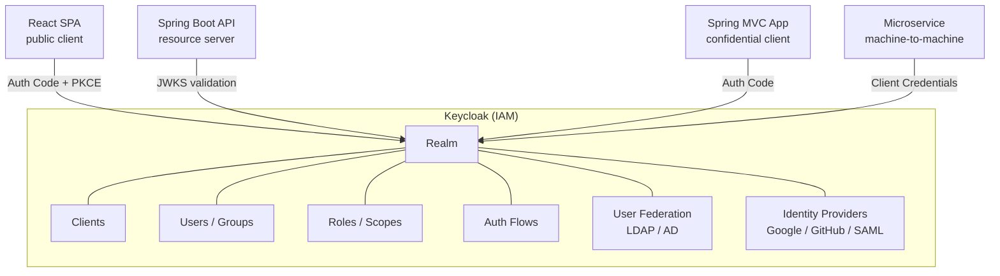
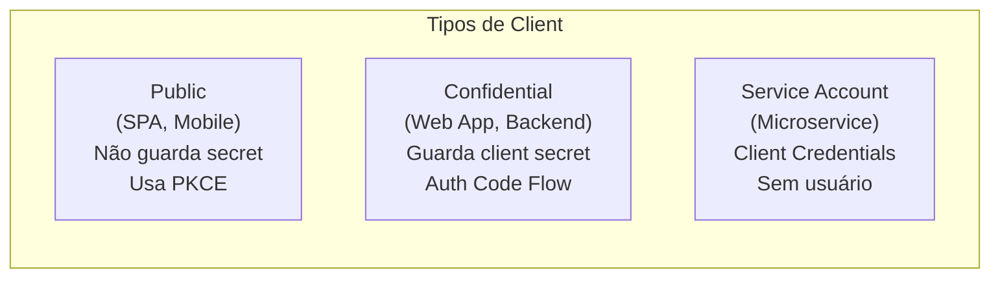
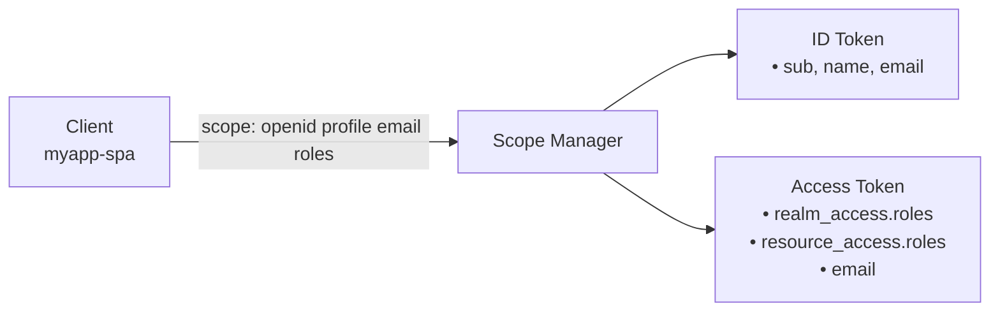
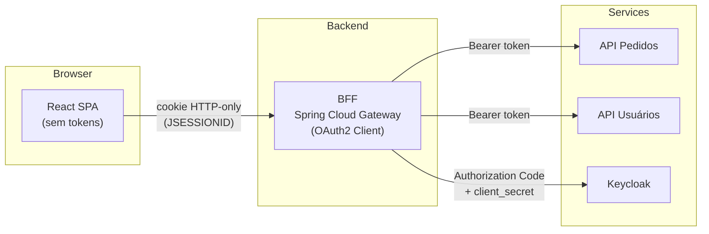
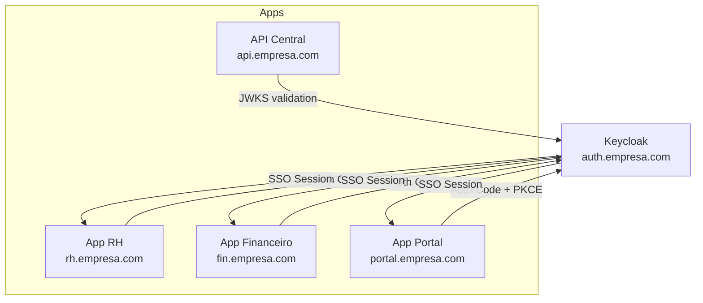
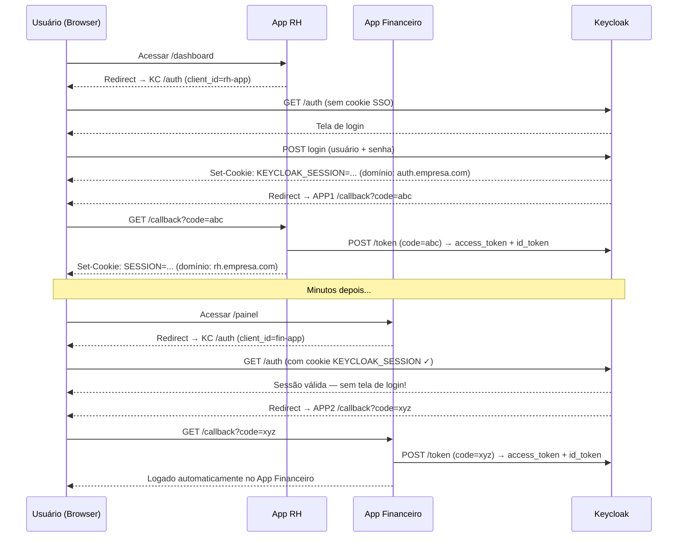
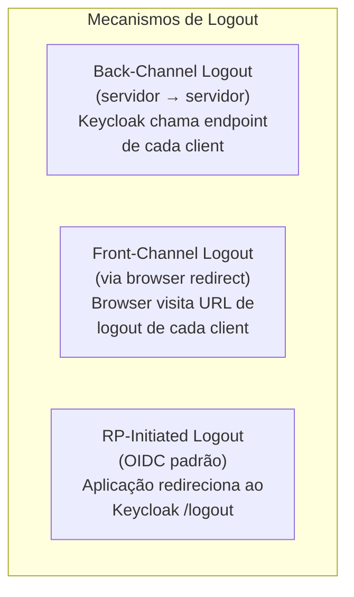
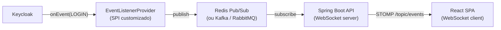
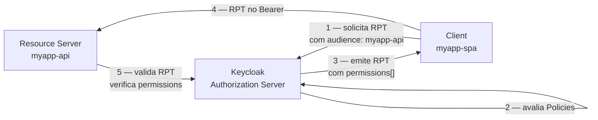
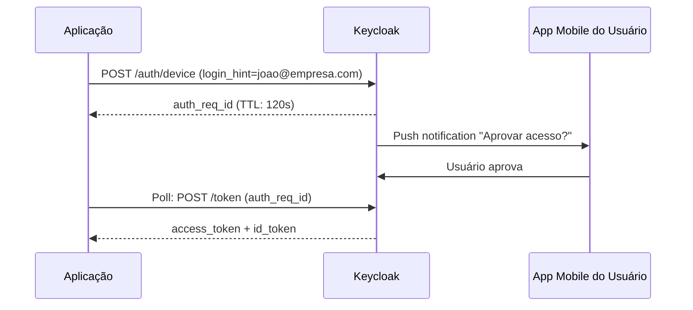

# Keycloak — Guia Abrangente

> **Versões de referência:** Keycloak 26.x · Quarkus-based distribution · Java 21+ · Docker / Kubernetes

---

## Sumário

1. [Conceitos Fundamentais](#1-conceitos-fundamentais)
2. [Instalação e Inicialização](#2-instalação-e-inicialização)
3. [Docker Compose — Receitas Prontas](#3-docker-compose--receitas-prontas)
4. [Configuração de Realm](#4-configuração-de-realm)
5. [Configuração de Clients](#5-configuração-de-clients)
6. [Roles, Groups e Scopes](#6-roles-groups-e-scopes)
7. [Flows de Autenticação OAuth2 / OIDC](#7-flows-de-autenticação-oauth2--oidc)
8. [User Federation — LDAP/AD](#8-user-federation--ldapad)
9. [Identity Providers Externos (Social Login)](#9-identity-providers-externos-social-login)
10. [Mapeamento de Claims / Protocol Mappers](#10-mapeamento-de-claims--protocol-mappers)
11. [Temas (Themes) Customizados](#11-temas-themes-customizados)
12. [Admin REST API](#12-admin-rest-api)
13. [Exportação e Importação de Realm](#13-exportação-e-importação-de-realm)
14. [Configuração de Produção (Hardening)](#14-configuração-de-produção-hardening)
15. [Keycloak em Kubernetes / Helm](#15-keycloak-em-kubernetes--helm)
16. [Integração com Spring Boot](#16-integração-com-spring-boot)
17. [Integração com React / SPA (PKCE)](#17-integração-com-react--spa-pkce)
18. [Keycloak como IdP para múltiplas aplicações](#18-keycloak-como-idp-para-múltiplas-aplicações)
19. [Terraform Provider para Keycloak](#19-terraform-provider-para-keycloak)
20. [Troubleshooting e Diagnóstico](#20-troubleshooting-e-diagnóstico)
21. [Customização de Flows de Autenticação](#21-customização-de-flows-de-autenticação)
22. [SPIs Customizados — Extensibilidade](#22-spis-customizados--extensibilidade)
23. [Authorization Services — Autorização Baseada em Recursos (UMA 2.0)](#23-authorization-services--autorização-baseada-em-recursos-uma-20)
24. [Token Exchange e Impersonation](#24-token-exchange-e-impersonation)
25. [Organizations — Multi-tenancy B2B (Keycloak 24+)](#25-organizations--multi-tenancy-b2b-keycloak-24)
26. [WebAuthn, Passkeys e Segurança Avançada de Tokens](#26-webauthn-passkeys-e-segurança-avançada-de-tokens)
27. [API Gateway e Service Mesh](#27-api-gateway-e-service-mesh)
28. [Observabilidade — OpenTelemetry e Grafana](#28-observabilidade--opentelemetry-e-grafana)
29. [Migração e Atualização](#29-migração-e-atualização)

---

## 1. Conceitos Fundamentais

### 1.1 Arquitetura Geral



### 1.2 Glossário Essencial

| Termo | Descrição |
|---|---|
| **Realm** | Domínio de segurança isolado. Cada realm tem seus próprios usuários, roles e clients. |
| **Client** | Aplicação que delega autenticação ao Keycloak (SPA, API, microservice). |
| **Client ID / Secret** | Credenciais do client para o fluxo confidential. |
| **Access Token** | JWT de curta duração que carrega claims do usuário, válido para a API. |
| **Refresh Token** | Token de longa duração para obter novos access tokens. |
| **ID Token** | JWT com dados de identidade do usuário (OIDC). |
| **Realm Role** | Role válida em todo o realm; aparece em `realm_access.roles` no JWT. |
| **Client Role** | Role específica de um client; aparece em `resource_access.<clientId>.roles`. |
| **Scope** | Conjunto de permissões solicitadas pelo client. |
| **Protocol Mapper** | Regra para adicionar/transformar claims no token. |
| **User Federation** | Integração com diretórios externos (LDAP, Active Directory). |
| **Identity Provider** | IdP externo (Google, GitHub, SAML) federated no Keycloak. |
| **Auth Flow** | Fluxo de autenticação configurável (MFA, OTP, WebAuthn). |
| **Session** | Sessão do usuário no Keycloak; invalidada no logout. |

### 1.3 Endpoints OIDC Padrão

```
# Well-known discovery document
GET {keycloak-url}/realms/{realm}/.well-known/openid-configuration

# Authorization endpoint
GET {keycloak-url}/realms/{realm}/protocol/openid-connect/auth

# Token endpoint
POST {keycloak-url}/realms/{realm}/protocol/openid-connect/token

# UserInfo endpoint
GET {keycloak-url}/realms/{realm}/protocol/openid-connect/userinfo

# JWKS (chaves públicas para validação JWT)
GET {keycloak-url}/realms/{realm}/protocol/openid-connect/certs

# Logout endpoint
POST {keycloak-url}/realms/{realm}/protocol/openid-connect/logout

# Introspection (validação de token opaco)
POST {keycloak-url}/realms/{realm}/protocol/openid-connect/token/introspect
```

---

## 2. Instalação e Inicialização

### 2.1 Modos de Execução

```bash
# Modo desenvolvimento (sem SSL, banco H2 embutido)
./bin/kc.sh start-dev

# Modo produção (requer configuração de hostname e TLS)
./bin/kc.sh start \
  --hostname=auth.meudominio.com \
  --https-certificate-file=/opt/keycloak/certs/tls.crt \
  --https-certificate-key-file=/opt/keycloak/certs/tls.key

# Build otimizado antes de produção (compila providers, temas)
./bin/kc.sh build
./bin/kc.sh start
```

### 2.2 Variáveis de Ambiente Principais

```bash
# Credenciais do admin inicial
KEYCLOAK_ADMIN=admin
KEYCLOAK_ADMIN_PASSWORD=changeme

# Banco de dados
KC_DB=postgres               # postgres | mysql | mariadb | oracle | mssql
KC_DB_URL=jdbc:postgresql://db:5432/keycloak
KC_DB_USERNAME=keycloak
KC_DB_PASSWORD=secret

# Hostname e proxy
KC_HOSTNAME=auth.meudominio.com
KC_HOSTNAME_STRICT=true
KC_PROXY_HEADERS=xforwarded  # ou forwarded (para nginx/traefik)
KC_HTTP_ENABLED=true         # necessário quando proxy termina TLS
KC_HTTP_PORT=8080
KC_HTTPS_PORT=8443

# Health e métricas
KC_HEALTH_ENABLED=true
KC_METRICS_ENABLED=true

# Log
KC_LOG_LEVEL=INFO
KC_LOG_CONSOLE_OUTPUT=json   # json | default

# Cache (cluster)
KC_CACHE=ispn                # infinispan para cluster
KC_CACHE_STACK=kubernetes    # kubernetes | tcp | udp | ec2 | azure | google
```

### 2.3 Configuração via keycloak.conf

```properties
# /opt/keycloak/conf/keycloak.conf
db=postgres
db-url=jdbc:postgresql://keycloak-db:5432/keycloak
db-username=keycloak
db-password=${KC_DB_PASSWORD}

hostname=auth.meudominio.com
proxy-headers=xforwarded
http-enabled=true

health-enabled=true
metrics-enabled=true

log=console,file
log-level=INFO
log-console-output=json
```

---

## 3. Docker Compose — Receitas Prontas

### 3.1 Desenvolvimento Local Mínimo

```yaml
# docker-compose.dev.yml
services:
  keycloak:
    image: quay.io/keycloak/keycloak:26.1
    command: start-dev
    environment:
      KEYCLOAK_ADMIN: admin
      KEYCLOAK_ADMIN_PASSWORD: admin
      KC_HTTP_PORT: 8180
    ports:
      - "8180:8180"
    volumes:
      - keycloak-dev-data:/opt/keycloak/data

volumes:
  keycloak-dev-data:
```

### 3.2 Desenvolvimento com Import Automático de Realm

```yaml
# docker-compose.yml
services:
  keycloak:
    image: quay.io/keycloak/keycloak:26.1
    command: start-dev --import-realm
    environment:
      KEYCLOAK_ADMIN: admin
      KEYCLOAK_ADMIN_PASSWORD: admin
      KC_HTTP_PORT: 8180
    ports:
      - "8180:8180"
    volumes:
      # Realm exportado é importado na inicialização
      - ./keycloak/realm-export.json:/opt/keycloak/data/import/realm.json:ro
    healthcheck:
      test: ["CMD-SHELL", "exec 3<>/dev/tcp/localhost/8180 && echo OK"]
      interval: 15s
      timeout: 5s
      retries: 10
      start_period: 30s
```

### 3.3 Produção com Postgres e Nginx (TLS Offload)

```yaml
# docker-compose.prod.yml
services:
  nginx:
    image: nginx:alpine
    ports:
      - "443:443"
      - "80:80"
    volumes:
      - ./nginx/nginx.conf:/etc/nginx/nginx.conf:ro
      - ./nginx/certs:/etc/nginx/certs:ro
    depends_on:
      - keycloak

  keycloak:
    image: quay.io/keycloak/keycloak:26.1
    command: start
    environment:
      KC_DB: postgres
      KC_DB_URL: jdbc:postgresql://keycloak-db:5432/keycloak
      KC_DB_USERNAME: keycloak
      KC_DB_PASSWORD: ${KC_DB_PASSWORD}
      KEYCLOAK_ADMIN: ${KC_ADMIN_USER}
      KEYCLOAK_ADMIN_PASSWORD: ${KC_ADMIN_PASSWORD}
      KC_HOSTNAME: auth.meudominio.com
      KC_PROXY_HEADERS: xforwarded
      KC_HTTP_ENABLED: "true"
      KC_HTTP_PORT: 8080
      KC_HEALTH_ENABLED: "true"
      KC_METRICS_ENABLED: "true"
    expose:
      - "8080"
    depends_on:
      keycloak-db:
        condition: service_healthy
    healthcheck:
      test: ["CMD-SHELL", "curl -f http://localhost:8080/health/ready || exit 1"]
      interval: 30s
      timeout: 10s
      retries: 5
      start_period: 60s

  keycloak-db:
    image: postgres:17
    environment:
      POSTGRES_DB: keycloak
      POSTGRES_USER: keycloak
      POSTGRES_PASSWORD: ${KC_DB_PASSWORD}
    volumes:
      - keycloak-db-data:/var/lib/postgresql/data
    healthcheck:
      test: ["CMD-SHELL", "pg_isready -U keycloak -d keycloak"]
      interval: 10s
      retries: 5

volumes:
  keycloak-db-data:
```

```nginx
# nginx/nginx.conf — TLS Offload para Keycloak
events { worker_connections 1024; }

http {
    upstream keycloak {
        server keycloak:8080;
    }

    server {
        listen 80;
        return 301 https://$host$request_uri;
    }

    server {
        listen 443 ssl;
        server_name auth.meudominio.com;

        ssl_certificate     /etc/nginx/certs/tls.crt;
        ssl_certificate_key /etc/nginx/certs/tls.key;
        ssl_protocols       TLSv1.2 TLSv1.3;

        location / {
            proxy_pass         http://keycloak;
            proxy_set_header   Host              $host;
            proxy_set_header   X-Real-IP         $remote_addr;
            proxy_set_header   X-Forwarded-For   $proxy_add_x_forwarded_for;
            proxy_set_header   X-Forwarded-Proto $scheme;
            proxy_buffer_size  128k;
            proxy_buffers      4 256k;
        }
    }
}
```

### 3.4 Cluster Ativo-Ativo (Dois Nós)

```yaml
# docker-compose.cluster.yml
services:
  keycloak-1:
    image: quay.io/keycloak/keycloak:26.1
    command: start
    environment:
      KC_DB: postgres
      KC_DB_URL: jdbc:postgresql://keycloak-db:5432/keycloak
      KC_DB_USERNAME: keycloak
      KC_DB_PASSWORD: ${KC_DB_PASSWORD}
      KC_HOSTNAME: auth.meudominio.com
      KC_PROXY_HEADERS: xforwarded
      KC_HTTP_ENABLED: "true"
      KC_CACHE: ispn
      KC_CACHE_STACK: tcp
      JAVA_OPTS_APPEND: >
        -Djgroups.dns.query=keycloak
        -Dkeycloak.connectionsHttpClient.default.connectionPoolSize=20
    expose:
      - "8080"
      - "7600"   # JGroups cluster communication

  keycloak-2:
    image: quay.io/keycloak/keycloak:26.1
    command: start
    environment:
      KC_DB: postgres
      KC_DB_URL: jdbc:postgresql://keycloak-db:5432/keycloak
      KC_DB_USERNAME: keycloak
      KC_DB_PASSWORD: ${KC_DB_PASSWORD}
      KC_HOSTNAME: auth.meudominio.com
      KC_PROXY_HEADERS: xforwarded
      KC_HTTP_ENABLED: "true"
      KC_CACHE: ispn
      KC_CACHE_STACK: tcp
      JAVA_OPTS_APPEND: >
        -Djgroups.dns.query=keycloak
    expose:
      - "8080"
      - "7600"

  keycloak-db:
    image: postgres:17
    environment:
      POSTGRES_DB: keycloak
      POSTGRES_USER: keycloak
      POSTGRES_PASSWORD: ${KC_DB_PASSWORD}
    volumes:
      - keycloak-db-data:/var/lib/postgresql/data

volumes:
  keycloak-db-data:
```

---

## 4. Configuração de Realm

### 4.1 Parâmetros Principais do Realm

```
Console Admin → {realm} → Realm Settings
```

| Aba | Campo | Recomendação |
|---|---|---|
| **General** | Display Name | Nome amigável exibido na tela de login |
| **General** | Frontend URL | URL pública do Keycloak (prod) |
| **Login** | User Registration | Desabilitar em apps corporativos |
| **Login** | Forgot Password | Habilitar com email configurado |
| **Login** | Remember Me | Conforme política de sessão |
| **Login** | Verify Email | Habilitar em produção |
| **Tokens** | Access Token Lifespan | 5-15 minutos em produção |
| **Tokens** | SSO Session Idle | 30 minutos (logout por inatividade) |
| **Tokens** | SSO Session Max | 8 horas (jornada de trabalho) |
| **Tokens** | Refresh Token Max Reuse | 0 (never reuse — detecta roubo) |
| **Email** | SMTP Host | Servidor de e-mail para MFA / confirmações |
| **Security Defenses** | Brute Force Detection | Habilitar em produção |

### 4.2 Configurar SMTP para E-mails

```
Realm Settings → Email

Host: smtp.gmail.com
Port: 587
From: noreply@meudominio.com
Enable StartTLS: ON
Username: smtp-user@meudominio.com
Password: app-specific-password
```

### 4.3 Brute Force Protection

```
Realm Settings → Security Defenses → Brute Force Detection

Max Login Failures:       5
Wait Increment:           60 seconds
Max Wait:                 900 seconds
Failure Reset Time:       43200 seconds (12h)
```

---

## 5. Configuração de Clients

### 5.1 Tipos de Client



### 5.2 Client para SPA (React, Angular, Vue) — Public + PKCE

```
Clients → Create client

Client ID:          myapp-spa
Client type:        OpenID Connect
Client authentication: OFF  ← public client

Authentication flow:
  ✅ Standard flow (Authorization Code)
  ❌ Direct access grants
  ❌ Implicit flow

Valid redirect URIs:
  http://localhost:3000/*
  https://app.meudominio.com/*

Valid post logout redirect URIs:
  http://localhost:3000
  https://app.meudominio.com

Web origins:
  http://localhost:3000
  https://app.meudominio.com
```

### 5.3 Client para Aplicação Web (Spring MVC) — Confidential

```
Client ID:           myapp-web
Client type:         OpenID Connect
Client authentication: ON  ← confidential

Authentication flow:
  ✅ Standard flow

Valid redirect URIs:
  http://localhost:8080/login/oauth2/code/keycloak
  https://web.meudominio.com/login/oauth2/code/keycloak

Post logout redirect URIs:
  http://localhost:8080
  https://web.meudominio.com
```

Após salvar, ir em **Credentials** para copiar o `client-secret`.

### 5.4 Client para API REST — Bearer-only / Resource Server

```
Client ID:            myapp-api
Client type:          OpenID Connect
Client authentication: ON

Authentication flow:
  ❌ Standard flow
  ❌ Direct access grants

# Bearer-only — apenas valida tokens recebidos, não inicia login
```

> **Dica:** Em Keycloak 22+, o conceito de "bearer-only" foi simplificado. Um resource server é qualquer client que apenas valida o access token via JWKS sem participar de flows de login.

### 5.5 Client para Machine-to-Machine — Service Account

```
Client ID:             myapp-worker
Client type:           OpenID Connect
Client authentication: ON

Authentication flow:
  ✅ Service accounts roles  ← habilita client credentials flow
  ❌ Standard flow

# Em Service Account Roles: atribuir as roles que o serviço precisa
```

```bash
# Obter token via Client Credentials
curl -X POST \
  http://localhost:8180/realms/myrealm/protocol/openid-connect/token \
  -H "Content-Type: application/x-www-form-urlencoded" \
  -d "grant_type=client_credentials" \
  -d "client_id=myapp-worker" \
  -d "client_secret=YOUR_SECRET"
```

### 5.6 Configurar Logout (OIDC Back-Channel / Front-Channel)

```
Clients → myapp-web → Advanced

# Back-channel logout (servidor para servidor)
Backchannel logout URL: https://web.meudominio.com/logout/back-channel
Backchannel logout session required: ON

# Front-channel logout (redirect no browser)
Front-channel logout URL: https://web.meudominio.com/logout
```

---

## 6. Roles, Groups e Scopes

### 6.1 Hierarquia de Roles

```
Realm Roles
├── admin
│   └── (composite) → inclui user + moderator
├── moderator
└── user

Client Roles (myapp-api)
├── read-orders
├── write-orders
└── admin-orders

Groups
├── /admins         → assigned: admin (realm role)
├── /moderadores    → assigned: moderator
└── /usuarios       → assigned: user (default group)
```

### 6.2 Criar Roles via Admin Console

```
Realm Roles → Create role
  Name: admin
  Description: Administradores do sistema

# Criar role composta (herda outras roles)
admin → Action → Add associated roles
  → Selecionar: user, moderator
```

### 6.3 Criar Groups e Atribuir Roles

```
Groups → Create group
  Name: admins

admins → Role mapping → Assign role
  → Selecionar: admin
```

### 6.4 Default Groups (usuário novo entra automaticamente)

```
Realm Settings → User Registration → Default Groups
  → Adicionar: /usuarios
```

### 6.5 Client Scopes



**Scopes padrão incluídos em todos os tokens:**
- `openid` — habilita OIDC e geração de ID Token
- `profile` — `name`, `given_name`, `family_name`, `preferred_username`
- `email` — `email`, `email_verified`
- `roles` — `realm_access` e `resource_access` com roles
- `web-origins` — CORS origins

**Criar scope customizado:**

```
Client Scopes → Create client scope
  Name: orders:read
  Type: Optional
  Protocol: openid-connect

→ Mappers → Add mapper → By configuration
  → Hardcoded Role → role: read-orders
```

---

## 7. Flows de Autenticação OAuth2 / OIDC

### 7.1 Authorization Code + PKCE (SPAs e Mobile)

```
1. SPA gera code_verifier (aleatório, 43-128 chars)
2. SPA calcula code_challenge = BASE64URL(SHA256(code_verifier))
3. SPA redireciona para /auth com:
   - response_type=code
   - code_challenge=<hash>
   - code_challenge_method=S256
4. Usuário autentica no Keycloak
5. Keycloak redireciona para redirect_uri com ?code=<auth_code>
6. SPA troca code por tokens em /token enviando code_verifier
```

```javascript
// Exemplo com oidc-client-ts
import { UserManager, WebStorageStateStore } from 'oidc-client-ts';

const userManager = new UserManager({
  authority: 'http://localhost:8180/realms/myrealm',
  client_id: 'myapp-spa',
  redirect_uri: 'http://localhost:3000/callback',
  post_logout_redirect_uri: 'http://localhost:3000',
  response_type: 'code',
  scope: 'openid profile email roles',
  userStore: new WebStorageStateStore({ store: window.sessionStorage }),
  // PKCE é habilitado automaticamente pela biblioteca
});

// Iniciar login
await userManager.signinRedirect();

// Processar callback
const user = await userManager.signinRedirectCallback();
console.log(user.access_token);
```

### 7.2 Client Credentials (Machine-to-Machine)

```bash
# Sem usuário — usado por microservices e workers
curl -X POST \
  http://localhost:8180/realms/myrealm/protocol/openid-connect/token \
  -d "grant_type=client_credentials" \
  -d "client_id=myapp-worker" \
  -d "client_secret=SECRET" \
  -d "scope=openid"

# Resposta
{
  "access_token": "eyJ...",
  "expires_in": 300,
  "token_type": "Bearer",
  "scope": "openid"
}
```

### 7.3 Device Authorization Grant (TV, IoT)

```
Client → Advanced → Authentication flow overrides
  → Device authorization grant: ON
```

```bash
# Passo 1: Obter device_code
curl -X POST \
  http://localhost:8180/realms/myrealm/protocol/openid-connect/auth/device \
  -d "client_id=myapp-device"

# Resposta: mostra ao usuário o user_code e verification_uri
{
  "device_code": "Ag...",
  "user_code": "ABCD-1234",
  "verification_uri": "http://localhost:8180/realms/myrealm/device",
  "expires_in": 600,
  "interval": 5
}

# Passo 2: Poll até o usuário autorizar no browser
curl -X POST \
  http://localhost:8180/realms/myrealm/protocol/openid-connect/token \
  -d "grant_type=urn:ietf:params:oauth2:grant-type:device_code" \
  -d "client_id=myapp-device" \
  -d "device_code=Ag..."
```

### 7.4 Configurar MFA (OTP / TOTP)

```
Authentication → Required Actions → Configure OTP: Default ON

# OU por realm policy:
Realm Settings → Authentication → Two-factor
  Required: ON para todos

# OU apenas para role específica:
Authentication → Flows → Browser
  → OTP Form: REQUIRED (apenas para admins via Conditional)
```

```
# Fluxo Browser com MFA condicional
Browser Flow
├── Cookie                         [Alternative]
├── Kerberos                       [Alternative]
└── Forms                          [Alternative]
    ├── Username Password Form     [Required]
    └── Browser - Conditional OTP  [Conditional]
        ├── Condition - User Configured [Condition]
        └── OTP Form                   [Required]
```

---

## 8. User Federation — LDAP/AD

### 8.1 Configurar LDAP

```
User Federation → Add provider → ldap

Connection URL:     ldap://ldap.meudominio.com:389
Enable StartTLS:    ON (produção)
Bind Type:          simple
Bind DN:            cn=keycloak-reader,ou=service-accounts,dc=meudominio,dc=com
Bind Credential:    secret

Edit Mode:         READ_ONLY   # ou WRITABLE / UNSYNCED
Users DN:          ou=users,dc=meudominio,dc=com
Username LDAP attr: sAMAccountName   # AD | uid (LDAP)
RDN LDAP attr:     cn
UUID LDAP attr:    objectGUID        # AD | entryUUID (LDAP)
User object classes: person, organizationalPerson, user

Search Scope:      SUBTREE
Pagination:        ON (para ADs grandes)

Sync Settings:
  Periodic Full Sync: ON  → 86400 (24h)
  Periodic Changed Sync: ON → 3600 (1h)
```

### 8.2 Mapear Grupos do AD

```
User Federation → ldap → Mappers → Add

Name:                    groups
Mapper type:             group-ldap-mapper
LDAP Groups DN:          ou=groups,dc=meudominio,dc=com
Group Name LDAP Attr:    cn
Group Object Classes:    group     # AD | groupOfNames (LDAP)
Membership LDAP Attr:    member
Membership Attr Type:    DN
Mode:                    READ_ONLY
Drop non-existing groups: ON
```

### 8.3 Mapear Roles do AD

```
User Federation → ldap → Mappers → Add

Name:                 realm-roles
Mapper type:          role-ldap-mapper
LDAP Roles DN:        ou=roles,dc=meudominio,dc=com
Role Name LDAP Attr:  cn
Role Object Classes:  groupOfNames
Membership LDAP Attr: member
Mode:                 READ_ONLY
```

---

## 9. Identity Providers Externos (Social Login)

### 9.1 Google

```
Identity Providers → Add provider → Google

Client ID:      <Google OAuth2 client ID>
Client Secret:  <Google OAuth2 client secret>
Default Scopes: openid profile email

# No Google Console (console.cloud.google.com):
# Authorized redirect URIs:
# http://localhost:8180/realms/myrealm/broker/google/endpoint
```

### 9.2 GitHub

```
Identity Providers → Add provider → GitHub

Client ID:      <GitHub OAuth App client ID>
Client Secret:  <GitHub OAuth App client secret>
Default Scopes: user:email

# No GitHub: Settings → Developer settings → OAuth Apps
# Authorization callback URL:
# http://localhost:8180/realms/myrealm/broker/github/endpoint
```

### 9.3 Microsoft / Azure AD

```
Identity Providers → Add provider → Microsoft

Client ID:      <Azure App client ID>
Client Secret:  <Azure App client secret>
Default Scopes: openid profile email User.Read

# No Azure AD: App registrations → {app} → Authentication
# Redirect URI:
# http://localhost:8180/realms/myrealm/broker/microsoft/endpoint
```

### 9.4 SAML 2.0 (Enterprise SSO)

```
Identity Providers → Add provider → SAML v2.0

Service Provider Entity ID: http://localhost:8180/realms/myrealm
Single Sign-On Service URL: https://idp.meudominio.com/sso/saml
Single Logout Service URL:  https://idp.meudominio.com/slo/saml
NameID Policy Format:       Email / Persistent / Transient
```

### 9.5 First Login Flow (Mapeamento de Usuário)

```
Identity Providers → google → First Login Flow

# Fluxo padrão: Review Profile → Create User If Unique
# Se e-mail já existe no realm:
  Handle Existing Account: Link to existing account
```

---

## 10. Mapeamento de Claims / Protocol Mappers

### 10.1 Adicionar Claim Customizado ao Token

```
Client Scopes → roles → Mappers → Create mapper

# Exemplo: adicionar department do usuário ao token
Name:           department
Mapper type:    User Attribute
User Attribute: department
Token Claim Name: department
Claim JSON Type:  String
Add to ID token:  ON
Add to access token: ON
```

### 10.2 Mapear Roles como Array no Token

O Keycloak já inclui roles por padrão em `realm_access.roles` e `resource_access.<clientId>.roles`. Para adicionar roles como array plano:

```
Client → myapp-api → Client scopes → Dedicated scope → Mappers → Add

Name:            flat-roles
Mapper type:     User Realm Role
Multivalued:     ON
Token Claim Name: roles
Add to access token: ON
```

### 10.3 Mapear Groups como Claim

```
Client Scopes → Create scope: groups

Mappers → Add mapper → Group Membership
  Name:            groups
  Token Claim Name: groups
  Full group path:  ON   # inclui /admins em vez de admins
  Add to access token: ON
```

### 10.4 Mapper via Script (Freemarker)

```
Mappers → Add → Script mapper

Name:     custom-claim
Script:   
  var groups = user.getGroups();
  var result = [];
  groups.forEach(function(g) { result.push(g.getName()); });
  token.setOtherClaims("my_groups", result);
```

> **Nota:** Script mappers precisam de `--features=scripts` habilitado no Keycloak.

---

## 11. Temas (Themes) Customizados

### 11.1 Estrutura de Diretórios

```
/opt/keycloak/themes/mytheme/
├── login/
│   ├── theme.properties
│   ├── resources/
│   │   ├── css/
│   │   │   └── login.css
│   │   └── img/
│   │       └── logo.png
│   └── templates/
│       └── login.ftl          # Freemarker template
├── account/
│   └── theme.properties
└── email/
    ├── theme.properties
    └── html/
        └── email-verification.ftl
```

### 11.2 theme.properties

```properties
# /opt/keycloak/themes/mytheme/login/theme.properties
parent=keycloak
import=common/keycloak

# Importar CSS customizado
styles=css/login.css

# Variáveis disponíveis nos templates
```

### 11.3 Login.ftl Customizado (trecho)

```html
<#import "template.ftl" as layout>
<@layout.registrationLayout displayMessage=!messagesPerField.existsError('username','password'); section>
  <#if section = "header">
    
    ${msg("loginTitle",realm.name)}
  <#elseif section = "form">
    <form action="${url.loginAction}" method="post">
      <div class="form-group">
        <label>${msg("username")}</label>
        <input type="text" name="username" value="${(login.username!'')}" autofocus/>
      </div>
      <div class="form-group">
        <label>${msg("password")}</label>
        <input type="password" name="password"/>
      </div>
      <button type="submit">${msg("doLogIn")}</button>
    </form>
  </#if>
</@layout.registrationLayout>
```

### 11.4 Aplicar Tema ao Realm

```
Realm Settings → Themes
  Login theme:   mytheme
  Account theme: mytheme
  Email theme:   mytheme
```

### 11.5 Montar Tema via Docker

```yaml
keycloak:
  image: quay.io/keycloak/keycloak:26.1
  volumes:
    - ./themes/mytheme:/opt/keycloak/themes/mytheme:ro
```

---

## 12. Admin REST API

### 12.1 Autenticação na API Admin

```bash
# Obter token de admin
TOKEN=$(curl -s -X POST \
  http://localhost:8180/realms/master/protocol/openid-connect/token \
  -d "grant_type=password" \
  -d "client_id=admin-cli" \
  -d "username=admin" \
  -d "password=admin" \
  | jq -r '.access_token')
```

### 12.2 Operações Comuns via API

```bash
BASE="http://localhost:8180/admin/realms/myrealm"
AUTH="Authorization: Bearer $TOKEN"

# Listar usuários
curl -H "$AUTH" "$BASE/users"

# Buscar usuário por e-mail
curl -H "$AUTH" "$BASE/users?email=user@example.com"

# Criar usuário
curl -s -X POST -H "$AUTH" -H "Content-Type: application/json" \
  "$BASE/users" \
  -d '{
    "username": "johndoe",
    "email": "john@example.com",
    "firstName": "John",
    "lastName": "Doe",
    "enabled": true,
    "emailVerified": true,
    "credentials": [{
      "type": "password",
      "value": "temp123",
      "temporary": true
    }]
  }'

# Atribuir realm role a usuário
USER_ID="<uuid>"
ROLE_ID=$(curl -H "$AUTH" "$BASE/roles/admin" | jq -r '.id')
curl -s -X POST -H "$AUTH" -H "Content-Type: application/json" \
  "$BASE/users/$USER_ID/role-mappings/realm" \
  -d "[{\"id\": \"$ROLE_ID\", \"name\": \"admin\"}]"

# Redefinir senha
curl -s -X PUT -H "$AUTH" -H "Content-Type: application/json" \
  "$BASE/users/$USER_ID/reset-password" \
  -d '{"type":"password","value":"newpass","temporary":false}'

# Listar sessions do usuário
curl -H "$AUTH" "$BASE/users/$USER_ID/sessions"

# Revogar todas as sessions do usuário (force logout)
curl -s -X DELETE -H "$AUTH" "$BASE/users/$USER_ID/sessions"

# Criar realm role
curl -s -X POST -H "$AUTH" -H "Content-Type: application/json" \
  "$BASE/roles" \
  -d '{"name": "reports-viewer", "description": "Acesso a relatórios"}'

# Listar clients
curl -H "$AUTH" "$BASE/clients"

# Obter secret de um client
CLIENT_ID=$(curl -H "$AUTH" "$BASE/clients?clientId=myapp-web" | jq -r '.[0].id')
curl -H "$AUTH" "$BASE/clients/$CLIENT_ID/client-secret"

# Regenerar secret
curl -s -X POST -H "$AUTH" "$BASE/clients/$CLIENT_ID/client-secret"

# Listar sessões ativas do realm
curl -H "$AUTH" "$BASE/sessions/stats"
```

### 12.3 Gerenciar Realm via API

```bash
# Criar novo realm
curl -s -X POST -H "$TOKEN_HEADER" -H "Content-Type: application/json" \
  http://localhost:8180/admin/realms \
  -d '{
    "realm": "newrealm",
    "displayName": "Novo Realm",
    "enabled": true,
    "ssoSessionIdleTimeout": 1800,
    "accessTokenLifespan": 300
  }'

# Exportar realm completo
curl -H "$AUTH" \
  "http://localhost:8180/admin/realms/myrealm/partial-export?exportClients=true&exportGroupsAndRoles=true" \
  -o realm-export.json
```

### 12.4 Gerenciar Usuários via Spring Boot (RestClient)

Cenário: sua aplicação possui um painel administrativo que precisa criar, listar, atribuir roles ou desativar usuários no Keycloak de forma programática, usando a Admin REST API.

#### Configuração

```yaml
# application.yml
keycloak:
  admin:
    server-url: ${KEYCLOAK_URL:http://localhost:8180}
    realm: ${KEYCLOAK_REALM:myrealm}
    client-id: ${KEYCLOAK_ADMIN_CLIENT_ID:admin-api}
    client-secret: ${KEYCLOAK_ADMIN_CLIENT_SECRET}
```

#### Configurar Client no Keycloak para Admin API

```
Clients → Create client
  Client ID:             admin-api
  Client authentication: ON
  Service accounts roles: ON  ← habilita client credentials

Service Account Roles → Assign role
  → Filter by clients → realm-management
  → Selecionar: manage-users, view-users, manage-realm (conforme necessidade)

# Permissões granulares disponíveis em realm-management:
#   view-users       — listar e buscar usuários
#   manage-users     — criar, editar, deletar usuários e credenciais
#   view-clients     — listar clients
#   manage-clients   — criar e editar clients
#   view-realm       — visualizar configurações do realm
#   manage-realm     — alterar configurações do realm
#   impersonation    — agir como outro usuário
```

#### Service de Token Admin (Client Credentials)

```java
@Service
public class KeycloakTokenService {

    private final RestClient restClient;
    private final String tokenUrl;
    private final String clientId;
    private final String clientSecret;

    private String cachedToken;
    private Instant tokenExpiry = Instant.EPOCH;

    public KeycloakTokenService(
            @Value("${keycloak.admin.server-url}") String serverUrl,
            @Value("${keycloak.admin.realm}") String realm,
            @Value("${keycloak.admin.client-id}") String clientId,
            @Value("${keycloak.admin.client-secret}") String clientSecret) {
        this.restClient = RestClient.create();
        this.tokenUrl = serverUrl + "/realms/" + realm + "/protocol/openid-connect/token";
        this.clientId = clientId;
        this.clientSecret = clientSecret;
    }

    public synchronized String getAccessToken() {
        if (Instant.now().isBefore(tokenExpiry.minusSeconds(30))) {
            return cachedToken;
        }

        Map<String, Object> response = restClient.post()
            .uri(tokenUrl)
            .contentType(MediaType.APPLICATION_FORM_URLENCODED)
            .body("grant_type=client_credentials&client_id=" + clientId
                + "&client_secret=" + clientSecret)
            .retrieve()
            .body(new ParameterizedTypeReference<>() {});

        cachedToken = (String) response.get("access_token");
        int expiresIn = (int) response.get("expires_in");
        tokenExpiry = Instant.now().plusSeconds(expiresIn);

        return cachedToken;
    }
}
```

#### Service de Gerenciamento de Usuários

```java
@Service
public class KeycloakUserService {

    private final RestClient restClient;
    private final KeycloakTokenService tokenService;
    private final String adminBaseUrl;

    public KeycloakUserService(
            KeycloakTokenService tokenService,
            @Value("${keycloak.admin.server-url}") String serverUrl,
            @Value("${keycloak.admin.realm}") String realm) {
        this.tokenService = tokenService;
        this.adminBaseUrl = serverUrl + "/admin/realms/" + realm;
        this.restClient = RestClient.create();
    }

    private String authHeader() {
        return "Bearer " + tokenService.getAccessToken();
    }

    // --- Consultas ---

    public List<Map<String, Object>> listUsers(int first, int max) {
        return restClient.get()
            .uri(adminBaseUrl + "/users?first={first}&max={max}", first, max)
            .header(HttpHeaders.AUTHORIZATION, authHeader())
            .retrieve()
            .body(new ParameterizedTypeReference<>() {});
    }

    public Map<String, Object> findByEmail(String email) {
        List<Map<String, Object>> users = restClient.get()
            .uri(adminBaseUrl + "/users?email={email}&exact=true", email)
            .header(HttpHeaders.AUTHORIZATION, authHeader())
            .retrieve()
            .body(new ParameterizedTypeReference<>() {});

        return users.isEmpty() ? null : users.getFirst();
    }

    public Map<String, Object> findById(String userId) {
        return restClient.get()
            .uri(adminBaseUrl + "/users/{userId}", userId)
            .header(HttpHeaders.AUTHORIZATION, authHeader())
            .retrieve()
            .body(Map.class);
    }

    public int countUsers() {
        return restClient.get()
            .uri(adminBaseUrl + "/users/count")
            .header(HttpHeaders.AUTHORIZATION, authHeader())
            .retrieve()
            .body(Integer.class);
    }

    // --- Criação ---

    public URI createUser(KeycloakUserRequest request) {
        return restClient.post()
            .uri(adminBaseUrl + "/users")
            .header(HttpHeaders.AUTHORIZATION, authHeader())
            .contentType(MediaType.APPLICATION_JSON)
            .body(Map.of(
                "username",      request.username(),
                "email",         request.email(),
                "firstName",     request.firstName(),
                "lastName",      request.lastName(),
                "enabled",       true,
                "emailVerified", false,
                "credentials",   List.of(Map.of(
                    "type",      "password",
                    "value",     request.tempPassword(),
                    "temporary", true
                ))
            ))
            .retrieve()
            .toBodilessEntity()
            .getHeaders()
            .getLocation();
        // Location header retorna: /admin/realms/{realm}/users/{userId}
    }

    // --- Roles ---

    public void assignRealmRole(String userId, String roleName) {
        Map<String, Object> role = restClient.get()
            .uri(adminBaseUrl + "/roles/{roleName}", roleName)
            .header(HttpHeaders.AUTHORIZATION, authHeader())
            .retrieve()
            .body(Map.class);

        restClient.post()
            .uri(adminBaseUrl + "/users/{userId}/role-mappings/realm", userId)
            .header(HttpHeaders.AUTHORIZATION, authHeader())
            .contentType(MediaType.APPLICATION_JSON)
            .body(List.of(Map.of("id", role.get("id"), "name", roleName)))
            .retrieve()
            .toBodilessEntity();
    }

    public void removeRealmRole(String userId, String roleName) {
        Map<String, Object> role = restClient.get()
            .uri(adminBaseUrl + "/roles/{roleName}", roleName)
            .header(HttpHeaders.AUTHORIZATION, authHeader())
            .retrieve()
            .body(Map.class);

        restClient.method(HttpMethod.DELETE)
            .uri(adminBaseUrl + "/users/{userId}/role-mappings/realm", userId)
            .header(HttpHeaders.AUTHORIZATION, authHeader())
            .contentType(MediaType.APPLICATION_JSON)
            .body(List.of(Map.of("id", role.get("id"), "name", roleName)))
            .retrieve()
            .toBodilessEntity();
    }

    public List<Map<String, Object>> getUserRoles(String userId) {
        return restClient.get()
            .uri(adminBaseUrl + "/users/{userId}/role-mappings/realm", userId)
            .header(HttpHeaders.AUTHORIZATION, authHeader())
            .retrieve()
            .body(new ParameterizedTypeReference<>() {});
    }

    // --- Operações de conta ---

    public void disableUser(String userId) {
        restClient.put()
            .uri(adminBaseUrl + "/users/{userId}", userId)
            .header(HttpHeaders.AUTHORIZATION, authHeader())
            .contentType(MediaType.APPLICATION_JSON)
            .body(Map.of("enabled", false))
            .retrieve()
            .toBodilessEntity();
    }

    public void enableUser(String userId) {
        restClient.put()
            .uri(adminBaseUrl + "/users/{userId}", userId)
            .header(HttpHeaders.AUTHORIZATION, authHeader())
            .contentType(MediaType.APPLICATION_JSON)
            .body(Map.of("enabled", true))
            .retrieve()
            .toBodilessEntity();
    }

    public void resetPassword(String userId, String newPassword, boolean temporary) {
        restClient.put()
            .uri(adminBaseUrl + "/users/{userId}/reset-password", userId)
            .header(HttpHeaders.AUTHORIZATION, authHeader())
            .contentType(MediaType.APPLICATION_JSON)
            .body(Map.of(
                "type",      "password",
                "value",     newPassword,
                "temporary", temporary
            ))
            .retrieve()
            .toBodilessEntity();
    }

    public void sendVerifyEmail(String userId) {
        restClient.put()
            .uri(adminBaseUrl + "/users/{userId}/send-verify-email", userId)
            .header(HttpHeaders.AUTHORIZATION, authHeader())
            .retrieve()
            .toBodilessEntity();
    }

    public void forceLogout(String userId) {
        restClient.post()
            .uri(adminBaseUrl + "/users/{userId}/logout", userId)
            .header(HttpHeaders.AUTHORIZATION, authHeader())
            .retrieve()
            .toBodilessEntity();
    }

    public void deleteUser(String userId) {
        restClient.delete()
            .uri(adminBaseUrl + "/users/{userId}", userId)
            .header(HttpHeaders.AUTHORIZATION, authHeader())
            .retrieve()
            .toBodilessEntity();
    }

    // --- Groups ---

    public void addToGroup(String userId, String groupId) {
        restClient.put()
            .uri(adminBaseUrl + "/users/{userId}/groups/{groupId}", userId, groupId)
            .header(HttpHeaders.AUTHORIZATION, authHeader())
            .retrieve()
            .toBodilessEntity();
    }

    public void removeFromGroup(String userId, String groupId) {
        restClient.delete()
            .uri(adminBaseUrl + "/users/{userId}/groups/{groupId}", userId, groupId)
            .header(HttpHeaders.AUTHORIZATION, authHeader())
            .retrieve()
            .toBodilessEntity();
    }
}
```

```java
public record KeycloakUserRequest(
    String username,
    String email,
    String firstName,
    String lastName,
    String tempPassword
) {}
```

#### Controller Administrativo

```java
@RestController
@RequestMapping("/api/admin/users")
@PreAuthorize("hasRole('ADMIN')")
public class UserAdminController {

    private final KeycloakUserService keycloakUserService;

    public UserAdminController(KeycloakUserService keycloakUserService) {
        this.keycloakUserService = keycloakUserService;
    }

    @GetMapping
    public List<Map<String, Object>> listUsers(
            @RequestParam(defaultValue = "0") int first,
            @RequestParam(defaultValue = "20") int max) {
        return keycloakUserService.listUsers(first, max);
    }

    @GetMapping("/count")
    public int countUsers() {
        return keycloakUserService.countUsers();
    }

    @GetMapping("/search")
    public Map<String, Object> findByEmail(@RequestParam String email) {
        return keycloakUserService.findByEmail(email);
    }

    @PostMapping
    public ResponseEntity<Void> createUser(@RequestBody KeycloakUserRequest request) {
        URI location = keycloakUserService.createUser(request);
        String userId = extractUserIdFromLocation(location);
        keycloakUserService.assignRealmRole(userId, "user");
        return ResponseEntity.created(location).build();
    }

    @PutMapping("/{userId}/disable")
    public ResponseEntity<Void> disableUser(@PathVariable String userId) {
        keycloakUserService.disableUser(userId);
        keycloakUserService.forceLogout(userId);
        return ResponseEntity.noContent().build();
    }

    @PutMapping("/{userId}/enable")
    public ResponseEntity<Void> enableUser(@PathVariable String userId) {
        keycloakUserService.enableUser(userId);
        return ResponseEntity.noContent().build();
    }

    @PutMapping("/{userId}/reset-password")
    public ResponseEntity<Void> resetPassword(
            @PathVariable String userId,
            @RequestBody Map<String, String> body) {
        keycloakUserService.resetPassword(userId, body.get("password"), true);
        return ResponseEntity.noContent().build();
    }

    @PutMapping("/{userId}/roles/{roleName}")
    public ResponseEntity<Void> assignRole(
            @PathVariable String userId,
            @PathVariable String roleName) {
        keycloakUserService.assignRealmRole(userId, roleName);
        return ResponseEntity.noContent().build();
    }

    @DeleteMapping("/{userId}/roles/{roleName}")
    public ResponseEntity<Void> removeRole(
            @PathVariable String userId,
            @PathVariable String roleName) {
        keycloakUserService.removeRealmRole(userId, roleName);
        return ResponseEntity.noContent().build();
    }

    @DeleteMapping("/{userId}")
    public ResponseEntity<Void> deleteUser(@PathVariable String userId) {
        keycloakUserService.forceLogout(userId);
        keycloakUserService.deleteUser(userId);
        return ResponseEntity.noContent().build();
    }

    private String extractUserIdFromLocation(URI location) {
        String path = location.getPath();
        return path.substring(path.lastIndexOf('/') + 1);
    }
}
```

#### Tratamento de Erros da Admin API

```java
@RestControllerAdvice
public class KeycloakAdminExceptionHandler {

    @ExceptionHandler(HttpClientErrorException.class)
    public ResponseEntity<Map<String, String>> handleKeycloakError(
            HttpClientErrorException ex) {
        return switch (ex.getStatusCode().value()) {
            case 409 -> ResponseEntity.status(409).body(
                Map.of("error", "Usuário já existe no Keycloak"));
            case 404 -> ResponseEntity.status(404).body(
                Map.of("error", "Usuário não encontrado no Keycloak"));
            case 403 -> ResponseEntity.status(403).body(
                Map.of("error", "Service account sem permissão no Keycloak"));
            default -> ResponseEntity.status(ex.getStatusCode()).body(
                Map.of("error", ex.getResponseBodyAsString()));
        };
    }
}
```

---

## 13. Exportação e Importação de Realm

### 13.1 Exportar via CLI (Recomendado para Produção)

```bash
# Parar Keycloak e exportar (inclui senhas hasheadas)
docker exec keycloak \
  /opt/keycloak/bin/kc.sh export \
  --realm myrealm \
  --dir /tmp/export \
  --users realm_file

# Copiar do container
docker cp keycloak:/tmp/export/myrealm-realm.json ./keycloak/realm-export.json
```

### 13.2 Importar via CLI

```bash
# Importar realm existente
docker exec keycloak \
  /opt/keycloak/bin/kc.sh import \
  --dir /opt/keycloak/data/import

# OU via variável de ambiente no start
command: start-dev --import-realm
volumes:
  - ./realm-export.json:/opt/keycloak/data/import/myrealm.json:ro
```

### 13.3 Exportar via Admin API (sem senhas)

```bash
curl -H "Authorization: Bearer $TOKEN" \
  "http://localhost:8180/admin/realms/myrealm/partial-export?exportClients=true&exportGroupsAndRoles=true" \
  > realm-no-secrets.json
```

### 13.4 Estrutura do realm-export.json

```json
{
  "realm": "myrealm",
  "displayName": "Meu Realm",
  "enabled": true,
  "ssoSessionIdleTimeout": 1800,
  "accessTokenLifespan": 300,
  "roles": {
    "realm": [
      { "name": "admin", "composite": true },
      { "name": "user" }
    ],
    "client": {
      "myapp-api": [
        { "name": "read-orders" },
        { "name": "write-orders" }
      ]
    }
  },
  "groups": [
    {
      "name": "admins",
      "path": "/admins",
      "realmRoles": ["admin"]
    }
  ],
  "clients": [
    {
      "clientId": "myapp-spa",
      "publicClient": true,
      "redirectUris": ["http://localhost:3000/*"],
      "webOrigins": ["http://localhost:3000"]
    }
  ],
  "users": [
    {
      "username": "testuser",
      "email": "test@example.com",
      "enabled": true,
      "realmRoles": ["user"],
      "credentials": [
        { "type": "password", "value": "test123", "temporary": false }
      ]
    }
  ]
}
```

---

## 14. Configuração de Produção (Hardening)

### 14.1 Checklist de Segurança

```
✅ TLS obrigatório (HTTPS em todos os endpoints)
✅ KC_HOSTNAME_STRICT=true (rejeita requests com host diferente)
✅ Desabilitar modo dev (start, não start-dev)
✅ Trocar credenciais admin do padrão
✅ Remover usuário admin padrão e criar service account específico
✅ Brute force protection habilitado
✅ Access token lifespan curto (5-15 min)
✅ Refresh token rotation (Refresh Token Max Reuse = 0)
✅ Email verificado obrigatório
✅ Banco de dados em host separado com senha forte
✅ Métricas e health endpoints protegidos ou em porta interna
✅ Logs estruturados (JSON) centralizados
✅ Backup automático do banco de dados
✅ Réplica de leitura do banco para consultas de validação
```

### 14.2 Variáveis de Ambiente Produção

```bash
# Segurança
KC_HOSTNAME=auth.meudominio.com
KC_HOSTNAME_STRICT=true
KC_HOSTNAME_STRICT_HTTPS=true
KC_HTTP_ENABLED=false          # desabilitar HTTP direto (nginx faz offload)
KC_HTTPS_PORT=8443

# Proxy reverso
KC_PROXY_HEADERS=xforwarded

# Performance
KC_THREAD_POOL_SIZE=64
KC_DB_POOL_INITIAL_SIZE=5
KC_DB_POOL_MAX_SIZE=20
KC_DB_POOL_MIN_SIZE=2

# Cache e cluster
KC_CACHE=ispn
KC_CACHE_STACK=kubernetes

# Logging
KC_LOG_LEVEL=WARN
KC_LOG_CONSOLE_OUTPUT=json
```

### 14.3 Configurações de Token para Produção

```
Realm Settings → Tokens

Access Token Lifespan:          300  (5 min)
Access Token Lifespan For Implicit: 900
Client login timeout:           60
Action Token Generated By Admin Lifespan: 43200 (12h — links de reset)
Action Token Generated By User Lifespan:  300  (5 min — email verify)
SSO Session Idle:               1800 (30 min)
SSO Session Max:                28800 (8h)
SSO Session Idle Remember Me:   2592000 (30 dias)
SSO Session Max Remember Me:    2592000 (30 dias)
Offline Session Idle:           2592000 (30 dias)
Refresh Token Max Reuse:        0  ← detecta roubo de token
```

### 14.4 Rate Limiting com Nginx

```nginx
# nginx.conf — rate limiting na rota de token
http {
    limit_req_zone $binary_remote_addr zone=keycloak_token:10m rate=10r/s;
    limit_req_zone $binary_remote_addr zone=keycloak_auth:10m rate=5r/s;

    server {
        location /realms/myrealm/protocol/openid-connect/token {
            limit_req zone=keycloak_token burst=20 nodelay;
            proxy_pass http://keycloak;
        }
        location /realms/myrealm/protocol/openid-connect/auth {
            limit_req zone=keycloak_auth burst=10 nodelay;
            proxy_pass http://keycloak;
        }
    }
}
```

### 14.5 Infinispan Externo — Session Externalization

Por padrão o Keycloak usa Infinispan embutido (in-process). Em clusters grandes ou em nuvens que não suportam multicast, vale externalizar as sessões para um Infinispan Server dedicado.

```bash
# Habilitar feature de sessões externas
KC_FEATURES=persistent-user-sessions
```

```properties
# keycloak.conf — Remote Cache Store (Infinispan 15+)
cache=ispn
cache-remote-host=infinispan.svc.cluster.local
cache-remote-port=11222
cache-remote-username=keycloak
cache-remote-password=${ISPN_PASSWORD}
```

```yaml
# docker-compose com Infinispan externo
services:
  infinispan:
    image: quay.io/infinispan/server:15.0
    environment:
      USER: keycloak
      PASS: ${ISPN_PASSWORD}
    ports:
      - "11222:11222"

  keycloak:
    image: quay.io/keycloak/keycloak:26.1
    command: start
    environment:
      KC_CACHE: ispn
      KC_CACHE_REMOTE_HOST: infinispan
      KC_CACHE_REMOTE_PORT: "11222"
      KC_CACHE_REMOTE_USERNAME: keycloak
      KC_CACHE_REMOTE_PASSWORD: ${ISPN_PASSWORD}
```

### 14.6 Database — Connection Pool e Read Replica

```properties
# keycloak.conf
db-pool-initial-size=5
db-pool-min-size=5
db-pool-max-size=20

# Read replica para queries de validação de token (Keycloak 26+)
db-url-full=jdbc:postgresql://primary:5432/keycloak
```

```bash
# Variáveis equivalentes
KC_DB_POOL_INITIAL_SIZE=5
KC_DB_POOL_MIN_SIZE=5
KC_DB_POOL_MAX_SIZE=20
```

### 14.7 GDPR — Direito ao Esquecimento

```bash
BASE="http://localhost:8180/admin/realms/myrealm"
AUTH="Authorization: Bearer $TOKEN"

# Exportar todos os dados de um usuário
USER_ID="uuid-do-usuario"
curl -H "$AUTH" "$BASE/users/$USER_ID"
curl -H "$AUTH" "$BASE/users/$USER_ID/sessions"
curl -H "$AUTH" "$BASE/users/$USER_ID/consents"

# Revogar todos os consentimentos
curl -X DELETE -H "$AUTH" "$BASE/users/$USER_ID/consents/myapp-web"

# Deletar usuário (irreversível — apaga dados, sessões e eventos vinculados)
curl -X DELETE -H "$AUTH" "$BASE/users/$USER_ID"
```

```
# Retenção de eventos de auditoria (configurar no realm):
Realm Settings → Events → Save Events: ON
Events Expiration: 90  (dias — após isso são purgados automaticamente)
```

### 14.8 Blue/Green Deployment — Atualização sem Downtime

```
Estratégia de atualização para produção:

1. Manter versão atual (Blue) em produção
2. Subir nova versão (Green) apontando para o MESMO banco de dados
   → Keycloak aplica migration de schema automaticamente no start
   → As versões N e N+1 geralmente são compatíveis no schema
3. Validar Green com tráfego interno
4. Redirecionar load balancer de Blue → Green
5. Manter Blue em standby por 30 min; derrubar depois

# Verificar compatibilidade de schema antes de migrar:
./bin/kc.sh build && ./bin/kc.sh export --realm myrealm  ← testar em staging

# Variável que impede start se migration falhar:
KC_DB_VALIDATE_ON_MIGRATION=true  (padrão: true)
```

---

## 15. Keycloak em Kubernetes / Helm

### 15.1 Helm Chart Oficial (Bitnami)

```bash
helm repo add bitnami https://charts.bitnami.com/bitnami
helm repo update

helm install keycloak bitnami/keycloak \
  --namespace auth \
  --create-namespace \
  --set auth.adminUser=admin \
  --set auth.adminPassword=changeme \
  --set postgresql.enabled=true \
  --set postgresql.auth.password=dbpassword \
  --set ingress.enabled=true \
  --set ingress.hostname=auth.meudominio.com \
  --set ingress.annotations."cert-manager\.io/cluster-issuer"=letsencrypt
```

### 15.2 Helm Chart Oficial (Keycloak)

```bash
helm repo add codecentric https://codecentric.github.io/helm-charts
# OU o operator oficial
helm repo add keycloak https://keycloak.github.io/keycloak-k8s/charts
```

### 15.3 Deployment Kubernetes Manual

```yaml
# keycloak-deployment.yaml
apiVersion: apps/v1
kind: Deployment
metadata:
  name: keycloak
  namespace: auth
spec:
  replicas: 2
  selector:
    matchLabels:
      app: keycloak
  template:
    metadata:
      labels:
        app: keycloak
    spec:
      containers:
        - name: keycloak
          image: quay.io/keycloak/keycloak:26.1
          args: ["start"]
          env:
            - name: KC_DB
              value: postgres
            - name: KC_DB_URL
              value: jdbc:postgresql://keycloak-db:5432/keycloak
            - name: KC_DB_USERNAME
              valueFrom:
                secretKeyRef:
                  name: keycloak-db-secret
                  key: username
            - name: KC_DB_PASSWORD
              valueFrom:
                secretKeyRef:
                  name: keycloak-db-secret
                  key: password
            - name: KEYCLOAK_ADMIN
              valueFrom:
                secretKeyRef:
                  name: keycloak-admin-secret
                  key: username
            - name: KEYCLOAK_ADMIN_PASSWORD
              valueFrom:
                secretKeyRef:
                  name: keycloak-admin-secret
                  key: password
            - name: KC_HOSTNAME
              value: auth.meudominio.com
            - name: KC_PROXY_HEADERS
              value: xforwarded
            - name: KC_HTTP_ENABLED
              value: "true"
            - name: KC_CACHE
              value: ispn
            - name: KC_CACHE_STACK
              value: kubernetes
          ports:
            - containerPort: 8080
          livenessProbe:
            httpGet:
              path: /health/live
              port: 8080
            initialDelaySeconds: 60
            periodSeconds: 30
          readinessProbe:
            httpGet:
              path: /health/ready
              port: 8080
            initialDelaySeconds: 30
            periodSeconds: 10
          resources:
            requests:
              memory: "512Mi"
              cpu: "250m"
            limits:
              memory: "2Gi"
              cpu: "1000m"
---
apiVersion: v1
kind: Service
metadata:
  name: keycloak
  namespace: auth
spec:
  selector:
    app: keycloak
  ports:
    - port: 80
      targetPort: 8080
---
apiVersion: networking.k8s.io/v1
kind: Ingress
metadata:
  name: keycloak
  namespace: auth
  annotations:
    cert-manager.io/cluster-issuer: letsencrypt-prod
    nginx.ingress.kubernetes.io/proxy-buffer-size: "128k"
spec:
  tls:
    - hosts:
        - auth.meudominio.com
      secretName: keycloak-tls
  rules:
    - host: auth.meudominio.com
      http:
        paths:
          - path: /
            pathType: Prefix
            backend:
              service:
                name: keycloak
                port:
                  number: 80
```

### 15.4 Keycloak Operator — Gerenciamento Declarativo no Kubernetes

O Operator oficial gerencia o ciclo de vida do Keycloak via CRDs, incluindo atualizações, backup de configuração e import de realms.

```bash
# Instalar o Operator via OLM (OpenShift) ou kubectl
kubectl apply -f https://raw.githubusercontent.com/keycloak/keycloak-k8s-resources/26.1.0/kubernetes/keycloaks.k8s.keycloak.org-v1.yml
kubectl apply -f https://raw.githubusercontent.com/keycloak/keycloak-k8s-resources/26.1.0/kubernetes/keycloakrealmimports.k8s.keycloak.org-v1.yml
kubectl apply -f https://raw.githubusercontent.com/keycloak/keycloak-k8s-resources/26.1.0/kubernetes/kubernetes.yml
```

```yaml
# keycloak-cr.yaml — Custom Resource para o Keycloak
apiVersion: k8s.keycloak.org/v2alpha1
kind: Keycloak
metadata:
  name: keycloak
  namespace: auth
spec:
  instances: 2
  image: quay.io/keycloak/keycloak:26.1
  ingress:
    enabled: true
    className: nginx
    annotations:
      cert-manager.io/cluster-issuer: letsencrypt-prod
  hostname:
    hostname: auth.meudominio.com
  http:
    tlsSecret: keycloak-tls
  db:
    vendor: postgres
    host: keycloak-db
    port: 5432
    database: keycloak
    usernameSecret:
      name: keycloak-db-secret
      key: username
    passwordSecret:
      name: keycloak-db-secret
      key: password
  additionalOptions:
    - name: health-enabled
      value: "true"
    - name: metrics-enabled
      value: "true"
    - name: log-console-output
      value: json
```

```yaml
# realm-import-cr.yaml — Import declarativo de realm
apiVersion: k8s.keycloak.org/v2alpha1
kind: KeycloakRealmImport
metadata:
  name: myrealm-import
  namespace: auth
spec:
  keycloakCRName: keycloak
  realm:
    realm: myrealm
    enabled: true
    displayName: "Meu Realm"
    clients:
      - clientId: myapp-spa
        publicClient: true
        redirectUris:
          - "https://app.meudominio.com/*"
    roles:
      realm:
        - name: admin
        - name: user
```

```bash
# Verificar status do Operator
kubectl get keycloak -n auth
kubectl get keycloakrealmimport -n auth
kubectl describe keycloak keycloak -n auth
```

---

## 16. Integração com Spring Boot

### 16.1 Dependências Maven

```xml
<!-- Resource Server (API REST que valida tokens) -->
<dependency>
    <groupId>org.springframework.boot</groupId>
    <artifactId>spring-boot-starter-security</artifactId>
</dependency>
<dependency>
    <groupId>org.springframework.boot</groupId>
    <artifactId>spring-boot-starter-oauth2-resource-server</artifactId>
</dependency>

<!-- OAuth2 Client (Web App que faz login via Keycloak) -->
<dependency>
    <groupId>org.springframework.boot</groupId>
    <artifactId>spring-boot-starter-oauth2-client</artifactId>
</dependency>
```

### 16.2 application.yml — Resource Server (API)

```yaml
spring:
  security:
    oauth2:
      resourceserver:
        jwt:
          issuer-uri: ${KEYCLOAK_URL:http://localhost:8180}/realms/${KEYCLOAK_REALM:myrealm}
          # jwk-set-uri é derivado automaticamente via discovery

keycloak:
  client-id: myapp-api   # para o converter de roles
```

### 16.3 SecurityConfig — Resource Server

```java
@Configuration
@EnableWebSecurity
@EnableMethodSecurity
public class SecurityConfig {

    private final KeycloakJwtRolesConverter rolesConverter;

    public SecurityConfig(KeycloakJwtRolesConverter rolesConverter) {
        this.rolesConverter = rolesConverter;
    }

    @Bean
    public SecurityFilterChain apiFilterChain(HttpSecurity http) throws Exception {
        return http
            .csrf(AbstractHttpConfigurer::disable)
            .sessionManagement(s -> s.sessionCreationPolicy(STATELESS))
            .authorizeHttpRequests(auth -> auth
                .requestMatchers("/actuator/health/**").permitAll()
                .requestMatchers("/api/public/**").permitAll()
                .anyRequest().authenticated()
            )
            .oauth2ResourceServer(oauth2 -> oauth2
                .jwt(jwt -> jwt.jwtAuthenticationConverter(jwtAuthConverter()))
            )
            .build();
    }

    @Bean
    public JwtAuthenticationConverter jwtAuthConverter() {
        JwtAuthenticationConverter converter = new JwtAuthenticationConverter();
        converter.setJwtGrantedAuthoritiesConverter(rolesConverter);
        return converter;
    }
}
```

### 16.4 Converter de Roles do Keycloak

```java
@Component
public class KeycloakJwtRolesConverter implements Converter<Jwt, Collection<GrantedAuthority>> {

    private final String clientId;

    public KeycloakJwtRolesConverter(@Value("${keycloak.client-id:myapp-api}") String clientId) {
        this.clientId = clientId;
    }

    @Override
    @SuppressWarnings("unchecked")
    public Collection<GrantedAuthority> convert(Jwt jwt) {
        List<GrantedAuthority> authorities = new ArrayList<>();

        // Realm roles → ROLE_<ROLE>
        Optional.ofNullable(jwt.getClaimAsMap("realm_access"))
            .map(ra -> (List<String>) ra.get("roles"))
            .orElse(List.of())
            .stream()
            .map(r -> new SimpleGrantedAuthority("ROLE_" + r.toUpperCase()))
            .forEach(authorities::add);

        // Client roles → ROLE_CLIENT_<ROLE>
        Optional.ofNullable(jwt.getClaimAsMap("resource_access"))
            .map(ra -> (Map<String, Object>) ra.get(clientId))
            .map(ca -> (List<String>) ca.get("roles"))
            .orElse(List.of())
            .stream()
            .map(r -> new SimpleGrantedAuthority("ROLE_CLIENT_" + r.toUpperCase()))
            .forEach(authorities::add);

        return authorities;
    }
}
```

### 16.5 application.yml — OAuth2 Client (Web MVC)

```yaml
spring:
  security:
    oauth2:
      client:
        registration:
          keycloak:
            provider: keycloak
            client-id: ${KEYCLOAK_CLIENT_ID:myapp-web}
            client-secret: ${KEYCLOAK_CLIENT_SECRET}
            authorization-grant-type: authorization_code
            scope: openid, profile, email, roles
            redirect-uri: "{baseUrl}/login/oauth2/code/{registrationId}"
        provider:
          keycloak:
            issuer-uri: ${KEYCLOAK_URL:http://localhost:8180}/realms/${KEYCLOAK_REALM:myrealm}
            user-name-attribute: preferred_username
```

### 16.6 SecurityConfig — OAuth2 Client com OIDC Logout

```java
@Configuration
@EnableWebSecurity
public class WebSecurityConfig {

    @Bean
    public SecurityFilterChain webFilterChain(HttpSecurity http) throws Exception {
        return http
            .authorizeHttpRequests(auth -> auth
                .requestMatchers("/", "/public/**").permitAll()
                .anyRequest().authenticated()
            )
            .oauth2Login(login -> login
                .defaultSuccessUrl("/dashboard", true)
            )
            .logout(logout -> logout
                .logoutSuccessHandler(oidcLogoutSuccessHandler())
            )
            .build();
    }

    @Bean
    public OidcClientInitiatedLogoutSuccessHandler oidcLogoutSuccessHandler() {
        // Invalida sessão também no Keycloak (OIDC RP-Initiated Logout)
        OidcClientInitiatedLogoutSuccessHandler handler =
            new OidcClientInitiatedLogoutSuccessHandler(clientRegistrationRepository);
        handler.setPostLogoutRedirectUri("{baseUrl}");
        return handler;
    }

    @Autowired
    private ClientRegistrationRepository clientRegistrationRepository;
}
```

### 16.7 Acessar Claims do Token no Controller

```java
@RestController
@RequestMapping("/api")
public class UserController {

    @GetMapping("/me")
    public Map<String, Object> me(
            @AuthenticationPrincipal Jwt jwt) {
        return Map.of(
            "sub",      jwt.getSubject(),
            "username", jwt.getClaimAsString("preferred_username"),
            "email",    jwt.getClaimAsString("email"),
            "roles",    jwt.getClaimAsMap("realm_access")
        );
    }

    @GetMapping("/orders")
    @PreAuthorize("hasRole('USER')")
    public List<String> getOrders() {
        return List.of("order-1", "order-2");
    }

    @DeleteMapping("/orders/{id}")
    @PreAuthorize("hasRole('ADMIN') or hasRole('CLIENT_WRITE_ORDERS')")
    public void deleteOrder(@PathVariable String id) {
        // ...
    }
}
```

### 16.8 Client Credentials no Spring (M2M)

```java
@Configuration
public class WebClientConfig {

    @Bean
    public WebClient keycloakWebClient(
            OAuth2AuthorizedClientManager authorizedClientManager) {
        ServletOAuth2AuthorizedClientExchangeFilterFunction oauth2 =
            new ServletOAuth2AuthorizedClientExchangeFilterFunction(authorizedClientManager);
        oauth2.setDefaultClientRegistrationId("myapp-worker");

        return WebClient.builder()
            .apply(oauth2.oauth2Configuration())
            .build();
    }

    @Bean
    public OAuth2AuthorizedClientManager authorizedClientManager(
            ClientRegistrationRepository registrations,
            OAuth2AuthorizedClientService service) {
        AuthorizedClientServiceOAuth2AuthorizedClientManager manager =
            new AuthorizedClientServiceOAuth2AuthorizedClientManager(registrations, service);
        manager.setAuthorizedClientProvider(
            OAuth2AuthorizedClientProviderBuilder.builder()
                .clientCredentials()
                .build()
        );
        return manager;
    }
}
```

```yaml
# application.yml — client credentials
spring:
  security:
    oauth2:
      client:
        registration:
          myapp-worker:
            provider: keycloak
            client-id: myapp-worker
            client-secret: ${WORKER_CLIENT_SECRET}
            authorization-grant-type: client_credentials
            scope: openid
        provider:
          keycloak:
            issuer-uri: ${KEYCLOAK_URL}/realms/${KEYCLOAK_REALM}
```

---

## 17. Integração com React / SPA (PKCE)

### 17.1 Instalar biblioteca OIDC

```bash
npm install oidc-client-ts react-oidc-context
```

### 17.2 Configurar OidcProvider

```tsx
// src/main.tsx
import { AuthProvider } from 'react-oidc-context';

const oidcConfig = {
  authority: 'http://localhost:8180/realms/myrealm',
  client_id: 'myapp-spa',
  redirect_uri: window.location.origin + '/callback',
  post_logout_redirect_uri: window.location.origin,
  scope: 'openid profile email roles',
  response_type: 'code',
  // PKCE é automático com response_type=code em SPAs
};

ReactDOM.createRoot(document.getElementById('root')!).render(
  <AuthProvider {...oidcConfig}>
    <App />
  </AuthProvider>
);
```

### 17.3 Hook de Autenticação

```tsx
// src/components/LoginButton.tsx
import { useAuth } from 'react-oidc-context';

export function LoginButton() {
  const auth = useAuth();

  if (auth.isLoading) return <div>Carregando...</div>;
  if (auth.error)   return <div>Erro: {auth.error.message}</div>;

  if (auth.isAuthenticated) {
    return (
      <div>
        <span>Olá, {auth.user?.profile.preferred_username}</span>
        <button onClick={() => auth.removeUser()}>Logout</button>
      </div>
    );
  }

  return <button onClick={() => auth.signinRedirect()}>Login</button>;
}
```

### 17.4 Axios com Token Automático

```typescript
// src/api/axios.ts
import axios from 'axios';
import { userManager } from './oidc';

const api = axios.create({ baseURL: '/api' });

api.interceptors.request.use(async (config) => {
  const user = await userManager.getUser();
  if (user?.access_token) {
    config.headers.Authorization = `Bearer ${user.access_token}`;
  }
  return config;
});

api.interceptors.response.use(
  (res) => res,
  async (error) => {
    if (error.response?.status === 401) {
      await userManager.signinRedirect();
    }
    return Promise.reject(error);
  }
);

export default api;
```

### 17.5 Keycloak JS Adapter (Alternativa Direta)

```bash
npm install keycloak-js
```

```typescript
// src/auth/keycloak.ts
import Keycloak from 'keycloak-js';

const keycloak = new Keycloak({
  url: 'http://localhost:8180',
  realm: 'myrealm',
  clientId: 'myapp-spa',
});

export async function initKeycloak(): Promise<boolean> {
  return keycloak.init({
    onLoad: 'check-sso',
    silentCheckSsoRedirectUri: window.location.origin + '/silent-check-sso.html',
    pkceMethod: 'S256',
  });
}

export function getToken(): string | undefined {
  return keycloak.token;
}

export function login() { keycloak.login(); }
export function logout() { keycloak.logout(); }

export default keycloak;
```

### 17.6 BFF Pattern — Tokens em Cookies HTTP-only (Recomendado)

O Keycloak retorna tokens sempre no body da resposta do endpoint `/token` — ele nunca os coloca em cookies. Para que os tokens fiquem protegidos em cookies HTTP-only (inacessíveis a JavaScript e, portanto, imunes a XSS), é necessário um **Backend for Frontend (BFF)** que faça a intermediação entre a SPA e o Keycloak.

#### Por que usar BFF?

```
# ❌ SPA pura (sem BFF) — tokens expostos ao JavaScript
React SPA ←→ [access_token em memória/sessionStorage] ←→ API
                   ↑ vulnerável a XSS

# ✅ SPA com BFF — tokens nunca chegam ao browser
React SPA ←→ [cookie HTTP-only] ←→ BFF ←→ [Bearer token] ←→ API
                                     ↑ tokens armazenados no servidor
```

| Aspecto | SPA pura (PKCE) | SPA + BFF |
|---|---|---|
| Tokens no browser | Sim (memória/sessionStorage) | Não (cookie HTTP-only) |
| Vulnerável a XSS roubar tokens | Sim | Não |
| Client type no Keycloak | Public | Confidential |
| Refresh token exposto | Sim | Não |
| Complexidade de infra | Menor | Maior (requer backend) |
| Recomendação OIDF | Aceitável | **Recomendado** |



#### Opção A — Spring Cloud Gateway como BFF (Recomendado)

O Spring Cloud Gateway com o filtro `TokenRelay` é a forma mais direta de implementar o BFF. O Gateway atua como OAuth2 Client confidential, armazena tokens na sessão (Redis para produção) e injeta o `Authorization: Bearer` nas requisições downstream.

**Dependências Maven:**

```xml
<dependencies>
    <dependency>
        <groupId>org.springframework.cloud</groupId>
        <artifactId>spring-cloud-starter-gateway</artifactId>
    </dependency>
    <dependency>
        <groupId>org.springframework.boot</groupId>
        <artifactId>spring-boot-starter-oauth2-client</artifactId>
    </dependency>
    <dependency>
        <groupId>org.springframework.session</groupId>
        <artifactId>spring-session-data-redis</artifactId>
    </dependency>
    <dependency>
        <groupId>io.lettuce</groupId>
        <artifactId>lettuce-core</artifactId>
    </dependency>
</dependencies>

<dependencyManagement>
    <dependencies>
        <dependency>
            <groupId>org.springframework.cloud</groupId>
            <artifactId>spring-cloud-dependencies</artifactId>
            <version>2024.0.1</version>
            <type>pom</type>
            <scope>import</scope>
        </dependency>
    </dependencies>
</dependencyManagement>
```

**application.yml:**

```yaml
server:
  port: 8080
  servlet:
    session:
      cookie:
        name: BFF_SESSION
        http-only: true
        secure: true
        same-site: lax
        max-age: 1800

spring:
  security:
    oauth2:
      client:
        registration:
          keycloak:
            provider: keycloak
            client-id: myapp-bff
            client-secret: ${BFF_CLIENT_SECRET}
            authorization-grant-type: authorization_code
            scope: openid, profile, email, roles
            redirect-uri: "{baseUrl}/login/oauth2/code/{registrationId}"
        provider:
          keycloak:
            issuer-uri: ${KEYCLOAK_URL:http://localhost:8180}/realms/${KEYCLOAK_REALM:myrealm}

  cloud:
    gateway:
      routes:
        # Rota para a API — injeta Bearer token automaticamente
        - id: api-orders
          uri: http://localhost:8081
          predicates:
            - Path=/api/orders/**
          filters:
            - TokenRelay=       # ← extrai token da sessão e adiciona Authorization: Bearer
            - RemoveRequestHeader=Cookie   # não repassa cookies do browser para a API

        - id: api-users
          uri: http://localhost:8082
          predicates:
            - Path=/api/users/**
          filters:
            - TokenRelay=
            - RemoveRequestHeader=Cookie

        # Rota para servir o frontend React (SPA estático)
        - id: frontend
          uri: http://localhost:3000
          predicates:
            - Path=/**

  # Redis para armazenar sessões (produção — sem Redis usa in-memory)
  data:
    redis:
      host: ${REDIS_HOST:localhost}
      port: 6379

  session:
    store-type: redis
    redis:
      namespace: bff:session
```

**SecurityConfig:**

```java
@Configuration
@EnableWebFluxSecurity
public class BffSecurityConfig {

    @Bean
    public SecurityWebFilterChain securityFilterChain(ServerHttpSecurity http) {
        return http
            .authorizeExchange(auth -> auth
                // Endpoints públicos (inclui o frontend React)
                .pathMatchers("/", "/index.html", "/assets/**", "/favicon.ico").permitAll()
                .pathMatchers("/actuator/health/**").permitAll()
                // Endpoints da API exigem autenticação
                .pathMatchers("/api/**").authenticated()
                .anyExchange().permitAll()
            )
            .oauth2Login(login -> login
                .authorizationRequestResolver(
                    authorizationRequestResolver(clientRegistrationRepository))
            )
            .logout(logout -> logout
                .logoutUrl("/bff/logout")
                .logoutSuccessHandler(oidcLogoutSuccessHandler())
            )
            // CSRF com cookie para a SPA poder ler o token CSRF
            .csrf(csrf -> csrf
                .csrfTokenRepository(CookieServerCsrfTokenRepository.withHttpOnlyFalse())
                .csrfTokenRequestHandler(new ServerCsrfTokenRequestAttributeHandler())
            )
            .build();
    }

    // Endpoint para a SPA verificar se está autenticada
    @Bean
    public RouterFunction<ServerResponse> bffRoutes() {
        return RouterFunctions.route()
            .GET("/bff/user", request ->
                request.principal()
                    .flatMap(principal -> {
                        if (principal instanceof OAuth2AuthenticationToken auth) {
                            OidcUser user = (OidcUser) auth.getPrincipal();
                            return ServerResponse.ok().bodyValue(Map.of(
                                "username", user.getPreferredUsername(),
                                "email",    user.getEmail(),
                                "roles",    user.getClaimAsMap("realm_access")
                            ));
                        }
                        return ServerResponse.status(401).build();
                    })
                    .switchIfEmpty(ServerResponse.status(401).build())
            )
            .build();
    }

    @Autowired
    private ReactiveClientRegistrationRepository clientRegistrationRepository;

    private ServerOAuth2AuthorizationRequestResolver authorizationRequestResolver(
            ReactiveClientRegistrationRepository repo) {
        var resolver = new DefaultServerOAuth2AuthorizationRequestResolver(repo);
        // Forçar PKCE mesmo em client confidential (defesa em profundidade)
        resolver.setAuthorizationRequestCustomizer(
            OAuth2AuthorizationRequestCustomizers.withPkce());
        return resolver;
    }

    private ServerLogoutSuccessHandler oidcLogoutSuccessHandler() {
        OidcClientInitiatedServerLogoutSuccessHandler handler =
            new OidcClientInitiatedServerLogoutSuccessHandler(clientRegistrationRepository);
        handler.setPostLogoutRedirectUri("{baseUrl}");
        return handler;
    }
}
```

**Client no Keycloak:**

```
Clients → Create client
  Client ID:             myapp-bff
  Client type:           OpenID Connect
  Client authentication: ON  ← confidential

Authentication flow:
  ✅ Standard flow (Authorization Code)
  ❌ Direct access grants
  ❌ Implicit flow

Valid redirect URIs:
  http://localhost:8080/login/oauth2/code/keycloak
  https://app.empresa.com/login/oauth2/code/keycloak

Post logout redirect URIs:
  http://localhost:8080
  https://app.empresa.com

Web origins:
  http://localhost:8080
  https://app.empresa.com

# Back-channel logout para SLO
Advanced → Backchannel logout URL:
  http://bff:8080/logout/connect/back-channel
Backchannel logout session required: ON
```

**React SPA — chamando a API via BFF:**

```typescript
// src/api/client.ts
// Todas as chamadas passam pelo BFF (mesmo domínio → cookie enviado automaticamente)
const api = {
  async get<T>(path: string): Promise<T> {
    const response = await fetch(path, {
      credentials: 'include',   // envia o cookie de sessão do BFF
    });
    if (response.status === 401) {
      window.location.href = '/oauth2/authorization/keycloak';
      throw new Error('Não autenticado');
    }
    return response.json();
  },

  async post<T>(path: string, body: unknown): Promise<T> {
    const csrfToken = getCsrfToken();  // lê do cookie XSRF-TOKEN
    const response = await fetch(path, {
      method: 'POST',
      credentials: 'include',
      headers: {
        'Content-Type': 'application/json',
        'X-XSRF-TOKEN': csrfToken,
      },
      body: JSON.stringify(body),
    });
    if (response.status === 401) {
      window.location.href = '/oauth2/authorization/keycloak';
      throw new Error('Não autenticado');
    }
    return response.json();
  },
};

function getCsrfToken(): string {
  return document.cookie
    .split('; ')
    .find(row => row.startsWith('XSRF-TOKEN='))
    ?.split('=')[1] ?? '';
}

export default api;
```

```tsx
// src/App.tsx
import { useEffect, useState } from 'react';
import api from './api/client';

interface UserInfo {
  username: string;
  email: string;
  roles: { roles: string[] };
}

function App() {
  const [user, setUser] = useState<UserInfo | null>(null);

  useEffect(() => {
    api.get<UserInfo>('/bff/user')
      .then(setUser)
      .catch(() => setUser(null));
  }, []);

  if (!user) {
    return (
      <a href="/oauth2/authorization/keycloak">Login</a>
    );
  }

  return (
    <div>
      <p>Olá, {user.username} ({user.email})</p>
      <button onClick={() => { window.location.href = '/bff/logout'; }}>
        Logout
      </button>

      {/* Chamadas à API passam pelo BFF — Bearer token injetado automaticamente */}
      <OrdersList />
    </div>
  );
}

function OrdersList() {
  const [orders, setOrders] = useState([]);

  useEffect(() => {
    // /api/orders → BFF → TokenRelay → API backend
    api.get('/api/orders').then(setOrders);
  }, []);

  return <ul>{orders.map(o => <li key={o.id}>{o.name}</li>)}</ul>;
}
```

#### Opção B — Spring Boot puro como BFF (sem Gateway)

Para projetos menores que não justificam o Spring Cloud Gateway, um Spring Boot MVC padrão pode atuar como BFF fazendo proxy manual das requisições via `RestClient`.

```yaml
# application.yml
spring:
  security:
    oauth2:
      client:
        registration:
          keycloak:
            provider: keycloak
            client-id: myapp-bff
            client-secret: ${BFF_CLIENT_SECRET}
            authorization-grant-type: authorization_code
            scope: openid, profile, email, roles
        provider:
          keycloak:
            issuer-uri: ${KEYCLOAK_URL:http://localhost:8180}/realms/${KEYCLOAK_REALM:myrealm}

server:
  servlet:
    session:
      cookie:
        name: BFF_SESSION
        http-only: true
        secure: true
        same-site: lax
```

```java
@Configuration
@EnableWebSecurity
public class BffSecurityConfig {

    @Bean
    public SecurityFilterChain filterChain(HttpSecurity http) throws Exception {
        return http
            .authorizeHttpRequests(auth -> auth
                .requestMatchers("/", "/index.html", "/assets/**").permitAll()
                .requestMatchers("/bff/**", "/api/**").authenticated()
                .anyExchange().permitAll()
            )
            .oauth2Login(login -> login
                .defaultSuccessUrl("/", true)
            )
            .logout(logout -> logout
                .logoutUrl("/bff/logout")
                .logoutSuccessHandler(oidcLogoutSuccessHandler())
            )
            .csrf(csrf -> csrf
                .csrfTokenRepository(CookieCsrfTokenRepository.withHttpOnlyFalse())
            )
            .build();
    }

    @Bean
    public OidcClientInitiatedLogoutSuccessHandler oidcLogoutSuccessHandler(
            ClientRegistrationRepository registrations) {
        var handler = new OidcClientInitiatedLogoutSuccessHandler(registrations);
        handler.setPostLogoutRedirectUri("{baseUrl}");
        return handler;
    }
}
```

```java
// BffProxyController.java — proxy manual de requisições para APIs backend
@RestController
@RequestMapping("/api")
public class BffProxyController {

    private final RestClient ordersClient;
    private final RestClient usersClient;

    public BffProxyController(
            @Value("${api.orders.url:http://localhost:8081}") String ordersUrl,
            @Value("${api.users.url:http://localhost:8082}") String usersUrl) {
        this.ordersClient = RestClient.builder().baseUrl(ordersUrl).build();
        this.usersClient = RestClient.builder().baseUrl(usersUrl).build();
    }

    @GetMapping("/orders/**")
    public ResponseEntity<String> proxyOrders(
            HttpServletRequest request,
            @RegisteredOAuth2AuthorizedClient("keycloak") OAuth2AuthorizedClient client) {
        String path = request.getRequestURI();  // /api/orders/...
        return proxyGet(ordersClient, path, client);
    }

    @PostMapping("/orders/**")
    public ResponseEntity<String> proxyOrdersPost(
            HttpServletRequest request,
            @RequestBody String body,
            @RegisteredOAuth2AuthorizedClient("keycloak") OAuth2AuthorizedClient client) {
        String path = request.getRequestURI();
        return proxyPost(ordersClient, path, body, client);
    }

    @GetMapping("/users/**")
    public ResponseEntity<String> proxyUsers(
            HttpServletRequest request,
            @RegisteredOAuth2AuthorizedClient("keycloak") OAuth2AuthorizedClient client) {
        String path = request.getRequestURI();
        return proxyGet(usersClient, path, client);
    }

    private ResponseEntity<String> proxyGet(
            RestClient restClient, String path, OAuth2AuthorizedClient client) {
        String token = client.getAccessToken().getTokenValue();
        return restClient.get()
            .uri(path)
            .header(HttpHeaders.AUTHORIZATION, "Bearer " + token)
            .retrieve()
            .toEntity(String.class);
    }

    private ResponseEntity<String> proxyPost(
            RestClient restClient, String path, String body,
            OAuth2AuthorizedClient client) {
        String token = client.getAccessToken().getTokenValue();
        return restClient.post()
            .uri(path)
            .header(HttpHeaders.AUTHORIZATION, "Bearer " + token)
            .contentType(MediaType.APPLICATION_JSON)
            .body(body)
            .retrieve()
            .toEntity(String.class);
    }
}
```

```java
// BffUserController.java — endpoint para a SPA consultar o usuário logado
@RestController
@RequestMapping("/bff")
public class BffUserController {

    @GetMapping("/user")
    public Map<String, Object> getUser(@AuthenticationPrincipal OidcUser user) {
        if (user == null) {
            throw new ResponseStatusException(HttpStatus.UNAUTHORIZED);
        }
        return Map.of(
            "username",  user.getPreferredUsername(),
            "email",     user.getEmail(),
            "name",      user.getFullName(),
            "roles",     user.getClaimAsMap("realm_access")
        );
    }
}
```

#### Opção C — Tokens em Cookies Criptografados (BFF Stateless)

Nas opções A e B, os tokens ficam na sessão do servidor (Redis ou in-memory). Na opção C, os tokens são armazenados diretamente no cookie, criptografados com AES-GCM. Isso elimina a necessidade de Redis e torna o BFF stateless, mas adiciona complexidade e limitação de tamanho (cookies têm limite de ~4 KB por cookie).

```java
// TokenCookieService.java — criptografa/descriptografa tokens em cookies
@Service
public class TokenCookieService {

    private static final String ACCESS_COOKIE = "AT";
    private static final String REFRESH_COOKIE = "RT";

    private final SecretKey secretKey;

    public TokenCookieService(@Value("${bff.cookie.secret}") String secret) {
        byte[] keyBytes = Base64.getDecoder().decode(secret);
        this.secretKey = new SecretKeySpec(keyBytes, "AES");
    }

    public void setTokenCookies(HttpServletResponse response,
                                 String accessToken, String refreshToken,
                                 int accessTokenMaxAge) {
        addEncryptedCookie(response, ACCESS_COOKIE, accessToken, accessTokenMaxAge);
        addEncryptedCookie(response, REFRESH_COOKIE, refreshToken, 86400); // 24h
    }

    public String getAccessToken(HttpServletRequest request) {
        return readEncryptedCookie(request, ACCESS_COOKIE);
    }

    public String getRefreshToken(HttpServletRequest request) {
        return readEncryptedCookie(request, REFRESH_COOKIE);
    }

    public void clearTokenCookies(HttpServletResponse response) {
        deleteCookie(response, ACCESS_COOKIE);
        deleteCookie(response, REFRESH_COOKIE);
    }

    private void addEncryptedCookie(HttpServletResponse response,
                                     String name, String value, int maxAge) {
        try {
            Cipher cipher = Cipher.getInstance("AES/GCM/NoPadding");
            byte[] iv = new byte[12];
            SecureRandom.getInstanceStrong().nextBytes(iv);
            cipher.init(Cipher.ENCRYPT_MODE, secretKey, new GCMParameterSpec(128, iv));
            byte[] encrypted = cipher.doFinal(value.getBytes(StandardCharsets.UTF_8));

            // iv + encrypted → Base64
            byte[] combined = new byte[iv.length + encrypted.length];
            System.arraycopy(iv, 0, combined, 0, iv.length);
            System.arraycopy(encrypted, 0, combined, iv.length, encrypted.length);

            ResponseCookie cookie = ResponseCookie.from(name,
                    Base64.getUrlEncoder().withoutPadding().encodeToString(combined))
                .httpOnly(true)
                .secure(true)
                .sameSite("Lax")
                .path("/")
                .maxAge(maxAge)
                .build();

            response.addHeader(HttpHeaders.SET_COOKIE, cookie.toString());

        } catch (GeneralSecurityException e) {
            throw new RuntimeException("Falha ao criptografar cookie", e);
        }
    }

    private String readEncryptedCookie(HttpServletRequest request, String name) {
        if (request.getCookies() == null) return null;
        return Arrays.stream(request.getCookies())
            .filter(c -> name.equals(c.getName()))
            .findFirst()
            .map(cookie -> {
                try {
                    byte[] combined = Base64.getUrlDecoder().decode(cookie.getValue());
                    byte[] iv = Arrays.copyOf(combined, 12);
                    byte[] encrypted = Arrays.copyOfRange(combined, 12, combined.length);

                    Cipher cipher = Cipher.getInstance("AES/GCM/NoPadding");
                    cipher.init(Cipher.DECRYPT_MODE, secretKey, new GCMParameterSpec(128, iv));
                    return new String(cipher.doFinal(encrypted), StandardCharsets.UTF_8);
                } catch (GeneralSecurityException e) {
                    return null;
                }
            })
            .orElse(null);
    }

    private void deleteCookie(HttpServletResponse response, String name) {
        ResponseCookie cookie = ResponseCookie.from(name, "")
            .httpOnly(true).secure(true).sameSite("Lax")
            .path("/").maxAge(0).build();
        response.addHeader(HttpHeaders.SET_COOKIE, cookie.toString());
    }
}
```

```bash
# Gerar chave AES-256 para criptografia dos cookies:
openssl rand -base64 32
# → copiar para a variável BFF_COOKIE_SECRET
```

> **Quando usar cada opção:**
>
> | | Gateway (A) | Spring Boot (B) | Stateless (C) |
> |---|---|---|---|
> | Complexidade | Média | Baixa | Alta |
> | Escalabilidade | Alta (Redis) | Média (Redis) | Alta (sem estado) |
> | Múltiplas APIs | Fácil (rotas declarativas) | Manual (proxy por endpoint) | Manual |
> | Latência | Baixa (reativo) | Média (servlet) | Baixa (sem lookup de sessão) |
> | Quando usar | Múltiplos microservices | App monolítica / poucos serviços | Ambientes serverless / edge |

---

## 18. Keycloak como IdP para Múltiplas Aplicações

### 18.1 Arquitetura Multi-App



### 18.2 Estratégia de Realm por Ambiente

```
master realm    → apenas administração do Keycloak
dev realm       → ambiente de desenvolvimento
staging realm   → homologação
prod realm      → produção

# OU por produto/cliente (multi-tenant)
empresa-a realm → clientes da empresa A
empresa-b realm → clientes da empresa B
```

### 18.3 SSO — Configuração Detalhada

SSO (Single Sign-On) funciona automaticamente quando múltiplas aplicações usam o **mesmo realm**. O Keycloak gerencia a sessão SSO via cookie no domínio do servidor Keycloak — se o usuário já autenticou em uma aplicação, ao acessar outra aplicação do mesmo realm, o Keycloak reconhece o cookie e emite tokens sem pedir login novamente.

#### Como o SSO Funciona Internamente



#### Requisitos para SSO Funcionar

```
✅ Mesmo realm — todas as aplicações devem ser clients do mesmo realm
✅ Mesmo browser — o cookie SSO é armazenado no browser do usuário
✅ Mesmo domínio do Keycloak — o cookie KEYCLOAK_SESSION pertence ao domínio
   do servidor Keycloak (ex: auth.empresa.com)
✅ Clients configurados corretamente — redirect URIs, web origins

# NÃO é necessário:
# ❌ Mesmo domínio entre as aplicações (rh.empresa.com ≠ fin.empresa.com)
# ❌ Mesmo tipo de client (uma pode ser SPA, outra Spring MVC)
# ❌ Configuração especial de SSO — é o comportamento padrão do realm
```

#### Parâmetros de Sessão SSO

```
Realm Settings → Tokens

SSO Session Idle:           1800    (30 min — logout por inatividade)
SSO Session Max:            28800   (8h — duração máxima da sessão)
SSO Session Idle Remember Me: 2592000 (30 dias — com "lembrar-me")
SSO Session Max Remember Me:  2592000 (30 dias)

# Com Remember Me habilitado (Realm Settings → Login → Remember Me: ON):
# O cookie SSO persiste entre fechamentos do browser
```

#### Forçar Re-autenticação (Ignorar SSO em Operações Sensíveis)

```
# No redirect para o Keycloak, adicionar prompt=login
# → mesmo com sessão SSO ativa, o usuário deve re-digitar a senha

# Spring Security — forçar re-auth para rotas sensíveis:
GET /realms/myrealm/protocol/openid-connect/auth
  ?client_id=fin-app
  &response_type=code
  &prompt=login          ← ignora SSO
  &max_age=0             ← alternativa: token deve ter sido emitido agora

# Útil para: transferências bancárias, alteração de dados sensíveis, etc.
```

```java
// Spring Boot — redirecionar com prompt=login para operação sensível
@GetMapping("/transfer/confirm")
public String confirmTransfer(HttpServletResponse response) throws IOException {
    String authUrl = issuerUri + "/protocol/openid-connect/auth"
        + "?client_id=" + clientId
        + "&response_type=code"
        + "&redirect_uri=" + URLEncoder.encode(redirectUri, UTF_8)
        + "&scope=openid"
        + "&prompt=login";  // força re-autenticação
    response.sendRedirect(authUrl);
    return null;
}
```

### 18.4 Cookies do Keycloak — Estrutura e Comportamento

O Keycloak utiliza vários cookies para gerenciar sessões, preferências e estado de autenticação. Entender esses cookies é essencial para debugging de SSO e configuração de ambientes com proxy reverso.

#### Cookies Principais

| Cookie | Domínio | Finalidade | Duração |
|---|---|---|---|
| `KEYCLOAK_SESSION` | auth.empresa.com | Identificador da sessão SSO do realm | SSO Session Max |
| `KEYCLOAK_SESSION_LEGACY` | auth.empresa.com | Fallback para browsers sem suporte a SameSite | SSO Session Max |
| `KEYCLOAK_IDENTITY` | auth.empresa.com | JWT criptografado com identidade do usuário | SSO Session Max |
| `KEYCLOAK_IDENTITY_LEGACY` | auth.empresa.com | Fallback do identity cookie | SSO Session Max |
| `AUTH_SESSION_ID` | auth.empresa.com | ID da sessão de autenticação em andamento | Enquanto o flow estiver ativo |
| `KC_RESTART` | auth.empresa.com | Estado para reiniciar um flow de autenticação interrompido | Curta (minutos) |
| `KEYCLOAK_LOCALE` | auth.empresa.com | Preferência de idioma do usuário | Persistente |
| `KEYCLOAK_REMEMBER_ME` | auth.empresa.com | Flag "lembrar-me" para sessão persistente | Persistente |

#### SameSite e Configuração de Cookies

```properties
# keycloak.conf — configuração de cookies (Keycloak 22+)

# SameSite attribute dos cookies de sessão
# Lax (padrão) — cookie enviado em navegação top-level cross-site
# Strict       — cookie nunca enviado em requests cross-site
# None         — cookie enviado em todos os requests (requer Secure=true)
spi-sticky-session-encoder-infinispan-should-attach-route=false
```

```
# Cenários que exigem SameSite=None:
# - Keycloak embeddado em iframe (ex: silent check-sso)
# - Aplicação em domínio diferente do Keycloak fazendo redirect
# - Front-channel logout cross-domain

# O Keycloak envia cookies duplicados (com e sem prefixo LEGACY)
# para garantir compatibilidade com browsers antigos que não
# reconhecem o atributo SameSite.
```

#### Cookies na Aplicação (Spring Boot OAuth2 Client)

```
# O Spring Security OAuth2 Client gerencia seus próprios cookies de sessão:

JSESSIONID                  — sessão HTTP do Spring (contém tokens do Keycloak)
OAuth2AuthorizationRequest  — estado do flow OIDC em andamento (CSRF protection)

# Esses cookies pertencem ao domínio da aplicação (ex: rh.empresa.com),
# NÃO ao domínio do Keycloak.
```

#### Configurar Cookies de Sessão no Spring Boot

```yaml
# application.yml — configuração de cookies da aplicação
server:
  servlet:
    session:
      cookie:
        name: APP_SESSION
        http-only: true    # impede acesso via JavaScript (proteção XSS)
        secure: true       # enviado apenas via HTTPS
        same-site: lax     # proteção CSRF
        max-age: 1800      # 30 minutos — alinhar com SSO Session Idle
        path: /
        domain: .empresa.com  # compartilhar sessão entre subdomínios (opcional)
```

#### Proxy Reverso — Preservar Cookies

```nginx
# nginx.conf — headers necessários para cookies funcionarem atrás de proxy

location / {
    proxy_pass http://keycloak:8080;
    proxy_set_header Host              $host;
    proxy_set_header X-Real-IP         $remote_addr;
    proxy_set_header X-Forwarded-For   $proxy_add_x_forwarded_for;
    proxy_set_header X-Forwarded-Proto $scheme;
    proxy_set_header X-Forwarded-Host  $host;
    proxy_set_header X-Forwarded-Port  $server_port;

    # Buffers grandes para cookies e tokens do Keycloak
    proxy_buffer_size   128k;
    proxy_buffers       4 256k;
    proxy_busy_buffers_size 256k;

    # Necessário para cookies Secure quando TLS termina no proxy
    proxy_cookie_path / "/; Secure; HttpOnly; SameSite=Lax";
}
```

#### Silent Check-SSO (SPAs — Verificar Sessão sem Redirect Visível)

```html
<!-- public/silent-check-sso.html — página vazia que roda em iframe oculto -->
<html>
<body>
  <script>parent.postMessage(location.href, location.origin);</script>
</body>
</html>
```

```typescript
// A SPA verifica periodicamente se a sessão SSO ainda é válida
// sem redirecionar o usuário visualmente
const keycloak = new Keycloak({ url, realm, clientId });

await keycloak.init({
  onLoad: 'check-sso',
  silentCheckSsoRedirectUri: window.location.origin + '/silent-check-sso.html',
  silentCheckSsoFallback: false,
  // O Keycloak abre um iframe invisível para auth.empresa.com
  // → Se o cookie KEYCLOAK_SESSION ainda é válido, retorna os tokens
  // → Se expirou, o iframe falha silenciosamente (sem redirect)
});

// Renovação periódica do token (usa refresh_token, não SSO cookie)
setInterval(() => {
  keycloak.updateToken(70)  // renova se expira em menos de 70s
    .catch(() => keycloak.login());
}, 60000);
```

### 18.5 Single Logout (SLO) — Configuração

Single Logout garante que, ao fazer logout em uma aplicação, todas as outras sessões do mesmo usuário no realm são invalidadas.

#### Tipos de Logout



| Tipo | Vantagem | Desvantagem |
|---|---|---|
| **Back-Channel** | Não depende do browser; funciona com SPAs fechadas | Client precisa expor endpoint; requer conectividade server-to-server |
| **Front-Channel** | Funciona sem conectividade direta entre servers | Depende do browser; lento se muitos clients; bloqueado por ad-blockers |
| **RP-Initiated** | Padrão OIDC; simples de implementar | Apenas inicia o logout; depende de back/front-channel para propagar |

#### Configurar Back-Channel Logout

```
Clients → myapp-web → Advanced

Backchannel Logout URL: https://rh.empresa.com/logout/back-channel
Backchannel logout session required: ON
Backchannel logout revoke offline sessions: ON

# O Keycloak envia um POST com logout_token (JWT assinado) para essa URL
# quando o usuário faz logout em qualquer aplicação do realm.
```

```java
// Spring Boot — receber back-channel logout do Keycloak
// O Spring Security OAuth2 Client suporta nativamente (Spring Boot 3.1+):

@Bean
public SecurityFilterChain webFilterChain(HttpSecurity http) throws Exception {
    return http
        .oauth2Login(Customizer.withDefaults())
        .oidcLogout(logout -> logout
            .backChannel(Customizer.withDefaults())
            // Registra automaticamente POST /logout/connect/back-channel
            // que invalida a HttpSession local ao receber o logout_token
        )
        .build();
}
```

#### Configurar Front-Channel Logout

```
Clients → myapp-spa → Settings

Front channel logout: ON
Front channel logout URL: https://app.empresa.com/logout

# Quando o logout é iniciado, o Keycloak renderiza uma página com
# iframes ocultos que fazem GET na URL de logout de cada client.
```

#### RP-Initiated Logout (Iniciar Logout pela Aplicação)

```java
// Spring Boot — logout que invalida sessão local + Keycloak
@Bean
public SecurityFilterChain securityFilterChain(HttpSecurity http) throws Exception {
    return http
        .logout(logout -> logout
            .logoutSuccessHandler(
                new OidcClientInitiatedLogoutSuccessHandler(clientRegistrationRepository))
            // Redireciona para Keycloak /logout com id_token_hint
            // → Keycloak invalida sessão SSO
            // → Keycloak dispara back-channel logout para outros clients
            // → Keycloak redireciona para post_logout_redirect_uri
        )
        .build();
}
```

```typescript
// React SPA — logout com redirect ao Keycloak
function handleLogout() {
  const logoutUrl = `${keycloakUrl}/realms/${realm}/protocol/openid-connect/logout`
    + `?id_token_hint=${idToken}`
    + `&post_logout_redirect_uri=${encodeURIComponent(window.location.origin)}`;
  window.location.href = logoutUrl;
}
```

---

## 19. Terraform Provider para Keycloak

### 19.1 Configurar Provider

```hcl
# versions.tf
terraform {
  required_providers {
    keycloak = {
      source  = "mrparkers/keycloak"
      version = "~> 4.4"
    }
  }
}

provider "keycloak" {
  client_id     = "admin-cli"
  username      = var.keycloak_admin_user
  password      = var.keycloak_admin_password
  url           = var.keycloak_url
}
```

### 19.2 Criar Realm e Clients

```hcl
# realm.tf
resource "keycloak_realm" "myrealm" {
  realm   = "myrealm"
  enabled = true

  display_name = "Meu Realm"

  login_theme   = "mytheme"
  account_theme = "mytheme"

  access_token_lifespan = "5m"
  sso_session_idle_timeout = "30m"
  sso_session_max_lifespan = "8h"

  registration_allowed = false
  reset_password_allowed = true
  verify_email = true

  brute_force_protected = true
  failure_factor        = 5
  max_failure_wait_seconds = 900
}

# Client SPA (public)
resource "keycloak_openid_client" "spa" {
  realm_id  = keycloak_realm.myrealm.id
  client_id = "myapp-spa"
  name      = "My App SPA"

  enabled     = true
  access_type = "PUBLIC"

  standard_flow_enabled = true
  direct_access_grants_enabled = false

  valid_redirect_uris = [
    "http://localhost:3000/*",
    "https://app.meudominio.com/*",
  ]
  web_origins = [
    "http://localhost:3000",
    "https://app.meudominio.com",
  ]
  post_logout_redirect_uris = [
    "http://localhost:3000",
    "https://app.meudominio.com",
  ]
}

# Client confidential (web app)
resource "keycloak_openid_client" "web" {
  realm_id  = keycloak_realm.myrealm.id
  client_id = "myapp-web"
  name      = "My App Web"

  enabled     = true
  access_type = "CONFIDENTIAL"

  standard_flow_enabled        = true
  direct_access_grants_enabled = false

  valid_redirect_uris = [
    "http://localhost:8080/login/oauth2/code/keycloak",
    "https://web.meudominio.com/login/oauth2/code/keycloak",
  ]

  backchannel_logout_url              = "https://web.meudominio.com/logout/back-channel"
  backchannel_logout_session_required = true
}
```

### 19.3 Criar Roles, Groups e Usuários

```hcl
# roles.tf
resource "keycloak_role" "admin" {
  realm_id = keycloak_realm.myrealm.id
  name     = "admin"
}

resource "keycloak_role" "user" {
  realm_id = keycloak_realm.myrealm.id
  name     = "user"
}

resource "keycloak_group" "admins" {
  realm_id = keycloak_realm.myrealm.id
  name     = "admins"
}

resource "keycloak_group_roles" "admins_roles" {
  realm_id = keycloak_realm.myrealm.id
  group_id = keycloak_group.admins.id
  role_ids = [keycloak_role.admin.id]
}

# Usuário de teste
resource "keycloak_user" "testuser" {
  realm_id = keycloak_realm.myrealm.id
  username = "testuser"
  email    = "test@example.com"
  enabled  = true

  first_name = "Test"
  last_name  = "User"

  initial_password {
    value     = "test123"
    temporary = false
  }
}

resource "keycloak_user_roles" "testuser_roles" {
  realm_id = keycloak_realm.myrealm.id
  user_id  = keycloak_user.testuser.id
  role_ids = [keycloak_role.user.id]
}
```

### 19.4 Protocol Mappers via Terraform

```hcl
# mappers.tf
resource "keycloak_openid_user_attribute_protocol_mapper" "department" {
  realm_id  = keycloak_realm.myrealm.id
  client_id = keycloak_openid_client.web.id
  name      = "department"

  user_attribute     = "department"
  claim_name         = "department"
  claim_value_type   = "String"
  add_to_id_token    = true
  add_to_access_token = true
}

resource "keycloak_openid_group_membership_protocol_mapper" "groups" {
  realm_id  = keycloak_realm.myrealm.id
  client_id = keycloak_openid_client.web.id
  name      = "groups"

  claim_name       = "groups"
  full_path        = true
  add_to_id_token  = true
  add_to_access_token = true
}
```

### 19.5 GitOps — Realm como Código

Versionar a configuração do realm no Git e aplicar via CI/CD garante rastreabilidade e rollback.

```
keycloak-infra/
├── terraform/
│   ├── versions.tf
│   ├── variables.tf
│   ├── realm.tf
│   ├── clients.tf
│   ├── roles.tf
│   └── users.tf          ← apenas usuários de teste/seed
└── .github/
    └── workflows/
        └── keycloak.yml
```

```yaml
# .github/workflows/keycloak.yml
name: Keycloak Terraform

on:
  push:
    branches: [main]
    paths: ['keycloak-infra/terraform/**']
  pull_request:
    paths: ['keycloak-infra/terraform/**']

jobs:
  plan:
    runs-on: ubuntu-latest
    steps:
      - uses: actions/checkout@v4

      - uses: hashicorp/setup-terraform@v3
        with:
          terraform_version: "1.9"

      - name: Terraform Init
        working-directory: keycloak-infra/terraform
        run: terraform init

      - name: Terraform Plan
        working-directory: keycloak-infra/terraform
        env:
          TF_VAR_keycloak_url:           ${{ secrets.KEYCLOAK_URL }}
          TF_VAR_keycloak_admin_user:    ${{ secrets.KEYCLOAK_ADMIN }}
          TF_VAR_keycloak_admin_password: ${{ secrets.KEYCLOAK_PASSWORD }}
        run: terraform plan -out=tfplan

      - name: Upload Plan
        uses: actions/upload-artifact@v4
        with:
          name: tfplan
          path: keycloak-infra/terraform/tfplan

  apply:
    needs: plan
    runs-on: ubuntu-latest
    if: github.ref == 'refs/heads/main'
    environment: production        # requer aprovação manual no GitHub
    steps:
      - uses: actions/checkout@v4

      - uses: hashicorp/setup-terraform@v3

      - name: Download Plan
        uses: actions/download-artifact@v4
        with:
          name: tfplan
          path: keycloak-infra/terraform

      - name: Terraform Apply
        working-directory: keycloak-infra/terraform
        env:
          TF_VAR_keycloak_url:           ${{ secrets.KEYCLOAK_URL }}
          TF_VAR_keycloak_admin_user:    ${{ secrets.KEYCLOAK_ADMIN }}
          TF_VAR_keycloak_admin_password: ${{ secrets.KEYCLOAK_PASSWORD }}
        run: terraform apply -auto-approve tfplan
```

---

## 20. Troubleshooting e Diagnóstico

### 20.1 Decodificar JWT sem Biblioteca

```bash
# Decodificar payload do access_token (sem verificar assinatura)
TOKEN="eyJ..."
echo "$TOKEN" | cut -d'.' -f2 | base64 -d 2>/dev/null | jq .

# Verificar campos comuns
echo "$TOKEN" | cut -d'.' -f2 | base64 -d | jq '{
  sub, iss, exp, iat,
  preferred_username,
  email,
  realm_access,
  resource_access
}'
```

### 20.2 Validar Token via Introspection

```bash
curl -X POST \
  http://localhost:8180/realms/myrealm/protocol/openid-connect/token/introspect \
  -u "myapp-api:CLIENT_SECRET" \
  -d "token=ACCESS_TOKEN"

# Resposta: active=true se válido
{
  "active": true,
  "exp": 1718000000,
  "iat": 1717999700,
  "sub": "uuid-do-usuario",
  "preferred_username": "johndoe",
  "realm_access": { "roles": ["user"] }
}
```

### 20.3 User Events — Auditoria e Monitoramento

O Keycloak registra dois tipos de eventos: **User Events** (ações de autenticação do usuário) e **Admin Events** (alterações administrativas no realm). Esses eventos são a base para auditoria, detecção de incidentes e integração com sistemas de monitoramento.

#### Habilitar e Configurar Eventos

```
Realm Settings → Events

# User Events (ações de autenticação)
Save User Events: ON
Expiration:       90 dias    ← retenção (eventos são purgados automaticamente)
Event Listeners:  jboss-logging, login-webhook   ← listeners ativos

# Selecionar quais eventos gravar (Saved Types):
✅ LOGIN, LOGIN_ERROR, LOGOUT, LOGOUT_ERROR
✅ REGISTER, REGISTER_ERROR
✅ CODE_TO_TOKEN, CODE_TO_TOKEN_ERROR
✅ REFRESH_TOKEN, REFRESH_TOKEN_ERROR
✅ CLIENT_LOGIN, CLIENT_LOGIN_ERROR
✅ TOKEN_EXCHANGE, TOKEN_EXCHANGE_ERROR
✅ IMPERSONATE
✅ CUSTOM_REQUIRED_ACTION
☐ IDENTITY_PROVIDER_LOGIN          ← habilitar se usa Social Login
☐ IDENTITY_PROVIDER_FIRST_LOGIN    ← habilitar se usa Social Login
☐ SEND_VERIFY_EMAIL, SEND_RESET_PASSWORD

# Admin Events (alterações de configuração)
Save Admin Events: ON
Include Representation: ON  ← grava o payload JSON da alteração
Expiration: 365 dias         ← retenção maior para compliance
```

#### Tipos de User Event

| Tipo | Disparado quando |
|---|---|
| `LOGIN` | Login bem-sucedido (senha, social, LDAP) |
| `LOGIN_ERROR` | Falha de login (senha errada, conta bloqueada) |
| `LOGOUT` | Logout explícito |
| `REGISTER` | Novo usuário se registra |
| `CODE_TO_TOKEN` | Authorization code trocado por tokens |
| `CODE_TO_TOKEN_ERROR` | Falha na troca (code expirado, PKCE inválido) |
| `REFRESH_TOKEN` | Refresh token usado para renovar access token |
| `REFRESH_TOKEN_ERROR` | Refresh token inválido ou expirado |
| `CLIENT_LOGIN` | Client credentials grant bem-sucedido |
| `INTROSPECT_TOKEN` | Token introspectado |
| `IMPERSONATE` | Admin agiu como outro usuário |
| `TOKEN_EXCHANGE` | Token exchange executado |
| `IDENTITY_PROVIDER_LOGIN` | Login via IdP externo (Google, GitHub) |
| `IDENTITY_PROVIDER_FIRST_LOGIN` | Primeiro login via IdP externo |
| `SEND_VERIFY_EMAIL` | E-mail de verificação enviado |
| `SEND_RESET_PASSWORD` | E-mail de reset de senha enviado |
| `UPDATE_PASSWORD` | Usuário alterou a senha |
| `UPDATE_PROFILE` | Usuário alterou o perfil |
| `UPDATE_TOTP` | Usuário configurou MFA (TOTP) |
| `REMOVE_TOTP` | Usuário removeu MFA |
| `GRANT_CONSENT` | Usuário concedeu consentimento a um client |
| `REVOKE_GRANT` | Usuário revogou consentimento |

#### Tipos de Admin Event

| Operação | Resource Type | Exemplo |
|---|---|---|
| `CREATE` | `USER` | Admin criou um usuário |
| `UPDATE` | `USER` | Admin editou atributos do usuário |
| `DELETE` | `USER` | Admin deletou um usuário |
| `ACTION` | `USER` | Admin resetou senha |
| `CREATE` | `CLIENT` | Novo client cadastrado |
| `UPDATE` | `REALM` | Configuração do realm alterada |
| `CREATE` | `REALM_ROLE` | Nova role criada |
| `CREATE` | `GROUP_MEMBERSHIP` | Usuário adicionado a grupo |

#### Consultar Eventos via Admin REST API

```bash
BASE="http://localhost:8180/admin/realms/myrealm"
AUTH="Authorization: Bearer $TOKEN"

# Listar user events (mais recentes primeiro)
curl -H "$AUTH" "$BASE/events?first=0&max=50"

# Filtrar por tipo de evento
curl -H "$AUTH" "$BASE/events?type=LOGIN_ERROR&first=0&max=100"

# Filtrar por usuário
curl -H "$AUTH" "$BASE/events?user=uuid-do-usuario"

# Filtrar por período (epoch millis)
curl -H "$AUTH" "$BASE/events?dateFrom=2026-01-01&dateTo=2026-06-30"

# Filtrar por client
curl -H "$AUTH" "$BASE/events?client=myapp-spa"

# Combinar filtros: falhas de login de um IP específico
curl -H "$AUTH" "$BASE/events?type=LOGIN_ERROR&ipAddress=192.168.1.50"

# Listar admin events
curl -H "$AUTH" "$BASE/admin-events?first=0&max=50"

# Admin events filtrados por operação e recurso
curl -H "$AUTH" "$BASE/admin-events?operationTypes=CREATE&resourceTypes=USER"

# Limpar todos os eventos (cuidado!)
curl -X DELETE -H "$AUTH" "$BASE/events"
```

#### Estrutura do Evento (JSON)

```json
// User Event
{
  "time": 1719417600000,
  "type": "LOGIN",
  "realmId": "myrealm",
  "clientId": "myapp-spa",
  "userId": "a1b2c3d4-uuid",
  "sessionId": "sess-uuid",
  "ipAddress": "192.168.1.100",
  "details": {
    "auth_method": "openid-connect",
    "auth_type": "code",
    "redirect_uri": "https://app.empresa.com/callback",
    "consent": "no_consent_required",
    "code_id": "code-uuid",
    "username": "joao@empresa.com"
  }
}

// Admin Event
{
  "time": 1719417700000,
  "realmId": "myrealm",
  "authDetails": {
    "realmId": "master",
    "clientId": "admin-cli",
    "userId": "admin-uuid",
    "ipAddress": "10.0.0.5"
  },
  "operationType": "CREATE",
  "resourceType": "USER",
  "resourcePath": "users/new-user-uuid",
  "representation": "{\"username\":\"novo-user\",\"email\":\"novo@empresa.com\",\"enabled\":true}"
}
```

#### Consultar User Events via Spring Boot (RestClient)

```java
@Service
public class KeycloakEventService {

    private final RestClient restClient;
    private final KeycloakTokenService tokenService;
    private final String adminBaseUrl;

    public KeycloakEventService(
            KeycloakTokenService tokenService,
            @Value("${keycloak.admin.server-url}") String serverUrl,
            @Value("${keycloak.admin.realm}") String realm) {
        this.tokenService = tokenService;
        this.adminBaseUrl = serverUrl + "/admin/realms/" + realm;
        this.restClient = RestClient.create();
    }

    public List<Map<String, Object>> getLoginErrors(int maxResults) {
        return restClient.get()
            .uri(adminBaseUrl + "/events?type=LOGIN_ERROR&max={max}", maxResults)
            .header(HttpHeaders.AUTHORIZATION, "Bearer " + tokenService.getAccessToken())
            .retrieve()
            .body(new ParameterizedTypeReference<>() {});
    }

    public List<Map<String, Object>> getUserEvents(String userId) {
        return restClient.get()
            .uri(adminBaseUrl + "/events?user={userId}", userId)
            .header(HttpHeaders.AUTHORIZATION, "Bearer " + tokenService.getAccessToken())
            .retrieve()
            .body(new ParameterizedTypeReference<>() {});
    }

    public List<Map<String, Object>> getAdminEvents(
            String operationType, String resourceType) {
        return restClient.get()
            .uri(adminBaseUrl + "/admin-events?operationTypes={op}&resourceTypes={res}",
                operationType, resourceType)
            .header(HttpHeaders.AUTHORIZATION, "Bearer " + tokenService.getAccessToken())
            .retrieve()
            .body(new ParameterizedTypeReference<>() {});
    }

    public Map<String, Long> getLoginStatsByClient() {
        List<Map<String, Object>> events = restClient.get()
            .uri(adminBaseUrl + "/events?type=LOGIN&max=1000")
            .header(HttpHeaders.AUTHORIZATION, "Bearer " + tokenService.getAccessToken())
            .retrieve()
            .body(new ParameterizedTypeReference<>() {});

        return events.stream()
            .collect(Collectors.groupingBy(
                e -> (String) e.get("clientId"),
                Collectors.counting()
            ));
    }
}
```

#### Event Listener Customizado — Encaminhar para Kafka / Elasticsearch

```java
// KafkaEventListenerProvider.java
public class KafkaEventListenerProvider implements EventListenerProvider {

    private final KafkaProducer<String, String> producer;
    private final String topic;
    private final ObjectMapper objectMapper;

    public KafkaEventListenerProvider(KafkaProducer<String, String> producer,
                                      String topic) {
        this.producer = producer;
        this.topic = topic;
        this.objectMapper = new ObjectMapper();
    }

    @Override
    public void onEvent(Event event) {
        try {
            Map<String, Object> payload = Map.of(
                "type",       event.getType().name(),
                "realmId",    event.getRealmId(),
                "userId",     event.getUserId() != null ? event.getUserId() : "",
                "clientId",   event.getClientId() != null ? event.getClientId() : "",
                "ipAddress",  event.getIpAddress() != null ? event.getIpAddress() : "",
                "timestamp",  event.getTime(),
                "details",    event.getDetails() != null ? event.getDetails() : Map.of()
            );

            String json = objectMapper.writeValueAsString(payload);
            ProducerRecord<String, String> record =
                new ProducerRecord<>(topic, event.getUserId(), json);

            producer.send(record);

        } catch (Exception e) {
            Logger.getLogger(getClass()).error("Falha ao enviar evento ao Kafka", e);
        }
    }

    @Override
    public void onEvent(AdminEvent event, boolean includeRepresentation) {
        try {
            Map<String, Object> payload = Map.of(
                "type",           "ADMIN_" + event.getOperationType().name(),
                "resourceType",   event.getResourceType().name(),
                "resourcePath",   event.getResourcePath(),
                "realmId",        event.getRealmId(),
                "adminUserId",    event.getAuthDetails().getUserId(),
                "adminIp",        event.getAuthDetails().getIpAddress(),
                "timestamp",      event.getTime(),
                "representation", includeRepresentation && event.getRepresentation() != null
                                    ? event.getRepresentation() : ""
            );

            String json = objectMapper.writeValueAsString(payload);
            producer.send(new ProducerRecord<>(topic + "-admin", json));

        } catch (Exception e) {
            Logger.getLogger(getClass()).error("Falha ao enviar admin event ao Kafka", e);
        }
    }

    @Override
    public void close() {}
}
```

```
# Habilitar no realm:
Realm Settings → Events → Event Listeners → Adicionar: kafka-events

# Variável de configuração:
KC_SPI_EVENTS_LISTENER_KAFKA_EVENTS_BOOTSTRAP_SERVERS=kafka:9092
KC_SPI_EVENTS_LISTENER_KAFKA_EVENTS_TOPIC=keycloak-events
```

### 20.4 Problemas Comuns e Soluções

| Problema | Causa Provável | Solução |
|---|---|---|
| `invalid_redirect_uri` | URI não cadastrada no client | Adicionar URI exata em "Valid redirect URIs" |
| `CORS error` em SPA | Web Origin não cadastrada | Adicionar origem em "Web Origins" |
| Token sem roles | Mapper de roles ausente | Verificar se o scope `roles` está no client |
| `401 Unauthorized` na API | JWKS URI errada | Verificar `issuer-uri` no `application.yml` |
| `Token is not active` | Token expirado ou clock skew | Aumentar `Token Lifespan` ou sincronizar relógio |
| Login loop infinito | `redirect_uri` em loop | Verificar configuração do logout e sessão |
| `SSL certificate error` | TLS não configurado | Em dev: desabilitar strict SSL; em prod: certificado válido |
| `PKCE required` | Client público sem PKCE | Configurar `code_challenge_method=S256` no client |
| Usuário sem acesso mesmo com role | Role não mapeada no token | Verificar Protocol Mappers do client/scope |
| `User not found` na federação LDAP | Bind DN sem permissão | Verificar permissões do service account no LDAP |

### 20.5 Diagnóstico via Logs

```bash
# Aumentar log de autenticação
KC_LOG_LEVEL=org.keycloak.events:DEBUG,org.keycloak.services.managers:DEBUG

# Ver todas as requests HTTP
KC_LOG_LEVEL=org.keycloak:DEBUG

# Log do JGroups (cluster)
KC_LOG_LEVEL=org.jgroups:INFO

# Logs estruturados JSON → parsear com jq
docker logs keycloak 2>&1 | jq 'select(.level=="WARN" or .level=="ERROR")'
```

### 20.6 Health e Métricas

```bash
# Health endpoints (requer KC_HEALTH_ENABLED=true)
curl http://localhost:8180/health
curl http://localhost:8180/health/ready
curl http://localhost:8180/health/live

# Métricas Prometheus (requer KC_METRICS_ENABLED=true)
curl http://localhost:8180/metrics

# Métricas filtradas
curl http://localhost:8180/metrics | grep keycloak_
```

### 20.7 Testar Fluxo Completo via curl

```bash
#!/bin/bash
# test-keycloak-flow.sh
KC_URL="http://localhost:8180"
REALM="myrealm"
CLIENT_ID="myapp-web"
CLIENT_SECRET="SECRET"
USER="testuser"
PASS="test123"

# 1. Resource Owner Password (apenas para testes!)
RESPONSE=$(curl -s -X POST \
  "$KC_URL/realms/$REALM/protocol/openid-connect/token" \
  -d "grant_type=password" \
  -d "client_id=$CLIENT_ID" \
  -d "client_secret=$CLIENT_SECRET" \
  -d "username=$USER" \
  -d "password=$PASS" \
  -d "scope=openid roles")

ACCESS_TOKEN=$(echo "$RESPONSE" | jq -r '.access_token')
echo "Access Token (primeiros 50 chars): ${ACCESS_TOKEN:0:50}..."

# 2. Decodificar token
echo -e "\nPayload do token:"
echo "$ACCESS_TOKEN" | cut -d'.' -f2 | base64 -d 2>/dev/null | jq '{
  preferred_username, email, realm_access, exp
}'

# 3. Chamar API protegida
echo -e "\nChamando API:"
curl -s -H "Authorization: Bearer $ACCESS_TOKEN" \
  http://localhost:8080/api/me | jq .

# 4. Refresh token
REFRESH_TOKEN=$(echo "$RESPONSE" | jq -r '.refresh_token')
NEW_TOKENS=$(curl -s -X POST \
  "$KC_URL/realms/$REALM/protocol/openid-connect/token" \
  -d "grant_type=refresh_token" \
  -d "client_id=$CLIENT_ID" \
  -d "client_secret=$CLIENT_SECRET" \
  -d "refresh_token=$REFRESH_TOKEN")
echo -e "\nNovo access token obtido: $(echo "$NEW_TOKENS" | jq -r '.access_token' | cut -c1-30)..."

# 5. Logout
curl -s -X POST \
  "$KC_URL/realms/$REALM/protocol/openid-connect/logout" \
  -d "client_id=$CLIENT_ID" \
  -d "client_secret=$CLIENT_SECRET" \
  -d "refresh_token=$REFRESH_TOKEN"
echo -e "\nLogout realizado."
```

---

## 21. Customização de Flows de Autenticação

### 21.1 Arquitetura de um Flow

Um **Authentication Flow** é uma árvore de execuções onde cada nó pode ser:

| Tipo | Descrição |
|---|---|
| **REQUIRED** | Deve ser executado e ter sucesso obrigatoriamente |
| **ALTERNATIVE** | Ao menos um nó do grupo deve ter sucesso |
| **OPTIONAL** | Executado se o usuário estiver configurado para tal |
| **CONDITIONAL** | Subflow executado apenas se uma condição for verdadeira |
| **DISABLED** | Ignorado |

```
Browser Flow (customizado)
├── Cookie                            [ALTERNATIVE]
├── Identity Provider Redirector      [ALTERNATIVE]
└── Forms                             [ALTERNATIVE]
    ├── Username Password Form        [REQUIRED]
    ├── Conditional OTP               [CONDITIONAL]
    │   ├── Condition - User Role     [CONDITION]   ← role: otp-required
    │   └── OTP Form                  [REQUIRED]
    └── Post-Login Webhook Step       [REQUIRED]    ← Authenticator SPI customizado
```

### 21.2 Criar um Flow Customizado via Console

```
Authentication → Flows → Create flow
  Name: My Custom Browser Flow
  Type: Basic Flow

→ Add execution → Username Password Form   [REQUIRED]
→ Add sub-flow   → Conditional OTP         [CONDITIONAL]
    → Add condition  → Condition - User Configured
    → Add execution  → OTP Form            [REQUIRED]
→ Add execution → Post-Login Notifier      [REQUIRED]  ← SPI customizado

Authentication → Bindings → Browser Flow: My Custom Browser Flow
```

### 21.3 Disparar Serviço Externo Após Login — Event Listener

A forma mais simples de chamar um serviço externo após qualquer evento (login, logout, register) é o **EventListenerProvider**. Não interfere no fluxo de login — é assíncrono/side-effect.

```java
// LoginWebhookEventListenerProvider.java
public class LoginWebhookEventListenerProvider implements EventListenerProvider {

    private static final Logger log = Logger.getLogger(LoginWebhookEventListenerProvider.class);
    private final String webhookUrl;
    private final HttpClient httpClient;

    public LoginWebhookEventListenerProvider(String webhookUrl) {
        this.webhookUrl = webhookUrl;
        this.httpClient = HttpClient.newBuilder()
            .connectTimeout(Duration.ofSeconds(3))
            .build();
    }

    @Override
    public void onEvent(Event event) {
        // Tipos: LOGIN, LOGOUT, REGISTER, LOGIN_ERROR, CODE_TO_TOKEN, etc.
        if (event.getType() != EventType.LOGIN) return;

        try {
            String payload = String.format("""
                {
                  "event": "USER_LOGIN",
                  "userId": "%s",
                  "realmId": "%s",
                  "clientId": "%s",
                  "ipAddress": "%s",
                  "timestamp": %d
                }
                """,
                event.getUserId(),
                event.getRealmId(),
                event.getClientId(),
                event.getIpAddress(),
                event.getTime()
            );

            HttpRequest request = HttpRequest.newBuilder()
                .uri(URI.create(webhookUrl))
                .header("Content-Type", "application/json")
                .POST(HttpRequest.BodyPublishers.ofString(payload))
                .timeout(Duration.ofSeconds(5))
                .build();

            // Chamada assíncrona — não bloqueia o login do usuário
            httpClient.sendAsync(request, HttpResponse.BodyHandlers.ofString())
                .thenAccept(resp -> {
                    if (resp.statusCode() >= 400) {
                        log.warnf("Webhook retornou %d para userId=%s", resp.statusCode(), event.getUserId());
                    }
                })
                .exceptionally(ex -> {
                    log.errorf(ex, "Falha ao chamar webhook de login");
                    return null;
                });

        } catch (Exception e) {
            log.errorf(e, "Erro ao processar evento de login");
        }
    }

    @Override
    public void onEvent(AdminEvent event, boolean includeRepresentation) {
        // Eventos administrativos: CREATE_CLIENT, UPDATE_USER, DELETE_ROLE, etc.
    }

    @Override
    public void close() {}
}
```

### 21.4 Authenticator SPI — Passo Customizado no Flow

O **AuthenticatorProvider** é a forma de inserir uma etapa interativa (ou silenciosa) dentro do fluxo de autenticação. Permite bloquear, redirecionar ou enriquecer o login.

```java
// ExternalApiValidatorAuthenticator.java
// Cenário: validar usuário contra API externa antes de concluir login
public class ExternalApiValidatorAuthenticator implements Authenticator {

    private final ExternalUserApiClient apiClient;

    public ExternalApiValidatorAuthenticator(ExternalUserApiClient apiClient) {
        this.apiClient = apiClient;
    }

    @Override
    public void authenticate(AuthenticationFlowContext context) {
        UserModel user = context.getUser();

        try {
            ExternalUserStatus status = apiClient.checkUserStatus(user.getEmail());

            if (status.isBlocked()) {
                // Bloquear login com mensagem de erro
                context.getEvent().error(Errors.USER_DISABLED);
                Response response = context.form()
                    .setError("Sua conta foi suspensa. Contate o suporte.")
                    .createErrorPage(Response.Status.FORBIDDEN);
                context.failure(AuthenticationFlowError.ACCESS_DENIED, response);
                return;
            }

            if (status.requiresTermsAcceptance()) {
                // Armazenar estado e redirecionar para tela de termos
                context.getAuthenticationSession()
                    .setAuthNote("TERMS_REQUIRED", "true");
                Response response = context.form()
                    .setAttribute("termsUrl", status.getTermsUrl())
                    .createForm("accept-terms.ftl");
                context.challenge(response);
                return;
            }

            // Enriquecer atributos do usuário com dados externos
            user.setSingleAttribute("department", status.getDepartment());
            user.setSingleAttribute("costCenter", status.getCostCenter());

        } catch (ExternalApiException e) {
            // Falha na API externa — decidir: bloquear ou permitir (fail-open)
            log.warnf(e, "API externa indisponível para userId=%s — permitindo login", user.getId());
        }

        context.success();
    }

    @Override
    public void action(AuthenticationFlowContext context) {
        // Processar POST do formulário intermediário (ex: aceite de termos)
        MultivaluedMap<String, String> formData = context.getHttpRequest().getDecodingFormParameters();
        if ("accept".equals(formData.getFirst("terms_action"))) {
            context.getAuthenticationSession().removeAuthNote("TERMS_REQUIRED");
            context.success();
        } else {
            Response response = context.form()
                .setError("Você precisa aceitar os termos para continuar.")
                .createForm("accept-terms.ftl");
            context.challenge(response);
        }
    }

    @Override
    public boolean requiresUser() { return true; }

    @Override
    public boolean configuredFor(KeycloakSession session, RealmModel realm, UserModel user) {
        return true;  // sempre ativo — sem configuração por usuário
    }

    @Override
    public void setRequiredActions(KeycloakSession session, RealmModel realm, UserModel user) {}

    @Override
    public void close() {}
}
```

### 21.5 Required Action — Ação Obrigatória Pós-Login

Um **Required Action** é executado após a autenticação bem-sucedida, mas antes de emitir os tokens. O usuário é redirecionado para completar a ação (ex: trocar senha, aceitar termos, configurar MFA).

```java
// AcceptTermsRequiredAction.java
public class AcceptTermsRequiredAction implements RequiredActionProvider {

    public static final String PROVIDER_ID = "ACCEPT_TERMS_OF_USE";

    @Override
    public void evaluateTriggers(RequiredActionContext context) {
        // Verificar se o usuário precisa aceitar os termos
        String lastAccepted = context.getUser().getFirstAttribute("terms_accepted_version");
        String currentVersion = context.getRealm().getAttribute("terms_version");

        if (currentVersion != null && !currentVersion.equals(lastAccepted)) {
            context.getUser().addRequiredAction(PROVIDER_ID);
        }
    }

    @Override
    public void requiredActionChallenge(RequiredActionContext context) {
        // Exibir formulário de aceite
        String termsText = context.getRealm().getAttribute("terms_text");
        Response response = context.form()
            .setAttribute("termsText", termsText)
            .createForm("terms-and-conditions.ftl");
        context.challenge(response);
    }

    @Override
    public void processAction(RequiredActionContext context) {
        MultivaluedMap<String, String> formData =
            context.getHttpRequest().getDecodingFormParameters();

        if ("accept".equals(formData.getFirst("action"))) {
            String currentVersion = context.getRealm().getAttribute("terms_version");
            context.getUser().setSingleAttribute("terms_accepted_version", currentVersion);
            context.getUser().setSingleAttribute("terms_accepted_at",
                String.valueOf(System.currentTimeMillis()));
            context.getUser().removeRequiredAction(PROVIDER_ID);
            context.success();
        } else {
            context.getKeycloakSession().getContext().getHttpResponse().setStatus(403);
            context.ignore();
        }
    }

    @Override
    public void close() {}
}
```

### 21.6 Condition — Controle Condicional de Subflows

```java
// ConditionalUserAttributeCondition.java
// Executa subflow apenas se o usuário tiver um atributo específico
public class ConditionalUserAttributeCondition implements ConditionalAuthenticator {

    @Override
    public boolean matchCondition(AuthenticationFlowContext context) {
        UserModel user = context.getUser();
        if (user == null) return false;

        AuthenticatorConfigModel config = context.getAuthenticatorConfig();
        String attribute = config.getConfig().get("attribute_name");
        String expectedValue = config.getConfig().get("attribute_value");

        String actual = user.getFirstAttribute(attribute);
        return expectedValue.equals(actual);
    }

    @Override
    public boolean requiresUser() { return true; }

    @Override
    public void authenticate(AuthenticationFlowContext context) { context.success(); }

    @Override
    public void action(AuthenticationFlowContext context) {}

    @Override
    public void setRequiredActions(KeycloakSession s, RealmModel r, UserModel u) {}

    @Override
    public void close() {}
}
```

---

## 22. SPIs Customizados — Extensibilidade

### 22.1 Panorama das SPIs Disponíveis

```mermaid
flowchart TD
    KC[Keycloak Core]

    KC -->|"Evento pós-ação"| EVT[EventListenerProvider\nchamar webhook / Kafka / audit log]
    KC -->|"Passo no flow"| AUTH[AuthenticatorProvider\nvalidação externa / MFA customizado]
    KC -->|"Ação obrigatória"| REQ[RequiredActionProvider\naceite de termos / troca de PIN]
    KC -->|"Armazenamento de usuários"| USR[UserStorageProvider\nbanco legado / API proprietária]
    KC -->|"Claim no token"| MAP[ProtocolMapperProvider\nenriquecer JWT com dados externos]
    KC -->|"Regra de senha"| PWD[PasswordPolicyProvider\ncheck HaveIBeenPwned / regex própria]
    KC -->|"Mapeamento de IdP"| IDP[IdentityProviderMapperProvider\nmap claims SAML→Keycloak]
    KC -->|"Endpoint REST"| RSC[RealmResourceProvider\nnova rota /realms/{realm}/meu-endpoint]
    KC -->|"Provedor de e-mail"| EML[EmailSenderProvider\nSES / SendGrid / SMTP customizado]
    KC -->|"Validação de token"| VAL[TokenValidatorProvider\npolíticas extras no access token]
```

### 22.2 Cenários de Uso por SPI

| SPI | Cenário Típico |
|---|---|
| **EventListenerProvider** | Audit log → Elasticsearch; notificar SIEM; provisionar usuário em outro sistema no primeiro login; enviar evento ao Kafka; webhook para CRM |
| **AuthenticatorProvider** | MFA via SMS/WhatsApp (integração com Twilio/Z-API); validar usuário ativo em sistema legado; verificar se contrato está assinado antes do login |
| **RequiredActionProvider** | Aceite de termos de uso versionado; primeiro acesso com troca de PIN; completar cadastro (CPF, telefone); confirmação de dispositivo novo |
| **UserStorageProvider** | Federar usuários de banco de dados MySQL legado; integrar com API proprietária de RH; login em sistema onde o master data não é o LDAP |
| **ProtocolMapperProvider** | Buscar permissões em sistema de autorização externo (OPA, Casbin); adicionar dados do ERP no JWT (centro de custo, filial); calcular claims derivados |
| **PasswordPolicyProvider** | Bloquear senhas encontradas em breaches (HaveIBeenPwned API); regras de negócio (não pode conter nome da empresa); validação de histórico em banco próprio |
| **IdentityProviderMapperProvider** | Mapear atributos SAML de IdP corporativo para roles do Keycloak; transformar claim `department` do Google Workspace em grupos |
| **RealmResourceProvider** | Endpoint de status de conta customizado; rota de consentimento customizada; exposição de metadados de tenant |
| **EmailSenderProvider** | Enviar e-mails transacionais via Amazon SES, Mailgun ou SendGrid com templates HTML ricos |

### 22.3 Estrutura de Projeto Maven para SPI

```
keycloak-custom-spi/
├── pom.xml
└── src/
    └── main/
        ├── java/
        │   └── com/empresa/keycloak/
        │       ├── webhook/
        │       │   ├── LoginWebhookEventListenerProvider.java
        │       │   └── LoginWebhookEventListenerProviderFactory.java
        │       ├── authenticator/
        │       │   ├── ExternalApiValidatorAuthenticator.java
        │       │   └── ExternalApiValidatorAuthenticatorFactory.java
        │       └── storage/
        │           ├── LegacyUserStorageProvider.java
        │           └── LegacyUserStorageProviderFactory.java
        └── resources/
            └── META-INF/
                └── services/
                    ├── org.keycloak.events.EventListenerProviderFactory
                    ├── org.keycloak.authentication.AuthenticatorFactory
                    └── org.keycloak.storage.UserStorageProviderFactory
```

```xml
<!-- pom.xml -->
<project>
  <groupId>com.empresa</groupId>
  <artifactId>keycloak-custom-spi</artifactId>
  <version>1.0.0</version>
  <packaging>jar</packaging>

  <properties>
    <keycloak.version>26.1.0</keycloak.version>
  </properties>

  <dependencies>
    <!-- Apenas provided — o JAR NÃO deve embutir dependências do Keycloak -->
    <dependency>
      <groupId>org.keycloak</groupId>
      <artifactId>keycloak-server-spi</artifactId>
      <version>${keycloak.version}</version>
      <scope>provided</scope>
    </dependency>
    <dependency>
      <groupId>org.keycloak</groupId>
      <artifactId>keycloak-server-spi-private</artifactId>
      <version>${keycloak.version}</version>
      <scope>provided</scope>
    </dependency>
    <dependency>
      <groupId>org.keycloak</groupId>
      <artifactId>keycloak-services</artifactId>
      <version>${keycloak.version}</version>
      <scope>provided</scope>
    </dependency>
  </dependencies>

  <build>
    <plugins>
      <plugin>
        <groupId>org.apache.maven.plugins</groupId>
        <artifactId>maven-shade-plugin</artifactId>
        <!-- Embutir apenas dependências externas (ex: cliente HTTP) -->
        <executions>
          <execution>
            <phase>package</phase>
            <goals><goal>shade</goal></goals>
          </execution>
        </executions>
      </plugin>
    </plugins>
  </build>
</project>
```

### 22.4 Registro de SPI via ServiceLoader

```
# META-INF/services/org.keycloak.events.EventListenerProviderFactory
com.empresa.keycloak.webhook.LoginWebhookEventListenerProviderFactory

# META-INF/services/org.keycloak.authentication.AuthenticatorFactory
com.empresa.keycloak.authenticator.ExternalApiValidatorAuthenticatorFactory

# META-INF/services/org.keycloak.storage.UserStorageProviderFactory
com.empresa.keycloak.storage.LegacyUserStorageProviderFactory
```

### 22.5 EventListenerProviderFactory — Receita Completa

```java
// LoginWebhookEventListenerProviderFactory.java
public class LoginWebhookEventListenerProviderFactory
        implements EventListenerProviderFactory {

    private String webhookUrl;
    private HttpClient httpClient;

    @Override
    public EventListenerProvider create(KeycloakSession session) {
        return new LoginWebhookEventListenerProvider(webhookUrl, httpClient);
    }

    @Override
    public void init(Config.Scope config) {
        // Lê de keycloak.conf ou variável de ambiente
        // KC_SPI_EVENTS_LISTENER_LOGIN_WEBHOOK_WEBHOOK_URL=https://...
        webhookUrl = config.get("webhookUrl", System.getenv("WEBHOOK_LOGIN_URL"));
        if (webhookUrl == null) {
            throw new IllegalStateException("webhookUrl não configurado para LoginWebhookEventListener");
        }
        httpClient = HttpClient.newBuilder()
            .connectTimeout(Duration.ofSeconds(3))
            .executor(Executors.newVirtualThreadPerTaskExecutor())
            .build();
    }

    @Override
    public void postInit(KeycloakSessionFactory factory) {}

    @Override
    public void close() {}

    @Override
    public String getId() {
        return "login-webhook";   // nome usado no console: Realm → Events → Event Listeners
    }
}
```

**Configurar no keycloak.conf:**
```properties
spi-events-listener-login-webhook-webhook-url=https://api.empresa.com/iam/events
```

**Habilitar no Realm:**
```
Realm Settings → Events → Event Listeners → Adicionar: login-webhook
```

### 22.6 AuthenticatorFactory — Receita Completa

```java
// ExternalApiValidatorAuthenticatorFactory.java
public class ExternalApiValidatorAuthenticatorFactory implements AuthenticatorFactory {

    public static final String PROVIDER_ID = "external-api-validator";
    private static final AuthenticationExecutionModel.Requirement[] REQUIREMENTS = {
        AuthenticationExecutionModel.Requirement.REQUIRED,
        AuthenticationExecutionModel.Requirement.DISABLED,
    };

    @Override
    public Authenticator create(KeycloakSession session) {
        String apiUrl = session.getContext().getRealm()
            .getAttribute("external_api_url");
        return new ExternalApiValidatorAuthenticator(new ExternalUserApiClient(apiUrl));
    }

    @Override
    public String getId() { return PROVIDER_ID; }

    @Override
    public String getDisplayType() { return "External API Validator"; }

    @Override
    public String getReferenceCategory() { return "custom"; }

    @Override
    public boolean isConfigurable() { return true; }

    @Override
    public AuthenticationExecutionModel.Requirement[] getRequirementChoices() {
        return REQUIREMENTS;
    }

    @Override
    public boolean isUserSetupAllowed() { return false; }

    @Override
    public String getHelpText() {
        return "Valida o usuário contra uma API externa antes de concluir o login.";
    }

    @Override
    public List<ProviderConfigProperty> getConfigProperties() {
        ProviderConfigProperty apiUrl = new ProviderConfigProperty();
        apiUrl.setName("api_url");
        apiUrl.setLabel("URL da API Externa");
        apiUrl.setType(ProviderConfigProperty.STRING_TYPE);
        apiUrl.setHelpText("Endpoint base da API de validação de usuários");

        ProviderConfigProperty failOpen = new ProviderConfigProperty();
        failOpen.setName("fail_open");
        failOpen.setLabel("Permitir login se API indisponível");
        failOpen.setType(ProviderConfigProperty.BOOLEAN_TYPE);
        failOpen.setDefaultValue("true");

        return List.of(apiUrl, failOpen);
    }

    @Override
    public void init(Config.Scope config) {}
    @Override
    public void postInit(KeycloakSessionFactory factory) {}
    @Override
    public void close() {}
}
```

### 22.7 UserStorageProvider — Banco de Dados Legado

```java
// LegacyUserStorageProvider.java
// Busca usuários de um banco legado sem migrar dados
@JpaEntityClasses({})
public class LegacyUserStorageProvider implements
        UserStorageProvider,
        UserLookupProvider,
        CredentialInputValidator {

    private final KeycloakSession session;
    private final ComponentModel model;
    private final LegacyUserRepository repository;

    public LegacyUserStorageProvider(
            KeycloakSession session,
            ComponentModel model,
            LegacyUserRepository repository) {
        this.session = session;
        this.model = model;
        this.repository = repository;
    }

    // --- UserLookupProvider ---

    @Override
    public UserModel getUserById(RealmModel realm, String id) {
        StorageId storageId = new StorageId(id);
        String externalId = storageId.getExternalId();
        LegacyUser legacyUser = repository.findById(externalId);
        return legacyUser == null ? null : new LegacyUserAdapter(session, realm, model, legacyUser);
    }

    @Override
    public UserModel getUserByUsername(RealmModel realm, String username) {
        LegacyUser legacyUser = repository.findByUsername(username);
        return legacyUser == null ? null : new LegacyUserAdapter(session, realm, model, legacyUser);
    }

    @Override
    public UserModel getUserByEmail(RealmModel realm, String email) {
        LegacyUser legacyUser = repository.findByEmail(email);
        return legacyUser == null ? null : new LegacyUserAdapter(session, realm, model, legacyUser);
    }

    // --- CredentialInputValidator ---

    @Override
    public boolean supportsCredentialType(String credentialType) {
        return PasswordCredentialModel.TYPE.equals(credentialType);
    }

    @Override
    public boolean isConfiguredFor(RealmModel realm, UserModel user, String credentialType) {
        return supportsCredentialType(credentialType);
    }

    @Override
    public boolean isValid(RealmModel realm, UserModel user,
                           CredentialInput credentialInput) {
        if (!supportsCredentialType(credentialInput.getType())) return false;

        StorageId storageId = new StorageId(user.getId());
        String externalId = storageId.getExternalId();
        String password = credentialInput.getChallengeResponse();

        boolean valid = repository.validatePassword(externalId, password);

        if (valid) {
            // Migração progressiva: mover credencial para Keycloak após primeiro login válido
            session.userCredentialManager().updateCredential(realm, user,
                UserCredentialModel.password(password));
            user.removeRequiredAction("CONFIGURE_TOTP");
        }

        return valid;
    }

    @Override
    public void close() {}
}
```

### 22.8 ProtocolMapperProvider — Claim Externo no JWT

```java
// ExternalClaimsMapper.java
// Adiciona ao token dados buscados de uma API externa em tempo de emissão
public class ExternalClaimsMapper extends AbstractOIDCProtocolMapper
        implements OIDCAccessTokenMapper, OIDCIDTokenMapper {

    public static final String PROVIDER_ID = "external-claims-mapper";

    private static final List<ProviderConfigProperty> CONFIG_PROPERTIES;

    static {
        List<ProviderConfigProperty> props = new ArrayList<>(OIDCAttributeMapperHelper.getTokenClaimNameMappingProperties());

        ProviderConfigProperty apiUrl = new ProviderConfigProperty();
        apiUrl.setName("claims_api_url");
        apiUrl.setLabel("URL da API de Claims");
        apiUrl.setType(ProviderConfigProperty.STRING_TYPE);
        props.add(apiUrl);

        CONFIG_PROPERTIES = Collections.unmodifiableList(props);
    }

    @Override
    public String getDisplayCategory() { return TOKEN_MAPPER_CATEGORY; }

    @Override
    public String getDisplayType() { return "External Claims Mapper"; }

    @Override
    public String getHelpText() {
        return "Busca claims adicionais de uma API externa e os adiciona ao token.";
    }

    @Override
    public List<ProviderConfigProperty> getConfigProperties() {
        return CONFIG_PROPERTIES;
    }

    @Override
    public String getId() { return PROVIDER_ID; }

    @Override
    protected void setClaim(IDToken token, ProtocolMapperModel mappingModel,
                            UserSessionModel userSession, KeycloakSession session,
                            ClientSessionContext clientSessionCtx) {

        String userId = userSession.getUser().getId();
        String apiUrl = mappingModel.getConfig().get("claims_api_url");

        try {
            ExternalClaims claims = ExternalClaimsClient.fetch(apiUrl, userId);
            // Adicionar ao token como objeto
            OIDCAttributeMapperHelper.mapClaim(token, mappingModel, Map.of(
                "department",   claims.getDepartment(),
                "costCenter",   claims.getCostCenter(),
                "permissions",  claims.getPermissions()
            ));
        } catch (Exception e) {
            Logger.getLogger(ExternalClaimsMapper.class)
                  .warnf(e, "Não foi possível buscar claims externos para userId=%s", userId);
        }
    }
}
```

### 22.9 PasswordPolicyProvider — Validação Customizada de Senha

```java
// HaveIBeenPwnedPasswordPolicyProvider.java
// Bloqueia senhas encontradas em breaches conhecidos
public class HaveIBeenPwnedPasswordPolicyProvider implements PasswordPolicyProvider {

    @Override
    public PolicyError validate(RealmModel realm, UserModel user,
                                String username, String password) {
        return validate(username, password);
    }

    @Override
    public PolicyError validate(String username, String password) {
        try {
            // k-Anonymity: envia apenas os 5 primeiros caracteres do SHA-1
            String sha1 = DigestUtils.sha1Hex(password).toUpperCase();
            String prefix = sha1.substring(0, 5);
            String suffix = sha1.substring(5);

            HttpResponse<String> response = HttpClient.newHttpClient().send(
                HttpRequest.newBuilder()
                    .uri(URI.create("https://api.pwnedpasswords.com/range/" + prefix))
                    .build(),
                HttpResponse.BodyHandlers.ofString()
            );

            boolean pwned = Arrays.stream(response.body().split("\n"))
                .map(line -> line.split(":")[0].trim())
                .anyMatch(suffix::equalsIgnoreCase);

            if (pwned) {
                return new PolicyError("passwordPwnedPassword",
                    "Esta senha foi exposta em vazamentos de dados. Escolha outra.");
            }
        } catch (Exception e) {
            // Fail-open: não bloquear se a API estiver indisponível
            Logger.getLogger(getClass()).warn("HaveIBeenPwned API indisponível: " + e.getMessage());
        }
        return null; // null = senha válida
    }

    @Override
    public Object parseConfig(String value) { return value; }

    @Override
    public void close() {}
}
```

**Factory e registro:**
```java
public class HaveIBeenPwnedPasswordPolicyProviderFactory
        implements PasswordPolicyProviderFactory {

    @Override
    public String getId() { return "haveIBeenPwned"; }

    @Override
    public String getDisplayName() { return "Verificação HaveIBeenPwned"; }

    @Override
    public String getConfigType() { return null; }

    @Override
    public String getDefaultConfigValue() { return null; }

    @Override
    public boolean isMultiplSupported() { return false; }

    @Override
    public PasswordPolicyProvider create(KeycloakSession session) {
        return new HaveIBeenPwnedPasswordPolicyProvider();
    }

    @Override
    public void init(Config.Scope config) {}
    @Override
    public void postInit(KeycloakSessionFactory factory) {}
    @Override
    public void close() {}
}
```

```
# META-INF/services/org.keycloak.policy.PasswordPolicyProviderFactory
com.empresa.keycloak.policy.HaveIBeenPwnedPasswordPolicyProviderFactory
```

```
# Habilitar no realm:
Realm Settings → Security Defenses → Password Policy
→ Add policy → Verificação HaveIBeenPwned
```

### 22.10 RealmResourceProvider — Endpoint REST Customizado

```java
// TenantStatusResourceProvider.java
// Expõe /realms/{realm}/tenant-status — endpoint REST próprio dentro do Keycloak
public class TenantStatusResourceProvider implements RealmResourceProvider {

    private final KeycloakSession session;

    public TenantStatusResourceProvider(KeycloakSession session) {
        this.session = session;
    }

    @Override
    public Object getResource() {
        return new TenantStatusResource(session);
    }

    @Override
    public void close() {}
}

// TenantStatusResource.java
@Path("")
public class TenantStatusResource {

    private final KeycloakSession session;

    public TenantStatusResource(KeycloakSession session) {
        this.session = session;
    }

    @GET
    @Path("status")
    @Produces(MediaType.APPLICATION_JSON)
    @NoCache
    public Response getStatus() {
        RealmModel realm = session.getContext().getRealm();

        // Endpoint público — sem autenticação
        return Response.ok(Map.of(
            "realm",   realm.getName(),
            "enabled", realm.isEnabled(),
            "users",   session.users().getUsersCount(realm),
            "ts",      System.currentTimeMillis()
        )).build();
    }

    @GET
    @Path("user-info")
    @Produces(MediaType.APPLICATION_JSON)
    @NoCache
    public Response getUserInfo() {
        // Endpoint protegido — valida Bearer token
        Auth auth = new AppAuthManager.BearerTokenAuthenticator(session).authenticate();
        if (auth == null) {
            return Response.status(401).build();
        }

        UserModel user = auth.getUser();
        return Response.ok(Map.of(
            "id",         user.getId(),
            "username",   user.getUsername(),
            "email",      user.getEmail(),
            "attributes", user.getAttributes()
        )).build();
    }
}
```

**Factory:**
```java
public class TenantStatusResourceProviderFactory implements RealmResourceProviderFactory {

    @Override
    public RealmResourceProvider create(KeycloakSession session) {
        return new TenantStatusResourceProvider(session);
    }

    @Override
    public String getId() { return "tenant-status"; }
    // URL resultante: /realms/{realm}/tenant-status/status

    @Override
    public void init(Config.Scope config) {}
    @Override
    public void postInit(KeycloakSessionFactory factory) {}
    @Override
    public void close() {}
}
```

### 22.11 Deploy do JAR Customizado

```bash
# Build do projeto SPI
mvn clean package -DskipTests

# Copiar JAR para o diretório de providers
cp target/keycloak-custom-spi-1.0.0.jar /opt/keycloak/providers/

# Rebuild do Keycloak (necessário ao adicionar/remover JARs)
/opt/keycloak/bin/kc.sh build

# Iniciar
/opt/keycloak/bin/kc.sh start
```

**Via Docker:**
```yaml
# docker-compose.yml
keycloak:
  image: quay.io/keycloak/keycloak:26.1
  command: start-dev
  volumes:
    - ./keycloak-custom-spi/target/keycloak-custom-spi-1.0.0.jar:/opt/keycloak/providers/keycloak-custom-spi.jar:ro
    - ./themes/mytheme:/opt/keycloak/themes/mytheme:ro
```

**Via Dockerfile (imagem customizada para produção):**
```dockerfile
FROM quay.io/keycloak/keycloak:26.1 AS builder

COPY keycloak-custom-spi.jar /opt/keycloak/providers/
RUN /opt/keycloak/bin/kc.sh build

FROM quay.io/keycloak/keycloak:26.1
COPY --from=builder /opt/keycloak/ /opt/keycloak/

ENV KC_HOSTNAME=auth.meudominio.com
ENV KC_PROXY_HEADERS=xforwarded
ENV KC_HTTP_ENABLED=true
ENV KC_HEALTH_ENABLED=true

ENTRYPOINT ["/opt/keycloak/bin/kc.sh"]
CMD ["start"]
```

### 22.12 WebSocket Listener SPI — Notificações em Tempo Real

O Keycloak não possui suporte nativo a WebSocket para push de eventos. Para notificar aplicações em tempo real sobre eventos de autenticação (login, logout, alterações de conta), a estratégia é combinar um **EventListenerProvider** com um sistema de mensageria que alimenta um endpoint WebSocket na sua aplicação.

#### Arquitetura



#### Event Listener que Publica em Redis

```java
// WebSocketEventListenerProvider.java
public class WebSocketEventListenerProvider implements EventListenerProvider {

    private final RedisPublisher redisPublisher;
    private final ObjectMapper objectMapper;
    private final Set<EventType> TRACKED_EVENTS = Set.of(
        EventType.LOGIN,
        EventType.LOGOUT,
        EventType.REGISTER,
        EventType.LOGIN_ERROR,
        EventType.UPDATE_PASSWORD,
        EventType.UPDATE_PROFILE
    );

    public WebSocketEventListenerProvider(RedisPublisher redisPublisher) {
        this.redisPublisher = redisPublisher;
        this.objectMapper = new ObjectMapper();
    }

    @Override
    public void onEvent(Event event) {
        if (!TRACKED_EVENTS.contains(event.getType())) return;

        try {
            Map<String, Object> message = Map.of(
                "eventType", event.getType().name(),
                "userId",    event.getUserId() != null ? event.getUserId() : "",
                "clientId",  event.getClientId() != null ? event.getClientId() : "",
                "realmId",   event.getRealmId(),
                "ipAddress", event.getIpAddress() != null ? event.getIpAddress() : "",
                "timestamp", event.getTime(),
                "sessionId", event.getSessionId() != null ? event.getSessionId() : ""
            );

            String json = objectMapper.writeValueAsString(message);
            redisPublisher.publish("keycloak:events", json);

        } catch (Exception e) {
            Logger.getLogger(getClass()).error("Falha ao publicar evento no Redis", e);
        }
    }

    @Override
    public void onEvent(AdminEvent event, boolean includeRepresentation) {
        try {
            Map<String, Object> message = Map.of(
                "eventType",     "ADMIN_" + event.getOperationType().name(),
                "resourceType",  event.getResourceType().name(),
                "resourcePath",  event.getResourcePath(),
                "adminUserId",   event.getAuthDetails().getUserId(),
                "timestamp",     event.getTime()
            );

            String json = objectMapper.writeValueAsString(message);
            redisPublisher.publish("keycloak:admin-events", json);

        } catch (Exception e) {
            Logger.getLogger(getClass()).error("Falha ao publicar admin event", e);
        }
    }

    @Override
    public void close() {}
}
```

```java
// RedisPublisher.java — wrapper simples para publicar no Redis
public class RedisPublisher {

    private final JedisPool jedisPool;

    public RedisPublisher(String redisHost, int redisPort) {
        this.jedisPool = new JedisPool(redisHost, redisPort);
    }

    public void publish(String channel, String message) {
        try (Jedis jedis = jedisPool.getResource()) {
            jedis.publish(channel, message);
        }
    }

    public void close() {
        jedisPool.close();
    }
}
```

```java
// WebSocketEventListenerProviderFactory.java
public class WebSocketEventListenerProviderFactory
        implements EventListenerProviderFactory {

    private RedisPublisher redisPublisher;

    @Override
    public EventListenerProvider create(KeycloakSession session) {
        return new WebSocketEventListenerProvider(redisPublisher);
    }

    @Override
    public void init(Config.Scope config) {
        String redisHost = config.get("redisHost",
            System.getenv().getOrDefault("REDIS_HOST", "localhost"));
        int redisPort = config.getInt("redisPort", 6379);
        redisPublisher = new RedisPublisher(redisHost, redisPort);
    }

    @Override
    public void postInit(KeycloakSessionFactory factory) {}

    @Override
    public void close() {
        if (redisPublisher != null) redisPublisher.close();
    }

    @Override
    public String getId() { return "websocket-events"; }
}
```

```
# META-INF/services/org.keycloak.events.EventListenerProviderFactory
com.empresa.keycloak.websocket.WebSocketEventListenerProviderFactory

# Habilitar no Keycloak:
# Realm Settings → Events → Event Listeners → Adicionar: websocket-events

# Variáveis de configuração:
KC_SPI_EVENTS_LISTENER_WEBSOCKET_EVENTS_REDIS_HOST=redis
KC_SPI_EVENTS_LISTENER_WEBSOCKET_EVENTS_REDIS_PORT=6379
```

#### Spring Boot — WebSocket Server com STOMP

```xml
<!-- pom.xml -->
<dependency>
    <groupId>org.springframework.boot</groupId>
    <artifactId>spring-boot-starter-websocket</artifactId>
</dependency>
<dependency>
    <groupId>redis.clients</groupId>
    <artifactId>jedis</artifactId>
</dependency>
```

```java
// WebSocketConfig.java
@Configuration
@EnableWebSocketMessageBroker
public class WebSocketConfig implements WebSocketMessageBrokerConfigurer {

    @Override
    public void configureMessageBroker(MessageBrokerRegistry config) {
        config.enableSimpleBroker("/topic");
        config.setApplicationDestinationPrefixes("/app");
    }

    @Override
    public void registerStompEndpoints(StompEndpointRegistry registry) {
        registry.addEndpoint("/ws")
            .setAllowedOrigins("http://localhost:3000", "https://app.empresa.com")
            .withSockJS();
    }
}
```

```java
// RedisEventSubscriber.java — recebe eventos do Redis e envia via WebSocket
@Component
public class RedisEventSubscriber {

    private final SimpMessagingTemplate messagingTemplate;

    public RedisEventSubscriber(SimpMessagingTemplate messagingTemplate,
                                 @Value("${redis.host:localhost}") String redisHost,
                                 @Value("${redis.port:6379}") int redisPort) {
        this.messagingTemplate = messagingTemplate;

        Thread.startVirtualThread(() -> {
            try (Jedis jedis = new Jedis(redisHost, redisPort)) {
                jedis.subscribe(new JedisPubSub() {
                    @Override
                    public void onMessage(String channel, String message) {
                        try {
                            Map<String, Object> event = new ObjectMapper()
                                .readValue(message, new TypeReference<>() {});

                            String userId = (String) event.get("userId");

                            // Broadcast para todos os subscribers do tópico geral
                            messagingTemplate.convertAndSend("/topic/events", event);

                            // Enviar para tópico específico do usuário (notificação individual)
                            if (userId != null && !userId.isEmpty()) {
                                messagingTemplate.convertAndSend(
                                    "/topic/events/user/" + userId, event);
                            }

                        } catch (Exception e) {
                            Logger.getLogger(getClass())
                                .error("Erro ao processar evento Redis", e);
                        }
                    }
                }, "keycloak:events", "keycloak:admin-events");
            }
        });
    }
}
```

#### React SPA — WebSocket Client

```typescript
// src/hooks/useKeycloakEvents.ts
import { useEffect, useState } from 'react';
import { Client } from '@stomp/stompjs';
import SockJS from 'sockjs-client';

interface KeycloakEvent {
  eventType: string;
  userId: string;
  clientId: string;
  realmId: string;
  timestamp: number;
}

export function useKeycloakEvents(userId?: string) {
  const [events, setEvents] = useState<KeycloakEvent[]>([]);
  const [connected, setConnected] = useState(false);

  useEffect(() => {
    const client = new Client({
      webSocketFactory: () => new SockJS('http://localhost:8080/ws'),
      onConnect: () => {
        setConnected(true);

        // Receber todos os eventos (painel admin)
        client.subscribe('/topic/events', (message) => {
          const event: KeycloakEvent = JSON.parse(message.body);
          setEvents(prev => [event, ...prev].slice(0, 100));
        });

        // Receber apenas eventos do usuário logado
        if (userId) {
          client.subscribe(`/topic/events/user/${userId}`, (message) => {
            const event: KeycloakEvent = JSON.parse(message.body);
            if (event.eventType === 'LOGIN') {
              // Outro dispositivo fez login — notificar o usuário
              console.warn('Novo login detectado em outro dispositivo');
            }
          });
        }
      },
      onDisconnect: () => setConnected(false),
    });

    client.activate();
    return () => { client.deactivate(); };
  }, [userId]);

  return { events, connected };
}
```

```tsx
// src/components/EventsDashboard.tsx
import { useKeycloakEvents } from '../hooks/useKeycloakEvents';

export function EventsDashboard() {
  const { events, connected } = useKeycloakEvents();

  return (
    <div>
      <h2>Eventos em Tempo Real {connected ? '🟢' : '🔴'}</h2>
      <table>
        <thead>
          <tr>
            <th>Hora</th>
            <th>Tipo</th>
            <th>Usuário</th>
            <th>Client</th>
          </tr>
        </thead>
        <tbody>
          {events.map((event, i) => (
            <tr key={i}>
              <td>{new Date(event.timestamp).toLocaleTimeString()}</td>
              <td>{event.eventType}</td>
              <td>{event.userId}</td>
              <td>{event.clientId}</td>
            </tr>
          ))}
        </tbody>
      </table>
    </div>
  );
}
```

#### Docker Compose Completo (Keycloak + Redis + API)

```yaml
# docker-compose.yml
services:
  keycloak:
    image: quay.io/keycloak/keycloak:26.1
    command: start-dev
    environment:
      KEYCLOAK_ADMIN: admin
      KEYCLOAK_ADMIN_PASSWORD: admin
      KC_HTTP_PORT: 8180
      REDIS_HOST: redis
    volumes:
      - ./keycloak-ws-spi.jar:/opt/keycloak/providers/keycloak-ws-spi.jar:ro
    ports:
      - "8180:8180"
    depends_on:
      - redis

  redis:
    image: redis:7-alpine
    ports:
      - "6379:6379"

  api:
    build: ./api
    environment:
      KEYCLOAK_URL: http://keycloak:8180
      REDIS_HOST: redis
    ports:
      - "8080:8080"
    depends_on:
      - keycloak
      - redis
```

### 22.13 Resumo — Qual SPI Usar em Cada Cenário

```
Preciso executar algo APÓS um evento (login, logout, register)?
  └─► EventListenerProvider — não interfere no fluxo, assíncrono

Preciso BLOQUEAR ou REDIRECIONAR o usuário durante o login?
  └─► AuthenticatorProvider — inserir passo no flow

Preciso que o usuário complete uma ação ANTES de receber o token?
  └─► RequiredActionProvider — aceite de termos, troca de PIN, completar dados

Preciso buscar usuários de outro sistema sem migrar o banco?
  └─► UserStorageProvider — federar banco legado, API de RH

Preciso adicionar dados ao JWT vindos de outra fonte?
  └─► ProtocolMapperProvider — enriquecer token com ERP, autorização externa

Preciso de regras de senha além das padrão?
  └─► PasswordPolicyProvider — breach check, regras corporativas

Preciso de um endpoint REST próprio dentro do Keycloak?
  └─► RealmResourceProvider — /realms/{realm}/meu-endpoint

Preciso transformar claims de IdP externo (SAML/OIDC) em roles/atributos?
  └─► IdentityProviderMapperProvider — mapeamento de federação
```

---

## 23. Authorization Services — Autorização Baseada em Recursos (UMA 2.0)

Authorization Services é o sistema de autorização fino do Keycloak, baseado no protocolo UMA 2.0 (User-Managed Access). Permite modelar permissões no nível de instância de recurso ("o usuário João pode **editar** o **documento-42** que pertence a Maria"), indo muito além de roles simples.

### 23.1 Conceitos



| Conceito | Descrição |
|---|---|
| **Resource** | Objeto protegido (ex: `order:42`, `document:*`) |
| **Scope** | Ação sobre o recurso (`read`, `write`, `delete`) |
| **Policy** | Regra de quem pode acessar (Role, User, JS, Tempo, Agregada) |
| **Permission** | Associação Resource + Scope + Policy |
| **RPT** | Requesting Party Token — access token enriquecido com as permissões concedidas |

### 23.2 Configurar Resource Server no Client

```
Clients → myapp-api → Authorization → ON

→ Authorization → Settings
  Decision Strategy: Affirmative  ← basta uma policy autorizar
  Policy Enforcement Mode: Enforcing

→ Authorization → Resources → Create resource
  Name:          order
  Display Name:  Order
  Type:          urn:myapp:order
  URIs:          /api/orders/*
  Scopes:        read, write, delete
```

### 23.3 Tipos de Policy

```
Authorization → Policies → Create policy

# Role Policy — usuários com a role podem acessar
Type: Role
Name: is-admin
Roles: admin (Realm Role)

# User Policy — usuário específico
Type: User
Name: only-john
Users: john@example.com

# JavaScript Policy — lógica customizada
Type: JavaScript
Name: owner-only
Code:
  var context = $evaluation.getContext();
  var identity = context.getIdentity();
  var resource = $evaluation.getPermission().getResource();
  var ownerId = resource.getAttribute("owner")[0];
  if (identity.getId() === ownerId) {
    $evaluation.grant();
  }

# Time Policy — janela de horário
Type: Time
Name: business-hours
Day of Month: [*]
Hour: [8-18]
Minute: [0-59]

# Aggregated Policy — combinar policies com lógica AND/OR
Type: Aggregated
Name: admin-or-owner
Policies: is-admin, owner-only
Decision Strategy: Affirmative  ← OR; use Unanimous para AND
```

### 23.4 Criar Permissions

```
Authorization → Permissions → Create resource-based permission
  Name:       order-read-permission
  Resources:  order
  Scopes:     read
  Policies:   is-admin, owner-only
  Decision:   Affirmative

Authorization → Permissions → Create scope-based permission
  Name:       order-delete-permission
  Scopes:     delete
  Policies:   is-admin
```

### 23.5 Obter RPT (Requesting Party Token)

```bash
# 1. Obter access token normal primeiro
ACCESS_TOKEN=$(curl -s -X POST \
  http://localhost:8180/realms/myrealm/protocol/openid-connect/token \
  -d "grant_type=password&client_id=myapp-spa&username=john&password=pass" \
  | jq -r '.access_token')

# 2. Trocar por RPT com permissões específicas
RPT=$(curl -s -X POST \
  http://localhost:8180/realms/myrealm/protocol/openid-connect/token \
  -H "Authorization: Bearer $ACCESS_TOKEN" \
  -d "grant_type=urn:ietf:params:oauth2:grant-type:uma-ticket" \
  -d "audience=myapp-api" \
  -d "permission=order#read" \
  -d "permission=order#write" \
  | jq -r '.access_token')

# O RPT contém no payload:
# "authorization": {
#   "permissions": [
#     { "rsname": "order", "scopes": ["read", "write"] }
#   ]
# }
```

### 23.6 Validar RPT no Resource Server (Spring Boot)

```java
@RestController
@RequestMapping("/api/orders")
public class OrderController {

    @Autowired
    private AuthorizationContext authorizationContext;

    @GetMapping("/{id}")
    public Order getOrder(@PathVariable String id,
                          @AuthenticationPrincipal Jwt jwt) {
        // Verificar permissão específica no RPT
        boolean hasPermission = jwt.getClaimAsMap("authorization") != null
            && hasScope(jwt, "order", "read");

        if (!hasPermission) {
            throw new AccessDeniedException("Permissão negada para order#read");
        }

        return orderService.findById(id);
    }

    private boolean hasScope(Jwt jwt, String resource, String scope) {
        var authz = jwt.getClaimAsMap("authorization");
        if (authz == null) return false;
        var permissions = (List<Map<String, Object>>) authz.get("permissions");
        if (permissions == null) return false;
        return permissions.stream().anyMatch(p ->
            resource.equals(p.get("rsname")) &&
            ((List<String>) p.getOrDefault("scopes", List.of())).contains(scope)
        );
    }
}
```

### 23.7 Avaliar Policies Programaticamente (Dry-run)

```bash
# Testar se um usuário teria acesso a um recurso
curl -X POST \
  -H "Authorization: Bearer $ADMIN_TOKEN" \
  -H "Content-Type: application/json" \
  "http://localhost:8180/admin/realms/myrealm/clients/$CLIENT_UUID/authz/resource-server/policy/evaluate" \
  -d '{
    "userId": "uuid-do-john",
    "resources": [{"name": "order", "scopes": ["read"]}]
  }'

# Resposta inclui result: PERMIT | DENY e decisão de cada policy
```

---

## 24. Token Exchange e Impersonation

Token Exchange permite trocar um token existente por outro com escopo, audience ou identidade diferentes, sem requerer nova autenticação do usuário.

### 24.1 Habilitar a Feature

```bash
# keycloak.conf ou variável de ambiente
features=token-exchange,admin-fine-grained-authz
```

```yaml
# Docker Compose
keycloak:
  command: start-dev --features=token-exchange,admin-fine-grained-authz
```

### 24.2 Subject Token Exchange — Trocar Audience

Cenário: serviço A recebe token do usuário com `audience=service-a` e precisa chamar serviço B com `audience=service-b`.

```bash
# Configurar no client "service-b":
# Clients → service-b → Permissions → ON
# → Token Exchange → permitir que "service-a" possa fazer exchange

curl -X POST \
  http://localhost:8180/realms/myrealm/protocol/openid-connect/token \
  -d "grant_type=urn:ietf:params:oauth2:grant-type:token-exchange" \
  -d "client_id=service-a" \
  -d "client_secret=SECRET_A" \
  -d "subject_token=ACCESS_TOKEN_DO_USUARIO" \
  -d "subject_token_type=urn:ietf:params:oauth2:token-type:access_token" \
  -d "requested_token_type=urn:ietf:params:oauth2:token-type:access_token" \
  -d "audience=service-b"
```

### 24.3 Impersonation — Admin Age como Outro Usuário

Permite que um admin obtenha um token com a identidade de outro usuário (para debug e suporte).

```bash
# Requer role "impersonation" no realm para o admin
# Realm → Clients → realm-management → Roles → impersonation

curl -X POST \
  http://localhost:8180/realms/myrealm/protocol/openid-connect/token \
  -d "grant_type=urn:ietf:params:oauth2:grant-type:token-exchange" \
  -d "client_id=admin-cli" \
  -d "subject_token=ADMIN_TOKEN" \
  -d "subject_token_type=urn:ietf:params:oauth2:token-type:access_token" \
  -d "requested_subject=uuid-do-usuario-alvo"

# O token resultante tem o sub do usuário-alvo, mas act.sub do admin
# "act": { "sub": "uuid-do-admin" }
```

### 24.4 On-Behalf-Of — Delegação Entre Microservices

```bash
# Microservice A encaminha a identidade do usuário para Microservice B
# preservando o contexto original do usuário

curl -X POST \
  http://localhost:8180/realms/myrealm/protocol/openid-connect/token \
  -d "grant_type=urn:ietf:params:oauth2:grant-type:token-exchange" \
  -d "client_id=service-a" \
  -d "client_secret=SECRET_A" \
  -d "subject_token=USER_ACCESS_TOKEN" \
  -d "subject_token_type=urn:ietf:params:oauth2:token-type:access_token" \
  -d "requested_token_type=urn:ietf:params:oauth2:token-type:access_token" \
  -d "audience=service-b" \
  -d "actor_token=SERVICE_A_TOKEN" \
  -d "actor_token_type=urn:ietf:params:oauth2:token-type:access_token"

# Token resultante contém:
# "sub": "<uuid-do-usuario>",
# "act": { "sub": "<uuid-do-service-a>" }
```

---

## 25. Organizations — Multi-tenancy B2B (Keycloak 24+)

Organizations é a feature nativa de multi-tenancy B2B lançada no Keycloak 24, que permite isolar grupos de usuários (empresas clientes) dentro de um único realm, cada um com seu próprio Identity Provider e gerenciamento de membros.

### 25.1 Habilitar Organizations

```bash
# keycloak.conf
features=organization
```

```yaml
# Docker Compose
command: start-dev --features=organization
```

### 25.2 Criar e Gerenciar Organizations

```
Realm → Organizations → Create organization
  Name:     Empresa ACME
  Alias:    acme            ← usado em URLs
  Domains:  acme.com.br    ← e-mails desse domínio são roteados aqui
  Enabled:  ON
```

```bash
# Via Admin REST API
curl -X POST -H "$AUTH" -H "Content-Type: application/json" \
  "http://localhost:8180/admin/realms/myrealm/organizations" \
  -d '{
    "name": "Empresa ACME",
    "alias": "acme",
    "enabled": true,
    "domains": [{"name": "acme.com.br", "verified": true}]
  }'

ORG_ID=$(curl -H "$AUTH" \
  "http://localhost:8180/admin/realms/myrealm/organizations?search=acme" \
  | jq -r '.[0].id')

# Adicionar membro
curl -X POST -H "$AUTH" \
  "http://localhost:8180/admin/realms/myrealm/organizations/$ORG_ID/members/$USER_ID"

# Listar membros
curl -H "$AUTH" \
  "http://localhost:8180/admin/realms/myrealm/organizations/$ORG_ID/members"
```

### 25.3 Identity Provider por Organization

Cada organization pode ter seu próprio IdP (ex: Azure AD da empresa cliente), com roteamento automático por domínio de e-mail.

```
Organizations → acme → Identity Providers → Link existing IdP
  → Selecionar IdP já cadastrado no realm (ex: azure-acme)

# Fluxo: usuário digita joao@acme.com.br
# → Keycloak detecta domínio acme.com.br
# → Redireciona automaticamente para o Azure AD da ACME
```

```
# Configurar Identity Provider da ACME
Identity Providers → Add → Microsoft
  Client ID:     <Azure App ID da ACME>
  Client Secret: <Azure Secret da ACME>
  Alias:         azure-acme
  Display Name:  Login com Azure ACME

Organizations → acme → Identity Providers → Link: azure-acme
  Redirect when email domain matches: ON
```

### 25.4 Roles dentro de uma Organization

```bash
# Criar role de organização
curl -X POST -H "$AUTH" -H "Content-Type: application/json" \
  "http://localhost:8180/admin/realms/myrealm/organizations/$ORG_ID/roles" \
  -d '{"name": "org-admin", "description": "Administrador da organização ACME"}'

# Atribuir role de organização a um membro
curl -X POST -H "$AUTH" \
  "http://localhost:8180/admin/realms/myrealm/organizations/$ORG_ID/members/$USER_ID/roles" \
  -d '[{"name": "org-admin"}]'
```

### 25.5 Claim de Organization no Token

Após configuração, o token do usuário membro inclui automaticamente:

```json
{
  "sub": "uuid-do-usuario",
  "organization": {
    "acme": {
      "roles": ["org-admin"]
    }
  }
}
```

```java
// Verificar organização no Spring Boot
@GetMapping("/dashboard")
public ResponseEntity<?> dashboard(@AuthenticationPrincipal Jwt jwt) {
    Map<String, Object> orgs = jwt.getClaimAsMap("organization");
    if (orgs == null || !orgs.containsKey("acme")) {
        return ResponseEntity.status(403).build();
    }
    return ResponseEntity.ok(dashboardService.getForOrg("acme"));
}
```

---

## 26. WebAuthn, Passkeys e Segurança Avançada de Tokens

### 26.1 WebAuthn / Passkeys (Autenticação Sem Senha)

```
Authentication → Flows → Browser
  → Add execution → WebAuthn Authenticator  [ALTERNATIVE]
  OU
  → Add execution → WebAuthn Passwordless Authenticator  [ALTERNATIVE]

# Para fluxo 100% passwordless (sem senha):
Authentication → Flows → Create new flow
  Name: Passwordless Browser
  ├── Cookie                                    [ALTERNATIVE]
  └── Identity Provider Redirector              [ALTERNATIVE]
      OU
      WebAuthn Passwordless Authenticator       [ALTERNATIVE]
```

```
# Required Action para registrar chave de segurança:
Authentication → Required Actions → WebAuthn Register: Default ON

# Configurações do WebAuthn:
Realm Settings → Security Defenses → WebAuthn Policy
  Relying Party Name:    My App
  Relying Party ID:      app.meudominio.com
  Signature Algorithms:  ES256, RS256
  Attestation:           none (produção: direct ou indirect)
  User Verification:     preferred
  Resident Key:          required  ← para Passkeys verdadeiros
```

### 26.2 PAR — Pushed Authorization Requests (RFC 9126)

PAR envia os parâmetros de autorização diretamente ao servidor antes de redirecionar o browser, prevenindo tampering e vazamento de parâmetros na URL.

```bash
# Passo 1: Enviar parâmetros ao endpoint PAR
RESPONSE=$(curl -s -X POST \
  http://localhost:8180/realms/myrealm/protocol/openid-connect/ext/par/request \
  -d "client_id=myapp-web" \
  -d "client_secret=SECRET" \
  -d "response_type=code" \
  -d "scope=openid profile email" \
  -d "redirect_uri=https://app.meudominio.com/callback" \
  -d "code_challenge=$CODE_CHALLENGE" \
  -d "code_challenge_method=S256" \
  -d "state=$STATE")

REQUEST_URI=$(echo "$RESPONSE" | jq -r '.request_uri')
# request_uri: urn:ietf:params:oauth:request_uri:abc123

# Passo 2: Redirecionar o browser somente com o request_uri (sem parâmetros sensíveis na URL)
# https://auth.meudominio.com/realms/myrealm/protocol/openid-connect/auth
#   ?client_id=myapp-web&request_uri=urn:ietf:params:oauth:request_uri:abc123
```

```
# Habilitar PAR no realm:
Realm Settings → Advanced → Pushed Authorization Request Required: ON
Realm Settings → Advanced → Request Object Required: Optional | Required
```

### 26.3 DPoP — Demonstrating Proof of Possession (RFC 9449)

DPoP vincula o access token a uma chave privada do client. Se o token for roubado, o atacante não consegue usá-lo sem a chave privada correspondente.

```javascript
// Cliente JavaScript — gerar DPoP Proof
async function createDPoPProof(url, method, accessToken) {
  const keyPair = await crypto.subtle.generateKey(
    { name: 'ECDSA', namedCurve: 'P-256' },
    false,   // não exportável
    ['sign', 'verify']
  );

  const publicKeyJwk = await crypto.subtle.exportKey('jwk', keyPair.publicKey);

  const header = { typ: 'dpop+jwt', alg: 'ES256', jwk: publicKeyJwk };
  const payload = {
    jti: crypto.randomUUID(),
    htm: method,
    htu: url,
    iat: Math.floor(Date.now() / 1000),
    // ath: sha256(accessToken)  ← obrigatório quando já tem access_token
  };

  // Assinar o DPoP proof e retornar como JWT
  return signJwt(header, payload, keyPair.privateKey);
}

// Usar DPoP na requisição do token
const tokenResponse = await fetch(tokenEndpoint, {
  method: 'POST',
  headers: {
    'Content-Type': 'application/x-www-form-urlencoded',
    'DPoP': await createDPoPProof(tokenEndpoint, 'POST', null),
  },
  body: new URLSearchParams({ grant_type: 'authorization_code', code, ... })
});

// Usar DPoP nas chamadas à API
const apiResponse = await fetch('https://api.meudominio.com/orders', {
  headers: {
    'Authorization': `DPoP ${accessToken}`,
    'DPoP': await createDPoPProof('https://api.meudominio.com/orders', 'GET', accessToken),
  }
});
```

```
# Habilitar DPoP no realm:
Realm Settings → Advanced → DPoP Bound Access Tokens: ON

# Exigir DPoP em client específico:
Clients → myapp-spa → Advanced → DPoP Bound Access Tokens: ON
```

### 26.4 CIBA — Client Initiated Backchannel Authentication (RFC 9126)

CIBA desacopla a autenticação do dispositivo que iniciou o fluxo. O sistema solicita autenticação e o usuário aprova em outro dispositivo (app mobile, smart card, etc.).



```bash
# Passo 1: Iniciar autenticação backchannel
RESPONSE=$(curl -s -X POST \
  http://localhost:8180/realms/myrealm/protocol/openid-connect/ext/ciba/auth \
  -d "client_id=myapp-ciba" \
  -d "client_secret=SECRET" \
  -d "login_hint=joao@empresa.com" \
  -d "scope=openid email" \
  -d "binding_message=Acesso ao sistema ERP - Aprovar?")

AUTH_REQ_ID=$(echo "$RESPONSE" | jq -r '.auth_req_id')

# Passo 2: Poll até aprovação (interval: 5s)
until RESULT=$(curl -s -X POST \
  http://localhost:8180/realms/myrealm/protocol/openid-connect/token \
  -d "grant_type=urn:openid:params:grant-type:ciba" \
  -d "client_id=myapp-ciba" \
  -d "client_secret=SECRET" \
  -d "auth_req_id=$AUTH_REQ_ID"); \
  [ "$(echo "$RESULT" | jq -r '.error')" != "authorization_pending" ]; do
  sleep 5
done
echo "$RESULT" | jq .
```

```
# Habilitar CIBA no realm:
Realm Settings → Advanced → CIBA Policy
  Backchannel Token Delivery Mode: poll | ping | push

# Habilitar no client:
Clients → myapp-ciba → Advanced → Authentication flow overrides
  CIBA Grant: ON
```

### 26.5 Client Policies e FAPI

Client Policies permitem definir requisitos de segurança que são verificados automaticamente em todos os clients de um realm. É o recurso que torna o Keycloak aderente a **instituições financeiras** — o perfil **FAPI (Financial-grade API)**, definido pela OpenID Foundation, é obrigatório no ecossistema **Open Finance Brasil (Banco Central)**.

| Requisito FAPI | Recurso Keycloak | Versão mínima |
|---|---|---|
| PAR obrigatório | Pushed Authorization Requests | 15+ |
| PKCE S256 obrigatório | Client Policies: `pkce-enforcer` | 18+ |
| Assinatura de request object PS256/ES256 | Client Policies: `secure-request-object` | 18+ |
| Token binding (tokens não reutilizáveis sem chave) | DPoP ou mTLS | 21+ / nativo |
| ID Token assinado com PS256/ES256 | Client Policies: `secure-signature-response` | 18+ |
| `response_type=code` obrigatório (sem Implicit) | Client Policies | 18+ |
| Autenticação mútua do client (mTLS) | `tls-client-auth` | nativo |

**Perfis disponíveis no Keycloak:**

| Perfil | Uso |
|---|---|
| `fapi-1-baseline` | FAPI 1.0 Baseline — restrições mínimas |
| `fapi-1-advanced` | FAPI 1.0 Advanced — **Open Banking Brasil / BACEN** |
| `fapi-2-security` | FAPI 2.0 Security Profile — padrão mais recente |
| `fapi-2-message-signing` | FAPI 2.0 + assinatura de request e response |

```
Realm Settings → Client Policies → Create policy
  Name: enforce-pkce
  Conditions:
    → Client Access Type: public
  Profiles → Add: pkce-enforcer

# Profile pré-definido pkce-enforcer:
# → Todos os clients públicos DEVEM usar PKCE (S256)
# → Rejeita fluxo Implicit
```

```
# Aplicar perfil FAPI 1.0 Advanced (para fintechs e Open Finance Brasil):
Realm Settings → Client Policies → Profiles → fapi-1-advanced

# Inclui automaticamente:
# ✅ PAR obrigatório
# ✅ PKCE S256 obrigatório
# ✅ request_object_signing_alg: PS256 ou ES256
# ✅ id_token_signed_response_alg: PS256 ou ES256
# ✅ TLS obrigatório (mTLS ou DPoP)
```

---

## 27. API Gateway e Service Mesh

### 27.1 Kong — OIDC Plugin

```yaml
# kong.yml (decK)
plugins:
  - name: openid-connect
    config:
      issuer: http://keycloak:8180/realms/myrealm
      client_id: kong-gateway
      client_secret: ${KONG_CLIENT_SECRET}
      auth_methods:
        - bearer             # valida Bearer token nas rotas de API
        - session            # mantém sessão para portal web
      bearer_token_param_type:
        - header
      token_post_args_names:
        - client_id
        - client_secret
      # Claims do token ficam disponíveis como headers upstream:
      upstream_headers_claims:
        - preferred_username
        - email
        - realm_access
      upstream_headers_names:
        - X-User-Name
        - X-User-Email
        - X-User-Roles
```

```bash
# Instalar plugin via Admin API
curl -X POST http://localhost:8001/services/myapp-api/plugins \
  -d "name=openid-connect" \
  -d "config.issuer=http://keycloak:8180/realms/myrealm" \
  -d "config.client_id=kong-gateway" \
  -d "config.client_secret=SECRET" \
  -d "config.auth_methods[]=bearer"
```

### 27.2 APISIX — authz-keycloak Plugin

```yaml
# apisix route config
routes:
  - uri: /api/*
    upstream_id: myapp-api
    plugins:
      authz-keycloak:
        token_endpoint: http://keycloak:8180/realms/myrealm/protocol/openid-connect/token
        permissions:
          - "order#read"
        policy_enforcement_mode: ENFORCING
        lazy_load_paths: true
        ssl_verify: true
      openid-connect:
        issuer: http://keycloak:8180/realms/myrealm
        client_id: apisix-gateway
        client_secret: ${APISIX_CLIENT_SECRET}
```

### 27.3 AWS API Gateway — JWT Authorizer

```yaml
# serverless.yml (ou CloudFormation / Terraform)
apiGateway:
  authorizers:
    keycloak-jwt:
      type: jwt
      identitySource: $request.header.Authorization
      issuerUrl: https://auth.meudominio.com/realms/myrealm
      audience:
        - myapp-api

# Rota protegida
functions:
  getOrders:
    handler: orders.get
    events:
      - httpApi:
          path: /api/orders
          method: GET
          authorizer:
            name: keycloak-jwt
```

```hcl
# Terraform — AWS API Gateway JWT Authorizer
resource "aws_apigatewayv2_authorizer" "keycloak" {
  api_id           = aws_apigatewayv2_api.main.id
  authorizer_type  = "JWT"
  identity_sources = ["$request.header.Authorization"]
  name             = "keycloak-jwt"

  jwt_configuration {
    issuer   = "https://auth.meudominio.com/realms/myrealm"
    audience = ["myapp-api"]
  }
}
```

### 27.4 Istio / Envoy — JWT Validation no Sidecar

Com Istio, a validação de JWT acontece no sidecar Envoy antes de chegar ao pod da aplicação. Zero código de autenticação na aplicação.

```yaml
# RequestAuthentication — quem pode emitir tokens
apiVersion: security.istio.io/v1
kind: RequestAuthentication
metadata:
  name: keycloak-jwt
  namespace: default
spec:
  selector:
    matchLabels:
      app: myapp-api
  jwtRules:
    - issuer: https://auth.meudominio.com/realms/myrealm
      jwksUri: https://auth.meudominio.com/realms/myrealm/protocol/openid-connect/certs
      audiences:
        - myapp-api
      forwardOriginalToken: true   # repassa o JWT original ao pod
      outputClaimToHeaders:
        - header: x-user-id
          claim: sub
        - header: x-user-email
          claim: email
---
# AuthorizationPolicy — o que cada requester pode fazer
apiVersion: security.istio.io/v1
kind: AuthorizationPolicy
metadata:
  name: require-jwt
  namespace: default
spec:
  selector:
    matchLabels:
      app: myapp-api
  action: ALLOW
  rules:
    - from:
        - source:
            requestPrincipals:
              - "https://auth.meudominio.com/realms/myrealm/*"
      when:
        - key: request.auth.claims[realm_access][roles]
          values: ["user", "admin"]
```

```yaml
# AuthorizationPolicy separada para rota de admin
apiVersion: security.istio.io/v1
kind: AuthorizationPolicy
metadata:
  name: require-admin
  namespace: default
spec:
  selector:
    matchLabels:
      app: myapp-api
  action: ALLOW
  rules:
    - to:
        - operation:
            paths: ["/api/admin/*"]
      when:
        - key: request.auth.claims[realm_access][roles]
          values: ["admin"]
```

---

## 28. Observabilidade — OpenTelemetry e Grafana

### 28.1 OpenTelemetry — Tracing Distribuído

```properties
# keycloak.conf
tracing-enabled=true
tracing-endpoint=http://jaeger:4317        # gRPC OTLP exporter
tracing-sampler-type=parentbased_traceid_ratio
tracing-sampler-ratio=0.1                  # amostrar 10% das traces
tracing-compression=gzip
```

```bash
# Variáveis de ambiente equivalentes
KC_TRACING_ENABLED=true
KC_TRACING_ENDPOINT=http://jaeger:4317
KC_TRACING_SAMPLER_TYPE=parentbased_traceid_ratio
KC_TRACING_SAMPLER_RATIO=0.1
```

```yaml
# docker-compose com Jaeger
services:
  jaeger:
    image: jaegertracing/all-in-one:1.58
    environment:
      COLLECTOR_OTLP_ENABLED: "true"
    ports:
      - "16686:16686"   # UI
      - "4317:4317"     # OTLP gRPC

  keycloak:
    image: quay.io/keycloak/keycloak:26.1
    command: start-dev
    environment:
      KC_TRACING_ENABLED: "true"
      KC_TRACING_ENDPOINT: http://jaeger:4317
```

### 28.2 Prometheus — Métricas Essenciais

```yaml
# prometheus.yml — scrape do Keycloak
scrape_configs:
  - job_name: keycloak
    metrics_path: /metrics
    static_configs:
      - targets: ['keycloak:8080']
    # Proteger endpoint em produção:
    # bearer_token: <token>
```

**Métricas mais importantes:**

| Métrica | Descrição |
|---|---|
| `vendor_statistics_realm_user_count` | Usuários por realm |
| `vendor_statistics_realm_active_client_sessions_count` | Sessões de client ativas |
| `jvm_memory_used_bytes` | Uso de memória da JVM |
| `process_cpu_usage` | CPU do processo |
| `http_server_requests_seconds` | Latência das requisições HTTP |
| `keycloak_logins_total` | Total de logins (label: realm, provider) |
| `keycloak_login_attempts_total` | Tentativas de login (inclui falhas) |
| `keycloak_failed_login_attempts_total` | Falhas de login |
| `keycloak_registrations_total` | Novos registros |
| `keycloak_client_logins_total` | Logins por client |

### 28.3 Dashboard Grafana

```bash
# Importar dashboard da comunidade
# Grafana → Dashboards → Import → ID: 19659
# (Keycloak Metrics Dashboard)

# OU via API
curl -X POST http://localhost:3000/api/dashboards/import \
  -H "Authorization: Basic admin:admin" \
  -H "Content-Type: application/json" \
  -d '{"dashboard": <json do dashboard>, "overwrite": true, "folderId": 0}'
```

```yaml
# docker-compose com stack de observabilidade
services:
  prometheus:
    image: prom/prometheus:v2.53.0
    volumes:
      - ./prometheus.yml:/etc/prometheus/prometheus.yml:ro
    ports:
      - "9090:9090"

  grafana:
    image: grafana/grafana:11.0.0
    environment:
      GF_SECURITY_ADMIN_PASSWORD: admin
    ports:
      - "3000:3000"
    volumes:
      - grafana-data:/var/lib/grafana

  keycloak:
    image: quay.io/keycloak/keycloak:26.1
    command: start-dev
    environment:
      KC_METRICS_ENABLED: "true"
      KC_HEALTH_ENABLED: "true"
      KC_TRACING_ENABLED: "true"
      KC_TRACING_ENDPOINT: http://jaeger:4317

volumes:
  grafana-data:
```

### 28.4 Alertas — SLOs de Autenticação

```yaml
# prometheus alerting rules
groups:
  - name: keycloak
    rules:
      # Taxa alta de falhas de login (possível ataque de credential stuffing)
      - alert: KeycloakHighLoginFailureRate
        expr: |
          rate(keycloak_failed_login_attempts_total[5m]) /
          rate(keycloak_login_attempts_total[5m]) > 0.3
        for: 5m
        labels:
          severity: warning
        annotations:
          summary: "Taxa de falhas de login acima de 30%"
          description: "Realm {{ $labels.realm }}: {{ $value | humanizePercentage }} de falhas nos últimos 5 minutos"

      # Latência alta no endpoint de token
      - alert: KeycloakTokenEndpointSlow
        expr: |
          histogram_quantile(0.99,
            rate(http_server_requests_seconds_bucket{
              uri=~".*openid-connect/token.*"
            }[5m])
          ) > 2
        for: 3m
        labels:
          severity: critical
        annotations:
          summary: "P99 do endpoint de token acima de 2s"

      # Keycloak indisponível
      - alert: KeycloakDown
        expr: up{job="keycloak"} == 0
        for: 1m
        labels:
          severity: critical
        annotations:
          summary: "Keycloak está fora do ar"

      # Muitas sessões ativas (possível vazamento)
      - alert: KeycloakSessionsHigh
        expr: vendor_statistics_realm_active_client_sessions_count > 50000
        for: 10m
        labels:
          severity: warning
        annotations:
          summary: "Número anormalmente alto de sessões ativas: {{ $value }}"
```

---

## 29. Migração e Atualização

### 29.1 Migrar Keycloak WildFly → Quarkus (v17 → v26)

```bash
# 1. Exportar realm da versão WildFly
./bin/standalone.sh -Dkeycloak.migration.action=export \
  -Dkeycloak.migration.provider=singleFile \
  -Dkeycloak.migration.file=/tmp/realm-export.json \
  -Dkeycloak.migration.realmName=myrealm

# 2. Iniciar Keycloak Quarkus e importar
docker run --rm \
  -v /tmp/realm-export.json:/opt/keycloak/data/import/realm.json:ro \
  quay.io/keycloak/keycloak:26.1 \
  start-dev --import-realm

# 3. Principais mudanças de configuração WildFly → Quarkus:
# standalone.xml            → keycloak.conf / variáveis de ambiente
# --server-config           → removido (Quarkus é auto-configurado)
# jboss.bind.address        → KC_HTTP_HOST
# -Dkeycloak.theme.cacheThemes=false → KC_CACHE_THEMES=false
```

### 29.2 Migrar de Auth0 / Okta / Cognito

```bash
# Estratégia geral de migração de usuários em batch

# 1. Exportar usuários do sistema origem (ex: Auth0 Management API)
curl "https://TENANT.auth0.com/api/v2/users?per_page=100&page=0" \
  -H "Authorization: Bearer $AUTH0_MGMT_TOKEN" \
  > auth0-users.json

# 2. Transformar para formato Keycloak
jq '[.[] | {
  username: .nickname,
  email: .email,
  firstName: (.name | split(" ")[0]),
  lastName: (.name | split(" ")[1] // ""),
  enabled: true,
  emailVerified: .email_verified,
  attributes: {
    "auth0_id": [.user_id]
  }
}]' auth0-users.json > keycloak-users.json

# 3. Importar via Admin API (em lotes de 100)
cat keycloak-users.json | jq -c '.[]' | while read user; do
  curl -s -X POST -H "$AUTH" -H "Content-Type: application/json" \
    "$BASE/users" -d "$user"
done

# Nota: senhas NÃO são exportáveis — usar migração progressiva (seção 29.3)
```

### 29.3 Migração Progressiva de Senhas

Permite migrar usuários gradualmente sem reset forçado de senha em massa: no primeiro login, a senha é validada no sistema legado; se correta, é migrada para o Keycloak.

```
Fluxo:
1. Usuário tenta login no Keycloak
2. Keycloak não encontra credencial local
3. UserStorageProvider.isValid() → valida no sistema legado
4. Se senha correta:
   a. session.userCredentialManager().updateCredential(realm, user, pwd)
   b. Flag de migração atualizada no usuário
5. No próximo login → credencial já está no Keycloak (sistema legado não é mais consultado)
```

```java
// No UserStorageProvider (ver seção 22.7):
@Override
public boolean isValid(RealmModel realm, UserModel user, CredentialInput input) {
    if (!supportsCredentialType(input.getType())) return false;

    String externalId = new StorageId(user.getId()).getExternalId();
    boolean valid = legacyRepo.validatePassword(externalId, input.getChallengeResponse());

    if (valid) {
        // Migra credencial para Keycloak — próximo login não passa mais pelo legado
        session.userCredentialManager().updateCredential(
            realm, user, UserCredentialModel.password(input.getChallengeResponse())
        );
        user.setSingleAttribute("migrated_at", Instant.now().toString());
    }

    return valid;
}
```

### 29.4 Migração em Batch — Script Completo

```bash
#!/bin/bash
# migrate-users.sh
KC_URL="http://localhost:8180"
REALM="myrealm"
ADMIN_TOKEN=$(curl -s -X POST \
  "$KC_URL/realms/master/protocol/openid-connect/token" \
  -d "grant_type=password&client_id=admin-cli&username=admin&password=admin" \
  | jq -r '.access_token')

BASE="$KC_URL/admin/realms/$REALM"
AUTH="Authorization: Bearer $ADMIN_TOKEN"

# Ler usuários de arquivo JSON e criar no Keycloak
jq -c '.[]' users-to-migrate.json | while read -r user; do
  USERNAME=$(echo "$user" | jq -r '.username')

  # Verificar se já existe
  EXISTING=$(curl -s -H "$AUTH" "$BASE/users?username=$USERNAME&exact=true" | jq length)
  if [ "$EXISTING" -gt 0 ]; then
    echo "SKIP: $USERNAME já existe"
    continue
  fi

  # Criar usuário
  HTTP_STATUS=$(curl -s -o /dev/null -w "%{http_code}" \
    -X POST -H "$AUTH" -H "Content-Type: application/json" \
    "$BASE/users" -d "$user")

  if [ "$HTTP_STATUS" -eq 201 ]; then
    echo "OK: $USERNAME criado"
  else
    echo "ERR: $USERNAME falhou com status $HTTP_STATUS"
  fi

  sleep 0.05  # Throttle para não sobrecarregar o Keycloak
done
```

### 29.5 Checklist de Atualização de Versão

```
Antes de atualizar (ex: 25.x → 26.x):

✅ Ler release notes e breaking changes em keycloak.org/docs/latest/upgrading/
✅ Testar atualização em ambiente de staging com dump real do banco
✅ Exportar todos os realms como backup
   → kc.sh export --realm all --dir /backup/
✅ Verificar compatibilidade de SPIs e temas customizados com a nova versão
   → mvn clean package com o novo keycloak.version no pom.xml
✅ Confirmar versão mínima do Java suportada
✅ Configurar KC_DB_VALIDATE_ON_MIGRATION=true
✅ Executar em modo dry-run: kc.sh build --verbose
✅ Planejar janela de manutenção ou usar blue/green (seção 14.8)

Durante a atualização:
→ Keycloak aplica migration de schema automaticamente no primeiro start
→ Se migration falhar, restaurar backup do banco e da versão anterior

Após atualizar:
✅ Verificar /health/ready
✅ Testar login em todos os realms e clients críticos
✅ Verificar métricas de erro no Grafana
✅ Validar que SPIs customizados carregaram: kc.sh show-config
```

---

> **Referências:**
> - [Documentação oficial Keycloak 26](https://www.keycloak.org/documentation)
> - [Keycloak Admin REST API](https://www.keycloak.org/docs-api/latest/rest-api/)
> - [Keycloak SPI Reference](https://www.keycloak.org/docs/latest/server_development/)
> - [Keycloak Authorization Services](https://www.keycloak.org/docs/latest/authorization_services/)
> - [Keycloak Operator](https://www.keycloak.org/operator/basic-deployment)
> - [Terraform Provider mrparkers/keycloak](https://registry.terraform.io/providers/mrparkers/keycloak/latest/docs)
> - [Spring Security — Integração com Keycloak](../Dicas-Spring-Security.md#20-integração-com-keycloak)
