# OAuth2, OpenID Connect, Passkeys e Autenticação Passwordless — Guia em Profundidade

> **Versões de referência:** Spring Boot 3.5.x · Spring Security 6.4+ · Keycloak 26.x · Nimbus JOSE+JWT 10.x · Java 21+
>
> **Pré-requisitos:** [Dicas-Spring-Security.md](../Dicas-Spring-Security.md) (seções 8, 17–20) · [Keycloak.md](Keycloak.md) (seções 7, 26)
>
> Este documento aprofunda os **protocolos e especificações** (RFCs, W3C) e cobre cenários avançados não tratados nos documentos acima.

---

## Sumário

1. [OAuth 2.0 — O Protocolo em Profundidade](#1-oauth-20--o-protocolo-em-profundidade)
2. [OAuth 2.1 — Consolidação e Simplificação](#2-oauth-21--consolidação-e-simplificação)
3. [OpenID Connect (OIDC) — Camada de Identidade](#3-openid-connect-oidc--camada-de-identidade)
4. [JWT Avançado com Nimbus JOSE+JWT](#4-jwt-avançado-com-nimbus-josejwt)
5. [Token Lifecycle — Introspecção, Revogação e Rotação](#5-token-lifecycle--introspecção-revogação-e-rotação)
6. [Padrões Avançados de Segurança OAuth2](#6-padrões-avançados-de-segurança-oauth2)
7. [Backend for Frontend (BFF)](#7-backend-for-frontend-bff)
8. [WebAuthn e FIDO2 — O Protocolo](#8-webauthn-e-fido2--o-protocolo)
9. [Passkeys — Credenciais Sincronizáveis](#9-passkeys--credenciais-sincronizáveis)
10. [Autenticação Passwordless — Estratégias e Arquitetura](#10-autenticação-passwordless--estratégias-e-arquitetura)
11. [Integração Completa: Spring Boot + Keycloak + Passkeys](#11-integração-completa-spring-boot--keycloak--passkeys)
12. [Referência de RFCs e Especificações](#12-referência-de-rfcs-e-especificações)

---

## 1. OAuth 2.0 — O Protocolo em Profundidade

### 1.1 Os Quatro Papéis (RFC 6749)

```
┌──────────────────────────────────────────────────────────────────────┐
│                        OAuth 2.0 — Papéis                           │
├─────────────────────┬────────────────────────────────────────────────┤
│ Resource Owner      │ Quem possui o recurso (geralmente o usuário)  │
│ Client              │ A aplicação que quer acessar o recurso        │
│ Authorization Server│ Quem autentica e emite tokens (Keycloak, etc.)│
│ Resource Server     │ A API que protege o recurso                   │
└─────────────────────┴────────────────────────────────────────────────┘

Separação fundamental:
  Autenticação → Authorization Server (quem é o usuário?)
  Autorização  → Authorization Server (o que o client pode fazer?)
  Proteção     → Resource Server (validar token e aplicar policies)
```

### 1.2 Tipos de Client

| Tipo | Pode guardar segredos? | Exemplos | Fluxo recomendado |
|------|----------------------|----------|-------------------|
| **Confidential** | Sim — roda em servidor | Spring MVC, Node.js backend, BFF | Authorization Code |
| **Public** | Não — código exposto | SPA (React, Angular), mobile, desktop | Authorization Code + PKCE |
| **Credentialed** | Sim — mas via certificado | Microservice com mTLS | Client Credentials + mTLS |

### 1.3 Grant Types — Análise Completa

#### 1.3.1 Authorization Code (RFC 6749 §4.1)

O grant type mais seguro e versátil. O código de autorização é trocado por tokens no backend, nunca expondo tokens ao browser.

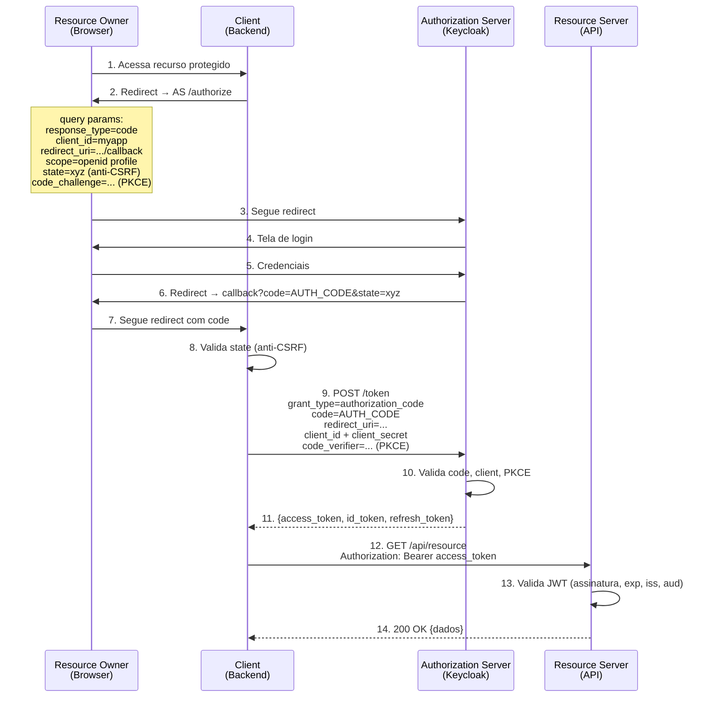

**Parâmetros críticos do `/authorize`:**

| Parâmetro | Obrigatório | Finalidade |
|-----------|------------|-----------|
| `response_type` | Sim | `code` — sempre |
| `client_id` | Sim | Identificador do client no AS |
| `redirect_uri` | Sim* | URL de callback — deve ser pré-registrada |
| `scope` | Sim | Permissões solicitadas (`openid profile email`) |
| `state` | Recomendado | Valor aleatório para proteção contra CSRF |
| `code_challenge` | Obrigatório (OAuth 2.1) | Hash SHA-256 do `code_verifier` (PKCE) |
| `code_challenge_method` | Obrigatório (com PKCE) | `S256` — sempre (nunca `plain`) |
| `nonce` | OIDC | Proteção contra replay do ID Token |
| `prompt` | OIDC | `none`, `login`, `consent`, `select_account` |
| `acr_values` | OIDC | Nível de autenticação solicitado |
| `login_hint` | OIDC | Preenche o campo de login (e-mail, username) |

#### 1.3.2 Client Credentials (RFC 6749 §4.4)

Machine-to-machine — não há usuário envolvido. O client autentica com suas próprias credenciais.

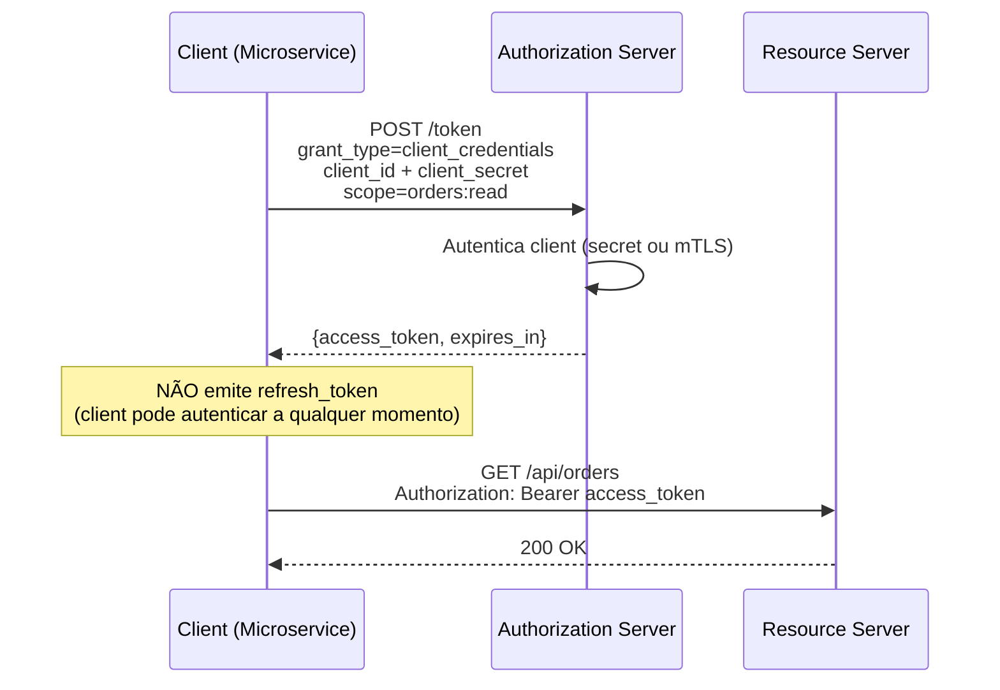

**Spring Boot — Client Credentials com `RestClient`:**

```java
@Configuration
public class OAuth2ClientConfig {

    @Bean
    public OAuth2AuthorizedClientManager authorizedClientManager(
            ClientRegistrationRepository clientRegistrationRepository,
            OAuth2AuthorizedClientRepository authorizedClientRepository) {

        OAuth2AuthorizedClientProvider clientProvider =
            OAuth2AuthorizedClientProviderBuilder.builder()
                .clientCredentials()
                .build();

        DefaultOAuth2AuthorizedClientManager manager =
            new DefaultOAuth2AuthorizedClientManager(
                clientRegistrationRepository, authorizedClientRepository);
        manager.setAuthorizedClientProvider(clientProvider);
        return manager;
    }
}

@Service
@RequiredArgsConstructor
public class OrderServiceClient {

    private final RestClient.Builder restClientBuilder;
    private final OAuth2AuthorizedClientManager clientManager;

    public List<Order> fetchOrders() {
        OAuth2AuthorizeRequest authorizeRequest =
            OAuth2AuthorizeRequest.withClientRegistrationId("orders-service")
                .principal("orders-service-client")
                .build();

        OAuth2AuthorizedClient authorizedClient =
            clientManager.authorize(authorizeRequest);

        return restClientBuilder
            .baseUrl("https://orders-api.internal")
            .build()
            .get()
            .uri("/api/v1/orders")
            .headers(h -> h.setBearerAuth(
                authorizedClient.getAccessToken().getTokenValue()))
            .retrieve()
            .body(new ParameterizedTypeReference<>() {});
    }
}
```

```yaml
# application.yml
spring:
  security:
    oauth2:
      client:
        registration:
          orders-service:
            provider: keycloak
            client-id: myapp-worker
            client-secret: ${ORDERS_CLIENT_SECRET}
            authorization-grant-type: client_credentials
            scope: orders:read
        provider:
          keycloak:
            issuer-uri: ${KEYCLOAK_URL}/realms/myrealm
```

#### 1.3.3 Device Authorization Grant (RFC 8628)

Para dispositivos com input limitado (TVs, IoT, CLIs). O usuário autoriza em outro dispositivo (celular, computador).

```
Dispositivo                     Authorization Server           Usuário (Browser)
    │                                  │                            │
    │─── POST /device_authorization ──►│                            │
    │    client_id=mytv-app            │                            │
    │    scope=openid profile          │                            │
    │◄── device_code, user_code, ──────│                            │
    │    verification_uri              │                            │
    │                                  │                            │
    │ Exibe na TV:                     │                            │
    │ "Acesse https://auth.app/device" │                            │
    │ "Digite o código: ABCD-1234"     │                            │
    │                                  │                            │
    │                                  │◄── Acessa verification_uri─│
    │                                  │◄── Digita user_code ───────│
    │                                  │◄── Autentica + autoriza ───│
    │                                  │─── "Dispositivo autorizado"─►│
    │                                  │                            │
    │─── POST /token (poll) ──────────►│                            │
    │    grant_type=                   │                            │
    │      urn:ietf:params:oauth:      │                            │
    │      grant-type:device_code      │                            │
    │    device_code=...               │                            │
    │◄── {access_token, id_token} ─────│                            │
```

#### 1.3.4 Token Exchange (RFC 8693)

Permite trocar um token por outro com escopo diferente, audience diferente ou tipo diferente. Essencial em arquiteturas de microsserviços.

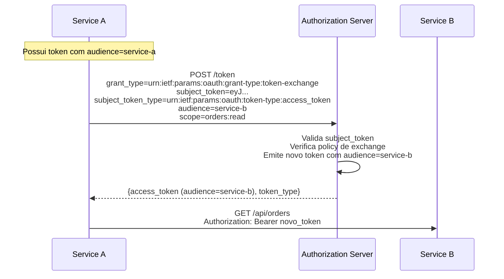

**Spring Boot — Token Exchange com Nimbus JOSE:**

```java
@Service
@RequiredArgsConstructor
public class TokenExchangeService {

    private final RestClient restClient;

    @Value("${keycloak.token-uri}")
    private String tokenUri;

    @Value("${keycloak.client-id}")
    private String clientId;

    @Value("${keycloak.client-secret}")
    private String clientSecret;

    public String exchangeToken(String subjectToken, String targetAudience) {
        MultiValueMap<String, String> params = new LinkedMultiValueMap<>();
        params.add("grant_type", "urn:ietf:params:oauth:grant-type:token-exchange");
        params.add("subject_token", subjectToken);
        params.add("subject_token_type", "urn:ietf:params:oauth:token-type:access_token");
        params.add("audience", targetAudience);
        params.add("client_id", clientId);
        params.add("client_secret", clientSecret);

        Map<String, Object> response = restClient
            .post()
            .uri(tokenUri)
            .contentType(MediaType.APPLICATION_FORM_URLENCODED)
            .body(params)
            .retrieve()
            .body(new ParameterizedTypeReference<>() {});

        return (String) response.get("access_token");
    }
}
```

**Keycloak — Habilitar Token Exchange:**

```
Clients → service-a → Advanced → Fine Grain OpenID Connect Configuration
  → Token Exchange: ON

# Definir policy de exchange:
Clients → service-a → Authorization → Permissions → token-exchange
  Policy: is-service-b (Client Policy)
```

#### 1.3.5 Grants Descontinuados

| Grant | Status | Motivo | Alternativa |
|-------|--------|--------|-------------|
| **Implicit** (`response_type=token`) | Removido no OAuth 2.1 | Token exposto no fragment da URL, sem refresh | Authorization Code + PKCE |
| **Resource Owner Password** (ROPC) | Removido no OAuth 2.1 | Client recebe senha direta do usuário — anti-pattern | Authorization Code + PKCE |

### 1.4 Escopos (Scopes)

Escopos limitam **o que o client pode fazer** com o token emitido. O Resource Owner pode consentir ou negar escopos individualmente.

```
Modelo de consentimento:

  Client solicita:        scope=openid profile email orders:read orders:write
  Usuário autoriza:       scope=openid profile email orders:read
  Token emitido contém:   scope=openid profile email orders:read
                          ↑ interseção do solicitado com o autorizado
```

**Escopos padrão OIDC vs escopos customizados:**

| Escopo | Tipo | Claims / Permissões |
|--------|------|-------------------|
| `openid` | OIDC (obrigatório) | `sub` — emite ID Token |
| `profile` | OIDC | `name`, `family_name`, `given_name`, `preferred_username`, `picture`, `locale` |
| `email` | OIDC | `email`, `email_verified` |
| `address` | OIDC | `address` (objeto) |
| `phone` | OIDC | `phone_number`, `phone_number_verified` |
| `offline_access` | OIDC | Emite `refresh_token` com validade estendida |
| `orders:read` | Customizado | Permissão de leitura de pedidos na API |
| `admin` | Customizado | Acesso administrativo |

**Keycloak — Criar escopo customizado e vincular a um client:**

```
Client Scopes → Create
  Name:           orders
  Protocol:       openid-connect
  Display on consent: ON
  Include in token: ON

Client Scopes → orders → Mappers → Create
  Name:           orders-audience
  Mapper Type:    Audience
  Included Client Audience: orders-api

Clients → myapp-spa → Client Scopes → Add: orders (Optional)
```

### 1.5 Redirect URI — Segurança

A `redirect_uri` é o vetor de ataque mais explorado no OAuth2. Se um atacante conseguir redirecionar o authorization code para sua própria URI, pode trocar o code por tokens.

```
Regras de segurança:

  ✓ Registrar URIs exatas — sem wildcards
  ✗ https://app.example.com/callback           ← OK
  ✗ https://app.example.com/*                   ← NUNCA (open redirect)
  ✗ https://*.example.com/callback              ← NUNCA (subdomain takeover)
  ✗ http://localhost:3000/callback              ← OK apenas em desenvolvimento

  ✓ Comparação EXATA (RFC 6749 §3.1.2.3)
    Registrado: https://app.example.com/callback
    Enviado:    https://app.example.com/callback     ← Match
    Enviado:    https://app.example.com/callback/     ← NÃO match (trailing slash)
    Enviado:    https://app.example.com/callback?x=1  ← NÃO match (query string)
```

### 1.6 PKCE — Proof Key for Code Exchange (RFC 7636)

PKCE protege contra interceptação do authorization code, especialmente em clients públicos. No OAuth 2.1, PKCE é **obrigatório para todos os clients** (incluindo confidenciais).

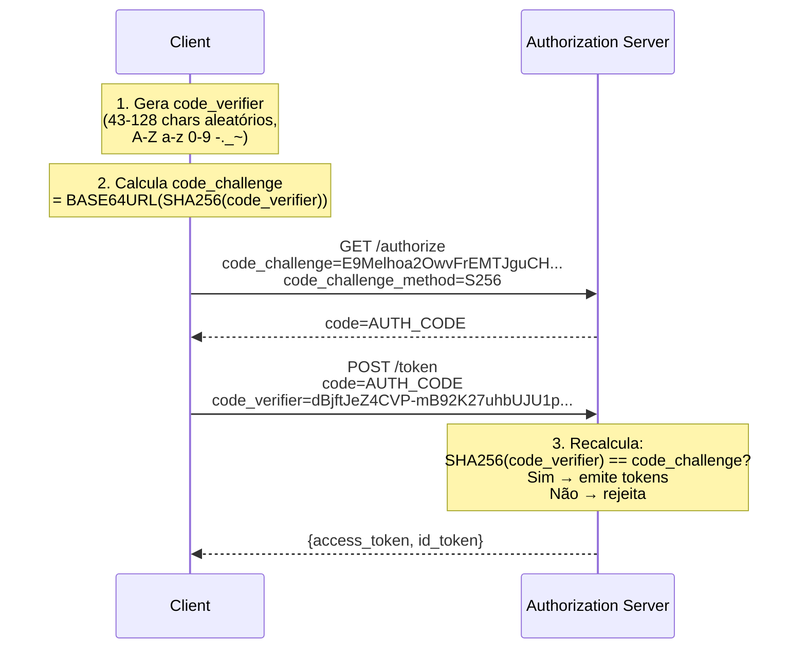

**Java — Gerar PKCE:**

```java
import java.security.MessageDigest;
import java.security.SecureRandom;
import java.util.Base64;

public record PkceChallenge(String codeVerifier, String codeChallenge) {

    public static PkceChallenge generate() {
        byte[] bytes = new byte[32];
        new SecureRandom().nextBytes(bytes);
        String verifier = Base64.getUrlEncoder().withoutPadding().encodeToString(bytes);

        try {
            byte[] hash = MessageDigest.getInstance("SHA-256").digest(
                verifier.getBytes(StandardCharsets.US_ASCII));
            String challenge = Base64.getUrlEncoder().withoutPadding().encodeToString(hash);
            return new PkceChallenge(verifier, challenge);
        } catch (NoSuchAlgorithmException e) {
            throw new IllegalStateException("SHA-256 não disponível", e);
        }
    }
}
```

---

## 2. OAuth 2.1 — Consolidação e Simplificação

OAuth 2.1 (draft IETF, previsto para RFC em 2025/2026) consolida o OAuth 2.0 original com todas as melhores práticas que surgiram nos RFCs subsequentes.

### 2.1 Mudanças em Relação ao OAuth 2.0

| Aspecto | OAuth 2.0 | OAuth 2.1 |
|---------|-----------|-----------|
| **Implicit grant** | Permitido | **Removido** |
| **ROPC grant** | Permitido | **Removido** |
| **PKCE** | Opcional | **Obrigatório para todos os clients** |
| **Redirect URI** | Comparação exata recomendada | Comparação exata **obrigatória** |
| **Refresh tokens (public)** | Sem restrição | **Sender-constrained ou one-time use** |
| **Bearer tokens em query string** | Permitido | **Removido** (só header Authorization) |
| **`response_type=token`** | Permitido | **Removido** |

### 2.2 Refresh Token Rotation

OAuth 2.1 exige que refresh tokens para clients públicos sejam **sender-constrained** (vinculados ao client via DPoP ou mTLS) ou **one-time use** (rotação a cada uso).

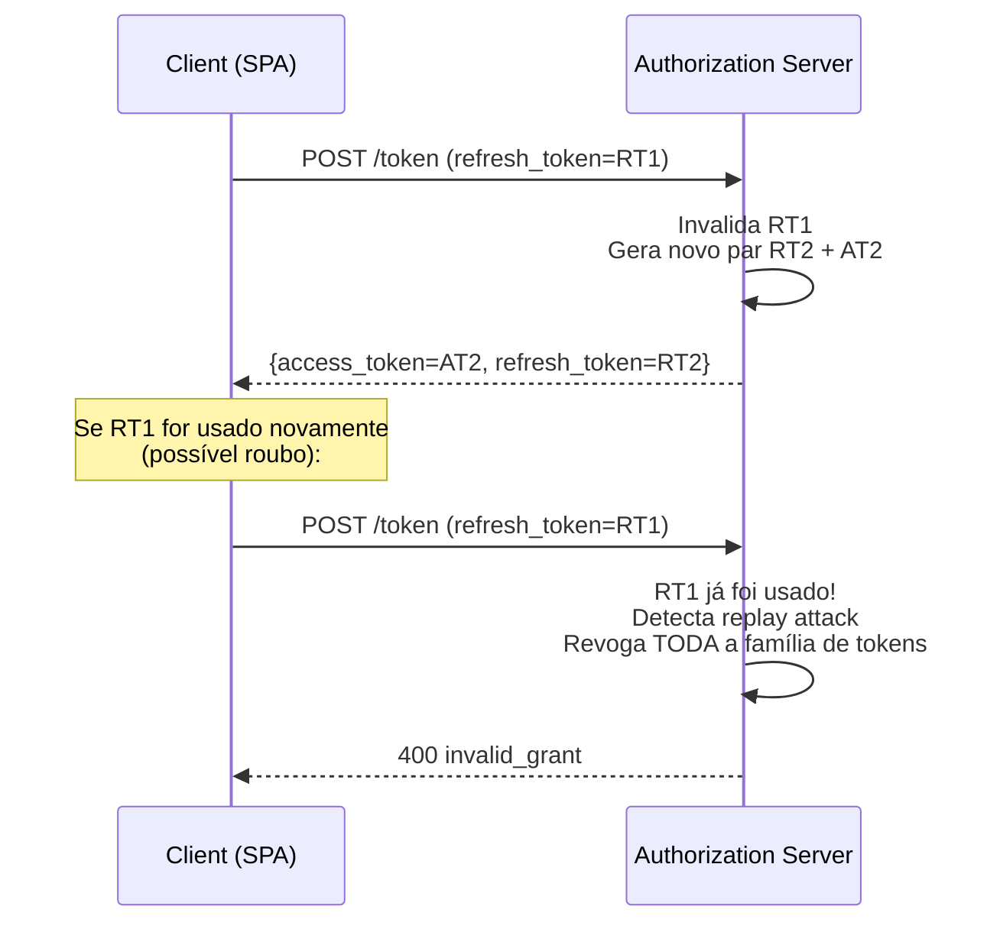

**Keycloak — Habilitar Refresh Token Rotation:**

```
Realm Settings → Tokens
  Revoke Refresh Token:    ON
  Refresh Token Max Reuse: 0 (one-time use)
```

**Spring Boot — Verificar que o refresh token é novo a cada uso:**

```java
@PostMapping("/refresh")
public ResponseEntity<AuthResponse> refresh(@RequestBody RefreshRequest request) {
    OAuth2RefreshTokenGrantRequest grantRequest =
        new OAuth2RefreshTokenGrantRequest(clientRegistration, existingAuthorizedClient);

    OAuth2AccessTokenResponse response =
        tokenResponseClient.getTokenResponse(grantRequest);

    String newAccessToken = response.getAccessToken().getTokenValue();
    String newRefreshToken = response.getRefreshToken().getTokenValue();

    return ResponseEntity.ok(new AuthResponse(newAccessToken, newRefreshToken));
}
```

---

## 3. OpenID Connect (OIDC) — Camada de Identidade

> Para os conceitos básicos de OIDC (ID Token, claims, escopos, discovery document), consulte [Dicas-Spring-Security.md §18.3](../Dicas-Spring-Security.md#183-openid-connect-oidc).

### 3.1 OIDC vs OAuth2 — Revisão Rápida

```
OAuth2 sozinho:
  "O client myapp-spa tem permissão para ler pedidos (scope=orders:read)"
  Mas: QUEM fez login? Não sei — o access token não carrega identidade de forma padronizada.

OAuth2 + OIDC:
  "O client myapp-spa tem permissão para ler pedidos (scope=orders:read)"
  E: "O usuário autenticado é alice@example.com (sub=uuid-123)"
  Via: ID Token (JWT padronizado com claims de identidade)
```

### 3.2 Fluxos OIDC Detalhados

#### 3.2.1 Authorization Code Flow (com OIDC)

Idêntico ao OAuth2, mas com `scope=openid` e retorno de `id_token`:

```
Request:  GET /authorize?response_type=code&scope=openid+profile+email&...
Response: code=AUTH_CODE
Troca:    POST /token → {access_token, id_token, refresh_token}
```

#### 3.2.2 Hybrid Flow (OIDC-específico)

Retorna o ID Token diretamente no redirect (para validação rápida no browser) e o code para troca por access token no backend.

```
response_type=code+id_token

Redirect: /callback?code=AUTH_CODE&id_token=eyJ...
  ↑ id_token disponível imediatamente no browser
  ↑ code trocado no backend por access_token

Usado quando:
  - O client precisa saber QUEM logou antes de fazer a troca de token
  - Validação do nonce do id_token no browser como proteção extra
```

> **Nota:** O Hybrid Flow não é recomendado em novos projetos — Authorization Code + PKCE cobre todos os cenários.

### 3.3 Claims Avançados

#### 3.3.1 `acr` — Authentication Context Class Reference

Indica o **nível de confiança** da autenticação realizada. Permite que o client solicite um nível mínimo de segurança.

```
Valores comuns de acr (OIDC Core §2):

  0           → Autenticação de longa duração (cookie, SSO, sem interação do usuário)
  urn:...loa1 → Senha simples
  urn:...loa2 → Senha + OTP (MFA)
  urn:...loa3 → Passkey / WebAuthn / hardware token

Keycloak mapeia automaticamente:
  acr=0  → Cookie authentication (sessão SSO ativa)
  acr=1  → Autenticação com primeiro fator (senha)
  acr=2  → Autenticação com segundo fator (OTP, WebAuthn)
```

**Solicitar nível mínimo de autenticação:**

```
GET /authorize?acr_values=2&...
                ↑ exige MFA — se o usuário logou só com senha, o IdP pede o segundo fator
```

**Spring Boot — Verificar ACR no Resource Server:**

```java
@GetMapping("/api/v1/transfer")
public ResponseEntity<?> transfer(@AuthenticationPrincipal Jwt jwt) {
    String acr = jwt.getClaimAsString("acr");

    if (acr == null || Integer.parseInt(acr) < 2) {
        return ResponseEntity.status(HttpStatus.FORBIDDEN)
            .body(Map.of(
                "error", "insufficient_authentication",
                "message", "Operação requer MFA (acr >= 2)",
                "acr_required", "2",
                "acr_current", acr));
    }

    return ResponseEntity.ok(transferService.execute(jwt.getSubject()));
}
```

#### 3.3.2 `amr` — Authentication Methods References

Lista os **métodos de autenticação** que foram utilizados na sessão. Diferente do `acr` (que indica o nível), o `amr` indica **como** o usuário provou sua identidade.

```json
{
  "amr": ["pwd", "otp"]
}
```

| Valor | Método |
|-------|--------|
| `pwd` | Senha |
| `otp` | One-time password (TOTP/HOTP) |
| `hwk` | Hardware key (WebAuthn device-bound) |
| `swk` | Software key (Passkey sincronizada) |
| `sms` | SMS |
| `mfa` | Múltiplos fatores foram usados |
| `face` | Reconhecimento facial |
| `fpt` | Fingerprint |
| `pin` | PIN |
| `pop` | Proof-of-Possession |

#### 3.3.3 Claims Request — Solicitar Claims Específicos

O parâmetro `claims` permite solicitar claims específicos no ID Token ou no UserInfo endpoint:

```json
// Parâmetro claims (URL-encoded) no /authorize
{
  "id_token": {
    "email_verified": { "essential": true },
    "acr": { "values": ["urn:mace:incommon:iap:silver"] }
  },
  "userinfo": {
    "picture": null,
    "email": { "essential": true }
  }
}
```

### 3.4 UserInfo Endpoint vs ID Token

```
ID Token:
  ✓ Entregue na troca de token — sem request adicional
  ✓ Assinado pelo IdP — integridade garantida
  ✗ Pode ter claims limitados (depende da config do IdP)
  ✗ Snapshot do momento da autenticação — pode ficar desatualizado

UserInfo Endpoint:
  ✓ Dados sempre atualizados
  ✓ Retorna claims completos para o escopo autorizado
  ✗ Request HTTP adicional a cada consulta
  ✗ Pode não ser assinado (JSON simples)

Recomendação:
  - Use ID Token para lógica de autenticação (quem é o usuário)
  - Use UserInfo para dados de perfil que podem mudar (foto, telefone)
  - Use sub do ID Token como PK no banco (imutável)
```

### 3.5 OIDC Discovery e Configuração Dinâmica

Todo IdP OIDC expõe `/.well-known/openid-configuration`. O Spring Boot usa esse endpoint para auto-configuração:

```java
@Bean
public JwtDecoder jwtDecoder() {
    // issuer-uri no application.yml faz o Spring buscar automaticamente:
    // - jwks_uri (para validar assinaturas)
    // - issuer (para validar claim iss)
    // - supported algorithms
    // - token_endpoint, authorization_endpoint, userinfo_endpoint
    return JwtDecoders.fromIssuerLocation(issuerUri);
}
```

**Validação manual com Nimbus (quando não se usa Spring OAuth2 Resource Server):**

```java
import com.nimbusds.openid.connect.sdk.op.OIDCProviderMetadata;
import com.nimbusds.jose.jwk.source.RemoteJWKSet;

public class OidcDiscoveryClient {

    public static OIDCProviderMetadata discover(String issuerUri) throws Exception {
        URL configUrl = new URL(issuerUri + "/.well-known/openid-configuration");
        String json = new String(configUrl.openStream().readAllBytes(),
            StandardCharsets.UTF_8);
        return OIDCProviderMetadata.parse(json);
    }

    public static JWKSource<SecurityContext> jwkSource(OIDCProviderMetadata metadata) {
        return new RemoteJWKSet<>(metadata.getJWKSetURI().toURL());
    }
}
```

### 3.6 Single Logout

#### 3.6.1 Front-Channel Logout

O IdP envia um request para cada client registrado via `<iframe>` no browser:

```
IdP                              Client A                Client B
 │                                  │                       │
 │ Usuário clica "Logout"          │                       │
 │──── iframe src="/logout" ───────►│                       │
 │                                  │── Limpa sessão        │
 │──── iframe src="/logout" ────────────────────────────────►│
 │                                                          │── Limpa sessão
```

**Keycloak:**

```
Clients → myapp → Advanced → Front Channel Logout
  Front Channel Logout URL: https://app.example.com/logout
```

#### 3.6.2 Back-Channel Logout (Recomendado)

O IdP envia um **Logout Token** (JWT) diretamente ao backend do client, sem depender do browser:

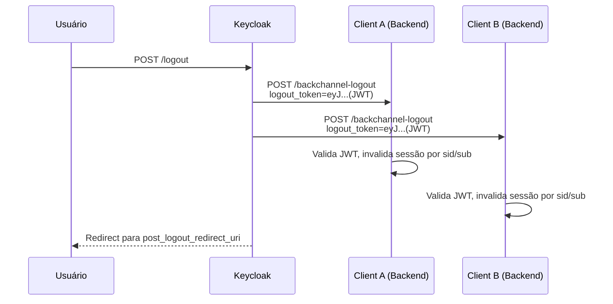

**Spring Boot — Endpoint de Back-Channel Logout:**

```java
@RestController
public class BackChannelLogoutController {

    private final JwtDecoder jwtDecoder;
    private final SessionRegistry sessionRegistry;

    @PostMapping("/backchannel-logout")
    public ResponseEntity<Void> handleLogout(
            @RequestParam("logout_token") String logoutTokenStr) {

        Jwt logoutToken = jwtDecoder.decode(logoutTokenStr);

        // Validações obrigatórias (OIDC Back-Channel Logout §2.6)
        Map<String, Object> events = logoutToken.getClaim("events");
        if (events == null || !events.containsKey(
                "http://schemas.openid.net/event/backchannel-logout")) {
            return ResponseEntity.badRequest().build();
        }

        if (logoutToken.getClaim("nonce") != null) {
            return ResponseEntity.badRequest().build();
        }

        String sid = logoutToken.getClaimAsString("sid");
        String sub = logoutToken.getSubject();

        // Invalida todas as sessões do usuário
        sessionRegistry.getAllSessions(sub, false)
            .forEach(SessionInformation::expireNow);

        return ResponseEntity.ok().build();
    }
}
```

**Keycloak — Habilitar Back-Channel Logout:**

```
Clients → myapp → Advanced → Backchannel Logout
  Backchannel Logout URL:     https://api.example.com/backchannel-logout
  Backchannel Logout Session: ON (inclui sid no logout_token)
  Backchannel Logout Revoke Offline Sessions: ON
```

**Spring Security 6.4+ — Configuração nativa:**

```java
@Bean
public SecurityFilterChain securityFilterChain(HttpSecurity http) throws Exception {
    http
        .oauth2Login(withDefaults())
        .oidcLogout(logout -> logout
            .backChannel(backChannel -> backChannel
                .logoutUri("/backchannel-logout")));
    return http.build();
}
```

### 3.7 Session Management com OIDC

```java
@Bean
public SecurityFilterChain filterChain(HttpSecurity http) throws Exception {
    http
        .oauth2Login(oauth2 -> oauth2
            .userInfoEndpoint(userInfo -> userInfo
                .oidcUserService(oidcUserService())))
        .sessionManagement(session -> session
            .maximumSessions(1)
            .maxSessionsPreventsLogin(false)
            .sessionRegistry(sessionRegistry()))
        .oauth2Login(oauth2 -> oauth2
            .tokenEndpoint(token -> token
                .accessTokenResponseClient(authorizationCodeTokenResponseClient())));
    return http.build();
}

@Bean
public SessionRegistry sessionRegistry() {
    return new SessionRegistryImpl();
}
```

---

## 4. JWT Avançado com Nimbus JOSE+JWT

> Para o uso básico de JWT com Nimbus (geração, validação, filtro), consulte [Dicas-Spring-Security.md §8](../Dicas-Spring-Security.md#8-jwt-com-nimbus-josejwt).

### 4.1 Estrutura de um JWT

```
eyJhbGciOiJSUzI1NiIsInR5cCI6IkpXVCIsImtpZCI6ImtleS0xIn0
.
eyJzdWIiOiJ1c2VyLTEyMyIsImlzcyI6Imh0dHBzOi8vYXV0aC5leGFtcGxlLmNvbSIsImV4cCI6MTczNTY4OTYwMH0
.
signature

Header (JOSE Header):
  alg: Algoritmo de assinatura (RS256, ES256, PS256, EdDSA)
  typ: Tipo (JWT)
  kid: Key ID — qual chave do JWKS usou para assinar

Payload (Claims Set):
  Registered claims: iss, sub, aud, exp, nbf, iat, jti
  Custom claims: roles, permissions, tenant_id, etc.

Signature:
  RSASSA-PKCS1-v1_5 (RS256) ou ECDSA (ES256) ou EdDSA (Ed25519)
```

### 4.2 Algoritmos de Assinatura — Comparativo

| Algoritmo | Família | Tamanho da chave | Tamanho da assinatura | Performance | Uso |
|-----------|---------|-----------------|----------------------|-------------|-----|
| **RS256** | RSA PKCS#1 v1.5 | 2048+ bits | 256 bytes | Lenta para assinar, rápida para verificar | Padrão de mercado, compatibilidade máxima |
| **RS384/RS512** | RSA PKCS#1 v1.5 | 2048+ bits | 384/512 bytes | Mais lenta | Quando SHA-256 não é suficiente |
| **PS256** | RSA PSS | 2048+ bits | 256 bytes | Similar ao RS256 | FAPI, maior segurança que PKCS#1 v1.5 |
| **ES256** | ECDSA P-256 | 256 bits | 64 bytes | Rápida para ambos | Mobile, IoT, tokens menores |
| **ES384** | ECDSA P-384 | 384 bits | 96 bytes | Média | Quando P-256 não é suficiente |
| **EdDSA** | Ed25519 | 256 bits | 64 bytes | Mais rápida de todas | Mais moderno, melhor performance |

**Recomendação:**
- **Novo projeto:** ES256 (melhor equilíbrio tamanho/performance) ou EdDSA (mais rápido)
- **Compatibilidade:** RS256 (suportado por 100% das bibliotecas)
- **FAPI / Open Finance:** PS256 ou ES256 (obrigatório pela especificação)

### 4.3 JWE — JWT Criptografado

JWS (assinado) garante **integridade** — qualquer um pode ler os claims. JWE (criptografado) garante **confidencialidade** — apenas o destinatário pode ler.

```
JWS (Signed):
  Header.Payload.Signature
  ↑ qualquer um pode decodificar o payload (base64url)

JWE (Encrypted):
  Header.EncryptedKey.IV.Ciphertext.Tag
  ↑ payload criptografado — só o destinatário com a chave privada pode ler

JWS + JWE (Nested):
  Assina primeiro (JWS), depois criptografa o JWS inteiro (JWE)
  ↑ garante integridade E confidencialidade
```

**Nimbus — Criar e Decodificar JWE:**

```java
import com.nimbusds.jose.*;
import com.nimbusds.jose.crypto.*;
import com.nimbusds.jwt.*;

public class JweService {

    private final RSAKey rsaKey;

    public JweService(RSAKey rsaKey) {
        this.rsaKey = rsaKey;
    }

    public String encrypt(JWTClaimsSet claims) throws JOSEException {
        JWEHeader header = new JWEHeader.Builder(
                JWEAlgorithm.RSA_OAEP_256,
                EncryptionMethod.A256GCM)
            .contentType("JWT")
            .keyID(rsaKey.getKeyID())
            .build();

        EncryptedJWT jwe = new EncryptedJWT(header, claims);
        jwe.encrypt(new RSAEncrypter(rsaKey.toRSAPublicKey()));
        return jwe.serialize();
    }

    public JWTClaimsSet decrypt(String jweString) throws Exception {
        EncryptedJWT jwe = EncryptedJWT.parse(jweString);
        jwe.decrypt(new RSADecrypter(rsaKey.toRSAPrivateKey()));
        return jwe.getJWTClaimsSet();
    }
}
```

**Nimbus — Nested JWT (Signed then Encrypted):**

```java
public String signThenEncrypt(JWTClaimsSet claims,
                               RSAKey signingKey,
                               RSAKey encryptionKey) throws JOSEException {
    // 1. Assinar
    SignedJWT signedJwt = new SignedJWT(
        new JWSHeader.Builder(JWSAlgorithm.RS256)
            .keyID(signingKey.getKeyID())
            .build(),
        claims);
    signedJwt.sign(new RSASSASigner(signingKey));

    // 2. Criptografar o JWS inteiro
    JWEObject jwe = new JWEObject(
        new JWEHeader.Builder(JWEAlgorithm.RSA_OAEP_256, EncryptionMethod.A256GCM)
            .contentType("JWT")
            .build(),
        new Payload(signedJwt));
    jwe.encrypt(new RSAEncrypter(encryptionKey.toRSAPublicKey()));

    return jwe.serialize();
}

public JWTClaimsSet decryptThenVerify(String token,
                                       RSAKey encryptionKey,
                                       RSAKey signingKey) throws Exception {
    // 1. Descriptografar
    JWEObject jwe = JWEObject.parse(token);
    jwe.decrypt(new RSADecrypter(encryptionKey.toRSAPrivateKey()));

    // 2. Verificar assinatura
    SignedJWT signedJwt = jwe.getPayload().toSignedJWT();
    if (!signedJwt.verify(new RSASSAVerifier(signingKey.toRSAPublicKey()))) {
        throw new JOSEException("Assinatura inválida");
    }

    return signedJwt.getJWTClaimsSet();
}
```

### 4.4 JWKS — JSON Web Key Set

O JWKS é o mecanismo padrão para distribuir chaves públicas. O Authorization Server publica suas chaves em um endpoint JWKS; o Resource Server as busca para validar tokens.

```json
// GET /realms/myrealm/protocol/openid-connect/certs
{
  "keys": [
    {
      "kty": "RSA",
      "kid": "key-2024-01",
      "use": "sig",
      "alg": "RS256",
      "n": "0vx7agoebGcQSuuPiLJXZpt...",
      "e": "AQAB"
    },
    {
      "kty": "RSA",
      "kid": "key-2024-02",
      "use": "sig",
      "alg": "RS256",
      "n": "pjdss8ZaDfEH0E5...",
      "e": "AQAB"
    }
  ]
}
```

**Spring Boot — Expor JWKS endpoint (quando a aplicação é o Authorization Server):**

```java
import com.nimbusds.jose.jwk.*;
import com.nimbusds.jose.jwk.source.ImmutableJWKSet;

@RestController
public class JwksController {

    private final JWKSet jwkSet;

    public JwksController(RSAKey rsaKey) {
        this.jwkSet = new JWKSet(rsaKey.toPublicJWK());
    }

    @GetMapping("/.well-known/jwks.json")
    public Map<String, Object> jwks() {
        return jwkSet.toJSONObject();
    }
}
```

### 4.5 Key Rotation — Rotação de Chaves

A rotação de chaves é essencial para limitar o impacto de um comprometimento de chave. O `kid` (Key ID) no header do JWT indica qual chave foi usada para assinar.

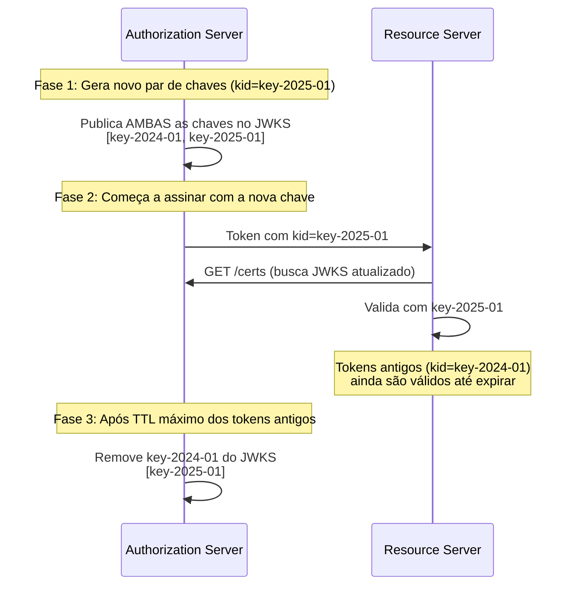

**Nimbus — Key Rotation com múltiplas chaves:**

```java
@Configuration
public class JwtKeyRotationConfig {

    @Bean
    public JWKSet jwkSet(
            @Value("${jwt.keys.current.private}") RSAPrivateKey currentPrivate,
            @Value("${jwt.keys.current.public}") RSAPublicKey currentPublic,
            @Value("${jwt.keys.previous.public}") RSAPublicKey previousPublic) {

        RSAKey currentKey = new RSAKey.Builder(currentPublic)
            .privateKey(currentPrivate)
            .keyID("key-" + LocalDate.now().getYear())
            .keyUse(KeyUse.SIGNATURE)
            .algorithm(JWSAlgorithm.RS256)
            .build();

        RSAKey previousKey = new RSAKey.Builder(previousPublic)
            .keyID("key-" + (LocalDate.now().getYear() - 1))
            .keyUse(KeyUse.SIGNATURE)
            .algorithm(JWSAlgorithm.RS256)
            .build();

        return new JWKSet(List.of(currentKey, previousKey));
    }

    @Bean
    public JWKSource<SecurityContext> jwkSource(JWKSet jwkSet) {
        return new ImmutableJWKSet<>(jwkSet);
    }

    @Bean
    public JwtDecoder jwtDecoder(JWKSource<SecurityContext> jwkSource) {
        return NimbusJwtDecoder.withJwkSource(jwkSource)
            .jwsAlgorithms(algorithms -> {
                algorithms.add(SignatureAlgorithm.RS256);
                algorithms.add(SignatureAlgorithm.ES256);
            })
            .build();
    }
}
```

### 4.6 JWT com Curvas Elípticas (EC) — Nimbus

```java
import com.nimbusds.jose.*;
import com.nimbusds.jose.crypto.*;
import com.nimbusds.jose.jwk.*;

public class EcJwtService {

    private final ECKey ecKey;

    public EcJwtService() throws JOSEException {
        this.ecKey = new ECKeyGenerator(Curve.P_256)
            .keyID("ec-key-" + UUID.randomUUID().toString().substring(0, 8))
            .keyUse(KeyUse.SIGNATURE)
            .generate();
    }

    public String sign(JWTClaimsSet claims) throws JOSEException {
        SignedJWT jwt = new SignedJWT(
            new JWSHeader.Builder(JWSAlgorithm.ES256)
                .keyID(ecKey.getKeyID())
                .type(JOSEObjectType.JWT)
                .build(),
            claims);

        jwt.sign(new ECDSASigner(ecKey));
        return jwt.serialize();
    }

    public JWTClaimsSet verify(String token) throws Exception {
        SignedJWT jwt = SignedJWT.parse(token);
        if (!jwt.verify(new ECDSAVerifier(ecKey.toECPublicKey()))) {
            throw new JOSEException("Assinatura EC inválida");
        }
        return jwt.getJWTClaimsSet();
    }

    public JWKSet publicJwks() {
        return new JWKSet(ecKey.toPublicJWK());
    }
}
```

### 4.7 Validação Completa de JWT com Nimbus (sem Spring)

```java
import com.nimbusds.jose.proc.*;
import com.nimbusds.jose.jwk.source.*;
import com.nimbusds.jwt.*;
import com.nimbusds.jwt.proc.*;

public class JwtValidator {

    private final ConfigurableJWTProcessor<SecurityContext> jwtProcessor;

    public JwtValidator(String jwksUri, String expectedIssuer, String expectedAudience)
            throws Exception {

        jwtProcessor = new DefaultJWTProcessor<>();

        JWKSource<SecurityContext> keySource =
            new RemoteJWKSet<>(new URL(jwksUri));

        JWSKeySelector<SecurityContext> keySelector =
            new JWSVerificationKeySelector<>(
                Set.of(JWSAlgorithm.RS256, JWSAlgorithm.ES256),
                keySource);

        jwtProcessor.setJWSKeySelector(keySelector);

        jwtProcessor.setJWTClaimsSetVerifier(
            new DefaultJWTClaimsVerifier<>(
                new JWTClaimsSet.Builder()
                    .issuer(expectedIssuer)
                    .audience(expectedAudience)
                    .build(),
                Set.of("sub", "iat", "exp", "jti")
            ));
    }

    public JWTClaimsSet validate(String token) throws Exception {
        return jwtProcessor.process(token, null);
    }
}
```

---

## 5. Token Lifecycle — Introspecção, Revogação e Rotação

### 5.1 Token Introspection (RFC 7662)

Permite ao Resource Server verificar se um token é válido consultando o Authorization Server. Necessário para tokens opacos ou quando se precisa verificar revogação em tempo real.

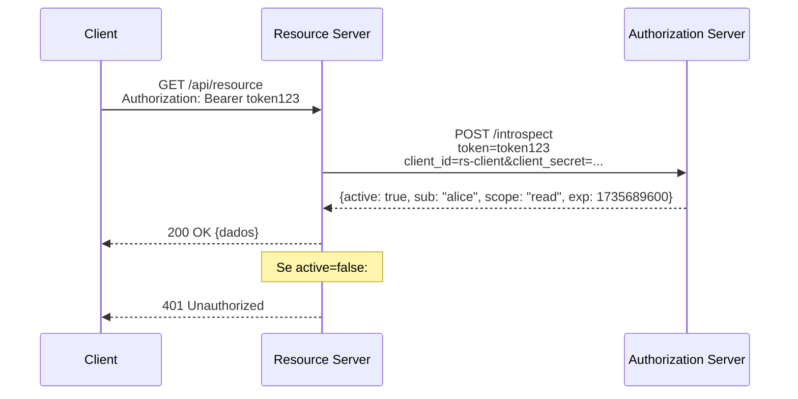

**Spring Boot — Resource Server com Opaque Token (Introspection):**

```yaml
spring:
  security:
    oauth2:
      resourceserver:
        opaquetoken:
          introspection-uri: ${KEYCLOAK_URL}/realms/myrealm/protocol/openid-connect/token/introspect
          client-id: myapp-api
          client-secret: ${API_CLIENT_SECRET}
```

```java
@Bean
public SecurityFilterChain resourceServerChain(HttpSecurity http) throws Exception {
    return http
        .securityMatcher("/api/**")
        .csrf(csrf -> csrf.disable())
        .sessionManagement(s -> s.sessionCreationPolicy(STATELESS))
        .oauth2ResourceServer(oauth2 -> oauth2
            .opaqueToken(opaque -> opaque
                .introspector(customIntrospector())))
        .authorizeHttpRequests(auth -> auth
            .anyRequest().authenticated())
        .build();
}

@Bean
public OpaqueTokenIntrospector customIntrospector() {
    OpaqueTokenIntrospector delegate = new SpringOpaqueTokenIntrospector(
        introspectionUri, clientId, clientSecret);

    return token -> {
        OAuth2AuthenticatedPrincipal principal = delegate.introspect(token);

        // Adicionar authorities customizadas
        Set<GrantedAuthority> authorities = new HashSet<>(principal.getAuthorities());

        @SuppressWarnings("unchecked")
        Map<String, Object> realmAccess =
            principal.getAttribute("realm_access");
        if (realmAccess != null) {
            List<String> roles = (List<String>) realmAccess.get("roles");
            roles.stream()
                .map(r -> new SimpleGrantedAuthority("ROLE_" + r.toUpperCase()))
                .forEach(authorities::add);
        }

        return new DefaultOAuth2AuthenticatedPrincipal(
            principal.getName(), principal.getAttributes(), authorities);
    };
}
```

**JWT vs Opaque Token — Quando usar cada um:**

| Aspecto | JWT | Opaque Token |
|---------|-----|-------------|
| **Validação** | Local (sem request ao AS) | Requer introspection a cada request |
| **Revogação** | Difícil — válido até expirar | Imediata via introspection |
| **Tamanho** | Grande (~800+ bytes com claims) | Pequeno (~40 bytes, referência opaca) |
| **Informação** | Self-contained (claims legíveis) | Nenhuma — dados estão no AS |
| **Latência** | Menor (sem round-trip) | Maior (round-trip ao AS) |
| **Escala** | Melhor (sem carga no AS) | Carga no AS proporcional aos requests |
| **Melhor para** | APIs públicas, microsserviços, alta escala | Dados sensíveis, revogação imediata, tokens de longa duração |

### 5.2 Token Revocation (RFC 7009)

```bash
# Revogar um token (access ou refresh)
curl -X POST \
  ${KEYCLOAK_URL}/realms/myrealm/protocol/openid-connect/revoke \
  -d "token=${REFRESH_TOKEN}" \
  -d "token_type_hint=refresh_token" \
  -d "client_id=myapp" \
  -d "client_secret=SECRET"
```

**Spring Boot — Revogar token programaticamente:**

```java
@Service
@RequiredArgsConstructor
public class TokenRevocationService {

    private final RestClient restClient;

    @Value("${keycloak.revocation-uri}")
    private String revocationUri;

    @Value("${keycloak.client-id}")
    private String clientId;

    @Value("${keycloak.client-secret}")
    private String clientSecret;

    public void revokeRefreshToken(String refreshToken) {
        restClient.post()
            .uri(revocationUri)
            .contentType(MediaType.APPLICATION_FORM_URLENCODED)
            .body(new LinkedMultiValueMap<>(Map.of(
                "token", List.of(refreshToken),
                "token_type_hint", List.of("refresh_token"),
                "client_id", List.of(clientId),
                "client_secret", List.of(clientSecret))))
            .retrieve()
            .toBodilessEntity();
    }
}
```

### 5.3 Estratégia Híbrida: JWT de Curta Duração + Revogação por JTI

Para cenários que exigem revogação imediata de JWTs sem usar introspection em cada request:

```java
@Component
@RequiredArgsConstructor
public class JtiRevocationFilter extends OncePerRequestFilter {

    private final Cache<String, Boolean> revokedJtis;

    @Override
    protected void doFilterInternal(HttpServletRequest request,
                                    HttpServletResponse response,
                                    FilterChain chain)
            throws ServletException, IOException {

        Authentication auth = SecurityContextHolder.getContext().getAuthentication();
        if (auth instanceof JwtAuthenticationToken jwtAuth) {
            String jti = jwtAuth.getToken().getId();
            if (jti != null && revokedJtis.getIfPresent(jti) != null) {
                SecurityContextHolder.clearContext();
                response.setStatus(HttpServletResponse.SC_UNAUTHORIZED);
                response.getWriter().write(
                    "{\"error\":\"token_revoked\",\"message\":\"Token foi revogado\"}");
                return;
            }
        }
        chain.doFilter(request, response);
    }
}

@Configuration
public class RevocationConfig {

    @Bean
    public Cache<String, Boolean> revokedJtis() {
        return Caffeine.newBuilder()
            .expireAfterWrite(15, TimeUnit.MINUTES)
            .maximumSize(100_000)
            .build();
    }
}
```

---

## 6. Padrões Avançados de Segurança OAuth2

### 6.1 DPoP — Demonstrating Proof of Possession (RFC 9449)

> Para o uso de DPoP com Keycloak (configuração e JavaScript client), consulte [Keycloak.md §26.3](Keycloak.md#263-dpop--demonstrating-proof-of-possession-rfc-9449).

DPoP resolve o problema de **bearer tokens roubados** — vincula o token a uma chave privada do client.

```
Bearer Token (sem DPoP):
  Atacante rouba token → usa normalmente ← PROBLEMA

DPoP Token:
  Atacante rouba token → precisa da chave privada para criar DPoP Proof → não consegue usar
```

**Spring Boot — Validar DPoP Proof no Resource Server:**

```java
@Component
public class DPoPValidator {

    public void validate(String dpopProof, String accessToken,
                          String httpMethod, String httpUri) throws Exception {

        SignedJWT dpopJwt = SignedJWT.parse(dpopProof);
        JWSHeader header = dpopJwt.getHeader();

        // 1. Verificar typ: dpop+jwt
        if (!"dpop+jwt".equals(header.getType().toString())) {
            throw new InvalidDPoPException("Tipo deve ser dpop+jwt");
        }

        // 2. Extrair JWK público do header
        JWK jwk = header.getJWK();
        if (jwk == null || jwk.isPrivate()) {
            throw new InvalidDPoPException("JWK público obrigatório no header");
        }

        // 3. Verificar assinatura com a chave do header
        JWSVerifier verifier = switch (header.getAlgorithm().getName()) {
            case "ES256" -> new ECDSAVerifier(((ECKey) jwk).toECPublicKey());
            case "RS256" -> new RSASSAVerifier(((RSAKey) jwk).toRSAPublicKey());
            default -> throw new InvalidDPoPException("Algoritmo não suportado");
        };

        if (!dpopJwt.verify(verifier)) {
            throw new InvalidDPoPException("Assinatura DPoP inválida");
        }

        JWTClaimsSet claims = dpopJwt.getJWTClaimsSet();

        // 4. Verificar htm (HTTP method) e htu (HTTP URI)
        if (!httpMethod.equalsIgnoreCase(claims.getStringClaim("htm"))) {
            throw new InvalidDPoPException("HTTP method não confere");
        }
        if (!httpUri.equals(claims.getStringClaim("htu"))) {
            throw new InvalidDPoPException("HTTP URI não confere");
        }

        // 5. Verificar ath (access token hash)
        if (accessToken != null) {
            byte[] tokenHash = MessageDigest.getInstance("SHA-256")
                .digest(accessToken.getBytes(StandardCharsets.US_ASCII));
            String expectedAth = Base64.getUrlEncoder().withoutPadding()
                .encodeToString(tokenHash);

            if (!expectedAth.equals(claims.getStringClaim("ath"))) {
                throw new InvalidDPoPException("Hash do access token não confere");
            }
        }

        // 6. Verificar jti (unicidade) e iat (freshness)
        Instant iat = claims.getIssueTime().toInstant();
        if (iat.isBefore(Instant.now().minus(Duration.ofMinutes(5)))) {
            throw new InvalidDPoPException("DPoP proof expirado");
        }
    }
}
```

### 6.2 PAR — Pushed Authorization Requests (RFC 9126)

> Para configuração no Keycloak e uso via curl, consulte [Keycloak.md §26.2](Keycloak.md#262-par--pushed-authorization-requests-rfc-9126).

PAR resolve o problema de **parâmetros sensíveis na URL** do browser:

```
Sem PAR:
  GET /authorize?client_id=myapp&redirect_uri=...&scope=openid+orders:write&state=xyz...
  ↑ todos os parâmetros visíveis na URL do browser, no histórico, nos logs do proxy

Com PAR:
  POST /par → request_uri=urn:ietf:params:oauth:request_uri:abc123
  GET /authorize?client_id=myapp&request_uri=urn:ietf:params:oauth:request_uri:abc123
  ↑ parâmetros enviados diretamente ao AS via POST, nunca expostos no browser
```

**Spring Boot — Client com PAR:**

```java
@Bean
public OAuth2AuthorizationRequestResolver parRequestResolver(
        ClientRegistrationRepository clientRegistrationRepository) {

    DefaultOAuth2AuthorizationRequestResolver resolver =
        new DefaultOAuth2AuthorizationRequestResolver(
            clientRegistrationRepository, "/oauth2/authorization");

    resolver.setAuthorizationRequestCustomizer(customizer ->
        customizer.additionalParameters(params -> {
            // Spring Security 6.4+ suporta PAR nativamente quando
            // o discovery document inclui pushed_authorization_request_endpoint
        }));

    return resolver;
}
```

### 6.3 RAR — Rich Authorization Requests (RFC 9396)

RAR permite solicitar autorizações estruturadas e detalhadas, indo além de escopos simples (strings). Essencial para Open Banking e cenários onde a autorização precisa de contexto.

```json
// Parâmetro authorization_details no /authorize ou /par
[
  {
    "type": "payment_initiation",
    "instructedAmount": {
      "currency": "BRL",
      "amount": "150.00"
    },
    "creditorAccount": {
      "iban": "BR1234567890123456789012345"
    },
    "creditorName": "Loja ABC"
  },
  {
    "type": "account_information",
    "actions": ["read"],
    "locations": ["https://api.banco.com/accounts"],
    "datatypes": ["balance", "transactions"]
  }
]
```

**O token emitido contém as autorizações concedidas:**

```json
{
  "sub": "user-123",
  "authorization_details": [
    {
      "type": "payment_initiation",
      "instructedAmount": { "currency": "BRL", "amount": "150.00" },
      "creditorName": "Loja ABC"
    }
  ]
}
```

### 6.4 mTLS Client Authentication (RFC 8705)

Autenticação do client via certificado TLS — mais segura que `client_secret` pois a chave privada nunca trafega pela rede.

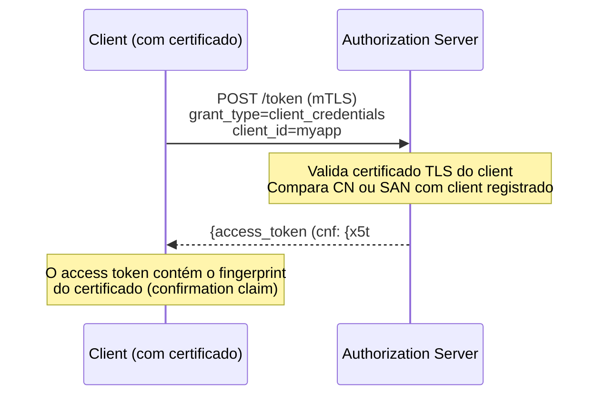

**Spring Boot — Resource Server que valida certificate-bound tokens:**

```java
@Bean
public JwtDecoder jwtDecoder() {
    NimbusJwtDecoder decoder = NimbusJwtDecoder
        .withJwkSetUri(jwksUri)
        .build();

    decoder.setJwtValidator(new DelegatingOAuth2TokenValidator<>(
        JwtValidators.createDefaultWithIssuer(issuerUri),
        new CertificateBoundTokenValidator()
    ));

    return decoder;
}

public class CertificateBoundTokenValidator implements OAuth2TokenValidator<Jwt> {

    @Override
    public OAuth2TokenValidatorResult validate(Jwt jwt) {
        Map<String, Object> cnf = jwt.getClaimAsMap("cnf");
        if (cnf == null) {
            return OAuth2TokenValidatorResult.success();
        }

        String expectedThumbprint = (String) cnf.get("x5t#S256");
        if (expectedThumbprint == null) {
            return OAuth2TokenValidatorResult.success();
        }

        // Comparar com o certificado da conexão TLS atual
        X509Certificate clientCert = getClientCertFromRequest();
        if (clientCert == null) {
            return OAuth2TokenValidatorResult.failure(
                new OAuth2Error("invalid_token",
                    "Certificate-bound token requires mTLS", null));
        }

        String actualThumbprint = computeThumbprint(clientCert);
        if (!expectedThumbprint.equals(actualThumbprint)) {
            return OAuth2TokenValidatorResult.failure(
                new OAuth2Error("invalid_token",
                    "Certificate thumbprint mismatch", null));
        }

        return OAuth2TokenValidatorResult.success();
    }

    private String computeThumbprint(X509Certificate cert) {
        try {
            byte[] hash = MessageDigest.getInstance("SHA-256")
                .digest(cert.getEncoded());
            return Base64.getUrlEncoder().withoutPadding().encodeToString(hash);
        } catch (Exception e) {
            throw new IllegalStateException(e);
        }
    }
}
```

---

## 7. Backend for Frontend (BFF)

O BFF é um pattern que resolve os problemas de segurança de SPAs que lidam diretamente com tokens OAuth2.

### 7.1 O Problema das SPAs

```
SPA direta (sem BFF):
  ✗ Tokens armazenados no browser (localStorage/sessionStorage/memory)
  ✗ Vulnerável a XSS → atacante acessa tokens
  ✗ Refresh token no browser → risco de roubo
  ✗ Client secret não pode existir (client público)
  ✗ CORS headers expostos

SPA + BFF:
  ✓ Tokens ficam no backend (nunca chegam ao browser)
  ✓ Browser usa apenas cookie HttpOnly + Secure + SameSite
  ✓ Client confidential (pode guardar client_secret)
  ✓ Refresh token seguro no servidor
  ✓ CORS simplificado (BFF é same-origin)
```

### 7.2 Arquitetura BFF

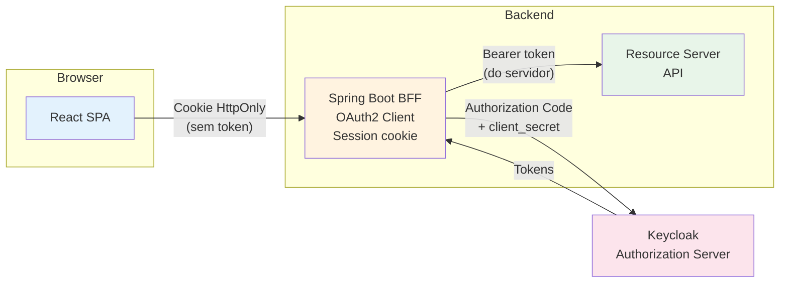

### 7.3 Spring Boot BFF — Implementação Completa

```yaml
# application.yml (BFF)
server:
  port: 8080
  servlet:
    session:
      cookie:
        name: BFFSESSION
        http-only: true
        secure: true
        same-site: strict

spring:
  security:
    oauth2:
      client:
        registration:
          keycloak:
            client-id: myapp-bff
            client-secret: ${BFF_CLIENT_SECRET}
            scope: openid,profile,email
            authorization-grant-type: authorization_code
            redirect-uri: "{baseUrl}/login/oauth2/code/{registrationId}"
        provider:
          keycloak:
            issuer-uri: ${KEYCLOAK_URL}/realms/myrealm
```

```java
@Configuration
@EnableWebSecurity
public class BffSecurityConfig {

    @Bean
    public SecurityFilterChain bffChain(HttpSecurity http) throws Exception {
        http
            .oauth2Login(oauth2 -> oauth2
                .defaultSuccessUrl("/", true))
            .oauth2Client(withDefaults())
            .logout(logout -> logout
                .logoutSuccessHandler(oidcLogoutHandler()))
            .csrf(csrf -> csrf
                .csrfTokenRepository(CookieCsrfTokenRepository.withHttpOnlyFalse()))
            .authorizeHttpRequests(auth -> auth
                .requestMatchers("/", "/login**", "/error").permitAll()
                .anyRequest().authenticated());
        return http.build();
    }
}

@RestController
@RequestMapping("/bff")
@RequiredArgsConstructor
public class BffProxyController {

    private final RestClient restClient;
    private final OAuth2AuthorizedClientService authorizedClientService;

    @GetMapping("/api/**")
    public ResponseEntity<String> proxyGet(
            HttpServletRequest request,
            @AuthenticationPrincipal OidcUser oidcUser) {

        String targetPath = request.getRequestURI().replaceFirst("/bff", "");

        OAuth2AuthorizedClient client = authorizedClientService
            .loadAuthorizedClient("keycloak", oidcUser.getName());

        String accessToken = client.getAccessToken().getTokenValue();

        ResponseEntity<String> response = restClient
            .get()
            .uri("http://api-server:8081" + targetPath)
            .headers(h -> h.setBearerAuth(accessToken))
            .retrieve()
            .toEntity(String.class);

        return response;
    }

    @GetMapping("/userinfo")
    public Map<String, Object> userInfo(@AuthenticationPrincipal OidcUser user) {
        return Map.of(
            "name", user.getFullName(),
            "email", user.getEmail(),
            "picture", user.getPicture() != null ? user.getPicture() : "",
            "roles", user.getAuthorities().stream()
                .map(GrantedAuthority::getAuthority).toList()
        );
    }
}
```

**SPA (React) — Consumir via BFF:**

```typescript
async function fetchOrders(): Promise<Order[]> {
  const response = await fetch('/bff/api/v1/orders', {
    credentials: 'include',
    headers: {
      'X-XSRF-TOKEN': getCsrfToken(),
    },
  });
  if (response.status === 401) {
    window.location.href = '/oauth2/authorization/keycloak';
    return [];
  }
  return response.json();
}

function getCsrfToken(): string {
  return document.cookie
    .split('; ')
    .find(row => row.startsWith('XSRF-TOKEN='))
    ?.split('=')[1] ?? '';
}
```

### 7.4 Spring Cloud Gateway como BFF

Para cenários de maior escala, o Spring Cloud Gateway pode funcionar como BFF com Token Relay:

```yaml
# application.yml (Gateway BFF)
spring:
  cloud:
    gateway:
      routes:
        - id: api-route
          uri: http://api-server:8081
          predicates:
            - Path=/api/**
          filters:
            - TokenRelay=
            - RemoveRequestHeader=Cookie
  security:
    oauth2:
      client:
        registration:
          keycloak:
            client-id: gateway-bff
            client-secret: ${GATEWAY_SECRET}
            scope: openid,profile,email
            authorization-grant-type: authorization_code
        provider:
          keycloak:
            issuer-uri: ${KEYCLOAK_URL}/realms/myrealm
```

---

## 8. WebAuthn e FIDO2 — O Protocolo

> Para a implementação prática com Spring Security (entidade JPA, repositórios, SecurityConfig, JavaScript), consulte [Dicas-Spring-Security.md §17.6](../Dicas-Spring-Security.md#176-passkeys-webauthn--fido2).

### 8.1 Arquitetura FIDO2

```
┌─────────────────────────────────────────────────────────────────┐
│                        FIDO2 Stack                              │
├─────────────────────────────────────────────────────────────────┤
│                                                                 │
│  ┌─────────────────────────────────────────────────────────┐   │
│  │              WebAuthn (W3C)                              │   │
│  │  API JavaScript para o browser                          │   │
│  │  navigator.credentials.create() / .get()                │   │
│  └─────────────────────────────────────────────────────────┘   │
│                          │                                      │
│  ┌─────────────────────────────────────────────────────────┐   │
│  │              CTAP2 (FIDO Alliance)                       │   │
│  │  Protocolo de comunicação com autenticadores             │   │
│  │  USB, NFC, BLE, internal (platform authenticator)        │   │
│  └─────────────────────────────────────────────────────────┘   │
│                                                                 │
│  Autenticadores:                                               │
│  ┌──────────┐ ┌──────────┐ ┌────────────┐ ┌───────────────┐  │
│  │ YubiKey  │ │ Touch ID │ │ Windows    │ │ Android       │  │
│  │ (roaming)│ │ (platform│ │ Hello      │ │ Biometric     │  │
│  │ USB/NFC  │ │  macOS)  │ │ (platform) │ │ (platform)    │  │
│  └──────────┘ └──────────┘ └────────────┘ └───────────────┘  │
└─────────────────────────────────────────────────────────────────┘
```

### 8.2 Conceitos Fundamentais

| Conceito | Descrição |
|----------|-----------|
| **Relying Party (RP)** | O site/aplicação que solicita autenticação. Identificado pelo `rpId` (domínio). |
| **Authenticator** | Dispositivo que gera e armazena chaves. **Platform** (embutido: Touch ID, Windows Hello) ou **Roaming** (externo: YubiKey). |
| **Credential** | Par de chaves (pública + privada) gerado pelo autenticador para um RP específico. |
| **Challenge** | Valor aleatório gerado pelo servidor para cada operação — prevenção de replay. |
| **Attestation** | Prova criptográfica de que a credencial foi gerada por um autenticador legítimo. |
| **Assertion** | Prova criptográfica de que o usuário possui a chave privada da credencial. |
| **User Verification (UV)** | Verificação local do usuário (biometria/PIN) — o autenticador confirma que é o dono. |
| **User Presence (UP)** | Detecção de presença física (toque no dispositivo) — previne uso remoto. |
| **Resident Key / Discoverable Credential** | Credencial armazenada no autenticador com userHandle — permite login sem digitar username. |

### 8.3 Criptografia — Como Funciona

```
Registro:
  1. Servidor envia challenge + rpId + userId
  2. Autenticador gera par de chaves (P-256 ou Ed25519)
  3. Chave privada → armazenada no autenticador (nunca sai)
  4. Chave pública → enviada ao servidor e persistida

Autenticação:
  1. Servidor envia challenge + rpId
  2. Autenticador encontra a credencial para o rpId
  3. Autenticador assina: SHA-256(authenticatorData || clientDataHash)
  4. Servidor verifica assinatura com a chave pública armazenada

Segurança:
  - Chave privada NUNCA deixa o autenticador
  - Cada credencial é VINCULADA ao domínio (rpId)
  - Challenge é ÚNICO por operação (anti-replay)
  - Assinatura é sobre dados do SERVIDOR (challenge) + dados do AUTENTICADOR
    → MITM não pode forjar
```

### 8.4 PublicKeyCredentialCreationOptions — Detalhado

```java
// O que o Spring Security gera internamente quando o browser chama
// POST /webauthn/register/options

PublicKeyCredentialCreationOptions options = PublicKeyCredentialCreationOptions.builder()
    .rp(PublicKeyCredentialRpEntity.builder()
        .id("example.com")
        .name("Minha Aplicação")
        .build())
    .user(PublicKeyCredentialUserEntity.builder()
        .id(Bytes.random(32))
        .name("alice@example.com")
        .displayName("Alice Silva")
        .build())
    .challenge(Bytes.random(32))
    .pubKeyCredParams(List.of(
        PublicKeyCredentialParameters.ES256,  // preferencial
        PublicKeyCredentialParameters.RS256   // fallback
    ))
    .timeout(Duration.ofMinutes(5))
    .excludeCredentials(existingCredentials)
    .authenticatorSelection(AuthenticatorSelectionCriteria.builder()
        .authenticatorAttachment(AuthenticatorAttachment.PLATFORM)
        .residentKey(ResidentKeyRequirement.REQUIRED)
        .userVerification(UserVerificationRequirement.PREFERRED)
        .build())
    .attestation(AttestationConveyancePreference.NONE)
    .build();
```

**Parâmetros importantes de `authenticatorSelection`:**

| Parâmetro | Valores | Descrição |
|-----------|---------|-----------|
| `authenticatorAttachment` | `platform` | Apenas autenticadores internos (Touch ID, Windows Hello) |
| | `cross-platform` | Apenas externos (YubiKey, celular via QR) |
| | *(omitir)* | Qualquer tipo |
| `residentKey` | `required` | **Passkey** — credencial armazenada no autenticador (login sem username) |
| | `preferred` | Tenta discoverable, aceita server-side |
| | `discouraged` | Credencial server-side (segundo fator) |
| `userVerification` | `required` | Biometria/PIN obrigatório |
| | `preferred` | Tenta verificação, aceita sem |
| | `discouraged` | Sem verificação (apenas presença) |

### 8.5 Attestation — Tipos e Uso

| Tipo | O que contém | Quando usar |
|------|-------------|-------------|
| `none` | Sem attestation | **Padrão recomendado** — maioria dos casos |
| `indirect` | Attestation anonimizada | Quando se precisa saber o tipo de autenticador |
| `direct` | Attestation completa do fabricante | Ambientes regulados (governo, militar) |
| `enterprise` | Attestation com identificação do dispositivo | Corporativo — vincular credencial ao hardware |

> Para 99% dos cenários web, use `attestation: "none"`. Attestation direct/indirect adiciona complexidade (validar certificados de fabricantes) sem benefício para a maioria das aplicações.

### 8.6 Contador de Assinaturas (signatureCount)

```java
// A cada autenticação, o autenticador incrementa o signatureCount
// Se o servidor recebe um count MENOR ou IGUAL ao anterior,
// pode indicar clonagem do autenticador

public void validateSignatureCount(CredentialRecord stored, long receivedCount) {
    if (stored.getSignatureCount() > 0 || receivedCount > 0) {
        if (receivedCount <= stored.getSignatureCount()) {
            log.warn("Possível clonagem detectada! " +
                "credential={}, stored={}, received={}",
                stored.getCredentialId(), stored.getSignatureCount(), receivedCount);
            // Decisão: bloquear, notificar admin, ou aceitar
            // Passkeys sincronizadas podem ter count=0 (reset legítimo)
        }
    }
}
```

---

## 9. Passkeys — Credenciais Sincronizáveis

### 9.1 Passkey vs WebAuthn Credential Tradicional

```
WebAuthn Credential Tradicional (device-bound):
  ✓ Chave privada presa ao hardware específico
  ✓ Máxima segurança — não pode ser extraída
  ✗ Perda do dispositivo = perda da credencial
  ✗ Uma credencial por dispositivo
  Exemplo: YubiKey, credencial no Secure Enclave sem sync

Passkey (synced credential):
  ✓ Chave privada sincronizada entre dispositivos do mesmo ecossistema
  ✓ Backup automático (iCloud Keychain, Google Password Manager)
  ✓ Sobrevive à perda/troca de dispositivo
  ✗ Nível de segurança depende da segurança do ecossistema de sync
  Exemplo: Passkey no iCloud (funciona em iPhone, iPad, Mac)
```

### 9.2 Ecossistemas de Sincronização

| Ecossistema | Gerenciador | Sincroniza entre | Suporte cross-platform |
|-------------|-------------|-----------------|----------------------|
| **Apple** | iCloud Keychain | iPhone, iPad, Mac | Via QR code (hybrid transport) |
| **Google** | Google Password Manager | Android, Chrome (todos os OS) | Via QR code |
| **Microsoft** | Windows Hello | Windows devices | Via QR code |
| **1Password** | 1Password | Todos os OS e browsers | Nativo (extensão) |
| **Bitwarden** | Bitwarden | Todos os OS e browsers | Nativo (extensão) |
| **Dashlane** | Dashlane | Todos os OS e browsers | Nativo (extensão) |

### 9.3 Hybrid Transport — Autenticação Cross-Device

Quando o usuário quer autenticar em um dispositivo usando um autenticador de outro:

```
Desktop (Chrome)                    Celular (iPhone)
    │                                    │
    │ navigator.credentials.get()       │
    │ → Browser detecta: sem passkey     │
    │   local para este rpId             │
    │                                    │
    │ Exibe QR code                      │
    │ (contém FIDO CABLE v2 info)        │
    │                                    │
    │                    Escaneia QR ◄───│
    │                    Prompt: "Usar    │
    │                    passkey para     │
    │                    example.com?"    │
    │                    Face ID ◄────────│
    │                                    │
    │◄── Assertion via BLE ──────────────│
    │    (proximidade verificada)        │
    │                                    │
    │ Envia assertion ao servidor        │
    │ → Autenticado!                     │
```

### 9.4 Conditional UI — Autofill de Passkeys

Conditional UI permite que o browser sugira passkeys na caixa de username, sem botão separado:

```javascript
// Verificar suporte antes de usar
if (window.PublicKeyCredential &&
    PublicKeyCredential.isConditionalMediationAvailable) {

    const available = await PublicKeyCredential.isConditionalMediationAvailable();

    if (available) {
        // Buscar options do servidor (sem interação do usuário)
        const optRes = await fetch('/webauthn/authenticate/options', {
            method: 'POST',
            headers: { 'Content-Type': 'application/json' }
        });
        const options = await optRes.json();

        // Iniciar mediation condicional — NÃO abre popup
        // A passkey aparece como sugestão no campo de username
        try {
            const assertion = await navigator.credentials.get({
                publicKey: {
                    challenge: toBuffer(options.challenge),
                    rpId: options.rpId,
                    allowCredentials: [],
                    userVerification: 'preferred'
                },
                mediation: 'conditional'  // ← chave: conditional, não required
            });

            // Enviar assertion ao servidor
            await submitAssertion(assertion);
        } catch (e) {
            // Usuário não selecionou passkey — continuar com login normal
        }
    }
}
```

```html
<!-- O input PRECISA ter autocomplete="username webauthn" -->
<input
    type="text"
    name="username"
    autocomplete="username webauthn"
    placeholder="E-mail ou selecione uma passkey"
/>
```

### 9.5 Detecção de Suporte no Browser

```javascript
async function detectWebAuthnSupport() {
    const support = {
        webauthn: false,
        platformAuthenticator: false,
        conditionalUI: false,
        passkeys: false,
    };

    if (!window.PublicKeyCredential) return support;
    support.webauthn = true;

    try {
        support.platformAuthenticator =
            await PublicKeyCredential.isUserVerifyingPlatformAuthenticatorAvailable();
    } catch (e) { /* não suportado */ }

    try {
        if (PublicKeyCredential.isConditionalMediationAvailable) {
            support.conditionalUI =
                await PublicKeyCredential.isConditionalMediationAvailable();
        }
    } catch (e) { /* não suportado */ }

    support.passkeys = support.platformAuthenticator && support.conditionalUI;

    return support;
}
```

---

## 10. Autenticação Passwordless — Estratégias e Arquitetura

### 10.1 Espectro de Autenticação Passwordless

```
Menos seguro ────────────────────────────────────────── Mais seguro

  Magic Link     OTP por       TOTP         Passkey        Passkey
  (e-mail)       SMS/Email     (App)        (synced)       (device-bound)
                                                           + YubiKey
  │               │             │             │              │
  Depende da      Depende do    Requer app    Biometria      Hardware
  segurança       canal         e seed        local          dedicado
  do e-mail                     compartilhado
```

### 10.2 Arquitetura de Autenticação Progressiva

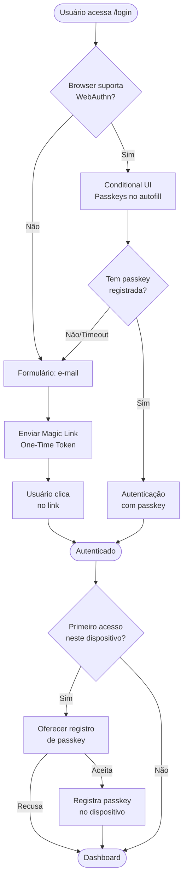

### 10.3 Níveis de Confiança (Step-Up Authentication)

```java
@RestController
@RequestMapping("/api/v1")
public class StepUpController {

    @GetMapping("/profile")
    public ResponseEntity<?> profile(@AuthenticationPrincipal Jwt jwt) {
        // Operação de baixo risco — qualquer método de autenticação
        return ResponseEntity.ok(profileService.get(jwt.getSubject()));
    }

    @PostMapping("/transfer")
    public ResponseEntity<?> transfer(
            @AuthenticationPrincipal Jwt jwt,
            @RequestBody TransferRequest request) {

        String amr = jwt.getClaimAsString("amr");
        String acr = jwt.getClaimAsString("acr");

        // Operação de alto risco — exige passkey ou MFA
        if (!isStrongAuth(amr, acr)) {
            return ResponseEntity.status(HttpStatus.FORBIDDEN)
                .body(Map.of(
                    "error", "step_up_required",
                    "message", "Operação requer autenticação forte",
                    "step_up_url", "/oauth2/authorization/keycloak?acr_values=2",
                    "required_amr", List.of("hwk", "swk", "mfa")));
        }

        return ResponseEntity.ok(transferService.execute(request));
    }

    private boolean isStrongAuth(String amr, String acr) {
        if (acr != null && Integer.parseInt(acr) >= 2) return true;
        if (amr == null) return false;
        return amr.contains("hwk") || amr.contains("swk") ||
               amr.contains("mfa") || amr.contains("fpt") ||
               amr.contains("face");
    }
}
```

### 10.4 Keycloak — Configurar Flow Passwordless Completo

```
# 1. Criar flow personalizado
Authentication → Flows → Create flow
  Name: Passwordless Browser Flow

# 2. Estrutura do flow:
Passwordless Browser Flow
├── Cookie                                    [ALTERNATIVE]
├── Passwordless Subflow                      [ALTERNATIVE]
│   ├── WebAuthn Passwordless Authenticator   [ALTERNATIVE]
│   └── Magic Link Authenticator             [ALTERNATIVE]
└── Password + MFA Subflow (fallback)         [ALTERNATIVE]
    ├── Username Password Form               [REQUIRED]
    └── WebAuthn Authenticator               [CONDITIONAL]

# 3. Configurar WebAuthn Policy:
Realm Settings → WebAuthn Passwordless Policy
  Relying Party Name:     Minha App
  Relying Party ID:       app.example.com
  Signature Algorithms:   ES256, RS256
  Attestation:            none
  User Verification:      required     ← obrigatório para passwordless
  Resident Key:           required     ← obrigatório para discoverable credential

# 4. Vincular o flow ao realm:
Authentication → Bindings
  Browser Flow: Passwordless Browser Flow

# 5. Required Actions:
Authentication → Required Actions
  WebAuthn Register Passwordless: Default ON
```

### 10.5 Magic Link com Spring Security — One-Time Token

> Para a implementação detalhada do One-Time Token com Spring Security 6.4+, consulte [Dicas-Spring-Security.md §17.4](../Dicas-Spring-Security.md#174-one-time-token-magic-link--spring-security-64).

Configuração resumida para integrar com o flow passwordless:

```java
@Bean
public SecurityFilterChain passwordlessChain(HttpSecurity http) throws Exception {
    http
        .webAuthn(webAuthn -> webAuthn
            .rpName("Minha App")
            .rpId("app.example.com")
            .allowedOrigins("https://app.example.com"))
        .oneTimeTokenLogin(ott -> ott
            .tokenGenerationSuccessHandler(magicLinkHandler())
            .showDefaultSubmitPage(true))
        .formLogin(form -> form
            .loginPage("/login"))
        .authorizeHttpRequests(auth -> auth
            .requestMatchers("/login", "/webauthn/**", "/ott/**").permitAll()
            .anyRequest().authenticated());
    return http.build();
}
```

---

## 11. Integração Completa: Spring Boot + Keycloak + Passkeys

### 11.1 Arquitetura do Cenário

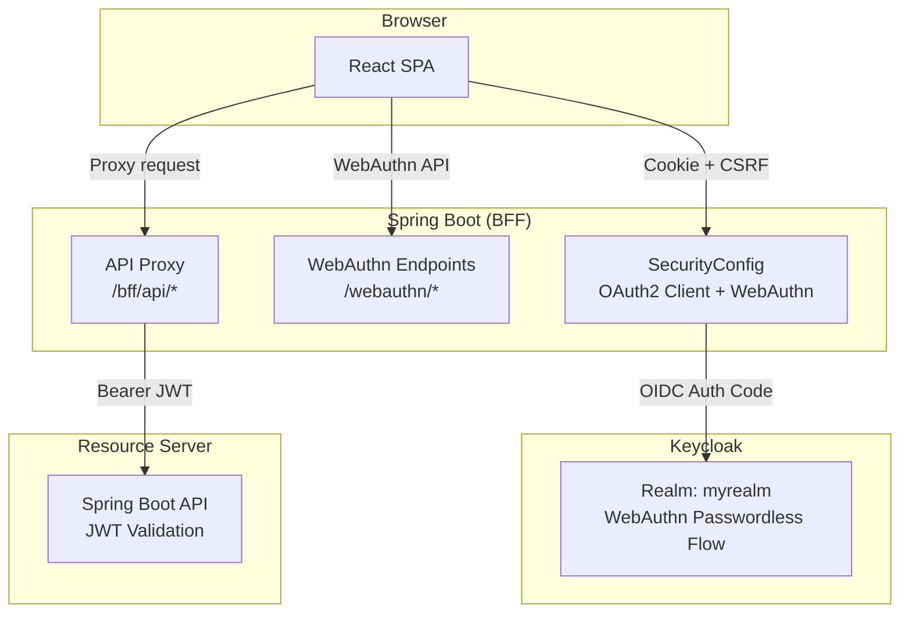

### 11.2 Login com Passkey Registrada no Keycloak

Neste cenário, o Keycloak gerencia as passkeys (registro e autenticação). A aplicação Spring Boot é um OAuth2 Client.

```yaml
# application.yml
spring:
  security:
    oauth2:
      client:
        registration:
          keycloak:
            client-id: myapp-bff
            client-secret: ${BFF_SECRET}
            scope: openid,profile,email
            authorization-grant-type: authorization_code
        provider:
          keycloak:
            issuer-uri: ${KEYCLOAK_URL}/realms/myrealm
```

```java
@Configuration
@EnableWebSecurity
public class SecurityConfig {

    @Bean
    public SecurityFilterChain filterChain(HttpSecurity http) throws Exception {
        http
            .oauth2Login(oauth2 -> oauth2
                .defaultSuccessUrl("/dashboard", true)
                .authorizationEndpoint(authz -> authz
                    .authorizationRequestResolver(passkeyRequestResolver())))
            .oidcLogout(logout -> logout
                .backChannel(bc -> bc.logoutUri("/backchannel-logout")))
            .authorizeHttpRequests(auth -> auth
                .requestMatchers("/", "/login**").permitAll()
                .anyRequest().authenticated());
        return http.build();
    }

    private OAuth2AuthorizationRequestResolver passkeyRequestResolver() {
        DefaultOAuth2AuthorizationRequestResolver resolver =
            new DefaultOAuth2AuthorizationRequestResolver(
                clientRegistrationRepository, "/oauth2/authorization");

        resolver.setAuthorizationRequestCustomizer(customizer ->
            customizer.additionalParameters(params ->
                params.put("acr_values", "webauthn")));

        return resolver;
    }
}
```

### 11.3 Login com Passkey Registrada na Aplicação (Spring Security WebAuthn)

Neste cenário, a aplicação Spring Boot gerencia as passkeys diretamente (sem depender do Keycloak para WebAuthn). Útil quando se quer controle total sobre o fluxo.

```java
@Configuration
@EnableWebSecurity
public class LocalPasskeyConfig {

    @Bean
    public SecurityFilterChain filterChain(HttpSecurity http) throws Exception {
        http
            .webAuthn(webAuthn -> webAuthn
                .rpName("Minha App")
                .rpId("app.example.com")
                .allowedOrigins("https://app.example.com"))
            .oneTimeTokenLogin(ott -> ott
                .tokenGenerationSuccessHandler(magicLinkHandler()))
            .formLogin(form -> form
                .loginPage("/login")
                .defaultSuccessUrl("/dashboard"))
            .authorizeHttpRequests(auth -> auth
                .requestMatchers("/login", "/webauthn/**", "/ott/**",
                    "/css/**", "/js/**").permitAll()
                .anyRequest().authenticated());
        return http.build();
    }
}
```

**Após autenticação local, gerar JWT para a API com Nimbus:**

```java
@RestController
@RequiredArgsConstructor
public class TokenController {

    private final JwtService jwtService;

    @PostMapping("/api/token")
    public ResponseEntity<Map<String, Object>> issueToken(
            @AuthenticationPrincipal UserDetails user) {

        String accessToken = jwtService.generateAccessToken(user);

        return ResponseEntity.ok(Map.of(
            "access_token", accessToken,
            "token_type", "Bearer",
            "expires_in", 900));
    }
}
```

### 11.4 Docker Compose — Ambiente Completo

```yaml
services:
  keycloak:
    image: quay.io/keycloak/keycloak:26.1
    command: start-dev --import-realm
    environment:
      KC_DB: postgres
      KC_DB_URL: jdbc:postgresql://db:5432/keycloak
      KC_DB_USERNAME: keycloak
      KC_DB_PASSWORD: keycloak
      KEYCLOAK_ADMIN: admin
      KEYCLOAK_ADMIN_PASSWORD: admin
      KC_HTTP_PORT: 8180
    ports:
      - "8180:8180"
    volumes:
      - ./keycloak/realm-export.json:/opt/keycloak/data/import/realm-export.json:ro
    depends_on:
      db:
        condition: service_healthy

  db:
    image: postgres:17-alpine
    environment:
      POSTGRES_DB: keycloak
      POSTGRES_USER: keycloak
      POSTGRES_PASSWORD: keycloak
    volumes:
      - keycloak_data:/var/lib/postgresql/data
    healthcheck:
      test: ["CMD-SHELL", "pg_isready -U keycloak"]
      interval: 5s
      timeout: 3s
      retries: 5

  app:
    build: .
    environment:
      SPRING_PROFILES_ACTIVE: dev
      KEYCLOAK_URL: http://keycloak:8180
      KEYCLOAK_REALM: myrealm
      BFF_SECRET: ${BFF_SECRET}
    ports:
      - "8080:8080"
    depends_on:
      - keycloak

volumes:
  keycloak_data:
```

### 11.5 Checklist de Produção

| Aspecto | Requisito |
|---------|-----------|
| **HTTPS** | Obrigatório para WebAuthn (exceto `localhost`) |
| **rpId** | eTLD+1 do domínio de produção (`example.com` para `app.example.com`) |
| **PKCE** | Obrigatório para todos os clients OAuth2 |
| **State** | Obrigatório no Authorization Code flow |
| **Token TTL** | Access token: 5–15 min; Refresh token: 1–7 dias |
| **Refresh Rotation** | Habilitada (one-time use no Keycloak) |
| **CORS** | Restrito às origens conhecidas |
| **CSP** | `default-src 'self'` + nonce para scripts |
| **Cookie** | `HttpOnly`, `Secure`, `SameSite=Strict` |
| **Passkey fallback** | Magic Link ou OTP para dispositivos sem suporte |
| **Múltiplas passkeys** | Permitir registro em vários dispositivos |
| **Key rotation** | JWKS com chave atual + anterior |
| **Back-channel logout** | Habilitado para invalidação imediata de sessão |
| **Rate limiting** | No endpoint de login e no `/token` |

---

## 12. Referência de RFCs e Especificações

### OAuth2 / OIDC

| Documento | Título | Relevância |
|-----------|--------|------------|
| **RFC 6749** | OAuth 2.0 Authorization Framework | Especificação base |
| **RFC 6750** | Bearer Token Usage | Como enviar tokens em requests |
| **RFC 7636** | PKCE | Proteção para clients públicos |
| **RFC 7009** | Token Revocation | Revogar access/refresh tokens |
| **RFC 7662** | Token Introspection | Validar tokens opacos |
| **RFC 8693** | Token Exchange | Trocar tokens entre serviços |
| **RFC 8628** | Device Authorization Grant | Login em TVs, IoT, CLIs |
| **RFC 8705** | mTLS Client Authentication | Autenticação por certificado |
| **RFC 9126** | Pushed Authorization Requests (PAR) | Parâmetros via POST, não URL |
| **RFC 9396** | Rich Authorization Requests (RAR) | Autorizações estruturadas |
| **RFC 9449** | DPoP | Proof-of-Possession para tokens |
| **RFC 9207** | Authorization Server Issuer ID | Previne mix-up attacks |
| **OAuth 2.1** | Consolidação (draft) | OAuth 2.0 + melhores práticas |
| **OIDC Core 1.0** | OpenID Connect Core | Camada de identidade |
| **OIDC Discovery** | OpenID Connect Discovery | `.well-known/openid-configuration` |
| **OIDC Back-Channel Logout** | Back-Channel Logout | Logout via server-to-server |
| **OIDC CIBA** | Client Initiated Backchannel Auth | Autenticação desacoplada |

### WebAuthn / FIDO2 / Passkeys

| Documento | Título | Relevância |
|-----------|--------|------------|
| **W3C WebAuthn Level 3** | Web Authentication API | API JavaScript do browser |
| **FIDO2 CTAP2** | Client to Authenticator Protocol | Comunicação com hardware |
| **FIDO Passkeys** | Discoverable Credentials | Credenciais sincronizáveis |
| **FIDO UX Guidelines** | UX Guidelines for Passkeys | Recomendações de UX |

### Segurança

| Documento | Título | Relevância |
|-----------|--------|------------|
| **RFC 9700** | OAuth 2.0 Security BCP | Melhores práticas de segurança |
| **FAPI 2.0** | Financial-grade API | Open Banking / Open Finance |
| **OWASP** | OAuth Security Cheat Sheet | Checklist de vulnerabilidades |
