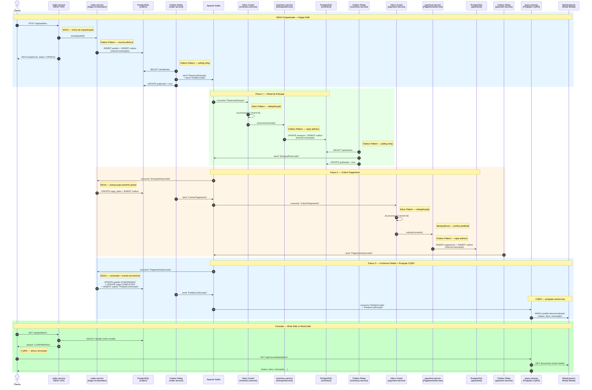
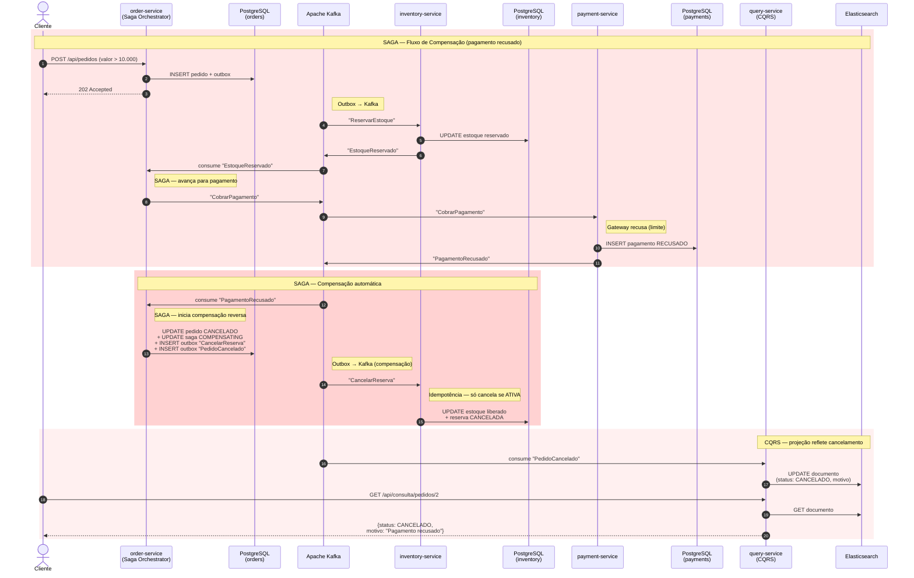
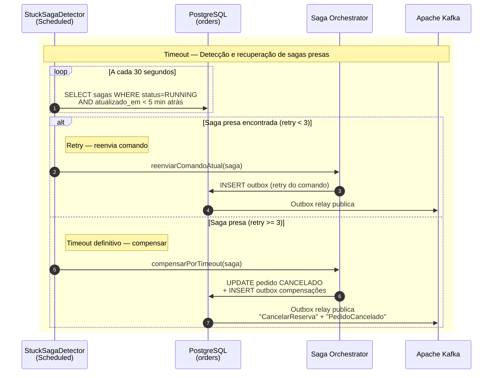

# Transações Distribuídas — SAGA, CQRS e Outbox Pattern

> **Objetivo:** Explicar em profundidade os padrões SAGA, CQRS e Outbox Pattern, como se diferenciam, como se complementam, e apresentar um tutorial prático completo com Spring Boot 3.x simulando um fluxo de e-commerce com múltiplos microsserviços.

> **Nota:** O documento [System-design.md](System-design.md) cobre esses padrões em nível introdutório. Aqui o foco é aprofundar a teoria, mostrar as variações, armadilhas comuns e construir um exemplo funcional de ponta a ponta.

---

## Sumário

1. [O Problema das Transações Distribuídas](#1-o-problema-das-transações-distribuídas)
2. [Two-Phase Commit (2PC) — Por que Não Usar](#2-two-phase-commit-2pc--por-que-não-usar)
3. [SAGA Pattern](#3-saga-pattern)
   - [3.1 Orquestrada vs. Coreografada](#31-orquestrada-vs-coreografada)
   - [3.2 Compensações](#32-compensações)
   - [3.3 Semântica de Execução — Pivot e Retriable](#33-semântica-de-execução--pivot-e-retriable)
   - [3.4 Timeout e Sagas Presas (Stuck Sagas)](#34-timeout-e-sagas-presas-stuck-sagas)
4. [CQRS — Command Query Responsibility Segregation](#4-cqrs--command-query-responsibility-segregation)
   - [4.1 CQRS Simples vs. CQRS com Projeções Assíncronas](#41-cqrs-simples-vs-cqrs-com-projeções-assíncronas)
   - [4.2 Consistência Eventual e Leituras Stale](#42-consistência-eventual-e-leituras-stale)
5. [Outbox Pattern](#5-outbox-pattern)
   - [5.1 Polling Publisher vs. Transaction Log Tailing (CDC)](#51-polling-publisher-vs-transaction-log-tailing-cdc)
   - [5.2 Inbox Pattern — O Lado do Consumidor](#52-inbox-pattern--o-lado-do-consumidor)
   - [5.3 Manutenção e Operação das Tabelas Outbox/Inbox](#53-manutenção-e-operação-das-tabelas-outboxinbox)
6. [Event Sourcing — Complemento Natural](#6-event-sourcing--complemento-natural)
7. [Como os Padrões se Relacionam](#7-como-os-padrões-se-relacionam)
8. [Técnicas Complementares](#8-técnicas-complementares)
   - [8.1 Idempotência](#81-idempotência)
   - [8.2 Dead Letter Queue (DLQ)](#82-dead-letter-queue-dlq)
   - [8.3 Change Data Capture (CDC) com Debezium](#83-change-data-capture-cdc-com-debezium)
   - [8.4 Distributed Lock](#84-distributed-lock)
   - [8.5 Temporal Workflow Engine](#85-temporal-workflow-engine)
   - [8.6 Observabilidade e Tracing Distribuído](#86-observabilidade-e-tracing-distribuído)
   - [8.7 Semânticas de Entrega do Kafka e Garantia End-to-End](#87-semânticas-de-entrega-do-kafka-e-garantia-end-to-end)
   - [8.8 Ordenação de Eventos e Evolução de Schema](#88-ordenação-de-eventos-e-evolução-de-schema)
   - [8.9 Estratégias de Teste](#89-estratégias-de-teste)
9. [Tutorial Prático Completo — E-commerce com Microsserviços](#9-tutorial-prático-completo--e-commerce-com-microsserviços)
   - [9.1 Visão Geral da Arquitetura](#91-visão-geral-da-arquitetura)
   - [9.2 Estrutura do Projeto e Dependências Maven](#92-estrutura-do-projeto-e-dependências-maven)
   - [9.3 Infraestrutura Compartilhada — Outbox e Eventos](#93-infraestrutura-compartilhada--outbox-e-eventos)
   - [9.4 Serviço de Pedidos (order-service)](#94-serviço-de-pedidos-order-service)
   - [9.5 Serviço de Estoque (inventory-service)](#95-serviço-de-estoque-inventory-service)
   - [9.6 Serviço de Pagamento (payment-service)](#96-serviço-de-pagamento-payment-service)
   - [9.7 Projeção CQRS — Consulta Consolidada de Pedidos](#97-projeção-cqrs--consulta-consolidada-de-pedidos)
   - [9.8 Docker Compose e Configuração](#98-docker-compose-e-configuração)
   - [9.9 Testando o Fluxo Completo](#99-testando-o-fluxo-completo)
10. [Tabela Comparativa dos Padrões](#10-tabela-comparativa-dos-padrões)
11. [Quando Usar (e Quando Não Usar)](#11-quando-usar-e-quando-não-usar)
12. [Referências e Leitura Complementar](#12-referências-e-leitura-complementar)
13. [Glossário](#13-glossário)

---

## 1. O Problema das Transações Distribuídas

Em um monolito, uma única transação ACID garante que todas as operações sejam atômicas:

```
Monolito — Uma transação, um banco:

  BEGIN TRANSACTION
    INSERT pedido
    UPDATE estoque (decrementa)
    INSERT pagamento
  COMMIT
  
  → Tudo ou nada. Simples.
```

Em microsserviços, cada serviço tem seu próprio banco de dados (Database per Service). Uma "transação de negócio" agora abrange múltiplos serviços e bancos:

```
Microsserviços — Bancos separados:

  order-service (PostgreSQL)     inventory-service (PostgreSQL)     payment-service (PostgreSQL)
       │                                  │                                │
       │  ← como garantir que os três sejam consistentes? →                │
       │                                  │                                │
  INSERT pedido               UPDATE estoque                     INSERT pagamento
       ✓                           ✓                                  ✗ (falhou!)
                                                                      
  → Pedido criado, estoque reservado, mas pagamento falhou.
    Sistema ficou inconsistente.
```

**O desafio fundamental:** não existe uma transação ACID que abranja múltiplos bancos de dados independentes de forma prática em ambientes distribuídos.

### Teorema CAP e o Modelo BASE

O **Teorema CAP** (Eric Brewer, 2000) afirma que em um sistema distribuído é impossível garantir simultaneamente as três propriedades:

```
Teorema CAP — escolha dois de três:

         Consistency (C)
             /\
            /  \
           /    \
          / CP   \  CA
         /________\
   Partition     Availability (A)
   Tolerance (P)
        AP

  C (Consistência):       Toda leitura retorna o dado mais recente.
  A (Disponibilidade):    Toda requisição recebe uma resposta (sem erro).
  P (Tolerância a Partição): O sistema funciona mesmo com falhas de rede entre nós.

  Em sistemas distribuídos, partições de rede SÃO inevitáveis.
  Portanto, a escolha real é entre CP e AP:
  
  CP: Prioriza consistência — pode recusar requisições durante partição.
      Ex: bancos de dados tradicionais (PostgreSQL com replicação síncrona).
  
  AP: Prioriza disponibilidade — aceita requisições, mas pode retornar dados desatualizados.
      Ex: Cassandra, DynamoDB, DNS.
```

Em microsserviços com bancos separados, a rede entre os serviços **é** uma partição potencial. Exigir consistência forte (C) bloquearia o sistema a cada falha de rede. A alternativa prática é o modelo **BASE**:

```
ACID vs BASE:

  ACID (monolito)                    BASE (microsserviços)
  ─────────────────                  ─────────────────────────────
  Atomicity (atomicidade)            Basically Available (basicamente disponível)
  Consistency (consistência)         Soft state (estado flexível)
  Isolation (isolamento)             Eventually consistent (consistência eventual)
  Durability (durabilidade)

  ACID garante que "tudo acontece      BASE aceita que "os dados podem estar
  junto ou nada acontece".             temporariamente inconsistentes, mas
                                       eventualmente convergem para o estado correto".

  Viável com um banco.                 Necessário com bancos distribuídos.
```

**Consistência eventual na prática:**

```
Exemplo — pedido confirmado no order-service mas ainda "CRIADO" no query-service:

  t=0      order-service: pedido.status = CONFIRMADO       (write DB ✓)
  t=500ms  outbox relay publica "PedidoConfirmado" no Kafka
  t=700ms  query-service consome e atualiza Elasticsearch   (read DB ✓)

  Entre t=0 e t=700ms, os dois bancos estão inconsistentes.
  Mas eventualmente (em < 1s) convergem.
  
  Isso é aceitável? Depende do domínio:
  ✓ Listagem de pedidos para o cliente   — 700ms de atraso é imperceptível
  ✗ Saldo de conta bancária              — 700ms pode permitir saque duplicado
```

**Essa é a razão pela qual todos os padrões deste documento existem:** dado que consistência forte distribuída é impraticável, SAGA coordena o fluxo com compensações, Outbox garante entrega confiável de eventos, e CQRS otimiza leitura e escrita sob consistência eventual.

---

## 2. Two-Phase Commit (2PC) — Por que Não Usar

O 2PC é o protocolo clássico de transação distribuída, coordenado por um Transaction Manager (TM):

```
Two-Phase Commit:

Fase 1 — PREPARE (votação):
  TM → DB-A: "Pode commitar?"  →  DB-A: "Sim, estou pronto"
  TM → DB-B: "Pode commitar?"  →  DB-B: "Sim, estou pronto"
  TM → DB-C: "Pode commitar?"  →  DB-C: "Sim, estou pronto"

Fase 2 — COMMIT (decisão):
  TM → DB-A: "COMMIT"
  TM → DB-B: "COMMIT"
  TM → DB-C: "COMMIT"

Se qualquer participante votar "Não" na fase 1:
  TM → Todos: "ROLLBACK"
```

**Problemas em microsserviços:**

| Problema | Descrição |
|----------|-----------|
| **Bloqueio** | Todos os participantes ficam bloqueados entre PREPARE e COMMIT, segurando locks |
| **Coordenador como SPOF** | Se o TM cair entre as fases, os participantes ficam em estado incerto |
| **Latência** | Requer comunicação síncrona com todos os participantes — inviável em alta escala |
| **Acoplamento** | Todos os bancos precisam suportar o protocolo XA |
| **Não escala** | Incompatível com bancos NoSQL, message brokers e serviços externos |

**Conclusão:** 2PC funciona dentro de um application server com bancos relacionais próximos, mas **não é viável em arquiteturas de microsserviços**. A alternativa é aceitar **consistência eventual** e usar padrões como SAGA + Outbox.

---

## 3. SAGA Pattern

### Conceito

Uma SAGA é uma sequência de transações locais onde cada transação atualiza o banco de um serviço e publica um evento ou mensagem para disparar a próxima transação. Se alguma transação falha, as transações anteriores são desfeitas por **compensações**.

```
SAGA — Sequência de Transações Locais + Compensações:

Fluxo feliz (happy path):
  T1 (Criar Pedido) → T2 (Reservar Estoque) → T3 (Cobrar Pagamento) → T4 (Agendar Entrega)
       ✓                    ✓                      ✓                       ✓

Fluxo com falha (pagamento recusado):
  T1 (Criar Pedido) → T2 (Reservar Estoque) → T3 (Cobrar Pagamento) ✗
       ✓                    ✓                      FALHOU!
                                                      │
                             ┌─────────────────────────┘
                             ▼
  C2 (Cancelar Reserva) ← C1 (Cancelar Pedido)
       ✓                      ✓
  
  → Sistema volta a um estado consistente.
```

### 3.1 Orquestrada vs. Coreografada

**Saga Orquestrada — um coordenador central controla o fluxo:**

```
                    ┌──────────────────────┐
                    │    Saga Orchestrator  │
                    │   (order-service ou   │
                    │    serviço dedicado)  │
                    └──────────┬───────────┘
                               │
              ┌────────────────┼────────────────┐
              │                │                │
              ▼                ▼                ▼
      ┌──────────────┐ ┌──────────────┐ ┌──────────────┐
      │  inventory   │ │   payment    │ │   delivery   │
      │   service    │ │   service    │ │   service    │
      └──────────────┘ └──────────────┘ └──────────────┘

O orquestrador:
  1. Envia comando → inventory: "reserve estoque"
  2. Recebe resposta → "estoque reservado"
  3. Envia comando → payment: "cobre pagamento"
  4. Recebe resposta → "pagamento aprovado"
  5. Envia comando → delivery: "agende entrega"
  6. Recebe resposta → "entrega agendada"
  
  Se passo 3 falhar:
  3'. Envia compensação → inventory: "cancele reserva"
  4'. Marca pedido como cancelado
```

**Saga Coreografada — cada serviço reage a eventos, sem coordenador:**

```
order-service          inventory-service        payment-service        delivery-service
     │                        │                       │                      │
     │ PedidoCriado           │                       │                      │
     │───────────────────────►│                       │                      │
     │                        │ EstoqueReservado      │                      │
     │                        │──────────────────────►│                      │
     │                        │                       │ PagamentoAprovado    │
     │                        │                       │─────────────────────►│
     │                        │                       │                      │ EntregaAgendada
     │◄─ ─ ─ ─ ─ ─ ─ ─ ─ ─ ─ ─ ─ ─ ─ ─ ─ ─ ─ ─ ─ ─ ─ ─ ─ ─ ─ ─ ─ ─ ─ ─│
     │ (pedido confirmado)

Cada serviço escuta eventos e publica novos eventos.
Não existe coordenador — o fluxo emerge da composição dos listeners.
```

**Comparativo:**

| Aspecto | Orquestrada | Coreografada |
|---------|-------------|--------------|
| **Complexidade do fluxo** | Visível em um lugar (o orquestrador) | Dispersa pelos serviços |
| **Acoplamento** | Orquestrador conhece os participantes | Serviços conhecem apenas eventos |
| **Rastreabilidade** | Fácil — o orquestrador tem o estado da saga | Difícil — precisa correlacionar eventos |
| **Evolução** | Adicionar passo = alterar o orquestrador | Adicionar passo = novo listener |
| **Ponto de falha** | Orquestrador é SPOF (mitigável com HA) | Sem SPOF, mas sem visão global |
| **Recomendação** | 4+ serviços ou fluxos complexos | 2–3 serviços com fluxos simples |

**Exemplo de código — Saga Coreografada:**

Na coreografia, cada serviço tem um listener que reage a eventos e publica novos eventos. Não existe classe orquestradora.

```java
// inventory-service — reage a PedidoCriado, publica EstoqueReservado ou EstoqueInsuficiente
@Component
public class InventoryCoreographyListener {

    private final EstoqueService estoqueService;
    private final OutboxEventRepository outboxRepo;
    private final ObjectMapper mapper;

    @KafkaListener(topics = "dominio.pedido.pedidocriado", groupId = "inventory-service")
    @Transactional
    public void onPedidoCriado(ConsumerRecord<String, String> record) {
        PedidoCriadoEvent evento = mapper.readValue(record.value(), PedidoCriadoEvent.class);

        try {
            Long reservaId = estoqueService.reservar(evento.pedidoId(), evento.itens());
            outboxRepo.save(OutboxEvent.of("Estoque", reservaId.toString(),
                    "EstoqueReservado", null,
                    mapper.writeValueAsString(new EstoqueReservadoEvent(
                            evento.pedidoId(), reservaId))));
        } catch (EstoqueInsuficienteException e) {
            outboxRepo.save(OutboxEvent.of("Estoque", evento.pedidoId().toString(),
                    "EstoqueInsuficiente", null,
                    mapper.writeValueAsString(new EstoqueInsuficienteEvent(
                            evento.pedidoId(), e.getMessage()))));
        }
    }

    // Compensação: reage a PagamentoRecusado
    @KafkaListener(topics = "dominio.pagamento.pagamentorecusado", groupId = "inventory-service")
    @Transactional
    public void onPagamentoRecusado(ConsumerRecord<String, String> record) {
        PagamentoRecusadoEvent evento = mapper.readValue(
                record.value(), PagamentoRecusadoEvent.class);
        estoqueService.liberarReservaPorPedido(evento.pedidoId());
    }
}
```

```java
// payment-service — reage a EstoqueReservado, publica PagamentoAprovado ou PagamentoRecusado
@Component
public class PaymentCoreographyListener {

    private final PagamentoService pagamentoService;
    private final OutboxEventRepository outboxRepo;
    private final ObjectMapper mapper;

    @KafkaListener(topics = "dominio.estoque.estoquereservado", groupId = "payment-service")
    @Transactional
    public void onEstoqueReservado(ConsumerRecord<String, String> record) {
        EstoqueReservadoEvent evento = mapper.readValue(
                record.value(), EstoqueReservadoEvent.class);

        ResultadoPagamento resultado = pagamentoService.cobrar(evento.pedidoId());

        if (resultado.aprovado()) {
            outboxRepo.save(OutboxEvent.of("Pagamento", resultado.id().toString(),
                    "PagamentoAprovado", null,
                    mapper.writeValueAsString(new PagamentoAprovadoEvent(
                            evento.pedidoId(), resultado.transacaoId()))));
        } else {
            outboxRepo.save(OutboxEvent.of("Pagamento", evento.pedidoId().toString(),
                    "PagamentoRecusado", null,
                    mapper.writeValueAsString(new PagamentoRecusadoEvent(
                            evento.pedidoId(), resultado.motivo()))));
        }
    }
}
```

```java
// order-service — reage a eventos finais para atualizar o status do pedido
@Component
public class OrderCoreographyListener {

    private final PedidoRepository pedidoRepo;

    @KafkaListener(topics = "dominio.pagamento.pagamentoaprovado", groupId = "order-service")
    @Transactional
    public void onPagamentoAprovado(ConsumerRecord<String, String> record) {
        PagamentoAprovadoEvent evento = mapper.readValue(
                record.value(), PagamentoAprovadoEvent.class);
        Pedido pedido = pedidoRepo.findById(evento.pedidoId()).orElseThrow();
        pedido.confirmar();
    }

    @KafkaListener(topics = "dominio.estoque.estoqueinsuficiente", groupId = "order-service")
    @Transactional
    public void onEstoqueInsuficiente(ConsumerRecord<String, String> record) {
        EstoqueInsuficienteEvent evento = mapper.readValue(
                record.value(), EstoqueInsuficienteEvent.class);
        Pedido pedido = pedidoRepo.findById(evento.pedidoId()).orElseThrow();
        pedido.cancelar(evento.motivo());
    }

    @KafkaListener(topics = "dominio.pagamento.pagamentorecusado", groupId = "order-service")
    @Transactional
    public void onPagamentoRecusado(ConsumerRecord<String, String> record) {
        PagamentoRecusadoEvent evento = mapper.readValue(
                record.value(), PagamentoRecusadoEvent.class);
        Pedido pedido = pedidoRepo.findById(evento.pedidoId()).orElseThrow();
        pedido.cancelar(evento.motivo());
    }
}
```

```
Observe a diferença:
  - Nenhum serviço conhece o fluxo completo.
  - inventory-service sabe que PedidoCriado → reservar estoque.
  - payment-service sabe que EstoqueReservado → cobrar.
  - order-service sabe que PagamentoAprovado → confirmar.
  - A compensação (PagamentoRecusado → liberar estoque) é implícita.
  
  Prós: cada serviço é independente, sem coordenador central.
  Contras: o fluxo completo só é visível lendo TODOS os listeners juntos.
           Depurar "por que o pedido 42 ficou preso?" exige correlacionar
           logs de 3+ serviços.
```

### 3.2 Compensações

Compensações **não são rollbacks**. Elas são operações de negócio que desfazem semanticamente o efeito de uma transação anterior:

```
Transação                    Compensação
────────────                 ────────────
Criar Pedido            →    Cancelar Pedido (status = CANCELADO)
Reservar Estoque        →    Liberar Reserva (devolver itens ao disponível)
Cobrar Pagamento        →    Estornar Pagamento (solicitar refund ao gateway)
Agendar Entrega         →    Cancelar Entrega (remover da fila de expedição)
```

**Regras importantes:**

1. **Compensações devem ser idempotentes** — podem ser chamadas mais de uma vez sem efeito colateral.
2. **Compensações nunca falham** (idealmente) — se falharem, devem ser retentadas até suceder. Use retry com backoff exponencial.
3. **Nem toda transação tem compensação** — uma transação que apenas lê dados ou valida não precisa de compensação.

### 3.3 Semântica de Execução — Pivot e Retriable

Dentro de uma SAGA, as transações podem ser classificadas:

```
T1 (compensável) → T2 (compensável) → T3 (pivot) → T4 (retriable) → T5 (retriable)
                                         │
                              Ponto sem retorno.
                              Se T3 confirmar, T4 e T5
                              DEVEM ser retentadas até suceder.
                              Se T3 falhar, compensa T2 e T1.

Tipos:
  Compensável:  Tem compensação. Pode ser desfeita.
  Pivot:        Ponto de decisão. Se confirmar, a saga segue sem volta.
  Retriable:    Após o pivot, DEVE ser retentada até suceder (idempotente).
```

No exemplo do e-commerce:

| Passo | Tipo | Justificativa |
|-------|------|---------------|
| Criar Pedido | Compensável | Pode ser cancelado |
| Reservar Estoque | Compensável | Reserva pode ser liberada |
| Cobrar Pagamento | **Pivot** | Após cobrança confirmada, não se desfaz facilmente |
| Agendar Entrega | Retriable | Após pagamento, a entrega deve acontecer |
| Enviar Notificação | Retriable | Deve ser retentada até suceder |

### 3.4 Timeout e Sagas Presas (Stuck Sagas)

Uma saga pode ficar "presa" se um participante nunca responder — o serviço caiu, a mensagem se perdeu ou o consumidor está bloqueado. Sem um mecanismo de timeout, o pedido fica em estado intermediário para sempre.

```
Cenário — saga presa:

  t=0    order-service envia "ReservarEstoque" → Kafka
  t=0    SagaState { status: RUNNING, step: RESERVAR_ESTOQUE }
  t=...  inventory-service está fora do ar
  t=∞    SagaState continua RUNNING indefinidamente

  → O cliente vê o pedido como "CRIADO" para sempre.
    Estoque não reservado, pagamento não cobrado.
    Ninguém sabe que algo deu errado.
```

**Solução — Detector de sagas presas com deadline:**

```sql
-- Adicionar coluna de deadline na tabela saga_states
ALTER TABLE saga_states ADD COLUMN deadline TIMESTAMP;
```

```java
@Component
public class StuckSagaDetector {

    private final SagaStateRepository sagaStateRepo;
    private final CriarPedidoSaga saga;

    public StuckSagaDetector(SagaStateRepository sagaStateRepo, CriarPedidoSaga saga) {
        this.sagaStateRepo = sagaStateRepo;
        this.saga = saga;
    }

    @Scheduled(fixedDelay = 30_000) // a cada 30 segundos
    @Transactional
    public void detectar() {
        Instant limite = Instant.now().minus(Duration.ofMinutes(5));
        List<SagaState> presas = sagaStateRepo
                .findByStatusAndAtualizadoEmBefore(SagaStatus.RUNNING, limite);

        for (SagaState stuck : presas) {
            log.warn("Saga presa detectada: {} no passo {} há mais de 5 min",
                    stuck.getSagaId(), stuck.getCurrentStep());

            // Estratégia 1: Retry — reenviar o comando do passo atual
            if (stuck.getRetryCount() < 3) {
                stuck.incrementRetry();
                saga.reenviarComandoAtual(stuck);
                log.info("Saga {}: retry #{}", stuck.getSagaId(), stuck.getRetryCount());
            } else {
                // Estratégia 2: Compensar — desistir e desfazer tudo
                saga.compensarPorTimeout(stuck);
                log.warn("Saga {}: timeout definitivo — compensando", stuck.getSagaId());
            }
        }
    }
}
```

```java
// No SagaState, adicionar campos de controle
@Entity
@Table(name = "saga_states")
public class SagaState {
    // ... campos existentes ...

    private int retryCount = 0;
    private Instant deadline;

    public SagaState(String sagaId, Long pedidoId) {
        // ... inicialização existente ...
        this.deadline = Instant.now().plus(Duration.ofMinutes(5));
    }

    public void avancar(SagaStep nextStep) {
        this.currentStep = nextStep;
        this.retryCount = 0; // reseta retry ao avançar
        this.deadline = Instant.now().plus(Duration.ofMinutes(5));
        this.atualizadoEm = Instant.now();
    }

    public void incrementRetry() {
        this.retryCount++;
        this.atualizadoEm = Instant.now();
    }

    public int getRetryCount() { return retryCount; }
}
```

```java
// No CriarPedidoSaga, métodos de recuperação
@Transactional
public void reenviarComandoAtual(SagaState saga) {
    Pedido pedido = pedidoRepo.findById(saga.getPedidoId()).orElseThrow();

    switch (saga.getCurrentStep()) {
        case RESERVAR_ESTOQUE -> publicarOutbox("Saga", saga.getSagaId(),
                "ReservarEstoque", saga.getSagaId(),
                new ReservarEstoqueCommand(saga.getSagaId(), pedido.getId(),
                        pedido.getItens().stream().map(i ->
                                new ReservarEstoqueCommand.ItemCommand(
                                        i.getProdutoId(), i.getQuantidade())).toList()));

        case COBRAR_PAGAMENTO -> publicarOutbox("Saga", saga.getSagaId(),
                "CobrarPagamento", saga.getSagaId(),
                new CobrarPagamentoCommand(saga.getSagaId(), pedido.getId(),
                        pedido.getValorTotal(), "CARTAO"));
    }
}

@Transactional
public void compensarPorTimeout(SagaState saga) {
    Pedido pedido = pedidoRepo.findById(saga.getPedidoId()).orElseThrow();
    String motivo = "Timeout: sem resposta no passo " + saga.getCurrentStep();

    // Compensar o que já foi feito
    if (saga.getReservaId() != null) {
        publicarOutbox("Saga", saga.getSagaId(), "CancelarReserva", saga.getSagaId(),
                new CancelarReservaCommand(saga.getSagaId(), saga.getReservaId()));
    }

    pedido.cancelar(motivo);
    saga.compensar(motivo);
    saga.falhar();

    publicarOutbox("Pedido", pedido.getId().toString(), "PedidoCancelado", saga.getSagaId(),
            new PedidoCanceladoEvent(pedido.getId(), motivo, Instant.now()));
}
```

```
Fluxo do detector:

  ┌────────────────────┐
  │ StuckSagaDetector  │  a cada 30s
  │ (scheduled)        │
  └────────┬───────────┘
           │
           │ SELECT * FROM saga_states
           │ WHERE status = 'RUNNING'
           │   AND atualizado_em < NOW() - 5 min
           │
           ▼
  ┌──────────────────────────────────────────────┐
  │ Saga presa encontrada?                        │
  │                                                │
  │  retry_count < 3?                              │
  │  ├── SIM → reenvia comando do passo atual     │
  │  └── NÃO → compensa tudo e marca FAILED       │
  └──────────────────────────────────────────────┘
```

---

## 4. CQRS — Command Query Responsibility Segregation

### Conceito

CQRS separa o modelo de **escrita** (Commands) do modelo de **leitura** (Queries). Cada lado pode ter seu próprio esquema de dados, otimizado para seu propósito.

```
Sem CQRS (modelo único):                    Com CQRS (modelos separados):

  API                                          API
   │                                            │
   ▼                                       ┌────┴────┐
┌──────────┐                               │         │
│  Service  │ ← lê e escreve               ▼         ▼
│           │   no mesmo modelo      ┌──────────┐  ┌──────────┐
└─────┬─────┘                        │ Command  │  │  Query   │
      │                              │ Handler  │  │ Handler  │
      ▼                              └────┬─────┘  └────┬─────┘
┌──────────┐                              │              │
│    DB    │                              ▼              ▼
│ (tabelas │                        ┌──────────┐  ┌──────────────┐
│  normali-│                        │ Write DB │  │   Read DB    │
│  zadas)  │                        │(normaliz)│  │(desnormaliz) │
└──────────┘                        └──────────┘  └──────────────┘
                                          │              ▲
                                          └──── sync ────┘
                                           (evento/CDC)
```

### 4.1 CQRS Simples vs. CQRS com Projeções Assíncronas

**CQRS Simples** — mesmo banco, modelos de código separados:

```java
// Nível de código: Command e Query são classes/métodos separados, mas usam o mesmo banco.
// Benefício: clareza de responsabilidade sem complexidade de infraestrutura.

@RestController
@RequestMapping("/pedidos")
public class PedidoController {

    private final PedidoCommandService commandService;
    private final PedidoQueryService queryService;

    @PostMapping
    public ResponseEntity<Long> criar(@RequestBody CriarPedidoRequest request) {
        Long id = commandService.criar(request); // escrita
        return ResponseEntity.status(HttpStatus.CREATED).body(id);
    }

    @GetMapping("/{id}")
    public PedidoDetalheResponse buscar(@PathVariable Long id) {
        return queryService.buscarDetalhado(id); // leitura — pode usar view ou query otimizada
    }

    @GetMapping
    public Page<PedidoResumoResponse> listar(Pageable pageable) {
        return queryService.listar(pageable); // leitura — view desnormalizada
    }
}
```

**CQRS com Projeções Assíncronas** — bancos separados, sincronizados por eventos:

```java
// Lado da escrita: salva no PostgreSQL e publica evento
@Service
@Transactional
public class PedidoCommandService {

    private final PedidoRepository repository;
    private final OutboxRepository outboxRepository;

    public Long criar(CriarPedidoRequest request) {
        Pedido pedido = repository.save(Pedido.from(request));
        outboxRepository.save(OutboxEvent.of("Pedido", pedido.getId(), "PedidoCriado", pedido));
        return pedido.getId();
    }
}

// Lado da leitura: consome evento e projeta em Elasticsearch
@Component
public class PedidoProjection {

    private final PedidoReadRepository readRepo; // ElasticsearchRepository

    @KafkaListener(topics = "dominio.pedido.pedidocriado")
    public void onPedidoCriado(PedidoCriadoEvent evento) {
        PedidoDocument doc = PedidoDocument.builder()
                .id(evento.pedidoId())
                .clienteNome(evento.clienteNome())
                .itens(evento.itens())
                .valorTotal(evento.valorTotal())
                .status("CRIADO")
                .criadoEm(evento.criadoEm())
                .build();
        readRepo.save(doc);
    }

    @KafkaListener(topics = "dominio.pedido.pedidoconfirmado")
    public void onPedidoConfirmado(PedidoConfirmadoEvent evento) {
        PedidoDocument doc = readRepo.findById(evento.pedidoId()).orElseThrow();
        doc.setStatus("CONFIRMADO");
        doc.setConfirmadoEm(evento.confirmadoEm());
        readRepo.save(doc);
    }
}
```

### 4.2 Consistência Eventual e Leituras Stale

Com CQRS assíncrono, existe um intervalo entre a escrita e a atualização da projeção de leitura:

```
Timeline:
  t=0   Pedido criado no Write DB (PostgreSQL)
  t=0   Outbox event salvo
  t=500ms  Outbox relay publica no Kafka
  t=700ms  Projeção consome e atualiza Read DB (Elasticsearch)
  
  Entre t=0 e t=700ms, uma query no Read DB não encontra o pedido.
  Isso é "consistência eventual".
```

**Estratégias para lidar com leituras stale:**

```java
// 1. Read-your-writes — após criar, retorna dados do Write DB, não do Read DB
@PostMapping
public ResponseEntity<PedidoResponse> criar(@RequestBody CriarPedidoRequest request) {
    Long id = commandService.criar(request);
    Pedido pedido = commandService.buscarPorId(id); // lê do Write DB
    return ResponseEntity.status(HttpStatus.CREATED).body(PedidoResponse.from(pedido));
}

// 2. Polling com versão — frontend faz polling até versão esperada aparecer
@GetMapping("/{id}")
public ResponseEntity<PedidoDetalheResponse> buscar(
        @PathVariable Long id,
        @RequestParam(required = false) Long versaoMinima) {
    PedidoDocument doc = queryService.buscar(id);
    if (versaoMinima != null && doc.getVersao() < versaoMinima) {
        return ResponseEntity.status(HttpStatus.NOT_FOUND).build(); // retry later
    }
    return ResponseEntity.ok(PedidoDetalheResponse.from(doc));
}

// 3. Cabeçalho de consistência — indica ao cliente o nível de frescor
@GetMapping("/{id}")
public ResponseEntity<PedidoDetalheResponse> buscar(@PathVariable Long id) {
    PedidoDocument doc = queryService.buscar(id);
    return ResponseEntity.ok()
            .header("X-Data-Freshness", doc.getAtualizadoEm().toString())
            .body(PedidoDetalheResponse.from(doc));
}
```

---

## 5. Outbox Pattern

### Conceito

O Outbox Pattern resolve o problema de **atomicidade dual** — a necessidade de salvar dados no banco **e** publicar um evento no message broker de forma atômica:

```
Problema — dual write:

  @Transactional
  public void criar(Pedido pedido) {
      repository.save(pedido);          // 1. Salva no banco      ✓
      kafka.send("pedidos", evento);    // 2. Publica no Kafka    ✗ (falhou!)
  }
  // Pedido salvo, mas evento nunca publicado → consumidores não sabem.
  // Inverter a ordem não resolve — Kafka pode confirmar e o banco falhar.

Solução Outbox:

  @Transactional  // Tudo na mesma transação do banco
  public void criar(Pedido pedido) {
      repository.save(pedido);                     // 1. Salva o pedido
      outboxRepository.save(OutboxEvent.from(pedido)); // 2. Salva o evento na tabela outbox
  }
  // → Ambos na mesma transação. Se falhar, nenhum é persistido.
  
  // Um processo separado (relay) lê a outbox e publica no Kafka.
```

### 5.1 Polling Publisher vs. Transaction Log Tailing (CDC)

Existem duas formas de extrair eventos da tabela outbox:

**Polling Publisher — leitura periódica da tabela:**

```java
@Component
public class OutboxPollingRelay {

    private final OutboxEventRepository outboxRepo;
    private final KafkaTemplate<String, String> kafka;

    @Scheduled(fixedDelay = 500)
    @Transactional
    public void publicarEventosPendentes() {
        List<OutboxEvent> pendentes = outboxRepo.findTop100ByPublicadoFalseOrderByCriadoEmAsc();
        for (OutboxEvent evento : pendentes) {
            try {
                kafka.send(evento.topico(), evento.getAggregateId(), evento.getPayload()).get();
                evento.marcarPublicado();
            } catch (Exception e) {
                break; // para de processar — tenta novamente na próxima iteração
            }
        }
    }
}
```

```
Polling Publisher:

  outbox table                   Relay (polling)              Kafka
  ┌───────────────┐              ┌──────────────┐           ┌──────┐
  │ id │ pub │ ...│  ──SELECT──► │  Lê pendentes│ ──send──► │topic │
  │  1 │  N  │    │              │  Marca pub=Y │           │      │
  │  2 │  N  │    │              └──────────────┘           └──────┘
  └───────────────┘
  
  Prós: simples, sem infra extra.
  Contras: latência mínima = intervalo do polling; carga no banco.
```

**Transaction Log Tailing (CDC) com Debezium:**

```
Transaction Log Tailing (CDC):

  PostgreSQL                    Debezium                    Kafka
  ┌──────────────┐              ┌──────────────┐           ┌──────┐
  │  WAL (Write  │  ──lê WAL─► │  Captura     │ ──send──► │topic │
  │  Ahead Log)  │              │  mudanças na │           │      │
  │              │              │  tabela outbox│           │      │
  └──────────────┘              └──────────────┘           └──────┘
  
  Prós: latência muito baixa; sem polling no banco; captura tudo.
  Contras: requer Debezium (Kafka Connect); mais infra para operar.
```

**Comparativo:**

| Aspecto | Polling Publisher | CDC (Debezium) |
|---------|-------------------|----------------|
| **Latência** | 100ms–5s (depende do intervalo) | ~10ms (near real-time) |
| **Carga no banco** | SELECT periódico | Lê WAL — impacto mínimo |
| **Infraestrutura** | Apenas o próprio serviço | Debezium + Kafka Connect |
| **Ordenação** | Garantida por ORDER BY | Garantida pelo WAL |
| **Complexidade** | Baixa | Média-alta |
| **Recomendação** | Projetos menores, MVP | Produção em alta escala |

### 5.2 Inbox Pattern — O Lado do Consumidor

Assim como o Outbox garante publicação confiável, o **Inbox Pattern** garante consumo idempotente:

```
Problema: Kafka entrega "at least once" — o consumidor pode receber o mesmo evento duas vezes.

Solução Inbox:

  @KafkaListener(topics = "dominio.pedido.pedidocriado")
  @Transactional
  public void onPedidoCriado(ConsumerRecord<String, String> record) {
      String eventId = record.headers().lastHeader("event-id").value().toString();
      
      // 1. Verifica se já processou este evento
      if (inboxRepository.existsById(eventId)) {
          log.info("Evento {} já processado — ignorando", eventId);
          return;
      }
      
      // 2. Processa o evento
      PedidoCriadoEvent evento = mapper.readValue(record.value(), PedidoCriadoEvent.class);
      estoqueService.reservar(evento);
      
      // 3. Marca como processado (na mesma transação)
      inboxRepository.save(new InboxEntry(eventId, Instant.now()));
  }
```

```sql
CREATE TABLE inbox (
    event_id    VARCHAR(255) PRIMARY KEY,
    recebido_em TIMESTAMP NOT NULL DEFAULT NOW()
);

-- Limpar entradas antigas (cron diário):
DELETE FROM inbox WHERE recebido_em < NOW() - INTERVAL '7 days';
```

### 5.3 Manutenção e Operação das Tabelas Outbox/Inbox

Em produção, as tabelas outbox e inbox crescem continuamente. Sem manutenção, degradam a performance do banco e do relay.

**Purge da outbox — remover eventos já publicados:**

```sql
-- Job diário: remove eventos publicados há mais de 7 dias
DELETE FROM outbox_events
WHERE publicado = TRUE
  AND publicado_em < NOW() - INTERVAL '7 days';
```

```java
@Component
public class OutboxMaintenance {

    private final JdbcTemplate jdbc;

    @Scheduled(cron = "0 0 3 * * *") // 03:00 todos os dias
    public void purgarEventosPublicados() {
        int removidos = jdbc.update("""
            DELETE FROM outbox_events
            WHERE publicado = TRUE
              AND publicado_em < NOW() - INTERVAL '7 days'
            """);
        log.info("Outbox purge: {} eventos removidos", removidos);
    }
}
```

**Purge da inbox — remover entradas antigas:**

```java
@Scheduled(cron = "0 30 3 * * *") // 03:30 todos os dias
public void purgarInboxAntigas() {
    int removidos = jdbc.update("""
        DELETE FROM inbox_entries
        WHERE recebido_em < NOW() - INTERVAL '7 days'
        """);
    log.info("Inbox purge: {} entradas removidas", removidos);
}
```

**Particionamento da outbox para alto volume:**

```sql
-- Para bancos com alto volume de eventos, particionar por data
CREATE TABLE outbox_events (
    id              UUID NOT NULL DEFAULT gen_random_uuid(),
    aggregate_type  VARCHAR(100) NOT NULL,
    aggregate_id    VARCHAR(100) NOT NULL,
    event_type      VARCHAR(100) NOT NULL,
    payload         JSONB NOT NULL,
    saga_id         VARCHAR(100),
    criado_em       TIMESTAMP NOT NULL DEFAULT NOW(),
    publicado       BOOLEAN NOT NULL DEFAULT FALSE,
    publicado_em    TIMESTAMP
) PARTITION BY RANGE (criado_em);

-- Partição por mês (criar automaticamente via pg_partman ou cron)
CREATE TABLE outbox_events_2026_06 PARTITION OF outbox_events
    FOR VALUES FROM ('2026-06-01') TO ('2026-07-01');
CREATE TABLE outbox_events_2026_07 PARTITION OF outbox_events
    FOR VALUES FROM ('2026-07-01') TO ('2026-08-01');

-- Dropar partições antigas em vez de DELETE (instantâneo, sem vacuum)
DROP TABLE outbox_events_2026_04;
```

**Monitoramento — alertas para problemas operacionais:**

```java
@Component
public class OutboxHealthIndicator implements HealthIndicator {

    private final JdbcTemplate jdbc;

    public OutboxHealthIndicator(JdbcTemplate jdbc) {
        this.jdbc = jdbc;
    }

    @Override
    public Health health() {
        // Conta eventos não publicados há mais de 5 minutos
        Integer atrasados = jdbc.queryForObject("""
            SELECT COUNT(*) FROM outbox_events
            WHERE publicado = FALSE
              AND criado_em < NOW() - INTERVAL '5 minutes'
            """, Integer.class);

        if (atrasados != null && atrasados > 0) {
            return Health.down()
                    .withDetail("eventos_atrasados", atrasados)
                    .withDetail("mensagem", "Outbox relay possivelmente parado")
                    .build();
        }

        // Tamanho total da tabela
        Long total = jdbc.queryForObject(
                "SELECT COUNT(*) FROM outbox_events WHERE publicado = FALSE", Long.class);

        return Health.up()
                .withDetail("eventos_pendentes", total)
                .build();
    }
}
```

```yaml
# Métricas customizadas com Micrometer
# O relay já pode expor métricas automaticamente:
management:
  endpoints:
    web:
      exposure:
        include: health, metrics, prometheus
  health:
    show-details: always
```

```java
// No OutboxRelay, adicionar métricas
@Component
public class OutboxRelay {

    private final Counter publicados;
    private final Counter falhas;
    private final Timer tempoPublicacao;

    public OutboxRelay(OutboxEventRepository outboxRepo, KafkaTemplate<String, String> kafka,
                        MeterRegistry meterRegistry) {
        this.outboxRepo = outboxRepo;
        this.kafka = kafka;
        this.publicados = meterRegistry.counter("outbox.eventos.publicados");
        this.falhas = meterRegistry.counter("outbox.eventos.falhas");
        this.tempoPublicacao = meterRegistry.timer("outbox.publicacao.duracao");
    }

    @Scheduled(fixedDelay = 500)
    @Transactional
    public void publicarPendentes() {
        List<OutboxEvent> pendentes = outboxRepo.findTop100ByPublicadoFalseOrderByCriadoEmAsc();
        for (OutboxEvent evento : pendentes) {
            tempoPublicacao.record(() -> {
                try {
                    // ... publicação existente ...
                    publicados.increment();
                } catch (Exception e) {
                    falhas.increment();
                    throw e;
                }
            });
        }
    }
}
```

---

## 6. Event Sourcing — Complemento Natural

Event Sourcing armazena o **histórico completo de eventos** em vez do estado atual. O estado é reconstituído fazendo replay dos eventos:

```
CRUD Tradicional:                   Event Sourcing:

  Pedido #42                          Event Store (Pedido #42):
  ┌──────────────────────┐            ┌──────────────────────────────────────┐
  │ status: ENTREGUE     │            │ 1. PedidoCriado(cliente=10, itens=3) │
  │ valor: 150.00        │            │ 2. EstoqueReservado(reserva=R-99)    │
  │ cliente: 10          │            │ 3. PagamentoConfirmado(txn=PAY-55)   │
  │ entregue_em: ...     │            │ 4. PedidoExpedido(tracking=BR-123)   │
  └──────────────────────┘            │ 5. PedidoEntregue(assinatura=img..)  │
                                      └──────────────────────────────────────┘
  Só vê o estado final.              Vê TODO o histórico. Estado atual =
                                      replay de todos os eventos.
```

**Event Sourcing + CQRS:**

```
Event Sourcing tipicamente é usado com CQRS:

  Command → Aggregate → Gera Eventos → Event Store (Write Side)
                                            │
                                    Projeção (lê eventos)
                                            │
                                            ▼
                                    Read Model (Query Side)
                                    ┌──────────────────────┐
                                    │  View desnormalizada  │
                                    │  (Elasticsearch,     │
                                    │   Redis, tabela)     │
                                    └──────────────────────┘

O Event Store é o "single source of truth".
As projeções de leitura são derivadas e podem ser reconstruídas a qualquer momento.
```

**Quando Event Sourcing agrega valor:**

| Cenário | Justificativa |
|---------|---------------|
| Auditoria regulatória | Histórico completo e imutável de todas as mudanças |
| Domínios financeiros | Rastreabilidade de cada centavo |
| Time-travel / debug | Reproduzir o estado em qualquer ponto no tempo |
| Projeções múltiplas | Criar N visões diferentes dos mesmos dados |

**Snapshots — evitando replay lento:**

Com o tempo, um aggregate acumula milhares de eventos. Reconstituir o estado fazendo replay de todos eles se torna lento. **Snapshots** salvam o estado em um ponto no tempo, e o replay parte do snapshot mais recente:

```
Sem snapshot — replay de todos os eventos (lento):

  Event Store: [e1, e2, e3, ..., e4999, e5000]
                └──────── replay ────────────┘
                         5000 eventos
                         ~200ms

Com snapshot a cada 100 eventos (rápido):

  Snapshot #50: { status: PAGO, valor: 150.00, version: 5000 }
  Event Store:  [e5001, e5002, e5003]
                 └── replay a partir do snapshot ──┘
                      3 eventos
                      ~1ms
```

```java
// Snapshot entity — salva periodicamente o estado do aggregate
@Entity
@Table(name = "aggregate_snapshots")
public class AggregateSnapshot {

    @Id @GeneratedValue(strategy = GenerationType.IDENTITY)
    private Long id;
    private String aggregateType;
    private String aggregateId;
    private long version;

    @Column(columnDefinition = "jsonb")
    private String stateJson;

    private Instant criadoEm = Instant.now();

    // getters, setters, construtor
}
```

```java
// Reconstituição com snapshot
public class PedidoEventStore {

    private final EventRepository eventRepo;
    private final SnapshotRepository snapshotRepo;
    private final ObjectMapper mapper;

    public Pedido carregar(String pedidoId) {
        // 1. Busca snapshot mais recente
        Optional<AggregateSnapshot> snapshot = snapshotRepo
                .findTopByAggregateIdOrderByVersionDesc(pedidoId);

        Pedido pedido;
        long fromVersion;

        if (snapshot.isPresent()) {
            pedido = mapper.readValue(snapshot.get().getStateJson(), Pedido.class);
            fromVersion = snapshot.get().getVersion();
        } else {
            pedido = new Pedido();
            fromVersion = 0;
        }

        // 2. Aplica apenas os eventos após o snapshot
        List<DomainEvent> eventosRecentes = eventRepo
                .findByAggregateIdAndVersionGreaterThanOrderByVersionAsc(pedidoId, fromVersion);

        for (DomainEvent evento : eventosRecentes) {
            pedido.apply(evento);
        }

        // 3. Cria novo snapshot se acumulou muitos eventos desde o último
        if (eventosRecentes.size() >= 100) {
            snapshotRepo.save(new AggregateSnapshot(
                    "Pedido", pedidoId, pedido.getVersion(),
                    mapper.writeValueAsString(pedido)));
        }

        return pedido;
    }
}
```

```
Regra prática para snapshots:
  - Criar a cada N eventos (ex: 100) ou a cada intervalo de tempo
  - Manter os 2-3 snapshots mais recentes (para rollback)
  - Snapshots são otimização, não fonte de verdade — sempre podem ser recriados
```

**Quando NÃO usar Event Sourcing:**

- CRUD simples sem requisitos de auditoria
- Domínios com muitas atualizações em lote (replay fica caro mesmo com snapshots)
- Equipes sem experiência — a curva de aprendizado é alta

---

## 7. Como os Padrões se Relacionam

```
Mapa de Relacionamento:

  ┌────────────────────────────────────────────────────────────────────────┐
  │                    TRANSAÇÃO DISTRIBUÍDA                               │
  │                                                                        │
  │   ┌──────────┐     usa      ┌──────────┐     garante      ┌────────┐ │
  │   │   SAGA   │─────────────►│  Outbox   │◄────────────────│  CDC   │ │
  │   │ Pattern  │              │  Pattern  │  publicação     │(Debez.)│ │
  │   └────┬─────┘              └─────┬─────┘  confiável      └────────┘ │
  │        │                          │                                    │
  │        │ gera eventos             │ publica eventos                    │
  │        │ de domínio               │ no broker                          │
  │        │                          │                                    │
  │        ▼                          ▼                                    │
  │   ┌──────────┐     alimenta  ┌──────────┐                             │
  │   │  Event   │──────────────►│  CQRS    │                             │
  │   │ Sourcing │               │(projeções│                             │
  │   │(opcional)│               │ leitura) │                             │
  │   └──────────┘               └──────────┘                             │
  │                                                                        │
  │   Complementos:                                                        │
  │   ┌──────────────┐  ┌──────────┐  ┌──────┐  ┌──────────────────────┐ │
  │   │ Idempotência │  │  Inbox   │  │  DLQ │  │ Distributed Lock     │ │
  │   │ (chave única)│  │  Pattern │  │      │  │ (para orquestrador)  │ │
  │   └──────────────┘  └──────────┘  └──────┘  └──────────────────────┘ │
  └────────────────────────────────────────────────────────────────────────┘
```

**Resumo das relações:**

| Relação | Explicação |
|---------|-----------|
| **SAGA + Outbox** | A SAGA precisa publicar eventos/comandos de forma confiável. O Outbox garante que a mudança local e o evento sejam atômicos. |
| **SAGA + CQRS** | Cada passo da SAGA gera eventos. CQRS consome esses eventos para manter projeções de leitura atualizadas. |
| **Outbox + CQRS** | O Outbox é o mecanismo que alimenta as projeções de leitura do CQRS de forma confiável. |
| **Event Sourcing + CQRS** | Event Sourcing fornece o "write side" perfeito para CQRS — os eventos já existem nativamente. |
| **Outbox + CDC** | CDC (Debezium) é uma alternativa ao polling para extrair eventos da tabela outbox. |
| **Inbox + SAGA** | O Inbox garante que os consumidores da SAGA processem cada evento exatamente uma vez (idempotência). |

**Cada padrão resolve um problema diferente:**

| Padrão | Problema que Resolve |
|--------|---------------------|
| **SAGA** | Como coordenar uma transação de negócio entre múltiplos serviços |
| **Outbox** | Como garantir atomicidade entre escrita no banco e publicação de evento |
| **CQRS** | Como otimizar leitura e escrita independentemente |
| **Event Sourcing** | Como ter histórico completo e auditável de todas as mudanças |
| **Inbox** | Como garantir processamento idempotente no consumidor |
| **CDC** | Como capturar mudanças no banco com baixa latência e sem polling |

---

## 8. Técnicas Complementares

### 8.1 Idempotência

Em sistemas distribuídos, mensagens podem ser entregues mais de uma vez. Toda operação que participa de uma SAGA ou consome eventos deve ser idempotente:

```java
@Service
@Transactional
public class PagamentoService {

    private final PagamentoRepository pagamentoRepo;

    public Pagamento processar(ProcessarPagamentoCommand cmd) {
        // Idempotência por chave natural: pedidoId + tipo
        Optional<Pagamento> existente = pagamentoRepo
                .findByPedidoIdAndTipo(cmd.pedidoId(), cmd.tipo());

        if (existente.isPresent()) {
            return existente.get(); // já processado — retorna sem efeito colateral
        }

        Pagamento pagamento = new Pagamento(cmd);
        pagamento.autorizar(); // chama gateway externo
        return pagamentoRepo.save(pagamento);
    }
}
```

```java
// Alternativa: idempotency key explícita (padrão Stripe)
@PostMapping("/pagamentos")
public ResponseEntity<PagamentoResponse> criar(
        @RequestHeader("Idempotency-Key") String idempotencyKey,
        @RequestBody CriarPagamentoRequest request) {

    Optional<Pagamento> existente = pagamentoRepo.findByIdempotencyKey(idempotencyKey);
    if (existente.isPresent()) {
        return ResponseEntity.ok(PagamentoResponse.from(existente.get()));
    }

    Pagamento pagamento = pagamentoService.processar(request, idempotencyKey);
    return ResponseEntity.status(HttpStatus.CREATED).body(PagamentoResponse.from(pagamento));
}
```

### 8.2 Dead Letter Queue (DLQ)

Quando um consumidor falha repetidamente ao processar uma mensagem, ela é movida para uma DLQ em vez de bloquear o processamento:

```yaml
# application.yml
spring:
  kafka:
    consumer:
      group-id: inventory-service
      auto-offset-reset: earliest
      properties:
        max.poll.interval.ms: 300000
    listener:
      ack-mode: RECORD
```

```java
@Configuration
public class KafkaConfig {

    @Bean
    public DefaultErrorHandler errorHandler(KafkaTemplate<String, String> kafkaTemplate) {
        DeadLetterPublishingRecoverer recoverer =
                new DeadLetterPublishingRecoverer(kafkaTemplate,
                        (record, ex) -> new TopicPartition(record.topic() + ".dlq", 0));

        // Retry 3 vezes com backoff, depois envia para DLQ
        BackOff backOff = new ExponentialBackOff(1000L, 2.0);
        ((ExponentialBackOff) backOff).setMaxElapsedTime(10000L);

        return new DefaultErrorHandler(recoverer, backOff);
    }
}

// Consumidor da DLQ — processamento manual ou alerta
@KafkaListener(topics = "dominio.pedido.pedidocriado.dlq", groupId = "dlq-handler")
public void handleDlq(ConsumerRecord<String, String> record) {
    log.error("Mensagem na DLQ: topic={}, key={}, value={}",
            record.topic(), record.key(), record.value());
    alertaService.notificar("Mensagem na DLQ: " + record.key());
}
```

### 8.3 Change Data Capture (CDC) com Debezium

CDC captura mudanças diretamente do log de transações do banco, sem polling:

```json
// Configuração do conector Debezium para PostgreSQL (via Kafka Connect REST API)
{
  "name": "outbox-connector",
  "config": {
    "connector.class": "io.debezium.connector.postgresql.PostgresConnector",
    "database.hostname": "postgres",
    "database.port": "5432",
    "database.user": "debezium",
    "database.password": "dbz",
    "database.dbname": "orders",
    "database.server.name": "order-service",
    "table.include.list": "public.outbox_events",
    "transforms": "outbox",
    "transforms.outbox.type": "io.debezium.transforms.outbox.EventRouter",
    "transforms.outbox.table.field.event.id": "id",
    "transforms.outbox.table.field.event.key": "aggregate_id",
    "transforms.outbox.table.field.event.type": "event_type",
    "transforms.outbox.table.field.event.payload": "payload",
    "transforms.outbox.route.topic.replacement": "dominio.${routedByValue}",
    "transforms.outbox.table.expand.json.payload": true
  }
}
```

```
Fluxo CDC com Debezium:

  order-service                PostgreSQL WAL              Debezium              Kafka
       │                            │                        │                    │
  save(pedido)──►INSERT pedido      │                        │                    │
  save(outbox)──►INSERT outbox_event│                        │                    │
  COMMIT ───────►WAL entry ────────►│ lê mudanças ──────────►│ publica ──────────►│
                                    │ na outbox              │                    │
                                                                          dominio.pedido.
                                                                          pedidocriado
```

Com o Debezium Outbox Event Router, é possível inclusive **deletar** o registro da outbox logo após o commit — o Debezium já capturou a mudança do WAL.

### 8.4 Distributed Lock

Quando o orquestrador da SAGA pode ter múltiplas instâncias, é necessário garantir que apenas uma instância processe cada saga:

```java
// Distributed lock com Redis (usando Redisson)
@Component
public class SagaOrchestrator {

    private final RedissonClient redisson;

    public void processarSaga(String sagaId) {
        RLock lock = redisson.getLock("saga-lock:" + sagaId);

        boolean acquired = false;
        try {
            acquired = lock.tryLock(0, 30, TimeUnit.SECONDS);
            if (!acquired) {
                log.info("Saga {} já está sendo processada por outra instância", sagaId);
                return;
            }
            executarPassos(sagaId);
        } catch (InterruptedException e) {
            Thread.currentThread().interrupt();
        } finally {
            if (acquired && lock.isHeldByCurrentThread()) {
                lock.unlock();
            }
        }
    }
}
```

```xml
<dependency>
    <groupId>org.redisson</groupId>
    <artifactId>redisson-spring-boot-starter</artifactId>
    <version>3.36.0</version>
</dependency>
```

### 8.5 Temporal Workflow Engine

Para SAGAs muito complexas (muitos passos, timeouts, retries sofisticados), considere uma engine de workflow como **Temporal**:

```java
// Definição do workflow com Temporal
@WorkflowInterface
public interface CriarPedidoWorkflow {

    @WorkflowMethod
    PedidoResult executar(CriarPedidoRequest request);
}

@ActivityInterface
public interface PedidoActivities {
    PedidoDTO criarPedido(CriarPedidoRequest request);
    void cancelarPedido(Long pedidoId);
    ReservaDTO reservarEstoque(Long pedidoId, List<ItemDTO> itens);
    void liberarEstoque(Long reservaId);
    PagamentoDTO cobrarPagamento(Long pedidoId, BigDecimal valor);
    void estornarPagamento(Long pagamentoId);
}
```

```java
// Implementação do workflow — orquestração com compensação automática
public class CriarPedidoWorkflowImpl implements CriarPedidoWorkflow {

    private final PedidoActivities activities = Workflow.newActivityStub(
            PedidoActivities.class,
            ActivityOptions.newBuilder()
                    .setStartToCloseTimeout(Duration.ofSeconds(30))
                    .setRetryOptions(RetryOptions.newBuilder()
                            .setMaximumAttempts(3)
                            .build())
                    .build()
    );

    @Override
    public PedidoResult executar(CriarPedidoRequest request) {
        Saga saga = new Saga(new Saga.Options.Builder().build());

        try {
            // Passo 1: Criar pedido
            PedidoDTO pedido = activities.criarPedido(request);
            saga.addCompensation(() -> activities.cancelarPedido(pedido.id()));

            // Passo 2: Reservar estoque
            ReservaDTO reserva = activities.reservarEstoque(pedido.id(), request.itens());
            saga.addCompensation(() -> activities.liberarEstoque(reserva.id()));

            // Passo 3: Cobrar pagamento (pivot)
            PagamentoDTO pagamento = activities.cobrarPagamento(pedido.id(), pedido.valorTotal());
            saga.addCompensation(() -> activities.estornarPagamento(pagamento.id()));

            return new PedidoResult(pedido.id(), "CONFIRMADO");

        } catch (ActivityFailure e) {
            saga.compensate(); // executa todas as compensações registradas, em ordem reversa
            throw e;
        }
    }
}
```

**Temporal vs. SAGA manual:**

| Aspecto | SAGA Manual | Temporal |
|---------|-------------|----------|
| **Persistência de estado** | Você implementa (tabela de saga) | Automática (Temporal Server) |
| **Retries e timeouts** | Configuração manual por passo | Declarativo por activity |
| **Visibilidade** | Logs + queries manuais | UI nativa (Temporal Web) |
| **Compensações** | Código explícito | `Saga` helper com `addCompensation` |
| **Complexidade infra** | Baixa (só Kafka + DB) | Média (Temporal Server + DB) |
| **Recomendação** | Fluxos simples (3-5 passos) | Fluxos complexos, long-running |

### 8.6 Observabilidade e Tracing Distribuído

Em uma SAGA que cruza múltiplos serviços, um único pedido gera dezenas de mensagens Kafka. Sem observabilidade, é impossível diagnosticar falhas em produção.

```
Problema — pedido 42 ficou preso. O que aconteceu?

  order-service        inventory-service       payment-service
  Logs:                Logs:                   Logs:
  2026-06-22 10:01:03  2026-06-22 10:01:03    2026-06-22 10:01:04
  INFO Saga iniciada   INFO Reservar estoque   ???
  sagaId=abc-123       ???                     (sem log — processou?)
  
  → Sem correlation ID, é impossível correlacionar os logs.
```

**Propagação de Correlation ID via headers Kafka:**

```java
// Incluir traceId e sagaId em todos os headers Kafka
public class TracingOutboxRelay extends OutboxRelay {

    @Scheduled(fixedDelay = 500)
    @Transactional
    public void publicarPendentes() {
        List<OutboxEvent> pendentes = outboxRepo.findTop100ByPublicadoFalseOrderByCriadoEmAsc();
        for (OutboxEvent evento : pendentes) {
            ProducerRecord<String, String> record = new ProducerRecord<>(
                    evento.topico(), evento.getAggregateId(), evento.getPayload());

            // Headers de rastreabilidade
            record.headers().add("event-id",
                    evento.getId().toString().getBytes(StandardCharsets.UTF_8));
            record.headers().add("saga-id",
                    evento.getSagaId().getBytes(StandardCharsets.UTF_8));
            record.headers().add("trace-id",
                    Span.current().getSpanContext().getTraceId().getBytes(StandardCharsets.UTF_8));
            record.headers().add("source-service",
                    serviceName.getBytes(StandardCharsets.UTF_8));
            record.headers().add("event-timestamp",
                    evento.getCriadoEm().toString().getBytes(StandardCharsets.UTF_8));

            kafka.send(record).get();
            evento.marcarPublicado();
        }
    }
}
```

**Structured logging com MDC — correlacionar logs entre serviços:**

```java
// Interceptor que extrai correlation IDs do Kafka e coloca no MDC
@Component
public class KafkaTracingInterceptor implements ConsumerInterceptor<String, String> {

    @Override
    public ConsumerRecords<String, String> onConsume(ConsumerRecords<String, String> records) {
        records.forEach(record -> {
            Header sagaHeader = record.headers().lastHeader("saga-id");
            Header traceHeader = record.headers().lastHeader("trace-id");

            if (sagaHeader != null) MDC.put("sagaId", new String(sagaHeader.value()));
            if (traceHeader != null) MDC.put("traceId", new String(traceHeader.value()));
        });
        return records;
    }
    // ... demais métodos do interceptor
}
```

```xml
<!-- logback-spring.xml — formato JSON para ELK/Loki -->
<appender name="JSON" class="ch.qos.logback.core.ConsoleAppender">
    <encoder class="net.logstash.logback.encoder.LogstashEncoder">
        <includeMdcKeyName>sagaId</includeMdcKeyName>
        <includeMdcKeyName>traceId</includeMdcKeyName>
    </encoder>
</appender>
```

```
Resultado — logs correlacionados entre serviços:

  {"timestamp":"2026-06-22T10:01:03Z", "service":"order-service",
   "sagaId":"abc-123", "traceId":"4bf92f3577b3", "msg":"Saga iniciada para pedido 42"}

  {"timestamp":"2026-06-22T10:01:03Z", "service":"inventory-service",
   "sagaId":"abc-123", "traceId":"4bf92f3577b3", "msg":"Estoque reservado para pedido 42"}

  {"timestamp":"2026-06-22T10:01:04Z", "service":"payment-service",
   "sagaId":"abc-123", "traceId":"4bf92f3577b3", "msg":"Pagamento recusado para pedido 42"}

  → Filtrando por sagaId=abc-123, vejo todo o fluxo em um único lugar.
```

**OpenTelemetry para tracing distribuído:**

```xml
<dependency>
    <groupId>io.opentelemetry.instrumentation</groupId>
    <artifactId>opentelemetry-spring-boot-starter</artifactId>
</dependency>
```

```yaml
# application.yml
otel:
  exporter:
    otlp:
      endpoint: http://jaeger:4317
  service:
    name: ${spring.application.name}
  instrumentation:
    kafka:
      enabled: true   # instrumentação automática do Kafka producer/consumer
```

```
Trace visualizado no Jaeger/Zipkin:

  order-service: POST /api/pedidos ────────────────────────────────────────────────┐
    ├── order-service: saga.iniciar ──────────┐                                    │
    │   ├── DB: INSERT pedido                 │                                    │
    │   └── Kafka: send ReservarEstoque       │                                    │
    │                                          │                                    │
    │   inventory-service: onReservarEstoque ──┤                                    │
    │     ├── DB: UPDATE produto               │                                    │
    │     ├── DB: INSERT reserva               │                                    │
    │     └── Kafka: send EstoqueReservado     │                                    │
    │                                          │                                    │
    │   order-service: onEstoqueReservado ─────┤                                    │
    │     └── Kafka: send CobrarPagamento      │                                    │
    │                                          │                                    │
    │   payment-service: onCobrarPagamento ────┤                                    │
    │     ├── DB: INSERT pagamento             │                                    │
    │     └── Kafka: send PagamentoAprovado    │                                    │
    │                                          │                                    │
    │   order-service: onPagamentoAprovado ────┘                                    │
    │     ├── DB: UPDATE pedido (CONFIRMADO)                                        │
    │     └── Kafka: send PedidoConfirmado                                          │
    └───────────────────────────────────────────────── total: 1.2s ─────────────────┘
```

**Métricas essenciais para monitorar:**

| Métrica | O que mede | Alerta se |
|---------|-----------|-----------|
| `saga.duration` | Tempo total da saga (início→conclusão) | > 30s |
| `saga.status{status=FAILED}` | Quantidade de sagas que falharam | Taxa > 5% |
| `saga.stuck.count` | Sagas presas (detector encontrou) | > 0 |
| `outbox.eventos.pendentes` | Eventos na outbox aguardando publicação | > 100 |
| `outbox.publicacao.duracao` | Tempo entre criação e publicação do evento | p99 > 5s |
| `cqrs.projecao.lag` | Atraso entre escrita e atualização da projeção | > 10s |
| `kafka.consumer.lag` | Consumer lag por grupo/tópico | Crescendo |
| `inbox.duplicatas` | Quantidade de eventos ignorados (já processados) | Taxa alta = problema no producer |

### 8.7 Semânticas de Entrega do Kafka e Garantia End-to-End

Em sistemas distribuídos, a entrega de mensagens pode falhar em qualquer ponto. O Kafka oferece três semânticas de entrega, e a combinação correta com Outbox + Inbox determina a garantia real do sistema:

```
Três semânticas de entrega:

  At-most-once:   Mensagem entregue 0 ou 1 vez. Pode perder.
  At-least-once:  Mensagem entregue 1 ou mais vezes. Pode duplicar.
  Exactly-once:   Mensagem entregue exatamente 1 vez. Ideal, mas caro.

  ┌─────────────────────────────────────────────────────────────────────────┐
  │                            Kafka                                       │
  │                                                                         │
  │  Producer                    Broker                    Consumer          │
  │  ┌──────┐     acks=0       ┌──────┐     auto-commit  ┌──────┐          │
  │  │ send │────────────────►│ store│────────────────►│ poll │          │
  │  └──────┘                  └──────┘                  └──────┘          │
  │                                                                         │
  │  Lado do Producer (acks):           Lado do Consumer (commit):          │
  │  acks=0   → at-most-once            auto-commit  → at-most-once        │
  │  acks=1   → at-least-once (líder)   manual commit → at-least-once      │
  │  acks=all → at-least-once (réplicas) EOS (txn)    → exactly-once       │
  └─────────────────────────────────────────────────────────────────────────┘
```

**Configuração recomendada para SAGAs:**

```yaml
spring:
  kafka:
    producer:
      acks: all                    # aguarda confirmação de todas as réplicas
      retries: 3                   # retenta em caso de falha transitória
      properties:
        enable.idempotence: true   # evita duplicatas no broker (idempotent producer)
        max.in.flight.requests.per.connection: 5  # seguro com idempotência habilitada
    consumer:
      enable-auto-commit: false    # commit manual — só após processar com sucesso
      auto-offset-reset: earliest  # em caso de consumer novo, lê desde o início
    listener:
      ack-mode: RECORD             # commit por mensagem (não por batch)
```

**Como Outbox + Inbox combinam para garantia exactly-once semântica:**

```
Garantia end-to-end — Outbox + acks=all + Inbox:

  Producer (order-service)          Kafka              Consumer (inventory-service)
  ┌─────────────────────┐        ┌───────┐           ┌─────────────────────────┐
  │ 1. @Transactional:  │        │       │           │ 5. @Transactional:      │
  │    save(pedido)      │        │       │           │    inbox.jaProcessado?  │
  │    save(outbox)      │        │       │           │    ├── SIM → ignora     │
  │                      │        │       │           │    └── NÃO:             │
  │ 2. OutboxRelay:      │        │       │           │       processar(evento) │
  │    SELECT pendentes  │──send─►│ store │──poll────►│       save(inbox)       │
  │    kafka.send().get()│  acks  │       │  commit   │       commit            │
  │    marca publicado   │◄──all──│       │◄──offset──│                         │
  └─────────────────────┘        └───────┘           └─────────────────────────┘

  Cenários de falha:
  
  A) App crash antes do outbox relay → outbox relay tenta novamente ✓
  B) Kafka confirma (acks=all), relay crash antes de marcar publicado
     → relay reenvia a mesma mensagem → consumer recebe duplicata
     → Inbox detecta event-id duplicado → ignora ✓
  C) Consumer processa mas crash antes do commit do offset
     → Kafka reenvia → Inbox detecta duplicata → ignora ✓
  D) Consumer processa + commit offset, mas crash antes do commit no DB
     → transação faz rollback de tudo (inbox + processamento) → reprocessa ✓

  Resultado: exactly-once semântico (pode receber duplicatas,
             mas o efeito no banco é exatamente uma vez).
```

**Kafka Transactions (Exactly-Once Semantics — EOS):**

Para cenários que exigem garantia nativa do Kafka (sem Inbox), é possível usar transações Kafka:

```yaml
spring:
  kafka:
    producer:
      transaction-id-prefix: order-service-  # habilita transações no producer
    consumer:
      properties:
        isolation.level: read_committed      # consumer só lê mensagens commitadas
```

```java
// Uso com KafkaTemplate transacional
@Service
public class TransactionalProducer {

    private final KafkaTemplate<String, String> kafka;

    public void processarEPublicar(String input) {
        kafka.executeInTransaction(ops -> {
            // Todas as mensagens são publicadas atomicamente
            ops.send("topico-a", "msg1");
            ops.send("topico-b", "msg2");
            return true;
            // Se falhar, nenhuma mensagem é visível para consumers
        });
    }
}
```

```
Quando usar cada abordagem:

  Outbox + Inbox (recomendado):
    ✓ Funciona com qualquer broker (Kafka, RabbitMQ, SQS)
    ✓ Atomicidade entre DB e evento garantida pelo banco
    ✓ Simples de entender e debugar
    ✗ Latência do polling (ou precisa de CDC)

  Kafka Transactions (EOS):
    ✓ Exatamente uma vez nativo no Kafka
    ✓ Sem tabelas extras (inbox/outbox)
    ✗ Só funciona com Kafka
    ✗ Não garante atomicidade entre DB e Kafka
    ✗ Performance reduzida (~20-30% overhead)
    ✗ Mais complexo de operar (transaction coordinators)
```

### 8.8 Ordenação de Eventos e Evolução de Schema

**Garantias de ordenação no Kafka:**

Kafka garante ordenação apenas **dentro de uma partição**. Em cenários de SAGA e CQRS, a ordenação é crítica:

```
Problema — eventos fora de ordem:

  Partição 0: PedidoCriado(id=42) → PedidoConfirmado(id=42)  ✓ (ordem correta)
  
  Mas se os eventos do mesmo pedido caírem em partições diferentes:
  Partição 0: PedidoCriado(id=42)
  Partição 1: PedidoConfirmado(id=42)  ← pode ser consumido antes do PedidoCriado!

Solução: usar aggregateId como chave do Kafka.
  → Todos os eventos do mesmo pedido vão para a mesma partição.
  → Ordenação garantida por aggregate.
```

```java
// No OutboxRelay, a chave já é o aggregateId
ProducerRecord<String, String> record = new ProducerRecord<>(
        evento.topico(),
        evento.getAggregateId(),  // ← chave = aggregateId → mesma partição
        evento.getPayload());
```

**Lidando com eventos fora de ordem no consumidor:**

```java
// Projeção resiliente: verifica versão antes de aplicar
@KafkaListener(topics = "dominio.pedido.pedidoconfirmado", groupId = "query-service")
@Transactional
public void onPedidoConfirmado(ConsumerRecord<String, String> record) {
    String eventId = new String(record.headers().lastHeader("event-id").value());
    if (inboxGuard.jaProcessado(eventId)) return;

    PedidoConfirmadoEvent evento = mapper.readValue(record.value(), PedidoConfirmadoEvent.class);
    PedidoDocument doc = esOps.get(evento.pedidoId().toString(), PedidoDocument.class);

    if (doc == null) {
        // PedidoCriado ainda não chegou — rejeitar para retry posterior
        throw new RetryableException("Pedido " + evento.pedidoId() + " não encontrado na projeção");
    }

    doc.setStatus("CONFIRMADO");
    doc.setConfirmadoEm(evento.confirmadoEm());
    esOps.save(doc);
}
```

**Evolução de schema — como mudar a estrutura dos eventos sem quebrar consumidores:**

```
Problema:
  v1: PedidoCriadoEvent(pedidoId, clienteId, itens, valorTotal, criadoEm)
  v2: PedidoCriadoEvent(pedidoId, clienteId, itens, valorTotal, criadoEm, cupomDesconto)  ← novo campo

  Se o producer enviar v2 e o consumer esperar v1, o que acontece?
```

**Estratégia 1 — JSON com campos opcionais (mais simples):**

```java
// Records com @JsonIgnoreProperties para ignorar campos desconhecidos
@JsonIgnoreProperties(ignoreUnknown = true)
public record PedidoCriadoEvent(
        Long pedidoId,
        Long clienteId,
        List<ItemEvent> itens,
        BigDecimal valorTotal,
        Instant criadoEm,
        @JsonProperty(defaultValue = "") String cupomDesconto  // novo campo, opcional
) {}
```

```yaml
# Jackson configurado para tolerar campos desconhecidos
spring:
  jackson:
    deserialization:
      fail-on-unknown-properties: false
```

**Estratégia 2 — Avro com Schema Registry (robusto para produção):**

```json
// schema/pedido-criado.avsc — v2 com campo novo e default
{
  "type": "record",
  "name": "PedidoCriadoEvent",
  "namespace": "br.com.exemplo.events",
  "fields": [
    {"name": "pedidoId", "type": "long"},
    {"name": "clienteId", "type": "long"},
    {"name": "valorTotal", "type": "string"},
    {"name": "criadoEm", "type": "string"},
    {"name": "cupomDesconto", "type": ["null", "string"], "default": null}
  ]
}
```

```xml
<!-- Dependência para Avro + Schema Registry -->
<dependency>
    <groupId>io.confluent</groupId>
    <artifactId>kafka-avro-serializer</artifactId>
    <version>7.6.0</version>
</dependency>
```

```yaml
spring:
  kafka:
    producer:
      value-serializer: io.confluent.kafka.serializers.KafkaAvroSerializer
    consumer:
      value-deserializer: io.confluent.kafka.serializers.KafkaAvroDeserializer
    properties:
      schema.registry.url: http://schema-registry:8081
      # Validação automática de compatibilidade:
      # BACKWARD = consumer novo lê mensagem antiga
      # FORWARD  = consumer antigo lê mensagem nova
      # FULL     = ambos os sentidos
```

**Regras de compatibilidade:**

| Mudança | BACKWARD | FORWARD | FULL |
|---------|----------|---------|------|
| Adicionar campo com default | OK | OK | OK |
| Remover campo com default | OK | OK | OK |
| Adicionar campo sem default | Quebra | OK | Quebra |
| Remover campo sem default | OK | Quebra | Quebra |
| Renomear campo | Quebra | Quebra | Quebra |

**Recomendação prática:**

| Fase do Projeto | Formato | Justificativa |
|-----------------|---------|---------------|
| MVP / time pequeno | JSON + `@JsonIgnoreProperties` | Simples, sem infra extra |
| Produção / múltiplos times | Avro + Schema Registry | Compatibilidade validada automaticamente |

### 8.9 Estratégias de Teste

Testar SAGAs, projeções CQRS e Outbox exige testes de integração — mocks não capturam os problemas reais (serialização, Kafka, concorrência).

**Dependências de teste:**

```xml
<dependency>
    <groupId>org.springframework.boot</groupId>
    <artifactId>spring-boot-testcontainers</artifactId>
    <scope>test</scope>
</dependency>
<dependency>
    <groupId>org.testcontainers</groupId>
    <artifactId>postgresql</artifactId>
    <scope>test</scope>
</dependency>
<dependency>
    <groupId>org.testcontainers</groupId>
    <artifactId>kafka</artifactId>
    <scope>test</scope>
</dependency>
<dependency>
    <groupId>org.testcontainers</groupId>
    <artifactId>elasticsearch</artifactId>
    <scope>test</scope>
</dependency>
<dependency>
    <groupId>org.springframework.kafka</groupId>
    <artifactId>spring-kafka-test</artifactId>
    <scope>test</scope>
</dependency>
<dependency>
    <groupId>org.awaitility</groupId>
    <artifactId>awaitility</artifactId>
    <scope>test</scope>
</dependency>
```

**Infraestrutura de teste com Testcontainers:**

```java
@TestConfiguration(proxyBeanMethods = false)
public class TestInfraConfig {

    @Bean
    @ServiceConnection
    PostgreSQLContainer<?> postgres() {
        return new PostgreSQLContainer<>("postgres:16");
    }

    @Bean
    @ServiceConnection
    KafkaContainer kafka() {
        return new KafkaContainer(DockerImageName.parse("confluentinc/cp-kafka:7.6.0"));
    }
}
```

**Teste de integração da SAGA completa (happy path + compensação):**

```java
@SpringBootTest
@Import(TestInfraConfig.class)
class CriarPedidoSagaIT {

    @Autowired private CriarPedidoSaga saga;
    @Autowired private PedidoRepository pedidoRepo;
    @Autowired private SagaStateRepository sagaStateRepo;
    @Autowired private OutboxEventRepository outboxRepo;

    @Test
    void deveCriarPedidoEPublicarEventosNaOutbox() {
        // Arrange
        List<ItemPedido> itens = List.of(
                new ItemPedido(100L, "Notebook", 1, new BigDecimal("4500.00")));

        // Act
        Pedido pedido = saga.iniciar(1L, itens);

        // Assert — pedido criado
        assertThat(pedido.getId()).isNotNull();
        assertThat(pedido.getStatus()).isEqualTo(StatusPedido.CRIADO);

        // Assert — saga state criada
        List<SagaState> sagas = sagaStateRepo.findAll();
        assertThat(sagas).hasSize(1);
        assertThat(sagas.get(0).getCurrentStep()).isEqualTo(SagaStep.RESERVAR_ESTOQUE);
        assertThat(sagas.get(0).getStatus()).isEqualTo(SagaStatus.RUNNING);

        // Assert — outbox contém 2 eventos (PedidoCriado + ReservarEstoque)
        List<OutboxEvent> eventos = outboxRepo.findAll();
        assertThat(eventos).hasSize(2);
        assertThat(eventos).extracting(OutboxEvent::getEventType)
                .containsExactlyInAnyOrder("PedidoCriado", "ReservarEstoque");
    }

    @Test
    void deveCompensarQuandoPagamentoRecusado() {
        // Arrange — simula saga que já reservou estoque
        Pedido pedido = saga.iniciar(1L, List.of(
                new ItemPedido(100L, "Notebook", 1, new BigDecimal("4500.00"))));
        SagaState sagaState = sagaStateRepo.findAll().get(0);

        saga.onEstoqueReservado(new EstoqueReservadoReply(
                sagaState.getSagaId(), pedido.getId(), 99L));

        // Act — pagamento recusado
        saga.onPagamentoRecusado(new PagamentoRecusadoReply(
                sagaState.getSagaId(), pedido.getId(), "Limite excedido"));

        // Assert — pedido cancelado
        Pedido atualizado = pedidoRepo.findById(pedido.getId()).orElseThrow();
        assertThat(atualizado.getStatus()).isEqualTo(StatusPedido.CANCELADO);

        // Assert — compensação de estoque publicada na outbox
        List<OutboxEvent> eventos = outboxRepo.findAll();
        assertThat(eventos).extracting(OutboxEvent::getEventType)
                .contains("CancelarReserva", "PedidoCancelado");
    }
}
```

**Teste do Outbox Relay — verifica publicação no Kafka:**

```java
@SpringBootTest
@Import(TestInfraConfig.class)
@EmbeddedKafka(partitions = 1, topics = {"dominio.pedido.pedidocriado"})
class OutboxRelayIT {

    @Autowired private OutboxRelay relay;
    @Autowired private OutboxEventRepository outboxRepo;

    @Autowired
    private KafkaConsumer<String, String> testConsumer;

    @Test
    void devePublicarEventosPendentesNoKafka() {
        // Arrange — insere evento manualmente na outbox
        outboxRepo.save(OutboxEvent.of("Pedido", "1", "PedidoCriado", "saga-1",
                "{\"pedidoId\":1}"));

        // Act — executa o relay
        relay.publicarPendentes();

        // Assert — evento publicado no Kafka
        ConsumerRecords<String, String> records = KafkaTestUtils.getRecords(testConsumer);
        assertThat(records.count()).isEqualTo(1);
        assertThat(records.iterator().next().value()).contains("\"pedidoId\":1");

        // Assert — evento marcado como publicado no banco
        OutboxEvent evento = outboxRepo.findAll().get(0);
        assertThat(evento.isPublicado()).isTrue();
        assertThat(evento.getPublicadoEm()).isNotNull();
    }
}
```

**Teste da projeção CQRS — verifica sincronização write→read:**

```java
@SpringBootTest
@Import(TestInfraConfig.class)
class PedidoProjectionIT {

    @Autowired private PedidoProjectionListener projection;
    @Autowired private ElasticsearchOperations esOps;

    @Test
    void deveProjetarPedidoCriadoNoElasticsearch() {
        // Arrange — simula evento Kafka
        PedidoCriadoEvent evento = new PedidoCriadoEvent(
                42L, 1L,
                List.of(new PedidoCriadoEvent.ItemEvent(100L, "Notebook", 1,
                        new BigDecimal("4500.00"))),
                new BigDecimal("4500.00"),
                Instant.now());

        ConsumerRecord<String, String> record = new ConsumerRecord<>(
                "dominio.pedido.pedidocriado", 0, 0, "42",
                new ObjectMapper().writeValueAsString(evento));
        record.headers().add("event-id", UUID.randomUUID().toString().getBytes());

        // Act
        projection.onPedidoCriado(record);

        // Assert — documento indexado no Elasticsearch
        PedidoDocument doc = esOps.get("42", PedidoDocument.class);
        assertThat(doc).isNotNull();
        assertThat(doc.getStatus()).isEqualTo("CRIADO");
        assertThat(doc.getValorTotal()).isEqualByComparingTo("4500.00");
    }
}
```

**Teste end-to-end assíncrono — fluxo completo com Awaitility:**

```java
@SpringBootTest(webEnvironment = SpringBootTest.WebEnvironment.RANDOM_PORT)
@Import(TestInfraConfig.class)
class PedidoFluxoCompletoIT {

    @Autowired private TestRestTemplate restTemplate;
    @Autowired private PedidoRepository pedidoRepo;

    @Test
    void deveCriarPedidoEConfirmarViaFluxoCompleto() {
        // Arrange
        String body = """
            {
              "clienteId": 1,
              "itens": [
                {"produtoId": 100, "nome": "Notebook", "quantidade": 1, "preco": 4500.00}
              ]
            }
            """;

        // Act — cria pedido via REST
        ResponseEntity<Map> response = restTemplate.postForEntity(
                "/api/pedidos", new HttpEntity<>(body, jsonHeaders()), Map.class);
        assertThat(response.getStatusCode()).isEqualTo(HttpStatus.ACCEPTED);

        Long pedidoId = ((Number) response.getBody().get("id")).longValue();

        // Assert — aguarda até a saga completar (max 10 segundos)
        await().atMost(Duration.ofSeconds(10))
                .pollInterval(Duration.ofMillis(500))
                .untilAsserted(() -> {
                    Pedido pedido = pedidoRepo.findById(pedidoId).orElseThrow();
                    assertThat(pedido.getStatus()).isEqualTo(StatusPedido.CONFIRMADO);
                });
    }

    private HttpHeaders jsonHeaders() {
        HttpHeaders headers = new HttpHeaders();
        headers.setContentType(MediaType.APPLICATION_JSON);
        return headers;
    }
}
```

**Resumo das camadas de teste:**

| Camada | O que Testa | Ferramentas |
|--------|------------|-------------|
| **Unitário** | Lógica de domínio (compensações, validações) | JUnit, Mockito |
| **Integração (serviço)** | Saga + Outbox + DB em um serviço | Testcontainers (Postgres) |
| **Integração (Kafka)** | Relay publica, listeners consomem | Testcontainers (Kafka) + EmbeddedKafka |
| **Integração (CQRS)** | Projeção atualiza read model | Testcontainers (Elasticsearch) |
| **End-to-end** | Fluxo completo REST→Saga→Kafka→Projeção | Testcontainers (todos) + Awaitility |
| **Contrato** | Schema dos eventos entre serviços | Spring Cloud Contract ou Pact |

---

## 9. Tutorial Prático Completo — E-commerce com Microsserviços

### 9.1 Visão Geral da Arquitetura

```
Cenário: Criar um pedido no e-commerce envolve 3 serviços:
  1. order-service    — cria e gerencia pedidos
  2. inventory-service — reserva e libera estoque
  3. payment-service   — autoriza e estorna pagamentos

Padrões aplicados:
  - SAGA Orquestrada — order-service coordena o fluxo
  - Outbox Pattern   — cada serviço publica eventos de forma confiável
  - CQRS             — projeção consolidada para consulta de pedidos
  - Inbox Pattern    — consumidores idempotentes

Infraestrutura:
  - PostgreSQL (um banco por serviço)
  - Apache Kafka (broker de eventos)
  - Elasticsearch (read model para CQRS)
  - Docker Compose (orquestração local)
```

```
Diagrama de fluxo:

  Cliente (REST)
       │
       ▼
  ┌──────────────────────────────────────────────────────────────────────┐
  │                        order-service                                 │
  │  ┌──────────┐    ┌────────────────┐    ┌──────────┐                 │
  │  │ REST API │───►│ SagaOrchestrat │───►│  Outbox  │──► Kafka        │
  │  └──────────┘    │ or             │    │  Relay   │                 │
  │                  └────────┬───────┘    └──────────┘                 │
  │                           │ Kafka                                    │
  │                  ┌────────┴───────┐                                  │
  │                  │consume replies │                                  │
  │                  └────────────────┘                                  │
  └──────────────────────────────────────────────────────────────────────┘
                              │
               ┌──────────────┼──────────────┐
               ▼              ▼              ▼
  ┌────────────────┐ ┌────────────────┐ ┌────────────────────────┐
  │inventory-service│ │payment-service │ │ query-service (CQRS)   │
  │  Kafka → lógica │ │  Kafka → lógica│ │  Kafka → Elasticsearch │
  │  → Outbox→Kafka │ │  → Outbox→Kafka│ │  (projeção de leitura) │
  └────────────────┘ └────────────────┘ └────────────────────────┘
```

**Diagrama Mermaid — fluxo completo do pedido com padrões aplicados em cada passo:**

O diagrama abaixo mostra os dois cenários principais (happy path e compensação por pagamento recusado), destacando qual padrão ou técnica é responsável por cada interação.







**Legenda — padrão/técnica por cor e interação:**

| Padrão / Técnica | Onde Aparece no Diagrama |
|-------------------|--------------------------|
| **SAGA Orquestrada** | `Saga Orchestrator` coordena todo o fluxo: decide o próximo passo e dispara compensações |
| **Outbox Pattern** | Toda escrita no banco (`INSERT`/`UPDATE`) inclui `INSERT outbox` na mesma transação. O `Outbox Relay` publica no Kafka |
| **Inbox Pattern** | `Inbox Guard` em cada consumidor verifica `event-id` antes de processar — garante exactly-once semântico |
| **Idempotência** | `payment-service` verifica `pedidoId` antes de cobrar; `inventory-service` só cancela reserva se `ATIVA` |
| **CQRS** | `query-service` consome eventos de domínio e projeta em Elasticsearch. Leitura e escrita usam bancos diferentes |
| **Compensação** | Quando pagamento é recusado, a SAGA envia `CancelarReserva` para desfazer o estoque reservado |
| **Timeout / Stuck Saga** | `StuckSagaDetector` verifica sagas paradas > 5 min e aplica retry ou compensação por timeout |

### 9.2 Estrutura do Projeto e Dependências Maven

```
ecommerce-saga/
├── docker-compose.yml
├── common/                          ← módulo compartilhado
│   └── src/main/java/.../common/
│       ├── outbox/
│       │   ├── OutboxEvent.java
│       │   ├── OutboxEventRepository.java
│       │   └── OutboxRelay.java
│       ├── inbox/
│       │   ├── InboxEntry.java
│       │   └── InboxEntryRepository.java
│       └── events/                  ← DTOs de eventos compartilhados
│           ├── PedidoCriadoEvent.java
│           ├── EstoqueReservadoEvent.java
│           ├── EstoqueInsuficienteEvent.java
│           ├── PagamentoAprovadoEvent.java
│           ├── PagamentoRecusadoEvent.java
│           └── SagaReplyEvent.java
├── order-service/
│   └── src/main/java/.../order/
│       ├── OrderApplication.java
│       ├── domain/
│       │   ├── Pedido.java
│       │   ├── ItemPedido.java
│       │   └── StatusPedido.java
│       ├── saga/
│       │   ├── CriarPedidoSaga.java
│       │   ├── SagaState.java
│       │   ├── SagaStateRepository.java
│       │   └── SagaReplyListener.java
│       ├── api/
│       │   └── PedidoController.java
│       └── config/
│           └── KafkaConfig.java
├── inventory-service/
│   └── src/main/java/.../inventory/
│       ├── InventoryApplication.java
│       ├── domain/
│       │   ├── Produto.java
│       │   └── ReservaEstoque.java
│       ├── listener/
│       │   └── InventoryCommandListener.java
│       └── service/
│           └── EstoqueService.java
├── payment-service/
│   └── src/main/java/.../payment/
│       ├── PaymentApplication.java
│       ├── domain/
│       │   └── Pagamento.java
│       ├── listener/
│       │   └── PaymentCommandListener.java
│       └── service/
│           └── PagamentoService.java
└── query-service/                   ← projeção CQRS
    └── src/main/java/.../query/
        ├── QueryApplication.java
        ├── projection/
        │   └── PedidoProjectionListener.java
        ├── document/
        │   └── PedidoDocument.java
        └── api/
            └── PedidoQueryController.java
```

**Dependências Maven — pom.xml do order-service (base para os demais):**

```xml
<?xml version="1.0" encoding="UTF-8"?>
<project xmlns="http://maven.apache.org/POM/4.0.0"
         xmlns:xsi="http://www.w3.org/2001/XMLSchema-instance"
         xsi:schemaLocation="http://maven.apache.org/POM/4.0.0
         https://maven.apache.org/xsd/maven-4.0.0.xsd">
    <modelVersion>4.0.0</modelVersion>

    <parent>
        <groupId>org.springframework.boot</groupId>
        <artifactId>spring-boot-starter-parent</artifactId>
        <version>3.4.1</version>
    </parent>

    <groupId>br.com.exemplo</groupId>
    <artifactId>order-service</artifactId>
    <version>1.0.0</version>

    <properties>
        <java.version>21</java.version>
    </properties>

    <dependencies>
        <!-- Web -->
        <dependency>
            <groupId>org.springframework.boot</groupId>
            <artifactId>spring-boot-starter-web</artifactId>
        </dependency>

        <!-- JPA + PostgreSQL -->
        <dependency>
            <groupId>org.springframework.boot</groupId>
            <artifactId>spring-boot-starter-data-jpa</artifactId>
        </dependency>
        <dependency>
            <groupId>org.postgresql</groupId>
            <artifactId>postgresql</artifactId>
            <scope>runtime</scope>
        </dependency>

        <!-- Flyway -->
        <dependency>
            <groupId>org.flywaydb</groupId>
            <artifactId>flyway-core</artifactId>
        </dependency>
        <dependency>
            <groupId>org.flywaydb</groupId>
            <artifactId>flyway-database-postgresql</artifactId>
        </dependency>

        <!-- Kafka -->
        <dependency>
            <groupId>org.springframework.kafka</groupId>
            <artifactId>spring-kafka</artifactId>
        </dependency>

        <!-- Actuator + Micrometer (observabilidade) -->
        <dependency>
            <groupId>org.springframework.boot</groupId>
            <artifactId>spring-boot-starter-actuator</artifactId>
        </dependency>
        <dependency>
            <groupId>io.micrometer</groupId>
            <artifactId>micrometer-registry-prometheus</artifactId>
        </dependency>

        <!-- OpenTelemetry (tracing distribuído) -->
        <dependency>
            <groupId>io.opentelemetry.instrumentation</groupId>
            <artifactId>opentelemetry-spring-boot-starter</artifactId>
            <version>2.10.0</version>
        </dependency>

        <!-- Jackson (serialização JSON) -->
        <dependency>
            <groupId>com.fasterxml.jackson.datatype</groupId>
            <artifactId>jackson-datatype-jsr310</artifactId>
        </dependency>

        <!-- Testes -->
        <dependency>
            <groupId>org.springframework.boot</groupId>
            <artifactId>spring-boot-starter-test</artifactId>
            <scope>test</scope>
        </dependency>
        <dependency>
            <groupId>org.springframework.boot</groupId>
            <artifactId>spring-boot-testcontainers</artifactId>
            <scope>test</scope>
        </dependency>
        <dependency>
            <groupId>org.testcontainers</groupId>
            <artifactId>postgresql</artifactId>
            <scope>test</scope>
        </dependency>
        <dependency>
            <groupId>org.testcontainers</groupId>
            <artifactId>kafka</artifactId>
            <scope>test</scope>
        </dependency>
        <dependency>
            <groupId>org.springframework.kafka</groupId>
            <artifactId>spring-kafka-test</artifactId>
            <scope>test</scope>
        </dependency>
        <dependency>
            <groupId>org.awaitility</groupId>
            <artifactId>awaitility</artifactId>
            <scope>test</scope>
        </dependency>
    </dependencies>
</project>
```

**Dependências adicionais por serviço:**

```xml
<!-- query-service: adicionar Elasticsearch -->
<dependency>
    <groupId>org.springframework.boot</groupId>
    <artifactId>spring-boot-starter-data-elasticsearch</artifactId>
</dependency>
<dependency>
    <groupId>org.testcontainers</groupId>
    <artifactId>elasticsearch</artifactId>
    <scope>test</scope>
</dependency>
```

### 9.3 Infraestrutura Compartilhada — Outbox e Eventos

**Tabela outbox (Flyway migration — cada serviço tem a sua):**

```sql
-- V1__create_outbox_table.sql
CREATE TABLE outbox_events (
    id              UUID PRIMARY KEY DEFAULT gen_random_uuid(),
    aggregate_type  VARCHAR(100) NOT NULL,
    aggregate_id    VARCHAR(100) NOT NULL,
    event_type      VARCHAR(100) NOT NULL,
    payload         JSONB NOT NULL,
    saga_id         VARCHAR(100),
    criado_em       TIMESTAMP NOT NULL DEFAULT NOW(),
    publicado       BOOLEAN NOT NULL DEFAULT FALSE,
    publicado_em    TIMESTAMP
);

CREATE INDEX idx_outbox_pendentes ON outbox_events (publicado, criado_em)
    WHERE publicado = FALSE;
```

**Tabela inbox (cada serviço consumidor):**

```sql
-- V2__create_inbox_table.sql
CREATE TABLE inbox_entries (
    event_id    VARCHAR(255) PRIMARY KEY,
    recebido_em TIMESTAMP NOT NULL DEFAULT NOW()
);
```

**Tabelas de domínio do order-service:**

```sql
-- V3__create_order_tables.sql (order-service)
CREATE TABLE pedidos (
    id              BIGSERIAL PRIMARY KEY,
    cliente_id      BIGINT NOT NULL,
    status          VARCHAR(30) NOT NULL DEFAULT 'CRIADO',
    valor_total     NUMERIC(12,2) NOT NULL,
    criado_em       TIMESTAMP NOT NULL DEFAULT NOW(),
    atualizado_em   TIMESTAMP NOT NULL DEFAULT NOW()
);

CREATE TABLE itens_pedido (
    id          BIGSERIAL PRIMARY KEY,
    pedido_id   BIGINT NOT NULL REFERENCES pedidos(id),
    produto_id  BIGINT NOT NULL,
    nome        VARCHAR(200) NOT NULL,
    quantidade  INT NOT NULL,
    preco       NUMERIC(12,2) NOT NULL
);
```

**Tabela da SAGA (order-service):**

```sql
-- V4__create_saga_states.sql (order-service)
CREATE TABLE saga_states (
    saga_id                 VARCHAR(100) PRIMARY KEY,
    pedido_id               BIGINT NOT NULL REFERENCES pedidos(id),
    current_step            VARCHAR(30) NOT NULL,
    status                  VARCHAR(20) NOT NULL,
    reserva_id              BIGINT,
    pagamento_id            BIGINT,
    motivo_cancelamento     TEXT,
    retry_count             INT NOT NULL DEFAULT 0,
    deadline                TIMESTAMP,
    criado_em               TIMESTAMP NOT NULL DEFAULT NOW(),
    atualizado_em           TIMESTAMP NOT NULL DEFAULT NOW()
);

CREATE INDEX idx_saga_running ON saga_states (status, atualizado_em)
    WHERE status = 'RUNNING';
```

**Tabelas de domínio do inventory-service:**

```sql
-- V3__create_inventory_tables.sql (inventory-service)
CREATE TABLE produtos (
    id                      BIGSERIAL PRIMARY KEY,
    nome                    VARCHAR(200) NOT NULL,
    quantidade_disponivel   INT NOT NULL DEFAULT 0,
    quantidade_reservada    INT NOT NULL DEFAULT 0
);

CREATE TABLE reservas_estoque (
    id          BIGSERIAL PRIMARY KEY,
    pedido_id   BIGINT NOT NULL,
    status      VARCHAR(20) NOT NULL DEFAULT 'ATIVA',
    criado_em   TIMESTAMP NOT NULL DEFAULT NOW()
);

CREATE TABLE itens_reserva (
    id              BIGSERIAL PRIMARY KEY,
    reserva_id      BIGINT NOT NULL REFERENCES reservas_estoque(id),
    produto_id      BIGINT NOT NULL REFERENCES produtos(id),
    quantidade      INT NOT NULL
);

-- Dados iniciais para teste
INSERT INTO produtos (nome, quantidade_disponivel) VALUES
    ('Notebook', 50),
    ('Mouse', 200),
    ('Servidor', 10);
```

**Tabela de domínio do payment-service:**

```sql
-- V3__create_payment_tables.sql (payment-service)
CREATE TABLE pagamentos (
    id                  BIGSERIAL PRIMARY KEY,
    pedido_id           BIGINT NOT NULL,
    valor               NUMERIC(12,2) NOT NULL,
    metodo_pagamento    VARCHAR(30) NOT NULL,
    transacao_id        VARCHAR(100),
    status              VARCHAR(20) NOT NULL DEFAULT 'PENDENTE',
    criado_em           TIMESTAMP NOT NULL DEFAULT NOW(),
    CONSTRAINT uk_pagamento_pedido UNIQUE (pedido_id)
);
```

**Entidade OutboxEvent:**

```java
package br.com.exemplo.common.outbox;

import jakarta.persistence.*;
import java.time.Instant;
import java.util.UUID;

@Entity
@Table(name = "outbox_events")
public class OutboxEvent {

    @Id
    private UUID id = UUID.randomUUID();
    private String aggregateType;
    private String aggregateId;
    private String eventType;
    private String sagaId;

    @Column(columnDefinition = "jsonb")
    private String payload;

    private Instant criadoEm = Instant.now();
    private boolean publicado = false;
    private Instant publicadoEm;

    protected OutboxEvent() {}

    public static OutboxEvent of(String aggregateType, String aggregateId,
                                  String eventType, String sagaId, String payload) {
        OutboxEvent e = new OutboxEvent();
        e.aggregateType = aggregateType;
        e.aggregateId = aggregateId;
        e.eventType = eventType;
        e.sagaId = sagaId;
        e.payload = payload;
        return e;
    }

    public String topico() {
        return "dominio." + aggregateType.toLowerCase() + "." + eventType.toLowerCase();
    }

    public void marcarPublicado() {
        this.publicado = true;
        this.publicadoEm = Instant.now();
    }

    // getters
    public UUID getId() { return id; }
    public String getAggregateType() { return aggregateType; }
    public String getAggregateId() { return aggregateId; }
    public String getEventType() { return eventType; }
    public String getSagaId() { return sagaId; }
    public String getPayload() { return payload; }
    public Instant getCriadoEm() { return criadoEm; }
    public boolean isPublicado() { return publicado; }
    public Instant getPublicadoEm() { return publicadoEm; }
}
```

**OutboxRelay (polling publisher reutilizável):**

```java
package br.com.exemplo.common.outbox;

import org.apache.kafka.clients.producer.ProducerRecord;
import org.apache.kafka.common.header.internals.RecordHeader;
import org.slf4j.Logger;
import org.slf4j.LoggerFactory;
import org.springframework.kafka.core.KafkaTemplate;
import org.springframework.scheduling.annotation.Scheduled;
import org.springframework.stereotype.Component;
import org.springframework.transaction.annotation.Transactional;
import java.nio.charset.StandardCharsets;
import java.util.List;

@Component
public class OutboxRelay {

    private static final Logger log = LoggerFactory.getLogger(OutboxRelay.class);

    private final OutboxEventRepository outboxRepo;
    private final KafkaTemplate<String, String> kafka;

    public OutboxRelay(OutboxEventRepository outboxRepo, KafkaTemplate<String, String> kafka) {
        this.outboxRepo = outboxRepo;
        this.kafka = kafka;
    }

    @Scheduled(fixedDelay = 500)
    @Transactional
    public void publicarPendentes() {
        List<OutboxEvent> pendentes = outboxRepo.findTop100ByPublicadoFalseOrderByCriadoEmAsc();
        for (OutboxEvent evento : pendentes) {
            try {
                ProducerRecord<String, String> record = new ProducerRecord<>(
                        evento.topico(), evento.getAggregateId(), evento.getPayload());
                record.headers().add(new RecordHeader("event-id",
                        evento.getId().toString().getBytes(StandardCharsets.UTF_8)));
                if (evento.getSagaId() != null) {
                    record.headers().add(new RecordHeader("saga-id",
                            evento.getSagaId().getBytes(StandardCharsets.UTF_8)));
                }
                kafka.send(record).get();
                evento.marcarPublicado();
                log.debug("Outbox publicado: {} — {}", evento.topico(), evento.getAggregateId());
            } catch (Exception e) {
                log.error("Falha ao publicar outbox {}: {}", evento.getId(), e.getMessage());
                break;
            }
        }
    }
}
```

**Helper de Inbox para consumo idempotente:**

```java
package br.com.exemplo.common.inbox;

import org.springframework.stereotype.Component;
import org.springframework.transaction.annotation.Propagation;
import org.springframework.transaction.annotation.Transactional;
import java.time.Instant;

@Component
public class InboxGuard {

    private final InboxEntryRepository inboxRepo;

    public InboxGuard(InboxEntryRepository inboxRepo) {
        this.inboxRepo = inboxRepo;
    }

    @Transactional(propagation = Propagation.MANDATORY)
    public boolean jaProcessado(String eventId) {
        if (inboxRepo.existsById(eventId)) {
            return true;
        }
        inboxRepo.save(new InboxEntry(eventId, Instant.now()));
        return false;
    }
}
```

**Eventos compartilhados (records):**

```java
package br.com.exemplo.common.events;

import java.math.BigDecimal;
import java.time.Instant;
import java.util.List;

// Comando: order-service → inventory-service
public record ReservarEstoqueCommand(
        String sagaId,
        Long pedidoId,
        List<ItemCommand> itens
) {
    public record ItemCommand(Long produtoId, int quantidade) {}
}

// Comando: order-service → payment-service
public record CobrarPagamentoCommand(
        String sagaId,
        Long pedidoId,
        BigDecimal valor,
        String metodoPagamento
) {}

// Comando de compensação: order-service → inventory-service
public record CancelarReservaCommand(String sagaId, Long reservaId) {}

// Comando de compensação: order-service → payment-service
public record EstornarPagamentoCommand(String sagaId, Long pagamentoId) {}

// Reply: inventory-service → order-service
public record EstoqueReservadoReply(String sagaId, Long pedidoId, Long reservaId) {}
public record EstoqueInsuficienteReply(String sagaId, Long pedidoId, String motivo) {}

// Reply: payment-service → order-service
public record PagamentoAprovadoReply(String sagaId, Long pedidoId, Long pagamentoId,
                                      String transacaoId) {}
public record PagamentoRecusadoReply(String sagaId, Long pedidoId, String motivo) {}

// Eventos de domínio (para projeção CQRS)
public record PedidoCriadoEvent(Long pedidoId, Long clienteId, List<ItemEvent> itens,
                                 BigDecimal valorTotal, Instant criadoEm) {
    public record ItemEvent(Long produtoId, String nome, int quantidade, BigDecimal preco) {}
}
public record PedidoConfirmadoEvent(Long pedidoId, String transacaoId, Instant confirmadoEm) {}
public record PedidoCanceladoEvent(Long pedidoId, String motivo, Instant canceladoEm) {}
```

### 9.4 Serviço de Pedidos (order-service)

**Entidade Pedido:**

```java
package br.com.exemplo.order.domain;

import jakarta.persistence.*;
import java.math.BigDecimal;
import java.time.Instant;
import java.util.ArrayList;
import java.util.List;

@Entity
@Table(name = "pedidos")
public class Pedido {

    @Id @GeneratedValue(strategy = GenerationType.IDENTITY)
    private Long id;

    private Long clienteId;

    @Enumerated(EnumType.STRING)
    private StatusPedido status = StatusPedido.CRIADO;

    @OneToMany(cascade = CascadeType.ALL, orphanRemoval = true)
    @JoinColumn(name = "pedido_id")
    private List<ItemPedido> itens = new ArrayList<>();

    private BigDecimal valorTotal;
    private Instant criadoEm = Instant.now();
    private Instant atualizadoEm = Instant.now();

    protected Pedido() {}

    public Pedido(Long clienteId, List<ItemPedido> itens) {
        this.clienteId = clienteId;
        this.itens = itens;
        this.valorTotal = itens.stream()
                .map(i -> i.getPreco().multiply(BigDecimal.valueOf(i.getQuantidade())))
                .reduce(BigDecimal.ZERO, BigDecimal::add);
    }

    public void confirmar() {
        this.status = StatusPedido.CONFIRMADO;
        this.atualizadoEm = Instant.now();
    }

    public void cancelar(String motivo) {
        this.status = StatusPedido.CANCELADO;
        this.atualizadoEm = Instant.now();
    }

    public void marcarPagamentoAprovado() {
        this.status = StatusPedido.PAGAMENTO_APROVADO;
        this.atualizadoEm = Instant.now();
    }

    public void marcarEstoqueReservado() {
        this.status = StatusPedido.ESTOQUE_RESERVADO;
        this.atualizadoEm = Instant.now();
    }

    // getters
    public Long getId() { return id; }
    public Long getClienteId() { return clienteId; }
    public StatusPedido getStatus() { return status; }
    public List<ItemPedido> getItens() { return itens; }
    public BigDecimal getValorTotal() { return valorTotal; }
    public Instant getCriadoEm() { return criadoEm; }
}
```

```java
package br.com.exemplo.order.domain;

public enum StatusPedido {
    CRIADO,
    ESTOQUE_RESERVADO,
    PAGAMENTO_APROVADO,
    CONFIRMADO,
    CANCELADO
}
```

**Estado da SAGA (persistido para recuperação):**

```java
package br.com.exemplo.order.saga;

import jakarta.persistence.*;
import java.time.Instant;

@Entity
@Table(name = "saga_states")
public class SagaState {

    @Id
    private String sagaId;

    private Long pedidoId;

    @Enumerated(EnumType.STRING)
    private SagaStep currentStep;

    @Enumerated(EnumType.STRING)
    private SagaStatus status;

    private Long reservaId;
    private Long pagamentoId;
    private String motivoCancelamento;
    private Instant criadoEm = Instant.now();
    private Instant atualizadoEm = Instant.now();

    protected SagaState() {}

    public SagaState(String sagaId, Long pedidoId) {
        this.sagaId = sagaId;
        this.pedidoId = pedidoId;
        this.currentStep = SagaStep.RESERVAR_ESTOQUE;
        this.status = SagaStatus.RUNNING;
    }

    public void avancar(SagaStep nextStep) {
        this.currentStep = nextStep;
        this.atualizadoEm = Instant.now();
    }

    public void completar() {
        this.status = SagaStatus.COMPLETED;
        this.atualizadoEm = Instant.now();
    }

    public void compensar(String motivo) {
        this.status = SagaStatus.COMPENSATING;
        this.motivoCancelamento = motivo;
        this.atualizadoEm = Instant.now();
    }

    public void falhar() {
        this.status = SagaStatus.FAILED;
        this.atualizadoEm = Instant.now();
    }

    public enum SagaStep {
        RESERVAR_ESTOQUE,
        COBRAR_PAGAMENTO,
        CONFIRMAR_PEDIDO,
        COMPENSAR_ESTOQUE,
        COMPENSAR_PEDIDO
    }

    public enum SagaStatus { RUNNING, COMPLETED, COMPENSATING, FAILED }

    // getters e setters
    public String getSagaId() { return sagaId; }
    public Long getPedidoId() { return pedidoId; }
    public SagaStep getCurrentStep() { return currentStep; }
    public SagaStatus getStatus() { return status; }
    public Long getReservaId() { return reservaId; }
    public void setReservaId(Long reservaId) { this.reservaId = reservaId; }
    public Long getPagamentoId() { return pagamentoId; }
    public void setPagamentoId(Long pagamentoId) { this.pagamentoId = pagamentoId; }
    public String getMotivoCancelamento() { return motivoCancelamento; }
}
```

**Orquestrador da SAGA:**

```java
package br.com.exemplo.order.saga;

import br.com.exemplo.common.events.*;
import br.com.exemplo.common.outbox.OutboxEvent;
import br.com.exemplo.common.outbox.OutboxEventRepository;
import br.com.exemplo.order.domain.*;
import com.fasterxml.jackson.databind.ObjectMapper;
import org.slf4j.Logger;
import org.slf4j.LoggerFactory;
import org.springframework.stereotype.Service;
import org.springframework.transaction.annotation.Transactional;
import java.util.UUID;

@Service
public class CriarPedidoSaga {

    private static final Logger log = LoggerFactory.getLogger(CriarPedidoSaga.class);

    private final PedidoRepository pedidoRepo;
    private final SagaStateRepository sagaStateRepo;
    private final OutboxEventRepository outboxRepo;
    private final ObjectMapper mapper;

    public CriarPedidoSaga(PedidoRepository pedidoRepo, SagaStateRepository sagaStateRepo,
                            OutboxEventRepository outboxRepo, ObjectMapper mapper) {
        this.pedidoRepo = pedidoRepo;
        this.sagaStateRepo = sagaStateRepo;
        this.outboxRepo = outboxRepo;
        this.mapper = mapper;
    }

    @Transactional
    public Pedido iniciar(Long clienteId, java.util.List<ItemPedido> itens) {
        // 1. Cria o pedido
        Pedido pedido = pedidoRepo.save(new Pedido(clienteId, itens));

        // 2. Cria estado da saga
        String sagaId = UUID.randomUUID().toString();
        SagaState saga = new SagaState(sagaId, pedido.getId());
        sagaStateRepo.save(saga);

        // 3. Publica evento de domínio (para CQRS)
        publicarOutbox("Pedido", pedido.getId().toString(), "PedidoCriado", sagaId,
                new PedidoCriadoEvent(pedido.getId(), pedido.getClienteId(),
                        pedido.getItens().stream().map(i ->
                                new PedidoCriadoEvent.ItemEvent(i.getProdutoId(), i.getNome(),
                                        i.getQuantidade(), i.getPreco())).toList(),
                        pedido.getValorTotal(), pedido.getCriadoEm()));

        // 4. Envia comando para inventory-service
        publicarOutbox("Saga", sagaId, "ReservarEstoque", sagaId,
                new ReservarEstoqueCommand(sagaId, pedido.getId(),
                        pedido.getItens().stream().map(i ->
                                new ReservarEstoqueCommand.ItemCommand(i.getProdutoId(),
                                        i.getQuantidade())).toList()));

        log.info("Saga {} iniciada para pedido {}", sagaId, pedido.getId());
        return pedido;
    }

    @Transactional
    public void onEstoqueReservado(EstoqueReservadoReply reply) {
        SagaState saga = sagaStateRepo.findById(reply.sagaId()).orElseThrow();
        Pedido pedido = pedidoRepo.findById(saga.getPedidoId()).orElseThrow();

        saga.setReservaId(reply.reservaId());
        saga.avancar(SagaState.SagaStep.COBRAR_PAGAMENTO);
        pedido.marcarEstoqueReservado();

        // Envia comando para payment-service
        publicarOutbox("Saga", saga.getSagaId(), "CobrarPagamento", saga.getSagaId(),
                new CobrarPagamentoCommand(saga.getSagaId(), pedido.getId(),
                        pedido.getValorTotal(), "CARTAO"));

        log.info("Saga {}: estoque reservado, cobrando pagamento", saga.getSagaId());
    }

    @Transactional
    public void onPagamentoAprovado(PagamentoAprovadoReply reply) {
        SagaState saga = sagaStateRepo.findById(reply.sagaId()).orElseThrow();
        Pedido pedido = pedidoRepo.findById(saga.getPedidoId()).orElseThrow();

        saga.setPagamentoId(reply.pagamentoId());
        saga.avancar(SagaState.SagaStep.CONFIRMAR_PEDIDO);
        pedido.confirmar();
        saga.completar();

        // Publica evento de domínio (para CQRS)
        publicarOutbox("Pedido", pedido.getId().toString(), "PedidoConfirmado", saga.getSagaId(),
                new PedidoConfirmadoEvent(pedido.getId(), reply.transacaoId(),
                        java.time.Instant.now()));

        log.info("Saga {} completada: pedido {} confirmado", saga.getSagaId(), pedido.getId());
    }

    @Transactional
    public void onEstoqueInsuficiente(EstoqueInsuficienteReply reply) {
        SagaState saga = sagaStateRepo.findById(reply.sagaId()).orElseThrow();
        Pedido pedido = pedidoRepo.findById(saga.getPedidoId()).orElseThrow();

        saga.compensar(reply.motivo());
        pedido.cancelar(reply.motivo());
        saga.falhar();

        publicarOutbox("Pedido", pedido.getId().toString(), "PedidoCancelado", saga.getSagaId(),
                new PedidoCanceladoEvent(pedido.getId(), reply.motivo(), java.time.Instant.now()));

        log.info("Saga {} falhou: estoque insuficiente — pedido {} cancelado",
                saga.getSagaId(), pedido.getId());
    }

    @Transactional
    public void onPagamentoRecusado(PagamentoRecusadoReply reply) {
        SagaState saga = sagaStateRepo.findById(reply.sagaId()).orElseThrow();
        Pedido pedido = pedidoRepo.findById(saga.getPedidoId()).orElseThrow();

        saga.compensar(reply.motivo());
        saga.avancar(SagaState.SagaStep.COMPENSAR_ESTOQUE);

        // Compensação: liberar estoque
        publicarOutbox("Saga", saga.getSagaId(), "CancelarReserva", saga.getSagaId(),
                new CancelarReservaCommand(saga.getSagaId(), saga.getReservaId()));

        pedido.cancelar(reply.motivo());
        saga.falhar();

        publicarOutbox("Pedido", pedido.getId().toString(), "PedidoCancelado", saga.getSagaId(),
                new PedidoCanceladoEvent(pedido.getId(), reply.motivo(), java.time.Instant.now()));

        log.info("Saga {}: pagamento recusado, compensando estoque", saga.getSagaId());
    }

    private void publicarOutbox(String aggregateType, String aggregateId,
                                 String eventType, String sagaId, Object payload) {
        try {
            outboxRepo.save(OutboxEvent.of(aggregateType, aggregateId, eventType,
                    sagaId, mapper.writeValueAsString(payload)));
        } catch (Exception e) {
            throw new RuntimeException("Erro ao serializar evento outbox", e);
        }
    }
}
```

**Listener de respostas da SAGA:**

```java
package br.com.exemplo.order.saga;

import br.com.exemplo.common.events.*;
import br.com.exemplo.common.inbox.InboxGuard;
import com.fasterxml.jackson.databind.ObjectMapper;
import org.apache.kafka.clients.consumer.ConsumerRecord;
import org.slf4j.Logger;
import org.slf4j.LoggerFactory;
import org.springframework.kafka.annotation.KafkaListener;
import org.springframework.stereotype.Component;
import org.springframework.transaction.annotation.Transactional;

@Component
public class SagaReplyListener {

    private static final Logger log = LoggerFactory.getLogger(SagaReplyListener.class);

    private final CriarPedidoSaga saga;
    private final InboxGuard inboxGuard;
    private final ObjectMapper mapper;

    public SagaReplyListener(CriarPedidoSaga saga, InboxGuard inboxGuard, ObjectMapper mapper) {
        this.saga = saga;
        this.inboxGuard = inboxGuard;
        this.mapper = mapper;
    }

    @KafkaListener(topics = "saga.reply.estoque-reservado", groupId = "order-saga")
    @Transactional
    public void onEstoqueReservado(ConsumerRecord<String, String> record) {
        String eventId = extractHeader(record, "event-id");
        if (inboxGuard.jaProcessado(eventId)) return;

        EstoqueReservadoReply reply = deserialize(record.value(), EstoqueReservadoReply.class);
        saga.onEstoqueReservado(reply);
    }

    @KafkaListener(topics = "saga.reply.estoque-insuficiente", groupId = "order-saga")
    @Transactional
    public void onEstoqueInsuficiente(ConsumerRecord<String, String> record) {
        String eventId = extractHeader(record, "event-id");
        if (inboxGuard.jaProcessado(eventId)) return;

        EstoqueInsuficienteReply reply = deserialize(record.value(), EstoqueInsuficienteReply.class);
        saga.onEstoqueInsuficiente(reply);
    }

    @KafkaListener(topics = "saga.reply.pagamento-aprovado", groupId = "order-saga")
    @Transactional
    public void onPagamentoAprovado(ConsumerRecord<String, String> record) {
        String eventId = extractHeader(record, "event-id");
        if (inboxGuard.jaProcessado(eventId)) return;

        PagamentoAprovadoReply reply = deserialize(record.value(), PagamentoAprovadoReply.class);
        saga.onPagamentoAprovado(reply);
    }

    @KafkaListener(topics = "saga.reply.pagamento-recusado", groupId = "order-saga")
    @Transactional
    public void onPagamentoRecusado(ConsumerRecord<String, String> record) {
        String eventId = extractHeader(record, "event-id");
        if (inboxGuard.jaProcessado(eventId)) return;

        PagamentoRecusadoReply reply = deserialize(record.value(), PagamentoRecusadoReply.class);
        saga.onPagamentoRecusado(reply);
    }

    private String extractHeader(ConsumerRecord<String, String> record, String name) {
        return new String(record.headers().lastHeader(name).value());
    }

    private <T> T deserialize(String json, Class<T> clazz) {
        try {
            return mapper.readValue(json, clazz);
        } catch (Exception e) {
            throw new RuntimeException("Erro ao desserializar: " + clazz.getSimpleName(), e);
        }
    }
}
```

**Controller REST:**

```java
package br.com.exemplo.order.api;

import br.com.exemplo.order.domain.*;
import br.com.exemplo.order.saga.CriarPedidoSaga;
import org.springframework.http.HttpStatus;
import org.springframework.http.ResponseEntity;
import org.springframework.web.bind.annotation.*;
import java.util.List;

@RestController
@RequestMapping("/api/pedidos")
public class PedidoController {

    private final CriarPedidoSaga criarPedidoSaga;
    private final PedidoRepository pedidoRepo;

    public PedidoController(CriarPedidoSaga criarPedidoSaga, PedidoRepository pedidoRepo) {
        this.criarPedidoSaga = criarPedidoSaga;
        this.pedidoRepo = pedidoRepo;
    }

    @PostMapping
    public ResponseEntity<PedidoResponse> criar(@RequestBody CriarPedidoRequest request) {
        List<ItemPedido> itens = request.itens().stream()
                .map(i -> new ItemPedido(i.produtoId(), i.nome(), i.quantidade(), i.preco()))
                .toList();
        Pedido pedido = criarPedidoSaga.iniciar(request.clienteId(), itens);
        return ResponseEntity.status(HttpStatus.ACCEPTED).body(PedidoResponse.from(pedido));
    }

    @GetMapping("/{id}")
    public ResponseEntity<PedidoResponse> buscar(@PathVariable Long id) {
        return pedidoRepo.findById(id)
                .map(p -> ResponseEntity.ok(PedidoResponse.from(p)))
                .orElse(ResponseEntity.notFound().build());
    }

    public record CriarPedidoRequest(Long clienteId, List<ItemRequest> itens) {
        public record ItemRequest(Long produtoId, String nome, int quantidade,
                                   java.math.BigDecimal preco) {}
    }

    public record PedidoResponse(Long id, String status, java.math.BigDecimal valorTotal) {
        public static PedidoResponse from(Pedido p) {
            return new PedidoResponse(p.getId(), p.getStatus().name(), p.getValorTotal());
        }
    }
}
```

### 9.5 Serviço de Estoque (inventory-service)

```java
package br.com.exemplo.inventory.domain;

import jakarta.persistence.*;

@Entity
@Table(name = "produtos")
public class Produto {

    @Id @GeneratedValue(strategy = GenerationType.IDENTITY)
    private Long id;
    private String nome;
    private int quantidadeDisponivel;
    private int quantidadeReservada;

    protected Produto() {}

    public boolean temEstoque(int quantidade) {
        return quantidadeDisponivel >= quantidade;
    }

    public void reservar(int quantidade) {
        if (!temEstoque(quantidade)) {
            throw new IllegalStateException("Estoque insuficiente para produto " + id);
        }
        this.quantidadeDisponivel -= quantidade;
        this.quantidadeReservada += quantidade;
    }

    public void liberarReserva(int quantidade) {
        this.quantidadeReservada -= quantidade;
        this.quantidadeDisponivel += quantidade;
    }

    public Long getId() { return id; }
    public String getNome() { return nome; }
    public int getQuantidadeDisponivel() { return quantidadeDisponivel; }
}
```

```java
package br.com.exemplo.inventory.domain;

import jakarta.persistence.*;
import java.time.Instant;
import java.util.ArrayList;
import java.util.List;

@Entity
@Table(name = "reservas_estoque")
public class ReservaEstoque {

    @Id @GeneratedValue(strategy = GenerationType.IDENTITY)
    private Long id;

    private Long pedidoId;

    @Enumerated(EnumType.STRING)
    private StatusReserva status = StatusReserva.ATIVA;

    @OneToMany(cascade = CascadeType.ALL, orphanRemoval = true)
    @JoinColumn(name = "reserva_id")
    private List<ItemReserva> itens = new ArrayList<>();

    private Instant criadoEm = Instant.now();

    protected ReservaEstoque() {}

    public ReservaEstoque(Long pedidoId, List<ItemReserva> itens) {
        this.pedidoId = pedidoId;
        this.itens = itens;
    }

    public void cancelar() {
        this.status = StatusReserva.CANCELADA;
    }

    public enum StatusReserva { ATIVA, CANCELADA, CONFIRMADA }

    public Long getId() { return id; }
    public Long getPedidoId() { return pedidoId; }
    public StatusReserva getStatus() { return status; }
    public List<ItemReserva> getItens() { return itens; }
}
```

```java
package br.com.exemplo.inventory.service;

import br.com.exemplo.common.events.*;
import br.com.exemplo.common.outbox.*;
import br.com.exemplo.inventory.domain.*;
import com.fasterxml.jackson.databind.ObjectMapper;
import org.springframework.stereotype.Service;
import org.springframework.transaction.annotation.Transactional;
import java.util.ArrayList;
import java.util.List;

@Service
public class EstoqueService {

    private final ProdutoRepository produtoRepo;
    private final ReservaEstoqueRepository reservaRepo;
    private final OutboxEventRepository outboxRepo;
    private final ObjectMapper mapper;

    public EstoqueService(ProdutoRepository produtoRepo, ReservaEstoqueRepository reservaRepo,
                           OutboxEventRepository outboxRepo, ObjectMapper mapper) {
        this.produtoRepo = produtoRepo;
        this.reservaRepo = reservaRepo;
        this.outboxRepo = outboxRepo;
        this.mapper = mapper;
    }

    @Transactional
    public void reservar(ReservarEstoqueCommand cmd) {
        List<ItemReserva> itensReserva = new ArrayList<>();

        for (ReservarEstoqueCommand.ItemCommand item : cmd.itens()) {
            Produto produto = produtoRepo.findById(item.produtoId())
                    .orElseThrow(() -> new IllegalArgumentException(
                            "Produto não encontrado: " + item.produtoId()));

            if (!produto.temEstoque(item.quantidade())) {
                // Estoque insuficiente — publica reply de falha
                publicarReply("saga.reply.estoque-insuficiente", cmd.sagaId(),
                        new EstoqueInsuficienteReply(cmd.sagaId(), cmd.pedidoId(),
                                "Produto " + produto.getNome() + " sem estoque"));
                return;
            }

            produto.reservar(item.quantidade());
            itensReserva.add(new ItemReserva(item.produtoId(), item.quantidade()));
        }

        ReservaEstoque reserva = reservaRepo.save(
                new ReservaEstoque(cmd.pedidoId(), itensReserva));

        publicarReply("saga.reply.estoque-reservado", cmd.sagaId(),
                new EstoqueReservadoReply(cmd.sagaId(), cmd.pedidoId(), reserva.getId()));
    }

    @Transactional
    public void cancelarReserva(CancelarReservaCommand cmd) {
        reservaRepo.findById(cmd.reservaId()).ifPresent(reserva -> {
            if (reserva.getStatus() == ReservaEstoque.StatusReserva.ATIVA) {
                for (ItemReserva item : reserva.getItens()) {
                    Produto produto = produtoRepo.findById(item.getProdutoId()).orElseThrow();
                    produto.liberarReserva(item.getQuantidade());
                }
                reserva.cancelar();
            }
        });
    }

    private void publicarReply(String topico, String sagaId, Object payload) {
        try {
            outboxRepo.save(OutboxEvent.of("Saga", sagaId,
                    topico.replace("saga.reply.", ""), sagaId,
                    mapper.writeValueAsString(payload)));
        } catch (Exception e) {
            throw new RuntimeException("Erro ao serializar reply", e);
        }
    }
}
```

**Listener de comandos:**

```java
package br.com.exemplo.inventory.listener;

import br.com.exemplo.common.events.*;
import br.com.exemplo.common.inbox.InboxGuard;
import br.com.exemplo.inventory.service.EstoqueService;
import com.fasterxml.jackson.databind.ObjectMapper;
import org.apache.kafka.clients.consumer.ConsumerRecord;
import org.springframework.kafka.annotation.KafkaListener;
import org.springframework.stereotype.Component;
import org.springframework.transaction.annotation.Transactional;

@Component
public class InventoryCommandListener {

    private final EstoqueService estoqueService;
    private final InboxGuard inboxGuard;
    private final ObjectMapper mapper;

    public InventoryCommandListener(EstoqueService estoqueService,
                                     InboxGuard inboxGuard, ObjectMapper mapper) {
        this.estoqueService = estoqueService;
        this.inboxGuard = inboxGuard;
        this.mapper = mapper;
    }

    @KafkaListener(topics = "dominio.saga.reservarestoque", groupId = "inventory-service")
    @Transactional
    public void onReservarEstoque(ConsumerRecord<String, String> record) {
        String eventId = new String(record.headers().lastHeader("event-id").value());
        if (inboxGuard.jaProcessado(eventId)) return;

        try {
            ReservarEstoqueCommand cmd = mapper.readValue(
                    record.value(), ReservarEstoqueCommand.class);
            estoqueService.reservar(cmd);
        } catch (Exception e) {
            throw new RuntimeException("Erro ao processar ReservarEstoque", e);
        }
    }

    @KafkaListener(topics = "dominio.saga.cancelarreserva", groupId = "inventory-service")
    @Transactional
    public void onCancelarReserva(ConsumerRecord<String, String> record) {
        String eventId = new String(record.headers().lastHeader("event-id").value());
        if (inboxGuard.jaProcessado(eventId)) return;

        try {
            CancelarReservaCommand cmd = mapper.readValue(
                    record.value(), CancelarReservaCommand.class);
            estoqueService.cancelarReserva(cmd);
        } catch (Exception e) {
            throw new RuntimeException("Erro ao processar CancelarReserva", e);
        }
    }
}
```

### 9.6 Serviço de Pagamento (payment-service)

```java
package br.com.exemplo.payment.domain;

import jakarta.persistence.*;
import java.math.BigDecimal;
import java.time.Instant;
import java.util.UUID;

@Entity
@Table(name = "pagamentos")
public class Pagamento {

    @Id @GeneratedValue(strategy = GenerationType.IDENTITY)
    private Long id;
    private Long pedidoId;
    private BigDecimal valor;
    private String metodoPagamento;
    private String transacaoId;

    @Enumerated(EnumType.STRING)
    private StatusPagamento status;

    private Instant criadoEm = Instant.now();

    protected Pagamento() {}

    public Pagamento(Long pedidoId, BigDecimal valor, String metodoPagamento) {
        this.pedidoId = pedidoId;
        this.valor = valor;
        this.metodoPagamento = metodoPagamento;
    }

    public boolean autorizar() {
        // Simula chamada ao gateway de pagamento
        // Em produção, chamaria Stripe, PagSeguro, etc.
        boolean aprovado = valor.compareTo(new BigDecimal("10000")) < 0;

        if (aprovado) {
            this.status = StatusPagamento.APROVADO;
            this.transacaoId = "TXN-" + UUID.randomUUID().toString().substring(0, 8).toUpperCase();
        } else {
            this.status = StatusPagamento.RECUSADO;
        }

        return aprovado;
    }

    public void estornar() {
        this.status = StatusPagamento.ESTORNADO;
    }

    public enum StatusPagamento { PENDENTE, APROVADO, RECUSADO, ESTORNADO }

    public Long getId() { return id; }
    public Long getPedidoId() { return pedidoId; }
    public StatusPagamento getStatus() { return status; }
    public String getTransacaoId() { return transacaoId; }
}
```

```java
package br.com.exemplo.payment.service;

import br.com.exemplo.common.events.*;
import br.com.exemplo.common.outbox.*;
import br.com.exemplo.payment.domain.*;
import com.fasterxml.jackson.databind.ObjectMapper;
import org.springframework.stereotype.Service;
import org.springframework.transaction.annotation.Transactional;

@Service
public class PagamentoService {

    private final PagamentoRepository pagamentoRepo;
    private final OutboxEventRepository outboxRepo;
    private final ObjectMapper mapper;

    public PagamentoService(PagamentoRepository pagamentoRepo,
                             OutboxEventRepository outboxRepo, ObjectMapper mapper) {
        this.pagamentoRepo = pagamentoRepo;
        this.outboxRepo = outboxRepo;
        this.mapper = mapper;
    }

    @Transactional
    public void cobrar(CobrarPagamentoCommand cmd) {
        // Idempotência: verifica se já processou este pedido
        if (pagamentoRepo.findByPedidoId(cmd.pedidoId()).isPresent()) {
            return;
        }

        Pagamento pagamento = new Pagamento(cmd.pedidoId(), cmd.valor(), cmd.metodoPagamento());
        boolean aprovado = pagamento.autorizar();
        pagamentoRepo.save(pagamento);

        if (aprovado) {
            publicarReply(cmd.sagaId(),
                    new PagamentoAprovadoReply(cmd.sagaId(), cmd.pedidoId(),
                            pagamento.getId(), pagamento.getTransacaoId()),
                    "saga.reply.pagamento-aprovado");
        } else {
            publicarReply(cmd.sagaId(),
                    new PagamentoRecusadoReply(cmd.sagaId(), cmd.pedidoId(),
                            "Pagamento recusado pelo gateway"),
                    "saga.reply.pagamento-recusado");
        }
    }

    @Transactional
    public void estornar(EstornarPagamentoCommand cmd) {
        pagamentoRepo.findByPedidoId(cmd.pagamentoId()).ifPresent(Pagamento::estornar);
    }

    private void publicarReply(String sagaId, Object payload, String topico) {
        try {
            outboxRepo.save(OutboxEvent.of("Saga", sagaId,
                    topico.replace("saga.reply.", ""), sagaId,
                    mapper.writeValueAsString(payload)));
        } catch (Exception e) {
            throw new RuntimeException("Erro ao serializar reply", e);
        }
    }
}
```

**Listener de comandos:**

```java
package br.com.exemplo.payment.listener;

import br.com.exemplo.common.events.*;
import br.com.exemplo.common.inbox.InboxGuard;
import br.com.exemplo.payment.service.PagamentoService;
import com.fasterxml.jackson.databind.ObjectMapper;
import org.apache.kafka.clients.consumer.ConsumerRecord;
import org.springframework.kafka.annotation.KafkaListener;
import org.springframework.stereotype.Component;
import org.springframework.transaction.annotation.Transactional;

@Component
public class PaymentCommandListener {

    private final PagamentoService pagamentoService;
    private final InboxGuard inboxGuard;
    private final ObjectMapper mapper;

    public PaymentCommandListener(PagamentoService pagamentoService,
                                   InboxGuard inboxGuard, ObjectMapper mapper) {
        this.pagamentoService = pagamentoService;
        this.inboxGuard = inboxGuard;
        this.mapper = mapper;
    }

    @KafkaListener(topics = "dominio.saga.cobrarpagamento", groupId = "payment-service")
    @Transactional
    public void onCobrarPagamento(ConsumerRecord<String, String> record) {
        String eventId = new String(record.headers().lastHeader("event-id").value());
        if (inboxGuard.jaProcessado(eventId)) return;

        try {
            CobrarPagamentoCommand cmd = mapper.readValue(
                    record.value(), CobrarPagamentoCommand.class);
            pagamentoService.cobrar(cmd);
        } catch (Exception e) {
            throw new RuntimeException("Erro ao processar CobrarPagamento", e);
        }
    }

    @KafkaListener(topics = "dominio.saga.estornarpagamento", groupId = "payment-service")
    @Transactional
    public void onEstornarPagamento(ConsumerRecord<String, String> record) {
        String eventId = new String(record.headers().lastHeader("event-id").value());
        if (inboxGuard.jaProcessado(eventId)) return;

        try {
            EstornarPagamentoCommand cmd = mapper.readValue(
                    record.value(), EstornarPagamentoCommand.class);
            pagamentoService.estornar(cmd);
        } catch (Exception e) {
            throw new RuntimeException("Erro ao processar EstornarPagamento", e);
        }
    }
}
```

### 9.7 Projeção CQRS — Consulta Consolidada de Pedidos

```java
package br.com.exemplo.query.document;

import org.springframework.data.annotation.Id;
import org.springframework.data.elasticsearch.annotations.Document;
import org.springframework.data.elasticsearch.annotations.Field;
import org.springframework.data.elasticsearch.annotations.FieldType;
import java.math.BigDecimal;
import java.time.Instant;
import java.util.List;

@Document(indexName = "pedidos")
public class PedidoDocument {

    @Id
    private Long id;
    private Long clienteId;
    private String status;
    private BigDecimal valorTotal;
    private List<ItemDocument> itens;
    private String transacaoId;
    private String motivoCancelamento;

    @Field(type = FieldType.Date)
    private Instant criadoEm;

    @Field(type = FieldType.Date)
    private Instant confirmadoEm;

    @Field(type = FieldType.Date)
    private Instant canceladoEm;

    public static class ItemDocument {
        private Long produtoId;
        private String nome;
        private int quantidade;
        private BigDecimal preco;

        // getters e setters
        public Long getProdutoId() { return produtoId; }
        public void setProdutoId(Long produtoId) { this.produtoId = produtoId; }
        public String getNome() { return nome; }
        public void setNome(String nome) { this.nome = nome; }
        public int getQuantidade() { return quantidade; }
        public void setQuantidade(int quantidade) { this.quantidade = quantidade; }
        public BigDecimal getPreco() { return preco; }
        public void setPreco(BigDecimal preco) { this.preco = preco; }
    }

    // getters e setters
    public Long getId() { return id; }
    public void setId(Long id) { this.id = id; }
    public Long getClienteId() { return clienteId; }
    public void setClienteId(Long clienteId) { this.clienteId = clienteId; }
    public String getStatus() { return status; }
    public void setStatus(String status) { this.status = status; }
    public BigDecimal getValorTotal() { return valorTotal; }
    public void setValorTotal(BigDecimal valorTotal) { this.valorTotal = valorTotal; }
    public List<ItemDocument> getItens() { return itens; }
    public void setItens(List<ItemDocument> itens) { this.itens = itens; }
    public String getTransacaoId() { return transacaoId; }
    public void setTransacaoId(String transacaoId) { this.transacaoId = transacaoId; }
    public String getMotivoCancelamento() { return motivoCancelamento; }
    public void setMotivoCancelamento(String m) { this.motivoCancelamento = m; }
    public Instant getCriadoEm() { return criadoEm; }
    public void setCriadoEm(Instant criadoEm) { this.criadoEm = criadoEm; }
    public Instant getConfirmadoEm() { return confirmadoEm; }
    public void setConfirmadoEm(Instant confirmadoEm) { this.confirmadoEm = confirmadoEm; }
    public Instant getCanceladoEm() { return canceladoEm; }
    public void setCanceladoEm(Instant canceladoEm) { this.canceladoEm = canceladoEm; }
}
```

**Projeção que consome eventos e atualiza Elasticsearch:**

```java
package br.com.exemplo.query.projection;

import br.com.exemplo.common.events.*;
import br.com.exemplo.common.inbox.InboxGuard;
import br.com.exemplo.query.document.PedidoDocument;
import br.com.exemplo.query.document.PedidoDocument.ItemDocument;
import com.fasterxml.jackson.databind.ObjectMapper;
import org.apache.kafka.clients.consumer.ConsumerRecord;
import org.slf4j.Logger;
import org.slf4j.LoggerFactory;
import org.springframework.data.elasticsearch.core.ElasticsearchOperations;
import org.springframework.kafka.annotation.KafkaListener;
import org.springframework.stereotype.Component;
import org.springframework.transaction.annotation.Transactional;

@Component
public class PedidoProjectionListener {

    private static final Logger log = LoggerFactory.getLogger(PedidoProjectionListener.class);

    private final ElasticsearchOperations esOps;
    private final InboxGuard inboxGuard;
    private final ObjectMapper mapper;

    public PedidoProjectionListener(ElasticsearchOperations esOps,
                                     InboxGuard inboxGuard, ObjectMapper mapper) {
        this.esOps = esOps;
        this.inboxGuard = inboxGuard;
        this.mapper = mapper;
    }

    @KafkaListener(topics = "dominio.pedido.pedidocriado", groupId = "query-service")
    @Transactional
    public void onPedidoCriado(ConsumerRecord<String, String> record) {
        String eventId = new String(record.headers().lastHeader("event-id").value());
        if (inboxGuard.jaProcessado(eventId)) return;

        try {
            PedidoCriadoEvent evento = mapper.readValue(record.value(), PedidoCriadoEvent.class);

            PedidoDocument doc = new PedidoDocument();
            doc.setId(evento.pedidoId());
            doc.setClienteId(evento.clienteId());
            doc.setStatus("CRIADO");
            doc.setValorTotal(evento.valorTotal());
            doc.setCriadoEm(evento.criadoEm());
            doc.setItens(evento.itens().stream().map(i -> {
                ItemDocument item = new ItemDocument();
                item.setProdutoId(i.produtoId());
                item.setNome(i.nome());
                item.setQuantidade(i.quantidade());
                item.setPreco(i.preco());
                return item;
            }).toList());

            esOps.save(doc);
            log.info("Projeção CQRS: pedido {} indexado como CRIADO", evento.pedidoId());
        } catch (Exception e) {
            throw new RuntimeException("Erro ao projetar PedidoCriado", e);
        }
    }

    @KafkaListener(topics = "dominio.pedido.pedidoconfirmado", groupId = "query-service")
    @Transactional
    public void onPedidoConfirmado(ConsumerRecord<String, String> record) {
        String eventId = new String(record.headers().lastHeader("event-id").value());
        if (inboxGuard.jaProcessado(eventId)) return;

        try {
            PedidoConfirmadoEvent evento = mapper.readValue(
                    record.value(), PedidoConfirmadoEvent.class);

            PedidoDocument doc = esOps.get(evento.pedidoId().toString(), PedidoDocument.class);
            if (doc != null) {
                doc.setStatus("CONFIRMADO");
                doc.setTransacaoId(evento.transacaoId());
                doc.setConfirmadoEm(evento.confirmadoEm());
                esOps.save(doc);
                log.info("Projeção CQRS: pedido {} atualizado para CONFIRMADO", evento.pedidoId());
            }
        } catch (Exception e) {
            throw new RuntimeException("Erro ao projetar PedidoConfirmado", e);
        }
    }

    @KafkaListener(topics = "dominio.pedido.pedidocancelado", groupId = "query-service")
    @Transactional
    public void onPedidoCancelado(ConsumerRecord<String, String> record) {
        String eventId = new String(record.headers().lastHeader("event-id").value());
        if (inboxGuard.jaProcessado(eventId)) return;

        try {
            PedidoCanceladoEvent evento = mapper.readValue(
                    record.value(), PedidoCanceladoEvent.class);

            PedidoDocument doc = esOps.get(evento.pedidoId().toString(), PedidoDocument.class);
            if (doc != null) {
                doc.setStatus("CANCELADO");
                doc.setMotivoCancelamento(evento.motivo());
                doc.setCanceladoEm(evento.canceladoEm());
                esOps.save(doc);
                log.info("Projeção CQRS: pedido {} atualizado para CANCELADO", evento.pedidoId());
            }
        } catch (Exception e) {
            throw new RuntimeException("Erro ao projetar PedidoCancelado", e);
        }
    }
}
```

**Controller de consulta (read side do CQRS):**

```java
package br.com.exemplo.query.api;

import br.com.exemplo.query.document.PedidoDocument;
import org.springframework.data.domain.Page;
import org.springframework.data.domain.Pageable;
import org.springframework.data.elasticsearch.core.ElasticsearchOperations;
import org.springframework.data.elasticsearch.core.SearchHits;
import org.springframework.data.elasticsearch.core.query.Criteria;
import org.springframework.data.elasticsearch.core.query.CriteriaQuery;
import org.springframework.http.ResponseEntity;
import org.springframework.web.bind.annotation.*;

import java.util.List;

@RestController
@RequestMapping("/api/consulta/pedidos")
public class PedidoQueryController {

    private final ElasticsearchOperations esOps;

    public PedidoQueryController(ElasticsearchOperations esOps) {
        this.esOps = esOps;
    }

    @GetMapping("/{id}")
    public ResponseEntity<PedidoDocument> buscar(@PathVariable Long id) {
        PedidoDocument doc = esOps.get(id.toString(), PedidoDocument.class);
        return doc != null ? ResponseEntity.ok(doc) : ResponseEntity.notFound().build();
    }

    @GetMapping("/cliente/{clienteId}")
    public List<PedidoDocument> listarPorCliente(@PathVariable Long clienteId) {
        CriteriaQuery query = new CriteriaQuery(Criteria.where("clienteId").is(clienteId));
        SearchHits<PedidoDocument> hits = esOps.search(query, PedidoDocument.class);
        return hits.getSearchHits().stream().map(h -> h.getContent()).toList();
    }

    @GetMapping("/status/{status}")
    public List<PedidoDocument> listarPorStatus(@PathVariable String status) {
        CriteriaQuery query = new CriteriaQuery(Criteria.where("status").is(status));
        SearchHits<PedidoDocument> hits = esOps.search(query, PedidoDocument.class);
        return hits.getSearchHits().stream().map(h -> h.getContent()).toList();
    }
}
```

### 9.8 Docker Compose e Configuração

```yaml
# docker-compose.yml
services:
  postgres-orders:
    image: postgres:16
    environment:
      POSTGRES_DB: orders
      POSTGRES_USER: app
      POSTGRES_PASSWORD: secret
    ports:
      - "5432:5432"

  postgres-inventory:
    image: postgres:16
    environment:
      POSTGRES_DB: inventory
      POSTGRES_USER: app
      POSTGRES_PASSWORD: secret
    ports:
      - "5433:5432"

  postgres-payments:
    image: postgres:16
    environment:
      POSTGRES_DB: payments
      POSTGRES_USER: app
      POSTGRES_PASSWORD: secret
    ports:
      - "5434:5432"

  kafka:
    image: confluentinc/cp-kafka:7.6.0
    environment:
      KAFKA_NODE_ID: 1
      KAFKA_PROCESS_ROLES: broker,controller
      KAFKA_LISTENERS: PLAINTEXT://0.0.0.0:9092,CONTROLLER://0.0.0.0:9093
      KAFKA_ADVERTISED_LISTENERS: PLAINTEXT://kafka:9092
      KAFKA_CONTROLLER_QUORUM_VOTERS: 1@kafka:9093
      KAFKA_CONTROLLER_LISTENER_NAMES: CONTROLLER
      KAFKA_LISTENER_SECURITY_PROTOCOL_MAP: CONTROLLER:PLAINTEXT,PLAINTEXT:PLAINTEXT
      KAFKA_OFFSETS_TOPIC_REPLICATION_FACTOR: 1
      CLUSTER_ID: "q1Sh-9_ISia_zwGINzRvyQ"
    ports:
      - "9092:9092"

  elasticsearch:
    image: docker.elastic.co/elasticsearch/elasticsearch:8.12.0
    environment:
      - discovery.type=single-node
      - xpack.security.enabled=false
      - ES_JAVA_OPTS=-Xms512m -Xmx512m
    ports:
      - "9200:9200"

  kafka-ui:
    image: provectuslabs/kafka-ui:latest
    environment:
      KAFKA_CLUSTERS_0_NAME: local
      KAFKA_CLUSTERS_0_BOOTSTRAPSERVERS: kafka:9092
    ports:
      - "8090:8080"
    depends_on:
      - kafka
```

**application.yml do order-service (os outros seguem o mesmo padrão):**

```yaml
# order-service/src/main/resources/application.yml
server:
  port: 8081

spring:
  application:
    name: order-service

  datasource:
    url: jdbc:postgresql://localhost:5432/orders
    username: app
    password: secret

  jpa:
    hibernate:
      ddl-auto: validate
    open-in-view: false

  flyway:
    enabled: true

  kafka:
    bootstrap-servers: localhost:9092
    producer:
      key-serializer: org.apache.kafka.common.serialization.StringSerializer
      value-serializer: org.apache.kafka.common.serialization.StringSerializer
      acks: all
    consumer:
      group-id: order-saga
      key-deserializer: org.apache.kafka.common.serialization.StringDeserializer
      value-deserializer: org.apache.kafka.common.serialization.StringDeserializer
      auto-offset-reset: earliest
      enable-auto-commit: false
    listener:
      ack-mode: RECORD
```

### 9.9 Testando o Fluxo Completo

**1. Subir a infraestrutura:**

```bash
docker compose up -d
```

**2. Criar um pedido (inicia a SAGA):**

```bash
curl -X POST http://localhost:8081/api/pedidos \
  -H "Content-Type: application/json" \
  -d '{
    "clienteId": 1,
    "itens": [
      {"produtoId": 100, "nome": "Notebook", "quantidade": 1, "preco": 4500.00},
      {"produtoId": 200, "nome": "Mouse", "quantidade": 2, "preco": 89.90}
    ]
  }'

# Resposta (HTTP 202 Accepted):
# {"id": 1, "status": "CRIADO", "valorTotal": 4679.80}
```

**3. Acompanhar o status (write side):**

```bash
# Após ~1-2 segundos (tempo da SAGA)
curl http://localhost:8081/api/pedidos/1

# {"id": 1, "status": "CONFIRMADO", "valorTotal": 4679.80}
```

**4. Consultar via CQRS (read side — Elasticsearch):**

```bash
# Consulta consolidada com dados desnormalizados
curl http://localhost:8083/api/consulta/pedidos/1

# {
#   "id": 1,
#   "clienteId": 1,
#   "status": "CONFIRMADO",
#   "valorTotal": 4679.80,
#   "itens": [...],
#   "transacaoId": "TXN-A3B2C1D4",
#   "criadoEm": "2026-06-22T...",
#   "confirmadoEm": "2026-06-22T..."
# }

# Busca por cliente (otimizada — Elasticsearch)
curl http://localhost:8083/api/consulta/pedidos/cliente/1

# Busca por status
curl http://localhost:8083/api/consulta/pedidos/status/CONFIRMADO
```

**5. Testar cenário de falha (pagamento recusado — valor > 10.000):**

```bash
curl -X POST http://localhost:8081/api/pedidos \
  -H "Content-Type: application/json" \
  -d '{
    "clienteId": 2,
    "itens": [
      {"produtoId": 300, "nome": "Servidor", "quantidade": 1, "preco": 15000.00}
    ]
  }'

# Após ~1-2 segundos:
curl http://localhost:8081/api/pedidos/2

# {"id": 2, "status": "CANCELADO", "valorTotal": 15000.00}
# A SAGA executou compensação: estoque foi liberado automaticamente.
```

**6. Verificar tópicos no Kafka UI:**

Acesse `http://localhost:8090` e observe os tópicos:

```
dominio.saga.reservarestoque     ← comando para inventory-service
dominio.saga.cobrarpagamento     ← comando para payment-service
saga.reply.estoque-reservado     ← reply do inventory
saga.reply.pagamento-aprovado    ← reply do payment
dominio.pedido.pedidocriado      ← evento de domínio (CQRS)
dominio.pedido.pedidoconfirmado  ← evento de domínio (CQRS)
dominio.pedido.pedidocancelado   ← evento de domínio (CQRS)
```

---

## 10. Tabela Comparativa dos Padrões

| Aspecto | SAGA | CQRS | Outbox | Event Sourcing |
|---------|------|------|--------|----------------|
| **Problema** | Transação entre serviços | Leitura e escrita com requisitos diferentes | Atomicidade escrita+evento | Auditoria e rastreabilidade |
| **Consistência** | Eventual (com compensação) | Eventual (projeção async) | Forte (mesma transação DB) | Forte (event store) |
| **Complexidade** | Alta | Média–Alta | Baixa–Média | Alta |
| **Infraestrutura** | Broker + DB por serviço | Broker + Read DB | Tabela extra no DB | Event Store |
| **Quando usar** | Fluxos multi-serviço | Leitura/escrita com perfis distintos | Sempre que publicar eventos | Domínios com auditoria |
| **Quando NÃO usar** | Fluxos de 2 passos simples | CRUD sem requisitos de escala | Se já usa CDC nativamente | CRUD simples |
| **Frameworks/Libs** | Spring Kafka, Temporal, Axon | Spring Data ES, custom | Custom, Debezium | Axon, EventStoreDB |

---

## 11. Quando Usar (e Quando Não Usar)

```
Árvore de Decisão:

  Sua operação cruza mais de um serviço/banco?
  ├── NÃO → @Transactional resolve. Não precisa de SAGA.
  └── SIM
      ├── Os serviços precisam de consistência forte imediata?
      │   └── SIM → Considere unificar no mesmo serviço/banco.
      │             Consistência forte distribuída é muito cara.
      └── NÃO (aceita consistência eventual)
          ├── Quantos serviços participam?
          │   ├── 2–3 com fluxo simples → SAGA Coreografada
          │   └── 4+ ou fluxo complexo  → SAGA Orquestrada (ou Temporal)
          │
          ├── Precisa publicar eventos de forma confiável?
          │   └── SIM → Outbox Pattern (sempre. É a base.)
          │       ├── Latência < 50ms necessária → CDC (Debezium)
          │       └── Latência de ~500ms OK → Polling Publisher
          │
          ├── Leitura e escrita têm perfis muito diferentes?
          │   └── SIM → CQRS
          │       ├── Precisa de busca full-text → Read side em Elasticsearch
          │       ├── Precisa de latência baixa → Read side em Redis
          │       └── Só precisa desnormalizar → View materializada no mesmo DB
          │
          └── Precisa de auditoria completa / time-travel?
              └── SIM → Event Sourcing + CQRS
```

**Erros comuns e incidentes reais:**

| Erro | Consequência | Exemplo Real |
|------|-------------|--------------|
| Usar SAGA onde `@Transactional` basta | Complexidade desnecessária, bugs sutis | Dois serviços que acessam o mesmo banco — bastava uma transação local |
| SAGA sem Outbox (dual write) | Eventos perdidos → inconsistência silenciosa | Pedido criado no banco mas evento nunca publicado; estoque nunca reservado, cliente nunca notificado |
| CQRS para CRUD simples | Overhead de manter projeções sem benefício real | Time gastou 3 sprints implementando CQRS para uma tela de cadastro com 50 registros |
| Event Sourcing "porque é legal" | Curva de aprendizado alta, replay caro, bugs difíceis | Replay de 2M eventos levou 40 min; bug no event handler corrompeu todas as projeções |
| Compensações não-idempotentes | Dados corrompidos em retry | Estorno executado 2x → cliente recebeu reembolso duplicado |
| Ignorar DLQ | Mensagens com erro bloqueiam toda a fila | Uma mensagem com payload inválido parou o consumo de 50.000 mensagens atrás dela |
| Não monitorar consumer lag | Projeção CQRS desatualizada sem ninguém perceber | Dashboard mostrava dados de 3 horas atrás; time de negócio tomou decisões erradas |
| Não tratar poison pill | Consumer fica em loop infinito de retry | Mensagem com campo `null` inesperado causou `NullPointerException` a cada retry, travando a partição |
| Projeção CQRS sem replay strategy | Impossível reconstruir read model após corrupção | Bug no projection handler indexou status errado; sem replay, tiveram que corrigir manualmente 100k documentos no Elasticsearch |
| Outbox sem purge | Tabela cresce indefinidamente, queries ficam lentas | Tabela outbox com 50M registros; relay levava 8s para SELECT, atrasando toda a publicação |
| Saga sem timeout | Pedidos ficam em estado intermediário para sempre | Serviço de pagamento fora do ar por 2h; 3.000 pedidos ficaram em "ESTOQUE_RESERVADO" sem avançar |
| Schema change sem compatibilidade | Consumer antigo quebra com mensagem nova | Deploy do producer adicionou campo obrigatório; consumers antigos (ainda em deploy) falharam com `MismatchedInputException` |

---

## 12. Referências e Leitura Complementar

- **Chris Richardson** — *Microservices Patterns* (Manning) — referência definitiva para SAGA, CQRS, Event Sourcing e Outbox
- **Vaughn Vernon** — *Implementing Domain-Driven Design* (Addison-Wesley) — DDD + Event Sourcing
- **Martin Kleppmann** — *Designing Data-Intensive Applications* (O'Reilly) — fundamentos de sistemas distribuídos
- **Debezium** — documentação oficial para CDC: https://debezium.io/documentation/
- **Temporal** — documentação oficial: https://docs.temporal.io/
- **Axon Framework** — CQRS + Event Sourcing para Java: https://docs.axoniq.io/
- **Spring Kafka** — documentação oficial: https://docs.spring.io/spring-kafka/reference/
- **Microservices.io** — catálogo de padrões por Chris Richardson: https://microservices.io/patterns/

---

## 13. Glossário

| Termo | Definição |
|-------|-----------|
| **ACID** | Atomicity, Consistency, Isolation, Durability — propriedades de uma transação que garantem integridade dos dados em um banco relacional |
| **Aggregate** | Agrupamento de entidades tratado como unidade de consistência no DDD. Exemplo: `Pedido` com seus `ItensPedido` |
| **At-least-once** | Semântica de entrega onde a mensagem é entregue uma ou mais vezes — pode haver duplicatas |
| **At-most-once** | Semântica de entrega onde a mensagem é entregue no máximo uma vez — pode ser perdida |
| **BASE** | Basically Available, Soft state, Eventually consistent — modelo de consistência alternativo ao ACID para sistemas distribuídos |
| **CAP (Teorema)** | Afirma que é impossível garantir Consistency, Availability e Partition Tolerance ao mesmo tempo em um sistema distribuído |
| **CDC (Change Data Capture)** | Técnica que captura mudanças no banco de dados lendo o log de transações (ex: WAL do PostgreSQL), sem polling |
| **Compensação** | Operação de negócio que desfaz semanticamente o efeito de uma transação anterior (não é um rollback técnico) |
| **Consistência eventual** | Modelo onde os dados podem estar temporariamente inconsistentes entre serviços, mas eventualmente convergem para o mesmo estado |
| **Consumer lag** | Diferença entre o offset mais recente de uma partição Kafka e o offset do último registro consumido por um consumer group |
| **Coreografia** | Estilo de SAGA onde cada serviço reage autonomamente a eventos, sem coordenador central |
| **CQRS** | Command Query Responsibility Segregation — separação do modelo de escrita (commands) do modelo de leitura (queries) |
| **Dead Letter Queue (DLQ)** | Fila onde mensagens que falharam repetidamente são movidas para análise manual, evitando bloquear o consumo |
| **Dual write** | Antipadrão onde a aplicação escreve em dois sistemas diferentes (ex: banco + Kafka) sem garantia de atomicidade |
| **Event Sourcing** | Padrão que armazena o histórico completo de eventos em vez do estado atual; o estado é reconstituído fazendo replay dos eventos |
| **Exactly-once (semântico)** | Garantia de que o efeito de processar uma mensagem acontece exatamente uma vez, mesmo que a mensagem seja entregue mais de uma vez |
| **Idempotência** | Propriedade de uma operação que produz o mesmo resultado independentemente de quantas vezes é executada |
| **Inbox Pattern** | Tabela no lado do consumidor que registra IDs de eventos já processados, garantindo processamento idempotente |
| **Orquestração** | Estilo de SAGA onde um coordenador central (orquestrador) controla a sequência de passos e compensações |
| **Outbox Pattern** | Tabela no banco de dados usada para garantir atomicidade entre a escrita de dados e a publicação de eventos |
| **Partição (Kafka)** | Subdivisão de um tópico Kafka; mensagens com a mesma chave vão para a mesma partição, garantindo ordenação |
| **Pivot transaction** | Transação dentro de uma SAGA que marca o ponto sem retorno — se confirmar, os passos seguintes devem ser retentados até suceder |
| **Poison pill** | Mensagem que causa falha no consumidor repetidamente, bloqueando o processamento de mensagens subsequentes |
| **Projeção** | Processo que consome eventos e atualiza um modelo de leitura (read model) otimizado para consultas |
| **Read model** | Banco ou índice otimizado para leitura no padrão CQRS (ex: Elasticsearch, Redis, view materializada) |
| **Relay** | Componente que lê eventos da tabela outbox e os publica no message broker (Kafka) |
| **Retriable transaction** | Transação dentro de uma SAGA que ocorre após o pivot e deve ser retentada até suceder (nunca compensada) |
| **Snapshot** | Foto do estado de um aggregate em um ponto no tempo, usada para evitar replay completo de todos os eventos no Event Sourcing |
| **Stale read** | Leitura que retorna dados desatualizados porque a projeção de leitura ainda não processou os eventos mais recentes |
| **WAL (Write-Ahead Log)** | Log de transações do PostgreSQL onde todas as mudanças são registradas antes de serem aplicadas — base para CDC com Debezium |
| **Write model** | Banco normalizado usado para escrita no padrão CQRS (ex: PostgreSQL com tabelas normalizadas) |
