# Spring Cloud e Spring Modulith

Este documento reúne conceitos, configurações, exemplos práticos e boas práticas do ecossistema Spring Cloud e do Spring Modulith:

- **Service Discovery** com Eureka, Consul e alternativas para registro e localização automática de serviços;
- **API Gateway** com Spring Cloud Gateway para roteamento, filtros, rate limiting e segurança centralizada;
- **Configuração Centralizada** com Spring Cloud Config Server para gerenciar propriedades de múltiplos serviços;
- **Comunicação entre Serviços** com OpenFeign e HTTP Interface Clients;
- **Resiliência** com Spring Cloud Circuit Breaker e integração Resilience4j;
- **Load Balancing** client-side com Spring Cloud LoadBalancer;
- **Mensageria e Eventos** com Spring Cloud Stream (Kafka, RabbitMQ) e Spring Cloud Bus;
- **Rastreamento Distribuído** com Micrometer Tracing e exportação para Zipkin/Jaeger/OTLP;
- **Segurança em Microsserviços** com OAuth2, propagação de tokens e Authorization Server;
- **Módulos complementares**: Spring Cloud Function, Kubernetes, Vault, Contract, Task e Data Flow;
- **Tutorial prático completo** com 3 microsserviços + Config Server + Eureka + Gateway;
- **Spring Modulith** como alternativa de modularidade sem distribuição, com exemplo prático;
- **Guia de decisão** comparando microsserviços (Spring Cloud) vs monólito modular (Modulith).

> **Baseline:** Spring Boot 3.4.x · Spring Cloud 2024.0 (Moorgate) · Spring Modulith 1.3.x · Java 17+
>
> **Pré-requisitos:** familiaridade com Spring Boot, Spring MVC e Spring Data JPA. Consulte [Dicas-Spring-Inicial.md](../Dicas-Spring-Inicial.md) e [Dicas-Spring-MVC-REST.md](../Dicas-Spring-MVC-REST.md).
>
> **Documentos relacionados:**
> - [Spring-Boot-Avancado.md](../Spring-Boot-Avancado.md) — Resilience4j em detalhe, cache, jobs, JMS e Spring Batch
> - [SAGA-CQRS-Outbox.md](SAGA-CQRS-Outbox.md) — Transações distribuídas, SAGA, CQRS, Outbox Pattern e Event Sourcing
> - [Dicas-Logs-Observabilidade.md](../Dicas-Logs-Observabilidade.md) — Logs estruturados, Micrometer, OpenTelemetry
> - [Dicas-Spring-Security.md](../Dicas-Spring-Security.md) — OAuth2, JWT e Spring Authorization Server
> - [System-design.md](System-design.md) — Conceitos de escalabilidade, CAP, mensageria e design de sistemas distribuídos

---

## Sumário

1. [Visão Geral do Spring Cloud](#1-visão-geral-do-spring-cloud)
2. [Service Discovery — Spring Cloud Netflix Eureka](#2-service-discovery--spring-cloud-netflix-eureka)
3. [API Gateway — Spring Cloud Gateway](#3-api-gateway--spring-cloud-gateway)
4. [Configuração Centralizada — Spring Cloud Config](#4-configuração-centralizada--spring-cloud-config)
5. [Comunicação entre Serviços — OpenFeign e RestClient](#5-comunicação-entre-serviços--openfeign-e-restclient)
6. [Resiliência — Spring Cloud Circuit Breaker](#6-resiliência--spring-cloud-circuit-breaker)
7. [Load Balancing — Spring Cloud LoadBalancer](#7-load-balancing--spring-cloud-loadbalancer)
8. [Mensageria e Eventos — Spring Cloud Stream](#8-mensageria-e-eventos--spring-cloud-stream)
9. [Rastreamento Distribuído — Micrometer Tracing](#9-rastreamento-distribuído--micrometer-tracing)
10. [Segurança em Microsserviços](#10-segurança-em-microsserviços)
11. [Outros Módulos e Projetos Relacionados](#11-outros-módulos-e-projetos-relacionados)
12. [Tutorial Prático — Ecossistema Completo](#12-tutorial-prático--ecossistema-completo)
13. [Spring Modulith — Modularidade sem Distribuição](#13-spring-modulith--modularidade-sem-distribuição)
14. [Tabela Comparativa — Microsserviços vs Monólito Modular](#14-tabela-comparativa--microsserviços-vs-monólito-modular)
15. [Quando Usar Cada Abordagem — Guia de Decisão](#15-quando-usar-cada-abordagem--guia-de-decisão)

---

## 1. Visão Geral do Spring Cloud

### 1.1 O que é Spring Cloud

Spring Cloud é um conjunto de projetos que fornece ferramentas para os padrões mais comuns em sistemas distribuídos: configuração centralizada, service discovery, roteamento, circuit breaker, load balancing, mensageria e rastreamento. Ele se integra nativamente ao Spring Boot, adicionando auto-configurações que simplificam o setup de infraestrutura de microsserviços.

### 1.2 Release Train e Versionamento

O Spring Cloud usa um modelo de **release train** — cada versão agrupa múltiplos subprojetos compatíveis entre si. A partir de 2024, as release trains seguem o padrão `YYYY.minor`:

| Release Train | Spring Boot | Status |
|---|---|---|
| 2024.0 (Moorgate) | 3.4.x | GA (atual) |
| 2023.0 (Leyton) | 3.2.x – 3.3.x | Manutenção |
| 2022.0 (Kilburn) | 3.0.x – 3.1.x | Fim de vida |

[Atenção] Sempre verifique a [tabela de compatibilidade oficial](https://spring.io/projects/spring-cloud) antes de escolher versões. Misturar release trains com versões incompatíveis do Spring Boot causa falhas silenciosas.

Para gerenciar as versões, use o BOM (Bill of Materials) no `pom.xml`:

```xml
<dependencyManagement>
    <dependencies>
        <dependency>
            <groupId>org.springframework.cloud</groupId>
            <artifactId>spring-cloud-dependencies</artifactId>
            <version>2024.0.1</version>
            <type>pom</type>
            <scope>import</scope>
        </dependency>
    </dependencies>
</dependencyManagement>
```

### 1.3 Arquitetura Típica com Spring Cloud

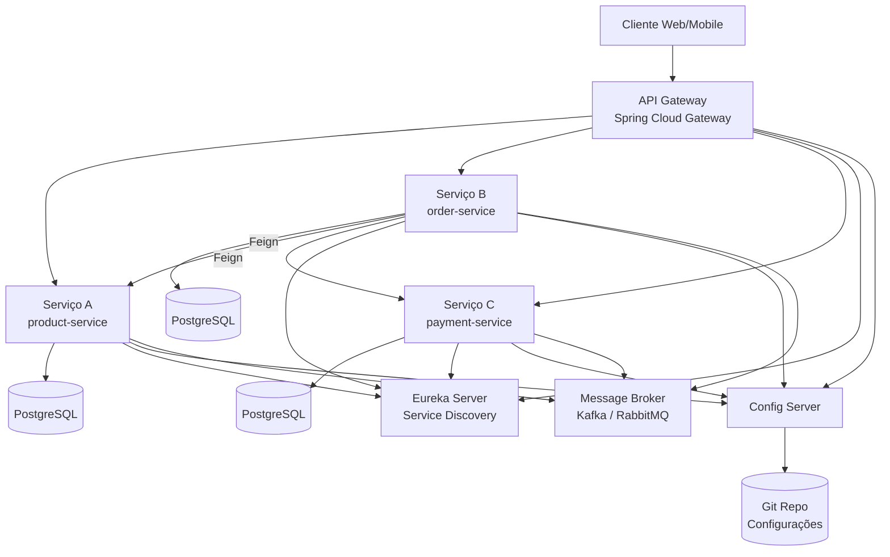

### 1.4 Quando Usar Spring Cloud

| Cenário | Recomendação |
|---|---|
| Equipe pequena (< 5 devs), domínio simples | ❌ Monólito modular (ver seção 13 — Spring Modulith) |
| Múltiplas equipes, domínios independentes, deploy independente | ✅ Microsserviços com Spring Cloud |
| Escala diferente por domínio (ex: catalogo lê muito, pagamento escreve muito) | ✅ Microsserviços permitem escalar independentemente |
| Necessidade de múltiplas linguagens/tecnologias | ✅ Cada serviço pode usar stack diferente |
| Projeto em fase inicial, requisitos instáveis | ❌ Comece com monólito, extraia depois |
| Infraestrutura Kubernetes madura | ⚠️ Avalie se K8s já fornece discovery/config nativo |

[Recomendado] Comece com um monólito bem modularizado (Spring Modulith — seção 13). Extraia microsserviços apenas quando houver necessidade comprovada de deploy ou escala independente.

---

## 2. Service Discovery — Spring Cloud Netflix Eureka

### 2.1 Conceito de Service Discovery

Em uma arquitetura de microsserviços, os serviços precisam localizar uns aos outros dinamicamente. Em vez de configurar endereços fixos (hardcoded IPs), um **Service Registry** mantém um catálogo atualizado de todas as instâncias disponíveis.

Existem dois modelos:

| Modelo | Como funciona | Exemplo |
|---|---|---|
| **Client-side discovery** | O cliente consulta o registry e escolhe uma instância | Eureka, Consul |
| **Server-side discovery** | O load balancer consulta o registry e roteia | Kubernetes Service, AWS ALB |

O Eureka implementa **client-side discovery**: cada serviço se registra no Eureka Server e os clientes consultam o registry para descobrir onde estão as instâncias.

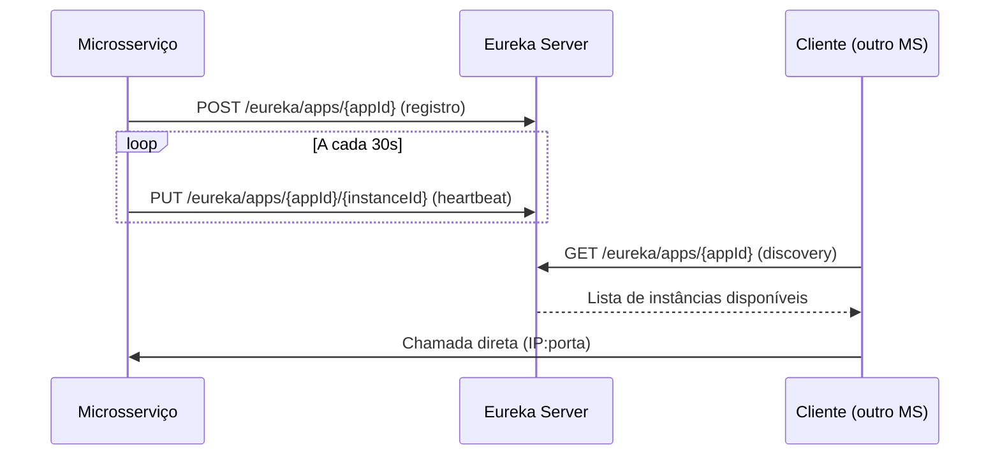

### 2.2 Eureka Server

#### Dependência

```xml
<dependency>
    <groupId>org.springframework.cloud</groupId>
    <artifactId>spring-cloud-starter-netflix-eureka-server</artifactId>
</dependency>
```

#### Classe principal

```java
package br.com.exemplo.eureka;

import org.springframework.boot.SpringApplication;
import org.springframework.boot.autoconfigure.SpringBootApplication;
import org.springframework.cloud.netflix.eureka.server.EnableEurekaServer;

@SpringBootApplication
@EnableEurekaServer
public class EurekaServerApplication {

    public static void main(String[] args) {
        SpringApplication.run(EurekaServerApplication.class, args);
    }
}
```

#### Configuração — `application.yml`

```yaml
server:
  port: 8761

spring:
  application:
    name: eureka-server

eureka:
  client:
    register-with-eureka: false
    fetch-registry: false
  server:
    enable-self-preservation: true
    eviction-interval-timer-in-ms: 5000
```

- `register-with-eureka: false` e `fetch-registry: false` — o Eureka Server não se registra em si mesmo (modo standalone).
- `enable-self-preservation` — quando ativo (padrão), o Eureka não remove instâncias se a taxa de heartbeats cair abruptamente (proteção contra falhas de rede).

[Atenção] Em **desenvolvimento**, considere desabilitar self-preservation (`enable-self-preservation: false`) para que instâncias paradas sejam removidas rapidamente. Em **produção**, mantenha ativo.

Ao iniciar, o dashboard fica disponível em `http://localhost:8761`.

### 2.3 Eureka Client

#### Dependência

```xml
<dependency>
    <groupId>org.springframework.cloud</groupId>
    <artifactId>spring-cloud-starter-netflix-eureka-client</artifactId>
</dependency>
```

#### Configuração — `application.yml`

```yaml
spring:
  application:
    name: product-service

eureka:
  client:
    service-url:
      defaultZone: http://localhost:8761/eureka/
  instance:
    prefer-ip-address: true
    lease-renewal-interval-in-seconds: 10
    lease-expiration-duration-in-seconds: 30
```

- `spring.application.name` — nome com o qual o serviço será registrado no Eureka.
- `prefer-ip-address: true` — registra o IP real em vez do hostname (útil em containers Docker).
- `lease-renewal-interval-in-seconds` — intervalo de heartbeat (padrão: 30s).
- `lease-expiration-duration-in-seconds` — tempo sem heartbeat para considerar a instância inativa (padrão: 90s).

[Recomendado] Em produção, mantenha o intervalo de heartbeat entre 10s e 30s. Valores muito baixos geram tráfego desnecessário; muito altos atrasam a detecção de falhas.

#### Múltiplas instâncias

Para subir múltiplas instâncias do mesmo serviço (ex: 3 réplicas do `product-service`), cada instância deve ter um `instance-id` único:

```yaml
eureka:
  instance:
    instance-id: ${spring.application.name}:${random.value}
```

Ou simplesmente use portas aleatórias:

```yaml
server:
  port: 0
```

O Spring Boot atribui uma porta disponível automaticamente, e o Eureka registra cada instância com porta diferente.

### 2.4 Eureka Server em Alta Disponibilidade

Em produção, o Eureka Server deve rodar em cluster. Cada nó se registra nos demais:

```yaml
# eureka-server-1 (porta 8761)
eureka:
  client:
    register-with-eureka: true
    fetch-registry: true
    service-url:
      defaultZone: http://eureka-2:8762/eureka/,http://eureka-3:8763/eureka/

# eureka-server-2 (porta 8762)
eureka:
  client:
    register-with-eureka: true
    fetch-registry: true
    service-url:
      defaultZone: http://eureka-1:8761/eureka/,http://eureka-3:8763/eureka/
```

Os nós replicam o registry entre si automaticamente. Se um nó cair, os demais mantêm o catálogo.

### 2.5 Alternativas ao Eureka

| Ferramenta | Tipo | Quando considerar |
|---|---|---|
| **HashiCorp Consul** | Service discovery + KV store + health check | Infraestrutura multi-linguagem, necessidade de KV store integrado |
| **Apache Zookeeper** | Coordenação distribuída | Já usa Kafka (Zookeeper historicamente vem junto) |
| **Kubernetes DNS** | Server-side discovery nativo | Deploy em K8s — o DNS do cluster já faz discovery |
| **Eureka** | Client-side discovery | Stack puramente Spring Cloud, sem K8s |

[Versão] O Spring Cloud Netflix Eureka continua mantido e funcional no Spring Cloud 2024.0. Apesar de rumores de descontinuação, ele segue como a opção padrão para discovery fora do Kubernetes.

Para usar Consul em vez de Eureka:

```xml
<dependency>
    <groupId>org.springframework.cloud</groupId>
    <artifactId>spring-cloud-starter-consul-discovery</artifactId>
</dependency>
```

```yaml
spring:
  cloud:
    consul:
      host: localhost
      port: 8500
      discovery:
        service-name: ${spring.application.name}
        health-check-interval: 10s
```

---

## 3. API Gateway — Spring Cloud Gateway

### 3.1 Papel do API Gateway

O API Gateway é o ponto de entrada único para todas as requisições externas. Ele centraliza responsabilidades transversais:

- **Roteamento** — direciona requisições para o serviço correto;
- **Filtros** — modifica requisições/respostas (adicionar headers, reescrever paths);
- **Segurança** — autenticação/autorização centralizada (OAuth2, JWT);
- **Rate limiting** — limitar taxa de requisições por cliente/IP;
- **Circuit breaker** — proteger contra serviços indisponíveis;
- **Load balancing** — distribuir carga entre instâncias.

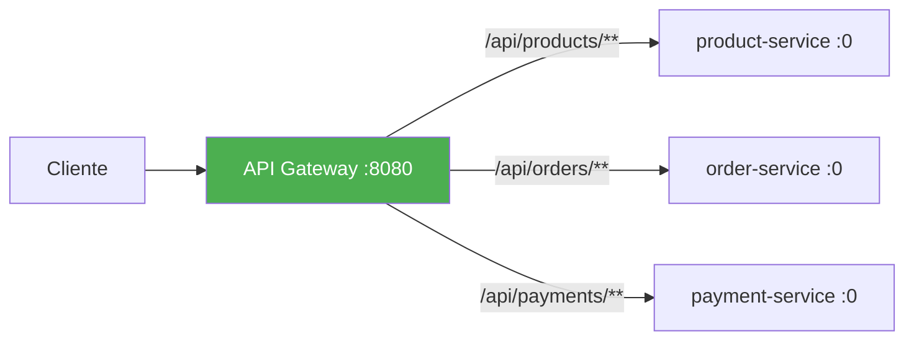

### 3.2 Dependência e Setup

```xml
<dependency>
    <groupId>org.springframework.cloud</groupId>
    <artifactId>spring-cloud-starter-gateway</artifactId>
</dependency>
```

[Atenção] O `spring-cloud-starter-gateway` padrão é baseado em **Spring WebFlux** (reativo, Netty). Não adicione `spring-boot-starter-web` ao mesmo projeto — os dois são incompatíveis. Se precisar de um gateway baseado em Servlet (MVC), use `spring-cloud-starter-gateway-mvc` (ver seção 3.6).

### 3.3 Configuração de Rotas via YAML

```yaml
spring:
  application:
    name: api-gateway
  cloud:
    gateway:
      routes:
        - id: product-service
          uri: lb://product-service
          predicates:
            - Path=/api/products/**
          filters:
            - StripPrefix=1

        - id: order-service
          uri: lb://order-service
          predicates:
            - Path=/api/orders/**
          filters:
            - StripPrefix=1

        - id: payment-service
          uri: lb://payment-service
          predicates:
            - Path=/api/payments/**
            - Method=POST
          filters:
            - StripPrefix=1
            - name: CircuitBreaker
              args:
                name: paymentCircuitBreaker
                fallbackUri: forward:/fallback/payment

server:
  port: 8080

eureka:
  client:
    service-url:
      defaultZone: http://localhost:8761/eureka/
```

- `lb://product-service` — usa o Spring Cloud LoadBalancer para resolver o nome do serviço via Eureka.
- `StripPrefix=1` — remove o primeiro segmento do path. Ex: `/api/products/123` → `/products/123`.
- `predicates` — condições para ativar a rota (Path, Method, Header, Query, Cookie, etc.).

#### Predicates disponíveis

| Predicate | Exemplo | Descrição |
|---|---|---|
| `Path` | `Path=/api/products/**` | Corresponde ao path da URL |
| `Method` | `Method=GET,POST` | Corresponde ao método HTTP |
| `Header` | `Header=X-Tenant, empresa-\d+` | Corresponde a um header (aceita regex) |
| `Query` | `Query=categoria, eletronicos` | Corresponde a query parameter |
| `Cookie` | `Cookie=session, abc.*` | Corresponde a um cookie |
| `After` | `After=2025-01-01T00:00:00-03:00` | Rota ativa somente após uma data |
| `Between` | `Between=datetime1, datetime2` | Rota ativa entre duas datas |
| `Weight` | `Weight=grupo1, 80` | Distribuição de tráfego por peso (canary) |

### 3.4 Configuração de Rotas via Java DSL

```java
package br.com.exemplo.gateway;

import org.springframework.cloud.gateway.route.RouteLocator;
import org.springframework.cloud.gateway.route.builder.RouteLocatorBuilder;
import org.springframework.context.annotation.Bean;
import org.springframework.context.annotation.Configuration;

@Configuration
public class GatewayRoutesConfig {

    @Bean
    public RouteLocator customRoutes(RouteLocatorBuilder builder) {
        return builder.routes()
                .route("product-service", r -> r
                        .path("/api/products/**")
                        .filters(f -> f
                                .stripPrefix(1)
                                .addResponseHeader("X-Gateway", "spring-cloud"))
                        .uri("lb://product-service"))

                .route("order-service", r -> r
                        .path("/api/orders/**")
                        .and()
                        .method("GET", "POST")
                        .filters(f -> f
                                .stripPrefix(1)
                                .retry(config -> config
                                        .setRetries(3)
                                        .setStatuses(HttpStatus.SERVICE_UNAVAILABLE)))
                        .uri("lb://order-service"))
                .build();
    }
}
```

### 3.5 Filtros Built-in

#### Rate Limiting com Redis

```xml
<dependency>
    <groupId>org.springframework.boot</groupId>
    <artifactId>spring-boot-starter-data-redis-reactive</artifactId>
</dependency>
```

```yaml
spring:
  cloud:
    gateway:
      routes:
        - id: product-service
          uri: lb://product-service
          predicates:
            - Path=/api/products/**
          filters:
            - StripPrefix=1
            - name: RequestRateLimiter
              args:
                redis-rate-limiter:
                  replenishRate: 10
                  burstCapacity: 20
                  requestedTokens: 1
                key-resolver: "#{@ipKeyResolver}"
```

```java
package br.com.exemplo.gateway;

import org.springframework.cloud.gateway.filter.ratelimit.KeyResolver;
import org.springframework.context.annotation.Bean;
import org.springframework.context.annotation.Configuration;
import reactor.core.publisher.Mono;

@Configuration
public class RateLimiterConfig {

    @Bean
    public KeyResolver ipKeyResolver() {
        return exchange -> Mono.just(
                exchange.getRequest().getRemoteAddress().getAddress().getHostAddress());
    }

    @Bean
    public KeyResolver userKeyResolver() {
        return exchange -> Mono.just(
                exchange.getRequest().getHeaders().getFirst("X-User-Id"));
    }
}
```

- `replenishRate` — tokens por segundo regenerados (taxa sustentável).
- `burstCapacity` — máximo de tokens acumulados (pico).
- `requestedTokens` — tokens consumidos por requisição.

#### Circuit Breaker no Gateway

```xml
<dependency>
    <groupId>org.springframework.cloud</groupId>
    <artifactId>spring-cloud-starter-circuitbreaker-reactor-resilience4j</artifactId>
</dependency>
```

```yaml
spring:
  cloud:
    gateway:
      routes:
        - id: payment-service
          uri: lb://payment-service
          predicates:
            - Path=/api/payments/**
          filters:
            - StripPrefix=1
            - name: CircuitBreaker
              args:
                name: paymentCB
                fallbackUri: forward:/fallback/payment

resilience4j:
  circuitbreaker:
    instances:
      paymentCB:
        sliding-window-size: 10
        failure-rate-threshold: 50
        wait-duration-in-open-state: 10s
        permitted-number-of-calls-in-half-open-state: 3
  timelimiter:
    instances:
      paymentCB:
        timeout-duration: 3s
```

```java
package br.com.exemplo.gateway;

import org.springframework.web.bind.annotation.GetMapping;
import org.springframework.web.bind.annotation.RestController;
import reactor.core.publisher.Mono;

@RestController
public class FallbackController {

    @GetMapping("/fallback/payment")
    public Mono<String> paymentFallback() {
        return Mono.just("{\"erro\": \"Serviço de pagamento indisponível. Tente novamente em instantes.\"}");
    }
}
```

### 3.6 Filtros Customizados

#### GlobalFilter — aplica a todas as rotas

```java
package br.com.exemplo.gateway;

import org.slf4j.Logger;
import org.slf4j.LoggerFactory;
import org.springframework.cloud.gateway.filter.GatewayFilterChain;
import org.springframework.cloud.gateway.filter.GlobalFilter;
import org.springframework.core.Ordered;
import org.springframework.stereotype.Component;
import org.springframework.web.server.ServerWebExchange;
import reactor.core.publisher.Mono;

@Component
public class LoggingFilter implements GlobalFilter, Ordered {

    private static final Logger log = LoggerFactory.getLogger(LoggingFilter.class);

    @Override
    public Mono<Void> filter(ServerWebExchange exchange, GatewayFilterChain chain) {
        String path = exchange.getRequest().getPath().toString();
        String method = exchange.getRequest().getMethod().name();
        long inicio = System.currentTimeMillis();

        log.info(">>> {} {}", method, path);

        return chain.filter(exchange).then(Mono.fromRunnable(() -> {
            long duracao = System.currentTimeMillis() - inicio;
            int status = exchange.getResponse().getStatusCode().value();
            log.info("<<< {} {} → {} ({}ms)", method, path, status, duracao);
        }));
    }

    @Override
    public int getOrder() {
        return -1;
    }
}
```

#### GatewayFilterFactory — filtro reutilizável por rota

```java
package br.com.exemplo.gateway;

import org.springframework.cloud.gateway.filter.GatewayFilter;
import org.springframework.cloud.gateway.filter.factory.AbstractGatewayFilterFactory;
import org.springframework.http.server.reactive.ServerHttpRequest;
import org.springframework.stereotype.Component;

@Component
public class AddTenantHeaderGatewayFilterFactory
        extends AbstractGatewayFilterFactory<AddTenantHeaderGatewayFilterFactory.Config> {

    public AddTenantHeaderGatewayFilterFactory() {
        super(Config.class);
    }

    @Override
    public GatewayFilter apply(Config config) {
        return (exchange, chain) -> {
            ServerHttpRequest request = exchange.getRequest().mutate()
                    .header("X-Tenant-Id", config.getTenantId())
                    .build();
            return chain.filter(exchange.mutate().request(request).build());
        };
    }

    public static class Config {
        private String tenantId;

        public String getTenantId() { return tenantId; }
        public void setTenantId(String tenantId) { this.tenantId = tenantId; }
    }
}
```

Uso no YAML:

```yaml
filters:
  - name: AddTenantHeader
    args:
      tenantId: empresa-abc
```

### 3.7 Spring Cloud Gateway MVC

[Versão] A partir do Spring Cloud 2023.0, existe o `spring-cloud-starter-gateway-mvc` — uma versão baseada em Servlet (Spring MVC) em vez de WebFlux.

```xml
<!-- Alternativa baseada em Servlet (MVC) -->
<dependency>
    <groupId>org.springframework.cloud</groupId>
    <artifactId>spring-cloud-starter-gateway-mvc</artifactId>
</dependency>
```

| Característica | Gateway (WebFlux) | Gateway MVC |
|---|---|---|
| Runtime | Netty (não-bloqueante) | Tomcat/Jetty (Servlet) |
| Modelo | Reativo (Mono/Flux) | Bloqueante (Thread-per-request) |
| Compatibilidade | Não pode coexistir com `starter-web` | Pode coexistir com ecossistema MVC |
| Performance em I/O | Superior para muitas conexões simultâneas | Suficiente para cargas moderadas |
| Filtros | `GlobalFilter`, `GatewayFilter` (reativo) | Mesma API de rotas, filtros adaptados |

[Recomendado] Use Gateway MVC se o time já domina Spring MVC e não precisa de throughput extremo. Use Gateway WebFlux para cenários com milhares de conexões simultâneas ou quando já usa WebFlux nos demais serviços.

---

## 4. Configuração Centralizada — Spring Cloud Config

### 4.1 O Problema

Em uma arquitetura com N microsserviços, gerenciar `application.yml` individualmente em cada serviço torna-se inviável:

- Propriedades compartilhadas (URLs de banco, chaves de API) ficam duplicadas;
- Alterar uma configuração exige rebuild e redeploy de cada serviço;
- Não há versionamento unificado das configurações;
- Segredos ficam espalhados em múltiplos arquivos.

O **Spring Cloud Config** resolve isso centralizando todas as configurações em um servidor, que busca propriedades de um backend (Git, filesystem ou Vault).

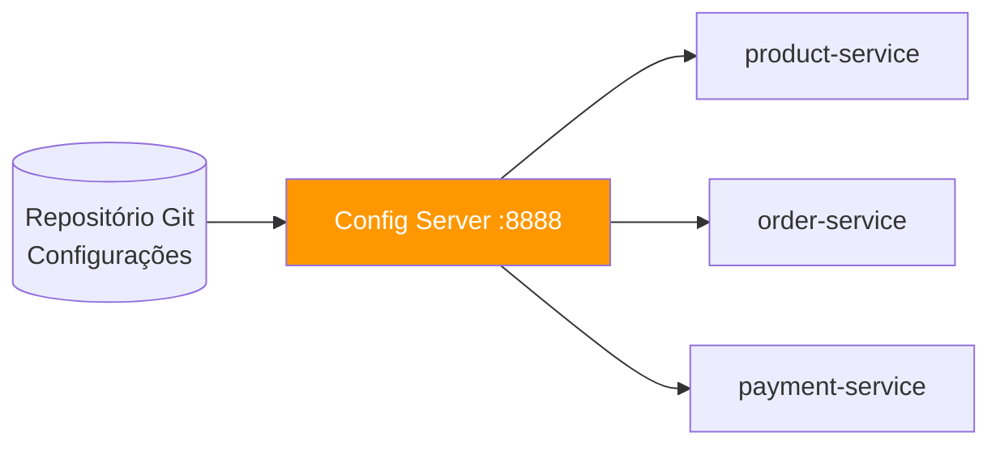

### 4.2 Config Server

#### Dependência

```xml
<dependency>
    <groupId>org.springframework.cloud</groupId>
    <artifactId>spring-cloud-config-server</artifactId>
</dependency>
```

#### Classe principal

```java
package br.com.exemplo.config;

import org.springframework.boot.SpringApplication;
import org.springframework.boot.autoconfigure.SpringBootApplication;
import org.springframework.cloud.config.server.EnableConfigServer;

@SpringBootApplication
@EnableConfigServer
public class ConfigServerApplication {

    public static void main(String[] args) {
        SpringApplication.run(ConfigServerApplication.class, args);
    }
}
```

#### Configuração com backend Git

```yaml
server:
  port: 8888

spring:
  application:
    name: config-server
  cloud:
    config:
      server:
        git:
          uri: https://github.com/minha-org/config-repo
          default-label: main
          search-paths: "{application}"
          clone-on-start: true
          timeout: 5
```

- `uri` — repositório Git com os arquivos de configuração.
- `default-label` — branch padrão.
- `search-paths: "{application}"` — busca em subdiretórios com o nome do serviço.
- `clone-on-start` — clona o repositório ao iniciar (falha rápida se o repo estiver inacessível).

#### Estrutura do repositório Git de configuração

```
config-repo/
├── application.yml              ← propriedades compartilhadas por todos os serviços
├── application-prod.yml         ← propriedades compartilhadas, perfil prod
├── product-service.yml          ← propriedades específicas do product-service
├── product-service-prod.yml     ← product-service, perfil prod
├── order-service.yml
├── order-service-prod.yml
├── payment-service.yml
└── payment-service-prod.yml
```

O Config Server resolve propriedades na seguinte ordem de prioridade (maior → menor):

1. `{application}-{profile}.yml` (ex: `product-service-prod.yml`)
2. `{application}.yml` (ex: `product-service.yml`)
3. `application-{profile}.yml` (ex: `application-prod.yml`)
4. `application.yml`

#### Testando o Config Server

```bash
# Busca configurações do product-service no perfil default
curl http://localhost:8888/product-service/default

# Busca configurações do product-service no perfil prod
curl http://localhost:8888/product-service/prod

# Busca um arquivo específico em formato YAML
curl http://localhost:8888/product-service-prod.yml
```

#### Backend alternativo — Repositório Git local

O Config Server aceita qualquer repositório Git, não apenas GitHub. Para desenvolvimento local, é possível usar um repositório no próprio filesystem:

```bash
# Criar repositório Git local com as configurações
mkdir ~/config-repo && cd ~/config-repo
git init
```

Crie os arquivos de configuração normalmente:

```
~/config-repo/
├── application.yml
├── product-service.yml
├── product-service-dev.yml
├── order-service.yml
└── order-service-dev.yml
```

```bash
git add . && git commit -m "configurações iniciais"
```

Configure o Config Server apontando para o repositório local:

```yaml
server:
  port: 8888

spring:
  application:
    name: config-server
  cloud:
    config:
      server:
        git:
          uri: file://${user.home}/config-repo
          default-label: main
```

No Windows, use o path completo:

```yaml
spring:
  cloud:
    config:
      server:
        git:
          uri: file:///C:/Users/usuario/config-repo
```

O Config Server continua exigindo que o diretório seja um repositório Git válido — o versionamento via commits funciona da mesma forma, mas sem depender de um servidor remoto.

#### Backend alternativo — Filesystem nativo (sem Git)

Para cenários onde o versionamento Git não é necessário (desenvolvimento, testes, prototipação), o backend **native** lê arquivos diretamente do filesystem, sem exigir repositório Git:

```yaml
server:
  port: 8888

spring:
  application:
    name: config-server
  profiles:
    active: native
  cloud:
    config:
      server:
        native:
          search-locations:
            - file://${user.home}/config-native
            - classpath:/configs
```

```
~/config-native/
├── application.yml              ← compartilhadas
├── product-service.yml
├── product-service-dev.yml
├── order-service.yml
└── order-service-dev.yml
```

A diferença em relação ao backend Git:

| Aspecto | Git | Native |
|---|---|---|
| **Versionamento** | Sim (commits, branches, tags) | Não |
| **Histórico de alterações** | Sim (git log) | Não |
| **Label (branch/tag)** | Sim (`/app/profile/label`) | Não |
| **Hot reload** | Sim (pull automático) | Sim (lê a cada requisição) |
| **Requisito** | Repositório Git válido | Apenas arquivos no disco |
| **Uso recomendado** | Produção, homologação | Desenvolvimento, testes, CI |

Com `classpath:/configs`, os arquivos de configuração podem ser empacotados dentro do próprio JAR do Config Server — útil para testes de integração.

#### Backend alternativo — Banco de dados (JDBC)

Para ambientes onde as configurações devem ser gerenciadas via banco de dados (útil para painéis administrativos ou ambientes que já centralizam tudo em banco):

```xml
<dependency>
    <groupId>org.springframework.cloud</groupId>
    <artifactId>spring-cloud-config-server</artifactId>
</dependency>
<dependency>
    <groupId>org.springframework.boot</groupId>
    <artifactId>spring-boot-starter-data-jdbc</artifactId>
</dependency>
<dependency>
    <groupId>org.postgresql</groupId>
    <artifactId>postgresql</artifactId>
    <scope>runtime</scope>
</dependency>
```

```yaml
server:
  port: 8888

spring:
  application:
    name: config-server
  profiles:
    active: jdbc
  datasource:
    url: jdbc:postgresql://localhost:5432/config_db
    username: config_user
    password: ${DB_PASSWORD}
  cloud:
    config:
      server:
        jdbc:
          sql: SELECT prop_key, prop_value FROM config_properties WHERE application=? AND profile=? AND label=?
```

Tabela no banco de dados:

```sql
CREATE TABLE config_properties (
    id          BIGSERIAL PRIMARY KEY,
    application VARCHAR(128) NOT NULL,
    profile     VARCHAR(128) NOT NULL,
    label       VARCHAR(128) NOT NULL,
    prop_key    VARCHAR(256) NOT NULL,
    prop_value  TEXT NOT NULL
);

-- Propriedades compartilhadas (application = 'application')
INSERT INTO config_properties (application, profile, label, prop_key, prop_value) VALUES
    ('application', 'default', 'main', 'spring.datasource.hikari.maximum-pool-size', '10'),
    ('application', 'default', 'main', 'management.endpoints.web.exposure.include', 'health,info');

-- Propriedades do product-service
INSERT INTO config_properties (application, profile, label, prop_key, prop_value) VALUES
    ('product-service', 'default', 'main', 'app.catalogo.page-size', '20'),
    ('product-service', 'prod',    'main', 'app.catalogo.page-size', '50');
```

O campo `label` segue a mesma lógica do Git (branch/tag) — para o backend JDBC, costuma-se usar um valor fixo como `main`.

#### Backend composto (Composite)

É possível combinar múltiplos backends. Um cenário comum é usar Git para configurações gerais e Vault para segredos:

```yaml
spring:
  profiles:
    active: composite
  cloud:
    config:
      server:
        composite:
          - type: git
            uri: file://${user.home}/config-repo
          - type: native
            search-locations: file://${user.home}/config-overrides
```

O Config Server consulta os backends na ordem declarada. O primeiro que retornar uma propriedade tem prioridade.

#### Resumo dos backends

| Backend | Ativação (`spring.profiles.active`) | Versionamento | Ideal para |
|---|---|---|---|
| **Git remoto** (GitHub, GitLab) | *(padrão)* | Sim | Produção — auditoria via commits |
| **Git local** (`file://`) | *(padrão)* | Sim | Desenvolvimento — sem depender de rede |
| **Native** (filesystem) | `native` | Não | Testes, CI, prototipação |
| **JDBC** (banco de dados) | `jdbc` | Não (mas pode-se auditar) | Painel administrativo, ambientes com BD central |
| **Vault** | `vault` | Não | Segredos e credenciais rotativas |
| **Composite** | `composite` | Depende dos backends | Combinar Git + Vault, Native + JDBC |

### 4.3 Config Client

#### Dependência

```xml
<dependency>
    <groupId>org.springframework.cloud</groupId>
    <artifactId>spring-cloud-starter-config</artifactId>
</dependency>
```

#### Configuração — `application.yml` do microsserviço

```yaml
spring:
  application:
    name: product-service
  profiles:
    active: ${SPRING_PROFILES_ACTIVE:default}
  config:
    import: optional:configserver:http://localhost:8888
```

[Versão] A partir do Spring Boot 3.x, o bootstrap context foi removido. Use `spring.config.import` em vez de `bootstrap.yml`. A propriedade `spring.cloud.config.uri` no `bootstrap.yml` é legada.

```yaml
# ❌ Legado (Spring Boot 2.x com bootstrap.yml)
spring:
  cloud:
    config:
      uri: http://localhost:8888

# ✅ Atual (Spring Boot 3.x com spring.config.import)
spring:
  config:
    import: optional:configserver:http://localhost:8888
```

O prefixo `optional:` permite que o serviço inicie mesmo que o Config Server esteja indisponível (usa valores locais como fallback).

### 4.4 @RefreshScope e Atualização Dinâmica

O `@RefreshScope` permite que beans recarreguem suas propriedades sem reiniciar a aplicação:

```xml
<dependency>
    <groupId>org.springframework.boot</groupId>
    <artifactId>spring-boot-starter-actuator</artifactId>
</dependency>
```

```yaml
management:
  endpoints:
    web:
      exposure:
        include: refresh, health, info
```

```java
package br.com.exemplo.product;

import org.springframework.beans.factory.annotation.Value;
import org.springframework.cloud.context.config.annotation.RefreshScope;
import org.springframework.web.bind.annotation.GetMapping;
import org.springframework.web.bind.annotation.RestController;

@RestController
@RefreshScope
public class FeatureFlagController {

    @Value("${feature.novo-catalogo.enabled:false}")
    private boolean novoCatalogoEnabled;

    @GetMapping("/api/features")
    public Map<String, Boolean> features() {
        return Map.of("novoCatalogo", novoCatalogoEnabled);
    }
}
```

Para atualizar:

```bash
# 1. Altere a propriedade no repositório Git e faça commit/push
# 2. Dispare o refresh no serviço
curl -X POST http://localhost:8080/actuator/refresh
```

O endpoint retorna a lista de propriedades alteradas:

```json
["feature.novo-catalogo.enabled"]
```

[Atenção] O `@RefreshScope` recria o bean inteiro. Não use em beans que mantêm estado de conexão (DataSource, EntityManagerFactory). Para esses, use `@ConfigurationProperties` com atualização via Spring Cloud Bus (seção 8.5).

### 4.5 Criptografia de Propriedades Sensíveis

O Config Server suporta criptografia simétrica e assimétrica para proteger segredos:

```yaml
# Config Server — application.yml
encrypt:
  key: ${ENCRYPT_KEY:minha-chave-secreta-256-bits}
```

```bash
# Criptografar um valor
curl -X POST http://localhost:8888/encrypt -d 'senha-do-banco'
# Retorna: AQB1a2b3c4d5e6f7...

# Descriptografar
curl -X POST http://localhost:8888/decrypt -d 'AQB1a2b3c4d5e6f7...'
```

No repositório Git de configurações:

```yaml
# product-service.yml
spring:
  datasource:
    username: app_user
    password: "{cipher}AQB1a2b3c4d5e6f7..."
```

O Config Server descriptografa automaticamente antes de enviar ao cliente.

[Recomendado] Para produção, prefira **HashiCorp Vault** em vez de criptografia no Config Server. O Vault oferece rotação automática de segredos, auditoria e controle de acesso granular.

### 4.6 Alternativas ao Config Server

| Ferramenta | Vantagem | Quando usar |
|---|---|---|
| **Spring Cloud Config (Git)** | Versionamento natural, auditoria via commits | Padrão para Spring Cloud, sem infraestrutura extra |
| **HashiCorp Consul KV** | KV store + service discovery integrados | Já usa Consul para discovery |
| **HashiCorp Vault** | Segredos dinâmicos, rotação automática, auditoria | Gerenciamento de segredos em produção |
| **Kubernetes ConfigMaps/Secrets** | Nativo do K8s, sem servidor extra | Deploy em Kubernetes |
| **AWS Parameter Store / Secrets Manager** | Gerenciado, integração nativa AWS | Infraestrutura AWS |

---

## 5. Comunicação entre Serviços — OpenFeign e RestClient

### 5.1 Spring Cloud OpenFeign

O OpenFeign permite declarar clientes HTTP como interfaces Java, eliminando código boilerplate de `RestTemplate` ou `WebClient`. O Spring Cloud integra o Feign com service discovery e load balancing automaticamente.

#### Dependência

```xml
<dependency>
    <groupId>org.springframework.cloud</groupId>
    <artifactId>spring-cloud-starter-openfeign</artifactId>
</dependency>
```

#### Habilitar no application

```java
package br.com.exemplo.order;

import org.springframework.boot.SpringApplication;
import org.springframework.boot.autoconfigure.SpringBootApplication;
import org.springframework.cloud.openfeign.EnableFeignClients;

@SpringBootApplication
@EnableFeignClients
public class OrderServiceApplication {

    public static void main(String[] args) {
        SpringApplication.run(OrderServiceApplication.class, args);
    }
}
```

#### Declarando um Feign Client

```java
package br.com.exemplo.order.client;

import br.com.exemplo.order.dto.ProductResponse;
import org.springframework.cloud.openfeign.FeignClient;
import org.springframework.web.bind.annotation.GetMapping;
import org.springframework.web.bind.annotation.PathVariable;

import java.util.List;

@FeignClient(name = "product-service")
public interface ProductClient {

    @GetMapping("/products/{id}")
    ProductResponse findById(@PathVariable Long id);

    @GetMapping("/products")
    List<ProductResponse> findAll();
}
```

- `name = "product-service"` — corresponde ao `spring.application.name` do serviço alvo, registrado no Eureka.
- O Feign resolve o endereço via service discovery e faz load balancing entre as instâncias automaticamente.
- As anotações `@GetMapping`, `@PostMapping`, etc. funcionam como no Spring MVC.

#### Usando o client

```java
package br.com.exemplo.order.service;

import br.com.exemplo.order.client.ProductClient;
import br.com.exemplo.order.dto.ProductResponse;
import org.springframework.stereotype.Service;

@Service
public class OrderService {

    private final ProductClient productClient;

    public OrderService(ProductClient productClient) {
        this.productClient = productClient;
    }

    public OrderResponse createOrder(OrderRequest request) {
        ProductResponse product = productClient.findById(request.productId());

        if (product.stock() < request.quantity()) {
            throw new InsufficientStockException(product.id(), product.stock(), request.quantity());
        }

        // ... lógica de criação do pedido
    }
}
```

### 5.2 Configuração e Personalização do Feign

#### Timeout e log

```yaml
spring:
  cloud:
    openfeign:
      client:
        config:
          default:
            connect-timeout: 5000
            read-timeout: 5000
            logger-level: basic
          product-service:
            connect-timeout: 3000
            read-timeout: 3000
            logger-level: full
```

Níveis de log: `NONE`, `BASIC` (método + URL + status + tempo), `HEADERS` (+ headers), `FULL` (+ body).

[Atenção] Para que o log do Feign apareça, o logger da interface deve estar em nível `DEBUG`:

```yaml
logging:
  level:
    br.com.exemplo.order.client.ProductClient: DEBUG
```

#### Interceptor — propagação de headers

```java
package br.com.exemplo.order.config;

import feign.RequestInterceptor;
import feign.RequestTemplate;
import org.springframework.context.annotation.Bean;
import org.springframework.context.annotation.Configuration;
import org.springframework.web.context.request.RequestContextHolder;
import org.springframework.web.context.request.ServletRequestAttributes;

@Configuration
public class FeignConfig {

    @Bean
    public RequestInterceptor authInterceptor() {
        return (RequestTemplate template) -> {
            var attributes = (ServletRequestAttributes) RequestContextHolder.getRequestAttributes();
            if (attributes != null) {
                String token = attributes.getRequest().getHeader("Authorization");
                if (token != null) {
                    template.header("Authorization", token);
                }
            }
        };
    }
}
```

#### Error Decoder customizado

```java
package br.com.exemplo.order.config;

import feign.Response;
import feign.codec.ErrorDecoder;
import org.springframework.http.HttpStatus;

public class ProductErrorDecoder implements ErrorDecoder {

    @Override
    public Exception decode(String methodKey, Response response) {
        HttpStatus status = HttpStatus.valueOf(response.status());

        return switch (status) {
            case NOT_FOUND -> new ProductNotFoundException("Produto não encontrado");
            case SERVICE_UNAVAILABLE -> new ServiceUnavailableException("Serviço de produtos indisponível");
            default -> new RuntimeException("Erro ao chamar product-service: " + status);
        };
    }
}
```

Registrando o decoder:

```yaml
spring:
  cloud:
    openfeign:
      client:
        config:
          product-service:
            error-decoder: br.com.exemplo.order.config.ProductErrorDecoder
```

### 5.3 Feign com URL fixa (sem Eureka)

Para ambientes sem service discovery (ex: chamada a API externa):

```java
@FeignClient(name = "viacep", url = "https://viacep.com.br")
public interface ViaCepClient {

    @GetMapping("/ws/{cep}/json")
    EnderecoResponse consultarCep(@PathVariable String cep);
}
```

### 5.4 HTTP Interface Clients (Spring 6.1+)

[Versão] A partir do Spring Framework 6.1 e Spring Boot 3.2, o Spring oferece **HTTP Interface Clients** nativos, sem dependência do Spring Cloud OpenFeign. Essa abordagem é preferível para novos projetos.

```java
package br.com.exemplo.order.client;

import br.com.exemplo.order.dto.ProductResponse;
import org.springframework.web.bind.annotation.PathVariable;
import org.springframework.web.service.annotation.GetExchange;

import java.util.List;

public interface ProductClient {

    @GetExchange("/products/{id}")
    ProductResponse findById(@PathVariable Long id);

    @GetExchange("/products")
    List<ProductResponse> findAll();
}
```

Registrando o client:

```java
package br.com.exemplo.order.config;

import br.com.exemplo.order.client.ProductClient;
import org.springframework.cloud.client.loadbalancer.LoadBalanced;
import org.springframework.context.annotation.Bean;
import org.springframework.context.annotation.Configuration;
import org.springframework.web.client.RestClient;
import org.springframework.web.client.support.RestClientAdapter;
import org.springframework.web.service.invoker.HttpServiceProxyFactory;

@Configuration
public class HttpClientConfig {

    @Bean
    @LoadBalanced
    public RestClient.Builder restClientBuilder() {
        return RestClient.builder();
    }

    @Bean
    public ProductClient productClient(RestClient.Builder builder) {
        RestClient restClient = builder
                .baseUrl("http://product-service")
                .build();

        HttpServiceProxyFactory factory = HttpServiceProxyFactory
                .builderFor(RestClientAdapter.create(restClient))
                .build();

        return factory.createClient(ProductClient.class);
    }
}
```

### 5.5 Comparação: Feign vs RestClient vs WebClient

| Característica | OpenFeign | HTTP Interface + RestClient | HTTP Interface + WebClient |
|---|---|---|---|
| Dependência | `spring-cloud-starter-openfeign` | Spring Boot nativo (3.2+) | `spring-boot-starter-webflux` |
| Modelo | Bloqueante (síncrono) | Bloqueante (síncrono) | Reativo (não-bloqueante) |
| Service Discovery | Automático via `@FeignClient(name=...)` | Manual via `@LoadBalanced` + `RestClient.Builder` | Manual via `@LoadBalanced` + `WebClient.Builder` |
| Interceptors | `RequestInterceptor` (Feign) | `ClientHttpRequestInterceptor` (Spring) | `ExchangeFilterFunction` (reativo) |
| Error handling | `ErrorDecoder` (Feign) | `ResponseErrorHandler` (Spring) | `onStatus()` (reativo) |
| Circuit breaker | Via Spring Cloud Circuit Breaker | Via `@CircuitBreaker` (Resilience4j) | Via Resilience4j operator |
| Maturidade | Estabelecido, ampla adoção | Novo (Spring 6.1+), API estável | Maduro para cenários reativos |

[Recomendado] Para novos projetos Spring Boot 3.2+, prefira **HTTP Interface Clients** com `RestClient` — é nativo do Spring, sem dependência do Spring Cloud. Use OpenFeign em projetos existentes que já o utilizam.

---

## 6. Resiliência — Spring Cloud Circuit Breaker

### 6.1 Abstração Spring Cloud Circuit Breaker

O Spring Cloud Circuit Breaker fornece uma abstração sobre diferentes implementações de circuit breaker. Atualmente, a implementação principal é o **Resilience4j**.

> **Nota:** Para detalhes completos sobre Resilience4j (circuit breaker, retry, rate limiter, bulkhead, timeout), consulte [Spring-Boot-Avancado.md](../Spring-Boot-Avancado.md). Esta seção foca na integração com o ecossistema Spring Cloud.

#### Dependência

```xml
<!-- Para aplicações MVC (bloqueantes) -->
<dependency>
    <groupId>org.springframework.cloud</groupId>
    <artifactId>spring-cloud-starter-circuitbreaker-resilience4j</artifactId>
</dependency>

<!-- Para aplicações reativas (WebFlux / Gateway) -->
<dependency>
    <groupId>org.springframework.cloud</groupId>
    <artifactId>spring-cloud-starter-circuitbreaker-reactor-resilience4j</artifactId>
</dependency>
```

### 6.2 Usando a abstração CircuitBreakerFactory

```java
package br.com.exemplo.order.service;

import org.springframework.cloud.client.circuitbreaker.CircuitBreakerFactory;
import org.springframework.stereotype.Service;

@Service
public class OrderService {

    private final CircuitBreakerFactory circuitBreakerFactory;
    private final ProductClient productClient;

    public OrderService(CircuitBreakerFactory circuitBreakerFactory, ProductClient productClient) {
        this.circuitBreakerFactory = circuitBreakerFactory;
        this.productClient = productClient;
    }

    public ProductResponse getProduct(Long productId) {
        return circuitBreakerFactory.create("productService")
                .run(
                        () -> productClient.findById(productId),
                        throwable -> getProductFallback(productId, throwable)
                );
    }

    private ProductResponse getProductFallback(Long productId, Throwable t) {
        return new ProductResponse(productId, "Produto indisponível", BigDecimal.ZERO, 0);
    }
}
```

### 6.3 Configuração global do Resilience4j via Spring Cloud

```yaml
resilience4j:
  circuitbreaker:
    configs:
      default:
        sliding-window-type: COUNT_BASED
        sliding-window-size: 10
        minimum-number-of-calls: 5
        failure-rate-threshold: 50
        wait-duration-in-open-state: 10s
        permitted-number-of-calls-in-half-open-state: 3
        record-exceptions:
          - java.io.IOException
          - java.util.concurrent.TimeoutException
          - org.springframework.web.client.HttpServerErrorException
    instances:
      productService:
        base-config: default
      paymentService:
        base-config: default
        failure-rate-threshold: 30
        wait-duration-in-open-state: 30s

  retry:
    configs:
      default:
        max-attempts: 3
        wait-duration: 500ms
        retry-exceptions:
          - java.io.IOException
    instances:
      productService:
        base-config: default

  timelimiter:
    configs:
      default:
        timeout-duration: 3s
    instances:
      productService:
        timeout-duration: 2s
```

### 6.4 Circuit Breaker com Feign

O Spring Cloud OpenFeign se integra automaticamente com o Resilience4j quando ambas as dependências estão presentes:

```yaml
spring:
  cloud:
    openfeign:
      circuitbreaker:
        enabled: true
```

```java
@FeignClient(name = "product-service", fallback = ProductClientFallback.class)
public interface ProductClient {

    @GetMapping("/products/{id}")
    ProductResponse findById(@PathVariable Long id);
}
```

```java
package br.com.exemplo.order.client;

import org.springframework.stereotype.Component;

@Component
public class ProductClientFallback implements ProductClient {

    @Override
    public ProductResponse findById(Long id) {
        return new ProductResponse(id, "Produto indisponível (fallback)", BigDecimal.ZERO, 0);
    }
}
```

Para acessar a causa do erro, use `FallbackFactory`:

```java
package br.com.exemplo.order.client;

import org.slf4j.Logger;
import org.slf4j.LoggerFactory;
import org.springframework.cloud.openfeign.FallbackFactory;
import org.springframework.stereotype.Component;

@Component
public class ProductClientFallbackFactory implements FallbackFactory<ProductClient> {

    private static final Logger log = LoggerFactory.getLogger(ProductClientFallbackFactory.class);

    @Override
    public ProductClient create(Throwable cause) {
        return new ProductClient() {
            @Override
            public ProductResponse findById(Long id) {
                log.warn("Fallback para product-service.findById({}): {}", id, cause.getMessage());
                return new ProductResponse(id, "Indisponível", BigDecimal.ZERO, 0);
            }
        };
    }
}
```

```java
@FeignClient(name = "product-service", fallbackFactory = ProductClientFallbackFactory.class)
public interface ProductClient {
    // ...
}
```

---

## 7. Load Balancing — Spring Cloud LoadBalancer

### 7.1 Client-Side Load Balancing

O Spring Cloud LoadBalancer é o substituto do Netflix Ribbon (descontinuado). Ele distribui requisições entre múltiplas instâncias de um serviço no lado do cliente, sem precisar de um load balancer externo.

Quando você usa `lb://product-service` no Gateway ou `@FeignClient(name = "product-service")`, o LoadBalancer é ativado automaticamente.

#### Dependência

O LoadBalancer já vem incluído como dependência transitiva de `spring-cloud-starter-netflix-eureka-client` e `spring-cloud-starter-openfeign`. Para uso standalone:

```xml
<dependency>
    <groupId>org.springframework.cloud</groupId>
    <artifactId>spring-cloud-starter-loadbalancer</artifactId>
</dependency>
```

### 7.2 Estratégias de Balanceamento

#### Round Robin (padrão)

Distribui requisições sequencialmente entre as instâncias disponíveis: A → B → C → A → B → ...

Não requer configuração — é o comportamento padrão.

#### Random

```java
package br.com.exemplo.order.config;

import org.springframework.cloud.loadbalancer.core.RandomLoadBalancer;
import org.springframework.cloud.loadbalancer.core.ServiceInstanceListSupplier;
import org.springframework.cloud.loadbalancer.annotation.LoadBalancerClient;
import org.springframework.cloud.loadbalancer.support.LoadBalancerClientFactory;
import org.springframework.context.annotation.Bean;
import org.springframework.context.annotation.Configuration;
import org.springframework.core.env.Environment;

@Configuration
@LoadBalancerClient(name = "product-service", configuration = ProductLBConfig.class)
public class ProductLBConfig {

    @Bean
    public RandomLoadBalancer randomLoadBalancer(Environment environment,
                                                  LoadBalancerClientFactory factory) {
        String serviceId = environment.getProperty(LoadBalancerClientFactory.PROPERTY_NAME);
        return new RandomLoadBalancer(
                factory.getLazyProvider(serviceId, ServiceInstanceListSupplier.class),
                serviceId);
    }
}
```

#### Custom — Preferência por zona

```java
package br.com.exemplo.order.config;

import org.springframework.cloud.loadbalancer.core.ServiceInstanceListSupplier;
import org.springframework.context.annotation.Bean;
import org.springframework.context.annotation.Configuration;
import org.springframework.cloud.loadbalancer.annotation.LoadBalancerClient;

@Configuration
@LoadBalancerClient(name = "product-service", configuration = ZoneLBConfig.class)
public class ZoneLBConfig {

    @Bean
    public ServiceInstanceListSupplier zonePreferenceSupplier(
            ServiceInstanceListSupplier delegate) {
        return ServiceInstanceListSupplier.builder()
                .withBlockingDiscoveryClient()
                .withZonePreference()
                .build();
    }
}
```

### 7.3 Health Check de Instâncias

O LoadBalancer pode verificar a saúde das instâncias antes de rotear:

```yaml
spring:
  cloud:
    loadbalancer:
      health-check:
        path:
          product-service: /actuator/health
        interval: 10s
```

### 7.4 Cache de Instâncias

Para evitar consultas frequentes ao Eureka, o LoadBalancer cacheia a lista de instâncias:

```yaml
spring:
  cloud:
    loadbalancer:
      cache:
        enabled: true
        ttl: 30s
        capacity: 256
```

[Recomendado] Em produção, mantenha o cache habilitado com TTL entre 10s e 60s. Sem cache, cada chamada HTTP gera uma consulta ao Eureka.

---

## 8. Mensageria e Eventos — Spring Cloud Stream

### 8.1 Visão Geral

O Spring Cloud Stream é uma abstração para construir microsserviços orientados a eventos. Ele conecta a lógica de negócio a message brokers (Kafka, RabbitMQ) através de **binders**, isolando o código da aplicação dos detalhes do broker.

> **Nota:** Para padrões avançados de mensageria como SAGA, Outbox Pattern e Event Sourcing, consulte [SAGA-CQRS-Outbox.md](SAGA-CQRS-Outbox.md).

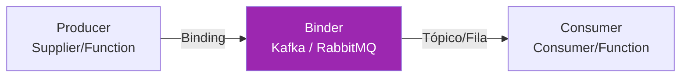

#### Dependências

```xml
<!-- Binder para Kafka -->
<dependency>
    <groupId>org.springframework.cloud</groupId>
    <artifactId>spring-cloud-stream-binder-kafka</artifactId>
</dependency>

<!-- OU Binder para RabbitMQ -->
<dependency>
    <groupId>org.springframework.cloud</groupId>
    <artifactId>spring-cloud-stream-binder-rabbit</artifactId>
</dependency>
```

### 8.2 Modelo Funcional

[Versão] A partir do Spring Cloud Stream 3.x, o modelo funcional (`java.util.function`) substituiu as anotações `@EnableBinding`, `@StreamListener` e `@Output` (descontinuadas).

O Spring Cloud Stream detecta automaticamente beans do tipo `Function`, `Consumer` e `Supplier`:

| Tipo | Papel | Exemplo |
|---|---|---|
| `Consumer<T>` | Consome mensagens de um tópico | Processar pedidos recebidos |
| `Supplier<T>` | Produz mensagens para um tópico | Gerar eventos periodicamente |
| `Function<T, R>` | Consome de um tópico e produz para outro | Transformar/enriquecer eventos |

#### Consumer — processando eventos

```java
package br.com.exemplo.order.messaging;

import br.com.exemplo.order.dto.PaymentEvent;
import org.slf4j.Logger;
import org.slf4j.LoggerFactory;
import org.springframework.context.annotation.Bean;
import org.springframework.context.annotation.Configuration;

import java.util.function.Consumer;

@Configuration
public class PaymentEventConsumer {

    private static final Logger log = LoggerFactory.getLogger(PaymentEventConsumer.class);

    @Bean
    public Consumer<PaymentEvent> processPayment() {
        return event -> {
            log.info("Pagamento recebido: pedido={}, status={}", event.orderId(), event.status());

            switch (event.status()) {
                case APPROVED -> confirmarPedido(event.orderId());
                case REJECTED -> cancelarPedido(event.orderId());
                case REFUNDED -> estornarPedido(event.orderId());
            }
        };
    }

    private void confirmarPedido(Long orderId) { /* ... */ }
    private void cancelarPedido(Long orderId) { /* ... */ }
    private void estornarPedido(Long orderId) { /* ... */ }
}
```

#### Supplier — produzindo eventos

```java
package br.com.exemplo.product.messaging;

import br.com.exemplo.product.dto.StockEvent;
import org.springframework.context.annotation.Bean;
import org.springframework.context.annotation.Configuration;

import java.util.function.Supplier;

@Configuration
public class StockEventProducer {

    @Bean
    public Supplier<StockEvent> stockAlerts() {
        return () -> {
            // Verifica produtos com estoque baixo e emite alertas
            // O Supplier é invocado periodicamente (polling, padrão 1s)
            return checkLowStock();
        };
    }

    private StockEvent checkLowStock() { /* ... */ return null; }
}
```

#### Function — transformando eventos

```java
package br.com.exemplo.notification.messaging;

import br.com.exemplo.notification.dto.OrderEvent;
import br.com.exemplo.notification.dto.NotificationCommand;
import org.springframework.context.annotation.Bean;
import org.springframework.context.annotation.Configuration;

import java.util.function.Function;

@Configuration
public class NotificationProcessor {

    @Bean
    public Function<OrderEvent, NotificationCommand> orderToNotification() {
        return orderEvent -> new NotificationCommand(
                orderEvent.customerEmail(),
                "Pedido " + orderEvent.orderId() + " atualizado",
                "Status: " + orderEvent.status()
        );
    }
}
```

#### Produzindo eventos sob demanda com StreamBridge

Para produzir eventos de dentro da lógica de negócio (não periodicamente), use `StreamBridge`:

```java
package br.com.exemplo.order.service;

import br.com.exemplo.order.dto.OrderEvent;
import org.springframework.cloud.stream.function.StreamBridge;
import org.springframework.stereotype.Service;

@Service
public class OrderService {

    private final StreamBridge streamBridge;

    public OrderService(StreamBridge streamBridge) {
        this.streamBridge = streamBridge;
    }

    public OrderResponse createOrder(OrderRequest request) {
        Order order = orderRepository.save(toEntity(request));

        OrderEvent event = new OrderEvent(order.getId(), OrderStatus.CREATED, order.getCustomerEmail());
        streamBridge.send("orderEvents-out-0", event);

        return toResponse(order);
    }
}
```

### 8.3 Configuração de Bindings

```yaml
spring:
  cloud:
    stream:
      bindings:
        # Consumer: nome do bean + "-in-0"
        processPayment-in-0:
          destination: payment-events
          group: order-service-group
          content-type: application/json

        # Supplier: nome do bean + "-out-0"
        stockAlerts-out-0:
          destination: stock-alerts
          content-type: application/json

        # Function: input "-in-0" e output "-out-0"
        orderToNotification-in-0:
          destination: order-events
          group: notification-group
        orderToNotification-out-0:
          destination: notification-commands

        # StreamBridge
        orderEvents-out-0:
          destination: order-events

      # Configuração específica do Kafka
      kafka:
        binder:
          brokers: localhost:9092
          auto-create-topics: true
          replication-factor: 1
        bindings:
          processPayment-in-0:
            consumer:
              start-offset: latest
              enable-dlq: true
              dlq-name: payment-events-dlq
```

- `destination` — nome do tópico (Kafka) ou exchange (RabbitMQ).
- `group` — consumer group. Garante que apenas uma instância do grupo processa cada mensagem.
- `content-type` — formato de serialização.

[Atenção] Sempre defina um `group` para consumers em produção. Sem group, cada instância do serviço recebe todas as mensagens (broadcast), causando processamento duplicado.

### 8.4 Error Handling e DLQ

#### Retry automático

```yaml
spring:
  cloud:
    stream:
      bindings:
        processPayment-in-0:
          consumer:
            max-attempts: 3
            back-off-initial-interval: 1000
            back-off-max-interval: 10000
            back-off-multiplier: 2.0
```

#### Dead Letter Queue (DLQ)

Após esgotar as tentativas de retry, a mensagem é enviada para a DLQ:

```yaml
# Kafka
spring:
  cloud:
    stream:
      kafka:
        bindings:
          processPayment-in-0:
            consumer:
              enable-dlq: true
              dlq-name: payment-events-dlq
              dlq-partitions: 1

# RabbitMQ
spring:
  cloud:
    stream:
      rabbit:
        bindings:
          processPayment-in-0:
            consumer:
              auto-bind-dlq: true
              dlq-ttl: 86400000
              republish-to-dlq: true
```

#### Error handler customizado

```java
@Bean
public Consumer<PaymentEvent> processPayment() {
    return event -> {
        try {
            // processamento
        } catch (TransientException e) {
            throw e; // permite retry
        } catch (PermanentException e) {
            log.error("Erro permanente ao processar pagamento {}: {}", event.orderId(), e.getMessage());
            // não relança — mensagem é consumida (não vai para DLQ)
            // alternativamente, salvar em tabela de erros para reprocessamento manual
        }
    };
}
```

### 8.5 Spring Cloud Bus

O Spring Cloud Bus propaga eventos entre todas as instâncias conectadas ao mesmo broker. O caso de uso mais comum é o **refresh de configuração**: ao alterar propriedades no Config Server, um único `POST /actuator/busrefresh` notifica todos os serviços para recarregar suas configurações.

#### Dependências

```xml
<dependency>
    <groupId>org.springframework.cloud</groupId>
    <artifactId>spring-cloud-starter-bus-kafka</artifactId>
    <!-- OU spring-cloud-starter-bus-amqp para RabbitMQ -->
</dependency>
<dependency>
    <groupId>org.springframework.boot</groupId>
    <artifactId>spring-boot-starter-actuator</artifactId>
</dependency>
```

```yaml
management:
  endpoints:
    web:
      exposure:
        include: busrefresh, health
```

```bash
# Dispara refresh em TODAS as instâncias de TODOS os serviços
curl -X POST http://localhost:8080/actuator/busrefresh

# Dispara refresh apenas nas instâncias do product-service
curl -X POST http://localhost:8080/actuator/busrefresh/product-service
```

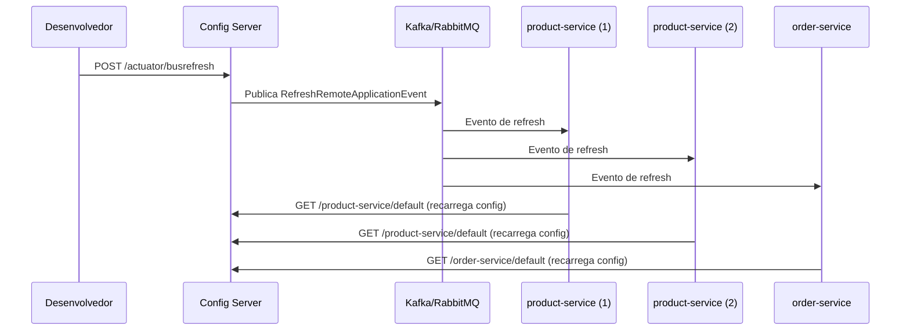

### 8.6 Partitioning

O partitioning garante que mensagens com a mesma chave sejam sempre processadas pela mesma instância do consumer:

```yaml
spring:
  cloud:
    stream:
      bindings:
        orderEvents-out-0:
          destination: order-events
          producer:
            partition-key-expression: headers['partitionKey']
            partition-count: 3

        processOrder-in-0:
          destination: order-events
          group: order-processor
          consumer:
            partitioned: true
            instance-count: 3
            instance-index: ${INSTANCE_INDEX:0}
```

```java
@Service
public class OrderService {

    private final StreamBridge streamBridge;

    public void publishOrderEvent(OrderEvent event) {
        streamBridge.send("orderEvents-out-0",
                MessageBuilder.withPayload(event)
                        .setHeader("partitionKey", event.customerId().toString())
                        .build());
    }
}
```

Isso garante que todos os eventos de um mesmo cliente sejam processados em ordem pela mesma instância.

---

## 9. Rastreamento Distribuído — Micrometer Tracing

### 9.1 O Desafio do Tracing em Microsserviços

Quando uma requisição atravessa múltiplos serviços, diagnosticar problemas de latência ou erros exige correlacionar logs e métricas de todos os serviços envolvidos. O rastreamento distribuído resolve isso atribuindo um **trace ID** único à requisição e propagando-o automaticamente entre os serviços.

> **Nota:** Para detalhes completos sobre observabilidade (logs estruturados, MDC, métricas Micrometer, OpenTelemetry), consulte [Dicas-Logs-Observabilidade.md](../Dicas-Logs-Observabilidade.md). Esta seção foca na propagação de traces entre microsserviços.

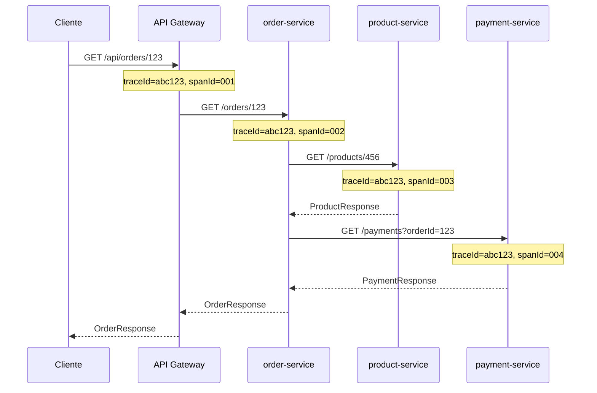

Todos os serviços compartilham o mesmo `traceId`, permitindo reconstruir a cadeia completa de chamadas.

### 9.2 Spring Cloud Sleuth vs Micrometer Tracing

[Versão] O **Spring Cloud Sleuth** foi descontinuado no Spring Cloud 2022.0. A partir do Spring Boot 3.x, o rastreamento é feito nativamente pelo **Micrometer Tracing**, que faz parte do Spring Boot Actuator.

| Aspecto | Sleuth (legado) | Micrometer Tracing (atual) |
|---|---|---|
| Spring Boot | 2.x | 3.x+ |
| Dependência | `spring-cloud-starter-sleuth` | `micrometer-tracing-bridge-*` |
| Instrumentação | Auto-config via Spring Cloud | Auto-config via Spring Boot Actuator |
| Propagação | B3 (Zipkin) | W3C Trace Context (padrão) ou B3 |
| Exportação | Zipkin, Wavefront | Zipkin, OTLP (Jaeger, Tempo, etc.) |

### 9.3 Setup com Micrometer Tracing

#### Dependências

```xml
<!-- Bridge para Brave (compatível com Zipkin) -->
<dependency>
    <groupId>io.micrometer</groupId>
    <artifactId>micrometer-tracing-bridge-brave</artifactId>
</dependency>

<!-- Exportador para Zipkin -->
<dependency>
    <groupId>io.zipkin.reporter2</groupId>
    <artifactId>zipkin-reporter-brave</artifactId>
</dependency>

<!-- OU: Bridge para OpenTelemetry -->
<dependency>
    <groupId>io.micrometer</groupId>
    <artifactId>micrometer-tracing-bridge-otel</artifactId>
</dependency>
<dependency>
    <groupId>io.opentelemetry</groupId>
    <artifactId>opentelemetry-exporter-otlp</artifactId>
</dependency>
```

#### Configuração

```yaml
management:
  tracing:
    sampling:
      probability: 1.0  # 1.0 = 100% das requisições (dev). Em prod, use 0.1 (10%)
  zipkin:
    tracing:
      endpoint: http://localhost:9411/api/v2/spans

# OU para OTLP (Jaeger, Grafana Tempo)
management:
  otlp:
    tracing:
      endpoint: http://localhost:4318/v1/traces

logging:
  pattern:
    level: "%5p [${spring.application.name:},%X{traceId:-},%X{spanId:-}]"
```

O pattern de log inclui automaticamente `traceId` e `spanId` em cada linha:

```
INFO [order-service,abc123def456,001aabbcc] Processing order 789
INFO [order-service,abc123def456,001aabbcc] Calling product-service
```

### 9.4 Propagação Automática

O Micrometer Tracing propaga o trace automaticamente nos seguintes cenários:

| Mecanismo | Propagação automática |
|---|---|
| RestTemplate | ✅ (com `@LoadBalanced` ou instrumentation) |
| RestClient | ✅ (Spring Boot 3.2+) |
| WebClient | ✅ |
| OpenFeign | ✅ (com `spring-cloud-starter-openfeign`) |
| Spring Cloud Gateway | ✅ |
| Spring Cloud Stream (Kafka/RabbitMQ) | ✅ (via headers da mensagem) |
| @Async | ✅ (com `TaskDecorator` ou auto-config) |
| @Scheduled | ✅ (cria novo trace) |

Para propagar manualmente em código assíncrono customizado:

```java
package br.com.exemplo.order.service;

import io.micrometer.tracing.Tracer;
import io.micrometer.tracing.Span;
import org.springframework.stereotype.Service;

@Service
public class OrderProcessingService {

    private final Tracer tracer;

    public OrderProcessingService(Tracer tracer) {
        this.tracer = tracer;
    }

    public void processWithCustomSpan(Order order) {
        Span span = tracer.nextSpan().name("process-order-validation").start();
        try (Tracer.SpanInScope ws = tracer.withSpan(span)) {
            validateOrder(order);
            span.tag("order.id", order.getId().toString());
            span.tag("order.total", order.getTotal().toString());
        } catch (Exception e) {
            span.error(e);
            throw e;
        } finally {
            span.end();
        }
    }
}
```

### 9.5 Docker Compose para Zipkin

```yaml
services:
  zipkin:
    image: openzipkin/zipkin:latest
    ports:
      - "9411:9411"
```

Acesse `http://localhost:9411` para visualizar os traces. Filtre por `serviceName` e clique em um trace para ver o diagrama de cascata com latência por serviço.

---

## 10. Segurança em Microsserviços

### 10.1 Estratégia de Segurança

Em uma arquitetura de microsserviços, a segurança é tipicamente implementada em camadas:

1. **API Gateway** — valida o token JWT do cliente externo;
2. **Serviços internos** — confiam no token propagado ou validam novamente;
3. **Comunicação interna** — idealmente via rede privada (VPC) com mTLS opcional.

> **Nota:** Para detalhes completos sobre Spring Security, OAuth2, JWT e Spring Authorization Server, consulte [Dicas-Spring-Security.md](../Dicas-Spring-Security.md).

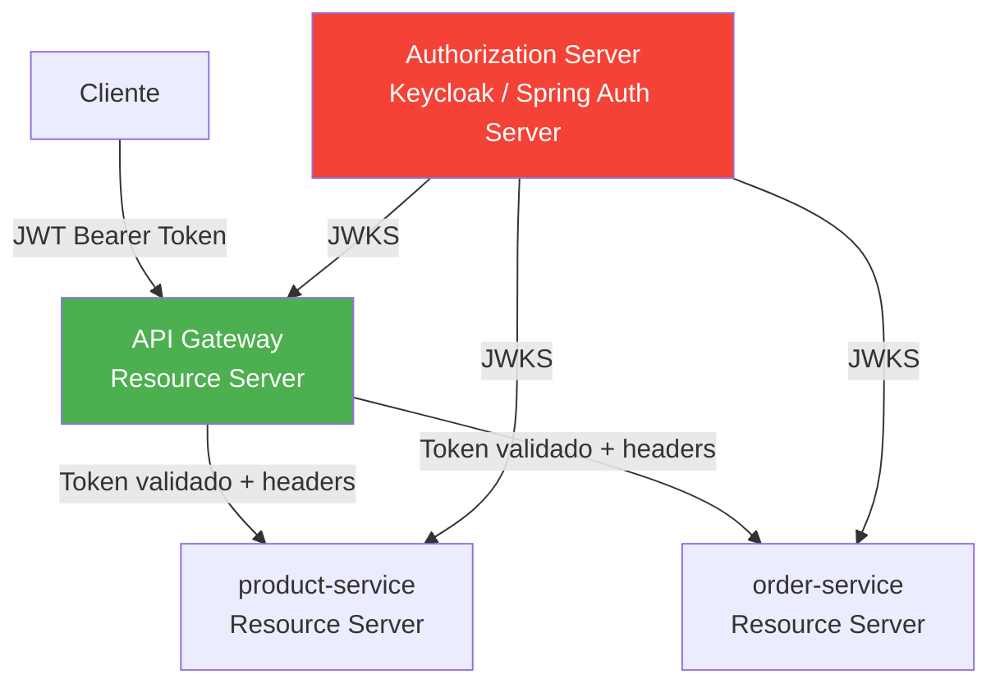

### 10.2 OAuth2 Resource Server no Gateway

```xml
<dependency>
    <groupId>org.springframework.boot</groupId>
    <artifactId>spring-boot-starter-oauth2-resource-server</artifactId>
</dependency>
```

```java
package br.com.exemplo.gateway.config;

import org.springframework.context.annotation.Bean;
import org.springframework.context.annotation.Configuration;
import org.springframework.security.config.annotation.web.reactive.EnableWebFluxSecurity;
import org.springframework.security.config.web.server.ServerHttpSecurity;
import org.springframework.security.web.server.SecurityWebFilterChain;

@Configuration
@EnableWebFluxSecurity
public class SecurityConfig {

    @Bean
    public SecurityWebFilterChain securityFilterChain(ServerHttpSecurity http) {
        return http
                .csrf(csrf -> csrf.disable())
                .authorizeExchange(exchanges -> exchanges
                        .pathMatchers("/actuator/**").permitAll()
                        .pathMatchers("/api/products/**").permitAll()
                        .pathMatchers("/api/orders/**").authenticated()
                        .pathMatchers("/api/payments/**").hasRole("ADMIN")
                        .anyExchange().authenticated())
                .oauth2ResourceServer(oauth2 -> oauth2
                        .jwt(jwt -> {}))
                .build();
    }
}
```

```yaml
spring:
  security:
    oauth2:
      resourceserver:
        jwt:
          issuer-uri: http://localhost:9000
          # OU jwk-set-uri: http://localhost:9000/oauth2/jwks
```

### 10.3 Propagação de Tokens entre Serviços

#### Via Feign Interceptor

```java
package br.com.exemplo.order.config;

import feign.RequestInterceptor;
import org.springframework.context.annotation.Bean;
import org.springframework.context.annotation.Configuration;
import org.springframework.security.core.context.SecurityContextHolder;
import org.springframework.security.oauth2.server.resource.authentication.JwtAuthenticationToken;

@Configuration
public class FeignSecurityConfig {

    @Bean
    public RequestInterceptor jwtPropagationInterceptor() {
        return template -> {
            var authentication = SecurityContextHolder.getContext().getAuthentication();
            if (authentication instanceof JwtAuthenticationToken jwtAuth) {
                String token = jwtAuth.getToken().getTokenValue();
                template.header("Authorization", "Bearer " + token);
            }
        };
    }
}
```

#### Via TokenRelay no Gateway

O Spring Cloud Gateway oferece o filtro `TokenRelay` que propaga automaticamente o token OAuth2:

```yaml
spring:
  cloud:
    gateway:
      routes:
        - id: order-service
          uri: lb://order-service
          predicates:
            - Path=/api/orders/**
          filters:
            - StripPrefix=1
            - TokenRelay
```

```xml
<dependency>
    <groupId>org.springframework.boot</groupId>
    <artifactId>spring-boot-starter-oauth2-client</artifactId>
</dependency>
```

### 10.4 Segurança nos Serviços Internos

Cada microsserviço pode validar o JWT de forma independente (sem chamar o Authorization Server a cada requisição) usando a chave pública (JWKS):

```java
package br.com.exemplo.order.config;

import org.springframework.context.annotation.Bean;
import org.springframework.context.annotation.Configuration;
import org.springframework.security.config.annotation.method.configuration.EnableMethodSecurity;
import org.springframework.security.config.annotation.web.builders.HttpSecurity;
import org.springframework.security.config.annotation.web.configuration.EnableWebSecurity;
import org.springframework.security.config.http.SessionCreationPolicy;
import org.springframework.security.web.SecurityFilterChain;

@Configuration
@EnableWebSecurity
@EnableMethodSecurity
public class ResourceServerConfig {

    @Bean
    public SecurityFilterChain filterChain(HttpSecurity http) throws Exception {
        return http
                .csrf(csrf -> csrf.disable())
                .sessionManagement(session -> session
                        .sessionCreationPolicy(SessionCreationPolicy.STATELESS))
                .authorizeHttpRequests(auth -> auth
                        .requestMatchers("/actuator/**").permitAll()
                        .anyRequest().authenticated())
                .oauth2ResourceServer(oauth2 -> oauth2
                        .jwt(jwt -> {}))
                .build();
    }
}
```

```java
package br.com.exemplo.order.controller;

import org.springframework.security.access.prepost.PreAuthorize;
import org.springframework.security.core.annotation.AuthenticationPrincipal;
import org.springframework.security.oauth2.jwt.Jwt;
import org.springframework.web.bind.annotation.*;

@RestController
@RequestMapping("/orders")
public class OrderController {

    @GetMapping("/my")
    public List<OrderResponse> myOrders(@AuthenticationPrincipal Jwt jwt) {
        String userId = jwt.getSubject();
        return orderService.findByUserId(userId);
    }

    @DeleteMapping("/{id}")
    @PreAuthorize("hasRole('ADMIN')")
    public void cancelOrder(@PathVariable Long id) {
        orderService.cancel(id);
    }
}
```

### 10.5 Spring Authorization Server como IdP

[Versão] O Spring Authorization Server é um projeto oficial do Spring que implementa OAuth 2.1 e OpenID Connect 1.0. Ele substitui o descontinuado Spring Security OAuth.

```xml
<dependency>
    <groupId>org.springframework.boot</groupId>
    <artifactId>spring-boot-starter-oauth2-authorization-server</artifactId>
</dependency>
```

```yaml
server:
  port: 9000

spring:
  security:
    oauth2:
      authorizationserver:
        client:
          api-gateway:
            registration:
              client-id: api-gateway
              client-secret: "{noop}gateway-secret"
              authorization-grant-types:
                - authorization_code
                - refresh_token
                - client_credentials
              redirect-uris:
                - http://localhost:8080/login/oauth2/code/gateway
              scopes:
                - openid
                - profile
                - read
                - write
            require-authorization-consent: false
```

[Recomendado] Para produção, considere o **Keycloak** em vez do Spring Authorization Server se precisar de: UI de administração pronta, federação de identidade (LDAP, SAML, social login), multi-tenancy e gestão de usuários. Use o Spring Authorization Server quando quiser controle total e customização do fluxo OAuth2.

---

## 11. Outros Módulos e Projetos Relacionados

### 11.1 Spring Cloud Function

Permite escrever lógica de negócio como `java.util.function.Function`, `Consumer` ou `Supplier`, desacoplada do runtime. A mesma função pode rodar como:

- Endpoint REST (Spring MVC/WebFlux);
- Consumer/producer de mensageria (Spring Cloud Stream);
- Função serverless (AWS Lambda, Azure Functions, Google Cloud Functions).

```xml
<dependency>
    <groupId>org.springframework.cloud</groupId>
    <artifactId>spring-cloud-starter-function-web</artifactId>
</dependency>
```

```java
package br.com.exemplo.functions;

import org.springframework.context.annotation.Bean;
import org.springframework.context.annotation.Configuration;

import java.util.function.Function;

@Configuration
public class StringFunctions {

    @Bean
    public Function<String, String> uppercase() {
        return String::toUpperCase;
    }

    @Bean
    public Function<String, String> reverse() {
        return s -> new StringBuilder(s).reverse().toString();
    }
}
```

```bash
# Invocando via HTTP
curl -X POST http://localhost:8080/uppercase -d "hello" -H "Content-Type: text/plain"
# Retorna: HELLO

# Composição de funções
curl -X POST http://localhost:8080/uppercase,reverse -d "hello"
# Retorna: OLLEH
```

Para deploy em AWS Lambda:

```xml
<dependency>
    <groupId>org.springframework.cloud</groupId>
    <artifactId>spring-cloud-function-adapter-aws</artifactId>
</dependency>
```

### 11.2 Spring Cloud Kubernetes

Para aplicações deployadas em Kubernetes, o Spring Cloud Kubernetes integra com as APIs nativas do K8s:

| Funcionalidade | Spring Cloud Kubernetes | Equivalente Spring Cloud |
|---|---|---|
| Service Discovery | Kubernetes DNS + Service | Eureka |
| Configuração | ConfigMaps e Secrets | Config Server |
| Load Balancing | kube-proxy / Istio | Spring Cloud LoadBalancer |
| Health checks | Liveness/Readiness probes | Actuator health |

```xml
<dependency>
    <groupId>org.springframework.cloud</groupId>
    <artifactId>spring-cloud-starter-kubernetes-client-all</artifactId>
</dependency>
```

```yaml
spring:
  cloud:
    kubernetes:
      config:
        enabled: true
        sources:
          - name: product-service-config
            namespace: default
      discovery:
        enabled: true
        all-namespaces: false
      reload:
        enabled: true
        strategy: refresh
        period: 15000
```

[Recomendado] Em Kubernetes, avalie se realmente precisa do Eureka e Config Server. O K8s já oferece service discovery (DNS), configuração (ConfigMaps) e load balancing (Services) nativamente. Use Spring Cloud Kubernetes para integrar com esses mecanismos de forma idiomática.

### 11.3 Spring Cloud Vault

Integra com o HashiCorp Vault para gerenciamento de segredos:

```xml
<dependency>
    <groupId>org.springframework.cloud</groupId>
    <artifactId>spring-cloud-starter-vault-config</artifactId>
</dependency>
```

```yaml
spring:
  config:
    import: optional:vault://
  cloud:
    vault:
      uri: http://localhost:8200
      token: ${VAULT_TOKEN}
      kv:
        enabled: true
        backend: secret
        default-context: ${spring.application.name}
```

O Vault é usado no lugar do Config Server para propriedades sensíveis (senhas de banco, chaves de API, certificados), com suporte a:

- **Segredos dinâmicos** — credenciais de banco geradas sob demanda e rotacionadas automaticamente;
- **Leasing e renovação** — segredos com TTL (expiram e são renovados);
- **Auditoria** — log de todos os acessos a segredos.

### 11.4 Spring Cloud Contract

Define contratos entre produtor e consumidor de APIs, gerando testes automaticamente em ambos os lados.

> **Nota:** Consulte [Boas-Praticas-Arquitetura.md](../Boas-Praticas-Arquitetura.md) seção 8.8 para detalhes completos sobre Contract Testing com Spring Cloud Contract.

```xml
<!-- No serviço produtor (product-service) -->
<dependency>
    <groupId>org.springframework.cloud</groupId>
    <artifactId>spring-cloud-starter-contract-verifier</artifactId>
    <scope>test</scope>
</dependency>
```

Contrato em Groovy DSL (`src/test/resources/contracts/`):

```groovy
// shouldReturnProduct.groovy
Contract.make {
    description "should return product by id"
    request {
        method GET()
        url "/products/1"
    }
    response {
        status 200
        headers {
            contentType applicationJson()
        }
        body(
            id: 1,
            name: "Notebook",
            price: 2999.90,
            stock: 50
        )
    }
}
```

No consumidor (order-service):

```xml
<dependency>
    <groupId>org.springframework.cloud</groupId>
    <artifactId>spring-cloud-starter-contract-stub-runner</artifactId>
    <scope>test</scope>
</dependency>
```

```java
@SpringBootTest
@AutoConfigureStubRunner(
    ids = "br.com.exemplo:product-service:+:stubs:6565",
    stubsMode = StubRunnerProperties.StubsMode.LOCAL
)
class OrderServiceContractTest {

    @Autowired
    private ProductClient productClient;

    @Test
    void shouldGetProductFromStub() {
        ProductResponse product = productClient.findById(1L);

        assertThat(product.name()).isEqualTo("Notebook");
        assertThat(product.price()).isEqualByComparingTo("2999.90");
    }
}
```

### 11.5 Spring Cloud Task

Para tarefas de curta duração (batch jobs, migrações, processamento pontual) que executam e terminam:

```xml
<dependency>
    <groupId>org.springframework.cloud</groupId>
    <artifactId>spring-cloud-starter-task</artifactId>
</dependency>
```

```java
package br.com.exemplo.task;

import org.springframework.boot.CommandLineRunner;
import org.springframework.boot.SpringApplication;
import org.springframework.boot.autoconfigure.SpringBootApplication;
import org.springframework.cloud.task.configuration.EnableTask;
import org.springframework.context.annotation.Bean;

@SpringBootApplication
@EnableTask
public class DataMigrationTask {

    public static void main(String[] args) {
        SpringApplication.run(DataMigrationTask.class, args);
    }

    @Bean
    public CommandLineRunner migration(UserRepository repository) {
        return args -> {
            repository.findAll().forEach(user -> {
                user.setEmailVerified(false);
                repository.save(user);
            });
        };
    }
}
```

O Spring Cloud Task registra automaticamente o início, fim e status da execução em uma tabela do banco de dados.

### 11.6 Spring Cloud Data Flow

Orquestrador para pipelines de dados compostos por:

- **Stream** — processamento contínuo de eventos (Spring Cloud Stream);
- **Task** — jobs de curta duração (Spring Cloud Task / Spring Batch).

O Data Flow oferece um dashboard web para compor, monitorar e gerenciar pipelines:

```
http-source | transform-processor | jdbc-sink
```

Cada componente é um microsserviço Spring Boot independente, deployado e escalado pelo Data Flow em plataformas como Kubernetes ou Cloud Foundry.

### 11.7 Tabela Comparativa — Módulos Spring Cloud

| Módulo | Status | Função | Alternativa Nativa K8s |
|---|---|---|---|
| **Netflix Eureka** | ✅ Ativo | Service Discovery | Kubernetes DNS/Service |
| **Spring Cloud Gateway** | ✅ Ativo | API Gateway | Ingress Controller (nginx, Istio) |
| **Spring Cloud Config** | ✅ Ativo | Configuração centralizada | ConfigMaps/Secrets |
| **OpenFeign** | ✅ Ativo (manutenção) | HTTP Client declarativo | HTTP Interface (Spring 6.1+) |
| **Spring Cloud LoadBalancer** | ✅ Ativo | Client-side load balancing | kube-proxy |
| **Spring Cloud Stream** | ✅ Ativo | Messaging abstraction | — (sem equivalente K8s) |
| **Spring Cloud Bus** | ✅ Ativo | Event propagation | — |
| **Spring Cloud Function** | ✅ Ativo | Serverless functions | Knative |
| **Spring Cloud Kubernetes** | ✅ Ativo | Integração nativa K8s | — (é a integração) |
| **Spring Cloud Vault** | ✅ Ativo | Secrets management | Kubernetes Secrets (limitado) |
| **Spring Cloud Contract** | ✅ Ativo | Contract testing | — |
| **Spring Cloud Task** | ✅ Ativo | Short-lived tasks | Kubernetes Jobs |
| **Spring Cloud Data Flow** | ✅ Ativo | Pipeline orchestration | Argo Workflows |
| ~~Netflix Ribbon~~ | ❌ Descontinuado | Load balancing | Spring Cloud LoadBalancer |
| ~~Netflix Hystrix~~ | ❌ Descontinuado | Circuit breaker | Resilience4j |
| ~~Netflix Zuul~~ | ❌ Descontinuado | API Gateway | Spring Cloud Gateway |
| ~~Spring Cloud Sleuth~~ | ❌ Descontinuado | Distributed tracing | Micrometer Tracing |

---

## 12. Tutorial Prático — Ecossistema Completo

Este tutorial implementa um sistema de e-commerce simplificado com 3 microsserviços de negócio, um Config Server, um Eureka Server e um API Gateway. A arquitetura demonstra os principais módulos do Spring Cloud funcionando juntos.

### 12.1 Visão Geral da Arquitetura

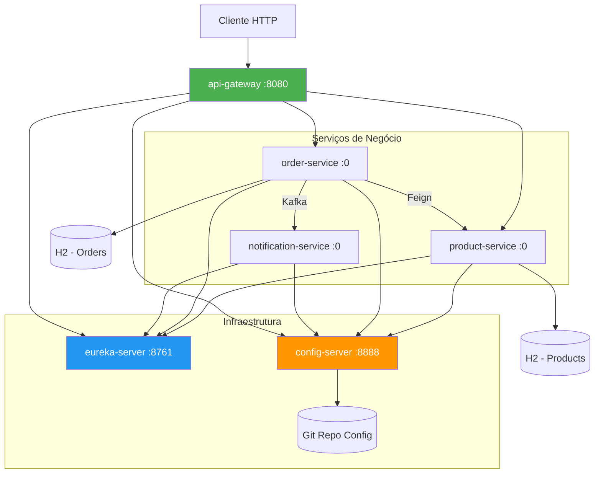

| Módulo | Porta | Função |
|---|---|---|
| `config-server` | 8888 | Centraliza configurações (Git backend) |
| `eureka-server` | 8761 | Service Discovery |
| `api-gateway` | 8080 | Roteamento, rate limiting, circuit breaker |
| `product-service` | aleatória | CRUD de produtos |
| `order-service` | aleatória | Criação de pedidos (chama product-service via Feign) |
| `notification-service` | aleatória | Consome eventos de pedidos via Kafka |

### 12.2 Estrutura do Projeto Multi-Módulo Maven

```
spring-cloud-ecommerce/
├── pom.xml                          ← POM pai
├── config-server/
│   ├── pom.xml
│   └── src/main/java/...
├── eureka-server/
│   ├── pom.xml
│   └── src/main/java/...
├── api-gateway/
│   ├── pom.xml
│   └── src/main/java/...
├── product-service/
│   ├── pom.xml
│   └── src/main/java/...
├── order-service/
│   ├── pom.xml
│   └── src/main/java/...
├── notification-service/
│   ├── pom.xml
│   └── src/main/java/...
└── docker-compose.yml
```

#### POM Pai

```xml
<?xml version="1.0" encoding="UTF-8"?>
<project xmlns="http://maven.apache.org/POM/4.0.0"
         xmlns:xsi="http://www.w3.org/2001/XMLSchema-instance"
         xsi:schemaLocation="http://maven.apache.org/POM/4.0.0
         https://maven.apache.org/xsd/maven-4.0.0.xsd">
    <modelVersion>4.0.0</modelVersion>

    <parent>
        <groupId>org.springframework.boot</groupId>
        <artifactId>spring-boot-starter-parent</artifactId>
        <version>3.4.1</version>
        <relativePath/>
    </parent>

    <groupId>br.com.exemplo</groupId>
    <artifactId>spring-cloud-ecommerce</artifactId>
    <version>1.0.0</version>
    <packaging>pom</packaging>

    <modules>
        <module>config-server</module>
        <module>eureka-server</module>
        <module>api-gateway</module>
        <module>product-service</module>
        <module>order-service</module>
        <module>notification-service</module>
    </modules>

    <properties>
        <java.version>17</java.version>
        <spring-cloud.version>2024.0.1</spring-cloud.version>
    </properties>

    <dependencyManagement>
        <dependencies>
            <dependency>
                <groupId>org.springframework.cloud</groupId>
                <artifactId>spring-cloud-dependencies</artifactId>
                <version>${spring-cloud.version}</version>
                <type>pom</type>
                <scope>import</scope>
            </dependency>
        </dependencies>
    </dependencyManagement>
</project>
```

### 12.3 Config Server e Repositório Git de Configuração

#### POM do Config Server

```xml
<parent>
    <groupId>br.com.exemplo</groupId>
    <artifactId>spring-cloud-ecommerce</artifactId>
    <version>1.0.0</version>
</parent>

<artifactId>config-server</artifactId>

<dependencies>
    <dependency>
        <groupId>org.springframework.cloud</groupId>
        <artifactId>spring-cloud-config-server</artifactId>
    </dependency>
</dependencies>
```

#### Classe principal

```java
package br.com.exemplo.config;

import org.springframework.boot.SpringApplication;
import org.springframework.boot.autoconfigure.SpringBootApplication;
import org.springframework.cloud.config.server.EnableConfigServer;

@SpringBootApplication
@EnableConfigServer
public class ConfigServerApplication {

    public static void main(String[] args) {
        SpringApplication.run(ConfigServerApplication.class, args);
    }
}
```

#### `application.yml` do Config Server

```yaml
server:
  port: 8888

spring:
  application:
    name: config-server
  cloud:
    config:
      server:
        git:
          uri: file://${user.home}/config-repo
          default-label: main
          clone-on-start: true
```

Para o tutorial, usamos um repositório Git local. Em produção, use um repositório remoto (GitHub, GitLab).

#### Repositório de Configuração

Inicialize o repositório Git local:

```bash
mkdir ~/config-repo && cd ~/config-repo
git init
```

**`application.yml`** — propriedades compartilhadas por todos os serviços:

```yaml
# ~/config-repo/application.yml

eureka:
  client:
    service-url:
      defaultZone: http://localhost:8761/eureka/
  instance:
    prefer-ip-address: true

management:
  endpoints:
    web:
      exposure:
        include: health, info, refresh
  tracing:
    sampling:
      probability: 1.0
```

**`product-service.yml`**:

```yaml
# ~/config-repo/product-service.yml

server:
  port: 0

spring:
  datasource:
    url: jdbc:h2:mem:products
    driver-class-name: org.h2.Driver
  jpa:
    hibernate:
      ddl-auto: create-drop
    show-sql: false
  h2:
    console:
      enabled: true
```

**`order-service.yml`**:

```yaml
# ~/config-repo/order-service.yml

server:
  port: 0

spring:
  datasource:
    url: jdbc:h2:mem:orders
    driver-class-name: org.h2.Driver
  jpa:
    hibernate:
      ddl-auto: create-drop
  kafka:
    bootstrap-servers: localhost:9092
```

**`notification-service.yml`**:

```yaml
# ~/config-repo/notification-service.yml

server:
  port: 0

spring:
  kafka:
    bootstrap-servers: localhost:9092
```

**`api-gateway.yml`**:

```yaml
# ~/config-repo/api-gateway.yml

server:
  port: 8080

spring:
  cloud:
    gateway:
      routes:
        - id: product-service
          uri: lb://product-service
          predicates:
            - Path=/api/products/**
          filters:
            - StripPrefix=1

        - id: order-service
          uri: lb://order-service
          predicates:
            - Path=/api/orders/**
          filters:
            - StripPrefix=1
            - name: CircuitBreaker
              args:
                name: orderServiceCB
                fallbackUri: forward:/fallback/orders

resilience4j:
  circuitbreaker:
    instances:
      orderServiceCB:
        sliding-window-size: 10
        failure-rate-threshold: 50
        wait-duration-in-open-state: 10s
  timelimiter:
    instances:
      orderServiceCB:
        timeout-duration: 3s
```

Faça commit das configurações:

```bash
cd ~/config-repo
git add . && git commit -m "Configurações iniciais dos serviços"
```

### 12.4 Eureka Server

#### POM

```xml
<parent>
    <groupId>br.com.exemplo</groupId>
    <artifactId>spring-cloud-ecommerce</artifactId>
    <version>1.0.0</version>
</parent>

<artifactId>eureka-server</artifactId>

<dependencies>
    <dependency>
        <groupId>org.springframework.cloud</groupId>
        <artifactId>spring-cloud-starter-netflix-eureka-server</artifactId>
    </dependency>
</dependencies>
```

#### Classe principal

```java
package br.com.exemplo.eureka;

import org.springframework.boot.SpringApplication;
import org.springframework.boot.autoconfigure.SpringBootApplication;
import org.springframework.cloud.netflix.eureka.server.EnableEurekaServer;

@SpringBootApplication
@EnableEurekaServer
public class EurekaServerApplication {

    public static void main(String[] args) {
        SpringApplication.run(EurekaServerApplication.class, args);
    }
}
```

#### `application.yml`

```yaml
server:
  port: 8761

spring:
  application:
    name: eureka-server

eureka:
  client:
    register-with-eureka: false
    fetch-registry: false
  server:
    enable-self-preservation: false
    eviction-interval-timer-in-ms: 5000
```

### 12.5 Serviço de Produtos (product-service)

#### POM

```xml
<parent>
    <groupId>br.com.exemplo</groupId>
    <artifactId>spring-cloud-ecommerce</artifactId>
    <version>1.0.0</version>
</parent>

<artifactId>product-service</artifactId>

<dependencies>
    <dependency>
        <groupId>org.springframework.boot</groupId>
        <artifactId>spring-boot-starter-web</artifactId>
    </dependency>
    <dependency>
        <groupId>org.springframework.boot</groupId>
        <artifactId>spring-boot-starter-data-jpa</artifactId>
    </dependency>
    <dependency>
        <groupId>org.springframework.boot</groupId>
        <artifactId>spring-boot-starter-validation</artifactId>
    </dependency>
    <dependency>
        <groupId>org.springframework.boot</groupId>
        <artifactId>spring-boot-starter-actuator</artifactId>
    </dependency>
    <dependency>
        <groupId>org.springframework.cloud</groupId>
        <artifactId>spring-cloud-starter-netflix-eureka-client</artifactId>
    </dependency>
    <dependency>
        <groupId>org.springframework.cloud</groupId>
        <artifactId>spring-cloud-starter-config</artifactId>
    </dependency>
    <dependency>
        <groupId>com.h2database</groupId>
        <artifactId>h2</artifactId>
        <scope>runtime</scope>
    </dependency>
</dependencies>
```

#### `application.yml`

```yaml
spring:
  application:
    name: product-service
  config:
    import: optional:configserver:http://localhost:8888
```

#### Entidade

```java
package br.com.exemplo.product.model;

import jakarta.persistence.*;
import java.math.BigDecimal;

@Entity
@Table(name = "products")
public class Product {

    @Id
    @GeneratedValue(strategy = GenerationType.IDENTITY)
    private Long id;

    @Column(nullable = false)
    private String name;

    @Column(nullable = false, precision = 10, scale = 2)
    private BigDecimal price;

    @Column(nullable = false)
    private Integer stock;

    public Product() {}

    public Product(String name, BigDecimal price, Integer stock) {
        this.name = name;
        this.price = price;
        this.stock = stock;
    }

    public Long getId() { return id; }
    public void setId(Long id) { this.id = id; }
    public String getName() { return name; }
    public void setName(String name) { this.name = name; }
    public BigDecimal getPrice() { return price; }
    public void setPrice(BigDecimal price) { this.price = price; }
    public Integer getStock() { return stock; }
    public void setStock(Integer stock) { this.stock = stock; }
}
```

#### Repository

```java
package br.com.exemplo.product.repository;

import br.com.exemplo.product.model.Product;
import org.springframework.data.jpa.repository.JpaRepository;

public interface ProductRepository extends JpaRepository<Product, Long> {
}
```

#### DTOs

```java
package br.com.exemplo.product.dto;

import jakarta.validation.constraints.NotBlank;
import jakarta.validation.constraints.NotNull;
import jakarta.validation.constraints.Positive;
import jakarta.validation.constraints.PositiveOrZero;
import java.math.BigDecimal;

public record ProductRequest(
        @NotBlank String name,
        @NotNull @Positive BigDecimal price,
        @NotNull @PositiveOrZero Integer stock
) {}
```

```java
package br.com.exemplo.product.dto;

import java.math.BigDecimal;

public record ProductResponse(Long id, String name, BigDecimal price, Integer stock) {}
```

#### Service

```java
package br.com.exemplo.product.service;

import br.com.exemplo.product.dto.ProductRequest;
import br.com.exemplo.product.dto.ProductResponse;
import br.com.exemplo.product.model.Product;
import br.com.exemplo.product.repository.ProductRepository;
import org.springframework.stereotype.Service;
import org.springframework.transaction.annotation.Transactional;

import java.util.List;

@Service
public class ProductService {

    private final ProductRepository repository;

    public ProductService(ProductRepository repository) {
        this.repository = repository;
    }

    public List<ProductResponse> findAll() {
        return repository.findAll().stream()
                .map(this::toResponse)
                .toList();
    }

    public ProductResponse findById(Long id) {
        return repository.findById(id)
                .map(this::toResponse)
                .orElseThrow(() -> new ProductNotFoundException(id));
    }

    @Transactional
    public ProductResponse create(ProductRequest request) {
        Product product = new Product(request.name(), request.price(), request.stock());
        return toResponse(repository.save(product));
    }

    @Transactional
    public void decreaseStock(Long productId, int quantity) {
        Product product = repository.findById(productId)
                .orElseThrow(() -> new ProductNotFoundException(productId));

        if (product.getStock() < quantity) {
            throw new InsufficientStockException(productId, product.getStock(), quantity);
        }

        product.setStock(product.getStock() - quantity);
        repository.save(product);
    }

    private ProductResponse toResponse(Product product) {
        return new ProductResponse(product.getId(), product.getName(),
                product.getPrice(), product.getStock());
    }
}
```

#### Controller

```java
package br.com.exemplo.product.controller;

import br.com.exemplo.product.dto.ProductRequest;
import br.com.exemplo.product.dto.ProductResponse;
import br.com.exemplo.product.service.ProductService;
import jakarta.validation.Valid;
import org.springframework.http.HttpStatus;
import org.springframework.web.bind.annotation.*;

import java.util.List;

@RestController
@RequestMapping("/products")
public class ProductController {

    private final ProductService service;

    public ProductController(ProductService service) {
        this.service = service;
    }

    @GetMapping
    public List<ProductResponse> findAll() {
        return service.findAll();
    }

    @GetMapping("/{id}")
    public ProductResponse findById(@PathVariable Long id) {
        return service.findById(id);
    }

    @PostMapping
    @ResponseStatus(HttpStatus.CREATED)
    public ProductResponse create(@Valid @RequestBody ProductRequest request) {
        return service.create(request);
    }

    @PutMapping("/{id}/decrease-stock")
    public void decreaseStock(@PathVariable Long id, @RequestParam int quantity) {
        service.decreaseStock(id, quantity);
    }
}
```

#### Exceções

```java
package br.com.exemplo.product.service;

import org.springframework.http.HttpStatus;
import org.springframework.web.bind.annotation.ResponseStatus;

@ResponseStatus(HttpStatus.NOT_FOUND)
public class ProductNotFoundException extends RuntimeException {
    public ProductNotFoundException(Long id) {
        super("Produto não encontrado: " + id);
    }
}
```

```java
package br.com.exemplo.product.service;

import org.springframework.http.HttpStatus;
import org.springframework.web.bind.annotation.ResponseStatus;

@ResponseStatus(HttpStatus.CONFLICT)
public class InsufficientStockException extends RuntimeException {
    public InsufficientStockException(Long productId, int available, int requested) {
        super("Estoque insuficiente para produto %d: disponível=%d, solicitado=%d"
                .formatted(productId, available, requested));
    }
}
```

#### Carga inicial de dados

```java
package br.com.exemplo.product;

import br.com.exemplo.product.model.Product;
import br.com.exemplo.product.repository.ProductRepository;
import org.springframework.boot.CommandLineRunner;
import org.springframework.context.annotation.Bean;
import org.springframework.context.annotation.Configuration;

import java.math.BigDecimal;

@Configuration
public class DataLoader {

    @Bean
    CommandLineRunner loadProducts(ProductRepository repository) {
        return args -> {
            repository.save(new Product("Notebook Dell", new BigDecimal("4599.90"), 50));
            repository.save(new Product("Mouse Logitech", new BigDecimal("149.90"), 200));
            repository.save(new Product("Teclado Mecânico", new BigDecimal("349.90"), 80));
            repository.save(new Product("Monitor 27\"", new BigDecimal("1899.90"), 30));
        };
    }
}
```

### 12.6 Serviço de Pedidos (order-service) com Feign

#### POM

```xml
<parent>
    <groupId>br.com.exemplo</groupId>
    <artifactId>spring-cloud-ecommerce</artifactId>
    <version>1.0.0</version>
</parent>

<artifactId>order-service</artifactId>

<dependencies>
    <dependency>
        <groupId>org.springframework.boot</groupId>
        <artifactId>spring-boot-starter-web</artifactId>
    </dependency>
    <dependency>
        <groupId>org.springframework.boot</groupId>
        <artifactId>spring-boot-starter-data-jpa</artifactId>
    </dependency>
    <dependency>
        <groupId>org.springframework.boot</groupId>
        <artifactId>spring-boot-starter-validation</artifactId>
    </dependency>
    <dependency>
        <groupId>org.springframework.boot</groupId>
        <artifactId>spring-boot-starter-actuator</artifactId>
    </dependency>
    <dependency>
        <groupId>org.springframework.cloud</groupId>
        <artifactId>spring-cloud-starter-netflix-eureka-client</artifactId>
    </dependency>
    <dependency>
        <groupId>org.springframework.cloud</groupId>
        <artifactId>spring-cloud-starter-config</artifactId>
    </dependency>
    <dependency>
        <groupId>org.springframework.cloud</groupId>
        <artifactId>spring-cloud-starter-openfeign</artifactId>
    </dependency>
    <dependency>
        <groupId>org.springframework.cloud</groupId>
        <artifactId>spring-cloud-starter-circuitbreaker-resilience4j</artifactId>
    </dependency>
    <dependency>
        <groupId>org.springframework.cloud</groupId>
        <artifactId>spring-cloud-stream-binder-kafka</artifactId>
    </dependency>
    <dependency>
        <groupId>com.h2database</groupId>
        <artifactId>h2</artifactId>
        <scope>runtime</scope>
    </dependency>
</dependencies>
```

#### `application.yml`

```yaml
spring:
  application:
    name: order-service
  config:
    import: optional:configserver:http://localhost:8888
  cloud:
    openfeign:
      circuitbreaker:
        enabled: true
    stream:
      bindings:
        orderEvents-out-0:
          destination: order-events
          content-type: application/json

resilience4j:
  circuitbreaker:
    instances:
      product-service:
        sliding-window-size: 10
        failure-rate-threshold: 50
        wait-duration-in-open-state: 5s
  timelimiter:
    instances:
      product-service:
        timeout-duration: 3s
```

#### Classe principal

```java
package br.com.exemplo.order;

import org.springframework.boot.SpringApplication;
import org.springframework.boot.autoconfigure.SpringBootApplication;
import org.springframework.cloud.openfeign.EnableFeignClients;

@SpringBootApplication
@EnableFeignClients
public class OrderServiceApplication {

    public static void main(String[] args) {
        SpringApplication.run(OrderServiceApplication.class, args);
    }
}
```

#### Feign Client para product-service

```java
package br.com.exemplo.order.client;

import br.com.exemplo.order.dto.ProductResponse;
import org.springframework.cloud.openfeign.FeignClient;
import org.springframework.web.bind.annotation.GetMapping;
import org.springframework.web.bind.annotation.PathVariable;
import org.springframework.web.bind.annotation.PutMapping;
import org.springframework.web.bind.annotation.RequestParam;

@FeignClient(name = "product-service", fallbackFactory = ProductClientFallbackFactory.class)
public interface ProductClient {

    @GetMapping("/products/{id}")
    ProductResponse findById(@PathVariable Long id);

    @PutMapping("/products/{id}/decrease-stock")
    void decreaseStock(@PathVariable Long id, @RequestParam int quantity);
}
```

```java
package br.com.exemplo.order.client;

import br.com.exemplo.order.dto.ProductResponse;
import org.slf4j.Logger;
import org.slf4j.LoggerFactory;
import org.springframework.cloud.openfeign.FallbackFactory;
import org.springframework.stereotype.Component;

import java.math.BigDecimal;

@Component
public class ProductClientFallbackFactory implements FallbackFactory<ProductClient> {

    private static final Logger log = LoggerFactory.getLogger(ProductClientFallbackFactory.class);

    @Override
    public ProductClient create(Throwable cause) {
        return new ProductClient() {
            @Override
            public ProductResponse findById(Long id) {
                log.warn("Fallback: product-service indisponível para produto {}: {}",
                        id, cause.getMessage());
                return null;
            }

            @Override
            public void decreaseStock(Long id, int quantity) {
                log.error("Fallback: não foi possível decrementar estoque do produto {}: {}",
                        id, cause.getMessage());
                throw new RuntimeException("Serviço de produtos indisponível", cause);
            }
        };
    }
}
```

#### DTOs

```java
package br.com.exemplo.order.dto;

import java.math.BigDecimal;

public record ProductResponse(Long id, String name, BigDecimal price, Integer stock) {}
```

```java
package br.com.exemplo.order.dto;

import jakarta.validation.constraints.NotNull;
import jakarta.validation.constraints.Positive;

public record OrderRequest(
        @NotNull Long productId,
        @NotNull @Positive Integer quantity,
        @NotNull String customerEmail
) {}
```

```java
package br.com.exemplo.order.dto;

import java.math.BigDecimal;
import java.time.LocalDateTime;

public record OrderResponse(
        Long id,
        Long productId,
        String productName,
        Integer quantity,
        BigDecimal totalPrice,
        String status,
        String customerEmail,
        LocalDateTime createdAt
) {}
```

#### Evento

```java
package br.com.exemplo.order.dto;

import java.math.BigDecimal;
import java.time.LocalDateTime;

public record OrderEvent(
        Long orderId,
        Long productId,
        String productName,
        Integer quantity,
        BigDecimal totalPrice,
        String customerEmail,
        String status,
        LocalDateTime timestamp
) {}
```

#### Entidade

```java
package br.com.exemplo.order.model;

import jakarta.persistence.*;
import java.math.BigDecimal;
import java.time.LocalDateTime;

@Entity
@Table(name = "orders")
public class Order {

    @Id
    @GeneratedValue(strategy = GenerationType.IDENTITY)
    private Long id;

    @Column(nullable = false)
    private Long productId;

    private String productName;

    @Column(nullable = false)
    private Integer quantity;

    @Column(nullable = false, precision = 10, scale = 2)
    private BigDecimal totalPrice;

    @Column(nullable = false)
    private String customerEmail;

    @Column(nullable = false)
    @Enumerated(EnumType.STRING)
    private OrderStatus status;

    @Column(nullable = false)
    private LocalDateTime createdAt;

    @PrePersist
    void prePersist() {
        this.createdAt = LocalDateTime.now();
    }

    public Long getId() { return id; }
    public void setId(Long id) { this.id = id; }
    public Long getProductId() { return productId; }
    public void setProductId(Long productId) { this.productId = productId; }
    public String getProductName() { return productName; }
    public void setProductName(String productName) { this.productName = productName; }
    public Integer getQuantity() { return quantity; }
    public void setQuantity(Integer quantity) { this.quantity = quantity; }
    public BigDecimal getTotalPrice() { return totalPrice; }
    public void setTotalPrice(BigDecimal totalPrice) { this.totalPrice = totalPrice; }
    public String getCustomerEmail() { return customerEmail; }
    public void setCustomerEmail(String customerEmail) { this.customerEmail = customerEmail; }
    public OrderStatus getStatus() { return status; }
    public void setStatus(OrderStatus status) { this.status = status; }
    public LocalDateTime getCreatedAt() { return createdAt; }
    public void setCreatedAt(LocalDateTime createdAt) { this.createdAt = createdAt; }
}
```

```java
package br.com.exemplo.order.model;

public enum OrderStatus {
    CREATED, CONFIRMED, CANCELLED
}
```

#### Repository

```java
package br.com.exemplo.order.repository;

import br.com.exemplo.order.model.Order;
import org.springframework.data.jpa.repository.JpaRepository;

public interface OrderRepository extends JpaRepository<Order, Long> {
}
```

#### Service

```java
package br.com.exemplo.order.service;

import br.com.exemplo.order.client.ProductClient;
import br.com.exemplo.order.dto.*;
import br.com.exemplo.order.model.Order;
import br.com.exemplo.order.model.OrderStatus;
import br.com.exemplo.order.repository.OrderRepository;
import org.slf4j.Logger;
import org.slf4j.LoggerFactory;
import org.springframework.cloud.stream.function.StreamBridge;
import org.springframework.stereotype.Service;
import org.springframework.transaction.annotation.Transactional;

import java.time.LocalDateTime;
import java.util.List;

@Service
public class OrderService {

    private static final Logger log = LoggerFactory.getLogger(OrderService.class);

    private final OrderRepository repository;
    private final ProductClient productClient;
    private final StreamBridge streamBridge;

    public OrderService(OrderRepository repository,
                        ProductClient productClient,
                        StreamBridge streamBridge) {
        this.repository = repository;
        this.productClient = productClient;
        this.streamBridge = streamBridge;
    }

    public List<OrderResponse> findAll() {
        return repository.findAll().stream()
                .map(this::toResponse)
                .toList();
    }

    public OrderResponse findById(Long id) {
        return repository.findById(id)
                .map(this::toResponse)
                .orElseThrow(() -> new OrderNotFoundException(id));
    }

    @Transactional
    public OrderResponse createOrder(OrderRequest request) {
        ProductResponse product = productClient.findById(request.productId());

        if (product == null) {
            throw new RuntimeException("Produto não encontrado ou serviço indisponível");
        }

        if (product.stock() < request.quantity()) {
            throw new RuntimeException("Estoque insuficiente: disponível=%d, solicitado=%d"
                    .formatted(product.stock(), request.quantity()));
        }

        productClient.decreaseStock(request.productId(), request.quantity());

        Order order = new Order();
        order.setProductId(product.id());
        order.setProductName(product.name());
        order.setQuantity(request.quantity());
        order.setTotalPrice(product.price().multiply(java.math.BigDecimal.valueOf(request.quantity())));
        order.setCustomerEmail(request.customerEmail());
        order.setStatus(OrderStatus.CREATED);

        order = repository.save(order);
        log.info("Pedido criado: id={}, produto={}, quantidade={}", order.getId(),
                product.name(), request.quantity());

        // Publicar evento para notification-service
        OrderEvent event = new OrderEvent(
                order.getId(), product.id(), product.name(),
                order.getQuantity(), order.getTotalPrice(),
                order.getCustomerEmail(), order.getStatus().name(),
                LocalDateTime.now()
        );
        streamBridge.send("orderEvents-out-0", event);
        log.info("Evento OrderEvent publicado para pedido {}", order.getId());

        return toResponse(order);
    }

    private OrderResponse toResponse(Order order) {
        return new OrderResponse(
                order.getId(), order.getProductId(), order.getProductName(),
                order.getQuantity(), order.getTotalPrice(),
                order.getStatus().name(), order.getCustomerEmail(),
                order.getCreatedAt()
        );
    }
}
```

```java
package br.com.exemplo.order.service;

import org.springframework.http.HttpStatus;
import org.springframework.web.bind.annotation.ResponseStatus;

@ResponseStatus(HttpStatus.NOT_FOUND)
public class OrderNotFoundException extends RuntimeException {
    public OrderNotFoundException(Long id) {
        super("Pedido não encontrado: " + id);
    }
}
```

#### Controller

```java
package br.com.exemplo.order.controller;

import br.com.exemplo.order.dto.OrderRequest;
import br.com.exemplo.order.dto.OrderResponse;
import br.com.exemplo.order.service.OrderService;
import jakarta.validation.Valid;
import org.springframework.http.HttpStatus;
import org.springframework.web.bind.annotation.*;

import java.util.List;

@RestController
@RequestMapping("/orders")
public class OrderController {

    private final OrderService service;

    public OrderController(OrderService service) {
        this.service = service;
    }

    @GetMapping
    public List<OrderResponse> findAll() {
        return service.findAll();
    }

    @GetMapping("/{id}")
    public OrderResponse findById(@PathVariable Long id) {
        return service.findById(id);
    }

    @PostMapping
    @ResponseStatus(HttpStatus.CREATED)
    public OrderResponse create(@Valid @RequestBody OrderRequest request) {
        return service.createOrder(request);
    }
}
```

### 12.7 Serviço de Notificação (notification-service)

#### POM

```xml
<parent>
    <groupId>br.com.exemplo</groupId>
    <artifactId>spring-cloud-ecommerce</artifactId>
    <version>1.0.0</version>
</parent>

<artifactId>notification-service</artifactId>

<dependencies>
    <dependency>
        <groupId>org.springframework.boot</groupId>
        <artifactId>spring-boot-starter-web</artifactId>
    </dependency>
    <dependency>
        <groupId>org.springframework.boot</groupId>
        <artifactId>spring-boot-starter-actuator</artifactId>
    </dependency>
    <dependency>
        <groupId>org.springframework.cloud</groupId>
        <artifactId>spring-cloud-starter-netflix-eureka-client</artifactId>
    </dependency>
    <dependency>
        <groupId>org.springframework.cloud</groupId>
        <artifactId>spring-cloud-starter-config</artifactId>
    </dependency>
    <dependency>
        <groupId>org.springframework.cloud</groupId>
        <artifactId>spring-cloud-stream-binder-kafka</artifactId>
    </dependency>
</dependencies>
```

#### `application.yml`

```yaml
spring:
  application:
    name: notification-service
  config:
    import: optional:configserver:http://localhost:8888
  cloud:
    stream:
      bindings:
        processOrderEvent-in-0:
          destination: order-events
          group: notification-group
          content-type: application/json
      kafka:
        bindings:
          processOrderEvent-in-0:
            consumer:
              enable-dlq: true
              dlq-name: order-events-notification-dlq
```

#### Classe principal

```java
package br.com.exemplo.notification;

import org.springframework.boot.SpringApplication;
import org.springframework.boot.autoconfigure.SpringBootApplication;

@SpringBootApplication
public class NotificationServiceApplication {

    public static void main(String[] args) {
        SpringApplication.run(NotificationServiceApplication.class, args);
    }
}
```

#### Consumer de eventos

```java
package br.com.exemplo.notification.messaging;

import br.com.exemplo.notification.dto.OrderEvent;
import org.slf4j.Logger;
import org.slf4j.LoggerFactory;
import org.springframework.context.annotation.Bean;
import org.springframework.context.annotation.Configuration;

import java.util.function.Consumer;

@Configuration
public class OrderEventConsumer {

    private static final Logger log = LoggerFactory.getLogger(OrderEventConsumer.class);

    @Bean
    public Consumer<OrderEvent> processOrderEvent() {
        return event -> {
            log.info("╔══════════════════════════════════════════╗");
            log.info("║          NOTIFICAÇÃO DE PEDIDO           ║");
            log.info("╠══════════════════════════════════════════╣");
            log.info("║ Pedido:    #{}", event.orderId());
            log.info("║ Produto:   {} (x{})", event.productName(), event.quantity());
            log.info("║ Total:     R$ {}", event.totalPrice());
            log.info("║ Cliente:   {}", event.customerEmail());
            log.info("║ Status:    {}", event.status());
            log.info("║ Data:      {}", event.timestamp());
            log.info("╚══════════════════════════════════════════╝");

            // Em produção: enviar e-mail, SMS, push notification
            // mailService.send(event.customerEmail(), "Pedido #" + event.orderId(), ...);
        };
    }
}
```

```java
package br.com.exemplo.notification.dto;

import java.math.BigDecimal;
import java.time.LocalDateTime;

public record OrderEvent(
        Long orderId,
        Long productId,
        String productName,
        Integer quantity,
        BigDecimal totalPrice,
        String customerEmail,
        String status,
        LocalDateTime timestamp
) {}
```

### 12.8 API Gateway

#### POM

```xml
<parent>
    <groupId>br.com.exemplo</groupId>
    <artifactId>spring-cloud-ecommerce</artifactId>
    <version>1.0.0</version>
</parent>

<artifactId>api-gateway</artifactId>

<dependencies>
    <dependency>
        <groupId>org.springframework.cloud</groupId>
        <artifactId>spring-cloud-starter-gateway</artifactId>
    </dependency>
    <dependency>
        <groupId>org.springframework.cloud</groupId>
        <artifactId>spring-cloud-starter-netflix-eureka-client</artifactId>
    </dependency>
    <dependency>
        <groupId>org.springframework.cloud</groupId>
        <artifactId>spring-cloud-starter-config</artifactId>
    </dependency>
    <dependency>
        <groupId>org.springframework.cloud</groupId>
        <artifactId>spring-cloud-starter-circuitbreaker-reactor-resilience4j</artifactId>
    </dependency>
    <dependency>
        <groupId>org.springframework.boot</groupId>
        <artifactId>spring-boot-starter-actuator</artifactId>
    </dependency>
</dependencies>
```

#### Classe principal

```java
package br.com.exemplo.gateway;

import org.springframework.boot.SpringApplication;
import org.springframework.boot.autoconfigure.SpringBootApplication;

@SpringBootApplication
public class ApiGatewayApplication {

    public static void main(String[] args) {
        SpringApplication.run(ApiGatewayApplication.class, args);
    }
}
```

#### `application.yml`

```yaml
spring:
  application:
    name: api-gateway
  config:
    import: optional:configserver:http://localhost:8888
```

#### Filtro de logging

```java
package br.com.exemplo.gateway.filter;

import org.slf4j.Logger;
import org.slf4j.LoggerFactory;
import org.springframework.cloud.gateway.filter.GatewayFilterChain;
import org.springframework.cloud.gateway.filter.GlobalFilter;
import org.springframework.core.Ordered;
import org.springframework.stereotype.Component;
import org.springframework.web.server.ServerWebExchange;
import reactor.core.publisher.Mono;

@Component
public class LoggingFilter implements GlobalFilter, Ordered {

    private static final Logger log = LoggerFactory.getLogger(LoggingFilter.class);

    @Override
    public Mono<Void> filter(ServerWebExchange exchange, GatewayFilterChain chain) {
        String method = exchange.getRequest().getMethod().name();
        String path = exchange.getRequest().getPath().toString();
        long start = System.currentTimeMillis();

        log.info(">>> {} {}", method, path);

        return chain.filter(exchange).then(Mono.fromRunnable(() -> {
            long duration = System.currentTimeMillis() - start;
            int status = exchange.getResponse().getStatusCode() != null
                    ? exchange.getResponse().getStatusCode().value() : 0;
            log.info("<<< {} {} → {} ({}ms)", method, path, status, duration);
        }));
    }

    @Override
    public int getOrder() {
        return -1;
    }
}
```

#### Fallback controller

```java
package br.com.exemplo.gateway.controller;

import org.springframework.web.bind.annotation.GetMapping;
import org.springframework.web.bind.annotation.RequestMapping;
import org.springframework.web.bind.annotation.RestController;
import reactor.core.publisher.Mono;

import java.util.Map;

@RestController
@RequestMapping("/fallback")
public class FallbackController {

    @GetMapping("/orders")
    public Mono<Map<String, String>> ordersFallback() {
        return Mono.just(Map.of(
                "erro", "Serviço de pedidos temporariamente indisponível",
                "sugestao", "Tente novamente em alguns instantes"
        ));
    }
}
```

### 12.9 Docker Compose

```yaml
# docker-compose.yml
services:
  kafka:
    image: confluentinc/cp-kafka:7.7.0
    hostname: kafka
    ports:
      - "9092:9092"
    environment:
      KAFKA_NODE_ID: 1
      KAFKA_LISTENER_SECURITY_PROTOCOL_MAP: CONTROLLER:PLAINTEXT,PLAINTEXT:PLAINTEXT,HOST:PLAINTEXT
      KAFKA_ADVERTISED_LISTENERS: PLAINTEXT://kafka:29092,HOST://localhost:9092
      KAFKA_LISTENERS: PLAINTEXT://0.0.0.0:29092,CONTROLLER://0.0.0.0:9093,HOST://0.0.0.0:9092
      KAFKA_CONTROLLER_LISTENER_NAMES: CONTROLLER
      KAFKA_CONTROLLER_QUORUM_VOTERS: 1@kafka:9093
      KAFKA_PROCESS_ROLES: broker,controller
      KAFKA_OFFSETS_TOPIC_REPLICATION_FACTOR: 1
      KAFKA_GROUP_INITIAL_REBALANCE_DELAY_MS: 0
      CLUSTER_ID: MkU3OEVBNTcwNTJENDM2Qk

  zipkin:
    image: openzipkin/zipkin:latest
    ports:
      - "9411:9411"
```

### 12.10 Ordem de Inicialização e Testes

#### Ordem de inicialização

1. `docker compose up -d` — sobe Kafka e Zipkin
2. `config-server` — deve estar disponível antes dos demais
3. `eureka-server` — deve estar disponível para registro
4. `product-service`, `order-service`, `notification-service` — em qualquer ordem
5. `api-gateway` — por último (depende de todos os serviços registrados no Eureka)

[Atenção] Aguarde ~10-15 segundos entre cada etapa para que o serviço anterior esteja totalmente pronto. Em produção, use health checks e readiness probes.

#### Testando o fluxo completo

```bash
# 1. Verificar o Eureka Dashboard
open http://localhost:8761

# 2. Listar produtos (via Gateway)
curl http://localhost:8080/api/products | jq

# Resposta esperada:
# [
#   {"id": 1, "name": "Notebook Dell", "price": 4599.90, "stock": 50},
#   {"id": 2, "name": "Mouse Logitech", "price": 149.90, "stock": 200},
#   ...
# ]

# 3. Buscar produto por ID (via Gateway)
curl http://localhost:8080/api/products/1 | jq

# 4. Criar um pedido (via Gateway)
curl -X POST http://localhost:8080/api/orders \
  -H "Content-Type: application/json" \
  -d '{
    "productId": 1,
    "quantity": 2,
    "customerEmail": "cliente@exemplo.com"
  }' | jq

# Resposta esperada:
# {
#   "id": 1,
#   "productId": 1,
#   "productName": "Notebook Dell",
#   "quantity": 2,
#   "totalPrice": 9199.80,
#   "status": "CREATED",
#   "customerEmail": "cliente@exemplo.com",
#   "createdAt": "2025-01-15T10:30:00"
# }

# 5. Verificar que o estoque foi decrementado
curl http://localhost:8080/api/products/1 | jq
# stock deve ser 48 (50 - 2)

# 6. Verificar nos logs do notification-service que o evento foi consumido
# Deve aparecer:
# ╔══════════════════════════════════════════╗
# ║          NOTIFICAÇÃO DE PEDIDO           ║
# ╠══════════════════════════════════════════╣
# ║ Pedido:    #1
# ║ Produto:   Notebook Dell (x2)
# ║ Total:     R$ 9199.80
# ...

# 7. Listar pedidos (via Gateway)
curl http://localhost:8080/api/orders | jq

# 8. Testar circuit breaker — pare o order-service e faça uma requisição
curl http://localhost:8080/api/orders
# Deve retornar o fallback:
# {"erro": "Serviço de pedidos temporariamente indisponível", ...}
```

---

## 13. Spring Modulith — Modularidade sem Distribuição

### 13.1 Motivação

Microsserviços resolvem problemas reais (deploy independente, escalabilidade por domínio, autonomia de equipes), mas introduzem complexidade significativa:

- Latência de rede entre serviços;
- Consistência eventual (transações distribuídas);
- Infraestrutura extra (service discovery, gateway, message broker, config server);
- Debugging e tracing distribuído;
- Versionamento de APIs internas;
- Overhead operacional (N deploys, N monitoramentos, N pipelines).

**Spring Modulith** oferece uma alternativa: um **monólito modular** — uma única aplicação Spring Boot com módulos bem definidos, fronteiras enforçadas e comunicação assíncrona via eventos, mas sem a sobrecarga de rede e infraestrutura distribuída.

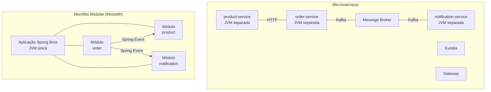

### 13.2 Conceitos Fundamentais

#### Application Modules

No Spring Modulith, cada **pacote direto** abaixo do pacote raiz da aplicação é um módulo:

```
br.com.exemplo.ecommerce/          ← pacote raiz (onde está @SpringBootApplication)
├── product/                        ← Módulo "product"
│   ├── Product.java               ← API pública do módulo (pacote raiz)
│   ├── ProductService.java
│   └── internal/                   ← Pacote interno (não pode ser acessado por outros módulos)
│       ├── ProductRepository.java
│       └── ProductEntity.java
├── order/                          ← Módulo "order"
│   ├── OrderService.java
│   ├── OrderCreated.java          ← Evento publicado
│   └── internal/
│       ├── OrderRepository.java
│       └── OrderEntity.java
└── notification/                   ← Módulo "notification"
    └── internal/
        └── NotificationListener.java
```

**Regras de visibilidade:**

- Classes no **pacote raiz do módulo** (ex: `product/`) são a **API pública** — outros módulos podem acessá-las.
- Classes em **subpacotes** (ex: `product/internal/`) são **internas** — acessíveis apenas dentro do próprio módulo.
- O Spring Modulith **enforce** essas regras em testes — se um módulo acessar classes internas de outro, o teste falha.

### 13.3 Dependências

```xml
<dependencyManagement>
    <dependencies>
        <dependency>
            <groupId>org.springframework.modulith</groupId>
            <artifactId>spring-modulith-bom</artifactId>
            <version>1.3.1</version>
            <type>pom</type>
            <scope>import</scope>
        </dependency>
    </dependencies>
</dependencyManagement>

<dependencies>
    <!-- Core -->
    <dependency>
        <groupId>org.springframework.modulith</groupId>
        <artifactId>spring-modulith-starter-core</artifactId>
    </dependency>

    <!-- Persistência do Event Publication Registry (JDBC) -->
    <dependency>
        <groupId>org.springframework.modulith</groupId>
        <artifactId>spring-modulith-starter-jdbc</artifactId>
    </dependency>

    <!-- Testes de módulos -->
    <dependency>
        <groupId>org.springframework.modulith</groupId>
        <artifactId>spring-modulith-starter-test</artifactId>
        <scope>test</scope>
    </dependency>

    <!-- Observabilidade -->
    <dependency>
        <groupId>org.springframework.modulith</groupId>
        <artifactId>spring-modulith-observability</artifactId>
    </dependency>

    <!-- Documentação automática -->
    <dependency>
        <groupId>org.springframework.modulith</groupId>
        <artifactId>spring-modulith-docs</artifactId>
        <scope>test</scope>
    </dependency>
</dependencies>
```

### 13.4 Estrutura de Pacotes e Regras de Visibilidade

#### Módulo simples (pacote único)

```
br.com.exemplo.ecommerce.product/
├── ProductService.java              ← público
├── ProductResponse.java             ← público
└── ProductRepository.java           ← público (cuidado: expõe detalhes de persistência)
```

#### Módulo com API explícita e internals

```
br.com.exemplo.ecommerce.product/
├── ProductService.java              ← API pública
├── ProductResponse.java             ← DTO público
├── ProductCreated.java              ← Evento público
└── internal/
    ├── ProductEntity.java           ← interno
    ├── ProductRepository.java       ← interno
    └── ProductMapper.java           ← interno
```

#### Permitindo acesso explícito com `@NamedInterface`

```java
package br.com.exemplo.ecommerce.product.spi;

import org.springframework.modulith.NamedInterface;

@NamedInterface("spi")
public interface ProductInventoryCheck {
    boolean hasStock(Long productId, int quantity);
}
```

Outros módulos podem depender explicitamente da named interface `product::spi`:

```java
package br.com.exemplo.ecommerce.order;

import org.springframework.modulith.ApplicationModule;

@ApplicationModule(allowedDependencies = {"product::spi"})
class OrderModule {
}
```

#### Organizando um módulo de negócio em subpacotes públicos

Em módulos maiores, concentrar todas as classes públicas no pacote raiz gera arquivos demais em um único diretório. O `@NamedInterface` permite organizar a API pública do módulo em subpacotes temáticos — cada subpacote anotado fica visível para outros módulos, enquanto subpacotes sem anotação permanecem internos.

Exemplo do módulo `product` organizado em subpacotes:

```
br.com.exemplo.ecommerce.product/
├── ProductService.java                  ← público (pacote raiz — sempre visível)
├── dto/
│   ├── package-info.java                ← @NamedInterface("dto")
│   ├── ProductResponse.java             ← público via named interface
│   ├── ProductSummary.java              ← público via named interface
│   └── CreateProductRequest.java        ← público via named interface
├── event/
│   ├── package-info.java                ← @NamedInterface("events")
│   ├── ProductCreated.java              ← público via named interface
│   └── StockChanged.java               ← público via named interface
├── spi/
│   ├── package-info.java                ← @NamedInterface("spi")
│   └── ProductInventoryCheck.java       ← público via named interface
└── internal/
    ├── ProductEntity.java               ← INTERNO (sem @NamedInterface)
    ├── ProductRepository.java           ← INTERNO
    ├── ProductServiceImpl.java          ← INTERNO
    ├── ProductMapper.java               ← INTERNO
    └── ProductController.java           ← INTERNO
```

Cada `package-info.java` contém apenas a anotação:

```java
// product/dto/package-info.java
@org.springframework.modulith.NamedInterface("dto")
package br.com.exemplo.ecommerce.product.dto;
```

```java
// product/event/package-info.java
@org.springframework.modulith.NamedInterface("events")
package br.com.exemplo.ecommerce.product.event;
```

```java
// product/spi/package-info.java
@org.springframework.modulith.NamedInterface("spi")
package br.com.exemplo.ecommerce.product.spi;
```

O subpacote `internal/` não tem `package-info.java` com `@NamedInterface`, então suas classes são inacessíveis para outros módulos — exatamente como antes.

Com essa estrutura, o módulo `product` expõe quatro named interfaces que outros módulos podem referenciar:

| Named interface | Referência | Conteúdo |
|---|---|---|
| *(pacote raiz)* | `product` | `ProductService` |
| `dto` | `product::dto` | `ProductResponse`, `ProductSummary`, `CreateProductRequest` |
| `events` | `product::events` | `ProductCreated`, `StockChanged` |
| `spi` | `product::spi` | `ProductInventoryCheck` |

#### Controlando quais named interfaces cada módulo pode acessar

Sem `@ApplicationModule(allowedDependencies = ...)`, qualquer módulo pode acessar qualquer named interface exposta. Para restringir, declare as dependências explicitamente:

```java
// O módulo order só acessa a interface de serviço, DTOs e eventos do product
package br.com.exemplo.ecommerce.order;

import org.springframework.modulith.ApplicationModule;

@ApplicationModule(allowedDependencies = {
    "product",            // ProductService (pacote raiz)
    "product::dto",       // ProductResponse, ProductSummary
    "product::events",    // ProductCreated, StockChanged
    "common"              // utilitários compartilhados
})
class OrderModule {}
```

```java
// O módulo notification só precisa dos eventos
package br.com.exemplo.ecommerce.notification;

import org.springframework.modulith.ApplicationModule;

@ApplicationModule(allowedDependencies = {
    "product::events",
    "order::events",
    "common"
})
class NotificationModule {}
```

Se o módulo `notification` tentar importar `ProductResponse` (que está em `product::dto`), o `modules.verify()` falha:

```
Module 'notification' depends on non-exposed type
br.com.exemplo.ecommerce.product.dto.ProductResponse
via allowed dependencies [product::events, order::events, common]
```

#### Exemplo completo — classes do módulo product com subpacotes

```java
package br.com.exemplo.ecommerce.product;

import br.com.exemplo.ecommerce.product.dto.CreateProductRequest;
import br.com.exemplo.ecommerce.product.dto.ProductResponse;
import br.com.exemplo.ecommerce.product.dto.ProductSummary;
import org.springframework.data.domain.Page;
import org.springframework.data.domain.Pageable;

import java.util.Optional;

public interface ProductService {
    Page<ProductSummary> findAll(Pageable pageable);
    Optional<ProductResponse> findById(Long id);
    ProductResponse create(CreateProductRequest request);
    void decreaseStock(Long productId, int quantity);
}
```

```java
package br.com.exemplo.ecommerce.product.dto;

import java.math.BigDecimal;

public record ProductResponse(Long id, String name, String description,
                                BigDecimal price, int stock, String category) {}
```

```java
package br.com.exemplo.ecommerce.product.dto;

import java.math.BigDecimal;

public record ProductSummary(Long id, String name, BigDecimal price) {}
```

```java
package br.com.exemplo.ecommerce.product.dto;

import jakarta.validation.constraints.*;
import java.math.BigDecimal;

public record CreateProductRequest(
        @NotBlank String name,
        String description,
        @NotNull @Positive BigDecimal price,
        @NotNull @PositiveOrZero Integer stock,
        @NotBlank String category
) {}
```

```java
package br.com.exemplo.ecommerce.product.event;

import java.math.BigDecimal;
import java.time.Instant;

public record ProductCreated(Long productId, String name, BigDecimal price, Instant timestamp) {}
```

```java
package br.com.exemplo.ecommerce.product.event;

import java.time.Instant;

public record StockChanged(Long productId, int previousStock, int newStock, String reason,
                            Instant timestamp) {}
```

A implementação interna usa os DTOs e eventos públicos normalmente — eles estão no mesmo módulo:

```java
package br.com.exemplo.ecommerce.product.internal;

import br.com.exemplo.ecommerce.product.ProductService;
import br.com.exemplo.ecommerce.product.dto.*;
import br.com.exemplo.ecommerce.product.event.*;
import org.springframework.context.ApplicationEventPublisher;
import org.springframework.data.domain.Page;
import org.springframework.data.domain.Pageable;
import org.springframework.stereotype.Service;
import org.springframework.transaction.annotation.Transactional;

import java.time.Instant;
import java.util.Optional;

@Service
class ProductServiceImpl implements ProductService {

    private final ProductRepository repository;
    private final ApplicationEventPublisher events;

    ProductServiceImpl(ProductRepository repository, ApplicationEventPublisher events) {
        this.repository = repository;
        this.events = events;
    }

    @Override
    public Page<ProductSummary> findAll(Pageable pageable) {
        return repository.findAll(pageable)
                .map(e -> new ProductSummary(e.getId(), e.getName(), e.getPrice()));
    }

    @Override
    public Optional<ProductResponse> findById(Long id) {
        return repository.findById(id).map(this::toResponse);
    }

    @Override
    @Transactional
    public ProductResponse create(CreateProductRequest request) {
        var entity = new ProductEntity(
                request.name(), request.description(),
                request.price(), request.stock(), request.category());

        entity = repository.save(entity);

        events.publishEvent(new ProductCreated(
                entity.getId(), entity.getName(), entity.getPrice(), Instant.now()));

        return toResponse(entity);
    }

    @Override
    @Transactional
    public void decreaseStock(Long productId, int quantity) {
        var product = repository.findById(productId)
                .orElseThrow(() -> new IllegalArgumentException("Produto não encontrado: " + productId));

        int previousStock = product.getStock();
        product.decreaseStock(quantity);
        repository.save(product);

        events.publishEvent(new StockChanged(
                productId, previousStock, product.getStock(), "ORDER", Instant.now()));
    }

    private ProductResponse toResponse(ProductEntity e) {
        return new ProductResponse(e.getId(), e.getName(), e.getDescription(),
                e.getPrice(), e.getStock(), e.getCategory());
    }
}
```

```java
package br.com.exemplo.ecommerce.product.internal;

import br.com.exemplo.ecommerce.product.ProductService;
import br.com.exemplo.ecommerce.product.dto.*;
import jakarta.validation.Valid;
import org.springframework.data.domain.Page;
import org.springframework.data.domain.Pageable;
import org.springframework.http.HttpStatus;
import org.springframework.web.bind.annotation.*;

@RestController
@RequestMapping("/api/products")
class ProductController {

    private final ProductService service;

    ProductController(ProductService service) {
        this.service = service;
    }

    @GetMapping
    Page<ProductSummary> findAll(Pageable pageable) {
        return service.findAll(pageable);
    }

    @GetMapping("/{id}")
    ProductResponse findById(@PathVariable Long id) {
        return service.findById(id)
                .orElseThrow(() -> new IllegalArgumentException("Produto não encontrado: " + id));
    }

    @PostMapping
    @ResponseStatus(HttpStatus.CREATED)
    ProductResponse create(@Valid @RequestBody CreateProductRequest request) {
        return service.create(request);
    }
}
```

#### Resumo — como expor subpacotes de um módulo

| Mecanismo | O que expõe | Onde declarar | Quando usar |
|---|---|---|---|
| *(nenhum)* | Apenas classes do pacote raiz | — | Módulos simples com poucas classes |
| `@NamedInterface` no subpacote | Subpacotes específicos | `package-info.java` do subpacote | Módulos de negócio que precisam de organização interna com controle fino |
| `@ApplicationModule(type = OPEN)` | Todos os subpacotes | `package-info.java` do pacote raiz | Módulos utilitários onde tudo é público |

#### Módulos comuns e utilitários

Em praticamente todo projeto existe código compartilhado entre módulos: DTOs genéricos, exceções padronizadas, utilitários de data/formatação, classes de paginação, configurações transversais. No Spring Modulith, um módulo utilitário é um pacote como qualquer outro — a diferença é que ele precisa estar **aberto** para que todos os módulos possam usá-lo sem declarar dependências explícitas.

Por padrão, o Spring Modulith trata cada pacote direto sob o pacote raiz como um módulo. Qualquer classe **pública no pacote raiz** do módulo é acessível por outros módulos. Porém, classes dentro de subpacotes são consideradas internas e inacessíveis externamente. Para um módulo utilitário, isso costuma ser limitante — geralmente queremos expor classes organizadas em subpacotes.

A solução é marcar o módulo como **open** via `package-info.java`:

```
br.com.exemplo.ecommerce/
├── common/                              ← módulo utilitário
│   ├── package-info.java                ← @ApplicationModule(type = OPEN)
│   ├── PageResponse.java               ← público
│   ├── exception/
│   │   ├── BusinessException.java       ← público (graças ao OPEN)
│   │   ├── ResourceNotFoundException.java
│   │   └── GlobalExceptionHandler.java
│   └── util/
│       ├── DateUtils.java               ← público (graças ao OPEN)
│       └── SlugGenerator.java
├── product/
│   └── ...
├── order/
│   └── ...
└── notification/
    └── ...
```

O `package-info.java` do módulo `common`:

```java
@org.springframework.modulith.ApplicationModule(
    type = org.springframework.modulith.ApplicationModule.Type.OPEN,
    displayName = "Common — Utilitários compartilhados"
)
package br.com.exemplo.ecommerce.common;
```

Com `Type.OPEN`, **todas** as classes públicas do módulo — inclusive as de subpacotes como `exception/` e `util/` — ficam acessíveis para os demais módulos. Sem essa anotação, apenas as classes no pacote raiz `common/` seriam visíveis.

Exemplo dos utilitários compartilhados:

```java
package br.com.exemplo.ecommerce.common;

import java.util.List;

public record PageResponse<T>(
        List<T> content,
        int page,
        int size,
        long totalElements,
        int totalPages
) {
    public static <T> PageResponse<T> of(org.springframework.data.domain.Page<T> page) {
        return new PageResponse<>(
                page.getContent(),
                page.getNumber(),
                page.getSize(),
                page.getTotalElements(),
                page.getTotalPages()
        );
    }
}
```

```java
package br.com.exemplo.ecommerce.common.exception;

public class ResourceNotFoundException extends RuntimeException {

    private final String resource;
    private final Object id;

    public ResourceNotFoundException(String resource, Object id) {
        super("%s não encontrado com id: %s".formatted(resource, id));
        this.resource = resource;
        this.id = id;
    }

    public String getResource() { return resource; }
    public Object getId() { return id; }
}
```

```java
package br.com.exemplo.ecommerce.common.exception;

import org.springframework.http.HttpStatus;
import org.springframework.http.ProblemDetail;
import org.springframework.web.bind.annotation.ExceptionHandler;
import org.springframework.web.bind.annotation.RestControllerAdvice;

@RestControllerAdvice
public class GlobalExceptionHandler {

    @ExceptionHandler(ResourceNotFoundException.class)
    ProblemDetail handleNotFound(ResourceNotFoundException ex) {
        ProblemDetail detail = ProblemDetail.forStatusAndDetail(
                HttpStatus.NOT_FOUND, ex.getMessage());
        detail.setTitle("Recurso não encontrado");
        detail.setProperty("resource", ex.getResource());
        detail.setProperty("id", ex.getId());
        return detail;
    }

    @ExceptionHandler(IllegalArgumentException.class)
    ProblemDetail handleBadRequest(IllegalArgumentException ex) {
        return ProblemDetail.forStatusAndDetail(
                HttpStatus.BAD_REQUEST, ex.getMessage());
    }
}
```

Os módulos de negócio usam os utilitários normalmente:

```java
package br.com.exemplo.ecommerce.product.internal;

import br.com.exemplo.ecommerce.common.PageResponse;
import br.com.exemplo.ecommerce.common.exception.ResourceNotFoundException;
import org.springframework.data.domain.Pageable;
import org.springframework.stereotype.Service;

@Service
class ProductServiceImpl implements br.com.exemplo.ecommerce.product.ProductService {

    private final ProductRepository repository;

    ProductServiceImpl(ProductRepository repository) {
        this.repository = repository;
    }

    @Override
    public PageResponse<ProductResponse> findAll(Pageable pageable) {
        return PageResponse.of(repository.findAll(pageable).map(this::toResponse));
    }

    @Override
    public ProductResponse findById(Long id) {
        return repository.findById(id)
                .map(this::toResponse)
                .orElseThrow(() -> new ResourceNotFoundException("Produto", id));
    }

    // ...
}
```

#### Diferença entre OPEN e CLOSED

| Tipo | Quem acessa | Subpacotes visíveis | Quando usar |
|---|---|---|---|
| `CLOSED` (padrão) | Outros módulos só veem classes do pacote raiz | Não — subpacotes são internos | Módulos de negócio com API restrita |
| `OPEN` | Outros módulos veem todas as classes públicas | Sim — subpacotes também são públicos | Módulos utilitários e transversais |

#### Alternativa — `@NamedInterface` para exposição seletiva

Se o módulo `common` tiver partes que devem ser internas (ex: helpers de implementação), use `@NamedInterface` nos subpacotes que devem ser expostos em vez de abrir o módulo inteiro:

```
br.com.exemplo.ecommerce.common/
├── package-info.java                    ← sem @ApplicationModule(type = OPEN)
├── PageResponse.java                    ← público (pacote raiz)
├── exception/
│   ├── package-info.java                ← @NamedInterface("exceptions")
│   ├── ResourceNotFoundException.java   ← público via named interface
│   └── GlobalExceptionHandler.java
├── util/
│   ├── package-info.java                ← @NamedInterface("utils")
│   └── SlugGenerator.java              ← público via named interface
└── internal/
    └── CacheHelper.java                 ← interno — não exposto
```

```java
// common/exception/package-info.java
@org.springframework.modulith.NamedInterface("exceptions")
package br.com.exemplo.ecommerce.common.exception;
```

```java
// common/util/package-info.java
@org.springframework.modulith.NamedInterface("utils")
package br.com.exemplo.ecommerce.common.util;
```

Nesse modelo, módulos que queiram usar apenas exceções declaram a dependência de forma granular:

```java
@ApplicationModule(allowedDependencies = {"common::exceptions"})
```

Para módulos utilitários simples onde tudo é público, `Type.OPEN` é mais prático. Para módulos compartilhados maiores onde nem tudo deve ser exposto, `@NamedInterface` dá mais controle.

### 13.5 ApplicationModuleTest — Verificação de Fronteiras

O teste mais importante do Spring Modulith verifica que todos os módulos respeitam as regras de visibilidade:

```java
package br.com.exemplo.ecommerce;

import org.junit.jupiter.api.Test;
import org.springframework.modulith.core.ApplicationModules;

class ModularityTests {

    ApplicationModules modules = ApplicationModules.of(EcommerceApplication.class);

    @Test
    void shouldBeCompliantWithModuleRules() {
        modules.verify();
    }

    @Test
    void printModuleStructure() {
        modules.forEach(System.out::println);
    }
}
```

O `modules.verify()` verifica:

- ✅ Nenhum módulo acessa classes internas de outro módulo;
- ✅ Dependências cíclicas entre módulos são proibidas;
- ✅ Todas as classes estão dentro de um módulo reconhecido.

Se um módulo violar as regras, o teste falha com uma mensagem clara:

```
Module 'order' depends on non-exposed type
br.com.exemplo.ecommerce.product.internal.ProductEntity
```

#### Testando módulos isoladamente

```java
package br.com.exemplo.ecommerce.order;

import org.junit.jupiter.api.Test;
import org.springframework.modulith.test.ApplicationModuleTest;
import org.springframework.modulith.test.Scenario;
import org.springframework.beans.factory.annotation.Autowired;

@ApplicationModuleTest
class OrderModuleIntegrationTest {

    @Autowired
    private OrderService orderService;

    @Test
    void shouldCreateOrderAndPublishEvent(Scenario scenario) {
        scenario.stimulate(() -> orderService.createOrder(new OrderRequest(1L, 2, "test@test.com")))
                .andWaitForEventOfType(OrderCreated.class)
                .matching(event -> event.orderId() != null)
                .toArriveAndVerify(event -> {
                    assertThat(event.productId()).isEqualTo(1L);
                    assertThat(event.quantity()).isEqualTo(2);
                });
    }
}
```

O `@ApplicationModuleTest` carrega apenas o módulo sendo testado e seus módulos dependentes — não a aplicação inteira. Isso acelera os testes e garante isolamento.

### 13.6 Eventos entre Módulos

A comunicação entre módulos no Modulith é feita preferencialmente via **Spring Application Events**, evitando acoplamento direto:

#### Publicando eventos

```java
package br.com.exemplo.ecommerce.order;

import java.math.BigDecimal;
import java.time.Instant;

// Evento público do módulo order — outros módulos podem consumir
public record OrderCreated(
        Long orderId,
        Long productId,
        int quantity,
        BigDecimal totalPrice,
        String customerEmail,
        Instant timestamp
) {}
```

```java
package br.com.exemplo.ecommerce.order.internal;

import br.com.exemplo.ecommerce.order.OrderCreated;
import org.springframework.context.ApplicationEventPublisher;
import org.springframework.stereotype.Service;
import org.springframework.transaction.annotation.Transactional;

import java.math.BigDecimal;
import java.time.Instant;

@Service
public class OrderServiceImpl implements br.com.exemplo.ecommerce.order.OrderService {

    private final OrderRepository repository;
    private final ApplicationEventPublisher events;

    public OrderServiceImpl(OrderRepository repository, ApplicationEventPublisher events) {
        this.repository = repository;
        this.events = events;
    }

    @Override
    @Transactional
    public OrderResponse createOrder(OrderRequest request) {
        OrderEntity order = new OrderEntity();
        order.setProductId(request.productId());
        order.setQuantity(request.quantity());
        order.setCustomerEmail(request.customerEmail());
        order.setTotalPrice(request.unitPrice().multiply(BigDecimal.valueOf(request.quantity())));

        order = repository.save(order);

        events.publishEvent(new OrderCreated(
                order.getId(), order.getProductId(),
                order.getQuantity(), order.getTotalPrice(),
                order.getCustomerEmail(), Instant.now()
        ));

        return toResponse(order);
    }
}
```

#### Consumindo eventos

```java
package br.com.exemplo.ecommerce.product.internal;

import br.com.exemplo.ecommerce.order.OrderCreated;
import org.springframework.modulith.events.ApplicationModuleListener;
import org.springframework.stereotype.Component;

@Component
public class StockUpdateListener {

    private final ProductRepository repository;

    public StockUpdateListener(ProductRepository repository) {
        this.repository = repository;
    }

    @ApplicationModuleListener
    void onOrderCreated(OrderCreated event) {
        repository.findById(event.productId()).ifPresent(product -> {
            product.decreaseStock(event.quantity());
            repository.save(product);
        });
    }
}
```

```java
package br.com.exemplo.ecommerce.notification.internal;

import br.com.exemplo.ecommerce.order.OrderCreated;
import org.slf4j.Logger;
import org.slf4j.LoggerFactory;
import org.springframework.modulith.events.ApplicationModuleListener;
import org.springframework.stereotype.Component;

@Component
public class OrderNotificationListener {

    private static final Logger log = LoggerFactory.getLogger(OrderNotificationListener.class);

    @ApplicationModuleListener
    void onOrderCreated(OrderCreated event) {
        log.info("Enviando notificação para {} sobre pedido #{}", 
                event.customerEmail(), event.orderId());
        // emailService.send(...)
    }
}
```

[Recomendado] Use `@ApplicationModuleListener` em vez de `@EventListener` ou `@TransactionalEventListener`. O `@ApplicationModuleListener` combina:
- Execução **assíncrona** (em thread separada);
- Execução **após o commit** da transação do publicador;
- Integração com o **Event Publication Registry** (seção 13.7).

### 13.7 Transações e Event Publication Registry

O maior risco de eventos em uma aplicação monolítica é a **perda de eventos**: se o listener falhar (exceção, crash da JVM), o evento se perde porque estava apenas em memória.

O **Event Publication Registry** resolve isso persistindo os eventos em uma tabela do banco de dados, garantindo entrega **at-least-once**:

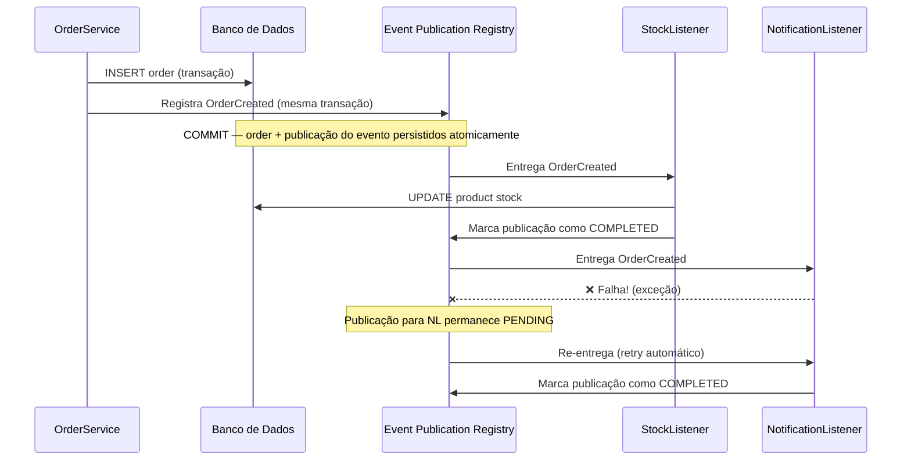

#### Configuração

```yaml
spring:
  modulith:
    events:
      republish-outstanding-events-on-restart: true
    jdbc:
      schema-initialization:
        enabled: true
```

A tabela `EVENT_PUBLICATION` é criada automaticamente:

```sql
CREATE TABLE EVENT_PUBLICATION (
    ID               UUID PRIMARY KEY,
    LISTENER_ID      VARCHAR(512) NOT NULL,
    EVENT_TYPE       VARCHAR(512) NOT NULL,
    SERIALIZED_EVENT TEXT NOT NULL,
    PUBLICATION_DATE TIMESTAMP NOT NULL,
    COMPLETION_DATE  TIMESTAMP
);
```

- Eventos com `COMPLETION_DATE = NULL` são pendentes — serão re-entregues no restart ou por um job periódico.
- Eventos completados podem ser limpos periodicamente.

#### Limpeza de eventos completados

```java
package br.com.exemplo.ecommerce.config;

import org.springframework.modulith.events.CompletedEventPublications;
import org.springframework.scheduling.annotation.Scheduled;
import org.springframework.stereotype.Component;

import java.time.Duration;

@Component
public class EventPublicationCleanup {

    private final CompletedEventPublications publications;

    public EventPublicationCleanup(CompletedEventPublications publications) {
        this.publications = publications;
    }

    @Scheduled(cron = "0 0 3 * * *")
    void cleanupOldPublications() {
        publications.deletePublicationsOlderThan(Duration.ofDays(7));
    }
}
```

### 13.8 Documentação Automática

O Spring Modulith gera documentação visual dos módulos automaticamente:

```java
package br.com.exemplo.ecommerce;

import org.junit.jupiter.api.Test;
import org.springframework.modulith.core.ApplicationModules;
import org.springframework.modulith.docs.Documenter;

class DocumentationTests {

    ApplicationModules modules = ApplicationModules.of(EcommerceApplication.class);

    @Test
    void generateDocumentation() {
        new Documenter(modules)
                .writeModulesAsPlantUml()       // Diagrama UML dos módulos
                .writeIndividualModulesAsPlantUml()  // Diagrama por módulo
                .writeModuleCanvases();          // Canvas textual de cada módulo
    }
}
```

Os diagramas são gerados em `target/spring-modulith-docs/` como arquivos PlantUML e Asciidoc. Eles mostram:

- Dependências entre módulos;
- Eventos publicados e consumidos;
- API pública de cada módulo;
- Beans Spring de cada módulo.

### 13.9 Observabilidade Integrada

Com `spring-modulith-observability`, o Modulith adiciona automaticamente:

- **Spans** para cada chamada entre módulos (Micrometer Tracing);
- **Métricas** de invocação de módulos (contadores, latência);
- **Logs** de eventos publicados e consumidos.

```yaml
management:
  tracing:
    sampling:
      probability: 1.0
```

No trace distribuído, você verá spans como:

```
[ecommerce] order.createOrder → 150ms
  └── [ecommerce] product.StockUpdateListener.onOrderCreated → 20ms
  └── [ecommerce] notification.OrderNotificationListener.onOrderCreated → 5ms
```

### 13.10 Propagação de JWT e contexto de requisição entre módulos

Em uma aplicação monolítica com Spring Modulith, a propagação do contexto de segurança e dos dados da requisição HTTP funciona de forma diferente dependendo do tipo de comunicação entre módulos.

#### Chamadas síncronas — mesmo thread

Quando um módulo chama outro diretamente (ex: `OrderServiceImpl` chama `ProductService`), tudo roda na mesma thread da requisição HTTP. Isso significa que:

- O `SecurityContextHolder` contém o `Authentication` com o JWT decodificado;
- O `RequestContextHolder` contém os atributos e headers da requisição;
- Não é necessário propagar nada manualmente — é uma das grandes vantagens do monólito modular sobre microsserviços.

```java
package br.com.exemplo.ecommerce.order.internal;

import br.com.exemplo.ecommerce.product.ProductService;
import org.springframework.security.core.Authentication;
import org.springframework.security.core.context.SecurityContextHolder;
import org.springframework.security.oauth2.jwt.Jwt;
import org.springframework.stereotype.Service;
import org.springframework.transaction.annotation.Transactional;

@Service
class OrderServiceImpl implements br.com.exemplo.ecommerce.order.OrderService {

    private final OrderRepository repository;
    private final ProductService productService;

    OrderServiceImpl(OrderRepository repository, ProductService productService) {
        this.repository = repository;
        this.productService = productService;
    }

    @Override
    @Transactional
    public OrderResponse createOrder(OrderRequest request) {
        // SecurityContext disponível — mesma thread da requisição HTTP
        String userEmail = extractEmail();

        // Chamada síncrona ao módulo product — mesma thread, mesmo SecurityContext
        var product = productService.findById(request.productId())
                .orElseThrow(() -> new IllegalArgumentException("Produto não encontrado"));

        productService.decreaseStock(request.productId(), request.quantity());

        // ...
    }

    private String extractEmail() {
        Authentication auth = SecurityContextHolder.getContext().getAuthentication();
        if (auth.getPrincipal() instanceof Jwt jwt) {
            return jwt.getClaimAsString("email");
        }
        return auth.getName();
    }
}
```

#### Eventos assíncronos — thread diferente

O `@ApplicationModuleListener` executa em uma thread separada (assíncrona, após o commit). Nessa thread, o `SecurityContextHolder` e o `RequestContextHolder` estão **vazios** — o contexto da requisição HTTP original já não existe.

```
Thread da requisição HTTP                    Thread do event listener
─────────────────────────                    ────────────────────────
SecurityContext ✅ (JWT)                     SecurityContext ❌ (vazio)
RequestContext  ✅ (headers)                 RequestContext  ❌ (vazio)
                                             
OrderService.createOrder()                   StockUpdateListener.onOrderCreated()
  └─ publishEvent(OrderCreated)                └─ Quem é o usuário? Não sabe.
```

A solução recomendada é **incluir as informações necessárias diretamente no evento**. Em vez de depender do contexto de segurança no listener, o publicador já embute os dados relevantes:

```java
package br.com.exemplo.ecommerce.order;

import java.math.BigDecimal;
import java.time.Instant;

public record OrderCreated(
        Long orderId,
        Long productId,
        int quantity,
        BigDecimal totalPrice,
        String customerEmail,
        String createdBy,         // ← email ou ID do usuário autenticado
        String userRole,          // ← role do usuário, se relevante
        Instant timestamp
) {}
```

O serviço que publica o evento extrai as informações do JWT **enquanto ainda está na thread da requisição**:

```java
@Override
@Transactional
public OrderResponse createOrder(OrderRequest request) {
    Jwt jwt = getJwt();
    String userEmail = jwt.getClaimAsString("email");
    String userRole = jwt.getClaimAsString("role");

    // ... criar pedido ...

    events.publishEvent(new OrderCreated(
            order.getId(), product.id(), order.getQuantity(),
            order.getTotalPrice(), order.getCustomerEmail(),
            userEmail, userRole, Instant.now()       // ← dados do JWT no evento
    ));

    return toResponse(order);
}

private Jwt getJwt() {
    Authentication auth = SecurityContextHolder.getContext().getAuthentication();
    if (auth != null && auth.getPrincipal() instanceof Jwt jwt) {
        return jwt;
    }
    throw new IllegalStateException("Requisição não autenticada");
}
```

O listener usa os dados do evento — sem depender do `SecurityContext`:

```java
@Component
public class AuditListener {

    private final AuditRepository auditRepository;

    public AuditListener(AuditRepository auditRepository) {
        this.auditRepository = auditRepository;
    }

    @ApplicationModuleListener
    void onOrderCreated(OrderCreated event) {
        // Dados do usuário vêm do evento, não do SecurityContext
        auditRepository.save(new AuditEntry(
                "ORDER_CREATED",
                event.createdBy(),       // ← do evento
                event.orderId().toString(),
                event.timestamp()
        ));
    }
}
```

#### Alternativa — `TaskDecorator` para propagar o `SecurityContext`

Em cenários onde muitos listeners precisam do contexto de segurança e modificar todos os eventos não é viável, é possível configurar o executor assíncrono para propagar o `SecurityContext` automaticamente:

```java
package br.com.exemplo.ecommerce.config;

import org.springframework.context.annotation.Bean;
import org.springframework.context.annotation.Configuration;
import org.springframework.core.task.TaskDecorator;
import org.springframework.scheduling.annotation.EnableAsync;
import org.springframework.scheduling.concurrent.ThreadPoolTaskExecutor;
import org.springframework.security.core.context.SecurityContext;
import org.springframework.security.core.context.SecurityContextHolder;

import java.util.concurrent.Executor;

@Configuration
@EnableAsync
public class AsyncSecurityConfig {

    @Bean(name = "applicationTaskExecutor")
    public Executor taskExecutor() {
        ThreadPoolTaskExecutor executor = new ThreadPoolTaskExecutor();
        executor.setCorePoolSize(4);
        executor.setMaxPoolSize(8);
        executor.setQueueCapacity(100);
        executor.setThreadNamePrefix("modulith-event-");
        executor.setTaskDecorator(securityContextDecorator());
        executor.initialize();
        return executor;
    }

    private TaskDecorator securityContextDecorator() {
        return runnable -> {
            SecurityContext context = SecurityContextHolder.getContext();
            return () -> {
                try {
                    SecurityContextHolder.setContext(context);
                    runnable.run();
                } finally {
                    SecurityContextHolder.clearContext();
                }
            };
        };
    }
}
```

Com esse `TaskDecorator`, os listeners assíncronos recebem uma cópia do `SecurityContext` da thread original. Porém, essa abordagem tem limitações:

| Abordagem | Vantagem | Limitação |
|---|---|---|
| **Dados no evento** (recomendado) | Evento autossuficiente; funciona com Event Publication Registry e replay | Exige que o publicador inclua os dados necessários |
| **TaskDecorator** | Transparente para os listeners; funciona com qualquer evento | O contexto é uma cópia do momento da publicação — se o evento for re-entregue após restart, o SecurityContext não estará disponível |

A abordagem com dados no evento é mais robusta porque o evento persistido no Event Publication Registry contém todas as informações necessárias para reprocessamento, mesmo após restart da aplicação.

#### Propagando headers HTTP customizados

Para propagar headers como correlation ID, tenant ID ou idioma do usuário para chamadas síncronas entre módulos, pode-se usar um `RequestContext` utilitário no módulo `common`:

```java
package br.com.exemplo.ecommerce.common;

import jakarta.servlet.http.HttpServletRequest;
import org.springframework.web.context.request.RequestContextHolder;
import org.springframework.web.context.request.ServletRequestAttributes;

import java.util.Optional;

public final class RequestContext {

    private RequestContext() {}

    public static Optional<String> getHeader(String name) {
        return Optional.ofNullable(RequestContextHolder.getRequestAttributes())
                .filter(ServletRequestAttributes.class::isInstance)
                .map(ServletRequestAttributes.class::cast)
                .map(ServletRequestAttributes::getRequest)
                .map(req -> req.getHeader(name));
    }

    public static Optional<String> correlationId() {
        return getHeader("X-Correlation-ID");
    }

    public static Optional<String> tenantId() {
        return getHeader("X-Tenant-ID");
    }

    public static Optional<String> acceptLanguage() {
        return getHeader("Accept-Language");
    }
}
```

Esse utilitário funciona para chamadas síncronas. Para eventos assíncronos, vale a mesma regra: inclua as informações necessárias no próprio evento.

### 13.11 Organização de Controllers

No Spring Modulith, o controller HTTP é um **detalhe de implementação** do módulo — ele expõe via REST os serviços que o módulo oferece, mas nenhum outro módulo deveria acessá-lo diretamente. Por isso, controllers ficam no subpacote `internal/`:

```
br.com.exemplo.ecommerce.product/
├── ProductService.java              ← API pública (interface)
├── ProductResponse.java             ← DTO público
├── ProductCreated.java              ← evento público
└── internal/
    ├── ProductEntity.java           ← interno
    ├── ProductRepository.java       ← interno
    ├── ProductServiceImpl.java      ← interno
    └── ProductController.java       ← interno (adaptador HTTP)
```

Outros módulos se comunicam através da interface `ProductService`, nunca via controller. O controller é apenas o adaptador HTTP para clientes externos:

```java
package br.com.exemplo.ecommerce.product.internal;

import br.com.exemplo.ecommerce.common.PageResponse;
import br.com.exemplo.ecommerce.product.ProductResponse;
import br.com.exemplo.ecommerce.product.ProductService;
import jakarta.validation.Valid;
import jakarta.validation.constraints.*;
import org.springframework.data.domain.Pageable;
import org.springframework.http.HttpStatus;
import org.springframework.web.bind.annotation.*;

import java.math.BigDecimal;

@RestController
@RequestMapping("/api/products")
class ProductController {

    private final ProductService service;

    ProductController(ProductService service) {
        this.service = service;
    }

    @GetMapping
    PageResponse<ProductResponse> findAll(Pageable pageable) {
        return service.findAll(pageable);
    }

    @GetMapping("/{id}")
    ProductResponse findById(@PathVariable Long id) {
        return service.findById(id);
    }

    record CreateRequest(
            @NotBlank String name,
            @NotNull @Positive BigDecimal price,
            @NotNull @PositiveOrZero Integer stock
    ) {}

    @PostMapping
    @ResponseStatus(HttpStatus.CREATED)
    ProductResponse create(@Valid @RequestBody CreateRequest request) {
        return service.create(request.name(), request.price(), request.stock());
    }
}
```

Pontos-chave sobre a organização:

- **A classe é `class`, não `public class`** — visibilidade de pacote. Isso impede que outros módulos referenciem o controller diretamente, e o Spring Boot ainda consegue registrá-lo como bean;
- **O controller delega para a interface pública** `ProductService`, não para a implementação `ProductServiceImpl`;
- **Records de request ficam dentro do controller** ou no pacote `internal/` — são detalhes da API HTTP, não da API do módulo;
- **Records de response** (`ProductResponse`) ficam na raiz do pacote do módulo quando são reutilizados por outros módulos, ou no `internal/` quando são exclusivos da API HTTP.

#### Compartilhando comportamentos comuns entre controllers

Para evitar duplicar lógica transversal (tratamento de erros, paginação padrão, headers de resposta), utilize os recursos do módulo `common` já configurado como `OPEN`:

```java
package br.com.exemplo.ecommerce.common.exception;

import org.springframework.http.HttpStatus;
import org.springframework.http.ProblemDetail;
import org.springframework.web.bind.MethodArgumentNotValidException;
import org.springframework.web.bind.annotation.ExceptionHandler;
import org.springframework.web.bind.annotation.RestControllerAdvice;

@RestControllerAdvice
public class GlobalExceptionHandler {

    @ExceptionHandler(ResourceNotFoundException.class)
    ProblemDetail handleNotFound(ResourceNotFoundException ex) {
        ProblemDetail detail = ProblemDetail.forStatusAndDetail(
                HttpStatus.NOT_FOUND, ex.getMessage());
        detail.setTitle("Recurso não encontrado");
        return detail;
    }

    @ExceptionHandler(MethodArgumentNotValidException.class)
    ProblemDetail handleValidation(MethodArgumentNotValidException ex) {
        ProblemDetail detail = ProblemDetail.forStatusAndDetail(
                HttpStatus.BAD_REQUEST, "Dados inválidos");
        detail.setProperty("errors", ex.getFieldErrors().stream()
                .map(e -> e.getField() + ": " + e.getDefaultMessage())
                .toList());
        return detail;
    }

    @ExceptionHandler(IllegalArgumentException.class)
    ProblemDetail handleBadRequest(IllegalArgumentException ex) {
        return ProblemDetail.forStatusAndDetail(
                HttpStatus.BAD_REQUEST, ex.getMessage());
    }
}
```

O `@RestControllerAdvice` no módulo `common` captura exceções de **todos** os controllers da aplicação. Como o módulo `common` é `OPEN`, o `GlobalExceptionHandler` e o `ResourceNotFoundException` estão acessíveis de qualquer módulo.

#### Visão geral da comunicação

```
                          Clientes externos (browser, mobile, Postman)
                                          │
                                    HTTP / REST
                                          │
                    ┌─────────────────────┼─────────────────────┐
                    ▼                     ▼                     ▼
            ProductController      OrderController      NotificationController
            (internal/)            (internal/)           (internal/ — opcional)
                    │                     │
                    ▼                     ▼
            ProductService ◄──────── OrderServiceImpl
            (interface pública)      (usa interface pública, não o controller)
                    │
                    ▼
            ProductServiceImpl
            (internal/)

            ───── Comunicação entre módulos: via interfaces públicas e eventos ─────
            ───── Nunca via controllers ─────
```

#### Servlet Filters e HandlerInterceptors

Filters e interceptors são comportamentos transversais da camada HTTP — logging, correlation ID, headers de segurança, auditoria. No Spring Modulith, eles ficam no módulo `common` (que já é `OPEN`) e se aplicam a todas as requisições sem que os módulos de negócio precisem saber da existência deles.

```
br.com.exemplo.ecommerce.common/
├── package-info.java                    ← @ApplicationModule(type = OPEN)
├── PageResponse.java
├── exception/
│   ├── ResourceNotFoundException.java
│   └── GlobalExceptionHandler.java
├── filter/                              ← filters e interceptors
│   ├── CorrelationIdFilter.java
│   ├── RequestLoggingFilter.java
│   └── TenantInterceptor.java
└── web/
    └── WebConfig.java                   ← registro dos interceptors
```

#### Filter com `@Component` — registro automático

A forma mais simples de adicionar um filter no Spring Boot é anotar com `@Component`. O Spring Boot registra automaticamente qualquer bean que implemente `jakarta.servlet.Filter`, sem necessidade de `FilterRegistrationBean` ou classe de configuração:

```java
package br.com.exemplo.ecommerce.common.filter;

import jakarta.servlet.FilterChain;
import jakarta.servlet.ServletException;
import jakarta.servlet.http.HttpServletRequest;
import jakarta.servlet.http.HttpServletResponse;
import org.slf4j.MDC;
import org.springframework.core.annotation.Order;
import org.springframework.stereotype.Component;
import org.springframework.web.filter.OncePerRequestFilter;

import java.io.IOException;
import java.util.UUID;

@Component
@Order(1)
public class CorrelationIdFilter extends OncePerRequestFilter {

    private static final String HEADER = "X-Correlation-ID";

    @Override
    protected void doFilterInternal(HttpServletRequest request,
                                     HttpServletResponse response,
                                     FilterChain chain) throws ServletException, IOException {
        String correlationId = request.getHeader(HEADER);
        if (correlationId == null || correlationId.isBlank()) {
            correlationId = UUID.randomUUID().toString();
        }

        MDC.put("correlationId", correlationId);
        response.setHeader(HEADER, correlationId);

        try {
            chain.doFilter(request, response);
        } finally {
            MDC.remove("correlationId");
        }
    }
}
```

Pontos-chave:

- `OncePerRequestFilter` garante execução única por requisição, mesmo com forwards internos;
- `@Order(1)` controla a precedência — valores menores executam primeiro;
- `MDC.put` integra o correlation ID com o framework de logging — todos os logs daquela requisição incluem o ID automaticamente;
- Não é necessário nenhum `FilterRegistrationBean` — o `@Component` basta.

#### Filter com log de requisições

```java
package br.com.exemplo.ecommerce.common.filter;

import jakarta.servlet.FilterChain;
import jakarta.servlet.ServletException;
import jakarta.servlet.http.HttpServletRequest;
import jakarta.servlet.http.HttpServletResponse;
import org.slf4j.Logger;
import org.slf4j.LoggerFactory;
import org.springframework.core.annotation.Order;
import org.springframework.stereotype.Component;
import org.springframework.web.filter.OncePerRequestFilter;

import java.io.IOException;

@Component
@Order(2)
public class RequestLoggingFilter extends OncePerRequestFilter {

    private static final Logger log = LoggerFactory.getLogger(RequestLoggingFilter.class);

    @Override
    protected void doFilterInternal(HttpServletRequest request,
                                     HttpServletResponse response,
                                     FilterChain chain) throws ServletException, IOException {
        long start = System.currentTimeMillis();

        chain.doFilter(request, response);

        long duration = System.currentTimeMillis() - start;
        log.info("{} {} → {} ({}ms)",
                request.getMethod(), request.getRequestURI(),
                response.getStatus(), duration);
    }

    @Override
    protected boolean shouldNotFilter(HttpServletRequest request) {
        String path = request.getRequestURI();
        return path.startsWith("/actuator") || path.startsWith("/h2-console");
    }
}
```

O `shouldNotFilter` exclui paths que não devem ser logados — actuator e console do H2. Isso evita poluir os logs com health checks e chamadas internas.

#### Filter restrito a URLs específicas com `FilterRegistrationBean`

Quando um filter deve atuar apenas em determinados paths, use `FilterRegistrationBean` em vez de `@Component`:

```java
package br.com.exemplo.ecommerce.common.filter;

import jakarta.servlet.FilterChain;
import jakarta.servlet.ServletException;
import jakarta.servlet.http.HttpServletRequest;
import jakarta.servlet.http.HttpServletResponse;
import org.springframework.web.filter.OncePerRequestFilter;

import java.io.IOException;

public class AdminAuditFilter extends OncePerRequestFilter {

    @Override
    protected void doFilterInternal(HttpServletRequest request,
                                     HttpServletResponse response,
                                     FilterChain chain) throws ServletException, IOException {
        // auditar apenas requisições administrativas
        String user = request.getUserPrincipal() != null
                ? request.getUserPrincipal().getName() : "anonymous";

        logger.info("Admin access: {} {} by {}",
                request.getMethod(), request.getRequestURI(), user);

        chain.doFilter(request, response);
    }
}
```

```java
package br.com.exemplo.ecommerce.common.filter;

import org.springframework.boot.web.servlet.FilterRegistrationBean;
import org.springframework.context.annotation.Bean;
import org.springframework.context.annotation.Configuration;

@Configuration
public class FilterConfig {

    @Bean
    public FilterRegistrationBean<AdminAuditFilter> adminAuditFilter() {
        FilterRegistrationBean<AdminAuditFilter> registration = new FilterRegistrationBean<>();
        registration.setFilter(new AdminAuditFilter());
        registration.addUrlPatterns("/api/admin/*");
        registration.setOrder(10);
        return registration;
    }
}
```

Note que `AdminAuditFilter` **não** tem `@Component` — o registro é feito exclusivamente pelo `FilterRegistrationBean`, evitando que o filter se aplique a todas as URLs.

#### HandlerInterceptor com `WebMvcConfigurer`

`HandlerInterceptor` opera na camada do Spring MVC (após o `DispatcherServlet`), com acesso ao handler e ao `ModelAndView`. Para registrá-lo, basta um `WebMvcConfigurer` no módulo `common`.

Ao implementar `WebMvcConfigurer`, **não** use `@EnableWebMvc` — isso desabilitaria toda a auto-configuração do Spring Boot. Basta `@Configuration`:

```java
package br.com.exemplo.ecommerce.common.filter;

import jakarta.servlet.http.HttpServletRequest;
import jakarta.servlet.http.HttpServletResponse;
import org.slf4j.Logger;
import org.slf4j.LoggerFactory;
import org.springframework.stereotype.Component;
import org.springframework.web.servlet.HandlerInterceptor;

@Component
public class TenantInterceptor implements HandlerInterceptor {

    private static final Logger log = LoggerFactory.getLogger(TenantInterceptor.class);
    private static final String TENANT_HEADER = "X-Tenant-ID";

    @Override
    public boolean preHandle(HttpServletRequest request,
                              HttpServletResponse response,
                              Object handler) {
        String tenantId = request.getHeader(TENANT_HEADER);

        if (tenantId != null && !tenantId.isBlank()) {
            TenantContext.setCurrentTenant(tenantId);
            log.debug("Tenant definido: {}", tenantId);
        }

        return true;
    }

    @Override
    public void afterCompletion(HttpServletRequest request,
                                 HttpServletResponse response,
                                 Object handler, Exception ex) {
        TenantContext.clear();
    }
}
```

```java
package br.com.exemplo.ecommerce.common.filter;

public final class TenantContext {

    private static final ThreadLocal<String> CURRENT_TENANT = new ThreadLocal<>();

    private TenantContext() {}

    public static void setCurrentTenant(String tenantId) {
        CURRENT_TENANT.set(tenantId);
    }

    public static String getCurrentTenant() {
        return CURRENT_TENANT.get();
    }

    public static void clear() {
        CURRENT_TENANT.remove();
    }
}
```

Registro do interceptor via `WebMvcConfigurer`:

```java
package br.com.exemplo.ecommerce.common.web;

import br.com.exemplo.ecommerce.common.filter.TenantInterceptor;
import org.springframework.context.annotation.Configuration;
import org.springframework.web.servlet.config.annotation.InterceptorRegistry;
import org.springframework.web.servlet.config.annotation.WebMvcConfigurer;

@Configuration
public class WebConfig implements WebMvcConfigurer {

    private final TenantInterceptor tenantInterceptor;

    public WebConfig(TenantInterceptor tenantInterceptor) {
        this.tenantInterceptor = tenantInterceptor;
    }

    @Override
    public void addInterceptors(InterceptorRegistry registry) {
        registry.addInterceptor(tenantInterceptor)
                .addPathPatterns("/api/**")
                .excludePathPatterns("/api/public/**", "/actuator/**");
    }
}
```

O `WebMvcConfigurer` do módulo `common` **adiciona** configurações ao Spring MVC sem substituir a auto-configuração do Spring Boot. Múltiplos `WebMvcConfigurer` podem coexistir — o Spring os combina automaticamente.

#### Filter vs HandlerInterceptor — quando usar cada um

| Aspecto | Servlet Filter | HandlerInterceptor |
|---|---|---|
| **Camada** | Servlet container (antes do DispatcherServlet) | Spring MVC (após o DispatcherServlet) |
| **Acesso ao handler** | Não | Sim (`handler`, `ModelAndView`) |
| **Acessa beans Spring** | Sim (quando registrado como `@Component`) | Sim |
| **Modifica request/response** | Sim (wrapping) | Limitado |
| **Atua em recursos estáticos** | Sim | Depende da configuração |
| **Registro** | `@Component` ou `FilterRegistrationBean` | `WebMvcConfigurer.addInterceptors()` |
| **Casos comuns** | Correlation ID, CORS, compressão, logging bruto | Tenant, auditoria com contexto de handler, rate limit por endpoint |

#### Cuidados com Spring Security

O Spring Security usa sua própria cadeia de filters (`SecurityFilterChain`). Ao criar filters customizados:

- **Não** registre filters de segurança como `@Component` — eles seriam executados duas vezes (uma pelo Spring Boot, outra pelo Spring Security);
- Para filters que devem rodar dentro da cadeia de segurança (ex: extrair claims do JWT), registre-os via `SecurityFilterChain`:

```java
@Bean
public SecurityFilterChain securityFilterChain(HttpSecurity http) throws Exception {
    return http
            .addFilterBefore(new JwtTenantFilter(), UsernamePasswordAuthenticationFilter.class)
            // ...
            .build();
}
```

- Filters registrados com `@Component` (como o `CorrelationIdFilter` e o `RequestLoggingFilter` acima) rodam **fora** da cadeia de segurança — são processados antes dela. Isso é correto para concerns que não dependem de autenticação.

### 13.12 Migração Gradual: Monólito → Modulith → Microsserviços

O Spring Modulith facilita uma migração incremental:

#### Fase 1 — Monólito desestruturado → Monólito modular

1. Organize pacotes por domínio (product, order, notification);
2. Adicione Spring Modulith e execute `modules.verify()`;
3. Corrija violações de fronteiras até o teste passar;
4. Substitua chamadas diretas entre módulos por eventos.

#### Fase 2 — Monólito modular → Eventos externos

O Modulith pode externalizar eventos automaticamente para Kafka, RabbitMQ ou outros brokers:

```xml
<dependency>
    <groupId>org.springframework.modulith</groupId>
    <artifactId>spring-modulith-events-kafka</artifactId>
</dependency>
```

```yaml
spring:
  modulith:
    events:
      externalization:
        enabled: true
```

```java
package br.com.exemplo.ecommerce.order;

import org.springframework.modulith.events.Externalized;

@Externalized("order-events::#{orderId()}")
public record OrderCreated(
        Long orderId,
        Long productId,
        int quantity,
        BigDecimal totalPrice,
        String customerEmail,
        Instant timestamp
) {}
```

A anotação `@Externalized` publica o evento simultaneamente:
- Internamente (Spring Events) — para listeners locais;
- Externamente (Kafka/RabbitMQ) — para serviços externos.

O valor `"order-events::#{orderId()}"` define o tópico e a chave de partição.

#### Fase 3 — Extrair microsserviço

Quando um módulo precisa de deploy ou escala independente:

1. Extraia o módulo para um projeto Spring Boot separado;
2. Os eventos `@Externalized` já estão no broker — o novo microsserviço apenas os consome;
3. Substitua chamadas internas por Feign/REST;
4. Os módulos restantes continuam no monólito modular.

### 13.13 Exemplo Prático — E-commerce Modular

Estrutura completa de um e-commerce com Spring Modulith:

#### Estrutura de pacotes

```
br.com.exemplo.ecommerce/
├── EcommerceApplication.java
├── common/                              ← módulo utilitário (OPEN)
│   ├── package-info.java                ← @ApplicationModule(type = OPEN)
│   ├── PageResponse.java
│   └── exception/
│       ├── ResourceNotFoundException.java
│       └── GlobalExceptionHandler.java
├── product/
│   ├── ProductService.java              ← interface pública
│   ├── ProductResponse.java             ← DTO público
│   ├── ProductCreated.java              ← evento público
│   └── internal/
│       ├── ProductEntity.java
│       ├── ProductRepository.java
│       ├── ProductServiceImpl.java
│       └── ProductController.java
├── order/
│   ├── OrderService.java                ← interface pública
│   ├── OrderResponse.java
│   ├── OrderRequest.java
│   ├── OrderCreated.java                ← evento público
│   └── internal/
│       ├── OrderEntity.java
│       ├── OrderStatus.java
│       ├── OrderRepository.java
│       ├── OrderServiceImpl.java
│       └── OrderController.java
└── notification/
    └── internal/
        └── OrderNotificationListener.java
```

#### POM

```xml
<parent>
    <groupId>org.springframework.boot</groupId>
    <artifactId>spring-boot-starter-parent</artifactId>
    <version>3.4.1</version>
</parent>

<groupId>br.com.exemplo</groupId>
<artifactId>ecommerce-modulith</artifactId>
<version>1.0.0</version>

<properties>
    <java.version>17</java.version>
    <spring-modulith.version>1.3.1</spring-modulith.version>
</properties>

<dependencyManagement>
    <dependencies>
        <dependency>
            <groupId>org.springframework.modulith</groupId>
            <artifactId>spring-modulith-bom</artifactId>
            <version>${spring-modulith.version}</version>
            <type>pom</type>
            <scope>import</scope>
        </dependency>
    </dependencies>
</dependencyManagement>

<dependencies>
    <dependency>
        <groupId>org.springframework.boot</groupId>
        <artifactId>spring-boot-starter-web</artifactId>
    </dependency>
    <dependency>
        <groupId>org.springframework.boot</groupId>
        <artifactId>spring-boot-starter-data-jpa</artifactId>
    </dependency>
    <dependency>
        <groupId>org.springframework.boot</groupId>
        <artifactId>spring-boot-starter-validation</artifactId>
    </dependency>
    <dependency>
        <groupId>org.springframework.boot</groupId>
        <artifactId>spring-boot-starter-actuator</artifactId>
    </dependency>
    <dependency>
        <groupId>org.springframework.modulith</groupId>
        <artifactId>spring-modulith-starter-core</artifactId>
    </dependency>
    <dependency>
        <groupId>org.springframework.modulith</groupId>
        <artifactId>spring-modulith-starter-jdbc</artifactId>
    </dependency>
    <dependency>
        <groupId>org.springframework.modulith</groupId>
        <artifactId>spring-modulith-observability</artifactId>
    </dependency>
    <dependency>
        <groupId>com.h2database</groupId>
        <artifactId>h2</artifactId>
        <scope>runtime</scope>
    </dependency>
    <dependency>
        <groupId>org.springframework.modulith</groupId>
        <artifactId>spring-modulith-starter-test</artifactId>
        <scope>test</scope>
    </dependency>
    <dependency>
        <groupId>org.springframework.modulith</groupId>
        <artifactId>spring-modulith-docs</artifactId>
        <scope>test</scope>
    </dependency>
</dependencies>
```

#### application.yml

```yaml
spring:
  application:
    name: ecommerce-modulith
  datasource:
    url: jdbc:h2:mem:ecommerce
    driver-class-name: org.h2.Driver
  jpa:
    hibernate:
      ddl-auto: create-drop
  h2:
    console:
      enabled: true
  modulith:
    events:
      republish-outstanding-events-on-restart: true
    jdbc:
      schema-initialization:
        enabled: true

server:
  port: 8080

management:
  endpoints:
    web:
      exposure:
        include: health, info, modulith
```

#### Módulo product — API pública

```java
package br.com.exemplo.ecommerce.product;

import java.math.BigDecimal;

public record ProductResponse(Long id, String name, BigDecimal price, int stock) {}
```

```java
package br.com.exemplo.ecommerce.product;

import java.util.List;
import java.util.Optional;

public interface ProductService {
    List<ProductResponse> findAll();
    Optional<ProductResponse> findById(Long id);
    ProductResponse create(String name, BigDecimal price, int stock);
    void decreaseStock(Long productId, int quantity);
}
```

#### Módulo product — Implementação interna

```java
package br.com.exemplo.ecommerce.product.internal;

import jakarta.persistence.*;
import java.math.BigDecimal;

@Entity
@Table(name = "products")
class ProductEntity {

    @Id
    @GeneratedValue(strategy = GenerationType.IDENTITY)
    private Long id;

    @Column(nullable = false)
    private String name;

    @Column(nullable = false, precision = 10, scale = 2)
    private BigDecimal price;

    @Column(nullable = false)
    private int stock;

    protected ProductEntity() {}

    ProductEntity(String name, BigDecimal price, int stock) {
        this.name = name;
        this.price = price;
        this.stock = stock;
    }

    void decreaseStock(int quantity) {
        if (this.stock < quantity) {
            throw new IllegalStateException(
                    "Estoque insuficiente: disponível=%d, solicitado=%d".formatted(stock, quantity));
        }
        this.stock -= quantity;
    }

    Long getId() { return id; }
    String getName() { return name; }
    BigDecimal getPrice() { return price; }
    int getStock() { return stock; }
}
```

```java
package br.com.exemplo.ecommerce.product.internal;

import org.springframework.data.jpa.repository.JpaRepository;

interface ProductRepository extends JpaRepository<ProductEntity, Long> {
}
```

```java
package br.com.exemplo.ecommerce.product.internal;

import br.com.exemplo.ecommerce.product.ProductResponse;
import br.com.exemplo.ecommerce.product.ProductService;
import org.springframework.stereotype.Service;
import org.springframework.transaction.annotation.Transactional;

import java.math.BigDecimal;
import java.util.List;
import java.util.Optional;

@Service
class ProductServiceImpl implements ProductService {

    private final ProductRepository repository;

    ProductServiceImpl(ProductRepository repository) {
        this.repository = repository;
    }

    @Override
    public List<ProductResponse> findAll() {
        return repository.findAll().stream()
                .map(this::toResponse)
                .toList();
    }

    @Override
    public Optional<ProductResponse> findById(Long id) {
        return repository.findById(id).map(this::toResponse);
    }

    @Override
    @Transactional
    public ProductResponse create(String name, BigDecimal price, int stock) {
        return toResponse(repository.save(new ProductEntity(name, price, stock)));
    }

    @Override
    @Transactional
    public void decreaseStock(Long productId, int quantity) {
        ProductEntity product = repository.findById(productId)
                .orElseThrow(() -> new IllegalArgumentException("Produto não encontrado: " + productId));
        product.decreaseStock(quantity);
        repository.save(product);
    }

    private ProductResponse toResponse(ProductEntity entity) {
        return new ProductResponse(entity.getId(), entity.getName(), entity.getPrice(), entity.getStock());
    }
}
```

```java
package br.com.exemplo.ecommerce.product.internal;

import br.com.exemplo.ecommerce.product.ProductResponse;
import br.com.exemplo.ecommerce.product.ProductService;
import jakarta.validation.constraints.NotBlank;
import jakarta.validation.constraints.NotNull;
import jakarta.validation.constraints.Positive;
import jakarta.validation.constraints.PositiveOrZero;
import org.springframework.http.HttpStatus;
import org.springframework.web.bind.annotation.*;
import org.springframework.web.server.ResponseStatusException;

import java.math.BigDecimal;
import java.util.List;

@RestController
@RequestMapping("/products")
class ProductController {

    private final ProductService service;

    ProductController(ProductService service) {
        this.service = service;
    }

    @GetMapping
    List<ProductResponse> findAll() {
        return service.findAll();
    }

    @GetMapping("/{id}")
    ProductResponse findById(@PathVariable Long id) {
        return service.findById(id)
                .orElseThrow(() -> new ResponseStatusException(HttpStatus.NOT_FOUND));
    }

    record CreateRequest(@NotBlank String name, @NotNull @Positive BigDecimal price,
                         @NotNull @PositiveOrZero Integer stock) {}

    @PostMapping
    @ResponseStatus(HttpStatus.CREATED)
    ProductResponse create(@RequestBody CreateRequest request) {
        return service.create(request.name(), request.price(), request.stock());
    }
}
```

#### Módulo order — API pública e eventos

```java
package br.com.exemplo.ecommerce.order;

import java.math.BigDecimal;
import java.time.Instant;

public record OrderCreated(
        Long orderId,
        Long productId,
        String productName,
        int quantity,
        BigDecimal totalPrice,
        String customerEmail,
        Instant timestamp
) {}
```

```java
package br.com.exemplo.ecommerce.order;

import java.math.BigDecimal;
import java.time.LocalDateTime;

public record OrderResponse(
        Long id, Long productId, String productName,
        int quantity, BigDecimal totalPrice,
        String status, String customerEmail,
        LocalDateTime createdAt
) {}
```

```java
package br.com.exemplo.ecommerce.order;

public record OrderRequest(Long productId, int quantity, String customerEmail) {}
```

```java
package br.com.exemplo.ecommerce.order;

import java.util.List;
import java.util.Optional;

public interface OrderService {
    List<OrderResponse> findAll();
    Optional<OrderResponse> findById(Long id);
    OrderResponse createOrder(OrderRequest request);
}
```

#### Módulo order — Implementação interna

```java
package br.com.exemplo.ecommerce.order.internal;

import jakarta.persistence.*;
import java.math.BigDecimal;
import java.time.LocalDateTime;

@Entity
@Table(name = "orders")
class OrderEntity {

    @Id
    @GeneratedValue(strategy = GenerationType.IDENTITY)
    private Long id;

    @Column(nullable = false)
    private Long productId;

    private String productName;

    @Column(nullable = false)
    private int quantity;

    @Column(nullable = false, precision = 10, scale = 2)
    private BigDecimal totalPrice;

    @Column(nullable = false)
    private String customerEmail;

    @Column(nullable = false)
    @Enumerated(EnumType.STRING)
    private OrderStatus status = OrderStatus.CREATED;

    @Column(nullable = false)
    private LocalDateTime createdAt;

    @PrePersist
    void prePersist() { this.createdAt = LocalDateTime.now(); }

    Long getId() { return id; }
    Long getProductId() { return productId; }
    void setProductId(Long productId) { this.productId = productId; }
    String getProductName() { return productName; }
    void setProductName(String productName) { this.productName = productName; }
    int getQuantity() { return quantity; }
    void setQuantity(int quantity) { this.quantity = quantity; }
    BigDecimal getTotalPrice() { return totalPrice; }
    void setTotalPrice(BigDecimal totalPrice) { this.totalPrice = totalPrice; }
    String getCustomerEmail() { return customerEmail; }
    void setCustomerEmail(String customerEmail) { this.customerEmail = customerEmail; }
    OrderStatus getStatus() { return status; }
    void setStatus(OrderStatus status) { this.status = status; }
    LocalDateTime getCreatedAt() { return createdAt; }
}

enum OrderStatus {
    CREATED, CONFIRMED, CANCELLED
}
```

```java
package br.com.exemplo.ecommerce.order.internal;

import org.springframework.data.jpa.repository.JpaRepository;

interface OrderRepository extends JpaRepository<OrderEntity, Long> {
}
```

```java
package br.com.exemplo.ecommerce.order.internal;

import br.com.exemplo.ecommerce.order.*;
import br.com.exemplo.ecommerce.product.ProductResponse;
import br.com.exemplo.ecommerce.product.ProductService;
import org.slf4j.Logger;
import org.slf4j.LoggerFactory;
import org.springframework.context.ApplicationEventPublisher;
import org.springframework.stereotype.Service;
import org.springframework.transaction.annotation.Transactional;

import java.math.BigDecimal;
import java.time.Instant;
import java.util.List;
import java.util.Optional;

@Service
class OrderServiceImpl implements OrderService {

    private static final Logger log = LoggerFactory.getLogger(OrderServiceImpl.class);

    private final OrderRepository repository;
    private final ProductService productService;
    private final ApplicationEventPublisher events;

    OrderServiceImpl(OrderRepository repository,
                     ProductService productService,
                     ApplicationEventPublisher events) {
        this.repository = repository;
        this.productService = productService;
        this.events = events;
    }

    @Override
    public List<OrderResponse> findAll() {
        return repository.findAll().stream().map(this::toResponse).toList();
    }

    @Override
    public Optional<OrderResponse> findById(Long id) {
        return repository.findById(id).map(this::toResponse);
    }

    @Override
    @Transactional
    public OrderResponse createOrder(OrderRequest request) {
        ProductResponse product = productService.findById(request.productId())
                .orElseThrow(() -> new IllegalArgumentException("Produto não encontrado: " + request.productId()));

        productService.decreaseStock(request.productId(), request.quantity());

        OrderEntity order = new OrderEntity();
        order.setProductId(product.id());
        order.setProductName(product.name());
        order.setQuantity(request.quantity());
        order.setTotalPrice(product.price().multiply(BigDecimal.valueOf(request.quantity())));
        order.setCustomerEmail(request.customerEmail());

        order = repository.save(order);
        log.info("Pedido criado: id={}, produto={}", order.getId(), product.name());

        events.publishEvent(new OrderCreated(
                order.getId(), product.id(), product.name(),
                order.getQuantity(), order.getTotalPrice(),
                order.getCustomerEmail(), Instant.now()
        ));

        return toResponse(order);
    }

    private OrderResponse toResponse(OrderEntity e) {
        return new OrderResponse(e.getId(), e.getProductId(), e.getProductName(),
                e.getQuantity(), e.getTotalPrice(), e.getStatus().name(),
                e.getCustomerEmail(), e.getCreatedAt());
    }
}
```

```java
package br.com.exemplo.ecommerce.order.internal;

import br.com.exemplo.ecommerce.order.OrderRequest;
import br.com.exemplo.ecommerce.order.OrderResponse;
import br.com.exemplo.ecommerce.order.OrderService;
import jakarta.validation.Valid;
import org.springframework.http.HttpStatus;
import org.springframework.web.bind.annotation.*;
import org.springframework.web.server.ResponseStatusException;

import java.util.List;

@RestController
@RequestMapping("/orders")
class OrderController {

    private final OrderService service;

    OrderController(OrderService service) {
        this.service = service;
    }

    @GetMapping
    List<OrderResponse> findAll() {
        return service.findAll();
    }

    @GetMapping("/{id}")
    OrderResponse findById(@PathVariable Long id) {
        return service.findById(id)
                .orElseThrow(() -> new ResponseStatusException(HttpStatus.NOT_FOUND));
    }

    @PostMapping
    @ResponseStatus(HttpStatus.CREATED)
    OrderResponse create(@Valid @RequestBody OrderRequest request) {
        return service.createOrder(request);
    }
}
```

#### Módulo notification

```java
package br.com.exemplo.ecommerce.notification.internal;

import br.com.exemplo.ecommerce.order.OrderCreated;
import org.slf4j.Logger;
import org.slf4j.LoggerFactory;
import org.springframework.modulith.events.ApplicationModuleListener;
import org.springframework.stereotype.Component;

@Component
class OrderNotificationListener {

    private static final Logger log = LoggerFactory.getLogger(OrderNotificationListener.class);

    @ApplicationModuleListener
    void onOrderCreated(OrderCreated event) {
        log.info("📧 Notificação enviada para {} — Pedido #{}: {} (x{}), total R$ {}",
                event.customerEmail(), event.orderId(), event.productName(),
                event.quantity(), event.totalPrice());
    }
}
```

#### Carga de dados e application

```java
package br.com.exemplo.ecommerce;

import org.springframework.boot.SpringApplication;
import org.springframework.boot.autoconfigure.SpringBootApplication;
import org.springframework.scheduling.annotation.EnableAsync;

@SpringBootApplication
@EnableAsync
public class EcommerceApplication {

    public static void main(String[] args) {
        SpringApplication.run(EcommerceApplication.class, args);
    }
}
```

```java
package br.com.exemplo.ecommerce;

import br.com.exemplo.ecommerce.product.ProductService;
import org.springframework.boot.CommandLineRunner;
import org.springframework.context.annotation.Bean;
import org.springframework.context.annotation.Configuration;

import java.math.BigDecimal;

@Configuration
class DataLoader {

    @Bean
    CommandLineRunner loadData(ProductService productService) {
        return args -> {
            productService.create("Notebook Dell", new BigDecimal("4599.90"), 50);
            productService.create("Mouse Logitech", new BigDecimal("149.90"), 200);
            productService.create("Teclado Mecânico", new BigDecimal("349.90"), 80);
        };
    }
}
```

#### Testes

```java
package br.com.exemplo.ecommerce;

import org.junit.jupiter.api.Test;
import org.springframework.modulith.core.ApplicationModules;
import org.springframework.modulith.docs.Documenter;

class ModularityTests {

    ApplicationModules modules = ApplicationModules.of(EcommerceApplication.class);

    @Test
    void verifyModuleStructure() {
        modules.verify();
    }

    @Test
    void printModules() {
        modules.forEach(System.out::println);
    }

    @Test
    void generateDocs() {
        new Documenter(modules)
                .writeModulesAsPlantUml()
                .writeIndividualModulesAsPlantUml()
                .writeModuleCanvases();
    }
}
```

```java
package br.com.exemplo.ecommerce.order;

import br.com.exemplo.ecommerce.product.ProductService;
import org.junit.jupiter.api.Test;
import org.springframework.beans.factory.annotation.Autowired;
import org.springframework.modulith.test.ApplicationModuleTest;
import org.springframework.modulith.test.Scenario;

import java.math.BigDecimal;

import static org.assertj.core.api.Assertions.assertThat;

@ApplicationModuleTest
class OrderModuleTest {

    @Autowired OrderService orderService;
    @Autowired ProductService productService;

    @Test
    void shouldCreateOrderAndPublishEvent(Scenario scenario) {
        productService.create("Test Product", new BigDecimal("100.00"), 10);

        scenario.stimulate(() -> orderService.createOrder(new OrderRequest(1L, 2, "test@test.com")))
                .andWaitForEventOfType(OrderCreated.class)
                .matching(e -> e.orderId() != null)
                .toArriveAndVerify(event -> {
                    assertThat(event.productId()).isEqualTo(1L);
                    assertThat(event.quantity()).isEqualTo(2);
                    assertThat(event.totalPrice()).isEqualByComparingTo("200.00");
                });
    }
}
```

---

## 14. Tabela Comparativa — Microsserviços vs Monólito Modular

| Aspecto | Microsserviços (Spring Cloud) | Monólito Modular (Spring Modulith) |
|---|---|---|
| **Deploy** | Independente por serviço | Aplicação única |
| **Escala** | Independente por serviço | Aplicação inteira (vertical ou réplicas) |
| **Latência entre módulos** | Rede (ms) | Chamada de método (µs) |
| **Consistência** | Eventual (transações distribuídas) | ACID (transação local) |
| **Infraestrutura** | Eureka + Gateway + Config + Broker + N bancos | Aplicação + 1 banco |
| **Complexidade operacional** | Alta (N pipelines, N monitoramentos) | Baixa (1 pipeline, 1 deploy) |
| **Autonomia de equipes** | Alta (times donos de serviços) | Média (fronteiras de pacotes, não de deploy) |
| **Fault isolation** | Alta (falha em 1 serviço não derruba os demais) | Baixa (crash da JVM afeta todos os módulos) |
| **Tecnologia** | Cada serviço pode usar stack diferente | Stack única (Java/Spring) |
| **Debugging** | Tracing distribuído (Zipkin/Jaeger) | Stack trace local, breakpoints diretos |
| **Testabilidade** | Testes de integração complexos (containers, mocks) | `@ApplicationModuleTest` — rápido e isolado |
| **Comunicação** | HTTP/gRPC/Mensageria | Spring Events (in-process) |
| **Migração** | Difícil voltar atrás (acoplamento distribuído) | Fácil extrair módulo para microsserviço |
| **Custo inicial** | Alto (setup de infra antes de escrever código) | Baixo (apenas Spring Boot + Modulith) |
| **Quando brilha** | Equipes grandes, domínios independentes, escala diferenciada | Equipes pequenas/médias, domínio em evolução, MVP |

---

## 15. Quando Usar Cada Abordagem — Guia de Decisão

### 15.1 Árvore de Decisão

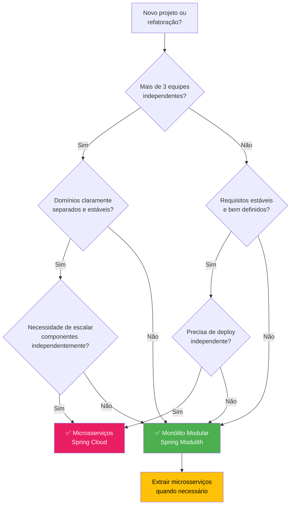

### 15.2 Critérios de Decisão

| Critério | Favorece Microsserviços | Favorece Modulith |
|---|---|---|
| **Tamanho da equipe** | > 20 devs, múltiplos times | < 20 devs, 1-3 times |
| **Maturidade do domínio** | Domínio estável, fronteiras claras | Domínio em evolução, requisitos mudando |
| **Requisitos de escala** | Componentes com carga muito diferente | Carga uniforme ou previsível |
| **SLA de disponibilidade** | 99.99%+ (fault isolation crítico) | 99.9% (suficiente com réplicas) |
| **Latência entre componentes** | Tolerável (> 1ms por chamada) | Crítica (µs necessário) |
| **Orçamento de infra** | Pode bancar K8s, brokers, monitoring | Otimizar custos |
| **Velocidade de entrega inicial** | Pode investir em setup antes de entregar | Precisa entregar rápido (MVP, startup) |
| **Experiência da equipe** | Experiência com distributed systems | Time generalista ou em formação |
| **Compliance/Regulatório** | Isolamento de dados obrigatório por domínio | Sem restrições de isolamento |

### 15.3 Anti-Patterns — Erros Comuns

#### ❌ "Microsserviços desde o dia 1"

Criar 10 microsserviços para um projeto que tem 2 desenvolvedores e 0 usuários. O overhead de infraestrutura consome mais tempo que o desenvolvimento do produto.

[Recomendado] Comece com Modulith. Extraia microsserviços quando houver **necessidade comprovada** (escala, deploy, equipe).

#### ❌ "Monólito distribuído"

Microsserviços que compartilham banco de dados, são deployados juntos e não podem funcionar sem os demais. Tem toda a complexidade de microsserviços sem nenhum benefício.

[Recomendado] Se os serviços não podem ser deployados independentemente, são módulos — use Modulith e aceite isso.

#### ❌ "Modulith como desculpa para bagunça"

Usar Spring Modulith mas ignorar `modules.verify()`, deixar dependências cíclicas e acessar internals de outros módulos.

[Recomendado] Execute `modules.verify()` em cada build (CI). Se o teste não passa, o build falha — tratamento idêntico a testes unitários.

#### ❌ "Eventos para tudo"

Substituir toda comunicação síncrona por eventos, mesmo quando o chamador precisa da resposta imediatamente.

[Recomendado] Use eventos para **side effects** (notificações, auditoria, atualização de caches). Use chamadas diretas (interface pública do módulo) para **queries** e operações que precisam de resposta síncrona.

---
