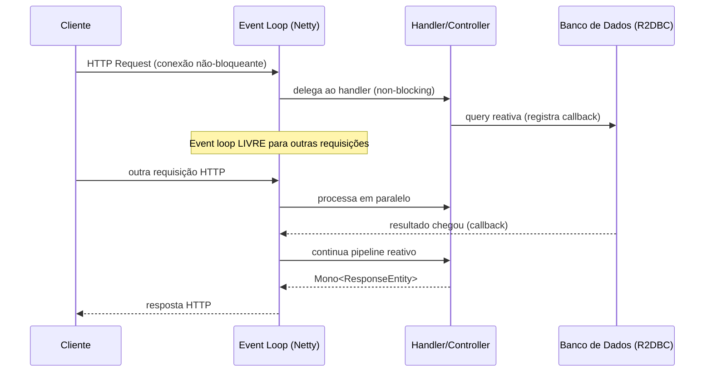
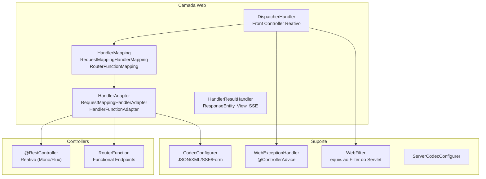
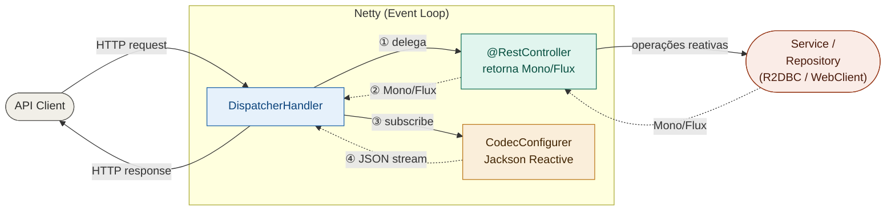
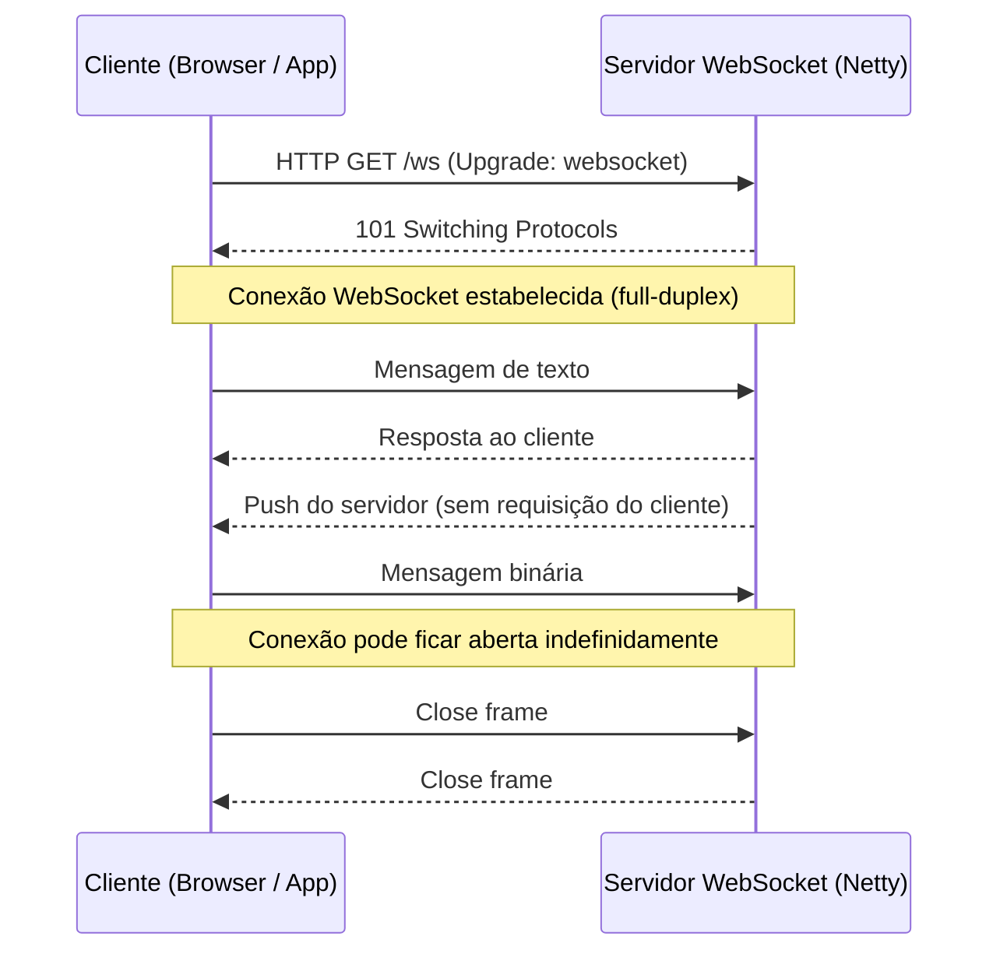
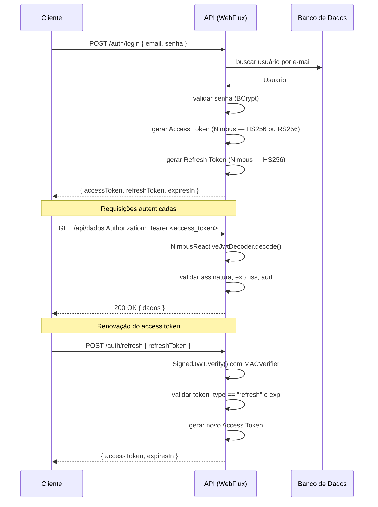
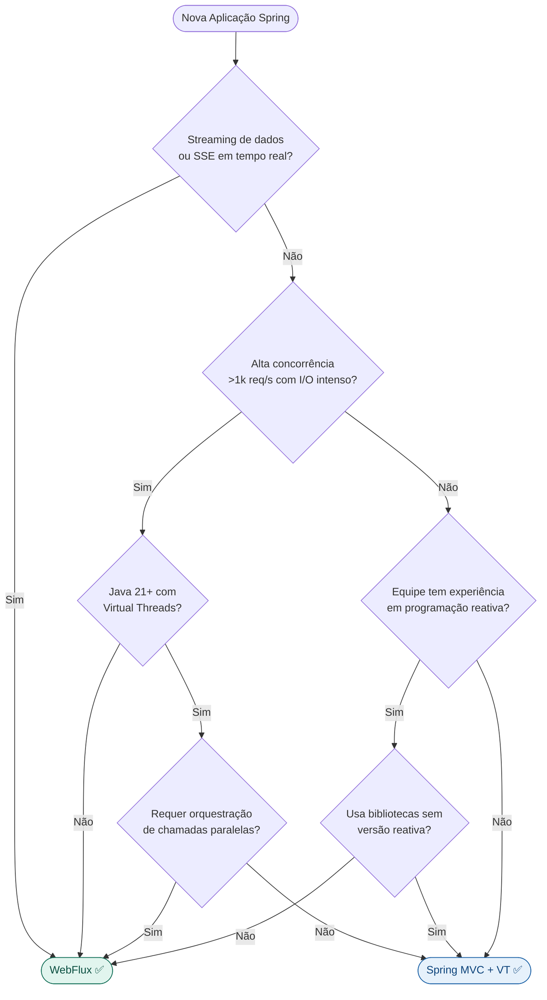

# Spring WebFlux — Guia de Desenvolvimento Reativo

> **Baseline principal:** Spring Boot 3.5 · Spring Framework 6.x · Project Reactor 3.x · Java 21+
>
> **Notas de compatibilidade:** quando uma seção exigir Spring Boot 4 / Spring Framework 7, isso será indicado explicitamente.

> **Pré-requisitos:** os fundamentos de Spring Framework e Spring MVC estão em [Dicas-Spring-MVC-REST.md](Dicas-Spring-MVC-REST.md). Acesso reativo a dados relacionais e NoSQL está em [Spring-Data-JDBC-R2DBC-Mongo-Redis-Elasticsearch.md](Spring-Data-JDBC-R2DBC-Mongo-Redis-Elasticsearch.md).

---

## Sumário

1. [Programação Reativa — Conceitos Fundamentais](#1-programação-reativa--conceitos-fundamentais)
    - [1.1 Por que Reatividade?](#11-por-que-reatividade)
    - [1.2 Reactive Streams — Especificação](#12-reactive-streams--especificação)
    - [1.3 Backpressure](#13-backpressure)
    - [1.4 Modelo Mental: Pull vs Push](#14-modelo-mental-pull-vs-push)
2. [Project Reactor — Mono e Flux](#2-project-reactor--mono-e-flux)
    - [2.1 Mono\<T\> — Zero ou Um Elemento](#21-monot--zero-ou-um-elemento)
    - [2.2 Flux\<T\> — Zero ou N Elementos](#22-fluxt--zero-ou-n-elementos)
    - [2.3 Operadores Essenciais](#23-operadores-essenciais)
    - [2.4 Combinando Publishers](#24-combinando-publishers)
    - [2.5 Gerenciamento de Erros](#25-gerenciamento-de-erros)
    - [2.6 Schedulers — Controle de Threads](#26-schedulers--controle-de-threads)
3. [Arquitetura do Spring WebFlux](#3-arquitetura-do-spring-webflux)
    - [3.1 Event Loop e Modelo Não-Bloqueante](#31-event-loop-e-modelo-não-bloqueante)
    - [3.2 Componentes Principais](#32-componentes-principais)
    - [3.3 Comparativo: MVC vs WebFlux](#33-comparativo-mvc-vs-webflux)
    - [3.4 Fluxo Visual — Requisição WebFlux](#34-fluxo-visual--requisição-webflux)
4. [Configuração Base](#4-configuração-base)
    - [4.1 Dependências Maven](#41-dependências-maven)
    - [4.2 Configuração WebFlux — WebFluxConfigurer](#42-configuração-webflux--webfluxconfigurer)
    - [4.3 application.yml — Configuração Recomendada](#43-applicationyml--configuração-recomendada)
5. [Controllers Reativos — Estilo Anotação](#5-controllers-reativos--estilo-anotação)
    - [5.1 @RestController Reativo Completo](#51-restcontroller-reativo-completo)
    - [5.2 Tipos de Retorno Reativos](#52-tipos-de-retorno-reativos)
    - [5.3 Parâmetros Reativos de Entrada](#53-parâmetros-reativos-de-entrada)
    - [5.4 Streaming de Respostas (SSE e NDJSON)](#54-streaming-de-respostas-sse-e-ndjson)
    - [5.5 Upload de Arquivos Reativo](#55-upload-de-arquivos-reativo)
6. [Functional Endpoints — RouterFunction](#6-functional-endpoints--routerfunction)
    - [6.1 RouterFunction e HandlerFunction](#61-routerfunction-e-handlerfunction)
    - [6.2 Handler Completo com Validação](#62-handler-completo-com-validação)
    - [6.3 Comparativo: Anotação vs Funcional](#63-comparativo-anotação-vs-funcional)
7. [WebClient — Cliente HTTP Reativo](#7-webclient--cliente-http-reativo)
    - [7.1 Configuração do WebClient](#71-configuração-do-webclient)
    - [7.2 Requisições Básicas](#72-requisições-básicas)
    - [7.3 Resiliência — Retry, Timeout e Fallback](#73-resiliência--retry-timeout-e-fallback)
    - [7.4 WebClient vs RestTemplate vs RestClient](#74-webclient-vs-resttemplate-vs-restclient)
8. [WebSocket Reativo](#8-websocket-reativo)
    - [8.1 Protocolo WebSocket — Conceitos](#81-protocolo-websocket--conceitos)
    - [8.2 Configuração e Handler Reativo](#82-configuração-e-handler-reativo)
    - [8.3 Handler com Estado por Sessão](#83-handler-com-estado-por-sessão)
    - [8.4 WebSocketClient — Lado do Cliente](#84-websocketclient--lado-do-cliente)
    - [8.5 WebSocket vs SSE — Quando Usar Cada Um](#85-websocket-vs-sse--quando-usar-cada-um)
9. [R2DBC — Acesso Reativo a Banco de Dados](#9-r2dbc--acesso-reativo-a-banco-de-dados)
    - [9.1 O que é R2DBC e Por que Usá-lo](#91-o-que-é-r2dbc-e-por-que-usá-lo)
    - [9.2 Dependências e Configuração](#92-dependências-e-configuração)
    - [9.3 Spring Data R2DBC — Repositórios Reativos](#93-spring-data-r2dbc--repositórios-reativos)
    - [9.4 Entidades e Mapeamento](#94-entidades-e-mapeamento)
    - [9.5 R2dbcEntityTemplate — Queries Programáticas](#95-r2dbcentitytemplate--queries-programáticas)
    - [9.6 DatabaseClient — SQL Nativo Reativo](#96-databaseclient--sql-nativo-reativo)
    - [9.7 Transações Reativas](#97-transações-reativas)
    - [9.8 Paginação e Ordenação Reativas](#98-paginação-e-ordenação-reativas)
    - [9.9 Limitações do R2DBC vs JPA](#99-limitações-do-r2dbc-vs-jpa)
10. [Tratamento de Erros](#10-tratamento-de-erros)
    - [10.1 onErrorResume, onErrorReturn e onErrorMap](#101-onerrorresume-onerrorreturn-e-onerrormap)
    - [10.2 @ControllerAdvice Reativo — WebExceptionHandler](#102-controlleradvice-reativo--webexceptionhandler)
    - [10.3 Problem Details — RFC 9457](#103-problem-details--rfc-9457)
11. [Validação](#11-validação)
    - [11.1 Validação com @Valid em Controllers](#111-validação-com-valid-em-controllers)
    - [11.2 Validação Programática com Validator](#112-validação-programática-com-validator)
12. [Segurança com Spring Security Reativo](#12-segurança-com-spring-security-reativo)
    - [12.1 Arquitetura JWT — Fluxo Completo](#121-arquitetura-jwt--fluxo-completo)
    - [12.2 Dependências — Nimbus JOSE + JWT](#122-dependências--nimbus-jose--jwt)
    - [12.3 Chaves Criptográficas — HMAC vs RSA](#123-chaves-criptográficas--hmac-vs-rsa)
    - [12.4 Geração de Tokens JWT com Nimbus](#124-geração-de-tokens-jwt-com-nimbus)
    - [12.5 Decodificação e Validação de JWT](#125-decodificação-e-validação-de-jwt)
    - [12.6 Configuração da SecurityWebFilterChain](#126-configuração-da-securitywebfilterchain)
    - [12.7 Endpoint de Autenticação — Login](#127-endpoint-de-autenticação--login)
    - [12.8 Refresh Token](#128-refresh-token)
    - [12.9 Mapeamento de Authorities do JWT](#129-mapeamento-de-authorities-do-jwt)
    - [12.10 Acessando o Principal Reativo](#1210-acessando-o-principal-reativo)
    - [12.11 ReactiveUserDetailsService](#1211-reactiveuserdetailsservice)
    - [12.12 Segurança em Nível de Método](#1212-segurança-em-nível-de-método)
13. [Testes](#13-testes)
    - [13.1 WebTestClient — Cliente de Teste Reativo](#131-webtestclient--cliente-de-teste-reativo)
    - [13.2 @WebFluxTest — Slice Test](#132-webfluxtest--slice-test)
    - [13.3 Teste de Integração com @SpringBootTest](#133-teste-de-integração-com-springboottest)
    - [13.4 StepVerifier — Testando Mono e Flux](#134-stepverifier--testando-mono-e-flux)
    - [13.5 Testando com R2DBC e Banco In-Memory](#135-testando-com-r2dbc-e-banco-in-memory)
14. [Reactor Debugging — Diagnóstico de Pipelines Reativos](#14-reactor-debugging--diagnóstico-de-pipelines-reativos)
    - [14.1 log() — Rastreando Sinais do Pipeline](#141-log--rastreando-sinais-do-pipeline)
    - [14.2 checkpoint() — Marcadores Descritivos no Pipeline](#142-checkpoint--marcadores-descritivos-no-pipeline)
    - [14.3 Hooks.onOperatorDebug() — Debug Global](#143-hooksonoperatordebug--debug-global)
    - [14.4 ReactorDebugAgent — Alternativa de Baixo Overhead](#144-reactordebugagent--alternativa-de-baixo-overhead)
    - [14.5 BlockHound — Detectando Chamadas Bloqueantes](#145-blockhound--detectando-chamadas-bloqueantes)
    - [14.6 Resumo — Quando Usar Cada Ferramenta](#146-resumo--quando-usar-cada-ferramenta)
15. [Quando Usar WebFlux vs Spring MVC](#15-quando-usar-webflux-vs-spring-mvc)
    - [15.1 Casos de Uso Ideais para WebFlux](#151-casos-de-uso-ideais-para-webflux)
    - [15.2 Quando Manter o Spring MVC](#152-quando-manter-o-spring-mvc)
    - [15.3 Decision Tree — Qual Stack Escolher](#153-decision-tree--qual-stack-escolher)
    - [15.4 Benchmarks e Considerações de Performance](#154-benchmarks-e-considerações-de-performance)
16. [Boas Práticas e Armadilhas Comuns](#16-boas-práticas-e-armadilhas-comuns)
    - [16.1 Regra de Ouro — Nunca Bloquear o Event Loop](#161-regra-de-ouro--nunca-bloquear-o-event-loop)
    - [16.2 Context Propagation — MDC e Segurança](#162-context-propagation--mdc-e-segurança)
    - [16.3 Checklist de Boas Práticas](#163-checklist-de-boas-práticas)
17. [Tópicos Relevantes Não Cobertos Neste Documento](#17-tópicos-relevantes-não-cobertos-neste-documento)

---

> **Como navegar este material:** para uma primeira leitura, priorize as seções 1 a 5, 9 e 15. As seções 6 a 8, 10 a 14 e 16 funcionam bem como consulta e aprofundamento.

---

## 1. Programação Reativa — Conceitos Fundamentais

### 1.1 Por que Reatividade?

No modelo tradicional **thread-per-request** (Spring MVC + Tomcat), cada requisição HTTP consome uma thread durante toda a sua duração — incluindo o tempo de espera por I/O (banco de dados, chamadas HTTP externas, leitura de arquivos). Com 200 requisições simultâneas de 500 ms cada, você precisa de 200 threads bloqueadas, consumindo memória e gerando overhead de context-switching.

A programação reativa resolve isso com **I/O não-bloqueante**: a thread não fica parada esperando — ela registra um callback e fica livre para processar outra requisição. Quando o resultado do I/O chega, o callback é executado.

```
Modelo Bloqueante (MVC):
Thread 1: [———— aguardando DB ————] [processando] [resp]
Thread 2: [———— aguardando DB ————] [processando] [resp]
Thread 3: [———— aguardando DB ————] [processando] [resp]

Modelo Não-Bloqueante (WebFlux):
Thread 1: [enviar req DB] [proc outra req] [proc outra req] [callback DB] [resp]
```

### 1.2 Reactive Streams — Especificação

O Spring WebFlux implementa a especificação **Reactive Streams** (integrada ao Java 9 como `java.util.concurrent.Flow`), que define quatro interfaces:

| Interface | Papel |
|---|---|
| `Publisher<T>` | Emite zero ou N elementos |
| `Subscriber<T>` | Recebe e consome elementos |
| `Subscription` | Contrato entre Publisher e Subscriber (controla demanda) |
| `Processor<T, R>` | É simultaneamente Publisher e Subscriber |

O **Project Reactor** é a implementação desses contratos usada pelo Spring WebFlux, com dois tipos principais: `Mono<T>` e `Flux<T>`.

### 1.3 Backpressure

Backpressure é o mecanismo pelo qual o **Subscriber controla a taxa de emissão** do Publisher — evitando que um produtor rápido sobrecarregue um consumidor lento.

```java
Flux.range(1, 1_000_000)
    .onBackpressureBuffer(100)       // buffer de até 100 itens pendentes
    .subscribe(new BaseSubscriber<>() {
        @Override
        protected void hookOnSubscribe(Subscription subscription) {
            request(10);             // solicita apenas 10 itens inicialmente
        }

        @Override
        protected void hookOnNext(Integer value) {
            process(value);
            request(1);              // solicita mais 1 após processar cada item
        }
    });
```

### 1.4 Modelo Mental: Pull vs Push

| | Síncrono / Pull | Reativo / Push com Backpressure |
|---|---|---|
| Controle | Consumidor puxa dados | Produtor envia, consumidor sinaliza demanda |
| Bloqueio | Thread bloqueia até dado disponível | Thread livre; callback executado ao chegar |
| Escalabilidade | Linear (1 thread / requisição) | Sub-linear (N threads / milhares de requisições) |
| Exemplo Java | `List`, `Iterator`, `Stream` | `Flux`, `Mono`, `Flow.Publisher` |

---

## 2. Project Reactor — Mono e Flux

### 2.1 Mono\<T\> — Zero ou Um Elemento

`Mono<T>` representa uma sequência assíncrona de **0 ou 1 resultado** — o equivalente reativo de `Optional<T>` ou `CompletableFuture<T>`.

```java
// Criação
Mono<String> vazio      = Mono.empty();
Mono<String> valor      = Mono.just("hello");
Mono<String> erro       = Mono.error(new RuntimeException("falhou"));
Mono<String> lazy       = Mono.fromSupplier(() -> computar());
Mono<String> fromFuture = Mono.fromFuture(CompletableFuture.supplyAsync(() -> "ok"));
Mono<Void>   execucao   = Mono.fromRunnable(() -> log.info("side effect"));

// Transformação
Mono<Integer> tamanho = Mono.just("hello")
    .map(String::length)                     // transforma o valor (síncrono)
    .flatMap(n -> Mono.just(n * 2))          // transforma em outro Mono (assíncrono)
    .filter(n -> n > 5)                      // filtra; emite empty() se false
    .defaultIfEmpty(0);                      // valor padrão se empty
```

### 2.2 Flux\<T\> — Zero ou N Elementos

`Flux<T>` representa uma sequência assíncrona de **0 a N elementos** — o equivalente reativo de `List<T>` ou `Stream<T>`.

```java
// Criação
Flux<Integer> vazio     = Flux.empty();
Flux<Integer> valores   = Flux.just(1, 2, 3, 4, 5);
Flux<Integer> range     = Flux.range(1, 10);
Flux<String>  fromList  = Flux.fromIterable(List.of("a", "b", "c"));
Flux<Long>    intervalo = Flux.interval(Duration.ofSeconds(1)); // emite 0, 1, 2... a cada 1s
Flux<Integer> gerado    = Flux.generate(
    () -> 0,
    (estado, sink) -> {
        sink.next(estado);
        if (estado == 9) sink.complete();
        return estado + 1;
    }
);

// Transformação
Flux<String> resultado = Flux.range(1, 5)
    .map(i -> "item-" + i)                   // transforma cada elemento
    .filter(s -> !s.endsWith("3"))           // filtra elementos
    .take(3)                                 // limita a 3 elementos
    .skip(1)                                 // pula o primeiro
    .distinct()                              // remove duplicatas
    .sort()                                  // ordena (cuidado: acumula em memória)
    .doOnNext(s -> log.debug("emit: {}", s)) // side effect sem alterar o fluxo
    .doOnComplete(() -> log.info("concluído"));
```

### 2.3 Operadores Essenciais

| Operador | Tipo | Descrição |
|---|---|---|
| `map` | Transformação | Mapeia cada elemento sincronamente |
| `flatMap` | Transformação | Mapeia para Publisher e os mescla (paralelo) |
| `concatMap` | Transformação | Mapeia para Publisher sequencialmente (preserva ordem) |
| `switchMap` | Transformação | Cancela Publisher anterior ao receber novo elemento |
| `filter` | Filtragem | Mantém apenas elementos que satisfazem predicado |
| `take(n)` | Filtragem | Emite apenas os primeiros N elementos |
| `skip(n)` | Filtragem | Ignora os primeiros N elementos |
| `collectList` | Acumulação | Coleta todos em `Mono<List<T>>` |
| `reduce` | Acumulação | Reduz a um único valor |
| `buffer(n)` | Janela | Agrupa em listas de N elementos |
| `window(n)` | Janela | Agrupa em Flux de Flux de N elementos |
| `zipWith` | Combinação | Combina elemento a elemento |
| `mergeWith` | Combinação | Intercala elementos (sem ordem garantida) |
| `concatWith` | Combinação | Sequencialmente: termina um e começa outro |

```java
// flatMap — chamadas paralelas (order não garantida)
Flux<Pedido> pedidos = clienteService.buscarTodos()
    .flatMap(cliente -> pedidoService.buscarPorCliente(cliente.id()));

// concatMap — chamadas sequenciais (order garantida, mais lento)
Flux<Pedido> pedidosOrdenados = clienteService.buscarTodos()
    .concatMap(cliente -> pedidoService.buscarPorCliente(cliente.id()));

// flatMap com concorrência limitada
Flux<Resultado> controlado = Flux.range(1, 100)
    .flatMap(i -> processarAsync(i), 10); // máximo 10 publishers simultâneos
```

### 2.4 Combinando Publishers

```java
// zip — combina N publishers elemento a elemento
Mono<ResumoCliente> resumo = Mono.zip(
    clienteService.buscar(id),
    pedidoService.contarPorCliente(id),
    enderecoService.buscarPrincipal(id)
).map(tuple -> new ResumoCliente(
    tuple.getT1(),
    tuple.getT2(),
    tuple.getT3()
));

// merge — intercala elementos de múltiplos Flux (paralelo, sem ordem)
Flux<Notificacao> todas = Flux.merge(
    emailService.buscarNaoLidos(),
    smsService.buscarNaoLidos(),
    pushService.buscarNaoLidos()
);

// concat — sequencial (um termina, começa o próximo)
Flux<String> sequencial = Flux.concat(
    Flux.just("a", "b"),
    Flux.just("c", "d")
);

// first (race) — usa o publisher que emitir primeiro
Mono<Dados> maisRapido = Mono.firstWithValue(
    cacheService.buscar(key),
    dbService.buscar(key)
);
```

### 2.5 Gerenciamento de Erros

```java
Flux<Produto> catalogo = produtoRepository.findAll()
    // substitui o erro por um valor padrão
    .onErrorReturn(new Produto("fallback", 0.0))

    // substitui o erro por outro Publisher
    .onErrorResume(DatabaseException.class, e ->
        cacheService.getCatalogo()
    )

    // transforma o tipo de exceção
    .onErrorMap(SQLException.class, e ->
        new ServiceException("Erro de banco: " + e.getMessage(), e)
    )

    // retry automático
    .retry(3)

    // retry com backoff exponencial
    .retryWhen(Retry.backoff(3, Duration.ofSeconds(1))
        .maxBackoff(Duration.ofSeconds(10))
        .filter(e -> e instanceof TransientException)
    )

    // executa uma ação ao ocorrer erro (sem alterar o fluxo)
    .doOnError(e -> log.error("Erro no catálogo", e));
```

### 2.6 Schedulers — Controle de Threads

> **Regra fundamental:** operações de I/O (banco, HTTP, arquivo) **devem** ser executadas em schedulers não-bloqueantes. Nunca chame código bloqueante no scheduler padrão do Reactor.

```java
// publishOn — muda o scheduler para operações downstream
Flux.range(1, 10)
    .publishOn(Schedulers.boundedElastic())  // downstream executa no boundedElastic
    .map(i -> blockingOperation(i));         // seguro: está no boundedElastic

// subscribeOn — muda o scheduler da fonte (afeta upstream)
Mono.fromCallable(() -> blockingDbCall())    // operação bloqueante
    .subscribeOn(Schedulers.boundedElastic()) // executa no thread pool elástico

// Schedulers disponíveis
// Schedulers.parallel()         — pool fixo de N threads (N = núcleos de CPU)
// Schedulers.boundedElastic()   — pool crescente; ideal para I/O bloqueante legado
// Schedulers.single()           — thread única reusável
// Schedulers.immediate()        — thread atual (sem mudança)
// Schedulers.fromExecutor(exec) — wraps um ExecutorService existente
```

---

## 3. Arquitetura do Spring WebFlux

### 3.1 Event Loop e Modelo Não-Bloqueante

O WebFlux utiliza o modelo **event loop** do Netty (padrão) ou de containers Servlet 3.1+ assíncronos (Tomcat, Jetty, Undertow). Com Netty, há apenas alguns threads no event loop — tipicamente o número de CPUs — que processam milhares de conexões concorrentes.



### 3.2 Componentes Principais



### 3.3 Comparativo: MVC vs WebFlux

| Aspecto | Spring MVC | Spring WebFlux |
|---|---|---|
| Modelo de concorrência | Thread-per-request (bloqueante) | Event loop (não-bloqueante) |
| Servidor padrão | Tomcat | Netty |
| Tipos de retorno | `ResponseEntity<T>`, `T` | `Mono<T>`, `Flux<T>`, `Mono<ResponseEntity<T>>` |
| Repositórios | JPA/JDBC (bloqueante) | R2DBC, Spring Data Reactive Mongo/Redis |
| Cliente HTTP | `RestTemplate`, `RestClient` | `WebClient` |
| Filtros | `Filter` (Servlet) | `WebFilter` |
| Exception handling | `@ControllerAdvice` + `ResponseEntityExceptionHandler` | `@ControllerAdvice` + `WebExceptionHandler` |
| Contexto de segurança | `SecurityContextHolder` (ThreadLocal) | `ReactiveSecurityContextHolder` (Context Reactor) |
| Testes | `MockMvc` | `WebTestClient` |
| Virtual Threads (Java 21+) | Recomendado — simplifica muito | Não necessário (já é não-bloqueante) |
| Curva de aprendizado | Baixa | Alta (requer conhecimento de Reactor) |
| Ecossistema de bibliotecas | Muito maduro | Crescente (nem tudo tem versão reativa) |

### 3.4 Fluxo Visual — Requisição WebFlux



---

## 4. Configuração Base

### 4.1 Dependências Maven

```xml
<!-- Spring WebFlux — substitui spring-boot-starter-web (não use os dois) -->
<dependency>
    <groupId>org.springframework.boot</groupId>
    <artifactId>spring-boot-starter-webflux</artifactId>
</dependency>

<!-- R2DBC — acesso reativo a bancos relacionais -->
<dependency>
    <groupId>org.springframework.boot</groupId>
    <artifactId>spring-boot-starter-data-r2dbc</artifactId>
</dependency>

<!-- Driver R2DBC — escolha conforme o banco -->
<dependency>
    <groupId>org.postgresql</groupId>
    <artifactId>r2dbc-postgresql</artifactId>
    <scope>runtime</scope>
</dependency>
<!-- MySQL:    io.asyncer:r2dbc-mysql       -->
<!-- H2 (dev): io.r2dbc:r2dbc-h2           -->
<!-- MSSQL:    io.r2dbc:r2dbc-mssql        -->

<!-- Validação (funciona com WebFlux) -->
<dependency>
    <groupId>org.springframework.boot</groupId>
    <artifactId>spring-boot-starter-validation</artifactId>
</dependency>

<!-- OpenAPI / Swagger UI para WebFlux -->
<dependency>
    <groupId>org.springdoc</groupId>
    <artifactId>springdoc-openapi-starter-webflux-ui</artifactId>
    <version>2.8.16</version>
</dependency>

<!-- Segurança reativa -->
<dependency>
    <groupId>org.springframework.boot</groupId>
    <artifactId>spring-boot-starter-security</artifactId>
</dependency>

<!-- Testes reativos -->
<dependency>
    <groupId>io.projectreactor</groupId>
    <artifactId>reactor-test</artifactId>
    <scope>test</scope>
</dependency>
```

> **Atenção:** `spring-boot-starter-webflux` e `spring-boot-starter-web` **não devem coexistir** no mesmo projeto. Se ambos estiverem no classpath, o Spring Boot ativa o MVC (Servlet stack) por padrão. Para forçar WebFlux nesse caso, defina `spring.main.web-application-type=reactive` no `application.yml`.

### 4.2 Configuração WebFlux — WebFluxConfigurer

```java
@Configuration
// @EnableWebFlux ← EVITE: desativa WebFluxAutoConfiguration.
//                  Use apenas se precisar controle absoluto sem Spring Boot.
public class WebFluxConfig implements WebFluxConfigurer {

    // ─── Codecs (Jackson, Form, SSE, etc.) ──────────────────────────────────
    @Override
    public void configureHttpMessageCodecs(ServerCodecConfigurer configurer) {
        configurer.defaultCodecs().maxInMemorySize(2 * 1024 * 1024); // 2 MB
        configurer.defaultCodecs().enableLoggingRequestDetails(true);
    }

    // ─── CORS ────────────────────────────────────────────────────────────────
    @Override
    public void addCorsMappings(CorsRegistry registry) {
        registry.addMapping("/api/**")
                .allowedOrigins("https://meuapp.com")
                .allowedMethods("GET", "POST", "PUT", "DELETE", "PATCH")
                .allowedHeaders("*")
                .allowCredentials(true)
                .maxAge(3600);
    }

    // ─── Path Matching ────────────────────────────────────────────────────────
    @Override
    public void configurePathMatching(PathMatchConfigurer configurer) {
        configurer.setUseInsensitivePathVariables(false);
    }

    // ─── Formatters e Converters ─────────────────────────────────────────────
    @Override
    public void addFormatters(FormatterRegistry registry) {
        registry.addConverter(new StringToStatusConverter());
    }
}
```

### 4.3 application.yml — Configuração Recomendada

```yaml
spring:
  application:
    name: meu-app-reativo

  # R2DBC — conexão reativa com banco de dados
  r2dbc:
    url: r2dbc:postgresql://localhost:5432/meubanco
    username: ${DB_USER:postgres}
    password: ${DB_PASSWORD:postgres}
    pool:
      initial-size: 5
      max-size: 20
      max-idle-time: 30m
      validation-query: SELECT 1

  # Flyway/Liquibase ainda usam JDBC para migrations (R2DBC não suporta)
  datasource:
    url: jdbc:postgresql://localhost:5432/meubanco
    username: ${DB_USER:postgres}
    password: ${DB_PASSWORD:postgres}
  flyway:
    enabled: true
    locations: classpath:db/migration

  # Codec — limite de memória para request body
  codec:
    max-in-memory-size: 2MB

  # Logging de requests (somente em desenvolvimento)
  http:
    log-request-details: false

# Netty (servidor padrão do WebFlux)
server:
  port: 8080
  netty:
    connection-timeout: 2s
    idle-timeout: 60s

# Actuator
management:
  endpoints:
    web:
      exposure:
        include: health, info, metrics, prometheus
  endpoint:
    health:
      show-details: when-authorized

# Logging
logging:
  level:
    root: INFO
    com.meuapp: DEBUG
    org.springframework.data.r2dbc: DEBUG    # SQL reativo
    io.r2dbc.postgresql.QUERY: DEBUG         # queries SQL (verbose)
    reactor.netty.http.server: DEBUG         # HTTP server logs
```

---

## 5. Controllers Reativos — Estilo Anotação

### 5.1 @RestController Reativo Completo

```java
@RestController
@RequestMapping("/api/produtos")
@RequiredArgsConstructor
public class ProdutoController {

    private final ProdutoService produtoService;

    @GetMapping
    public Flux<ProdutoResponse> listar(
            @RequestParam(defaultValue = "0") int pagina,
            @RequestParam(defaultValue = "20") int tamanho) {
        return produtoService.listar(pagina, tamanho);
    }

    @GetMapping("/{id}")
    public Mono<ResponseEntity<ProdutoResponse>> buscarPorId(@PathVariable Long id) {
        return produtoService.buscarPorId(id)
                .map(ResponseEntity::ok)
                .defaultIfEmpty(ResponseEntity.notFound().build());
    }

    @PostMapping
    @ResponseStatus(HttpStatus.CREATED)
    public Mono<ProdutoResponse> criar(@Valid @RequestBody ProdutoRequest request) {
        return produtoService.criar(request);
    }

    @PutMapping("/{id}")
    public Mono<ResponseEntity<ProdutoResponse>> atualizar(
            @PathVariable Long id,
            @Valid @RequestBody ProdutoRequest request) {
        return produtoService.atualizar(id, request)
                .map(ResponseEntity::ok)
                .defaultIfEmpty(ResponseEntity.notFound().build());
    }

    @DeleteMapping("/{id}")
    public Mono<ResponseEntity<Void>> excluir(@PathVariable Long id) {
        return produtoService.excluir(id)
                .then(Mono.just(ResponseEntity.<Void>noContent().build()))
                .defaultIfEmpty(ResponseEntity.notFound().build());
    }

    @GetMapping("/buscar")
    public Flux<ProdutoResponse> buscar(
            @RequestParam String termo,
            @RequestParam(required = false) BigDecimal precoMax) {
        return produtoService.buscar(termo, precoMax);
    }
}
```

### 5.2 Tipos de Retorno Reativos

| Tipo de Retorno | Descrição | Código HTTP padrão |
|---|---|---|
| `Mono<T>` | Zero ou um objeto como corpo | 200 (ou 204 se `Mono.empty()`) |
| `Flux<T>` | Lista de objetos como JSON array | 200 |
| `Mono<ResponseEntity<T>>` | Controle total sobre status e headers | Conforme `ResponseEntity` |
| `Mono<ResponseEntity<Void>>` | Sem corpo na resposta | 204 No Content |
| `Mono<Void>` | Sem corpo; assina e completa | 200 (recomendado usar `ResponseEntity<Void>`) |
| `Flux<ServerSentEvent<T>>` | Stream SSE para o cliente | 200 (Content-Type: text/event-stream) |

```java
// Retorno com headers customizados
@PostMapping
public Mono<ResponseEntity<ProdutoResponse>> criar(@RequestBody ProdutoRequest req) {
    return produtoService.criar(req)
            .map(produto -> ResponseEntity
                    .created(URI.create("/api/produtos/" + produto.id()))
                    .header("X-Produto-Id", produto.id().toString())
                    .body(produto));
}

// Retorno condicional baseado no resultado
@GetMapping("/{id}")
public Mono<ResponseEntity<ProdutoResponse>> buscar(@PathVariable Long id) {
    return produtoService.buscarPorId(id)
            .map(ResponseEntity::ok)
            .defaultIfEmpty(ResponseEntity.notFound().build());
    // Alternativa com switchIfEmpty:
    // .switchIfEmpty(Mono.error(new RecursoNaoEncontradoException(id)));
}
```

### 5.3 Parâmetros Reativos de Entrada

```java
// @RequestBody reativo — aceita Mono ou Flux no body
@PostMapping("/lote")
public Flux<ProdutoResponse> criarLote(@RequestBody Flux<ProdutoRequest> requests) {
    return requests
            .flatMap(produtoService::criar, 5); // 5 simultâneos
}

// ServerWebExchange — acesso completo à requisição/resposta
@GetMapping("/info")
public Mono<Map<String, Object>> info(ServerWebExchange exchange) {
    ServerHttpRequest request = exchange.getRequest();
    return Mono.just(Map.of(
            "uri", request.getURI().toString(),
            "method", request.getMethod().name(),
            "headers", request.getHeaders().toSingleValueMap()
    ));
}

// @AuthenticationPrincipal reativo
@GetMapping("/minha-conta")
public Mono<ContaResponse> minhaConta(
        @AuthenticationPrincipal Mono<UserDetails> userDetails) {
    return userDetails.flatMap(u -> contaService.buscarPorEmail(u.getUsername()));
}
```

### 5.4 Streaming de Respostas (SSE e NDJSON)

```java
// SSE — Server-Sent Events: ideal para notificações em tempo real
@GetMapping(value = "/eventos", produces = MediaType.TEXT_EVENT_STREAM_VALUE)
public Flux<ServerSentEvent<String>> streamEventos() {
    return Flux.interval(Duration.ofSeconds(1))
            .map(seq -> ServerSentEvent.<String>builder()
                    .id(String.valueOf(seq))
                    .event("progresso")
                    .data("processando item " + seq)
                    .build())
            .take(Duration.ofMinutes(5)); // limita a 5 minutos
}

// SSE com dados de domínio
@GetMapping(value = "/pedidos/stream", produces = MediaType.TEXT_EVENT_STREAM_VALUE)
public Flux<ServerSentEvent<PedidoResponse>> streamPedidos() {
    return pedidoService.observarNovos()
            .map(pedido -> ServerSentEvent.<PedidoResponse>builder()
                    .event("novo-pedido")
                    .data(pedido)
                    .build());
}

// NDJSON (Newline-Delimited JSON) — formato alternativo de streaming
@GetMapping(value = "/relatorio", produces = MediaType.APPLICATION_NDJSON_VALUE)
public Flux<RelatorioItem> streamRelatorio(
        @RequestParam @DateTimeFormat(iso = ISO.DATE) LocalDate inicio,
        @RequestParam @DateTimeFormat(iso = ISO.DATE) LocalDate fim) {
    return relatorioService.gerarStream(inicio, fim);
}
```

### 5.5 Upload de Arquivos Reativo

```java
@PostMapping(value = "/upload", consumes = MediaType.MULTIPART_FORM_DATA_VALUE)
public Mono<UploadResponse> upload(@RequestPart("arquivo") FilePart file) {
    return file.transferTo(Path.of("/uploads/" + file.filename()))
            .then(Mono.just(new UploadResponse(file.filename(), "ok")));
}

// Upload com processamento do conteúdo
@PostMapping(value = "/import/csv", consumes = MediaType.MULTIPART_FORM_DATA_VALUE)
public Flux<ImportResult> importarCsv(@RequestPart("arquivo") FilePart file) {
    return file.content()
            .map(dataBuffer -> {
                byte[] bytes = new byte[dataBuffer.readableByteCount()];
                dataBuffer.read(bytes);
                DataBufferUtils.release(dataBuffer);
                return new String(bytes, StandardCharsets.UTF_8);
            })
            .collectList()
            .map(chunks -> String.join("", chunks))
            .flatMapMany(csv -> csvService.processar(csv));
}
```

---

## 6. Functional Endpoints — RouterFunction

### 6.1 RouterFunction e HandlerFunction

O estilo funcional define rotas e handlers como beans — sem anotações nos controllers. É mais explícito, mais testável unitariamente e mais adequado para aplicações grandes com lógica de roteamento complexa.

```java
// Handler — equivale ao @RestController
@Component
@RequiredArgsConstructor
public class ProdutoHandler {

    private final ProdutoService produtoService;

    public Mono<ServerResponse> listar(ServerRequest request) {
        int pagina = Integer.parseInt(request.queryParam("pagina").orElse("0"));
        int tamanho = Integer.parseInt(request.queryParam("tamanho").orElse("20"));

        return ServerResponse.ok()
                .contentType(MediaType.APPLICATION_JSON)
                .body(produtoService.listar(pagina, tamanho), ProdutoResponse.class);
    }

    public Mono<ServerResponse> buscarPorId(ServerRequest request) {
        Long id = Long.parseLong(request.pathVariable("id"));

        return produtoService.buscarPorId(id)
                .flatMap(produto -> ServerResponse.ok().bodyValue(produto))
                .switchIfEmpty(ServerResponse.notFound().build());
    }

    public Mono<ServerResponse> criar(ServerRequest request) {
        return request.bodyToMono(ProdutoRequest.class)
                .flatMap(produtoService::criar)
                .flatMap(produto -> ServerResponse
                        .created(URI.create("/api/produtos/" + produto.id()))
                        .bodyValue(produto));
    }
}

// Router — define o mapeamento de rotas
@Configuration
public class ProdutoRouter {

    @Bean
    public RouterFunction<ServerResponse> produtoRoutes(ProdutoHandler handler) {
        return RouterFunctions.route()
                .GET("/api/produtos", handler::listar)
                .GET("/api/produtos/{id}", handler::buscarPorId)
                .POST("/api/produtos", handler::criar)
                .PUT("/api/produtos/{id}", handler::atualizar)
                .DELETE("/api/produtos/{id}", handler::excluir)
                .build();
    }
}
```

### 6.2 Handler Completo com Validação

```java
@Component
@RequiredArgsConstructor
public class ProdutoHandler {

    private final ProdutoService produtoService;
    private final Validator validator;

    public Mono<ServerResponse> criar(ServerRequest request) {
        return request.bodyToMono(ProdutoRequest.class)
                .doOnNext(this::validar)
                .flatMap(produtoService::criar)
                .flatMap(produto -> ServerResponse
                        .created(URI.create("/api/produtos/" + produto.id()))
                        .bodyValue(produto))
                .onErrorResume(WebExchangeBindException.class, e ->
                        ServerResponse.badRequest().bodyValue(e.getBindingResult().getAllErrors())
                );
    }

    private void validar(ProdutoRequest request) {
        Set<ConstraintViolation<ProdutoRequest>> violations = validator.validate(request);
        if (!violations.isEmpty()) {
            throw new WebExchangeBindException(
                    null,
                    new BeanPropertyBindingResult(request, "produtoRequest")
            );
        }
    }
}
```

### 6.3 Comparativo: Anotação vs Funcional

| Aspecto | Estilo Anotação (`@RestController`) | Estilo Funcional (`RouterFunction`) |
|---|---|---|
| Familiaridade | Alta (similar ao Spring MVC) | Baixa (paradigma diferente) |
| Teste unitário | Requer MockMvc/WebTestClient | Handler é POJO testável diretamente |
| Flexibilidade de roteamento | Limitada às anotações | Total — lógica arbitrária no router |
| Filtros por rota | Difícil de fazer por controller | `RouterFunction.filter()` por grupo |
| Documentação OpenAPI | Gerada automaticamente | Requer anotações manuais |
| Recomendação | APIs simples a médias | APIs com roteamento complexo |

---

## 7. WebClient — Cliente HTTP Reativo

### 7.1 Configuração do WebClient

```java
@Configuration
public class WebClientConfig {

    @Bean
    public WebClient produtoApiClient(WebClient.Builder builder) {
        return builder
                .baseUrl("https://api.externa.com")
                .defaultHeader(HttpHeaders.CONTENT_TYPE, MediaType.APPLICATION_JSON_VALUE)
                .defaultHeader(HttpHeaders.ACCEPT, MediaType.APPLICATION_JSON_VALUE)
                .filter(logFilter())
                .filter(authFilter())
                .codecs(config -> config.defaultCodecs()
                        .maxInMemorySize(2 * 1024 * 1024))
                .build();
    }

    // Filter de log (equivale ao interceptor do RestTemplate)
    private ExchangeFilterFunction logFilter() {
        return ExchangeFilterFunction.ofRequestProcessor(req -> {
            log.debug("→ {} {}", req.method(), req.url());
            return Mono.just(req);
        });
    }

    // Filter de autenticação Bearer
    private ExchangeFilterFunction authFilter() {
        return (request, next) -> tokenService.getToken()
                .flatMap(token -> next.exchange(
                        ClientRequest.from(request)
                                .header(HttpHeaders.AUTHORIZATION, "Bearer " + token)
                                .build()
                ));
    }
}
```

### 7.2 Requisições Básicas

```java
@Service
@RequiredArgsConstructor
public class ClienteApiService {

    private final WebClient webClient;

    // GET simples
    public Mono<ProdutoDto> buscar(Long id) {
        return webClient.get()
                .uri("/produtos/{id}", id)
                .retrieve()
                .onStatus(HttpStatusCode::is4xxClientError, response ->
                        Mono.error(new RecursoNaoEncontradoException("Produto " + id))
                )
                .onStatus(HttpStatusCode::is5xxServerError, response ->
                        response.bodyToMono(String.class)
                                .flatMap(body -> Mono.error(new ServicoIndisponivelException(body)))
                )
                .bodyToMono(ProdutoDto.class);
    }

    // GET com lista
    public Flux<ProdutoDto> listar() {
        return webClient.get()
                .uri("/produtos")
                .retrieve()
                .bodyToFlux(ProdutoDto.class);
    }

    // POST com body
    public Mono<ProdutoDto> criar(ProdutoRequest request) {
        return webClient.post()
                .uri("/produtos")
                .bodyValue(request)
                .retrieve()
                .bodyToMono(ProdutoDto.class);
    }

    // DELETE
    public Mono<Void> excluir(Long id) {
        return webClient.delete()
                .uri("/produtos/{id}", id)
                .retrieve()
                .toBodilessEntity()
                .then();
    }

    // Chamadas paralelas com zip
    public Mono<ResumoResponse> resumo(Long clienteId) {
        return Mono.zip(
                buscarCliente(clienteId),
                listarPedidos(clienteId).collectList(),
                buscarSaldo(clienteId)
        ).map(tuple -> new ResumoResponse(tuple.getT1(), tuple.getT2(), tuple.getT3()));
    }
}
```

### 7.3 Resiliência — Retry, Timeout e Fallback

```java
public Mono<ProdutoDto> buscarComResiliencia(Long id) {
    return webClient.get()
            .uri("/produtos/{id}", id)
            .retrieve()
            .bodyToMono(ProdutoDto.class)
            // Timeout por requisição
            .timeout(Duration.ofSeconds(3))
            // Retry com backoff exponencial
            .retryWhen(Retry.backoff(3, Duration.ofMillis(500))
                    .maxBackoff(Duration.ofSeconds(5))
                    .filter(e -> e instanceof WebClientResponseException.ServiceUnavailable)
                    .onRetryExhaustedThrow((spec, signal) ->
                            new ServicoIndisponivelException("API indisponível após 3 tentativas"))
            )
            // Fallback para cache
            .onErrorResume(e -> cacheService.buscarProduto(id));
}
```

### 7.4 WebClient vs RestTemplate vs RestClient

| | `RestTemplate` | `RestClient` | `WebClient` |
|---|---|---|---|
| Introduzido em | Spring 3.0 | Spring 6.1 / Boot 3.2 | Spring 5.0 |
| Modelo | Bloqueante | Bloqueante (API fluente) | Não-bloqueante |
| Stack recomendada | MVC (legado) | MVC | WebFlux |
| Tipo de retorno | `T` (síncrono) | `T` (síncrono) | `Mono<T>`, `Flux<T>` |
| Status em Spring Boot 3.x | Manutenção | Recomendado (MVC) | Recomendado (WebFlux) |

---

## 8. WebSocket Reativo

O WebSocket é um protocolo de comunicação **full-duplex** sobre uma única conexão TCP persistente. Ao contrário do HTTP, onde o cliente sempre inicia a comunicação, o WebSocket permite que cliente e servidor enviem mensagens a qualquer momento — ideal para chat, notificações em tempo real, dashboards ao vivo e editores colaborativos.

Comparado ao SSE (seção 5.4), o WebSocket é bidirecional (SSE é unidirecional servidor → cliente) e suporta dados binários, mas exige que proxies e load balancers suportem explicitamente o protocolo.

### 8.1 Protocolo WebSocket — Conceitos



Principais tipos da API WebSocket reativa do Spring:

| Tipo | Papel |
|---|---|
| `WebSocketHandler` | Interface implementada pelo servidor para tratar uma sessão |
| `WebSocketSession` | Representa uma conexão ativa; permite send/receive |
| `WebSocketMessage` | Mensagem trafegada (TEXT, BINARY, PING, PONG) |
| `WebSocketClient` | Cliente reativo para conectar a servidores WebSocket |
| `HandlerMapping` | Mapeia paths para `WebSocketHandler` |

### 8.2 Configuração e Handler Reativo

```java
// Handler — processa mensagens de uma sessão WebSocket
@Component
@Slf4j
public class ChatHandler implements WebSocketHandler {

    // Sink multicast: distribui mensagens para todos os assinantes
    private final Sinks.Many<String> sink =
            Sinks.many().multicast().onBackpressureBuffer();

    @Override
    public Mono<Void> handle(WebSocketSession session) {
        // Pipeline de recebimento: lê mensagens do cliente e publica no sink
        Mono<Void> receber = session.receive()
                .map(WebSocketMessage::getPayloadAsText)
                .doOnNext(msg -> {
                    log.debug("[{}] recebido: {}", session.getId(), msg);
                    sink.tryEmitNext("[" + session.getId() + "]: " + msg);
                })
                .doOnError(e -> log.warn("Erro na sessão {}: {}", session.getId(), e.getMessage()))
                .then();

        // Pipeline de envio: transmite mensagens do sink para o cliente
        Flux<WebSocketMessage> enviar = sink.asFlux()
                .map(session::textMessage);

        // Ambos os pipelines rodam em paralelo; sessão encerra quando um termina
        return session.send(enviar).and(receber);
    }
}

// Configuração — registra o handler no caminho /ws/chat
@Configuration
public class WebSocketConfig {

    @Bean
    public HandlerMapping webSocketHandlerMapping(ChatHandler chatHandler) {
        Map<String, WebSocketHandler> handlers = Map.of(
                "/ws/chat", chatHandler
        );
        SimpleUrlHandlerMapping mapping = new SimpleUrlHandlerMapping();
        mapping.setUrlMap(handlers);
        mapping.setOrder(-1); // alta prioridade (antes dos controllers REST)
        return mapping;
    }

    @Bean
    public WebSocketHandlerAdapter webSocketHandlerAdapter() {
        return new WebSocketHandlerAdapter();
    }
}
```

### 8.3 Handler com Estado por Sessão

```java
@Component
@RequiredArgsConstructor
@Slf4j
public class NotificacaoHandler implements WebSocketHandler {

    private final NotificacaoService notificacaoService;

    @Override
    public Mono<Void> handle(WebSocketSession session) {
        // Extrai o ID do usuário dos parâmetros de query ou headers do handshake
        String usuarioId = session.getHandshakeInfo()
                .getUri()
                .getQuery(); // ex.: ?usuarioId=42

        if (usuarioId == null) {
            return session.close(CloseStatus.POLICY_VIOLATION);
        }

        // Stream de notificações personalizado por usuário
        Flux<WebSocketMessage> mensagens = notificacaoService
                .streamParaUsuario(usuarioId)
                .map(notif -> session.textMessage(toJson(notif)))
                .doOnError(e -> log.error("Erro no stream de {}", usuarioId, e));

        return session.send(mensagens)
                .doOnTerminate(() -> log.info("Sessão encerrada: {}", usuarioId));
    }

    // Sessão bidirecional: recebe comandos e envia respostas
    public Mono<Void> handleBidirecional(WebSocketSession session) {
        Mono<Void> receber = session.receive()
                .map(WebSocketMessage::getPayloadAsText)
                .flatMap(cmd -> processarComando(cmd, session))
                .then();

        Flux<WebSocketMessage> enviar = notificacaoService
                .streamParaUsuario(session.getId())
                .map(session::textMessage);

        return Mono.zip(session.send(enviar), receber).then();
    }
}
```

### 8.4 WebSocketClient — Lado do Cliente

```java
// Cliente reativo — útil para integração entre microsserviços
@Service
@Slf4j
public class WebSocketClientService {

    private final WebSocketClient client = new ReactorNettyWebSocketClient();

    // Envia uma mensagem e aguarda a primeira resposta
    public Mono<String> enviarEAguardar(String url, String mensagem) {
        return client.execute(URI.create(url), session ->
                session.send(Mono.just(session.textMessage(mensagem)))
                        .thenMany(session.receive()
                                .take(1)
                                .map(WebSocketMessage::getPayloadAsText))
                        .next()
        );
    }

    // Recebe um stream contínuo de mensagens
    public Flux<String> streamMensagens(String url) {
        return Flux.<String>create(sink ->
                client.execute(URI.create(url), session ->
                        session.receive()
                                .map(WebSocketMessage::getPayloadAsText)
                                .doOnNext(sink::next)
                                .doOnError(sink::error)
                                .doOnComplete(sink::complete)
                                .then()
                ).subscribe()
        ).share(); // multicast para múltiplos assinantes
    }
}
```

### 8.5 WebSocket vs SSE — Quando Usar Cada Um

| Aspecto | WebSocket | SSE (Server-Sent Events) |
|---|---|---|
| Direção | Full-duplex (bidirecional) | Unidirecional (servidor → cliente) |
| Protocolo | `ws://` / `wss://` (próprio) | HTTP/HTTPS padrão |
| Formato | Texto ou binário | Texto (UTF-8) |
| Reconexão automática | Manual (lógica no cliente) | Nativa no browser |
| Proxy / load balancer | Requer suporte explícito | Funciona com qualquer proxy HTTP |
| Suporte a HTTP/2 | Não nativo | Sim (multiplexado) |
| Caso de uso típico | Chat, jogos, editores colaborativos | Notificações, feeds, progresso |
| Complexidade de implementação | Maior (gestão de sessão manual) | Menor (endpoint HTTP comum) |

---

## 9. R2DBC — Acesso Reativo a Banco de Dados

### 9.1 O que é R2DBC e Por que Usá-lo

**R2DBC** (Reactive Relational Database Connectivity) é uma especificação e conjunto de drivers que permite acesso **não-bloqueante** a bancos de dados relacionais. É o equivalente reativo do JDBC.

O JDBC é fundamentalmente bloqueante: a thread que executa uma query fica parada aguardando o resultado do banco. Em uma aplicação WebFlux, usar JDBC diretamente bloquearia o event loop, anulando todos os benefícios do modelo reativo.

```
Com JDBC no WebFlux (ERRADO):
Event Loop Thread → query JDBC → [BLOQUEADA aguardando DB] ← BAD: event loop parado

Com R2DBC no WebFlux (CORRETO):
Event Loop Thread → query R2DBC → registra callback → [LIVRE para outras reqs]
                                  ↑
                    Callback executado quando DB responde
```

> **Alternativa para JDBC legado:** se precisar usar JDBC (JPA, Hibernate) em contexto reativo, use `subscribeOn(Schedulers.boundedElastic())` para mover a operação bloqueante para um thread pool separado. Mas prefira migrar para R2DBC.

### 9.2 Dependências e Configuração

```xml
<dependency>
    <groupId>org.springframework.boot</groupId>
    <artifactId>spring-boot-starter-data-r2dbc</artifactId>
</dependency>

<!-- PostgreSQL -->
<dependency>
    <groupId>org.postgresql</groupId>
    <artifactId>r2dbc-postgresql</artifactId>
    <scope>runtime</scope>
</dependency>

<!-- Para migrations: Flyway/Liquibase ainda exigem JDBC -->
<dependency>
    <groupId>org.springframework.boot</groupId>
    <artifactId>spring-boot-starter-jdbc</artifactId>
    <scope>runtime</scope>
</dependency>
<dependency>
    <groupId>org.postgresql</groupId>
    <artifactId>postgresql</artifactId>
    <scope>runtime</scope>
</dependency>
<dependency>
    <groupId>org.flywaydb</groupId>
    <artifactId>flyway-core</artifactId>
</dependency>
```

```yaml
spring:
  r2dbc:
    url: r2dbc:postgresql://localhost:5432/meubanco
    username: postgres
    password: postgres
    pool:
      initial-size: 5
      max-size: 20
      max-idle-time: 30m
      validation-query: SELECT 1

  # JDBC apenas para Flyway (migrations)
  datasource:
    url: jdbc:postgresql://localhost:5432/meubanco
    username: postgres
    password: postgres
  flyway:
    enabled: true
```

```java
@Configuration
public class R2dbcConfig extends AbstractR2dbcConfiguration {

    @Override
    @Bean
    public ConnectionFactory connectionFactory() {
        return ConnectionFactories.get(
                ConnectionFactoryOptions.builder()
                        .option(DRIVER, "pool")
                        .option(PROTOCOL, "postgresql")
                        .option(HOST, "localhost")
                        .option(PORT, 5432)
                        .option(DATABASE, "meubanco")
                        .option(USER, "postgres")
                        .option(PASSWORD, "postgres")
                        .build()
        );
    }

    // Converters customizados
    @Override
    protected List<Object> getCustomConverters() {
        return List.of(
                new StatusToStringConverter(),
                new StringToStatusConverter()
        );
    }
}
```

### 9.3 Spring Data R2DBC — Repositórios Reativos

```java
// Interface de repositório — tudo retorna Mono ou Flux
public interface ProdutoRepository extends ReactiveCrudRepository<Produto, Long> {

    // Query derivada por nome do método
    Flux<Produto> findByNomeContainingIgnoreCase(String termo);

    Flux<Produto> findByCategoriaNome(String categoria);

    Flux<Produto> findByPrecoLessThanEqualOrderByPrecoAsc(BigDecimal precoMax);

    Mono<Boolean> existsByNomeIgnoreCase(String nome);

    Mono<Long> countByCategoriaNome(String categoria);

    // @Query com SQL nativo R2DBC (sem JPQL)
    @Query("SELECT * FROM produto WHERE preco BETWEEN :min AND :max ORDER BY preco")
    Flux<Produto> findByPrecoBetween(BigDecimal min, BigDecimal max);

    @Query("SELECT p.* FROM produto p JOIN categoria c ON p.categoria_id = c.id WHERE c.ativo = true")
    Flux<Produto> findEmCategoriasAtivas();

    // Paginação
    Flux<Produto> findAllByOrderByNomeAsc(Pageable pageable);
}

// ReactiveQueryByExampleExecutor — queries dinâmicas por exemplo
public interface ProdutoRepository extends ReactiveCrudRepository<Produto, Long>,
        ReactiveQueryByExampleExecutor<Produto> {
}
```

### 9.4 Entidades e Mapeamento

```java
// Entidade R2DBC — sem @Entity JPA, usa anotações do Spring Data R2DBC
@Table("produto")
@Data
@NoArgsConstructor
@AllArgsConstructor
public class Produto {

    @Id
    private Long id;

    @Column("nome")
    private String nome;

    private BigDecimal preco;

    private Integer estoque;

    @Column("categoria_id")
    private Long categoriaId; // FK — R2DBC não faz lazy loading automático

    @CreatedDate
    private LocalDateTime criadoEm;

    @LastModifiedDate
    private LocalDateTime atualizadoEm;

    @Version
    private Long versao; // otimistic locking
}

// Habilitar auditoria reativa
@Configuration
@EnableR2dbcAuditing
public class R2dbcAuditConfig {
}
```

> **Diferença crítica em relação ao JPA:** R2DBC **não** possui lazy loading, cascata automática, nem mapeamento de relacionamentos (`@OneToMany`, `@ManyToOne`). Cada join precisa ser feito manualmente via `DatabaseClient` ou `R2dbcEntityTemplate`. Isso é intencional — lazy loading é fundamentalmente bloqueante.

### 9.5 R2dbcEntityTemplate — Queries Programáticas

```java
@Repository
@RequiredArgsConstructor
public class ProdutoRepositoryCustom {

    private final R2dbcEntityTemplate template;

    public Flux<Produto> buscarComFiltros(String termo, BigDecimal precoMax, String categoria) {
        Criteria criteria = Criteria.empty();

        if (StringUtils.hasText(termo)) {
            criteria = criteria.and("nome").like("%" + termo + "%");
        }
        if (precoMax != null) {
            criteria = criteria.and("preco").lessThanOrEquals(precoMax);
        }

        Query query = Query.query(criteria)
                .sort(Sort.by("nome").ascending())
                .limit(50);

        return template.select(query, Produto.class);
    }

    public Mono<Produto> buscarPorIdOuFalhar(Long id) {
        return template.selectOne(Query.query(Criteria.where("id").is(id)), Produto.class)
                .switchIfEmpty(Mono.error(new ProdutoNaoEncontradoException(id)));
    }

    public Mono<Void> atualizarEstoque(Long id, int quantidade) {
        return template.update(
                Query.query(Criteria.where("id").is(id)),
                Update.update("estoque", quantidade),
                Produto.class
        ).then();
    }
}
```

### 9.6 DatabaseClient — SQL Nativo Reativo

```java
@Repository
@RequiredArgsConstructor
public class RelatorioRepository {

    private final DatabaseClient databaseClient;

    // Query com parâmetros nomeados
    public Flux<RelatorioItem> gerarRelatorioVendas(LocalDate inicio, LocalDate fim) {
        return databaseClient.sql("""
                SELECT p.nome, SUM(ip.quantidade) as total_vendido,
                       SUM(ip.quantidade * ip.preco_unitario) as receita
                FROM item_pedido ip
                JOIN produto p ON ip.produto_id = p.id
                JOIN pedido pe ON ip.pedido_id = pe.id
                WHERE pe.criado_em BETWEEN :inicio AND :fim
                  AND pe.status = 'CONCLUIDO'
                GROUP BY p.nome
                ORDER BY receita DESC
                """)
                .bind("inicio", inicio)
                .bind("fim", fim)
                .map((row, meta) -> new RelatorioItem(
                        row.get("nome", String.class),
                        row.get("total_vendido", Integer.class),
                        row.get("receita", BigDecimal.class)
                ))
                .all();
    }

    // Insert retornando chave gerada
    public Mono<Long> inserirLog(AuditLog log) {
        return databaseClient.sql("""
                INSERT INTO audit_log (acao, usuario_id, detalhes, criado_em)
                VALUES (:acao, :usuarioId, :detalhes, :criadoEm)
                """)
                .bind("acao", log.acao())
                .bind("usuarioId", log.usuarioId())
                .bind("detalhes", log.detalhes())
                .bind("criadoEm", LocalDateTime.now())
                .filter(stmt -> stmt.returnGeneratedValues("id"))
                .fetch()
                .first()
                .map(row -> (Long) row.get("id"));
    }
}
```

### 9.7 Transações Reativas

```java
@Service
@RequiredArgsConstructor
public class PedidoService {

    private final PedidoRepository pedidoRepository;
    private final ItemPedidoRepository itemPedidoRepository;
    private final ProdutoRepository produtoRepository;
    private final ReactiveTransactionManager transactionManager;

    // @Transactional funciona com Spring Data R2DBC
    @Transactional
    public Mono<Pedido> criarPedido(PedidoRequest request) {
        return pedidoRepository.save(request.toPedido())
                .flatMap(pedido ->
                        Flux.fromIterable(request.itens())
                                .flatMap(item -> validarEstoque(item)
                                        .then(itemPedidoRepository.save(item.toEntity(pedido.id())))
                                        .then(deduzirEstoque(item))
                                )
                                .then(Mono.just(pedido))
                );
    }

    // Transação programática — mais controle
    public Mono<Pedido> criarPedidoProgramatico(PedidoRequest request) {
        TransactionalOperator txOperator = TransactionalOperator.create(transactionManager);

        return pedidoRepository.save(request.toPedido())
                .flatMap(pedido ->
                        Flux.fromIterable(request.itens())
                                .flatMap(item -> processarItem(item, pedido.id()))
                                .then(Mono.just(pedido))
                )
                .as(txOperator::transactional); // aplica transação ao pipeline
    }

    private Mono<Void> validarEstoque(ItemRequest item) {
        return produtoRepository.findById(item.produtoId())
                .switchIfEmpty(Mono.error(new ProdutoNaoEncontradoException(item.produtoId())))
                .flatMap(produto -> {
                    if (produto.getEstoque() < item.quantidade()) {
                        return Mono.error(new EstoqueInsuficienteException(
                                item.produtoId(), produto.getEstoque(), item.quantidade()));
                    }
                    return Mono.empty();
                });
    }
}
```

### 9.8 Paginação e Ordenação Reativas

> **Nota:** Spring Data R2DBC não suporta `Page<T>` de retorno direto em repositórios como o JPA. A paginação precisa ser feita manualmente ou via `Pageable` em queries customizadas.

```java
public interface ProdutoRepository extends ReactiveSortingRepository<Produto, Long> {
    Flux<Produto> findAllBy(Pageable pageable);
    Mono<Long> count();
}

@Service
@RequiredArgsConstructor
public class ProdutoService {

    private final ProdutoRepository repository;

    public Mono<PageResponse<ProdutoResponse>> listar(int pagina, int tamanho) {
        Pageable pageable = PageRequest.of(pagina, tamanho, Sort.by("nome").ascending());

        return Mono.zip(
                repository.findAllBy(pageable).map(ProdutoResponse::from).collectList(),
                repository.count()
        ).map(tuple -> new PageResponse<>(
                tuple.getT1(),
                pagina,
                tamanho,
                tuple.getT2()
        ));
    }
}

// DTO de paginação
public record PageResponse<T>(
        List<T> conteudo,
        int pagina,
        int tamanho,
        long total,
        int totalPaginas
) {
    public PageResponse(List<T> conteudo, int pagina, int tamanho, long total) {
        this(conteudo, pagina, tamanho, total, (int) Math.ceil((double) total / tamanho));
    }
}
```

### 9.9 Limitações do R2DBC vs JPA

| Funcionalidade | JPA/Hibernate | Spring Data R2DBC |
|---|---|---|
| Lazy loading | ✅ Automático | ❌ Não suportado — joins manuais |
| Cascata (`CascadeType`) | ✅ Automático | ❌ Precisa salvar cada entidade |
| Relacionamentos (`@OneToMany`) | ✅ Mapeamento automático | ❌ FK armazenada; join manual |
| Cache de segundo nível | ✅ Hibernate Cache | ❌ Não nativo (usar Redis) |
| JPQL / HQL | ✅ | ❌ Apenas SQL nativo |
| Criteria API | ✅ | Parcial (via `R2dbcEntityTemplate`) |
| Migrations | ✅ Flyway/Liquibase | ✅ Flyway/Liquibase (via JDBC) |
| Suporte a bancos | Todos com driver JDBC | PostgreSQL, MySQL, H2, MSSQL, Oracle |

---

## 10. Tratamento de Erros

### 10.1 onErrorResume, onErrorReturn e onErrorMap

```java
// No nível do pipeline reativo (Service)
public Mono<ProdutoResponse> buscarPorId(Long id) {
    return produtoRepository.findById(id)
            .map(ProdutoResponse::from)
            .switchIfEmpty(Mono.error(new ProdutoNaoEncontradoException(id)))
            .onErrorMap(DataAccessException.class, e ->
                    new ServiceException("Erro ao acessar banco de dados", e))
            .doOnError(e -> log.error("Erro ao buscar produto {}", id, e));
}
```

### 10.2 @ControllerAdvice Reativo — WebExceptionHandler

```java
@RestControllerAdvice
public class GlobalExceptionHandler {

    // Funciona igualmente em WebFlux — retorna Mono<ResponseEntity>
    @ExceptionHandler(ProdutoNaoEncontradoException.class)
    public Mono<ResponseEntity<ProblemDetail>> handleNotFound(ProdutoNaoEncontradoException ex) {
        ProblemDetail pd = ProblemDetail.forStatusAndDetail(HttpStatus.NOT_FOUND, ex.getMessage());
        pd.setTitle("Recurso Não Encontrado");
        pd.setInstance(URI.create("/erros/nao-encontrado"));
        return Mono.just(ResponseEntity.status(HttpStatus.NOT_FOUND).body(pd));
    }

    @ExceptionHandler(WebExchangeBindException.class)
    public Mono<ResponseEntity<ProblemDetail>> handleValidation(WebExchangeBindException ex) {
        ProblemDetail pd = ProblemDetail.forStatus(HttpStatus.UNPROCESSABLE_ENTITY);
        pd.setTitle("Dados Inválidos");
        pd.setDetail("Existem erros de validação nos dados enviados");

        List<Map<String, String>> erros = ex.getBindingResult()
                .getFieldErrors()
                .stream()
                .map(e -> Map.of("campo", e.getField(), "mensagem", e.getDefaultMessage()))
                .toList();
        pd.setProperty("erros", erros);

        return Mono.just(ResponseEntity.unprocessableEntity().body(pd));
    }

    @ExceptionHandler(Exception.class)
    public Mono<ResponseEntity<ProblemDetail>> handleGeneric(Exception ex) {
        log.error("Erro não tratado", ex);
        ProblemDetail pd = ProblemDetail.forStatusAndDetail(
                HttpStatus.INTERNAL_SERVER_ERROR, "Erro interno do servidor");
        pd.setTitle("Erro Interno");
        return Mono.just(ResponseEntity.internalServerError().body(pd));
    }
}
```

### 10.3 Problem Details — RFC 9457

O Spring Framework 6+ suporta nativamente o formato **Problem Details** (RFC 9457) em WebFlux, igual ao MVC:

```yaml
spring:
  webflux:
    problemdetails:
      enabled: true  # ativa ProblemDetailsExceptionHandler automático
```

```java
// Exceções que herdam de ResponseStatusException são automaticamente convertidas
public class ProdutoNaoEncontradoException extends ResponseStatusException {
    public ProdutoNaoEncontradoException(Long id) {
        super(HttpStatus.NOT_FOUND, "Produto não encontrado: " + id);
    }
}
```

---

## 11. Validação

### 11.1 Validação com @Valid em Controllers

```java
public record ProdutoRequest(
        @NotBlank(message = "Nome é obrigatório")
        @Size(min = 2, max = 100, message = "Nome deve ter entre 2 e 100 caracteres")
        String nome,

        @NotNull(message = "Preço é obrigatório")
        @Positive(message = "Preço deve ser positivo")
        BigDecimal preco,

        @NotNull(message = "Estoque é obrigatório")
        @Min(value = 0, message = "Estoque não pode ser negativo")
        Integer estoque
) {}

@RestController
@RequestMapping("/api/produtos")
public class ProdutoController {

    @PostMapping
    @ResponseStatus(HttpStatus.CREATED)
    public Mono<ProdutoResponse> criar(@Valid @RequestBody ProdutoRequest request) {
        // @Valid lança WebExchangeBindException automaticamente se inválido
        return produtoService.criar(request);
    }
}
```

### 11.2 Validação Programática com Validator

```java
@Component
@RequiredArgsConstructor
public class ProdutoHandler {

    private final ProdutoService produtoService;
    private final Validator validator; // javax.validation.Validator

    public Mono<ServerResponse> criar(ServerRequest request) {
        return request.bodyToMono(ProdutoRequest.class)
                .flatMap(req -> {
                    Set<ConstraintViolation<ProdutoRequest>> violations = validator.validate(req);
                    if (!violations.isEmpty()) {
                        String erros = violations.stream()
                                .map(v -> v.getPropertyPath() + ": " + v.getMessage())
                                .collect(Collectors.joining(", "));
                        return Mono.error(new IllegalArgumentException(erros));
                    }
                    return produtoService.criar(req);
                })
                .flatMap(produto -> ServerResponse.created(
                        URI.create("/api/produtos/" + produto.id())
                ).bodyValue(produto));
    }
}
```

---

## 12. Segurança com Spring Security Reativo

### 12.1 Arquitetura JWT — Fluxo Completo

JWT (JSON Web Token) é o mecanismo padrão para autenticação stateless em APIs REST. O fluxo envolve dois tipos de token:

- **Access Token** — vida curta (minutos a horas), enviado em cada requisição no header `Authorization: Bearer <token>`
- **Refresh Token** — vida longa (dias a semanas), usado apenas para renovar o access token sem exigir nova autenticação



**Componentes envolvidos:**

| Componente | Responsabilidade |
|---|---|
| `JwtService` | Gera e valida tokens usando Nimbus JOSE diretamente |
| `NimbusReactiveJwtDecoder` | Valida o access token em cada requisição (Resource Server) |
| `JwtGrantedAuthoritiesConverter` | Extrai roles/scopes do JWT e converte em `GrantedAuthority` |
| `SecurityWebFilterChain` | Define regras de acesso e configura o Resource Server |
| `ReactiveAuthenticationManager` | Autentica credenciais no endpoint de login |

### 12.2 Dependências — Nimbus JOSE + JWT

```xml
<!-- Inclui NimbusReactiveJwtDecoder e traz com.nimbusds:nimbus-jose-jwt
     como dependência transitiva via spring-security-oauth2-jose -->
<dependency>
    <groupId>org.springframework.boot</groupId>
    <artifactId>spring-boot-starter-oauth2-resource-server</artifactId>
</dependency>

<!-- Segurança reativa (já trazido transitivamente, mas pode ser declarado) -->
<dependency>
    <groupId>org.springframework.boot</groupId>
    <artifactId>spring-boot-starter-security</artifactId>
</dependency>
```

> **Nimbus JOSE já está no classpath** via `spring-security-oauth2-jose`. Não é necessário declarar `com.nimbusds:nimbus-jose-jwt` explicitamente. Ao usar `spring-boot-starter-oauth2-resource-server`, a versão do Nimbus é gerenciada pelo Spring Boot BOM.

Propriedades JWT no `application.yml`:

```yaml
app:
  jwt:
    # Mínimo 32 bytes (256 bits) para HS256; use variável de ambiente em produção
    secret: ${JWT_SECRET}
    issuer: https://meuapp.com
    audience: meuapp-api
    access-token-expiry: 1h
    refresh-token-expiry: 7d
```

```java
@ConfigurationProperties(prefix = "app.jwt")
@Validated
public record JwtProperties(
        @NotBlank String secret,
        @NotBlank String issuer,
        @NotBlank String audience,
        @NotNull Duration accessTokenExpiry,
        @NotNull Duration refreshTokenExpiry
) {}

@SpringBootApplication
@EnableConfigurationProperties(JwtProperties.class)
public class Application { ... }
```

### 12.3 Chaves Criptográficas — HMAC vs RSA

| | HMAC-SHA256 (HS256) | RSA (RS256) |
|---|---|---|
| Tipo | Simétrica — mesmo segredo para assinar e verificar | Assimétrica — privada assina, pública verifica |
| Distribuição | Todos os serviços precisam do mesmo segredo | Resource servers precisam apenas da chave pública |
| Caso de uso | Aplicação única ou conjunto fechado de serviços | Múltiplos resource servers, padrão OAuth2/OIDC |
| Tamanho mínimo | 256 bits (32 bytes) para HS256 | 2048 bits |
| Rotação de chave | Requer atualização em todos os serviços | Publica nova chave no JWKS URI; velha expira gradualmente |

```java
@Configuration
@EnableConfigurationProperties(JwtProperties.class)
public class JwtKeyConfig {

    // ─── Chave HMAC (simétrica) ───────────────────────────────────────────────
    @Bean
    public OctetSequenceKey hmacKey(JwtProperties props) {
        byte[] secretBytes = props.secret().getBytes(StandardCharsets.UTF_8);
        if (secretBytes.length < 32) {
            throw new IllegalArgumentException(
                    "JWT secret deve ter no mínimo 32 bytes (256 bits) para HS256");
        }
        return new OctetSequenceKey.Builder(secretBytes)
                .keyID("hmac-v1")
                .algorithm(JWSAlgorithm.HS256)
                .build();
    }

    // ─── Par de chaves RSA (assimétrica) ──────────────────────────────────────
    // Em produção: carregue de um keystore (.jks/.p12) ou secrets manager.
    // Nunca gere em runtime — a chave mudaria a cada restart, invalidando tokens.
    @Bean
    @Profile("rsa")
    public RSAKey rsaKey() throws JOSEException {
        return new RSAKeyGenerator(2048)
                .keyID("rsa-v1")
                .algorithm(JWSAlgorithm.RS256)
                .generate();
    }
}
```

### 12.4 Geração de Tokens JWT com Nimbus

```java
@Service
@RequiredArgsConstructor
@Slf4j
public class JwtService {

    private final JwtProperties props;
    private final OctetSequenceKey hmacKey;

    // ─── Access Token ─────────────────────────────────────────────────────────
    public String gerarAccessToken(UserDetails user) {
        Instant agora = Instant.now();
        JWTClaimsSet claims = new JWTClaimsSet.Builder()
                .subject(user.getUsername())
                .issuer(props.issuer())
                .audience(props.audience())
                .issueTime(Date.from(agora))
                .expirationTime(Date.from(agora.plus(props.accessTokenExpiry())))
                .jwtID(UUID.randomUUID().toString())
                .claim("roles", extrairRoles(user))   // ex.: ["ROLE_USER", "ROLE_ADMIN"]
                .claim("token_type", "access")
                .build();

        return assinarHMAC(claims);
    }

    // ─── Refresh Token ────────────────────────────────────────────────────────
    public String gerarRefreshToken(String subject) {
        Instant agora = Instant.now();
        JWTClaimsSet claims = new JWTClaimsSet.Builder()
                .subject(subject)
                .issuer(props.issuer())
                .issueTime(Date.from(agora))
                .expirationTime(Date.from(agora.plus(props.refreshTokenExpiry())))
                .jwtID(UUID.randomUUID().toString())
                .claim("token_type", "refresh")
                .build();

        return assinarHMAC(claims);
    }

    // ─── Validação do Refresh Token ───────────────────────────────────────────
    // Retorna o subject (email) se o token for válido; emite erro caso contrário.
    // subscribeOn(boundedElastic) porque JWSVerifier.verify() é bloqueante.
    public Mono<String> validarRefreshToken(String tokenString) {
        return Mono.fromCallable(() -> {
            SignedJWT signed;
            try {
                signed = SignedJWT.parse(tokenString);
            } catch (ParseException e) {
                throw new ResponseStatusException(HttpStatus.UNAUTHORIZED, "Token malformado");
            }

            try {
                if (!signed.verify(new MACVerifier(hmacKey))) {
                    throw new ResponseStatusException(HttpStatus.UNAUTHORIZED, "Assinatura inválida");
                }
            } catch (JOSEException e) {
                throw new ResponseStatusException(HttpStatus.UNAUTHORIZED, "Erro ao verificar token");
            }

            JWTClaimsSet claims;
            try {
                claims = signed.getJWTClaimsSet();
            } catch (ParseException e) {
                throw new ResponseStatusException(HttpStatus.UNAUTHORIZED, "Claims inválidos");
            }

            if (claims.getExpirationTime() == null
                    || claims.getExpirationTime().before(new Date())) {
                throw new ResponseStatusException(HttpStatus.UNAUTHORIZED, "Refresh token expirado");
            }

            try {
                if (!"refresh".equals(claims.getStringClaim("token_type"))) {
                    throw new ResponseStatusException(
                            HttpStatus.BAD_REQUEST, "Token fornecido não é um refresh token");
                }
            } catch (ParseException e) {
                throw new ResponseStatusException(HttpStatus.BAD_REQUEST, "Claim token_type inválido");
            }

            return claims.getSubject();
        }).subscribeOn(Schedulers.boundedElastic());
    }

    // ─── Assinatura HMAC-SHA256 ───────────────────────────────────────────────
    private String assinarHMAC(JWTClaimsSet claims) {
        try {
            JWSHeader header = new JWSHeader.Builder(JWSAlgorithm.HS256)
                    .keyID(hmacKey.getKeyID())
                    .type(JOSEObjectType.JWT)
                    .build();

            SignedJWT jwt = new SignedJWT(header, claims);
            jwt.sign(new MACSigner(hmacKey));
            return jwt.serialize();
        } catch (JOSEException e) {
            log.error("Falha ao assinar JWT", e);
            throw new RuntimeException("Falha ao gerar token JWT", e);
        }
    }

    private List<String> extrairRoles(UserDetails user) {
        return user.getAuthorities().stream()
                .map(GrantedAuthority::getAuthority)
                .toList();
    }
}
```

Para **RSA (RS256)**, o método de assinatura usa a chave privada:

```java
// Injeta RSAKey em vez de OctetSequenceKey
private String assinarRSA(JWTClaimsSet claims, RSAKey rsaKey) throws JOSEException {
    JWSHeader header = new JWSHeader.Builder(JWSAlgorithm.RS256)
            .keyID(rsaKey.getKeyID())
            .type(JOSEObjectType.JWT)
            .build();

    SignedJWT jwt = new SignedJWT(header, claims);
    jwt.sign(new RSASSASigner(rsaKey));  // usa a chave PRIVADA para assinar
    return jwt.serialize();
}
```

### 12.5 Decodificação e Validação de JWT

`NimbusReactiveJwtDecoder` é o componente do Spring Security que intercepta cada requisição, extrai o token do header `Authorization`, verifica a assinatura com Nimbus JOSE e valida os claims configurados.

```java
@Configuration
@RequiredArgsConstructor
public class JwtDecoderConfig {

    private final JwtProperties props;

    // ─── Decoder HMAC (HS256) ─────────────────────────────────────────────────
    // Define o bean ReactiveJwtDecoder, que sobrescreve o auto-configurado pelo Boot
    @Bean
    public ReactiveJwtDecoder reactiveJwtDecoder(OctetSequenceKey hmacKey) {
        NimbusReactiveJwtDecoder decoder = NimbusReactiveJwtDecoder
                .withSecretKey(hmacKey.toSecretKey())
                .macAlgorithm(MacAlgorithm.HS256)
                .build();

        decoder.setJwtValidator(jwtValidator());
        return decoder;
    }

    // ─── Decoder RSA (RS256) ──────────────────────────────────────────────────
    // Substitua o bean acima por este ao usar chave assimétrica
    @Bean
    @Profile("rsa")
    public ReactiveJwtDecoder reactiveJwtDecoderRsa(RSAKey rsaKey) throws JOSEException {
        NimbusReactiveJwtDecoder decoder = NimbusReactiveJwtDecoder
                .withPublicKey(rsaKey.toRSAPublicKey())  // somente a chave PÚBLICA
                .signatureAlgorithm(SignatureAlgorithm.RS256)
                .build();

        decoder.setJwtValidator(jwtValidator());
        return decoder;
    }

    // ─── Decoder por JWKS URI (emissor externo: Keycloak, Auth0, etc.) ────────
    @Bean
    @ConditionalOnProperty("spring.security.oauth2.resourceserver.jwt.jwk-set-uri")
    public ReactiveJwtDecoder reactiveJwtDecoderJwks(
            @Value("${spring.security.oauth2.resourceserver.jwt.jwk-set-uri}") String jwksUri) {
        NimbusReactiveJwtDecoder decoder = NimbusReactiveJwtDecoder
                .withJwkSetUri(jwksUri)
                .build();

        decoder.setJwtValidator(jwtValidator());
        return decoder;
    }

    // ─── Validadores compostos ────────────────────────────────────────────────
    private OAuth2TokenValidator<Jwt> jwtValidator() {
        // Valida: expiração (exp), not-before (nbf) e emissor (iss)
        OAuth2TokenValidator<Jwt> defaultValidator =
                JwtValidators.createDefaultWithIssuer(props.issuer());

        // Valida claim "aud" (audience)
        OAuth2TokenValidator<Jwt> audienceValidator = jwt -> {
            if (jwt.getAudience().contains(props.audience())) {
                return OAuth2TokenValidatorResult.success();
            }
            return OAuth2TokenValidatorResult.failure(new OAuth2Error(
                    "invalid_token",
                    "Token não destinado a esta aplicação (aud esperado: " + props.audience() + ")",
                    null));
        };

        // Impede que refresh tokens sejam usados como access tokens
        OAuth2TokenValidator<Jwt> tokenTypeValidator = jwt -> {
            if ("refresh".equals(jwt.getClaimAsString("token_type"))) {
                return OAuth2TokenValidatorResult.failure(new OAuth2Error(
                        "invalid_token", "Refresh token não é aceito como access token", null));
            }
            return OAuth2TokenValidatorResult.success();
        };

        return new DelegatingOAuth2TokenValidator<>(
                defaultValidator, audienceValidator, tokenTypeValidator);
    }
}
```

### 12.6 Configuração da SecurityWebFilterChain

```java
@Configuration
@EnableWebFluxSecurity
@EnableReactiveMethodSecurity
@RequiredArgsConstructor
public class SecurityConfig {

    private final ReactiveJwtDecoder jwtDecoder;

    @Bean
    public SecurityWebFilterChain securityFilterChain(ServerHttpSecurity http) {
        return http
                .csrf(ServerHttpSecurity.CsrfSpec::disable)  // APIs REST stateless

                .authorizeExchange(ex -> ex
                        .pathMatchers("/auth/login", "/auth/refresh").permitAll()
                        .pathMatchers("/actuator/health", "/actuator/info").permitAll()
                        .pathMatchers(HttpMethod.GET, "/api/produtos/**").permitAll()
                        .pathMatchers("/api/admin/**").hasRole("ADMIN")
                        .pathMatchers(HttpMethod.POST, "/api/**").hasAnyRole("USER", "ADMIN")
                        .anyExchange().authenticated()
                )

                .oauth2ResourceServer(oauth2 -> oauth2
                        .jwt(jwt -> jwt
                                .jwtDecoder(jwtDecoder)
                                .jwtAuthenticationConverter(jwtAuthConverter())
                        )
                )

                // Respostas de erro padronizadas (sem redirect para login)
                .exceptionHandling(ex -> ex
                        .authenticationEntryPoint((exchange, e) -> {
                            exchange.getResponse().setStatusCode(HttpStatus.UNAUTHORIZED);
                            exchange.getResponse().getHeaders()
                                    .add(HttpHeaders.WWW_AUTHENTICATE, "Bearer");
                            return exchange.getResponse().setComplete();
                        })
                        .accessDeniedHandler((exchange, e) -> {
                            exchange.getResponse().setStatusCode(HttpStatus.FORBIDDEN);
                            return exchange.getResponse().setComplete();
                        })
                )
                .build();
    }

    // Extrai o claim "roles" e converte em GrantedAuthority sem prefixo adicional
    // (roles já chegam como "ROLE_USER", "ROLE_ADMIN" — prefixo incluído)
    @Bean
    public ReactiveJwtAuthenticationConverterAdapter jwtAuthConverter() {
        JwtGrantedAuthoritiesConverter authoritiesConverter = new JwtGrantedAuthoritiesConverter();
        authoritiesConverter.setAuthoritiesClaimName("roles");
        authoritiesConverter.setAuthorityPrefix("");

        JwtAuthenticationConverter converter = new JwtAuthenticationConverter();
        converter.setJwtGrantedAuthoritiesConverter(authoritiesConverter);
        return new ReactiveJwtAuthenticationConverterAdapter(converter);
    }

    @Bean
    public PasswordEncoder passwordEncoder() {
        return new BCryptPasswordEncoder();
    }

    @Bean
    public ReactiveAuthenticationManager authenticationManager(
            ReactiveUserDetailsService userDetailsService,
            PasswordEncoder encoder) {
        var manager = new UserDetailsRepositoryReactiveAuthenticationManager(userDetailsService);
        manager.setPasswordEncoder(encoder);
        return manager;
    }
}
```

### 12.7 Endpoint de Autenticação — Login

```java
public record LoginRequest(
        @NotBlank @Email String email,
        @NotBlank        String senha) {}

public record TokenResponse(
        @JsonProperty("access_token")  String accessToken,
        @JsonProperty("refresh_token") String refreshToken,
        @JsonProperty("expires_in")    long   expiresIn,
        @JsonProperty("token_type")    String tokenType) {

    public TokenResponse(String accessToken, String refreshToken, long expiresIn) {
        this(accessToken, refreshToken, expiresIn, "Bearer");
    }
}

@RestController
@RequestMapping("/auth")
@RequiredArgsConstructor
public class AuthController {

    private final ReactiveAuthenticationManager authManager;
    private final JwtService                    jwtService;
    private final ReactiveUserDetailsService    userDetailsService;
    private final JwtProperties                 props;

    @PostMapping("/login")
    public Mono<ResponseEntity<TokenResponse>> login(
            @Valid @RequestBody LoginRequest request) {

        return authManager
                .authenticate(new UsernamePasswordAuthenticationToken(
                        request.email(), request.senha()))
                .map(auth -> {
                    UserDetails user    = (UserDetails) auth.getPrincipal();
                    String accessToken  = jwtService.gerarAccessToken(user);
                    String refreshToken = jwtService.gerarRefreshToken(user.getUsername());
                    long   expiresIn    = props.accessTokenExpiry().toSeconds();

                    return ResponseEntity.ok(
                            new TokenResponse(accessToken, refreshToken, expiresIn));
                })
                .onErrorMap(BadCredentialsException.class, e ->
                        new ResponseStatusException(HttpStatus.UNAUTHORIZED,
                                "E-mail ou senha inválidos"));
    }
}
```

### 12.8 Refresh Token

O refresh token é um JWT de longa duração com `"token_type": "refresh"`. O endpoint `/auth/refresh` valida esse token diretamente com Nimbus (fora do filtro do Resource Server, que rejeita refresh tokens) e emite um novo access token.

```java
public record RefreshRequest(@NotBlank String refreshToken) {}

@PostMapping("/refresh")
public Mono<ResponseEntity<TokenResponse>> refresh(
        @Valid @RequestBody RefreshRequest request) {

    return jwtService.validarRefreshToken(request.refreshToken())
            .flatMap(userDetailsService::findByUsername)
            .map(user -> {
                String novoAccessToken = jwtService.gerarAccessToken(user);
                long   expiresIn       = props.accessTokenExpiry().toSeconds();
                return ResponseEntity.ok(new TokenResponse(novoAccessToken, null, expiresIn));
            });
}
```

> **Invalidação de Refresh Tokens:** o modelo stateless acima não permite revogar tokens individuais. Para suporte a logout real, armazene o `jwtID` (claim `jti`) de cada refresh token emitido em Redis com TTL igual à expiração do token, e rejeite tokens cujo `jti` não esteja mais no Redis. Isso torna o refresh stateful apenas para o controle de revogação — o access token continua stateless.

### 12.9 Mapeamento de Authorities do JWT

```java
// ─── Padrão: claim "scope" → SCOPE_read, SCOPE_write ────────────────────────
JwtGrantedAuthoritiesConverter scopeConverter = new JwtGrantedAuthoritiesConverter();
// authoritiesClaimName padrão = "scope", authorityPrefix padrão = "SCOPE_"

// ─── Custom: claim "roles" → ROLE_USER, ROLE_ADMIN ───────────────────────────
JwtGrantedAuthoritiesConverter rolesConverter = new JwtGrantedAuthoritiesConverter();
rolesConverter.setAuthoritiesClaimName("roles");
rolesConverter.setAuthorityPrefix(""); // roles já chegam com "ROLE_" incluído

// ─── Converter composto: combina roles + scopes ───────────────────────────────
JwtAuthenticationConverter compostoConverter = new JwtAuthenticationConverter();
compostoConverter.setJwtGrantedAuthoritiesConverter(jwt -> {
    var scopeAuth = new JwtGrantedAuthoritiesConverter().convert(jwt);
    var rolesAuth = rolesConverter.convert(jwt);
    return Stream.concat(
            scopeAuth  != null ? scopeAuth.stream()  : Stream.empty(),
            rolesAuth  != null ? rolesAuth.stream()  : Stream.empty()
    ).toList();
});
```

### 12.10 Acessando o Principal Reativo

```java
@RestController
@RequestMapping("/api/perfil")
@RequiredArgsConstructor
public class PerfilController {

    private final UsuarioService usuarioService;

    // Opção 1: ReactiveSecurityContextHolder — explícito, acesso a todos os claims
    @GetMapping
    public Mono<PerfilResponse> meuPerfil() {
        return ReactiveSecurityContextHolder.getContext()
                .map(SecurityContext::getAuthentication)
                .cast(JwtAuthenticationToken.class)
                .flatMap(auth -> {
                    String email       = auth.getToken().getSubject();
                    List<String> roles = auth.getToken().getClaimAsStringList("roles");
                    return usuarioService.buscarPorEmail(email);
                });
    }

    // Opção 2: @AuthenticationPrincipal — mais conciso
    @GetMapping("/claims")
    public Mono<Map<String, Object>> meusClaims(
            @AuthenticationPrincipal Mono<Jwt> jwt) {
        return jwt.map(token -> Map.of(
                "sub",     token.getSubject(),
                "roles",   token.getClaimAsStringList("roles"),
                "expires", token.getExpiresAt()
        ));
    }

    // Opção 3: injetar JwtAuthenticationToken para acesso ao token completo
    @GetMapping("/token-info")
    public Mono<Map<String, Object>> tokenInfo(
            @AuthenticationPrincipal Mono<JwtAuthenticationToken> auth) {
        return auth.map(a -> Map.of(
                "subject",    a.getToken().getSubject(),
                "roles",      a.getToken().getClaimAsStringList("roles"),
                "expires_at", a.getToken().getExpiresAt(),
                "jti",        a.getToken().getId()
        ));
    }
}
```

### 12.11 ReactiveUserDetailsService

```java
@Service
@RequiredArgsConstructor
public class UserDetailsServiceImpl implements ReactiveUserDetailsService {

    private final UsuarioRepository usuarioRepository;

    @Override
    public Mono<UserDetails> findByUsername(String email) {
        return usuarioRepository.findByEmail(email)
                .switchIfEmpty(Mono.error(
                        new UsernameNotFoundException("Usuário não encontrado: " + email)))
                .map(usuario -> User.builder()
                        .username(usuario.getEmail())
                        .password(usuario.getSenhaHash())
                        .authorities(mapAuthorities(usuario.getRoles()))
                        .accountExpired(!usuario.isAtivo())
                        .credentialsExpired(false)
                        .disabled(false)
                        .build()
                );
    }

    private List<GrantedAuthority> mapAuthorities(List<String> roles) {
        return roles.stream()
                .map(r -> r.startsWith("ROLE_") ? r : "ROLE_" + r)
                .map(SimpleGrantedAuthority::new)
                .collect(Collectors.toList());
    }
}
```

### 12.12 Segurança em Nível de Método

```java
// ─── Exemplos de @PreAuthorize ────────────────────────────────────────────────
@Service
@RequiredArgsConstructor
public class PedidoService {

    private final PedidoRepository pedidoRepository;

    @PreAuthorize("hasRole('ADMIN')")
    public Flux<Pedido> listarTodos() {
        return pedidoRepository.findAll();
    }

    // authentication.name é o subject do JWT (e-mail)
    @PreAuthorize("#usuarioId == authentication.name")
    public Flux<Pedido> listarPorUsuario(String usuarioId) {
        return pedidoRepository.findByUsuarioId(usuarioId);
    }

    @PreAuthorize("hasRole('ADMIN') or #usuarioId == authentication.name")
    public Mono<Pedido> buscar(Long id, String usuarioId) {
        return pedidoRepository.findById(id);
    }

    // Delega lógica complexa para um bean auxiliar
    @PreAuthorize("@permissaoService.podeEditar(authentication, #id)")
    public Mono<Pedido> atualizar(Long id, PedidoRequest request) {
        return pedidoRepository.findById(id)
                .flatMap(p -> pedidoRepository.save(p.aplicar(request)));
    }
}

// Bean auxiliar para autorização programática com acesso aos claims do JWT
@Component("permissaoService")
public class PermissaoService {

    public boolean podeEditar(Authentication auth, Long pedidoId) {
        if (!(auth instanceof JwtAuthenticationToken jwtAuth)) return false;
        List<String> roles = jwtAuth.getToken().getClaimAsStringList("roles");
        return roles != null
                && (roles.contains("ROLE_ADMIN") || roles.contains("ROLE_EDITOR"));
    }
}
```

---

## 13. Testes

### 13.1 WebTestClient — Cliente de Teste Reativo

```java
// Criação do WebTestClient
WebTestClient client = WebTestClient
        .bindToServer()
        .baseUrl("http://localhost:8080")
        .build();

// Ou criado a partir do ApplicationContext (testes de integração)
@SpringBootTest(webEnvironment = SpringBootTest.WebEnvironment.RANDOM_PORT)
public class ProdutoControllerIT {

    @Autowired
    private WebTestClient webTestClient;

    @Test
    void listar_deveRetornarListaDeProdutos() {
        webTestClient.get()
                .uri("/api/produtos")
                .accept(MediaType.APPLICATION_JSON)
                .exchange()
                .expectStatus().isOk()
                .expectHeader().contentType(MediaType.APPLICATION_JSON)
                .expectBodyList(ProdutoResponse.class)
                .hasSize(3)
                .contains(new ProdutoResponse(1L, "Produto A", BigDecimal.TEN));
    }

    @Test
    void criar_comDadosValidos_deveRetornar201() {
        ProdutoRequest request = new ProdutoRequest("Novo Produto", BigDecimal.valueOf(99.90), 10);

        webTestClient.post()
                .uri("/api/produtos")
                .contentType(MediaType.APPLICATION_JSON)
                .bodyValue(request)
                .exchange()
                .expectStatus().isCreated()
                .expectHeader().exists("Location")
                .expectBody(ProdutoResponse.class)
                .value(resp -> {
                    assertThat(resp.nome()).isEqualTo("Novo Produto");
                    assertThat(resp.preco()).isEqualByComparingTo("99.90");
                });
    }

    @Test
    void buscarPorId_naoExistente_deveRetornar404() {
        webTestClient.get()
                .uri("/api/produtos/99999")
                .exchange()
                .expectStatus().isNotFound();
    }
}
```

### 13.2 @WebFluxTest — Slice Test

```java
@WebFluxTest(ProdutoController.class)
class ProdutoControllerTest {

    @Autowired
    private WebTestClient webTestClient;

    @MockBean
    private ProdutoService produtoService;

    @Test
    void listar_deveRetornarFluxDeProdutos() {
        ProdutoResponse p1 = new ProdutoResponse(1L, "Produto A", BigDecimal.TEN);
        ProdutoResponse p2 = new ProdutoResponse(2L, "Produto B", BigDecimal.valueOf(20));

        when(produtoService.listar(0, 20)).thenReturn(Flux.just(p1, p2));

        webTestClient.get()
                .uri("/api/produtos")
                .exchange()
                .expectStatus().isOk()
                .expectBodyList(ProdutoResponse.class)
                .hasSize(2);
    }

    @Test
    void criar_comBodyInvalido_deveRetornar422() {
        ProdutoRequest invalido = new ProdutoRequest("", null, -1);

        webTestClient.post()
                .uri("/api/produtos")
                .contentType(MediaType.APPLICATION_JSON)
                .bodyValue(invalido)
                .exchange()
                .expectStatus().isEqualTo(HttpStatus.UNPROCESSABLE_ENTITY);
    }

    @Test
    @WithMockUser(roles = "ADMIN")
    void excluir_comoAdmin_deveRetornar204() {
        when(produtoService.excluir(1L)).thenReturn(Mono.empty());

        webTestClient.delete()
                .uri("/api/produtos/1")
                .exchange()
                .expectStatus().isNoContent();
    }
}
```

### 13.3 Teste de Integração com @SpringBootTest

```java
@SpringBootTest(webEnvironment = SpringBootTest.WebEnvironment.RANDOM_PORT)
@ActiveProfiles("test")
class ProdutoIntegrationTest {

    @Autowired
    private WebTestClient webTestClient;

    @Autowired
    private ProdutoRepository produtoRepository;

    @BeforeEach
    void setUp() {
        produtoRepository.deleteAll()
                .then(produtoRepository.saveAll(Flux.just(
                        new Produto(null, "Produto A", BigDecimal.TEN, 10, null),
                        new Produto(null, "Produto B", BigDecimal.valueOf(20), 5, null)
                )).then())
                .block(); // block() é seguro em @Test (não está no event loop)
    }

    @Test
    void fluxoCompleto_criarBuscarExcluir() {
        // Criar
        ProdutoRequest request = new ProdutoRequest("Produto C", BigDecimal.valueOf(30), 15);

        Long id = webTestClient.post()
                .uri("/api/produtos")
                .bodyValue(request)
                .exchange()
                .expectStatus().isCreated()
                .returnResult(ProdutoResponse.class)
                .getResponseBody()
                .blockFirst()
                .id();

        // Buscar
        webTestClient.get()
                .uri("/api/produtos/{id}", id)
                .exchange()
                .expectStatus().isOk()
                .expectBody()
                .jsonPath("$.nome").isEqualTo("Produto C");

        // Excluir
        webTestClient.delete()
                .uri("/api/produtos/{id}", id)
                .exchange()
                .expectStatus().isNoContent();

        // Confirmar exclusão
        webTestClient.get()
                .uri("/api/produtos/{id}", id)
                .exchange()
                .expectStatus().isNotFound();
    }
}
```

### 13.4 StepVerifier — Testando Mono e Flux

```java
class ProdutoServiceTest {

    private ProdutoRepository repository = mock(ProdutoRepository.class);
    private ProdutoService service = new ProdutoService(repository);

    @Test
    void buscarPorId_existente_deveEmitirProduto() {
        Produto produto = new Produto(1L, "Produto A", BigDecimal.TEN, 10, null);
        when(repository.findById(1L)).thenReturn(Mono.just(produto));

        StepVerifier.create(service.buscarPorId(1L))
                .expectNextMatches(resp -> resp.nome().equals("Produto A"))
                .verifyComplete();
    }

    @Test
    void buscarPorId_naoExistente_deveEmitirErro() {
        when(repository.findById(99L)).thenReturn(Mono.empty());

        StepVerifier.create(service.buscarPorId(99L))
                .expectError(ProdutoNaoEncontradoException.class)
                .verify();
    }

    @Test
    void listar_deveEmitirElementosNaOrdem() {
        when(repository.findAllBy(any()))
                .thenReturn(Flux.just(
                        new Produto(1L, "A", BigDecimal.ONE, 5, null),
                        new Produto(2L, "B", BigDecimal.TEN, 3, null)
                ));

        StepVerifier.create(service.listar(0, 20))
                .expectNextCount(2)
                .verifyComplete();
    }

    @Test
    void streamEventos_deveTerBackpressure() {
        StepVerifier.withVirtualTime(() -> service.streamEventos())
                .thenAwait(Duration.ofSeconds(5))
                .expectNextCount(5)
                .thenCancel()
                .verify();
    }
}
```

### 13.5 Testando com R2DBC e Banco In-Memory

```yaml
# src/test/resources/application-test.yml
spring:
  r2dbc:
    url: r2dbc:h2:mem:///testdb;DB_CLOSE_DELAY=-1
    username: sa
    password:
  h2:
    console:
      enabled: false
  flyway:
    enabled: false  # usar SQL de inicialização direta no teste
  sql:
    init:
      mode: always
      schema-locations: classpath:schema-test.sql
      data-locations: classpath:data-test.sql
```

```java
@DataR2dbcTest
@ActiveProfiles("test")
class ProdutoRepositoryTest {

    @Autowired
    private ProdutoRepository repository;

    @Test
    void findByNomeContainingIgnoreCase_deveRetornarResultados() {
        StepVerifier.create(repository.findByNomeContainingIgnoreCase("produto"))
                .expectNextCount(2)
                .verifyComplete();
    }

    @Test
    void save_deveAtribuirId() {
        Produto novo = new Produto(null, "Novo", BigDecimal.ONE, 1, null);

        StepVerifier.create(repository.save(novo))
                .assertNext(salvo -> {
                    assertThat(salvo.getId()).isNotNull();
                    assertThat(salvo.getNome()).isEqualTo("Novo");
                })
                .verifyComplete();
    }
}
```

---

## 14. Reactor Debugging — Diagnóstico de Pipelines Reativos

Depurar pipelines reativos é significativamente mais difícil do que código imperativo. Quando uma exceção ocorre, a stack trace frequentemente não revela onde no seu código o pipeline foi montado — ela mostra apenas os internals do Reactor.

```
// Stack trace típica SEM debug mode (inútil para identificar a origem):
java.lang.NullPointerException
    at reactor.core.publisher.FluxMapFuseable$MapFuseableSubscriber.onNext(FluxMapFuseable.java:113)
    at reactor.core.publisher.FluxMapFuseable$MapFuseableSubscriber.onNext(FluxMapFuseable.java:127)
    at reactor.core.publisher.FluxFilterFuseable$FilterFuseableSubscriber.onNext(FluxFilterFuseable.java:89)
    ...
// Nenhuma referência ao seu código
```

### 14.1 log() — Rastreando Sinais do Pipeline

`log()` é a ferramenta de debug mais rápida de usar: ele registra todos os sinais do Reactive Streams (`onSubscribe`, `request`, `onNext`, `onError`, `onComplete`, `cancel`) que passam por aquele ponto do pipeline.

```java
Flux<Produto> produtos = produtoRepository.findAll()
        .log("produtos.findAll")                   // loga todos os sinais com prefixo
        .filter(p -> p.getPreco().compareTo(BigDecimal.TEN) > 0)
        .log("produtos.filtrado", Level.FINE)      // loga em nível específico
        .map(ProdutoResponse::from)
        .log();                                     // sem prefixo: usa nome da classe

// Saída típica no log:
// INFO  produtos.findAll  - onSubscribe(FluxJust)
// INFO  produtos.findAll  - request(unbounded)
// INFO  produtos.findAll  - onNext(Produto{id=1, preco=50.0})
// INFO  produtos.filtrado - onNext(Produto{id=1, preco=50.0})   ← passou no filtro
// INFO  produtos.findAll  - onNext(Produto{id=2, preco=5.0})    ← não passa no filtro
// INFO  produtos.findAll  - onComplete()
// INFO  produtos.filtrado - onComplete()
```

### 14.2 checkpoint() — Marcadores Descritivos no Pipeline

`checkpoint()` adiciona uma descrição a um ponto específico do pipeline. Quando um erro ocorre downstream, o checkpoint mais próximo upstream aparece na stack trace — muito mais útil do que os internals do Reactor.

```java
Flux<ProdutoResponse> pipeline = produtoRepository.findAll()
        .checkpoint("após findAll")
        .filter(Produto::isAtivo)
        .checkpoint("após filtro de ativos")
        .map(ProdutoResponse::from)
        .checkpoint("após mapeamento para DTO");
// Se um erro ocorrer em qualquer ponto,
// a stack trace mostrará o checkpoint anterior mais próximo.

// checkpoint com stack trace completa do assembly (mais pesado, mas mais informativo):
.checkpoint("busca de produtos", true)
```

### 14.3 Hooks.onOperatorDebug() — Debug Global

Ativa a captura de stack traces em **tempo de montagem** do pipeline (não em tempo de execução), tornando as stack traces de erro muito mais informativas ao mostrar onde no seu código o operador foi declarado.

```java
// ⚠️  APENAS em desenvolvimento — impacto significativo de performance em produção
@SpringBootApplication
public class Application {
    public static void main(String[] args) {
        Hooks.onOperatorDebug(); // ativar ANTES de SpringApplication.run()
        SpringApplication.run(Application.class, args);
    }
}

// Com debug mode ativado, a stack trace passa a mostrar:
//
// Assembly trace from producer [reactor.core.publisher.FluxMap] :
//     com.meuapp.service.ProdutoService.listar(ProdutoService.java:42)
//     com.meuapp.controller.ProdutoController.listar(ProdutoController.java:31)
//
// ← agora você sabe exatamente onde o pipeline foi montado
```

### 14.4 ReactorDebugAgent — Alternativa de Baixo Overhead

O `reactor-tools` oferece um Java Agent que instrumenta o bytecode, capturando stack traces com overhead muito menor do que `Hooks.onOperatorDebug()`. Adequado para ambientes de staging e homologação.

```xml
<dependency>
    <groupId>io.projectreactor</groupId>
    <artifactId>reactor-tools</artifactId>
    <!-- versão gerenciada pelo Spring Boot BOM -->
</dependency>
```

```java
// Ativar uma vez na inicialização (antes de qualquer pipeline Reactor):
ReactorDebugAgent.init();
```

```yaml
# Spring Boot 3.x detecta e ativa automaticamente se reactor-tools estiver no classpath:
spring:
  reactor:
    debug-agent:
      enabled: true
```

### 14.5 BlockHound — Detectando Chamadas Bloqueantes

BlockHound intercepta chamadas de I/O bloqueantes (sockets, arquivos, `Thread.sleep`) e lança uma exceção se detectar que estão sendo executadas em uma thread do event loop do Reactor/Netty. É a ferramenta definitiva para garantir que nenhum código bloqueante chegou ao event loop (ver regra de ouro na seção 16.1).

```xml
<dependency>
    <groupId>io.projectreactor.tools</groupId>
    <artifactId>blockhound</artifactId>
    <version>1.0.9.RELEASE</version>
    <scope>test</scope> <!-- ou sem scope para staging -->
</dependency>
```

```java
// Instalar na inicialização (testes ou staging):
BlockHound.install();

// Quando código bloqueante é detectado no event loop, a exceção lançada é:
// reactor.blockhound.BlockingOperationError: Blocking call! java.io.FileInputStream#readBytes
//   at com.meuapp.service.RelatorioService.gerarPdf(RelatorioService.java:88)
// ← exatamente o ponto onde o bloqueio aconteceu

// Permitir operações bloqueantes específicas (casos legítimos inevitáveis):
BlockHound.builder()
        .allowBlockingCallsInside("com.meuapp.LegacyAdapter", "buscarSincrono")
        .install();

// Em testes JUnit 5 com Reactor:
@ExtendWith(BlockHoundExtension.class) // do módulo reactor-test
class ProdutoServiceTest {
    // BlockHound ativo automaticamente para todos os testes desta classe
}
```

### 14.6 Resumo — Quando Usar Cada Ferramenta

| Ferramenta | Overhead | Ambiente recomendado | Uso principal |
|---|---|---|---|
| `log()` | Baixo | Dev / Staging | Rastrear sinais e valores em um trecho do pipeline |
| `checkpoint()` | Muito baixo | Dev / Staging / Produção | Identificar ponto de falha com custo mínimo |
| `Hooks.onOperatorDebug()` | **Alto** | Dev apenas | Stack traces completas para debug intensivo |
| `ReactorDebugAgent` | Médio | Dev / Staging | Stack traces melhoradas sem `Hooks` |
| `BlockHound` | Médio | Dev / Staging / CI | Detectar e prevenir bloqueios no event loop |

---

## 15. Quando Usar WebFlux vs Spring MVC

### 15.1 Casos de Uso Ideais para WebFlux

#### Alta Concorrência com I/O Intensivo

O benefício principal do WebFlux é lidar com **muitas conexões simultâneas que passam a maior parte do tempo aguardando I/O** — banco de dados, APIs externas, filas de mensagens. Com threads caras e bloqueadas no MVC, o WebFlux processa o mesmo volume de requisições com muito menos memória.

**Exemplo:** um gateway API que recebe 10.000 requisições/segundo, cada uma fazendo 3 chamadas a microsserviços externos, levaria ~3.000 threads ativas no MVC. No WebFlux, 8-16 threads do event loop gerenciam tudo.

#### Streaming de Dados

```
Casos de uso de streaming:
- Relatórios gerados linha a linha (sem acumular em memória)
- Feeds de eventos em tempo real (SSE)
- Transmissão de arquivos grandes
- Pipelines de ETL/transformação de dados
- Feeds de preços / cotações financeiras em tempo real
```

#### Microserviços com Chamadas em Paralelo

```java
// WebFlux torna trivial a orquestração de chamadas paralelas
public Mono<PaginaProduto> carregarPaginaProduto(Long id) {
    return Mono.zip(
            produtoService.buscar(id),
            avaliacaoService.listar(id),
            estoqueService.consultar(id),
            recomendacaoService.listar(id)
    ).map(tuple -> new PaginaProduto(
            tuple.getT1(), tuple.getT2(), tuple.getT3(), tuple.getT4()
    ));
    // As 4 chamadas rodam em PARALELO — total = max(t1, t2, t3, t4)
    // No MVC sequencial: total = t1 + t2 + t3 + t4
}
```

#### Aplicações Orientadas a Eventos

WebFlux se integra naturalmente com **Kafka, RabbitMQ e outras filas** via Spring Cloud Stream ou Spring Integration com drivers reativos.

```java
// Consumer reativo de Kafka via Spring Cloud Stream
@Bean
public Consumer<Flux<PedidoEvent>> processarPedidos() {
    return flux -> flux
            .flatMap(pedidoService::processar, 20) // 20 em paralelo
            .doOnNext(r -> log.info("Processado: {}", r.id()))
            .subscribe();
}
```

#### BFF (Backend for Frontend)

O BFF é um padrão onde cada cliente (web, mobile) tem seu próprio backend que agrega dados de múltiplos microsserviços. O WebFlux brilha aqui porque precisa fazer muitas chamadas paralelas para compor a resposta.

### 15.2 Quando Manter o Spring MVC

| Situação | Motivo |
|---|---|
| Equipe sem experiência em programação reativa | Curva de aprendizado alta; código imperativo é mais fácil de debugar |
| Uso intenso de JPA/Hibernate | R2DBC não tem lazy loading; migrar ORM é trabalhoso |
| Aplicação CRUD simples | Complexidade reativa não traz benefício real |
| Bibliotecas que não têm versão reativa | Wrappers bloqueantes no event loop anulam os benefícios |
| Java 21+ com Virtual Threads | Virtual Threads resolvem o problema de threads bloqueadas no MVC sem reatividade |
| Debugging/troubleshooting frequente | Stack traces reativos são mais difíceis de interpretar |

> **Java 21 + Virtual Threads no Spring MVC:** com `spring.threads.virtual.enabled=true`, o Spring MVC usa Virtual Threads. Cada requisição ainda usa uma "thread" por requisição, mas Virtual Threads são extremamente baratas (megabytes em vez de gigabytes para milhares de threads). Isso elimina a principal vantagem de throughput do WebFlux para a maioria dos casos.

### 15.3 Decision Tree — Qual Stack Escolher



### 15.4 Benchmarks e Considerações de Performance

| Cenário | Spring MVC (Tomcat) | Spring MVC + Virtual Threads | Spring WebFlux (Netty) |
|---|---|---|---|
| CRUD simples (baixa carga) | ✅ Excelente | ✅ Excelente | ✅ Excelente |
| I/O intenso (alta carga) | ⚠️ Limitado por threads | ✅ Bom | ✅ Excelente |
| CPU intenso | ✅ Bom | ✅ Bom | ⚠️ Bloqueia event loop |
| Streaming / SSE | ⚠️ Thread por conexão | ⚠️ VT por conexão | ✅ Event-driven |
| Memória com 10k conexões | ❌ ~10 GB (threads) | ✅ Baixo (VT baratas) | ✅ Muito baixo |
| Latência (P99) | Média | Média | Baixa |

> **Regra prática:** WebFlux vale o investimento quando você precisa de **throughput muito alto com I/O intenso** e não pode usar Virtual Threads (Java < 21), ou quando precisa de **streaming real** de dados. Para o resto, Spring MVC com Virtual Threads é a escolha pragmática no Java 21+.

---

## 16. Boas Práticas e Armadilhas Comuns

### 16.1 Regra de Ouro — Nunca Bloquear o Event Loop

> **Crítico:** chamar código bloqueante na thread do event loop degrada radicalmente a performance do WebFlux, podendo paralisar toda a aplicação.

```java
// ❌ ERRADO — bloqueia o event loop
@GetMapping("/produto/{id}")
public Mono<Produto> buscar(@PathVariable Long id) {
    Produto produto = produtoRepository.findById(id).block(); // NUNCA faça isso
    return Mono.just(produto);
}

// ❌ ERRADO — Thread.sleep no event loop
public Mono<String> processar() {
    return Mono.fromCallable(() -> {
        Thread.sleep(1000); // BLOQUEIA O EVENT LOOP
        return "ok";
    });
}

// ✅ CORRETO — operação bloqueante isolada no Schedulers.boundedElastic()
public Mono<String> processarLegado() {
    return Mono.fromCallable(() -> {
        Thread.sleep(1000); // OK: está no boundedElastic, não no event loop
        return "ok";
    }).subscribeOn(Schedulers.boundedElastic());
}

// ✅ CORRETO — usar driver reativo sempre que possível
public Mono<Produto> buscar(Long id) {
    return produtoRepository.findById(id); // R2DBC: não bloqueia
}
```

**Código bloqueante comum que exige `Schedulers.boundedElastic()`:**
- JDBC / JPA / Hibernate
- `RestTemplate` (usar `WebClient`)
- Leitura de arquivo síncrona (`Files.readAllBytes`)
- Serviços legados com APIs bloqueantes

### 16.2 Context Propagation — MDC e Segurança

No modelo thread-per-request, o `MDC` (Mapped Diagnostic Context) e o `SecurityContextHolder` usam `ThreadLocal` — o que não funciona com o modelo reativo (a mesma operação pode ser continuada em threads diferentes).

```java
// ✅ Propagação de MDC com Reactor Context
public Mono<String> operacaoComMDC(String correlationId) {
    return Mono.just("resultado")
            .contextWrite(Context.of("correlationId", correlationId))
            .doOnEach(signal -> {
                String id = signal.getContextView()
                        .getOrDefault("correlationId", "unknown");
                MDC.put("correlationId", id);
            });
}

// ✅ Propagação automática com reactor-core-micrometer (Spring Boot 3.2+)
// application.yml
// management.tracing.enabled: true
// Isso propaga automaticamente Micrometer Observation Context pelo pipeline reativo

// ✅ SecurityContext no pipeline reativo
public Mono<String> operacaoSegura() {
    return ReactiveSecurityContextHolder.getContext()
            .map(ctx -> ctx.getAuthentication().getName())
            .flatMap(this::processarParaUsuario);
}
```

### 16.3 Checklist de Boas Práticas

**Modelo reativo**
- [ ] Nunca chamar `.block()`, `.blockFirst()` ou `.blockLast()` fora de testes
- [ ] Nunca usar `Thread.sleep()`, `synchronized`, `wait()`/`notify()` no pipeline
- [ ] Usar `Schedulers.boundedElastic()` para código legado bloqueante
- [ ] Preferir `flatMap` a `map` para operações que retornam `Mono`/`Flux`
- [ ] Limitar concorrência em `flatMap` com o segundo argumento: `flatMap(fn, 10)`
- [ ] Sempre liberar `DataBuffer` ao processar request bodies manualmente

**R2DBC**
- [ ] Não usar JPA/Hibernate diretamente no mesmo contexto do event loop
- [ ] Usar `@Transactional` (suportado) ou `TransactionalOperator` para transações
- [ ] Lembrar que R2DBC não tem lazy loading — implementar joins manualmente
- [ ] Usar Flyway/Liquibase via JDBC separado para migrations

**Controllers e services**
- [ ] Retornar `Mono<ResponseEntity<T>>` para controle de status HTTP
- [ ] Usar `switchIfEmpty(Mono.error(...))` para tratar recursos não encontrados
- [ ] Usar `@ControllerAdvice` normalmente — funciona igual ao MVC
- [ ] Não usar `Optional` retornado por métodos reativos — use `defaultIfEmpty`

**Segurança**
- [ ] Usar `ReactiveSecurityContextHolder` em vez de `SecurityContextHolder`
- [ ] Anotar a config com `@EnableWebFluxSecurity` (não `@EnableWebSecurity`)
- [ ] Usar `ServerHttpSecurity` (não `HttpSecurity`)

**Testes**
- [ ] Usar `StepVerifier` para testar Mono/Flux unitariamente
- [ ] Usar `@WebFluxTest` para slice tests de controllers
- [ ] Usar `WebTestClient` em vez de `MockMvc`
- [ ] `.block()` é permitido em código de teste (`@Test`, `@BeforeEach`, `@AfterEach`)
- [ ] Usar `StepVerifier.withVirtualTime()` para testar operações com tempo

---

## 17. Tópicos Relevantes Não Cobertos Neste Documento

| Tópico | Referência |
|---|---|
| Spring Cloud Gateway (WebFlux-based API Gateway) | [docs.spring.io/spring-cloud-gateway](https://docs.spring.io/spring-cloud-gateway) |
| Spring Integration com canais reativos | Spring Integration Reference — Reactive Streams Support |
| Spring Cloud Stream + Kafka/RabbitMQ reativos | Spring Cloud Stream Reference |
| RSocket — protocolo binário reativo bidirecional | [rsocket.io](https://rsocket.io) + Spring RSocket docs |
| Kotlin Coroutines com Spring WebFlux | Spring Framework Reference — Kotlin Coroutines |
| Reactive MongoDB com Spring Data | [Spring-Data-JDBC-R2DBC-Mongo-Redis-Elasticsearch.md](Spring-Data-JDBC-R2DBC-Mongo-Redis-Elasticsearch.md) |
| Reactive Redis com Lettuce | [Spring-Data-JDBC-R2DBC-Mongo-Redis-Elasticsearch.md](Spring-Data-JDBC-R2DBC-Mongo-Redis-Elasticsearch.md) |
| Micrometer Tracing — rastreamento distribuído reativo | Micrometer Tracing docs + Spring Boot Actuator |
| GraphQL com Spring for GraphQL (WebFlux) | [spring.io/projects/spring-graphql](https://spring.io/projects/spring-graphql) |
| gRPC reativo com `grpc-spring-boot-starter` | grpc-ecosystem/grpc-spring-boot-starter |
